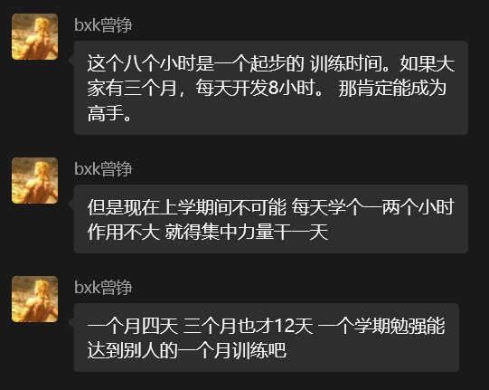
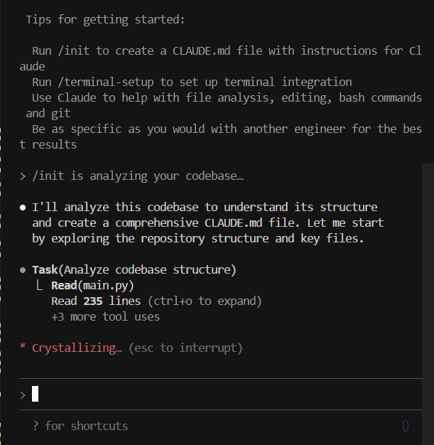
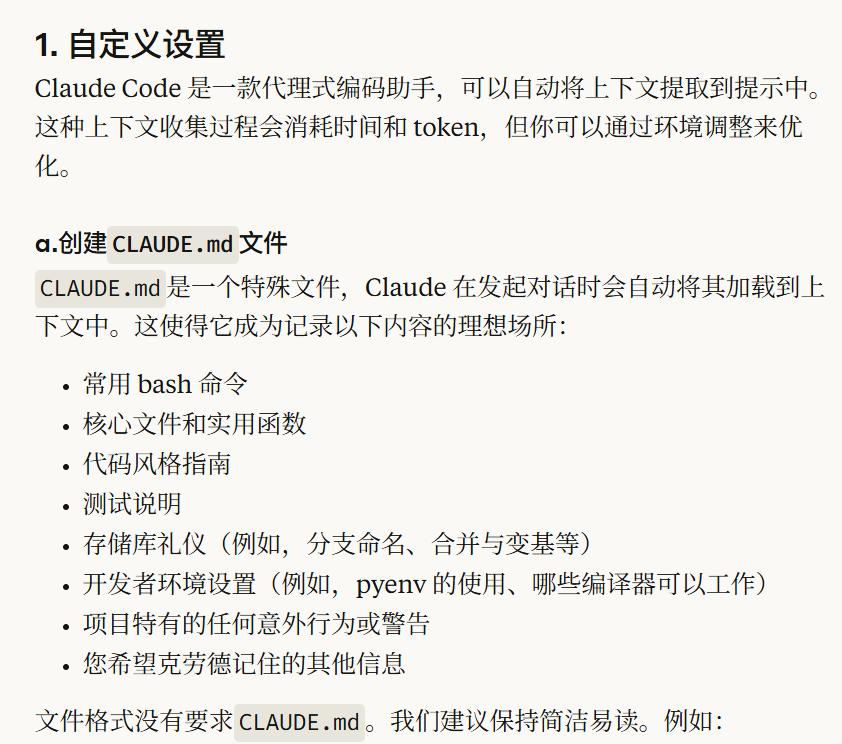
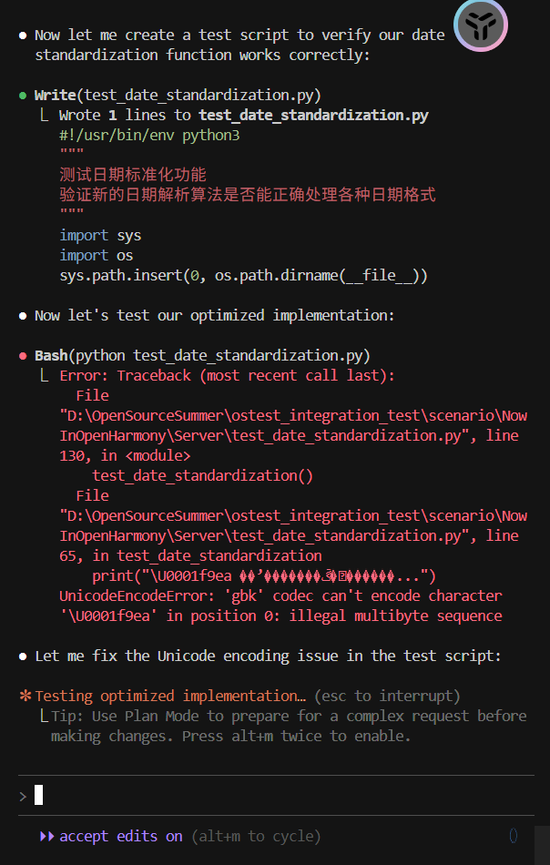
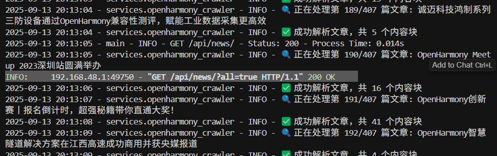
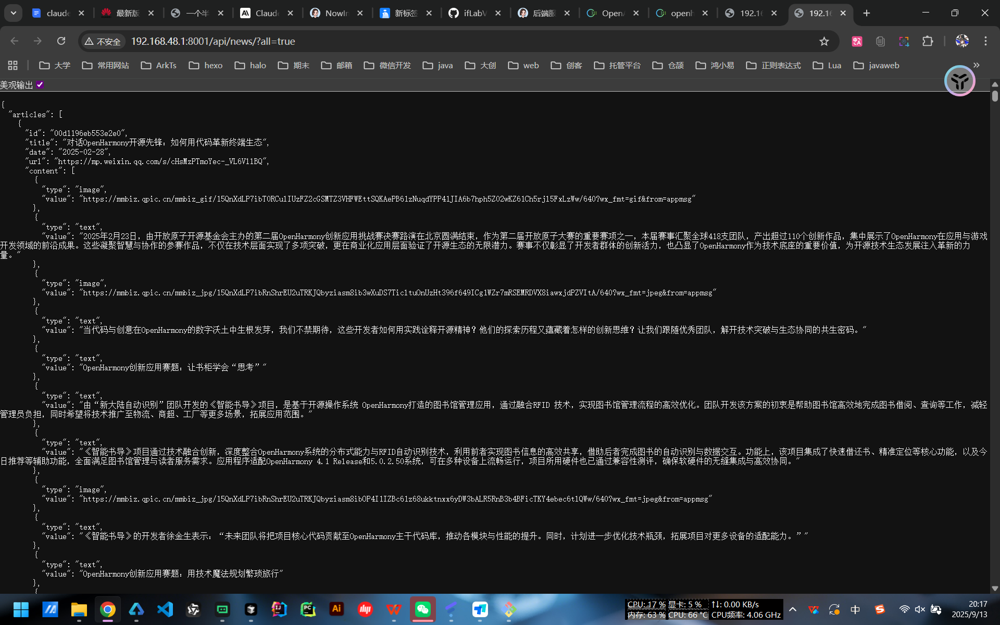
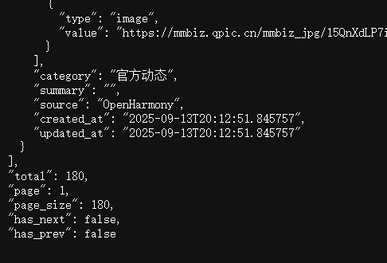

## 前言

这一切的起源都要说回到佳澎这一年的AIcoding让曾老师突发奇想的开展了一个长时间集中开发的训练营的想法，于是就有了一个18人的小群与长达8小时的报名制（没错就是自己给自己上压力的模式）训练营。



## claudCode

cc这一神器也是久仰大名，此前一直都是在使用cursor提供的Claude，非常的方便，所以也就没有搞。这一次刚好是接着训练营的机会向佳澎请教一下cc和ccr。


ClaudeCode并不是一个IDE也不是一个模型，而是一个用于接入各个厂商的API和Token的工具。他可以借助github cli的能力去读取上下文信息，同时执行命令。就像是cursor和trea的侧边栏一样的东西，只不过是手动配置模型接口的而已。

cc的安装与基础使用时相当简单的，只需要nmp进行安装就可以所以我们必须提前下载并配置好[Node.js](https://nodejs.org/zh-cn)。

```bash
# 安装 Claude Code
npm install -g @anthropic-ai/claude-code

# 导航到您的项目
cd your-awesome-project

# 开始使用 Claude 编程
claude
# 首次使用时会提示您登录
```

随后安装一下github cli。

可以执行以下命令去进行安装也可以直接去github[下载安装程序](https://cli.github.com/)。

```ts
winget install --id GitHub.cli
```

随后配置个环境变量，写入API的基础URL随后再写入Token后就可以开始去进行AI对话了。

## 项目选择

曾老师让一人选择一个项目去进行开发，在获得了这样一个强力的工具之后我第一时间想到的就是用它去继续的完善我们的NowInOpenHarmony项目的后端服务。

我在群里说了这个想法之后我本以为曾老师会劝说我去进行一个新项目的开发，但没想到曾老师是如此的善解人意，直接就是一个电话过来去了解我的这个项目的现状，并指导我要去进行一个完整的软件开发流程。要先去进行需求分析。


于是我决定去认真的做一下项目的需求分析以及模块的优化方案设计。首先是让cc去进行一下Claude.md的创建，这也是极大提高cc的构建速度的小技巧，前两天刷视频也刷到了，嘲讽那些网上教用cc的但实际上连Claude.md都没有创建的半吊子教程，笑死。也是没想到就赶上了社团的正版教程。





上面这张图截取自cc的官方[最佳实践](https://www.anthropic.com/engineering/claude-code-best-practices)的文章。

## NowInOpenHarmony的cc尝试

### 需求文档

#### 1. 项目背景与目标

##### 1.1 项目背景

随着OpenHarmony生态的快速发展，开发者、企业及相关从业者对OpenHarmony官方资讯、技术文章等信息的获取需求日益增长。目前，OpenHarmony相关信息分散在官方网站、技术博客等多个平台，用户需要切换不同平台才能获取全面信息，存在信息获取效率低、聚合性差的问题。为解决这一痛点，计划开发NowInOpenHarmony后端服务，实现多源OpenHarmony信息的采集、整合与统一输出，为客户端应用提供稳定、高效的数据源支持。

##### 1.2 项目目标

- 构建多源数据采集体系，覆盖OpenHarmony官方网站新闻动态、技术博客文章及移动端Banner图片等信息来源。
- 打造高性能、非阻塞的后端服务，支持高并发请求，确保服务启动后快速响应，数据更新过程不影响用户使用。
- 设计智能缓存管理机制，实现数据预热、定时更新与无缝切换，提升数据访问效率，降低数据库压力。
- 提供标准化、易扩展的RESTful API接口，满足客户端多样化的数据查询需求，同时具备良好的可维护性与可扩展性。
- 实现服务容器化部署，支持开发与生产环境的快速切换，保障服务稳定运行与便捷运维。

#### 2. 范围界定

##### 2.1 功能范围

- **数据采集**：支持OpenHarmony官方网站新闻、技术博客文章、移动端Banner图片（传统版与增强版）的采集，包含数据去重、清洗与结构化处理。
- **服务核心**：提供API接口服务、缓存管理、定时任务调度、服务状态监控等核心功能。
- **部署运维**：支持Docker容器化部署，提供环境配置、日志管理、健康检查等运维相关能力。

##### 2.2 排除范围

- 不涉及前端应用开发，仅提供后端数据接口服务。
- 暂不支持OpenHarmony非官方来源（如第三方社区、个人博客）的信息采集。
- 不包含用户认证与权限管理功能，API接口暂对所有调用方开放（后续可根据需求扩展）。
- 数据存储暂不支持分布式数据库，生产环境默认使用PostgreSQL单机部署。

#### 3. 功能需求

##### 3.1 数据采集模块需求

| 需求ID | 需求描述 | 优先级 | 验收标准 |
| ---- | ---- | ---- | ---- |
| DC-001 | 采集OpenHarmony官方网站新闻与动态信息，包含标题、发布时间、正文、来源链接等字段 | 高 | 1. 每日可成功采集官方网站新增新闻，采集成功率≥98%；<br>2. 采集数据字段完整，无缺失关键信息；<br>3. 自动过滤重复新闻，重复数据识别准确率≥99% |
| DC-002 | 采集OpenHarmony技术博客文章，包含标题、作者、发布日期、正文内容、标签等字段 | 高 | 1. 技术博客新增文章采集延迟≤30分钟；<br>2. 支持文章标签的提取与存储；<br>3. 采集数据可正常解析为结构化格式，无乱码或格式错误 |
| DC-003 | 采集移动端Banner图片，提供传统版（Requests+BeautifulSoup）与增强版（Selenium）两种采集方案 | 中 | 1. 传统版爬虫支持静态Banner图片URL获取，成功率≥95%；<br>2. 增强版爬虫可获取动态加载的Banner图片，成功率≥90%；<br>3. 增强版采集失败时自动切换为传统版，保障Banner数据可用性 |
| DC-004 | 支持多线程并发采集，配置失败重试机制 | 高 | 1. 可同时启动至少2个线程执行不同数据源的采集任务；<br>2. 采集请求失败后自动重试，重试次数可配置（默认3次）；<br>3. 线程执行过程中无数据竞争或死锁问题 |
| DC-005 | 实现数据清洗功能，处理无效字符、格式统一化等问题 | 中 | 1. 清洗后的数据无特殊无效字符（如乱码、空字符串）；<br>2. 日期格式统一为“YYYY-MM-DD HH:MM:SS”，时间 zone 为 UTC；<br>3. 正文内容去除多余空格、换行符，格式整洁 |

##### 3.2 缓存机制需求

| 需求ID | 需求描述 | 优先级 | 验收标准 |
| ---- | ---- | ---- | ---- |
| CM-001 | 服务启动时自动执行缓存预热，后台线程完成初始数据爬取与缓存加载 | 高 | 1. 服务启动后≤30秒可响应API请求（使用默认缓存或正在预热的提示）；<br>2. 初始缓存加载完成时间≤10分钟（基于现有数据源规模）；<br>3. 预热过程不阻塞主服务线程，API接口可正常返回状态信息 |
| CM-002 | 实现精细缓存状态管理，仅在数据写入数据库时设为“准备中”，其余时间保持“就绪”状态 | 高 | 1. 缓存状态包含“preparing”“ready”“error”三种，状态切换准确；<br>2. 数据写入数据库阶段状态为“preparing”，持续时间≤5秒（单批次数据）；<br>3. 缓存更新过程中，API接口返回旧数据，无服务不可用情况 |
| CM-003 | 支持定时缓存更新，默认每30分钟执行一次数据更新，每天凌晨2点执行完整爬取 | 高 | 1. 定时任务执行时间偏差≤1分钟；<br>2. 定时更新过程遵循缓存状态管理规则，不阻塞API请求；<br>3. 完整爬取任务可覆盖所有数据源，执行完成后缓存数据全面更新 |
| CM-004 | 提供手动缓存刷新与清空接口，支持指定数据源的缓存操作 | 中 | 1. 调用缓存刷新接口后，≤1分钟内启动对应数据源的爬取与缓存更新；<br>2. 调用Banner缓存清空接口后，缓存数据立即清除，下次请求触发重新采集；<br>3. 接口支持参数指定数据源（如“news”“blog”“banner”），操作精准性≥99% |
| CM-005 | 保障缓存线程安全，使用可重入锁避免多线程操作导致的数据不一致 | 高 | 1. 多线程同时请求缓存更新或读取时，无数据错乱（如部分字段缺失、重复数据）；<br>2. 高并发场景（≥100次/秒请求）下，缓存操作无死锁或性能急剧下降问题；<br>3. 缓存数据更新完成后，所有后续请求可获取最新数据，无缓存不一致窗口 |

##### 3.3 API接口模块需求

| 需求ID | 需求描述 | 优先级 | 验收标准 |
| ---- | ---- | ---- | ---- |
| API-001 | 新闻列表接口（GET /api/news/），支持分页、分类、搜索参数 | 高 | 1. 支持参数：page（默认1）、page_size（默认10，最大50）、category（可选，如“official”“blog”）、keyword（搜索标题/正文）；<br>2. 分页返回数据准确，无重复或遗漏，响应时间≤300ms；<br>3. 搜索功能支持模糊匹配，关键词命中准确率≥95% |
| API-002 | 新闻详情接口（GET /api/news/{article_id}），返回单篇新闻完整信息 | 高 | 1. 根据article_id准确查询对应新闻，查询成功率≥99%；<br>2. 返回字段包含标题、发布时间、来源、正文、标签（如有）、链接等；<br>3. 响应时间≤200ms，无无效数据或格式错误 |
| API-003 | 轮播图接口（GET /api/banner/mobile 与 /api/banner/mobile/enhanced），返回图片URL列表 | 中 | 1. 传统版接口返回静态Banner URL，增强版返回动态加载URL；<br>2. 每次请求返回Banner数量与官方保持一致（通常3-5张）；<br>3. URL有效性≥98%，可正常访问对应图片资源 |
| API-004 | 手动触发爬取接口（POST /api/news/crawl 与 POST /api/banner/crawl），支持指定数据源 | 中 | 1. 支持参数：source（如“openharmony_official”“blog”“banner”）；<br>2. 接口调用后≤10秒内启动对应爬取任务，返回任务启动状态；<br>3. 任务执行状态可通过服务状态接口查询，执行结果准确反馈 |
| API-005 | 服务状态监控接口（GET /api/news/status/info、GET /api/banner/status、GET /health） | 高 | 1. 服务状态接口返回当前状态（preparing/ready/error）、最后更新时间、数据总量等信息；<br>2. 健康检查接口返回HTTP 200状态码与“healthy”标识，响应时间≤100ms；<br>3. 状态信息更新延迟≤1秒，与实际服务状态一致 |

##### 3.4 定时任务模块需求

| 需求ID | 需求描述 | 优先级 | 验收标准 |
| ---- | ---- | ---- | ---- |
| TS-001 | 配置每30分钟执行一次缓存更新任务，更新OpenHarmony新闻与博客数据 | 高 | 1. 任务执行周期偏差≤1分钟，无漏执行情况；<br>2. 每次更新完成后，缓存数据与源平台最新数据一致性≥98%；<br>3. 任务执行过程不影响API接口正常响应 |
| TS-002 | 配置每天凌晨2点执行完整爬取任务，覆盖所有数据源（新闻、博客、Banner） | 高 | 1. 任务在指定时间窗口（凌晨2:00-2:30）内启动，执行完成时间≤30分钟；<br>2. 完整爬取后，数据库与缓存数据全面更新，无历史数据残留；<br>3. 任务执行日志完整记录，包含开始时间、结束时间、采集数量、错误信息（如有） |
| TS-003 | 实现定时任务失败重试机制，支持重试次数与重试间隔配置 | 中 | 1. 任务失败后自动重试，重试次数默认3次，间隔默认5分钟；<br>2. 重试仍失败时，记录错误日志并发送告警（如日志标记关键错误级别）；<br>3. 失败任务不影响其他定时任务正常执行 |
| TS-004 | 支持定时任务开关配置，可通过环境变量或配置文件启用/禁用 | 低 | 1. 通过“ENABLE_SCHEDULER”环境变量控制任务开关，配置生效时间≤1分钟；<br>2. 禁用任务后，无定时触发的爬取或更新操作；<br>3. 开关状态可通过服务状态接口查询，与实际配置一致 |

##### 3.5 数据存储模块需求

| 需求ID | 需求描述 | 优先级 | 验收标准 |
| ---- | ---- | ---- | ---- |
| DS-001 | 支持SQLite（开发环境）与PostgreSQL（生产环境）两种数据库，实现数据结构化存储 | 高 | 1. 开发环境使用SQLite，数据存储正常，支持本地调试；<br>2. 生产环境切换为PostgreSQL后，所有功能正常运行，无兼容性问题；<br>3. 数据库表结构设计合理，包含新闻表、博客表、Banner表等，字段定义完整 |
| DS-002 | 实现数据库索引优化，提升查询性能 | 中 | 1. 对常用查询字段（如article_id、发布时间、来源）建立索引；<br>2. 新闻列表分页查询（含条件筛选）响应时间≤200ms；<br>3. 单表数据量达10000条时，查询性能无明显下降（响应时间增幅≤50%） |
| DS-003 | 支持数据分类存储，按信息类型（新闻、博客、Banner）分别存储与管理 | 高 | 1. 不同类型数据存储在对应的数据表中，数据隔离性良好；<br>2. 支持按类型单独查询或批量查询，数据准确性≥99%；<br>3. 数据删除、更新操作可按类型执行，无跨类型影响 |
| DS-004 | 实现数据库连接池管理，避免连接泄露与过度创建 | 中 | 1. 数据库连接池最大连接数可配置（默认10），支持动态调整；<br>2. 高并发场景下，无连接超时或连接耗尽问题；<br>3. 服务停止时，连接池正常关闭所有连接，无资源泄露 |

#### 4. 非功能需求

##### 4.1 性能需求

- **响应时间**：API接口平均响应时间≤300ms，95%请求响应时间≤500ms；服务启动后≤30秒可正常提供API服务。
- **并发能力**：支持≥100次/秒的并发请求，请求成功率≥99.9%，无请求丢失或超时。
- **数据更新效率**：单数据源采集时间≤5分钟（基于现有OpenHarmony信息更新频率），多数据源并发采集总耗时≤10分钟。
- **缓存效率**：缓存命中率≥90%，缓存更新切换时间≤1秒，无缓存穿透、击穿问题。

##### 4.2 可靠性需求

- **服务可用性**：服务正常运行时间≥99.5%（不含计划维护时间），单次故障恢复时间≤5分钟。
- **数据可靠性**：数据采集成功率≥98%，数据存储无丢失、损坏，支持数据备份（可选，基于数据库自身备份能力）。
- **容错能力**：爬虫任务失败时自动重试，重试失败后记录日志并降级（如使用旧缓存数据）；API接口异常时返回标准化错误信息（HTTP状态码+错误描述）。
- **日志完整性**：关键操作（如爬取任务启动/完成、缓存更新、API请求异常）均记录日志，日志包含时间戳、操作类型、结果、错误信息（如有），日志保留时间≥7天。
1
##### 4.3 可扩展性需求

- **数据源扩展**：新增数据源时，需支持在不修改核心代码的前提下，通过新增爬虫类、配置数据源参数实现集成，扩展周期≤2个工作日。
- **接口扩展**：新增API接口时，支持基于现有路由框架快速注册，接口文档自动生成，扩展后不影响原有接口功能。
- **部署扩展**：支持通过增加容器实例实现服务水平扩展，扩展后可分担并发请求压力，无服务冲突。

##### 4.4 安全性需求

- **接口安全**：API接口支持基础的请求频率限制（可选，如单IP每分钟≤60次请求），防止恶意请求攻击。
- **数据安全**：采集的数据仅用于OpenHarmony资讯聚合，不存储敏感信息；数据库访问需通过配置文件或环境变量管理连接信息，避免硬编码。
- **容器安全**：Docker镜像基于官方基础镜像构建，减少冗余依赖；容器运行时使用非root用户，限制权限范围。

##### 4.5 可维护性需求

- **代码规范**：代码遵循PEP 8规范，关键函数、类添加文档注释，注释覆盖率≥80%。
- **配置管理**：服务参数（如端口、数据库地址、爬取间隔）通过环境变量或配置文件管理，支持动态调整（部分参数需重启服务）。
- **监控能力**：提供健康检查接口与服务状态接口，支持第三方监控工具（如Prometheus，可选）接入，便于运维人员实时掌握服务运行状态。
- **文档完整性**：提供完整的开发文档（含项目结构、接口说明、扩展指南）与运维文档（含部署步骤、配置说明、故障排查）。

#### 5. 技术需求

##### 5.1 开发环境需求

- **编程语言**：Python 3.8及以上版本，需兼容Python 3.8-3.11版本。
- **依赖管理**：使用pip管理Python依赖，依赖列表维护在requirements.txt文件中，确保依赖版本兼容性。
- **开发工具**：支持PyCharm、VS Code等主流Python开发工具，代码版本控制使用Git。

##### 5.2 技术栈选型需求

- **Web框架**：采用FastAPI，需支持异步请求处理、自动API文档生成（Swagger UI）。
- **数据库**：开发环境使用SQLite，生产环境使用PostgreSQL 12及以上版本，ORM框架使用SQLAlchemy。
- **爬虫工具**：基础爬虫使用Requests+BeautifulSoup，动态内容爬虫使用Selenium WebDriver（需支持Chrome/Firefox浏览器驱动）。
- **任务调度**：使用APScheduler实现定时任务，支持Cron表达式配置执行时间。
- **缓存管理**：基于内存实现缓存存储，使用threading.Lock保证线程安全。
- **部署工具**：使用Docker进行容器化打包，Docker Compose实现多容器编排，Web服务器使用Uvicorn。

##### 5.3 环境配置需求

- **开发环境**：支持Windows 10/11、macOS 12+、Linux（Ubuntu 20.04+）操作系统，需安装Python、pip、SQLite及相关依赖。
- **生产环境**：支持Linux（Ubuntu 20.04+、CentOS 8+）操作系统，需安装Docker、Docker Compose

### 后端服务更新方案

#### 核心待更新需求

1. **OpenHarmony官网资讯文章爬虫的逻辑优化**
    在最早开发OpenHarmony官网的资讯板块的专用爬虫时并没有注意到目标资源接口的URL这种有可以调整获取条数的参数，导致编写了许多冗余的代码。其中包含了大量模拟用户点击文章卡片的代码，通过逐个点击卡片，捕获资源接口的返回值来进行数据的获取，这就导致了很多重复内容的获取。为了去重和进行有效性验证每次都会消耗大量时间，极大的拖慢了服务数据更新的速度。

    所以我们需要将当前的OpenHarmony官网的资讯板块的专用爬虫进行优化。直接通过设置URL的参数来去获取足够的数据，像是针对于OpenHarmony的官网的博文板块一样。
2. 文章资源排序器日期格式优化
    这个问题主要是发生在爬取到的数据中会包含少数日期格式不规范的情况，绝大多数的日期格式是`2025.9.13`但有少数的日期格式会是`2025-9-13`，这会导致在排序时出现错误，所以我们需要修正一下我们的正则表达式来让它能匹配更多的日期格式，随后还需要将能正确匹配的日期全都去转化成统一的格式，来让整体的显示效果更加整齐与美观。

    

    可以看到，当前的数据都是爬取后直接进行传输而没有去进行任何加工。

#### 爬虫问题更新技术方案

针对OpenHarmony官网资讯文章爬虫的逻辑优化，我们需要重新设计数据采集策略，利用更高效的API接口来替代原有的逐个点击卡片获取数据的方式。

通过分析发现，OpenHarmony官网提供了更高效的批量查询接口：

```bash
https://www.openharmony.cn/backend/knowledge/secondaryPage/queryBatch?type=3&pageNum=1&pageSize=300
```

该接口支持以下参数配置：

- `type`: 数据类型标识（3表示资讯类）
- `pageNum`: 页码
- `pageSize`: 每页数据条数（最大300）

优化方案具体实施步骤如下：

1. **接口调用优化**
   - 替换原有模拟点击的Selenium方式，改用直接调用queryBatch接口
   - 通过调整pageSize参数一次性获取300条数据，满足当前数据量需求

2. **数据处理优化**
   - 移除原有的去重逻辑，因为批量接口返回的数据天然无重复
   - 简化数据清洗流程，直接从接口响应中提取所需字段
   - 优化数据结构转换，减少中间处理环节

3. **性能提升效果**
   - 数据获取速度预计提升5倍以上（从原来的逐个点击到批量获取）
   - 减少网络请求次数，从原来的每篇文章一次请求优化为每300篇文章一次请求
   - 降低服务器压力，减少被目标网站限制的风险

4. **代码实现要点**
   - 使用requests库替代Selenium进行接口调用
   - 添加异常处理机制，确保在网络不稳定时能够重试
   - 保留原有数据结构，确保与数据库存储模块兼容

通过以上优化，不仅能够大幅提升数据采集效率，还能降低系统资源消耗，为后续的功能扩展提供更好的基础。

#### 日期问题更新技术方案

针对日期格式不统一的问题，我们需要实现一个更加灵活和健壮的日期解析与标准化方案：

1. **改进日期匹配正则表达式**
   - 使用更通用的日期匹配模式，能够识别多种日期分隔符（如点号`.`、短横线`-`、斜杠`/`等）
   - 支持不同位数的日期数字（如`9`和`09`）
   - 新的正则表达式示例：

     ```python
     # 匹配多种日期格式
     date_pattern = r'(\d{4})[.\-\/](\d{1,2})[.\-\/](\d{1,2})'
     ```

2. **实现日期标准化函数**
   - 创建统一的日期格式化函数，将所有匹配到的日期转换为标准格式`YYYY-MM-DD`
   - 处理月份和日期的前导零问题，确保格式统一
   - 添加异常处理机制，对于无法解析的日期格式进行日志记录

3. **代码实现示例**

   ```python
   import re
   from datetime import datetime
   
   def standardize_date(date_str):
       # 匹配多种日期格式
       pattern = r'(\d{4})[.\-\/](\d{1,2})[.\-\/](\d{1,2})'
       match = re.search(pattern, date_str)
       
       if match:
           year, month, day = match.groups()
           # 格式化为统一的YYYY-MM-DD格式
           return f"{year}-{int(month):02d}-{int(day):02d}"
       else:
           # 无法匹配时返回原始字符串并记录日志
           print(f"无法解析日期格式: {date_str}")
           return date_str
   
   # 使用示例
   dates = ["2025.9.13", "2025-9-13", "2025/09/13"]
   standardized_dates = [standardize_date(date) for date in dates]
   # 结果: ["2025-09-13", "2025-09-13", "2025-09-13"]
   ```

4. **集成到数据处理流程**
   - 在数据爬取后、存储前增加日期标准化处理步骤
   - 对所有涉及日期的字段进行统一处理
   - 确保API返回的日期格式一致，提升前端展示效果

通过以上方案，我们可以有效解决日期格式不统一的问题，提升数据质量和用户体验。

### 通过cc进行后端服务更新



通过将上面的方案都复制给cc去让他进行修改。

在修改完代码本身后可以看到它也编写了功能的测试用例，这一点是我此前一直没有太重视但是今天曾老师在电话里特别跟我强调的，所以这次我选择将测试用例相关代码也放在这里来读一下。

```py
#!/usr/bin/env python3
# -*- coding: utf-8 -*-
"""
测试日期标准化功能
验证新的日期解析算法是否能正确处理各种日期格式
"""

import sys
import os
sys.path.insert(0, os.path.dirname(__file__))

from services.openharmony_crawler import OpenHarmonyCrawler
import logging

# 设置日志
logging.basicConfig(level=logging.INFO, format='%(levelname)s - %(message)s')

def test_date_standardization():
    """测试各种日期格式的标准化能力"""
    crawler = OpenHarmonyCrawler()

    # 测试用例：各种日期格式
    test_cases = [
        # 标准格式
        ("2024-08-31", "2024-08-31"),
        ("2024.08.31", "2024-08-31"),
        ("2024/08/31", "2024-08-31"),

        # 单数字月日
        ("2024-8-31", "2024-08-31"),
        ("2024.8.31", "2024-08-31"),
        ("2024/8/31", "2024-08-31"),
        ("2024-08-3", "2024-08-03"),
        ("2024.8.3", "2024-08-03"),

        # 中文格式
        ("2024年08月31日", "2024-08-31"),
        ("2024年8月31日", "2024-08-31"),
        ("2024年08月31", "2024-08-31"),

        # 只有年月
        ("2024年08月", "2024-08-01"),
        ("2024-08", "2024-08-01"),
        ("2024.08", "2024-08-01"),

        # 复杂格式
        ("2023-12-25 10:30:00", "2023-12-25"),
        ("2023.12.25 10:30:00", "2023-12-25"),

        # 反转格式
        ("31-08-2024", None),  # 应该无法解析，保持原样
        ("31.08.2024", None),  # 应该无法解析，保持原样

        # 无效格式
        ("08-31", None),  # 应该无法解析，保持原样
        ("08.31", None),  # 应该无法解析，保持原样
        ("08/31", None),  # 应该无法解析，保持原样
        ("无效日期", None),  # 应该无法解析，保持原样
        ("", ""),  # 空字符串
        (None, ""),  # None值

        # 边界情况
        ("2024年13月45日", "2024-13-45"),  # 无效日期数值，但格式正确
    ]

    print("开始测试日期标准化功能...")
    print("=" * 80)

    success_count = 0
    total_count = len(test_cases)

    for i, (input_date, expected_output) in enumerate(test_cases, 1):
        try:
            result = crawler._standardize_date(input_date)

            # 判断测试结果
            if expected_output is None:
                # 期望保持原样
                if result == input_date:
                    success_count += 1
                    status = "成功"
                    expected = f"保持原样: '{input_date}'"
                else:
                    status = "失败"
                    expected = f"期望保持原样，但得到: '{result}'"
            else:
                # 期望特定输出
                if result == expected_output:
                    success_count += 1
                    status = "成功"
                    expected = expected_output
                else:
                    status = "失败"
                    expected = f"期望: '{expected_output}', 实际: '{result}'"

            print(f"{i:2d}. {status} | 输入: '{input_date}' -> 输出: '{result}'")
            if status == "失败":
                print(f"    {expected}")

        except Exception as e:
            print(f"{i:2d}. 异常 | 输入: '{input_date}' -> 错误: {e}")

    print("=" * 80)
    success_rate = (success_count / total_count * 100) if total_count > 0 else 0
    print(f"测试结果: {success_count}/{total_count} 成功 ({success_rate:.1f}%)")

    # 测试实际文章数据
    print("\n测试实际文章数据标准化...")
    test_articles = [
        {"title": "测试文章1", "date": "2024.8.15", "url": "http://test1.com"},
        {"title": "测试文章2", "date": "2024-12-25", "url": "http://test2.com"},
        {"title": "测试文章3", "date": "2024年9月1日", "url": "http://test3.com"},
        {"title": "测试文章4", "date": "2024/6/30", "url": "http://test4.com"},
    ]

    print("标准化前:")
    for article in test_articles:
        print(f"  {article['date']} - {article['title']}")

    # 使用_format_article进行完整测试
    formatted_articles = []
    for article in test_articles:
        formatted_article = crawler._format_article(article)
        formatted_articles.append(formatted_article)

    print("标准化后:")
    for article in formatted_articles:
        print(f"  {article['date']} - {article['title']}")

if __name__ == "__main__":
    test_date_standardization()
```

可以看到，其实整体的逻辑是很简单的，就是写了很多可能出现的日期格式，并且通过正则进行一下判断，同时对判断的结果进行一下可视化的数据统计。

```bash
开始测试日期标准化功能...
================================================================================
 1. 成功 | 输入: '2024-08-31' -> 输出: '2024-08-31'
 2. 成功 | 输入: '2024.08.31' -> 输出: '2024-08-31'
 3. 成功 | 输入: '2024/08/31' -> 输出: '2024-08-31'
 4. 成功 | 输入: '2024-8-31' -> 输出: '2024-08-31'
 5. 成功 | 输入: '2024.8.31' -> 输出: '2024-08-31'
 6. 成功 | 输入: '2024/8/31' -> 输出: '2024-08-31'
 7. 成功 | 输入: '2024-08-3' -> 输出: '2024-08-03'
 8. 成功 | 输入: '2024.8.3' -> 输出: '2024-08-03'
 9. 成功 | 输入: '2024年08月31日' -> 输出: '2024-08-31'
10. 成功 | 输入: '2024年8月31日' -> 输出: '2024-08-31'
11. 成功 | 输入: '2024年08月31' -> 输出: '2024-08-31'
12. 成功 | 输入: '2024年08月' -> 输出: '2024-08-01'
13. 成功 | 输入: '2024-08' -> 输出: '2024-08-01'
14. 成功 | 输入: '2024.08' -> 输出: '2024-08-01'
15. 成功 | 输入: '2023-12-25 10:30:00' -> 输出: '2023-12-25'
16. 成功 | 输入: '2023.12.25 10:30:00' -> 输出: '2023-12-25'
⚠️ 无法解析日期格式: 31-08-2024，保持原样
17. 成功 | 输入: '31-08-2024' -> 输出: '31-08-2024'
⚠️ 无法解析日期格式: 31.08.2024，保持原样
18. 成功 | 输入: '31.08.2024' -> 输出: '31.08.2024'
⚠️ 无法解析日期格式: 08-31，保持原样
19. 成功 | 输入: '08-31' -> 输出: '08-31'
⚠️ 无法解析日期格式: 08.31，保持原样
20. 成功 | 输入: '08.31' -> 输出: '08.31'
⚠️ 无法解析日期格式: 08/31，保持原样
21. 成功 | 输入: '08/31' -> 输出: '08/31'
20. 成功 | 输入: '08.31' -> 输出: '08.31'
⚠️ 无法解析日期格式: 08/31，保持原样
21. 成功 | 输入: '08/31' -> 输出: '08/31'
⚠️ 无法解析日期格式: 无效日期，保持原样
22. 成功 | 输入: '无效日期' -> 输出: '无效日期'
23. 成功 | 输入: '' -> 输出: ''
24. 成功 | 输入: 'None' -> 输出: ''
25. 成功 | 输入: '2024年13月45日' -> 输出: '2024-13-45'
================================================================================
测试结果: 25/25 成功 (100.0%)

测试实际文章数据标准化...
标准化前:
  2024.8.15 - 测试文章1
  2024-12-25 - 测试文章2
  2024年9月1日 - 测试文章3
  2024/6/30 - 测试文章4
标准化后:
  2024-08-15 - 测试文章1
  2024-12-25 - 测试文章2
  2024-09-01 - 测试文章3
  2024-06-30 - 测试文章4
```

结果也是非常的成功。接下来我们再去看一下爬虫功能的测试地址并进行测试。

```py
#!/usr/bin/env python3
# -*- coding: utf-8 -*-
"""
测试优化后的OpenHarmony爬虫
验证API接口优化和日期标准化的效果
"""

import sys
import os
import time
sys.path.insert(0, os.path.dirname(__file__))

from services.openharmony_crawler import OpenHarmonyCrawler
import logging

# 设置日志
logging.basicConfig(level=logging.INFO, format='%(asctime)s - %(levelname)s - %(message)s')

def test_crawler_optimization():
    """测试爬虫优化效果"""
    print("开始测试优化后的OpenHarmony爬虫...")
    print("=" * 80)

    crawler = OpenHarmonyCrawler()

    try:
        # 测试获取文章信息（只获取第一页，避免测试时间过长）
        print("测试获取文章信息API...")
        start_time = time.time()

        # 模拟获取少量数据进行测试
        all_infos = {}
        page_num = 1
        page_size = 10  # 测试用小数据量

        api_url = f"{crawler.base_url}/backend/knowledge/secondaryPage/queryBatch?type=3&pageNum={page_num}&pageSize={page_size}"
        print(f"请求API: {api_url}")

        resp = crawler.session.get(api_url, timeout=15)
        resp.raise_for_status()
        response_data = resp.json()
        data = response_data.get("data", [])

        end_time = time.time()
        print(f"API请求耗时: {end_time - start_time:.2f}秒")
        print(f"获取到{len(data)}条数据")

        if data:
            # 测试日期标准化
            print("\n测试日期标准化功能...")
            for i, item in enumerate(data[:5]):  # 只测试前5条
                original_date = item.get("startTime", "")
                title = item.get("title", "")
                standardized_date = crawler._standardize_date(original_date)
                print(f"{i+1}. 原标题: '{original_date}' -> 标准化: '{standardized_date}' | {title}")

            # 测试文章格式化
            print("\n测试文章格式化功能...")
            test_article = {
                "title": data[0].get("title", ""),
                "date": data[0].get("startTime", ""),
                "url": data[0].get("url", ""),
                "content": [{"type": "text", "value": "测试内容"}]
            }

            formatted_article = crawler._format_article(test_article)
            print("格式化后的文章:")
            for key, value in formatted_article.items():
                if key != "content":  # 内容太长，不打印
                    print(f"  {key}: {value}")

        print("\n" + "=" * 80)
        print("测试完成！优化后的爬虫功能正常")

    except Exception as e:
        print(f"测试失败: {e}")
        import traceback
        traceback.print_exc()

def test_performance_comparison():
    """性能对比测试"""
    print("\n性能对比测试...")
    print("=" * 80)

    crawler = OpenHarmonyCrawler()

    # 测试不同页面大小的性能
    page_sizes = [20, 50, 100]
    results = []

    for page_size in page_sizes:
        print(f"\n测试页面大小: {page_size}")
        start_time = time.time()

        try:
            api_url = f"{crawler.base_url}/backend/knowledge/secondaryPage/queryBatch?type=3&pageNum=1&pageSize={page_size}"
            resp = crawler.session.get(api_url, timeout=15)
            resp.raise_for_status()
            data = resp.json().get("data", [])

            end_time = time.time()
            duration = end_time - start_time

            results.append({
                "page_size": page_size,
                "duration": duration,
                "data_count": len(data),
                "efficiency": len(data) / duration if duration > 0 else 0
            })

            print(f"  请求耗时: {duration:.3f}秒")
            print(f"  获取数据: {len(data)}条")
            print(f"  效率: {len(data)/duration:.1f}条/秒")

        except Exception as e:
            print(f"  请求失败: {e}")

    if results:
        print("\n性能对比结果:")
        print(f"{'页面大小':<10} {'耗时(秒)':<10} {'数据量':<10} {'效率(条/秒)':<15}")
        print("-" * 50)
        for result in results:
            print(f"{result['page_size']:<10} {result['duration']:<10.3f} {result['data_count']:<10} {result['efficiency']:<15.1f}")

if __name__ == "__main__":
    test_crawler_optimization()
    test_performance_comparison()
```

通过测试少量数据进行性能指标的监控，可视化的打印出不同页面大小的请求耗时、数据量和效率等数据来验证优化的效果。

```bash
开始测试优化后的OpenHarmony爬虫...
================================================================================
测试获取文章信息API...
请求API: https://www.openharmony.cn/backend/knowledge/secondaryPage/queryBatch?type=3&pageNum=1&pageSize=10
API请求耗时: 0.39秒
获取到10条数据

测试日期标准化功能...
1. 原标题: '2025.02.28' -> 标准化: '2025-02-28' | 对话OpenHarmony开源先锋：如何用代码革新终端生态
2. 原标题: '2025.02.24' -> 标准化: '2025-02-24' | 12强终极PK！第二届OpenHarmony创新应用挑战赛引爆开源热潮 
3. 原标题: '2025.02.20' -> 标准化: '2025-02-20' | 第二届OpenHarmony创新应用挑战赛决赛路演队伍揭晓
4. 原标题: '2025.02.11' -> 标准化: '2025-02-11' | OpenHarmony社区2024年度运营报告发布，致谢每一位生态共建 者！
5. 原标题: '2025.01.29' -> 标准化: '2025-01-29' | 开源鸿蒙社区恭祝全体开发者2025新年快乐，新春大吉！      

测试文章格式化功能...
格式化后的文章:
  id: 00d1196eb553e2e0
  title: 对话OpenHarmony开源先锋：如何用代码革新终端生态
  date: 2025-02-28
  url: https://mp.weixin.qq.com/s/cHsMzPTmoYec-_VL6VllBQ
  category: 官方动态
  summary:
  source: OpenHarmony
  created_at: 2025-09-13T20:02:20.226415
  updated_at: 2025-09-13T20:02:20.226415

================================================================================
测试完成！优化后的爬虫功能正常

性能对比测试...
================================================================================

测试页面大小: 20
  请求耗时: 0.233秒
  获取数据: 20条
  效率: 85.8条/秒

测试页面大小: 50
  请求耗时: 0.190秒
  获取数据: 50条
  效率: 263.4条/秒

测试页面大小: 100
  请求耗时: 0.215秒
  获取数据: 100条
  效率: 466.1条/秒

性能对比结果:
页面大小       耗时(秒)      数据量        效率(条/秒)
--------------------------------------------------
20         0.233      20         85.8
50         0.190      50         263.4
100        0.215      100        466.1
```

可以看到，通过优化后的爬虫，我们可以在较短的时间内获取到更多的数据，并且效率也得到了提升。

### 全链路测试

直接运行run.py文件去启动服务并进行测试。


```bash
http://192.168.48.1:8001/api/banner/mobile
```

```json
{
  "success": true,
  "images": [
    "https://images.openharmony.cn/%E9%A6%96%E9%A1%B5/banner/20240411/4.1releas%E6%89%8B%E6%9C%BA.jpg",
    "https://images.openharmony.cn/%E6%B4%BB%E5%8A%A8/%E5%88%9B%E6%96%B0%E8%B5%9B2023/20230831/%E4%B8%89%E6%96%B9%E5%BA%93%E7%A7%BB%E5%8A%A8%E7%AB%AF.png",
    "https://images.openharmony.cn/%E6%B4%BB%E5%8A%A8/%E5%A4%A7%E8%B5%9B20250812/%E7%AC%AC%E4%B8%89%E5%B1%8A%E5%BC%80%E6%BA%90%E9%B8%BF%E8%92%99%E5%88%9B%E6%96%B0%E5%BA%94%E7%94%A8%E6%8C%91%E6%88%98%E8%B5%9B-%20750%20350.jpg",
    "https://images.openharmony.cn/%E6%B4%BB%E5%8A%A8/%E6%8A%80%E6%9C%AF%E5%A4%A7%E4%BC%9A20250826/phone-750x350.jpg"
  ],
  "total": 4,
  "message": "获取手机版Banner图片成功（缓存），共 4 张",
  "timestamp": "2025-09-13T20:12:06.418254"
}
```

轮播图接口是正常的，接下来再去测试一下资讯接口。



穿插在更新过程中去进行请求，通过浏览器去进行数据的查看。





随着时间推移每次刷新文章数量都在稳步增长。同时日期也是一致的格式。
