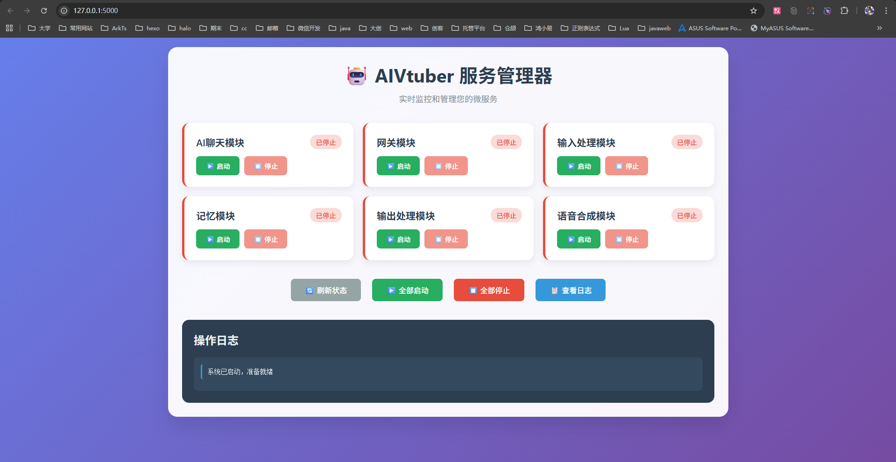
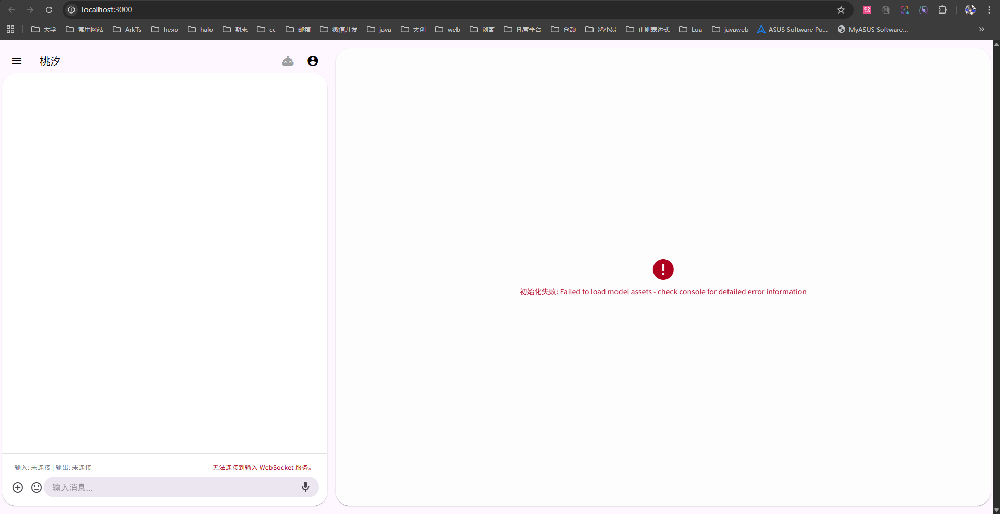
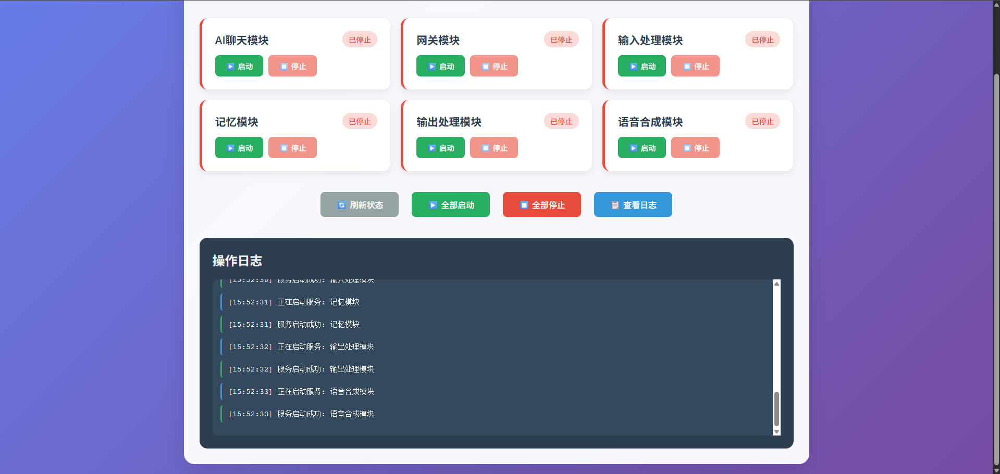
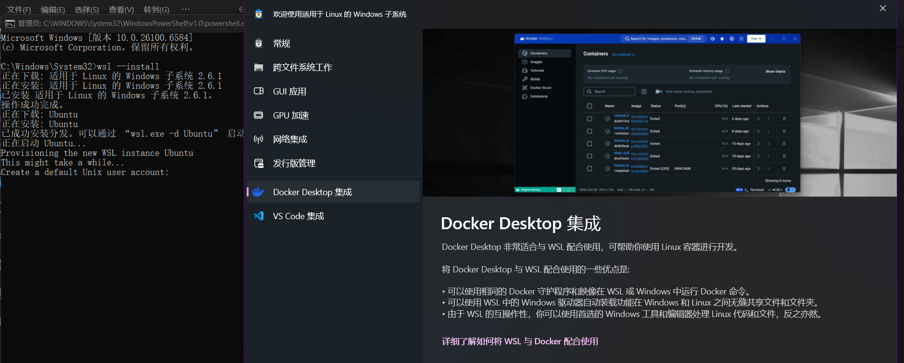

## 前言

高强度使用CC一周多之后我已经是彻彻底底的离不开CC了，前两天CC临时崩掉我确实是感到了一丝慌张了，很难回到过去的感觉了。在曾老师的极力帮助下CC的链接也是很快的恢复了。

接下来我们就需要去做一些实践了！

## Free-Agent-Vtuber

这将成为一个我的第一个CC比赛项目，我将用CC来去进行这个项目的前端开发。

<div style="
  background: linear-gradient(135deg, #1a1a1a 0%, #2d2d2d 100%);
  border: 1px solid #404040;
  border-radius: 12px;
  padding: 20px;
  margin: 16px 0;
  box-shadow: 0 4px 12px rgba(0, 0, 0, 0.3);
  transition: all 0.3s ease;
  font-family: -apple-system, BlinkMacSystemFont, 'Segoe UI', 'Roboto', sans-serif;
  max-width: 500px;
">
<div style="display: flex; align-items: center; margin-bottom: 12px;">
<svg style="width: 20px; height: 20px; margin-right: 8px; fill: #ffffff;" viewBox="0 0 16 16">
<path d="M8 0C3.58 0 0 3.58 0 8c0 3.54 2.29 6.53 5.47 7.59.4.07.55-.17.55-.38 0-.19-.01-.82-.01-1.49-2.01.37-2.53-.49-2.69-.94-.09-.23-.48-.94-.82-1.13-.28-.15-.68-.52-.01-.53.63-.01 1.08.58 1.23.82.72 1.21 1.87.87 2.33.66.07-.52.28-.87.51-1.07-1.78-.2-3.64-.89-3.64-3.95 0-.87.31-1.59.82-2.15-.08-.2-.36-1.02.08-2.12 0 0 .67-.21 2.2.82.64-.18 1.32-.27 2-.27.68 0 1.36.09 2 .27 1.53-1.04 2.2-.82 2.2-.82.44 1.1.16 1.92.08 2.12.51.56.82 1.27.82 2.15 0 3.07-1.87 3.75-3.65 3.95.29.25.54.73.54 1.48 0 1.07-.01 1.93-.01 2.2 0 .21.15.46.55.38A8.013 8.013 0 0016 8c0-4.42-3.58-8-8-8z"/>
</svg>
<div style="margin: 0; color: #ffffff; font-size: 18px; font-weight: 600;">
<a href="https://github.com/pixelsama/Free-Agent-Vtuber" style="color: #ffffff; text-decoration: none;">
pixelsama/Free-Agent-Vtuber
</a>
</div>
</div>
<p style="color: #d4d4d4; margin: 0 0 16px 0; font-size: 14px; line-height: 1.5;">
一个基于事件驱动架构、可灵活扩展的 AI 虚拟主播项目。构建一个能够持续进化的强大 AI Agent 框架。
</p>
<div style="display: flex; align-items: center; gap: 16px; margin-bottom: 12px;">
<span style="display: flex; align-items: center; color: #d4d4d4; font-size: 12px;">
<span style="
width: 12px;
height: 12px;
background: #3178c6;
border-radius: 50%;
margin-right: 6px;
"></span>
TypeScript
</span>
<span style="display: flex; align-items: center; color: #d4d4d4; font-size: 12px;">
<svg style="width: 12px; height: 12px; margin-right: 4px; fill: #d4d4d4;" viewBox="0 0 16 16">
<path d="M8 .25a.75.75 0 01.673.418l1.882 3.815 4.21.612a.75.75 0 01.416 1.279l-3.046 2.97.719 4.192a.75.75 0 01-1.088.791L8 12.347l-3.766 1.98a.75.75 0 01-1.088-.79l.72-4.194L.818 6.374a.75.75 0 01.416-1.28l4.21-.611L7.327.668A.75.75 0 018 .25z"/>
</svg>
2
</span>
<span style="display: flex; align-items: center; color: #d4d4d4; font-size: 12px;">
<svg style="width: 12px; height: 12px; margin-right: 4px; fill: #d4d4d4;" viewBox="0 0 16 16">
<path d="M5 3.25a.75.75 0 11-1.5 0 .75.75 0 011.5 0zm0 2.122a2.25 2.25 0 10-1.5 0v.878A2.25 2.25 0 005.75 8.5h1.5v2.128a2.251 2.251 0 101.5 0V8.5h1.5a2.25 2.25 0 002.25-2.25v-.878a2.25 2.25 0 10-1.5 0v.878a.75.75 0 01-.75.75h-4.5A.75.75 0 015 6.25v-.878z"/>
</svg>
3
</span>
<span style="color: #22c55e; font-size: 12px; background: rgba(34, 197, 94, 0.1); padding: 2px 6px; border-radius: 4px;">
MIT
</span>
</div>
<div style="margin-top: 12px;">
<a href="https://github.com/pixelsama/Free-Agent-Vtuber"
style="
color: #ffffff;
text-decoration: none;
font-size: 12px;
border: 1px solid #404040;
padding: 6px 12px;
border-radius: 6px;
background: rgba(255, 255, 255, 0.05);
transition: all 0.2s ease;
display: inline-block;
"
onmouseover="this.style.background='rgba(255, 255, 255, 0.1)'"
onmouseout="this.style.background='rgba(255, 255, 255, 0.05)'">
查看仓库
</a>
</div>
</div>

### 现有项目分析与运行测试

#### 直接运行

首先我们让CC帮我们运行一下当前的项目并且去告诉我预览的本地端口地址。

```bash
> 运行这个项目的前后端让并告诉我如何预览这个项目

● 我来帮你启动这个项目的前后端，并告诉你如何预览。

● 首先检查项目的环境配置文件：

● Bash(ls -la | grep -E "\.(env|example)" && pwd)
  ⎿  -rw-r--r-- 1 ASUS 197609 3415 Sep 27 14:26 .env.example
     /d/AITrainingCamp/Free-Agent-Vtuber

● Read(.env.example)
  ⎿  Read 105 lines (ctrl+o to expand)

● 现在检查是否已经有 .env 文件，如果没有就创建一个：

● Bash(if [ ! -f .env ]; then cp .env.example .env; echo "已创建 .env 文件"; else echo ".env
      文件已存在"; fi)
  ⎿  已创建 .env 文件

● 现在启动后端服务（使用 Docker Compose）：

● Bash(docker compose up -d)
  ⎿  Error: /usr/bin/bash: line 1: docker: command not found

● 看起来 Docker 没有安装或不在 PATH 中。让我们检查一下并尝试其他方法：

● Bash(which docker || echo "Docker 未找到，检查 Docker Desktop 是否安装并运行")
  ⎿ Docker 未找到，检查 Docker Desktop 是否安装并运行
    which: no docker in (/c/Users/ASUS/bin:/mingw64/bin:/usr/local/bin:/usr/bin:/bin:/mingw64/bi     
    n:/usr/bin:/c/Users/ASUS/bin:/c/Program Files (x86)/Cangjie/runtime/lib/windows_x86_64_llvm:     
    … +24 lines (ctrl+o to expand)


● Docker 没有安装。让我们改用本地 Python
  环境来运行服务。首先检查项目结构，看看是否有本地运行的方式：

● Bash(ls -la && echo "--- 检查 manager 目录 ---" && ls -la manager/)
  ⎿  total 104
     drwxr-xr-x 1 ASUS 197609    0 Sep 27 15:29 .
     drwxr-xr-x 1 ASUS 197609    0 Sep 27 14:25 ..
     … +34 lines (ctrl+o to expand)

● 看起来有 manager 服务可以本地运行。让我们检查一下前端和 manager 的依赖：

● Bash(python --version && echo "--- 检查 manager 依赖 ---" && cat manager/requirements.txt)
  ⎿  Python 3.12.7
     --- 检查 manager 依赖 ---
     Flask==2.3.3
     … +2 lines (ctrl+o to expand)

● Bash(cd front_end && echo "--- 检查前端 package.json ---" && ls -la package.json && head -20
      package.json)
  ⎿  --- 检查前端 package.json ---
     -rw-r--r-- 1 ASUS 197609 565 Sep 27 14:26 package.json
     {
     … +19 lines (ctrl+o to expand)

● 既然没有 Docker，我们先启动 manager 服务作为后端管理界面，然后启动前端。让我先安装 manager
  的依赖：

● Bash(pip install -r manager/requirements.txt)
  ⎿  Defaulting to user installation because normal site-packages is not writeable
     Collecting Flask==2.3.3 (from -r manager/requirements.txt (line 1))
       Downloading flask-2.3.3-py3-none-any.whl.metadata (3.6 kB)
     … +25 lines (ctrl+o to expand)

● 现在启动 manager 服务：

● Bash(cd manager && python app.py)
  ⎿  Running in the background (down arrow to manage)

● BashOutput(Reading shell output)
  ⎿   * Serving Flask app 'app'
      * Debug mode: on
  ⎿ WARNING: This is a development server. Do not use it in a production deployment. Use a produ     
    ction WSGI server instead.
     * Running on all addresses (0.0.0.0)
    … +6 lines (ctrl+o to expand)


● 很好！Manager 服务已经在后台运行在 http://127.0.0.1:5000。现在启动前端开发服务器：

● Bash(cd front_end && npm install) timeout: 3m 0s
  ⎿  added 198 packages, and audited 199 packages in 24s

     52 packages are looking for funding
     … +17 lines (ctrl+o to expand)

● Bash(cd front_end && npm run dev)
  ⎿  Running in the background (down arrow to manage)

● BashOutput(Reading shell output)
  ⎿  > figma-chat-ui@0.0.0 dev
     > vite
     … +5 lines (ctrl+o to expand)

● 太好了！前端开发服务器已经启动在 http://localhost:3000。现在验证服务运行状态：

● Bash(echo "=== 检查服务端口状态 ===" && netstat -an | grep -E ":5000|:3000" || echo "无法使用      
      netstat，改用其他方法检查" && echo "--- Manager 服务状态 ---")
  ⎿  === 检查服务端口状态 ===
       TCP    0.0.0.0:5000           0.0.0.0:0              LISTENING
       TCP    [::1]:3000             [::]:0                 LISTENING
     --- Manager 服务状态 ---

● BashOutput(Reading shell output)
  ⎿   * Serving Flask app 'app'
      * Debug mode: on
  ⎿ WARNING: This is a development server. Do not use it in a production deployment. Use a produ     
    ction WSGI server instead.
     * Running on all addresses (0.0.0.0)
    … +6 lines (ctrl+o to expand)


● BashOutput(Reading shell output)
  ⎿  > figma-chat-ui@0.0.0 dev
     > vite
     … +5 lines (ctrl+o to expand)

● 🎉 项目启动成功！

  当前运行状态：

  后端服务

  - Manager 管理界面: http://127.0.0.1:5000 ✅
    - 用于管理和监控各个微服务
    - Flask 开发服务器运行中

  前端界面

  - Vue.js 前端: http://localhost:3000 ✅
    - Vite 开发服务器运行中
    - 支持热重载

  如何预览项目

  1. 管理界面 (推荐先访问)

  访问：http://127.0.0.1:5000

  这个界面可以让你：
  - 查看系统状态
  - 管理各个微服务
  - 监控运行日志
  - 控制服务启停

  2. 前端用户界面

  访问：http://localhost:3000

  这是主要的用户交互界面，基于 Vue.js 3 + Vuetify 3 构建。

  当前限制说明

  由于没有 Docker 环境，目前只启动了：
  - Manager 管理服务（本地 Flask）
  - 前端开发服务器（Vite）

  完整的 AI 功能需要以下微服务：
  - Redis 消息总线
  - PostgreSQL 数据库（长期记忆）
  - 各个 Python 微服务（ASR、TTS、Chat-AI 等）

  如果要体验完整功能，建议：
  1. 安装 Docker Desktop
  2. 运行 docker compose up -d 启动完整的微服务架构

  现在你可以在浏览器中访问这两个地址来预览项目界面了！
```







额，不知道为什么点全部启动之后就失败了。等佳澎回来我再问他一下吧。

#### docker的安装



安装docker进行一下尝试。

额依旧是无法连接。

因为种种原因这个项目先暂时搁置了
