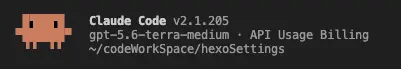
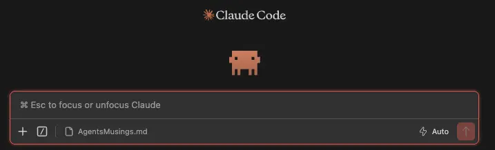
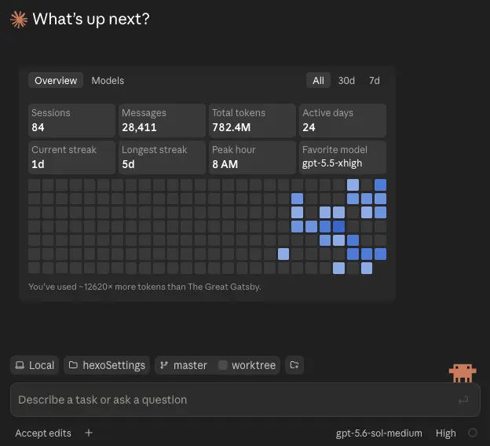

## 前言

当前的 AI 编程市场，早就不只是比谁家的大模型参数更大、跑分更高了。模型能力正在快速趋同，真正把它们送进开发者工作流、让它们能读代码、跑命令、改文件、调用工具、拆解任务甚至协作交付的，是一层层不断进化的 Agent。过去我们更多是在和聊天框里的 LLM 对话：提出问题、复制代码、自己验证；而现在，越来越多的时间是在把一个相对完整的任务交给 Agent，再和它一起审方案、看过程、做决策、兜底结果。

最近在工作中，我也高频切换使用了多款编程 Agent：有时让它们在成熟项目中阅读上下文、定位 Bug、补齐需求；有时让它们执行测试、修改文件、整理文档和提交记录；也有时会把同一个任务交给不同产品，观察它们面对复杂工程时到底会怎样思考、怎样调用工具，又会在哪些地方卡住。Claude Code、Codex、Kimi Code，以及其他正在快速迭代的 Agent 产品，底层可能接入的是相近甚至相同梯队的模型，但实际用起来却有着非常明显的差异。

这种差异并不只来自模型本身。终端、IDE 插件、桌面端等不同形态会改变 Agent 能看到什么、能操作什么，也会影响开发者介入的时机；上下文管理、规则与 Skills、子 Agent 调度、任务规划、权限设计和工具生态，则共同决定了一个 Agent 是只能“帮你写几段代码”，还是能真正进入工程开发的流程。很多时候，同一个模型换一个 Agent 外壳，最终的操作路径、代码质量、排障效率甚至使用体验都会完全不同。

所以这篇文章想结合我最近的实际使用体验，聊聊这些 Agent 各自的特点、适用场景和一些踩坑感受。这里不会刻意给谁排一个绝对高下，毕竟每个人的技术栈、项目规模、预算和工作习惯都不同；更重要的是理解它们的能力边界，选择适合当前任务的工具，并在关键决策上始终保留人的判断。毕竟 Agent 再强，也只是把模型能力延伸到工程世界的工具——用得顺手、用得明白，才能真正帮我们把事情做好。

## Agents

### Claude Code

哇哦，上来就是CC。我相信CC算是无数人真正开始Vibe Coding的启蒙导师了。当然也有可能是cursor或是Codex。但时至今日神话模型已经将AI的能力边界推到了一个难以想象的高度时，CC依旧是是绝大多数模型最好的Agent选择。

无论是对于第三方API接入的友好程度，还是其上下文管理的精妙，还是其Harness工程的强力，CC都无疑是这个时代最好的Agent选择之一。

当然，这里说的“最好”并不是指它每一项都绝对碾压其他产品。它贵、对网络和账号环境有要求、终端交互对新手也不算最友好；而且 CC 做得再好，底层模型的能力、当前项目的上下文质量以及使用者给出的任务边界，依旧会直接决定最终效果。但从“把一个强模型真正放进工程环境里干活”这件事来看，CC 的完成度确实很高。它不是简单套一个聊天框，让模型生成代码后由你自己复制粘贴；而是让模型能够读仓库、查规则、操作文件、执行命令、运行测试，再把整个过程放在一个可观察、可中断、可回滚的工作流里。

尤其是随着各家模型的编码能力越来越接近以后，Agent 外壳和 Harness 的差距反而越来越明显。同一个模型接入不同的 Agent，可能会得到完全不同的结果：有的只能根据当前打开的文件补几行代码，有的能快速建立整个项目的认识；有的遇到报错会漫无目的地一路追到底，有的则能在证据足够时及时指出责任边界。CC 的价值就在于，它给模型提供的不只是工具数量，而是一套比较成熟的“做工程”的方法。

#### cc终端

终端属于是我最喜欢的一种Agent形态了，虽然其相比于插件和APP来说其便捷性和易用性稍差，但它也是最接近真实开发工作流、能力最完整的一种形态。文件系统、Git、构建命令、日志、测试、包管理器，本来就都在终端里；CC 不需要在聊天框、编辑器和命令行之间来回切换，可以直接顺着开发者原本的操作路径阅读、修改和验证。对于一个需要跨多个目录、涉及配置、脚本、构建和测试的需求来说，这种连贯性比“在当前文件旁边帮你补全代码”重要得多。

我平时更习惯把终端 CC 当成一个可以一起工作的同事，而不是一个一键交付机。小需求、明确的 Bug 修复，我会让它直接检查、修改并运行验证；但只要涉及公共组件、关键数据流、SDK 调用或比较大的改动范围，我一般都会先让它只读代码、梳理调用链、给出方案。重点看它第一轮输出的判断：它认为问题在哪里、准备改哪些文件、哪些结论已经有证据、哪些地方仍然需要确认。方向正确后再让它继续实现，往往比代码写完以后再花时间审一大坨 Diff 要轻松得多。

这也算是我使用 Agent 后慢慢养成的习惯。很多人把“模型能不能一次性把需求做完”当成唯一标准，但真实项目里，最宝贵的能力有时不是一口气改完代码，而是能不能快速缩小问题范围、明确不确定性，并在自己不该继续深入的地方停下来。比如接口请求成功但数据为空、编译后的 SDK 内部逻辑不可见、后端返回与文档不一致时，CC 可以帮助我打印日志、验证客户端链路、整理可能性；但如果证据已经指向 SDK 或服务端，就应该及时带着结论找对应同事确认，而不是让它在黑盒里连续挖几十轮。终端的好处是整个调查过程都在眼前，觉得方向不对时一个 `Ctrl + C` 就可以打断、重新收束任务。

CC 终端真正让我离不开的，还是它对上下文工程的支持。项目里的 `CLAUDE.md`、目录级规则、Skills、MCP、Hooks、长期记忆文档等，都可以把那些不会写在单次提示词里的隐性约束提前交给 Agent：项目怎么启动、哪些命令可以执行、代码应该遵循什么风格、哪些目录不能乱动、一次任务完成后还需要补哪些文档和验证。模型并不会天然理解一个项目的历史包袱与团队默契，规则越明确，后续需要反复纠偏的次数就越少。

上下文压缩同样是一个很容易被忽视的问题。对话很长时，模型终究会面临信息取舍；如果关键的架构约束、接口约定和当前任务结论只存在于前面几十轮聊天记录里，压缩之后就可能被稀释甚至丢失。所以我现在会尽量把长期有效的规则沉淀到项目文档，把一次任务的重要结论写进交接或操作记录，让 Agent 每次都能从稳定的外部上下文重新建立认识，而不是指望它永远“记得”此前的所有讨论。

另外，CC 的 Skills 和 SubAgent 也很有意思。Skills 可以把重复但有明确流程的事情固化下来，例如代码审查、文档同步、构建验证、特定平台的开发规范；SubAgent 则适合把真正能够并行的工作拆开：一个去搜相关实现和历史提交，一个去梳理模块调用关系，一个去审查测试与潜在影响，主 Agent 再负责汇总结论和实际修改。但这两个能力都不是开得越多越好。如果几个子 Agent 都在反复读取同一批文件、修改同一个模块，最后通常只会换来更高的上下文消耗和更难整合的结果。先想清楚任务是否真的可拆，再决定要不要并行，才是更稳妥的用法。

总的来说，CC 终端的学习成本主要不在命令本身，而在于你需要学会怎样和一个能操作工程的 Agent 协作：什么时候给它足够的自主权，什么时候要求它先出方案，什么时候直接打断，以及怎样把自己的项目经验转化成它可以读取的规则。掌握这些以后，终端看起来那一点“不够图形化”的门槛，反而会变成可控性与效率。

#### VScc插件

VSCode 插件则是我在日常开发中用得最多的入口之一。终端版适合从全局推进任务，但人绝大多数时候仍然在 IDE 里看代码、跳转定义、分析报错和审查修改。插件把 CC 拉进编辑器之后，最大的提升不是“多了一个聊天框”，而是人和 Agent 可以对着同一份代码协作：当前打开的文件、选中的代码片段、报错位置、修改后的 Diff，都能更自然地成为对话上下文的一部分。

处理比较局部的需求时，这种体验尤其舒服。比如一个 UI 表现不对、某个方法的状态更新有问题、需要理解一段历史代码，选中对应区域直接让它解释、分析或者给出重构建议，会比在终端里反复描述文件路径、类名和行号顺畅很多。它修改完后，我也可以马上利用 IDE 的 Diff 和跳转能力逐处检查，而不是只看 Agent 最后一段“已完成”的总结。这种高频、短链路的人机协作，插件确实更贴近日常编码节奏。

但插件也并不能取代终端，而且坦白说，我个人并不算特别喜欢长期把它作为主力入口。首先是更新速度的问题。终端版往往更快拿到新的能力、交互和模型支持；插件端则还要跟着 VSCode 的扩展机制和版本节奏走，有时新功能已经发布了，插件还得等一段时间才能稳定落地。对于正处于高频迭代期的 Agent 产品来说，这种“总是慢半拍”的感觉其实挺明显的。

其次就是稳定性和性能。项目稍微大一点、对话稍微长一点，或者同时开着一堆语言服务、调试工具和其他扩展时，插件就比较容易卡顿、响应迟缓，偶尔还会冒出一些莫名其妙的 Bug。IDE 本身已经在做索引、补全、调试、跑终端和加载各种插件，再叠加一个持续维护上下文、展示执行过程、频繁调用工具的 Agent，内存占用自然也不算低。有时候只是想让它看一眼代码，却要先等界面转半天，最后反而不如直接开终端输入一句指令来得干脆。

另外，IDE 给人的视野天然偏向当前文件和当前问题，很容易让人误以为需求只影响眼前的几十行代码；而真正的工程任务可能还涉及配置文件、构建脚本、数据模型、测试、Git 状态甚至外部工具。遇到需要大范围检索、执行完整构建、处理多个模块的任务时，我还是更愿意让终端版 CC 把过程完整展开。对我来说，VSCC 和终端不是谁替代谁的关系：插件更适合贴着局部代码快速协作，终端更适合站在仓库和工具链的全局视角推进工作；只是从更新速度、稳定性、性能和可控性来看，我最终还是更偏向终端。

#### DeskTop

（谁不想看一只可爱的小Claude敲键盘呢）

Desktop 形态的定位又和前两者有些不同。终端与插件天然围绕代码文件展开，而 Desktop 更像一个适合整理任务、承接多模态信息和做前置讨论的工作台。需求文档、截图、设计稿、报错日志、会议结论这些内容，很多时候并不适合一股脑塞进终端；先在 Desktop 里把背景、问题和目标讲清楚，让模型帮忙梳理疑点、比较方案、形成一个可执行的任务描述，再进入代码仓库实施，整体会更顺一些。

我更愿意把它用于“编码之前”和“编码之后”的环节。编码之前，拿它分析需求、读文档、结合图片讨论实现方式；编码之后，拿它复盘一次修改、检查方案是否遗漏边界条件、整理汇报或交接内容。它降低了非终端用户接触 Agent 的门槛，也让 Agent 不必永远只盯着代码。但如果要对成熟项目做深度修改、连续运行命令并追踪完整验证链路，终端形态依旧是我最信任的主场。

所以无论是 cc 终端、VSCC 插件还是 Desktop，我觉得它们的本质都不是三套互相竞争的产品，而是 CC 适应不同工作节奏的三个入口。真正值得关注的并不是“哪个入口最酷”，而是我们有没有把合适的任务交给合适的入口：需要全局探索和工程执行时就走终端，需要围绕代码细节频繁协作时就留在 IDE，需要先消化资料、讨论和收束需求时就用 Desktop。把它们组合起来，CC 才能从一个厉害的代码生成器，慢慢变成真正参与工程工作的 Agent。

#### CC 的上下文管理

CC 的上下文管理，是我高强度使用下来最有感、却也最容易被一句“上下文很大”说得过于简单的地方。很多产品会把上下文窗口写成一个很醒目的数字，仿佛数字越大，Agent 就越不可能忘事。但真正把任务交给它连续做几个小时，甚至跨过一轮又一轮搜索、改文件、跑测试、看日志以后，体验好不好并不只取决于窗口有多大，而取决于它怎样组织信息、什么时候压缩、压缩后还剩下什么，以及模型忘了细节时能不能回到工程现场重新找回来。

我自己遇到过一个非常典型的场景：一段 CC 任务的**累计消耗**已经到 80 万 Token 左右，界面里能看到的**当前活跃上下文**则在 35 万左右，而且并没有出现那种一眼就能感觉到的“前面突然被折叠了、开始失忆了”的断层。它仍然记得前面已经排除的方向、知道哪些文件是刚修改过的、也能顺着之前的验证继续推进。尤其与 Codex、Zcode 等工具交替使用时，这种“同一场对话居然还能继续干活”的耐用感会很明显：有些 Agent 对话一长，最先消失的往往不是字面信息，而是任务的脉络——它会重新提一个已经否掉的方案、又一次全仓搜索已经定位过的符号，或者把注意力从全局问题缩回当前打开的一个文件。

不过，这个观察本身并不能直接推出“CC 把 80 万 Token 全都原样塞进了 35 万窗口里”，更不能据此倒推出某个固定的内部压缩阈值。累计 Token、当前上下文、缓存命中和子 Agent 的独立消耗，本来就是四笔不同的账。先把这件事拆开，后面讨论 CC 为什么耐用才不会变成玄学。

🧠 把“80 万 Token”看成一次长任务的四本账

① 累计消耗

≈ 80 万

整段任务历次请求与输出累加后的工作量。它说明“这次活干得很久”，不等于某一轮请求里装了 80 万 Token。

② 活跃上下文

≈ 35 万

某一时刻真正参与下一轮推理的工作记忆：规则、历史、文件片段、工具结果和为输出预留的位置都要挤在这里。

③ 缓存复用

省重算，不扩容

稳定的前缀上下文可以避免每轮从头计算，改善速度与计费体感；但缓存不是把有限窗口变成无限记忆。

④ 外部工作记忆

文件系统 / Git

代码、Diff、测试和任务记录不必永久背在对话里；需要时重新读取，才是长任务不靠“死记硬背”的关键。

<strong>结论：</strong>“80 万累计消耗、35 万活跃上下文且尚未感知到压缩”是完全可以同时成立的。前者描述的是整段任务累计跑了多少路程，后者描述的是此刻驾驶舱里还放着多少东西；两者不是一根进度条。

##### 不是一个聊天记录：每一轮请求到底装了什么

从模型的角度看，CC 并不是把你在终端里看到的聊天内容原封不动地往后叠。每次准备调用模型时，Harness 都要拼出一份新的“工作包”：系统级指令与安全边界、当前项目读取到的 `CLAUDE.md` 和目录规则、可调用的工具定义、你刚刚提出的目标、此前对话中仍有价值的状态、读到的代码片段、命令返回的输出，以及为模型下一次回答和工具调用留出的空间。这些东西共同占用的，才是活跃上下文。

因此，上下文窗口本质上不是一个无限长的聊天气泡，而更像是一个容量有限、但可以反复整理的工作台。桌上既要放施工图纸，也要放当前正在修改的零件，还得给正在操作的人腾位置；如果把每一次 `rg` 的几百行命中、每一段构建日志、每一个已经失效的猜测全都永久摊在桌面上，再大的工作台也迟早会堆满。真正好的 Harness 不会只追求“塞得更多”，而会尽量让每一个 Token 都有明确用途。

一次 CC 回合的“工作包”大致长这样

<strong>稳定规则</strong> 系统指令、CLAUDE.md

→

<strong>任务状态</strong> 目标、决策、待办

→

<strong>工程证据</strong> 代码、Diff、日志摘要

→

<strong>工具与输出余量</strong> Read / Bash / 下一步推理

这里有两个常被忽略的点：<strong>工具定义本身也要占位置</strong>；而且模型不能把窗口刚好填满，它还需要足够空间生成分析、调用工具和接收下一批结果。所以“窗口标称值”不等于“可以随便放进去的聊天历史长度”。

这也解释了为什么你会觉得 CC 的上下文“没有压缩过”：一方面，当前活跃上下文也许确实还没有接近它在当前模型、当前客户端策略下需要触发大规模压缩的边界；另一方面，即便某些早期工具输出不再逐字保留，只要任务目标、关键判断和可回查的工程证据还在，用户也未必会感到任务被切断。**用户真正感知到的不是“有没有删掉 Token”，而是 Agent 有没有丢掉工作状态。**

##### CC 为什么更像是在维持“工作现场”

我不会把看得到的行为直接说成 CC 未公开的内部实现——外部用户通常无法验证它确切的上下文选择算法、缓存键、摘要 Prompt，以及每个模型版本的触发阈值。但从公开交互和实际任务表现出发，可以比较可靠地把它的耐用性理解为几层机制叠加，而不是某一个神奇开关。

CC 长会话耐用性的五层结构（从最稳定到最容易变化）

1

<strong>规则层：把长期约束放在仓库里，而不是赌模型永远记得。</strong> 项目级和目录级 `CLAUDE.md`、Skills、可复用脚本、Hooks 等，都让“怎么启动、什么不能改、代码应遵循什么规范”成为可重新读取的事实。它们不该依赖几十轮前的一句聊天结论。

2

<strong>状态层：保住“正在做什么、已经决定什么、还差什么”。</strong> 长任务最有价值的不是原始聊天全文，而是任务目标、已排除的路径、修改范围、验证结论和未决风险。一次好的压缩或交接，应该优先保留这些状态，而不是只留下泛泛的“已完成部分工作”。

3

<strong>证据层：让文件、Git 和测试承担可验证的记忆。</strong> 模型无需背下整个仓库。它可以读文件、看 `git diff`、重新运行测试、定位到日志中的报错点。对话里保留“在哪里、为什么、结论是什么”，细节需要时再回到代码确认，比靠回忆可靠得多。

4

<strong>裁剪与压缩层：让低价值内容让出座位。</strong> 重复搜索、冗长 stdout、已经解决的岔路和大量相同格式的输出，信息密度通常很低。无论是工具结果的截断、摘要化，还是接近容量时的会话压缩，目标都应当是释放窗口，而不是把所有历史平均浓缩一遍。

5

<strong>缓存层：把稳定前缀的重复计算变得更便宜、更快。</strong> 系统指令、工具说明、稳定的项目规则和一部分连续历史，天然适合被复用。缓存优化的是重复处理的成本与延迟，不能替代状态管理，也不会让早期错误自动变成正确记忆。

这五层里，最重要的其实是第二层和第三层。很多 Agent 的长上下文问题，不是它完全读不到前面的文字，而是它没有把前面的文字收束成可执行的状态：到底确认了什么？为什么排除了 A？B 已经改到哪一个文件？测试失败是历史遗留，还是本轮引入？如果这些问题没有清晰答案，哪怕还剩很多 Token，模型也只是在一堆资料里翻找；相反，如果状态与证据位置清楚，即使必须压缩，它也能重新站回正确的位置。

##### 自动压缩不是“删记录”，而是一场质量很高的交接

所有有限窗口的模型最终都会遇到信息取舍，区别只是发生得早还是晚、做得粗还是细。把上下文压缩简单理解成“前面的聊天被删掉”并不准确：对工程 Agent 来说，它更应该像一次交接。老的工作台要腾位置，但交接的人至少得写清楚当前目标、已完成修改、验证状态、被否定的方案、关键文件与后续风险；缺少其中任何一项，下一段上下文就容易从“继续做”退化为“重新猜”。

压缩前后，真正该被交接的是什么？

<strong style="color: #fca5a5;">✗ 不够用的摘要</strong> “已检查相关代码并修改问题，测试待继续。” 看似没错，但新上下文根本不知道改了哪里、为什么这么改、哪些测试和风险还没处理。

<strong style="color: #86efac;">✓ 能继续施工的摘要</strong> 目标：修复上传后缩略图不刷新。 结论：接口缓存不是根因，状态更新遗漏了 X。 修改：A、B 两处；验证：单测通过，E2E 因本地服务未启动未跑。 下一步：启动服务后复测 C 场景。

<strong>一个很现实的风险：</strong>摘要特别擅长保留“做了什么”，却容易丢掉“为什么不做另一种方案”。而工程里被否定的路径往往比最终结论更值钱，它能阻止 Agent 压缩后绕回同一个坑。因此关键的反证、边界条件和未验证假设，值得显式写进任务记录或让 Agent 在阶段结束时复述出来。

CC 提供了手动压缩或新开 Session 这类能力时，我反而不把它当作“上下文不够用了”的失败信号。对于已经走完一个阶段、准备换到另一个子问题的任务，主动让它先整理工作状态，通常比等到窗口逼近边界再被动处理更稳。主动压缩的好处是人还在场：你可以检查它有没有漏掉关键前提，有没有把“未验证”写成“已确认”，再决定是否继续。真正危险的是带着已经混乱的上下文一路硬聊，直到模型开始用很自信的口气重复错误判断。

##### 80 万累计、35 万活跃：这个现象更合理的解释

回到我自己的这个例子。如果一段任务累计已经走到 80 万 Token，但 35 万活跃上下文仍然没有明显压缩感，更合理的理解大概是下面这条链路，而不是“CC 永远不压缩”。

从一次长任务看，上下文为什么可以比想象中“耐跑”

<strong>第 1 段：不断产生新工作</strong> 读文件、查调用链、执行命令、修改、测试，每一轮输入输出都会计入累计消耗。

→

<strong>第 2 段：旧信息并非同等保留</strong> 稳定规则可重读，长日志可回查，低价值过程不必每轮原样携带；真正要保的是当前状态和关键证据。

→

<strong>第 3 段：任务脉络仍连续</strong> 只要目标、修改、验证和风险没有掉线，用户就不会把信息整理误判成“模型失忆”。

→

<strong>第 4 段：尚未触发大断层</strong> 可能还没有到当前策略的强制压缩点，也可能已有部分选择性整理；仅凭体感无法判定具体内部动作。

这里还要特别防止一个误区：**缓存命中不等于上下文没有增长，累计消耗很高也不等于上下文必然接近满载。**缓存主要解决重复前缀反复计算的问题；而上下文是否需要整理，取决于下一轮请求实际需要带上的材料。再加上工具调用往往把“原始数据在哪里”与“这轮要看的关键片段”分开，一个长任务完全可能累计跑出很大的总量，但活跃工作台增长得没有那么线性。

对外部用户而言，最诚实的结论只能到这里：我能观察到 CC 在这类长任务里对任务脉络的保持比较好，能确认上下文、缓存、工具和文件系统共同参与了这种体验；但我不能仅根据一次 80 万 Token 的使用记录，宣称自己知道它某个版本下精确的压缩阈值或全部内部策略。把可观察行为、合理推断和厂商未公开细节分开，才不会把一次很好的使用体验写成无法验证的技术传说。

##### 为什么同一梯队的模型，换一个 Agent 体感会差很多

这也是我觉得 CC 的价值不只在模型本身的原因。Codex、Zcode 或其他 Agent 出现“长了以后容易断片”的体验，并不必然说明它们接入的模型更笨；更可能是它们的产品层在做不同取舍：有的会更早压缩历史来降低成本和延迟，有的对工具输出回填得更完整，有的只保留最近对话，有的项目规则注入方式不同，有的把子任务的详细结果直接塞回主会话。任何一个环节的选择，都会改变模型下一轮看到的世界。

| 影响长任务体验的环节 | 如果处理得比较粗糙 | 使用者实际感受到的结果 |
| --- | --- | --- |
| 规则注入 | 项目约束只在开场出现一次，后面没有可靠外部来源 | 对话一长，Agent 开始违反风格、忘记禁区 |
| 工具输出管理 | 大段日志、全仓搜索和重复文件原样回填 | 窗口很快充满噪声，模型注意力被稀释 |
| 压缩摘要 | 只保留“做了什么”，不保留理由、反证与未决项 | 压缩后重复走老路，或者过早宣告完成 |
| 状态与证据绑定 | 结论没有文件、行号、命令或 Diff 可回查 | 一旦细节被压缩，模型无法验证自己的记忆 |
| 子任务汇总 | 把每个子 Agent 的完整过程都回灌主线程 | 并行越多，主会话反而越臃肿、越难收束 |

所以比较不同 Agent 时，我不会只问“它的窗口是 20 万、35 万还是 100 万”，而更愿意让它们做同一个带有真实工程痕迹的长任务：先读仓库，再经过几次错误方向、跑几轮测试、改多个文件，最后问它四件事——**现在的目标是什么、哪些方案已经被否定、工作区实际改了什么、还缺哪一步验证。**能稳定答对这四件事的，才是真的把上下文管理落到了工程工作流里。

##### SubAgent：不是免费扩大上下文，而是把思考过程隔离开

SubAgent 常被理解成“多开几个模型，任务就更快”，但它和上下文管理也有直接关系。主 Agent 如果自己同时去读整个仓库、追 Git 历史、审测试、查第三方文档，再回来写代码，很容易把所有过程性材料堆进同一张工作台。把真正独立的调查拆给子 Agent，可以让它们各自在自己的上下文里完成探索，再由主 Agent 接收结构化的结论、证据位置和待决问题。

正确的子 Agent 汇总：传递结论，不搬运整间档案室

<strong style="color: #fca5a5;">✗ 低质量回传</strong> 把搜索过程、全部命令输出、长篇推理原样贴回主线程。表面信息很多，主 Agent 却要再次阅读、判断和压缩一遍。

→

<strong style="color: #86efac;">✓ 高质量回传</strong> 结论、置信度、证据文件/行号、影响范围、尚未确认的点。主 Agent 需要细节时再定向回查，而不是被过程噪声淹没。

<strong>但它不是免费午餐：</strong>子 Agent 有自己的 Token 消耗和整合成本；如果任务不可并行、大家都在反复读同一批文件、或者要改同一处代码，拆分只会增加消耗和冲突。它优化的是主线程的认知负担，不保证总消耗一定更低。

这也是 CC 的 Harness 很重要的一点：让主 Agent 能把文件系统、Git、命令、子任务结果当作分层的信息来源，而不是只能依赖一条越来越长的聊天记录。模型的推理能力决定它能不能看懂一份交接；Harness 的设计决定有没有一份足够干净、可以继续做事的交接给它看。

##### 真正实用的做法：把上下文当作需要维护的工程资产

我现在在长任务里会主动做一些很朴素的“上下文保洁”，并不是为了省几个 Token，而是为了让每一次压缩、每一次切换 Session、甚至每一次换 Agent 都不至于失控：

1. **一个 Session 尽量只服务一个主目标。** 修 Bug、做重构、研究 SDK、写文章可以有关联，但不要把互不相关的事情交叉塞进同一段对话。任务切换越频繁，状态越难判断优先级。
2. **让关键结论落到可回查的位置。** 长期规则进 `CLAUDE.md` 或目录说明；一次改动的原因进任务记录、提交信息或代码注释；验证结果要带命令和已知限制。不要只留一句“前面说过”。
3. **阶段结束时主动要求一次状态盘点。** 我通常会让它按“目标 / 已确认事实 / 修改文件 / 验证结果 / 未决问题”五项输出，而不是泛泛地问“总结一下”。这五项正好也是下一段上下文最需要的骨架。
4. **把大日志当证据库，不要当聊天内容。** 先让 Agent 定位关键报错、文件和行号；需要时再读局部。连续把整段构建日志、锁文件、压缩后的 JSON 塞进对话，只会把重要信息稀释掉。
5. **一旦发现重复搜索、结论互相矛盾或忘记边界，就先收束。** 这时继续追加提示词往往是在给混乱上下文加更多噪声。更有效的动作是看当前 Diff、重读关键规则、整理待办，必要时在明确交接后新开会话。

我比较常用的阶段性交接模板

<pre style="margin: 12px 0 0; padding: 13px; overflow: auto; border-radius: 8px; background: rgba(4, 10, 24, .68); color: rgba(238, 246, 255, .92); font-size: .84em; line-height: 1.7; white-space: pre-wrap;">目标：
已确认事实：
已否定方案及原因：
已修改文件与修改理由：
已运行验证及结果：
未验证项 / 外部依赖 / 风险：
下一步最小动作：</pre>

它不需要每十分钟写一次；但在完成一个阶段、准备大改、准备压缩或准备交给另一个人/Agent 时，这几行内容的价值通常远高于再保留几千 Token 的过程性聊天。

所以，CC 的上下文管理真正让我觉得厉害的地方，不是它承诺“永远不压缩”，更不是单纯把窗口做得很大，而是它让压缩、缓存、工具调用、项目规则和外部文件尽量组成了一套连续的工作机制：能留在窗口里的继续留，适合沉淀的写进文件，细节需要时回到代码和 Git 查，子任务只把真正值得交接的结果带回来。这样一来，模型即使不可能记住所有原始过程，也更有机会始终知道自己**在做什么、为什么这么做、已经做到哪里、接下来还缺什么**。

对我来说，这种能力直接决定了一个 Agent 是只能做几轮“短跑”，还是能被放心交给复杂工程任务持续推进。模型再强，如果隔一段时间就丢一次工作现场，最后仍然只能反复从头理解；而 CC 至少在我这段累计 80 万 Token、活跃上下文仍在 35 万左右的真实使用里，给出的体验更像是一场没有明显断点的长跑。当然，长跑能不能跑到最后，仍然离不开人去维护规则、阶段和证据——上下文管理从来不是 Agent 单方面的魔法，它是 Harness、模型与使用者共同完成的一次工程协作。

### Codex

#### Codex终端

#### VSCodex插件

#### CodexDeskTop

### Zcode