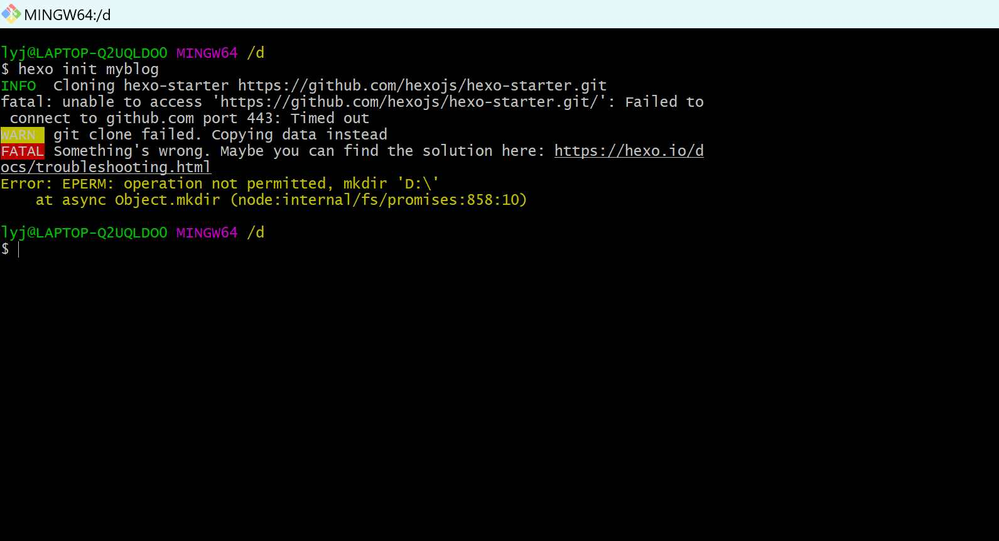
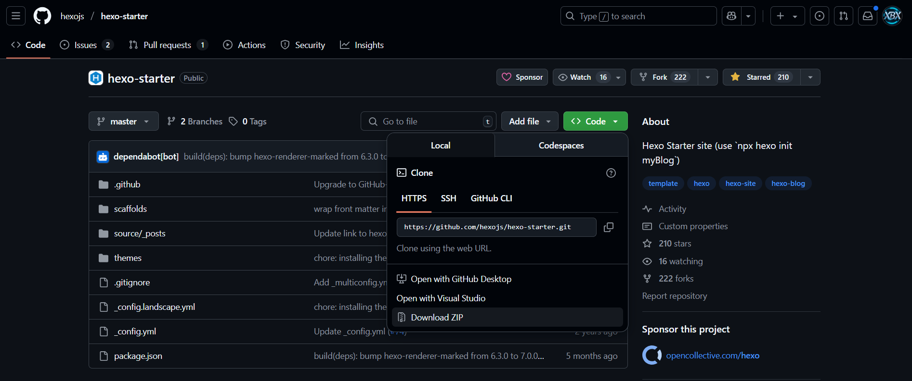
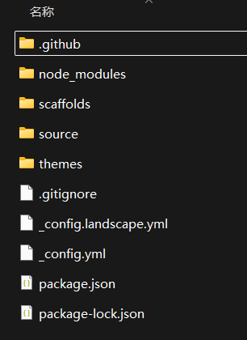
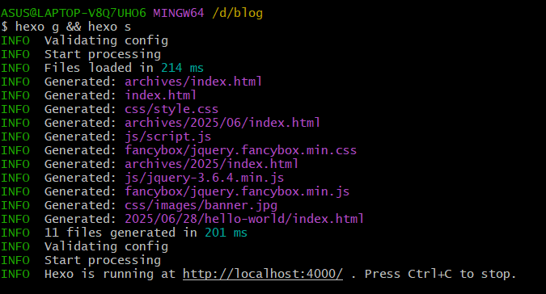
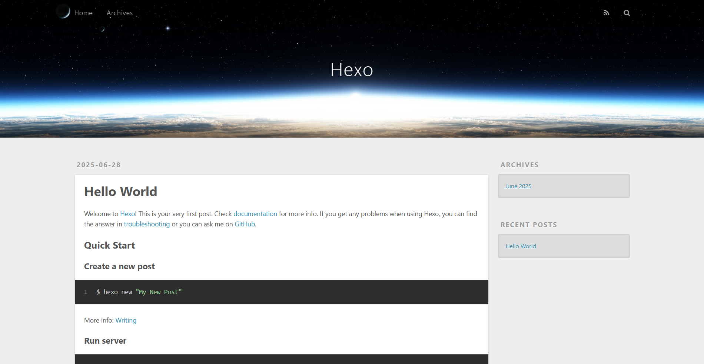

## 前言

欢迎大家参与创客空间2025级新生训练营的博客搭建赛道！在这个赛道中，你将学习如何使用Hexo和自选主题来搭建一个美观且功能齐全的个人博客。本文将提供详细的步骤指导，帮助你从零开始创建自己的博客。


> 想直接看教程的同学可以点[传送门](/2025/06/27/BlogSetup/#%E5%BC%80%E5%A7%8B%E4%BD%A0%E7%9A%84%E5%8D%9A%E5%AE%A2%E4%B9%8B%E6%97%85)进行跳转哦！

## 评分准则

本赛道总分为100分，分值占比如下表所示：

| 🎯 项目名 | 📋 解释 | 📐 细则 |
|---------|--------|---------|
| **完成度 (40分)** | 博客基础搭建与部署完成情况 | • 成功安装Hexo并初始化博客(**20分**)<br>• 成功部署到GitHub Pages并能正常访问(**20分**) |
| **博客DIY创意 (20分)** | 博客个性化定制与美化程度 | • 更换主题并进行基础配置(**10分**)<br>• 个性化定制(头像、导航、色彩等)(**10分**) |
| **博文内容 (20分)** | 博客文章质量与原创性 | • 能够展现出自己掌握了markdown语法(5分)<br>• 文章内容质量、外挂标签的使用等(15分) |
| **积极性活跃度 (20分)** | 参与度与互动表现 | • 按时提交博客链接(5分)<br>• 群内互动活跃度(15分) |

**总计：100分**

## 博客是什么


博客是一个展示你自己的平台，是一个记录你生活的地方，是组建独属于你的小天地的港湾。

### 展示自己

对于博客这个东西最直观的功能就体现在我们可以把自己做的项目展示在这里，让别人一看就知道你掌握了什么，你经历了什么成长的足迹。这里不仅仅是一个作品集，更是你内心世界的外化表达。每一行代码，每一个设计，每一次思考的火花，都在这里闪闪发光。

当你把自己的第一个项目放上博客的那一刻，那种成就感是无与伦比的——你终于有了一个属于自己的舞台，可以骄傲地说："看，这就是我创造的！"无论是简单的Hello World，还是复杂的系统架构，它们都承载着你的汗水与梦想。在这个数字化的时代，博客就是你最好的名片，让远方的朋友、未来的同事、甚至是你自己，都能清晰地看到那个不断成长的你。


### 记录生活的温柔时光

博客更是一个时间胶囊，静静地收藏着你生活中那些闪光的瞬间。也许是深夜coding时突然顿悟的那一刻，也许是和室友一起刷题到天亮的青春岁月，也许是第一次拿到offer时激动得颤抖的手指。

这些看似平凡的日常，在博客的记录下变得珍贵而有意义。多年后当你回过头来翻阅这些文字，你会惊讶地发现，原来自己走过了这么长的路，原来那个曾经迷茫的少年已经成长为今天的自己。每一篇博文都像是写给未来自己的一封信，告诉着那个还在路上的你："嘿，你看，我们终究是走过来了。"

> 生活不只有代码和项目，还有那些温暖的人和事。博客让你学会用文字记录感动，用心感受生活的美好。当你开始写博客的那一刻，你就开始学会了观察生活，思考人生，这本身就是一种成长。


### 独属于你的精神港湾

在这个喧嚣的世界里，每个人都需要一个可以安放灵魂的地方。博客就是这样一个港湾，一个完全属于你的小宇宙。在这里，你可以卸下所有的伪装，做最真实的自己。

这里没有老板的催促，没有ddl的压力，没有别人的指指点点。你可以随心所欲地表达自己的想法，分享自己的见解，甚至是那些看似幼稚但珍贵的梦想。在这个小小的数字空间里，你就是国王，你就是创造者，你就是那个可以决定一切的主人。

当生活给你带来挫折时，博客是你倾诉的树洞；当你取得成就时，博客是你分享喜悦的平台；当你感到孤独时，博客连接着远方那些和你有着相同经历的灵魂。它见证着你的每一次蜕变，陪伴着你走过人生的每一个阶段。

这就是博客的魅力——它不仅仅是一个网站，更是你生命中不可或缺的一部分，是你在这个数字世界中最温暖的家。

### 在博客DIY的摸爬滚打中成长

在搭建好博客，选择了自己心意的主题后，你就会忍不住的去美化自己的博客，去让自己的博客看起来与众不同，让你的朋友在点进去后不禁赞叹你的博客设计。在这样的正反馈螺旋的推动下，你会渐渐的不满足于主题所提供的配置项，开始自己学习钻研如何进行魔改，在原本的主题基础上进行二次开发，甚至自己动手写一个主题。渐渐的你的博客功能越来越多，文章的内容越来越有深度，连着翻了好几页后还没有翻到头的文章库会让你感恩过去的自己，感谢自己坚持了下来。



上面这张图是我博客网站主题butterfly最初的模样在经过了魔改之后改造成了如今的样子。



> 这些都是我看过的魔改教程只是很小一部分有用的我收藏了起来，越改就会越发现，到最后就是要自己去改框架才能真正实现自己想要的功能，一味的照搬别人的教程最终只会趋同化，限制住自己的创造力。


以上这些也正是我们创客空间近两年的活动一直都有包含博客搭建这样一个内容。我希望通过这个赛道的学习与实践，你能领悟到博客的真正意义，它能成为你人生中一个宝贵的财富，一个陪伴你走过每一个重要时刻的见证者。

## 开始你的博客之旅

### 准备工作

#### 安装Git

Git 是用于管理博客代码版本以及推送博客内容到 GitHub 的重要工具，当然它的用处不止于此，总之程序员必备。[Git 官方网站](https://git-scm.com/)，同样根据操作系统类型下载合适的安装包进行安装。安装完成后，在命令行中输入`git --version`若显示 Git 的版本信息，则表明安装成功。

```bash
git --version
```


#### 安装Node.js

Node.js 是 Hexo 运行所依赖的关键环境。访问 [Node.js 官方网站](https://nodejs.org/)，在首页根据自己的操作系统类型（Windows、Mac OS 或 Linux）选择相应的安装包进行下载。


下载完成后，按照安装向导的提示逐步完成安装。安装结束后，打开命令行工具（在 Windows 上是“命令提示符”或“PowerShell”，在 Mac OS 和 Linux 上是“终端”），安装好之后我们可以输入以下指令如果都能正常输出版本号则安装成功。

```bash
node -v
npm -v
```


#### 注册 GitHub 账号

打开浏览器，访问 [GitHub 官网](https://github.com/)。在首页上找到“Sign up”按钮，点击后按照提示填写相关信息，包括用户名、邮箱地址和密码等，完成注册过程。这个账号将作为存储博客文件的仓库，承载着博客的所有代码和内容。


这一步极大概率要使用科学上网，否则可能会出现无法访问的情况。后续的很多步骤，以及往后的程序员生涯你注定是要使用科学上网的，学会怎么用科学上网也是本训练营的目的之一。



### 安装Hexo

> 本级小标题将会占据总评分数中`完成度`模块中的20分

#### 创建博客目录

在本地计算机的硬盘上，选择一个你方便管理的位置（例如 D 盘根目录或者用户目录下的某个文件夹），创建一个新的文件夹，将其命名为blog（你也可以根据自己的喜好命名，但要注意避免使用特殊字符和空格）。这个文件夹将作为博客项目的根目录，后续所有与博客相关的文件和操作都将在这个目录下进行。

#### 安装Hexo命令行工具

打开命令行工具，进入你刚刚创建的博客目录。在命令行中输入以下命令来安装 Hexo：

```bash
npm install hexo-cli -g
```


安装完成后，输入以下命令来验证 Hexo 是否安装成功：

```bash
hexo -v
```


如果成功安装，命令行中会显示 Hexo 的版本信息。就像上图一样。

#### 初始化博客

在安装好hexo的命令行工具之后我们就可以在各种终端里面去执行hexo的命令了，在命令行中输入以下命令来初始化博客：

```bash
hexo init
```

大家在这一步很有可能遇到这个问题：


这个问题是系统权限问题，我们需要使用管理员权限来执行命令。

用管理员权限打开命令行工具然后重试即可。


当然也有可能遇到github端口连接超时的情况。



这种情况的话我就建议你去换一个更好的科学上网工具解决了，很有可能是你用的那种“加速器”效果不好导致的。

当然也有替代方案，就是去下载ZIP然后手动下载依赖项。

先前往[hexo-starter](https://github.com/hexojs/hexo-starter)仓库下载zip，然后解压到刚刚创建的blog文件夹中。



在执行`npm install`下载依赖项也可以实现相同的效果。

在初始化了你的博客文件夹之后你就会看到这样的目录结构：



| 📁 文件/文件夹 | 🎯 作用说明 |
|-------------|------------|
| **📂 .github** | 存放GitHub相关配置文件，如Actions工作流 |
| **📂 node_modules** | Node.js依赖包的存放地，所有插件都住在这里 |
| **📂 scaffolds** | 文章模板的温馨小屋 |
| **📂 source** | 你的创作天地，所有文章和资源都在这里 |
| **📂 themes** | 主题的时尚衣橱，存放各种美丽的博客外观 |
| **📄 .gitignore** | Git的"隐身斗篷"，告诉Git哪些文件不要追踪 |
| **📄 _config.landscape.yml** | landscape主题的专属配置文件 |
| **📄 _config.yml** | 博客的"大脑"，核心配置文件 |
| **📄 package.json** | 项目的"身份证"，记录依赖和脚本信息 |
| **📄 package-lock.json** | 依赖版本的"时间锁"，确保环境一致性 |


💡 **小贴士**：刚开始接触这些文件时可能会觉得有些复杂，但不用担心！就像学习开车一样，一开始可能觉得仪表盘上的按钮很多，但用久了就会发现每个都有它的用处。最常用的其实就是 `source` 文件夹（你的文章库）和 `_config.yml`（核心配置），其他的文件夹大多数时候你都不需要去动它们。


#### 生成你的第一个博客页面

```bash
hexo g && hexo s
```

在你的博客根目录的git中执行以上命令生成静态博客网页并启动本地预览服务。



在浏览器中输入`http://localhost:4000`，你将看到你的第一个博客页面。




恭喜你，你已经成功搭建了自己的博客！！！
本地预览成功就代表你已经获得`完成度`所占的40分中的20分了，恭喜。


### 部署你的博客

#### 创建 GitHub 仓库

登录到你的 GitHub 账号，在 GitHub 页面右上角点击“+”号，在弹出的下拉菜单中选择“New repository”。在创建仓库页面，填写以下信息：

- 仓库名称：建议命名为`username.github.io`，这里的`username`是你在 GitHub 注册的账号用户名。这个命名方式是 GitHub Pages 的特殊要求，用于识别和部署个人网站或博客。
- 仓库描述（可选）：可以简要描述一下这个仓库的用途，比如“我的个人博客仓库”。
- 仓库类型：选择`Public`（公开）保证博客能够被任何人访问和浏览。

填写完成后，点击“Create repository”按钮完成仓库创建。


这里填写的仓库名是最重要的！！！一定是你github的用户名开头！最好去`复制黏贴`！！！


> 这三个红圈一定要一样，而且仓库一定是`public`公开的！！！


#### 绑定ssh秘钥

由于github现在已经**不支持使用账号密码**的形式进行代码推送了，所以我们不能直接使用http请求的形式来进行博客文件的部署。因此我们需要生成SSH的公私密钥对，通过非对称加密的形式来实现身份的校验和数据传输。

```bash
git config --global user.name "XXXX"                #XXXX换成自己的名字或者在GitHub上显示的昵称 
git config --global user.email "XXXXXXXXX@XXX.com"  #"XXXXXXXXX@XXX.com" 换成注册GitHub时使用的电子邮箱  
ssh-keygen -t rsa -C "XXXXXXXXX@XXX.com"            #邮箱和上面一样
```

在执行这个命令时会遇到要设置密码，设置秘钥保存路径等选项，如果你想更安全一点或者更方便管理一点就改一下，但我这里**不推荐**，因为改完你很容易忘了放哪以及密码是什么，后续可能会遇到很多麻烦。直接一直点回车直到生成一个奇怪的图案你就成功了。


然后在你的github添加秘钥，点击右上角头像，选择settings，然后选择SSH and GPG keys，点击New SSH key，将生成的公钥复制到Key中，Title可以随便写。


```bash
eval "$(ssh-agent -s)"
ssh-add ~/.ssh/id_rsa
```

执行以上命令激活本地的ssh代理并添加秘钥中的私钥。

随后就可以测试一下你是否成功的添加了你的ssh秘钥，输入以下命令进行测试。

```bash
ssh -T git@github.com
```

如果成功添加秘钥，命令行中会显示类似`Hi username! You've successfully authenticated, but GitHub does not provide shell access.`的提示信息。

运行以下命令，确保 Git 使用了正确的 SSH 密钥：

```bash
git config --global core.sshCommand "ssh -i ~/.ssh/id_rsa"
```

到这一步的话还有可能出现以下问题

```bash
$ ssh -T git@github.com
The authenticity of host 'github.com (20.205.243.166)' can't be established.
ED25519 key fingerprint is SHA256:+DiY3wvvV6TuJJhbpZisF/zLDA0zPMSvHdkr4UvCOqU.
This key is not known by any other names.
Are you sure you want to continue connecting (yes/no/[fingerprint])?
Host key verification failed.
```

这个有可能是因为SSH 客户端未信任 GitHub 的主机密钥

```bash
touch ~/.ssh/known_hosts
chmod 644 ~/.ssh/known_hosts
ssh-keyscan -t ed25519 github.com >> ~/.ssh/known_hosts
```

执行以上命令将GitHub的密钥添加到known_hosts文件中，再次执行`ssh -T git@github.com` 应该就不会出现上面的问题了。

#### 部署博客

在博客根目录的git中执行以下命令：

```bash
npm install hexo-deployer-git --save
```

安装hexo的自动部署插件。

随后我们打开hexo 的配置文件`_config.yml`修改`deploy`位置的配置。

```yml
deploy:
  type: git
  repo: 你仓库的ssh路径，复制！！！不要手打！！！
  branch: main
```

随后！hexo 三连！！！

```bash
hexo cl && hexo g && hexo d
```

其含义就是先清除之前生成的静态文件，然后重新生成新的静态文件，最后将生成的静态文件推送到你的仓库中。

推送完成后，稍等片刻（一般几分钟内），就可以通过你的用户名.github.io访问你的个人博客了。如果遇到访问问题，可以检查仓库设置、域名解析（如果有自定义域名）以及文件推送是否完整等情况。如果访问到了，那么恭喜你，你已经完成了博客的部署，获得了`完成度`所占的40分中的20分。后面的提交也是将这个博客的**域名**评论在下方评论区即可。记得要真实专业姓名和邮箱。


### 更换主题

> 本级小标题将会占据总评分数中`博客DIY创意`模块中的10分

hexo以其海量且优质的主题而闻名于世，有相当多的主题板式可供选择。你可以直接去github搜索hexo主题，然后选择你喜欢的主题进行克隆安装。当然也可以看看这种主题推荐文章。成功更换主题将会获得**博客DIY创意部分的10分**。这一部分没什么难度，按照教程一步一步来就可以了。


💡 **主题选择小贴士**：选择主题时一定要考虑自己的需求！是专注于技术文档还是个人生活记录？不同的目标需要不同风格的主题哦～




[Hexo 10款好看的主题｜新手建站必备！](https://blog.lixiaomu.fun/posts/43857/)



每个主题都有其独特的特色和适用场景，建议大家根据自己的喜好和需求进行选择。

这一部分小小的留个空，因为各个主题都有详细的使用文档，毕竟谁家开发者也不希望自己辛辛苦苦半天的成功别人不会用，所以具体怎么更换交给大家自行探索咯。

> 也是不希望大家最后都用同一种主题，趋同化后就很没意思了，会丧失个性的。

### 主题美化

每个主题都会有其自己的配置文件，配置文件里你可以自由的修改主题样式，每个配置文件都有详细的注释，看不懂英文就去翻译！

这里也给大家放一些主题的美化教程供大家参考，这一部分也是网上教程资料最多的部分，我们就不重复造轮子了。



[基于 Hexo 从零开始搭建个人博客（五）](https://fe32.top/articles/hexo1605/)

[Butterfly 博客主题搭建系列：美化魔改教程](https://blog.aqcoder.cn/posts/b20a/)

[next主题美化——背景图片、动画](https://www.snowmoon.top/2021/02/21/SnowMoon%E3%81%AE%E5%9F%BA%E7%A1%80%E6%95%99%E7%A8%8B-next%E4%B8%BB%E9%A2%98%E7%BE%8E%E5%8C%96/)

[【Blog】深度美化和定制Hexo和NexT方法](https://geminilight.cn/2020/08/16/ST%20-%20%E8%BD%AF%E4%BB%B6%E5%B7%A5%E5%85%B7/st-hexo-next-custom/)

[【Hexo】Fluid主题美化](https://mrna16.github.io/2024/11/14/%E3%80%90Hexo%E3%80%91Fluid%E4%B8%BB%E9%A2%98%E7%BE%8E%E5%8C%96/)

[【手把手系列2】 Fluid 主题配置教程](https://youlan-lan.github.io/2021/06/07/Hexo%20%E4%B8%BB%E9%A2%98%E4%B9%8B%20Fluid/)

[Volantis 主题个性化修改合集](https://inkss.cn/post/610620a9/)

[Volantis: 主题配置 - Volantis](https://volantis.js.org/v5/theme-settings/)



自定义之后再次hexo三连即可去你的域名访问看看新效果了。

当然也可以先`hexo cl && hexo g && hexo s`看看效果，然后`hexo d`部署到你的仓库中。

这样你就成功获得了**博客DIY创意部分的10分**。当然了得看你自定义的内容数量，如果只改了个背景图片那分数必然比还修改了站点配置文件、导航栏、侧边栏、文章样式、评论系统、社交图标等等的要低。这个大家自己权衡，毕竟最后是按总分排名名额有限。
