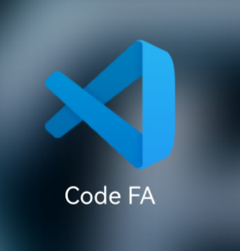
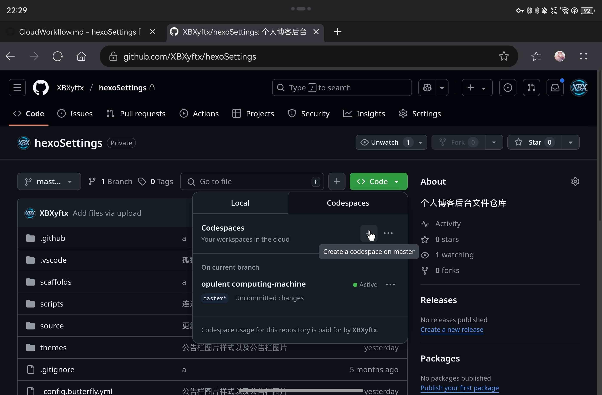
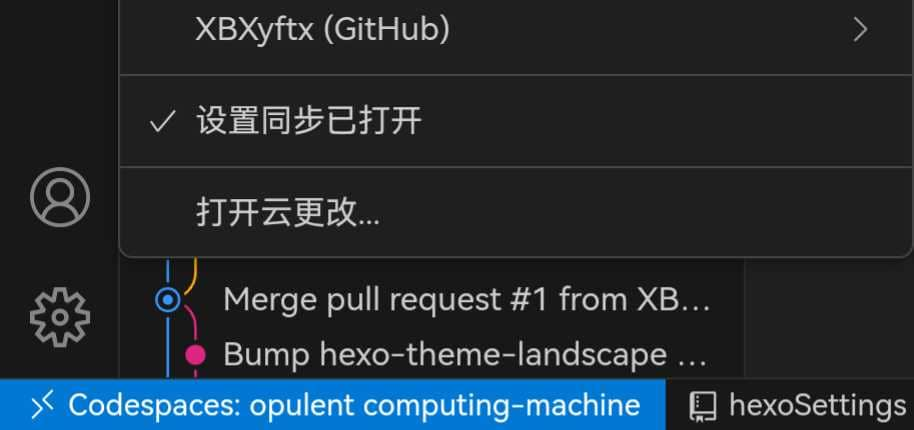

## 前言

众所周知，拯救者那块大板砖放在包里背着，再加上和电脑本体一样重的电源适配器，这两块板砖放在包里没人好受得了。但我就是这样背着他俩上了一年学，不过因为我有自行车所以其实还好，虽然在大二时我实在受不了了就又购入了一台破晓四作为工作电脑。这样将我的游戏需求以及工作需求彻底分离，电脑上装的软件也就能更纯粹一点，省着某些奇妙的环境问题在游戏和程序之间互相影响，最终导致两边都跑不了了，那我就炸缸了。毕竟dyz在py的小学期时，那“散点图”的系统bug还历历在目，仅有3帧的云顶之弈那可真是比ppt都卡顿的存在。

行了不多说废话了，接下来正片开始。

## 向日葵

自从我开始写代码之后我就一直有一个梦想就是用平板写代码，但受制于平板的系统以及芯片的架构都与电脑有着本质的区别，想直接在平板上写代码几乎是不可能的。当然市面上也有那种在软件里嵌入一个小型虚拟机去进行编译运行的编程练习软件。但那很显然不能满足工程需求，也就是给初学者随便练练语法的小玩具了。

所以我就想到了将我的拯救者放在一个不断电的屋子里常开机，然后通过向日葵去进行远程控制，这样一来我就可以去在平板上写代码了。不过很显然，这个方案存在的问题还是很显而易见的。首先是我如果将我的拯救者长期放在408，那确实可以保证不断电的常开机，但也意味着我将完全舍弃我晚上游戏的时间（游戏该打还是得打的，只是时间长短问题），而windows系统的稳定性以及运行流畅程度也导致了长时间开机会越来越卡顿，而且远程链接在映射操作时也可能会造成一些卡顿，这都是系统所限制的无法更改。

当然这个方案的缺陷也不仅局限于我的电脑，还存在于向日葵本身，首先说我并不想为了降低延迟以及提高帧率而去给向日葵爆金币，毕竟这种操作映射本身就是会有不准确以及延迟的现象发生，在加上我们这个校园网也是经常抽风，所以我还是有些难以忍受向日葵的延迟反馈以及在鼠标移动到应用边缘想要去拉动一下大小调整一下位置但是却不会自动切换鼠标图案导致你一通瞎点最终红温这种事，而且它也是真的对无鼠标情况十分的不友好。

## 手机版VScode

不知道你有没有刷到过之前有个大神做的手机版VScode叫`code FA`。

啊对就这玩意，我也在我星河版的平板上搞了一个玩玩。我本身想着说可以吧这个东西当做是我的移动IDE去用，结果我好像忽略了一个问题就是我的平板并没有运行程序所需要的环境，我也只能把它作为一个编辑器，根本没办法调试我写的程序。这让我很糟心，在我整了博客之后我也发现了问题，我没法执行npm指令（当然也有可能可以只是我没找到方法）总之还是打消了这个念头毕竟还是有点折磨人的。

## 破晓四

我本以为买一个便宜些的轻薄本就能解决这个问题，因为在见识了拯救者离电后的卡顿以及那不到两小时的续航之后我就天真的认为所有的轻薄本续航都很nb。于是我就趁着少数有现货又比较便宜的轻薄本中选中了华硕破晓四。

它确实从根本上解决了我游戏需求与移动办公需求的矛盾，但他并没有解决我不强力的续航与北信科争抢激烈的电源插座之间的矛盾。在大多数离电情景下它仍然仅有四到五个小时的续航，而且百分之五十一下后也会出现卡顿问题，同时他的充电速度真的是太慢了，比我拯救者充电慢无数倍，虽然它能够作为我的移动办公主力机，但仍旧十分依赖电源。直到此时我才意识了mac强大的电源管理能力是有多香，但它的价格也确实美丽，我就不多抱怨什么了。

## github codeSpace

哎，为什么这么好用的东西没有多少人宣传呢，老早之前就看到过这个功能，但不知道是什么就一直没尝试过，直到偶然刷到一个视频才知道这个功能的。至此我们的正式解决方案也终于是浮出了水面。

首先我们在仓库处创建一个codeSpace后，打开就会看到一个包含着我们的仓库代码的VScode界面。

这个VScode就和你本地下载的VScode一模一样。点击左下角的头像还能开启设置云同步，可以自动帮你将你本地的VScode设置以及安装的插件同步过来。

然后你就可以写代码并通过VScode的git版本管理界面来进行代码的更新和推送了。当然这还不是最重要的，到这里其实你还看不太出来它和正常的安卓版`code FA`有什么区别，但接下来就不同了。

当你点开打开文件的功能并进入到其根目录时你就会发现一个很眼熟的结构。

这不就是个Linux系统吗，那既然如此我完全可以利用命令行去对这个主机环境进行操作，去把它当做一个免费的常开的Linux云主机去使用，与此同时我还可以从任何一个终端设备去进行连接，因为他只是个网页，不用像常规访问服务器时还需要用到ssh链接。这样我就可以尝试着生成一个ssh密钥，将其绑定到我的博客服务器以及github上，这样我就可以不用在本地进行推送，而直接在我的Linux环境中进行推送了。

经过实践我确实成功了，成功的生成了密钥同时也成功的进行了部署。既然如此，以后不知局限于博客，任何能够用VScode完成开发的轻量级项目都可以全云端化工作了。

同时也是这台云主机和本地毕竟是两个代码仓库，所以就会出现一个人的分支合并以及非线性代码版本了，乐。

## 网页版VScode

在使用了很长一段时间的github codeSpace之后我实在是忍受不了它每次启动的极致缓慢以及时不时爆出的CPU高负荷警报，我仅仅是想用平板去写博客，推送以及部署并非刚需，虽然codeSpace可以给你几乎与本地VScode一样的体验，但它的启动速度以及稳定性还是无法满足我的需求。如果我开启四核模式的codeSpace则又会导致我的免费额度消耗过快，就是其实我到现在还是没太理解更新之后的codeSpace的免费额度是怎么计算的，但秉持着白嫖的心态我还是决定去另寻他法。

于是想起了在之前和codeSpace一同刷到的好东西，网页版VScode。然后我就试了一试，果然是可以直接用登陆的方式同步设置以及从GitHub拉取仓库的。而且由于许多的插件并不能用，使用我们就可以很快的启动并开始博客的编写。

不过代价就是不能用命令行，不过这合理的功能简化对于我这种只是为了写博客的人来说是完美的，所以最终我决定用网页版VScode来写博客，从而实现全云端博客工作流！

## 结语

codeSpace真的是个好东西啊，这是真有用啊，希望这篇文章能够起发到你，帮你早日突破终端的局限去自由的coding。
