## 前言


不想看前言的可以直接点传送门跳转到正式解决方案部分哦
**[正式解决方案传送门](https://xbxyftx.top/2025/03/20/directconnection/#%E6%AD%A3%E5%BC%8F%E8%A7%A3%E5%86%B3%E6%96%B9%E6%A1%88)**


### 起始

在我博客开始正式运营的这段时间里，我一直都在寻求着如何让**国内直连的速度更快一点，更稳定一些。**

在最初进行搭建时我就试图寻找`githubPage`的国内替代方案，由于不是商业性的国内直连也不是硬性要求，所以我并没有考虑最直接的买一台服务器，而是想着用更加低廉的成本实现博客的长期运营以及国内访问的加速。

国内本来是存在一个完美的替代方案`giteePage`，但它已经停止服务了。我二月份也是一直在各个论坛上关注`giteePage`服务的最新动向，但好像大家的意见都是去寻找替代品，`giteePage`似乎已经没救了。
`gitLab`的国内访问速度和`github`基本一致，直接pass，所以我接下来的很长一段时间都没有在考虑国内直连的问题。

### 转机

新学期开学后的第二周，我发出了第三周的活动预告。

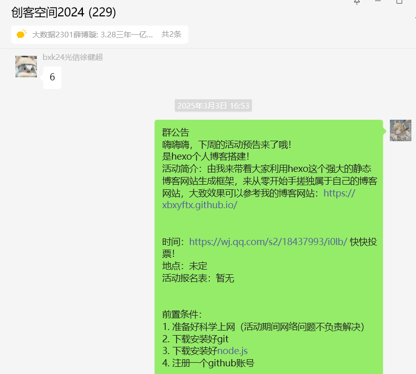

`准备好科学上网（活动期间网络问题不负责解决）`这一句被逼无奈的前置条件卡住了多少同学，也预测到了现场肯定会出现不少的网络问题。
我为了能让更多的同学完成搭建以及学会如何写博客，我就只能对网络问题置之不理。

活动开始前博辰让我转用`gitcode`，但很显然`gitcode`并没有所谓的`pages`服务。随后子安给我推荐了华为AGC的静态网页托管服务，当时倒是给了我不小的惊喜，我立刻登上华为AGC进行尝试，[AGC云托管传送门](https://developer.huawei.com/consumer/cn/service/josp/agc/index.html#/myProject/461323198428939441/9249519184596114810)

登录账号，新建项目，输入域名（`.github.io`）……到这一步我就已经意识到不对了`github`提供的这个域名只是一个二级域名，并非顶级域名，能用来进行托管吗？

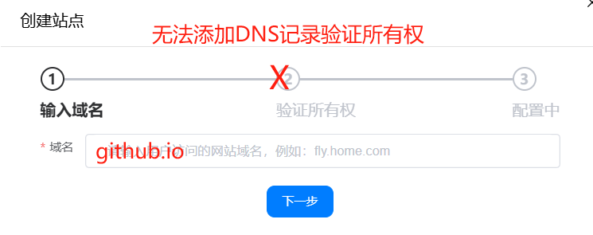

嗯很显然是不行的，我无法证明我的所有权。

然后我自己又在华为云找到了官方提供的`基于Hexo快速搭建博客`解决方案[传送门](https://www.huaweicloud.com/solution/implementations/building-a-blog-with-hexo.html)。

oh！我当时就兴奋起来了，立马点开了一键部署按钮。

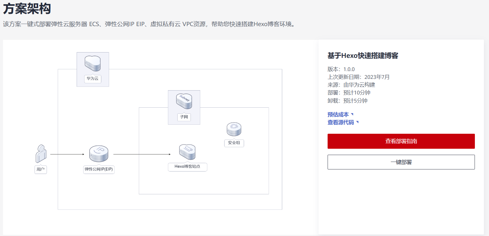

然后设置设置设置…………，最后创建成功。

价格嘛，一天13块钱左右。

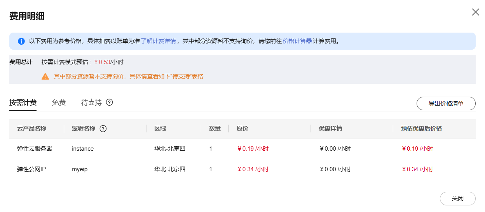

确实不算贵，但和我之前提到的非刚需，尽可能低成本的理念还是相背离了，一年小5K只是为了国内能稳定访问还是有些不值当，所以我暂时将其作为一个备案，等以后有需要再考虑。

### 活动开始

在我的博客搭建活动开始后果然遇到了不少网络问题，很多大一的同学从来没有科学上网过，自己找的梯子也并不稳定，克隆butterfly主题文件时频频报错，创建绑定github秘钥时也是“捷报频传”了，和去年婷姐活动时如出一辙，不过我倒是在博客中就提前预制了一些bug的解决方案，但还是有各种奇怪的问题是我没见过的。

有的端口被占用，有的电脑系统问题导致hexo文件下载不了，还有的ssh秘钥绑定成功但就是连不上github…………

我想，这也是创客现在的核心理念的体现吧：**`为负责人提供一个锻炼的机会，用带活动的方式倒逼自己去学会一门技术，去解决一些问题。`**

不过这也更坚定了去找一种直连的低成本解决方案的决心。

### 一次尝试

活动结束后的几天，我偶然发现了一套看起来可行度极高的低成本解决方案。[使用 Hexo + GitHub + Netlify + Cloudflare 搭建个人博客的全流程](https://blog.grin.cool/blog/hexo-blog#/)

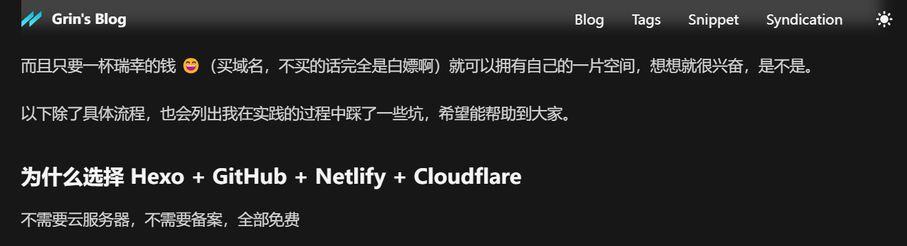

这套方案全称只需要去买一个域名就可以，真的属于是十分诱人了。

随即我开始将博客迁移到`netlify`，并尝试使用`cloudflare`进行加速。去华为云趁活动花1块钱搞了个域名，`xbxyftx.top`，然后按照教程一步步操作，却始终卡在域名的验证这一步上。


enm，有点难评，尝试了两天依旧不行，可能还是得有个服务器才能实现？不确定，这个方案也只能暂时搁置了。

### 再次尝试

我再次回到了`butterfly`主题的官方中文版配置文件去浏览，是否我遗漏了一些很重要的配置项。
没想到还真让我看到了一个以前没注意到的点。

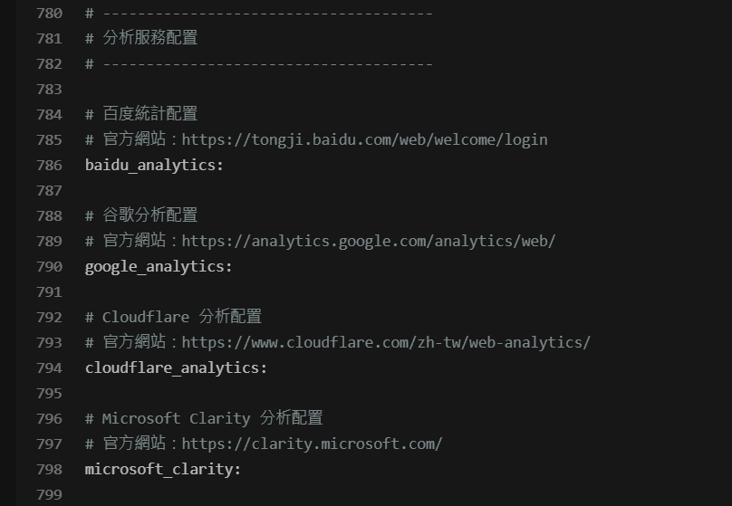

诶？分析服务设置，这不是我之前这个方案所预期的解决手段吗，而且我就是卡在了官方配置文件所提到的`Cloudflare`上。

```yml
# --------------------------------------
# 分析服務配置
# --------------------------------------

# 百度統計配置
# 官方網站：https://tongji.baidu.com/web/welcome/login
baidu_analytics:

# 谷歌分析配置
# 官方網站：https://analytics.google.com/analytics/web/
google_analytics:

# Cloudflare 分析配置
# 官方網站：https://www.cloudflare.com/zh-tw/web-analytics/
cloudflare_analytics:

# Microsoft Clarity 分析配置
# 官方網站：https://clarity.microsoft.com/
microsoft_clarity:
```

于是我试图从butterfly的官方文章中找到`Cloudflare`的配置教程，但很遗憾，并没有找到。我根据网上的其他的一些教程去进行配置，但依旧没有成功。
所以只得再次停止这个方案的尝试。

### 21云盒子

我在浏览上一个方案的解决办法的一众博客时，发现好几篇博客都提到了国内对于`netlify`的平替静态网页托管平台，`21云盒子`。

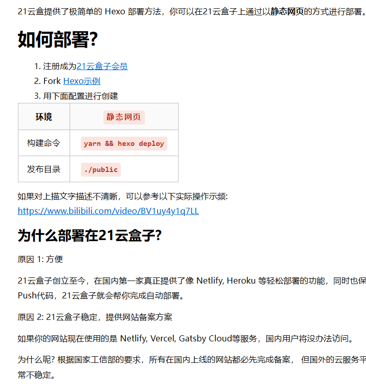

博客园的文章里也有对`21云盒子`的介绍,虽然它的网站看起来比`netlify`的网站要简陋许多，但我也决定先去试试。
[21云盒子传送门](https://get-started.21cloudbox.com/)

好好好，我是真没想到这个方案能截止的如此拖拉，注册会员的这一步就会卡住。

它网页提示一天内就会用邮件联系我，我翻了两天的垃圾邮件也没发现21云盒子的踪迹。

废止！！！

### 最终方案浮出水面

在经过了以上的一系列尝试后，要么是卡在了某一步无法解决，要么是有个几千块钱的年成本，不划算。在这之后的低强度浏览过程中我还是发现了一个方案，有点像是`Hexo + GitHub + Netlify + Cloudflare`方案的翻版，都是将Hexo博客部署到Netlify上，但区别在于我们不需要利用`Cloudflare`进行DNS解析来进行加速，而是**利用Netlify的新加坡节点来实现国内直连。**

废话不多说，接下来就把正式解决方案端上来。

## 正式解决方案

首先上原作者的博客和github的repo。

[提升部署在cloudflare、vercel或netlify的网站在中国国内的访问速度和稳定性](https://xingpingcn.top/enhanced-faas-in-cn.html)

[repo传送门](https://github.com/xingpingcn/enhanced-FaaS-in-China)


虽然当前的方案成功后你的博客可以国内直连，但这个过程还是可能会用到科学上网！


### 准备工作

#### 准备域名

先去买一个自己的域名，要确保自己能够进入域名供应商的控制台界面，以便于后续添加DNS解析记录。


有些白嫖的域名或是二级子域名，你是无法进入其供应商的控制台界面的，比如github的二级域名，所以你需要购买一个顶级域名。


这里我推荐去华为云薅一个，[传送门](https://www.huaweicloud.com/product/domain.html)
现在华为云有首年1块钱的活动，为了降低后续的成本，建议别选`.com .cn`等热门域名，选个小众点的后续续费也比较便宜。

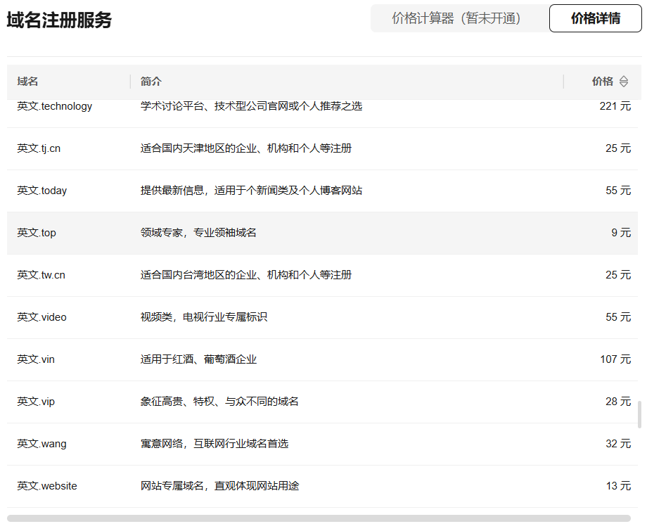

可以看到整体价格差异还是比较大的。为了符合我们低成本尽可能白嫖的中心思路我就选择了一个寓意比较好同时续费价格可接受的`.top`域名。

按照要求提交身份审核材料，等待官方审核即可，这个过程需要1到2天左右的时间，所以我们在准备工作第一步做。

#### 博客搭建


已经做完这一部分的可以直接跳过。


交完钱就可以将自己的hexo博客搭出来，保障能用github的二级域名正常访问。


[博客搭建文章传送门](https://xbxyftx.top/2025/01/26/butterfly%E4%B8%BB%E9%A2%98%E7%BE%8E%E5%8C%96/)可以参考我这篇博客，里面有详细的教程以及一些常见Bug的解决方案。


### 将博客部署到Netlify

#### 注册Netlify账户

[Netlify传送门](https://app.netlify.com/)这是一个静态网站托管平台，每个月有免费的：

* 100G带宽
* 300min的构建时间

对于构建一个个人博客还是十分充裕的，只要你不是强迫症患者，没写几个字就提交让它构建一遍，就基本用不完。


至于为什么要选择Netlify，而不是githubPages主要有两点原因：

* 它支持自定义域名，有着更加简洁的DNS操作界面。
* 它拥有压力较小的美国或者欧洲的路线。


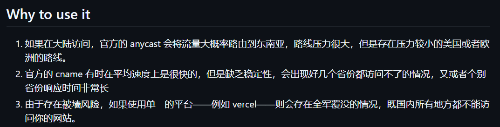

官方的速度平均快，但方差大，有很大概率无法连接，所以我们需要借助Netlify修改访问的节点来提升访问速度。

#### 利用github博客仓库创建Netlify项目

我们直接在Netlify上创建一个项目，然后选择github上的博客仓库。

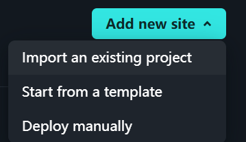
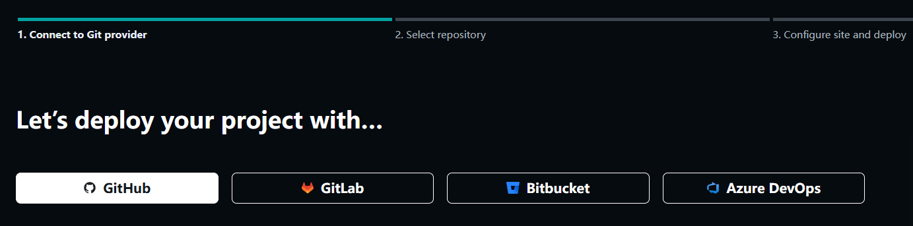

然后静待Netlify自动构建我们的博客即可，这个过程是比较快的，几分钟就可以完成构建。


Netlify能同时托管多个静态网站，并不一定只能用启用了`githubPages`的仓库，这两者并无直接联系，只要仓库里含有`index.html`文件即可。


构建完成我们就可以通过Netlify为我们提供的二级子域名就可以去访问我们的博客了。

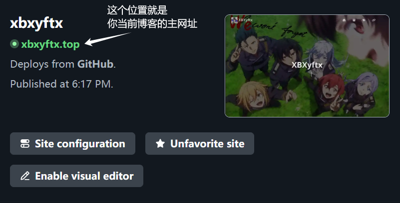

#### 配置自定义域名

在Netlify上配置自定义域名，这里我选择的是之前在华为云上购买的`.top`域名。

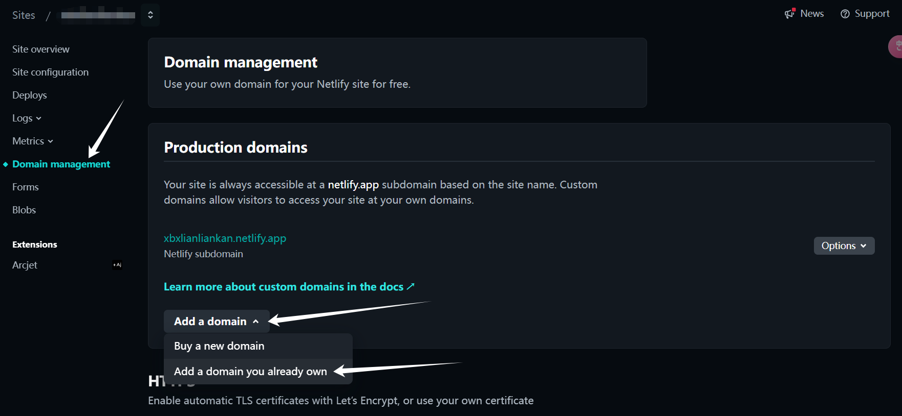

按照Netlify的提示我们回到自己的域名供应商的控制台，添加Cname解析记录，将自定义域名指向Netlify提供的二级子域名。以验证所有权

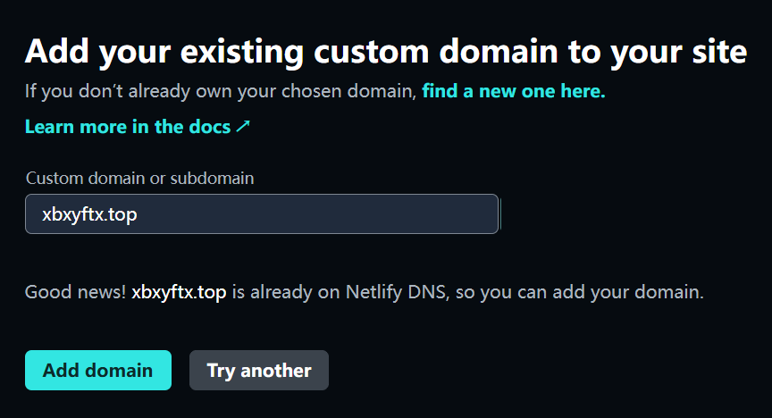
