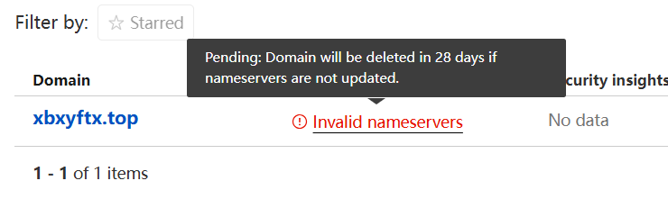

## 前言

### 起始

在我博客开始正式运营的这段时间里，我一直都在寻求着如何让**国内直连的速度更快一点，更稳定一些。**

在最初进行搭建时我就试图寻找`githubPage`的国内替代方案，由于不是商业性的国内直连也不是硬性要求，所以我并没有考虑最直接的买一台服务器，而是想着用更加低廉的成本实现博客的长期运营以及国内访问的加速。

国内本来是存在一个完美的替代方案`giteePage`，但它已经停止服务了。我二月份也是一直在各个论坛上关注`giteePage`服务的最新动向，但好像大家的意见都是去寻找替代品，`giteePage`似乎已经没救了。
`gitLab`的国内访问速度和`github`基本一致，直接pass，所以我接下来的很长一段时间都没有在考虑国内直连的问题。

### 转机

新学期开学后的第二周，我发出了第三周的活动预告。


`准备好科学上网（活动期间网络问题不负责解决）`这一句被逼无奈的前置条件卡住了多少同学，也预测到了现场肯定会出现不少的网络问题。
我为了能让更多的同学完成搭建以及学会如何写博客，我就只能对网络问题置之不理。

活动开始前博辰让我转用`gitcode`，但很显然`gitcode`并没有所谓的`pages`服务。随后子安给我推荐了华为AGC的静态网页托管服务，当时倒是给了我不小的惊喜，我立刻登上华为AGC进行尝试，[AGC云托管传送门](https://developer.huawei.com/consumer/cn/service/josp/agc/index.html#/myProject/461323198428939441/9249519184596114810)

登录账号，新建项目，输入域名（`.github.io`）……到这一步我就已经意识到不对了`github`提供的这个域名只是一个二级域名，并非顶级域名，能用来进行托管吗？


嗯很显然是不行的，我无法证明我的所有权。

然后我自己又在华为云找到了官方提供的`基于Hexo快速搭建博客`解决方案[传送门](https://www.huaweicloud.com/solution/implementations/building-a-blog-with-hexo.html)。

oh！我当时就兴奋起来了，立马点开了一键部署按钮。


然后设置设置设置…………，最后创建成功。

价格嘛，一天13块钱左右。


确实不算贵，但和我之前提到的非刚需，尽可能低成本的理念还是相背离了，一年小5K只是为了国内能稳定访问还是有些不值当，所以我暂时将其作为一个备案，等以后有需要再考虑。

### 活动开始

在我的博客搭建活动开始后果然遇到了不少网络问题，很多大一的同学从来没有科学上网过，自己找的梯子也并不稳定，克隆butterfly主题文件时频频报错，创建绑定github秘钥时也是“捷报频传”了，和去年婷姐活动时如出一辙，不过我倒是在博客中就提前预制了一些bug的解决方案，但还是有各种奇怪的问题是我没见过的。

有的端口被占用，有的电脑系统问题导致hexo文件下载不了，还有的ssh秘钥绑定成功但就是连不上github…………

我想，这也是创客现在的核心理念的体现吧：**`为负责人提供一个锻炼的机会，用带活动的方式倒逼自己去学会一门技术，去解决一些问题。`**

不过这也更坚定了去找一种直连的低成本解决方案的决心。

### 一次尝试

活动结束后的几天，我偶然发现了一套看起来可行度极高的低成本解决方案。[使用 Hexo + GitHub + Netlify + Cloudflare 搭建个人博客的全流程](https://blog.grin.cool/blog/hexo-blog#/)


这套方案全称只需要去买一个域名就可以，真的属于是十分诱人了。

随即我开始将博客迁移到`netlify`，并尝试使用`cloudflare`进行加速。去华为云趁活动花1块钱搞了个域名，`xbxyftx.top`，然后按照教程一步步操作，却始终卡在域名的验证这一步上。



enm，有点难评，尝试了两天依旧不行，可能还是得有个服务器才能实现？不确定，这个方案也只能暂时搁置了。

### 再次尝试

我再次回到了`butterfly`主题的官方中文版配置文件去浏览，是否我遗漏了一些很重要的配置项。
没想到还真让我看到了一个以前没注意到的点。


诶？分析服务设置，这不是我之前这个方案所预期的解决手段吗，而且我就是卡在了官方配置文件所提到的`Cloudflare`上。

```yml
# --------------------------------------
# 分析服務配置
# --------------------------------------

# 百度統計配置
# 官方網站：https://tongji.baidu.com/web/welcome/login
baidu_analytics:

# 谷歌分析配置
# 官方網站：https://analytics.google.com/analytics/web/
google_analytics:

# Cloudflare 分析配置
# 官方網站：https://www.cloudflare.com/zh-tw/web-analytics/
cloudflare_analytics:

# Microsoft Clarity 分析配置
# 官方網站：https://clarity.microsoft.com/
microsoft_clarity:
```

于是我试图从butterfly的官方文章中找到`Cloudflare`的配置教程，但很遗憾，并没有找到。我根据网上的其他的一些教程去进行配置，但依旧没有成功。
所以只得再次停止这个方案的尝试。

### 21云盒子

我在浏览上一个方案的解决办法的一众博客时，发现好几篇博客都提到了国内对于`netlify`的平替静态网页托管平台，`21云盒子`。


博客园的文章里也有对`21云盒子`的介绍,虽然它的网站看起来比`netlify`的网站要简陋许多，但我也决定先去试试。
[21云盒子传送门](https://get-started.21cloudbox.com/)

好好好，我是真没想到这个方案能截止的如此拖拉，注册会员的这一步就会卡住。

它网页提示一天内就会用邮件联系我，我翻了两天的垃圾邮件也没发现21云盒子的踪迹。

废止！！！
