## 前言

这篇的前言就简介一些吧，在观摩了孙妈的面试之后我意识到我需要练算法！！！OK，就这么多，直接开始正文吧。

## 题目

语言选择上并没有ArkTS所以我就选择最相近的TS吧。

### 合并两个有序数组

```plantext
给你两个按 非递减顺序 排列的整数数组 nums1 和 nums2，另有两个整数 m 和 n ，分别表示 nums1 和 nums2 中的元素数目。

请你 合并 nums2 到 nums1 中，使合并后的数组同样按 非递减顺序 排列。

注意：最终，合并后数组不应由函数返回，而是存储在数组 nums1 中。为了应对这种情况，nums1 的初始长度为 m + n，其中前 m 个元素表示应合并的元素，后 n 个元素为 0 ，应忽略。nums2 的长度为 n 。

 

示例 1：

输入：nums1 = [1,2,3,0,0,0], m = 3, nums2 = [2,5,6], n = 3
输出：[1,2,2,3,5,6]
解释：需要合并 [1,2,3] 和 [2,5,6] 。
合并结果是 [1,2,2,3,5,6] ，其中斜体加粗标注的为 nums1 中的元素。
示例 2：

输入：nums1 = [1], m = 1, nums2 = [], n = 0
输出：[1]
解释：需要合并 [1] 和 [] 。
合并结果是 [1] 。
示例 3：

输入：nums1 = [0], m = 0, nums2 = [1], n = 1
输出：[1]
解释：需要合并的数组是 [] 和 [1] 。
合并结果是 [1] 。
注意，因为 m = 0 ，所以 nums1 中没有元素。nums1 中仅存的 0 仅仅是为了确保合并结果可以顺利存放到 nums1 中。
 

提示：

nums1.length == m + n
nums2.length == n
0 <= m, n <= 200
1 <= m + n <= 200
-109 <= nums1[i], nums2[j] <= 109
 

进阶：你可以设计实现一个时间复杂度为 O(m + n) 的算法解决此问题吗？
```

第一次尝试：

```ts
/**
 Do not return anything, modify nums1 in-place instead.
 */
function merge(nums1: number[], m: number, nums2: number[], n: number): void {
    let currentNums2Pointer:number=0
    nums1.forEach((num,index)=>{
        if(num>nums2[currentNums2Pointer]){
            nums1.splice(index,0,nums2[currentNums2Pointer])
            nums1.pop()
            currentNums2Pointer++
        }
    })

};
```

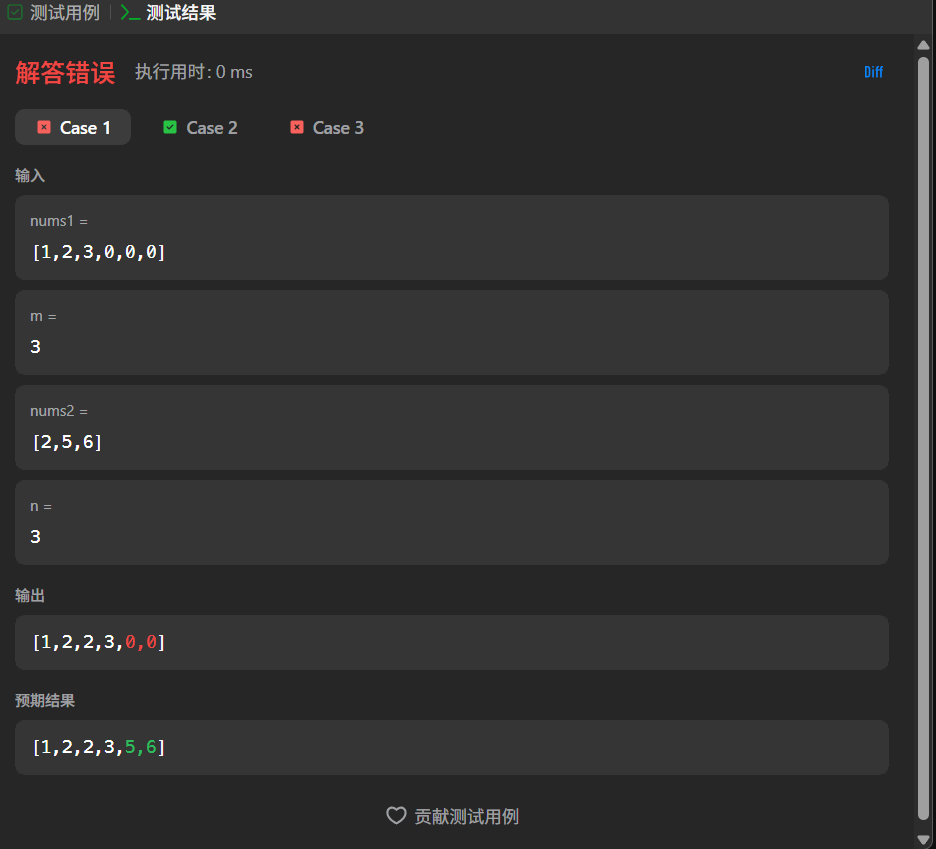

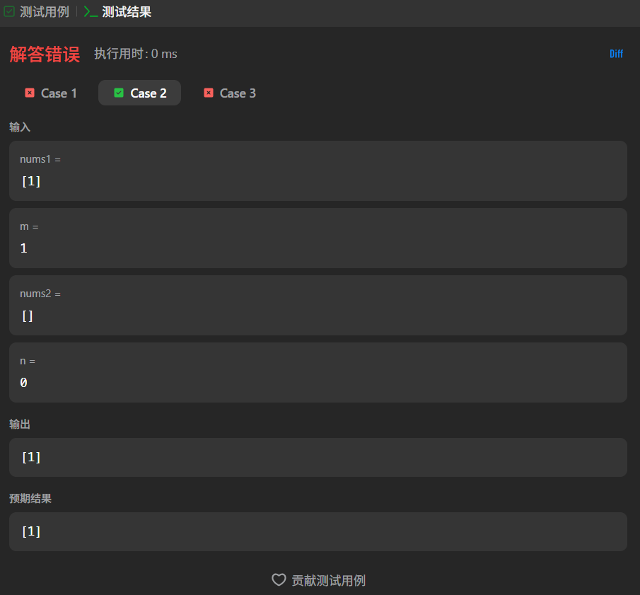

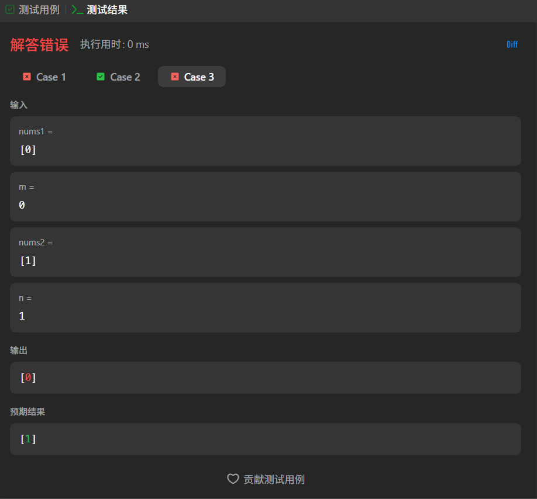

这里我们分析一下测试用例。

在三个测试用例中我们通过了一个仅有一个数字的，同时在第一个测试用例中我们可以看到，其实我们当前的大小比较然后插入的这套逻辑是行得通的，两个错误的用例的共同点在于其结尾都是有0的存在，说明我们的算法仅能处理nums1中需要合并的元素，而无法正确处理仅作为占位的0元素。

所以接下来我们需要判断一下当前元素是否为占位符。

```ts
/**
 Do not return anything, modify nums1 in-place instead.
 */
function merge(nums1: number[], m: number, nums2: number[], n: number): void {
    let currentNums2Pointer:number=0
    for(let i = 0;i<nums1.length-1;i++){
        if(nums1[i]===0){
            let leftNumNumber:number=nums1.length-i-1
            let addNums:number[] = nums2.splice(0,currentNums2Pointer)
            nums1.splice(i,leftNumNumber,...addNums)
            break
        }
        if(nums1[i]>nums2[currentNums2Pointer]){
            nums1.splice(i,0,nums2[currentNums2Pointer])
            nums1.pop()
            currentNums2Pointer++
        }
    }
};
```

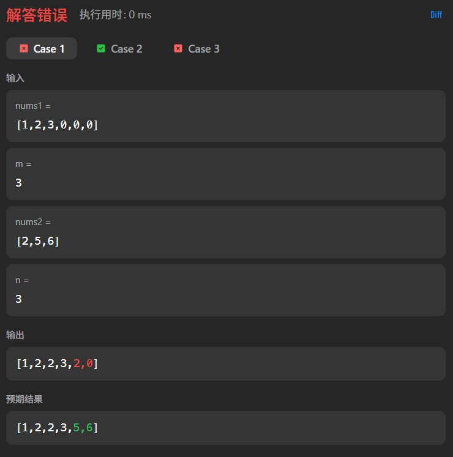

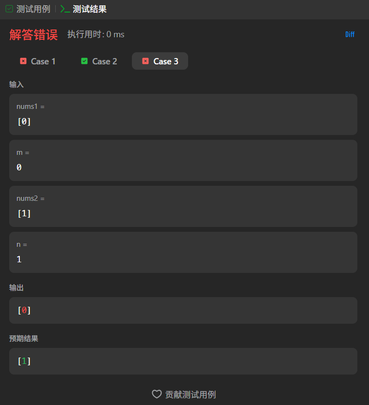

这里可以看到我们的核心问题出现在了对于末尾的0依旧没能完好的处理，但是我们仔细观察会发现其实当前的结果于上一次测试的结果已经出现差异，上一次测试用例一我们没有处理任何0元素，导致5没有被正确添加，但现在可以看到5成功添加了，这说明我们的算法对于消0补数是有一定效果的，让我们来画图推演一下。

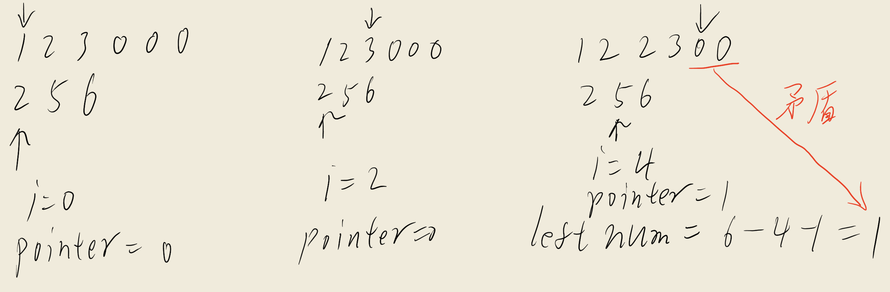

通过一步步的推到会发现问题出现在了批处理删除末尾0的操作中，我们当前算法会以外的少算一个0，因为我只考虑了当前0之后会有几个零没考虑到当前0也需要被消除。

```ts
/**
 Do not return anything, modify nums1 in-place instead.
 */
function merge(nums1: number[], m: number, nums2: number[], n: number): void {
    let currentNums2Pointer:number=0
    for(let i = 0;i<nums1.length-1;i++){
        if(nums1[i]===0){
            let leftNumNumber:number=nums1.length-i
            let addNums:number[] = nums2.splice(0,currentNums2Pointer)
            nums1.splice(i,leftNumNumber,...addNums)
            break
        }
        if(nums1[i]>nums2[currentNums2Pointer]){
            nums1.splice(i,0,nums2[currentNums2Pointer])
            nums1.pop()
            currentNums2Pointer++
        }
    }
};
```

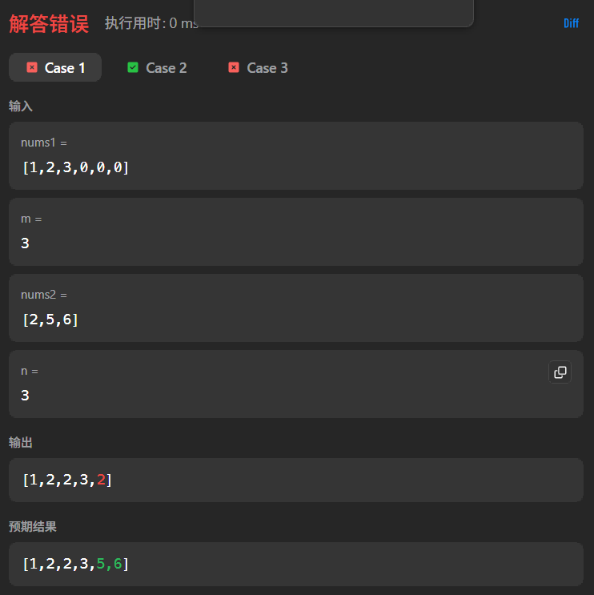

我们现在着重分析一下测试用例1即可，当前的结果中存在两个问题，一方面是数组总长度少1，另一方面是末尾的添加数字是2。其实这两者仔细分析之后会发现是同一个问题，我们需要消掉的两个0已经被修正后的计数器正确的修复了，但是插入的数字却是被删除的2，这时我突然想到pop函数返回的返回值是被删除的数字，这是之前开发以及数据结构中学习栈结构是学到的，那splice函数是不是也是返回的被删除的数组？

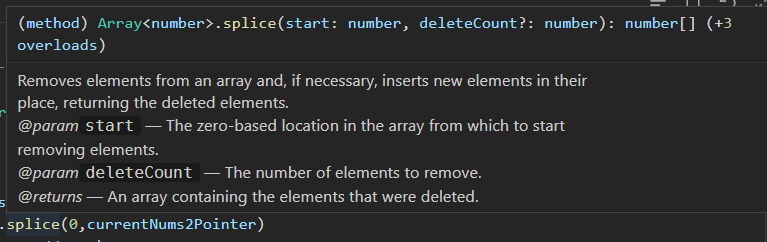

啊，果然，返回的是被删除的。

```ts
/**
 Do not return anything, modify nums1 in-place instead.
 */
function merge(nums1: number[], m: number, nums2: number[], n: number): void {
    let currentNums2Pointer:number=0
    for(let i = 0;i<nums1.length-1;i++){
        if(nums1[i]===0){
            let leftNumNumber:number=nums1.length-i
            nums2.splice(0,currentNums2Pointer)
            nums1.splice(i,leftNumNumber,...nums2)
            break
        }
        if(nums1[i]>nums2[currentNums2Pointer]){
            nums1.splice(i,0,nums2[currentNums2Pointer])
            nums1.pop()
            currentNums2Pointer++
        }
    }
};
```

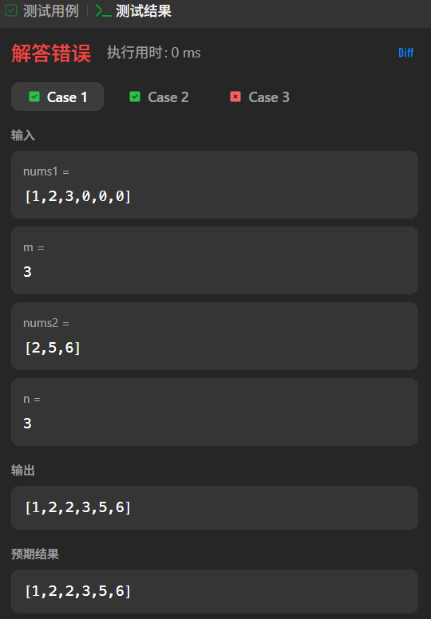

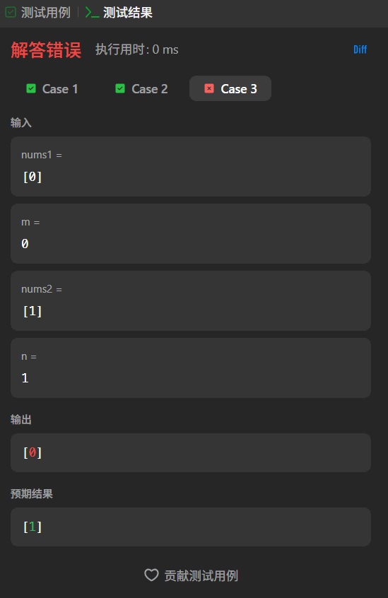

嘶，用例三又错了，这是为什么呢。

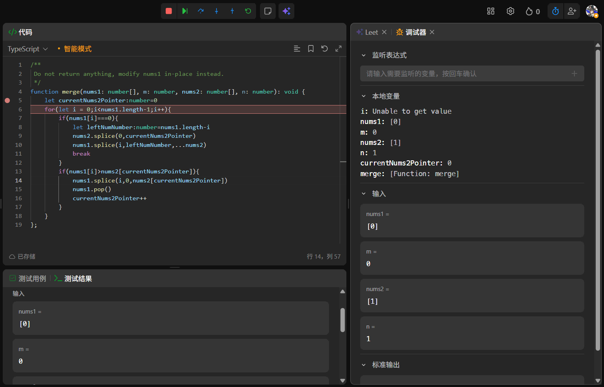

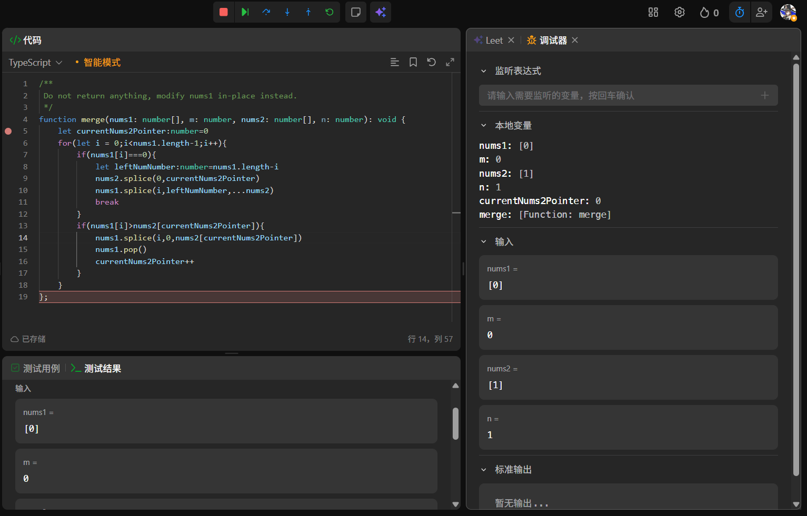

在点击了一次下一行之后代码直接运行到了最后一行，说明我们的for循环没有被执行！！！

仔细看了一下`for(let i = 0;i<nums1.length-1;i++)`这个for循环确实会出现最后一位无法被遍历的情况，用例2恰好是无需变动所以通过了，案例1是因为在遍历到0的时候就直接进行后续批处理了，跳过了最后一位的遍历导致没发现这个问题，案例3则是因为遍历第一位时就是最后一位所以发现了这个问题。

```ts
/**
 Do not return anything, modify nums1 in-place instead.
 */
function merge(nums1: number[], m: number, nums2: number[], n: number): void {
    let currentNums2Pointer:number=0
    for(let i = 0;i<nums1.length;i++){
        if(nums1[i]===0){
            let leftNumNumber:number=nums1.length-i
            nums2.splice(0,currentNums2Pointer)
            nums1.splice(i,leftNumNumber,...nums2)
            break
        }
        if(nums1[i]>nums2[currentNums2Pointer]){
            nums1.splice(i,0,nums2[currentNums2Pointer])
            nums1.pop()
            currentNums2Pointer++
        }
    }
};
```

这次可以提交测试了。


！！！原来除了在末尾的0以外中间也会出现0。那这就意味着我不能再依赖于0的存在来判断是否需要进行批处理了，这不合理。（不要盲目依仗示范案例啊啊啊）

那对于这种情况来说，我需要彻底的舍弃原有的算法思路。

我顺着原本的正向对比插入的思路想到了一种方式，就是先建一个新的临时数组存储当前结果，然后仅仅去从数组一的前m项取数，设置这样一个双指针匹配插入机制。

```ts
/**
 Do not return anything, modify nums1 in-place instead.
 */
function merge(nums1: number[], m: number, nums2: number[], n: number): void {
    let resultNumList:number[] = []
    let pointer1:number = 0
    let pointer2:number = 0
    nums1.splice(m,n)
    while(1){
        if(pointer1>m){
            nums2.splice(0,pointer2)
            resultNumList.push(...nums2)
            break
        }
        if(pointer2>m){
            nums1.splice(0,pointer1)
            resultNumList.push(...nums1)
            break
        }
        if(nums1[pointer1]<nums2[pointer2]){
            resultNumList.push(nums1[pointer1])
            pointer1++
        }else{
            resultNumList.push(nums2[pointer2])
            pointer2++
        }
    }
    nums1 = resultNumList
};
```

代码很简单易懂直接执行一下进行尝试。

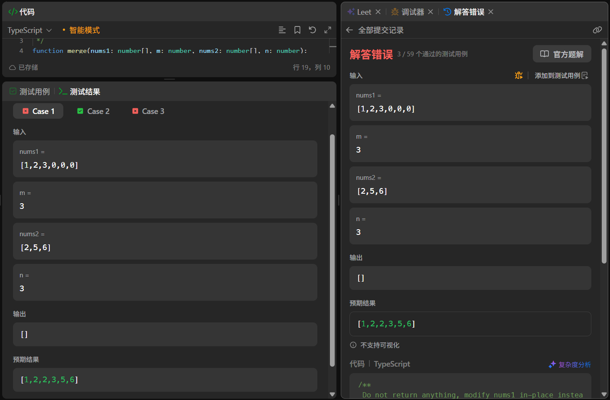

这里发现全部测试用例都输出的空数组，这很不正常。肯定是在哪里出现了异常。

奥，我的标识符写错了，我把数组二的标识符也写成1的了，然后判断是否遍历完成应该使用等于而不是大于，因为当其处于等于长度的时候已经越界了。修正一下。

```ts
/**
 Do not return anything, modify nums1 in-place instead.
 */
function merge(nums1: number[], m: number, nums2: number[], n: number): void {
    let resultNumList:number[] = []
    let pointer1:number = 0
    let pointer2:number = 0
    nums1.splice(m,n)
    while(1){
        if(pointer1>=m){
            nums2.splice(0,pointer2)
            resultNumList.push(...nums2)
            break
        }
        if(pointer2>=n){
            nums1.splice(0,pointer1)
            resultNumList.push(...nums1)
            break
        }
        if(nums1[pointer1]<nums2[pointer2]){
            resultNumList.push(nums1[pointer1])
            pointer1++
        }else{
            resultNumList.push(nums2[pointer2])
            pointer2++
        }
    }
    nums1 = resultNumList
};
```

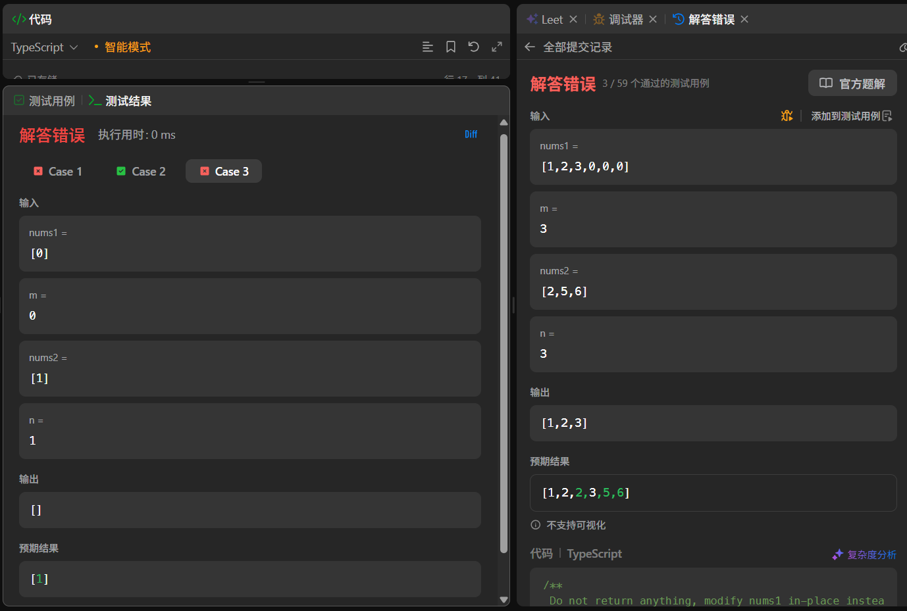

首先观察了一下这两个的测试用例的输出结果。两者的共同点在于nums2的数均没有被写进结果数组中，这说明我当前对于nums2的写入逻辑有误。

但在审查了一遍之后我并不认为是对元素插入的逻辑有误，而是对于结果的修改方式有误，因为这一次我的结果是通过一个新的数组覆盖原有数组的方式实现的，虽然题目中提示了无需返回值，仅需要使nums1的值被修改为结果值就行。

此前我一直是直接对nums1本身进行修改，从而忽略了一个问题，在TS语言中数组是一个引用类型，我们的变量nums1仅仅是一个引用值，我们用新的结果数组直接赋值修改的仅仅是nums1的引用，相当于全部修改都落到了新数组的内存地址上，我们需要使用深拷贝去在不改变引用的前提下，去修改nums1对应的内存值。

```ts
/**
 Do not return anything, modify nums1 in-place instead.
 */
function merge(nums1: number[], m: number, nums2: number[], n: number): void {
    let resultNumList:number[] = []
    let pointer1:number = 0
    let pointer2:number = 0
    nums1.splice(m,n)
    while(1){
        if(pointer1>=m){
            nums2.splice(0,pointer2)
            resultNumList.push(...nums2)
            break
        }
        if(pointer2>=n){
            nums1.splice(0,pointer1)
            resultNumList.push(...nums1)
            break
        }
        if(nums1[pointer1]<nums2[pointer2]){
            resultNumList.push(nums1[pointer1])
            pointer1++
        }else{
            resultNumList.push(nums2[pointer2])
            pointer2++
        }
    }
    nums1.length = 0
    nums1.push(...resultNumList)
};
```

再次测试。

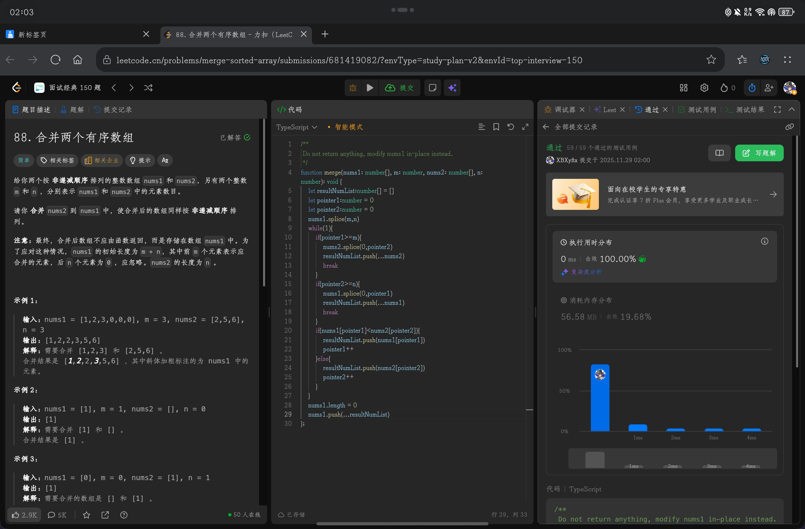

通过了，而且这个算法的时间复杂度是m+n。
