## 前言

这篇的前言就简介一些吧，在观摩了孙妈的面试之后我意识到我需要练算法！！！OK，就这么多，直接开始正文吧。

## 题目

语言选择上并没有ArkTS所以我就选择最相近的TS吧。

### 合并两个有序数组（简单）

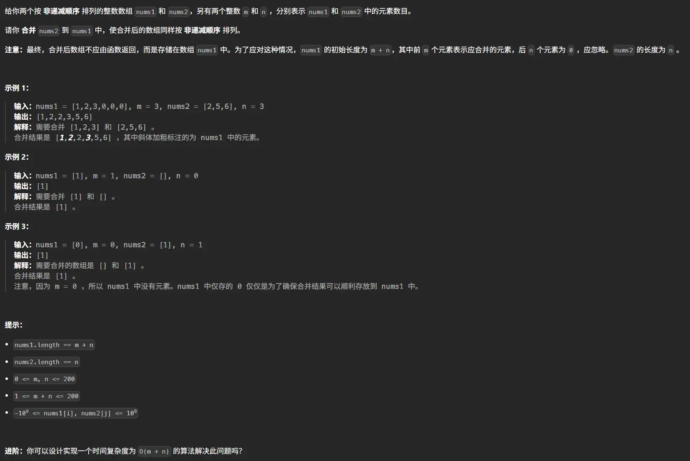

第一次尝试：

```ts
/**
 Do not return anything, modify nums1 in-place instead.
 */
function merge(nums1: number[], m: number, nums2: number[], n: number): void {
    let currentNums2Pointer:number=0
    nums1.forEach((num,index)=>{
        if(num>nums2[currentNums2Pointer]){
            nums1.splice(index,0,nums2[currentNums2Pointer])
            nums1.pop()
            currentNums2Pointer++
        }
    })

};
```

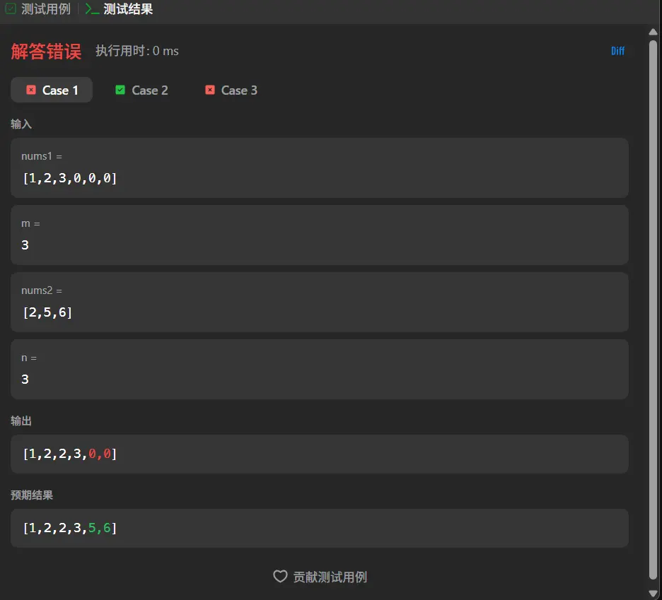


这里我们分析一下测试用例。

在三个测试用例中我们通过了一个仅有一个数字的，同时在第一个测试用例中我们可以看到，其实我们当前的大小比较然后插入的这套逻辑是行得通的，两个错误的用例的共同点在于其结尾都是有0的存在，说明我们的算法仅能处理nums1中需要合并的元素，而无法正确处理仅作为占位的0元素。

所以接下来我们需要判断一下当前元素是否为占位符。

```ts
/**
 Do not return anything, modify nums1 in-place instead.
 */
function merge(nums1: number[], m: number, nums2: number[], n: number): void {
    let currentNums2Pointer:number=0
    for(let i = 0;i<nums1.length-1;i++){
        if(nums1[i]===0){
            let leftNumNumber:number=nums1.length-i-1
            let addNums:number[] = nums2.splice(0,currentNums2Pointer)
            nums1.splice(i,leftNumNumber,...addNums)
            break
        }
        if(nums1[i]>nums2[currentNums2Pointer]){
            nums1.splice(i,0,nums2[currentNums2Pointer])
            nums1.pop()
            currentNums2Pointer++
        }
    }
};
```

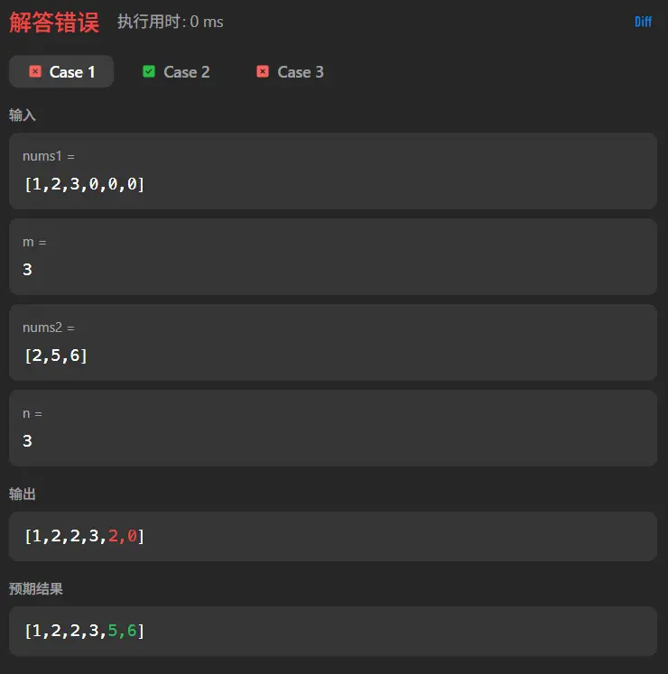

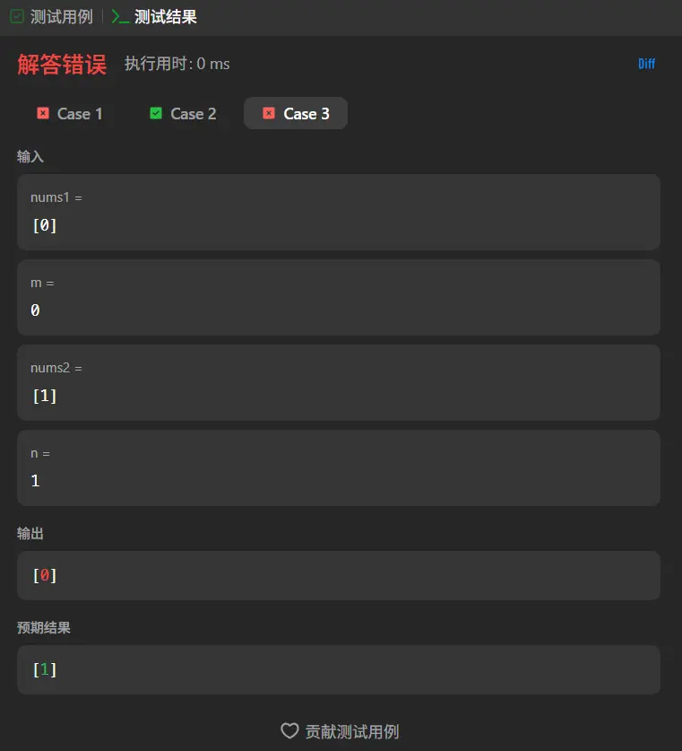

这里可以看到我们的核心问题出现在了对于末尾的0依旧没能完好的处理，但是我们仔细观察会发现其实当前的结果于上一次测试的结果已经出现差异，上一次测试用例一我们没有处理任何0元素，导致5没有被正确添加，但现在可以看到5成功添加了，这说明我们的算法对于消0补数是有一定效果的，让我们来画图推演一下。


通过一步步的推到会发现问题出现在了批处理删除末尾0的操作中，我们当前算法会以外的少算一个0，因为我只考虑了当前0之后会有几个零没考虑到当前0也需要被消除。

```ts
/**
 Do not return anything, modify nums1 in-place instead.
 */
function merge(nums1: number[], m: number, nums2: number[], n: number): void {
    let currentNums2Pointer:number=0
    for(let i = 0;i<nums1.length-1;i++){
        if(nums1[i]===0){
            let leftNumNumber:number=nums1.length-i
            let addNums:number[] = nums2.splice(0,currentNums2Pointer)
            nums1.splice(i,leftNumNumber,...addNums)
            break
        }
        if(nums1[i]>nums2[currentNums2Pointer]){
            nums1.splice(i,0,nums2[currentNums2Pointer])
            nums1.pop()
            currentNums2Pointer++
        }
    }
};
```

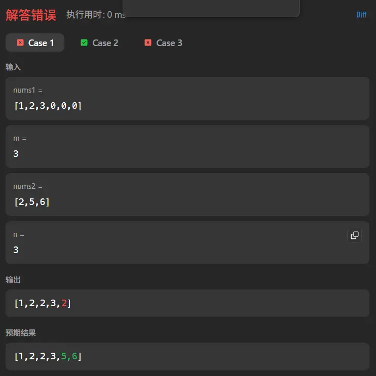

我们现在着重分析一下测试用例1即可，当前的结果中存在两个问题，一方面是数组总长度少1，另一方面是末尾的添加数字是2。其实这两者仔细分析之后会发现是同一个问题，我们需要消掉的两个0已经被修正后的计数器正确的修复了，但是插入的数字却是被删除的2，这时我突然想到pop函数返回的返回值是被删除的数字，这是之前开发以及数据结构中学习栈结构是学到的，那splice函数是不是也是返回的被删除的数组？

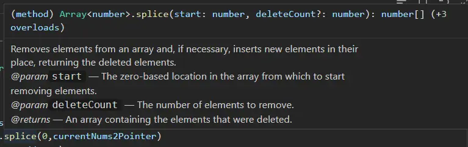

啊，果然，返回的是被删除的。

```ts
/**
 Do not return anything, modify nums1 in-place instead.
 */
function merge(nums1: number[], m: number, nums2: number[], n: number): void {
    let currentNums2Pointer:number=0
    for(let i = 0;i<nums1.length-1;i++){
        if(nums1[i]===0){
            let leftNumNumber:number=nums1.length-i
            nums2.splice(0,currentNums2Pointer)
            nums1.splice(i,leftNumNumber,...nums2)
            break
        }
        if(nums1[i]>nums2[currentNums2Pointer]){
            nums1.splice(i,0,nums2[currentNums2Pointer])
            nums1.pop()
            currentNums2Pointer++
        }
    }
};
```

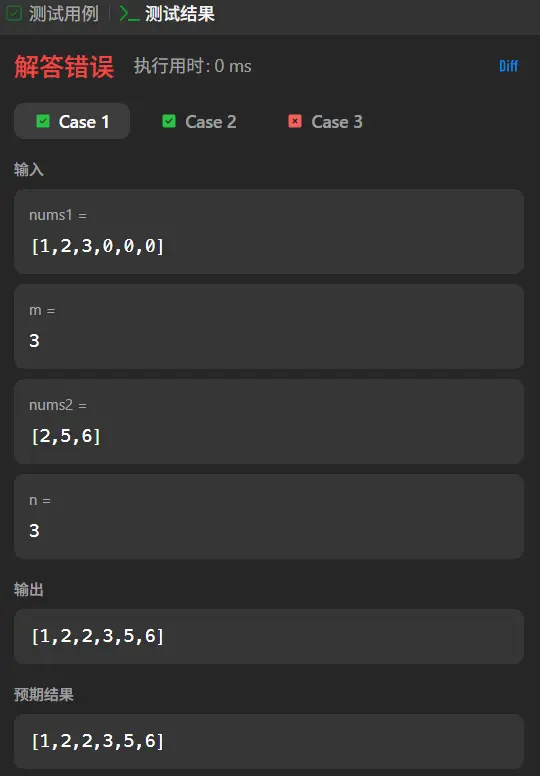

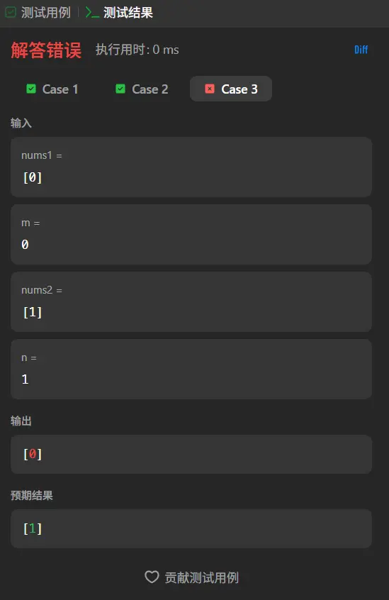

嘶，用例三又错了，这是为什么呢。

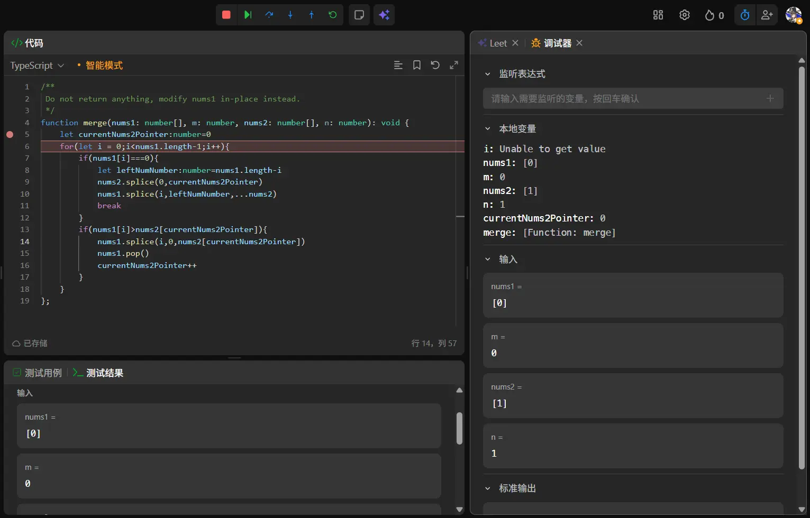

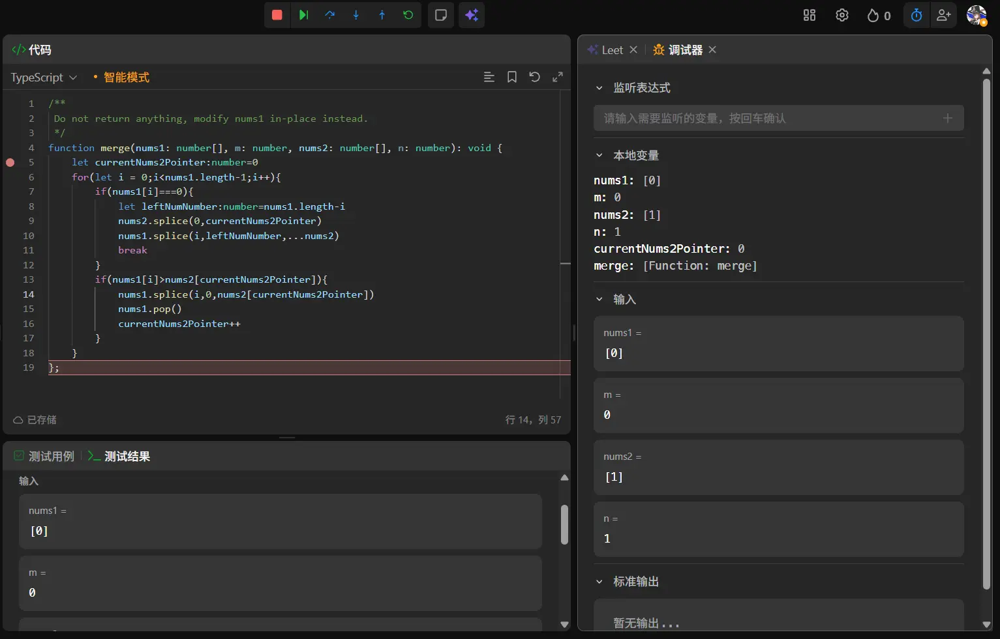

在点击了一次下一行之后代码直接运行到了最后一行，说明我们的for循环没有被执行！！！

仔细看了一下`for(let i = 0;i<nums1.length-1;i++)`这个for循环确实会出现最后一位无法被遍历的情况，用例2恰好是无需变动所以通过了，案例1是因为在遍历到0的时候就直接进行后续批处理了，跳过了最后一位的遍历导致没发现这个问题，案例3则是因为遍历第一位时就是最后一位所以发现了这个问题。

```ts
/**
 Do not return anything, modify nums1 in-place instead.
 */
function merge(nums1: number[], m: number, nums2: number[], n: number): void {
    let currentNums2Pointer:number=0
    for(let i = 0;i<nums1.length;i++){
        if(nums1[i]===0){
            let leftNumNumber:number=nums1.length-i
            nums2.splice(0,currentNums2Pointer)
            nums1.splice(i,leftNumNumber,...nums2)
            break
        }
        if(nums1[i]>nums2[currentNums2Pointer]){
            nums1.splice(i,0,nums2[currentNums2Pointer])
            nums1.pop()
            currentNums2Pointer++
        }
    }
};
```

这次可以提交测试了。

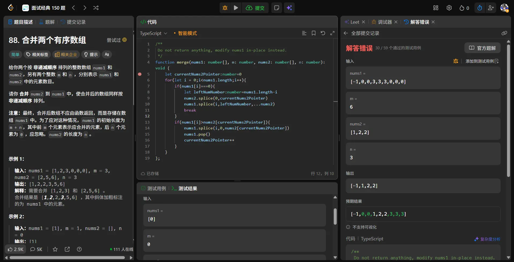

！！！原来除了在末尾的0以外中间也会出现0。那这就意味着我不能再依赖于0的存在来判断是否需要进行批处理了，这不合理。（不要盲目依仗示范案例啊啊啊）

那对于这种情况来说，我需要彻底的舍弃原有的算法思路。

我顺着原本的正向对比插入的思路想到了一种方式，就是先建一个新的临时数组存储当前结果，然后仅仅去从数组一的前m项取数，设置这样一个双指针匹配插入机制。

```ts
/**
 Do not return anything, modify nums1 in-place instead.
 */
function merge(nums1: number[], m: number, nums2: number[], n: number): void {
    let resultNumList:number[] = []
    let pointer1:number = 0
    let pointer2:number = 0
    nums1.splice(m,n)
    while(1){
        if(pointer1>m){
            nums2.splice(0,pointer2)
            resultNumList.push(...nums2)
            break
        }
        if(pointer2>m){
            nums1.splice(0,pointer1)
            resultNumList.push(...nums1)
            break
        }
        if(nums1[pointer1]<nums2[pointer2]){
            resultNumList.push(nums1[pointer1])
            pointer1++
        }else{
            resultNumList.push(nums2[pointer2])
            pointer2++
        }
    }
    nums1 = resultNumList
};
```

代码很简单易懂直接执行一下进行尝试。

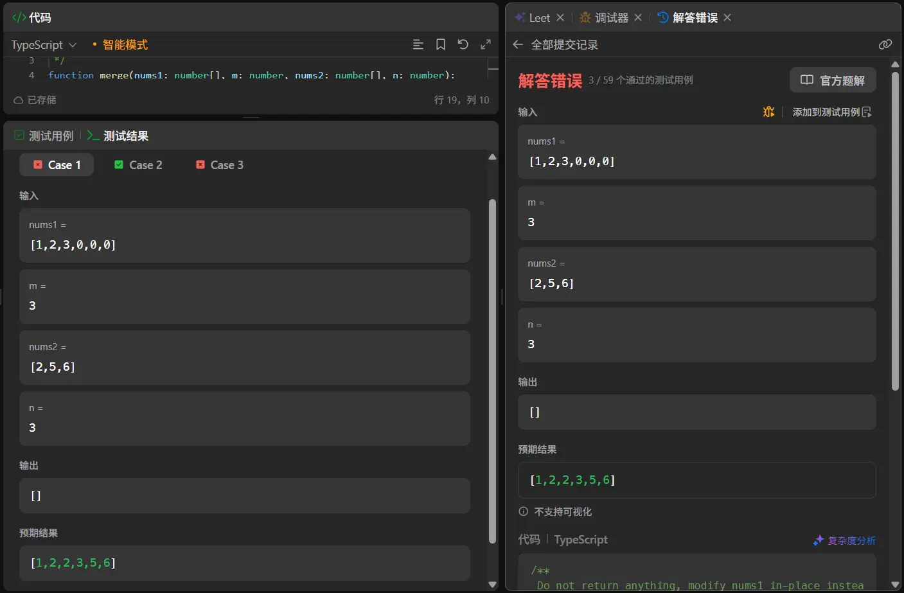

这里发现全部测试用例都输出的空数组，这很不正常。肯定是在哪里出现了异常。

奥，我的标识符写错了，我把数组二的标识符也写成1的了，然后判断是否遍历完成应该使用等于而不是大于，因为当其处于等于长度的时候已经越界了。修正一下。

```ts
/**
 Do not return anything, modify nums1 in-place instead.
 */
function merge(nums1: number[], m: number, nums2: number[], n: number): void {
    let resultNumList:number[] = []
    let pointer1:number = 0
    let pointer2:number = 0
    nums1.splice(m,n)
    while(1){
        if(pointer1>=m){
            nums2.splice(0,pointer2)
            resultNumList.push(...nums2)
            break
        }
        if(pointer2>=n){
            nums1.splice(0,pointer1)
            resultNumList.push(...nums1)
            break
        }
        if(nums1[pointer1]<nums2[pointer2]){
            resultNumList.push(nums1[pointer1])
            pointer1++
        }else{
            resultNumList.push(nums2[pointer2])
            pointer2++
        }
    }
    nums1 = resultNumList
};
```

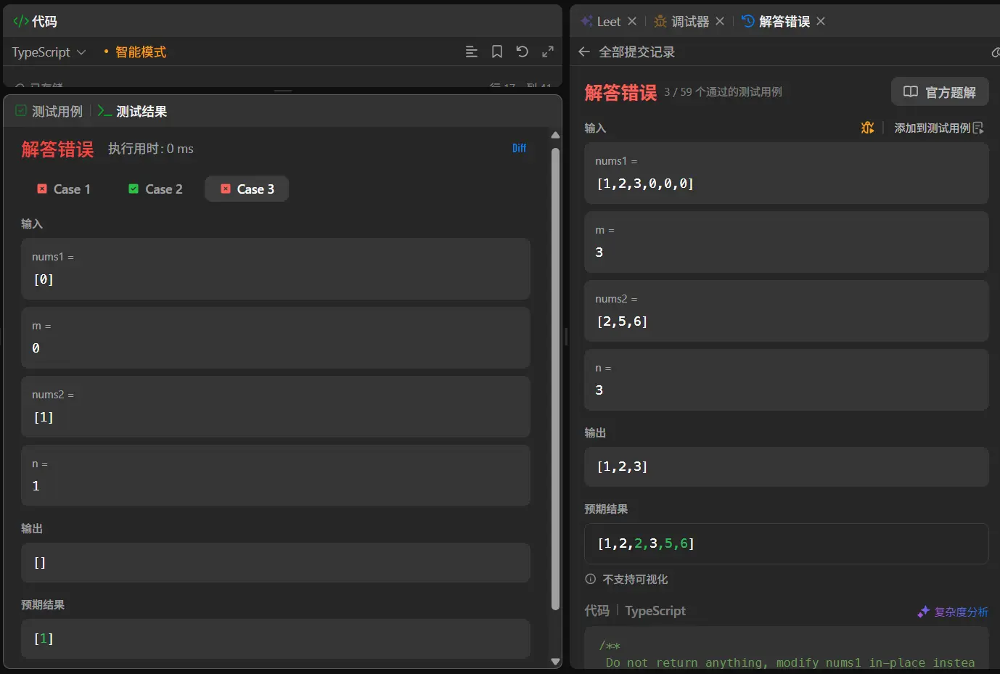

首先观察了一下这两个的测试用例的输出结果。两者的共同点在于nums2的数均没有被写进结果数组中，这说明我当前对于nums2的写入逻辑有误。

但在审查了一遍之后我并不认为是对元素插入的逻辑有误，而是对于结果的修改方式有误，因为这一次我的结果是通过一个新的数组覆盖原有数组的方式实现的，虽然题目中提示了无需返回值，仅需要使nums1的值被修改为结果值就行。

此前我一直是直接对nums1本身进行修改，从而忽略了一个问题，在TS语言中数组是一个引用类型，我们的变量nums1仅仅是一个引用值，我们用新的结果数组直接赋值修改的仅仅是nums1的引用，相当于全部修改都落到了新数组的内存地址上，我们需要使用深拷贝去在不改变引用的前提下，去修改nums1对应的内存值。

```ts
/**
 Do not return anything, modify nums1 in-place instead.
 */
function merge(nums1: number[], m: number, nums2: number[], n: number): void {
    let resultNumList:number[] = []
    let pointer1:number = 0
    let pointer2:number = 0
    nums1.splice(m,n)
    while(1){
        if(pointer1>=m){
            nums2.splice(0,pointer2)
            resultNumList.push(...nums2)
            break
        }
        if(pointer2>=n){
            nums1.splice(0,pointer1)
            resultNumList.push(...nums1)
            break
        }
        if(nums1[pointer1]<nums2[pointer2]){
            resultNumList.push(nums1[pointer1])
            pointer1++
        }else{
            resultNumList.push(nums2[pointer2])
            pointer2++
        }
    }
    nums1.length = 0
    nums1.push(...resultNumList)
};
```

再次测试。

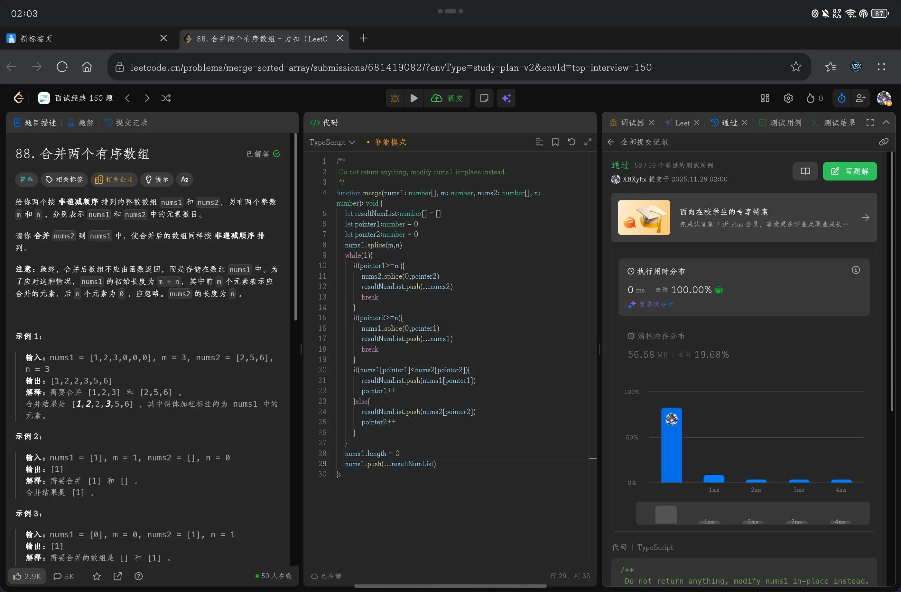

通过了，而且这个算法的时间复杂度是m+n。

#### 官方题解

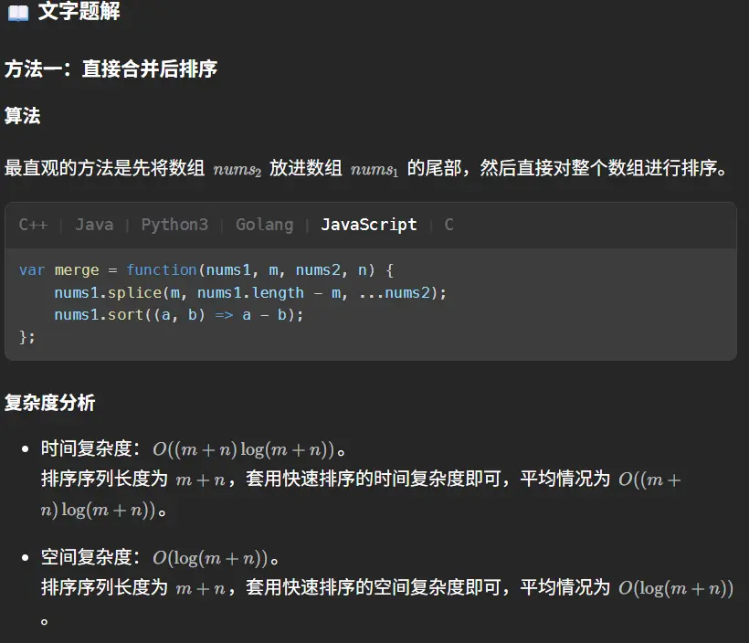

这种解法的时间复杂度较高，直接切除0再排序，但确实这种方法可能更通用一些，要是两个数组并非有序数组它就可以派上用场。

```js
var merge = function(nums1, m, nums2, n) {
    nums1.splice(m, nums1.length - m, ...nums2);
    nums1.sort((a, b) => a - b);
};
```

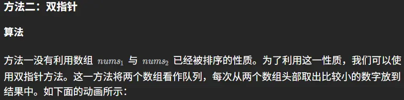


```js
var merge = function(nums1, m, nums2, n) {
    let p1 = 0, p2 = 0;
    const sorted = new Array(m + n).fill(0);
    var cur;
    while (p1 < m || p2 < n) {
        if (p1 === m) {
            cur = nums2[p2++];
        } else if (p2 === n) {
            cur = nums1[p1++];
        } else if (nums1[p1] < nums2[p2]) {
            cur = nums1[p1++];
        } else {
            cur = nums2[p2++];
        }
        sorted[p1 + p2 - 1] = cur;
    }
    for (let i = 0; i != m + n; ++i) {
        nums1[i] = sorted[i];
    }
};
```

复杂度分析

时间复杂度：O(m+n)。
指针移动单调递增，最多移动 m+n 次，因此时间复杂度为 O(m+n)。

空间复杂度：O(m+n)。
需要建立长度为 m+n 的中间数组 sorted。

啊对的对的对的对的，这就是我用的解法。

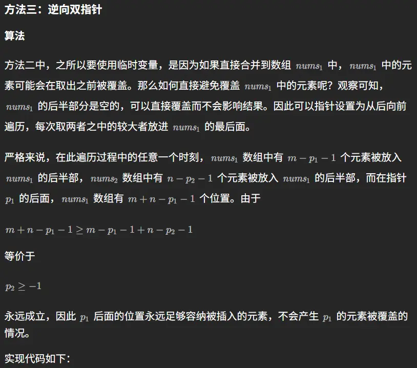

```js
var merge = function(nums1, m, nums2, n) {
    let p1 = m - 1, p2 = n - 1;
    let tail = m + n - 1;
    var cur;
    while (p1 >= 0 || p2 >= 0) {
        if (p1 === -1) {
            cur = nums2[p2--];
        } else if (p2 === -1) {
            cur = nums1[p1--];
        } else if (nums1[p1] > nums2[p2]) {
            cur = nums1[p1--];
        } else {
            cur = nums2[p2--];
        }
        nums1[tail--] = cur;
    }
};
```

这个方法确实是比我的解法更加优质，它针对于当前题目的顺序数组的特点定制了从后向前倒序遍历的方式进行插入，这样既避免了nums1中包含需要合并的非占位0，同时又避免了单独创建一个临时数组提升空间复杂度。

其实对于算法核心就是在于“时间”“空间”“难易度”三者之间的平衡，简单的算法必然是需要更多的时间和空间去完成，而复杂的算法则可以使用数学逻辑上的简化用更少的时间和空间去完成。最简单的暴力合并并排序，确确实实是很简单很泛用，但是它排序的过程浪费了原数组本就是有序数组的这个天然优势，造成了时间复杂度和空间复杂度的激增。而对于我的解法则是用时间换空间，用一个m+n长度的数组节省了再次排序的时间花费。最后对于双指针倒序插入的最优解则是对于数组本身的特点进行了数学推导从而获得了更加简洁高效的逻辑替代，从而在不增加空间复杂度的同时保持了时间复杂度的优势。

### 移除元素（简单）

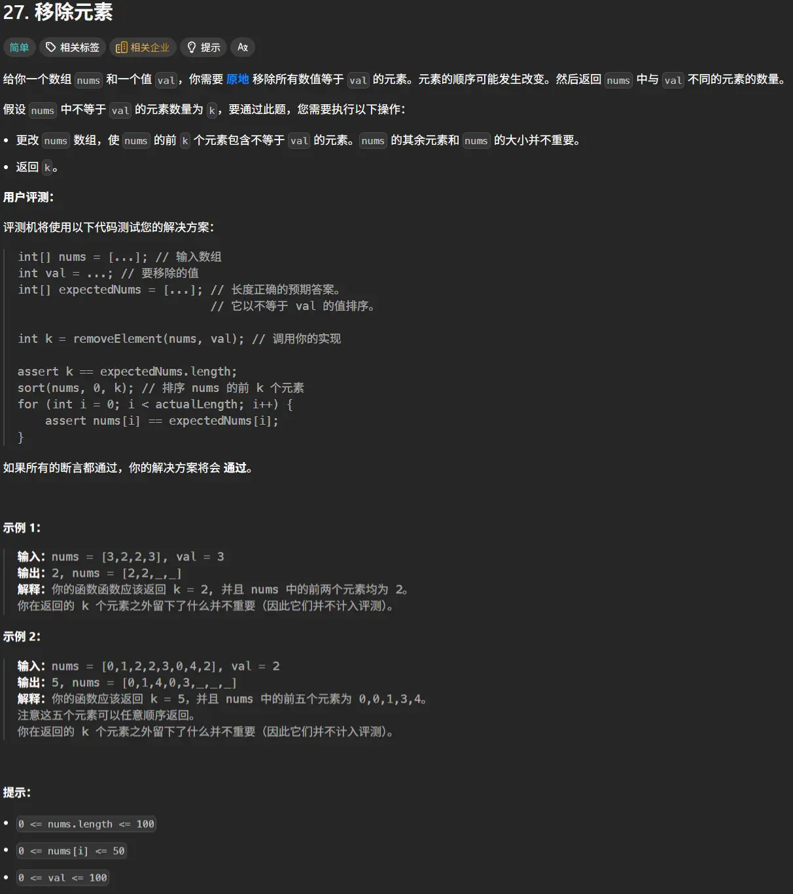

```ts
function removeElement(nums: number[], val: number): number {
    let length:number = nums.length
    let indexs:number[] = []
    for(let i=0;i<length;i++){
        if(nums[i]===val){
            indexs.push(i)
        }
    }
    indexs.forEach((i:number)=>{
        nums.splice(i,1)
    })
    nums.length=length
    return indexs.length
}
```

先整体遍历一遍去除所有相同数字的索引，然后再去进行删除，最后将长度补齐。

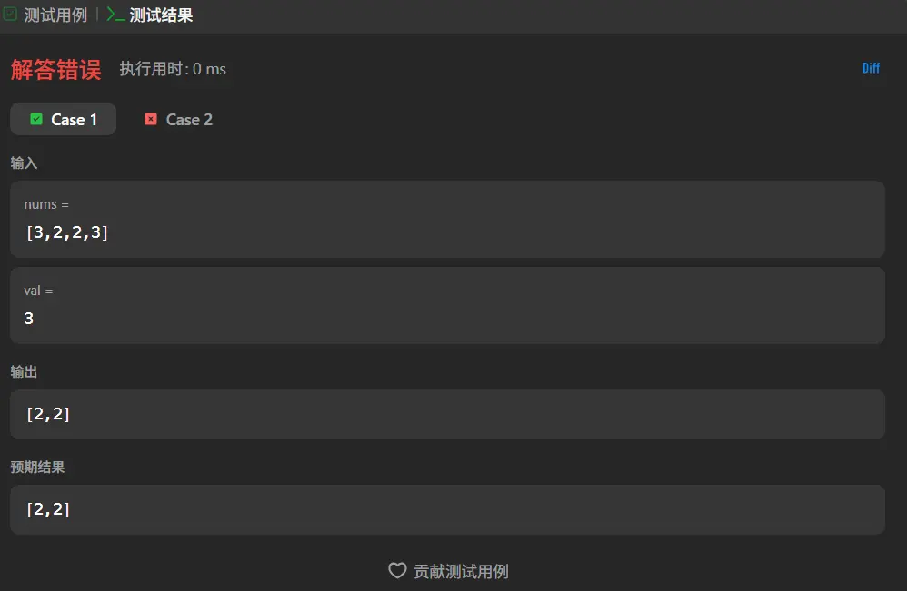

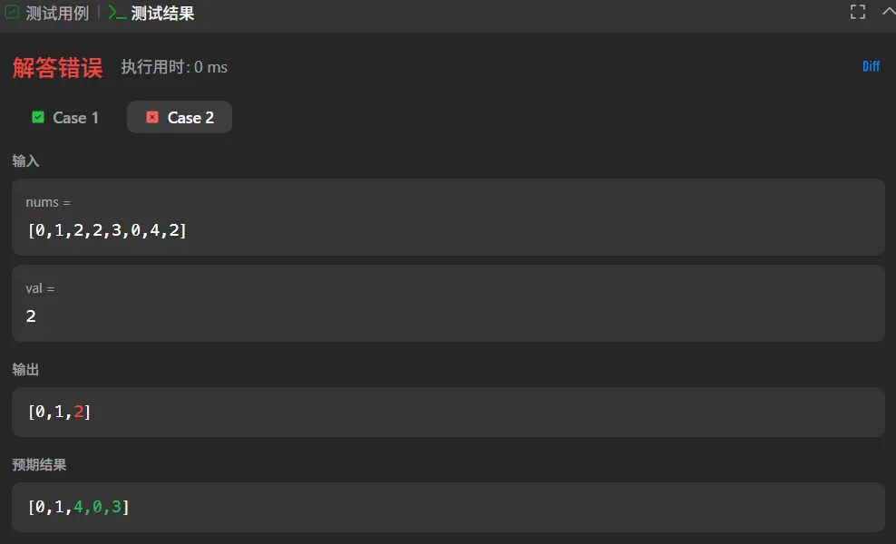

这里我很快就发现问题，当i索引被消除之后，后续的数字都会减小索引，这就导致我所消除的数字并不是我所期望的索引。

```ts
function removeElement(nums: number[], val: number): number {
    let length:number = nums.length
    let indexs:number[] = []
    for(let i=0;i<length;i++){
        if(nums[i]===val){
            indexs.push(i)
        }
    }
    indexs.forEach((i:number,index:number)=>{
        nums.splice(i-index,1)
    })
    nums.length=length
    return indexs.length
}
```

这里我还注意到了另一个问题，就是在返回值上。题目要求的返回值是删除后剩余的数量，但是我返回的是删除的数量。

```ts
function removeElement(nums: number[], val: number): number {
    let length:number = nums.length
    let indexs:number[] = []
    for(let i=0;i<length;i++){
        if(nums[i]===val){
            indexs.push(i)
        }
    }
    indexs.forEach((i:number,index:number)=>{
        nums.splice(i-index,1)
    })
    nums.length=length
    return nums.length-indexs.length
}
```


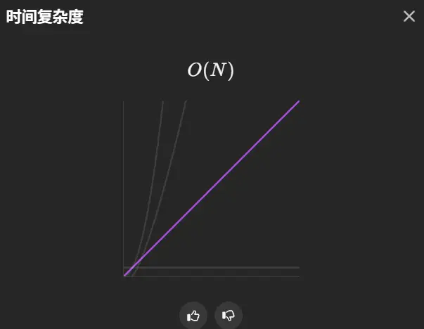


直接就是一波通过。

#### 官方题解2

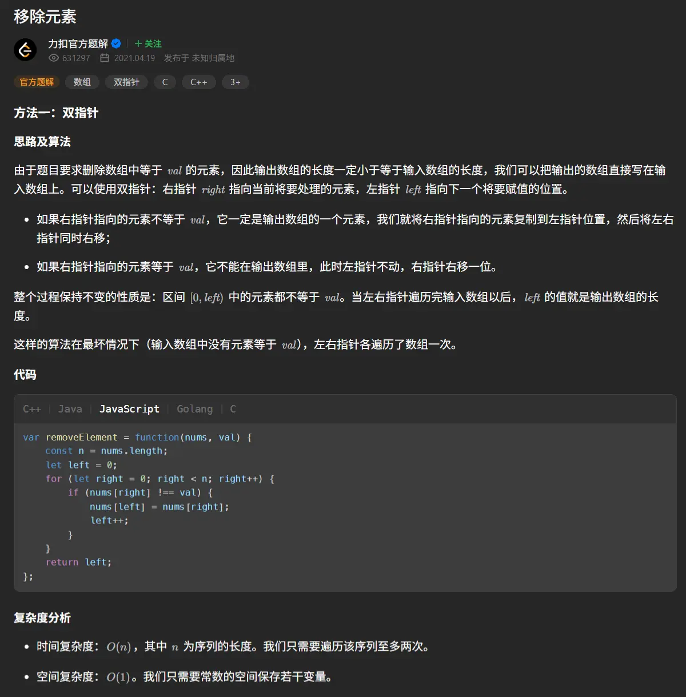

哦双指针，有意思，这种方式确实是在数据结构课上提到过，我有印象。很好理解，就是一个指针用于遍历，一个指针在前面等着将后面的非删除元素拉到前面，由于后面的删除元素流出的空缺并不需要排序或是用特定方式补全，所以我只需要单纯的覆盖前面的数据就可以，连单独保留一份数据的变量内存都不需要占据。

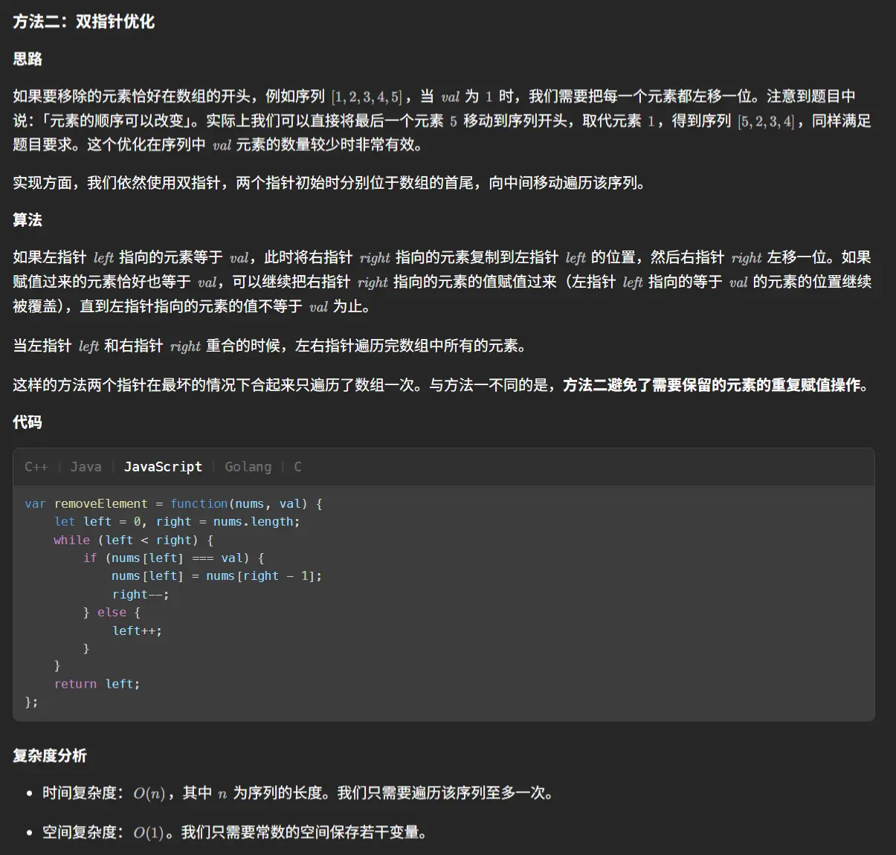

从两个方向向中间夹，只判定左侧是否为删除值，哇哦，这种方式确实更加快捷，两个指针合起来的总路程最大也仅仅是数组长度，而单向双指针则会出现右指针遍历一遍，最坏情况左指针也需要遍历一遍，这就导致了单向双指针的最坏时间复杂度是O(2n)，而双指针最坏时间复杂度则是O(n)。

我要亲手去实验一次这个双向指针算法。

```ts
function removeElement(nums: number[], val: number): number {
    let leftPointer:number = 0
    let rightPointer:number = nums.length-1
    let removeElementNum:number=0
    while(leftPointer<=rightPointer){
        if(nums[leftPointer]===val){
            nums[leftPointer]=nums[rightPointer]
            rightPointer--
            removeElementNum++
            continue
        }else if(nums[leftPointer]!==val){
            leftPointer++
            continue
        }
    }
    return nums.length-removeElementNum
}
```

牛逼卧槽，直接一遍过，原来思路清晰解起来这么快。

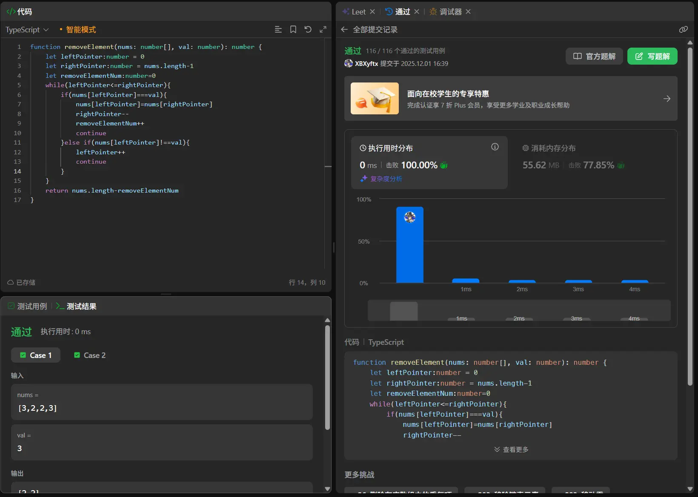

### 删除有序数组中的重复项（简单）


```ts
function removeDuplicates(nums: number[]): number {
    let leftPointer:number = 0
    let rightPointer:number = 1
    while(rightPointer<nums.length&&leftPointer<=rightPointer){
        if(nums[leftPointer]===nums[rightPointer]){
            rightPointer++
            continue
        }else if(nums[leftPointer]!==nums[rightPointer]){
            nums.splice(leftPointer+1,rightPointer-leftPointer-1)
            leftPointer++
            continue
        }
    }
    return nums.length
};
```

在前两道题的熏陶下我第一次想到的就是使用双指针去进行处理，一个去逐一遍历，一个去标志重复的起始点。

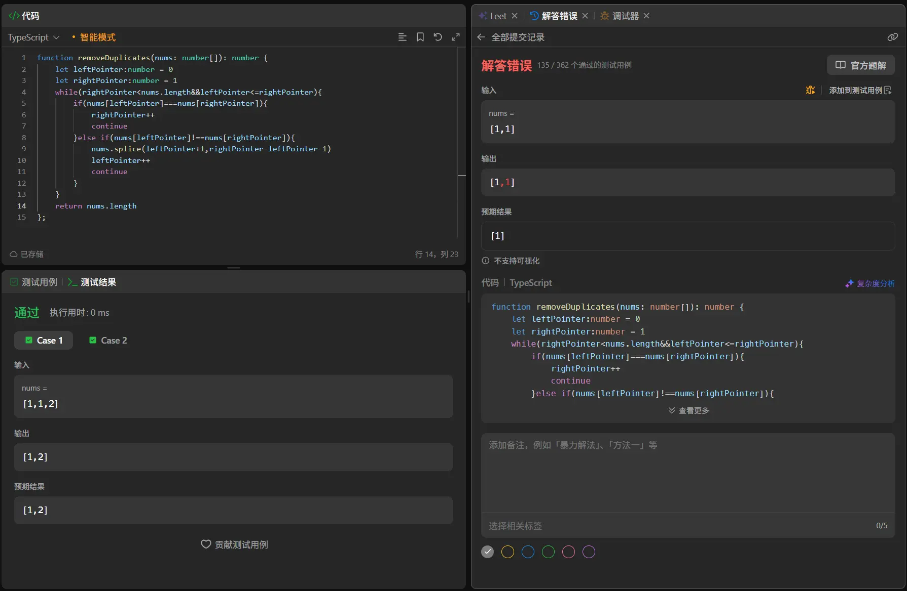

在测试的时候测试用例全部通过。

测试用例1：`[1,1,2]`
测试用例2：`[0,0,1,1,1,2,2,3,3,4]`

这两者的测试全部通过，但是提交后我在362个用例中通过了135个案例，对于这种通过一部分另一部分没通过的情况一般来讲都是整体的算法思路没有大问题但是对于某些特殊值的特化处理出现了问题，像是边界值。

我反思了一遍我对于整体指针行迹的处理，有一个问题就是在判定是否需要消除时是需要移动到连续重复数字区间后一位的位置后才会触发消除，但是这会导致最后一个延续到数组结束的重复数值区间并不会触发消除。

```ts
function removeDuplicates(nums: number[]): number {
    let leftPointer:number = 0
    let rightPointer:number = 1
    while(rightPointer<nums.length&&leftPointer<=rightPointer){
        if(rightPointer===nums.length-1){
            nums.splice(leftPointer+1,rightPointer-leftPointer)
            break
        }
        if(nums[leftPointer]===nums[rightPointer]){
            rightPointer++
            continue
        }else if(nums[leftPointer]!==nums[rightPointer]){
            nums.splice(leftPointer+1,rightPointer-leftPointer-1)
            leftPointer++
            continue
        }
    }
    return nums.length
};
```

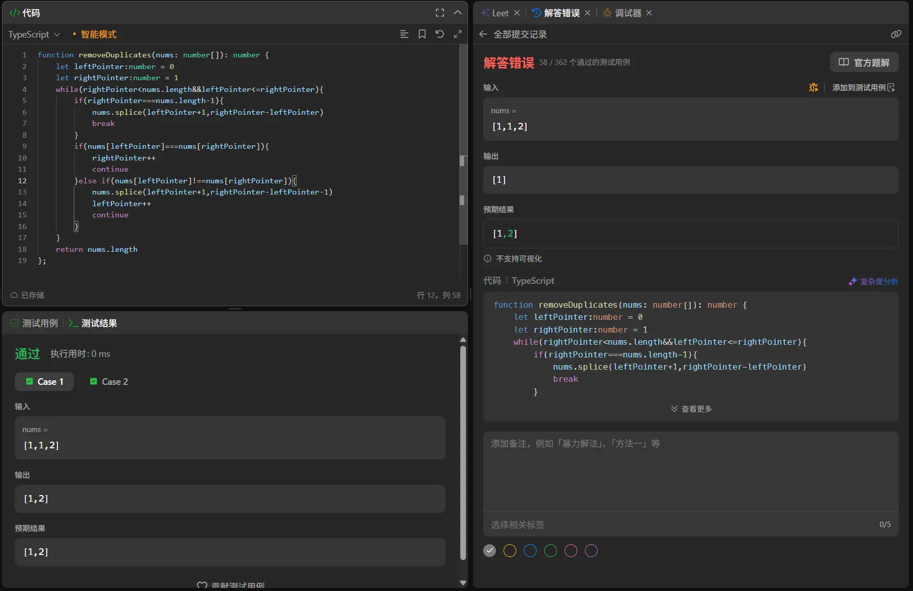

在添加了边界控制之后发现依旧是半错半对的情况，这说明我们还没有考虑到位，但与此同时通过的测试用例个数也发生了变化，这说明我们当前的改动是有效的，但仍存在问题。

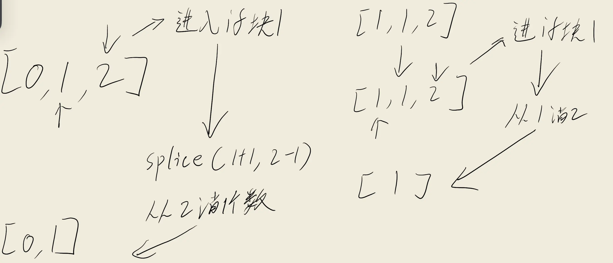

可以看到这种边界控制是存在严重问题的。冷静分析一下，对于这种情况我们可以将达到数据边界的情况分为左右指针值相等和左右指针值不等两种情况。

```ts
function removeDuplicates(nums: number[]): number {
    let leftPointer:number = 0
    let rightPointer:number = 1
    while(rightPointer<nums.length&&leftPointer<=rightPointer){
        if(rightPointer===nums.length-1){
            if(nums[leftPointer]===nums[rightPointer]){
                nums.splice(leftPointer+1,rightPointer-leftPointer)
                break
            }else{
                nums.splice(leftPointer+1,rightPointer-leftPointer-1)
                break
            }
        }
        if(nums[leftPointer]===nums[rightPointer]){
            rightPointer++
            continue
        }else if(nums[leftPointer]!==nums[rightPointer]){
            nums.splice(leftPointer+1,rightPointer-leftPointer-1)
            leftPointer++
            continue
        }
    }
    return nums.length
};
```

这一次的修改，我将边界控制的情况进行了细分，分别处理了左右指针值相等和不等的情况。

相等时就删除包含右指针自身在内的值，不同则删除左右指针中间的数。

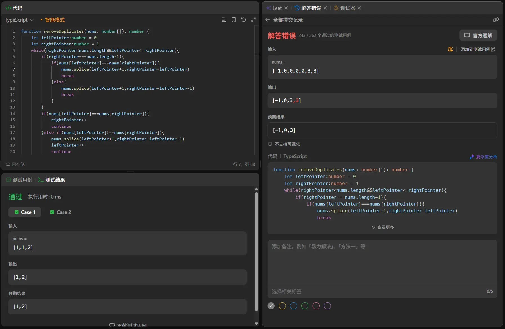

我们通过的测试用例上涨了，说明这个改动是有效的但还是又欠缺。此时我又想到了另一个问题，就是在于将元素删除后右指针和左指针之间的间隔出现了异常的跨度。

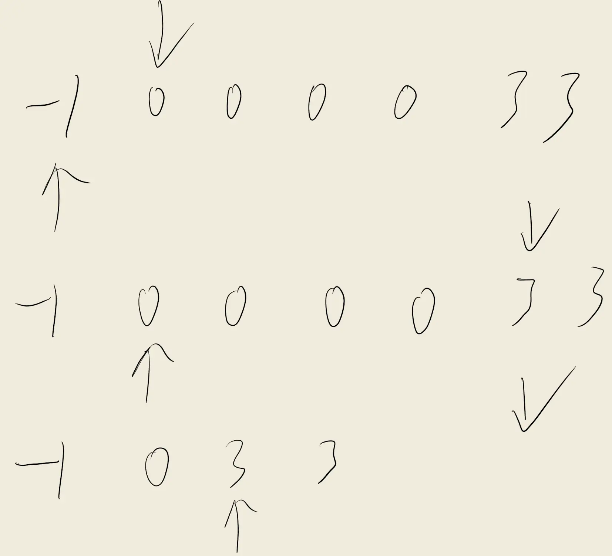

像是这样的情况会出现将下一个重复区间给拉到无法被监测的区间中。所以在删除完后我们还需要将右指针拉回到左指针位置。

```ts
function removeDuplicates(nums: number[]): number {
    let leftPointer:number = 0
    let rightPointer:number = 1
    while(rightPointer<nums.length&&leftPointer<=rightPointer){
        if(rightPointer===nums.length-1){
            if(nums[leftPointer]===nums[rightPointer]){
                nums.splice(leftPointer+1,rightPointer-leftPointer)
                break
            }else{
                nums.splice(leftPointer+1,rightPointer-leftPointer-1)
                break
            }
        }
        if(nums[leftPointer]===nums[rightPointer]){
            rightPointer++
            continue
        }else if(nums[leftPointer]!==nums[rightPointer]){
            nums.splice(leftPointer+1,rightPointer-leftPointer-1)
            leftPointer++
            rightPointer=leftPointer
            continue
        }
    }
    return nums.length
};
```

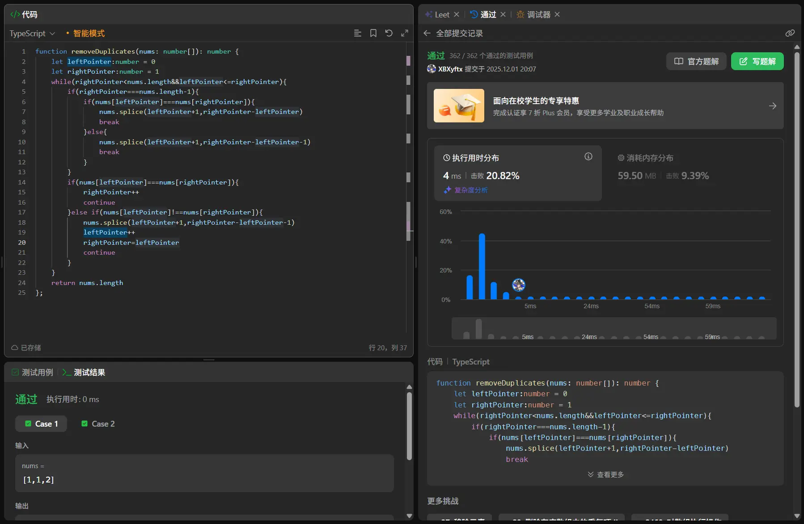

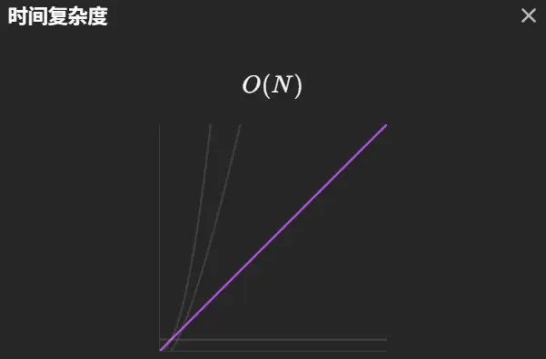

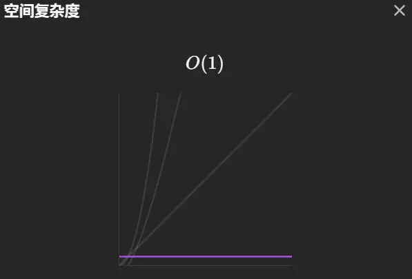

#### 官方题解3

<video width="100%" controls>
  <source src="38.mp4" type="video/mp4">
  您的浏览器不支持视频标签。
</video>

！！！我勒个豆，在和孙妈深度的聊了一下才发现我有点过度依赖`splice`的这个内置函数了，它在处理数组时会移动大量数组元素的索引，导致索引上的异常变化，而为了处理这种异常变化我需要用大量的边界处理来去调整索引。

我要回归基本功的去试试，用最基础的形式去进行一下尝试了。

首先双指针是正确的，问题是在于我无需删改原本的数组长度，我只需要逐一找到不重复的元素去覆盖到前面的位置就好。

```ts
function removeDuplicates(nums: number[]): number {
    let leftPointer:number = 0
    let rightPointer:number = 1
    while(rightPointer<nums.length){
        if(nums[leftPointer]===nums[rightPointer]){
            rightPointer++
            continue
        }else{
            nums[++leftPointer]=nums[rightPointer++]
        }
    }
    return leftPointer+1
};
```

`nums[++leftPointer]=nums[rightPointer++]`超绝细节处理！！！

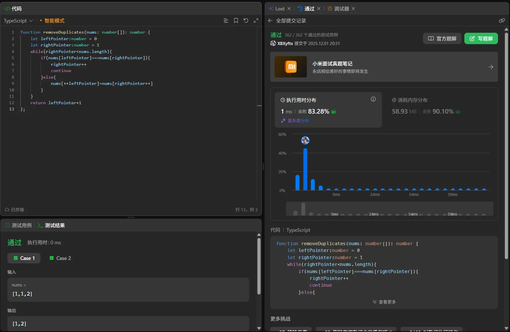

两者的时间空间复杂度是一致的，和我原本程序的一样。

### 删除有序数组中的重复项2（中等）

这将会是我做的第一个中等难度的题，让我来试一试。

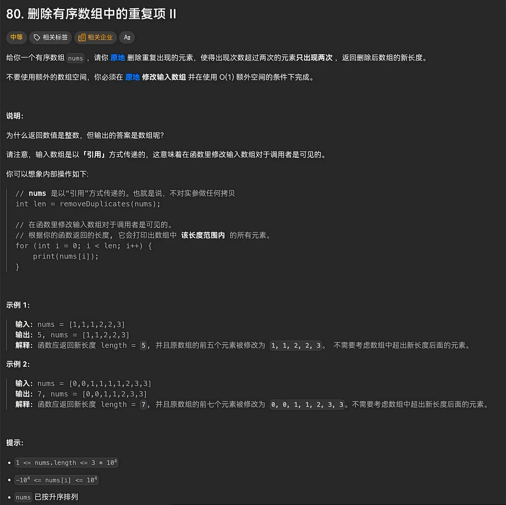

```ts
function removeDuplicates(nums: number[]): number {
    let rightPointer:number=0
    let leftPointer:number=0

    while(leftPointer<=rightPointer&&rightPointer<nums.length){
        if(nums[leftPointer]===nums[rightPointer]&&leftPointer-rightPointer<2){
            rightPointer++
            continue
        }else if(nums[leftPointer]===nums[rightPointer]&&leftPointer-rightPointer>=2){
            nums.splice(rightPointer,1)
            continue
        }else if(nums[leftPointer]!==nums[rightPointer]){
            leftPointer=rightPointer
            continue
        }
    }

    return nums.length
};
```

我的想法是利用双指针，分别指向当前重复元素组的头和尾，当头尾距离超过1，也就是有大于两个的重复元素出现时就开始执行原地删除策略。当尾指针指向的元素和头指针指向的元素不同时，就将左指针移动到右指针位置，右指针继续向右移动。

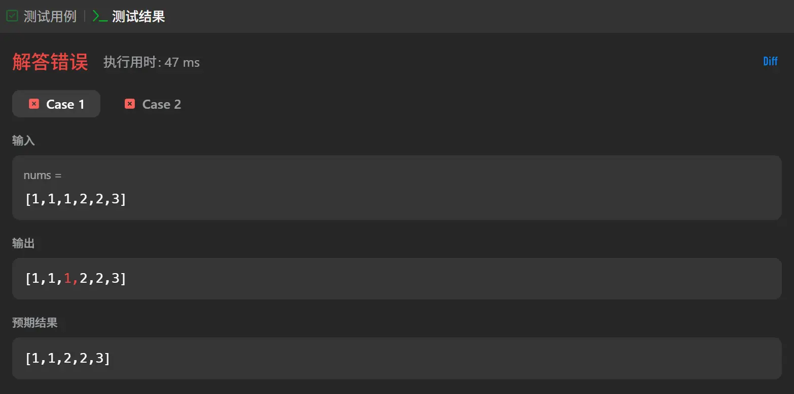

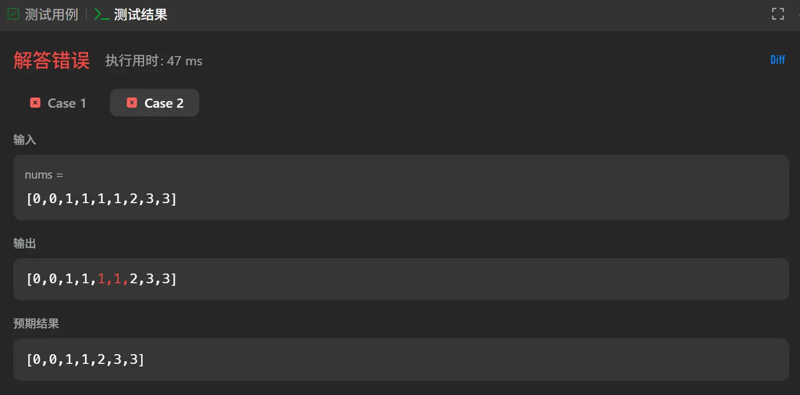

从测试用例的结果来看我的算法没有对数组进行任何有效的处理，也就是说我的算法没有起到任何作用。我需要重新审视一下我的算法。

打个断点进行一下调试。

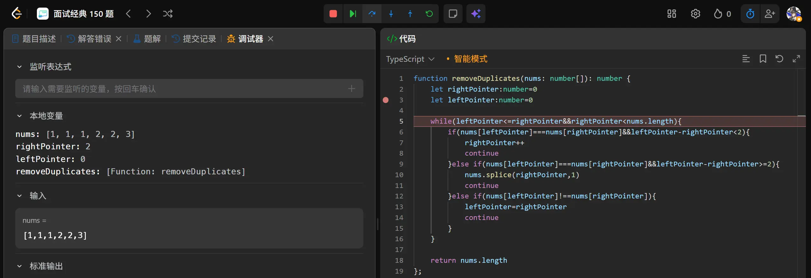

这里可以看到左指针没有动同时右指针正常的移动到了2，两者之间相差2了理论上本次应当进入的代码块是第二块

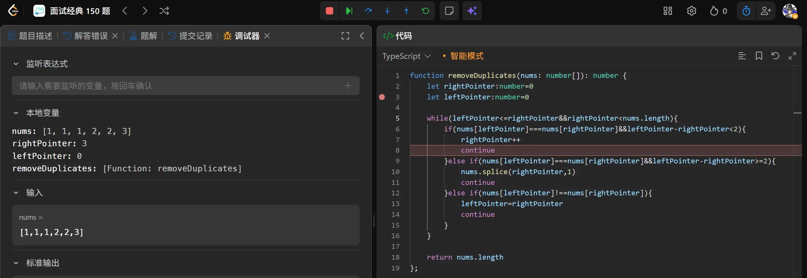

但实际上它进入的是第一块。？？？啊？为啥？

奥原来是我的条件写错了，我的左右指针写反了。

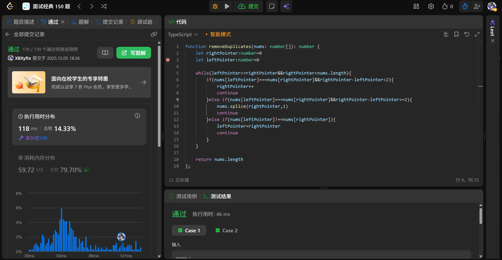

那没事了。

### 多数元素（简单）

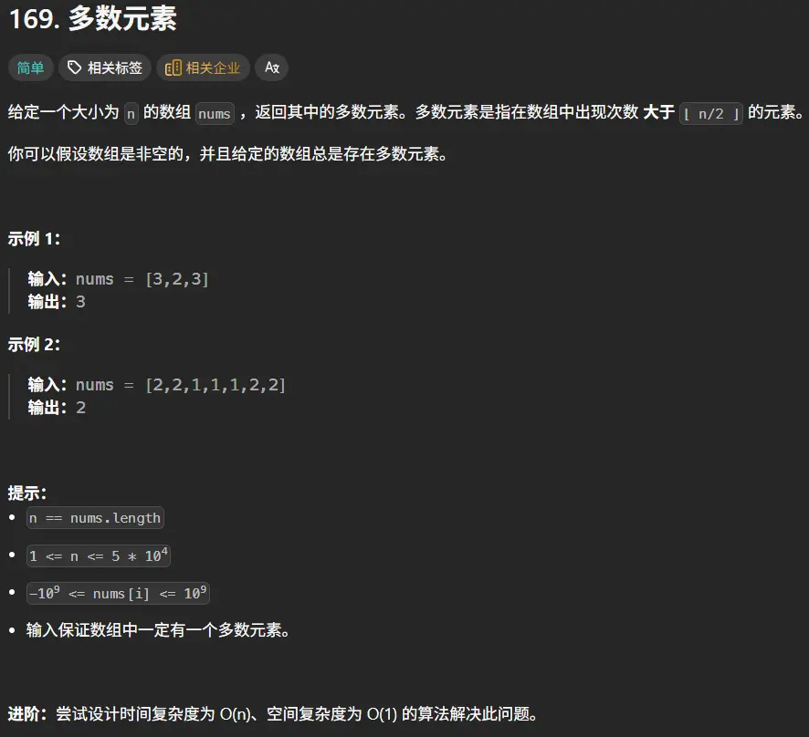

```ts
function majorityElement(nums: number[]): number {
    let num:number = nums.length/2
    let map:Map<number,number>=new Map()
    for(let i=0;i<nums.length;i++){
        if(map.has(nums[i])){
            let value:number = map.get(nums[i])
            if(++value>num){
                return nums[i]
            }
            map.set(nums[i],value)
        }else {
            map.set(nums[i],1)
        }
    }
};
```

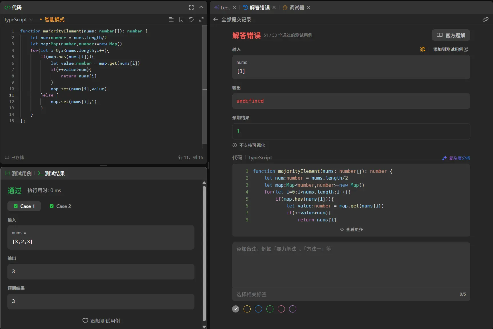

这里发现当数组长度为1的时候我的算法并不能很好的去进行处理，因为我将其加入到map中之后就结束了没有返回值所以返回的是undefined。

```ts
function majorityElement(nums: number[]): number {
    let num:number = nums.length/2
    let map:Map<number,number>=new Map()
    for(let i=0;i<nums.length;i++){
        if(map.has(nums[i])){
            let value:number = map.get(nums[i])
            if(++value>num){
                return nums[i]
            }
            map.set(nums[i],value)
        }else {
            map.set(nums[i],1)
            if(1>num){
                return nums[i]
            }
        }
    }
};
```

简单的加一个判断就可以解决。

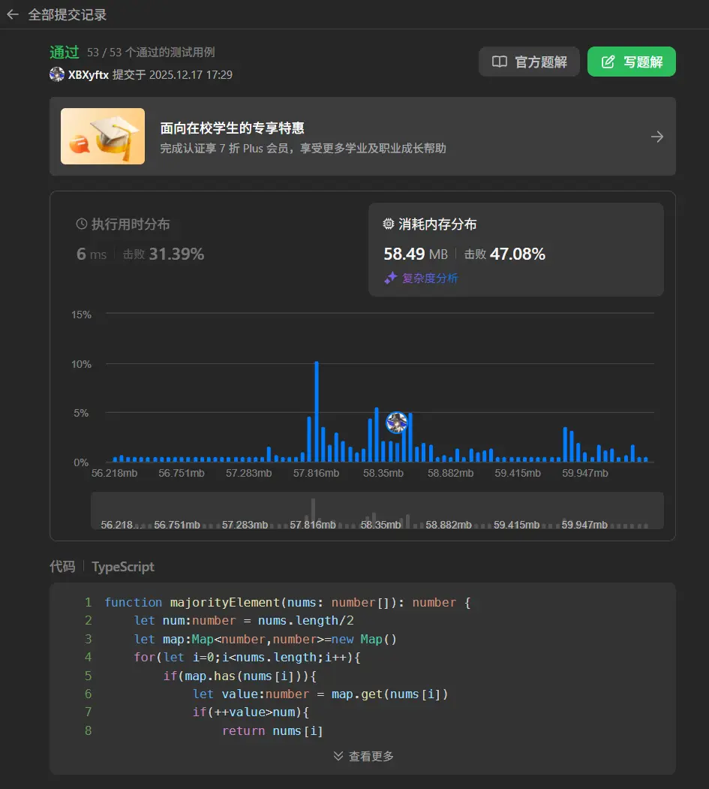

时间空间复杂度都是O(n)。

但很显然还不是最优解。

#### 官方题解（太高级了）

没想到这道题官方题解给出了五种思路，确实是我没想到的。第一种是哈希表，是最暴力的求解就不多说了。第二种是排序，大致思路就是说排序后，众数无论是被排到哪里，数组中间的数一定是众数，而且由于众数个数是大于数组长度的一半，所以无论总长是奇是偶都可以去中值为众数。

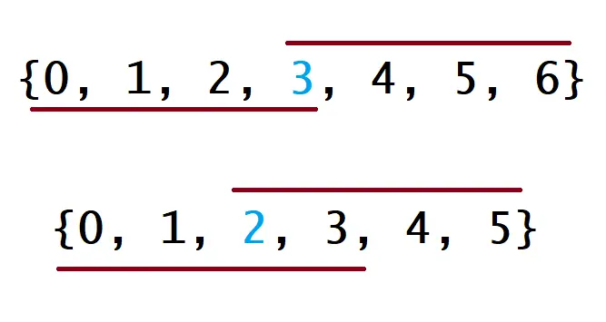

第三种方式就开始高级起来了。

随机化。

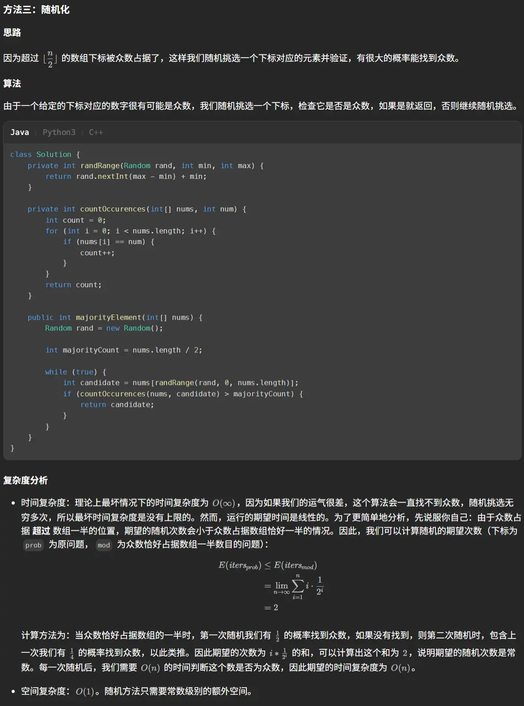

这种方式体现了对于数据特征的深刻理解，但也是一种双刃剑算法，虽然大多数情况都能很快的找到目标的众数，但由于是随机的，就会导致算法的效率不稳定。但这也是一种思路，我要亲自实现以下。

```ts
function majorityElement(nums: number[]): number {
    while(1){
        let num =nums[Math.floor(Math.random()*nums.length)]
        if(modeJudgment(nums,num)){
            return num
        }
    }
};

function modeJudgment(nums: number[],num:number):boolean{
    let count:number=0
    nums.forEach((i)=>{
        if(i==num){
            count++
        }
    })
    if(count>=(nums.length/2)){
        return true
    }
    return false
}
```

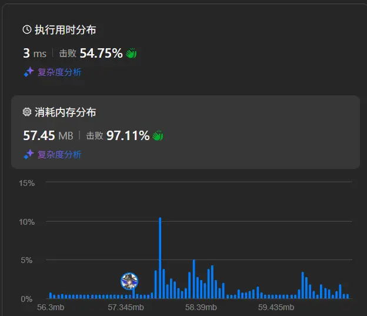

ok，直接秒掉。不过重点还是在于掌握思路。

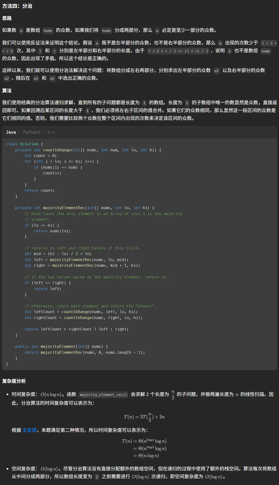

分治！！！之前田老师还强调过这个来着。

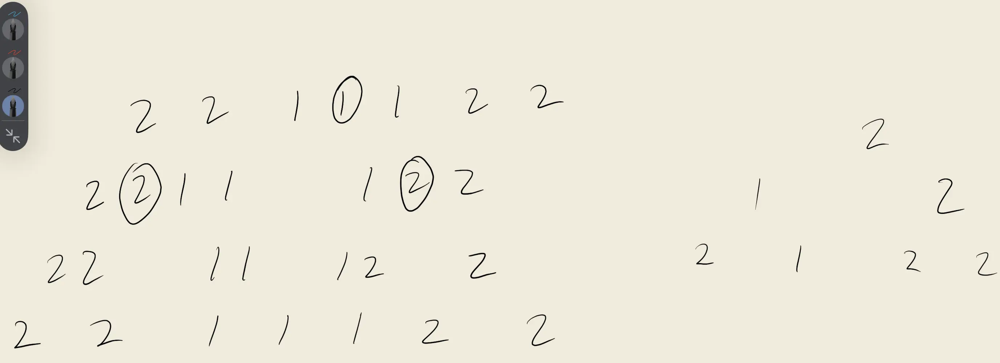

大致是这个意思，我来实现一下。

```ts
function majorityElement(nums: number[]): number {
    return split(nums,0,nums.length-1)
};

function countInArray(nums:number[],num:number,str:number,end:number):number{
    let count:number=0
    for(let i=str;str<=end;i++){
        if(nums[i]===num){
            count++
        }
    }
    return count
}

function split(nums:number[],str:number,end:number):number{

    if(str===end){
        return nums[str]
    }

    let mid = Math.floor((end-str)/2+str) 
    let left = split(nums,str,mid)
    let righ = split(nums,mid+1,end)

    if(left===righ){
        return left
    }

    let leftCount = countInArray(nums,left,str,end)
    let righCount = countInArray(nums,righ,str,end)

    return leftCount > righCount ? left : righ
}
```

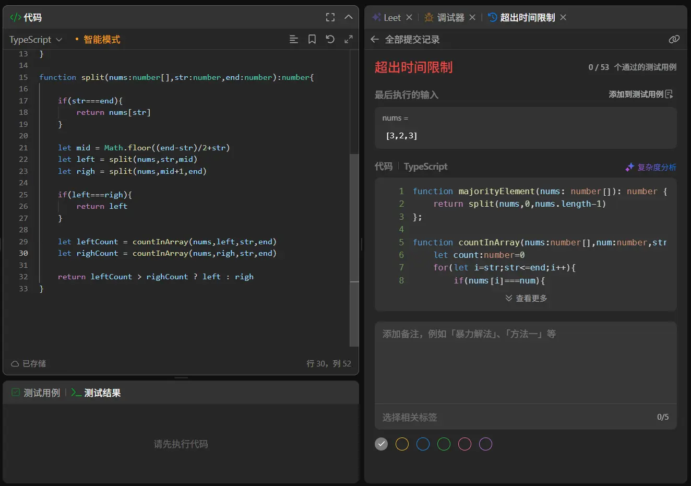

？递归超时？

我经过一番检查发现其实问题并不在于递归而是在于for循环。

`for(let i=str;str<=end;i++)`

啊，好蠢啊。

```ts
function majorityElement(nums: number[]): number {
    return split(nums,0,nums.length-1)
};

function countInArray(nums:number[],num:number,str:number,end:number):number{
    let count:number=0
    for(let i=str;i<=end;i++){
        if(nums[i]===num){
            count++
        }
    }
    return count
}

function split(nums:number[],str:number,end:number):number{

    if(str===end){
        return nums[str]
    }

    let mid = Math.floor((end-str)/2+str) 
    let left = split(nums,str,mid)
    let right = split(nums,mid+1,end)

    if(left===right){
        return left
    }

    let leftCount = countInArray(nums,left,str,end)
    let righCount = countInArray(nums,right,str,end)

    return leftCount > righCount ? left : right
}
```

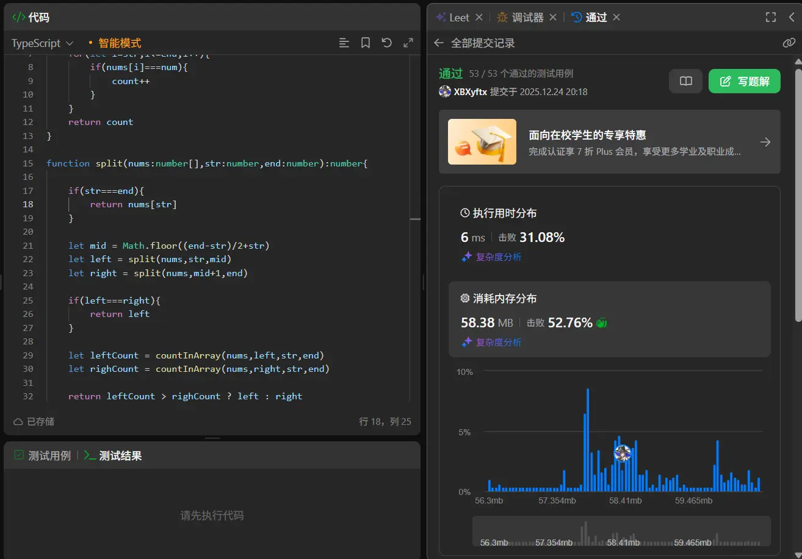

分治是个好思想但是他的时间空间好像并不是很优秀。

看到最后一种投票法，我直接小脑萎缩了，思路清晰算法简单，复杂度优秀。

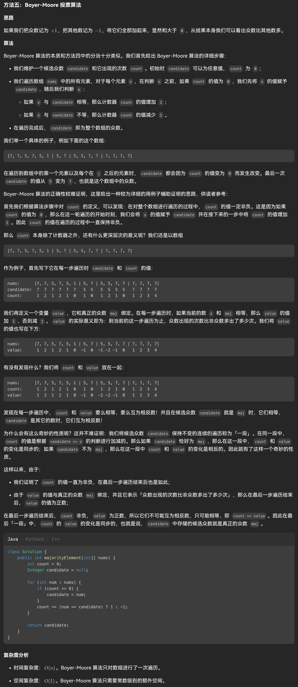

我们可以推演一下它的临界情况。

首先题目中的`多数元素是指在数组中出现次数 大于 ⌊ n/2 ⌋ 的元素。`这句话排除了众数与非众数相等的这种临界情况，若相等时就可能会出现最后一位恰好是众数导致最后一次计数器归零但判定到了非众数的情况。

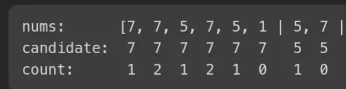

就像上面这个数组一样（从官方题解的事例中截取的）

这样一来，验证了临界情况我们就可以保证最后一位算完判定到的一定是众数。

我来实现一下这个算法。

```ts
function majorityElement(nums: number[]): number {
    let count:number = 0
    let num:number

    for(let i = 0;i<nums.length;i++){
        if(count===0){
            num = nums[i]
            count++
            continue
        }
        if(nums[i]===num){
            count++
        }else{
            count--
        }
    }
    return num
};
```

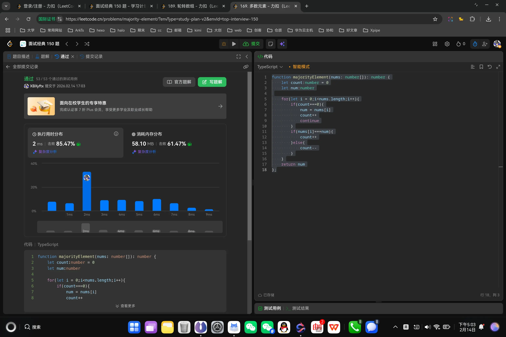

厉害，确实厉害。

### 轮转数组

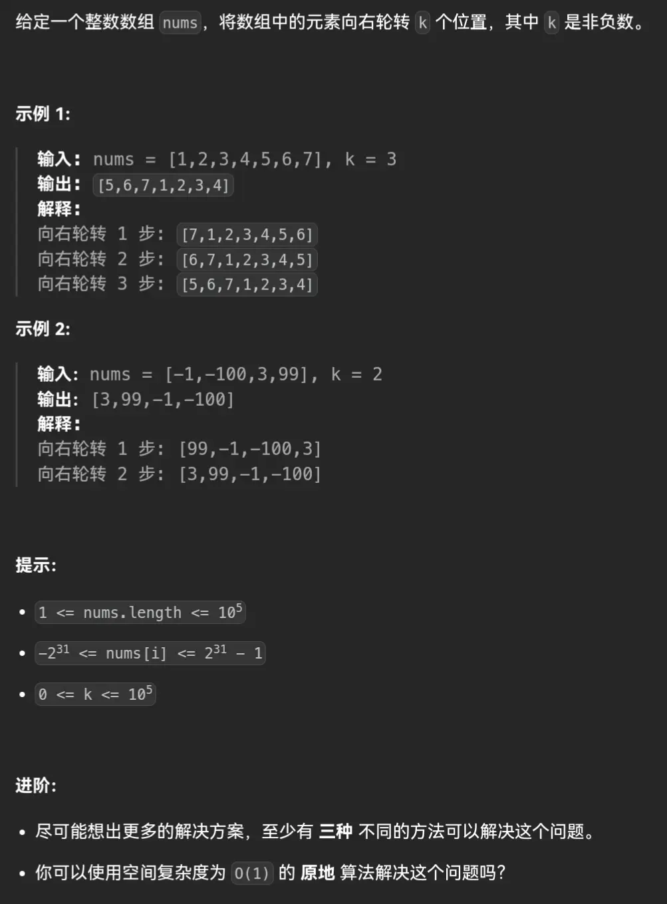

这道题看到的瞬间我浮现出了两种方法，一是用循环或者递归一次挪动一个模拟整个轮转过程，二是直接讲数组导数的K位接取出来作为一个新数组随后讲前半部分的数组拼接到新数组尾部即可。

#### 模拟轮转法

```ts
/**
 Do not return anything, modify nums in-place instead.
 */
function rotate(nums: number[], k: number): void {
    nums = recursionRotate(nums,k)
};

function recursionRotate(nums:number[],k:number):number[]{
    let currentNums:number[]
    if(k!==0){
        let newNums:number[]=[nums.pop()]
        newNums.push(...nums)
        k--
        currentNums = recursionRotate(newNums,k)
    }else{
       return currentNums 
    }
  
}
```

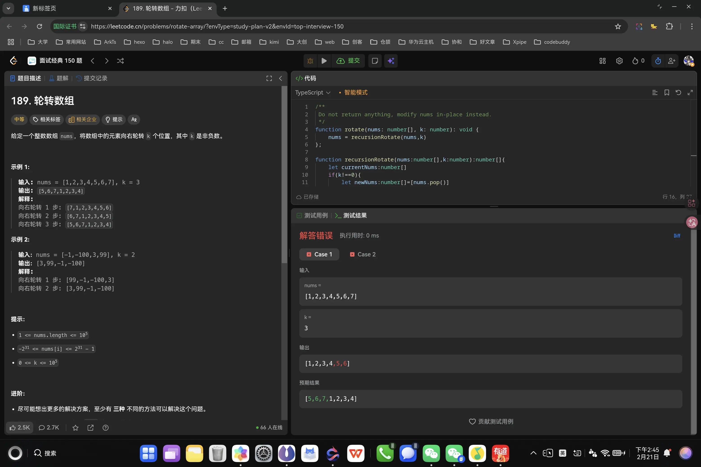

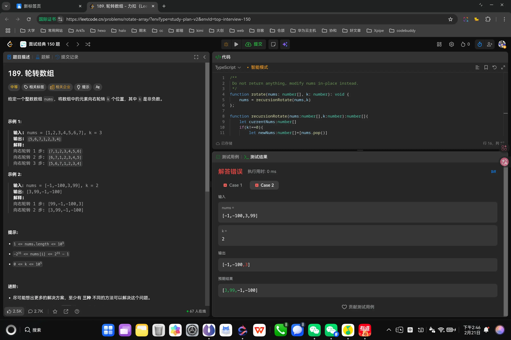

可以看到结果中我的操作结果都是讲最后一位移除后就没有其他任何操作了。

我启动调试模式之后发现递归的过程都是正常的，问题依旧是发生在边界情况上。

我们对于当前的算法的预期会在最后一次递归的时候返回最终结果的数组，但实际上问题出现在递归的基准情况（base case）处理上。仔细观察代码：

```ts
function recursionRotate(nums:number[],k:number):number[]{
    let currentNums:number[]  // 声明但未初始化，值为 undefined
    if(k!==0){
        let newNums:number[]=[nums.pop()]
        newNums.push(...nums)
        k--
        currentNums = recursionRotate(newNums,k)  // 递归结果赋值给 currentNums
    }else{
       return currentNums  // 当 k=0 时，直接返回未初始化的 currentNums，即 undefined
    }
  
}
```

**问题分析：**

当递归到最后一步（k=0）时，函数进入 `else` 分支，此时直接返回了 `currentNums`。但问题是 `currentNums` 只是被声明了，从未被赋值，它的值是 `undefined`。

这就导致递归链的最底层返回了 `undefined`，然后这个 `undefined` 被逐层向上传递，最终 `recursionRotate` 的返回值就是 `undefined`。而 `nums = recursionRotate(nums,k)` 这行代码将 `undefined` 赋值给了 `nums`，所以最终结果显示数组好像"消失"了。

**正确的理解应该是：**

递归函数需要确保在基准情况下返回一个有效的数组。修改后的代码应该是：

```ts
function recursionRotate(nums:number[],k:number):number[]{
    if(k===0){
        return nums  // 基准情况：直接返回当前数组
    }
    let newNums:number[]=[nums.pop()]
    newNums.push(...nums)
    return recursionRotate(newNums,k-1)
}
```

这样每次递归都会明确返回一个数组（要么是基准情况的 `nums`，要么是递归调用的结果），而不是返回未初始化的变量。

另外，`nums = recursionRotate(nums,k)` 这种写法在 TypeScript 中还有一个潜在问题：它修改的是形参 `nums` 的引用，而不是原数组本身。对于 LeetCode 这类要求"原地修改"的题目，这种重新赋值的方式可能无法通过测试，因为函数外部的引用不会感知到这个变化。

```ts
/**
 Do not return anything, modify nums in-place instead.
 */
function rotate(nums: number[], k: number): void {
    nums = recursionRotate(nums,k)
};

function recursionRotate(nums1:number[],k:number):number[]{
    if(k===0){
        return nums1
    }
    let newNums:number[] = [nums1.pop()]
    newNums.push(...nums1)
    return recursionRotate(newNums,k-1)
  
}
```

这是我第二次修改后的代码，我所预测的内存地址修改的问题的确是出现了。让我来通过调试模式分析一下。

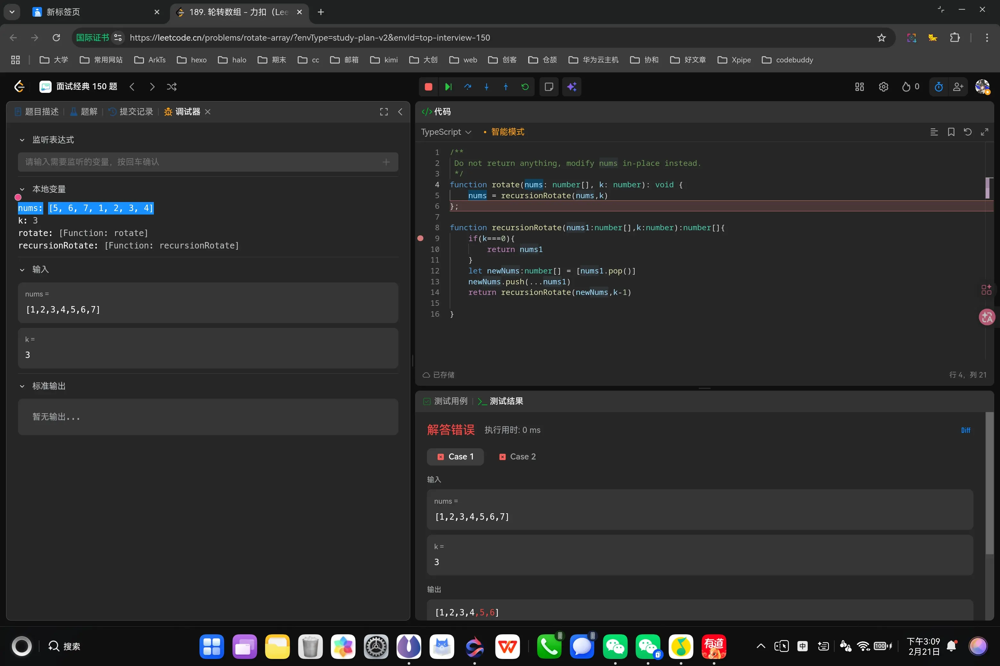

可以看到在经历了我第二版递归之后的nums数组的的确确是正确的结果，但是结果监测到的依旧是仅将数组最后一位摘取后的残缺数组。

其实也很好解释，在我们的递归中，我们将原数组的地址传入递归函数，并且在第1次递归时调用了pop方法，也就相当于将原地址的数组进行了最后一位的摘取，但在第1次递归调用第2次递归的时候，我们就创建了一个新的`newNums`数组，第2次递归就基于第1次创建的这个新地址去进行了修改，就与题干输入的地址无关了。

而后续每一轮的递归，它所传递的地址都是一个新的值，所以说最终力扣检测的是题干所输入的地址值，那个地址值仅在第1次递归时被进行了最后一位截取的操作。而我第1次的错误算法，最终返回的应该是一个undefined,因为它没有被进行初始化，但是结果依旧输出了一个被截取了最后一位的数组，其实这个时候我就已经意识到可能是这个问题了。

针对于这个特性我们可以去进行一下改造。

```ts
/**
 Do not return anything, modify nums in-place instead.
 */
function rotate(nums: number[], k: number): void {
    recursionRotate(nums,k)
};

function recursionRotate(nums:number[],k:number):number[]{
    if(k===0){
        return nums
    }
    nums.unshift(nums.pop())
    return recursionRotate(nums,k-1)
  
}
```

有一说一再这样改完其实更简单了。

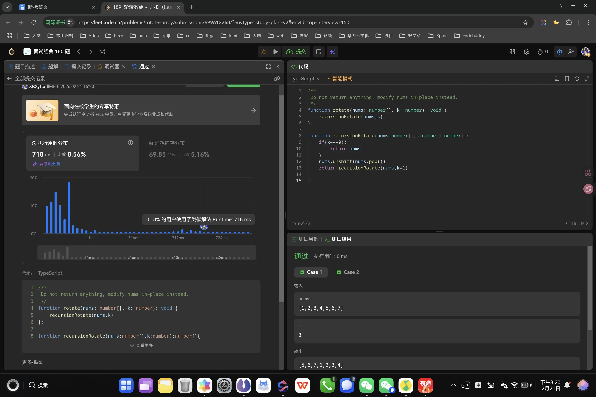

但我们当前的算法时间和空间复杂度都不算优秀，毕竟递归的特点就是很耗费内存，而一步步模拟轮转过程就会导致时间复杂度是与N成正比的。

#### 数组拼接法

```ts
/**
 Do not return anything, modify nums in-place instead.
 */
function rotate(nums: number[], k: number): void {
    nums.unshift(...nums.splice(nums.length-k,k))
};
```

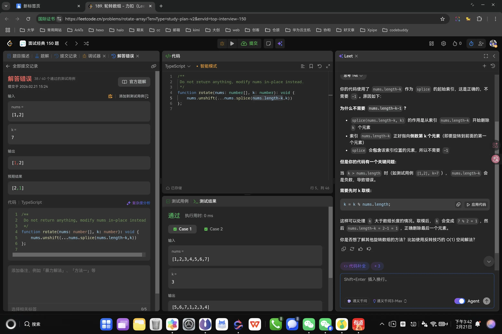

嘶，在本地测试完成后我本来以为稳了，没想到K可能大于数组长度这码事，确实是疏忽了，还是要抓住本质是轮转次数而不是截取长度，模拟操作算法的好处就在于无论取值如何，知道严格模拟就不会出错，想简化就还得去注意边界情况。

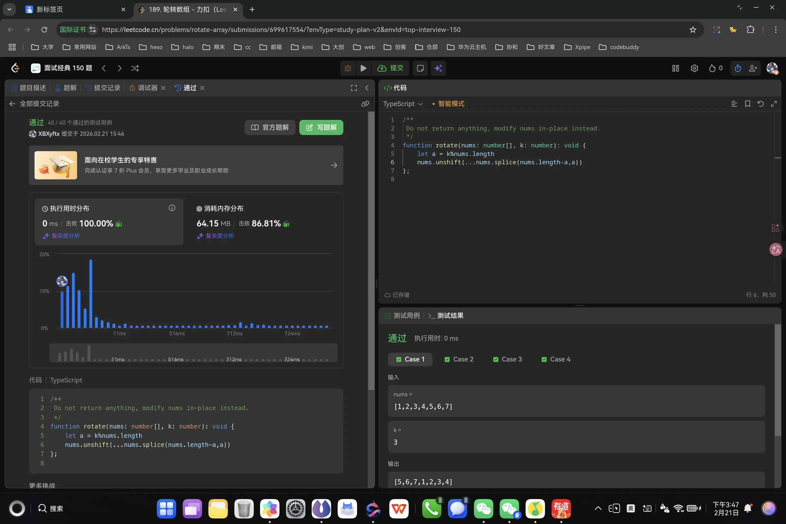

我嘞个击败百分之百。

### 买卖股票的最佳时机

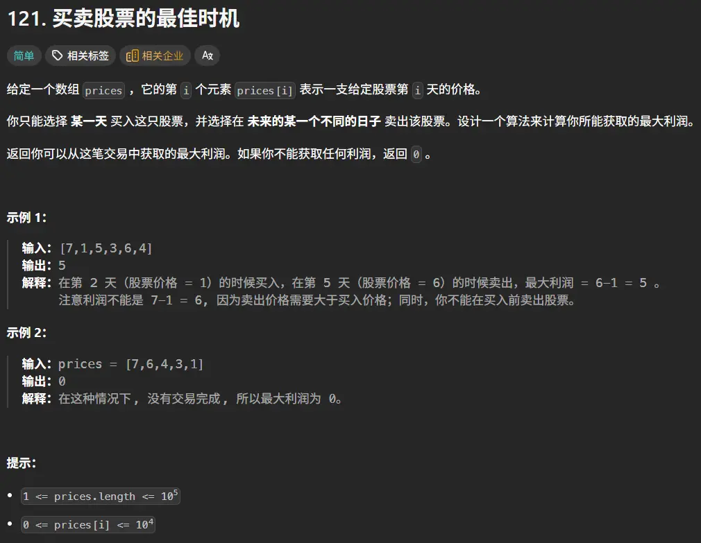

看到这道题我首先注意到了几个点，首先这道题肯定不是简简单单的寻找最小值和最大值因为我们有一个明确的要求是不能在买入前卖出，也就是说如果最大值在最小值前我们也是不能这样取的。

最基本的排列组合所有可能性是肯定能做出来但是时间复杂度会很高，所以我们需要去寻找一个更优的解法。

双指针，左指针指买入，右指针指卖出逐一枚举记录最大值。然后用双层循环左右指针分开走，右走完一圈左走一位。

```ts
function maxProfit(prices: number[]): number {
    let currentMax:number = 0

    for(let left = 0;left < prices.length-1;left++){
        for(let right = ++left;right < prices.length;right++){
            if(prices[right]-prices[left] > currentMax){
                currentMax = prices[right] - prices[left]
            }
        }
    }
    return currentMax
};
```

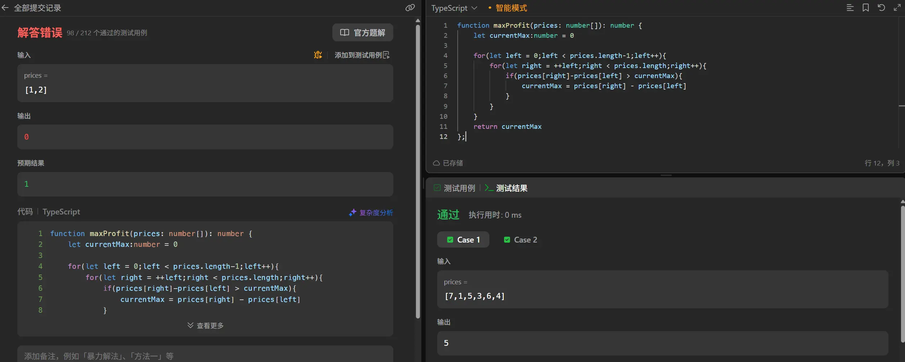

奥我发现问题了，`++left`这步操作会导致left指针随着right指针的移动而移动。修正一下。

```ts
function maxProfit(prices: number[]): number {
    let currentMax:number = 0

    for(let left = 0;left < prices.length-1;left++){
        for(let right = left+1;right < prices.length;right++){
            if(prices[right]-prices[left] > currentMax){
                currentMax = prices[right] - prices[left]
            }
        }
    }
    return currentMax
};
```

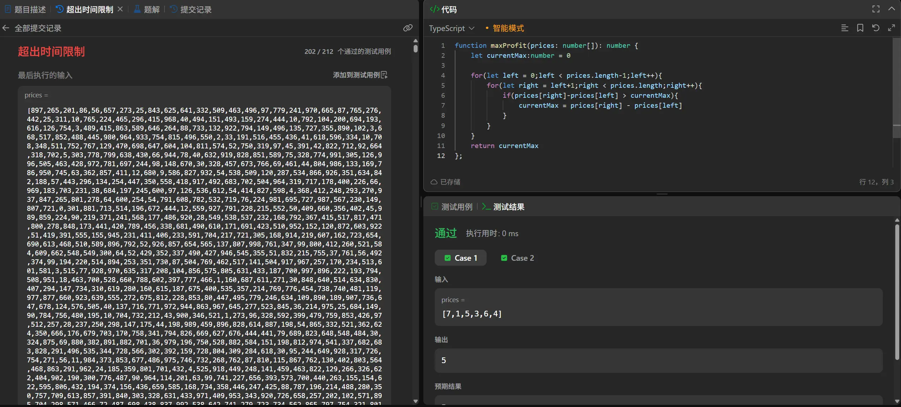

超时，意料之中，我们来进行优化。

首先当前的算法是一个O（N方）的时间复杂度，我们现在需要尽可能的想办法压缩到O（N）。

我们来分析一下这个过程的本质，虽然直接取全局最低值不可取，但我们依旧可以发现当前许多计算是不必要的。

比如`[7,1,5,3,6,4]`中，`1-7` `3-7` `3-5`这些都是非必要的遍历，同样的对于`6-3` `6-5`这种已知前面有更小值的遍历也是不必要的。在卖出日固定的情况下，我们完全可以维护一个此前最低的买入日价格变量，就可以避免上述两种情况的遍历。比最低买入日低就设置新最低买入价，比它高就再去计算利润，这样就可以压缩到O（N）。

```ts
function maxProfit(prices: number[]): number {
    let currentMax:number = 0
    let currentMin:number = prices[0]
    for(const price of prices){
        if(price<currentMin){
            currentMin = price
        }else if(currentMax<price-currentMin){
            currentMax = price - currentMin
        }
    }
    return currentMax
};
```

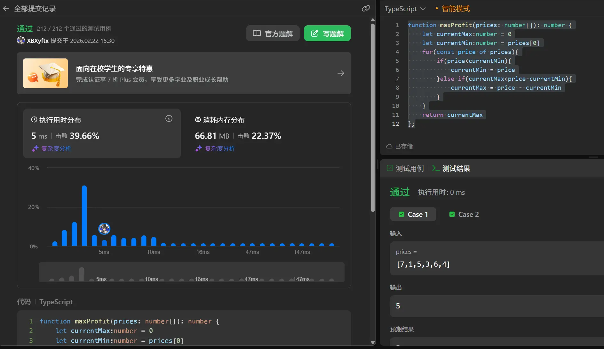

### 买卖股票的最佳时机 II

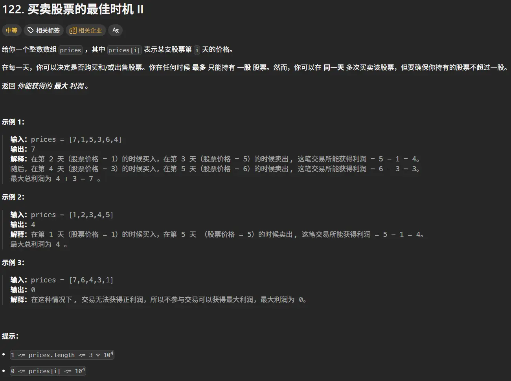

这道题与上一题的区别在于可以多次买卖，也就是说我们可以将所有上升段都算作利润，所以我们可以直接将所有上升段都算作利润。在预知一切的情况下这样计算每一个上升段价差之和的做法确实可行，但这也就在算法题里敢这么算了（乐

这道题还是双指针好做我感觉，left指当前，right一直找right+1>right的临界值然后计算差值，将left指针移动到right的位置，right指针继续向后遍历。

```ts
function maxProfit(prices: number[]): number {
    let profit:number = 0
    let left:number = 0
    let right:number = 1

    while(1){
        if(prices[left]>prices[right]){
            left++
            right++
        }else if(right+1<prices.length){
            if(prices[right]<prices[right+1]){
                right++
            }else if(prices[right]>prices[right+1]){
                profit += prices[right]-prices[left]
                left=right
                right++
            }
        }else if(right>=prices.length-1){
            if(prices[left]<prices[right]){
                profit += prices[right]-prices[left]
            }
            break
        }
    }

    return profit
};
```

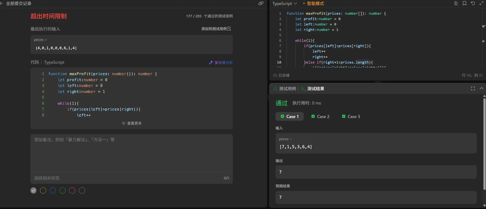

部分用例超时，看来还是得检查边界情况。

仔细审查后发现，当 `left` 指针移动时，我们没有判断它是否已经越界，导致在某些情况下会陷入死循环。而且整体逻辑过于复杂，可以进行简化。

换个思路：既然可以多次交易，那么**只要今天比昨天价格高，就卖出**。这样所有上涨的利润都会被捕获。

```ts
function maxProfit(prices: number[]): number {
    let profit: number = 0
    for (let i = 1; i < prices.length; i++) {
        if (prices[i] > prices[i - 1]) {
            profit += prices[i] - prices[i - 1]
        }
    }
    return profit
};
```

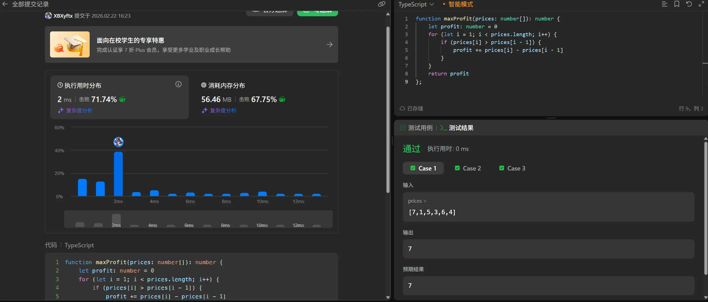

### 跳跃游戏

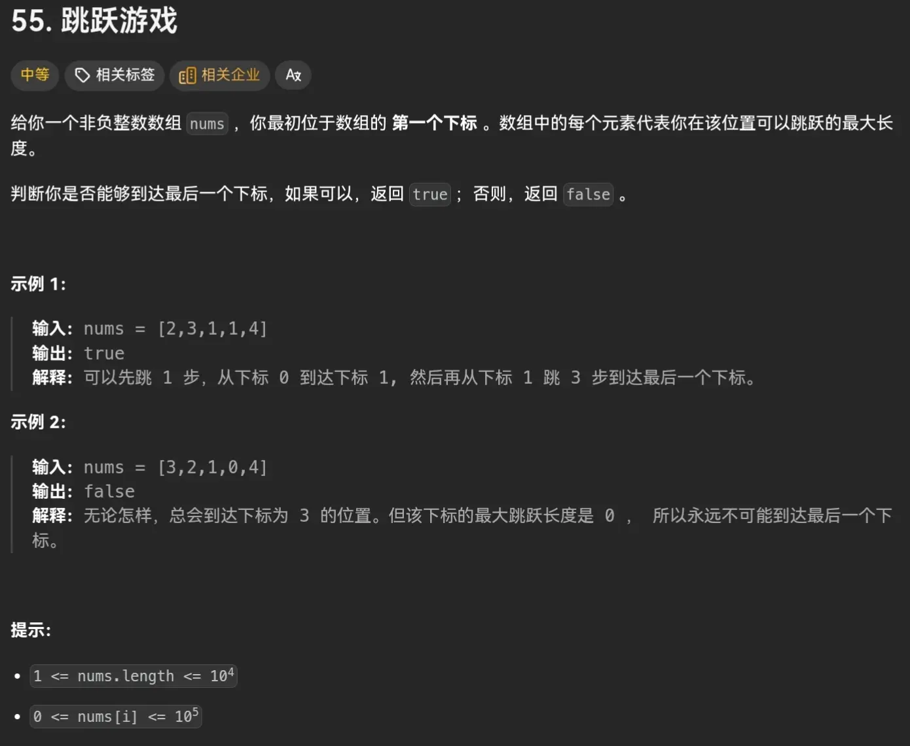

首先我们从提示信息中可以知道我们的跳跃步数最小为0，不存在负数，所以说明，只要数组中不存在0，我们就一定可以到终点。如果存在0，那我们需要做的就是判断0前面的跳跃步数是否有任何一个的步数值大于其下标到0步下标的值，如果有，则可以跳过0，否则就跳不过去。我来按照这个思路编写一下。

```ts
function canJump(nums: number[]): boolean {
    if(!nums.includes(0)){
        return true
    }
    let result:boolean = true
    let zeroIndexs:number[] = nums.map((value:number,index:number)=>{
        if(value===0){
            return index
        }
    })
    zeroIndexs.forEach((value:number,index:number)=>{
        for(let i = 0;i<value;i++){
            if(nums[i]>value-i){
                break
            }else if(i===value-1){
                result = false
                break
            }
        }
        if(result === false){
            return result
        }
    })
    return result
};
```

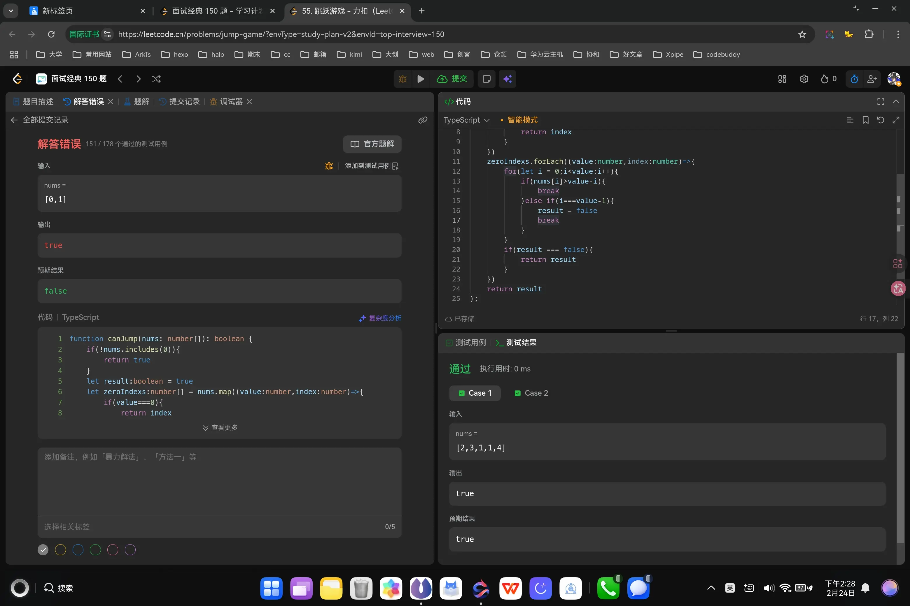

哦，我没注意到如果第一位是0那就一定跳不过去的情况。让我来修正一下。

```ts
function canJump(nums: number[]): boolean {
    if(!nums.includes(0)){
        return true
    }
    if(nums[0]===0){
        return false
    }
    let result:boolean = true
    let zeroIndexs:number[] = nums.map((value:number,index:number)=>{
        if(value===0){
            return index
        }
    })
    zeroIndexs.forEach((value:number,index:number)=>{
        for(let i = 0;i<value;i++){
            if(nums[i]>value-i){
                break
            }else if(i===value-1){
                result = false
                break
            }
        }
        if(result === false){
            return result
        }
    })
    return result
};
```

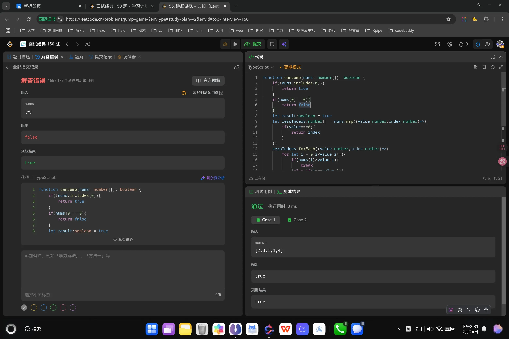

奥，对，总长只有一位的也确实是直接到达终点了。

```ts
function canJump(nums: number[]): boolean {
    if(!nums.includes(0)||nums.length===1){
        return true
    }
    if(nums[0]===0){
        return false
    }
    let result:boolean = true
    let zeroIndexs:number[] = nums.map((value:number,index:number)=>{
        if(value===0){
            return index
        }
    })
    zeroIndexs.forEach((value:number,index:number)=>{
        for(let i = 0;i<value;i++){
            if(nums[i]>value-i){
                break
            }else if(i===value-1){
                result = false
                break
            }
        }
        if(result === false){
            return result
        }
    })
    return result
};
```

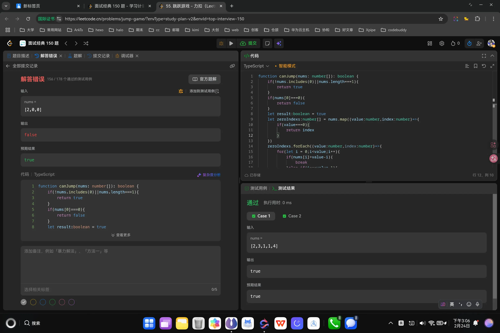

如果没有大于但是恰好到终点了那也确实是符合条件的，我来补充一下这个逻辑的判断。

```ts
function canJump(nums: number[]): boolean {
    if(!nums.includes(0)||nums.length===1){
        return true
    }
    if(nums[0]===0){
        return false
    }
    let result:boolean = true
    let zeroIndexs:number[] = nums.map((value:number,index:number)=>{
        if(value===0){
            return index
        }
    })
    zeroIndexs.forEach((value:number,index:number)=>{
        for(let i = 0;i<value;i++){
            if(nums[i]>value-i||i+nums[i]>=nums.length-1){
                break
            }else if(i===value-1){
                result = false
                break
            }
        }
        if(result === false){
            return result
        }
    })
    return result
};
```

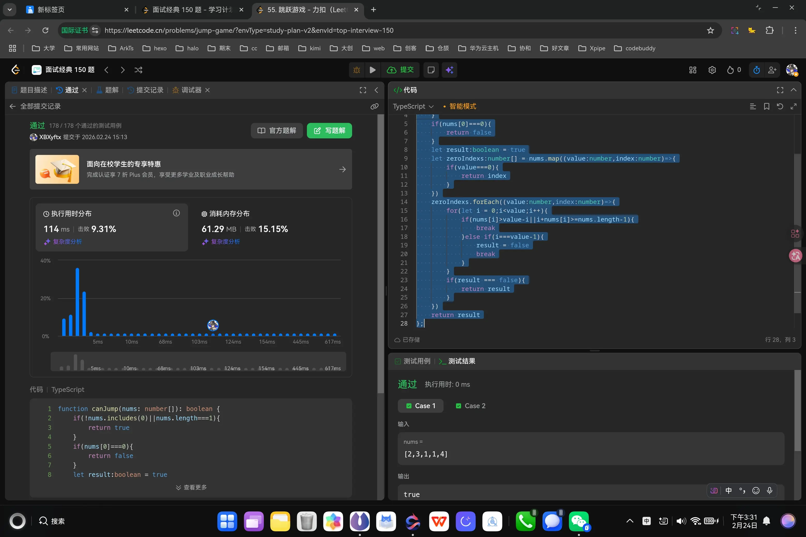

呕吼，过了，接下来看一下官方题解吧。

哦！贪心算法有道理，大致思路就是维护一个最远的可到达位置变量，然后通过不断比较当前元素的最远可到达位置和当下最远可到达位置，来更新最远可到达位置，如果最远可到达位置大于等于数组长度，则说明可以到达终点。

```ts
function canJump(nums: number[]): boolean {
    let maxAvailable:number = 0

    nums.forEach((value:number,index:number)=>{
        if(value+index>maxAvailable){
            maxAvailable=value+index
        }
    })
    if(maxAvailable>=nums.length-1){
        return true
    }
    return false
};
```

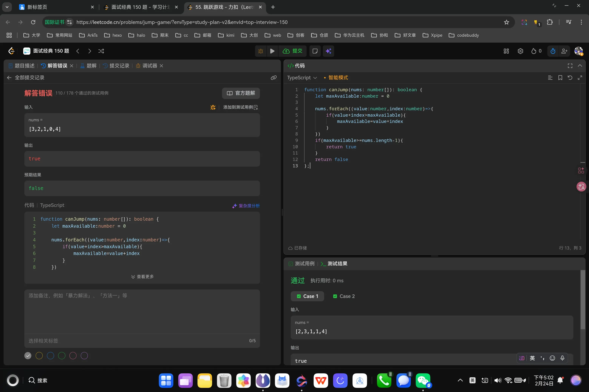

啊，我疏漏了一个很严重的问题。我应该是先判断当前位置可否到达之后，再去进行下一步的判断，而不是直接去判断每一步的可到达位置。

```ts
function canJump(nums: number[]): boolean {
    let maxAvailable:number = 0

    nums.forEach((value:number,index:number)=>{
        if(value+index>maxAvailable && maxAvailable>=index){
            maxAvailable=value+index
        }
    })
    if(maxAvailable>=nums.length-1){
        return true
    }
    return false
};
```

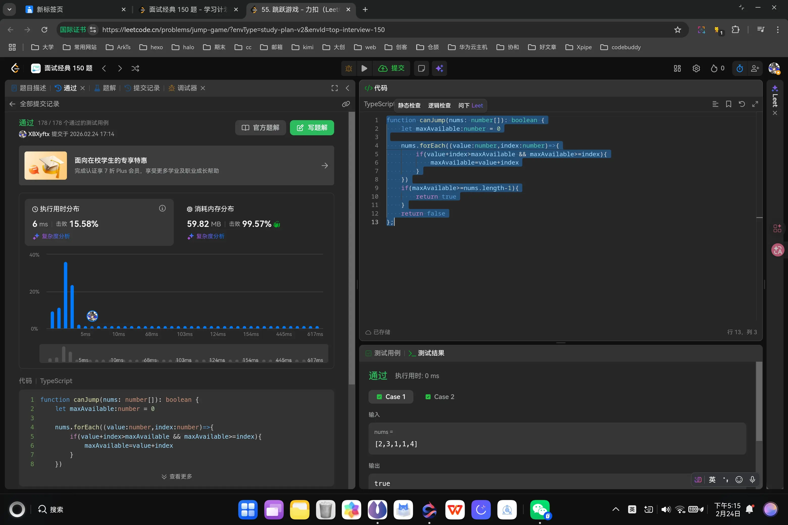

ok，编写成功，我们继续下一题。

### 55. 跳跃游戏 II

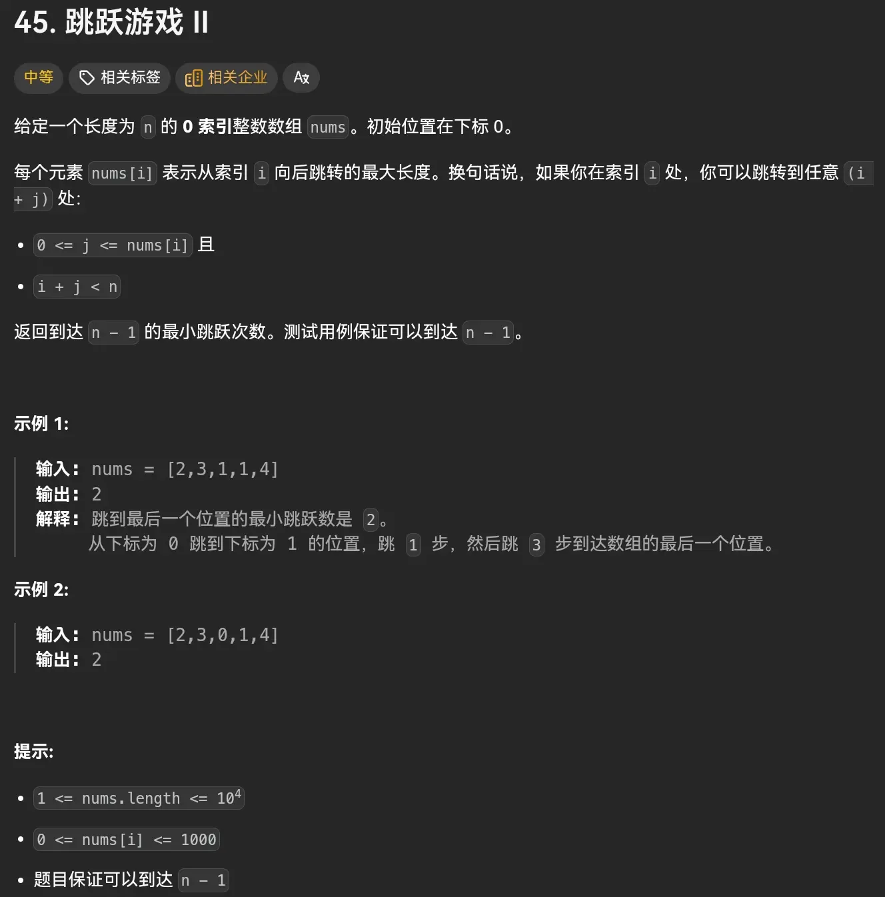

这道题和上一道题虽然是同一种题设，但是问的点却是完全不一致的，上一题是是否可以顺利到达终点，而这一题每一个测试用例都能确保其会到达终点，求的是最少需要跳跃的次数。感觉简单的使用贪心是解不出来的，我所想的是先去统一的计算一遍每一个位置可被到达的最少跳跃次数，维护这样的一个数组，然后这个数组算到最后一位的时候结果就出现了。

但是这个想法我在代码落实的时候却是怎么都想不通了，无论是向前还是向后都会出现我们需要在循环中嵌套数个小循环的情况，这样时间复杂度会暴增。

我又仔细的考虑了一下贪心的算法逻辑，其实这很符合我的直接，也就是每一次都尽可能的向前跳，但我们肯定不能说每次都是取最大值去跳这样肯定是错的，为了解决这个问题我觉得我们可以维护一个当前可到达最远位置之后，不去直接移动到最远处，而是依旧逐位移动，计算每一位的可达最远位置，若当前位置可达最大位置小于当前记录的值就不记录，当我们走到当前最大位置的覆盖范围时将步数加一，然后更新当前最大位置，继续去记录可达范围内的最大值，直到覆盖范围到达终点。

```ts
function jump(nums: number[]): number {
    let currentMaxReachable:number = 0
    let nextMaxReachable:number = 0
    let pointer:number = 0
    let step:number = 0

    while(1){
        if(nextMaxReachable>=nums.length-1){
            step++
            break
        }
        if(pointer===0){
            currentMaxReachable = nums[0]
            pointer++
            continue
        }
        if(pointer===currentMaxReachable){
            currentMaxReachable=nextMaxReachable
            nextMaxReachable=0
            pointer++
            step++
            continue
        }
        if((nums[pointer]+pointer)>nextMaxReachable){
            nextMaxReachable=nums[pointer]+pointer
            pointer++
            continue
        }
        pointer++
    }
    return step
};
```

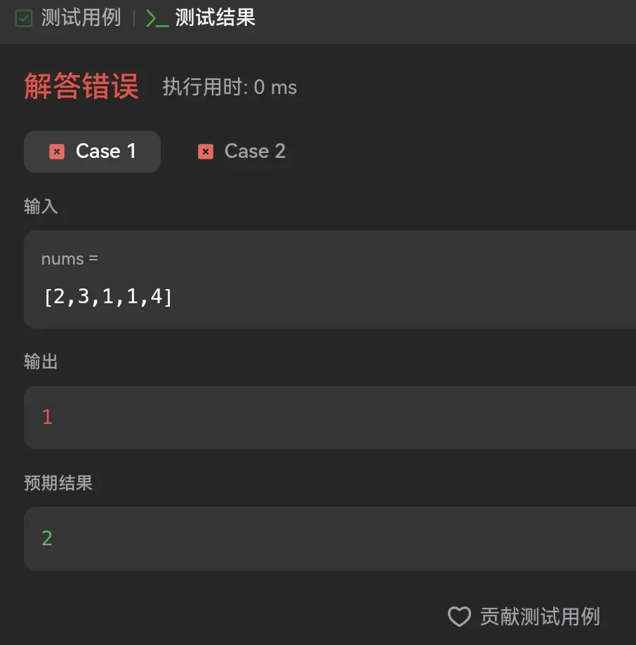

当前我们的代码在初始位置的处理出现了一些问题，当`pointer===0`时我们没有正确的添加第一步，我们直接开始了第一步的行走过程。

```ts
function jump(nums: number[]): number {
    let currentMaxReachable:number = 0
    let nextMaxReachable:number = 0
    let pointer:number = 0
    let step:number = 0

    while(1){
        if(nextMaxReachable>=nums.length-1){
            step++
            break
        }
        if(pointer===0){
            currentMaxReachable = nums[0]
            pointer++
            step++
            continue
        }
        if(pointer===currentMaxReachable){
            currentMaxReachable=nextMaxReachable
            nextMaxReachable=0
            pointer++
            step++
            continue
        }
        if((nums[pointer]+pointer)>nextMaxReachable){
            nextMaxReachable=nums[pointer]+pointer
            pointer++
            continue
        }
        pointer++
    }
    return step
};
```

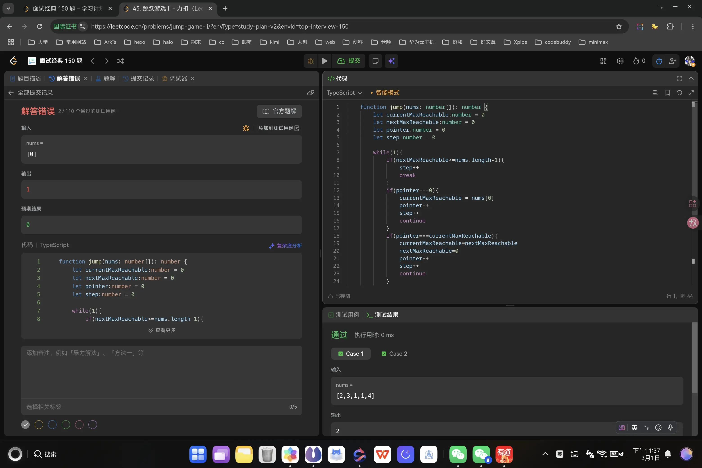

还存在长度为零的边界情况。

```ts
    function jump(nums: number[]): number {
        if(nums.length===1){
            return 0
        }
        let currentMaxReachable:number = 0
        let nextMaxReachable:number = 0
        let pointer:number = 0
        let step:number = 0

        while(1){
            if(currentMaxReachable>=nums.length-1){
                break
            }
            if(pointer===0){
                currentMaxReachable = nums[0]
                pointer++
                step++
                continue
            }
            if(pointer===currentMaxReachable){
                currentMaxReachable=nextMaxReachable
                nextMaxReachable=0
                pointer++
                step++
                continue
            }
            if((nums[pointer]+pointer)>nextMaxReachable){
                nextMaxReachable=nums[pointer]+pointer
                pointer++
                continue
            }
            pointer++
        }
        return step
    };
```

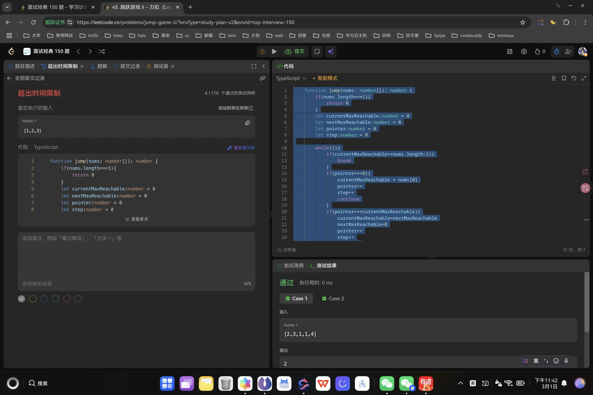

为什么会超时呢我明明已经判断了边界情况。

让我用一些更简单的的方式来去进行编写

```ts
function jump(nums: number[]): number {
    if(nums.length === 1){
        return 0
    }
    let currentMaxReachable: number = 0
    let nextMaxReachable: number = 0
    let step: number = 0
  
    // 从0开始遍历，每次检查是否到达边界
    for(let i = 0; i < nums.length - 1; i++){
        nextMaxReachable = Math.max(nextMaxReachable, nums[i] + i)
  
        // 到达当前能跳到的最远位置，需要跳一步
        if(i === currentMaxReachable){
            currentMaxReachable = nextMaxReachable
            step++
            // 已经能到达终点
            if(currentMaxReachable >= nums.length - 1){
                break
            }
        }
    }
    return step
}

```

````md
用户询问了两个版本的代码（第1版1512-1548行和第2版1556-1581行）的区别，以及第一版代码超时的问题。

让我分析一下这两个版本的代码：

第一版代码（1512-1548行）：
- 使用while(1)循环
- 使用pointer指针遍历
- 逻辑比较复杂，有多个if分支

第二版代码（1556-1581行）：
- 使用for循环遍历
- 逻辑更清晰
- 通过了测试

我需要仔细分析第一版代码的问题所在。

第一版的主要问题：
1. 在 `if((nums[pointer]+pointer)>nextMaxReachable)` 分支中，更新nextMaxReachable后，pointer++，然后continue，这是对的
2. 但如果 `nums[pointer]+pointer <= nextMaxReachable`，直接pointer++，没有continue，会继续往下走？不对，这里用了continue

等等，让我仔细看...

实际上，第一版代码的问题是：
- 当 `pointer === currentMaxReachable` 时，会更新currentMaxReachable = nextMaxReachable，然后pointer++，step++
- 但是这里有个问题，如果nextMaxReachable没有更新过（还是0），那就会出问题


- 当第一次到达currentMaxReachable时，currentMaxReachable会被设置为nextMaxReachable
- 如果nextMaxReachable是0，那pointer可能永远无法前进到数组末尾，导致死循环

我发现了一个关键问题：pointer可能一直卡在0的位置。当pointer为0时，currentMaxReachable被设置为nums[0]，然后pointer自增。但如果后续处理不当，pointer可能会陷入停滞状态。

在指针移动的过程中，如果pointer等于currentMaxReachable，但nextMaxReachable更新为0，就会出现无限循环的风险。

具体来说，当pointer为1，currentMaxReachable为1，且nums[1]为0时，nextMaxReachable会被设为1。随后pointer增加到2，但currentMaxReachable保持为1，这会打破循环条件。

我需要仔细检查pointer的递增逻辑，特别是不同条件下的指针移动规则。

第一版的条件判断较为分散，可能导致指针移动不一致。相比之下，第二版使用简单的for循环，确保每次迭代pointer都会递增，逻辑更加清晰和可控。

关键问题在于第一版的continue语句和条件判断可能导致某些情况下pointer没有正确递增，特别是在处理边界条件时。

如果 `nums[pointer]+pointer > nextMaxReachable`，pointer会递增；但如果小于等于，pointer可能不会移动。这会导致在某些情况下，如 `nums = [2, 0, 0]`，pointer卡在位置1，形成死循环。

具体场景是当pointer为1，currentMaxReachable为2时，pointer始终无法推进，循环陷入僵局。

第二版代码通过for循环确保每次迭代都移动指针，避免了这种潜在的无限循环问题。

核心差异在于指针移动的机制：第一版依赖条件判断递增，可能导致某些情况下指针停滞；第二版则保证每次循环都前进，逻辑更为可靠。
这两个版本的核心区别在于**指针移动的逻辑**，第一版存在**死循环**风险。

## 问题分析

**第一版的问题**：当 `nums[pointer]+pointer <= nextMaxReachable` 时，虽然执行了 `pointer++`，但随后 `continue` 跳过了后续逻辑。更关键的是，如果 `nums[pointer]` 为 0 且无法更新 `nextMaxReachable`，**`pointer` 可能永远无法超过 `currentMaxReachable`**，导致死循环。

例如 `nums = [2, 0, 0]`：
- pointer=1 时，`nums[1]+1 = 1`，如果 `nextMaxReachable` 已经是 1，条件不满足，只执行 `pointer++`
- 但循环继续时可能卡在某种状态导致无法退出

**第二版的改进**：
```ts
for(let i = 0; i < nums.length - 1; i++)
```
使用 `for` 循环保证**每次迭代 `i` 必定自增**，不会死循环。

## 关键差异对比

| 方面 | 第一版 (while) | 第二版 (for) |
|------|---------------|-------------|
| 指针移动 | 条件判断+手动递增 | 循环自带递增 |
| 终止条件 | 复杂的多重判断 | 明确的 `i < nums.length - 1` |
| 死循环风险 | 有（某些边界情况） | 无 |

## 建议

第二版是正确的贪心解法：
- 遍历范围 `0` 到 `nums.length-2`（最后一个位置不用跳）
- 维护 `nextMaxReachable` 记录下一步能到达的最远位置
- 到达当前边界时更新步数和新的边界

你的第一版逻辑太分散，容易在某些特殊用例（如包含0的数组）下出现指针停滞。第二版简洁且正确。
````

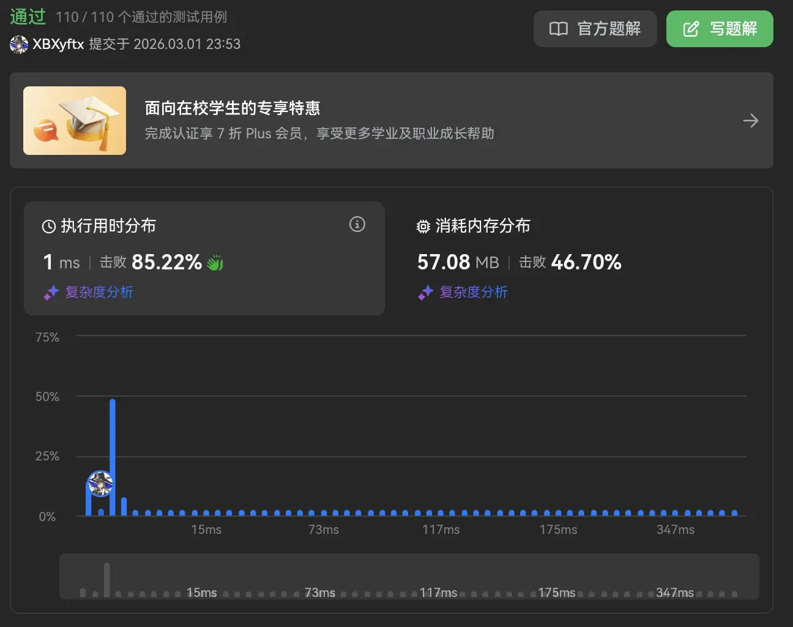

### H指针

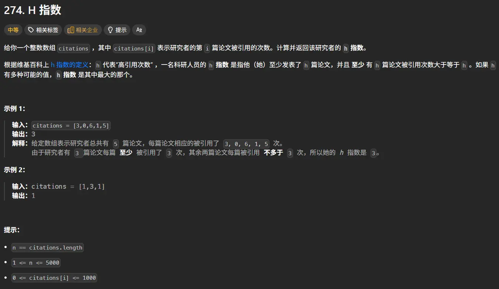

我第一个想到的是中位数或者是平均数，去中间值后验算，如果不行就再往两边移动，但感觉实现起来很麻烦。这种思路的前提肯定是要先排序才能取得中间位置，但一旦不符合我们向上向下的移动方向选择也是个难题，所以我觉得不如在排序之后，直接从大到小去逐一排查。

这个排查并不需要从头到尾中间某一环节不满足后我们就可以终止。

```ts
function hIndex(citations: number[]): number {
    citations.sort((a:number,b:number)=>{
        return b-a
    })
    let h:number = 0
    for(let i = 0;i < citations.length;i++){
        if(citations[i]>=h){
            h++
            continue
        }
        break
    }
    return h
};
```

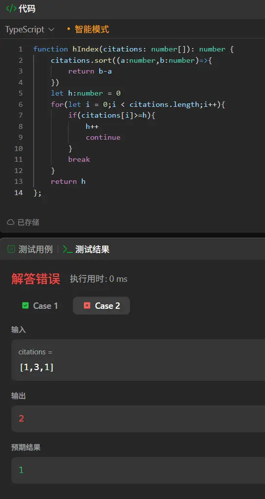

我们来演算一下当前的错误测试用例。

`[1,3,1]`排序后`[3,1,1]`

第一次循环中：3>0，h++，h=1
第二次循环中：1>=1，h++，h=2

这里就能看出来问题了，我们应该对比的是h增加后的数字而不是当前的h值，每一次比较时都应该h+1，同时h的最小值不一定是1，因为可能存在全0，没有任何一篇文章被引用过的情况存在，所有我们不能够直接将h初始化为1。

```ts
function hIndex(citations: number[]): number {
    citations.sort((a:number,b:number)=>{
        return b-a
    })
    let h:number = 0
    for(let i = 0;i < citations.length;i++){
        if(citations[i]>=h+1){
            h++
            continue
        }
        break
    }
    return h
};
```

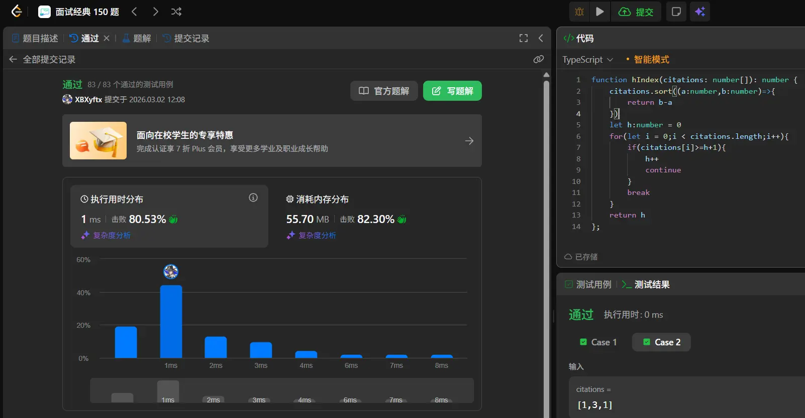

ok，来看一下官方题解。

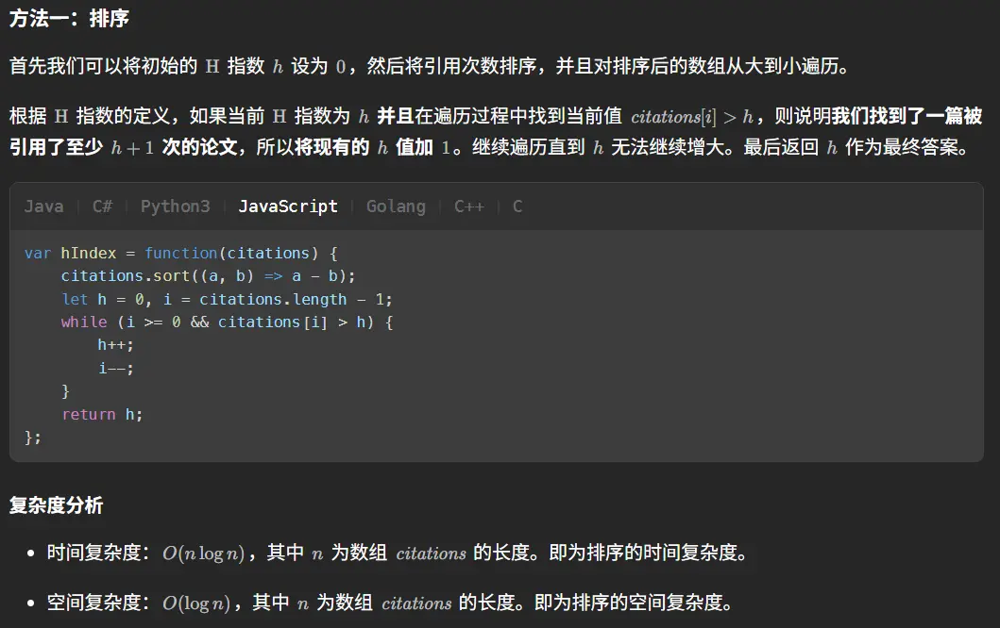

基于升序排列后由两侧向中间合拢，其实和我最开始中间向两边找的思路是相似的只不过是方向相反，但很多时候差的就是这样一个逆向思维，但其实和我们基于倒序的方式差距不大。

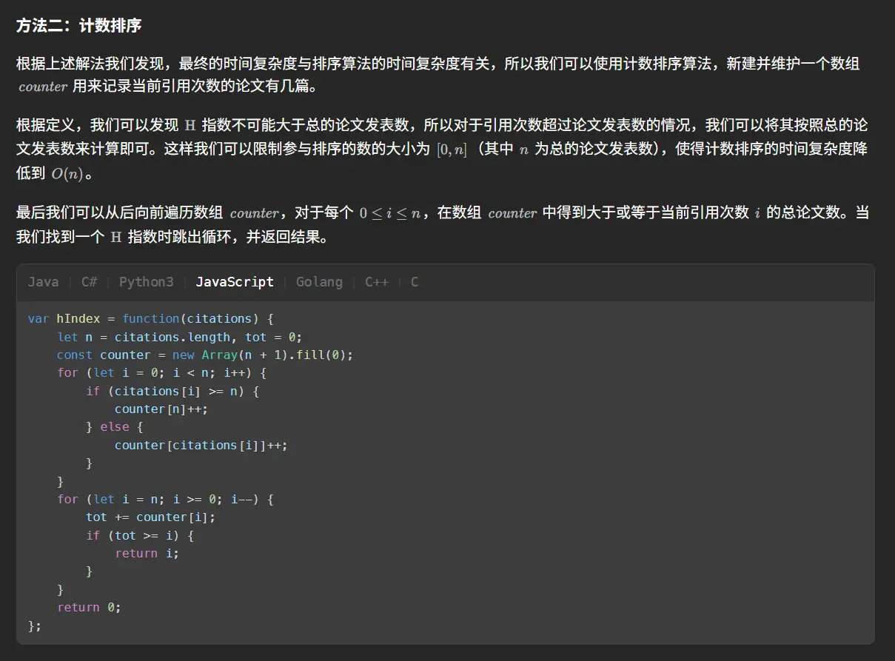

这种解法整体来讲只是换了另一种方式排序，差别不大，就不做过多分析，直接去看最重要的二分。

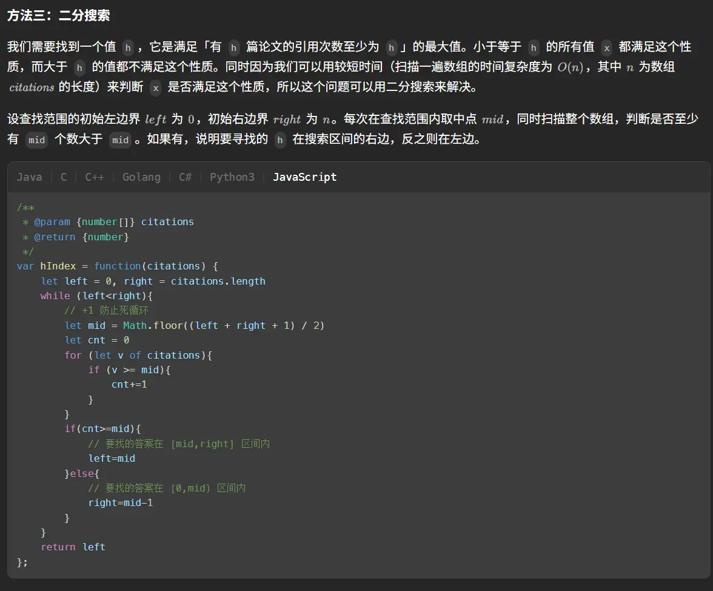

```ts
/**
 * @param {number[]} citations
 * @return {number}
 */
var hIndex = function(citations) {
    let left = 0, right = citations.length
    while (left<right){
        // +1 防止死循环
        let mid = Math.floor((left + right + 1) / 2)
        let cnt = 0
        for (let v of citations){
            if (v >= mid){
                cnt+=1
            }
        }
        if(cnt>=mid){
            // 要找的答案在 [mid,right] 区间内
            left=mid
        }else{
            // 要找的答案在 [0,mid) 区间内
            right=mid-1
        }
    }
    return left
};
```

上面是官方题解的代码，但是我认为还可以再简单一些，官方题解并没有进行排序，是直接在初始的乱序状态下进行的二分查找，每次判断二分的移动方向时都要重新计数整个数组，这样效率太低了。我们可以通过一次升序排序来简化这个过程。

```ts
function hIndex(citations: number[]): number {
    citations.sort((a:number,b:number)=>{
        return a-b
    })
    let n = citations.length,left = 0,right = n,mid = 0
    while(left<right){
        mid = Math.floor((left+right+1)/2)
        if(citations[n-mid]>=mid){
            left = mid
        }else{
            right = mid-1
        }
    }
    return mid
};
```

以 `[3,0,6,1,5]` 为例，排序后为 `[0,1,3,5,6]`：


| 轮次     | left  | right | mid   | 判断`citations[5-mid] >= mid` | 操作      |
| -------- | ----- | ----- | ----- | ----------------------------- | --------- |
| 1        | 0     | 5     | 3     | `citations[2]=3 >= 3` ✓      | left = 3  |
| 2        | 3     | 5     | 4     | `citations[1]=1 >= 4` ✗      | right = 3 |
| **结束** | **3** | **3** | **4** | -                             | -         |

此时：

- `left = 3` ← 正确答案
- `right = 3` ← 也是正确答案
- `mid = 4` ← 这是**上一轮**的值，已经过时了！

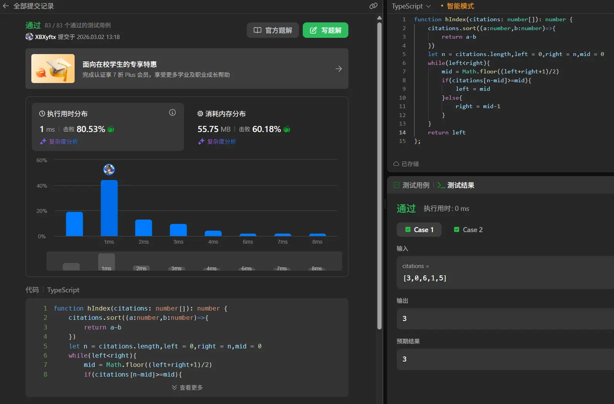


然后这里来特别说明一下代码中`mid = Math.floor((left+right+1)/2)`这样写的理由。

这是在二分查找避免死循环的一个常用小技巧。二分查找在寻找中间值的时候可能会遇到左右指针仅差1的情况，无论是向上取整还是向下取整都会出现与左指针或右指针相同的情况，这样就会导致下一循环的三个指针与上一循环的三个指针相同，陷入死循环。

而为了破解这个问题我们就要结合下面判断逻辑中的`right = mid-1`来使用，由于`mid`会被左指针取走，右指针永远不会取到当前的`mid`值，也就代表只要遇到左右差一的情况，我们让mid向上取整，也就是更靠近右指针时就不会出现三指针值无变化的情况，从而避免死循环，同时也因为右指针减一后恰好与左指针相等进而不满足循环条件，跳出循环得出结果。


### 380. O(1) 时间插入、删除和获取随机元素

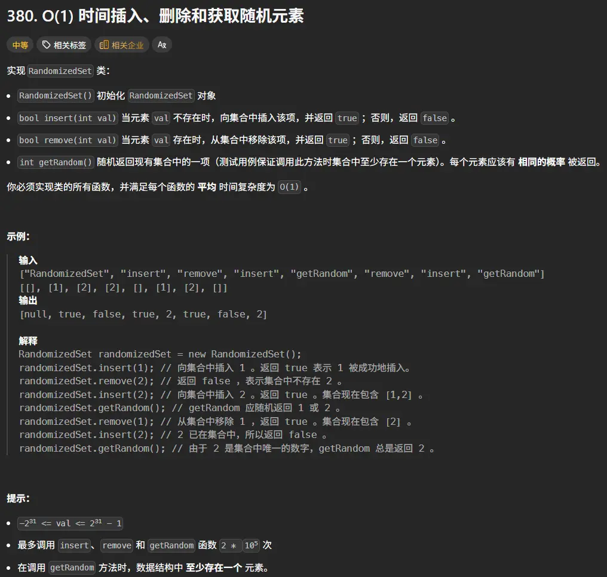

这个题和前面做过的都不太一样，让我来分析一下。

首先初始化，我们需要确定我们都需要什么样的数据结构然后再来确定如何去实现初始化。

其存贮的主体是一个数组，但与此同时我们还需要记录其是否存在，因为插入和删除两个方法都是需要先判断是否存在随后再进行实际操作的。所以我们可以使用一个Map来记录，key为元素值，value为布尔值，表示是否存在。

但实际开始编写代码之后发现好像并不需要这么麻烦，毕竟TS数组中天然包含了这些操作所需的方法，我们不需要单独维护一个Map。

```ts
class RandomizedSet {
    nums:number[]

    constructor() {
        this.nums = []
    }

    insert(val: number): boolean {
        if(this.nums.includes(val)){
            return false
        }
        this.nums.push(val)
        return true
    }

    remove(val: number): boolean {
        if(!this.nums.includes(val)){
            false
        }
        let valIndex = this.nums.indexOf(val)
        if(this.nums.splice(valIndex,1)[0]===val){
            return true
        }
        return false
    }

    getRandom(): number {
        let randomNum = Math.floor(Math.random()*this.nums.length)
        return this.nums[randomNum]
    }
}

/**
 * Your RandomizedSet object will be instantiated and called as such:
 * var obj = new RandomizedSet()
 * var param_1 = obj.insert(val)
 * var param_2 = obj.remove(val)
 * var param_3 = obj.getRandom()
 */
```

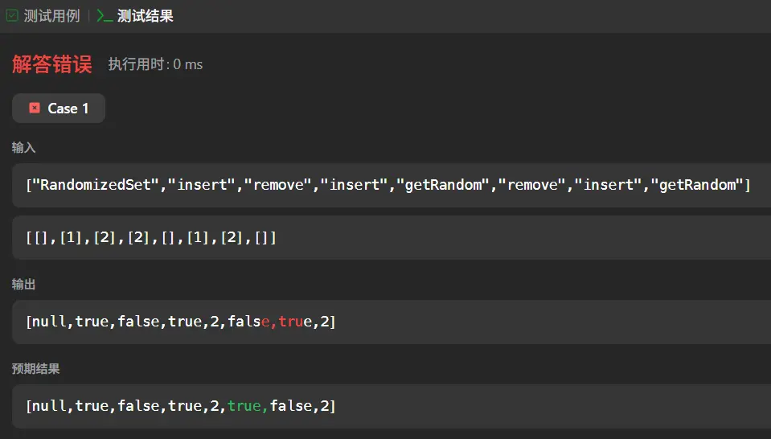

我们来仔细分析一下错误原因。通过对比输出和预期结果，发现问题出在第6步 `remove(1)` 和第7步 `insert(2)`：

| 步骤 | 操作          | 输入 | 我的输出     | 预期结果 | 实际集合状态     | 分析                                 |
| ---- | ------------- | ---- | ------------ | -------- | ---------------- | ------------------------------------ |
| 1    | RandomizedSet | []   | null         | null     | `[]`             | 初始化空集合                         |
| 2    | insert        | 1    | true         | true     | `[1]`            | 插入1成功                            |
| 3    | remove        | 2    | **false**    | false    | `[1]`            | 2不存在，返回false ✓                |
| 4    | insert        | 2    | true         | true     | `[1, 2]`         | 插入2成功                            |
| 5    | getRandom     | []   | 2            | 2        | `[1, 2]`         | 随机返回2（可能）                    |
| 6    | remove        | 1    | **false** ❌ | true     | `[2]` → `[2]`   | 元素1存在，应返回true，但返回了false |
| 7    | insert        | 2    | **true** ❌  | false    | `[2]` → `[2,2]` | 2已存在，应返回false，但返回了true   |
| 8    | getRandom     | []   | 2            | 2        | `[2,2]`          | 随机返回2                            |

**问题定位：**

仔细审查代码后，发现问题出在 `remove` 方法的第3行：

```ts
remove(val: number): boolean {
    if(!this.nums.includes(val)){
        false  // ❌ 这里只写了 false，没有 return false！
    }
    let valIndex = this.nums.indexOf(val)
    if(this.nums.splice(valIndex,1)[0]===val){
        return true
    }
    return false
}
```

```ts
class RandomizedSet {
    nums:number[]

    constructor() {
        this.nums = []
    }

    insert(val: number): boolean {
        if(this.nums.includes(val)){
            return false
        }
        this.nums.push(val)
        return true
    }

    remove(val: number): boolean {
        if(!this.nums.includes(val)){
            return false
        }
        let valIndex = this.nums.indexOf(val)
        if(this.nums.splice(valIndex,1)[0]===val){
            return true
        }
        return false
    }

    getRandom(): number {
        let randomNum = Math.floor(Math.random()*this.nums.length)
        return this.nums[randomNum]
    }
}

/**
 * Your RandomizedSet object will be instantiated and called as such:
 * var obj = new RandomizedSet()
 * var param_1 = obj.insert(val)
 * var param_2 = obj.remove(val)
 * var param_3 = obj.getRandom()
 */
```


不好意思我是**让我们继续吧。

```ts
var RandomizedSet = function() {
    this.nums = [];
    this.indices = new Map();
};

RandomizedSet.prototype.insert = function(val) {
    if (this.indices.has(val)) {
        return false;
    }
    let index = this.nums.length;
    this.nums.push(val);
    this.indices.set(val, index);
    return true;
};

RandomizedSet.prototype.remove = function(val) {
    if (!this.indices.has(val)) {
        return false;
    }
    let id = this.indices.get(val);
    this.nums[id] = this.nums[this.nums.length - 1];
    this.indices.set(this.nums[id], id);
    this.nums.pop();
    this.indices.delete(val);
    return true;
};

RandomizedSet.prototype.getRandom = function() {
    const randomIndex = Math.floor(Math.random() * this.nums.length);
    return this.nums[randomIndex];
};

```

额，官方题解中JS版也是单独维护了一个Map，这是为什么呢？难道更快吗？

#### 复杂度分析对比

要理解为什么官方题解使用 Map，我们需要对比两种解法的时间复杂度：


| 操作          | 我的解法                                              | 官方题解                           |
| ------------- | ----------------------------------------------------- | ---------------------------------- |
| **insert**    | `O(n)` - `includes()` 需要遍历数组                    | `O(1)` - Map 的 `has()` 是哈希查找 |
| **remove**    | `O(n)` - `indexOf()` + `splice()` 都需要遍历/移动元素 | `O(1)` - Map 查找 + 交换元素       |
| **getRandom** | `O(1)` - 随机访问数组                                 | `O(1)` - 随机访问数组              |

**关键差异在于 `splice()`：**

在我的代码中：

```ts
let valIndex = this.nums.indexOf(val)  // O(n) 查找
this.nums.splice(valIndex, 1)           // O(n) 移动后续所有元素
```

`splice()` 删除元素后，需要将删除位置之后的所有元素向前移动一位，这是一个 **O(n)** 的操作。当数据量很大时，这个开销会非常明显。

#### 官方题解的核心技巧

官方题解为了实现 O(1) 的删除，使用了一个巧妙的**交换技巧**：

```ts
remove(val) {
    let id = this.indices.get(val);           // O(1) 获取要删除的索引
    this.nums[id] = this.nums[this.nums.length - 1];  // 用最后一个元素覆盖
    this.indices.set(this.nums[id], id);      // 更新被移动元素的索引
    this.nums.pop();                          // O(1) 删除最后一个元素
    this.indices.delete(val);                 // O(1) 从Map删除
}
```

**图解过程：**

假设数组是 `[10, 20, 30, 40]`，要删除 `20`（索引1）：

```
步骤1: 找到 20 的索引 = 1
       [10, 20, 30, 40]
            ↑
          要删除

步骤2: 用最后一个元素 40 覆盖 20
       [10, 40, 30, 40]
            ↑
          被覆盖

步骤3: 更新 Map 中 40 的新索引为 1
       {10:0, 40:1, 30:2}

步骤4: pop() 删除最后一个元素
       [10, 40, 30]
```

这样就不需要考虑数组中间元素的移动问题了！

#### 为什么需要 Map？

Map 在这里有两个作用：

1. **O(1) 判断元素是否存在** - `this.indices.has(val)` 替代 `this.nums.includes(val)`
2. **O(1) 获取元素索引** - `this.indices.get(val)` 替代 `this.nums.indexOf(val)`

这两个操作如果直接用数组都是 O(n)，而 Map（哈希表）可以将它们优化到 O(1)。

#### 完整实现

理解了原理后，我用 TypeScript 重写一下官方题解：

```ts
class RandomizedSet {
    nums: number[]
    indices: Map<number, number>  // value -> index

    constructor() {
        this.nums = []
        this.indices = new Map()
    }

    insert(val: number): boolean {
        if (this.indices.has(val)) {
            return false
        }
        this.indices.set(val, this.nums.length)
        this.nums.push(val)
        return true
    }

    remove(val: number): boolean {
        if (!this.indices.has(val)) {
            return false
        }
        const index = this.indices.get(val)!
        const lastVal = this.nums[this.nums.length - 1]
  
        // 用最后一个元素覆盖要删除的元素
        this.nums[index] = lastVal
        this.indices.set(lastVal, index)
  
        // 删除最后一个元素
        this.nums.pop()
        this.indices.delete(val)
  
        return true
    }

    getRandom(): number {
        const randomIndex = Math.floor(Math.random() * this.nums.length)
        return this.nums[randomIndex]
    }
}
```


用空间换时间，确实在某些场景下更吃香。

### 238. 除了自身以外数组的乘积

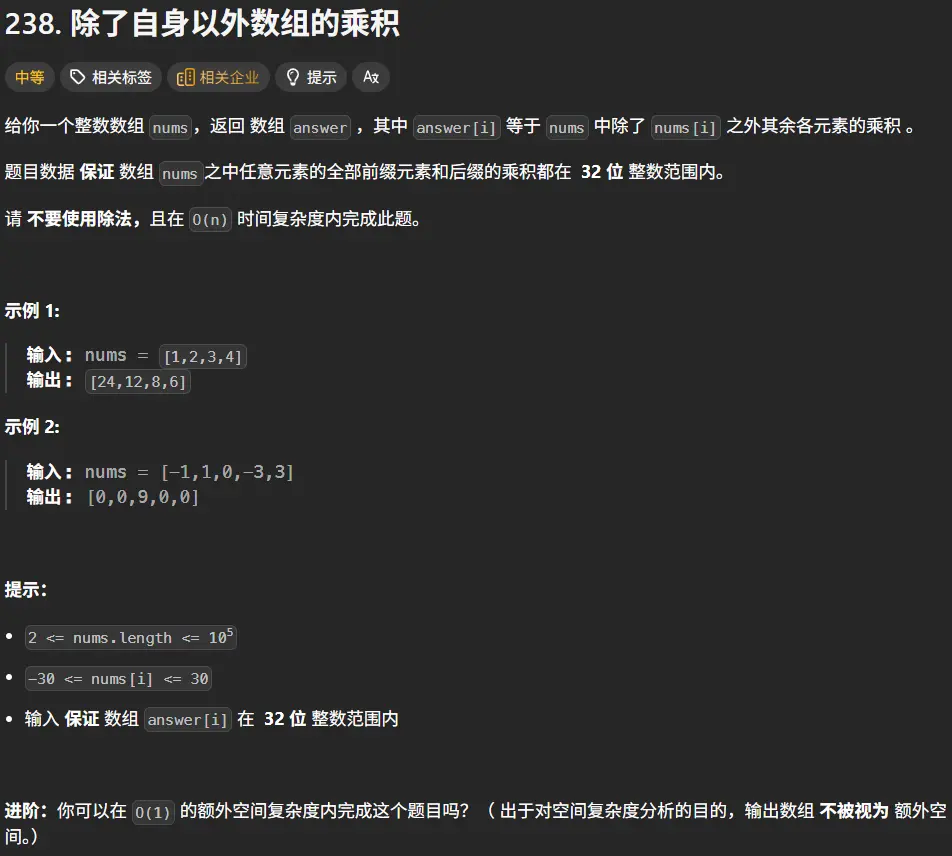

首先最基础的方式肯定是逐一相乘，这时间复杂度太大了，我必须要优化。

首先我们分析一下，基础方式的计算过程中是有大量的重复计算的，我们不能排列组合全部计算一遍后计算结果再逐层向上计算，这样同样是十分恐怖的时间复杂度，同时空间复杂度也会十分恐怖。

我们必须以某种规律去规整计算的顺序。

每一个位置的计算都可以视为，以目标位置为轴，左右的数字去乘积，那这样就会出现一个规律，左二为基等于左一*1，左三为基等于左二*左一，以此类推，右二为基等于右一*1，右三为基等于右二*右一，以此类推。正反各自遍历一次就可以得到结果。

```ts
function productExceptSelf(nums: number[]): number[] {
    let answer:number[] = []
    let left:number = 1
    for(let i=0;i<nums.length;i++){
        answer.push(left)
        left*=nums[i]
    }
    let right:number = 1
    for(let i=nums.length-1;i>=0;i++){
        answer[i]*=right
        right*=nums[i]
    }
    return answer
};
```

```err
<--- Last few GCs --->
[21:0x3c0e6000]      836 ms: Mark-Compact (reduce) 386.8 (396.3) -> 386.8 (388.8) MB, pooled: 0 MB, 5.54 / 0.00 ms  (average mu = 0.924, current mu = 0.026) last resort; GC in old space requested
[21:0x3c0e6000]      841 ms: Mark-Compact (reduce) 386.8 (388.8) -> 386.8 (388.8) MB, pooled: 0 MB, 4.26 / 0.00 ms  (average mu = 0.892, current mu = 0.002) last resort; GC in old space requested
<--- JS stacktrace --->
FATAL ERROR: CALL_AND_RETRY_LAST Allocation failed - JavaScript heap out of memory
----- Native stack trace -----
 1: 0xe36196 node::OOMErrorHandler(char const*, v8::OOMDetails const&) [nodejs run]
 2: 0x123f4a0 v8::Utils::ReportOOMFailure(v8::internal::Isolate*, char const*, v8::OOMDetails const&) [nodejs run]
 3: 0x123f777 v8::internal::V8::FatalProcessOutOfMemory(v8::internal::Isolate*, char const*, v8::OOMDetails const&) [nodejs run]
 4: 0x145c1fc v8::internal::HeapAllocator::AllocateRawWithRetryOrFailSlowPath(int, v8::internal::AllocationType, v8::internal::AllocationOrigin, v8::internal::AllocationAlignment) [nodejs run]
 5: 0x143440e v8::internal::Factory::AllocateRaw(int, v8::internal::AllocationType, v8::internal::AllocationAlignment) [nodejs run]
 6: 0x1422a6c v8::internal::FactoryBase<v8::internal::Factory>::AllocateRawArray(int, v8::internal::AllocationType) [nodejs run]
 7: 0x14231c6 v8::internal::FactoryBase<v8::internal::Factory>::NewFixedDoubleArray(int, v8::internal::AllocationType) [nodejs run]
 8: 0x16011b6  [nodejs run]
 9: 0x16015ef  [nodejs run]
10: 0x1883cb6 v8::internal::Runtime_GrowArrayElements(int, unsigned long*, v8::internal::Isolate*) [nodejs run]
11: 0x1df2476  [nodejs run]
```

内存溢出？

为什么内存溢出了？

奥！我写错了，倒序的应该是--

```ts
function productExceptSelf(nums: number[]): number[] {
    let answer:number[] = []
    let left:number = 1
    for(let i=0;i<nums.length;i++){
        answer.push(left)
        left*=nums[i]
    }
    let right:number = 1
    for(let i=nums.length-1;i>=0;i--){
        answer[i]*=right
        right*=nums[i]
    }
    return answer
};
```

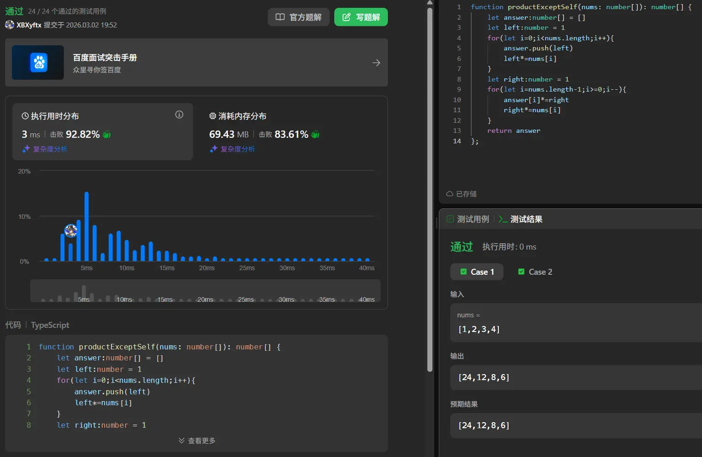

这个算法的额外空间复杂度已经是O（1）

### 134. 加油站

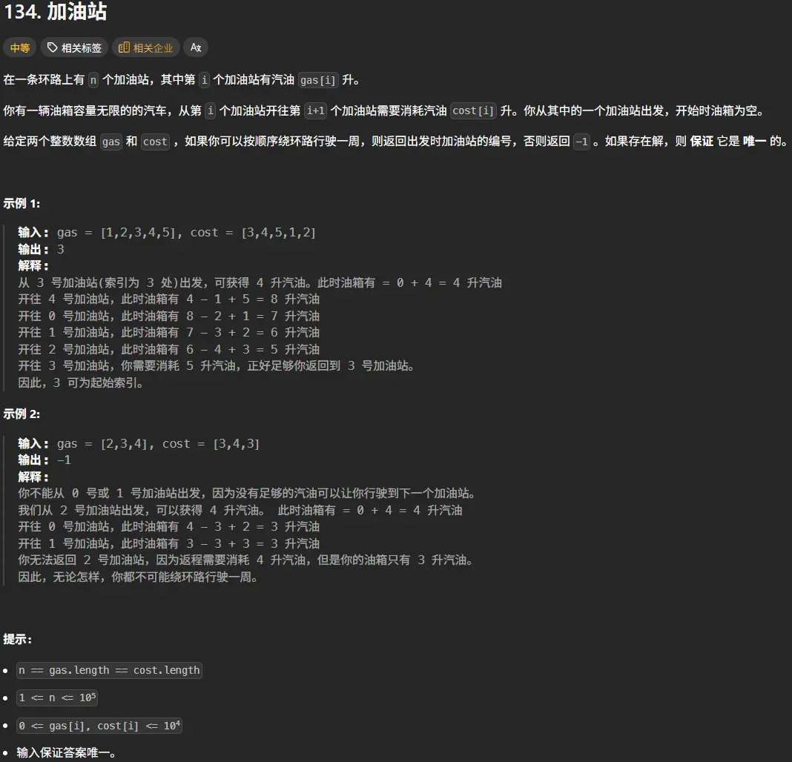

这也是个无比经典的题，之前我刷视频刷到过，但确实是很早了，已经忘干净了，让我从新审视一下这个题。

我想的是直接用gas数组减去cost数组，得到一个纯油量数组。我们就以题目示例的数组为例推演一下找一下规律。

```ts
gas = [1,2,3,4,5], cost = [3,4,5,1,2]
```

```ts
[-2,-2,-2,3,3]
```

这样一对比就可以看出来几个特征：

1. 纯油量总和>=0才有可能存在起点。
2. 纯油量为负数的位置不可能是起点。

```ts
gas = [2,3,4], cost = [3,4,3]
```

```ts
[-1,-1,1]
```

这个例子中，纯油量总和为0。这就肯定不可能存在起点了。

所以我们首先可以先计算一下纯油量综合，如果小于0，那肯定不存在起点。

```ts
function canCompleteCircuit(gas: number[], cost: number[]): number {
    let gasCost:number[] = []
    gas.forEach((v,i)=>{
        gasCost.push(v-cost[i])
    })
    let totalGas:number = 0

    gasCost.forEach(v=>{
        totalGas+=v
    })
    if(totalGas<0){
        return -1
    }
};
```

接下来该解决的是如何判断起点，逐一判断验算应该并非最优解。

我们得想办法找到规律可以快速排除一些点。

首先我们遍历的起始点可以直接越过纯油量为负数的点，因为不可能存在起点。

随后从数组的第一个正数开始遍历，设置一个当前油量变量，如果如果走到某一站时，当前油量小于0，那这个点肯定不是起点，同时从该起点到小于0的那个点之间的所有点都不可能是起点。

```ts
function canCompleteCircuit(gas: number[], cost: number[]): number {
    let gasCost:number[] = []
    gas.forEach((v,i)=>{
        gasCost.push(v-cost[i])
    })
    let totalGas:number = 0

    gasCost.forEach(v=>{
        totalGas+=v
    })
    if(totalGas<0){
        return -1
    }
    let start = 0
    let currentGas = 0
    let success = true
    for(let i=0;i<gasCost.length;i++){
        if(gasCost[i]<0){
            continue
        }
        for(let j=0;j<gasCost.length;j++){
            currentGas+=gasCost[(j+i)%gasCost.length]
            if(currentGas<0){
                success = false
                break
            }
            start = i
        }
        if(success)return start
    }
    return -1
};
```

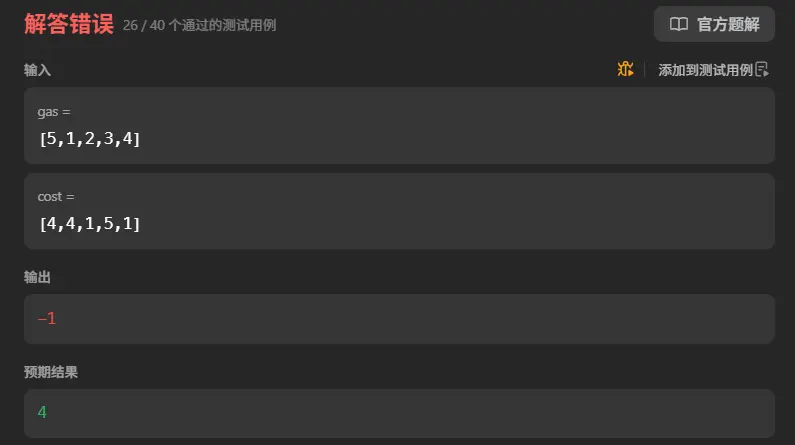

哦我的currentGas和success都没有重置。

```ts
function canCompleteCircuit(gas: number[], cost: number[]): number {
    let gasCost:number[] = []
    gas.forEach((v,i)=>{
        gasCost.push(v-cost[i])
    })
    let totalGas:number = 0

    gasCost.forEach(v=>{
        totalGas+=v
    })
    if(totalGas<0){
        return -1
    }
    let start = 0
    let currentGas = 0
    let success = true
    for(let i=0;i<gasCost.length;i++){
        if(gasCost[i]<0){
            continue
        }
        currentGas = 0
        success = true
        for(let j=0;j<gasCost.length;j++){
            currentGas+=gasCost[(j+i)%gasCost.length]
            if(currentGas<0){
                success = false
                break
            }
            start = i
        }
        if(success)return start
    }
    return -1
};
```

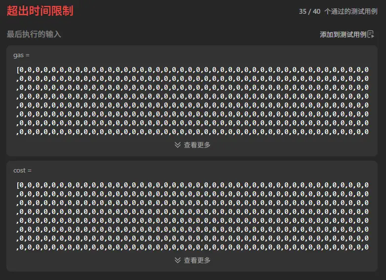

不是，什么鬼测试用例。看来只能想办法减少循环嵌套了。当前我的核心问题一是有多次循环，而且计算内容相似，是可以合并到单次循环中的，二则是存在循环嵌套导致出现O(n^2)的时间复杂度。

我们双层循环的本质就是验证每一个可能点是否是起点。但题目中说了起点如果存在那就是唯一，所以说前面排除的点我们没有必要去再次检查，只需要向后看能否跑通，这样是一种强依赖于题干条件可移植性低但时间复杂度低的解法。

```ts
function canCompleteCircuit(gas: number[], cost: number[]): number {
    let n = gas.length
    let totalGas = 0, currentGas = 0, start = 0
  
    for(let i = 0; i < n; i++){
        let diff = gas[i] - cost[i]
        totalGas += diff
        currentGas += diff
  
        if(currentGas < 0){
            start = i + 1
            currentGas = 0
        }
    }
  
    return totalGas >= 0 ? start : -1
};
```


但还有个很严重的问题就是在于我们如何证明纯油量综合不为负就一定有起点呢？

#### 贪心算法的正确性证明

这个贪心算法的核心直觉是：**如果从位置 `start` 出发，走到位置 `i` 时油量变负了，那么 `[start, i]` 之间的所有位置都不可能作为起点。**

**证明：**

假设从 `start` 出发，到达 `i` 之前油量都非负，到达 `i` 时油量变负。

对于 `[start, i]` 中的任意位置 `k`，从 `start` 到 `k` 的过程中累积的油量是非负的（否则早就停了）。

如果从 `k` 出发，相当于少了从 `start` 到 `k` 这一段累积的油量，而从 `k` 到 `i` 需要的油量是一样的。既然从 `start` 出发都到不了 `i`，从 `k` 出发（带着更少的油）更到不了 `i`。

**所以 `[start, i]` 全部排除，直接从 `i+1` 开始新的尝试。**

**为什么总和 >= 0 就一定有解？**

假设贪心算法最终返回了 `start`，我们需要证明从 `start` 出发一定能走完一圈。

用反证法：假设从 `start` 出发还是走不完，会在某个位置 `j` 失败。

但我们的算法只有在 `currentGas < 0` 时才会移动 `start`，而最终 `start` 没有再被移动，说明从 `start` 到最后一个位置的过程中 `currentGas` 始终 >= 0。

更严谨的证明：设总油量为 `totalGas >= 0`。

在贪心过程中，假设 `start` 最终被设为 `k`。这意味着：

- 从位置 0 到 k-1，某几个段的累积油量为负，导致 `start` 不断后移
- 从位置 k 到 n-1，累积油量始终非负


而从 0 到 k-1 的所有油量之和 + 从 k 到 n-1 的所有油量之和 = `totalGas >= 0`。


既然从 k 到 n-1 可以顺利到达终点，而从 0 到 k-1 的总油量加上剩余油量也是非负的（因为总和 >= 0），所以从 k 出发绕一圈一定能成功。

#### 推演示例

用题目示例推演一遍：

```
gas  = [1, 2, 3, 4, 5]
cost = [3, 4, 5, 1, 2]
diff = [-2, -2, -2, 3, 3]
```

| i | diff | currentGas | totalGas | 判断       | start  |
| - | ---- | ---------- | -------- | ---------- | ------ |
| 0 | -2   | -2         | -2       | < 0，失败  | 0 → 1 |
| 1 | -2   | -2         | -4       | < 0，失败  | 1 → 2 |
| 2 | -2   | -2         | -6       | < 0，失败  | 2 → 3 |
| 3 | 3    | 3          | -3       | >= 0，继续 | 3      |
| 4 | 3    | 6          | 0        | >= 0，继续 | 3      |

最后 `totalGas = 0 >= 0`，返回 `start = 3`。

验证从 3 出发：

- 站3：油 4，到下一站消耗 1，剩余 3
- 站4：油 5，到下一站消耗 2，剩余 6
- 站0：油 1，到下一站消耗 3，剩余 4
- 站1：油 2，到下一站消耗 4，剩余 2
- 站2：油 3，到下一站消耗 5，剩余 0

成功走完全程！

#### 复杂度分析

| 解法        | 时间复杂度 | 空间复杂度   | 说明           |
| ----------- | ---------- | ------------ | -------------- |
| O(n²) 枚举 | O(n²)     | O(n) 或 O(1) | 超时，不可接受 |
| O(n) 贪心   | O(n)       | O(1)         | ✅ 最优解      |

贪心算法只遍历了一次数组，同时只用了常数个变量，时间和空间都是最优的。

#### 总结

这道题的关键洞察：

1. **总油量 >= 0 是有解的必要条件** - 如果总油量不够，肯定走不完
2. **失败路段可以直接跳过** - 从 `start` 到 `i` 失败，中间所有点都不可能
3. **贪心一次遍历即可找到答案** - 利用跳过的性质，单次遍历确定起点

这个"跳过失败路段"的技巧在贪心算法中很常见，核心思想是：**如果一段路都走不通，里面的任意子起点也走不通**。

### [135. 分发糖果](https://leetcode.cn/problems/candy/)

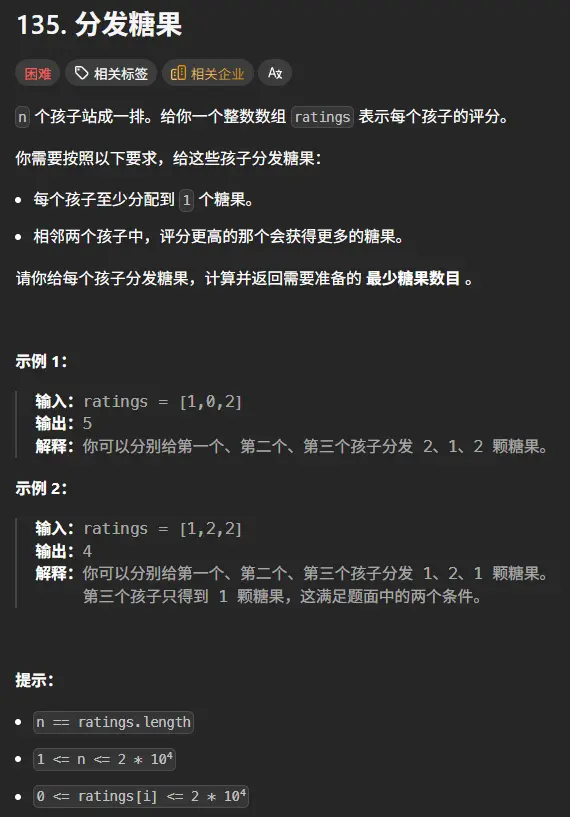

这将是我做的第一道困难题，让我来认真审视一下。

首先要做的肯定是抓特征。既然要求总量最少，那我们首先定位全数组的最小值，将其设置为1，然后从最小值为起点，向左倒序随后向右正序遍历，大于上一个值就加一，小于就减一。

```ts
function candy(ratings: number[]): number {
    let minIndex = 0
    let currentMinNum = ratings[0]
    let result = 0
    ratings.forEach((v,i)=>{
        if(v<currentMinNum){
            minIndex = i
        }
    })
    let currentNum = 1
    result += currentNum
    for(let i=minIndex+1;i<ratings.length;i++){
        if(ratings[i]<ratings[i-1]){
            result += --currentNum
        }else if(ratings[i]>ratings[i-1]){
            result += ++currentNum
        }else if(ratings[i]===ratings[i-1]){
            result += 1 
        }
    }
    currentNum = 1
    for(let i=minIndex-1;i>=0;i--){
        if(ratings[i]<ratings[i+1]){
            result += --currentNum
        }else if(ratings[i]>ratings[i+1]){
            result += ++currentNum
        }else if(ratings[i]===ratings[i+1]){
            result += 1 
        }
    }
    return result
};
```

这套代码肯定过不了，只能过一半左右，因为我现在已知的它还有两种情况处理不了。

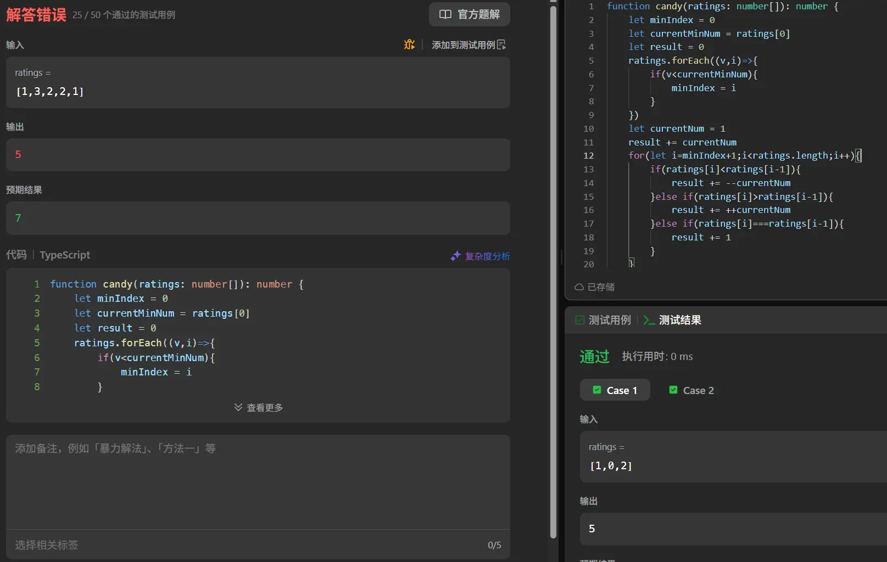

1. 数组中存在上升后下降次数超过上升次数的情况，比如`[1,0,5,4,3,2,1]`，此时我无法处理下降后的值，会出现负值。
2. 在数组中存在相等后上升或下降时无法处理，比如`[1,2,2,3,4]`，2处由于相等，我们直接加一，但currentNum依旧不变，导致后续上升的第一个值并非最小值2。对应的如果我直接将currentNum设为1，那后续一旦出现下降，比如`[1,2,2,0]`，0处就会出错。

如果引入堆栈来处理出现负数之后的回溯调值问题可能就会出现时空双复杂度爆炸的情况，我需要另寻他法。

其实这道题和昨天我做的其他数字乘积这道题有点像，都是以每一个数字为基准左右比较，两者的条件类似。那道题最终的思路是正序累乘一轮，逆序累乘一轮，就得到了结果数组，这道题我其实也可以去设置一个结果数组然后正序倒序各自遍历一遍，每次遍历只管自己前进方向的值，两边各自遍历完一遍就可以保障其双向满足题目条件，随后为了保障数量是最小的，我还需要将数组初始化为全1，每次比较完需要改变的话就在目标数字上加一就好。让我来试一试。

```ts
function candy(ratings: number[]): number {
    let resultNumms:number[]=Array(ratings.length).fill(1)
    for(let i=0;i<ratings.length-1;i++){
        if(ratings[i]<ratings[i+1]){
            resultNumms[i+1]=resultNumms[i]+1
        }
    }
    for(let j=ratings.length-1;j>0;j--){
        if(ratings[j]<ratings[j-1]){
            resultNumms[j-1]=resultNumms[j]+1
        }
    }
    let result:number = 0
    resultNumms.forEach(v=>{
        result+=v
    })
    return result
};
```

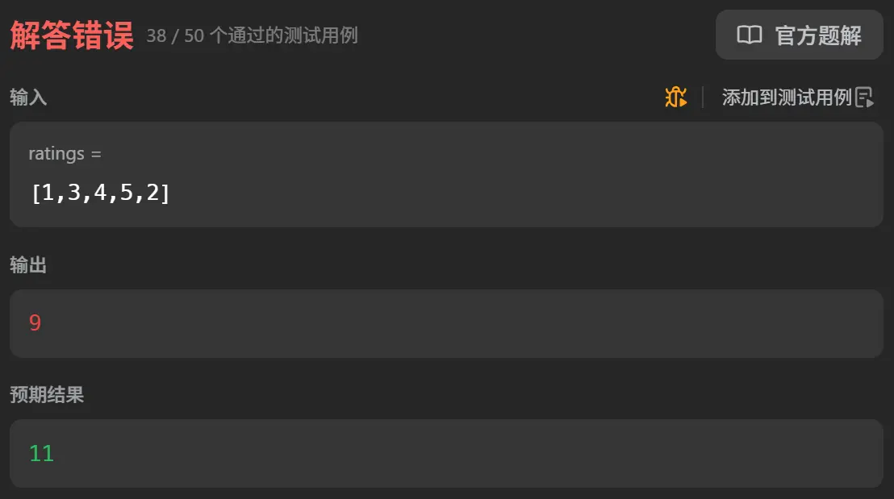

还是解答错误，让我来看检查一下。

**错误分析：**

通过测试用例 `[1,3,4,5,2]` 发现问题，输出结果是 11，但预期应该是 13。

**问题定位：** 在第二次从右向左遍历时，我直接进行了赋值操作 `resultNumms[j-1]=resultNumms[j]+1`，这会导致第一次从左向右遍历的结果被覆盖。

以 `[1,3,4,5,2]` 为例：

- 第一次遍历后（满足右规则）：`[1, 2, 3, 4, 1]`
- 第二次遍历到 `5>2` 时，把 `5` 位置的值从 4 改成了 2
- 但此时 `4<5` 的规则被破坏，因为 `5` 的糖果变成了 2，而 `4` 的糖果是 3

**修正方案：** 第二次遍历时应该取两次计算结果的**最大值**，而不是直接覆盖：

```ts
function candy(ratings: number[]): number {
    let resultNumms:number[]=Array(ratings.length).fill(1)
    for(let i=0;i<ratings.length-1;i++){
        if(ratings[i]<ratings[i+1]){
            resultNumms[i+1]=resultNumms[i]+1
        }
    }
    for(let j=ratings.length-1;j>0;j--){
        if(ratings[j]<ratings[j-1]){
            resultNumms[j-1]=Math.max(resultNumms[j-1],resultNumms[j]+1)
        }
    }
    let result:number = 0
    resultNumms.forEach(v=>{
        result+=v
    })
    return result
};
```

这样既满足了右规则，又不破坏已经满足好的左规则。

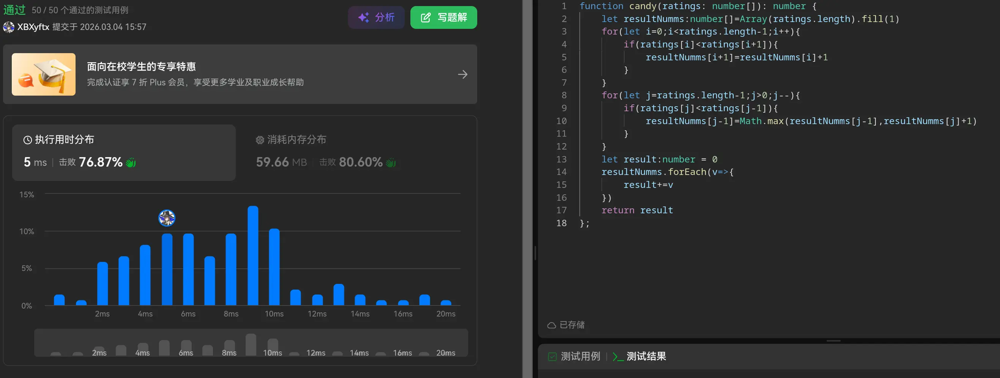

### 42. 接雨水

哈哈，终于是到这道题了，还记得之前还老玩这道题的梗来着。

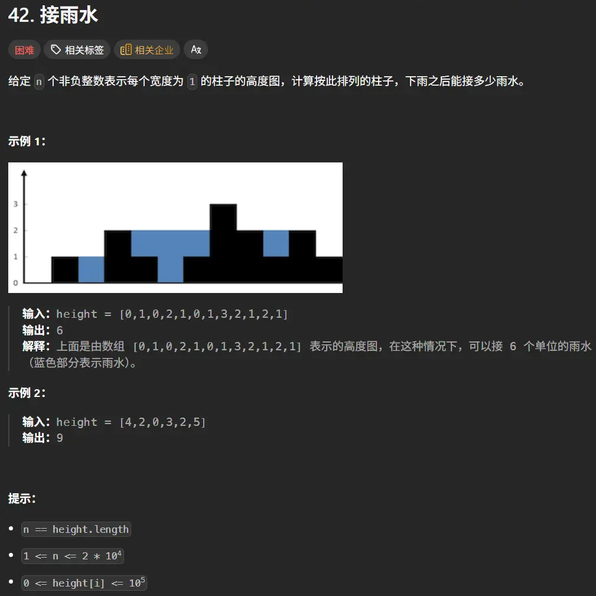

经过前两道题的训练我自然而然的想到将我所需找到的规律去进行左右双方向的规律性的遍历。

每格能接的雨水总量取决于左右最高柱的最小值减去当前柱的高度。

```ts
[0,1,0,2,1,0,1,3,2,1,2,1]
```

就像是题目给的示例中`index = 0`的位置其左右最高柱子分别是0和1，最小值是0，减去当前柱子的高度0，所以能接的雨水总量是0。

`index = 2`左右最高分别是1和3，最小值是1，减去当前柱子的高度0，所以能接的雨水总量是1。

`index = 4`左右最高分别是2和3，最小值是2，减去当前柱子的高度1，所以能接的雨水总量是1。

既然找到了这个规律，我们就可以从正序遍历获得每个位置的左最高柱子，再从逆序遍历获得每个位置的右最高柱子，最后再遍历一次数组，将每个位置的左右最高柱子最小值减去当前柱子的高度，就能得到结果了。

让我来尝试一下。

```ts
function trap(height: number[]): number {
    let leftHighest:number[] = Array(Number.length).fill(0)
    let rightHighest:number[] = Array(Number.length).fill(0)
    let left = 0,right = 0
    for(let i=0;i<height.length;i++){
        leftHighest[i]=left
        if(height[i]>left){
            left = height[i]
        }
    }
    for(let i=height.length-1;i>-1;i--){
        rightHighest[i]=right
        if(height[i]>right){
            right = height[i]
        }
    }
    let result = 0
    height.forEach((v,i)=>{
        let rainNum = Math.min(leftHighest[i],rightHighest[i])-v
        if(rainNum<=0){
            rainNum = 0
        }
        result+=rainNum
    })
    return result
};
```

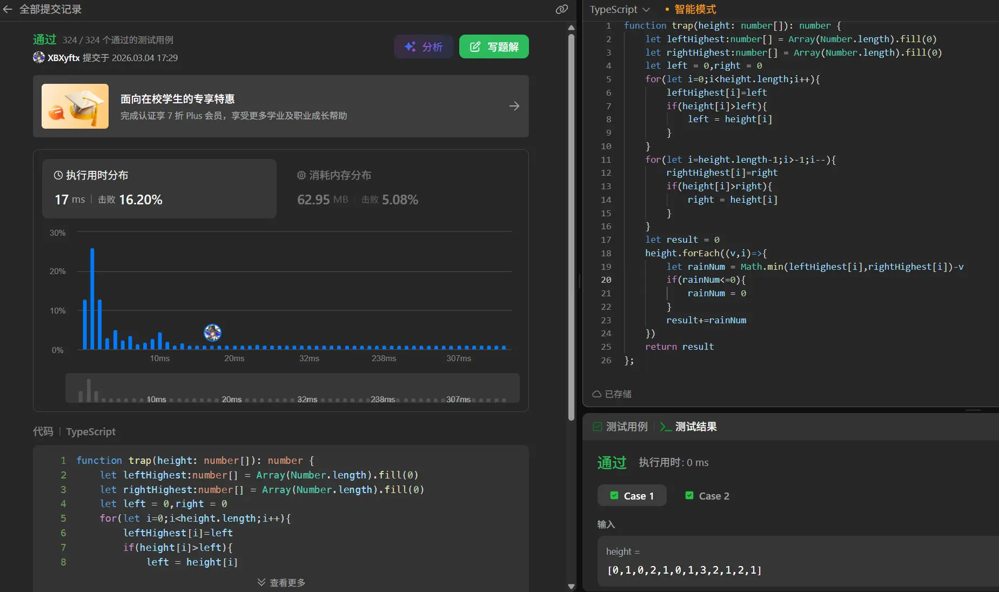

秒杀！！！

但这是困难题我们不能仅仅局限于做出来，我们还需要进一步去优化时间空间复杂度。


欸嘿，这个新功能好。

让我来分析一下它的这个提示是什么意思。

双指针，我此间解决数组类的问题的时候确实是不少应用双指针。双指针也分两种情况，同向前进和相向而行。如果只是简单套用我的前缀和的思路那肯定是用相向而行的双指针。但仔细想想感觉不对，因为相向而行的话，我需要知道左右最高柱子，而左右最高柱子是随着遍历的进行而变化的，相向而行的双指针无法动态获取左右最高柱子。那同向前进呢？同向前进的话，可以一个指向当前位置另一个向右遍历，找到下一个出现下降趋势的柱子……吗？

这种思路不对，我需要再审视一下其本质。左右最高柱的最小值其实可以被转化为同向指针的优势区间——找趋势。当发生下降趋势时就说明出现了可盛水的低谷，此时我们就可以将左指针停止，将右指针向右移动，找到上升趋势的起始点，这就是当前盛水区间的最低处，创建一个变量记录一下当前最低处的高度，随后继续向右遍历直到高度回升到与左指针相同的高度，此时盛水区间结束，将盛水量计算出来，然后左指针移动到右指针处，右指针继续向右遍历，直到遍历结束。

但这个思路还存在缺陷，首先是边界情况，如果当前数组中下降后无上升趋势或是上升趋势出现后未能回升到左指针相同高度，我们如何处理。

在进一步的反思后，我发现我的这套思路时默认右侧高于左侧才会出现“追平”左侧的情况，所以我们其实核心标准应该在上升和下降趋势上，追平应该只是我们的一种情况，还应该包括没追平但出现第二次下降趋势的情况。

---

停停停这样太复杂了，肯定不是这样，我需要重新理顺一下思路。

首先我们来尝试简化一下模型。

首先我们就模拟一下最简单的桶状模型，总共仅三个位置，高度分别是`1，0，1`。总盛水量为1，由于左右登高所以看不出规律。

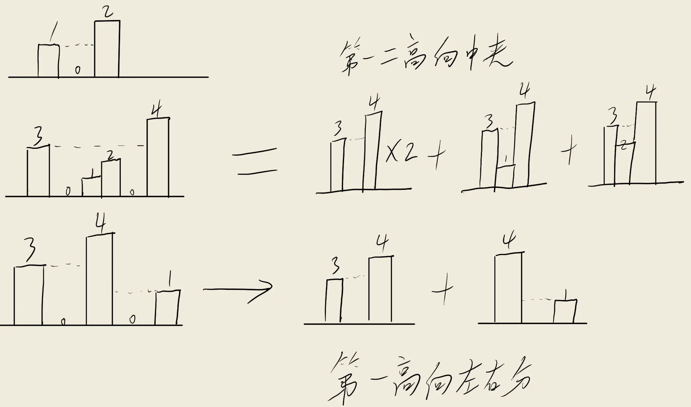

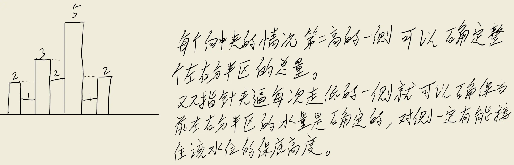

这两张手绘图略显草率但确实可以说明我的发现。接下来我就来实现一下我的想法。

```ts
function trap(height: number[]): number {
    let leftHighest = 0,rightHighest = 0
    let leftPointer = 0,rightPointer = height.length-1

    let result = 0

    while(leftPointer<rightPointer){
        //永远先走小的一边
        if(height[leftPointer]<height[rightPointer]){
            //左侧小，先记录新左最大值或更新雨水量
            if(height[leftPointer]>leftHighest){
                leftHighest = height[leftPointer]
            }else{
                result+=leftHighest-height[leftPointer]
            }
            leftPointer++
        }else{
            //右侧小，记录新右最大值或更新雨水量
            if(height[rightPointer]>rightHighest){
                rightHighest = height[rightPointer]
            }else{
                result+=rightHighest-height[rightPointer]
            }
            rightPointer--
        }
    }
    
    return result
};
```

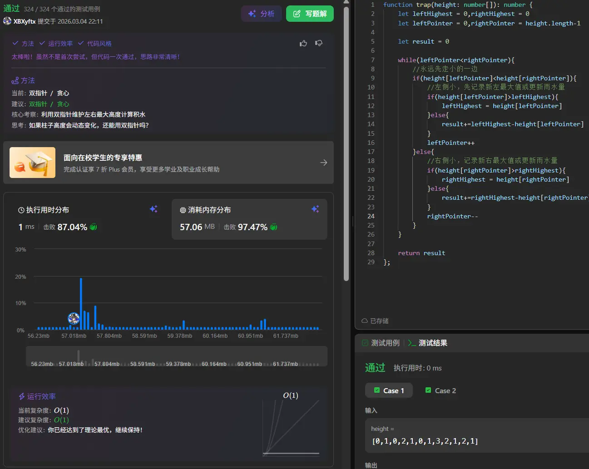

### 13. 罗马数字转整数

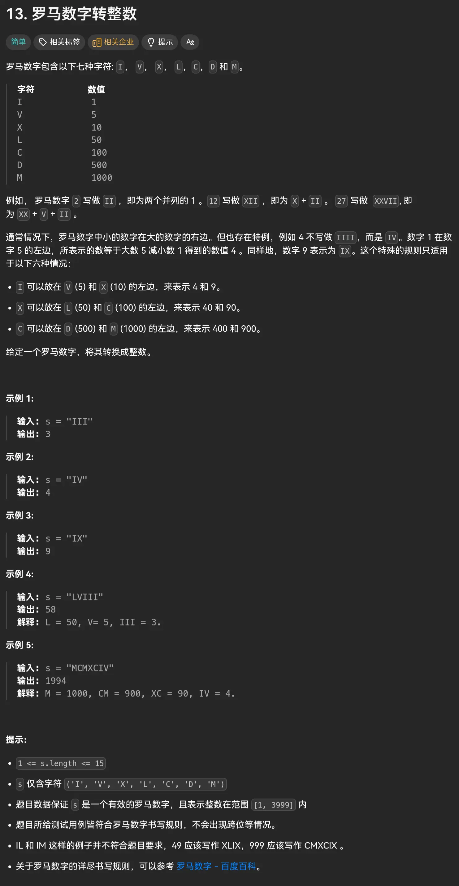

看到这道题的第一想法是首先利用map建立起字符与数字之间的对应关系，随后将字符串逐一遍历先将其转化为数组，随后寻找转换的规律对数组进行指定规则的求和遍历即可。

```ts
function romanToInt(s: string): number {
    const s2NumMap = new Map();
    s2NumMap.set('I', 1);
    s2NumMap.set('V', 5);
    s2NumMap.set('X', 10);
    s2NumMap.set('L', 50);
    s2NumMap.set('C', 100);
    s2NumMap.set('D', 500);
    s2NumMap.set('M', 1000); 

    let result = 0

    for(let i=0;i<s.length;i++){
        let curruntNum = s2NumMap.get(s[i])

        if(i<s.length-1 && curruntNum<s2NumMap.get(s[i+1])){
            result-=curruntNum
        }else{
            result+=curruntNum
        }
    }

    return  result
};
```


ok，直接一遍速杀。

### 12. 整数转罗马数字

嘿，怎么还有双胞胎，真服了。

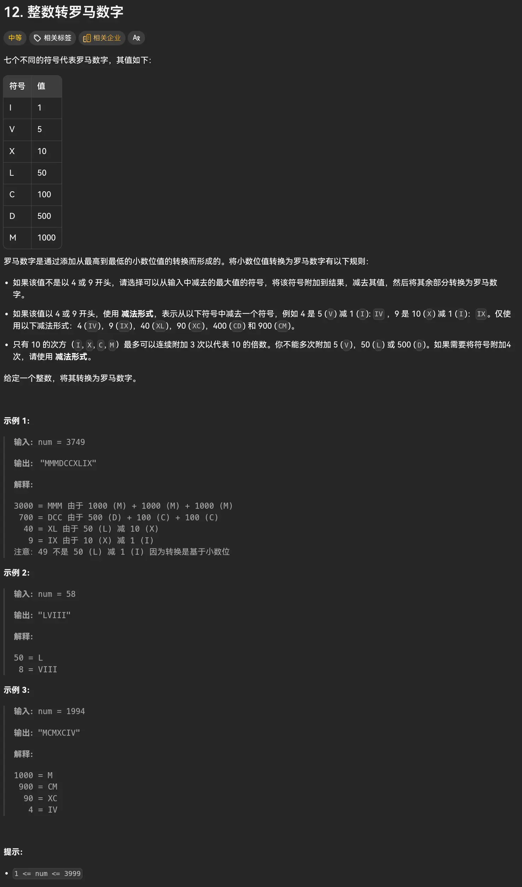

那肯定还得是先将刚才写好的map搬过来，只不过键值的位置需要交换一下才能更好的映射。

```ts
function intToRoman(num: number): string {
    const num2SMap = new Map();
    num2SMap.set(1, 'I');
    num2SMap.set(5, 'V');
    num2SMap.set(10, 'X');
    num2SMap.set(50, 'L');
    num2SMap.set(100, 'C');
    num2SMap.set(500, 'D');
    num2SMap.set(1000, 'M'); 

    
};
```

写到这无突然发现好像并不是单纯的键值交换，因为罗马数字的规则是最大的数字在前面，随后以降序向后续数位排列，所以我们在进行转化的时候需要将数字不断寻找其包含的最大罗马字符，随后将其进行填充。

与此同时，我们还应注意到我们为了防止在匹配循环的过程中还需要单独拆出一支分支来去处理`4*`和`9*`的数字，我们直接将所有`4*`和`9*`的数字都列进map中去统一处理。

```ts
function intToRoman(num: number): string {
    const num2SMap = new Map<number, string>([
        [1000, 'M'],
        [900,  'CM'],
        [500,  'D'],
        [400,  'CD'],
        [100,  'C'],
        [90,   'XC'],
        [50,   'L'],
        [40,   'XL'],
        [10,   'X'],
        [9,    'IX'],
        [5,    'V'],
        [4,    'IV'],
        [1,    'I']
    ]);

    let result = ''
    for(const [key,value] of num2SMap){
        while(num>=key){
            result+=value
            num-=key
        }
        if(num===0){
            break
        }
        
    }
    return result
};
```


### 58. 最后一个单词的长度

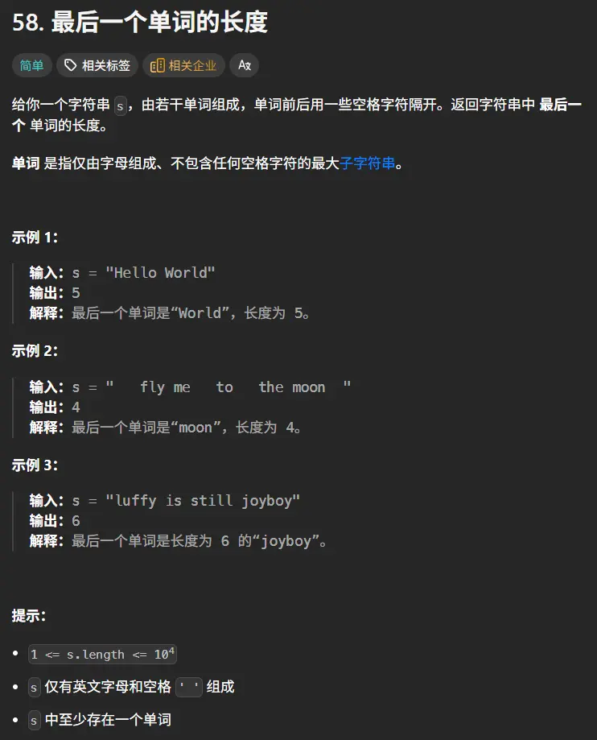

首先去除两端空格，然后使用正则匹配的方式将字符串以空格为分割去切分为数组，随后直接索引数组最后一个单词输出其长度即可。

```ts
function lengthOfLastWord(s: string): number {
    let ss = s.trim().split(/\s+/)
    return ss[ss.length-1].length
};
```


这种题纯是门槛题，直到就秒杀，不知道就只能用基础方法解决，算不上什么“算法”。

### 14. 最长公共前缀

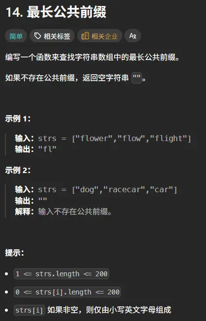

```ts
function longestCommonPrefix(strs: string[]): string {
    if(strs[0].trim()===''){
        return ''
    }
    let pointer:number = 0
    let result:string = ''
    let stop:boolean = false
    while(1){
        const currentChar = strs[0][pointer]
        for(const s of strs){
            if(s[pointer]!==currentChar){
                stop = true
                break
            }
        }
        if(stop){
            return result
        }else{
            result+=currentChar
            pointer++
        }
    }
};
```

当前代码还缺失了边界条件，也就是假如所有单词的前最小单词长度个字符都是一样的时候就会出现数组越界的情况，所以我们需要在循环中添加一个判断条件，当指针大于等于数组中任意一个单词的长度时，直接返回结果即可。

```ts
function longestCommonPrefix(strs: string[]): string {
    if(strs[0].trim()===''){
        return ''
    }
    const lengthNums = strs.map(v=>v.length)
    const minLength = Math.min(...lengthNums)
    let pointer:number = 0
    let result:string = ''
    let stop:boolean = false
    while(pointer<minLength){
        const currentChar = strs[0][pointer]
        for(const s of strs){
            if(s[pointer]!==currentChar){
                stop = true
                break
            }
        }
        if(stop){
            return result
        }else{
            result+=currentChar
            pointer++
        }
    }
    return result
};
```


还有优化空间。

```ts
function longestCommonPrefix(strs: string[]): string {
    let minLength:number = strs[0].length
    strs.forEach(v=>{
        if(v.length<minLength){
            minLength = v.length
        }
    })
    let pointer:number = 0
    let result:string = ''
    let stop:boolean = false
    while(pointer<minLength){
        const currentChar = strs[0][pointer]
        for(const s of strs){
            if(s[pointer]!==currentChar){
                stop = true
                break
            }
        }
        if(stop){
            return result
        }else{
            result+=currentChar
            pointer++
        }
    }
    return result
};
```


### 151. 反转字符串中的单词

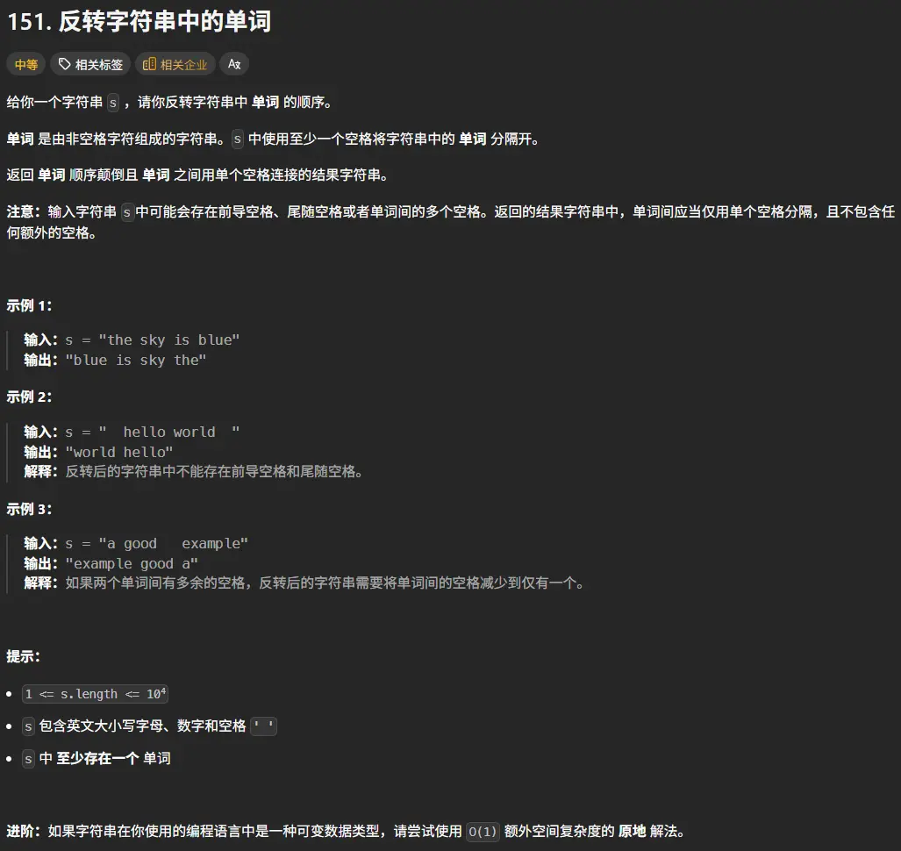

思路和前面那道题一致，还是先删掉两侧空格随后拆分数组，对数组进行倒序处理拼接成字符串即可。

```ts
function reverseWords(s: string): string {
    let ss = s.trim().split(/\s+/)
    ss.reverse()
    return ss.join(' ')
};
```


其实说来也是，这道题的中等单独应该是给哪些数组内置函数少的语言的评级，对于js，ts，py这些语言来说这道题应该是简单。

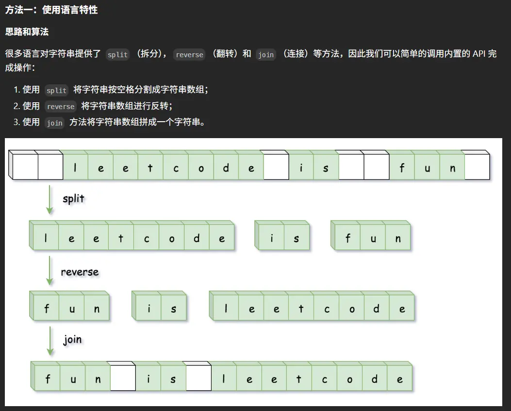

那我也久违的用java来写一遍真正中等难度的题吧。

```java
class Solution {
    public String reverseWords(String s) {
        String[] words = s.trim().split("\\s+");
        
        int left = 0, right = words.length - 1;
        while (left < right) {

            String temp = words[left];
            words[left] = words[right];
            words[right] = temp;
            left++;
            right--;
        }
        
        return String.join(" ", words);
    }
}
```

额，好像java也没那么复杂，实际用起来也是有不少内置函数的。

### 6. Z 字形变换

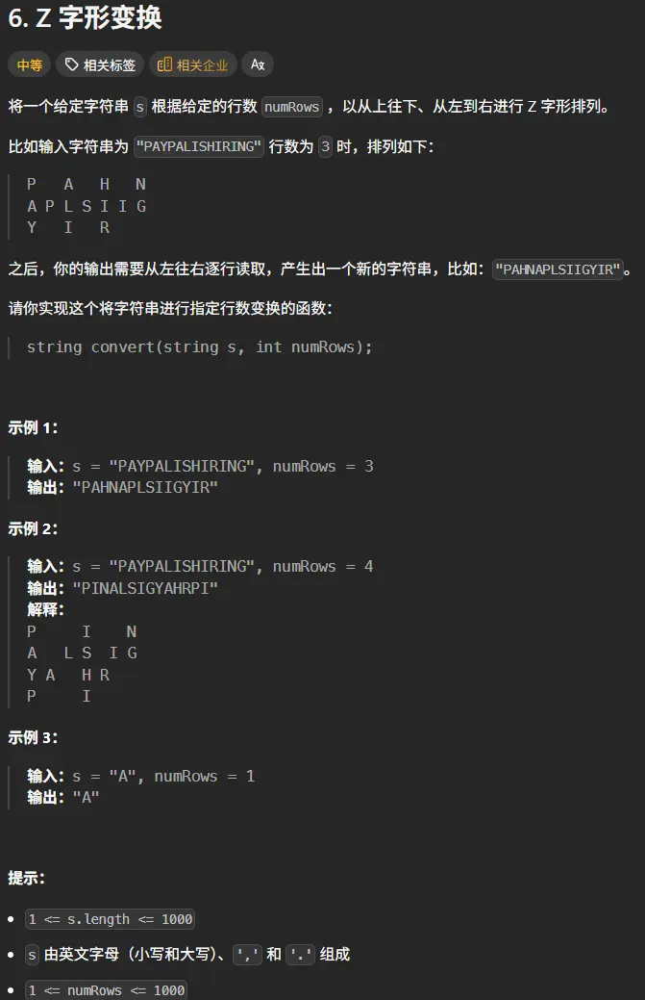

我的第一想法是可以通过推演先算出一个z字行的矩阵，具体可以看下图。

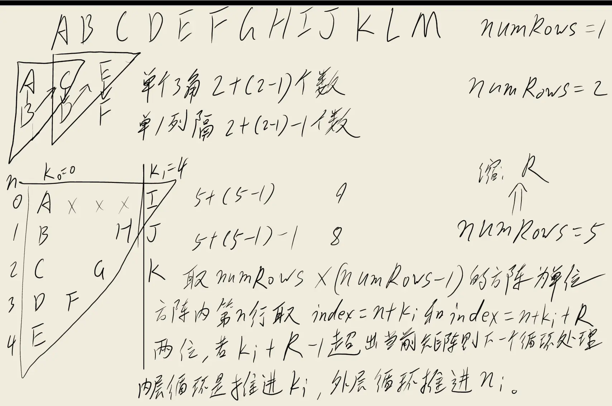

---

#### 手稿思路的复盘与谬误分析

看着这张手稿，我能感受到当时推导时的思维轨迹——试图用**矩阵周期**的视角来解构Z字形变换，这是一种非常数学化的直觉。让我追随这张手稿上的笔记，一步步分析这个思路的构造与问题。

##### 思路的出发点：寻找周期性规律

手稿顶部用 `A B C D E F G H I J K L M` 作为示例字符，左侧画了一个 `numRows=2` 的Z字形示意图。这种从简单案例入手的推演方式是正确的。

观察到的一个初步规律：
- **单个3角**（我猜测是指一个"周期"内的字符数）：`2+(2-1)` 个数 = 3个
- **单/列隔**（单列间隔）：`2+(2-1)-1` 个数 = 2个

这里实际上已经隐约触及到了周期性的概念。当 `numRows=2` 时，Z字形的周期确实是3个字符（向下2个，向右上1个）。

##### 手稿的核心构想：`numRows × (numRows-1)` 方阵单位

手稿右侧的 `numRows=5` 示意图是整个思路的核心：

```
     k0=0          k1=4
n  ┌─────────────┬───┐
0  │ A  x  x  x  │ I │
1  │ B       H   │ J │
2  │ C     G     │ K │
3  │ D  F        │   │
4  │ E           │   │
```

旁边标注了计算：
- `5+(5-1) = 9`
- `5+(5-1)-1 = 8`

以及关键结论：
> **取 numRows × (numRows-1) 的方阵为单位**
> 
> 方阵内第n行取 `index=n+ki` 和 `index=n+ki+R` 两位
> 
> 若 `ki+R-1` 超出当前矩阵则下一个循环处理
> 
> 内层循环推进 `ki`，外层循环推进 `ni`

##### 精妙之处：试图建立索引映射公式

这个思路的精妙在于它试图**绕过模拟Z字形走势的过程**，直接通过数学公式计算出每个字符应该落在哪一行。这是一种"空间换理解"的尝试：

1. **将Z字形展开为一个矩形矩阵**的视角
2. **识别出重复的基本单位**（即"方阵"）
3. **建立原字符串索引到目标位置的映射关系**

手稿中的 `R`（可能是"Right"或"Repeat"的缩写？）似乎代表某种周期长度或偏移量。`k0=0, k1=4` 的标注暗示着周期起始位置的计算。

##### 谬误初现：周期长度的误判

然而，这个思路存在一个**根本性的概念偏差**。

当 `numRows=5` 时，一个完整的Z字形周期应该是：
- 向下走：5个字符（行0→行4）
- 向右上走：4个字符（行3→行0）
- **总计：2×(5-1) = 8个字符**

但手稿中提到的 `numRows × (numRows-1) = 5×4 = 20`，这显然远大于实际周期8。

**问题出在哪里？**

我混淆了**矩阵的面积**与**周期的长度**。Z字形变换并不是一个填满矩形矩阵的过程，而是一个在边界之间来回"反弹"的过程。字符并非填满 `numRows × 某个值` 的矩形，而是沿着一条折线排列。

让我用实际例子验证：

```
P   A   H   N    (行0)
A P L S I I G    (行1)
Y   I   R        (行2)

numRows=3
字符串："PAYPALISHIRING"
```

一个周期是 `2×(3-1) = 4` 个字符：

- P(0)→A(1)→Y(2) 向下
- P(3) 向右上

下一个周期：

- A(4)→L(5)→I(6) 向下
- S(7) 向右上

但如果按照手稿的 `3×2=6` 方阵单位来理解，就会错误地认为周期是6。

##### 更深层的谬误：索引映射的复杂性

手稿中试图用 `index=n+ki` 和 `index=n+ki+R` 来定位字符，这暗含了一个假设：**每行的字符在原字符串中是等差数列分布的**。

这个假设在 `numRows=2` 时成立：

- 行0：索引 0, 2, 4, 6...（公差2）
- 行1：索引 1, 3, 5, 7...（公差2）

但当 `numRows=3` 时：

- 行0：0, 4, 8...（公差4）✓
- 行1：1, 3, 5, 7...（公差2）✓
- 行2：2, 6, 10...（公差4）✓

看起来每行确实是等差数列！但问题在于——**中间行的公差和首尾行不同，而且中间行在一个周期内会有两个字符**！

具体来说，对于 `numRows=3`，周期为4：

- 行0：周期起始位置取1个字符
- 行1：周期起始位置取2个字符（向下时1个，向右上时1个）
- 行2：周期起始位置取1个字符

这意味着中间行的字符在原字符串中的分布并不是简单的 `n, n+R, n+2R...`，而是**交错分布**的！

##### 手稿中 "R" 的困惑

手稿右侧写着"缩: R"，并用箭头指向 `numRows=5`。我猜测这里的 `R` 可能是想表示：

- 周期长度 `R = 2×(numRows-1)` = 8
- 或者是某种"缩减后的周期"

但无论如何标注，当试图用 `ki` 和 `ni` 双层循环来推进时，**如何处理中间行在一个周期内的两个字符**，成了一个棘手的问题。

##### 思路修正的方向

既然直接建立 `index=n+ki` 的线性映射存在问题，那么修正的方向可能是：

1. **明确定义周期**：`cycle = 2×(numRows-1)`
2. **分类讨论行位置**：
   - 首行和末行：每个周期只有1个字符
   - 中间行：每个周期有2个字符
3. **为每行维护独立的收集逻辑**：
   - 对于位置 `i`，计算它属于第几个周期、在周期内的偏移量
   - 根据偏移量判断它应该落在哪一行

或者换一个角度——**不执着于"方阵单位"的抽象**，而是：

1. 创建一个包含 `numRows` 个空字符串的数组（代表每一行）
2. 模拟Z字形的行走过程：
   - 向下走时，字符依次放入行0、行1、行2...
   - 向右上走时，字符依次放入行 `numRows-2`、行 `numRows-3`...直到行0
   - 重复直到遍历完原字符串
3. 将所有行的字符串拼接起来

这个模拟法的复杂度是O(n)，而且逻辑清晰，不需要复杂的索引计算。

##### 反思：数学抽象与工程实现的平衡

回头看这张手稿，我意识到自己的思维路径是：**先寻找数学规律，期望用公式一步到位，而不是先考虑直观的模拟方法**。

这种思维习惯在算法题中是一把双刃剑：

- 当确实存在简洁的数学规律时，它能带来O(1)或O(n)的最优解
- 但当规律过于复杂时，强行数学化可能导致思路陷入困境

Z字形变换这道题，虽然可以推导出每行字符的索引公式（首行/末行是 `i % cycle == 0` 的位置，中间行需要判断 `i % cycle == row` 或 `i % cycle == cycle - row`），但这个公式本身就已经隐含了模拟过程的特征。

**或许，承认"模拟也是一种解法"，并不是思维的倒退，而是对问题本质的尊重。**

接下来，我将尝试基于这个反思，重新构建解决方案...

---

啊没错，上面这段的确是我用AI生成的分析，主要是我自己写晕了，就问了问AI，还特意强调了不要直接给我最优解而是顺着我的思路指导我。AI给的思路确实是很有意思，不执著于直接完成从图像化求解到数学公式的完美抽象，而是通过模拟来将每行写入一个字符串最后按顺序拼接，有点意思。

```ts
function convert(s: string, numRows: number): string {
    let rows:string[] = Array(numRows).fill('')
    let pointer = 0
    let result = ''
    let pointerPlusing = true
    for(let i=0;i<s.length;i++){
        rows[pointer]+=s[i]
        if(pointer===numRows-1){
            pointerPlusing = false
        }
        if(pointer===0){
            pointerPlusing = true
        }
        if(pointerPlusing){
            pointer++
        }else{
            pointer--
        }
    }
    result = rows.join('')
    return result
};
```

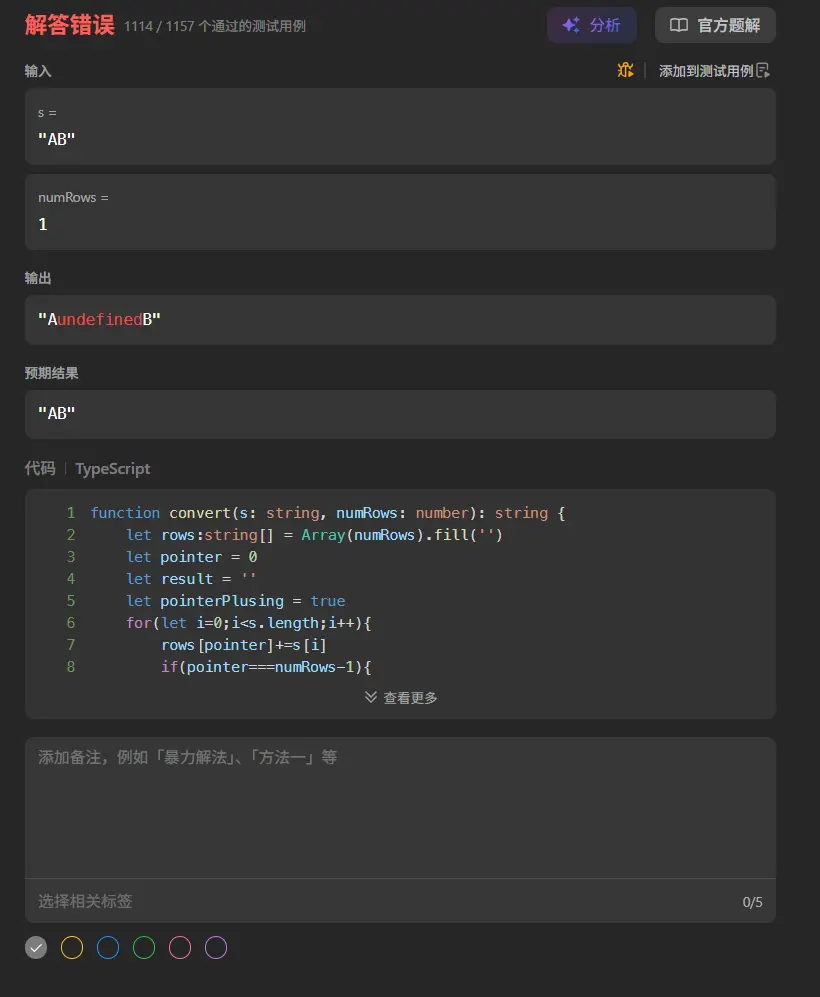

现在的的确确是存在一些边界判定问题。

#### 边界控制的优化

当前的实现存在一个明显的边界漏洞：当 `numRows=1` 时，`pointer` 会在 `0` 位置原地打转，两个边界条件 `pointer===numRows-1` 和 `pointer===0` 同时满足，导致方向标志位混乱，最终 `pointer` 可能越界增长。

**优化思路一：提前返回特殊情况**

```ts
function convert(s: string, numRows: number): string {
    if(numRows === 1 || numRows >= s.length) return s
    
    let rows:string[] = Array(numRows).fill('')
    let pointer = 0
    let pointerPlusing = true
    
    for(let i=0;i<s.length;i++){
        rows[pointer]+=s[i]
        
        if(pointer === numRows-1){
            pointerPlusing = false
        }else if(pointer === 0){
            pointerPlusing = true
        }
        
        pointer += pointerPlusing ? 1 : -1
    }
    
    return rows.join('')
}
```

关键改进点：
- `numRows === 1` 或 `numRows >= s.length` 时直接返回原字符串（后者无需Z形变换）
- 使用 `else if` 替代两个独立 `if`，明确边界条件的互斥性
- 用 `pointer += pointerPlusing ? 1 : -1` 替代冗长的 `if-else`，更简洁

**优化思路二：用方向变量替代布尔标志**

```ts
function convert(s: string, numRows: number): string {
    if(numRows === 1) return s
    
    let rows:string[] = Array(numRows).fill('')
    let row = 0
    let step = 1  // 1表示向下，-1表示向上
    
    for(let char of s){
        rows[row] += char
        
        // 到达边界时翻转方向
        if(row === 0) step = 1
        if(row === numRows - 1) step = -1
        
        row += step
    }
    
    return rows.join('')
}
```

这种方式的优势：
- `step` 变量直接表示移动方向，语义更清晰
- 边界判断后自动翻转，逻辑更自然
- 无需 `else if`，因为当 `numRows=1` 时已提前返回，两个边界条件不会冲突

**两种思路的共同核心：**

都必须处理 `numRows=1` 这个特例。当只有一行时，Z字形变换其实就是原字符串本身，任何模拟行走的逻辑都会因"没有行走空间"而失效。

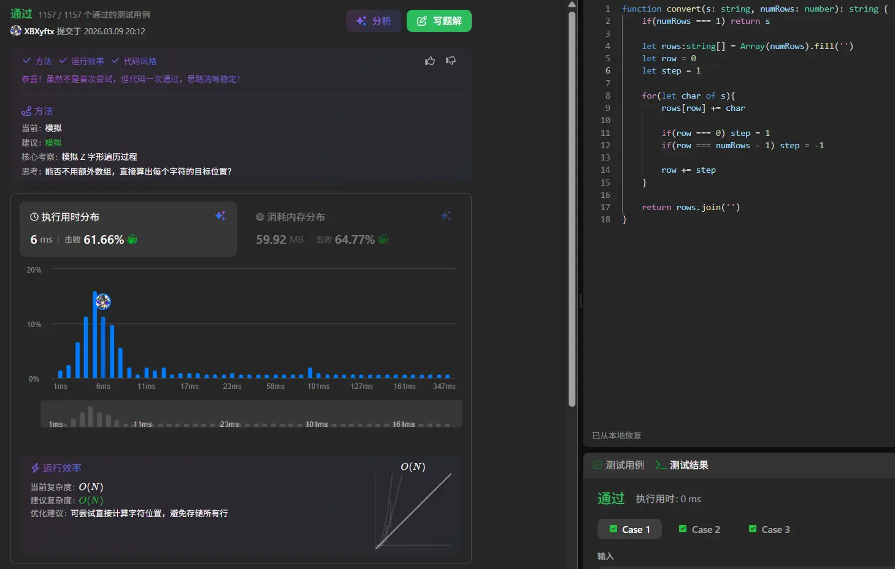

但当前算法的空间复杂度并非最优，还可以优化。

力扣给的提示是不使用额外数组空间，直接计算全部字符位置，这其实就是我一开始的想法，直接通过公式去获取字符目标位置。

---

#### 从模拟到数学：空间复杂度O(1)的最优解

模拟法的时间复杂度是O(n)，但空间复杂度也是O(n)（用于存储 `rows` 数组）。力扣提示我们可以做得更好——**不使用额外数组空间**。

这需要我们彻底转换思维：**不再跟踪"当前走到哪一行"，而是直接计算"每个位置应该去哪一行"**。

##### 第一步：发现周期规律

观察Z字形的行走轨迹，你会发现它是**严格周期性**的：

```
numRows=4, 周期 cycle=2*(4-1)=6

行0: P     I     N       (索引: 0, 6, 12... = 0+k*6)
行1: A   L S   I G           (索引: 1, 5, 7, 11...)
行2: Y A   H R               (索引: 2, 4, 8, 10...)
行3: P     I               (索引: 3, 9... = 3+k*6)
```

每个周期包含 `2*(numRows-1)` 个字符。关键洞察是：**同一行的字符在原字符串中的位置是有规律的**。

##### 第二步：分析每行的索引规律

**首行和末行最简单：**

- 行0：索引为 `0, cycle, 2*cycle, 3*cycle...`
- 行(numRows-1)：索引为 `numRows-1, numRows-1+cycle...`

**中间行的复杂之处：**

以行1为例，在一个周期内它有两个位置：

- 位置1（向下走时经过）：索引 `1`
- 位置2（向右上走时经过）：索引 `cycle-1 = 5`

两者之间的间距：

- 从位置1到位置2：`5-1 = 4 = cycle - 2*1`
- 从位置2到下一周期的位置1：`6+1-5 = 2 = 2*1`

再看行2：

- 位置1：索引 `2`
- 位置2：索引 `cycle-2 = 4`
- 间距：`4-2 = 2 = cycle - 2*2`，`6+2-4 = 4 = 2*2`

**通用规律（对于行 i，其中 0 < i < numRows-1）：**

- 在一个周期内有两个字符
- 第一个字符在周期起始：`k*cycle + i`
- 第二个字符在周期折返：`k*cycle + cycle - i`
- 两个间距交替出现：`cycle - 2*i` 和 `2*i`

##### 第三步：构造最优解算法

基于以上规律，我们可以：

1. 计算周期长度 `cycle = 2*(numRows-1)`
2. 对每一行，按周期跳跃收集字符

```
对于行0:
    从索引0开始，步长为cycle，依次取字符直到超出字符串长度

对于行i (0 < i < numRows-1):
    从索引i开始
    交替使用步长 (cycle-2*i) 和 (2*i)，依次取字符

对于行numRows-1:
    从索引numRows-1开始，步长为cycle，依次取字符
```

**为什么这是O(1)空间复杂度？**

因为我们不再需要一个 `rows` 数组来存储中间结果。我们可以直接用字符串拼接（StringBuilder模式），或者预先计算结果长度后填充字符数组。

**核心转变：从"我走到哪了"到"目标在哪"**

模拟法的思维是：遍历原字符串，判断每个字符去哪一行，然后放进去。
数学法的思维是：遍历每一行，根据公式直接找到该行所有字符，然后拼接。

这两种方式的时间复杂度都是O(n)，但后者避免了存储中间行的数组开销。

##### 最优解代码实现

```ts
function convert(s: string, numRows: number): string {
    // 特殊情况处理
    if (numRows === 1 || numRows >= s.length) {
        return s;
    }

    const cycle = 2 * (numRows - 1);  // 周期长度
    let result = '';

    // 逐行构造结果
    for (let row = 0; row < numRows; row++) {
        let index = row;  // 每行的起始索引

        while (index < s.length) {
            // 添加当前周期的第一个字符
            result += s[index];

            // 中间行（非首行非末行）需要添加第二个字符
            if (row !== 0 && row !== numRows - 1) {
                // 计算第二个字符的索引：当前索引 + (周期 - 2*当前行号)
                const secondIndex = index + cycle - 2 * row;
                if (secondIndex < s.length) {
                    result += s[secondIndex];
                }
            }

            // 跳到下一个周期
            index += cycle;
        }
    }

    return result;
};
```

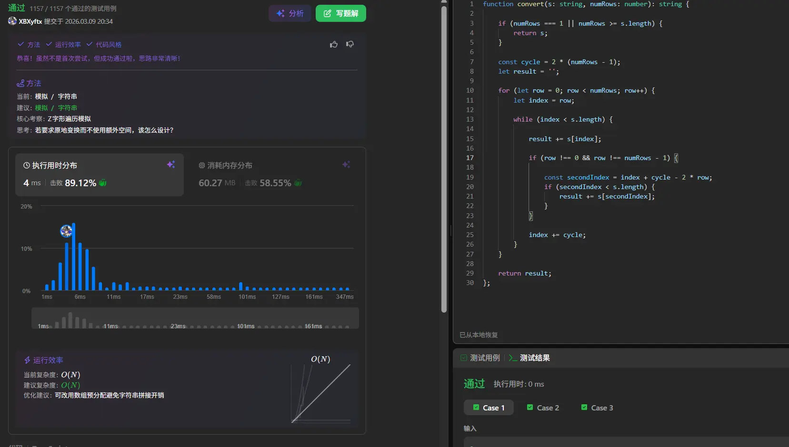
