## 前言

在鸿蒙开发中，想要实现数据的持久化存储主要有五种方式，分别是：[**用户首选项（Preferences）**](https://developer.huawei.com/consumer/cn/doc/harmonyos-guides/data-persistence-by-preferences)、[**键值型数据库（KV-Store）**](https://developer.huawei.com/consumer/cn/doc/harmonyos-guides/data-persistence-by-kv-store)、[**关系型数据库（RelationalStore）**](https://developer.huawei.com/consumer/cn/doc/harmonyos-guides/data-persistence-by-rdb-store)、[**向量数据库**](https://developer.huawei.com/consumer/cn/doc/harmonyos-guides/data-persistence-by-vector-store)、[**PersistenceV2**](https://developer.huawei.com/consumer/cn/doc/harmonyos-guides/arkts-new-persistencev2)。由于V1版本的状态管理已经不在推荐使用所以这里就不在列举了。在此前的开发中我仅用过状态管理V2版本中所提供的持久化存储UI状态的**PersistentceV2**的功能，在暂时没有尝试过其他的数据持久化方式，所以本文会对另外四种数据持久化的方式做出着重解析。

## 少量数据持久化存储

对于这四种数据持久化存储的方式，我们可以依据需要存储的数据量来进行划分，当需要存储的数据量很少时，可以使用**用户首选项（Preferences）**和**PersistenceV2**，当需要存储的数据量较多时，可以使用**关系型数据库（RelationalStore）**、**向量数据库**和**键值型数据库（KV-Store）**。


这个划分并非绝对，但依据官方给出的建议，当需要存储的数据量**超过50MB**时，用户首选项会对象的创建以及持久化对象的创建会成为耗时操作可能造成线程阻塞，应用卡顿，所以此时我们就应当考虑使用数据库来进行数据持久化。


### 用户首选项（Preferences）与PersistenceV2的区别

| 特性         | PersistentStorage                          | Preferences                              |
|--------------|--------------------------------------------|------------------------------------------|
| 存储方式     | 持久化数据到设备磁盘，应用重启后数据保留   | 提供键值对存储，数据缓存在内存中         |
| 数据大小限制 | 推荐存储小于2KB的数据                      | 键为字符串（非空且≤1024字节），值（字符串≤16MB） |
| 性能         | 同步写入磁盘，大量数据可能影响UI性能       | 内存缓存，读写速度快                     |
| 使用场景     | 应用状态恢复、关键配置信息                 | 用户偏好设置、轻量级配置数据             |


总结来讲，这两者最关键的区别就在于是否直接存储至磁盘，PersistentceV2是在执行增删改查时直接在磁盘上进行操作的，大量的数据在同时进行本地化操作时会严重影响应用性能，并且这些进程是**直接在UI线程中执行的**，会大幅降低UI渲染效率。


### 用户首选项的存储格式

用户首选项在API18之前的默认存储格式是XML格式，而在API18之后还可以选用GSKV格式。

#### XML格式

XML（可扩展标记语言，全称 **eXtensible Markup Language**）是一种用于描述数据和其结构的标记语言，广泛用于数据存储与传输。它具有良好的可读性和跨平台兼容性，适用于配置文件、数据交换格式等场景。  

1. **文档声明**  
    每个 XML 文档应以声明开头，定义版本和编码方式：  

    ```xml
    <?xml version="1.0" encoding="UTF-8"?>
    ```

2. **根元素**
    XML 文档必须有一个根元素，所有其他元素都嵌套在其中：  

    ```xml
    <root>
        <!-- 其他内容 -->
    </root>
    ```

3. **标签匹配**  
    - 所有标签必须正确闭合，且大小写敏感。  
    - 开始标签：`<tag>`  
    - 结束标签：`</tag>`  

4. **嵌套结构**  
    元素可以包含子元素，但不能交叉嵌套：  

    ```xml
    <parent>
        <child>Content</child>
    </parent>
    ```

5. **属性**  
    属性为元素提供额外信息，必须用引号括起来：  

    ```xml
    <element attribute="value">Content</element>
    ```

6. **注释**  
    注释以 `<!--` 开头，以 `-->` 结尾：  

    ```xml
    <!-- 这是一个注释 -->
    ```

7. **特殊字符转义**  
    特殊字符需使用实体表示：  

    <table>
        <thead>
            <tr>
                <th>字符</th>
                <th>实体表示</th>
            </tr>
        </thead>
        <tbody>
            <tr>
                <td>&lt;</td>
                <td><code>&amp;lt;</code></td>
            </tr>
            <tr>
                <td>&gt;</td>
                <td><code>&amp;gt;</code></td>
            </tr>
            <tr>
                <td>&amp;</td>
                <td><code>&amp;amp;</code></td>
            </tr>
            <tr>
                <td>&quot;</td>
                <td><code>&amp;quot;</code></td>
            </tr>
            <tr>
                <td>&apos;</td>
                <td><code>&amp;apos;</code></td>
            </tr>
        </tbody>
    </table>

8. **空格处理**  
    XML 中多余的空白符会被解析器忽略，换行和缩进不会影响内容。  

##### XML命名规范  

- 名称区分大小写（如 `<Tag>` 和 `<tag>` 是不同的）。  
- 名称不能以数字或标点符号开头。  
- 推荐使用有意义的英文名称。  

##### 良好格式要求  

XML 文档必须是"良构的"（Well-formed），即没有语法错误，否则解析失败。  

##### 示例代码  

```xml
<?xml version="1.0" encoding="UTF-8"?>
<config>
    <user id="1">
        <name>XBXyftx</name>
        <email>xbxyftx@example.com</email>
    </user>
    <settings>
        <theme>dark</theme>
        <notifications enabled="true"/>
    </settings>
</config>
```

##### 应用场景  

XML 以其清晰的层级结构和通用性，在鸿蒙系统中曾被广泛用作用户首选项的默认存储格式（API18 及之前）。随着 GSKV 等新格式的引入，XML 虽已不再是唯一选择，但仍因其易读性和兼容性保留在许多系统的配置管理中。

#### GSKV格式

GSKV格式相比于XML格式，其最大的优势就是在于其具有`实时落盘`的特性，对用户首选项的数据进行修改之后其就会自动将修改后的数据写入磁盘中。


请注意，实时落盘特性不代表它的性能就会和PersistentceV2一样阻塞UI线程，降低整体应用的流畅度，因为其执行过程为异步进行读写操作，其执行过程不会阻塞UI线程。


首先对于XML格式，用户需要先去利用`put`或者`putSync`进行数据的修改，随后调用`flush`或者`flushSync`方法，将数据写入磁盘。

`put`方法是异步回调接口，可以直接在第三个参数处去传入一个回调函数来处理回调逻辑，也可以将接口所返回的`Promise`对象存入变量，在适合的地方进行回调处理。

```ts
put

put(key: string, value: ValueType, callback: AsyncCallback<void>): void

将数据写入缓存的Preferences实例中，可通过flush将Preferences实例持久化，使用callback异步回调。

put(key: string, value: ValueType): Promise<void>

将数据写入缓存的Preferences实例中，可通过flush将Preferences实例持久化，使用Promise异步回调。
```

而`putSync`方法是同步接口，无需回调函数。

```ts

putSync

putSync(key: string, value: ValueType): void

将数据写入缓存的Preferences实例中，可通过flush将Preferences实例持久化，此为同步接口。
```


请注意，到现在都还只是将数据写入到内存，而不是写入到磁盘，所以并没有IO过程，性能损耗极小。


而在需要持久化当前的用户设置时，就比如说通知开关，登录状态等轻量级设置时，我们需要手动调用`flush`或`flushSync`方法将数据写入磁盘，这样数据才能持久化。

`flush`函数时异步的，和`put`函数一样，可以在参数中去写入回调函数的处理逻辑，也可以用`Promise`对象的`then`函数来去处理回调逻辑。
`flushSync`函数时同步的，不需要回调函数。

现在我们再回头来看GSKV格式。首先我们纵观整个用户首选的API参考，仅有两个异步的`flush`接口有提示无需再GSKV格式中进行调用，而与之对应的`flushSync`接口则无此提示。

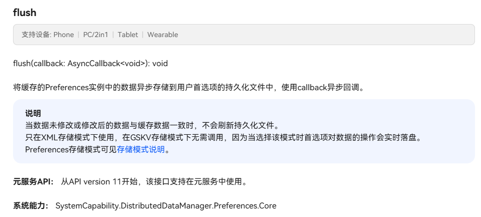

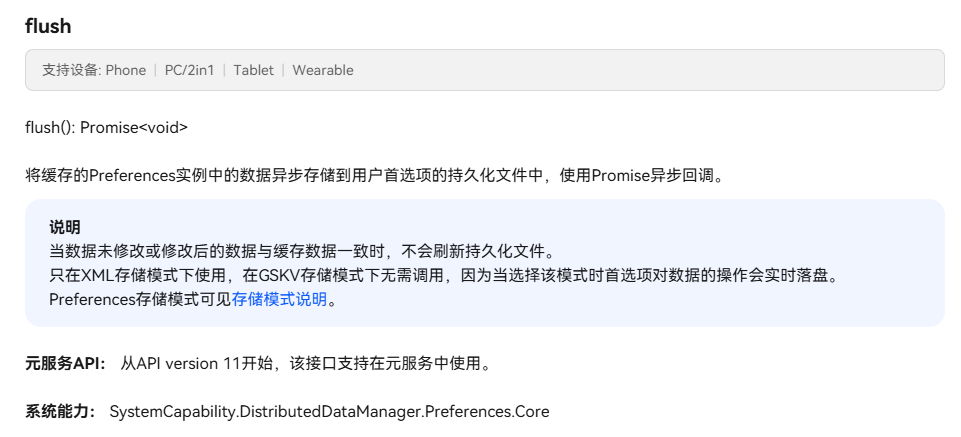

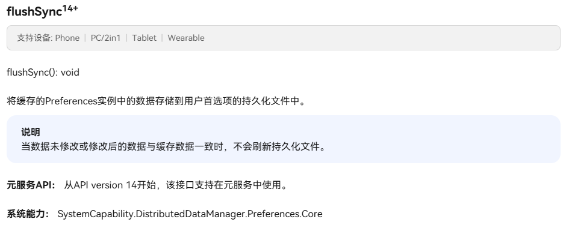

所以我由此推断GSKV格式的存储模式下，所谓的其执行逻辑是在数据发生改变时自动向任务队列中添加一个异步`flush`任务，进行执行。当然这部分只是我个人的推测，我暂时还没有找到更多相关的资料，毕竟是API18才有的功能，还是相当新的模式。

#### GSKV格式的核心优势

GSKV格式相比于XML格式，具有以下关键优势：

1. **实时落盘特性**：数据修改后会自动持久化，无需手动调用flush
2. **多进程并发支持**：支持多进程并发读写，这是XML格式所不具备的重要特性
3. **性能优化**：异步执行，不会阻塞UI线程

#### 使用场景对比

| 存储模式 | 适用场景 | 操作特点 |
|---------|---------|---------|
| XML格式 | 单进程、小数据量场景 | 内存操作，需手动flush |
| GSKV格式 | 多进程并发场景 | 实时落盘，支持并发 |

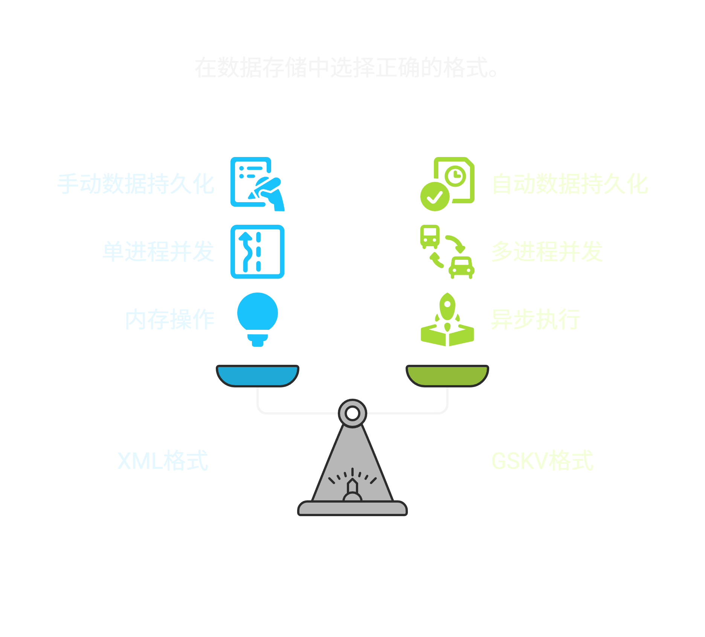

### 用户首选项的二次封装

在用户首选项中，我们通过`get`接口获取到的数据并不是直接可用的基础类型而是一个联合类型[ValueType](https://developer.huawei.com/consumer/cn/doc/harmonyos-references/js-apis-data-preferences#valuetype)，这就导致我们需要对其进行一个二次封装来保障我们的数据类型安全以及数据的可用性。

| 类型          | 说明                           |
| ------------- | ------------------------------ |
| number        | 表示值类型为数字。             |
| string        | 表示值类型为字符串。           |
| boolean       | 表示值类型为布尔值。           |
| Array\<number\>  | 表示值类型为数字类型的数组。   |
| Array\<boolean\> | 表示值类型为布尔类型的数组。   |
| Array\<string\>  | 表示值类型为字符串类型的数组。 |
| Uint8Array¹¹⁺  | 表示值类型为8位无符号整型的数组。 |
| object¹²⁺     | 表示值类型为对象。             |
| bigint¹²⁺     | 表示值类型为任意精度格式的整数。 |

#### 初始化

```ts
constructor(ctx: common.UIAbilityContext, pfName: string) {
    Logger.info(`初始化${pfName}首选项`, TAG)
    let xmlType = preferences.StorageType.XML;
    let gskvType = preferences.StorageType.GSKV;
    let options: preferences.Options = {name: pfName, storageType: xmlType}
    let observer = (key: string) => {
      Logger.info(`${key} changed`, TAG)
    }
    let isGskvSupported = preferences.isStorageTypeSupported(gskvType);
    if(isGskvSupported) {
      options = {name: pfName, storageType: gskvType}
      this.PFS_TYPE = gskvType;
    } else {
      this.PFS_TYPE = xmlType;
    }
    this.PFS = preferences.getPreferencesSync(ctx, options);
    this.PFS.on("change",  observer)
  }
```

首先在初始化时我们需要考虑设备的API版本，来对数据库的存储类型来进行兼容，虽然统一用`XML`格式可以确保最大规模的适配，但如果需要处理并发场景，那我们还是需要考虑`GSKV`格式的，使用我们这种写法也会是最通用的写法。

#### 查询接口

```ts
/**
   * 获取字符串
   * @param key 键
   * @returns 值
   */
  getStr(key: string): string {
    try {
      if (this.PFS.hasSync(key)) {
        const value: string = this.PFS.getSync(key, "") as string;
        return value;
      } else {
        Logger.warn(`key: ${key} not exist`, TAG)
        return "";
      }
    } catch (e) {
      Logger.error(`happen error: ${e}`, TAG)
      return "";
    }
  }

  /**
   * 获取数字
   * @param key 键
   * @returns 值
   */
  getNum(key: string): number {
    try {
      if (this.PFS.hasSync(key)) {
        const value: number = this.PFS.getSync(key, 0) as number;
        return value;
      } else {
        Logger.warn(`key: ${key} not exist`, TAG)
        return 0;
      }
    } catch (e) {
      Logger.error(`happen error: ${e}`, TAG)
      return 0;
    }
  }

  /**
   * 获取布尔值
   * @param key 键
   * @returns 值
   */
  getBool(key: string): boolean {
    try {
      if (this.PFS.hasSync(key)) {
        const value: boolean = this.PFS.getSync(key, false) as boolean;
        return value;
      } else {
        Logger.warn(`key: ${key} not exist`, TAG)
        return false;
      }
    } catch (e) {
      Logger.error(`happen error: ${e}`, TAG)
      return false;
    }
  }

  getStrArr(key: string): Array<string> {
    try {
      if (this.PFS.hasSync(key)) {
        const value: string[] = this.PFS.getSync(key, []) as string[];
        return value;
      } else {
        Logger.warn(`key: ${key} not exist`, TAG)
        return [];
      }
    } catch (e) {
      Logger.error(`happen error: ${e}`, TAG)
      return [];
    }
  }

  getNumArr(key: string): Array<number> {
    try {
      if (this.PFS.hasSync(key)) {
        const value: number[] = this.PFS.getSync(key, []) as number[];
        return value;
      } else {
        Logger.warn(`key: ${key} not exist`, TAG)
        return [];
      }
    } catch (e) {
      Logger.error(`happen error: ${e}`, TAG)
      return [];
    }
  }
```

在封装以下接口的时候我们都需要去有防御性编程的思想。要先去检查是否具有所查询的目标键，同时用try catch去捕获异常，如果异常发生则返回默认值。毕竟数据查询的过程是异常的高发阶段，我们不能因为这个数据查询错误导致整个APP的崩溃。

#### 写入接口

```ts
setStr(key: string, value: string): void {
    try {
      this.PFS.putSync(key, value);
      if (this.PFS_TYPE == preferences.StorageType.XML) {
        this.PFS.flushSync();
      }
    } catch (e) {
      Logger.error(`happen error: ${e}`, TAG)
    }
  }

  setNum(key: string, value: number): void {
    try {
      this.PFS.putSync(key, value);
      if (this.PFS_TYPE == preferences.StorageType.XML) {
        this.PFS.flushSync();
      }
    } catch (e) {
      Logger.error(`happen error: ${e}`, TAG)
    }
  }

  setBool(key: string, value: boolean): void {
    try {
      this.PFS.putSync(key, value);
      if (this.PFS_TYPE == preferences.StorageType.XML) {
        this.PFS.flushSync();
      }
    } catch (e) {
      Logger.error(`happen error: ${e}`, TAG)
    }
  }

  setStrArr(key: string, value: Array<string>): void {
    try {
      this.PFS.putSync(key, value);
      if (this.PFS_TYPE == preferences.StorageType.XML) {
        this.PFS.flushSync();
      }
    } catch (e) {
      Logger.error(`happen error: ${e}`, TAG)
    }
  }

  setNumArr(key: string, value: Array<number>): void {
    try {
      this.PFS.putSync(key, value);
      if (this.PFS_TYPE == preferences.StorageType.XML) {
        this.PFS.flushSync();
      }
    } catch (e) {
      Logger.error(`happen error: ${e}`, TAG)
    }
  }
```

#### 删除接口

```ts
deleteStr(key: string): string {
    try {
      if (this.PFS.hasSync(key)) {
        const value: string = this.PFS.getSync(key, "") as string;
        this.PFS.deleteSync(key);
        if (this.PFS_TYPE == preferences.StorageType.XML) {
          this.PFS.flushSync();
        }
        return value;
      } else {
        Logger.warn(`key: ${key} not exist`, TAG)
        return ""
      }
    } catch (e) {
      Logger.error(`happen error: ${e}`, TAG)
      return ""
    }
  }

  deleteNum(key: string): number {
    try {
      if (this.PFS.hasSync(key)) {
        const value: number = this.PFS.getSync(key, 0) as number;
        this.PFS.deleteSync(key);
        if (this.PFS_TYPE == preferences.StorageType.XML) {
          this.PFS.flushSync();
        }
        return value;
      } else {
        Logger.warn(`key: ${key} not exist`, TAG)
        return 0
      }
    } catch (e) {
      Logger.error(`happen error: ${e}`, TAG)
      return 0
    }
  }

  deleteBool(key: string): boolean {
    try {
      if (this.PFS.hasSync(key)) {
        const value: boolean = this.PFS.getSync(key, false) as boolean;
        this.PFS.deleteSync(key);
        if (this.PFS_TYPE == preferences.StorageType.XML) {
          this.PFS.flushSync();
        }
        return value;
      } else {
        Logger.warn(`key: ${key} not exist`, TAG)
        return false
      }
    } catch (e) {
      Logger.error(`happen error: ${e}`, TAG)
      return false
    }
  }

  deleteStrArr(key: string): Array<string> {
    try {
      if (this.PFS.hasSync(key)) {
        const value: string[] = this.PFS.getSync(key, []) as string[];
        this.PFS.deleteSync(key);
        if (this.PFS_TYPE == preferences.StorageType.XML) {
          this.PFS.flushSync();
        }
        return value;
      } else {
        Logger.warn(`key: ${key} not exist`, TAG)
        return []
      }
    } catch (e) {
      Logger.error(`happen error: ${e}`, TAG)
      return []
    }
  }

  deleteNumArr(key: string): Array<number> {
    try {
      if (this.PFS.hasSync(key)) {
        const value: number[] = this.PFS.getSync(key, []) as number[];
        this.PFS.deleteSync(key);
        if (this.PFS_TYPE == preferences.StorageType.XML) {
          this.PFS.flushSync();
        }
        return value;
      } else {
        Logger.warn(`key: ${key} not exist`, TAG)
        return []
      }
    } catch (e) {
      Logger.error(`happen error: ${e}`, TAG)
      return []
    }
  }

  deleteAll(): void {
    try {
      this.PFS.clearSync();
      if (this.PFS_TYPE == preferences.StorageType.XML) {
        this.PFS.flushSync();
      }
    } catch (e) {
      Logger.error(`happen error: ${e}`, TAG)
    }
  }
```

#### 资源释放接口

资源释放是一个很关键的环节，虽然现代的高级语言基本上都不需要程序员去向C/C++那样的去手动回收资源了，但我们在构造函数中去设置了一个监听器来进行日志的打印，来去进行数据的备份以及遵循数据库设计中**利用冗余信息来保障数据库的可恢复性**的思想，这个监听器的资源是需要我们手动去进行回收的，并不会被系统自动进行回收。所以我们还需要再去封装一个释放接口。

```ts
release() {
    if (this.PFS) {
      let observer = (key: string) => {
        Logger.info(`${key} changed`, TAG)
      }
      this.PFS.off("change", observer);
      preferences.removePreferencesFromCacheSync(this.ctx, this.PFS_NAME);
      this.PFS = null;
      this.PFS_TYPE = null;
      this.ctx = null;
      Logger.info(`${this.PFS_NAME} release success`, TAG)
      this.PFS_NAME = ""
    }
  }
```

完整工具类源码[原仓库传送门](https://gitee.com/pengyoucongcode/TxtEdit/blob/master/lib/lib_util/src/main/ets/PreferencesUtil.ets#)：

```ts
/*
 * Copyright (c) 2025/6/14 彭友聪
 * TxtEdit is licensed under Mulan PSL v2.
 * You can use this software according to the terms and conditions of the Mulan PSL v2. 
 * You may obtain a copy of Mulan PSL v2 at:
            http://license.coscl.org.cn/MulanPSL2 
 * THIS SOFTWARE IS PROVIDED ON AN "AS IS" BASIS, WITHOUT WARRANTIES OF ANY KIND, 
 * EITHER EXPRESS OR IMPLIED, INCLUDING BUT NOT LIMITED TO NON-INFRINGEMENT, 
 * MERCHANTABILITY OR FIT FOR A PARTICULAR PURPOSE.  
 * See the Mulan PSL v2 for more details.  
 * 
 * Author: 彭友聪 
 * email：2923616405@qq.com 
 * date: 2025/6/14 16:33
 * file: PreferencesUtil.ets
 * product: DevEco Studio
 * */
import { common } from "@kit.AbilityKit";
import { Logger } from "lib_log";
import { preferences } from "@kit.ArkData";

const TAG = "[PreferencesUtil]";
/**
 * 首选项工具类
 */
export class PreferencesUtil {
  private PFS: preferences.Preferences|null;
  private PFS_TYPE: preferences.StorageType|null;
  private PFS_NAME: string;
  private ctx: common.UIAbilityContext|null;
  /**
   * 构造函数
   * @param ctx 上下文
   * @param pfName 首选项集合名
   */
  constructor(ctx: common.UIAbilityContext, pfName: string) {
    Logger.info(`初始化${pfName}首选项`, TAG)
    this.PFS_NAME = pfName;
    this.ctx = ctx;
    let xmlType = preferences.StorageType.XML;
    let gskvType = preferences.StorageType.GSKV;
    let options: preferences.Options = {name: pfName, storageType: xmlType}
    let observer = (key: string) => {
      Logger.info(`${key} changed`, TAG)
    }
    let isGskvSupported = preferences.isStorageTypeSupported(gskvType);
    if(isGskvSupported) {
      options = {name: pfName, storageType: gskvType}
      this.PFS_TYPE = gskvType;
    } else {
      this.PFS_TYPE = xmlType;
    }
    this.PFS = preferences.getPreferencesSync(ctx, options);
    this.PFS.on("change",  observer)
  }

  /**
   * 获取字符串
   * @param key 键
   * @returns 值
   */
  getStr(key: string): string {
    try {
      if (this.PFS) {
        if (this.PFS.hasSync(key)) {
          const value: string = this.PFS.getSync(key, "") as string;
          return value;
        } else {
          Logger.warn(`key: ${key} not exist`, TAG)
          return "";
        }
      } else {
        Logger.error(`key: ${this.PFS_NAME} 首选项未初始化`, TAG)
        return "";
      }
    } catch (e) {
      Logger.error(`happen error: ${e}`, TAG)
      return "";
    }
  }

  /**
   * 获取数字
   * @param key 键
   * @returns 值
   */
  getNum(key: string): number {
    try {
      if (this.PFS) {
        if (this.PFS.hasSync(key)) {
          const value: number = this.PFS.getSync(key, "") as number;
          return value;
        } else {
          Logger.warn(`key: ${key} not exist`, TAG)
          return 0;
        }
      } else {
        Logger.error(`key: ${this.PFS_NAME} 首选项未初始化`, TAG)
        return 0;
      }
    } catch (e) {
      Logger.error(`happen error: ${e}`, TAG)
      return 0;
    }
  }

  /**
   * 获取布尔值
   * @param key 键
   * @returns 值
   */
  getBool(key: string): boolean {
    try {
      if (this.PFS){
        if (this.PFS.hasSync(key)) {
          const value: boolean = this.PFS.getSync(key, false) as boolean;
          return value;
        } else {
          Logger.warn(`key: ${key} not exist`, TAG)
          return false;
        }
      }else{
        Logger.error(`key: ${this.PFS_NAME} 首选项未初始化`, TAG)
        return false;
      }

    } catch (e) {
      Logger.error(`happen error: ${e}`, TAG)
      return false;
    }
  }

  getStrArr(key: string): Array<string> {
    try {
      if (this.PFS) {
        if (this.PFS.hasSync(key)) {
          const value: string[] = this.PFS.getSync(key, []) as string[];
          return value;
        } else {
          Logger.warn(`key: ${key} not exist`, TAG)
          return [];
        }
      } else {
        Logger.error(`key: ${this.PFS_NAME} 首选项未初始化`, TAG)
        return [];
      }
    } catch (e) {
      Logger.error(`happen error: ${e}`, TAG)
      return [];
    }
  }

  getNumArr(key: string): Array<number> {
    try {
      if(this.PFS) {
        if (this.PFS.hasSync(key)) {
          const value: number[] = this.PFS.getSync(key, []) as number[];
          return value;
        } else {
          Logger.warn(`key: ${key} not exist`, TAG)
          return [];
        }
      } else {
        Logger.error(`key: ${this.PFS_NAME} 首选项未初始化`, TAG)
        return [];
      }
    } catch (e) {
      Logger.error(`happen error: ${e}`, TAG)
      return [];
    }
  }

  setStr(key: string, value: string): void {
    try {
      if  (this.PFS) {
        this.PFS.putSync(key, value);
        if (this.PFS_TYPE == preferences.StorageType.XML) {
          this.PFS.flushSync();
        }
      } else {
        Logger.error(`key: ${this.PFS_NAME} 首选项未初始化`, TAG)
      }
    } catch (e) {
      Logger.error(`happen error: ${e}`, TAG)
    }
  }

  setNum(key: string, value: number): void {
    try {
      if  (this.PFS) {
        this.PFS.putSync(key, value);
        if (this.PFS_TYPE == preferences.StorageType.XML) {
          this.PFS.flushSync();
        }
      } else {
        Logger.error(`key: ${this.PFS_NAME} 首选项未初始化`, TAG)
      }
    } catch (e) {
      Logger.error(`happen error: ${e}`, TAG)
    }
  }

  setBool(key: string, value: boolean): void {
    try {
      if  (this.PFS) {
        this.PFS.putSync(key, value);
        if (this.PFS_TYPE == preferences.StorageType.XML) {
          this.PFS.flushSync();
        }
      } else {
        Logger.error(`key: ${this.PFS_NAME} 首选项未初始化`, TAG)
      }
    } catch (e) {
      Logger.error(`happen error: ${e}`, TAG)
    }
  }

  setStrArr(key: string, value: Array<string>): void {
    try {
      if(this.PFS){
        this.PFS.putSync(key, value);
        if (this.PFS_TYPE == preferences.StorageType.XML) {
          this.PFS.flushSync();
        }
      } else {
        Logger.error(`key: ${this.PFS_NAME} 首选项未初始化`, TAG)
      }
    } catch (e) {
      Logger.error(`happen error: ${e}`, TAG)
    }
  }

  setNumArr(key: string, value: Array<number>): void {
    try {
      if(this.PFS) {
        this.PFS.putSync(key, value);
        if (this.PFS_TYPE == preferences.StorageType.XML) {
          this.PFS.flushSync();
        }
      } else {
        Logger.error(`key: ${this.PFS_NAME} 首选项未初始化`, TAG)
      }
    } catch (e) {
      Logger.error(`happen error: ${e}`, TAG)
    }
  }

  deleteStr(key: string): string {
    try {
      if(this.PFS) {
        if (this.PFS.hasSync(key)) {
          const value: string = this.PFS.getSync(key, "") as string;
          this.PFS.deleteSync(key);
          if (this.PFS_TYPE == preferences.StorageType.XML) {
            this.PFS.flushSync();
          }
          return value;
        } else {
          Logger.warn(`key: ${key} not exist`, TAG)
          return ""
        }
      } else {
        Logger.error(`key: ${this.PFS_NAME} 首选项未初始化`, TAG)
        return ""
      }
    } catch (e) {
      Logger.error(`happen error: ${e}`, TAG)
      return ""
    }
  }

  deleteNum(key: string): number {
    try {
      if(this.PFS) {
        if (this.PFS.hasSync(key)) {
          const value: number = this.PFS.getSync(key, 0) as number;
          this.PFS.deleteSync(key);
          if (this.PFS_TYPE == preferences.StorageType.XML) {
            this.PFS.flushSync();
          }
          return value;
        } else {
          Logger.warn(`key: ${key} not exist`, TAG)
          return 0
        }
      } else {
        Logger.error(`key: ${this.PFS_NAME} 首选项未初始化`, TAG)
        return 0
      }
    } catch (e) {
      Logger.error(`happen error: ${e}`, TAG)
      return 0
    }
  }

  deleteBool(key: string): boolean {
    try {
      if(this.PFS) {
        if (this.PFS.hasSync(key)) {
          const value: boolean = this.PFS.getSync(key, false) as boolean;
          this.PFS.deleteSync(key);
          if (this.PFS_TYPE == preferences.StorageType.XML) {
            this.PFS.flushSync();
          }
          return value;
        } else {
          Logger.warn(`key: ${key} not exist`, TAG)
          return false
        }
      } else {
        Logger.error(`key: ${this.PFS_NAME} 首选项未初始化`, TAG)
        return false
      }
    } catch (e) {
      Logger.error(`happen error: ${e}`, TAG)
      return false
    }
  }

  deleteStrArr(key: string): Array<string> {
    try {
      if(this.PFS) {
        if (this.PFS.hasSync(key)) {
          const value: string[] = this.PFS.getSync(key, []) as string[];
          this.PFS.deleteSync(key);
          if (this.PFS_TYPE == preferences.StorageType.XML) {
            this.PFS.flushSync();
          }
          return value;
        } else {
          Logger.warn(`key: ${key} not exist`, TAG)
          return []
        }
      } else {
        Logger.error(`key: ${this.PFS_NAME} 首选项未初始化`, TAG)
        return []
      }
    } catch (e) {
      Logger.error(`happen error: ${e}`, TAG)
      return []
    }
  }

  deleteNumArr(key: string): Array<number> {
    try {
      if (this.PFS) {
        if (this.PFS.hasSync(key)) {
          const value: number[] = this.PFS.getSync(key, []) as number[];
          this.PFS.deleteSync(key);
          if (this.PFS_TYPE == preferences.StorageType.XML) {
            this.PFS.flushSync();
          }
          return value;
        } else {
          Logger.warn(`key: ${key} not exist`, TAG)
          return []
        }
      } else {
        Logger.error(`key: ${this.PFS_NAME} 首选项未初始化`, TAG)
        return []
      }
    } catch (e) {
      Logger.error(`happen error: ${e}`, TAG)
      return []
    }
  }

  deleteAll(): void {
    try {
      if (this.PFS) {
        this.PFS.clearSync();
        if (this.PFS_TYPE == preferences.StorageType.XML) {
          this.PFS.flushSync();
        }
      } else {
        Logger.error(`key: ${this.PFS_NAME} 首选项未初始化`, TAG)
      }
    } catch (e) {
      Logger.error(`happen error: ${e}`, TAG)
    }
  }

  release() {
    if (this.PFS) {
      let observer = (key: string) => {
        Logger.info(`${key} changed`, TAG)
      }
      this.PFS.off("change", observer);
      preferences.removePreferencesFromCacheSync(this.ctx, this.PFS_NAME);
      this.PFS = null;
      this.PFS_TYPE = null;
      this.ctx = null;
      Logger.info(`${this.PFS_NAME} release success`, TAG)
      this.PFS_NAME = ""
    }
  }

}
```

这种工具类都是比较固定可移植的，只要理解其工作原理以及其核心功能，我们就可以去针对于具体业务进行微调即可。

## 大量数据持久化存储

对于大量数据存储我们就需要使用数据库来进行数据的持久化了。在API18版本之前我们只有**键值型数据库（KV-Store）**和**关系型数据库（RelationalStore）**这两种选则，而在API18版本之后我华为官方又为我们提供了第三种选择**向量数据库**。

我们首先来简单介绍一下比较常见也更容易理解的两种数据库。

### 键值型数据库（KV-Store）

键值对，这对于每一个程序员都在熟悉不过的组合了，这也造就了这种数据库简单易懂的特性，但与此同时这也导致了一个问题，就是其存储的数据**不能包含过于复杂的关系模型**，而官方所推荐的几个例子包括了：商品名称及对应价格、员工工号及今日是否已出勤等。一个键值对就可以**完整的去表示出我们所需要记录的全部信息**。这很重要，因为键值对数据库并不能像关系型数据库的那样利用建库建表来将大量关联的字段进行统一的存储以及查询。

当然这种数据库也包含了一些使用限制。这些限制主要是针对于大小和数量，当然也有对回调函数的处理逻辑进行的限制。

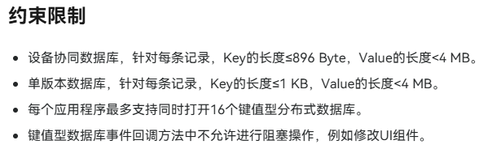

前三条都好说，重点是第四条中的`阻塞操作`一词该怎么理解，还有为什么要限制阻塞操作？

看到这个问题，我们需要深入理解一下什么是`阻塞操作`以及为什么KV-Store要对此进行限制。

#### 什么是阻塞操作？

简单来说，**阻塞操作**就是那些会让当前执行线程"停下来等待"的操作。比如说：

1. **同步I/O操作**：像同步读取一个大文件，程序就得等文件读完才能继续往下执行
2. **网络请求**：发起一个同步的HTTP请求，必须等服务器响应回来
3. **长时间计算任务**：比如一个复杂的算法运算，或者一个执行很久的循环
4. **线程睡眠**：比如`Thread.sleep()`这样的操作

这些操作的共同特点就是：**执行的时候会占用线程，让线程无法去处理其他事情**。

#### 为什么要限制阻塞操作？

这个限制的原因主要有以下几个方面：

1. **回调函数的执行环境很特殊**

    KV-Store的回调函数通常是在系统的事件循环线程中执行的，这些线程承担着很多重要的系统任务。如果我们在回调函数中执行阻塞操作，就相当于把这个重要的系统线程给"绑架"了。

    ```typescript
    // ❌ 错误示例：在回调中执行阻塞操作
    kvStore.get('userInfo', (err, data) => {
        if (!err) {
            // 这是一个阻塞操作，会让整个线程停下来等待
            let content = fs.readFileSync('bigFile.txt');

            // 在这5秒钟内，其他KV-Store操作都得等着
            setTimeout(() => {}, 5000);
        }
    });
    ```

2. **会影响整个应用的性能**

    想象一下，如果你在银行排队办业务，前面的人在窗口睡觉了，那么后面所有人都得等着。KV-Store的回调函数就是这个"窗口"，如果在回调里执行阻塞操作，后续所有的数据库操作都会被延迟，整个应用的响应速度就会变得很慢。

3. **可能造成数据不一致**

    在多进程或高并发场景下，如果回调函数被长时间阻塞，可能会导致数据状态的不一致。比如你正在更新一个计数器，但是更新操作被阻塞了，这时候其他进程可能已经修改了同一个数据，最终结果就可能不是你预期的。

#### 正确的处理方式

那么遇到需要执行耗时操作的情况怎么办呢？

- 方法一：**异步化处理**

    ```typescript
    // ✅ 正确示例：使用异步操作
    kvStore.get('userInfo', (err, data) => {
        if (!err) {
            // 不在回调中直接执行耗时操作，而是异步处理
            setTimeout(() => {
                performLongRunningTask();
            }, 0);

            // 或者使用Promise
            performAsyncTask().then(result => {
                // 处理结果
            });
        }
    });
    ```

- 方法二：**任务分离**

    ```typescript
    // ✅ 将计算密集型任务移到其他地方处理
    kvStore.get('data', (err, data) => {
        if (!err) {
            // 快速处理，然后把耗时任务交给其他地方
            processDataAsync(data);
        }
    });

    async function processDataAsync(data) {
        // 在这里执行耗时操作，不会阻塞KV-Store的回调
        const result = await heavyComputation(data);
        return result;
    }
    ```


记住一个原则：KV-Store的回调函数应该尽可能保持轻量级，只处理必要的业务逻辑，避免任何可能阻塞线程的操作。这样才能保证整个应用的高性能运行。


理解了这个限制背后的原因，我们在实际开发中就能更好地设计数据访问逻辑，避免踩坑。接下来，我们来看看关系型数据库（RelationalStore）的特点和使用场景。

## 关系型数据库（RelationalStore）

鸿蒙开发中的关系型数据库其实也是基于我们很熟悉的SQLite开源组件实现的。整体的操作方式与市面上常见的关系型数据库很类似，都可以利用SQL语句去进行对数据库的一系列操作。但肯定也还是存在差异的，鸿蒙为我们提供了很多的接口，可以直接通过**面向对象的方式去进行数据库的操作**。这个思想在很多主流的开发框架中都有去体现，就比如说是Java的SpringBoot，Python的Django，Node.js的Koa等等。接下来我们来一起分析一下关系型数据库的面向对象的操作方式。

### 关系型数据库的对象化模型

#### SpringBoot与MyBatis

首先我们要先思考一下，对于一个关系型数据库，我们需要去对其进行哪些核心操作呢？咱们来用`Springboot`和`MyBatis`来模拟一下。

```yml
  datasource:
    driver-class-name: com.mysql.cj.jdbc.Driver
    url: jdbc:mysql://localhost:3306/order_system?useUnicode=true&characterEncoding=utf8&useSSL=true
    username: root
    password: **********
    hikari:
      maximum-pool-size: 10
      minimum-idle: 5
      idle-timeout: 300000
      connection-timeout: 20000
      connection-test-query: SELECT 1
```

首先在配置文件中设置要连接的数据库的配置信息，指定要连接的目标数据库的url、用户名、密码等设置。

```XML
<?xml version="1.0" encoding="UTF-8" ?>
<!DOCTYPE mapper PUBLIC "-//mybatis.org//DTD Mapper 3.0//EN" "http://mybatis.org/dtd/mybatis-3-mapper.dtd">
<mapper namespace="org.xbxyftx.ordersystembackend.mapper.UserMapper">
    <resultMap id="BaseResultMap" type="org.xbxyftx.ordersystembackend.entity.User">
        <id column="id" property="id"/>
        <result column="username" property="username"/>
        <result column="password" property="password"/>
        <result column="created_at" property="createdAt"/>
    </resultMap>

    <select id="findById" resultMap="BaseResultMap">
        SELECT * FROM users WHERE id = #{id}
    </select>

    <select id="findByUsername" resultMap="BaseResultMap">
        SELECT * FROM users WHERE username = #{username}
    </select>

    <insert id="insert" useGeneratedKeys="true" keyProperty="id">
        INSERT INTO users (username, password, created_at)
        VALUES (#{username}, #{password}, NOW())
    </insert>

    <update id="update">
        UPDATE users
        SET password = #{password}
        WHERE id = #{id}
    </update>
</mapper> 
```

```java
// User.java
package org.xbxyftx.ordersystembackend.entity;

import java.time.LocalDateTime;

public class User {
    // 用户ID
    private Long id;
    // 用户名
    private String username;
    // 密码
    private String password;
    // 创建时间
    private LocalDateTime createdAt;

    // 获取用户ID
    public Long getId() { return id; }
    // 设置用户ID
    public void setId(Long id) { this.id = id; }
    
    // 获取用户名
    public String getUsername() { return username; }
    // 设置用户名
    public void setUsername(String username) { this.username = username; }
    
    // 获取密码
    public String getPassword() { return password; }
    // 设置密码
    public void setPassword(String password) { this.password = password; }
    
    // 获取创建时间
    public LocalDateTime getCreatedAt() { return createdAt; }
    // 设置创建时间
    public void setCreatedAt(LocalDateTime createdAt) { this.createdAt = createdAt; }
}
```

```java
package org.xbxyftx.ordersystembackend.mapper;

import org.apache.ibatis.annotations.Mapper;
import org.apache.ibatis.annotations.Param;
import org.xbxyftx.ordersystembackend.entity.User;

@Mapper
public interface UserMapper {
    // 根据id查询用户
    User findById(@Param("id") Long id);
    // 根据用户名查询用户
    User findByUsername(@Param("username") String username);
    // 插入用户
    int insert(User user);
    // 更新用户
    int update(User user);
}
```

这里我引用了前一阵子写的一个点餐系统的后端代码，其中我们的数据库中有一个`User`实体，其具有`id`、`username`、`password`和`created_at`四个属性。在`UserMapper.xml`文件中我们将对数据库进行**查找**、**插入**以及**更新**操作的SQL语句及其对应的参数进行了映射与封装。

利用`mapper`标签将其映射到了`UserMapper`接口中，这样我们就可以通过`UserMapper`接口进行数据库的操作了，调用该接口传入对应参数就可以执行XML文件中所封装好的SQL语句，来对数据库进行操作。而与此同时，我们还利用`resultMap`标签**将数据库中的数据映射到实体类**中，这样我们就可以在Java代码中直接获取到数据库中的数据了。

```java
  // 注册用户
  @Override
  public User register(UserDTO userDTO) {
      // 检查用户名是否已存在
      if (userMapper.findByUsername(userDTO.getUsername()) != null) {
          throw new BusinessException("用户名已存在");
      }
      // 创建用户
      User user = new User();
      user.setUsername(userDTO.getUsername());
      // 对密码进行加密
      user.setPassword(passwordEncoder.encode(userDTO.getPassword()));
      
      // 插入用户
      userMapper.insert(user);
      return user;
  }
  // 用户登录
  @Override
  public User login(String username, String password) {
      // 根据用户名查询用户
      User user = userMapper.findByUsername(username);
      if (user == null) {
          throw new BusinessException("用户不存在");
      }
      // 比较密码是否匹配
      if (!passwordEncoder.matches(password, user.getPassword())) {
          throw new BusinessException("密码错误");
      }
      return user;
  }
```

所谓的用面向对象思想来操作数据库，从这个注册用户函数以及用户登录函数就能很容易的理解。我们将从请求中获取的数据封装进一个对象中，通过对关键字段的查询来进行用户是否存在的判断，`UserDTO`是一个数据传输对象，用于封装用户注册时提交的数据。在插入用户的时候我们就无需去在函数中写SQL语句来进行写入，而是直接将需要插入的值封装进一个`User`对象中，通过`UserMapper`接口中的`insert`方法将数据插入到数据库中。

同样的，在登录函数中，我们从数据库中查询出来的数据也是会自动被封装进一个`User`对象中，而不是几个散落的值。我们只需要按照面向对象编程的思路去调用API，对对象进行操作就可以实现对数据库的操作，而不用在函数中直接的去编写SQL语句。

总结一下总共分为以下四步：

- 首先要指定需要操作的数据库
- 随后通过`Mapper`映射来拉出所需操作的接口
- 将获取到的数据或是需要写入的数据封装为`Entity`实例类的实例化对象进行数据操作
- 最后针对不同的事务类型封装不同的功能函数

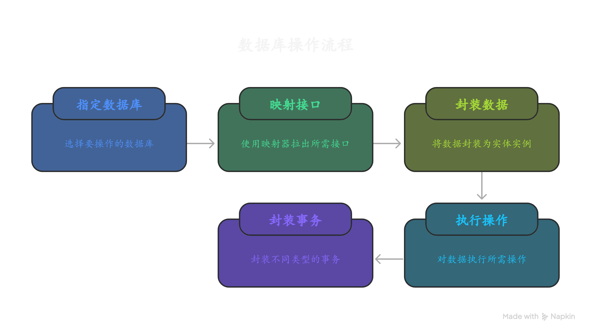

OK，理解了这些之后，我们来类比着理解鸿蒙开发中的关系型数据库。官方所提供的API参考首先列举出的四种常用功能就是我们刚才所总结的四个步骤。

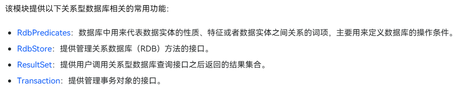

#### RdbPredicates

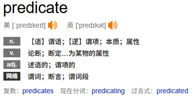

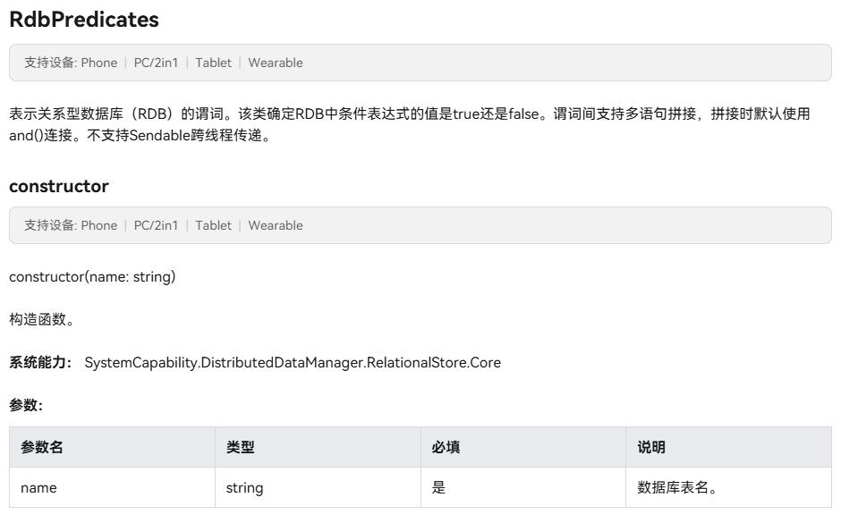

**RdbPredicates（关系型数据库谓词）**是鸿蒙关系型数据库中用于构建查询条件的核心工具类。

##### 什么是谓词？

在数据库查询中，**谓词（Predicates）**是用来描述查询条件的逻辑表达式，它用来判断某个条件是否为真。简单来说，谓词就是我们在SQL语句中常见的WHERE子句中的条件判断：

```sql
-- 这里的 "age > 18" 就是一个谓词
SELECT * FROM users WHERE age > 18;

-- "name = 'XBXyftx'" 也是一个谓词  
SELECT * FROM users WHERE name = 'XBXyftx';

-- 复合谓词：多个条件组合
SELECT * FROM users WHERE age > 18 AND city = '北京';
```

每个谓词都会对数据库中的每一行数据进行判断，返回true或false，只有返回true的数据行才会被包含在查询结果中。

##### RdbPredicates的核心优势

在鸿蒙的关系型数据库中，`RdbPredicates`提供了一种**面向对象的方式来构建SQL查询条件**，具有以下优势：

1. **类型安全**：避免SQL注入攻击，提供编译时类型检查
2. **链式调用**：支持方法链，代码更加简洁易读  
3. **动态构建**：可以根据业务逻辑动态添加查询条件
4. **跨平台一致性**：与鸿蒙数据库API完全集成

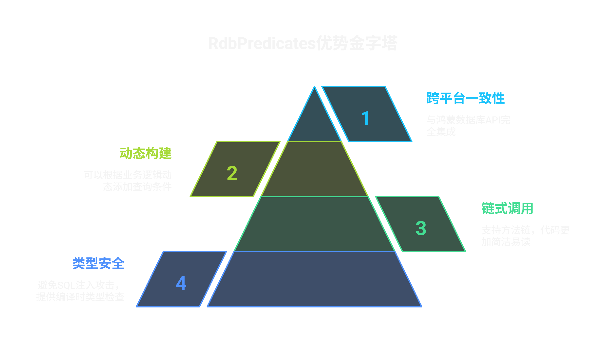

##### 常用谓词方法

RdbPredicates提供了丰富的方法来构建各种查询条件：

**基础比较操作：**

```typescript
// 等于条件
let predicates = new relationalStore.RdbPredicates("USER_TABLE");
predicates.equalTo("name", "XBXyftx");

// 不等于条件  
predicates.notEqualTo("status", "deleted");

// 大于、小于条件
predicates.greaterThan("age", 18);
predicates.lessThan("score", 100);
predicates.greaterThanOrEqualTo("level", 5);
predicates.lessThanOrEqualTo("price", 999.99);
```

**模糊查询：**

```typescript
// LIKE 模糊匹配
predicates.like("email", "%@gmail.com");

// 包含指定字符串
predicates.contains("description", "鸿蒙");

// 以指定字符串开头/结尾
predicates.beginsWith("phone", "138");
predicates.endsWith("filename", ".jpg");
```

**范围查询：**

```typescript
// IN 查询：在指定值集合中
predicates.in("category", ["技术", "生活", "学习"]);

// BETWEEN 查询：在指定范围内
predicates.between("create_time", "2024-01-01", "2024-12-31");
```

**空值判断：**

```typescript
// 判断字段是否为空
predicates.isNull("deleted_at");
predicates.isNotNull("avatar");
```

**逻辑组合：**

```typescript
// AND 组合条件
let predicates = new relationalStore.RdbPredicates("USER_TABLE");
predicates.equalTo("status", "active")
         .and()
         .greaterThan("age", 18)
         .and()
         .like("email", "%@company.com");

// OR 组合条件
predicates.equalTo("role", "admin")
         .or()
         .equalTo("role", "manager");

// 复杂组合（使用分组）
predicates.beginWrap()
         .equalTo("category", "VIP")
         .or()
         .greaterThan("points", 1000)
         .endWrap()
         .and()
         .equalTo("status", "active");
```

**排序和分页：**

```typescript
// 排序
predicates.orderByAsc("create_time");  // 升序
predicates.orderByDesc("score");       // 降序

// 分页
predicates.limitAs(10);                // 限制返回10条记录
predicates.offsetAs(20);               // 跳过前20条记录
```

##### 实际应用示例

让我们通过一个用户管理的实际例子来理解RdbPredicates的使用：

```typescript
import { relationalStore } from '@kit.ArkData';

// 示例1：查询活跃的成年用户
function getActiveAdultUsers(): Promise<relationalStore.ResultSet> {
  let predicates = new relationalStore.RdbPredicates("USER_TABLE");
  
  predicates.equalTo("status", "active")           // 状态为活跃
           .and()
           .greaterThanOrEqualTo("age", 18)        // 年龄大于等于18
           .and()
           .isNotNull("email")                     // 邮箱不为空
           .orderByDesc("last_login_time")         // 按最后登录时间降序
           .limitAs(50);                           // 限制50条记录
           
  return rdbStore.query(predicates, ["id", "name", "email", "age"]);
}

// 示例2：动态搜索用户
function searchUsers(keyword: string, minAge?: number, city?: string): Promise<relationalStore.ResultSet> {
  let predicates = new relationalStore.RdbPredicates("USER_TABLE");
  
  // 基础搜索条件：姓名或邮箱包含关键词
  predicates.beginWrap()
           .contains("name", keyword)
           .or()
           .contains("email", keyword)
           .endWrap();
  
  // 动态添加年龄条件
  if (minAge !== undefined) {
    predicates.and().greaterThanOrEqualTo("age", minAge);
  }
  
  // 动态添加城市条件
  if (city) {
    predicates.and().equalTo("city", city);
  }
  
  // 排除已删除用户
  predicates.and().notEqualTo("status", "deleted");
  
  return rdbStore.query(predicates);
}

// 示例3：复杂的业务查询 - 查找优质用户
function getPremiumUsers(): Promise<relationalStore.ResultSet> {
  let predicates = new relationalStore.RdbPredicates("USER_TABLE");
  
  // 优质用户条件：VIP用户 或者 积分大于5000的活跃用户
  predicates.beginWrap()
           .equalTo("membership", "VIP")
           .or()
           .beginWrap()
           .greaterThan("points", 5000)
           .and()
           .equalTo("status", "active")
           .endWrap()
           .endWrap()
           .and()
           .greaterThan("registration_days", 30)    // 注册超过30天
           .orderByDesc("points")                   // 按积分降序
           .orderByDesc("last_activity_time");      // 再按最后活跃时间降序
           
  return rdbStore.query(predicates);
}
```

##### RdbPredicates vs 原生SQL

通过对比可以更好地理解RdbPredicates的价值：

| 方面 | RdbPredicates | 原生SQL |
|------|---------------|---------|
| **类型安全** | ✅ 编译时检查 | ❌ 运行时才发现错误 |
| **SQL注入** | ✅ 自动防护 | ❌ 需手动处理 |
| **动态构建** | ✅ 支持条件式添加 | ❌ 需要字符串拼接 |
| **代码可读性** | ✅ 链式调用，结构清晰 | ❌ 复杂SQL难以维护 |
| **IDE支持** | ✅ 智能提示和补全 | ❌ 字符串内容无提示 |

```typescript
// RdbPredicates方式 - 类型安全、清晰易读
let predicates = new relationalStore.RdbPredicates("USER_TABLE");
predicates.equalTo("age", 25)
         .and()
         .like("name", "%张%")
         .orderByDesc("create_time");

// 等效的SQL - 容易出错，难以维护
let sql = "SELECT * FROM USER_TABLE WHERE age = ? AND name LIKE ? ORDER BY create_time DESC";
let args = [25, "%张%"];
```

通过RdbPredicates，我们可以用面向对象的方式构建复杂的查询条件，既保证了代码的安全性和可读性，又提供了强大的动态查询能力。这正是鸿蒙关系型数据库设计的精髓所在。


至此我们就解决了数据查询的条件语句的映射。可以看到整个SQL语句都可以用`RdbPredicates`进行构建，一个SQL语句的谓词部分就会被封装进一个RdbPredicates对象中。在这个过程中我们就自动的防御了常规的SQL注入攻击，也是实现了SQL语句到对象属性的映射。


#### RdbStore

这就是我们用于真正执行SQL语句的功能接口了。前面的`RdbPredicates`仅仅是设置好了最后的谓语`WHERE`后面的条件，而`RdbStore`则提供了`query`、`insert`、`update`、`delete`等**异步**方法以及其对应的**同步**方法，用于执行SQL语句。我们需要将设置好的谓语与`RdbStore`进行关联，并调用相应的方法，即可完成数据库的增删改查。

##### 利用executeSql初始化表格

当然在这个过程之前，我们要先调用[`executeSql`](https://developer.huawei.com/consumer/cn/doc/harmonyos-references/js-apis-data-relationalstore#executesql10)函数来创建数据库，就像下面的示例一样。

```ts
const SQL_DELETE_TABLE = "DELETE FROM test WHERE name = 'zhangsan'";
if (store != undefined) {
  (store as relationalStore.RdbStore).executeSql(SQL_DELETE_TABLE, (err) => {
    if (err) {
      console.error(`ExecuteSql failed, code is ${err.code},message is ${err.message}`);
      return;
    }
    console.info('Delete table done.');
  });
}
```

先判断是否正确的获取了数据库对象，然后执行SQL语句，如果执行成功，则打印"Delete table done."，否则打印错误信息。

当然这个接口有三种参数形式，可以分为两种类型，一种是**直接执行**无返回值的SQL语句，另一种是**传参替换占位符**再执行的SQL语句。而第二种类型则可以像其他的接口一样选择直接传入箭头函数处理回调函数，可以以Promise方式处理回调函数（数据库的绝大多数接口都是这样的两种处理回调逻辑的选项，后续不再过多赘述）。

下面将替换占位符的参数形式进行举例说明。

```typescript
//  executeSql(sql: string, bindArgs: Array<ValueType>, callback: AsyncCallback<void>):void

const SQL_DELETE_TABLE = "DELETE FROM test WHERE name = ?";
if (store != undefined) {
  (store as relationalStore.RdbStore).executeSql(SQL_DELETE_TABLE, ['zhangsan'], (err) => {
    if (err) {
      console.error(`ExecuteSql failed, code is ${err.code},message is ${err.message}`);
      return;
    }
    console.info('Delete table done.');
  });
}
```

这也只是很常见的一种参数替换形式，用英文`?`作为占位符随后用对应的API对参数按照顺序进行替换。这种替换方式我第一次见是出现在高级Java的大作业宠物医院项目中，用的是JavaWeb框架，再利用JDBC进行数据库的操作时用到过这种SQL语句的编写方式。

```java
if (name != null && !name.isEmpty()) {
    try {
        Class.forName("com.mysql.cj.jdbc.Driver");// 加载驱动
        try (Connection connection = DriverManager.getConnection(url, user, password)) {// 连接数据库
            String sql = "INSERT INTO pets (id,name,date,stage,details) VALUES (?, ?, ?, ?, ?)";// SQL语句
            try (PreparedStatement preparedStatement = connection.prepareStatement(sql)) {// 准备SQL语句
                preparedStatement.setInt(1, id);// 设置参数
                preparedStatement.setString(2, name);// 设置参数
                preparedStatement.setString(3, date);// 设置参数
                preparedStatement.setString(4, "入院");// 设置参数
                preparedStatement.setString(5, "成功登记入院");// 设置参数
                int rows = preparedStatement.executeUpdate();// 执行SQL语句
                if (rows > 0) {
                    out.println("登记成功");// 输出结果
                } else {
                    out.println("登记失败");
                }
            }
        }
    } catch (ClassNotFoundException | SQLException e) {
        e.printStackTrace();// 打印异常信息
        out.println("数据库错误，请稍后重试。");
    }
} else {
    out.println("无效的输入");
}
```

JDBC中的`PreparedStatement`对象中包含有对不同数据类型的参数替换方法如`setInt()`、`setString()`、`setDate()`等，用于将用户输入的数据绑定到SQL语句中。

不过说到这里我突然想到了一个点。在`executeSql(sql: string, bindArgs: Array<ValueType>, callback: AsyncCallback<void>):void`中的`Array<ValueType>`指的是类型为联合类型的数组，而并非元组。这里确实有些奇怪但也没那么难理解。

- 数组(Array)：
  长度可变
  元素类型一致（或者是联合类型）
  用方括号表示：`string[]` 或 `Array<string>`
- 元组(Tuple)：
  长度固定
  每个位置的元素类型可以不同
  用方括号和具体类型表示：`[string, number, boolean]`

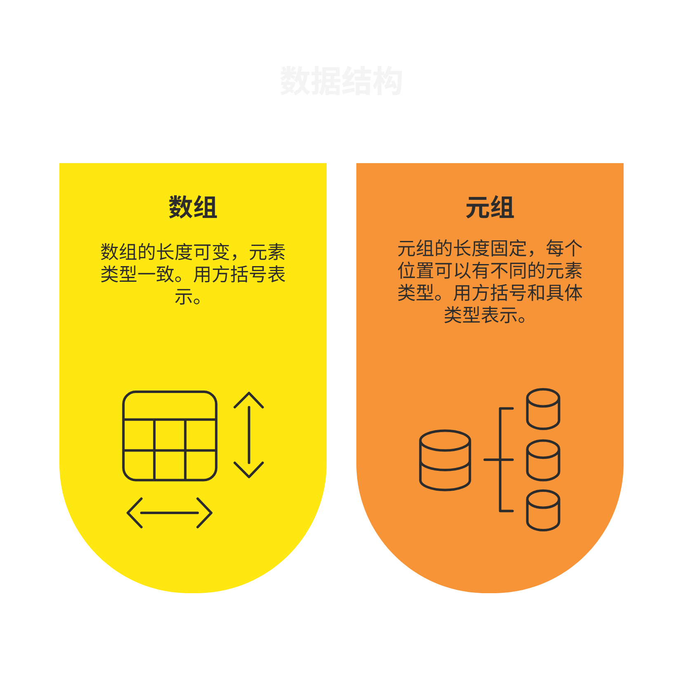

所以说联合类型虽然看起来是很多种类型，但其实其本质也只是一个类型，他的作用就是限制一个变量只能是几种类型中的一种。

#### ValuesBucket

在进行数据插入和更新操作时，我们需要使用**ValuesBucket**来封装要操作的数据。ValuesBucket是一个**键值对集合**，类似于Java中的HashMap，用于存储表中的数据行信息。

```typescript
import { ValuesBucket } from '@kit.ArkData';

// 创建ValuesBucket对象
const valueBucket: ValuesBucket = {
  'name': 'XBXyftx',
  'age': 25,
  'email': 'xbxyftx@example.com',
  'is_active': true
};
```

ValuesBucket的键对应数据库表的列名，值对应要插入或更新的数据。需要注意的是，ValuesBucket中的值类型必须与表结构中定义的列类型相匹配。

#### 数据插入操作

```typescript
// 同步插入
let rowId: number = rdbStore.insertSync("USER_TABLE", valueBucket);
console.log(`插入成功，新记录ID: ${rowId}`);

// 异步插入
rdbStore.insert("USER_TABLE", valueBucket, (err, rowId) => {
  if (err) {
    console.error(`插入失败: ${err.message}`);
    return;
  }
  console.log(`插入成功，新记录ID: ${rowId}`);
});

// Promise方式插入
rdbStore.insert("USER_TABLE", valueBucket)
  .then((rowId) => {
    console.log(`插入成功，新记录ID: ${rowId}`);
  })
  .catch((err) => {
    console.error(`插入失败: ${err.message}`);
  });
```

#### 数据更新操作

```typescript
// 构建更新条件
let predicates = new relationalStore.RdbPredicates("USER_TABLE");
predicates.equalTo("id", 1);

// 要更新的数据
const updateBucket: ValuesBucket = {
  'name': 'XBXyftx_Updated',
  'age': 26
};

// 同步更新
let changeRows: number = rdbStore.updateSync(updateBucket, predicates);
console.log(`更新了 ${changeRows} 条记录`);

// 异步更新
rdbStore.update(updateBucket, predicates, (err, changeRows) => {
  if (err) {
    console.error(`更新失败: ${err.message}`);
    return;
  }
  console.log(`更新了 ${changeRows} 条记录`);
});
```

#### 数据删除操作

```typescript
// 构建删除条件
let predicates = new relationalStore.RdbPredicates("USER_TABLE");
predicates.equalTo("is_active", false);

// 同步删除
let deleteRows: number = rdbStore.deleteSync(predicates);
console.log(`删除了 ${deleteRows} 条记录`);

// 异步删除
rdbStore.delete(predicates, (err, deleteRows) => {
  if (err) {
    console.error(`删除失败: ${err.message}`);
    return;
  }
  console.log(`删除了 ${deleteRows} 条记录`);
});
```

#### ResultSet与数据查询

在执行查询操作时，返回的结果是一个**ResultSet**对象。ResultSet是一个数据集合的游标，默认指向第-1个记录，有效的数据从0开始。

```typescript
// 执行查询
let predicates = new relationalStore.RdbPredicates("USER_TABLE");
predicates.greaterThan("age", 18)
         .orderByDesc("age");

// 指定要查询的列
let columns = ["id", "name", "age", "email"];

// 同步查询
let resultSet: relationalStore.ResultSet = rdbStore.querySync(predicates, columns);

// 处理查询结果
console.log(`查询结果列名: ${resultSet.columnNames}`);
console.log(`查询结果总数: ${resultSet.rowCount}`);

// 遍历结果集
while (resultSet.goToNextRow()) {
  // 通过列索引获取数据
  const id = resultSet.getLong(0);
  const name = resultSet.getString(1);
  const age = resultSet.getLong(2);
  const email = resultSet.getString(3);
  
  // 或通过列名获取数据
  const nameByColumn = resultSet.getString(resultSet.getColumnIndex('name'));
  
  console.log(`ID: ${id}, 姓名: ${name}, 年龄: ${age}, 邮箱: ${email}`);
}

// 释放ResultSet资源
resultSet.close();
```

##### ResultSet的重要方法

| 方法名 | 功能描述 |
|--------|----------|
| `goToFirstRow()` | 移动到第一行 |
| `goToLastRow()` | 移动到最后一行 |
| `goToNextRow()` | 移动到下一行 |
| `goToPreviousRow()` | 移动到上一行 |
| `goToRow(position)` | 移动到指定行 |
| `getString(columnIndex)` | 获取字符串类型数据 |
| `getLong(columnIndex)` | 获取整数类型数据 |
| `getDouble(columnIndex)` | 获取浮点数类型数据 |
| `getBlob(columnIndex)` | 获取二进制数据 |
| `isColumnNull(columnIndex)` | 判断列值是否为null |
| `close()` | 关闭结果集，释放资源 |


**资源管理重要提示**：ResultSet使用完毕后必须调用`close()`方法释放资源，否则可能导致内存泄漏。建议使用try-finally或try-with-resources模式确保资源正确释放。


#### 完整的数据库操作示例

下面是一个完整的用户管理系统数据库操作示例：

```typescript
import { relationalStore } from '@kit.ArkData';
import { ValuesBucket } from '@kit.ArkData';
import { common } from '@kit.AbilityKit';

class UserDatabaseManager {
  private rdbStore: relationalStore.RdbStore | null = null;
  private isInitialized: boolean = false;

  // 初始化数据库
  async initDatabase(context: common.UIAbilityContext): Promise<void> {
    const STORE_CONFIG: relationalStore.StoreConfig = {
      name: 'UserManagement.db',
      securityLevel: relationalStore.SecurityLevel.S1,
      encrypt: false
    };

    const SQL_CREATE_TABLE = `
      CREATE TABLE IF NOT EXISTS USER_TABLE (
        id INTEGER PRIMARY KEY AUTOINCREMENT,
        name TEXT NOT NULL,
        age INTEGER,
        email TEXT UNIQUE,
        phone TEXT,
        is_active BOOLEAN DEFAULT 1,
        create_time TEXT DEFAULT CURRENT_TIMESTAMP,
        update_time TEXT DEFAULT CURRENT_TIMESTAMP
      )
    `;

    try {
      this.rdbStore = await relationalStore.getRdbStore(context, STORE_CONFIG);
      await this.rdbStore.executeSql(SQL_CREATE_TABLE);
      this.isInitialized = true;
      console.log('数据库初始化成功');
    } catch (error) {
      console.error('数据库初始化失败:', error);
      throw error;
    }
  }

  // 添加用户
  async addUser(userData: {
    name: string,
    age: number,
    email: string,
    phone?: string
  }): Promise<number> {
    if (!this.isInitialized || !this.rdbStore) {
      throw new Error('数据库未初始化');
    }

    const valueBucket: ValuesBucket = {
      'name': userData.name,
      'age': userData.age,
      'email': userData.email,
      'phone': userData.phone || '',
      'create_time': new Date().toISOString(),
      'update_time': new Date().toISOString()
    };

    try {
      const rowId = await this.rdbStore.insert("USER_TABLE", valueBucket);
      console.log(`用户添加成功，ID: ${rowId}`);
      return rowId;
    } catch (error) {
      console.error('添加用户失败:', error);
      throw error;
    }
  }

  // 根据ID查询用户
  async getUserById(userId: number): Promise<any | null> {
    if (!this.isInitialized || !this.rdbStore) {
      throw new Error('数据库未初始化');
    }

    let predicates = new relationalStore.RdbPredicates("USER_TABLE");
    predicates.equalTo("id", userId);

    try {
      let resultSet = await this.rdbStore.query(predicates);
      
      if (resultSet.goToFirstRow()) {
        const user = {
          id: resultSet.getLong(resultSet.getColumnIndex('id')),
          name: resultSet.getString(resultSet.getColumnIndex('name')),
          age: resultSet.getLong(resultSet.getColumnIndex('age')),
          email: resultSet.getString(resultSet.getColumnIndex('email')),
          phone: resultSet.getString(resultSet.getColumnIndex('phone')),
          isActive: resultSet.getLong(resultSet.getColumnIndex('is_active')) === 1,
          createTime: resultSet.getString(resultSet.getColumnIndex('create_time')),
          updateTime: resultSet.getString(resultSet.getColumnIndex('update_time'))
        };
        
        resultSet.close();
        return user;
      }
      
      resultSet.close();
      return null;
    } catch (error) {
      console.error('查询用户失败:', error);
      throw error;
    }
  }

  // 更新用户信息
  async updateUser(userId: number, updateData: {
    name?: string,
    age?: number,
    email?: string,
    phone?: string
  }): Promise<boolean> {
    if (!this.isInitialized || !this.rdbStore) {
      throw new Error('数据库未初始化');
    }

    const valueBucket: ValuesBucket = {
      ...updateData,
      'update_time': new Date().toISOString()
    };

    let predicates = new relationalStore.RdbPredicates("USER_TABLE");
    predicates.equalTo("id", userId);

    try {
      const changeRows = await this.rdbStore.update(valueBucket, predicates);
      console.log(`更新了 ${changeRows} 条用户记录`);
      return changeRows > 0;
    } catch (error) {
      console.error('更新用户失败:', error);
      throw error;
    }
  }

  // 删除用户（软删除）
  async deleteUser(userId: number): Promise<boolean> {
    if (!this.isInitialized || !this.rdbStore) {
      throw new Error('数据库未初始化');
    }

    const valueBucket: ValuesBucket = {
      'is_active': false,
      'update_time': new Date().toISOString()
    };

    let predicates = new relationalStore.RdbPredicates("USER_TABLE");
    predicates.equalTo("id", userId);

    try {
      const changeRows = await this.rdbStore.update(valueBucket, predicates);
      console.log(`删除了 ${changeRows} 条用户记录`);
      return changeRows > 0;
    } catch (error) {
      console.error('删除用户失败:', error);
      throw error;
    }
  }

  // 分页查询活跃用户
  async getActiveUsers(page: number = 1, pageSize: number = 10): Promise<{
    users: any[],
    total: number,
    hasMore: boolean
  }> {
    if (!this.isInitialized || !this.rdbStore) {
      throw new Error('数据库未初始化');
    }

    // 查询总数
    let countPredicates = new relationalStore.RdbPredicates("USER_TABLE");
    countPredicates.equalTo("is_active", true);
    
    let countResultSet = await this.rdbStore.query(countPredicates, ["COUNT(*) as total"]);
    let total = 0;
    if (countResultSet.goToFirstRow()) {
      total = countResultSet.getLong(0);
    }
    countResultSet.close();

    // 分页查询
    let predicates = new relationalStore.RdbPredicates("USER_TABLE");
    predicates.equalTo("is_active", true)
             .orderByDesc("create_time")
             .limitAs(pageSize)
             .offsetAs((page - 1) * pageSize);

    try {
      let resultSet = await this.rdbStore.query(predicates);
      const users: any[] = [];

      while (resultSet.goToNextRow()) {
        users.push({
          id: resultSet.getLong(resultSet.getColumnIndex('id')),
          name: resultSet.getString(resultSet.getColumnIndex('name')),
          age: resultSet.getLong(resultSet.getColumnIndex('age')),
          email: resultSet.getString(resultSet.getColumnIndex('email')),
          phone: resultSet.getString(resultSet.getColumnIndex('phone')),
          createTime: resultSet.getString(resultSet.getColumnIndex('create_time'))
        });
      }

      resultSet.close();

      return {
        users: users,
        total: total,
        hasMore: page * pageSize < total
      };
    } catch (error) {
      console.error('查询活跃用户失败:', error);
      throw error;
    }
  }

  // 资源释放
  async closeDatabase(): Promise<void> {
    if (this.rdbStore) {
      // 注意：RelationalStore通常由系统管理，不需要手动关闭
      // 但可以设置为null表示不再使用
      this.rdbStore = null;
      this.isInitialized = false;
      console.log('数据库连接已释放');
    }
  }
}

// 使用示例
export async function databaseExample(context: common.UIAbilityContext) {
  const userDB = new UserDatabaseManager();
  
  try {
    // 初始化数据库
    await userDB.initDatabase(context);
    
    // 添加用户
    const userId = await userDB.addUser({
      name: 'XBXyftx',
      age: 25,
      email: 'xbxyftx@example.com',
      phone: '13800138000'
    });
    
    // 查询用户
    const user = await userDB.getUserById(userId);
    console.log('查询到的用户:', user);
    
    // 更新用户
    await userDB.updateUser(userId, {
      age: 26,
      phone: '13900139000'
    });
    
    // 分页查询
    const result = await userDB.getActiveUsers(1, 10);
    console.log('活跃用户列表:', result);
    
  } catch (error) {
    console.error('数据库操作出错:', error);
  } finally {
    await userDB.closeDatabase();
  }
}
```

#### 案例关键语句解析

这里我们针对这个案例中的基础重要操作进行一下讲解。

```ts
    const SQL_CREATE_TABLE = `
      CREATE TABLE IF NOT EXISTS USER_TABLE (
        id INTEGER PRIMARY KEY AUTOINCREMENT,
        name TEXT NOT NULL,
        age INTEGER,
        email TEXT UNIQUE,
        phone TEXT,
        is_active BOOLEAN DEFAULT 1,
        create_time TEXT DEFAULT CURRENT_TIMESTAMP,
        update_time TEXT DEFAULT CURRENT_TIMESTAMP
      )
    `;
```

```ts
// 按照用户ID查询用户信息

  if (resultSet.goToFirstRow()) {
    const user = {
      id: resultSet.getLong(resultSet.getColumnIndex('id')),
      name: resultSet.getString(resultSet.getColumnIndex('name')),
      age: resultSet.getLong(resultSet.getColumnIndex('age')),
      email: resultSet.getString(resultSet.getColumnIndex('email')),
      phone: resultSet.getString(resultSet.getColumnIndex('phone')),
      isActive: resultSet.getLong(resultSet.getColumnIndex('is_active')) === 1,
      createTime: resultSet.getString(resultSet.getColumnIndex('create_time')),
      updateTime: resultSet.getString(resultSet.getColumnIndex('update_time'))
    };
    
    resultSet.close();
    return user;
  }
```

首先在通过ID查询用户信息的函数中，我们可以看到在建库建表的SQL语句中，我们将用户ID设置为了主键`PRIMARY KEY`所以，数据库中并不会存在相同的用户ID，我们所查询到的结果数据集也仅会有一行。因此，我们仅需要调用`goToFirstRow`方法去去取出那一行的数据即可，并不需要去执行遍历操作。

```ts
//  分页查询活跃用户

  while (resultSet.goToNextRow()) {
    users.push({
      id: resultSet.getLong(resultSet.getColumnIndex('id')),
      name: resultSet.getString(resultSet.getColumnIndex('name')),
      age: resultSet.getLong(resultSet.getColumnIndex('age')),
      email: resultSet.getString(resultSet.getColumnIndex('email')),
      phone: resultSet.getString(resultSet.getColumnIndex('phone')),
      createTime: resultSet.getString(resultSet.getColumnIndex('create_time'))
    });
  }
```

而查询活跃用户我们很显然会获得**0到n条结果组成的结果集**，我们的存储方式就需要由对象转化为对象数组，同时也需要对结果集进行遍历操作，利用`while`循环进行遍历，将结果集转化为对象数组，并返回。

### 关系型数据库的最佳实践

#### 1. 数据库设计原则

- **合理的表结构设计**：遵循第三范式，避免数据冗余
- **适当的索引策略**：为经常查询的字段创建索引，但避免过度索引
- **数据类型优化**：选择合适的数据类型，节省存储空间

#### 2. 性能优化策略

- **批量操作**：使用事务批量处理多个操作，提高性能
- **连接池管理**：合理管理数据库连接，避免频繁创建和销毁
- **查询优化**：优化SQL查询语句，避免全表扫描

#### 3. 安全性考虑

- **参数化查询**：使用RdbPredicates避免SQL注入
- **数据加密**：敏感数据可以在应用层进行加密处理
- **权限控制**：合理设置数据库访问权限

通过以上的详细介绍，我们可以看到鸿蒙关系型数据库提供了完整的数据操作能力，通过面向对象的API设计，大大简化了数据库操作的复杂度，同时保证了类型安全和防SQL注入等安全特性。

### Transaction事务对象管理

所谓事务，简单来说就是一组数据库操作，要么全部执行成功，要么全部执行失败。事务是**数据恢复**的基本单位也是**并发控制**的基础单位。一个程序中可包含多个事务，也是锁机制的基本单元。

在鸿蒙的关系型数据库中，事务具有以下重要特性（ACID）：

1. **原子性（Atomicity）**：事务中的所有操作是一个不可分割的单位，要么全做，要么全不做
2. **一致性（Consistency）**：事务必须使数据库从一个一致性状态变到另一个一致性状态
3. **隔离性（Isolation）**：多个事务并发执行时，一个事务的执行不应影响其他事务
4. **持久性（Durability）**：一旦事务提交，它对数据库的修改应该是永久性的

好了好了不背书了，大家来读我的文章肯定也不是来读这种定义的，数据库的理论知识这在期末复习期间背了太多遍了就在这里列举了一下。接下来我们就开始讲一讲鸿蒙中所提供的事务管理API。

### RdbStore接口的createTransaction方法

`RdbStore`接口的`createTransaction`方法用于创建一个事务对象，并返回一个`Transaction`事务对象，一个关系型数据库实例**最多包含4个事务对象**。我们全部的事务管理操作都需要依赖于通过此方法所获取到的事务对象。

事务对象中包含了与数据库对象相同的一众增删改查接口，在这里放一个[传送门](https://developer.huawei.com/consumer/cn/doc/harmonyos-references/js-apis-data-relationalstore#transaction14)，大家可以自行查看具体使用规则。

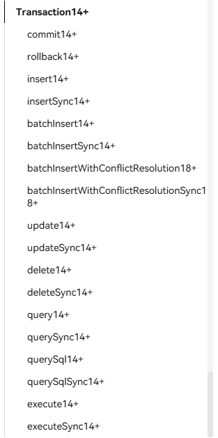

### TransactionType事务对象的类型

在调用createTransaction时，我们可以通过传入参数的形式选择需要创建的事务对象类型。每种类型的事务对象具有不同的行为特征：

| 名称       | 值 | 说明                                                                 |
|------------|----|----------------------------------------------------------------------|
| DEFERRED   | 0  | 创建一个延迟（DEFERRED）类型的事务对象，在创建时仅关闭自动提交机制，不会立即开始事务。事务会在首次执行读或写操作时才真正启动。适用于大多数常规场景，支持并发访问。 |
| IMMEDIATE  | 1  | 创建一个即时（IMMEDIATE）类型的事务对象，在创建时即启动一个写事务。如果此时已有其他未提交的写事务，则会创建失败并返回错误码 `14800024`。适用于需要尽早获取写锁、避免后续冲突的场景。 |
| EXCLUSIVE  | 2  | 创建一个独占（EXCLUSIVE）类型的事务对象。在 WAL 模式下与 IMMEDIATE 行为一致；但在其他日志模式下，该类型事务会阻止其他连接在事务期间读取数据库。适用于需要完全排他访问的特殊场景。 |

这三种事务类型各有其适用场景和优缺点：

#### 详细对比分析

**DEFERRED（延迟事务）**

- **特点**：懒加载模式，最节省资源
- **行为**：创建时不占用锁，首次操作时才启动事务
- **优势**：支持高并发读取，资源占用最少
- **劣势**：可能在实际操作时才发现锁冲突
- **适用场景**：大部分常规业务场景，多读少写的应用

**IMMEDIATE（即时事务）**

- **特点**：立即获取写锁，快速失败机制
- **行为**：创建时就尝试获取写锁，有冲突时立即返回错误
- **优势**：能够提前发现写锁冲突，避免后续操作浪费
- **劣势**：创建成本较高，可能阻塞其他写操作
- **适用场景**：需要频繁写入且要求一致性的场景

**EXCLUSIVE（独占事务）**

- **特点**：最严格的隔离级别
- **行为**：在非WAL模式下完全阻止其他连接读取
- **优势**：提供最强的数据一致性保证
- **劣势**：并发性能最差，可能造成严重阻塞
- **适用场景**：数据迁移、批量更新等需要完全隔离的操作

### Transaction对象 vs RdbStore直接操作

使用Transaction对象控制数据库与直接使用RdbStore有着本质的区别：

#### 主要差异对比

| 特性 | Transaction对象 | RdbStore直接操作 |
|------|----------------|------------------|
| **事务控制** | 手动控制提交/回滚 | 每个操作自动提交 |
| **原子性** | 多个操作作为一个原子单元 | 单个操作的原子性 |
| **一致性** | 事务内数据一致性保证 | 单操作一致性 |
| **隔离性** | 可配置隔离级别 | 默认隔离级别 |
| **性能** | 批量操作性能更好 | 单次操作开销较小 |
| **错误处理** | 可回滚到事务开始状态 | 错误后无法撤销 |

#### 示例代码对比

**使用Transaction对象（推荐）**

```typescript
import { relationalStore } from '@kit.ArkData';

// 创建不同类型的事务
async function createTransactionExample(rdbStore: relationalStore.RdbStore) {
  try {
    // 1. 创建DEFERRED类型事务（默认）
    const deferredTransaction = await rdbStore.createTransaction({
      type: relationalStore.TransactionType.DEFERRED
    });
    
    // 2. 创建IMMEDIATE类型事务
    const immediateTransaction = await rdbStore.createTransaction({
      type: relationalStore.TransactionType.IMMEDIATE
    });
    
    // 3. 创建EXCLUSIVE类型事务
    const exclusiveTransaction = await rdbStore.createTransaction({
      type: relationalStore.TransactionType.EXCLUSIVE
    });
    
    console.log('三种类型事务创建成功');
  } catch (error) {
    console.error('事务创建失败:', error);
  }
}

// 完整的事务操作示例
async function transactionOperationExample(rdbStore: relationalStore.RdbStore) {
  let transaction: relationalStore.Transaction | null = null;
  
  try {
    // 1. 创建事务
    transaction = await rdbStore.createTransaction({
      type: relationalStore.TransactionType.IMMEDIATE
    });
    
    // 2. 批量插入数据
    const users = [
      { name: '张三', age: 25, city: '北京' },
      { name: '李四', age: 30, city: '上海' },
      { name: '王五', age: 28, city: '深圳' }
    ];
    
    for (const user of users) {
      const valueBucket = {
        name: user.name,
        age: user.age,
        city: user.city,
        create_time: new Date().toISOString()
      };
      
      // 使用事务对象插入数据
      await transaction.insert('user_table', valueBucket);
    }
    
    // 3. 更新其中一条数据
    const predicates = new relationalStore.RdbPredicates('user_table');
    predicates.equalTo('name', '张三');
    
    const updateBucket = { age: 26 };
    await transaction.update(updateBucket, predicates);
    
    // 4. 检查操作结果
    const queryPredicates = new relationalStore.RdbPredicates('user_table');
    const resultSet = await transaction.query(queryPredicates);
    
    if (resultSet.rowCount >= 3) {
      // 满足条件，提交事务
      await transaction.commit();
      console.log('事务提交成功，插入了', resultSet.rowCount, '条数据');
    } else {
      // 不满足条件，回滚事务
      await transaction.rollback();
      console.log('数据不符合预期，事务已回滚');
    }
    
    resultSet.close();
    
  } catch (error) {
    console.error('事务执行出错:', error);
    
    // 发生错误时回滚事务
    if (transaction) {
      try {
        await transaction.rollback();
        console.log('事务已回滚');
      } catch (rollbackError) {
        console.error('回滚失败:', rollbackError);
      }
    }
  } finally {
    // 清理资源
    if (transaction) {
      transaction = null;
    }
  }
}
```

**直接使用RdbStore操作（对比）**

```typescript
// 直接使用RdbStore的问题示例
async function directRdbStoreExample(rdbStore: relationalStore.RdbStore) {
  try {
    // 问题：每个操作都是独立的，无法保证原子性
    const users = [
      { name: '张三', age: 25, city: '北京' },
      { name: '李四', age: 30, city: '上海' },
      { name: '王五', age: 28, city: '深圳' }
    ];
    
    // 如果第二次插入失败，第一次插入无法回滚
    for (const user of users) {
      const valueBucket = {
        name: user.name,
        age: user.age,
        city: user.city,
        create_time: new Date().toISOString()
      };
      
      // 每次insert都会自动提交
      await rdbStore.insert('user_table', valueBucket);
      // 如果这里出错，前面已插入的数据无法回滚
    }
    
    // 问题：更新操作与插入操作不在同一事务中
    const predicates = new relationalStore.RdbPredicates('user_table');
    predicates.equalTo('name', '张三');
    
    const updateBucket = { age: 26 };
    await rdbStore.update(updateBucket, predicates); // 独立事务
    
  } catch (error) {
    console.error('操作失败:', error);
    // 无法回滚之前已执行的操作
  }
}
```

#### 实际应用建议

**什么时候使用Transaction对象：**

1. **批量操作**：需要插入/更新/删除多条数据时
2. **关联操作**：多个表的操作需要保持一致性时
3. **复杂业务逻辑**：涉及条件判断和可能回滚的场景
4. **性能优化**：大量数据操作时减少提交次数

**什么时候直接使用RdbStore：**

1. **简单查询**：单表简单查询操作
2. **单条记录操作**：插入/更新/删除单条记录
3. **实时性要求高**：需要立即生效的操作
4. **轻量级操作**：不需要事务保证的场景

```typescript
// 推荐的最佳实践模式
class UserService {
  private rdbStore: relationalStore.RdbStore;
  
  constructor(rdbStore: relationalStore.RdbStore) {
    this.rdbStore = rdbStore;
  }
  
  // 复杂操作使用事务
  async createUserWithProfile(userData: any, profileData: any) {
    const transaction = await this.rdbStore.createTransaction({
      type: relationalStore.TransactionType.IMMEDIATE
    });
    
    try {
      // 插入用户基本信息
      const userId = await transaction.insert('users', userData);
      
      // 插入用户详细信息
      profileData.user_id = userId;
      await transaction.insert('user_profiles', profileData);
      
      // 更新统计信息
      await transaction.executeSql(
        'UPDATE statistics SET user_count = user_count + 1'
      );
      
      await transaction.commit();
      return userId;
      
    } catch (error) {
      await transaction.rollback();
      throw error;
    }
  }
  
  // 简单查询直接使用RdbStore
  async getUserById(userId: number) {
    const predicates = new relationalStore.RdbPredicates('users');
    predicates.equalTo('id', userId);
    
    return await this.rdbStore.query(predicates);
  }
}
```

### 关系型数据库小结

至此我们大致将鸿蒙的关系型数据的主要功能以及操作方式都进行了讲解，同时也与SpringBoot进行类别讲解，能够理解数据模型到实例对象的映射关系是用好关系型数据库的必要条件。当然华为也给出了很多可以直接执行SQL语句的API，但我认为既然有封装好的，更高效更安全的方法，那我们为什么不用呢？若非是业务有着特殊的需求需要定制SQL语句，否则我认为都无需使用那些直接执行SQL语句的API。当然这也只是我的个人见解，大家有不同的观点欢迎在评论区讨论。

最后再捋一下我们的整体的逻辑思路。

1. 获取/创建关系型数据库实例对象
  通过向[relationalStore.getRdbStore](https://developer.huawei.com/consumer/cn/doc/harmonyos-references/js-apis-data-relationalstore#relationalstoregetrdbstore-1)接口传入[StoreConfig](https://developer.huawei.com/consumer/cn/doc/harmonyos-references/js-apis-data-relationalstore#storeconfig)对象来获取指定数据库的实例对象[RdbStore](https://developer.huawei.com/consumer/cn/doc/harmonyos-references/js-apis-data-relationalstore#rdbstore)。
2. 创建数据库表
  调用[RdbStore.executeSql](https://developer.huawei.com/consumer/cn/doc/harmonyos-references/js-apis-data-relationalstore#executesql)接口去进行数据库的建库建表，对数据库进行初始化操作。
3. 获取事务对象
  调用[RdbStore.createTransaction](https://developer.huawei.com/consumer/cn/doc/harmonyos-references/js-apis-data-relationalstore#createtransaction14)方法获取事务对象[Transaction](https://developer.huawei.com/consumer/cn/doc/harmonyos-references/js-apis-data-relationalstore#transaction14)
4. 创建谓语对象增删改查数据
  创建谓词对象[RdbPredicates](https://developer.huawei.com/consumer/cn/doc/harmonyos-references/js-apis-data-relationalstore#rdbpredicates)设置查询条件，也就是SQL语句中的WHERE子句。将编辑好的谓词对象传入事务对象或是数据库对象的增删改查操作接口执行数据库操作。
5. 通过结果集对象获取数据
  在执行了数据库的操作后，如果有查询结构，则会以结果集对象[ResultSet](https://developer.huawei.com/consumer/cn/doc/harmonyos-references/js-apis-data-relationalstore#resultset)在回调函数中获取。以游标移动的形式去进行数据的获取。

## 向量数据库

向量数据库是API18新增的一种数据库，到现在其实ArkData中的[应用数据持久化概述](https://developer.huawei.com/consumer/cn/doc/harmonyos-guides/app-data-persistence-overview)文档依旧没有收录这种数据库，在API参考上也仅仅是共用了[关系型数据库](https://developer.huawei.com/consumer/cn/doc/harmonyos-references/js-apis-data-relationalstore)的API，并没有自己单独的API。

我对这方面也确实不是很懂使用就先借助AI的力量学习以下了。

### 向量数据库的基本概念（以下内容为AI生成）

#### 什么是向量？

在数据库语境下，**向量（Vector）**是一个由多个数值组成的数组，这些数值通常表示某个对象的特征。例如：

```typescript
// 一个128维的图像特征向量
const imageVector: number[] = [0.1, 0.5, -0.3, 0.8, ..., 0.2];

// 一个256维的文本语义向量
const textVector: number[] = [0.4, -0.1, 0.7, 0.2, ..., -0.5];
```

这些向量通常来源于：
- **机器学习模型**：如CNN提取的图像特征、BERT生成的文本向量
- **人工设计特征**：如颜色直方图、音频频谱特征
- **用户行为数据**：如购买偏好、浏览历史的数值化表示

#### 向量相似性搜索原理

向量数据库的核心在于**相似性搜索**，其基本原理是：

1. **距离计算**：通过数学公式计算向量间的"距离"
2. **相似性判断**：距离越近的向量被认为越相似
3. **结果排序**：按相似度从高到低返回结果

常用的相似性度量方法：

| 方法 | 公式特点 | 适用场景 |
|------|----------|----------|
| **欧几里得距离** | 计算向量在空间中的直线距离 | 图像特征、地理位置 |
| **余弦相似度** | 计算向量夹角的余弦值 | 文本语义、推荐系统 |
| **曼哈顿距离** | 计算各维度差值的绝对值之和 | 路径规划、特征匹配 |

#### 与传统数据库的区别

| 特性 | 传统数据库 | 向量数据库 |
|------|------------|------------|
| **查询方式** | 精确匹配（WHERE id=1） | 相似性搜索（找最相似的10个） |
| **数据结构** | 结构化数据（表格） | 高维数值向量 |
| **索引策略** | B树、哈希索引 | 向量空间索引（HNSW、IVF） |
| **应用场景** | 事务处理、数据管理 | AI应用、推荐系统、内容搜索 |

#### 向量数据库的优势

根据[华为官方文档](https://developer.huawei.com/consumer/cn/doc/harmonyos-guides/data-persistence-by-vector-store)，鸿蒙向量数据库具有以下优势：

1. **高性能搜索**：针对向量相似性搜索进行了专门优化
2. **大规模支持**：能够处理百万甚至千万级别的向量数据
3. **多算法支持**：提供多种相似性计算算法
4. **实时更新**：支持向量数据的实时插入、更新和删除

#### 典型应用场景

**图像识别与搜索**

```typescript
// 存储图像特征向量
const imageFeature = extractFeatureFromImage(imageFile); // [0.1, 0.5, ...]
await vectorDB.insert("image_001", imageFeature, {fileName: "cat.jpg", tags: ["动物", "宠物"]});

// 以图搜图
const queryFeature = extractFeatureFromImage(queryImage);
const similarImages = await vectorDB.search(queryFeature, {topK: 5});
```

**文本语义搜索**

```typescript
// 存储文档向量
const docVector = textEmbeddingModel.encode("鸿蒙应用开发教程");
await vectorDB.insert("doc_001", docVector, {title: "鸿蒙开发指南"});

// 语义搜索
const queryVector = textEmbeddingModel.encode("HarmonyOS编程");
const relatedDocs = await vectorDB.search(queryVector, {topK: 10});
```

**推荐系统**

```typescript
// 用户偏好向量化
const userPreference = [0.8, 0.2, 0.1, ...]; // 基于历史行为生成
const recommendItems = await vectorDB.search(userPreference, {
  topK: 20,
  filter: {category: "electronics"} // 可结合传统过滤条件
});
```

向量数据库为AI时代的应用提供了强大的数据基础设施，使得"以向量为中心"的智能搜索和推荐成为可能。在鸿蒙生态中，它将为构建更智能的应用体验提供重要支撑。

### 向量数据库的实际应用

虽然向量数据库是一个相对较新的特性，但在实际开发中已经有了一些应用模式：

```typescript
import { relationalStore } from '@kit.ArkData';

// 向量数据库实际上是关系型数据库的扩展
// 通过特殊的向量列类型来存储向量数据
const SQL_CREATE_VECTOR_TABLE = `
  CREATE TABLE IF NOT EXISTS VECTOR_STORE (
    id INTEGER PRIMARY KEY AUTOINCREMENT,
    vector_id TEXT UNIQUE NOT NULL,
    vector_data BLOB NOT NULL,  -- 存储序列化的向量数据
    metadata TEXT,              -- 存储JSON格式的元数据
    create_time TEXT DEFAULT CURRENT_TIMESTAMP
  )
`;

// 向量搜索的实现思路
class SimpleVectorStore {
  private rdbStore: relationalStore.RdbStore;
  
  constructor(rdbStore: relationalStore.RdbStore) {
    this.rdbStore = rdbStore;
  }
  
  // 插入向量数据
  async insertVector(vectorId: string, vector: number[], metadata?: any) {
    const vectorBlob = this.serializeVector(vector);
    const valueBucket = {
      vector_id: vectorId,
      vector_data: vectorBlob,
      metadata: metadata ? JSON.stringify(metadata) : null
    };
    
    return await this.rdbStore.insert('VECTOR_STORE', valueBucket);
  }
  
  // 简单的向量序列化（实际应用中需要更高效的方法）
  private serializeVector(vector: number[]): Uint8Array {
    const buffer = new ArrayBuffer(vector.length * 4);
    const view = new Float32Array(buffer);
    for (let i = 0; i < vector.length; i++) {
      view[i] = vector[i];
    }
    return new Uint8Array(buffer);
  }
  
  // 向量反序列化
  private deserializeVector(blob: Uint8Array): number[] {
    const view = new Float32Array(blob.buffer);
    return Array.from(view);
  }
  
  // 计算余弦相似度
  private cosineSimilarity(a: number[], b: number[]): number {
    let dotProduct = 0;
    let normA = 0;
    let normB = 0;
    
    for (let i = 0; i < a.length; i++) {
      dotProduct += a[i] * b[i];
      normA += a[i] * a[i];
      normB += b[i] * b[i];
    }
    
    return dotProduct / (Math.sqrt(normA) * Math.sqrt(normB));
  }
  
  // 简单的向量搜索实现（生产环境需要更高效的算法）
  async searchSimilar(queryVector: number[], topK: number = 5) {
    const predicates = new relationalStore.RdbPredicates('VECTOR_STORE');
    const resultSet = await this.rdbStore.query(predicates);
    
    const candidates: Array<{similarity: number, data: any}> = [];
    
    while (resultSet.goToNextRow()) {
      const vectorBlob = resultSet.getBlob(resultSet.getColumnIndex('vector_data'));
      const storedVector = this.deserializeVector(vectorBlob);
      const similarity = this.cosineSimilarity(queryVector, storedVector);
      
      candidates.push({
        similarity,
        data: {
          id: resultSet.getString(resultSet.getColumnIndex('vector_id')),
          metadata: JSON.parse(resultSet.getString(resultSet.getColumnIndex('metadata')) || '{}')
        }
      });
    }
    
    resultSet.close();
    
    // 按相似度排序并返回前topK个结果
    return candidates
      .sort((a, b) => b.similarity - a.similarity)
      .slice(0, topK)
      .map(item => ({...item.data, similarity: item.similarity}));
  }
}
```


**注意**：以上示例仅为演示向量数据库的基本原理，实际的向量数据库会使用更复杂的索引结构（如HNSW、LSH等）来提高搜索效率，并且华为的向量数据库实现会有专门优化的API。


### 向量数据库小结

向量数据库作为AI时代的重要基础设施，在鸿蒙生态中扮演着越来越重要的角色。虽然目前还是相对较新的特性，但其在图像搜索、语义检索、推荐系统等场景中的应用前景广阔。

**主要特点**：

- 专为高维向量数据设计
- 支持相似性搜索而非精确匹配
- 针对AI应用场景优化
- 与传统数据库形成互补

**使用建议**：

- 适合处理AI模型生成的特征向量
- 在需要相似性搜索的场景中使用
- 结合传统数据库使用，发挥各自优势
- 关注官方文档更新，掌握最新API

## 结语

到这里的话就算是写完了，这篇文章的写作过程也算是有些曲折了，本来是在期末前两周的时候在图书馆复习时偶然兴起开始翻看起文档，加上之前子安也问过我有没有用过鸿蒙的数据库，我就想着说去研究一下数据库这方面的文档，毕竟我们大二下也是有数据库这门课，期末考试也要考，没准就一起复习复习了。但后来写了个开头之后就意识到我的时间其实并不充裕了，我需要分出大量的时间给那个该死的统计分析，剩余的时间我还得去背毛概和刷两套计算机组成原理的题，而且在大致浏览了以下文档之后发现与我的期末考试范围并没有什么关系，除了少得可怜的SQL语句部分以外可以说是P关系没有了。所以这篇文章的更新就暂时搁置了。

现在期末考完了，成绩也都不错，也就有时间去把这篇文章给完成了，就像是公告所说的一样。


后面也许会写一篇关于SSE模式的前端渲染优化方案的文章，敬请期待吧。

随后就请出我们的Cursor老祖给我们进行一下总结吧。

### 技术选型建议

| 数据量 | 复杂度 | 推荐方案 | 适用场景 |
|--------|--------|----------|----------|
| < 2KB | 简单 | PersistenceV2 | UI状态持久化 |
| < 50MB | 简单 | 用户首选项 | 配置信息、用户偏好 |
| 任意 | 简单 | KV-Store | 键值对数据、缓存 |
| 任意 | 复杂 | RelationalStore | 结构化数据、复杂查询 |
| 任意 | 向量计算 | 向量数据库 | AI应用、相似性搜索 |

### 开发建议

1. **根据数据特性选择合适的存储方案**
2. **重视数据安全和类型安全**
3. **合理设计数据结构和索引策略**
4. **做好资源管理和异常处理**
5. **关注性能优化和最佳实践**
6. **关注新技术发展，特别是AI相关的数据存储需求**

还是那句话，让我们拼尽全力的在这世界上留下抓痕吧！


喵呜~！
