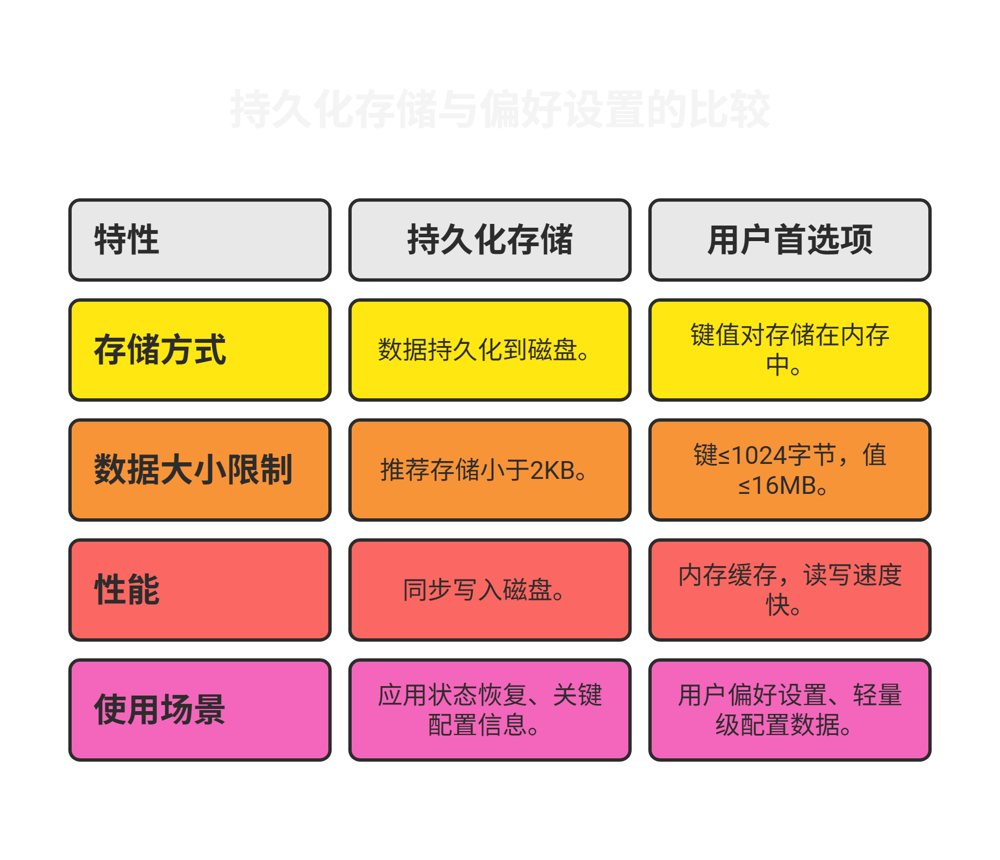
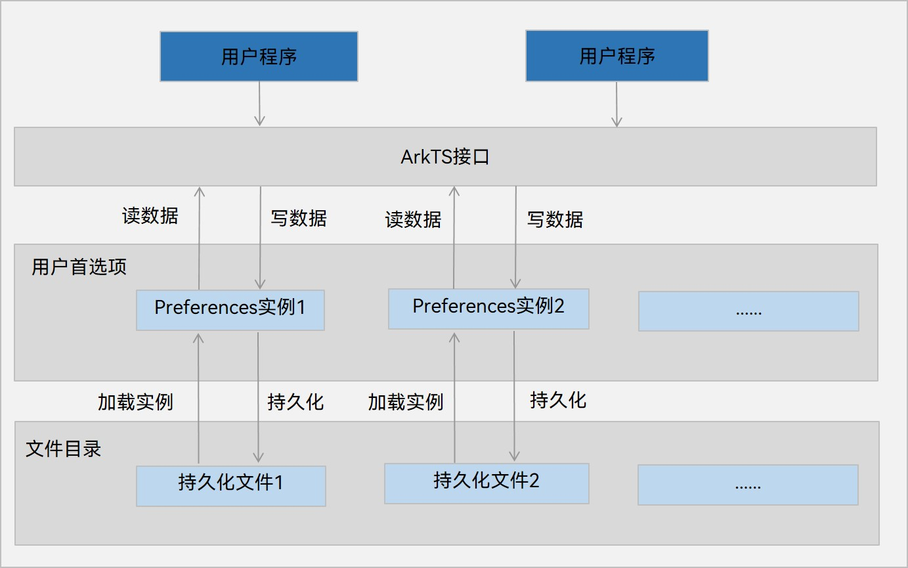

## 前言

在鸿蒙开发中，想要实现数据的持久化存储主要有四种方式，分别是：**用户首选项（Preferences）**、**键值型数据库（KV-Store）**、**关系型数据库（RelationalStore）**、**PersistenceV2**。由于V1版本的状态管理已经不在推荐使用所以这里就不在列举了。在此前的开发中我仅用过状态管理V2版本中所提供的持久化存储UI状态的**PersistentceV2**的功能，在暂时没有尝试过其他的数据持久化方式，所以本文会对另外三种数据持久化的方式做出着重解析。

## 少量数据持久化存储

对于这四种数据持久化存储的方式，我们可以依据需要存储的数据量来进行划分，当需要存储的数据量很少时，可以使用**用户首选项（Preferences）**和**PersistenceV2**，当需要存储的数据量较多时，可以使用**关系型数据库（RelationalStore）**和**键值型数据库（KV-Store）**。


这个划分并非绝对，但依据官方给出的建议，当需要存储的数据量**超过50MB**时，用户首选项会对象的创建以及持久化对象的创建会成为耗时操作可能造成线程阻塞，应用卡顿，所以此时我们就应当考虑使用数据库来进行数据持久化。


### 用户首选项（Preferences）与PersistenceV2的区别

| 特性         | PersistentStorage                          | Preferences                              |
|--------------|--------------------------------------------|------------------------------------------|
| 存储方式     | 持久化数据到设备磁盘，应用重启后数据保留   | 提供键值对存储，数据缓存在内存中         |
| 数据大小限制 | 推荐存储小于2KB的数据                      | 键为字符串（非空且≤1024字节），值（字符串≤16MB） |
| 性能         | 同步写入磁盘，大量数据可能影响UI性能       | 内存缓存，读写速度快                     |
| 使用场景     | 应用状态恢复、关键配置信息                 | 用户偏好设置、轻量级配置数据             |



总结来讲，这两者最关键的区别就在于是否直接存储至磁盘，PersistentceV2是在执行增删改查时直接在磁盘上进行操作的，大量的数据在同时进行本地化操作时会严重影响应用性能，并且这些进程是**直接在UI线程中执行的**，会大幅降低UI渲染效率。



### 用户首选项的存储格式

用户首选项在API18之前的默认存储格式是XML格式，而在API18之后还可以选用GSKV格式。

#### XML格式

XML（可扩展标记语言，全称 **eXtensible Markup Language**）是一种用于描述数据和其结构的标记语言，广泛用于数据存储与传输。它具有良好的可读性和跨平台兼容性，适用于配置文件、数据交换格式等场景。  

1. **文档声明**  
   每个 XML 文档应以声明开头，定义版本和编码方式：  
   ```xml
   <?xml version="1.0" encoding="UTF-8"?>
   ```  

2. **根元素**  
   XML 文档必须有一个根元素，所有其他元素都嵌套在其中：  
   ```xml
   <root>
       <!-- 其他内容 -->
   </root>
   ```  

3. **标签匹配**  
   - 所有标签必须正确闭合，且大小写敏感。  
   - 开始标签：`<tag>`  
   - 结束标签：`</tag>`  

4. **嵌套结构**  
   元素可以包含子元素，但不能交叉嵌套：  
   ```xml
   <parent>
       <child>Content</child>
   </parent>
   ```  

5. **属性**  
   属性为元素提供额外信息，必须用引号括起来：  
   ```xml
   <element attribute="value">Content</element>
   ```  

6. **注释**  
   注释以 `<!--` 开头，以 `-->` 结尾：  
   ```xml
   <!-- 这是一个注释 -->
   ```  

7. **特殊字符转义**  
   特殊字符需使用实体表示：  
   | 字符 | 实体表示 |  
   |------|----------|  
   | <    | `&lt;`   |  
   | >    | `&gt;`   |  
   | &    | `&amp;`  |  
   | "    | `&quot;` |  
   | '    | `&apos;` |  

8. **空格处理**  
   XML 中多余的空白符会被解析器忽略，换行和缩进不会影响内容。  

##### XML命名规范  

- 名称区分大小写（如 `<Tag>` 和 `<tag>` 是不同的）。  
- 名称不能以数字或标点符号开头。  
- 推荐使用有意义的英文名称。  

##### 良好格式要求  

XML 文档必须是“良构的”（Well-formed），即没有语法错误，否则解析失败。  

##### 示例代码  

```xml
<?xml version="1.0" encoding="UTF-8"?>
<config>
    <user id="1">
        <name>XBXyftx</name>
        <email>xbxyftx@example.com</email>
    </user>
    <settings>
        <theme>dark</theme>
        <notifications enabled="true"/>
    </settings>
</config>
```  

##### 应用场景  

XML 以其清晰的层级结构和通用性，在鸿蒙系统中曾被广泛用作用户首选项的默认存储格式（API18 及之前）。随着 GSKV 等新格式的引入，XML 虽已不再是唯一选择，但仍因其易读性和兼容性保留在许多系统的配置管理中。

#### GSKV格式

GSKV格式相比于XML格式，其最大的优势就是在于其具有`实时落盘`的特性，对用户首选项的数据进行修改之后其就会自动将修改后的数据写入磁盘中。


请注意，实时落盘特性不代表它的性能就会和PersistentceV2
