## 前言

这个想法是在我前两天深夜睡不着的时候突然冒出来的，当然此前我也想过进行这样的尝试，毕竟VScode这样一个开源神器，对于开发者来说几乎是必不可缺的，这不是某个语言，某个技术栈的专用工具，而是一个万金油平台，一次移植的移植成功，换来的将会是鸿蒙生态的革命性突破。

## 初步规划

### 确定MVP移植功能列表

想要移植VScode一上来就适配全量功能肯定是不显示的，我最想解决的问题其实是在鸿蒙平板上写博客这件事，我原本尝试过的两种方案一个是用网页版VScode写完了push到仓库等拿到电脑后部署，还有一个就是用CodeSpace，这个东西启动太慢了，而且有用量限制。相比之下我觉得现阶段开发一个和网页版VScode功能类似的软件是比较现实的，想在鸿蒙上直接运行任何语言的代码并不是件简单的事，但是对于编辑和git拉取推送，以及对于常见语言种类的高亮支持我认为还是可以一做的。

我先用k2.5的Agent模式去进行一下完整项目设计的规划并给我写一套方案。

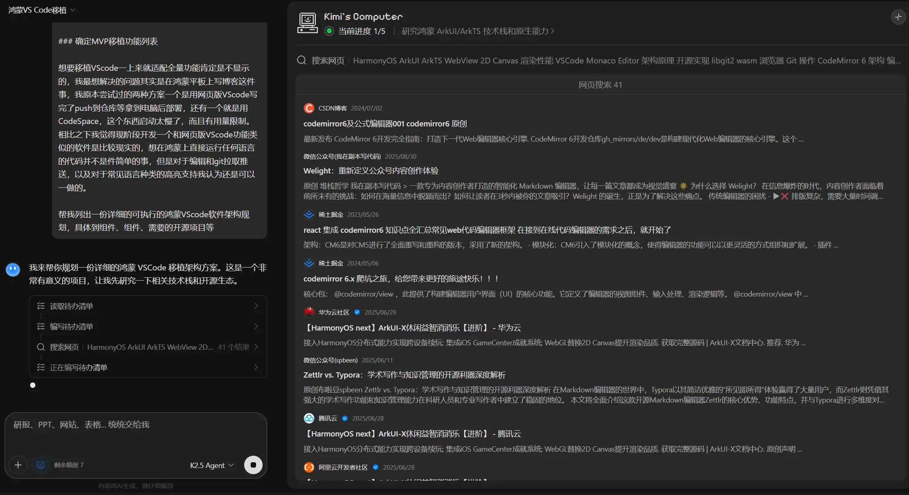

### 确认架构可行性

我先用DevEco创建好原生的C++项目框架随后让K2.5结合真实的软件框架进行一下可行性的分析。

```txt
 ✅ 可行性评估：可以实现

  你的技术选型是合理的：

  • CodeMirror 6 确实是移动端的更好选择（比Monaco轻量）
  • isomorphic-git 可以在WebView中运行
  • ArkUI + WebView 混合架构在鸿蒙上是标准做法

  ─────────────────────────────────────────────────────────────────────────────
  ⚠️ 需要关注的不合理/风险点

  1. UI层割裂问题（架构设计缺陷）

  你的设计是：侧边栏/状态栏用 ArkUI，编辑器用 WebView(CodeMirror)

  问题：

  • 视觉风格难以统一（字体、颜色、间距）
  • 交互体验割裂（比如拖拽文件到编辑器、主题同步）
  • 状态管理复杂（ArkTS 和 WebView JS 之间需要频繁通信）

  建议： 考虑编辑器区域也用原生 ArkUI 实现，或者整个应用都用 WebView（但这样会 
  失去原生感）

  ─────────────────────────────────────────────────────────────────────────────
  2. 文件系统桥接过于乐观

  你计划用 lightning-fs + FileBridge 适配鸿蒙文件系统，但这存在隐患：

  isomorphic-git → lightning-fs (内存/IndexedDB) → FileBridge → @ohos.file.fs  

  问题：

  • lightning-fs 是浏览器端的抽象文件系统，不是为原生文件系统设计的
  • Git操作会频繁读写，双层桥接性能损耗大
  • 大仓库（如Linux内核）会占用大量内存

  建议： 直接为 isomorphic-git 编写自定义 fs 适配器，跳过 lightning-fs

  ─────────────────────────────────────────────────────────────────────────────
  3. Git网络请求未考虑

  isomorphic-git 默认使用浏览器 fetch API，但在鸿蒙 WebView 中：

  • 跨域限制可能更严格
  • SSH 协议完全不支持（isomorphic-git 本身就不支持）
  • 私有仓库的认证流程需要额外处理

  建议： 明确Git只支持HTTPS + Token认证，且需要测试WebView中的网络行为

  ─────────────────────────────────────────────────────────────────────────────
  4. 缺少关键细节

   缺失项         影响
  ━━━━━━━━━━━━━━━━━━━━━━━━━━━━━━━━━━━━━━━━━━━━━━━━━━
   软键盘处理     平板上代码编辑体验核心，未提及
   存储位置规划   沙盒目录 vs 公共目录（Documents）
   目标鸿蒙版本   API 9 和 API 11+ 文件API差异大
   构建流程       如何将npm依赖打包进hap

  ─────────────────────────────────────────────────────────────────────────────
  5. Tree-sitter WASM 的潜在问题

  WebView 中运行 WASM 需要：

  • 开启 wasm-unsafe-eval CSP
  • 鸿蒙 WebView 对 WASM 支持需要验证（不同系统WebView内核不同）

  建议： 先做PoC验证 WASM 在鸿蒙 WebView 中的可行性

  ─────────────────────────────────────────────────────────────────────────────
  📝 修改建议

  架构调整建议

  原方案：ArkUI(UI) ←→ WebView(编辑器+Git+文件系统) ←→ NAPI桥接

  建议改为：
  方案A（轻量）：ArkUI(UI) ←→ WebView(仅编辑器渲染) ←→ ArkTS(业务逻辑+Git+文件)
  方案B（全WebView）：纯WebView应用，用CodeMirror + isomorphic-git + 虚拟文件系
  统

  阶段性调整建议

  Phase 1 应该增加：验证 WebView 中 CodeMirror 的输入体验（软键盘、中文输入）  

  Phase 2 应该明确：文件系统直接操作鸿蒙原生API，不要经过 lightining-fs        

  ─────────────────────────────────────────────────────────────────────────────
  总结

   维度         评估
  ━━━━━━━━━━━━━━━━━━━━━━━━━━━━━━━━━━━━━━━━━━━━━━━━━━━━━━
   技术可行性   ✅ 可以实现
   架构合理性   ⚠️ 需要调整（主要是文件系统桥接）
   工期预估     ⚠️ 12周偏紧，建议16周
   风险等级     中等（主要风险在WebView性能和文件系统）

  我的建议： 先做一个最小可行原型（只用CodeMirror + 简单文件读写），验证核心体 
  验后再继续开发。特别是要验证 WebView中代码编辑的软键盘体验，这是平板代码编辑 
  器的核心痛点。

  你觉得这些反馈有帮助吗？有哪些点你想进一步讨论？

```

核心问题主要出现在UI一致性和文件读写上，对于git的文件读写问题我此前看到过一个开源鸿蒙的项目，可供参考。[GitNext](https://gitcode.com/OpenHarmonyPCDeveloper/GitNext)

由于命令行工具没法直接阅读完整网页，我直接下载源码ZIP。

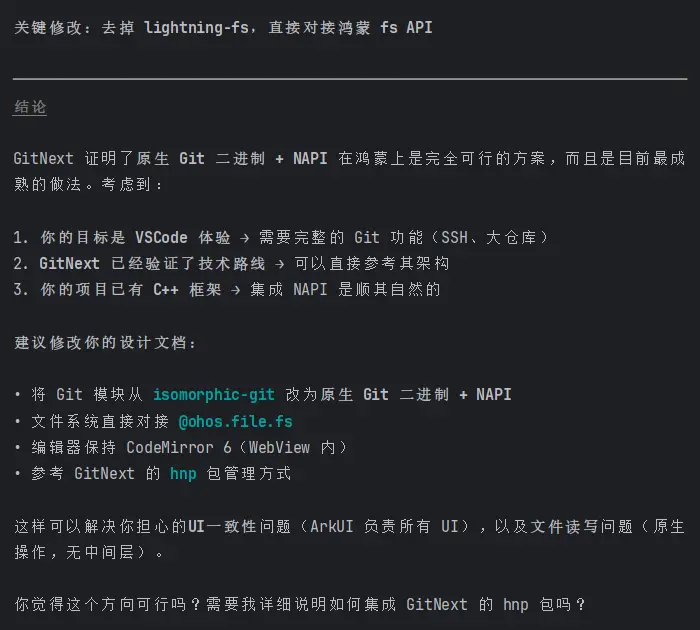

### 外部记忆准备

在之前的开发中我有意识到过上下文长度限制导致的问题，不过此前的经验不足，一直是要不然自己手动重新描述，要不然是借助工具自身的总结能力，就像是Kiro会简单总结上一段对话的主要内容，但是会损失很多细节导致本要成功的效果会被新的上下文干扰导致失败，所以我们需要去专门开启一个文档记录todoList并且记录进度以及实现细节。

（有一说一其实我之前博客就有点这个功能的意味。）

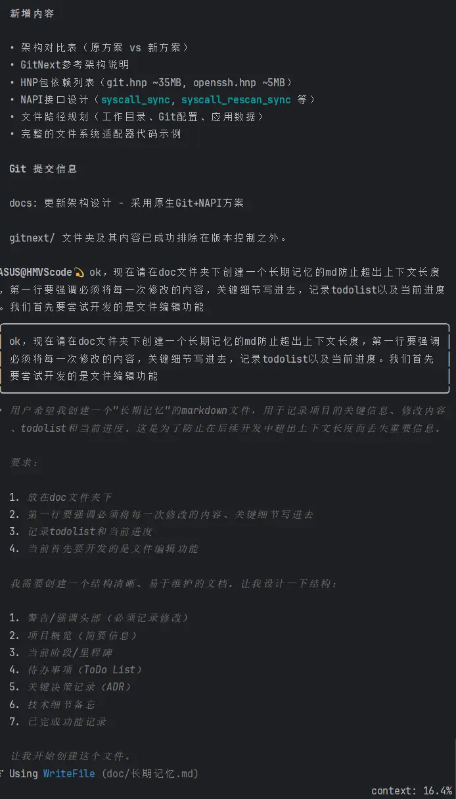

## 代码编辑器

这部分的主要功能包含文件中现有内容的显示，文件内容的编辑，内容的实时高光渲染，以及文件内容的保存。

### 高光渲染的技术栈抉择

对于这部分最大的问题就是在于代码高亮器，如果全面原生重构工作量过大，利用WebView可以直接套用CodeMirror 6，虽然会有性能损失，但现在不实操也拿不出实际的性能损失数据。

所以我决定先去观察一下现在已经上架华为应用市场的一些MarkDown编辑器和一些代码编辑器，看看他们是怎么做的。

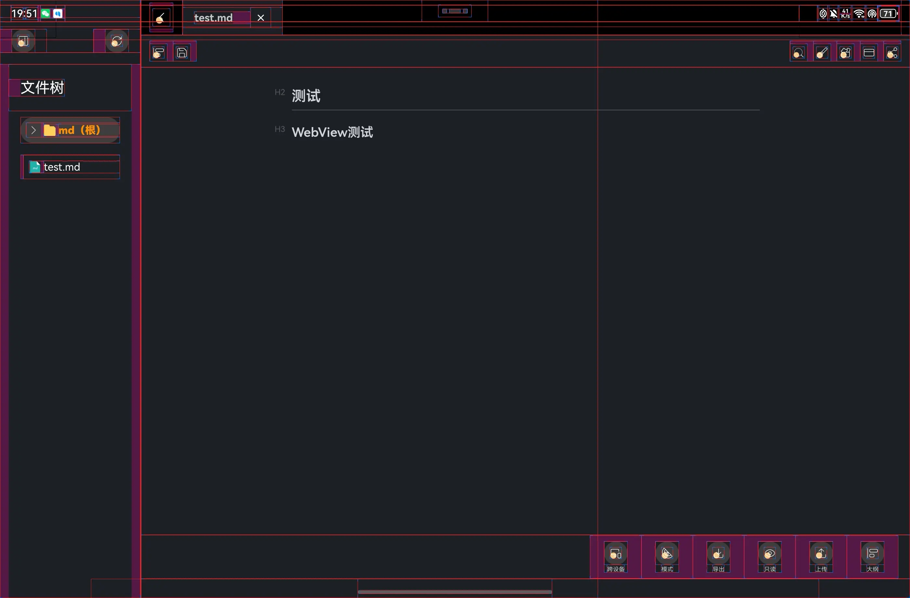


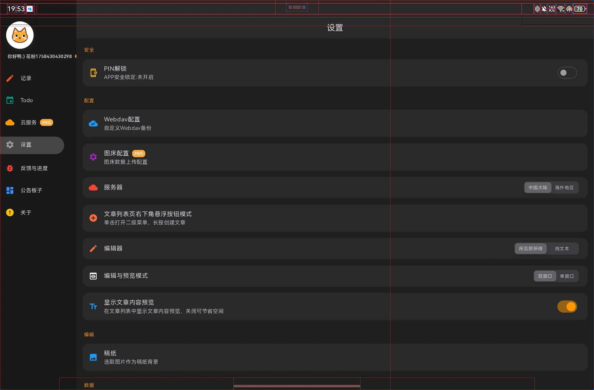

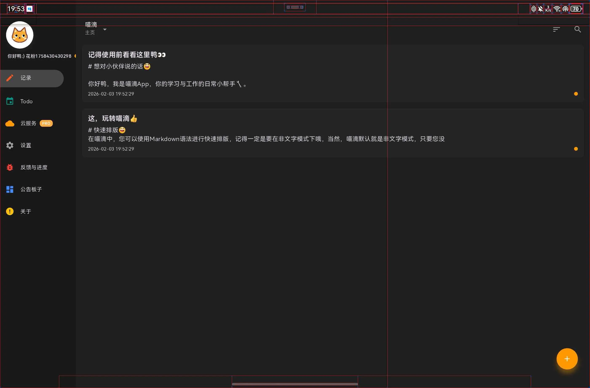


可以看到其实整体来讲都是使用的WebView，而且甚至有整个应用完整的都是使用WebView的，性能上我并没有感受到什么差别，所以我们完全没必要重复造轮子，直接使用WebView即可。

### 代码编辑器开发

ok，接下来开始正式开发，我们先来尝试一下最核心的两大功能之一的代码编辑器，git有开源项目作为参照相对来讲应该会简单一些，所以先来啃难啃的。

首先进行的是先利用CodeMirror 6去开发一个代码编辑器的MVP版本，先进行代码实时高亮渲染的可行性验证。

Kimi的第一版代码出现严重谬误，它编写了大量的TS代码，这是我想到的，因为之前我已经和它进行了相当长时间的对话都是关于鸿蒙项目的，也没有超出上下文长度限制，我就默认它会正确编写了，看来开始得动用skills了。

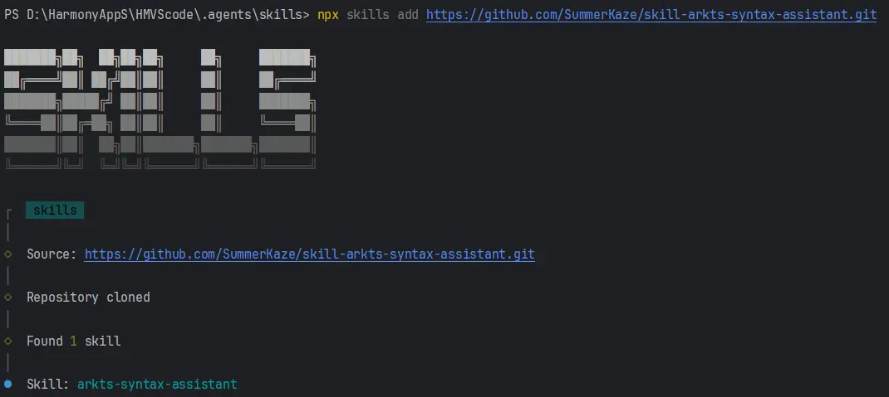

仓库链接我也放在这里，大家可以自行取用。

[skill-arkts-syntax-assistant](https://github.com/SummerKaze/skill-arkts-syntax-assistant)

[arkts_skills](https://github.com/FadingLight9291117/arkts_skills)

[arkts-agent-skill](https://github.com/aresbit/arkts-agent-skill)

同时为了防止它再犯病，我决定进行手动回滚后新开一个对话窗口，同时为了更好的观感体验更换到了VScode的插件来继续Vibe。


可以说是宝藏skills了。

生成的第一版代码中使用的全都是V1版本的状态管理，所以我安装完Skills后的第一件事就是将V1升级到V2。

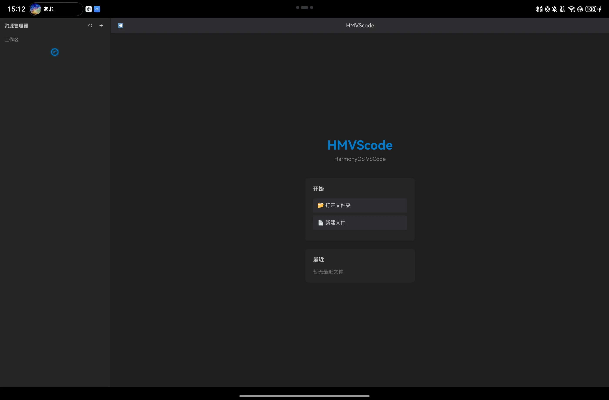

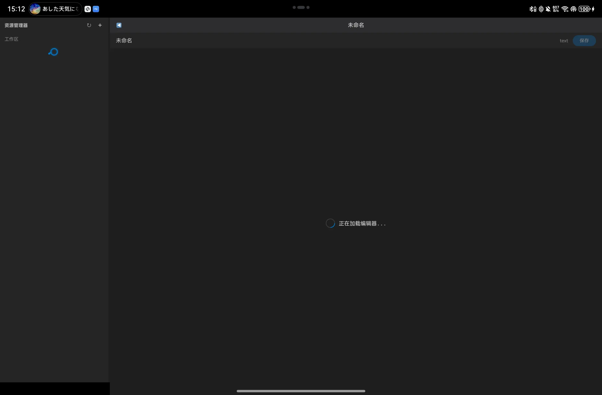

看起来可以说是相当唬人了，但问题也是相当严重，一方面是在第一版编写完后我连着让K2.5改了四五次的报错串，另一方面是当前的版本仅仅是一个界面，这个编辑器并没有真正实质性的内容？我在阅读源码之后确认了我的想法。


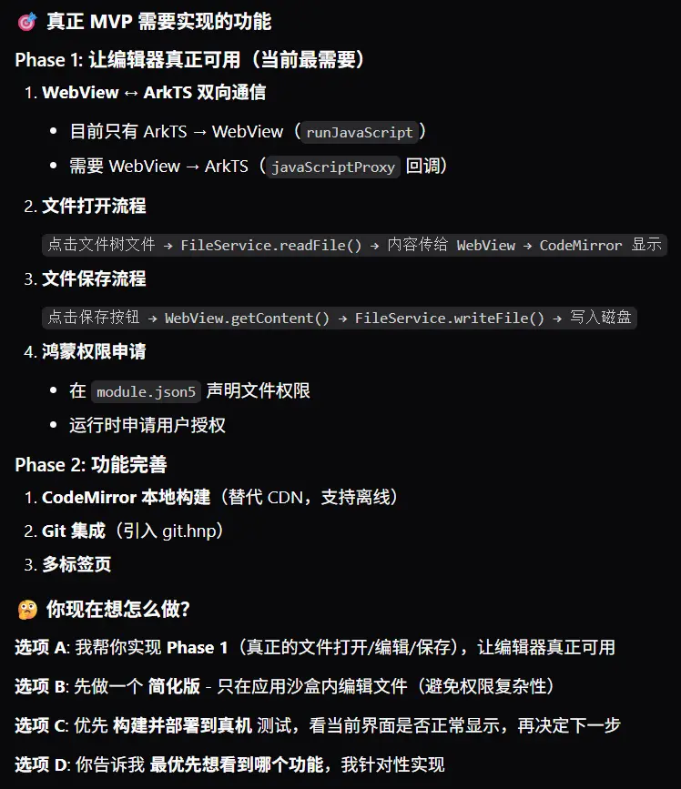

他给我的选项可以看出当前我们的信息存在一些差距。

- 首先它不知道我已经成功编译并部署
- 2是它并不明确我要的不是CDN而是纯本地的编辑器。

同步信息并明确需求。

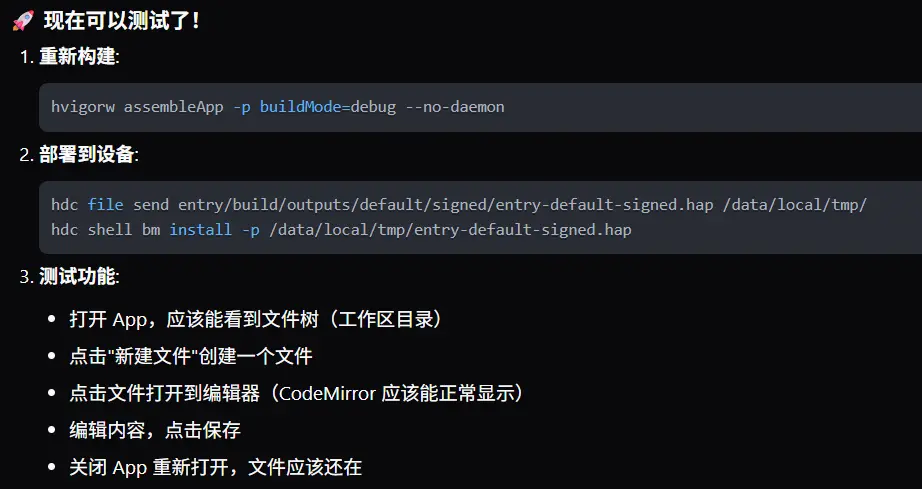

哦？！那很期待了。

测试的过程中出现了大量的配置问题，并且在其反复修改后发现配置文件被制造了巨量异常修改和错误，于是准备回滚并换为cursor使用Claude Opus 4.5进行尝试。

### 文件树与新建文件、文件夹


```txt
✅ MVP 版本完成总结
1. CodeMirror 本地构建 ✓
创建 editor-builder/ 构建目录
使用 esbuild 打包 CodeMirror 6 模块
生成 codemirror-bundle.js (~605KB)
支持语言：JavaScript、TypeScript、ArkTS、Python、HTML、CSS、JSON、Markdown、XML
构建命令:
cd editor-buildernpm installnpm run build
2. 文件创建/读写功能 ✓
新建文件按钮 📄
新建文件夹按钮 📁
文件类型切换
文件名合法性校验
文件大小显示
错误提示 Toast
3. WebView 桥接优化 ✓
新增 EditorStatus 接口
状态实时同步回调
markClean() / focus() 方法
内容缓存机制（编辑器未就绪时自动队列）
Promise API 改进
4. 组件状态响应 ✓
编辑器状态栏（行列号、修改状态）
底部状态栏（工作区路径、语言、编码）
编辑器就绪指示器
保存成功提示
5. 长期记忆文档 ✓
记录所有修改内容
更新任务进度
更新技术备忘
📁 新增/修改文件列表
HMVScode/├── editor-builder/                    # [新增] 构建工具│   ├── package.json│   ├── build.js│   └── src/editor.js├── entry/src/main/│   ├── resources/rawfile/editor/│   │   ├── index.html                 # [更新]│   │   └── codemirror-bundle.js       # [新增]│   └── ets/│       ├── infrastructure/bridge/│       │   └── EditorBridge.ts        # [更新]│       ├── components/│       │   ├── EditorComponent.ets    # [更新]│       │   └── FileTreeComponent.ets  # [更新]│       └── pages/│           └── Index.ets              # [更新]├── doc/长期记忆.md                     # [更新]└── .gitignore                         # [更新]
现在项目已经具备完整的代码编辑 MVP 功能，包括：
📂 文件浏览和选择
📄 新建文件/文件夹
✏️ 代码编辑（本地 CodeMirror）
🎨 多语言语法高亮
💾 文件保存
📊 状态栏信息展示
```

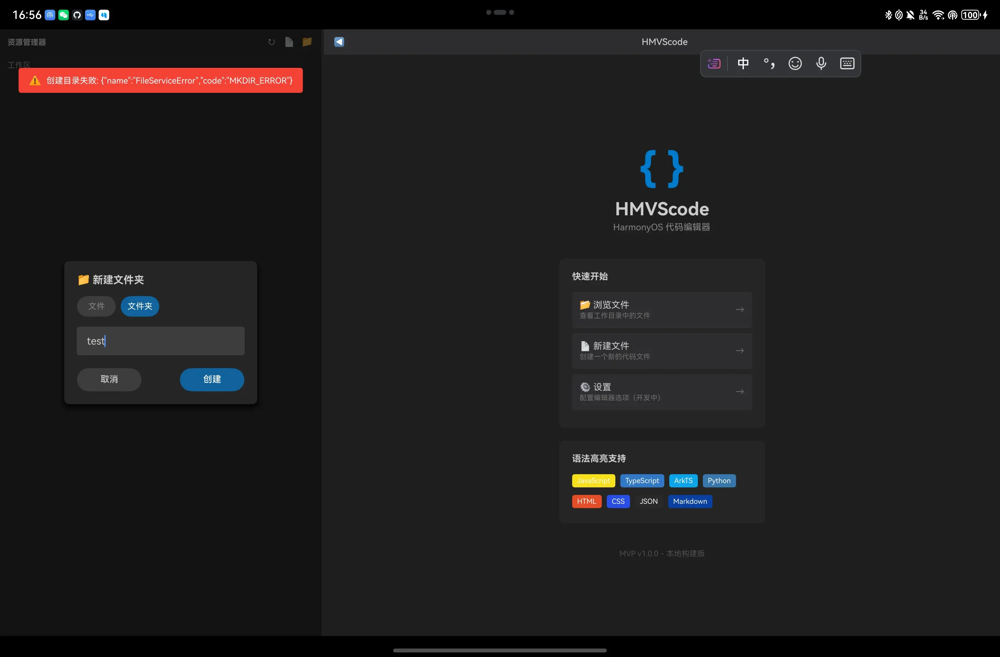


现在点击新建文件或是新建文件夹都会出现报错，应该是文件系统的权限问题。但编辑器是已经可以使用的了但点击编辑器右上角的保存也是没有用的。

所以我们需要旅顺一下逻辑，我们应当拉起文件选择器让用户去选择工作位置随后再渲染文件树。

<video width="100%" controls>
  <source src="20.mp4" type="video/mp4">
  您的浏览器不支持视频标签。
</video>

<video width="100%" controls>
  <source src="21.mp4" type="video/mp4">
  您的浏览器不支持视频标签。
</video>

当前问题：

1. 当前文件系统权限确实是正常了，但是拉起的文件选择器选择的是具体的文件而不是目录。
2. 我在手动创建了md文件之后利用文件系统选择后，首页的“工作目录”确实显示的是正确的路径，但我点击新建文件或是查看当前文件夹下文件时，拉起的WebView编辑器都是默认的空的无后缀“test”文件。
3. 再选择文件后左侧的文件树依旧是空的，同时点击编辑器右上角的保存按钮也是没有反应的。

对于WebView编辑器都是默认的空文件这个问题出在文件内容的读取上，我们可以做一层中间层，将文件内容先读到内存后由中间层将文件内容传递给WebView编辑器，点击保存后在由中间层读取WebView编辑器的内容并写入文件系统。同时还要修复我们选择的是文件夹而不是具体文件这个问题。

将上面这段给到Claude后它完成了新一轮的修复，现在再来测试一下。

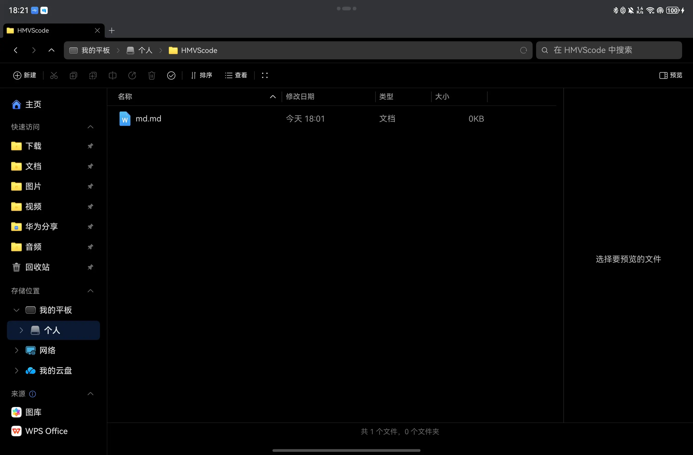

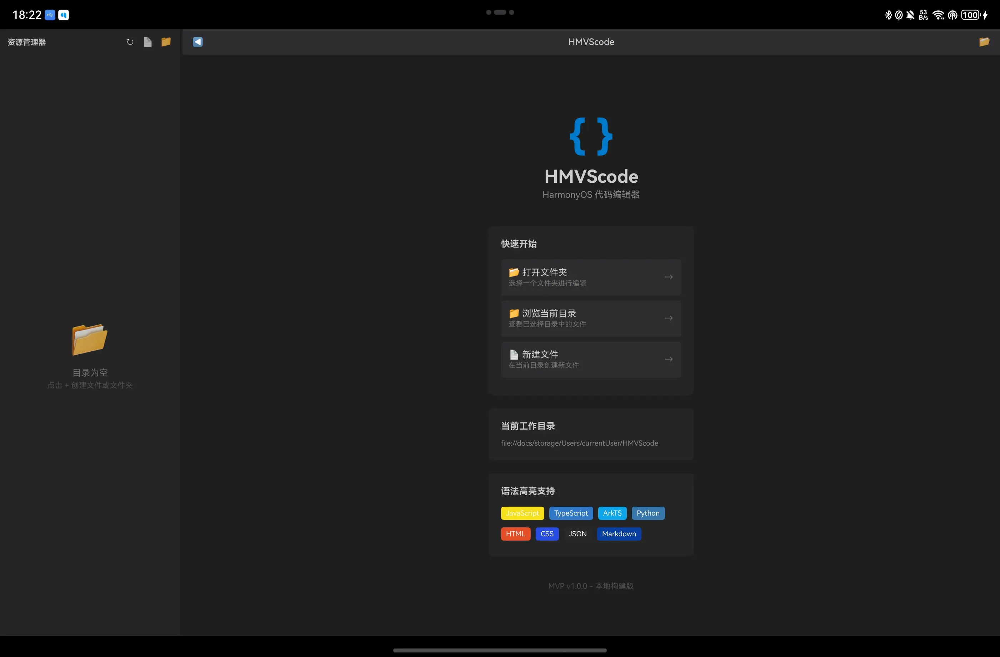

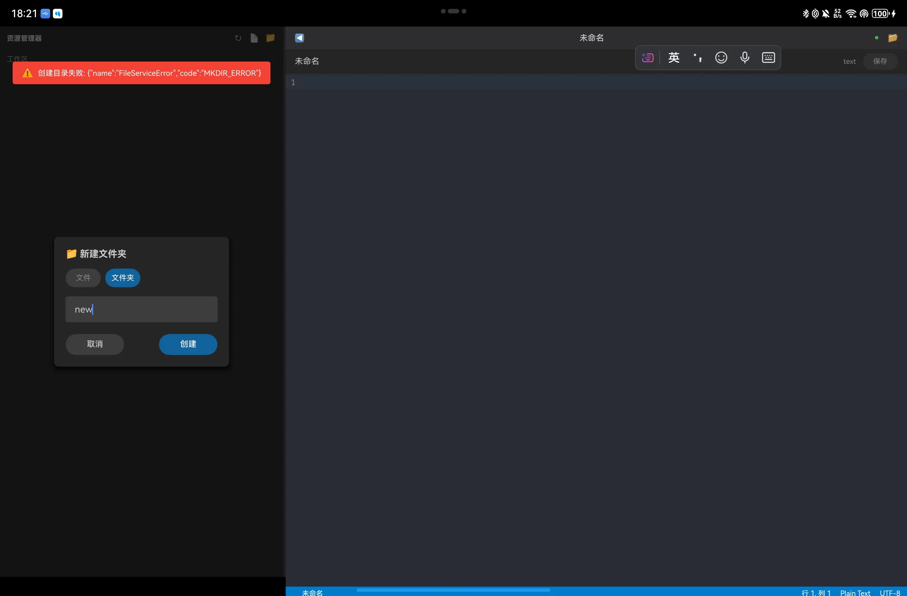

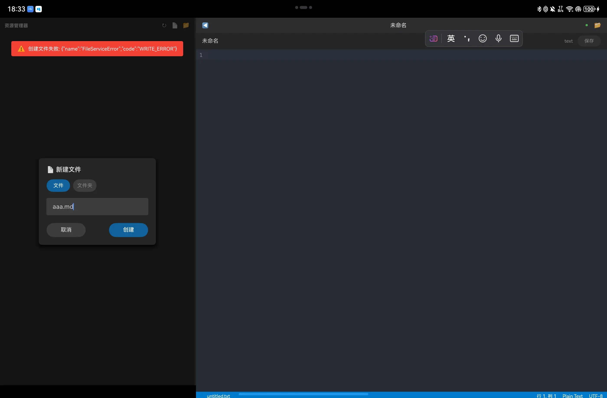

首先要肯定的是这一次的改动修复了选择的是文件而不是文件夹的bug，但是文件树的渲染当前文件夹下的文件及其子文件夹的功能依旧没有实现，同时仍然无法正常访问到当前文件夹下的文件，我需要更多日志来辅助排查问题。同时新建文件和新建文件夹两个功能依旧无法使用。现在优先解决文件树渲染的问题。

````md


在鸿蒙（HarmonyOS）中渲染文件树，可通过以下两种核心方案实现，均基于 **ArkUI 声明式范式**和 **RenderNode 节点操作**能力：

---

### **方案一：使用 NodeController + RenderNode 动态构建树形结构**
**适用场景**：需精确控制节点位置、层级和渲染属性的复杂文件树（如带缩进、图标、交互动画）。  
**实现步骤**：  
1. **定义文件树节点数据结构**：  
   ```typescript
   class FileNode {
     name: string;
     children: FileNode[] = [];
     // 其他属性（类型、图标等）
   }
   ```

2. **创建自定义 NodeController**：  
   继承 `NodeController`，在 `makeNode()` 中动态构建子树（示例简化）：  
   ```typescript
   import { FrameNode, NodeController, RenderNode } from '@kit.ArkUI';

   class FileTreeController extends NodeController {
     private rootNode: FrameNode | null = null;

     // 递归构建渲染节点
     private buildRenderNode(fileNode: FileNode, depth: number): RenderNode {
       const node = new RenderNode();
       // 设置节点位置（缩进=深度×偏移量）
       node.frame = { x: 20 * depth, y: 0, width: 200, height: 40 };
       node.backgroundColor = 0xFFF5F5F5;

       // 添加子节点（递归）
       fileNode.children.forEach(child => {
         const childNode = this.buildRenderNode(child, depth + 1);
         node.appendChild(childNode);
       });
       return node;
     }

     makeNode(uiContext: UIContext): FrameNode | null {
       this.rootNode = new FrameNode(uiContext);
       const rootRenderNode = this.rootNode.getRenderNode();
       const fileTreeRoot = this.buildRenderNode(yourFileData, 0); // 从深度0开始
       rootRenderNode?.appendChild(fileTreeRoot);
       return this.rootNode;
     }
   }
   ```

3. **在 UI 中挂载 NodeContainer**：  
   ```typescript
   @Component
   struct FileTreeComponent {
     private controller: FileTreeController = new FileTreeController();

     build() {
       Column() {
         NodeContainer(this.controller)
           .width('100%')
           .height('100%')
       }
     }
   }
   ```

---

****方案二：结合 List 组件 + 递归嵌套实现****
**适用场景**：简单文件树，需利用列表性能优化（如大数据量）。  
**关键技巧**：  
- 使用 `@Builder` 递归渲染子节点  
- 通过 `List` 的 `LazyForEach` 优化性能  

```typescript
@Entry
@Component
struct FileTreeList {
  @State rootData: FileNode[] = []; // 根节点数据

  // 递归构建子节点
  @Builder
  TreeNode(node: FileNode) {
    Column() {
      Row() {
        Text(node.name).fontSize(16)
        // 可展开图标（根据是否有子节点显示）
      }
      .onClick(() => { /* 展开/折叠逻辑 */ })

      // 子节点列表（递归）
      if (node.isExpanded && node.children.length > 0) {
        List({ space: 8 }) {
          LazyForEach(node.children, (child: FileNode) => {
            ListItem() {
              this.TreeNode(child) // 递归调用
            }
          })
        }
        .margin({ left: 20 }) // 缩进
      }
    }
  }

  build() {
    List({ space: 10 }) {
      LazyForEach(this.rootData, (item: FileNode) => {
        ListItem() {
          this.TreeNode(item)
        }
      })
    }
  }
}
```

---

****关键差异与选型建议****
| **特性**               | NodeController + RenderNode          | List + 递归嵌套               |
|------------------------|--------------------------------------|-------------------------------|
| **渲染控制粒度**       | 像素级（位置/动画/裁剪）             | 组件级（依赖布局系统）        |
| **性能**               | 更优（直接操作渲染树）               | 依赖列表优化                  |
| **复杂度**             | 较高（需手动管理节点）               | 较低（声明式嵌套）            |
| **适用场景**           | 定制化强、动态更新的树               | 静态/中等规模树               |

> **注意事项**：  
> - **动态更新**：若需增删节点，在 `NodeController` 中调用 `rebuild()` 触发重绘。  
> - **交互事件**：通过 `RenderNode` 的 `onTouch()` 捕获点击事件，结合状态管理展开/折叠。  
> - **性能优化**：深层嵌套时，在递归方案中使用 `LazyForEach` 避免内存溢出。
内容由AI生成，仅供参考
````

````md


在鸿蒙应用开发中，获取用户指定文件夹并渲染子文件树需通过以下步骤实现：

### 一、获取用户文件夹URI
使用文件选择器（Picker）获取用户选择的文件夹URI：
```typescript
import { picker } from '@kit.FileKit';

// 调用文件夹选择器
async function selectFolder() {
  try {
    const folderUri = await picker.selectFolder();
    return folderUri; // 返回格式：'file://docs/storage/Users/currentUser/Documents'
  } catch (err) {
    console.error('选择文件夹失败', err);
  }
}
```

**二、遍历子文件树**
通过`@kit.FileKit`的`fs`模块解析文件夹内容：
```typescript
import { fs } from '@kit.FileKit';

async function buildFileTree(folderUri: string) {
  const dir = fs.openDirSync(folderUri);
  let fileTree = [];

  try {
    let entry;
    while ((entry = await dir.read())) {
      const stat = await fs.stat(entry.path);
      fileTree.push({
        name: entry.name,
        path: entry.path,
        type: stat.isDirectory ? 'folder' : 'file',
        children: stat.isDirectory ? await buildFileTree(entry.path) : []
      });
    }
  } finally {
    dir.closeSync();
  }
  return fileTree;
}
```

**三、渲染文件树组件**
使用`TreeContainer`组件实现递归渲染：
```typescript
@Component
struct FileTree {
  @State fileData: any[] = []

  build() {
    TreeContainer() {
      ForEach(this.fileData, (item: any) => {
        TreeItem() {
          Row() {
            Image(item.type === 'folder' ? $r('app.media.folder') : $r('app.media.file'))
              .width(24)
              .height(24)
            Text(item.name).margin({ left: 8 })
          }
        }.onClick(() => {
          if (item.type === 'folder') {
            this.expandFolder(item); // 展开子目录
          }
        })
      })
    }
  }

  // 展开子文件夹逻辑
  private expandFolder(item: any) {
    buildFileTree(item.path).then(children => {
      item.children = children;
      this.fileData = [...this.fileData];
    });
  }
}
```

### 四、完整调用流程
```typescript
@Entry
@Component
struct MainPage {
  @State fileTree: any[] = []

  build() {
    Column() {
      Button('选择文件夹')
        .onClick(async () => {
          const uri = await selectFolder();
          this.fileTree = await buildFileTree(uri);
        })
      
      FileTree({ fileData: this.fileTree })
    }
  }
}
```

### 关键注意事项
1. **权限声明**  
   在`module.json5`中添加文件访问权限：
   ```json
   "requestPermissions": [
     { "name": "ohos.permission.FILE_ACCESS" },
     { "name": "ohos.permission.READ_MEDIA" }
   ]
   ```

2. **URI处理原则**  
   - 直接传递URI给`fs`模块操作，禁止解析URI路径片段
   - 媒体文件URI需通过`photoAccessHelper`转换（参考搜索结果<sup class="quote">1</sup>）

3. **性能优化**  
   - 使用`LazyForEach`渲染大型文件树
   - 分批次加载子目录（每次加载50条目）

> 完整实现可参考开源项目中的文件管理器案例（搜索结果<sup class="quote">2</sup>），该项目使用`ColumnSplit`布局和`Grid`组件实现了类似功能，支持文件夹导航与文件图标展示。
内容由AI生成，仅供参考
````

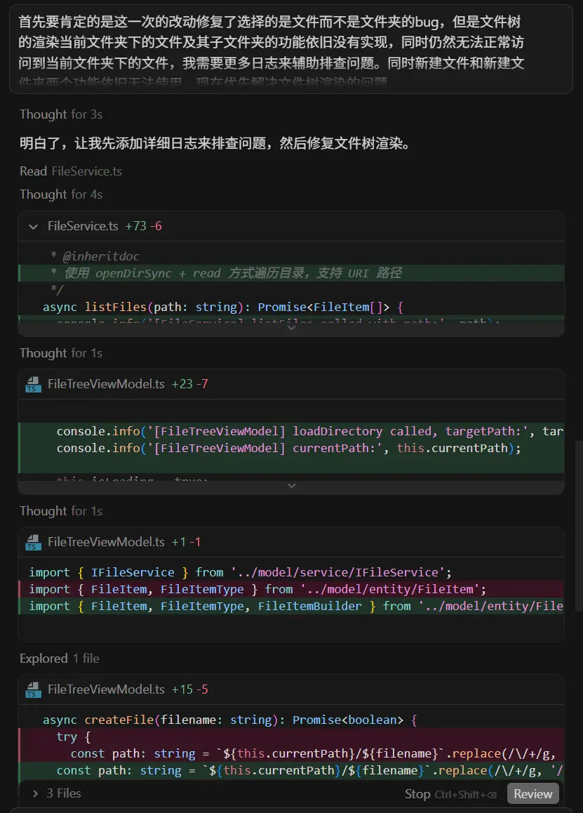

```log
02-04 20:48:53.772   49744-49744   C02805/com.xbxy...InputKeyFlow  com.xbxyftx.HMVScode  I     [][OnPointerEvent:242] ac: down: 170740
02-04 20:48:53.772   49744-49744   C02805/com.xbxy...InputKeyFlow  com.xbxyftx.HMVScode  I     [P:D:170740][OnPointerEvent:649] recv
02-04 20:48:53.772   49744-49744   C04213/com.xbxy...InputKeyFlow  com.xbxyftx.HMVScode  I     HandleInputEvent: eid:0,InputId:170740,wid:1156,ac:2
02-04 20:48:53.775   49744-49744   C03951/com.xbxy...InputKeyFlow  com.xbxyftx.HMVScode  I     [(100000:100000:scope)] ITK Id:170740, fId:0, T:0, I=0, M=0
02-04 20:48:53.776   49744-49744   C03951/com.xbxy...InputKeyFlow  com.xbxyftx.HMVScode  I     [(100000:100000:scope)] ITK Id:170740, TTHNI:fId: 0{ T: page, D: 6 };{ T: Scroll, D: 12 };
02-04 20:48:53.776   49744-49744   C03951/com.xbxy...InputKeyFlow  com.xbxyftx.HMVScode  I     [(100000:100000:scope)] ITK Id:170740, TTHRTI: T ClickRecognizer info: { T: Scroll }; { T: Row };T PanRecognizer info: { T: Scroll };
02-04 20:48:53.780   49744-49744   C03919/com.xbx...InputTracking  com.xbxyftx.HMVScode  I     [(100000:100000:scope)] Consumed id:170740, last id:-1
02-04 20:48:53.780   49744-49744   C04213/com.xbxy...InputKeyFlow  com.xbxyftx.HMVScode  I     ConsumePointerEventInner: InputId:170740,wid:1156,pointId:0,srcType:2,rect:[0,0,2800,1840],notify:1
02-04 20:48:53.780   49744-49744   C02805/com.xbxy...InputKeyFlow  com.xbxyftx.HMVScode  I     [][OnPointerEvent:242] ac: move: 170741
02-04 20:48:53.780   49744-52208   C0390D/com.xbx...de/AceOverlay  com.xbxyftx.HMVScode  I     [(-1:100000:singleton)] RVS_ENABLE_CHECK Result: 0
02-04 20:48:53.854   49744-49744   C02805/com.xbxy...InputKeyFlow  com.xbxyftx.HMVScode  I     [][OnPointerEvent:242] ac: move, first: 170742-(2026-02-04 20:48:53.780ms), 170755, count: 14, last: ac: up: 170756
02-04 20:48:53.854   49744-49744   C02805/com.xbxy...InputKeyFlow  com.xbxyftx.HMVScode  I     [P:U:170756][OnPointerEvent:649] recv
02-04 20:48:53.854   49744-49744   C04213/com.xbxy...InputKeyFlow  com.xbxyftx.HMVScode  I     HandleInputEvent: eid:1,InputId:170756,wid:1156,ac:4
02-04 20:48:53.855   49744-49744   C03951/com.xbxy...InputKeyFlow  com.xbxyftx.HMVScode  I     [(100000:100000:scope)] ITK Id:170756, fId:0, T:1, I=0, M=0
02-04 20:48:53.855   49744-49744   C0391E/com.xbx...de/AceGesture  com.xbxyftx.HMVScode  I     [(100000:100000:scope)] Click try accept
02-04 20:48:53.855   49744-49744   C0390B/com.xbx...AceScrollable  com.xbxyftx.HMVScode  I     [(100000:100000:scope)] Scrollable GestureJudge:0, 0
02-04 20:48:53.855   49744-49744   C0391E/com.xbx...de/AceGesture  com.xbxyftx.HMVScode  I     [(100000:100000:scope)] Click gesture judge reject
02-04 20:48:53.855   49744-49744   C0391E/com.xbx...de/AceGesture  com.xbxyftx.HMVScode  I     [(100000:100000:scope)] Click try accept
02-04 20:48:53.855   49744-49744   C03951/com.xbxy...InputKeyFlow  com.xbxyftx.HMVScode  I     [(100000:100000:scope)] CLK RACC, T: Row
02-04 20:48:53.857   49744-49744   A03D00/com.xbx...MVScode/JSAPP  com.xbxyftx.HMVScode  I     [picker] ParseWindow: not window mode.
02-04 20:48:53.857   49744-49744   A03D00/com.xbx...MVScode/JSAPP  com.xbxyftx.HMVScode  I     [Index] Opening folder picker...
02-04 20:48:53.857   49744-49744   A03D00/com.xbx...MVScode/JSAPP  com.xbxyftx.HMVScode  I     [picker] parseDocumentPickerSelectOption start
02-04 20:48:53.857   49744-49744   A03D00/com.xbx...MVScode/JSAPP  com.xbxyftx.HMVScode  I     [picker] parseDocumentPickerSelectOption end
02-04 20:48:53.857   49744-49744   A03D00/com.xbx...MVScode/JSAPP  com.xbxyftx.HMVScode  I     [picker] modalPicker start 
02-04 20:48:53.857   49744-49744   C01304/com.xbx...anagerService  com.xbxyftx.HMVScode  I     [picker_n_exporter.cpp(StartModalPicker:499)][picker]: StartModalPicker begin.
02-04 20:48:53.857   49744-49744   C01304/com.xbx...anagerService  com.xbxyftx.HMVScode  I     [picker_n_exporter.cpp(ParseArgsStartModalPicker:480)][picker]: ParseArgsStartModalPicker begin.
02-04 20:48:53.857   49744-49744   C01304/com.xbx...anagerService  com.xbxyftx.HMVScode  I     [picker_n_exporter.cpp(AsyncContextSetStaticObjectInfo:444)][picker]: AsyncContextSetStaticObjectInfo begin.
02-04 20:48:53.857   49744-49744   C01304/com.xbx...anagerService  com.xbxyftx.HMVScode  I     [picker_n_exporter.cpp(StartPickerExtension:389)][picker]: StartPickerExtension begin.
02-04 20:48:53.857   49744-49744   C01304/com.xbx...anagerService  com.xbxyftx.HMVScode  I     [picker_n_exporter.cpp(StartPickerExtension:395)][picker] Will get uiContent by context.
02-04 20:48:53.858   49744-49744   C01304/com.xbx...anagerService  com.xbxyftx.HMVScode  I     [picker_n_exporter.cpp(StartPickerExtension:414)][picker]: SetParam end, udkey = 
02-04 20:48:53.858   49744-49744   C01304/com.xbx...anagerService  com.xbxyftx.HMVScode  I     [picker_n_exporter.cpp(StartPickerExtension:428)][picker]: will CreateModalUIExtension by extType: filePicker, pickerType: select
02-04 20:48:53.858   49744-49744   C0392A/com.xbx...sionComponent  com.xbxyftx.HMVScode  I     [(100000:100000:scope)] [@95][ID: 1] The modal UIExtension is created.
02-04 20:48:53.858   49744-49744   C0392A/com.xbx...sionComponent  com.xbxyftx.HMVScode  I     [(100000:100000:scope)] Create UIExtensionNode
02-04 20:48:53.858   49744-49744   C0392A/com.xbx...sionComponent  com.xbxyftx.HMVScode  I     [(100000:100000:scope)] [@979][ID: 1] RegisterPipelineEvent
02-04 20:48:53.858   49744-49744   C0392A/com.xbx...sionComponent  com.xbxyftx.HMVScode  I     [(100000:100000:scope)] [@931][ID: 1] OnAttachToFrameNode
02-04 20:48:53.858   49744-49744   C0392A/com.xbx...sionComponent  com.xbxyftx.HMVScode  I     [(100000:100000:scope)] [@454][ID: 1] The current state is 'NONE' when UpdateWant, needCheck: '0'.
02-04 20:48:53.858   49744-49744   C0392A/com.xbx...sionComponent  com.xbxyftx.HMVScode  I     [(100000:100000:scope)] [@481][ID: 1] The ability KeyAsync 0, uIExtensionUsage: 0.
02-04 20:48:53.858   49744-49744   C0392A/com.xbx...sionComponent  com.xbxyftx.HMVScode  I     [(100000:100000:scope)] [@645][ID: 1] The session is created with bundle=, ability=, componentId=109.
02-04 20:48:53.858   49744-49744   C04217/com.xbxy...WMSAttribute  com.xbxyftx.HMVScode  I     GetExtensionConfig: waterfall: 0, winId: 1156
02-04 20:48:53.858   49744-49744   C04209/com.xbx...Scode/WMSImms  com.xbxyftx.HMVScode  I     GetGestureBackEnabled: win 1156 enable 1
02-04 20:48:53.858   49744-49744   C0392A/com.xbx...sionComponent  com.xbxyftx.HMVScode  I     [(100000:100000:scope)] [@688][ID: 1] Want param isNotifyOccupiedAreaChange is 1, realHostWindowId: 1156, parentWindowType: 1
02-04 20:48:53.859   49744-50595   C0420A/com.xbx...Scode/WMSLife  com.xbxyftx.HMVScode  I     GeneratePersistentId: persistentId: 0, persistentId_: 1277493251
02-04 20:48:53.859   49744-50595   C0420D/com.xbx...code/WMSUiext  com.xbxyftx.HMVScode  I     persistentId: 1277493251, bundleName: , moduleName: , abilityName: , isDensityFollowHost_: 0, density_: 1.800000
02-04 20:48:53.860   49744-49744   C0392A/com.xbx...sionComponent  com.xbxyftx.HMVScode  I     [(100000:100000:scope)] [@868][ID: 1] The state is changing from 'NONE' to 'FOREGROUND'.
02-04 20:48:53.860   49744-49744   C0392A/com.xbx...sionComponent  com.xbxyftx.HMVScode  I     [(100000:100000:scope)] [@980][ID: 1] NotifyForeground, persistentid = 1277493251, hostWindowId = 1156, windowSceneId = -1, IsSceneBoardWindow: 0, componentId=109.
02-04 20:48:53.860   49744-49744   C04217/com.xbxy...WMSAttribute  com.xbxyftx.HMVScode  I     GetExtensionConfig: waterfall: 0, winId: 1156
02-04 20:48:53.860   49744-49744   C04209/com.xbx...Scode/WMSImms  com.xbxyftx.HMVScode  I     GetGestureBackEnabled: win 1156 enable 1
02-04 20:48:53.860   49744-50595   C0420D/com.xbx...code/WMSUiext  com.xbxyftx.HMVScode  I     Activate session, id=1277493251
02-04 20:48:53.860   49744-49744   C0392A/com.xbx...sionComponent  com.xbxyftx.HMVScode  I     [(100000:100000:scope)] [@223][ID: 1] OnAttachContext newInstanceId: 100000, oldInstanceId: 100000, isMoving: 0, detachContextHappened: 0.
02-04 20:48:53.860   49744-49744   C0392A/com.xbx...sionComponent  com.xbxyftx.HMVScode  I     [(100000:100000:scope)] [@185][ID: 1] OnAttachToMainTree, isMoving: 0
02-04 20:48:53.860   49744-49744   C0390D/com.xbx...de/AceOverlay  com.xbxyftx.HMVScode  I     [(100000:100000:scope)] modalNode->GetParent() 3 mark IsProhibitedAddChildNode when sessionId -1277493251,prohibitedRemoveByRouter: 0, isAllowAddChildBelowModalUec: 0.
02-04 20:48:53.860   49744-49744   C0391C/com.xbx...code/AceFocus  com.xbxyftx.HMVScode  I     [(100000:100000:scope)] view: ModalPage/110 show
02-04 20:48:53.860   49744-49744   C0391C/com.xbx...code/AceFocus  com.xbxyftx.HMVScode  I     [(100000:100000:scope)] View: page/23 lost focus
02-04 20:48:53.860   49744-49744   C0391C/com.xbx...code/AceFocus  com.xbxyftx.HMVScode  I     [(100000:100000:scope)] Scope(Stack/26) has no last focusNode.
02-04 20:48:53.861   49744-49744   C03922/com.xbx...AceNavigation  com.xbxyftx.HMVScode  I     [(100000:100000:scope)] can't find inner navigation
02-04 20:48:53.861   49744-49744   C0392A/com.xbx...sionComponent  com.xbxyftx.HMVScode  I     [(100000:100000:scope)] [com.xbxyftx.HMVScode][entry][100000]: create modal page, sessionId=1277493251, isProhibitBack=0, isAsyncModalBinding=0, isAllowedBeCovered=0, prohibitedRemoveByRouter=0, isAllowAddChildBelowModalUec=0, prohibitedRemoveByNavigation=1
02-04 20:48:53.861   49744-52208   C03924/com.xbx...Accessibility  com.xbxyftx.HMVScode  I     [(100000:100000:scope)] send accessibility componentType:ModalPage event:536870912 accessibilityId:103
02-04 20:48:53.862   49744-52208   C03924/com.xbx...Accessibility  com.xbxyftx.HMVScode  I     [(100000:100000:scope)] send accessibility componentType:Row event:1 accessibilityId:50
02-04 20:48:53.862   49744-49744   C03919/com.xbx...InputTracking  com.xbxyftx.HMVScode  I     [(100000:100000:scope)] Consumed id:170756, last id:170755
02-04 20:48:53.862   49744-49744   C04213/com.xbxy...InputKeyFlow  com.xbxyftx.HMVScode  I     ConsumePointerEventInner: InputId:170756,wid:1156,pointId:0,srcType:2,rect:[0,0,2800,1840],notify:1
02-04 20:48:53.863   49744-52217   C01304/com.xbx...anagerService  com.xbxyftx.HMVScode  I     [picker_n_exporter.cpp(StartModalPickerExecute:60)][picker]: StartModalPickerExecute begin
02-04 20:48:53.863   49744-49744   C0392A/com.xbx...sionComponent  com.xbxyftx.HMVScode  I     [(100000:100000:scope)] [@1258][ID: 1] NotifyDisplayArea displayArea=RectT (0.00, 0.00) - [2800.00 x 1840.00], curWindow=Rect (0.00, 0.00) - [2800.00 x 1840.00], reason=0, duration=0, persistentId=1277493251, componentId=109.
02-04 20:48:53.864   49744-49744   C0391C/com.xbx...code/AceFocus  com.xbxyftx.HMVScode  I     [(100000:100000:scope)] Request focus on focusView: ModalPage/110.
02-04 20:48:53.864   49744-49744   C0391C/com.xbx...code/AceFocus  com.xbxyftx.HMVScode  I     [(100000:100000:scope)] FocusSwitch end, Stack/secure_field onBlur, ModalPage/secure_field onFocus, start: 2, end: 1, update: 2
02-04 20:48:53.864   49744-49744   C03933/com.xbx...e/AceKeyboard  com.xbxyftx.HMVScode  I     [(100000:100000:scope)] current focus node: (ModalPage/110). isDynamic: 0
02-04 20:48:53.864   49744-49744   C03933/com.xbx...e/AceKeyboard  com.xbxyftx.HMVScode  I     [(100000:100000:scope)] FrameNode(ModalPage/110) notNeedSoftKeyboard.
02-04 20:48:53.871   49744-50595   C0420D/com.xbx...code/WMSUiext  com.xbxyftx.HMVScode  I     Activate ret:0, persistentId:1277493251
02-04 20:48:54.211   49744-50514   C01406/com.xbx...code/OHOS::RS  com.xbxyftx.HMVScode  I     RSSurfaceNode::Unmarshalling, Node: 218029719814145, Name: com.huawei.hmos.filemanagerFilePickerUIExtAbility
02-04 20:48:54.211   49744-50595   C0420A/com.xbx...Scode/WMSLife  com.xbxyftx.HMVScode  I     ConnectInner: [id: 1277493251] state: 0,isTerminating:0, callingPid:50764, disableDelegator:0
02-04 20:48:54.211   49744-50595   C04202/com.xbx...Scode/WMSMain  com.xbxyftx.HMVScode  I     InitSessionPropertyWhenConnect: [id: 1277493251] requestedOrientation: 0, defaultRequestedOrientation: 0, userRequestedOrientation: 0
02-04 20:48:54.211   49744-50595   C0420C/com.xbx...code/WMSEvent  com.xbxyftx.HMVScode  I     SetCallingPid: id:1277493251, 50764
02-04 20:48:54.211   49744-50595   C0420A/com.xbx...Scode/WMSLife  com.xbxyftx.HMVScode  I     sessionStateChangeFunc is null
02-04 20:48:54.211   49744-50595   C0420A/com.xbx...Scode/WMSLife  com.xbxyftx.HMVScode  I     sessionStateChangeNotifyManagerFunc is null
02-04 20:48:54.211   49744-50595   C04201/com.xbx....HMVScode/DMS  com.xbxyftx.HMVScode  E     GetScreenSession: Error found screen session with id: 18446744073709551615
02-04 20:48:54.212   49744-50595   C0420A/com.xbx...Scode/WMSLife  com.xbxyftx.HMVScode  I     ConnectInner: set session id 1277493251 disableDelegator 0
02-04 20:48:54.212   49744-49744   C0392A/com.xbx...sionComponent  com.xbxyftx.HMVScode  I     [(-2:100000:singleton)] [@575][ID: 1] The session is connected and the current state is 'FOREGROUND'.
02-04 20:48:54.212   49744-49744   C0392A/com.xbx...sionComponent  com.xbxyftx.HMVScode  I     [(100000:100000:scope)] [@1455][ID: 1] OnRemoteReady the current state is 'FOREGROUND'.
02-04 20:48:54.212   49744-49744   C0391C/com.xbx...code/AceFocus  com.xbxyftx.HMVScode  I     [(100000:100000:scope)] UIExtensionComponent/secure_field RequestFocusImmediately isOnMainTree:1
02-04 20:48:54.212   49744-49744   C0392A/com.xbx...sionComponent  com.xbxyftx.HMVScode  I     [(100000:100000:scope)] [@869][ID: 1] focused state notified to uiextension, persistentid = 1277493251, componentId=109.
02-04 20:48:54.212   49744-49744   C0391C/com.xbx...code/AceFocus  com.xbxyftx.HMVScode  I     [(100000:100000:scope)] FocusSwitch end, ModalPage/secure_field onBlur, UIExtensionComponent/secure_field onFocus, start: 2, end: 1, update: 2
02-04 20:48:54.212   49744-49744   C03933/com.xbx...e/AceKeyboard  com.xbxyftx.HMVScode  I     [(100000:100000:scope)] current focus node: (UIExtensionComponent/109). isDynamic: 0
02-04 20:48:54.212   49744-49744   C03933/com.xbx...e/AceKeyboard  com.xbxyftx.HMVScode  I     [(100000:100000:scope)] UIExtension(UIExtensionComponent/109) not need process.
02-04 20:48:54.212   49744-49744   C0392A/com.xbx...sionComponent  com.xbxyftx.HMVScode  I     [(100000:100000:scope)] [@869][ID: 1] focused state notified to uiextension, persistentid = 1277493251, componentId=109.
02-04 20:48:54.212   49744-49744   C0392A/com.xbx...sionComponent  com.xbxyftx.HMVScode  I     [(100000:100000:scope)] UIExtensionManager register listener
02-04 20:48:54.212   49744-49744   C04217/com.xbxy...WMSAttribute  com.xbxyftx.HMVScode  I     GetExtensionConfig: waterfall: 0, winId: 1156
02-04 20:48:54.212   49744-49744   C04209/com.xbx...Scode/WMSImms  com.xbxyftx.HMVScode  I     GetGestureBackEnabled: win 1156 enable 1
02-04 20:48:54.212   49744-49744   C0395F/com.xbx...amicComponent  com.xbxyftx.HMVScode  I     [(100000:100000:scope)] Create UIExtensionAccessibilityChildTreeCallback
02-04 20:48:54.212   49744-49744   C0392A/com.xbx...sionComponent  com.xbxyftx.HMVScode  I     [(100000:100000:scope)] [@1703][ID: 1] treeId: 0, id: 102
02-04 20:48:54.212   49744-49744   C0392A/com.xbx...sionComponent  com.xbxyftx.HMVScode  I     [(100000:100000:scope)] [@1697][ID: 1] UIExtension: 102 register child tree, realHostWindowId: 1156
02-04 20:48:54.212   49744-49744   C0392A/com.xbx...sionComponent  com.xbxyftx.HMVScode  I     [(100000:100000:scope)] [@2169][ID: 1] RegisterUIExtBusinessConsumeCallback businessCode=1002.
02-04 20:48:54.212   49744-49744   C0392A/com.xbx...sionComponent  com.xbxyftx.HMVScode  I     [(100000:100000:scope)] [@2169][ID: 1] RegisterUIExtBusinessConsumeCallback businessCode=1001.
02-04 20:48:54.212   49744-49744   C0392A/com.xbx...sionComponent  com.xbxyftx.HMVScode  I     [(100000:100000:scope)] [@2169][ID: 1] RegisterUIExtBusinessConsumeCallback businessCode=3002.
02-04 20:48:54.212   49744-49744   C0392A/com.xbx...sionComponent  com.xbxyftx.HMVScode  I     [(100000:100000:scope)] [@2184][ID: 1] NotifyHostWindowMode: instanceId = 100000, followStrategy = 0, mode = 1
02-04 20:48:54.214   49744-49744   C0392A/com.xbx...sionComponent  com.xbxyftx.HMVScode  I     [(100000:100000:scope)] UIExtensionSurface: isDisappearing = 0, paintRect = RectT (0.00, 0.00) - [2800.00 x 1840.00].
02-04 20:48:54.215   49744-49744   C0392A/com.xbx...sionComponent  com.xbxyftx.HMVScode  I     [(100000:100000:scope)] [@1258][ID: 1] NotifyDisplayArea displayArea=RectT (0.00, 0.00) - [2800.00 x 1840.00], curWindow=Rect (0.00, 0.00) - [2800.00 x 1840.00], reason=0, duration=0, persistentId=1277493251, componentId=109.
02-04 20:48:54.215   49744-49744   C04201/com.xbx....HMVScode/DMS  com.xbxyftx.HMVScode  E     GetScreenSession: Error found screen session with id: 18446744073709551615
02-04 20:48:54.215   49744-49744   C0392A/com.xbx...sionComponent  com.xbxyftx.HMVScode  I     [(100000:100000:scope)] [@860][ID: 1] Notify uiextension, persistentid = 1277493251 to clear the focus state, componentId=109.
02-04 20:48:54.215   49744-49744   C01402/com.xbx...VScode/RSNode  com.xbxyftx.HMVScode  I     RSNode::AddChild, Id: 213648853172312, SurfaceNode:[Id: 218029719814145, name: com.huawei.hmos.filemanagerFilePickerUIExtAbility]
02-04 20:48:54.215   49744-49744   C0392A/com.xbx...sionComponent  com.xbxyftx.HMVScode  I     [(100000:100000:scope)] [@1825][ID: 1] HandleVisibleAreaChange visible: 1, curVisible: 0, ratio: 1.000000, displayArea: RectT (0.00, 0.00) - [2800.00 x 1840.00].
02-04 20:48:54.215   49744-49744   C0392A/com.xbx...sionComponent  com.xbxyftx.HMVScode  I     [(100000:100000:scope)] [@1656][ID: 1] The component is changing from 'visible' to 'visible'.
02-04 20:48:54.222   49744-50514   C0420A/com.xbx...Scode/WMSLife  com.xbxyftx.HMVScode  I     Foreground: [id: 1277493251] state:1, isTerminating:0
02-04 20:48:54.222   49744-50514   C0420A/com.xbx...Scode/WMSLife  com.xbxyftx.HMVScode  I     SetActive: new active:1, id:1277493251, state:2
02-04 20:48:54.222   49744-50557   C0420D/com.xbx...code/WMSUiext  com.xbxyftx.HMVScode  I     NotifyExtensionSecureLimitChange: windowId: 1156, isLimite: 1
02-04 20:48:54.223   49744-50595   C0420A/com.xbx...Scode/WMSLife  com.xbxyftx.HMVScode  I     sessionStateChangeFunc is null
02-04 20:48:54.223   49744-50595   C0420A/com.xbx...Scode/WMSLife  com.xbxyftx.HMVScode  I     sessionStateChangeNotifyManagerFunc is null
02-04 20:48:54.223   49744-50595   C0420A/com.xbx...Scode/WMSLife  com.xbxyftx.HMVScode  I     sessionStateChangeFunc is null
02-04 20:48:54.223   49744-50595   C0420A/com.xbx...Scode/WMSLife  com.xbxyftx.HMVScode  I     sessionStateChangeNotifyManagerFunc is null
02-04 20:48:54.294   49744-50514   C04207/com.xbx...code/WMSFocus  com.xbxyftx.HMVScode  I     UpdateFocusState: focus: 0, id: 1156
02-04 20:48:54.295   49744-50514   C03900/com.xbx....HMVScode/Ace  com.xbxyftx.HMVScode  I     [(-1:100000:singleton)] [com.xbxyftx.HMVScode][entry][100000]: window unfocus
02-04 20:48:54.295   49744-49744   C03900/com.xbx....HMVScode/Ace  com.xbxyftx.HMVScode  I     [(100000:100000:scope)] Update application state , state: ON_INACTIVE
02-04 20:48:54.295   49744-49744   C0391C/com.xbx...code/AceFocus  com.xbxyftx.HMVScode  I     [(100000:100000:scope)] Window: 1156 lost focus.
02-04 20:48:54.295   49744-49744   C0391D/com.xbx...code/AceMouse  com.xbxyftx.HMVScode  I     [(100000:100000:scope)] VsyncMouseFormat mouseFormat_ and lastVsyncMouseFormat_ = 0 is same.
02-04 20:48:54.295   49744-49744   C0391C/com.xbx...code/AceFocus  com.xbxyftx.HMVScode  I     [(100000:100000:scope)] UIExtensionComponent/secure_fieldtrigger onBlurInternal by 1
02-04 20:48:54.295   49744-49744   C0392A/com.xbx...sionComponent  com.xbxyftx.HMVScode  I     [(100000:100000:scope)] Blur Internal.
02-04 20:48:54.295   49744-49744   C0392A/com.xbx...sionComponent  com.xbxyftx.HMVScode  I     [(100000:100000:scope)] [@860][ID: 1] Notify uiextension, persistentid = 1277493251 to clear the focus state, componentId=109.
02-04 20:48:54.295   49744-49744   C0392A/com.xbx...sionComponent  com.xbxyftx.HMVScode  I     [(100000:100000:scope)] [@869][ID: 1] unfocused state notified to uiextension, persistentid = 1277493251, componentId=109.
02-04 20:48:54.295   49744-49744   C0392A/com.xbx...sionComponent  com.xbxyftx.HMVScode  I     [(100000:100000:scope)] [@860][ID: 1] Notify uiextension, persistentid = 1277493251 to clear the focus state, componentId=109.
02-04 20:48:54.297   49744-50514   C04207/com.xbx...code/WMSFocus  com.xbxyftx.HMVScode  I     NotifyHighlightChange: windowId: 1156, isHighlight: 0,
02-04 20:48:54.297   49744-50514   C03900/com.xbx....HMVScode/Ace  com.xbxyftx.HMVScode  I     [(-1:100000:singleton)] [com.xbxyftx.HMVScode][entry][100000]:window unactive
02-04 20:48:54.297   49744-49744   C03900/com.xbx....HMVScode/Ace  com.xbxyftx.HMVScode  I     [(100000:100000:scope)] Update application state , state: ON_INACTIVE
02-04 20:48:55.281   49744-52519   C01719/com.xbx...HMVScode/ffrt  com.xbxyftx.HMVScode  W     11:RecordSymbolAndBacktrace:397 Process:com.xbxyftx.HMVScode,Tid:52217,Qos:2,CWorker:2,EWorker:1,SWorker:1,TaskType:2,timeout:1s
02-04 20:48:55.283   49744-52519   C01719/com.xbx...HMVScode/ffrt  com.xbxyftx.HMVScode  W     12:RecordSymbolAndBacktrace:405 Tid:52217, Name:OS_FFRT_2_3
                                                                                               #00 pc 00000000001d94f0 /lib/ld-musl-aarch64.so.1
                                                                                               #01 pc 00000000000d57e0 /system/lib64/libc++.so
                                                                                               #02 pc 0000000000023d04 /system/lib64/module/file/libpicker.z.so
                                                                                               #03 pc 0000000000077a0c /system/lib64/platformsdk/libace_napi.z.so
                                                                                               #04 pc 0000000000013b0c /system/lib64/platformsdk/libuv.so
                                                                                               #05 pc 00000000000b2d6c /system/lib64/ndk/libffrt.so
                                                                                               #06 pc 00000000000b2bc4 /system/lib64/ndk/libffrt.so
                                                                                               #07 pc 00000000000aecb0 /system/lib64/ndk/libffrt.so
                                                                                               #08 pc 00000000000627ac /system/lib64/ndk/libffrt.so
                                                                                               #09 pc 0000000000062a14 /system/lib64/ndk/libffrt.so
                                                                                               #10 pc 0000000000062634 /system/lib64/ndk/libffrt.so
                                                                                               #11 pc 0000000000062324 /system/lib64/ndk/libffrt.so
                                                                                               #12 pc 00000000001d1658 /lib/ld-musl-aarch64.so.1
02-04 20:48:59.283   49744-52519   C01719/com.xbx...HMVScode/ffrt  com.xbxyftx.HMVScode  W     13:RecordSymbolAndBacktrace:397 Process:com.xbxyftx.HMVScode,Tid:52217,Qos:2,CWorker:2,EWorker:1,SWorker:0,TaskType:2,timeout:5s
02-04 20:48:59.287   49744-52519   C01719/com.xbx...HMVScode/ffrt  com.xbxyftx.HMVScode  W     14:RecordSymbolAndBacktrace:405 Tid:52217, Name:OS_FFRT_2_3
                                                                                               #00 pc 00000000001d94f0 /lib/ld-musl-aarch64.so.1
                                                                                               #01 pc 00000000000d57e0 /system/lib64/libc++.so
                                                                                               #02 pc 0000000000023d04 /system/lib64/module/file/libpicker.z.so
                                                                                               #03 pc 0000000000077a0c /system/lib64/platformsdk/libace_napi.z.so
                                                                                               #04 pc 0000000000013b0c /system/lib64/platformsdk/libuv.so
                                                                                               #05 pc 00000000000b2d6c /system/lib64/ndk/libffrt.so
                                                                                               #06 pc 00000000000b2bc4 /system/lib64/ndk/libffrt.so
                                                                                               #07 pc 00000000000aecb0 /system/lib64/ndk/libffrt.so
                                                                                               #08 pc 00000000000627ac /system/lib64/ndk/libffrt.so
                                                                                               #09 pc 0000000000062a14 /system/lib64/ndk/libffrt.so
                                                                                               #10 pc 0000000000062634 /system/lib64/ndk/libffrt.so
                                                                                               #11 pc 0000000000062324 /system/lib64/ndk/libffrt.so
                                                                                               #12 pc 00000000001d1658 /lib/ld-musl-aarch64.so.1
02-04 20:48:59.589   49744-50514   C01332/com.xbx...ode/UIAbility  com.xbxyftx.HMVScode  W     [ui_ability_thread434]null abilityHandler_ or requestCode is -1
02-04 20:48:59.590   49744-49744   C0392A/com.xbx...sionComponent  com.xbxyftx.HMVScode  I     [(-2:100000:singleton)] [@1547][ID: 1] OnResult the state is changing from 'FOREGROUND' to 'DESTRUCTION'.
02-04 20:48:59.590   49744-49744   C01304/com.xbx...anagerService  com.xbxyftx.HMVScode  I     [modal_ui_callback.cpp(OnResultForModal:59)][picker] OnResultForModal enter. resultCode is 0,
02-04 20:48:59.591   49744-50557   C0420A/com.xbx...Scode/WMSLife  com.xbxyftx.HMVScode  I     Background: Background ExtensionSession, id: 1277493251, state: 3
02-04 20:48:59.591   49744-50514   C0420D/com.xbx...code/WMSUiext  com.xbxyftx.HMVScode  I     NotifyExtensionSecureLimitChange: windowId: 1156, isLimite: 0
02-04 20:48:59.591   49744-50595   C0420A/com.xbx...Scode/WMSLife  com.xbxyftx.HMVScode  I     sessionStateChangeFunc is null
02-04 20:48:59.591   49744-50595   C0420A/com.xbx...Scode/WMSLife  com.xbxyftx.HMVScode  I     sessionStateChangeNotifyManagerFunc is null
02-04 20:48:59.591   49744-50595   C0420A/com.xbx...Scode/WMSLife  com.xbxyftx.HMVScode  I     sessionStateChangeFunc is null
02-04 20:48:59.591   49744-50595   C0420A/com.xbx...Scode/WMSLife  com.xbxyftx.HMVScode  I     sessionStateChangeNotifyManagerFunc is null
02-04 20:48:59.591   49744-49744   C0392A/com.xbx...sionComponent  com.xbxyftx.HMVScode  I     [(100000:100000:scope)] [@2275][ID: 1] UEC UpdatWMSUIExtProperty state=DESTRUCTION.
02-04 20:48:59.596   49744-50514   C0420A/com.xbx...Scode/WMSLife  com.xbxyftx.HMVScode  I     Disconnect: [id: 1277493251] Disconnect session, state: 5
02-04 20:48:59.596   49744-50595   C0420A/com.xbx...Scode/WMSLife  com.xbxyftx.HMVScode  I     sessionStateChangeFunc is null
02-04 20:48:59.596   49744-50595   C0420A/com.xbx...Scode/WMSLife  com.xbxyftx.HMVScode  I     sessionStateChangeNotifyManagerFunc is null
02-04 20:48:59.596   49744-50595   C0420A/com.xbx...Scode/WMSLife  com.xbxyftx.HMVScode  I     sessionStateChangeFunc is null
02-04 20:48:59.596   49744-50595   C0420A/com.xbx...Scode/WMSLife  com.xbxyftx.HMVScode  I     sessionStateChangeNotifyManagerFunc is null
02-04 20:48:59.596   49744-49744   C0392A/com.xbx...sionComponent  com.xbxyftx.HMVScode  I     [(-2:100000:singleton)] [@790][ID: 1] The session is disconnected and the current state is 'DESTRUCTION'.
02-04 20:48:59.596   49744-49744   C0392A/com.xbx...sionComponent  com.xbxyftx.HMVScode  I     [(-2:100000:singleton)] [@1489][ID: 1] OnRelease the state is changing from 'DESTRUCTION' to 'DESTRUCTION' and releaseCode = 0.
02-04 20:48:59.596   49744-49744   C01304/com.xbx...anagerService  com.xbxyftx.HMVScode  I     [modal_ui_callback.cpp(OnRelease:36)][picker] OnRelease enter. release code is 0
02-04 20:48:59.596   49744-49744   C0392A/com.xbx...sionComponent  com.xbxyftx.HMVScode  I     [(-2:100000:singleton)] [com.xbxyftx.HMVScode][entry][100000]: close modal page, sessionId=1277493251
02-04 20:48:59.597   49744-49744   C0392A/com.xbx...sionComponent  com.xbxyftx.HMVScode  I     [(-2:100000:singleton)] [@1021][ID: 1] OnReleaseDone, persistentid = 1277493251, componentId=109.
02-04 20:48:59.597   49744-49744   C03900/com.xbx....HMVScode/Ace  com.xbxyftx.HMVScode  W     [(100000:100000:scope)] The sessionId 1277493251 does not exist
02-04 20:48:59.597   49744-49744   C03922/com.xbx...AceNavigation  com.xbxyftx.HMVScode  I     [(100000:100000:scope)] can't find inner navigation
02-04 20:48:59.597   49744-49744   C03922/com.xbx...AceNavigation  com.xbxyftx.HMVScode  I     [(100000:100000:scope)] can't find inner navigation
02-04 20:48:59.597   49744-50595   C0420D/com.xbx...code/WMSUiext  com.xbxyftx.HMVScode  I     Destroy session done with persistentId: 1277493251
02-04 20:48:59.597   49744-50595   C01336/com.xbx....HMVScode/AMS  com.xbxyftx.HMVScode  I     [AMC459]name:  , persistentId: 1277493251
02-04 20:48:59.597   49744-49744   C0390D/com.xbx...de/AceOverlay  com.xbxyftx.HMVScode  I     [(100000:100000:scope)] ModalPage node remove from parent node
02-04 20:48:59.597   49744-49744   C0391C/com.xbx...code/AceFocus  com.xbxyftx.HMVScode  I     [(100000:100000:scope)] view: ModalPage/110 close
02-04 20:48:59.597   49744-49744   C0391C/com.xbx...code/AceFocus  com.xbxyftx.HMVScode  I     [(100000:100000:scope)] View: ModalPage/110 lost focus
02-04 20:48:59.597   49744-49744   C0392A/com.xbx...sionComponent  com.xbxyftx.HMVScode  I     [(100000:100000:scope)] [@306][ID: 1] OnDetachContext instanceId: 100000, isMoving: 0, isOnDetachContext: 0.
02-04 20:48:59.597   49744-49744   C0392A/com.xbx...sionComponent  com.xbxyftx.HMVScode  I     [(100000:100000:scope)] UIExtensionManager unregister listener
02-04 20:48:59.597   49744-49744   C0392A/com.xbx...sionComponent  com.xbxyftx.HMVScode  I     [(100000:100000:scope)] [@347][ID: 1] UnRegisterUIExtensionManagerEvent
02-04 20:48:59.597   49744-49744   C0392A/com.xbx...sionComponent  com.xbxyftx.HMVScode  I     [(100000:100000:scope)] [@1010][ID: 1] UnRegisterPipelineEvent
02-04 20:48:59.597   49744-49744   C0392A/com.xbx...sionComponent  com.xbxyftx.HMVScode  I     [(100000:100000:scope)] [@1825][ID: 1] HandleVisibleAreaChange visible: 0, curVisible: 1, ratio: 0.000000, displayArea: RectT (0.00, 0.00) - [2800.00 x 1840.00].
02-04 20:48:59.597   49744-49744   C0392A/com.xbx...sionComponent  com.xbxyftx.HMVScode  I     [(100000:100000:scope)] [@1656][ID: 1] The component is changing from 'visible' to 'invisible'.
02-04 20:48:59.597   49744-49744   C0392A/com.xbx...sionComponent  com.xbxyftx.HMVScode  I     [(100000:100000:scope)] [@205][ID: 1] OnDetachFromMainTree, isMoving: 0
02-04 20:48:59.598   49744-49744   C0390D/com.xbx...de/AceOverlay  com.xbxyftx.HMVScode  I     [(100000:100000:scope)] ResetRootNode -1277493251.
02-04 20:48:59.599   49744-49744   C0392A/com.xbx...sionComponent  com.xbxyftx.HMVScode  I     [(100000:100000:scope)] Destory UIExtensionNode
02-04 20:48:59.599   49744-49744   C0392A/com.xbx...sionComponent  com.xbxyftx.HMVScode  I     [(100000:100000:scope)] [@1010][ID: 1] UnRegisterPipelineEvent
02-04 20:48:59.599   49744-49744   C0392A/com.xbx...sionComponent  com.xbxyftx.HMVScode  I     [(100000:100000:scope)] [@100][ID: 1] The modal UIExtension is destroyed.
02-04 20:48:59.599   49744-49744   C0392A/com.xbx...sionComponent  com.xbxyftx.HMVScode  I     [(100000:100000:scope)] [@133][ID: 1] LogoutModalUIExtension sessionId 0.
02-04 20:48:59.599   49744-49744   C0392A/com.xbx...sionComponent  com.xbxyftx.HMVScode  I     [(100000:100000:scope)] [@1473][ID: 1] ModalOnDestroy the current state is 'DESTRUCTION'.
02-04 20:48:59.599   49744-49744   C0392A/com.xbx...sionComponent  com.xbxyftx.HMVScode  I     [(100000:100000:scope)] [com.xbxyftx.HMVScode][entry][100000]: close modal page, sessionId=1277493251
02-04 20:48:59.599   49744-49744   C01304/com.xbx...anagerService  com.xbxyftx.HMVScode  I     [modal_ui_callback.cpp(OnDestroy:81)][picker] OnDestroy enter.
02-04 20:48:59.599   49744-49744   C0392A/com.xbx...sionComponent  com.xbxyftx.HMVScode  W     [(100000:100000:scope)] [@1876][ID: 1] UIExtension pattern instanceId 100000 not equal frame node instanceId -1
02-04 20:48:59.599   49744-49744   C03900/com.xbx....HMVScode/Ace  com.xbxyftx.HMVScode  I     [(100000:100000:scope)] UIExtensionSurface: OnDetachFromFrameNode
02-04 20:48:59.599   49744-49744   C02C02/PARAM                    com.xbxyftx.HMVScode  W     Selinux check name resourceschedule.memmgr.dma.reclaimable in u:object_r:resourceschedule_writeable_param:s0 [585 0 0] failed
02-04 20:48:59.599   49744-49744   C02C02/PARAM                    com.xbxyftx.HMVScode  W     deny access resourceschedule.memmgr.dma.reclaimable label 29480 66
02-04 20:48:59.599   49744-49744   C02C02/PARAM                    com.xbxyftx.HMVScode  W     SystemReadParam failed!name is:resourceschedule.memmgr.dma.reclaimable,err:1002
02-04 20:48:59.599   49744-49744   C01406/com.xbx...code/OHOS::RS  com.xbxyftx.HMVScode  I     RSSurfaceNode::~RSSurfaceNode, Node: 218029719814145, Name: com.huawei.hmos.filemanagerFilePickerUIExtAbility
02-04 20:48:59.599   49744-49744   C03900/com.xbx....HMVScode/Ace  com.xbxyftx.HMVScode  W     [(100000:100000:scope)] The sessionId 1277493251 does not exist
02-04 20:48:59.602   49744-50514   C04207/com.xbx...code/WMSFocus  com.xbxyftx.HMVScode  I     UpdateFocusState: focus: 1, id: 1156
02-04 20:48:59.602   49744-52211   C03924/com.xbx...Accessibility  com.xbxyftx.HMVScode  I     [(100000:100000:scope)] send accessibility componentType:ModalPage event:134217728 accessibilityId:103
02-04 20:48:59.603   49744-50514   C03900/com.xbx....HMVScode/Ace  com.xbxyftx.HMVScode  I     [(-1:100000:singleton)] [com.xbxyftx.HMVScode][entry][100000]: window focus
02-04 20:48:59.603   49744-49744   C03900/com.xbx....HMVScode/Ace  com.xbxyftx.HMVScode  I     [(100000:100000:scope)] Update application state , state: ON_ACTIVE
02-04 20:48:59.603   49744-50514   C04207/com.xbx...code/WMSFocus  com.xbxyftx.HMVScode  I     NotifyHighlightChange: timeStamp:1770209339598, highlightId:1156, isHighlight:1, isSyncNotify:1, current:1770209269651, new:1770209339598
02-04 20:48:59.603   49744-50514   C04207/com.xbx...code/WMSFocus  com.xbxyftx.HMVScode  I     NotifyHighlightChange: windowId: 1156, isHighlight: 1,
02-04 20:48:59.603   49744-49744   C0391C/com.xbx...code/AceFocus  com.xbxyftx.HMVScode  I     [(100000:100000:scope)] Window: 1156 get focus.
02-04 20:48:59.603   49744-50514   C03900/com.xbx....HMVScode/Ace  com.xbxyftx.HMVScode  I     [(-1:100000:singleton)] [com.xbxyftx.HMVScode][entry][100000]:window active
02-04 20:48:59.603   49744-49744   C03900/com.xbx....HMVScode/Ace  com.xbxyftx.HMVScode  I     [(100000:100000:scope)] Update application state , state: ON_ACTIVE
02-04 20:48:59.606   49744-49744   C0391C/com.xbx...code/AceFocus  com.xbxyftx.HMVScode  I     [(100000:100000:scope)] WinFocusMove end, NULL/secure_field onBlur, Stack/secure_field onFocus, start: 1, end: 1, update: 2
02-04 20:48:59.606   49744-49744   C03933/com.xbx...e/AceKeyboard  com.xbxyftx.HMVScode  I     [(100000:100000:scope)] current focus node: (Stack/26). isDynamic: 0
02-04 20:48:59.606   49744-49744   C03933/com.xbx...e/AceKeyboard  com.xbxyftx.HMVScode  I     [(100000:100000:scope)] Trigger Window Focus Callback
02-04 20:48:59.606   49744-49744   C03933/com.xbx...e/AceKeyboard  com.xbxyftx.HMVScode  I     [(100000:100000:scope)] need keyboard : 0.
02-04 20:48:59.606   49744-49744   C0420B/com.xbx...e/WMSKeyboard  com.xbxyftx.HMVScode  I     id: 1156, isNeedKeyboard: 0, keepKeyboardFlag: 0
02-04 20:48:59.606   49744-49744   C0420B/com.xbx...e/WMSKeyboard  com.xbxyftx.HMVScode  I     RequestInputMethodCloseKeyboard: Notify InputMethod framework close keyboard start.
02-04 20:48:59.674   49744-52217   C01304/com.xbx...anagerService  com.xbxyftx.HMVScode  I     [picker_n_exporter.cpp(StartModalPickerExecute:73)][picker]: StartModalPickerExecute is ready.
02-04 20:48:59.675   49744-49744   C01304/com.xbx...anagerService  com.xbxyftx.HMVScode  I     [picker_n_exporter.cpp(StartModalPickerAsyncCallbackComplete:242)][picker]: StartModalPickerAsyncCallbackComplete begin.
02-04 20:48:59.675   49744-49744   C01304/com.xbx...anagerService  com.xbxyftx.HMVScode  I     [picker_n_exporter.cpp(MakeResultWithPickerCallBack:222)][picker]: resCode is 0.
02-04 20:48:59.675   49744-49744   C01304/com.xbx...anagerService  com.xbxyftx.HMVScode  I     [picker_n_exporter.cpp(MakeResultWithArr:88)][picker]: ability.params.stream size. 1 
02-04 20:48:59.675   49744-49744   C01304/com.xbx...anagerService  com.xbxyftx.HMVScode  I     [picker_napi_utils.cpp(InvokeJSAsyncMethod:48)][picker]: InvokeJSAsyncMethod begin.
02-04 20:48:59.676   49744-49744   A03D00/com.xbx...MVScode/JSAPP  com.xbxyftx.HMVScode  I     [picker] document select selectResult: : errorcode is = 0, selecturi is = file://docs/storage/Users/currentUser/******e
02-04 20:48:59.676   49744-49744   A03D00/com.xbx...MVScode/JSAPP  com.xbxyftx.HMVScode  I     [Index] Selected folder URI: file://docs/storage/Users/currentUser/HMVScode
02-04 20:48:59.676   49744-52217   C04313/com.xbx...ppFileService  com.xbxyftx.HMVScode  I     [PersistPermission:347] PersistPermission pathPolicies size: 1
02-04 20:48:59.677   49744-52217   C04313/com.xbx...ppFileService  com.xbxyftx.HMVScode  E     [ErrorCodeConversion:93] The app does not have the authorization URI permission
02-04 20:48:59.678   49744-49744   C01320/com.xbx...MVScode/JsEnv  com.xbxyftx.HMVScode  W     [source_map145]the stack without line info
02-04 20:48:59.678   49744-49744   A03D00/com.xbx...MVScode/JSAPP  com.xbxyftx.HMVScode  W     [Index] Failed to persist permission: 201 Permission verification failed
02-04 20:48:59.678   49744-49744   A03D00/com.xbx...MVScode/JSAPP  com.xbxyftx.HMVScode  I     [Index] Loading selected folder: file://docs/storage/Users/currentUser/HMVScode
02-04 20:48:59.678   49744-52217   C04313/com.xbx...ppFileService  com.xbxyftx.HMVScode  I     [ActivatePermission:426] ActivatePermission pathPolicies size: 1
02-04 20:48:59.679   49744-52217   C04313/com.xbx...ppFileService  com.xbxyftx.HMVScode  E     [ErrorCodeConversion:93] The app does not have the authorization URI permission
02-04 20:48:59.679   49744-49744   C01320/com.xbx...MVScode/JsEnv  com.xbxyftx.HMVScode  W     [source_map145]the stack without line info
02-04 20:48:59.679   49744-49744   A03D00/com.xbx...MVScode/JSAPP  com.xbxyftx.HMVScode  W     [Index] Failed to activate permission: 201 Permission verification failed
02-04 20:48:59.679   49744-49744   A03D00/com.xbx...MVScode/JSAPP  com.xbxyftx.HMVScode  I     [FileService] Workspace root set to: file://docs/storage/Users/currentUser/HMVScode
02-04 20:48:59.679   49744-49744   A03D00/com.xbx...MVScode/JSAPP  com.xbxyftx.HMVScode  I     [FileTreeViewModel] loadDirectory called, targetPath: file://docs/storage/Users/currentUser/HMVScode
02-04 20:48:59.679   49744-49744   A03D00/com.xbx...MVScode/JSAPP  com.xbxyftx.HMVScode  I     [FileTreeViewModel] currentPath: file://docs/storage/Users/currentUser/HMVScode
02-04 20:48:59.679   49744-49744   A03D00/com.xbx...MVScode/JSAPP  com.xbxyftx.HMVScode  I     [FileService] listFiles called with path: file://docs/storage/Users/currentUser/HMVScode
02-04 20:48:59.679   49744-49744   A03D00/com.xbx...MVScode/JSAPP  com.xbxyftx.HMVScode  I     [FileService] isUri: true
02-04 20:48:59.679   49744-52217   C04388/com.xbx...code/file_api  com.xbxyftx.HMVScode  E     [listfile.cpp:275->FilterFileRes] Failed to scan dir
02-04 20:48:59.680   49744-49744   C01320/com.xbx...MVScode/JsEnv  com.xbxyftx.HMVScode  W     [source_map145]the stack without line info
02-04 20:48:59.680   49744-49744   A03D00/com.xbx...MVScode/JSAPP  com.xbxyftx.HMVScode  E     [FileService] listFiles error: {"code":13900002}
02-04 20:48:59.680   49744-49744   A03D00/com.xbx...MVScode/JSAPP  com.xbxyftx.HMVScode  E     [FileTreeViewModel] Failed to load directory: {"name":"FileServiceError","code":"LIST_ERROR"}
02-04 20:48:59.680   49744-49744   A03D00/com.xbx...MVScode/JSAPP  com.xbxyftx.HMVScode  I     [Index] Folder loaded successfully, file count: 0
02-04 20:48:59.858   49744-50514   C057C2/com.xbx...PCObjectProxy  com.xbxyftx.HMVScode  I     hd:27 ct:1
02-04 20:48:59.859   49744-50514   C0420D/com.xbx...code/WMSUiext  com.xbxyftx.HMVScode  I     ~ExtensionSession: id=1277493251
```

上面这一坨是我执行一次打开文件夹选择文件后的日志。接下来我会用这些日志来分析问题。

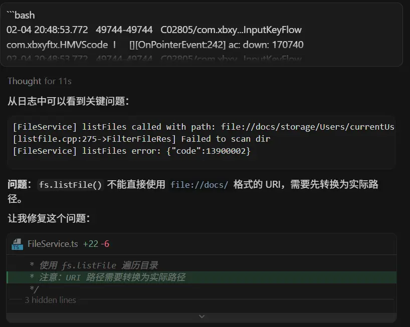

额，果然，鸿蒙文件系统的相关资料还是太少了，对于这个路径的写法很容易直接套用其他操作系统的导致这种问题发生。

```log
02-04 20:58:33.538   64993-1183    C02D10/com.xbx...RemoteService  com.xbxyftx.HMVScode  I     GetHiViewRemoteService: refresh remote service instance.
02-04 20:58:33.543   64993-64993   C03F00/com.xbx...e/ArkCompiler  com.xbxyftx.HMVScode  I     [gc] IdleGCTrigger: trigger full gc
02-04 20:58:36.426   64993-64993   C02805/com.xbxy...InputKeyFlow  com.xbxyftx.HMVScode  I     [][OnPointerEvent:242] ac: down: 172290
02-04 20:58:36.426   64993-64993   C02805/com.xbxy...InputKeyFlow  com.xbxyftx.HMVScode  I     [P:D:172290][OnPointerEvent:649] recv
02-04 20:58:36.426   64993-64993   C04213/com.xbxy...InputKeyFlow  com.xbxyftx.HMVScode  I     HandleInputEvent: eid:12,InputId:172290,wid:1173,ac:2
02-04 20:58:36.427   64993-64993   C03951/com.xbxy...InputKeyFlow  com.xbxyftx.HMVScode  I     [(100000:100000:scope)] ITK Id:172290, fId:0, T:0, I=0, M=0
02-04 20:58:36.428   64993-64993   C03951/com.xbxy...InputKeyFlow  com.xbxyftx.HMVScode  I     [(100000:100000:scope)] ITK Id:172290, TTHNI:fId: 0{ T: page, D: 6 };{ T: Scroll, D: 12 };
02-04 20:58:36.428   64993-64993   C03951/com.xbxy...InputKeyFlow  com.xbxyftx.HMVScode  I     [(100000:100000:scope)] ITK Id:172290, TTHRTI: T ClickRecognizer info: { T: Scroll }; { T: Row };T PanRecognizer info: { T: Scroll };
02-04 20:58:36.429   64993-64993   C03919/com.xbx...InputTracking  com.xbxyftx.HMVScode  I     [(100000:100000:scope)] Consumed id:172290, last id:172288
02-04 20:58:36.429   64993-64993   C04213/com.xbxy...InputKeyFlow  com.xbxyftx.HMVScode  I     ConsumePointerEventInner: InputId:172290,wid:1173,pointId:0,srcType:2,rect:[0,0,2800,1840],notify:1
02-04 20:58:36.429   64993-64993   C02805/com.xbxy...InputKeyFlow  com.xbxyftx.HMVScode  I     [][OnPointerEvent:242] ac: move: 172291
02-04 20:58:36.499   64993-64993   C02805/com.xbxy...InputKeyFlow  com.xbxyftx.HMVScode  I     [][OnPointerEvent:242] ac: move, first: 172292-(2026-02-04 20:58:36.433ms), 172302, count: 11, last: ac: up: 172303
02-04 20:58:36.499   64993-64993   C02805/com.xbxy...InputKeyFlow  com.xbxyftx.HMVScode  I     [P:U:172303][OnPointerEvent:649] recv
02-04 20:58:36.499   64993-64993   C04213/com.xbxy...InputKeyFlow  com.xbxyftx.HMVScode  I     HandleInputEvent: eid:13,InputId:172303,wid:1173,ac:4
02-04 20:58:36.500   64993-64993   C03951/com.xbxy...InputKeyFlow  com.xbxyftx.HMVScode  I     [(100000:100000:scope)] ITK Id:172303, fId:0, T:1, I=0, M=0
02-04 20:58:36.500   64993-64993   C0391E/com.xbx...de/AceGesture  com.xbxyftx.HMVScode  I     [(100000:100000:scope)] Click try accept
02-04 20:58:36.500   64993-64993   C0390B/com.xbx...AceScrollable  com.xbxyftx.HMVScode  I     [(100000:100000:scope)] Scrollable GestureJudge:0, 0
02-04 20:58:36.500   64993-64993   C0391E/com.xbx...de/AceGesture  com.xbxyftx.HMVScode  I     [(100000:100000:scope)] Click gesture judge reject
02-04 20:58:36.500   64993-64993   C0391E/com.xbx...de/AceGesture  com.xbxyftx.HMVScode  I     [(100000:100000:scope)] Click try accept
02-04 20:58:36.500   64993-64993   C03951/com.xbxy...InputKeyFlow  com.xbxyftx.HMVScode  I     [(100000:100000:scope)] CLK RACC, T: Row
02-04 20:58:36.501   64993-64993   A03D00/com.xbx...MVScode/JSAPP  com.xbxyftx.HMVScode  I     [picker] ParseWindow: not window mode.
02-04 20:58:36.501   64993-64993   A03D00/com.xbx...MVScode/JSAPP  com.xbxyftx.HMVScode  I     [Index] Opening folder picker...
02-04 20:58:36.501   64993-64993   A03D00/com.xbx...MVScode/JSAPP  com.xbxyftx.HMVScode  I     [picker] parseDocumentPickerSelectOption start
02-04 20:58:36.501   64993-64993   A03D00/com.xbx...MVScode/JSAPP  com.xbxyftx.HMVScode  I     [picker] parseDocumentPickerSelectOption end
02-04 20:58:36.501   64993-64993   A03D00/com.xbx...MVScode/JSAPP  com.xbxyftx.HMVScode  I     [picker] modalPicker start 
02-04 20:58:36.501   64993-64993   C01304/com.xbx...anagerService  com.xbxyftx.HMVScode  I     [picker_n_exporter.cpp(StartModalPicker:499)][picker]: StartModalPicker begin.
02-04 20:58:36.501   64993-64993   C01304/com.xbx...anagerService  com.xbxyftx.HMVScode  I     [picker_n_exporter.cpp(ParseArgsStartModalPicker:480)][picker]: ParseArgsStartModalPicker begin.
02-04 20:58:36.501   64993-64993   C01304/com.xbx...anagerService  com.xbxyftx.HMVScode  I     [picker_n_exporter.cpp(AsyncContextSetStaticObjectInfo:444)][picker]: AsyncContextSetStaticObjectInfo begin.
02-04 20:58:36.501   64993-64993   C01304/com.xbx...anagerService  com.xbxyftx.HMVScode  I     [picker_n_exporter.cpp(StartPickerExtension:389)][picker]: StartPickerExtension begin.
02-04 20:58:36.501   64993-64993   C01304/com.xbx...anagerService  com.xbxyftx.HMVScode  I     [picker_n_exporter.cpp(StartPickerExtension:395)][picker] Will get uiContent by context.
02-04 20:58:36.501   64993-64993   C01304/com.xbx...anagerService  com.xbxyftx.HMVScode  I     [picker_n_exporter.cpp(StartPickerExtension:414)][picker]: SetParam end, udkey = 
02-04 20:58:36.501   64993-64993   C01304/com.xbx...anagerService  com.xbxyftx.HMVScode  I     [picker_n_exporter.cpp(StartPickerExtension:428)][picker]: will CreateModalUIExtension by extType: filePicker, pickerType: select
02-04 20:58:36.501   64993-64993   C0392A/com.xbx...sionComponent  com.xbxyftx.HMVScode  I     [(100000:100000:scope)] [@95][ID: 1] The modal UIExtension is created.
02-04 20:58:36.501   64993-64993   C0392A/com.xbx...sionComponent  com.xbxyftx.HMVScode  I     [(100000:100000:scope)] Create UIExtensionNode
02-04 20:58:36.502   64993-64993   C0392A/com.xbx...sionComponent  com.xbxyftx.HMVScode  I     [(100000:100000:scope)] [@979][ID: 1] RegisterPipelineEvent
02-04 20:58:36.502   64993-64993   C0392A/com.xbx...sionComponent  com.xbxyftx.HMVScode  I     [(100000:100000:scope)] [@931][ID: 1] OnAttachToFrameNode
02-04 20:58:36.502   64993-64993   C0392A/com.xbx...sionComponent  com.xbxyftx.HMVScode  I     [(100000:100000:scope)] [@454][ID: 1] The current state is 'NONE' when UpdateWant, needCheck: '0'.
02-04 20:58:36.502   64993-64993   C0392A/com.xbx...sionComponent  com.xbxyftx.HMVScode  I     [(100000:100000:scope)] [@481][ID: 1] The ability KeyAsync 0, uIExtensionUsage: 0.
02-04 20:58:36.502   64993-64993   C0392A/com.xbx...sionComponent  com.xbxyftx.HMVScode  I     [(100000:100000:scope)] [@645][ID: 1] The session is created with bundle=, ability=, componentId=126.
02-04 20:58:36.502   64993-64993   C04217/com.xbxy...WMSAttribute  com.xbxyftx.HMVScode  I     GetExtensionConfig: waterfall: 0, winId: 1173
02-04 20:58:36.502   64993-64993   C04209/com.xbx...Scode/WMSImms  com.xbxyftx.HMVScode  I     GetGestureBackEnabled: win 1173 enable 1
02-04 20:58:36.502   64993-64993   C0392A/com.xbx...sionComponent  com.xbxyftx.HMVScode  I     [(100000:100000:scope)] [@688][ID: 1] Want param isNotifyOccupiedAreaChange is 1, realHostWindowId: 1173, parentWindowType: 1
02-04 20:58:36.502   64993-65235   C0420A/com.xbx...Scode/WMSLife  com.xbxyftx.HMVScode  I     GeneratePersistentId: persistentId: 0, persistentId_: 1339953155
02-04 20:58:36.502   64993-65235   C0420D/com.xbx...code/WMSUiext  com.xbxyftx.HMVScode  I     persistentId: 1339953155, bundleName: , moduleName: , abilityName: , isDensityFollowHost_: 0, density_: 1.800000
02-04 20:58:36.502   64993-64993   C0392A/com.xbx...sionComponent  com.xbxyftx.HMVScode  I     [(100000:100000:scope)] [@868][ID: 1] The state is changing from 'NONE' to 'FOREGROUND'.
02-04 20:58:36.502   64993-64993   C0392A/com.xbx...sionComponent  com.xbxyftx.HMVScode  I     [(100000:100000:scope)] [@980][ID: 1] NotifyForeground, persistentid = 1339953155, hostWindowId = 1173, windowSceneId = -1, IsSceneBoardWindow: 0, componentId=126.
02-04 20:58:36.502   64993-64993   C04217/com.xbxy...WMSAttribute  com.xbxyftx.HMVScode  I     GetExtensionConfig: waterfall: 0, winId: 1173
02-04 20:58:36.502   64993-64993   C04209/com.xbx...Scode/WMSImms  com.xbxyftx.HMVScode  I     GetGestureBackEnabled: win 1173 enable 1
02-04 20:58:36.502   64993-65235   C0420D/com.xbx...code/WMSUiext  com.xbxyftx.HMVScode  I     Activate session, id=1339953155
02-04 20:58:36.503   64993-64993   C0392A/com.xbx...sionComponent  com.xbxyftx.HMVScode  I     [(100000:100000:scope)] [@223][ID: 1] OnAttachContext newInstanceId: 100000, oldInstanceId: 100000, isMoving: 0, detachContextHappened: 0.
02-04 20:58:36.503   64993-64993   C0392A/com.xbx...sionComponent  com.xbxyftx.HMVScode  I     [(100000:100000:scope)] [@185][ID: 1] OnAttachToMainTree, isMoving: 0
02-04 20:58:36.503   64993-64993   C0390D/com.xbx...de/AceOverlay  com.xbxyftx.HMVScode  I     [(100000:100000:scope)] modalNode->GetParent() 3 mark IsProhibitedAddChildNode when sessionId -1339953155,prohibitedRemoveByRouter: 0, isAllowAddChildBelowModalUec: 0.
02-04 20:58:36.503   64993-64993   C0391C/com.xbx...code/AceFocus  com.xbxyftx.HMVScode  I     [(100000:100000:scope)] view: ModalPage/127 show
02-04 20:58:36.503   64993-64993   C0391C/com.xbx...code/AceFocus  com.xbxyftx.HMVScode  I     [(100000:100000:scope)] View: page/23 lost focus
02-04 20:58:36.503   64993-64993   C0391C/com.xbx...code/AceFocus  com.xbxyftx.HMVScode  I     [(100000:100000:scope)] Scope(Stack/26) has no last focusNode.
02-04 20:58:36.503   64993-64993   C03922/com.xbx...AceNavigation  com.xbxyftx.HMVScode  I     [(100000:100000:scope)] can't find inner navigation
02-04 20:58:36.503   64993-64993   C0392A/com.xbx...sionComponent  com.xbxyftx.HMVScode  I     [(100000:100000:scope)] [com.xbxyftx.HMVScode][entry][100000]: create modal page, sessionId=1339953155, isProhibitBack=0, isAsyncModalBinding=0, isAllowedBeCovered=0, prohibitedRemoveByRouter=0, isAllowAddChildBelowModalUec=0, prohibitedRemoveByNavigation=1
02-04 20:58:36.503   64993-1183    C03924/com.xbx...Accessibility  com.xbxyftx.HMVScode  I     [(100000:100000:scope)] send accessibility componentType:ModalPage event:536870912 accessibilityId:120
02-04 20:58:36.503   64993-1183    C03924/com.xbx...Accessibility  com.xbxyftx.HMVScode  I     [(100000:100000:scope)] send accessibility componentType:Row event:1 accessibilityId:50
02-04 20:58:36.503   64993-64993   C03919/com.xbx...InputTracking  com.xbxyftx.HMVScode  I     [(100000:100000:scope)] Consumed id:172303, last id:172302
02-04 20:58:36.503   64993-64993   C04213/com.xbxy...InputKeyFlow  com.xbxyftx.HMVScode  I     ConsumePointerEventInner: InputId:172303,wid:1173,pointId:0,srcType:2,rect:[0,0,2800,1840],notify:1
02-04 20:58:36.504   64993-1488    C01304/com.xbx...anagerService  com.xbxyftx.HMVScode  I     [picker_n_exporter.cpp(StartModalPickerExecute:60)][picker]: StartModalPickerExecute begin
02-04 20:58:36.509   64993-65235   C0420D/com.xbx...code/WMSUiext  com.xbxyftx.HMVScode  I     Activate ret:0, persistentId:1339953155
02-04 20:58:36.509   64993-64993   C0392A/com.xbx...sionComponent  com.xbxyftx.HMVScode  I     [(100000:100000:scope)] [@1258][ID: 1] NotifyDisplayArea displayArea=RectT (0.00, 0.00) - [2800.00 x 1840.00], curWindow=Rect (0.00, 0.00) - [2800.00 x 1840.00], reason=0, duration=0, persistentId=1339953155, componentId=126.
02-04 20:58:36.509   64993-64993   C0391C/com.xbx...code/AceFocus  com.xbxyftx.HMVScode  I     [(100000:100000:scope)] Request focus on focusView: ModalPage/127.
02-04 20:58:36.509   64993-64993   C0391C/com.xbx...code/AceFocus  com.xbxyftx.HMVScode  I     [(100000:100000:scope)] FocusSwitch end, Stack/secure_field onBlur, ModalPage/secure_field onFocus, start: 2, end: 1, update: 2
02-04 20:58:36.509   64993-64993   C03933/com.xbx...e/AceKeyboard  com.xbxyftx.HMVScode  I     [(100000:100000:scope)] current focus node: (ModalPage/127). isDynamic: 0
02-04 20:58:36.509   64993-64993   C03933/com.xbx...e/AceKeyboard  com.xbxyftx.HMVScode  I     [(100000:100000:scope)] FrameNode(ModalPage/127) notNeedSoftKeyboard.
02-04 20:58:36.839   64993-65171   C01406/com.xbx...code/OHOS::RS  com.xbxyftx.HMVScode  I     RSSurfaceNode::Unmarshalling, Node: 2675764625409, Name: com.huawei.hmos.filemanagerFilePickerUIExtAbility
02-04 20:58:36.840   64993-65235   C0420A/com.xbx...Scode/WMSLife  com.xbxyftx.HMVScode  I     ConnectInner: [id: 1339953155] state: 0,isTerminating:0, callingPid:623, disableDelegator:0
02-04 20:58:36.840   64993-65235   C04202/com.xbx...Scode/WMSMain  com.xbxyftx.HMVScode  I     InitSessionPropertyWhenConnect: [id: 1339953155] requestedOrientation: 0, defaultRequestedOrientation: 0, userRequestedOrientation: 0
02-04 20:58:36.840   64993-65235   C0420C/com.xbx...code/WMSEvent  com.xbxyftx.HMVScode  I     SetCallingPid: id:1339953155, 623
02-04 20:58:36.840   64993-65235   C0420A/com.xbx...Scode/WMSLife  com.xbxyftx.HMVScode  I     sessionStateChangeFunc is null
02-04 20:58:36.840   64993-65235   C0420A/com.xbx...Scode/WMSLife  com.xbxyftx.HMVScode  I     sessionStateChangeNotifyManagerFunc is null
02-04 20:58:36.840   64993-65235   C04201/com.xbx....HMVScode/DMS  com.xbxyftx.HMVScode  E     GetScreenSession: Error found screen session with id: 18446744073709551615
02-04 20:58:36.840   64993-65235   C0420A/com.xbx...Scode/WMSLife  com.xbxyftx.HMVScode  I     ConnectInner: set session id 1339953155 disableDelegator 0
02-04 20:58:36.840   64993-64993   C0392A/com.xbx...sionComponent  com.xbxyftx.HMVScode  I     [(-2:100000:singleton)] [@575][ID: 1] The session is connected and the current state is 'FOREGROUND'.
02-04 20:58:36.841   64993-64993   C0392A/com.xbx...sionComponent  com.xbxyftx.HMVScode  I     [(100000:100000:scope)] [@1455][ID: 1] OnRemoteReady the current state is 'FOREGROUND'.
02-04 20:58:36.841   64993-64993   C0391C/com.xbx...code/AceFocus  com.xbxyftx.HMVScode  I     [(100000:100000:scope)] UIExtensionComponent/secure_field RequestFocusImmediately isOnMainTree:1
02-04 20:58:36.841   64993-64993   C0392A/com.xbx...sionComponent  com.xbxyftx.HMVScode  I     [(100000:100000:scope)] [@869][ID: 1] focused state notified to uiextension, persistentid = 1339953155, componentId=126.
02-04 20:58:36.841   64993-64993   C0391C/com.xbx...code/AceFocus  com.xbxyftx.HMVScode  I     [(100000:100000:scope)] FocusSwitch end, ModalPage/secure_field onBlur, UIExtensionComponent/secure_field onFocus, start: 2, end: 1, update: 2
02-04 20:58:36.841   64993-64993   C03933/com.xbx...e/AceKeyboard  com.xbxyftx.HMVScode  I     [(100000:100000:scope)] current focus node: (UIExtensionComponent/126). isDynamic: 0
02-04 20:58:36.841   64993-64993   C03933/com.xbx...e/AceKeyboard  com.xbxyftx.HMVScode  I     [(100000:100000:scope)] UIExtension(UIExtensionComponent/126) not need process.
02-04 20:58:36.841   64993-64993   C0392A/com.xbx...sionComponent  com.xbxyftx.HMVScode  I     [(100000:100000:scope)] [@869][ID: 1] focused state notified to uiextension, persistentid = 1339953155, componentId=126.
02-04 20:58:36.841   64993-64993   C0392A/com.xbx...sionComponent  com.xbxyftx.HMVScode  I     [(100000:100000:scope)] UIExtensionManager register listener
02-04 20:58:36.841   64993-64993   C04217/com.xbxy...WMSAttribute  com.xbxyftx.HMVScode  I     GetExtensionConfig: waterfall: 0, winId: 1173
02-04 20:58:36.841   64993-64993   C04209/com.xbx...Scode/WMSImms  com.xbxyftx.HMVScode  I     GetGestureBackEnabled: win 1173 enable 1
02-04 20:58:36.841   64993-64993   C0395F/com.xbx...amicComponent  com.xbxyftx.HMVScode  I     [(100000:100000:scope)] Create UIExtensionAccessibilityChildTreeCallback
02-04 20:58:36.841   64993-64993   C0392A/com.xbx...sionComponent  com.xbxyftx.HMVScode  I     [(100000:100000:scope)] [@1703][ID: 1] treeId: 0, id: 119
02-04 20:58:36.841   64993-64993   C0392A/com.xbx...sionComponent  com.xbxyftx.HMVScode  I     [(100000:100000:scope)] [@1697][ID: 1] UIExtension: 119 register child tree, realHostWindowId: 1173
02-04 20:58:36.841   64993-64993   C0392A/com.xbx...sionComponent  com.xbxyftx.HMVScode  I     [(100000:100000:scope)] [@2169][ID: 1] RegisterUIExtBusinessConsumeCallback businessCode=1002.
02-04 20:58:36.841   64993-64993   C0392A/com.xbx...sionComponent  com.xbxyftx.HMVScode  I     [(100000:100000:scope)] [@2169][ID: 1] RegisterUIExtBusinessConsumeCallback businessCode=1001.
02-04 20:58:36.841   64993-64993   C0392A/com.xbx...sionComponent  com.xbxyftx.HMVScode  I     [(100000:100000:scope)] [@2169][ID: 1] RegisterUIExtBusinessConsumeCallback businessCode=3002.
02-04 20:58:36.841   64993-64993   C0392A/com.xbx...sionComponent  com.xbxyftx.HMVScode  I     [(100000:100000:scope)] [@2184][ID: 1] NotifyHostWindowMode: instanceId = 100000, followStrategy = 0, mode = 1
02-04 20:58:36.842   64993-64993   C0392A/com.xbx...sionComponent  com.xbxyftx.HMVScode  I     [(100000:100000:scope)] UIExtensionSurface: isDisappearing = 0, paintRect = RectT (0.00, 0.00) - [2800.00 x 1840.00].
02-04 20:58:36.842   64993-64993   C0392A/com.xbx...sionComponent  com.xbxyftx.HMVScode  I     [(100000:100000:scope)] [@1258][ID: 1] NotifyDisplayArea displayArea=RectT (0.00, 0.00) - [2800.00 x 1840.00], curWindow=Rect (0.00, 0.00) - [2800.00 x 1840.00], reason=0, duration=0, persistentId=1339953155, componentId=126.
02-04 20:58:36.842   64993-64993   C04201/com.xbx....HMVScode/DMS  com.xbxyftx.HMVScode  E     GetScreenSession: Error found screen session with id: 18446744073709551615
02-04 20:58:36.842   64993-64993   C0392A/com.xbx...sionComponent  com.xbxyftx.HMVScode  I     [(100000:100000:scope)] [@860][ID: 1] Notify uiextension, persistentid = 1339953155 to clear the focus state, componentId=126.
02-04 20:58:36.842   64993-64993   C01402/com.xbx...VScode/RSNode  com.xbxyftx.HMVScode  I     RSNode::AddChild, Id: 279142809469032, SurfaceNode:[Id: 2675764625409, name: com.huawei.hmos.filemanagerFilePickerUIExtAbility]
02-04 20:58:36.842   64993-64993   C0392A/com.xbx...sionComponent  com.xbxyftx.HMVScode  I     [(100000:100000:scope)] [@1825][ID: 1] HandleVisibleAreaChange visible: 1, curVisible: 0, ratio: 1.000000, displayArea: RectT (0.00, 0.00) - [2800.00 x 1840.00].
02-04 20:58:36.842   64993-64993   C0392A/com.xbx...sionComponent  com.xbxyftx.HMVScode  I     [(100000:100000:scope)] [@1656][ID: 1] The component is changing from 'visible' to 'visible'.
02-04 20:58:36.849   64993-65171   C0420A/com.xbx...Scode/WMSLife  com.xbxyftx.HMVScode  I     Foreground: [id: 1339953155] state:1, isTerminating:0
02-04 20:58:36.849   64993-65171   C0420A/com.xbx...Scode/WMSLife  com.xbxyftx.HMVScode  I     SetActive: new active:1, id:1339953155, state:2
02-04 20:58:36.850   64993-65194   C0420D/com.xbx...code/WMSUiext  com.xbxyftx.HMVScode  I     NotifyExtensionSecureLimitChange: windowId: 1173, isLimite: 1
02-04 20:58:36.850   64993-65235   C0420A/com.xbx...Scode/WMSLife  com.xbxyftx.HMVScode  I     sessionStateChangeFunc is null
02-04 20:58:36.850   64993-65235   C0420A/com.xbx...Scode/WMSLife  com.xbxyftx.HMVScode  I     sessionStateChangeNotifyManagerFunc is null
02-04 20:58:36.850   64993-65235   C0420A/com.xbx...Scode/WMSLife  com.xbxyftx.HMVScode  I     sessionStateChangeFunc is null
02-04 20:58:36.850   64993-65235   C0420A/com.xbx...Scode/WMSLife  com.xbxyftx.HMVScode  I     sessionStateChangeNotifyManagerFunc is null
02-04 20:58:36.935   64993-65194   C04207/com.xbx...code/WMSFocus  com.xbxyftx.HMVScode  I     UpdateFocusState: focus: 0, id: 1173
02-04 20:58:36.935   64993-65194   C03900/com.xbx....HMVScode/Ace  com.xbxyftx.HMVScode  I     [(-1:100000:singleton)] [com.xbxyftx.HMVScode][entry][100000]: window unfocus
02-04 20:58:36.935   64993-64993   C03900/com.xbx....HMVScode/Ace  com.xbxyftx.HMVScode  I     [(100000:100000:scope)] Update application state , state: ON_INACTIVE
02-04 20:58:36.935   64993-64993   C0391C/com.xbx...code/AceFocus  com.xbxyftx.HMVScode  I     [(100000:100000:scope)] Window: 1173 lost focus.
02-04 20:58:36.935   64993-64993   C0391D/com.xbx...code/AceMouse  com.xbxyftx.HMVScode  I     [(100000:100000:scope)] VsyncMouseFormat mouseFormat_ and lastVsyncMouseFormat_ = 0 is same.
02-04 20:58:36.935   64993-64993   C0391C/com.xbx...code/AceFocus  com.xbxyftx.HMVScode  I     [(100000:100000:scope)] UIExtensionComponent/secure_fieldtrigger onBlurInternal by 1
02-04 20:58:36.935   64993-64993   C0392A/com.xbx...sionComponent  com.xbxyftx.HMVScode  I     [(100000:100000:scope)] Blur Internal.
02-04 20:58:36.935   64993-64993   C0392A/com.xbx...sionComponent  com.xbxyftx.HMVScode  I     [(100000:100000:scope)] [@860][ID: 1] Notify uiextension, persistentid = 1339953155 to clear the focus state, componentId=126.
02-04 20:58:36.935   64993-64993   C0392A/com.xbx...sionComponent  com.xbxyftx.HMVScode  I     [(100000:100000:scope)] [@869][ID: 1] unfocused state notified to uiextension, persistentid = 1339953155, componentId=126.
02-04 20:58:36.935   64993-64993   C0392A/com.xbx...sionComponent  com.xbxyftx.HMVScode  I     [(100000:100000:scope)] [@860][ID: 1] Notify uiextension, persistentid = 1339953155 to clear the focus state, componentId=126.
02-04 20:58:36.938   64993-65194   C04207/com.xbx...code/WMSFocus  com.xbxyftx.HMVScode  I     NotifyHighlightChange: windowId: 1173, isHighlight: 0,
02-04 20:58:36.938   64993-65194   C03900/com.xbx....HMVScode/Ace  com.xbxyftx.HMVScode  I     [(-1:100000:singleton)] [com.xbxyftx.HMVScode][entry][100000]:window unactive
02-04 20:58:36.938   64993-64993   C03900/com.xbx....HMVScode/Ace  com.xbxyftx.HMVScode  I     [(100000:100000:scope)] Update application state , state: ON_INACTIVE
02-04 20:58:37.536   64993-1392    C01719/com.xbx...HMVScode/ffrt  com.xbxyftx.HMVScode  W     7:RecordSymbolAndBacktrace:397 Process:com.xbxyftx.HMVScode,Tid:1488,Qos:2,CWorker:2,EWorker:1,SWorker:1,TaskType:2,timeout:1s
02-04 20:58:37.537   64993-1392    C01719/com.xbx...HMVScode/ffrt  com.xbxyftx.HMVScode  W     8:RecordSymbolAndBacktrace:405 Tid:1488, Name:OS_FFRT_2_4
                                                                                               #00 pc 00000000001d94f0 /lib/ld-musl-aarch64.so.1
                                                                                               #01 pc 00000000000d57e0 /system/lib64/libc++.so
                                                                                               #02 pc 0000000000023d04 /system/lib64/module/file/libpicker.z.so
                                                                                               #03 pc 0000000000077a0c /system/lib64/platformsdk/libace_napi.z.so
                                                                                               #04 pc 0000000000013b0c /system/lib64/platformsdk/libuv.so
                                                                                               #05 pc 00000000000b2d6c /system/lib64/ndk/libffrt.so
                                                                                               #06 pc 00000000000b2bc4 /system/lib64/ndk/libffrt.so
                                                                                               #07 pc 00000000000aecb0 /system/lib64/ndk/libffrt.so
                                                                                               #08 pc 00000000000627ac /system/lib64/ndk/libffrt.so
                                                                                               #09 pc 0000000000062a14 /system/lib64/ndk/libffrt.so
                                                                                               #10 pc 0000000000062634 /system/lib64/ndk/libffrt.so
                                                                                               #11 pc 0000000000062324 /system/lib64/ndk/libffrt.so
                                                                                               #12 pc 00000000001d1658 /lib/ld-musl-aarch64.so.1
02-04 20:58:41.539   64993-1392    C01719/com.xbx...HMVScode/ffrt  com.xbxyftx.HMVScode  W     9:RecordSymbolAndBacktrace:397 Process:com.xbxyftx.HMVScode,Tid:1488,Qos:2,CWorker:2,EWorker:1,SWorker:0,TaskType:2,timeout:5s
02-04 20:58:41.540   64993-1392    C01719/com.xbx...HMVScode/ffrt  com.xbxyftx.HMVScode  W     10:RecordSymbolAndBacktrace:405 Tid:1488, Name:OS_FFRT_2_4
                                                                                               #00 pc 00000000001d94f0 /lib/ld-musl-aarch64.so.1
                                                                                               #01 pc 00000000000d57e0 /system/lib64/libc++.so
                                                                                               #02 pc 0000000000023d04 /system/lib64/module/file/libpicker.z.so
                                                                                               #03 pc 0000000000077a0c /system/lib64/platformsdk/libace_napi.z.so
                                                                                               #04 pc 0000000000013b0c /system/lib64/platformsdk/libuv.so
                                                                                               #05 pc 00000000000b2d6c /system/lib64/ndk/libffrt.so
                                                                                               #06 pc 00000000000b2bc4 /system/lib64/ndk/libffrt.so
                                                                                               #07 pc 00000000000aecb0 /system/lib64/ndk/libffrt.so
                                                                                               #08 pc 00000000000627ac /system/lib64/ndk/libffrt.so
                                                                                               #09 pc 0000000000062a14 /system/lib64/ndk/libffrt.so
                                                                                               #10 pc 0000000000062634 /system/lib64/ndk/libffrt.so
                                                                                               #11 pc 0000000000062324 /system/lib64/ndk/libffrt.so
                                                                                               #12 pc 00000000001d1658 /lib/ld-musl-aarch64.so.1
02-04 20:58:43.141   64993-65194   C01332/com.xbx...ode/UIAbility  com.xbxyftx.HMVScode  W     [ui_ability_thread434]null abilityHandler_ or requestCode is -1
02-04 20:58:43.141   64993-64993   C0392A/com.xbx...sionComponent  com.xbxyftx.HMVScode  I     [(-2:100000:singleton)] [@1547][ID: 1] OnResult the state is changing from 'FOREGROUND' to 'DESTRUCTION'.
02-04 20:58:43.141   64993-64993   C01304/com.xbx...anagerService  com.xbxyftx.HMVScode  I     [modal_ui_callback.cpp(OnResultForModal:59)][picker] OnResultForModal enter. resultCode is 0,
02-04 20:58:43.142   64993-65171   C0420A/com.xbx...Scode/WMSLife  com.xbxyftx.HMVScode  I     Background: Background ExtensionSession, id: 1339953155, state: 3
02-04 20:58:43.142   64993-65194   C0420D/com.xbx...code/WMSUiext  com.xbxyftx.HMVScode  I     NotifyExtensionSecureLimitChange: windowId: 1173, isLimite: 0
02-04 20:58:43.142   64993-65235   C0420A/com.xbx...Scode/WMSLife  com.xbxyftx.HMVScode  I     sessionStateChangeFunc is null
02-04 20:58:43.142   64993-65235   C0420A/com.xbx...Scode/WMSLife  com.xbxyftx.HMVScode  I     sessionStateChangeNotifyManagerFunc is null
02-04 20:58:43.142   64993-64993   C0392A/com.xbx...sionComponent  com.xbxyftx.HMVScode  I     [(100000:100000:scope)] [@2275][ID: 1] UEC UpdatWMSUIExtProperty state=DESTRUCTION.
02-04 20:58:43.142   64993-65235   C0420A/com.xbx...Scode/WMSLife  com.xbxyftx.HMVScode  I     sessionStateChangeFunc is null
02-04 20:58:43.142   64993-65235   C0420A/com.xbx...Scode/WMSLife  com.xbxyftx.HMVScode  I     sessionStateChangeNotifyManagerFunc is null
02-04 20:58:43.148   64993-65194   C0420A/com.xbx...Scode/WMSLife  com.xbxyftx.HMVScode  I     Disconnect: [id: 1339953155] Disconnect session, state: 5
02-04 20:58:43.148   64993-65235   C0420A/com.xbx...Scode/WMSLife  com.xbxyftx.HMVScode  I     sessionStateChangeFunc is null
02-04 20:58:43.148   64993-65235   C0420A/com.xbx...Scode/WMSLife  com.xbxyftx.HMVScode  I     sessionStateChangeNotifyManagerFunc is null
02-04 20:58:43.148   64993-65235   C0420A/com.xbx...Scode/WMSLife  com.xbxyftx.HMVScode  I     sessionStateChangeFunc is null
02-04 20:58:43.148   64993-65235   C0420A/com.xbx...Scode/WMSLife  com.xbxyftx.HMVScode  I     sessionStateChangeNotifyManagerFunc is null
02-04 20:58:43.148   64993-64993   C0392A/com.xbx...sionComponent  com.xbxyftx.HMVScode  I     [(-2:100000:singleton)] [@790][ID: 1] The session is disconnected and the current state is 'DESTRUCTION'.
02-04 20:58:43.148   64993-64993   C0392A/com.xbx...sionComponent  com.xbxyftx.HMVScode  I     [(-2:100000:singleton)] [@1489][ID: 1] OnRelease the state is changing from 'DESTRUCTION' to 'DESTRUCTION' and releaseCode = 0.
02-04 20:58:43.148   64993-64993   C01304/com.xbx...anagerService  com.xbxyftx.HMVScode  I     [modal_ui_callback.cpp(OnRelease:36)][picker] OnRelease enter. release code is 0
02-04 20:58:43.148   64993-64993   C0392A/com.xbx...sionComponent  com.xbxyftx.HMVScode  I     [(-2:100000:singleton)] [com.xbxyftx.HMVScode][entry][100000]: close modal page, sessionId=1339953155
02-04 20:58:43.148   64993-64993   C0392A/com.xbx...sionComponent  com.xbxyftx.HMVScode  I     [(-2:100000:singleton)] [@1021][ID: 1] OnReleaseDone, persistentid = 1339953155, componentId=126.
02-04 20:58:43.149   64993-64993   C03900/com.xbx....HMVScode/Ace  com.xbxyftx.HMVScode  W     [(100000:100000:scope)] The sessionId 1339953155 does not exist
02-04 20:58:43.149   64993-65235   C0420D/com.xbx...code/WMSUiext  com.xbxyftx.HMVScode  I     Destroy session done with persistentId: 1339953155
02-04 20:58:43.149   64993-64993   C03922/com.xbx...AceNavigation  com.xbxyftx.HMVScode  I     [(100000:100000:scope)] can't find inner navigation
02-04 20:58:43.149   64993-64993   C03922/com.xbx...AceNavigation  com.xbxyftx.HMVScode  I     [(100000:100000:scope)] can't find inner navigation
02-04 20:58:43.149   64993-65235   C01336/com.xbx....HMVScode/AMS  com.xbxyftx.HMVScode  I     [AMC459]name:  , persistentId: 1339953155
02-04 20:58:43.149   64993-64993   C0390D/com.xbx...de/AceOverlay  com.xbxyftx.HMVScode  I     [(100000:100000:scope)] ModalPage node remove from parent node
02-04 20:58:43.149   64993-64993   C0391C/com.xbx...code/AceFocus  com.xbxyftx.HMVScode  I     [(100000:100000:scope)] view: ModalPage/127 close
02-04 20:58:43.149   64993-64993   C0391C/com.xbx...code/AceFocus  com.xbxyftx.HMVScode  I     [(100000:100000:scope)] View: ModalPage/127 lost focus
02-04 20:58:43.149   64993-64993   C0392A/com.xbx...sionComponent  com.xbxyftx.HMVScode  I     [(100000:100000:scope)] [@306][ID: 1] OnDetachContext instanceId: 100000, isMoving: 0, isOnDetachContext: 0.
02-04 20:58:43.149   64993-64993   C0392A/com.xbx...sionComponent  com.xbxyftx.HMVScode  I     [(100000:100000:scope)] UIExtensionManager unregister listener
02-04 20:58:43.149   64993-64993   C0392A/com.xbx...sionComponent  com.xbxyftx.HMVScode  I     [(100000:100000:scope)] [@347][ID: 1] UnRegisterUIExtensionManagerEvent
02-04 20:58:43.149   64993-64993   C0392A/com.xbx...sionComponent  com.xbxyftx.HMVScode  I     [(100000:100000:scope)] [@1010][ID: 1] UnRegisterPipelineEvent
02-04 20:58:43.149   64993-64993   C0392A/com.xbx...sionComponent  com.xbxyftx.HMVScode  I     [(100000:100000:scope)] [@1825][ID: 1] HandleVisibleAreaChange visible: 0, curVisible: 1, ratio: 0.000000, displayArea: RectT (0.00, 0.00) - [2800.00 x 1840.00].
02-04 20:58:43.149   64993-64993   C0392A/com.xbx...sionComponent  com.xbxyftx.HMVScode  I     [(100000:100000:scope)] [@1656][ID: 1] The component is changing from 'visible' to 'invisible'.
02-04 20:58:43.149   64993-64993   C0392A/com.xbx...sionComponent  com.xbxyftx.HMVScode  I     [(100000:100000:scope)] [@205][ID: 1] OnDetachFromMainTree, isMoving: 0
02-04 20:58:43.149   64993-1383    C03924/com.xbx...Accessibility  com.xbxyftx.HMVScode  I     [(100000:100000:scope)] send accessibility componentType:ModalPage event:134217728 accessibilityId:120
02-04 20:58:43.149   64993-64993   C0390D/com.xbx...de/AceOverlay  com.xbxyftx.HMVScode  I     [(100000:100000:scope)] ResetRootNode -1339953155.
02-04 20:58:43.151   64993-64993   C0392A/com.xbx...sionComponent  com.xbxyftx.HMVScode  I     [(100000:100000:scope)] Destory UIExtensionNode
02-04 20:58:43.151   64993-64993   C0392A/com.xbx...sionComponent  com.xbxyftx.HMVScode  I     [(100000:100000:scope)] [@1010][ID: 1] UnRegisterPipelineEvent
02-04 20:58:43.151   64993-64993   C0392A/com.xbx...sionComponent  com.xbxyftx.HMVScode  I     [(100000:100000:scope)] [@100][ID: 1] The modal UIExtension is destroyed.
02-04 20:58:43.151   64993-64993   C0392A/com.xbx...sionComponent  com.xbxyftx.HMVScode  I     [(100000:100000:scope)] [@133][ID: 1] LogoutModalUIExtension sessionId 0.
02-04 20:58:43.151   64993-64993   C0392A/com.xbx...sionComponent  com.xbxyftx.HMVScode  I     [(100000:100000:scope)] [@1473][ID: 1] ModalOnDestroy the current state is 'DESTRUCTION'.
02-04 20:58:43.151   64993-64993   C0392A/com.xbx...sionComponent  com.xbxyftx.HMVScode  I     [(100000:100000:scope)] [com.xbxyftx.HMVScode][entry][100000]: close modal page, sessionId=1339953155
02-04 20:58:43.151   64993-64993   C01304/com.xbx...anagerService  com.xbxyftx.HMVScode  I     [modal_ui_callback.cpp(OnDestroy:81)][picker] OnDestroy enter.
02-04 20:58:43.151   64993-64993   C0392A/com.xbx...sionComponent  com.xbxyftx.HMVScode  W     [(100000:100000:scope)] [@1876][ID: 1] UIExtension pattern instanceId 100000 not equal frame node instanceId -1
02-04 20:58:43.151   64993-64993   C03900/com.xbx....HMVScode/Ace  com.xbxyftx.HMVScode  I     [(100000:100000:scope)] UIExtensionSurface: OnDetachFromFrameNode
02-04 20:58:43.151   64993-64993   C02C02/PARAM                    com.xbxyftx.HMVScode  W     Selinux check name resourceschedule.memmgr.dma.reclaimable in u:object_r:resourceschedule_writeable_param:s0 [585 0 0] failed
02-04 20:58:43.151   64993-64993   C02C02/PARAM                    com.xbxyftx.HMVScode  W     deny access resourceschedule.memmgr.dma.reclaimable label 29480 66
02-04 20:58:43.151   64993-64993   C02C02/PARAM                    com.xbxyftx.HMVScode  W     SystemReadParam failed!name is:resourceschedule.memmgr.dma.reclaimable,err:1002
02-04 20:58:43.151   64993-64993   C01406/com.xbx...code/OHOS::RS  com.xbxyftx.HMVScode  I     RSSurfaceNode::~RSSurfaceNode, Node: 2675764625409, Name: com.huawei.hmos.filemanagerFilePickerUIExtAbility
02-04 20:58:43.151   64993-64993   C03900/com.xbx....HMVScode/Ace  com.xbxyftx.HMVScode  W     [(100000:100000:scope)] The sessionId 1339953155 does not exist
02-04 20:58:43.153   64993-65194   C04207/com.xbx...code/WMSFocus  com.xbxyftx.HMVScode  I     UpdateFocusState: focus: 1, id: 1173
02-04 20:58:43.154   64993-65194   C03900/com.xbx....HMVScode/Ace  com.xbxyftx.HMVScode  I     [(-1:100000:singleton)] [com.xbxyftx.HMVScode][entry][100000]: window focus
02-04 20:58:43.155   64993-64993   C03900/com.xbx....HMVScode/Ace  com.xbxyftx.HMVScode  I     [(100000:100000:scope)] Update application state , state: ON_ACTIVE
02-04 20:58:43.155   64993-64993   C0391C/com.xbx...code/AceFocus  com.xbxyftx.HMVScode  I     [(100000:100000:scope)] Window: 1173 get focus.
02-04 20:58:43.155   64993-65194   C04207/com.xbx...code/WMSFocus  com.xbxyftx.HMVScode  I     NotifyHighlightChange: timeStamp:1770209923149, highlightId:1173, isHighlight:1, isSyncNotify:1, current:1770209890151, new:1770209923149
02-04 20:58:43.155   64993-65194   C04207/com.xbx...code/WMSFocus  com.xbxyftx.HMVScode  I     NotifyHighlightChange: windowId: 1173, isHighlight: 1,
02-04 20:58:43.155   64993-65194   C03900/com.xbx....HMVScode/Ace  com.xbxyftx.HMVScode  I     [(-1:100000:singleton)] [com.xbxyftx.HMVScode][entry][100000]:window active
02-04 20:58:43.155   64993-64993   C03900/com.xbx....HMVScode/Ace  com.xbxyftx.HMVScode  I     [(100000:100000:scope)] Update application state , state: ON_ACTIVE
02-04 20:58:43.158   64993-64993   C0391C/com.xbx...code/AceFocus  com.xbxyftx.HMVScode  I     [(100000:100000:scope)] WinFocusMove end, NULL/secure_field onBlur, Stack/secure_field onFocus, start: 1, end: 1, update: 2
02-04 20:58:43.158   64993-64993   C03933/com.xbx...e/AceKeyboard  com.xbxyftx.HMVScode  I     [(100000:100000:scope)] current focus node: (Stack/26). isDynamic: 0
02-04 20:58:43.158   64993-64993   C03933/com.xbx...e/AceKeyboard  com.xbxyftx.HMVScode  I     [(100000:100000:scope)] Trigger Window Focus Callback
02-04 20:58:43.158   64993-64993   C03933/com.xbx...e/AceKeyboard  com.xbxyftx.HMVScode  I     [(100000:100000:scope)] need keyboard : 0.
02-04 20:58:43.158   64993-64993   C0420B/com.xbx...e/WMSKeyboard  com.xbxyftx.HMVScode  I     id: 1173, isNeedKeyboard: 0, keepKeyboardFlag: 0
02-04 20:58:43.158   64993-64993   C0420B/com.xbx...e/WMSKeyboard  com.xbxyftx.HMVScode  I     RequestInputMethodCloseKeyboard: Notify InputMethod framework close keyboard start.
02-04 20:58:43.218   64993-1488    C01304/com.xbx...anagerService  com.xbxyftx.HMVScode  I     [picker_n_exporter.cpp(StartModalPickerExecute:73)][picker]: StartModalPickerExecute is ready.
02-04 20:58:43.218   64993-64993   C01304/com.xbx...anagerService  com.xbxyftx.HMVScode  I     [picker_n_exporter.cpp(StartModalPickerAsyncCallbackComplete:242)][picker]: StartModalPickerAsyncCallbackComplete begin.
02-04 20:58:43.218   64993-64993   C01304/com.xbx...anagerService  com.xbxyftx.HMVScode  I     [picker_n_exporter.cpp(MakeResultWithPickerCallBack:222)][picker]: resCode is 0.
02-04 20:58:43.218   64993-64993   C01304/com.xbx...anagerService  com.xbxyftx.HMVScode  I     [picker_n_exporter.cpp(MakeResultWithArr:88)][picker]: ability.params.stream size. 1 
02-04 20:58:43.218   64993-64993   C01304/com.xbx...anagerService  com.xbxyftx.HMVScode  I     [picker_napi_utils.cpp(InvokeJSAsyncMethod:48)][picker]: InvokeJSAsyncMethod begin.
02-04 20:58:43.218   64993-64993   A03D00/com.xbx...MVScode/JSAPP  com.xbxyftx.HMVScode  I     [picker] document select selectResult: : errorcode is = 0, selecturi is = file://docs/storage/Users/currentUser/******e
02-04 20:58:43.218   64993-64993   A03D00/com.xbx...MVScode/JSAPP  com.xbxyftx.HMVScode  I     [Index] Selected folder URI: file://docs/storage/Users/currentUser/HMVScode
02-04 20:58:43.219   64993-1488    C04313/com.xbx...ppFileService  com.xbxyftx.HMVScode  I     [PersistPermission:347] PersistPermission pathPolicies size: 1
02-04 20:58:43.220   64993-1488    C04313/com.xbx...ppFileService  com.xbxyftx.HMVScode  E     [ErrorCodeConversion:93] The app does not have the authorization URI permission
02-04 20:58:43.220   64993-64993   C01320/com.xbx...MVScode/JsEnv  com.xbxyftx.HMVScode  W     [source_map145]the stack without line info
02-04 20:58:43.220   64993-64993   A03D00/com.xbx...MVScode/JSAPP  com.xbxyftx.HMVScode  W     [Index] Failed to persist permission: 201 Permission verification failed
02-04 20:58:43.220   64993-64993   A03D00/com.xbx...MVScode/JSAPP  com.xbxyftx.HMVScode  I     [Index] Loading selected folder: file://docs/storage/Users/currentUser/HMVScode
02-04 20:58:43.221   64993-1488    C04313/com.xbx...ppFileService  com.xbxyftx.HMVScode  I     [ActivatePermission:426] ActivatePermission pathPolicies size: 1
02-04 20:58:43.221   64993-1488    C04313/com.xbx...ppFileService  com.xbxyftx.HMVScode  E     [ErrorCodeConversion:93] The app does not have the authorization URI permission
02-04 20:58:43.221   64993-64993   C01320/com.xbx...MVScode/JsEnv  com.xbxyftx.HMVScode  W     [source_map145]the stack without line info
02-04 20:58:43.221   64993-64993   A03D00/com.xbx...MVScode/JSAPP  com.xbxyftx.HMVScode  W     [Index] Failed to activate permission: 201 Permission verification failed
02-04 20:58:43.221   64993-64993   A03D00/com.xbx...MVScode/JSAPP  com.xbxyftx.HMVScode  I     [FileService] Workspace root set to: file://docs/storage/Users/currentUser/HMVScode
02-04 20:58:43.222   64993-64993   A03D00/com.xbx...MVScode/JSAPP  com.xbxyftx.HMVScode  I     [FileTreeViewModel] loadDirectory called, targetPath: file://docs/storage/Users/currentUser/HMVScode
02-04 20:58:43.222   64993-64993   A03D00/com.xbx...MVScode/JSAPP  com.xbxyftx.HMVScode  I     [FileTreeViewModel] currentPath: file://docs/storage/Users/currentUser/HMVScode
02-04 20:58:43.222   64993-64993   A03D00/com.xbx...MVScode/JSAPP  com.xbxyftx.HMVScode  I     [FileService] listFiles called with path: file://docs/storage/Users/currentUser/HMVScode
02-04 20:58:43.222   64993-64993   A03D00/com.xbx...MVScode/JSAPP  com.xbxyftx.HMVScode  I     [FileService] isUri: true
02-04 20:58:43.222   64993-64993   A03D00/com.xbx...MVScode/JSAPP  com.xbxyftx.HMVScode  I     [FileService] actualPath after conversion: /storage/Users/currentUser/HMVScode
02-04 20:58:43.223   64993-64993   A03D00/com.xbx...MVScode/JSAPP  com.xbxyftx.HMVScode  I     [FileService] listFile returned 1 items
02-04 20:58:43.223   64993-64993   A03D00/com.xbx...MVScode/JSAPP  com.xbxyftx.HMVScode  I     [FileService] Processing file: md.md
02-04 20:58:43.223   64993-64993   A03D00/com.xbx...MVScode/JSAPP  com.xbxyftx.HMVScode  I     [FileService] Added file: md.md type: file
02-04 20:58:43.223   64993-64993   A03D00/com.xbx...MVScode/JSAPP  com.xbxyftx.HMVScode  I     [FileService] listFiles result count: 1
02-04 20:58:43.223   64993-64993   A03D00/com.xbx...MVScode/JSAPP  com.xbxyftx.HMVScode  I     [FileTreeViewModel] Got files: 1
02-04 20:58:43.223   64993-64993   A03D00/com.xbx...MVScode/JSAPP  com.xbxyftx.HMVScode  I     [FileTreeViewModel] Added file: md.md type: file
02-04 20:58:43.223   64993-64993   A03D00/com.xbx...MVScode/JSAPP  com.xbxyftx.HMVScode  I     [FileTreeViewModel] fileList updated, count: 1
02-04 20:58:43.223   64993-64993   A03D00/com.xbx...MVScode/JSAPP  com.xbxyftx.HMVScode  I     [Index] Folder loaded successfully, file count: 1
02-04 20:58:43.455   64993-65194   C057C2/com.xbx...PCObjectProxy  com.xbxyftx.HMVScode  I     hd:29 ct:1
02-04 20:58:43.455   64993-65194   C0420D/com.xbx...code/WMSUiext  com.xbxyftx.HMVScode  I     ~ExtensionSession: id=1339953155
02-04 20:58:43.456   64993-65194   C0420A/com.xbx...Scode/WMSLife  com.xbxyftx.HMVScode  I     ~Session: id:1339953155
```

这是经过一次修改的日志，可以看到这一次路径的问题被修复了但是UI上依旧没有正确渲染。

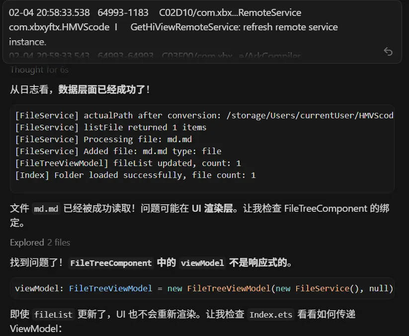

<video width="100%" controls>
  <source src="29.mp4" type="video/mp4">
  您的浏览器不支持视频标签。
</video>

<video width="100%" controls>
  <source src="30.mp4" type="video/mp4">
  您的浏览器不支持视频标签。
</video>

通过上面两个测试视频可以看出当前版本可以正确的渲染当前层架下的全部文件以及文件夹，但是依旧存在严重的问题

1. 子文件夹无法正常展开
2. 文件点击后右侧webView打开的文件仍是默认的test无后缀文件
3. 新建文件夹和新建文件功能无法正常使用

我首先针对于前两个问题进行更多的日志截取。

```log
02-05 14:29:32.802   30099-30099   C02805/com.xbxy...InputKeyFlow  com.xbxyftx.HMVScode  I     [][OnPointerEvent:242] ac: down: 26842
02-05 14:29:32.802   30099-30099   C02805/com.xbxy...InputKeyFlow  com.xbxyftx.HMVScode  I     [P:D:26842][OnPointerEvent:649] recv
02-05 14:29:32.802   30099-30099   C04213/com.xbxy...InputKeyFlow  com.xbxyftx.HMVScode  I     HandleInputEvent: eid:26,InputId:26842,wid:226,ac:2
02-05 14:29:32.803   30099-30099   C03951/com.xbxy...InputKeyFlow  com.xbxyftx.HMVScode  I     [(100000:100000:scope)] ITK Id:26842, fId:0, T:0, I=0, M=0
02-05 14:29:32.803   30099-30099   C03951/com.xbxy...InputKeyFlow  com.xbxyftx.HMVScode  I     [(100000:100000:scope)] ITK Id:26842, TTHNI:fId: 0{ T: page, D: 6 };{ T: List, D: 16 };{ T: Row, D: 20 };
02-05 14:29:32.803   30099-30099   C03951/com.xbxy...InputKeyFlow  com.xbxyftx.HMVScode  I     [(100000:100000:scope)] ITK Id:26842, TTHRTI: T ClickRecognizer info: { T: Row };
02-05 14:29:32.804   30099-30099   C03919/com.xbx...InputTracking  com.xbxyftx.HMVScode  I     [(100000:100000:scope)] Consumed id:26842, last id:26796
02-05 14:29:32.804   30099-30099   C04213/com.xbxy...InputKeyFlow  com.xbxyftx.HMVScode  I     ConsumePointerEventInner: InputId:26842,wid:226,pointId:0,srcType:2,rect:[0,0,2800,1840],notify:1
02-05 14:29:32.804   30099-30099   C02805/com.xbxy...InputKeyFlow  com.xbxyftx.HMVScode  I     [][OnPointerEvent:242] ac: move: 26843
02-05 14:29:32.884   30099-30099   C02805/com.xbxy...InputKeyFlow  com.xbxyftx.HMVScode  I     [][OnPointerEvent:242] ac: move, first: 26844-(2026-02-05 14:29:32.805ms), 26857, count: 14, last: ac: up: 26858
02-05 14:29:32.884   30099-30099   C02805/com.xbxy...InputKeyFlow  com.xbxyftx.HMVScode  I     [P:U:26858][OnPointerEvent:649] recv
02-05 14:29:32.884   30099-30099   C04213/com.xbxy...InputKeyFlow  com.xbxyftx.HMVScode  I     HandleInputEvent: eid:27,InputId:26858,wid:226,ac:4
02-05 14:29:32.885   30099-30099   C03951/com.xbxy...InputKeyFlow  com.xbxyftx.HMVScode  I     [(100000:100000:scope)] ITK Id:26858, fId:0, T:1, I=0, M=0
02-05 14:29:32.886   30099-30099   C0391E/com.xbx...de/AceGesture  com.xbxyftx.HMVScode  I     [(100000:100000:scope)] Click try accept
02-05 14:29:32.886   30099-30099   C03951/com.xbxy...InputKeyFlow  com.xbxyftx.HMVScode  I     [(100000:100000:scope)] CLK RACC, T: Row
02-05 14:29:32.887   30099-30099   C03919/com.xbx...InputTracking  com.xbxyftx.HMVScode  I     [(100000:100000:scope)] Consumed id:26858, last id:26857
02-05 14:29:32.887   30099-30099   C04213/com.xbxy...InputKeyFlow  com.xbxyftx.HMVScode  I     ConsumePointerEventInner: InputId:26858,wid:226,pointId:0,srcType:2,rect:[0,0,2800,1840],notify:1
02-05 14:29:33.073   30099-26331   A04510/com.xbx...code/chromium  com.xbxyftx.HMVScode  E     [battery_mgr_client_adapter_impl.cpp:58] not battery event
02-05 14:29:36.218   30099-30099   C02805/com.xbxy...InputKeyFlow  com.xbxyftx.HMVScode  I     [][OnPointerEvent:242] ac: down: 26859
02-05 14:29:36.218   30099-30099   C02805/com.xbxy...InputKeyFlow  com.xbxyftx.HMVScode  I     [P:D:26859][OnPointerEvent:649] recv
02-05 14:29:36.218   30099-30099   C04213/com.xbxy...InputKeyFlow  com.xbxyftx.HMVScode  I     HandleInputEvent: eid:28,InputId:26859,wid:226,ac:2
02-05 14:29:36.219   30099-30099   C03951/com.xbxy...InputKeyFlow  com.xbxyftx.HMVScode  I     [(100000:100000:scope)] ITK Id:26859, fId:0, T:0, I=0, M=0
02-05 14:29:36.219   30099-30099   C03951/com.xbxy...InputKeyFlow  com.xbxyftx.HMVScode  I     [(100000:100000:scope)] ITK Id:26859, TTHNI:fId: 0{ T: page, D: 6 };{ T: List, D: 16 };{ T: Row, D: 20 };
02-05 14:29:36.219   30099-30099   C03951/com.xbxy...InputKeyFlow  com.xbxyftx.HMVScode  I     [(100000:100000:scope)] ITK Id:26859, TTHRTI: T ClickRecognizer info: { T: Row };
02-05 14:29:36.220   30099-30099   C03919/com.xbx...InputTracking  com.xbxyftx.HMVScode  I     [(100000:100000:scope)] Consumed id:26859, last id:26857
02-05 14:29:36.220   30099-30099   C04213/com.xbxy...InputKeyFlow  com.xbxyftx.HMVScode  I     ConsumePointerEventInner: InputId:26859,wid:226,pointId:0,srcType:2,rect:[0,0,2800,1840],notify:1
02-05 14:29:36.220   30099-30099   C02805/com.xbxy...InputKeyFlow  com.xbxyftx.HMVScode  I     [][OnPointerEvent:242] ac: move: 26860
02-05 14:29:36.322   30099-30099   C02805/com.xbxy...InputKeyFlow  com.xbxyftx.HMVScode  I     [][OnPointerEvent:242] ac: move, first: 26861-(2026-02-05 14:29:36.222ms), 26875, count: 15, last: ac: up: 26876
02-05 14:29:36.322   30099-30099   C02805/com.xbxy...InputKeyFlow  com.xbxyftx.HMVScode  I     [P:U:26876][OnPointerEvent:649] recv
02-05 14:29:36.322   30099-30099   C04213/com.xbxy...InputKeyFlow  com.xbxyftx.HMVScode  I     HandleInputEvent: eid:29,InputId:26876,wid:226,ac:4
02-05 14:29:36.323   30099-30099   C03951/com.xbxy...InputKeyFlow  com.xbxyftx.HMVScode  I     [(100000:100000:scope)] ITK Id:26876, fId:0, T:1, I=0, M=0
02-05 14:29:36.324   30099-30099   C0391E/com.xbx...de/AceGesture  com.xbxyftx.HMVScode  I     [(100000:100000:scope)] Click try accept
02-05 14:29:36.324   30099-30099   C03951/com.xbxy...InputKeyFlow  com.xbxyftx.HMVScode  I     [(100000:100000:scope)] CLK RACC, T: Row
02-05 14:29:36.325   30099-30099   A03D00/com.xbx...MVScode/JSAPP  com.xbxyftx.HMVScode  I     [Index] File selected: file:/docs/storage/Users/currentUser/HMVScode/md.md
02-05 14:29:36.325   30099-30099   A03D00/com.xbx...MVScode/JSAPP  com.xbxyftx.HMVScode  I     [FileService] readFile: file:/docs/storage/Users/currentUser/HMVScode/md.md -> actualPath: file:/docs/storage/Users/currentUser/HMVScode/md.md
02-05 14:29:36.326   30099-30099   C03919/com.xbx...InputTracking  com.xbxyftx.HMVScode  I     [(100000:100000:scope)] Consumed id:26876, last id:26875
02-05 14:29:36.326   30099-30099   C04213/com.xbxy...InputKeyFlow  com.xbxyftx.HMVScode  I     ConsumePointerEventInner: InputId:26876,wid:226,pointId:0,srcType:2,rect:[0,0,2800,1840],notify:1
02-05 14:29:36.329   30099-30099   C01320/com.xbx...MVScode/JsEnv  com.xbxyftx.HMVScode  W     [source_map145]the stack without line info
02-05 14:29:36.329   30099-30099   A03D00/com.xbx...MVScode/JSAPP  com.xbxyftx.HMVScode  E     [FileService] readFile error: {"code":13900002}

```

对于新建文件夹和新建文件功能可以参考以下官网AI回答。

````md
在鸿蒙（HarmonyOS）应用中创建文件夹和文件需通过文件管理接口实现，以下是具体步骤和代码示例：

**1. 创建文件夹**
使用 `fs.mkdirSync()` 或异步方法创建目录，支持递归创建：
```typescript
import { fileIo } from '@kit.CoreFileKit';

const dirPath = '/data/storage/el2/base/files/myFolder';
try {
  // 检查路径是否存在
  if (!fileIo.accessSync(dirPath)) {
    // 递归创建目录（recursive: true）
    fileIo.mkdirSync(dirPath, 0o775);  // 0o775为Unix权限位
    console.log('文件夹创建成功');
  }
} catch (err) {
  console.error(`创建失败: ${JSON.stringify(err)}`);
}
```

**2. 创建文件**
通过 `fileIo.openSync()` 的 `CREATE` 模式创建文件：
```typescript
const filePath = `${dirPath}/newFile.txt`;
try {
  // 创建并打开文件（读写模式）
  const fd = fileIo.openSync(filePath, 
    fileIo.OpenMode.CREATE | fileIo.OpenMode.READ_WRITE);
  console.log('文件创建成功，文件描述符:', fd);
  
  // 写入内容（可选）
  const content = "Hello HarmonyOS!";
  fileIo.writeSync(fd, content);
  
  // 关闭文件
  fileIo.closeSync(fd);
} catch (err) {
  console.error(`文件操作失败: ${JSON.stringify(err)}`);
}
```

### 3. 关键参数说明
| **接口/参数**          | **作用**                               |
|------------------------|----------------------------------------|
| `fs.accessSync()`      | 检查路径是否存在                       |
| `fs.mkdirSync()`       | 同步创建目录                           |
| `recursive: true`      | 递归创建多级目录（如`a/b/c`）          |
| `fileIo.openSync()`    | 创建/打开文件                          |
| `OpenMode.CREATE`      | 不存在时创建文件                       |
| `OpenMode.READ_WRITE`  | 读写模式                               |

**4. 注意事项**
1. **路径权限**：  
    - 应用沙箱内路径通常为 `/data/storage/el2/base/...`
    - 访问公共目录需申请 `ohos.permission.FILE_ACCESS` 权限
2. **加密分区**：  
   支持 EL2/EL3/EL4 分区（参考网页7），通过不同路径区分：
   ```typescript
   const el3Path = 'data/app/el3/...';  // 切换加密分区
   ```
3. **错误处理**：  
    - 文件已存在时 `CREATE` 模式会覆盖原文件
    - 父目录不存在需启用 `recursive` 或先创建父目录

> 完整示例参考鸿蒙文件管理模块（网页7），包含文件监听、移动、重命名等扩展功能。实际开发中建议封装为工具类复用操作逻辑。
内容由AI生成，仅供参考

````

我针对于创建新文件夹和新文件抓取一下日志。

```log
[(100000:100000:scope)] Handle TouchDown event node: Button
[(100000:100000:scope)] Consumed id:28486, last id:28480
ConsumePointerEventInner: InputId:28486,wid:246,pointId:0,srcType:2,rect:[0,0,2800,1840],notify:1
[][OnPointerEvent:242] ac: move: 28487
[][OnPointerEvent:242] ac: move, first: 28488-(2026-02-05 14:51:45.721ms), 28506, count: 19, last: ac: up: 28507
[P:U:28507][OnPointerEvent:649] recv
HandleInputEvent: eid:45,InputId:28507,wid:246,ac:4
[(100000:100000:scope)] ITK Id:28507, fId:0, T:1, I=0, M=0
[(100000:100000:scope)] Handle TouchUp or Cancel event node: Button
[(100000:100000:scope)] Click try accept
[(100000:100000:scope)] CLK RACC, T: Button
[FileTreeViewModel] createDirectory: file:/docs/storage/Users/currentUser/HMVScode/1234
[FileTreeViewModel] currentPath: file://docs/storage/Users/currentUser/HMVScode
[FileService] createDirectory: file:/docs/storage/Users/currentUser/HMVScode/1234 -> actualPath: file:/docs/storage/Users/currentUser/HMVScode/1234 recursive: false
[FileService] Creating single directory: file:/docs/storage/Users/currentUser/HMVScode/1234
[(100000:100000:scope)] Consumed id:28507, last id:28506
ConsumePointerEventInner: InputId:28507,wid:246,pointId:0,srcType:2,rect:[0,0,2800,1840],notify:1
[source_map145]the stack without line info
[FileService] createDirectory error: {"code":13900002}
[FileTreeViewModel] createDirectory error: {"name":"FileServiceError","code":"MKDIR_ERROR"}
```

```log
[(100000:100000:scope)] Handle TouchUp or Cancel event node: Button
[(100000:100000:scope)] Click try accept
[(100000:100000:scope)] CLK RACC, T: Button
[FileTreeViewModel] createFile: file:/docs/storage/Users/currentUser/HMVScode/1234.md
[FileTreeViewModel] currentPath: file://docs/storage/Users/currentUser/HMVScode
[FileService] writeFile: file:/docs/storage/Users/currentUser/HMVScode/1234.md -> actualPath: file:/docs/storage/Users/currentUser/HMVScode/1234.md
[FileService] content length: 0
[FileService] Parent directory: file:/docs/storage/Users/currentUser/HMVScode
[(100000:100000:scope)] Consumed id:28607, last id:28606
ConsumePointerEventInner: InputId:28607,wid:246,pointId:0,srcType:2,rect:[0,0,2800,1840],notify:1
[prop_n_exporter.cpp:302->operator()] Accesscore finish ret -2
[FileService] Directory exists: true
[FileService] Opening file for writing...
[source_map145]the stack without line info
[FileService] writeFile error: {"code":13900002}
[FileTreeViewModel] createFile error: {"name":"FileServiceError","code":"WRITE_ERROR"}
```

可以看到报错的核心就是在于错误码`13900002`让我们用官网的智能回答AI来去看看这个错误码是什么意思。

````md


针对在鸿蒙应用中创建文件夹和文件时遇到的错误代码 `13900002`，以下是详细分析与解决方案：

**错误原因分析**
错误码 `13900002` 表示 **权限不足或路径非法**，具体可能由以下原因引起：
1. **无文件系统权限**：应用未申请读写外部存储的权限。
2. **路径非法**：
    - 路径以 `/` 结尾（如 `/data/app/el1/100/base/com.example/`）<sup class="quote">1</sup>
    - 路径未指向应用沙箱目录（如 `/data/app/el1/100/base/[应用包名]`）
3. **目标目录已存在**：尝试创建已存在的文件夹。
4. **跨进程访问限制**：访问其他应用的私有目录。

---

### 解决方案
**1. **检查路径格式****
   - **错误示例**：`/data/app/el1/100/base/com.example/`（末尾含 `/`）
   - **正确写法**：`/data/app/el1/100/base/com.example`（去除末尾斜杠）
   - 沙箱路径规范：
     ```typescript
     // 获取应用沙箱路径
     import fs from '@ohos.file.fs';
     import common from '@ohos.app.ability.common';

     const context = getContext(this) as common.UIAbilityContext;
     const sandboxDir = context.filesDir; // 标准沙箱路径
     ```

#### 2. **申请文件读写权限**
   在 `module.json5` 中添加权限声明：
   ```json
   {
     "module": {
       "requestPermissions": [
         {
           "name": "ohos.permission.READ_MEDIA",
           "reason": "需访问存储"
         },
         {
           "name": "ohos.permission.WRITE_MEDIA",
           "reason": "需写入文件"
         }
       ]
     }
   }
   ```

#### 3. **使用安全路径创建目录**
   ```typescript
   import fs from '@ohos.file.fs';

   async function createDir() {
     const targetDir = `${sandboxDir}/new_folder`; // 沙箱内路径
     try {
       // 检查目录是否存在
       let isExist = await fs.access(targetDir);
       if (!isExist) {
         await fs.mkdir(targetDir); // 创建新目录
         console.log('目录创建成功');
       }
     } catch (err) {
       console.error(`createDirectory error: ${JSON.stringify(err)}`);
     }
   }
   ```

#### 4. **创建文件示例**
   ```typescript
   async function createFile() {
     const filePath = `${sandboxDir}/new_folder/test.txt`;
     try {
       let file = await fs.open(filePath, fs.OpenMode.CREATE);
       await fs.close(file.fd);
       console.log('文件创建成功');
     } catch (err) {
       console.error(`createFile error: ${JSON.stringify(err)}`);
     }
   }
   ```

---

**关键注意事项**
- **路径范围限制**：
  - 仅允许操作应用沙箱内路径（通过 `context.filesDir` 获取）。
  - 禁止跨应用访问私有目录（如其他应用的 `/data/app/el1/100/base`）。
- **权限时效**：
  - 动态权限需用户授权（通过 `abilityAccessCtrl` 模块请求）。
- **错误处理**：
  - 捕获异常后需解析错误码，常见错误码：
    - `13900001`：路径不存在
    - `13900002`：权限/路径非法
    - `13900005`：目录已存在

> **验证步骤**：  
> 1. 确保路径格式正确（无末尾 `/`）  
> 2. 检查 `module.json5` 权限配置  
> 3. 使用 `fs.access()` 预检路径合法性  
> 4. 优先在沙箱内操作（`context.filesDir`）  

若仍报错，请检查设备存储状态（如空间是否充足）及路径字符合法性（避免中文或特殊符号）。
内容由AI生成，仅供参考
````

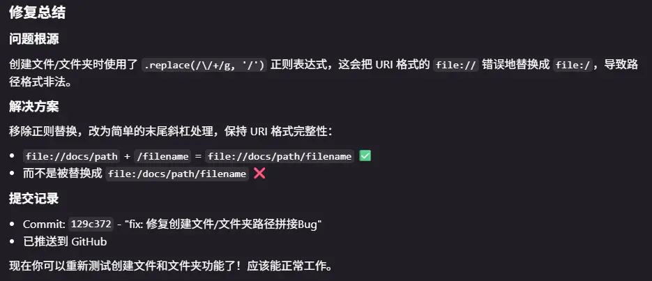

<video width="100%" controls>
  <source src="32.mp4" type="video/mp4">
  您的浏览器不支持视频标签。
</video>

<video width="100%" controls>
  <source src="33.mp4" type="video/mp4">
  您的浏览器不支持视频标签。
</video>

从当前测试结果来看，当前新建文件夹的功能已经正常，但是新建文件依旧是失败状态，我来抓取以下日志。

在我重启应用准备抓取日志时发现此前创建的文件已经正常创建在了目录中。

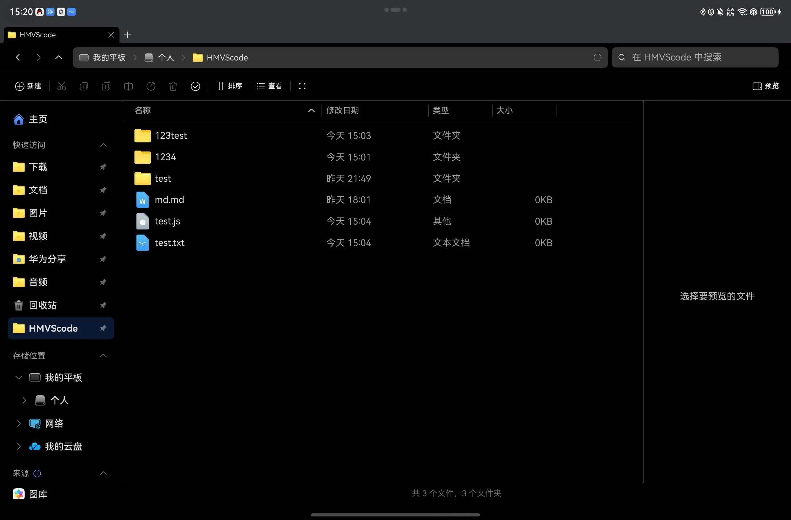

既然如此我接下来会进行如下操作：

1. 创建`111test.md`文件
2. 点击取消，随后点击HMVScode的文件树刷新按钮检查是否创建成功
3. 去系统文件管理中查看文件是否创建成功

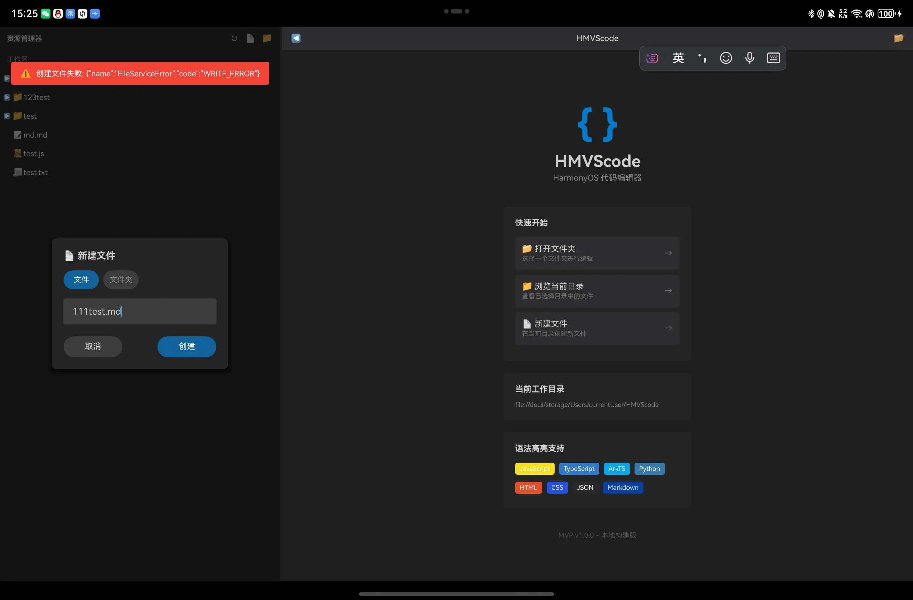

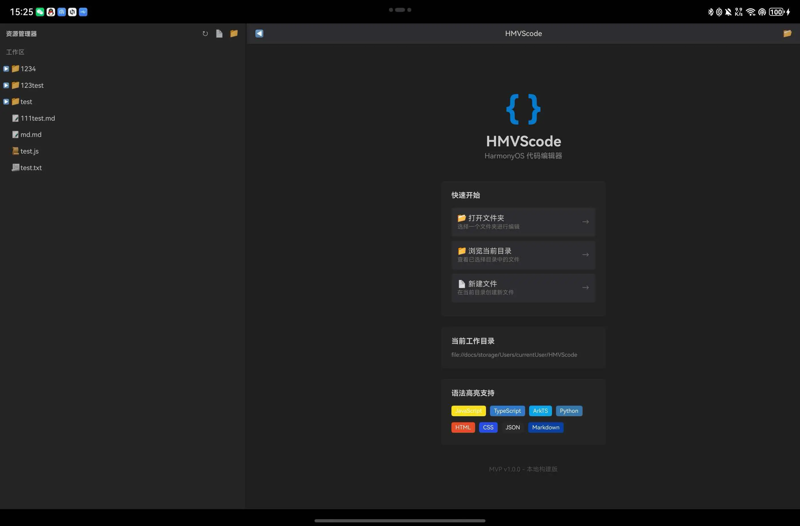

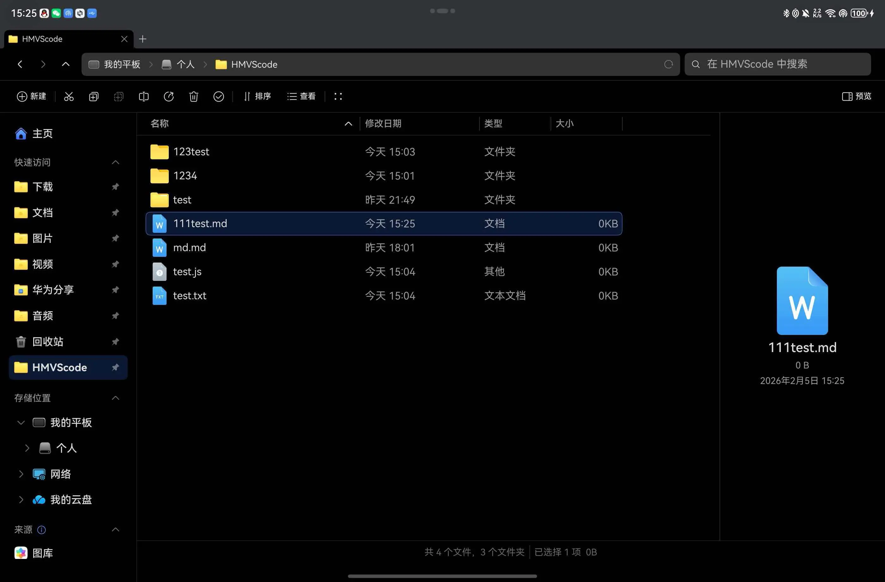

现象是点击创建后出现报错弹窗，文件树没有自动更新，点击刷新按钮后文件树更新，文件创建成功，系统文件管理中文件也创建成功。

```log
[common_func.cpp:611->GetWriteArg] Illegal write buffer or encoding
[prop_n_exporter.cpp:700->Write] Failed to resolve buf and options
[FileService] writeFile error: {"code":13900020}
[FileTreeViewModel] createFile error: {"name":"FileServiceError","code":"WRITE_ERROR"}
line: 1289, function: OnInputStop,unbind before insertText PrintTextChangeLogCount: 6 !
line: 1289, function: OnInputStop,unbind before insertText PrintTextChangeLogCount: 6 !
[(100000:100000:scope)] fail to hide subwindow, subwindow is null.
GetAttachStateSyncResult: lifecycleCallback is null
```

以上是warn级别以上的日志。现在核心集中解决文件创建成功但是弹窗报错失败的问题。

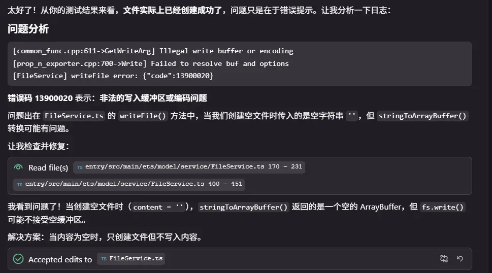

<video width="100%" controls>
  <source src="39.mp4" type="video/mp4">
  您的浏览器不支持视频标签。
</video>

现在新建文件和新建文件夹的功能都没问题了。

### 文件树渲染

当前需要结局的就是文件树渲染的问题了。为了测试文件树渲染，我预先设置好了一个多层的文件结构，具体如下图所示。

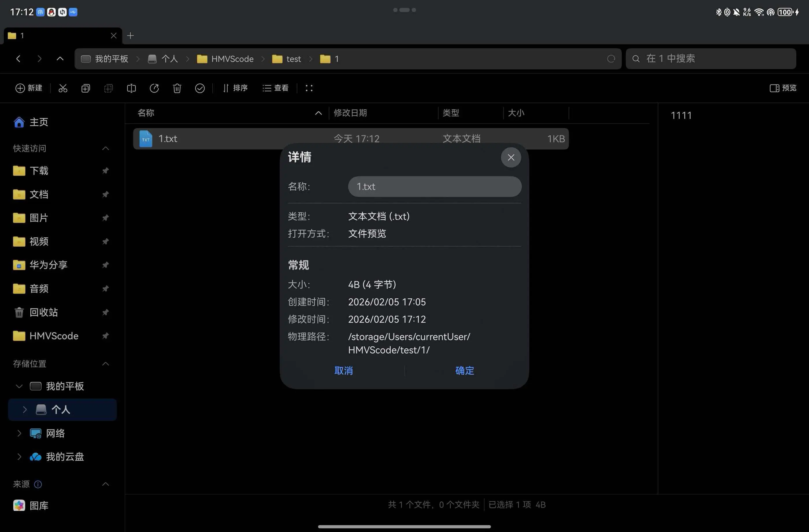

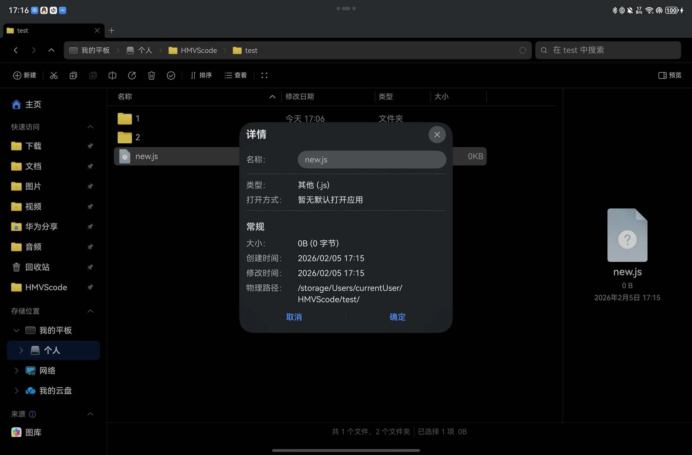

文件结构如下：

```plantxt
HMVScodetest/
├── 123test/
├── 1234/
├── test/
│   ├── 1/
│   │   └── 1.txt
│   ├── 2/
│   └── new.js
├── 1111test.md
├── md.md
├── test.html
├── test.js
└── test.txt
```

当前的核心问题在于它只能渲染当前这一级目录的内容，子目录点击是无法展开的，这有两种可能，一种是没有权限读取子目录导致从数据层级就没有获取到，还有一种可能是渲染层级的问题；还有一种可能就是数据层面成功获取了但是渲染层面出现了问题，没能正确处理点击展开事件。

所以接下来我们需要更详细的日志，首先用日志排查数据层面的获取，同时日志中要有一个明确的标志词以便于有选择性的拉去指定模块的日志。

1. [FILETREE-CLICK] - 点击事件处理层
2. [FILESERVICE-LIST] - 文件系统操作层
3. [FILETREE-RENDER] - UI 渲染层
4. [FILETREE-UI] - UI 交互层

但是点击后这四个关键字都没有任何日志

```md
好的！现在我添加了三个 error 级别的日志，这样肯定能看到：

新增的调试日志
=== CLICK TRIGGERED === - 在 onClick 回调的第一行

如果看不到这个，说明点击事件根本没触发（可能是 UI 层被遮挡）
=== VIEWMODEL onFileClick CALLED === - 在 ViewModel 方法的第一行

如果看到了 CLICK TRIGGERED 但看不到这个，说明方法调用失败
=== RENDERING FILE LIST === - 在渲染文件列表时

显示有多少个文件项被渲染
请重新测试
现在请：

重新运行应用
点击任意文件夹
在 HiLog 中搜索 === 或 CLICK 或 RENDERING
这些 error 级别的日志应该能看到。如果还是看不到任何日志，那说明：

要么应用没有正确重新加载
要么文件树根本没有渲染出来
要么点击事件被其他层拦截了
请告诉我你看到了哪些日志！
```

```log
02-05 17:49:17.718   9490-9490     A03D00/com.xbx...MVScode/JSAPP  com.xbxyftx.HMVScode  E     === CLICK TRIGGERED === test
02-05 17:49:24.737   9490-9490     A03D00/com.xbx...MVScode/JSAPP  com.xbxyftx.HMVScode  E     === CLICK TRIGGERED === 123test
02-05 17:49:26.413   9490-9490     A03D00/com.xbx...MVScode/JSAPP  com.xbxyftx.HMVScode  E     === CLICK TRIGGERED === 1234
```

```log
02-05 17:50:10.573   9490-9490     A03D00/com.xbx...MVScode/JSAPP  com.xbxyftx.HMVScode  E     === VIEWMODEL onFileClick CALLED === 1234
02-05 17:50:11.470   9490-9490     A03D00/com.xbx...MVScode/JSAPP  com.xbxyftx.HMVScode  E     === VIEWMODEL onFileClick CALLED === 123test
02-05 17:50:12.652   9490-9490     A03D00/com.xbx...MVScode/JSAPP  com.xbxyftx.HMVScode  E     === VIEWMODEL onFileClick CALLED === test
02-05 17:50:18.220   9490-9490     A03D00/com.xbx...MVScode/JSAPP  com.xbxyftx.HMVScode  E     === VIEWMODEL onFileClick CALLED === test.html
02-05 17:50:19.388   9490-9490     A03D00/com.xbx...MVScode/JSAPP  com.xbxyftx.HMVScode  E     === VIEWMODEL onFileClick CALLED === test.js
```

以上两个关键字都是点击任何一个文件或是文件夹都正常打印。

```log
02-05 17:51:11.628   9490-9490     A03D00/com.xbx...MVScode/JSAPP  com.xbxyftx.HMVScode  E     === FILE LIST RENDERED === 8 items
02-05 17:51:13.635   9490-9490     A03D00/com.xbx...MVScode/JSAPP  com.xbxyftx.HMVScode  E     === FILE LIST RENDERED === 8 items
02-05 17:51:14.337   9490-9490     A03D00/com.xbx...MVScode/JSAPP  com.xbxyftx.HMVScode  E     === FILE LIST RENDERED === 8 items
```

这个关键字这三次触发都是在我点击文件树的刷新按钮时触发的点击子文件夹时没有触发。

`[FILETREE-RENDER]`关键字无法触发。

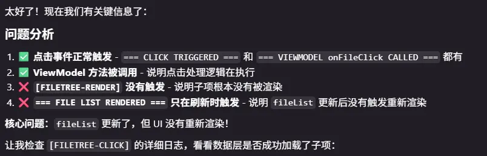


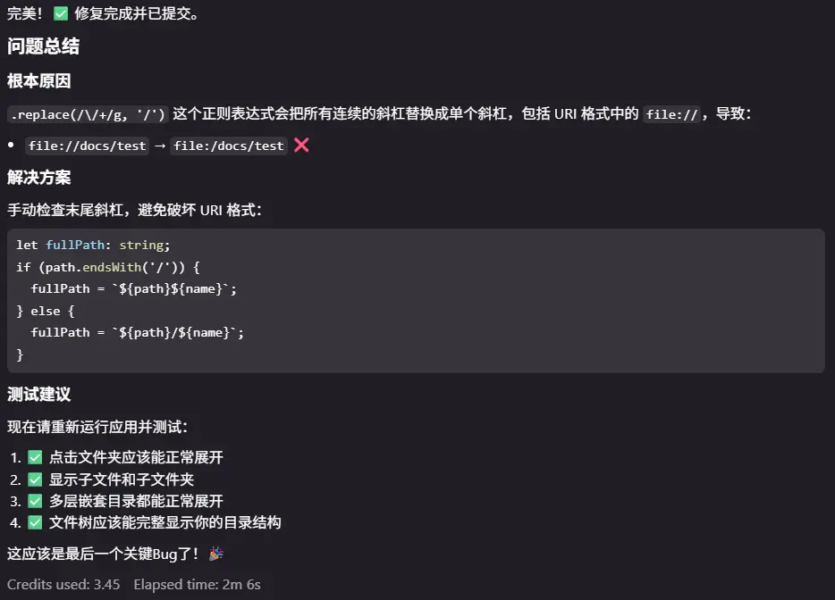

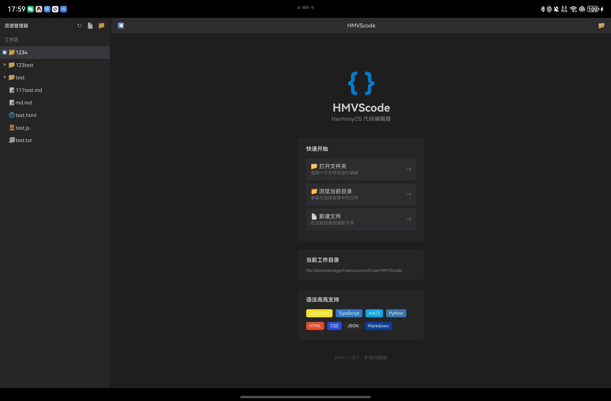

但是点击后还是没能展开……


```log
02-05 18:05:13.825   26964-26964   A03D00/com.xbx...MVScode/JSAPP  com.xbxyftx.HMVScode  E     === TEST: Force update fileList ===
02-05 18:05:17.617   26964-26964   A03D00/com.xbx...MVScode/JSAPP  com.xbxyftx.HMVScode  E     === TEST: Force update fileList ===
02-05 18:05:18.136   26964-26964   A03D00/com.xbx...MVScode/JSAPP  com.xbxyftx.HMVScode  E     === TEST: Force update fileList ===
```

```log
02-05 18:05:52.827   26964-26964   A03D00/com.xbx...MVScode/JSAPP  com.xbxyftx.HMVScode  E     === FILE LIST RENDERED === 8 items
02-05 18:05:55.953   26964-26964   A03D00/com.xbx...MVScode/JSAPP  com.xbxyftx.HMVScode  E     === FILE LIST RENDERED === 8 items
02-05 18:05:56.417   26964-26964   A03D00/com.xbx...MVScode/JSAPP  com.xbxyftx.HMVScode  E     === FILE LIST RENDERED === 8 items
```

```log
02-05 18:06:31.659   26964-26964   A03D00/com.xbx...MVScode/JSAPP  com.xbxyftx.HMVScode  I     [FILETREE-CLICK] ========== File/Directory Clicked ==========
02-05 18:06:31.659   26964-26964   A03D00/com.xbx...MVScode/JSAPP  com.xbxyftx.HMVScode  I     [FILETREE-CLICK] Name: test
02-05 18:06:31.659   26964-26964   A03D00/com.xbx...MVScode/JSAPP  com.xbxyftx.HMVScode  I     [FILETREE-CLICK] Path: file://docs/storage/Users/currentUser/HMVScode/test
02-05 18:06:31.659   26964-26964   A03D00/com.xbx...MVScode/JSAPP  com.xbxyftx.HMVScode  I     [FILETREE-CLICK] Type: directory
02-05 18:06:31.659   26964-26964   A03D00/com.xbx...MVScode/JSAPP  com.xbxyftx.HMVScode  I     [FILETREE-CLICK] IsExpanded (before): false
02-05 18:06:31.659   26964-26964   A03D00/com.xbx...MVScode/JSAPP  com.xbxyftx.HMVScode  I     [FILETREE-CLICK] This is a DIRECTORY
02-05 18:06:31.659   26964-26964   A03D00/com.xbx...MVScode/JSAPP  com.xbxyftx.HMVScode  I     [FILETREE-CLICK] Action: EXPAND directory
02-05 18:06:31.659   26964-26964   A03D00/com.xbx...MVScode/JSAPP  com.xbxyftx.HMVScode  I     [FILETREE-CLICK] Starting to load children...
02-05 18:06:31.659   26964-26964   A03D00/com.xbx...MVScode/JSAPP  com.xbxyftx.HMVScode  I     [FILETREE-CLICK] Calling fileService.listFiles()...
02-05 18:06:31.668   26964-26964   A03D00/com.xbx...MVScode/JSAPP  com.xbxyftx.HMVScode  I     [FILETREE-CLICK] ✅ Successfully loaded 3 children
02-05 18:06:31.668   26964-26964   A03D00/com.xbx...MVScode/JSAPP  com.xbxyftx.HMVScode  I     [FILETREE-CLICK] Child[0]: 1 | Type: directory | Path: file://docs/storage/Users/currentUser/HMVScode/test/1
02-05 18:06:31.668   26964-26964   A03D00/com.xbx...MVScode/JSAPP  com.xbxyftx.HMVScode  I     [FILETREE-CLICK] Child[1]: 2 | Type: directory | Path: file://docs/storage/Users/currentUser/HMVScode/test/2
02-05 18:06:31.668   26964-26964   A03D00/com.xbx...MVScode/JSAPP  com.xbxyftx.HMVScode  I     [FILETREE-CLICK] Child[2]: new.js | Type: file | Path: file://docs/storage/Users/currentUser/HMVScode/test/new.js
02-05 18:06:31.668   26964-26964   A03D00/com.xbx...MVScode/JSAPP  com.xbxyftx.HMVScode  I     [FILETREE-CLICK] Prepared child: 1 | isExpanded: false
02-05 18:06:31.668   26964-26964   A03D00/com.xbx...MVScode/JSAPP  com.xbxyftx.HMVScode  I     [FILETREE-CLICK] Prepared child: 2 | isExpanded: false
02-05 18:06:31.668   26964-26964   A03D00/com.xbx...MVScode/JSAPP  com.xbxyftx.HMVScode  I     [FILETREE-CLICK] Prepared child: new.js | isExpanded: false
02-05 18:06:31.668   26964-26964   A03D00/com.xbx...MVScode/JSAPP  com.xbxyftx.HMVScode  I     [FILETREE-CLICK] ✅ Updated file.children, count: 3
02-05 18:06:31.668   26964-26964   A03D00/com.xbx...MVScode/JSAPP  com.xbxyftx.HMVScode  I     [FILETREE-CLICK] Updating fileList...
02-05 18:06:31.668   26964-26964   A03D00/com.xbx...MVScode/JSAPP  com.xbxyftx.HMVScode  I     [FILETREE-CLICK] Found index in fileList: 2
02-05 18:06:31.668   26964-26964   A03D00/com.xbx...MVScode/JSAPP  com.xbxyftx.HMVScode  I     [FILETREE-CLICK] Updated file isExpanded: true
02-05 18:06:31.668   26964-26964   A03D00/com.xbx...MVScode/JSAPP  com.xbxyftx.HMVScode  I     [FILETREE-CLICK] Updated file children count: 3
02-05 18:06:31.668   26964-26964   A03D00/com.xbx...MVScode/JSAPP  com.xbxyftx.HMVScode  I     [FILETREE-CLICK] ✅ fileList updated, total count: 8
02-05 18:06:31.668   26964-26964   A03D00/com.xbx...MVScode/JSAPP  com.xbxyftx.HMVScode  I     [FILETREE-CLICK] ========== Click Handler Finished ==========
02-05 18:06:32.097   26964-26964   A03D00/com.xbx...MVScode/JSAPP  com.xbxyftx.HMVScode  I     [FILETREE-CLICK] ========== File/Directory Clicked ==========
02-05 18:06:32.097   26964-26964   A03D00/com.xbx...MVScode/JSAPP  com.xbxyftx.HMVScode  I     [FILETREE-CLICK] Name: 123test
02-05 18:06:32.097   26964-26964   A03D00/com.xbx...MVScode/JSAPP  com.xbxyftx.HMVScode  I     [FILETREE-CLICK] Path: file://docs/storage/Users/currentUser/HMVScode/123test
02-05 18:06:32.097   26964-26964   A03D00/com.xbx...MVScode/JSAPP  com.xbxyftx.HMVScode  I     [FILETREE-CLICK] Type: directory
02-05 18:06:32.097   26964-26964   A03D00/com.xbx...MVScode/JSAPP  com.xbxyftx.HMVScode  I     [FILETREE-CLICK] IsExpanded (before): false
02-05 18:06:32.097   26964-26964   A03D00/com.xbx...MVScode/JSAPP  com.xbxyftx.HMVScode  I     [FILETREE-CLICK] This is a DIRECTORY
02-05 18:06:32.097   26964-26964   A03D00/com.xbx...MVScode/JSAPP  com.xbxyftx.HMVScode  I     [FILETREE-CLICK] Action: EXPAND directory
02-05 18:06:32.098   26964-26964   A03D00/com.xbx...MVScode/JSAPP  com.xbxyftx.HMVScode  I     [FILETREE-CLICK] Starting to load children...
02-05 18:06:32.098   26964-26964   A03D00/com.xbx...MVScode/JSAPP  com.xbxyftx.HMVScode  I     [FILETREE-CLICK] Calling fileService.listFiles()...
02-05 18:06:32.100   26964-26964   A03D00/com.xbx...MVScode/JSAPP  com.xbxyftx.HMVScode  I     [FILETREE-CLICK] ✅ Successfully loaded 0 children
02-05 18:06:32.100   26964-26964   A03D00/com.xbx...MVScode/JSAPP  com.xbxyftx.HMVScode  I     [FILETREE-CLICK] ✅ Updated file.children, count: 0
02-05 18:06:32.100   26964-26964   A03D00/com.xbx...MVScode/JSAPP  com.xbxyftx.HMVScode  I     [FILETREE-CLICK] Updating fileList...
02-05 18:06:32.100   26964-26964   A03D00/com.xbx...MVScode/JSAPP  com.xbxyftx.HMVScode  I     [FILETREE-CLICK] Found index in fileList: 1
02-05 18:06:32.100   26964-26964   A03D00/com.xbx...MVScode/JSAPP  com.xbxyftx.HMVScode  I     [FILETREE-CLICK] Updated file isExpanded: true
02-05 18:06:32.100   26964-26964   A03D00/com.xbx...MVScode/JSAPP  com.xbxyftx.HMVScode  I     [FILETREE-CLICK] Updated file children count: 0
02-05 18:06:32.100   26964-26964   A03D00/com.xbx...MVScode/JSAPP  com.xbxyftx.HMVScode  I     [FILETREE-CLICK] ✅ fileList updated, total count: 8
02-05 18:06:32.100   26964-26964   A03D00/com.xbx...MVScode/JSAPP  com.xbxyftx.HMVScode  I     [FILETREE-CLICK] ========== Click Handler Finished ==========
02-05 18:06:33.281   26964-26964   A03D00/com.xbx...MVScode/JSAPP  com.xbxyftx.HMVScode  I     [FILETREE-CLICK] ========== File/Directory Clicked ==========
02-05 18:06:33.281   26964-26964   A03D00/com.xbx...MVScode/JSAPP  com.xbxyftx.HMVScode  I     [FILETREE-CLICK] Name: 1234
02-05 18:06:33.281   26964-26964   A03D00/com.xbx...MVScode/JSAPP  com.xbxyftx.HMVScode  I     [FILETREE-CLICK] Path: file://docs/storage/Users/currentUser/HMVScode/1234
02-05 18:06:33.281   26964-26964   A03D00/com.xbx...MVScode/JSAPP  com.xbxyftx.HMVScode  I     [FILETREE-CLICK] Type: directory
02-05 18:06:33.281   26964-26964   A03D00/com.xbx...MVScode/JSAPP  com.xbxyftx.HMVScode  I     [FILETREE-CLICK] IsExpanded (before): false
02-05 18:06:33.281   26964-26964   A03D00/com.xbx...MVScode/JSAPP  com.xbxyftx.HMVScode  I     [FILETREE-CLICK] This is a DIRECTORY
02-05 18:06:33.281   26964-26964   A03D00/com.xbx...MVScode/JSAPP  com.xbxyftx.HMVScode  I     [FILETREE-CLICK] Action: EXPAND directory
02-05 18:06:33.281   26964-26964   A03D00/com.xbx...MVScode/JSAPP  com.xbxyftx.HMVScode  I     [FILETREE-CLICK] Starting to load children...
02-05 18:06:33.281   26964-26964   A03D00/com.xbx...MVScode/JSAPP  com.xbxyftx.HMVScode  I     [FILETREE-CLICK] Calling fileService.listFiles()...
02-05 18:06:33.287   26964-26964   A03D00/com.xbx...MVScode/JSAPP  com.xbxyftx.HMVScode  I     [FILETREE-CLICK] ✅ Successfully loaded 0 children
02-05 18:06:33.287   26964-26964   A03D00/com.xbx...MVScode/JSAPP  com.xbxyftx.HMVScode  I     [FILETREE-CLICK] ✅ Updated file.children, count: 0
02-05 18:06:33.287   26964-26964   A03D00/com.xbx...MVScode/JSAPP  com.xbxyftx.HMVScode  I     [FILETREE-CLICK] Updating fileList...
02-05 18:06:33.287   26964-26964   A03D00/com.xbx...MVScode/JSAPP  com.xbxyftx.HMVScode  I     [FILETREE-CLICK] Found index in fileList: 0
02-05 18:06:33.287   26964-26964   A03D00/com.xbx...MVScode/JSAPP  com.xbxyftx.HMVScode  I     [FILETREE-CLICK] Updated file isExpanded: true
02-05 18:06:33.287   26964-26964   A03D00/com.xbx...MVScode/JSAPP  com.xbxyftx.HMVScode  I     [FILETREE-CLICK] Updated file children count: 0
02-05 18:06:33.287   26964-26964   A03D00/com.xbx...MVScode/JSAPP  com.xbxyftx.HMVScode  I     [FILETREE-CLICK] ✅ fileList updated, total count: 8
```

```log
02-05 18:07:03.372   26964-26964   A03D00/com.xbx...MVScode/JSAPP  com.xbxyftx.HMVScode  I     [FILESERVICE-LIST] ========== List Files Called ==========
02-05 18:07:03.372   26964-26964   A03D00/com.xbx...MVScode/JSAPP  com.xbxyftx.HMVScode  I     [FILESERVICE-LIST] Input path: file://docs/storage/Users/currentUser/HMVScode/1234
02-05 18:07:03.372   26964-26964   A03D00/com.xbx...MVScode/JSAPP  com.xbxyftx.HMVScode  I     [FILESERVICE-LIST] Is URI: true
02-05 18:07:03.373   26964-26964   A03D00/com.xbx...MVScode/JSAPP  com.xbxyftx.HMVScode  I     [FILESERVICE-LIST] Actual path after conversion: /storage/Users/currentUser/HMVScode/1234
02-05 18:07:03.373   26964-26964   A03D00/com.xbx...MVScode/JSAPP  com.xbxyftx.HMVScode  I     [FILESERVICE-LIST] Calling fs.listFile()...
02-05 18:07:03.374   26964-26964   A03D00/com.xbx...MVScode/JSAPP  com.xbxyftx.HMVScode  I     [FILESERVICE-LIST] ✅ fs.listFile() returned 0 items
02-05 18:07:03.374   26964-26964   A03D00/com.xbx...MVScode/JSAPP  com.xbxyftx.HMVScode  I     [FILESERVICE-LIST] ✅ Total result count: 0
02-05 18:07:03.374   26964-26964   A03D00/com.xbx...MVScode/JSAPP  com.xbxyftx.HMVScode  I     [FILESERVICE-LIST] ✅ Sorted result
02-05 18:07:03.375   26964-26964   A03D00/com.xbx...MVScode/JSAPP  com.xbxyftx.HMVScode  I     [FILESERVICE-LIST] ========== List Files Finished ==========
02-05 18:07:04.095   26964-26964   A03D00/com.xbx...MVScode/JSAPP  com.xbxyftx.HMVScode  I     [FILESERVICE-LIST] ========== List Files Called ==========
02-05 18:07:04.095   26964-26964   A03D00/com.xbx...MVScode/JSAPP  com.xbxyftx.HMVScode  I     [FILESERVICE-LIST] Input path: file://docs/storage/Users/currentUser/HMVScode/123test
02-05 18:07:04.095   26964-26964   A03D00/com.xbx...MVScode/JSAPP  com.xbxyftx.HMVScode  I     [FILESERVICE-LIST] Is URI: true
02-05 18:07:04.096   26964-26964   A03D00/com.xbx...MVScode/JSAPP  com.xbxyftx.HMVScode  I     [FILESERVICE-LIST] Actual path after conversion: /storage/Users/currentUser/HMVScode/123test
02-05 18:07:04.096   26964-26964   A03D00/com.xbx...MVScode/JSAPP  com.xbxyftx.HMVScode  I     [FILESERVICE-LIST] Calling fs.listFile()...
02-05 18:07:04.096   26964-26964   A03D00/com.xbx...MVScode/JSAPP  com.xbxyftx.HMVScode  I     [FILESERVICE-LIST] ✅ fs.listFile() returned 0 items
02-05 18:07:04.096   26964-26964   A03D00/com.xbx...MVScode/JSAPP  com.xbxyftx.HMVScode  I     [FILESERVICE-LIST] ✅ Total result count: 0
02-05 18:07:04.096   26964-26964   A03D00/com.xbx...MVScode/JSAPP  com.xbxyftx.HMVScode  I     [FILESERVICE-LIST] ✅ Sorted result
02-05 18:07:04.096   26964-26964   A03D00/com.xbx...MVScode/JSAPP  com.xbxyftx.HMVScode  I     [FILESERVICE-LIST] ========== List Files Finished ==========
02-05 18:07:05.316   26964-26964   A03D00/com.xbx...MVScode/JSAPP  com.xbxyftx.HMVScode  I     [FILESERVICE-LIST] ========== List Files Called ==========
02-05 18:07:05.316   26964-26964   A03D00/com.xbx...MVScode/JSAPP  com.xbxyftx.HMVScode  I     [FILESERVICE-LIST] Input path: file://docs/storage/Users/currentUser/HMVScode/test
02-05 18:07:05.316   26964-26964   A03D00/com.xbx...MVScode/JSAPP  com.xbxyftx.HMVScode  I     [FILESERVICE-LIST] Is URI: true
02-05 18:07:05.316   26964-26964   A03D00/com.xbx...MVScode/JSAPP  com.xbxyftx.HMVScode  I     [FILESERVICE-LIST] Actual path after conversion: /storage/Users/currentUser/HMVScode/test
02-05 18:07:05.316   26964-26964   A03D00/com.xbx...MVScode/JSAPP  com.xbxyftx.HMVScode  I     [FILESERVICE-LIST] Calling fs.listFile()...
02-05 18:07:05.321   26964-26964   A03D00/com.xbx...MVScode/JSAPP  com.xbxyftx.HMVScode  I     [FILESERVICE-LIST] ✅ fs.listFile() returned 3 items
02-05 18:07:05.321   26964-26964   A03D00/com.xbx...MVScode/JSAPP  com.xbxyftx.HMVScode  I     [FILESERVICE-LIST] File[0]: 1
02-05 18:07:05.321   26964-26964   A03D00/com.xbx...MVScode/JSAPP  com.xbxyftx.HMVScode  I     [FILESERVICE-LIST] File[1]: 2
02-05 18:07:05.321   26964-26964   A03D00/com.xbx...MVScode/JSAPP  com.xbxyftx.HMVScode  I     [FILESERVICE-LIST] File[2]: new.js
02-05 18:07:05.321   26964-26964   A03D00/com.xbx...MVScode/JSAPP  com.xbxyftx.HMVScode  I     [FILESERVICE-LIST] Processing: 1
02-05 18:07:05.321   26964-26964   A03D00/com.xbx...MVScode/JSAPP  com.xbxyftx.HMVScode  I     [FILESERVICE-LIST]   Full path (original format): file://docs/storage/Users/currentUser/HMVScode/test/1
02-05 18:07:05.321   26964-26964   A03D00/com.xbx...MVScode/JSAPP  com.xbxyftx.HMVScode  I     [FILESERVICE-LIST]   Actual full path: /storage/Users/currentUser/HMVScode/test/1
02-05 18:07:05.322   26964-26964   A03D00/com.xbx...MVScode/JSAPP  com.xbxyftx.HMVScode  I     [FILESERVICE-LIST]   Type: DIRECTORY
02-05 18:07:05.322   26964-26964   A03D00/com.xbx...MVScode/JSAPP  com.xbxyftx.HMVScode  I     [FILESERVICE-LIST]   Size: 3440
02-05 18:07:05.322   26964-26964   A03D00/com.xbx...MVScode/JSAPP  com.xbxyftx.HMVScode  I     [FILESERVICE-LIST]   ✅ Added to result
02-05 18:07:05.322   26964-26964   A03D00/com.xbx...MVScode/JSAPP  com.xbxyftx.HMVScode  I     [FILESERVICE-LIST] Processing: 2
02-05 18:07:05.322   26964-26964   A03D00/com.xbx...MVScode/JSAPP  com.xbxyftx.HMVScode  I     [FILESERVICE-LIST]   Full path (original format): file://docs/storage/Users/currentUser/HMVScode/test/2
02-05 18:07:05.322   26964-26964   A03D00/com.xbx...MVScode/JSAPP  com.xbxyftx.HMVScode  I     [FILESERVICE-LIST]   Actual full path: /storage/Users/currentUser/HMVScode/test/2
02-05 18:07:05.322   26964-26964   A03D00/com.xbx...MVScode/JSAPP  com.xbxyftx.HMVScode  I     [FILESERVICE-LIST]   Type: DIRECTORY
02-05 18:07:05.322   26964-26964   A03D00/com.xbx...MVScode/JSAPP  com.xbxyftx.HMVScode  I     [FILESERVICE-LIST]   Size: 3440
02-05 18:07:05.322   26964-26964   A03D00/com.xbx...MVScode/JSAPP  com.xbxyftx.HMVScode  I     [FILESERVICE-LIST]   ✅ Added to result
02-05 18:07:05.322   26964-26964   A03D00/com.xbx...MVScode/JSAPP  com.xbxyftx.HMVScode  I     [FILESERVICE-LIST] Processing: new.js
02-05 18:07:05.322   26964-26964   A03D00/com.xbx...MVScode/JSAPP  com.xbxyftx.HMVScode  I     [FILESERVICE-LIST]   Full path (original format): file://docs/storage/Users/currentUser/HMVScode/test/new.js
02-05 18:07:05.322   26964-26964   A03D00/com.xbx...MVScode/JSAPP  com.xbxyftx.HMVScode  I     [FILESERVICE-LIST]   Actual full path: /storage/Users/currentUser/HMVScode/test/new.js
02-05 18:07:05.322   26964-26964   A03D00/com.xbx...MVScode/JSAPP  com.xbxyftx.HMVScode  I     [FILESERVICE-LIST]   Type: FILE
02-05 18:07:05.322   26964-26964   A03D00/com.xbx...MVScode/JSAPP  com.xbxyftx.HMVScode  I     [FILESERVICE-LIST]   Size: 0
02-05 18:07:05.323   26964-26964   A03D00/com.xbx...MVScode/JSAPP  com.xbxyftx.HMVScode  I     [FILESERVICE-LIST]   ✅ Added to result
02-05 18:07:05.323   26964-26964   A03D00/com.xbx...MVScode/JSAPP  com.xbxyftx.HMVScode  I     [FILESERVICE-LIST] ✅ Total result count: 3
02-05 18:07:05.323   26964-26964   A03D00/com.xbx...MVScode/JSAPP  com.xbxyftx.HMVScode  I     [FILESERVICE-LIST] ✅ Sorted result
```

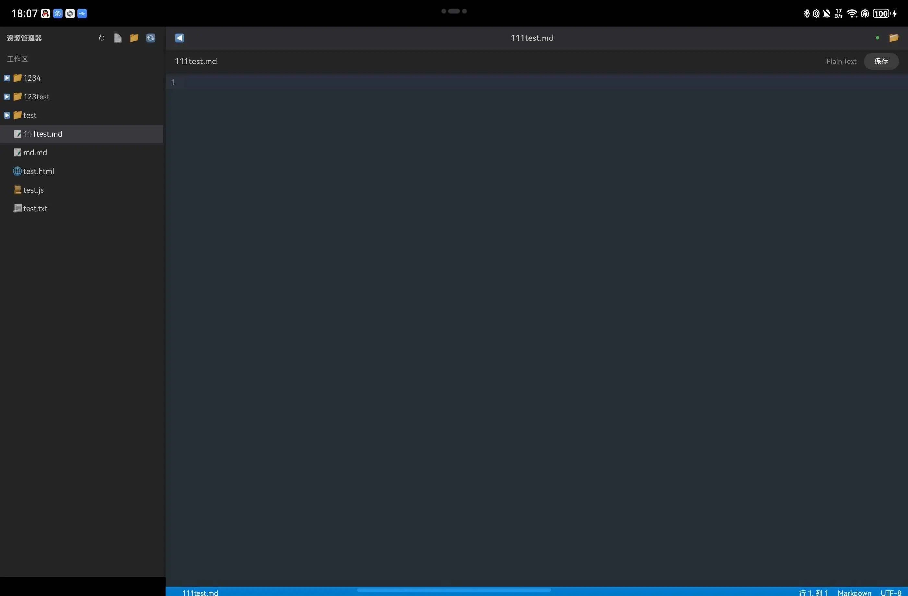

这些操作后和此前的现象一样依旧没有展开。

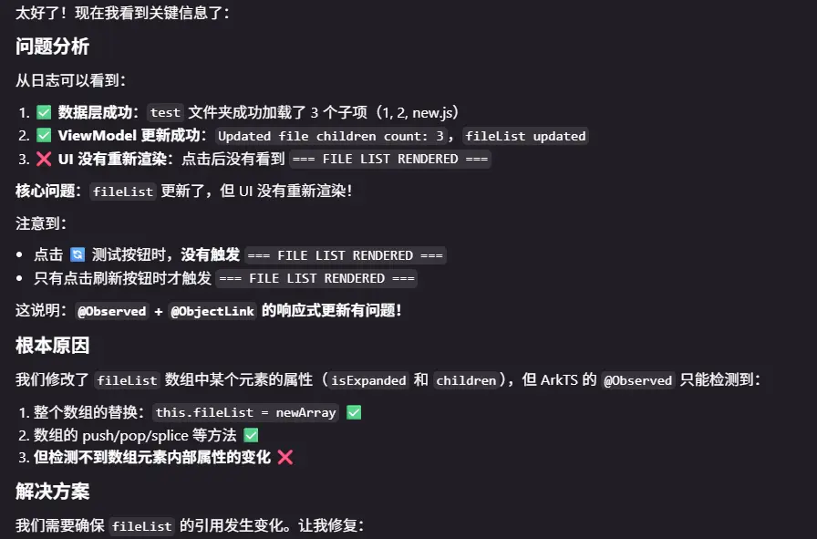

既然是这样我们就需要用V2版本或是每次都深拷贝一个新数组了。

```log
02-05 18:22:38.036   47106-47106   A03D00/com.xbx...MVScode/JSAPP  com.xbxyftx.HMVScode  I     [FILESERVICE-LIST] ========== List Files Called ==========
02-05 18:22:38.036   47106-47106   A03D00/com.xbx...MVScode/JSAPP  com.xbxyftx.HMVScode  I     [FILESERVICE-LIST] Input path: file://docs/storage/Users/currentUser/HMVScode/123test
02-05 18:22:38.036   47106-47106   A03D00/com.xbx...MVScode/JSAPP  com.xbxyftx.HMVScode  I     [FILESERVICE-LIST] Is URI: true
02-05 18:22:38.037   47106-47106   A03D00/com.xbx...MVScode/JSAPP  com.xbxyftx.HMVScode  I     [FILESERVICE-LIST] Actual path after conversion: /storage/Users/currentUser/HMVScode/123test
02-05 18:22:38.037   47106-47106   A03D00/com.xbx...MVScode/JSAPP  com.xbxyftx.HMVScode  I     [FILESERVICE-LIST] Calling fs.listFile()...
02-05 18:22:38.042   47106-47106   A03D00/com.xbx...MVScode/JSAPP  com.xbxyftx.HMVScode  I     [FILESERVICE-LIST] ✅ fs.listFile() returned 0 items
02-05 18:22:38.042   47106-47106   A03D00/com.xbx...MVScode/JSAPP  com.xbxyftx.HMVScode  I     [FILESERVICE-LIST] ✅ Total result count: 0
02-05 18:22:38.042   47106-47106   A03D00/com.xbx...MVScode/JSAPP  com.xbxyftx.HMVScode  I     [FILESERVICE-LIST] ✅ Sorted result
02-05 18:22:38.042   47106-47106   A03D00/com.xbx...MVScode/JSAPP  com.xbxyftx.HMVScode  I     [FILESERVICE-LIST] ========== List Files Finished ==========
02-05 18:22:39.270   47106-47106   A03D00/com.xbx...MVScode/JSAPP  com.xbxyftx.HMVScode  I     [FILESERVICE-LIST] ========== List Files Called ==========
02-05 18:22:39.270   47106-47106   A03D00/com.xbx...MVScode/JSAPP  com.xbxyftx.HMVScode  I     [FILESERVICE-LIST] Input path: file://docs/storage/Users/currentUser/HMVScode/test
02-05 18:22:39.270   47106-47106   A03D00/com.xbx...MVScode/JSAPP  com.xbxyftx.HMVScode  I     [FILESERVICE-LIST] Is URI: true
02-05 18:22:39.270   47106-47106   A03D00/com.xbx...MVScode/JSAPP  com.xbxyftx.HMVScode  I     [FILESERVICE-LIST] Actual path after conversion: /storage/Users/currentUser/HMVScode/test
02-05 18:22:39.270   47106-47106   A03D00/com.xbx...MVScode/JSAPP  com.xbxyftx.HMVScode  I     [FILESERVICE-LIST] Calling fs.listFile()...
02-05 18:22:39.271   47106-47106   A03D00/com.xbx...MVScode/JSAPP  com.xbxyftx.HMVScode  I     [FILESERVICE-LIST] ✅ fs.listFile() returned 3 items
02-05 18:22:39.271   47106-47106   A03D00/com.xbx...MVScode/JSAPP  com.xbxyftx.HMVScode  I     [FILESERVICE-LIST] File[0]: 1
02-05 18:22:39.271   47106-47106   A03D00/com.xbx...MVScode/JSAPP  com.xbxyftx.HMVScode  I     [FILESERVICE-LIST] File[1]: 2
02-05 18:22:39.271   47106-47106   A03D00/com.xbx...MVScode/JSAPP  com.xbxyftx.HMVScode  I     [FILESERVICE-LIST] File[2]: new.js
02-05 18:22:39.271   47106-47106   A03D00/com.xbx...MVScode/JSAPP  com.xbxyftx.HMVScode  I     [FILESERVICE-LIST] Processing: 1
02-05 18:22:39.271   47106-47106   A03D00/com.xbx...MVScode/JSAPP  com.xbxyftx.HMVScode  I     [FILESERVICE-LIST]   Full path (original format): file://docs/storage/Users/currentUser/HMVScode/test/1
02-05 18:22:39.271   47106-47106   A03D00/com.xbx...MVScode/JSAPP  com.xbxyftx.HMVScode  I     [FILESERVICE-LIST]   Actual full path: /storage/Users/currentUser/HMVScode/test/1
02-05 18:22:39.273   47106-47106   A03D00/com.xbx...MVScode/JSAPP  com.xbxyftx.HMVScode  I     [FILESERVICE-LIST]   Type: DIRECTORY
02-05 18:22:39.273   47106-47106   A03D00/com.xbx...MVScode/JSAPP  com.xbxyftx.HMVScode  I     [FILESERVICE-LIST]   Size: 3440
02-05 18:22:39.273   47106-47106   A03D00/com.xbx...MVScode/JSAPP  com.xbxyftx.HMVScode  I     [FILESERVICE-LIST]   ✅ Added to result
02-05 18:22:39.273   47106-47106   A03D00/com.xbx...MVScode/JSAPP  com.xbxyftx.HMVScode  I     [FILESERVICE-LIST] Processing: 2
02-05 18:22:39.273   47106-47106   A03D00/com.xbx...MVScode/JSAPP  com.xbxyftx.HMVScode  I     [FILESERVICE-LIST]   Full path (original format): file://docs/storage/Users/currentUser/HMVScode/test/2
02-05 18:22:39.273   47106-47106   A03D00/com.xbx...MVScode/JSAPP  com.xbxyftx.HMVScode  I     [FILESERVICE-LIST]   Actual full path: /storage/Users/currentUser/HMVScode/test/2
02-05 18:22:39.274   47106-47106   A03D00/com.xbx...MVScode/JSAPP  com.xbxyftx.HMVScode  I     [FILESERVICE-LIST]   Type: DIRECTORY
02-05 18:22:39.274   47106-47106   A03D00/com.xbx...MVScode/JSAPP  com.xbxyftx.HMVScode  I     [FILESERVICE-LIST]   Size: 3440
02-05 18:22:39.274   47106-47106   A03D00/com.xbx...MVScode/JSAPP  com.xbxyftx.HMVScode  I     [FILESERVICE-LIST]   ✅ Added to result
02-05 18:22:39.274   47106-47106   A03D00/com.xbx...MVScode/JSAPP  com.xbxyftx.HMVScode  I     [FILESERVICE-LIST] Processing: new.js
02-05 18:22:39.274   47106-47106   A03D00/com.xbx...MVScode/JSAPP  com.xbxyftx.HMVScode  I     [FILESERVICE-LIST]   Full path (original format): file://docs/storage/Users/currentUser/HMVScode/test/new.js
02-05 18:22:39.274   47106-47106   A03D00/com.xbx...MVScode/JSAPP  com.xbxyftx.HMVScode  I     [FILESERVICE-LIST]   Actual full path: /storage/Users/currentUser/HMVScode/test/new.js
02-05 18:22:39.274   47106-47106   A03D00/com.xbx...MVScode/JSAPP  com.xbxyftx.HMVScode  I     [FILESERVICE-LIST]   Type: FILE
02-05 18:22:39.274   47106-47106   A03D00/com.xbx...MVScode/JSAPP  com.xbxyftx.HMVScode  I     [FILESERVICE-LIST]   Size: 0
02-05 18:22:39.274   47106-47106   A03D00/com.xbx...MVScode/JSAPP  com.xbxyftx.HMVScode  I     [FILESERVICE-LIST]   ✅ Added to result
02-05 18:22:39.274   47106-47106   A03D00/com.xbx...MVScode/JSAPP  com.xbxyftx.HMVScode  I     [FILESERVICE-LIST] ✅ Total result count: 3
02-05 18:22:39.274   47106-47106   A03D00/com.xbx...MVScode/JSAPP  com.xbxyftx.HMVScode  I     [FILESERVICE-LIST] ✅ Sorted result
```

那现在就尝试每次深拷贝一个新数组吧，同时清空上一个数组防止内存过度占用。

```log
02-05 18:26:34.863   51394-51394   C02805/com.xbxy...InputKeyFlow  com.xbxyftx.HMVScode  I     [][OnPointerEvent:242] ac: down: 55343
02-05 18:26:34.863   51394-51394   C02805/com.xbxy...InputKeyFlow  com.xbxyftx.HMVScode  I     [P:D:55343][OnPointerEvent:649] recv
02-05 18:26:34.863   51394-51394   C04213/com.xbxy...InputKeyFlow  com.xbxyftx.HMVScode  I     HandleInputEvent: eid:30,InputId:55343,wid:493,ac:2
02-05 18:26:34.863   51394-51394   C03951/com.xbxy...InputKeyFlow  com.xbxyftx.HMVScode  I     [(100000:100000:scope)] ITK Id:55343, fId:0, T:0, I=0, M=0
02-05 18:26:34.864   51394-51394   C03951/com.xbxy...InputKeyFlow  com.xbxyftx.HMVScode  I     [(100000:100000:scope)] ITK Id:55343, TTHNI:fId: 0{ T: page, D: 6 };{ T: List, D: 16 };{ T: Row, D: 21 };
02-05 18:26:34.864   51394-51394   C03951/com.xbxy...InputKeyFlow  com.xbxyftx.HMVScode  I     [(100000:100000:scope)] ITK Id:55343, TTHRTI: T ClickRecognizer info: { T: Row };
02-05 18:26:34.867   51394-51394   C03919/com.xbx...InputTracking  com.xbxyftx.HMVScode  I     [(100000:100000:scope)] Consumed id:55343, last id:55341
02-05 18:26:34.867   51394-51394   C04213/com.xbxy...InputKeyFlow  com.xbxyftx.HMVScode  I     ConsumePointerEventInner: InputId:55343,wid:493,pointId:0,srcType:2,rect:[0,0,2800,1840],notify:1
02-05 18:26:34.868   51394-51394   C02805/com.xbxy...InputKeyFlow  com.xbxyftx.HMVScode  I     [][OnPointerEvent:242] ac: move: 55344
02-05 18:26:34.947   51394-52635   C02805/com.xbxy...InputKeyFlow  com.xbxyftx.HMVScode  I     [][MarkProcessed:67] Ffrt PE:55161 55354
02-05 18:26:34.962   51394-51394   C02805/com.xbxy...InputKeyFlow  com.xbxyftx.HMVScode  I     [][OnPointerEvent:242] ac: move, first: 55345-(2026-02-05 18:26:34.872ms), 55356, count: 12, last: ac: up: 55357
02-05 18:26:34.962   51394-51394   C02805/com.xbxy...InputKeyFlow  com.xbxyftx.HMVScode  I     [P:U:55357][OnPointerEvent:649] recv
02-05 18:26:34.962   51394-51394   C04213/com.xbxy...InputKeyFlow  com.xbxyftx.HMVScode  I     HandleInputEvent: eid:31,InputId:55357,wid:493,ac:4
02-05 18:26:34.963   51394-51394   C03951/com.xbxy...InputKeyFlow  com.xbxyftx.HMVScode  I     [(100000:100000:scope)] ITK Id:55357, fId:0, T:1, I=0, M=0
02-05 18:26:34.963   51394-51394   C0391E/com.xbx...de/AceGesture  com.xbxyftx.HMVScode  I     [(100000:100000:scope)] Click try accept
02-05 18:26:34.963   51394-51394   C03951/com.xbxy...InputKeyFlow  com.xbxyftx.HMVScode  I     [(100000:100000:scope)] CLK RACC, T: Row
02-05 18:26:34.964   51394-51394   A03D00/com.xbx...MVScode/JSAPP  com.xbxyftx.HMVScode  E     === CLICK TRIGGERED === 123test
02-05 18:26:34.964   51394-51394   A03D00/com.xbx...MVScode/JSAPP  com.xbxyftx.HMVScode  I     [FILETREE-UI] Item clicked: 123test | Type: directory | Depth: 0
02-05 18:26:34.964   51394-51394   A03D00/com.xbx...MVScode/JSAPP  com.xbxyftx.HMVScode  E     === VIEWMODEL onFileClick CALLED === 123test
02-05 18:26:34.964   51394-51394   A03D00/com.xbx...MVScode/JSAPP  com.xbxyftx.HMVScode  I     [FILETREE-CLICK] ========== File/Directory Clicked ==========
02-05 18:26:34.964   51394-51394   A03D00/com.xbx...MVScode/JSAPP  com.xbxyftx.HMVScode  I     [FILETREE-CLICK] Name: 123test
02-05 18:26:34.964   51394-51394   A03D00/com.xbx...MVScode/JSAPP  com.xbxyftx.HMVScode  I     [FILETREE-CLICK] Path: file://docs/storage/Users/currentUser/HMVScode/123test
02-05 18:26:34.964   51394-51394   A03D00/com.xbx...MVScode/JSAPP  com.xbxyftx.HMVScode  I     [FILETREE-CLICK] Type: directory
02-05 18:26:34.964   51394-51394   A03D00/com.xbx...MVScode/JSAPP  com.xbxyftx.HMVScode  I     [FILETREE-CLICK] IsExpanded (before): false
02-05 18:26:34.964   51394-51394   A03D00/com.xbx...MVScode/JSAPP  com.xbxyftx.HMVScode  I     [FILETREE-CLICK] This is a DIRECTORY
02-05 18:26:34.964   51394-51394   A03D00/com.xbx...MVScode/JSAPP  com.xbxyftx.HMVScode  I     [FILETREE-CLICK] Action: EXPAND directory
02-05 18:26:34.964   51394-51394   A03D00/com.xbx...MVScode/JSAPP  com.xbxyftx.HMVScode  I     [FILETREE-CLICK] Starting to load children...
02-05 18:26:34.964   51394-51394   A03D00/com.xbx...MVScode/JSAPP  com.xbxyftx.HMVScode  I     [FILETREE-CLICK] Calling fileService.listFiles()...
02-05 18:26:34.964   51394-51394   A03D00/com.xbx...MVScode/JSAPP  com.xbxyftx.HMVScode  I     [FILESERVICE-LIST] ========== List Files Called ==========
02-05 18:26:34.964   51394-51394   A03D00/com.xbx...MVScode/JSAPP  com.xbxyftx.HMVScode  I     [FILESERVICE-LIST] Input path: file://docs/storage/Users/currentUser/HMVScode/123test
02-05 18:26:34.964   51394-51394   A03D00/com.xbx...MVScode/JSAPP  com.xbxyftx.HMVScode  I     [FILESERVICE-LIST] Is URI: true
02-05 18:26:34.965   51394-51394   A03D00/com.xbx...MVScode/JSAPP  com.xbxyftx.HMVScode  I     [FileService] Converted URI to path: file://docs/storage/Users/currentUser/HMVScode/123test -> /storage/Users/currentUser/HMVScode/123test
02-05 18:26:34.965   51394-51394   A03D00/com.xbx...MVScode/JSAPP  com.xbxyftx.HMVScode  I     [FILESERVICE-LIST] Actual path after conversion: /storage/Users/currentUser/HMVScode/123test
02-05 18:26:34.965   51394-51394   A03D00/com.xbx...MVScode/JSAPP  com.xbxyftx.HMVScode  I     [FILESERVICE-LIST] Calling fs.listFile()...
02-05 18:26:34.966   51394-51394   C03919/com.xbx...InputTracking  com.xbxyftx.HMVScode  I     [(100000:100000:scope)] Consumed id:55357, last id:55356
02-05 18:26:34.966   51394-51394   C04213/com.xbxy...InputKeyFlow  com.xbxyftx.HMVScode  I     ConsumePointerEventInner: InputId:55357,wid:493,pointId:0,srcType:2,rect:[0,0,2800,1840],notify:1
02-05 18:26:34.967   51394-51394   A03D00/com.xbx...MVScode/JSAPP  com.xbxyftx.HMVScode  I     [FILESERVICE-LIST] ✅ fs.listFile() returned 0 items
02-05 18:26:34.967   51394-51394   A03D00/com.xbx...MVScode/JSAPP  com.xbxyftx.HMVScode  I     [FILESERVICE-LIST] ✅ Total result count: 0
02-05 18:26:34.967   51394-51394   A03D00/com.xbx...MVScode/JSAPP  com.xbxyftx.HMVScode  I     [FILESERVICE-LIST] ✅ Sorted result
02-05 18:26:34.967   51394-51394   A03D00/com.xbx...MVScode/JSAPP  com.xbxyftx.HMVScode  I     [FILESERVICE-LIST] ========== List Files Finished ==========
02-05 18:26:34.967   51394-51394   A03D00/com.xbx...MVScode/JSAPP  com.xbxyftx.HMVScode  I     [FILETREE-CLICK] ✅ Successfully loaded 0 children
02-05 18:26:34.967   51394-51394   A03D00/com.xbx...MVScode/JSAPP  com.xbxyftx.HMVScode  I     [FILETREE-CLICK] ✅ Updated file.children, count: 0
02-05 18:26:34.967   51394-51394   A03D00/com.xbx...MVScode/JSAPP  com.xbxyftx.HMVScode  I     [FILETREE-CLICK] Updating fileList...
02-05 18:26:34.967   51394-51394   A03D00/com.xbx...MVScode/JSAPP  com.xbxyftx.HMVScode  I     [FILETREE-CLICK] Found index in fileList: 1
02-05 18:26:34.967   51394-51394   A03D00/com.xbx...MVScode/JSAPP  com.xbxyftx.HMVScode  I     [FILETREE-CLICK] Updated file isExpanded: true
02-05 18:26:34.967   51394-51394   A03D00/com.xbx...MVScode/JSAPP  com.xbxyftx.HMVScode  I     [FILETREE-CLICK] Updated file children count: 0
02-05 18:26:34.967   51394-51394   A03D00/com.xbx...MVScode/JSAPP  com.xbxyftx.HMVScode  I     [FILETREE-CLICK] ✅ fileList deep copied, total count: 8
02-05 18:26:34.967   51394-51394   A03D00/com.xbx...MVScode/JSAPP  com.xbxyftx.HMVScode  E     [FILETREE-CLICK] ✅ Used deep copy to trigger reactive update
02-05 18:26:34.967   51394-51394   A03D00/com.xbx...MVScode/JSAPP  com.xbxyftx.HMVScode  I     [FILETREE-CLICK] ========== Click Handler Finished ==========
02-05 18:26:35.822   51394-51394   C02805/com.xbxy...InputKeyFlow  com.xbxyftx.HMVScode  I     [][OnPointerEvent:242] ac: down: 55358
02-05 18:26:35.822   51394-51394   C02805/com.xbxy...InputKeyFlow  com.xbxyftx.HMVScode  I     [P:D:55358][OnPointerEvent:649] recv
02-05 18:26:35.822   51394-51394   C04213/com.xbxy...InputKeyFlow  com.xbxyftx.HMVScode  I     HandleInputEvent: eid:32,InputId:55358,wid:493,ac:2
02-05 18:26:35.824   51394-51394   C03951/com.xbxy...InputKeyFlow  com.xbxyftx.HMVScode  I     [(100000:100000:scope)] ITK Id:55358, fId:0, T:0, I=0, M=0
02-05 18:26:35.825   51394-51394   C03951/com.xbxy...InputKeyFlow  com.xbxyftx.HMVScode  I     [(100000:100000:scope)] ITK Id:55358, TTHNI:fId: 0{ T: page, D: 6 };{ T: List, D: 16 };{ T: Row, D: 21 };
02-05 18:26:35.825   51394-51394   C03951/com.xbxy...InputKeyFlow  com.xbxyftx.HMVScode  I     [(100000:100000:scope)] ITK Id:55358, TTHRTI: T ClickRecognizer info: { T: Row };
02-05 18:26:35.828   51394-51394   C03919/com.xbx...InputTracking  com.xbxyftx.HMVScode  I     [(100000:100000:scope)] Consumed id:55358, last id:55356
02-05 18:26:35.828   51394-51394   C04213/com.xbxy...InputKeyFlow  com.xbxyftx.HMVScode  I     ConsumePointerEventInner: InputId:55358,wid:493,pointId:0,srcType:2,rect:[0,0,2800,1840],notify:1
02-05 18:26:35.828   51394-51394   C02805/com.xbxy...InputKeyFlow  com.xbxyftx.HMVScode  I     [][OnPointerEvent:242] ac: move: 55359
02-05 18:26:35.922   51394-51394   C02805/com.xbxy...InputKeyFlow  com.xbxyftx.HMVScode  I     [][OnPointerEvent:242] ac: move, first: 55360-(2026-02-05 18:26:35.828ms), 55377, count: 18, last: ac: up: 55378
02-05 18:26:35.922   51394-51394   C02805/com.xbxy...InputKeyFlow  com.xbxyftx.HMVScode  I     [P:U:55378][OnPointerEvent:649] recv
02-05 18:26:35.922   51394-51394   C04213/com.xbxy...InputKeyFlow  com.xbxyftx.HMVScode  I     HandleInputEvent: eid:33,InputId:55378,wid:493,ac:4
02-05 18:26:35.925   51394-51394   C03951/com.xbxy...InputKeyFlow  com.xbxyftx.HMVScode  I     [(100000:100000:scope)] ITK Id:55378, fId:0, T:1, I=0, M=0
02-05 18:26:35.925   51394-51394   C0391E/com.xbx...de/AceGesture  com.xbxyftx.HMVScode  I     [(100000:100000:scope)] Click try accept
02-05 18:26:35.925   51394-51394   C03951/com.xbxy...InputKeyFlow  com.xbxyftx.HMVScode  I     [(100000:100000:scope)] CLK RACC, T: Row
02-05 18:26:35.925   51394-51394   A03D00/com.xbx...MVScode/JSAPP  com.xbxyftx.HMVScode  E     === CLICK TRIGGERED === test
02-05 18:26:35.925   51394-51394   A03D00/com.xbx...MVScode/JSAPP  com.xbxyftx.HMVScode  I     [FILETREE-UI] Item clicked: test | Type: directory | Depth: 0
02-05 18:26:35.926   51394-51394   A03D00/com.xbx...MVScode/JSAPP  com.xbxyftx.HMVScode  E     === VIEWMODEL onFileClick CALLED === test
02-05 18:26:35.926   51394-51394   A03D00/com.xbx...MVScode/JSAPP  com.xbxyftx.HMVScode  I     [FILETREE-CLICK] ========== File/Directory Clicked ==========
02-05 18:26:35.926   51394-51394   A03D00/com.xbx...MVScode/JSAPP  com.xbxyftx.HMVScode  I     [FILETREE-CLICK] Name: test
02-05 18:26:35.926   51394-51394   A03D00/com.xbx...MVScode/JSAPP  com.xbxyftx.HMVScode  I     [FILETREE-CLICK] Path: file://docs/storage/Users/currentUser/HMVScode/test
02-05 18:26:35.926   51394-51394   A03D00/com.xbx...MVScode/JSAPP  com.xbxyftx.HMVScode  I     [FILETREE-CLICK] Type: directory
02-05 18:26:35.926   51394-51394   A03D00/com.xbx...MVScode/JSAPP  com.xbxyftx.HMVScode  I     [FILETREE-CLICK] IsExpanded (before): true
02-05 18:26:35.926   51394-51394   A03D00/com.xbx...MVScode/JSAPP  com.xbxyftx.HMVScode  I     [FILETREE-CLICK] This is a DIRECTORY
02-05 18:26:35.926   51394-51394   A03D00/com.xbx...MVScode/JSAPP  com.xbxyftx.HMVScode  I     [FILETREE-CLICK] Action: COLLAPSE directory
02-05 18:26:35.926   51394-51394   A03D00/com.xbx...MVScode/JSAPP  com.xbxyftx.HMVScode  I     [FILETREE-CLICK] Updating fileList...
02-05 18:26:35.926   51394-51394   A03D00/com.xbx...MVScode/JSAPP  com.xbxyftx.HMVScode  I     [FILETREE-CLICK] Found index in fileList: 2
02-05 18:26:35.926   51394-51394   A03D00/com.xbx...MVScode/JSAPP  com.xbxyftx.HMVScode  I     [FILETREE-CLICK] Updated file isExpanded: false
02-05 18:26:35.926   51394-51394   A03D00/com.xbx...MVScode/JSAPP  com.xbxyftx.HMVScode  I     [FILETREE-CLICK] Updated file children count: 0
02-05 18:26:35.927   51394-51394   A03D00/com.xbx...MVScode/JSAPP  com.xbxyftx.HMVScode  I     [FILETREE-CLICK] ✅ fileList deep copied, total count: 8
02-05 18:26:35.927   51394-51394   A03D00/com.xbx...MVScode/JSAPP  com.xbxyftx.HMVScode  E     [FILETREE-CLICK] ✅ Used deep copy to trigger reactive update
02-05 18:26:35.927   51394-51394   A03D00/com.xbx...MVScode/JSAPP  com.xbxyftx.HMVScode  I     [FILETREE-CLICK] ========== Click Handler Finished ==========
02-05 18:26:35.927   51394-51394   C03919/com.xbx...InputTracking  com.xbxyftx.HMVScode  I     [(100000:100000:scope)] Consumed id:55378, last id:55377
02-05 18:26:35.927   51394-51394   C04213/com.xbxy...InputKeyFlow  com.xbxyftx.HMVScode  I     ConsumePointerEventInner: InputId:55378,wid:493,pointId:0,srcType:2,rect:[0,0,2800,1840],notify:1
02-05 18:26:37.939   51394-51394   C02805/com.xbxy...InputKeyFlow  com.xbxyftx.HMVScode  I     [][OnPointerEvent:242] ac: down: 55379
02-05 18:26:37.940   51394-51394   C02805/com.xbxy...InputKeyFlow  com.xbxyftx.HMVScode  I     [P:D:55379][OnPointerEvent:649] recv
02-05 18:26:37.940   51394-51394   C04213/com.xbxy...InputKeyFlow  com.xbxyftx.HMVScode  I     HandleInputEvent: eid:34,InputId:55379,wid:493,ac:2
02-05 18:26:37.941   51394-51394   C03951/com.xbxy...InputKeyFlow  com.xbxyftx.HMVScode  I     [(100000:100000:scope)] ITK Id:55379, fId:0, T:0, I=0, M=0
02-05 18:26:37.943   51394-51394   C03951/com.xbxy...InputKeyFlow  com.xbxyftx.HMVScode  I     [(100000:100000:scope)] ITK Id:55379, TTHNI:fId: 0{ T: page, D: 6 };{ T: List, D: 16 };{ T: Row, D: 21 };
02-05 18:26:37.943   51394-51394   C03951/com.xbxy...InputKeyFlow  com.xbxyftx.HMVScode  I     [(100000:100000:scope)] ITK Id:55379, TTHRTI: T ClickRecognizer info: { T: Row };
02-05 18:26:37.944   51394-51394   C03919/com.xbx...InputTracking  com.xbxyftx.HMVScode  I     [(100000:100000:scope)] Consumed id:55379, last id:55377
02-05 18:26:37.944   51394-51394   C04213/com.xbxy...InputKeyFlow  com.xbxyftx.HMVScode  I     ConsumePointerEventInner: InputId:55379,wid:493,pointId:0,srcType:2,rect:[0,0,2800,1840],notify:1
02-05 18:26:37.944   51394-51394   C02805/com.xbxy...InputKeyFlow  com.xbxyftx.HMVScode  I     [][OnPointerEvent:242] ac: move: 55380
02-05 18:26:38.034   51394-51394   C02805/com.xbxy...InputKeyFlow  com.xbxyftx.HMVScode  I     [][OnPointerEvent:242] ac: move, first: 55381-(2026-02-05 18:26:37.947ms), 55396, count: 16, last: ac: up: 55397
02-05 18:26:38.034   51394-51394   C02805/com.xbxy...InputKeyFlow  com.xbxyftx.HMVScode  I     [P:U:55397][OnPointerEvent:649] recv
02-05 18:26:38.034   51394-51394   C04213/com.xbxy...InputKeyFlow  com.xbxyftx.HMVScode  I     HandleInputEvent: eid:35,InputId:55397,wid:493,ac:4
02-05 18:26:38.035   51394-51394   C03951/com.xbxy...InputKeyFlow  com.xbxyftx.HMVScode  I     [(100000:100000:scope)] ITK Id:55397, fId:0, T:1, I=0, M=0
02-05 18:26:38.035   51394-51394   C0391E/com.xbx...de/AceGesture  com.xbxyftx.HMVScode  I     [(100000:100000:scope)] Click try accept
02-05 18:26:38.035   51394-51394   C03951/com.xbxy...InputKeyFlow  com.xbxyftx.HMVScode  I     [(100000:100000:scope)] CLK RACC, T: Row
02-05 18:26:38.036   51394-51394   A03D00/com.xbx...MVScode/JSAPP  com.xbxyftx.HMVScode  E     === CLICK TRIGGERED === 1234
02-05 18:26:38.036   51394-51394   A03D00/com.xbx...MVScode/JSAPP  com.xbxyftx.HMVScode  I     [FILETREE-UI] Item clicked: 1234 | Type: directory | Depth: 0
02-05 18:26:38.036   51394-51394   A03D00/com.xbx...MVScode/JSAPP  com.xbxyftx.HMVScode  E     === VIEWMODEL onFileClick CALLED === 1234
02-05 18:26:38.036   51394-51394   A03D00/com.xbx...MVScode/JSAPP  com.xbxyftx.HMVScode  I     [FILETREE-CLICK] ========== File/Directory Clicked ==========
02-05 18:26:38.036   51394-51394   A03D00/com.xbx...MVScode/JSAPP  com.xbxyftx.HMVScode  I     [FILETREE-CLICK] Name: 1234
02-05 18:26:38.036   51394-51394   A03D00/com.xbx...MVScode/JSAPP  com.xbxyftx.HMVScode  I     [FILETREE-CLICK] Path: file://docs/storage/Users/currentUser/HMVScode/1234
02-05 18:26:38.036   51394-51394   A03D00/com.xbx...MVScode/JSAPP  com.xbxyftx.HMVScode  I     [FILETREE-CLICK] Type: directory
02-05 18:26:38.036   51394-51394   A03D00/com.xbx...MVScode/JSAPP  com.xbxyftx.HMVScode  I     [FILETREE-CLICK] IsExpanded (before): false
02-05 18:26:38.036   51394-51394   A03D00/com.xbx...MVScode/JSAPP  com.xbxyftx.HMVScode  I     [FILETREE-CLICK] This is a DIRECTORY
02-05 18:26:38.036   51394-51394   A03D00/com.xbx...MVScode/JSAPP  com.xbxyftx.HMVScode  I     [FILETREE-CLICK] Action: EXPAND directory
02-05 18:26:38.036   51394-51394   A03D00/com.xbx...MVScode/JSAPP  com.xbxyftx.HMVScode  I     [FILETREE-CLICK] Starting to load children...
02-05 18:26:38.036   51394-51394   A03D00/com.xbx...MVScode/JSAPP  com.xbxyftx.HMVScode  I     [FILETREE-CLICK] Calling fileService.listFiles()...
02-05 18:26:38.036   51394-51394   A03D00/com.xbx...MVScode/JSAPP  com.xbxyftx.HMVScode  I     [FILESERVICE-LIST] ========== List Files Called ==========
02-05 18:26:38.036   51394-51394   A03D00/com.xbx...MVScode/JSAPP  com.xbxyftx.HMVScode  I     [FILESERVICE-LIST] Input path: file://docs/storage/Users/currentUser/HMVScode/1234
02-05 18:26:38.037   51394-51394   A03D00/com.xbx...MVScode/JSAPP  com.xbxyftx.HMVScode  I     [FILESERVICE-LIST] Is URI: true
02-05 18:26:38.037   51394-51394   A03D00/com.xbx...MVScode/JSAPP  com.xbxyftx.HMVScode  I     [FileService] Converted URI to path: file://docs/storage/Users/currentUser/HMVScode/1234 -> /storage/Users/currentUser/HMVScode/1234
02-05 18:26:38.037   51394-51394   A03D00/com.xbx...MVScode/JSAPP  com.xbxyftx.HMVScode  I     [FILESERVICE-LIST] Actual path after conversion: /storage/Users/currentUser/HMVScode/1234
02-05 18:26:38.037   51394-51394   A03D00/com.xbx...MVScode/JSAPP  com.xbxyftx.HMVScode  I     [FILESERVICE-LIST] Calling fs.listFile()...
02-05 18:26:38.038   51394-51394   C03919/com.xbx...InputTracking  com.xbxyftx.HMVScode  I     [(100000:100000:scope)] Consumed id:55397, last id:55396
02-05 18:26:38.038   51394-51394   C04213/com.xbxy...InputKeyFlow  com.xbxyftx.HMVScode  I     ConsumePointerEventInner: InputId:55397,wid:493,pointId:0,srcType:2,rect:[0,0,2800,1840],notify:1
02-05 18:26:38.039   51394-51394   A03D00/com.xbx...MVScode/JSAPP  com.xbxyftx.HMVScode  I     [FILESERVICE-LIST] ✅ fs.listFile() returned 0 items
02-05 18:26:38.039   51394-51394   A03D00/com.xbx...MVScode/JSAPP  com.xbxyftx.HMVScode  I     [FILESERVICE-LIST] ✅ Total result count: 0
02-05 18:26:38.039   51394-51394   A03D00/com.xbx...MVScode/JSAPP  com.xbxyftx.HMVScode  I     [FILESERVICE-LIST] ✅ Sorted result
02-05 18:26:38.039   51394-51394   A03D00/com.xbx...MVScode/JSAPP  com.xbxyftx.HMVScode  I     [FILESERVICE-LIST] ========== List Files Finished ==========
02-05 18:26:38.039   51394-51394   A03D00/com.xbx...MVScode/JSAPP  com.xbxyftx.HMVScode  I     [FILETREE-CLICK] ✅ Successfully loaded 0 children
02-05 18:26:38.039   51394-51394   A03D00/com.xbx...MVScode/JSAPP  com.xbxyftx.HMVScode  I     [FILETREE-CLICK] ✅ Updated file.children, count: 0
02-05 18:26:38.039   51394-51394   A03D00/com.xbx...MVScode/JSAPP  com.xbxyftx.HMVScode  I     [FILETREE-CLICK] Updating fileList...
02-05 18:26:38.039   51394-51394   A03D00/com.xbx...MVScode/JSAPP  com.xbxyftx.HMVScode  I     [FILETREE-CLICK] Found index in fileList: 0
02-05 18:26:38.039   51394-51394   A03D00/com.xbx...MVScode/JSAPP  com.xbxyftx.HMVScode  I     [FILETREE-CLICK] Updated file isExpanded: true
02-05 18:26:38.039   51394-51394   A03D00/com.xbx...MVScode/JSAPP  com.xbxyftx.HMVScode  I     [FILETREE-CLICK] Updated file children count: 0
02-05 18:26:38.039   51394-51394   A03D00/com.xbx...MVScode/JSAPP  com.xbxyftx.HMVScode  I     [FILETREE-CLICK] ✅ fileList deep copied, total count: 8
02-05 18:26:38.039   51394-51394   A03D00/com.xbx...MVScode/JSAPP  com.xbxyftx.HMVScode  E     [FILETREE-CLICK] ✅ Used deep copy to trigger reactive update
```

依旧无效，UI仍旧不改变。从日志看，数据层完全正常，深拷贝也执行了，但 UI 就是不更新。这说明问题不在 ViewModel，而在 UI 渲染层。

找到根本问题了！ForEach 的 key 是 file.path，当我们更新同一个文件的 isExpanded 和 children 时，path 没变，ForEach 认为是同一个项，不会重新渲染！

原来是遇到过的老朋友。好吧，长记性了。

现在来测试一下。

<video width="100%" controls>
  <source src="49.mp4" type="video/mp4">
  您的浏览器不支持视频标签。
</video>

哦哦哦！第一层成功展开了！但是第二层又无法展开了，看来我还是得继续debug。

第一层成功了，说明 ForEach key 的修复是对的。现在需要解决两个问题：

1. 第二层无法展开：递归子项的点击事件没有正确处理
2. UI 布局改进：实现类似 VSCode 的文件树布局（横向滚动 + 统一缩进）

当然与此同时还需要注意纵向也需要滚动，他是一个双向滚动的模式。

```plantext
┌─────────────────────────────────┐
│  外层 Scroll (纵向)              │
│  ┌───────────────────────────┐  │
│  │ 内层 Scroll (横向)         │  │
│  │  ┌─────────────────────┐  │  │
│  │  │ Column              │  │  │
│  │  │  ├─ FileItem 1      │  │  │
│  │  │  ├─ FileItem 2      │  │  │
│  │  │  ├─ FileItem 3      │  │  │
│  │  │  └─ ...             │  │  │
│  │  └─────────────────────┘  │  │
│  └───────────────────────────┘  │
└─────────────────────────────────┘
```

```plantext
文件树结构：
├─ 📁 test (depth=0, indent=0px)
│  ├─ 📁 1 (depth=1, indent=20px)
│  │  └─ 📄 1.txt (depth=2, indent=40px)
│  ├─ 📁 2 (depth=1, indent=20px)
│  └─ 📄 new.js (depth=1, indent=20px)
├─ 📁 123test (depth=0, indent=0px)
└─ 📄 test.txt (depth=0, indent=0px)
```

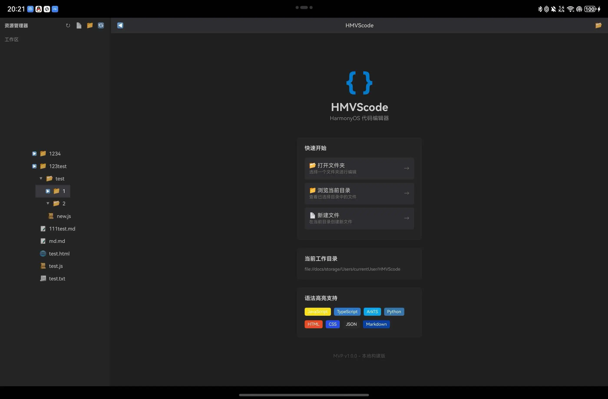

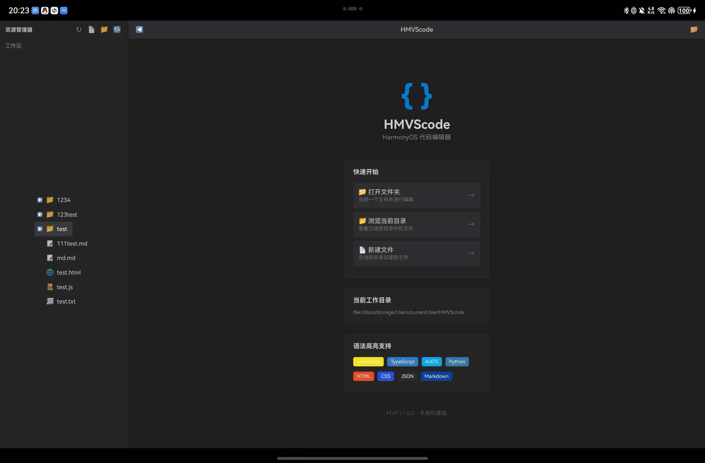

1. 问题1：test文件夹展开后异常缩进，它原本与 123test 文件夹平级，展开后却缩进了。
2. 问题2：test/1这个文件夹无法正常展开显示1.txt

```log
02-05 20:26:16.322   40570-40570   C02805/com.xbxy...InputKeyFlow  com.xbxyftx.HMVScode  I     [][OnPointerEvent:242] ac: down: 57989
02-05 20:26:16.323   40570-40570   C02805/com.xbxy...InputKeyFlow  com.xbxyftx.HMVScode  I     [P:D:57989][OnPointerEvent:649] recv
02-05 20:26:16.323   40570-40570   C04213/com.xbxy...InputKeyFlow  com.xbxyftx.HMVScode  I     HandleInputEvent: eid:90,InputId:57989,wid:522,ac:2
02-05 20:26:16.324   40570-40570   C03951/com.xbxy...InputKeyFlow  com.xbxyftx.HMVScode  I     [(100000:100000:scope)] ITK Id:57989, fId:0, T:0, I=0, M=0
02-05 20:26:16.326   40570-40570   C03951/com.xbxy...InputKeyFlow  com.xbxyftx.HMVScode  I     [(100000:100000:scope)] ITK Id:57989, TTHNI:fId: 0{ T: page, D: 6 };{ T: Scroll, D: 16 };{ T: Scroll, D: 17 };
02-05 20:26:16.326   40570-40570   C03951/com.xbxy...InputKeyFlow  com.xbxyftx.HMVScode  I     [(100000:100000:scope)] ITK Id:57989, TTHRTI: T ClickRecognizer info: { T: Scroll }; { T: Scroll }; { T: Row };T PanRecognizer info: { T: Scroll }; { T: Scroll };
02-05 20:26:16.328   40570-40570   C03919/com.xbx...InputTracking  com.xbxyftx.HMVScode  I     [(100000:100000:scope)] Consumed id:57989, last id:57795
02-05 20:26:16.328   40570-40570   C04213/com.xbxy...InputKeyFlow  com.xbxyftx.HMVScode  I     ConsumePointerEventInner: InputId:57989,wid:522,pointId:0,srcType:2,rect:[0,0,2800,1840],notify:1
02-05 20:26:16.328   40570-40570   C02805/com.xbxy...InputKeyFlow  com.xbxyftx.HMVScode  I     [][OnPointerEvent:242] ac: move: 57990
02-05 20:26:16.404   40570-40570   C02805/com.xbxy...InputKeyFlow  com.xbxyftx.HMVScode  I     [][OnPointerEvent:242] ac: move, first: 57991-(2026-02-05 20:26:16.328ms), 58005, count: 15, last: ac: up: 58006
02-05 20:26:16.404   40570-40570   C02805/com.xbxy...InputKeyFlow  com.xbxyftx.HMVScode  I     [P:U:58006][OnPointerEvent:649] recv
02-05 20:26:16.404   40570-40570   C04213/com.xbxy...InputKeyFlow  com.xbxyftx.HMVScode  I     HandleInputEvent: eid:91,InputId:58006,wid:522,ac:4
02-05 20:26:16.406   40570-40570   C03951/com.xbxy...InputKeyFlow  com.xbxyftx.HMVScode  I     [(100000:100000:scope)] ITK Id:58006, fId:0, T:1, I=0, M=0
02-05 20:26:16.406   40570-40570   C0391E/com.xbx...de/AceGesture  com.xbxyftx.HMVScode  I     [(100000:100000:scope)] Click try accept
02-05 20:26:16.406   40570-40570   C0390B/com.xbx...AceScrollable  com.xbxyftx.HMVScode  I     [(100000:100000:scope)] Scrollable GestureJudge:0, 0
02-05 20:26:16.406   40570-40570   C0391E/com.xbx...de/AceGesture  com.xbxyftx.HMVScode  I     [(100000:100000:scope)] Click gesture judge reject
02-05 20:26:16.406   40570-40570   C0391E/com.xbx...de/AceGesture  com.xbxyftx.HMVScode  I     [(100000:100000:scope)] Click try accept
02-05 20:26:16.407   40570-40570   C0390B/com.xbx...AceScrollable  com.xbxyftx.HMVScode  I     [(100000:100000:scope)] Scrollable GestureJudge:0, 0
02-05 20:26:16.407   40570-40570   C0391E/com.xbx...de/AceGesture  com.xbxyftx.HMVScode  I     [(100000:100000:scope)] Click gesture judge reject
02-05 20:26:16.407   40570-40570   C0391E/com.xbx...de/AceGesture  com.xbxyftx.HMVScode  I     [(100000:100000:scope)] Click try accept
02-05 20:26:16.407   40570-40570   C03951/com.xbxy...InputKeyFlow  com.xbxyftx.HMVScode  I     [(100000:100000:scope)] CLK RACC, T: Row
02-05 20:26:16.407   40570-40570   A03D00/com.xbx...MVScode/JSAPP  com.xbxyftx.HMVScode  E     === CLICK TRIGGERED === test
02-05 20:26:16.407   40570-40570   A03D00/com.xbx...MVScode/JSAPP  com.xbxyftx.HMVScode  I     [FILETREE-UI] Item clicked: test | Type: directory | Depth: 0
02-05 20:26:16.408   40570-40570   A03D00/com.xbx...MVScode/JSAPP  com.xbxyftx.HMVScode  E     === VIEWMODEL onFileClick CALLED === test
02-05 20:26:16.408   40570-40570   A03D00/com.xbx...MVScode/JSAPP  com.xbxyftx.HMVScode  I     [FILETREE-CLICK] ========== File/Directory Clicked ==========
02-05 20:26:16.408   40570-40570   A03D00/com.xbx...MVScode/JSAPP  com.xbxyftx.HMVScode  I     [FILETREE-CLICK] Name: test
02-05 20:26:16.408   40570-40570   A03D00/com.xbx...MVScode/JSAPP  com.xbxyftx.HMVScode  I     [FILETREE-CLICK] Path: file://docs/storage/Users/currentUser/HMVScode/test
02-05 20:26:16.408   40570-40570   A03D00/com.xbx...MVScode/JSAPP  com.xbxyftx.HMVScode  I     [FILETREE-CLICK] Type: directory
02-05 20:26:16.408   40570-40570   A03D00/com.xbx...MVScode/JSAPP  com.xbxyftx.HMVScode  I     [FILETREE-CLICK] IsExpanded (before): false
02-05 20:26:16.408   40570-40570   A03D00/com.xbx...MVScode/JSAPP  com.xbxyftx.HMVScode  I     [FILETREE-CLICK] This is a DIRECTORY
02-05 20:26:16.408   40570-40570   A03D00/com.xbx...MVScode/JSAPP  com.xbxyftx.HMVScode  I     [FILETREE-CLICK] Action: EXPAND directory
02-05 20:26:16.408   40570-40570   A03D00/com.xbx...MVScode/JSAPP  com.xbxyftx.HMVScode  I     [FILETREE-CLICK] Starting to load children...
02-05 20:26:16.408   40570-40570   A03D00/com.xbx...MVScode/JSAPP  com.xbxyftx.HMVScode  I     [FILETREE-CLICK] Calling fileService.listFiles()...
02-05 20:26:16.408   40570-40570   A03D00/com.xbx...MVScode/JSAPP  com.xbxyftx.HMVScode  I     [FILESERVICE-LIST] ========== List Files Called ==========
02-05 20:26:16.408   40570-40570   A03D00/com.xbx...MVScode/JSAPP  com.xbxyftx.HMVScode  I     [FILESERVICE-LIST] Input path: file://docs/storage/Users/currentUser/HMVScode/test
02-05 20:26:16.408   40570-40570   A03D00/com.xbx...MVScode/JSAPP  com.xbxyftx.HMVScode  I     [FILESERVICE-LIST] Is URI: true
02-05 20:26:16.408   40570-40570   A03D00/com.xbx...MVScode/JSAPP  com.xbxyftx.HMVScode  I     [FileService] Converted URI to path: file://docs/storage/Users/currentUser/HMVScode/test -> /storage/Users/currentUser/HMVScode/test
02-05 20:26:16.408   40570-40570   A03D00/com.xbx...MVScode/JSAPP  com.xbxyftx.HMVScode  I     [FILESERVICE-LIST] Actual path after conversion: /storage/Users/currentUser/HMVScode/test
02-05 20:26:16.408   40570-40570   A03D00/com.xbx...MVScode/JSAPP  com.xbxyftx.HMVScode  I     [FILESERVICE-LIST] Calling fs.listFile()...
02-05 20:26:16.409   40570-40570   C03919/com.xbx...InputTracking  com.xbxyftx.HMVScode  I     [(100000:100000:scope)] Consumed id:58006, last id:58005
02-05 20:26:16.409   40570-40570   C04213/com.xbxy...InputKeyFlow  com.xbxyftx.HMVScode  I     ConsumePointerEventInner: InputId:58006,wid:522,pointId:0,srcType:2,rect:[0,0,2800,1840],notify:1
02-05 20:26:16.410   40570-40570   A03D00/com.xbx...MVScode/JSAPP  com.xbxyftx.HMVScode  I     [FILESERVICE-LIST] ✅ fs.listFile() returned 3 items
02-05 20:26:16.410   40570-40570   A03D00/com.xbx...MVScode/JSAPP  com.xbxyftx.HMVScode  I     [FILESERVICE-LIST] File[0]: 1
02-05 20:26:16.410   40570-40570   A03D00/com.xbx...MVScode/JSAPP  com.xbxyftx.HMVScode  I     [FILESERVICE-LIST] File[1]: 2
02-05 20:26:16.410   40570-40570   A03D00/com.xbx...MVScode/JSAPP  com.xbxyftx.HMVScode  I     [FILESERVICE-LIST] File[2]: new.js
02-05 20:26:16.410   40570-40570   A03D00/com.xbx...MVScode/JSAPP  com.xbxyftx.HMVScode  I     [FILESERVICE-LIST] Processing: 1
02-05 20:26:16.410   40570-40570   A03D00/com.xbx...MVScode/JSAPP  com.xbxyftx.HMVScode  I     [FILESERVICE-LIST]   Full path (original format): file://docs/storage/Users/currentUser/HMVScode/test/1
02-05 20:26:16.410   40570-40570   A03D00/com.xbx...MVScode/JSAPP  com.xbxyftx.HMVScode  I     [FILESERVICE-LIST]   Actual full path: /storage/Users/currentUser/HMVScode/test/1
02-05 20:26:16.411   40570-40570   A03D00/com.xbx...MVScode/JSAPP  com.xbxyftx.HMVScode  I     [FILESERVICE-LIST]   Type: DIRECTORY
02-05 20:26:16.411   40570-40570   A03D00/com.xbx...MVScode/JSAPP  com.xbxyftx.HMVScode  I     [FILESERVICE-LIST]   Size: 3440
02-05 20:26:16.411   40570-40570   A03D00/com.xbx...MVScode/JSAPP  com.xbxyftx.HMVScode  I     [FILESERVICE-LIST]   ✅ Added to result
02-05 20:26:16.411   40570-40570   A03D00/com.xbx...MVScode/JSAPP  com.xbxyftx.HMVScode  I     [FILESERVICE-LIST] Processing: 2
02-05 20:26:16.411   40570-40570   A03D00/com.xbx...MVScode/JSAPP  com.xbxyftx.HMVScode  I     [FILESERVICE-LIST]   Full path (original format): file://docs/storage/Users/currentUser/HMVScode/test/2
02-05 20:26:16.411   40570-40570   A03D00/com.xbx...MVScode/JSAPP  com.xbxyftx.HMVScode  I     [FILESERVICE-LIST]   Actual full path: /storage/Users/currentUser/HMVScode/test/2
02-05 20:26:16.411   40570-40570   A03D00/com.xbx...MVScode/JSAPP  com.xbxyftx.HMVScode  I     [FILESERVICE-LIST]   Type: DIRECTORY
02-05 20:26:16.411   40570-40570   A03D00/com.xbx...MVScode/JSAPP  com.xbxyftx.HMVScode  I     [FILESERVICE-LIST]   Size: 3440
02-05 20:26:16.411   40570-40570   A03D00/com.xbx...MVScode/JSAPP  com.xbxyftx.HMVScode  I     [FILESERVICE-LIST]   ✅ Added to result
02-05 20:26:16.411   40570-40570   A03D00/com.xbx...MVScode/JSAPP  com.xbxyftx.HMVScode  I     [FILESERVICE-LIST] Processing: new.js
02-05 20:26:16.411   40570-40570   A03D00/com.xbx...MVScode/JSAPP  com.xbxyftx.HMVScode  I     [FILESERVICE-LIST]   Full path (original format): file://docs/storage/Users/currentUser/HMVScode/test/new.js
02-05 20:26:16.411   40570-40570   A03D00/com.xbx...MVScode/JSAPP  com.xbxyftx.HMVScode  I     [FILESERVICE-LIST]   Actual full path: /storage/Users/currentUser/HMVScode/test/new.js
02-05 20:26:16.412   40570-40570   A03D00/com.xbx...MVScode/JSAPP  com.xbxyftx.HMVScode  I     [FILESERVICE-LIST]   Type: FILE
02-05 20:26:16.412   40570-40570   A03D00/com.xbx...MVScode/JSAPP  com.xbxyftx.HMVScode  I     [FILESERVICE-LIST]   Size: 0
02-05 20:26:16.412   40570-40570   A03D00/com.xbx...MVScode/JSAPP  com.xbxyftx.HMVScode  I     [FILESERVICE-LIST]   ✅ Added to result
02-05 20:26:16.412   40570-40570   A03D00/com.xbx...MVScode/JSAPP  com.xbxyftx.HMVScode  I     [FILESERVICE-LIST] ✅ Total result count: 3
02-05 20:26:16.412   40570-40570   A03D00/com.xbx...MVScode/JSAPP  com.xbxyftx.HMVScode  I     [FILESERVICE-LIST] ✅ Sorted result
02-05 20:26:16.412   40570-40570   A03D00/com.xbx...MVScode/JSAPP  com.xbxyftx.HMVScode  I     [FILESERVICE-LIST] ========== List Files Finished ==========
02-05 20:26:16.412   40570-40570   A03D00/com.xbx...MVScode/JSAPP  com.xbxyftx.HMVScode  I     [FILETREE-CLICK] ✅ Successfully loaded 3 children
02-05 20:26:16.412   40570-40570   A03D00/com.xbx...MVScode/JSAPP  com.xbxyftx.HMVScode  I     [FILETREE-CLICK] Child[0]: 1 | Type: directory | Path: file://docs/storage/Users/currentUser/HMVScode/test/1
02-05 20:26:16.412   40570-40570   A03D00/com.xbx...MVScode/JSAPP  com.xbxyftx.HMVScode  I     [FILETREE-CLICK] Child[1]: 2 | Type: directory | Path: file://docs/storage/Users/currentUser/HMVScode/test/2
02-05 20:26:16.412   40570-40570   A03D00/com.xbx...MVScode/JSAPP  com.xbxyftx.HMVScode  I     [FILETREE-CLICK] Child[2]: new.js | Type: file | Path: file://docs/storage/Users/currentUser/HMVScode/test/new.js
02-05 20:26:16.412   40570-40570   A03D00/com.xbx...MVScode/JSAPP  com.xbxyftx.HMVScode  I     [FILETREE-CLICK] Prepared child: 1 | isExpanded: false
02-05 20:26:16.412   40570-40570   A03D00/com.xbx...MVScode/JSAPP  com.xbxyftx.HMVScode  I     [FILETREE-CLICK] Prepared child: 2 | isExpanded: false
02-05 20:26:16.412   40570-40570   A03D00/com.xbx...MVScode/JSAPP  com.xbxyftx.HMVScode  I     [FILETREE-CLICK] Prepared child: new.js | isExpanded: false
02-05 20:26:16.412   40570-40570   A03D00/com.xbx...MVScode/JSAPP  com.xbxyftx.HMVScode  I     [FILETREE-CLICK] ✅ Updated file.children, count: 3
02-05 20:26:16.412   40570-40570   A03D00/com.xbx...MVScode/JSAPP  com.xbxyftx.HMVScode  I     [FILETREE-CLICK] Updating fileList...
02-05 20:26:16.412   40570-40570   A03D00/com.xbx...MVScode/JSAPP  com.xbxyftx.HMVScode  I     [FILETREE-CLICK] Found index in fileList: 2
02-05 20:26:16.412   40570-40570   A03D00/com.xbx...MVScode/JSAPP  com.xbxyftx.HMVScode  I     [FILETREE-CLICK] Updated file isExpanded: true
02-05 20:26:16.412   40570-40570   A03D00/com.xbx...MVScode/JSAPP  com.xbxyftx.HMVScode  I     [FILETREE-CLICK] Updated file children count: 3
02-05 20:26:16.412   40570-40570   A03D00/com.xbx...MVScode/JSAPP  com.xbxyftx.HMVScode  I     [FILETREE-CLICK] ✅ fileList deep copied, total count: 8
02-05 20:26:16.412   40570-40570   A03D00/com.xbx...MVScode/JSAPP  com.xbxyftx.HMVScode  E     [FILETREE-CLICK] ✅ Used deep copy to trigger reactive update
02-05 20:26:16.412   40570-40570   A03D00/com.xbx...MVScode/JSAPP  com.xbxyftx.HMVScode  I     [FILETREE-CLICK] ========== Click Handler Finished ==========
02-05 20:26:16.426   40570-40570   A03D00/com.xbx...MVScode/JSAPP  com.xbxyftx.HMVScode  I     [FILETREE-RENDER] Directory item: 1 | isExpanded: false | hasChildren: 0 | Depth: 1
02-05 20:26:16.426   40570-40570   A03D00/com.xbx...MVScode/JSAPP  com.xbxyftx.HMVScode  I     [FILETREE-RENDER] Directory item: 2 | isExpanded: false | hasChildren: 0 | Depth: 1
02-05 20:26:17.998   40570-40570   C02805/com.xbxy...InputKeyFlow  com.xbxyftx.HMVScode  I     [][OnPointerEvent:242] ac: down: 58007
02-05 20:26:17.998   40570-40570   C02805/com.xbxy...InputKeyFlow  com.xbxyftx.HMVScode  I     [P:D:58007][OnPointerEvent:649] recv
02-05 20:26:17.998   40570-40570   C04213/com.xbxy...InputKeyFlow  com.xbxyftx.HMVScode  I     HandleInputEvent: eid:92,InputId:58007,wid:522,ac:2
02-05 20:26:17.999   40570-40570   C03951/com.xbxy...InputKeyFlow  com.xbxyftx.HMVScode  I     [(100000:100000:scope)] ITK Id:58007, fId:0, T:0, I=0, M=0
02-05 20:26:18.000   40570-40570   C03951/com.xbxy...InputKeyFlow  com.xbxyftx.HMVScode  I     [(100000:100000:scope)] ITK Id:58007, TTHNI:fId: 0{ T: page, D: 6 };{ T: Scroll, D: 16 };{ T: Scroll, D: 17 };
02-05 20:26:18.000   40570-40570   C03951/com.xbxy...InputKeyFlow  com.xbxyftx.HMVScode  I     [(100000:100000:scope)] ITK Id:58007, TTHRTI: T ClickRecognizer info: { T: Scroll }; { T: Scroll }; { T: Row };T PanRecognizer info: { T: Scroll }; { T: Scroll };
02-05 20:26:18.001   40570-40570   C03919/com.xbx...InputTracking  com.xbxyftx.HMVScode  I     [(100000:100000:scope)] Consumed id:58007, last id:58005
02-05 20:26:18.001   40570-40570   C04213/com.xbxy...InputKeyFlow  com.xbxyftx.HMVScode  I     ConsumePointerEventInner: InputId:58007,wid:522,pointId:0,srcType:2,rect:[0,0,2800,1840],notify:1
02-05 20:26:18.001   40570-40570   C02805/com.xbxy...InputKeyFlow  com.xbxyftx.HMVScode  I     [][OnPointerEvent:242] ac: move: 58008
02-05 20:26:18.081   40570-40570   C02805/com.xbxy...InputKeyFlow  com.xbxyftx.HMVScode  I     [][OnPointerEvent:242] ac: move, first: 58009-(2026-02-05 20:26:18.001ms), 58023, count: 15, last: ac: up: 58024
02-05 20:26:18.081   40570-40570   C02805/com.xbxy...InputKeyFlow  com.xbxyftx.HMVScode  I     [P:U:58024][OnPointerEvent:649] recv
02-05 20:26:18.081   40570-40570   C04213/com.xbxy...InputKeyFlow  com.xbxyftx.HMVScode  I     HandleInputEvent: eid:93,InputId:58024,wid:522,ac:4
02-05 20:26:18.082   40570-40570   C03951/com.xbxy...InputKeyFlow  com.xbxyftx.HMVScode  I     [(100000:100000:scope)] ITK Id:58024, fId:0, T:1, I=0, M=0
02-05 20:26:18.083   40570-40570   C0391E/com.xbx...de/AceGesture  com.xbxyftx.HMVScode  I     [(100000:100000:scope)] Click try accept
02-05 20:26:18.083   40570-40570   C0390B/com.xbx...AceScrollable  com.xbxyftx.HMVScode  I     [(100000:100000:scope)] Scrollable GestureJudge:0, 0
02-05 20:26:18.083   40570-40570   C0391E/com.xbx...de/AceGesture  com.xbxyftx.HMVScode  I     [(100000:100000:scope)] Click gesture judge reject
02-05 20:26:18.083   40570-40570   C0391E/com.xbx...de/AceGesture  com.xbxyftx.HMVScode  I     [(100000:100000:scope)] Click try accept
02-05 20:26:18.083   40570-40570   C0390B/com.xbx...AceScrollable  com.xbxyftx.HMVScode  I     [(100000:100000:scope)] Scrollable GestureJudge:0, 0
02-05 20:26:18.083   40570-40570   C0391E/com.xbx...de/AceGesture  com.xbxyftx.HMVScode  I     [(100000:100000:scope)] Click gesture judge reject
02-05 20:26:18.083   40570-40570   C0391E/com.xbx...de/AceGesture  com.xbxyftx.HMVScode  I     [(100000:100000:scope)] Click try accept
02-05 20:26:18.083   40570-40570   C03951/com.xbxy...InputKeyFlow  com.xbxyftx.HMVScode  I     [(100000:100000:scope)] CLK RACC, T: Row
02-05 20:26:18.083   40570-40570   A03D00/com.xbx...MVScode/JSAPP  com.xbxyftx.HMVScode  E     === CLICK TRIGGERED === 123test
02-05 20:26:18.083   40570-40570   A03D00/com.xbx...MVScode/JSAPP  com.xbxyftx.HMVScode  I     [FILETREE-UI] Item clicked: 123test | Type: directory | Depth: 0
02-05 20:26:18.083   40570-40570   A03D00/com.xbx...MVScode/JSAPP  com.xbxyftx.HMVScode  E     === VIEWMODEL onFileClick CALLED === 123test
02-05 20:26:18.083   40570-40570   A03D00/com.xbx...MVScode/JSAPP  com.xbxyftx.HMVScode  I     [FILETREE-CLICK] ========== File/Directory Clicked ==========
02-05 20:26:18.083   40570-40570   A03D00/com.xbx...MVScode/JSAPP  com.xbxyftx.HMVScode  I     [FILETREE-CLICK] Name: 123test
02-05 20:26:18.083   40570-40570   A03D00/com.xbx...MVScode/JSAPP  com.xbxyftx.HMVScode  I     [FILETREE-CLICK] Path: file://docs/storage/Users/currentUser/HMVScode/123test
02-05 20:26:18.083   40570-40570   A03D00/com.xbx...MVScode/JSAPP  com.xbxyftx.HMVScode  I     [FILETREE-CLICK] Type: directory
02-05 20:26:18.083   40570-40570   A03D00/com.xbx...MVScode/JSAPP  com.xbxyftx.HMVScode  I     [FILETREE-CLICK] IsExpanded (before): false
02-05 20:26:18.084   40570-40570   A03D00/com.xbx...MVScode/JSAPP  com.xbxyftx.HMVScode  I     [FILETREE-CLICK] This is a DIRECTORY
02-05 20:26:18.084   40570-40570   A03D00/com.xbx...MVScode/JSAPP  com.xbxyftx.HMVScode  I     [FILETREE-CLICK] Action: EXPAND directory
02-05 20:26:18.084   40570-40570   A03D00/com.xbx...MVScode/JSAPP  com.xbxyftx.HMVScode  I     [FILETREE-CLICK] Starting to load children...
02-05 20:26:18.084   40570-40570   A03D00/com.xbx...MVScode/JSAPP  com.xbxyftx.HMVScode  I     [FILETREE-CLICK] Calling fileService.listFiles()...
02-05 20:26:18.084   40570-40570   A03D00/com.xbx...MVScode/JSAPP  com.xbxyftx.HMVScode  I     [FILESERVICE-LIST] ========== List Files Called ==========
02-05 20:26:18.084   40570-40570   A03D00/com.xbx...MVScode/JSAPP  com.xbxyftx.HMVScode  I     [FILESERVICE-LIST] Input path: file://docs/storage/Users/currentUser/HMVScode/123test
02-05 20:26:18.084   40570-40570   A03D00/com.xbx...MVScode/JSAPP  com.xbxyftx.HMVScode  I     [FILESERVICE-LIST] Is URI: true
02-05 20:26:18.084   40570-40570   A03D00/com.xbx...MVScode/JSAPP  com.xbxyftx.HMVScode  I     [FileService] Converted URI to path: file://docs/storage/Users/currentUser/HMVScode/123test -> /storage/Users/currentUser/HMVScode/123test
02-05 20:26:18.084   40570-40570   A03D00/com.xbx...MVScode/JSAPP  com.xbxyftx.HMVScode  I     [FILESERVICE-LIST] Actual path after conversion: /storage/Users/currentUser/HMVScode/123test
02-05 20:26:18.084   40570-40570   A03D00/com.xbx...MVScode/JSAPP  com.xbxyftx.HMVScode  I     [FILESERVICE-LIST] Calling fs.listFile()...
02-05 20:26:18.085   40570-40570   C03919/com.xbx...InputTracking  com.xbxyftx.HMVScode  I     [(100000:100000:scope)] Consumed id:58024, last id:58023
02-05 20:26:18.085   40570-40570   C04213/com.xbxy...InputKeyFlow  com.xbxyftx.HMVScode  I     ConsumePointerEventInner: InputId:58024,wid:522,pointId:0,srcType:2,rect:[0,0,2800,1840],notify:1
02-05 20:26:18.085   40570-40570   A03D00/com.xbx...MVScode/JSAPP  com.xbxyftx.HMVScode  I     [FILESERVICE-LIST] ✅ fs.listFile() returned 0 items
02-05 20:26:18.085   40570-40570   A03D00/com.xbx...MVScode/JSAPP  com.xbxyftx.HMVScode  I     [FILESERVICE-LIST] ✅ Total result count: 0
02-05 20:26:18.086   40570-40570   A03D00/com.xbx...MVScode/JSAPP  com.xbxyftx.HMVScode  I     [FILESERVICE-LIST] ✅ Sorted result
02-05 20:26:18.086   40570-40570   A03D00/com.xbx...MVScode/JSAPP  com.xbxyftx.HMVScode  I     [FILESERVICE-LIST] ========== List Files Finished ==========
02-05 20:26:18.086   40570-40570   A03D00/com.xbx...MVScode/JSAPP  com.xbxyftx.HMVScode  I     [FILETREE-CLICK] ✅ Successfully loaded 0 children
02-05 20:26:18.086   40570-40570   A03D00/com.xbx...MVScode/JSAPP  com.xbxyftx.HMVScode  I     [FILETREE-CLICK] ✅ Updated file.children, count: 0
02-05 20:26:18.086   40570-40570   A03D00/com.xbx...MVScode/JSAPP  com.xbxyftx.HMVScode  I     [FILETREE-CLICK] Updating fileList...
02-05 20:26:18.086   40570-40570   A03D00/com.xbx...MVScode/JSAPP  com.xbxyftx.HMVScode  I     [FILETREE-CLICK] Found index in fileList: 1
02-05 20:26:18.086   40570-40570   A03D00/com.xbx...MVScode/JSAPP  com.xbxyftx.HMVScode  I     [FILETREE-CLICK] Updated file isExpanded: true
02-05 20:26:18.086   40570-40570   A03D00/com.xbx...MVScode/JSAPP  com.xbxyftx.HMVScode  I     [FILETREE-CLICK] Updated file children count: 0
02-05 20:26:18.086   40570-40570   A03D00/com.xbx...MVScode/JSAPP  com.xbxyftx.HMVScode  I     [FILETREE-CLICK] ✅ fileList deep copied, total count: 8
02-05 20:26:18.086   40570-40570   A03D00/com.xbx...MVScode/JSAPP  com.xbxyftx.HMVScode  E     [FILETREE-CLICK] ✅ Used deep copy to trigger reactive update
02-05 20:26:18.086   40570-40570   A03D00/com.xbx...MVScode/JSAPP  com.xbxyftx.HMVScode  I     [FILETREE-CLICK] ========== Click Handler Finished ==========
02-05 20:26:20.109   40570-40570   C02805/com.xbxy...InputKeyFlow  com.xbxyftx.HMVScode  I     [][OnPointerEvent:242] ac: down: 58025
02-05 20:26:20.109   40570-40570   C02805/com.xbxy...InputKeyFlow  com.xbxyftx.HMVScode  I     [P:D:58025][OnPointerEvent:649] recv
02-05 20:26:20.109   40570-40570   C04213/com.xbxy...InputKeyFlow  com.xbxyftx.HMVScode  I     HandleInputEvent: eid:94,InputId:58025,wid:522,ac:2
02-05 20:26:20.110   40570-40570   C03951/com.xbxy...InputKeyFlow  com.xbxyftx.HMVScode  I     [(100000:100000:scope)] ITK Id:58025, fId:0, T:0, I=0, M=0
02-05 20:26:20.111   40570-40570   C03951/com.xbxy...InputKeyFlow  com.xbxyftx.HMVScode  I     [(100000:100000:scope)] ITK Id:58025, TTHNI:fId: 0{ T: page, D: 6 };{ T: Scroll, D: 16 };{ T: Scroll, D: 17 };
02-05 20:26:20.111   40570-40570   C03951/com.xbxy...InputKeyFlow  com.xbxyftx.HMVScode  I     [(100000:100000:scope)] ITK Id:58025, TTHRTI: T ClickRecognizer info: { T: Scroll }; { T: Scroll }; { T: Row };T PanRecognizer info: { T: Scroll }; { T: Scroll };
02-05 20:26:20.113   40570-40570   C03919/com.xbx...InputTracking  com.xbxyftx.HMVScode  I     [(100000:100000:scope)] Consumed id:58025, last id:58023
02-05 20:26:20.113   40570-40570   C04213/com.xbxy...InputKeyFlow  com.xbxyftx.HMVScode  I     ConsumePointerEventInner: InputId:58025,wid:522,pointId:0,srcType:2,rect:[0,0,2800,1840],notify:1
02-05 20:26:20.113   40570-40570   C02805/com.xbxy...InputKeyFlow  com.xbxyftx.HMVScode  I     [][OnPointerEvent:242] ac: move: 58026
02-05 20:26:20.202   40570-40570   C02805/com.xbxy...InputKeyFlow  com.xbxyftx.HMVScode  I     [][OnPointerEvent:242] ac: move, first: 58027-(2026-02-05 20:26:20.113ms), 58033, count: 7, last: ac: up: 58034
02-05 20:26:20.202   40570-40570   C02805/com.xbxy...InputKeyFlow  com.xbxyftx.HMVScode  I     [P:U:58034][OnPointerEvent:649] recv
02-05 20:26:20.202   40570-40570   C04213/com.xbxy...InputKeyFlow  com.xbxyftx.HMVScode  I     HandleInputEvent: eid:95,InputId:58034,wid:522,ac:4
02-05 20:26:20.203   40570-40570   C03951/com.xbxy...InputKeyFlow  com.xbxyftx.HMVScode  I     [(100000:100000:scope)] ITK Id:58034, fId:0, T:1, I=0, M=0
02-05 20:26:20.203   40570-40570   C0391E/com.xbx...de/AceGesture  com.xbxyftx.HMVScode  I     [(100000:100000:scope)] Click try accept
02-05 20:26:20.203   40570-40570   C0390B/com.xbx...AceScrollable  com.xbxyftx.HMVScode  I     [(100000:100000:scope)] Scrollable GestureJudge:0, 0
02-05 20:26:20.203   40570-40570   C0391E/com.xbx...de/AceGesture  com.xbxyftx.HMVScode  I     [(100000:100000:scope)] Click gesture judge reject
02-05 20:26:20.203   40570-40570   C0391E/com.xbx...de/AceGesture  com.xbxyftx.HMVScode  I     [(100000:100000:scope)] Click try accept
02-05 20:26:20.203   40570-40570   C0390B/com.xbx...AceScrollable  com.xbxyftx.HMVScode  I     [(100000:100000:scope)] Scrollable GestureJudge:0, 0
02-05 20:26:20.203   40570-40570   C0391E/com.xbx...de/AceGesture  com.xbxyftx.HMVScode  I     [(100000:100000:scope)] Click gesture judge reject
02-05 20:26:20.203   40570-40570   C0391E/com.xbx...de/AceGesture  com.xbxyftx.HMVScode  I     [(100000:100000:scope)] Click try accept
02-05 20:26:20.203   40570-40570   C03951/com.xbxy...InputKeyFlow  com.xbxyftx.HMVScode  I     [(100000:100000:scope)] CLK RACC, T: Row
02-05 20:26:20.204   40570-40570   A03D00/com.xbx...MVScode/JSAPP  com.xbxyftx.HMVScode  E     === CLICK TRIGGERED === 1
02-05 20:26:20.204   40570-40570   A03D00/com.xbx...MVScode/JSAPP  com.xbxyftx.HMVScode  I     [FILETREE-UI] Item clicked: 1 | Type: directory | Depth: 1
02-05 20:26:20.204   40570-40570   A03D00/com.xbx...MVScode/JSAPP  com.xbxyftx.HMVScode  E     === VIEWMODEL onFileClick CALLED === 1
02-05 20:26:20.204   40570-40570   A03D00/com.xbx...MVScode/JSAPP  com.xbxyftx.HMVScode  I     [FILETREE-CLICK] ========== File/Directory Clicked ==========
02-05 20:26:20.204   40570-40570   A03D00/com.xbx...MVScode/JSAPP  com.xbxyftx.HMVScode  I     [FILETREE-CLICK] Name: 1
02-05 20:26:20.204   40570-40570   A03D00/com.xbx...MVScode/JSAPP  com.xbxyftx.HMVScode  I     [FILETREE-CLICK] Path: file://docs/storage/Users/currentUser/HMVScode/test/1
02-05 20:26:20.204   40570-40570   A03D00/com.xbx...MVScode/JSAPP  com.xbxyftx.HMVScode  I     [FILETREE-CLICK] Type: directory
02-05 20:26:20.204   40570-40570   A03D00/com.xbx...MVScode/JSAPP  com.xbxyftx.HMVScode  I     [FILETREE-CLICK] IsExpanded (before): false
02-05 20:26:20.205   40570-40570   A03D00/com.xbx...MVScode/JSAPP  com.xbxyftx.HMVScode  I     [FILETREE-CLICK] This is a DIRECTORY
02-05 20:26:20.205   40570-40570   A03D00/com.xbx...MVScode/JSAPP  com.xbxyftx.HMVScode  I     [FILETREE-CLICK] Action: EXPAND directory
02-05 20:26:20.205   40570-40570   A03D00/com.xbx...MVScode/JSAPP  com.xbxyftx.HMVScode  I     [FILETREE-CLICK] Starting to load children...
02-05 20:26:20.205   40570-40570   A03D00/com.xbx...MVScode/JSAPP  com.xbxyftx.HMVScode  I     [FILETREE-CLICK] Calling fileService.listFiles()...
02-05 20:26:20.205   40570-40570   A03D00/com.xbx...MVScode/JSAPP  com.xbxyftx.HMVScode  I     [FILESERVICE-LIST] ========== List Files Called ==========
02-05 20:26:20.205   40570-40570   A03D00/com.xbx...MVScode/JSAPP  com.xbxyftx.HMVScode  I     [FILESERVICE-LIST] Input path: file://docs/storage/Users/currentUser/HMVScode/test/1
02-05 20:26:20.205   40570-40570   A03D00/com.xbx...MVScode/JSAPP  com.xbxyftx.HMVScode  I     [FILESERVICE-LIST] Is URI: true
02-05 20:26:20.205   40570-40570   A03D00/com.xbx...MVScode/JSAPP  com.xbxyftx.HMVScode  I     [FileService] Converted URI to path: file://docs/storage/Users/currentUser/HMVScode/test/1 -> /storage/Users/currentUser/HMVScode/test/1
02-05 20:26:20.205   40570-40570   A03D00/com.xbx...MVScode/JSAPP  com.xbxyftx.HMVScode  I     [FILESERVICE-LIST] Actual path after conversion: /storage/Users/currentUser/HMVScode/test/1
02-05 20:26:20.205   40570-40570   A03D00/com.xbx...MVScode/JSAPP  com.xbxyftx.HMVScode  I     [FILESERVICE-LIST] Calling fs.listFile()...
02-05 20:26:20.206   40570-40570   C03919/com.xbx...InputTracking  com.xbxyftx.HMVScode  I     [(100000:100000:scope)] Consumed id:58034, last id:58033
02-05 20:26:20.206   40570-40570   C04213/com.xbxy...InputKeyFlow  com.xbxyftx.HMVScode  I     ConsumePointerEventInner: InputId:58034,wid:522,pointId:0,srcType:2,rect:[0,0,2800,1840],notify:1
02-05 20:26:20.207   40570-40570   A03D00/com.xbx...MVScode/JSAPP  com.xbxyftx.HMVScode  I     [FILESERVICE-LIST] ✅ fs.listFile() returned 1 items
02-05 20:26:20.207   40570-40570   A03D00/com.xbx...MVScode/JSAPP  com.xbxyftx.HMVScode  I     [FILESERVICE-LIST] File[0]: 1.txt
02-05 20:26:20.207   40570-40570   A03D00/com.xbx...MVScode/JSAPP  com.xbxyftx.HMVScode  I     [FILESERVICE-LIST] Processing: 1.txt
02-05 20:26:20.207   40570-40570   A03D00/com.xbx...MVScode/JSAPP  com.xbxyftx.HMVScode  I     [FILESERVICE-LIST]   Full path (original format): file://docs/storage/Users/currentUser/HMVScode/test/1/1.txt
02-05 20:26:20.207   40570-40570   A03D00/com.xbx...MVScode/JSAPP  com.xbxyftx.HMVScode  I     [FILESERVICE-LIST]   Actual full path: /storage/Users/currentUser/HMVScode/test/1/1.txt
02-05 20:26:20.207   40570-40570   A03D00/com.xbx...MVScode/JSAPP  com.xbxyftx.HMVScode  I     [FILESERVICE-LIST]   Type: FILE
02-05 20:26:20.207   40570-40570   A03D00/com.xbx...MVScode/JSAPP  com.xbxyftx.HMVScode  I     [FILESERVICE-LIST]   Size: 4
02-05 20:26:20.207   40570-40570   A03D00/com.xbx...MVScode/JSAPP  com.xbxyftx.HMVScode  I     [FILESERVICE-LIST]   ✅ Added to result
02-05 20:26:20.207   40570-40570   A03D00/com.xbx...MVScode/JSAPP  com.xbxyftx.HMVScode  I     [FILESERVICE-LIST] ✅ Total result count: 1
02-05 20:26:20.207   40570-40570   A03D00/com.xbx...MVScode/JSAPP  com.xbxyftx.HMVScode  I     [FILESERVICE-LIST] ✅ Sorted result
02-05 20:26:20.207   40570-40570   A03D00/com.xbx...MVScode/JSAPP  com.xbxyftx.HMVScode  I     [FILESERVICE-LIST] ========== List Files Finished ==========
02-05 20:26:20.207   40570-40570   A03D00/com.xbx...MVScode/JSAPP  com.xbxyftx.HMVScode  I     [FILETREE-CLICK] ✅ Successfully loaded 1 children
02-05 20:26:20.207   40570-40570   A03D00/com.xbx...MVScode/JSAPP  com.xbxyftx.HMVScode  I     [FILETREE-CLICK] Child[0]: 1.txt | Type: file | Path: file://docs/storage/Users/currentUser/HMVScode/test/1/1.txt
02-05 20:26:20.207   40570-40570   A03D00/com.xbx...MVScode/JSAPP  com.xbxyftx.HMVScode  I     [FILETREE-CLICK] Prepared child: 1.txt | isExpanded: false
02-05 20:26:20.207   40570-40570   A03D00/com.xbx...MVScode/JSAPP  com.xbxyftx.HMVScode  I     [FILETREE-CLICK] ✅ Updated file.children, count: 1
02-05 20:26:20.207   40570-40570   A03D00/com.xbx...MVScode/JSAPP  com.xbxyftx.HMVScode  I     [FILETREE-CLICK] Updating fileList...
02-05 20:26:20.207   40570-40570   A03D00/com.xbx...MVScode/JSAPP  com.xbxyftx.HMVScode  I     [FILETREE-CLICK] Found index in fileList: -1
02-05 20:26:20.207   40570-40570   A03D00/com.xbx...MVScode/JSAPP  com.xbxyftx.HMVScode  E     [FILETREE-CLICK] ❌ File not found in fileList!

```

### WebView编辑器成功读取现有文件

<video width="100%" controls>
  <source src="52.mp4" type="video/mp4">
  您的浏览器不支持视频标签。
</video>
