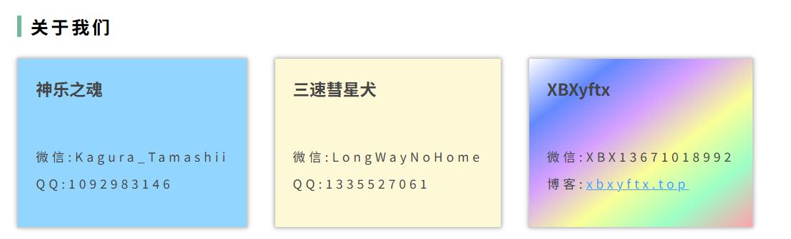
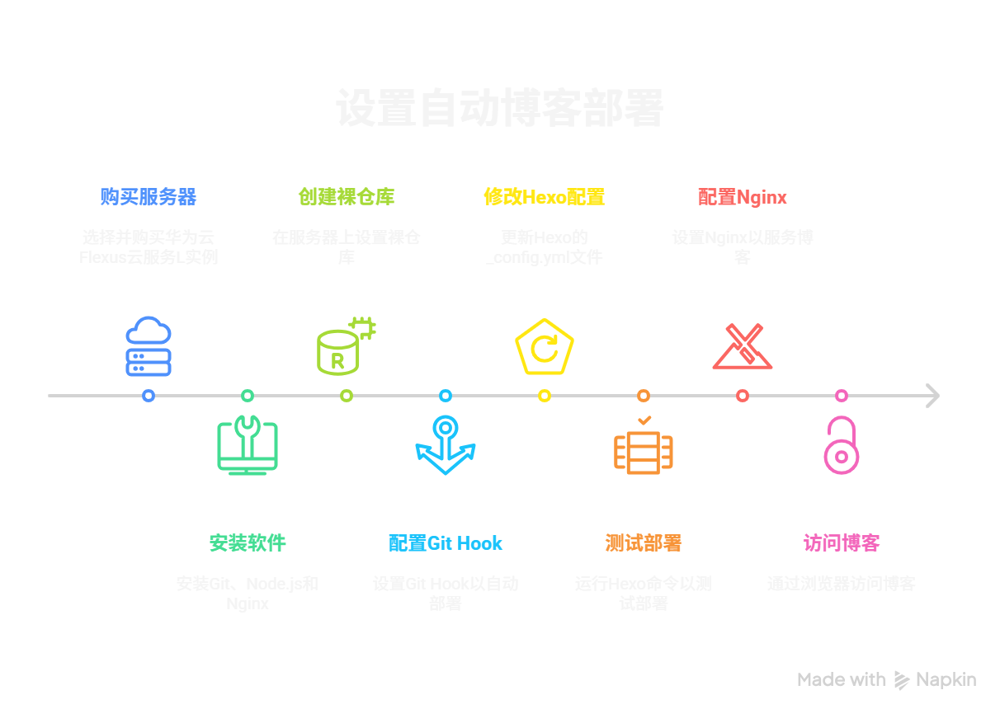

## 前言


不想看前言的可以直接点传送门跳转到正式解决方案部分哦  
[正式解决方案传送门](#正式解决方案)


继上一次整出来了一套一块钱国内直连方案之后[博客文章传送门](/2025/03/20/DirectConnection/)还是出现了校园网以及苹果无法访问的问题，属于是我常用于展示的场景直连还是非常不稳定。而且连接速度的快慢也是与时间有关，白天快一点晚上就会慢，很奇怪。

于是呢，怎么都得迈出这一步，迟早都得和服务器部署打交道，而且在此之前婷姐把创客的社团官网交给我让我在社团官网的宝塔上去自由的尝试也是给了我迈出第一步的机会，这里也是再次感谢一下婷姐。



## 准备工作

### 购买服务器

我选择的是华为云Flexus云服务L实例。

系统选择的是ubuntu宝塔可视化面板，搭配宝塔面板进行可视化管理，便于后续配置 Nginx 和网站目录。

### 安装必要的软件

登录服务器后，我安装了以下工具：

- Git
- Node.js（用于 Hexo 生成静态文件）
- Nginx（或通过宝塔配置）

同时创建了一个专门用于 Git 操作的用户 `git`，并为其配置了 SSH 公钥认证。

## 正式解决方案

### 第一步：创建裸仓库

在服务器上创建一个裸仓库用于接收本地推送：

```bash
mkdir -p /home/git/blog.git && cd /home/git/blog.git
git init --bare
```

然后创建一个用于存放 Hexo 静态文件的目录：

```bash
mkdir -p /home/hexo
chown git:git -R /home/hexo
chmod 755 /home/hexo
```

### 第二步：配置 Git Hook

进入钩子目录：

```bash
cd /home/git/blog.git/hooks
```

创建 `post-receive` 文件：

```bash
nano post-receive
```

写入以下内容：

```bash
#!/bin/bash
GIT_WORK_TREE=/home/hexo git checkout -f
```

赋予执行权限：

```bash
chmod +x post-receive
```

这表示每当有新的提交推送到仓库时，Git 会自动把文件同步到 `/home/hexo` 目录中。

### 第三步：配置 Hexo 的 `_config.yml`

修改 Hexo 项目的 `_config.yml` 文件中的 deploy 配置：

```yaml
deploy:
  type: git
  repo: git@your_server_ip:/home/git/blog.git
  branch: main
```

确保分支名称与你在服务器上创建的分支一致。

### 第四步：测试部署流程

在本地执行：

```bash
hexo clean && hexo generate && hexo deploy
```

如果一切顺利，服务器上的 `/home/hexo` 目录中就会生成 Hexo 的静态文件。

### 第五步：配置 Nginx 指向 `/home/hexo`

如果你使用的是宝塔面板，只需添加站点并将网站根目录设置为 `/home/hexo` 即可。

如果是手动配置 Nginx，则编辑配置文件：

```nginx
server {
    listen 80;
    server_name your_domain_or_ip;

    location / {
        root /home/hexo;
        index index.html;
        try_files $uri $uri/ =404;
    }
}
```

重启 Nginx：

```bash
systemctl restart nginx
```

### 第六步：访问你的博客

打开浏览器访问：

```js
http://your_server_ip
```

或绑定域名后：

```js
http://yourdomain.com
```

你应该能看到你的 Hexo 博客页面 ✅

## 中间遇到的问题与解决方案

### 问题一：`.user.ini` 文件无法删除

在设置 `/home/hexo` 目录权限时，发现该目录下存在 `.user.ini` 文件，无法删除也无法更改权限。

**原因**：宝塔面板对网站目录进行了写保护，设置了 immutable 属性。

**解决方法**：

```bash
chattr -i /home/hexo/.user.ini
rm -rf /home/hexo/.user.ini
```

### 问题二：Git Hook 报错：`fatal: detected dubious ownership in repository`

Git 在某些版本中加入了安全机制，如果仓库目录的所有者不符合要求，会阻止操作。

**解决方法**：

```bash
git config --global --add safe.directory /home/git/blog.git
```

### 问题三：Git Hook 报错：`You are on a branch yet to be born`

说明当前裸仓库中还没有任何分支。

**解决方法**：

```bash
cd /home/git/blog.git
git symbolic-ref HEAD refs/heads/main
```

然后从本地推送一次代码即可创建分支。

### 问题四：Nginx 访问出现 403 或空白页

可能是目录权限未正确设置，或者缺少 `index.html` 文件。

**解决方法**：

- 检查 `/home/hexo` 是否有 `index.html`
- 设置正确的目录权限：
  ```bash
  chown git:git -R /home/hexo
  chmod 755 /home/hexo
  ```

## 结语

在整个搭建过程中，我经历了无数次权限报错、Git 分支异常、Hook 执行失败等令人崩溃的瞬间。但每解决一个问题，我都感到无比的成就感。

从最初的 GitHub Pages 到现在的自建服务器 + Git Hook 自动部署，不仅提升了博客在国内的访问速度，也让我对 Linux 系统、Git 工作流、自动化部署有了更深的理解。

我相信，这只是我技术成长之路的一个小小起点。未来，我会继续优化博客体验，探索更多可能性，比如：

- 使用 CI/CD 工具实现多环境部署
- 引入 HTTPS 加密访问
- 添加自动备份机制
- 探索静态资源 CDN 加速

---

希望这篇博客能对你有所帮助，如果你也有类似的经历，欢迎留言交流 😊


