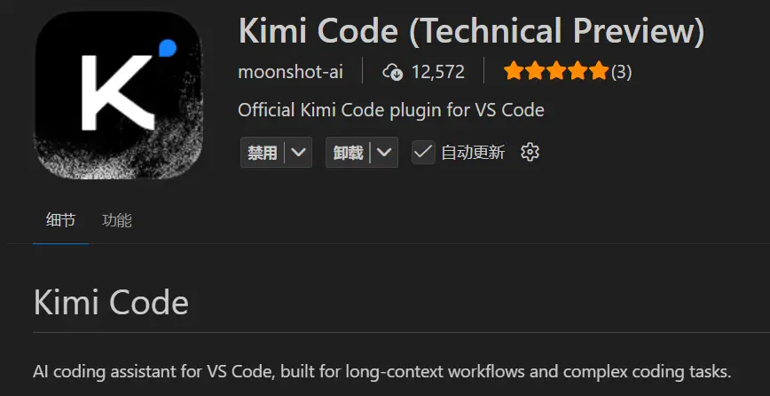
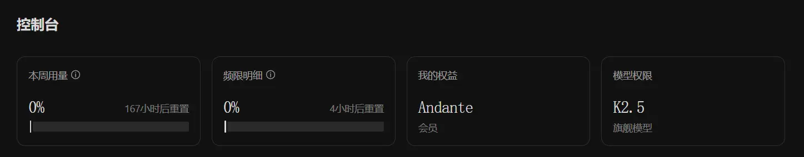
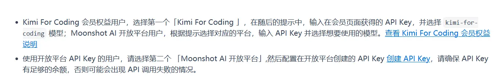
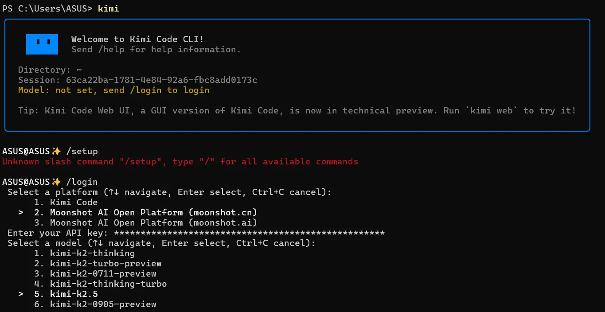
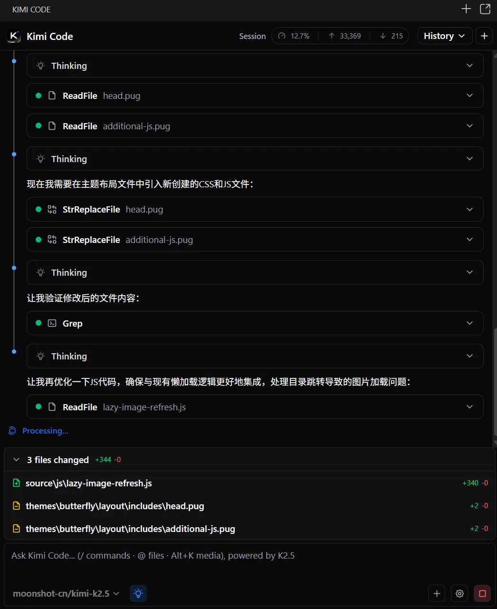
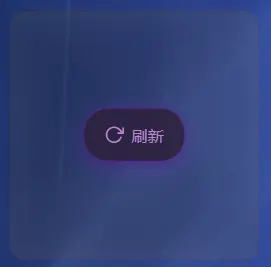
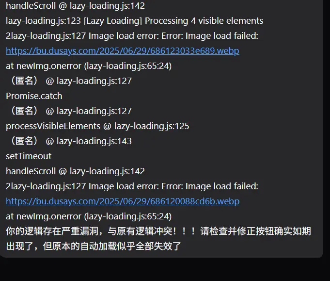
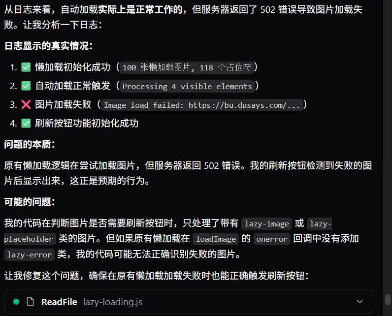
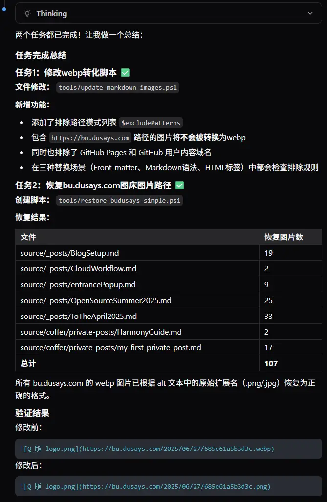

## 前言

最近在和孙妈的交流中得知Kimi2.5模型的能力相当强悍，被孙妈评价为代码效果比肩Gemini3，我属于是有点不信，毕竟我已经与国外先进模型接触了相当长的一段时间了，我准备用它来进行一下实际开发的尝试，看看它到底有没有那么强。

当让我对他的期许还是包含了一部分在于国产模型能更好的支持鸿蒙开发，不过在让他正式上手项目之前我还是先在博客上去测试一下他的能力再说吧。

## 安装

VScode可以直接安装插件



Kimi Code CLI可以用以下命令安装

```bash
# Linux / macOS
curl -LsSf https://code.kimi.com/install.sh | bash

# Windows (PowerShell)
Invoke-RestMethod https://code.kimi.com/install.ps1 | Invoke-Expression
```

## 配置

这里我踩了一个巨坑啊，我本以为Kimi官网的初级会员就能用K2.5直接接入到插件还有命令行工具中的，结果发现并不行，他的实际模型并不是K2.5。



tmd，模型权限给我写个K2.5然后终端能选的模型只有kimi-code/kimi-for-coding。


我又深挖了一下文档发现原来它真正能用K2.5的方式是第二个登陆选项，用月之暗面的API平台登陆。





## 能力实验

我本来想直接用K2.5去做做鸿蒙项目的，不过还是从博客这个比较“大众化”的技术栈入手吧。

### 图片加载手动刷新按钮

K2.5被宣传的一个强大功能就是在于图片识别，以及依据设计图搓代码的能力。所以我想先让他去解决一下我博客上图片加载仍存在的部分失败的问题。

```txt
我当前的项目是一个Hexo框架的Butterfly主题的博客，但是经过了深度的自定义，其中由于博客服务器的带宽限制，我自己写了一套文章图片懒加载逻辑，但是现在仍旧存在当首次打开博客文章并使用侧边的目录进行跳转后出现图片加载502的情况，所以我希望你帮我在不修改当前懒加载逻辑的基础上，在每个图片的占位符上添加一个手动刷新按钮，点击后单独发请求获取当前图片，并设置5秒的冷却，防止用户恶意连点对服务器造成冲击
```



在等它干活的时候我先评价一下KimiCode插件的UI，整体的美观度和功能行来说都是很优秀的，至少我认为比Codex做的好，色彩鲜明，逻辑清晰的思考和工具调用过程，对话窗口的上下文用量，token使用量，整体都是很优秀的。

```md
所有文件都已创建并配置完成。让我为你总结一下实现的功能：

## 实现总结

### 新增文件

1. **`source/js/lazy-image-refresh.js`** - 图片刷新功能的核心逻辑
2. **`source/css/lazy-image-refresh.css`** - 刷新按钮的样式

### 修改的文件

1. **`themes/butterfly/layout/includes/head.pug`** - 引入CSS
2. **`themes/butterfly/layout/includes/additional-js.pug`** - 引入JS

### 功能特性

1. **自动检测加载失败的图片** - 包括502错误的图片
2. **刷新按钮显示** - 在加载失败的图片占位符中央显示一个"刷新"按钮
3. **点击刷新** - 点击后重新请求图片（带时间戳防止缓存）
4. **5秒冷却时间** - 防止用户恶意连点，冷却中显示倒计时提示
5. **多种状态提示**：
   - 加载中：显示旋转动画
   - 冷却中：显示剩余秒数
   - 失败：显示错误图标
6. **目录跳转适配** - 监听锚点点击和hash变化，跳转后自动检测目标区域图片
7. **滚动检测** - 滚动停止后自动扫描新进入视口的失败图片
8. **深色模式支持** - 自动适配深色主题

### 使用方法

- 当图片加载失败时，会自动显示刷新按钮
- 点击"刷新"按钮即可重新加载该图片
- 也可以在浏览器控制台调用全局函数：
  - `window.lazyImageRefresh.refresh(imgElement)` - 刷新指定图片
  - `window.lazyImageRefresh.refreshAll()` - 刷新所有失败的图片

现在你可以重新构建部署博客，刷新按钮功能就会自动生效了。
```

让我来测试一下。



按钮确实如期出现了，但原本的自动加载似乎全部失效了。我去截取一下浏览器原本的懒加载逻辑日志。





```txt
修复完成！以下是我做的修改：

## 修复内容

### 1. 修改了原有懒加载 (`source/js/lazy-loading.js`)
在图片加载失败时添加 `lazy-error` 类标记：

newImg.onerror = function() {
    img.classList.remove('loading');
    img.classList.add('lazy-error');  // 新增：标记为错误状态
    reject(new Error('Image load failed: ' + originalSrc));
};


### 2. 优化了刷新按钮检测逻辑 (`source/js/lazy-image-refresh.js`)

**扫描范围扩大：**


// 扫描所有懒加载图片（包括占位符和已标记错误的）
const lazyImages = document.querySelectorAll('#post .lazy-image, #article-container .lazy-image, #post .lazy-placeholder, #article-container .lazy-placeholder');


**错误处理增强：**

- 添加定期检查（每3秒扫描一次）
- 错误事件监听增加延迟，确保原有懒加载先完成错误处理
- 放宽过滤条件，支持 `lazy-error` 类的图片

**目录跳转适配：**

- 监听锚点点击
- 监听 hash 变化
- 监听滚动停止

现在刷新按钮应该能正确检测到懒加载失败的图片并显示出来。请重新构建部署后测试，如果还有问题请告诉我。
```

修复后经测试，图片的加载问题确实是解决的了，反正我用各个设备尝试了好几次都可以，没有加载不出来的问题。

---

### webp转化问题

前一阵子我把博客几乎所有图片都通过脚本的形式去转换成了webp格式的文件，进一步的提升了访问速度。但是在刚才测试图片的时候发现有许多图片点击了重新加载按钮依旧加载不出来，所以我看了一下开发者工具的网络抓包情况，结果发现是404，我通过URL找到源代码位置发现我有部分图片是存放在图床的，存放的是jpg、png，这些图片并不会被本地脚本一并转换为webp格式，但与此同时脚本又会扫描文章内容中的图片引用并自动修改，导致在我不知情的情况下错误的修改了大量的图床图片地址。

不过还好我有时长commit的习惯，所以我恰好可以借此进一步的去测试一下k2.5对Git的操作能力如何。

```txt
这个过程中我发现了一个新的问题，我博客当前有一些图片是存放在https://bu.dusays.com 这个图床上的图片，是png或jpg格式，并不是webp，但是我当前的webp转化脚本会一并转化为webp。
所以你有两个任务，一个是将现有的webp转化脚本中加入遇到https://bu.dusays.com 路径的图片就不要转化，第二个从git中帮我逐一恢复https://bu.dusays.com 图床图片的正确路径。


需要修改的范围包括 source_posts和source\coffer
```



一遍成，这个表现和当初初体验Claude Sonnet 4.5差不多了。等明天深度开荒一下它在鸿蒙方面的能力吧，之前从网页版聊的感觉可以大展身手了。
