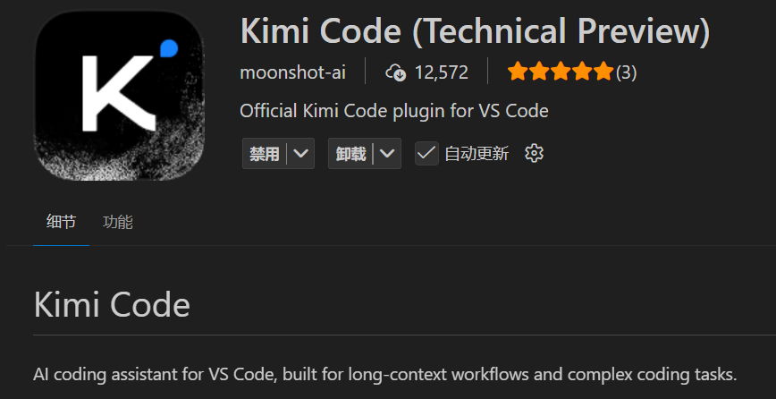
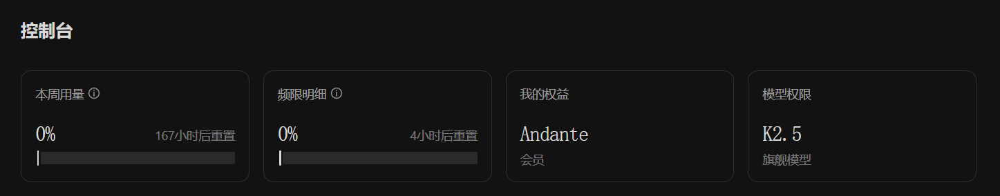
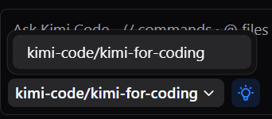
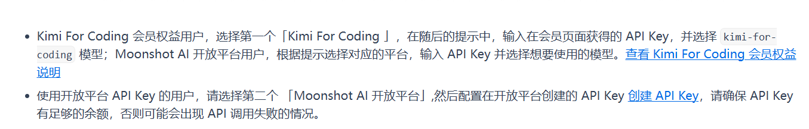

## 前言

最近在和孙妈的交流中得知Kimi2.5模型的能力相当强悍，被孙妈评价为代码效果比肩Gemini3，我属于是有点不信，毕竟我已经与国外先进模型接触了相当长的一段时间了，我准备用它来进行一下实际开发的尝试，看看它到底有没有那么强。

当让我对他的期许还是包含了一部分在于国产模型能更好的支持鸿蒙开发，不过在让他正式上手项目之前我还是先在博客上去测试一下他的能力再说吧。

## 安装

VScode可以直接安装插件



Kimi Code CLI可以用以下命令安装

```bash
# Linux / macOS
curl -LsSf https://code.kimi.com/install.sh | bash

# Windows (PowerShell)
Invoke-RestMethod https://code.kimi.com/install.ps1 | Invoke-Expression
```

## 配置

这里我踩了一个巨坑啊，我本以为Kimi官网的初级会员就能用K2.5直接接入到插件还有命令行工具中的，结果发现并不行，他的实际模型并不是K2.5。



tmd，模型权限给我写个K2.5然后终端能选的模型只有kimi-code/kimi-for-coding。




我又深挖了一下文档发现原来它真正能用K2.5的方式是第二个登陆选项，用月之暗面的API平台登陆。




## 能力实验

我本来想直接用K2.5去做做鸿蒙项目的，不过还是从博客这个比较“大众化”的技术栈入手吧。

### 图片加载手动刷新按钮

K2.5被宣传的一个强大功能就是在于图片识别，以及依据设计图搓代码的能力。所以我想先让他去解决一下我博客上图片加载仍存在的部分失败的问题。

```txt
我当前的项目是一个Hexo框架的Butterfly主题的博客，但是经过了深度的自定义，其中由于博客服务器的带宽限制，我自己写了一套文章图片懒加载逻辑，但是现在仍旧存在当首次打开博客文章并使用侧边的目录进行跳转后出现图片加载502的情况，所以我希望你帮我在不修改当前懒加载逻辑的基础上，在每个图片的占位符上添加一个手动刷新按钮，点击后单独发请求获取当前图片，并设置5秒的冷却，防止用户恶意连点对服务器造成冲击
```