## 知识点速过表

### 1. 机器学习本质

| 概念 | 说明 | 关键公式/方法 |
|------|------|--------------|
| 核心思想 | 用数据自动找规律 → 预测/决策 | - |
| 三大范式 | 监督学习、无监督学习、强化学习 | - |
| 过拟合 | 模型在训练集上表现好，测试集差（死记硬背） | 正则化、早停、交叉验证 |
| 欠拟合 | 模型在训练集和测试集上都表现差（没学透） | 增加特征、提高模型复杂度 |

---

### 2. 数据基础

| 概念 | 说明 | 关键公式/方法 |
|------|------|--------------|
| 数据集划分 | 训练集（练）、验证集（调）、测试集（考） | 常见比例：6:2:2 或 7:1.5:1.5 |
| 属性类型 | 离散属性（类别）vs 连续属性（数值） | - |
| 数据清洗 | 处理缺失值、噪声、离群点 | 删除、填充（均值/中位数/众数）、插值 |
| 归一化（Normalization） | 将数据缩放到[0,1] | $x' = \frac{x - \min}{\max - \min}$ |
| 标准化（Standardization） | 将数据转换为均值0、方差1 | $x' = \frac{x - \mu}{\sigma}$ |
| One-Hot编码（独热编码） | 离散属性转二元向量 | n个类别 → n维向量 |
| 降维（Dimensionality Reduction） | 减少特征维度 | PCA（主成分分析）：$Z = XW$ |

---

### 3. 监督学习 - 回归

| 算法 | 说明 | 关键公式 |
|------|------|---------|
| 线性回归（Linear Regression） | 预测连续值，拟合直线/平面 | $y = w_0 + w_1x_1 + ... + w_nx_n$<br>损失函数：$L = \frac{1}{2n}\sum(y_i - \hat{y}_i)^2$ |
| 岭回归（Ridge Regression） | 线性回归 + L2正则化，防止过拟合 | $L = \frac{1}{2n}\sum(y_i - \hat{y}_i)^2 + \lambda\sum w_j^2$ |
| LASSO回归（Lasso Regression） | 线性回归 + L1正则化，自动特征选择 | $L = \frac{1}{2n}\sum(y_i - \hat{y}_i)^2 + \lambda\sum \lvert w_j\rvert$ |

---

### 4. 监督学习 - 分类

| 算法 | 说明 | 关键公式/特点 |
|------|------|--------------|
| 逻辑回归（Logistic Regression） | 二分类，输出概率 | $P(y=1&#124;x) = \frac{1}{1+e^{-(w^Tx+b)}}$ |
| KNN（K近邻） | K近邻投票，懒惰学习 | 距离：$d = \sqrt{\sum(x_i-y_i)^2}$<br>K值选择：奇数，通常3/5/7 |
| 决策树（Decision Tree） | 树形结构，可解释性强 | 信息增益、Gini指数、增益率 |
| 朴素贝叶斯（Naive Bayes） | 基于概率，假设特征独立 | $P(C&#124;X) = \frac{P(X&#124;C)P(C)}{P(X)}$ |
| SVM（支持向量机） | 最大间隔分类器 | 间隔最大化、核技巧 |

**分类评估指标**：

| 指标 | 公式 | 说明 |
|------|------|------|
| 准确率（Accuracy） | $\frac{TP+TN}{TP+TN+FP+FN}$ | 预测正确的比例 |
| 精确率/查准率（Precision） | $\frac{TP}{TP+FP}$ | 预测为正例中真正例的比例 |
| 召回率/查全率（Recall） | $\frac{TP}{TP+FN}$ | 真正例中被预测出的比例 |
| F1分数（F1-Score） | $\frac{2 \times Precision \times Recall}{Precision + Recall}$ | 精确率和召回率的调和平均 |

**混淆矩阵**：

|  | 预测正例 | 预测反例 |
|--|---------|---------|
| 实际正例 | TP（真正例） | FN（假反例） |
| 实际反例 | FP（假正例） | TN（真反例） |

---

### 5. 决策树关键指标

| 指标 | 公式 | 特点 |
|------|------|------|
| 熵（Entropy） | $Entropy = -\sum\_{i=1}^{c} p_i \log_2 p_i$ | 越大越混乱，ID3算法使用 |
| Gini指数（Gini Index） | $Gini = 1 - \sum\_{i=1}^{c} p_i^2$ | 越大越不纯，CART算法使用 |
| 信息增益（Information Gain） | $Gain = Entropy(父) - \sum \frac{n_i}{n}Entropy(子_i)$ | 选择增益最大的属性 |
| 增益率（Gain Ratio） | $GainRatio = \frac{Gain}{SplitInfo}$ | 惩罚高基数属性，C4.5使用 |

---

### 6. 无监督学习 - 聚类

| 算法 | 说明 | 关键公式/特点 |
|------|------|--------------|
| K-means（K均值） | 划分式聚类，球形簇 | 目标：$\min \sum\_{i=1}^{k}\sum\_{x \in C_i}\lVert x-\mu_i\rVert^2$<br>需指定K，对初值敏感 |
| DBSCAN（基于密度的聚类） | 密度聚类，任意形状 | 参数：$\epsilon$（邻域半径）、MinPts（最小点数）<br>能识别噪声点 |
| 层次聚类（Hierarchical Clustering） | 凝聚/分裂，树状图 | 单链（最小距离）、全链（最大距离）、平均链 |

**聚类评估**：

| 指标 | 说明 |
|------|------|
| 轮廓系数（Silhouette Coefficient） | 衡量簇内紧密度和簇间分离度，[-1, 1]，越大越好 |
| DB指数（Davies-Bouldin Index） | 簇内距离/簇间距离，越小越好 |

---

### 7. 关联规则挖掘

| 概念 | 公式 | 说明 |
|------|------|------|
| 支持度（Support） | $Support(X) = \frac{包含X的事务数}{总事务数}$ | 项集的流行度 |
| 置信度（Confidence） | $Confidence(X \rightarrow Y) = \frac{Support(X \cup Y)}{Support(X)}$ | 规则的可靠性 |
| 提升度（Lift） | $Lift(X \rightarrow Y) = \frac{Support(X \cup Y)}{Support(X) \times Support(Y)}$ | >1正相关，=1独立，<1负相关 |
| 频繁项集（Frequent Itemset） | Support ≥ min_support | Apriori算法基础 |
| 强规则（Strong Rule） | Support ≥ min_support 且 Confidence ≥ min_confidence | 高置信度规则 |

**Apriori先验原理**：
- 频繁项集的子集必然频繁
- 非频繁项集的超集必然非频繁

---

### 8. 序列模式挖掘

| 概念 | 说明 | 示例 |
|------|------|------|
| 序列（Sequence） | 按时间顺序排列的项集序列 | $<\{1,2\} \{3\} \{4,5\}>$ |
| 单项集序列 | 所有事件在同一时刻 | $<\{3,4\}>$：3和4同时发生 |
| 多项集序列 | 事件在不同时刻按顺序 | $<\{3\} \{4\}>$：3先发生，后4发生 |
| 序列支持度 | $\frac{包含该序列的对象数}{总对象数}$ | 与关联规则类似 |

---

### 9. 集成学习

| 方法 | 说明 | 代表算法 |
|------|------|---------|
| Bagging（装袋法） | 并行训练，投票/平均 | 随机森林（Random Forest）：树+样本随机+特征随机 |
| Boosting（提升法） | 串行训练，加权组合 | AdaBoost：错误样本权重↑<br>GBDT（梯度提升决策树） |
| Stacking（堆叠法） | 多层模型，元学习器 | 第一层多个模型，第二层组合 |

---

### 10. 模型评估与选择

| 方法 | 说明 | 优缺点 |
|------|------|--------|
| 留出法 | 直接划分训练集和测试集 | 简单但结果不稳定 |
| K折交叉验证 | 数据分K份，轮流做测试集 | 稳定但计算量大，常用K=5或10 |
| 留一法 | K=n的交叉验证 | 最准确但计算量最大 |
| 自助法 | 有放回抽样 | 适合小数据集 |

**偏差-方差权衡**：

| 概念 | 说明 |
|------|------|
| 偏差 | 模型预测值与真实值的偏离程度，简单模型偏差大（欠拟合） |
| 方差 | 模型对训练集变化的敏感程度，复杂模型方差大（过拟合） |
| 总误差 | $Error = Bias^2 + Variance + Noise$ |

---

### 11. 异常检测

| 方法 | 说明 |
|------|------|
| 统计方法（Statistical Methods） | 箱线图（IQR）、3σ原则（正态分布） |
| 距离方法（Distance-based） | 基于KNN，距离远的为异常 |
| 密度方法（Density-based） | LOF（局部离群因子），密度低的为异常 |
| 聚类方法（Clustering-based） | 小簇或不属于任何簇的点为异常 |

**离群点 vs 噪声**：
- 离群点（Outlier）：合法但特殊的数据
- 噪声（Noise）：错误的数据

---

### 12. 数据挖掘四大任务

| 任务 | 说明 | 典型算法 |
|------|------|---------|
| 预测建模（Predictive Modeling） | 回归（连续值）、分类（类别） | 线性回归、逻辑回归、决策树、SVM |
| 聚类（Clustering） | 无监督分组 | K-means、DBSCAN、层次聚类 |
| 关联规则（Association Rules） | 发现项之间的关联 | Apriori、FP-Growth |
| 异常检测（Anomaly Detection） | 识别异常数据 | LOF、Isolation Forest（孤立森林） |

---

### 13. 重要公式速记

**距离度量**：

- 欧氏距离（Euclidean Distance）：$d = \sqrt{\sum(x_i-y_i)^2}$
- 曼哈顿距离（Manhattan Distance）：$d = \sum\lvert x_i-y_i\rvert$
- 余弦相似度（Cosine Similarity）：$sim = \frac{x \cdot y}{\lVert x\rVert \cdot \lVert y\rVert}$

**正则化**：

- L1正则（LASSO）：$\lambda\sum\lvert w_j\rvert$（产生稀疏解）
- L2正则（Ridge）：$\lambda\sum w_j^2$（参数平滑）

**贝叶斯定理**：
$$P(C|X) = \frac{P(X|C) \cdot P(C)}{P(X)}$$

**决策树剪枝**：

- 先剪枝（Pre-pruning）：生长时提前停止
- 后剪枝（Post-pruning）：先完全生长再修剪（泛化能力更好）

---

## 作业题汇总

### 作业1

#### 连续属性与离散属性

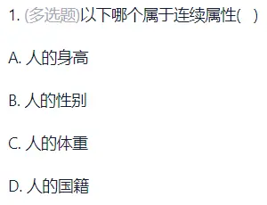

1. 正确选项：A、C
2. 解析
   - 连续属性的核心特点：取值可覆盖某一区间内的任意数值，能无限细分。
   - 选项判断：
     - A. 人的身高：可取170cm、170.2cm等任意精度的数值，符合连续属性定义。
     - B. 人的性别：仅能取“男”“女”等固定类别，属于离散属性。
     - C. 人的体重：可取50kg、50.1kg等任意精度的数值，符合连续属性定义。
     - D. 人的国籍：仅能取有限的国家名称，属于离散属性。
3. 离散属性与连续属性对比

| 属性类型 | 特点 | 示例 |
|----------|------|------|
| 离散属性 | 取值为有限类别/离散值，不可细分 | 性别、国籍、学历 |
| 连续属性 | 取值为区间内任意数值，可无限细分 | 身高、体重、温度 |

---

#### 离群点（Outliers）

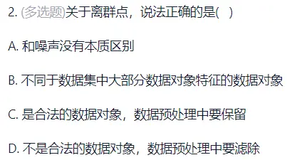

1. 正确选项：B、C
2. 解析调整
   - 对选项C的补充说明：离群点本身是**合法数据**（并非错误），其是否保留需结合场景——若分析场景需要覆盖“特殊样本”（比如研究某群体的极端情况），离群点应保留；仅当分析目标是“多数样本的共性”时，才考虑剔除。因此“是合法的数据对象，数据预处理中要保留”这一表述，在“需保留离群点的场景”下是成立的。
3. 修正后的选项分析
   - A. 错误：离群点是合法但特征特殊的数据，噪声是数据错误，二者本质不同。
   - B. 正确：符合离群点的核心定义（与大部分数据特征差异显著）。
   - C. 正确：离群点是合法数据，在需要分析特殊样本的场景中，预处理时应保留。
   - D. 错误：离群点是合法数据，并非必须滤除。

---

#### 数据挖掘的定义

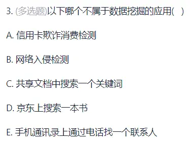

1. **正确选项：C、E**

2. **解析**

   - 数据挖掘的核心目标：
     从大量数据中**自动发现潜在的模式、规律或知识**，而。

   - 判断关键标准：
     是否涉及**模式发现、预测、分类、异常检测等智能分析过程**。

   - 选项判断：

     - A. 信用卡欺诈消费检测：
       通过分析大量历史交易数据，识别异常消费行为，属于异常检测与分类问题，是典型的数据挖掘应用。
     - B. 网络入侵检测：
       通过分析网络流量和行为模式，发现潜在攻击或异常行为，属于模式识别与分类，属于数据挖掘应用。
     - C. 共享文档中搜索一个关键字：
       属于基于关键词的字符串匹配或信息检索，不涉及模式发现，不属于数据挖掘。
     - D. 京东上搜索一本书：
       这一操作不仅是简简单单的匹配，同时还包含了最终才得出的给用户推荐的列表。
     - E. 手机通讯录上通过电话找一个联系人：
       属于简单查询操作，仅进行精确匹配，不涉及数据分析或知识发现。

3. **数据挖掘与信息检索对比**

| 对比维度      | 数据挖掘           | 信息检索 / 查询  |
| --------- | -------------- | ---------- |
| 核心目的      | 发现潜在规律和知识      | 查找已知目标     |
| 是否产生新知识   | 是              | 否          |
| 是否需要模型或算法 | 通常需要           | 通常不需要      |
| 自动化与智能性   | 高              | 低          |
| 典型应用      | 欺诈检测、入侵检测、用户画像 | 文档搜索、联系人查找 |

---

#### 均值与中值

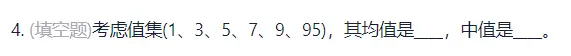

1. 均值计算：
   均值 = （1 + 3 + 5 + 7 + 9 + 95）÷ 6 = 120 ÷ 6 = 20
2. 中值计算：
   先将数据集按升序排列：1、3、5、7、9、95
   数据个数为偶数时，中值是中间两个数的平均值，即（5 + 7）÷ 2 = 6
3. 答案：均值是20，中值是6

---

#### 混淆矩阵：精度与召回率

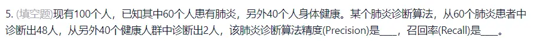

1. 先明确混淆矩阵的四个核心指标：
   - 真正例（TP）：实际患病且被诊断为患病的人数 = 48
   - 假正例（FP）：实际健康但被诊断为患病的人数 = 2
   - 假反例（FN）：实际患病但被诊断为健康的人数 = 60 - 48 = 12
   - 真反例（TN）：实际健康且被诊断为健康的人数 = 40 - 2 = 38

2. 精度（Precision）的计算：
   精度 = TP / (TP + FP) = 48 / (48 + 2) = 48 / 50 = 0.96（或96%）

3. 召回率（Recall）的计算：
   召回率 = TP / (TP + FN) = 48 / (48 + 12) = 48 / 60 = 0.8（或80%）

4. 答案：精度是0.96，召回率是0.8

---

### 作业2

#### 离散属性编码

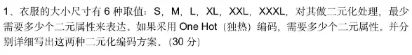

- 最少二元属性数量计算
    要表示6种取值，需满足  2^k ≥ 6，解得 k = 3（因为 2^2 = 4 < 6，2^3 = 8 ≥ 6），因此最少需要3个二元属性。

- 两种编码方案
    方案1：最少二元属性编码（二进制编码）
    用3个二元属性（记为A、B、C），将6种尺码映射为3位二进制数：

| 尺码 |整数值| 二元属性A | 二元属性B | 二元属性C |
|------|------|-----------|-----------|-----------|
| S    |   0  | 0         | 0         | 0         |
| M    |   1  | 0         | 0         | 1         |
| L    |   2  | 0         | 1         | 0         |
| XL   |   3  | 0         | 1         | 1         |
| XXL  |   4  | 1         | 0         | 0         |
| XXXL |   5  | 1         | 0         | 1         |

方案2：One-Hot（独热）编码
需与取值数量相等的二元属性（6个），每个属性对应一种尺码，取值为1表示对应尺码，0表示不对应：

| 尺码 |整数值| 属性1（S） | 属性2（M） | 属性3（L） | 属性4（XL） | 属性5（XXL） | 属性6（XXXL） |
|------|------|------------|------------|------------|-------------|--------------|---------------|
| S    |   0  | 1          | 0          | 0          | 0           | 0            | 0             |
| M    |   1  | 0          | 1          | 0          | 0           | 0            | 0             |
| L    |   2  | 0          | 0          | 1          | 0           | 0            | 0             |
| XL   |   3  | 0          | 0          | 0          | 1           | 0            | 0             |
| XXL  |   4  | 0          | 0          | 0          | 0           | 1            | 0             |
| XXXL |   5  | 0          | 0          | 0          | 0           | 0            | 1             |

结论

- 最少二元属性数量：3个
- One-Hot编码所需二元属性数量：6个

| 编码类型       | 核心原理                                                                 | 适用场景                          | 优点                                  | 缺点                                  | 示例（以属性“尺码：S、M、L、XL、XXL”为例）                                                                 |
|----------------|--------------------------------------------------------------------------|-----------------------------------|---------------------------------------|---------------------------------------|----------------------------------------------------------------------------------------------------------------|
| 二进制编码     | 将离散属性的每个取值映射为整数，再转换为二进制数，用二进制位对应二元属性 | 离散属性取值较少、无明确序关系    | 占用特征维度少（仅需$\lceil log_2m \rceil$个） | 引入虚假序关系，扭曲属性间距离        | 整数映射：S=0、M=1、L=2、XL=3、XXL=4；二进制属性：X1（高位）、X2、X3（低位）<br>S(0)→000，M(1)→001，L(2)→010，XL(3)→011，XXL(4)→100 |
| 独热编码（One-Hot） | 为每个属性取值创建独立二元属性，取值为1表示对应属性值，0表示不对应       | 离散属性无序号关系（如性别、国籍） | 无虚假序关系，保留属性原始分布        | 特征维度爆炸（需m个二元属性）        | 属性1（S）、属性2（M）、属性3（L）、属性4（XL）、属性5（XXL）<br>S→10000，M→01000，L→00100，XL→00010，XXL→00001 |
| 标签编码（Label Encoding） | 直接将离散属性的每个取值映射为唯一整数                                  | 有序离散属性（如等级：差、中、好） | 编码简单，占用维度最少（仅1个）        | 非有序属性会引入虚假序关系            | S→0，M→1，L→2，XL→3，XXL→4                                                                                   |
| 目标编码（Target Encoding） | 用属性取值对应的目标变量统计值（如均值、中位数）作为编码值               | 高基数离散属性（如城市、用户ID）  | 不增加维度，保留目标相关信息          | 易过拟合，需交叉验证避免泄露          | 若目标为“是否购买”，S对应购买率30%→编码0.3，M对应购买率50%→编码0.5，以此类推                                   |
| 计数编码（Count Encoding） | 用属性取值在数据集中的出现次数作为编码值                                 | 高基数离散属性，无明显目标关联    | 编码简单，不增加维度                  | 相同计数的取值无法区分，可能丢失信息  | 若S出现20次→20，M出现35次→35，L出现30次→30，XL出现15次→15，XXL出现10次→10                                       |

---

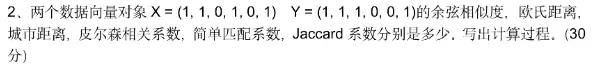

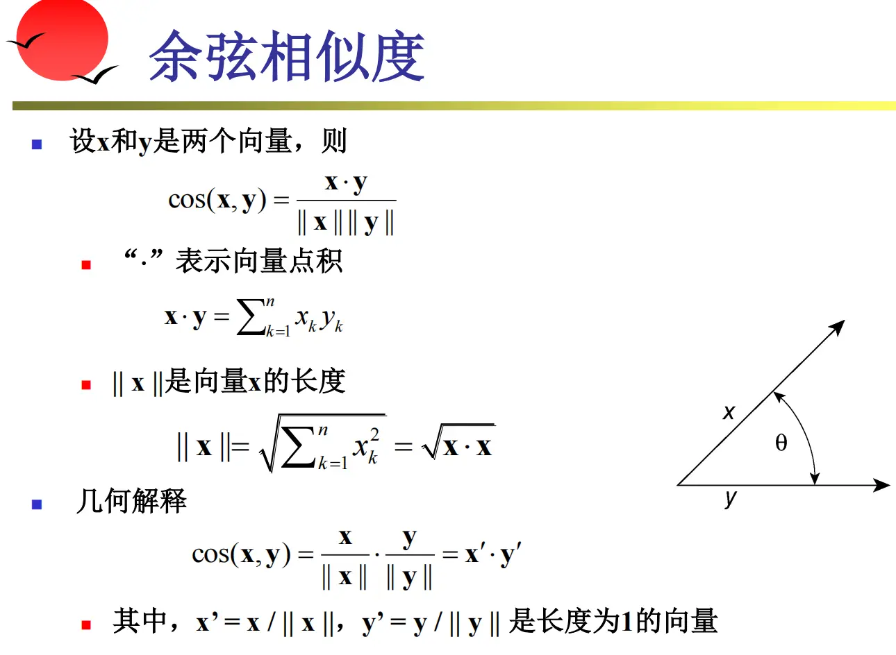

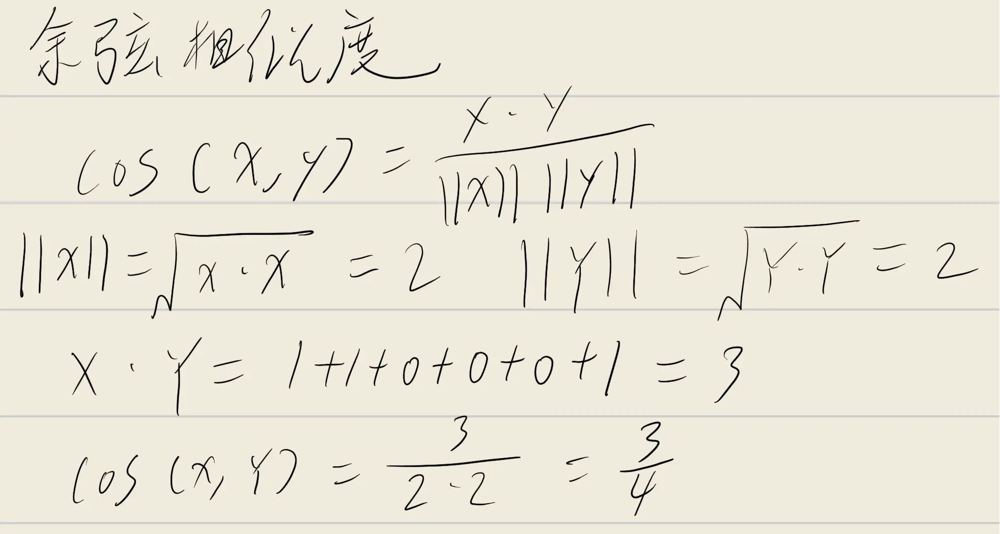

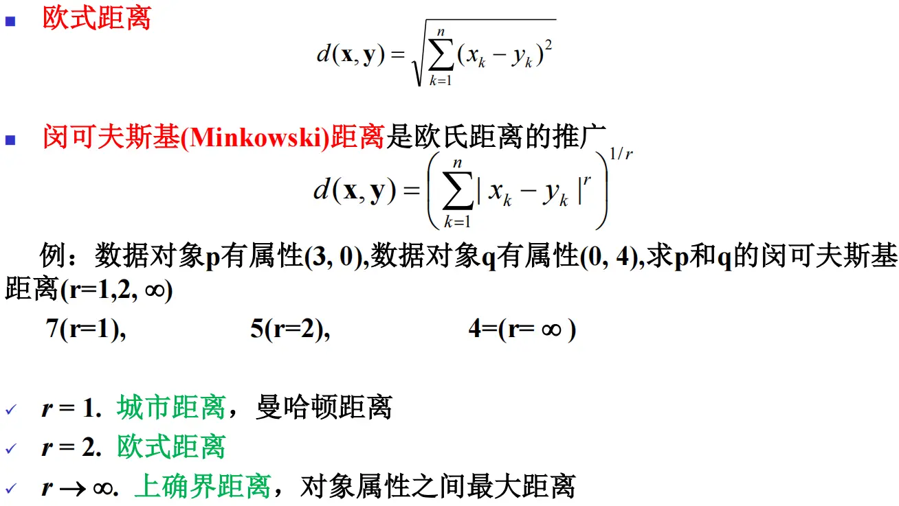

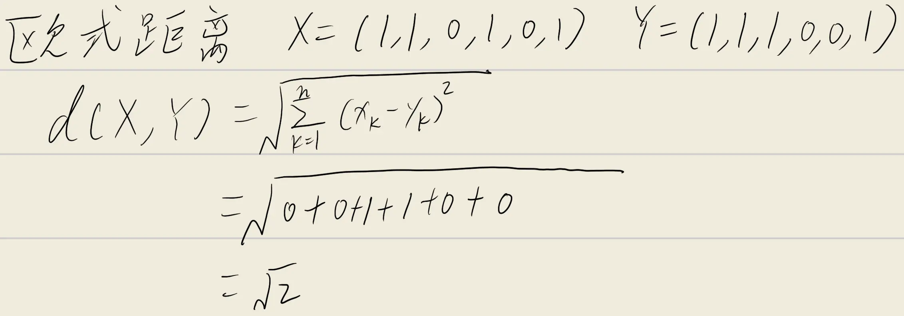

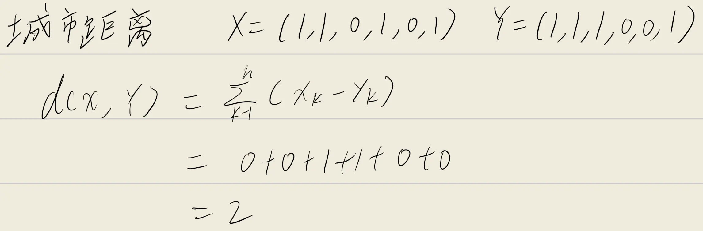


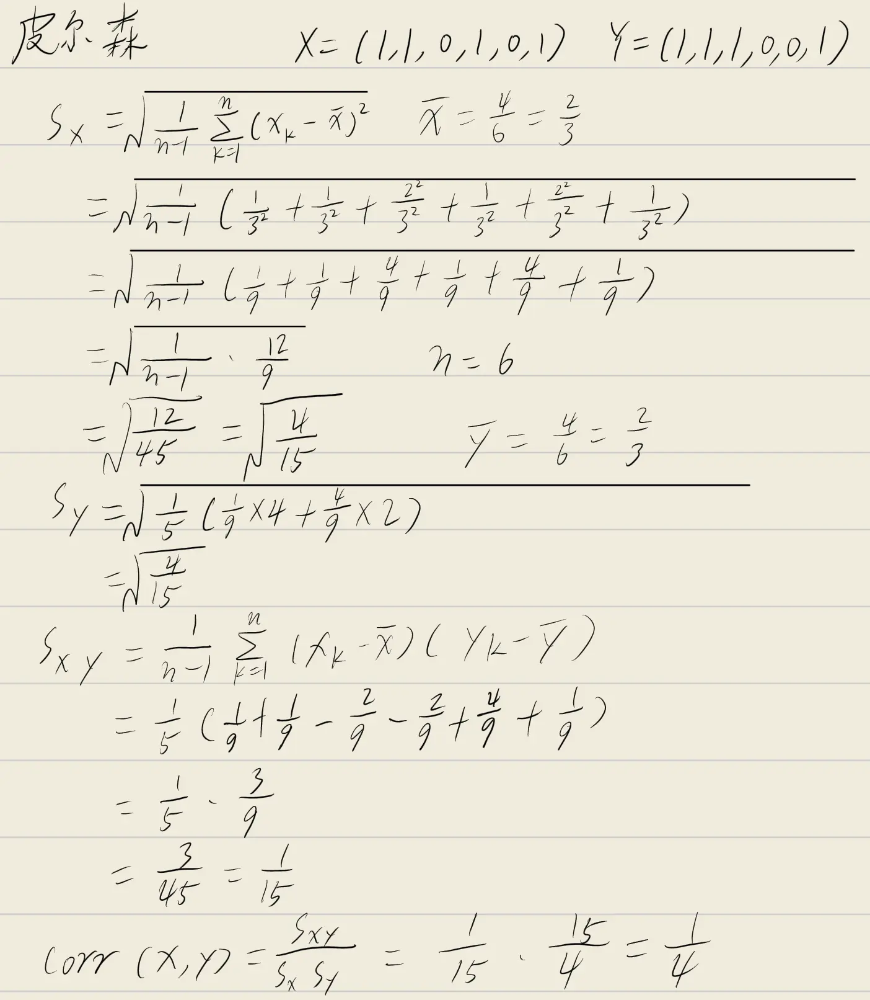

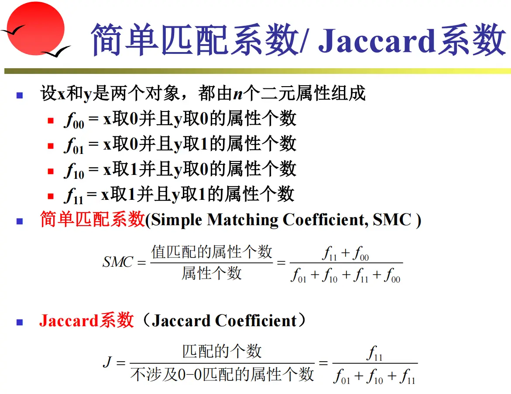

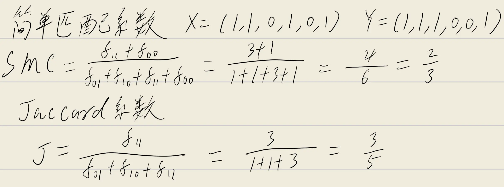

---

#### PR曲线与ROC曲线


先看一下pr曲线和ROC曲线的ppt

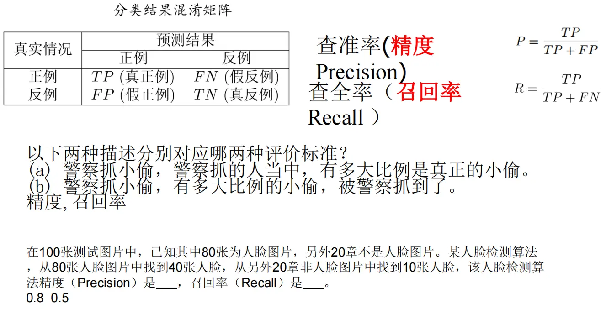

1. 描述对应的评价标准
    标准：
    - (a) 对应**查准率（精度）**：“抓的人当中真正是小偷的比例”，即“预测为正例的样本中实际正例的比例”，符合查准率的定义。
    - (b) 对应**查全率（召回率）**：“所有小偷中被抓到的比例”，即“实际正例的样本中被预测为正例的比例”，符合召回率的定义。

2. 人脸检测算法的精度与召回率计算
    首先确定混淆矩阵指标：
    - 真正例（TP）：实际是人脸且被检测为人脸的数量 = 40
    - 假正例（FP）：实际非人脸但被检测为人脸的数量 = 10
    - 假反例（FN）：实际是人脸但未被检测为人脸的数量 = 80 - 40 = 40

- **精度（Precision）**：
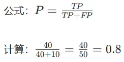

- **召回率（Recall）**：
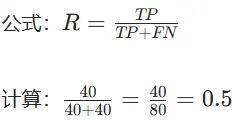

结果汇总

| 评价标准   | 数值 |
|------------|------|
| 精度       | 0.8  |
| 召回率     | 0.5  |

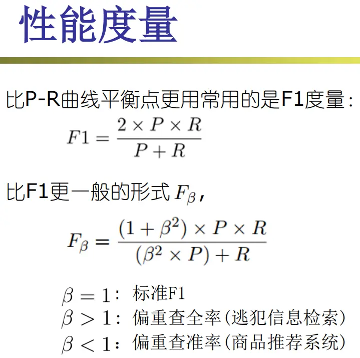

但是ROC在复习ppt中没有所以我选择先放掉。

回到题目，人脸检测算法的精度与召回率计算。


首先解释一下这个表格，有点怪但也还可以懂。我们将每一步的预测结果都列出来就会好理解很多。

首先明确：要计算不同阈值下的精度（查准率）和召回率（查全率），需先按**预测概率从高到低排序样本**，再依次以每个样本的概率为阈值（将≥该阈值的样本判定为“包含人脸”），计算对应指标。

步骤1：排序样本（按预测概率降序）

| 样本序号 | 真实标签（是否有人脸） | 预测概率 |
|----------|------------------------|----------|
| 1        | 是（正例）| 0.9      |
| 2        | 是（正例）| 0.7      |
| 3        | 否（反例）| 0.5      |
| 4        | 否（反例）| 0.3      |
| 5        | 是（正例）| 0.1      |

步骤2：逐阈值计算精度和召回率
总正例数（真实有人脸的样本数）=3，总反例数（真实无人脸的样本数）=2。

| 阈值（判定为“有人脸”的最低概率） | 判定为“有人脸”的样本 | TP（真实有人脸且判定正确的数量） | FP（真实无人脸但判定错误的数量） | 精度（Precision）= TP/(TP+FP) | 召回率（Recall）= TP/总正例 |
|----------------------------------|----------------------|----------------------------------|----------------------------------|--------------------------------|------------------------------|
| 0.9（仅样本1满足）| 样本1                | 1                                | 0                                | 1/1=1                          | 1/3≈0.33                     |
| 0.7（样本1、2满足）| 样本1、2             | 2                                | 0                                | 2/2=1                          | 2/3≈0.67                     |
| 0.5（样本1、2、3满足）| 样本1、2、3          | 2                                | 1                                | 2/3≈0.67                       | 2/3≈0.67                     |
| 0.3（样本1、2、3、4满足）| 样本1、2、3、4       | 2                                | 2                                | 2/4=0.5                        | 2/3≈0.67                     |
| 0.1（所有样本满足）| 所有5个样本          | 3                                | 2                                | 3/5=0.6                        | 3/3=1                        |

每个阈值的选取仅有大于等于这个阈值的样本会被判定为“有人脸”，剩余的都是“否”。所以接下来我们来手动算一遍这个过程。

但在此之前我们还是需要先去明确一下TFPN之间的关系和代表的含义。

在分类任务（比如人脸检测）中，TP、FP、TN、FN是混淆矩阵的4个核心指标，对应“真实标签”和“预测结果”的4种组合，用人脸检测的场景可以更直观理解：

| 指标 | 英文全称       | 含义（以“人脸检测”为例）|
|------|----------------|--------------------------------------------|
| TP   | True Positive  | 真实标签是“有人脸”，预测结果也判定为“有人脸”（判定正确的正例） |
| FP   | False Positive | 真实标签是“无人脸”，预测结果却判定为“有人脸”（判定错误的反例，误报） |
| TN   | True Negative  | 真实标签是“无人脸”，预测结果也判定为“无人脸”（判定正确的反例） |
| FN   | False Negative | 真实标签是“有人脸”，预测结果却判定为“无人脸”（判定错误的正例，漏报） |

以题目中的样本为例（阈值=0.5时）：

- TP=2：2个真实有人脸的样本被正确判定为“有人脸”
- FP=1：1个真实无人脸的样本被错误判定为“有人脸”
- TN=1：1个真实无人脸的样本被正确判定为“无人脸”
- FN=1：1个真实有人脸的样本被错误判定为“无人脸”


我自己总结的经验就是第一个字母（T/F）：表示 “预测结果是否正确”（T = 正确，F = 错误）

而第二个字母（P/N）：表示 “预测结果的类别”（P = 预测为正例，N = 预测为反例）

由此我们可以总结出：

- TP：样本本身是正例，同时预测正确（预测为正例）例
- FP：样本本身是反例，但预测错误（预测为正例）
- TN：样本本身是反例，同时预测正确（预测为反例）例
- FN：样本本身是正例，但预测错误（预测为反例）


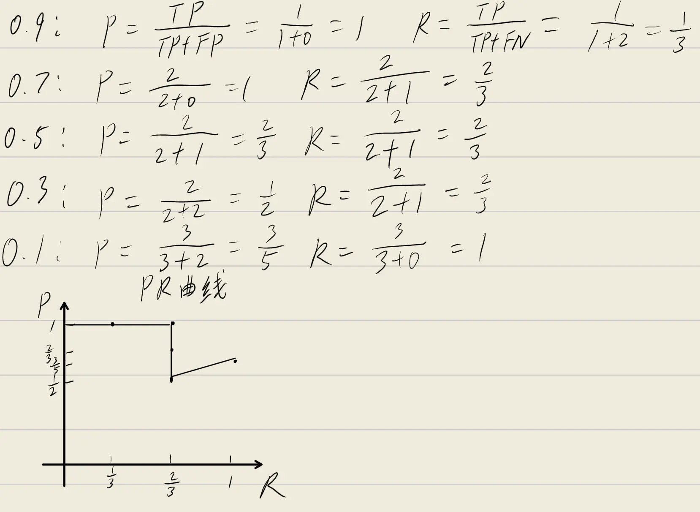

随后，ROC曲线的话，大致是这样的：其X轴是**假正例率（FPR）**，Y轴是**真正例率（TPR）**。

也就是所谓的所有反例中又多少，和所有正例中又有多少。目标是降低FPR，提高TPR。

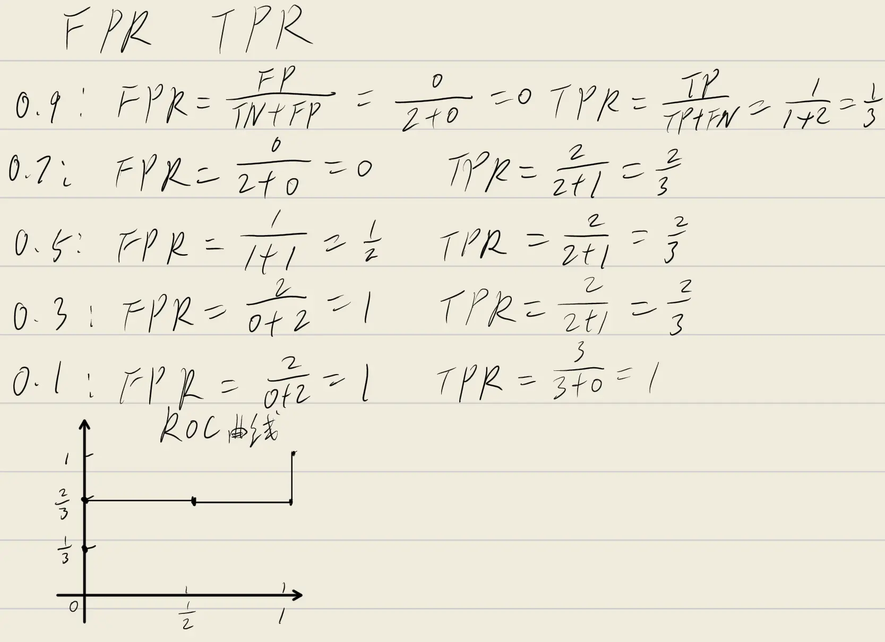

---

### 作业3

#### 线性回归中的属性处理

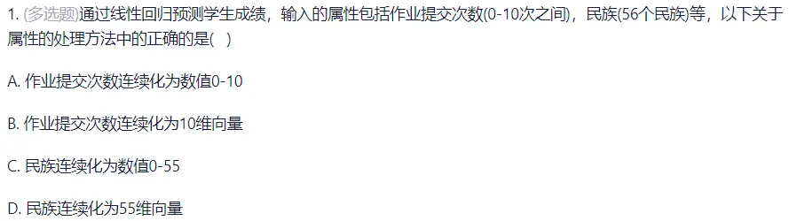

- 答案：正确选项是AD
- 解析：
  - 对于作业提交次数：
    - 作业提交次数是数值型属性（取值0-10），可直接作为连续数值参与线性回归，因此A选项正确；
    - B选项错误，作业提交次数本身是数值，无需转化为向量（向量编码适用于分类属性）。
  - 对于民族：
    - 民族是分类属性（无顺序关系的类别），需用独热编码转化为向量：56个民族对应55维向量（排除基准类别），因此D选项正确；
    - C选项错误，将民族映射为0-55的数值会错误引入“类别有序”的假设，不符合线性回归的属性要求。

可以通过表格对比这两种属性的特点及处理方式：

| 属性类型       | 作业提交次数       | 民族               |
|----------------|--------------------|--------------------|
| 属性性质       | 数值型（离散数值） | 分类型（无序类别） |
| 取值特点       | 0-10的连续数值（有大小意义） | 56个无顺序的类别（无大小意义） |
| 合适的处理方式 | 直接作为数值参与计算 | 独热编码转化为向量 |
| 对应选项正确性 | A正确、B错误       | D正确、C错误       |

---

#### 线性回归与RANSAC算法

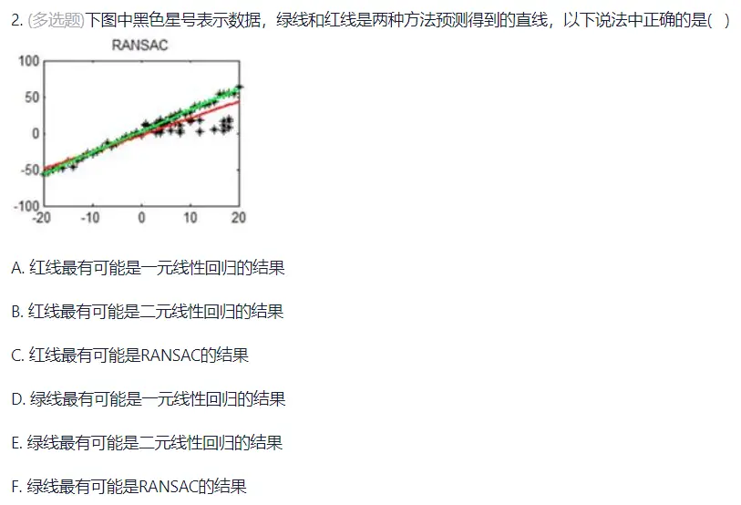

- 答案：正确选项是AF
- 解析：
  - 关于方法特点：
    - 一元线性回归会拟合所有数据（包括异常点），结果易受异常点影响，图中红线偏离多数数据点，符合一元线性回归的特点，因此A正确；
    - RANSAC是鲁棒回归方法，会拟合数据中的“内点”（多数正常数据），图中绿线贴合多数黑色星号数据，符合RANSAC的特点，因此F正确；
  - 排除错误选项：
    - 题目中只有一个输入属性（图为二维散点，对应一元回归），因此B、E中“二元线性回归”不符合场景；
    - C错误（红线不符合RANSAC拟合内点的特点），D错误（绿线不符合一元线性回归受异常点干扰的特点）。

#### RANSAC (RANdom SAmple Consensus) 算法

算法步骤：

- 1）从原始数据中随机选择一些样本作为“内点”
- 2）用1中选择的样本拟合模型
- 3）利用模型计算其它样本的残差，若某个样本的残差小于预先设置的阈值t，则将其加入内点，将内点中的样本量扩充
- 4）用扩充后的内点拟合模型，计算均方误差
- 5）重复1-4步，最终选取均方误差最小的模型

随机选出一个样本作为“内点”的步骤，可以理解为“随机采样”步骤，因此RANSAC算法也被称为“随机采样一致性”算法。

随后找的“内点”也就是离得距离近的点，距离近的点最多的模型就是最好的模型。是一个反复随机抽样枚举出最好模型的方法不是像一元线性回归那样直接拟合所有数据，所以其获得的模型一定是会天然的避免异常点离群点的影响的。

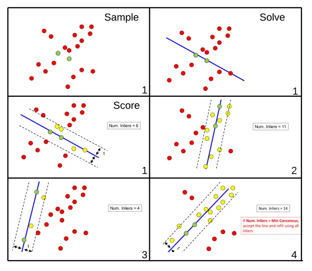

这张图展示了**RANSAC（随机抽样一致）算法拟合直线的完整流程**，分步骤解释如下：

- **Sample（抽样）**：
  - 从数据中随机选取少量“候选内点”（图中绿色点），用这些点拟合一条初始直线。
- **Solve（求解）**：
  - 基于选中的候选内点，计算出对应的直线模型（图中蓝色直线）。
- **Score（评分）**：
  - 统计所有数据中，与当前直线模型误差在阈值内的点（即“内点”，图中黄色点）数量：
    - 步骤1：第一次拟合的直线仅得到6个内点；
    - 步骤2：调整模型后得到11个内点；
    - 步骤3：再次调整后内点数量减少到4个；
    - 步骤4：最终得到14个内点（满足“内点数量＞最小共识内点”的条件）。
- **最终步骤**：
  - 当内点数量达到要求时，用所有内点重新优化直线模型，得到鲁棒的拟合结果。

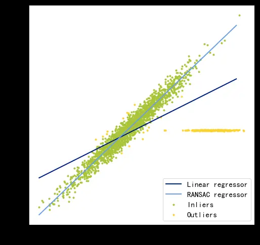

这张图对比了**普通线性回归与RANSAC回归的拟合效果**，具体解释如下：

- 元素说明：
  - 绿色点（Inliers）：数据中的“内点”（多数正常数据）；
  - 黄色点（Outliers）：数据中的“异常点”（偏离整体趋势的噪声点）；
  - 深蓝色线：普通线性回归的拟合结果；
  - 浅蓝色线：RANSAC回归的拟合结果。
- 效果对比：
  - 普通线性回归（深蓝色线）会被异常点（黄色点）“拉偏”，拟合结果偏离了多数内点的趋势；
  - RANSAC回归（浅蓝色线）只拟合内点（绿色点），不受异常点干扰，更贴合数据的真实趋势。

---

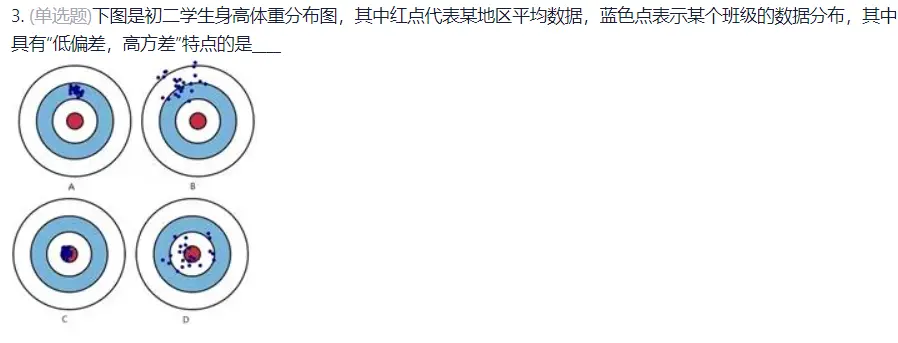

- 答案：正确选项是D

---

#### 正则化方法

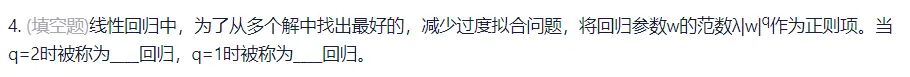

- 答案：
  1. 当q=2时被称为**ridge（岭**回归
  2. 当q=1时被称为**Lasso**回归
- 解析：
  - 正则项中q=2对应的是L2范数，基于L2范数的线性回归称为岭回归，它会让回归参数w的取值更平缓，避免参数过大导致过拟合；
  - 正则项中q=1对应的是L1范数，基于L1范数的线性回归称为Lasso回归，它不仅能缓解过拟合，还能实现特征选择（让部分参数w变为0）。

以下是常见正则化方法的特点对比表：

| 正则化方法 | 对应范数 | 核心特点 | 适用场景 |
| --- | --- | --- | --- |
| 岭回归 | L2范数$\lVert w \rVert_2$ | 让回归参数取值更平缓，避免参数过大；参数不会被压缩至0 | 特征维度高、存在多重共线性的场景 |
| Lasso回归 | L1范数$\lVert w \rVert_1$ | 缓解过拟合的同时，可实现特征选择（部分参数被压缩至0） | 需要筛选关键特征的场景 |
| Elastic Net（弹性网） | L1+L2范数 | 结合岭回归和Lasso的优点，既避免参数过大，也能进行特征选择 | 特征数量远多于样本量的场景 |

---

#### 岭回归（Ridge Regression）与 Lasso回归（Lasso Regression）

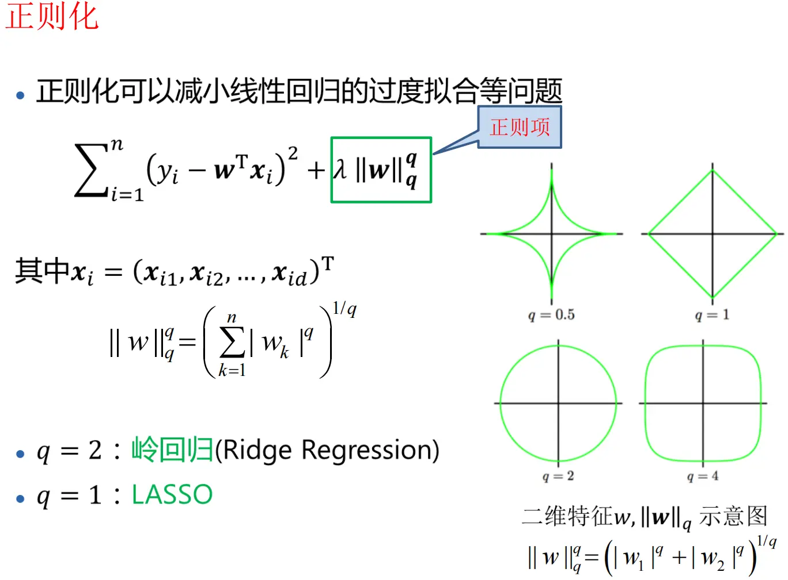

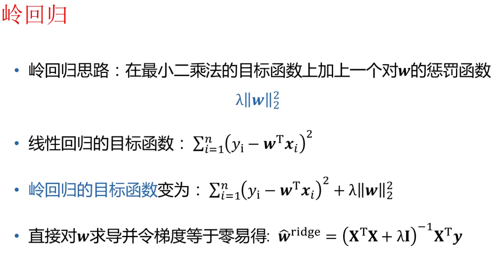

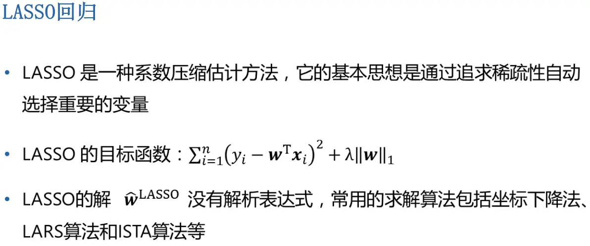

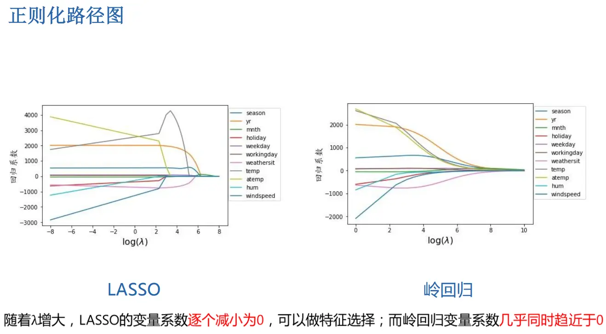

##### 核心概念对比

**岭回归（Ridge Regression）**

- **正则化项**：L2范数 $\lambda \sum_{j=1}^{p} w_j^2$
- **几何解释**：约束条件为圆形区域，参数向量被限制在圆内
- **参数特点**：参数会被"收缩"但不会变为0，所有特征都会保留
- **适用场景**：特征间存在多重共线性，需要稳定模型但保留所有特征

**Lasso回归（Lasso Regression）**

- **正则化项**：L1范数 $\lambda \sum_{j=1}^{p} \lvert w_j\rvert$
- **几何解释**：约束条件为菱形区域，容易在顶点处产生稀疏解
- **参数特点**：部分参数会被压缩至0，实现自动特征选择
- **适用场景**：特征维度高，需要筛选重要特征并简化模型

##### 数学推导要点

**岭回归的闭式解**：
$$\hat{w}_{ridge} = (X^TX + \lambda I)^{-1}X^Ty$$

其中$\lambda$是正则化参数，$I$是单位矩阵。

**关键特性**：
1. **可逆性保证**：即使$X^TX$不可逆，$(X^TX + \lambda I)$也是可逆的
2. **参数收缩**：$\lambda$越大，参数向量的模长越小
3. **偏差-方差权衡**：增加偏差来减少方差，提高泛化能力

**Lasso回归的优化**：
由于L1范数不可导，通常使用：
- **坐标下降法**：逐个优化参数
- **软阈值算子**：$S_{\lambda}(z) = \text{sign}(z) \max(\lvert z\rvert - \lambda, 0)$

##### 正则化参数λ的选择

**交叉验证法**：
1. 将训练集分为K折
2. 对不同的λ值，计算K折交叉验证误差
3. 选择使验证误差最小的λ值

**λ值效果**：
- λ = 0：退化为普通线性回归，可能过拟合
- λ过小：正则化效果不明显
- λ适中：平衡拟合效果与模型复杂度
- λ过大：欠拟合，模型过于简单

##### 实际应用对比

| 对比维度 | 岭回归 | Lasso回归 |
|----------|--------|-----------|
| 特征选择 | 不能自动选择特征 | 能自动选择特征 |
| 参数解释 | 所有参数都非零，解释复杂 | 稀疏解，解释简单 |
| 计算复杂度 | 有闭式解，计算快 | 需迭代优化，计算慢 |
| 多重共线性 | 处理效果好 | 会任意选择相关特征中的一个 |
| 预测精度 | 特征相关时表现好 | 稀疏特征时表现好 |

##### 弹性网络（Elastic Net）

结合L1和L2正则化的优点：
$$\text{Loss} = \frac{1}{2n} \lVert y - Xw \rVert_2^2 + \lambda_1 \lVert w \rVert_1 + \lambda_2 \lVert w \rVert_2^2$$

**优势**：

- 既能进行特征选择（L1），又能处理相关特征组（L2）
- 在特征数大于样本数时表现稳定
- 对相关特征组倾向于整体选择或整体剔除

---

#### 正则化参数λ的影响

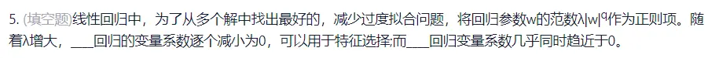

- 答案：
  1. 随着λ增大，**Lasso**回归的变量系数逐个减小为0，可以用于特征选择
  2. 而**岭**回归变量系数几乎同时趋近于0
- 解析：
  - Lasso回归基于L1范数正则化，其优化过程会让不重要的特征系数逐步被压缩至0，实现“逐个剔除”式的特征选择；
  - 岭回归基于L2范数正则化，其正则项会让所有系数同时被缩小（但不会变为0），呈现“整体趋近于0”的特点。

---

### 作业4-1

#### 决策树划分准则

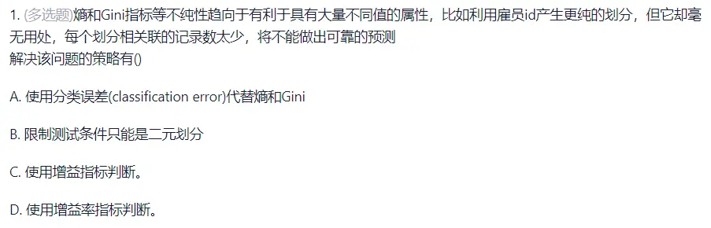

- 答案：正确选项是BD
- 解析：
  - 问题核心：熵/Gini会因高基数属性（如雇员id）的“过度细分”（每个划分记录数太少）而给出不合理的高纯度，导致不可靠预测。
  - 选项分析：
    - A错误：分类误差同样会受高基数属性的过度细分影响，无法解决该问题；
    - B正确：限制为二元划分（如对属性取一个阈值分成两类），可避免高基数属性的过度细分，保证每个划分有足够记录数；
    - C错误：增益指标（如信息增益）本身倾向于选择高基数属性，会加剧该问题；
    - D正确：增益率（信息增益/分裂信息）会惩罚高基数属性的过度分裂，避免选择类似雇员id的无用属性。

以下是**决策树中增益指标、增益率、分类误差、二元划分的对比表格**：

| 概念          | 核心定义                                                                 | 对高基数属性（如雇员ID）的表现       | 优势                          | 局限性                          |
|---------------|--------------------------------------------------------------------------|--------------------------------------|-------------------------------|---------------------------------|
| 增益指标（如信息增益） | 衡量分裂后数据集不纯性（熵/Gini）的减少程度                              | 倾向选择高基数属性（过度细分易获高增益） | 计算简单，能快速降低不纯性    | 易受高基数属性干扰，导致过拟合  |
| 增益率        | 信息增益 ÷ 分裂信息（分裂信息衡量属性取值的分散程度）                     | 惩罚高基数属性（分裂信息高会降低增益率） | 避免高基数属性的无效分裂      | 对低基数属性不敏感，可能错过有效划分 |
| 分类误差      | 以“多数类占比”衡量不纯性，分裂后分类误差的减少量                         | 同样受高基数属性干扰（过度细分会降低误差） | 直观反映分类错误率            | 对数据分布敏感，稳定性差        |
| 二元划分      | 将属性取值划分为“是/否”两类（如数值属性取阈值、类别属性合并为两组）| 避免过度细分，保证每个划分有足够样本量 | 降低高基数属性的干扰，减少过拟合 | 需手动/自动选择划分阈值，可能损失信息 |

---

#### 决策树分裂的停止分裂条件

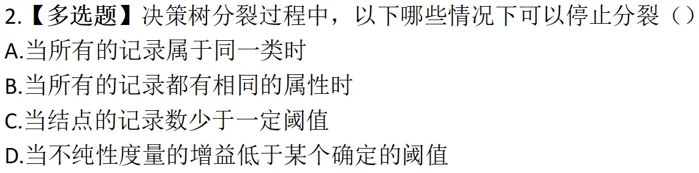

答案是**ABCD**，解析如下：

1. **选项A**：当节点内所有记录属于同一类时，该节点已是纯节点，无需继续分裂。
2. **选项B**：当所有记录的属性完全相同时，无法通过属性进一步区分样本，因此停止分裂。
3. **选项C**：当节点记录数少于阈值时，继续分裂会导致模型过拟合（对小样本过度学习），故停止。
4. **选项D**：不纯性增益（如信息增益）低于阈值时，分裂对模型提升的作用极小，因此停止。

---

#### 决策树剪枝

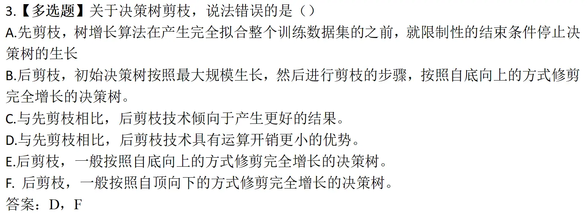

这是一道关于决策树剪枝的多选题，错误选项为**D、F**，解析如下：

选项分析：

1. **选项A**：正确。先剪枝是在树生长过程中设置限制（如节点样本数阈值），提前停止分裂。
2. **选项B**：正确。后剪枝是先让树完全生长，再自底向上修剪冗余分支。
3. **选项C**：正确。后剪枝能更充分地学习数据特征，通常泛化能力优于先剪枝。
4. **选项D**：错误。后剪枝需要先生成完整的决策树，再逐层评估修剪，运算开销远大于先剪枝。
5. **选项E**：正确。后剪枝的典型方式是自底向上（从叶节点向根节点）修剪。
6. **选项F**：错误。后剪枝不会采用自顶向下的方式（自顶向下修剪会直接破坏树的主要结构）。

先剪枝与后剪枝的核心对比

| 剪枝方式 | 流程特点 | 运算开销 | 泛化能力 |
|----------|----------|----------|----------|
| 先剪枝   | 生长中提前停止 | 小 | 一般（易欠拟合） |
| 后剪枝   | 先全生长再修剪 | 大 | 较好（不易欠拟合） |

---

#### Gini指数（Gini Index）


##### 计算Gini的例子

**Gini指数计算公式**：
$$GINI(t) = 1 - \sum_{j} [p(j&#124;t)]^2$$

其中$p(j&#124;t)$表示节点$t$中类别$j$的样本比例。

**示例1：完全纯净的节点**

| 类别 | 样本数 |
|------|--------|
| C1   | 0      |
| C2   | 6      |

计算过程：

- $P(C1) = 0/6 = 0$
- $P(C2) = 6/6 = 1$
- $Gini = 1 - P(C1)^2 - P(C2)^2 = 1 - 0 - 1 = 0$

**结论**：Gini=0表示节点完全纯净，所有样本属于同一类别。

**示例2：不平衡的节点**

| 类别 | 样本数 |
|------|--------|
| C1   | 1      |
| C2   | 5      |

计算过程：

- $P(C1) = 1/6$
- $P(C2) = 5/6$
- $Gini = 1 - (1/6)^2 - (5/6)^2 = 0.278$

**示例3：较为平衡的节点**

| 类别 | 样本数 |
|------|--------|
| C1   | 2      |
| C2   | 4      |

计算过程：

- $P(C1) = 2/6$
- $P(C2) = 4/6$
- $Gini = 1 - (2/6)^2 - (4/6)^2 = 0.444$

**Gini指数特点总结**：

- Gini值范围：[0, 1-1/k]，其中k是类别数
- Gini=0：节点完全纯净（最好情况）
- Gini越大：节点越不纯净，类别分布越均匀
- 决策树构建时选择Gini减少量最大的划分方式

---

#### 熵（Entropy）

**熵的定义**：

熵（Entropy）是信息论中用于度量数据集纯度的指标，表示数据集的不确定性或混乱程度。

**熵的计算公式**：
$$Entropy(t) = -\sum_{j=0}^{c-1} p(j&#124;t) \log_2 p(j&#124;t)$$

其中：
- $p(j&#124;t)$表示节点$t$中类别$j$的样本比例
- $c$是类别总数
- 当$p(j&#124;t) = 0$时，定义$p(j&#124;t) \log_2 p(j&#124;t) = 0$

**熵的计算示例**：

**示例1：完全纯净的节点**

| 类别 | 样本数 |
|------|--------|
| C1   | 0      |
| C2   | 6      |

计算过程：
- $P(C1) = 0/6 = 0$
- $P(C2) = 6/6 = 1$
- $Entropy = -0 \log 0 - 1 \log 1 = -0 - 0 = 0$

**结论**：Entropy=0表示节点完全纯净。

**示例2：不平衡的节点**

| 类别 | 样本数 |
|------|--------|
| C1   | 1      |
| C2   | 5      |

计算过程：
- $P(C1) = 1/6$
- $P(C2) = 5/6$
- $Entropy = -(1/6) \log_2 (1/6) - (5/6) \log_2 (1/6) = 0.65$

**示例3：较为平衡的节点**

| 类别 | 样本数 |
|------|--------|
| C1   | 2      |
| C2   | 4      |

计算过程：
- $P(C1) = 2/6$
- $P(C2) = 4/6$
- $Entropy = -(2/6) \log_2 (2/6) - (4/6) \log_2 (4/6) = 0.92$

**熵的特点总结**：
- Entropy值范围：[0, $\log_2 c$]，其中c是类别数
- Entropy=0：节点完全纯净（最好情况）
- Entropy越大：节点越不纯净，类别分布越均匀
- 对于二分类问题，Entropy最大值为1（类别完全均匀时）

---

##### 熵与Gini指数的关系

**相似点**：

1. **度量目标相同**：都用于衡量数据集的不纯度（impurity）
2. **取值范围**：都在节点完全纯净时取最小值0
3. **单调性**：都随着类别分布的均匀程度增加而增大
4. **应用场景**：都用于决策树的节点划分选择

**差异点**：

| 对比维度 | 熵（Entropy） | Gini指数 |
| --- | --- | --- |
| 计算公式 | $-\sum p(j&#124;t) \log_2 p(j&#124;t)$ | $1 - \sum [p(j&#124;t)]^2$ |
| 计算复杂度 | 较高（涉及对数运算） | 较低（仅涉及平方运算） |
| 最大值（二分类） | 1（类别完全均匀时） | 0.5（类别完全均匀时） |
| 对不纯度的敏感性 | 更敏感（对数函数变化快） | 相对不敏感 |
| 常用算法 | ID3、C4.5决策树 | CART决策树 |
| 偏好特点 | 倾向于产生更平衡的树 | 倾向于将最大类别分离出来 |

**数值对比示例**（二分类情况）：

| 类别C1比例 | 类别C2比例 | 熵（Entropy） | Gini指数 |
|-----------|-----------|--------------|---------|
| 0.0       | 1.0       | 0.000        | 0.000   |
| 0.1       | 0.9       | 0.469        | 0.180   |
| 0.2       | 0.8       | 0.722        | 0.320   |
| 0.3       | 0.7       | 0.881        | 0.420   |
| 0.4       | 0.6       | 0.971        | 0.480   |
| 0.5       | 0.5       | 1.000        | 0.500   |

**几何关系**：

对于二分类问题，设类别C1的比例为$p$，则：

- 熵：$Entropy = -p\log_2(p) - (1-p)\log_2(1-p)$
- Gini：$Gini = 2p(1-p) = 1 - p^2 - (1-p)^2$

两者的曲线形状相似，都在$p=0.5$时达到最大值，但熵的曲线更陡峭。

**实际应用选择建议**：

- **选择熵**：需要更精确的不纯度度量，对类别分布变化更敏感
- **选择Gini**：计算效率要求高，对轻微的不纯度差异不敏感
- **实践中**：两者通常产生相似的决策树结构，Gini因计算简单而更常用

---

#### 不纯度度量：熵与分类误差

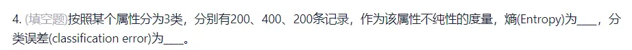

**题目**：（填空题）按照某个属性分为3类，分别有200、400、200条记录，作为该属性不纯性的度量，熵（Entropy）为___，分类误差（classification error）为___。

**解答过程**：

**第一步：计算各类别的概率**

总记录数 = 200 + 400 + 200 = 800

- $P(C1) = 200/800 = 1/4 = 0.25$
- $P(C2) = 400/800 = 1/2 = 0.5$
- $P(C3) = 200/800 = 1/4 = 0.25$

**第二步：计算熵（Entropy）**

熵的计算公式：
$$Entropy = -\sum_{i=1}^{3} P(C_i) \log_2 P(C_i)$$

代入数值：
$$Entropy = -P(C1) \log_2 P(C1) - P(C2) \log_2 P(C2) - P(C3) \log_2 P(C3)$$

$$= -(1/4) \log_2 (1/4) - (1/2) \log_2 (1/2) - (1/4) \log_2 (1/4)$$

$$= -(1/4) \times (-2) - (1/2) \times (-1) - (1/4) \times (-2)$$

$$= 0.5 + 0.5 + 0.5$$

$$= 1.5$$

**第三步：计算分类误差（Classification Error）**

分类误差的计算公式：
$$Classification\ Error = 1 - \max_i P(C_i)$$

其中$\max_i P(C_i)$表示所有类别中概率最大的那个类别的概率。

在本题中：
- $P(C1) = 0.25$
- $P(C2) = 0.5$（最大）
- $P(C3) = 0.25$

因此：
$$Classification\ Error = 1 - 0.5 = 0.5$$

**答案**：

- 熵（Entropy）= **1.5**
- 分类误差（Classification Error）= **0.5**

**知识点总结**：

| 不纯度度量指标 | 计算公式 | 本题结果 | 特点 |
|---------------|---------|---------|------|
| 熵（Entropy） | $-\sum_{i} P(C_i) \log_2 P(C_i)$ | 1.5 | 对类别分布变化敏感，常用于ID3、C4.5算法 |
| 分类误差（Classification Error） | $1 - \max_i P(C_i)$ | 0.5 | 计算简单，但对类别分布变化不敏感 |
| Gini指数 | $1 - \sum_{i} [P(C_i)]^2$ | 0.625 | 计算效率高，常用于CART算法 |

**补充说明**：

- 对于三分类问题，熵的最大值为$\log_2 3 \approx 1.585$（当三类样本数量完全相等时）
- 本题中熵为1.5，接近最大值，说明类别分布较为均匀（虽然C2的样本数是C1和C3的两倍）
- 分类误差为0.5，表示如果将所有样本都预测为最多的类别C2，仍有50%的样本会被错误分类

---

#### 二元划分

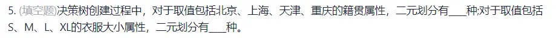

**题目**：（填空题）决策树创建过程中，对于取值包括北京、上海、天津、重庆的籍贯属性，二元划分有___种；对于取值包括S、M、L、XL的衣服大小属性，二元划分有___种。

**解答过程**：

**第一步：理解二元划分的概念**

二元划分（Binary Split）是指将属性的所有取值分成两个互不相交的子集，每次划分将数据分为两个分支。

对于有 $n$ 个不同取值的离散属性，二元划分的数量计算公式为：
$$\text{二元划分数} = \frac{2^{n-1} - 1}{1} = 2^{n-1} - 1$$

但实际上，由于划分 $\{A\}$ 和 $\{\bar{A}\}$ 与划分 $\{\bar{A}\}$ 和 $\{A\}$ 是等价的（只是左右分支互换），所以真正不同的二元划分数为：
$$\text{二元划分数} = 2^{n-1} - 1$$

**第二步：计算籍贯属性的二元划分数**

籍贯属性有4个取值：北京、上海、天津、重庆

方法一：使用公式
$$\text{二元划分数} = 2^{4-1} - 1 = 2^3 - 1 = 8 - 1 = 7$$

方法二：枚举所有可能的划分
将4个城市分成两个非空子集的方法：

1. $\{北京\}$ vs $\{上海, 天津, 重庆\}$
2. $\{上海\}$ vs $\{北京, 天津, 重庆\}$
3. $\{天津\}$ vs $\{北京, 上海, 重庆\}$
4. $\{重庆\}$ vs $\{北京, 上海, 天津\}$
5. $\{北京, 上海\}$ vs $\{天津, 重庆\}$
6. $\{北京, 天津\}$ vs $\{上海, 重庆\}$
7. $\{北京, 重庆\}$ vs $\{上海, 天津\}$

共7种划分方式。

**第三步：计算衣服大小属性的二元划分数**

衣服大小属性有4个取值：S、M、L、XL

**重要**：衣服大小是**有序属性**（S < M < L < XL），对于有序属性，二元划分只能在相邻值之间进行切分，以保持顺序关系。

对于有 $n$ 个有序取值的属性，二元划分数为：
$$\text{二元划分数} = n - 1$$

因此，衣服大小属性的二元划分数为：
$$\text{二元划分数} = 4 - 1 = 3$$

枚举所有可能的划分（按顺序切分）：

1. $\{S\}$ vs $\{M, L, XL\}$ （在S和M之间切分）
2. $\{S, M\}$ vs $\{L, XL\}$ （在M和L之间切分）
3. $\{S, M, L\}$ vs $\{XL\}$ （在L和XL之间切分）

共3种划分方式。

**答案**：
- 籍贯属性的二元划分有 **7** 种
- 衣服大小属性的二元划分有 **3** 种

**知识点总结**：

**1. 无序离散属性的二元划分**

| 属性取值数 $n$ | 二元划分数公式 | 计算结果 | 示例 |
| --- | --- | --- | --- |
| 2 | $2^{2-1} - 1$ | 1 | 性别：男/女 |
| 3 | $2^{3-1} - 1$ | 3 | 颜色：红/绿/蓝 |
| 4 | $2^{4-1} - 1$ | 7 | 籍贯：北京/上海/天津/重庆 |
| 5 | $2^{5-1} - 1$ | 15 | - |
| $n$ | $2^{n-1} - 1$ | $2^{n-1} - 1$ | - |

**2. 有序离散属性的二元划分**

| 属性取值数 $n$ | 二元划分数公式 | 计算结果 | 示例 |
| --- | --- | --- | --- |
| 2 | $n - 1$ | 1 | 温度：低/高 |
| 3 | $n - 1$ | 2 | 等级：差/中/好 |
| 4 | $n - 1$ | 3 | 衣服大小：S/M/L/XL |
| 5 | $n - 1$ | 4 | 学历：小学/初中/高中/本科/研究生 |
| $n$ | $n - 1$ | $n - 1$ | - |

**补充说明**：

1. **无序属性的二元划分：为什么是 $2^{n-1} - 1$？**
   - 将 $n$ 个元素分成两个非空子集，总共有 $2^n$ 种分配方式（每个元素可以分到左边或右边）
   - 减去2种全部分到一边的情况（全左或全右），得到 $2^n - 2$
   - 由于左右对称（交换左右分支是等价的），所以除以2，得到 $(2^n - 2) / 2 = 2^{n-1} - 1$
   - 例如：籍贯（北京、上海、天津、重庆）是无序属性，可以任意组合划分，共7种

2. **有序属性的二元划分：为什么是 $n-1$？**
   - 有序属性必须保持顺序关系，只能在相邻值之间进行切分
   - 对于 $n$ 个有序值，有 $n-1$ 个相邻间隙可以作为切分点
   - 例如：衣服大小 S < M < L < XL 是有序属性，只能在3个间隙处切分：
     - 间隙1：S | M, L, XL
     - 间隙2：S, M | L, XL
     - 间隙3：S, M, L | XL
   - 共3种划分方式

3. **如何判断属性是否有序？**
   - 有序属性：取值之间存在明确的大小或等级关系
     - 示例：温度（低<中<高）、学历（小学<初中<高中<本科）、衣服尺码（S<M<L<XL）
   - 无序属性：取值之间没有大小关系，只是类别标签
     - 示例：籍贯（北京、上海、天津、重庆）、颜色（红、绿、蓝）、性别（男、女）

4. **决策树中的应用**：
   - CART算法使用二元划分构建决策树
   - 对于无序属性，需要尝试所有 $2^{n-1} - 1$ 种划分，计算复杂度为 $O(2^n)$
   - 对于有序属性，只需尝试 $n-1$ 种划分，计算复杂度为 $O(n)$
   - 因此，识别有序属性可以显著降低决策树构建的计算成本

---

### 作业4-2

#### Gini系数计算题

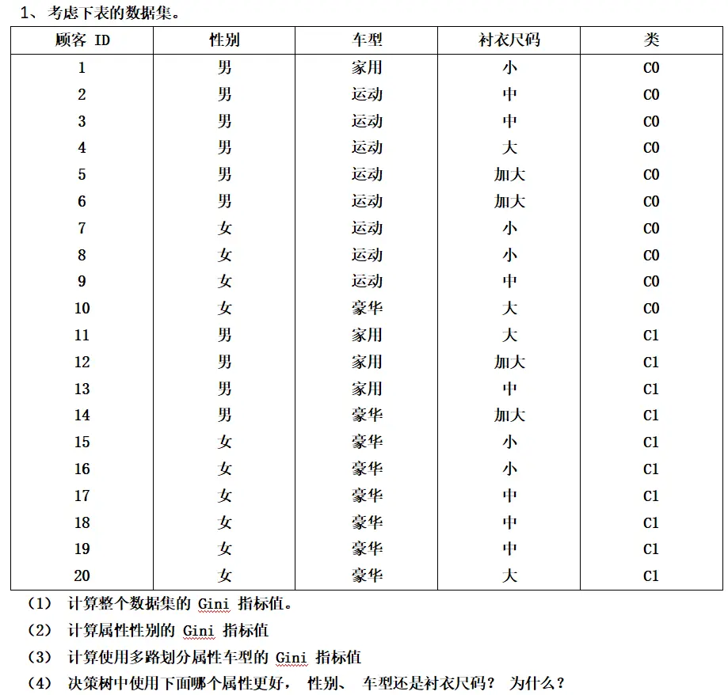

**题目数据表**：

| 顾客ID | 性别 | 车型 | 衬衫尺码 | 类 |
|--------|------|------|----------|-----|
| 1 | 男 | 家用 | 小 | C0 |
| 2 | 男 | 运动 | 中 | C0 |
| 3 | 男 | 运动 | 中 | C0 |
| 4 | 男 | 运动 | 大 | C0 |
| 5 | 男 | 运动 | 加大 | C0 |
| 6 | 男 | 运动 | 加大 | C0 |
| 7 | 女 | 运动 | 小 | C0 |
| 8 | 女 | 运动 | 小 | C0 |
| 9 | 女 | 运动 | 中 | C0 |
| 10 | 女 | 豪华 | 大 | C0 |
| 11 | 男 | 家用 | 大 | C1 |
| 12 | 男 | 家用 | 加大 | C1 |
| 13 | 男 | 家用 | 中 | C1 |
| 14 | 男 | 豪华 | 加大 | C1 |
| 15 | 女 | 豪华 | 小 | C1 |
| 16 | 女 | 豪华 | 小 | C1 |
| 17 | 女 | 豪华 | 中 | C1 |
| 18 | 女 | 豪华 | 中 | C1 |
| 19 | 女 | 豪华 | 中 | C1 |
| 20 | 女 | 豪华 | 大 | C1 |

**题目要求**：

1. 计算整个数据集的Gini指标值
2. 计算属性性别的Gini指标值
3. 计算使用多路划分属性车型的Gini指标值
4. 决策树中使用下面哪个属性更好：性别、车型还是衬衫尺码？为什么？

---

**解答过程**：

（1）计算整个数据集的Gini指标值

**第一步：统计类别分布**

总样本数 = 20

- C0类样本数 = 10（顾客1-10）
- C1类样本数 = 10（顾客11-20）

**第二步：计算概率**

- $P(C0) = 10/20 = 0.5$
- $P(C1) = 10/20 = 0.5$

**第三步：计算Gini指数**

$$Gini = 1 - \sum_{i} [P(C_i)]^2$$

$$Gini = 1 - [P(C0)]^2 - [P(C1)]^2$$

$$= 1 - (0.5)^2 - (0.5)^2$$

$$= 1 - 0.25 - 0.25$$

$$= 0.5$$

**答案**：整个数据集的Gini指标值 = **0.5**

---

（2）计算属性性别的Gini指标值

**第一步：按性别划分数据**

**男性样本（共10个）**：

| 顾客ID | 类别 |
|--------|------|
| 1, 2, 3, 4, 5, 6 | C0 |
| 11, 12, 13, 14 | C1 |

- 男性中C0类：6个
- 男性中C1类：4个

**女性样本（共10个）**：

| 顾客ID | 类别 |
|--------|------|
| 7, 8, 9, 10 | C0 |
| 15, 16, 17, 18, 19, 20 | C1 |

- 女性中C0类：4个
- 女性中C1类：6个

**第二步：计算男性子集的Gini**

$$P(C0|男) = 6/10 = 3/5$$
$$P(C1|男) = 4/10 = 2/5$$

$$Gini(男) = 1 - (6/10)^2 - (4/10)^2$$

$$= 1 - 36/100 - 16/100$$

$$= 1 - 52/100$$

$$= 48/100 = 0.48$$

**第三步：计算女性子集的Gini**

$$P(C0|女) = 4/10 = 2/5$$
$$P(C1|女) = 6/10 = 3/5$$

$$Gini(女) = 1 - (4/10)^2 - (6/10)^2$$

$$= 1 - 16/100 - 36/100$$

$$= 1 - 52/100$$

$$= 48/100 = 0.48$$

**第四步：计算加权平均Gini**

$$Gini(性别) = \frac{10}{20} \times Gini(男) + \frac{10}{20} \times Gini(女)$$

$$= \frac{10}{20} \times 0.48 + \frac{10}{20} \times 0.48$$

$$= 0.24 + 0.24$$

$$= 0.48$$

**答案**：属性性别的Gini指标值 = **0.48**

---

（3）计算使用多路划分属性车型的Gini指标值

**第一步：按车型划分数据**

**家用车样本（共4个）**：

| 顾客ID | 类别 |
|--------|------|
| 1 | C0 |
| 11, 12, 13 | C1 |

- 家用车中C0类：1个
- 家用车中C1类：3个

**运动车样本（共8个）**：

| 顾客ID | 类别 |
|--------|------|
| 2, 3, 4, 5, 6, 7, 8, 9 | C0 |

- 运动车中C0类：8个
- 运动车中C1类：0个

**豪华车样本（共8个）**：

| 顾客ID | 类别 |
|--------|------|
| 10 | C0 |
| 14, 15, 16, 17, 18, 19, 20 | C1 |

- 豪华车中C0类：1个
- 豪华车中C1类：7个

**第二步：计算各子集的Gini**

**家用车的Gini**：
$$Gini(家用) = 1 - (1/4)^2 - (3/4)^2$$

$$= 1 - 1/16 - 9/16$$

$$= 1 - 10/16$$

$$= 6/16 = 0.375$$

**运动车的Gini**：
$$Gini(运动) = 1 - (8/8)^2 - (0/8)^2$$

$$= 1 - 1 - 0$$

$$= 0$$

**豪华车的Gini**：
$$Gini(豪华) = 1 - (1/8)^2 - (7/8)^2$$

$$= 1 - 1/64 - 49/64$$

$$= 1 - 50/64$$

$$= 14/64 = 7/32 \approx 0.219$$

**第三步：计算加权平均Gini**

$$Gini(车型) = \frac{4}{20} \times Gini(家用) + \frac{8}{20} \times Gini(运动) + \frac{8}{20} \times Gini(豪华)$$

$$= \frac{4}{20} \times 0.375 + \frac{8}{20} \times 0 + \frac{8}{20} \times 0.219$$

$$= 0.075 + 0 + 0.088$$

$$= 0.163$$

**答案**：属性车型的Gini指标值 = **0.163**

---

（4）决策树中使用下面哪个属性更好：性别、车型还是衬衫尺码？为什么？

**第一步：计算衬衫尺码的Gini指标值**

**按衬衫尺码划分数据**：

**小号样本（共5个）**：

- C0类：3个（顾客1, 7, 8）
- C1类：2个（顾客15, 16）

$$Gini(小) = 1 - (3/5)^2 - (2/5)^2 = 1 - 9/25 - 4/25 = 12/25 = 0.48$$

**中号样本（共7个）**：

- C0类：3个（顾客2, 3, 9）
- C1类：4个（顾客13, 17, 18, 19）

$$Gini(中) = 1 - (3/7)^2 - (4/7)^2 = 1 - 9/49 - 16/49 = 24/49 \approx 0.490$$

**大号样本（共4个）**：

- C0类：2个（顾客4, 10）
- C1类：2个（顾客11, 20）

$$Gini(大) = 1 - (2/4)^2 - (2/4)^2 = 1 - 0.25 - 0.25 = 0.5$$

**加大号样本（共4个）**：

- C0类：2个（顾客5, 6）
- C1类：2个（顾客12, 14）

$$Gini(加大) = 1 - (2/4)^2 - (2/4)^2 = 0.5$$

**加权平均Gini**：

$$Gini(衬衫尺码) = \frac{5}{20} \times 0.48 + \frac{7}{20} \times 0.490 + \frac{4}{20} \times 0.5 + \frac{4}{20} \times 0.5$$

$$= 0.12 + 0.172 + 0.1 + 0.1$$

$$= 0.492$$

**第二步：比较各属性的Gini指标值**

| 属性 | Gini指标值 | Gini减少量 |
|------|-----------|-----------|
| 原始数据集 | 0.500 | - |
| 性别 | 0.480 | 0.020 |
| 车型 | 0.163 | 0.337 |
| 衬衫尺码 | 0.492 | 0.008 |

**第三步：得出结论**

**答案**：**车型**属性更好

**原因**：

1. **Gini减少量最大**：车型属性的Gini指标值为0.256，相比原始数据集的0.5，减少了0.244，是三个属性中减少量最大的。

2. **不纯度降低最明显**：Gini指标值越小，表示数据集越纯净。车型属性划分后的Gini值最小，说明按车型划分能最有效地将不同类别分开。

3. **信息增益最大**：Gini减少量可以理解为信息增益，车型属性提供了最多的信息来区分C0和C1类别。

4. **具体分析**：
   - 运动车全是C0类（8/8），纯度完美（Gini=0）
   - 豪华车主要是C1类（7/8），纯度很高
   - 家用车相对混合（1个C0，3个C1）
   - 这种划分使得各子集的类别分布更加集中，便于分类

**排序**：车型（0.163）> 性别（0.480）> 衬衫尺码（0.492）

因此，在决策树构建时，应该优先选择**车型**作为根节点的划分属性。

---

**知识点总结**：

1. **Gini指数的计算**：$Gini = 1 - \sum_{i} [P(C_i)]^2$

2. **属性划分的Gini计算**：加权平均各子集的Gini值

3. **属性选择准则**：选择Gini指标值最小（或Gini减少量最大）的属性

4. **决策树构建原则**：每次选择能最大程度降低不纯度的属性进行划分

---

### 作业5

#### K近邻分类器（KNN）

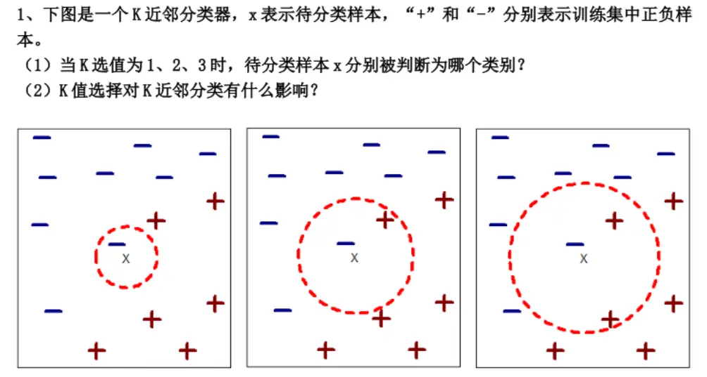

**题目**：下图是一个K近邻分类器，x表示待分类样本，"+"和"-"分别表示训练集中正负样本。

1. 当K选值为1、2、3时，待分类样本x分别被判断为哪个类别？
2. K值选择对K近邻分类有什么影响？

**解答过程**：

（1）当K选值为1、2、3时，待分类样本x分别被判断为哪个类别？

**K近邻算法（KNN）的分类原则**：

找到距离待分类样本x最近的K个训练样本，统计这K个样本中各类别的数量，将x分类为数量最多的类别。

**分析三幅图**：

**图1：K=1**

- 红色虚线圆表示距离x最近的1个样本的范围
- 圆内最近的1个样本是：1个"-"（负样本）
- 统计结果："-"类1个，"+"类0个
- **分类结果**：x被判断为**"-"类（负类）**

**图2：K=2**

- 红色虚线圆表示距离x最近的2个样本的范围
- 圆内最近的2个样本是：1个"-"（负样本）+ 1个"+"（正样本）
- 统计结果："-"类1个，"+"类1个
- 出现平局时的处理：
  - 方法1：选择距离更近的样本的类别
  - 方法2：随机选择一个类别
  - 方法3：选择K=1时的结果
- **分类结果**：根据最近邻原则，x被判断为**"-"类（负类）**

**图3：K=3**

- 红色虚线圆表示距离x最近的3个样本的范围
- 圆内最近的3个样本是：1个"-"（负样本）+ 2个"+"（正样本）
- 统计结果："-"类1个，"+"类2个
- **分类结果**：x被判断为**"+"类（正类）**

**答案总结**：

| K值 | 最近邻样本统计 | 分类结果 |
|-----|---------------|---------|
| K=1 | "-"类：1个，"+"类：0个 | **"-"类（负类）** |
| K=2 | "-"类：1个，"+"类：1个 | **"-"类（负类）**（平局时选最近邻） |
| K=3 | "-"类：1个，"+"类：2个 | **"+"类（正类）** |

---

（2）K值选择对K近邻分类有什么影响？

**K值对KNN分类的影响**：

**1. K值较小（如K=1）**

**优点**：

- 模型复杂度高，对训练数据拟合度好
- 能够捕捉数据的局部特征
- 对近邻点非常敏感

**缺点**：

- 容易受噪声影响，抗噪声能力差
- 容易过拟合
- 预测结果不稳定，方差大
- 如果最近的样本是噪声点，会导致错误分类

**2. K值较大（如K=10或更大）**

**优点**：

- 模型简化，减少过拟合风险
- 抗噪声能力强
- 预测结果稳定，方差小
- 决策边界更加平滑

**缺点**：

- 容易欠拟合
- 忽略数据的局部特征
- 可能将不同类别的样本混在一起
- 计算量增大

**为什么K值大会导致欠拟合？**

欠拟合是指模型过于简单，无法捕捉数据的真实模式。当K值很大时：

1. **过度平滑**：考虑了太多远距离的样本，导致决策边界过于平滑，无法反映数据的真实分布
   - 例如：在类别边界附近的样本，本应根据附近的样本判断类别
   - 但K值过大时，会把远处不相关的样本也纳入投票，稀释了局部特征

2. **多数类主导**：当K值接近样本总数时，分类结果会趋向于训练集中数量最多的类别
   - 极端情况：K=N（总样本数），所有待分类样本都会被判为训练集中的多数类
   - 这相当于忽略了样本的位置信息，只看整体类别分布

3. **丢失局部信息**：数据的真实分布往往具有局部性（相似的样本聚集在一起）
   - K值过大会把不同区域的样本混在一起
   - 无法区分局部的细微差异

**举例说明**：

假设有一个二分类问题：

- 训练集中有70个"+"类样本，30个"-"类样本
- 待分类样本x周围3个最近邻都是"-"类
- 但如果K=50，可能会包含35个"+"类和15个"-"类
- 结果x被错误分类为"+"类，因为忽略了x的局部特征

**形象比喻**：

- K值小：像"近视眼"，只看得清眼前的东西（局部特征），容易被噪声干扰
- K值大：像"远视眼"，只看得清远处的整体（全局特征），看不清局部细节
- K值适中：视力正常，既能看清局部，又不会被噪声迷惑

**3. K值适中**

- 在偏差和方差之间取得平衡
- 既能保持对局部特征的敏感性，又能抵抗噪声
- 通常通过交叉验证选择最优K值

**K值选择的一般原则**：

| 考虑因素 | 建议 |
|---------|------|
| 数据集大小 | 数据集越大，K值可以适当增大 |
| 噪声水平 | 噪声越多，K值应该越大 |
| 类别分布 | 类别不平衡时，K值不宜过大 |
| 计算资源 | K值越大，计算量越大 |
| 经验法则 | K通常取奇数（避免平局），常用值：3、5、7、9 |
| 最优选择 | 通过交叉验证确定最优K值 |

**K值与决策边界的关系**：

- **K=1**：决策边界非常复杂，呈现锯齿状，容易过拟合
- **K值增大**：决策边界逐渐平滑，模型趋于简化
- **K=N（样本总数）**：所有样本都参与投票，相当于将所有样本分为训练集中数量最多的类别

**实际应用建议**：

1. **起始值**：通常从K=3或K=5开始尝试
2. **交叉验证**：使用K折交叉验证选择最优K值
3. **奇数优先**：选择奇数K值可以避免二分类问题中的平局
4. **经验公式**：$K \approx \sqrt{N}$（N为训练样本数），但需要根据实际情况调整
5. **性能评估**：在验证集上测试不同K值的分类准确率，选择最优值

**本题示例的启示**：

从本题可以看出，K值从1变化到3，分类结果从"-"类变为"+"类，说明：

- K值的选择直接影响分类结果
- 较小的K值更容易受到局部样本分布的影响
- 需要根据具体问题和数据特点选择合适的K值
- 不存在"万能"的K值，需要通过实验确定

---

**知识点总结**：

**KNN算法的核心要素**：

1. **距离度量**：常用欧氏距离、曼哈顿距离、闵可夫斯基距离
2. **K值选择**：影响模型的复杂度和泛化能力
3. **决策规则**：多数投票（分类）或平均值（回归）

**KNN算法的优缺点**：

**优点**：

- 算法简单，易于理解和实现
- 无需训练过程，属于懒惰学习（Lazy Learning）
- 对异常值不敏感（当K值较大时）
- 适用于多分类问题

**缺点**：

- 计算量大，预测时需要计算与所有训练样本的距离
- 内存开销大，需要存储所有训练样本
- 对样本不平衡问题敏感
- 对高维数据效果不佳（维度灾难）
- 需要选择合适的K值和距离度量

---

#### 贝叶斯分类法

**贝叶斯分类法的基本原理**：

贝叶斯分类是基于贝叶斯定理的统计学分类方法，通过计算样本属于各个类别的概率，选择概率最大的类别作为预测结果。

**贝叶斯定理**：

$$P(C|X) = \frac{P(X|C) \cdot P(C)}{P(X)}$$

其中：

- $P(C|X)$：后验概率，在观察到特征X的条件下，样本属于类别C的概率
- $P(X|C)$：似然概率，在类别C的条件下，出现特征X的概率
- $P(C)$：先验概率，类别C在训练集中出现的概率
- $P(X)$：证据因子，特征X出现的概率（对所有类别相同，可省略）

**朴素贝叶斯分类器**：

朴素贝叶斯假设各特征之间相互独立，因此：

$$P(X|C) = P(x_1, x_2, ..., x_n|C) = P(x_1|C) \cdot P(x_2|C) \cdot ... \cdot P(x_n|C)$$

**分类决策规则**：

对于待分类样本X，计算其属于每个类别的后验概率，选择概率最大的类别：

$$\hat{C} = \arg\max_{C} P(C|X) = \arg\max_{C} P(C) \cdot \prod_{i=1}^{n} P(x_i|C)$$

**贝叶斯分类的步骤**：

1. **计算先验概率** $P(C)$：统计训练集中各类别的样本比例
2. **计算条件概率** $P(x_i|C)$：统计在类别C下，各特征取值的概率
3. **计算后验概率** $P(C|X)$：应用贝叶斯公式
4. **做出预测**：选择后验概率最大的类别

**贝叶斯分类法的优缺点**：

**优点**：
- 算法简单，易于实现
- 对小规模数据表现良好
- 对缺失数据不敏感
- 可以处理多分类问题
- 训练速度快

**缺点**：
- 假设特征独立，实际中往往不成立
- 对输入数据的表达形式敏感
- 需要计算先验概率，分类决策存在错误率

---

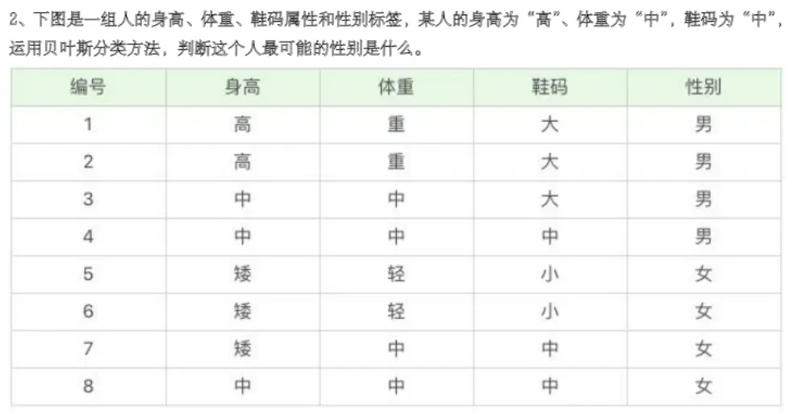

**题目**：下图是一组人的身高、体重、鞋码属性和性别标签，某人的身高为"高"、体重为"中"，鞋码为"中"，运用贝叶斯分类方法，判断这个人最可能的性别是什么。

**训练数据表**：

| 编号 | 身高 | 体重 | 鞋码 | 性别 |
|------|------|------|------|------|
| 1 | 高 | 重 | 大 | 男 |
| 2 | 高 | 重 | 大 | 男 |
| 3 | 中 | 中 | 大 | 男 |
| 4 | 中 | 中 | 中 | 男 |
| 5 | 矮 | 轻 | 小 | 女 |
| 6 | 矮 | 轻 | 小 | 女 |
| 7 | 矮 | 中 | 中 | 女 |
| 8 | 中 | 中 | 中 | 女 |

**待分类样本**：身高="高"，体重="中"，鞋码="中"


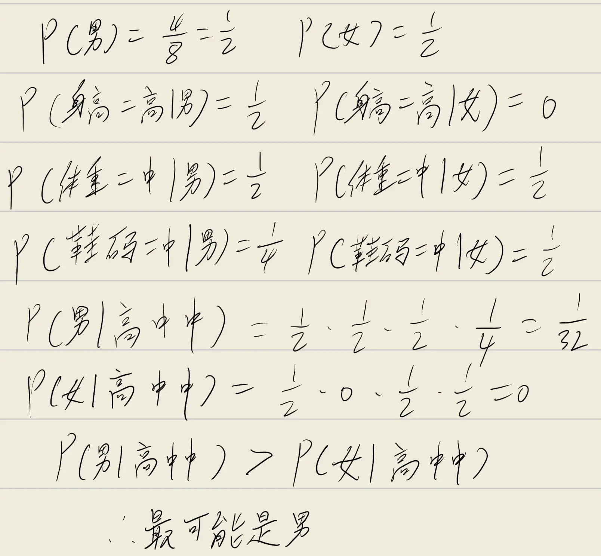


---

**解答过程**：

**第一步：计算先验概率 P(性别)**

统计训练集中各性别的样本数：

- 男性样本数：4个（编号1, 2, 3, 4）
- 女性样本数：4个（编号5, 6, 7, 8）
- 总样本数：8个

先验概率：

- $P(男) = 4/8 = 0.5$
- $P(女) = 4/8 = 0.5$

---

**第二步：计算条件概率 P(特征|性别)**

**对于男性（4个样本）**：

**身高属性**：

- $P(身高=高|男) = 2/4 = 0.5$（编号1, 2）
- $P(身高=中|男) = 2/4 = 0.5$（编号3, 4）
- $P(身高=矮|男) = 0/4 = 0$

**体重属性**：

- $P(体重=重|男) = 2/4 = 0.5$（编号1, 2）
- $P(体重=中|男) = 2/4 = 0.5$（编号3, 4）
- $P(体重=轻|男) = 0/4 = 0$

**鞋码属性**：

- $P(鞋码=大|男) = 3/4 = 0.75$（编号1, 2, 3）
- $P(鞋码=中|男) = 1/4 = 0.25$（编号4）
- $P(鞋码=小|男) = 0/4 = 0$

**对于女性（4个样本）**：

**身高属性**：

- $P(身高=高|女) = 0/4 = 0$
- $P(身高=中|女) = 1/4 = 0.25$（编号8）
- $P(身高=矮|女) = 3/4 = 0.75$（编号5, 6, 7）

**体重属性**：

- $P(体重=重|女) = 0/4 = 0$
- $P(体重=中|女) = 2/4 = 0.5$（编号7, 8）
- $P(体重=轻|女) = 2/4 = 0.5$（编号5, 6）

**鞋码属性**：

- $P(鞋码=大|女) = 0/4 = 0$
- $P(鞋码=中|女) = 2/4 = 0.5$（编号7, 8）
- $P(鞋码=小|女) = 2/4 = 0.5$（编号5, 6）

---

**第三步：计算后验概率 P(性别|特征)**

根据朴素贝叶斯假设，特征之间相互独立：

**对于男性**：
$$P(男|高,中,中) = P(男) \times P(身高=高|男) \times P(体重=中|男) \times P(鞋码=中|男)$$

$$= 0.5 \times 0.5 \times 0.5 \times 0.25$$

$$= 0.03125$$

**对于女性**：
$$P(女|高,中,中) = P(女) \times P(身高=高|女) \times P(体重=中|女) \times P(鞋码=中|女)$$

$$= 0.5 \times 0 \times 0.5 \times 0.5$$

$$= 0$$

---

**第四步：做出预测**

比较后验概率：

- $P(男|高,中,中) = 0.03125$
- $P(女|高,中,中) = 0$

由于 $P(男|高,中,中) > P(女|高,中,中)$

**答案**：这个人最可能的性别是**男性**

---

**分析说明**：

1. **为什么女性概率为0？**
   - 在训练集中，没有身高为"高"的女性样本
   - 因此 $P(身高=高|女) = 0$
   - 导致整个后验概率为0

2. **零概率问题**：
   - 这是朴素贝叶斯的一个缺陷：如果某个特征值在训练集中未出现，会导致整个概率为0
   - 实际应用中通常使用**拉普拉斯平滑**（Laplace Smoothing）来解决

3. **拉普拉斯平滑**：
   - 在计算条件概率时，给每个特征值的计数加1
   - 公式：$P(x_i|C) = \frac{count(x_i, C) + 1}{count(C) + k}$
   - 其中k是该特征的取值数量

**使用拉普拉斯平滑重新计算**：

**对于女性（使用平滑）**：

- $P(身高=高|女) = \frac{0+1}{4+3} = \frac{1}{7} \approx 0.143$
- $P(体重=中|女) = \frac{2+1}{4+3} = \frac{3}{7} \approx 0.429$
- $P(鞋码=中|女) = \frac{2+1}{4+3} = \frac{3}{7} \approx 0.429$

$$P(女|高,中,中) = 0.5 \times 0.143 \times 0.429 \times 0.429 \approx 0.0131$$

**对于男性（使用平滑）**：

- $P(身高=高|男) = \frac{2+1}{4+3} = \frac{3}{7} \approx 0.429$
- $P(体重=中|男) = \frac{2+1}{4+3} = \frac{3}{7} \approx 0.429$
- $P(鞋码=中|男) = \frac{1+1}{4+3} = \frac{2}{7} \approx 0.286$

$$P(男|高,中,中) = 0.5 \times 0.429 \times 0.429 \times 0.286 \approx 0.0263$$

使用拉普拉斯平滑后，结论仍然是**男性**（0.0263 > 0.0131）

---

**知识点总结**：

**贝叶斯分类的关键点**：

1. **先验概率**：反映各类别在训练集中的分布
2. **条件概率**：反映特征在各类别中的分布
3. **独立性假设**：简化计算，但可能不符合实际
4. **零概率问题**：需要使用平滑技术处理

**贝叶斯分类与其他方法的对比**：

| 对比维度 | 贝叶斯分类 | KNN | 决策树 |
|---------|-----------|-----|--------|
| 理论基础 | 概率论 | 距离度量 | 信息论 |
| 训练速度 | 快 | 无需训练 | 中等 |
| 预测速度 | 快 | 慢 | 快 |
| 可解释性 | 中等 | 差 | 好 |
| 对噪声敏感度 | 低 | 高（K小时） | 中等 |
| 特征独立性要求 | 高 | 无 | 无 |

---

### 作业6

#### Kmeans与DBSCAN聚类算法对比

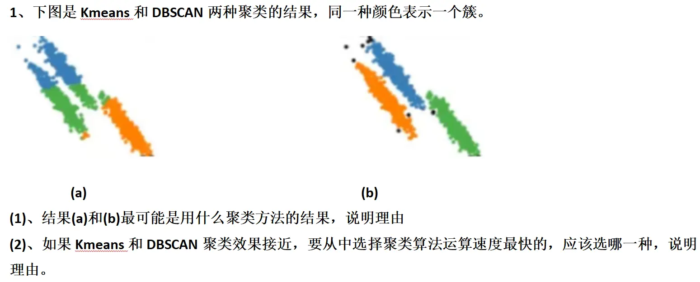

**题目**：

1. 下图是Kmeans和DBSCAN两种聚类的结果，同一种颜色表示一个簇。
   - (1) 结果(a)和(b)最可能是用什么聚类方法的结果，说明理由
   - (2) 如果Kmeans和DBSCAN聚类效果接近，要从中选择聚类算法运算速度最快的，应该选哪一种，说明理由

---

**答案与解析**：

**问题(1)：结果(a)和(b)最可能是用什么聚类方法的结果，说明理由**

**答案**：

- 结果(a)是**Kmeans**的聚类结果
- 结果(b)是**DBSCAN**的聚类结果

**理由**：

**结果(a)为Kmeans的特征**：

1. **簇的形状规则**：三个簇的形状都比较规则，呈现近似圆形或椭圆形的分布
2. **簇的大小相近**：三个簇的样本数量和空间范围大致相当
3. **边界清晰但不自然**：在三个簇的交界处，边界是直线或平滑曲线，这是因为Kmeans基于距离划分，每个点被分配到最近的簇中心
4. **所有点都被分类**：图中所有数据点都被分配到某个簇中，没有噪声点或离群点

**Kmeans的工作原理**：

- 基于距离度量（通常是欧氏距离）
- 将每个点分配到距离最近的簇中心
- 倾向于生成大小相近、形状规则（球形）的簇
- 必须将所有点分配到某个簇中

**结果(b)为DBSCAN的特征**：

1. **簇的形状任意**：三个簇的形状各异，能够识别出细长的、弯曲的簇结构
2. **簇的大小差异大**：蓝色簇明显比其他两个簇大，DBSCAN不要求簇大小均衡
3. **能识别复杂形状**：绿色簇呈现斜向的细长形状，橙色簇也是细长形状，这种非凸形状是DBSCAN的优势
4. **可能包含噪声点**：DBSCAN可以将密度不足的点标记为噪声（虽然图中未明显显示）

**DBSCAN的工作原理**：

- 基于的聚类方法
- 能够发现任意形状的簇
- 可以识别噪声点
- 不需要预先指定簇的数量

**对比分析**：

| 特征维度 | 结果(a) - Kmeans | 结果(b) - DBSCAN |
|---------|-----------------|------------------|
| 簇的形状 | 规则、近似圆形 | 任意形状、细长弯曲 |
| 簇的大小 | 大小相近 | 大小差异明显 |
| 边界特点 | 直线或平滑曲线 | 沿着数据密度变化 |
| 复杂形状识别 | 差（只能识别凸形簇） | 好（能识别任意形状） |

---

**问题(2)：如果Kmeans和DBSCAN聚类效果接近，要从中选择聚类算法运算速度最快的，应该选哪一种，说明理由**

**答案**：应该选择**Kmeans**

**理由**：

**1. 时间复杂度对比**

**Kmeans的时间复杂度**：

- 时间复杂度：$O(n \cdot k \cdot t)$
  - $n$：样本数量
  - $k$：簇的数量
  - $t$：迭代次数（通常较小，如10-100次）
- 每次迭代只需要：
  - 计算每个点到k个簇中心的距离：$O(n \cdot k)$
  - 更新簇中心：$O(n)$
- 迭代次数通常较少且可控

**DBSCAN的时间复杂度**：

- 时间复杂度：$O(n^2)$（未优化时）
- 使用空间索引（如KD树、R树）优化后：$O(n \log n)$
- 需要对每个点：
  - 查找其邻域内的所有点
  - 判断是否为核心点
  - 扩展簇（可能需要递归访问多个点）

**2. 实际运算速度对比**

| 对比维度 | Kmeans | DBSCAN |
|---------|--------|--------|
| 基本时间复杂度 | $O(n \cdot k \cdot t)$ | $O(n^2)$或$O(n \log n)$ |
| 大规模数据表现 | 快（线性复杂度） | 慢（平方或对数复杂度） |
| 迭代次数 | 可控（通常10-100次） | 需要 |
| 距离计算次数 | $n \cdot k \cdot t$ | 可能需要$n^2$次 |
| 内存占用 | 小（只需存储k个簇中心） | 大（需要存储邻域信息） |

**3. 具体分析**

**Kmeans更快的原因**：

1. **计算简单**：
   - 每次迭代只需计算点到簇中心的距离
   - 距离计算是简单的欧氏距离
   - 更新簇中心只是求平均值

2. **迭代次数少**：
   - 通常10-100次迭代即可收敛
   - 可以设置收敛条件提前终止

3. **并行化容易**：
   - 计算每个点到簇中心的距离是独立的
   - 容易实现并行计算

**DBSCAN较慢的原因**：

1. **邻域查询复杂**：
   - 需要为每个点查找半径$\epsilon$内的所有邻居
   - 即使使用空间索引，也需要$O(n \log n)$的复杂度

2. **簇扩展过程**：
   - 发现核心点后需要递归扩展簇
   - 可能需要多次访问同一个点

3. **参数敏感**：
   - 需要仔细选择$\epsilon$和MinPts参数
   - 参数选择不当可能导致多次重新计算

**4. 数值示例**

假设有10,000个样本点：

**Kmeans**（k=3，迭代50次）：

- 计算量：$10,000 \times 3 \times 50 = 1,500,000$次距离计算

**DBSCAN**（未优化）：

- 计算量：$10,000^2 / 2 = 50,000,000$次距离计算（最坏情况）

**DBSCAN**（使用KD树优化）：

- 计算量：$10,000 \times \log_2(10,000) \approx 10,000 \times 13.3 = 133,000$次查询
- 但每次查询仍需要访问多个节点

**结论**：在聚类效果接近的情况下，Kmeans的运算速度明显快于DBSCAN，因此应该选择**Kmeans**。

---

#### Kmeans聚类算法

**Kmeans算法简介**：

Kmeans是一种基于距离的划分式聚类算法，通过迭代优化将数据划分为k个簇，使得簇内样本相似度高，簇间相似度低。

**算法步骤**：

1. **初始化**：随机选择k个样本作为初始簇中心
2. **分配步骤**：将每个样本分配到距离最近的簇中心
3. **更新步骤**：重新计算每个簇的中心（簇内所有样本的均值）
4. **迭代**：重复步骤2和3，直到簇中心不再变化或达到最大迭代次数

**数学表示**：

**目标函数**（最小化簇内平方和）：
$$J = \sum_{i=1}^{k} \sum_{x \in C_i} \lVert x - \mu_i \rVert^2$$

其中：
- $k$：簇的数量
- $C_i$：第$i$个簇
- $\mu_i$：第$i$个簇的中心
- $\lVert x - \mu_i \rVert$：样本$x$到簇中心$\mu_i$的欧氏距离

**簇中心更新公式**：
$$\mu_i = \frac{1}{|C_i|} \sum_{x \in C_i} x$$

**算法特点**：

**优点**：
1. **简单易实现**：算法原理直观，实现简单
2. **速度快**：时间复杂度为$O(n \cdot k \cdot t)$，适合大规模数据
3. **可扩展性好**：容易并行化，适合分布式计算
4. **收敛性好**：通常能快速收敛到局部最优解

**缺点**：
1. **需要预先指定k值**：簇的数量需要事先确定
2. **对初始值敏感**：不同的初始簇中心可能导致不同的结果
3. **只能识别凸形簇**：对非凸形状的簇效果不好
4. **对离群点敏感**：离群点会影响簇中心的计算
5. **假设簇大小相近**：倾向于生成大小相近的簇

**Kmeans算法示例**：

假设有以下6个一维数据点：2, 4, 10, 12, 3, 20，要将它们聚类为2个簇（k=2）。

**初始化**：随机选择2个点作为初始簇中心
- $\mu_1 = 2$
- $\mu_2 = 4$

**第1次迭代**：

**分配步骤**：
- 点2：距离$\mu_1$=0，距离$\mu_2$=2，分配到簇1
- 点4：距离$\mu_1$=2，距离$\mu_2$=0，分配到簇2
- 点10：距离$\mu_1$=8，距离$\mu_2$=6，分配到簇2
- 点12：距离$\mu_1$=10，距离$\mu_2$=8，分配到簇2
- 点3：距离$\mu_1$=1，距离$\mu_2$=1，分配到簇1（相等时选第一个）
- 点20：距离$\mu_1$=18，距离$\mu_2$=16，分配到簇2

结果：簇1={2, 3}，簇2={4, 10, 12, 20}

**更新步骤**：
- $\mu_1 = (2+3)/2 = 2.5$
- $\mu_2 = (4+10+12+20)/4 = 11.5$

**第2次迭代**：

**分配步骤**：
- 点2：距离$\mu_1$=0.5，距离$\mu_2$=9.5，分配到簇1
- 点4：距离$\mu_1$=1.5，距离$\mu_2$=7.5，分配到簇1
- 点10：距离$\mu_1$=7.5，距离$\mu_2$=1.5，分配到簇2
- 点12：距离$\mu_1$=9.5，距离$\mu_2$=0.5，分配到簇2
- 点3：距离$\mu_1$=0.5，距离$\mu_2$=8.5，分配到簇1
- 点20：距离$\mu_1$=17.5，距离$\mu_2$=8.5，分配到簇2

结果：簇1={2, 3, 4}，簇2={10, 12, 20}

**更新步骤**：
- $\mu_1 = (2+3+4)/3 = 3$
- $\mu_2 = (10+12+20)/3 = 14$

**第3次迭代**：

**分配步骤**：
- 点2：距离$\mu_1$=1，距离$\mu_2$=12，分配到簇1
- 点4：距离$\mu_1$=1，距离$\mu_2$=10，分配到簇1
- 点10：距离$\mu_1$=7，距离$\mu_2$=4，分配到簇2
- 点12：距离$\mu_1$=9，距离$\mu_2$=2，分配到簇2
- 点3：距离$\mu_1$=0，距离$\mu_2$=11，分配到簇1
- 点20：距离$\mu_1$=17，距离$\mu_2$=6，分配到簇2

结果：簇1={2, 3, 4}，簇2={10, 12, 20}

簇分配没有变化，算法收敛。

**最终结果**：
- 簇1={2, 3, 4}，中心=3
- 簇2={10, 12, 20}，中心=14

---

#### DBSCAN聚类算法

**DBSCAN算法简介**：

DBSCAN（Density-Based Spatial Clustering of Applications with Noise）是一种基于密度的聚类算法，能够发现任意形状的簇，并能识别噪声点。

**核心概念**：

1. **$\epsilon$-邻域**：以点$p$为中心，半径为$\epsilon$的区域内的所有点
2. **核心点（Core Point）**：$\epsilon$-邻域内至少包含MinPts个点的点
3. **边界点（Border Point）**：不是核心点，但在某个核心点的$\epsilon$-邻域内的点
4. **噪声点（Noise Point）**：既不是核心点也不是边界点的点

**算法步骤**：

1. **标记核心点**：遍历所有点，找出$\epsilon$-邻域内至少有MinPts个点的核心点
2. **连接核心点**：如果两个核心点在彼此的$\epsilon$-邻域内，将它们连接到同一个簇
3. **分配边界点**：将边界点分配到其所在的核心点的簇中
4. **标记噪声点**：剩余的点标记为噪声

**算法参数**：

- **$\epsilon$（eps）**：邻域半径，定义了"密集"的空间范围
- **MinPts**：成为核心点所需的最小邻居数量

**算法特点**：

**优点**：
1. **不需要预先指定簇数量**：自动发现簇的数量
2. **能识别任意形状的簇**：不限于凸形簇
3. **能识别噪声点**：对离群点有鲁棒性
4. **对簇大小无要求**：可以发现大小差异很大的簇

**缺点**：
1. **对参数敏感**：$\epsilon$和MinPts的选择对结果影响很大
2. **时间复杂度高**：未优化时为$O(n^2)$
3. **对密度不均匀的数据效果差**：难以处理密度差异大的簇
4. **高维数据效果差**：在高维空间中，距离度量变得不可靠

**DBSCAN算法示例**：

假设有以下二维数据点，设置$\epsilon=1.5$，MinPts=3。

数据点：
- A(1,1), B(1,2), C(2,1), D(2,2)（密集区域1）
- E(8,8), F(8,9), G(9,8), H(9,9)（密集区域2）
- I(5,5)（孤立点）

**步骤1：标记核心点**

计算每个点的$\epsilon$-邻域内的点数：

- 点A：邻域内有B, C, D（距离都≤1.5），共4个点（包括自己），是核心点
- 点B：邻域内有A, C, D，共4个点，是核心点
- 点C：邻域内有A, B, D，共4个点，是核心点
- 点D：邻域内有A, B, C，共4个点，是核心点
- 点E：邻域内有F, G, H，共4个点，是核心点
- 点F：邻域内有E, G, H，共4个点，是核心点
- 点G：邻域内有E, F, H，共4个点，是核心点
- 点H：邻域内有E, F, G，共4个点，是核心点
- 点I：邻域内只有自己，共1个点，不是核心点

**步骤2：连接核心点**

- A, B, C, D互相在彼此的邻域内，形成簇1
- E, F, G, H互相在彼此的邻域内，形成簇2

**步骤3：分配边界点**

- 点I不在任何核心点的邻域内，标记为噪声点

**最终结果**：
- 簇1：{A, B, C, D}
- 簇2：{E, F, G, H}
- 噪声：{I}

---

#### Kmeans与DBSCAN对比总结

| 对比维度 | Kmeans | DBSCAN |
|---------|--------|--------|
| **算法类型** | 划分式聚类 | 密度聚类 |
| **簇数量** | 需要预先指定k | 自动确定 |
| **簇形状** | 凸形（球形） | 任意形状 |
| **簇大小** | 倾向于大小相近 | 可以差异很大 |
| **噪声处理** | 所有点都分配到簇 | 可以识别噪声点 |
| **时间复杂度** | $O(n \cdot k \cdot t)$ | $O(n^2)$或$O(n \log n)$ |
| **空间复杂度** | $O(n+k)$ | $O(n)$ |
| **参数** | k（簇数量） | $\epsilon$（邻域半径）、MinPts（最小点数） |
| **初始化敏感性** | 对初始簇中心敏感 | 对参数敏感 |
| **适用场景** | 簇形状规则、大小相近、数据量大 | 簇形状任意、有噪声、密度均匀 |
| **优化难度** | 容易并行化 | 较难并行化 |
| **收敛性** | 保证收敛到局部最优 | 一次遍历即可完成 |

**选择建议**：

1. **选择Kmeans的情况**：
   - 数据量大，需要快速聚类
   - 簇的形状大致为球形
   - 簇的大小相近
   - 知道大致的簇数量

2. **选择DBSCAN的情况**：
   - 不知道簇的数量
   - 簇的形状不规则（如细长形、环形）
   - 数据中有噪声或离群点
   - 簇的密度相对均匀

3. **两者都不适合的情况**：
   - 密度差异很大的数据：考虑OPTICS算法
   - 高维数据：考虑降维后再聚类
   - 层次结构数据：考虑层次聚类算法

---

#### 邻近度矩阵

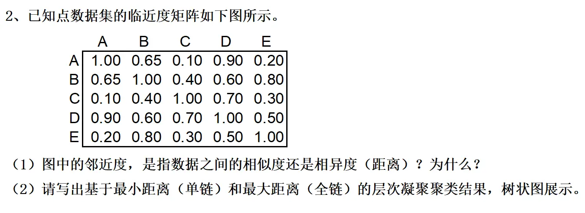

**题目**：已知点数据集的临近度矩阵如下图所示。

**邻近度矩阵**：

|   | A    | B    | C    | D    | E    |
|---|------|------|------|------|------|
| A | 1.00 | 0.65 | 0.10 | 0.90 | 0.20 |
| B | 0.65 | 1.00 | 0.40 | 0.60 | 0.80 |
| C | 0.10 | 0.40 | 1.00 | 0.70 | 0.30 |
| D | 0.90 | 0.60 | 0.70 | 1.00 | 0.50 |
| E | 0.20 | 0.80 | 0.30 | 0.50 | 1.00 |

(1) 图中的邻近度，是指数据之间的相似度还是相异度（距离）？为什么？

(2) 请写出基于最小距离（单链）和最大距离（全链）的层次凝聚聚类结果，树状图展示。


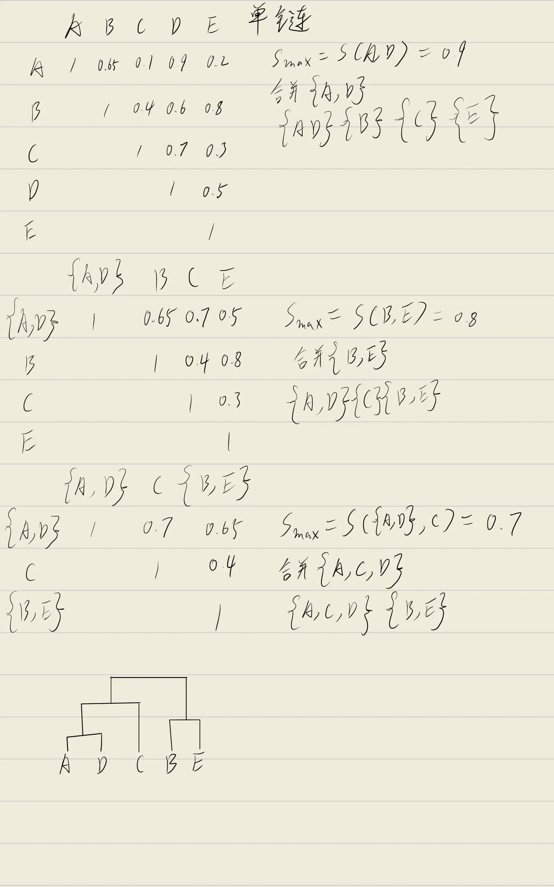

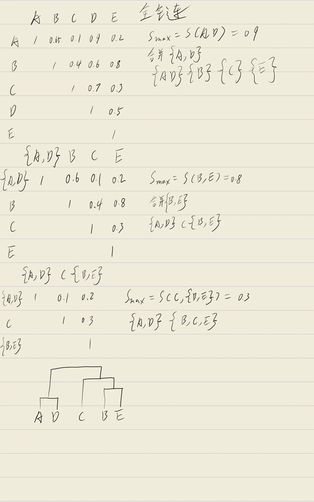


---

**解答过程**：

**问题(1)：图中的邻近度，是指数据之间的相似度还是相异度（距离）？为什么？**

**答案**：图中的邻近度是指**相似度**

**理由**：

1. **对角线元素为1.00**：
   - 矩阵的对角线元素表示每个点与自己的邻近度
   - 对角线元素都是1.00，表示每个点与自己完全相同
   - 如果是距离（相异度），对角线应该是0（点到自己的距离为0）
   - 如果是相似度，对角线应该是1（点与自己完全相似）
   - 因此，这是相似度矩阵

2. **数值范围在[0, 1]之间**：
   - 所有非对角线元素都在0到1之间
   - 相似度通常归一化到[0, 1]区间，1表示完全相似，0表示完全不相似
   - 距离通常是非负实数，没有上界限制

3. **矩阵对称性**：
   - 矩阵是对称的（如A-B = 0.65，B-A = 0.65）
   - 无论是相似度还是距离，邻近度矩阵都应该是对称的
   - 这一点不能单独判断，但与前两点结合可以确认

**相似度与距离的关系**：

如果已知相似度矩阵，可以转换为距离矩阵：
$$d(i,j) = 1 - s(i,j)$$

或者：
$$d(i,j) = \sqrt{1 - s(i,j)}$$

其中$s(i,j)$是相似度，$d(i,j)$是距离。

**本题的距离矩阵**（使用$d = 1 - s$转换）：

|   | A    | B    | C    | D    | E    |
|---|------|------|------|------|------|
| A | 0.00 | 0.35 | 0.90 | 0.10 | 0.80 |
| B | 0.35 | 0.00 | 0.60 | 0.40 | 0.20 |
| C | 0.90 | 0.60 | 0.00 | 0.30 | 0.70 |
| D | 0.10 | 0.40 | 0.30 | 0.00 | 0.50 |
| E | 0.80 | 0.20 | 0.70 | 0.50 | 0.00 |

---

**问题(2)：请写出基于最小距离（单链）和最大距离（全链）的层次凝聚聚类结果，树状图展示**

首先，我们使用转换后的距离矩阵进行层次聚类。

**距离矩阵**：

|   | A    | B    | C    | D    | E    |
|---|------|------|------|------|------|
| A | 0.00 | 0.35 | 0.90 | 0.10 | 0.80 |
| B | 0.35 | 0.00 | 0.60 | 0.40 | 0.20 |
| C | 0.90 | 0.60 | 0.00 | 0.30 | 0.70 |
| D | 0.10 | 0.40 | 0.30 | 0.00 | 0.50 |
| E | 0.80 | 0.20 | 0.70 | 0.50 | 0.00 |

---

**方法1：单链（Single Linkage，最小距离）**

**单链定义**：两个簇之间的距离定义为两个簇中最近的两个点之间的距离。
$$d_{min}(C_i, C_j) = \min_{x \in C_i, y \in C_j} d(x, y)$$

**聚类过程**：

**初始状态**：每个点是一个簇
- 簇：{A}, {B}, {C}, {D}, {E}

**第1步**：找到最小距离
- 最小距离：d(A, D) = 0.10
- 合并：{A, D}
- 当前簇：{A, D}, {B}, {C}, {E}

**更新距离矩阵**：
计算{A,D}与其他簇的距离（取最小值）：
- d({A,D}, B) = min(d(A,B), d(D,B)) = min(0.35, 0.40) = 0.35
- d({A,D}, C) = min(d(A,C), d(D,C)) = min(0.90, 0.30) = 0.30
- d({A,D}, E) = min(d(A,E), d(D,E)) = min(0.80, 0.50) = 0.50

新距离矩阵：

|       | {A,D} | B    | C    | E    |
|-------|-------|------|------|------|
| {A,D} | 0.00  | 0.35 | 0.30 | 0.50 |
| B     | 0.35  | 0.00 | 0.60 | 0.20 |
| C     | 0.30  | 0.60 | 0.00 | 0.70 |
| E     | 0.50  | 0.20 | 0.70 | 0.00 |

**第2步**：找到最小距离
- 最小距离：d(B, E) = 0.20
- 合并：{B, E}
- 当前簇：{A, D}, {B, E}, {C}

**更新距离矩阵**：
计算{B,E}与其他簇的距离：
- d({A,D}, {B,E}) = min(d({A,D},B), d({A,D},E)) = min(0.35, 0.50) = 0.35
- d({B,E}, C) = min(d(B,C), d(E,C)) = min(0.60, 0.70) = 0.60

新距离矩阵：

|       | {A,D} | {B,E} | C    |
|-------|-------|-------|------|
| {A,D} | 0.00  | 0.35  | 0.30 |
| {B,E} | 0.35  | 0.00  | 0.60 |
| C     | 0.30  | 0.60  | 0.00 |

**第3步**：找到最小距离
- 最小距离：d({A,D}, C) = 0.30
- 合并：{A, D, C}
- 当前簇：{A, D, C}, {B, E}

**更新距离矩阵**：
计算{A,D,C}与{B,E}的距离：
- d({A,D,C}, {B,E}) = min(d({A,D},{B,E}), d(C,{B,E})) = min(0.35, 0.60) = 0.35

新距离矩阵：

|         | {A,D,C} | {B,E} |
|---------|---------|-------|
| {A,D,C} | 0.00    | 0.35  |
| {B,E}   | 0.35    | 0.00  |

**第4步**：找到最小距离
- 最小距离：d({A,D,C}, {B,E}) = 0.35
- 合并：{A, D, C, B, E}
- 当前簇：{A, D, C, B, E}

**聚类完成**

**单链聚类树状图**：

```
         ┌─────────────────────┐
         │                     │ 0.35
    ┌────┴────┐           ┌────┴────┐
    │         │ 0.30      │         │ 0.20
  ┌─┴─┐       C         ┌─┴─┐       E
  │   │ 0.10            B   
  A   D                 
```

或者用文字表示：
```
合并顺序：
1. A-D (距离0.10)
2. B-E (距离0.20)
3. {A,D}-C (距离0.30)
4. {A,D,C}-{B,E} (距离0.35)
```

---

**方法2：全链（Complete Linkage，最大距离）**

**全链定义**：两个簇之间的距离定义为两个簇中最远的两个点之间的距离。
$$d_{max}(C_i, C_j) = \max_{x \in C_i, y \in C_j} d(x, y)$$

**聚类过程**：

**初始状态**：每个点是一个簇
- 簇：{A}, {B}, {C}, {D}, {E}

**第1步**：找到最小距离
- 最小距离：d(A, D) = 0.10
- 合并：{A, D}
- 当前簇：{A, D}, {B}, {C}, {E}

**更新距离矩阵**：
计算{A,D}与其他簇的距离（取最大值）：
- d({A,D}, B) = max(d(A,B), d(D,B)) = max(0.35, 0.40) = 0.40
- d({A,D}, C) = max(d(A,C), d(D,C)) = max(0.90, 0.30) = 0.90
- d({A,D}, E) = max(d(A,E), d(D,E)) = max(0.80, 0.50) = 0.80

新距离矩阵：

|       | {A,D} | B    | C    | E    |
|-------|-------|------|------|------|
| {A,D} | 0.00  | 0.40 | 0.90 | 0.80 |
| B     | 0.40  | 0.00 | 0.60 | 0.20 |
| C     | 0.90  | 0.60 | 0.00 | 0.70 |
| E     | 0.80  | 0.20 | 0.70 | 0.00 |

**第2步**：找到最小距离
- 最小距离：d(B, E) = 0.20
- 合并：{B, E}
- 当前簇：{A, D}, {B, E}, {C}

**更新距离矩阵**：
计算{B,E}与其他簇的距离：
- d({A,D}, {B,E}) = max(d(A,B), d(A,E), d(D,B), d(D,E)) = max(0.35, 0.80, 0.40, 0.50) = 0.80
- d({B,E}, C) = max(d(B,C), d(E,C)) = max(0.60, 0.70) = 0.70

新距离矩阵：

|       | {A,D} | {B,E} | C    |
|-------|-------|-------|------|
| {A,D} | 0.00  | 0.80  | 0.90 |
| {B,E} | 0.80  | 0.00  | 0.70 |
| C     | 0.90  | 0.70  | 0.00 |

**第3步**：找到最小距离
- 最小距离：d({B,E}, C) = 0.70
- 合并：{B, E, C}
- 当前簇：{A, D}, {B, E, C}

**更新距离矩阵**：
计算{A,D}与{B,E,C}的距离：
- d({A,D}, {B,E,C}) = max(d(A,B), d(A,E), d(A,C), d(D,B), d(D,E), d(D,C))
- = max(0.35, 0.80, 0.90, 0.40, 0.50, 0.30) = 0.90

新距离矩阵：

|         | {A,D} | {B,E,C} |
|---------|-------|---------|
| {A,D}   | 0.00  | 0.90    |
| {B,E,C} | 0.90  | 0.00    |

**第4步**：找到最小距离
- 最小距离：d({A,D}, {B,E,C}) = 0.90
- 合并：{A, D, B, E, C}
- 当前簇：{A, D, B, E, C}

**聚类完成**

**全链聚类树状图**：

```
              ┌──────────────────┐
              │                  │ 0.90
         ┌────┴────┐        ┌────┴────┐
         │         │ 0.10   │         │ 0.70
         A         D      ┌─┴─┐       C
                          │   │ 0.20
                          B   E
```

或者用文字表示：
```
合并顺序：
1. A-D (距离0.10)
2. B-E (距离0.20)
3. {B,E}-C (距离0.70)
4. {A,D}-{B,E,C} (距离0.90)
```

---

**单链与全链对比**：

| 对比维度 | 单链（最小距离） | 全链（最大距离） |
|---------|----------------|----------------|
| **合并顺序** | 1. A-D (0.10)<br>2. B-E (0.20)<br>3. {A,D}-C (0.30)<br>4. {A,D,C}-{B,E} (0.35) | 1. A-D (0.10)<br>2. B-E (0.20)<br>3. {B,E}-C (0.70)<br>4. {A,D}-{B,E,C} (0.90) |
| **第3步差异** | C先与{A,D}合并 | C先与{B,E}合并 |
| **最终合并距离** | 0.35 | 0.90 |
| **簇的紧密度** | 较松散 | 较紧密 |

**关键差异分析**：

1. **第3步的不同选择**：
   - 单链：d({A,D}, C) = 0.30 < d({B,E}, C) = 0.60，所以C与{A,D}合并
   - 全链：d({B,E}, C) = 0.70 < d({A,D}, C) = 0.90，所以C与{B,E}合并

2. **最终合并距离的差异**：
   - 单链：0.35（两个簇中最近的点之间的距离）
   - 全链：0.90（两个簇中最远的点之间的距离）

3. **簇的形状特点**：
   - 单链：倾向于产生链状、细长的簇，对噪声敏感
   - 全链：倾向于产生紧凑、球形的簇，对噪声不敏感

---

#### 层次聚类算法

**层次聚类简介**：

层次聚类（Hierarchical Clustering）是一种通过计算不同类别数据点之间的相似度来创建聚类树的聚类方法。主要分为两类：

1. **凝聚层次聚类（Agglomerative）**：自底向上，从单个点开始，逐步合并
2. **分裂层次聚类（Divisive）**：自顶向下，从所有点开始，逐步分裂

**凝聚层次聚类算法步骤**：

1. **初始化**：将每个数据点视为一个簇
2. **计算距离**：计算所有簇之间的距离
3. **合并簇**：找到距离最小的两个簇，将它们合并
4. **更新距离**：重新计算新簇与其他簇的距离
5. **重复**：重复步骤3-4，直到所有点合并为一个簇

**簇间距离的定义方法**：

| 方法 | 定义 | 公式 | 特点 |
|------|------|------|------|
| **单链（Single Linkage）** | 两个簇中最近的两个点之间的距离 | $d_{min}(C_i, C_j) = \min_{x \in C_i, y \in C_j} d(x, y)$ | 容易产生链状簇，对噪声敏感 |
| **全链（Complete Linkage）** | 两个簇中最远的两个点之间的距离 | $d_{max}(C_i, C_j) = \max_{x \in C_i, y \in C_j} d(x, y)$ | 产生紧凑簇，对噪声不敏感 |
| **平均链（Average Linkage）** | 两个簇中所有点对之间距离的平均值 | $d_{avg}(C_i, C_j) = \frac{1}{&#124;C_i&#124; \cdot &#124;C_j&#124;} \sum_{x \in C_i, y \in C_j} d(x, y)$ | 折中方案，较为稳定 |
| **质心法（Centroid）** | 两个簇的质心之间的距离 | $d_{centroid}(C_i, C_j) = d(\mu_i, \mu_j)$ | 受离群点影响较大 |
| **Ward法** | 合并后簇内平方和的增量 | $\Delta(C_i, C_j) = \sum_{x \in C_i \cup C_j} &#124;&#124;x - \mu_{ij}&#124;&#124;^2 - \sum_{x \in C_i} &#124;&#124;x - \mu_i&#124;&#124;^2 - \sum_{x \in C_j} &#124;&#124;x - \mu_j&#124;&#124;^2$ | 倾向于产生大小相近的簇 |

**层次聚类的优缺点**：

**优点**：
1. **不需要预先指定簇数量**：可以通过树状图选择合适的簇数量
2. **结果直观**：树状图清晰展示了数据的层次结构
3. **适用于任意形状的簇**：不同的距离定义适用于不同形状
4. **确定性**：对于相同的数据和参数，结果是确定的

**缺点**：
1. **时间复杂度高**：$O(n^2 \log n)$或$O(n^3)$，不适合大规模数据
2. **空间复杂度高**：需要存储距离矩阵，$O(n^2)$
3. **不可撤销**：一旦合并就无法撤销，错误会传播
4. **对噪声和离群点敏感**：特别是单链方法

**树状图（Dendrogram）**：

树状图是层次聚类结果的可视化表示，纵轴表示簇之间的距离，横轴表示数据点。

**如何从树状图确定簇数量**：

1. **水平切割**：在树状图的某个高度画一条水平线
2. **簇数量**：水平线穿过的垂直线段数量即为簇的数量
3. **选择标准**：
   - 选择距离增量最大的位置切割
   - 根据业务需求选择合适的簇数量
   - 使用肘部法则（Elbow Method）

**示例**：

对于本题的单链聚类结果，如果在距离0.30处切割：
- 得到3个簇：{A, D}, {C}, {B, E}

如果在距离0.20处切割：
- 得到4个簇：{A, D}, {B, E}, {C}, 以及可能的其他点

---

#### 相似度与距离度量

**相似度（Similarity）**：

相似度衡量两个对象的相似程度，值越大表示越相似。

**常用相似度度量**：

1. **余弦相似度（Cosine Similarity）**：
   $$\text{sim}(x, y) = \frac{x \cdot y}{||x|| \cdot ||y||} = \frac{\sum_{i=1}^{n} x_i y_i}{\sqrt{\sum_{i=1}^{n} x_i^2} \cdot \sqrt{\sum_{i=1}^{n} y_i^2}}$$
   - 取值范围：[-1, 1]
   - 常用于文本相似度计算

2. **Jaccard相似度**：
   $$\text{sim}(A, B) = \frac{|A \cap B|}{|A \cup B|}$$
   - 取值范围：[0, 1]
   - 常用于集合相似度计算

3. **皮尔逊相关系数（Pearson Correlation）**：
   $$\text{sim}(x, y) = \frac{\sum_{i=1}^{n} (x_i - \bar{x})(y_i - \bar{y})}{\sqrt{\sum_{i=1}^{n} (x_i - \bar{x})^2} \cdot \sqrt{\sum_{i=1}^{n} (y_i - \bar{y})^2}}$$
   - 取值范围：[-1, 1]
   - 衡量线性相关性

**距离（Distance/Dissimilarity）**：

距离衡量两个对象的差异程度，值越大表示越不相似。

**常用距离度量**：

1. **欧氏距离（Euclidean Distance）**：
   $$d(x, y) = \sqrt{\sum_{i=1}^{n} (x_i - y_i)^2}$$
   - 最常用的距离度量
   - 对量纲敏感，需要归一化

2. **曼哈顿距离（Manhattan Distance）**：
   $$d(x, y) = \sum_{i=1}^{n} |x_i - y_i|$$
   - 也称为城市街区距离
   - 对离群点不敏感

3. **闵可夫斯基距离（Minkowski Distance）**：
   $$d(x, y) = \left(\sum_{i=1}^{n} |x_i - y_i|^p\right)^{1/p}$$
   - p=1：曼哈顿距离
   - p=2：欧氏距离
   - p→∞：切比雪夫距离

4. **切比雪夫距离（Chebyshev Distance）**：
   $$d(x, y) = \max_{i=1}^{n} |x_i - y_i|$$
   - 取各维度差异的最大值

**相似度与距离的转换**：

1. **线性转换**：
   $$d = 1 - s \quad \text{或} \quad s = 1 - d$$
   - 适用于相似度和距离都在[0, 1]范围内

2. **倒数转换**：
   $$d = \frac{1}{s} \quad \text{或} \quad s = \frac{1}{1 + d}$$
   - 适用于相似度为正值的情况

3. **指数转换**：
   $$s = e^{-d} \quad \text{或} \quad d = -\ln(s)$$
   - 适用于需要非线性转换的情况

**选择距离度量的考虑因素**：

1. **数据类型**：
   - 数值型：欧氏距离、曼哈顿距离
   - 二值型：Jaccard距离、汉明距离
   - 文本型：余弦相似度、编辑距离

2. **数据分布**：
   - 正态分布：欧氏距离
   - 有离群点：曼哈顿距离
   - 高维数据：余弦相似度

3. **量纲问题**：
   - 不同量纲的特征需要归一化
   - 或使用对量纲不敏感的度量（如余弦相似度）

4. **计算效率**：
   - 欧氏距离计算较快
   - 编辑距离计算较慢

---

### 作业7

#### 关联规则挖掘

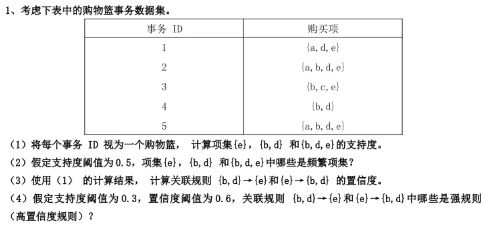

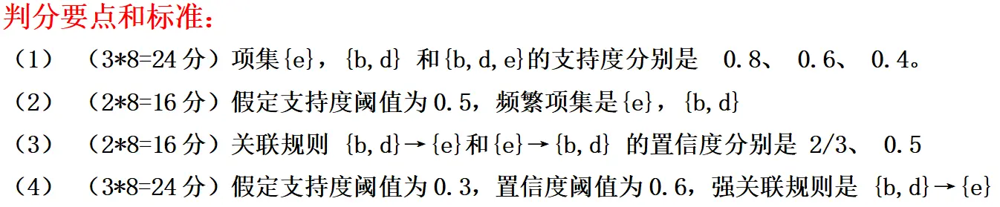

**题目**：考虑下表中的购物篮事务数据集。

**购物篮事务数据集**：

| 事务ID | 购买项 |
|--------|--------|
| 1 | {a, d, e} |
| 2 | {a, b, d, e} |
| 3 | {b, c, e} |
| 4 | {b, d} |
| 5 | {a, b, d, e} |

**问题**：

1. 将每个事务ID视为一个购物篮，计算项集{e}、{b, d}和{b, d, e}的支持度。
2. 假定支持度阈值为0.5，项集{e}、{b, d}和{b, d, e}中哪些是频繁项集？
3. 使用(1)的计算结果，计算关联规则{b, d}→{e}和{e}→{b, d}的置信度。
4. 假定支持度阈值为0.3，置信度阈值为0.6，关联规则{b, d}→{e}和{e}→{b, d}中哪些是强规则（高置信度规则）？

---

**解答过程**：

**问题(1)：计算项集{e}、{b, d}和{b, d, e}的支持度**

**支持度（Support）的定义**：
$$\text{Support}(X) = \frac{\text{包含项集X的事务数}}{\text{总事务数}}$$

**总事务数**：5个事务

**计算项集{e}的支持度**：

统计包含项e的事务：

- 事务1：{a, d, e} ✓ 包含e
- 事务2：{a, b, d, e} ✓ 包含e
- 事务3：{b, c, e} ✓ 包含e
- 事务4：{b, d} ✗ 不包含e
- 事务5：{a, b, d, e} ✓ 包含e

包含{e}的事务数：4个

$$\text{Support}(\{e\}) = \frac{4}{5} = 0.8$$

**计算项集{b, d}的支持度**：

统计同时包含项b和项d的事务：

- 事务1：{a, d, e} ✗ 有d但无b
- 事务2：{a, b, d, e} ✓ 同时包含b和d
- 事务3：{b, c, e} ✗ 有b但无d
- 事务4：{b, d} ✓ 同时包含b和d
- 事务5：{a, b, d, e} ✓ 同时包含b和d

包含{b, d}的事务数：3个

$$\text{Support}(\{b, d\}) = \frac{3}{5} = 0.6$$

**计算项集{b, d, e}的支持度**：

统计同时包含项b、d和e的事务：

- 事务1：{a, d, e} ✗ 有d和e但无b
- 事务2：{a, b, d, e} ✓ 同时包含b、d和e
- 事务3：{b, c, e} ✗ 有b和e但无d
- 事务4：{b, d} ✗ 有b和d但无e
- 事务5：{a, b, d, e} ✓ 同时包含b、d和e

包含{b, d, e}的事务数：2个

$$\text{Support}(\{b, d, e\}) = \frac{2}{5} = 0.4$$

**答案总结**：

| 项集      | 包含该项集的事务   | 支持度计算 | 支持度 |
|-----------|-------------------|-----------|--------|
| {e}       | 事务1, 2, 3, 5    | 4/5       | 0.8    |
| {b, d}    | 事务2, 4, 5       | 3/5       | 0.6    |
| {b, d, e} | 事务2, 5          | 2/5       | 0.4    |

---

**问题(2)：假定支持度阈值为0.5，项集{e}、{b, d}和{b, d, e}中哪些是频繁项集？**

**频繁项集的定义**：
支持度大于或等于最小支持度阈值（min_support）的项集称为频繁项集。

**最小支持度阈值**：min_support = 0.5

**判断各项集是否为频繁项集**：

1. **项集{e}**：
   - Support({e}) = 0.8
   - 0.8 ≥ 0.5 ✓
   - **是频繁项集**

2. **项集{b, d}**：
   - Support({b, d}) = 0.6
   - 0.6 ≥ 0.5 ✓
   - **是频繁项集**

3. **项集{b, d, e}**：
   - Support({b, d, e}) = 0.4
   - 0.4 < 0.5 ✗
   - **不是频繁项集**

**答案**：在支持度阈值为0.5的条件下，**{e}和{b, d}是频繁项集**，{b, d, e}不是频繁项集。

---

**问题(3)：使用(1)的计算结果，计算关联规则{b, d}→{e}和{e}→{b, d}的置信度**

**置信度（Confidence）的定义**：
$$\text{Confidence}(X \rightarrow Y) = \frac{\text{Support}(X \cup Y)}{\text{Support}(X)}$$

置信度表示在包含X的事务中，同时包含Y的概率。

**计算关联规则{b, d}→{e}的置信度**：

- 前件（Antecedent）：{b, d}
- 后件（Consequent）：{e}
- 并集：{b, d} ∪ {e} = {b, d, e}

$$\text{Confidence}(\{b, d\} \rightarrow \{e\}) = \frac{\text{Support}(\{b, d, e\})}{\text{Support}(\{b, d\})}$$

$$= \frac{0.4}{0.6} = \frac{2}{3} \approx 0.667$$

**含义**：在购买了b和d的顾客中，约66.7%的顾客也购买了e。

**计算关联规则{e}→{b, d}的置信度**：

- 前件（Antecedent）：{e}
- 后件（Consequent）：{b, d}
- 并集：{e} ∪ {b, d} = {b, d, e}

$$\text{Confidence}(\{e\} \rightarrow \{b, d\}) = \frac{\text{Support}(\{b, d, e\})}{\text{Support}(\{e\})}$$

$$= \frac{0.4}{0.8} = \frac{1}{2} = 0.5$$

**含义**：在购买了e的顾客中，50%的顾客也购买了b和d。

**答案总结**：

| 关联规则 | 置信度计算 | 置信度 |
|---------|-----------|--------|
| {b, d}→{e} | 0.4 / 0.6 | 0.667（约66.7%） |
| {e}→{b, d} | 0.4 / 0.8 | 0.5（50%） |

---

**问题(4)：假定支持度阈值为0.3，置信度阈值为0.6，关联规则{b, d}→{e}和{e}→{b, d}中哪些是强规则（高置信度规则）？**

**强规则（Strong Rule）的定义**：
同时满足以下两个条件的关联规则称为强规则：
1. 支持度 ≥ 最小支持度阈值（min_support）
2. 置信度 ≥ 最小置信度阈值（min_confidence）

**给定阈值**：
- 最小支持度阈值：min_support = 0.3
- 最小置信度阈值：min_confidence = 0.6

**判断关联规则{b, d}→{e}是否为强规则**：

1. **检查支持度**：
   - Support({b, d, e}) = 0.4
   - 0.4 ≥ 0.3 ✓ 满足支持度要求

2. **检查置信度**：
   - Confidence({b, d}→{e}) = 0.667
   - 0.667 ≥ 0.6 ✓ 满足置信度要求

**结论**：{b, d}→{e} **是强规则**

**判断关联规则{e}→{b, d}是否为强规则**：

1. **检查支持度**：
   - Support({b, d, e}) = 0.4
   - 0.4 ≥ 0.3 ✓ 满足支持度要求

2. **检查置信度**：
   - Confidence({e}→{b, d}) = 0.5
   - 0.5 < 0.6 ✗ 不满足置信度要求

**结论**：{e}→{b, d} **不是强规则**

**答案总结**：

| 关联规则 | 支持度 | 是否满足 | 置信度 | 是否满足 | 是否为强规则 |
|---------|--------|---------|--------|---------|------------|
| {b, d}→{e} | 0.4 | ✓ (≥0.3) | 0.667 | ✓ (≥0.6) | **是** |
| {e}→{b, d} | 0.4 | ✓ (≥0.3) | 0.5 | ✗ (<0.6) | **否** |

**答案**：在支持度阈值为0.3、置信度阈值为0.6的条件下，**{b, d}→{e}是强规则**，{e}→{b, d}不是强规则。

---

#### 关联规则挖掘知识点总结

**1. 核心概念**

**支持度（Support）**：
- 定义：项集在所有事务中出现的频率
- 公式：$\text{Support}(X) = \frac{\text{包含X的事务数}}{\text{总事务数}}$
- 意义：衡量项集的流行程度
- 范围：[0, 1]

**置信度（Confidence）**：
- 定义：在包含前件的事务中，同时包含后件的概率
- 公式：$\text{Confidence}(X \rightarrow Y) = \frac{\text{Support}(X \cup Y)}{\text{Support}(X)}$
- 意义：衡量规则的可靠性
- 范围：[0, 1]

**提升度（Lift）**：
- 定义：规则的置信度与后件支持度的比值
- 公式：$\text{Lift}(X \rightarrow Y) = \frac{\text{Confidence}(X \rightarrow Y)}{\text{Support}(Y)} = \frac{\text{Support}(X \cup Y)}{\text{Support}(X) \times \text{Support}(Y)}$
- 意义：衡量X和Y的相关性
- 解释：
  - Lift > 1：正相关，X的出现提高了Y出现的概率
  - Lift = 1：独立，X和Y无关
  - Lift < 1：负相关，X的出现降低了Y出现的概率

**2. 频繁项集与关联规则**

**频繁项集（Frequent Itemset）**：
- 定义：支持度 ≥ 最小支持度阈值的项集
- 作用：关联规则的候选集

**关联规则（Association Rule）**：
- 形式：X → Y（X和Y是不相交的项集）
- 含义：如果X出现，则Y也可能出现

**强规则（Strong Rule）**：
- 定义：同时满足最小支持度和最小置信度的规则
- 条件：
  1. Support(X ∪ Y) ≥ min_support
  2. Confidence(X → Y) ≥ min_confidence

**3. Apriori算法原理**

**先验原理（Apriori Property）**：
- 如果一个项集是频繁的，那么它的所有子集也必然是频繁的
- 如果一个项集是非频繁的，那么它的所有超集也必然是非频繁的

**算法步骤**：
1. 扫描数据库，找出所有频繁1-项集
2. 由频繁k-项集生成候选(k+1)-项集
3. 扫描数据库，计算候选项集的支持度
4. 保留满足最小支持度的项集作为频繁(k+1)-项集
5. 重复步骤2-4，直到无法生成新的频繁项集
6. 从频繁项集生成关联规则

**4. 关联规则的评价指标对比**

| 指标 | 公式 | 含义 | 优点 | 缺点 |
|------|------|------|------|------|
| 支持度 | $\frac{n(X \cup Y)}{N}$ | 项集的流行度 | 简单直观 | 忽略规则方向 |
| 置信度 | $\frac{n(X \cup Y)}{n(X)}$ | 规则的可靠性 | 考虑规则方向 | 忽略后件的流行度 |
| 提升度 | $\frac{n(X \cup Y) \cdot N}{n(X) \cdot n(Y)}$ | X和Y的相关性 | 考虑独立性 | 对低支持度敏感 |

**5. 本题的提升度计算（补充）**

虽然题目没有要求，但我们可以计算提升度来进一步分析规则的质量。

**计算{b, d}→{e}的提升度**：

$$\text{Lift}(\{b, d\} \rightarrow \{e\}) = \frac{\text{Confidence}(\{b, d\} \rightarrow \{e\})}{\text{Support}(\{e\})}$$

$$= \frac{0.667}{0.8} = 0.833$$

**解释**：Lift < 1，说明购买{b, d}实际上降低了购买{e}的概率，这是一个负相关规则。

**计算{e}→{b, d}的提升度**：

$$\text{Lift}(\{e\} \rightarrow \{b, d\}) = \frac{\text{Confidence}(\{e\} \rightarrow \{b, d\})}{\text{Support}(\{b, d\})}$$

$$= \frac{0.5}{0.6} = 0.833$$

**解释**：Lift < 1，说明购买{e}也降低了购买{b, d}的概率，同样是负相关。

**注意**：虽然{b, d}→{e}的置信度较高（0.667），但提升度小于1，说明这个规则可能是由于{e}本身支持度很高（0.8）导致的，而不是因为{b, d}和{e}之间有真正的关联。

**6. 实际应用场景**

**购物篮分析（Market Basket Analysis）**：

- 商品推荐：根据顾客已购买的商品推荐其他商品
- 货架布局：将经常一起购买的商品放在附近
- 促销策略：对关联商品进行捆绑销售

**网页点击流分析**：

- 发现用户浏览路径模式
- 优化网站导航结构

**医疗诊断**：

- 发现症状与疾病的关联
- 辅助诊断决策

---

#### 序列模式挖掘

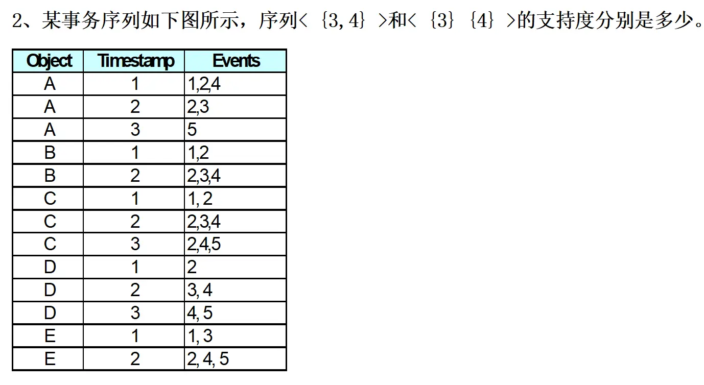

**题目**：某事务序列如下图所示，序列<{3, 4}>和<{3} {4}>的支持度分别是多少。

**事务序列数据集**：

| Object | Timestamp | Events |
|--------|-----------|--------|
| A      | 1         | 1,2,4  |
| A      | 2         | 2,3    |
| A      | 3         | 5      |
| B      | 1         | 1,2    |
| B      | 2         | 2,3,4  |
| C      | 1         | 1,2    |
| C      | 2         | 2,3,4  |
| C      | 3         | 2,4,5  |
| D      | 1         | 2      |
| D      | 2         | 3,4    |
| D      | 3         | 4,5    |
| E      | 1         | 1,3    |
| E      | 2         | 2,4,5  |

---

**解答过程**：

**第一步：理解序列模式的概念**

**序列（Sequence）**：按时间顺序排列的事件集合序列。

**两种序列表示**：

1. **<{3, 4}>**：表示事件3和事件4在**同一个时间戳**同时发生
   - 这是一个包含单个项集{3, 4}的序列
   - 要求3和4必须在同一时刻出现

2. **<{3} {4}>**：表示事件3和事件4在**不同时间戳**先后发生
   - 这是一个包含两个项集{3}和{4}的序列
   - 要求3先出现，然后4在之后的某个时刻出现（不要求紧邻）

**序列支持度的定义**：
$$\text{Support}(S) = \frac{\text{包含序列S的对象数}}{\text{总对象数}}$$

其中，"包含序列S"是指对象的事务序列中存在该模式。

---

**第二步：整理每个对象的完整序列**

| Object | 完整序列 |
|--------|---------|
| A      | <{1,2,4} {2,3} {5}> |
| B      | <{1,2} {2,3,4}> |
| C      | <{1,2} {2,3,4} {2,4,5}> |
| D      | <{2} {3,4} {4,5}> |
| E      | <{1,3} {2,4,5}> |

**总对象数**：5个（A, B, C, D, E）

---

**第三步：计算序列<{3, 4}>的支持度**

**序列<{3, 4}>的含义**：事件3和事件4在同一个时间戳的同一个项集中同时出现。

**检查每个对象是否包含该序列**：

**对象A**：<{1,2,4} {2,3} {5}>
- Timestamp 1: {1,2,4} - 有4但无3 ✗
- Timestamp 2: {2,3} - 有3但无4 ✗
- Timestamp 3: {5} - 无3也无4 ✗
- **不包含<{3, 4}>**

**对象B**：<{1,2} {2,3,4}>
- Timestamp 1: {1,2} - 无3也无4 ✗
- Timestamp 2: {2,3,4} - 同时有3和4 ✓
- **包含<{3, 4}>**

**对象C**：<{1,2} {2,3,4} {2,4,5}>
- Timestamp 1: {1,2} - 无3也无4 ✗
- Timestamp 2: {2,3,4} - 同时有3和4 ✓
- **包含<{3, 4}>**

**对象D**：<{2} {3,4} {4,5}>
- Timestamp 1: {2} - 无3也无4 ✗
- Timestamp 2: {3,4} - 同时有3和4 ✓
- **包含<{3, 4}>**

**对象E**：<{1,3} {2,4,5}>
- Timestamp 1: {1,3} - 有3但无4 ✗
- Timestamp 2: {2,4,5} - 有4但无3 ✗
- **不包含<{3, 4}>**

**统计结果**：
- 包含<{3, 4}>的对象：B, C, D（共3个）
- 总对象数：5个

$$\text{Support}(<\{3, 4\}>) = \frac{3}{5} = 0.6$$

---

**第四步：计算序列<{3} {4}>的支持度**

**序列<{3} {4}>的含义**：事件3和事件4在不同的项集中出现，且3的时间戳 < 4的时间戳。注意：3和4必须在不同的时间戳。

**检查每个对象是否包含该序列**：

**对象A**：<{1,2,4} {2,3} {5}>
- 寻找3：在Timestamp 2找到{2,3}
- 寻找4（在3之后的不同时间戳）：Timestamp 3是{5}，无4 ✗
- 注意：虽然Timestamp 1有4，但它在3之前，不符合要求
- **不包含<{3} {4}>**

**对象B**：<{1,2} {2,3,4}>
- 寻找3：在Timestamp 2找到{2,3,4}
- 寻找4（在3之后的不同时间戳）：4也在Timestamp 2的同一项集{2,3,4}中
- 注意：3和4在同一项集中，不满足"不同项集"的要求 ✗
- **不包含<{3} {4}>**

**对象C**：<{1,2} {2,3,4} {2,4,5}>
- 寻找3：在Timestamp 2找到{2,3,4}
- 寻找4（在3之后的不同时间戳）：Timestamp 3的{2,4,5}中有4 ✓
- 注意：虽然Timestamp 2也有4，但我们找到了Timestamp 3的4，满足要求
- **包含<{3} {4}>**

**对象D**：<{2} {3,4} {4,5}>
- 寻找3：在Timestamp 2找到{3,4}
- 寻找4（在3之后的不同时间戳）：Timestamp 3的{4,5}中有4 ✓
- 注意：虽然Timestamp 2也有4，但我们找到了Timestamp 3的4，满足要求
- **包含<{3} {4}>**

**对象E**：<{1,3} {2,4,5}>
- 寻找3：在Timestamp 1找到{1,3}
- 寻找4（在3之后的不同时间戳）：Timestamp 2的{2,4,5}中有4 ✓
- **包含<{3} {4}>**

**统计结果**：
- 包含<{3} {4}>的对象：C, D, E（共3个）
- 总对象数：5个

$$\text{Support}(<\{3\} \{4\}>) = \frac{3}{5} = 0.6$$

---

**答案总结**：

| 序列模式 | 含义 | 包含该序列的对象 | 支持度计算 | 支持度 |
|---------|------|-----------------|-----------|--------|
| <{3, 4}> | 3和4在同一项集中出现 | B, C, D | 3/5 | **0.6** |
| <{3} {4}> | 3和4在不同项集中，3先出现 | C, D, E | 3/5 | **0.6** |

**关键区别**：
- <{3, 4}>要求3和4在**同一时刻、同一项集**中出现
- <{3} {4}>要求3和4在**不同项集**中出现，且3的时间戳 < 4的时间戳
- 两种模式的支持度相同（都是0.6），但包含的对象不同

---

#### 序列模式挖掘知识点总结

**1. 核心概念**

**序列（Sequence）**：
- 定义：按时间顺序排列的项集序列
- 表示：$S = <s_1, s_2, ..., s_n>$，其中每个$s_i$是一个项集
- 示例：<{1,2} {3} {4,5}>表示先发生{1,2}，然后{3}，最后{4,5}

**项集（Itemset）**：
- 定义：同一时刻发生的事件集合
- 表示：用花括号{}表示，如{1,2,4}
- 特点：项集内的元素无顺序关系

**序列模式的类型**：

1. **单项集序列**：如<{3, 4}>
   - 所有事件在同一时刻发生
   - 等价于传统的频繁项集

2. **多项集序列**：如<{3} {4}>
   - 事件在不同时刻按顺序发生
   - 体现了时间顺序关系

**2. 子序列与包含关系**

**子序列（Subsequence）**：
序列$S_1 = <a_1, a_2, ..., a_m>$是序列$S_2 = <b_1, b_2, ..., b_n>$的子序列，当且仅当存在整数$1 \leq i_1 < i_2 < ... < i_m \leq n$，使得$a_1 \subseteq b_{i_1}, a_2 \subseteq b_{i_2}, ..., a_m \subseteq b_{i_m}$。

**示例**：
- <{3} {4}>是<{1,3} {2,4,5}>的子序列
  - {3} ⊆ {1,3}（在位置1）
  - {4} ⊆ {2,4,5}（在位置2）

- <{3, 4}>是<{2,3,4}>的子序列
  - {3,4} ⊆ {2,3,4}（在位置1）

**3. 序列支持度**

**定义**：
$$\text{Support}(S) = \frac{\text{包含序列S的对象数}}{\text{总对象数}}$$

**频繁序列**：
支持度 ≥ 最小支持度阈值的序列称为频繁序列。

**4. 序列模式挖掘算法**

**GSP算法（Generalized Sequential Pattern）**：

**算法步骤**：
1. 扫描数据库，找出所有频繁1-序列
2. 由频繁k-序列生成候选(k+1)-序列
3. 扫描数据库，计算候选序列的支持度
4. 保留满足最小支持度的序列作为频繁(k+1)-序列
5. 重复步骤2-4，直到无法生成新的频繁序列

**候选序列生成规则**：
- 连接：如果两个k-序列的前(k-1)项相同，则可以连接生成(k+1)-序列
- 剪枝：如果候选序列的某个k-子序列不是频繁的，则该候选序列不可能是频繁的

**PrefixSpan算法（Prefix-Projected Sequential Pattern Mining）**：

**核心思想**：
- 基于模式增长的方法
- 通过递归地构造前缀投影数据库来挖掘序列模式
- 避免了候选序列生成，效率更高

**5. 序列模式 vs 关联规则**

| 对比维度 | 序列模式 | 关联规则 |
|---------|---------|---------|
| 时间维度 | 考虑时间顺序 | 不考虑时间顺序 |
| 数据结构 | 序列数据（时间序列） | 事务数据（购物篮） |
| 模式形式 | <{A} {B} {C}> | A → B |
| 应用场景 | 用户行为序列、网页浏览路径 | 购物篮分析、商品推荐 |
| 典型算法 | GSP、PrefixSpan、SPADE | Apriori、FP-Growth |

**6. 实际应用场景**

**网页浏览序列分析**：

- 发现用户的典型浏览路径
- 示例：<{首页} {产品页} {购物车} {结账}>

**客户购买行为分析**：

- 发现客户的购买时间模式
- 示例：<{奶粉} {尿布} {玩具}>（随着婴儿成长的购买序列）

**医疗诊断序列**：

- 发现疾病发展的典型模式
- 示例：<{发烧} {咳嗽} {肺炎}>

**股票交易模式**：

- 发现股价变化的典型序列
- 示例：<{上涨} {回调} {再上涨}>

**7. 本题的深入分析**

**为什么<{3} {4}>和<{3, 4}>的支持度相同？**

1. **约束条件不同**：
   - <{3, 4}>：要求3和4必须在同一项集中（更严格的空间约束）
   - <{3} {4}>：要求3和4必须在不同项集中（更严格的时间约束）

2. **包含的对象不同**：
   - <{3, 4}>包含：B, C, D（3和4在同一项集）
   - <{3} {4}>包含：C, D, E（3和4在不同项集）
   - 交集：C, D（这两个对象既有同一项集的{3,4}，又有不同项集的3和4）

3. **对象分析**：
   - **对象B**：只有{2,3,4}一个包含3和4的项集，满足<{3, 4}>但不满足<{3} {4}>
   - **对象C**：Timestamp 2有{2,3,4}（满足<{3, 4}>），Timestamp 3有{2,4,5}（与Timestamp 2的3组成<{3} {4}>）
   - **对象D**：Timestamp 2有{3,4}（满足<{3, 4}>），Timestamp 3有{4,5}（与Timestamp 2的3组成<{3} {4}>）
   - **对象E**：Timestamp 1有{1,3}，Timestamp 2有{2,4,5}，3和4在不同项集，满足<{3} {4}>但不满足<{3, 4}>

**8. 注意事项**

**同一时刻的处理**：

- 当3和4在同一项集中出现时（如{2,3,4}）：
  - 满足<{3, 4}>（同一项集）✓
  - **不满足**<{3} {4}>（要求不同项集）✗
- <{3} {4}>要求3和4必须在**不同的时间戳**出现

**时间顺序的严格性**：

- <{3} {4}>要求3的时间戳 < 4的时间戳（严格小于，不能相等）
- 3和4不能在同一时刻出现
- 如果4在3之前出现（4的时间戳 < 3的时间戳），则不满足该序列

**子序列匹配的灵活性**：

- <{3} {4}>不要求3和4紧邻
- 中间可以有其他事件和时间戳
- 示例：<{3} {5} {4}>也包含<{3} {4}>（3在时刻1，4在时刻3）

---
