## 作业题汇总

### 作业1

#### 连续属性与离散属性

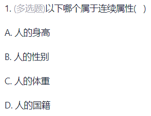

1. 正确选项：A、C
2. 解析
   - 连续属性的核心特点：取值可覆盖某一区间内的任意数值，能无限细分。
   - 选项判断：
     - A. 人的身高：可取170cm、170.2cm等任意精度的数值，符合连续属性定义。
     - B. 人的性别：仅能取“男”“女”等固定类别，属于离散属性。
     - C. 人的体重：可取50kg、50.1kg等任意精度的数值，符合连续属性定义。
     - D. 人的国籍：仅能取有限的国家名称，属于离散属性。
3. 离散属性与连续属性对比

| 属性类型 | 特点 | 示例 |
|----------|------|------|
| 离散属性 | 取值为有限类别/离散值，不可细分 | 性别、国籍、学历 |
| 连续属性 | 取值为区间内任意数值，可无限细分 | 身高、体重、温度 |

---

#### 离群点（Outliers）

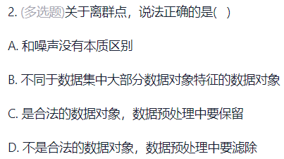

1. 正确选项：B、C
2. 解析调整
   - 对选项C的补充说明：离群点本身是**合法数据**（并非错误），其是否保留需结合场景——若分析场景需要覆盖“特殊样本”（比如研究某群体的极端情况），离群点应保留；仅当分析目标是“多数样本的共性”时，才考虑剔除。因此“是合法的数据对象，数据预处理中要保留”这一表述，在“需保留离群点的场景”下是成立的。
3. 修正后的选项分析
   - A. 错误：离群点是合法但特征特殊的数据，噪声是数据错误，二者本质不同。
   - B. 正确：符合离群点的核心定义（与大部分数据特征差异显著）。
   - C. 正确：离群点是合法数据，在需要分析特殊样本的场景中，预处理时应保留。
   - D. 错误：离群点是合法数据，并非必须滤除。

---

#### 数据挖掘的定义

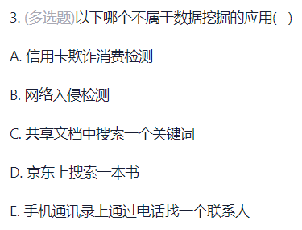

1. **正确选项：C、D、E**

2. **解析**

   - 数据挖掘的核心目标：
     从大量数据中**自动发现潜在的模式、规律或知识**，而不仅仅是执行简单的查找或匹配操作。

   - 判断关键标准：
     是否涉及**模式发现、预测、分类、异常检测等智能分析过程**。

   - 选项判断：

     - A. 信用卡欺诈消费检测：
       通过分析大量历史交易数据，识别异常消费行为，属于异常检测与分类问题，是典型的数据挖掘应用。
     - B. 网络入侵检测：
       通过分析网络流量和行为模式，发现潜在攻击或异常行为，属于模式识别与分类，属于数据挖掘应用。
     - C. 共享文档中搜索一个关键字：
       属于基于关键词的字符串匹配或信息检索，不涉及模式发现，不属于数据挖掘。
     - D. 京东上搜索一本书：
       搜索行为本质是信息检索（关键词匹配），不等同于基于用户行为的推荐系统，因此不属于数据挖掘。
     - E. 手机通讯录上通过电话找一个联系人：
       属于简单查询操作，仅进行精确匹配，不涉及数据分析或知识发现。

3. **数据挖掘与信息检索对比**

| 对比维度      | 数据挖掘           | 信息检索 / 查询  |
| --------- | -------------- | ---------- |
| 核心目的      | 发现潜在规律和知识      | 查找已知目标     |
| 是否产生新知识   | 是              | 否          |
| 是否需要模型或算法 | 通常需要           | 通常不需要      |
| 自动化与智能性   | 高              | 低          |
| 典型应用      | 欺诈检测、入侵检测、用户画像 | 文档搜索、联系人查找 |

---

#### 均值与中值

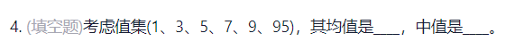

1. 均值计算：
   均值 = （1 + 3 + 5 + 7 + 9 + 95）÷ 6 = 120 ÷ 6 = 20
2. 中值计算：
   先将数据集按升序排列：1、3、5、7、9、95
   数据个数为偶数时，中值是中间两个数的平均值，即（5 + 7）÷ 2 = 6
3. 答案：均值是20，中值是6

---

#### 混淆矩阵：精度与召回率

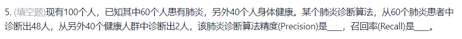

1. 先明确混淆矩阵的四个核心指标：
   - 真正例（TP）：实际患病且被诊断为患病的人数 = 48
   - 假正例（FP）：实际健康但被诊断为患病的人数 = 2
   - 假反例（FN）：实际患病但被诊断为健康的人数 = 60 - 48 = 12
   - 真反例（TN）：实际健康且被诊断为健康的人数 = 40 - 2 = 38

2. 精度（Precision）的计算：
   精度 = TP / (TP + FP) = 48 / (48 + 2) = 48 / 50 = 0.96（或96%）

3. 召回率（Recall）的计算：
   召回率 = TP / (TP + FN) = 48 / (48 + 12) = 48 / 60 = 0.8（或80%）

4. 答案：精度是0.96，召回率是0.8

---

### 作业2

#### 离散属性编码

- 最少二元属性数量计算
    要表示6种取值，需满足  2^k ≥ 6，解得 k = 3（因为 2^2 = 4 < 6，2^3 = 8 ≥ 6），因此最少需要3个二元属性。

- 两种编码方案
    方案1：最少二元属性编码（二进制编码）
    用3个二元属性（记为A、B、C），将6种尺码映射为3位二进制数：

| 尺码 | 二元属性A | 二元属性B | 二元属性C |
    |------|-----------|-----------|-----------|
    | S    | 0         | 0         | 0         |
    | M    | 0         | 0         | 1         |
    | L    | 0         | 1         | 0         |
    | XL   | 0         | 1         | 1         |
    | XXL  | 1         | 0         | 0         |
    | XXXL | 1         | 0         | 1         |

方案2：One-Hot（独热）编码
需与取值数量相等的二元属性（6个），每个属性对应一种尺码，取值为1表示对应尺码，0表示不对应：

| 尺码 | 属性1（S） | 属性2（M） | 属性3（L） | 属性4（XL） | 属性5（XXL） | 属性6（XXXL） |
    |------|------------|------------|------------|-------------|--------------|---------------|
    | S    | 1          | 0          | 0          | 0           | 0            | 0             |
    | M    | 0          | 1          | 0          | 0           | 0            | 0             |
    | L    | 0          | 0          | 1          | 0           | 0            | 0             |
    | XL   | 0          | 0          | 0          | 1           | 0            | 0             |
    | XXL  | 0          | 0          | 0          | 0           | 1            | 0             |
    | XXXL | 0          | 0          | 0          | 0           | 0            | 1             |

- 结论
   - 最少二元属性数量：3个
   - One-Hot编码所需二元属性数量：6个

| 编码类型       | 核心原理                                                                 | 适用场景                          | 优点                                  | 缺点                                  | 示例（以属性“尺码：S、M、L、XL、XXL”为例）                                                                 |
|----------------|--------------------------------------------------------------------------|-----------------------------------|---------------------------------------|---------------------------------------|----------------------------------------------------------------------------------------------------------------|
| 二进制编码     | 将离散属性的每个取值映射为整数，再转换为二进制数，用二进制位对应二元属性 | 离散属性取值较少、无明确序关系    | 占用特征维度少（仅需$\lceil log_2m \rceil$个） | 引入虚假序关系，扭曲属性间距离        | 整数映射：S=0、M=1、L=2、XL=3、XXL=4；二进制属性：X1（高位）、X2、X3（低位） S(0)→000，M(1)→001，L(2)→010，XL(3)→011，XXL(4)→100 |
| 独热编码（One-Hot） | 为每个属性取值创建独立二元属性，取值为1表示对应属性值，0表示不对应       | 离散属性无序号关系（如性别、国籍） | 无虚假序关系，保留属性原始分布        | 特征维度爆炸（需m个二元属性）        | 属性1（S）、属性2（M）、属性3（L）、属性4（XL）、属性5（XXL） S→10000，M→01000，L→00100，XL→00010，XXL→00001 |
| 标签编码（Label Encoding） | 直接将离散属性的每个取值映射为唯一整数                                  | 有序离散属性（如等级：差、中、好） | 编码简单，占用维度最少（仅1个）        | 非有序属性会引入虚假序关系            | S→0，M→1，L→2，XL→3，XXL→4                                                                                   |
| 目标编码（Target Encoding） | 用属性取值对应的目标变量统计值（如均值、中位数）作为编码值               | 高基数离散属性（如城市、用户ID）  | 不增加维度，保留目标相关信息          | 易过拟合，需交叉验证避免泄露          | 若目标为“是否购买”，S对应购买率30%→编码0.3，M对应购买率50%→编码0.5，以此类推                                   |
| 计数编码（Count Encoding） | 用属性取值在数据集中的出现次数作为编码值                                 | 高基数离散属性，无明显目标关联    | 编码简单，不增加维度                  | 相同计数的取值无法区分，可能丢失信息  | 若S出现20次→20，M出现35次→35，L出现30次→30，XL出现15次→15，XXL出现10次→10                                       |

---

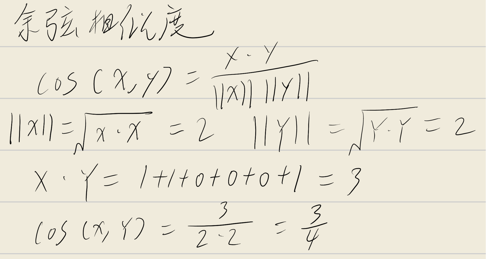

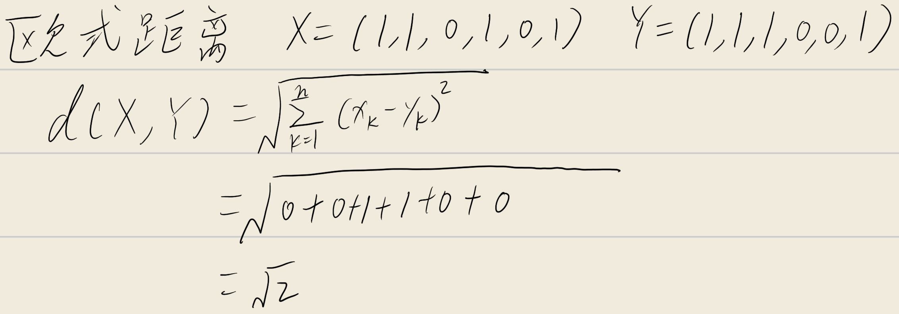

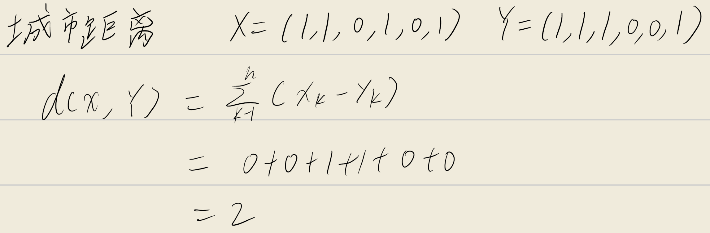

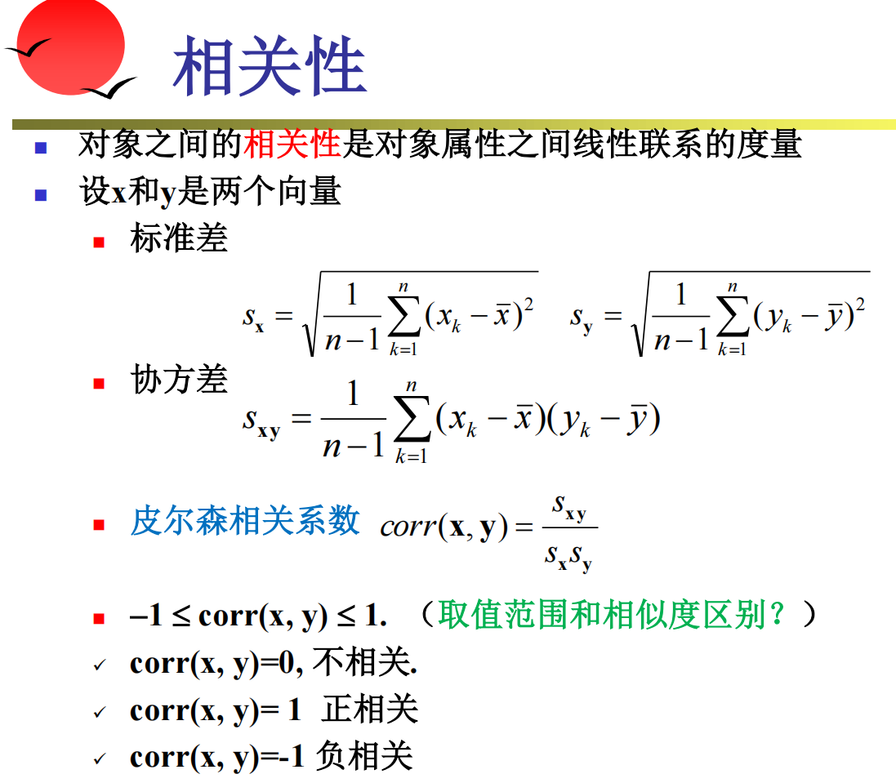

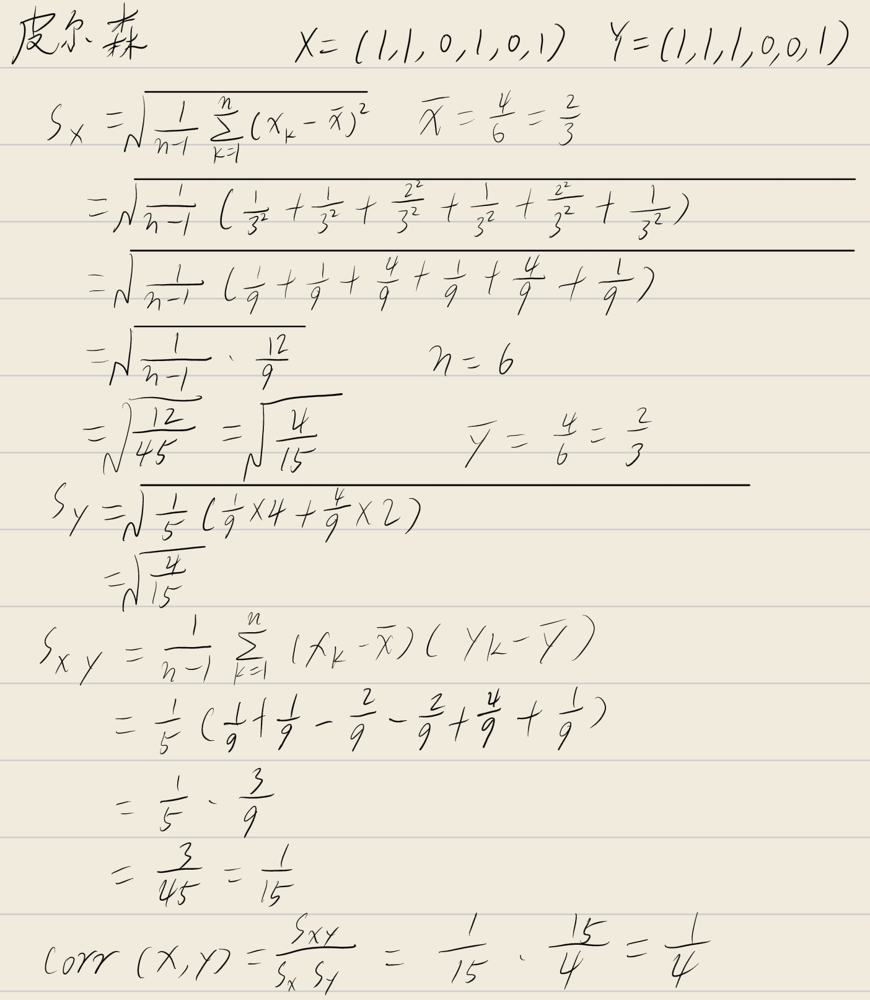

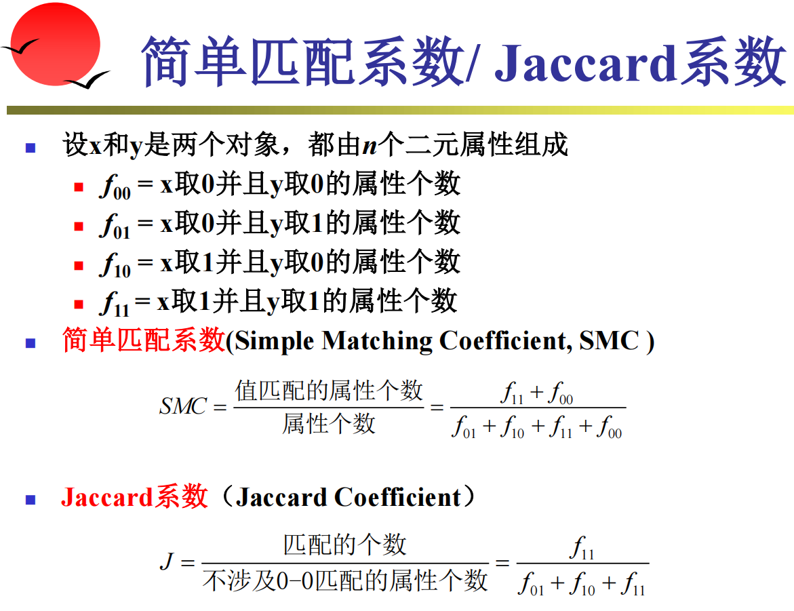

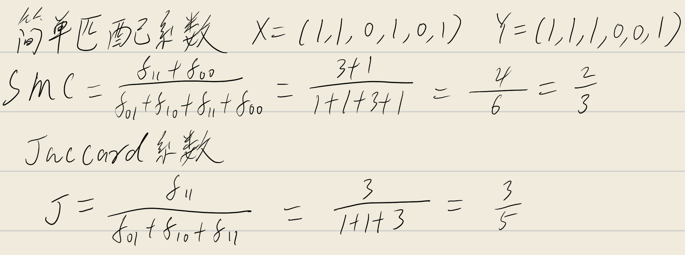

---

#### PR曲线与ROC曲线

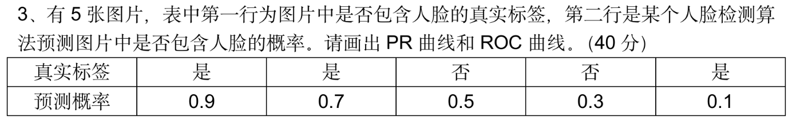

先看一下pr曲线和ROC曲线的ppt

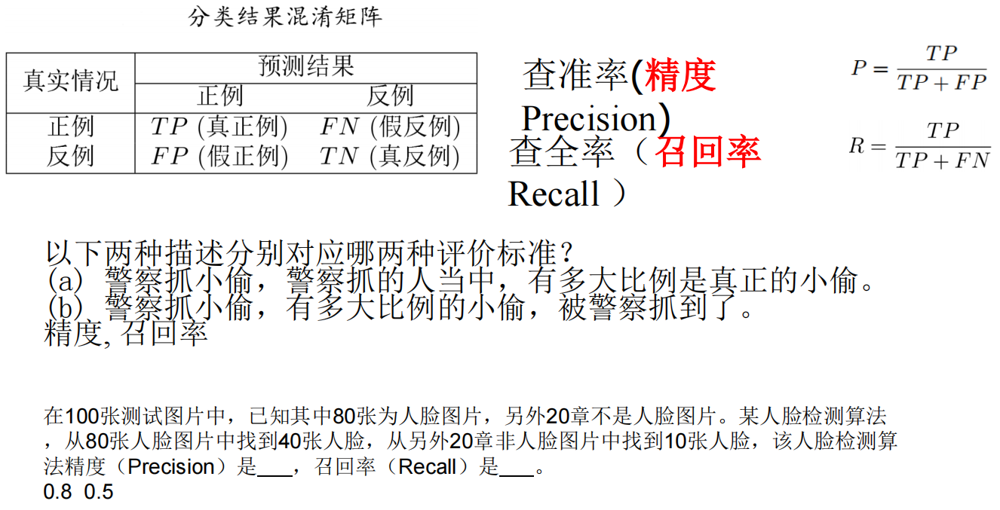

1. 描述对应的评价标准
    标准：
    - (a) 对应**查准率（精度）**：“抓的人当中真正是小偷的比例”，即“预测为正例的样本中实际正例的比例”，符合查准率的定义。
    - (b) 对应**查全率（召回率）**：“所有小偷中被抓到的比例”，即“实际正例的样本中被预测为正例的比例”，符合召回率的定义。

2. 人脸检测算法的精度与召回率计算
    首先确定混淆矩阵指标：
    - 真正例（TP）：实际是人脸且被检测为人脸的数量 = 40
    - 假正例（FP）：实际非人脸但被检测为人脸的数量 = 10
    - 假反例（FN）：实际是人脸但未被检测为人脸的数量 = 80 - 40 = 40

- **精度（Precision）**：
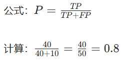

- **召回率（Recall）**：
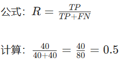

结果汇总

| 评价标准   | 数值 |
|------------|------|
| 精度       | 0.8  |
| 召回率     | 0.5  |

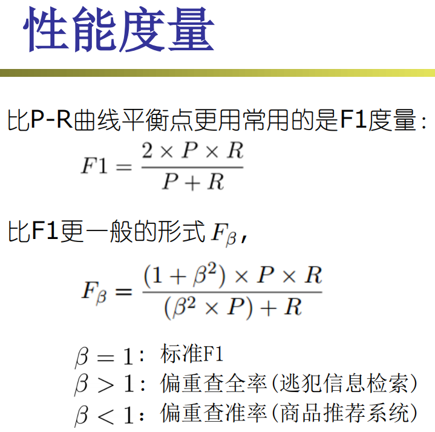

但是ROC在复习ppt中没有所以我选择先放掉。

回到题目，人脸检测算法的精度与召回率计算。

首先解释一下这个表格，有点怪但也还可以懂。我们将每一步的预测结果都列出来就会好理解很多。

首先明确：要计算不同阈值下的精度（查准率）和召回率（查全率），需先按**预测概率从高到低排序样本**，再依次以每个样本的概率为阈值（将≥该阈值的样本判定为“包含人脸”），计算对应指标。

步骤1：排序样本（按预测概率降序）

| 样本序号 | 真实标签（是否有人脸） | 预测概率 |
|----------|------------------------|----------|
| 1        | 是（正例）| 0.9      |
| 2        | 是（正例）| 0.7      |
| 3        | 否（反例）| 0.5      |
| 4        | 否（反例）| 0.3      |
| 5        | 是（正例）| 0.1      |

步骤2：逐阈值计算精度和召回率
总正例数（真实有人脸的样本数）=3，总反例数（真实无人脸的样本数）=2。

| 阈值（判定为“有人脸”的最低概率） | 判定为“有人脸”的样本 | TP（真实有人脸且判定正确的数量） | FP（真实无人脸但判定错误的数量） | 精度（Precision）= TP/(TP+FP) | 召回率（Recall）= TP/总正例 |
|----------------------------------|----------------------|----------------------------------|----------------------------------|--------------------------------|------------------------------|
| 0.9（仅样本1满足）| 样本1                | 1                                | 0                                | 1/1=1                          | 1/3≈0.33                     |
| 0.7（样本1、2满足）| 样本1、2             | 2                                | 0                                | 2/2=1                          | 2/3≈0.67                     |
| 0.5（样本1、2、3满足）| 样本1、2、3          | 2                                | 1                                | 2/3≈0.67                       | 2/3≈0.67                     |
| 0.3（样本1、2、3、4满足）| 样本1、2、3、4       | 2                                | 2                                | 2/4=0.5                        | 2/3≈0.67                     |
| 0.1（所有样本满足）| 所有5个样本          | 3                                | 2                                | 3/5=0.6                        | 3/3=1                        |

每个阈值的选取仅有大于等于这个阈值的样本会被判定为“有人脸”，剩余的都是“否”。所以接下来我们来手动算一遍这个过程。

但在此之前我们还是需要先去明确一下TFPN之间的关系和代表的含义。

在分类任务（比如人脸检测）中，TP、FP、TN、FN是混淆矩阵的4个核心指标，对应“真实标签”和“预测结果”的4种组合，用人脸检测的场景可以更直观理解：

| 指标 | 英文全称       | 含义（以“人脸检测”为例）|
|------|----------------|--------------------------------------------|
| TP   | True Positive  | 真实标签是“有人脸”，预测结果也判定为“有人脸”（判定正确的正例） |
| FP   | False Positive | 真实标签是“无人脸”，预测结果却判定为“有人脸”（判定错误的反例，误报） |
| TN   | True Negative  | 真实标签是“无人脸”，预测结果也判定为“无人脸”（判定正确的反例） |
| FN   | False Negative | 真实标签是“有人脸”，预测结果却判定为“无人脸”（判定错误的正例，漏报） |

以题目中的样本为例（阈值=0.5时）：

- TP=2：2个真实有人脸的样本被正确判定为“有人脸”
- FP=1：1个真实无人脸的样本被错误判定为“有人脸”
- TN=1：1个真实无人脸的样本被正确判定为“无人脸”
- FN=1：1个真实有人脸的样本被错误判定为“无人脸”


我自己总结的经验就是第一个字母（T/F）：表示 “预测结果是否正确”（T = 正确，F = 错误）

而第二个字母（P/N）：表示 “预测结果的类别”（P = 预测为正例，N = 预测为反例）

由此我们可以总结出：

- TP：样本本身是正例，同时预测正确（预测为正例）例
- FP：样本本身是反例，但预测错误（预测为正例）
- TN：样本本身是反例，同时预测正确（预测为反例）例
- FN：样本本身是正例，但预测错误（预测为反例）


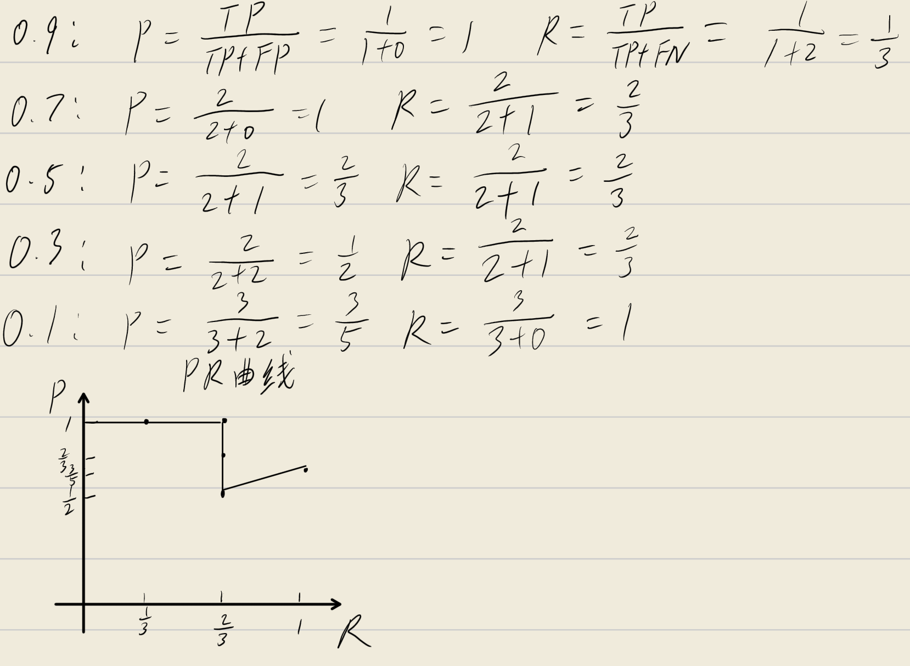

随后，ROC曲线的话，大致是这样的：其X轴是**假正例率（FPR）**，Y轴是**真正例率（TPR）**。

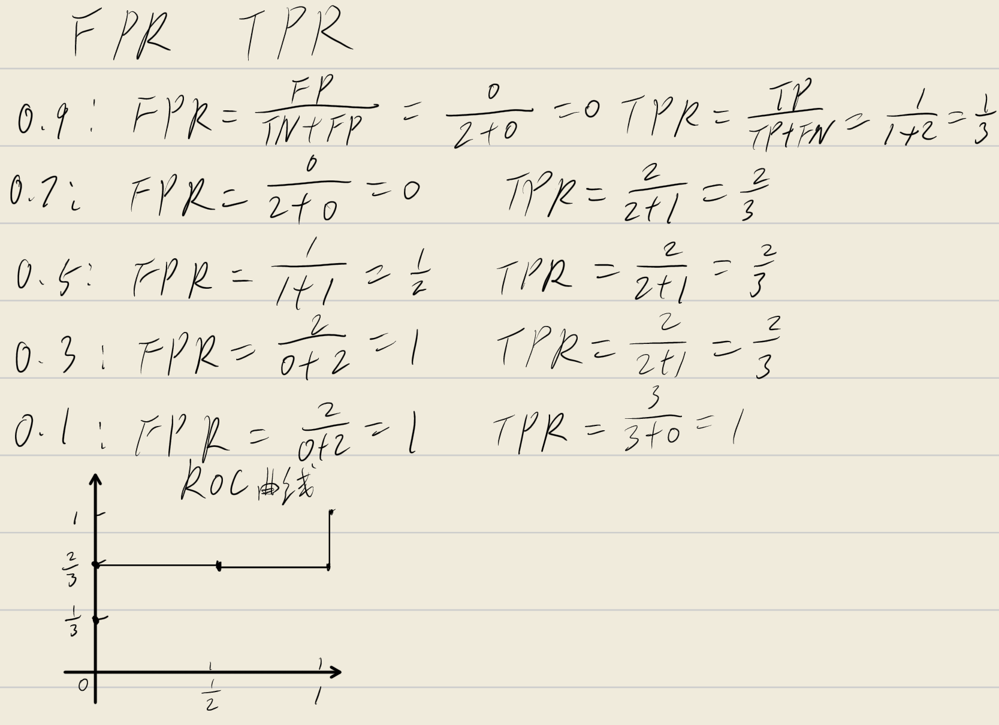

---

### 作业3

#### 线性回归中的属性处理

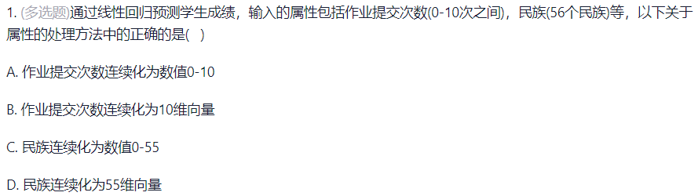

- 答案：正确选项是AD
- 解析：
  - 对于作业提交次数：
    - 作业提交次数是数值型属性（取值0-10），可直接作为连续数值参与线性回归，因此A选项正确；
    - B选项错误，作业提交次数本身是数值，无需转化为向量（向量编码适用于分类属性）。
  - 对于民族：
    - 民族是分类属性（无顺序关系的类别），需用独热编码转化为向量：56个民族对应55维向量（排除基准类别），因此D选项正确；
    - C选项错误，将民族映射为0-55的数值会错误引入“类别有序”的假设，不符合线性回归的属性要求。

可以通过表格对比这两种属性的特点及处理方式：

| 属性类型       | 作业提交次数       | 民族               |
|----------------|--------------------|--------------------|
| 属性性质       | 数值型（离散数值） | 分类型（无序类别） |
| 取值特点       | 0-10的连续数值（有大小意义） | 56个无顺序的类别（无大小意义） |
| 合适的处理方式 | 直接作为数值参与计算 | 独热编码转化为向量 |
| 对应选项正确性 | A正确、B错误       | D正确、C错误       |

---

#### 线性回归与RANSAC算法

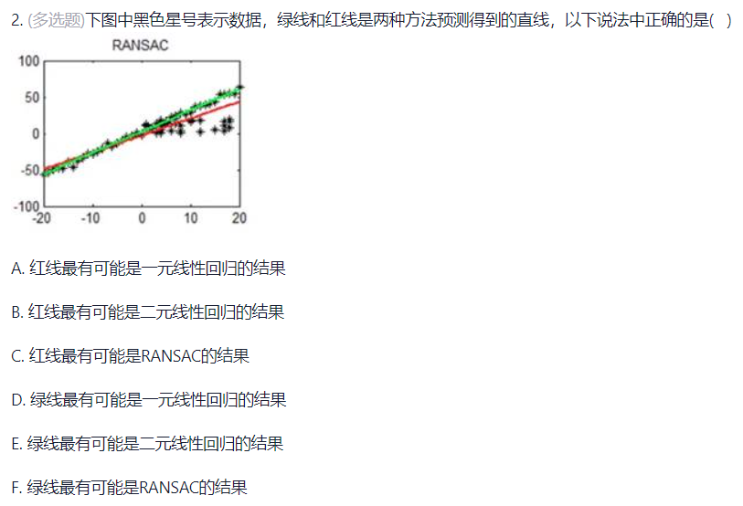

- 答案：正确选项是AF
- 解析：
  - 关于方法特点：
    - 一元线性回归会拟合所有数据（包括异常点），结果易受异常点影响，图中红线偏离多数数据点，符合一元线性回归的特点，因此A正确；
    - RANSAC是鲁棒回归方法，会拟合数据中的“内点”（多数正常数据），图中绿线贴合多数黑色星号数据，符合RANSAC的特点，因此F正确；
  - 排除错误选项：
    - 题目中只有一个输入属性（图为二维散点，对应一元回归），因此B、E中“二元线性回归”不符合场景；
    - C错误（红线不符合RANSAC拟合内点的特点），D错误（绿线不符合一元线性回归受异常点干扰的特点）。

#### RANSAC (RANdom SAmple Consensus) 算法

算法步骤：

- 1）从原始数据中随机选择一些样本作为“内点”
- 2）用1中选择的样本拟合模型
- 3）利用模型计算其它样本的残差，若某个样本的残差小于预先设置的阈值t，则将其加入内点，将内点中的样本量扩充
- 4）用扩充后的内点拟合模型，计算均方误差
- 5）重复1-4步，最终选取均方误差最小的模型

随机选出一个样本作为“内点”的步骤，可以理解为“随机采样”步骤，因此RANSAC算法也被称为“随机采样一致性”算法。

随后找的“内点”也就是离得距离近的点，距离近的点最多的模型就是最好的模型。是一个反复随机抽样枚举出最好模型的方法不是像一元线性回归那样直接拟合所有数据，所以其获得的模型一定是会天然的避免异常点离群点的影响的。

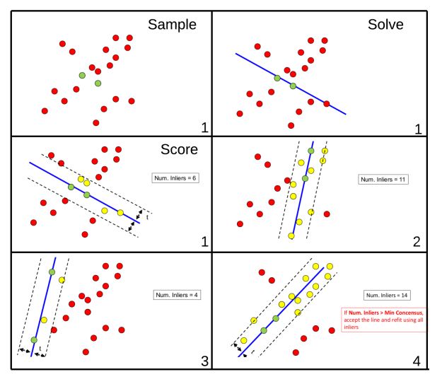

这张图展示了**RANSAC（随机抽样一致）算法拟合直线的完整流程**，分步骤解释如下：

- **Sample（抽样）**：
  - 从数据中随机选取少量“候选内点”（图中绿色点），用这些点拟合一条初始直线。
- **Solve（求解）**：
  - 基于选中的候选内点，计算出对应的直线模型（图中蓝色直线）。
- **Score（评分）**：
  - 统计所有数据中，与当前直线模型误差在阈值内的点（即“内点”，图中黄色点）数量：
    - 步骤1：第一次拟合的直线仅得到6个内点；
    - 步骤2：调整模型后得到11个内点；
    - 步骤3：再次调整后内点数量减少到4个；
    - 步骤4：最终得到14个内点（满足“内点数量＞最小共识内点”的条件）。
- **最终步骤**：
  - 当内点数量达到要求时，用所有内点重新优化直线模型，得到鲁棒的拟合结果。

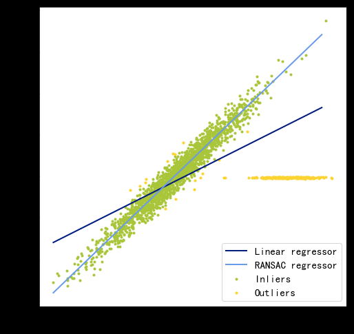

这张图对比了**普通线性回归与RANSAC回归的拟合效果**，具体解释如下：

- 元素说明：
  - 绿色点（Inliers）：数据中的“内点”（多数正常数据）；
  - 黄色点（Outliers）：数据中的“异常点”（偏离整体趋势的噪声点）；
  - 深蓝色线：普通线性回归的拟合结果；
  - 浅蓝色线：RANSAC回归的拟合结果。
- 效果对比：
  - 普通线性回归（深蓝色线）会被异常点（黄色点）“拉偏”，拟合结果偏离了多数内点的趋势；
  - RANSAC回归（浅蓝色线）只拟合内点（绿色点），不受异常点干扰，更贴合数据的真实趋势。

---

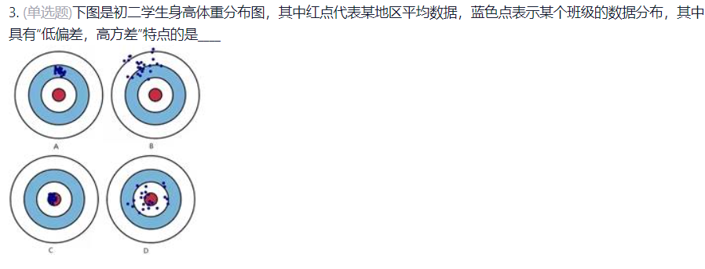

- 答案：正确选项是D

---

#### 正则化方法

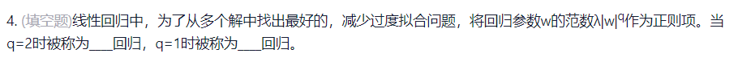

- 答案：
  1. 当q=2时被称为**ridge（岭**回归
  2. 当q=1时被称为**Lasso**回归
- 解析：
  - 正则项中q=2对应的是L2范数，基于L2范数的线性回归称为岭回归，它会让回归参数w的取值更平缓，避免参数过大导致过拟合；
  - 正则项中q=1对应的是L1范数，基于L1范数的线性回归称为Lasso回归，它不仅能缓解过拟合，还能实现特征选择（让部分参数w变为0）。

以下是常见正则化方法的特点对比表：

| 正则化方法 | 对应范数 | 核心特点 | 适用场景 |
| --- | --- | --- | --- |
| 岭回归 | L2范数$\lVert w \rVert_2$ | 让回归参数取值更平缓，避免参数过大；参数不会被压缩至0 | 特征维度高、存在多重共线性的场景 |
| Lasso回归 | L1范数$\lVert w \rVert_1$ | 缓解过拟合的同时，可实现特征选择（部分参数被压缩至0） | 需要筛选关键特征的场景 |
| Elastic Net（弹性网） | L1+L2范数 | 结合岭回归和Lasso的优点，既避免参数过大，也能进行特征选择 | 特征数量远多于样本量的场景 |

---

#### 岭回归（Ridge Regression）与 Lasso回归（Lasso Regression）

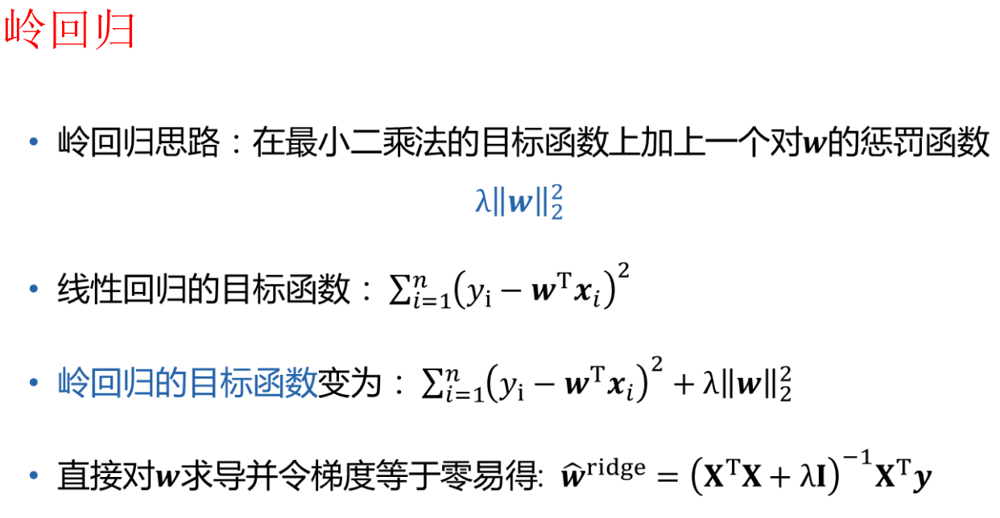

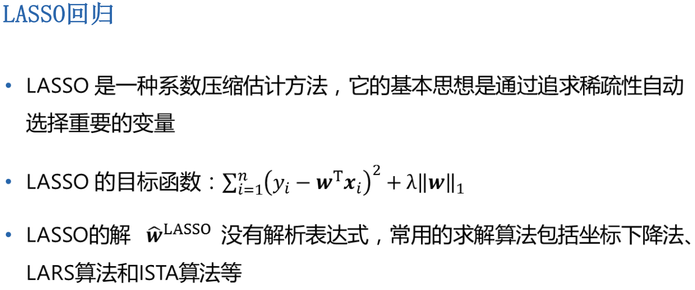

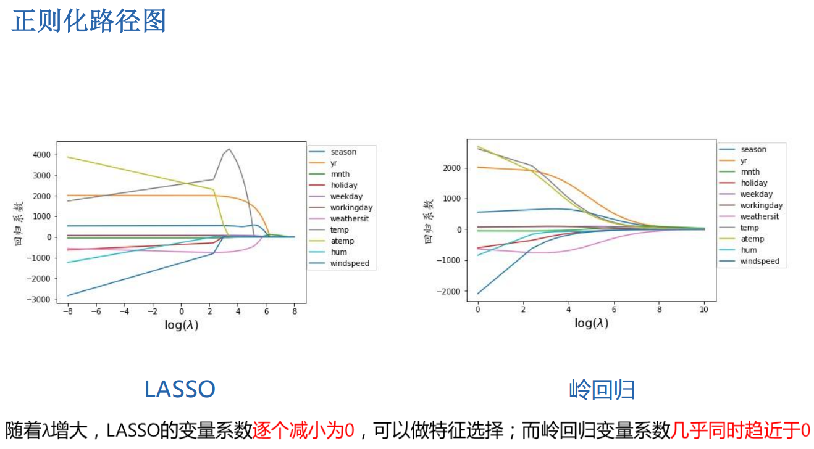

##### 核心概念对比

**岭回归（Ridge Regression）**

- **正则化项**：L2范数 $\lambda \sum_{j=1}^{p} w_j^2$
- **几何解释**：约束条件为圆形区域，参数向量被限制在圆内
- **参数特点**：参数会被"收缩"但不会变为0，所有特征都会保留
- **适用场景**：特征间存在多重共线性，需要稳定模型但保留所有特征

**Lasso回归（Lasso Regression）**

- **正则化项**：L1范数 $\lambda \sum_{j=1}^{p} |w_j|$
- **几何解释**：约束条件为菱形区域，容易在顶点处产生稀疏解
- **参数特点**：部分参数会被压缩至0，实现自动特征选择
- **适用场景**：特征维度高，需要筛选重要特征并简化模型

##### 数学推导要点

**岭回归的闭式解**：
$$\hat{w}_{ridge} = (X^TX + \lambda I)^{-1}X^Ty$$

其中$\lambda$是正则化参数，$I$是单位矩阵。

**关键特性**：
1. **可逆性保证**：即使$X^TX$不可逆，$(X^TX + \lambda I)$也是可逆的
2. **参数收缩**：$\lambda$越大，参数向量的模长越小
3. **偏差-方差权衡**：增加偏差来减少方差，提高泛化能力

**Lasso回归的优化**：
由于L1范数不可导，通常使用：
- **坐标下降法**：逐个优化参数
- **软阈值算子**：$S_{\lambda}(z) = \text{sign}(z) \max(|z| - \lambda, 0)$

##### 正则化参数λ的选择

**交叉验证法**：
1. 将训练集分为K折
2. 对不同的λ值，计算K折交叉验证误差
3. 选择使验证误差最小的λ值

**λ值效果**：
- λ = 0：退化为普通线性回归，可能过拟合
- λ过小：正则化效果不明显
- λ适中：平衡拟合效果与模型复杂度
- λ过大：欠拟合，模型过于简单

##### 实际应用对比

| 对比维度 | 岭回归 | Lasso回归 |
|----------|--------|-----------|
| 特征选择 | 不能自动选择特征 | 能自动选择特征 |
| 参数解释 | 所有参数都非零，解释复杂 | 稀疏解，解释简单 |
| 计算复杂度 | 有闭式解，计算快 | 需迭代优化，计算慢 |
| 多重共线性 | 处理效果好 | 会任意选择相关特征中的一个 |
| 预测精度 | 特征相关时表现好 | 稀疏特征时表现好 |

##### 弹性网络（Elastic Net）

结合L1和L2正则化的优点：
$$\text{Loss} = \frac{1}{2n} ||y - Xw||_2^2 + \lambda_1 ||w||_1 + \lambda_2 ||w||_2^2$$$$

**优势**：

- 既能进行特征选择（L1），又能处理相关特征组（L2）
- 在特征数大于样本数时表现稳定
- 对相关特征组倾向于整体选择或整体剔除

---

#### 正则化参数λ的影响

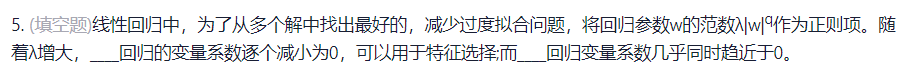

- 答案：
  1. 随着λ增大，**Lasso**回归的变量系数逐个减小为0，可以用于特征选择
  2. 而**岭**回归变量系数几乎同时趋近于0
- 解析：
  - Lasso回归基于L1范数正则化，其优化过程会让不重要的特征系数逐步被压缩至0，实现“逐个剔除”式的特征选择；
  - 岭回归基于L2范数正则化，其正则项会让所有系数同时被缩小（但不会变为0），呈现“整体趋近于0”的特点。

---

### 作业4-1

#### 决策树划分准则

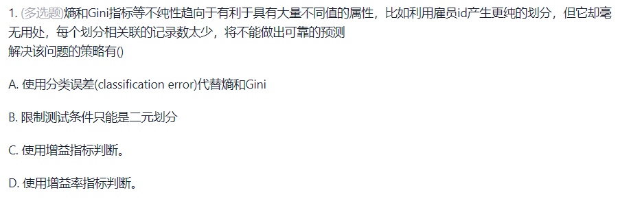

- 答案：正确选项是BD
- 解析：
  - 问题核心：熵/Gini会因高基数属性（如雇员id）的“过度细分”（每个划分记录数太少）而给出不合理的高纯度，导致不可靠预测。
  - 选项分析：
    - A错误：分类误差同样会受高基数属性的过度细分影响，无法解决该问题；
    - B正确：限制为二元划分（如对属性取一个阈值分成两类），可避免高基数属性的过度细分，保证每个划分有足够记录数；
    - C错误：增益指标（如信息增益）本身倾向于选择高基数属性，会加剧该问题；
    - D正确：增益率（信息增益/分裂信息）会惩罚高基数属性的过度分裂，避免选择类似雇员id的无用属性。

---

#### Gini指数（Gini Index）

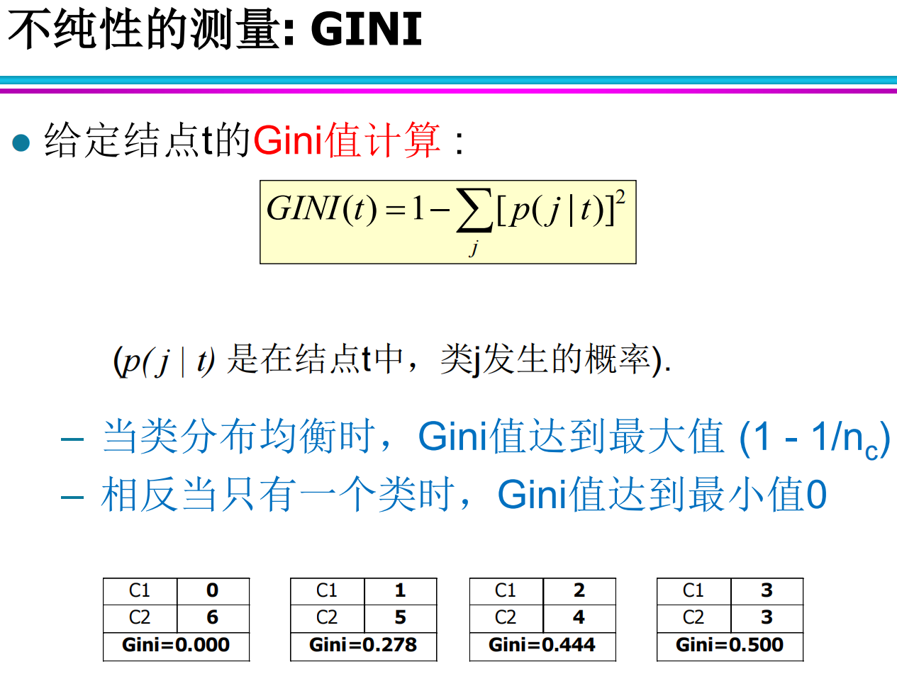

##### 计算Gini的例子

**Gini指数计算公式**：
$$GINI(t) = 1 - \sum_{j} [p(j|t)]^2$$

其中$p(j|t)$表示节点$t$中类别$j$的样本比例。

**示例1：完全纯净的节点**

| 类别 | 样本数 |
|------|--------|
| C1   | 0      |
| C2   | 6      |

计算过程：

- $P(C1) = 0/6 = 0$
- $P(C2) = 6/6 = 1$
- $Gini = 1 - P(C1)^2 - P(C2)^2 = 1 - 0 - 1 = 0$

**结论**：Gini=0表示节点完全纯净，所有样本属于同一类别。

**示例2：不平衡的节点**

| 类别 | 样本数 |
|------|--------|
| C1   | 1      |
| C2   | 5      |

计算过程：

- $P(C1) = 1/6$
- $P(C2) = 5/6$
- $Gini = 1 - (1/6)^2 - (5/6)^2 = 0.278$

**示例3：较为平衡的节点**

| 类别 | 样本数 |
|------|--------|
| C1   | 2      |
| C2   | 4      |

计算过程：

- $P(C1) = 2/6$
- $P(C2) = 4/6$
- $Gini = 1 - (2/6)^2 - (4/6)^2 = 0.444$

**Gini指数特点总结**：

- Gini值范围：[0, 1-1/k]，其中k是类别数
- Gini=0：节点完全纯净（最好情况）
- Gini越大：节点越不纯净，类别分布越均匀
- 决策树构建时选择Gini减少量最大的划分方式

---

#### 熵（Entropy）

**熵的定义**：

熵（Entropy）是信息论中用于度量数据集纯度的指标，表示数据集的不确定性或混乱程度。

**熵的计算公式**：
$$Entropy(t) = -\sum_{j=0}^{c-1} p(j|t) \log_2 p(j|t)$$

其中：
- $p(j|t)$表示节点$t$中类别$j$的样本比例
- $c$是类别总数
- 当$p(j|t) = 0$时，定义$p(j|t) \log_2 p(j|t) = 0$

**熵的计算示例**：

**示例1：完全纯净的节点**

| 类别 | 样本数 |
|------|--------|
| C1   | 0      |
| C2   | 6      |

计算过程：
- $P(C1) = 0/6 = 0$
- $P(C2) = 6/6 = 1$
- $Entropy = -0 \log 0 - 1 \log 1 = -0 - 0 = 0$

**结论**：Entropy=0表示节点完全纯净。

**示例2：不平衡的节点**

| 类别 | 样本数 |
|------|--------|
| C1   | 1      |
| C2   | 5      |

计算过程：
- $P(C1) = 1/6$
- $P(C2) = 5/6$
- $Entropy = -(1/6) \log_2 (1/6) - (5/6) \log_2 (1/6) = 0.65$

**示例3：较为平衡的节点**

| 类别 | 样本数 |
|------|--------|
| C1   | 2      |
| C2   | 4      |

计算过程：
- $P(C1) = 2/6$
- $P(C2) = 4/6$
- $Entropy = -(2/6) \log_2 (2/6) - (4/6) \log_2 (4/6) = 0.92$

**熵的特点总结**：
- Entropy值范围：[0, $\log_2 c$]，其中c是类别数
- Entropy=0：节点完全纯净（最好情况）
- Entropy越大：节点越不纯净，类别分布越均匀
- 对于二分类问题，Entropy最大值为1（类别完全均匀时）

---

##### 熵与Gini指数的关系

**相似点**：

1. **度量目标相同**：都用于衡量数据集的不纯度（impurity）
2. **取值范围**：都在节点完全纯净时取最小值0
3. **单调性**：都随着类别分布的均匀程度增加而增大
4. **应用场景**：都用于决策树的节点划分选择

**差异点**：

| 对比维度 | 熵（Entropy） | Gini指数 |
| --- | --- | --- |
| 计算公式 | $-\sum p(j&#124;t) \log_2 p(j&#124;t)$ | $1 - \sum [p(j&#124;t)]^2$ |
| 计算复杂度 | 较高（涉及对数运算） | 较低（仅涉及平方运算） |
| 最大值（二分类） | 1（类别完全均匀时） | 0.5（类别完全均匀时） |
| 对不纯度的敏感性 | 更敏感（对数函数变化快） | 相对不敏感 |
| 常用算法 | ID3、C4.5决策树 | CART决策树 |
| 偏好特点 | 倾向于产生更平衡的树 | 倾向于将最大类别分离出来 |

**数值对比示例**（二分类情况）：

| 类别C1比例 | 类别C2比例 | 熵（Entropy） | Gini指数 |
|-----------|-----------|--------------|---------|
| 0.0       | 1.0       | 0.000        | 0.000   |
| 0.1       | 0.9       | 0.469        | 0.180   |
| 0.2       | 0.8       | 0.722        | 0.320   |
| 0.3       | 0.7       | 0.881        | 0.420   |
| 0.4       | 0.6       | 0.971        | 0.480   |
| 0.5       | 0.5       | 1.000        | 0.500   |

**几何关系**：

对于二分类问题，设类别C1的比例为$p$，则：

- 熵：$Entropy = -p\log_2(p) - (1-p)\log_2(1-p)$
- Gini：$Gini = 2p(1-p) = 1 - p^2 - (1-p)^2$

两者的曲线形状相似，都在$p=0.5$时达到最大值，但熵的曲线更陡峭。

**实际应用选择建议**：

- **选择熵**：需要更精确的不纯度度量，对类别分布变化更敏感
- **选择Gini**：计算效率要求高，对轻微的不纯度差异不敏感
- **实践中**：两者通常产生相似的决策树结构，Gini因计算简单而更常用

---

#### 不纯度度量：熵与分类误差

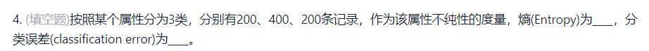

**题目**：（填空题）按照某个属性分为3类，分别有200、400、200条记录，作为该属性不纯性的度量，熵（Entropy）为___，分类误差（classification error）为___。

**解答过程**：

**第一步：计算各类别的概率**

总记录数 = 200 + 400 + 200 = 800

- $P(C1) = 200/800 = 1/4 = 0.25$
- $P(C2) = 400/800 = 1/2 = 0.5$
- $P(C3) = 200/800 = 1/4 = 0.25$

**第二步：计算熵（Entropy）**

熵的计算公式：
$$Entropy = -\sum_{i=1}^{3} P(C_i) \log_2 P(C_i)$$

代入数值：
$$Entropy = -P(C1) \log_2 P(C1) - P(C2) \log_2 P(C2) - P(C3) \log_2 P(C3)$$

$$= -(1/4) \log_2 (1/4) - (1/2) \log_2 (1/2) - (1/4) \log_2 (1/4)$$

$$= -(1/4) \times (-2) - (1/2) \times (-1) - (1/4) \times (-2)$$

$$= 0.5 + 0.5 + 0.5$$

$$= 1.5$$

**第三步：计算分类误差（Classification Error）**

分类误差的计算公式：
$$Classification\ Error = 1 - \max_i P(C_i)$$

其中$\max_i P(C_i)$表示所有类别中概率最大的那个类别的概率。

在本题中：
- $P(C1) = 0.25$
- $P(C2) = 0.5$（最大）
- $P(C3) = 0.25$

因此：
$$Classification\ Error = 1 - 0.5 = 0.5$$

**答案**：

- 熵（Entropy）= **1.5**
- 分类误差（Classification Error）= **0.5**

**知识点总结**：

| 不纯度度量指标 | 计算公式 | 本题结果 | 特点 |
|---------------|---------|---------|------|
| 熵（Entropy） | $-\sum_{i} P(C_i) \log_2 P(C_i)$ | 1.5 | 对类别分布变化敏感，常用于ID3、C4.5算法 |
| 分类误差（Classification Error） | $1 - \max_i P(C_i)$ | 0.5 | 计算简单，但对类别分布变化不敏感 |
| Gini指数 | $1 - \sum_{i} [P(C_i)]^2$ | 0.625 | 计算效率高，常用于CART算法 |

**补充说明**：

- 对于三分类问题，熵的最大值为$\log_2 3 \approx 1.585$（当三类样本数量完全相等时）
- 本题中熵为1.5，接近最大值，说明类别分布较为均匀（虽然C2的样本数是C1和C3的两倍）
- 分类误差为0.5，表示如果将所有样本都预测为最多的类别C2，仍有50%的样本会被错误分类

---

#### 二元划分

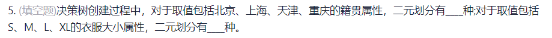

**题目**：（填空题）决策树创建过程中，对于取值包括北京、上海、天津、重庆的籍贯属性，二元划分有___种；对于取值包括S、M、L、XL的衣服大小属性，二元划分有___种。

**解答过程**：

**第一步：理解二元划分的概念**

二元划分（Binary Split）是指将属性的所有取值分成两个互不相交的子集，每次划分将数据分为两个分支。

对于有 $n$ 个不同取值的离散属性，二元划分的数量计算公式为：
$$\text{二元划分数} = \frac{2^{n-1} - 1}{1} = 2^{n-1} - 1$$

但实际上，由于划分 $\{A\}$ 和 $\{\bar{A}\}$ 与划分 $\{\bar{A}\}$ 和 $\{A\}$ 是等价的（只是左右分支互换），所以真正不同的二元划分数为：
$$\text{二元划分数} = 2^{n-1} - 1$$

**第二步：计算籍贯属性的二元划分数**

籍贯属性有4个取值：北京、上海、天津、重庆

方法一：使用公式
$$\text{二元划分数} = 2^{4-1} - 1 = 2^3 - 1 = 8 - 1 = 7$$

方法二：枚举所有可能的划分
将4个城市分成两个非空子集的方法：

1. $\{北京\}$ vs $\{上海, 天津, 重庆\}$
2. $\{上海\}$ vs $\{北京, 天津, 重庆\}$
3. $\{天津\}$ vs $\{北京, 上海, 重庆\}$
4. $\{重庆\}$ vs $\{北京, 上海, 天津\}$
5. $\{北京, 上海\}$ vs $\{天津, 重庆\}$
6. $\{北京, 天津\}$ vs $\{上海, 重庆\}$
7. $\{北京, 重庆\}$ vs $\{上海, 天津\}$

共7种划分方式。

**第三步：计算衣服大小属性的二元划分数**

衣服大小属性有4个取值：S、M、L、XL

**重要**：衣服大小是**有序属性**（S < M < L < XL），对于有序属性，二元划分只能在相邻值之间进行切分，以保持顺序关系。

对于有 $n$ 个有序取值的属性，二元划分数为：
$$\text{二元划分数} = n - 1$$

因此，衣服大小属性的二元划分数为：
$$\text{二元划分数} = 4 - 1 = 3$$

枚举所有可能的划分（按顺序切分）：

1. $\{S\}$ vs $\{M, L, XL\}$ （在S和M之间切分）
2. $\{S, M\}$ vs $\{L, XL\}$ （在M和L之间切分）
3. $\{S, M, L\}$ vs $\{XL\}$ （在L和XL之间切分）

共3种划分方式。

**答案**：
- 籍贯属性的二元划分有 **7** 种
- 衣服大小属性的二元划分有 **3** 种

**知识点总结**：

**1. 无序离散属性的二元划分**

| 属性取值数 $n$ | 二元划分数公式 | 计算结果 | 示例 |
| --- | --- | --- | --- |
| 2 | $2^{2-1} - 1$ | 1 | 性别：男/女 |
| 3 | $2^{3-1} - 1$ | 3 | 颜色：红/绿/蓝 |
| 4 | $2^{4-1} - 1$ | 7 | 籍贯：北京/上海/天津/重庆 |
| 5 | $2^{5-1} - 1$ | 15 | - |
| $n$ | $2^{n-1} - 1$ | $2^{n-1} - 1$ | - |

**2. 有序离散属性的二元划分**

| 属性取值数 $n$ | 二元划分数公式 | 计算结果 | 示例 |
| --- | --- | --- | --- |
| 2 | $n - 1$ | 1 | 温度：低/高 |
| 3 | $n - 1$ | 2 | 等级：差/中/好 |
| 4 | $n - 1$ | 3 | 衣服大小：S/M/L/XL |
| 5 | $n - 1$ | 4 | 学历：小学/初中/高中/本科/研究生 |
| $n$ | $n - 1$ | $n - 1$ | - |

**补充说明**：

1. **无序属性的二元划分：为什么是 $2^{n-1} - 1$？**
   - 将 $n$ 个元素分成两个非空子集，总共有 $2^n$ 种分配方式（每个元素可以分到左边或右边）
   - 减去2种全部分到一边的情况（全左或全右），得到 $2^n - 2$
   - 由于左右对称（交换左右分支是等价的），所以除以2，得到 $(2^n - 2) / 2 = 2^{n-1} - 1$
   - 例如：籍贯（北京、上海、天津、重庆）是无序属性，可以任意组合划分，共7种

2. **有序属性的二元划分：为什么是 $n-1$？**
   - 有序属性必须保持顺序关系，只能在相邻值之间进行切分
   - 对于 $n$ 个有序值，有 $n-1$ 个相邻间隙可以作为切分点
   - 例如：衣服大小 S < M < L < XL 是有序属性，只能在3个间隙处切分：
     - 间隙1：S | M, L, XL
     - 间隙2：S, M | L, XL
     - 间隙3：S, M, L | XL
   - 共3种划分方式

3. **如何判断属性是否有序？**
   - 有序属性：取值之间存在明确的大小或等级关系
     - 示例：温度（低<中<高）、学历（小学<初中<高中<本科）、衣服尺码（S<M<L<XL）
   - 无序属性：取值之间没有大小关系，只是类别标签
     - 示例：籍贯（北京、上海、天津、重庆）、颜色（红、绿、蓝）、性别（男、女）

4. **决策树中的应用**：
   - CART算法使用二元划分构建决策树
   - 对于无序属性，需要尝试所有 $2^{n-1} - 1$ 种划分，计算复杂度为 $O(2^n)$
   - 对于有序属性，只需尝试 $n-1$ 种划分，计算复杂度为 $O(n)$
   - 因此，识别有序属性可以显著降低决策树构建的计算成本

---

### 作业4-2

#### Gini系数计算题

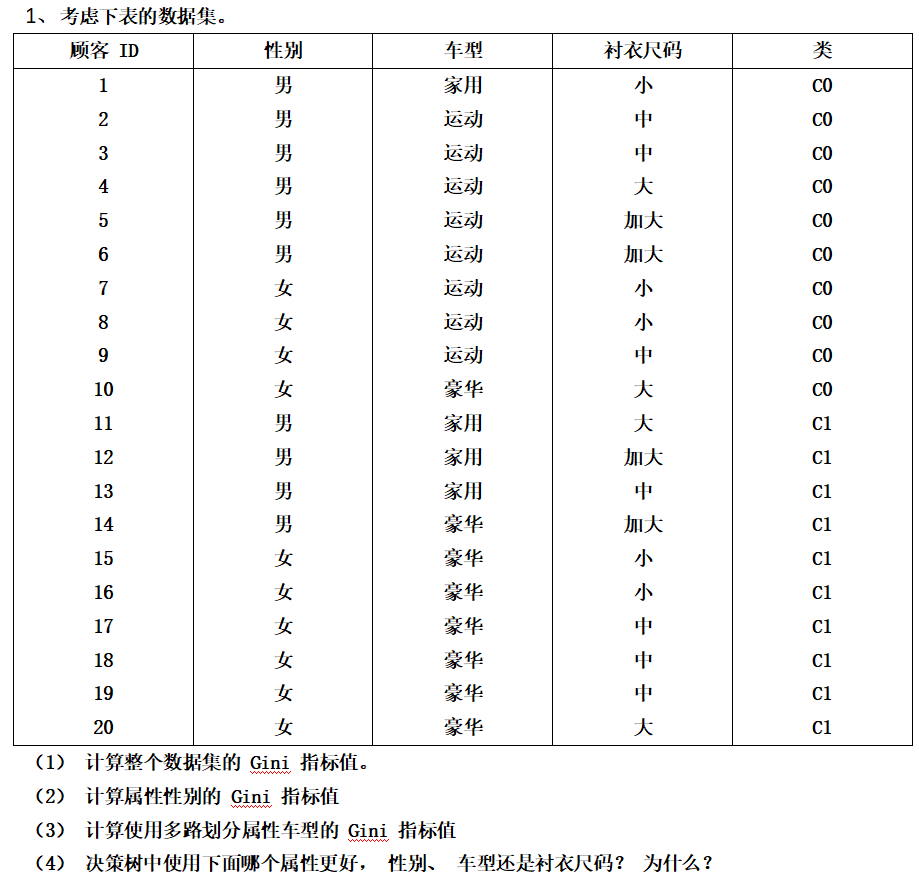

**题目数据表**：

| 顾客ID | 性别 | 车型 | 衬衫尺码 | 类 |
|--------|------|------|----------|-----|
| 1 | 男 | 家用 | 小 | C0 |
| 2 | 男 | 运动 | 中 | C0 |
| 3 | 男 | 运动 | 中 | C0 |
| 4 | 男 | 运动 | 大 | C0 |
| 5 | 男 | 运动 | 加大 | C0 |
| 6 | 男 | 运动 | 加大 | C0 |
| 7 | 女 | 运动 | 小 | C0 |
| 8 | 女 | 运动 | 小 | C0 |
| 9 | 女 | 运动 | 中 | C0 |
| 10 | 女 | 豪华 | 大 | C0 |
| 11 | 男 | 家用 | 大 | C1 |
| 12 | 男 | 家用 | 加大 | C1 |
| 13 | 男 | 家用 | 中 | C1 |
| 14 | 男 | 豪华 | 加大 | C1 |
| 15 | 女 | 豪华 | 小 | C1 |
| 16 | 女 | 豪华 | 小 | C1 |
| 17 | 女 | 豪华 | 中 | C1 |
| 18 | 女 | 豪华 | 中 | C1 |
| 19 | 女 | 豪华 | 中 | C1 |
| 20 | 女 | 豪华 | 大 | C1 |

**题目要求**：

1. 计算整个数据集的Gini指标值
2. 计算属性性别的Gini指标值
3. 计算使用多路划分属性车型的Gini指标值
4. 决策树中使用下面哪个属性更好：性别、车型还是衬衫尺码？为什么？

---

**解答过程**：

（1）计算整个数据集的Gini指标值

**第一步：统计类别分布**

总样本数 = 20

- C0类样本数 = 10（顾客1-10）
- C1类样本数 = 10（顾客11-20）

**第二步：计算概率**

- $P(C0) = 10/20 = 0.5$
- $P(C1) = 10/20 = 0.5$

**第三步：计算Gini指数**

$$Gini = 1 - \sum_{i} [P(C_i)]^2$$

$$Gini = 1 - [P(C0)]^2 - [P(C1)]^2$$

$$= 1 - (0.5)^2 - (0.5)^2$$

$$= 1 - 0.25 - 0.25$$

$$= 0.5$$

**答案**：整个数据集的Gini指标值 = **0.5**

---

（2）计算属性性别的Gini指标值

**第一步：按性别划分数据**

**男性样本（共10个）**：

| 顾客ID | 类别 |
|--------|------|
| 1, 2, 3, 4, 5, 6 | C0 |
| 11, 12, 13, 14 | C1 |

- 男性中C0类：6个
- 男性中C1类：4个

**女性样本（共10个）**：

| 顾客ID | 类别 |
|--------|------|
| 7, 8, 9, 10 | C0 |
| 15, 16, 17, 18, 19, 20 | C1 |

- 女性中C0类：4个
- 女性中C1类：6个

**第二步：计算男性子集的Gini**

$$P(C0|男) = 6/10 = 3/5$$
$$P(C1|男) = 4/10 = 2/5$$

$$Gini(男) = 1 - (6/10)^2 - (4/10)^2$$

$$= 1 - 36/100 - 16/100$$

$$= 1 - 52/100$$

$$= 48/100 = 0.48$$

**第三步：计算女性子集的Gini**

$$P(C0|女) = 4/10 = 2/5$$
$$P(C1|女) = 6/10 = 3/5$$

$$Gini(女) = 1 - (4/10)^2 - (6/10)^2$$

$$= 1 - 16/100 - 36/100$$

$$= 1 - 52/100$$

$$= 48/100 = 0.48$$

**第四步：计算加权平均Gini**

$$Gini(性别) = \frac{10}{20} \times Gini(男) + \frac{10}{20} \times Gini(女)$$

$$= \frac{10}{20} \times 0.48 + \frac{10}{20} \times 0.48$$

$$= 0.24 + 0.24$$

$$= 0.48$$

**答案**：属性性别的Gini指标值 = **0.48**

---

（3）计算使用多路划分属性车型的Gini指标值

**第一步：按车型划分数据**

**家用车样本（共4个）**：

| 顾客ID | 类别 |
|--------|------|
| 1 | C0 |
| 11, 12, 13 | C1 |

- 家用车中C0类：1个
- 家用车中C1类：3个

**运动车样本（共8个）**：

| 顾客ID | 类别 |
|--------|------|
| 2, 3, 4, 5, 6, 7, 8, 9 | C0 |

- 运动车中C0类：8个
- 运动车中C1类：0个

**豪华车样本（共8个）**：

| 顾客ID | 类别 |
|--------|------|
| 10 | C0 |
| 14, 15, 16, 17, 18, 19, 20 | C1 |

- 豪华车中C0类：1个
- 豪华车中C1类：7个

**第二步：计算各子集的Gini**

**家用车的Gini**：
$$Gini(家用) = 1 - (1/4)^2 - (3/4)^2$$

$$= 1 - 1/16 - 9/16$$

$$= 1 - 10/16$$

$$= 6/16 = 0.375$$

**运动车的Gini**：
$$Gini(运动) = 1 - (8/8)^2 - (0/8)^2$$

$$= 1 - 1 - 0$$

$$= 0$$

**豪华车的Gini**：
$$Gini(豪华) = 1 - (1/8)^2 - (7/8)^2$$

$$= 1 - 1/64 - 49/64$$

$$= 1 - 50/64$$

$$= 14/64 = 7/32 \approx 0.219$$

**第三步：计算加权平均Gini**

$$Gini(车型) = \frac{4}{20} \times Gini(家用) + \frac{8}{20} \times Gini(运动) + \frac{8}{20} \times Gini(豪华)$$

$$= \frac{4}{20} \times 0.375 + \frac{8}{20} \times 0 + \frac{8}{20} \times 0.219$$

$$= 0.075 + 0 + 0.088$$

$$= 0.163$$

**答案**：属性车型的Gini指标值 = **0.163**

---

（4）决策树中使用下面哪个属性更好：性别、车型还是衬衫尺码？为什么？

**第一步：计算衬衫尺码的Gini指标值**

**按衬衫尺码划分数据**：

**小号样本（共5个）**：
- C0类：3个（顾客1, 7, 8）
- C1类：2个（顾客15, 16）

$$Gini(小) = 1 - (3/5)^2 - (2/5)^2 = 1 - 9/25 - 4/25 = 12/25 = 0.48$$

**中号样本（共6个）**：
- C0类：3个（顾客2, 3, 9）
**中号样本（共7个）**：
- C0类：3个（顾客2, 3, 9）
- C1类：4个（顾客13, 17, 18, 19）

$$Gini(中) = 1 - (3/7)^2 - (4/7)^2 = 1 - 9/49 - 16/49 = 24/49 \approx 0.490$$

**大号样本（共4个）**：
- C0类：2个（顾客4, 10）
- C1类：2个（顾客11, 20）

$$Gini(大) = 1 - (2/4)^2 - (2/4)^2 = 1 - 0.25 - 0.25 = 0.5$$

**加大号样本（共4个）**：
- C0类：2个（顾客5, 6）
- C1类：2个（顾客12, 14）

$$Gini(加大) = 1 - (2/4)^2 - (2/4)^2 = 0.5$$

**加权平均Gini**：

$$Gini(衬衫尺码) = \frac{5}{20} \times 0.48 + \frac{7}{20} \times 0.490 + \frac{4}{20} \times 0.5 + \frac{4}{20} \times 0.5$$

$$= 0.12 + 0.172 + 0.1 + 0.1$$

$$= 0.492$$

**第二步：比较各属性的Gini指标值**

| 属性 | Gini指标值 | Gini减少量 |
|------|-----------|-----------|
| 原始数据集 | 0.500 | - |
| 性别 | 0.480 | 0.020 |
| 车型 | 0.163 | 0.337 |
| 衬衫尺码 | 0.492 | 0.008 |

**第三步：得出结论**

**答案**：**车型**属性更好

**原因**：

1. **Gini减少量最大**：车型属性的Gini指标值为0.256，相比原始数据集的0.5，减少了0.244，是三个属性中减少量最大的。

2. **不纯度降低最明显**：Gini指标值越小，表示数据集越纯净。车型属性划分后的Gini值最小，说明按车型划分能最有效地将不同类别分开。

3. **信息增益最大**：Gini减少量可以理解为信息增益，车型属性提供了最多的信息来区分C0和C1类别。

4. **具体分析**：
   - 运动车全是C0类（8/8），纯度完美（Gini=0）
   - 豪华车主要是C1类（7/8），纯度很高
   - 家用车相对混合（1个C0，3个C1）
   - 这种划分使得各子集的类别分布更加集中，便于分类

**排序**：车型（0.163）> 性别（0.480）> 衬衫尺码（0.492）

因此，在决策树构建时，应该优先选择**车型**作为根节点的划分属性。

---

**知识点总结**：

1. **Gini指数的计算**：$Gini = 1 - \sum_{i} [P(C_i)]^2$

2. **属性划分的Gini计算**：加权平均各子集的Gini值

3. **属性选择准则**：选择Gini指标值最小（或Gini减少量最大）的属性

4. **决策树构建原则**：每次选择能最大程度降低不纯度的属性进行划分

---

### 作业5

#### K近邻分类器（KNN）

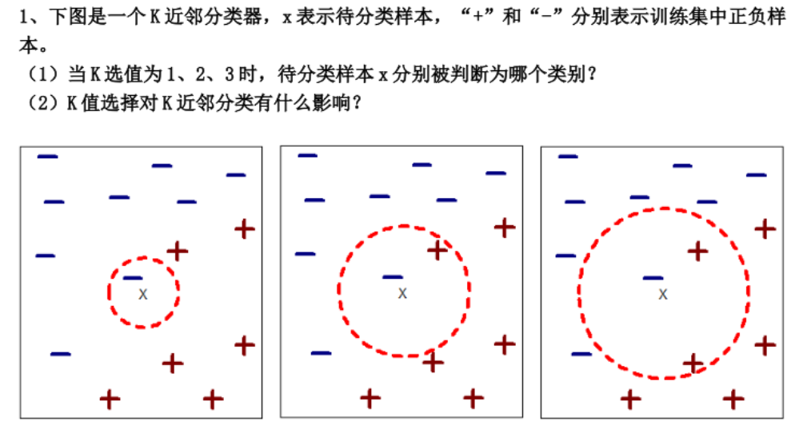

**题目**：下图是一个K近邻分类器，x表示待分类样本，"+"和"-"分别表示训练集中正负样本。

1. 当K选值为1、2、3时，待分类样本x分别被判断为哪个类别？
2. K值选择对K近邻分类有什么影响？

**解答过程**：

（1）当K选值为1、2、3时，待分类样本x分别被判断为哪个类别？

**K近邻算法（KNN）的分类原则**：

找到距离待分类样本x最近的K个训练样本，统计这K个样本中各类别的数量，将x分类为数量最多的类别。

**分析三幅图**：

**图1：K=1**

- 红色虚线圆表示距离x最近的1个样本的范围
- 圆内最近的1个样本是：1个"-"（负样本）
- 统计结果："-"类1个，"+"类0个
- **分类结果**：x被判断为**"-"类（负类）**

**图2：K=2**

- 红色虚线圆表示距离x最近的2个样本的范围
- 圆内最近的2个样本是：1个"-"（负样本）+ 1个"+"（正样本）
- 统计结果："-"类1个，"+"类1个
- 出现平局时的处理：
  - 方法1：选择距离更近的样本的类别
  - 方法2：随机选择一个类别
  - 方法3：选择K=1时的结果
- **分类结果**：根据最近邻原则，x被判断为**"-"类（负类）**

**图3：K=3**

- 红色虚线圆表示距离x最近的3个样本的范围
- 圆内最近的3个样本是：1个"-"（负样本）+ 2个"+"（正样本）
- 统计结果："-"类1个，"+"类2个
- **分类结果**：x被判断为**"+"类（正类）**

**答案总结**：

| K值 | 最近邻样本统计 | 分类结果 |
|-----|---------------|---------|
| K=1 | "-"类：1个，"+"类：0个 | **"-"类（负类）** |
| K=2 | "-"类：1个，"+"类：1个 | **"-"类（负类）**（平局时选最近邻） |
| K=3 | "-"类：1个，"+"类：2个 | **"+"类（正类）** |

---

（2）K值选择对K近邻分类有什么影响？

**K值对KNN分类的影响**：

**1. K值较小（如K=1）**

**优点**：

- 模型复杂度高，对训练数据拟合度好
- 能够捕捉数据的局部特征
- 对近邻点非常敏感

**缺点**：

- 容易受噪声影响，抗噪声能力差
- 容易过拟合
- 预测结果不稳定，方差大
- 如果最近的样本是噪声点，会导致错误分类

**2. K值较大（如K=10或更大）**

**优点**：

- 模型简化，减少过拟合风险
- 抗噪声能力强
- 预测结果稳定，方差小
- 决策边界更加平滑

**缺点**：

- 容易欠拟合
- 忽略数据的局部特征
- 可能将不同类别的样本混在一起
- 计算量增大

**为什么K值大会导致欠拟合？**

欠拟合是指模型过于简单，无法捕捉数据的真实模式。当K值很大时：

1. **过度平滑**：考虑了太多远距离的样本，导致决策边界过于平滑，无法反映数据的真实分布
   - 例如：在类别边界附近的样本，本应根据附近的样本判断类别
   - 但K值过大时，会把远处不相关的样本也纳入投票，稀释了局部特征

2. **多数类主导**：当K值接近样本总数时，分类结果会趋向于训练集中数量最多的类别
   - 极端情况：K=N（总样本数），所有待分类样本都会被判为训练集中的多数类
   - 这相当于忽略了样本的位置信息，只看整体类别分布

3. **丢失局部信息**：数据的真实分布往往具有局部性（相似的样本聚集在一起）
   - K值过大会把不同区域的样本混在一起
   - 无法区分局部的细微差异

**举例说明**：

假设有一个二分类问题：

- 训练集中有70个"+"类样本，30个"-"类样本
- 待分类样本x周围3个最近邻都是"-"类
- 但如果K=50，可能会包含35个"+"类和15个"-"类
- 结果x被错误分类为"+"类，因为忽略了x的局部特征

**形象比喻**：

- K值小：像"近视眼"，只看得清眼前的东西（局部特征），容易被噪声干扰
- K值大：像"远视眼"，只看得清远处的整体（全局特征），看不清局部细节
- K值适中：视力正常，既能看清局部，又不会被噪声迷惑

**3. K值适中**

- 在偏差和方差之间取得平衡
- 既能保持对局部特征的敏感性，又能抵抗噪声
- 通常通过交叉验证选择最优K值

**K值选择的一般原则**：

| 考虑因素 | 建议 |
|---------|------|
| 数据集大小 | 数据集越大，K值可以适当增大 |
| 噪声水平 | 噪声越多，K值应该越大 |
| 类别分布 | 类别不平衡时，K值不宜过大 |
| 计算资源 | K值越大，计算量越大 |
| 经验法则 | K通常取奇数（避免平局），常用值：3、5、7、9 |
| 最优选择 | 通过交叉验证确定最优K值 |

**K值与决策边界的关系**：

- **K=1**：决策边界非常复杂，呈现锯齿状，容易过拟合
- **K值增大**：决策边界逐渐平滑，模型趋于简化
- **K=N（样本总数）**：所有样本都参与投票，相当于将所有样本分为训练集中数量最多的类别

**实际应用建议**：

1. **起始值**：通常从K=3或K=5开始尝试
2. **交叉验证**：使用K折交叉验证选择最优K值
3. **奇数优先**：选择奇数K值可以避免二分类问题中的平局
4. **经验公式**：$K \approx \sqrt{N}$（N为训练样本数），但需要根据实际情况调整
5. **性能评估**：在验证集上测试不同K值的分类准确率，选择最优值

**本题示例的启示**：

从本题可以看出，K值从1变化到3，分类结果从"-"类变为"+"类，说明：

- K值的选择直接影响分类结果
- 较小的K值更容易受到局部样本分布的影响
- 需要根据具体问题和数据特点选择合适的K值
- 不存在"万能"的K值，需要通过实验确定

---

**知识点总结**：

**KNN算法的核心要素**：

1. **距离度量**：常用欧氏距离、曼哈顿距离、闵可夫斯基距离
2. **K值选择**：影响模型的复杂度和泛化能力
3. **决策规则**：多数投票（分类）或平均值（回归）

**KNN算法的优缺点**：

**优点**：

- 算法简单，易于理解和实现
- 无需训练过程，属于懒惰学习（Lazy Learning）
- 对异常值不敏感（当K值较大时）
- 适用于多分类问题

**缺点**：

- 计算量大，预测时需要计算与所有训练样本的距离
- 内存开销大，需要存储所有训练样本
- 对样本不平衡问题敏感
- 对高维数据效果不佳（维度灾难）
- 需要选择合适的K值和距离度量
