## 前言

面试通这个项目是我的第一个完整的鸿蒙项目。将会从零开始搭建项目结构，组织UI框架，编写业务逻辑，最终实现一个完整的项目。

## 项目简介

面试通项目是一个基于 HarmonyOS NEXT 开发的鸿蒙应用，主要包含鸿蒙和前端的企业面试题以及真实的面试经验，还有一些面试辅助类的工具如常用开发单词和面试录音。


以上是该项目的概念设计图，接下来我将会记录整个项目的开发过程。

## 准备阶段

### 新建项目与项目结构搭建

#### 项目结构搭建

本次我们采用`API14`来进行开发，`API14`是当前的最新版本，对于各项性能的调教也是当下最好的选择。

本项目的项目结构如下所示：

```markdown
ets
├── commons
│   ├── components              // - 通用组件
│   ├── constants               // - 全局常量数据
│   └── utils                   // - 通用工具类
├── entryability
│   └── EntryAbility.ts
├── models                      // - 数据模型
├── pages
│   ├── QuestionPage.ets        // - 页面组件
│   └── Index.ets
└── views
    └── Question                // - 页面对应自定义组件
```


#### 项目资源配置

##### 颜色配置

将所需的颜色字段配置到`resources/base/element/color.json`中。


对主色系的统一管理队后续的开发、维护都有着极大的好处。
不能将所有的数据都内嵌在代码中，用一次复制一次，这样不仅对开发效率有影响，而且不利于后期的维护。

##### 图片资源

将设计稿中的图片统一放入`resources/base/media`目录下。

##### 应用图标

在`module.json5`中配置应用的图标。


##### 应用名称

首先创建中文软件配置文件，详细步骤可以参考我的这篇博客：[手动新建鸿蒙中文包](https://xbxyftx.github.io/2025/01/30/%E9%B8%BF%E8%92%99%E4%B8%AD%E6%96%87%E5%8C%85/)

修改应用名称的`"EntryAbility_label"`字段的值

##### 设置应用与元服务的图标和名称

修改`AppScope/resources/base/element/string.json`中的`"app_name"`字段的值
然后在`AppScope/resources/base/media/app_icon.png`中替换应用的图标

可以直接同名图片文件替换，也可在`AppScope/resources/base/media`目录下放置不同名文件。
然后修改`AppScope/app.json5`中的`"icon"`字段的值。


### 创建git和本地以及远程仓库

直接利用IDE内置的git工具即可，这里就不赘述了。
不过有一点要注意，**git并不会帮你托管空文件夹**，而当前构建的项目结构中包含了大量的空文件夹，这些文件夹还**暂时**没有创建任何文件，所以我们为了保证在远程仓库中的**项目结构**依旧**保持完整**我们需要创建一些**占位文件**，来让git为我们托管全部文件夹。


这是在创建占位文件前的远程仓库目录结构。


创建`.gitkeep`文件后，远程仓库的目录结构如下所示。


### hilog日志

在过去我们用的都是`console.log()`来进行日志的输出，`console`中虽然为我们封装了很多js中常用的输出方式，诸如：`log`、`warn`、`error`等，但是其弊端也很明显。

1. 无法进行日志的分类，导致日志混杂在一起，难以定位问题。
2. 无法进行日志的过滤，导致日志过多，难以定位问题。
3. 无法进行日志的格式化，导致日志输出不美观。

hilog为我们提供了上述问题的解决方案，hilog为我们提供了日志的分类、过滤和格式化等功能。
hilog通过鸿蒙底层的重构之后，为我们提供了更加高效的日志输出方式。

```ts
function debug(domain: number, tag: string, format: string, ...args: any[]): void;
function info(domain: number, tag: string, format: string, ...args: any[]): void;
function warn(domain: number, tag: string, format: string, ...args: any[]): void;
function error(domain: number, tag: string, format: string, ...args: any[]): void;
function fatal(domain: number, tag: string, format: string, ...args: any[]): void;
function isLoggable(domain: number, tag: string, level: LogLevel): boolean;
```

* 参数 domain：用于指定输出日志所对应的业务领域，取值范围为 0x0000~0xFFFF，开发者可以根据需要进行自定义。
* 参数 tag：用于指定日志标识，可以为任意字符串，建议标识调用所在的类或者业务行为。
* 参数 format：格式字符串，用于日志的格式化输出。%{public}s 字符串 %{public}d 数字
* 参数 args：可以为 0 个或多个参数，可以为 0 个或多个参数，是格式字符串中参数类型对应的参数列表。

我们通过下面这个实例来演示一下hilog的用法。

```ts
import { hilog } from '@kit.PerformanceAnalysisKit'

@Entry
@ComponentV2
struct Index {

  build() {
    Column() {
      Button('hilog.info测试')
        .onClick(()=>{
          hilog.info(0x0000,'myHilog','%{public}s','第一个参数')
        })
      Button('hilog.warn测试')
        .onClick(()=>{
          hilog.warn(0x0000,'myHilog','%{public}s','第一个参数')
        })
      Button('hilog.error测试')
        .onClick(()=>{
          hilog.error(0x0000,'myHilog','%{public}s','第一个参数')
        })
      Button('hilog.debug测试')
        .onClick(()=>{
          hilog.debug(0x0000,'myHilog','%{public}s','第一个参数')
        })
    }
    .height('100%')
    .width('100%')
  }
}
```


从输出的结果我们可以看到，首先在前面的日志分类信息中会先显示我们设置的日志业务分区信息，然后是日志的**标识信息**，最后是日志的**内容**。
而日志的内容格式是通过第三个参数来进行格式化输出的。
这里我们用的都是`%{public}s`，这是因为我们在第三个参数中传入的是一个字符串类型的值。

当然我们也可以传入多个参数，来进行格式化输出。

```ts
    Button('hilog.info测试')
      .onClick(()=>{
        hilog.info(0x0000,'myHilog','%{public}s __ %{public}d','第一个参数',2025)
      })
```

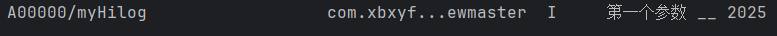

`%{public}s`表示字符串类型，`%{public}d`表示数字类型。两者之间连接的字符就是靠第三个参数中的字符串来进行定义的。
这个输出格式倒是和C语言中的`printf()`函数类似。（唤起了远古的回忆……）

**console 是基于 hilog 封装的！！！**默认的 domain/tag 是 A03D00/JSAPP

### 封装Logger

#### 封装 commons/utils/Logger.ets

```ts
import { hilog } from '@kit.PerformanceAnalysisKit'
const tag = 'XBXLogger'
class Logger{
  private domain:number // 十六进制输出业务格式
  private tag:string // 制定的自己的标识
  private format:string = '%{public}s' //格式化方式

  constructor(domain: number = 0x0000, tag: string = '') {
    this.domain = domain
    this.tag = tag
  }
  debug(args: string): void {
    hilog.debug(this.domain, this.tag, this.format, args);
  }

  info(args: string): void {
    hilog.info(this.domain, this.tag, this.format, args);
  }

  warn(args: string): void {
    hilog.warn(this.domain, this.tag, this.format, args);
  }

  error(args: string): void {
    hilog.error(this.domain, this.tag, this.format, args);
  }

}

export const logger:Logger = new Logger(0x1234,tag)
```

hilog中有固定要传的三个参数，分别是：domain、tag、format。
而我们在封装Logger的时候，将这三个参数封装到了一个类中，这样我们在使用的时候就可以直接调用Logger类中的方法，而不需要每次都传入这三个参数。
这上述包装函数都是实例函数，并不是静态函数，所以我们并不能直接导出一个Logger类，而是导出一个Logger类的实例。
由于在开发中每个人所负责的业务领域和标识变动次数较少，尤其是对于这个单人开发项目来说，业务领域和标识可以直接写死，所以这里直接导出一个已经写好的Logger实例即可。

**改造并封装现有能力**使其能够更加契合当前项目是很重要的一点，就像是在鸿蒙系统原有网络请求模块的基础上进一步封装成第三方库axios一样。
让原有能力更加的方便好用。

#### 导出与使用Logger

在未来的开发中需要导出的工具类和函数会越来越多，来源的文件也会越来越多，如果都分别从各个文件中导出，会非常的麻烦。
所以我们就可以编辑一个中转站来进行统一的导出和管理。

创建`CommonsExportCentre.ets`文件，在该文件中统一导出所有需要导出的工具类和函数。

```ts
export * from './utils/Logger'
```

这样在需要使用commons中的工具类和函数的时候，只需要导入`CommonsExportCentre.ets`文件即可。

```ts
import { hilog } from '@kit.PerformanceAnalysisKit'
import { logger } from '../commons/CommonsExportCentre'

@Entry
@ComponentV2
struct Index {

  build() {
    Column() {
      Button('hilog.info测试')
        .onClick(()=>{
          logger.info('测试测试')
        })
      Button('hilog.warn测试')
        .onClick(()=>{
          logger.warn('测试测试')
        })
      Button('hilog.error测试')
        .onClick(()=>{
          logger.error('测试测试')
        })
      Button('hilog.debug测试')
        .onClick(()=>{
          logger.debug('测试测试')
        })
    }
    .height('100%')
    .width('100%')
  }
}
```

这样我们就可以看到我们可以用更加简便的方式做到与hilog一致的效果了。


### 封装沉浸式工具

接下来我们将封装一个工具类来控制是否开启沉浸式模式。

#### 前置知识

[window.getLastWindow 获取当前窗口对象](https://developer.huawei.com/consumer/cn/doc/harmonyos-references-V14/js-apis-window-V14?catalogVersion=V14)


[getWindowAvoidArea 使用窗口对象获取某一个区域的尺寸](https://developer.huawei.com/consumer/cn/doc/harmonyos-references-V14/js-apis-window-V14#getwindowavoidarea9)


#### 开启沉浸模式

##### 应用上下文对象

[上下文对象文档](https://developer.huawei.com/consumer/cn/doc/harmonyos-references-V14/js-apis-inner-application-context-V14?catalogVersion=V14)

上下文对象是一个包含了应用信息，以及一些应用功能的对象，获取它有两种方式：

1. 在组价中调用`getContext(this)`方法获取
2. 在UIAbility中调用`this.context`获取

对于工具类来说我们只能通过第二种方式获取，我们可以在`onCreate`生命周期中获取上下文对象，并将其保存到`AppStorage`中。

```ts
  onCreate(want: Want, launchParam: AbilityConstant.LaunchParam): void {
    this.context.getApplicationContext().setColorMode(ConfigurationConstant.ColorMode.COLOR_MODE_NOT_SET);
    hilog.info(DOMAIN, 'testTag', '%{public}s', 'Ability onCreate');
    AppStorage.setOrCreate('context',this.context)
  }
```

对于`AppStorageV2`如何存储上下文对象我暂时还没有解决第一个类型参数的问题。

(1h后……)

我想到了当初在学习如何从V1向V2转换时，我直接持久化一个对象数组并不成功的原因是其类型只能是一个对象，而不是一个数组或是联合类型。
当时我将对象数组包装在一个对象中，作为对象的一个属性连同那个对象一起持久化就成功了，所以我单独设计了一个对象来包裹上下文对象就成功了。

```ts
import { Context } from '@kit.AbilityKit'


export class GetContext{
  context:Context

  constructor(context: Context) {
    this.context = context
  }

}
```

---

```ts
  //开启全屏
  async enable(){
    logger.debug('进入enable')
    try {
      const context = AppStorageV2.connect<GetContext>(GetContext,'context')
      if (context) {
        logger.debug('找到Context')
        const win = await window.getLastWindow(context.context)
        win.setWindowLayoutFullScreen(true)
          .then(()=>{
            logger.debug('进入setWindowLayoutFullScreen的then')
          })
      }else {
        logger.warn('未找到Context')
      }

    }catch (err){
      logger.error(err)
      promptAction.showToast({message:err})
    }
  }
```

---

```ts
  onCreate(want: Want, launchParam: AbilityConstant.LaunchParam): void {
    this.context.getApplicationContext().setColorMode(ConfigurationConstant.ColorMode.COLOR_MODE_NOT_SET);
    hilog.info(DOMAIN, 'testTag', '%{public}s', 'Ability onCreate');
    AppStorageV2.connect<GetContext>(GetContext,'context',()=>new GetContext(this.context))
  }
```

最后在`onWindowStageCreate`生命周期函数中调用`enable()`方法开启全屏。


也是顺利的实现了沉浸式效果。

#### 获取屏幕尺寸

在上面的沉浸式页面效果图我们可以看到其实如果上下的内容都顶到头的话会导致内容**被导航栏和状态栏遮挡**。
所以我们的沉浸式布局仅仅需要将我们的**背景图或背景色延伸**到导航栏和状态栏的下方即可，而真正的**内容不需要向上下延伸**，因此我们还需要获取到导航栏和状态栏的**高度**。

为了实现这个效果，我们需要用到`getWindowAvoidArea()`方法。


根据文档我们就可以获取我们所需的规避区域的尺寸，并将其应用到我们的布局中。

```ts
  async enable(){
    logger.debug('FullScreen: 进入enable')
    try {
      const context = AppStorageV2.connect<GetContext>(GetContext,'context')
      if (context) {
        logger.info('FullScreen: 找到Context')
        //获取当前窗口
        const win = await window.getLastWindow(context.context)
        //设置当前窗口为沉浸式模式
        await win.setWindowLayoutFullScreen(true)
        //获取顶部区域
        const topArea = win.getWindowAvoidArea(window.AvoidAreaType.TYPE_SYSTEM).topRect
        //将顶部高度存储到AppStorage
        logger.info('FullScreen: topAreaHeight: '+px2vp(topArea.height))
        AppStorageV2.connect(Number,topAreaHeight,()=>px2vp(topArea.height))

        //获取底部区域和底部区域高度
        const bottomArea = win.getWindowAvoidArea(window.AvoidAreaType.TYPE_NAVIGATION_INDICATOR).bottomRect
        logger.info('FullScreen: bottomAreaHeight: '+px2vp(bottomArea.height))
        AppStorageV2.connect(Number,bottomAreaHeight,()=>px2vp(bottomArea.height))

      }else {
        logger.warn('FullScreen: 未找到Context')
      }

    }catch (err){
      logger.error(err)
      promptAction.showToast({message:err})
    }
  }
```

由于`bottomArea.height`和`topArea.height`都是`px`单位，而我们的布局中使用的是`vp`单位，所以我们需要将`px`单位转换为`vp`单位。

---

```ts
import { hilog } from '@kit.PerformanceAnalysisKit'
import { bottomAreaHeight, logger, topAreaHeight } from '../commons/CommonsExportCentre'
import { AppStorageV2 } from '@kit.ArkUI'

const logTag = 'indexPage: '
@Entry
@ComponentV2
struct Index {
  @Local topAvoidSize: number = 0
  @Local bottomAvoidSize: number = 0
  aboutToAppear(): void {
    try {
      if (AppStorageV2.connect(Number,topAreaHeight)) {
        this.topAvoidSize = parseInt(AppStorageV2.connect(Number,topAreaHeight)!.toString())
        logger.info(logTag+'topAvoidSize: '+this.topAvoidSize)
      }else {
        logger.error(logTag+'未找到topAreaHeight')
      }
      if (AppStorageV2.connect(Number,bottomAreaHeight)) {
        this.bottomAvoidSize = parseInt(AppStorageV2.connect(Number,bottomAreaHeight)!.toString())
        logger.info(logTag+'bottomAvoidSize: '+this.bottomAvoidSize)
      }else {
        logger.error(logTag+'未找到bottomAreaHeight')
      }
    }catch (err){
      logger.error(logTag+err)
    }

  }

  build() {
    Column() {
      Text('top')
      Blank()
      Text('bottom')
    }
    .padding({
      top:this.topAvoidSize,
      bottom:this.bottomAvoidSize
    })
    .height('100%')
    .width('100%')
    .backgroundColor(Color.Blue)
  }
}
```

在编写完以上代码之后，上下区域的规避并没有实现。
此时就体现出了打印日志打重要性。

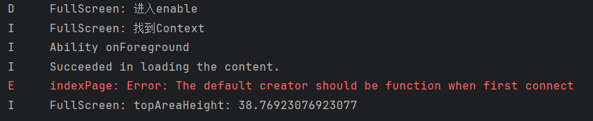

通过日志我们可知问题出现在获取获取规避区域的高度时，AppStorageV2中并没有存储我们所需的数据。
而FullScreen文件获取避障区域高度的日志是在这之后打印的说明我们获取避障区域的代码执行晚了。

##### AppStorageV2数据存储问题

在寻找了一段时间执行时间的问题之后，暂时还没有解决，但我发现了另外一个问题，AppStorageV2在存储顶部区域数据时会卡死，后续的代码都不会执行。


我不知道是因为底部区域的高度数值获取错误导致的后续代码没有执行，还是代码就卡死在了存储顶部区域高度的这一步。

所以我新增了两行日志

```ts
    logger.info('FullScreen: topAreaHeight: '+px2vp(topArea.height))
    AppStorageV2.connect(Number,topAreaHeight,()=>new Number(px2vp(topArea.height)))
    // AppStorage.setOrCreate(topAreaHeight,px2vp(topArea.height))
    logger.debug('FullScreen: topAreaHeight存储完毕')
    
    //获取底部区域和底部区域高度
    const bottomArea = win.getWindowAvoidArea(window.AvoidAreaType.TYPE_NAVIGATION_INDICATOR).bottomRect
    logger.info('FullScreen: bottomAreaHeight: '+px2vp(bottomArea.height))
    AppStorageV2.connect(Number,bottomAreaHeight,()=>new Number(px2vp(bottomArea.height)))
    logger.debug('FullScreen: bottomAreaHeight存储完毕')
```

很显然，结果是一样的。
至此我们可以分析出问题出现在`AppStorageV2.connect()`方法上。
我尝试了`AppStorage.setOrCreate()`方法，结果代码就可以执行过去。

这也说明就是我初始化数据时有问题。

在求助了子安学长后我意识到了问题所在：
`AppStorageV2.connect()`函数的第三个函数需要的是一个构造器，也就是需要有`new`关键字，并不一定要在第三个参数中，但一定要包含有new。
而我当前的写法`AppStorageV2.connect(Number,topAreaHeight,()=>px2vp(topArea.height))`对于`Number`来说是错误的，因为我没有使用new关键字。

将原本的数据利用`new Number()`包裹之后再传入即可。

```ts
AppStorageV2.connect(Number,topAreaHeight,()=>new Number(px2vp(topArea.height)))
AppStorageV2.connect(Number,bottomAreaHeight,()=>new Number(px2vp(bottomArea.height)))
```

至此初始化问题解决。

##### 初始化时间问题

在解决了初始化问题后，我发现规避区域的高度并没有生效。
根据日志我们可以看到


Index页面获取数据的时机依旧是在`AppStorageV2.connect()`方法之前，也就是说规避区域的高度并没有在Index页面初始化时获取到。
这个问题暂时我还没有解决办法，所以我决定先利用V1版本所提供的单项绑定能力来规避时间差问题。

```ts
  @StorageProp(topAreaHeight) topAvoidSize: number = 0
  @StorageProp(bottomAreaHeight) bottomAvoidSize: number = 0
```


---


由此我们可看出，虽然在UI渲染完成时规避区域的高度数据依旧没有完成初始化，数据仍未默认的0，而由于V1的单项绑定能力，规避区域的高度依旧可以通过数据的改变而生效。

##### 初始化时间问题解决方案

在第二天我再次求助了子安学长后我们找到了解决方案。

**解决过程复现：**

* 确认代码执行顺序:
  首先我们考虑的是再次用V1和V2两种`AppStorage`分别创建全局变量，并通过打印日志的方式来观察全局变量的初始化时机。
  解雇与昨天的结果一样，两者的初始化时机都是在**Index页面已经构建完成后**才完成的初始化。
  
  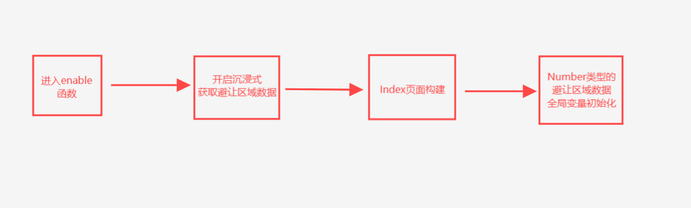

  现在我们可以确定目前代码的执行顺序如上图所示。

* 分析V1版本成功原因:
  在昨晚最后的尝试中，我回归V1版本，并调用它提供的**单项绑定能力**，**规避了初始化时间差的问题**。
  哪怕在页面构建时数据并没有成功初始化，也可以通过**后续数据的更新**来在极短的时间内获取到数据修改UI

* V2无法复刻的原因:
  由于在V2中获取与初始化都是同一个接口`AppStorageV2.connect()`，所以无法通过单项绑定能力来规避初始化时间差的问题。
  因为在V2中在初始化时**必须要传入一个默认构造器**，而后才能用两个参数来获取数据，这一点在我V2版本的解析博客中也有提到。
  这就导致我们需要在搞清楚代码执行顺序后，在**最先用到这个数据的地方**进行构造器的传入才能完成初始化。
  而`enable`函数却不是最先用到这个数据的地方，而是在`Index`页面构建后才用到的。

  

* 查找文档:
  
  
  ---

  

  文档中并没有提供双向绑定或是单项绑定的方法，而我发现V2版本的全局变量思想与V1版本稍有不同。
  V1版本中在UI组件中要用**专属修饰器**来与全局变量进行单向或双向绑定，在逻辑函数中则要分别用**创建，获取，修改等API接口**来进行读写操作。
  而对于V2版本则是相当于获取了全局变量的读写权限或者说是说获取了那个全局变量的**引用**。
  我们只需要像正常变量的读写一样用等号去进行数值的修改即可。

* 修改初始化位置:
  在更深入的了解了V2版本的全局变量机制之后，我从新梳理了代码的执行顺序，并将初始化移动到了Index页面的构建过程中。
  经过测试，虽然没有了原本的初始化报错，但数值也仅仅采用了默认的0值。
  我将原本`enable`函数中的初始化修改为了**修改数值**，试图采用这种方式来复刻V1的规避初始化时间差的方式。
  但又出现了新的问题就是虽然修改成功了，但是`Index`页面的状态变量依旧没有修改数值。

* 最终解决方案:
  在我回顾前几次遇到的V2全局变量存储问题都是依靠包装为一个新的对象来解决的。
  `Number`类型在初始化存储时虽然使用了`new`关键字，但很有可能并没有被系统追踪数值的变化。
  所以我们需要将数据包装为一个新的对象，并用`@Trace`来追踪数值的变化。

  ```ts
  @ObservedV2
  export class AvoidArea {
    @Trace top: number = 0;
    @Trace bottom: number = 0;
  }
  ```
  
  ---

  ```ts
        //获取顶部区域
        const topArea = win.getWindowAvoidArea(window.AvoidAreaType.TYPE_SYSTEM).topRect
        //将顶部高度存储到AppStorage
        logger.info('FullScreen:  topAreaHeight: ' + px2vp(topArea.height))


        //获取底部区域和底部区域高度
        const bottomArea = win.getWindowAvoidArea(window.AvoidAreaType.TYPE_NAVIGATION_INDICATOR).bottomRect
        logger.info('FullScreen:  bottomAreaHeight: ' + px2vp(bottomArea.height))


        avoid_area.top = px2vp(topArea.height);
        avoid_area.bottom = px2vp(bottomArea.height)
        logger.debug('FullScreen:  avoid_area数据更新完成')
  ```
  
  经过测试，功能终于实现。

  ```ts
  @Local avoidAreaSizes: AvoidAreaSizes = AppStorageV2.connect(AvoidAreaSizes, AVOID_AREA, () => new AvoidAreaSizes())!

  aboutToAppear(): void {
    logger.info(INDEX_LOG_TAG + 'aboutToAppear函数: top: ' + this.avoidAreaSizes.top + ' bottom: ' +
    this.avoidAreaSizes.bottom)
  }

  @Monitor('avoidAreaSizes.top','avoidAreaSizes.bottom')
  onChange(): void {
    logger.info(INDEX_LOG_TAG + '监测voidAreaSizes数值改变: ' + 'topAvoidSize: ' + this.avoidAreaSizes.top + ' bottomAvoidSize: ' +
    this.avoidAreaSizes.bottom)
  }
  ```

  

  通过生命周期函数和变量监听器的日志我们可以看到代码的**执行顺序没有变**，与之前的推测一致。
  通过包装对象的方式我们顺利的让系统**监听到了数值的变化**，实现的UI状态变量的数值更新。

至此问题解决。

#### 关闭沉浸式函数

关闭沉浸式函数的逻辑大体与开启沉浸式函数的逻辑一致，只是在获取规避区域的高度时略有不同。
所以我们先将开启沉浸式函数的代码复制过来，然后进行修改。

```ts
  //关闭全屏
  async disable(){
    logger.debug(FULL_SCREEN_LOG_TAG+'进入FullScreen.disable')
    try {
      const context = AppStorageV2.connect<GetContext>(GetContext, 'context')
      if (context) {
        logger.info(FULL_SCREEN_LOG_TAG+'找到Context')
        //获取当前窗口
        const win = await window.getLastWindow(context.context)
        //设置当前窗口为沉浸式模式
        await win.setWindowLayoutFullScreen(false)


        //获取顶部区域
        const topArea = win.getWindowAvoidArea(window.AvoidAreaType.TYPE_SYSTEM).topRect
        //将顶部高度存储到AppStorage
        logger.info(FULL_SCREEN_LOG_TAG+'topAreaHeight: ' + px2vp(topArea.height))


        //获取底部区域和底部区域高度
        const bottomArea = win.getWindowAvoidArea(window.AvoidAreaType.TYPE_NAVIGATION_INDICATOR).bottomRect
        logger.info(FULL_SCREEN_LOG_TAG+'bottomAreaHeight: ' + px2vp(bottomArea.height))


        avoid_area.top = px2vp(topArea.height);
        avoid_area.bottom = px2vp(bottomArea.height)
        logger.debug(FULL_SCREEN_LOG_TAG+'avoid_area数据更新完成')

      } else {
        logger.warn(FULL_SCREEN_LOG_TAG+'未找到Context')
      }

    } catch (err) {
      logger.error(err)
      promptAction.showToast({ message: err })
    }
  }
```

我们将代码中的`setWindowLayoutFullScreen(true)`改为`setWindowLayoutFullScreen(false)`。
接着我们回到`EntryAbility`中，将`onWindowStageCreate`生命周期函数中的`enable()`函数后面加上一个5秒钟的定时器，沉浸式5秒后关闭沉浸式，用以测试功能。

```ts
  onWindowStageCreate(windowStage: window.WindowStage): void {
    // Main window is created, set main page for this ability
    hilog.info(DOMAIN, 'testTag', '%{public}s', 'Ability onWindowStageCreate');
    fullScreen.enable()
    setTimeout(()=>{
      fullScreen.disable()
    },8000)
    windowStage.loadContent('pages/Index', (err) => {
      if (err.code) {
        hilog.error(DOMAIN, 'testTag', 'Failed to load the content. Cause: %{public}s', JSON.stringify(err));
        return;
      }
      hilog.info(DOMAIN, 'testTag', 'Succeeded in loading the content.');
    });
  }
```

<video width="100%" controls>
  <source src="27.mp4" type="video/mp4">
  您的浏览器不支持视频标签。
</video>

功能实现，但上下区域已经避开了导航栏和状态栏，根组件的上下内边距却依旧在生效这很显然是不合理的，所以我们要继续对代码进行修改。

```ts
  //关闭全屏
  async disable(){
    logger.debug(FULL_SCREEN_LOG_TAG+'进入FullScreen.disable')
    try {
      const context = AppStorageV2.connect<GetContext>(GetContext, 'context')
      if (context) {
        logger.info(FULL_SCREEN_LOG_TAG+'找到Context')
        //获取当前窗口
        const win = await window.getLastWindow(context.context)
        //设置当前窗口为沉浸式模式
        await win.setWindowLayoutFullScreen(false)

        avoid_area.top = 0
        avoid_area.bottom = 0
        logger.debug(FULL_SCREEN_LOG_TAG+'avoid_area数据更新完成')

      } else {
        logger.warn(FULL_SCREEN_LOG_TAG+'未找到Context')
      }

    } catch (err) {
      logger.error(err)
      promptAction.showToast({ message: err })
    }
  }
```


---


至此沉浸式功能实现。

### 封装状态栏工具

由于手机有深色和浅色模式，我们需要去进行对不同模式下的状态栏颜色进行适配。
[功能文档](https://developer.huawei.com/consumer/cn/doc/harmonyos-references-V14/js-apis-window-V14#setwindowsystembarproperties9)

#### 设置状态栏函数

对于`setWindowSystemBarProperties`函数我们通过官方文档可以看到我们需要传入一个`window.SystemBarProperties`类型的对象，其中包裹了全部需要设置的配置项。
所以我们可以仿照封装沉浸式工具的方式来获取当前应用的**上下文对象**，然后通过上下文对象获取到**当前窗口**。

```ts
  //设置状态栏
  async setBar(config:window.SystemBarProperties){
    try {
      logger.debug(STATE_BAR_LOG_TAG+'进入StateBar.setBar')
      //尝试获取上下文对象
      const context = AppStorageV2.connect(GetContext,CONTEXT)!.context
      if (context) {
        logger.debug(STATE_BAR_LOG_TAG+'找到context')
        //获取当前窗口
        const win = await window.getLastWindow(context)
        //设置状态栏状态
        win.setWindowSystemBarProperties(config)
        logger.debug(STATE_BAR_LOG_TAG+'设置完成')
      }
    }catch (err){
      logger.error(STATE_BAR_LOG_TAG+'StateBar.setBar:  '+err)
      promptAction.showToast({message:STATE_BAR_LOG_TAG+'StateBar.setBar:  '+err})
    }
  }
```

依旧是要在各个关键节点进行日志的打印，用以调试。

我们正常使用时只有深色浅色两种模式，如果每次都单独传入一个对象用于配置，是很麻烦的，所以我们需要再封装两个函数，自动传入配置参数。

```ts
  //设置深色模式配置项
  setDarkBar(){
    this.setBar({
      statusBarContentColor:'#000000'
    })
  }
  setLightBar(){
    this.setBar({
      statusBarContentColor:'#FFFFFF'
    })
  }
```

##### 测试功能

而对于这个功能的测试我们可以直接使用两个按钮来进行切换测试

```ts
  build() {
    Column() {
      Text('top')
      Blank()
      Button('浅色文字')
        .onClick(()=>{
          stateBar.setLightBar()
        })
      Button('深色文字')
        .onClick(()=>{
          stateBar.setDarkBar()
        })
      Text('bottom')
    }
    .padding({
      top: this.avoidAreaSizes.top,
      bottom: this.avoidAreaSizes.bottom
    })
    .height('100%')
    .width('100%')
    .backgroundColor(Color.Blue)
  }
```

<video width="100%" controls>
  <source src="30.mp4" type="video/mp4">
  您的浏览器不支持视频标签。
</video>

至此状态栏功能实现。

## 正式内容阶段

### 首页模块

对于UI布局我就不再过多赘述，都是比较基础的点，我只会挑重要的去讲，以及逻辑功能函数的实现。

#### 首页布局


首先通过设计图我们可以分析出整体采用tabs来进行布局。
最上方一个置顶栏位，中上部一个轮播图，中下部用一个List，底部用自定义`Builder`传入`tabBar`。

为了限制`tabBar`的长宽比，我们需要用[aspectRatio](https://developer.huawei.com/consumer/cn/doc/harmonyos-references-V14/ts-universal-attributes-layout-constraints-V14#aspectratio)属性来进行限制。

#### tabs

定义接口用于包装`tabBar`渲染数据

```ts
export interface TabItem {
  icon: Resource;
  activeIcon: Resource;
  name: string;
}
```

---

列出待渲染字典

```ts
  // struct Index 数据
  tabList: TabItem[] = [
    {
      icon: $r('app.media.tabbar_home'),
      activeIcon: $r('app.media.tabbar_home_fill'),
      name: '首页'
    },
    {
      icon: $r('app.media.tabbar_project'),
      activeIcon: $r('app.media.tabbar_project_fill'),
      name: '项目'
    },
    {
      icon: $r('app.media.tabbar_interview'),
      activeIcon: $r('app.media.tabbar_interview_fill'),
      name: '面经'
    },
    {
      icon: $r('app.media.tabbar_mine'),
      activeIcon: $r('app.media.tabbar_mine_fill'),
      name: '我的'
    }
  ]
```

每个页面由于需要有不同的状态变量以及不同的逻辑函数，且其逻辑与生命周期相绑定，我们就不能采用轻量化的`@Builder`来进行渲染，而要采用`@ComponentV2`来进行渲染。
每个页面都封装为一个独立的组件，由于其都属于页面，只不过没有`@Entry`所以不算是Page。我们只需要在`Pages`文件夹下去新建四个`ArkTS File`即可。


然后根据不同的下标来渲染不同的页面组件。

```ts
      Tabs(){
        ForEach(this.tabList,(item:TabItem,i)=>{
          TabContent(){
            if (i === 0) {
              HomePage()
            } else if (i === 1) {
              ProjectPage()
            } else if (i === 2) {
              InterviewPage()
            } else {
              MinePage()
            }
          }
          .tabBar(this.TabBarBuilder(item,i))
        })
      }
      .onChange((index:number)=>{
        this.activeIndex = index
      })
      .scrollable(false)
      .barPosition(BarPosition.End)
```

#### 搜索栏组件封装

首页的搜索栏仅仅作为一个占位作用，实际搜索要跳转到另一个专门的搜索页面。所以我们将搜索框封装为一个通用组件。
同时我们要考虑到一个问题就是，搜索框作为一个通用自定义组件，在不同的页面中会有不同的布局需求，所以我们需要提前留出各个尺寸数据的接口。

```ts
@ComponentV2
export struct HcSearchBox {
  @Param boxWidth: Length = 100 // 宽高
  @Param boxHeight: number = 32
  @Param ph: ResourceStr = '搜索题目' // 搜索的占位文本
  @Param phColor: ResourceColor = $r('app.color.common_gray_02') // 搜索的字体颜色
  @Param bgColor: ResourceColor = $r('app.color.common_gray_border') // 搜索框的背景颜色
  @Param layoutWeightValue: number = 0 // 占位比例

  build() {
    Row({ space: 4 }){
      Image($r('app.media.ic_common_search'))
        .width(14)
        .aspectRatio(1)
        .fillColor(this.phColor)
      Text(this.ph)
        .fontSize(14)
        .fontColor(this.phColor)
    }
    .width(this.boxWidth)
    .height(this.boxHeight)
    .backgroundColor(this.bgColor)
    .borderRadius(this.boxHeight / 2)
    .justifyContent(FlexAlign.Center)
    .layoutWeight(this.layoutWeightValue)
  }
}
```

这是很重要的封装思想，考虑清楚需要暴露的可修改设置以及默认值的设置。

#### 打卡组件封装

打卡组件有两种状态，一种是连续打卡状态，一种是未连续打卡状态。
而这两种状态通过传入已经打卡的天数来实现，所以我们需要传入一个天数接口。

```ts
  // 大于表示已打卡
  @Param clockInCount: number = 0
```

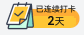

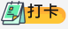

#### 轮播图组件封装

轮播图组件并无单独额外的逻辑需求，或是重复利用的接口预留等问题，仅仅是在首页的中上部使用一次，所以我们直接使用性能更好，更加轻量化的`@Builder`来进行封装即可。
所以这里我们直接将需要展示的图片资源列成资源数组，然后进行循环渲染即可。

```ts
  swiperImgList:Resource[] = [
    $rawfile('banner_qa.png'),
    $rawfile('banner_ai.png'),
    $rawfile('banner_pj.png')
  ]
    @Builder
  SwiperImgBuilder(img: Resource) {
    Row() {
      Image(img)
        .width('100%')
    }
    .width('100%')
    .padding({
      left: 16,
      right: 16
    })
  }
```

<video width="100%" controls>
  <source src="35.mp4" type="video/mp4">
  您的浏览器不支持视频标签。
</video>

#### 试题分组组件封装


我们可以看到，在中上部轮播图的下方便是试题分组组件，其大致分为两部分：

1. 试题分组标题
2. 试题分组列表

这个效果我们可以用两种手段来实现：

* 一种是用一个**横向**的`List`配合**纵向**的`List`，在**点击横向**的`List`时更新纵向`List`的数据。
* 另一种是通过`Tabs`组件配合多个`List`来实现。

为了整个结构更加清晰同时减少反复的数据更新计算导致的性能负担，我们采用第二种方案。

```ts
import { QuestionType } from "../../ExportCentre"

@ComponentV2
export struct HomeCategory {
  @Local mockData: QuestionType[] = [ //测试数据，后期通过网络请求获取后端数据
    { id: 1, name: 'ArkTS', displayNewestFlag: 0 },
    { id: 2, name: 'ArkUI', displayNewestFlag: 1 },
    { id: 3, name: 'Hap', displayNewestFlag: 1 },
    { id: 4, name: 'Hsp', displayNewestFlag: 0 },
    { id: 5, name: 'Har', displayNewestFlag: 0 },
    { id: 6, name: 'Ability', displayNewestFlag: 0 },
    { id: 7, name: 'Stage', displayNewestFlag: 0 },
    { id: 8, name: 'Kit', displayNewestFlag: 0 }
  ]
  build () {
    Tabs(){
      ForEach(this.mockData,(item:QuestionType,i)=>{
        TabContent()
          .tabBar(item.name)
      })
    }
    .scrollable(false)
    .barMode(BarMode.Scrollable)
    .barHeight(44)
    .divider({
      strokeWidth:0.5,
      color:$r('app.color.common_gray_border')
    })
  }
}
```

此处由于我们还没有封装网络请求组件，所以暂时采用本地测试数据。

对于`TabBar`中的动画效果的选中提示下划线我们可以利用层叠布局，在最下方覆盖一层组件，设置其宽高，并附以动画效果即可实现。

```ts
  Stack({ alignContent: Alignment.Bottom }) {
    Text(item.name)
      .fontSize(15)
      .fontColor(this.activeIndex === i ? $r('app.color.black') : $r('app.color.common_gray_01'))
      .height(45)
    Text()
      .width(this.activeIndex === i ? 20 : 0)
      .height(2)
      .backgroundColor($r('app.color.black'))
      .animation({ duration: this.activeIndex === i ? 300 : 0 })
  }
```

<video width="100%" controls>
  <source src="37.mp4" type="video/mp4">
  您的浏览器不支持视频标签。
</video>

这样就实现了动画选中提示效果。

#### 试题标签组件封装

在试题列表中不同的试题有着不同的难度，不同的难度对应着不同的标签。
总共氛围三种标签：难度1、2对应着简单，3-4 是一般，5 是困难。

这个组件的封装难点在于数据接口的定义，而非UI布局。

##### 数据接口定义

所以我们先来看一下我们需求的数据样式：

```ts
{
  1:{text:'简单',color:Color.Green},
  2:{text:'简单',color:Color.Green},
  3:{text:'一般',color:Color.Yellow},
  4:{text:'一般',color:Color.Yellow},
  5:{text:'困难',color:Color.Red}
}
```

我们可以看到最外层的键值对的**键**是难度值是`number`类型，而其对应的**值又是一个对象**。
这个对象这种包含了两个键值对，一个是显示的文本`text`，另一个是对应的颜色值`color`。

我们可以利用`ArkTS`的内置函数`Record`来进行数据的定义。

```ts
export interface HcTagInfo {
  text: string;
  color: ResourceColor;
}
export const infoMap: Record<number, HcTagInfo> = {
  1: { text: "简单", color: $r("app.color.common_green") },
  2: { text: "简单", color: $r("app.color.common_green") },
  3: { text: "一般", color: $r("app.color.common_blue") },
  4: { text: "一般", color: $r("app.color.common_blue") },
  5: { text: "困难", color: $r("app.color.common_main_color") },
}
```

`Record`内置函数可以自动生成一个键值对类型，会将**第一个**泛型参数作为**键**的类型，**第二个**泛型参数作为**值**的类型。
`Record<number, HcTagInfo>`就表示键是`number`类型，值是`HcTagInfo`类型。

当然我们也有另一种方法就是再定义一个接口来进行数据的定义。

```ts
export interface info{
  '1':HcTagInfo
  '2':HcTagInfo
  '3':HcTagInfo
  '4':HcTagInfo
  '5':HcTagInfo
}
```

但很显然这种方法就无法做到使难度类型键为`number`类型了，所以我们采用第一种方法。

**注意：**用这种方法定义的接口，在使用时需要使用`infoMap[1].text`的方式来获取数据，而不能使用`infoMap.1.text`的方式来获取数据。

##### UI封装

```ts
@ComponentV2
export struct HcTag {
  @Param difficulty: number = 1
  @Param text: string = ''
  @Param fontcolor: ResourceColor = ''

  build() {
    Text(this.text || HcTagInfoMap[this.difficulty].text)
      .fontColor(this.fontcolor || HcTagInfoMap[this.difficulty].color)
      .fontSize(10)
      .padding({ left: 6, right: 6 })
      .height(18)
      .constraintSize({ minWidth: 34 })
      .borderRadius(2)
      .backgroundColor($r('app.color.common_gray_bg'))
      .textAlign(TextAlign.Center)
  }
}
```

在使用`||`运算符时会从左向右注意判断是否为空，这样就可以做到**优先使用传入的值**，在没有传入值时使用默认值。

##### 测试

```ts
    Tabs() {
      ForEach(this.questionList, (item: QuestionType, i) => {
        TabContent(){
          Column(){
            HcTag({difficulty:1})
            HcTag({difficulty:2})
            HcTag({difficulty:3})
            HcTag({difficulty:4})
            HcTag({difficulty:5})
          }
        }
          .tabBar(this.TabBarBuilder(item, i))
      })
    }
    .onChange((i) => {
      this.activeIndex = i
    })
    .barMode(BarMode.Scrollable)
    .barHeight(44)
```


这样我们就实现了标签组件的封装。

#### 试题列表Item组件封装


首先我们通过对效果图的布局进行分析，可以看到整体布局还是较为简洁的，大致可以分为上下两个部分：

1. 上半部分由刚才封装的试题难度标签以及试题标题组成
2. 下半部分由点赞量，浏览量，阅读状态组成

这里重点解系一下下半部分的UI布局，因为要用到一个新的组件`RowSplite`

[RowSplite文档传送门](https://developer.huawei.com/consumer/cn/doc/harmonyos-references-V14/ts-container-rowsplit-V14)

这个组件的特点在于会将每个子组件之间加上一个分割线，这样一来就不需要自己在封装组件来去处理分割线问题了。

这个组件可以配合`@Extends`关键字来使用，这样就可以为组件内的多块信息一次性设定相同的样式了。

```ts
import { HcTag } from "../../ExportCentre"

@Preview
@ComponentV2
export struct QuestionItemComp {
  // @Param
  build() {
    Column({space:10}) {
      Row() {
        HcTag({ difficulty: 1 })
        Text('test')
          .fontSize(15)
          .layoutWeight(1)
          .maxLines(1)
          .textOverflow({ overflow: TextOverflow.Ellipsis })
      }
      .width('100%')

      RowSplit() {
        Text(`点赞 6`)
          .grayText(true)
        Text(`浏览 1000`)
          .grayText()
        Text('已看过')
          .grayText()
      }
    }
    .alignItems(HorizontalAlign.Start)
    .padding({left:16,right:16})
    .backgroundColor($r('app.color.common_blue_bg'))
  }
}
@Extend(Text)
function grayText(isStart: boolean = false) {
  .lineHeight(13)
  .fontSize(13)
  .fontColor($r('app.color.common_gray_01'))
  .padding({ left: isStart ? 0 : 12, right: 12 })
}
```

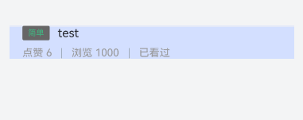

#### 完成试题列表渲染

刚才完成了试题列表的单个Item组件封装，接下来我们就可以在试题列表页面中使用这个组件了。
在使用之前我们要先进行数据接口的定义与状态变量的接口暴露，然后再进行数据的传入与渲染。

##### 试题列表信息数据接口定义

```ts
export interface QuestionListItem{
  id: string;
  /* 题干 */
  stem: string;
  /* 难度 */
  difficulty: number;
  /* 点赞数 */
  likeCount: number;
  /* 浏览数 */
  views: number;
  /* 是否已看 */
  readFlag: 0 | 1;
}
```

##### 适配数据接口

由于这个数据是必须传入的并没有默认值选项，所以我们在使用`@Param`装饰器后还需配合`@Require`装饰器后才能使组件正常工作。
随后将组件原本写死的测试用例替换为接口数据即可。

```ts

/**
 * 面试问题列表Item组件
 * 必须传入一个QuestionListItem对象
 * 包含问题的id，题目，点赞数，阅读量，是否看过等信息
 */
@Preview
@ComponentV2
export struct QuestionItemComp {
  @Param @Require questionItem: QuestionListItem

  build() {
    Column({ space: 10 }) {
      Row({ space: 10 }) {
        HcTag({ difficulty: this.questionItem.difficulty })
        Text(this.questionItem.stem)
          .fontSize(15)
          .layoutWeight(1)
          .maxLines(1)
          .textOverflow({ overflow: TextOverflow.Ellipsis })
      }
      .width('100%')

      RowSplit() {
        Text(`点赞 ${this.questionItem.likeCount}`)
          .grayText(true)
        Text(`浏览 ${this.questionItem.views}`)
          .grayText()
        Text(this.questionItem.readFlag === 1 ? '已看过' : '待阅读')
          .grayText()
      }
    }
    .alignItems(HorizontalAlign.Start)
    .padding({ left: 16, right: 16 })
    .backgroundColor($r('app.color.common_blue_bg'))
  }
}

@Extend(Text)
function grayText(isStart: boolean = false) {
  .lineHeight(13)
  .fontSize(13)
  .fontColor($r('app.color.common_gray_01'))
  .padding({ left: isStart ? 0 : 12, right: 12 })
}
```

##### 测试UI显示

```ts
    Tabs() {
      ForEach(this.questionList, (item: QuestionTabBarType, i) => {
        TabContent() {
          List({ space: 10 }) {
            ForEach(new Array(10).fill({
              id: '1',
              stem: '测试标题',
              difficulty: 3,
              likeCount: 3000,
              views: 9999,
              readFlag: 0
            }), (item: QuestionListItem, i) => {
              ListItem() {
                Column({ space: 10 }) {
                  QuestionItemComp({
                    questionListItem: item
                  })
                  Divider()
                    .strokeWidth(1)
                    .color($r('app.color.common_gray_02'))
                }
                .margin({ top: i === 0 ? 10 : 0 })

              }
            })
          }
        }
        .tabBar(this.TabBarBuilder(item, i))
      })
    }
    .divider({ strokeWidth: 1, color: $r('app.color.common_gray_02') })
    .onChange((i) => {
      this.activeIndex = i
    })
    .barMode(BarMode.Scrollable)
    .barHeight(44)
```

在测试中我们发现直接的硬拼接各个组件还是有点难看的，所以就新进行了一些微调，像是增加了分割线与文本的距离，以及增加`tabBar`的下边界分界线与选中高亮提示下划线间的距离等。
这些东西其实也无伤大雅，但还是在细节上提升了些许美观度。

<video width="100%" controls>
  <source src="41.mp4" type="video/mp4">
  您的浏览器不支持视频标签。
</video>

虽然单个Item已经封装完成，但是整个列表还需要根据不同的问题类型去分类渲染，同时包括触底加载和下拉刷新等操作，所以我们接下来还需要继续去进行问题列表组件的封装。

#### 问题列表组件封装

问题列表组件会包括N个问题列表Item组件，同时还需要封装下拉刷新和触底加载的功能。
这部分功能我在[开心一笑](https://xbxyftx.github.io/2025/01/30/%E5%BC%80%E5%BF%83%E4%B8%80%E7%AC%91%E9%A1%B9%E7%9B%AE%E7%AC%94%E8%AE%B0/)项目中有较详细的使用教程和思路，这里不再过多赘述。

封装目标：

1. 使用 `Refresh` `List` 和 `QuestionItemComp` 组件搭建基础结构和样式
2. 完成 **下拉刷新** 效果，不含数据刷新
3. 完成 **上拉加载** Builder
4. 完成 **上拉加载** 完整效果
5. 完成 **下拉刷新** 完整效果

##### 下拉刷新功能测试

```ts
import { QuestionItemComp, QuestionListItem } from "../../ExportCentre"

@ComponentV2
export struct QuestionListComp{
  @Local isLoading:boolean = false
  onRefresh(){
    setTimeout(()=>{
      this.isLoading = false
    },3000)
  }
  build() {
    Refresh({refreshing:$$this.isLoading}){
      List({ space: 10 }) {
        ForEach(new Array(10).fill({
          id: '1',
          stem: '测试标题',
          difficulty: 3,
          likeCount: 3000,
          views: 9999,
          readFlag: 0
        }), (item: QuestionListItem, i) => {
          ListItem() {
            Column({ space: 10 }) {
              QuestionItemComp({
                questionListItem: item
              })
            }
            .margin({ top: i === 0 ? 10 : 0 })

          }
        })
      }
      .divider({
        strokeWidth:1,
        color:$r('app.color.common_gray_border')
      })
      .scrollBar(BarState.Off)
      .edgeEffect(EdgeEffect.None)
    }
    .width('100%')
    .height('100%')
    .onRefreshing(()=>{
      this.onRefresh()
    })
  }
}
```

由于当前还没有封装网络请求模块所以暂时先试用定时器来默契网络请求成功的情况。

<video width="100%" controls>
  <source src="42.mp4" type="video/mp4">
  您的浏览器不支持视频标签。
</video>

##### 上拉加载`Builder`封装与功能测试

```ts
import { QuestionItemComp, IQuestionListItem, QuestionListCompTestData } from "../../ExportCentre"

/**
 * 首页问题分类区域，单个问题分类分页的问题列表组件
 * 拥有触底加载以及下拉刷新功能
 * isRefreshing     加载函数触发标识符
 * isLoading        正是否加载达到上限标识符
 * isFinish         是否加载完成标识符
 */

@ComponentV2
export struct QuestionListComp {
  @Local isRefreshing: boolean = false
  @Local isLoading: boolean = false
  @Local isFinish: boolean = false

  @Builder
  isLoadingMore() {
    ListItem() {
      if (this.isFinish) {
        Row() {
          Text('没有更多了')
            .fontSize(15)
            .fontColor($r('app.color.common_gray_03'))
        }
        .width('100%')
        .justifyContent(FlexAlign.Center)
      } else if (this.isLoading) {
        Row({ space: 5 }) {
          LoadingProgress()
            .width(20)
          Text('正在加载中')
            .fontSize(15)
            .fontColor($r('app.color.common_gray_03'))
        }
        .width('100%')
        .justifyContent(FlexAlign.Center)
      }
    }

  }

  onRefresh() {
    setTimeout(() => {
      this.isRefreshing = false
    }, 3000)
  }

  build() {
    Refresh({ refreshing: $$this.isRefreshing }) {
      List({ space: 10 }) {
        ForEach(new Array(10).fill(QuestionListCompTestData), (item: IQuestionListItem, i) => {
          ListItem() {
            Column({ space: 10 }) {
              QuestionItemComp({
                questionListItem: item
              })
            }
            .margin({ top: i === 0 ? 10 : 0 })

          }
        })
        this.isLoadingMore()
      }
      .divider({
        strokeWidth: 1,
        color: $r('app.color.common_gray_border')
      })
      .scrollBar(BarState.Off)
      .edgeEffect(EdgeEffect.None)
    }
    .width('100%')
    .height('100%')
    .onRefreshing(() => {
      this.onRefresh()
    })
  }
}
```

由于题库的题目数量是有限的不能一直无限制的向下获取新的题目所以需要去在**开心一笑**项目的基础上新增一个是否加载完成的标识符，用来标志是否成功获取新的题目。

然后通过修改状态变量的初始默认值来测试效果


随后我们依旧使用定时器来模拟网络请求的成功情况。
这里我们将获取的问题条数**上限设为40条**以免过多的加载数据导致页面卡顿。

```ts
  onLoad() {
    if (this.isFinish){
      return
    }else {
      setTimeout(() => {
        for (let i = 0; i < 10; i++) {
          this.QuestionList.push(QuestionListCompTestData)
        }
        this.isLoading = false
        if (this.QuestionList.length === 40) {
          this.isFinish = true
        }
      }, 2000)
    }
  }
```

enm经过测试发现由于`onReachEnd`事件的机制，**在触底时触发一次，在回弹时再触发一次**，这里忘记做**防过加载**处理了，所以导致一次会加载20条，而且最后会因为多加载一次而**使总数达到50条**。所以我们还需要对代码进行微调。

首先就是修改`onReachEnd`事件中的代码，判断一下是否正在下拉刷新、加载中、加载达到上限等状态，只有在这些状态都不满足时才会去进行数据的加载。

```ts
  .onReachEnd(() => {
    if (this.isRefreshing || this.isLoading || this.isFinish) {
      return
    } else {
      this.isLoading = true
      this.onLoad()
    }
  })
```

随后修改`onLoad`方法，在加载后打印当前问题列表数组长度，用于Debug。

```ts
  onLoad() {
    setTimeout(() => {
      this.isLoading = true
      for (let i = 0; i < 10; i++) {
        this.QuestionList.push(QuestionListCompTestData)
      }
      this.isLoading = false
      if (this.QuestionList.length === QUESTION_LIST_MAX_LENGTH) {
        this.isFinish = true
      }
      logger.info(QUESTION_LIST_COMP_TAG + '当前问题列表长度' + this.QuestionList.length)
    }, 2000)
  }
```

<video width="100%" controls>
  <source src="44.mp4" type="video/mp4">
  您的浏览器不支持视频标签。
</video>


至此本功能组件封装测试完毕。

##### 下拉刷新的数组数据重置

刷新的逻辑与加载不同，刷新是先将原有数组清空，然后再重新加载数据。

```ts
  onRefresh() {
    logger.debug(QUESTION_LIST_COMP_TAG + '进入onRefresh')
    this.isRefreshing = true
    setTimeout(() => {
      this.QuestionList = []
      for (let i = 0; i < 10; i++) {
        this.QuestionList.push(QuestionListCompTestData)
      }
      logger.info(QUESTION_LIST_COMP_TAG + 'onRefresh:  当前问题列表长度' + this.QuestionList.length)
      this.isRefreshing = false
    }, 2000)
  }
```


通过日志我们可以明确的看到，在下拉刷新时，数组数据会被清空，然后再重新加载数据。

不过这里我们在测试时又发现了新的问题，在触发一次下拉刷新之后，无法再次触发触底加载。

经过简单的推理，其实这个问题也不难排查。问题就出在下拉刷新后我们没有将加载问题数上限标志符`isFinish`重置为`false`。
所以我们需要在下拉刷新后将`isFinish`重置为`false`，这样一来就可以再次触发触底加载了。

```ts
  /**
   * 下拉刷新函数
   * 将原数组设为空随后从新获取数据
   * 并将试题列表获取上限标识刷新
   */
  onRefresh() {
    logger.debug(QUESTION_LIST_COMP_TAG + '进入onRefresh')
    this.isRefreshing = true
    setTimeout(() => {
      this.QuestionList = []
      for (let i = 0; i < 10; i++) {
        this.QuestionList.push(QuestionListCompTestData)
      }
      logger.info(QUESTION_LIST_COMP_TAG + 'onRefresh:  当前问题列表长度' + this.QuestionList.length)
      this.isRefreshing = false
      this.isFinish = false
    }, 2000)
  }
```


至此本功能组件封装测试完毕。

### 首页网络交互

这个项目的网络请求我们统一使用axios第三方库来进行发送和管理，axios相比鸿蒙自带的网络请求模块更加便捷，详情可以参考[鸿蒙网络请求学习笔记](https://xbxyftx.github.io/2025/01/27/%E9%B8%BF%E8%92%99%E7%BD%91%E7%BB%9C%E8%AF%B7%E6%B1%82%E5%AD%A6%E4%B9%A0%E7%AC%94%E8%AE%B0/)这篇博客的内容。

#### 下载axios

```bash
ohpm i @ohos/axios
```

随后开启网络权限：

```json
    "requestPermissions": [
      {
        "name": "ohos.permission.INTERNET"
      }
    ],
```

#### 封装Axios请求实例

首先在`utils`文件夹下创建一个`AxiosHttp.ets`文件，用于封装Axios请求实例以及拦截器。

配置基地址是很重要的，一旦公司后端的基地址发生了改变，如果没有统一的配置基地址，那么我们就需要在每个网络请求中都去修改基地址，这样一来就会很麻烦。

```ts
/**
 * axios请求实例
 * 配置基地址和请求超时时间
 */
export const axiosInstance = axios.create({
  baseURL:'https://api-harmony-teach.itheima.net',
  timeout:10000
})
```

#### 封装Axios相应拦截器

`axios`第三方库虽然在鸿蒙原有的网络模块的基础上优化了许多，但也依旧存在以下痛点问题：

1. 泛型参数的填写较为繁琐，在`get`请求时**第一个参数无关紧要可以为`null`**，第二个参数是结果的类型，第三个参数由于没有需要传递的请求体参数，就可以不用填写，或者为`null`。在`post`请求时，**第一个参数依旧无关紧要可以为`null`**，第二个参数是响应结果的类型，第三个参数是请求体类型**不可省略**。
2. 从数据接口获取所需数据的路径过长，像是想要获取下图所示结构中的`account`字段的值，我们需要写成`res.data.data.account`，这样一来就会很麻烦。


而且在相应信息中并非所有信息都是我们所需要的，所以我们可以针对axios的响应结果进行拦截，将我们不需要的数据剔除掉。

所谓拦截器是axios库提供的一种机制，它可以在请求发送前或者响应返回后对数据进行处理。
在axios中，拦截器分为请求拦截器和响应拦截器。
请求拦截器可以在请求发送前对请求数据进行处理，例如添加请求头、修改请求参数等。
响应拦截器可以在响应返回后对响应数据进行处理，例如对响应数据进行统一处理、判断响应状态码等。

我们就可以利用这个机制来对现有的**响应数据进行修改**使得我们能够更加方便的获取到所需要的数据。

##### 响应拦截器基础结构

```ts
/**
 * 设置响应拦截器拦截器
 * interceptors:    拦截器
 * response:        响应
 * 由这个axiosInstance实例发送到请求的响应都会经过它再返回
 */
axiosInstance.interceptors.response.use((res:AxiosResponse)=>{
  return res
},(err:AxiosError)=>{
  return Promise.reject(err)
})
```

所有由这个`axiosInstance`实例发送到请求的响应都会经过它再返回，这一点很重要，这意味着我们无需特意调用额外的回调函数即可完成对相应数据的拦截操作。

##### 响应拦截器具体实现

我们直接将成功时的响应结果中的`data`字段返回，这样我们就可以直接通过`res.data`来获取到数据了。

```ts
  return res.data
```

第一层`data`字段是axios库自动添加的，**并非**我们在接口文档里所看到的响应体数据，我们不需要关心它。
本项目的接口响应数据基本都如下图所示：

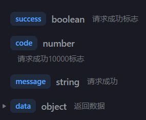

所以我们其实可以对返回值再加一层`data`字段，这样我们就可以直接通过`res.字段`来获取到数据了。

```ts
  return res.data.data
```

#### 封装AxiosHttp类

封装这个类的目的是减少泛型参数的冗余，使得代码更加简洁。

```ts
class AxiosHttp{
  /**
   * Axios包装过的请求函数
   * @param config 网络请求配置项
   * res:相应数据类型
   * req:响应体参数类型 - get不需要传
   */
  request<res,req>(config:AxiosRequestConfig<req>){
    return axiosInstance(config)
  }
}

export const axiosHttp = new AxiosHttp()
```

先填写相应数据类型，再填写请求体参数类型主要是因为`get`请求并不需要传入请求体数据类型，但由于并没有默认值所以不填会报错，这里我们再给第二个参数设置一个默认值`Object`即可。

#### 利用AxiosHttp类获取问题分组标签列表

```ts
  @Local questionList: IQuestionTabBarType[] = []

  aboutToAppear(): void {
    this.getQuestionList()
  }

  async getQuestionList() {
    this.questionList = await axiosHttp.request<IQuestionTabBarType[]>({
      url: '/hm/question/type'
    })
  }
```

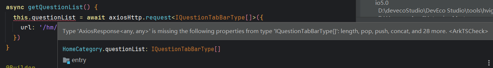

我们可以看到此处是在报错的，由报错信息可以分析出，当前我们虽然传入了一个泛型参数，第二个泛型参数我们也设置了默认值非必要填写，但这个泛型参数并没有正确的传递给`axiosInstance`实例，导致`axiosInstance`实例无法正确的解析泛型参数。

于是我们回到`AxiosHttp.ets`文件中，检查代码，发现我们只反悔了实例而没有携带泛型参数。

```ts
  request<res, req = Object>(config: AxiosRequestConfig<req>) {
    logger.debug(AXIOS_HTTP_LOG_TAG+'进入AxiosHttp.request')
    return axiosInstance<null,res,req>(config)
  }
```

修改后再次测试功能正常。

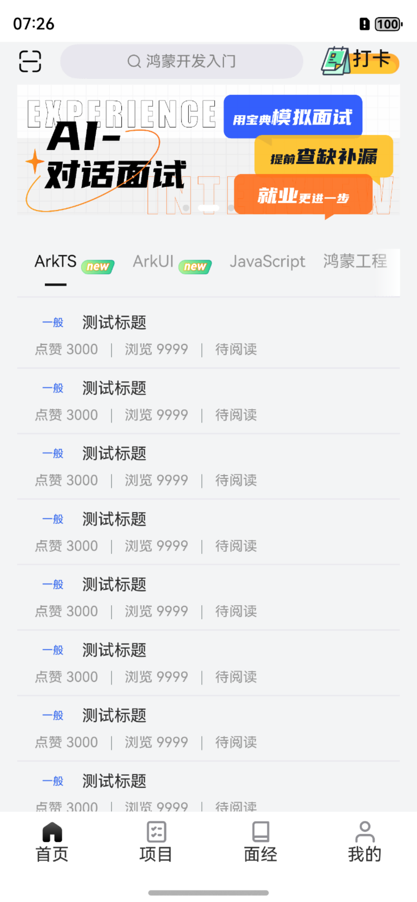

#### 响应请求码判断

我们当前的拦截器捕获了异常，并返回正常响应结果的数据，但如果响应是正常的，只是因为我们的传参不正确导致返回的结果是错误信息提示，而我们的`try catch`函数就无法捕获异常弹出报错，所以我们还需要去对响应状态码进行判别，一旦出现非正常状态码就需要进行弹窗以及日志提示，避免上述情况出现。

```ts
/**
 * 设置响应拦截器拦截器
 * interceptors:    拦截器
 * response:        响应
 * 由这个axiosInstance实例发送到请求的响应都会经过它再返回
 */
// 响应拦截器
axiosInstance.interceptors.response.use((res: AxiosResponse) => {
  if (res.data.code === 10000) {
    logger.debug('Req Success' + JSON.stringify(res.data.data))
    return res.data.data
  }
  logger.error('Req Error' + JSON.stringify(res.data))
  promptAction.showToast({ message: 'Req Error' + JSON.stringify(res.data) })
  return Promise.reject(res.data)
}, (err: AxiosError) => {
  logger.error('Req Error' + JSON.stringify(err))
  promptAction.showToast({ message: 'Req Error' + JSON.stringify(err) })
  return Promise.reject(err)
})
```

这样一来，只要不是10000状态码，就会弹出提示。

### 首页问题列表的完整功能实现

之前我们仅仅使用静态的测试数据实现了问题列表的渲染，还没有接入网络请求动态获取数据，同时还缺少分类标签的半模态弹窗。

#### 动态获取试题列表

##### 根据后端文档定义数据类型

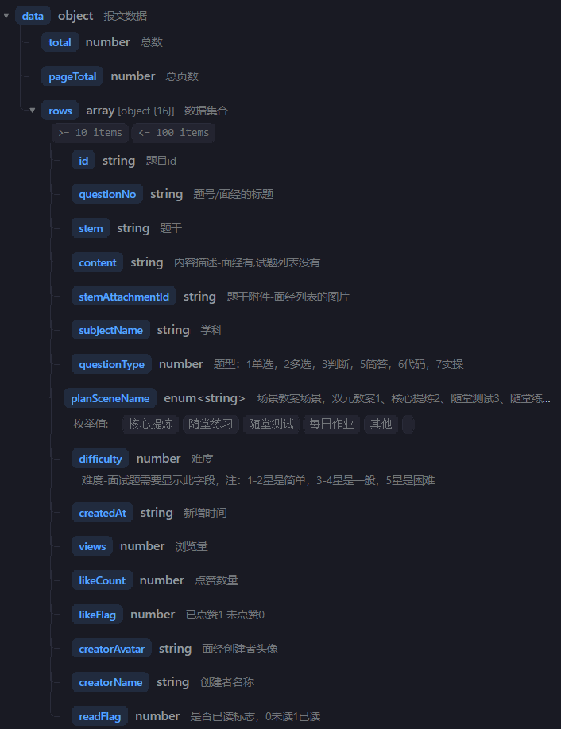

我们可以看，这个接口的返回数据还是相当多的，所以我们还需要慢慢分析。

```ts
/**
 * 试题列表数据外层对象
 * @param
 * total:       问题总数
 * pageTotal:   总页数
 * rows:        数据集合
 */
export interface IPageData<T> {
  total: number
  pageTotal: number
  rows: T[]
}
```

随后我们还需要去对`url`所需参数来定义一个对象，以便于包装后传参。

```ts
/**
 * 排序模式常量
 * @enum
 * Default:           默认量可以不传
 * DifficultyLow:     从易到难
 * DifficultyHigh:    从难道易
 * ViewLow:           浏览量从低到高
 * ViewHigh:          从高到底
 * Commend:           推荐数据（按照权重倒序）
 */
export enum SortType {
  Default = 0,
  DifficultyLow = 10,
  DifficultyHigh = 11,
  ViewLow = 20,
  ViewHigh = 21,
  Commend = 30
}
/**
 * 查询试题请求Url参数数据类型
 * @param
 * type:                0或者不传，查询全部 或者类型id
 * sort:                排序,用SortType常量
 * pageSize:            每页大小，为空默认是10
 * page:                当前页数，为空默认是1
 * questionBankType:    9面经10小程序面试题
 */
export interface IGetQuestionListUrlParams {
  type: number
  questionBankType: 9 | 10
  sort?: SortType
  page?: number
  pageSize?: number
}
```

详尽的注释还是挺有必要的……前两天写的代码都需要联系着看才能回想起来了……
(回去补了一大堆注释……)

##### 暴露分类biaoqianID接口

```ts
  @Param @Require typeId:number = -1
  @Param sortType:SortType = SortType.Default
```

我们需要依据分类标签ID和排序模式来获取试题列表，所以我们需要将这两个参数暴露出去。

##### 发送请求

在过去我们利用`axios`发送请求时都是通过在后端文档复制字段名然后填写数据的，但我们定义了参数接口之后，利用`as`关键字就可以将`params`转换为指定类型这样就有字段提示了。

```ts
  const req = axiosHttp.request<IPageData<IQuestionListItem>>({
    url:'/hm/question/list',
    params:{
        
    } as IGetQuestionListUrlParams
  })
```

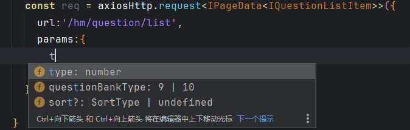

```ts
  /**
   * 触底加载逻辑函数
   */
  async onLoad() {
    logger.debug(QUESTION_LIST_COMP_TAG + '进入onLoad')
    if (this.isRefreshing || this.isLoading || this.isFinish) {
      return
    } else {
      this.isLoading = true
      const res = await axiosHttp.request<IPageData<IQuestionListItem>>({
        url: '/hm/question/list',
        params: {
          type: this.typeId,
          sort: this.sortType,
          questionBankType: 9,
          pageSize: 10,
          page: this.currentPageTotalNumber
        } as IGetQuestionListUrlParams
      })
      this.QuestionList.push(...res.rows)
      this.isLoading = false
      if (this.currentPageTotalNumber >= res.pageTotal) {
        this.isFinish = true
      }else {
        this.currentPageTotalNumber++
      }
    }
  }
```

但在测试时发现此处代码还有问题。


列表并没有成功的获取，我们来查看一下日志。

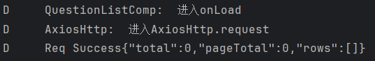

我们可以看到请求是成功了的，这里也成功的传回了响应值，但不知道为什么是空的，我们进行进一步排查。

……

在仔细排查了代码的问题后发现好像并没有什么问题(乐了……)，于是我们又去看了看文档，发现好像是我们`questionBankType`字段值填反了。

```ts
  questionBankType: 10,
```

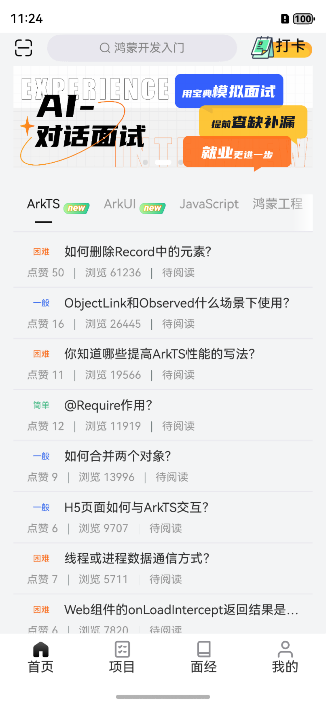

我们可以看到修改后数据就正常获取了。

enm……还能怎么说呢，认真读文档吧……

##### 下拉刷新逻辑更新

```ts
  /**
   * 下拉刷新函数
   * 将原数组设为空随后从新获取数据
   * 并将试题列表获取上限标识刷新
   */
  async onRefresh() {
    logger.debug(QUESTION_LIST_COMP_TAG + '进入onRefresh')
    this.isRefreshing = true
    this.currentPageTotalNumber = 1
    this.QuestionList = []
    const res = await axiosHttp.request<IPageData<IQuestionListItem>>({
      url: '/hm/question/list',
      params: {
        type: this.typeId,
        sort: this.sortType,
        questionBankType: 10,
        pageSize: 10,
        page: this.currentPageTotalNumber
      } as IGetQuestionListUrlParams
    })
    this.QuestionList = res.rows
    this.isRefreshing = false
    this.isFinish = (this.currentPageTotalNumber >= res.pageTotal)
  }
```

经测试功能正常。

#### 分类标签半模态弹窗按钮图标

在试题标签栏右侧会有一个小按钮用于拉起半模态弹窗来快速筛选标签。

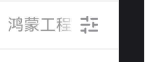

这个图标我们可以通过层叠布局来盖在标签栏上。

```ts
  Row() {
    Image($rawfile('ic_home_filter.png'))
      .width(24)
      .aspectRatio(1)
  }
  .width(56)
  .height(44)
  .linearGradient({
    angle: 90,
    colors: [['#00ffffff', 0], ['#ffffff', 0.285]]
  })
  .justifyContent(FlexAlign.Center)
```

通过添加白色到透明色的渐变过度就可以做到让整个分类标签列表像是缓慢浮现出来一样的效果。

<video width="100%" controls>
  <source src="58.mp4" type="video/mp4">
  您的浏览器不支持视频标签。
</video>

##### 半模态弹窗主体

半模态的UI布局还是相对来说很简单的这里就不过多讲解了，我们重点来说逻辑部分。

```ts
      Text('题目排序')
        .textTitle()
      // TODO 筛选按钮

      Text('选择分类')
        .textTitle()
      // TODO 筛选按钮
```

现在的核心任务就是完成排序和分类的筛选。

##### 筛选按钮组件封装

在筛选半模态页面中，每个按钮我们都应当封装成一个组件，因为它内部还包括了其他的逻辑，以及依据数据的不同提示出不同的脚标以及UI，不能单纯的使用`Button`组件来进行渲染。

```ts
/**
 * 首页标签筛选半模态单个按钮组件
 * @param:{
 *   text:标签文字
 *   isNew:是否显示new脚标
 *   isSort:是否显示排序上下箭头
 * }
 */
@ComponentV2
export struct FilterButton {
  @Param text: string = ''
  @Param isNew: boolean = false
  @Param isSort: boolean = false

  build() {
    Row() {
      Text(this.text)
        .fontSize(12)
        .fontColor($r('app.color.black'))
      if (this.isNew) {
        Image($r('app.media.ic_home_new'))
          .width(32)
          .height(14)
          .objectFit(ImageFit.Contain)
          .position({ right: -26, top: -7 })
      }
      if (this.isSort) {
        Column() {
          Image($r('sys.media.ohos_ic_public_arrow_up'))
            .size({ width: 12, height: 6 })
          Image($r('sys.media.ohos_ic_public_arrow_down'))
            .size({ width: 12, height: 6 })
        }
        .margin({ top: -0.5, left: 2 })
      }
    }
    .height(30)
    .padding({ left: 10, right: 10 })
    .backgroundColor($r('app.color.common_gray_bg'))
    .borderRadius(4)
    .margin({ top: 12, right: this.isNew ? 26 : 10 })
  }
}
```

这里的上下排序箭头我们直接使用系统自带图标即可。
此时我们就可以利用封装好的组件来进行渲染了。

#### 半模态筛选按钮渲染

我们回到半模态`Builder`中采用`Flex`弹性布局来实现自动换行效果。

```ts
      // TODO 筛选按钮
      Flex({wrap:FlexWrap.Wrap}){
        FilterButton({
          text:'默认'
        })
        FilterButton({
          text:'浏览量',
          isNew:true
        })
        FilterButton({
          text:'排序',
          isSort:true
        })
        FilterButton({
          text:'默认',
          isNew:true,
          isSort:true
        })
      }
```

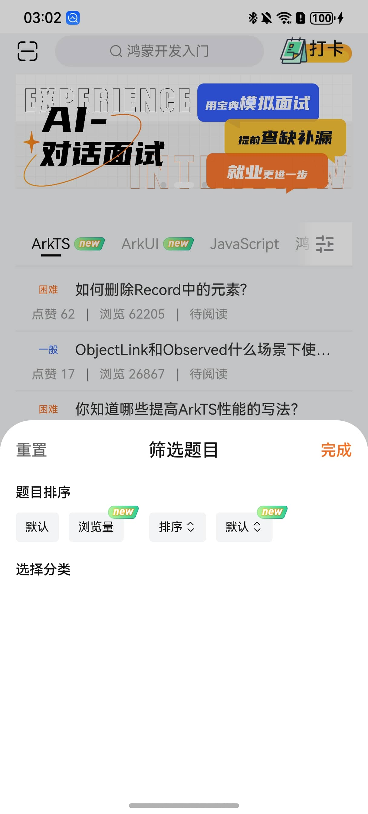

由此我们可以看到我们可以很轻松的控制每个按钮的样式。

然后对于分类选择栏的数据我们就可以直接沿用上面已经通过网络请求获取的问题类型列表来进行渲染和测试。

```ts
      Flex({ wrap: FlexWrap.Wrap }) {
        ForEach(this.questionTabBarList, (item: IQuestionTabBarType, i) => {
          FilterButton({
            text: item.name,
            isNew: item.displayNewestFlag == 1
          })
        })
      }
```

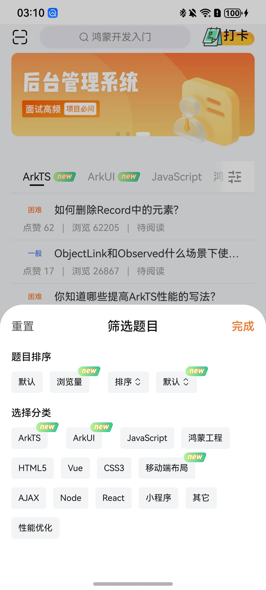

#### 半模态筛选按钮点击事件

##### 类型筛选按钮

以上暴露的变量接口仅仅是为了方便UI的渲染还没有实现逻辑上的切换功能，而为了标明选中状态我们还需要再暴露一个变量接口`isSelected`。

```ts
  @Param isSelected: boolean = false

  .fontColor(this.isSelected ? $r('app.color.common_main_color') : $r('app.color.black'))
```

然后在首页问题列表的下半区组件中再添加一个变量用于标明被选中的标签ID，随后在半模态中通过点击事件来改变这个变量的值。

```ts
  @Local filterSelectedIndex: number = -1
  FilterButton({
    text: item.name,
    isNew: item.displayNewestFlag == 1,
    isSelected: this.filterSelectedIndex === i
  })
    .onClick(() => {
      this.filterSelectedIndex = i
    })
```

##### 排序筛选按钮

首先我们先考虑默认和推荐两种排序方式，因为这两种方式最简单，观看量和难度都有**正逆序**需要考虑我们后面再说。
我们需要依赖于之前定义的枚举类型`SortType`来进行排序。

```ts
  @Local filterSortType: SortType = SortType.Default //高亮显示当前的排序方式
  FilterButton({
    text: '默认',
    isSelected: this.filterSortType === SortType.Default
  })
    .onClick(() => {
      this.filterSortType = SortType.Default
    })
  FilterButton({
    text: '浏览量',
    isSort: true,
    isSelected: this.filterSortType === SortType.ViewLow || this.filterSortType === SortType.ViewHigh
  })
  FilterButton({
    text: '难度',
    isSort: true,
    isSelected: this.filterSortType === SortType.DifficultyLow || this.filterSortType === SortType.DifficultyHigh
  })
  FilterButton({
    text: '推荐',
    isSelected: this.filterSortType === SortType.Commend
  })
    .onClick(() => {
      this.filterSortType = SortType.Commend
    })
```

利用`filterSortType`变量来标志当前选中的排序方式。

<video width="100%" controls>
  <source src="61.mp4" type="video/mp4">
  您的浏览器不支持视频标签。
</video>

再配合上日志信息我们可以看到排序方式已经成功的切换了。

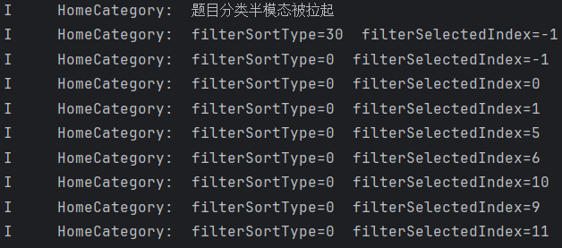

##### 正逆序的实现

首先我们在`FilterButton`是预留了正逆序的上下箭头的，而这个箭头是`svg`图标，可以通过`fillColor`属性来调整图标颜色。

我们可以直接**分类判断难度和观看量的正逆序**来高亮显示，但那样还是比较**冗余**，我们可以用更简单的方式，不过这就需要我们善于观察并**发现规律**了。

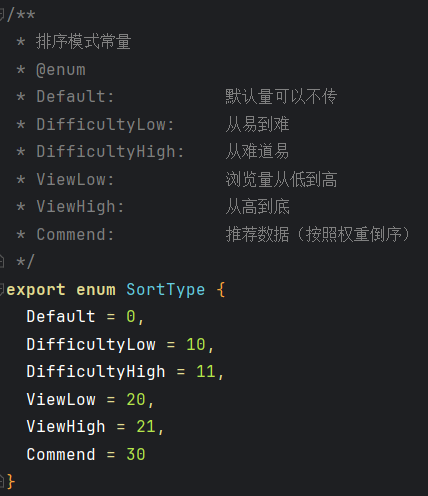

我们通过观察可以看出两者正逆序代表的数字**奇偶性一致**，这样我们就可以通过**判断奇偶**来统一的管理正逆序。

```ts
  Image($r('sys.media.ohos_ic_public_arrow_up'))
    .size({ width: 12, height: 6 })
    .fillColor(this.isSelected && (this.sortType % 2 === 1) ? $r('app.color.common_main_color') :
    $r('app.color.black'))
  Image($r('sys.media.ohos_ic_public_arrow_down'))
    .size({ width: 12, height: 6 })
    .fillColor(this.isSelected && (this.sortType % 2 === 0) ? $r('app.color.common_main_color') :
    $r('app.color.black'))
```

对于点击事件我们需要进行判断，首先是判断是否已经是**选中高亮状态**，其次是判断当前是**升序还是降序**，然后进行切换。

```ts
  FilterButton({
    text: '浏览量',
    isSort: true,
    isSelected: this.filterSortType === SortType.ViewLow || this.filterSortType === SortType.ViewHigh,
    sortType: this.filterSortType
  })
    .onClick(() => {
      //如果已经是高亮状态就上下箭头切换
      if (this.filterSortType == SortType.ViewLow || this.filterSortType == SortType.ViewHigh) {
        this.filterSortType = this.filterSortType === SortType.ViewLow ? SortType.ViewHigh : SortType.ViewLow
      } else { //若不是高亮状态则设为高亮
        this.filterSortType = SortType.ViewLow
      }
    })
  FilterButton({
    text: '难度',
    isSort: true,
    isSelected: this.filterSortType === SortType.DifficultyLow || this.filterSortType === SortType.DifficultyHigh,
    sortType: this.filterSortType
  })
    .onClick(() => {
      //如果已经是高亮状态就上下箭头切换
      if (this.filterSortType == SortType.DifficultyLow || this.filterSortType == SortType.DifficultyHigh) {
        this.filterSortType =
          this.filterSortType === SortType.DifficultyLow ? SortType.DifficultyHigh : SortType.DifficultyLow
      } else { //若不是高亮状态则设为高亮
        this.filterSortType = SortType.DifficultyLow
      }
    })
```

这里面的判断赋值代码看着有点奇怪，但这也是巧妙利用三元运算符来简化`ifelse`语句嵌套的一种方式。

<video width="100%" controls>
  <source src="64.mp4" type="video/mp4">
  您的浏览器不支持视频标签。
</video>

这样我们就完成了正逆序的切换。

##### 正逆序逻辑优化

在仔细分析了上面的代码后，我发现其实还是有优化的余地的。

我们的第一步是判断他是否是高亮状态，也就是说在四种正逆序的可能中，有两种情况是**非高亮状态**，有两种情况是**高亮状态**。
但这两种非高亮状态恰好包含在了判断是否为制定变量的正逆序的三种假情况中。

比如说：当我们当前是**浏览量的正序**时，第一步代码判断出的**假**情况有**难度的正逆序**两种，而在第二步判断是否为**浏览量的正序**时，假的情况有三种：**难度的正逆序和浏览量的逆序**恰好包含了第一步所判断出的情况，说明我们**没有必要去进行第一步判断**，直接进行第二步的三元判断赋值即可。

```ts
  .onClick(() => {
    this.filterSortType = this.filterSortType === SortType.ViewLow ? SortType.ViewHigh : SortType.ViewLow
  })
  .onClick(() => {
    this.filterSortType =
      this.filterSortType === SortType.DifficultyLow ? SortType.DifficultyHigh : SortType.DifficultyLow
  })
```

经过测试，结果与我们推测的一样，正逆序切换到效果一致，代码也更加简洁了。

#### 半模态完成按钮点击事件

对于半模态的完成按钮，我们首先需要在点击时将我们选中的排序方式和试题类型回传到首页状态变量后再关闭半模态。

```ts
  Text('完成')
    .fontWeight(500)
    .fontSize(16)
    .fontColor($r('app.color.common_main_color'))
    .onClick(() => {
      logger.info(HOME_CATEGORY_LOG_TAG + '完成按钮被点击')
      this.activeIndex = this.filterSelectedIndex
      this.sort = this.filterSortType
      this.filterSheetIsShow = false
    })
```

但这个逻辑看起来似乎没错，但在测试中我们发现遗漏了一个很重要的点。

<video width="100%" controls>
  <source src="65.mp4" type="video/mp4">
  您的浏览器不支持视频标签。
</video>

正如上面视频所示，我们的`TabBar`虽然切换过来了，但`TabContent`并没有跟着进行数据更新。
这是因为`Tabs`的`onChange`函数并非是双向绑定，这就导致来了我们直接操作`TabBar`的状态变量，而`TabContent`却没有进行响应。

我们可以通过在`Tabs`组件的参数中强行规定`Tabs`的状态变量，这样才能通过改变状态变量来实现对问题列表内容改变的映射。

```ts
  Tabs({index:$$this.activeIndex})
```

我们将`onChange`函数删除，改为利用双向绑定传参的方式来实现对`TabContent`的映射。

<video width="100%" controls>
  <source src="66.mp4" type="video/mp4">
  您的浏览器不支持视频标签。
</video>

测试后功能正常。

随后我们将当前获取到的排序方式传入列表组件中，监听排序方式的改变，并重新执行刷新函数就可以实现排序方式的改变了。

```ts
  @Monitor('sortType')
  onSortType(){
    logger.warn(QUESTION_LIST_COMP_TAG+'检测到排序类型变换，即将更新typeId='+this.typeId+'的列表数据')
    this.onRefresh()
    logger.warn(QUESTION_LIST_COMP_TAG+'当前排序类型为:'+this.sortType.toString())
  }
```

#### 半模态重置按钮点击事件

这个就很简单了，直接重置所有的状态变量即可。

```ts
  resetFilterStates() {
    this.filterSelectedIndex = -1
    this.filterSortType = SortType.Default
    logger.warn(HOME_CATEGORY_LOG_TAG + '已经重置筛选半模态')
  }
```

#### 细节优化

现在我们虽然实现了半模态筛选对`TabBar`的映射，但是我们点击`TabBar`的选项时，半模态中的默认值并没有改变，这很显然是不符合直觉的。

<video width="100%" controls>
  <source src="67.mp4" type="video/mp4">
  您的浏览器不支持视频标签。
</video>

在监听函数中添加同步代码或是在`onChange`函数中添加同步代码都可以实现这个功能。

### 首页骨架屏效果(可入建立的性能优化小点)

骨架屏这个东西还是挺常见的，是一种用于替换加载动画的的效果，它可以在加载数据时显示一个占位的页面，让用户知道数据正在加载中。

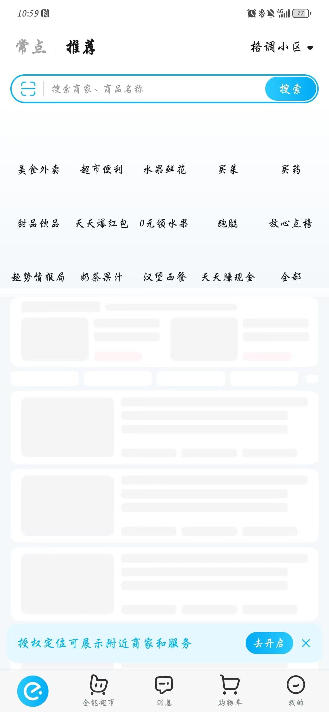

饿了吗的骨架屏效果就是很典型的客户端骨架屏效果。

关于为什么要用骨架屏效果，我们可以参考github上的这段话：

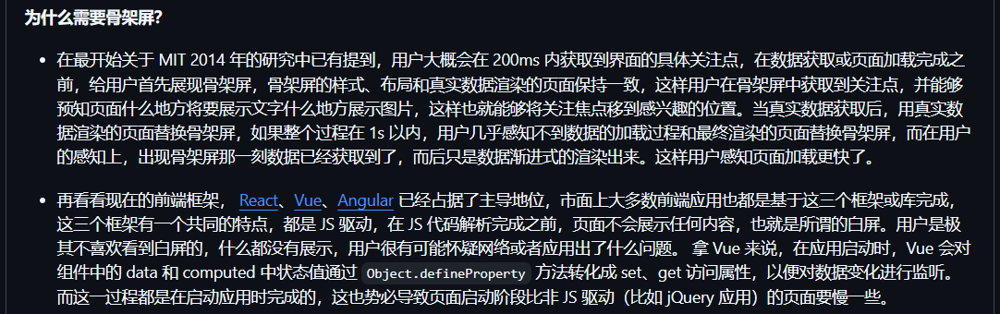

**用户不喜欢看到白屏**，骨架屏会让用户感到数据马上就会出现在眼前，虽然只是心里安慰，但却依旧可以有效的**提升用户体验**。

#### 骨架屏组件的封装

首先这属于通用组件所以我们要在`components`文件夹下新建一个`Skeleton`文件夹，然后在该文件夹里面去进行封装。

首先骨架是分为两种组件，一种是单个小灰色块，另一种则是包含了动画效果以及UI自定义布局接口的大组件。

##### 单个小灰色块

首先我们新建一个`HcSkeletonItem`组件，然后在该组件中定义一个`widthValue`的样式变量，用于定义小灰色块的大小。
它的变量类型是`Length`我们平常在写长宽时既可以写数字也可以写字符串，这个类型就是`Length`类型。

```ts
@ComponentV2
export struct HcSkeletonItem {
  @Param widthValue: Length = '100%'

  build() {
    Text()
      .height(16)
      .width(this.widthValue)
      .borderRadius(2)
      .backgroundColor($r('app.color.common_gray_bg'))
  }
}
```

##### 骨架屏组件

然后我们新建一个`HcSkeleton`组件，由于该通用组件的适用范围广泛，我们需要去利用`@BuilderParam`来进行UI自定义的接口暴露。

```ts
@ComponentV2
export struct HcSkeleton {
  @Local opacityValue: number = 1

  @Builder
  defaultBuilder() {
  }

  @BuilderParam
  default: () => void = this.defaultBuilder

  build() {
    Row({ space: 15 }) {
      this.default()
    }
    .opacity(this.opacityValue)
    .animation({
      duration: 600,
      playMode: PlayMode.Alternate,
      iterations: -1,
      curve: Curve.EaseInOut
    })
    .onAppear(() => {
      this.opacityValue = 0.5
    })
  }
}
```

这里还要复习一个重要的知识点在于，单个和多个`@BuilderParam`传参方式上是有区别的，当只有一个时，我们只需要在调用该自定义组件时利用**尾随闭包**的方式进行传参即可，也就是所谓的**包含子组件**，而当存在多个时我们则需要在调用时通过键值对传参的形式来传入。

而在当前组件中是单个的，所以我们只需要在调用时利用**尾随闭包**的方式进行传参即可。

这里的动画效果是为了模拟呼吸灯的效果。
整体实现的逻辑有以下几步：

1. 定义状态变量`opacityValue`，用于控制透明度。
2. 为展示区域添加动画效果，单次播放时长为`600ms`。
3. 但很显然，在网络不好的情况下，加载动画不能只播放`600ms`后就停止，所以我们需要设置动画的播放次数为无限次。
4. 随后为了防止在单次播放结束后透明度突然跳帧到1，我们需要设置循环播放动画模式`PlayMode.Alternate`。
5. 最后，为了模拟呼吸灯的效果，我们需要设置动画的播放曲线为`Curve.EaseInOut`。

#### 骨架屏效果实现

首先我们来思考一下骨架需要在哪些地方使用。

问题分类栏和问题列表是需求量最大的地方，轮播图的话目前是直接内嵌在程序里的所以暂时不需要添加骨架。
而整个问题列表区域加载都是在`HomeCategory`组件的`aboutToAppear`生命周期函数中完成的，所以我们就需要在`aboutToAppear`生命周期函数中控制我们骨架的显示。
