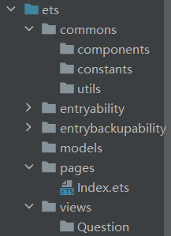
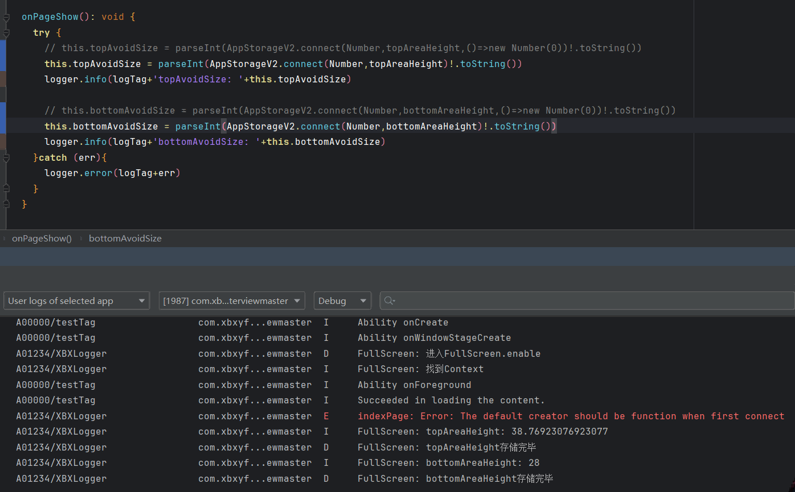

## 前言

面试通这个项目是我的第一个完整的鸿蒙项目。将会从零开始搭建项目结构，组织UI框架，编写业务逻辑，最终实现一个完整的项目。

## 项目简介

面试通项目是一个基于 HarmonyOS NEXT 开发的鸿蒙应用，主要包含鸿蒙和前端的企业面试题以及真实的面试经验，还有一些面试辅助类的工具如常用开发单词和面试录音。


以上是该项目的概念设计图，接下来我将会记录整个项目的开发过程。

## 准备阶段

### 新建项目与项目结构搭建

#### 项目结构搭建

本次我们采用`API14`来进行开发，`API14`是当前的最新版本，对于各项性能的调教也是当下最好的选择。

本项目的项目结构如下所示：

```markdown
ets
├── commons
│   ├── components              // - 通用组件
│   ├── constants               // - 全局常量数据
│   └── utils                   // - 通用工具类
├── entryability
│   └── EntryAbility.ts
├── models                      // - 数据模型
├── pages
│   ├── QuestionPage.ets        // - 页面组件
│   └── Index.ets
└── views
    └── Question                // - 页面对应自定义组件
```



#### 项目资源配置

##### 颜色配置

将所需的颜色字段配置到`resources/base/element/color.json`中。


对主色系的统一管理队后续的开发、维护都有着极大的好处。
不能将所有的数据都内嵌在代码中，用一次复制一次，这样不仅对开发效率有影响，而且不利于后期的维护。

##### 图片资源

将设计稿中的图片统一放入`resources/base/media`目录下。

##### 应用图标

在`module.json5`中配置应用的图标。


##### 应用名称

首先创建中文软件配置文件，详细步骤可以参考我的这篇博客：[手动新建鸿蒙中文包](https://xbxyftx.github.io/2025/01/30/%E9%B8%BF%E8%92%99%E4%B8%AD%E6%96%87%E5%8C%85/)

修改应用名称的`"EntryAbility_label"`字段的值

##### 设置应用与元服务的图标和名称

修改`AppScope/resources/base/element/string.json`中的`"app_name"`字段的值
然后在`AppScope/resources/base/media/app_icon.png`中替换应用的图标

可以直接同名图片文件替换，也可在`AppScope/resources/base/media`目录下放置不同名文件。
然后修改`AppScope/app.json5`中的`"icon"`字段的值。


### 创建git和本地以及远程仓库

直接利用IDE内置的git工具即可，这里就不赘述了。
不过有一点要注意，**git并不会帮你托管空文件夹**，而当前构建的项目结构中包含了大量的空文件夹，这些文件夹还**暂时**没有创建任何文件，所以我们为了保证在远程仓库中的**项目结构**依旧**保持完整**我们需要创建一些**占位文件**，来让git为我们托管全部文件夹。


这是在创建占位文件前的远程仓库目录结构。


创建`.gitkeep`文件后，远程仓库的目录结构如下所示。


### hilog日志

在过去我们用的都是`console.log()`来进行日志的输出，`console`中虽然为我们封装了很多js中常用的输出方式，诸如：`log`、`warn`、`error`等，但是其弊端也很明显。

1. 无法进行日志的分类，导致日志混杂在一起，难以定位问题。
2. 无法进行日志的过滤，导致日志过多，难以定位问题。
3. 无法进行日志的格式化，导致日志输出不美观。

hilog为我们提供了上述问题的解决方案，hilog为我们提供了日志的分类、过滤和格式化等功能。
hilog通过鸿蒙底层的重构之后，为我们提供了更加高效的日志输出方式。

```ts
function debug(domain: number, tag: string, format: string, ...args: any[]): void;
function info(domain: number, tag: string, format: string, ...args: any[]): void;
function warn(domain: number, tag: string, format: string, ...args: any[]): void;
function error(domain: number, tag: string, format: string, ...args: any[]): void;
function fatal(domain: number, tag: string, format: string, ...args: any[]): void;
function isLoggable(domain: number, tag: string, level: LogLevel): boolean;
```

* 参数 domain：用于指定输出日志所对应的业务领域，取值范围为 0x0000~0xFFFF，开发者可以根据需要进行自定义。
* 参数 tag：用于指定日志标识，可以为任意字符串，建议标识调用所在的类或者业务行为。
* 参数 format：格式字符串，用于日志的格式化输出。%{public}s 字符串 %{public}d 数字
* 参数 args：可以为 0 个或多个参数，可以为 0 个或多个参数，是格式字符串中参数类型对应的参数列表。

我们通过下面这个实例来演示一下hilog的用法。

```ts
import { hilog } from '@kit.PerformanceAnalysisKit'

@Entry
@ComponentV2
struct Index {

  build() {
    Column() {
      Button('hilog.info测试')
        .onClick(()=>{
          hilog.info(0x0000,'myHilog','%{public}s','第一个参数')
        })
      Button('hilog.warn测试')
        .onClick(()=>{
          hilog.warn(0x0000,'myHilog','%{public}s','第一个参数')
        })
      Button('hilog.error测试')
        .onClick(()=>{
          hilog.error(0x0000,'myHilog','%{public}s','第一个参数')
        })
      Button('hilog.debug测试')
        .onClick(()=>{
          hilog.debug(0x0000,'myHilog','%{public}s','第一个参数')
        })
    }
    .height('100%')
    .width('100%')
  }
}
```


从输出的结果我们可以看到，首先在前面的日志分类信息中会先显示我们设置的日志业务分区信息，然后是日志的**标识信息**，最后是日志的**内容**。
而日志的内容格式是通过第三个参数来进行格式化输出的。
这里我们用的都是`%{public}s`，这是因为我们在第三个参数中传入的是一个字符串类型的值。

当然我们也可以传入多个参数，来进行格式化输出。

```ts
    Button('hilog.info测试')
      .onClick(()=>{
        hilog.info(0x0000,'myHilog','%{public}s __ %{public}d','第一个参数',2025)
      })
```


`%{public}s`表示字符串类型，`%{public}d`表示数字类型。两者之间连接的字符就是靠第三个参数中的字符串来进行定义的。
这个输出格式倒是和C语言中的`printf()`函数类似。（唤起了远古的回忆……）

**console 是基于 hilog 封装的！！！**默认的 domain/tag 是 A03D00/JSAPP

### 封装Logger

#### 封装 commons/utils/Logger.ets

```ts
import { hilog } from '@kit.PerformanceAnalysisKit'
const tag = 'XBXLogger'
class Logger{
  private domain:number // 十六进制输出业务格式
  private tag:string // 制定的自己的标识
  private format:string = '%{public}s' //格式化方式

  constructor(domain: number = 0x0000, tag: string = '') {
    this.domain = domain
    this.tag = tag
  }
  debug(args: string): void {
    hilog.debug(this.domain, this.tag, this.format, args);
  }

  info(args: string): void {
    hilog.info(this.domain, this.tag, this.format, args);
  }

  warn(args: string): void {
    hilog.warn(this.domain, this.tag, this.format, args);
  }

  error(args: string): void {
    hilog.error(this.domain, this.tag, this.format, args);
  }

}

export const logger:Logger = new Logger(0x1234,tag)
```

hilog中有固定要传的三个参数，分别是：domain、tag、format。
而我们在封装Logger的时候，将这三个参数封装到了一个类中，这样我们在使用的时候就可以直接调用Logger类中的方法，而不需要每次都传入这三个参数。
这上述包装函数都是实例函数，并不是静态函数，所以我们并不能直接导出一个Logger类，而是导出一个Logger类的实例。
由于在开发中每个人所负责的业务领域和标识变动次数较少，尤其是对于这个单人开发项目来说，业务领域和标识可以直接写死，所以这里直接导出一个已经写好的Logger实例即可。

**改造并封装现有能力**使其能够更加契合当前项目是很重要的一点，就像是在鸿蒙系统原有网络请求模块的基础上进一步封装成第三方库axios一样。
让原有能力更加的方便好用。

#### 导出与使用Logger

在未来的开发中需要导出的工具类和函数会越来越多，来源的文件也会越来越多，如果都分别从各个文件中导出，会非常的麻烦。
所以我们就可以编辑一个中转站来进行统一的导出和管理。

创建`CommonsExportCentre.ets`文件，在该文件中统一导出所有需要导出的工具类和函数。

```ts
export * from './utils/Logger'
```

这样在需要使用commons中的工具类和函数的时候，只需要导入`CommonsExportCentre.ets`文件即可。

```ts
import { hilog } from '@kit.PerformanceAnalysisKit'
import { logger } from '../commons/CommonsExportCentre'

@Entry
@ComponentV2
struct Index {

  build() {
    Column() {
      Button('hilog.info测试')
        .onClick(()=>{
          logger.info('测试测试')
        })
      Button('hilog.warn测试')
        .onClick(()=>{
          logger.warn('测试测试')
        })
      Button('hilog.error测试')
        .onClick(()=>{
          logger.error('测试测试')
        })
      Button('hilog.debug测试')
        .onClick(()=>{
          logger.debug('测试测试')
        })
    }
    .height('100%')
    .width('100%')
  }
}
```

这样我们就可以看到我们可以用更加简便的方式做到与hilog一致的效果了。


### 封装沉浸式工具

接下来我们将封装一个工具类来控制是否开启沉浸式模式。

#### 前置知识

[window.getLastWindow 获取当前窗口对象](https://developer.huawei.com/consumer/cn/doc/harmonyos-references-V14/js-apis-window-V14?catalogVersion=V14)


[getWindowAvoidArea 使用窗口对象获取某一个区域的尺寸](https://developer.huawei.com/consumer/cn/doc/harmonyos-references-V14/js-apis-window-V14#getwindowavoidarea9)


#### 开启沉浸模式

##### 应用上下文对象

[上下文对象文档](https://developer.huawei.com/consumer/cn/doc/harmonyos-references-V14/js-apis-inner-application-context-V14?catalogVersion=V14)

上下文对象是一个包含了应用信息，以及一些应用功能的对象，获取它有两种方式：

1. 在组价中调用`getContext(this)`方法获取
2. 在UIAbility中调用`this.context`获取

对于工具类来说我们只能通过第二种方式获取，我们可以在`onCreate`生命周期中获取上下文对象，并将其保存到`AppStorage`中。

```ts
  onCreate(want: Want, launchParam: AbilityConstant.LaunchParam): void {
    this.context.getApplicationContext().setColorMode(ConfigurationConstant.ColorMode.COLOR_MODE_NOT_SET);
    hilog.info(DOMAIN, 'testTag', '%{public}s', 'Ability onCreate');
    AppStorage.setOrCreate('context',this.context)
  }
```

对于`AppStorageV2`如何存储上下文对象我暂时还没有解决第一个类型参数的问题。

(1h后……)

我想到了当初在学习如何从V1向V2转换时，我直接持久化一个对象数组并不成功的原因是其类型只能是一个对象，而不是一个数组或是联合类型。
当时我将对象数组包装在一个对象中，作为对象的一个属性连同那个对象一起持久化就成功了，所以我单独设计了一个对象来包裹上下文对象就成功了。

```ts
import { Context } from '@kit.AbilityKit'


export class GetContext{
  context:Context

  constructor(context: Context) {
    this.context = context
  }

}
```

---

```ts
  //开启全屏
  async enable(){
    logger.debug('进入enable')
    try {
      const context = AppStorageV2.connect<GetContext>(GetContext,'context')
      if (context) {
        logger.debug('找到Context')
        const win = await window.getLastWindow(context.context)
        win.setWindowLayoutFullScreen(true)
          .then(()=>{
            logger.debug('进入setWindowLayoutFullScreen的then')
          })
      }else {
        logger.warn('未找到Context')
      }

    }catch (err){
      logger.error(err)
      promptAction.showToast({message:err})
    }
  }
```

---

```ts
  onCreate(want: Want, launchParam: AbilityConstant.LaunchParam): void {
    this.context.getApplicationContext().setColorMode(ConfigurationConstant.ColorMode.COLOR_MODE_NOT_SET);
    hilog.info(DOMAIN, 'testTag', '%{public}s', 'Ability onCreate');
    AppStorageV2.connect<GetContext>(GetContext,'context',()=>new GetContext(this.context))
  }
```

最后在`onWindowStageCreate`生命周期函数中调用`enable()`方法开启全屏。


也是顺利的实现了沉浸式效果。

##### 获取屏幕尺寸

在上面的沉浸式页面效果图我们可以看到其实如果上下的内容都顶到头的话会导致内容**被导航栏和状态栏遮挡**。
所以我们的沉浸式布局仅仅需要将我们的**背景图或背景色延伸**到导航栏和状态栏的下方即可，而真正的**内容不需要向上下延伸**，因此我们还需要获取到导航栏和状态栏的**高度**。

为了实现这个效果，我们需要用到`getWindowAvoidArea()`方法。


根据文档我们就可以获取我们所需的规避区域的尺寸，并将其应用到我们的布局中。

```ts
  async enable(){
    logger.debug('FullScreen: 进入enable')
    try {
      const context = AppStorageV2.connect<GetContext>(GetContext,'context')
      if (context) {
        logger.info('FullScreen: 找到Context')
        //获取当前窗口
        const win = await window.getLastWindow(context.context)
        //设置当前窗口为沉浸式模式
        await win.setWindowLayoutFullScreen(true)
        //获取顶部区域
        const topArea = win.getWindowAvoidArea(window.AvoidAreaType.TYPE_SYSTEM).topRect
        //将顶部高度存储到AppStorage
        logger.info('FullScreen: topAreaHeight: '+px2vp(topArea.height))
        AppStorageV2.connect(Number,topAreaHeight,()=>px2vp(topArea.height))

        //获取底部区域和底部区域高度
        const bottomArea = win.getWindowAvoidArea(window.AvoidAreaType.TYPE_NAVIGATION_INDICATOR).bottomRect
        logger.info('FullScreen: bottomAreaHeight: '+px2vp(bottomArea.height))
        AppStorageV2.connect(Number,bottomAreaHeight,()=>px2vp(bottomArea.height))

      }else {
        logger.warn('FullScreen: 未找到Context')
      }

    }catch (err){
      logger.error(err)
      promptAction.showToast({message:err})
    }
  }
```

由于`bottomArea.height`和`topArea.height`都是`px`单位，而我们的布局中使用的是`vp`单位，所以我们需要将`px`单位转换为`vp`单位。

---

```ts
import { hilog } from '@kit.PerformanceAnalysisKit'
import { bottomAreaHeight, logger, topAreaHeight } from '../commons/CommonsExportCentre'
import { AppStorageV2 } from '@kit.ArkUI'

const logTag = 'indexPage: '
@Entry
@ComponentV2
struct Index {
  @Local topAvoidSize: number = 0
  @Local bottomAvoidSize: number = 0
  aboutToAppear(): void {
    try {
      if (AppStorageV2.connect(Number,topAreaHeight)) {
        this.topAvoidSize = parseInt(AppStorageV2.connect(Number,topAreaHeight)!.toString())
        logger.info(logTag+'topAvoidSize: '+this.topAvoidSize)
      }else {
        logger.error(logTag+'未找到topAreaHeight')
      }
      if (AppStorageV2.connect(Number,bottomAreaHeight)) {
        this.bottomAvoidSize = parseInt(AppStorageV2.connect(Number,bottomAreaHeight)!.toString())
        logger.info(logTag+'bottomAvoidSize: '+this.bottomAvoidSize)
      }else {
        logger.error(logTag+'未找到bottomAreaHeight')
      }
    }catch (err){
      logger.error(logTag+err)
    }

  }

  build() {
    Column() {
      Text('top')
      Blank()
      Text('bottom')
    }
    .padding({
      top:this.topAvoidSize,
      bottom:this.bottomAvoidSize
    })
    .height('100%')
    .width('100%')
    .backgroundColor(Color.Blue)
  }
}
```

在编写完以上代码之后，上下区域的规避并没有实现。
此时就体现出了打印日志打重要性。


通过日志我们可知问题出现在获取获取规避区域的高度时，AppStorageV2中并没有存储我们所需的数据。
而FullScreen文件获取避障区域高度的日志是在这之后打印的说明我们获取避障区域的代码执行晚了。

###### AppStorageV2

在寻找了一段时间执行时间的问题之后，暂时还没有解决，但我发现了另外一个问题，AppStorageV2在存储顶部区域数据时会卡死，后续的代码都不会执行。


我不知道是因为底部区域的高度数值获取错误导致的后续代码没有执行，还是代码就卡死在了存储顶部区域高度的这一步。

所以我新增了两行日志

```ts
    logger.info('FullScreen: topAreaHeight: '+px2vp(topArea.height))
    AppStorageV2.connect(Number,topAreaHeight,()=>new Number(px2vp(topArea.height)))
    // AppStorage.setOrCreate(topAreaHeight,px2vp(topArea.height))
    logger.debug('FullScreen: topAreaHeight存储完毕')
    
    //获取底部区域和底部区域高度
    const bottomArea = win.getWindowAvoidArea(window.AvoidAreaType.TYPE_NAVIGATION_INDICATOR).bottomRect
    logger.info('FullScreen: bottomAreaHeight: '+px2vp(bottomArea.height))
    AppStorageV2.connect(Number,bottomAreaHeight,()=>new Number(px2vp(bottomArea.height)))
    logger.debug('FullScreen: bottomAreaHeight存储完毕')
```

很显然，结果是一样的。
至此我们可以分析出问题出现在`AppStorageV2.connect()`方法上。
我尝试了`AppStorage.setOrCreate()`方法，结果代码就可以执行过去。

这也说明就是我初始化数据时有问题。

在求助了子安学长后我意识到了问题所在：
`AppStorageV2.connect()`函数的第三个函数需要的是一个构造器，也就是需要有`new`关键字，并不一定要在第三个参数中，但一定要包含有new。
而我当前的写法`AppStorageV2.connect(Number,topAreaHeight,()=>px2vp(topArea.height))`对于`Number`来说是错误的，因为我没有使用new关键字。

将原本的数据利用`new Number()`包裹之后再传入即可。

```ts
AppStorageV2.connect(Number,topAreaHeight,()=>new Number(px2vp(topArea.height)))
AppStorageV2.connect(Number,bottomAreaHeight,()=>new Number(px2vp(bottomArea.height)))
```

至此初始化问题解决。

###### 初始化时间问题

在解决了初始化问题后，我发现规避区域的高度并没有生效。
根据日志我们可以看到



Index页面获取数据的时机依旧是在`AppStorageV2.connect()`方法之前，也就是说规避区域的高度并没有在Index页面初始化时获取到。
这个问题暂时我还没有解决办法，所以我决定先利用V1版本所提供的单项绑定能力来规避时间差问题。

```ts
  @StorageProp(topAreaHeight) topAvoidSize: number = 0
  @StorageProp(bottomAreaHeight) bottomAvoidSize: number = 0
```


---


由此我们可看出，虽然在UI渲染完成时规避区域的高度数据依旧没有完成初始化，数据仍未默认的0，而由于V1的单项绑定能力，规避区域的高度依旧可以通过数据的改变而生效。
