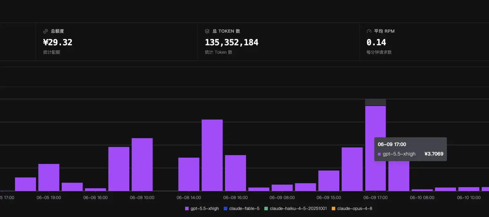
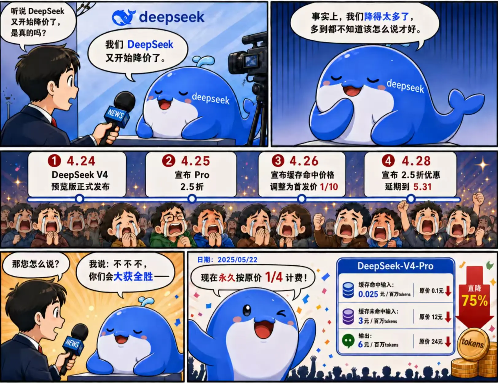

## 前言

在实习了两个多月的时间里，我也是深度的使用了国内外的四款较为主流的编程模型去进行对真正工程级项目的需求开发和bug修复等工作，这里也是对于各个模型等特色有了一些比较清晰的认知，突然就想写一篇文章和大家分享分享。当然以下观点只是在我自身的鸿蒙领域中各个模型的表现和实际效果，并不代表该模型的真实实力，不能全面的评价模型，每个人对于模型的需求各不相同，我们永远要遵循一个原则就是：

> 模型只是工具，能用最小的成本，解决你的问题，满足你的需求，才是好模型。

如果只是一味的追究模型硬实力，追求极致的知识储备和推理、编码能力，那你的成本会极速飙升同时，收益却不一定高。因为真实情况是很多人的能力远低于模型本身，你写出的提示词是一定程度上在拖模型的后腿，你的见解和决断不一定能导向最优解。

在模型能力飙升的今天，6成的问题各家旗舰模型都能解决，大多数人的需求也止步于此，再往上大多数中小型项目的2成问题，能拉开顶尖模型和普通旗舰模型的差别，再往上1成的架构问题顶尖模型可以辅助决断，最后的1成偏难怪，或是底层的问题当今的模型基本就爱莫能助了。但现实是大多数人根本摸不到模型的能力边界，所以我们完全可以根据各个模型的特性去合理分配任务，让成本被尽可能的降低。

更进一步的去说，我为什么突然想起这样一篇文章，其实是因为在现在工作中确实是遇到了能力相近的两款模型，由于其编码风格不一样导致了结果以及进度上的天壤之别。这也让我对于模型能力有了更新的认知模型能力相似的时候，很多的时候你还需要更进一步的去了解这个模型所谓的“风格”或者说是“习性”。

## 顶级模型

我们首先来去对比一下我最常用的两款国外毫无争议的顶级模型————Claude Opus 4.8 和 GPT 5.5。分别来自Anthropic和OpenAI。虽然Gemini 3.1 pro和3.5 flash也确实强力，但我也确实没有深度的体验过，这里就不做过多评价了。

### 价格方面

首先对于官方订阅来说，Claude Opus 4.8是真的贵，虽然订阅价格一致但是此前A厂下调了各个订阅档位的用量，一刀精准切在大多数程序员的大动脉上。对于国内来说，A场的长期严格封禁，以及对于中国大陆用户的监测力度之严格，导致各个中转站的号池成本也水涨船高，导致在国内使用Opus属于是一个非常昂贵的的状态了。反观open AI的GPT来说，它同等价位的订阅服务本就比A厂的量更大，而且其本身的API价格也更低，对于中国用户的封禁监管力度也相对宽松，再加上此前的1刀Team大幅度压低了中转站号池的价格，比较靠谱的一些中转站也是能做到把GPT5.5的价格压到可以和DeepSeek掰一掰手腕的，虽然你可能不信但我确实在用（便宜啊真便宜）。所以对于国内用户来讲非特殊场景一般来说还是GPT5.5是性价比首选。

（随便截取了一周的用量和价格）

（但好像最近有一些舆论风波有些陨落了）

### 模型能力以及风格方面

在Fable 5大人登场之前可以说GPT和Claude是分庭抗礼不分上下，两家的顶级模型从智力、推理能力、编码能力的角度都没太大差别，硬要分个高下我感觉还是Opus略胜一筹，但我感觉影响结果更大的并不是这两者的硬实力，而是这两者的编码逻辑并不一致。

大致描述一下这个业务场景，我们需要渲染一个后端接口的数据列表，客户端不直接使用后端的数据接口，而是通过一个封装好的SDK中提供的接口，SDK会完成数据的请求，清洗、格式转换、加解密等工作，最后给客户端提供一个符合业务需求的数据格式。这是一个很常见的场景对吧，任何网站、软件的开发大概率都有这样的场景，所以我就认为是一个很简单的业务需求，我就简单自己读了一下需要修改的文件的大致情况写好提示词扔给了GPT，转头开始投身到了紧张刺激的高级软件工程期末复习之中。等了半天发现还没修改完代码，我就很疑惑，因为此前已经规划完整的方案并且我也进行了初步的审核，但在落实修改这一步出现了无法结束的问题。于是我向上爬楼开始查看他做了什么卡在了哪里，发现问题出现在其测试时渲染出现了问题，无法获取数据，于是它依据一次又一次的日志，向着SDK内部进行调查，在我发现的时候它已经调查到表层接口内部三到四层的位置了。

但这时我意识到一个很奇怪的问题，就是这个SDK是个编译后的产物并不包含完整源码只有各个接口的定义以便于调用，它只能通过函数名称、参数类型、返回值类型去对一个黑盒逻辑进行一个盲猜。哇，我当场无语了，赶紧叫停了它，随后又试图引导它总结出当前困境具体是什么，结果它给出的回答是还没分析出根因，还需要进一步分析，我：？？？

GPT的这个逻辑很显然就是：“用户给了我一个需求，我无论如何要尽全力完成这个需求，遇到问题我要尽全力挖掘根因并试图解决。”这种设计哲学其实在Codex中的Goal mode就能看出，OpenAI想做的是能给到用户从0到1完整解决方案的模型，是想让用户将事情扔给它后就不用管了的状态，再加上codex app所具备的能力越来越多，能控制你的浏览器，能控制你的app，能处理多模态信息，它就是想接管用户方方面面的工作去尽力完成。但是这在一个有完善架构设计，完善接口封装，责任分工的软件团队中并不一定是件好事。它容易分不清自身的责任边界，其他人的接口也可能存在错误不能全盘相信，该寻求帮助的时候要向用户提出需求才更能适应这样的业务场景。一旦这个根因并不在他的职责范围之内就很容易导致一系列错误的“原因探查”（无用功）。

随后我回滚了代码，再次将需求发送给了Opus 4.8，让他重新分析设计方案。Opus很快就设计好了方案，我查看了方案文档设计的和GPT基本一模一样，然后编写代码，实机测试，发现了相同的问题。但他思路很清晰，打印了两轮日志，一轮检查渲染层，一轮检查数据接口层，发现数据接口请求成功但是数据为空，就当机立断很果断的下了判断是接口内部错误，是SDK内部处理数据的问题。后来我联系同事进行排查证实了Opus的想法，最终我使用Opus的修改方案实现了这个需求。

我又回去审视了一下GPT的操作记录文档和日志，发现其实它最初判断到了是接口内部问题，但是它认为它需要去找到根因并告知用户，甚至它探索编译后产物的链路与真实问题的链路也很接近，只是因为他是黑盒，没法锁定真正的根因导致他开始了更广泛更深度的检查，在客户端的数据接口层写了很多参数调整的冗余逻辑。哎，只能说是这种“特性”并不适用于这个场景但也称不上是缺点，只能说是这种经验只有针对于自身实际的开发场景才是有效的，如果脱离了实际的开发场景这种经验基本毫无意义，不只是因为不同开发场景，更是因为不同技术栈之间的差异巨大对于模型在训练阶段所包含的知识储备也存在巨大差异，就像是我的鸿蒙开发领域，相对来说是在软件开发中训练语料最少的了，现在的开发模式基本都是依赖现有代码以及一些skills去进行开发独立开发的成功率和代码可靠性都是很低的。这种场景下就可能会有模型对于鸿蒙SDK特性掌握程度不够导致无法作出准确判断的可能，导致了大量冗余操作也是可能的。或许同样的场景不是鸿蒙而是web或者是安卓，就不会有这种问题也说不定。

在后续的实践中我在提示词和规则文档中都额外新增了一条规则就是要明确权责边界，严禁过度深入调查依赖包内部结构、逻辑，并且我自己也长了记性，在每次它分析完后我都会去阅读它第一条输出的判断，这个判断一般来讲都是对于问题关键问题的分析或是最核心的修改方案结论，看一下这行的内容就能大致的掌握它的方案，如果发现存在我不熟悉的接口或是认为它的方案有些麻烦了就会及时ctrl c打断并询问相关接口组件的功能让他讲解随后我根据具体代码去大致阅读来为他指明方向，这样能大幅减少其判断错误的可能性。

## 国内旗舰模型

对于国内旗舰模型大多都是开源模型，当前我的主力模型是DeepSeek V4 pro和Kimi K2.6。这两个模型各有各的特点，将两者联合使用可以达到1+1>2的效果。

### DeepSeek V4 pro

对于大D老师，我只能说梁圣的恩情还不完。大D老师不会亏的，因为每个交易日早上梁圣会去大A取钱的。

dsV4pro的最大优势就是在于其是最低廉成本的1M上下文，1M上下文和256K上下文是有着本质区别的，尤其是对于需要在成熟的中大型项目上去进行Vibe Coding，模型的上下文长度是至关重要的。一方面是需要模型读的内容量大，另一方面则是越复杂的工程你需要给他设置的约束越多，以及需要与它进行讨论设计的方案次数也越多。一旦出现上下文的压缩我们的上下文信息精度势必会出现削减，我们势必会遗漏一些细节。这有时就是这次修改的成败关键。同时哪怕在压缩之后我们需要让他完整阅读把握的关键代码依旧需要其去重新进行阅读分析，这就会导致上下文占用长期居高不下，工作越是进行越是需要频繁的压缩。

而相对的，1M的上下文支持我们将绝大多数项目的完整上下文毫无遗漏的全都塞到上下文窗口中，能一次行去完成一个单元工作的编码。

但我们还需要进一步的处理大模型注意力的问题，长上下文注意力会随着上下文的增加而削弱，模型可能会忽略一些关键信息，所以我们就需要在提示词中手动的点出关键的点。
