## 前言

在开发面试通的过程中我突然想做一些丝滑的动画，但我发现我好像从来没用过`Navigation`和`NavDestination`，所以我决定好好研究一下这两个组件的用法。
接下来我就会和大家一起去学习这两个组件的使用以及动画效果的是实现。

## 组件用途

这里还是先附上两者的官方文档：
[Navigation API15](https://developer.huawei.com/consumer/cn/doc/harmonyos-references/ts-basic-components-navigation)

[NavDestination API15](https://developer.huawei.com/consumer/cn/doc/harmonyos-references/ts-basic-components-navdestination)

这两者都是用于进行页面跳转的组件，`Navigation`是用于定义导航图，而`NavDestination`则是用于定义具体的页面。
两者自带一多能力，可以依据当前设备进行导航方式的选择。

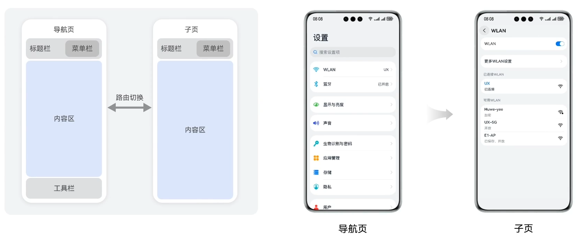

这是在直板机场景下采用单栏显示模式，子页面的内容会直接替换掉主页面的内容。
而当我们处于折叠屏展开或是平板场景下则会采用分栏展示模式，子页面的内容会被分栏展示在主页面的右侧。

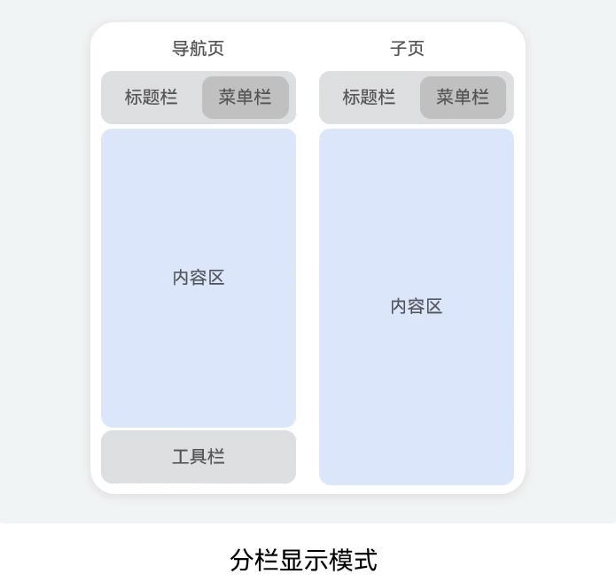

两者的区别如下图所示。

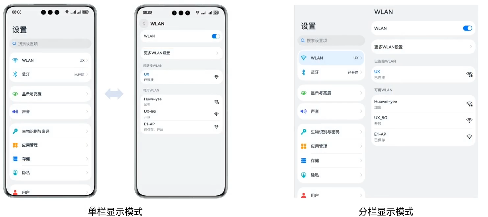

`Navigation`常用于首页的根组件，两者结合常用于类似设置的场景，可以进行多级跳转，或在平板上进行分栏展示子页面内容，同时支持系统默认动画或是自定义转场动画。其效果可以参考以下视频：

直板机：

<video width="100%" controls>
  <source src="4.mp4" type="video/mp4">
  您的浏览器不支持视频标签。
</video>

平板：

<video width="100%" controls>
  <source src="4.mp4" type="video/mp4">
  您的浏览器不支持视频标签。
</video>

当然我们如果想让平板也拥有和手机一样的效果，在首页的内容目录中点击想要浏览的页面后直接跳转至对应页面，而不是说依旧在左侧保留首页的同时在右侧分栏展示所选内容，那我们就需要将`Navigation`的`mode`属性设置为`NavigationMode.Stack`，这样就可以实现和手机一样的效果了。

因为默认的效果是`NavigationMode.Auto`，也就是自动依据直板机、折叠屏、平板等设备进行适配，所以平板的默认效果是分栏展示的。

### 与`Router`的区别

对于这两者的区别主要体现在以下几点上：

* `Navigation`支持更丰富的动效
* `Navigation`内置一次开发多端部署能力，无需额外适配
* `Navigation`更灵活的栈操作
* 更加轻量化的跳转方式，性能更加优秀
* `Router`不具备路由拦截能力，而`Navigation`则具备
* `Navigation`没有路由数量限制，而`Router`则有32个的限制

就凭这几点，`Navigation`的优势就非常明显了。

而两者**最本质的区别**在于`Router`是通过**切换页面**来进行路由，所以它存在多个页面，但是`Navigation`是通过**切换`NavDestination`子组件**来进行路由的，其全称都**只有一个页面**。

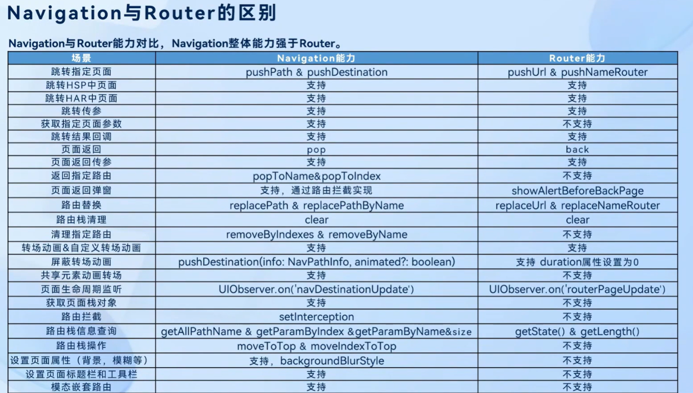

这张表是对`Navigation`和`Router`的对比，可以很明显的看出两者的区别。

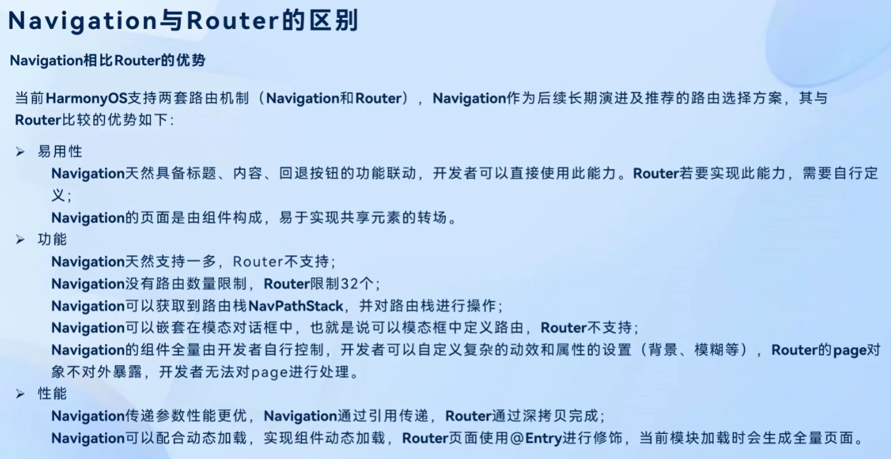

## `Navigation`的跳转逻辑

对于`Navigation`组件来说它不能直接想是`router`一样直接跳转，而是需要配合一下几个辅助条件才能实现跳转：

* 子页面根组件`NavDestination`
* 路由表`RouterMap`
* 页面栈`NavPathStack`
  
这几者的关系如下图所示：

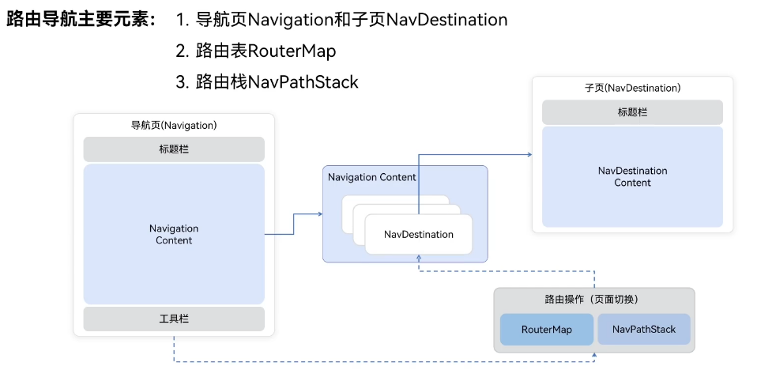

`Navigation`作为路由导航的根视图容器，而`NavDestination`则是用来显示`Navigation`的内容区域，一般作为跳转的目标页面。

### `RouterMap`

路由表`RouterMap`是用于定义页面跳转的规则，它负责存储路径和对应视图组件的映射关系，我们可以将他理解为一个小型的数据库，我们要去哪里都需要通过在`RouterMap`中查找路径来实现跳转。

而在跳转时只需要通过`NavPathStack`提供的路由方式传入需要跳转的页面配置名称即可。

然后对于`RouterMap`的配置项及其含义我们可以参考下表：

| 配置项 | 含义 |
| --- | --- |
| `name` | 页面名称，用于在`NavPathStack`中进行跳转 |
| `pageSourceFile` | 跳转目标页面在当前包内的路径，是相对于`src`文件夹的相对路径 |
| `buildFunction` | 目标页入口函数名称，用于构建目标页面的视图组件，必须以@Builder进行修饰 |
| `data` | 自定义字段。可以通过配置项读取接口getConfigInRouteMap获取 |

#### `RouterMap`的配置文件

为了存储`RouterMap`的配置项，我们需要在`resources/base/profile`文件夹下创建一个配置文件，并将其命名为`router_map.json`。

然后我们在`module.json5`中添加如下配置，用以绑定`routerMap`的配置文件：

```json5
{
  "module": {
    "routerMap": "$profile:router_map",
    ......
  }
}
```

然后我们就可以在`router_map.json`中添加我们的配置项了，如下所示：

```json5
{
  "routerMap" : [
    {
      "name":"Second",
      "pageSourceFile":"src/main/ets/pages/Second.ets",
      "buildFunction": "SecondNevBuilder",
      "data":{
        "description": "这是第二页"
      }
    }
  ]
}
```

这样我们就完成了对`RouterMap`的配置。

### `NavPathStack`

页面栈`NavPathStack`是用于存储当前页面路径的栈，它负责进行页面跳转。
当页面跳转触发时页面栈就会通过路由表`RouterMap`来查找路径对应的页面，然后将其压入栈中，并跳转到该路径对应的页面。
在`Navigation`组件中，我们通过`NavPathStack`的`push`方法进行页面跳转，通过`pop`方法进行页面返回。

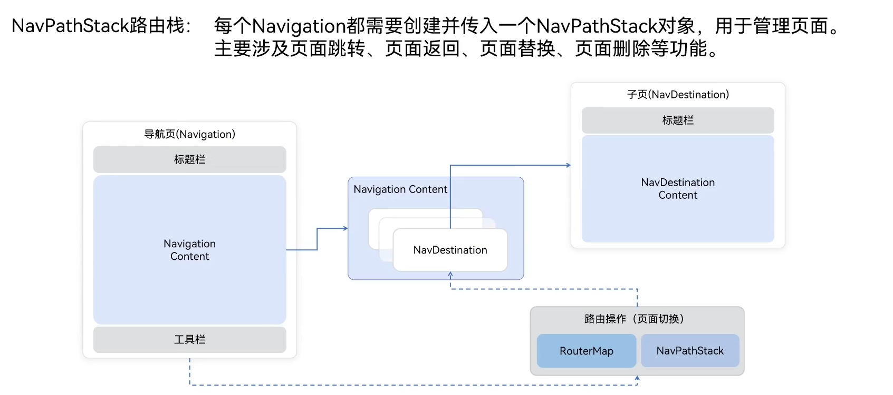

#### `NavPathStack`的常见操作

* `push`：将路径压入栈中，并跳转到该路径对应的页面
* `pop`：将路径从栈中弹出，并返回到上一个路径对应的页面
* `replace`：将路径替换为栈顶路径，并跳转到该路径对应的页面

##### `push`方法

首先对于`push`方法来说，我们需要通过一个`NavPathInfo`对象来传入路径信息：

```ts
export const NAV_PATH_STUCK = 'navPathStuck'
@Entry
@ComponentV2
struct Index {
  @Provider(NAV_PATH_STUCK) navPathStuck:NavPathStack = new NavPathStack()

  build() {
    Navigation(this.navPathStuck){
      Column(){
        Text('首页的Navigation根组件Column')
          .fontColor(Color.White)
        Button('PushPath')
          .onClick(()=>{
            this.navPathStuck.pushPath({name:'Second',param:'Index Param'})
          })
      }
      .backgroundColor('#94ababab')
    }
    .title('NavIndex')
    .linearGradient({
      direction:GradientDirection.Left,
      colors:[['#ccc',0],['#ff00cb19',1]]
    })
  }
}
```

上面是首页的代码，由于多个页面需要**共享一个页面栈**来进行跳转到操作所以我们使用全局变量将页面栈存入`AppStorageV2`或是通过跨代际传递的装饰器`@Provider`来共享页面栈。
同时我们还利用了`param`字段来进行参数的传递。
下面我们来编写一下跳转的目标页面`Second`：

```ts
import { NAV_PATH_STUCK } from "./Index"

/**
 * 入口Builder函数
 */
@Builder
export function SecondNevBuilder() {
  Second()
}
const SECOND_PAGE_LOG_TAG = 'Second:  '
@ComponentV2
struct Second {
  @Local str: string = ''
  @Consumer(NAV_PATH_STUCK) navPathStuck: NavPathStack = new NavPathStack()

  aboutToAppear(): void {
    this.str = this.navPathStuck.getParamByIndex(this.navPathStuck.getIndexByName('Second')[0]) as string
    console.log(SECOND_PAGE_LOG_TAG + 'str=' + this.str)
  }

  build() {
    NavDestination() {
      Text('Second的NavDestination')
        .fontColor(Color.White)
      Text(this.str)
    }
    .linearGradient({
      direction: GradientDirection.Left,
      colors: [['#ccc', 0], ['#ff00cb19', 1]]
    })
    .width('100%')
    .height('100%')
  }
}
```

首先第二页包含了一个**入口构造`Builder`函数**，一个`NavDestination`组件作为跳转的目标页。随后我们在该组件的`aboutToAppear`生命周期函数中获取了`NavPathStack`中的参数，并打印出来。
**要注意：**`getIndexByName('Second')[0]`这段这么写是因为当前的`NavPathStack`中可能存在多个名为`Second`的路径，所以我们需要通过`getIndexByName`方法获取到该路径在栈中的索引，**其返回值是一个数组**而非一个数字。

虽然这段代码中我们使用的是`aboutToAppear`生命周期函数来取获取的数据，但对于`NavDestination`组件来说，官方更推荐我们使用下文会提到的`onReady`生命周期函数来获取数据。

```ts
import { NAV_PATH_STUCK } from "./Index"

/**
 * 入口Builder函数
 */
@Builder
export function SecondNevBuilder() {
  Second()
}
const SECOND_PAGE_LOG_TAG = 'Second:  '
@ComponentV2
struct Second {
  @Local str: string = ''
  @Consumer(NAV_PATH_STUCK) navPathStuck: NavPathStack = new NavPathStack()

  build() {
    NavDestination() {
      Text('Second的NavDestination')
        .fontColor(Color.White)
      Text(this.str)
    }
    .onReady(()=>{
      this.str = this.navPathStuck.getParamByIndex(this.navPathStuck.getIndexByName('Second')[0]) as string
      console.log(SECOND_PAGE_LOG_TAG + 'str=' + this.str)
    })
    .linearGradient({
      direction: GradientDirection.Left,
      colors: [['#ccc', 0], ['#ff00cb19', 1]]
    })
    .width('100%')
    .height('100%')
  }
}
```

然后这段代码的效果如下视频所示：

<video width="100%" controls>
  <source src="8.mp4" type="video/mp4">
  您的浏览器不支持视频标签。
</video>

但很显然现在的效果并不对，我们在多次点击之后跳转的页面很显然不是我们想要的指定页面，它产生了多个同名的组件实例。

为了解决这个问题，我首先尝试了采用替换的方式来进行跳转，这样每次都会是我们所指定的子页面。
但在测试后发现这样的效果很显然与我们的预期不符，每次点击依旧会有明显的闪烁。就像下面这个视频一样。

<video width="100%" controls>
  <source src="16.mp4" type="video/mp4">
  您的浏览器不支持视频标签。
</video>

我尝试的第二种方法则是获取当前页面栈中已经有的全部页面名，判断是否存在目标页面。
如果存在则将目标页面已经存在的那个实例置于栈顶进行显示。

```ts
  Button('PushPath')
    .onClick(()=>{
      if (this.navPathStuck.getAllPathName().includes('Second')){
        this.navPathStuck.moveIndexToTop(this.navPathStuck.getIndexByName('Second')[0])
      }else {
        let navPathInfo:NavPathInfo = {
          name:'Second',
          param:'Index Param',
          onPop:(popInfo)=>{
            this.popInfo = (popInfo.result as IPopInfoParam).str
            console.log('popInfo=  '+JSON.stringify(popInfo))
          }
        }
        this.navPathStuck.pushPath(navPathInfo)
      }
    })
```

效果如下：

<video width="100%" controls>
  <source src="18.mp4" type="video/mp4">
  您的浏览器不支持视频标签。
</video>

这就与我们的预期效果一致了。

##### `pop`方法

`pop`是出栈函数，我们将当前栈顶，也就是正在显示的子页面出栈，并携带参数返回到上一个页面。

```ts
export const NAV_PATH_STUCK = 'navPathStuck'
export interface IPopInfoParam{
  str:string
}
@Entry
@ComponentV2
struct Index {
  @Provider(NAV_PATH_STUCK) navPathStuck:NavPathStack = new NavPathStack()
  @Local popInfo:string = ''
  build() {
    Navigation(this.navPathStuck){
      Column(){
        Text('首页的Navigation根组件Column')
          .fontColor(Color.White)
        Button('PushPath')
          .onClick(()=>{
            let navPathInfo:NavPathInfo = {
              name:'Second',
              param:'Index Param',
              onPop:(popInfo)=>{
                this.popInfo = (popInfo.info.param as IPopInfoParam).str
              }
            }
            this.navPathStuck.pushPath(navPathInfo)
          })
        Text(this.popInfo)
      }
      .backgroundColor('#94ababab')
    }
    .title('NavIndex')
    .linearGradient({
      direction:GradientDirection.Left,
      colors:[['#ccc',0],['#ff00cb19',1]]
    })
  }
}


import { IPopInfoParam, NAV_PATH_STUCK } from "./Index"

/**
 * 入口Builder函数
 */
@Builder
export function SecondNevBuilder() {
  Second()
}
const SECOND_PAGE_LOG_TAG = 'Second:  '
@ComponentV2
struct Second {
  @Local str: string = ''
  @Consumer(NAV_PATH_STUCK) navPathStuck: NavPathStack = new NavPathStack()

  build() {
    NavDestination() {
      Text('Second的NavDestination')
        .fontColor(Color.White)
      Text(this.str)
      Button('pop')
        .onClick(()=>{
          let popInfoParam:IPopInfoParam = {
            str:'第二页传回的数据'
          }
          this.navPathStuck.pop(popInfoParam)
        })
    }
    .onReady(()=>{
      this.str = this.navPathStuck.getParamByIndex(this.navPathStuck.getIndexByName('Second')[0]) as string
      console.log(SECOND_PAGE_LOG_TAG + 'str=' + this.str)
    })
    .linearGradient({
      direction: GradientDirection.Left,
      colors: [['#ccc', 0], ['#ff00cb19', 1]]
    })
    .width('100%')
    .height('100%')
  }
}
```

在第一个页面中我们将上一个事例中的`NavPathInfo`对象查出来单独编写，这样方便管理，同时我们定义接口来规范`pop`方法返回的参数类型。
而在第二个页面中我们通过`NavPathStack`的`pop`方法来返回数据。

其效果如下：

<video width="100%" controls>
  <source src="13.mp4" type="video/mp4">
  您的浏览器不支持视频标签。
</video>

很显然这里还是存在bug的，回传的数据并没有传递到主页。
我们添加一些日志来进行debug：

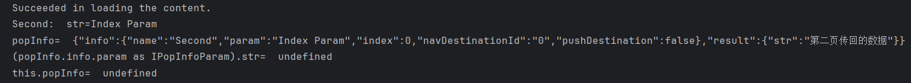

日志很清晰的告诉了我们，返回的结果并不在`"info"`字段里，而是在`"result"`字段里。
enm……这件事再次警告我们要**认真读文档！！！**

```ts
  onPop:(popInfo)=>{
    this.popInfo = (popInfo.result as IPopInfoParam).str
    console.log('popInfo=  '+JSON.stringify(popInfo))
  }
```

再次测试：

<video width="100%" controls>
  <source src="15.mp4" type="video/mp4">
  您的浏览器不支持视频标签。
</video>

这次数据就正确返回了。

#### 多子页面页面栈管理

单开一个这个小标题是接续上文提到的`push`方法导致的多页面实例问题。

##### 添加限制符

这是最基础的防止反复压栈的处理方式，通过设置状态变量或全局变量来限制`push`方法的调用，当第一次调用`push`方法时将状态变量或全局变量设置为`true`，当再次调用`push`方法时**判断**状态变量或全局变量是否为`true`，如果为`true`则不调用`push`方法。
随后在`pop`方法中再次将状态变量或全局变量设置为`false`，这样就可以保证`push`方法只调用一次。

```ts
  @Local hasPushedSecond: boolean = false // 新增标志位

  if (this.hasPushedSecond) { // 检查是否已推送
    return
  }
  
  this.hasPushedSecond = true // 设置标志位
  
  let navPathInfo:NavPathInfo = {
    name:'Second',
    param:'Index Param',
    onPop:(popInfo)=>{
      this.popInfo = (popInfo.result as IPopInfoParam).str
      console.log('popInfo=  '+JSON.stringify(popInfo))
      this.hasPushedSecond = false // 重置标志位
    }
  }
  this.navPathStuck.pushPath(navPathInfo)
```

当然这是一种比较原始且通用的方式，属于是在各个技术栈的开发中都能想到并应用的低成本方式。
但很显然它也有它的缺点。
这种方式的本质仅仅是**对用户的操作进行了限制**，并不会去对操作的结果是否达到了目标进行判断，也就是说**用户有可能绕过限制**，也有可能因为系统卡顿内存不足导致子页面没有完成构建，但`push`操作的限制符已经锁死，这就会导致子页面无法正常显示。
所以这种方式也是不建议使用的。

##### 检测页面栈中的页面

这种方式是通过`NavPathStack`的`getAllPathName`方法来获取页面栈中全部的页面，并利用数组内置函数`includes`来去判断是否存在目标页面，如果存在则不调用`push`方法，存在的话就调用`moveIndexToTop`方法将已经存在的页面实例从下方抽出放置到栈顶进行显示。

这种方式就抓住了**核心问题**所在，也就是**当前页面栈是否已经创建过目标页面的实例**，而不是像上一种方式一样仅仅是从能触及核心问题的操作的角度出发进行限制。

## `Navigation`组件的生命周期

对于该组件的生命周期与普通组件稍有差异。
**因为**，`Navigation`组件的路由页面实际是一个个`NavDestination`容器组件，与`Router`中的一个个新的`@Entry`组件不同，其切换的成本更低，速度更快也支持更加丰富的转场能力。
但要**注意**的是`NavDestination`容器组件外层还会有一层自定义组件，就像上面我的自定义组件`Second`包裹着一个`NavDestination`容器组件。

**因此！！！**我们可以将`Navigation`组件的生命周期理解为 **`自定义组件的生命周期+NavDestination容器组件的生命周期`**。

由此我们可以推导出如下图所示的生命周期函数图：

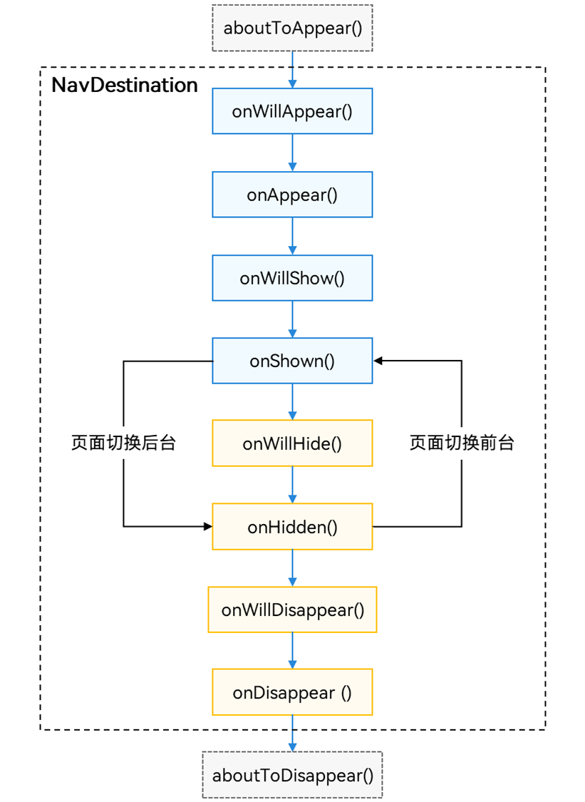

对于各个生命周期函数的触发时机如下图所示：

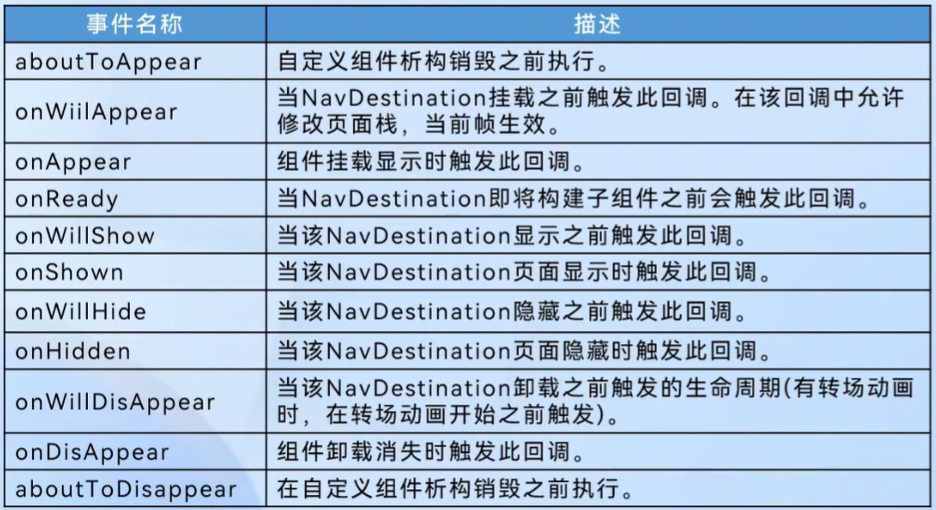

而这其中我们重点要关注`onReady`这个生命周期函数，因为这是`Navigation`独有的生命周期函数，它触发于**即将构建子组件之前**，也就是说**它触发时子组件还没有构建**。
可以在这里面做一些数据的准备工作，像是获取传参，拿到组件的上下文组件。

## `Navigation`组件的转场效果

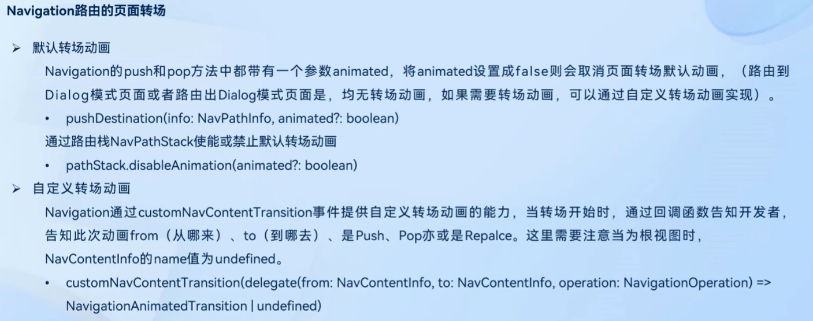

### 默认转场动画

上面这张图很好的展示了`Navigation`组件的转场效果简介，对于非`Dialog`模式的页面我们都可以直接使用系统默认的转场动画。

#### 默认转场动画的使用

使用系统默认的转场动画方式非常简单，我们只需要在页面栈`NavPathStack`中添加页面时，在第二个参数传入一个true即可开启默认的转场动画。

### 自定义转场动画

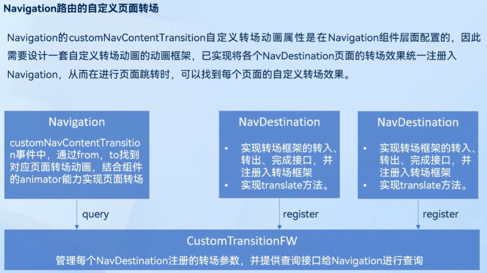

对于自定义动画其实现方式要稍微复杂一些，首先是要通过在`Navigation`组件的`customNavContentTransition`事件去获取即将触发动画的来去两个页面的页面信息，再从`CustomTransitionFW`动画框架工具类中查询注册的动画信息。
不过要注意我们的动画效果依旧是通过`transelate`属性去实现的所以我们仍旧需要为组件添加该属性。
