## 前言

之前我们已经完成了对NowInOpenHarmony后端服务的部署，但是依旧会时不时的出现CPU占用率跑满的情况，第一次遇到的时候并没有保留日志，这一次我又遇到了相同的情况，下决心要解决这个问题。于是，这篇文章就应运而生了。

这个活看起来确实不像是开发该干的，但是对于个人开发者来说肯定是不会有专人来辅助自己进行运维的，与此同时自己去进行优化也是对于项目架构思想以及Vibe Coding能力的一次锻炼。

## 问题数据捕获与分析

### 起因

在上一天文章中我们仅仅是针对于自己的后端进行了优化，并没有真正意义上的去整个后端进行监测和优化，毕竟我们的后端是包含了两个docker容器。一个是我们的后端服务，一个是我们的WebDriver服务，这是当前我们后端服务数据源爬虫所刚需依赖的在线容器。针对于服务端的代码我已经反复让GPT帮助我进行修改优化以及死循环可能性的测试了，同时也降低了爬虫所使用线程池的数量，但是依旧是没有解决问题。于是我就怀疑是不是我们的WebDriver服务出现了问题。

恰好今天上午在登陆宝塔面板检查运行情况时发现了相同的问题，我一登陆上去就发现CPU的占用率再一次被拉满了。

这一次我及时的进行了截图留存。

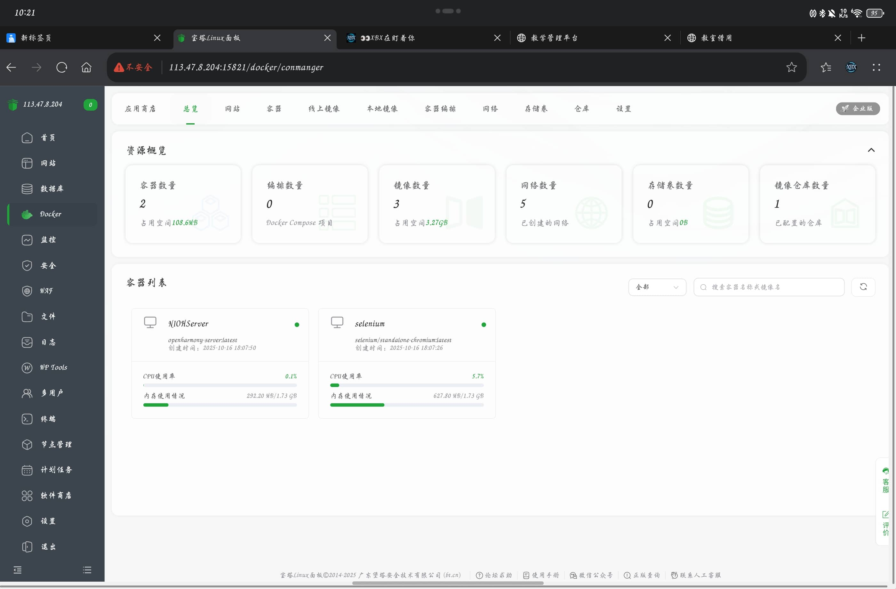

我操了，查看进程占用率居然要氪金。我真服了，先继续看截图吧，后面问AI要命令去查看进程的资源占用情况吧。


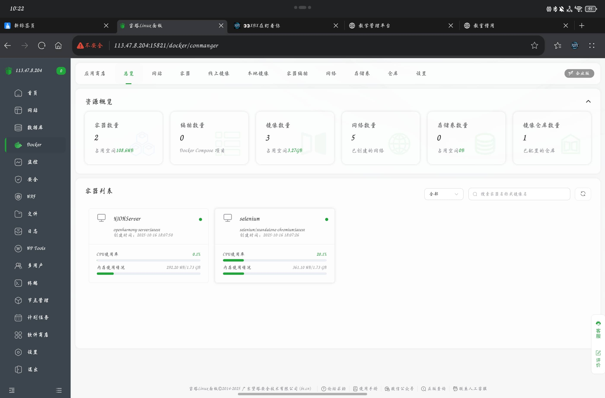

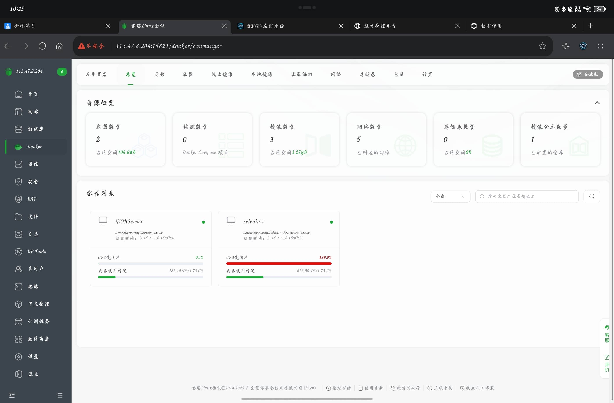

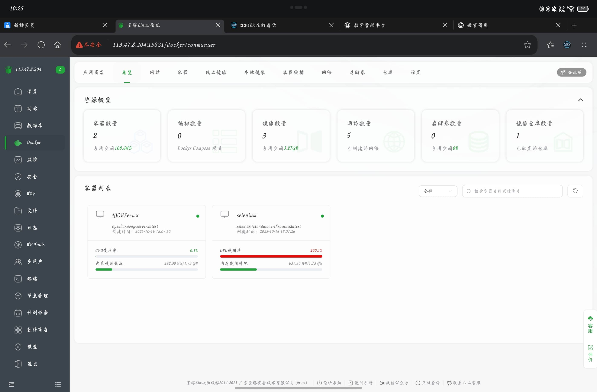

到这里可以看出，我的后端服务容器的占用率始终是很稳定的，WebDriver容器会经常性的出现占用率飙升到200%的情况，这是我完全没想到的，首先是我压根就不知道占用率还能突破100%，其次是我不理解为什么从官方镜像进行拉去并创建的容器会出现这种不稳定的情况。随后我立刻下载了最近三天的日志文件。

### 告警形式

这个时候我突然想到为什么我之前明明设置了CPU5分钟内的均值到达80%后就给我发送邮件进行提醒，但是我却一封邮件都没收到过，所以我就去检查了一下告警设置和告警日志。

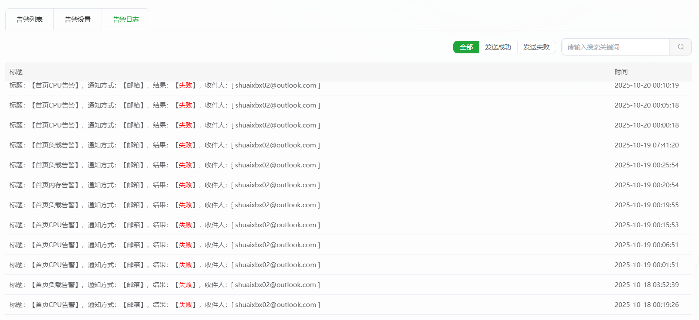

原来告警是正常的触发了，是因为我163邮箱的服务器设置有问题。我去检查了一下决定帮顶一下公众号通知方式，这种方式更加保险，毕竟没有需要自己配置地址和密钥的步骤，都是由官方进行配置的。

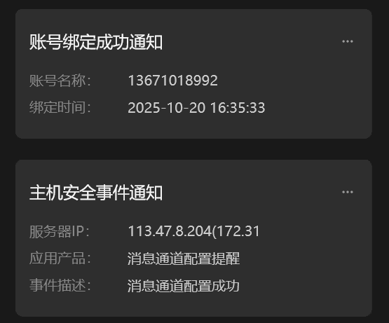

### 问题分析

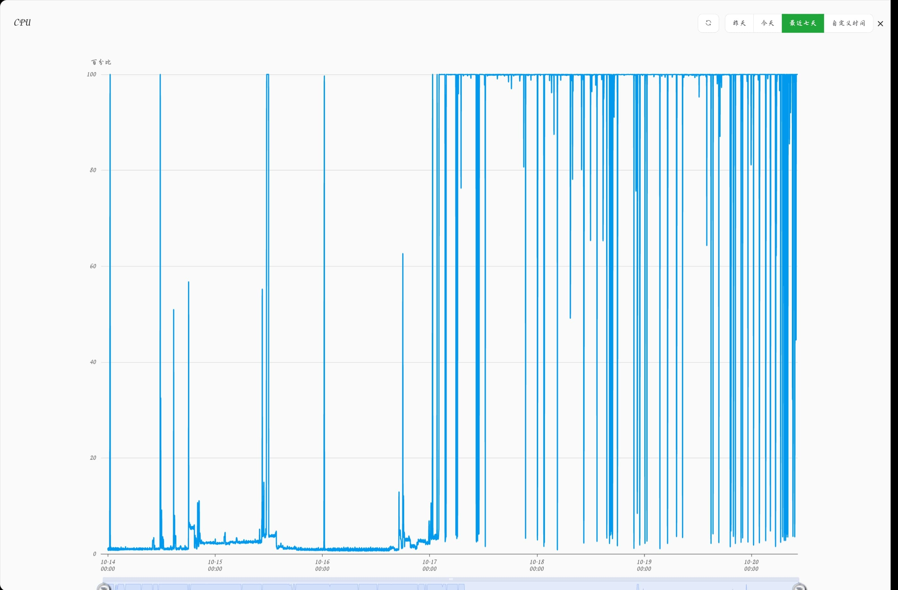

在观察了一下CPU整体的占用率图之后发现，这个问题是经常出现的占用率是经常性的飙高。这时我突然想到，不会我的后端服务也一并将我的流量包耗尽了吧（我还得留着当我的博客服务器啊啊啊啊）。

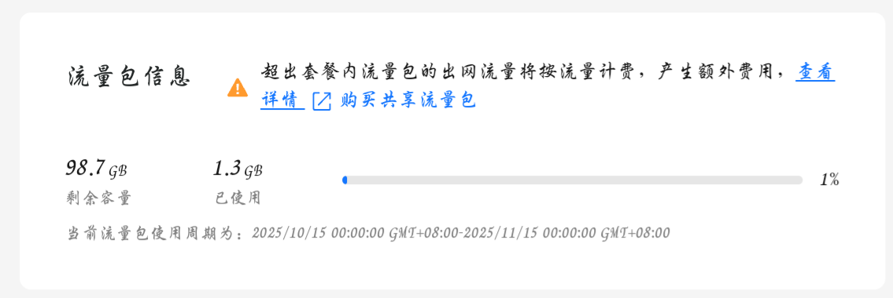

奥还好并没有。

现在我就怀疑会不会是WebDriver的镜像对于我服务器的负担太重了？还是什么其他原因。

```bash
结论

现象基本锁定在 Selenium 容器：在你截图里多次飙到 200%（2 核=200%），而 API 容器稳定。
代码层面确有并发隐患：手动接口会“并行触发两次增强爬虫”（日志里同一秒出现两条“初始化增强版手机Banner爬虫”）。来源是 api/banner.py 的手动接口一边调度器后台跑，一边本进程再跑一次，容易叠加峰值。
先做的两步（不改业务效果，直接止血）

重建 Selenium 容器（限制并发会话=1、给 CPU 限额、会话超时）
docker rm -f selenium
docker run -d --name selenium --network ohnet -p 4444:4444 --shm-size=2g --restart unless-stopped -e SE_NODE_MAX_SESSIONS=1 -e SE_NODE_OVERRIDE_MAX_SESSIONS=true -e SE_SESSION_REQUEST_TIMEOUT=30 -e SE_NODE_SESSION_TIMEOUT=60 --cpus="0.8" selenium/standalone-chromium:latest
运行时观察
docker stats --no-stream | egrep 'NIOHServer|selenium'
curl -s http://127.0.0.1:4444/status | grep -E '"ready"[[:space:]]*:[[:space:]]*true'
建议代码级修正（避免“双启动”）

修改手动接口：只跑一种方式（二选一）
方案A：仅立即执行（删除/注释“scheduler.manual_banner_crawl()”）
或方案B：仅交给调度器后台跑（移除 run_in_executor 的即时执行）
增加“正在更新”防抖
手动接口先读 banner_cache.get_status()，若 is_updating=true 则直接返回“正在更新，稍后再试”，避免叠加。
定位与验证

哪些 Chrome 进程在跑：
docker exec -it selenium sh -lc "ps -eo pid,comm,%cpu,%mem --sort=-%cpu | head"
docker exec -it selenium sh -lc "pgrep -fa chromium || pgrep -fa google-chrome || true"
Selenium 会话是否泄漏：
curl -s http://127.0.0.1:4444/status | jq '.value' 2>/dev/null | egrep -i 'session|slot|busy|max'
如果再次出现长期 100%：立刻抓三样
docker stats 快照
selenium 容器 ps/top
NIOHServer 日志尾部，查看是否又出现两条“初始化增强版手机Banner爬虫”
可选优化（按需）

我可以提交补丁：
修复手动接口“双启动”+“防抖”
给 Selenium 端再加 Chrome 低耗参数（已加大部分，如需我会补 --headless=new、更多禁用项）
任务互斥标记（BannerCache 增加原子互斥，避免 API 与调度器重入）
要我现在就按“方案A（仅立即执行+防抖）”改 api/banner.py 并打包吗？
```

嗯，看来可以手动添加对于镜像的资源占用限制。我现在应该再将我刚下载的日志文件给他看看。

```bash
结论（根因指向 Selenium 暴露端口被外部滥用）

在 selenium 日志中多次出现可疑会话请求，明显不是你服务发出的正常请求：
“args: [--utility-cmd-prefix=bash /…]”
“args: [-cimport base64;exec(base64…], binary: /usr/bin/python3”
这些是典型通过 ChromeOptions 注入命令的攻击扫描/执行尝试，说明 4444 对公网暴露后被外部访问。
这些请求在多时段出现，且与调度时间不完全对齐；且你的面板截图显示 selenium 容器 CPU 峰值 200%（2核被打满），与被外部创建会话强行执行/渲染高度吻合。
正常业务会话的特征很清晰：带我们设置的一长串 headless/禁用参数、mobileEmulation、binary=/usr/bin/chromium，且每次日志紧随“🎉 Selenium方法获取到 4 张轮播图”。可疑请求与之差异明显。
API 容器日志整体健康，仅偶发一次 “coroutine was never awaited” 警告，不是拉满 CPU 的主因。
建议（立即执行）

立刻取消 4444 映射，限制到内网网络 ohnet 使用（NIOHServer 通过服务名 selenium 访问）：
docker rm -f selenium
docker run -d --name selenium --network ohnet --shm-size=2g --restart unless-stopped -e SE_NODE_MAX_SESSIONS=1 -e SE_NODE_OVERRIDE_MAX_SESSIONS=true -e SE_SESSION_REQUEST_TIMEOUT=20 -e SE_NODE_SESSION_TIMEOUT=60 --cpus="0.8" selenium/standalone-chromium:latest
健康检测改为容器内或从 app 容器：docker exec NIOHServer curl -s http://selenium:4444/status
如果必须在宿主调试 4444，建议仅临时开放，或用面板/防火墙禁止外网到 4444（允许本机/内网）：
ufw deny 4444 或等价的安全组/面板规则（优先安全组/面板）。
建议（代码与配置加固）

我方已把调度错峰和并发下调，保持即可；若仍见峰值，再把 selenium 容器 CPU/memory 限制写入 compose 并开启 auto-restart。
避免手动接口“双启动”造成叠加（你的日志这两天未再出现，但建议实做）：手动接口要么只调调度器，要么只立即执行，并在开始前检查 banner_cache.is_updating 做防抖。
保持我们新增的 CSS background-image 提取，减少反复刷新页面的开销。
如何验证

重新按“仅内网”方式启动 selenium 后，宿主机外部将无法访问 http://<公网IP>:4444/status；但在 app 容器内 curl selenium:4444/status 为 ready:true。
观察 1～2 小时 docker stats：selenium CPU 峰值应只在定时或手动抓取的瞬间短暂升高；若仍频繁飙升，grep 日志 “Session request received by the Distributor” 的节奏应已显著下降，且不再出现可疑 “python3/base64/utility-cmd-prefix=bash” 片段。
证据摘录（来自你提供的日志）

3b0e…-json.txt 多次出现：
“Capabilities {… args: [--utility-cmd-prefix=bash /…], …}”
“Capabilities {… args: [-cimport base64;exec(base64…], binary: /usr/bin/python3, …}”
ab91…-json.txt（API）：周期性“初始化增强版…使用远程WebDriver…Selenium方法获取到 4 张轮播图”，属正常业务。偶发 RuntimeWarning 不是 CPU 根因。
需要我把 compose(dev/prod) 里的 selenium 服务去掉 ports 映射并加上资源限制，顺便修正手动接口的“防抖+单触发”吗？
```

！！！原来是这个镜像使用了一个常见的对外暴露的4444端口导致我的服务器被攻击，导致了CPU占用率飙升。

### 解决方案

现在我需要让gpt给我命令去禁止webdriver的对外暴露端口，并限制其CPU占用率。

现在的状态是NIOHServer和selenium两个容器都在运行，我所需要的指令是，先关停这两个容器然后在重启的时候限制死selenium的CPU占用率最高为60%，同时禁止4444端口的对外暴露，同时还要确保NIOHServer容器能够正常访问selenium容器。

```bash
docker rm -f NIOHServer selenium 2>/dev/null || true
```

```bash
docker network create ohnet || true
```

```bash
docker run -d --name selenium --network ohnet
--shm-size=2g --restart unless-stopped
-e SE_NODE_MAX_SESSIONS=1
-e SE_NODE_OVERRIDE_MAX_SESSIONS=true
-e SE_SESSION_REQUEST_TIMEOUT=20
-e SE_NODE_SESSION_TIMEOUT=60
--cpus="0.6"
selenium/standalone-chromium:latest
```

```bash
docker run -d --name NIOHServer --network ohnet
-p 32776:8001 --shm-size=1g
-e TZ=Asia/Shanghai
-e ENABLE_SCHEDULER=true
-e BANNER_USE_ENHANCED=true
-e SELENIUM_REMOTE_URL=http://selenium:4444/wd/hub
-e SELENIUM_USE_USER_DATA_DIR=false
openharmony-server:latest
```

```bash
docker exec -it NIOHServer sh -lc "curl -s http://selenium:4444/status | grep -E '"ready"[[:space:]]*:[[:space:]]*true' || true"
```

```bash
docker stats --no-stream --format 'table {{.Name}}\t{{.CPUPerc}}\t{{.MemUsage}}' | egrep 'NIOHServer|selenium'
```

在执行过程中我发现出现了一些指令错误的问题。

```bash

        Welcome to Huawei Cloud Service

Last login: Sun Oct 12 17:36:14 +0800 2025 from 127.0.0.1
The current terminal create by BT-Panel.
root@hcss-ecs-2ad2:~# docker rm -f NIOHServer selenium 2>/dev/null || true
NIOHServer
selenium
root@hcss-ecs-2ad2:~# docker network create ohnet || true
Error response from daemon: network with name ohnet already exists
root@hcss-ecs-2ad2:~# docker run -d --name selenium --network ohnet
--shm-size=2g --restart unless-stopped
-e SE_NODE_MAX_SESSIONS=1
-e SE_NODE_OVERRIDE_MAX_SESSIONS=true
-e SE_SESSION_REQUEST_TIMEOUT=20
-e SE_NODE_SESSION_TIMEOUT=60
--cpus="0.6"
selenium/standalone-chromium:latest
docker: 'docker run' requires at least 1 argument

Usage:  docker run [OPTIONS] IMAGE [COMMAND] [ARG...]

See 'docker run --help' for more information
--shm-size=2g: command not found
-e: command not found
-e: command not found
-e: command not found
-e: command not found
--cpus=0.6: command not found
bash: selenium/standalone-chromium:latest: No such file or directory
root@hcss-ecs-2ad2:~# 
```

我复制给gpt去看一看。

```bash
你的多行参数没有用续行符，导致 shell 把每一行当成独立命令。下面提供两种等价写法，任选其一执行。

单行命令（推荐）
docker rm -f NIOHServer selenium 2>/dev/null || true
docker network create ohnet || true

docker run -d --name selenium --network ohnet --shm-size=2g --restart unless-stopped -e SE_NODE_MAX_SESSIONS=1 -e SE_NODE_OVERRIDE_MAX_SESSIONS=true -e SE_SESSION_REQUEST_TIMEOUT=20 -e SE_NODE_SESSION_TIMEOUT=60 --cpus=0.6 selenium/standalone-chromium:latest

docker run -d --name NIOHServer --network ohnet -p 32776:8001 --shm-size=1g -e TZ=Asia/Shanghai -e ENABLE_SCHEDULER=true -e BANNER_USE_ENHANCED=true -e SELENIUM_REMOTE_URL=http://selenium:4444/wd/hub -e SELENIUM_USE_USER_DATA_DIR=false openharmony-server:latest

docker exec -it NIOHServer sh -lc "curl -s http://selenium:4444/status | grep -E '\"ready\"[[:space:]]*:[[:space:]]*true' || true"

docker stats --no-stream --format 'table {{.Name}}\t{{.CPUPerc}}\t{{.MemUsage}}' | egrep 'NIOHServer|selenium'

多行命令（带续行符反斜杠）
docker rm -f NIOHServer selenium 2>/dev/null || true
docker network create ohnet || true

docker run -d --name selenium --network ohnet \ --shm-size=2g --restart unless-stopped \ -e SE_NODE_MAX_SESSIONS=1 \ -e SE_NODE_OVERRIDE_MAX_SESSIONS=true \ -e SE_SESSION_REQUEST_TIMEOUT=20 \ -e SE_NODE_SESSION_TIMEOUT=60 \ --cpus=0.6 \ selenium/standalone-chromium:latest

docker run -d --name NIOHServer --network ohnet \ -p 32776:8001 --shm-size=1g \ -e TZ=Asia/Shanghai \ -e ENABLE_SCHEDULER=true \ -e BANNER_USE_ENHANCED=true \ -e SELENIUM_REMOTE_URL=http://selenium:4444/wd/hub \ -e SELENIUM_USE_USER_DATA_DIR=false \ openharmony-server:latest

docker exec -it NIOHServer sh -lc "curl -s http://selenium:4444/status | grep -E '\"ready\"[[:space:]]*:[[:space:]]*true' || true"

docker stats --no-stream --format 'table {{.Name}}\t{{.CPUPerc}}\t{{.MemUsage}}' | egrep 'NIOHServer|selenium'
```

原来是换行问题。

```bash
root@hcss-ecs-2ad2:~# docker run -d --name selenium --network ohnet --shm-size=2g --restart unless-stopped -e SE_NODE_MAX_SESSIONS=1 -e SE_NODE_OVERRIDE_MAX_SESSIONS=true -e SE_SESSION_REQUEST_TIMEOUT=20 -e SE_NODE_SESSION_TIMEOUT=60 --cpus=0.6 selenium/standalone-chromium:latest
9deb70d7ce30970d46f7e09a94631b84ac2fd579baf90d13fea61634d8586115
root@hcss-ecs-2ad2:~# docker run -d --name NIOHServer --network ohnet -p 32776:8001 --shm-size=1g -e TZ=Asia/Shanghai -e ENABLE_SCHEDULER=true -e BANNER_USE_ENHANCED=true -e SELENIUM_REMOTE_URL=http://selenium:4444/wd/hub -e SELENIUM_USE_USER_DATA_DIR=false openharmony-server:latest
cb8c6a0b77d0fc1a6a9135218a0b830c43561e4d4d8e94fe54da449420e5c078
root@hcss-ecs-2ad2:~# docker exec -it NIOHServer sh -lc "curl -s http://selenium:4444/status | grep -E '\"ready\"[[:space:]]*:[[:space:]]*true' || true"
root@hcss-ecs-2ad2:~# docker stats --no-stream --format 'table {{.Name}}\t{{.CPUPerc}}\t{{.MemUsage}}' | egrep 'NIOHServer|selenium'
NIOHServer   0.43%     97MiB / 1.73GiB
selenium     8.41%     494.6MiB / 1.73GiB
root@hcss-ecs-2ad2:~# 
```

现在看起来就是正常的了，我再去Docker分页去看看有没有什么变化。


o！我们可以看到，现在我们的WebDriver的Docker容器已经没有对外开放的端口了，它只能供我们服务器内部进行本地访问，这下就彻底断绝了被外部攻击的可能了（应该吧，这方面我确实了解不多）。

### 运行状态监测

#### 日志状态确认

接下来我该做的就是通过日志和接口访问来确认一下我们的后端服务是否能正常的工作了。

```bash
2025-10-20 20:00:32 - services.enhanced_mobile_banner_crawler - INFO - 🔍 选择器 'img[class*='carousel']' 找到 0 个图片元素
2025-10-20 20:00:32 - services.enhanced_mobile_banner_crawler - INFO - 🔍 页面总共有 21 个img元素
2025-10-20 20:00:32 - services.enhanced_mobile_banner_crawler - INFO - ✅ 发现潜在banner图片: https://images.openharmony.cn/%E9%A6%96%E9%A1%B5/banner/20240411/4.1releas%E6%89%8B%E6%9C%BA.jpg
2025-10-20 20:00:33 - services.openharmony_news_crawler - INFO - 🔍 正在处理第 50/407 篇文章: 议程速递 | 第三届OpenHarmony技术大会——应用开发工程技术分论坛（10月12日）
2025-10-20 20:00:33 - services.enhanced_mobile_banner_crawler - INFO - ✅ 发现潜在banner图片: https://images.openharmony.cn/%E6%B4%BB%E5%8A%A8/%E5%88%9B%E6%96%B0%E8%B5%9B2023/20230831/%E4%B8%89%E6%96%B9%E5%BA%93%E7%A7%BB%E5%8A%A8%E7%AB%AF.png
2025-10-20 20:00:33 - services.enhanced_mobile_banner_crawler - INFO - ✅ 发现潜在banner图片: https://images.openharmony.cn/%E6%B4%BB%E5%8A%A8/%E5%A4%A7%E8%B5%9B20250812/%E7%AC%AC%E4%B8%89%E5%B1%8A%E5%BC%80%E6%BA%90%E9%B8%BF%E8%92%99%E5%88%9B%E6%96%B0%E5%BA%94%E7%94%A8%E6%8C%91%E6%88%98%E8%B5%9B-%20750%20350.jpg
2025-10-20 20:00:33 - services.enhanced_mobile_banner_crawler - INFO - ✅ 发现潜在banner图片: https://images.openharmony.cn/%E6%B4%BB%E5%8A%A8/%E6%8A%80%E6%9C%AF%E5%A4%A7%E4%BC%9A20250826/phone%20750x350.jpg
2025-10-20 20:00:33 - services.openharmony_news_crawler - INFO - ✅ 成功解析文章，共 2 个内容块
2025-10-20 20:00:33 - services.enhanced_mobile_banner_crawler - INFO - 🎯 JavaScript执行结果获取到 8 张图片
2025-10-20 20:00:33 - services.enhanced_mobile_banner_crawler - INFO - 🎉 Selenium方法获取到 4 张轮播图
2025-10-20 20:00:34 - services.enhanced_mobile_banner_crawler - INFO - 🔧 已关闭WebDriver
2025-10-20 20:00:34 - services.enhanced_mobile_banner_crawler - INFO - 🎉 总共获取到 4 张唯一的banner图片
2025-10-20 20:00:34 - core.scheduler - INFO - ✅ 使用增强版爬虫成功，获取 4 张图片
2025-10-20 20:00:34 - core.cache - INFO - 开始轮播图数据更新，状态设为准备中
2025-10-20 20:00:34 - core.cache - INFO - 轮播图服务状态更新: preparing
2025-10-20 20:00:34 - core.cache - INFO - 🎉 轮播图首次加载完成
2025-10-20 20:00:34 - core.cache - INFO - 轮播图数据更新完成，状态设为就绪
2025-10-20 20:00:34 - core.cache - INFO - 轮播图服务状态更新: ready
2025-10-20 20:00:34 - core.cache - INFO - 🖼️ 轮播图缓存更新成功，共 4 张图片，状态：READY
2025-10-20 20:00:34 - core.scheduler - INFO - ✅ 初始轮播图加载完成，共更新 4 张轮播图，状态已设为READY
```

#### 浏览器接口请求测试

哦！可以看到通过日志我们已经可以顺利的获取到目标网站上的图片了，接下来就是通过接口来确认一下了。

```json
http://113.47.8.204:32776/api/banner/mobile
{
  "success": true,
  "images": [
    "https://images.openharmony.cn/%E9%A6%96%E9%A1%B5/banner/20240411/4.1releas%E6%89%8B%E6%9C%BA.jpg",
    "https://images.openharmony.cn/%E6%B4%BB%E5%8A%A8/%E5%88%9B%E6%96%B0%E8%B5%9B2023/20230831/%E4%B8%89%E6%96%B9%E5%BA%93%E7%A7%BB%E5%8A%A8%E7%AB%AF.png",
    "https://images.openharmony.cn/%E6%B4%BB%E5%8A%A8/%E5%A4%A7%E8%B5%9B20250812/%E7%AC%AC%E4%B8%89%E5%B1%8A%E5%BC%80%E6%BA%90%E9%B8%BF%E8%92%99%E5%88%9B%E6%96%B0%E5%BA%94%E7%94%A8%E6%8C%91%E6%88%98%E8%B5%9B-%20750%20350.jpg",
    "https://images.openharmony.cn/%E6%B4%BB%E5%8A%A8/%E6%8A%80%E6%9C%AF%E5%A4%A7%E4%BC%9A20250826/phone%20750x350.jpg"
  ],
  "total": 4,
  "message": "获取手机版Banner图片成功（缓存），共 4 张",
  "timestamp": "2025-10-20T20:13:01.825831"
}
```

o！浏览器的请求测试是成功的。但是我们现在依旧不能掉以轻心，之前我们还存在有手机上有时能顺利获取数据，有时候不行的情况。不过这个现象现在来看也能解释了。

这要从两方面来进行解释：

1. 在客户端发起请求时，要是服务端的WebDriver容器恰好是被攻击的状态，CPU占用率拉到了200%，占满了我CPU的两个核心，那后续再接受到的请求就是会被Nginx放到消息队列去进行排队等待的，因为当前的计算资源已经被攻击的恶意请求所占满，后续的请求能够正常的请求到服务器，但是因为没有额外的空闲资源给它进行处理，所以我们需要在消息队列去进行等待，等到资源被释放之后，才能继续进行请求处理。
2. 在客户端的开发过程中，我们所封装的axios请求工具设置了超时机制，之前是一秒钟，后来因为遇到了反复的请求超时问题，所以我就把超时问题向上调整到了3秒进行尝试，依旧是没有解决问题。现在来看，超时的原因就是因为请求在服务器端的等待时间过长，一直没有响应的接受，所以axios切断了链接，并返回了连接超时的异常信息。

#### 真机请求测试

为了测试的直观和准确，我需要将当前真机上的应用卸载并重新安装，这样可以避免此前数据库中已经存储的新闻数据对测试造成干扰，同时也可以利用日志信息进行进一步的判断，确保请求是成功的。

我进行了多次测试，测试的结果大致相仿，但也不太稳定。

```bash
AxiosHttp:  AxiosReq Error{"code":2300028,"message":"Timeout was reached"} URL = /api/news/?all=true
NewsListAPI: {"code":2300028,"message":"Timeout was reached"}
StartPage:  
AxiosHttp:  AxiosReq Error{"code":2300028,"message":"Timeout was reached"} URL = /api/news/?all=true
NewsListAPI: {"code":2300028,"message":"Timeout was reached"}
NewsManager: 获取新闻失败,新闻数据或键值数据库为空。
```

总计安装卸载了5次，每一次都会出现新闻列表接口超时，但是轮播图接口正常的现象。现在我的怀疑是这样的，在本地测试的时候我的电脑利用自己的网卡和局域网不限流不限速的传输时很快的所以一瞬间就完成了传输。但是我的服务器对于单次请求的带宽占用是有严格限制的，会不会是因为这个限制导致整体的传输时长超越了我所设置的3秒？要是这样的话我先在浏览器上进行一次请求并进行一下计时，看看是不是这个原因。（这不得不让我联想到了计算机网络学的“分组转发”技术）


enm……14秒？这验证了我的想法但也让我感到了另一种无奈的感觉，我第一时间想到了利用分页加触底刷新的方式去进行优化，这样可以大量减少数据的传输量。现在先让我去请求几次进行测试吧。

23秒、15秒、14秒、15秒、13秒

这个接口的平均响应时长均在14秒左右，很慢，真的很慢。这个后面必须要优化，从客户端和后端双侧下手的话就是将数据分页触底加载，将数据存储到本地，减少后端接口的响应时长。当然我还有一个想法就是把接口做成流式接口。

对于今天来说我就先将超时时间拉长到20秒吧。如果这样能够保障最低限度的实现的话，那就算是正式完成NowInOpenHarmony的MVP版本上线了。

```ts
/**
 * axios请求实例
 * 配置基地址和请求超时时间
 */
export const axiosInstance = axios.create({
  baseURL: SERVE_BASE_ADDRESS,
  timeout: 200000
})
```

<video width="100%" controls>
  <source src="12.mp4" type="video/mp4">
  您的浏览器不支持视频标签。
</video>

在新的一次从新安装的过程中居然出现了从来没有出现过的闪退现象，不管怎样先让我把日志保留下来。

```bash
Device info:HUAWEI Pura X 典藏版
Build info:VDE-AL10 6.0.0.107(SP5C00E107R5P4)
Fingerprint:574801235d1243055b78cd504c8843ca4a30a05dde69b2a3bacfe172552b44b0
Module name:com.xbxyftx.NowInOpenHarmony
Version:1.0.0
VersionCode:1000000
PreInstalled:No
Foreground:Yes
Page switch history:
  21:45:36.429 :enters foreground
Timestamp:2025-10-20 21:45:36.618
Pid:18665
Uid:20020052
Process name:com.xbxyftx.NowInOpenHarmony
Process life time:1s
Process Memory(kB): 174276(Rss)
Device Memory(kB): Total 16034176, Free 263628, Available 5043200
Reason:Signal:SIGSEGV(SEGV_MAPERR)@0x0000005be6850460 
LastFatalMessage:OHOS.NetMgrEnhanced.INetworkHandoverListener
Fault thread info:
Tid:18694, Name:OS_IPC_0_18694
#00 pc 000000000006f354 /system/lib64/chipset-sdk-sp/libipc_single.z.so(OHOS::BinderInvoker::ProcDeferredDecRefs()+416)(42e92dbb9ffc10d3014c54385fe0dffa)
#01 pc 0000000000071ef8 /system/lib64/chipset-sdk-sp/libipc_single.z.so(OHOS::BinderInvoker::StartWorkLoop()+272)(42e92dbb9ffc10d3014c54385fe0dffa)
#02 pc 0000000000074584 /system/lib64/chipset-sdk-sp/libipc_single.z.so(OHOS::BinderInvoker::JoinThread(bool)+84)(42e92dbb9ffc10d3014c54385fe0dffa)
#03 pc 0000000000069648 /system/lib64/chipset-sdk-sp/libipc_single.z.so(OHOS::IPCWorkThread::ThreadHandler(void*)+1084)(42e92dbb9ffc10d3014c54385fe0dffa)
#04 pc 00000000001d0a2c /system/lib/ld-musl-aarch64.so.1(start+240)(52299a28d60f0bb4073bd788bc023a3a)
Registers:
x0:0000000000000000 x1:0000005ace633000 x2:000000000000002c x3:000000000000ffff
x4:0000005acb3bb0ec x5:0000007f61b8947c x6:74654e2e534f484f x7:6e61686e4572674d
x8:0000005acbaf8d00 x9:0000005be6850480 x10:0000000000000003 x11:6b726f7774654e49
x12:7265766f646e6148 x13:72656e657473694c x14:0000000000000001 x15:0000000000000000
x16:0000005a2e78c830 x17:0000005a2d2fe7b0 x18:000000000000000a x19:0000005ace633000
x20:0000005ace6331a0 x21:0000005a2da7bf00 x22:0000005aafc20d7a x23:0000005aafc08082
x24:0000005aafc20b79 x25:0000000000000000 x26:0000000000000000 x27:0000007f600df711
x28:0000005aca9a6868 x29:0000007f600df740
lr:0000005aafc6f344 sp:0000007f600df700 pc:0000005aafc6f354
pstate:0000000080001000 esr:0000000092000007
Other thread info:
Tid:18665, Name:owInOpenHarmony
#00 pc 000000000016a638 /system/lib/ld-musl-aarch64.so.1(epoll_wait+84)(52299a28d60f0bb4073bd788bc023a3a)
#01 pc 000000000001a02c /system/lib64/chipset-sdk-sp/libeventhandler.z.so(OHOS::AppExecFwk::EventQueueBase::GetEvent()+2312)(0732ad1b06084c348684b1fce0ed2df6)
#02 pc 0000000000016f54 /system/lib64/chipset-sdk-sp/libeventhandler.z.so(OHOS::AppExecFwk::(anonymous namespace)::EventRunnerImpl::Run()+676)(0732ad1b06084c348684b1fce0ed2df6)
#03 pc 000000000003e160 /system/lib64/chipset-sdk-sp/libeventhandler.z.so(OHOS::AppExecFwk::EventRunner::Run()+396)(0732ad1b06084c348684b1fce0ed2df6)
#04 pc 00000000000ae1e4 /system/lib64/platformsdk/libappkit_native.z.so(OHOS::AppExecFwk::MainThread::Start()+504)(9ce012abf2ae2dd9a9a71c1aec768b23)
#05 pc 0000000000005904 /system/lib64/appspawn/appspawn/libappspawn_ace.z.so(RunChildProcessor(AppSpawnContent*, AppSpawnClient*)+720)(66486567c65a254ec99fba8e7f0347bd)
#06 pc 000000000000bde0 /system/bin/appspawn(AppSpawnChild+512)(23407fd0bb9aa946e38599adbabd76ad)
#07 pc 000000000001721c /system/bin/appspawn(ProcessSpawnReqMsg+3764)(23407fd0bb9aa946e38599adbabd76ad)
#08 pc 0000000000014008 /system/bin/appspawn(OnReceiveRequest+712)(23407fd0bb9aa946e38599adbabd76ad)
#09 pc 0000000000017978 /system/lib64/chipset-sdk-sp/libbegetutil.z.so(HandleRecvMsg_+384)(b8f07514b9cf16be17228337aa0675e8)
#10 pc 0000000000017290 /system/lib64/chipset-sdk-sp/libbegetutil.z.so(HandleStreamEvent_+152)(b8f07514b9cf16be17228337aa0675e8)
#11 pc 0000000000014580 /system/lib64/chipset-sdk-sp/libbegetutil.z.so(ProcessEvent+380)(b8f07514b9cf16be17228337aa0675e8)
#12 pc 0000000000014010 /system/lib64/chipset-sdk-sp/libbegetutil.z.so(RunLoop_.llvm.242343089394205497+656)(b8f07514b9cf16be17228337aa0675e8)
#13 pc 0000000000011384 /system/bin/appspawn(AppSpawnRun+224)(23407fd0bb9aa946e38599adbabd76ad)
#14 pc 000000000000f138 /system/bin/appspawn(main+1040)(23407fd0bb9aa946e38599adbabd76ad)
#15 pc 00000000000a8a90 /system/lib/ld-musl-aarch64.so.1(libc_start_main_stage2+84)(52299a28d60f0bb4073bd788bc023a3a)
Tid:18695, Name:OS_IPC_1_18695
#00 pc 000000000018a588 /system/lib/ld-musl-aarch64.so.1(ioctl+164)(52299a28d60f0bb4073bd788bc023a3a)
#01 pc 000000000000ecd0 /system/lib64/chipset-sdk-sp/libipc_common.z.so(OHOS::BinderConnector::WriteBinder(unsigned long, void*)+124)(b79fdd2417d9579a3632cb307b02e4af)
#02 pc 0000000000071a84 /system/lib64/chipset-sdk-sp/libipc_single.z.so(OHOS::BinderInvoker::TransactWithDriver(bool)+284)(42e92dbb9ffc10d3014c54385fe0dffa)
#03 pc 0000000000071e4c /system/lib64/chipset-sdk-sp/libipc_single.z.so(OHOS::BinderInvoker::StartWorkLoop()+100)(42e92dbb9ffc10d3014c54385fe0dffa)
#04 pc 0000000000074584 /system/lib64/chipset-sdk-sp/libipc_single.z.so(OHOS::BinderInvoker::JoinThread(bool)+84)(42e92dbb9ffc10d3014c54385fe0dffa)
#05 pc 0000000000069648 /system/lib64/chipset-sdk-sp/libipc_single.z.so(OHOS::IPCWorkThread::ThreadHandler(void*)+1084)(42e92dbb9ffc10d3014c54385fe0dffa)
#06 pc 00000000001d0a2c /system/lib/ld-musl-aarch64.so.1(start+240)(52299a28d60f0bb4073bd788bc023a3a)
Tid:18696, Name:OS_DfxWatchdog
#00 pc 00000000001cc23c /system/lib/ld-musl-aarch64.so.1(__timedwait_cp+156)(52299a28d60f0bb4073bd788bc023a3a)
#01 pc 00000000001ce30c /system/lib/ld-musl-aarch64.so.1(pthread_cond_timedwait+172)(52299a28d60f0bb4073bd788bc023a3a)
#02 pc 0000000000016918 /system/lib64/chipset-sdk-sp/libhicollie.z.so(OHOS::HiviewDFX::WatchdogInner::Start()+1144)(a9bf9c9a3a887ce2e67854598d17d422)
#03 pc 000000000001f438 /system/lib64/chipset-sdk-sp/libhicollie.z.so(void* std::__h::__thread_proxy[abi:v15004]<std::__h::tuple<std::__h::unique_ptr<std::__h::__thread_struct, std::__h::default_delete<std::__h::__thread_struct>>, bool (OHOS::HiviewDFX::WatchdogInner::*)(), OHOS::HiviewDFX::WatchdogInner*>>(void*)+64)(a9bf9c9a3a887ce2e67854598d17d422)
#04 pc 00000000001d0a2c /system/lib/ld-musl-aarch64.so.1(start+240)(52299a28d60f0bb4073bd788bc023a3a)
Tid:18698, Name:OS_IPC_2_18698
#00 pc 000000000018a588 /system/lib/ld-musl-aarch64.so.1(ioctl+164)(52299a28d60f0bb4073bd788bc023a3a)
#01 pc 000000000000ecd0 /system/lib64/chipset-sdk-sp/libipc_common.z.so(OHOS::BinderConnector::WriteBinder(unsigned long, void*)+124)(b79fdd2417d9579a3632cb307b02e4af)
#02 pc 0000000000071a84 /system/lib64/chipset-sdk-sp/libipc_single.z.so(OHOS::BinderInvoker::TransactWithDriver(bool)+284)(42e92dbb9ffc10d3014c54385fe0dffa)
#03 pc 0000000000071e4c /system/lib64/chipset-sdk-sp/libipc_single.z.so(OHOS::BinderInvoker::StartWorkLoop()+100)(42e92dbb9ffc10d3014c54385fe0dffa)
#04 pc 0000000000074584 /system/lib64/chipset-sdk-sp/libipc_single.z.so(OHOS::BinderInvoker::JoinThread(bool)+84)(42e92dbb9ffc10d3014c54385fe0dffa)
#05 pc 0000000000069648 /system/lib64/chipset-sdk-sp/libipc_single.z.so(OHOS::IPCWorkThread::ThreadHandler(void*)+1084)(42e92dbb9ffc10d3014c54385fe0dffa)
#06 pc 00000000001d0a2c /system/lib/ld-musl-aarch64.so.1(start+240)(52299a28d60f0bb4073bd788bc023a3a)
Tid:18699, Name:OS_FFRT_2_0
#00 pc 00000000001cc23c /system/lib/ld-musl-aarch64.so.1(__timedwait_cp+156)(52299a28d60f0bb4073bd788bc023a3a)
#01 pc 00000000001ce30c /system/lib/ld-musl-aarch64.so.1(pthread_cond_timedwait+172)(52299a28d60f0bb4073bd788bc023a3a)
#02 pc 0000000000071998 /system/lib64/ndk/libffrt.so(ffrt::SExecuteUnit::WorkerIdleAction(ffrt::CPUWorker*)+424)(6b5592148a1ecf6014a137dc4e8e1186)
#03 pc 00000000000624e4 /system/lib64/ndk/libffrt.so(ffrt::CPUWorker::WorkerLooper(ffrt::CPUWorker*)+456)(6b5592148a1ecf6014a137dc4e8e1186)
#04 pc 000000000004817c /system/lib64/ndk/libffrt.so(ffrt::CPUWorker::Dispatch(ffrt::CPUWorker*)+212)(6b5592148a1ecf6014a137dc4e8e1186)
#05 pc 0000000000047f50 /system/lib64/ndk/libffrt.so(ffrt::CPUWorker::WrapDispatch(void*)+60)(6b5592148a1ecf6014a137dc4e8e1186)
#06 pc 00000000001d0a2c /system/lib/ld-musl-aarch64.so.1(start+240)(52299a28d60f0bb4073bd788bc023a3a)
Tid:18700, Name:OS_FFRT_Delay
#00 pc 000000000016a638 /system/lib/ld-musl-aarch64.so.1(epoll_wait+84)(52299a28d60f0bb4073bd788bc023a3a)
#01 pc 000000000008579c /system/lib64/ndk/libffrt.so(void* std::__h::__thread_proxy[abi:v15004]<std::__h::tuple<std::__h::unique_ptr<std::__h::__thread_struct, std::__h::default_delete<std::__h::__thread_struct>>, ffrt::DelayedWorker::ThreadInit()::$_0>>(void*)+1116)(6b5592148a1ecf6014a137dc4e8e1186)
#02 pc 00000000001d0a2c /system/lib/ld-musl-aarch64.so.1(start+240)(52299a28d60f0bb4073bd788bc023a3a)
Tid:18701, Name:OS_GC_Thread
#00 pc 00000000001cc23c /system/lib/ld-musl-aarch64.so.1(__timedwait_cp+156)(52299a28d60f0bb4073bd788bc023a3a)
#01 pc 00000000001ce30c /system/lib/ld-musl-aarch64.so.1(pthread_cond_timedwait+172)(52299a28d60f0bb4073bd788bc023a3a)
#02 pc 0000000000a02c0c /system/lib64/platformsdk/libark_jsruntime.so(panda::ecmascript::DaemonThread::PopTask()+196)(bb87c17ca770cd4b9467133069999854)
#03 pc 0000000000590efc /system/lib64/platformsdk/libark_jsruntime.so(panda::ecmascript::DaemonThread::Run()+264)(bb87c17ca770cd4b9467133069999854)
#04 pc 0000000000590db8 /system/lib64/platformsdk/libark_jsruntime.so(void* std::__h::__thread_proxy[abi:v15004]<std::__h::tuple<std::__h::unique_ptr<std::__h::__thread_struct, std::__h::default_delete<std::__h::__thread_struct>>, panda::ecmascript::DaemonThread::StartRunning()::$_0>>(void*)+64)(bb87c17ca770cd4b9467133069999854)
#05 pc 00000000001d0a2c /system/lib/ld-musl-aarch64.so.1(start+240)(52299a28d60f0bb4073bd788bc023a3a)
Tid:18702, Name:OS_GC_Thread
#00 pc 00000000001cc23c /system/lib/ld-musl-aarch64.so.1(__timedwait_cp+156)(52299a28d60f0bb4073bd788bc023a3a)
#01 pc 00000000001ce30c /system/lib/ld-musl-aarch64.so.1(pthread_cond_timedwait+172)(52299a28d60f0bb4073bd788bc023a3a)
#02 pc 000000000028ddd0 /system/lib64/platformsdk/libark_jsruntime.so(common::Runner::Run(unsigned int)+724)(bb87c17ca770cd4b9467133069999854)
#03 pc 000000000028dab0 /system/lib64/platformsdk/libark_jsruntime.so(bb87c17ca770cd4b9467133069999854)
#04 pc 00000000001d0a2c /system/lib/ld-musl-aarch64.so.1(start+240)(52299a28d60f0bb4073bd788bc023a3a)
Tid:18703, Name:OS_GC_Thread
#00 pc 00000000001cc23c /system/lib/ld-musl-aarch64.so.1(__timedwait_cp+156)(52299a28d60f0bb4073bd788bc023a3a)
#01 pc 00000000001ce30c /system/lib/ld-musl-aarch64.so.1(pthread_cond_timedwait+172)(52299a28d60f0bb4073bd788bc023a3a)
#02 pc 000000000028ddd0 /system/lib64/platformsdk/libark_jsruntime.so(common::Runner::Run(unsigned int)+724)(bb87c17ca770cd4b9467133069999854)
#03 pc 000000000028dab0 /system/lib64/platformsdk/libark_jsruntime.so(bb87c17ca770cd4b9467133069999854)
#04 pc 00000000001d0a2c /system/lib/ld-musl-aarch64.so.1(start+240)(52299a28d60f0bb4073bd788bc023a3a)
Tid:18704, Name:OS_GC_Thread
#00 pc 00000000001cc23c /system/lib/ld-musl-aarch64.so.1(__timedwait_cp+156)(52299a28d60f0bb4073bd788bc023a3a)
#01 pc 00000000001ce30c /system/lib/ld-musl-aarch64.so.1(pthread_cond_timedwait+172)(52299a28d60f0bb4073bd788bc023a3a)
#02 pc 000000000028ddd0 /system/lib64/platformsdk/libark_jsruntime.so(common::Runner::Run(unsigned int)+724)(bb87c17ca770cd4b9467133069999854)
#03 pc 000000000028dab0 /system/lib64/platformsdk/libark_jsruntime.so(bb87c17ca770cd4b9467133069999854)
#04 pc 00000000001d0a2c /system/lib/ld-musl-aarch64.so.1(start+240)(52299a28d60f0bb4073bd788bc023a3a)
Tid:18705, Name:OS_GC_Thread
#00 pc 00000000001cc23c /system/lib/ld-musl-aarch64.so.1(__timedwait_cp+156)(52299a28d60f0bb4073bd788bc023a3a)
#01 pc 00000000001ce30c /system/lib/ld-musl-aarch64.so.1(pthread_cond_timedwait+172)(52299a28d60f0bb4073bd788bc023a3a)
#02 pc 000000000028ddd0 /system/lib64/platformsdk/libark_jsruntime.so(common::Runner::Run(unsigned int)+724)(bb87c17ca770cd4b9467133069999854)
#03 pc 000000000028dab0 /system/lib64/platformsdk/libark_jsruntime.so(bb87c17ca770cd4b9467133069999854)
#04 pc 00000000001d0a2c /system/lib/ld-musl-aarch64.so.1(start+240)(52299a28d60f0bb4073bd788bc023a3a)
Tid:18706, Name:OS_FFRT_3_0
#00 pc 00000000001cc23c /system/lib/ld-musl-aarch64.so.1(__timedwait_cp+156)(52299a28d60f0bb4073bd788bc023a3a)
#01 pc 00000000001ce30c /system/lib/ld-musl-aarch64.so.1(pthread_cond_timedwait+172)(52299a28d60f0bb4073bd788bc023a3a)
#02 pc 0000000000071998 /system/lib64/ndk/libffrt.so(ffrt::SExecuteUnit::WorkerIdleAction(ffrt::CPUWorker*)+424)(6b5592148a1ecf6014a137dc4e8e1186)
#03 pc 00000000000624e4 /system/lib64/ndk/libffrt.so(ffrt::CPUWorker::WorkerLooper(ffrt::CPUWorker*)+456)(6b5592148a1ecf6014a137dc4e8e1186)
#04 pc 000000000004817c /system/lib64/ndk/libffrt.so(ffrt::CPUWorker::Dispatch(ffrt::CPUWorker*)+212)(6b5592148a1ecf6014a137dc4e8e1186)
#05 pc 0000000000047f50 /system/lib64/ndk/libffrt.so(ffrt::CPUWorker::WrapDispatch(void*)+60)(6b5592148a1ecf6014a137dc4e8e1186)
#06 pc 00000000001d0a2c /system/lib/ld-musl-aarch64.so.1(start+240)(52299a28d60f0bb4073bd788bc023a3a)
Tid:18707, Name:OS_hdcRegister
#00 pc 000000000016a638 /system/lib/ld-musl-aarch64.so.1(epoll_wait+84)(52299a28d60f0bb4073bd788bc023a3a)
#01 pc 000000000000583c /system/lib64/platformsdk/libhdc_register.z.so(Hdc::HdcJdwpSimulator::ReadFromJdwp()+220)(44c917a11c7e8e403419fc01521cb002)
#02 pc 0000000000005f28 /system/lib64/platformsdk/libhdc_register.z.so(Hdc::HdcJdwpSimulator::Connect()+244)(44c917a11c7e8e403419fc01521cb002)
#03 pc 0000000000004514 /system/lib64/platformsdk/libhdc_register.z.so(Hdc::HdcConnectRun(void*)+532)(44c917a11c7e8e403419fc01521cb002)
#04 pc 00000000001d0a2c /system/lib/ld-musl-aarch64.so.1(start+240)(52299a28d60f0bb4073bd788bc023a3a)
Tid:18708, Name:OS_EVENT_POLL
#00 pc 000000000016a638 /system/lib/ld-musl-aarch64.so.1(epoll_wait+84)(52299a28d60f0bb4073bd788bc023a3a)
#01 pc 0000000000016184 /system/lib64/chipset-sdk-sp/libeventhandler.z.so(OHOS::AppExecFwk::DeamonIoWaiter::EpollWaitFor()+1660)(0732ad1b06084c348684b1fce0ed2df6)
#02 pc 00000000000268a0 /system/lib64/chipset-sdk-sp/libeventhandler.z.so(0732ad1b06084c348684b1fce0ed2df6)
#03 pc 00000000001d0a2c /system/lib/ld-musl-aarch64.so.1(start+240)(52299a28d60f0bb4073bd788bc023a3a)
Tid:18709, Name:Executor
#00 pc 00000000001cc23c /system/lib/ld-musl-aarch64.so.1(__timedwait_cp+156)(52299a28d60f0bb4073bd788bc023a3a)
#01 pc 00000000001ce30c /system/lib/ld-musl-aarch64.so.1(pthread_cond_timedwait+172)(52299a28d60f0bb4073bd788bc023a3a)
#02 pc 000000000001d1b0 /system/lib64/platformsdk/libnative_preferences.z.so(e7cee00525772a6664163db388f41ed7)
#03 pc 000000000001cf38 /system/lib64/platformsdk/libnative_preferences.z.so(void* std::__h::__thread_proxy[abi:v15004]<std::__h::tuple<std::__h::unique_ptr<std::__h::__thread_struct, std::__h::default_delete<std::__h::__thread_struct>>, OHOS::NativePreferences::Executor::Executor()::'lambda'()>>(void*) (.cfi)+1976)(e7cee00525772a6664163db388f41ed7)
#04 pc 00000000001d0a2c /system/lib/ld-musl-aarch64.so.1(start+240)(52299a28d60f0bb4073bd788bc023a3a)
Tid:18712, Name:OS_FFRT_0_0
#00 pc 00000000001cc23c /system/lib/ld-musl-aarch64.so.1(__timedwait_cp+156)(52299a28d60f0bb4073bd788bc023a3a)
#01 pc 00000000001ce30c /system/lib/ld-musl-aarch64.so.1(pthread_cond_timedwait+172)(52299a28d60f0bb4073bd788bc023a3a)
#02 pc 0000000000071998 /system/lib64/ndk/libffrt.so(ffrt::SExecuteUnit::WorkerIdleAction(ffrt::CPUWorker*)+424)(6b5592148a1ecf6014a137dc4e8e1186)
#03 pc 00000000000624e4 /system/lib64/ndk/libffrt.so(ffrt::CPUWorker::WorkerLooper(ffrt::CPUWorker*)+456)(6b5592148a1ecf6014a137dc4e8e1186)
#04 pc 000000000004817c /system/lib64/ndk/libffrt.so(ffrt::CPUWorker::Dispatch(ffrt::CPUWorker*)+212)(6b5592148a1ecf6014a137dc4e8e1186)
#05 pc 0000000000047f50 /system/lib64/ndk/libffrt.so(ffrt::CPUWorker::WrapDispatch(void*)+60)(6b5592148a1ecf6014a137dc4e8e1186)
#06 pc 00000000001d0a2c /system/lib/ld-musl-aarch64.so.1(start+240)(52299a28d60f0bb4073bd788bc023a3a)
Tid:18751, Name:OS_FFRT_3_1
#00 pc 00000000001cc23c /system/lib/ld-musl-aarch64.so.1(__timedwait_cp+156)(52299a28d60f0bb4073bd788bc023a3a)
#01 pc 00000000001ce30c /system/lib/ld-musl-aarch64.so.1(pthread_cond_timedwait+172)(52299a28d60f0bb4073bd788bc023a3a)
#02 pc 0000000000071998 /system/lib64/ndk/libffrt.so(ffrt::SExecuteUnit::WorkerIdleAction(ffrt::CPUWorker*)+424)(6b5592148a1ecf6014a137dc4e8e1186)
#03 pc 00000000000624e4 /system/lib64/ndk/libffrt.so(ffrt::CPUWorker::WorkerLooper(ffrt::CPUWorker*)+456)(6b5592148a1ecf6014a137dc4e8e1186)
#04 pc 000000000004817c /system/lib64/ndk/libffrt.so(ffrt::CPUWorker::Dispatch(ffrt::CPUWorker*)+212)(6b5592148a1ecf6014a137dc4e8e1186)
#05 pc 0000000000047f50 /system/lib64/ndk/libffrt.so(ffrt::CPUWorker::WrapDispatch(void*)+60)(6b5592148a1ecf6014a137dc4e8e1186)
#06 pc 00000000001d0a2c /system/lib/ld-musl-aarch64.so.1(start+240)(52299a28d60f0bb4073bd788bc023a3a)
Tid:18752, Name:OS_IPC_3_18752
#00 pc 000000000018a588 /system/lib/ld-musl-aarch64.so.1(ioctl+164)(52299a28d60f0bb4073bd788bc023a3a)
#01 pc 000000000000ecd0 /system/lib64/chipset-sdk-sp/libipc_common.z.so(OHOS::BinderConnector::WriteBinder(unsigned long, void*)+124)(b79fdd2417d9579a3632cb307b02e4af)
#02 pc 0000000000071a84 /system/lib64/chipset-sdk-sp/libipc_single.z.so(OHOS::BinderInvoker::TransactWithDriver(bool)+284)(42e92dbb9ffc10d3014c54385fe0dffa)
#03 pc 0000000000071e4c /system/lib64/chipset-sdk-sp/libipc_single.z.so(OHOS::BinderInvoker::StartWorkLoop()+100)(42e92dbb9ffc10d3014c54385fe0dffa)
#04 pc 0000000000074584 /system/lib64/chipset-sdk-sp/libipc_single.z.so(OHOS::BinderInvoker::JoinThread(bool)+84)(42e92dbb9ffc10d3014c54385fe0dffa)
#05 pc 0000000000069648 /system/lib64/chipset-sdk-sp/libipc_single.z.so(OHOS::IPCWorkThread::ThreadHandler(void*)+1084)(42e92dbb9ffc10d3014c54385fe0dffa)
#06 pc 00000000001d0a2c /system/lib/ld-musl-aarch64.so.1(start+240)(52299a28d60f0bb4073bd788bc023a3a)
Tid:18754, Name:TaskExecutor_KV
#00 pc 00000000001cc23c /system/lib/ld-musl-aarch64.so.1(__timedwait_cp+156)(52299a28d60f0bb4073bd788bc023a3a)
#01 pc 00000000001ce30c /system/lib/ld-musl-aarch64.so.1(pthread_cond_timedwait+172)(52299a28d60f0bb4073bd788bc023a3a)
#02 pc 000000000007d19c /system/lib64/platformsdk/libdistributeddata_inner.z.so(ecb3a2b64e9ee2f744ac67aa45f27358)
#03 pc 000000000007cf18 /system/lib64/platformsdk/libdistributeddata_inner.z.so(ecb3a2b64e9ee2f744ac67aa45f27358)
#04 pc 00000000001d0a2c /system/lib/ld-musl-aarch64.so.1(start+240)(52299a28d60f0bb4073bd788bc023a3a)
Tid:18755, Name:OS_MainDisplayS
#00 pc 000000000016a638 /system/lib/ld-musl-aarch64.so.1(epoll_wait+84)(52299a28d60f0bb4073bd788bc023a3a)
#01 pc 000000000001a02c /system/lib64/chipset-sdk-sp/libeventhandler.z.so(OHOS::AppExecFwk::EventQueueBase::GetEvent()+2312)(0732ad1b06084c348684b1fce0ed2df6)
#02 pc 0000000000016f54 /system/lib64/chipset-sdk-sp/libeventhandler.z.so(OHOS::AppExecFwk::(anonymous namespace)::EventRunnerImpl::Run()+676)(0732ad1b06084c348684b1fce0ed2df6)
#03 pc 000000000003cdb0 /system/lib64/chipset-sdk-sp/libeventhandler.z.so(OHOS::AppExecFwk::(anonymous namespace)::EventRunnerImpl::ThreadMain(std::__h::weak_ptr<OHOS::AppExecFwk::(anonymous namespace)::EventRunnerImpl> const&) (.cfi)+920)(0732ad1b06084c348684b1fce0ed2df6)
#04 pc 000000000003d01c /system/lib64/chipset-sdk-sp/libeventhandler.z.so(0732ad1b06084c348684b1fce0ed2df6)
#05 pc 00000000001d0a2c /system/lib/ld-musl-aarch64.so.1(start+240)(52299a28d60f0bb4073bd788bc023a3a)
Tid:18756, Name:OS_FFRT_2_1
#00 pc 00000000001cc23c /system/lib/ld-musl-aarch64.so.1(__timedwait_cp+156)(52299a28d60f0bb4073bd788bc023a3a)
#01 pc 00000000001ce30c /system/lib/ld-musl-aarch64.so.1(pthread_cond_timedwait+172)(52299a28d60f0bb4073bd788bc023a3a)
#02 pc 0000000000071998 /system/lib64/ndk/libffrt.so(ffrt::SExecuteUnit::WorkerIdleAction(ffrt::CPUWorker*)+424)(6b5592148a1ecf6014a137dc4e8e1186)
#03 pc 00000000000624e4 /system/lib64/ndk/libffrt.so(ffrt::CPUWorker::WorkerLooper(ffrt::CPUWorker*)+456)(6b5592148a1ecf6014a137dc4e8e1186)
#04 pc 000000000004817c /system/lib64/ndk/libffrt.so(ffrt::CPUWorker::Dispatch(ffrt::CPUWorker*)+212)(6b5592148a1ecf6014a137dc4e8e1186)
#05 pc 0000000000047f50 /system/lib64/ndk/libffrt.so(ffrt::CPUWorker::WrapDispatch(void*)+60)(6b5592148a1ecf6014a137dc4e8e1186)
#06 pc 00000000001d0a2c /system/lib/ld-musl-aarch64.so.1(start+240)(52299a28d60f0bb4073bd788bc023a3a)
Tid:18757, Name:OS_FFRT_2_2
#00 pc 00000000001cc23c /system/lib/ld-musl-aarch64.so.1(__timedwait_cp+156)(52299a28d60f0bb4073bd788bc023a3a)
#01 pc 00000000001ce30c /system/lib/ld-musl-aarch64.so.1(pthread_cond_timedwait+172)(52299a28d60f0bb4073bd788bc023a3a)
#02 pc 0000000000071998 /system/lib64/ndk/libffrt.so(ffrt::SExecuteUnit::WorkerIdleAction(ffrt::CPUWorker*)+424)(6b5592148a1ecf6014a137dc4e8e1186)
#03 pc 00000000000624e4 /system/lib64/ndk/libffrt.so(ffrt::CPUWorker::WorkerLooper(ffrt::CPUWorker*)+456)(6b5592148a1ecf6014a137dc4e8e1186)
#04 pc 000000000004817c /system/lib64/ndk/libffrt.so(ffrt::CPUWorker::Dispatch(ffrt::CPUWorker*)+212)(6b5592148a1ecf6014a137dc4e8e1186)
#05 pc 0000000000047f50 /system/lib64/ndk/libffrt.so(ffrt::CPUWorker::WrapDispatch(void*)+60)(6b5592148a1ecf6014a137dc4e8e1186)
#06 pc 00000000001d0a2c /system/lib/ld-musl-aarch64.so.1(start+240)(52299a28d60f0bb4073bd788bc023a3a)
Tid:18758, Name:OS_FFRT_2_3
#00 pc 00000000001cc23c /system/lib/ld-musl-aarch64.so.1(__timedwait_cp+156)(52299a28d60f0bb4073bd788bc023a3a)
#01 pc 00000000001ce30c /system/lib/ld-musl-aarch64.so.1(pthread_cond_timedwait+172)(52299a28d60f0bb4073bd788bc023a3a)
#02 pc 0000000000071998 /system/lib64/ndk/libffrt.so(ffrt::SExecuteUnit::WorkerIdleAction(ffrt::CPUWorker*)+424)(6b5592148a1ecf6014a137dc4e8e1186)
#03 pc 00000000000624e4 /system/lib64/ndk/libffrt.so(ffrt::CPUWorker::WorkerLooper(ffrt::CPUWorker*)+456)(6b5592148a1ecf6014a137dc4e8e1186)
#04 pc 000000000004817c /system/lib64/ndk/libffrt.so(ffrt::CPUWorker::Dispatch(ffrt::CPUWorker*)+212)(6b5592148a1ecf6014a137dc4e8e1186)
#05 pc 0000000000047f50 /system/lib64/ndk/libffrt.so(ffrt::CPUWorker::WrapDispatch(void*)+60)(6b5592148a1ecf6014a137dc4e8e1186)
#06 pc 00000000001d0a2c /system/lib/ld-musl-aarch64.so.1(start+240)(52299a28d60f0bb4073bd788bc023a3a)
Tid:18759, Name:OS_FFRT_3_2
#00 pc 00000000001cc23c /system/lib/ld-musl-aarch64.so.1(__timedwait_cp+156)(52299a28d60f0bb4073bd788bc023a3a)
#01 pc 00000000001ce30c /system/lib/ld-musl-aarch64.so.1(pthread_cond_timedwait+172)(52299a28d60f0bb4073bd788bc023a3a)
#02 pc 0000000000071998 /system/lib64/ndk/libffrt.so(ffrt::SExecuteUnit::WorkerIdleAction(ffrt::CPUWorker*)+424)(6b5592148a1ecf6014a137dc4e8e1186)
#03 pc 00000000000624e4 /system/lib64/ndk/libffrt.so(ffrt::CPUWorker::WorkerLooper(ffrt::CPUWorker*)+456)(6b5592148a1ecf6014a137dc4e8e1186)
#04 pc 000000000004817c /system/lib64/ndk/libffrt.so(ffrt::CPUWorker::Dispatch(ffrt::CPUWorker*)+212)(6b5592148a1ecf6014a137dc4e8e1186)
#05 pc 0000000000047f50 /system/lib64/ndk/libffrt.so(ffrt::CPUWorker::WrapDispatch(void*)+60)(6b5592148a1ecf6014a137dc4e8e1186)
#06 pc 00000000001d0a2c /system/lib/ld-musl-aarch64.so.1(start+240)(52299a28d60f0bb4073bd788bc023a3a)
Tid:18768, Name:OS_FFRT_3_3
#00 pc 00000000001cc23c /system/lib/ld-musl-aarch64.so.1(__timedwait_cp+156)(52299a28d60f0bb4073bd788bc023a3a)
#01 pc 00000000001ce30c /system/lib/ld-musl-aarch64.so.1(pthread_cond_timedwait+172)(52299a28d60f0bb4073bd788bc023a3a)
#02 pc 0000000000071998 /system/lib64/ndk/libffrt.so(ffrt::SExecuteUnit::WorkerIdleAction(ffrt::CPUWorker*)+424)(6b5592148a1ecf6014a137dc4e8e1186)
#03 pc 00000000000624e4 /system/lib64/ndk/libffrt.so(ffrt::CPUWorker::WorkerLooper(ffrt::CPUWorker*)+456)(6b5592148a1ecf6014a137dc4e8e1186)
#04 pc 000000000004817c /system/lib64/ndk/libffrt.so(ffrt::CPUWorker::Dispatch(ffrt::CPUWorker*)+212)(6b5592148a1ecf6014a137dc4e8e1186)
#05 pc 0000000000047f50 /system/lib64/ndk/libffrt.so(ffrt::CPUWorker::WrapDispatch(void*)+60)(6b5592148a1ecf6014a137dc4e8e1186)
#06 pc 00000000001d0a2c /system/lib/ld-musl-aarch64.so.1(start+240)(52299a28d60f0bb4073bd788bc023a3a)
Tid:18776, Name:TaskExecutorRDB
#00 pc 00000000001cc23c /system/lib/ld-musl-aarch64.so.1(__timedwait_cp+156)(52299a28d60f0bb4073bd788bc023a3a)
#01 pc 00000000001ce30c /system/lib/ld-musl-aarch64.so.1(pthread_cond_timedwait+172)(52299a28d60f0bb4073bd788bc023a3a)
#02 pc 0000000000049900 /system/lib64/platformsdk/libnative_rdb.z.so(aaa7d862c36984da57d00080de3c4a7b)
#03 pc 0000000000049084 /system/lib64/platformsdk/libnative_rdb.z.so(aaa7d862c36984da57d00080de3c4a7b)
#04 pc 00000000001d0a2c /system/lib/ld-musl-aarch64.so.1(start+240)(52299a28d60f0bb4073bd788bc023a3a)
Tid:18779, Name:TaskExecutorRDB
#00 pc 00000000001cc23c /system/lib/ld-musl-aarch64.so.1(__timedwait_cp+156)(52299a28d60f0bb4073bd788bc023a3a)
#01 pc 00000000001ce30c /system/lib/ld-musl-aarch64.so.1(pthread_cond_timedwait+172)(52299a28d60f0bb4073bd788bc023a3a)
#02 pc 0000000000049900 /system/lib64/platformsdk/libnative_rdb.z.so(aaa7d862c36984da57d00080de3c4a7b)
#03 pc 000000000004967c /system/lib64/platformsdk/libnative_rdb.z.so(aaa7d862c36984da57d00080de3c4a7b)
#04 pc 00000000001d0a2c /system/lib/ld-musl-aarch64.so.1(start+240)(52299a28d60f0bb4073bd788bc023a3a)
Tid:18790, Name:OS_NET_HttpWork
#00 pc 000000000016a638 /system/lib/ld-musl-aarch64.so.1(epoll_wait+84)(52299a28d60f0bb4073bd788bc023a3a)
#01 pc 000000000006f2f0 /system/lib64/module/net/libhttp.z.so(7721a68664797b17c12ceaab2acfd0ec)
#02 pc 00000000001d0a2c /system/lib/ld-musl-aarch64.so.1(start+240)(52299a28d60f0bb4073bd788bc023a3a)
Tid:18791, Name:OS_FFRT_5_1
#00 pc 00000000001cc23c /system/lib/ld-musl-aarch64.so.1(__timedwait_cp+156)(52299a28d60f0bb4073bd788bc023a3a)
#01 pc 00000000001ce30c /system/lib/ld-musl-aarch64.so.1(pthread_cond_timedwait+172)(52299a28d60f0bb4073bd788bc023a3a)
#02 pc 0000000000071998 /system/lib64/ndk/libffrt.so(ffrt::SExecuteUnit::WorkerIdleAction(ffrt::CPUWorker*)+424)(6b5592148a1ecf6014a137dc4e8e1186)
#03 pc 00000000000624e4 /system/lib64/ndk/libffrt.so(ffrt::CPUWorker::WorkerLooper(ffrt::CPUWorker*)+456)(6b5592148a1ecf6014a137dc4e8e1186)
#04 pc 000000000004817c /system/lib64/ndk/libffrt.so(ffrt::CPUWorker::Dispatch(ffrt::CPUWorker*)+212)(6b5592148a1ecf6014a137dc4e8e1186)
#05 pc 0000000000047f50 /system/lib64/ndk/libffrt.so(ffrt::CPUWorker::WrapDispatch(void*)+60)(6b5592148a1ecf6014a137dc4e8e1186)
#06 pc 00000000001d0a2c /system/lib/ld-musl-aarch64.so.1(start+240)(52299a28d60f0bb4073bd788bc023a3a)
Tid:18792, Name:OS_FFRT_5_2
#00 pc 00000000001cc23c /system/lib/ld-musl-aarch64.so.1(__timedwait_cp+156)(52299a28d60f0bb4073bd788bc023a3a)
#01 pc 00000000001ce30c /system/lib/ld-musl-aarch64.so.1(pthread_cond_timedwait+172)(52299a28d60f0bb4073bd788bc023a3a)
#02 pc 0000000000071998 /system/lib64/ndk/libffrt.so(ffrt::SExecuteUnit::WorkerIdleAction(ffrt::CPUWorker*)+424)(6b5592148a1ecf6014a137dc4e8e1186)
#03 pc 00000000000624e4 /system/lib64/ndk/libffrt.so(ffrt::CPUWorker::WorkerLooper(ffrt::CPUWorker*)+456)(6b5592148a1ecf6014a137dc4e8e1186)
#04 pc 000000000004817c /system/lib64/ndk/libffrt.so(ffrt::CPUWorker::Dispatch(ffrt::CPUWorker*)+212)(6b5592148a1ecf6014a137dc4e8e1186)
#05 pc 0000000000047f50 /system/lib64/ndk/libffrt.so(ffrt::CPUWorker::WrapDispatch(void*)+60)(6b5592148a1ecf6014a137dc4e8e1186)
#06 pc 00000000001d0a2c /system/lib/ld-musl-aarch64.so.1(start+240)(52299a28d60f0bb4073bd788bc023a3a)
Tid:18793, Name:OS_FFRT_5_3
#00 pc 00000000001cc23c /system/lib/ld-musl-aarch64.so.1(__timedwait_cp+156)(52299a28d60f0bb4073bd788bc023a3a)
#01 pc 00000000001ce30c /system/lib/ld-musl-aarch64.so.1(pthread_cond_timedwait+172)(52299a28d60f0bb4073bd788bc023a3a)
#02 pc 0000000000071998 /system/lib64/ndk/libffrt.so(ffrt::SExecuteUnit::WorkerIdleAction(ffrt::CPUWorker*)+424)(6b5592148a1ecf6014a137dc4e8e1186)
#03 pc 00000000000624e4 /system/lib64/ndk/libffrt.so(ffrt::CPUWorker::WorkerLooper(ffrt::CPUWorker*)+456)(6b5592148a1ecf6014a137dc4e8e1186)
#04 pc 000000000004817c /system/lib64/ndk/libffrt.so(ffrt::CPUWorker::Dispatch(ffrt::CPUWorker*)+212)(6b5592148a1ecf6014a137dc4e8e1186)
#05 pc 0000000000047f50 /system/lib64/ndk/libffrt.so(ffrt::CPUWorker::WrapDispatch(void*)+60)(6b5592148a1ecf6014a137dc4e8e1186)
#06 pc 00000000001d0a2c /system/lib/ld-musl-aarch64.so.1(start+240)(52299a28d60f0bb4073bd788bc023a3a)
Tid:18794, Name:OS_FFRT_5_0
#00 pc 00000000001cc23c /system/lib/ld-musl-aarch64.so.1(__timedwait_cp+156)(52299a28d60f0bb4073bd788bc023a3a)
#01 pc 00000000001ce30c /system/lib/ld-musl-aarch64.so.1(pthread_cond_timedwait+172)(52299a28d60f0bb4073bd788bc023a3a)
#02 pc 0000000000071998 /system/lib64/ndk/libffrt.so(ffrt::SExecuteUnit::WorkerIdleAction(ffrt::CPUWorker*)+424)(6b5592148a1ecf6014a137dc4e8e1186)
#03 pc 00000000000624e4 /system/lib64/ndk/libffrt.so(ffrt::CPUWorker::WorkerLooper(ffrt::CPUWorker*)+456)(6b5592148a1ecf6014a137dc4e8e1186)
#04 pc 000000000004817c /system/lib64/ndk/libffrt.so(ffrt::CPUWorker::Dispatch(ffrt::CPUWorker*)+212)(6b5592148a1ecf6014a137dc4e8e1186)
#05 pc 0000000000047f50 /system/lib64/ndk/libffrt.so(ffrt::CPUWorker::WrapDispatch(void*)+60)(6b5592148a1ecf6014a137dc4e8e1186)
#06 pc 00000000001d0a2c /system/lib/ld-musl-aarch64.so.1(start+240)(52299a28d60f0bb4073bd788bc023a3a)
Tid:18795, Name:OS_FFRT_5_4
#00 pc 00000000001cc23c /system/lib/ld-musl-aarch64.so.1(__timedwait_cp+156)(52299a28d60f0bb4073bd788bc023a3a)
#01 pc 00000000001ce30c /system/lib/ld-musl-aarch64.so.1(pthread_cond_timedwait+172)(52299a28d60f0bb4073bd788bc023a3a)
#02 pc 0000000000071998 /system/lib64/ndk/libffrt.so(ffrt::SExecuteUnit::WorkerIdleAction(ffrt::CPUWorker*)+424)(6b5592148a1ecf6014a137dc4e8e1186)
#03 pc 00000000000624e4 /system/lib64/ndk/libffrt.so(ffrt::CPUWorker::WorkerLooper(ffrt::CPUWorker*)+456)(6b5592148a1ecf6014a137dc4e8e1186)
#04 pc 000000000004817c /system/lib64/ndk/libffrt.so(ffrt::CPUWorker::Dispatch(ffrt::CPUWorker*)+212)(6b5592148a1ecf6014a137dc4e8e1186)
#05 pc 0000000000047f50 /system/lib64/ndk/libffrt.so(ffrt::CPUWorker::WrapDispatch(void*)+60)(6b5592148a1ecf6014a137dc4e8e1186)
#06 pc 00000000001d0a2c /system/lib/ld-musl-aarch64.so.1(start+240)(52299a28d60f0bb4073bd788bc023a3a)
Memory near registers:
x1([anon:native_heap:jemalloc]):
    0000005ace632ff0 0000000000000000
    0000005ace632ff8 0000000000000000
    0000005ace633000 0000005aafc7ce70
    0000005ace633008 000048e900000001
    0000005ace633010 01317b54000048e9
    0000005ace633018 0000000000000000
    0000005ace633020 0000000000000000
    0000005ace633028 0000000000000000
    0000005ace633030 0000000000000000
    0000005ace633038 0000000000000000
    0000005ace633040 0000005a2ea89230
    0000005ace633048 0000005ace603100
    0000005ace633050 000000000000002c
    0000005ace633058 0000000000000000
    0000005ace633060 000000000000002c
    0000005ace633068 0000000000000100
    0000005ace633070 0000000000032000
    0000005ace633078 0000000000000000
    0000005ace633080 0000000000000000
    0000005ace633088 0000000000000000
    0000005ace633090 0000000000000000
    0000005ace633098 0000005ace632000
    0000005ace6330a0 0000000000000000
    0000005ace6330a8 0000000000000000
    0000005ace6330b0 0000000000000000
    0000005ace6330b8 0000000000000001
    0000005ace6330c0 0000005a2ea89230
    0000005ace6330c8 0000000000000000
    0000005ace6330d0 0000000000000000
    0000005ace6330d8 0000000000000000
    0000005ace6330e0 0000000000000000
    0000005ace6330e8 0000000000000000
x4([anon:native_heap:jemalloc]):
    0000005acb3bb0d8 646e61486b726f77
    0000005acb3bb0e0 7473694c7265766f
    0000005acb3bb0e8 0000000072656e65
    0000005acb3bb0f0 0000005acb374d60
    0000005acb3bb0f8 c2eae5acc7c2b2c6
    0000005acb3bb100 705f6f696461721a
    0000005acb3bb108 00006e7265747461
    0000005acb3bb110 0000005aca7e6428
    0000005acb3bb118 00000000078002f3
    0000005acb3bb120 0000000000000000
    0000005acb3bb128 0000000000000000
    0000005acb3bb130 0000005acb3f2cc0
    0000005acb3bb138 72617400796e6f00
    0000005acb3bb140 7400266500000005
    0000005acb3bb148 0000000000000000
    0000005acb3bb150 7974735f72756c62
    0000005acb3bb158 6f706d6f635f656c
    0000005acb3bb160 6968745f746e656e
    0000005acb3bb168 72757461735f6b63
    0000005acb3bb170 61645f6e6f697461
    0000005acb3bb178 006b726100006b72
    0000005acb3bb180 0000005acb3bb9f0
    0000005acb3bb188 c609fb5cd7e693d5
    0000005acb3bb190 7261626c6f6f741e
    0000005acb3bb198 6e7265747461705f
    0000005acb3bb1a0 0000000000000000
    0000005acb3bb1a8 00676e69078002f6
    0000005acb3bb1b0 0000005acb3bbc90
    0000005acb3bb1b8 f353f2d47e6fba7a
    0000005acb3bb1c0 5f65646f6372711c
    0000005acb3bb1c8 006e726574746170
    0000005acb3bb1d0 0000000000000000
x5([anon:native_heap:jemalloc]):
    0000007f61b89468 646e61486b726f77
    0000007f61b89470 7473694c7265766f
    0000007f61b89478 0000000072656e65
    0000007f61b89480 6b6b7c9a001662cd
    0000007f61b89488 00630065006a0062
    0000007f61b89490 006f007200500074
    0000007f61b89498 0031003300790078
    0000007f61b894a0 0000004101310000
    0000007f61b894a8 0000000000000000
    0000007f61b894b0 6b6b7c9a001662fd
    0000007f61b894b8 6167656c6544624e
    0000007f61b894c0 75626572205d6574
    0000007f61b894c8 0000642520646c69
    0000007f61b894d0 0000004100000bc4
    0000007f61b894d8 0000000000000000
    0000007f61b894e0 6b6b7c9a001662ad
    0000007f61b894e8 0000000000000000
    0000007f61b894f0 0000007f61b893f0
    0000007f61b894f8 0005002000000001
    0000007f61b89500 00000041ffffffff
    0000007f61b89508 0000000000000000
    0000007f61b89510 0000005acbe1ca80
    0000007f61b89518 0000005ace605f50
    0000007f61b89520 0000005ab500f918
    0000007f61b89528 0005002000000001
    0000007f61b89530 0000005ace6350a0
    0000007f61b89538 0000005ace635080
    0000007f61b89540 0000005ace632688
    0000007f61b89548 0001000049014440
    0000007f61b89550 0000005ace632640
    0000007f61b89558 00000000a105426b
    0000007f61b89560 0000005ace632648
x8([anon:native_heap:jemalloc]):
    0000005acbaf8cf0 0000000000000000
    0000005acbaf8cf8 0000000000000000
    0000005acbaf8d00 0000005be6850480
    0000005acbaf8d08 0000000000000031
    0000005acbaf8d10 000000000000002c
    0000005acbaf8d18 0000005acbe34260
    0000005acbaf8d20 0000000000000001
    0000005acbaf8d28 0000000000000000
    0000005acbaf8d30 0000000000000000
    0000005acbaf8d38 0000000000000000
    0000005acbaf8d40 0000000000000000
    0000005acbaf8d48 0000000000000000
    0000005acbaf8d50 0000000007767506
    0000005acbaf8d58 0000000000000000
    0000005acbaf8d60 0000000000000021
    0000005acbaf8d68 000000000000001a
    0000005acbaf8d70 0000005acb3762c0
    0000005acbaf8d78 0000005be6850558
    0000005acbaf8d80 0000005acb0c9d00
    0000005acbaf8d88 0000005acb0c9d00
    0000005acbaf8d90 0000000000000002
    0000005acbaf8d98 0000000000000001
    0000005acbaf8da0 0000000000000000
    0000005acbaf8da8 0000000000000000
    0000005acbaf8db0 0000000000000000
    0000005acbaf8db8 0000000000000000
    0000005acbaf8dc0 0000000000000000
    0000005acbaf8dc8 0000005acb0cc900
    0000005acbaf8dd0 0000005acb0cc900
    0000005acbaf8dd8 0000000000000001
    0000005acbaf8de0 0000005be68505a8
    0000005acbaf8de8 0000000000000001
x16(/system/lib64/chipset-sdk-sp/libdfx_signalhandler.z.so):
    0000005a2e78c820 0000005a2d303880
    0000005a2e78c828 0000005a2d2fc2a0
    0000005a2e78c830 0000005a2d2fe7b0
    0000005a2e78c838 0000005a2d2dc22c
    0000005a2e78c840 0000005a2d2dc1bc
    0000005a2e78c848 0000005a2d30a9b4
    0000005a2e78c850 0000005a2d30bd88
    0000005a2e78c858 0000005a2d2fc5d4
    0000005a2e78c860 0000005a2d3076f4
    0000005a2e78c868 0000005a2d289644
    0000005a2e78c870 0000005a2d30a04c
    0000005a2e78c878 0000005a2e8a36a4
    0000005a2e78c880 0000005a2d2dbe70
    0000005a2e78c888 0000005a2d3075d8
    0000005a2e78c890 0000005a2d264940
    0000005a2e78c898 0000005a2d2ba508
    0000005a2e78c8a0 0000005a2d302ce0
    0000005a2e78c8a8 0000005a2d315b90
    0000005a2e78c8b0 0000005a2d28a300
    0000005a2e78c8b8 0000005a2d31596c
    0000005a2e78c8c0 0000005a2d2ba0dc
    0000005a2e78c8c8 0000005a2d2f1fbc
    0000005a2e78c8d0 0000000000000000
    0000005a2e78c8d8 0000000000000000
    0000005a2e78c8e0 0000000000000000
    0000005a2e78c8e8 0000005a2d264240
    0000005a2e78c8f0 0000005a2d264000
    0000005a2e78c8f8 0000005a2d288000
    0000005a2e78c900 0000005a2d264c40
    0000005a2e78c908 0000005a2d295b3c
    0000005a2e78c910 0000005a2d318424
    0000005a2e78c918 0000005a2d2c5d3c
x17(/system/lib/ld-musl-aarch64.so.1):
    0000005a2d2fe7a0 f9419d0852800023
    0000005a2d2fe7a8 17ffffa7d63f0100
    0000005a2d2fe7b0 f8520128d53bd049
    0000005a2d2fe7b8 eb01015ff860590a
    0000005a2d2fe7c0 2a0003ea540000e0
    0000005a2d2fe7c8 f82a7901d1056129
    0000005a2d2fe7d0 320001083940e128
    0000005a2d2fe7d8 2a1f03e03900e128
    0000005a2d2fe7e0 d53bd048d65f03c0
    0000005a2d2fe7e8 d65f03c0f8120100
    0000005a2d2fe7f0 a9be7bfdd503237f
    0000005a2d2fe7f8 910003fdf9000bf3
    0000005a2d2fe800 aa0103e2aa0203f3
    0000005a2d2fe808 540000e371000c1f
    0000005a2d2fe810 528002c0b40000c2
    0000005a2d2fe818 a8c27bfdf9400bf3
    0000005a2d2fe820 d65f03c0d50323ff
    0000005a2d2fe828 93407c01d00018c8
    0000005a2d2fe830 b4000068f9419908
    0000005a2d2fe838 3500020839421d08
    0000005a2d2fe840 528010e8aa0103e0
    0000005a2d2fe848 aa1303e2aa0203e1
    0000005a2d2fe850 d400000152800103
    0000005a2d2fe858 4b0803e0aa0003e8
    0000005a2d2fe860 35fffda8b4fffdd3
    0000005a2d2fe868 2a1f03e0f9400268
    0000005a2d2fe870 f9000268925ef108
    0000005a2d2fe878 d00018c817ffffe8
    0000005a2d2fe880 aa1303e3528010e0
    0000005a2d2fe888 f9419d0852800104
    0000005a2d2fe890 17fffff1d63f0100
    0000005a2d2fe898 d65f03c02a1f03e0
x19([anon:native_heap:jemalloc]):
    0000005ace632ff0 0000000000000000
    0000005ace632ff8 0000000000000000
    0000005ace633000 0000005aafc7ce70
    0000005ace633008 000048e900000001
    0000005ace633010 01317b54000048e9
    0000005ace633018 0000000000000000
    0000005ace633020 0000000000000000
    0000005ace633028 0000000000000000
    0000005ace633030 0000000000000000
    0000005ace633038 0000000000000000
    0000005ace633040 0000005a2ea89230
    0000005ace633048 0000005ace603100
    0000005ace633050 000000000000002c
    0000005ace633058 0000000000000000
    0000005ace633060 000000000000002c
    0000005ace633068 0000000000000100
    0000005ace633070 0000000000032000
    0000005ace633078 0000000000000000
    0000005ace633080 0000000000000000
    0000005ace633088 0000000000000000
    0000005ace633090 0000000000000000
    0000005ace633098 0000005ace632000
    0000005ace6330a0 0000000000000000
    0000005ace6330a8 0000000000000000
    0000005ace6330b0 0000000000000000
    0000005ace6330b8 0000000000000001
    0000005ace6330c0 0000005a2ea89230
    0000005ace6330c8 0000000000000000
    0000005ace6330d0 0000000000000000
    0000005ace6330d8 0000000000000000
    0000005ace6330e0 0000000000000000
    0000005ace6330e8 0000000000000000
x20([anon:native_heap:jemalloc]):
    0000005ace633190 0000000000000000
    0000005ace633198 0000000000000000
    0000005ace6331a0 0000001000000000
    0000005ace6331a8 0000000000000000
    0000005ace6331b0 0000000000000000
    0000005ace6331b8 0000000000000000
    0000005ace6331c0 0000000000000000
    0000005ace6331c8 0000005aca9a6868
    0000005ace6331d0 0000005aca9a6870
    0000005ace6331d8 0000005aca9a6870
    0000005ace6331e0 0000000000000000
    0000005ace6331e8 0000000000000000
    0000005ace6331f0 0000000000000000
    0000005ace6331f8 0000000000000000
    0000005ace633200 0000000000000000
    0000005ace633208 0000005ace632040
    0000005ace633210 0000005ace632040
    0000005ace633218 0000005ace632048
    0000005ace633220 0000000000000002
    0000005ace633228 0000000000000000
    0000005ace633230 0000000000000000
    0000005ace633238 0000000000000000
    0000005ace633240 0000000000000000
    0000005ace633248 0000000000000000
    0000005ace633250 0000000000000000
    0000005ace633258 0000000000000000
    0000005ace633260 0000000000000000
    0000005ace633268 0000000000000000
    0000005ace633270 0000000000000000
    0000005ace633278 0000000000000000
    0000005ace633280 6b6b7cbfafcdc4cd
    0000005ace633288 0000000000000000
x21([anon:native_heap:jemalloc]):
    0000005a2da7bef0 0000000000007297
    0000005a2da7bef8 0000000000000000
    0000005a2da7bf00 0000000000000000
    0000005a2da7bf08 0000000000000000
    0000005a2da7bf10 0000000000000000
    0000005a2da7bf18 0000000000000000
    0000005a2da7bf20 0000000000000000
    0000005a2da7bf28 0000000000000000
    0000005a2da7bf30 0000000000000000
    0000005a2da7bf38 0000000000000000
    0000005a2da7bf40 0000000000000000
    0000005a2da7bf48 0000000000000000
    0000005a2da7bf50 0000000000000000
    0000005a2da7bf58 0000000000000000
    0000005a2da7bf60 0000000000000000
    0000005a2da7bf68 0000000000000000
    0000005a2da7bf70 0000000000000000
    0000005a2da7bf78 0000000000000000
    0000005a2da7bf80 0000000000000000
    0000005a2da7bf88 0000000000000000
    0000005a2da7bf90 0000005aca8cbf80
    0000005a2da7bf98 0000000000000000
    0000005a2da7bfa0 0000007f61b21600
    0000005a2da7bfa8 0000000000000061
    0000005a2da7bfb0 0000005acb175110
    0000005a2da7bfb8 0000000000000041
    0000005a2da7bfc0 000000003f800000
    0000005a2da7bfc8 0000007f61b1d380
    0000005a2da7bfd0 0000000000000061
    0000005a2da7bfd8 0000005acb2636c0
    0000005a2da7bfe0 000000000000004b
    0000005a2da7bfe8 000000003f800000
x22(/system/lib64/chipset-sdk-sp/libipc_single.z.so):
    0000005aafc20d68 786f725074654700
    0000005aafc20d70 72656b6f766e4979
    0000005aafc20d78 7265646e69427e00
    0000005aafc20d80 0072656b6f766e49
    0000005aafc20d88 746f6d6552746547
    0000005aafc20d90 72656b6f766e4965
    0000005aafc20d98 7265646e69424400
    0000005aafc20da0 6f766e4965736142
    0000005aafc20da8 6e6972500072656b
    0000005aafc20db0 0072656666754274
    0000005aafc20db8 6666754265657246
    0000005aafc20dc0 5465766f4d007265
    0000005aafc20dc8 61746144736e6172
    0000005aafc20dd0 0072656666754232
    0000005aafc20dd8 646c6f4872656550
    0000005aafc20de0 7972657551007265
    0000005aafc20de8 7942646165726854
    0000005aafc20df0 65626d754e716553
    0000005aafc20df8 7055656b61570072
    0000005aafc20e00 7942646165726854
    0000005aafc20e08 65626d754e716553
    0000005aafc20e10 5465736172450072
    0000005aafc20e18 5379426461657268
    0000005aafc20e20 7265626d754e7165
    0000005aafc20e28 6572685464644100
    0000005aafc20e30 4e71655379426461
    0000005aafc20e38 6547007265626d75
    0000005aafc20e40 626d754e71655374
    0000005aafc20e48 6e55746547007265
    0000005aafc20e50 4e71655365757169
    0000005aafc20e58 7453007265626d75
    0000005aafc20e60 65636f7250747261
x23(/system/lib64/chipset-sdk-sp/libipc_single.z.so):
    0000005aafc08070 6920757d63696c62
    0000005aafc08078 696c61766e692073
    0000005aafc08080 6c6275707b250064
    0000005aafc08088 707b2520737d6369
    0000005aafc08090 3a647d63696c6275
    0000005aafc08098 696c6275707b2520
    0000005aafc080a0 6920736920757d63
    0000005aafc080a8 250064696c61766e
    0000005aafc080b0 7d63696c6275707b
    0000005aafc080b8 6c6275707b252073
    0000005aafc080c0 7263203a647d6369
    0000005aafc080c8 636f732065746165
    0000005aafc080d0 6f7272652074656b
    0000005aafc080d8 656b636f73202c72
    0000005aafc080e0 766e692073692074
    0000005aafc080e8 707b250064696c61
    0000005aafc080f0 20737d63696c6275
    0000005aafc080f8 63696c6275707b25
    0000005aafc08100 61657263203a647d
    0000005aafc08108 656b636f73206574
    0000005aafc08110 7265767265732074
    0000005aafc08118 202c726f72726520
    0000005aafc08120 692074656b636f73
    0000005aafc08128 696c61766e692073
    0000005aafc08130 6c6275707b250064
    0000005aafc08138 707b2520737d6369
    0000005aafc08140 3a647d63696c6275
    0000005aafc08148 707b253a64697520
    0000005aafc08150 20737d63696c6275
    0000005aafc08158 6c61766e69207369
    0000005aafc08160 6275707b25006469
    0000005aafc08168 7b2520737d63696c
x24(/system/lib64/chipset-sdk-sp/libipc_single.z.so):
    0000005aafc20b68 736544656c69466e
    0000005aafc20b70 73726f7470697263
    0000005aafc20b78 666544636f725000
    0000005aafc20b80 6365446465727265
    0000005aafc20b88 6e65530073666552
    0000005aafc20b90 4600736574794264
    0000005aafc20b98 6d6d6f436873756c
    0000005aafc20ba0 6e61480073646e61
    0000005aafc20ba8 616d6d6f43656c64
    0000005aafc20bb0 682073250073646e
    0000005aafc20bb8 6c253d656c646e61
    0000005aafc20bc0 253d65646f632c75
    0000005aafc20bc8 253d637365642c75
    0000005aafc20bd0 6e61682073250073
    0000005aafc20bd8 632c64253d656c64
    0000005aafc20be0 642c75253d65646f
    0000005aafc20be8 470073253d637365
    0000005aafc20bf0 72656c6c61437465
    0000005aafc20bf8 6955646e41646950
    0000005aafc20c00 4700727453794264
    0000005aafc20c08 72656c6c61437465
    0000005aafc20c10 426469506c616552
    0000005aafc20c18 6942440072745379
    0000005aafc20c20 726165537265646e
    0000005aafc20c28 6972637365446863
    0000005aafc20c30 656c4300726f7470
    0000005aafc20c38 6544656c69467261
    0000005aafc20c40 726f747069726373
    0000005aafc20c48 6946657469725700
    0000005aafc20c50 697263736544656c
    0000005aafc20c58 61655200726f7470
    0000005aafc20c60 736544656c694664
x27([anon:stack:18694]):
    0000007f600df700 000071df43fc054c
    0000007f600df708 316cb3869be1b3ab
    0000007f600df710 0000000000000031
    0000007f600df718 000000000000002c
    0000007f600df720 0000007f61b89450
    0000007f600df728 0000000000000031
    0000007f600df730 000000000000002c
    0000007f600df738 0000007f61c53ce0
    0000007f600df740 0000007f600df7c0
    0000007f600df748 240a005aafc71efc
    0000007f600df750 0000005a2d32fe70
    0000007f600df758 7813005a2dd07710
    0000007f600df760 0000007f600df968
    0000007f600df768 0000000000000002
    0000007f600df770 0000000080407202
    0000007f600df778 0000005ac57ca000
    0000007f600df780 000000008010720a
    0000007f600df788 0000000000000000
    0000007f600df790 0000005ace633040
    0000007f600df798 0000000000000000
    0000007f600df7a0 0000005ace633000
    0000007f600df7a8 316cb3869be1b76b
    0000007f600df7b0 0000000000000009
    0000007f600df7b8 0000000000000010
    0000007f600df7c0 0000007f600df820
    0000007f600df7c8 a562005aafc74588
    0000007f600df7d0 0000007f600df978
    0000007f600df7d8 0000007f600df988
    0000007f600df7e0 0000000000000009
    0000007f600df7e8 0000000000000010
    0000007f600df7f0 0000007f600df8b1
    0000007f600df7f8 0000007f600dfae0
x28([anon:native_heap:jemalloc]):
    0000005aca9a6858 6b6b7cbfab349e15
    0000005aca9a6860 0000007f60717988
    0000005aca9a6868 0000005acbaf8d00
    0000005aca9a6870 0000005acb047b50
    0000005aca9a6878 6b6b7cbfab349e35
    0000005aca9a6880 6b6b7cbfab349ecd
    0000005aca9a6888 0000007f60a20988
    0000005aca9a6890 0000007f6081a988
    0000005aca9a6898 0000007f60b23988
    0000005aca9a68a0 00000000006c7173
    0000005aca9a68a8 0000005a2ea89250
    0000005aca9a68b0 0000005acb11a1b0
    0000005aca9a68b8 0000005a2ea89250
    0000005aca9a68c0 6b6b7cbfab349e8d
    0000005aca9a68c8 6b6b7cbfab349e85
    0000005aca9a68d0 0000005aca9c0000
    0000005aca9a68d8 6b6b7cbfab349e95
    0000005aca9a68e0 6b6b7cbfab349ead
    0000005aca9a68e8 0000007f60c26988
    0000005aca9a68f0 0000007f61907988
    0000005aca9a68f8 000000000000687a
    0000005aca9a6900 0000005acb047880
    0000005aca9a6908 0000005a2ebe79b0
    0000005aca9a6910 0000005a2ea89250
    0000005aca9a6918 0000005aca9b9a80
    0000005aca9a6920 00000000736e6148
    0000005aca9a6928 0000005a2ea89250
    0000005aca9a6930 0000005acb25d8e0
    0000005aca9a6938 0000005aca716300
    0000005aca9a6940 ffffffff00000000
    0000005aca9a6948 0000000000004e43
    0000005aca9a6950 0000005acb11a9f0
fp([anon:stack:18694]):
    0000007f600df730 000000000000002c
    0000007f600df738 0000007f61c53ce0
    0000007f600df740 0000007f600df7c0
    0000007f600df748 240a005aafc71efc
    0000007f600df750 0000005a2d32fe70
    0000007f600df758 7813005a2dd07710
    0000007f600df760 0000007f600df968
    0000007f600df768 0000000000000002
    0000007f600df770 0000000080407202
    0000007f600df778 0000005ac57ca000
    0000007f600df780 000000008010720a
    0000007f600df788 0000000000000000
    0000007f600df790 0000005ace633040
    0000007f600df798 0000000000000000
    0000007f600df7a0 0000005ace633000
    0000007f600df7a8 316cb3869be1b76b
    0000007f600df7b0 0000000000000009
    0000007f600df7b8 0000000000000010
    0000007f600df7c0 0000007f600df820
    0000007f600df7c8 a562005aafc74588
    0000007f600df7d0 0000007f600df978
    0000007f600df7d8 0000007f600df988
    0000007f600df7e0 0000000000000009
    0000007f600df7e8 0000000000000010
    0000007f600df7f0 0000007f600df8b1
    0000007f600df7f8 0000007f600dfae0
    0000007f600df800 0000005ace6330c0
    0000007f600df808 0000005ace633000
    0000007f600df810 0000000000000001
    0000007f600df818 316cb3869be036df
    0000007f600df820 0000007f600df8e0
    0000007f600df828 555e005aafc6964c
lr(/system/lib64/chipset-sdk-sp/libipc_single.z.so):
    0000005aafc6f330 9a8903617200011f
    0000005aafc6f338 2a1f03e0b4000401
    0000005aafc6f340 aa0003f994002d04
    0000005aafc6f348 aa1303e1f87a7b88
    0000005aafc6f350 f85e0129f9400109
    0000005aafc6f358 940026e58b090100
    0000005aafc6f360 94002cffaa1903e0
    0000005aafc6f368 36000188394043e8
    0000005aafc6f370 940025d3f94013e0
    0000005aafc6f378 3607fb48385e83a8
    0000005aafc6f380 528af8c014000009
    0000005aafc6f388 72a1a000aa1603e1
    0000005aafc6f390 9400257f528000c2
    0000005aafc6f398 385e83a837000140
    0000005aafc6f3a0 f85e83a83607fa28
    0000005aafc6f3a8 f85f83a0b7f807a8
    0000005aafc6f3b0 17ffffcc940025c4
    0000005aafc6f3b8 17ffffe3aa1f03f9
    0000005aafc6f3c0 f87a7b80d0000068
    0000005aafc6f3c8 b9401119f9423108
    0000005aafc6f3d0 d0000069940028c4
    0000005aafc6f3d8 528af8c22a0003e8
    0000005aafc6f3e0 528000c152800060
    0000005aafc6f3e8 f942352972a1a002
    0000005aafc6f3f0 2a1903e4aa1603e3
    0000005aafc6f3f8 aa1803e7aa1703e6
    0000005aafc6f400 4b0902e5b9000be8
    0000005aafc6f408 b90003e85280dbc8
    0000005aafc6f410 385e83a894002564
    0000005aafc6f418 17ffffe23607f668
    0000005aafc6f420 f900ea7caa1403e0
    0000005aafc6f428 17ffff74940025c6
sp([anon:stack:18694]):
    0000007f600df6f0 0000005ace6331a0
    0000007f600df6f8 0000005ace633000
    0000007f600df700 000071df43fc054c
    0000007f600df708 316cb3869be1b3ab
    0000007f600df710 0000000000000031
    0000007f600df718 000000000000002c
    0000007f600df720 0000007f61b89450
    0000007f600df728 0000000000000031
    0000007f600df730 000000000000002c
    0000007f600df738 0000007f61c53ce0
    0000007f600df740 0000007f600df7c0
    0000007f600df748 240a005aafc71efc
    0000007f600df750 0000005a2d32fe70
    0000007f600df758 7813005a2dd07710
    0000007f600df760 0000007f600df968
    0000007f600df768 0000000000000002
    0000007f600df770 0000000080407202
    0000007f600df778 0000005ac57ca000
    0000007f600df780 000000008010720a
    0000007f600df788 0000000000000000
    0000007f600df790 0000005ace633040
    0000007f600df798 0000000000000000
    0000007f600df7a0 0000005ace633000
    0000007f600df7a8 316cb3869be1b76b
    0000007f600df7b0 0000000000000009
    0000007f600df7b8 0000000000000010
    0000007f600df7c0 0000007f600df820
    0000007f600df7c8 a562005aafc74588
    0000007f600df7d0 0000007f600df978
    0000007f600df7d8 0000007f600df988
    0000007f600df7e0 0000000000000009
    0000007f600df7e8 0000000000000010
pc(/system/lib64/chipset-sdk-sp/libipc_single.z.so):
    0000005aafc6f340 aa0003f994002d04
    0000005aafc6f348 aa1303e1f87a7b88
    0000005aafc6f350 f85e0129f9400109
    0000005aafc6f358 940026e58b090100
    0000005aafc6f360 94002cffaa1903e0
    0000005aafc6f368 36000188394043e8
    0000005aafc6f370 940025d3f94013e0
    0000005aafc6f378 3607fb48385e83a8
    0000005aafc6f380 528af8c014000009
    0000005aafc6f388 72a1a000aa1603e1
    0000005aafc6f390 9400257f528000c2
    0000005aafc6f398 385e83a837000140
    0000005aafc6f3a0 f85e83a83607fa28
    0000005aafc6f3a8 f85f83a0b7f807a8
    0000005aafc6f3b0 17ffffcc940025c4
    0000005aafc6f3b8 17ffffe3aa1f03f9
    0000005aafc6f3c0 f87a7b80d0000068
    0000005aafc6f3c8 b9401119f9423108
    0000005aafc6f3d0 d0000069940028c4
    0000005aafc6f3d8 528af8c22a0003e8
    0000005aafc6f3e0 528000c152800060
    0000005aafc6f3e8 f942352972a1a002
    0000005aafc6f3f0 2a1903e4aa1603e3
    0000005aafc6f3f8 aa1803e7aa1703e6
    0000005aafc6f400 4b0902e5b9000be8
    0000005aafc6f408 b90003e85280dbc8
    0000005aafc6f410 385e83a894002564
    0000005aafc6f418 17ffffe23607f668
    0000005aafc6f420 f900ea7caa1403e0
    0000005aafc6f428 17ffff74940025c6
    0000005aafc6f430 b0fffd81528af8c0
    0000005aafc6f438 72a1a0009135e821
FaultStack:
    0000007f600df600 0000000000000000
    0000007f600df608 0000000000000000
    0000007f600df610 0000005aafc20b79
    0000007f600df618 0000000000000030
    0000007f600df620 0000007f600df6b9
    0000007f600df628 0000005acb3bb0c0
    0000007f600df630 000000000000002c
    0000007f600df638 0000000000000030
    0000007f600df640 0000007f600df660
    0000007f600df648 8153005a2dd0d298
    0000007f600df650 0000007f600df6b8
    0000007f600df658 0000005aafc08082
    0000007f600df660 0000007f600df6d0
    0000007f600df668 6554005a2ea677e0
    0000007f600df670 0000007f600df6d0
    0000007f600df678 5b56005a2ea677f0
    0000007f600df680 0000005aafc08082
    0000007f600df688 0000005aafc08082
    0000007f600df690 0000005aafc20d7a
    0000007f600df698 0000005a2da7bf00
    0000007f600df6a0 0000005acb3bb0c0
    0000007f600df6a8 0000007f600df710
    0000007f600df6b0 0000007f600df6d0
    0000007f600df6b8 0000000000000031
    0000007f600df6c0 000000000000002c
    0000007f600df6c8 0000007f61b89450
    0000007f600df6d0 0000007f600df740
    0000007f600df6d8 6d67005aafc6f344
    0000007f600df6e0 0000005aafc20d7a
    0000007f600df6e8 0000005a2da7bf00
    0000007f600df6f0 0000005ace6331a0
    0000007f600df6f8 0000005ace633000
sp0:0000007f600df700 000071df43fc054c
    0000007f600df708 316cb3869be1b3ab
    0000007f600df710 0000000000000031
    0000007f600df718 000000000000002c
    0000007f600df720 0000007f61b89450
    0000007f600df728 0000000000000031
    0000007f600df730 000000000000002c
    0000007f600df738 0000007f61c53ce0
    0000007f600df740 0000007f600df7c0
    0000007f600df748 240a005aafc71efc
    0000007f600df750 0000005a2d32fe70
    0000007f600df758 7813005a2dd07710
    0000007f600df760 0000007f600df968
    0000007f600df768 0000000000000002
    0000007f600df770 0000000080407202
    0000007f600df778 0000005ac57ca000
    0000007f600df780 000000008010720a
    0000007f600df788 0000000000000000
    0000007f600df790 0000005ace633040
    0000007f600df798 0000000000000000
    0000007f600df7a0 0000005ace633000
    0000007f600df7a8 316cb3869be1b76b
sp1:0000007f600df7b0 0000000000000009
    0000007f600df7b8 0000000000000010
    0000007f600df7c0 0000007f600df820
    0000007f600df7c8 a562005aafc74588
    0000007f600df7d0 0000007f600df978
    0000007f600df7d8 0000007f600df988
    0000007f600df7e0 0000000000000009
    0000007f600df7e8 0000000000000010
    0000007f600df7f0 0000007f600df8b1
    0000007f600df7f8 0000007f600dfae0
    0000007f600df800 0000005ace6330c0
    0000007f600df808 0000005ace633000
sp2:0000007f600df810 0000000000000001
    0000007f600df818 316cb3869be036df
    0000007f600df820 0000007f600df8e0
    0000007f600df828 555e005aafc6964c
    0000007f600df830 0000007f600df880
    0000007f600df838 555e005aafc6964c
    0000007f600df840 0000005ace633000
    0000007f600df848 0000005a2da92ae0
sp3:0000007f600df850 0000007f600df800
    0000007f600df858 ffffff80ffffffe8
    0000007f600df860 0000007f600df900
    0000007f600df868 c80f005a2d2f9f68
    0000007f600df870 0000005a2d32fe70
    0000007f600df878 0000000000000000
    0000007f600df880 000034393638310a
    0000007f600df888 0000007f600df9a8
    0000007f600df890 0000000000000000
    0000007f600df898 0000000000000000
    0000007f600df8a0 0000000000000000
    0000007f600df8a8 0000000000000000
    0000007f600df8b0 5f4350495f534f1c
    0000007f600df8b8 0034393638315f30
    0000007f600df8c0 0000000000000000
    0000007f600df8c8 5f4350495f534f10
    0000007f600df8d0 0000000000000030
    0000007f600df8d8 c450005aafc69254
    0000007f600df8e0 0000007f600df930
    0000007f600df8e8 0852005a2d2fba30
    0000007f600df8f0 0000007f600df988
    0000007f600df8f8 0000005a2d32fe70
    0000007f600df900 0000007f600df9a8
    0000007f600df908 0000000000000000

Maps:
18d0000000-18ffcc0000 ---p 00000000 [anon:ArkTS Heap]
18ffcc0000-18ffd00000 rw-p 00000000 [anon:ArkTS Heapnon movable space]
18ffd00000-18ffd40000 rw-p 00000000 [anon:ArkTS Heapnon movable space]
18ffd40000-18ffd80000 rw-p 00000000 [anon:ArkTS Heapnon movable space]
18ffd80000-18ffdc0000 rw-p 00000000 [anon:ArkTS Heapnon movable space]
18ffdc0000-18ffe00000 rw-p 00000000 [anon:ArkTS Heapnon movable space]
18ffe00000-18ffe40000 rw-p 00000000 [anon:ArkTS Heapnon movable space]
18ffe40000-18ffe80000 rw-p 00000000 [anon:ArkTS Heapnon movable space]
18ffe80000-18ffec0000 rw-p 00000000 [anon:ArkTS Heapnon movable space]
18ffec0000-18fff00000 rw-p 00000000 [anon:ArkTS Heapnon movable space]
18fff00000-18fff40000 r--p 00000000 [anon:ArkTS Heapread only space]
18fff40000-18fff80000 rw-p 00000000 [anon:ArkTS Heapshared non movable space]
18fff80000-18fffc0000 rw-p 00000000 [anon:ArkTS Heapshared read only space]
18fffc0000-1900000000 rw-p 00000000 [anon:ArkTS Heapnon movable space]
19a0000000-19a0080000 rw-p 00000000 [anon:ArkTS Heaphuge object space]
19a0080000-19c0000000 ---p 00000000 [anon:ArkTS Heap]
2d70000000-2d8ef40000 ---p 00000000 [anon:ArkTS Heap]
2d8ef40000-2d8ef80000 rw-p 00000000 [anon:ArkTS Heapappspawn space]
2d8ef80000-2d8efc0000 rw-p 00000000 [anon:ArkTS Heapappspawn space]
2d8efc0000-2d8f000000 rw-p 00000000 [anon:ArkTS Heapappspawn space]
2d8f000000-2d8f040000 rw-p 00000000 [anon:ArkTS Heapappspawn space]
2d8f040000-2d8f080000 rw-p 00000000 [anon:ArkTS Heapappspawn space]
2d8f080000-2d8f0c0000 rw-p 00000000 [anon:ArkTS Heapappspawn space]
2d8f0c0000-2d8f100000 rw-p 00000000 [anon:ArkTS Heapappspawn space]
2d8f100000-2d8f140000 rw-p 00000000 [anon:ArkTS Heapappspawn space]
2d8f140000-2d8f180000 rw-p 00000000 [anon:ArkTS Heapappspawn space]
2d8f180000-2d8f1c0000 rw-p 00000000 [anon:ArkTS Heapappspawn space]
2d8f1c0000-2d8f200000 rw-p 00000000 [anon:ArkTS Heapappspawn space]
2d8f200000-2d8f240000 rw-p 00000000 [anon:ArkTS Heapappspawn space]
2d8f240000-2d8f280000 rw-p 00000000 [anon:ArkTS Heapappspawn space]
2d8f280000-2d8f2c0000 rw-p 00000000 [anon:ArkTS Heapappspawn space]
2d8f2c0000-2d8f300000 rw-p 00000000 [anon:ArkTS Heapappspawn space]
2d8f300000-2d8f340000 rw-p 00000000 [anon:ArkTS Heapappspawn space]
2d8f340000-2d8f380000 rw-p 00000000 [anon:ArkTS Heapappspawn space]
2d8f380000-2d8f3c0000 rw-p 00000000 [anon:ArkTS Heapappspawn space]
2d8f3c0000-2d8f400000 rw-p 00000000 [anon:ArkTS Heapappspawn space]
2d8f400000-2d8f440000 rw-p 00000000 [anon:ArkTS Heapappspawn space]
2d8f440000-2d8f480000 rw-p 00000000 [anon:ArkTS Heapappspawn space]
2d8f480000-2d8f4c0000 rw-p 00000000 [anon:ArkTS Heapappspawn space]
2d8f4c0000-2d8f500000 rw-p 00000000 [anon:ArkTS Heapappspawn space]
2d8f500000-2d8f540000 rw-p 00000000 [anon:ArkTS Heapsemi space]
2d8f540000-2d8f580000 ---p 00000000 [anon:ArkTS Heap]
2d8f580000-2d8f5c0000 ---p 00000000 [anon:ArkTS Heap]
2d8f5c0000-2d8f600000 rw-p 00000000 [anon:ArkTS Heapshared appspawn space]
2d8f600000-2d8f640000 rw-p 00000000 [anon:ArkTS Heapshared old space]
2d8f640000-2d8f680000 ---p 00000000 [anon:ArkTS Heap]
2d8f680000-2d8f6c0000 ---p 00000000 [anon:ArkTS Heap]
2d8f6c0000-2d8f700000 ---p 00000000 [anon:ArkTS Heap]
2d8f700000-2d8f740000 ---p 00000000 [anon:ArkTS Heap]
2d8f740000-2d8f780000 ---p 00000000 [anon:ArkTS Heap]
2d8f780000-2d8f7c0000 ---p 00000000 [anon:ArkTS Heap]
2d8f7c0000-2d8f800000 rw-p 00000000 [anon:ArkTS Heap]
2d8f800000-2d8f840000 ---p 00000000 [anon:ArkTS Heap]
2d8f840000-2d8f880000 ---p 00000000 [anon:ArkTS Heap]
2d8f880000-2d8f8c0000 ---p 00000000 [anon:ArkTS Heap]
2d8f8c0000-2d8f900000 ---p 00000000 [anon:ArkTS Heap]
2d8f900000-2d8f940000 rw-p 00000000 [anon:ArkTS Heapsemi space]
2d8f940000-2d8f980000 ---p 00000000 [anon:ArkTS Heap]
2d8f980000-2d8f9c0000 ---p 00000000 [anon:ArkTS Heap]
2d8f9c0000-2d8fa00000 ---p 00000000 [anon:ArkTS Heap]
2d8fa00000-2d8fa80000 rw-p 00000000 [anon:ArkTS Heapshared appspawn space]
2d8fa80000-2d8fac0000 ---p 00000000 [anon:ArkTS Heap]
2d8fac0000-2d8fb00000 rw-p 00000000 [anon:ArkTS Heapshared appspawn space]
2d8fb00000-2d8fb40000 ---p 00000000 [anon:ArkTS Heap]
2d8fb40000-2d8fb80000 ---p 00000000 [anon:ArkTS Heap]
2d8fb80000-2d8fbc0000 ---p 00000000 [anon:ArkTS Heap]
2d8fbc0000-2d8fc00000 rw-p 00000000 [anon:ArkTS Heapsemi space]
2d8fc00000-2d8fc40000 ---p 00000000 [anon:ArkTS Heap]
2d8fc40000-2d8fc80000 rw-p 00000000 [anon:ArkTS Heapsemi space]
2d8fc80000-2d8fcc0000 ---p 00000000 [anon:ArkTS Heap]
2d8fcc0000-2d8fd00000 ---p 00000000 [anon:ArkTS Heap]
2d8fd00000-2d8fd40000 ---p 00000000 [anon:ArkTS Heapsemi space]
2d8fd40000-2d8fd80000 rw-p 00000000 [anon:ArkTS Heapshared appspawn space]
2d8fd80000-2d8fdc0000 ---p 00000000 [anon:ArkTS Heap]
2d8fdc0000-2d8fe00000 rw-p 00000000 [anon:ArkTS Heapsemi space]
2d8fe00000-2d8fe40000 ---p 00000000 [anon:ArkTS Heap]
2d8fe40000-2d8fe80000 ---p 00000000 [anon:ArkTS Heapsemi space]
2d8fe80000-2d8fec0000 rw-p 00000000 [anon:ArkTS Heapsemi space]
2d8fec0000-2d8ff00000 rw-p 00000000 [anon:ArkTS Heapshared old space]
2d8ff00000-2d8ff40000 ---p 00000000 [anon:ArkTS Heapsemi space]
2d8ff40000-2d8ff80000 rw-p 00000000 [anon:ArkTS Heapsemi space]
2d8ff80000-2d8ffc0000 rw-p 00000000 [anon:ArkTS Heapshared appspawn space]
2d8ffc0000-2d90000000 rw-p 00000000 [anon:ArkTS Heapshared appspawn space]
4000000000-4000001000 ---p 00000000 [anon:partition_alloc]
4000001000-4000002000 rw-p 00000000 [anon:partition_alloc]
4000002000-4000004000 ---p 00000000 [anon:partition_alloc]
4000004000-4000023000 rw-p 00000000 [anon:partition_alloc]
4000023000-4000024000 ---p 00000000 [anon:partition_alloc]
4000024000-400005f000 rw-p 00000000 [anon:partition_alloc]
400005f000-4000060000 ---p 00000000 [anon:partition_alloc]
4000060000-4000077000 rw-p 00000000 [anon:partition_alloc]
4000077000-4000078000 ---p 00000000 [anon:partition_alloc]
4000078000-4000083000 rw-p 00000000 [anon:partition_alloc]
4000083000-4000084000 ---p 00000000 [anon:partition_alloc]
4000084000-400008b000 rw-p 00000000 [anon:partition_alloc]
400008b000-400008c000 ---p 00000000 [anon:partition_alloc]
400008c000-4000094000 rw-p 00000000 [anon:partition_alloc]
4000094000-4800000000 ---p 00000000 [anon:partition_alloc]
56d6019000-56d6024000 r--p 00000000 /system/bin/appspawn
56d6024000-56d6036000 r-xp 0000a000 /system/bin/appspawn
56d6036000-56d6037000 r--p 0001b000 /system/bin/appspawn
56d6037000-56d6039000 rw-p 0001b000 /system/bin/appspawn
58e85f3000-58e85f4000 ---p 00000000 
58e85f4000-58e85fc000 rw-p 00000000 [anon:native_heap:meta]
5a2d12b000-5a2d1c2000 r--p 00000000 /system/lib/ld-musl-aarch64.so.1
5a2d1c2000-5a2d323000 r-xp 00096000 /system/lib/ld-musl-aarch64.so.1
5a2d323000-5a2d32a000 r--p 001f6000 /system/lib/ld-musl-aarch64.so.1
5a2d32a000-5a2d32f000 rw-p 001fc000 /system/lib/ld-musl-aarch64.so.1
5a2d32f000-5a2d61a000 rw-p 00000000 [anon:ld-musl-aarch64.so.1.bss]
5a2d61a000-5a2d61b000 rw-p 00000000 
5a2d61b000-5a2d61c000 r--p 00000000 [kshare]
5a2d61c000-5a2d61f000 r-xs 00000000 [shmm]
5a2d61f000-5a2d620000 rw-p 00000000 [anon:native_heap:brk]
5a2d620000-5a2d634000 r--s 00000000 /dev/__parameters__/param_selinux
5a2d634000-5a2d635000 r--s 00000000 /dev/__parameters__/u:object_r:musl_param:s0
5a2d635000-5a2d636000 r--s 00000000 /dev/__parameters__/u:object_r:i18n_param_tz_override:s0
5a2d636000-5a2d637000 r--s 00000000 /dev/__parameters__/u:object_r:time_param:s0
5a2d637000-5a2d638000 r--s 00000000 /dev/__parameters__/u:object_r:hitrace_param:s0
5a2d638000-5a2d639000 r--s 00000000 /dev/__parameters__/u:object_r:versiontype_param:s0
5a2d639000-5a2d63a000 r--s 00000000 /dev/__parameters__/u:object_r:hook_param:s0
5a2d63a000-5a2d644000 r--s 00000000 /dev/__parameters__/u:object_r:hilog_param:s0
5a2d644000-5a2d647000 r--s 00000000 /dev/__parameters__/u:object_r:samgr_writable_param:s0
5a2d647000-5a2d649000 rw-p 00000000 [anon:native_heap:brk]
5a2d649000-5a2d64a000 rw-p 00000000 [anon:native_heap:brk]
5a2d64a000-5a2d64c000 ---p 00000000 
5a2d64c000-5a2d652000 rw-p 00000000 [anon:signal_stack:18694]
5a2d652000-5a2d654000 ---p 00000000 
5a2d654000-5a2d65a000 rw-p 00000000 [anon:signal_stack:588]
5a2d65a000-5a2d661000 rw-p 00000000 [anon:native_heap:brk]
5a2d661000-5a2d662000 r--s 00000000 /dev/__parameters__/u:object_r:hilog_private_param:s0
5a2d662000-5a2d665000 rw-p 00000000 [anon:native_heap:brk]
5a2d665000-5a2d666000 r--s 00000000 /dev/__parameters__/u:object_r:ark_writeable_param:s0
5a2d666000-5a2d66c000 rw-p 00000000 [anon:native_heap:brk]
5a2d66c000-5a2d66d000 r--s 00000000 /dev/__parameters__/u:object_r:const_i18n_param:s0
5a2d66d000-5a2d66e000 r--s 00000000 /dev/__parameters__/u:object_r:devinfo_type_param:s0
5a2d66e000-5a2d677000 rw-p 00000000 [anon:native_heap:brk]
5a2d677000-5a2d690000 rw-p 00000000 [anon:native_heap:brk]
5a2d690000-5a2d691000 r--s 00000000 /dev/__parameters__/u:object_r:debug_param:s0
5a2d691000-5a2d692000 rw-p 00000000 [anon:native_heap:brk]
5a2d692000-5a2d693000 r--s 00000000 /dev/__parameters__/u:object_r:arkcompiler_param:s0
5a2d693000-5a2d694000 rw-p 00000000 [anon:native_heap:brk]
5a2d694000-5a2d695000 r--s 00000000 /dev/__parameters__/u:object_r:arkui_param:s0
5a2d695000-5a2d6a7000 rw-p 00000000 [anon:native_heap:brk]
5a2d6a7000-5a2d6c0000 rw-p 00000000 [anon:native_heap:brk]
5a2d6c0000-5a2d6c1000 r--s 00000000 /dev/__parameters__/u:object_r:webengine_param:s0
5a2d6c1000-5a2d6c4000 rw-p 00000000 [anon:native_heap:brk]
5a2d6c4000-5a2d6fe000 rw-p 00000000 [anon:native_heap:brk]
5a2d6fe000-5a2d6ff000 rw-p 00000000 [anon:ArkTS Code:libuiability.z.so/UIAbility.js]
5a2d6ff000-5a2d700000 rw-p 00000000 [anon:native_heap:brk]
5a2d700000-5a2d704000 r--p 00000000 /system/lib64/chipset-sdk-sp/libdfx_procinfo.z.so
5a2d704000-5a2d70a000 r-xp 00003000 /system/lib64/chipset-sdk-sp/libdfx_procinfo.z.so
5a2d70a000-5a2d70b000 r--p 00008000 /system/lib64/chipset-sdk-sp/libdfx_procinfo.z.so
5a2d70b000-5a2d70c000 rw-p 00008000 /system/lib64/chipset-sdk-sp/libdfx_procinfo.z.so
5a2d70c000-5a2d70d000 rw-p 00000000 [anon:libdfx_procinfo.z.so.bss]
5a2d70d000-5a2d73f000 rw-p 00000000 [anon:native_heap:brk]
5a2d73f000-5a2d740000 rw-p 00000000 [anon:ArkTS Code:libuiextensionability.z.so/UIExtensionAbility.js]
5a2d740000-5a2d743000 r--p 00000000 /system/lib64/platformsdk/libace_forward_compatibility.z.so
5a2d743000-5a2d747000 r-xp 00002000 /system/lib64/platformsdk/libace_forward_compatibility.z.so
5a2d747000-5a2d748000 r--p 00005000 /system/lib64/platformsdk/libace_forward_compatibility.z.so
5a2d748000-5a2d749000 rw-p 00005000 /system/lib64/platformsdk/libace_forward_compatibility.z.so
5a2d749000-5a2d76e000 rw-p 00000000 [anon:native_heap:brk]
5a2d76e000-5a2d780000 rw-p 00000000 [anon:native_heap:brk]
5a2d780000-5a2d786000 r--p 00000000 /system/lib64/chipset-sdk-sp/libdfx_dumpcatcher.z.so
5a2d786000-5a2d790000 r-xp 00005000 /system/lib64/chipset-sdk-sp/libdfx_dumpcatcher.z.so
5a2d790000-5a2d792000 r--p 0000e000 /system/lib64/chipset-sdk-sp/libdfx_dumpcatcher.z.so
5a2d792000-5a2d793000 rw-p 0000f000 /system/lib64/chipset-sdk-sp/libdfx_dumpcatcher.z.so
5a2d793000-5a2d7d9000 r--s 00000000 /system/etc/zoneinfo/tzdata
5a2d7d9000-5a2d7e1000 rw-p 00000000 [anon:native_heap:brk]
5a2d7e1000-5a2d7ff000 rw-p 00000000 [anon:native_heap:brk]
5a2d7ff000-5a2d800000 rw-p 00000000 [anon:ArkTS Code:libabilitystage.z.so/AbilityStage.js]
5a2d800000-5a2d801000 ---p 00000000 [anon:native_heap:jemalloc meta]
5a2d801000-5a2da00000 rw-p 00000000 [anon:native_heap:jemalloc meta]
5a2da00000-5a2da01000 ---p 00000000 [anon:native_heap:jemalloc meta]
5a2da01000-5a2dc01000 rw-p 00000000 [anon:native_heap:jemalloc]
5a2dc01000-5a2dc3b000 rw-p 00000000 [anon:native_heap:brk]
5a2dc3b000-5a2dc3c000 rw-p 00000000 [anon:ArkTS Code:libextensionability.z.so/ExtensionAbility.js]
5a2dc3c000-5a2dc3e000 rw-p 00000000 [anon:native_heap:brk]
5a2dc3e000-5a2dc3f000 rw-p 00000000 [anon:native_heap:brk]
5a2dc3f000-5a2dc40000 rw-p 00000000 [anon:ArkTS Code:libability.z.so/Ability.js]
5a2dc40000-5a2dcd3000 r--p 00000000 /system/lib64/chipset-sdk-sp/libc++.so
5a2dcd3000-5a2dd6d000 r-xp 00092000 /system/lib64/chipset-sdk-sp/libc++.so
5a2dd6d000-5a2dd77000 r--p 0012b000 /system/lib64/chipset-sdk-sp/libc++.so
5a2dd77000-5a2dd78000 rw-p 00134000 /system/lib64/chipset-sdk-sp/libc++.so
5a2dd78000-5a2dd7f000 rw-p 00000000 [anon:libc++.so.bss]
5a2dd7f000-5a2dd80000 rw-p 00000000 [anon:native_heap:brk]
5a2dd80000-5a2dd8b000 r--p 00000000 /system/lib64/chipset-sdk-sp/libbegetutil.z.so
5a2dd8b000-5a2dda5000 r-xp 0000a000 /system/lib64/chipset-sdk-sp/libbegetutil.z.so
5a2dda5000-5a2dda7000 r--p 00023000 /system/lib64/chipset-sdk-sp/libbegetutil.z.so
5a2dda7000-5a2dda8000 rw-p 00024000 /system/lib64/chipset-sdk-sp/libbegetutil.z.so
5a2dda8000-5a2dddc000 rw-p 00000000 [anon:native_heap:brk]
5a2dddc000-5a2de00000 rw-p 00000000 [anon:native_heap:brk]
5a2de00000-5a2de01000 ---p 00000000 [anon:native_heap:jemalloc meta]
5a2de01000-5a2e200000 rw-p 00000000 [anon:native_heap:jemalloc meta]
5a2e200000-5a2e201000 ---p 00000000 [anon:native_heap:jemalloc meta]
5a2e201000-5a2e401000 r--s 00000000 /dev/__parameters__/param_sec_dac
5a2e401000-5a2e601000 r--s 00000000 /dev/__parameters__/u:object_r:devinfo_public_param:s0
5a2e601000-5a2e63b000 rw-p 00000000 [anon:native_heap:brk]
5a2e63b000-5a2e63c000 rw-p 00000000 [anon:ArkTS Code:libabilitystage.z.so/AbilityStage.js]
5a2e63c000-5a2e640000 rw-p 00000000 [anon:native_heap:brk]
5a2e640000-5a2e641000 r--p 00000000 /system/lib64/libappspawn_helper.z.so
5a2e641000-5a2e642000 r-xp 00000000 /system/lib64/libappspawn_helper.z.so
5a2e642000-5a2e643000 r--p 00000000 /system/lib64/libappspawn_helper.z.so
5a2e643000-5a2e644000 rw-p 00000000 /system/lib64/libappspawn_helper.z.so
5a2e644000-5a2e67e000 rw-p 00000000 [anon:native_heap:brk]
5a2e67e000-5a2e67f000 rw-p 00000000 [anon:native_heap:brk]
5a2e67f000-5a2e680000 rw-p 00000000 [anon:ArkTS Code:libabilitystagecontext.z.so/AbilityStageContext.js]
5a2e680000-5a2e682000 r--p 00000000 /system/lib64/chipset-sdk-sp/libfaultloggerd.z.so
5a2e682000-5a2e687000 r-xp 00001000 /system/lib64/chipset-sdk-sp/libfaultloggerd.z.so
5a2e687000-5a2e688000 r--p 00005000 /system/lib64/chipset-sdk-sp/libfaultloggerd.z.so
5a2e688000-5a2e689000 rw-p 00005000 /system/lib64/chipset-sdk-sp/libfaultloggerd.z.so
5a2e689000-5a2e6bd000 rw-p 00000000 [anon:native_heap:brk]
5a2e6bd000-5a2e6bf000 rw-p 00000000 [anon:ArkTS Code:libcallee.z.so/Callee.js]
5a2e6bf000-5a2e6c0000 rw-p 00000000 [anon:ArkTS Code:libextensioncontext.z.so/ExtensionContext.js]
5a2e6c0000-5a2e6c5000 r--p 00000000 /system/lib64/chipset-sdk-sp/libhitrace_meter.so
5a2e6c5000-5a2e6cf000 r-xp 00004000 /system/lib64/chipset-sdk-sp/libhitrace_meter.so
5a2e6cf000-5a2e6d0000 r--p 0000d000 /system/lib64/chipset-sdk-sp/libhitrace_meter.so
5a2e6d0000-5a2e6d1000 rw-p 0000d000 /system/lib64/chipset-sdk-sp/libhitrace_meter.so
5a2e6d1000-5a2e6d2000 rw-p 00000000 [anon:libhitrace_meter.so.bss]
5a2e6d2000-5a2e6f6000 rw-p 00000000 [anon:native_heap:brk]
5a2e6f6000-5a2e6f7000 rw-p 00000000 [anon:ArkTS Code:libserviceextensionability.z.so/ServiceExtensionAbility.js]
5a2e6f7000-5a2e6f8000 rw-p 00000000 [anon:ArkTS Code:libwindowstage.z.so/WindowStage.js]
5a2e6f8000-5a2e700000 rw-p 00000000 [anon:native_heap:brk]
5a2e700000-5a2e706000 r--p 00000000 /system/lib64/chipset-sdk-sp/libbacktrace_local.so
5a2e706000-5a2e71a000 r-xp 00005000 /system/lib64/chipset-sdk-sp/libbacktrace_local.so
5a2e71a000-5a2e71c000 r--p 00018000 /system/lib64/chipset-sdk-sp/libbacktrace_local.so
5a2e71c000-5a2e71d000 rw-p 00019000 /system/lib64/chipset-sdk-sp/libbacktrace_local.so
5a2e71d000-5a2e73d000 rw-p 00000000 [anon:native_heap:brk]
5a2e73d000-5a2e740000 rw-p 00000000 [anon:ArkTS Code:libabilitycontext.z.so/AbilityContext.js]
5a2e740000-5a2e744000 r--p 00000000 /system/lib64/chipset-sdk-sp/libstack_printer.z.so
5a2e744000-5a2e74c000 r-xp 00003000 /system/lib64/chipset-sdk-sp/libstack_printer.z.so
5a2e74c000-5a2e74d000 r--p 0000a000 /system/lib64/chipset-sdk-sp/libstack_printer.z.so
5a2e74d000-5a2e74e000 rw-p 0000a000 /system/lib64/chipset-sdk-sp/libstack_printer.z.so
5a2e74e000-5a2e74f000 rw-p 00000000 [anon:libstack_printer.z.so.bss]
5a2e74f000-5a2e780000 rw-p 00000000 [anon:native_heap:brk]
5a2e780000-5a2e784000 r--p 00000000 /system/lib64/chipset-sdk-sp/libdfx_signalhandler.z.so
5a2e784000-5a2e78c000 r-xp 00003000 /system/lib64/chipset-sdk-sp/libdfx_signalhandler.z.so
5a2e78c000-5a2e78d000 r--p 0000a000 /system/lib64/chipset-sdk-sp/libdfx_signalhandler.z.so
5a2e78d000-5a2e78e000 rw-p 0000a000 /system/lib64/chipset-sdk-sp/libdfx_signalhandler.z.so
5a2e78e000-5a2e792000 rw-p 00000000 [anon:libdfx_signalhandler.z.so.bss]
5a2e792000-5a2e79e000 rw-p 00000000 [anon:native_heap:brk]
5a2e79e000-5a2e7a1000 rw-p 00000000 [anon:ArkTS Code:libcontext.z.so/Context.js]
5a2e7a1000-5a2e7b9000 rw-p 00000000 [anon:native_heap:brk]
5a2e7b9000-5a2e7c0000 rw-p 00000000 [anon:native_heap:brk]
5a2e7c0000-5a2e7ca000 r--p 00000000 /system/lib64/chipset-sdk-sp/liblzma.z.so
5a2e7ca000-5a2e7f4000 r-xp 00009000 /system/lib64/chipset-sdk-sp/liblzma.z.so
5a2e7f4000-5a2e7f5000 r--p 00032000 /system/lib64/chipset-sdk-sp/liblzma.z.so
5a2e7f5000-5a2e7f6000 rw-p 00032000 /system/lib64/chipset-sdk-sp/liblzma.z.so
5a2e7f6000-5a2e800000 rw-p 00000000 [anon:liblzma.z.so.bss]
5a2e800000-5a2e801000 r--p 00000000 /system/lib64/chipset-sdk-sp/libhilog_encode.so
5a2e801000-5a2e804000 r-xp 00000000 /system/lib64/chipset-sdk-sp/libhilog_encode.so
5a2e804000-5a2e805000 r--p 00002000 /system/lib64/chipset-sdk-sp/libhilog_encode.so
5a2e805000-5a2e806000 rw-p 00002000 /system/lib64/chipset-sdk-sp/libhilog_encode.so
5a2e806000-5a2e83e000 rw-p 00000000 [anon:native_heap:brk]
5a2e83e000-5a2e840000 rw-p 00000000 [anon:ArkTS Code:libserviceextensioncontext.z.so/ServiceExtensionContext.js]
5a2e840000-5a2e843000 r--p 00000000 /system/lib64/chipset-sdk-sp/libcjson.z.so
5a2e843000-5a2e849000 r-xp 00002000 /system/lib64/chipset-sdk-sp/libcjson.z.so
5a2e849000-5a2e84a000 r--p 00007000 /system/lib64/chipset-sdk-sp/libcjson.z.so
5a2e84a000-5a2e84b000 rw-p 00007000 /system/lib64/chipset-sdk-sp/libcjson.z.so
5a2e84b000-5a2e84c000 rw-p 00000000 [anon:native_heap:brk]
5a2e84c000-5a2e854000 rw-p 00000000 [anon:native_heap:brk]
5a2e854000-5a2e855000 r--s 00000000 /dev/__parameters__/u:object_r:hichecker_writable_param:s0
5a2e855000-5a2e856000 r--s 00000000 [shmm]
5a2e856000-5a2e857000 r--s 00000000 /dev/__parameters__/u:object_r:ark_profile:s0
5a2e857000-5a2e85b000 rw-p 00000000 [anon:native_heap:brk]
5a2e85b000-5a2e85f000 rw-p 00000000 [anon:native_heap:brk]
5a2e85f000-5a2e86a000 rw-p 00000000 [anon:ArkTS Code:libuicontext.z.so/uicontext.js]
5a2e86a000-5a2e875000 rw-p 00000000 [anon:ArkTS Code:387327631360]
5a2e875000-5a2e878000 rw-p 00000000 [anon:ArkTS Code:libcaller.z.so/Caller.js]
5a2e878000-5a2e87c000 rw-p 00000000 [anon:native_heap:brk]
5a2e87c000-5a2e87f000 rw-p 00000000 [anon:ArkTS Code:libapplicationcontext.z.so/ApplicationContext.js]
5a2e87f000-5a2e880000 rw-p 00000000 [anon:native_heap:brk]
5a2e880000-5a2e895000 r--p 00000000 /system/lib64/chipset-sdk-sp/libhilog.so
5a2e895000-5a2e8c3000 r-xp 00014000 /system/lib64/chipset-sdk-sp/libhilog.so
5a2e8c3000-5a2e8c5000 r--p 00041000 /system/lib64/chipset-sdk-sp/libhilog.so
5a2e8c5000-5a2e8c6000 rw-p 00042000 /system/lib64/chipset-sdk-sp/libhilog.so
5a2e8c6000-5a2e8c8000 rw-p 00000000 [anon:libhilog.so.bss]
5a2e8c8000-5a2e8dc000 rw-p 00000000 [anon:native_heap:brk]
5a2e8dc000-5a2e8ea000 rw-p 00000000 [anon:ArkTS Code:libbuffer.z.so/buffer.js]
5a2e8ea000-5a2e8ee000 rw-p 00000000 [anon:native_heap:brk]
5a2e8ee000-5a2e8f2000 rw-p 00000000 [anon:ArkTS Code:libcontact.z.so/contact.js]
5a2e8f2000-5a2e8f8000 rw-p 00000000 [anon:ArkTS Code:libpicker.z.so/picker.js]
5a2e8f8000-5a2e8fc000 rw-p 00000000 [anon:native_heap:brk]
5a2e8fc000-5a2e8fd000 rw-p 00000000 [anon:ArkTS Code:libmeasure.z.so/measure.js]
5a2e8fd000-5a2e8fe000 rw-p 00000000 [anon:native_heap:brk]
5a2e8fe000-5a2e900000 rw-p 00000000 [anon:ArkTS Code:libauthentication.z.so/authentication.js]
5a2e900000-5a2e904000 r--p 00000000 /system/lib64/chipset-sdk-sp/libconfigpolicy_util.z.so
5a2e904000-5a2e914000 r-xp 00003000 /system/lib64/chipset-sdk-sp/libconfigpolicy_util.z.so
5a2e914000-5a2e916000 r--p 00012000 /system/lib64/chipset-sdk-sp/libconfigpolicy_util.z.so
5a2e916000-5a2e917000 rw-p 00013000 /system/lib64/chipset-sdk-sp/libconfigpolicy_util.z.so
5a2e917000-5a2e93d000 rw-p 00000000 [anon:ArkTS Code:387328339968]
5a2e93d000-5a2e93f000 rw-p 00000000 [anon:native_heap:brk]
5a2e93f000-5a2e940000 r--s 00000000 /dev/__parameters__/u:object_r:i18n_param:s0
5a2e940000-5a2e944000 r--p 00000000 /system/lib64/chipset-sdk-sp/libhitracechain.so
5a2e944000-5a2e94a000 r-xp 00003000 /system/lib64/chipset-sdk-sp/libhitracechain.so
5a2e94a000-5a2e94b000 r--p 00008000 /system/lib64/chipset-sdk-sp/libhitracechain.so
5a2e94b000-5a2e94c000 rw-p 00008000 /system/lib64/chipset-sdk-sp/libhitracechain.so
5a2e94c000-5a2e95b000 rw-p 00000000 [anon:native_heap:brk]
5a2e95b000-5a2e95f000 rw-p 00000000 [anon:ArkTS MethodLiteral]
5a2e95f000-5a2e977000 rw-p 00000000 [anon:native_heap:brk]
5a2e977000-5a2e97b000 rw-p 00000000 [anon:native_heap:brk]
5a2e97b000-5a2e97c000 rw-p 00000000 [anon:ArkTS Code:libstatemanagement.z.so/StateManagement.js]
5a2e97c000-5a2e97e000 rw-p 00000000 [anon:native_heap:brk]
5a2e97e000-5a2e97f000 rw-p 00000000 [anon:native_heap:brk]
5a2e97f000-5a2e980000 r--s 00000000 /dev/__parameters__/u:object_r:accessibility_param:s0
5a2e980000-5a2e98c000 r--p 00000000 /system/lib64/chipset-sdk-sp/libunwinder.z.so
5a2e98c000-5a2e9b3000 r-xp 0000b000 /system/lib64/chipset-sdk-sp/libunwinder.z.so
5a2e9b3000-5a2e9b5000 r--p 00031000 /system/lib64/chipset-sdk-sp/libunwinder.z.so
5a2e9b5000-5a2e9b6000 rw-p 00032000 /system/lib64/chipset-sdk-sp/libunwinder.z.so
5a2e9b6000-5a2e9b7000 rw-p 00000000 [anon:libunwinder.z.so.bss]
5a2e9b7000-5a2e9bf000 rw-p 00000000 [anon:native_heap:brk]
5a2e9bf000-5a2e9c0000 rw-s 00000000 anon_inode:dev/ashmem/gralloc_shared_attr
5a2e9c0000-5a2e9c6000 r--p 00000000 /system/lib64/chipset-sdk-sp/libhisysevent.z.so
5a2e9c6000-5a2e9d7000 r-xp 00005000 /system/lib64/chipset-sdk-sp/libhisysevent.z.so
5a2e9d7000-5a2e9d9000 r--p 00015000 /system/lib64/chipset-sdk-sp/libhisysevent.z.so
5a2e9d9000-5a2e9da000 rw-p 00016000 /system/lib64/chipset-sdk-sp/libhisysevent.z.so
5a2e9da000-5a2e9db000 rw-p 00000000 [anon:libhisysevent.z.so.bss]
5a2e9db000-5a2e9dc000 r--s 00000000 /dev/__parameters__/u:object_r:ffrt_param:s0
5a2e9dc000-5a2e9e4000 rw-p 00000000 [anon:native_heap:brk]
5a2e9e4000-5a2e9e8000 rw-p 00000000 [anon:ArkTS Code:liburi.z.so/uri.js]
5a2e9e8000-5a2ea00000 rw-p 00000000 [anon:native_heap:brk]
5a2ea00000-5a2ea02000 r--p 00000000 /system/lib64/chipset-sdk-sp/libasync_stack.z.so
5a2ea02000-5a2ea05000 r-xp 00001000 /system/lib64/chipset-sdk-sp/libasync_stack.z.so
5a2ea05000-5a2ea06000 r--p 00003000 /system/lib64/chipset-sdk-sp/libasync_stack.z.so
5a2ea06000-5a2ea07000 rw-p 00003000 /system/lib64/chipset-sdk-sp/libasync_stack.z.so
5a2ea07000-5a2ea3f000 rw-p 00000000 [anon:native_heap:brk]
5a2ea3f000-5a2ea40000 rw-p 00000000 [anon:native_heap:brk]
5a2ea40000-5a2ea5a000 r--p 00000000 /system/lib64/chipset-sdk-sp/libutils.z.so
5a2ea5a000-5a2ea88000 r-xp 00019000 /system/lib64/chipset-sdk-sp/libutils.z.so
5a2ea88000-5a2ea8b000 r--p 00046000 /system/lib64/chipset-sdk-sp/libutils.z.so
5a2ea8b000-5a2ea8c000 rw-p 00048000 /system/lib64/chipset-sdk-sp/libutils.z.so
5a2ea8c000-5a2eac0000 rw-p 00000000 [anon:native_heap:brk]
5a2eac0000-5a2eac3000 r--p 00000000 /system/lib64/chipset-sdk-sp/libsec_shared.z.so
5a2eac3000-5a2ead0000 r-xp 00002000 /system/lib64/chipset-sdk-sp/libsec_shared.z.so
5a2ead0000-5a2ead1000 r--p 0000e000 /system/lib64/chipset-sdk-sp/libsec_shared.z.so
5a2ead1000-5a2ead2000 rw-p 0000e000 /system/lib64/chipset-sdk-sp/libsec_shared.z.so
5a2ead2000-5a2eafa000 rw-p 00000000 [anon:native_heap:brk]
5a2eafa000-5a2eb00000 rw-p 00000000 [anon:ArkTS Code:liburl.z.so/url.js]
5a2eb00000-5a2eb44000 r--p 00000000 /system/lib64/ndk/libffrt.so
5a2eb44000-5a2ebe5000 r-xp 00043000 /system/lib64/ndk/libffrt.so
5a2ebe5000-5a2ebeb000 r--p 000e3000 /system/lib64/ndk/libffrt.so
5a2ebeb000-5a2ebec000 rw-p 000e8000 /system/lib64/ndk/libffrt.so
5a2ebec000-5a2ebfb000 rw-p 00000000 [anon:libffrt.so.bss]
5a2ebfb000-5a2ebfd000 rw-p 00000000 [anon:ArkTS Code:libpromptAction.z.so/promptAction.js]
5a2ebfd000-5a2ebfe000 r--s 00000000 /dev/__parameters__/u:object_r:hiviewdfx_profiler_param:s0
5a2ebfe000-5a2ebff000 rw-s 00000000 /data/storage/el2/base/files/hiappevent/databases/appevent.db-dwr
5a2ebff000-5a2ec00000 rw-s 00000000 /data/storage/el2/base/files/hiappevent/databases/appevent.db-dwr
5a2ec00000-5a2ec02000 r--p 00000000 /system/lib64/chipset-sdk/libclang_rt.ubsan_minimal.so
5a2ec02000-5a2ec04000 r-xp 00001000 /system/lib64/chipset-sdk/libclang_rt.ubsan_minimal.so
5a2ec04000-5a2ec05000 r--p 00002000 /system/lib64/chipset-sdk/libclang_rt.ubsan_minimal.so
5a2ec05000-5a2ec06000 rw-p 00002000 /system/lib64/chipset-sdk/libclang_rt.ubsan_minimal.so
5a2ec06000-5a2ee06000 r--s 00000000 /dev/__parameters__/u:object_r:persist_param:s0
5a2ee06000-5a2ee3e000 rw-p 00000000 [anon:native_heap:brk]
5a2ee3e000-5a2ee40000 rw-p 00000000 [anon:native_heap:brk]
5a2ee40000-5a2ee42000 r--p 00000000 /system/lib64/platformsdk/libfwmark_client.z.so
5a2ee42000-5a2ee45000 r-xp 00001000 /system/lib64/platformsdk/libfwmark_client.z.so
5a2ee45000-5a2ee46000 r--p 00003000 /system/lib64/platformsdk/libfwmark_client.z.so
5a2ee46000-5a2ee47000 rw-p 00003000 /system/lib64/platformsdk/libfwmark_client.z.so
5a2ee47000-5a2f0fd000 ---p 00000000 [anon:cfi_shadow:musl]
5a2f0fd000-5a2f0fe000 r--p 00000000 [anon:cfi_shadow:musl]
5a2f0fe000-5a2f118000 ---p 00000000 [anon:cfi_shadow:musl]
5a2f118000-5a2f119000 r--p 00000000 [anon:cfi_shadow:musl]
5a2f119000-5a2f11c000 ---p 00000000 [anon:cfi_shadow:musl]
5a2f11c000-5a2f11d000 r--p 00000000 [anon:cfi_shadow:musl]
5a2f11d000-5a2f11e000 r--p 00000000 [anon:cfi_shadow:musl]
5a2f11e000-5a2f11f000 r--p 00000000 [anon:cfi_shadow:musl]
5a2f11f000-5a2f126000 ---p 00000000 [anon:cfi_shadow:musl]
5a2f126000-5a2f127000 r--p 00000000 [anon:cfi_shadow:musl]
5a2f127000-5a2f241000 ---p 00000000 [anon:cfi_shadow:musl]
5a2f241000-5a2f242000 r--p 00000000 [anon:cfi_shadow:musl]
5a2f242000-5a2f243000 r--p 00000000 [anon:cfi_shadow:musl]
5a2f243000-5aaee47000 ---p 00000000 [anon:cfi_shadow:musl]
5aaee47000-5aaf047000 r--s 00000000 /dev/__parameters__/u:object_r:startup_init_param:s0
5aaf047000-5aaf04f000 rw-p 00000000 [anon:native_heap:brk]
5aaf04f000-5aaf051000 rw-p 00000000 [anon:ArkTS Code:libjson.z.so/json.js]
5aaf051000-5aaf056000 rw-p 00000000 [anon:ArkTS Code:libwebview.z.so/webview.js]
5aaf056000-5aaf067000 rw-p 00000000 [anon:native_heap:brk]
5aaf067000-5aaf07b000 rw-p 00000000 [anon:native_heap:brk]
5aaf07b000-5aaf07f000 rw-p 00000000 [anon:native_heap:brk]
5aaf07f000-5aaf080000 rw-s 00000000 /data/storage/el2/base/files/hiappevent/databases/appevent.db-dwr
5aaf080000-5aaf081000 r--p 00000000 /system/lib64/lib_kccllockopt.so
5aaf081000-5aaf082000 r-xp 00000000 /system/lib64/lib_kccllockopt.so
5aaf082000-5aaf083000 r--p 00000000 /system/lib64/lib_kccllockopt.so
5aaf083000-5aaf084000 rw-p 00000000 /system/lib64/lib_kccllockopt.so
5aaf084000-5aaf0bc000 rw-p 00000000 [anon:native_heap:brk]
5aaf0bc000-5aaf0bd000 rw-s 00000000 /data/storage/el2/base/files/hiappevent/databases/appevent.db-dwr
5aaf0bd000-5aaf0be000 rw-s 00000000 /data/storage/el2/base/files/hiappevent/databases/appevent.db-dwr
5aaf0c0000-5aaf0c9000 r--p 00000000 /vendor/lib64/chipsetsdk/libffrt_acc.so
5aaf0c9000-5aaf0de000 r-xp 00008000 /vendor/lib64/chipsetsdk/libffrt_acc.so
5aaf0de000-5aaf0e0000 r--p 0001c000 /vendor/lib64/chipsetsdk/libffrt_acc.so
5aaf0e0000-5aaf0e1000 rw-p 0001d000 /vendor/lib64/chipsetsdk/libffrt_acc.so
5aaf0e1000-5aaf0e4000 rw-p 00000000 [anon:libffrt_acc.so.bss]
5aaf0e4000-5aafae4000 r--s 00000000 /dev/__parameters__/u:object_r:default_param:s0
5aafae4000-5aafafc000 rw-p 00000000 [anon:native_heap:brk]
5aafafc000-5aafafd000 rw-p 00000000 [anon:native_heap:brk]
5aafb00000-5aafb03000 r--p 00000000 /system/lib64/platformsdk/libappexecfwk_common.z.so
5aafb03000-5aafb07000 r-xp 00002000 /system/lib64/platformsdk/libappexecfwk_common.z.so
5aafb07000-5aafb09000 r--p 00005000 /system/lib64/platformsdk/libappexecfwk_common.z.so
5aafb09000-5aafb0a000 rw-p 00006000 /system/lib64/platformsdk/libappexecfwk_common.z.so
5aafb0a000-5aafb3a000 rw-p 00000000 [anon:native_heap:brk]
5aafb40000-5aafb54000 r--p 00000000 /system/lib64/chipset-sdk/libaccesstoken_common_cxx.z.so
5aafb54000-5aafb5a000 r-xp 00013000 /system/lib64/chipset-sdk/libaccesstoken_common_cxx.z.so
5aafb5a000-5aafb5f000 r--p 00018000 /system/lib64/chipset-sdk/libaccesstoken_common_cxx.z.so
5aafb5f000-5aafb67000 rw-p 0001c000 /system/lib64/chipset-sdk/libaccesstoken_common_cxx.z.so
5aafb67000-5aafb7f000 rw-p 00000000 [anon:native_heap:brk]
5aafb80000-5aafb86000 r--p 00000000 /system/lib64/chipset-sdk/libstring_utils.z.so
5aafb86000-5aafb99000 r-xp 00005000 /system/lib64/chipset-sdk/libstring_utils.z.so
5aafb99000-5aafb9a000 r--p 00017000 /system/lib64/chipset-sdk/libstring_utils.z.so
5aafb9a000-5aafb9b000 rw-p 00017000 /system/lib64/chipset-sdk/libstring_utils.z.so
5aafb9b000-5aafbbb000 rw-p 00000000 [anon:native_heap:brk]
5aafbc0000-5aafbd5000 r--p 00000000 /system/lib64/platformsdk/libcesfwk_core.z.so
5aafbd5000-5aafbea000 r-xp 00014000 /system/lib64/platformsdk/libcesfwk_core.z.so
5aafbea000-5aafbf0000 r--p 00028000 /system/lib64/platformsdk/libcesfwk_core.z.so
5aafbf0000-5aafbf1000 rw-p 0002d000 /system/lib64/platformsdk/libcesfwk_core.z.so
5aafbf1000-5aafbf9000 rw-p 00000000 [anon:native_heap:brk]
5aafbf9000-5aafc00000 rw-p 00000000 [anon:ArkTS MethodLiteral]
5aafc00000-5aafc2c000 r--p 00000000 /system/lib64/chipset-sdk-sp/libipc_single.z.so
5aafc2c000-5aafc7b000 r-xp 0002b000 /system/lib64/chipset-sdk-sp/libipc_single.z.so
5aafc7b000-5aafc7f000 r--p 00079000 /system/lib64/chipset-sdk-sp/libipc_single.z.so
5aafc7f000-5aafc80000 rw-p 0007c000 /system/lib64/chipset-sdk-sp/libipc_single.z.so
5aafc80000-5aafc87000 r--p 00000000 /system/lib64/platformsdk/libaccountkits.z.so
5aafc87000-5aafc98000 r-xp 00006000 /system/lib64/platformsdk/libaccountkits.z.so
5aafc98000-5aafc9c000 r--p 00016000 /system/lib64/platformsdk/libaccountkits.z.so
5aafc9c000-5aafc9d000 rw-p 00019000 /system/lib64/platformsdk/libaccountkits.z.so
5aafc9d000-5aafcbd000 rw-p 00000000 [anon:native_heap:brk]
5aafcc0000-5aafd63000 r--p 00000000 /system/lib64/platformsdk/libappexecfwk_core.z.so
5aafd63000-5aafe4a000 r-xp 000a2000 /system/lib64/platformsdk/libappexecfwk_core.z.so
5aafe4a000-5aafe67000 r--p 00188000 /system/lib64/platformsdk/libappexecfwk_core.z.so
5aafe67000-5aafe68000 rw-p 001a4000 /system/lib64/platformsdk/libappexecfwk_core.z.so
5aafe68000-5aafe69000 rw-p 00000000 [anon:libappexecfwk_core.z.so.bss]
5aafe69000-5aafe71000 rw-p 00000000 [anon:native_heap:brk]
5aafe71000-5aafe7c000 rw-p 00000000 [anon:ArkTS Code:libutil.z.so/util.js]
5aafe80000-5aafe93000 r--p 00000000 /system/lib64/chipset-sdk-sp/libeventhandler.z.so
5aafe93000-5aafec7000 r-xp 00012000 /system/lib64/chipset-sdk-sp/libeventhandler.z.so
5aafec7000-5aafeca000 r--p 00045000 /system/lib64/chipset-sdk-sp/libeventhandler.z.so
5aafeca000-5aafecb000 rw-p 00047000 /system/lib64/chipset-sdk-sp/libeventhandler.z.so
5aafecf000-5aafef3000 rw-p 00000000 [anon:native_heap:brk]
5aafef3000-5aafefd000 r--s 00000000 /dev/__parameters__/u:object_r:hiviewdfx_hiview_param:s0
5aaff00000-5aaff0e000 r--p 00000000 /system/lib64/libsecurity_component_sdk.z.so
5aaff0e000-5aaff21000 r-xp 0000d000 /system/lib64/libsecurity_component_sdk.z.so
5aaff21000-5aaff24000 r--p 0001f000 /system/lib64/libsecurity_component_sdk.z.so
5aaff24000-5aaff25000 rw-p 00021000 /system/lib64/libsecurity_component_sdk.z.so
5aaff25000-5aaff26000 rw-p 00000000 [anon:libsecurity_component_sdk.z.so.bss]
5aaff26000-5aaff28000 ---p 00000000 
5aaff28000-5aaff2e000 rw-p 00000000 [anon:signal_stack:18695]
5aaff2e000-5aaff30000 ---p 00000000 
5aaff30000-5aaff36000 rw-p 00000000 [anon:signal_stack:18696]
5aaff36000-5aaff38000 ---p 00000000 
5aaff38000-5aaff3e000 rw-p 00000000 [anon:signal_stack:18698]
5aaff40000-5aaff4c000 r--p 00000000 /system/lib64/platformsdk/libbase.z.so
5aaff4c000-5aaff55000 r-xp 0000b000 /system/lib64/platformsdk/libbase.z.so
5aaff55000-5aaff59000 r--p 00013000 /system/lib64/platformsdk/libbase.z.so
5aaff59000-5aaff5a000 rw-p 00016000 /system/lib64/platformsdk/libbase.z.so
5aaff5a000-5aaff5e000 rw-p 00000000 [anon:native_heap:brk]
5aaff5e000-5aaff7e000 r--s 00000000 /dev/__parameters__/u:object_r:develop_private_param:s0
5aaff80000-5ab002e000 r--p 00000000 /system/lib64/platformsdk/libappexecfwk_base.z.so
5ab002e000-5ab0132000 r-xp 000ad000 /system/lib64/platformsdk/libappexecfwk_base.z.so
5ab0132000-5ab013e000 r--p 001b0000 /system/lib64/platformsdk/libappexecfwk_base.z.so
5ab013e000-5ab0140000 rw-p 001bb000 /system/lib64/platformsdk/libappexecfwk_base.z.so
5ab0140000-5ab0141000 r--p 00000000 /system/lib64/platformsdk/libtokensetproc_shared.z.so
5ab0141000-5ab0144000 r-xp 00000000 /system/lib64/platformsdk/libtokensetproc_shared.z.so
5ab0144000-5ab0145000 r--p 00002000 /system/lib64/platformsdk/libtokensetproc_shared.z.so
5ab0145000-5ab0146000 rw-p 00002000 /system/lib64/platformsdk/libtokensetproc_shared.z.so
5ab0146000-5ab0148000 ---p 00000000 
5ab0148000-5ab014e000 rw-p 00000000 [anon:signal_stack:18700]
5ab014e000-5ab0150000 ---p 00000000 
5ab0150000-5ab0156000 rw-p 00000000 [anon:signal_stack:18701]
5ab0156000-5ab0158000 ---p 00000000 
5ab0158000-5ab015e000 rw-p 00000000 [anon:signal_stack:18699]
5ab0162000-5ab0164000 rw-p 00000000 [anon:native_heap:brk]
5ab0164000-5ab0166000 ---p 00000000 
5ab0166000-5ab016c000 rw-p 00000000 [anon:signal_stack:18702]
5ab016c000-5ab016e000 ---p 00000000 
5ab016e000-5ab0174000 rw-p 00000000 [anon:signal_stack:18703]
5ab0174000-5ab0176000 ---p 00000000 
5ab0176000-5ab017c000 rw-p 00000000 [anon:signal_stack:18704]
5ab0180000-5ab0184000 r--p 00000000 /system/lib64/chipset-sdk-sp/libucollection_client.z.so
5ab0184000-5ab018c000 r-xp 00003000 /system/lib64/chipset-sdk-sp/libucollection_client.z.so
5ab018c000-5ab018e000 r--p 0000a000 /system/lib64/chipset-sdk-sp/libucollection_client.z.so
5ab018e000-5ab018f000 rw-p 0000b000 /system/lib64/chipset-sdk-sp/libucollection_client.z.so
5ab018f000-5ab0191000 ---p 00000000 
5ab0191000-5ab0197000 rw-p 00000000 [anon:signal_stack:18705]
5ab0197000-5ab0199000 ---p 00000000 
5ab0199000-5ab019f000 rw-p 00000000 [anon:signal_stack:18706]
5ab019f000-5ab01a1000 ---p 00000000 
5ab01a1000-5ab01a7000 rw-p 00000000 [anon:signal_stack:18707]
5ab01a7000-5ab01af000 rw-p 00000000 [anon:native_heap:brk]
5ab01af000-5ab01b1000 ---p 00000000 
5ab01b1000-5ab01b7000 rw-p 00000000 [anon:signal_stack:18708]
5ab01bb000-5ab01bf000 rw-p 00000000 [anon:native_heap:brk]
5ab01c0000-5ab01db000 r--p 00000000 /system/lib64/platformsdk/libos_account_innerkits.z.so
5ab01db000-5ab0217000 r-xp 0001a000 /system/lib64/platformsdk/libos_account_innerkits.z.so
5ab0217000-5ab021c000 r--p 00055000 /system/lib64/platformsdk/libos_account_innerkits.z.so
5ab021c000-5ab021d000 rw-p 00059000 /system/lib64/platformsdk/libos_account_innerkits.z.so
5ab021d000-5ab021e000 rw-p 00000000 [anon:libos_account_innerkits.z.so.bss]
5ab021e000-5ab0226000 rw-p 00000000 [anon:native_heap:brk]
5ab0226000-5ab0230000 rw-p 00000000 [anon:ArkTS Code:libphotoaccesshelper.z.so/photoAccessHelper.js]
5ab0230000-5ab0233000 rw-p 00000000 [anon:native_heap:brk]
5ab0233000-5ab0235000 ---p 00000000 
5ab0235000-5ab023b000 rw-p 00000000 [anon:signal_stack:18709]
5ab023c000-5ab0240000 rw-p 00000000 [anon:native_heap:brk]
5ab0240000-5ab0242000 r--p 00000000 /system/lib64/platformsdk/librestorecon.z.so
5ab0242000-5ab0244000 r-xp 00001000 /system/lib64/platformsdk/librestorecon.z.so
5ab0244000-5ab0245000 r--p 00002000 /system/lib64/platformsdk/librestorecon.z.so
5ab0245000-5ab0246000 rw-p 00002000 /system/lib64/platformsdk/librestorecon.z.so
5ab0246000-5ab0248000 ---p 00000000 
5ab0248000-5ab024e000 rw-p 00000000 [anon:signal_stack:18712]
5ab024e000-5ab0256000 rw-p 00000000 [anon:ArkTS MethodLiteral]
5ab0256000-5ab0266000 rw-p 00000000 [anon:native_heap:brk]
5ab0266000-5ab0268000 ---p 00000000 
5ab0268000-5ab026e000 rw-p 00000000 [anon:signal_stack:18751]
5ab026e000-5ab0270000 ---p 00000000 
5ab0270000-5ab0276000 rw-p 00000000 [anon:signal_stack:18752]
5ab0276000-5ab0278000 ---p 00000000 
5ab0278000-5ab027e000 rw-p 00000000 [anon:signal_stack:18755]
5ab0280000-5ab0292000 r--p 00000000 /system/lib64/platformsdk/libdomain_account_innerkits.z.so
5ab0292000-5ab02ad000 r-xp 00011000 /system/lib64/platformsdk/libdomain_account_innerkits.z.so
5ab02ad000-5ab02b3000 r--p 0002b000 /system/lib64/platformsdk/libdomain_account_innerkits.z.so
5ab02b3000-5ab02b4000 rw-p 00030000 /system/lib64/platformsdk/libdomain_account_innerkits.z.so
5ab02b4000-5ab02b6000 ---p 00000000 
5ab02b6000-5ab02bc000 rw-p 00000000 [anon:signal_stack:18754]
5ab02c0000-5ab02c3000 r--p 00000000 /system/lib64/platformsdk/libhitrace_option.so
5ab02c3000-5ab02c6000 r-xp 00002000 /system/lib64/platformsdk/libhitrace_option.so
5ab02c6000-5ab02c7000 r--p 00004000 /system/lib64/platformsdk/libhitrace_option.so
5ab02c7000-5ab02c8000 rw-p 00004000 /system/lib64/platformsdk/libhitrace_option.so
5ab02c8000-5ab02ca000 ---p 00000000 
5ab02ca000-5ab02d0000 rw-p 00000000 [anon:signal_stack:18756]
5ab02d0000-5ab02d2000 ---p 00000000 
5ab02d2000-5ab02d8000 rw-p 00000000 [anon:signal_stack:18757]
5ab02d8000-5ab02da000 ---p 00000000 
5ab02da000-5ab02e0000 rw-p 00000000 [anon:signal_stack:18758]
5ab02e0000-5ab02e2000 ---p 00000000 
5ab02e2000-5ab02e8000 rw-p 00000000 [anon:signal_stack:18759]
5ab02e8000-5ab02f0000 rw-s 00000000 /data/storage/el2/database/default/kvdb/0307c2022ae5d2652a5e510ac36dffc1cb4645e266a612b1b0527ef3ef2e0093/single_ver/main/gen_nat
5ab02f0000-5ab02f2000 ---p 00000000 
5ab02f2000-5ab02f8000 rw-p 00000000 [anon:signal_stack:18768]
5ab02f8000-5ab0300000 rw-s 00000000 /data/storage/el2/base/files/hiappevent/databases/appevent.db-shm
5ab0300000-5ab0306000 r--p 00000000 /system/lib64/chipset-sdk-sp/libipc_common.z.so
5ab0306000-5ab0310000 r-xp 00005000 /system/lib64/chipset-sdk-sp/libipc_common.z.so
5ab0310000-5ab0311000 r--p 0000e000 /system/lib64/chipset-sdk-sp/libipc_common.z.so
5ab0311000-5ab0312000 rw-p 0000e000 /system/lib64/chipset-sdk-sp/libipc_common.z.so
5ab0312000-5ab0314000 ---p 00000000 
5ab0314000-5ab031a000 rw-p 00000000 [anon:signal_stack:18776]
5ab031a000-5ab031c000 ---p 00000000 
5ab031c000-5ab0322000 rw-p 00000000 [anon:signal_stack:18779]
5ab0322000-5ab032a000 rw-p 00000000 [anon:native_heap:brk]
5ab032a000-5ab032c000 ---p 00000000 
5ab032c000-5ab0332000 rw-p 00000000 [anon:signal_stack:18794]
5ab0337000-5ab0339000 rw-p 00000000 [anon:native_heap:brk]
5ab033c000-5ab033e000 rw-p 00000000 [anon:native_heap:brk]
5ab0340000-5ab034c000 r--p 00000000 /system/lib64/platformsdk/libutd_client.z.so
5ab034c000-5ab0373000 r-xp 0000b000 /system/lib64/platformsdk/libutd_client.z.so
5ab0373000-5ab0375000 r--p 00031000 /system/lib64/platformsdk/libutd_client.z.so
5ab0375000-5ab0376000 rw-p 00032000 /system/lib64/platformsdk/libutd_client.z.so
5ab0376000-5ab0378000 ---p 00000000 
5ab0378000-5ab037e000 rw-p 00000000 [anon:signal_stack:18790]
5ab0380000-5ab038d000 r--p 00000000 /system/lib64/chipset-sdk-sp/libhicollie.z.so
5ab038d000-5ab03af000 r-xp 0000c000 /system/lib64/chipset-sdk-sp/libhicollie.z.so
5ab03af000-5ab03b1000 r--p 0002d000 /system/lib64/chipset-sdk-sp/libhicollie.z.so
5ab03b1000-5ab03b2000 rw-p 0002e000 /system/lib64/chipset-sdk-sp/libhicollie.z.so
5ab03b2000-5ab03b4000 ---p 00000000 
5ab03b4000-5ab03ba000 rw-p 00000000 [anon:signal_stack:18791]
5ab03c0000-5ab0481000 r--p 00000000 /system/lib64/platformsdk/libhmicuuc.z.so
5ab0481000-5ab05fc000 r-xp 000c0000 /system/lib64/platformsdk/libhmicuuc.z.so
5ab05fc000-5ab0611000 r--p 0023a000 /system/lib64/platformsdk/libhmicuuc.z.so
5ab0611000-5ab0612000 rw-p 0024e000 /system/lib64/platformsdk/libhmicuuc.z.so
5ab0612000-5ab0614000 rw-p 00000000 [anon:libhmicuuc.z.so.bss]
5ab0614000-5ab0616000 ---p 00000000 
5ab0616000-5ab061c000 rw-p 00000000 [anon:signal_stack:18792]
5ab0622000-5ab0626000 rw-p 00000000 [anon:native_heap:brk]
5ab0626000-5ab0628000 ---p 00000000 
5ab0628000-5ab062e000 rw-p 00000000 [anon:signal_stack:18793]
5ab062e000-5ab0630000 ---p 00000000 
5ab0630000-5ab0636000 rw-p 00000000 [anon:signal_stack:18795]
5ab0640000-5ab0653000 r--p 00000000 /system/lib64/chipset-sdk-sp/libjsoncpp.z.so
5ab0653000-5ab0678000 r-xp 00012000 /system/lib64/chipset-sdk-sp/libjsoncpp.z.so
5ab0678000-5ab067a000 r--p 00036000 /system/lib64/chipset-sdk-sp/libjsoncpp.z.so
5ab067a000-5ab067b000 rw-p 00037000 /system/lib64/chipset-sdk-sp/libjsoncpp.z.so
5ab0680000-5ab0681000 r--p 00000000 /system/lib64/platformsdk/libtokenid_sdk.z.so
5ab0681000-5ab0684000 r-xp 00000000 /system/lib64/platformsdk/libtokenid_sdk.z.so
5ab0684000-5ab0685000 r--p 00002000 /system/lib64/platformsdk/libtokenid_sdk.z.so
5ab0685000-5ab0686000 rw-p 00002000 /system/lib64/platformsdk/libtokenid_sdk.z.so
5ab06b0000-5ab06b2000 rw-p 00000000 [anon:native_heap:brk]
5ab06c0000-5ab06c3000 r--p 00000000 /system/lib64/platformsdk/libnetsys_client.z.so
5ab06c3000-5ab06c8000 r-xp 00002000 /system/lib64/platformsdk/libnetsys_client.z.so
5ab06c8000-5ab06c9000 r--p 00006000 /system/lib64/platformsdk/libnetsys_client.z.so
5ab06c9000-5ab06ca000 rw-p 00006000 /system/lib64/platformsdk/libnetsys_client.z.so
5ab06ca000-5ab0748000 rw-p 00000000 [anon:libnetsys_client.z.so.bss]
5ab0780000-5ab0788000 r--p 00000000 /system/lib64/chipset-sdk-sp/libstorage_manager_acl.z.so
5ab0788000-5ab0796000 r-xp 00007000 /system/lib64/chipset-sdk-sp/libstorage_manager_acl.z.so
5ab0796000-5ab0798000 r--p 00014000 /system/lib64/chipset-sdk-sp/libstorage_manager_acl.z.so
5ab0798000-5ab0799000 rw-p 00015000 /system/lib64/chipset-sdk-sp/libstorage_manager_acl.z.so
5ab07c0000-5ab07c1000 r--p 00000000 /system/lib64/libappspawn_stub_empty.so
5ab07c1000-5ab07c2000 r-xp 00000000 /system/lib64/libappspawn_stub_empty.so
5ab07c2000-5ab07c3000 r--p 00000000 /system/lib64/libappspawn_stub_empty.so
5ab07c3000-5ab07c4000 rw-p 00000000 /system/lib64/libappspawn_stub_empty.so
5ab0800000-5ab080e000 r--p 00000000 /system/lib64/chipset-sdk/libaccesstoken_sdk.z.so
5ab080e000-5ab0835000 r-xp 0000d000 /system/lib64/chipset-sdk/libaccesstoken_sdk.z.so
5ab0835000-5ab0839000 r--p 00033000 /system/lib64/chipset-sdk/libaccesstoken_sdk.z.so
5ab0839000-5ab083a000 rw-p 00036000 /system/lib64/chipset-sdk/libaccesstoken_sdk.z.so
5ab0840000-5ab0855000 r--p 00000000 /system/lib64/platformsdk/libcesfwk_innerkits.z.so
5ab0855000-5ab0862000 r-xp 00014000 /system/lib64/platformsdk/libcesfwk_innerkits.z.so
5ab0862000-5ab0864000 r--p 00020000 /system/lib64/platformsdk/libcesfwk_innerkits.z.so
5ab0864000-5ab0865000 rw-p 00021000 /system/lib64/platformsdk/libcesfwk_innerkits.z.so
5ab0865000-5ab0866000 rw-p 00000000 [anon:libcesfwk_innerkits.z.so.bss]
5ab0880000-5ab0888000 r--p 00000000 /system/lib64/chipset-sdk-sp/libpcre2.z.so
5ab0888000-5ab08a6000 r-xp 00007000 /system/lib64/chipset-sdk-sp/libpcre2.z.so
5ab08a6000-5ab08a7000 r--p 00024000 /system/lib64/chipset-sdk-sp/libpcre2.z.so
5ab08a7000-5ab08a8000 rw-p 00024000 /system/lib64/chipset-sdk-sp/libpcre2.z.so
5ab08c0000-5ab08c1000 r--p 00000000 /system/lib64/libseccomp.z.so
5ab08c1000-5ab08c3000 r-xp 00000000 /system/lib64/libseccomp.z.so
5ab08c3000-5ab08c4000 r--p 00001000 /system/lib64/libseccomp.z.so
5ab08c4000-5ab08c5000 rw-p 00001000 /system/lib64/libseccomp.z.so
5ab0900000-5ab0917000 r--p 00000000 /system/lib64/platformsdk/libaccount_common.z.so
5ab0917000-5ab0936000 r-xp 00016000 /system/lib64/platformsdk/libaccount_common.z.so
5ab0936000-5ab0939000 r--p 00034000 /system/lib64/platformsdk/libaccount_common.z.so
5ab0939000-5ab093a000 rw-p 00036000 /system/lib64/platformsdk/libaccount_common.z.so
5ab0940000-5ab094c000 r--p 00000000 /system/lib64/chipset-sdk/libextractortool.z.so
5ab094c000-5ab095d000 r-xp 0000b000 /system/lib64/chipset-sdk/libextractortool.z.so
5ab095d000-5ab095e000 r--p 0001b000 /system/lib64/chipset-sdk/libextractortool.z.so
5ab095e000-5ab095f000 rw-p 0001b000 /system/lib64/chipset-sdk/libextractortool.z.so
5ab095f000-5ab0960000 rw-p 00000000 [anon:libextractortool.z.so.bss]
5ab0980000-5ab0982000 r--p 00000000 /system/lib64/platformsdk/libapi_cache_manager.z.so
5ab0982000-5ab0988000 r-xp 00001000 /system/lib64/platformsdk/libapi_cache_manager.z.so
5ab0988000-5ab0989000 r--p 00006000 /system/lib64/platformsdk/libapi_cache_manager.z.so
5ab0989000-5ab098a000 rw-p 00006000 /system/lib64/platformsdk/libapi_cache_manager.z.so
5ab09c0000-5ab09d2000 r--p 00000000 /system/lib64/chipset-sdk-sp/libsamgr_proxy.z.so
5ab09d2000-5ab09ea000 r-xp 00011000 /system/lib64/chipset-sdk-sp/libsamgr_proxy.z.so
5ab09ea000-5ab09f0000 r--p 00028000 /system/lib64/chipset-sdk-sp/libsamgr_proxy.z.so
5ab09f0000-5ab09f1000 rw-p 0002d000 /system/lib64/chipset-sdk-sp/libsamgr_proxy.z.so
5ab0a00000-5ab0a39000 r--p 00000000 /system/lib64/platformsdk/libglobal_resmgr.z.so
5ab0a39000-5ab0aa1000 r-xp 00038000 /system/lib64/platformsdk/libglobal_resmgr.z.so
5ab0aa1000-5ab0aa5000 r--p 0009f000 /system/lib64/platformsdk/libglobal_resmgr.z.so
5ab0aa5000-5ab0aa6000 rw-p 000a2000 /system/lib64/platformsdk/libglobal_resmgr.z.so
5ab0aa6000-5ab0aa7000 rw-p 00000000 [anon:libglobal_resmgr.z.so.bss]
5ab0ac0000-5ab0ac7000 r--p 00000000 /system/lib64/libhap_restorecon.z.so
5ab0ac7000-5ab0add000 r-xp 00006000 /system/lib64/libhap_restorecon.z.so
5ab0add000-5ab0adf000 r--p 0001b000 /system/lib64/libhap_restorecon.z.so
5ab0adf000-5ab0ae0000 rw-p 0001c000 /system/lib64/libhap_restorecon.z.so
5ab0b00000-5ab0b04000 r--p 00000000 /system/lib64/chipset-sdk/libaccesstoken_communication_adapter_cxx.z.so
5ab0b04000-5ab0b0c000 r-xp 00003000 /system/lib64/chipset-sdk/libaccesstoken_communication_adapter_cxx.z.so
5ab0b0c000-5ab0b0f000 r--p 0000a000 /system/lib64/chipset-sdk/libaccesstoken_communication_adapter_cxx.z.so
5ab0b0f000-5ab0b10000 rw-p 0000c000 /system/lib64/chipset-sdk/libaccesstoken_communication_adapter_cxx.z.so
5ab0b40000-5ab0b4a000 r--p 00000000 /system/lib64/appspawn/common/libappspawn_common.z.so
5ab0b4a000-5ab0b59000 r-xp 00009000 /system/lib64/appspawn/common/libappspawn_common.z.so
5ab0b59000-5ab0b5a000 r--p 00017000 /system/lib64/appspawn/common/libappspawn_common.z.so
5ab0b5a000-5ab0b5b000 rw-p 00017000 /system/lib64/appspawn/common/libappspawn_common.z.so
5ab0b80000-5ab0caa000 r--p 00000000 /system/lib64/platformsdk/libhmicui18n.z.so
5ab0caa000-5ab0e8d000 r-xp 00129000 /system/lib64/platformsdk/libhmicui18n.z.so
5ab0e8d000-5ab0ea1000 r--p 0030b000 /system/lib64/platformsdk/libhmicui18n.z.so
5ab0ea1000-5ab0ea2000 rw-p 0031e000 /system/lib64/platformsdk/libhmicui18n.z.so
5ab0ea2000-5ab0ea3000 rw-p 00000000 [anon:libhmicui18n.z.so.bss]
5ab0ec0000-5ab0ece000 r--p 00000000 /system/lib64/chipset-sdk-sp/libselinux.z.so
5ab0ece000-5ab0eec000 r-xp 0000d000 /system/lib64/chipset-sdk-sp/libselinux.z.so
5ab0eec000-5ab0eee000 r--p 0002a000 /system/lib64/chipset-sdk-sp/libselinux.z.so
5ab0eee000-5ab0eef000 rw-p 0002b000 /system/lib64/chipset-sdk-sp/libselinux.z.so
5ab0eef000-5ab0ef1000 rw-p 00000000 [anon:libselinux.z.so.bss]
5ab0f00000-5ab0f06000 r--p 00000000 /system/lib64/platformsdk/libzuri.z.so
5ab0f06000-5ab0f14000 r-xp 00005000 /system/lib64/platformsdk/libzuri.z.so
5ab0f14000-5ab0f16000 r--p 00012000 /system/lib64/platformsdk/libzuri.z.so
5ab0f16000-5ab0f17000 rw-p 00013000 /system/lib64/platformsdk/libzuri.z.so
5ab0f40000-5ab0f7d000 r--p 00000000 /system/lib64/platformsdk/libwant.z.so
5ab0f7d000-5ab0fef000 r-xp 0003c000 /system/lib64/platformsdk/libwant.z.so
5ab0fef000-5ab0ff4000 r--p 000ad000 /system/lib64/platformsdk/libwant.z.so
5ab0ff4000-5ab0ff5000 rw-p 000b1000 /system/lib64/platformsdk/libwant.z.so
5ab0ff5000-5ab0ff6000 rw-p 00000000 [anon:libwant.z.so.bss]
5ab1000000-5ab100e000 r--p 00000000 /system/lib64/chipset-sdk-sp/libressched_client.z.so
5ab100e000-5ab102e000 r-xp 0000d000 /system/lib64/chipset-sdk-sp/libressched_client.z.so
5ab102e000-5ab1034000 r--p 0002c000 /system/lib64/chipset-sdk-sp/libressched_client.z.so
5ab1034000-5ab1035000 rw-p 00031000 /system/lib64/chipset-sdk-sp/libressched_client.z.so
5ab1035000-5ab1036000 rw-p 00000000 [anon:libressched_client.z.so.bss]
5ab1040000-5ab104c000 r--p 00000000 /system/lib64/platformsdk/libfuse.z.so
5ab104c000-5ab106b000 r-xp 0000b000 /system/lib64/platformsdk/libfuse.z.so
5ab106b000-5ab107e000 r--p 00029000 /system/lib64/platformsdk/libfuse.z.so
5ab107e000-5ab107f000 rw-p 0003b000 /system/lib64/platformsdk/libfuse.z.so
5ab1080000-5ab1086000 r--p 00000000 /system/lib64/platformsdk/libdlp_fuse.z.so
5ab1086000-5ab108e000 r-xp 00005000 /system/lib64/platformsdk/libdlp_fuse.z.so
5ab108e000-5ab1090000 r--p 0000c000 /system/lib64/platformsdk/libdlp_fuse.z.so
5ab1090000-5ab1091000 rw-p 0000d000 /system/lib64/platformsdk/libdlp_fuse.z.so
5ab10c0000-5ab10d2000 r--p 00000000 /system/lib64/appspawn/common/libappspawn_sandbox.z.so
5ab10d2000-5ab10f8000 r-xp 00011000 /system/lib64/appspawn/common/libappspawn_sandbox.z.so
5ab10f8000-5ab10fb000 r--p 00036000 /system/lib64/appspawn/common/libappspawn_sandbox.z.so
5ab10fb000-5ab10fc000 rw-p 00038000 /system/lib64/appspawn/common/libappspawn_sandbox.z.so
5ab10fc000-5ab10fd000 rw-p 00000000 [anon:libappspawn_sandbox.z.so.bss]
5ab1100000-5ab1102000 r--p 00000000 /system/lib64/appspawn/common/libevent_reporter.z.so
5ab1102000-5ab1104000 r-xp 00001000 /system/lib64/appspawn/common/libevent_reporter.z.so
5ab1104000-5ab1105000 r--p 00002000 /system/lib64/appspawn/common/libevent_reporter.z.so
5ab1105000-5ab1106000 rw-p 00003000 /system/lib64/appspawn/common/libevent_reporter.z.so
5ab1140000-5ab1141000 r--p 00000000 /system/lib64/appspawn/libappspawn_asan.z.so
5ab1141000-5ab1143000 r-xp 00000000 /system/lib64/appspawn/libappspawn_asan.z.so
5ab1143000-5ab1144000 r--p 00001000 /system/lib64/appspawn/libappspawn_asan.z.so
5ab1144000-5ab1145000 rw-p 00001000 /system/lib64/appspawn/libappspawn_asan.z.so
5ab1145000-5ab1345000 r--s 00000000 /dev/__parameters__/u:object_r:persist_sys_param:s0
5ab1345000-5ab13c5000 rw-p 00000000 
5ab1400000-5ab1462000 r--p 00000000 /system/lib64/platformsdk/libappkit_native.z.so
5ab1462000-5ab1543000 r-xp 00061000 /system/lib64/platformsdk/libappkit_native.z.so
5ab1543000-5ab154d000 r--p 00141000 /system/lib64/platformsdk/libappkit_native.z.so
5ab154d000-5ab154e000 rw-p 0014a000 /system/lib64/platformsdk/libappkit_native.z.so
5ab154e000-5ab1550000 rw-p 00000000 [anon:libappkit_native.z.so.bss]
5ab1580000-5ab15bb000 r--p 00000000 /system/lib64/libnstackx_dfile.z.so
5ab15bb000-5ab1640000 r-xp 0003a000 /system/lib64/libnstackx_dfile.z.so
5ab1640000-5ab1643000 r--p 000be000 /system/lib64/libnstackx_dfile.z.so
5ab1643000-5ab1644000 rw-p 000c0000 /system/lib64/libnstackx_dfile.z.so
5ab1680000-5ab1681000 r--p 00000000 /system/lib64/platformsdk/libextractresourcemanager.z.so
5ab1681000-5ab1682000 r-xp 00000000 /system/lib64/platformsdk/libextractresourcemanager.z.so
5ab1682000-5ab1684000 r--p 00000000 /system/lib64/platformsdk/libextractresourcemanager.z.so
5ab1684000-5ab1685000 rw-p 00001000 /system/lib64/platformsdk/libextractresourcemanager.z.so
5ab16c0000-5ab16c4000 r--p 00000000 /system/lib64/chipset-sdk-sp/libdisplay_buffer_proxy_1.1.z.so
5ab16c4000-5ab16c9000 r-xp 00003000 /system/lib64/chipset-sdk-sp/libdisplay_buffer_proxy_1.1.z.so
5ab16c9000-5ab16cb000 r--p 00007000 /system/lib64/chipset-sdk-sp/libdisplay_buffer_proxy_1.1.z.so
5ab16cb000-5ab16cc000 rw-p 00008000 /system/lib64/chipset-sdk-sp/libdisplay_buffer_proxy_1.1.z.so
5ab1700000-5ab1708000 r--p 00000000 /system/lib64/libimage_proxy_2.1.z.so
5ab1708000-5ab1712000 r-xp 00007000 /system/lib64/libimage_proxy_2.1.z.so
5ab1712000-5ab1714000 r--p 00010000 /system/lib64/libimage_proxy_2.1.z.so
5ab1714000-5ab1715000 rw-p 00011000 /system/lib64/libimage_proxy_2.1.z.so
5ab1740000-5ab1757000 r--p 00000000 /system/lib64/platformsdk/libbgtaskmgr_innerkits.z.so
5ab1757000-5ab1774000 r-xp 00016000 /system/lib64/platformsdk/libbgtaskmgr_innerkits.z.so
5ab1774000-5ab177a000 r--p 00032000 /system/lib64/platformsdk/libbgtaskmgr_innerkits.z.so
5ab177a000-5ab177b000 rw-p 00037000 /system/lib64/platformsdk/libbgtaskmgr_innerkits.z.so
5ab1780000-5ab1788000 r--p 00000000 /system/lib64/libapp_domain_verify_common.z.so
5ab1788000-5ab1792000 r-xp 00007000 /system/lib64/libapp_domain_verify_common.z.so
5ab1792000-5ab1794000 r--p 00010000 /system/lib64/libapp_domain_verify_common.z.so
5ab1794000-5ab1795000 rw-p 00011000 /system/lib64/libapp_domain_verify_common.z.so
5ab1795000-5ab1796000 rw-p 00000000 [anon:libapp_domain_verify_common.z.so.bss]
5ab17c0000-5ab17c1000 r--p 00000000 /system/lib64/platformsdk/librecord_cost_time_util.z.so
5ab17c1000-5ab17c4000 r-xp 00000000 /system/lib64/platformsdk/librecord_cost_time_util.z.so
5ab17c4000-5ab17c5000 r--p 00002000 /system/lib64/platformsdk/librecord_cost_time_util.z.so
5ab17c5000-5ab17c6000 rw-p 00002000 /system/lib64/platformsdk/librecord_cost_time_util.z.so
5ab1800000-5ab1814000 r--p 00000000 /system/lib64/platformsdk/libpluginmanager.z.so
5ab1814000-5ab1834000 r-xp 00013000 /system/lib64/platformsdk/libpluginmanager.z.so
5ab1834000-5ab1836000 r--p 00032000 /system/lib64/platformsdk/libpluginmanager.z.so
5ab1836000-5ab1837000 rw-p 00033000 /system/lib64/platformsdk/libpluginmanager.z.so
5ab1840000-5ab1849000 r--p 00000000 /system/lib64/platformsdk/libpost_proc_gl.z.so
5ab1849000-5ab1855000 r-xp 00008000 /system/lib64/platformsdk/libpost_proc_gl.z.so
5ab1855000-5ab1856000 r--p 00013000 /system/lib64/platformsdk/libpost_proc_gl.z.so
5ab1856000-5ab1857000 rw-p 00013000 /system/lib64/platformsdk/libpost_proc_gl.z.so
5ab1857000-5ab1858000 rw-p 00000000 [anon:libpost_proc_gl.z.so.bss]
5ab1880000-5ab188f000 r--p 00000000 /system/lib64/platformsdk/libextensionkit_native.z.so
5ab188f000-5ab18a7000 r-xp 0000e000 /system/lib64/platformsdk/libextensionkit_native.z.so
5ab18a7000-5ab18a9000 r--p 00025000 /system/lib64/platformsdk/libextensionkit_native.z.so
5ab18a9000-5ab18aa000 rw-p 00026000 /system/lib64/platformsdk/libextensionkit_native.z.so
5ab18aa000-5ab18ab000 rw-p 00000000 [anon:libextensionkit_native.z.so.bss]
5ab18c0000-5ab18e6000 r--p 00000000 /system/lib64/chipset-sdk/libhukssdk.z.so
5ab18e6000-5ab191f000 r-xp 00025000 /system/lib64/chipset-sdk/libhukssdk.z.so
5ab191f000-5ab1924000 r--p 0005d000 /system/lib64/chipset-sdk/libhukssdk.z.so
5ab1924000-5ab1925000 rw-p 00061000 /system/lib64/chipset-sdk/libhukssdk.z.so
5ab1940000-5ab1945000 r--p 00000000 /system/lib64/chipset-sdk-sp/libdisplay_buffer_proxy_1.2.z.so
5ab1945000-5ab194a000 r-xp 00004000 /system/lib64/chipset-sdk-sp/libdisplay_buffer_proxy_1.2.z.so
5ab194a000-5ab194b000 r--p 00008000 /system/lib64/chipset-sdk-sp/libdisplay_buffer_proxy_1.2.z.so
5ab194b000-5ab194c000 rw-p 00008000 /system/lib64/chipset-sdk-sp/libdisplay_buffer_proxy_1.2.z.so
5ab1980000-5ab1983000 r--p 00000000 /system/lib64/platformsdk/libdistributeddata_mgr.z.so
5ab1983000-5ab1987000 r-xp 00002000 /system/lib64/platformsdk/libdistributeddata_mgr.z.so
5ab1987000-5ab1989000 r--p 00005000 /system/lib64/platformsdk/libdistributeddata_mgr.z.so
5ab1989000-5ab198a000 rw-p 00006000 /system/lib64/platformsdk/libdistributeddata_mgr.z.so
5ab19c0000-5ab19d6000 r--p 00000000 /system/lib64/platformsdk/libinputmethod_client.z.so
5ab19d6000-5ab1a23000 r-xp 00015000 /system/lib64/platformsdk/libinputmethod_client.z.so
5ab1a23000-5ab1a2c000 r--p 00061000 /system/lib64/platformsdk/libinputmethod_client.z.so
5ab1a2c000-5ab1a2d000 rw-p 00069000 /system/lib64/platformsdk/libinputmethod_client.z.so
5ab1a40000-5ab1a77000 r--p 00000000 /system/lib64/platformsdk/libuiabilitykit_native.z.so
5ab1a77000-5ab1ada000 r-xp 00036000 /system/lib64/platformsdk/libuiabilitykit_native.z.so
5ab1ada000-5ab1ae0000 r--p 00098000 /system/lib64/platformsdk/libuiabilitykit_native.z.so
5ab1ae0000-5ab1ae1000 rw-p 0009d000 /system/lib64/platformsdk/libuiabilitykit_native.z.so
5ab1ae1000-5ab1ae3000 rw-p 00000000 [anon:libuiabilitykit_native.z.so.bss]
5ab1b00000-5ab1b02000 r--p 00000000 /system/lib64/platformsdk/libfreeze_util.z.so
5ab1b02000-5ab1b07000 r-xp 00001000 /system/lib64/platformsdk/libfreeze_util.z.so
5ab1b07000-5ab1b08000 r--p 00005000 /system/lib64/platformsdk/libfreeze_util.z.so
5ab1b08000-5ab1b09000 rw-p 00005000 /system/lib64/platformsdk/libfreeze_util.z.so
5ab1b40000-5ab1b4c000 r--p 00000000 /system/lib64/platformsdk/libarkweb_core_loader.z.so
5ab1b4c000-5ab1b5b000 r-xp 0000b000 /system/lib64/platformsdk/libarkweb_core_loader.z.so
5ab1b5b000-5ab1b5d000 r--p 00019000 /system/lib64/platformsdk/libarkweb_core_loader.z.so
5ab1b5d000-5ab1b5e000 rw-p 0001a000 /system/lib64/platformsdk/libarkweb_core_loader.z.so
5ab1b80000-5ab1b84000 r--p 00000000 /system/lib64/appspawn/appspawn/libappspawn_ace.z.so
5ab1b84000-5ab1b89000 r-xp 00003000 /system/lib64/appspawn/appspawn/libappspawn_ace.z.so
5ab1b89000-5ab1b8b000 r--p 00007000 /system/lib64/appspawn/appspawn/libappspawn_ace.z.so
5ab1b8b000-5ab1b8c000 rw-p 00008000 /system/lib64/appspawn/appspawn/libappspawn_ace.z.so
5ab1bc0000-5ab1bcc000 r--p 00000000 /system/lib64/platformsdk/libabsl_strings.z.so
5ab1bcc000-5ab1bd9000 r-xp 0000b000 /system/lib64/platformsdk/libabsl_strings.z.so
5ab1bd9000-5ab1bda000 r--p 00017000 /system/lib64/platformsdk/libabsl_strings.z.so
5ab1bda000-5ab1bdb000 rw-p 00017000 /system/lib64/platformsdk/libabsl_strings.z.so
5ab1c00000-5ab1c31000 r--p 00000000 /system/lib64/platformsdk/libruntime.z.so
5ab1c31000-5ab1c94000 r-xp 00030000 /system/lib64/platformsdk/libruntime.z.so
5ab1c94000-5ab1c98000 r--p 00092000 /system/lib64/platformsdk/libruntime.z.so
5ab1c98000-5ab1c99000 rw-p 00095000 /system/lib64/platformsdk/libruntime.z.so
5ab1c99000-5ab1c9a000 rw-p 00000000 [anon:libruntime.z.so.bss]
5ab1cc0000-5ab1cf6000 r--p 00000000 /system/lib64/chipset-sdk-sp/libsurface.z.so
5ab1cf6000-5ab1d4e000 r-xp 00035000 /system/lib64/chipset-sdk-sp/libsurface.z.so
5ab1d4e000-5ab1d5a000 r--p 0008c000 /system/lib64/chipset-sdk-sp/libsurface.z.so
5ab1d5a000-5ab1d5b000 rw-p 00097000 /system/lib64/chipset-sdk-sp/libsurface.z.so
5ab1d5b000-5ab1d5d000 rw-p 00000000 [anon:libsurface.z.so.bss]
5ab1d80000-5ab1dee000 r--p 00000000 /system/lib64/platformsdk/libabilitykit_native.z.so
5ab1dee000-5ab1ec9000 r-xp 0006d000 /system/lib64/platformsdk/libabilitykit_native.z.so
5ab1ec9000-5ab1ed7000 r--p 00147000 /system/lib64/platformsdk/libabilitykit_native.z.so
5ab1ed7000-5ab1ed8000 rw-p 00154000 /system/lib64/platformsdk/libabilitykit_native.z.so
5ab1ed8000-5ab1edb000 rw-p 00000000 [anon:libabilitykit_native.z.so.bss]
5ab1f00000-5ab1f0f000 r--p 00000000 /system/lib64/platformsdk/libsystem_ability_fwk.z.so
5ab1f0f000-5ab1f25000 r-xp 0000e000 /system/lib64/platformsdk/libsystem_ability_fwk.z.so
5ab1f25000-5ab1f29000 r--p 00023000 /system/lib64/platformsdk/libsystem_ability_fwk.z.so
5ab1f29000-5ab1f2a000 rw-p 00026000 /system/lib64/platformsdk/libsystem_ability_fwk.z.so
5ab1f40000-5ab1f62000 r--p 00000000 /system/lib64/platformsdk/libsms.z.so
5ab1f62000-5ab1fa2000 r-xp 00021000 /system/lib64/platformsdk/libsms.z.so
5ab1fa2000-5ab1fac000 r--p 00060000 /system/lib64/platformsdk/libsms.z.so
5ab1fac000-5ab1fad000 rw-p 00069000 /system/lib64/platformsdk/libsms.z.so
5ab1fad000-5ab1fae000 rw-p 00000000 [anon:libsms.z.so.bss]
5ab1fc0000-5ab1fc9000 r--p 00000000 /system/lib64/libpurgeablemem_plugin.z.so
5ab1fc9000-5ab1fd6000 r-xp 00008000 /system/lib64/libpurgeablemem_plugin.z.so
5ab1fd6000-5ab1fd8000 r--p 00014000 /system/lib64/libpurgeablemem_plugin.z.so
5ab1fd8000-5ab1fd9000 rw-p 00015000 /system/lib64/libpurgeablemem_plugin.z.so
5ab2000000-5ab2001000 r--p 00000000 /system/lib64/platformsdk/libintl_register.z.so
5ab2001000-5ab2002000 r-xp 00000000 /system/lib64/platformsdk/libintl_register.z.so
5ab2002000-5ab2003000 r--p 00000000 /system/lib64/platformsdk/libintl_register.z.so
5ab2003000-5ab2004000 rw-p 00000000 /system/lib64/platformsdk/libintl_register.z.so
5ab2040000-5ab2f03000 r--p 00000000 /system/lib64/libskia_canvaskit.z.so
5ab2f03000-5ab3ccc000 r-xp 00ec2000 /system/lib64/libskia_canvaskit.z.so
5ab3ccc000-5ab3d23000 r--p 01c8a000 /system/lib64/libskia_canvaskit.z.so
5ab3d23000-5ab3d27000 rw-p 01ce0000 /system/lib64/libskia_canvaskit.z.so
5ab3d27000-5ab3d31000 rw-p 00000000 [anon:libskia_canvaskit.z.so.bss]
5ab3d40000-5ab3d46000 r--p 00000000 /system/lib64/platformsdk/libembeddablewindowstage_kit.z.so
5ab3d46000-5ab3d50000 r-xp 00005000 /system/lib64/platformsdk/libembeddablewindowstage_kit.z.so
5ab3d50000-5ab3d51000 r--p 0000e000 /system/lib64/platformsdk/libembeddablewindowstage_kit.z.so
5ab3d51000-5ab3d52000 rw-p 0000e000 /system/lib64/platformsdk/libembeddablewindowstage_kit.z.so
5ab3d52000-5ab3d53000 rw-p 00000000 [anon:libembeddablewindowstage_kit.z.so.bss]
5ab3d80000-5ab3d82000 r--p 00000000 /system/lib64/libdatabase_utils.z.so
5ab3d82000-5ab3d86000 r-xp 00001000 /system/lib64/libdatabase_utils.z.so
5ab3d86000-5ab3d87000 r--p 00004000 /system/lib64/libdatabase_utils.z.so
5ab3d87000-5ab3d88000 rw-p 00004000 /system/lib64/libdatabase_utils.z.so
5ab3dc0000-5ab3dca000 r--p 00000000 /system/lib64/libwindow_animation.z.so
5ab3dca000-5ab3dd6000 r-xp 00009000 /system/lib64/libwindow_animation.z.so
5ab3dd6000-5ab3dda000 r--p 00014000 /system/lib64/libwindow_animation.z.so
5ab3dda000-5ab3ddb000 rw-p 00017000 /system/lib64/libwindow_animation.z.so
5ab3e00000-5ab3e24000 r--p 00000000 /system/lib64/platformsdk/libscreen_session_manager_client.z.so
5ab3e24000-5ab3e73000 r-xp 00023000 /system/lib64/platformsdk/libscreen_session_manager_client.z.so
5ab3e73000-5ab3e79000 r--p 00071000 /system/lib64/platformsdk/libscreen_session_manager_client.z.so
5ab3e79000-5ab3e7a000 rw-p 00076000 /system/lib64/platformsdk/libscreen_session_manager_client.z.so
5ab3e7a000-5ab3e7b000 rw-p 00000000 [anon:libscreen_session_manager_client.z.so.bss]
5ab3e80000-5ab3e9c000 r--p 00000000 /system/lib64/platformsdk/libipc_napi.z.so
5ab3e9c000-5ab3ed0000 r-xp 0001b000 /system/lib64/platformsdk/libipc_napi.z.so
5ab3ed0000-5ab3ed5000 r--p 0004e000 /system/lib64/platformsdk/libipc_napi.z.so
5ab3ed5000-5ab3ed6000 rw-p 00052000 /system/lib64/platformsdk/libipc_napi.z.so
5ab3f00000-5ab3f03000 r--p 00000000 /system/lib64/platformsdk/libegl_image.z.so
5ab3f03000-5ab3f07000 r-xp 00002000 /system/lib64/platformsdk/libegl_image.z.so
5ab3f07000-5ab3f09000 r--p 00005000 /system/lib64/platformsdk/libegl_image.z.so
5ab3f09000-5ab3f0a000 rw-p 00006000 /system/lib64/platformsdk/libegl_image.z.so
5ab3f40000-5ab3f54000 r--p 00000000 /system/lib64/chipset-sdk/libpng.z.so
5ab3f54000-5ab3f8e000 r-xp 00013000 /system/lib64/chipset-sdk/libpng.z.so
5ab3f8e000-5ab3f8f000 r--p 0004c000 /system/lib64/chipset-sdk/libpng.z.so
5ab3f8f000-5ab3f90000 rw-p 0004c000 /system/lib64/chipset-sdk/libpng.z.so
5ab3fc0000-5ab3fc3000 r--p 00000000 /system/lib64/platformsdk/liblz4_shared.z.so
5ab3fc3000-5ab3fe4000 r-xp 00002000 /system/lib64/platformsdk/liblz4_shared.z.so
5ab3fe4000-5ab3fe5000 r--p 00022000 /system/lib64/platformsdk/liblz4_shared.z.so
5ab3fe5000-5ab3fe6000 rw-p 00022000 /system/lib64/platformsdk/liblz4_shared.z.so
5ab4000000-5ab401b000 r--p 00000000 /system/lib64/libvsync.z.so
5ab401b000-5ab404b000 r-xp 0001a000 /system/lib64/libvsync.z.so
5ab404b000-5ab4050000 r--p 00049000 /system/lib64/libvsync.z.so
5ab4050000-5ab4051000 rw-p 0004d000 /system/lib64/libvsync.z.so
5ab4080000-5ab4094000 r--p 00000000 /system/lib64/libdlpparse.z.so
5ab4094000-5ab40c0000 r-xp 00013000 /system/lib64/libdlpparse.z.so
5ab40c0000-5ab40c4000 r--p 0003e000 /system/lib64/libdlpparse.z.so
5ab40c4000-5ab40c5000 rw-p 00041000 /system/lib64/libdlpparse.z.so
5ab4100000-5ab4104000 r--p 00000000 /system/lib64/platformsdk/libauto_startup_callback.z.so
5ab4104000-5ab4108000 r-xp 00003000 /system/lib64/platformsdk/libauto_startup_callback.z.so
5ab4108000-5ab410a000 r--p 00006000 /system/lib64/platformsdk/libauto_startup_callback.z.so
5ab410a000-5ab410b000 rw-p 00007000 /system/lib64/platformsdk/libauto_startup_callback.z.so
5ab4140000-5ab4142000 r--p 00000000 /system/lib64/platformsdk/libhichecker.so
5ab4142000-5ab4144000 r-xp 00001000 /system/lib64/platformsdk/libhichecker.so
5ab4144000-5ab4146000 r--p 00002000 /system/lib64/platformsdk/libhichecker.so
5ab4146000-5ab4147000 rw-p 00003000 /system/lib64/platformsdk/libhichecker.so
5ab4180000-5ab4190000 r--p 00000000 /system/lib64/platformsdk/libnative_preferences.z.so
5ab4190000-5ab41bf000 r-xp 0000f000 /system/lib64/platformsdk/libnative_preferences.z.so
5ab41bf000-5ab41c2000 r--p 0003d000 /system/lib64/platformsdk/libnative_preferences.z.so
5ab41c2000-5ab41c3000 rw-p 0003f000 /system/lib64/platformsdk/libnative_preferences.z.so
5ab4200000-5ab4209000 r--p 00000000 /system/lib64/chipset-sdk-sp/libhdf_ipc_adapter.z.so
5ab4209000-5ab421a000 r-xp 00008000 /system/lib64/chipset-sdk-sp/libhdf_ipc_adapter.z.so
5ab421a000-5ab421c000 r--p 00018000 /system/lib64/chipset-sdk-sp/libhdf_ipc_adapter.z.so
5ab421c000-5ab421d000 rw-p 00019000 /system/lib64/chipset-sdk-sp/libhdf_ipc_adapter.z.so
5ab4240000-5ab424e000 r--p 00000000 /system/lib64/platformsdk/libdataobs_manager.z.so
5ab424e000-5ab4265000 r-xp 0000d000 /system/lib64/platformsdk/libdataobs_manager.z.so
5ab4265000-5ab4269000 r--p 00023000 /system/lib64/platformsdk/libdataobs_manager.z.so
5ab4269000-5ab426a000 rw-p 00026000 /system/lib64/platformsdk/libdataobs_manager.z.so
5ab4280000-5ab4283000 r--p 00000000 /system/lib64/platformsdk/libace_uicontent.z.so
5ab4283000-5ab4285000 r-xp 00002000 /system/lib64/platformsdk/libace_uicontent.z.so
5ab4285000-5ab4287000 r--p 00003000 /system/lib64/platformsdk/libace_uicontent.z.so
5ab4287000-5ab4288000 rw-p 00004000 /system/lib64/platformsdk/libace_uicontent.z.so
5ab42c0000-5ab42c2000 r--p 00000000 /system/lib64/platformsdk/libace_container_scope.z.so
5ab42c2000-5ab42c3000 r-xp 00001000 /system/lib64/platformsdk/libace_container_scope.z.so
5ab42c3000-5ab42c5000 r--p 00001000 /system/lib64/platformsdk/libace_container_scope.z.so
5ab42c5000-5ab42c6000 rw-p 00002000 /system/lib64/platformsdk/libace_container_scope.z.so
5ab4300000-5ab4302000 r--p 00000000 /system/lib64/libqos.z.so
5ab4302000-5ab4304000 r-xp 00001000 /system/lib64/libqos.z.so
5ab4304000-5ab4305000 r--p 00002000 /system/lib64/libqos.z.so
5ab4305000-5ab4306000 rw-p 00002000 /system/lib64/libqos.z.so
5ab4340000-5ab4353000 r--p 00000000 /system/lib64/platformsdk/libappkit_delegator.z.so
5ab4353000-5ab4378000 r-xp 00012000 /system/lib64/platformsdk/libappkit_delegator.z.so
5ab4378000-5ab437a000 r--p 00036000 /system/lib64/platformsdk/libappkit_delegator.z.so
5ab437a000-5ab437b000 rw-p 00037000 /system/lib64/platformsdk/libappkit_delegator.z.so
5ab437b000-5ab437c000 rw-p 00000000 [anon:libappkit_delegator.z.so.bss]
5ab4380000-5ab43e0000 r--p 00000000 /system/lib64/platformsdk/libphonenumber_standard.z.so
5ab43e0000-5ab4411000 r-xp 0005f000 /system/lib64/platformsdk/libphonenumber_standard.z.so
5ab4411000-5ab4414000 r--p 0008f000 /system/lib64/platformsdk/libphonenumber_standard.z.so
5ab4414000-5ab4416000 rw-p 00091000 /system/lib64/platformsdk/libphonenumber_standard.z.so
5ab4440000-5ab453a000 r--p 00000000 /system/lib64/lib2d_graphics.z.so
5ab453a000-5ab471b000 r-xp 000f9000 /system/lib64/lib2d_graphics.z.so
5ab471b000-5ab4731000 r--p 002d9000 /system/lib64/lib2d_graphics.z.so
5ab4731000-5ab4732000 rw-p 002ee000 /system/lib64/lib2d_graphics.z.so
5ab4732000-5ab4739000 rw-p 00000000 [anon:lib2d_graphics.z.so.bss]
5ab4740000-5ab474f000 r--p 00000000 /system/lib64/platformsdk/libstorage_manager_sa_proxy.z.so
5ab474f000-5ab4772000 r-xp 0000e000 /system/lib64/platformsdk/libstorage_manager_sa_proxy.z.so
5ab4772000-5ab4776000 r--p 00030000 /system/lib64/platformsdk/libstorage_manager_sa_proxy.z.so
5ab4776000-5ab4777000 rw-p 00033000 /system/lib64/platformsdk/libstorage_manager_sa_proxy.z.so
5ab4780000-5ab4846000 r--p 00000000 /system/lib64/platformsdk/libscene_session.z.so
5ab4846000-5ab49c8000 r-xp 000c5000 /system/lib64/platformsdk/libscene_session.z.so
5ab49c8000-5ab49fb000 r--p 00246000 /system/lib64/platformsdk/libscene_session.z.so
5ab49fb000-5ab49fc000 rw-p 00278000 /system/lib64/platformsdk/libscene_session.z.so
5ab49fc000-5ab49ff000 rw-p 00000000 [anon:libscene_session.z.so.bss]
5ab4a00000-5ab4a05000 r--p 00000000 /system/lib64/libappspawn_client.z.so
5ab4a05000-5ab4a0b000 r-xp 00004000 /system/lib64/libappspawn_client.z.so
5ab4a0b000-5ab4a0d000 r--p 00009000 /system/lib64/libappspawn_client.z.so
5ab4a0d000-5ab4a0e000 rw-p 0000a000 /system/lib64/libappspawn_client.z.so
5ab4a40000-5ab4a46000 r--p 00000000 /system/lib64/libweb_configs.z.so
5ab4a46000-5ab4a50000 r-xp 00005000 /system/lib64/libweb_configs.z.so
5ab4a50000-5ab4a52000 r--p 0000e000 /system/lib64/libweb_configs.z.so
5ab4a52000-5ab4a53000 rw-p 0000f000 /system/lib64/libweb_configs.z.so
5ab4a80000-5ab4a83000 r--p 00000000 /system/lib64/libinsightintentcontext.z.so
5ab4a83000-5ab4a85000 r-xp 00002000 /system/lib64/libinsightintentcontext.z.so
5ab4a85000-5ab4a87000 r--p 00003000 /system/lib64/libinsightintentcontext.z.so
5ab4a87000-5ab4a88000 rw-p 00004000 /system/lib64/libinsightintentcontext.z.so
5ab4ac0000-5ab4ac3000 r--p 00000000 /system/lib64/platformsdk/libability_start_options.z.so
5ab4ac3000-5ab4ac8000 r-xp 00002000 /system/lib64/platformsdk/libability_start_options.z.so
5ab4ac8000-5ab4aca000 r--p 00006000 /system/lib64/platformsdk/libability_start_options.z.so
5ab4aca000-5ab4acb000 rw-p 00007000 /system/lib64/platformsdk/libability_start_options.z.so
5ab4b00000-5ab4b0a000 r--p 00000000 /system/lib64/libimf_hisysevent.z.so
5ab4b0a000-5ab4b1c000 r-xp 00009000 /system/lib64/libimf_hisysevent.z.so
5ab4b1c000-5ab4b1f000 r--p 0001a000 /system/lib64/libimf_hisysevent.z.so
5ab4b1f000-5ab4b20000 rw-p 0001c000 /system/lib64/libimf_hisysevent.z.so
5ab4b20000-5ab4b21000 rw-p 00000000 [anon:libimf_hisysevent.z.so.bss]
5ab4b40000-5ab4b43000 r--p 00000000 /system/lib64/platformsdk/libstartup_util.z.so
5ab4b43000-5ab4b4b000 r-xp 00002000 /system/lib64/platformsdk/libstartup_util.z.so
5ab4b4b000-5ab4b4d000 r--p 00009000 /system/lib64/platformsdk/libstartup_util.z.so
5ab4b4d000-5ab4b4e000 rw-p 0000a000 /system/lib64/platformsdk/libstartup_util.z.so
5ab4b80000-5ab4be5000 r--p 00000000 /system/lib64/platformsdk/libability_manager.z.so
5ab4be5000-5ab4c81000 r-xp 00064000 /system/lib64/platformsdk/libability_manager.z.so
5ab4c81000-5ab4c95000 r--p 000ff000 /system/lib64/platformsdk/libability_manager.z.so
5ab4c95000-5ab4c96000 rw-p 00112000 /system/lib64/platformsdk/libability_manager.z.so
5ab4cc0000-5ab4cc3000 r--p 00000000 /system/lib64/platformsdk/libprivacy_communication_adapter_cxx.z.so
5ab4cc3000-5ab4cc9000 r-xp 00002000 /system/lib64/platformsdk/libprivacy_communication_adapter_cxx.z.so
5ab4cc9000-5ab4ccb000 r--p 00007000 /system/lib64/platformsdk/libprivacy_communication_adapter_cxx.z.so
5ab4ccb000-5ab4ccc000 rw-p 00008000 /system/lib64/platformsdk/libprivacy_communication_adapter_cxx.z.so
5ab4d00000-5ab4d03000 r--p 00000000 /system/lib64/platformsdk/libdialog_request_callback.z.so
5ab4d03000-5ab4d06000 r-xp 00002000 /system/lib64/platformsdk/libdialog_request_callback.z.so
5ab4d06000-5ab4d08000 r--p 00004000 /system/lib64/platformsdk/libdialog_request_callback.z.so
5ab4d08000-5ab4d09000 rw-p 00005000 /system/lib64/platformsdk/libdialog_request_callback.z.so
5ab4d40000-5ab4d42000 r--p 00000000 /system/lib64/libframe_trace_intf.z.so
5ab4d42000-5ab4d44000 r-xp 00001000 /system/lib64/libframe_trace_intf.z.so
5ab4d44000-5ab4d45000 r--p 00002000 /system/lib64/libframe_trace_intf.z.so
5ab4d45000-5ab4d46000 rw-p 00002000 /system/lib64/libframe_trace_intf.z.so
5ab4d80000-5ab4d84000 r--p 00000000 /system/lib64/platformsdk/libopencl_wrapper.so
5ab4d84000-5ab4d88000 r-xp 00003000 /system/lib64/platformsdk/libopencl_wrapper.so
5ab4d88000-5ab4d89000 r--p 00007000 /system/lib64/platformsdk/libopencl_wrapper.so
5ab4d89000-5ab4d8a000 rw-p 00007000 /system/lib64/platformsdk/libopencl_wrapper.so
5ab4dc0000-5ab4dd3000 r--p 00000000 /system/lib64/platformsdk/libdatashare_common.z.so
5ab4dd3000-5ab4dfc000 r-xp 00012000 /system/lib64/platformsdk/libdatashare_common.z.so
5ab4dfc000-5ab4e01000 r--p 0003a000 /system/lib64/platformsdk/libdatashare_common.z.so
5ab4e01000-5ab4e02000 rw-p 0003e000 /system/lib64/platformsdk/libdatashare_common.z.so
5ab4e40000-5ab4e4c000 r--p 00000000 /system/lib64/platformsdk/libdevicestatus_util.z.so
5ab4e4c000-5ab4e69000 r-xp 0000b000 /system/lib64/platformsdk/libdevicestatus_util.z.so
5ab4e69000-5ab4e6c000 r--p 00027000 /system/lib64/platformsdk/libdevicestatus_util.z.so
5ab4e6c000-5ab4e6d000 rw-p 00029000 /system/lib64/platformsdk/libdevicestatus_util.z.so
5ab4e80000-5ab4e83000 r--p 00000000 /system/lib64/platformsdk/libmission_info.z.so
5ab4e83000-5ab4e85000 r-xp 00002000 /system/lib64/platformsdk/libmission_info.z.so
5ab4e85000-5ab4e87000 r--p 00003000 /system/lib64/platformsdk/libmission_info.z.so
5ab4e87000-5ab4e88000 rw-p 00004000 /system/lib64/platformsdk/libmission_info.z.so
5ab4ec0000-5ab4ed7000 r--p 00000000 /system/lib64/platformsdk/libextensionwindow_napi.z.so
5ab4ed7000-5ab4f01000 r-xp 00016000 /system/lib64/platformsdk/libextensionwindow_napi.z.so
5ab4f01000-5ab4f05000 r--p 0003f000 /system/lib64/platformsdk/libextensionwindow_napi.z.so
5ab4f05000-5ab4f06000 rw-p 00042000 /system/lib64/platformsdk/libextensionwindow_napi.z.so
5ab4f06000-5ab4f07000 rw-p 00000000 [anon:libextensionwindow_napi.z.so.bss]
5ab4f40000-5ab4f45000 r--p 00000000 /system/lib64/chipset-sdk-sp/libdisplay_buffer_proxy_1.0.z.so
5ab4f45000-5ab4f4c000 r-xp 00004000 /system/lib64/chipset-sdk-sp/libdisplay_buffer_proxy_1.0.z.so
5ab4f4c000-5ab4f4e000 r--p 0000a000 /system/lib64/chipset-sdk-sp/libdisplay_buffer_proxy_1.0.z.so
5ab4f4e000-5ab4f4f000 rw-p 0000b000 /system/lib64/chipset-sdk-sp/libdisplay_buffer_proxy_1.0.z.so
5ab4f80000-5ab4fa0000 r--p 00000000 /system/lib64/platformsdk/libdistributeddata_inner.z.so
5ab4fa0000-5ab5006000 r-xp 0001f000 /system/lib64/platformsdk/libdistributeddata_inner.z.so
5ab5006000-5ab500f000 r--p 00084000 /system/lib64/platformsdk/libdistributeddata_inner.z.so
5ab500f000-5ab5010000 rw-p 0008c000 /system/lib64/platformsdk/libdistributeddata_inner.z.so
5ab5040000-5ab5086000 r--p 00000000 /system/lib64/platformsdk/libnative_rdb.z.so
5ab5086000-5ab516a000 r-xp 00045000 /system/lib64/platformsdk/libnative_rdb.z.so
5ab516a000-5ab5174000 r--p 00128000 /system/lib64/platformsdk/libnative_rdb.z.so
5ab5174000-5ab5175000 rw-p 00131000 /system/lib64/platformsdk/libnative_rdb.z.so
5ab5175000-5ab5176000 rw-p 00000000 [anon:libnative_rdb.z.so.bss]
5ab5180000-5ab519b000 r--p 00000000 /system/lib64/platformsdk/libdatashare_consumer.z.so
5ab519b000-5ab51f4000 r-xp 0001a000 /system/lib64/platformsdk/libdatashare_consumer.z.so
5ab51f4000-5ab5201000 r--p 00072000 /system/lib64/platformsdk/libdatashare_consumer.z.so
5ab5201000-5ab5202000 rw-p 0007e000 /system/lib64/platformsdk/libdatashare_consumer.z.so
5ab5202000-5ab5203000 rw-p 00000000 [anon:libdatashare_consumer.z.so.bss]
5ab5240000-5ab5247000 r--p 00000000 /system/lib64/libabsl_time_zone.z.so
5ab5247000-5ab5257000 r-xp 00006000 /system/lib64/libabsl_time_zone.z.so
5ab5257000-5ab5259000 r--p 00015000 /system/lib64/libabsl_time_zone.z.so
5ab5259000-5ab525a000 rw-p 00016000 /system/lib64/libabsl_time_zone.z.so
5ab5280000-5ab52ea000 r--p 00000000 /system/lib64/chipset-sdk-sp/libprotobuf_lite.z.so
5ab52ea000-5ab53b5000 r-xp 00069000 /system/lib64/chipset-sdk-sp/libprotobuf_lite.z.so
5ab53b5000-5ab53b9000 r--p 00133000 /system/lib64/chipset-sdk-sp/libprotobuf_lite.z.so
5ab53b9000-5ab53bb000 rw-p 00136000 /system/lib64/chipset-sdk-sp/libprotobuf_lite.z.so
5ab53bb000-5ab53bd000 rw-p 00000000 [anon:libprotobuf_lite.z.so.bss]
5ab53c0000-5ab53c4000 r--p 00000000 /system/lib64/libcolor_space_object_convertor.z.so
5ab53c4000-5ab53cb000 r-xp 00003000 /system/lib64/libcolor_space_object_convertor.z.so
5ab53cb000-5ab53cc000 r--p 00009000 /system/lib64/libcolor_space_object_convertor.z.so
5ab53cc000-5ab53cd000 rw-p 00009000 /system/lib64/libcolor_space_object_convertor.z.so
5ab5400000-5ab543b000 r--p 00000000 /system/lib64/platformsdk/libdevicemanagersdk.z.so
5ab543b000-5ab54a8000 r-xp 0003a000 /system/lib64/platformsdk/libdevicemanagersdk.z.so
5ab54a8000-5ab54ae000 r--p 000a6000 /system/lib64/platformsdk/libdevicemanagersdk.z.so
5ab54ae000-5ab54b0000 rw-p 000ab000 /system/lib64/platformsdk/libdevicemanagersdk.z.so
5ab54c0000-5ab54f9000 r--p 00000000 /system/lib64/platformsdk/libimage_napi.z.so
5ab54f9000-5ab559e000 r-xp 00038000 /system/lib64/platformsdk/libimage_napi.z.so
5ab559e000-5ab55a5000 r--p 000dc000 /system/lib64/platformsdk/libimage_napi.z.so
5ab55a5000-5ab55a7000 rw-p 000e2000 /system/lib64/platformsdk/libimage_napi.z.so
5ab55a7000-5ab55a8000 rw-p 00000000 [anon:libimage_napi.z.so.bss]
5ab55c0000-5ab55c5000 r--p 00000000 /system/lib64/platformsdk/libview_data.z.so
5ab55c5000-5ab55d5000 r-xp 00004000 /system/lib64/platformsdk/libview_data.z.so
5ab55d5000-5ab55d7000 r--p 00013000 /system/lib64/platformsdk/libview_data.z.so
5ab55d7000-5ab55d8000 rw-p 00014000 /system/lib64/platformsdk/libview_data.z.so
5ab5600000-5ab5609000 r--p 00000000 /system/lib64/libdvsync.z.so
5ab5609000-5ab5617000 r-xp 00008000 /system/lib64/libdvsync.z.so
5ab5617000-5ab5619000 r--p 00015000 /system/lib64/libdvsync.z.so
5ab5619000-5ab561a000 rw-p 00016000 /system/lib64/libdvsync.z.so
5ab5640000-5ab5645000 r--p 00000000 /system/lib64/libtask_handler_wrap.z.so
5ab5645000-5ab564d000 r-xp 00004000 /system/lib64/libtask_handler_wrap.z.so
5ab564d000-5ab564f000 r--p 0000b000 /system/lib64/libtask_handler_wrap.z.so
5ab564f000-5ab5650000 rw-p 0000c000 /system/lib64/libtask_handler_wrap.z.so
5ab5680000-5ab568e000 r--p 00000000 /system/lib64/platformsdk/libbundle_napi_common.z.so
5ab568e000-5ab56a8000 r-xp 0000d000 /system/lib64/platformsdk/libbundle_napi_common.z.so
5ab56a8000-5ab56aa000 r--p 00026000 /system/lib64/platformsdk/libbundle_napi_common.z.so
5ab56aa000-5ab56ab000 rw-p 00027000 /system/lib64/platformsdk/libbundle_napi_common.z.so
5ab56c0000-5ab56c2000 r--p 00000000 /system/lib64/platformsdk/libprocess_options.z.so
5ab56c2000-5ab56c5000 r-xp 00001000 /system/lib64/platformsdk/libprocess_options.z.so
5ab56c5000-5ab56c6000 r--p 00003000 /system/lib64/platformsdk/libprocess_options.z.so
5ab56c6000-5ab56c7000 rw-p 00003000 /system/lib64/platformsdk/libprocess_options.z.so
5ab5700000-5ab570b000 r--p 00000000 /system/lib64/libinsight_intent_executor.z.so
5ab570b000-5ab5721000 r-xp 0000a000 /system/lib64/libinsight_intent_executor.z.so
5ab5721000-5ab5722000 r--p 0001f000 /system/lib64/libinsight_intent_executor.z.so
5ab5722000-5ab5723000 rw-p 0001f000 /system/lib64/libinsight_intent_executor.z.so
5ab5723000-5ab5724000 rw-p 00000000 [anon:libinsight_intent_executor.z.so.bss]
5ab5740000-5ab5741000 r--p 00000000 /system/lib64/platformsdk/libabsl_strings_internal.z.so
5ab5741000-5ab5743000 r-xp 00000000 /system/lib64/platformsdk/libabsl_strings_internal.z.so
5ab5743000-5ab5744000 r--p 00001000 /system/lib64/platformsdk/libabsl_strings_internal.z.so
5ab5744000-5ab5745000 rw-p 00001000 /system/lib64/platformsdk/libabsl_strings_internal.z.so
5ab5780000-5ab5786000 r--p 00000000 /system/lib64/platformsdk/libtimer.z.so
5ab5786000-5ab578c000 r-xp 00005000 /system/lib64/platformsdk/libtimer.z.so
5ab578c000-5ab578e000 r--p 0000a000 /system/lib64/platformsdk/libtimer.z.so
5ab578e000-5ab578f000 rw-p 0000b000 /system/lib64/platformsdk/libtimer.z.so
5ab57c0000-5ab57df000 r--p 00000000 /system/lib64/platformsdk/libability_thread.z.so
5ab57df000-5ab580b000 r-xp 0001e000 /system/lib64/platformsdk/libability_thread.z.so
5ab580b000-5ab5813000 r--p 00049000 /system/lib64/platformsdk/libability_thread.z.so
5ab5813000-5ab5814000 rw-p 00050000 /system/lib64/platformsdk/libability_thread.z.so
5ab5840000-5ab5841000 r--p 00000000 /system/lib64/libabsl_spinlock_wait.z.so
5ab5841000-5ab5842000 r-xp 00000000 /system/lib64/libabsl_spinlock_wait.z.so
5ab5842000-5ab5843000 r--p 00000000 /system/lib64/libabsl_spinlock_wait.z.so
5ab5843000-5ab5844000 rw-p 00000000 /system/lib64/libabsl_spinlock_wait.z.so
5ab5880000-5ab5887000 r--p 00000000 /system/lib64/libui_service_extension_connection.z.so
5ab5887000-5ab588e000 r-xp 00006000 /system/lib64/libui_service_extension_connection.z.so
5ab588e000-5ab5891000 r--p 0000c000 /system/lib64/libui_service_extension_connection.z.so
5ab5891000-5ab5892000 rw-p 0000e000 /system/lib64/libui_service_extension_connection.z.so
5ab5892000-5ab5893000 rw-p 00000000 [anon:libui_service_extension_connection.z.so.bss]
5ab58c0000-5ab58c6000 r--p 00000000 /system/lib64/libpurgeablemem.z.so
5ab58c6000-5ab58d0000 r-xp 00005000 /system/lib64/libpurgeablemem.z.so
5ab58d0000-5ab58d1000 r--p 0000e000 /system/lib64/libpurgeablemem.z.so
5ab58d1000-5ab58d2000 rw-p 0000e000 /system/lib64/libpurgeablemem.z.so
5ab5900000-5ab5908000 r--p 00000000 /system/lib64/platformsdk/libdrawable_descriptor.z.so
5ab5908000-5ab5917000 r-xp 00007000 /system/lib64/platformsdk/libdrawable_descriptor.z.so
5ab5917000-5ab5919000 r--p 00015000 /system/lib64/platformsdk/libdrawable_descriptor.z.so
5ab5919000-5ab591a000 rw-p 00016000 /system/lib64/platformsdk/libdrawable_descriptor.z.so
5ab5940000-5ab5941000 r--p 00000000 /system/lib64/platformsdk/libabsl_raw_logging_internal.z.so
5ab5941000-5ab5943000 r-xp 00000000 /system/lib64/platformsdk/libabsl_raw_logging_internal.z.so
5ab5943000-5ab5944000 r--p 00001000 /system/lib64/platformsdk/libabsl_raw_logging_internal.z.so
5ab5944000-5ab5945000 rw-p 00001000 /system/lib64/platformsdk/libabsl_raw_logging_internal.z.so
5ab5980000-5ab5982000 r--p 00000000 /system/lib64/platformsdk/libwsutils.z.so
5ab5982000-5ab5986000 r-xp 00001000 /system/lib64/platformsdk/libwsutils.z.so
5ab5986000-5ab5987000 r--p 00004000 /system/lib64/platformsdk/libwsutils.z.so
5ab5987000-5ab5988000 rw-p 00004000 /system/lib64/platformsdk/libwsutils.z.so
5ab59c0000-5ab59c5000 r--p 00000000 /system/lib64/platformsdk/libextension_manager.z.so
5ab59c5000-5ab59cb000 r-xp 00004000 /system/lib64/platformsdk/libextension_manager.z.so
5ab59cb000-5ab59cd000 r--p 00009000 /system/lib64/platformsdk/libextension_manager.z.so
5ab59cd000-5ab59ce000 rw-p 0000a000 /system/lib64/platformsdk/libextension_manager.z.so
5ab5a00000-5ab5a18000 r--p 00000000 /system/lib64/chipset-sdk/libexif.z.so
5ab5a18000-5ab5a37000 r-xp 00017000 /system/lib64/chipset-sdk/libexif.z.so
5ab5a37000-5ab5a4e000 r--p 00035000 /system/lib64/chipset-sdk/libexif.z.so
5ab5a4e000-5ab5a4f000 rw-p 0004b000 /system/lib64/chipset-sdk/libexif.z.so
5ab5a80000-5ab5a85000 r--p 00000000 /system/lib64/chipset-sdk/libdisplay_buffer_proxy_1.3.z.so
5ab5a85000-5ab5a8b000 r-xp 00004000 /system/lib64/chipset-sdk/libdisplay_buffer_proxy_1.3.z.so
5ab5a8b000-5ab5a8d000 r--p 00009000 /system/lib64/chipset-sdk/libdisplay_buffer_proxy_1.3.z.so
5ab5a8d000-5ab5a8e000 rw-p 0000a000 /system/lib64/chipset-sdk/libdisplay_buffer_proxy_1.3.z.so
5ab5ac0000-5ab5ade000 r--p 00000000 /system/lib64/libnstackx_util.z.so
5ab5ade000-5ab5b17000 r-xp 0001d000 /system/lib64/libnstackx_util.z.so
5ab5b17000-5ab5b19000 r--p 00055000 /system/lib64/libnstackx_util.z.so
5ab5b19000-5ab5b1a000 rw-p 00056000 /system/lib64/libnstackx_util.z.so
5ab5b40000-5ab5b67000 r--p 00000000 /system/lib64/platformsdk/libmmi-util.z.so
5ab5b67000-5ab5ba0000 r-xp 00026000 /system/lib64/platformsdk/libmmi-util.z.so
5ab5ba0000-5ab5ba4000 r--p 0005e000 /system/lib64/platformsdk/libmmi-util.z.so
5ab5ba4000-5ab5ba5000 rw-p 00061000 /system/lib64/platformsdk/libmmi-util.z.so
5ab5bc0000-5ab5bd8000 r--p 00000000 /system/lib64/platformsdk/libwindow_scene_common.z.so
5ab5bd8000-5ab5bf5000 r-xp 00017000 /system/lib64/platformsdk/libwindow_scene_common.z.so
5ab5bf5000-5ab5bf9000 r--p 00033000 /system/lib64/platformsdk/libwindow_scene_common.z.so
5ab5bf9000-5ab5bfa000 rw-p 00036000 /system/lib64/platformsdk/libwindow_scene_common.z.so
5ab5c00000-5ab5d59000 r--p 00000000 /system/lib64/libddgr.z.so
5ab5d59000-5ab6162000 r-xp 00158000 /system/lib64/libddgr.z.so
5ab6162000-5ab6180000 r--p 00560000 /system/lib64/libddgr.z.so
5ab6180000-5ab6181000 rw-p 0057d000 /system/lib64/libddgr.z.so
5ab6181000-5ab619a000 rw-p 00000000 [anon:libddgr.z.so.bss]
5ab61c0000-5ab6201000 r--p 00000000 /system/lib64/platformsdk/libmedia_foundation.z.so
5ab6201000-5ab6270000 r-xp 00040000 /system/lib64/platformsdk/libmedia_foundation.z.so
5ab6270000-5ab6277000 r--p 000ae000 /system/lib64/platformsdk/libmedia_foundation.z.so
5ab6277000-5ab6278000 rw-p 000b4000 /system/lib64/platformsdk/libmedia_foundation.z.so
5ab6280000-5ab6287000 r--p 00000000 /system/lib64/chipset-sdk/libdisplay_buffer_hdi_impl_v1_3.z.so
5ab6287000-5ab628f000 r-xp 00006000 /system/lib64/chipset-sdk/libdisplay_buffer_hdi_impl_v1_3.z.so
5ab628f000-5ab6291000 r--p 0000d000 /system/lib64/chipset-sdk/libdisplay_buffer_hdi_impl_v1_3.z.so
5ab6291000-5ab6292000 rw-p 0000e000 /system/lib64/chipset-sdk/libdisplay_buffer_hdi_impl_v1_3.z.so
5ab62c0000-5ab62cf000 r--p 00000000 /system/lib64/platformsdk/libuv.so
5ab62cf000-5ab62f3000 r-xp 0000e000 /system/lib64/platformsdk/libuv.so
5ab62f3000-5ab62f5000 r--p 00031000 /system/lib64/platformsdk/libuv.so
5ab62f5000-5ab62f6000 rw-p 00032000 /system/lib64/platformsdk/libuv.so
5ab6300000-5ab631a000 r--p 00000000 /system/lib64/platformsdk/libsession_manager.z.so
5ab631a000-5ab634a000 r-xp 00019000 /system/lib64/platformsdk/libsession_manager.z.so
5ab634a000-5ab6352000 r--p 00048000 /system/lib64/platformsdk/libsession_manager.z.so
5ab6352000-5ab6353000 rw-p 0004f000 /system/lib64/platformsdk/libsession_manager.z.so
5ab6353000-5ab6354000 rw-p 00000000 [anon:libsession_manager.z.so.bss]
5ab6380000-5ab6438000 r--p 00000000 /system/lib64/platformsdk/libscene_session_manager.z.so
5ab6438000-5ab65b7000 r-xp 000b7000 /system/lib64/platformsdk/libscene_session_manager.z.so
5ab65b7000-5ab65d7000 r--p 00235000 /system/lib64/platformsdk/libscene_session_manager.z.so
5ab65d7000-5ab65d8000 rw-p 00254000 /system/lib64/platformsdk/libscene_session_manager.z.so
5ab65d8000-5ab65dc000 rw-p 00000000 [anon:libscene_session_manager.z.so.bss]
5ab6600000-5ab66a9000 r--p 00000000 /system/lib64/libarkweb_core_loader_glue.z.so
5ab66a9000-5ab679c000 r-xp 000a8000 /system/lib64/libarkweb_core_loader_glue.z.so
5ab679c000-5ab67ae000 r--p 0019a000 /system/lib64/libarkweb_core_loader_glue.z.so
5ab67ae000-5ab67b1000 rw-p 001ab000 /system/lib64/libarkweb_core_loader_glue.z.so
5ab67b1000-5ab67b7000 rw-p 00000000 [anon:libarkweb_core_loader_glue.z.so.bss]
5ab67c0000-5ab67c9000 r--p 00000000 /system/lib64/libapp_domain_verify_mgr_client.z.so
5ab67c9000-5ab67db000 r-xp 00008000 /system/lib64/libapp_domain_verify_mgr_client.z.so
5ab67db000-5ab67dd000 r--p 00019000 /system/lib64/libapp_domain_verify_mgr_client.z.so
5ab67dd000-5ab67de000 rw-p 0001a000 /system/lib64/libapp_domain_verify_mgr_client.z.so
5ab6800000-5ab680a000 r--p 00000000 /system/lib64/chipset-sdk/libshared_libz.z.so
5ab680a000-5ab6823000 r-xp 00009000 /system/lib64/chipset-sdk/libshared_libz.z.so
5ab6823000-5ab6824000 r--p 00021000 /system/lib64/chipset-sdk/libshared_libz.z.so
5ab6824000-5ab6825000 rw-p 00021000 /system/lib64/chipset-sdk/libshared_libz.z.so
5ab6840000-5ab6848000 r--p 00000000 /system/lib64/platformsdk/libdisplaymgr.z.so
5ab6848000-5ab6856000 r-xp 00007000 /system/lib64/platformsdk/libdisplaymgr.z.so
5ab6856000-5ab6859000 r--p 00014000 /system/lib64/platformsdk/libdisplaymgr.z.so
5ab6859000-5ab685a000 rw-p 00016000 /system/lib64/platformsdk/libdisplaymgr.z.so
5ab6880000-5ab68c1000 r--p 00000000 /system/lib64/platformsdk/libsoftbus_client.z.so
5ab68c1000-5ab6955000 r-xp 00040000 /system/lib64/platformsdk/libsoftbus_client.z.so
5ab6955000-5ab695b000 r--p 000d3000 /system/lib64/platformsdk/libsoftbus_client.z.so
5ab695b000-5ab695c000 rw-p 000d8000 /system/lib64/platformsdk/libsoftbus_client.z.so
5ab695c000-5ab695d000 rw-p 00000000 [anon:libsoftbus_client.z.so.bss]
5ab6980000-5ab6982000 r--p 00000000 /system/lib64/platformsdk/libability_start_setting.z.so
5ab6982000-5ab6985000 r-xp 00001000 /system/lib64/platformsdk/libability_start_setting.z.so
5ab6985000-5ab6986000 r--p 00003000 /system/lib64/platformsdk/libability_start_setting.z.so
5ab6986000-5ab6987000 rw-p 00003000 /system/lib64/platformsdk/libability_start_setting.z.so
5ab69c0000-5ab69c4000 r--p 00000000 /system/lib64/libmmi_rust_key_config.z.so
5ab69c4000-5ab69cc000 r-xp 00003000 /system/lib64/libmmi_rust_key_config.z.so
5ab69cc000-5ab69cd000 r--p 0000a000 /system/lib64/libmmi_rust_key_config.z.so
5ab69cd000-5ab69ce000 rw-p 0000a000 /system/lib64/libmmi_rust_key_config.z.so
5ab69ce000-5ab69cf000 rw-p 00000000 [anon:libmmi_rust_key_config.z.so.bss]
5ab6a00000-5ab6a19000 r--p 00000000 /system/lib64/libnstackx_congestion.z.so
5ab6a19000-5ab6a47000 r-xp 00018000 /system/lib64/libnstackx_congestion.z.so
5ab6a47000-5ab6a49000 r--p 00045000 /system/lib64/libnstackx_congestion.z.so
5ab6a49000-5ab6a4a000 rw-p 00046000 /system/lib64/libnstackx_congestion.z.so
5ab6a80000-5ab6a8c000 r--p 00000000 /system/lib64/libinputmethod_common.z.so
5ab6a8c000-5ab6a9a000 r-xp 0000b000 /system/lib64/libinputmethod_common.z.so
5ab6a9a000-5ab6a9f000 r--p 00018000 /system/lib64/libinputmethod_common.z.so
5ab6a9f000-5ab6aa0000 rw-p 0001c000 /system/lib64/libinputmethod_common.z.so
5ab6ac0000-5ab6ac9000 r--p 00000000 /system/lib64/platformsdk/libwindowstage_kit.z.so
5ab6ac9000-5ab6adb000 r-xp 00008000 /system/lib64/platformsdk/libwindowstage_kit.z.so
5ab6adb000-5ab6add000 r--p 00019000 /system/lib64/platformsdk/libwindowstage_kit.z.so
5ab6add000-5ab6ade000 rw-p 0001a000 /system/lib64/platformsdk/libwindowstage_kit.z.so
5ab6b00000-5ab6b02000 r--p 00000000 /system/lib64/platformsdk/librate_limiter.z.so
5ab6b02000-5ab6b05000 r-xp 00001000 /system/lib64/platformsdk/librate_limiter.z.so
5ab6b05000-5ab6b06000 r--p 00003000 /system/lib64/platformsdk/librate_limiter.z.so
5ab6b06000-5ab6b07000 rw-p 00003000 /system/lib64/platformsdk/librate_limiter.z.so
5ab6b40000-5ab6b44000 r--p 00000000 /system/lib64/platformsdk/libconfiguration_helper.z.so
5ab6b44000-5ab6b4b000 r-xp 00003000 /system/lib64/platformsdk/libconfiguration_helper.z.so
5ab6b4b000-5ab6b4c000 r--p 00009000 /system/lib64/platformsdk/libconfiguration_helper.z.so
5ab6b4c000-5ab6b4d000 rw-p 00009000 /system/lib64/platformsdk/libconfiguration_helper.z.so
5ab6b80000-5ab6b99000 r--p 00000000 /system/lib64/platformsdk/libscreen_session.z.so
5ab6b99000-5ab6bbd000 r-xp 00018000 /system/lib64/platformsdk/libscreen_session.z.so
5ab6bbd000-5ab6bbf000 r--p 0003b000 /system/lib64/platformsdk/libscreen_session.z.so
5ab6bbf000-5ab6bc0000 rw-p 0003c000 /system/lib64/platformsdk/libscreen_session.z.so
5ab6bc0000-5ab6c0b000 r--p 00000000 /system/lib64/libFillpSo.z.so
5ab6c0b000-5ab6cb4000 r-xp 0004a000 /system/lib64/libFillpSo.z.so
5ab6cb4000-5ab6cb7000 r--p 000f2000 /system/lib64/libFillpSo.z.so
5ab6cb7000-5ab6cb8000 rw-p 000f4000 /system/lib64/libFillpSo.z.so
5ab6cb8000-5ab6cb9000 rw-p 00000000 [anon:libFillpSo.z.so.bss]
5ab6cc0000-5ab6e1b000 r--p 00000000 /system/lib64/chipset-sdk-sp/libcrypto_openssl.z.so
5ab6e1b000-5ab6fed000 r-xp 0015a000 /system/lib64/chipset-sdk-sp/libcrypto_openssl.z.so
5ab6fed000-5ab704e000 r--p 0032b000 /system/lib64/chipset-sdk-sp/libcrypto_openssl.z.so
5ab704e000-5ab7051000 rw-p 0038b000 /system/lib64/chipset-sdk-sp/libcrypto_openssl.z.so
5ab7051000-5ab7054000 rw-p 00000000 [anon:libcrypto_openssl.z.so.bss]
5ab7080000-5ab7081000 r--p 00000000 /system/lib64/platformsdk/libhiperf_local.z.so
5ab7081000-5ab7083000 r-xp 00000000 /system/lib64/platformsdk/libhiperf_local.z.so
5ab7083000-5ab7084000 r--p 00001000 /system/lib64/platformsdk/libhiperf_local.z.so
5ab7084000-5ab7085000 rw-p 00001000 /system/lib64/platformsdk/libhiperf_local.z.so
5ab70c0000-5ab70d5000 r--p 00000000 /system/lib64/platformsdk/libimage_utils.z.so
5ab70d5000-5ab70f7000 r-xp 00014000 /system/lib64/platformsdk/libimage_utils.z.so
5ab70f7000-5ab70f9000 r--p 00035000 /system/lib64/platformsdk/libimage_utils.z.so
5ab70f9000-5ab70fa000 rw-p 00036000 /system/lib64/platformsdk/libimage_utils.z.so
5ab70fa000-5ab70fb000 rw-p 00000000 [anon:libimage_utils.z.so.bss]
5ab7100000-5ab7140000 r--p 00000000 /system/lib64/libgraphics_effect.z.so
5ab7140000-5ab7194000 r-xp 0003f000 /system/lib64/libgraphics_effect.z.so
5ab7194000-5ab719c000 r--p 00092000 /system/lib64/libgraphics_effect.z.so
5ab719c000-5ab719d000 rw-p 00099000 /system/lib64/libgraphics_effect.z.so
5ab719d000-5ab719e000 rw-p 00000000 [anon:libgraphics_effect.z.so.bss]
5ab71c0000-5ab71c7000 r--p 00000000 /system/lib64/platformsdk/libconfiguration.z.so
5ab71c7000-5ab71d2000 r-xp 00006000 /system/lib64/platformsdk/libconfiguration.z.so
5ab71d2000-5ab71d4000 r--p 00010000 /system/lib64/platformsdk/libconfiguration.z.so
5ab71d4000-5ab71d5000 rw-p 00011000 /system/lib64/platformsdk/libconfiguration.z.so
5ab7200000-5ab726f000 r--p 00000000 /system/lib64/platformsdk/libintl_util.z.so
5ab726f000-5ab736f000 r-xp 0006e000 /system/lib64/platformsdk/libintl_util.z.so
5ab736f000-5ab7374000 r--p 0016d000 /system/lib64/platformsdk/libintl_util.z.so
5ab7374000-5ab7375000 rw-p 00171000 /system/lib64/platformsdk/libintl_util.z.so
5ab7375000-5ab7377000 rw-p 00000000 [anon:libintl_util.z.so.bss]
5ab7380000-5ab7388000 r--p 00000000 /system/lib64/platformsdk/libprivacy_sdk.z.so
5ab7388000-5ab7398000 r-xp 00007000 /system/lib64/platformsdk/libprivacy_sdk.z.so
5ab7398000-5ab739d000 r--p 00016000 /system/lib64/platformsdk/libprivacy_sdk.z.so
5ab739d000-5ab739e000 rw-p 0001a000 /system/lib64/platformsdk/libprivacy_sdk.z.so
5ab73c0000-5ab73c4000 r--p 00000000 /system/lib64/platformsdk/libdlp_permission_common_interface.z.so
5ab73c4000-5ab73d1000 r-xp 00003000 /system/lib64/platformsdk/libdlp_permission_common_interface.z.so
5ab73d1000-5ab73d2000 r--p 0000f000 /system/lib64/platformsdk/libdlp_permission_common_interface.z.so
5ab73d2000-5ab73d3000 rw-p 0000f000 /system/lib64/platformsdk/libdlp_permission_common_interface.z.so
5ab7400000-5ab7409000 r--p 00000000 /system/lib64/platformsdk/libwmutil_base.z.so
5ab7409000-5ab741b000 r-xp 00008000 /system/lib64/platformsdk/libwmutil_base.z.so
5ab741b000-5ab741e000 r--p 00019000 /system/lib64/platformsdk/libwmutil_base.z.so
5ab741e000-5ab741f000 rw-p 0001b000 /system/lib64/platformsdk/libwmutil_base.z.so
5ab741f000-5ab7420000 rw-p 00000000 [anon:libwmutil_base.z.so.bss]
5ab7440000-5ab7446000 r--p 00000000 /system/lib64/platformsdk/libscreenlock_client.z.so
5ab7446000-5ab7454000 r-xp 00005000 /system/lib64/platformsdk/libscreenlock_client.z.so
5ab7454000-5ab7458000 r--p 00012000 /system/lib64/platformsdk/libscreenlock_client.z.so
5ab7458000-5ab7459000 rw-p 00015000 /system/lib64/platformsdk/libscreenlock_client.z.so
5ab7480000-5ab7489000 r--p 00000000 /system/lib64/platformsdk/libchild_process_manager.z.so
5ab7489000-5ab749e000 r-xp 00008000 /system/lib64/platformsdk/libchild_process_manager.z.so
5ab749e000-5ab74a0000 r--p 0001c000 /system/lib64/platformsdk/libchild_process_manager.z.so
5ab74a0000-5ab74a1000 rw-p 0001d000 /system/lib64/platformsdk/libchild_process_manager.z.so
5ab74c0000-5ab74cf000 r--p 00000000 /system/lib64/platformsdk/libcontinuation_ipc.z.so
5ab74cf000-5ab74da000 r-xp 0000e000 /system/lib64/platformsdk/libcontinuation_ipc.z.so
5ab74da000-5ab74e1000 r--p 00018000 /system/lib64/platformsdk/libcontinuation_ipc.z.so
5ab74e1000-5ab74e2000 rw-p 0001e000 /system/lib64/platformsdk/libcontinuation_ipc.z.so
5ab7500000-5ab7507000 r--p 00000000 /system/lib64/platformsdk/libconsole.z.so
5ab7507000-5ab7513000 r-xp 00006000 /system/lib64/platformsdk/libconsole.z.so
5ab7513000-5ab7515000 r--p 00011000 /system/lib64/platformsdk/libconsole.z.so
5ab7515000-5ab7516000 rw-p 00012000 /system/lib64/platformsdk/libconsole.z.so
5ab7540000-5ab7544000 r--p 00000000 /system/lib64/platformsdk/libdistributeddata_client_sync.z.so
5ab7544000-5ab7553000 r-xp 00003000 /system/lib64/platformsdk/libdistributeddata_client_sync.z.so
5ab7553000-5ab7554000 r--p 00011000 /system/lib64/platformsdk/libdistributeddata_client_sync.z.so
5ab7554000-5ab7555000 r--p 00000000 [anon:libdistributeddata_client_sync.z.so.bss]
5ab7555000-5ab7556000 rw-p 00012000 /system/lib64/platformsdk/libdistributeddata_client_sync.z.so
5ab7580000-5ab7583000 r--p 00000000 /system/lib64/libcolor_manager.z.so
5ab7583000-5ab7586000 r-xp 00002000 /system/lib64/libcolor_manager.z.so
5ab7586000-5ab7588000 r--p 00004000 /system/lib64/libcolor_manager.z.so
5ab7588000-5ab7589000 rw-p 00005000 /system/lib64/libcolor_manager.z.so
5ab75c0000-5ab75ca000 r--p 00000000 /system/lib64/libfileuri_native.z.so
5ab75ca000-5ab75e3000 r-xp 00009000 /system/lib64/libfileuri_native.z.so
5ab75e3000-5ab75e5000 r--p 00021000 /system/lib64/libfileuri_native.z.so
5ab75e5000-5ab75e6000 rw-p 00022000 /system/lib64/libfileuri_native.z.so
5ab75e6000-5ab75e7000 rw-p 00000000 [anon:libfileuri_native.z.so.bss]
5ab7600000-5ab760b000 r--p 00000000 /system/lib64/platformsdk/libsamgr_common.z.so
5ab760b000-5ab7629000 r-xp 0000a000 /system/lib64/platformsdk/libsamgr_common.z.so
5ab7629000-5ab762b000 r--p 00027000 /system/lib64/platformsdk/libsamgr_common.z.so
5ab762b000-5ab762c000 rw-p 00028000 /system/lib64/platformsdk/libsamgr_common.z.so
5ab7640000-5ab7642000 r--p 00000000 /system/lib64/platformsdk/libability_runtime_error_util.z.so
5ab7642000-5ab7645000 r-xp 00001000 /system/lib64/platformsdk/libability_runtime_error_util.z.so
5ab7645000-5ab7646000 r--p 00003000 /system/lib64/platformsdk/libability_runtime_error_util.z.so
5ab7646000-5ab7647000 rw-p 00003000 /system/lib64/platformsdk/libability_runtime_error_util.z.so
5ab7680000-5ab76a9000 r--p 00000000 /system/lib64/platformsdk/libsoftbus_utils.z.so
5ab76a9000-5ab76e9000 r-xp 00028000 /system/lib64/platformsdk/libsoftbus_utils.z.so
5ab76e9000-5ab76eb000 r--p 00067000 /system/lib64/platformsdk/libsoftbus_utils.z.so
5ab76eb000-5ab76ee000 rw-p 00068000 /system/lib64/platformsdk/libsoftbus_utils.z.so
5ab76ee000-5ab76f0000 rw-p 00000000 [anon:libsoftbus_utils.z.so.bss]
5ab7700000-5ab7702000 r--p 00000000 /system/lib64/platformsdk/libdialog_request_info.z.so
5ab7702000-5ab7703000 r-xp 00001000 /system/lib64/platformsdk/libdialog_request_info.z.so
5ab7703000-5ab7705000 r--p 00001000 /system/lib64/platformsdk/libdialog_request_info.z.so
5ab7705000-5ab7706000 rw-p 00002000 /system/lib64/platformsdk/libdialog_request_info.z.so
5ab7740000-5ab7752000 r--p 00000000 /system/lib64/platformsdk/libdistributeddb_client.z.so
5ab7752000-5ab7789000 r-xp 00011000 /system/lib64/platformsdk/libdistributeddb_client.z.so
5ab7789000-5ab778b000 r--p 00047000 /system/lib64/platformsdk/libdistributeddb_client.z.so
5ab778b000-5ab778c000 rw-p 00048000 /system/lib64/platformsdk/libdistributeddb_client.z.so
5ab778c000-5ab778d000 rw-p 00000000 [anon:libdistributeddb_client.z.so.bss]
5ab77c0000-5ab77c2000 r--p 00000000 /system/lib64/chipset-sdk-sp/libbuffer_handle.z.so
5ab77c2000-5ab77c3000 r-xp 00001000 /system/lib64/chipset-sdk-sp/libbuffer_handle.z.so
5ab77c3000-5ab77c5000 r--p 00001000 /system/lib64/chipset-sdk-sp/libbuffer_handle.z.so
5ab77c5000-5ab77c6000 rw-p 00002000 /system/lib64/chipset-sdk-sp/libbuffer_handle.z.so
5ab7800000-5ab7804000 r--p 00000000 /system/lib64/platformsdk/libsession_handler.z.so
5ab7804000-5ab7806000 r-xp 00003000 /system/lib64/platformsdk/libsession_handler.z.so
5ab7806000-5ab7808000 r--p 00004000 /system/lib64/platformsdk/libsession_handler.z.so
5ab7808000-5ab7809000 rw-p 00005000 /system/lib64/platformsdk/libsession_handler.z.so
5ab7840000-5ab7848000 r--p 00000000 /system/lib64/chipset-sdk-sp/libbeget_proxy.z.so
5ab7848000-5ab7857000 r-xp 00007000 /system/lib64/chipset-sdk-sp/libbeget_proxy.z.so
5ab7857000-5ab785d000 r--p 00015000 /system/lib64/chipset-sdk-sp/libbeget_proxy.z.so
5ab785d000-5ab785e000 rw-p 0001a000 /system/lib64/chipset-sdk-sp/libbeget_proxy.z.so
5ab7880000-5ab7885000 r--p 00000000 /system/lib64/librelational_common_base.z.so
5ab7885000-5ab7891000 r-xp 00004000 /system/lib64/librelational_common_base.z.so
5ab7891000-5ab7892000 r--p 0000f000 /system/lib64/librelational_common_base.z.so
5ab7892000-5ab7893000 rw-p 0000f000 /system/lib64/librelational_common_base.z.so
5ab78c0000-5ab78d0000 r--p 00000000 /system/lib64/platformsdk/libnapi_common.z.so
5ab78d0000-5ab78f2000 r-xp 0000f000 /system/lib64/platformsdk/libnapi_common.z.so
5ab78f2000-5ab78f4000 r--p 00030000 /system/lib64/platformsdk/libnapi_common.z.so
5ab78f4000-5ab78f5000 rw-p 00031000 /system/lib64/platformsdk/libnapi_common.z.so
5ab78f5000-5ab78f6000 rw-p 00000000 [anon:libnapi_common.z.so.bss]
5ab7900000-5ab793f000 r--p 00000000 /system/lib64/libvulkan.so
5ab793f000-5ab7985000 r-xp 0003e000 /system/lib64/libvulkan.so
5ab7985000-5ab7988000 r--p 00083000 /system/lib64/libvulkan.so
5ab7988000-5ab7989000 rw-p 00085000 /system/lib64/libvulkan.so
5ab79c0000-5ab79c6000 r--p 00000000 /system/lib64/platformsdk/libevent_report.z.so
5ab79c6000-5ab79e0000 r-xp 00005000 /system/lib64/platformsdk/libevent_report.z.so
5ab79e0000-5ab79e2000 r--p 0001e000 /system/lib64/platformsdk/libevent_report.z.so
5ab79e2000-5ab79e3000 rw-p 0001f000 /system/lib64/platformsdk/libevent_report.z.so
5ab7a00000-5ab7a25000 r--p 00000000 /system/lib64/platformsdk/libwmutil.z.so
5ab7a25000-5ab7a5c000 r-xp 00024000 /system/lib64/platformsdk/libwmutil.z.so
5ab7a5c000-5ab7a60000 r--p 0005a000 /system/lib64/platformsdk/libwmutil.z.so
5ab7a60000-5ab7a61000 rw-p 0005d000 /system/lib64/platformsdk/libwmutil.z.so
5ab7a61000-5ab7a62000 rw-p 00000000 [anon:libwmutil.z.so.bss]
5ab7a80000-5ab7a93000 r--p 00000000 /system/lib64/platformsdk/libaccessibility_common.z.so
5ab7a93000-5ab7aa0000 r-xp 00012000 /system/lib64/platformsdk/libaccessibility_common.z.so
5ab7aa0000-5ab7aa1000 r--p 0001e000 /system/lib64/platformsdk/libaccessibility_common.z.so
5ab7aa1000-5ab7aa2000 rw-p 0001e000 /system/lib64/platformsdk/libaccessibility_common.z.so
5ab7aa2000-5ab7aa3000 rw-p 00000000 [anon:libaccessibility_common.z.so.bss]
5ab7ac0000-5ab7ac9000 r--p 00000000 /system/lib64/platformsdk/libconnection_obs_manager.z.so
5ab7ac9000-5ab7ad3000 r-xp 00008000 /system/lib64/platformsdk/libconnection_obs_manager.z.so
5ab7ad3000-5ab7ad7000 r--p 00011000 /system/lib64/platformsdk/libconnection_obs_manager.z.so
5ab7ad7000-5ab7ad8000 rw-p 00014000 /system/lib64/platformsdk/libconnection_obs_manager.z.so
5ab7b00000-5ab7b8f000 r--p 00000000 /system/lib64/libstd.dylib.so
5ab7b8f000-5ab7c1e000 r-xp 0008e000 /system/lib64/libstd.dylib.so
5ab7c1e000-5ab7c27000 r--p 0011c000 /system/lib64/libstd.dylib.so
5ab7c27000-5ab7c28000 rw-p 00124000 /system/lib64/libstd.dylib.so
5ab7c28000-5ab7c29000 rw-p 00000000 [anon:libstd.dylib.so.bss]
5ab7c40000-5ab7cd5000 r--p 00000000 /system/lib64/platformsdk/libdistributeddb.z.so
5ab7cd5000-5ab7f4b000 r-xp 00094000 /system/lib64/platformsdk/libdistributeddb.z.so
5ab7f4b000-5ab7f5f000 r--p 00309000 /system/lib64/platformsdk/libdistributeddb.z.so
5ab7f5f000-5ab7f60000 rw-p 0031c000 /system/lib64/platformsdk/libdistributeddb.z.so
5ab7f60000-5ab7f62000 rw-p 00000000 [anon:libdistributeddb.z.so.bss]
5ab7f80000-5ab7fb3000 r--p 00000000 /system/lib64/libui_extension.z.so
5ab7fb3000-5ab8008000 r-xp 00032000 /system/lib64/libui_extension.z.so
5ab8008000-5ab800d000 r--p 00086000 /system/lib64/libui_extension.z.so
5ab800d000-5ab800e000 rw-p 0008a000 /system/lib64/libui_extension.z.so
5ab800e000-5ab800f000 rw-p 00000000 [anon:libui_extension.z.so.bss]
5ab8040000-5ab804e000 r--p 00000000 /system/lib64/libcodec_proxy_4.0.z.so
5ab804e000-5ab805f000 r-xp 0000d000 /system/lib64/libcodec_proxy_4.0.z.so
5ab805f000-5ab8061000 r--p 0001d000 /system/lib64/libcodec_proxy_4.0.z.so
5ab8061000-5ab8062000 rw-p 0001e000 /system/lib64/libcodec_proxy_4.0.z.so
5ab8080000-5ab80c2000 r--p 00000000 /system/lib64/libvideoprocessingengine.z.so
5ab80c2000-5ab814e000 r-xp 00041000 /system/lib64/libvideoprocessingengine.z.so
5ab814e000-5ab8159000 r--p 000cc000 /system/lib64/libvideoprocessingengine.z.so
5ab8159000-5ab815a000 rw-p 000d6000 /system/lib64/libvideoprocessingengine.z.so
5ab815a000-5ab8162000 rw-p 00000000 [anon:libvideoprocessingengine.z.so.bss]
5ab8180000-5ab8182000 r--p 00000000 /system/lib64/platformsdk/libtoken_callback_sdk.z.so
5ab8182000-5ab8185000 r-xp 00001000 /system/lib64/platformsdk/libtoken_callback_sdk.z.so
5ab8185000-5ab8186000 r--p 00003000 /system/lib64/platformsdk/libtoken_callback_sdk.z.so
5ab8186000-5ab8187000 rw-p 00003000 /system/lib64/platformsdk/libtoken_callback_sdk.z.so
5ab81c0000-5ab81c3000 r--p 00000000 /system/lib64/libarkweb_glue_base.z.so
5ab81c3000-5ab81c8000 r-xp 00002000 /system/lib64/libarkweb_glue_base.z.so
5ab81c8000-5ab81c9000 r--p 00006000 /system/lib64/libarkweb_glue_base.z.so
5ab81c9000-5ab81ca000 rw-p 00006000 /system/lib64/libarkweb_glue_base.z.so
5ab8200000-5ab8202000 r--p 00000000 /system/lib64/platformsdk/libability_deps_wrapper.z.so
5ab8202000-5ab8204000 r-xp 00001000 /system/lib64/platformsdk/libability_deps_wrapper.z.so
5ab8204000-5ab8206000 r--p 00002000 /system/lib64/platformsdk/libability_deps_wrapper.z.so
5ab8206000-5ab8207000 rw-p 00003000 /system/lib64/platformsdk/libability_deps_wrapper.z.so
5ab8240000-5ab8244000 r--p 00000000 /system/lib64/platformsdk/libability_connect_callback_stub.z.so
5ab8244000-5ab8247000 r-xp 00003000 /system/lib64/platformsdk/libability_connect_callback_stub.z.so
5ab8247000-5ab824a000 r--p 00005000 /system/lib64/platformsdk/libability_connect_callback_stub.z.so
5ab824a000-5ab824b000 rw-p 00007000 /system/lib64/platformsdk/libability_connect_callback_stub.z.so
5ab8280000-5ab82b9000 r--p 00000000 /system/lib64/libdm.z.so
5ab82b9000-5ab832e000 r-xp 00038000 /system/lib64/libdm.z.so
5ab832e000-5ab8345000 r--p 000ac000 /system/lib64/libdm.z.so
5ab8345000-5ab8346000 rw-p 000c2000 /system/lib64/libdm.z.so
5ab8346000-5ab8347000 rw-p 00000000 [anon:libdm.z.so.bss]
5ab8380000-5ab8387000 r--p 00000000 /system/lib64/libintention_event.z.so
5ab8387000-5ab838f000 r-xp 00006000 /system/lib64/libintention_event.z.so
5ab838f000-5ab8391000 r--p 0000d000 /system/lib64/libintention_event.z.so
5ab8391000-5ab8392000 rw-p 0000e000 /system/lib64/libintention_event.z.so
5ab83c0000-5ab83e3000 r--p 00000000 /system/lib64/platformsdk/libapp_context.z.so
5ab83e3000-5ab842c000 r-xp 00022000 /system/lib64/platformsdk/libapp_context.z.so
5ab842c000-5ab842f000 r--p 0006a000 /system/lib64/platformsdk/libapp_context.z.so
5ab842f000-5ab8430000 rw-p 0006c000 /system/lib64/platformsdk/libapp_context.z.so
5ab8440000-5ab8445000 r--p 00000000 /system/lib64/platformsdk/libabilitykit_utils.z.so
5ab8445000-5ab844a000 r-xp 00004000 /system/lib64/platformsdk/libabilitykit_utils.z.so
5ab844a000-5ab844b000 r--p 00008000 /system/lib64/platformsdk/libabilitykit_utils.z.so
5ab844b000-5ab844c000 rw-p 00008000 /system/lib64/platformsdk/libabilitykit_utils.z.so
5ab8480000-5ab84ce000 r--p 00000000 /system/lib64/platformsdk/libmmi-client.z.so
5ab84ce000-5ab857a000 r-xp 0004d000 /system/lib64/platformsdk/libmmi-client.z.so
5ab857a000-5ab8583000 r--p 000f8000 /system/lib64/platformsdk/libmmi-client.z.so
5ab8583000-5ab8584000 rw-p 00100000 /system/lib64/platformsdk/libmmi-client.z.so
5ab8584000-5ab8585000 rw-p 00000000 [anon:libmmi-client.z.so.bss]
5ab85c0000-5ab85c3000 r--p 00000000 /system/lib64/platformsdk/libconnect_server_manager.z.so
5ab85c3000-5ab85ca000 r-xp 00002000 /system/lib64/platformsdk/libconnect_server_manager.z.so
5ab85ca000-5ab85cb000 r--p 00008000 /system/lib64/platformsdk/libconnect_server_manager.z.so
5ab85cb000-5ab85cc000 rw-p 00008000 /system/lib64/platformsdk/libconnect_server_manager.z.so
5ab8600000-5ab8636000 r--p 00000000 /system/lib64/platformsdk/libform_manager.z.so
5ab8636000-5ab86ad000 r-xp 00035000 /system/lib64/platformsdk/libform_manager.z.so
5ab86ad000-5ab86bb000 r--p 000ab000 /system/lib64/platformsdk/libform_manager.z.so
5ab86bb000-5ab86bc000 rw-p 000b8000 /system/lib64/platformsdk/libform_manager.z.so
5ab86bc000-5ab86bd000 rw-p 00000000 [anon:libform_manager.z.so.bss]
5ab86c0000-5ab86c8000 r--p 00000000 /system/lib64/platformsdk/libdistributed_sdk.z.so
5ab86c8000-5ab86d2000 r-xp 00007000 /system/lib64/platformsdk/libdistributed_sdk.z.so
5ab86d2000-5ab86d6000 r--p 00010000 /system/lib64/platformsdk/libdistributed_sdk.z.so
5ab86d6000-5ab86d7000 rw-p 00013000 /system/lib64/platformsdk/libdistributed_sdk.z.so
5ab8700000-5ab8718000 r--p 00000000 /system/lib64/platformsdk/libpowermgr_client.z.so
5ab8718000-5ab8733000 r-xp 00017000 /system/lib64/platformsdk/libpowermgr_client.z.so
5ab8733000-5ab873f000 r--p 00031000 /system/lib64/platformsdk/libpowermgr_client.z.so
5ab873f000-5ab8740000 rw-p 0003c000 /system/lib64/platformsdk/libpowermgr_client.z.so
5ab8740000-5ab8741000 rw-p 00000000 [anon:libpowermgr_client.z.so.bss]
5ab8780000-5ab8782000 r--p 00000000 /system/lib64/platformsdk/libstart_window_option.z.so
5ab8782000-5ab8785000 r-xp 00001000 /system/lib64/platformsdk/libstart_window_option.z.so
5ab8785000-5ab8786000 r--p 00003000 /system/lib64/platformsdk/libstart_window_option.z.so
5ab8786000-5ab8787000 rw-p 00003000 /system/lib64/platformsdk/libstart_window_option.z.so
5ab87c0000-5ab87c3000 r--p 00000000 /system/lib64/libres_sched_util.z.so
5ab87c3000-5ab87cb000 r-xp 00002000 /system/lib64/libres_sched_util.z.so
5ab87cb000-5ab87cc000 r--p 00009000 /system/lib64/libres_sched_util.z.so
5ab87cc000-5ab87cd000 rw-p 00009000 /system/lib64/libres_sched_util.z.so
5ab8800000-5ab8807000 r--p 00000000 /system/lib64/platformsdk/libwantagent_manager.z.so
5ab8807000-5ab880f000 r-xp 00006000 /system/lib64/platformsdk/libwantagent_manager.z.so
5ab880f000-5ab8812000 r--p 0000d000 /system/lib64/platformsdk/libwantagent_manager.z.so
5ab8812000-5ab8813000 rw-p 0000f000 /system/lib64/platformsdk/libwantagent_manager.z.so
5ab8813000-5ab8814000 rw-p 00000000 [anon:libwantagent_manager.z.so.bss]
5ab8840000-5ab8891000 r--p 00000000 /system/lib64/chipset-sdk/libxml2.z.so
5ab8891000-5ab89a0000 r-xp 00050000 /system/lib64/chipset-sdk/libxml2.z.so
5ab89a0000-5ab89a8000 r--p 0015e000 /system/lib64/chipset-sdk/libxml2.z.so
5ab89a8000-5ab89a9000 rw-p 00165000 /system/lib64/chipset-sdk/libxml2.z.so
5ab89a9000-5ab89aa000 rw-p 00000000 [anon:libxml2.z.so.bss]
5ab89c0000-5ab8b20000 r--p 00000000 /system/lib64/platformsdk/libabilityms.z.so
5ab8b20000-5ab8e82000 r-xp 0015f000 /system/lib64/platformsdk/libabilityms.z.so
5ab8e82000-5ab8eaa000 r--p 004c0000 /system/lib64/platformsdk/libabilityms.z.so
5ab8eaa000-5ab8eab000 rw-p 004e7000 /system/lib64/platformsdk/libabilityms.z.so
5ab8eab000-5ab8eb0000 rw-p 00000000 [anon:libabilityms.z.so.bss]
5ab8ec0000-5ab8ec6000 r--p 00000000 /system/lib64/libabsl_time.z.so
5ab8ec6000-5ab8ecf000 r-xp 00005000 /system/lib64/libabsl_time.z.so
5ab8ecf000-5ab8ed1000 r--p 0000d000 /system/lib64/libabsl_time.z.so
5ab8ed1000-5ab8ed2000 rw-p 0000e000 /system/lib64/libabsl_time.z.so
5ab8f00000-5ab8f02000 r--p 00000000 /system/lib64/libjit_code_sign.z.so
5ab8f02000-5ab8f06000 r-xp 00001000 /system/lib64/libjit_code_sign.z.so
5ab8f06000-5ab8f07000 r--p 00004000 /system/lib64/libjit_code_sign.z.so
5ab8f07000-5ab8f08000 rw-p 00004000 /system/lib64/libjit_code_sign.z.so
5ab8f40000-5ab8f57000 r--p 00000000 /system/lib64/platformsdk/libresmgr_napi_core.z.so
5ab8f57000-5ab8f7f000 r-xp 00016000 /system/lib64/platformsdk/libresmgr_napi_core.z.so
5ab8f7f000-5ab8f83000 r--p 0003d000 /system/lib64/platformsdk/libresmgr_napi_core.z.so
5ab8f83000-5ab8f85000 rw-p 00040000 /system/lib64/platformsdk/libresmgr_napi_core.z.so
5ab8fc0000-5ab92bd000 r--p 00000000 /system/lib64/librender_service_base.z.so
5ab92bd000-5ab96ca000 r-xp 002fc000 /system/lib64/librender_service_base.z.so
5ab96ca000-5ab9727000 r--p 00708000 /system/lib64/librender_service_base.z.so
5ab9727000-5ab9728000 rw-p 00764000 /system/lib64/librender_service_base.z.so
5ab9728000-5ab9731000 rw-p 00000000 [anon:librender_service_base.z.so.bss]
5ab9740000-5ab9742000 r--p 00000000 /system/lib64/libapplication_context_manager.z.so
5ab9742000-5ab9744000 r-xp 00001000 /system/lib64/libapplication_context_manager.z.so
5ab9744000-5ab9745000 r--p 00002000 /system/lib64/libapplication_context_manager.z.so
5ab9745000-5ab9746000 rw-p 00002000 /system/lib64/libapplication_context_manager.z.so
5ab9780000-5ab97e9000 r--p 00000000 /system/lib64/platformsdk/libimage_native.z.so
5ab97e9000-5ab98d2000 r-xp 00068000 /system/lib64/platformsdk/libimage_native.z.so
5ab98d2000-5ab98dc000 r--p 00151000 /system/lib64/platformsdk/libimage_native.z.so
5ab98dc000-5ab98dd000 rw-p 0015a000 /system/lib64/platformsdk/libimage_native.z.so
5ab98dd000-5ab98df000 rw-p 00000000 [anon:libimage_native.z.so.bss]
5ab9900000-5ab994d000 r--p 00000000 /system/lib64/platformsdk/libwindow_native_kit.z.so
5ab994d000-5ab99fc000 r-xp 0004c000 /system/lib64/platformsdk/libwindow_native_kit.z.so
5ab99fc000-5ab9a07000 r--p 000fa000 /system/lib64/platformsdk/libwindow_native_kit.z.so
5ab9a07000-5ab9a08000 rw-p 00104000 /system/lib64/platformsdk/libwindow_native_kit.z.so
5ab9a08000-5ab9a09000 rw-p 00000000 [anon:libwindow_native_kit.z.so.bss]
5ab9a40000-5ab9a41000 r--p 00000000 /system/lib64/platformsdk/libhitrace_chain_util.z.so
5ab9a41000-5ab9a44000 r-xp 00000000 /system/lib64/platformsdk/libhitrace_chain_util.z.so
5ab9a44000-5ab9a45000 r--p 00002000 /system/lib64/platformsdk/libhitrace_chain_util.z.so
5ab9a45000-5ab9a46000 rw-p 00002000 /system/lib64/platformsdk/libhitrace_chain_util.z.so
5ab9a80000-5ab9a92000 r--p 00000000 /system/lib64/platformsdk/libsoftbus_adapter.z.so
5ab9a92000-5ab9aae000 r-xp 00011000 /system/lib64/platformsdk/libsoftbus_adapter.z.so
5ab9aae000-5ab9ab0000 r--p 0002c000 /system/lib64/platformsdk/libsoftbus_adapter.z.so
5ab9ab0000-5ab9ab1000 rw-p 0002d000 /system/lib64/platformsdk/libsoftbus_adapter.z.so
5ab9ac0000-5ab9af0000 r--p 00000000 /system/lib64/platformsdk/libsqlite.z.so
5ab9af0000-5ab9c2d000 r-xp 0002f000 /system/lib64/platformsdk/libsqlite.z.so
5ab9c2d000-5ab9c31000 r--p 0016b000 /system/lib64/platformsdk/libsqlite.z.so
5ab9c31000-5ab9c34000 rw-p 0016e000 /system/lib64/platformsdk/libsqlite.z.so
5ab9c34000-5ab9c35000 rw-p 00000000 [anon:libsqlite.z.so.bss]
5ab9c40000-5ab9c4b000 r--p 00000000 /system/lib64/libapp_util.z.so
5ab9c4b000-5ab9c61000 r-xp 0000a000 /system/lib64/libapp_util.z.so
5ab9c61000-5ab9c63000 r--p 0001f000 /system/lib64/libapp_util.z.so
5ab9c63000-5ab9c64000 rw-p 00020000 /system/lib64/libapp_util.z.so
5ab9c80000-5ab9c83000 r--p 00000000 /system/lib64/platformsdk/libcj_bind_native.z.so
5ab9c83000-5ab9c86000 r-xp 00002000 /system/lib64/platformsdk/libcj_bind_native.z.so
5ab9c86000-5ab9c87000 r--p 00004000 /system/lib64/platformsdk/libcj_bind_native.z.so
5ab9c87000-5ab9c88000 rw-p 00004000 /system/lib64/platformsdk/libcj_bind_native.z.so
5ab9cc0000-5ab9cc2000 r--p 00000000 /system/lib64/platformsdk/libpixelconvertadapter.z.so
5ab9cc2000-5ab9cc6000 r-xp 00001000 /system/lib64/platformsdk/libpixelconvertadapter.z.so
5ab9cc6000-5ab9cc7000 r--p 00004000 /system/lib64/platformsdk/libpixelconvertadapter.z.so
5ab9cc7000-5ab9cc8000 rw-p 00004000 /system/lib64/platformsdk/libpixelconvertadapter.z.so
5ab9d00000-5ab9d08000 r--p 00000000 /system/lib64/platformsdk/libjs_environment.z.so
5ab9d08000-5ab9d15000 r-xp 00007000 /system/lib64/platformsdk/libjs_environment.z.so
5ab9d15000-5ab9d17000 r--p 00013000 /system/lib64/platformsdk/libjs_environment.z.so
5ab9d17000-5ab9d18000 rw-p 00014000 /system/lib64/platformsdk/libjs_environment.z.so
5ab9d40000-5ab9d44000 r--p 00000000 /system/lib64/chipset-sdk-sp/libpub_utils.z.so
5ab9d44000-5ab9d49000 r-xp 00003000 /system/lib64/chipset-sdk-sp/libpub_utils.z.so
5ab9d49000-5ab9d4a000 r--p 00007000 /system/lib64/chipset-sdk-sp/libpub_utils.z.so
5ab9d4a000-5ab9d4b000 rw-p 00007000 /system/lib64/chipset-sdk-sp/libpub_utils.z.so
5ab9d80000-5ab9d84000 r--p 00000000 /system/lib64/platformsdk/libsession_info.z.so
5ab9d84000-5ab9d89000 r-xp 00003000 /system/lib64/platformsdk/libsession_info.z.so
5ab9d89000-5ab9d8a000 r--p 00007000 /system/lib64/platformsdk/libsession_info.z.so
5ab9d8a000-5ab9d8b000 rw-p 00007000 /system/lib64/platformsdk/libsession_info.z.so
5ab9d8b000-5ab9d8c000 rw-p 00000000 [anon:libsession_info.z.so.bss]
5ab9dc0000-5ab9dc5000 r--p 00000000 /system/lib64/libframe_analyzer.z.so
5ab9dc5000-5ab9dcc000 r-xp 00004000 /system/lib64/libframe_analyzer.z.so
5ab9dcc000-5ab9dce000 r--p 0000a000 /system/lib64/libframe_analyzer.z.so
5ab9dce000-5ab9dcf000 rw-p 0000b000 /system/lib64/libframe_analyzer.z.so
5ab9dcf000-5ab9dd1000 rw-p 00000000 [anon:libframe_analyzer.z.so.bss]
5ab9e00000-5ab9f14000 r--p 00000000 /system/lib64/chipset-sdk/libohosffmpeg.z.so
5ab9f14000-5aba423000 r-xp 00113000 /system/lib64/chipset-sdk/libohosffmpeg.z.so
5aba423000-5aba45e000 r--p 00621000 /system/lib64/chipset-sdk/libohosffmpeg.z.so
5aba45e000-5aba461000 rw-p 0065b000 /system/lib64/chipset-sdk/libohosffmpeg.z.so
5aba461000-5aba810000 rw-p 00000000 [anon:libohosffmpeg.z.so.bss]
5aba840000-5aba87e000 r--p 00000000 /system/lib64/librosen_text.z.so
5aba87e000-5aba927000 r-xp 0003d000 /system/lib64/librosen_text.z.so
5aba927000-5aba92d000 r--p 000e5000 /system/lib64/librosen_text.z.so
5aba92d000-5aba92f000 rw-p 000ea000 /system/lib64/librosen_text.z.so
5aba92f000-5aba930000 rw-p 00000000 [anon:librosen_text.z.so.bss]
5aba940000-5aba952000 r--p 00000000 /system/lib64/platformsdk/libaccessibilityconfig.z.so
5aba952000-5aba967000 r-xp 00011000 /system/lib64/platformsdk/libaccessibilityconfig.z.so
5aba967000-5aba96c000 r--p 00025000 /system/lib64/platformsdk/libaccessibilityconfig.z.so
5aba96c000-5aba96d000 rw-p 00029000 /system/lib64/platformsdk/libaccessibilityconfig.z.so
5aba96d000-5aba96e000 rw-p 00000000 [anon:libaccessibilityconfig.z.so.bss]
5aba980000-5aba982000 r--p 00000000 /system/lib64/libsocketpair.z.so
5aba982000-5aba985000 r-xp 00001000 /system/lib64/libsocketpair.z.so
5aba985000-5aba986000 r--p 00003000 /system/lib64/libsocketpair.z.so
5aba986000-5aba987000 rw-p 00003000 /system/lib64/libsocketpair.z.so
5aba9c0000-5aba9c9000 r--p 00000000 /system/lib64/platformsdk/libnative_dataability.z.so
5aba9c9000-5aba9d2000 r-xp 00008000 /system/lib64/platformsdk/libnative_dataability.z.so
5aba9d2000-5aba9d6000 r--p 00010000 /system/lib64/platformsdk/libnative_dataability.z.so
5aba9d6000-5aba9d7000 rw-p 00013000 /system/lib64/platformsdk/libnative_dataability.z.so
5abaa00000-5abaa0e000 r--p 00000000 /system/lib64/platformsdk/libastc_encoder_shared.z.so
5abaa0e000-5abaa2f000 r-xp 0000d000 /system/lib64/platformsdk/libastc_encoder_shared.z.so
5abaa2f000-5abaa31000 r--p 0002d000 /system/lib64/platformsdk/libastc_encoder_shared.z.so
5abaa31000-5abaa32000 rw-p 0002e000 /system/lib64/platformsdk/libastc_encoder_shared.z.so
5abaa32000-5abaa36000 rw-p 00000000 [anon:libastc_encoder_shared.z.so.bss]
5abaa40000-5abaa4e000 r--p 00000000 /system/lib64/chipset-sdk-sp/libhdi.z.so
5abaa4e000-5abaa66000 r-xp 0000d000 /system/lib64/chipset-sdk-sp/libhdi.z.so
5abaa66000-5abaa69000 r--p 00024000 /system/lib64/chipset-sdk-sp/libhdi.z.so
5abaa69000-5abaa6a000 rw-p 00026000 /system/lib64/chipset-sdk-sp/libhdi.z.so
5abaa80000-5abaa93000 r--p 00000000 /system/lib64/platformsdk/libheifparser.z.so
5abaa93000-5abaabf000 r-xp 00012000 /system/lib64/platformsdk/libheifparser.z.so
5abaabf000-5abaac2000 r--p 0003d000 /system/lib64/platformsdk/libheifparser.z.so
5abaac2000-5abaac3000 rw-p 0003f000 /system/lib64/platformsdk/libheifparser.z.so
5abaac3000-5abaac6000 rw-p 00000000 [anon:libheifparser.z.so.bss]
5abab00000-5abab03000 r--p 00000000 /system/lib64/platformsdk/libnative_appdatafwk.z.so
5abab03000-5abab07000 r-xp 00002000 /system/lib64/platformsdk/libnative_appdatafwk.z.so
5abab07000-5abab08000 r--p 00005000 /system/lib64/platformsdk/libnative_appdatafwk.z.so
5abab08000-5abab09000 rw-p 00005000 /system/lib64/platformsdk/libnative_appdatafwk.z.so
5abab40000-5abab4d000 r--p 00000000 /system/lib64/libmemmgrclient.z.so
5abab4d000-5abab63000 r-xp 0000c000 /system/lib64/libmemmgrclient.z.so
5abab63000-5abab67000 r--p 00021000 /system/lib64/libmemmgrclient.z.so
5abab67000-5abab68000 rw-p 00024000 /system/lib64/libmemmgrclient.z.so
5abab80000-5abab87000 r--p 00000000 /system/lib64/libconcurrent_task_client.z.so
5abab87000-5abab8f000 r-xp 00006000 /system/lib64/libconcurrent_task_client.z.so
5abab8f000-5abab91000 r--p 0000d000 /system/lib64/libconcurrent_task_client.z.so
5abab91000-5abab92000 rw-p 0000e000 /system/lib64/libconcurrent_task_client.z.so
5ababc0000-5ababcd000 r--p 00000000 /system/lib64/platformsdk/liburi_permission_mgr.z.so
5ababcd000-5ababe2000 r-xp 0000c000 /system/lib64/platformsdk/liburi_permission_mgr.z.so
5ababe2000-5ababe7000 r--p 00020000 /system/lib64/platformsdk/liburi_permission_mgr.z.so
5ababe7000-5ababe8000 rw-p 00024000 /system/lib64/platformsdk/liburi_permission_mgr.z.so
5abac00000-5abac04000 r--p 00000000 /system/lib64/libabsl_base.z.so
5abac04000-5abac08000 r-xp 00003000 /system/lib64/libabsl_base.z.so
5abac08000-5abac09000 r--p 00006000 /system/lib64/libabsl_base.z.so
5abac09000-5abac0a000 rw-p 00006000 /system/lib64/libabsl_base.z.so
5abac40000-5abac4d000 r--p 00000000 /system/lib64/platformsdk/libapp_context_utils.z.so
5abac4d000-5abac68000 r-xp 0000c000 /system/lib64/platformsdk/libapp_context_utils.z.so
5abac68000-5abac6a000 r--p 00026000 /system/lib64/platformsdk/libapp_context_utils.z.so
5abac6a000-5abac6b000 rw-p 00027000 /system/lib64/platformsdk/libapp_context_utils.z.so
5abac80000-5abac9e000 r--p 00000000 /system/lib64/libEGL.so
5abac9e000-5abacd0000 r-xp 0001d000 /system/lib64/libEGL.so
5abacd0000-5abacd9000 r--p 0004e000 /system/lib64/libEGL.so
5abacd9000-5abacda000 rw-p 00056000 /system/lib64/libEGL.so
5abacda000-5abacea000 rw-p 00000000 [anon:libEGL.so.bss]
5abad00000-5abad03000 r--p 00000000 /system/lib64/platformsdk/libwindow_animation_utils.z.so
5abad03000-5abad08000 r-xp 00002000 /system/lib64/platformsdk/libwindow_animation_utils.z.so
5abad08000-5abad0a000 r--p 00006000 /system/lib64/platformsdk/libwindow_animation_utils.z.so
5abad0a000-5abad0b000 rw-p 00007000 /system/lib64/platformsdk/libwindow_animation_utils.z.so
5abad40000-5abaf04000 r--p 00000000 /system/lib64/platformsdk/libark_jsruntime.so
5abaf04000-5abb821000 r-xp 001c3000 /system/lib64/platformsdk/libark_jsruntime.so
5abb821000-5abb83b000 r--p 00adf000 /system/lib64/platformsdk/libark_jsruntime.so
5abb83b000-5abb83f000 rw-p 00af8000 /system/lib64/platformsdk/libark_jsruntime.so
5abb83f000-5abb95f000 rw-p 00000000 [anon:libark_jsruntime.so.bss]
5abb980000-5abb99a000 r--p 00000000 /system/lib64/platformsdk/libability_context_native.z.so
5abb99a000-5abb9c1000 r-xp 00019000 /system/lib64/platformsdk/libability_context_native.z.so
5abb9c1000-5abb9c6000 r--p 0003f000 /system/lib64/platformsdk/libability_context_native.z.so
5abb9c6000-5abb9c7000 rw-p 00043000 /system/lib64/platformsdk/libability_context_native.z.so
5abba00000-5abba0a000 r--p 00000000 /system/lib64/platformsdk/libappkit_manager_helper.z.so
5abba0a000-5abba1c000 r-xp 00009000 /system/lib64/platformsdk/libappkit_manager_helper.z.so
5abba1c000-5abba1d000 r--p 0001a000 /system/lib64/platformsdk/libappkit_manager_helper.z.so
5abba1d000-5abba1e000 rw-p 0001a000 /system/lib64/platformsdk/libappkit_manager_helper.z.so
5abba40000-5abba7c000 r--p 00000000 /system/lib64/platformsdk/libace_napi.z.so
5abba7c000-5abbacf000 r-xp 0003b000 /system/lib64/platformsdk/libace_napi.z.so
5abbacf000-5abbad4000 r--p 0008d000 /system/lib64/platformsdk/libace_napi.z.so
5abbad4000-5abbad5000 rw-p 00091000 /system/lib64/platformsdk/libace_napi.z.so
5abbb00000-5abbb04000 r--p 00000000 /system/lib64/platformsdk/libhiappevent_innerapi.z.so
5abbb04000-5abbb08000 r-xp 00003000 /system/lib64/platformsdk/libhiappevent_innerapi.z.so
5abbb08000-5abbb09000 r--p 00006000 /system/lib64/platformsdk/libhiappevent_innerapi.z.so
5abbb09000-5abbb0a000 rw-p 00006000 /system/lib64/platformsdk/libhiappevent_innerapi.z.so
5abbb40000-5abbb44000 r--p 00000000 /system/lib64/platformsdk/libdevicestatus_ipc.z.so
5abbb44000-5abbb4a000 r-xp 00003000 /system/lib64/platformsdk/libdevicestatus_ipc.z.so
5abbb4a000-5abbb4b000 r--p 00008000 /system/lib64/platformsdk/libdevicestatus_ipc.z.so
5abbb4b000-5abbb4c000 rw-p 00008000 /system/lib64/platformsdk/libdevicestatus_ipc.z.so
5abbb4c000-5abbb4d000 rw-p 00000000 [anon:libdevicestatus_ipc.z.so.bss]
5abbb80000-5abbb8b000 r--p 00000000 /system/lib64/platformsdk/libarkweb_utils.z.so
5abbb8b000-5abbba2000 r-xp 0000a000 /system/lib64/platformsdk/libarkweb_utils.z.so
5abbba2000-5abbba3000 r--p 00020000 /system/lib64/platformsdk/libarkweb_utils.z.so
5abbba3000-5abbba4000 rw-p 00020000 /system/lib64/platformsdk/libarkweb_utils.z.so
5abbba4000-5abbba5000 rw-p 00000000 [anon:libarkweb_utils.z.so.bss]
5abbbc0000-5abbc6e000 r--p 00000000 /system/lib64/librender_service_client.z.so
5abbc6e000-5abbe2e000 r-xp 000ad000 /system/lib64/librender_service_client.z.so
5abbe2e000-5abbe3e000 r--p 0026c000 /system/lib64/librender_service_client.z.so
5abbe3e000-5abbe3f000 rw-p 0027b000 /system/lib64/librender_service_client.z.so
5abbe3f000-5abbe42000 rw-p 00000000 [anon:librender_service_client.z.so.bss]
5abbe80000-5abbe9f000 r--p 00000000 /system/lib64/libGLESv3.so
5abbe9f000-5abbed4000 r-xp 0001e000 /system/lib64/libGLESv3.so
5abbed4000-5abbed5000 r--p 00052000 /system/lib64/libGLESv3.so
5abbed5000-5abbed6000 rw-p 00052000 /system/lib64/libGLESv3.so
5abbf00000-5abbf05000 r--p 00000000 /system/lib64/ndk/libsync_fence.z.so
5abbf05000-5abbf0b000 r-xp 00004000 /system/lib64/ndk/libsync_fence.z.so
5abbf0b000-5abbf0d000 r--p 00009000 /system/lib64/ndk/libsync_fence.z.so
5abbf0d000-5abbf0e000 rw-p 0000a000 /system/lib64/ndk/libsync_fence.z.so
5abbf40000-5abbf55000 r--p 00000000 /system/lib64/platformsdk/libdevicestatus_client.z.so
5abbf55000-5abbfa5000 r-xp 00014000 /system/lib64/platformsdk/libdevicestatus_client.z.so
5abbfa5000-5abbfab000 r--p 00063000 /system/lib64/platformsdk/libdevicestatus_client.z.so
5abbfab000-5abbfac000 rw-p 00068000 /system/lib64/platformsdk/libdevicestatus_client.z.so
5abbfac000-5abbfae000 rw-p 00000000 [anon:libdevicestatus_client.z.so.bss]
5abbfc0000-5abc026000 r--p 00000000 /system/lib64/platformsdk/libapp_manager.z.so
5abc026000-5abc0cf000 r-xp 00065000 /system/lib64/platformsdk/libapp_manager.z.so
5abc0cf000-5abc0e9000 r--p 0010d000 /system/lib64/platformsdk/libapp_manager.z.so
5abc0e9000-5abc0ea000 rw-p 00126000 /system/lib64/platformsdk/libapp_manager.z.so
5abc0ea000-5abc0eb000 rw-p 00000000 [anon:libapp_manager.z.so.bss]
5abc100000-5abc102000 r--p 00000000 /system/lib64/platformsdk/libability_business_error.z.so
5abc102000-5abc104000 r-xp 00001000 /system/lib64/platformsdk/libability_business_error.z.so
5abc104000-5abc106000 r--p 00002000 /system/lib64/platformsdk/libability_business_error.z.so
5abc106000-5abc107000 rw-p 00003000 /system/lib64/platformsdk/libability_business_error.z.so
5abc140000-5abc144000 r--p 00000000 /system/lib64/platformsdk/libperm_verification.z.so
5abc144000-5abc14a000 r-xp 00003000 /system/lib64/platformsdk/libperm_verification.z.so
5abc14a000-5abc14b000 r--p 00008000 /system/lib64/platformsdk/libperm_verification.z.so
5abc14b000-5abc14c000 rw-p 00008000 /system/lib64/platformsdk/libperm_verification.z.so
5abc180000-5abc250000 r--p 00000000 /system/lib64/libwm.z.so
5abc250000-5abc3e0000 r-xp 000cf000 /system/lib64/libwm.z.so
5abc3e0000-5abc408000 r--p 0025e000 /system/lib64/libwm.z.so
5abc408000-5abc409000 rw-p 00285000 /system/lib64/libwm.z.so
5abc409000-5abc40e000 rw-p 00000000 [anon:libwm.z.so.bss]
5abc440000-5abc445000 r--p 00000000 /system/lib64/platformsdk/libmodal_system_ui_extension_client.z.so
5abc445000-5abc449000 r-xp 00004000 /system/lib64/platformsdk/libmodal_system_ui_extension_client.z.so
5abc449000-5abc44b000 r--p 00007000 /system/lib64/platformsdk/libmodal_system_ui_extension_client.z.so
5abc44b000-5abc44c000 rw-p 00008000 /system/lib64/platformsdk/libmodal_system_ui_extension_client.z.so
5abc480000-5abc496000 r--p 00000000 /system/lib64/libdlp_permission_sdk.z.so
5abc496000-5abc4b7000 r-xp 00015000 /system/lib64/libdlp_permission_sdk.z.so
5abc4b7000-5abc4be000 r--p 00035000 /system/lib64/libdlp_permission_sdk.z.so
5abc4be000-5abc4bf000 rw-p 0003b000 /system/lib64/libdlp_permission_sdk.z.so
5abc4c0000-5abc4c7000 r--p 00000000 /system/lib64/platformsdk/libsoftbus_dfx.z.so
5abc4c7000-5abc4da000 r-xp 00006000 /system/lib64/platformsdk/libsoftbus_dfx.z.so
5abc4da000-5abc4e2000 r--p 00018000 /system/lib64/platformsdk/libsoftbus_dfx.z.so
5abc4e2000-5abc4e3000 rw-p 0001f000 /system/lib64/platformsdk/libsoftbus_dfx.z.so
5abc500000-5abc524000 r--p 00000000 /system/lib64/platformsdk/libhiappevent_base.z.so
5abc524000-5abc574000 r-xp 00023000 /system/lib64/platformsdk/libhiappevent_base.z.so
5abc574000-5abc577000 r--p 00072000 /system/lib64/platformsdk/libhiappevent_base.z.so
5abc577000-5abc578000 rw-p 00074000 /system/lib64/platformsdk/libhiappevent_base.z.so
5abc578000-5abc57c000 rw-p 00000000 [anon:libhiappevent_base.z.so.bss]
5abc580000-5abc590000 r--p 00000000 /system/lib64/platformsdk/libsession_manager_lite.z.so
5abc590000-5abc5af000 r-xp 0000f000 /system/lib64/platformsdk/libsession_manager_lite.z.so
5abc5af000-5abc5b4000 r--p 0002d000 /system/lib64/platformsdk/libsession_manager_lite.z.so
5abc5b4000-5abc5b5000 rw-p 00031000 /system/lib64/platformsdk/libsession_manager_lite.z.so
5abc5c0000-5abc5c8000 r--p 00000000 /system/lib64/libdevicemanagerjson.z.so
5abc5c8000-5abc5d4000 r-xp 00007000 /system/lib64/libdevicemanagerjson.z.so
5abc5d4000-5abc5d6000 r--p 00012000 /system/lib64/libdevicemanagerjson.z.so
5abc5d6000-5abc5d7000 rw-p 00013000 /system/lib64/libdevicemanagerjson.z.so
5abc600000-5abc613000 r--p 00000000 /system/lib64/platformsdk/libwantagent_innerkits.z.so
5abc613000-5abc630000 r-xp 00012000 /system/lib64/platformsdk/libwantagent_innerkits.z.so
5abc630000-5abc633000 r--p 0002e000 /system/lib64/platformsdk/libwantagent_innerkits.z.so
5abc633000-5abc634000 rw-p 00030000 /system/lib64/platformsdk/libwantagent_innerkits.z.so
5abc640000-5abc644000 r--p 00000000 /system/lib64/platformsdk/libpreferred_language.z.so
5abc644000-5abc649000 r-xp 00003000 /system/lib64/platformsdk/libpreferred_language.z.so
5abc649000-5abc64a000 r--p 00007000 /system/lib64/platformsdk/libpreferred_language.z.so
5abc64a000-5abc64b000 rw-p 00007000 /system/lib64/platformsdk/libpreferred_language.z.so
5abc680000-5abc6a6000 r--p 00000000 /system/lib64/platformsdk/libaccessibility_interface.z.so
5abc6a6000-5abc6f2000 r-xp 00025000 /system/lib64/platformsdk/libaccessibility_interface.z.so
5abc6f2000-5abc6ff000 r--p 00070000 /system/lib64/platformsdk/libaccessibility_interface.z.so
5abc6ff000-5abc700000 rw-p 0007c000 /system/lib64/platformsdk/libaccessibility_interface.z.so
5abc700000-5abc712000 r--p 00000000 /vendor/lib64/libdisplay_buffer_vdi_impl.z.so
5abc712000-5abc73b000 r-xp 00011000 /vendor/lib64/libdisplay_buffer_vdi_impl.z.so
5abc73b000-5abc73d000 r--p 00039000 /vendor/lib64/libdisplay_buffer_vdi_impl.z.so
5abc73d000-5abc73e000 rw-p 0003a000 /vendor/lib64/libdisplay_buffer_vdi_impl.z.so
5abc740000-5abc741000 r--p 00000000 /system/lib64/chipset-sdk-sp/libdmabufheap.z.so
5abc741000-5abc744000 r-xp 00000000 /system/lib64/chipset-sdk-sp/libdmabufheap.z.so
5abc744000-5abc745000 r--p 00002000 /system/lib64/chipset-sdk-sp/libdmabufheap.z.so
5abc745000-5abc746000 rw-p 00002000 /system/lib64/chipset-sdk-sp/libdmabufheap.z.so
5abc780000-5abc783000 r--p 00000000 /vendor/lib64/libgralloc_priv.z.so
5abc783000-5abc787000 r-xp 00002000 /vendor/lib64/libgralloc_priv.z.so
5abc787000-5abc788000 r--p 00005000 /vendor/lib64/libgralloc_priv.z.so
5abc788000-5abc789000 rw-p 00005000 /vendor/lib64/libgralloc_priv.z.so
5abc7c0000-5abc7c1000 r--p 00000000 /system/lib64/libhispeed_image.so
5abc7c1000-5abc7db000 r-xp 00000000 /system/lib64/libhispeed_image.so
5abc7db000-5abc7dc000 r--p 00019000 /system/lib64/libhispeed_image.so
5abc7dc000-5abc7dd000 rw-p 00019000 /system/lib64/libhispeed_image.so
5abc800000-5abc804000 r--p 00000000 /system/lib64/platformsdk/libimageformatagent.z.so
5abc804000-5abc80c000 r-xp 00003000 /system/lib64/platformsdk/libimageformatagent.z.so
5abc80c000-5abc80d000 r--p 0000a000 /system/lib64/platformsdk/libimageformatagent.z.so
5abc80d000-5abc80e000 rw-p 0000a000 /system/lib64/platformsdk/libimageformatagent.z.so
5abc80e000-5abca8e000 rw-p 00000000 [anon:native_heap:jemalloc]
5abcac0000-5abcad3000 r--p 00000000 /system/lib64/platformsdk/libfmskit_native.z.so
5abcad3000-5abcaf4000 r-xp 00012000 /system/lib64/platformsdk/libfmskit_native.z.so
5abcaf4000-5abcaf7000 r--p 00032000 /system/lib64/platformsdk/libfmskit_native.z.so
5abcaf7000-5abcaf8000 rw-p 00034000 /system/lib64/platformsdk/libfmskit_native.z.so
5abcb00000-5abcb05000 r--p 00000000 /system/lib64/libuiservice_manager_interface_set.z.so
5abcb05000-5abcb0b000 r-xp 00004000 /system/lib64/libuiservice_manager_interface_set.z.so
5abcb0b000-5abcb0e000 r--p 00009000 /system/lib64/libuiservice_manager_interface_set.z.so
5abcb0e000-5abcb0f000 rw-p 0000b000 /system/lib64/libuiservice_manager_interface_set.z.so
5abcb0f000-5abcb10000 rw-p 00000000 [anon:libuiservice_manager_interface_set.z.so.bss]
5abcb40000-5abcb44000 r--p 00000000 /system/lib64/ndk/libpip_ndk.so
5abcb44000-5abcb4d000 r-xp 00003000 /system/lib64/ndk/libpip_ndk.so
5abcb4d000-5abcb4e000 r--p 0000b000 /system/lib64/ndk/libpip_ndk.so
5abcb4e000-5abcb4f000 rw-p 0000b000 /system/lib64/ndk/libpip_ndk.so
5abcb80000-5abcb86000 r--p 00000000 /system/lib64/platformsdk/libui_service_mgr.z.so
5abcb86000-5abcb8e000 r-xp 00005000 /system/lib64/platformsdk/libui_service_mgr.z.so
5abcb8e000-5abcb90000 r--p 0000c000 /system/lib64/platformsdk/libui_service_mgr.z.so
5abcb90000-5abcb91000 rw-p 0000d000 /system/lib64/platformsdk/libui_service_mgr.z.so
5abcb91000-5abcbea000 rw-p 00000000 /system/etc/abc/framework/stateMgmt.abc
5abcc00000-5abcc01000 ---p 00000000 [anon:native_heap:jemalloc meta]
5abcc01000-5abd200000 rw-p 00000000 [anon:native_heap:jemalloc meta]
5abd200000-5abd201000 ---p 00000000 [anon:native_heap:jemalloc meta]
5abd201000-5abf20a000 r--s 00000000 /system/usr/ohos_icu/icudt72l.dat
5abf240000-5abf26f000 r--p 00000000 /system/lib64/platformsdk/libmedia_client.z.so
5abf26f000-5abf32a000 r-xp 0002e000 /system/lib64/platformsdk/libmedia_client.z.so
5abf32a000-5abf33a000 r--p 000e8000 /system/lib64/platformsdk/libmedia_client.z.so
5abf33a000-5abf33b000 rw-p 000f7000 /system/lib64/platformsdk/libmedia_client.z.so
5abf33b000-5abf33d000 rw-p 00000000 [anon:libmedia_client.z.so.bss]
5abf340000-5abf36e000 r--p 00000000 /system/lib64/platformsdk/libimage_effect_impl.so
5abf36e000-5abf3d8000 r-xp 0002d000 /system/lib64/platformsdk/libimage_effect_impl.so
5abf3d8000-5abf3dd000 r--p 00096000 /system/lib64/platformsdk/libimage_effect_impl.so
5abf3dd000-5abf3de000 rw-p 0009a000 /system/lib64/platformsdk/libimage_effect_impl.so
5abf3de000-5abf3df000 rw-p 00000000 [anon:libimage_effect_impl.so.bss]
5abf400000-5abf4c6000 r--p 00000000 /system/lib64/platformsdk/libcamera_framework.z.so
5abf4c6000-5abf63b000 r-xp 000c5000 /system/lib64/platformsdk/libcamera_framework.z.so
5abf63b000-5abf668000 r--p 00239000 /system/lib64/platformsdk/libcamera_framework.z.so
5abf668000-5abf669000 rw-p 00265000 /system/lib64/platformsdk/libcamera_framework.z.so
5abf669000-5abf66f000 rw-p 00000000 [anon:libcamera_framework.z.so.bss]
5abf680000-5abf6f7000 r--p 00000000 /system/lib64/platformsdk/libav_codec_client.z.so
5abf6f7000-5abf7c2000 r-xp 00076000 /system/lib64/platformsdk/libav_codec_client.z.so
5abf7c2000-5abf7cd000 r--p 00140000 /system/lib64/platformsdk/libav_codec_client.z.so
5abf7cd000-5abf7ce000 rw-p 0014a000 /system/lib64/platformsdk/libav_codec_client.z.so
5abf7ce000-5abf7cf000 rw-p 00000000 [anon:libav_codec_client.z.so.bss]
5abf800000-5abf821000 r--p 00000000 /system/lib64/platformsdk/libpasteboard_client.z.so
5abf821000-5abf87d000 r-xp 00020000 /system/lib64/platformsdk/libpasteboard_client.z.so
5abf87d000-5abf88a000 r--p 0007b000 /system/lib64/platformsdk/libpasteboard_client.z.so
5abf88a000-5abf88b000 rw-p 00087000 /system/lib64/platformsdk/libpasteboard_client.z.so
5abf88b000-5abf88c000 rw-p 00000000 [anon:libpasteboard_client.z.so.bss]
5abf8c0000-5abf8db000 r--p 00000000 /system/lib64/platformsdk/libpasteboard_data.z.so
5abf8db000-5abf937000 r-xp 0001a000 /system/lib64/platformsdk/libpasteboard_data.z.so
5abf937000-5abf93d000 r--p 00075000 /system/lib64/platformsdk/libpasteboard_data.z.so
5abf93d000-5abf93f000 rw-p 0007a000 /system/lib64/platformsdk/libpasteboard_data.z.so
5abf940000-5abf953000 r--p 00000000 /system/lib64/platformsdk/libaccessibilityclient.z.so
5abf953000-5abf968000 r-xp 00012000 /system/lib64/platformsdk/libaccessibilityclient.z.so
5abf968000-5abf96d000 r--p 00026000 /system/lib64/platformsdk/libaccessibilityclient.z.so
5abf96d000-5abf96e000 rw-p 0002a000 /system/lib64/platformsdk/libaccessibilityclient.z.so
5abf980000-5abf9b3000 r--p 00000000 /system/lib64/platformsdk/libudmf_client.z.so
5abf9b3000-5abfa51000 r-xp 00032000 /system/lib64/platformsdk/libudmf_client.z.so
5abfa51000-5abfa5b000 r--p 000cf000 /system/lib64/platformsdk/libudmf_client.z.so
5abfa5b000-5abfa5c000 rw-p 000d8000 /system/lib64/platformsdk/libudmf_client.z.so
5abfa5c000-5abfa5e000 rw-p 00000000 [anon:libudmf_client.z.so.bss]
5abfa80000-5abfa82000 r--p 00000000 /system/lib64/platformsdk/libxpower_event_js.z.so
5abfa82000-5abfa84000 r-xp 00001000 /system/lib64/platformsdk/libxpower_event_js.z.so
5abfa84000-5abfa85000 r--p 00002000 /system/lib64/platformsdk/libxpower_event_js.z.so
5abfa85000-5abfa86000 rw-p 00002000 /system/lib64/platformsdk/libxpower_event_js.z.so
5abfac0000-5abfad4000 r--p 00000000 /system/lib64/platformsdk/libsoundpool_client.z.so
5abfad4000-5abfaff000 r-xp 00013000 /system/lib64/platformsdk/libsoundpool_client.z.so
5abfaff000-5abfb02000 r--p 0003d000 /system/lib64/platformsdk/libsoundpool_client.z.so
5abfb02000-5abfb03000 rw-p 0003f000 /system/lib64/platformsdk/libsoundpool_client.z.so
5abfb40000-5abfb47000 r--p 00000000 /system/lib64/platformsdk/libaudio_foundation.z.so
5abfb47000-5abfb54000 r-xp 00006000 /system/lib64/platformsdk/libaudio_foundation.z.so
5abfb54000-5abfb56000 r--p 00012000 /system/lib64/platformsdk/libaudio_foundation.z.so
5abfb56000-5abfb57000 rw-p 00013000 /system/lib64/platformsdk/libaudio_foundation.z.so
5abfb80000-5abfb8a000 r--p 00000000 /system/lib64/platformsdk/libwindow_extension_client.z.so
5abfb8a000-5abfb97000 r-xp 00009000 /system/lib64/platformsdk/libwindow_extension_client.z.so
5abfb97000-5abfb9b000 r--p 00015000 /system/lib64/platformsdk/libwindow_extension_client.z.so
5abfb9b000-5abfb9c000 rw-p 00018000 /system/lib64/platformsdk/libwindow_extension_client.z.so
5abfbc0000-5ac05bd000 r--p 00000000 /system/lib64/platformsdk/libace_compatible.z.so
5ac05bd000-5ac39bf000 r-xp 009fc000 /system/lib64/platformsdk/libace_compatible.z.so
5ac39bf000-5ac3df8000 r--p 03dfd000 /system/lib64/platformsdk/libace_compatible.z.so
5ac3df8000-5ac3fe2000 rw-p 04235000 /system/lib64/platformsdk/libace_compatible.z.so
5ac3fe2000-5ac408c000 rw-p 00000000 [anon:libace_compatible.z.so.bss]
5ac40c0000-5ac40d0000 r--p 00000000 /system/lib64/platformsdk/libui_session.z.so
5ac40d0000-5ac40e3000 r-xp 0000f000 /system/lib64/platformsdk/libui_session.z.so
5ac40e3000-5ac40e7000 r--p 00021000 /system/lib64/platformsdk/libui_session.z.so
5ac40e7000-5ac40e8000 rw-p 00024000 /system/lib64/platformsdk/libui_session.z.so
5ac4100000-5ac4105000 r--p 00000000 /system/lib64/platformsdk/libpip_web.z.so
5ac4105000-5ac410d000 r-xp 00004000 /system/lib64/platformsdk/libpip_web.z.so
5ac410d000-5ac410e000 r--p 0000b000 /system/lib64/platformsdk/libpip_web.z.so
5ac410e000-5ac410f000 rw-p 0000b000 /system/lib64/platformsdk/libpip_web.z.so
5ac4140000-5ac419a000 r--p 00000000 /system/lib64/platformsdk/libaudio_client.z.so
5ac419a000-5ac41f5000 r-xp 00059000 /system/lib64/platformsdk/libaudio_client.z.so
5ac41f5000-5ac41fe000 r--p 000b3000 /system/lib64/platformsdk/libaudio_client.z.so
5ac41fe000-5ac41ff000 rw-p 000bb000 /system/lib64/platformsdk/libaudio_client.z.so
5ac41ff000-5ac4202000 rw-p 00000000 [anon:libaudio_client.z.so.bss]
5ac4240000-5ac4243000 r--p 00000000 /system/lib64/librtg_interface.z.so
5ac4243000-5ac4247000 r-xp 00002000 /system/lib64/librtg_interface.z.so
5ac4247000-5ac4248000 r--p 00005000 /system/lib64/librtg_interface.z.so
5ac4248000-5ac4249000 rw-p 00005000 /system/lib64/librtg_interface.z.so
5ac4280000-5ac4282000 r--p 00000000 /system/lib64/platformsdk/libext2_uuid.z.so
5ac4282000-5ac4285000 r-xp 00001000 /system/lib64/platformsdk/libext2_uuid.z.so
5ac4285000-5ac4286000 r--p 00003000 /system/lib64/platformsdk/libext2_uuid.z.so
5ac4286000-5ac4287000 rw-p 00003000 /system/lib64/platformsdk/libext2_uuid.z.so
5ac42c0000-5ac42c7000 r--p 00000000 /system/lib64/platformsdk/libfmskit_provider_client.z.so
5ac42c7000-5ac42cf000 r-xp 00006000 /system/lib64/platformsdk/libfmskit_provider_client.z.so
5ac42cf000-5ac42d1000 r--p 0000d000 /system/lib64/platformsdk/libfmskit_provider_client.z.so
5ac42d1000-5ac42d2000 rw-p 0000e000 /system/lib64/platformsdk/libfmskit_provider_client.z.so
5ac42d2000-5ac42d3000 rw-p 00000000 [anon:libfmskit_provider_client.z.so.bss]
5ac4300000-5ac4307000 r--p 00000000 /system/lib64/libaudio_schedule.z.so
5ac4307000-5ac4314000 r-xp 00006000 /system/lib64/libaudio_schedule.z.so
5ac4314000-5ac4315000 r--p 00012000 /system/lib64/libaudio_schedule.z.so
5ac4315000-5ac4316000 rw-p 00012000 /system/lib64/libaudio_schedule.z.so
5ac4316000-5ac4317000 rw-p 00000000 [anon:libaudio_schedule.z.so.bss]
5ac4340000-5ac4343000 r--p 00000000 /system/lib64/libpurgeable_pixelmap_builder.z.so
5ac4343000-5ac4348000 r-xp 00002000 /system/lib64/libpurgeable_pixelmap_builder.z.so
5ac4348000-5ac4349000 r--p 00006000 /system/lib64/libpurgeable_pixelmap_builder.z.so
5ac4349000-5ac434a000 rw-p 00006000 /system/lib64/libpurgeable_pixelmap_builder.z.so
5ac4380000-5ac4386000 r--p 00000000 /system/lib64/platformsdk/libmedia_monitor_buffer.z.so
5ac4386000-5ac4390000 r-xp 00005000 /system/lib64/platformsdk/libmedia_monitor_buffer.z.so
5ac4390000-5ac4391000 r--p 0000e000 /system/lib64/platformsdk/libmedia_monitor_buffer.z.so
5ac4391000-5ac4392000 rw-p 0000e000 /system/lib64/platformsdk/libmedia_monitor_buffer.z.so
5ac4392000-5ac4393000 rw-p 00000000 [anon:libmedia_monitor_buffer.z.so.bss]
5ac43c0000-5ac43c5000 r--p 00000000 /system/lib64/libaudio_engine_plugins.z.so
5ac43c5000-5ac43d0000 r-xp 00004000 /system/lib64/libaudio_engine_plugins.z.so
5ac43d0000-5ac43d1000 r--p 0000e000 /system/lib64/libaudio_engine_plugins.z.so
5ac43d1000-5ac43d2000 rw-p 0000e000 /system/lib64/libaudio_engine_plugins.z.so
5ac4400000-5ac4406000 r--p 00000000 /system/lib64/platformsdk/libmedia_monitor_client.z.so
5ac4406000-5ac4413000 r-xp 00005000 /system/lib64/platformsdk/libmedia_monitor_client.z.so
5ac4413000-5ac4415000 r--p 00011000 /system/lib64/platformsdk/libmedia_monitor_client.z.so
5ac4415000-5ac4416000 rw-p 00012000 /system/lib64/platformsdk/libmedia_monitor_client.z.so
5ac4440000-5ac444c000 r--p 00000000 /system/lib64/platformsdk/libvibrator_native.z.so
5ac444c000-5ac4462000 r-xp 0000b000 /system/lib64/platformsdk/libvibrator_native.z.so
5ac4462000-5ac4464000 r--p 00020000 /system/lib64/platformsdk/libvibrator_native.z.so
5ac4464000-5ac4465000 rw-p 00021000 /system/lib64/platformsdk/libvibrator_native.z.so
5ac4480000-5ac44a2000 r--p 00000000 /system/lib64/platformsdk/libtext_napi_impl.z.so
5ac44a2000-5ac44e4000 r-xp 00021000 /system/lib64/platformsdk/libtext_napi_impl.z.so
5ac44e4000-5ac44e9000 r--p 00062000 /system/lib64/platformsdk/libtext_napi_impl.z.so
5ac44e9000-5ac44ea000 rw-p 00066000 /system/lib64/platformsdk/libtext_napi_impl.z.so
5ac4500000-5ac4514000 r--p 00000000 /system/lib64/platformsdk/libaudio_utils.z.so
5ac4514000-5ac4539000 r-xp 00013000 /system/lib64/platformsdk/libaudio_utils.z.so
5ac4539000-5ac453b000 r--p 00037000 /system/lib64/platformsdk/libaudio_utils.z.so
5ac453b000-5ac453c000 rw-p 00038000 /system/lib64/platformsdk/libaudio_utils.z.so
5ac4540000-5ac4569000 r--p 00000000 /system/lib64/lib3dWidgetAdapter.z.so
5ac4569000-5ac45e4000 r-xp 00028000 /system/lib64/lib3dWidgetAdapter.z.so
5ac45e4000-5ac45e8000 r--p 000a2000 /system/lib64/lib3dWidgetAdapter.z.so
5ac45e8000-5ac45e9000 rw-p 000a5000 /system/lib64/lib3dWidgetAdapter.z.so
5ac45e9000-5ac45f4000 rw-p 00000000 [anon:lib3dWidgetAdapter.z.so.bss]
5ac4600000-5ac4605000 r--p 00000000 /system/lib64/platformsdk/librdb_data_share_adapter.z.so
5ac4605000-5ac460f000 r-xp 00004000 /system/lib64/platformsdk/librdb_data_share_adapter.z.so
5ac460f000-5ac4610000 r--p 0000d000 /system/lib64/platformsdk/librdb_data_share_adapter.z.so
5ac4610000-5ac4611000 rw-p 0000d000 /system/lib64/platformsdk/librdb_data_share_adapter.z.so
5ac4640000-5ac464b000 r--p 00000000 /system/lib64/platformsdk/libsandbox_helper_native.z.so
5ac464b000-5ac4664000 r-xp 0000a000 /system/lib64/platformsdk/libsandbox_helper_native.z.so
5ac4664000-5ac4666000 r--p 00022000 /system/lib64/platformsdk/libsandbox_helper_native.z.so
5ac4666000-5ac4667000 rw-p 00023000 /system/lib64/platformsdk/libsandbox_helper_native.z.so
5ac4680000-5ac469c000 r--p 00000000 /system/lib64/libcamera_utils.z.so
5ac469c000-5ac46c5000 r-xp 0001b000 /system/lib64/libcamera_utils.z.so
5ac46c5000-5ac46c8000 r--p 00043000 /system/lib64/libcamera_utils.z.so
5ac46c8000-5ac46c9000 rw-p 00045000 /system/lib64/libcamera_utils.z.so
5ac4700000-5ac4715000 r--p 00000000 /system/lib64/platformsdk/libdrm_framework.z.so
5ac4715000-5ac4731000 r-xp 00014000 /system/lib64/platformsdk/libdrm_framework.z.so
5ac4731000-5ac4738000 r--p 0002f000 /system/lib64/platformsdk/libdrm_framework.z.so
5ac4738000-5ac4739000 rw-p 00035000 /system/lib64/platformsdk/libdrm_framework.z.so
5ac4740000-5ac4745000 r--p 00000000 /system/lib64/platformsdk/libvibrator_agent.z.so
5ac4745000-5ac474b000 r-xp 00004000 /system/lib64/platformsdk/libvibrator_agent.z.so
5ac474b000-5ac474d000 r--p 00009000 /system/lib64/platformsdk/libvibrator_agent.z.so
5ac474d000-5ac474e000 rw-p 0000a000 /system/lib64/platformsdk/libvibrator_agent.z.so
5ac4780000-5ac4782000 r--p 00000000 /system/lib64/platformsdk/libsonic.z.so
5ac4782000-5ac4786000 r-xp 00001000 /system/lib64/platformsdk/libsonic.z.so
5ac4786000-5ac4787000 r--p 00004000 /system/lib64/platformsdk/libsonic.z.so
5ac4787000-5ac4788000 rw-p 00004000 /system/lib64/platformsdk/libsonic.z.so
5ac47c0000-5ac47c3000 r--p 00000000 /system/lib64/ndk/libability_base_want.so
5ac47c3000-5ac47ca000 r-xp 00002000 /system/lib64/ndk/libability_base_want.so
5ac47ca000-5ac47cc000 r--p 00008000 /system/lib64/ndk/libability_base_want.so
5ac47cc000-5ac47cd000 rw-p 00009000 /system/lib64/ndk/libability_base_want.so
5ac4800000-5ac4819000 r--p 00000000 /system/lib64/platformsdk/libaudio_renderer.z.so
5ac4819000-5ac483c000 r-xp 00018000 /system/lib64/platformsdk/libaudio_renderer.z.so
5ac483c000-5ac4840000 r--p 0003a000 /system/lib64/platformsdk/libaudio_renderer.z.so
5ac4840000-5ac4841000 rw-p 0003d000 /system/lib64/platformsdk/libaudio_renderer.z.so
5ac4880000-5ac48a4000 r--p 00000000 /system/lib64/platformsdk/libaudio_policy_client.z.so
5ac48a4000-5ac48e3000 r-xp 00023000 /system/lib64/platformsdk/libaudio_policy_client.z.so
5ac48e3000-5ac48ec000 r--p 00061000 /system/lib64/platformsdk/libaudio_policy_client.z.so
5ac48ec000-5ac48ed000 rw-p 00069000 /system/lib64/platformsdk/libaudio_policy_client.z.so
5ac48ed000-5ac48ee000 rw-p 00000000 [anon:libaudio_policy_client.z.so.bss]
5ac4900000-5ac490a000 r--p 00000000 /system/lib64/libpasteboard_framework.z.so
5ac490a000-5ac4922000 r-xp 00009000 /system/lib64/libpasteboard_framework.z.so
5ac4922000-5ac4925000 r--p 00020000 /system/lib64/libpasteboard_framework.z.so
5ac4925000-5ac4926000 rw-p 00022000 /system/lib64/libpasteboard_framework.z.so
5ac4940000-5ac498c000 r--p 00000000 /system/lib64/libav_codec_media_engine_modules.z.so
5ac498c000-5ac4a31000 r-xp 0004b000 /system/lib64/libav_codec_media_engine_modules.z.so
5ac4a31000-5ac4a37000 r--p 000ef000 /system/lib64/libav_codec_media_engine_modules.z.so
5ac4a37000-5ac4a38000 rw-p 000f4000 /system/lib64/libav_codec_media_engine_modules.z.so
5ac4a38000-5ac4a39000 rw-p 00000000 [anon:libav_codec_media_engine_modules.z.so.bss]
5ac4a40000-5ac4a4a000 r--p 00000000 /system/lib64/chipset-sdk/libmetadata.z.so
5ac4a4a000-5ac4a56000 r-xp 00009000 /system/lib64/chipset-sdk/libmetadata.z.so
5ac4a56000-5ac4a57000 r--p 00014000 /system/lib64/chipset-sdk/libmetadata.z.so
5ac4a57000-5ac4a5a000 rw-p 00014000 /system/lib64/chipset-sdk/libmetadata.z.so
5ac4a80000-5ac4a83000 r--p 00000000 /system/lib64/libav_codec_service_utils.z.so
5ac4a83000-5ac4a87000 r-xp 00002000 /system/lib64/libav_codec_service_utils.z.so
5ac4a87000-5ac4a88000 r--p 00005000 /system/lib64/libav_codec_service_utils.z.so
5ac4a88000-5ac4a89000 rw-p 00005000 /system/lib64/libav_codec_service_utils.z.so
5ac4ac0000-5ac4ad3000 r--p 00000000 /system/lib64/platformsdk/libmedia_service_utils.z.so
5ac4ad3000-5ac4afb000 r-xp 00012000 /system/lib64/platformsdk/libmedia_service_utils.z.so
5ac4afb000-5ac4afd000 r--p 00039000 /system/lib64/platformsdk/libmedia_service_utils.z.so
5ac4afd000-5ac4afe000 rw-p 0003a000 /system/lib64/platformsdk/libmedia_service_utils.z.so
5ac4afe000-5ac4aff000 rw-p 00000000 [anon:libmedia_service_utils.z.so.bss]
5ac4b00000-5ac4b05000 r--p 00000000 /system/lib64/ndk/libpixelmap.so
5ac4b05000-5ac4b0e000 r-xp 00004000 /system/lib64/ndk/libpixelmap.so
5ac4b0e000-5ac4b0f000 r--p 0000c000 /system/lib64/ndk/libpixelmap.so
5ac4b0f000-5ac4b10000 rw-p 0000c000 /system/lib64/ndk/libpixelmap.so
5ac4b40000-5ac4b5e000 r--p 00000000 /system/lib64/libudmf_data_napi.z.so
5ac4b5e000-5ac4bba000 r-xp 0001d000 /system/lib64/libudmf_data_napi.z.so
5ac4bba000-5ac4bc0000 r--p 00078000 /system/lib64/libudmf_data_napi.z.so
5ac4bc0000-5ac4bc1000 rw-p 0007d000 /system/lib64/libudmf_data_napi.z.so
5ac4bc1000-5ac4bc2000 rw-p 00000000 [anon:libudmf_data_napi.z.so.bss]
5ac4c00000-5ac4c06000 r--p 00000000 /system/lib64/platformsdk/libauto_fill_manager.z.so
5ac4c06000-5ac4c0f000 r-xp 00005000 /system/lib64/platformsdk/libauto_fill_manager.z.so
5ac4c0f000-5ac4c10000 r--p 0000d000 /system/lib64/platformsdk/libauto_fill_manager.z.so
5ac4c10000-5ac4c11000 rw-p 0000d000 /system/lib64/platformsdk/libauto_fill_manager.z.so
5ac4c40000-5ac4c44000 r--p 00000000 /system/lib64/platformsdk/librdb_data_ability_adapter.z.so
5ac4c44000-5ac4c4e000 r-xp 00003000 /system/lib64/platformsdk/librdb_data_ability_adapter.z.so
5ac4c4e000-5ac4c50000 r--p 0000c000 /system/lib64/platformsdk/librdb_data_ability_adapter.z.so
5ac4c50000-5ac4c51000 rw-p 0000d000 /system/lib64/platformsdk/librdb_data_ability_adapter.z.so
5ac4c80000-5ac4c8f000 r--p 00000000 /system/lib64/platformsdk/libaudio_haptic.z.so
5ac4c8f000-5ac4ca7000 r-xp 0000e000 /system/lib64/platformsdk/libaudio_haptic.z.so
5ac4ca7000-5ac4ca9000 r--p 00025000 /system/lib64/platformsdk/libaudio_haptic.z.so
5ac4ca9000-5ac4caa000 rw-p 00026000 /system/lib64/platformsdk/libaudio_haptic.z.so
5ac4caa000-5ac4cab000 rw-p 00000000 [anon:libaudio_haptic.z.so.bss]
5ac4cc0000-5ac4cf4000 r--p 00000000 /system/lib64/platformsdk/libdrawing_napi_impl.z.so
5ac4cf4000-5ac4d96000 r-xp 00033000 /system/lib64/platformsdk/libdrawing_napi_impl.z.so
5ac4d96000-5ac4d9e000 r--p 000d4000 /system/lib64/platformsdk/libdrawing_napi_impl.z.so
5ac4d9e000-5ac4da0000 rw-p 000db000 /system/lib64/platformsdk/libdrawing_napi_impl.z.so
5ac4da0000-5ac4da1000 rw-p 00000000 [anon:libdrawing_napi_impl.z.so.bss]
5ac4dc0000-5ac4dd4000 r--p 00000000 /system/lib64/platformsdk/libaudio_capturer.z.so
5ac4dd4000-5ac4df5000 r-xp 00013000 /system/lib64/platformsdk/libaudio_capturer.z.so
5ac4df5000-5ac4df8000 r--p 00033000 /system/lib64/platformsdk/libaudio_capturer.z.so
5ac4df8000-5ac4df9000 rw-p 00035000 /system/lib64/platformsdk/libaudio_capturer.z.so
5ac4e00000-5ac4e1e000 r--p 00000000 /system/lib64/libdistributed_file_daemon_kit_inner.z.so
5ac4e1e000-5ac4e50000 r-xp 0001d000 /system/lib64/libdistributed_file_daemon_kit_inner.z.so
5ac4e50000-5ac4e57000 r--p 0004e000 /system/lib64/libdistributed_file_daemon_kit_inner.z.so
5ac4e57000-5ac4e58000 rw-p 00054000 /system/lib64/libdistributed_file_daemon_kit_inner.z.so
5ac4e58000-5ac4e59000 rw-p 00000000 [anon:libdistributed_file_daemon_kit_inner.z.so.bss]
5ac4e80000-5ac4e86000 r--p 00000000 /system/lib64/platformsdk/libdata_ability_helper.z.so
5ac4e86000-5ac4e91000 r-xp 00005000 /system/lib64/platformsdk/libdata_ability_helper.z.so
5ac4e91000-5ac4e93000 r--p 0000f000 /system/lib64/platformsdk/libdata_ability_helper.z.so
5ac4e93000-5ac4e94000 rw-p 00010000 /system/lib64/platformsdk/libdata_ability_helper.z.so
5ac4ec0000-5ac4ed8000 r--p 00000000 /system/lib64/libmedia_library_manager.z.so
5ac4ed8000-5ac4f34000 r-xp 00017000 /system/lib64/libmedia_library_manager.z.so
5ac4f34000-5ac4f36000 r--p 00072000 /system/lib64/libmedia_library_manager.z.so
5ac4f36000-5ac4f37000 rw-p 00073000 /system/lib64/libmedia_library_manager.z.so
5ac4f37000-5ac4f3f000 rw-p 00000000 [anon:libmedia_library_manager.z.so.bss]
5ac4f40000-5ac4f4e000 r--p 00000000 /system/lib64/platformsdk/libremote_file_share_native.z.so
5ac4f4e000-5ac4f71000 r-xp 0000d000 /system/lib64/platformsdk/libremote_file_share_native.z.so
5ac4f71000-5ac4f72000 r--p 0002f000 /system/lib64/platformsdk/libremote_file_share_native.z.so
5ac4f72000-5ac4f74000 rw-p 0002f000 /system/lib64/platformsdk/libremote_file_share_native.z.so
5ac4f80000-5ac4f88000 r--p 00000000 /system/lib64/platformsdk/libmiscdevice_utils.z.so
5ac4f88000-5ac4f92000 r-xp 00007000 /system/lib64/platformsdk/libmiscdevice_utils.z.so
5ac4f92000-5ac4f94000 r--p 00010000 /system/lib64/platformsdk/libmiscdevice_utils.z.so
5ac4f94000-5ac4f95000 rw-p 00011000 /system/lib64/platformsdk/libmiscdevice_utils.z.so
5ac4fc0000-5ac4fc8000 r--p 00000000 /system/lib64/platformsdk/libaudio_definitions.z.so
5ac4fc8000-5ac4fd9000 r-xp 00007000 /system/lib64/platformsdk/libaudio_definitions.z.so
5ac4fd9000-5ac4fdc000 r--p 00017000 /system/lib64/platformsdk/libaudio_definitions.z.so
5ac4fdc000-5ac4fdd000 rw-p 00019000 /system/lib64/platformsdk/libaudio_definitions.z.so
5ac5000000-5ac5027000 r--p 00000000 /system/lib64/platformsdk/libaudio_common.z.so
5ac5027000-5ac5065000 r-xp 00026000 /system/lib64/platformsdk/libaudio_common.z.so
5ac5065000-5ac5069000 r--p 00063000 /system/lib64/platformsdk/libaudio_common.z.so
5ac5069000-5ac506a000 rw-p 00066000 /system/lib64/platformsdk/libaudio_common.z.so
5ac506a000-5ac506c000 rw-p 00000000 [anon:libaudio_common.z.so.bss]
5ac5080000-5ac508a000 r--p 00000000 /system/lib64/libav_codec_service_dfx.z.so
5ac508a000-5ac509d000 r-xp 00009000 /system/lib64/libav_codec_service_dfx.z.so
5ac509d000-5ac509f000 r--p 0001b000 /system/lib64/libav_codec_service_dfx.z.so
5ac509f000-5ac50a0000 rw-p 0001c000 /system/lib64/libav_codec_service_dfx.z.so
5ac50c0000-5ac50c5000 r--p 00000000 /system/lib64/platformsdk/libmedia_monitor_common.z.so
5ac50c5000-5ac50cc000 r-xp 00004000 /system/lib64/platformsdk/libmedia_monitor_common.z.so
5ac50cc000-5ac50cd000 r--p 0000a000 /system/lib64/platformsdk/libmedia_monitor_common.z.so
5ac50cd000-5ac50ce000 rw-p 0000a000 /system/lib64/platformsdk/libmedia_monitor_common.z.so
5ac5100000-5ac5178000 r--p 00000000 /system/lib64/platformsdk/libmedia_library.z.so
5ac5178000-5ac5305000 r-xp 00077000 /system/lib64/platformsdk/libmedia_library.z.so
5ac5305000-5ac530c000 r--p 00203000 /system/lib64/platformsdk/libmedia_library.z.so
5ac530c000-5ac530d000 rw-p 00209000 /system/lib64/platformsdk/libmedia_library.z.so
5ac530d000-5ac5337000 rw-p 00000000 [anon:libmedia_library.z.so.bss]
5ac5340000-5ac5354000 r--p 00000000 /system/lib64/ndk/libudmf.so
5ac5354000-5ac537a000 r-xp 00013000 /system/lib64/ndk/libudmf.so
5ac537a000-5ac537f000 r--p 00038000 /system/lib64/ndk/libudmf.so
5ac537f000-5ac5380000 rw-p 0003c000 /system/lib64/ndk/libudmf.so
5ac5380000-5ac5381000 rw-p 00000000 [anon:libudmf.so.bss]
5ac53c0000-5ac53d5000 r--p 00000000 /system/lib64/platformsdk/libdm_lite.z.so
5ac53d5000-5ac53f4000 r-xp 00014000 /system/lib64/platformsdk/libdm_lite.z.so
5ac53f4000-5ac5401000 r--p 00032000 /system/lib64/platformsdk/libdm_lite.z.so
5ac5401000-5ac5402000 rw-p 0003e000 /system/lib64/platformsdk/libdm_lite.z.so
5ac5402000-5ac5403000 rw-p 00000000 [anon:libdm_lite.z.so.bss]
5ac5440000-5ac5485000 r--p 00000000 /system/lib64/libaudio_framework_interface.z.so
5ac5485000-5ac554b000 r-xp 00044000 /system/lib64/libaudio_framework_interface.z.so
5ac554b000-5ac556a000 r--p 00109000 /system/lib64/libaudio_framework_interface.z.so
5ac556a000-5ac556b000 rw-p 00127000 /system/lib64/libaudio_framework_interface.z.so
5ac556b000-5ac556d000 rw-p 00000000 [anon:libaudio_framework_interface.z.so.bss]
5ac5580000-5ac5589000 r--p 00000000 /system/lib64/libperfmonitor.z.so
5ac5589000-5ac55a4000 r-xp 00008000 /system/lib64/libperfmonitor.z.so
5ac55a4000-5ac55a6000 r--p 00022000 /system/lib64/libperfmonitor.z.so
5ac55a6000-5ac55a7000 rw-p 00023000 /system/lib64/libperfmonitor.z.so
5ac55c0000-5ac55c3000 r--p 00000000 /system/lib64/platformsdk/libaudio_policy_common.z.so
5ac55c3000-5ac55c8000 r-xp 00002000 /system/lib64/platformsdk/libaudio_policy_common.z.so
5ac55c8000-5ac55c9000 r--p 00006000 /system/lib64/platformsdk/libaudio_policy_common.z.so
5ac55c9000-5ac55ca000 rw-p 00006000 /system/lib64/platformsdk/libaudio_policy_common.z.so
5ac55ca000-5ac55cb000 rw-p 00000000 [anon:libaudio_policy_common.z.so.bss]
5ac5600000-5ac5614000 r--p 00000000 /system/lib64/platformsdk/libace_form_render.z.so
5ac5614000-5ac5635000 r-xp 00013000 /system/lib64/platformsdk/libace_form_render.z.so
5ac5635000-5ac563b000 r--p 00033000 /system/lib64/platformsdk/libace_form_render.z.so
5ac563b000-5ac563c000 rw-p 00038000 /system/lib64/platformsdk/libace_form_render.z.so
5ac563c000-5ac593c000 rw-p 00000000 [anon:native_heap:jemalloc]
5ac5940000-5ac66b8000 r--p 00000000 /vendor/lib64/passthrough/indirect/libbishenggpucompiler_v300.so.15
5ac66b8000-5ac82a0000 r-xp 00d77000 /vendor/lib64/passthrough/indirect/libbishenggpucompiler_v300.so.15
5ac82a0000-5ac86e5000 r--p 0295e000 /vendor/lib64/passthrough/indirect/libbishenggpucompiler_v300.so.15
5ac86e5000-5ac8732000 rw-p 02da2000 /vendor/lib64/passthrough/indirect/libbishenggpucompiler_v300.so.15
5ac8732000-5ac878b000 rw-p 00000000 [anon:libbishenggpucompiler_v300.so.15.bss]
5ac878b000-5ac87df000 r--p 00000000 /system/fonts/HarmonyOS_Sans.ttf
5ac8800000-5ac896a000 r--p 00000000 /vendor/lib64/passthrough/libmaleoon_v200.so
5ac896a000-5ac8a00000 r--p 0016a000 /vendor/lib64/passthrough/libmaleoon_v200.so
5ac8a00000-5ac8e64000 r-xp 00200000 /vendor/lib64/passthrough/libmaleoon_v200.so
5ac8e64000-5ac9000000 r--p 00664000 /vendor/lib64/passthrough/libmaleoon_v200.so
5ac9000000-5ac9094000 r--p 00800000 /vendor/lib64/passthrough/libmaleoon_v200.so
5ac9094000-5ac9293000 r--p 00894000 /vendor/lib64/passthrough/libmaleoon_v200.so
5ac9293000-5ac9299000 rw-p 00893000 /vendor/lib64/passthrough/libmaleoon_v200.so
5ac9299000-5ac92ad000 rw-p 00000000 [anon:libEGL_impl.so.bss]
5ac92ad000-5ac9fad000 rw-p 00000000 [anon:native_heap:jemalloc]
5ac9fad000-5aca1ad000 r--s 00000000 /dev/__parameters__/u:object_r:ohos_boot_param:s0
5aca1c0000-5aca1da000 r--p 00000000 /system/lib64/libaccessibleability.z.so
5aca1da000-5aca1ff000 r-xp 00019000 /system/lib64/libaccessibleability.z.so
5aca1ff000-5aca204000 r--p 0003d000 /system/lib64/libaccessibleability.z.so
5aca204000-5aca205000 rw-p 00041000 /system/lib64/libaccessibleability.z.so
5aca240000-5aca26a000 r--p 00000000 /system/lib64/extensionability/libaccessibility_extension_module.z.so
5aca26a000-5aca2b9000 r-xp 00029000 /system/lib64/extensionability/libaccessibility_extension_module.z.so
5aca2b9000-5aca2bd000 r--p 00077000 /system/lib64/extensionability/libaccessibility_extension_module.z.so
5aca2bd000-5aca2bf000 rw-p 0007a000 /system/lib64/extensionability/libaccessibility_extension_module.z.so
5aca2bf000-5aca2c0000 rw-p 00000000 [anon:libaccessibility_extension_module.z.so.bss]
5aca2c0000-5aca2c1000 r--p 00000000 /system/lib64/extensionability/libaccount_logout_extension_module.z.so
5aca2c1000-5aca2c3000 r-xp 00000000 /system/lib64/extensionability/libaccount_logout_extension_module.z.so
5aca2c3000-5aca2c5000 r--p 00001000 /system/lib64/extensionability/libaccount_logout_extension_module.z.so
5aca2c5000-5aca2c6000 rw-p 00002000 /system/lib64/extensionability/libaccount_logout_extension_module.z.so
5aca300000-5aca307000 r--p 00000000 /system/lib64/libaccount_logout_extension.z.so
5aca307000-5aca312000 r-xp 00006000 /system/lib64/libaccount_logout_extension.z.so
5aca312000-5aca314000 r--p 00010000 /system/lib64/libaccount_logout_extension.z.so
5aca314000-5aca315000 rw-p 00011000 /system/lib64/libaccount_logout_extension.z.so
5aca315000-5aca316000 rw-p 00000000 [anon:libaccount_logout_extension.z.so.bss]
5aca340000-5aca342000 r--p 00000000 /system/lib64/extensionability/libaction_extension_module.z.so
5aca342000-5aca344000 r-xp 00001000 /system/lib64/extensionability/libaction_extension_module.z.so
5aca344000-5aca345000 r--p 00002000 /system/lib64/extensionability/libaction_extension_module.z.so
5aca345000-5aca346000 rw-p 00002000 /system/lib64/extensionability/libaction_extension_module.z.so
5aca380000-5aca385000 r--p 00000000 /system/lib64/libaction_extension.z.so
5aca385000-5aca38b000 r-xp 00004000 /system/lib64/libaction_extension.z.so
5aca38b000-5aca38c000 r--p 00009000 /system/lib64/libaction_extension.z.so
5aca38c000-5aca38d000 rw-p 00009000 /system/lib64/libaction_extension.z.so
5aca38d000-5aca38e000 rw-p 00000000 [anon:libaction_extension.z.so.bss]
5aca3c0000-5aca3c2000 r--p 00000000 /system/lib64/extensionability/libadsservice_extension_module.z.so
5aca3c2000-5aca3c6000 r-xp 00001000 /system/lib64/extensionability/libadsservice_extension_module.z.so
5aca3c6000-5aca3c7000 r--p 00004000 /system/lib64/extensionability/libadsservice_extension_module.z.so
5aca3c7000-5aca3c8000 rw-p 00004000 /system/lib64/extensionability/libadsservice_extension_module.z.so
5aca400000-5aca408000 r--p 00000000 /system/lib64/libadsservice_extension.z.so
5aca408000-5aca410000 r-xp 00007000 /system/lib64/libadsservice_extension.z.so
5aca410000-5aca411000 r--p 0000e000 /system/lib64/libadsservice_extension.z.so
5aca411000-5aca412000 rw-p 0000e000 /system/lib64/libadsservice_extension.z.so
5aca412000-5aca413000 rw-p 00000000 [anon:libadsservice_extension.z.so.bss]
5aca440000-5aca450000 r--p 00000000 /system/lib64/platformsdk/libapp_service_extension.z.so
5aca450000-5aca464000 r-xp 0000f000 /system/lib64/platformsdk/libapp_service_extension.z.so
5aca464000-5aca468000 r--p 00022000 /system/lib64/platformsdk/libapp_service_extension.z.so
5aca468000-5aca469000 rw-p 00025000 /system/lib64/platformsdk/libapp_service_extension.z.so
5aca480000-5aca49b000 r--p 00000000 /system/lib64/platformsdk/libservice_extension.z.so
5aca49b000-5aca4c5000 r-xp 0001a000 /system/lib64/platformsdk/libservice_extension.z.so
5aca4c5000-5aca4c9000 r--p 00043000 /system/lib64/platformsdk/libservice_extension.z.so
5aca4c9000-5aca4ca000 rw-p 00046000 /system/lib64/platformsdk/libservice_extension.z.so
5aca4ca000-5aca4cb000 rw-p 00000000 [anon:libservice_extension.z.so.bss]
5aca543000-5acc6c3000 rw-p 00000000 [anon:native_heap:jemalloc]
5acc700000-5acc702000 r--p 00000000 /system/lib64/extensionability/libapp_service_extension_module.z.so
5acc702000-5acc705000 r-xp 00001000 /system/lib64/extensionability/libapp_service_extension_module.z.so
5acc705000-5acc706000 r--p 00003000 /system/lib64/extensionability/libapp_service_extension_module.z.so
5acc706000-5acc707000 rw-p 00003000 /system/lib64/extensionability/libapp_service_extension_module.z.so
5acc740000-5acc74d000 r--p 00000000 /system/lib64/extensionability/libassetaccelextension.z.so
5acc74d000-5acc765000 r-xp 0000c000 /system/lib64/extensionability/libassetaccelextension.z.so
5acc765000-5acc768000 r--p 00023000 /system/lib64/extensionability/libassetaccelextension.z.so
5acc768000-5acc769000 rw-p 00025000 /system/lib64/extensionability/libassetaccelextension.z.so
5acc769000-5acc76a000 rw-p 00000000 [anon:libassetaccelextension.z.so.bss]
5acc780000-5acc787000 r--p 00000000 /system/lib64/platformsdk/libnet_security_config_if.z.so
5acc787000-5acc792000 r-xp 00006000 /system/lib64/platformsdk/libnet_security_config_if.z.so
5acc792000-5acc794000 r--p 00010000 /system/lib64/platformsdk/libnet_security_config_if.z.so
5acc794000-5acc795000 rw-p 00011000 /system/lib64/platformsdk/libnet_security_config_if.z.so
5acc7c0000-5acc7d7000 r--p 00000000 /system/lib64/platformsdk/librequest_native.z.so
5acc7d7000-5acc800000 r-xp 00016000 /system/lib64/platformsdk/librequest_native.z.so
5acc800000-5acc804000 r--p 0003e000 /system/lib64/platformsdk/librequest_native.z.so
5acc804000-5acc805000 rw-p 00041000 /system/lib64/platformsdk/librequest_native.z.so
5acc840000-5acc84e000 r--p 00000000 /system/lib64/platformsdk/libassetaccelfwkclient.z.so
5acc84e000-5acc862000 r-xp 0000d000 /system/lib64/platformsdk/libassetaccelfwkclient.z.so
5acc862000-5acc865000 r--p 00020000 /system/lib64/platformsdk/libassetaccelfwkclient.z.so
5acc865000-5acc866000 rw-p 00022000 /system/lib64/platformsdk/libassetaccelfwkclient.z.so
5acc866000-5acc867000 rw-p 00000000 [anon:libassetaccelfwkclient.z.so.bss]
5acc880000-5acc88e000 r--p 00000000 /system/lib64/platformsdk/libnet_manager_common.z.so
5acc88e000-5acc8ac000 r-xp 0000d000 /system/lib64/platformsdk/libnet_manager_common.z.so
5acc8ac000-5acc8af000 r--p 0002a000 /system/lib64/platformsdk/libnet_manager_common.z.so
5acc8af000-5acc8b0000 rw-p 0002c000 /system/lib64/platformsdk/libnet_manager_common.z.so
5acc8c0000-5acc8cf000 r--p 00000000 /system/lib64/platformsdk/librequest_action.z.so
5acc8cf000-5acc8ed000 r-xp 0000e000 /system/lib64/platformsdk/librequest_action.z.so
5acc8ed000-5acc8ef000 r--p 0002b000 /system/lib64/platformsdk/librequest_action.z.so
5acc8ef000-5acc8f0000 rw-p 0002c000 /system/lib64/platformsdk/librequest_action.z.so
5acc900000-5acc909000 r--p 00000000 /system/lib64/platformsdk/libtime_client.z.so
5acc909000-5acc91a000 r-xp 00008000 /system/lib64/platformsdk/libtime_client.z.so
5acc91a000-5acc91e000 r--p 00018000 /system/lib64/platformsdk/libtime_client.z.so
5acc91e000-5acc91f000 rw-p 0001b000 /system/lib64/platformsdk/libtime_client.z.so
5acc940000-5acc950000 r--p 00000000 /system/lib64/libauto_fill_extension.z.so
5acc950000-5acc967000 r-xp 0000f000 /system/lib64/libauto_fill_extension.z.so
5acc967000-5acc96a000 r--p 00025000 /system/lib64/libauto_fill_extension.z.so
5acc96a000-5acc96b000 rw-p 00027000 /system/lib64/libauto_fill_extension.z.so
5acc980000-5acc982000 r--p 00000000 /system/lib64/extensionability/libauto_fill_extension_module.z.so
5acc982000-5acc984000 r-xp 00001000 /system/lib64/extensionability/libauto_fill_extension_module.z.so
5acc984000-5acc985000 r--p 00002000 /system/lib64/extensionability/libauto_fill_extension_module.z.so
5acc985000-5acc986000 rw-p 00002000 /system/lib64/extensionability/libauto_fill_extension_module.z.so
5acc9c0000-5acc9df000 r--p 00000000 /system/lib64/platformsdk/libbackup_kit_inner.z.so
5acc9df000-5acca1d000 r-xp 0001e000 /system/lib64/platformsdk/libbackup_kit_inner.z.so
5acca1d000-5acca24000 r--p 0005b000 /system/lib64/platformsdk/libbackup_kit_inner.z.so
5acca24000-5acca25000 rw-p 00061000 /system/lib64/platformsdk/libbackup_kit_inner.z.so
5acca25000-5acca27000 rw-p 00000000 [anon:libbackup_kit_inner.z.so.bss]
5acca40000-5acca6f000 r--p 00000000 /system/lib64/extensionability/libbackup_extension_ability_native.z.so
5acca6f000-5accadd000 r-xp 0002e000 /system/lib64/extensionability/libbackup_extension_ability_native.z.so
5accadd000-5accae3000 r--p 0009b000 /system/lib64/extensionability/libbackup_extension_ability_native.z.so
5accae3000-5accae4000 rw-p 000a0000 /system/lib64/extensionability/libbackup_extension_ability_native.z.so
5accae4000-5accae7000 rw-p 00000000 [anon:libbackup_extension_ability_native.z.so.bss]
5accb00000-5accb21000 r--p 00000000 /system/lib64/platformsdk/libbackup_utils.z.so
5accb21000-5accb75000 r-xp 00020000 /system/lib64/platformsdk/libbackup_utils.z.so
5accb75000-5accb79000 r--p 00073000 /system/lib64/platformsdk/libbackup_utils.z.so
5accb79000-5accb7a000 rw-p 00076000 /system/lib64/platformsdk/libbackup_utils.z.so
5accb7a000-5accb7d000 rw-p 00000000 [anon:libbackup_utils.z.so.bss]
5accb80000-5accb8d000 r--p 00000000 /system/lib64/libcaller_info_query_extension.z.so
5accb8d000-5accb9b000 r-xp 0000c000 /system/lib64/libcaller_info_query_extension.z.so
5accb9b000-5accb9e000 r--p 00019000 /system/lib64/libcaller_info_query_extension.z.so
5accb9e000-5accb9f000 rw-p 0001b000 /system/lib64/libcaller_info_query_extension.z.so
5accbc0000-5accbc2000 r--p 00000000 /system/lib64/extensionability/libcaller_info_query_extension_module.z.so
5accbc2000-5accbc6000 r-xp 00001000 /system/lib64/extensionability/libcaller_info_query_extension_module.z.so
5accbc6000-5accbc7000 r--p 00004000 /system/lib64/extensionability/libcaller_info_query_extension_module.z.so
5accbc7000-5accbc8000 rw-p 00004000 /system/lib64/extensionability/libcaller_info_query_extension_module.z.so
5accc00000-5accc18000 r--p 00000000 /system/lib64/platformsdk/libdatashare_provider.z.so
5accc18000-5accc4a000 r-xp 00017000 /system/lib64/platformsdk/libdatashare_provider.z.so
5accc4a000-5accc4f000 r--p 00048000 /system/lib64/platformsdk/libdatashare_provider.z.so
5accc4f000-5accc50000 rw-p 0004c000 /system/lib64/platformsdk/libdatashare_provider.z.so
5accc80000-5accc82000 r--p 00000000 /system/lib64/extensionability/libdatashare_ext_ability_module.z.so
5accc82000-5accc85000 r-xp 00001000 /system/lib64/extensionability/libdatashare_ext_ability_module.z.so
5accc85000-5accc86000 r--p 00003000 /system/lib64/extensionability/libdatashare_ext_ability_module.z.so
5accc86000-5accc87000 rw-p 00003000 /system/lib64/extensionability/libdatashare_ext_ability_module.z.so
5acccc0000-5acccca000 r--p 00000000 /system/lib64/libdatashare_jscommon.z.so
5acccca000-5accce3000 r-xp 00009000 /system/lib64/libdatashare_jscommon.z.so
5accce3000-5accce6000 r--p 00021000 /system/lib64/libdatashare_jscommon.z.so
5accce6000-5accce7000 rw-p 00023000 /system/lib64/libdatashare_jscommon.z.so
5accd00000-5accd05000 r--p 00000000 /system/lib64/platformsdk/libdistributed_sched_utils.z.so
5accd05000-5accd0c000 r-xp 00004000 /system/lib64/platformsdk/libdistributed_sched_utils.z.so
5accd0c000-5accd0d000 r--p 0000a000 /system/lib64/platformsdk/libdistributed_sched_utils.z.so
5accd0d000-5accd0e000 r--p 00000000 [anon:libdistributed_sched_utils.z.so.bss]
5accd0e000-5accd0f000 rw-p 0000b000 /system/lib64/platformsdk/libdistributed_sched_utils.z.so
5accd40000-5accd55000 r--p 00000000 /system/lib64/extensionability/libdistributed_extension_ability_native.z.so
5accd55000-5accd6e000 r-xp 00014000 /system/lib64/extensionability/libdistributed_extension_ability_native.z.so
5accd6e000-5accd72000 r--p 0002c000 /system/lib64/extensionability/libdistributed_extension_ability_native.z.so
5accd72000-5accd73000 rw-p 0002f000 /system/lib64/extensionability/libdistributed_extension_ability_native.z.so
5accd73000-5accd74000 rw-p 00000000 [anon:libdistributed_extension_ability_native.z.so.bss]
5accd80000-5accd85000 r--p 00000000 /system/lib64/libembedded_ui_extension.z.so
5accd85000-5accd8c000 r-xp 00004000 /system/lib64/libembedded_ui_extension.z.so
5accd8c000-5accd8e000 r--p 0000a000 /system/lib64/libembedded_ui_extension.z.so
5accd8e000-5accd8f000 rw-p 0000b000 /system/lib64/libembedded_ui_extension.z.so
5accdc0000-5accdc2000 r--p 00000000 /system/lib64/extensionability/libembedded_ui_extension_module.z.so
5accdc2000-5accdc6000 r-xp 00001000 /system/lib64/extensionability/libembedded_ui_extension_module.z.so
5accdc6000-5accdc7000 r--p 00004000 /system/lib64/extensionability/libembedded_ui_extension_module.z.so
5accdc7000-5accdc8000 rw-p 00004000 /system/lib64/extensionability/libembedded_ui_extension_module.z.so
5acce00000-5acce02000 r--p 00000000 /system/lib64/extensionability/libenterprise_admin_extension_module.z.so
5acce02000-5acce06000 r-xp 00001000 /system/lib64/extensionability/libenterprise_admin_extension_module.z.so
5acce06000-5acce07000 r--p 00004000 /system/lib64/extensionability/libenterprise_admin_extension_module.z.so
5acce07000-5acce08000 rw-p 00004000 /system/lib64/extensionability/libenterprise_admin_extension_module.z.so
5acce40000-5acce49000 r--p 00000000 /system/lib64/libenterprise_admin_extension.z.so
5acce49000-5acce57000 r-xp 00008000 /system/lib64/libenterprise_admin_extension.z.so
5acce57000-5acce5a000 r--p 00015000 /system/lib64/libenterprise_admin_extension.z.so
5acce5a000-5acce5b000 rw-p 00017000 /system/lib64/libenterprise_admin_extension.z.so
5acce5b000-5acce5c000 rw-p 00000000 [anon:libenterprise_admin_extension.z.so.bss]
5acce80000-5acce8d000 r--p 00000000 /system/lib64/extensionability/libfence_extension_ability.z.so
5acce8d000-5acce9b000 r-xp 0000c000 /system/lib64/extensionability/libfence_extension_ability.z.so
5acce9b000-5acce9e000 r--p 00019000 /system/lib64/extensionability/libfence_extension_ability.z.so
5acce9e000-5acce9f000 rw-p 0001b000 /system/lib64/extensionability/libfence_extension_ability.z.so
5accec0000-5accee3000 r--p 00000000 /system/lib64/platformsdk/libfile_access_extension_ability_kit.z.so
5accee3000-5accf51000 r-xp 00022000 /system/lib64/platformsdk/libfile_access_extension_ability_kit.z.so
5accf51000-5accf5b000 r--p 0008f000 /system/lib64/platformsdk/libfile_access_extension_ability_kit.z.so
5accf5b000-5accf5c000 rw-p 00098000 /system/lib64/platformsdk/libfile_access_extension_ability_kit.z.so
5accf5c000-5accf5f000 rw-p 00000000 [anon:libfile_access_extension_ability_kit.z.so.bss]
5accf80000-5accf82000 r--p 00000000 /system/lib64/extensionability/libfile_access_extension_ability_module.z.so
5accf82000-5accf87000 r-xp 00001000 /system/lib64/extensionability/libfile_access_extension_ability_module.z.so
5accf87000-5accf88000 r--p 00005000 /system/lib64/extensionability/libfile_access_extension_ability_module.z.so
5accf88000-5accf89000 rw-p 00005000 /system/lib64/extensionability/libfile_access_extension_ability_module.z.so
5accfc0000-5accfca000 r--p 00000000 /system/lib64/libform_edit_extension.z.so
5accfca000-5accfd5000 r-xp 00009000 /system/lib64/libform_edit_extension.z.so
5accfd5000-5accfd7000 r--p 00013000 /system/lib64/libform_edit_extension.z.so
5accfd7000-5accfd8000 rw-p 00014000 /system/lib64/libform_edit_extension.z.so
5acd000000-5acd002000 r--p 00000000 /system/lib64/extensionability/libform_edit_extension_module.z.so
5acd002000-5acd004000 r-xp 00001000 /system/lib64/extensionability/libform_edit_extension_module.z.so
5acd004000-5acd005000 r--p 00002000 /system/lib64/extensionability/libform_edit_extension_module.z.so
5acd005000-5acd006000 rw-p 00002000 /system/lib64/extensionability/libform_edit_extension_module.z.so
5acd040000-5acd047000 r--p 00000000 /system/lib64/platformsdk/libformutil_napi.z.so
5acd047000-5acd058000 r-xp 00006000 /system/lib64/platformsdk/libformutil_napi.z.so
5acd058000-5acd05a000 r--p 00016000 /system/lib64/platformsdk/libformutil_napi.z.so
5acd05a000-5acd05b000 rw-p 00017000 /system/lib64/platformsdk/libformutil_napi.z.so
5acd080000-5acd097000 r--p 00000000 /system/lib64/libform_extension.z.so
5acd097000-5acd0b8000 r-xp 00016000 /system/lib64/libform_extension.z.so
5acd0b8000-5acd0bb000 r--p 00036000 /system/lib64/libform_extension.z.so
5acd0bb000-5acd0bc000 rw-p 00038000 /system/lib64/libform_extension.z.so
5acd0bc000-5acd0bd000 rw-p 00000000 [anon:libform_extension.z.so.bss]
5acd0c0000-5acd0c2000 r--p 00000000 /system/lib64/extensionability/libform_extension_module.z.so
5acd0c2000-5acd0c4000 r-xp 00001000 /system/lib64/extensionability/libform_extension_module.z.so
5acd0c4000-5acd0c5000 r--p 00002000 /system/lib64/extensionability/libform_extension_module.z.so
5acd0c5000-5acd0c6000 rw-p 00002000 /system/lib64/extensionability/libform_extension_module.z.so
5acd100000-5acd12d000 r--p 00000000 /system/lib64/platformsdk/libinputmethod_ability.z.so
5acd12d000-5acd18a000 r-xp 0002c000 /system/lib64/platformsdk/libinputmethod_ability.z.so
5acd18a000-5acd196000 r--p 00088000 /system/lib64/platformsdk/libinputmethod_ability.z.so
5acd196000-5acd197000 rw-p 00093000 /system/lib64/platformsdk/libinputmethod_ability.z.so
5acd197000-5acd198000 rw-p 00000000 [anon:libinputmethod_ability.z.so.bss]
5acd1c0000-5acd1c2000 r--p 00000000 /system/lib64/extensionability/libinputmethod_extension_module.z.so
5acd1c2000-5acd1c6000 r-xp 00001000 /system/lib64/extensionability/libinputmethod_extension_module.z.so
5acd1c6000-5acd1c7000 r--p 00004000 /system/lib64/extensionability/libinputmethod_extension_module.z.so
5acd1c7000-5acd1c8000 rw-p 00004000 /system/lib64/extensionability/libinputmethod_extension_module.z.so
5acd200000-5acd21a000 r--p 00000000 /system/lib64/libinputmethod_extension.z.so
5acd21a000-5acd23c000 r-xp 00019000 /system/lib64/libinputmethod_extension.z.so
5acd23c000-5acd241000 r--p 0003a000 /system/lib64/libinputmethod_extension.z.so
5acd241000-5acd242000 rw-p 0003e000 /system/lib64/libinputmethod_extension.z.so
5acd242000-5acd243000 rw-p 00000000 [anon:libinputmethod_extension.z.so.bss]
5acd280000-5acd282000 r--p 00000000 /system/lib64/extensionability/libinsight_intent_ui_extension_module.z.so
5acd282000-5acd284000 r-xp 00001000 /system/lib64/extensionability/libinsight_intent_ui_extension_module.z.so
5acd284000-5acd285000 r--p 00002000 /system/lib64/extensionability/libinsight_intent_ui_extension_module.z.so
5acd285000-5acd286000 rw-p 00002000 /system/lib64/extensionability/libinsight_intent_ui_extension_module.z.so
5acd2c0000-5acd2c5000 r--p 00000000 /system/lib64/libinsight_intent_ui_extension.z.so
5acd2c5000-5acd2cb000 r-xp 00004000 /system/lib64/libinsight_intent_ui_extension.z.so
5acd2cb000-5acd2cc000 r--p 00009000 /system/lib64/libinsight_intent_ui_extension.z.so
5acd2cc000-5acd2cd000 rw-p 00009000 /system/lib64/libinsight_intent_ui_extension.z.so
5acd300000-5acd30b000 r--p 00000000 /system/lib64/liblive_form_extension.z.so
5acd30b000-5acd317000 r-xp 0000a000 /system/lib64/liblive_form_extension.z.so
5acd317000-5acd319000 r--p 00015000 /system/lib64/liblive_form_extension.z.so
5acd319000-5acd31a000 rw-p 00016000 /system/lib64/liblive_form_extension.z.so
5acd340000-5acd342000 r--p 00000000 /system/lib64/extensionability/liblive_form_extension_module.z.so
5acd342000-5acd344000 r-xp 00001000 /system/lib64/extensionability/liblive_form_extension_module.z.so
5acd344000-5acd345000 r--p 00002000 /system/lib64/extensionability/liblive_form_extension_module.z.so
5acd345000-5acd346000 rw-p 00002000 /system/lib64/extensionability/liblive_form_extension_module.z.so
5acd380000-5acd38b000 r--p 00000000 /system/lib64/extensionability/libliveview_lockscreen_extension.z.so
5acd38b000-5acd398000 r-xp 0000a000 /system/lib64/extensionability/libliveview_lockscreen_extension.z.so
5acd398000-5acd39a000 r--p 00016000 /system/lib64/extensionability/libliveview_lockscreen_extension.z.so
5acd39a000-5acd39b000 rw-p 00017000 /system/lib64/extensionability/libliveview_lockscreen_extension.z.so
5acd39b000-5acd39c000 rw-p 00000000 [anon:libliveview_lockscreen_extension.z.so.bss]
5acd3c0000-5acd3cc000 r--p 00000000 /system/lib64/libphoto_editor_extension.z.so
5acd3cc000-5acd3df000 r-xp 0000b000 /system/lib64/libphoto_editor_extension.z.so
5acd3df000-5acd3e1000 r--p 0001d000 /system/lib64/libphoto_editor_extension.z.so
5acd3e1000-5acd3e2000 rw-p 0001e000 /system/lib64/libphoto_editor_extension.z.so
5acd400000-5acd402000 r--p 00000000 /system/lib64/extensionability/libphoto_editor_extension_module.z.so
5acd402000-5acd406000 r-xp 00001000 /system/lib64/extensionability/libphoto_editor_extension_module.z.so
5acd406000-5acd407000 r--p 00004000 /system/lib64/extensionability/libphoto_editor_extension_module.z.so
5acd407000-5acd408000 rw-p 00004000 /system/lib64/extensionability/libphoto_editor_extension_module.z.so
5acd440000-5acd44f000 r--p 00000000 /system/lib64/platformsdk/libprint_helper.z.so
5acd44f000-5acd468000 r-xp 0000e000 /system/lib64/platformsdk/libprint_helper.z.so
5acd468000-5acd46a000 r--p 00026000 /system/lib64/platformsdk/libprint_helper.z.so
5acd46a000-5acd46b000 rw-p 00027000 /system/lib64/platformsdk/libprint_helper.z.so
5acd46b000-5acd46d000 rw-p 00000000 [anon:libprint_helper.z.so.bss]
5acd480000-5acd48e000 r--p 00000000 /system/lib64/libprint_extension_framework.z.so
5acd48e000-5acd4a7000 r-xp 0000d000 /system/lib64/libprint_extension_framework.z.so
5acd4a7000-5acd4a9000 r--p 00025000 /system/lib64/libprint_extension_framework.z.so
5acd4a9000-5acd4aa000 rw-p 00026000 /system/lib64/libprint_extension_framework.z.so
5acd4aa000-5acd4ac000 rw-p 00000000 [anon:libprint_extension_framework.z.so.bss]
5acd4c0000-5acd4d6000 r--p 00000000 /system/lib64/platformsdk/libprint_client.z.so
5acd4d6000-5acd4fc000 r-xp 00015000 /system/lib64/platformsdk/libprint_client.z.so
5acd4fc000-5acd502000 r--p 0003a000 /system/lib64/platformsdk/libprint_client.z.so
5acd502000-5acd503000 rw-p 0003f000 /system/lib64/platformsdk/libprint_client.z.so
5acd503000-5acd505000 rw-p 00000000 [anon:libprint_client.z.so.bss]
5acd540000-5acd562000 r--p 00000000 /system/lib64/libcups.z.so
5acd562000-5acd5c4000 r-xp 00021000 /system/lib64/libcups.z.so
5acd5c4000-5acd5cc000 r--p 00082000 /system/lib64/libcups.z.so
5acd5cc000-5acd5cd000 rw-p 00089000 /system/lib64/libcups.z.so
5acd600000-5acd632000 r--p 00000000 /system/lib64/chipset-sdk/libssl_openssl.z.so
5acd632000-5acd683000 r-xp 00031000 /system/lib64/chipset-sdk/libssl_openssl.z.so
5acd683000-5acd68e000 r--p 00081000 /system/lib64/chipset-sdk/libssl_openssl.z.so
5acd68e000-5acd692000 rw-p 0008b000 /system/lib64/chipset-sdk/libssl_openssl.z.so
5acd6c0000-5acd6d3000 r--p 00000000 /system/lib64/platformsdk/libprint_models.z.so
5acd6d3000-5acd700000 r-xp 00012000 /system/lib64/platformsdk/libprint_models.z.so
5acd700000-5acd703000 r--p 0003e000 /system/lib64/platformsdk/libprint_models.z.so
5acd703000-5acd704000 rw-p 00040000 /system/lib64/platformsdk/libprint_models.z.so
5acd704000-5acd705000 rw-p 00000000 [anon:libprint_models.z.so.bss]
5acd740000-5acd742000 r--p 00000000 /system/lib64/extensionability/libprint_extension_module.z.so
5acd742000-5acd745000 r-xp 00001000 /system/lib64/extensionability/libprint_extension_module.z.so
5acd745000-5acd746000 r--p 00003000 /system/lib64/extensionability/libprint_extension_module.z.so
5acd746000-5acd747000 rw-p 00003000 /system/lib64/extensionability/libprint_extension_module.z.so
5acd780000-5acd78b000 r--p 00000000 /system/lib64/libpush_fwk_base.z.so
5acd78b000-5acd798000 r-xp 0000a000 /system/lib64/libpush_fwk_base.z.so
5acd798000-5acd79a000 r--p 00016000 /system/lib64/libpush_fwk_base.z.so
5acd79a000-5acd79b000 rw-p 00017000 /system/lib64/libpush_fwk_base.z.so
5acd7c0000-5acd7d0000 r--p 00000000 /system/lib64/libdevice_cert_mgr_sdk.z.so
5acd7d0000-5acd7e1000 r-xp 0000f000 /system/lib64/libdevice_cert_mgr_sdk.z.so
5acd7e1000-5acd7e9000 r--p 0001f000 /system/lib64/libdevice_cert_mgr_sdk.z.so
5acd7e9000-5acd7ea000 rw-p 00026000 /system/lib64/libdevice_cert_mgr_sdk.z.so
5acd800000-5acd80a000 r--p 00000000 /system/lib64/extensionability/libpush_extension.z.so
5acd80a000-5acd814000 r-xp 00009000 /system/lib64/extensionability/libpush_extension.z.so
5acd814000-5acd816000 r--p 00012000 /system/lib64/extensionability/libpush_extension.z.so
5acd816000-5acd817000 rw-p 00014000 /system/lib64/extensionability/libpush_extension.z.so
5acd840000-5acd86d000 r--p 00000000 /system/lib64/libpush_utils_common.z.so
5acd86d000-5acd8ad000 r-xp 0002c000 /system/lib64/libpush_utils_common.z.so
5acd8ad000-5acd8b3000 r--p 0006b000 /system/lib64/libpush_utils_common.z.so
5acd8b3000-5acd8b4000 rw-p 00070000 /system/lib64/libpush_utils_common.z.so
5acd8b4000-5acd8b5000 rw-p 00000000 [anon:libpush_utils_common.z.so.bss]
5acd8c0000-5acd8ca000 r--p 00000000 /system/lib64/extensionability/libremote_location_extension.z.so
5acd8ca000-5acd8d4000 r-xp 00009000 /system/lib64/extensionability/libremote_location_extension.z.so
5acd8d4000-5acd8d7000 r--p 00012000 /system/lib64/extensionability/libremote_location_extension.z.so
5acd8d7000-5acd8d8000 rw-p 00014000 /system/lib64/extensionability/libremote_location_extension.z.so
5acd900000-5acd90e000 r--p 00000000 /system/lib64/extensionability/libremote_notification_extension.z.so
5acd90e000-5acd920000 r-xp 0000d000 /system/lib64/extensionability/libremote_notification_extension.z.so
5acd920000-5acd923000 r--p 0001e000 /system/lib64/extensionability/libremote_notification_extension.z.so
5acd923000-5acd924000 rw-p 00020000 /system/lib64/extensionability/libremote_notification_extension.z.so
5acd940000-5acd942000 r--p 00000000 /system/lib64/extensionability/libservice_extension_module.z.so
5acd942000-5acd944000 r-xp 00001000 /system/lib64/extensionability/libservice_extension_module.z.so
5acd944000-5acd945000 r--p 00002000 /system/lib64/extensionability/libservice_extension_module.z.so
5acd945000-5acd946000 rw-p 00002000 /system/lib64/extensionability/libservice_extension_module.z.so
5acd980000-5acd985000 r--p 00000000 /system/lib64/libshare_extension.z.so
5acd985000-5acd98b000 r-xp 00004000 /system/lib64/libshare_extension.z.so
5acd98b000-5acd98c000 r--p 00009000 /system/lib64/libshare_extension.z.so
5acd98c000-5acd98d000 rw-p 00009000 /system/lib64/libshare_extension.z.so
5acd98d000-5acd98e000 rw-p 00000000 [anon:libshare_extension.z.so.bss]
5acd9c0000-5acd9c2000 r--p 00000000 /system/lib64/extensionability/libshare_extension_module.z.so
5acd9c2000-5acd9c4000 r-xp 00001000 /system/lib64/extensionability/libshare_extension_module.z.so
5acd9c4000-5acd9c5000 r--p 00002000 /system/lib64/extensionability/libshare_extension_module.z.so
5acd9c5000-5acd9c6000 rw-p 00002000 /system/lib64/extensionability/libshare_extension_module.z.so
5acda00000-5acda03000 r--p 00000000 /system/lib64/extensionability/libstatic_subscriber_extension_module.z.so
5acda03000-5acda07000 r-xp 00002000 /system/lib64/extensionability/libstatic_subscriber_extension_module.z.so
5acda07000-5acda08000 r--p 00005000 /system/lib64/extensionability/libstatic_subscriber_extension_module.z.so
5acda08000-5acda09000 rw-p 00005000 /system/lib64/extensionability/libstatic_subscriber_extension_module.z.so
5acda40000-5acda4b000 r--p 00000000 /system/lib64/libstatic_subscriber_extension.z.so
5acda4b000-5acda57000 r-xp 0000a000 /system/lib64/libstatic_subscriber_extension.z.so
5acda57000-5acda59000 r--p 00015000 /system/lib64/libstatic_subscriber_extension.z.so
5acda59000-5acda5a000 rw-p 00016000 /system/lib64/libstatic_subscriber_extension.z.so
5acda5a000-5acda5b000 rw-p 00000000 [anon:libstatic_subscriber_extension.z.so.bss]
5acda80000-5acda83000 r--p 00000000 /system/lib64/libstatic_subscriber_ipc.z.so
5acda83000-5acda86000 r-xp 00002000 /system/lib64/libstatic_subscriber_ipc.z.so
5acda86000-5acda88000 r--p 00004000 /system/lib64/libstatic_subscriber_ipc.z.so
5acda88000-5acda89000 rw-p 00005000 /system/lib64/libstatic_subscriber_ipc.z.so
5acdac0000-5acdac3000 r--p 00000000 /system/lib64/extensionability/libtime_guard_extension_module.z.so
5acdac3000-5acdac8000 r-xp 00002000 /system/lib64/extensionability/libtime_guard_extension_module.z.so
5acdac8000-5acdac9000 r--p 00006000 /system/lib64/extensionability/libtime_guard_extension_module.z.so
5acdac9000-5acdaca000 rw-p 00006000 /system/lib64/extensionability/libtime_guard_extension_module.z.so
5acdb00000-5acdb06000 r--p 00000000 /system/lib64/libtime_guard_extension.z.so
5acdb06000-5acdb0f000 r-xp 00005000 /system/lib64/libtime_guard_extension.z.so
5acdb0f000-5acdb11000 r--p 0000d000 /system/lib64/libtime_guard_extension.z.so
5acdb11000-5acdb12000 rw-p 0000e000 /system/lib64/libtime_guard_extension.z.so
5acdb40000-5acdb42000 r--p 00000000 /system/lib64/extensionability/libui_extension_module.z.so
5acdb42000-5acdb44000 r-xp 00001000 /system/lib64/extensionability/libui_extension_module.z.so
5acdb44000-5acdb45000 r--p 00002000 /system/lib64/extensionability/libui_extension_module.z.so
5acdb45000-5acdb46000 rw-p 00002000 /system/lib64/extensionability/libui_extension_module.z.so
5acdb80000-5acdb82000 r--p 00000000 /system/lib64/extensionability/libui_service_extension_module.z.so
5acdb82000-5acdb87000 r-xp 00001000 /system/lib64/extensionability/libui_service_extension_module.z.so
5acdb87000-5acdb88000 r--p 00005000 /system/lib64/extensionability/libui_service_extension_module.z.so
5acdb88000-5acdb89000 rw-p 00005000 /system/lib64/extensionability/libui_service_extension_module.z.so
5acdbc0000-5acdbd5000 r--p 00000000 /system/lib64/libui_service_extension.z.so
5acdbd5000-5acdbf4000 r-xp 00014000 /system/lib64/libui_service_extension.z.so
5acdbf4000-5acdbf8000 r--p 00032000 /system/lib64/libui_service_extension.z.so
5acdbf8000-5acdbf9000 rw-p 00035000 /system/lib64/libui_service_extension.z.so
5acdbf9000-5acdbfa000 rw-p 00000000 [anon:libui_service_extension.z.so.bss]
5acdc00000-5acdc05000 r--p 00000000 /system/lib64/libuser_auth_extension.z.so
5acdc05000-5acdc0c000 r-xp 00004000 /system/lib64/libuser_auth_extension.z.so
5acdc0c000-5acdc0e000 r--p 0000a000 /system/lib64/libuser_auth_extension.z.so
5acdc0e000-5acdc0f000 rw-p 0000b000 /system/lib64/libuser_auth_extension.z.so
5acdc40000-5acdc42000 r--p 00000000 /system/lib64/extensionability/libuser_auth_extension_module.z.so
5acdc42000-5acdc46000 r-xp 00001000 /system/lib64/extensionability/libuser_auth_extension_module.z.so
5acdc46000-5acdc47000 r--p 00004000 /system/lib64/extensionability/libuser_auth_extension_module.z.so
5acdc47000-5acdc48000 rw-p 00004000 /system/lib64/extensionability/libuser_auth_extension_module.z.so
5acdc80000-5acdc88000 r--p 00000000 /system/lib64/extensionability/libvoip_extension.z.so
5acdc88000-5acdc92000 r-xp 00007000 /system/lib64/extensionability/libvoip_extension.z.so
5acdc92000-5acdc94000 r--p 00010000 /system/lib64/extensionability/libvoip_extension.z.so
5acdc94000-5acdc95000 rw-p 00011000 /system/lib64/extensionability/libvoip_extension.z.so
5acdc95000-5acdc96000 rw-p 00000000 [anon:libvoip_extension.z.so.bss]
5acdcc0000-5acdcce000 r--p 00000000 /system/lib64/libvpn_extension.z.so
5acdcce000-5acdce0000 r-xp 0000d000 /system/lib64/libvpn_extension.z.so
5acdce0000-5acdce3000 r--p 0001e000 /system/lib64/libvpn_extension.z.so
5acdce3000-5acdce4000 rw-p 00020000 /system/lib64/libvpn_extension.z.so
5acdd00000-5acdd02000 r--p 00000000 /system/lib64/extensionability/libvpn_extension_module.z.so
5acdd02000-5acdd05000 r-xp 00001000 /system/lib64/extensionability/libvpn_extension_module.z.so
5acdd05000-5acdd06000 r--p 00003000 /system/lib64/extensionability/libvpn_extension_module.z.so
5acdd06000-5acdd07000 rw-p 00003000 /system/lib64/extensionability/libvpn_extension_module.z.so
5acdd40000-5acdd4e000 r--p 00000000 /system/lib64/platformsdk/libwallpapermanager.z.so
5acdd4e000-5acdd5e000 r-xp 0000d000 /system/lib64/platformsdk/libwallpapermanager.z.so
5acdd5e000-5acdd63000 r--p 0001c000 /system/lib64/platformsdk/libwallpapermanager.z.so
5acdd63000-5acdd64000 rw-p 00020000 /system/lib64/platformsdk/libwallpapermanager.z.so
5acdd64000-5acdd65000 rw-p 00000000 [anon:libwallpapermanager.z.so.bss]
5acdd80000-5acdd8f000 r--p 00000000 /system/lib64/libwallpaperextensionability.z.so
5acdd8f000-5acdda1000 r-xp 0000e000 /system/lib64/libwallpaperextensionability.z.so
5acdda1000-5acdda4000 r--p 0001f000 /system/lib64/libwallpaperextensionability.z.so
5acdda4000-5acdda5000 rw-p 00021000 /system/lib64/libwallpaperextensionability.z.so
5acddc0000-5acddc6000 r--p 00000000 /system/lib64/platformsdk/libwallpaper_utils.z.so
5acddc6000-5acddcb000 r-xp 00005000 /system/lib64/platformsdk/libwallpaper_utils.z.so
5acddcb000-5acddcd000 r--p 00009000 /system/lib64/platformsdk/libwallpaper_utils.z.so
5acddcd000-5acddce000 rw-p 0000a000 /system/lib64/platformsdk/libwallpaper_utils.z.so
5acde00000-5acde02000 r--p 00000000 /system/lib64/extensionability/libwallpaper_extension_module.z.so
5acde02000-5acde06000 r-xp 00001000 /system/lib64/extensionability/libwallpaper_extension_module.z.so
5acde06000-5acde07000 r--p 00004000 /system/lib64/extensionability/libwallpaper_extension_module.z.so
5acde07000-5acde08000 rw-p 00004000 /system/lib64/extensionability/libwallpaper_extension_module.z.so
5acde40000-5acde52000 r--p 00000000 /system/lib64/libwindow_extension.z.so
5acde52000-5acde68000 r-xp 00011000 /system/lib64/libwindow_extension.z.so
5acde68000-5acde6c000 r--p 00026000 /system/lib64/libwindow_extension.z.so
5acde6c000-5acde6d000 rw-p 00029000 /system/lib64/libwindow_extension.z.so
5acde6d000-5acde6e000 rw-p 00000000 [anon:libwindow_extension.z.so.bss]
5acde80000-5acde82000 r--p 00000000 /system/lib64/extensionability/libwindow_extension_module.z.so
5acde82000-5acde85000 r-xp 00001000 /system/lib64/extensionability/libwindow_extension_module.z.so
5acde85000-5acde86000 r--p 00003000 /system/lib64/extensionability/libwindow_extension_module.z.so
5acde86000-5acde87000 rw-p 00003000 /system/lib64/extensionability/libwindow_extension_module.z.so
5acdec0000-5acdecd000 r--p 00000000 /system/lib64/extensionability/libworkschedextension.z.so
5acdecd000-5acdede000 r-xp 0000c000 /system/lib64/extensionability/libworkschedextension.z.so
5acdede000-5acdee2000 r--p 0001c000 /system/lib64/extensionability/libworkschedextension.z.so
5acdee2000-5acdee3000 rw-p 0001f000 /system/lib64/extensionability/libworkschedextension.z.so
5acdf00000-5acdf0d000 r--p 00000000 /system/lib64/platformsdk/libworkschedclient.z.so
5acdf0d000-5acdf20000 r-xp 0000c000 /system/lib64/platformsdk/libworkschedclient.z.so
5acdf20000-5acdf22000 r--p 0001e000 /system/lib64/platformsdk/libworkschedclient.z.so
5acdf22000-5acdf23000 rw-p 0001f000 /system/lib64/platformsdk/libworkschedclient.z.so
5acdf23000-5ace223000 r--s 00000000 /dev/__parameters__/u:object_r:startup_appspawn_param:s0
5ace240000-5ace243000 r--p 00000000 /system/lib64/libframe_ui_intf.z.so
5ace243000-5ace247000 r-xp 00002000 /system/lib64/libframe_ui_intf.z.so
5ace247000-5ace248000 r--p 00005000 /system/lib64/libframe_ui_intf.z.so
5ace248000-5ace249000 rw-p 00005000 /system/lib64/libframe_ui_intf.z.so
5ace280000-5ace284000 r--p 00000000 /system/lib64/chipset-sdk/libhwsched_proxy_1.0.z.so
5ace284000-5ace288000 r-xp 00003000 /system/lib64/chipset-sdk/libhwsched_proxy_1.0.z.so
5ace288000-5ace289000 r--p 00006000 /system/lib64/chipset-sdk/libhwsched_proxy_1.0.z.so
5ace289000-5ace28a000 rw-p 00006000 /system/lib64/chipset-sdk/libhwsched_proxy_1.0.z.so
5ace2c0000-5ace2c9000 r--p 00000000 /system/lib64/chipset-sdk/libtp_proxy_1.1.z.so
5ace2c9000-5ace2d1000 r-xp 00008000 /system/lib64/chipset-sdk/libtp_proxy_1.1.z.so
5ace2d1000-5ace2d3000 r--p 0000f000 /system/lib64/chipset-sdk/libtp_proxy_1.1.z.so
5ace2d3000-5ace2d4000 rw-p 00010000 /system/lib64/chipset-sdk/libtp_proxy_1.1.z.so
5ace340000-5ace360000 r--p 00000000 /system/lib64/platformsdk/libnapi_ability_common.z.so
5ace360000-5ace3af000 r-xp 0001f000 /system/lib64/platformsdk/libnapi_ability_common.z.so
5ace3af000-5ace3b4000 r--p 0006d000 /system/lib64/platformsdk/libnapi_ability_common.z.so
5ace3b4000-5ace3b5000 rw-p 00071000 /system/lib64/platformsdk/libnapi_ability_common.z.so
5ace3b5000-5ace3b6000 rw-p 00000000 [anon:libnapi_ability_common.z.so.bss]
5ace400000-5ace401000 ---p 00000000 [anon:native_heap:jemalloc meta]
5ace401000-5ace600000 rw-p 00000000 [anon:native_heap:jemalloc meta]
5ace600000-5ace601000 ---p 00000000 [anon:native_heap:jemalloc meta]
5ace601000-5ace801000 rw-p 00000000 [anon:native_heap:jemalloc]
5ace840000-5ace845000 r--p 00000000 /system/lib64/libthp_extra_innerapi.z.so
5ace845000-5ace84a000 r-xp 00004000 /system/lib64/libthp_extra_innerapi.z.so
5ace84a000-5ace84c000 r--p 00008000 /system/lib64/libthp_extra_innerapi.z.so
5ace84c000-5ace84d000 rw-p 00009000 /system/lib64/libthp_extra_innerapi.z.so
5ace880000-5ace88c000 r--p 00000000 /system/lib64/chipset-sdk/libtp_proxy_1.0.z.so
5ace88c000-5ace89d000 r-xp 0000b000 /system/lib64/chipset-sdk/libtp_proxy_1.0.z.so
5ace89d000-5ace89f000 r--p 0001b000 /system/lib64/chipset-sdk/libtp_proxy_1.0.z.so
5ace89f000-5ace8a0000 rw-p 0001c000 /system/lib64/chipset-sdk/libtp_proxy_1.0.z.so
5ace8c0000-5ace8c1000 r--p 00000000 /system/lib64/seccomp/libapp_filter.z.so
5ace8c1000-5ace8c4000 r-xp 00000000 /system/lib64/seccomp/libapp_filter.z.so
5ace8c4000-5ace8c5000 r--p 00002000 /system/lib64/seccomp/libapp_filter.z.so
5ace8c5000-5ace8c6000 rw-p 00002000 /system/lib64/seccomp/libapp_filter.z.so
5ace900000-5ace901000 r--p 00000000 /system/lib64/libhidebug.so
5ace901000-5ace902000 r-xp 00000000 /system/lib64/libhidebug.so
5ace902000-5ace904000 r--p 00000000 /system/lib64/libhidebug.so
5ace904000-5ace905000 rw-p 00001000 /system/lib64/libhidebug.so
5ace940000-5ace943000 r--p 00000000 /system/lib64/platformsdk/libhdc_register.z.so
5ace943000-5ace947000 r-xp 00002000 /system/lib64/platformsdk/libhdc_register.z.so
5ace947000-5ace948000 r--p 00005000 /system/lib64/platformsdk/libhdc_register.z.so
5ace948000-5ace949000 rw-p 00005000 /system/lib64/platformsdk/libhdc_register.z.so
5ace980000-5ace98a000 r--p 00000000 /system/lib64/platformsdk/libheifimpl.z.so
5ace98a000-5ace998000 r-xp 00009000 /system/lib64/platformsdk/libheifimpl.z.so
5ace998000-5ace99a000 r--p 00016000 /system/lib64/platformsdk/libheifimpl.z.so
5ace99a000-5ace99b000 rw-p 00017000 /system/lib64/platformsdk/libheifimpl.z.so
5ace9c0000-5ace9d1000 r--p 00000000 /system/lib64/chipset-sdk/libturbojpeg.z.so
5ace9d1000-5acea2a000 r-xp 00010000 /system/lib64/chipset-sdk/libturbojpeg.z.so
5acea2a000-5acea2c000 r--p 00068000 /system/lib64/chipset-sdk/libturbojpeg.z.so
5acea2c000-5acea2d000 rw-p 00069000 /system/lib64/chipset-sdk/libturbojpeg.z.so
5acea40000-5acea96000 r--p 00000000 /system/lib64/platformsdk/libextplugin.z.so
5acea96000-5aceb73000 r-xp 00055000 /system/lib64/platformsdk/libextplugin.z.so
5aceb73000-5aceb7a000 r--p 00131000 /system/lib64/platformsdk/libextplugin.z.so
5aceb7a000-5aceb7b000 rw-p 00137000 /system/lib64/platformsdk/libextplugin.z.so
5aceb7b000-5aceb7f000 rw-p 00000000 [anon:libextplugin.z.so.bss]
5aceb80000-5aceb92000 r--p 00000000 /system/lib64/platformsdk/libtextureEncoderCL.z.so
5aceb92000-5aceb97000 r-xp 00011000 /system/lib64/platformsdk/libtextureEncoderCL.z.so
5aceb97000-5aceb98000 r--p 00015000 /system/lib64/platformsdk/libtextureEncoderCL.z.so
5aceb98000-5aceb99000 rw-p 00015000 /system/lib64/platformsdk/libtextureEncoderCL.z.so
5acec0d000-5acec0e000 r--p 00000000 /system/lib64/module/arkcompiler/stub.an
5acec0e000-5acfa26000 r-xp 00001000 /system/lib64/module/arkcompiler/stub.an
5acfa26000-5acfc01000 r--p 00e19000 /system/lib64/module/arkcompiler/stub.an
5acfc01000-5acfd3c000 rw-p 00000000 [anon:ArkTS Code:390032527360]
5acfd40000-5acfd4f000 r--p 00000000 /system/lib64/module/ability/libfeatureability.z.so
5acfd4f000-5acfd80000 r-xp 0000e000 /system/lib64/module/ability/libfeatureability.z.so
5acfd80000-5acfd83000 r--p 0003e000 /system/lib64/module/ability/libfeatureability.z.so
5acfd83000-5acfd85000 rw-p 00040000 /system/lib64/module/ability/libfeatureability.z.so
5acfd85000-5acfd86000 rw-p 00000000 [anon:libfeatureability.z.so.bss]
5acfdc0000-5acfdc1000 r--p 00000000 /system/lib64/platformsdk/libnapi_base_context.z.so
5acfdc1000-5acfdc2000 r-xp 00000000 /system/lib64/platformsdk/libnapi_base_context.z.so
5acfdc2000-5acfdc3000 r--p 00000000 /system/lib64/platformsdk/libnapi_base_context.z.so
5acfdc3000-5acfdc4000 rw-p 00000000 /system/lib64/platformsdk/libnapi_base_context.z.so
5acfdc4000-5acfdc5000 rw-p 00000000 [anon:libnapi_base_context.z.so.bss]
5acfe00000-5acfe0b000 r--p 00000000 /system/lib64/module/account/libosaccount.z.so
5acfe0b000-5acfe1e000 r-xp 0000a000 /system/lib64/module/account/libosaccount.z.so
5acfe1e000-5acfe20000 r--p 0001c000 /system/lib64/module/account/libosaccount.z.so
5acfe20000-5acfe22000 rw-p 0001d000 /system/lib64/module/account/libosaccount.z.so
5acfe40000-5acfe47000 r--p 00000000 /system/lib64/platformsdk/libaccount_napi_common.z.so
5acfe47000-5acfe4f000 r-xp 00006000 /system/lib64/platformsdk/libaccount_napi_common.z.so
5acfe4f000-5acfe51000 r--p 0000d000 /system/lib64/platformsdk/libaccount_napi_common.z.so
5acfe51000-5acfe52000 rw-p 0000e000 /system/lib64/platformsdk/libaccount_napi_common.z.so
5acfe80000-5acfe89000 r--p 00000000 /system/lib64/platformsdk/libsg_collect_sdk.z.so
5acfe89000-5acfea1000 r-xp 00008000 /system/lib64/platformsdk/libsg_collect_sdk.z.so
5acfea1000-5acfea7000 r--p 0001f000 /system/lib64/platformsdk/libsg_collect_sdk.z.so
5acfea7000-5acfea8000 rw-p 00024000 /system/lib64/platformsdk/libsg_collect_sdk.z.so
5acfec0000-5acfed2000 r--p 00000000 /system/lib64/platformsdk/libaccount_iam_napi.z.so
5acfed2000-5acfeed000 r-xp 00011000 /system/lib64/platformsdk/libaccount_iam_napi.z.so
5acfeed000-5acfeef000 r--p 0002b000 /system/lib64/platformsdk/libaccount_iam_napi.z.so
5acfeef000-5acfef0000 rw-p 0002c000 /system/lib64/platformsdk/libaccount_iam_napi.z.so
5acfef0000-5acfef1000 rw-p 00000000 [anon:libaccount_iam_napi.z.so.bss]
5acff00000-5acff0c000 r--p 00000000 /system/lib64/platformsdk/libpinauth_framework.z.so
5acff0c000-5acff30000 r-xp 0000b000 /system/lib64/platformsdk/libpinauth_framework.z.so
5acff30000-5acff34000 r--p 0002e000 /system/lib64/platformsdk/libpinauth_framework.z.so
5acff34000-5acff35000 rw-p 00031000 /system/lib64/platformsdk/libpinauth_framework.z.so
5acff40000-5acff49000 r--p 00000000 /system/lib64/platformsdk/libdomain_account_napi.z.so
5acff49000-5acff5c000 r-xp 00008000 /system/lib64/platformsdk/libdomain_account_napi.z.so
5acff5c000-5acff5e000 r--p 0001a000 /system/lib64/platformsdk/libdomain_account_napi.z.so
5acff5e000-5acff5f000 rw-p 0001b000 /system/lib64/platformsdk/libdomain_account_napi.z.so
5acff80000-5acff93000 r--p 00000000 /system/lib64/platformsdk/libaccount_iam_innerkits.z.so
5acff93000-5acffab000 r-xp 00012000 /system/lib64/platformsdk/libaccount_iam_innerkits.z.so
5acffab000-5acffb4000 r--p 00029000 /system/lib64/platformsdk/libaccount_iam_innerkits.z.so
5acffb4000-5acffb5000 rw-p 00031000 /system/lib64/platformsdk/libaccount_iam_innerkits.z.so
5acffc0000-5acffd1000 r--p 00000000 /system/lib64/platformsdk/libusbsrv_client.z.so
5acffd1000-5acfff0000 r-xp 00010000 /system/lib64/platformsdk/libusbsrv_client.z.so
5acfff0000-5acfff4000 r--p 0002e000 /system/lib64/platformsdk/libusbsrv_client.z.so
5acfff4000-5acfff5000 rw-p 00031000 /system/lib64/platformsdk/libusbsrv_client.z.so
5acfff5000-5acfff6000 rw-p 00000000 [anon:libusbsrv_client.z.so.bss]
5ad0000000-5ad000b000 r--p 00000000 /system/lib64/platformsdk/libedm_commom.z.so
5ad000b000-5ad0022000 r-xp 0000a000 /system/lib64/platformsdk/libedm_commom.z.so
5ad0022000-5ad0024000 r--p 00020000 /system/lib64/platformsdk/libedm_commom.z.so
5ad0024000-5ad0025000 rw-p 00021000 /system/lib64/platformsdk/libedm_commom.z.so
5ad0040000-5ad0061000 r--p 00000000 /system/lib64/platformsdk/libedmservice_kits.z.so
5ad0061000-5ad00a8000 r-xp 00020000 /system/lib64/platformsdk/libedmservice_kits.z.so
5ad00a8000-5ad00ad000 r--p 00066000 /system/lib64/platformsdk/libedmservice_kits.z.so
5ad00ad000-5ad00ae000 rw-p 0006a000 /system/lib64/platformsdk/libedmservice_kits.z.so
5ad00ae000-5ad00b0000 rw-p 00000000 [anon:libedmservice_kits.z.so.bss]
5ad00c0000-5ad00d4000 r--p 00000000 /system/lib64/platformsdk/libnet_conn_manager_if.z.so
5ad00d4000-5ad00fc000 r-xp 00013000 /system/lib64/platformsdk/libnet_conn_manager_if.z.so
5ad00fc000-5ad0104000 r--p 0003a000 /system/lib64/platformsdk/libnet_conn_manager_if.z.so
5ad0104000-5ad0105000 rw-p 00041000 /system/lib64/platformsdk/libnet_conn_manager_if.z.so
5ad0140000-5ad0159000 r--p 00000000 /system/lib64/platformsdk/libuserauth_client.z.so
5ad0159000-5ad0198000 r-xp 00018000 /system/lib64/platformsdk/libuserauth_client.z.so
5ad0198000-5ad01a4000 r--p 00056000 /system/lib64/platformsdk/libuserauth_client.z.so
5ad01a4000-5ad01a5000 rw-p 00061000 /system/lib64/platformsdk/libuserauth_client.z.so
5ad01c0000-5ad01c7000 r--p 00000000 /system/lib64/module/libanimator.z.so
5ad01c7000-5ad01de000 r-xp 00006000 /system/lib64/module/libanimator.z.so
5ad01de000-5ad01e0000 r--p 0001c000 /system/lib64/module/libanimator.z.so
5ad01e0000-5ad01e1000 rw-p 0001d000 /system/lib64/module/libanimator.z.so
5ad01e1000-5ad01e2000 rw-p 00000000 [anon:libanimator.z.so.bss]
5ad0200000-5ad0201000 r--p 00000000 /system/lib64/module/app/ability/libabilitystage.z.so
5ad0201000-5ad0202000 r-xp 00000000 /system/lib64/module/app/ability/libabilitystage.z.so
5ad0202000-5ad0203000 r--p 00000000 /system/lib64/module/app/ability/libabilitystage.z.so
5ad0203000-5ad0205000 rw-p 00000000 /system/lib64/module/app/ability/libabilitystage.z.so
5ad0240000-5ad0242000 r--p 00000000 /system/lib64/module/libhilog.z.so
5ad0242000-5ad0246000 r-xp 00001000 /system/lib64/module/libhilog.z.so
5ad0246000-5ad0247000 r--p 00004000 /system/lib64/module/libhilog.z.so
5ad0247000-5ad0248000 rw-p 00004000 /system/lib64/module/libhilog.z.so
5ad0280000-5ad0281000 r--p 00000000 /system/lib64/module/app/ability/libconfigurationconstant.z.so
5ad0281000-5ad0283000 r-xp 00000000 /system/lib64/module/app/ability/libconfigurationconstant.z.so
5ad0283000-5ad0284000 r--p 00001000 /system/lib64/module/app/ability/libconfigurationconstant.z.so
5ad0284000-5ad0285000 rw-p 00001000 /system/lib64/module/app/ability/libconfigurationconstant.z.so
5ad02c0000-5ad02c1000 r--p 00000000 /system/lib64/module/app/ability/libextensionability_napi.z.so
5ad02c1000-5ad02c2000 r-xp 00000000 /system/lib64/module/app/ability/libextensionability_napi.z.so
5ad02c2000-5ad02c3000 r--p 00000000 /system/lib64/module/app/ability/libextensionability_napi.z.so
5ad02c3000-5ad02c5000 rw-p 00000000 /system/lib64/module/app/ability/libextensionability_napi.z.so
5ad0300000-5ad0301000 r--p 00000000 /system/lib64/module/app/ability/libuiability.z.so
5ad0301000-5ad0302000 r-xp 00000000 /system/lib64/module/app/ability/libuiability.z.so
5ad0302000-5ad0303000 r--p 00000000 /system/lib64/module/app/ability/libuiability.z.so
5ad0303000-5ad0306000 rw-p 00000000 /system/lib64/module/app/ability/libuiability.z.so
5ad0340000-5ad0341000 r--p 00000000 /system/lib64/module/application/libcallee_napi.z.so
5ad0341000-5ad0342000 r-xp 00000000 /system/lib64/module/application/libcallee_napi.z.so
5ad0342000-5ad0343000 r--p 00000000 /system/lib64/module/application/libcallee_napi.z.so
5ad0343000-5ad0348000 rw-p 00000000 /system/lib64/module/application/libcallee_napi.z.so
5ad0380000-5ad0385000 r--p 00000000 /system/lib64/module/librpc.z.so
5ad0385000-5ad038d000 r-xp 00004000 /system/lib64/module/librpc.z.so
5ad038d000-5ad038f000 r--p 0000b000 /system/lib64/module/librpc.z.so
5ad038f000-5ad0390000 rw-p 0000c000 /system/lib64/module/librpc.z.so
5ad03c0000-5ad03ca000 r--p 00000000 /system/lib64/module/libabilityaccessctrl.z.so
5ad03ca000-5ad03ef000 r-xp 00009000 /system/lib64/module/libabilityaccessctrl.z.so
5ad03ef000-5ad03f3000 r--p 0002d000 /system/lib64/module/libabilityaccessctrl.z.so
5ad03f3000-5ad03f4000 rw-p 00030000 /system/lib64/module/libabilityaccessctrl.z.so
5ad03f4000-5ad03f5000 rw-p 00000000 [anon:libabilityaccessctrl.z.so.bss]
5ad0400000-5ad0402000 r--p 00000000 /system/lib64/module/app/ability/libabilityconstant.z.so
5ad0402000-5ad0404000 r-xp 00001000 /system/lib64/module/app/ability/libabilityconstant.z.so
5ad0404000-5ad0405000 r--p 00002000 /system/lib64/module/app/ability/libabilityconstant.z.so
5ad0405000-5ad0406000 rw-p 00002000 /system/lib64/module/app/ability/libabilityconstant.z.so
5ad0440000-5ad0441000 r--p 00000000 /system/lib64/module/app/ability/libuiextensionability_napi.z.so
5ad0441000-5ad0442000 r-xp 00000000 /system/lib64/module/app/ability/libuiextensionability_napi.z.so
5ad0442000-5ad0443000 r--p 00000000 /system/lib64/module/app/ability/libuiextensionability_napi.z.so
5ad0443000-5ad0445000 rw-p 00000000 /system/lib64/module/app/ability/libuiextensionability_napi.z.so
5ad0480000-5ad0481000 r--p 00000000 /system/lib64/module/app/ability/libcontextconstant_napi.z.so
5ad0481000-5ad0483000 r-xp 00000000 /system/lib64/module/app/ability/libcontextconstant_napi.z.so
5ad0483000-5ad0484000 r--p 00001000 /system/lib64/module/app/ability/libcontextconstant_napi.z.so
5ad0484000-5ad0485000 rw-p 00001000 /system/lib64/module/app/ability/libcontextconstant_napi.z.so
5ad04c0000-5ad04c1000 r--p 00000000 /system/lib64/module/application/libability_napi.z.so
5ad04c1000-5ad04c2000 r-xp 00000000 /system/lib64/module/application/libability_napi.z.so
5ad04c2000-5ad04c3000 r--p 00000000 /system/lib64/module/application/libability_napi.z.so
5ad04c3000-5ad04c6000 rw-p 00000000 /system/lib64/module/application/libability_napi.z.so
5ad0500000-5ad0501000 r--p 00000000 /system/lib64/module/application/libabilitycontext_napi.z.so
5ad0501000-5ad0502000 r-xp 00000000 /system/lib64/module/application/libabilitycontext_napi.z.so
5ad0502000-5ad0503000 r--p 00000000 /system/lib64/module/application/libabilitycontext_napi.z.so
5ad0503000-5ad0509000 rw-p 00000000 /system/lib64/module/application/libabilitycontext_napi.z.so
5ad0540000-5ad0541000 r--p 00000000 /system/lib64/module/application/libcontext_napi.z.so
5ad0541000-5ad0542000 r-xp 00000000 /system/lib64/module/application/libcontext_napi.z.so
5ad0542000-5ad0543000 r--p 00000000 /system/lib64/module/application/libcontext_napi.z.so
5ad0543000-5ad0548000 rw-p 00000000 /system/lib64/module/application/libcontext_napi.z.so
5ad0580000-5ad0581000 r--p 00000000 /system/lib64/module/application/libcaller_napi.z.so
5ad0581000-5ad0582000 r-xp 00000000 /system/lib64/module/application/libcaller_napi.z.so
5ad0582000-5ad0583000 r--p 00000000 /system/lib64/module/application/libcaller_napi.z.so
5ad0583000-5ad0589000 rw-p 00000000 /system/lib64/module/application/libcaller_napi.z.so
5ad05c0000-5ad05c1000 r--p 00000000 /system/lib64/module/application/libabilitystage_napi.z.so
5ad05c1000-5ad05c2000 r-xp 00000000 /system/lib64/module/application/libabilitystage_napi.z.so
5ad05c2000-5ad05c3000 r--p 00000000 /system/lib64/module/application/libabilitystage_napi.z.so
5ad05c3000-5ad05c5000 rw-p 00000000 /system/lib64/module/application/libabilitystage_napi.z.so
5ad0600000-5ad0601000 r--p 00000000 /system/lib64/module/application/libabilitystagecontext_napi.z.so
5ad0601000-5ad0602000 r-xp 00000000 /system/lib64/module/application/libabilitystagecontext_napi.z.so
5ad0602000-5ad0603000 r--p 00000000 /system/lib64/module/application/libabilitystagecontext_napi.z.so
5ad0603000-5ad0605000 rw-p 00000000 /system/lib64/module/application/libabilitystagecontext_napi.z.so
5ad0640000-5ad0641000 r--p 00000000 /system/lib64/module/application/libapplicationcontext_napi.z.so
5ad0641000-5ad0642000 r-xp 00000000 /system/lib64/module/application/libapplicationcontext_napi.z.so
5ad0642000-5ad0643000 r--p 00000000 /system/lib64/module/application/libapplicationcontext_napi.z.so
5ad0643000-5ad0649000 rw-p 00000000 /system/lib64/module/application/libapplicationcontext_napi.z.so
5ad0680000-5ad0681000 r--p 00000000 /system/lib64/module/application/libextensioncontext_napi.z.so
5ad0681000-5ad0682000 r-xp 00000000 /system/lib64/module/application/libextensioncontext_napi.z.so
5ad0682000-5ad0683000 r--p 00000000 /system/lib64/module/application/libextensioncontext_napi.z.so
5ad0683000-5ad0685000 rw-p 00000000 /system/lib64/module/application/libextensioncontext_napi.z.so
5ad06c0000-5ad06c1000 r--p 00000000 /system/lib64/module/application/libserviceextensionability_napi.z.so
5ad06c1000-5ad06c2000 r-xp 00000000 /system/lib64/module/application/libserviceextensionability_napi.z.so
5ad06c2000-5ad06c3000 r--p 00000000 /system/lib64/module/application/libserviceextensionability_napi.z.so
5ad06c3000-5ad06c5000 rw-p 00000000 /system/lib64/module/application/libserviceextensionability_napi.z.so
5ad0700000-5ad0701000 r--p 00000000 /system/lib64/module/application/libserviceextensioncontext_napi.z.so
5ad0701000-5ad0702000 r-xp 00000000 /system/lib64/module/application/libserviceextensioncontext_napi.z.so
5ad0702000-5ad0703000 r--p 00000000 /system/lib64/module/application/libserviceextensioncontext_napi.z.so
5ad0703000-5ad0708000 rw-p 00000000 /system/lib64/module/application/libserviceextensioncontext_napi.z.so
5ad0740000-5ad0741000 r--p 00000000 /system/lib64/module/application/libwindowstage.z.so
5ad0741000-5ad0744000 r-xp 00000000 /system/lib64/module/application/libwindowstage.z.so
5ad0744000-5ad0745000 r--p 00002000 /system/lib64/module/application/libwindowstage.z.so
5ad0745000-5ad0747000 rw-p 00002000 /system/lib64/module/application/libwindowstage.z.so
5ad0780000-5ad0783000 r--p 00000000 /system/lib64/module/libbatteryinfo.z.so
5ad0783000-5ad0788000 r-xp 00002000 /system/lib64/module/libbatteryinfo.z.so
5ad0788000-5ad0789000 r--p 00006000 /system/lib64/module/libbatteryinfo.z.so
5ad0789000-5ad078a000 rw-p 00006000 /system/lib64/module/libbatteryinfo.z.so
5ad07c0000-5ad07c4000 r--p 00000000 /system/lib64/platformsdk/libbatterysrv_client.z.so
5ad07c4000-5ad07cd000 r-xp 00003000 /system/lib64/platformsdk/libbatterysrv_client.z.so
5ad07cd000-5ad07ce000 r--p 0000b000 /system/lib64/platformsdk/libbatterysrv_client.z.so
5ad07ce000-5ad07cf000 rw-p 0000b000 /system/lib64/platformsdk/libbatterysrv_client.z.so
5ad0800000-5ad0804000 r--p 00000000 /system/lib64/module/libbuffer.z.so
5ad0804000-5ad0812000 r-xp 00003000 /system/lib64/module/libbuffer.z.so
5ad0812000-5ad0813000 r--p 00010000 /system/lib64/module/libbuffer.z.so
5ad0813000-5ad0836000 rw-p 00010000 /system/lib64/module/libbuffer.z.so
5ad0840000-5ad0843000 r--p 00000000 /system/lib64/platformsdk/libbundlemgr_graphics.z.so
5ad0843000-5ad0847000 r-xp 00002000 /system/lib64/platformsdk/libbundlemgr_graphics.z.so
5ad0847000-5ad0848000 r--p 00005000 /system/lib64/platformsdk/libbundlemgr_graphics.z.so
5ad0848000-5ad0849000 rw-p 00005000 /system/lib64/platformsdk/libbundlemgr_graphics.z.so
5ad0880000-5ad088d000 r--p 00000000 /system/lib64/module/libbundle.z.so
5ad088d000-5ad08b6000 r-xp 0000c000 /system/lib64/module/libbundle.z.so
5ad08b6000-5ad08ba000 r--p 00034000 /system/lib64/module/libbundle.z.so
5ad08ba000-5ad08bb000 rw-p 00037000 /system/lib64/module/libbundle.z.so
5ad08c0000-5ad08c1000 r--p 00000000 /system/lib64/module/libcommoneventmanager.z.so
5ad08c1000-5ad08c4000 r-xp 00000000 /system/lib64/module/libcommoneventmanager.z.so
5ad08c4000-5ad08c5000 r--p 00002000 /system/lib64/module/libcommoneventmanager.z.so
5ad08c5000-5ad08c6000 rw-p 00002000 /system/lib64/module/libcommoneventmanager.z.so
5ad0900000-5ad091d000 r--p 00000000 /system/lib64/libnapi_commoneventmanager.z.so
5ad091d000-5ad093a000 r-xp 0001c000 /system/lib64/libnapi_commoneventmanager.z.so
5ad093a000-5ad093d000 r--p 00038000 /system/lib64/libnapi_commoneventmanager.z.so
5ad093d000-5ad093e000 rw-p 0003a000 /system/lib64/libnapi_commoneventmanager.z.so
5ad0940000-5ad094a000 r--p 00000000 /system/lib64/module/libcontact.z.so
5ad094a000-5ad097e000 r-xp 00009000 /system/lib64/module/libcontact.z.so
5ad097e000-5ad0981000 r--p 0003c000 /system/lib64/module/libcontact.z.so
5ad0981000-5ad0989000 rw-p 0003e000 /system/lib64/module/libcontact.z.so
5ad09c0000-5ad09c3000 r--p 00000000 /system/lib64/module/libdeviceinfo.z.so
5ad09c3000-5ad09c8000 r-xp 00002000 /system/lib64/module/libdeviceinfo.z.so
5ad09c8000-5ad09ca000 r--p 00006000 /system/lib64/module/libdeviceinfo.z.so
5ad09ca000-5ad09cb000 rw-p 00007000 /system/lib64/module/libdeviceinfo.z.so
5ad0a00000-5ad0a11000 r--p 00000000 /system/lib64/module/data/libdatashare.z.so
5ad0a11000-5ad0a55000 r-xp 00010000 /system/lib64/module/data/libdatashare.z.so
5ad0a55000-5ad0a5b000 r--p 00053000 /system/lib64/module/data/libdatashare.z.so
5ad0a5b000-5ad0a5c000 rw-p 00058000 /system/lib64/module/data/libdatashare.z.so
5ad0a5c000-5ad0a5d000 rw-p 00000000 [anon:libdatashare.z.so.bss]
5ad0a80000-5ad0a81000 r--p 00000000 /system/lib64/module/data/libdatasharepredicates.z.so
5ad0a81000-5ad0a84000 r-xp 00000000 /system/lib64/module/data/libdatasharepredicates.z.so
5ad0a84000-5ad0a85000 r--p 00002000 /system/lib64/module/data/libdatasharepredicates.z.so
5ad0a85000-5ad0a86000 rw-p 00002000 /system/lib64/module/data/libdatasharepredicates.z.so
5ad0ac0000-5ad0adb000 r--p 00000000 /system/lib64/module/data/libdistributedkvstore.z.so
5ad0adb000-5ad0b29000 r-xp 0001a000 /system/lib64/module/data/libdistributedkvstore.z.so
5ad0b29000-5ad0b30000 r--p 00067000 /system/lib64/module/data/libdistributedkvstore.z.so
5ad0b30000-5ad0b31000 rw-p 0006d000 /system/lib64/module/data/libdistributedkvstore.z.so
5ad0b40000-5ad0b47000 r--p 00000000 /system/lib64/libpreferences_jscommon.z.so
5ad0b47000-5ad0b53000 r-xp 00006000 /system/lib64/libpreferences_jscommon.z.so
5ad0b53000-5ad0b54000 r--p 00011000 /system/lib64/libpreferences_jscommon.z.so
5ad0b54000-5ad0b55000 rw-p 00011000 /system/lib64/libpreferences_jscommon.z.so
5ad0b55000-5ad0b56000 rw-p 00000000 [anon:libpreferences_jscommon.z.so.bss]
5ad0b80000-5ad0b88000 r--p 00000000 /system/lib64/module/data/libpreferences.z.so
5ad0b88000-5ad0ba4000 r-xp 00007000 /system/lib64/module/data/libpreferences.z.so
5ad0ba4000-5ad0ba7000 r--p 00022000 /system/lib64/module/data/libpreferences.z.so
5ad0ba7000-5ad0ba8000 rw-p 00024000 /system/lib64/module/data/libpreferences.z.so
5ad0bc0000-5ad0bd8000 r--p 00000000 /system/lib64/module/data/librelationalstore.z.so
5ad0bd8000-5ad0c5b000 r-xp 00017000 /system/lib64/module/data/librelationalstore.z.so
5ad0c5b000-5ad0c62000 r--p 00099000 /system/lib64/module/data/librelationalstore.z.so
5ad0c62000-5ad0c63000 rw-p 0009f000 /system/lib64/module/data/librelationalstore.z.so
5ad0c80000-5ad0c8d000 r--p 00000000 /system/lib64/module/libdisplay_napi.z.so
5ad0c8d000-5ad0cad000 r-xp 0000c000 /system/lib64/module/libdisplay_napi.z.so
5ad0cad000-5ad0caf000 r--p 0002b000 /system/lib64/module/libdisplay_napi.z.so
5ad0caf000-5ad0cb0000 rw-p 0002c000 /system/lib64/module/libdisplay_napi.z.so
5ad0cb0000-5ad0cb1000 rw-p 00000000 [anon:libdisplay_napi.z.so.bss]
5ad0cc0000-5ad0cc9000 r--p 00000000 /system/lib64/module/file/libfileuri.z.so
5ad0cc9000-5ad0cf2000 r-xp 00008000 /system/lib64/module/file/libfileuri.z.so
5ad0cf2000-5ad0cf5000 r--p 00030000 /system/lib64/module/file/libfileuri.z.so
5ad0cf5000-5ad0cf6000 rw-p 00032000 /system/lib64/module/file/libfileuri.z.so
5ad0d00000-5ad0d0b000 r--p 00000000 /system/lib64/platformsdk/libfilemgmt_libn.z.so
5ad0d0b000-5ad0d29000 r-xp 0000a000 /system/lib64/platformsdk/libfilemgmt_libn.z.so
5ad0d29000-5ad0d2c000 r--p 00027000 /system/lib64/platformsdk/libfilemgmt_libn.z.so
5ad0d2c000-5ad0d2d000 rw-p 00029000 /system/lib64/platformsdk/libfilemgmt_libn.z.so
5ad0d40000-5ad0d46000 r--p 00000000 /system/lib64/module/file/libhash.z.so
5ad0d46000-5ad0d57000 r-xp 00005000 /system/lib64/module/file/libhash.z.so
5ad0d57000-5ad0d5a000 r--p 00015000 /system/lib64/module/file/libhash.z.so
5ad0d5a000-5ad0d5b000 rw-p 00017000 /system/lib64/module/file/libhash.z.so
5ad0d80000-5ad0d87000 r--p 00000000 /system/lib64/module/file/libpicker.z.so
5ad0d87000-5ad0da5000 r-xp 00006000 /system/lib64/module/file/libpicker.z.so
5ad0da5000-5ad0da7000 r--p 00023000 /system/lib64/module/file/libpicker.z.so
5ad0da7000-5ad0db3000 rw-p 00024000 /system/lib64/module/file/libpicker.z.so
5ad0db3000-5ad0db4000 rw-p 00000000 [anon:libpicker.z.so.bss]
5ad0dc0000-5ad0dd6000 r--p 00000000 /system/lib64/module/libfileio.z.so
5ad0dd6000-5ad0e30000 r-xp 00015000 /system/lib64/module/libfileio.z.so
5ad0e30000-5ad0e34000 r--p 0006e000 /system/lib64/module/libfileio.z.so
5ad0e34000-5ad0e35000 rw-p 00071000 /system/lib64/module/libfileio.z.so
5ad0e35000-5ad0e36000 rw-p 00000000 [anon:libfileio.z.so.bss]
5ad0e40000-5ad0e46000 r--p 00000000 /system/lib64/platformsdk/libremote_uri_native.z.so
5ad0e46000-5ad0e50000 r-xp 00005000 /system/lib64/platformsdk/libremote_uri_native.z.so
5ad0e50000-5ad0e51000 r--p 0000e000 /system/lib64/platformsdk/libremote_uri_native.z.so
5ad0e51000-5ad0e52000 rw-p 0000e000 /system/lib64/platformsdk/libremote_uri_native.z.so
5ad0e52000-5ad0e53000 rw-p 00000000 [anon:libremote_uri_native.z.so.bss]
5ad0e80000-5ad0e84000 r--p 00000000 /system/lib64/module/libhiappevent.z.so
5ad0e84000-5ad0e8b000 r-xp 00003000 /system/lib64/module/libhiappevent.z.so
5ad0e8b000-5ad0e8d000 r--p 00009000 /system/lib64/module/libhiappevent.z.so
5ad0e8d000-5ad0e8e000 rw-p 0000a000 /system/lib64/module/libhiappevent.z.so
5ad0ec0000-5ad0ec2000 r--p 00000000 /system/lib64/module/libhitracemeter_napi.z.so
5ad0ec2000-5ad0ec4000 r-xp 00001000 /system/lib64/module/libhitracemeter_napi.z.so
5ad0ec4000-5ad0ec6000 r--p 00002000 /system/lib64/module/libhitracemeter_napi.z.so
5ad0ec6000-5ad0ec7000 rw-p 00003000 /system/lib64/module/libhitracemeter_napi.z.so
5ad0f00000-5ad0f0a000 r--p 00000000 /system/lib64/module/hiviewdfx/libhiappevent_napi.z.so
5ad0f0a000-5ad0f26000 r-xp 00009000 /system/lib64/module/hiviewdfx/libhiappevent_napi.z.so
5ad0f26000-5ad0f28000 r--p 00024000 /system/lib64/module/hiviewdfx/libhiappevent_napi.z.so
5ad0f28000-5ad0f29000 rw-p 00025000 /system/lib64/module/hiviewdfx/libhiappevent_napi.z.so
5ad0f29000-5ad0f2a000 rw-p 00000000 [anon:libhiappevent_napi.z.so.bss]
5ad0f40000-5ad0f54000 r--p 00000000 /system/lib64/libhuaweiid_napi_base.z.so
5ad0f54000-5ad0f7a000 r-xp 00013000 /system/lib64/libhuaweiid_napi_base.z.so
5ad0f7a000-5ad0f7d000 r--p 00038000 /system/lib64/libhuaweiid_napi_base.z.so
5ad0f7d000-5ad0f7e000 rw-p 0003a000 /system/lib64/libhuaweiid_napi_base.z.so
5ad0f7e000-5ad0f7f000 rw-p 00000000 [anon:libhuaweiid_napi_base.z.so.bss]
5ad0f80000-5ad0f8b000 r--p 00000000 /system/lib64/libhuaweiid_native_base.z.so
5ad0f8b000-5ad0fa0000 r-xp 0000a000 /system/lib64/libhuaweiid_native_base.z.so
5ad0fa0000-5ad0fa3000 r--p 0001e000 /system/lib64/libhuaweiid_native_base.z.so
5ad0fa3000-5ad0fa4000 rw-p 00020000 /system/lib64/libhuaweiid_native_base.z.so
5ad0fc0000-5ad0fd1000 r--p 00000000 /system/lib64/libhuaweiid_sa_client.z.so
5ad0fd1000-5ad0ffe000 r-xp 00010000 /system/lib64/libhuaweiid_sa_client.z.so
5ad0ffe000-5ad1001000 r--p 0003c000 /system/lib64/libhuaweiid_sa_client.z.so
5ad1001000-5ad1002000 rw-p 0003e000 /system/lib64/libhuaweiid_sa_client.z.so
5ad1040000-5ad1051000 r--p 00000000 /system/lib64/module/hms/core/libauthentication.z.so
5ad1051000-5ad1076000 r-xp 00010000 /system/lib64/module/hms/core/libauthentication.z.so
5ad1076000-5ad1079000 r--p 00034000 /system/lib64/module/hms/core/libauthentication.z.so
5ad1079000-5ad107b000 rw-p 00036000 /system/lib64/module/hms/core/libauthentication.z.so
5ad107b000-5ad107c000 rw-p 00000000 [anon:libauthentication.z.so.bss]
5ad1080000-5ad1092000 r--p 00000000 /system/lib64/libhuaweiid_innerkits_ndk.z.so
5ad1092000-5ad10c1000 r-xp 00011000 /system/lib64/libhuaweiid_innerkits_ndk.z.so
5ad10c1000-5ad10c4000 r--p 0003f000 /system/lib64/libhuaweiid_innerkits_ndk.z.so
5ad10c4000-5ad10c5000 rw-p 00041000 /system/lib64/libhuaweiid_innerkits_ndk.z.so
5ad10c5000-5ad10c6000 rw-p 00000000 [anon:libhuaweiid_innerkits_ndk.z.so.bss]
5ad1100000-5ad110a000 r--p 00000000 /system/lib64/librcp_network_listener.z.so
5ad110a000-5ad1113000 r-xp 00009000 /system/lib64/librcp_network_listener.z.so
5ad1113000-5ad1117000 r--p 00011000 /system/lib64/librcp_network_listener.z.so
5ad1117000-5ad1118000 rw-p 00014000 /system/lib64/librcp_network_listener.z.so
5ad1118000-5ad1119000 rw-p 00000000 [anon:librcp_network_listener.z.so.bss]
5ad1140000-5ad1149000 r--p 00000000 /system/lib64/libnetwork_profiler.z.so
5ad1149000-5ad1166000 r-xp 00008000 /system/lib64/libnetwork_profiler.z.so
5ad1166000-5ad1168000 r--p 00024000 /system/lib64/libnetwork_profiler.z.so
5ad1168000-5ad1169000 rw-p 00025000 /system/lib64/libnetwork_profiler.z.so
5ad1180000-5ad1189000 r--p 00000000 /system/lib64/ndk/libopenhitls_pki.z.so
5ad1189000-5ad119f000 r-xp 00008000 /system/lib64/ndk/libopenhitls_pki.z.so
5ad119f000-5ad11a0000 r--p 0001d000 /system/lib64/ndk/libopenhitls_pki.z.so
5ad11a0000-5ad11a1000 rw-p 0001d000 /system/lib64/ndk/libopenhitls_pki.z.so
5ad11c0000-5ad11c9000 r--p 00000000 /system/lib64/platformsdk/libcrypto_framework_lib.z.so
5ad11c9000-5ad11db000 r-xp 00008000 /system/lib64/platformsdk/libcrypto_framework_lib.z.so
5ad11db000-5ad11dd000 r--p 00019000 /system/lib64/platformsdk/libcrypto_framework_lib.z.so
5ad11dd000-5ad11de000 rw-p 0001a000 /system/lib64/platformsdk/libcrypto_framework_lib.z.so
5ad1200000-5ad121d000 r--p 00000000 /system/lib64/libha_client_core.z.so
5ad121d000-5ad128c000 r-xp 0001c000 /system/lib64/libha_client_core.z.so
5ad128c000-5ad1290000 r--p 0008a000 /system/lib64/libha_client_core.z.so
5ad1290000-5ad1291000 rw-p 0008d000 /system/lib64/libha_client_core.z.so
5ad1291000-5ad1294000 rw-p 00000000 [anon:libha_client_core.z.so.bss]
5ad12c0000-5ad12cc000 r--p 00000000 /system/lib64/module/hms/core/libhianalytics_napi.z.so
5ad12cc000-5ad12f3000 r-xp 0000b000 /system/lib64/module/hms/core/libhianalytics_napi.z.so
5ad12f3000-5ad12f5000 r--p 00031000 /system/lib64/module/hms/core/libhianalytics_napi.z.so
5ad12f5000-5ad12f6000 rw-p 00032000 /system/lib64/module/hms/core/libhianalytics_napi.z.so
5ad12f6000-5ad12f9000 rw-p 00000000 [anon:libhianalytics_napi.z.so.bss]
5ad1300000-5ad136d000 r--p 00000000 /system/lib64/libcollaboration_rcp_native.z.so
5ad136d000-5ad1472000 r-xp 0006c000 /system/lib64/libcollaboration_rcp_native.z.so
5ad1472000-5ad1488000 r--p 00170000 /system/lib64/libcollaboration_rcp_native.z.so
5ad1488000-5ad1489000 rw-p 00185000 /system/lib64/libcollaboration_rcp_native.z.so
5ad1489000-5ad148a000 rw-p 00000000 [anon:libcollaboration_rcp_native.z.so.bss]
5ad14c0000-5ad14c3000 r--p 00000000 /system/lib64/librcp_dfx.z.so
5ad14c3000-5ad14c6000 r-xp 00002000 /system/lib64/librcp_dfx.z.so
5ad14c6000-5ad14c8000 r--p 00004000 /system/lib64/librcp_dfx.z.so
5ad14c8000-5ad14c9000 rw-p 00005000 /system/lib64/librcp_dfx.z.so
5ad1500000-5ad151c000 r--p 00000000 /system/lib64/platformsdk/libcrypto_openssl_plugin_lib.z.so
5ad151c000-5ad1560000 r-xp 0001b000 /system/lib64/platformsdk/libcrypto_openssl_plugin_lib.z.so
5ad1560000-5ad1562000 r--p 0005e000 /system/lib64/platformsdk/libcrypto_openssl_plugin_lib.z.so
5ad1562000-5ad1563000 rw-p 0005f000 /system/lib64/platformsdk/libcrypto_openssl_plugin_lib.z.so
5ad1580000-5ad158e000 r--p 00000000 /system/lib64/libnetmanager_enhanced_service_if.z.so
5ad158e000-5ad15ac000 r-xp 0000d000 /system/lib64/libnetmanager_enhanced_service_if.z.so
5ad15ac000-5ad15b6000 r--p 0002a000 /system/lib64/libnetmanager_enhanced_service_if.z.so
5ad15b6000-5ad15b7000 rw-p 00033000 /system/lib64/libnetmanager_enhanced_service_if.z.so
5ad15c0000-5ad15cd000 r--p 00000000 /system/lib64/chipset-sdk/libnghttp2_shared.z.so
5ad15cd000-5ad15e7000 r-xp 0000c000 /system/lib64/chipset-sdk/libnghttp2_shared.z.so
5ad15e7000-5ad15ea000 r--p 00025000 /system/lib64/chipset-sdk/libnghttp2_shared.z.so
5ad15ea000-5ad15ec000 rw-p 00027000 /system/lib64/chipset-sdk/libnghttp2_shared.z.so
5ad1600000-5ad1671000 r--p 00000000 /system/lib64/chipset-sdk/libbrotli_shared.z.so
5ad1671000-5ad16bf000 r-xp 00070000 /system/lib64/chipset-sdk/libbrotli_shared.z.so
5ad16bf000-5ad16c0000 r--p 000bd000 /system/lib64/chipset-sdk/libbrotli_shared.z.so
5ad16c0000-5ad16c1000 rw-p 000bd000 /system/lib64/chipset-sdk/libbrotli_shared.z.so
5ad1700000-5ad1711000 r--p 00000000 /system/lib64/libha_ace_engine.z.so
5ad1711000-5ad175a000 r-xp 00010000 /system/lib64/libha_ace_engine.z.so
5ad175a000-5ad175d000 r--p 00058000 /system/lib64/libha_ace_engine.z.so
5ad175d000-5ad175e000 rw-p 0005a000 /system/lib64/libha_ace_engine.z.so
5ad175e000-5ad1760000 rw-p 00000000 [anon:libha_ace_engine.z.so.bss]
5ad1780000-5ad178b000 r--p 00000000 /system/lib64/ndk/libopenhitls_bsl.z.so
5ad178b000-5ad17a0000 r-xp 0000a000 /system/lib64/ndk/libopenhitls_bsl.z.so
5ad17a0000-5ad17a1000 r--p 0001e000 /system/lib64/ndk/libopenhitls_bsl.z.so
5ad17a1000-5ad17a3000 rw-p 0001e000 /system/lib64/ndk/libopenhitls_bsl.z.so
5ad17a3000-5ad17a4000 rw-p 00000000 [anon:libopenhitls_bsl.z.so.bss]
5ad17c0000-5ad17ce000 r--p 00000000 /system/lib64/libha_client_expand.z.so
5ad17ce000-5ad17ea000 r-xp 0000d000 /system/lib64/libha_client_expand.z.so
5ad17ea000-5ad17ef000 r--p 00028000 /system/lib64/libha_client_expand.z.so
5ad17ef000-5ad17f0000 rw-p 0002c000 /system/lib64/libha_client_expand.z.so
5ad17f0000-5ad17f2000 rw-p 00000000 [anon:libha_client_expand.z.so.bss]
5ad1800000-5ad185b000 r--p 00000000 /system/lib64/ndk/libopenhitls_crypto.z.so
5ad185b000-5ad190c000 r-xp 0005a000 /system/lib64/ndk/libopenhitls_crypto.z.so
5ad190c000-5ad1910000 r--p 0010a000 /system/lib64/ndk/libopenhitls_crypto.z.so
5ad1910000-5ad1911000 rw-p 0010d000 /system/lib64/ndk/libopenhitls_crypto.z.so
5ad1940000-5ad195a000 r--p 00000000 /system/lib64/ndk/libopenhitls_tls.z.so
5ad195a000-5ad1986000 r-xp 00019000 /system/lib64/ndk/libopenhitls_tls.z.so
5ad1986000-5ad1988000 r--p 00044000 /system/lib64/ndk/libopenhitls_tls.z.so
5ad1988000-5ad198a000 rw-p 00045000 /system/lib64/ndk/libopenhitls_tls.z.so
5ad19c0000-5ad1a41000 r--p 00000000 /system/lib64/platformsdk/libcurl_shared_http3.z.so
5ad1a41000-5ad1c77000 r-xp 00080000 /system/lib64/platformsdk/libcurl_shared_http3.z.so
5ad1c77000-5ad1c92000 r--p 002b5000 /system/lib64/platformsdk/libcurl_shared_http3.z.so
5ad1c92000-5ad1c96000 rw-p 002cf000 /system/lib64/platformsdk/libcurl_shared_http3.z.so
5ad1c96000-5ad1c98000 rw-p 00000000 [anon:libcurl_shared_http3.z.so.bss]
5ad1cc0000-5ad1cc7000 r--p 00000000 /system/lib64/libha_client.z.so
5ad1cc7000-5ad1cda000 r-xp 00006000 /system/lib64/libha_client.z.so
5ad1cda000-5ad1cdc000 r--p 00018000 /system/lib64/libha_client.z.so
5ad1cdc000-5ad1cdd000 rw-p 00019000 /system/lib64/libha_client.z.so
5ad1cdd000-5ad1cdf000 rw-p 00000000 [anon:libha_client.z.so.bss]
5ad1d00000-5ad1d16000 r--p 00000000 /system/lib64/module/libi18n.z.so
5ad1d16000-5ad1d3d000 r-xp 00015000 /system/lib64/module/libi18n.z.so
5ad1d3d000-5ad1d41000 r--p 0003b000 /system/lib64/module/libi18n.z.so
5ad1d41000-5ad1d42000 rw-p 0003e000 /system/lib64/module/libi18n.z.so
5ad1d80000-5ad1d8a000 r--p 00000000 /system/lib64/platformsdk/libi18n_sa_client.z.so
5ad1d8a000-5ad1d99000 r-xp 00009000 /system/lib64/platformsdk/libi18n_sa_client.z.so
5ad1d99000-5ad1d9d000 r--p 00017000 /system/lib64/platformsdk/libi18n_sa_client.z.so
5ad1d9d000-5ad1d9e000 rw-p 0001a000 /system/lib64/platformsdk/libi18n_sa_client.z.so
5ad1dc0000-5ad1dd8000 r--p 00000000 /system/lib64/platformsdk/libintl_napi.z.so
5ad1dd8000-5ad1dfc000 r-xp 00017000 /system/lib64/platformsdk/libintl_napi.z.so
5ad1dfc000-5ad1dff000 r--p 0003a000 /system/lib64/platformsdk/libintl_napi.z.so
5ad1dff000-5ad1e00000 rw-p 0003c000 /system/lib64/platformsdk/libintl_napi.z.so
5ad1e00000-5ad1e02000 r--p 00000000 /system/lib64/module/identifier/liboaid.z.so
5ad1e02000-5ad1e06000 r-xp 00001000 /system/lib64/module/identifier/liboaid.z.so
5ad1e06000-5ad1e07000 r--p 00004000 /system/lib64/module/identifier/liboaid.z.so
5ad1e07000-5ad1e08000 rw-p 00004000 /system/lib64/module/identifier/liboaid.z.so
5ad1e40000-5ad1e46000 r--p 00000000 /system/lib64/platformsdk/liboaid_client.z.so
5ad1e46000-5ad1e4d000 r-xp 00005000 /system/lib64/platformsdk/liboaid_client.z.so
5ad1e4d000-5ad1e51000 r--p 0000b000 /system/lib64/platformsdk/liboaid_client.z.so
5ad1e51000-5ad1e52000 rw-p 0000e000 /system/lib64/platformsdk/liboaid_client.z.so
5ad1e52000-5ad1e53000 rw-p 00000000 [anon:liboaid_client.z.so.bss]
5ad1e80000-5ad1e93000 r--p 00000000 /system/lib64/module/libinputmethod.z.so
5ad1e93000-5ad1ec5000 r-xp 00012000 /system/lib64/module/libinputmethod.z.so
5ad1ec5000-5ad1eca000 r--p 00043000 /system/lib64/module/libinputmethod.z.so
5ad1eca000-5ad1ecb000 rw-p 00047000 /system/lib64/module/libinputmethod.z.so
5ad1ecb000-5ad1ecc000 rw-p 00000000 [anon:libinputmethod.z.so.bss]
5ad1f00000-5ad1f01000 r--p 00000000 /system/lib64/module/libintl.z.so
5ad1f01000-5ad1f02000 r-xp 00000000 /system/lib64/module/libintl.z.so
5ad1f02000-5ad1f03000 r--p 00000000 /system/lib64/module/libintl.z.so
5ad1f03000-5ad1f04000 rw-p 00000000 /system/lib64/module/libintl.z.so
5ad1f40000-5ad1f46000 r--p 00000000 /system/lib64/module/libmeasure.z.so
5ad1f46000-5ad1f5d000 r-xp 00005000 /system/lib64/module/libmeasure.z.so
5ad1f5d000-5ad1f5f000 r--p 0001b000 /system/lib64/module/libmeasure.z.so
5ad1f5f000-5ad1f61000 rw-p 0001c000 /system/lib64/module/libmeasure.z.so
5ad1f80000-5ad1f86000 r--p 00000000 /system/lib64/platformsdk/libaudio_toneplayer.z.so
5ad1f86000-5ad1f8e000 r-xp 00005000 /system/lib64/platformsdk/libaudio_toneplayer.z.so
5ad1f8e000-5ad1f90000 r--p 0000c000 /system/lib64/platformsdk/libaudio_toneplayer.z.so
5ad1f90000-5ad1f91000 rw-p 0000d000 /system/lib64/platformsdk/libaudio_toneplayer.z.so
5ad1fc0000-5ad2003000 r--p 00000000 /system/lib64/module/multimedia/libaudio.z.so
5ad2003000-5ad2139000 r-xp 00042000 /system/lib64/module/multimedia/libaudio.z.so
5ad2139000-5ad214c000 r--p 00177000 /system/lib64/module/multimedia/libaudio.z.so
5ad214c000-5ad214d000 rw-p 00189000 /system/lib64/module/multimedia/libaudio.z.so
5ad214d000-5ad2158000 rw-p 00000000 [anon:libaudio.z.so.bss]
5ad2180000-5ad2186000 r--p 00000000 /system/lib64/platformsdk/libaudio_loopback.z.so
5ad2186000-5ad218f000 r-xp 00005000 /system/lib64/platformsdk/libaudio_loopback.z.so
5ad218f000-5ad2191000 r--p 0000d000 /system/lib64/platformsdk/libaudio_loopback.z.so
5ad2191000-5ad2192000 rw-p 0000e000 /system/lib64/platformsdk/libaudio_loopback.z.so
5ad21c0000-5ad21c8000 r--p 00000000 /system/lib64/platformsdk/libtel_cellular_data_api.z.so
5ad21c8000-5ad21dd000 r-xp 00007000 /system/lib64/platformsdk/libtel_cellular_data_api.z.so
5ad21dd000-5ad21e0000 r--p 0001b000 /system/lib64/platformsdk/libtel_cellular_data_api.z.so
5ad21e0000-5ad21e1000 rw-p 0001d000 /system/lib64/platformsdk/libtel_cellular_data_api.z.so
5ad2200000-5ad2252000 r--p 00000000 /system/lib64/platformsdk/libtel_core_service_api.z.so
5ad2252000-5ad22eb000 r-xp 00051000 /system/lib64/platformsdk/libtel_core_service_api.z.so
5ad22eb000-5ad22fa000 r--p 000e9000 /system/lib64/platformsdk/libtel_core_service_api.z.so
5ad22fa000-5ad22fb000 rw-p 000f7000 /system/lib64/platformsdk/libtel_core_service_api.z.so
5ad22fb000-5ad22fc000 rw-p 00000000 [anon:libtel_core_service_api.z.so.bss]
5ad2300000-5ad230c000 r--p 00000000 /system/lib64/platformsdk/libavsession_utils.z.so
5ad230c000-5ad2329000 r-xp 0000b000 /system/lib64/platformsdk/libavsession_utils.z.so
5ad2329000-5ad232b000 r--p 00027000 /system/lib64/platformsdk/libavsession_utils.z.so
5ad232b000-5ad232c000 rw-p 00028000 /system/lib64/platformsdk/libavsession_utils.z.so
5ad232c000-5ad232d000 rw-p 00000000 [anon:libavsession_utils.z.so.bss]
5ad2340000-5ad2358000 r--p 00000000 /system/lib64/libidl_avsession_service_interface_stub.z.so
5ad2358000-5ad2375000 r-xp 00017000 /system/lib64/libidl_avsession_service_interface_stub.z.so
5ad2375000-5ad237c000 r--p 00034000 /system/lib64/libidl_avsession_service_interface_stub.z.so
5ad237c000-5ad237d000 rw-p 0003a000 /system/lib64/libidl_avsession_service_interface_stub.z.so
5ad2380000-5ad23b0000 r--p 00000000 /system/lib64/platformsdk/libavsession_client.z.so
5ad23b0000-5ad2405000 r-xp 0002f000 /system/lib64/platformsdk/libavsession_client.z.so
5ad2405000-5ad2411000 r--p 00083000 /system/lib64/platformsdk/libavsession_client.z.so
5ad2411000-5ad2412000 rw-p 0008e000 /system/lib64/platformsdk/libavsession_client.z.so
5ad2412000-5ad2413000 rw-p 00000000 [anon:libavsession_client.z.so.bss]
5ad2440000-5ad2461000 r--p 00000000 /system/lib64/chipset-sdk/libcurl_shared.z.so
5ad2461000-5ad24fe000 r-xp 00020000 /system/lib64/chipset-sdk/libcurl_shared.z.so
5ad24fe000-5ad2502000 r--p 000bc000 /system/lib64/chipset-sdk/libcurl_shared.z.so
5ad2502000-5ad2505000 rw-p 000bf000 /system/lib64/chipset-sdk/libcurl_shared.z.so
5ad2505000-5ad2506000 rw-p 00000000 [anon:libcurl_shared.z.so.bss]
5ad2540000-5ad257d000 r--p 00000000 /system/lib64/module/multimedia/libavsession_napi.z.so
5ad257d000-5ad2650000 r-xp 0003c000 /system/lib64/module/multimedia/libavsession_napi.z.so
5ad2650000-5ad265d000 r--p 0010e000 /system/lib64/module/multimedia/libavsession_napi.z.so
5ad265d000-5ad265e000 rw-p 0011a000 /system/lib64/module/multimedia/libavsession_napi.z.so
5ad265e000-5ad2662000 rw-p 00000000 [anon:libavsession_napi.z.so.bss]
5ad2680000-5ad2689000 r--p 00000000 /system/lib64/platformsdk/libavsession_cast_client.z.so
5ad2689000-5ad2699000 r-xp 00008000 /system/lib64/platformsdk/libavsession_cast_client.z.so
5ad2699000-5ad269c000 r--p 00017000 /system/lib64/platformsdk/libavsession_cast_client.z.so
5ad269c000-5ad269d000 rw-p 00019000 /system/lib64/platformsdk/libavsession_cast_client.z.so
5ad26c0000-5ad26d6000 r--p 00000000 /system/lib64/platformsdk/libavsession_common.z.so
5ad26d6000-5ad26f2000 r-xp 00015000 /system/lib64/platformsdk/libavsession_common.z.so
5ad26f2000-5ad26f6000 r--p 00030000 /system/lib64/platformsdk/libavsession_common.z.so
5ad26f6000-5ad26f7000 rw-p 00033000 /system/lib64/platformsdk/libavsession_common.z.so
5ad2700000-5ad2703000 r--p 00000000 /system/lib64/module/multimedia/libcamera_napi.z.so
5ad2703000-5ad270e000 r-xp 00002000 /system/lib64/module/multimedia/libcamera_napi.z.so
5ad270e000-5ad270f000 r--p 0000c000 /system/lib64/module/multimedia/libcamera_napi.z.so
5ad270f000-5ad2710000 rw-p 0000c000 /system/lib64/module/multimedia/libcamera_napi.z.so
5ad2710000-5ad2711000 rw-p 00000000 [anon:libcamera_napi.z.so.bss]
5ad2740000-5ad2868000 r--p 00000000 /system/lib64/libmedialibrary_nutils.z.so
5ad2868000-5ad2e48000 r-xp 00127000 /system/lib64/libmedialibrary_nutils.z.so
5ad2e48000-5ad2e5b000 r--p 00706000 /system/lib64/libmedialibrary_nutils.z.so
5ad2e5b000-5ad2e5d000 rw-p 00718000 /system/lib64/libmedialibrary_nutils.z.so
5ad2e5d000-5ad2f11000 rw-p 00000000 [anon:libmedialibrary_nutils.z.so.bss]
5ad2f40000-5ad2f91000 r--p 00000000 /system/lib64/libcamera_napi_base.z.so
5ad2f91000-5ad3038000 r-xp 00050000 /system/lib64/libcamera_napi_base.z.so
5ad3038000-5ad3044000 r--p 000f6000 /system/lib64/libcamera_napi_base.z.so
5ad3044000-5ad3045000 rw-p 00101000 /system/lib64/libcamera_napi_base.z.so
5ad3045000-5ad3049000 rw-p 00000000 [anon:libcamera_napi_base.z.so.bss]
5ad3080000-5ad3082000 r--p 00000000 /system/lib64/module/multimedia/libimage.z.so
5ad3082000-5ad3085000 r-xp 00001000 /system/lib64/module/multimedia/libimage.z.so
5ad3085000-5ad3086000 r--p 00003000 /system/lib64/module/multimedia/libimage.z.so
5ad3086000-5ad3087000 rw-p 00003000 /system/lib64/module/multimedia/libimage.z.so
5ad30c0000-5ad30e5000 r--p 00000000 /system/lib64/platformsdk/libmedia_avplayer.z.so
5ad30e5000-5ad3136000 r-xp 00024000 /system/lib64/platformsdk/libmedia_avplayer.z.so
5ad3136000-5ad313b000 r--p 00074000 /system/lib64/platformsdk/libmedia_avplayer.z.so
5ad313b000-5ad313c000 rw-p 00078000 /system/lib64/platformsdk/libmedia_avplayer.z.so
5ad313c000-5ad313d000 rw-p 00000000 [anon:libmedia_avplayer.z.so.bss]
5ad3140000-5ad314f000 r--p 00000000 /system/lib64/platformsdk/libmedia_soundpool.z.so
5ad314f000-5ad316e000 r-xp 0000e000 /system/lib64/platformsdk/libmedia_soundpool.z.so
5ad316e000-5ad3170000 r--p 0002c000 /system/lib64/platformsdk/libmedia_soundpool.z.so
5ad3170000-5ad3171000 rw-p 0002d000 /system/lib64/platformsdk/libmedia_soundpool.z.so
5ad3171000-5ad3172000 rw-p 00000000 [anon:libmedia_soundpool.z.so.bss]
5ad3180000-5ad31a0000 r--p 00000000 /system/lib64/module/multimedia/libmedia.z.so
5ad31a0000-5ad3245000 r-xp 0001f000 /system/lib64/module/multimedia/libmedia.z.so
5ad3245000-5ad324e000 r--p 000c3000 /system/lib64/module/multimedia/libmedia.z.so
5ad324e000-5ad324f000 rw-p 000cb000 /system/lib64/module/multimedia/libmedia.z.so
5ad324f000-5ad3252000 rw-p 00000000 [anon:libmedia.z.so.bss]
5ad3280000-5ad328a000 r--p 00000000 /system/lib64/module/multimodalinput/libinputdevice.z.so
5ad328a000-5ad32c4000 r-xp 00009000 /system/lib64/module/multimodalinput/libinputdevice.z.so
5ad32c4000-5ad32c6000 r--p 00042000 /system/lib64/module/multimodalinput/libinputdevice.z.so
5ad32c6000-5ad32c7000 rw-p 00043000 /system/lib64/module/multimodalinput/libinputdevice.z.so
5ad3300000-5ad3382000 r--p 00000000 /system/lib64/libans_innerkits.z.so
5ad3382000-5ad3478000 r-xp 00081000 /system/lib64/libans_innerkits.z.so
5ad3478000-5ad348e000 r--p 00176000 /system/lib64/libans_innerkits.z.so
5ad348e000-5ad348f000 rw-p 0018b000 /system/lib64/libans_innerkits.z.so
5ad348f000-5ad3493000 rw-p 00000000 [anon:libans_innerkits.z.so.bss]
5ad34c0000-5ad34c2000 r--p 00000000 /system/lib64/platformsdk/libnapi_wantagent_common.z.so
5ad34c2000-5ad34c5000 r-xp 00001000 /system/lib64/platformsdk/libnapi_wantagent_common.z.so
5ad34c5000-5ad34c6000 r--p 00003000 /system/lib64/platformsdk/libnapi_wantagent_common.z.so
5ad34c6000-5ad34c7000 rw-p 00003000 /system/lib64/platformsdk/libnapi_wantagent_common.z.so
5ad3500000-5ad352e000 r--p 00000000 /system/lib64/module/libnotificationmanager.z.so
5ad352e000-5ad3586000 r-xp 0002d000 /system/lib64/module/libnotificationmanager.z.so
5ad3586000-5ad358b000 r--p 00084000 /system/lib64/module/libnotificationmanager.z.so
5ad358b000-5ad358c000 rw-p 00088000 /system/lib64/module/libnotificationmanager.z.so
5ad358c000-5ad3594000 rw-p 00000000 [anon:libnotificationmanager.z.so.bss]
5ad35c0000-5ad35d6000 r--p 00000000 /system/lib64/module/libpasteboard_napi.z.so
5ad35d6000-5ad3615000 r-xp 00015000 /system/lib64/module/libpasteboard_napi.z.so
5ad3615000-5ad361d000 r--p 00053000 /system/lib64/module/libpasteboard_napi.z.so
5ad361d000-5ad361e000 rw-p 0005a000 /system/lib64/module/libpasteboard_napi.z.so
5ad3640000-5ad3645000 r--p 00000000 /system/lib64/module/libprocess.z.so
5ad3645000-5ad3650000 r-xp 00004000 /system/lib64/module/libprocess.z.so
5ad3650000-5ad3652000 r--p 0000e000 /system/lib64/module/libprocess.z.so
5ad3652000-5ad3653000 rw-p 0000f000 /system/lib64/module/libprocess.z.so
5ad3680000-5ad3699000 r--p 00000000 /system/lib64/module/librequest.z.so
5ad3699000-5ad36f0000 r-xp 00018000 /system/lib64/module/librequest.z.so
5ad36f0000-5ad36f4000 r--p 0006e000 /system/lib64/module/librequest.z.so
5ad36f4000-5ad36f5000 rw-p 00071000 /system/lib64/module/librequest.z.so
5ad36f5000-5ad36f7000 rw-p 00000000 [anon:librequest.z.so.bss]
5ad3700000-5ad3704000 r--p 00000000 /system/lib64/module/libresourcemanager.z.so
5ad3704000-5ad370a000 r-xp 00003000 /system/lib64/module/libresourcemanager.z.so
5ad370a000-5ad370b000 r--p 00008000 /system/lib64/module/libresourcemanager.z.so
5ad370b000-5ad370c000 rw-p 00008000 /system/lib64/module/libresourcemanager.z.so
5ad370c000-5ad370d000 rw-p 00000000 [anon:libresourcemanager.z.so.bss]
5ad3740000-5ad3745000 r--p 00000000 /system/lib64/module/librouter.z.so
5ad3745000-5ad3755000 r-xp 00004000 /system/lib64/module/librouter.z.so
5ad3755000-5ad3757000 r--p 00013000 /system/lib64/module/librouter.z.so
5ad3757000-5ad3758000 rw-p 00014000 /system/lib64/module/librouter.z.so
5ad3780000-5ad379d000 r--p 00000000 /system/lib64/platformsdk/libcertificate_framework_core.z.so
5ad379d000-5ad37d6000 r-xp 0001c000 /system/lib64/platformsdk/libcertificate_framework_core.z.so
5ad37d6000-5ad37d9000 r--p 00054000 /system/lib64/platformsdk/libcertificate_framework_core.z.so
5ad37d9000-5ad37db000 rw-p 00056000 /system/lib64/platformsdk/libcertificate_framework_core.z.so
5ad3800000-5ad380e000 r--p 00000000 /system/lib64/module/security/libcert.z.so
5ad380e000-5ad384e000 r-xp 0000d000 /system/lib64/module/security/libcert.z.so
5ad384e000-5ad3851000 r--p 0004c000 /system/lib64/module/security/libcert.z.so
5ad3851000-5ad3852000 rw-p 0004e000 /system/lib64/module/security/libcert.z.so
5ad3852000-5ad385c000 rw-p 00000000 [anon:libcert.z.so.bss]
5ad3880000-5ad3890000 r--p 00000000 /system/lib64/module/security/libcryptoframework_napi.z.so
5ad3890000-5ad38d0000 r-xp 0000f000 /system/lib64/module/security/libcryptoframework_napi.z.so
5ad38d0000-5ad38d3000 r--p 0004e000 /system/lib64/module/security/libcryptoframework_napi.z.so
5ad38d3000-5ad38d4000 rw-p 00050000 /system/lib64/module/security/libcryptoframework_napi.z.so
5ad38d4000-5ad38dc000 rw-p 00000000 [anon:libcryptoframework_napi.z.so.bss]
5ad3900000-5ad390c000 r--p 00000000 /system/lib64/module/security/libhuks.z.so
5ad390c000-5ad3932000 r-xp 0000b000 /system/lib64/module/security/libhuks.z.so
5ad3932000-5ad3935000 r--p 00030000 /system/lib64/module/security/libhuks.z.so
5ad3935000-5ad3936000 rw-p 00032000 /system/lib64/module/security/libhuks.z.so
5ad3936000-5ad3939000 rw-p 00000000 [anon:libhuks.z.so.bss]
5ad3940000-5ad3949000 r--p 00000000 /system/lib64/module/libsensor.z.so
5ad3949000-5ad396b000 r-xp 00008000 /system/lib64/module/libsensor.z.so
5ad396b000-5ad396e000 r--p 00029000 /system/lib64/module/libsensor.z.so
5ad396e000-5ad396f000 rw-p 0002b000 /system/lib64/module/libsensor.z.so
5ad3980000-5ad3985000 r--p 00000000 /system/lib64/platformsdk/libsensor_agent.z.so
5ad3985000-5ad398c000 r-xp 00004000 /system/lib64/platformsdk/libsensor_agent.z.so
5ad398c000-5ad398e000 r--p 0000a000 /system/lib64/platformsdk/libsensor_agent.z.so
5ad398e000-5ad398f000 rw-p 0000b000 /system/lib64/platformsdk/libsensor_agent.z.so
5ad39c0000-5ad39c5000 r--p 00000000 /system/lib64/platformsdk/libsensor_ipc.z.so
5ad39c5000-5ad39ca000 r-xp 00004000 /system/lib64/platformsdk/libsensor_ipc.z.so
5ad39ca000-5ad39cc000 r--p 00008000 /system/lib64/platformsdk/libsensor_ipc.z.so
5ad39cc000-5ad39cd000 rw-p 00009000 /system/lib64/platformsdk/libsensor_ipc.z.so
5ad3a00000-5ad3a0f000 r--p 00000000 /system/lib64/platformsdk/libsensor_client.z.so
5ad3a0f000-5ad3a2d000 r-xp 0000e000 /system/lib64/platformsdk/libsensor_client.z.so
5ad3a2d000-5ad3a30000 r--p 0002b000 /system/lib64/platformsdk/libsensor_client.z.so
5ad3a30000-5ad3a31000 rw-p 0002d000 /system/lib64/platformsdk/libsensor_client.z.so
5ad3a40000-5ad3a4a000 r--p 00000000 /system/lib64/platformsdk/libsensor_utils.z.so
5ad3a4a000-5ad3a53000 r-xp 00009000 /system/lib64/platformsdk/libsensor_utils.z.so
5ad3a53000-5ad3a55000 r--p 00011000 /system/lib64/platformsdk/libsensor_utils.z.so
5ad3a55000-5ad3a56000 rw-p 00012000 /system/lib64/platformsdk/libsensor_utils.z.so
5ad3a80000-5ad3a89000 r--p 00000000 /system/lib64/module/libsettings.z.so
5ad3a89000-5ad3aa6000 r-xp 00008000 /system/lib64/module/libsettings.z.so
5ad3aa6000-5ad3aa9000 r--p 00024000 /system/lib64/module/libsettings.z.so
5ad3aa9000-5ad3aaa000 rw-p 00026000 /system/lib64/module/libsettings.z.so
5ad3aaa000-5ad3aab000 rw-p 00000000 [anon:libsettings.z.so.bss]
5ad3ac0000-5ad3ac5000 r--p 00000000 /system/lib64/module/libsystemdatetime.z.so
5ad3ac5000-5ad3ace000 r-xp 00004000 /system/lib64/module/libsystemdatetime.z.so
5ad3ace000-5ad3ad0000 r--p 0000c000 /system/lib64/module/libsystemdatetime.z.so
5ad3ad0000-5ad3ad1000 rw-p 0000d000 /system/lib64/module/libsystemdatetime.z.so
5ad3ad1000-5ad3ad2000 rw-p 00000000 [anon:libsystemdatetime.z.so.bss]
5ad3b00000-5ad3b13000 r--p 00000000 /system/lib64/module/telephony/libradio.z.so
5ad3b13000-5ad3b42000 r-xp 00012000 /system/lib64/module/telephony/libradio.z.so
5ad3b42000-5ad3b4e000 r--p 00040000 /system/lib64/module/telephony/libradio.z.so
5ad3b4e000-5ad3b4f000 rw-p 0004b000 /system/lib64/module/telephony/libradio.z.so
5ad3b4f000-5ad3b50000 rw-p 00000000 [anon:libradio.z.so.bss]
5ad3b80000-5ad3b93000 r--p 00000000 /system/lib64/platformsdk/libtel_common.z.so
5ad3b93000-5ad3bb6000 r-xp 00012000 /system/lib64/platformsdk/libtel_common.z.so
5ad3bb6000-5ad3bb9000 r--p 00034000 /system/lib64/platformsdk/libtel_common.z.so
5ad3bb9000-5ad3bba000 rw-p 00036000 /system/lib64/platformsdk/libtel_common.z.so
5ad3bc0000-5ad3bcc000 r--p 00000000 /system/lib64/module/telephony/libsim.z.so
5ad3bcc000-5ad3bf4000 r-xp 0000b000 /system/lib64/module/telephony/libsim.z.so
5ad3bf4000-5ad3bf7000 r--p 00032000 /system/lib64/module/telephony/libsim.z.so
5ad3bf7000-5ad3bf8000 rw-p 00034000 /system/lib64/module/telephony/libsim.z.so
5ad3c00000-5ad3c05000 r--p 00000000 /system/lib64/module/liburi.z.so
5ad3c05000-5ad3c1a000 r-xp 00004000 /system/lib64/module/liburi.z.so
5ad3c1a000-5ad3c1c000 r--p 00018000 /system/lib64/module/liburi.z.so
5ad3c1c000-5ad3c24000 rw-p 00019000 /system/lib64/module/liburi.z.so
5ad3c40000-5ad3c47000 r--p 00000000 /system/lib64/module/liburl.z.so
5ad3c47000-5ad3c6f000 r-xp 00006000 /system/lib64/module/liburl.z.so
5ad3c6f000-5ad3c72000 r--p 0002d000 /system/lib64/module/liburl.z.so
5ad3c72000-5ad3c7e000 rw-p 0002f000 /system/lib64/module/liburl.z.so
5ad3c80000-5ad3c88000 r--p 00000000 /system/lib64/module/libutil.z.so
5ad3c88000-5ad3c9e000 r-xp 00007000 /system/lib64/module/libutil.z.so
5ad3c9e000-5ad3ca1000 r--p 0001c000 /system/lib64/module/libutil.z.so
5ad3ca1000-5ad3cbb000 rw-p 0001e000 /system/lib64/module/libutil.z.so
5ad3cc0000-5ad3cc1000 r--p 00000000 /system/lib64/module/util/libarraylist.z.so
5ad3cc1000-5ad3cc4000 r-xp 00000000 /system/lib64/module/util/libarraylist.z.so
5ad3cc4000-5ad3cc5000 r--p 00002000 /system/lib64/module/util/libarraylist.z.so
5ad3cc5000-5ad3ccb000 rw-p 00002000 /system/lib64/module/util/libarraylist.z.so
5ad3d00000-5ad3d01000 r--p 00000000 /system/lib64/module/util/libhashmap.z.so
5ad3d01000-5ad3d04000 r-xp 00000000 /system/lib64/module/util/libhashmap.z.so
5ad3d04000-5ad3d05000 r--p 00002000 /system/lib64/module/util/libhashmap.z.so
5ad3d05000-5ad3d08000 rw-p 00002000 /system/lib64/module/util/libhashmap.z.so
5ad3d40000-5ad3d41000 r--p 00000000 /system/lib64/module/util/libhashset.z.so
5ad3d41000-5ad3d44000 r-xp 00000000 /system/lib64/module/util/libhashset.z.so
5ad3d44000-5ad3d45000 r--p 00002000 /system/lib64/module/util/libhashset.z.so
5ad3d45000-5ad3d48000 rw-p 00002000 /system/lib64/module/util/libhashset.z.so
5ad3d80000-5ad3d81000 r--p 00000000 /system/lib64/module/util/liblist.z.so
5ad3d81000-5ad3d84000 r-xp 00000000 /system/lib64/module/util/liblist.z.so
5ad3d84000-5ad3d85000 r--p 00002000 /system/lib64/module/util/liblist.z.so
5ad3d85000-5ad3d8c000 rw-p 00002000 /system/lib64/module/util/liblist.z.so
5ad3dc0000-5ad3dc1000 r--p 00000000 /system/lib64/module/util/libqueue.z.so
5ad3dc1000-5ad3dc4000 r-xp 00000000 /system/lib64/module/util/libqueue.z.so
5ad3dc4000-5ad3dc5000 r--p 00002000 /system/lib64/module/util/libqueue.z.so
5ad3dc5000-5ad3dc8000 rw-p 00002000 /system/lib64/module/util/libqueue.z.so
5ad3e00000-5ad3e01000 r--p 00000000 /system/lib64/module/util/libjson.z.so
5ad3e01000-5ad3e04000 r-xp 00000000 /system/lib64/module/util/libjson.z.so
5ad3e04000-5ad3e05000 r--p 00002000 /system/lib64/module/util/libjson.z.so
5ad3e05000-5ad3e08000 rw-p 00002000 /system/lib64/module/util/libjson.z.so
5ad3e40000-5ad3e47000 r--p 00000000 /system/lib64/module/libvibrator.z.so
5ad3e47000-5ad3e5d000 r-xp 00006000 /system/lib64/module/libvibrator.z.so
5ad3e5d000-5ad3e5e000 r--p 0001b000 /system/lib64/module/libvibrator.z.so
5ad3e5e000-5ad3e5f000 rw-p 0001b000 /system/lib64/module/libvibrator.z.so
5ad3e80000-5ad3e90000 r--p 00000000 /system/lib64/module/libwindow_napi.z.so
5ad3e90000-5ad3eb2000 r-xp 0000f000 /system/lib64/module/libwindow_napi.z.so
5ad3eb2000-5ad3eb6000 r--p 00030000 /system/lib64/module/libwindow_napi.z.so
5ad3eb6000-5ad3eb7000 rw-p 00033000 /system/lib64/module/libwindow_napi.z.so
5ad3eb7000-5ad3eb8000 rw-p 00000000 [anon:libwindow_napi.z.so.bss]
5ad3ec0000-5ad3ecc000 r--p 00000000 /system/lib64/module/libworker.z.so
5ad3ecc000-5ad3eef000 r-xp 0000b000 /system/lib64/module/libworker.z.so
5ad3eef000-5ad3ef1000 r--p 0002d000 /system/lib64/module/libworker.z.so
5ad3ef1000-5ad3ef2000 rw-p 0002e000 /system/lib64/module/libworker.z.so
5ad3ef2000-5ad3ef3000 rw-p 00000000 [anon:libworker.z.so.bss]
5ad3f00000-5ad3f1e000 r--p 00000000 /system/lib64/module/libzlib.z.so
5ad3f1e000-5ad3f84000 r-xp 0001d000 /system/lib64/module/libzlib.z.so
5ad3f84000-5ad3f8a000 r--p 00082000 /system/lib64/module/libzlib.z.so
5ad3f8a000-5ad3f8b000 rw-p 00087000 /system/lib64/module/libzlib.z.so
5ad3f8b000-5ad3f8c000 rw-p 00000000 [anon:libzlib.z.so.bss]
5ad3fc0000-5ad46f7000 r--p 00000000 /system/lib64/libark_llvmcodegen.so
5ad46f7000-5ad5c66000 r-xp 00736000 /system/lib64/libark_llvmcodegen.so
5ad5c66000-5ad5d5a000 r--p 01ca4000 /system/lib64/libark_llvmcodegen.so
5ad5d5a000-5ad5d5d000 rw-p 01d97000 /system/lib64/libark_llvmcodegen.so
5ad5d5d000-5ad5d9c000 rw-p 00000000 [anon:libark_llvmcodegen.so.bss]
5ad5dc0000-5ad5f28000 r--p 00000000 /system/lib64/libark_jsoptimizer.so
5ad5f28000-5ad7078000 r-xp 00167000 /system/lib64/libark_jsoptimizer.so
5ad7078000-5ad70d3000 r--p 012b6000 /system/lib64/libark_jsoptimizer.so
5ad70d3000-5ad70d4000 rw-p 01310000 /system/lib64/libark_jsoptimizer.so
5ad70d4000-5ad7169000 rw-p 00000000 [anon:libark_jsoptimizer.so.bss]
5ad7180000-5ad7187000 r--p 00000000 /system/lib64/libnative_media_codecbase.so
5ad7187000-5ad718d000 r-xp 00006000 /system/lib64/libnative_media_codecbase.so
5ad718d000-5ad718e000 r--p 0000b000 /system/lib64/libnative_media_codecbase.so
5ad718e000-5ad7190000 rw-p 0000b000 /system/lib64/libnative_media_codecbase.so
5ad71c0000-5ad724a000 r--p 00000000 /data/app/el1/bundle/public/com.huawei.hmos.arkwebcore/libs/arm64/libffmpeg.so
5ad724a000-5ad73e6000 r-xp 00089000 /data/app/el1/bundle/public/com.huawei.hmos.arkwebcore/libs/arm64/libffmpeg.so
5ad73e6000-5ad740e000 r--p 00224000 /data/app/el1/bundle/public/com.huawei.hmos.arkwebcore/libs/arm64/libffmpeg.so
5ad740e000-5ad740f000 rw-p 0024b000 /data/app/el1/bundle/public/com.huawei.hmos.arkwebcore/libs/arm64/libffmpeg.so
5ad740f000-5ad74ee000 rw-p 00000000 [anon:libffmpeg.so.bss]
5ad7500000-5ad7509000 r--p 00000000 /system/lib64/ndk/libnative_window_manager.so
5ad7509000-5ad751d000 r-xp 00008000 /system/lib64/ndk/libnative_window_manager.so
5ad751d000-5ad751f000 r--p 0001b000 /system/lib64/ndk/libnative_window_manager.so
5ad751f000-5ad7520000 rw-p 0001c000 /system/lib64/ndk/libnative_window_manager.so
5ad7540000-5ad7549000 r--p 00000000 /system/lib64/ndk/libnet_connection.so
5ad7549000-5ad7554000 r-xp 00008000 /system/lib64/ndk/libnet_connection.so
5ad7554000-5ad7556000 r--p 00012000 /system/lib64/ndk/libnet_connection.so
5ad7556000-5ad7557000 rw-p 00013000 /system/lib64/ndk/libnet_connection.so
5ad7580000-5ad845a000 r--p 00000000 /data/app/el1/bundle/public/com.huawei.hmos.arkwebcore/libs/arm64/libarkweb_engine.so
5ad845a000-5ae16db000 r-xp 00ed9000 /data/app/el1/bundle/public/com.huawei.hmos.arkwebcore/libs/arm64/libarkweb_engine.so
5ae16db000-5ae1f3d000 r--p 0a159000 /data/app/el1/bundle/public/com.huawei.hmos.arkwebcore/libs/arm64/libarkweb_engine.so
5ae1f3d000-5ae1f40000 r--p 0a9bd000 /data/app/el1/bundle/public/com.huawei.hmos.arkwebcore/libs/arm64/libarkweb_engine.so
5ae1f40000-5ae200b000 rw-p 0a9c0000 /data/app/el1/bundle/public/com.huawei.hmos.arkwebcore/libs/arm64/libarkweb_engine.so
5ae200b000-5ae2188000 rw-p 00000000 [anon:libarkweb_engine.so.bss]
5ae21c0000-5ae21c2000 r--p 00000000 /system/lib64/ndk/libpixelmap_ndk.z.so
5ae21c2000-5ae21c6000 r-xp 00001000 /system/lib64/ndk/libpixelmap_ndk.z.so
5ae21c6000-5ae21c7000 r--p 00004000 /system/lib64/ndk/libpixelmap_ndk.z.so
5ae21c7000-5ae21c8000 rw-p 00004000 /system/lib64/ndk/libpixelmap_ndk.z.so
5ae2200000-5ae2204000 r--p 00000000 /system/lib64/libnative_vsync.so
5ae2204000-5ae2209000 r-xp 00003000 /system/lib64/libnative_vsync.so
5ae2209000-5ae220b000 r--p 00007000 /system/lib64/libnative_vsync.so
5ae220b000-5ae220c000 rw-p 00008000 /system/lib64/libnative_vsync.so
5ae2240000-5ae2241000 r--p 00000000 /system/lib64/ndk/libasset_ndk.z.so
5ae2241000-5ae2244000 r-xp 00000000 /system/lib64/ndk/libasset_ndk.z.so
5ae2244000-5ae2245000 r--p 00002000 /system/lib64/ndk/libasset_ndk.z.so
5ae2245000-5ae2246000 rw-p 00002000 /system/lib64/ndk/libasset_ndk.z.so
5ae2280000-5ae2285000 r--p 00000000 /system/lib64/ndk/libqos.so
5ae2285000-5ae228d000 r-xp 00004000 /system/lib64/ndk/libqos.so
5ae228d000-5ae228e000 r--p 0000b000 /system/lib64/ndk/libqos.so
5ae228e000-5ae228f000 rw-p 0000b000 /system/lib64/ndk/libqos.so
5ae228f000-5ae2290000 rw-p 00000000 [anon:libqos.so.bss]
5ae22c0000-5ae22c1000 r--p 00000000 /system/lib64/ndk/libohbattery_info.so
5ae22c1000-5ae22c4000 r-xp 00000000 /system/lib64/ndk/libohbattery_info.so
5ae22c4000-5ae22c5000 r--p 00002000 /system/lib64/ndk/libohbattery_info.so
5ae22c5000-5ae22c6000 rw-p 00002000 /system/lib64/ndk/libohbattery_info.so
5ae2300000-5ae2307000 r--p 00000000 /system/lib64/ndk/libnative_display_manager.so
5ae2307000-5ae2313000 r-xp 00006000 /system/lib64/ndk/libnative_display_manager.so
5ae2313000-5ae2315000 r--p 00011000 /system/lib64/ndk/libnative_display_manager.so
5ae2315000-5ae2316000 rw-p 00012000 /system/lib64/ndk/libnative_display_manager.so
5ae2340000-5ae234c000 r--p 00000000 /system/lib64/libsamgr.dylib.so
5ae234c000-5ae235c000 r-xp 0000b000 /system/lib64/libsamgr.dylib.so
5ae235c000-5ae2361000 r--p 0001a000 /system/lib64/libsamgr.dylib.so
5ae2361000-5ae2362000 rw-p 0001e000 /system/lib64/libsamgr.dylib.so
5ae2362000-5ae2363000 rw-p 00000000 [anon:libsamgr.dylib.so.bss]
5ae2380000-5ae2382000 r--p 00000000 /system/lib64/ndk/libohsensor.so
5ae2382000-5ae2386000 r-xp 00001000 /system/lib64/ndk/libohsensor.so
5ae2386000-5ae2387000 r--p 00004000 /system/lib64/ndk/libohsensor.so
5ae2387000-5ae2388000 rw-p 00004000 /system/lib64/ndk/libohsensor.so
5ae23c0000-5ae23c1000 r--p 00000000 /system/lib64/libasset_sdk.z.so
5ae23c1000-5ae23c4000 r-xp 00000000 /system/lib64/libasset_sdk.z.so
5ae23c4000-5ae23c5000 r--p 00002000 /system/lib64/libasset_sdk.z.so
5ae23c5000-5ae23c6000 rw-p 00002000 /system/lib64/libasset_sdk.z.so
5ae2400000-5ae241a000 r--p 00000000 /system/lib64/ndk/libohaudio.so
5ae241a000-5ae243d000 r-xp 00019000 /system/lib64/ndk/libohaudio.so
5ae243d000-5ae2440000 r--p 0003b000 /system/lib64/ndk/libohaudio.so
5ae2440000-5ae2441000 rw-p 0003d000 /system/lib64/ndk/libohaudio.so
5ae2441000-5ae2442000 rw-p 00000000 [anon:libohaudio.so.bss]
5ae2480000-5ae2485000 r--p 00000000 /system/lib64/libnative_media_vdec.so
5ae2485000-5ae248c000 r-xp 00004000 /system/lib64/libnative_media_vdec.so
5ae248c000-5ae248d000 r--p 0000a000 /system/lib64/libnative_media_vdec.so
5ae248d000-5ae248e000 rw-p 0000a000 /system/lib64/libnative_media_vdec.so
5ae24c0000-5ae24c8000 r--p 00000000 /system/lib64/ndk/libohcommonevent.so
5ae24c8000-5ae24d0000 r-xp 00007000 /system/lib64/ndk/libohcommonevent.so
5ae24d0000-5ae24d1000 r--p 0000e000 /system/lib64/ndk/libohcommonevent.so
5ae24d1000-5ae24d2000 rw-p 0000e000 /system/lib64/ndk/libohcommonevent.so
5ae2500000-5ae2505000 r--p 00000000 /system/lib64/libasset_sdk_ffi.z.so
5ae2505000-5ae250e000 r-xp 00004000 /system/lib64/libasset_sdk_ffi.z.so
5ae250e000-5ae250f000 r--p 0000c000 /system/lib64/libasset_sdk_ffi.z.so
5ae250f000-5ae2510000 rw-p 0000c000 /system/lib64/libasset_sdk_ffi.z.so
5ae2510000-5ae2511000 rw-p 00000000 [anon:libasset_sdk_ffi.z.so.bss]
5ae2540000-5ae2541000 r--p 00000000 /system/lib64/ndk/libtime_service_ndk.so
5ae2541000-5ae2544000 r-xp 00000000 /system/lib64/ndk/libtime_service_ndk.so
5ae2544000-5ae2545000 r--p 00002000 /system/lib64/ndk/libtime_service_ndk.so
5ae2545000-5ae2546000 rw-p 00002000 /system/lib64/ndk/libtime_service_ndk.so
5ae2580000-5ae2585000 r--p 00000000 /system/lib64/ndk/libohpreferences.so
5ae2585000-5ae258f000 r-xp 00004000 /system/lib64/ndk/libohpreferences.so
5ae258f000-5ae2590000 r--p 0000d000 /system/lib64/ndk/libohpreferences.so
5ae2590000-5ae2591000 rw-p 0000d000 /system/lib64/ndk/libohpreferences.so
5ae25c0000-5ae25c2000 r--p 00000000 /system/lib64/ndk/libnative_media_avcencinfo.so
5ae25c2000-5ae25c6000 r-xp 00001000 /system/lib64/ndk/libnative_media_avcencinfo.so
5ae25c6000-5ae25c7000 r--p 00004000 /system/lib64/ndk/libnative_media_avcencinfo.so
5ae25c7000-5ae25c8000 rw-p 00004000 /system/lib64/ndk/libnative_media_avcencinfo.so
5ae2600000-5ae2601000 r--p 00000000 /system/lib64/ndk/libhilog_ndk.z.so
5ae2601000-5ae2604000 r-xp 00000000 /system/lib64/ndk/libhilog_ndk.z.so
5ae2604000-5ae2605000 r--p 00002000 /system/lib64/ndk/libhilog_ndk.z.so
5ae2605000-5ae2606000 rw-p 00002000 /system/lib64/ndk/libhilog_ndk.z.so
5ae2640000-5ae264b000 r--p 00000000 /system/lib64/libasset_sdk.dylib.so
5ae264b000-5ae265a000 r-xp 0000a000 /system/lib64/libasset_sdk.dylib.so
5ae265a000-5ae265c000 r--p 00018000 /system/lib64/libasset_sdk.dylib.so
5ae265c000-5ae265d000 rw-p 00019000 /system/lib64/libasset_sdk.dylib.so
5ae265d000-5ae265e000 rw-p 00000000 [anon:libasset_sdk.dylib.so.bss]
5ae2680000-5ae2685000 r--p 00000000 /system/lib64/ndk/libnative_media_acodec.so
5ae2685000-5ae268a000 r-xp 00004000 /system/lib64/ndk/libnative_media_acodec.so
5ae268a000-5ae268b000 r--p 00008000 /system/lib64/ndk/libnative_media_acodec.so
5ae268b000-5ae268c000 rw-p 00008000 /system/lib64/ndk/libnative_media_acodec.so
5ae26c0000-5ae26c4000 r--p 00000000 /system/lib64/ndk/libimage_packer.so
5ae26c4000-5ae26ca000 r-xp 00003000 /system/lib64/ndk/libimage_packer.so
5ae26ca000-5ae26cb000 r--p 00008000 /system/lib64/ndk/libimage_packer.so
5ae26cb000-5ae26cc000 rw-p 00008000 /system/lib64/ndk/libimage_packer.so
5ae2700000-5ae2713000 r--p 00000000 /system/lib64/ndk/libnative_rdb_ndk.z.so
5ae2713000-5ae273a000 r-xp 00012000 /system/lib64/ndk/libnative_rdb_ndk.z.so
5ae273a000-5ae273c000 r--p 00038000 /system/lib64/ndk/libnative_rdb_ndk.z.so
5ae273c000-5ae273d000 rw-p 00039000 /system/lib64/ndk/libnative_rdb_ndk.z.so
5ae2740000-5ae2762000 r--p 00000000 /system/lib64/libipc.dylib.so
5ae2762000-5ae2779000 r-xp 00021000 /system/lib64/libipc.dylib.so
5ae2779000-5ae277c000 r--p 00037000 /system/lib64/libipc.dylib.so
5ae277c000-5ae277d000 rw-p 00039000 /system/lib64/libipc.dylib.so
5ae2780000-5ae2786000 r--p 00000000 /system/lib64/ndk/libability_runtime.so
5ae2786000-5ae278f000 r-xp 00005000 /system/lib64/ndk/libability_runtime.so
5ae278f000-5ae2790000 r--p 0000d000 /system/lib64/ndk/libability_runtime.so
5ae2790000-5ae2791000 rw-p 0000d000 /system/lib64/ndk/libability_runtime.so
5ae27c0000-5ae27c5000 r--p 00000000 /system/lib64/ndk/libimage_source.so
5ae27c5000-5ae27cd000 r-xp 00004000 /system/lib64/ndk/libimage_source.so
5ae27cd000-5ae27ce000 r--p 0000b000 /system/lib64/ndk/libimage_source.so
5ae27ce000-5ae27cf000 rw-p 0000b000 /system/lib64/ndk/libimage_source.so
5ae2800000-5ae2802000 r--p 00000000 /system/lib64/ndk/libhitrace_ndk.z.so
5ae2802000-5ae2803000 r-xp 00001000 /system/lib64/ndk/libhitrace_ndk.z.so
5ae2803000-5ae2804000 r--p 00001000 /system/lib64/ndk/libhitrace_ndk.z.so
5ae2804000-5ae2805000 rw-p 00001000 /system/lib64/ndk/libhitrace_ndk.z.so
5ae2840000-5ae2842000 r--p 00000000 /system/lib64/ndk/libnet_ssl.so
5ae2842000-5ae2846000 r-xp 00001000 /system/lib64/ndk/libnet_ssl.so
5ae2846000-5ae2847000 r--p 00004000 /system/lib64/ndk/libnet_ssl.so
5ae2847000-5ae2848000 rw-p 00004000 /system/lib64/ndk/libnet_ssl.so
5ae2880000-5ae288a000 r--p 00000000 /system/lib64/libnative_image.so
5ae288a000-5ae2896000 r-xp 00009000 /system/lib64/libnative_image.so
5ae2896000-5ae2898000 r--p 00014000 /system/lib64/libnative_image.so
5ae2898000-5ae2899000 rw-p 00015000 /system/lib64/libnative_image.so
5ae28c0000-5ae28c1000 r--p 00000000 /system/lib64/ndk/libability_access_control.so
5ae28c1000-5ae28c4000 r-xp 00000000 /system/lib64/ndk/libability_access_control.so
5ae28c4000-5ae28c5000 r--p 00002000 /system/lib64/ndk/libability_access_control.so
5ae28c5000-5ae28c6000 rw-p 00002000 /system/lib64/ndk/libability_access_control.so
5ae2900000-5ae2902000 r--p 00000000 /system/lib64/platformsdk/libnet_ssl.z.so
5ae2902000-5ae2905000 r-xp 00001000 /system/lib64/platformsdk/libnet_ssl.z.so
5ae2905000-5ae2906000 r--p 00003000 /system/lib64/platformsdk/libnet_ssl.z.so
5ae2906000-5ae2907000 rw-p 00003000 /system/lib64/platformsdk/libnet_ssl.z.so
5ae2940000-5ae2942000 r--p 00000000 /system/lib64/platformsdk/libhuks_ndk.z.so
5ae2942000-5ae2946000 r-xp 00001000 /system/lib64/platformsdk/libhuks_ndk.z.so
5ae2946000-5ae2947000 r--p 00004000 /system/lib64/platformsdk/libhuks_ndk.z.so
5ae2947000-5ae2948000 rw-p 00004000 /system/lib64/platformsdk/libhuks_ndk.z.so
5ae2980000-5ae298d000 r--p 00000000 /system/lib64/ndk/libohinputmethod.so
5ae298d000-5ae29a1000 r-xp 0000c000 /system/lib64/ndk/libohinputmethod.so
5ae29a1000-5ae29a4000 r--p 0001f000 /system/lib64/ndk/libohinputmethod.so
5ae29a4000-5ae29a5000 rw-p 00021000 /system/lib64/ndk/libohinputmethod.so
5ae29c0000-5ae29c9000 r--p 00000000 /system/lib64/libnative_avscreen_capture.so
5ae29c9000-5ae29d8000 r-xp 00008000 /system/lib64/libnative_avscreen_capture.so
5ae29d8000-5ae29da000 r--p 00016000 /system/lib64/libnative_avscreen_capture.so
5ae29da000-5ae29db000 rw-p 00017000 /system/lib64/libnative_avscreen_capture.so
5ae2a00000-5ae2a09000 r--p 00000000 /system/lib64/ndk/libohavsession.so
5ae2a09000-5ae2a15000 r-xp 00008000 /system/lib64/ndk/libohavsession.so
5ae2a15000-5ae2a17000 r--p 00013000 /system/lib64/ndk/libohavsession.so
5ae2a17000-5ae2a18000 rw-p 00014000 /system/lib64/ndk/libohavsession.so
5ae2a40000-5ae2a4a000 r--p 00000000 /system/lib64/libavplayer.so
5ae2a4a000-5ae2a5d000 r-xp 00009000 /system/lib64/libavplayer.so
5ae2a5d000-5ae2a60000 r--p 0001b000 /system/lib64/libavplayer.so
5ae2a60000-5ae2a61000 rw-p 0001d000 /system/lib64/libavplayer.so
5ae2a80000-5ae2a94000 r--p 00000000 /data/app/el1/bundle/public/com.huawei.hmos.arkwebcore/libs/arm64/libadapter_ndk_stub.so
5ae2a94000-5ae2ab6000 r-xp 00013000 /data/app/el1/bundle/public/com.huawei.hmos.arkwebcore/libs/arm64/libadapter_ndk_stub.so
5ae2ab6000-5ae2ab9000 r--p 00034000 /data/app/el1/bundle/public/com.huawei.hmos.arkwebcore/libs/arm64/libadapter_ndk_stub.so
5ae2ab9000-5ae2aba000 rw-p 00036000 /data/app/el1/bundle/public/com.huawei.hmos.arkwebcore/libs/arm64/libadapter_ndk_stub.so
5ae2aba000-5ae2abc000 rw-p 00000000 [anon:libadapter_ndk_stub.so.bss]
5ae2ac0000-5ae2ac1000 r--p 00000000 /system/lib64/ndk/libtelephony_data.so
5ae2ac1000-5ae2ac4000 r-xp 00000000 /system/lib64/ndk/libtelephony_data.so
5ae2ac4000-5ae2ac5000 r--p 00002000 /system/lib64/ndk/libtelephony_data.so
5ae2ac5000-5ae2ac6000 rw-p 00002000 /system/lib64/ndk/libtelephony_data.so
5ae2b00000-5ae2b04000 r--p 00000000 /system/lib64/ndk/libpicture.so
5ae2b04000-5ae2b0b000 r-xp 00003000 /system/lib64/ndk/libpicture.so
5ae2b0b000-5ae2b0d000 r--p 00009000 /system/lib64/ndk/libpicture.so
5ae2b0d000-5ae2b0e000 rw-p 0000a000 /system/lib64/ndk/libpicture.so
5ae2b40000-5ae2b45000 r--p 00000000 /system/lib64/libnative_media_venc.so
5ae2b45000-5ae2b4d000 r-xp 00004000 /system/lib64/libnative_media_venc.so
5ae2b4d000-5ae2b4e000 r--p 0000b000 /system/lib64/libnative_media_venc.so
5ae2b4e000-5ae2b4f000 rw-p 0000b000 /system/lib64/libnative_media_venc.so
5ae2b80000-5ae2b82000 r--p 00000000 /system/lib64/libnative_rdb_ndk_utils.z.so
5ae2b82000-5ae2b86000 r-xp 00001000 /system/lib64/libnative_rdb_ndk_utils.z.so
5ae2b86000-5ae2b87000 r--p 00004000 /system/lib64/libnative_rdb_ndk_utils.z.so
5ae2b87000-5ae2b88000 rw-p 00004000 /system/lib64/libnative_rdb_ndk_utils.z.so
5ae2bc0000-5ae2bc6000 r--p 00000000 /system/lib64/ndk/libpasteboard.so
5ae2bc6000-5ae2bd0000 r-xp 00005000 /system/lib64/ndk/libpasteboard.so
5ae2bd0000-5ae2bd2000 r--p 0000e000 /system/lib64/ndk/libpasteboard.so
5ae2bd2000-5ae2bd3000 rw-p 0000f000 /system/lib64/ndk/libpasteboard.so
5ae2bd3000-5ae2bd4000 rw-p 00000000 [anon:libpasteboard.so.bss]
5ae2c00000-5ae2c07000 r--p 00000000 /system/lib64/libnative_media_core.so
5ae2c07000-5ae2c13000 r-xp 00006000 /system/lib64/libnative_media_core.so
5ae2c13000-5ae2c15000 r--p 00011000 /system/lib64/libnative_media_core.so
5ae2c15000-5ae2c16000 rw-p 00012000 /system/lib64/libnative_media_core.so
5ae2c40000-5ae2c42000 r--p 00000000 /system/lib64/ndk/libdeviceinfo_ndk.z.so
5ae2c42000-5ae2c43000 r-xp 00001000 /system/lib64/ndk/libdeviceinfo_ndk.z.so
5ae2c43000-5ae2c45000 r--p 00001000 /system/lib64/ndk/libdeviceinfo_ndk.z.so
5ae2c45000-5ae2c46000 rw-p 00002000 /system/lib64/ndk/libdeviceinfo_ndk.z.so
5ae2c80000-5ae2c85000 r--p 00000000 /system/lib64/ndk/libohfileuri.so
5ae2c85000-5ae2c8f000 r-xp 00004000 /system/lib64/ndk/libohfileuri.so
5ae2c8f000-5ae2c90000 r--p 0000d000 /system/lib64/ndk/libohfileuri.so
5ae2c90000-5ae2c91000 rw-p 0000d000 /system/lib64/ndk/libohfileuri.so
5ae2c91000-5ae2c92000 rw-p 00000000 [anon:libohfileuri.so.bss]
5ae2cc0000-5ae2cc2000 r--p 00000000 /system/lib64/ndk/libtelephony_radio.so
5ae2cc2000-5ae2cc6000 r-xp 00001000 /system/lib64/ndk/libtelephony_radio.so
5ae2cc6000-5ae2cc7000 r--p 00004000 /system/lib64/ndk/libtelephony_radio.so
5ae2cc7000-5ae2cc8000 rw-p 00004000 /system/lib64/ndk/libtelephony_radio.so
5ae2d00000-5ae2d11000 r--p 00000000 /system/lib64/ndk/libohinput.so
5ae2d11000-5ae2d36000 r-xp 00010000 /system/lib64/ndk/libohinput.so
5ae2d36000-5ae2d38000 r--p 00034000 /system/lib64/ndk/libohinput.so
5ae2d38000-5ae2d39000 rw-p 00035000 /system/lib64/ndk/libohinput.so
5ae2d40000-5ae2d49000 r--p 00000000 /system/lib64/libbundle_ndk.z.so
5ae2d49000-5ae2d60000 r-xp 00008000 /system/lib64/libbundle_ndk.z.so
5ae2d60000-5ae2d61000 r--p 0001e000 /system/lib64/libbundle_ndk.z.so
5ae2d61000-5ae2d62000 rw-p 0001e000 /system/lib64/libbundle_ndk.z.so
5ae2d80000-5ae2da8000 r--p 00000000 /system/lib64/libnative_drawing_ndk.z.so
5ae2da8000-5ae2dea000 r-xp 00027000 /system/lib64/libnative_drawing_ndk.z.so
5ae2dea000-5ae2dec000 r--p 00068000 /system/lib64/libnative_drawing_ndk.z.so
5ae2dec000-5ae2ded000 rw-p 00069000 /system/lib64/libnative_drawing_ndk.z.so
5ae2e00000-5ae2e01000 r--p 00000000 /system/lib64/ndk/libnative_color_space_manager.so
5ae2e01000-5ae2e03000 r-xp 00000000 /system/lib64/ndk/libnative_color_space_manager.so
5ae2e03000-5ae2e04000 r--p 00001000 /system/lib64/ndk/libnative_color_space_manager.so
5ae2e04000-5ae2e05000 rw-p 00001000 /system/lib64/ndk/libnative_color_space_manager.so
5ae2e40000-5ae2e43000 r--p 00000000 /system/lib64/ndk/libimage_common.so
5ae2e43000-5ae2e48000 r-xp 00002000 /system/lib64/ndk/libimage_common.so
5ae2e48000-5ae2e4a000 r--p 00006000 /system/lib64/ndk/libimage_common.so
5ae2e4a000-5ae2e4b000 rw-p 00007000 /system/lib64/ndk/libimage_common.so
5ae2e80000-5ae2e8d000 r--p 00000000 /system/lib64/ndk/libnative_drm.so
5ae2e8d000-5ae2ea0000 r-xp 0000c000 /system/lib64/ndk/libnative_drm.so
5ae2ea0000-5ae2ea2000 r--p 0001e000 /system/lib64/ndk/libnative_drm.so
5ae2ea2000-5ae2ea3000 rw-p 0001f000 /system/lib64/ndk/libnative_drm.so
5ae2ea3000-5ae2f05000 r--p 00001000 /data/storage/el1/bundle/default.hap
5ae2f05000-5ae2f3e000 r--p 00001000 /data/storage/el1/bundle/common.hsp
5ae2f3e000-5ae2faf000 r--p 00001000 /data/storage/el1/bundle/feature.hsp
5be2ea3000-5be31a3000 rw-p 00000000 [anon:native_heap:jemalloc]
5be31c0000-5be31c2000 r--p 00000000 /system/lib64/platformsdk/libtask_signal_native.z.so
5be31c2000-5be31c5000 r-xp 00001000 /system/lib64/platformsdk/libtask_signal_native.z.so
5be31c5000-5be31c6000 r--p 00003000 /system/lib64/platformsdk/libtask_signal_native.z.so
5be31c6000-5be31c7000 rw-p 00003000 /system/lib64/platformsdk/libtask_signal_native.z.so
5be3200000-5be3206000 r--p 00000000 /system/lib64/platformsdk/librust_file.z.so
5be3206000-5be320f000 r-xp 00005000 /system/lib64/platformsdk/librust_file.z.so
5be320f000-5be3210000 r--p 0000d000 /system/lib64/platformsdk/librust_file.z.so
5be3210000-5be3211000 rw-p 0000d000 /system/lib64/platformsdk/librust_file.z.so
5be3211000-5be3212000 rw-p 00000000 [anon:librust_file.z.so.bss]
5be3240000-5be326e000 r--p 00000000 /system/lib64/module/file/libfs.z.so
5be326e000-5be3375000 r-xp 0002d000 /system/lib64/module/file/libfs.z.so
5be3375000-5be3387000 r--p 00133000 /system/lib64/module/file/libfs.z.so
5be3387000-5be3388000 rw-p 00144000 /system/lib64/module/file/libfs.z.so
5be3388000-5be338b000 rw-p 00000000 [anon:libfs.z.so.bss]
5be33c0000-5be33f3000 r--p 00000000 /system/lib64/module/net/libhttp.z.so
5be33f3000-5be33f4000 r--p 00033000 /system/lib64/module/net/libhttp.z.so
5be33f4000-5be34b5000 r-xp 00033000 /system/lib64/module/net/libhttp.z.so
5be34b5000-5be34c6000 r--p 000f3000 /system/lib64/module/net/libhttp.z.so
5be34c6000-5be34c7000 rw-p 00103000 /system/lib64/module/net/libhttp.z.so
5be34c7000-5be34c8000 rw-p 00000000 [anon:libhttp.z.so.bss]
5be3500000-5be350c000 r--p 00000000 /system/lib64/platformsdk/libstack_utils_common.z.so
5be350c000-5be352a000 r-xp 0000b000 /system/lib64/platformsdk/libstack_utils_common.z.so
5be352a000-5be352c000 r--p 00028000 /system/lib64/platformsdk/libstack_utils_common.z.so
5be352c000-5be352d000 rw-p 00029000 /system/lib64/platformsdk/libstack_utils_common.z.so
5be3540000-5be354a000 r--p 00000000 /system/lib64/module/libpromptaction.z.so
5be354a000-5be357b000 r-xp 00009000 /system/lib64/module/libpromptaction.z.so
5be357b000-5be357d000 r--p 00039000 /system/lib64/module/libpromptaction.z.so
5be357d000-5be3581000 rw-p 0003a000 /system/lib64/module/libpromptaction.z.so
5be35c0000-5be35c8000 r--p 00000000 /system/lib64/chipset-sdk/libcert_manager_sdk.z.so
5be35c8000-5be35d4000 r-xp 00007000 /system/lib64/chipset-sdk/libcert_manager_sdk.z.so
5be35d4000-5be35d5000 r--p 00012000 /system/lib64/chipset-sdk/libcert_manager_sdk.z.so
5be35d5000-5be35d6000 rw-p 00012000 /system/lib64/chipset-sdk/libcert_manager_sdk.z.so
5be3600000-5be3608000 r--p 00000000 /system/lib64/ndk/libohweb.so
5be3608000-5be3615000 r-xp 00007000 /system/lib64/ndk/libohweb.so
5be3615000-5be3616000 r--p 00013000 /system/lib64/ndk/libohweb.so
5be3616000-5be3617000 rw-p 00013000 /system/lib64/ndk/libohweb.so
5be3640000-5be3644000 r--p 00000000 /system/lib64/libwebview_common.z.so
5be3644000-5be3647000 r-xp 00003000 /system/lib64/libwebview_common.z.so
5be3647000-5be3649000 r--p 00005000 /system/lib64/libwebview_common.z.so
5be3649000-5be364a000 rw-p 00006000 /system/lib64/libwebview_common.z.so
5be3680000-5be3688000 r--p 00000000 /system/lib64/liblbsbase_module.z.so
5be3688000-5be3694000 r-xp 00007000 /system/lib64/liblbsbase_module.z.so
5be3694000-5be3697000 r--p 00012000 /system/lib64/liblbsbase_module.z.so
5be3697000-5be3698000 rw-p 00014000 /system/lib64/liblbsbase_module.z.so
5be3698000-5be3699000 rw-p 00000000 [anon:liblbsbase_module.z.so.bss]
5be36c0000-5be36f5000 r--p 00000000 /system/lib64/module/web/libwebview_napi.z.so
5be36f5000-5be3799000 r-xp 00034000 /system/lib64/module/web/libwebview_napi.z.so
5be3799000-5be37a2000 r--p 000d7000 /system/lib64/module/web/libwebview_napi.z.so
5be37a2000-5be37ac000 rw-p 000df000 /system/lib64/module/web/libwebview_napi.z.so
5be37ac000-5be37ad000 rw-p 00000000 [anon:libwebview_napi.z.so.bss]
5be37c0000-5be3821000 r--p 00000000 /system/lib64/platformsdk/libnweb_ohos_adapter.z.so
5be3821000-5be38c8000 r-xp 00060000 /system/lib64/platformsdk/libnweb_ohos_adapter.z.so
5be38c8000-5be38d6000 r--p 00106000 /system/lib64/platformsdk/libnweb_ohos_adapter.z.so
5be38d6000-5be38d7000 rw-p 00113000 /system/lib64/platformsdk/libnweb_ohos_adapter.z.so
5be38d7000-5be38da000 rw-p 00000000 [anon:libnweb_ohos_adapter.z.so.bss]
5be3900000-5be391e000 r--p 00000000 /system/lib64/platformsdk/liblbsservice_common.z.so
5be391e000-5be3952000 r-xp 0001d000 /system/lib64/platformsdk/liblbsservice_common.z.so
5be3952000-5be3956000 r--p 00050000 /system/lib64/platformsdk/liblbsservice_common.z.so
5be3956000-5be3957000 rw-p 00053000 /system/lib64/platformsdk/liblbsservice_common.z.so
5be3957000-5be3959000 rw-p 00000000 [anon:liblbsservice_common.z.so.bss]
5be3959000-5be3cd9000 rw-p 00000000 [anon:native_heap:jemalloc]
5be3d00000-5be3d06000 r--p 00000000 /system/lib64/module/file/libphotoaccesshelpernative.z.so
5be3d06000-5be3d20000 r-xp 00005000 /system/lib64/module/file/libphotoaccesshelpernative.z.so
5be3d20000-5be3d21000 r--p 0001e000 /system/lib64/module/file/libphotoaccesshelpernative.z.so
5be3d21000-5be3d22000 rw-p 0001e000 /system/lib64/module/file/libphotoaccesshelpernative.z.so
5be3d22000-5be3d27000 rw-p 00000000 [anon:libphotoaccesshelpernative.z.so.bss]
5be3d40000-5be3d50000 r--p 00000000 /system/lib64/platformsdk/libmedia_cloud_enhance_client.z.so
5be3d50000-5be3d6a000 r-xp 0000f000 /system/lib64/platformsdk/libmedia_cloud_enhance_client.z.so
5be3d6a000-5be3d71000 r--p 00028000 /system/lib64/platformsdk/libmedia_cloud_enhance_client.z.so
5be3d71000-5be3d72000 rw-p 0002e000 /system/lib64/platformsdk/libmedia_cloud_enhance_client.z.so
5be3d80000-5be3d89000 r--p 00000000 /system/lib64/platformsdk/libmedia_cloud_enhance_plugin.z.so
5be3d89000-5be3d9b000 r-xp 00008000 /system/lib64/platformsdk/libmedia_cloud_enhance_plugin.z.so
5be3d9b000-5be3d9d000 r--p 00019000 /system/lib64/platformsdk/libmedia_cloud_enhance_plugin.z.so
5be3d9d000-5be3d9e000 rw-p 0001a000 /system/lib64/platformsdk/libmedia_cloud_enhance_plugin.z.so
5be3dc0000-5be3dc9000 r--p 00000000 /system/lib64/libbundle_manager_common.z.so
5be3dc9000-5be3ddb000 r-xp 00008000 /system/lib64/libbundle_manager_common.z.so
5be3ddb000-5be3ddd000 r--p 00019000 /system/lib64/libbundle_manager_common.z.so
5be3ddd000-5be3dde000 rw-p 0001a000 /system/lib64/libbundle_manager_common.z.so
5be3e00000-5be3e14000 r--p 00000000 /system/lib64/module/bundle/libbundlemanager.z.so
5be3e14000-5be3e56000 r-xp 00013000 /system/lib64/module/bundle/libbundlemanager.z.so
5be3e56000-5be3e58000 r--p 00054000 /system/lib64/module/bundle/libbundlemanager.z.so
5be3e58000-5be3e59000 rw-p 00055000 /system/lib64/module/bundle/libbundlemanager.z.so
5be3e80000-5be3e86000 r--p 00000000 /system/lib64/module/multimedia/libcamerapicker_napi.z.so
5be3e86000-5be3e92000 r-xp 00005000 /system/lib64/module/multimedia/libcamerapicker_napi.z.so
5be3e92000-5be3e94000 r--p 00010000 /system/lib64/module/multimedia/libcamerapicker_napi.z.so
5be3e94000-5be3e95000 rw-p 00011000 /system/lib64/module/multimedia/libcamerapicker_napi.z.so
5be3e95000-5be3e97000 ---p 00000000 [anon:guard:18751]
5be3e97000-5be3f98000 rw-p 00000000 [anon:stack:18751]
5be3f98000-5be3f9a000 ---p 00000000 [anon:guard:18752]
5be3f9a000-5be409b000 rw-p 00000000 [anon:stack:18752]
5be40c0000-5be40e9000 r--p 00000000 /system/lib64/libgamecontroller_client.z.so
5be40e9000-5be413a000 r-xp 00028000 /system/lib64/libgamecontroller_client.z.so
5be413a000-5be4140000 r--p 00078000 /system/lib64/libgamecontroller_client.z.so
5be4140000-5be4141000 rw-p 0007d000 /system/lib64/libgamecontroller_client.z.so
5be4141000-5be4142000 rw-p 00000000 [anon:libgamecontroller_client.z.so.bss]
5be4180000-5be4181000 r--p 00000000 /system/lib64/libgamecontroller_event.z.so
5be4181000-5be4182000 r-xp 00000000 /system/lib64/libgamecontroller_event.z.so
5be4182000-5be4183000 r--p 00000000 /system/lib64/libgamecontroller_event.z.so
5be4183000-5be4184000 rw-p 00000000 /system/lib64/libgamecontroller_event.z.so
5be4184000-5be4186000 ---p 00000000 [anon:guard:18756]
5be4186000-5be4287000 rw-p 00000000 [anon:stack:18756]
5be4287000-5be4289000 ---p 00000000 [anon:guard:18754]
5be4289000-5be438a000 rw-p 00000000 [anon:stack:18754]
5be438a000-5be438c000 ---p 00000000 [anon:guard:18755]
5be438c000-5be448d000 rw-p 00000000 [anon:stack:18755]
5be44c0000-5be44c6000 r--p 00000000 /system/lib64/libframeawaresched.so
5be44c6000-5be44e3000 r-xp 00005000 /system/lib64/libframeawaresched.so
5be44e3000-5be44e4000 r--p 00021000 /system/lib64/libframeawaresched.so
5be44e4000-5be44e5000 rw-p 00021000 /system/lib64/libframeawaresched.so
5be44e5000-5be44e6000 rw-p 00000000 [anon:libframeawaresched.so.bss]
5be4500000-5be4505000 r--p 00000000 /system/lib64/libframe_ui_utils.z.so
5be4505000-5be450a000 r-xp 00004000 /system/lib64/libframe_ui_utils.z.so
5be450a000-5be450b000 r--p 00008000 /system/lib64/libframe_ui_utils.z.so
5be450b000-5be450c000 rw-p 00008000 /system/lib64/libframe_ui_utils.z.so
5be450c000-5be450e000 ---p 00000000 [anon:guard:18757]
5be450e000-5be460f000 rw-p 00000000 [anon:stack:18757]
5be460f000-5be4611000 ---p 00000000 [anon:guard:18758]
5be4611000-5be4712000 rw-p 00000000 [anon:stack:18758]
5be4712000-5be4714000 ---p 00000000 [anon:guard:18759]
5be4714000-5be4815000 rw-p 00000000 [anon:stack:18759]
5be4840000-5be4841000 r--p 00000000 /system/lib64/lib_cpuboost.so
5be4841000-5be4843000 r-xp 00000000 /system/lib64/lib_cpuboost.so
5be4843000-5be4844000 r--p 00001000 /system/lib64/lib_cpuboost.so
5be4844000-5be4845000 rw-p 00001000 /system/lib64/lib_cpuboost.so
5be4845000-5be5645000 rw-p 00000000 [anon:native_heap:jemalloc]
5be5645000-5be5647000 ---p 00000000 [anon:guard:18768]
5be5647000-5be5748000 rw-p 00000000 [anon:stack:18768]
5be5780000-5be578c000 r--p 00000000 /system/lib64/libha_app_event.z.so
5be578c000-5be57bf000 r-xp 0000b000 /system/lib64/libha_app_event.z.so
5be57bf000-5be57c2000 r--p 0003d000 /system/lib64/libha_app_event.z.so
5be57c2000-5be57c3000 rw-p 0003f000 /system/lib64/libha_app_event.z.so
5be57c3000-5be57c5000 rw-p 00000000 [anon:libha_app_event.z.so.bss]
5be57c5000-5be57c7000 ---p 00000000 [anon:guard:18776]
5be57c7000-5be58c8000 rw-p 00000000 [anon:stack:18776]
5be58c8000-5be58ca000 ---p 00000000 [anon:guard:18779]
5be58ca000-5be59cb000 rw-p 00000000 [anon:stack:18779]
5be5a00000-5be5a03000 r--p 00000000 /system/lib64/libnet_bundle_utils.z.so
5be5a03000-5be5a09000 r-xp 00002000 /system/lib64/libnet_bundle_utils.z.so
5be5a09000-5be5a0a000 r--p 00007000 /system/lib64/libnet_bundle_utils.z.so
5be5a0a000-5be5a0b000 rw-p 00007000 /system/lib64/libnet_bundle_utils.z.so
5be5a0b000-5be5a0d000 ---p 00000000 [anon:guard:18790]
5be5a0d000-5be5b0e000 rw-p 00000000 [anon:stack:18790]
5be5b0e000-5be5b10000 ---p 00000000 [anon:guard:18791]
5be5b10000-5be5c11000 rw-p 00000000 [anon:stack:18791]
5be5c11000-5be5c13000 ---p 00000000 [anon:guard:18792]
5be5c13000-5be5d14000 rw-p 00000000 [anon:stack:18792]
5be5d14000-5be5d16000 ---p 00000000 [anon:guard:18793]
5be5d16000-5be5e17000 rw-p 00000000 [anon:stack:18793]
5be5e17000-5be5e19000 ---p 00000000 [anon:guard:18794]
5be5e19000-5be5f1a000 rw-p 00000000 [anon:stack:18794]
5be5f1a000-5be5f1c000 ---p 00000000 [anon:guard:18795]
5be5f1c000-5be601d000 rw-p 00000000 [anon:stack:18795]
5be601d000-5be681d000 rw-p 00000000 
5be68c0000-5be68c3000 r--p 00000000 /vendor/lib64/passthrough/libmapper_service_1.0.z.so
5be68c3000-5be68c6000 r-xp 00002000 /vendor/lib64/passthrough/libmapper_service_1.0.z.so
5be68c6000-5be68c8000 r--p 00004000 /vendor/lib64/passthrough/libmapper_service_1.0.z.so
5be68c8000-5be68c9000 rw-p 00005000 /vendor/lib64/passthrough/libmapper_service_1.0.z.so
5be6900000-5be6902000 r--p 00000000 /vendor/lib64/passthrough/libmetadata_service_1.1.z.so
5be6902000-5be6905000 r-xp 00001000 /vendor/lib64/passthrough/libmetadata_service_1.1.z.so
5be6905000-5be6906000 r--p 00003000 /vendor/lib64/passthrough/libmetadata_service_1.1.z.so
5be6906000-5be6907000 rw-p 00003000 /vendor/lib64/passthrough/libmetadata_service_1.1.z.so
5be6940000-5be6942000 r--p 00000000 /vendor/lib64/passthrough/libmapper_service_1.2.z.so
5be6942000-5be6944000 r-xp 00001000 /vendor/lib64/passthrough/libmapper_service_1.2.z.so
5be6944000-5be6945000 r--p 00002000 /vendor/lib64/passthrough/libmapper_service_1.2.z.so
5be6945000-5be6946000 rw-p 00002000 /vendor/lib64/passthrough/libmapper_service_1.2.z.so
5be6980000-5be6982000 r--p 00000000 /vendor/lib64/passthrough/libmapper_service_1.3.z.so
5be6982000-5be6984000 r-xp 00001000 /vendor/lib64/passthrough/libmapper_service_1.3.z.so
5be6984000-5be6986000 r--p 00002000 /vendor/lib64/passthrough/libmapper_service_1.3.z.so
5be6986000-5be6987000 rw-p 00003000 /vendor/lib64/passthrough/libmapper_service_1.3.z.so
7f5f6b5000-7f5f6b6000 ---p 00000000 [guard]
7f5f6b6000-7f5feb5000 rw-p 00000000 [stack]
7f5fec0000-7f5feca000 r--p 00000000 /system/lib64/platformsdk/libsecurity_component_client_enhance.z.so
7f5feca000-7f5fedb000 r-xp 00009000 /system/lib64/platformsdk/libsecurity_component_client_enhance.z.so
7f5fedb000-7f5fede000 r--p 00019000 /system/lib64/platformsdk/libsecurity_component_client_enhance.z.so
7f5fede000-7f5fedf000 rw-p 0001b000 /system/lib64/platformsdk/libsecurity_component_client_enhance.z.so
7f5ffdd000-7f5ffdf000 ---p 00000000 [anon:guard:18694]
7f5ffdf000-7f600e0000 rw-p 00000000 [anon:stack:18694]
7f600e0000-7f600e2000 ---p 00000000 [anon:guard:18695]
7f600e2000-7f601e3000 rw-p 00000000 [anon:stack:18695]
7f601e3000-7f601e5000 ---p 00000000 [anon:guard:18696]
7f601e5000-7f602e6000 rw-p 00000000 [anon:stack:18696]
7f602e6000-7f602e8000 ---p 00000000 [anon:guard:18698]
7f602e8000-7f603e9000 rw-p 00000000 [anon:stack:18698]
7f60400000-7f60406000 r--p 00000000 /system/lib64/platformsdk/libcj_environment.z.so
7f60406000-7f6040f000 r-xp 00005000 /system/lib64/platformsdk/libcj_environment.z.so
7f6040f000-7f60411000 r--p 0000d000 /system/lib64/platformsdk/libcj_environment.z.so
7f60411000-7f60412000 rw-p 0000e000 /system/lib64/platformsdk/libcj_environment.z.so
7f60412000-7f60512000 rw-p 00000000 [anon:async_stack_table]
7f60512000-7f60514000 ---p 00000000 [anon:guard:18699]
7f60514000-7f60615000 rw-p 00000000 [anon:stack:18699]
7f60615000-7f60617000 ---p 00000000 [anon:guard:18700]
7f60617000-7f60718000 rw-p 00000000 [anon:stack:18700]
7f60718000-7f6071a000 ---p 00000000 [anon:guard:18701]
7f6071a000-7f6081b000 rw-p 00000000 [anon:stack:18701]
7f6081b000-7f6081d000 ---p 00000000 [anon:guard:18702]
7f6081d000-7f6091e000 rw-p 00000000 [anon:stack:18702]
7f6091e000-7f60920000 ---p 00000000 [anon:guard:18703]
7f60920000-7f60a21000 rw-p 00000000 [anon:stack:18703]
7f60a21000-7f60a23000 ---p 00000000 [anon:guard:18704]
7f60a23000-7f60b24000 rw-p 00000000 [anon:stack:18704]
7f60b24000-7f60b26000 ---p 00000000 [anon:guard:18705]
7f60b26000-7f60c27000 rw-p 00000000 [anon:stack:18705]
7f60c27000-7f61427000 rw-p 00000000 
7f61427000-7f61429000 ---p 00000000 [anon:guard:18706]
7f61429000-7f6152a000 rw-p 00000000 [anon:stack:18706]
7f6152a000-7f6152c000 ---p 00000000 [anon:guard:18707]
7f6152c000-7f6162d000 rw-p 00000000 [anon:stack:18707]
7f61640000-7f6164e000 r--p 00000000 /system/lib64/libark_connect_inspector.z.so
7f6164e000-7f61663000 r-xp 0000d000 /system/lib64/libark_connect_inspector.z.so
7f61663000-7f61665000 r--p 00021000 /system/lib64/libark_connect_inspector.z.so
7f61665000-7f61666000 rw-p 00022000 /system/lib64/libark_connect_inspector.z.so
7f61680000-7f6168c000 r--p 00000000 /system/lib64/libark_inspector.z.so
7f6168c000-7f616a1000 r-xp 0000b000 /system/lib64/libark_inspector.z.so
7f616a1000-7f616a3000 r--p 0001f000 /system/lib64/libark_inspector.z.so
7f616a3000-7f616a4000 rw-p 00020000 /system/lib64/libark_inspector.z.so
7f616c0000-7f61709000 r--p 00000000 /system/lib64/libark_tooling.so
7f61709000-7f617c4000 r-xp 00048000 /system/lib64/libark_tooling.so
7f617c4000-7f617ca000 r--p 00102000 /system/lib64/libark_tooling.so
7f617ca000-7f617cb000 rw-p 00107000 /system/lib64/libark_tooling.so
7f617cb000-7f617cc000 rw-p 00000000 [anon:libark_tooling.so.bss]
7f61800000-7f61801000 r--p 00000000 /system/lib64/libarkhybridstep.so
7f61801000-7f61803000 r-xp 00000000 /system/lib64/libarkhybridstep.so
7f61803000-7f61804000 r--p 00001000 /system/lib64/libarkhybridstep.so
7f61804000-7f61805000 rw-p 00001000 /system/lib64/libarkhybridstep.so
7f61805000-7f61807000 ---p 00000000 [anon:guard:18708]
7f61807000-7f61908000 rw-p 00000000 [anon:stack:18708]
7f61908000-7f6190a000 ---p 00000000 [anon:guard:18709]
7f6190a000-7f61a0b000 rw-p 00000000 [anon:stack:18709]
7f61a0b000-7f61c8b000 rw-p 00000000 [anon:native_heap:jemalloc]
7f61c8b000-7f61c8d000 ---p 00000000 [anon:guard:18712]
7f61c8d000-7f61d8e000 rw-p 00000000 [anon:stack:18712]
7f61e00000-7f61e01000 ---p 00000000 [anon:native_heap:jemalloc meta]
7f61e01000-7f62600000 rw-p 00000000 [anon:native_heap:jemalloc meta]
7f62600000-7f62601000 ---p 00000000 [anon:native_heap:jemalloc meta]
OpenFiles:
0->/dev/null native object of unknown type 0
1->/dev/null native object of unknown type 0
2->/dev/null native object of unknown type 0
3->pipe:[115904] native object of unknown type 0
4->pipe:[115904] native object of unknown type 0
5->anon_inode:[eventpoll] FILE* 5
6->socket:[1269] native object of unknown type 0
7->socket:[1287] native object of unknown type 218115328
8->/sys/kernel/debug/tracing/trace_marker native object of unknown type 0
9->socket:[1335] native object of unknown type 0
10->anon_inode:[eventpoll] FILE* 389942169152
11->/dev/binder FILE* 218126272
12->anon_inode:[eventfd] FILE* 12
13->/dev/kmsg native object of unknown type 0
14->socket:[1245] native object of unknown type 0
15->pipe:[41] native object of unknown type 0
16->pipe:[41] native object of unknown type 0
17->anon_inode:[eventfd] FILE* 389942169544
18->/dev/kmsg native object of unknown type 0
19->anon_inode:[eventpoll] native object of unknown type 0
20->anon_inode:[signalfd] native object of unknown type 0
21->anon_inode:[timerfd] native object of unknown type 0
22->/sys/kernel/debug/tracing/trace_marker native object of unknown type 0
23->/dev/urandom native object of unknown type 0
24->socket:[7371] native object of unknown type 0
25->pipe:[102] native object of unknown type 0
27->/data/storage/el1/bundle/default.hap native object of unknown type 0
28->anon_inode:[eventpoll] FILE* 389942169152
29->pipe:[115915] native object of unknown type 0
30->pipe:[115915] native object of unknown type 0
31->anon_inode:[eventfd] FILE* 389942169544
32->anon_inode:[eventpoll] native object of unknown type 0
33->anon_inode:[eventfd] native object of unknown type 0
34->anon_inode:[eventpoll] native object of unknown type 0
35->socket:[19789065] native object of unknown type 0
36->anon_inode:[eventfd] native object of unknown type 0
37->socket:[19789069] native object of unknown type 0
38->socket:[19789067] native object of unknown type 0
39->/data/storage/el1/bundle/common.hsp native object of unknown type 0
40->anon_inode:[eventpoll] native object of unknown type 0
41->/data/storage/el1/bundle/feature.hsp native object of unknown type 0
42->/dev/urandom native object of unknown type 0
43->/sys/kernel/debug/tracing/trace_marker native object of unknown type 0
44->anon_inode:[eventpoll] native object of unknown type 0
45->socket:[19789179] native object of unknown type 0
46->socket:[19789189] native object of unknown type 218114048
47->socket:[19789201] native object of unknown type 0
48->anon_inode:[eventfd] native object of unknown type 0
49->/proc/18665/sched_rtg_ctrl FILE* 387312815816
50->/data/storage/el2/database/default/kvdb/0307c2022ae5d2652a5e510ac36dffc1cb4645e266a612b1b0527ef3ef2e0093/single_ver/main/gen_natural_store.db FILE* 5351
51->/data/storage/el2/database/default/kvdb/0307c2022ae5d2652a5e510ac36dffc1cb4645e266a612b1b0527ef3ef2e0093/single_ver/main/gen_natural_store.db-wal FILE* 5351
52->socket:[19789221] native object of unknown type 0
53->/data/storage/el2/database/default/kvdb/0307c2022ae5d2652a5e510ac36dffc1cb4645e266a612b1b0527ef3ef2e0093/single_ver/main/gen_natural_store.db-shm FILE* 5351
54->/data/storage/el2/base/files/hiappevent/databases/appevent.db FILE* 5351
55->/data/storage/el2/base/files/hiappevent/databases/appevent.db-dwr FILE* 5351
56->/data/storage/el2/base/files/hiappevent/databases/appevent.db-wal FILE* 5351
57->/data/storage/el2/database/default/kvdb/0307c2022ae5d2652a5e510ac36dffc1cb4645e266a612b1b0527ef3ef2e0093/single_ver/main/gen_natural_store.db FILE* 5351
58->/data/storage/el2/database/default/kvdb/0307c2022ae5d2652a5e510ac36dffc1cb4645e266a612b1b0527ef3ef2e0093/single_ver/main/gen_natural_store.db-wal FILE* 5351
59->/data/storage/el2/base/files/hiappevent/databases/appevent.db-shm FILE* 5351
60->/data/storage/el2/base/files/hiappevent/databases/appevent.db FILE* 5351
61->/data/storage/el2/base/files/hiappevent/databases/appevent.db-dwr FILE* 5351
62->/data/storage/el2/base/files/hiappevent/databases/appevent.db FILE* 5351
63->/data/storage/el2/base/files/hiappevent/databases/appevent.db-dwr FILE* 5351
64->/data/storage/el2/base/files/hiappevent/databases/appevent.db FILE* 5351
65->/data/storage/el2/base/files/hiappevent/databases/appevent.db-dwr FILE* 5351
66->/data/storage/el2/base/files/hiappevent/databases/appevent.db FILE* 5351
67->/data/storage/el2/base/files/hiappevent/databases/appevent.db-dwr FILE* 5351
68->/data/storage/el2/base/files/hiappevent/databases/appevent.db-wal FILE* 5351
69->/dev/urandom FILE* 387312815568
70->anon_inode:[eventfd] native object of unknown type 0
71->/dev/urandom FILE* 387312815320
74->/data/storage/el2/base/files/hiappevent/databases/appevent.db-wal FILE* 5351
75->anon_inode:[eventpoll] native object of unknown type 0
76->anon_inode:[timerfd] native object of unknown type 0
77->/dev/urandom FILE* 387312815072
78->pipe:[115934] native object of unknown type 0
79->/data/storage/el2/base/files/hiappevent/databases/appevent.db-wal FILE* 5351
80->/data/storage/el2/base/files/hiappevent/databases/appevent.db-wal FILE* 5351
81->anon_inode:dmabuf native object of unknown type 0
82->/dev/ashmem native object of unknown type 0
83->socket:[19789315] native object of unknown type 0
84->pipe:[115934] native object of unknown type 0
85->socket:[753098] native object of unknown type 0
86->socket:[753100] native object of unknown type 0

HiLog:
10-20 21:45:36.266 18665 18665 E C01719/appspawn/ffrt: 1:DevFFTSOpen:71 open error,fd=-1,errno=12
10-20 21:45:36.266 18665 18665 E C01719/appspawn/ffrt: 2:DevFFTSInit:245 ffts device open fail, ret -1.
10-20 21:45:36.266 18665 18665 W C01719/appspawn/ffrt: 3:ffrt_child_init:133 failed to init, ret: -1
10-20 21:45:36.302 18665 18665 I C02C11/appspawn/APPSPAWN: AppSpawnChild id 5592 flags:0xc
10-20 21:45:36.302 18665 18665 I C02C02/PARAM: [param_request.c:326]ResetParamSecurityLabel Fd:19 
10-20 21:45:36.303 18665 18665 I C02D33/com.xbxyftx.NowInOpenHarmony/HitraceOption: FilterAppTrace com.xbxyftx.NowInOpenHarmony 18665
10-20 21:45:36.319 18665 18665 I C02C11/com.xbxyftx.NowInOpenHarmony/APPSPAWN: errno:2 bind mount /system/data to /mnt/sandbox/100/com.xbxyftx.NowInOpenHarmony/system/data
10-20 21:45:36.320 18665 18665 I C02C11/com.xbxyftx.NowInOpenHarmony/APPSPAWN: file /mnt/sandbox/100/com.xbxyftx.NowInOpenHarmony/data/service/el1/public/hosts_user/hosts already exist
10-20 21:45:36.320 18665 18665 I C02C11/com.xbxyftx.NowInOpenHarmony/APPSPAWN: errno:2 bind mount /system/etc/hosts to /mnt/sandbox/100/com.xbxyftx.NowInOpenHarmony/data/service/el1/public/hosts_user/hosts
10-20 21:45:36.320 18665 18665 I C02C11/com.xbxyftx.NowInOpenHarmony/APPSPAWN: errno:2 bind mount /vendor/lib to /mnt/sandbox/100/com.xbxyftx.NowInOpenHarmony/vendor/lib
10-20 21:45:36.322 18665 18665 I C02C11/com.xbxyftx.NowInOpenHarmony/APPSPAWN: errno:2 bind mount /data/app/el1/public/aot_compiler/ark_cache/com.xbxyftx.NowInOpenHarmony to /mnt/sandbox/100/com.xbxyftx.NowInOpenHarmony/data/storage/ark-cache
10-20 21:45:36.322 18665 18665 I C02C11/com.xbxyftx.NowInOpenHarmony/APPSPAWN: check dir /data/app/el1/public/aot_compiler/ark_cache/com.xbxyftx.NowInOpenHarmony failed,strerror:No such file or directory
10-20 21:45:36.323 18665 18665 I C02C11/com.xbxyftx.NowInOpenHarmony/APPSPAWN: errno:13 private mount to /mnt/sandbox/100/com.xbxyftx.NowInOpenHarmony/data/service/el0/public/for-all-app '524288' failed
10-20 21:45:36.324 18665 18665 I C02C11/com.xbxyftx.NowInOpenHarmony/APPSPAWN: errno:2 bind mount /chip_prod/etc/passthrough to /mnt/sandbox/100/com.xbxyftx.NowInOpenHarmony/chip_prod/etc/passthrough
10-20 21:45:36.324 18665 18665 I C02C11/com.xbxyftx.NowInOpenHarmony/APPSPAWN: errno:13 private mount to /mnt/sandbox/100/com.xbxyftx.NowInOpenHarmony/vendor/etc/vulkan '524288' failed
10-20 21:45:36.325 18665 18665 I C02C11/com.xbxyftx.NowInOpenHarmony/APPSPAWN: errno:2 bind mount /vendor/etc/silk to /mnt/sandbox/100/com.xbxyftx.NowInOpenHarmony/vendor/etc/silk
10-20 21:45:36.326 18665 18665 I C02C11/com.xbxyftx.NowInOpenHarmony/APPSPAWN: errno:2 bind mount /system/asan/lib64 to /mnt/sandbox/100/com.xbxyftx.NowInOpenHarmony/system/asan/lib64
10-20 21:45:36.326 18665 18665 I C02C11/com.xbxyftx.NowInOpenHarmony/APPSPAWN: errno:2 bind mount /vendor/asan/lib64 to /mnt/sandbox/100/com.xbxyftx.NowInOpenHarmony/vendor/asan/lib64
10-20 21:45:36.326 18665 18665 I C02C11/com.xbxyftx.NowInOpenHarmony/APPSPAWN: errno:13 private mount to /mnt/sandbox/100/com.xbxyftx.NowInOpenHarmony/chip_prod/lib64/passthrough '524288' failed
10-20 21:45:36.326 18665 18665 I C02C11/com.xbxyftx.NowInOpenHarmony/APPSPAWN: errno:2 bind mount /system/app/ohos.global.systemres to /mnt/sandbox/100/com.xbxyftx.NowInOpenHarmony/data/global/systemResources
10-20 21:45:36.327 18665 18665 I C02C11/com.xbxyftx.NowInOpenHarmony/APPSPAWN: errno:2 bind mount /data/preload/app to /mnt/sandbox/100/com.xbxyftx.NowInOpenHarmony/data/preload/app
10-20 21:45:36.332 18665 18665 I C02C11/com.xbxyftx.NowInOpenHarmony/APPSPAWN: path /storage/Users/currentUser/Download/com.xbxyftx.NowInOpenHarmony mode 0x3
10-20 21:45:36.332 18665 18665 E C05A06/com.xbxyftx.NowInOpenHarmony/CODE_SIGN: [XpmIoctl]:Ioctl cmd 40087803 failed: Invalid argument (ignore)
10-20 21:45:36.333 18665 18665 E C05A03/com.xbxyftx.NowInOpenHarmony/Selinux: Read /version/etc/selinux/product_config failed, errno: No such file or directory
10-20 21:45:36.336 18665 18665 I C05A05/com.xbxyftx.NowInOpenHarmony/SecCompEnhanceClient: [RegisterCheckCallback]Register secComp: sessionId=4143313260, seqNum=******824.
10-20 21:45:36.338 18665 18665 I C02D0B/com.xbxyftx.NowInOpenHarmony/HICHECKER: hichecker param is empty.
10-20 21:45:36.338 18665 18665 I C04500/com.xbxyftx.NowInOpenHarmony/webview: [arkweb_utils.cpp:292] SelectWebcoreBeforeProcessRun for app com.xbxyftx.NowInOpenHarmony.
10-20 21:45:36.338 18665 18665 I C02C11/com.xbxyftx.NowInOpenHarmony/APPSPAWN: ClearEnvAndReturnSuccess 4
10-20 21:45:36.338 18665 18665 I C01317/com.xbxyftx.NowInOpenHarmony/AppKit: [main_thread.cpp:3020]App main thread create, pid:18665
10-20 21:45:36.341 18665 18665 I C01317/com.xbxyftx.NowInOpenHarmony/AppKit: [main_thread.cpp:416]attach to appMGR
10-20 21:45:36.345 18665 18695 I C01317/com.xbxyftx.NowInOpenHarmony/AppKit: [main_thread.cpp:810]ScheduleLaunchAbility called, ability EntryAbility, type is 1.
10-20 21:45:36.345 18665 18665 I C03900/com.xbxyftx.NowInOpenHarmony/ACE_UIContent: [69]AceForwardCompatibility [com.xbxyftx.NowInOpenHarmony] force:1 newpipe:1
10-20 21:45:36.346 18665 18665 I C01317/com.xbxyftx.NowInOpenHarmony/AppKit: [main_thread.cpp:241]nativeLibraryPath is empty
10-20 21:45:36.354 18665 18665 I C01317/com.xbxyftx.NowInOpenHarmony/AppKit: [main_thread.cpp:1731]SmartGC: process is start. enable warm startup SmartGC: 0
10-20 21:45:36.354 18665 18665 I C03F00/com.xbxyftx.NowInOpenHarmony/ArkCompiler: [ecmascript] asmint: 1, aot: 0, jit: 1, baseline jit: 0, bundle name: com.xbxyftx.NowInOpenHarmony
10-20 21:45:36.354 18665 18665 I C03F00/com.xbxyftx.NowInOpenHarmony/ArkCompiler: [ecmascript] multi-thread check enabled: 0
10-20 21:45:36.355 18665 18665 I C03F00/com.xbxyftx.NowInOpenHarmony/ArkCompiler: [pgo] reset pgo profiler, pgo profiler is disabled
10-20 21:45:36.355 18665 18700 W C01719/com.xbxyftx.NowInOpenHarmony/ffrt: 4:operator():110 [1618049416] set priority warn ret[1] eno[0]
10-20 21:45:36.355 18665 18665 I C03F00/com.xbxyftx.NowInOpenHarmony/ArkCompiler: [gc] SmartGC: startup GC restrain, phase 1 threshold: local 448MB, shared 355MB; phase 2 threshold: local 112MB, shared 145MB
10-20 21:45:36.355 18665 18665 I C03301/com.xbxyftx.NowInOpenHarmony/LIBUV: init:9088
10-20 21:45:36.355 18665 18665 I C03301/com.xbxyftx.NowInOpenHarmony/LIBUV: init:9088, backend_fd:28
10-20 21:45:36.355 18665 18665 I C03301/com.xbxyftx.NowInOpenHarmony/LIBUV: open:9088, pipefd[0]:31
10-20 21:45:36.355 18665 18665 I C03F00/com.xbxyftx.NowInOpenHarmony/ArkCompiler: [ecmascript] can not find aot file
10-20 21:45:36.356 18665 18665 I C03F00/com.xbxyftx.NowInOpenHarmony/ArkCompiler: [ecmascript] ModuleSnapshotInterface::Deserialize: /data/storage/system_optimize/ark_startup_cache/ is not exists
10-20 21:45:36.357 18665 18665 I C01E00/com.xbxyftx.NowInOpenHarmony/GLOBAL_I18N: RegisterIntl: Replace buildin Intl Success.
10-20 21:45:36.358 18665 18665 I C03F00/com.xbxyftx.NowInOpenHarmony/ArkCompiler: StartServer, componentName = <private>
10-20 21:45:36.358 18665 18665 W C01321/com.xbxyftx.NowInOpenHarmony/JsRuntime: [connect_server_manager.cpp:162]not Connected
10-20 21:45:36.358 18665 18665 I C03F00/com.xbxyftx.NowInOpenHarmony/ArkCompiler: [ecmascript] JSNApi::NotifyDebugMode, tid = 18665, debugApp = 1, isDebugMode = 0, instanceId = 0
10-20 21:45:36.361 18665 18665 I C03F00/com.xbxyftx.NowInOpenHarmony/ArkCompiler: [compiler] __jit_debug_register_code() is called.
10-20 21:45:36.361 18665 18665 I C03F00/com.xbxyftx.NowInOpenHarmony/ArkCompiler: [compiler] success to register stub.an to debugger.
10-20 21:45:36.363 18665 18699 I C01317/com.xbxyftx.NowInOpenHarmony/AppKit: [dump_runtime_helper.cpp:375]success to AclSetAccess, path: /data/storage/el2/base/cache/rawheap
10-20 21:45:36.363 18665 18665 W C01E00/com.xbxyftx.NowInOpenHarmony/ResourceManager: update userId, currentUserId_= 0, userId= 100
10-20 21:45:36.363 18665 18707 I C02C03/PARAM_WATCHER: [watcher_manager_kits.cpp:176]Add watcher keyPrefix persist.hdc.jdwp remoteWatcherId 5779 success
10-20 21:45:36.363 18665 18707 I C02D13/com.xbxyftx.NowInOpenHarmony/HDC_LOG: AddWatchHdcdJdwp rc:0
10-20 21:45:36.363 18665 18707 I C02D13/com.xbxyftx.NowInOpenHarmony/HDC_LOG: connect success cfd:37
10-20 21:45:36.363 18665 18707 I C02D13/com.xbxyftx.NowInOpenHarmony/HDC_LOG: Send2Jdwp send pid:18665, pp:com.xbxyftx.NowInOpenHarmony, isDebug:1, msglen:40
10-20 21:45:36.365 18665 18709 W C01653/com.xbxyftx.NowInOpenHarmony/NativePreferences: LoadFromDisk: The settingXml /***/el1/***/i18*** load failed.
10-20 21:45:36.365 18665 18665 W C03F00/MUSL-LDSO: load absolute_path /system/lib64/liblayered_parameters_manager.z.so: check ns accessible failed namespace=ndk.
10-20 21:45:36.365 18665 18665 W C03F00/MUSL-LDSO: load /system/lib64/liblayered_parameters_manager.z.so failed, namespace=ndk no inherits, errno=2
10-20 21:45:36.365 18665 18665 W C03F00/MUSL-LDSO: load /system/lib64/liblayered_parameters_manager.z.so failed, namespace=default, errno=2
10-20 21:45:36.365 18665 18665 W C03F00/MUSL-LDSO: dlopen_impl load library header failed for /system/lib64/liblayered_parameters_manager.z.so
10-20 21:45:36.365 18665 18665 W C01317/com.xbxyftx.NowInOpenHarmony/AppKit: [main_thread.cpp:4058]reason Error loading shared library /system/lib64/liblayered_parameters_manager.z.so: No such file or directoryn
10-20 21:45:36.365 18665 18665 I C01317/com.xbxyftx.NowInOpenHarmony/AppKit: [application_cleaner.cpp:94]ClearTempData
10-20 21:45:36.367 18665 18665 W C01317/com.xbxyftx.NowInOpenHarmony/AppKit: [js_ability_stage.cpp:227]null stage
10-20 21:45:36.367 18665 18665 W C01317/com.xbxyftx.NowInOpenHarmony/AppKit: [js_ability_stage.cpp:239]Not found AbilityStage.js
10-20 21:45:36.368 18665 18665 I C01332/com.xbxyftx.NowInOpenHarmony/UIAbility: [js_ui_ability.cpp:348]called
10-20 21:45:36.368 18665 18665 I C03F00/com.xbxyftx.NowInOpenHarmony/ArkCompiler: [ecmascript] start to execute module buffer with secure memory: /data/storage/el1/bundle/default/ets/entryability/EntryAbility.abc
10-20 21:45:36.368 18665 18702 W C03F00/com.xbxyftx.NowInOpenHarmony/ArkCompiler: [ecmascript] set label failed! level: s1, file: /data/storage/ark-profile/rt_default.ap
10-20 21:45:36.368 18665 18702 I C03F00/com.xbxyftx.NowInOpenHarmony/ArkCompiler: [pgo] will save profiler to file /data/storage/ark-profile/rt_default.ap
10-20 21:45:36.372 18665 18665 I C03F01/com.xbxyftx.NowInOpenHarmony/NAPI: [(native_module_manager.cpp:1226)(RegisterByBuffer)] Module name is 'arkui.StateManagement'
10-20 21:45:36.383 18665 18665 I C015B0/com.xbxyftx.NowInOpenHarmony/NETSTACK: [napi_utils.cpp:759] newId = 1, id = 2
10-20 21:45:36.385 18665 18665 I C015B0/com.xbxyftx.NowInOpenHarmony/NETSTACK: [http_module.cpp:64] IsAtomicService bundleName is com.xbxyftx.NowInOpenHarmony, isAtomicService is 0
10-20 21:45:36.400 18665 18665 I C04500/com.xbxyftx.NowInOpenHarmony/webview: [napi_native_media_player.cpp:31] begin to init native media player napi properties
10-20 21:45:36.401 18665 18665 I C04500/com.xbxyftx.NowInOpenHarmony/webview: [napi_proxy_config.cpp:309] [PROXYCONTROLLER] NapiProxyConfig::Init is called
10-20 21:45:36.401 18665 18665 I C03F01/com.xbxyftx.NowInOpenHarmony/NAPI: [(native_module_manager.cpp:1226)(RegisterByBuffer)] Module name is 'file.photoAccessHelper'
10-20 21:45:36.402 18665 18665 W C03F01/com.xbxyftx.NowInOpenHarmony/NAPI: [(native_module_manager.cpp:1146)(FindNativeModuleByDisk)] mismatch: moduleName is file.photoAccessHelperNative, name is file.photoAccessHelper
10-20 21:45:36.406 18665 18665 I C01719/com.xbxyftx.NowInOpenHarmony/ffrt: 5:QueueMonitor:46 timeout:30000000 us
10-20 21:45:36.406 18665 18665 I C01719/com.xbxyftx.NowInOpenHarmony/ffrt: 6:QueueHandler:72 Ctor sq_cesResubMain_1, qos 2
10-20 21:45:36.406 18665 18665 I C01719/com.xbxyftx.NowInOpenHarmony/ffrt: 7:QueueHandler:72 Ctor sq_ces_queue_1_2, qos 2
10-20 21:45:36.408 18665 18665 I C02B01/com.xbxyftx.NowInOpenHarmony/CAMERA: {Onload():63} CameraPickerNapi::OnLoad
10-20 21:45:36.408 18665 18665 I C02B01/com.xbxyftx.NowInOpenHarmony/CAMERA: {Init():463} CameraPickerNapi::Init is called
10-20 21:45:36.410 18665 18665 I C01320/com.xbxyftx.NowInOpenHarmony/JsEnv: [js_environment.cpp:290]timing: 42
10-20 21:45:36.410 18665 18665 I C01320/com.xbxyftx.NowInOpenHarmony/JSENV: Callee constructor is OK string
10-20 21:45:36.410 18665 18665 I C01320/com.xbxyftx.NowInOpenHarmony/JSENV: Ability::constructor callee is object [object Object]
10-20 21:45:36.411 18665 18665 I C01332/com.xbxyftx.NowInOpenHarmony/UIAbility: [js_ui_ability.cpp:393]End
10-20 21:45:36.411 18665 18665 I C01332/com.xbxyftx.NowInOpenHarmony/UIAbility: [ui_ability_thread.cpp:169]Lifecycle:Attach
10-20 21:45:36.413 18665 18665 I C01317/com.xbxyftx.NowInOpenHarmony/AppKit: [main_thread.cpp:2664]called
10-20 21:45:36.413 18665 18665 I C03F00/com.xbxyftx.NowInOpenHarmony/ArkCompiler: [gc] app is not inBackground
10-20 21:45:36.414 18665 18698 I C01332/com.xbxyftx.NowInOpenHarmony/UIAbility: [ui_ability_thread.cpp:317]name:EntryAbility,targeState:5,isNewWant:0
10-20 21:45:36.414 18665 18665 I C01332/com.xbxyftx.NowInOpenHarmony/UIAbility: [ui_ability_thread.cpp:236]Lifecycle:name EntryAbility
10-20 21:45:36.414 18665 18665 I C04201/com.xbxyftx.NowInOpenHarmony/DMS: [] AddDisplayIdFromAms(964): abilityToken and display[0] has been added.
10-20 21:45:36.415 18665 18665 I C01332/com.xbxyftx.NowInOpenHarmony/UIAbility: [js_ui_ability.cpp:1848]JsUIAbility call js, name: onCreate
10-20 21:45:36.415 18665 18665 I A00000/com.xbxyftx.NowInOpenHarmony/testTag: Ability onCreate
10-20 21:45:36.416 18665 18665 I A03D00/com.xbxyftx.NowInOpenHarmony/JSAPP: KVDatabase: Succeeded in creating KVManager.
10-20 21:45:36.416 18665 18665 I A01234/com.xbxyftx.NowInOpenHarmony/XBXLogger: KVDatabase: 数据库管理对象创建成功。
10-20 21:45:36.417 18665 18665 I C01332/com.xbxyftx.NowInOpenHarmony/UIAbility: [js_ui_ability.cpp:1893]end, name: onCreate, time: 1
10-20 21:45:36.417 18665 18665 E C01332/com.xbxyftx.NowInOpenHarmony/UIAbility: [ui_ability_impl.cpp:305]hasSaveData_: false
10-20 21:45:36.417 18665 18665 W C01332/com.xbxyftx.NowInOpenHarmony/UIAbility: [js_ui_ability.cpp:1087]formatRegex: []
10-20 21:45:36.417 18665 18665 I C04202/com.xbxyftx.NowInOpenHarmony/WMSMain: [] Init(93): WindowScene with window session!
10-20 21:45:36.417 18665 18665 I C04202/com.xbxyftx.NowInOpenHarmony/WMSMain: [] Init(103): set isModuleAbilityHookEnd
10-20 21:45:36.417 18665 18751 I C01610/com.xbxyftx.NowInOpenHarmony/KvStoreServiceDeathNotifier: [a92ab13d0065e0d 0 0]AddServiceDeathWatcher: Success set size: <private>
10-20 21:45:36.417 18665 18751 I C01610/com.xbxyftx.NowInOpenHarmony/KvStoreServiceDeathNotifier: [a92ab13d0065e0d 0 0]GetDistributedKvDataService: Create remote proxy.
10-20 21:45:36.417 18665 18665 I C04204/com.xbxyftx.NowInOpenHarmony/WMSScb: []: RS multi-instance enabled: 1, deviceType phone
10-20 21:45:36.417 18665 18665 I C01406/com.xbxyftx.NowInOpenHarmony/OHOS::RS: multi-instance, create RSUIContextManager, isMultiInstanceOpen_ 1
10-20 21:45:36.417 18665 18665 I C04204/com.xbxyftx.NowInOpenHarmony/WMSScb: [] InitRSUIDirector(492): Create RSUIDirector: RSUIDirector's RSUIContext [token: 80165564579841, tid: 18665], rsUIContext: RSUIContext is null
10-20 21:45:36.418 18665 18751 I C01610/com.xbxyftx.NowInOpenHarmony/DataMgrServiceProxy: [a92ab13d0065e0d 0 0]DataMgrServiceProxy: Init data service proxy.
10-20 21:45:36.418 18665 18751 I C01610/com.xbxyftx.NowInOpenHarmony/KvStoreServiceDeathNotifier: [a92ab13d0065e0d 0 0]ServiceDeathRecipient: Constructor.
10-20 21:45:36.418 18665 18751 I C01610/com.xbxyftx.NowInOpenHarmony/KvStoreClientDeathObserver: [a92ab13d0065e0d 0 0]KvStoreClientDeathObserver: This client death observer
10-20 21:45:36.418 18665 18665 I C01406/com.xbxyftx.NowInOpenHarmony/OHOS::RS: RSLogManager init log flag: 0x0(0)
10-20 21:45:36.418 18665 18665 I C01406/com.xbxyftx.NowInOpenHarmony/OHOS::RS: RSFrameRateLinker::Create id: 80165564579840
10-20 21:45:36.418 18665 18665 I C04202/com.xbxyftx.NowInOpenHarmony/WMSMain: [] VsyncStation(60): id 80165564579842 created
10-20 21:45:36.418 18665 18665 I C04200/com.xbxyftx.NowInOpenHarmony/WindowSceneSessionImpl: (152)WindowSceneSessionImpl: [WMSCom] Constructor NowInOpenHarmony0
10-20 21:45:36.418 18665 18665 E C04200/com.xbxyftx.NowInOpenHarmony/WMS: [] SetWindowType(2824): permission denied!
10-20 21:45:36.418 18665 18665 I C0420A/com.xbxyftx.NowInOpenHarmony/WMSLife: [] Create(600): Window Create name:NowInOpenHarmony0, state:0, mode:0
10-20 21:45:36.419 18665 18665 I C0420A/com.xbxyftx.NowInOpenHarmony/WMSLife: [] Create(614): SetIsAbilityHookOff 0
10-20 21:45:36.419 18665 18665 W C0420A/com.xbxyftx.NowInOpenHarmony/WMSLife: [] IsWindowSessionInvalid(508): already destroyed or not created! id: 0 state_: 0
10-20 21:45:36.419 18665 18665 W C04200/com.xbxyftx.NowInOpenHarmony/WindowSceneSessionImpl: (5176)AdjustWindowAnimationFlag: session invalid!
10-20 21:45:36.419 18665 18665 I C04200/com.xbxyftx.NowInOpenHarmony/WindowSceneSessionImpl: (619)Remove window flag WINDOW_FLAG_SHOW_WHEN_LOCKED
10-20 21:45:36.419 18665 18751 I C01610/com.xbxyftx.NowInOpenHarmony/DataMgrServiceProxy: [a92ab13d0065e0d 0 0]GetFeatureInterface: <private>
10-20 21:45:36.419 18665 18665 I C0420A/com.xbxyftx.NowInOpenHarmony/WMSLife: [] Connect(659): in
10-20 21:45:36.420 18665 18698 I C04208/com.xbxyftx.NowInOpenHarmony/WMSLayout: [] NotifyAppHookWindowInfoUpdated(6938): in
10-20 21:45:36.420 18665 18665 I C04208/com.xbxyftx.NowInOpenHarmony/WMSLayout: [] Connect(307): updateRect when connect.preRect:[0,0,0,0]rect:[0,0,1320,2120]
10-20 21:45:36.420 18665 18665 I C0420A/com.xbxyftx.NowInOpenHarmony/WMSLife: [] Connect(677): Window Connect [name:NowInOpenHarmony0, id:2257, type:1], ret:0
10-20 21:45:36.421 18665 18665 I C04208/com.xbxyftx.NowInOpenHarmony/WMSLayout: [] NotifyWindowStatusChange(7009): id:2257, windowMode:1, windowStatus:1, lastWindowStatus:0, skipRedundantWindowStatusNotifications:0
10-20 21:45:36.421 18665 18698 I C04208/com.xbxyftx.NowInOpenHarmony/WMSLayout: [] SetAppHookWindowInfo(2116): Id:2257, preHookWindowInfo:[enableHookWindow: false, widthHookRatio: 1.000000], newHookWindowInfo:[enableHookWindow: false, widthHookRatio: 1.000000]
10-20 21:45:36.421 18665 18698 I C0421D/com.xbxyftx.NowInOpenHarmony/WMSRotation: [] SetCurrentRotation(7785): currentRotation: 0
10-20 21:45:36.421 18665 18665 I C04208/com.xbxyftx.NowInOpenHarmony/WMSLayout: [] SetConfigWindowLimitsVP(2083): id:2257, windowLimits:[0 0 500 900 0.000000 0.000000 1.000000]
10-20 21:45:36.421 18665 18665 I C04208/com.xbxyftx.NowInOpenHarmony/WMSLayout: [] GetSystemSizeLimits(1399): maxWidth: 5760, minWidth: 960, maxHeight: 5760, minHeight: 720, maxFloatingWindowSize: 1920, vpr: 3.000000
10-20 21:45:36.421 18665 18695 I C04208/com.xbxyftx.NowInOpenHarmony/WMSLayout: [] UpdateRect(1080): [0 0 1320 2120], preRect:[0 0 1320 2120], reason:0,[name:NowInOpenHarmony0, id:2257], clientDisplayId: 0
10-20 21:45:36.421 18665 18665 I C0421A/com.xbxyftx.NowInOpenHarmony/WMSLayoutPc: [] GetSupportedWindowModesConfiguration(1311): winId: 2257, windowModeSupportType: 15
10-20 21:45:36.421 18665 18694 W C04208/com.xbxyftx.NowInOpenHarmony/WMSLayout: [] NotifySingleHandTransformChange(7171): id:2257, uiContent is nullptr
10-20 21:45:36.421 18665 18665 I C0420F/com.xbxyftx.NowInOpenHarmony/WMSRecover: [] RegisterSessionRecoverCallbackFunc(424): persistentId=2257
10-20 21:45:36.421 18665 18665 I C04209/com.xbxyftx.NowInOpenHarmony/WMSImms: [] UpdateDefaultStatusBarColor(914): win 2257 type 1 hasDarkRes 1 colorMode dark
10-20 21:45:36.422 18665 18665 I C04209/com.xbxyftx.NowInOpenHarmony/WMSImms: [] SetSpecificBarProperty(3087): win [2257 NowInOpenHarmony0] type 2108 1 ffffff ffffffff 0 4
10-20 21:45:36.422 18665 18665 I C04200/com.xbxyftx.NowInOpenHarmony/WMS: [] IsMainHandlerAvailable(516): id:2257, isAvailable:1
10-20 21:45:36.422 18665 18665 I C04200/com.xbxyftx.NowInOpenHarmony/WMS: [] IsMainHandlerAvailable(516): id:2257, isAvailable:1
10-20 21:45:36.422 18665 18665 I C02800/com.xbxyftx.NowInOpenHarmony/InputManagerImpl: [][SetWindowInputEventConsumer:361] enter
10-20 21:45:36.423 18665 18665 I C02800/com.xbxyftx.NowInOpenHarmony/MMIClient: [][OnConnected:267] Connection to server succeeded, fd:46
10-20 21:45:36.423 18665 18665 I C02800/com.xbxyftx.NowInOpenHarmony/MMIClient: [][AddFdListener:166] Server was listening
10-20 21:45:36.423 18665 18665 I C02800/com.xbxyftx.NowInOpenHarmony/MMIClient: [][StartEventRunner:127] reuse current event handler, thread name:
10-20 21:45:36.423 18665 18665 I C02800/com.xbxyftx.NowInOpenHarmony/MMIClient: [][StartEventRunner:130] File fd is in listening
10-20 21:45:36.423 18665 18665 I C02800/com.xbxyftx.NowInOpenHarmony/InputManagerImpl: [][SetWindowInputEventConsumer] leave
10-20 21:45:36.423 18665 18665 I C0420C/com.xbxyftx.NowInOpenHarmony/WMSEvent: [] AddInputWindow(189): SetWindowInputEventConsumer success, wid:2257
10-20 21:45:36.423 18665 18665 I C0420C/com.xbxyftx.NowInOpenHarmony/WMSEvent: [] LoadGameController(137): in
10-20 21:45:36.424 18665 18751 I C01630/com.xbxyftx.NowInOpenHarmony/DistributedDB: [a92ab13d0065e0d 0 0][TimeHelper] init
10-20 21:45:36.424 18665 18751 I C01630/com.xbxyftx.NowInOpenHarmony/DistributedDB: [a92ab13d0065e0d 0 0]DistributedDB Version : 1.1.5
10-20 21:45:36.425 18665 18665 I C04732/com.xbxyftx.NowInOpenHarmony/GameController: [(RegisterEntryModule:24)]begin load gamecontroller_event
10-20 21:45:36.425 18665 18665 I C04732/com.xbxyftx.NowInOpenHarmony/GameController: [(StartInputToTouch:53)]Begin StartInputToTouch
10-20 21:45:36.425 18665 18665 I C0420C/com.xbxyftx.NowInOpenHarmony/WMSEvent: [] LoadGameController(141): dlopen GameController success
10-20 21:45:36.425 18665 18665 I C04217/com.xbxyftx.NowInOpenHarmony/WMSAttribute: [] ConnectServer(68): start connect
10-20 21:45:36.425 18665 18665 I C04217/com.xbxyftx.NowInOpenHarmony/WMSAttribute: [] ConnectServer(93): end connect
10-20 21:45:36.425 18665 18665 W C04217/com.xbxyftx.NowInOpenHarmony/WMSAttribute: [] RegisterGetWMSWindowListCallback(111): callback has registered
10-20 21:45:36.425 18665 18665 I C04217/com.xbxyftx.NowInOpenHarmony/WMSAttribute: [] RegisterGetWMSWindowListCallback(113): winId: 2257
10-20 21:45:36.425 18665 18665 I C04217/com.xbxyftx.NowInOpenHarmony/WMSAttribute: [] UpdateColorMode(4325): winId: 2257, colorMode: dark
10-20 21:45:36.425 18665 18665 I C04217/com.xbxyftx.NowInOpenHarmony/WMSAttribute: [] UpdateColorMode(4340): winId: 2257, colorMode: dark, hasDarkRes: 1
10-20 21:45:36.425 18665 18665 I C0421C/com.xbxyftx.NowInOpenHarmony/WMSCompat: [] SetPcAppInpadSpecificSystemBarInvisible(695): isPcAppInpadSpecificSystemBarInvisible: 0
10-20 21:45:36.425 18665 18665 I C0421C/com.xbxyftx.NowInOpenHarmony/WMSCompat: [] SetPcAppInpadOrientationLandscape(714): isPcAppInpadOrientationLandscape: 0
10-20 21:45:36.425 18665 18665 E C04200/com.xbxyftx.NowInOpenHarmony/WMS: [singleton_container.cpp] GetSingleton(82): cant get OHOS::Rosen::WindowInfoReporter
10-20 21:45:36.425 18665 18665 I C01332/com.xbxyftx.NowInOpenHarmony/UIAbility: [js_ui_ability.cpp:1848]JsUIAbility call js, name: onWindowStageCreate
10-20 21:45:36.425 18665 18665 I A00000/com.xbxyftx.NowInOpenHarmony/testTag: Ability onWindowStageCreate
10-20 21:45:36.426 18665 18665 I C04200/com.xbxyftx.NowInOpenHarmony/JsUtils: (1266)Get ability external failed
10-20 21:45:36.426 18665 18665 I C04200/com.xbxyftx.NowInOpenHarmony/JsUtils: (1266)Get ability external failed
10-20 21:45:36.426 18665 18665 I C04200/com.xbxyftx.NowInOpenHarmony/JsWindowStage: (110)LoadContent: [NAPI]
10-20 21:45:36.426 18665 18665 I C01332/com.xbxyftx.NowInOpenHarmony/UIAbility: [js_ui_ability.cpp:1893]end, name: onWindowStageCreate, time: 0
10-20 21:45:36.426 18665 18665 I C01332/com.xbxyftx.NowInOpenHarmony/UIAbility: [js_ui_ability.cpp:1848]JsUIAbility call js, name: onWillForeground
10-20 21:45:36.426 18665 18665 I C01332/com.xbxyftx.NowInOpenHarmony/UIAbility: [js_ui_ability.cpp:1893]end, name: onWillForeground, time: 0
10-20 21:45:36.426 18665 18665 I C04202/com.xbxyftx.NowInOpenHarmony/WMSMain: [] GoForeground(159): reason: 4
10-20 21:45:36.426 18665 18665 I C0420A/com.xbxyftx.NowInOpenHarmony/WMSLife: [] Show(1582): Window show [name: NowInOpenHarmony0, id: 2257, type: 1], reason: 4, state:1, requestState:1
10-20 21:45:36.426 18665 18665 I C04208/com.xbxyftx.NowInOpenHarmony/WMSLayout: [] GetSystemSizeLimits(1399): maxWidth: 5760, minWidth: 960, maxHeight: 5760, minHeight: 720, maxFloatingWindowSize: 1920, vpr: 3.000000
10-20 21:45:36.426 18665 18665 I C04208/com.xbxyftx.NowInOpenHarmony/WMSLayout: [] UpdateNewSize(5701): fullscreen or compatible mode could not update new size, Id: 2257
10-20 21:45:36.426 18665 18665 I C04217/com.xbxyftx.NowInOpenHarmony/WMSAttribute: [] IsSystemDensityChanged(6611): windowId: 2257, lastDensity: -1.000000, currDensity: 3.000000
10-20 21:45:36.426 18665 18665 W C04200/com.xbxyftx.NowInOpenHarmony/WindowSessionImpl: (1715)UpdateViewportConfig: uiContent is null!
10-20 21:45:36.426 18665 18665 I C01332/com.xbxyftx.NowInOpenHarmony/UIAbility: [ui_ability_impl.cpp:430]wnd call, AfterForeground
10-20 21:45:36.426 18665 18665 W C0420A/com.xbxyftx.NowInOpenHarmony/WMSLife: [] GetAttachStateSyncResult(4725): lifecycleCallback is null
10-20 21:45:36.426 18665 18665 I C01406/com.xbxyftx.NowInOpenHarmony/OHOS::RS: RSFrameRateLinker::Create id: 80165564579841
10-20 21:45:36.427 18665 18665 I C01706/com.xbxyftx.NowInOpenHarmony/RsFrameReportExt: RsFrameReportExt:[LoadLibrary] load library success!
10-20 21:45:36.427 18665 18665 I C01706/com.xbxyftx.NowInOpenHarmony/RsFrameReportExt: RsFrameReportExt:[Init] dlopen libframe_ui_intf.so success!
10-20 21:45:36.428 18665 18752 I C04207/com.xbxyftx.NowInOpenHarmony/WMSFocus: [] UpdateFocus(1499): focus: 1, id: 2257
10-20 21:45:36.428 18665 18753 I C04732/com.xbxyftx.NowInOpenHarmony/GameController: [(GetSelfBundleName:49)]The current bundleName [com.xbxyftx.NowInOpenHarmony]. version [1.0.0]
10-20 21:45:36.428 18665 18753 I C04732/com.xbxyftx.NowInOpenHarmony/GameController: [(IsCommonApp:85)]The [com.xbxyftx.NowInOpenHarmony] is a common app.
10-20 21:45:36.428 18665 18753 I C01719/com.xbxyftx.NowInOpenHarmony/ffrt: 8:QueueHandler:72 Ctor sq_KeyMappingServiceHandleQueue_3, qos 2
10-20 21:45:36.428 18665 18699 I C04215/com.xbxyftx.NowInOpenHarmony/WMSHierarchy: [] GetTopWindowWithContext(4462): mainId:2257!
10-20 21:45:36.429 18665 18752 I C04207/com.xbxyftx.NowInOpenHarmony/WMSFocus: [] NotifyHighlightChange(2535): windowId: 2257, isHighlight: 1,
10-20 21:45:36.429 18665 18665 I C01706/com.xbxyftx.NowInOpenHarmony/ueaClient-FrameUiIntf: [Init]:ret:1, inited:1
10-20 21:45:36.429 18665 18752 W C04208/com.xbxyftx.NowInOpenHarmony/WMSLayout: [] NotifySingleHandTransformChange(7171): id:2257, uiContent is nullptr
10-20 21:45:36.429 18665 18665 I C04217/com.xbxyftx.NowInOpenHarmony/WMSAttribute: [] InitWaterfallMode(4138): winId: 2257
10-20 21:45:36.429 18665 18665 I C04217/com.xbxyftx.NowInOpenHarmony/WMSAttribute: [] NotifyWaterfallModeChange(4190): winId: 2257, waterfall: 0, stat: 2
10-20 21:45:36.429 18665 18665 I C0420A/com.xbxyftx.NowInOpenHarmony/WMSLife: [] NotifyAfterDidForeground(4751): reason: 4
10-20 21:45:36.429 18665 18665 I C04202/com.xbxyftx.NowInOpenHarmony/WMSMain: [] NotifyFreeMultiWindowModeResume(1704): IsPcMode 0, isColdStart 1
10-20 21:45:36.429 18665 18665 I C0420A/com.xbxyftx.NowInOpenHarmony/WMSLife: [] Show(1647): Window show success [name:NowInOpenHarmony0, id:2257, type:1]
10-20 21:45:36.429 18665 18665 I C04208/com.xbxyftx.NowInOpenHarmony/WMSLayout: [] NotifyWindowStatusChange(7009): id:2257, windowMode:1, windowStatus:1, lastWindowStatus:1, skipRedundantWindowStatusNotifications:0
10-20 21:45:36.429 18665 18665 I C04208/com.xbxyftx.NowInOpenHarmony/WMSLayout: [] NotifyWindowStatusDidChange(7051): Id:2257, WindowMode:1, windowStatus:1, lastWindowStatus:0, listenerSize:0, rect:[0 0 1320 2120]
10-20 21:45:36.429 18665 18665 W C04201/com.xbxyftx.NowInOpenHarmony/DMS: [] OnDisplayInfoChange(91): data is not changed.
10-20 21:45:36.429 18665 18665 I C01332/com.xbxyftx.NowInOpenHarmony/UIAbility: [js_ui_ability.cpp:1848]JsUIAbility call js, name: onForeground
10-20 21:45:36.429 18665 18665 I A00000/com.xbxyftx.NowInOpenHarmony/testTag: Ability onForeground
10-20 21:45:36.429 18665 18665 I C01332/com.xbxyftx.NowInOpenHarmony/UIAbility: [js_ui_ability.cpp:1893]end, name: onForeground, time: 0
10-20 21:45:36.429 18665 18753 I C04732/com.xbxyftx.NowInOpenHarmony/GameController: [(ReadJsonFromFile:205)]load game_support_key_mapping.json file success.
10-20 21:45:36.429 18665 18753 I C04732/com.xbxyftx.NowInOpenHarmony/GameController: [(DoAsyncTask:67)]The app does not support input-to-touch feature.
10-20 21:45:36.430 18665 18665 I C0420A/com.xbxyftx.NowInOpenHarmony/WMSLife: []: NotifyAfterDidForeground execute
10-20 21:45:36.430 18665 18665 I C01332/com.xbxyftx.NowInOpenHarmony/UIAbility: [js_ui_ability.cpp:1848]JsUIAbility call js, name: onDidForeground
10-20 21:45:36.430 18665 18665 I C01332/com.xbxyftx.NowInOpenHarmony/UIAbility: [js_ui_ability.cpp:1893]end, name: onDidForeground, time: 0
10-20 21:45:36.430 18665 18665 I C04202/com.xbxyftx.NowInOpenHarmony/WMSMain: [] GoResume(170): in
10-20 21:45:36.430 18665 18665 I C0420A/com.xbxyftx.NowInOpenHarmony/WMSLife: [] Resume(1714): in, isColdStart: 1, isDidForeground: 0
10-20 21:45:36.430 18665 18665 I C0420A/com.xbxyftx.NowInOpenHarmony/WMSLife: [] NotifyAfterLifecycleResumed(5008): in
10-20 21:45:36.430 18665 18665 I C0420A/com.xbxyftx.NowInOpenHarmony/WMSLife: [] SetUIContentInner(2145): pages/StartPage, state:2, persistentId: 2257
10-20 21:45:36.430 18665 18665 I C0420A/com.xbxyftx.NowInOpenHarmony/WMSLife: [] SetUIContentComplete(7328): persistentId=2257
10-20 21:45:36.431 18665 18699 E C04201/com.xbxyftx.NowInOpenHarmony/IMockSessionManager: [nodict]Read result failed, code is: 3.
10-20 21:45:36.431 18665 18665 I C03900/com.xbxyftx.NowInOpenHarmony/Ace: [(-1:-1:undefined)] CreateUIContent.
10-20 21:45:36.431 18665 18665 I C03934/com.xbxyftx.NowInOpenHarmony/AceUIEvent: [(-1:-1:undefined)] report ace loaded
10-20 21:45:36.431 18665 18665 I C01719/com.xbxyftx.NowInOpenHarmony/ffrt: 9:QueueHandler:72 Ctor sq_EventHandler_QUEUE_4, qos 2
10-20 21:45:36.431 18665 18699 E C04201/com.xbxyftx.NowInOpenHarmony/IMockSessionManager: [nodict]Read result failed, code is: 5.
10-20 21:45:36.431 18665 18754 E C01610/com.xbxyftx.NowInOpenHarmony/StoreUtil: GetSubPath: The opendir error:2, path:/da***kup
10-20 21:45:36.431 18665 18665 I C04707/com.xbxyftx.NowInOpenHarmony/HaAceEngine: OnAceLoaded end
10-20 21:45:36.432 18665 18665 I C03900/com.xbxyftx.NowInOpenHarmony/Ace: [(-2:-1:undefined)] Init RenderService UniRender Type:0
10-20 21:45:36.432 18665 18665 I C03900/com.xbxyftx.NowInOpenHarmony/Ace: [(-2:-1:undefined)] [com.xbxyftx.NowInOpenHarmony][default][-1]: UIContent: apiCompatibleVersion: 50100018, apiTargetVersion: 50100018, and apiReleaseType: Release, useNewPipe: 1
10-20 21:45:36.432 18665 18665 I C02C03/PARAM_WATCHER: [watcher_manager_kits.cpp:176]Add watcher keyPrefix persist.sys.arkui.animationscale remoteWatcherId 5779 success
10-20 21:45:36.432 18665 18695 I C03900/com.xbxyftx.NowInOpenHarmony/Ace: [(-1:-1:undefined)] AnimationScale: 1.000000 -> 1.000000
10-20 21:45:36.432 18665 18665 E C03900/com.xbxyftx.NowInOpenHarmony/Ace: [(-2:-1:undefined)] ConfigXMLParserBase ParseInternalWithBundleName failed
10-20 21:45:36.432 18665 18665 W C03900/com.xbxyftx.NowInOpenHarmony/Ace: [(-2:-1:undefined)] ArkUiFeatureParamManager failed to parse xml file
10-20 21:45:36.433 18665 18665 I C03900/com.xbxyftx.NowInOpenHarmony/Ace: [(-2:-1:undefined)] SetLocale language tag: zh-CN, select language: zh-CN
10-20 21:45:36.433 18665 18665 I C03900/com.xbxyftx.NowInOpenHarmony/Ace: [(-2:-1:undefined)] [com.xbxyftx.NowInOpenHarmony][default][-1]: SetLanguage: zh, colorMode: dark, deviceAccess: 0
10-20 21:45:36.433 18665 18665 I C03900/com.xbxyftx.NowInOpenHarmony/Ace: [(-2:-1:undefined)] [com.xbxyftx.NowInOpenHarmony][default][-1]: Initialize UIContent isModelJson:true
10-20 21:45:36.435 18665 18665 I C03900/com.xbxyftx.NowInOpenHarmony/Ace: [(100000:100000:scope)] SetHapPath, Use hap path to load resource
10-20 21:45:36.435 18665 18665 I C04217/com.xbxyftx.NowInOpenHarmony/WMSAttribute: [] RegisterWaterfallModeChangeListener(4146): winId: 2257
10-20 21:45:36.436 18665 18665 I C04200/com.xbxyftx.NowInOpenHarmony/WMS: [] GetSurfaceNode(2349): name:NowInOpenHarmony0, id:2257
10-20 21:45:36.436 18665 18665 I C04200/com.xbxyftx.NowInOpenHarmony/WMS: [] GetSurfaceNode(2349): name:NowInOpenHarmony0, id:2257
10-20 21:45:36.436 18665 18665 I C03900/com.xbxyftx.NowInOpenHarmony/Ace: [(100000:100000:scope)] SetRSSurfaceNode 80165564579842 with rs multi
10-20 21:45:36.437 18665 18665 I C03900/com.xbxyftx.NowInOpenHarmony/Ace: [(100000:100000:scope)] CleanUpIdleTask is a valid function
10-20 21:45:36.437 18665 18665 W C03900/com.xbxyftx.NowInOpenHarmony/Ace: [(100000:100000:scope)] Invalid config:zh_CN-long-notround-vertical-dark-phone-xxhdpi
10-20 21:45:36.437 18665 18665 I C01406/com.xbxyftx.NowInOpenHarmony/OHOS::RS: RSSurfaceNode::SetAbilityState, surfaceNodeId:[80165564579842], ability state: background
10-20 21:45:36.437 18665 18665 I C03900/com.xbxyftx.NowInOpenHarmony/Ace: [(100000:100000:scope)] set translateManager to pipeline, instanceId:100000
10-20 21:45:36.437 18665 18665 I C0421D/com.xbxyftx.NowInOpenHarmony/WMSRotation: [] RegisterOrientationChangeListener(7125): in
10-20 21:45:36.437 18665 18665 I C03900/com.xbxyftx.NowInOpenHarmony/Ace: [(100000:100000:scope)] AddPersistAfterLayoutTask size: 1
10-20 21:45:36.438 18665 18665 I C03919/com.xbxyftx.NowInOpenHarmony/AceInputTracking: [(100000:100000:scope)] Debug touch pass mode 0
10-20 21:45:36.438 18665 18665 I C03937/com.xbxyftx.NowInOpenHarmony/AceResource: [(100000:100000:scope)] ResourceAdapter UpdateResConfig with colorMode dark
10-20 21:45:36.438 18665 18665 W C03900/com.xbxyftx.NowInOpenHarmony/Ace: [(100000:100000:scope)] not found systemTheme in HapModuleInfo, loading default OHOS_THEME
10-20 21:45:36.438 18665 18665 I C03900/com.xbxyftx.NowInOpenHarmony/Ace: [(100000:100000:scope)] Cannot Get File List from resources/styles/
10-20 21:45:36.438 18665 18665 W C03900/com.xbxyftx.NowInOpenHarmony/Ace: [(100000:100000:scope)] GetAsset failed: resources/styles/default.json
10-20 21:45:36.439 18665 18694 I C04200/com.xbxyftx.NowInOpenHarmony/WindowSessionImpl: (7150)NotifyTransformChange: in
10-20 21:45:36.441 18665 18751 I C01630/com.xbxyftx.NowInOpenHarmony/DistributedDB: [a92ab13d0065e0d 0 0]before open db, db file: [size: 0, mtime: 0, inode: 0], db-wal file: [size: 0, mtime: 0, inode: 0], db-shm file: [size: 0, mtime: 0, inode: 0], db-dwr file: [size: 0, mtime: 0, inode: 0]
10-20 21:45:36.441 18665 18751 E C01630/com.xbxyftx.NowInOpenHarmony/DistributedDB: [a92ab13d0065e0d 0 0]SetSecurityOption failed, errCode = 27328517
10-20 21:45:36.442 18665 18751 E C01630/com.xbxyftx.NowInOpenHarmony/DistributedDB: [a92ab13d0065e0d 0 0]SetSecurityOption failed, errCode = 27328517
10-20 21:45:36.442 18665 18751 E C01630/com.xbxyftx.NowInOpenHarmony/DistributedDB: [a92ab13d0065e0d 0 0]SetSecurityOption failed, errCode = 27328517
10-20 21:45:36.443 18665 18665 I C03900/com.xbxyftx.NowInOpenHarmony/Ace: [(100000:100000:scope)] root node OnAttachToFrameNode, id:0
10-20 21:45:36.443 18665 18665 I C03900/com.xbxyftx.NowInOpenHarmony/Ace: [(100000:100000:scope)] Rosenwindow set root, rsId:80165564579843
10-20 21:45:36.443 18665 18665 I C02220/com.xbxyftx.NowInOpenHarmony/IntentionClient: in Connect, enter
10-20 21:45:36.443 18665 18665 I C02220/com.xbxyftx.NowInOpenHarmony/IntentionClient: in Connect, Connecting IntentionService success
10-20 21:45:36.443 18665 18665 I C02220/com.xbxyftx.NowInOpenHarmony/IntentionClient: in Connect, leave
10-20 21:45:36.444 18665 18665 E C01D02/com.xbxyftx.NowInOpenHarmony/accessibility_asacfwk: [(AccessibilitySystemAbilityClientImpl:57)]accessibility service is ready.
10-20 21:45:36.445 18665 18665 I C02C03/PARAM_WATCHER: [watcher_manager_kits.cpp:176]Add watcher keyPrefix accessibility.config.ready remoteWatcherId 5779 success
10-20 21:45:36.445 18665 18665 I C03900/com.xbxyftx.NowInOpenHarmony/Ace: [(100000:100000:scope)] focusWindowId: 0, realHostWindowId: 0
10-20 21:45:36.445 18665 18665 I C03900/com.xbxyftx.NowInOpenHarmony/Ace: [(100000:100000:scope)] [com.xbxyftx.NowInOpenHarmony][default][100000]: window focus
10-20 21:45:36.445 18665 18665 I C02C03/PARAM_WATCHER: [watcher_manager_kits.cpp:176]Add watcher keyPrefix debug.graphic.frame remoteWatcherId 5779 success
10-20 21:45:36.446 18665 18665 E C03D00/cpu_boost: dev/flo open failed.
10-20 21:45:36.446 18665 18665 I C03900/com.xbxyftx.NowInOpenHarmony/Ace: [(100000:100000:scope)] font path exist
10-20 21:45:36.451 18665 18665 I C0390C/com.xbxyftx.NowInOpenHarmony/AceFont: [(100000:100000:scope)] LoadThemeFont:arxingkaigbbd.ttf
10-20 21:45:36.454 18665 18665 I C01406/com.xbxyftx.NowInOpenHarmony/OHOS::RS: RSInterfaces:Succeed in reg typeface, family name:AR XingKaiGB, uniqueid:149
10-20 21:45:36.464 18665 18665 I C01408/com.xbxyftx.NowInOpenHarmony/Text: RegisterTypeface: Succeed in registering typeface, family name: OhosThemeFont, hash: 3562810329
10-20 21:45:36.464 18665 18751 W C01630/com.xbxyftx.NowInOpenHarmony/DistributedDB: [a92ab13d0065e0d 0 0][GetSchema] err=0, meta=0
10-20 21:45:36.464 18665 18665 I C03900/com.xbxyftx.NowInOpenHarmony/Ace: [(100000:100000:scope)] ArkUIInvisibleFreeze: 0
10-20 21:45:36.464 18665 18665 I C03900/com.xbxyftx.NowInOpenHarmony/Ace: [(100000:100000:scope)] [com.xbxyftx.NowInOpenHarmony][default][100000]: SetMinPlatformVersion is 50100018
10-20 21:45:36.464 18665 18751 I C01630/com.xbxyftx.NowInOpenHarmony/DistributedDB: [a92ab13d0065e0d 0 0][SingleUp][Upgrade] from 0 to 104.
10-20 21:45:36.465 18665 18751 I C01630/com.xbxyftx.NowInOpenHarmony/DistributedDB: [a92ab13d0065e0d 0 0][SqlSingleUp] metaSplit[0], secLabel[2], secFlag[0], version[0]
10-20 21:45:36.465 18665 18665 I C04209/com.xbxyftx.NowInOpenHarmony/WMSImms: [] RegisterAvoidAreaChangeListener(5417): win 2257
10-20 21:45:36.465 18665 18694 I C04208/com.xbxyftx.NowInOpenHarmony/WMSLayout: [] UpdateRect(1080): [0 0 1320 2120], preRect:[0 0 1320 2120], reason:23,[name:NowInOpenHarmony0, id:2257], clientDisplayId: 0
10-20 21:45:36.466 18665 18665 I C04209/com.xbxyftx.NowInOpenHarmony/WMSImms: [] GetAvoidAreaByType(2819): win [2257 NowInOpenHarmony0] type 0 times 1 area top [0 0 1320 117] 
10-20 21:45:36.466 18665 18665 I C04209/com.xbxyftx.NowInOpenHarmony/WMSImms: [] GetAvoidAreaByType(2819): win [2257 NowInOpenHarmony0] type 1 times 2 area top [626 24 68 68] 
10-20 21:45:36.466 18665 18665 I C04209/com.xbxyftx.NowInOpenHarmony/WMSImms: [] GetAvoidAreaByType(2819): win [2257 NowInOpenHarmony0] type 4 times 3 area bottom [429 2036 462 84] 
10-20 21:45:36.466 18665 18665 I C03917/com.xbxyftx.NowInOpenHarmony/AceSafeArea: [(100000:100000:scope)] InitializeSafeArea systemInsets:SafeAreaInsets left_: [start: 0, end: 0], top_: [start: 0, end: 117], right_: [start: 0, end: 0], bottom_: [start: 0, end: 0], cutoutInsets:SafeAreaInsets left_: [start: 0, end: 0], top_: [start: 24, end: 92], right_: [start: 0, end: 0], bottom_: [start: 0, end: 0], navInsets:SafeAreaInsets left_: [start: 0, end: 0], top_: [start: 0, end: 0], right_: [start: 0, end: 0], bottom_: [start: 2036, end: 2120]
10-20 21:45:36.467 18665 18665 I C0394E/com.xbxyftx.NowInOpenHarmony/AceWindow: [(100000:100000:scope)] Initialize displayId: 0, availableRect: [0, 0, 1320, 2120]
10-20 21:45:36.467 18665 18665 I C02504/com.xbxyftx.NowInOpenHarmony/thp_extra: GetStringFromFile[73]ThpExtraRunCommand fileData={
10-20 21:45:36.467 18665 18665 I C02504/com.xbxyftx.NowInOpenHarmony/thp_extra:     "hotzone" : {
10-20 21:45:36.467 18665 18665 I C02504/com.xbxyftx.NowInOpenHarmony/thp_extra:         "enable" : true,
10-20 21:45:36.467 18665 18665 I C02504/com.xbxyftx.NowInOpenHarmony/thp_extra:         "height" : 250,
10-20 21:45:36.467 18665 18665 I C02504/com.xbxyftx.NowInOpenHarmony/thp_extra:         "width" : 250
10-20 21:45:36.467 18665 18665 I C02504/com.xbxyftx.NowInOpenHarmony/thp_extra:     }
10-20 21:45:36.467 18665 18665 I C02504/com.xbxyftx.NowInOpenHarmony/thp_extra: }
10-20 21:45:36.468 18665 18665 I C03900/com.xbxyftx.NowInOpenHarmony/Ace: [(-2:100000:singleton)] [com.xbxyftx.NowInOpenHarmony][default][100000]: Initialize: pages/StartPage
10-20 21:45:36.468 18665 18665 I C03900/com.xbxyftx.NowInOpenHarmony/Ace: [(100000:100000:scope)] RunPage:pages/StartPage
10-20 21:45:36.468 18665 18665 W C03900/com.xbxyftx.NowInOpenHarmony/Ace: [(100000:100000:scope)] GetAsset failed: manifest.json
10-20 21:45:36.468 18665 18759 I C03951/com.xbxyftx.NowInOpenHarmony/InputKeyFlow: [(-1:100000:singleton)] Subscribe touch.events.pass.through Event
10-20 21:45:36.468 18665 18665 I C04200/com.xbxyftx.NowInOpenHarmony/WMS: [] InitUIContent(1994): [0, 0]
10-20 21:45:36.468 18665 18665 I C04208/com.xbxyftx.NowInOpenHarmony/WMSLayout: [] SetUIContentInner(2166): single hand, id:2257, posX:0, posY:0, scaleX:1.000000, scaleY:1.000000
10-20 21:45:36.468 18665 18665 I C04219/com.xbxyftx.NowInOpenHarmony/WMSDecor: [] UpdateDecorEnable(2317): decorVisible:1, id: 2257
10-20 21:45:36.468 18665 18665 I C03900/com.xbxyftx.NowInOpenHarmony/Ace: [(-2:100000:singleton)] [com.xbxyftx.NowInOpenHarmony][default][100000]: UpdateWindowVisible: 1, hasDecor: 0
10-20 21:45:36.468 18665 18665 I C03900/com.xbxyftx.NowInOpenHarmony/Ace: [(-2:100000:singleton)] [com.xbxyftx.NowInOpenHarmony][default][100000]: NotifyWindowMode mode = 1
10-20 21:45:36.468 18665 18665 I C03900/com.xbxyftx.NowInOpenHarmony/Ace: [(-2:100000:singleton)] [com.xbxyftx.NowInOpenHarmony][default][100000]: window foreground
10-20 21:45:36.468 18665 18665 I C03900/com.xbxyftx.NowInOpenHarmony/Ace: [(100000:100000:scope)] Update application state , state: ON_SHOW
10-20 21:45:36.469 18665 18665 I C01406/com.xbxyftx.NowInOpenHarmony/OHOS::RS: RSSurfaceNode::SetAbilityState, surfaceNodeId:[80165564579842], ability state: foreground
10-20 21:45:36.469 18665 18665 I C03900/com.xbxyftx.NowInOpenHarmony/Ace: [(100000:100000:scope)] ArkUI requests first Vsync.
10-20 21:45:36.469 18665 18665 I C04202/com.xbxyftx.NowInOpenHarmony/WMSMain: [] RequestVsync(138): First vsync has requested, nodeId: 80165564579842
10-20 21:45:36.469 18665 18665 I C03959/com.xbxyftx.NowInOpenHarmony/AceLayout: [(-2:100000:singleton)] [com.xbxyftx.NowInOpenHarmony][default][100000]: UpdateViewportConfig Viewport config: size: (1320, 2120) orientation: 0 density: 3.000000 position: (0, 0) transformHint: 0 displayId: 0, windowSizeChangeReason 0, is rsTransaction nullptr 1, , keyboardInfo is null
10-20 21:45:36.469 18665 18665 I C04208/com.xbxyftx.NowInOpenHarmony/WMSLayout: [] UpdateViewportConfig(1736): Id: 2257, reason: 0, windowRect: [0 0 1320 2120], displayOrientation: 0, config[0, 0, 0, 3.000000]
10-20 21:45:36.469 18665 18665 I C03900/com.xbxyftx.NowInOpenHarmony/Ace: [(-2:100000:singleton)] [com.xbxyftx.NowInOpenHarmony][default][100000]: window focus
10-20 21:45:36.469 18665 18665 I C03900/com.xbxyftx.NowInOpenHarmony/Ace: [(-2:100000:singleton)] [com.xbxyftx.NowInOpenHarmony][default][100000]:window active
10-20 21:45:36.469 18665 18665 I C04208/com.xbxyftx.NowInOpenHarmony/WMSLayout: [] NotifyAfterUIContentReady(1300): Renotify transform, id:2257, scaleX:1.000000, scaleY:1.000000
10-20 21:45:36.469 18665 18665 I A00000/com.xbxyftx.NowInOpenHarmony/testTag: Succeeded in loading the content.
10-20 21:45:36.469 18665 18665 I A01234/com.xbxyftx.NowInOpenHarmony/XBXLogger: AppInit: Markdown初始化成功
10-20 21:45:36.470 18665 18665 I C04200/com.xbxyftx.NowInOpenHarmony/JsWindowStage: (426)Window [2257, NowInOpenHarmony0] load content end, ret=0
10-20 21:45:36.470 18665 18665 I C04200/com.xbxyftx.NowInOpenHarmony/JsWindow: (6942)CreateJsWindow NowInOpenHarmony0
10-20 21:45:36.470 18665 18665 I C0420A/com.xbxyftx.NowInOpenHarmony/WMSLife: [] JsWindow(86): window: NowInOpenHarmony0, ctorCnt: 1
10-20 21:45:36.470 18665 18665 I C0420A/com.xbxyftx.NowInOpenHarmony/WMSLife: [] CreateJsWindowObject(6954): Add window NowInOpenHarmony0
10-20 21:45:36.470 18665 18665 W C03947/com.xbxyftx.NowInOpenHarmony/AceStateMgmt: [(-2:100000:singleton)] Cannot use the key! The value of key can only consist of letters, digits and underscores
10-20 21:45:36.470 18665 18665 I C04209/com.xbxyftx.NowInOpenHarmony/WMSImms: [] NotifyAvoidAreaChange(5511): win 2257 api 18 type 0 area top [0 0 1320 117] 
10-20 21:45:36.470 18665 18665 I C04209/com.xbxyftx.NowInOpenHarmony/WMSImms: [] NotifyAvoidAreaChange(5511): win 2257 api 18 type 1 area top [626 24 68 68] 
10-20 21:45:36.470 18665 18665 I C04209/com.xbxyftx.NowInOpenHarmony/WMSImms: [] NotifyAvoidAreaChange(5511): win 2257 api 18 type 2 area empty
10-20 21:45:36.470 18665 18665 I C04209/com.xbxyftx.NowInOpenHarmony/WMSImms: [] NotifyAvoidAreaChange(5511): win 2257 api 18 type 3 area empty
10-20 21:45:36.470 18665 18665 I C04209/com.xbxyftx.NowInOpenHarmony/WMSImms: [] NotifyAvoidAreaChange(5511): win 2257 api 18 type 4 area bottom [429 2036 462 84] 
10-20 21:45:36.471 18665 18665 I C03959/com.xbxyftx.NowInOpenHarmony/AceLayout: [(-2:100000:singleton)] [com.xbxyftx.NowInOpenHarmony][default][100000]: UpdateViewportConfig Viewport config: size: (1320, 2120) orientation: 0 density: 3.000000 position: (0, 0) transformHint: 0 displayId: 0, windowSizeChangeReason 0, is rsTransaction nullptr 1, updateAvoidAreas size: 5[(0,top [0 0 1320 117] )(1,top [626 24 68 68] )(2,empty)(3,empty)(4,bottom [429 2036 462 84] )], keyboardInfo is null
10-20 21:45:36.471 18665 18665 I C04208/com.xbxyftx.NowInOpenHarmony/WMSLayout: [] UpdateViewportConfig(1736): Id: 2257, reason: 0, windowRect: [0 0 1320 2120], displayOrientation: 0, config[0, 0, 0, 3.000000]
10-20 21:45:36.471 18665 18665 I C03900/com.xbxyftx.NowInOpenHarmony/Ace: [(100000:100000:scope)] Update application state , state: ON_ACTIVE
10-20 21:45:36.471 18665 18665 I C01D02/com.xbxyftx.NowInOpenHarmony/accessibility_asacfwk: [(SubscribeStateObserver:538)]Observer has subscribed!
10-20 21:45:36.471 18665 18665 I C01D02/com.xbxyftx.NowInOpenHarmony/accessibility_asacfwk: [(SubscribeStateObserver:538)]Observer has subscribed!
10-20 21:45:36.471 18665 18665 I C01D02/com.xbxyftx.NowInOpenHarmony/accessibility_asacfwk: [(SubscribeStateObserver:538)]Observer has subscribed!
10-20 21:45:36.471 18665 18665 I C0391C/com.xbxyftx.NowInOpenHarmony/AceFocus: [(100000:100000:scope)] Window: 2257 get focus.
10-20 21:45:36.471 18665 18665 W C0391C/com.xbxyftx.NowInOpenHarmony/AceFocus: [(100000:100000:scope)] Current focus view can not found!
10-20 21:45:36.471 18665 18665 I C0391C/com.xbxyftx.NowInOpenHarmony/AceFocus: [(100000:100000:scope)] Request focus on rootFocusHub: root/0
10-20 21:45:36.471 18665 18665 I C03959/com.xbxyftx.NowInOpenHarmony/AceLayout: [(-2:100000:singleton)] [com.xbxyftx.NowInOpenHarmony][default][100000]: UpdateViewportConfig Viewport config: size: (1320, 2120) orientation: 0 density: 3.000000 position: (0, 0) transformHint: 0 displayId: 0, windowSizeChangeReason 23, is rsTransaction nullptr 1, updateAvoidAreas size: 5[(0,top [0 0 1320 117] )(1,top [626 24 68 68] )(2,empty)(3,empty)(4,bottom [429 2036 462 84] )], keyboardInfo is null
10-20 21:45:36.471 18665 18665 I C04208/com.xbxyftx.NowInOpenHarmony/WMSLayout: [] UpdateViewportConfig(1736): Id: 2257, reason: 23, windowRect: [0 0 1320 2120], displayOrientation: 0, config[0, 0, 0, 3.000000]
10-20 21:45:36.471 18665 18665 I C03925/com.xbxyftx.NowInOpenHarmony/AceRouter: [(100000:100000:scope)] Page router manager is creating page[1]: url: pages/StartPage path: pages/StartPage.js, recoverable: yes, namedRouter: no
10-20 21:45:36.472 18665 18768 I C02C03/PARAM_WATCHER: [watcher_manager_kits.cpp:176]Add watcher keyPrefix persist.ace.trace.layout.enabled remoteWatcherId 5779 success
10-20 21:45:36.472 18665 18665 W C03947/com.xbxyftx.NowInOpenHarmony/AceStateMgmt: [(100000:100000:scope)] Cannot use the key! The value of key can only consist of letters, digits and underscores
10-20 21:45:36.472 18665 18757 I C04215/com.xbxyftx.NowInOpenHarmony/WMSHierarchy: [] GetTopWindowWithContext(4462): mainId:2257!
10-20 21:45:36.472 18665 18665 D A01234/com.xbxyftx.NowInOpenHarmony/XBXLogger: StartPage:  winWidth: 440
10-20 21:45:36.472 18665 18665 D A01234/com.xbxyftx.NowInOpenHarmony/XBXLogger: AxiosHttp:  进入AxiosHttp.request URL = /api/health
10-20 21:45:36.473 18665 18768 I C02C03/PARAM_WATCHER: [watcher_manager_kits.cpp:176]Add watcher keyPrefix persist.ace.trace.inputevent.enabled remoteWatcherId 5779 success
10-20 21:45:36.474 18665 18665 I C015B0/com.xbxyftx.NowInOpenHarmony/NETSTACK: [hi_app_event_report.cpp:75] AddProcessor enter
10-20 21:45:36.474 18665 18665 W C02D07/com.xbxyftx.NowInOpenHarmony/Verify: invalid configName=
10-20 21:45:36.474 18665 18665 I C02D07/com.xbxyftx.NowInOpenHarmony/ObserverMgr: succ to register application state callback
10-20 21:45:36.474 18665 18665 I C01719/com.xbxyftx.NowInOpenHarmony/ffrt: 10:QueueHandler:72 Ctor sq_AppEventQueue_5, qos 2
10-20 21:45:36.474 18665 18695 W C01C41/com.xbxyftx.NowInOpenHarmony/TimeClient: OnAddSystemAbility# recoverTimer count:0
10-20 21:45:36.475 18665 18665 I C04707/com.xbxyftx.NowInOpenHarmony/HaAppEvent: ==============HaAppEventInit====================
10-20 21:45:36.475 18665 18665 I C02D07/com.xbxyftx.NowInOpenHarmony/ModuleLoader: succ to load module=/system/lib64/libha_app_event.z.so.
10-20 21:45:36.476 18665 18759 E C01630/com.xbxyftx.NowInOpenHarmony/DistributedDB: [SQLite] Error[21], sys[2], msg: misuse at line 180822 of [f1e31fd996] 
10-20 21:45:36.476 18665 18759 E C01650/com.xbxyftx.NowInOpenHarmony/Rdb: Config[Log]: Error(21) errno is:2 misuse at line ***822 of [***d996].
10-20 21:45:36.476 18665 18759 W C01650/com.xbxyftx.NowInOpenHarmony/Rdb: RdbStoreManager[IsConfigInvalidChanged]: no bundleName
10-20 21:45:36.476 18665 18768 I C02C03/PARAM_WATCHER: [watcher_manager_kits.cpp:176]Add watcher keyPrefix const.security.developermode.state remoteWatcherId 5779 success
10-20 21:45:36.476 18665 18759 I C01630/com.xbxyftx.NowInOpenHarmony/DistributedDB: [TimeHelper] init
10-20 21:45:36.476 18665 18759 I C01630/com.xbxyftx.NowInOpenHarmony/DistributedDB: [TimeHelper] init
10-20 21:45:36.477 18665 18768 I C02C03/PARAM_WATCHER: [watcher_manager_kits.cpp:176]Add watcher keyPrefix persist.ace.debug.statemgr.enabled remoteWatcherId 5779 success
10-20 21:45:36.478 18665 18768 I C02C03/PARAM_WATCHER: [watcher_manager_kits.cpp:176]Add watcher keyPrefix persist.ace.debug.boundary.enabled remoteWatcherId 5779 success
10-20 21:45:36.478 18665 18768 I C02C03/PARAM_WATCHER: [watcher_manager_kits.cpp:176]Add watcher keyPrefix persist.ace.performance.monitor.enabled remoteWatcherId 5779 success
10-20 21:45:36.479 18665 18751 I C01630/com.xbxyftx.NowInOpenHarmony/DistributedDB: [a92ab13d0065e0d 0 0][SqlSinEngine] create cloud log table success
10-20 21:45:36.479 18665 18751 I C01630/com.xbxyftx.NowInOpenHarmony/DistributedDB: [a92ab13d0065e0d 0 0][SqlSinStore] [] Get schema error:-1003.
10-20 21:45:36.479 18665 18751 I C01630/com.xbxyftx.NowInOpenHarmony/DistributedDB: [a92ab13d0065e0d 0 0]Metadata::SaveLocalTimeOffset offset = 3153600000000000000 save db 1
10-20 21:45:36.481 18665 18751 I C01630/com.xbxyftx.NowInOpenHarmony/DistributedDB: [a92ab13d0065e0d 0 0][KVDB] [StartSyncerWithNoLock] [�5�] event=3
10-20 21:45:36.481 18665 18751 I C01630/com.xbxyftx.NowInOpenHarmony/DistributedDB: [a92ab13d0065e0d 0 0]Database identifier:ca35fa, dir:0307c2
10-20 21:45:36.482 18665 18751 I C01630/com.xbxyftx.NowInOpenHarmony/DistributedDB: [a92ab13d0065e0d 0 0][Syncer] EnableAutoSync enable = 0, Label=CA3
10-20 21:45:36.482 18665 18751 I C01630/com.xbxyftx.NowInOpenHarmony/DistributedDB: [a92ab13d0065e0d 0 0]Set the max log size to 209715200
10-20 21:45:36.482 18665 18751 I C01610/com.xbxyftx.NowInOpenHarmony/KvStoreServiceDeathNotifier: [a92ab13d0065e0d 0 0]AddServiceDeathWatcher: Success set size: <private>
10-20 21:45:36.482 18665 18751 I C01630/com.xbxyftx.NowInOpenHarmony/DistributedDB: [a92ab13d0065e0d 0 0][KvStoreNbDelegate] rebuild 0
10-20 21:45:36.497 18665 18768 I C02C03/PARAM_WATCHER: [watcher_manager_kits.cpp:176]Add watcher keyPrefix persist.gesture.smart_gesture_enable remoteWatcherId 5779 success
10-20 21:45:36.501 18665 18759 I C01650/com.xbxyftx.NowInOpenHarmony/Rdb: ConnectionPool[Create]: code:0 app[:] area[el2] cfg[0,0,0,0,1,0,0]app***.db:<DB,0x16e2f3,4096,100660><DWR,0x16b7b6,4096,100660><SHM,0x16e217,32768,100660><WAL,0x16e1e5,0,100660>
10-20 21:45:36.519 18665 18759 I C01650/com.xbxyftx.NowInOpenHarmony/Rdb: RdbStoreImpl[HandleSchemaDDL]: db:app***.db exe DDL schema<0->1>
10-20 21:45:36.521 18665 18759 I C01650/com.xbxyftx.NowInOpenHarmony/Rdb: RdbStoreImpl[HandleSchemaDDL]: db:app***.db exe DDL schema<1->2>
10-20 21:45:36.523 18665 18759 I C01650/com.xbxyftx.NowInOpenHarmony/Rdb: RdbStoreImpl[HandleSchemaDDL]: db:app***.db exe DDL schema<2->3>
10-20 21:45:36.524 18665 18759 I C01650/com.xbxyftx.NowInOpenHarmony/Rdb: RdbStoreImpl[HandleSchemaDDL]: db:app***.db exe DDL schema<3->4>
10-20 21:45:36.528 18665 18759 I C01650/com.xbxyftx.NowInOpenHarmony/Rdb: RdbStoreImpl[HandleSchemaDDL]: db:app***.db exe DDL schema<4->5>
10-20 21:45:36.531 18665 18759 I C01650/com.xbxyftx.NowInOpenHarmony/Rdb: RdbStoreImpl[HandleSchemaDDL]: db:app***.db exe DDL schema<5->6>
10-20 21:45:36.543 18665 18759 I C02D07/com.xbxyftx.NowInOpenHarmony/Store: create db store successfully
10-20 21:45:36.551 18665 18759 I C02D07/com.xbxyftx.NowInOpenHarmony/ObserverMgr: the observer does not exist in database, name=ha_app_event, hash=1915457907267372477
10-20 21:45:36.553 18665 18665 I C02D07/com.xbxyftx.NowInOpenHarmony/ObserverMgr: register processor=1 successfully
10-20 21:45:36.554 18665 18665 I C015B0/com.xbxyftx.NowInOpenHarmony/NetConnManager: Get json failed.
10-20 21:45:36.554 18665 18665 I C015B0/com.xbxyftx.NowInOpenHarmony/NetConnManager: GetConfig failed
10-20 21:45:36.556 18665 18665 I C015B0/com.xbxyftx.NowInOpenHarmony/NETSTACK: [http_utils.cpp:57] IsDebugMode GetBundleInfoForSelf res = 0
10-20 21:45:36.556 18665 18665 I C015B0/com.xbxyftx.NowInOpenHarmony/NETSTACK: [http_utils.cpp:61] IsDebugMode appProvisionType = debug
10-20 21:45:36.557 18665 18665 W C03926/com.xbxyftx.NowInOpenHarmony/AceTheme: [(100000:100000:scope)] style 125829872 not contains image_pattern!
10-20 21:45:36.557 18665 18665 W C03926/com.xbxyftx.NowInOpenHarmony/AceTheme: [(100000:100000:scope)] style 125829872 not contains app_theme_pattern!
10-20 21:45:36.557 18665 18665 E C01E00/com.xbxyftx.NowInOpenHarmony/ResourceManager: ref <private> id not found
10-20 21:45:36.557 18665 18665 E C01E00/com.xbxyftx.NowInOpenHarmony/ResourceManager: ref <private> id not found
10-20 21:45:36.557 18665 18665 W C03937/com.xbxyftx.NowInOpenHarmony/AceResource: [(100000:100000:scope)] Get pattern by name error, name=app_theme_pattern
10-20 21:45:36.557 18665 18665 E C01E00/com.xbxyftx.NowInOpenHarmony/ResourceManager: ref <private> id not found
10-20 21:45:36.557 18665 18665 E C01E00/com.xbxyftx.NowInOpenHarmony/ResourceManager: ref <private> id not found
10-20 21:45:36.557 18665 18665 W C03937/com.xbxyftx.NowInOpenHarmony/AceResource: [(100000:100000:scope)] Get pattern by name error, name=app_theme_pattern
10-20 21:45:36.557 18665 18665 W C03926/com.xbxyftx.NowInOpenHarmony/AceTheme: [(100000:100000:scope)] style text_pattern not contains linear_split_child_min_size!
10-20 21:45:36.557 18665 18665 W C03926/com.xbxyftx.NowInOpenHarmony/AceTheme: [(100000:100000:scope)] style text_pattern not contains menu_celia_ask_is_support!
10-20 21:45:36.558 18665 18665 I C01719/com.xbxyftx.NowInOpenHarmony/ffrt: 11:QueueHandler:72 Ctor sq_ImageTaskPool_6, qos 5
10-20 21:45:36.558 18665 18665 I C0391C/com.xbxyftx.NowInOpenHarmony/AceFocus: [(100000:100000:scope)] view: page/2 show
10-20 21:45:36.558 18665 18665 I C03922/com.xbxyftx.NowInOpenHarmony/AceNavigation: [(100000:100000:scope)] can't find inner navigation
10-20 21:45:36.559 18665 18665 I C03933/com.xbxyftx.NowInOpenHarmony/AceKeyboard: [(100000:100000:scope)] StageManager FrameNode notNeedSoftKeyboard.
10-20 21:45:36.559 18665 18665 I C03933/com.xbxyftx.NowInOpenHarmony/AceKeyboard: [(100000:100000:scope)] Container not SceneBoardWindow.
10-20 21:45:36.559 18665 18665 I C03925/com.xbxyftx.NowInOpenHarmony/AceRouter: [(100000:100000:scope)] LoadPage Success
10-20 21:45:36.559 18665 18665 I C01612/com.xbxyftx.NowInOpenHarmony/JsKVManager: operator(): output delete reference success
10-20 21:45:36.559 18665 18665 I A01234/com.xbxyftx.NowInOpenHarmony/XBXLogger: KVDatabase: 成功获取storeId:NowInOpenHarmonyKVDB数据库实例对象
10-20 21:45:36.559 18665 18665 I C01612/com.xbxyftx.NowInOpenHarmony/JsKVManager: operator(): subscribe to event:distributedDataServiceDie
10-20 21:45:36.559 18665 18665 I C01610/com.xbxyftx.NowInOpenHarmony/KvStoreServiceDeathNotifier: AddServiceDeathWatcher: Success set size: <private>
10-20 21:45:36.559 18665 18665 I A01234/com.xbxyftx.NowInOpenHarmony/XBXLogger: NewsManager: init: 获取appKVDb成功
10-20 21:45:36.559 18665 18665 I C01653/com.xbxyftx.NowInOpenHarmony/PreferencesJsKit: GetContextMode: set gContextNode: 1, status: 0,
10-20 21:45:36.559 18665 18665 I C01653/com.xbxyftx.NowInOpenHarmony/NativePreferences: RegisterObserver: The local observer subscribed succeeded.
10-20 21:45:36.559 18665 18665 I A01234/com.xbxyftx.NowInOpenHarmony/XBXLogger: AppInit: 首选项数据对象初始化成功
10-20 21:45:36.559 18665 18709 W C01653/com.xbxyftx.NowInOpenHarmony/NativePreferences: LoadFromDisk: The settingXml /***/el2/***/****** load failed.
10-20 21:45:36.559 18665 18665 I A01234/com.xbxyftx.NowInOpenHarmony/XBXLogger: PreferenceDB: Has ColorMode data: false
10-20 21:45:36.559 18665 18665 I A01234/com.xbxyftx.NowInOpenHarmony/XBXLogger: PreferenceDB: Has FontSize data: false
10-20 21:45:36.560 18665 18665 I A01234/com.xbxyftx.NowInOpenHarmony/XBXLogger: PreferenceDB: Has FontSize data: false
10-20 21:45:36.560 18665 18665 W A01234/com.xbxyftx.NowInOpenHarmony/XBXLogger: UserConfigManager: 无用户配置持久化数据，执行默认配置设置
10-20 21:45:36.560 18665 18665 I A01234/com.xbxyftx.NowInOpenHarmony/XBXLogger: PreferenceDB: Has ColorMode data: false
10-20 21:45:36.560 18665 18665 D A01234/com.xbxyftx.NowInOpenHarmony/XBXLogger: UserConfigManager: preferenceDB.hasData(PreferenceEnum.COLOR_MODE)=false
10-20 21:45:36.560 18665 18665 W A01234/com.xbxyftx.NowInOpenHarmony/XBXLogger: PreferenceDB: push data: key=ColorMode,value=2
10-20 21:45:36.560 18665 18665 I A01234/com.xbxyftx.NowInOpenHarmony/XBXLogger: PreferenceDB: Has FontSize data: false
10-20 21:45:36.560 18665 18665 D A01234/com.xbxyftx.NowInOpenHarmony/XBXLogger: UserConfigManager: preferenceDB.hasData(PreferenceEnum.FONT_SIZE)=false
10-20 21:45:36.560 18665 18665 W A01234/com.xbxyftx.NowInOpenHarmony/XBXLogger: PreferenceDB: push data: key=FontSize,value=16
10-20 21:45:36.560 18665 18665 W A01234/com.xbxyftx.NowInOpenHarmony/XBXLogger: PreferenceDB: Get data ColorMode: 2
10-20 21:45:36.560 18665 18665 W A01234/com.xbxyftx.NowInOpenHarmony/XBXLogger: PreferenceDB: Get data FontSize: 16
10-20 21:45:36.560 18665 18665 W A01234/com.xbxyftx.NowInOpenHarmony/XBXLogger: UserConfigManager: 用户首选项持久化数据读取成功,colorMode=2,fontSize=16
10-20 21:45:36.560 18665 18665 I A01234/com.xbxyftx.NowInOpenHarmony/XBXLogger: ColorModManager: applicationContext初始化成功
10-20 21:45:36.560 18665 18665 I A01234/com.xbxyftx.NowInOpenHarmony/XBXLogger: ColorModManager: initColoModSetting 2: AppStorageV2colorModel = 2
10-20 21:45:36.560 18665 18665 I C01317/com.xbxyftx.NowInOpenHarmony/AppKit: [ohos_application.cpp:986]current 2, pre 0
10-20 21:45:36.560 18665 18665 W C01317/com.xbxyftx.NowInOpenHarmony/AppKit: [ohos_application.cpp:1015]fontSize empty
10-20 21:45:36.560 18665 18665 I C01317/com.xbxyftx.NowInOpenHarmony/AppKit: [ohos_application.cpp:1046]current 2, pre 0
10-20 21:45:36.560 18665 18665 W C01317/com.xbxyftx.NowInOpenHarmony/AppKit: [ohos_application.cpp:1050]language empty
10-20 21:45:36.560 18665 18665 W C01317/com.xbxyftx.NowInOpenHarmony/AppKit: [ohos_application.cpp:1069]language and locale empty
10-20 21:45:36.560 18665 18665 I C01317/com.xbxyftx.NowInOpenHarmony/AppKit: [ohos_application.cpp:267]configuration_: {"0#const.build.characteristics":"phone","0#input.pointer.device":"false","0#ohos.app.fontSizeScale":"nonFollowSystem","0#ohos.application.densitydpi":"xxldpi","0#ohos.application.direction":"vertical","0#ohos.application.displayid":"0","0#ohos.system.colorMode":"dark","0#ohos.system.colorMode.isSetByApp":"isSetByApp","0#ohos.system.fontSizeScale":"1.0","0#ohos.system.fontWeightScale":"1.000000","0#ohos.system.hour":"false","0#ohos.system.language":"zh-Hans-CN","0#ohos.system.locale":"zh-Hans-CN","0#ohos.system.mcc":"460","0#ohos.system.mnc":"00"}, config: {"0#ohos.system.colorMode":"dark","0#ohos.system.colorMode.isSetByApp":"isSetByApp"}
10-20 21:45:36.560 18665 18665 I C04217/com.xbxyftx.NowInOpenHarmony/WMSAttribute: [] UpdateConfigurationSync(4406): notify ace scene win=2257, display=0
10-20 21:45:36.560 18665 18665 I C03900/com.xbxyftx.NowInOpenHarmony/Ace: [(-2:100000:singleton)] [100000][com.xbxyftx.NowInOpenHarmony][default] UpdateConfigurationSyncForAll, name:{"0#ohos.system.colorMode":"dark","0#ohos.system.colorMode.isSetByApp":"isSetByApp"}
10-20 21:45:36.560 18665 18665 I C04217/com.xbxyftx.NowInOpenHarmony/WMSAttribute: [] UpdateColorMode(4325): winId: 2257, colorMode: dark
10-20 21:45:36.560 18665 18665 E C04217/com.xbxyftx.NowInOpenHarmony/WMSAttribute: [] UpdateConfigurationSyncForAll(255): root is null
10-20 21:45:36.560 18665 18665 I C01332/com.xbxyftx.NowInOpenHarmony/UIAbility: [js_ui_ability.cpp:1848]JsUIAbility call js, name: onConfigurationUpdated
10-20 21:45:36.560 18665 18665 I C01332/com.xbxyftx.NowInOpenHarmony/UIAbility: [js_ui_ability.cpp:1893]end, name: onConfigurationUpdated, time: 0
10-20 21:45:36.560 18665 18665 I C01332/com.xbxyftx.NowInOpenHarmony/UIAbility: [js_ui_ability.cpp:1848]JsUIAbility call js, name: onConfigurationUpdate
10-20 21:45:36.560 18665 18665 I C01332/com.xbxyftx.NowInOpenHarmony/UIAbility: [js_ui_ability.cpp:1893]end, name: onConfigurationUpdate, time: 0
10-20 21:45:36.560 18665 18665 W C01317/com.xbxyftx.NowInOpenHarmony/AppKit: [js_ability_stage.cpp:806]Not found AbilityStage.js
10-20 21:45:36.560 18665 18665 W C01317/com.xbxyftx.NowInOpenHarmony/AppKit: [js_ability_stage.cpp:806]Not found AbilityStage.js
10-20 21:45:36.560 18665 18665 I C01317/com.xbxyftx.NowInOpenHarmony/AppKit: [ohos_application.cpp:291]ignoreWindowContext size 0
10-20 21:45:36.560 18665 18665 I C04217/com.xbxyftx.NowInOpenHarmony/WMSAttribute: [] UpdateConfiguration(4287): notify ace scene win=2257, display=0
10-20 21:45:36.560 18665 18665 I C04217/com.xbxyftx.NowInOpenHarmony/WMSAttribute: [] UpdateColorMode(4325): winId: 2257, colorMode: dark
10-20 21:45:36.560 18665 18665 I C04217/com.xbxyftx.NowInOpenHarmony/WMSAttribute: [] UpdateDefaultStatusBarColor(908): win=2257, appColor=dark
10-20 21:45:36.560 18665 18665 I C04209/com.xbxyftx.NowInOpenHarmony/WMSImms: [] SetSpecificBarProperty(3087): win [2257 NowInOpenHarmony0] type 2108 1 ffffff ffffffff 0 4
10-20 21:45:36.560 18665 18768 I C01653/com.xbxyftx.NowInOpenHarmony/NativePreferences: SaveXmlFile: file:/***/el2/***/******, m:0.
10-20 21:45:36.561 18665 18665 E C04217/com.xbxyftx.NowInOpenHarmony/WMSAttribute: [] UpdateConfigurationForAll(219): root is null
10-20 21:45:36.561 18665 18665 D A01234/com.xbxyftx.NowInOpenHarmony/XBXLogger: AxiosHttp:  进入AxiosHttp.request URL = /api/health
10-20 21:45:36.562 18665 18665 I C0392A/com.xbxyftx.NowInOpenHarmony/AceUiExtensionComponent: [(-2:100000:singleton)] NotifyWindowMode aliveUIExtensions = 0
10-20 21:45:36.562 18665 18665 I C0394E/com.xbxyftx.NowInOpenHarmony/AceWindow: [(100000:100000:scope)] Update displayWindowRect in UpdateViewportConfig to : Rect (0.00, 0.00) - [1320.00 x 2120.00]
10-20 21:45:36.562 18665 18665 I C03917/com.xbxyftx.NowInOpenHarmony/AceSafeArea: [(100000:100000:scope)] SetIsFullScreen 1
10-20 21:45:36.563 18665 18665 I C03900/com.xbxyftx.NowInOpenHarmony/Ace: [(100000:100000:scope)] Root node request first frame.
10-20 21:45:36.563 18665 18665 I C03900/com.xbxyftx.NowInOpenHarmony/Ace: [(100000:100000:scope)] Update application state , state: ON_ACTIVE
10-20 21:45:36.563 18665 18665 I C01D02/com.xbxyftx.NowInOpenHarmony/accessibility_asacfwk: [(SubscribeStateObserver:538)]Observer has subscribed!
10-20 21:45:36.563 18665 18665 I C01D02/com.xbxyftx.NowInOpenHarmony/accessibility_asacfwk: [(SubscribeStateObserver:538)]Observer has subscribed!
10-20 21:45:36.563 18665 18665 I C01D02/com.xbxyftx.NowInOpenHarmony/accessibility_asacfwk: [(SubscribeStateObserver:538)]Observer has subscribed!
10-20 21:45:36.563 18665 18665 I C0391C/com.xbxyftx.NowInOpenHarmony/AceFocus: [(100000:100000:scope)] Window: 2257 get focus.
10-20 21:45:36.563 18665 18665 I C03900/com.xbxyftx.NowInOpenHarmony/Ace: [(100000:100000:scope)] Update application state , state: ON_ACTIVE
10-20 21:45:36.563 18665 18665 I C01D02/com.xbxyftx.NowInOpenHarmony/accessibility_asacfwk: [(SubscribeStateObserver:538)]Observer has subscribed!
10-20 21:45:36.563 18665 18665 I C01D02/com.xbxyftx.NowInOpenHarmony/accessibility_asacfwk: [(SubscribeStateObserver:538)]Observer has subscribed!
10-20 21:45:36.563 18665 18665 I C01D02/com.xbxyftx.NowInOpenHarmony/accessibility_asacfwk: [(SubscribeStateObserver:538)]Observer has subscribed!
10-20 21:45:36.567 18665 18665 I C03900/com.xbxyftx.NowInOpenHarmony/Ace: [(-2:100000:singleton)] [100000][com.xbxyftx.NowInOpenHarmony][default] UpdateConfiguration, name:{"0#ohos.system.colorMode":"dark","0#ohos.system.colorMode.isSetByApp":"isSetByApp"}
10-20 21:45:36.567 18665 18665 I C03900/com.xbxyftx.NowInOpenHarmony/Ace: [(100000:100000:scope)] AceContainer UpdateConfiguration frontend MarkNeedUpdate
10-20 21:45:36.568 18665 18665 W C03926/com.xbxyftx.NowInOpenHarmony/AceTheme: [(100000:100000:scope)] style text_pattern not contains linear_split_child_min_size!
10-20 21:45:36.568 18665 18665 W C03926/com.xbxyftx.NowInOpenHarmony/AceTheme: [(100000:100000:scope)] style text_pattern not contains menu_celia_ask_is_support!
10-20 21:45:36.569 18665 18665 I C01408/com.xbxyftx.NowInOpenHarmony/Text: InitTextBundleConfig: Adapter text height enabled 0
10-20 21:45:36.570 18665 18699 I C02D07/com.xbxyftx.NowInOpenHarmony/Config: get free size=726273101824
10-20 21:45:36.571 18665 18665 E C02C03/com.xbxyftx.NowInOpenHarmony/PARAM_WATCHER: [nodict]Read result failed, code is: 1.
10-20 21:45:36.571 18665 18665 E C02C03/PARAM_WATCHER: [watcher_manager_kits.cpp:165]Failed to add watcher for persist.rosen.animationtrace.enabled
10-20 21:45:36.571 18665 18665 E C02C03/PARAM_WATCHER: [watcher_manager_kits.cpp:350]SystemWatchParameter is failed! keyPrefix is:persist.rosen.animationtrace.enabled, errNum is:-1
10-20 21:45:36.571 18665 18665 E C02C0B/BEGET: [service_watcher.c:83]WatchParameter failed! the errNum is -1
10-20 21:45:36.571 18665 18665 I C02C03/PARAM_WATCHER: [watcher_manager_kits.cpp:176]Add watcher keyPrefix sys.graphic.openTestModeTrace remoteWatcherId 5779 success
10-20 21:45:36.572 18665 18665 W C03926/com.xbxyftx.NowInOpenHarmony/AceTheme: [(100000:100000:scope)] style 125829872 not contains blur_style_common!
10-20 21:45:36.572 18665 18665 I C04202/com.xbxyftx.NowInOpenHarmony/WMSMain: [] VsyncCallbackInner(194): First vsync has come back, nodeId: 80165564579842
10-20 21:45:36.572 18665 18665 I C03900/com.xbxyftx.NowInOpenHarmony/Ace: [(100000:100000:scope)] ArkUi flush first frame messages.
10-20 21:45:36.573 18665 18665 I C0391C/com.xbxyftx.NowInOpenHarmony/AceFocus: [(100000:100000:scope)] Request focus on focusView: page/2.
10-20 21:45:36.573 18665 18665 I C0391C/com.xbxyftx.NowInOpenHarmony/AceFocus: [(100000:100000:scope)] WinFocusMove end, root/secure_field onBlur, Column/secure_field onFocus, start: 2, end: 1, update: 2
10-20 21:45:36.573 18665 18665 I C03933/com.xbxyftx.NowInOpenHarmony/AceKeyboard: [(100000:100000:scope)] current focus node: (Column/5). isDynamic: 0
10-20 21:45:36.573 18665 18665 I C03933/com.xbxyftx.NowInOpenHarmony/AceKeyboard: [(100000:100000:scope)] Trigger Window Focus Callback
10-20 21:45:36.573 18665 18665 I C03933/com.xbxyftx.NowInOpenHarmony/AceKeyboard: [(100000:100000:scope)] need keyboard : 0.
10-20 21:45:36.573 18665 18665 I C0420B/com.xbxyftx.NowInOpenHarmony/WMSKeyboard: []: id: 2257, isNeedKeyboard: 0, keepKeyboardFlag: 0
10-20 21:45:36.573 18665 18665 I C0420B/com.xbxyftx.NowInOpenHarmony/WMSKeyboard: [] RequestInputMethodCloseKeyboard(4833): Notify InputMethod framework close keyboard start.
10-20 21:45:36.575 18665 18665 I C03903/com.xbxyftx.NowInOpenHarmony/AceSubWindow: [(100000:100000:scope)] hide menu ng exit, window not exist
10-20 21:45:36.575 18665 18665 I C04216/com.xbxyftx.NowInOpenHarmony/WMSPattern: [] FlushLayoutSize(1344): NotifyFrameLayoutFinishFromApp, id: 2257, rect: [0 0 1320 2120], notifyListener: 0
10-20 21:45:36.575 18665 18665 I C02D66/com.xbxyftx.NowInOpenHarmony/Hiview-PerfMonitor: ProcessJank: JankFrameMonitor::ProcessJank jank >= threshold
10-20 21:45:36.600 18665 18790 W C02D07/com.xbxyftx.NowInOpenHarmony/Verify: invalid configName=
10-20 21:45:36.600 18665 18790 I C02D07/com.xbxyftx.NowInOpenHarmony/ObserverMgr: register processor=1 exit
10-20 21:45:36.600 18665 18793 I C01401/com.xbxyftx.NowInOpenHarmony/Bufferqueue: <surface_buffer_impl.cpp:170-InitMemMgrMembers>: InitMemMgrMembers succeed
10-20 21:45:36.601 18665 18793 W C02510/com.xbxyftx.NowInOpenHarmony/load_hdi: LoadHdiImpl failed to get symbol of 'MapperImplRelease', do_dlsym failed: Symbol not found: MapperImplRelease, version: null so=/vendor/lib64/chipsetsdk/libmapper_service_1.0.z.so
10-20 21:45:36.602 18665 18793 W C02510/com.xbxyftx.NowInOpenHarmony/load_hdi: LoadHdiImpl failed to get symbol of 'MetadataImplRelease', do_dlsym failed: Symbol not found: MetadataImplRelease, version: null so=/vendor/lib64/chipsetsdk/libmetadata_service_1.1.z.so
10-20 21:45:36.602 18665 18793 W C02510/com.xbxyftx.NowInOpenHarmony/load_hdi: LoadHdiImpl failed to get symbol of 'MapperImplRelease', do_dlsym failed: Symbol not found: MapperImplRelease, version: null so=/vendor/lib64/chipsetsdk/libmapper_service_1.2.z.so
10-20 21:45:36.603 18665 18793 W C02510/com.xbxyftx.NowInOpenHarmony/load_hdi: LoadHdiImpl failed to get symbol of 'MapperImplRelease', do_dlsym failed: Symbol not found: MapperImplRelease, version: null so=/vendor/lib64/passthrough/libmapper_service_1.3.z.so
10-20 21:45:36.603 18665 18793 W C014C0/com.xbxyftx.NowInOpenHarmony/GRALLOC: Plateform not support noipc
10-20 21:45:36.607 18665 18793 I C02B61/com.xbxyftx.NowInOpenHarmony/ImageSource: CreatePixelMap success, id:1760967936588792,dSize:0,0,sSize:512,512,dHdr:1,sHdr:1,memType:4,cost 7539 us
10-20 21:45:36.609 18665 18699 I C02D07/com.xbxyftx.NowInOpenHarmony/ObserverMgr: init watchers
10-20 21:45:36.611 18665 18790 E C057C2/com.xbxyftx.NowInOpenHarmony/IPCObjectProxy: PrintErrorDetailedInfo 163: failed, handle:34 error:201 desc:*.INetMgrEnhancedServer proxy:3421197632 time:125203729962315
10-20 21:45:36.611 18665 18790 E C015B5/com.xbxyftx.NowInOpenHarmony/NetMgrEnhanced: proxy SendRequest failed, error code: 201
10-20 21:45:36.611 18665 18790 E C015B5/com.xbxyftx.NowInOpenHarmony/NetMgrEnhanced: RegisterHandoverChangeCallback failed
10-20 21:45:36.611 18665 18790 E C015B0/com.xbxyftx.NowInOpenHarmony/ConnectivityExt:  RegisterHandoverChangeCallback fail
10-20 21:45:36.611 18665 18790 E C015B0/com.xbxyftx.NowInOpenHarmony/NETSTACK: [http_handover_handler.cpp:158] http handover manager init fail
10-20 21:45:36.618 18665 18694 W C03F00/MUSL-SIGCHAIN: signal_chain_handler call 2 rd sigchain action for signal: 11 sca_sigaction=5a2e7862e0 noreturn=0 FREEZE_signo_11 thread_list_lock_status:-1 tl_lock_count=0 tl_lock_waiters=0 tl_lock_tid_fail=-1 tl_lock_count_tid=588 tl_lock_count_fail=-10000 tl_lock_count_tid_sub=588 thread_list_lock_after_lock=18794 thread_list_lock_pre_unlock=18794 thread_list_lock_pthread_exit=18753 thread_list_lock_tid_overlimit=-1 tl_lock_unlock_count=0 __pthread_gettid_np_tl_lock=0 __pthread_exit_tl_lock=0 __pthread_create_tl_lock=0 __pthread_key_delete_tl_lock=0 __synccall_tl_lock=0 __membarrier_tl_lock=0 install_new_tls_tl_lock=0 set_syscall_hooks_tl_lock=0 set_syscall_hooks_linux_tl_lock=0 fork_tl_lock=0 register_count=0 __custom_hook_flag=0g_dlcloseLockStatus=0g_dlcloseLockLastExitTid=18790
10-20 21:45:36.618 18665 18694 I C02D11/DfxSignalHandler: DFX_SigchainHandler :: signo(11), si_code(1), pid(18665), tid(18694).
10-20 21:45:36.618 18665 18694 I C02D11/DfxSignalHandler: g_GetStackIdFunc <private>.
10-20 21:45:36.618 18665 18694 I C02D11/DfxSignalHandler: DFX_SigchainHandler :: signo(11), pid(18665), processName(com.xbxyftx.NowInOpenHarmony), threadName(OS_IPC_0_18694).
10-20 21:45:36.621 18665 18665 W C03926/com.xbxyftx.NowInOpenHarmony/AceTheme: [(100000:100000:scope)] style 125829872 not contains image_pattern!
10-20 21:45:36.637 18665 18790 I C015B0/com.xbxyftx.NowInOpenHarmony/NETSTACK: [http_exec.cpp:2006] SetOptionToSocket userTimeout = 200000
10-20 21:45:36.651 18665 18790 I C015B0/com.xbxyftx.NowInOpenHarmony/NETSTACK: [http_exec.cpp:2006] SetOptionToSocket userTimeout = 200000
10-20 21:45:36.680 18665 18665 W A01234/com.xbxyftx.NowInOpenHarmony/XBXLogger: PreferenceDB: The key FontSize changed
10-20 21:45:36.680 18665 18665 W A01234/com.xbxyftx.NowInOpenHarmony/XBXLogger: PreferenceDB: The key ColorMode changed
10-20 21:45:36.680 18665 18709 I C01653/com.xbxyftx.NowInOpenHarmony/NativePreferences: operator(): notify Fon***
10-20 21:45:36.681 18665 18709 I C01653/com.xbxyftx.NowInOpenHarmony/NativePreferences: operator(): notify Col***ode
10-20 21:45:36.703 18665 18790 I C015B0/com.xbxyftx.NowInOpenHarmony/NETSTACK: [http_exec.cpp:500] taskid=-2147483647, size:835, dns:0.126, connect:30.762, tls:0.000, firstSend:0.053, firstRecv:24.289, total:55.313, redirect:0.000, no handover, errCode:0, RespCode:200, httpVer:2, method:GET, osErr:0, saddr:10.107.***.**, sport:45268, daddr:113.47.*.***, dport:32776
10-20 21:45:36.704 18665 18790 I C015B0/com.xbxyftx.NowInOpenHarmony/NETSTACK: [http_exec.cpp:500] taskid=-2147483648, size:835, dns:0.362, connect:43.187, tls:0.000, firstSend:0.323, firstRecv:23.021, total:70.660, redirect:0.000, no handover, errCode:0, RespCode:200, httpVer:2, method:GET, osErr:0, saddr:10.107.***.**, sport:45266, daddr:113.47.*.***, dport:32776
10-20 21:45:36.705 18665 18665 W A01234/com.xbxyftx.NowInOpenHarmony/XBXLogger: AxiosHttp:  Req Success{"status":"healthy","timestamp":1760967936.7204804,"version":"1.0.0","services":{"cache":{"status":"ready","cache_count":560,"last_update":"2025-10-20T20:14:57.821330","error_message":null},"news_sources":[{"source":"openharmony","name":"OpenHarmony官网","description":"OpenHarmony官方网站最新动态和新闻","base_url":"https://old.openharmony.cn"},{"source":"openharmony_blog","name":"OpenHarmony技术博客","description":"OpenHarmony官网技术博客文章，深度技术分享","base_url":"https://old.openharmony.cn"}]},"endpoints":{"openharmony_news":"/api/news/openharmony","all_news":"/api/news/","manual_crawl":"/api/news/crawl","service_status":"/api/news/status/info","banner_images":"/api/banner/","download_banners":"/api/banner/download","banner_urls":"/api/banner/urls","banner_status":"/api/banner/status"}}
10-20 21:45:36.705 18665 18665 I A01234/com.xbxyftx.NowInOpenHarmony/XBXLogger: ServerHealthAPI: {"status":"healthy","timestamp":1760967936.7204804,"version":"1.0.0","services":{"cache":{"status":"ready","cache_count":560,"last_update":"2025-10-20T20:14:57.821330","error_message":null},"news_sources":[{"source":"openharmony","name":"OpenHarmony官网","description":"OpenHarmony官方网站最新动态和新闻","base_url":"https://old.openharmony.cn"},{"source":"openharmony_blog","name":"OpenHarmony技术博客","description":"OpenHarmony官网技术博客文章，深度技术分享","base_url":"https://old.openharmony.cn"}]},"endpoints":{"openharmony_news":"/api/news/openharmony","all_news":"/api/news/","manual_crawl":"/api/news/crawl","service_status":"/api/news/status/info","banner_images":"/api/banner/","download_banners":"/api/banner/download","banner_urls":"/api/banner/urls","banner_status":"/api/banner/status"}}
10-20 21:45:36.705 18665 18665 D A01234/com.xbxyftx.NowInOpenHarmony/XBXLogger: AxiosHttp:  进入AxiosHttp.request URL = /api/news/?all=true
10-20 21:45:36.707 18665 18665 W A01234/com.xbxyftx.NowInOpenHarmony/XBXLogger: AxiosHttp:  Req Success{"status":"healthy","timestamp":1760967936.7192702,"version":"1.0.0","services":{"cache":{"status":"ready","cache_count":560,"last_update":"2025-10-20T20:14:57.821330","error_message":null},"news_sources":[{"source":"openharmony","name":"OpenHarmony官网","description":"OpenHarmony官方网站最新动态和新闻","base_url":"https://old.openharmony.cn"},{"source":"openharmony_blog","name":"OpenHarmony技术博客","description":"OpenHarmony官网技术博客文章，深度技术分享","base_url":"https://old.openharmony.cn"}]},"endpoints":{"openharmony_news":"/api/news/openharmony","all_news":"/api/news/","manual_crawl":"/api/news/crawl","service_status":"/api/news/status/info","banner_images":"/api/banner/","download_banners":"/api/banner/download","banner_urls":"/api/banner/urls","banner_status":"/api/banner/status"}}
10-20 21:45:36.707 18665 18665 I A01234/com.xbxyftx.NowInOpenHarmony/XBXLogger: ServerHealthAPI: {"status":"healthy","timestamp":1760967936.7192702,"version":"1.0.0","services":{"cache":{"status":"ready","cache_count":560,"last_update":"2025-10-20T20:14:57.821330","error_message":null},"news_sources":[{"source":"openharmony","name":"OpenHarmony官网","description":"OpenHarmony官方网站最新动态和新闻","base_url":"https://old.openharmony.cn"},{"source":"openharmony_blog","name":"OpenHarmony技术博客","description":"OpenHarmony官网技术博客文章，深度技术分享","base_url":"https://old.openharmony.cn"}]},"endpoints":{"openharmony_news":"/api/news/openharmony","all_news":"/api/news/","manual_crawl":"/api/news/crawl","service_status":"/api/news/status/info","banner_images":"/api/banner/","download_banners":"/api/banner/download","banner_urls":"/api/banner/urls","banner_status":"/api/banner/status"}}
10-20 21:45:36.707 18665 18665 D A01234/com.xbxyftx.NowInOpenHarmony/XBXLogger: StartPage:  true
10-20 21:45:36.707 18665 18665 I A01234/com.xbxyftx.NowInOpenHarmony/XBXLogger: StartPage:  服务端准备就绪isServerReady=true
10-20 21:45:36.707 18665 18665 D A01234/com.xbxyftx.NowInOpenHarmony/XBXLogger: StartPage:  尝试获取全部新闻列表
10-20 21:45:36.707 18665 18665 D A01234/com.xbxyftx.NowInOpenHarmony/XBXLogger: AxiosHttp:  进入AxiosHttp.request URL = /api/news/?all=true
10-20 21:45:36.753 18665 18694 E C02D11/DfxSignalHandler: dummy exit (0)
10-20 21:45:36.766     0     0 I C00000/HiLog: crash time: 1760967936618 call time: 1760967936619865313 accept time: 1760967936678306251
```

要不是真心想仔细分析，我就劝你还是别打开了，很长很长。今天是没时间去分析了，先让我把平板上的版本也进行一下更新。

<video width="100%" controls>
  <source src="13.mp4" type="video/mp4">
  您的浏览器不支持视频标签。
</video>

可以看到就是纯慢而已。所以下一步我的核心目标就要放到这个接口的提速上了。

当我去请求`/api/news/`这个接口时相应就会及其快速。

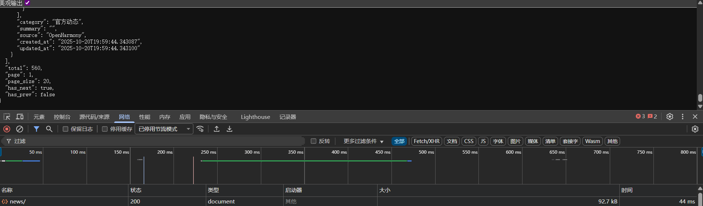

这是因为这个接口是当初最初设计的数据分页接口，一次仅仅会返回20条数据，并使用`"has_next": true,`字段去进行是否存在下一页的标识。对于这个接口具体的传参我还需要回去再研读一下源码。

44ms的响应时间可以说是十分优秀的，所以明天开始我的核心任务就可以设置为用这个接口去逐步获取数据。

## 封堵外露端口后的运行状态监测

在上文中我们已经完整了对于对外暴露的端口的封堵，在当天晚上的检测中运行状态一切良好，但观测的时间还不够久，所以间隔两天我回来继续去进行观测，看看我们的操作是否阻隔了原来受到的攻击。

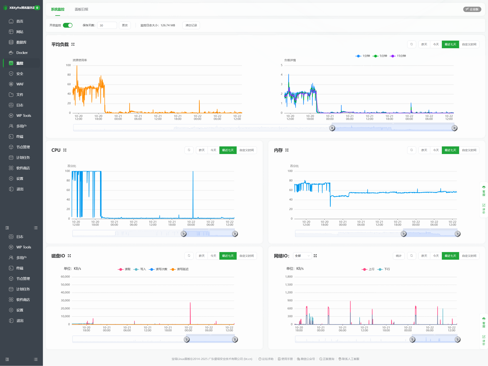

通过监测数据可以看到，在经过我们的操作之后，服务器对于外部攻击的防御已经达到了一个非常良好的水平，CPU的占用率也是持续维持在2%以下，仅出现了一次飙高的情况。

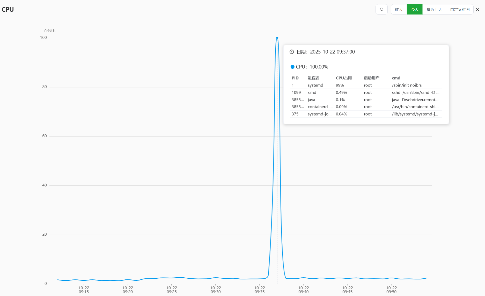

通过当时的系统记录数据来分析一下原因。从上图可以看到，该时间段的占用率飙高由 PID 1（systemd）进程引发。systemd 是 Linux 的核心进程，用于管理和监管各类服务。PID 1 的短时 CPU 占用升高并不必然意味着服务异常，常见成因还包括定时任务触发、服务一次性启动/重载、日志写入突增（journald）或设备扫描等。结合前文“CPU 常态低于 2% 且仅一次短时升高”的现象，更像是一次性活动所致；若要进一步确认，可结合当时的 journal 与 unit 状态再核实。
