---
title: NowInOpenHarmony上架笔记之再起新征程
date: 2025-10-12 14:17:05
tags:
  - 开源之夏
  - 鸿蒙
  - 项目
  - 技术向
  - NowInOpenHarmony
cover:  /imgs/ArticleTopImgs/NowInOpenHarmonyPutawayTopImg.jpg
description: NowInOpenHarmony上架笔记2，记录OpenHarmony官网重构后的新征程
typewriter: 🚀 从开源之夏到应用上架的完整征程！本文记录了NowInOpenHarmony项目从开发完成到正式上架的全流程实践。深入探索了服务器部署的技术细节，包括Docker容器化、宝塔面板操作、环境配置等核心技术。特别详细地记录了部署过程中遇到的tar格式技术难题及其解决方案，通过实际踩坑经历深入理解了很多技术细节的本质区别。从GitHub分支管理到Ubuntu服务器配置，从环境搭建到镜像构建，每一个步骤都有详细的截图和说明。这不仅是一次技术实践的记录，更是从学生开发者向产品开发者转变的重要里程碑，见证了第一个正式上架应用的诞生过程。
post_copyright:
copyright_author: XBXyftx
copyright_author_href: https://github.com/XBXyftx
copyright_url: https://xbxyftx.top
copyright_info: 此文章版权归XBXyftx所有，如有转载，请註明来自原作者
---

## 前言

时隔一个国庆假期，我在抛去一切技术焦虑尽情的享受假期之后也是回来重振旗鼓，准备开始开展NowInOpenHarmony的后端重构之旅了。这个项目我不能放弃，这是当下我距离正式上架最近的一个项目，而且我也已经成果实现了针对于后端的docker容器化部署，同时有了之前踩坑的经历我会用更加直接切中要害的方式去进行调整。

## 新版OpenHarmony官网的内容变化

重构的第一件事肯定是要去审视一下我们新的数据源————新版NowInOpenHarmony官网，看看它和旧版相比有哪些变化，以及这些变化对我们项目的影响。记得在国庆前我看到openharmony官网的更新的时候我是有点绝望的因为我是压根没有看到原来那个咨询页面和博文页面依旧存在，只看到了新的首页。所以我先去整体的浏览一遍看看有没有可以作为新版数据源的页面。


在浏览的时候我看到了导航栏的这个分栏，我瞬间捕捉到了关键词“咨询”和“动态”，我立刻点进去看，不看不知道一看吓一跳，原来这就是原来那个网页！！！

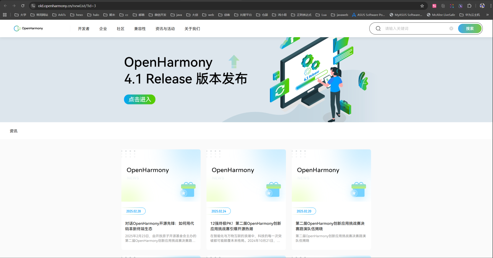

卧槽原来它并没有被废弃，只是从原来的根域名被新主页给挤压到old前缀的子域名了，太好了，不仅不用去寻找新的数据源，还不用重新针对新的页面去进行重构了。


## 重构后端

这里当然还是先请出我们的老朋友CC啦。

### 让CC的新对话熟悉现在的后端逻辑

在和AI连续的对话构建一个项目固然是方便毕竟上下文连贯AI的记忆也是很连贯的，但也是会有死钻牛角尖的情况出现，AI也很容易陷入到自己的惯性思维中不能自拔，最后越改越屎所以我一定是要开一个新对话去进行编程的。

对于一个新的对话，熟悉当前的项目结构是很重要的，对于CC来说他是有一个独特的优势在于`/init`指令可以一键让CC对当前的项目有一个最初始的印象，了解项目的架构同时去编写或是更新项目的claude.md文件。

在执行`/init`之后还不够，由于我们所需要的是修改一个爬虫逻辑中的一个细节所以我还是决定让CC进一步的去阅读并理解一下三个爬虫的逻辑以及工作流程，并告诉他我们接下来的工作主要是围绕这三个文件去进行展开的。

```bash
现在请你着重关注关注后端服务中针对于openharmony官网囊咨询页面的爬虫 @services/openharmony_crawler.py 博文页面爬虫 @services/openharmony_blog_crawler.py 还有轮播图爬虫 @services/openharmony_image_crawler.py 我们接下来的工作重点在于针对于这三个爬虫的重构升级，现在请你先仔细阅读并给我理清三个爬虫的逻辑，暂时不要修改任何代码

我已经仔细阅读了三个爬虫的代码，现在为您详细梳理它们的逻辑架构：
1. OpenHarmony官网新闻爬虫 (openharmony_crawler.py)
核心流程
API获取文章列表 → 快速有效性校验 → 逐篇解析内容 → 分批回调写入
关键特性
数据源
API端点: https://www.openharmony.cn/backend/knowledge/secondaryPage/queryBatch?type=3
type=3 表示官方动态类型
两阶段爬取策略 (openharmony_crawler.py:41-127) 阶段1: 高效批量获取文章元信息
每页300条数据（减少API请求次数）
分页遍历直到无数据
URL去重（使用字典）
日期标准化为 YYYY-MM-DD 格式
请求间隔：0.3秒
阶段2: 智能有效性校验 (openharmony_crawler.py:95-127)
快速抽样: 只检查前10个URL
阈值判断: 有效率≥80% → 跳过完整校验
降级策略: 有效率<80% → 完整URL校验
使用 HEAD 请求减少带宽消耗
内容解析 (openharmony_crawler.py:129-167)
多选择器策略：尝试多种容器class/id
支持元素类型：p, h1-h6, div, img, video
文本过滤：长度>10字符
图片处理：data-src > data-original > src
输出格式：{type: "text"|"image"|"video", value: string}
分批处理机制 (openharmony_crawler.py:223-279)
默认batch_size=20篇
累积到批次大小后立即执行回调
处理剩余批次（不足batch_size的部分）
回调失败不影响爬取继续
数据格式化 (openharmony_crawler.py:199-221)
{
    "id": "MD5(url)[:16]",  # 16位哈希ID
    "title": string,
    "date": "YYYY-MM-DD",    # 标准化日期
    "url": string,
    "content": [{type, value}],
    "category": "官方动态",
    "summary": string,
    "source": "OpenHarmony",
    "created_at": ISO8601,
    "updated_at": ISO8601
}
2. OpenHarmony技术博客爬虫 (openharmony_blog_crawler.py)
核心流程
API分页获取 → 提取文章元信息 → 逐篇解析内容 → 分批回调写入 → 数据验证
关键特性
数据源
API端点: 同官网爬虫，但 type=2 表示技术博客
每页200条数据
分页获取 (openharmony_blog_crawler.py:57-115)
获取 totalPage 和 totalNum
循环处理每页数据
请求间隔：0.5秒
响应格式验证：检查 code == 0
元信息提取 (openharmony_blog_crawler.py:117-143)
必需字段验证：title, url
日期格式转换：将 "2024.06.06" → "2024-06-06"
提取 content 字段作为 summary
内容解析增强 (openharmony_blog_crawler.py:168-235)
更多容器选择器（包括 main, article-content）
支持额外元素：pre, code
code块单独处理为 {type: "code", value: string}
文本过滤：长度>10字符
分批处理 (openharmony_blog_crawler.py:258-334)
与官网爬虫完全一致的逻辑
默认batch_size=20
日志前缀：[OpenHarmony博客] 便于区分
数据格式化差异 (openharmony_blog_crawler.py:237-256)
{
    # ... 同官网爬虫
    "category": "技术博客",  # 区别于"官方动态"
    "source": "OpenHarmony技术博客",
}
数据验证 (openharmony_blog_crawler.py:336-367)
检查必需字段：id, title, url, content, source
检查内容非空
检查URL有效性（以http开头）
返回有效文章统计
3. OpenHarmony轮播图爬虫 (openharmony_image_crawler.py)
核心流程
获取手机版页面 → 查找banner-img元素 → 下载图片 → 保存本地
关键特性
数据源
目标页面: https://www.openharmony.cn/mainPlay/
手机版User-Agent模拟iPhone
请求头配置 (openharmony_image_crawler.py:32-43)
'User-Agent': 'Mozilla/5.0 (iPhone; CPU iPhone OS 14_7_1...)',
'Sec-Fetch-Dest': 'document',
'Cache-Control': 'max-age=0'
图片查找策略 (openharmony_image_crawler.py:64-103)
CSS选择器：class 包含 "banner-img"
图片URL优先级：data-src > data-original > src
提取元数据：alt, class, id
URL转换：相对路径 → 绝对路径
下载机制 (openharmony_image_crawler.py:105-168)
文件名处理：
优先使用URL中的文件名
无扩展名时从Content-Type推断
已存在文件添加时间戳避免覆盖
下载超时：30秒
结果返回：status, filename, file_path, file_size
错误捕获：返回失败状态和错误信息
完整爬取流程 (openharmony_image_crawler.py:170-217)
获取页面HTML
解析所有banner图片
逐张下载（间隔1秒）
统计成功/失败数量
返回详细结果列表
轻量级方法 (openharmony_image_crawler.py:219-227)
get_banner_image_info(): 只获取图片URL信息，不下载
三个爬虫的共性与差异
共性特征
统一的Session管理: 都使用 requests.Session() 保持连接
User-Agent伪装: 模拟真实浏览器
超时控制: 防止请求挂起
日志记录: 详细的emoji标记日志
错误处理: try-except捕获，不中断整体流程
请求间隔: 避免过于频繁的请求
核心差异
特性	官网新闻	技术博客	轮播图
数据源	API (type=3)	API (type=2)	HTML解析
页面大小	300条/页	200条/页	N/A
有效性校验	✅ 智能抽样	❌ 无	❌ 无
分批回调	✅ 支持	✅ 支持	❌ 不支持
内容类型	text/image/video	text/image/video/code	仅image
本地下载	❌ 仅URL	❌ 仅URL	✅ 下载到本地
数据验证	❌ 无	✅ 完整验证	✅ 下载验证
category	"官方动态"	"技术博客"	N/A
潜在问题点
性能瓶颈
官网/博客爬虫的内容解析是同步的（每篇文章1秒间隔）
没有并发下载机制
轮播图爬虫每次都重新下载，无缓存机制
健壮性问题
官网爬虫的快速校验可能不准确（只检查10个URL）
博客爬虫缺少URL有效性预检
所有爬虫缺少重试机制
图片爬虫依赖特定class名称，易失效
数据一致性
两个新闻爬虫使用相同的ID生成方式（MD5），可能冲突
日期格式化逻辑在两个爬虫中略有不同
content结构验证不完整（批处理回调中有验证，但爬虫本身没有）
可维护性
HTML解析选择器硬编码
三个爬虫缺少统一的基类
配置项（超时、间隔）分散在代码中
建议的重构方向
如果后续要升级这三个爬虫，可以考虑：
统一基类架构: 抽象公共逻辑（Session管理、错误处理、重试机制）
并发优化: 引入异步爬取或线程池
智能缓存: 轮播图增加本地缓存和更新检测
健壮性增强:
统一的重试装饰器
更完善的URL有效性检查
响应式选择器配置
监控指标: 爬取耗时、成功率、数据质量统计
您想先从哪个方向开始重构？
```

### 重构过程

#### 文件重命名

我首先让CC先帮我针对于官网的咨询页爬虫进行一下重命名，因为当初他是第一个开发的就没有很规范的命名，而py这个东西又是解释型语言，不同文件之间调用有基本上是跑起来解释到那里才知道有问题，所以我就直接用CC去进行重构还是更快捷一些。

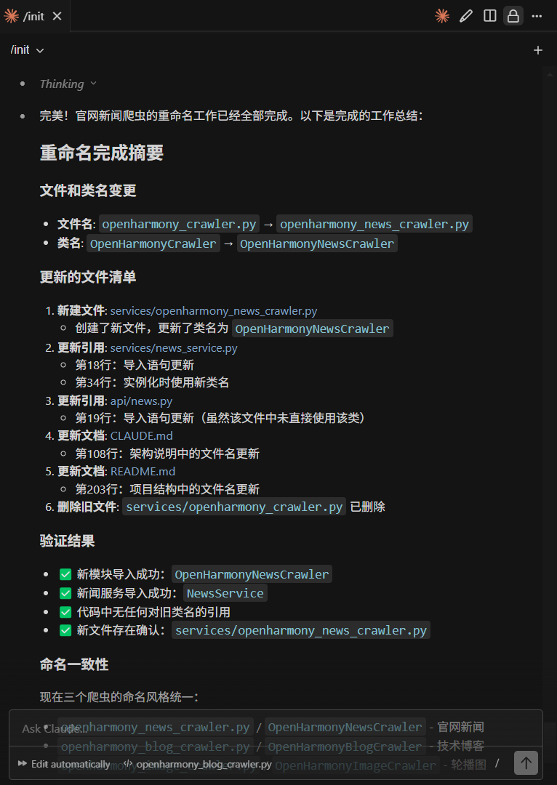

嗯，就还挺爽的。

#### old子域名重构

这一块的话我得向CC阐述一下来龙去脉并给他新的API。所以首先我需要先去官网进行一下抓包找到之前用于获取目标网页的那个api接口，我希望它只是将原来的这套网页代码的基地址换成了新的子域名而不是说进行了完整的重构。这样我就只需要更换一下API就好了。

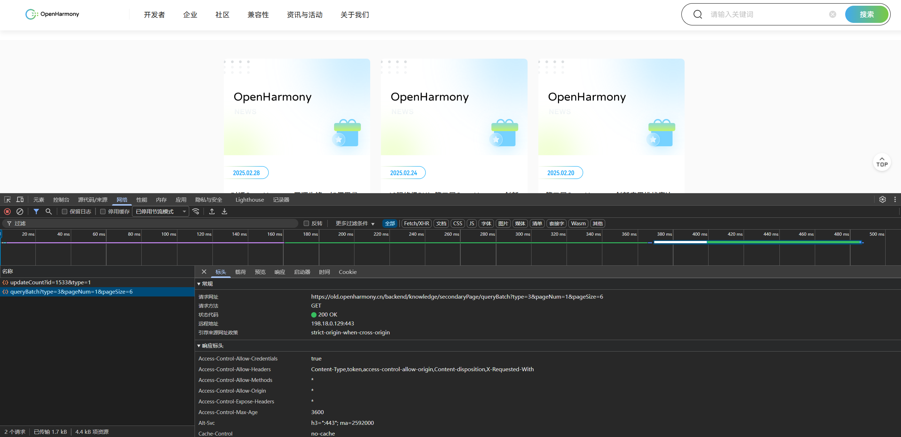

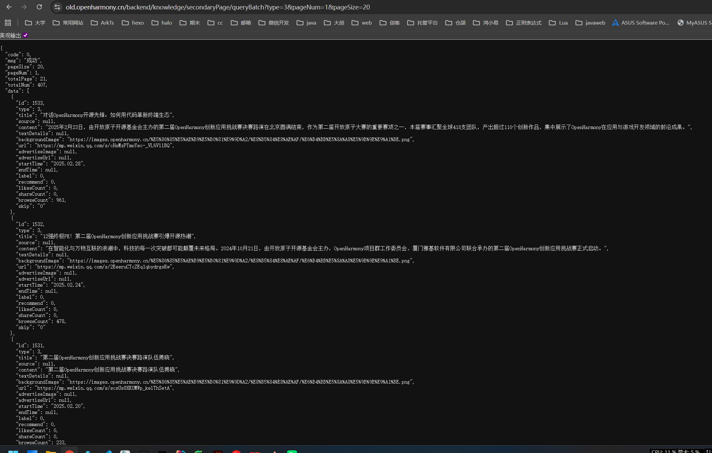

```json
// https://old.openharmony.cn/backend/knowledge/secondaryPage/queryBatch?type=3&pageNum=1&pageSize=20
{
  "code": 0,
  "msg": "成功",
  "pageSize": 20,
  "pageNum": 1,
  "totalPage": 21,
  "totalNum": 407,
  "data": [
    {
      "id": 1533,
      "type": 3,
      "title": "对话OpenHarmony开源先锋：如何用代码革新终端生态",
      "source": null,
      "content": "2025年2月23日，由开放原子开源基金会主办的第二届OpenHarmony创新应用挑战赛决赛路演在北京圆满结束，作为第二届开放原子大赛的重要赛项之一，本届赛事汇聚全球418支团队，产出超过110个创新作品，集中展示了OpenHarmony在应用与游戏开发领域的前沿成果。",
      "textDetails": null,
      "backgroundImage": "https://images.openharmony.cn/%E5%86%85%E5%AE%B9%E5%B0%81%E9%9D%A2/%E8%B5%84%E8%AE%AF/%E6%B4%BB%E5%8A%A8%E5%9B%9E%E9%A1%BE.png",
      "url": "https://mp.weixin.qq.com/s/cHsMzPTmoYec-_VL6VllBQ",
      "advertiseImage": null,
      "advertiseUrl": null,
      "startTime": "2025.02.28",
      "endTime": null,
      "label": 0,
      "recommend": 0,
      "likesCount": 0,
      "shareCount": 0,
      "browseCount": 961,
      "skip": "0"
    },
    {
      "id": 1532,
      "type": 3,
      "title": "12强终极PK！第二届OpenHarmony创新应用挑战赛引爆开源热潮",
      "source": null,
      "content": "在智能化与万物互联的浪潮中，科技的每一次突破都可能颠覆未来格局。2024年10月21日，由开放原子开源基金会主办，OpenHarmony项目群工作委员会、厦门雅基软件有限公司联合承办的第二届OpenHarmony创新应用挑战赛正式启动。",
      "textDetails": null,
      "backgroundImage": "https://images.openharmony.cn/%E5%86%85%E5%AE%B9%E5%B0%81%E9%9D%A2/%E8%B5%84%E8%AE%AF/%E6%B4%BB%E5%8A%A8%E5%9B%9E%E9%A1%BE.png",
      "url": "https://mp.weixin.qq.com/s/2EeeruCTcZEq1qbydrgsKw",
      "advertiseImage": null,
      "advertiseUrl": null,
      "startTime": "2025.02.24",
      "endTime": null,
      "label": 0,
      "recommend": 0,
      "likesCount": 0,
      "shareCount": 0,
      "browseCount": 478,
      "skip": "0"
    },
    {
      "id": 1531,
      "type": 3,
      "title": "第二届OpenHarmony创新应用挑战赛决赛路演队伍揭晓",
      "source": null,
      "content": "第二届OpenHarmony创新应用挑战赛决赛路演队伍揭晓",
      "textDetails": null,
      "backgroundImage": "https://images.openharmony.cn/%E5%86%85%E5%AE%B9%E5%B0%81%E9%9D%A2/%E8%B5%84%E8%AE%AF/%E6%B4%BB%E5%8A%A8%E5%9B%9E%E9%A1%BE.png",
      "url": "https://mp.weixin.qq.com/s/scsUs8XKUMWp_kelThSetA",
      "advertiseImage": null,
      "advertiseUrl": null,
      "startTime": "2025.02.20",
      "endTime": null,
      "label": 0,
      "recommend": 0,
      "likesCount": 0,
      "shareCount": 0,
      "browseCount": 233,
      "skip": "0"
    },
    {
      "id": 1530,
      "type": 3,
      "title": "OpenHarmony社区2024年度运营报告发布，致谢每一位生态共建者！",
      "source": null,
      "content": "OpenHarmony社区2024年度运营报告发布！",
      "textDetails": null,
      "backgroundImage": "https://images.openharmony.cn/%E5%86%85%E5%AE%B9%E5%B0%81%E9%9D%A2/%E8%B5%84%E8%AE%AF/%E6%B4%BB%E5%8A%A8%E5%9B%9E%E9%A1%BE.png",
      "url": "https://mp.weixin.qq.com/s/njNirZfZFhwztz9zNnuc-A",
      "advertiseImage": null,
      "advertiseUrl": null,
      "startTime": "2025.02.11",
      "endTime": null,
      "label": 0,
      "recommend": 0,
      "likesCount": 0,
      "shareCount": 0,
      "browseCount": 145,
      "skip": "0"
    },
    {
      "id": 1528,
      "type": 3,
      "title": "开源鸿蒙社区恭祝全体开发者2025新年快乐，新春大吉！",
      "source": null,
      "content": "恭祝全体开发者2025新年快乐，新春大吉！",
      "textDetails": null,
      "backgroundImage": "https://images.openharmony.cn/%E5%86%85%E5%AE%B9%E5%B0%81%E9%9D%A2/%E8%B5%84%E8%AE%AF/%E6%B4%BB%E5%8A%A8%E5%9B%9E%E9%A1%BE.png",
      "url": "https://mp.weixin.qq.com/s/fVn6brUk2EnPbUcc3pLeCA",
      "advertiseImage": null,
      "advertiseUrl": null,
      "startTime": "2025.01.29",
      "endTime": null,
      "label": 0,
      "recommend": 0,
      "likesCount": 0,
      "shareCount": 0,
      "browseCount": 76,
      "skip": "0"
    },
    {
      "id": 1527,
      "type": 3,
      "title": "共绘2025年开源新蓝图，OpenHarmony社区项目管理委员会年度工作会议在深圳成功举办",
      "source": null,
      "content": "2025年1月12日上午，OpenHarmony社区项目管理委员会（PMC）（以下简称“PMC”）年度工作会议在深圳召开。本次会议全面总结了2024年PMC的工作及成果，以及明确了2025年PMC工作方向和重点工作，为OpenHarmony社区在2025年持续快速发展及繁荣打下厚实基础。",
      "textDetails": null,
      "backgroundImage": "https://images.openharmony.cn/%E5%86%85%E5%AE%B9%E5%B0%81%E9%9D%A2/%E8%B5%84%E8%AE%AF/%E6%B4%BB%E5%8A%A8%E5%9B%9E%E9%A1%BE.png",
      "url": "https://mp.weixin.qq.com/s/0q1ThRgDGocGMWp1ufHHrA",
      "advertiseImage": null,
      "advertiseUrl": null,
      "startTime": "2025.01.27",
      "endTime": null,
      "label": 0,
      "recommend": 0,
      "likesCount": 0,
      "shareCount": 0,
      "browseCount": 121,
      "skip": "0"
    },
    {
      "id": 1526,
      "type": 3,
      "title": "开源鸿蒙项目群新增捐赠人（2024年12月）",
      "source": null,
      "content": "2024年12月，新增以下单位成为开源鸿蒙项目群捐赠人：• 中国南方电网有限责任公司成为A类捐赠人• 宝马诚迈信息技术有限公司成为B类捐赠人",
      "textDetails": null,
      "backgroundImage": "https://images.openharmony.cn/%E5%86%85%E5%AE%B9%E5%B0%81%E9%9D%A2/%E8%B5%84%E8%AE%AF/%E6%B4%BB%E5%8A%A8%E5%9B%9E%E9%A1%BE.png",
      "url": "https://mp.weixin.qq.com/s/OG5vZWwXk5EaM5iomCCXzA",
      "advertiseImage": null,
      "advertiseUrl": null,
      "startTime": "2025.01.21",
      "endTime": null,
      "label": 0,
      "recommend": 0,
      "likesCount": 0,
      "shareCount": 0,
      "browseCount": 119,
      "skip": "0"
    },
    {
      "id": 1525,
      "type": 3,
      "title": "开源鸿蒙社区隆重致谢授牌2024年度社区贡献单位和个人",
      "source": null,
      "content": "2024 年，开源鸿蒙社区在各方共建下成绩卓著。截至2024年12月31日，开源鸿蒙社区成员单位已达 63 家，其中2024年新增 28家捐赠单位；累计发布 8 个大版本，2024年发布了OpenHarmony 4.1 Release与 5.0 Release；累计建立 68个 SIG，累计代码行数超1.2亿行。开源鸿蒙社区成功举办OpenHarmony开发者大会2024、第三届OpenHarmony技术大会、Oniro分论坛等多个社区旗舰活动，发布了《OpenHarmony共建地图3.0》并致谢授牌12家“百人代码贡献单位”和8家“应用建设领航单位”，社区代码共建单位超70家。",
      "textDetails": null,
      "backgroundImage": "https://images.openharmony.cn/%E5%86%85%E5%AE%B9%E5%B0%81%E9%9D%A2/%E8%B5%84%E8%AE%AF/%E6%B4%BB%E5%8A%A8%E5%9B%9E%E9%A1%BE.png",
      "url": "https://mp.weixin.qq.com/s/ns496Jff0FPMBuwgqnVTpg",
      "advertiseImage": null,
      "advertiseUrl": null,
      "startTime": "2025.01.16",
      "endTime": null,
      "label": 0,
      "recommend": 0,
      "likesCount": 0,
      "shareCount": 0,
      "browseCount": 15,
      "skip": "0"
    },
    {
      "id": 1524,
      "type": 3,
      "title": "厚植根基，同启新程！一文回顾 2024 OpenHarmony 社区年度工作会议精彩瞬间",
      "source": null,
      "content": "2025年1月10日-11日，OpenAtom OpenHarmony（开放原子开源鸿蒙，以下简称“OpenHarmony”或“开源鸿蒙”）社区2024年度工作会议于深圳盛大启幕，这场备受瞩目的盛会汇聚了开源鸿蒙社区众多成员单位，共同回顾过去一年OpenHarmony社区在技术研发、生态建设、教育推广等关键领域的卓越成就，并携手展望2025年发展宏图，旨在为OpenHarmony社区的持续繁荣注入新动力，引领开源技术迈向更广阔的发展天地，为构建智能互联的未来奠定坚实基石。",
      "textDetails": null,
      "backgroundImage": "https://images.openharmony.cn/%E5%86%85%E5%AE%B9%E5%B0%81%E9%9D%A2/%E8%B5%84%E8%AE%AF/%E6%B4%BB%E5%8A%A8%E5%9B%9E%E9%A1%BE.png",
      "url": "https://mp.weixin.qq.com/s/HFsNyhAxd17Ad4vRDYCAUQ",
      "advertiseImage": null,
      "advertiseUrl": null,
      "startTime": "2025.01.16",
      "endTime": null,
      "label": 0,
      "recommend": 0,
      "likesCount": 0,
      "shareCount": 0,
      "browseCount": 16,
      "skip": "0"
    },
    {
      "id": 1523,
      "type": 3,
      "title": "第二届OpenHarmony创新应用挑战赛决赛晋级名单公示",
      "source": null,
      "content": "2024年10月21日，第二届OpenHarmony创新应用挑战赛正式启动，双赛题总奖金高达50万元，吸引了全国各地418支队伍参赛。",
      "textDetails": null,
      "backgroundImage": "https://images.openharmony.cn/%E5%86%85%E5%AE%B9%E5%B0%81%E9%9D%A2/%E8%B5%84%E8%AE%AF/%E6%B4%BB%E5%8A%A8%E5%9B%9E%E9%A1%BE.png",
      "url": "https://mp.weixin.qq.com/s/JxWvIBGmTbUobjAaSQ3ViQ",
      "advertiseImage": null,
      "advertiseUrl": null,
      "startTime": "2025.01.13",
      "endTime": null,
      "label": 0,
      "recommend": 0,
      "likesCount": 0,
      "shareCount": 0,
      "browseCount": 9,
      "skip": "0"
    },
    {
      "id": 1520,
      "type": 3,
      "title": "一元复始 万象更新|开源鸿蒙社区祝广大开发者元旦快乐！",
      "source": null,
      "content": "祝广大开发者元旦快乐！",
      "textDetails": null,
      "backgroundImage": "https://images.openharmony.cn/%E5%86%85%E5%AE%B9%E5%B0%81%E9%9D%A2/%E8%B5%84%E8%AE%AF/%E6%B4%BB%E5%8A%A8%E5%9B%9E%E9%A1%BE.png",
      "url": "https://mp.weixin.qq.com/s/5DjNglcGividIsKrEeVrFA",
      "advertiseImage": null,
      "advertiseUrl": null,
      "startTime": "2025.01.01",
      "endTime": null,
      "label": 0,
      "recommend": 0,
      "likesCount": 0,
      "shareCount": 0,
      "browseCount": 146,
      "skip": null
    },
    {
      "id": 1519,
      "type": 3,
      "title": "OpenHarmony程序分析框架论文入选第50届国际软件工程大会ICSE2025",
      "source": null,
      "content": "近日，ICSE 2025软件工程实践Track放榜，面向OpenAtom OpenHarmony（以下简称“OpenHarmony”）的ArkTS程序分析基础框架--方舟程序分析器（论文题目为《ArkAnalyzer：The Static Analysis Framework for OpenHarmony》）被接收。这是OpenHarmony相关研究首次在ICSE发表论文，这篇文章的接收意味着OpenHarmony正式被国际软件工程研究人员认可，为学术界研究OpenHarmony提供了参考。",
      "textDetails": null,
      "backgroundImage": "https://images.openharmony.cn/%E5%86%85%E5%AE%B9%E5%B0%81%E9%9D%A2/%E8%B5%84%E8%AE%AF/%E6%B4%BB%E5%8A%A8%E5%9B%9E%E9%A1%BE.png",
      "url": "https://mp.weixin.qq.com/s/RbTdqoOWJ6zv-bkFjZDb6g",
      "advertiseImage": null,
      "advertiseUrl": null,
      "startTime": "2024.12.31",
      "endTime": null,
      "label": 0,
      "recommend": 0,
      "likesCount": 0,
      "shareCount": 0,
      "browseCount": 54,
      "skip": null
    },
    {
      "id": 1518,
      "type": 3,
      "title": "OpenHarmony开发者激励计划 | 2024年度精彩回顾",
      "source": null,
      "content": "2024年度精彩回顾",
      "textDetails": null,
      "backgroundImage": "https://images.openharmony.cn/%E5%86%85%E5%AE%B9%E5%B0%81%E9%9D%A2/%E8%B5%84%E8%AE%AF/%E6%B4%BB%E5%8A%A8%E5%9B%9E%E9%A1%BE.png",
      "url": "https://mp.weixin.qq.com/s/U1S4BXOFVMjFdKUdJ5lzgw",
      "advertiseImage": null,
      "advertiseUrl": null,
      "startTime": "2024.12.31",
      "endTime": null,
      "label": 0,
      "recommend": 0,
      "likesCount": 0,
      "shareCount": 0,
      "browseCount": 149,
      "skip": null
    },
    {
      "id": 1517,
      "type": 3,
      "title": "开源鸿蒙荣获开放原子“2024年度操作系统领域国内活跃开源项目”",
      "source": null,
      "content": "12月20日，2024开放原子开发者大会暨首届开源技术学术大会在武汉圆满召开。在大会开幕式“2024年度国内活跃开源项目&开发者致谢仪式”上，开放原子开源鸿蒙（OpenAtom OpenHarmony，简称“开源鸿蒙”或“OpenHarmony”）荣获“2024年度操作系统领域国内活跃开源项目”。",
      "textDetails": null,
      "backgroundImage": "https://images.openharmony.cn/%E5%86%85%E5%AE%B9%E5%B0%81%E9%9D%A2/%E8%B5%84%E8%AE%AF/%E6%B4%BB%E5%8A%A8%E5%9B%9E%E9%A1%BE.png",
      "url": "https://mp.weixin.qq.com/s/mdfnnjNLiUrvnEk6PcVBTw",
      "advertiseImage": null,
      "advertiseUrl": null,
      "startTime": "2024.12.27",
      "endTime": null,
      "label": 0,
      "recommend": 0,
      "likesCount": 0,
      "shareCount": 0,
      "browseCount": 16,
      "skip": null
    },
    {
      "id": 1516,
      "type": 3,
      "title": "OpenHarmony项目群10-11月新增捐赠人",
      "source": null,
      "content": "2024年10月，新增以下单位成为OpenHarmony项目群捐赠人：\n博赛数字科技集团有限公司成为C类捐赠人\n元心信息科技集团有限公司成为C类捐赠人\n上海健麾信息技术股份有限公司成为B类捐赠人\n2024年11月，新增以下单位成为OpenHarmony项目群捐赠人：\n武汉风行在线技术有限公司成为C类捐赠人\n诚迈科技（南京）股份有限公司成为A类捐赠人",
      "textDetails": null,
      "backgroundImage": "https://images.openharmony.cn/%E5%86%85%E5%AE%B9%E5%B0%81%E9%9D%A2/%E8%B5%84%E8%AE%AF/%E6%B4%BB%E5%8A%A8%E5%9B%9E%E9%A1%BE.png",
      "url": "https://mp.weixin.qq.com/s/8BD9TnuVTJaM4zn_58Te5A",
      "advertiseImage": null,
      "advertiseUrl": null,
      "startTime": "2024.12.25",
      "endTime": null,
      "label": 0,
      "recommend": 0,
      "likesCount": 0,
      "shareCount": 0,
      "browseCount": 19,
      "skip": null
    },
    {
      "id": 1515,
      "type": 3,
      "title": "大咖导师 源力唤醒|第二届开源鸿蒙创新应用挑战赛导师阵容重磅亮相",
      "source": null,
      "content": "导师阵容亮相",
      "textDetails": null,
      "backgroundImage": "https://images.openharmony.cn/%E5%86%85%E5%AE%B9%E5%B0%81%E9%9D%A2/%E8%B5%84%E8%AE%AF/%E6%B4%BB%E5%8A%A8%E5%9B%9E%E9%A1%BE.png",
      "url": "https://mp.weixin.qq.com/s/Mc2_FPR7qpO1zWAVxF5JOQ",
      "advertiseImage": null,
      "advertiseUrl": null,
      "startTime": "2024.12.24",
      "endTime": null,
      "label": 0,
      "recommend": 0,
      "likesCount": 0,
      "shareCount": 0,
      "browseCount": 7,
      "skip": null
    },
    {
      "id": 1514,
      "type": 3,
      "title": "与鸿同行，探索无限！开源鸿蒙技术分论坛在武汉成功举办",
      "source": null,
      "content": "12月20日，由开放原子开源基金会、中国通信学会主办，深圳开鸿数字产业发展有限公司（以下简称“深开鸿”）协办的2024开放原子开发者大会暨首届开源技术学术大会——开源鸿蒙技术分论坛在武汉顺利举行。本次论坛通过南北向开发赋能，融合前沿的行业案例经验，生动展现了开源鸿蒙在驱动技术创新与产业升级中的优势与无限潜能。",
      "textDetails": null,
      "backgroundImage": "https://images.openharmony.cn/%E5%86%85%E5%AE%B9%E5%B0%81%E9%9D%A2/%E8%B5%84%E8%AE%AF/%E6%B4%BB%E5%8A%A8%E5%9B%9E%E9%A1%BE.png",
      "url": "https://mp.weixin.qq.com/s/-WQvIFzU9g00dzJcQQQBGQ",
      "advertiseImage": null,
      "advertiseUrl": null,
      "startTime": "2024.12.23",
      "endTime": null,
      "label": 0,
      "recommend": 0,
      "likesCount": 0,
      "shareCount": 0,
      "browseCount": 4,
      "skip": null
    },
    {
      "id": 1513,
      "type": 3,
      "title": "开源鸿蒙5.0重磅发布，共赴万物智联未来",
      "source": null,
      "content": "12月20日，在2024开放原子开发者大会暨首届开源技术学术大会开幕式上，开放原子开源鸿蒙（即OpenAtom OpenHarmony，简称“开源鸿蒙”或“OpenHarmony”）项目群重磅发布了开源鸿蒙操作系统5.0 Release版本。",
      "textDetails": null,
      "backgroundImage": "https://images.openharmony.cn/%E5%86%85%E5%AE%B9%E5%B0%81%E9%9D%A2/%E8%B5%84%E8%AE%AF/%E6%B4%BB%E5%8A%A8%E5%9B%9E%E9%A1%BE.png",
      "url": "https://mp.weixin.qq.com/s/WQIbV9kwnhzeREaJHnEFVg",
      "advertiseImage": null,
      "advertiseUrl": null,
      "startTime": "2024.12.20",
      "endTime": null,
      "label": 0,
      "recommend": 0,
      "likesCount": 0,
      "shareCount": 0,
      "browseCount": 56,
      "skip": null
    },
    {
      "id": 1512,
      "type": 3,
      "title": "源鸿蒙 5.0 Release版本关键特性解读",
      "source": null,
      "content": "开源鸿蒙 5.0 Release版本是开源鸿蒙操作系统的一个里程碑，在系统能力、性能优化等多个方面进一步增强。本文将从系统功能、性能优化，安全和隐私保护以及分布式能力等角度，解读该版本的关键特性。如果想了解该版本完整的特性，请参考版本的Release notes。",
      "textDetails": null,
      "backgroundImage": "https://images.openharmony.cn/%E5%86%85%E5%AE%B9%E5%B0%81%E9%9D%A2/%E8%B5%84%E8%AE%AF/%E6%B4%BB%E5%8A%A8%E5%9B%9E%E9%A1%BE.png",
      "url": "https://mp.weixin.qq.com/s/eA1ckQBLTnHEO0af98nDKg",
      "advertiseImage": null,
      "advertiseUrl": null,
      "startTime": "2024.12.18",
      "endTime": null,
      "label": 0,
      "recommend": 0,
      "likesCount": 0,
      "shareCount": 0,
      "browseCount": 23,
      "skip": null
    },
    {
      "id": 1507,
      "type": 3,
      "title": "精彩预告 | 2024开放原子开发者大会OpenHarmony技术分论坛等您来！",
      "source": null,
      "content": "2024年12月20日，2024开放原子开发者大会暨首届开源技术学术大会即将在武汉举行。深开鸿在会上将承办“OpenHarmony技术分论坛”，通过南北向开发赋能，结合行业案例经验，让开发者更好更快地上手OpenHarmony开发流程。通过与不同技术的结合创新，展现OpenHarmony的技术优势和更多探索可能，诚邀更多开发者共赴这场探索之旅。",
      "textDetails": null,
      "backgroundImage": "https://images.openharmony.cn/%E5%86%85%E5%AE%B9%E5%B0%81%E9%9D%A2/%E8%B5%84%E8%AE%AF/%E6%B4%BB%E5%8A%A8%E5%9B%9E%E9%A1%BE.png",
      "url": "https://mp.weixin.qq.com/s/Bsx93rP5cj-vMgFjwIIeXg",
      "advertiseImage": null,
      "advertiseUrl": null,
      "startTime": " 2024.12.17",
      "endTime": null,
      "label": 0,
      "recommend": 0,
      "likesCount": 0,
      "shareCount": 0,
      "browseCount": 135,
      "skip": null
    }
  ]
}
```

```json
// https://old.openharmony.cn/backend/knowledge/secondaryPage/queryBatch?type=3&pageNum=1&pageSize=2
{
  "code": 0,
  "msg": "成功",
  "pageSize": 2,
  "pageNum": 1,
  "totalPage": 204,
  "totalNum": 407,
  "data": [
    {
      "id": 1533,
      "type": 3,
      "title": "对话OpenHarmony开源先锋：如何用代码革新终端生态",
      "source": null,
      "content": "2025年2月23日，由开放原子开源基金会主办的第二届OpenHarmony创新应用挑战赛决赛路演在北京圆满结束，作为第二届开放原子大赛的重要赛项之一，本届赛事汇聚全球418支团队，产出超过110个创新作品，集中展示了OpenHarmony在应用与游戏开发领域的前沿成果。",
      "textDetails": null,
      "backgroundImage": "https://images.openharmony.cn/%E5%86%85%E5%AE%B9%E5%B0%81%E9%9D%A2/%E8%B5%84%E8%AE%AF/%E6%B4%BB%E5%8A%A8%E5%9B%9E%E9%A1%BE.png",
      "url": "https://mp.weixin.qq.com/s/cHsMzPTmoYec-_VL6VllBQ",
      "advertiseImage": null,
      "advertiseUrl": null,
      "startTime": "2025.02.28",
      "endTime": null,
      "label": 0,
      "recommend": 0,
      "likesCount": 0,
      "shareCount": 0,
      "browseCount": 961,
      "skip": "0"
    },
    {
      "id": 1532,
      "type": 3,
      "title": "12强终极PK！第二届OpenHarmony创新应用挑战赛引爆开源热潮",
      "source": null,
      "content": "在智能化与万物互联的浪潮中，科技的每一次突破都可能颠覆未来格局。2024年10月21日，由开放原子开源基金会主办，OpenHarmony项目群工作委员会、厦门雅基软件有限公司联合承办的第二届OpenHarmony创新应用挑战赛正式启动。",
      "textDetails": null,
      "backgroundImage": "https://images.openharmony.cn/%E5%86%85%E5%AE%B9%E5%B0%81%E9%9D%A2/%E8%B5%84%E8%AE%AF/%E6%B4%BB%E5%8A%A8%E5%9B%9E%E9%A1%BE.png",
      "url": "https://mp.weixin.qq.com/s/2EeeruCTcZEq1qbydrgsKw",
      "advertiseImage": null,
      "advertiseUrl": null,
      "startTime": "2025.02.24",
      "endTime": null,
      "label": 0,
      "recommend": 0,
      "likesCount": 0,
      "shareCount": 0,
      "browseCount": 478,
      "skip": "0"
    }
  ]
}
```

啊啊啊太感动了哥们，完全没变，和我猜想的一样。

```txt
现在的任务是这样的，当前的三个爬虫都是在官网重构之前的，现在我们的数据源根地址变成了https://old.openharmony.cn/像是 @services/openharmony_news_crawler.py 中所用的数据源API api_url = f"{self.base_url}/backend/knowledge/secondaryPage/queryBatch?type=3&pageNum={page_num}&pageSize={page_size}"这一段就要变成https://old.openharmony.cn/backend/knowledge/secondaryPage/queryBatch?type=3&pageNum=1&pageSize=300 请以此类推，在保持原有模板字符串拼接URL的基础上将基地址进行更换
```

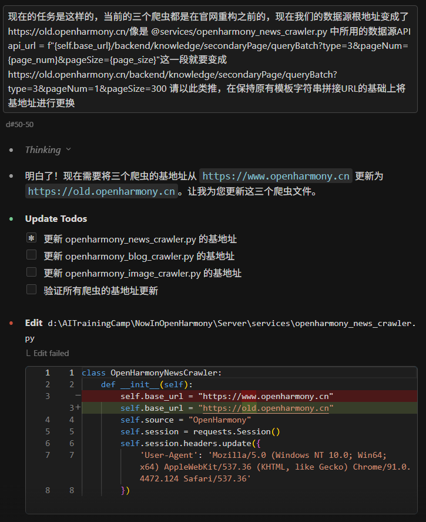

等了一会儿终于是跑完了，全部修改完成，现在让我试试吧。

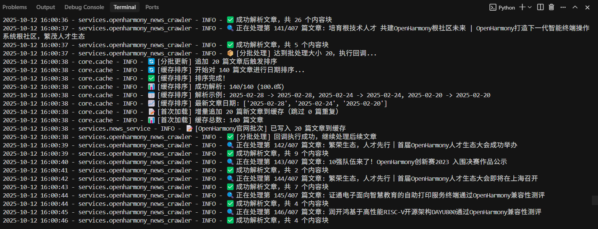

啊啊啊牛逼成功了，接下来就该去打包了。

### 打包上线

#### 本地打包

有了上一次的经验我决定先将当前项目在本地打包成tar文件，因为服务器的CPU只有两核打包确实是太慢了，所以我现在开始让cc帮我去进行打包。

在等待cc执行玩之后我还是遇到了那个问题，我无法单独打包为tar，总是会直接被打包为.tar.gz格式，我尝试先去和CC交涉一下，看看是不是因为CC理解错了。

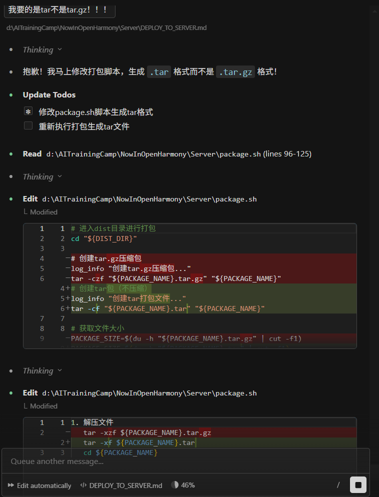

奥，原来还真是CC写错了。

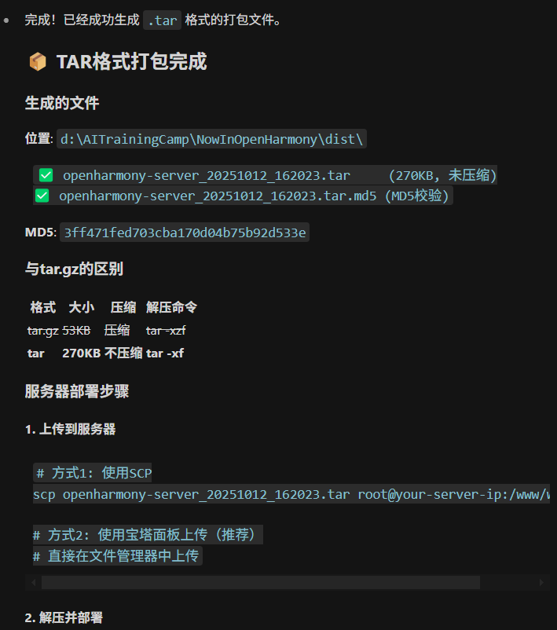

#### 云端部署镜像

嘶，到了云端我才发现我好像理解错了，我只记得上次错在了导入镜像时需要的是tar不是tar.gz但是这次我直接选择tar包进行镜像导入的时候却还是报错了。

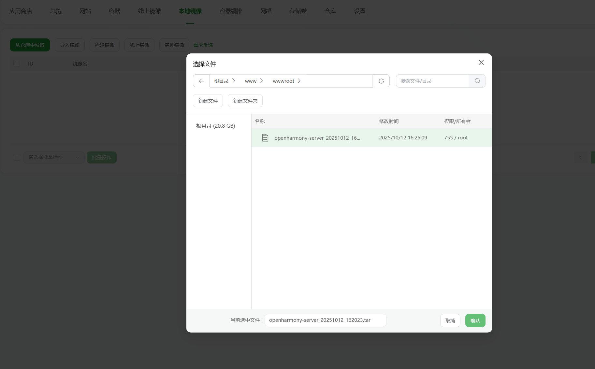

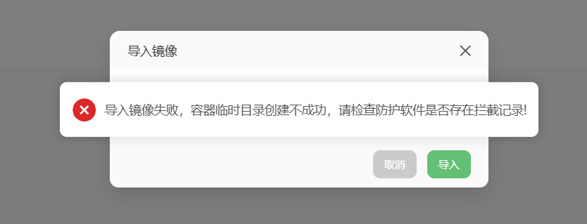

enm，我先给豆包看看吧。

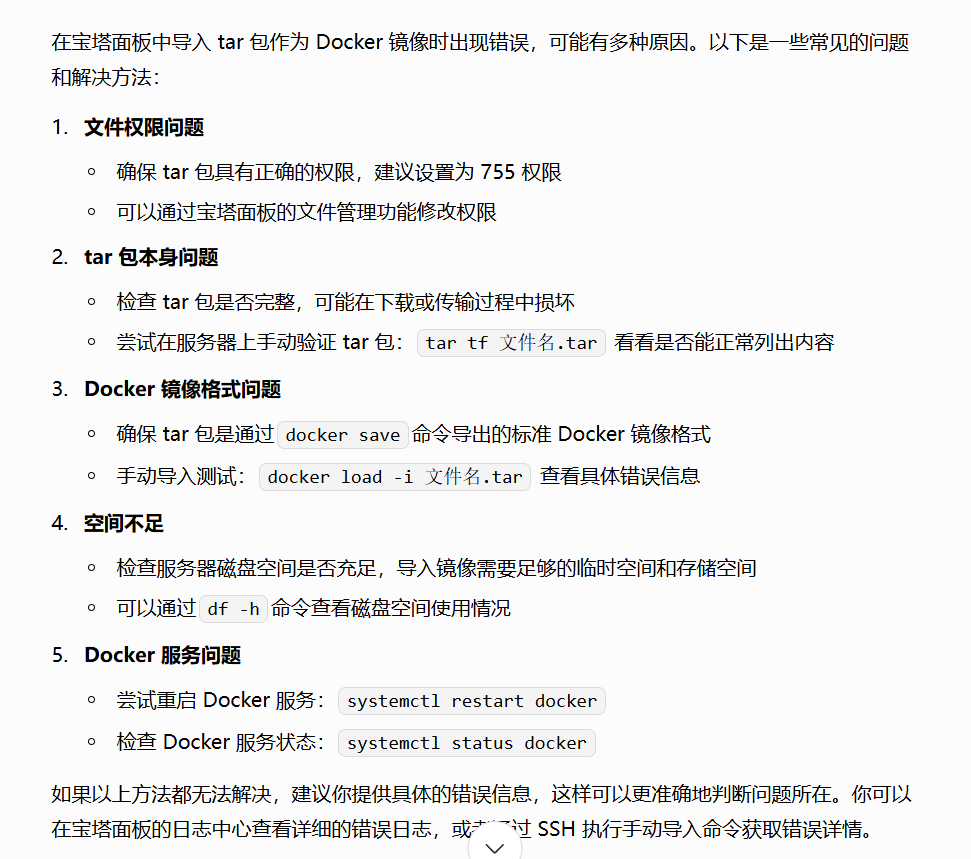

奥，纯粹的打包成tar文件是不够的我们还需要用docker save来去导出标准的镜像包文件。

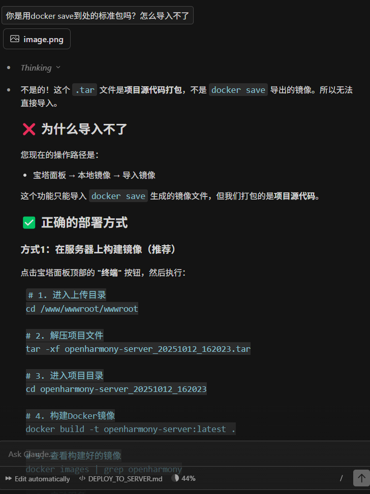

原来是这个原因。那我还是老老实实的去用命令行在云端构建吧。

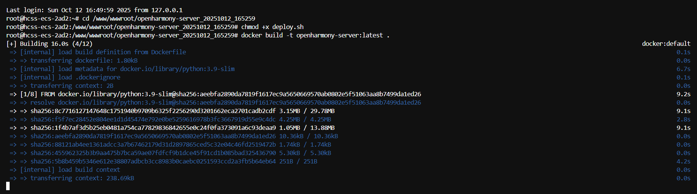

又开始了这个漫长的构建过程。

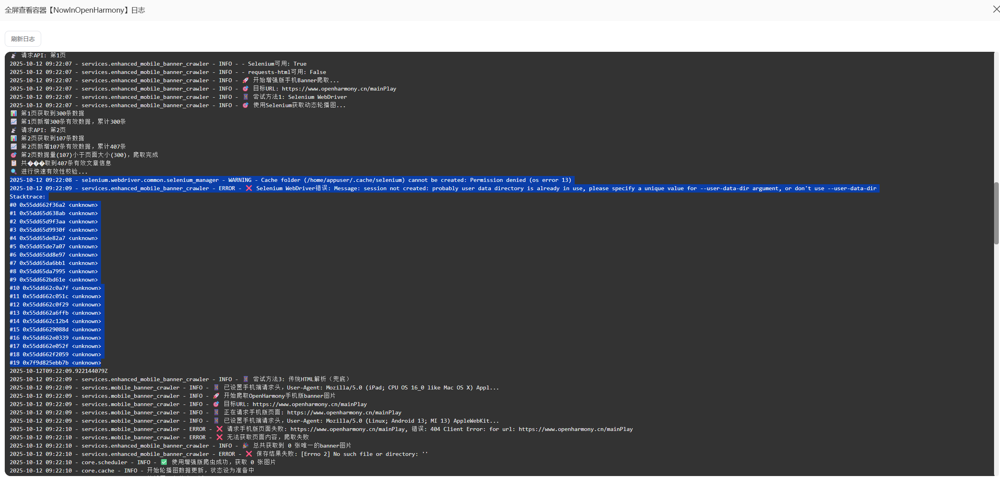

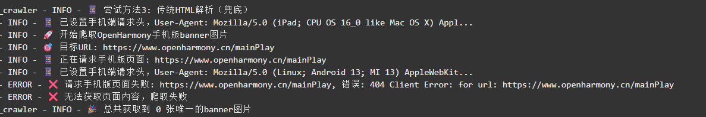

仔细观察日志发现了问题，原来是之前的爬虫修改过程有遗漏，还漏了几个基地址还是原来的老地址没有更新所以导致了404。

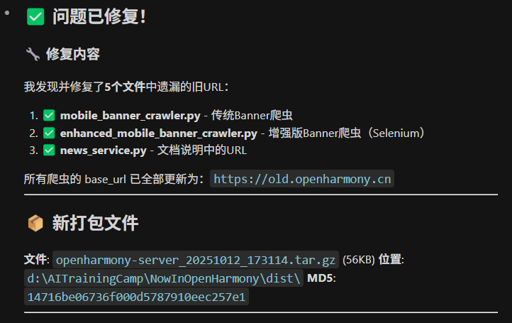

#### 轮播图爬取问题

在经历了漫长的斗争之后，现在剩下的问题就在于轮播图接口始终是无法使用的状态，之前报过一个奇怪的错，再让CC修复了之后本地测试轮播图接口也是正常的，现在就是不知道为什么在远程部署后始终是无法访问。

当然我有一个推测是因为远程的处理器不如本地的好导致咨询的爬取占用了主要的资源导致轮播图爬虫的爬取被放到了后面，所以看起来像是轮播图的爬虫没有爬到数据。所以我决定先去等待一会儿，等第一轮爬取完全结束之后再去访问轮播图接口。

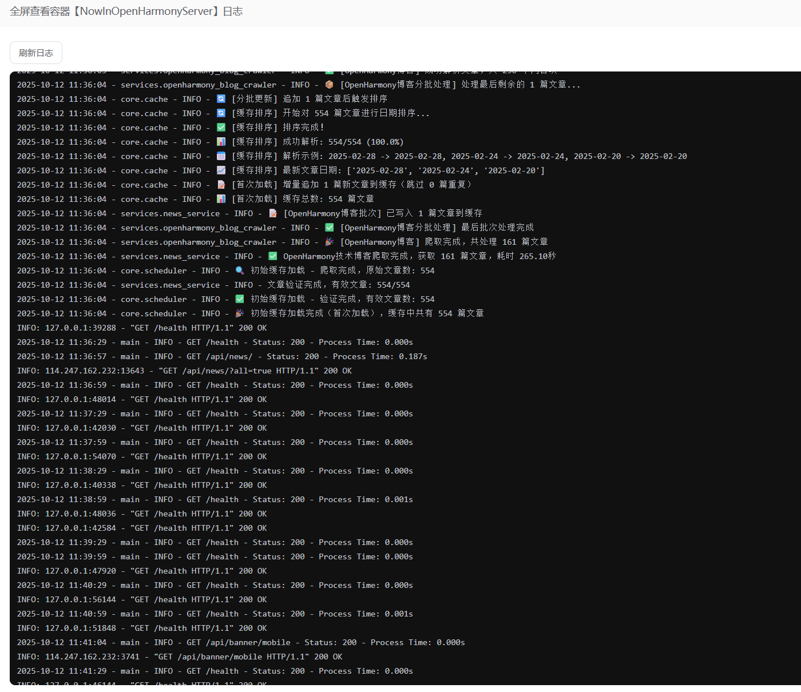

已经全部结束了但是依旧没有数据。

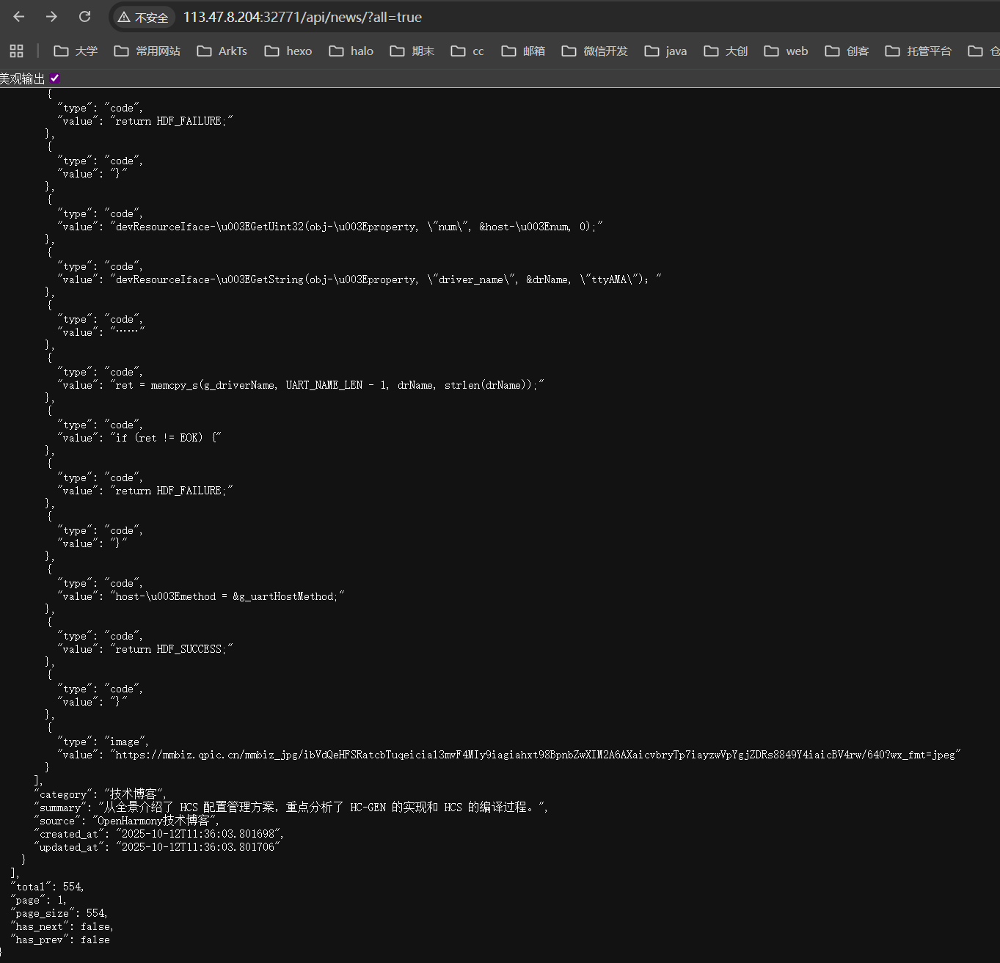

新闻接口是正常的。所以我现在怀疑就是因为Selenium在Docker容器中无法启动Chrome浏览器导致的。

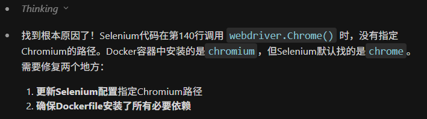

在更新了最新一版的镜像文件之后我再次去进行了尝试，但是依旧是报了和之前相同的错误。

```bash
2025-10-13 11:52:51 - services.enhanced_mobile_banner_crawler - ERROR - ❌ Selenium WebDriver错误: Message: session not created: probably user data directory is already in use, please specify a unique value for --user-data-dir argument, or don't use --user-data-dir
Stacktrace:
#0 0x55706355c6a2 <unknown>
#1 0x557062fcc8ab <unknown>
#2 0x5570630083aa <unknown>
#3 0x55706300230f <unknown>
#4 0x5570630512a7 <unknown>
#5 0x557063050a07 <unknown>
#6 0x557063041e97 <unknown>
#7 0x55706300fbb1 <unknown>
#8 0x557063010995 <unknown>
#9 0x55706352661e <unknown>
#10 0x557063529a7f <unknown>
#11 0x55706352951c <unknown>
#12 0x557063529f29 <unknown>
#13 0x55706350fffb <unknown>
#14 0x55706352a2b4 <unknown>
#15 0x5570634f988d <unknown>
#16 0x557063549339 <unknown>
#17 0x55706354952f <unknown>
#18 0x55706355b059 <unknown>
#19 0x7f6356c33b7b <unknown>
```

这里就说明了是因为使用selenium进行动态爬取时因为远程并没有谷歌浏览器以及浏览器的驱动程序导致了无法启动。我思考的解决方案有两种：一是直接将谷歌浏览器以及驱动程序下载到服务器上，二是更换动态爬取的方式。

#### 更换codex

额，中间出了一点小状况导致我的CC401了，在和佳澎经过了一段长久的讨论之后我换成了codex，使用gpt5来去继续辅助我的工作。

我决定先去将上面的博文喂给它去弥补一下当前的工作状态。

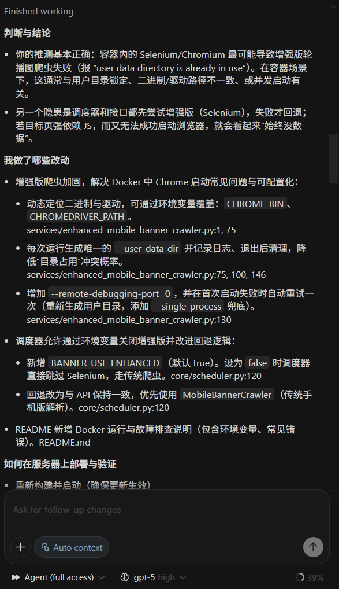

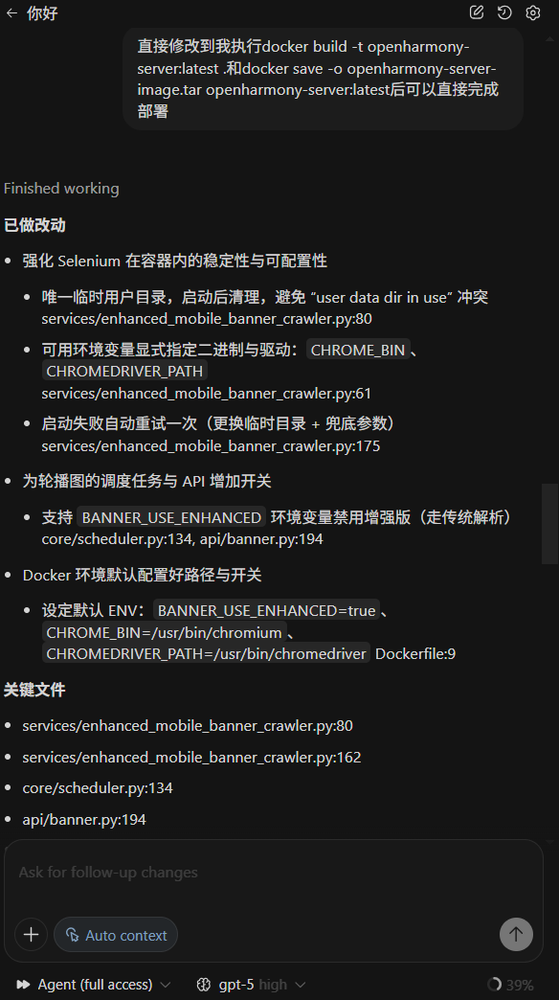

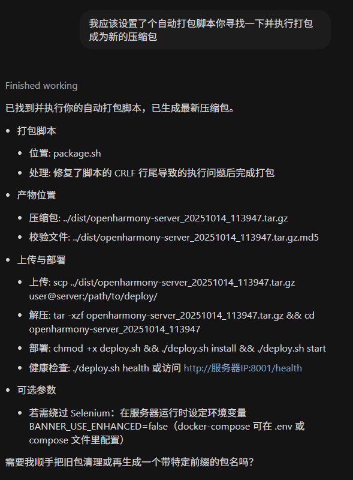

好好好，“顺手”你GPT5还是有点狂傲在里面的，算然确实是顺手的事，但Claude可不会这么说。

对于这个需求来说GPT5的high模式使用体感和Claude很类似，插件的便捷程度和界面的美观程度更胜于Claude，等我再多用一用再去进行评价吧，现在先再次部署进行轮播图接口的测试。

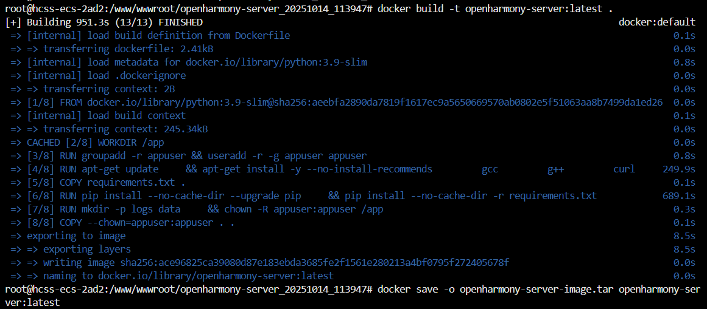

果然还是没有办法一帆风顺吗。再打包并且部署了最新版本的代码之后依旧出现了熟悉的报错。

```bash
2025-10-14 04:11:21 - services.enhanced_mobile_banner_crawler - WARNING - ⚠️ 首次启动Chrome失败: Message: session not created: probably user data directory is already in use, please specify a unique value for --user-data-dir argument, or don't use --user-data-dir
Stacktrace:
#0 0x561fa3c466a2 <unknown>
#1 0x561fa36b68ab <unknown>
#2 0x561fa36f23aa <unknown>
#3 0x561fa36ec30f <unknown>
#4 0x561fa373b2a7 <unknown>
#5 0x561fa373aa07 <unknown>
#6 0x561fa372be97 <unknown>
#7 0x561fa36f9bb1 <unknown>
#8 0x561fa36fa995 <unknown>
#9 0x561fa3c1061e <unknown>
#10 0x561fa3c13a7f <unknown>
#11 0x561fa3c1351c <unknown>
#12 0x561fa3c13f29 <unknown>
#13 0x561fa3bf9ffb <unknown>
#14 0x561fa3c142b4 <unknown>
#15 0x561fa3be388d <unknown>
#16 0x561fa3c33339 <unknown>
#17 0x561fa3c3352f <unknown>
#18 0x561fa3c45059 <unknown>
#19 0x7f4f9ed69b7b <unknown>
2025-10-14T04:11:21.692726145Z
2025-10-14 04:11:21 - services.enhanced_mobile_banner_crawler - INFO - 🧭 使用Chrome二进制: /usr/bin/chromium
2025-10-14 04:11:21 - services.enhanced_mobile_banner_crawler - INFO - 📁 使用临时用户目录: /tmp/chrome_user_data_1_bf3792d4
2025-10-14 04:11:22 - services.enhanced_mobile_banner_crawler - ERROR - ❌ Selenium WebDriver错误: Message: session not created: probably user data directory is already in use, please specify a unique value for --user-data-dir argument, or don't use --user-data-dir
Stacktrace:
#0 0x564ea30b96a2 <unknown>
#1 0x564ea2b298ab <unknown>
#2 0x564ea2b653aa <unknown>
#3 0x564ea2b5f30f <unknown>
#4 0x564ea2bae2a7 <unknown>
#5 0x564ea2bada07 <unknown>
#6 0x564ea2b9ee97 <unknown>
#7 0x564ea2b6cbb1 <unknown>
#8 0x564ea2b6d995 <unknown>
#9 0x564ea308361e <unknown>
#10 0x564ea3086a7f <unknown>
#11 0x564ea308651c <unknown>
#12 0x564ea3086f29 <unknown>
#13 0x564ea306cffb <unknown>
#14 0x564ea30872b4 <unknown>
#15 0x564ea305688d <unknown>
#16 0x564ea30a6339 <unknown>
#17 0x564ea30a652f <unknown>
#18 0x564ea30b8059 <unknown>
#19 0x7fadc5fd4b7b <unknown>
2025-10-14T04:11:22.381714535Z
2025-10-14 04:11:22 - services.enhanced_mobile_banner_crawler - INFO - 🧹 已清理临时用户目录: /tmp/chrome_user_data_1_bf3792d4
2025-10-14 04:11:22 - services.enhanced_mobile_banner_crawler - INFO - 📱 尝试方法3: 传统HTML解析（兜底）
2025-10-14 04:11:22 - services.mobile_banner_crawler - INFO - 📱 已设置手机端请求头，User-Agent: Mozilla/5.0 (Linux; Android 13; SM-G991B) AppleWeb...
2025-10-14 04:11:22 - services.mobile_banner_crawler - INFO - 🚀 开始爬取OpenHarmony手机版banner图片
2025-10-14 04:11:22 - services.mobile_banner_crawler - INFO - 🎯 目标URL: https://old.openharmony.cn/mainPlay
2025-10-14 04:11:22 - services.mobile_banner_crawler - INFO - 📱 正在请求手机版页面: https://old.openharmony.cn/mainPlay
2025-10-14 04:11:22 - services.mobile_banner_crawler - INFO - 📱 已设置手机端请求头，User-Agent: Mozilla/5.0 (iPhone; CPU iPhone OS 15_0 like Mac O...
2025-10-14 04:11:22 - services.mobile_banner_crawler - INFO - 📱 页面加载成功，内容长度: 534649 字符
2025-10-14 04:11:22 - services.mobile_banner_crawler - INFO - ✅ 成功获取手机版页面内容
2025-10-14 04:11:22 - services.mobile_banner_crawler - INFO - 🔍 开始解析HTML内容，查找banner相关图片...
2025-10-14 04:11:22 - services.mobile_banner_crawler - INFO - 🔍 找到 0 个包含 banner-img 类名的元素
2025-10-14 04:11:22 - services.mobile_banner_crawler - INFO - 🔍 通过模式 '.*banner.*' 找到 1 个元素
2025-10-14 04:11:22 - services.mobile_banner_crawler - INFO - 🔍 通过模式 '.*swiper.*slide.*' 找到 0 个元素
2025-10-14 04:11:22 - services.mobile_banner_crawler - INFO - 🔍 通过模式 '.*carousel.*' 找到 5 个元素
2025-10-14 04:11:22 - services.mobile_banner_crawler - INFO - 🔍 通过模式 '.*slider.*' 找到 0 个元素
2025-10-14 04:11:22 - services.mobile_banner_crawler - INFO - 🔍 通过模式 '.*hero.*' 找到 0 个元素
2025-10-14 04:11:22 - services.mobile_banner_crawler - INFO - 🔍 通过模式 '.*main.*banner.*' 找到 0 个元素
2025-10-14 04:11:22 - services.mobile_banner_crawler - INFO - 🔍 通过模式 '.*top.*banner.*' 找到 0 个元素
2025-10-14 04:11:22 - services.mobile_banner_crawler - INFO - 🔍 页面总共有 16 张图片，筛选可能的banner图片...
2025-10-14 04:11:22 - services.mobile_banner_crawler - INFO - 🎯 共提取到 0 张唯一的banner相关图片
2025-10-14 04:11:22 - services.mobile_banner_crawler - WARNING - 🔍 未找到banner图片，分析页面结构...
2025-10-14 04:11:22 - services.mobile_banner_crawler - INFO - 📊 页面调试信息：
2025-10-14 04:11:22 - services.mobile_banner_crawler - INFO - - 总图片数量: 16
2025-10-14 04:11:22 - services.mobile_banner_crawler - INFO - - 图片1: src=https://images.openharmony.cn/compatibility/标识下载/p..., class=['logo-pic'], alt=无
2025-10-14 04:11:22 - services.mobile_banner_crawler - INFO - - 图片2: src=/_nuxt/img/search.2585098.png..., class=['search-img'], alt=
2025-10-14 04:11:22 - services.mobile_banner_crawler - INFO - - 图片3: src=/_nuxt/img/close.9ee23e2.svg..., class=['close-img'], alt=
2025-10-14 04:11:22 - services.mobile_banner_crawler - INFO - - 图片4: src=/_nuxt/img/search.2585098.png..., class=['search-img-instance'], alt=
2025-10-14 04:11:22 - services.mobile_banner_crawler - INFO - - 图片5: src=data:image/png;base64,iVBORw0KGgoAAAANSUhEUgAAADAA..., class=['menu-img-instance'], alt=无
2025-10-14 04:11:22 - services.mobile_banner_crawler - INFO - - 可能的banner容器数量: 3
2025-10-14 04:11:22 - services.mobile_banner_crawler - INFO - - 容器1: class=['banner'], 包含图片=0张
2025-10-14 04:11:22 - services.mobile_banner_crawler - INFO - - 容器2: class=['el-carousel', 'el-carousel--horizontal'], 包含图片=0张
2025-10-14 04:11:22 - services.mobile_banner_crawler - INFO - - 容器3: class=['el-carousel__container'], 包含图片=0张
2025-10-14 04:11:22 - services.mobile_banner_crawler - WARNING - ⚠️ 未找到任何banner图片
2025-10-14 04:11:22 - services.enhanced_mobile_banner_crawler - INFO - 🎉 总共获取到 0 张唯一的banner图片
2025-10-14 04:11:22 - services.enhanced_mobile_banner_crawler - ERROR - ❌ 保存结果失败: [Errno 2] No such file or directory: ''
```

```bash
谢谢反馈，问题复现点明确了：Selenium 仍报 “user data directory is already in use”，且传统解析对 Nuxt 动态页拿不到图片。我已就两处关键点做了代码级修复，并重新打包好一份可直接部署的包。

已修复

避免用户目录冲突
默认不再传入 --user-data-dir；仅当你显式开启或重试时才切换策略使用唯一临时目录 services/enhanced_mobile_banner_crawler.py:80
增加稳定性参数：--no-first-run、--no-default-browser-check、禁用部分特性 services/enhanced_mobile_banner_crawler.py:151
远程 WebDriver 支持
若设置 SELENIUM_REMOTE_URL（如 http://selenium:4444/wd/hub），优先使用 Remote WebDriver（适合在独立容器跑浏览器，彻底隔离） services/enhanced_mobile_banner_crawler.py:175
保存结果路径报错
当未提供保存目录时跳过保存，修复 “保存结果失败: No such file or directory: ''” services/enhanced_mobile_banner_crawler.py:588
新包已生成

包路径: ../dist/openharmony-server_20251014_135500.tar.gz
MD5: ../dist/openharmony-server_20251014_135500.tar.gz.md5
部署步骤

构建镜像（如走 Dockerfile 路径）
docker build -t openharmony-server:latest .
docker save -o openharmony-server-image.tar openharmony-server:latest
上传新包或镜像
scp ../dist/openharmony-server_20251014_135500.tar.gz <server>:/path/to/deploy/
或 scp openharmony-server-image.tar <server>:/path/to/deploy/
服务器加载运行（二选一）
用 tar 包部署（含 docker-compose 与脚本）
tar -xzf openharmony-server_20251014_135500.tar.gz && cd openharmony-server_20251014_135500
chmod +x deploy.sh && ./deploy.sh install && ./deploy.sh start
直接加载镜像
docker load -i openharmony-server-image.tar
docker stop openharmony-server || true && docker rm openharmony-server || true
推荐启动（增强版Selenium开启）:
docker run -d --name openharmony-server -p 8001:8001 --shm-size=1g openharmony-server:latest
若需快速可用（禁用增强版，走传统解析）:
docker run -d --name openharmony-server -p 8001:8001 --shm-size=1g -e BANNER_USE_ENHANCED=false openharmony-server:latest
增强版仍失败时的两条建议

明确关闭用户目录参数
默认已关闭；如你在环境里曾设置过 SELENIUM_USE_USER_DATA_DIR=true，请移除或设为 false
使用远程 WebDriver（推荐，最稳）
启动独立浏览器容器（同一网络）:
docker network create ohnet || true
docker run -d --name selenium --network ohnet -p 4444:4444 --shm-size=2g selenium/standalone-chromium:latest
启动应用容器并指向远程：
docker run -d --name openharmony-server --network ohnet -p 8001:8001 -e SELENIUM_REMOTE_URL=http://selenium:4444/wd/hub openharmony-server:latest
验证

状态: curl http://<host>:8001/api/banner/status
获取: curl http://<host>:8001/api/banner/mobile
日志: docker logs -f openharmony-server | grep -Ei 'banner|selenium'
期望看到：不再打印 “📁 使用临时用户目录 …” 日志（默认关闭），或切换策略后成功启动；且不再出现 “保存结果失败…”
是否需要我帮你把 docker-compose.prod.yml 也补上 SELENIUM_REMOTE_URL 和可选的 BANNER_USE_ENHANCED、SELENIUM_USE_USER_DATA_DIR 环境配置，以便一键部署？

2 files changed
+80
-45

Undo

View all changes
README.md
+2
-1

enhanced_mobile_banner_crawler.py
+78
-44

好，按你的方案去做，直接全部做完


已按方案完整落地并打包，包含代码修复、Compose 联动、远程 WebDriver、一键部署说明。

核心改动

增强版爬虫稳健化
默认不传 --user-data-dir，失败自动切换策略；支持唯一临时目录并清理 services/enhanced_mobile_banner_crawler.py:80
支持远程 WebDriver：SELENIUM_REMOTE_URL 指向 http://selenium:4444/wd/hub services/enhanced_mobile_banner_crawler.py:175
稳定参数：--no-first-run --no-default-browser-check 等 services/enhanced_mobile_banner_crawler.py:151
修复空目录保存报错（不再尝试保存到空路径） services/enhanced_mobile_banner_crawler.py:588
调度与 API 行为
通过 BANNER_USE_ENHANCED 开关控制增强版；失败回退传统爬虫 core/scheduler.py:134, api/banner.py:194
Compose 与环境
dev/prod Compose 均内置 selenium/standalone-chromium 服务，app 默认连到 http://selenium:4444/wd/hub docker-compose.yml: app.env、selenium 服务; docker-compose.prod.yml: app.env、selenium 服务
app 容器 shm_size 增大至 1g（Selenium 稳定） docker-compose.yml, docker-compose.prod.yml
修正 image 名称与默认环境变量串接 docker-compose.yml
.env.example 新增所有相关环境变量 .env.example
打包产物

最新包: ../dist/openharmony-server_20251014_140146.tar.gz
校验: ../dist/openharmony-server_20251014_140146.tar.gz.md5
服务器部署（推荐使用包+Compose）

上传与解压
scp ../dist/openharmony-server_20251014_140146.tar.gz <server>:/path/to/deploy/
tar -xzf openharmony-server_20251014_140146.tar.gz && cd openharmony-server_20251014_140146
环境文件
cp .env.example .env
默认已启用增强版并内置远程 WebDriver，无需修改即可用
一键安装与启动
chmod +x deploy.sh
./deploy.sh install
./deploy.sh start prod
验证
健康: curl http://<host>:8001/health
轮播图状态: curl http://<host>:8001/api/banner/status
手动触发并取图:
curl -X POST http://<host>:8001/api/banner/crawl
curl http://<host>:8001/api/banner/mobile
查看日志（确认远程 WebDriver 已连通）:
docker-compose logs -f app | grep -Ei 'Selenium|WebDriver|banner'
可选切换

若短期内想绕过 Selenium：在 .env 设置 BANNER_USE_ENHANCED=false，再 ./deploy.sh restart prod
若不需要远程 WebDriver（只用容器内本地 Chromium）：
在 .env 清空 SELENIUM_REMOTE_URL=
保留 Dockerfile 已安装的 /usr/bin/chromium 与 /usr/bin/chromedriver
需要我现在帮你把新包通过某个固定路径和用户上传的命令行准备好，或直接在 compose 中加入固定域名/端口配置吗？

3 files changed
+91
-42

Undo

View all changes
.env.example
+11
-4

docker-compose.prod.yml
+38
-17

docker-compose.yml
+42
-21

可以


好的，给你一整套可直接执行的上传与部署命令（包含远程 WebDriver 方案和回退选项）。

本地上传

变量
export SERVER=your.server.com USER=ubuntu DEST=/opt/openharmony
上传压缩包
ssh $USER@$SERVER "sudo mkdir -p $DEST && sudo chown -R $USER:$USER $DEST"
scp ../dist/openharmony-server_20251014_140146.tar.gz $USER@$SERVER:$DEST/
服务器部署

解压进入目录
cd $DEST && tar -xzf openharmony-server_20251014_140146.tar.gz && cd openharmony-server_20251014_140146
环境文件
cp .env.example .env
默认已配置增强版和远程 WebDriver，无需改动。如需禁用增强版：sed -i 's/^BANNER_USE_ENHANCED=.*/BANNER_USE_ENHANCED=false/' .env
一键安装与启动（生产）
chmod +x deploy.sh
./deploy.sh install
./deploy.sh start prod
验证

健康: curl http://<host>:8001/health
轮播图状态: curl http://<host>:8001/api/banner/status
拉取图片: curl http://<host>:8001/api/banner/mobile
日志筛选: docker-compose logs -f app | grep -Ei 'selenium|webdriver|banner'
域名与 HTTPS（可选）

设置服务域名与证书路径
编辑 nginx/conf.d/openharmony.conf 中 server_name 为你的域名，证书放到 ssl/ 目录
重载 Nginx
docker-compose restart nginx
常用切换

禁用增强版（纯传统解析，最稳妥）: .env 中 BANNER_USE_ENHANCED=false，执行 ./deploy.sh restart prod
使用本地 Chromium 而非远程：.env 中清空 SELENIUM_REMOTE_URL=（保留默认的 CHROME_BIN 与 CHROMEDRIVER_PATH）
需要我帮你把以上命令替换为你的服务器 IP/用户名并生成一段可粘贴的一键脚本吗？
```

如果说这一次的尝试再次失败我就要开始针对于轮播图爬虫开始进行重构。

让我先进行一下新镜像的部署工作。

随后查看日志

```bash
113.47.8.204
0
首页
网站
数据库
Docker
监控
安全
WAF
文件
日志
WP Tools
多用户
终端
节点管理
计划任务
软件商店
设置
退出
应用商店
总览
网站
容器
线上镜像
本地镜像
容器编排
网络
存储卷
仓库
设置
企业版
需求反馈
>>使用帮助
请输入容器名、ID、容器镜像
容器名
容器ID
状态
镜像
端口(主机-->容器)
操作
NIOHSERVER
8648cb6af6a4
运行中
openharmony-server:latest	
0.0.0.0:32775-->8001/tcp
管理终端删除
更多


共 1 条
前往
1
页
宝塔Linux面板©2014-2025 广东堡塔安全技术有限公司 (bt.cn)
论坛求助
使用手册
微信公众号
正版查询
联系人工客服


2025-10-14 06:55:21 - root - INFO - 日志系统初始化完成
============================================================
🚀 NowInOpenHarmony API 服务启动成功!
============================================================
2025-10-14T06:55:21.825177385Z
📡 服务可通过以下地址访问:
----------------------------------------
主要IP: http://172.17.0.2:8001
API文档: http://172.17.0.2:8001/docs
健康检查: http://172.17.0.2:8001/health
全部新闻: http://172.17.0.2:8001/api/news/?all=true
Banner图片: http://172.17.0.2:8001/api/banner/mobile
----------------------------------------
2025-10-14T06:55:21.825217345Z
🎯 主要API端点:
📰 全部新闻: http://172.17.0.2:8001/api/news/?all=true
🌐 官网新闻: http://172.17.0.2:8001/api/news/openharmony
📚 技术博客: http://172.17.0.2:8001/api/news/blog
📱 Banner图片: http://172.17.0.2:8001/api/banner/mobile
⚡ 服务状态: http://172.17.0.2:8001/api/health
2025-10-14T06:55:21.825336075Z
📋 完整API路径列表:
------------------------------------------------------------
🔧 基础服务:
根路径: http://172.17.0.2:8001/
API文档: http://172.17.0.2:8001/docs
ReDoc文档: http://172.17.0.2:8001/redoc
健康检查: http://172.17.0.2:8001/health
API健康检查: http://172.17.0.2:8001/api/health
2025-10-14T06:55:21.825385335Z
📰 新闻API:
全部新闻: http://172.17.0.2:8001/api/news/
分页新闻: http://172.17.0.2:8001/api/news/?page=1&page_size=20
搜索新闻: http://172.17.0.2:8001/api/news/?search=关键词
分类新闻: http://172.17.0.2:8001/api/news/?category=官方动态
OpenHarmony官网: http://172.17.0.2:8001/api/news/openharmony
OpenHarmony技术博客: http://172.17.0.2:8001/api/news/blog
手动爬取: http://172.17.0.2:8001/api/news/crawl (POST)
新闻服务状态: http://172.17.0.2:8001/api/news/status/info
2025-10-14T06:55:21.825444405Z
🖼️ Banner轮播图API:
手机版Banner: http://172.17.0.2:8001/api/banner/mobile
增强版Banner: http://172.17.0.2:8001/api/banner/mobile/enhanced
Banner状态: http://172.17.0.2:8001/api/banner/status
手动爬取Banner: http://172.17.0.2:8001/api/banner/crawl (POST)
Banner缓存信息: http://172.17.0.2:8001/api/banner/cache
清空Banner缓存: http://172.17.0.2:8001/api/banner/cache/clear (DELETE)
2025-10-14T06:55:21.825471565Z
📊 API参数示例:
强制爬取全部新闻: http://172.17.0.2:8001/api/news/crawl?source=all&limit=50
爬取官网新闻: http://172.17.0.2:8001/api/news/crawl?source=openharmony
爬取技术博客: http://172.17.0.2:8001/api/news/crawl?source=openharmony_blog
强制爬取Banner: http://172.17.0.2:8001/api/banner/mobile?force_crawl=true
下载Banner图片: http://172.17.0.2:8001/api/banner/mobile/enhanced?download_images=true
增强版爬取: http://172.17.0.2:8001/api/banner/crawl?use_enhanced=true
2025-10-14T06:55:21.825499015Z
💡 提示:
- 局域网IP可供同一网络下的其他设备访问
- GET请求可直接在浏览器中访问
- POST/DELETE请求需要使用API工具(如Postman)或curl命令
- 使用 Ctrl+C 停止服务
============================================================
2025-10-14T06:55:21.825523525Z
⚙️ 启动配置:
绑定地址: 0.0.0.0
端口: 8001
调试模式: False
日志级别: INFO
============================================================
2025-10-14 06:55:22 - root - INFO - 日志系统初始化完成
INFO: Started server process [1]
INFO: Waiting for application startup.
2025-10-14 06:55:22 - main - INFO - 应用启动中...
2025-10-14 06:55:22 - core.database - INFO - 数据库初始化完成
2025-10-14 06:55:22 - main - INFO - 数据库初始化完成
2025-10-14 06:55:22 - core.cache - INFO - 新闻缓存初始化完成
2025-10-14 06:55:22 - core.cache - INFO - 轮播图缓存初始化完成
2025-10-14 06:55:22 - main - INFO - 缓存初始化完成
2025-10-14 06:55:22 - apscheduler.scheduler - INFO - Adding job tentatively -- it will be properly scheduled when the scheduler starts
2025-10-14 06:55:22 - apscheduler.scheduler - INFO - Adding job tentatively -- it will be properly scheduled when the scheduler starts
2025-10-14 06:55:22 - apscheduler.scheduler - INFO - Adding job tentatively -- it will be properly scheduled when the scheduler starts
2025-10-14 06:55:22 - core.scheduler - INFO - 定时任务设置完成
2025-10-14 06:55:22 - apscheduler.scheduler - INFO - Added job "更新所有新闻源缓存" to job store "default"
2025-10-14 06:55:22 - apscheduler.scheduler - INFO - Added job "更新轮播图缓存" to job store "default"
2025-10-14 06:55:22 - apscheduler.scheduler - INFO - Added job "完整爬取任务" to job store "default"
2025-10-14 06:55:22 - apscheduler.scheduler - INFO - Scheduler started
2025-10-14 06:55:22 - core.scheduler - INFO - 定时任务调度器已启动
2025-10-14 06:55:22 - main - INFO - 定时任务调度器启动完成
2025-10-14 06:55:22 - main - INFO - 开始执行初始缓存加载...
2025-10-14 06:55:22 - core.scheduler - INFO - 开始执行初始缓存加载
2025-10-14 06:55:22 - core.scheduler - INFO - 📦 分批写入模式：将在第一批数据写入后立即变为可用状态
2025-10-14 06:55:22 - core.scheduler - INFO - 🚀 开始执行初始缓存加载 - 来源: all
2025-10-14 06:55:22 - core.scheduler - INFO - 📊 初始缓存加载 - 准备并行爬取数据...
2025-10-14 06:55:22 - core.scheduler - INFO - 🖼️ 开始执行初始轮播图加载
2025-10-14 06:55:22 - core.scheduler - INFO - 初始缓存加载任务已提交到后台线程，服务可以立即响应请求
2025-10-14 06:55:22 - services.news_service - INFO - 🌐 开始爬取OpenHarmony官网新闻...
2025-10-14 06:55:22 - core.cache - INFO - 开始轮播图数据更新，状态设为准备中
2025-10-14 06:55:22 - core.scheduler - INFO - 初始轮播图加载任务已提交到后台线程
2025-10-14 06:55:22 - services.openharmony_news_crawler - INFO - 🌐 开始爬取OpenHarmony官网新闻...
2025-10-14 06:55:22 - services.openharmony_news_crawler - INFO - 📦 启用分批处理模式，每 20 篇文章执行一次回调
2025-10-14 06:55:22 - main - INFO - 初始缓存加载完成
🚀 开始高效获取OpenHarmony文章信息，每页300条数据...
2025-10-14 06:55:22 - core.cache - INFO - 轮播图服务状态更新: preparing
📡 请求API: 第1页
2025-10-14 06:55:22 - main - INFO - 应用启动完成
2025-10-14 06:55:22 - services.enhanced_mobile_banner_crawler - INFO - 🚀 初始化增强版手机Banner爬虫
2025-10-14 06:55:22 - services.enhanced_mobile_banner_crawler - INFO - - Selenium可用: True
INFO: Application startup complete.
2025-10-14 06:55:22 - services.enhanced_mobile_banner_crawler - INFO - - requests-html可用: False
2025-10-14 06:55:22 - services.enhanced_mobile_banner_crawler - INFO - 🚀 开始增强版手机Banner爬取...
2025-10-14 06:55:22 - services.enhanced_mobile_banner_crawler - INFO - 🎯 目标URL: https://old.openharmony.cn/mainPlay
2025-10-14 06:55:22 - services.enhanced_mobile_banner_crawler - INFO - 📱 尝试方法1: Selenium WebDriver
INFO: Uvicorn running on http://0.0.0.0:8001 (Press CTRL+C to quit)
2025-10-14 06:55:22 - services.enhanced_mobile_banner_crawler - INFO - 🎯 使用Selenium获取动态轮播图...
2025-10-14 06:55:22 - services.enhanced_mobile_banner_crawler - INFO - 🧭 使用Chrome二进制: /usr/bin/chromium
2025-10-14 06:55:22 - services.enhanced_mobile_banner_crawler - INFO - 🧭 使用Chromedriver: /usr/bin/chromedriver
📊 第1页获取到300条数据
📈 第1页新增300条有效数据，累计300条
📡 请求API: 第2页
📊 第2页获取到107条数据
📈 第2页新增107条有效数据，累计407条
🎯 第2页数据量(107)小于页面大小(300)，爬取完成
📋 共���取到407条有效文章信息
🔍 进行快速有效性校验...
2025-10-14 06:55:23 - services.enhanced_mobile_banner_crawler - WARNING - ⚠️ 首次启动Chrome失败: Message: session not created: probably user data directory is already in use, please specify a unique value for --user-data-dir argument, or don't use --user-data-dir
Stacktrace:
#0 0x560a5870c6a2 <unknown>
#1 0x560a5817c8ab <unknown>
#2 0x560a581b83aa <unknown>
#3 0x560a581b230f <unknown>
#4 0x560a582012a7 <unknown>
#5 0x560a58200a07 <unknown>
#6 0x560a581f1e97 <unknown>
#7 0x560a581bfbb1 <unknown>
#8 0x560a581c0995 <unknown>
#9 0x560a586d661e <unknown>
#10 0x560a586d9a7f <unknown>
#11 0x560a586d951c <unknown>
#12 0x560a586d9f29 <unknown>
#13 0x560a586bfffb <unknown>
#14 0x560a586da2b4 <unknown>
#15 0x560a586a988d <unknown>
#16 0x560a586f9339 <unknown>
#17 0x560a586f952f <unknown>
#18 0x560a5870b059 <unknown>
#19 0x7fc084eebb7b <unknown>
2025-10-14T06:55:23.266969990Z
2025-10-14 06:55:23 - services.enhanced_mobile_banner_crawler - INFO - 🧭 使用Chrome二进制: /usr/bin/chromium
2025-10-14 06:55:23 - services.enhanced_mobile_banner_crawler - INFO - 📁 使用临时用户目录: /tmp/chrome_user_data_1_dcac6900
2025-10-14 06:55:23 - services.enhanced_mobile_banner_crawler - ERROR - ❌ Selenium WebDriver错误: Message: session not created: probably user data directory is already in use, please specify a unique value for --user-data-dir argument, or don't use --user-data-dir
Stacktrace:
#0 0x5630b3df96a2 <unknown>
#1 0x5630b38698ab <unknown>
#2 0x5630b38a53aa <unknown>
#3 0x5630b389f30f <unknown>
#4 0x5630b38ee2a7 <unknown>
#5 0x5630b38eda07 <unknown>
#6 0x5630b38dee97 <unknown>
#7 0x5630b38acbb1 <unknown>
#8 0x5630b38ad995 <unknown>
#9 0x5630b3dc361e <unknown>
#10 0x5630b3dc6a7f <unknown>
#11 0x5630b3dc651c <unknown>
#12 0x5630b3dc6f29 <unknown>
#13 0x5630b3dacffb <unknown>
#14 0x5630b3dc72b4 <unknown>
#15 0x5630b3d9688d <unknown>
#16 0x5630b3de6339 <unknown>
#17 0x5630b3de652f <unknown>
#18 0x5630b3df8059 <unknown>
#19 0x7f43d226fb7b <unknown>
2025-10-14T06:55:23.947789883Z
2025-10-14 06:55:23 - services.enhanced_mobile_banner_crawler - INFO - 🧹 已清理临时用户目录: /tmp/chrome_user_data_1_dcac6900
2025-10-14 06:55:23 - services.enhanced_mobile_banner_crawler - INFO - 📱 尝试方法3: 传统HTML解析（兜底）
2025-10-14 06:55:23 - services.mobile_banner_crawler - INFO - 📱 已设置手机端请求头，User-Agent: Mozilla/5.0 (iPhone; CPU iPhone OS 15_0 like Mac O...
2025-10-14 06:55:23 - services.mobile_banner_crawler - INFO - 🚀 开始爬取OpenHarmony手机版banner图片
2025-10-14 06:55:23 - services.mobile_banner_crawler - INFO - 🎯 目标URL: https://old.openharmony.cn/mainPlay
2025-10-14 06:55:23 - services.mobile_banner_crawler - INFO - 📱 正在请求手机版页面: https://old.openharmony.cn/mainPlay
2025-10-14 06:55:23 - services.mobile_banner_crawler - INFO - 📱 已设置手机端请求头，User-Agent: Mozilla/5.0 (Linux; Android 13; SM-G991B) AppleWeb...
2025-10-14 06:55:25 - services.mobile_banner_crawler - INFO - 📱 页面加载成功，内容长度: 534649 字符
2025-10-14 06:55:25 - services.mobile_banner_crawler - INFO - ✅ 成功获取手机版页面内容
2025-10-14 06:55:25 - services.mobile_banner_crawler - INFO - 🔍 开始解析HTML内容，查找banner相关图片...
2025-10-14 06:55:25 - services.mobile_banner_crawler - INFO - 🔍 找到 0 个包含 banner-img 类名的元素
2025-10-14 06:55:25 - services.mobile_banner_crawler - INFO - 🔍 通过模式 '.*banner.*' 找到 1 个元素
2025-10-14 06:55:25 - services.mobile_banner_crawler - INFO - 🔍 通过模式 '.*swiper.*slide.*' 找到 0 个元素
2025-10-14 06:55:25 - services.mobile_banner_crawler - INFO - 🔍 通过模式 '.*carousel.*' 找到 5 个元素
2025-10-14 06:55:25 - services.mobile_banner_crawler - INFO - 🔍 通过模式 '.*slider.*' 找到 0 个元素
2025-10-14 06:55:25 - services.mobile_banner_crawler - INFO - 🔍 通过模式 '.*hero.*' 找到 0 个元素
2025-10-14 06:55:25 - services.mobile_banner_crawler - INFO - 🔍 通过模式 '.*main.*banner.*' 找到 0 个元素
2025-10-14 06:55:25 - services.mobile_banner_crawler - INFO - 🔍 通过模式 '.*top.*banner.*' 找到 0 个元素
2025-10-14 06:55:25 - services.mobile_banner_crawler - INFO - 🔍 页面总共有 16 张图片，筛选可能的banner图片...
2025-10-14 06:55:25 - services.mobile_banner_crawler - INFO - 🎯 共提取到 0 张唯一的banner相关图片
2025-10-14 06:55:25 - services.mobile_banner_crawler - WARNING - 🔍 未找到banner图片，分析页面结构...
2025-10-14 06:55:25 - services.mobile_banner_crawler - INFO - 📊 页面调试信息：
2025-10-14 06:55:25 - services.mobile_banner_crawler - INFO - - 总图片数量: 16
2025-10-14 06:55:25 - services.mobile_banner_crawler - INFO - - 图片1: src=https://images.openharmony.cn/compatibility/标识下载/p..., class=['logo-pic'], alt=无
2025-10-14 06:55:25 - services.mobile_banner_crawler - INFO - - 图片2: src=/_nuxt/img/search.2585098.png..., class=['search-img'], alt=
2025-10-14 06:55:25 - services.mobile_banner_crawler - INFO - - 图片3: src=/_nuxt/img/close.9ee23e2.svg..., class=['close-img'], alt=
2025-10-14 06:55:25 - services.mobile_banner_crawler - INFO - - 图片4: src=/_nuxt/img/search.2585098.png..., class=['search-img-instance'], alt=
2025-10-14 06:55:25 - services.mobile_banner_crawler - INFO - - 图片5: src=data:image/png;base64,iVBORw0KGgoAAAANSUhEUgAAADAA..., class=['menu-img-instance'], alt=无
2025-10-14 06:55:25 - services.mobile_banner_crawler - INFO - - 可能的banner容器数量: 3
2025-10-14 06:55:25 - services.mobile_banner_crawler - INFO - - 容器1: class=['banner'], 包含图片=0张
2025-10-14 06:55:25 - services.mobile_banner_crawler - INFO - - 容器2: class=['el-carousel', 'el-carousel--horizontal'], 包含图片=0张
2025-10-14 06:55:25 - services.mobile_banner_crawler - INFO - - 容器3: class=['el-carousel__container'], 包含图片=0张
2025-10-14 06:55:25 - services.mobile_banner_crawler - WARNING - ⚠️ 未找到任何banner图片
2025-10-14 06:55:25 - services.enhanced_mobile_banner_crawler - INFO - 🎉 总共获取到 0 张唯一的banner图片
2025-10-14 06:55:25 - core.scheduler - INFO - ✅ 使用增强版爬虫成功，获取 0 张图片
2025-10-14 06:55:25 - core.cache - INFO - 开始轮播图数据更新，状态设为准备中
2025-10-14 06:55:25 - core.cache - INFO - 轮播图服务状态更新: preparing
2025-10-14 06:55:25 - core.cache - INFO - 🎉 轮播图首次加载完成
2025-10-14 06:55:25 - core.cache - WARNING - ⚠️ 轮播图缓存更新完成，但未获取到数据，状态保持：PREPARING
2025-10-14 06:55:25 - core.scheduler - WARNING - ⚠️ 初始轮播图加载完成，但未找到任何轮播图，状态保持PREPARING
2025-10-14 06:55:26 - main - INFO - GET /health - Status: 200 - Process Time: 0.001s
INFO: 127.0.0.1:58790 - "GET /health HTTP/1.1" 200 OK
✅ 快速校验完成：10/10 有效，有效率100.0%
🚀 有效率高，跳过完整校验，直接返回所有数据
2025-10-14 06:55:26 - services.openharmony_news_crawler - INFO - 📋 获取到 407 篇文章信息
2025-10-14 06:55:26 - services.openharmony_news_crawler - INFO - 🔍 正在处理第 1/407 篇文章: 对话OpenHarmony开源先锋：如何用代码革新终端生态
2025-10-14 06:55:27 - services.openharmony_news_crawler - INFO - ✅ 成功解析文章，共 27 个内容块
2025-10-14 06:55:28 - services.openharmony_news_crawler - INFO - 🔍 正在处理第 2/407 篇文章: 12强终极PK！第二届OpenHarmony创新应用挑战赛引爆开源热潮
2025-10-14 06:55:28 - services.openharmony_news_crawler - INFO - ✅ 成功解析文章，共 11 个内容块
2025-10-14 06:55:29 - services.openharmony_news_crawler - INFO - 🔍 正在处理第 3/407 篇文章: 第二届OpenHarmony创新应用挑战赛决赛路演队伍揭晓
2025-10-14 06:55:30 - services.openharmony_news_crawler - INFO - ✅ 成功解析文章，共 2 个内容块
2025-10-14 06:55:31 - services.openharmony_news_crawler - INFO - 🔍 正在处理第 4/407 篇文章: OpenHarmony社区2024年度运营报告发布，致谢每一位生态共建者！
2025-10-14 06:55:31 - services.openharmony_news_crawler - INFO - ✅ 成功解析文章，共 34 个内容块
2025-10-14 06:55:32 - services.openharmony_news_crawler - INFO - 🔍 正在处理第 5/407 篇文章: 开源鸿蒙社区恭祝全体开发者2025新年快乐，新春大吉！
2025-10-14 06:55:33 - services.openharmony_news_crawler - INFO - ✅ 成功解析文章，共 2 个内容块
2025-10-14 06:55:34 - services.openharmony_news_crawler - INFO - 🔍 正在处理第 6/407 篇文章: 共绘2025年开源新蓝图，OpenHarmony社区项目管理委员会年度工作会议在深圳成功举办
2025-10-14 06:55:34 - services.openharmony_news_crawler - INFO - ✅ 成功解析文章，共 41 个内容块
2025-10-14 06:55:35 - services.openharmony_news_crawler - INFO - 🔍 正在处理第 7/407 篇文章: 开源鸿蒙项目群新增捐赠人（2024年12月）
2025-10-14 06:55:36 - services.openharmony_news_crawler - INFO - ✅ 成功解析文章，共 16 个内容块
2025-10-14 06:55:37 - services.openharmony_news_crawler - INFO - 🔍 正在处理第 8/407 篇文章: 开源鸿蒙社区隆重致谢授牌2024年度社区贡献单位和个人
2025-10-14 06:55:37 - services.openharmony_news_crawler - INFO - ✅ 成功解析文章，共 4 个内容块
2025-10-14 06:55:38 - services.openharmony_news_crawler - INFO - 🔍 正在处理第 9/407 篇文章: 厚植根基，同启新程！一文回顾 2024 OpenHarmony 社区年度工作会议精彩瞬间
2025-10-14 06:55:39 - services.openharmony_news_crawler - INFO - ✅ 成功解析文章，共 44 个内容块
2025-10-14 06:55:40 - services.openharmony_news_crawler - INFO - 🔍 正在处理第 10/407 篇文章: 第二届OpenHarmony创新应用挑战赛决赛晋级名单公示
2025-10-14 06:55:40 - services.openharmony_news_crawler - INFO - ✅ 成功解析文章，共 2 个内容块
2025-10-14 06:55:41 - services.openharmony_news_crawler - INFO - 🔍 正在处理第 11/407 篇文章: 一元复始 万象更新|开源鸿蒙社区祝广大开发者元旦快乐！
2025-10-14 06:55:42 - services.openharmony_news_crawler - INFO - ✅ 成功解析文章，共 2 个内容块
2025-10-14 06:55:43 - services.openharmony_news_crawler - INFO - 🔍 正在处理第 12/407 篇文章: OpenHarmony程序分析框架论文入选第50届国际软件工程大会ICSE2025
2025-10-14 06:55:43 - services.openharmony_news_crawler - INFO - ✅ 成功解析文章，共 8 个内容块
2025-10-14 06:55:44 - services.openharmony_news_crawler - INFO - 🔍 正在处理第 13/407 篇文章: OpenHarmony开发者激励计划 | 2024年度精彩回顾
2025-10-14 06:55:45 - services.openharmony_news_crawler - INFO - ✅ 成功解析文章，共 4 个内容块
2025-10-14 06:55:46 - services.openharmony_news_crawler - INFO - 🔍 正在处理第 14/407 篇文章: 开源鸿蒙荣获开放原子“2024年度操作系统领域国内活跃开源项目”
2025-10-14 06:55:47 - services.openharmony_news_crawler - INFO - ✅ 成功解析文章，共 8 个内容块
2025-10-14 06:55:48 - services.openharmony_news_crawler - INFO - 🔍 正在处理第 15/407 篇文章: OpenHarmony项目群10-11月新增捐赠人
2025-10-14 06:55:48 - services.openharmony_news_crawler - INFO - ✅ 成功解析文章，共 39 个内容块
2025-10-14 06:55:49 - services.openharmony_news_crawler - INFO - 🔍 正在处理第 16/407 篇文章: 大咖导师 源力唤醒|第二届开源鸿蒙创新应用挑战赛导师阵容重磅亮相
2025-10-14 06:55:50 - services.openharmony_news_crawler - INFO - ✅ 成功解析文章，共 2 个内容块
2025-10-14 06:55:51 - services.openharmony_news_crawler - INFO - 🔍 正在处理第 17/407 篇文章: 与鸿同行，探索无限！开源鸿蒙技术分论坛在武汉成功举办
2025-10-14 06:55:51 - services.openharmony_news_crawler - INFO - ✅ 成功解析文章，共 49 个内容块
2025-10-14 06:55:52 - services.openharmony_news_crawler - INFO - 🔍 正在处理第 18/407 篇文章: 开源鸿蒙5.0重磅发布，共赴万物智联未来
2025-10-14 06:55:53 - services.openharmony_news_crawler - INFO - ✅ 成功解析文章，共 17 个内容块
2025-10-14 06:55:54 - services.openharmony_news_crawler - INFO - 🔍 正在处理第 19/407 篇文章: 源鸿蒙 5.0 Release版本关键特性解读
2025-10-14 06:55:54 - services.openharmony_news_crawler - INFO - ✅ 成功解析文章，共 24 个内容块
2025-10-14 06:55:55 - services.openharmony_news_crawler - INFO - 🔍 正在处理第 20/407 篇文章: 精彩预告 | 2024开放原子开发者大会OpenHarmony技术分论坛等您来！
2025-10-14 06:55:56 - services.openharmony_news_crawler - INFO - ✅ 成功解析文章，共 2 个内容块
2025-10-14 06:55:56 - services.openharmony_news_crawler - INFO - 📦 [分批处理] 达到批处理大小 20，执行回调...
2025-10-14 06:55:56 - core.cache - INFO - 🔄 [分批更新] 追加 20 篇文章后触发排序
2025-10-14 06:55:56 - core.cache - INFO - 🔄 [缓存排序] 开始对 20 篇文章进行日期排序...
2025-10-14 06:55:56 - core.cache - INFO - ✅ [缓存排序] 排序完成！
2025-10-14 06:55:56 - core.cache - INFO - 📊 [缓存排序] 成功解析: 20/20 (100.0%)
2025-10-14 06:55:56 - core.cache - INFO - 📅 [缓存排序] 解析示例: 2025-02-28 -> 2025-02-28, 2025-02-24 -> 2025-02-24, 2025-02-20 -> 2025-02-20
2025-10-14 06:55:56 - core.cache - INFO - 📈 [缓存排序] 最新文章日期: ['2025-02-28', '2025-02-24', '2025-02-20']
2025-10-14 06:55:56 - core.cache - INFO - 📝 [首次加载] 增量追加 20 篇新文章到缓存（跳过 0 篇重复）
2025-10-14 06:55:56 - core.cache - INFO - 📊 [首次加载] 缓存总数: 20 篇文章
2025-10-14 06:55:56 - services.news_service - INFO - 📝 [OpenHarmony官网批次] 已写入 20 篇文章到缓存
2025-10-14 06:55:56 - services.openharmony_news_crawler - INFO - ✅ [分批处理] 回调执行成功，继续处理后续文章
2025-10-14 06:55:56 - main - INFO - GET /health - Status: 200 - Process Time: 0.001s
INFO: 127.0.0.1:43648 - "GET /health HTTP/1.1" 200 OK
2025-10-14 06:55:57 - services.openharmony_news_crawler - INFO - 🔍 正在处理第 21/407 篇文章: OpenHarmony安全漏洞奖励计划诚邀您参与安全研究，赢取丰厚漏洞奖金
2025-10-14 06:55:57 - services.openharmony_news_crawler - INFO - ✅ 成功解析文章，共 12 个内容块
2025-10-14 06:55:58 - services.openharmony_news_crawler - INFO - 🔍 正在处理第 22/407 篇文章: OpenHarmony统一互联PMC（筹）研讨会在武汉顺利召开
2025-10-14 06:55:58 - services.openharmony_news_crawler - WARNING - ⚠️ 文章内容解析失败: OpenHarmony统一互联PMC（筹）研讨会在武汉顺利召开
2025-10-14 06:55:59 - services.openharmony_news_crawler - INFO - 🔍 正在处理第 23/407 篇文章: OpenHarmony人才生态大会2024在武汉成功举办
2025-10-14 06:56:00 - services.openharmony_news_crawler - INFO - ✅ 成功解析文章，共 37 个内容块
2025-10-14 06:56:01 - services.openharmony_news_crawler - INFO - 🔍 正在处理第 24/407 篇文章: OpenHarmony硬件芯片工作组系列直播课
2025-10-14 06:56:01 - services.openharmony_news_crawler - INFO - ✅ 成功解析文章，共 17 个内容块
2025-10-14 06:56:02 - services.openharmony_news_crawler - INFO - 🔍 正在处理第 25/407 篇文章: 开源因你，熠熠生辉！第三届OpenHarmony技术大会致演讲嘉宾的感谢信
2025-10-14 06:56:03 - services.openharmony_news_crawler - INFO - ✅ 成功解析文章，共 2 个内容块
2025-10-14 06:56:04 - services.openharmony_news_crawler - INFO - 🔍 正在处理第 26/407 篇文章: 开源有你，一路同行！第三届OpenHarmony技术大会致工作人员的感谢信
2025-10-14 06:56:04 - services.openharmony_news_crawler - INFO - ✅ 成功解析文章，共 4 个内容块
2025-10-14 06:56:05 - services.openharmony_news_crawler - INFO - 🔍 正在处理第 27/407 篇文章: OpenHarmony人才认证授权培训伙伴招募
2025-10-14 06:56:06 - services.openharmony_news_crawler - INFO - ✅ 成功解析文章，共 20 个内容块
2025-10-14 06:56:07 - services.openharmony_news_crawler - INFO - 🔍 正在处理第 28/407 篇文章: OpenHarmony人才生态大会2024|11月27日·武汉，诚邀您参会！
2025-10-14 06:56:07 - services.openharmony_news_crawler - INFO - ✅ 成功解析文章，共 2 个内容块
2025-10-14 06:56:08 - services.openharmony_news_crawler - INFO - 🔍 正在处理第 29/407 篇文章: OpenHarmony赛道斩获最多奖项！“松山湖杯”第一届中国研究生操作系统开源创新大赛圆满落幕
NIOHSERVER
(44.79 KB)
2025-10-14 06:55:21 - root - INFO - 日志系统初始化完成
============================================================
🚀 NowInOpenHarmony API 服务启动成功!
============================================================
2025-10-14T06:55:21.825177385Z
📡 服务可通过以下地址访问:
----------------------------------------
主要IP: http://172.17.0.2:8001
API文档: http://172.17.0.2:8001/docs
健康检查: http://172.17.0.2:8001/health
全部新闻: http://172.17.0.2:8001/api/news/?all=true
Banner图片: http://172.17.0.2:8001/api/banner/mobile
----------------------------------------
2025-10-14T06:55:21.825217345Z
🎯 主要API端点:
📰 全部新闻: http://172.17.0.2:8001/api/news/?all=true
🌐 官网新闻: http://172.17.0.2:8001/api/news/openharmony
📚 技术博客: http://172.17.0.2:8001/api/news/blog
📱 Banner图片: http://172.17.0.2:8001/api/banner/mobile
⚡ 服务状态: http://172.17.0.2:8001/api/health
2025-10-14T06:55:21.825336075Z
📋 完整API路径列表:
------------------------------------------------------------
🔧 基础服务:
根路径: http://172.17.0.2:8001/
API文档: http://172.17.0.2:8001/docs
ReDoc文档: http://172.17.0.2:8001/redoc
健康检查: http://172.17.0.2:8001/health
API健康检查: http://172.17.0.2:8001/api/health
2025-10-14T06:55:21.825385335Z
📰 新闻API:
全部新闻: http://172.17.0.2:8001/api/news/
分页新闻: http://172.17.0.2:8001/api/news/?page=1&page_size=20
搜索新闻: http://172.17.0.2:8001/api/news/?search=关键词
分类新闻: http://172.17.0.2:8001/api/news/?category=官方动态
OpenHarmony官网: http://172.17.0.2:8001/api/news/openharmony
OpenHarmony技术博客: http://172.17.0.2:8001/api/news/blog
手动爬取: http://172.17.0.2:8001/api/news/crawl (POST)
新闻服务状态: http://172.17.0.2:8001/api/news/status/info
2025-10-14T06:55:21.825444405Z
🖼️ Banner轮播图API:
手机版Banner: http://172.17.0.2:8001/api/banner/mobile
增强版Banner: http://172.17.0.2:8001/api/banner/mobile/enhanced
Banner状态: http://172.17.0.2:8001/api/banner/status
手动爬取Banner: http://172.17.0.2:8001/api/banner/crawl (POST)
Banner缓存信息: http://172.17.0.2:8001/api/banner/cache
清空Banner缓存: http://172.17.0.2:8001/api/banner/cache/clear (DELETE)
2025-10-14T06:55:21.825471565Z
📊 API参数示例:
强制爬取全部新闻: http://172.17.0.2:8001/api/news/crawl?source=all&limit=50
爬取官网新闻: http://172.17.0.2:8001/api/news/crawl?source=openharmony
爬取技术博客: http://172.17.0.2:8001/api/news/crawl?source=openharmony_blog
强制爬取Banner: http://172.17.0.2:8001/api/banner/mobile?force_crawl=true
下载Banner图片: http://172.17.0.2:8001/api/banner/mobile/enhanced?download_images=true
增强版爬取: http://172.17.0.2:8001/api/banner/crawl?use_enhanced=true
2025-10-14T06:55:21.825499015Z
💡 提示:
- 局域网IP可供同一网络下的其他设备访问
- GET请求可直接在浏览器中访问
- POST/DELETE请求需要使用API工具(如Postman)或curl命令
- 使用 Ctrl+C 停止服务
============================================================
2025-10-14T06:55:21.825523525Z
⚙️ 启动配置:
绑定地址: 0.0.0.0
端口: 8001
调试模式: False
日志级别: INFO
============================================================
2025-10-14 06:55:22 - root - INFO - 日志系统初始化完成
INFO: Started server process [1]
INFO: Waiting for application startup.
2025-10-14 06:55:22 - main - INFO - 应用启动中...
2025-10-14 06:55:22 - core.database - INFO - 数据库初始化完成
2025-10-14 06:55:22 - main - INFO - 数据库初始化完成
2025-10-14 06:55:22 - core.cache - INFO - 新闻缓存初始化完成
2025-10-14 06:55:22 - core.cache - INFO - 轮播图缓存初始化完成
2025-10-14 06:55:22 - main - INFO - 缓存初始化完成
2025-10-14 06:55:22 - apscheduler.scheduler - INFO - Adding job tentatively -- it will be properly scheduled when the scheduler starts
2025-10-14 06:55:22 - apscheduler.scheduler - INFO - Adding job tentatively -- it will be properly scheduled when the scheduler starts
2025-10-14 06:55:22 - apscheduler.scheduler - INFO - Adding job tentatively -- it will be properly scheduled when the scheduler starts
2025-10-14 06:55:22 - core.scheduler - INFO - 定时任务设置完成
2025-10-14 06:55:22 - apscheduler.scheduler - INFO - Added job "更新所有新闻源缓存" to job store "default"
2025-10-14 06:55:22 - apscheduler.scheduler - INFO - Added job "更新轮播图缓存" to job store "default"
2025-10-14 06:55:22 - apscheduler.scheduler - INFO - Added job "完整爬取任务" to job store "default"
2025-10-14 06:55:22 - apscheduler.scheduler - INFO - Scheduler started
2025-10-14 06:55:22 - core.scheduler - INFO - 定时任务调度器已启动
2025-10-14 06:55:22 - main - INFO - 定时任务调度器启动完成
2025-10-14 06:55:22 - main - INFO - 开始执行初始缓存加载...
2025-10-14 06:55:22 - core.scheduler - INFO - 开始执行初始缓存加载
2025-10-14 06:55:22 - core.scheduler - INFO - 📦 分批写入模式：将在第一批数据写入后立即变为可用状态
2025-10-14 06:55:22 - core.scheduler - INFO - 🚀 开始执行初始缓存加载 - 来源: all
2025-10-14 06:55:22 - core.scheduler - INFO - 📊 初始缓存加载 - 准备并行爬取数据...
2025-10-14 06:55:22 - core.scheduler - INFO - 🖼️ 开始执行初始轮播图加载
2025-10-14 06:55:22 - core.scheduler - INFO - 初始缓存加载任务已提交到后台线程，服务可以立即响应请求
2025-10-14 06:55:22 - services.news_service - INFO - 🌐 开始爬取OpenHarmony官网新闻...
2025-10-14 06:55:22 - core.cache - INFO - 开始轮播图数据更新，状态设为准备中
2025-10-14 06:55:22 - core.scheduler - INFO - 初始轮播图加载任务已提交到后台线程
2025-10-14 06:55:22 - services.openharmony_news_crawler - INFO - 🌐 开始爬取OpenHarmony官网新闻...
2025-10-14 06:55:22 - services.openharmony_news_crawler - INFO - 📦 启用分批处理模式，每 20 篇文章执行一次回调
2025-10-14 06:55:22 - main - INFO - 初始缓存加载完成
🚀 开始高效获取OpenHarmony文章信息，每页300条数据...
2025-10-14 06:55:22 - core.cache - INFO - 轮播图服务状态更新: preparing
📡 请求API: 第1页
2025-10-14 06:55:22 - main - INFO - 应用启动完成
2025-10-14 06:55:22 - services.enhanced_mobile_banner_crawler - INFO - 🚀 初始化增强版手机Banner爬虫
2025-10-14 06:55:22 - services.enhanced_mobile_banner_crawler - INFO - - Selenium可用: True
INFO: Application startup complete.
2025-10-14 06:55:22 - services.enhanced_mobile_banner_crawler - INFO - - requests-html可用: False
2025-10-14 06:55:22 - services.enhanced_mobile_banner_crawler - INFO - 🚀 开始增强版手机Banner爬取...
2025-10-14 06:55:22 - services.enhanced_mobile_banner_crawler - INFO - 🎯 目标URL: https://old.openharmony.cn/mainPlay
2025-10-14 06:55:22 - services.enhanced_mobile_banner_crawler - INFO - 📱 尝试方法1: Selenium WebDriver
INFO: Uvicorn running on http://0.0.0.0:8001 (Press CTRL+C to quit)
2025-10-14 06:55:22 - services.enhanced_mobile_banner_crawler - INFO - 🎯 使用Selenium获取动态轮播图...
2025-10-14 06:55:22 - services.enhanced_mobile_banner_crawler - INFO - 🧭 使用Chrome二进制: /usr/bin/chromium
2025-10-14 06:55:22 - services.enhanced_mobile_banner_crawler - INFO - 🧭 使用Chromedriver: /usr/bin/chromedriver
📊 第1页获取到300条数据
📈 第1页新增300条有效数据，累计300条
📡 请求API: 第2页
📊 第2页获取到107条数据
📈 第2页新增107条有效数据，累计407条
🎯 第2页数据量(107)小于页面大小(300)，爬取完成
📋 共���取到407条有效文章信息
🔍 进行快速有效性校验...
2025-10-14 06:55:23 - services.enhanced_mobile_banner_crawler - WARNING - ⚠️ 首次启动Chrome失败: Message: session not created: probably user data directory is already in use, please specify a unique value for --user-data-dir argument, or don't use --user-data-dir
Stacktrace:
#0 0x560a5870c6a2 <unknown>
#1 0x560a5817c8ab <unknown>
#2 0x560a581b83aa <unknown>
#3 0x560a581b230f <unknown>
#4 0x560a582012a7 <unknown>
#5 0x560a58200a07 <unknown>
#6 0x560a581f1e97 <unknown>
#7 0x560a581bfbb1 <unknown>
#8 0x560a581c0995 <unknown>
#9 0x560a586d661e <unknown>
#10 0x560a586d9a7f <unknown>
#11 0x560a586d951c <unknown>
#12 0x560a586d9f29 <unknown>
#13 0x560a586bfffb <unknown>
#14 0x560a586da2b4 <unknown>
#15 0x560a586a988d <unknown>
#16 0x560a586f9339 <unknown>
#17 0x560a586f952f <unknown>
#18 0x560a5870b059 <unknown>
#19 0x7fc084eebb7b <unknown>
2025-10-14T06:55:23.266969990Z
2025-10-14 06:55:23 - services.enhanced_mobile_banner_crawler - INFO - 🧭 使用Chrome二进制: /usr/bin/chromium
2025-10-14 06:55:23 - services.enhanced_mobile_banner_crawler - INFO - 📁 使用临时用户目录: /tmp/chrome_user_data_1_dcac6900
2025-10-14 06:55:23 - services.enhanced_mobile_banner_crawler - ERROR - ❌ Selenium WebDriver错误: Message: session not created: probably user data directory is already in use, please specify a unique value for --user-data-dir argument, or don't use --user-data-dir
Stacktrace:
#0 0x5630b3df96a2 <unknown>
#1 0x5630b38698ab <unknown>
#2 0x5630b38a53aa <unknown>
#3 0x5630b389f30f <unknown>
#4 0x5630b38ee2a7 <unknown>
#5 0x5630b38eda07 <unknown>
#6 0x5630b38dee97 <unknown>
#7 0x5630b38acbb1 <unknown>
#8 0x5630b38ad995 <unknown>
#9 0x5630b3dc361e <unknown>
#10 0x5630b3dc6a7f <unknown>
#11 0x5630b3dc651c <unknown>
#12 0x5630b3dc6f29 <unknown>
#13 0x5630b3dacffb <unknown>
#14 0x5630b3dc72b4 <unknown>
#15 0x5630b3d9688d <unknown>
#16 0x5630b3de6339 <unknown>
#17 0x5630b3de652f <unknown>
#18 0x5630b3df8059 <unknown>
#19 0x7f43d226fb7b <unknown>
2025-10-14T06:55:23.947789883Z
2025-10-14 06:55:23 - services.enhanced_mobile_banner_crawler - INFO - 🧹 已清理临时用户目录: /tmp/chrome_user_data_1_dcac6900
2025-10-14 06:55:23 - services.enhanced_mobile_banner_crawler - INFO - 📱 尝试方法3: 传统HTML解析（兜底）
2025-10-14 06:55:23 - services.mobile_banner_crawler - INFO - 📱 已设置手机端请求头，User-Agent: Mozilla/5.0 (iPhone; CPU iPhone OS 15_0 like Mac O...
2025-10-14 06:55:23 - services.mobile_banner_crawler - INFO - 🚀 开始爬取OpenHarmony手机版banner图片
2025-10-14 06:55:23 - services.mobile_banner_crawler - INFO - 🎯 目标URL: https://old.openharmony.cn/mainPlay
2025-10-14 06:55:23 - services.mobile_banner_crawler - INFO - 📱 正在请求手机版页面: https://old.openharmony.cn/mainPlay
2025-10-14 06:55:23 - services.mobile_banner_crawler - INFO - 📱 已设置手机端请求头，User-Agent: Mozilla/5.0 (Linux; Android 13; SM-G991B) AppleWeb...
2025-10-14 06:55:25 - services.mobile_banner_crawler - INFO - 📱 页面加载成功，内容长度: 534649 字符
2025-10-14 06:55:25 - services.mobile_banner_crawler - INFO - ✅ 成功获取手机版页面内容
2025-10-14 06:55:25 - services.mobile_banner_crawler - INFO - 🔍 开始解析HTML内容，查找banner相关图片...
2025-10-14 06:55:25 - services.mobile_banner_crawler - INFO - 🔍 找到 0 个包含 banner-img 类名的元素
2025-10-14 06:55:25 - services.mobile_banner_crawler - INFO - 🔍 通过模式 '.*banner.*' 找到 1 个元素
2025-10-14 06:55:25 - services.mobile_banner_crawler - INFO - 🔍 通过模式 '.*swiper.*slide.*' 找到 0 个元素
2025-10-14 06:55:25 - services.mobile_banner_crawler - INFO - 🔍 通过模式 '.*carousel.*' 找到 5 个元素
2025-10-14 06:55:25 - services.mobile_banner_crawler - INFO - 🔍 通过模式 '.*slider.*' 找到 0 个元素
2025-10-14 06:55:25 - services.mobile_banner_crawler - INFO - 🔍 通过模式 '.*hero.*' 找到 0 个元素
2025-10-14 06:55:25 - services.mobile_banner_crawler - INFO - 🔍 通过模式 '.*main.*banner.*' 找到 0 个元素
2025-10-14 06:55:25 - services.mobile_banner_crawler - INFO - 🔍 通过模式 '.*top.*banner.*' 找到 0 个元素
2025-10-14 06:55:25 - services.mobile_banner_crawler - INFO - 🔍 页面总共有 16 张图片，筛选可能的banner图片...
2025-10-14 06:55:25 - services.mobile_banner_crawler - INFO - 🎯 共提取到 0 张唯一的banner相关图片
2025-10-14 06:55:25 - services.mobile_banner_crawler - WARNING - 🔍 未找到banner图片，分析页面结构...
2025-10-14 06:55:25 - services.mobile_banner_crawler - INFO - 📊 页面调试信息：
2025-10-14 06:55:25 - services.mobile_banner_crawler - INFO - - 总图片数量: 16
2025-10-14 06:55:25 - services.mobile_banner_crawler - INFO - - 图片1: src=https://images.openharmony.cn/compatibility/标识下载/p..., class=['logo-pic'], alt=无
2025-10-14 06:55:25 - services.mobile_banner_crawler - INFO - - 图片2: src=/_nuxt/img/search.2585098.png..., class=['search-img'], alt=
2025-10-14 06:55:25 - services.mobile_banner_crawler - INFO - - 图片3: src=/_nuxt/img/close.9ee23e2.svg..., class=['close-img'], alt=
2025-10-14 06:55:25 - services.mobile_banner_crawler - INFO - - 图片4: src=/_nuxt/img/search.2585098.png..., class=['search-img-instance'], alt=
2025-10-14 06:55:25 - services.mobile_banner_crawler - INFO - - 图片5: src=data:image/png;base64,iVBORw0KGgoAAAANSUhEUgAAADAA..., class=['menu-img-instance'], alt=无
2025-10-14 06:55:25 - services.mobile_banner_crawler - INFO - - 可能的banner容器数量: 3
2025-10-14 06:55:25 - services.mobile_banner_crawler - INFO - - 容器1: class=['banner'], 包含图片=0张
2025-10-14 06:55:25 - services.mobile_banner_crawler - INFO - - 容器2: class=['el-carousel', 'el-carousel--horizontal'], 包含图片=0张
2025-10-14 06:55:25 - services.mobile_banner_crawler - INFO - - 容器3: class=['el-carousel__container'], 包含图片=0张
2025-10-14 06:55:25 - services.mobile_banner_crawler - WARNING - ⚠️ 未找到任何banner图片
2025-10-14 06:55:25 - services.enhanced_mobile_banner_crawler - INFO - 🎉 总共获取到 0 张唯一的banner图片
2025-10-14 06:55:25 - core.scheduler - INFO - ✅ 使用增强版爬虫成功，获取 0 张图片
2025-10-14 06:55:25 - core.cache - INFO - 开始轮播图数据更新，状态设为准备中
2025-10-14 06:55:25 - core.cache - INFO - 轮播图服务状态更新: preparing
2025-10-14 06:55:25 - core.cache - INFO - 🎉 轮播图首次加载完成
2025-10-14 06:55:25 - core.cache - WARNING - ⚠️ 轮播图缓存更新完成，但未获取到数据，状态保持：PREPARING
2025-10-14 06:55:25 - core.scheduler - WARNING - ⚠️ 初始轮播图加载完成，但未找到任何轮播图，状态保持PREPARING
2025-10-14 06:55:26 - main - INFO - GET /health - Status: 200 - Process Time: 0.001s
INFO: 127.0.0.1:58790 - "GET /health HTTP/1.1" 200 OK
✅ 快速校验完成：10/10 有效，有效率100.0%
🚀 有效率高，跳过完整校验，直接返回所有数据
2025-10-14 06:55:26 - services.openharmony_news_crawler - INFO - 📋 获取到 407 篇文章信息
2025-10-14 06:55:26 - services.openharmony_news_crawler - INFO - 🔍 正在处理第 1/407 篇文章: 对话OpenHarmony开源先锋：如何用代码革新终端生态
2025-10-14 06:55:27 - services.openharmony_news_crawler - INFO - ✅ 成功解析文章，共 27 个内容块
2025-10-14 06:55:28 - services.openharmony_news_crawler - INFO - 🔍 正在处理第 2/407 篇文章: 12强终极PK！第二届OpenHarmony创新应用挑战赛引爆开源热潮
2025-10-14 06:55:28 - services.openharmony_news_crawler - INFO - ✅ 成功解析文章，共 11 个内容块
2025-10-14 06:55:29 - services.openharmony_news_crawler - INFO - 🔍 正在处理第 3/407 篇文章: 第二届OpenHarmony创新应用挑战赛决赛路演队伍揭晓
2025-10-14 06:55:30 - services.openharmony_news_crawler - INFO - ✅ 成功解析文章，共 2 个内容块
2025-10-14 06:55:31 - services.openharmony_news_crawler - INFO - 🔍 正在处理第 4/407 篇文章: OpenHarmony社区2024年度运营报告发布，致谢每一位生态共建者！
2025-10-14 06:55:31 - services.openharmony_news_crawler - INFO - ✅ 成功解析文章，共 34 个内容块
2025-10-14 06:55:32 - services.openharmony_news_crawler - INFO - 🔍 正在处理第 5/407 篇文章: 开源鸿蒙社区恭祝全体开发者2025新年快乐，新春大吉！
2025-10-14 06:55:21 - root - INFO - 日志系统初始化完成
============================================================
🚀 NowInOpenHarmony API 服务启动成功!
============================================================
2025-10-14T06:55:21.825177385Z
📡 服务可通过以下地址访问:
----------------------------------------
主要IP: http://172.17.0.2:8001
API文档: http://172.17.0.2:8001/docs
健康检查: http://172.17.0.2:8001/health
全部新闻: http://172.17.0.2:8001/api/news/?all=true
Banner图片: http://172.17.0.2:8001/api/banner/mobile
----------------------------------------
2025-10-14T06:55:21.825217345Z
🎯 主要API端点:
📰 全部新闻: http://172.17.0.2:8001/api/news/?all=true
🌐 官网新闻: http://172.17.0.2:8001/api/news/openharmony
📚 技术博客: http://172.17.0.2:8001/api/news/blog
📱 Banner图片: http://172.17.0.2:8001/api/banner/mobile
⚡ 服务状态: http://172.17.0.2:8001/api/health
2025-10-14T06:55:21.825336075Z
📋 完整API路径列表:
------------------------------------------------------------
🔧 基础服务:
根路径: http://172.17.0.2:8001/
API文档: http://172.17.0.2:8001/docs
ReDoc文档: http://172.17.0.2:8001/redoc
健康检查: http://172.17.0.2:8001/health
API健康检查: http://172.17.0.2:8001/api/health
2025-10-14T06:55:21.825385335Z
📰 新闻API:
全部新闻: http://172.17.0.2:8001/api/news/
分页新闻: http://172.17.0.2:8001/api/news/?page=1&page_size=20
搜索新闻: http://172.17.0.2:8001/api/news/?search=关键词
分类新闻: http://172.17.0.2:8001/api/news/?category=官方动态
OpenHarmony官网: http://172.17.0.2:8001/api/news/openharmony
OpenHarmony技术博客: http://172.17.0.2:8001/api/news/blog
手动爬取: http://172.17.0.2:8001/api/news/crawl (POST)
新闻服务状态: http://172.17.0.2:8001/api/news/status/info
2025-10-14T06:55:21.825444405Z
🖼️ Banner轮播图API:
手机版Banner: http://172.17.0.2:8001/api/banner/mobile
增强版Banner: http://172.17.0.2:8001/api/banner/mobile/enhanced
Banner状态: http://172.17.0.2:8001/api/banner/status
手动爬取Banner: http://172.17.0.2:8001/api/banner/crawl (POST)
Banner缓存信息: http://172.17.0.2:8001/api/banner/cache
清空Banner缓存: http://172.17.0.2:8001/api/banner/cache/clear (DELETE)
2025-10-14T06:55:21.825471565Z
📊 API参数示例:
强制爬取全部新闻: http://172.17.0.2:8001/api/news/crawl?source=all&limit=50
爬取官网新闻: http://172.17.0.2:8001/api/news/crawl?source=openharmony
爬取技术博客: http://172.17.0.2:8001/api/news/crawl?source=openharmony_blog
强制爬取Banner: http://172.17.0.2:8001/api/banner/mobile?force_crawl=true
下载Banner图片: http://172.17.0.2:8001/api/banner/mobile/enhanced?download_images=true
增强版爬取: http://172.17.0.2:8001/api/banner/crawl?use_enhanced=true
2025-10-14T06:55:21.825499015Z
💡 提示:
- 局域网IP可供同一网络下的其他设备访问
- GET请求可直接在浏览器中访问
- POST/DELETE请求需要使用API工具(如Postman)或curl命令
- 使用 Ctrl+C 停止服务
============================================================
2025-10-14T06:55:21.825523525Z
⚙️ 启动配置:
绑定地址: 0.0.0.0
端口: 8001
调试模式: False
日志级别: INFO
============================================================
2025-10-14 06:55:22 - root - INFO - 日志系统初始化完成
INFO: Started server process [1]
INFO: Waiting for application startup.
2025-10-14 06:55:22 - main - INFO - 应用启动中...
2025-10-14 06:55:22 - core.database - INFO - 数据库初始化完成
2025-10-14 06:55:22 - main - INFO - 数据库初始化完成
2025-10-14 06:55:22 - core.cache - INFO - 新闻缓存初始化完成
2025-10-14 06:55:22 - core.cache - INFO - 轮播图缓存初始化完成
2025-10-14 06:55:22 - main - INFO - 缓存初始化完成
2025-10-14 06:55:22 - apscheduler.scheduler - INFO - Adding job tentatively -- it will be properly scheduled when the scheduler starts
2025-10-14 06:55:22 - apscheduler.scheduler - INFO - Adding job tentatively -- it will be properly scheduled when the scheduler starts
2025-10-14 06:55:22 - apscheduler.scheduler - INFO - Adding job tentatively -- it will be properly scheduled when the scheduler starts
2025-10-14 06:55:22 - core.scheduler - INFO - 定时任务设置完成
2025-10-14 06:55:22 - apscheduler.scheduler - INFO - Added job "更新所有新闻源缓存" to job store "default"
2025-10-14 06:55:22 - apscheduler.scheduler - INFO - Added job "更新轮播图缓存" to job store "default"
2025-10-14 06:55:22 - apscheduler.scheduler - INFO - Added job "完整爬取任务" to job store "default"
2025-10-14 06:55:22 - apscheduler.scheduler - INFO - Scheduler started
2025-10-14 06:55:22 - core.scheduler - INFO - 定时任务调度器已启动
2025-10-14 06:55:22 - main - INFO - 定时任务调度器启动完成
2025-10-14 06:55:22 - main - INFO - 开始执行初始缓存加载...
2025-10-14 06:55:22 - core.scheduler - INFO - 开始执行初始缓存加载
2025-10-14 06:55:22 - core.scheduler - INFO - 📦 分批写入模式：将在第一批数据写入后立即变为可用状态
2025-10-14 06:55:22 - core.scheduler - INFO - 🚀 开始执行初始缓存加载 - 来源: all
2025-10-14 06:55:22 - core.scheduler - INFO - 📊 初始缓存加载 - 准备并行爬取数据...
2025-10-14 06:55:22 - core.scheduler - INFO - 🖼️ 开始执行初始轮播图加载
2025-10-14 06:55:22 - core.scheduler - INFO - 初始缓存加载任务已提交到后台线程，服务可以立即响应请求
2025-10-14 06:55:22 - services.news_service - INFO - 🌐 开始爬取OpenHarmony官网新闻...
2025-10-14 06:55:22 - core.cache - INFO - 开始轮播图数据更新，状态设为准备中
2025-10-14 06:55:22 - core.scheduler - INFO - 初始轮播图加载任务已提交到后台线程
2025-10-14 06:55:22 - services.openharmony_news_crawler - INFO - 🌐 开始爬取OpenHarmony官网新闻...
2025-10-14 06:55:22 - services.openharmony_news_crawler - INFO - 📦 启用分批处理模式，每 20 篇文章执行一次回调
2025-10-14 06:55:22 - main - INFO - 初始缓存加载完成
🚀 开始高效获取OpenHarmony文章信息，每页300条数据...
2025-10-14 06:55:22 - core.cache - INFO - 轮播图服务状态更新: preparing
📡 请求API: 第1页
2025-10-14 06:55:22 - main - INFO - 应用启动完成
2025-10-14 06:55:22 - services.enhanced_mobile_banner_crawler - INFO - 🚀 初始化增强版手机Banner爬虫
2025-10-14 06:55:22 - services.enhanced_mobile_banner_crawler - INFO - - Selenium可用: True
INFO: Application startup complete.
2025-10-14 06:55:22 - services.enhanced_mobile_banner_crawler - INFO - - requests-html可用: False
2025-10-14 06:55:22 - services.enhanced_mobile_banner_crawler - INFO - 🚀 开始增强版手机Banner爬取...
2025-10-14 06:55:22 - services.enhanced_mobile_banner_crawler - INFO - 🎯 目标URL: https://old.openharmony.cn/mainPlay
2025-10-14 06:55:22 - services.enhanced_mobile_banner_crawler - INFO - 📱 尝试方法1: Selenium WebDriver
INFO: Uvicorn running on http://0.0.0.0:8001 (Press CTRL+C to quit)
2025-10-14 06:55:22 - services.enhanced_mobile_banner_crawler - INFO - 🎯 使用Selenium获取动态轮播图...
2025-10-14 06:55:22 - services.enhanced_mobile_banner_crawler - INFO - 🧭 使用Chrome二进制: /usr/bin/chromium
2025-10-14 06:55:22 - services.enhanced_mobile_banner_crawler - INFO - 🧭 使用Chromedriver: /usr/bin/chromedriver
📊 第1页获取到300条数据
📈 第1页新增300条有效数据，累计300条
📡 请求API: 第2页
📊 第2页获取到107条数据
📈 第2页新增107条有效数据，累计407条
🎯 第2页数据量(107)小于页面大小(300)，爬取完成
📋 共���取到407条有效文章信息
🔍 进行快速有效性校验...
2025-10-14 06:55:23 - services.enhanced_mobile_banner_crawler - WARNING - ⚠️ 首次启动Chrome失败: Message: session not created: probably user data directory is already in use, please specify a unique value for --user-data-dir argument, or don't use --user-data-dir
Stacktrace:
#0 0x560a5870c6a2 <unknown>
#1 0x560a5817c8ab <unknown>
#2 0x560a581b83aa <unknown>
#3 0x560a581b230f <unknown>
#4 0x560a582012a7 <unknown>
#5 0x560a58200a07 <unknown>
#6 0x560a581f1e97 <unknown>
#7 0x560a581bfbb1 <unknown>
#8 0x560a581c0995 <unknown>
#9 0x560a586d661e <unknown>
#10 0x560a586d9a7f <unknown>
#11 0x560a586d951c <unknown>
#12 0x560a586d9f29 <unknown>
#13 0x560a586bfffb <unknown>
#14 0x560a586da2b4 <unknown>
#15 0x560a586a988d <unknown>
#16 0x560a586f9339 <unknown>
#17 0x560a586f952f <unknown>
#18 0x560a5870b059 <unknown>
#19 0x7fc084eebb7b <unknown>
2025-10-14T06:55:23.266969990Z
2025-10-14 06:55:23 - services.enhanced_mobile_banner_crawler - INFO - 🧭 使用Chrome二进制: /usr/bin/chromium
2025-10-14 06:55:23 - services.enhanced_mobile_banner_crawler - INFO - 📁 使用临时用户目录: /tmp/chrome_user_data_1_dcac6900
2025-10-14 06:55:23 - services.enhanced_mobile_banner_crawler - ERROR - ❌ Selenium WebDriver错误: Message: session not created: probably user data directory is already in use, please specify a unique value for --user-data-dir argument, or don't use --user-data-dir
Stacktrace:
#0 0x5630b3df96a2 <unknown>
#1 0x5630b38698ab <unknown>
#2 0x5630b38a53aa <unknown>
#3 0x5630b389f30f <unknown>
#4 0x5630b38ee2a7 <unknown>
#5 0x5630b38eda07 <unknown>
#6 0x5630b38dee97 <unknown>
#7 0x5630b38acbb1 <unknown>
#8 0x5630b38ad995 <unknown>
#9 0x5630b3dc361e <unknown>
#10 0x5630b3dc6a7f <unknown>
#11 0x5630b3dc651c <unknown>
#12 0x5630b3dc6f29 <unknown>
#13 0x5630b3dacffb <unknown>
#14 0x5630b3dc72b4 <unknown>
#15 0x5630b3d9688d <unknown>
#16 0x5630b3de6339 <unknown>
#17 0x5630b3de652f <unknown>
#18 0x5630b3df8059 <unknown>
#19 0x7f43d226fb7b <unknown>
2025-10-14T06:55:23.947789883Z
2025-10-14 06:55:23 - services.enhanced_mobile_banner_crawler - INFO - 🧹 已清理临时用户目录: /tmp/chrome_user_data_1_dcac6900
2025-10-14 06:55:23 - services.enhanced_mobile_banner_crawler - INFO - 📱 尝试方法3: 传统HTML解析（兜底）
2025-10-14 06:55:23 - services.mobile_banner_crawler - INFO - 📱 已设置手机端请求头，User-Agent: Mozilla/5.0 (iPhone; CPU iPhone OS 15_0 like Mac O...
2025-10-14 06:55:23 - services.mobile_banner_crawler - INFO - 🚀 开始爬取OpenHarmony手机版banner图片
2025-10-14 06:55:23 - services.mobile_banner_crawler - INFO - 🎯 目标URL: https://old.openharmony.cn/mainPlay
2025-10-14 06:55:23 - services.mobile_banner_crawler - INFO - 📱 正在请求手机版页面: https://old.openharmony.cn/mainPlay
2025-10-14 06:55:23 - services.mobile_banner_crawler - INFO - 📱 已设置手机端请求头，User-Agent: Mozilla/5.0 (Linux; Android 13; SM-G991B) AppleWeb...
2025-10-14 06:55:25 - services.mobile_banner_crawler - INFO - 📱 页面加载成功，内容长度: 534649 字符
2025-10-14 06:55:25 - services.mobile_banner_crawler - INFO - ✅ 成功获取手机版页面内容
2025-10-14 06:55:25 - services.mobile_banner_crawler - INFO - 🔍 开始解析HTML内容，查找banner相关图片...
2025-10-14 06:55:25 - services.mobile_banner_crawler - INFO - 🔍 找到 0 个包含 banner-img 类名的元素
2025-10-14 06:55:25 - services.mobile_banner_crawler - INFO - 🔍 通过模式 '.*banner.*' 找到 1 个元素
2025-10-14 06:55:25 - services.mobile_banner_crawler - INFO - 🔍 通过模式 '.*swiper.*slide.*' 找到 0 个元素
2025-10-14 06:55:25 - services.mobile_banner_crawler - INFO - 🔍 通过模式 '.*carousel.*' 找到 5 个元素
2025-10-14 06:55:25 - services.mobile_banner_crawler - INFO - 🔍 通过模式 '.*slider.*' 找到 0 个元素
2025-10-14 06:55:25 - services.mobile_banner_crawler - INFO - 🔍 通过模式 '.*hero.*' 找到 0 个元素
2025-10-14 06:55:25 - services.mobile_banner_crawler - INFO - 🔍 通过模式 '.*main.*banner.*' 找到 0 个元素
2025-10-14 06:55:25 - services.mobile_banner_crawler - INFO - 🔍 通过模式 '.*top.*banner.*' 找到 0 个元素
2025-10-14 06:55:25 - services.mobile_banner_crawler - INFO - 🔍 页面总共有 16 张图片，筛选可能的banner图片...
2025-10-14 06:55:25 - services.mobile_banner_crawler - INFO - 🎯 共提取到 0 张唯一的banner相关图片
2025-10-14 06:55:25 - services.mobile_banner_crawler - WARNING - 🔍 未找到banner图片，分析页面结构...
2025-10-14 06:55:25 - services.mobile_banner_crawler - INFO - 📊 页面调试信息：
2025-10-14 06:55:25 - services.mobile_banner_crawler - INFO - - 总图片数量: 16
2025-10-14 06:55:25 - services.mobile_banner_crawler - INFO - - 图片1: src=https://images.openharmony.cn/compatibility/标识下载/p..., class=['logo-pic'], alt=无
2025-10-14 06:55:25 - services.mobile_banner_crawler - INFO - - 图片2: src=/_nuxt/img/search.2585098.png..., class=['search-img'], alt=
2025-10-14 06:55:25 - services.mobile_banner_crawler - INFO - - 图片3: src=/_nuxt/img/close.9ee23e2.svg..., class=['close-img'], alt=
2025-10-14 06:55:25 - services.mobile_banner_crawler - INFO - - 图片4: src=/_nuxt/img/search.2585098.png..., class=['search-img-instance'], alt=
2025-10-14 06:55:25 - services.mobile_banner_crawler - INFO - - 图片5: src=data:image/png;base64,iVBORw0KGgoAAAANSUhEUgAAADAA..., class=['menu-img-instance'], alt=无
2025-10-14 06:55:25 - services.mobile_banner_crawler - INFO - - 可能的banner容器数量: 3
2025-10-14 06:55:25 - services.mobile_banner_crawler - INFO - - 容器1: class=['banner'], 包含图片=0张
2025-10-14 06:55:25 - services.mobile_banner_crawler - INFO - - 容器2: class=['el-carousel', 'el-carousel--horizontal'], 包含图片=0张
2025-10-14 06:55:25 - services.mobile_banner_crawler - INFO - - 容器3: class=['el-carousel__container'], 包含图片=0张
2025-10-14 06:55:25 - services.mobile_banner_crawler - WARNING - ⚠️ 未找到任何banner图片
2025-10-14 06:55:25 - services.enhanced_mobile_banner_crawler - INFO - 🎉 总共获取到 0 张唯一的banner图片
2025-10-14 06:55:25 - core.scheduler - INFO - ✅ 使用增强版爬虫成功，获取 0 张图片
2025-10-14 06:55:25 - core.cache - INFO - 开始轮播图数据更新，状态设为准备中
2025-10-14 06:55:25 - core.cache - INFO - 轮播图服务状态更新: preparing
2025-10-14 06:55:25 - core.cache - INFO - 🎉 轮播图首次加载完成
2025-10-14 06:55:25 - core.cache - WARNING - ⚠️ 轮播图缓存更新完成，但未获取到数据，状态保持：PREPARING
2025-10-14 06:55:25 - core.scheduler - WARNING - ⚠️ 初始轮播图加载完成，但未找到任何轮播图，状态保持PREPARING
2025-10-14 06:55:26 - main - INFO - GET /health - Status: 200 - Process Time: 0.001s
INFO: 127.0.0.1:58790 - "GET /health HTTP/1.1" 200 OK
✅ 快速校验完成：10/10 有效，有效率100.0%
🚀 有效率高，跳过完整校验，直接返回所有数据
2025-10-14 06:55:26 - services.openharmony_news_crawler - INFO - 📋 获取到 407 篇文章信息
2025-10-14 06:55:26 - services.openharmony_news_crawler - INFO - 🔍 正在处理第 1/407 篇文章: 对话OpenHarmony开源先锋：如何用代码革新终端生态
2025-10-14 06:55:27 - services.openharmony_news_crawler - INFO - ✅ 成功解析文章，共 27 个内容块
2025-10-14 06:55:28 - services.openharmony_news_crawler - INFO - 🔍 正在处理第 2/407 篇文章: 12强终极PK！第二届OpenHarmony创新应用挑战赛引爆开源热潮
2025-10-14 06:55:28 - services.openharmony_news_crawler - INFO - ✅ 成功解析文章，共 11 个内容块
2025-10-14 06:55:29 - services.openharmony_news_crawler - INFO - 🔍 正在处理第 3/407 篇文章: 第二届OpenHarmony创新应用挑战赛决赛路演队伍揭晓
2025-10-14 06:55:30 - services.openharmony_news_crawler - INFO - ✅ 成功解析文章，共 2 个内容块
2025-10-14 06:55:31 - services.openharmony_news_crawler - INFO - 🔍 正在处理第 4/407 篇文章: OpenHarmony社区2024年度运营报告发布，致谢每一位生态共建者！
2025-10-14 06:55:31 - services.openharmony_news_crawler - INFO - ✅ 成功解析文章，共 34 个内容块
2025-10-14 06:55:32 - services.openharmony_news_crawler - INFO - 🔍 正在处理第 5/407 篇文章: 开源鸿蒙社区恭祝全体开发者2025新年快乐，新春大吉！
2025-10-14 06:55:21 - root - INFO - 日志系统初始化完成
============================================================
🚀 NowInOpenHarmony API 服务启动成功!
============================================================
2025-10-14T06:55:21.825177385Z
📡 服务可通过以下地址访问:
----------------------------------------
主要IP: http://172.17.0.2:8001
API文档: http://172.17.0.2:8001/docs
健康检查: http://172.17.0.2:8001/health
全部新闻: http://172.17.0.2:8001/api/news/?all=true
Banner图片: http://172.17.0.2:8001/api/banner/mobile
----------------------------------------
2025-10-14T06:55:21.825217345Z
🎯 主要API端点:
📰 全部新闻: http://172.17.0.2:8001/api/news/?all=true
🌐 官网新闻: http://172.17.0.2:8001/api/news/openharmony
📚 技术博客: http://172.17.0.2:8001/api/news/blog
📱 Banner图片: http://172.17.0.2:8001/api/banner/mobile
⚡ 服务状态: http://172.17.0.2:8001/api/health
2025-10-14T06:55:21.825336075Z
📋 完整API路径列表:
------------------------------------------------------------
🔧 基础服务:
根路径: http://172.17.0.2:8001/
API文档: http://172.17.0.2:8001/docs
ReDoc文档: http://172.17.0.2:8001/redoc
健康检查: http://172.17.0.2:8001/health
API健康检查: http://172.17.0.2:8001/api/health
2025-10-14T06:55:21.825385335Z
📰 新闻API:
全部新闻: http://172.17.0.2:8001/api/news/
分页新闻: http://172.17.0.2:8001/api/news/?page=1&page_size=20
搜索新闻: http://172.17.0.2:8001/api/news/?search=关键词
分类新闻: http://172.17.0.2:8001/api/news/?category=官方动态
OpenHarmony官网: http://172.17.0.2:8001/api/news/openharmony
OpenHarmony技术博客: http://172.17.0.2:8001/api/news/blog
手动爬取: http://172.17.0.2:8001/api/news/crawl (POST)
新闻服务状态: http://172.17.0.2:8001/api/news/status/info
2025-10-14T06:55:21.825444405Z
🖼️ Banner轮播图API:
手机版Banner: http://172.17.0.2:8001/api/banner/mobile
增强版Banner: http://172.17.0.2:8001/api/banner/mobile/enhanced
Banner状态: http://172.17.0.2:8001/api/banner/status
手动爬取Banner: http://172.17.0.2:8001/api/banner/crawl (POST)
Banner缓存信息: http://172.17.0.2:8001/api/banner/cache
清空Banner缓存: http://172.17.0.2:8001/api/banner/cache/clear (DELETE)
2025-10-14T06:55:21.825471565Z
📊 API参数示例:
强制爬取全部新闻: http://172.17.0.2:8001/api/news/crawl?source=all&limit=50
爬取官网新闻: http://172.17.0.2:8001/api/news/crawl?source=openharmony
爬取技术博客: http://172.17.0.2:8001/api/news/crawl?source=openharmony_blog
强制爬取Banner: http://172.17.0.2:8001/api/banner/mobile?force_crawl=true
下载Banner图片: http://172.17.0.2:8001/api/banner/mobile/enhanced?download_images=true
增强版爬取: http://172.17.0.2:8001/api/banner/crawl?use_enhanced=true
2025-10-14T06:55:21.825499015Z
💡 提示:
- 局域网IP可供同一网络下的其他设备访问
- GET请求可直接在浏览器中访问
- POST/DELETE请求需要使用API工具(如Postman)或curl命令
- 使用 Ctrl+C 停止服务
============================================================
2025-10-14T06:55:21.825523525Z
⚙️ 启动配置:
绑定地址: 0.0.0.0
端口: 8001
调试模式: False
日志级别: INFO
============================================================
2025-10-14 06:55:22 - root - INFO - 日志系统初始化完成
INFO: Started server process [1]
INFO: Waiting for application startup.
2025-10-14 06:55:22 - main - INFO - 应用启动中...
2025-10-14 06:55:22 - core.database - INFO - 数据库初始化完成
2025-10-14 06:55:22 - main - INFO - 数据库初始化完成
2025-10-14 06:55:22 - core.cache - INFO - 新闻缓存初始化完成
2025-10-14 06:55:22 - core.cache - INFO - 轮播图缓存初始化完成
2025-10-14 06:55:22 - main - INFO - 缓存初始化完成
2025-10-14 06:55:22 - apscheduler.scheduler - INFO - Adding job tentatively -- it will be properly scheduled when the scheduler starts
2025-10-14 06:55:22 - apscheduler.scheduler - INFO - Adding job tentatively -- it will be properly scheduled when the scheduler starts
2025-10-14 06:55:22 - apscheduler.scheduler - INFO - Adding job tentatively -- it will be properly scheduled when the scheduler starts
2025-10-14 06:55:22 - core.scheduler - INFO - 定时任务设置完成
2025-10-14 06:55:22 - apscheduler.scheduler - INFO - Added job "更新所有新闻源缓存" to job store "default"
2025-10-14 06:55:22 - apscheduler.scheduler - INFO - Added job "更新轮播图缓存" to job store "default"
2025-10-14 06:55:22 - apscheduler.scheduler - INFO - Added job "完整爬取任务" to job store "default"
2025-10-14 06:55:22 - apscheduler.scheduler - INFO - Scheduler started
2025-10-14 06:55:22 - core.scheduler - INFO - 定时任务调度器已启动
2025-10-14 06:55:22 - main - INFO - 定时任务调度器启动完成
2025-10-14 06:55:22 - main - INFO - 开始执行初始缓存加载...
2025-10-14 06:55:22 - core.scheduler - INFO - 开始执行初始缓存加载
2025-10-14 06:55:22 - core.scheduler - INFO - 📦 分批写入模式：将在第一批数据写入后立即变为可用状态
2025-10-14 06:55:22 - core.scheduler - INFO - 🚀 开始执行初始缓存加载 - 来源: all
2025-10-14 06:55:22 - core.scheduler - INFO - 📊 初始缓存加载 - 准备并行爬取数据...
2025-10-14 06:55:22 - core.scheduler - INFO - 🖼️ 开始执行初始轮播图加载
2025-10-14 06:55:22 - core.scheduler - INFO - 初始缓存加载任务已提交到后台线程，服务可以立即响应请求
2025-10-14 06:55:22 - services.news_service - INFO - 🌐 开始爬取OpenHarmony官网新闻...
2025-10-14 06:55:22 - core.cache - INFO - 开始轮播图数据更新，状态设为准备中
2025-10-14 06:55:22 - core.scheduler - INFO - 初始轮播图加载任务已提交到后台线程
2025-10-14 06:55:22 - services.openharmony_news_crawler - INFO - 🌐 开始爬取OpenHarmony官网新闻...
2025-10-14 06:55:22 - services.openharmony_news_crawler - INFO - 📦 启用分批处理模式，每 20 篇文章执行一次回调
2025-10-14 06:55:22 - main - INFO - 初始缓存加载完成
🚀 开始高效获取OpenHarmony文章信息，每页300条数据...
2025-10-14 06:55:22 - core.cache - INFO - 轮播图服务状态更新: preparing
📡 请求API: 第1页
2025-10-14 06:55:22 - main - INFO - 应用启动完成
2025-10-14 06:55:22 - services.enhanced_mobile_banner_crawler - INFO - 🚀 初始化增强版手机Banner爬虫
2025-10-14 06:55:22 - services.enhanced_mobile_banner_crawler - INFO - - Selenium可用: True
INFO: Application startup complete.
2025-10-14 06:55:22 - services.enhanced_mobile_banner_crawler - INFO - - requests-html可用: False
2025-10-14 06:55:22 - services.enhanced_mobile_banner_crawler - INFO - 🚀 开始增强版手机Banner爬取...
2025-10-14 06:55:22 - services.enhanced_mobile_banner_crawler - INFO - 🎯 目标URL: https://old.openharmony.cn/mainPlay
2025-10-14 06:55:22 - services.enhanced_mobile_banner_crawler - INFO - 📱 尝试方法1: Selenium WebDriver
INFO: Uvicorn running on http://0.0.0.0:8001 (Press CTRL+C to quit)
2025-10-14 06:55:22 - services.enhanced_mobile_banner_crawler - INFO - 🎯 使用Selenium获取动态轮播图...
2025-10-14 06:55:22 - services.enhanced_mobile_banner_crawler - INFO - 🧭 使用Chrome二进制: /usr/bin/chromium
2025-10-14 06:55:22 - services.enhanced_mobile_banner_crawler - INFO - 🧭 使用Chromedriver: /usr/bin/chromedriver
📊 第1页获取到300条数据
📈 第1页新增300条有效数据，累计300条
📡 请求API: 第2页
📊 第2页获取到107条数据
📈 第2页新增107条有效数据，累计407条
🎯 第2页数据量(107)小于页面大小(300)，爬取完成
📋 共���取到407条有效文章信息
🔍 进行快速有效性校验...
2025-10-14 06:55:23 - services.enhanced_mobile_banner_crawler - WARNING - ⚠️ 首次启动Chrome失败: Message: session not created: probably user data directory is already in use, please specify a unique value for --user-data-dir argument, or don't use --user-data-dir
Stacktrace:
#0 0x560a5870c6a2 <unknown>
#1 0x560a5817c8ab <unknown>
#2 0x560a581b83aa <unknown>
#3 0x560a581b230f <unknown>
#4 0x560a582012a7 <unknown>
#5 0x560a58200a07 <unknown>
#6 0x560a581f1e97 <unknown>
#7 0x560a581bfbb1 <unknown>
#8 0x560a581c0995 <unknown>
#9 0x560a586d661e <unknown>
#10 0x560a586d9a7f <unknown>
#11 0x560a586d951c <unknown>
#12 0x560a586d9f29 <unknown>
#13 0x560a586bfffb <unknown>
#14 0x560a586da2b4 <unknown>
#15 0x560a586a988d <unknown>
#16 0x560a586f9339 <unknown>
#17 0x560a586f952f <unknown>
#18 0x560a5870b059 <unknown>
#19 0x7fc084eebb7b <unknown>
2025-10-14T06:55:23.266969990Z
2025-10-14 06:55:23 - services.enhanced_mobile_banner_crawler - INFO - 🧭 使用Chrome二进制: /usr/bin/chromium
2025-10-14 06:55:23 - services.enhanced_mobile_banner_crawler - INFO - 📁 使用临时用户目录: /tmp/chrome_user_data_1_dcac6900
2025-10-14 06:55:23 - services.enhanced_mobile_banner_crawler - ERROR - ❌ Selenium WebDriver错误: Message: session not created: probably user data directory is already in use, please specify a unique value for --user-data-dir argument, or don't use --user-data-dir
Stacktrace:
#0 0x5630b3df96a2 <unknown>
#1 0x5630b38698ab <unknown>
#2 0x5630b38a53aa <unknown>
#3 0x5630b389f30f <unknown>
#4 0x5630b38ee2a7 <unknown>
#5 0x5630b38eda07 <unknown>
#6 0x5630b38dee97 <unknown>
#7 0x5630b38acbb1 <unknown>
#8 0x5630b38ad995 <unknown>
#9 0x5630b3dc361e <unknown>
#10 0x5630b3dc6a7f <unknown>
#11 0x5630b3dc651c <unknown>
#12 0x5630b3dc6f29 <unknown>
#13 0x5630b3dacffb <unknown>
#14 0x5630b3dc72b4 <unknown>
#15 0x5630b3d9688d <unknown>
#16 0x5630b3de6339 <unknown>
#17 0x5630b3de652f <unknown>
#18 0x5630b3df8059 <unknown>
#19 0x7f43d226fb7b <unknown>
2025-10-14T06:55:23.947789883Z
2025-10-14 06:55:23 - services.enhanced_mobile_banner_crawler - INFO - 🧹 已清理临时用户目录: /tmp/chrome_user_data_1_dcac6900
2025-10-14 06:55:23 - services.enhanced_mobile_banner_crawler - INFO - 📱 尝试方法3: 传统HTML解析（兜底）
2025-10-14 06:55:23 - services.mobile_banner_crawler - INFO - 📱 已设置手机端请求头，User-Agent: Mozilla/5.0 (iPhone; CPU iPhone OS 15_0 like Mac O...
2025-10-14 06:55:23 - services.mobile_banner_crawler - INFO - 🚀 开始爬取OpenHarmony手机版banner图片
2025-10-14 06:55:23 - services.mobile_banner_crawler - INFO - 🎯 目标URL: https://old.openharmony.cn/mainPlay
2025-10-14 06:55:23 - services.mobile_banner_crawler - INFO - 📱 正在请求手机版页面: https://old.openharmony.cn/mainPlay
2025-10-14 06:55:23 - services.mobile_banner_crawler - INFO - 📱 已设置手机端请求头，User-Agent: Mozilla/5.0 (Linux; Android 13; SM-G991B) AppleWeb...
2025-10-14 06:55:25 - services.mobile_banner_crawler - INFO - 📱 页面加载成功，内容长度: 534649 字符
2025-10-14 06:55:25 - services.mobile_banner_crawler - INFO - ✅ 成功获取手机版页面内容
2025-10-14 06:55:25 - services.mobile_banner_crawler - INFO - 🔍 开始解析HTML内容，查找banner相关图片...
2025-10-14 06:55:25 - services.mobile_banner_crawler - INFO - 🔍 找到 0 个包含 banner-img 类名的元素
2025-10-14 06:55:25 - services.mobile_banner_crawler - INFO - 🔍 通过模式 '.*banner.*' 找到 1 个元素
2025-10-14 06:55:25 - services.mobile_banner_crawler - INFO - 🔍 通过模式 '.*swiper.*slide.*' 找到 0 个元素
2025-10-14 06:55:25 - services.mobile_banner_crawler - INFO - 🔍 通过模式 '.*carousel.*' 找到 5 个元素
2025-10-14 06:55:25 - services.mobile_banner_crawler - INFO - 🔍 通过模式 '.*slider.*' 找到 0 个元素
2025-10-14 06:55:25 - services.mobile_banner_crawler - INFO - 🔍 通过模式 '.*hero.*' 找到 0 个元素
2025-10-14 06:55:25 - services.mobile_banner_crawler - INFO - 🔍 通过模式 '.*main.*banner.*' 找到 0 个元素
2025-10-14 06:55:25 - services.mobile_banner_crawler - INFO - 🔍 通过模式 '.*top.*banner.*' 找到 0 个元素
2025-10-14 06:55:25 - services.mobile_banner_crawler - INFO - 🔍 页面总共有 16 张图片，筛选可能的banner图片...
2025-10-14 06:55:25 - services.mobile_banner_crawler - INFO - 🎯 共提取到 0 张唯一的banner相关图片
2025-10-14 06:55:25 - services.mobile_banner_crawler - WARNING - 🔍 未找到banner图片，分析页面结构...
2025-10-14 06:55:25 - services.mobile_banner_crawler - INFO - 📊 页面调试信息：
2025-10-14 06:55:25 - services.mobile_banner_crawler - INFO - - 总图片数量: 16
2025-10-14 06:55:25 - services.mobile_banner_crawler - INFO - - 图片1: src=https://images.openharmony.cn/compatibility/标识下载/p..., class=['logo-pic'], alt=无
2025-10-14 06:55:25 - services.mobile_banner_crawler - INFO - - 图片2: src=/_nuxt/img/search.2585098.png..., class=['search-img'], alt=
2025-10-14 06:55:25 - services.mobile_banner_crawler - INFO - - 图片3: src=/_nuxt/img/close.9ee23e2.svg..., class=['close-img'], alt=
2025-10-14 06:55:25 - services.mobile_banner_crawler - INFO - - 图片4: src=/_nuxt/img/search.2585098.png..., class=['search-img-instance'], alt=
2025-10-14 06:55:25 - services.mobile_banner_crawler - INFO - - 图片5: src=data:image/png;base64,iVBORw0KGgoAAAANSUhEUgAAADAA..., class=['menu-img-instance'], alt=无
2025-10-14 06:55:25 - services.mobile_banner_crawler - INFO - - 可能的banner容器数量: 3
2025-10-14 06:55:25 - services.mobile_banner_crawler - INFO - - 容器1: class=['banner'], 包含图片=0张
2025-10-14 06:55:25 - services.mobile_banner_crawler - INFO - - 容器2: class=['el-carousel', 'el-carousel--horizontal'], 包含图片=0张
2025-10-14 06:55:25 - services.mobile_banner_crawler - INFO - - 容器3: class=['el-carousel__container'], 包含图片=0张
2025-10-14 06:55:25 - services.mobile_banner_crawler - WARNING - ⚠️ 未找到任何banner图片
2025-10-14 06:55:25 - services.enhanced_mobile_banner_crawler - INFO - 🎉 总共获取到 0 张唯一的banner图片
2025-10-14 06:55:25 - core.scheduler - INFO - ✅ 使用增强版爬虫成功，获取 0 张图片
2025-10-14 06:55:25 - core.cache - INFO - 开始轮播图数据更新，状态设为准备中
2025-10-14 06:55:25 - core.cache - INFO - 轮播图服务状态更新: preparing
2025-10-14 06:55:25 - core.cache - INFO - 🎉 轮播图首次加载完成
2025-10-14 06:55:25 - core.cache - WARNING - ⚠️ 轮播图缓存更新完成，但未获取到数据，状态保持：PREPARING
2025-10-14 06:55:25 - core.scheduler - WARNING - ⚠️ 初始轮播图加载完成，但未找到任何轮播图，状态保持PREPARING
2025-10-14 06:55:26 - main - INFO - GET /health - Status: 200 - Process Time: 0.001s
INFO: 127.0.0.1:58790 - "GET /health HTTP/1.1" 200 OK
✅ 快速校验完成：10/10 有效，有效率100.0%
🚀 有效率高，跳过完整校验，直接返回所有数据
2025-10-14 06:55:26 - services.openharmony_news_crawler - INFO - 📋 获取到 407 篇文章信息
2025-10-14 06:55:26 - services.openharmony_news_crawler - INFO - 🔍 正在处理第 1/407 篇文章: 对话OpenHarmony开源先锋：如何用代码革新终端生态
2025-10-14 06:55:27 - services.openharmony_news_crawler - INFO - ✅ 成功解析文章，共 27 个内容块
2025-10-14 06:55:28 - services.openharmony_news_crawler - INFO - 🔍 正在处理第 2/407 篇文章: 12强终极PK！第二届OpenHarmony创新应用挑战赛引爆开源热潮
2025-10-14 06:55:28 - services.openharmony_news_crawler - INFO - ✅ 成功解析文章，共 11 个内容块
2025-10-14 06:55:29 - services.openharmony_news_crawler - INFO - 🔍 正在处理第 3/407 篇文章: 第二届OpenHarmony创新应用挑战赛决赛路演队伍揭晓
2025-10-14 06:55:30 - services.openharmony_news_crawler - INFO - ✅ 成功解析文章，共 2 个内容块
2025-10-14 06:55:31 - services.openharmony_news_crawler - INFO - 🔍 正在处理第 4/407 篇文章: OpenHarmony社区2024年度运营报告发布，致谢每一位生态共建者！
2025-10-14 06:55:31 - services.openharmony_news_crawler - INFO - ✅ 成功解析文章，共 34 个内容块
2025-10-14 06:55:32 - services.openharmony_news_crawler - INFO - 🔍 正在处理第 5/407 篇文章: 开源鸿蒙社区恭祝全体开发者2025新年快乐，新春大吉！
2025-10-14 06:55:21 - root - INFO - 日志系统初始化完成
============================================================
🚀 NowInOpenHarmony API 服务启动成功!
============================================================
2025-10-14T06:55:21.825177385Z
📡 服务可通过以下地址访问:
----------------------------------------
主要IP: http://172.17.0.2:8001
API文档: http://172.17.0.2:8001/docs
健康检查: http://172.17.0.2:8001/health
全部新闻: http://172.17.0.2:8001/api/news/?all=true
Banner图片: http://172.17.0.2:8001/api/banner/mobile
----------------------------------------
2025-10-14T06:55:21.825217345Z
🎯 主要API端点:
📰 全部新闻: http://172.17.0.2:8001/api/news/?all=true
🌐 官网新闻: http://172.17.0.2:8001/api/news/openharmony
📚 技术博客: http://172.17.0.2:8001/api/news/blog
📱 Banner图片: http://172.17.0.2:8001/api/banner/mobile
⚡ 服务状态: http://172.17.0.2:8001/api/health
2025-10-14T06:55:21.825336075Z
📋 完整API路径列表:
------------------------------------------------------------
🔧 基础服务:
根路径: http://172.17.0.2:8001/
API文档: http://172.17.0.2:8001/docs
ReDoc文档: http://172.17.0.2:8001/redoc
健康检查: http://172.17.0.2:8001/health
API健康检查: http://172.17.0.2:8001/api/health
2025-10-14T06:55:21.825385335Z
📰 新闻API:
全部新闻: http://172.17.0.2:8001/api/news/
分页新闻: http://172.17.0.2:8001/api/news/?page=1&page_size=20
搜索新闻: http://172.17.0.2:8001/api/news/?search=关键词
分类新闻: http://172.17.0.2:8001/api/news/?category=官方动态
OpenHarmony官网: http://172.17.0.2:8001/api/news/openharmony
OpenHarmony技术博客: http://172.17.0.2:8001/api/news/blog
手动爬取: http://172.17.0.2:8001/api/news/crawl (POST)
新闻服务状态: http://172.17.0.2:8001/api/news/status/info
2025-10-14T06:55:21.825444405Z
🖼️ Banner轮播图API:
手机版Banner: http://172.17.0.2:8001/api/banner/mobile
增强版Banner: http://172.17.0.2:8001/api/banner/mobile/enhanced
Banner状态: http://172.17.0.2:8001/api/banner/status
手动爬取Banner: http://172.17.0.2:8001/api/banner/crawl (POST)
Banner缓存信息: http://172.17.0.2:8001/api/banner/cache
清空Banner缓存: http://172.17.0.2:8001/api/banner/cache/clear (DELETE)
2025-10-14T06:55:21.825471565Z
📊 API参数示例:
强制爬取全部新闻: http://172.17.0.2:8001/api/news/crawl?source=all&limit=50
爬取官网新闻: http://172.17.0.2:8001/api/news/crawl?source=openharmony
爬取技术博客: http://172.17.0.2:8001/api/news/crawl?source=openharmony_blog
强制爬取Banner: http://172.17.0.2:8001/api/banner/mobile?force_crawl=true
下载Banner图片: http://172.17.0.2:8001/api/banner/mobile/enhanced?download_images=true
增强版爬取: http://172.17.0.2:8001/api/banner/crawl?use_enhanced=true
2025-10-14T06:55:21.825499015Z
💡 提示:
- 局域网IP可供同一网络下的其他设备访问
- GET请求可直接在浏览器中访问
- POST/DELETE请求需要使用API工具(如Postman)或curl命令
- 使用 Ctrl+C 停止服务
============================================================
2025-10-14T06:55:21.825523525Z
⚙️ 启动配置:
绑定地址: 0.0.0.0
端口: 8001
调试模式: False
日志级别: INFO
============================================================
2025-10-14 06:55:22 - root - INFO - 日志系统初始化完成
INFO: Started server process [1]
INFO: Waiting for application startup.
2025-10-14 06:55:22 - main - INFO - 应用启动中...
2025-10-14 06:55:22 - core.database - INFO - 数据库初始化完成
2025-10-14 06:55:22 - main - INFO - 数据库初始化完成
2025-10-14 06:55:22 - core.cache - INFO - 新闻缓存初始化完成
2025-10-14 06:55:22 - core.cache - INFO - 轮播图缓存初始化完成
2025-10-14 06:55:22 - main - INFO - 缓存初始化完成
2025-10-14 06:55:22 - apscheduler.scheduler - INFO - Adding job tentatively -- it will be properly scheduled when the scheduler starts
2025-10-14 06:55:22 - apscheduler.scheduler - INFO - Adding job tentatively -- it will be properly scheduled when the scheduler starts
2025-10-14 06:55:22 - apscheduler.scheduler - INFO - Adding job tentatively -- it will be properly scheduled when the scheduler starts
2025-10-14 06:55:22 - core.scheduler - INFO - 定时任务设置完成
2025-10-14 06:55:22 - apscheduler.scheduler - INFO - Added job "更新所有新闻源缓存" to job store "default"
2025-10-14 06:55:22 - apscheduler.scheduler - INFO - Added job "更新轮播图缓存" to job store "default"
2025-10-14 06:55:22 - apscheduler.scheduler - INFO - Added job "完整爬取任务" to job store "default"
2025-10-14 06:55:22 - apscheduler.scheduler - INFO - Scheduler started
2025-10-14 06:55:22 - core.scheduler - INFO - 定时任务调度器已启动
2025-10-14 06:55:22 - main - INFO - 定时任务调度器启动完成
2025-10-14 06:55:22 - main - INFO - 开始执行初始缓存加载...
2025-10-14 06:55:22 - core.scheduler - INFO - 开始执行初始缓存加载
2025-10-14 06:55:22 - core.scheduler - INFO - 📦 分批写入模式：将在第一批数据写入后立即变为可用状态
2025-10-14 06:55:22 - core.scheduler - INFO - 🚀 开始执行初始缓存加载 - 来源: all
2025-10-14 06:55:22 - core.scheduler - INFO - 📊 初始缓存加载 - 准备并行爬取数据...
2025-10-14 06:55:22 - core.scheduler - INFO - 🖼️ 开始执行初始轮播图加载
2025-10-14 06:55:22 - core.scheduler - INFO - 初始缓存加载任务已提交到后台线程，服务可以立即响应请求
2025-10-14 06:55:22 - services.news_service - INFO - 🌐 开始爬取OpenHarmony官网新闻...
2025-10-14 06:55:22 - core.cache - INFO - 开始轮播图数据更新，状态设为准备中
2025-10-14 06:55:22 - core.scheduler - INFO - 初始轮播图加载任务已提交到后台线程
2025-10-14 06:55:22 - services.openharmony_news_crawler - INFO - 🌐 开始爬取OpenHarmony官网新闻...
2025-10-14 06:55:22 - services.openharmony_news_crawler - INFO - 📦 启用分批处理模式，每 20 篇文章执行一次回调
2025-10-14 06:55:22 - main - INFO - 初始缓存加载完成
🚀 开始高效获取OpenHarmony文章信息，每页300条数据...
2025-10-14 06:55:22 - core.cache - INFO - 轮播图服务状态更新: preparing
📡 请求API: 第1页
2025-10-14 06:55:22 - main - INFO - 应用启动完成
2025-10-14 06:55:22 - services.enhanced_mobile_banner_crawler - INFO - 🚀 初始化增强版手机Banner爬虫
2025-10-14 06:55:22 - services.enhanced_mobile_banner_crawler - INFO - - Selenium可用: True
INFO: Application startup complete.
2025-10-14 06:55:22 - services.enhanced_mobile_banner_crawler - INFO - - requests-html可用: False
2025-10-14 06:55:22 - services.enhanced_mobile_banner_crawler - INFO - 🚀 开始增强版手机Banner爬取...
2025-10-14 06:55:22 - services.enhanced_mobile_banner_crawler - INFO - 🎯 目标URL: https://old.openharmony.cn/mainPlay
2025-10-14 06:55:22 - services.enhanced_mobile_banner_crawler - INFO - 📱 尝试方法1: Selenium WebDriver
INFO: Uvicorn running on http://0.0.0.0:8001 (Press CTRL+C to quit)
2025-10-14 06:55:22 - services.enhanced_mobile_banner_crawler - INFO - 🎯 使用Selenium获取动态轮播图...
2025-10-14 06:55:22 - services.enhanced_mobile_banner_crawler - INFO - 🧭 使用Chrome二进制: /usr/bin/chromium
2025-10-14 06:55:22 - services.enhanced_mobile_banner_crawler - INFO - 🧭 使用Chromedriver: /usr/bin/chromedriver
📊 第1页获取到300条数据
📈 第1页新增300条有效数据，累计300条
📡 请求API: 第2页
📊 第2页获取到107条数据
📈 第2页新增107条有效数据，累计407条
🎯 第2页数据量(107)小于页面大小(300)，爬取完成
📋 共���取到407条有效文章信息
🔍 进行快速有效性校验...
2025-10-14 06:55:23 - services.enhanced_mobile_banner_crawler - WARNING - ⚠️ 首次启动Chrome失败: Message: session not created: probably user data directory is already in use, please specify a unique value for --user-data-dir argument, or don't use --user-data-dir
Stacktrace:
#0 0x560a5870c6a2 <unknown>
#1 0x560a5817c8ab <unknown>
#2 0x560a581b83aa <unknown>
#3 0x560a581b230f <unknown>
#4 0x560a582012a7 <unknown>
#5 0x560a58200a07 <unknown>
#6 0x560a581f1e97 <unknown>
#7 0x560a581bfbb1 <unknown>
#8 0x560a581c0995 <unknown>
#9 0x560a586d661e <unknown>
#10 0x560a586d9a7f <unknown>
#11 0x560a586d951c <unknown>
#12 0x560a586d9f29 <unknown>
#13 0x560a586bfffb <unknown>
#14 0x560a586da2b4 <unknown>
#15 0x560a586a988d <unknown>
#16 0x560a586f9339 <unknown>
#17 0x560a586f952f <unknown>
#18 0x560a5870b059 <unknown>
#19 0x7fc084eebb7b <unknown>
2025-10-14T06:55:23.266969990Z
2025-10-14 06:55:23 - services.enhanced_mobile_banner_crawler - INFO - 🧭 使用Chrome二进制: /usr/bin/chromium
2025-10-14 06:55:23 - services.enhanced_mobile_banner_crawler - INFO - 📁 使用临时用户目录: /tmp/chrome_user_data_1_dcac6900
2025-10-14 06:55:23 - services.enhanced_mobile_banner_crawler - ERROR - ❌ Selenium WebDriver错误: Message: session not created: probably user data directory is already in use, please specify a unique value for --user-data-dir argument, or don't use --user-data-dir
Stacktrace:
#0 0x5630b3df96a2 <unknown>
#1 0x5630b38698ab <unknown>
#2 0x5630b38a53aa <unknown>
#3 0x5630b389f30f <unknown>
#4 0x5630b38ee2a7 <unknown>
#5 0x5630b38eda07 <unknown>
#6 0x5630b38dee97 <unknown>
#7 0x5630b38acbb1 <unknown>
#8 0x5630b38ad995 <unknown>
#9 0x5630b3dc361e <unknown>
#10 0x5630b3dc6a7f <unknown>
#11 0x5630b3dc651c <unknown>
#12 0x5630b3dc6f29 <unknown>
#13 0x5630b3dacffb <unknown>
#14 0x5630b3dc72b4 <unknown>
#15 0x5630b3d9688d <unknown>
#16 0x5630b3de6339 <unknown>
#17 0x5630b3de652f <unknown>
#18 0x5630b3df8059 <unknown>
#19 0x7f43d226fb7b <unknown>
2025-10-14T06:55:23.947789883Z
2025-10-14 06:55:23 - services.enhanced_mobile_banner_crawler - INFO - 🧹 已清理临时用户目录: /tmp/chrome_user_data_1_dcac6900
2025-10-14 06:55:23 - services.enhanced_mobile_banner_crawler - INFO - 📱 尝试方法3: 传统HTML解析（兜底）
2025-10-14 06:55:23 - services.mobile_banner_crawler - INFO - 📱 已设置手机端请求头，User-Agent: Mozilla/5.0 (iPhone; CPU iPhone OS 15_0 like Mac O...
2025-10-14 06:55:23 - services.mobile_banner_crawler - INFO - 🚀 开始爬取OpenHarmony手机版banner图片
2025-10-14 06:55:23 - services.mobile_banner_crawler - INFO - 🎯 目标URL: https://old.openharmony.cn/mainPlay
2025-10-14 06:55:23 - services.mobile_banner_crawler - INFO - 📱 正在请求手机版页面: https://old.openharmony.cn/mainPlay
2025-10-14 06:55:23 - services.mobile_banner_crawler - INFO - 📱 已设置手机端请求头，User-Agent: Mozilla/5.0 (Linux; Android 13; SM-G991B) AppleWeb...
2025-10-14 06:55:25 - services.mobile_banner_crawler - INFO - 📱 页面加载成功，内容长度: 534649 字符
2025-10-14 06:55:25 - services.mobile_banner_crawler - INFO - ✅ 成功获取手机版页面内容
2025-10-14 06:55:25 - services.mobile_banner_crawler - INFO - 🔍 开始解析HTML内容，查找banner相关图片...
2025-10-14 06:55:25 - services.mobile_banner_crawler - INFO - 🔍 找到 0 个包含 banner-img 类名的元素
2025-10-14 06:55:25 - services.mobile_banner_crawler - INFO - 🔍 通过模式 '.*banner.*' 找到 1 个元素
2025-10-14 06:55:25 - services.mobile_banner_crawler - INFO - 🔍 通过模式 '.*swiper.*slide.*' 找到 0 个元素
2025-10-14 06:55:25 - services.mobile_banner_crawler - INFO - 🔍 通过模式 '.*carousel.*' 找到 5 个元素
2025-10-14 06:55:25 - services.mobile_banner_crawler - INFO - 🔍 通过模式 '.*slider.*' 找到 0 个元素
2025-10-14 06:55:25 - services.mobile_banner_crawler - INFO - 🔍 通过模式 '.*hero.*' 找到 0 个元素
2025-10-14 06:55:25 - services.mobile_banner_crawler - INFO - 🔍 通过模式 '.*main.*banner.*' 找到 0 个元素
2025-10-14 06:55:25 - services.mobile_banner_crawler - INFO - 🔍 通过模式 '.*top.*banner.*' 找到 0 个元素
2025-10-14 06:55:25 - services.mobile_banner_crawler - INFO - 🔍 页面总共有 16 张图片，筛选可能的banner图片...
2025-10-14 06:55:25 - services.mobile_banner_crawler - INFO - 🎯 共提取到 0 张唯一的banner相关图片
2025-10-14 06:55:25 - services.mobile_banner_crawler - WARNING - 🔍 未找到banner图片，分析页面结构...
2025-10-14 06:55:25 - services.mobile_banner_crawler - INFO - 📊 页面调试信息：
2025-10-14 06:55:25 - services.mobile_banner_crawler - INFO - - 总图片数量: 16
2025-10-14 06:55:25 - services.mobile_banner_crawler - INFO - - 图片1: src=https://images.openharmony.cn/compatibility/标识下载/p..., class=['logo-pic'], alt=无
2025-10-14 06:55:25 - services.mobile_banner_crawler - INFO - - 图片2: src=/_nuxt/img/search.2585098.png..., class=['search-img'], alt=
2025-10-14 06:55:25 - services.mobile_banner_crawler - INFO - - 图片3: src=/_nuxt/img/close.9ee23e2.svg..., class=['close-img'], alt=
2025-10-14 06:55:25 - services.mobile_banner_crawler - INFO - - 图片4: src=/_nuxt/img/search.2585098.png..., class=['search-img-instance'], alt=
2025-10-14 06:55:25 - services.mobile_banner_crawler - INFO - - 图片5: src=data:image/png;base64,iVBORw0KGgoAAAANSUhEUgAAADAA..., class=['menu-img-instance'], alt=无
2025-10-14 06:55:25 - services.mobile_banner_crawler - INFO - - 可能的banner容器数量: 3
2025-10-14 06:55:25 - services.mobile_banner_crawler - INFO - - 容器1: class=['banner'], 包含图片=0张
2025-10-14 06:55:25 - services.mobile_banner_crawler - INFO - - 容器2: class=['el-carousel', 'el-carousel--horizontal'], 包含图片=0张
2025-10-14 06:55:25 - services.mobile_banner_crawler - INFO - - 容器3: class=['el-carousel__container'], 包含图片=0张
2025-10-14 06:55:25 - services.mobile_banner_crawler - WARNING - ⚠️ 未找到任何banner图片
2025-10-14 06:55:25 - services.enhanced_mobile_banner_crawler - INFO - 🎉 总共获取到 0 张唯一的banner图片
2025-10-14 06:55:25 - core.scheduler - INFO - ✅ 使用增强版爬虫成功，获取 0 张图片
2025-10-14 06:55:25 - core.cache - INFO - 开始轮播图数据更新，状态设为准备中
2025-10-14 06:55:25 - core.cache - INFO - 轮播图服务状态更新: preparing
2025-10-14 06:55:25 - core.cache - INFO - 🎉 轮播图首次加载完成
2025-10-14 06:55:25 - core.cache - WARNING - ⚠️ 轮播图缓存更新完成，但未获取到数据，状态保持：PREPARING
2025-10-14 06:55:25 - core.scheduler - WARNING - ⚠️ 初始轮播图加载完成，但未找到任何轮播图，状态保持PREPARING
2025-10-14 06:55:26 - main - INFO - GET /health - Status: 200 - Process Time: 0.001s
INFO: 127.0.0.1:58790 - "GET /health HTTP/1.1" 200 OK
✅ 快速校验完成：10/10 有效，有效率100.0%
🚀 有效率高，跳过完整校验，直接返回所有数据
2025-10-14 06:55:26 - services.openharmony_news_crawler - INFO - 📋 获取到 407 篇文章信息
2025-10-14 06:55:26 - services.openharmony_news_crawler - INFO - 🔍 正在处理第 1/407 篇文章: 对话OpenHarmony开源先锋：如何用代码革新终端生态
2025-10-14 06:55:27 - services.openharmony_news_crawler - INFO - ✅ 成功解析文章，共 27 个内容块
2025-10-14 06:55:28 - services.openharmony_news_crawler - INFO - 🔍 正在处理第 2/407 篇文章: 12强终极PK！第二届OpenHarmony创新应用挑战赛引爆开源热潮
2025-10-14 06:55:28 - services.openharmony_news_crawler - INFO - ✅ 成功解析文章，共 11 个内容块
2025-10-14 06:55:29 - services.openharmony_news_crawler - INFO - 🔍 正在处理第 3/407 篇文章: 第二届OpenHarmony创新应用挑战赛决赛路演队伍揭晓
2025-10-14 06:55:30 - services.openharmony_news_crawler - INFO - ✅ 成功解析文章，共 2 个内容块
2025-10-14 06:55:31 - services.openharmony_news_crawler - INFO - 🔍 正在处理第 4/407 篇文章: OpenHarmony社区2024年度运营报告发布，致谢每一位生态共建者！
2025-10-14 06:55:31 - services.openharmony_news_crawler - INFO - ✅ 成功解析文章，共 34 个内容块
2025-10-14 06:55:32 - services.openharmony_news_crawler - INFO - 🔍 正在处理第 5/407 篇文章: 开源鸿蒙社区恭祝全体开发者2025新年快乐，新春大吉！
```

还是失败了，我本打算直接开始去进行重构，但是考虑到Selenium与ChromeDriver是当下比较主流的工具所以我还是考虑再去上网搜索一下解决方案。

我找到了很多，Selenium的官方文档中也有介绍，所以我决定先去尝试一下这些方式。

[Selenium的官方文档](https://selenium.net.cn/documentation/webdriver/drivers/remote_webdriver/)

[CSDN](https://blog.csdn.net/weixin_35732273/article/details/149556717)

[腾讯云文章](https://cloud.tencent.com/developer/article/2556817)

从这些文章中我了解到Selenium与ChromeDriver是当下浏览器自动化爬虫还有测试等应用场景的主流王者。（应该能解决吧~）

这一次GPT5又提出了一个新的方案，这个新的方案是通过添加一个兜底机制，利用 Nuxt 状态解析兜底：解析页面里的 `window.__NUXT__` 预渲染 JSON，直接提取 banner 图地址（对这种站点通常有效），避免 JS 执行。

```bash
看日志点：现在容器还是在用本地 Chromium/Chromedriver（日志里出现 “使用Chromedriver: /usr/bin/chromedriver”），并未启用远程 WebDriver；而传统解析对 Nuxt 动态页拿不到图。所以这次要落地远程 WebDriver 方案，让增强版走独立浏览器容器。

方案一（推荐，最稳）：启用远程 WebDriver

启动独立浏览器容器
docker network create ohnet || true
docker run -d --name selenium --network ohnet -p 4444:4444 --shm-size=2g --restart unless-stopped selenium/standalone-chromium:latest
以远程地址启动 API 容器（和 selenium 同网段）
停现有容器: docker stop NIOHSERVER && docker rm NIOHSERVER
启动新容器（关键 env）:
docker run -d --name NIOHSERVER --network ohnet -p 8001:8001 --shm-size=1g
-e BANNER_USE_ENHANCED=true
-e SELENIUM_REMOTE_URL=http://selenium:4444/wd/hub
-e SELENIUM_USE_USER_DATA_DIR=false
openharmony-server:latest
验证日志关键行
需要看到 “🌐 使用远程WebDriver: http://selenium:4444/wd/hub”
不应再出现 “使用Chromedriver: /usr/bin/chromedriver”
验证接口
curl "http://<服务器IP>:8001/api/banner/crawl?use_enhanced=true" -X POST
curl "http://<服务器IP>:8001/api/banner/mobile"
观察日志：应看到 Selenium 页面解析后有 img 数量>0，并且轮播图缓存状态从 preparing 变为 ready
提示（你目前用宝塔面板部署）：

面板里“容器”新建一个 selenium/standalone-chromium 容器，映射 4444 端口，SHM 设置成 2g；然后在 API 容器里添加环境变量 SELENIUM_REMOTE_URL=http://selenium:4444/wd/hub，并把两个容器加入同一个 docker 网络（或把 SELENIUM_REMOTE_URL 指向宿主机 IP:4444）。
方案二（过渡）

直接禁用增强版，先让服务启动不报错（但很可能仍无图）
docker run ... -e BANNER_USE_ENHANCED=false openharmony-server:latest
这不会解决取图问题（因为 Nuxt 动态页），只是规避 Selenium 问题。
下一步（若远程 WebDriver 仍不行）我来做小重构：无 Selenium 提取

增加 Nuxt 状态解析兜底：解析页面里的 window.__NUXT__ 预渲染 JSON，直接提取 banner 图地址（对这种站点通常有效），避免 JS 执行。
如你同意，我会在 MobileBannerCrawler 增加这一兜底解析，并在 Enhanced 里做第零优先级尝试，保证即使 Selenium 不可用，也能稳定拿到图片。
要不要我现在就加上 Nuxt 状态解析的兜底实现？你这边先按上面的远程 WebDriver 方案部署一次，我同时可以把兜底代码补上，双保险。

添加兜底解析，我尝试完兜底解析后如果成功了的话再进行进一步的重构


已为轮播图爬虫加上 Nuxt/SSR 兜底解析，并提交到当前分支。具体如下：

实现内容

在 MobileBannerCrawler 增加从内联脚本提取的兜底解析
新增方法：从 window.__NUXT__/nuxtState 所在 <script> 中用正则提取图片 URL，按关键词过滤 banner/carousel/swiper/slide/hero/main/top/header
解析相对路径为绝对 URL，去重并返回
文件：services/mobile_banner_crawler.py: 新增 _extract_banner_images_from_nuxt
调整解析顺序
crawl_mobile_banners 中优先调用 Nuxt 兜底解析，若无结果，再走原传统 HTML 解析
这样 Enhanced 爬虫回退到 MobileBannerCrawler 时，也会优先使用 Nuxt 兜底
提交记录
feat(banner/nuxt-fallback): add Nuxt/SSR inline script parser to extract banner images; use as first fallback before traditional HTML parsing
如何验证

手动触发并观察日志
curl -X POST "http://<host>:8001/api/banner/crawl?use_enhanced=true"
curl "http://<host>:8001/api/banner/mobile"
期望日志出现类似：
“🎯 [Nuxt兜底] 从内联脚本提取到 N 张可能的banner图片”
Banner 缓存状态从 preparing 变为 ready
如你已启用远程 WebDriver，则 Enhanced 成功也会返回；若仍失败，Nuxt 兜底应能返回图片。
需要我再把关键词或正则调得更宽松/更严格（例如只保留包含 banner/carousel 的 URL），或立刻继续做“进一步重构”版本（从 Nuxt JSON 深层键结构精准取图）吗？
```

如果这一次成功了的话我就会考虑去除前面的方式，但仔细阅读它给出的解决方案之后我认为核心还是在于远程WebDriver，但还是先试一试吧，不试一试怎么知道呢。

```bash
113.47.8.204
0
首页
网站
数据库
Docker
监控
安全
WAF
文件
日志
WP Tools
多用户
终端
节点管理
计划任务
软件商店
设置
退出
应用商店
总览
网站
容器
线上镜像
本地镜像
容器编排
网络
存储卷
仓库
设置
企业版
需求反馈
>>使用帮助
请输入容器名、ID、容器镜像
容器名
容器ID
状态
镜像
端口(主机-->容器)
操作
NIOHServer
cc06e8accfbb
运行中
openharmony-server:latest	
0.0.0.0:32776-->8001/tcp
管理终端删除
更多


共 1 条
前往
1
页
宝塔Linux面板©2014-2025 广东堡塔安全技术有限公司 (bt.cn)
论坛求助
使用手册
微信公众号
正版查询
联系人工客服


2025-10-14 11:30:53 - root - INFO - 日志系统初始化完成
============================================================
🚀 NowInOpenHarmony API 服务启动成功!
============================================================
2025-10-14T11:30:53.320056323Z
📡 服务可通过以下地址访问:
----------------------------------------
主要IP: http://172.17.0.2:8001
API文档: http://172.17.0.2:8001/docs
健康检查: http://172.17.0.2:8001/health
全部新闻: http://172.17.0.2:8001/api/news/?all=true
Banner图片: http://172.17.0.2:8001/api/banner/mobile
----------------------------------------
2025-10-14T11:30:53.320109783Z
🎯 主要API端点:
📰 全部新闻: http://172.17.0.2:8001/api/news/?all=true
🌐 官网新闻: http://172.17.0.2:8001/api/news/openharmony
📚 技术博客: http://172.17.0.2:8001/api/news/blog
📱 Banner图片: http://172.17.0.2:8001/api/banner/mobile
⚡ 服务状态: http://172.17.0.2:8001/api/health
2025-10-14T11:30:53.320161334Z
📋 完整API路径列表:
------------------------------------------------------------
🔧 基础服务:
根路径: http://172.17.0.2:8001/
API文档: http://172.17.0.2:8001/docs
ReDoc文档: http://172.17.0.2:8001/redoc
健康检查: http://172.17.0.2:8001/health
API健康检查: http://172.17.0.2:8001/api/health
2025-10-14T11:30:53.320342843Z
📰 新闻API:
全部新闻: http://172.17.0.2:8001/api/news/
分页新闻: http://172.17.0.2:8001/api/news/?page=1&page_size=20
搜索新闻: http://172.17.0.2:8001/api/news/?search=关键词
分类新闻: http://172.17.0.2:8001/api/news/?category=官方动态
OpenHarmony官网: http://172.17.0.2:8001/api/news/openharmony
OpenHarmony技术博客: http://172.17.0.2:8001/api/news/blog
手动爬取: http://172.17.0.2:8001/api/news/crawl (POST)
新闻服务状态: http://172.17.0.2:8001/api/news/status/info
2025-10-14T11:30:53.320620303Z
🖼️ Banner轮播图API:
手机版Banner: http://172.17.0.2:8001/api/banner/mobile
增强版Banner: http://172.17.0.2:8001/api/banner/mobile/enhanced
Banner状态: http://172.17.0.2:8001/api/banner/status
手动爬取Banner: http://172.17.0.2:8001/api/banner/crawl (POST)
Banner缓存信息: http://172.17.0.2:8001/api/banner/cache
清空Banner缓存: http://172.17.0.2:8001/api/banner/cache/clear (DELETE)
2025-10-14T11:30:53.320657383Z
📊 API参数示例:
强制爬取全部新闻: http://172.17.0.2:8001/api/news/crawl?source=all&limit=50
爬取官网新闻: http://172.17.0.2:8001/api/news/crawl?source=openharmony
爬取技术博客: http://172.17.0.2:8001/api/news/crawl?source=openharmony_blog
强制爬取Banner: http://172.17.0.2:8001/api/banner/mobile?force_crawl=true
下载Banner图片: http://172.17.0.2:8001/api/banner/mobile/enhanced?download_images=true
增强版爬取: http://172.17.0.2:8001/api/banner/crawl?use_enhanced=true
2025-10-14T11:30:53.320684943Z
💡 提示:
- 局域网IP可供同一网络下的其他设备访问
- GET请求可直接在浏览器中访问
- POST/DELETE请求需要使用API工具(如Postman)或curl命令
- 使用 Ctrl+C 停止服务
============================================================
2025-10-14T11:30:53.320708674Z
⚙️ 启动配置:
绑定地址: 0.0.0.0
端口: 8001
调试模式: False
日志级别: INFO
============================================================
2025-10-14 11:30:54 - root - INFO - 日志系统初始化完成
INFO: Started server process [1]
INFO: Waiting for application startup.
2025-10-14 11:30:54 - main - INFO - 应用启动中...
2025-10-14 11:30:54 - core.database - INFO - 数据库初始化完成
2025-10-14 11:30:54 - main - INFO - 数据库初始化完成
2025-10-14 11:30:54 - core.cache - INFO - 新闻缓存初始化完成
2025-10-14 11:30:54 - core.cache - INFO - 轮播图缓存初始化完成
2025-10-14 11:30:54 - main - INFO - 缓存初始化完成
2025-10-14 11:30:54 - apscheduler.scheduler - INFO - Adding job tentatively -- it will be properly scheduled when the scheduler starts
2025-10-14 11:30:54 - apscheduler.scheduler - INFO - Adding job tentatively -- it will be properly scheduled when the scheduler starts
2025-10-14 11:30:54 - apscheduler.scheduler - INFO - Adding job tentatively -- it will be properly scheduled when the scheduler starts
2025-10-14 11:30:54 - core.scheduler - INFO - 定时任务设置完成
2025-10-14 11:30:54 - apscheduler.scheduler - INFO - Added job "更新所有新闻源缓存" to job store "default"
2025-10-14 11:30:54 - apscheduler.scheduler - INFO - Added job "更新轮播图缓存" to job store "default"
2025-10-14 11:30:54 - apscheduler.scheduler - INFO - Added job "完整爬取任务" to job store "default"
2025-10-14 11:30:54 - apscheduler.scheduler - INFO - Scheduler started
2025-10-14 11:30:54 - core.scheduler - INFO - 定时任务调度器已启动
2025-10-14 11:30:54 - main - INFO - 定时任务调度器启动完成
2025-10-14 11:30:54 - main - INFO - 开始执行初始缓存加载...
2025-10-14 11:30:54 - core.scheduler - INFO - 开始执行初始缓存加载
2025-10-14 11:30:54 - core.scheduler - INFO - 📦 分批写入模式：将在第一批数据写入后立即变为可用状态
2025-10-14 11:30:54 - core.scheduler - INFO - 🚀 开始执行初始缓存加载 - 来源: all
2025-10-14 11:30:54 - core.scheduler - INFO - 🖼️ 开始执行初始轮播图加载
2025-10-14 11:30:54 - core.scheduler - INFO - 📊 初始缓存加载 - 准备并行爬取数据...
2025-10-14 11:30:54 - core.scheduler - INFO - 初始缓存加载任务已提交到后台线程，服务可以立即响应请求
2025-10-14 11:30:54 - core.cache - INFO - 开始轮播图数据更新，状态设为准备中
2025-10-14 11:30:54 - services.news_service - INFO - 🌐 开始爬取OpenHarmony官网新闻...
2025-10-14 11:30:54 - core.scheduler - INFO - 初始轮播图加载任务已提交到后台线程
2025-10-14 11:30:54 - core.cache - INFO - 轮播图服务状态更新: preparing
2025-10-14 11:30:54 - services.openharmony_news_crawler - INFO - 🌐 开始爬取OpenHarmony官网新闻...
2025-10-14 11:30:54 - services.openharmony_news_crawler - INFO - 📦 启用分批处理模式，每 20 篇文章执行一次回调
2025-10-14 11:30:54 - services.enhanced_mobile_banner_crawler - INFO - 🚀 初始化增强版手机Banner爬虫
2025-10-14 11:30:54 - main - INFO - 初始缓存加载完成
🚀 开始高效获取OpenHarmony文章信息，每页300条数据...
2025-10-14 11:30:54 - services.enhanced_mobile_banner_crawler - INFO - - Selenium可用: True
📡 请求API: 第1页
2025-10-14 11:30:54 - main - INFO - 应用启动完成
2025-10-14 11:30:54 - services.enhanced_mobile_banner_crawler - INFO - - requests-html可用: False
INFO: Application startup complete.
2025-10-14 11:30:54 - services.enhanced_mobile_banner_crawler - INFO - 🚀 开始增强版手机Banner爬取...
2025-10-14 11:30:54 - services.enhanced_mobile_banner_crawler - INFO - 🎯 目标URL: https://old.openharmony.cn/mainPlay
2025-10-14 11:30:54 - services.enhanced_mobile_banner_crawler - INFO - 📱 尝试方法1: Selenium WebDriver
2025-10-14 11:30:54 - services.enhanced_mobile_banner_crawler - INFO - 🎯 使用Selenium获取动态轮播图...
2025-10-14 11:30:54 - services.enhanced_mobile_banner_crawler - INFO - 🧭 使用Chrome二进制: /usr/bin/chromium
2025-10-14 11:30:54 - services.enhanced_mobile_banner_crawler - INFO - 🧭 使用Chromedriver: /usr/bin/chromedriver
INFO: Uvicorn running on http://0.0.0.0:8001 (Press CTRL+C to quit)
📊 第1页获取到300条数据
📈 第1页新增300条有效数据，累计300条
📡 请求API: 第2页
📊 第2页获取到107条数据
📈 第2页新增107条有效数据，累计407条
🎯 第2页数据量(107)小于页面大小(300)，爬取完成
📋 共���取到407条有效文章信息
🔍 进行快速有效性校验...
2025-10-14 11:30:56 - main - INFO - GET /health - Status: 200 - Process Time: 0.001s
INFO: 127.0.0.1:59172 - "GET /health HTTP/1.1" 200 OK
2025-10-14 11:30:56 - services.enhanced_mobile_banner_crawler - WARNING - ⚠️ 首次启动Chrome失败: Message: session not created: probably user data directory is already in use, please specify a unique value for --user-data-dir argument, or don't use --user-data-dir
Stacktrace:
#0 0x556676dc86a2 <unknown>
#1 0x5566768388ab <unknown>
#2 0x5566768743aa <unknown>
#3 0x55667686e30f <unknown>
#4 0x5566768bd2a7 <unknown>
#5 0x5566768bca07 <unknown>
#6 0x5566768ade97 <unknown>
#7 0x55667687bbb1 <unknown>
#8 0x55667687c995 <unknown>
#9 0x556676d9261e <unknown>
#10 0x556676d95a7f <unknown>
#11 0x556676d9551c <unknown>
#12 0x556676d95f29 <unknown>
#13 0x556676d7bffb <unknown>
#14 0x556676d962b4 <unknown>
#15 0x556676d6588d <unknown>
#16 0x556676db5339 <unknown>
#17 0x556676db552f <unknown>
#18 0x556676dc7059 <unknown>
#19 0x7f3270a12b7b <unknown>
2025-10-14T11:30:56.913639249Z
2025-10-14 11:30:56 - services.enhanced_mobile_banner_crawler - INFO - 🧭 使用Chrome二进制: /usr/bin/chromium
2025-10-14 11:30:56 - services.enhanced_mobile_banner_crawler - INFO - 📁 使用临时用户目录: /tmp/chrome_user_data_1_fa10d476
2025-10-14 11:30:57 - services.enhanced_mobile_banner_crawler - ERROR - ❌ Selenium WebDriver错误: Message: session not created: probably user data directory is already in use, please specify a unique value for --user-data-dir argument, or don't use --user-data-dir
Stacktrace:
#0 0x563460ed76a2 <unknown>
#1 0x5634609478ab <unknown>
#2 0x5634609833aa <unknown>
#3 0x56346097d30f <unknown>
#4 0x5634609cc2a7 <unknown>
#5 0x5634609cba07 <unknown>
#6 0x5634609bce97 <unknown>
#7 0x56346098abb1 <unknown>
#8 0x56346098b995 <unknown>
#9 0x563460ea161e <unknown>
#10 0x563460ea4a7f <unknown>
#11 0x563460ea451c <unknown>
#12 0x563460ea4f29 <unknown>
#13 0x563460e8affb <unknown>
#14 0x563460ea52b4 <unknown>
#15 0x563460e7488d <unknown>
#16 0x563460ec4339 <unknown>
#17 0x563460ec452f <unknown>
#18 0x563460ed6059 <unknown>
#19 0x7fa0d51b7b7b <unknown>
2025-10-14T11:30:57.655037457Z
2025-10-14 11:30:57 - services.enhanced_mobile_banner_crawler - INFO - 🧹 已清理临时用户目录: /tmp/chrome_user_data_1_fa10d476
2025-10-14 11:30:57 - services.enhanced_mobile_banner_crawler - INFO - 📱 尝试方法3: 传统HTML解析（兜底）
2025-10-14 11:30:57 - services.mobile_banner_crawler - INFO - 📱 已设置手机端请求头，User-Agent: Mozilla/5.0 (iPhone; CPU iPhone OS 16_0 like Mac O...
2025-10-14 11:30:57 - services.mobile_banner_crawler - INFO - 🚀 开始爬取OpenHarmony手机版banner图片
2025-10-14 11:30:57 - services.mobile_banner_crawler - INFO - 🎯 目标URL: https://old.openharmony.cn/mainPlay
2025-10-14 11:30:57 - services.mobile_banner_crawler - INFO - 📱 正在请求手机版页面: https://old.openharmony.cn/mainPlay
2025-10-14 11:30:57 - services.mobile_banner_crawler - INFO - 📱 已设置手机端请求头，User-Agent: Mozilla/5.0 (Linux; Android 13; SM-G991B) AppleWeb...
2025-10-14 11:30:57 - services.mobile_banner_crawler - INFO - 📱 页面加载成功，内容长度: 534650 字符
2025-10-14 11:30:57 - services.mobile_banner_crawler - INFO - ✅ 成功获取手机版页面内容
2025-10-14 11:30:58 - services.mobile_banner_crawler - INFO - 🔍 [Nuxt兜底] 未在内联脚本中提取到匹配的banner图片
2025-10-14 11:30:58 - services.mobile_banner_crawler - INFO - 🔍 开始解析HTML内容，查找banner相关图片...
2025-10-14 11:30:58 - services.mobile_banner_crawler - INFO - 🔍 找到 0 个包含 banner-img 类名的元素
2025-10-14 11:30:58 - services.mobile_banner_crawler - INFO - 🔍 通过模式 '.*banner.*' 找到 1 个元素
2025-10-14 11:30:58 - services.mobile_banner_crawler - INFO - 🔍 通过模式 '.*swiper.*slide.*' 找到 0 个元素
2025-10-14 11:30:58 - services.mobile_banner_crawler - INFO - 🔍 通过模式 '.*carousel.*' 找到 5 个元素
2025-10-14 11:30:58 - services.mobile_banner_crawler - INFO - 🔍 通过模式 '.*slider.*' 找到 0 个元素
2025-10-14 11:30:58 - services.mobile_banner_crawler - INFO - 🔍 通过模式 '.*hero.*' 找到 0 个元素
2025-10-14 11:30:58 - services.mobile_banner_crawler - INFO - 🔍 通过模式 '.*main.*banner.*' 找到 0 个元素
2025-10-14 11:30:58 - services.mobile_banner_crawler - INFO - 🔍 通过模式 '.*top.*banner.*' 找到 0 个元素
2025-10-14 11:30:58 - services.mobile_banner_crawler - INFO - 🔍 页面总共有 16 张图片，筛选可能的banner图片...
2025-10-14 11:30:58 - services.mobile_banner_crawler - INFO - 🎯 共提取到 0 张唯一的banner相关图片
2025-10-14 11:30:58 - services.mobile_banner_crawler - WARNING - 🔍 未找到banner图片，分析页面结构...
2025-10-14 11:30:58 - services.mobile_banner_crawler - INFO - 📊 页面调试信息：
2025-10-14 11:30:58 - services.mobile_banner_crawler - INFO - - 总图片数量: 16
2025-10-14 11:30:58 - services.mobile_banner_crawler - INFO - - 图片1: src=https://images.openharmony.cn/compatibility/标识下载/p..., class=['logo-pic'], alt=无
2025-10-14 11:30:58 - services.mobile_banner_crawler - INFO - - 图片2: src=/_nuxt/img/search.2585098.png..., class=['search-img'], alt=
2025-10-14 11:30:58 - services.mobile_banner_crawler - INFO - - 图片3: src=/_nuxt/img/close.9ee23e2.svg..., class=['close-img'], alt=
2025-10-14 11:30:58 - services.mobile_banner_crawler - INFO - - 图片4: src=/_nuxt/img/search.2585098.png..., class=['search-img-instance'], alt=
2025-10-14 11:30:58 - services.mobile_banner_crawler - INFO - - 图片5: src=data:image/png;base64,iVBORw0KGgoAAAANSUhEUgAAADAA..., class=['menu-img-instance'], alt=无
2025-10-14 11:30:58 - services.mobile_banner_crawler - INFO - - 可能的banner容器数量: 3
2025-10-14 11:30:58 - services.mobile_banner_crawler - INFO - - 容器1: class=['banner'], 包含图片=0张
2025-10-14 11:30:58 - services.mobile_banner_crawler - INFO - - 容器2: class=['el-carousel', 'el-carousel--horizontal'], 包含图片=0张
2025-10-14 11:30:58 - services.mobile_banner_crawler - INFO - - 容器3: class=['el-carousel__container'], 包含图片=0张
2025-10-14 11:30:58 - services.mobile_banner_crawler - WARNING - ⚠️ 未找到任何banner图片
2025-10-14 11:30:58 - services.enhanced_mobile_banner_crawler - INFO - 🎉 总共获取到 0 张唯一的banner图片
2025-10-14 11:30:58 - core.scheduler - INFO - ✅ 使用增强版爬虫成功，获取 0 张图片
2025-10-14 11:30:58 - core.cache - INFO - 开始轮播图数据更新，状态设为准备中
2025-10-14 11:30:58 - core.cache - INFO - 轮播图服务状态更新: preparing
2025-10-14 11:30:58 - core.cache - INFO - 🎉 轮播图首次加载完成
2025-10-14 11:30:58 - core.cache - WARNING - ⚠️ 轮播图缓存更新完成，但未获取到数据，状态保持：PREPARING
2025-10-14 11:30:58 - core.scheduler - WARNING - ⚠️ 初始轮播图加载完成，但未找到任何轮播图，状态保持PREPARING
✅ 快速校验完成：10/10 有效，有效率100.0%
🚀 有效率高，跳过完整校验，直接返回所有数据
2025-10-14 11:31:01 - services.openharmony_news_crawler - INFO - 📋 获取到 407 篇文章信息
2025-10-14 11:31:01 - services.openharmony_news_crawler - INFO - 🔍 正在处理第 1/407 篇文章: 对话OpenHarmony开源先锋：如何用代码革新终端生态
2025-10-14 11:31:01 - services.openharmony_news_crawler - INFO - ✅ 成功解析文章，共 27 个内容块
NIOHServer
(29.53 KB)
2025-10-14 11:30:53 - root - INFO - 日志系统初始化完成
============================================================
🚀 NowInOpenHarmony API 服务启动成功!
============================================================
2025-10-14T11:30:53.320056323Z
📡 服务可通过以下地址访问:
----------------------------------------
主要IP: http://172.17.0.2:8001
API文档: http://172.17.0.2:8001/docs
健康检查: http://172.17.0.2:8001/health
全部新闻: http://172.17.0.2:8001/api/news/?all=true
Banner图片: http://172.17.0.2:8001/api/banner/mobile
----------------------------------------
2025-10-14T11:30:53.320109783Z
🎯 主要API端点:
📰 全部新闻: http://172.17.0.2:8001/api/news/?all=true
🌐 官网新闻: http://172.17.0.2:8001/api/news/openharmony
📚 技术博客: http://172.17.0.2:8001/api/news/blog
📱 Banner图片: http://172.17.0.2:8001/api/banner/mobile
⚡ 服务状态: http://172.17.0.2:8001/api/health
2025-10-14T11:30:53.320161334Z
📋 完整API路径列表:
------------------------------------------------------------
🔧 基础服务:
根路径: http://172.17.0.2:8001/
API文档: http://172.17.0.2:8001/docs
ReDoc文档: http://172.17.0.2:8001/redoc
健康检查: http://172.17.0.2:8001/health
API健康检查: http://172.17.0.2:8001/api/health
2025-10-14T11:30:53.320342843Z
📰 新闻API:
全部新闻: http://172.17.0.2:8001/api/news/
分页新闻: http://172.17.0.2:8001/api/news/?page=1&page_size=20
搜索新闻: http://172.17.0.2:8001/api/news/?search=关键词
分类新闻: http://172.17.0.2:8001/api/news/?category=官方动态
OpenHarmony官网: http://172.17.0.2:8001/api/news/openharmony
OpenHarmony技术博客: http://172.17.0.2:8001/api/news/blog
手动爬取: http://172.17.0.2:8001/api/news/crawl (POST)
新闻服务状态: http://172.17.0.2:8001/api/news/status/info
2025-10-14T11:30:53.320620303Z
🖼️ Banner轮播图API:
手机版Banner: http://172.17.0.2:8001/api/banner/mobile
增强版Banner: http://172.17.0.2:8001/api/banner/mobile/enhanced
Banner状态: http://172.17.0.2:8001/api/banner/status
手动爬取Banner: http://172.17.0.2:8001/api/banner/crawl (POST)
Banner缓存信息: http://172.17.0.2:8001/api/banner/cache
清空Banner缓存: http://172.17.0.2:8001/api/banner/cache/clear (DELETE)
2025-10-14T11:30:53.320657383Z
📊 API参数示例:
强制爬取全部新闻: http://172.17.0.2:8001/api/news/crawl?source=all&limit=50
爬取官网新闻: http://172.17.0.2:8001/api/news/crawl?source=openharmony
爬取技术博客: http://172.17.0.2:8001/api/news/crawl?source=openharmony_blog
强制爬取Banner: http://172.17.0.2:8001/api/banner/mobile?force_crawl=true
下载Banner图片: http://172.17.0.2:8001/api/banner/mobile/enhanced?download_images=true
增强版爬取: http://172.17.0.2:8001/api/banner/crawl?use_enhanced=true
2025-10-14T11:30:53.320684943Z
💡 提示:
- 局域网IP可供同一网络下的其他设备访问
- GET请求可直接在浏览器中访问
- POST/DELETE请求需要使用API工具(如Postman)或curl命令
- 使用 Ctrl+C 停止服务
============================================================
2025-10-14T11:30:53.320708674Z
⚙️ 启动配置:
绑定地址: 0.0.0.0
端口: 8001
调试模式: False
日志级别: INFO
============================================================
2025-10-14 11:30:54 - root - INFO - 日志系统初始化完成
INFO: Started server process [1]
INFO: Waiting for application startup.
2025-10-14 11:30:54 - main - INFO - 应用启动中...
2025-10-14 11:30:54 - core.database - INFO - 数据库初始化完成
2025-10-14 11:30:54 - main - INFO - 数据库初始化完成
2025-10-14 11:30:54 - core.cache - INFO - 新闻缓存初始化完成
2025-10-14 11:30:54 - core.cache - INFO - 轮播图缓存初始化完成
2025-10-14 11:30:54 - main - INFO - 缓存初始化完成
2025-10-14 11:30:54 - apscheduler.scheduler - INFO - Adding job tentatively -- it will be properly scheduled when the scheduler starts
2025-10-14 11:30:54 - apscheduler.scheduler - INFO - Adding job tentatively -- it will be properly scheduled when the scheduler starts
2025-10-14 11:30:54 - apscheduler.scheduler - INFO - Adding job tentatively -- it will be properly scheduled when the scheduler starts
2025-10-14 11:30:54 - core.scheduler - INFO - 定时任务设置完成
2025-10-14 11:30:54 - apscheduler.scheduler - INFO - Added job "更新所有新闻源缓存" to job store "default"
2025-10-14 11:30:54 - apscheduler.scheduler - INFO - Added job "更新轮播图缓存" to job store "default"
2025-10-14 11:30:54 - apscheduler.scheduler - INFO - Added job "完整爬取任务" to job store "default"
2025-10-14 11:30:54 - apscheduler.scheduler - INFO - Scheduler started
2025-10-14 11:30:54 - core.scheduler - INFO - 定时任务调度器已启动
2025-10-14 11:30:54 - main - INFO - 定时任务调度器启动完成
2025-10-14 11:30:54 - main - INFO - 开始执行初始缓存加载...
2025-10-14 11:30:54 - core.scheduler - INFO - 开始执行初始缓存加载
2025-10-14 11:30:54 - core.scheduler - INFO - 📦 分批写入模式：将在第一批数据写入后立即变为可用状态
2025-10-14 11:30:54 - core.scheduler - INFO - 🚀 开始执行初始缓存加载 - 来源: all
2025-10-14 11:30:54 - core.scheduler - INFO - 🖼️ 开始执行初始轮播图加载
2025-10-14 11:30:54 - core.scheduler - INFO - 📊 初始缓存加载 - 准备并行爬取数据...
2025-10-14 11:30:54 - core.scheduler - INFO - 初始缓存加载任务已提交到后台线程，服务可以立即响应请求
2025-10-14 11:30:54 - core.cache - INFO - 开始轮播图数据更新，状态设为准备中
2025-10-14 11:30:54 - services.news_service - INFO - 🌐 开始爬取OpenHarmony官网新闻...
2025-10-14 11:30:54 - core.scheduler - INFO - 初始轮播图加载任务已提交到后台线程
2025-10-14 11:30:54 - core.cache - INFO - 轮播图服务状态更新: preparing
2025-10-14 11:30:54 - services.openharmony_news_crawler - INFO - 🌐 开始爬取OpenHarmony官网新闻...
2025-10-14 11:30:54 - services.openharmony_news_crawler - INFO - 📦 启用分批处理模式，每 20 篇文章执行一次回调
2025-10-14 11:30:54 - services.enhanced_mobile_banner_crawler - INFO - 🚀 初始化增强版手机Banner爬虫
2025-10-14 11:30:54 - main - INFO - 初始缓存加载完成
🚀 开始高效获取OpenHarmony文章信息，每页300条数据...
2025-10-14 11:30:54 - services.enhanced_mobile_banner_crawler - INFO - - Selenium可用: True
📡 请求API: 第1页
2025-10-14 11:30:54 - main - INFO - 应用启动完成
2025-10-14 11:30:54 - services.enhanced_mobile_banner_crawler - INFO - - requests-html可用: False
INFO: Application startup complete.
2025-10-14 11:30:54 - services.enhanced_mobile_banner_crawler - INFO - 🚀 开始增强版手机Banner爬取...
2025-10-14 11:30:54 - services.enhanced_mobile_banner_crawler - INFO - 🎯 目标URL: https://old.openharmony.cn/mainPlay
2025-10-14 11:30:54 - services.enhanced_mobile_banner_crawler - INFO - 📱 尝试方法1: Selenium WebDriver
2025-10-14 11:30:54 - services.enhanced_mobile_banner_crawler - INFO - 🎯 使用Selenium获取动态轮播图...
2025-10-14 11:30:54 - services.enhanced_mobile_banner_crawler - INFO - 🧭 使用Chrome二进制: /usr/bin/chromium
2025-10-14 11:30:54 - services.enhanced_mobile_banner_crawler - INFO - 🧭 使用Chromedriver: /usr/bin/chromedriver
INFO: Uvicorn running on http://0.0.0.0:8001 (Press CTRL+C to quit)
📊 第1页获取到300条数据
📈 第1页新增300条有效数据，累计300条
📡 请求API: 第2页
📊 第2页获取到107条数据
📈 第2页新增107条有效数据，累计407条
🎯 第2页数据量(107)小于页面大小(300)，爬取完成
📋 共���取到407条有效文章信息
🔍 进行快速有效性校验...
2025-10-14 11:30:56 - main - INFO - GET /health - Status: 200 - Process Time: 0.001s
INFO: 127.0.0.1:59172 - "GET /health HTTP/1.1" 200 OK
2025-10-14 11:30:56 - services.enhanced_mobile_banner_crawler - WARNING - ⚠️ 首次启动Chrome失败: Message: session not created: probably user data directory is already in use, please specify a unique value for --user-data-dir argument, or don't use --user-data-dir
Stacktrace:
#0 0x556676dc86a2 <unknown>
#1 0x5566768388ab <unknown>
#2 0x5566768743aa <unknown>
#3 0x55667686e30f <unknown>
#4 0x5566768bd2a7 <unknown>
#5 0x5566768bca07 <unknown>
#6 0x5566768ade97 <unknown>
#7 0x55667687bbb1 <unknown>
#8 0x55667687c995 <unknown>
#9 0x556676d9261e <unknown>
#10 0x556676d95a7f <unknown>
#11 0x556676d9551c <unknown>
#12 0x556676d95f29 <unknown>
#13 0x556676d7bffb <unknown>
#14 0x556676d962b4 <unknown>
#15 0x556676d6588d <unknown>
#16 0x556676db5339 <unknown>
#17 0x556676db552f <unknown>
#18 0x556676dc7059 <unknown>
#19 0x7f3270a12b7b <unknown>
2025-10-14T11:30:56.913639249Z
2025-10-14 11:30:56 - services.enhanced_mobile_banner_crawler - INFO - 🧭 使用Chrome二进制: /usr/bin/chromium
2025-10-14 11:30:56 - services.enhanced_mobile_banner_crawler - INFO - 📁 使用临时用户目录: /tmp/chrome_user_data_1_fa10d476
2025-10-14 11:30:57 - services.enhanced_mobile_banner_crawler - ERROR - ❌ Selenium WebDriver错误: Message: session not created: probably user data directory is already in use, please specify a unique value for --user-data-dir argument, or don't use --user-data-dir
Stacktrace:
#0 0x563460ed76a2 <unknown>
#1 0x5634609478ab <unknown>
#2 0x5634609833aa <unknown>
#3 0x56346097d30f <unknown>
#4 0x5634609cc2a7 <unknown>
#5 0x5634609cba07 <unknown>
#6 0x5634609bce97 <unknown>
#7 0x56346098abb1 <unknown>
#8 0x56346098b995 <unknown>
#9 0x563460ea161e <unknown>
#10 0x563460ea4a7f <unknown>
#11 0x563460ea451c <unknown>
#12 0x563460ea4f29 <unknown>
#13 0x563460e8affb <unknown>
#14 0x563460ea52b4 <unknown>
#15 0x563460e7488d <unknown>
#16 0x563460ec4339 <unknown>
#17 0x563460ec452f <unknown>
#18 0x563460ed6059 <unknown>
#19 0x7fa0d51b7b7b <unknown>
2025-10-14T11:30:57.655037457Z
2025-10-14 11:30:57 - services.enhanced_mobile_banner_crawler - INFO - 🧹 已清理临时用户目录: /tmp/chrome_user_data_1_fa10d476
2025-10-14 11:30:57 - services.enhanced_mobile_banner_crawler - INFO - 📱 尝试方法3: 传统HTML解析（兜底）
2025-10-14 11:30:57 - services.mobile_banner_crawler - INFO - 📱 已设置手机端请求头，User-Agent: Mozilla/5.0 (iPhone; CPU iPhone OS 16_0 like Mac O...
2025-10-14 11:30:57 - services.mobile_banner_crawler - INFO - 🚀 开始爬取OpenHarmony手机版banner图片
2025-10-14 11:30:57 - services.mobile_banner_crawler - INFO - 🎯 目标URL: https://old.openharmony.cn/mainPlay
2025-10-14 11:30:57 - services.mobile_banner_crawler - INFO - 📱 正在请求手机版页面: https://old.openharmony.cn/mainPlay
2025-10-14 11:30:57 - services.mobile_banner_crawler - INFO - 📱 已设置手机端请求头，User-Agent: Mozilla/5.0 (Linux; Android 13; SM-G991B) AppleWeb...
2025-10-14 11:30:57 - services.mobile_banner_crawler - INFO - 📱 页面加载成功，内容长度: 534650 字符
2025-10-14 11:30:57 - services.mobile_banner_crawler - INFO - ✅ 成功获取手机版页面内容
2025-10-14 11:30:58 - services.mobile_banner_crawler - INFO - 🔍 [Nuxt兜底] 未在内联脚本中提取到匹配的banner图片
2025-10-14 11:30:58 - services.mobile_banner_crawler - INFO - 🔍 开始解析HTML内容，查找banner相关图片...
2025-10-14 11:30:58 - services.mobile_banner_crawler - INFO - 🔍 找到 0 个包含 banner-img 类名的元素
2025-10-14 11:30:58 - services.mobile_banner_crawler - INFO - 🔍 通过模式 '.*banner.*' 找到 1 个元素
2025-10-14 11:30:58 - services.mobile_banner_crawler - INFO - 🔍 通过模式 '.*swiper.*slide.*' 找到 0 个元素
2025-10-14 11:30:58 - services.mobile_banner_crawler - INFO - 🔍 通过模式 '.*carousel.*' 找到 5 个元素
2025-10-14 11:30:58 - services.mobile_banner_crawler - INFO - 🔍 通过模式 '.*slider.*' 找到 0 个元素
2025-10-14 11:30:58 - services.mobile_banner_crawler - INFO - 🔍 通过模式 '.*hero.*' 找到 0 个元素
2025-10-14 11:30:58 - services.mobile_banner_crawler - INFO - 🔍 通过模式 '.*main.*banner.*' 找到 0 个元素
2025-10-14 11:30:58 - services.mobile_banner_crawler - INFO - 🔍 通过模式 '.*top.*banner.*' 找到 0 个元素
2025-10-14 11:30:58 - services.mobile_banner_crawler - INFO - 🔍 页面总共有 16 张图片，筛选可能的banner图片...
2025-10-14 11:30:58 - services.mobile_banner_crawler - INFO - 🎯 共提取到 0 张唯一的banner相关图片
2025-10-14 11:30:58 - services.mobile_banner_crawler - WARNING - 🔍 未找到banner图片，分析页面结构...
2025-10-14 11:30:58 - services.mobile_banner_crawler - INFO - 📊 页面调试信息：
2025-10-14 11:30:58 - services.mobile_banner_crawler - INFO - - 总图片数量: 16
2025-10-14 11:30:58 - services.mobile_banner_crawler - INFO - - 图片1: src=https://images.openharmony.cn/compatibility/标识下载/p..., class=['logo-pic'], alt=无
2025-10-14 11:30:58 - services.mobile_banner_crawler - INFO - - 图片2: src=/_nuxt/img/search.2585098.png..., class=['search-img'], alt=
2025-10-14 11:30:58 - services.mobile_banner_crawler - INFO - - 图片3: src=/_nuxt/img/close.9ee23e2.svg..., class=['close-img'], alt=
2025-10-14 11:30:58 - services.mobile_banner_crawler - INFO - - 图片4: src=/_nuxt/img/search.2585098.png..., class=['search-img-instance'], alt=
2025-10-14 11:30:58 - services.mobile_banner_crawler - INFO - - 图片5: src=data:image/png;base64,iVBORw0KGgoAAAANSUhEUgAAADAA..., class=['menu-img-instance'], alt=无
2025-10-14 11:30:58 - services.mobile_banner_crawler - INFO - - 可能的banner容器数量: 3
2025-10-14 11:30:58 - services.mobile_banner_crawler - INFO - - 容器1: class=['banner'], 包含图片=0张
2025-10-14 11:30:58 - services.mobile_banner_crawler - INFO - - 容器2: class=['el-carousel', 'el-carousel--horizontal'], 包含图片=0张
2025-10-14 11:30:58 - services.mobile_banner_crawler - INFO - - 容器3: class=['el-carousel__container'], 包含图片=0张
2025-10-14 11:30:58 - services.mobile_banner_crawler - WARNING - ⚠️ 未找到任何banner图片
2025-10-14 11:30:58 - services.enhanced_mobile_banner_crawler - INFO - 🎉 总共获取到 0 张唯一的banner图片
2025-10-14 11:30:58 - core.scheduler - INFO - ✅ 使用增强版爬虫成功，获取 0 张图片
2025-10-14 11:30:58 - core.cache - INFO - 开始轮播图数据更新，状态设为准备中
2025-10-14 11:30:58 - core.cache - INFO - 轮播图服务状态更新: preparing
2025-10-14 11:30:58 - core.cache - INFO - 🎉 轮播图首次加载完成
2025-10-14 11:30:58 - core.cache - WARNING - ⚠️ 轮播图缓存更新完成，但未获取到数据，状态保持：PREPARING
2025-10-14 11:30:58 - core.scheduler - WARNING - ⚠️ 初始轮播图加载完成，但未找到任何轮播图，状态保持PREPARING
✅ 快速校验完成：10/10 有效，有效率100.0%
🚀 有效率高，跳过完整校验，直接返回所有数据
2025-10-14 11:31:01 - services.openharmony_news_crawler - INFO - 📋 获取到 407 篇文章信息
2025-10-14 11:31:01 - services.openharmony_news_crawler - INFO - 🔍 正在处理第 1/407 篇文章: 对话OpenHarmony开源先锋：如何用代码革新终端生态
2025-10-14 11:31:01 - services.openharmony_news_crawler - INFO - ✅ 成功解析文章，共 27 个内容块
```

好吧依旧失败了，现在尝试一下独立浏览器容器，当然我的前提肯定是不能在额外购置服务器，最好是直接在这个服务器上实现，我将会让GPT带着我去做，一步一步的。

```bash
看到了，还是在用本地 Chromedriver。我们直接按远程 WebDriver 落地，保证增强版能跑起来。给你两套可执行方案，按你当前“单容器（宝塔）”场景优先用方案A。

方案A（单机两容器，最稳）

创建网络
docker network create ohnet || true
启动独立浏览器容器
docker run -d --name selenium --network ohnet -p 4444:4444 --shm-size=2g --restart unless-stopped selenium/standalone-chromium:latest
重建 API 容器并接入远程 WebDriver
docker stop NIOHServer || true && docker rm NIOHServer || true
docker run -d --name NIOHServer --network ohnet -p 8001:8001 --shm-size=1g
-e BANNER_USE_ENHANCED=true
-e SELENIUM_REMOTE_URL=http://selenium:4444/wd/hub
-e SELENIUM_USE_USER_DATA_DIR=false
openharmony-server:latest
验证
需要在日志看到“🌐 使用远程WebDriver: http://selenium:4444/wd/hub”
触发一次爬取：curl -X POST "http://<服务器IP>:8001/api/banner/crawl?use_enhanced=true"
查看结果：curl "http://<服务器IP>:8001/api/banner/mobile"
方案B（若不方便建自定义网络）

启动浏览器容器并映射到宿主
docker run -d --name selenium -p 4444:4444 --shm-size=2g --restart unless-stopped selenium/standalone-chromium:latest
重建 API 容器，远程地址指向宿主
docker stop NIOHServer || true && docker rm NIOHServer || true
docker run -d --name NIOHServer -p 8001:8001 --shm-size=1g
-e BANNER_USE_ENHANCED=true
-e SELENIUM_REMOTE_URL=http://172.17.0.1:4444/wd/hub
-e SELENIUM_USE_USER_DATA_DIR=false
openharmony-server:latest
说明：在 Linux 默认 bridge 下，容器访问宿主端口用 172.17.0.1；或改为你的公网/内网 IP:4444
注意点

成功标志：日志不再出现“使用Chromedriver: /usr/bin/chromedriver”，而是“使用远程WebDriver…”
如果仍失败：curl http://<宿主IP>:4444/status 看看 Selenium 是否正常；如有防火墙需放行 4444
要不要我把你当前容器名/端口换成你实际值，给你一段可复制的一键脚本？

告诉我需要提替换的值，我直接给你找


好的，我列出需要你替换/确认的值，并给出两套命令模板。你把占位符替换成你环境里的实际值后，直接复制执行即可。

需要替换的值

APP_CONTAINER_NAME：你现有 API 容器名。示例：NIOHServer（在面板“容器”列表可见）
APP_IMAGE：API 镜像名。示例：openharmony-server:latest
HOST_PORT：主机映射到容器 8001 的端口。示例：32776（面板显示 0.0.0.0:32776→8001）
DOCKER_NETWORK：用于让两个容器互通的自定义网络名。建议：ohnet
SELENIUM_CONTAINER_NAME：浏览器容器名。建议：selenium
SELENIUM_REMOTE_URL：
同网段（推荐）：http://selenium:4444/wd/hub
不建网络时（容器访问宿主）：http://172.17.0.1:4444/wd/hub（或宿主内网/公网IP:4444）
TZ：时区，例：Asia/Shanghai（可不改）
提示：

容器访问宿主常用网关 IP 是 172.17.0.1（Linux 默认 bridge）。也可在容器里 ip route | awk '/default/ {print $3}' 查实际值。
若用面板创建容器，它可能自动分配 HOST_PORT；你可以沿用这个端口避免冲突。
方案A（推荐，同网段）

创建网络
docker network create DOCKER_NETWORK || true
启动 Selenium 容器
docker run -d --name SELENIUM_CONTAINER_NAME --network DOCKER_NETWORK -p 4444:4444 --shm-size=2g --restart unless-stopped selenium/standalone-chromium:latest
重建 API 容器（连接到远程 WebDriver）
docker stop APP_CONTAINER_NAME || true && docker rm APP_CONTAINER_NAME || true
docker run -d --name APP_CONTAINER_NAME --network DOCKER_NETWORK -p HOST_PORT:8001 --shm-size=1g -e BANNER_USE_ENHANCED=true -e SELENIUM_REMOTE_URL=http://SELENIUM_CONTAINER_NAME:4444/wd/hub -e SELENIUM_USE_USER_DATA_DIR=false APP_IMAGE
替换示例：

DOCKER_NETWORK=ohnet
SELENIUM_CONTAINER_NAME=selenium
APP_CONTAINER_NAME=NIOHServer
HOST_PORT=32776
APP_IMAGE=openharmony-server:latest
方案B（不建网络，容器访问宿主）

启动 Selenium 容器（映射到宿主 4444）
docker run -d --name SELENIUM_CONTAINER_NAME -p 4444:4444 --shm-size=2g --restart unless-stopped selenium/standalone-chromium:latest
重建 API 容器（远程 URL 指向宿主）
docker stop APP_CONTAINER_NAME || true && docker rm APP_CONTAINER_NAME || true
docker run -d --name APP_CONTAINER_NAME -p HOST_PORT:8001 --shm-size=1g -e BANNER_USE_ENHANCED=true -e SELENIUM_REMOTE_URL=http://172.17.0.1:4444/wd/hub -e SELENIUM_USE_USER_DATA_DIR=false APP_IMAGE
如 172.17.0.1 不通，可改用你的宿主 IP：http://服务器内网/公网IP:4444/wd/hub

验证步骤

浏览器容器健康：curl http://<宿主或容器可达地址>:4444/status
日志关键行（API容器）：应出现“使用远程WebDriver: …”，不再出现“使用Chromedriver: /usr/bin/chromedriver”
触发爬取：curl -X POST "http://<服务器IP或域名>:HOST_PORT/api/banner/crawl?use_enhanced=true"
查看图片列表：curl "http://<服务器IP或域名>:HOST_PORT/api/banner/mobile"
把上面占位符替换后发我一份命令，我帮你再过目确认无误。

其余的你自定义，给我完整的可直接执行的命令


User attachment
User attachment
下面是一套可直接执行的命令，我已替你填好所有值（基于你当前环境：容器名 NIOHServer、镜像 openharmony-server:latest、对外端口 32776）。按顺序整段复制执行即可。

创建网络 + 启动独立浏览器容器 + 重新创建 API 容器（使用远程 WebDriver）
`bash
1) 创建独立网络（如已存在不报错）
docker network create ohnet || true

2) 启动 Selenium 独立浏览器容器（远程 WebDriver）
docker rm -f selenium 2>/dev/null || true
docker run -d --name selenium --network ohnet
-p 4444:4444
--shm-size=2g
--restart unless-stopped
selenium/standalone-chromium:latest

等待 Selenium 就绪
until curl -sf http://127.0.0.1:4444/status | grep -q '"ready":true'; do
echo "Waiting for Selenium remote WebDriver on :4444 ..."; sleep 2;
done

3) 重建 API 容器（连接到远程 WebDriver）
docker rm -f NIOHServer 2>/dev/null || true
docker run -d --name NIOHServer --network ohnet
-p 32776:8001
--shm-size=1g
-e TZ=Asia/Shanghai
-e BANNER_USE_ENHANCED=true
-e SELENIUM_REMOTE_URL=http://selenium:4444/wd/hub
-e SELENIUM_USE_USER_DATA_DIR=false
openharmony-server:latest

4) 基础连通性与状态检查
echo; echo "Selenium status:"; curl -s http://127.0.0.1:4444/status || true
echo; echo "API health:"; curl -s http://127.0.0.1:32776/health || true
`

触发与验证轮播图
`bash
触发增强版爬取（走远程 WebDriver）
curl -s -X POST "http://127.0.0.1:32776/api/banner/crawl?use_enhanced=true"

查看轮播图状态与结果
echo; echo "Banner status:"; curl -s "http://127.0.0.1:32776/api/banner/status"
echo; echo "Banner images:"; curl -s "http://127.0.0.1:32776/api/banner/mobile"
`

实时查看关键日志（确认日志出现“使用远程WebDriver”而非本地 chromedriver）
bash docker logs -f --tail=200 NIOHServer | grep -E "远程WebDriver|WebDriver|Selenium|使用Chromedriver|Banner|轮播图|enhanced" -n --color=always
如果需要快速回退为非增强版（不依赖 Selenium），用这两行重建：
bash docker rm -f NIOHServer || true docker run -d --name NIOHServer --network ohnet -p 32776:8001 --shm-size=1g \ -e TZ=Asia/Shanghai -e BANNER_USE_ENHANCED=false \ openharmony-server:latest

说明

以上命令使用单机两容器方案：Selenium 与 API 都在同一台服务器，通过自定义网络 ohnet 互通。
关键环境变量：SELENIUM_REMOTE_URL=http://selenium:4444/wd/hub，确保增强版爬虫使用远程浏览器。
端口：API 对外 32776，Selenium 对外 4444；如有安全策略请放行。
```

一下是我所需要执行的命令，让我来总结一下：

```bash
docker network create ohnet || true
```

```bash
docker rm -f selenium 2>/dev/null || true
```

```bash
docker run -d --name selenium --network ohnet -p 4444:4444 --shm-size=2g --restart unless-stopped selenium/standalone-chromium:latest
```

```bash
until curl -sf http://127.0.0.1:4444/status | grep -q '"ready":true'; do echo "Waiting for Selenium remote WebDriver on :4444 ..."; sleep 2; done
```

```bash
docker rm -f NIOHServer 2>/dev/null || true
```

```bash
docker run -d --name NIOHServer --network ohnet -p 32776:8001 --shm-size=1g -e TZ=Asia/Shanghai -e BANNER_USE_ENHANCED=true -e SELENIUM_REMOTE_URL=http://selenium:4444/wd/hub -e SELENIUM_USE_USER_DATA_DIR=false openharmony-server:latest
```

```bash
curl -s http://127.0.0.1:4444/status
```

```bash
curl -s http://127.0.0.1:32776/health
```

```bash
curl -s -X POST "http://127.0.0.1:32776/api/banner/crawl?use_enhanced=true"
```

```bash
curl -s "http://127.0.0.1:32776/api/banner/status"
```

```bash
curl -s "http://127.0.0.1:32776/api/banner/mobile"
```

```bash
docker logs -f --tail=200 NIOHServer | grep -E "远程WebDriver|WebDriver|Selenium|使用Chromedriver|Banner|轮播图|enhanced" -n --color=always
```

ok以上就是需要去执行的命令，现在我正在逐一执行，现在执行到了第三步。然后正在拉取 selenium/standalone-chromium 的镜像。这个过程比较长，刚好用来回顾一下这套解决方式。

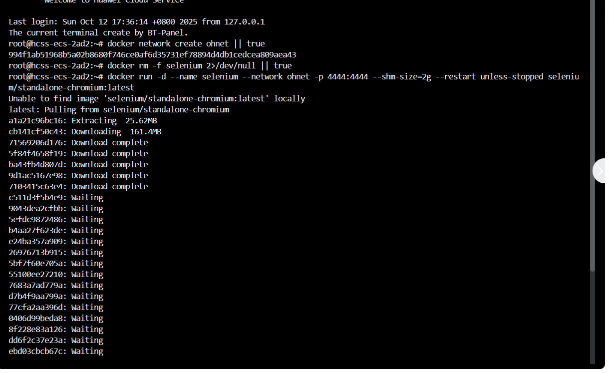

我们所需要解决的核心问题在于，

主要集中在以下几件事：

- 浏览器环境可控化：把 WebDriver 从宿主机剥离，使用独立容器的固定版本，避免系统升级/驱动不匹配。
- 资源与稳定性：扩大 /dev/shm，避免长页面截图/滚动导致的崩溃；容器限额可控，防止互相“抢资源”。
- 网络连通性：容器间直连可预期，避免容器→宿主的网关差异（172.17.0.1 不同环境不一定可达）。
- 可观测性：通过“是否打印远程WebDriver日志”“/status”就绪检查，快速定位问题。
- 回退策略：一键切回非增强版（不依赖 Selenium），确保业务不中断。

我们的解决方案回顾：

- 自定义网络 ohnet，保证 API 容器与浏览器容器在同一网络内互通。
- 浏览器容器：selenium/standalone-chromium:latest 暴露 4444，提供标准远程 WebDriver。
- API 容器：通过 `SELENIUM_REMOTE_URL=http://selenium:4444/wd/hub` 直连，不再依赖本地 chromedriver。

验证口径：

- `GET http://127.0.0.1:4444/status` 返回 `"ready": true` 后再重启/启动 API 容器。
- `docker logs -f NIOHServer` 日志出现“使用远程WebDriver”，且不再打印本地 chromedriver 路径。
- 访问 `GET /api/banner/mobile` 与 `GET /api/banner/status`，图片数量、最近抓取状态正常。

易踩坑与处理：

- /dev/shm 太小：为浏览器容器加 `--shm-size=2g`。
- 容器互通失败：确保两容器都在 ohnet；不要一个在 bridge、一个在 ohnet。
- 172.17.0.1 不通：优先方案A（容器内网直连）。若必须方案B，改宿主内网/公网IP 并放行防火墙。
- 镜像版本漂移：生产环境建议固定 tag（例如 `selenium/standalone-chromium:122.0`）。

应急回退（不用 Selenium 的非增强版）：

```bash
docker rm -f NIOHServer || true
```

```bash
docker run -d --name NIOHServer --network ohnet -p 32776:8001 --shm-size=1g \
  -e TZ=Asia/Shanghai -e BANNER_USE_ENHANCED=false \
  openharmony-server:latest
```

后面我会继续执行剩余步骤，并记录 Banner 抓取成功率、耗时以及日志关键词（远程WebDriver/Chromedriver）对比，验证这套方案的稳定性提升是否达到预期。

```bash
2025-10-14 20:21:24 - root - INFO - 日志系统初始化完成
============================================================
🚀 NowInOpenHarmony API 服务启动成功!
============================================================
2025-10-14T12:21:24.796525657Z
📡 服务可通过以下地址访问:
----------------------------------------
主要IP: http://172.19.0.3:8001
API文档: http://172.19.0.3:8001/docs
健康检查: http://172.19.0.3:8001/health
全部新闻: http://172.19.0.3:8001/api/news/?all=true
Banner图片: http://172.19.0.3:8001/api/banner/mobile
----------------------------------------
2025-10-14T12:21:24.796584668Z
🎯 主要API端点:
📰 全部新闻: http://172.19.0.3:8001/api/news/?all=true
🌐 官网新闻: http://172.19.0.3:8001/api/news/openharmony
📚 技术博客: http://172.19.0.3:8001/api/news/blog
📱 Banner图片: http://172.19.0.3:8001/api/banner/mobile
⚡ 服务状态: http://172.19.0.3:8001/api/health
2025-10-14T12:21:24.796608777Z
📋 完整API路径列表:
------------------------------------------------------------
🔧 基础服务:
根路径: http://172.19.0.3:8001/
API文档: http://172.19.0.3:8001/docs
ReDoc文档: http://172.19.0.3:8001/redoc
健康检查: http://172.19.0.3:8001/health
API健康检查: http://172.19.0.3:8001/api/health
2025-10-14T12:21:24.796638868Z
📰 新闻API:
全部新闻: http://172.19.0.3:8001/api/news/
分页新闻: http://172.19.0.3:8001/api/news/?page=1&page_size=20
搜索新闻: http://172.19.0.3:8001/api/news/?search=关键词
分类新闻: http://172.19.0.3:8001/api/news/?category=官方动态
OpenHarmony官网: http://172.19.0.3:8001/api/news/openharmony
OpenHarmony技术博客: http://172.19.0.3:8001/api/news/blog
手动爬取: http://172.19.0.3:8001/api/news/crawl (POST)
新闻服务状态: http://172.19.0.3:8001/api/news/status/info
2025-10-14T12:21:24.796681277Z
🖼️ Banner轮播图API:
手机版Banner: http://172.19.0.3:8001/api/banner/mobile
增强版Banner: http://172.19.0.3:8001/api/banner/mobile/enhanced
Banner状态: http://172.19.0.3:8001/api/banner/status
手动爬取Banner: http://172.19.0.3:8001/api/banner/crawl (POST)
Banner缓存信息: http://172.19.0.3:8001/api/banner/cache
清空Banner缓存: http://172.19.0.3:8001/api/banner/cache/clear (DELETE)
2025-10-14T12:21:24.796708417Z
📊 API参数示例:
强制爬取全部新闻: http://172.19.0.3:8001/api/news/crawl?source=all&limit=50
爬取官网新闻: http://172.19.0.3:8001/api/news/crawl?source=openharmony
爬取技术博客: http://172.19.0.3:8001/api/news/crawl?source=openharmony_blog
强制爬取Banner: http://172.19.0.3:8001/api/banner/mobile?force_crawl=true
下载Banner图片: http://172.19.0.3:8001/api/banner/mobile/enhanced?download_images=true
增强版爬取: http://172.19.0.3:8001/api/banner/crawl?use_enhanced=true
2025-10-14T12:21:24.796737808Z
💡 提示:
- 局域网IP可供同一网络下的其他设备访问
- GET请求可直接在浏览器中访问
- POST/DELETE请求需要使用API工具(如Postman)或curl命令
- 使用 Ctrl+C 停止服务
============================================================
2025-10-14T12:21:24.796761857Z
⚙️ 启动配置:
绑定地址: 0.0.0.0
端口: 8001
调试模式: False
日志级别: INFO
============================================================
2025-10-14 20:21:26 - root - INFO - 日志系统初始化完成
INFO: Started server process [1]
INFO: Waiting for application startup.
2025-10-14 20:21:26 - main - INFO - 应用启动中...
2025-10-14 20:21:26 - core.database - INFO - 数据库初始化完成
2025-10-14 20:21:26 - main - INFO - 数据库初始化完成
2025-10-14 20:21:26 - core.cache - INFO - 新闻缓存初始化完成
2025-10-14 20:21:26 - core.cache - INFO - 轮播图缓存初始化完成
2025-10-14 20:21:26 - main - INFO - 缓存初始化完成
2025-10-14 20:21:26 - apscheduler.scheduler - INFO - Adding job tentatively -- it will be properly scheduled when the scheduler starts
2025-10-14 20:21:26 - apscheduler.scheduler - INFO - Adding job tentatively -- it will be properly scheduled when the scheduler starts
2025-10-14 20:21:26 - apscheduler.scheduler - INFO - Adding job tentatively -- it will be properly scheduled when the scheduler starts
2025-10-14 20:21:26 - core.scheduler - INFO - 定时任务设置完成
2025-10-14 20:21:26 - apscheduler.scheduler - INFO - Added job "更新所有新闻源缓存" to job store "default"
2025-10-14 20:21:26 - apscheduler.scheduler - INFO - Added job "更新轮播图缓存" to job store "default"
2025-10-14 20:21:26 - apscheduler.scheduler - INFO - Added job "完整爬取任务" to job store "default"
2025-10-14 20:21:26 - apscheduler.scheduler - INFO - Scheduler started
2025-10-14 20:21:26 - core.scheduler - INFO - 定时任务调度器已启动
2025-10-14 20:21:26 - main - INFO - 定时任务调度器启动完成
2025-10-14 20:21:26 - main - INFO - 开始执行初始缓存加载...
2025-10-14 20:21:26 - core.scheduler - INFO - 开始执行初始缓存加载
2025-10-14 20:21:26 - core.scheduler - INFO - 📦 分批写入模式：将在第一批数据写入后立即变为可用状态
2025-10-14 20:21:26 - core.scheduler - INFO - 🚀 开始执行初始缓存加载 - 来源: all
2025-10-14 20:21:26 - core.scheduler - INFO - 📊 初始缓存加载 - 准备并行爬取数据...
2025-10-14 20:21:26 - services.news_service - INFO - 🌐 开始爬取OpenHarmony官网新闻...
2025-10-14 20:21:26 - services.openharmony_news_crawler - INFO - 🌐 开始爬取OpenHarmony官网新闻...
2025-10-14 20:21:26 - services.openharmony_news_crawler - INFO - 📦 启用分批处理模式，每 20 篇文章执行一次回调
🚀 开始高效获取OpenHarmony文章信息，每页300条数据...
📡 请求API: 第1页
2025-10-14 20:21:26 - core.scheduler - INFO - 🖼️ 开始执行初始轮播图加载
2025-10-14 20:21:26 - core.cache - INFO - 开始轮播图数据更新，状态设为准备中
2025-10-14 20:21:26 - core.cache - INFO - 轮播图服务状态更新: preparing
2025-10-14 20:21:26 - services.enhanced_mobile_banner_crawler - INFO - 🚀 初始化增强版手机Banner爬虫
2025-10-14 20:21:26 - services.enhanced_mobile_banner_crawler - INFO - - Selenium可用: True
2025-10-14 20:21:26 - services.enhanced_mobile_banner_crawler - INFO - - requests-html可用: False
2025-10-14 20:21:26 - core.scheduler - INFO - 初始缓存加载任务已提交到后台线程，服务可以立即响应请求
2025-10-14 20:21:26 - services.enhanced_mobile_banner_crawler - INFO - 🚀 开始增强版手机Banner爬取...
2025-10-14 20:21:26 - core.scheduler - INFO - 初始轮播图加载任务已提交到后台线程
2025-10-14 20:21:26 - services.enhanced_mobile_banner_crawler - INFO - 🎯 目标URL: https://old.openharmony.cn/mainPlay
2025-10-14 20:21:26 - main - INFO - 初始缓存加载完成
2025-10-14 20:21:26 - services.enhanced_mobile_banner_crawler - INFO - 📱 尝试方法1: Selenium WebDriver
2025-10-14 20:21:26 - main - INFO - 应用启动完成
2025-10-14 20:21:26 - services.enhanced_mobile_banner_crawler - INFO - 🎯 使用Selenium获取动态轮播图...
INFO: Application startup complete.
2025-10-14 20:21:26 - services.enhanced_mobile_banner_crawler - INFO - 🧭 使用Chrome二进制: /usr/bin/chromium
2025-10-14 20:21:26 - services.enhanced_mobile_banner_crawler - INFO - 🌐 使用远程WebDriver: http://selenium:4444/wd/hub
INFO: Uvicorn running on http://0.0.0.0:8001 (Press CTRL+C to quit)
📊 第1页获取到300条数据
📈 第1页新增300条有效数据，累计300条
📡 请求API: 第2页
📊 第2页获取到107条数据
📈 第2页新增107条有效数据，累计407条
🎯 第2页数据量(107)小于页面大小(300)，爬取完成
📋 共���取到407条有效文章信息
🔍 进行快速有效性校验...
2025-10-14 20:21:27 - main - INFO - GET /health - Status: 200 - Process Time: 0.001s
INFO: 127.0.0.1:55366 - "GET /health HTTP/1.1" 200 OK
2025-10-14 20:21:29 - services.enhanced_mobile_banner_crawler - INFO - 📱 访问页面: https://old.openharmony.cn/mainPlay
✅ 快速校验完成：9/10 有效，有效率90.0%
🚀 有效率高，跳过完整校验，直接返回所有数据
2025-10-14 20:21:42 - services.openharmony_news_crawler - INFO - 📋 获取到 407 篇文章信息
2025-10-14 20:21:42 - services.openharmony_news_crawler - INFO - 🔍 正在处理第 1/407 篇文章: 对话OpenHarmony开源先锋：如何用代码革新终端生态
2025-10-14 20:21:44 - services.openharmony_news_crawler - INFO - ✅ 成功解析文章，共 27 个内容块
2025-10-14 20:21:45 - services.openharmony_news_crawler - INFO - 🔍 正在处理第 2/407 篇文章: 12强终极PK！第二届OpenHarmony创新应用挑战赛引爆开源热潮
2025-10-14 20:21:46 - services.openharmony_news_crawler - INFO - ✅ 成功解析文章，共 11 个内容块
2025-10-14 20:21:47 - services.openharmony_news_crawler - INFO - 🔍 正在处理第 3/407 篇文章: 第二届OpenHarmony创新应用挑战赛决赛路演队伍揭晓
2025-10-14 20:21:48 - services.openharmony_news_crawler - INFO - ✅ 成功解析文章，共 2 个内容块
2025-10-14 20:21:48 - services.enhanced_mobile_banner_crawler - INFO - ✅ 轮播容器已加载
2025-10-14 20:21:48 - services.enhanced_mobile_banner_crawler - INFO - 🔄 执行页面滚动...
2025-10-14 20:21:49 - services.openharmony_news_crawler - INFO - 🔍 正在处理第 4/407 篇文章: OpenHarmony社区2024年度运营报告发布，致谢每一位生态共建者！
2025-10-14 20:21:49 - services.openharmony_news_crawler - INFO - ✅ 成功解析文章，共 34 个内容块
2025-10-14 20:21:50 - services.enhanced_mobile_banner_crawler - INFO - 🖱️ 模拟鼠标悬停
2025-10-14 20:21:50 - services.openharmony_news_crawler - INFO - 🔍 正在处理第 5/407 篇文章: 开源鸿蒙社区恭祝全体开发者2025新年快乐，新春大吉！
2025-10-14 20:21:51 - services.openharmony_news_crawler - INFO - ✅ 成功解析文章，共 2 个内容块
2025-10-14 20:21:52 - services.openharmony_news_crawler - INFO - 🔍 正在处理第 6/407 篇文章: 共绘2025年开源新蓝图，OpenHarmony社区项目管理委员会年度工作会议在深圳成功举办
2025-10-14 20:21:52 - services.enhanced_mobile_banner_crawler - INFO - 👆 点击轮播指示器
2025-10-14 20:21:53 - services.openharmony_news_crawler - INFO - ✅ 成功解析文章，共 41 个内容块
2025-10-14 20:21:53 - main - INFO - GET /health - Status: 200 - Process Time: 0.001s
INFO: 172.19.0.1:59564 - "GET /health HTTP/1.1" 200 OK
2025-10-14 20:21:54 - services.openharmony_news_crawler - INFO - 🔍 正在处理第 7/407 篇文章: 开源鸿蒙项目群新增捐赠人（2024年12月）
2025-10-14 20:21:54 - services.openharmony_news_crawler - INFO - ✅ 成功解析文章，共 16 个内容块
2025-10-14 20:21:54 - services.enhanced_mobile_banner_crawler - INFO - ⚡ 执行JavaScript触发脚本
2025-10-14 20:21:55 - services.openharmony_news_crawler - INFO - 🔍 正在处理第 8/407 篇文章: 开源鸿蒙社区隆重致谢授牌2024年度社区贡献单位和个人
2025-10-14 20:21:56 - services.openharmony_news_crawler - INFO - ✅ 成功解析文章，共 4 个内容块
2025-10-14 20:21:57 - services.openharmony_news_crawler - INFO - 🔍 正在处理第 9/407 篇文章: 厚植根基，同启新程！一文回顾 2024 OpenHarmony 社区年度工作会议精彩瞬间
2025-10-14 20:21:57 - services.openharmony_news_crawler - INFO - ✅ 成功解析文章，共 44 个内容块
2025-10-14 20:21:58 - services.openharmony_news_crawler - INFO - 🔍 正在处理第 10/407 篇文章: 第二届OpenHarmony创新应用挑战赛决赛晋级名单公示
2025-10-14 20:21:59 - services.openharmony_news_crawler - INFO - ✅ 成功解析文章，共 2 个内容块
2025-10-14 20:21:59 - main - INFO - GET /health - Status: 200 - Process Time: 0.000s
INFO: 127.0.0.1:57904 - "GET /health HTTP/1.1" 200 OK
2025-10-14 20:22:00 - services.openharmony_news_crawler - INFO - 🔍 正在处理第 11/407 篇文章: 一元复始 万象更新|开源鸿蒙社区祝广大开发者元旦快乐！
2025-10-14 20:22:01 - services.openharmony_news_crawler - INFO - ✅ 成功解析文章，共 2 个内容块
2025-10-14 20:22:02 - services.openharmony_news_crawler - INFO - 🔍 正在处理第 12/407 篇文章: OpenHarmony程序分析框架论文入选第50届国际软件工程大会ICSE2025
2025-10-14 20:22:02 - services.openharmony_news_crawler - INFO - ✅ 成功解析文章，共 8 个内容块
2025-10-14 20:22:02 - services.enhanced_mobile_banner_crawler - INFO - 🔍 选择器 '.el-carousel img' 找到 4 个图片元素
2025-10-14 20:22:03 - services.enhanced_mobile_banner_crawler - INFO - 🔍 选择器 '.banner img' 找到 4 个图片元素
2025-10-14 20:22:03 - services.enhanced_mobile_banner_crawler - INFO - 🔍 选择器 '.el-carousel__item img' 找到 4 个图片元素
2025-10-14 20:22:03 - services.openharmony_news_crawler - INFO - 🔍 正在处理第 13/407 篇文章: OpenHarmony开发者激励计划 | 2024年度精彩回顾
2025-10-14 20:22:04 - api.banner - INFO - 🚀 手动触发轮播图爬取 - 增强版: True, 下载: False
2025-10-14 20:22:04 - core.scheduler - INFO - 开始执行手动轮播图爬取任务
2025-10-14 20:22:04 - core.scheduler - INFO - 🖼️ 开始执行手动轮播图爬取任务
2025-10-14 20:22:04 - core.cache - INFO - 开始轮播图数据更新，状态设为准备中
2025-10-14 20:22:04 - core.scheduler - INFO - 手动轮播图爬取任务已提交到后台线程
2025-10-14 20:22:04 - core.cache - INFO - 轮播图服务状态更新: preparing
2025-10-14 20:22:04 - api.banner - INFO - 🔄 执行增强版Banner爬取任务
2025-10-14 20:22:04 - services.enhanced_mobile_banner_crawler - INFO - 🚀 初始化增强版手机Banner爬虫
2025-10-14 20:22:04 - services.enhanced_mobile_banner_crawler - INFO - 🚀 初始化增强版手机Banner爬虫
2025-10-14 20:22:04 - services.enhanced_mobile_banner_crawler - INFO - - Selenium可用: True
2025-10-14 20:22:04 - services.enhanced_mobile_banner_crawler - INFO - - Selenium可用: True
2025-10-14 20:22:04 - services.enhanced_mobile_banner_crawler - INFO - - requests-html可用: False
2025-10-14 20:22:04 - services.enhanced_mobile_banner_crawler - INFO - - requests-html可用: False
2025-10-14 20:22:04 - services.enhanced_mobile_banner_crawler - INFO - 🚀 开始增强版手机Banner爬取...
2025-10-14 20:22:04 - services.enhanced_mobile_banner_crawler - INFO - 🚀 开始增强版手机Banner爬取...
2025-10-14 20:22:04 - services.enhanced_mobile_banner_crawler - INFO - 🎯 目标URL: https://old.openharmony.cn/mainPlay
2025-10-14 20:22:04 - services.enhanced_mobile_banner_crawler - INFO - 🎯 目标URL: https://old.openharmony.cn/mainPlay
2025-10-14 20:22:04 - services.enhanced_mobile_banner_crawler - INFO - 📱 尝试方法1: Selenium WebDriver
2025-10-14 20:22:04 - services.enhanced_mobile_banner_crawler - INFO - 📱 尝试方法1: Selenium WebDriver
2025-10-14 20:22:04 - services.enhanced_mobile_banner_crawler - INFO - 🎯 使用Selenium获取动态轮播图...
2025-10-14 20:22:04 - services.enhanced_mobile_banner_crawler - INFO - 🎯 使用Selenium获取动态轮播图...
2025-10-14 20:22:04 - services.enhanced_mobile_banner_crawler - INFO - 🧭 使用Chrome二进制: /usr/bin/chromium
2025-10-14 20:22:04 - services.enhanced_mobile_banner_crawler - INFO - 🧭 使用Chrome二进制: /usr/bin/chromium
2025-10-14 20:22:04 - services.enhanced_mobile_banner_crawler - INFO - 🌐 使用远程WebDriver: http://selenium:4444/wd/hub
2025-10-14 20:22:04 - services.enhanced_mobile_banner_crawler - INFO - 🌐 使用远程WebDriver: http://selenium:4444/wd/hub
2025-10-14 20:22:04 - services.openharmony_news_crawler - INFO - ✅ 成功解析文章，共 4 个内容块
2025-10-14 20:22:05 - services.openharmony_news_crawler - INFO - 🔍 正在处理第 14/407 篇文章: 开源鸿蒙荣获开放原子“2024年度操作系统领域国内活跃开源项目”
2025-10-14 20:22:06 - services.openharmony_news_crawler - INFO - ✅ 成功解析文章，共 8 个内容块
2025-10-14 20:22:07 - services.openharmony_news_crawler - INFO - 🔍 正在处理第 15/407 篇文章: OpenHarmony项目群10-11月新增捐赠人
2025-10-14 20:22:07 - services.openharmony_news_crawler - INFO - ✅ 成功解析文章，共 39 个内容块
2025-10-14 20:22:08 - services.openharmony_news_crawler - INFO - 🔍 正在处理第 16/407 篇文章: 大咖导师 源力唤醒|第二届开源鸿蒙创新应用挑战赛导师阵容重磅亮相
2025-10-14 20:22:09 - services.openharmony_news_crawler - INFO - ✅ 成功解析文章，共 2 个内容块
2025-10-14 20:22:10 - services.openharmony_news_crawler - INFO - 🔍 正在处理第 17/407 篇文章: 与鸿同行，探索无限！开源鸿蒙技术分论坛在武汉成功举办
2025-10-14 20:22:11 - services.openharmony_news_crawler - INFO - ✅ 成功解析文章，共 49 个内容块
2025-10-14 20:22:12 - services.openharmony_news_crawler - INFO - 🔍 正在处理第 18/407 篇文章: 开源鸿蒙5.0重磅发布，共赴万物智联未来
2025-10-14 20:22:12 - services.openharmony_news_crawler - INFO - ✅ 成功解析文章，共 17 个内容块
2025-10-14 20:22:13 - services.enhanced_mobile_banner_crawler - INFO - 🔍 选择器 '.carousel img' 找到 0 个图片元素
2025-10-14 20:22:13 - services.openharmony_news_crawler - INFO - 🔍 正在处理第 19/407 篇文章: 源鸿蒙 5.0 Release版本关键特性解读
2025-10-14 20:22:14 - services.openharmony_news_crawler - INFO - ✅ 成功解析文章，共 24 个内容块
2025-10-14 20:22:15 - services.openharmony_news_crawler - INFO - 🔍 正在处理第 20/407 篇文章: 精彩预告 | 2024开放原子开发者大会OpenHarmony技术分论坛等您来！
2025-10-14 20:22:16 - services.openharmony_news_crawler - INFO - ✅ 成功解析文章，共 2 个内容块
2025-10-14 20:22:16 - services.openharmony_news_crawler - INFO - 📦 [分批处理] 达到批处理大小 20，执行回调...
```

芜湖！！！卧槽这次日志总算是没问题了！！！

这样一来我就可以访问一下我的接口了，啊啊啊啊一定要没问题啊。

```bash
http://113.47.8.204:32776/api/banner/mobile
```

```json
{
  "success": true,
  "images": [
    "https://images.openharmony.cn/%E9%A6%96%E9%A1%B5/banner/20240411/4.1releas%E6%89%8B%E6%9C%BA.jpg",
    "https://images.openharmony.cn/%E6%B4%BB%E5%8A%A8/%E5%88%9B%E6%96%B0%E8%B5%9B2023/20230831/%E4%B8%89%E6%96%B9%E5%BA%93%E7%A7%BB%E5%8A%A8%E7%AB%AF.png",
    "https://images.openharmony.cn/%E6%B4%BB%E5%8A%A8/%E5%A4%A7%E8%B5%9B20250812/%E7%AC%AC%E4%B8%89%E5%B1%8A%E5%BC%80%E6%BA%90%E9%B8%BF%E8%92%99%E5%88%9B%E6%96%B0%E5%BA%94%E7%94%A8%E6%8C%91%E6%88%98%E8%B5%9B-%20750%20350.jpg",
    "https://images.openharmony.cn/%E6%B4%BB%E5%8A%A8/%E6%8A%80%E6%9C%AF%E5%A4%A7%E4%BC%9A20250826/phone%20750x350.jpg"
  ],
  "total": 4,
  "message": "获取手机版Banner图片成功（缓存），共 4 张",
  "timestamp": "2025-10-14T20:40:18.480150"
}
```

卧槽牛逼！！！成功了我再去测试一下其他接口。

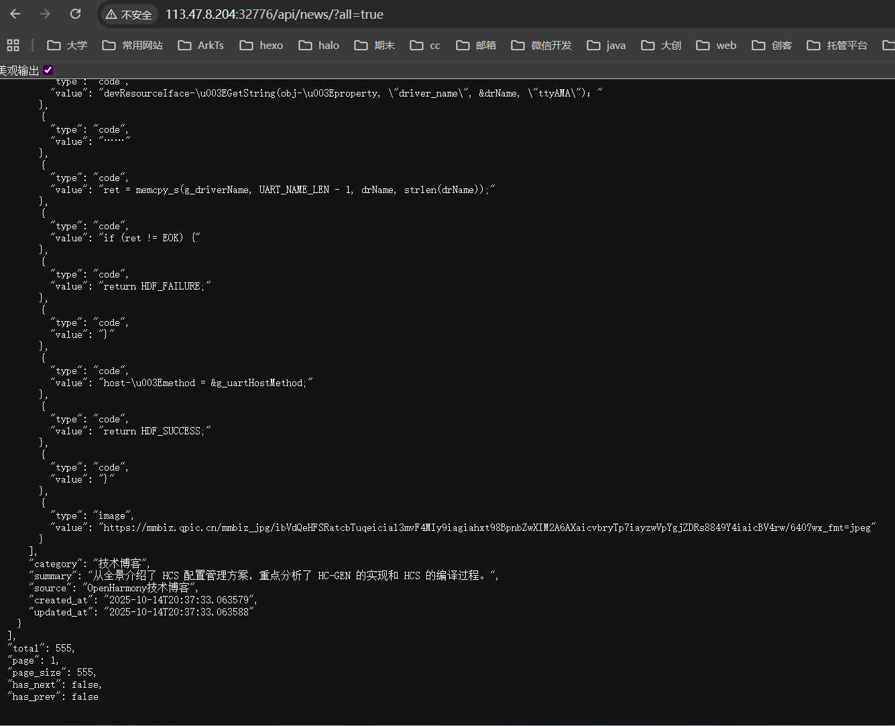

nbnb。这样一来我明天就可以开始真正的修改我的客户端基地址了。


### CPU负载问题

在昨天顺利解决了我们的容器部署问题以及服务器WebDriver失效的问题之后，我本来以为万事大吉了就没有再管他，结果今天我上宝塔面板一看发现卧槽2核CPU持续性的维持在100%，连短暂的掉到99% 98%都没有出现，我赶紧关停了两个docker容器，服务器的CPU占用率终于是降下来了。我对于服务器的经验并不多，我也不确定这种情况是否正常，所以我决定先给GPT看看。

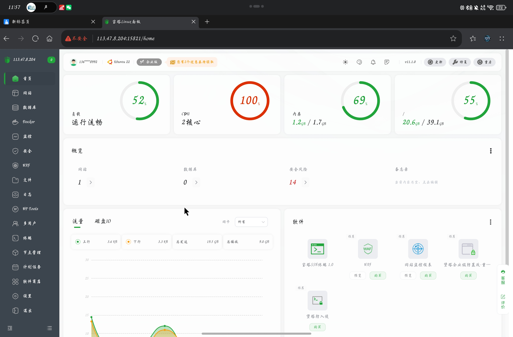

在GPT生成回复的过程中我也是上网去进行了一下检索。

这种现象是明显不正常的，有可能是死循环代码，内存泄漏，不合理的先乘除配置，为优化的数据库查询，第三方API调用超时堆积，DDoS攻击，爬虫滥用等等很多的情况，这些都可能会导致我的服务器CPU跑满的情况。

这并不是直接购买一个新CPU可以解决的问题，我平常仅仅运行我博客网站的Nginx的过程中CPU占用率仅维持在4%左右，所以说明它基本上将两个核的CPU资源全都耗尽了，我怀疑的问题是我的爬虫程序运行时开了很多的线程去进行爬取，在本地的多核CPU运行起来并不是什么负担，但是在服务器上的2核小CPU上去运行就是一个巨大的负担了。

让我们先来看看GPT的建议。

```bash
结论与现状

现在功能正常：日志已切到远程 WebDriver，并能定位到轮播元素。
CPU 100%并非常态，但在“初始大爬取 + Selenium 渲染页面”阶段，2 核机型确实会被打满一段时间。若任务结束很久仍 100%，需要定位哪个容器在持续占用。
先快速定位“谁在吃 CPU”

看容器资源占用
docker stats
进一步看容器内最耗 CPU 的进程
App 容器: docker exec -it NIOHServer sh -lc "ps -eo pid,cmd,%cpu --sort=-%cpu | head"
浏览器容器: docker exec -it selenium sh -lc "ps -eo pid,cmd,%cpu --sort=-%cpu | head"
立即止血的几种安全操作

给容器加 CPU 上限（不重建也可生效）
docker update --cpus=0.8 NIOHServer
docker update --cpus=0.8 selenium
临时关闭定时任务，改为按需触发（避免后台并发）
先停容器：docker stop NIOHServer
以禁用调度器的方式启动（只保留手动触发）：docker run -d --name NIOHServer --network ohnet -p 32776:8001 --shm-size=1g -e TZ=Asia/Shanghai -e ENABLE_SCHEDULER=false -e BANNER_USE_ENHANCED=true -e SELENIUM_REMOTE_URL=http://selenium:4444/wd/hub -e SELENIUM_USE_USER_DATA_DIR=false openharmony-server:latest
手动触发时再调用：curl -X POST "http://127.0.0.1:32776/api/banner/crawl?use_enhanced=true"
不用 Selenium 时，把浏览器容器停掉，空闲时 0 负载
docker stop selenium
需要增强版再启动：docker start selenium
为什么会打满

初始新闻爬取解析 400+ 篇页面 + BeautifulSoup 解析会占满 2 核（短时内算正常）。
Selenium/Chromium 渲染 Nuxt 动态页消耗较高，且我们默认每 3 小时有一次轮播图定时任务（与你的新闻定时任务同时开始，叠加负载）。
线程池并发（当前 max_workers=6）也会放大 CPU 峰值。
建议的稳态运行配置

错峰调度：避免新闻和轮播图同一时刻启动（后续我可以把 banner 任务延后 10 分钟或加随机抖动）。
控制并发：将线程池降到 2（需要我改 core/scheduler.py 的 max_workers=2）。
资源限额：持续使用 docker update 或在 compose 里写死资源限制（cpus/mem/shm_size）。
按需 Selenium：默认停 selenium，调用增强版接口时再启动，完毕后自动停（我可以在代码里做“按需启动/停止”集成）。
你现在可以做的最小变更

先看“谁在吃 CPU”：docker stats
如果 selenium 持续高：docker update --cpus=0.6 selenium 或直接 docker stop selenium（用 Nuxt 兜底或传统解析）
如果 app 持续高：用禁用调度器的方式重启 app，只在需要时手动触发；或者我把线程池降到 2 并提交。
需要我：

降低线程池并发（max_workers=2）并提交？
将 banner 定时任务与新闻错峰（例如 banner 延后 10 分钟）？
在增强版里补上 CSS 背景图提取（提升取图成功率，同时减少多次重试的渲染开销）？
```

GPT给出的观点和我的观点一致，这并非常态，理论上来讲我们的程序只应该是在爬取新闻的过程中CPU才会飙高，这是正常的，但是当时我上到后台一看100%后只等待了不到一分钟左右的时间看占用率依旧是没有下降就直接去将两个容器停止了运行，所以说我目前并不清楚当前的爬虫进程是否是正处于爬取状态还是常态。所以我考虑的方案是先让GPT给我一套启动这两个镜像的命令，将两个容器启动并且确认轮播图功能正常之后立刻去查看两个容器分别的CPU占用率，等待第一轮爬取结束后再去分别观察CPU的占用率。

```bash
给你一套可直接执行的命令：启动两个容器→确认轮播图→立刻看 CPU→等待首轮结束后再看 CPU。我已按你环境填好值（容器名 NIOHServer、镜像 openharmony-server:latest、对外端口 32776、网络 ohnet、远程 WebDriver selenium:4444）。

启动与健康检查
创建网络 + 启动/复用 Selenium + 等就绪 + 启动/复用 API
bash
docker network create ohnet || true
启动/复用 selenium（远程 WebDriver）
if ! docker ps -a --format '{{.Names}}' | grep -q '^selenium$'; then
docker run -d --name selenium --network ohnet
-p 4444:4444 --shm-size=2g --restart unless-stopped
selenium/standalone-chromium:latest
else
docker start selenium
fi

等待 WebDriver 就绪
until curl -sf http://127.0.0.1:4444/status | grep -E -qi '"ready"[[:space:]]*:[[:space:]]*true'; do
echo "Waiting for Selenium remote WebDriver on :4444 ..."; sleep 2;
done

启动/复用 API 容器（使用远程 WebDriver）
if ! docker ps -a --format '{{.Names}}' | grep -q '^NIOHServer$'; then
docker run -d --name NIOHServer --network ohnet
-p 32776:8001 --shm-size=1g
-e TZ=Asia/Shanghai
-e ENABLE_SCHEDULER=true
-e BANNER_USE_ENHANCED=true
-e SELENIUM_REMOTE_URL=http://selenium:4444/wd/hub
-e SELENIUM_USE_USER_DATA_DIR=false
openharmony-server:latest
else
docker start NIOHServer
fi

健康检查
echo; echo "API health:"; curl -s http://127.0.0.1:32776/health || true
echo; echo "Selenium status:"; curl -s http://127.0.0.1:4444/status || true

触发轮播图并立刻查看 CPU
bash
手动触发增强版轮播图爬取
echo; echo "Trigger banner crawl:";
curl -s -X POST "http://127.0.0.1:32776/api/banner/crawl?use_enhanced=true" || true

立即查看两个容器的 CPU/内存
echo; echo "Instant CPU snapshot:";
docker stats --no-stream --format 'table {{.Name}}\t{{.CPUPerc}}\t{{.MemUsage}}\t{{.PIDs}}' | egrep 'NIOHServer|selenium' || true

各自容器内最耗CPU进程（便于诊断）
echo; echo "[Top procs] NIOHServer:";
docker exec -it NIOHServer sh -lc "ps -eo pid,comm,%cpu,%mem --sort=-%cpu | head" || true
echo; echo "[Top procs] selenium:";
docker exec -it selenium sh -lc "ps -eo pid,comm,%cpu,%mem --sort=-%cpu | head" || true

等待首轮爬取结束，再次采样 CPU
以轮播图缓存 READY 为“首轮结束”标志（若 grep 不准，可用 Ctrl+C 中断）
bash
echo; echo "Waiting for banner cache READY ... (Ctrl+C to abort)";
until curl -sf "http://127.0.0.1:32776/api/banner/status" | grep -qi '"status"[[:space:]]:[[:space:]]"ready"'; do
sleep 5; done
READY 后再取一次 CPU 快照与图片列表
echo; echo "CPU snapshot after first crawl:";
docker stats --no-stream --format 'table {{.Name}}\t{{.CPUPerc}}\t{{.MemUsage}}\t{{.PIDs}}' | egrep 'NIOHServer|selenium' || true

echo; echo "Banner images:";
curl -s "http://127.0.0.1:32776/api/banner/mobile" || true

如需持续观察（2秒一次，随时 Ctrl+C 停止）
watch -n 2 'docker stats --no-stream --format "table {{.Name}}\t{{.CPUPerc}}\t{{.MemUsage}}" | egrep "NIOHServer|selenium"'
说明

以上命令会优先复用已存在容器；若不存在则自动 run。
远程 WebDriver 地址固定用 http://selenium:4444/wd/hub（在 ohnet 网络内）。
如果 READY 后 CPU 仍长期 >80%，告诉我结果；我再给你：降并发（线程池改 6→2）、错峰调度（banner 晚新闻10分钟启动）、或加 docker 资源上限（docker update --cpus）。
```

```bash
docker network create ohnet || true
```

```bash
docker rm -f selenium 2>/dev/null || true && docker run -d --name selenium --network ohnet -p 4444:4444 --shm-size=2g --restart unless-stopped selenium/standalone-chromium:latest

```bash
until curl -sf http://127.0.0.1:4444/status | grep -E -qi '"ready"[[:space:]]*:[[:space:]]*true'; do echo "Waiting for Selenium remote WebDriver on :4444 ..."; sleep 2; done
```

```bash
docker rm -f NIOHServer 2>/dev/null || true && docker run -d --name NIOHServer --network ohnet -p 32776:8001 --shm-size=1g -e TZ=Asia/Shanghai -e ENABLE_SCHEDULER=true -e BANNER_USE_ENHANCED=true -e SELENIUM_REMOTE_URL=http://selenium:4444/wd/hub -e SELENIUM_USE_USER_DATA_DIR=false openharmony-server:latest
```

到这一步之后就是成功启动了。

```bash
curl -s -X POST "http://127.0.0.1:32776/api/banner/crawl?use_enhanced=true"
```

```bash
docker stats --no-stream --format 'table {{.Name}}\t{{.CPUPerc}}\t{{.MemUsage}}\t{{.PIDs}}' | egrep 'NIOHServer|selenium'
```

```bash
docker exec -it NIOHServer sh -lc "ps -eo pid,comm,%cpu,%mem --sort=-%cpu | head"
```

```bash
docker exec -it selenium sh -lc "ps -eo pid,comm,%cpu,%mem --sort=-%cpu | head"
```

```bash
until curl -sf "http://127.0.0.1:32776/api/banner/status" | grep -qi '"status"[[:space:]]:[[:space:]]"ready"'; do sleep 5; done
```

```bash
docker stats --no-stream --format 'table {{.Name}}\t{{.CPUPerc}}\t{{.MemUsage}}\t{{.PIDs}}' | egrep 'NIOHServer|selenium'
```

```bash
curl -s "http://127.0.0.1:32776/api/banner/mobile"
```

```bash

        Welcome to Huawei Cloud Service

Last login: Sun Oct 12 17:36:14 +0800 2025 from 127.0.0.1
The current terminal create by BT-Panel.
root@hcss-ecs-2ad2:~# docker network create ohnet || true
Error response from daemon: network with name ohnet already exists
root@hcss-ecs-2ad2:~# docker rm -f selenium 2>/dev/null || true && docker run -d --name selenium --network ohnet -p 4444:4444 --shm-size=2g --restart unless-stopped selenium/standalone-chromium:latest
selenium
dd4e8ae815cfdfae39b8874426f3a6f09ec02acb826971801ca35d863cb27842
root@hcss-ecs-2ad2:~# docker rm -f NIOHServer 2>/dev/null || true && docker run -d --name NIOHServer --network ohnet -p 32776:8001 --shm-size=1g -e TZ=Asia/Shanghai -e ENABLE_SCHEDULER=true -e BANNER_USE_ENHANCED=true -e SELENIUM_REMOTE_URL=http://selenium:4444/wd/hub -e SELENIUM_USE_USER_DATA_DIR=false openharmony-server:latest
NIOHServer
5e952f4766e077d3d78e07908bfb2dd23a30790e9be81a3419323cac90703cd6
root@hcss-ecs-2ad2:~# 
```

上面这就是这次启动服务的控制台全流程，接下来我们去看一下服务的启动情况。

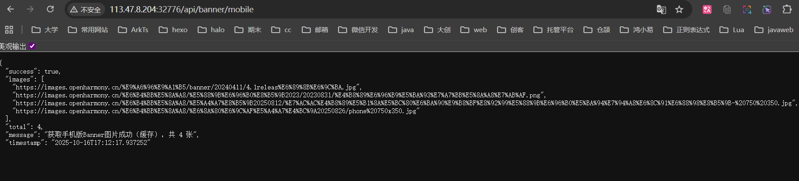

通过接口的访问数据可以看到启动时成功的。接下来就是观察docker的CPU占用率了。

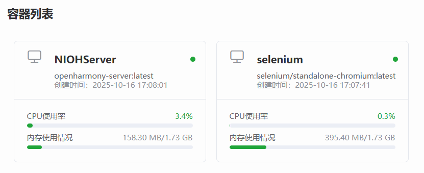

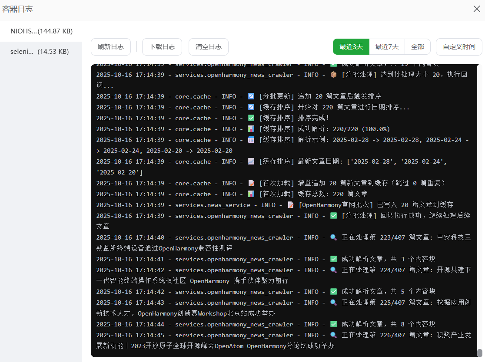

我优先查看了CPU的占用率，发现没有问题，然后又通过日志确认当前就是爬取状态，爬取状态也没有，那为什么会出现飙高吃满的情况呢？这不合理啊。

现在只能说是后悔当时没有第一时间去查看一下容器的占用率是否正常了，应该第一时间留存相关的监控数据以便于分析排查，而不是直接关闭了。

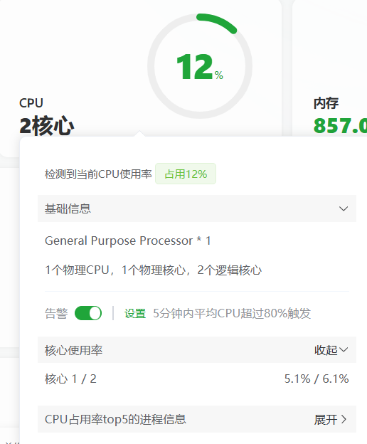

总占用率也是正常的，这还是在同时支持宝塔面板的服务状态下。

持续观察了一会儿发现占用率在持续走低，这更解释不了之前出现的情况了。我猜测可能是我的爬虫逻辑在运行了一段时间之后出现了类似死锁或者是线程池的无限制扩张问题导致了我们的服务CPU占用率飙升。那这就需要等待一天后再来看一看我们的服务器数据了，现在我先让GPT帮我检查一下代码中是否存在这种问题的隐患。并将更新时间拉长到6小时一更新，来减少我的流量开销。

```bash
我做了两件事：

代码体检要点

线程池不会无限扩张：TaskScheduler 固定 max_workers=6，api/banner.py 单独线程池为2；不存在“无限增长”模式。core/scheduler.py:1, api/banner.py:31
竞态/叠加风险较低：APScheduler 为同一 id 的任务 replace_existing；默认 max_instances=1，且我们每次只提交一次后台线程任务，不会无限并发叠加。core/scheduler.py:20, 100
死锁风险较低：缓存使用 RLock，set_updating 内部调用 set_status 仍是同一可重入锁，没问题。core/cache.py:34
峰值来源合理：初始大爬取 400+ 篇 + Selenium 渲染动态页会打满 2 核；若下一次定时与手工触发重叠，也可能短时拉高整体负载。
已按你的要求把定时更新改为每 6 小时一次

修改：新闻与轮播图的定时任务 IntervalTrigger 从 3 小时 → 6 小时
文件：core/scheduler.py
提交：chore(scheduler): extend update interval to every 6 hours for news and banner to reduce load and traffic
当前分支：feature/docker-containerization-deployment-issue-4
建议的观察步骤

现在的配置下，启动后只会在初始化阶段有短时 CPU 抬升；后续每 6h 触发一次。
若再出现长时间 100%，立刻执行：
docker stats —锁定耗CPU容器
docker exec -it <容器> ps -eo pid,comm,%cpu,%mem --sort=-%cpu | head —锁定进程
我可以继续：
将线程池并发从 6 降到 2（更稳、更省CPU）
错峰调度（banner 比新闻晚 10 分钟启动，避免同一时刻峰值）
增强 Selenium 提取 CSS 背景图，减少多次重试造成的渲染开销
需要哪一个，直接回我编号即可。
```

嗯，看起来Claude留下来的代码还是质量挺高的，GPT给出的建议也都很有道理，这样的话我觉得这三条建议都可以执行。

```bash
已全部执行并提交到 feature/docker-containerization-deployment-issue-4。

并发下调

线程池 max_workers: 6 → 2
文件: core/scheduler.py
错峰调度

新闻每 6 小时
轮播图每 6 小时但首发延迟 10 分钟（与新闻错峰）
文件: core/scheduler.py
增强版爬虫优化

增加 CSS background-image 抓取（computedStyle），补齐只用 img 时漏抓的问题
统一对 JS 返回的 URL 做绝对化、去重
文件: services/enhanced_mobile_banner_crawler.py
提交记录

chore(scheduler): extend update interval to every 6 hours for news and banner to reduce load and traffic
perf(scheduler): reduce thread pool to 2 and stagger banner job by 10min; perf(banner/selenium): extract CSS background-image via computed style and normalize URLs
下一步

重建并启动服务以生效最近两次改动
docker rm -f NIOHServer || true
docker run -d --name NIOHServer --network ohnet -p 32776:8001 --shm-size=1g -e TZ=Asia/Shanghai -e ENABLE_SCHEDULER=true -e BANNER_USE_ENHANCED=true -e SELENIUM_REMOTE_URL=http://selenium:4444/wd/hub -e SELENIUM_USE_USER_DATA_DIR=false openharmony-server:latest
触发并观察
curl -s -X POST "http://127.0.0.1:32776/api/banner/crawl?use_enhanced=true"
docker stats —观察 NIOHServer/selenium CPU
curl -s "http://127.0.0.1:32776/api/banner/mobile" —确认有图
如果还需更激进的限流（比如给容器加 cpus=0.6），告诉我，我给出一键 update/run 命令。
```

这一次完整的重新部署之后我像往常一样只间隔了一分钟就去测试获取轮播图的接口发现失败了，吓我一跳，仔细一想好像是因为线程池的总量被限制了，导致爬虫的运行被减慢或者滞后了，所以我多等了几分钟再次进行测试总算是成功了，吓我一跳。

出去吃个饭回来又持续的观察了一段时间发现我后端服务容器占用率始终为0.1%，而Selenium容器占用率始终为0.2%，仅仅是维持着最基础的进程生命周期，完全没有出现任何异常波动，再加上此前GPT已经针对于我们的代码进行了检查和优化，我不能理解为什么那天出现了CPU占用拉满的情况，现在只能是再等一等去进行进一步的观察了。

先让我们向下一步推进吧。

### 合并分支并完成issue

终于是到了合并分支的时刻了，这场小闹剧已经持续太久了，该让他结束了。

<div style="
  background: linear-gradient(135deg, #1a1a1a 0%, #2d2d2d 100%);
  border: 1px solid #404040;
  border-left: 4px solid #28a745;
  border-radius: 12px;
  padding: 20px;
  margin: 16px 0;
  box-shadow: 0 4px 12px rgba(0, 0, 0, 0.3);
  transition: all 0.3s ease;
  font-family: -apple-system, BlinkMacSystemFont, 'Segoe UI', 'Roboto', sans-serif;
  max-width: 500px;
">
<div style="display: flex; align-items: center; margin-bottom: 12px;">
<svg style="width: 20px; height: 20px; margin-right: 8px; fill: #28a745;" viewBox="0 0 16 16">
<path d="M8 9.5a1.5 1.5 0 100-3 1.5 1.5 0 000 3z"/>
<path fill-rule="evenodd" d="M8 0a8 8 0 100 16A8 8 0 008 0zM1.5 8a6.5 6.5 0 1113 0 6.5 6.5 0 01-13 0z"/>
</svg>
<span style="color: #28a745; font-size: 12px; font-weight: 600; margin-right: 8px;">OPEN</span>
<div style="margin: 0; color: #ffffff; font-size: 16px; font-weight: 600;">
<a href="https://github.com/ifLabVibe/NowInOpenHarmony/issues/4" style="color: #ffffff; text-decoration: none;">
后端docker容器化部署
</a>
</div>
</div>
<div style="display: flex; align-items: center; margin-bottom: 12px;">
<span style="color: #d4d4d4; font-size: 12px; margin-right: 16px;">
#4
</span>
<span style="color: #d4d4d4; font-size: 12px; margin-right: 16px;">
ifLabVibe/NowInOpenHarmony
</span>
</div>
<p style="color: #d4d4d4; margin: 0 0 16px 0; font-size: 14px; line-height: 1.5;">
为实现NowInOpenHarmony应用的正式上架，需要完成后端服务器部署、应用商店适配、用户隐私政策制定等关键工作。这是从开源项目到商业化应用的重要里程碑。
</p>
<div style="display: flex; align-items: center; gap: 16px; margin-bottom: 12px;">
<span style="display: flex; align-items: center; color: #d4d4d4; font-size: 12px;">
<svg style="width: 12px; height: 12px; margin-right: 4px; fill: #d4d4d4;" viewBox="0 0 16 16">
<path d="M8 2a.75.75 0 01.75.75v3.5h3.5a.75.75 0 010 1.5h-3.5v3.5a.75.75 0 01-1.5 0v-3.5h-3.5a.75.75 0 010-1.5h3.5v-3.5A.75.75 0 018 2z"/>
</svg>
enhancement
</span>
<span style="color: #6f42c1; font-size: 12px; background: rgba(111, 66, 193, 0.1); padding: 2px 6px; border-radius: 4px;">
应用上架
</span>
<span style="color: #0969da; font-size: 12px; background: rgba(9, 105, 218, 0.1); padding: 2px 6px; border-radius: 4px;">
服务器部署
</span>
</div>
<div style="margin-top: 12px;">
<a href="https://github.com/ifLabVibe/NowInOpenHarmony/issues/4"
style="
color: #ffffff;
text-decoration: none;
font-size: 12px;
border: 1px solid #404040;
padding: 6px 12px;
border-radius: 6px;
background: rgba(255, 255, 255, 0.05);
transition: all 0.2s ease;
display: inline-block;
"
onmouseover="this.style.background='rgba(255, 255, 255, 0.1)'"
onmouseout="this.style.background='rgba(255, 255, 255, 0.05)'">
查看Issue
</a>
</div>
</div>

这是在第一篇上线笔记中开启的issue，现在该合并并关闭了。

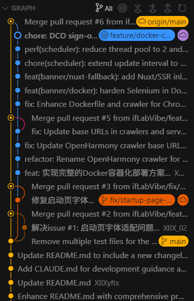

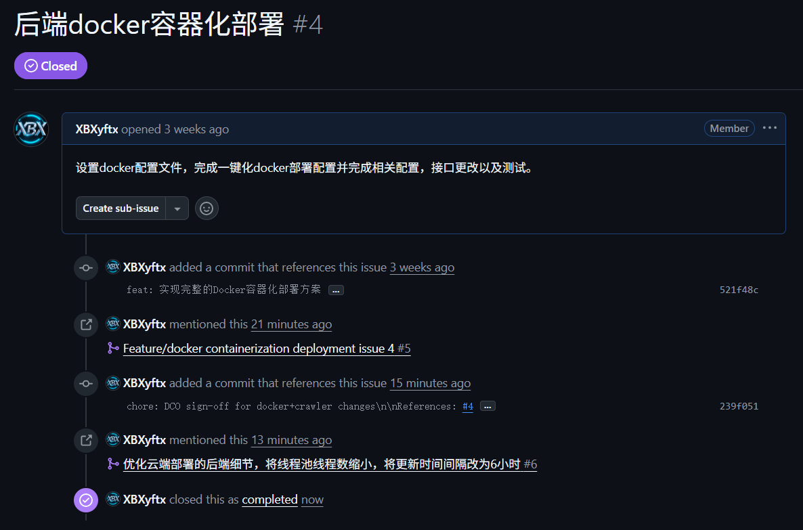

ok，这下舒服了

## 客户端更换基地址

### issue创建

哎，终于是到了这一步了，太不容易了。

相当简单，但依旧规范化，先去创建issue。

<div style="
  background: linear-gradient(135deg, #1a1a1a 0%, #2d2d2d 100%);
  border: 1px solid #404040;
  border-left: 4px solid #28a745;
  border-radius: 12px;
  padding: 20px;
  margin: 16px 0;
  box-shadow: 0 4px 12px rgba(0, 0, 0, 0.3);
  transition: all 0.3s ease;
  font-family: -apple-system, BlinkMacSystemFont, 'Segoe UI', 'Roboto', sans-serif;
  max-width: 500px;
">
<div style="display: flex; align-items: center; margin-bottom: 12px;">
<svg style="width: 20px; height: 20px; margin-right: 8px; fill: #28a745;" viewBox="0 0 16 16">
<path d="M8 9.5a1.5 1.5 0 100-3 1.5 1.5 0 000 3z"/>
<path fill-rule="evenodd" d="M8 0a8 8 0 100 16A8 8 0 008 0zM1.5 8a6.5 6.5 0 1113 0 6.5 6.5 0 01-13 0z"/>
</svg>
<span style="color: #28a745; font-size: 12px; font-weight: 600; margin-right: 8px;">OPEN</span>
<div style="margin: 0; color: #ffffff; font-size: 16px; font-weight: 600;">
<a href="https://github.com/ifLabVibe/NowInOpenHarmony/issues/7" style="color: #ffffff; text-decoration: none;">
客户端基地址更换
</a>
</div>
</div>
<div style="display: flex; align-items: center; margin-bottom: 12px;">
<span style="color: #d4d4d4; font-size: 12px; margin-right: 16px;">
#7
</span>
<span style="color: #d4d4d4; font-size: 12px; margin-right: 16px;">
ifLabVibe/NowInOpenHarmony
</span>
</div>
<p style="color: #d4d4d4; margin: 0 0 16px 0; font-size: 14px; line-height: 1.5;">
此前客户端一致使用的是本地局域网IP，为了方便测试和临时更换服务主机。现在后端成功上线部署，该更换为服务器地址了。
</p>
<div style="display: flex; align-items: center; gap: 16px; margin-bottom: 12px;">
<span style="display: flex; align-items: center; color: #d4d4d4; font-size: 12px;">
<svg style="width: 12px; height: 12px; margin-right: 4px; fill: #d4d4d4;" viewBox="0 0 16 16">
<path d="M8 2a.75.75 0 01.75.75v3.5h3.5a.75.75 0 010 1.5h-3.5v3.5a.75.75 0 01-1.5 0v-3.5h-3.5a.75.75 0 010-1.5h3.5v-3.5A.75.75 0 018 2z"/>
</svg>
enhancement
</span>
<span style="color: #0366d6; font-size: 12px; background: rgba(3, 102, 214, 0.1); padding: 2px 6px; border-radius: 4px;">
客户端配置
</span>
<span style="color: #ea4c89; font-size: 12px; background: rgba(234, 76, 137, 0.1); padding: 2px 6px; border-radius: 4px;">
地址更换
</span>
</div>
<div style="margin-top: 12px;">
<a href="https://github.com/ifLabVibe/NowInOpenHarmony/issues/7"
style="
color: #ffffff;
text-decoration: none;
font-size: 12px;
border: 1px solid #404040;
padding: 6px 12px;
border-radius: 6px;
background: rgba(255, 255, 255, 0.05);
transition: all 0.2s ease;
display: inline-block;
"
onmouseover="this.style.background='rgba(255, 255, 255, 0.1)'"
onmouseout="this.style.background='rgba(255, 255, 255, 0.05)'">
查看Issue
</a>
</div>
</div>

### 基地址更换

这一步真的简单到极致全要归功去此前我的规范化开发。我将全部常量都统一写到了一个文件中，同时封装了指定基地址的axios网络请求工具，这样我修改一个常量就可以直接实现全局的修改。

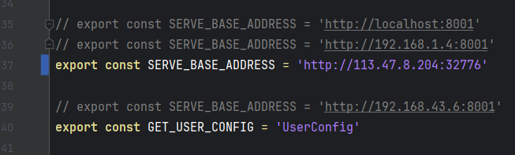

改这一行直接秒掉。让我们测试看一看。

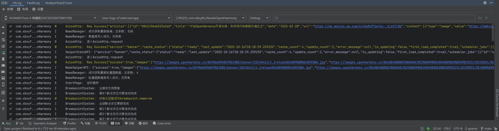

nb直接秒掉！

然后再让我降一下API为API17，来在平板上测试一下，主要是因为我的手机已经升级到鸿蒙6了，但是平板因为太新了没办法升级，所以我只好先暂时降级安装了。

但是我突然发现了新的问题，这好像是虚假繁荣，我没有真正成功的去获取数据，这好像是之前我遗留的数据。我卸载重新安装一下试试。

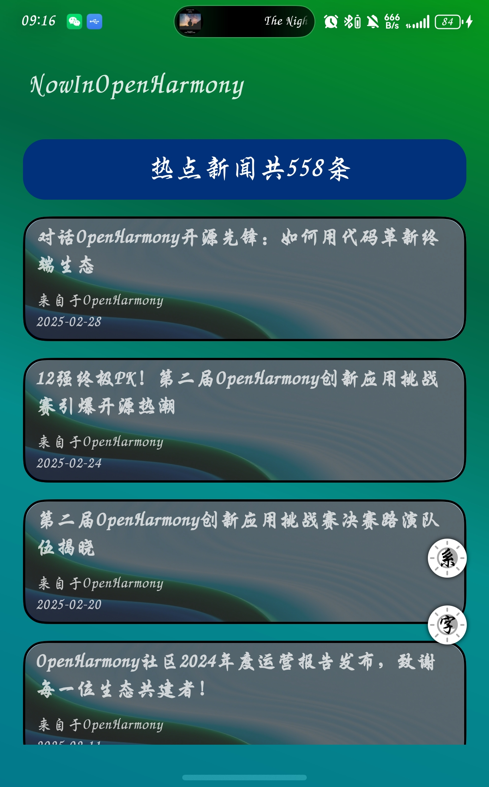

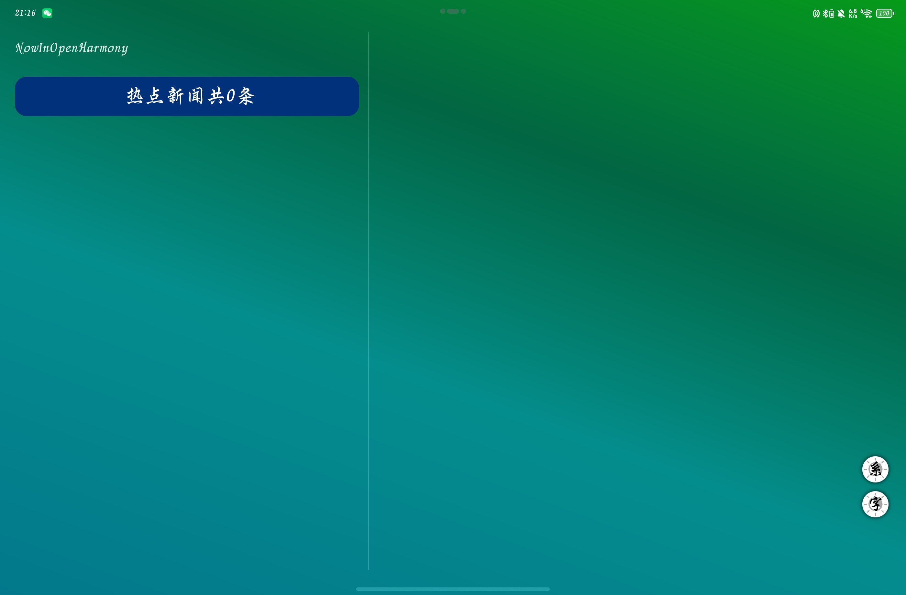

在重新安装之后我发掘了不对。手机上是轮播图数据异常，而在平板上是完全没有数据了。卧槽我直接炸缸了，我看了日志，发现全是超时，我修改了一下我axios请求工具的超时时长从三秒改到了10秒，发现依旧是超时没有什么区别。我强制自己冷静下来去思考问题可能发生的点，首先我客户端的全流程是在本地都跑通了的，同时在前面的日志截图中也可以看到在第一次测试时轮播图接口是跑通了的，我再去查看了一下我服务器的CPU占用率，发现是正常的，维持在13%的低占用率，理论上响应速度应该是很快的，随后我复制了我常量文件中的IP地址，再拼接上接口的资源路径，在浏览器中进行测试，发现也是正常的。

这时我脑海中闪过一个念想就是从手机和平板的问题表现差异去展开分析。

手机上在重装之前是轮播图通过日志来看是正常的，而新闻看似是正常的实则应该是之前本地测试时的数据，从新安装之后是轮播图明确的超时了，而新闻接口则是正常的。对于平板，我是直接进行了重装操作，在重装之后轮播图和新闻接口都超时了。我仔细观察了一下手机和平板的网络设置差异，当时我手机使用的是流量，平板使用的是校园网，而电脑上用浏览器测试的环境则是连接的校园网但是梯子到了美国的IP。分析一下成功的三个接口：手机上的新闻、电脑上的新闻和电脑上的轮播图，他们的共同点都是并非校园网的代理，我猜测可能是校园网的安全设置阻断了直接使用http对IP进行访问？当然这只是我的猜测，这并非是是确定的原因。

就在我还在思考更加具体的排查方案时，我重新刷新了一次，结果发现两个设备都成功获取数据了，而且网络设置没有进行任何更改（？）

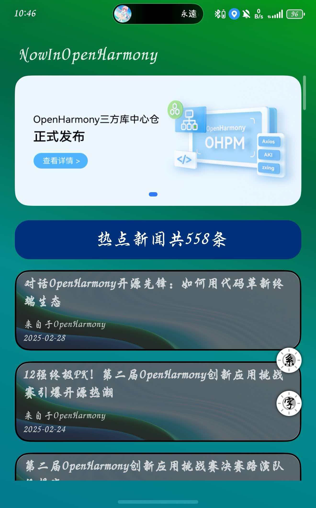

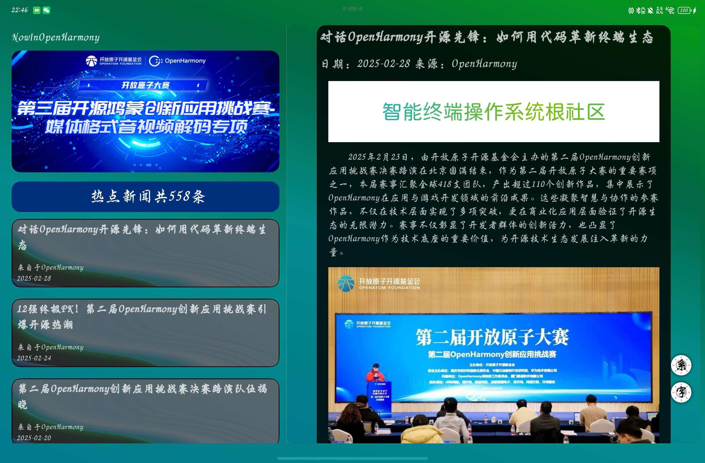

通过多次下拉测试发现好多次报错弹窗，则说明我的后端数据获取依旧不稳定，但是在浏览器访问却是十分稳定的能够获取数据，我不太理解是为什么说实话，感觉这个稳定程度想要上线并不太可能，但至少它上线了，破破烂烂的上线了也是上线了，前后端完整的一个鸿蒙项目。

### 手动PR尝试

之前一致是用CC或者是codex帮我去进行分支的创建以及代码的推送，这次我向亲手尝试一下创建新分支并且提交pr。这次就先去使用DevEcoStudio自带的git工具去进行操作吧，下一次再去进行命令行的尝试。
