<div style="background: linear-gradient(135deg, #667eea 0%, #764ba2 100%); border-radius: 12px; padding: 20px; margin: 20px 0; color: white; position: relative; overflow: hidden; transition: all 0.3s ease; cursor: pointer; box-shadow: 0 4px 15px rgba(102, 126, 234, 0.3);" onmouseover="this.style.transform='translateY(-5px) scale(1.02)'; this.style.boxShadow='0 8px 25px rgba(102, 126, 234, 0.4)'; this.style.background='linear-gradient(135deg, #7c4dff 0%, #8e24aa 100%)'" onmouseout="this.style.transform='translateY(0) scale(1)'; this.style.boxShadow='0 4px 15px rgba(102, 126, 234, 0.3)'; this.style.background='linear-gradient(135deg, #667eea 0%, #764ba2 100%)'">
  <div style="position: relative; z-index: 2;">
    <div style="display: flex; align-items: center; margin-bottom: 16px;">
      <svg width="24" height="24" viewBox="0 0 24 24" fill="white" style="margin-right: 12px;">
        <path d="M12 0C5.374 0 0 5.373 0 12c0 5.302 3.438 9.8 8.207 11.387.599.111.793-.261.793-.577v-2.234c-3.338.726-4.033-1.416-4.033-1.416-.546-1.387-1.333-1.756-1.333-1.756-1.089-.745.083-.729.083-.729 1.205.084 1.839 1.237 1.839 1.237 1.07 1.834 2.807 1.304 3.492.997.107-.775.418-1.305.762-1.604-2.665-.305-5.467-1.334-5.467-5.931 0-1.311.469-2.381 1.236-3.221-.124-.303-.535-1.524.117-3.176 0 0 1.008-.322 3.301 1.23A11.509 11.509 0 0112 5.803c1.02.005 2.047.138 3.006.404 2.291-1.552 3.297-1.23 3.297-1.23.653 1.653.242 2.874.118 3.176.77.84 1.235 1.911 1.235 3.221 0 4.609-2.807 5.624-5.479 5.921.43.372.823 1.102.823 2.222v3.293c0 .319.192.694.801.576C20.566 21.797 24 17.3 24 12c0-6.627-5.373-12-12-12z"/>
      </svg>
      <div style="margin: 0; font-size: 20px; font-weight: 600;">ifLabVibe/NowInOpenHarmony</div>
    </div>
    <p style="margin: 0 0 16px 0; opacity: 0.9; font-size: 14px;">🚀 基于OpenHarmony的资讯聚合应用 - 开源之夏2025项目</p>
    <div style="display: flex; gap: 12px; margin-bottom: 16px; flex-wrap: wrap;">
      <span style="background: rgba(255,255,255,0.2); padding: 4px 8px; border-radius: 12px; font-size: 12px; transition: all 0.2s ease;" onmouseover="this.style.background='rgba(255,255,255,0.35)'; this.style.transform='scale(1.05)'" onmouseout="this.style.background='rgba(255,255,255,0.2)'; this.style.transform='scale(1)'">OpenHarmony</span>
      <span style="background: rgba(255,255,255,0.2); padding: 4px 8px; border-radius: 12px; font-size: 12px; transition: all 0.2s ease;" onmouseover="this.style.background='rgba(255,255,255,0.35)'; this.style.transform='scale(1.05)'" onmouseout="this.style.background='rgba(255,255,255,0.2)'; this.style.transform='scale(1)'">ArkTS</span>
      <span style="background: rgba(255,255,255,0.2); padding: 4px 8px; border-radius: 12px; font-size: 12px; transition: all 0.2s ease;" onmouseover="this.style.background='rgba(255,255,255,0.35)'; this.style.transform='scale(1.05)'" onmouseout="this.style.background='rgba(255,255,255,0.2)'; this.style.transform='scale(1)'">Python</span>
      <span style="background: rgba(255,255,255,0.2); padding: 4px 8px; border-radius: 12px; font-size: 12px; transition: all 0.2s ease;" onmouseover="this.style.background='rgba(255,255,255,0.35)'; this.style.transform='scale(1.05)'" onmouseout="this.style.background='rgba(255,255,255,0.2)'; this.style.transform='scale(1)'">FastAPI</span>
    </div>
    <a href="https://github.com/ifLabVibe/NowInOpenHarmony" target="_blank" style="display: inline-flex; align-items: center; background: rgba(255,255,255,0.2); color: white; text-decoration: none; padding: 10px 16px; border-radius: 8px; border: 1px solid rgba(255,255,255,0.3); font-weight: 500; transition: all 0.2s ease;" onclick="event.stopPropagation()" onmouseover="this.style.background='rgba(255,255,255,0.35)'; this.style.transform='translateY(-1px)'; this.style.boxShadow='0 2px 8px rgba(255,255,255,0.2)'" onmouseout="this.style.background='rgba(255,255,255,0.2)'; this.style.transform='translateY(0)'; this.style.boxShadow='none'">
      <svg width="16" height="16" viewBox="0 0 24 24" fill="white" style="margin-right: 8px;">
        <path d="M12 0C5.374 0 0 5.373 0 12c0 5.302 3.438 9.8 8.207 11.387.599.111.793-.261.793-.577v-2.234c-3.338.726-4.033-1.416-4.033-1.416-.546-1.387-1.333-1.756-1.333-1.756-1.089-.745.083-.729.083-.729 1.205.084 1.839 1.237 1.839 1.237 1.07 1.834 2.807 1.304 3.492.997.107-.775.418-1.305.762-1.604-2.665-.305-5.467-1.334-5.467-5.931 0-1.311.469-2.381 1.236-3.221-.124-.303-.535-1.524.117-3.176 0 0 1.008-.322 3.301 1.23A11.509 11.509 0 0112 5.803c1.02.005 2.047.138 3.006.404 2.291-1.552 3.297-1.23 3.297-1.30.653 1.653.242 2.874.118 3.176.77.84 1.235 1.911 1.235 3.221 0 4.609-2.807 5.624-5.479 5.921.43.372.823 1.102.823 2.222v3.293c0 .319.192.694.801.576C20.566 21.797 24 17.3 24 12c0-6.627-5.373-12-12-12z"/>
      </svg>
      查看项目仓库
    </a>
  </div>
</div>

<div style="background: linear-gradient(135deg, #28a745 0%, #20c997 100%); border-radius: 12px; padding: 20px; margin: 20px 0; color: white; position: relative; overflow: hidden; transition: all 0.3s ease; cursor: pointer; box-shadow: 0 4px 15px rgba(40, 167, 69, 0.3);" onmouseover="this.style.transform='translateY(-5px) scale(1.02)'; this.style.boxShadow='0 8px 25px rgba(40, 167, 69, 0.4)'; this.style.background='linear-gradient(135deg, #17a2b8 0%, #6f42c1 100%)'" onmouseout="this.style.transform='translateY(0) scale(1)'; this.style.boxShadow='0 4px 15px rgba(40, 167, 69, 0.3)'; this.style.background='linear-gradient(135deg, #28a745 0%, #20c997 100%)'">
  <div style="position: relative; z-index: 2;">
    <div style="display: flex; align-items: center; margin-bottom: 16px;">
      <svg width="24" height="24" viewBox="0 0 1056 1024" style="margin-right: 12px;" fill="none">
        <path d="M479.663158 988.429474c-90.004211-10.24-187.553684-48.505263-247.376842-96.471579-33.953684-26.947368-90.004211-88.387368-111.023158-120.724211-64.134737-99.166316-90.004211-222.046316-70.602105-333.608421 18.863158-107.250526 63.056842-191.326316 141.20421-267.856842 135.814737-133.12 353.010526-175.157895 527.090526-101.861053 57.128421 24.252632 112.101053 58.206316 134.736843 82.997895 44.193684 49.044211 28.025263 128.808421-31.258948 158.450526-25.330526 12.395789-72.218947 12.934737-90.543158 1.077895s-35.031579-44.193684-39.343158-77.069473c-2.155789-15.629474-4.850526-28.564211-5.389473-28.564211-1.077895 0-14.551579 7.545263-29.642106 16.168421-49.583158 29.103158-64.134737 33.414737-140.126315 38.265263-39.882105 2.155789-84.075789 5.928421-97.549474 8.084211-24.791579 3.233684-54.972632-1.077895-102.938947-16.168421l-25.330527-8.084211 1.077895 52.277895c0.538947 50.661053 0 53.355789-21.557895 98.088421-28.025263 58.206316-38.265263 93.237895-42.576842 144.976842-10.24 124.496842 57.667368 217.195789 186.47579 253.844211 83.536842 23.713684 221.507368 18.863158 296.421052-10.778948 71.68-28.564211 134.736842-94.854737 134.736842-142.282105 0-19.402105-24.791579-44.193684-51.738947-50.661053-11.317895-3.233684-54.433684-7.006316-95.393684-8.623158-86.770526-3.772632-147.132632-11.856842-163.84-22.635789s-25.330526-40.96-17.785263-63.59579c7.545263-23.713684 19.402105-33.953684 54.433684-46.888421 23.713684-9.162105 40.96-10.778947 109.945263-10.778947 146.593684 0 215.578947 18.324211 269.473684 72.218947 61.978947 62.517895 68.446316 157.372632 16.168421 241.448421-77.069474 123.418947-168.151579 194.021053-291.570526 225.818948-41.498947 11.317895-151.444211 18.324211-196.176842 12.934737z" fill="#D62240"/>
      </svg>
      <div style="margin: 0; font-size: 20px; font-weight: 600;">openharmony-sig/ostest_integration_test</div>
    </div>
    <p style="margin: 0 0 16px 0; opacity: 0.9; font-size: 14px;">🎉 项目已被收录至OpenHarmony SIG集成测试仓库</p>
    <div style="display: flex; gap: 12px; margin-bottom: 16px; flex-wrap: wrap;">
      <span style="background: rgba(255,255,255,0.2); padding: 4px 8px; border-radius: 12px; font-size: 12px; transition: all 0.2s ease;" onmouseover="this.style.background='rgba(255,255,255,0.35)'; this.style.transform='scale(1.05)'" onmouseout="this.style.background='rgba(255,255,255,0.2)'; this.style.transform='scale(1)'">✅ 官方收录</span>
      <span style="background: rgba(255,255,255,0.2); padding: 4px 8px; border-radius: 12px; font-size: 12px; transition: all 0.2s ease;" onmouseover="this.style.background='rgba(255,255,255,0.35)'; this.style.transform='scale(1.05)'" onmouseout="this.style.background='rgba(255,255,255,0.2)'; this.style.transform='scale(1)'">🔬 集成测试</span>
      <span style="background: rgba(255,255,255,0.2); padding: 4px 8px; border-radius: 12px; font-size: 12px; transition: all 0.2s ease;" onmouseover="this.style.background='rgba(255,255,255,0.35)'; this.style.transform='scale(1.05)'" onmouseout="this.style.background='rgba(255,255,255,0.2)'; this.style.transform='scale(1)'">OpenHarmony SIG</span>
    </div>
    <a href="https://gitcode.com/openharmony-sig/ostest_integration_test" target="_blank" style="display: inline-flex; align-items: center; background: rgba(255,255,255,0.2); color: white; text-decoration: none; padding: 10px 16px; border-radius: 8px; border: 1px solid rgba(255,255,255,0.3); font-weight: 500; transition: all 0.2s ease;" onclick="event.stopPropagation()" onmouseover="this.style.background='rgba(255,255,255,0.35)'; this.style.transform='translateY(-1px)'; this.style.boxShadow='0 2px 8px rgba(255,255,255,0.2)'" onmouseout="this.style.background='rgba(255,255,255,0.2)'; this.style.transform='translateY(0)'; this.style.boxShadow='none'">
      <svg width="16" height="16" viewBox="0 0 1056 1024" style="margin-right: 8px;" fill="none">
        <path d="M479.663158 988.429474c-90.004211-10.24-187.553684-48.505263-247.376842-96.471579-33.953684-26.947368-90.004211-88.387368-111.023158-120.724211-64.134737-99.166316-90.004211-222.046316-70.602105-333.608421 18.863158-107.250526 63.056842-191.326316 141.20421-267.856842 135.814737-133.12 353.010526-175.157895 527.090526-101.861053 57.128421 24.252632 112.101053 58.206316 134.736843 82.997895 44.193684 49.044211 28.025263 128.808421-31.258948 158.450526-25.330526 12.395789-72.218947 12.934737-90.543158 1.077895s-35.031579-44.193684-39.343158-77.069473c-2.155789-15.629474-4.850526-28.564211-5.389473-28.564211-1.077895 0-14.551579 7.545263-29.642106 16.168421-49.583158 29.103158-64.134737 33.414737-140.126315 38.265263-39.882105 2.155789-84.075789 5.928421-97.549474 8.084211-24.791579 3.233684-54.972632-1.077895-102.938947-16.168421l-25.330527-8.084211 1.077895 52.277895c0.538947 50.661053 0 53.355789-21.557895 98.088421-28.025263 58.206316-38.265263 93.237895-42.576842 144.976842-10.24 124.496842 57.667368 217.195789 186.47579 253.844211 83.536842 23.713684 221.507368 18.863158 296.421052-10.778948 71.68-28.564211 134.736842-94.854737 134.736842-142.282105 0-19.402105-24.791579-44.193684-51.738947-50.661053-11.317895-3.233684-54.433684-7.006316-95.393684-8.623158-86.770526-3.772632-147.132632-11.856842-163.84-22.635789s-25.330526-40.96-17.785263-63.59579c7.545263-23.713684 19.402105-33.953684 54.433684-46.888421 23.713684-9.162105 40.96-10.778947 109.945263-10.778947 146.593684 0 215.578947 18.324211 269.473684 72.218947 61.978947 62.517895 68.446316 157.372632 16.168421 241.448421-77.069474 123.418947-168.151579 194.021053-291.570526 225.818948-41.498947 11.317895-151.444211 18.324211-196.176842 12.934737z" fill="#D62240"/>
      </svg>
      查看官方仓库
    </a>
  </div>
</div>

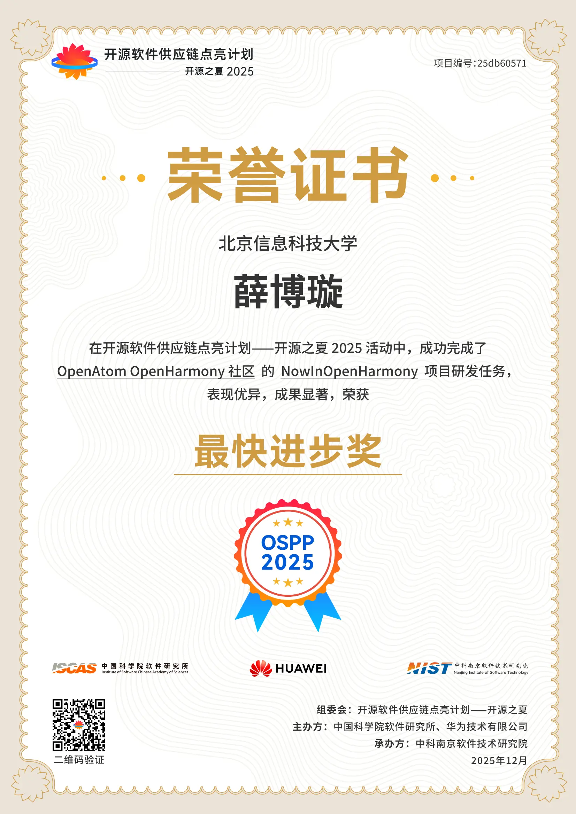

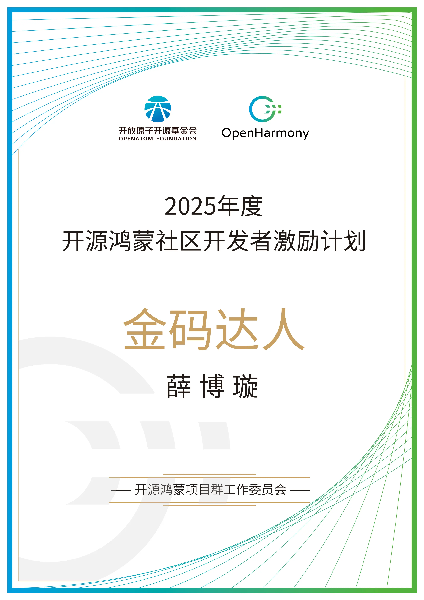

<div style="display: grid; grid-template-columns: repeat(auto-fit, minmax(300px, 1fr)); gap: 16px; margin: 20px 0;">
  <!-- 文章卡片1 -->
  <div style="background: linear-gradient(135deg, #07C160 0%, #10B981 100%); border-radius: 12px; padding: 20px; color: white; position: relative; overflow: hidden; transition: all 0.3s ease; box-shadow: 0 4px 15px rgba(7, 193, 96, 0.3);" onmouseover="this.style.transform='translateY(-5px) scale(1.02)'; this.style.boxShadow='0 8px 25px rgba(7, 193, 96, 0.4)'" onmouseout="this.style.transform='translateY(0) scale(1)'; this.style.boxShadow='0 4px 15px rgba(7, 193, 96, 0.3)'">
    <div style="position: relative; z-index: 2;">
      <div style="display: flex; align-items: center; margin-bottom: 12px;">
        <svg width="24" height="24" viewBox="0 0 24 24" fill="white" style="margin-right: 10px;">
          <path d="M8.691 2.188C3.891 2.188 0 5.476 0 9.53c0 2.212 1.17 4.203 3.002 5.55a.59.59 0 01.213.665l-.39 1.48c-.019.07-.048.141-.048.213 0 .163.13.295.29.295a.326.326 0 00.167-.054l1.903-1.114a.864.864 0 01.717-.098 10.16 10.16 0 002.837.403c.276 0 .543-.027.811-.05-.857-2.578.157-4.972 1.932-6.446 1.703-1.415 3.882-1.98 5.853-1.838-.576-3.583-4.196-6.348-8.596-6.348zM5.785 5.991c.642 0 1.162.529 1.162 1.18a1.17 1.17 0 01-1.162 1.178A1.17 1.17 0 014.623 7.17c0-.651.52-1.18 1.162-1.18zm5.813 0c.642 0 1.162.529 1.162 1.18a1.17 1.17 0 01-1.162 1.178 1.17 1.17 0 01-1.162-1.178c0-.651.52-1.18 1.162-1.18zm5.34 2.867c-1.797-.052-3.746.512-5.28 1.786-1.72 1.428-2.687 3.72-1.78 6.22.942 2.453 3.666 4.229 6.884 4.229.826 0 1.622-.12 2.361-.336a.722.722 0 01.598.082l1.584.926a.272.272 0 00.14.045c.134 0 .24-.111.24-.247 0-.06-.023-.12-.038-.177l-.327-1.233a.582.582 0 01-.023-.156.49.49 0 01.201-.398C23.024 18.48 24 16.82 24 14.98c0-3.21-2.931-5.837-6.656-6.088V8.89c-.135-.01-.27-.027-.407-.032zm-2.53 3.274c.535 0 .969.44.969.982a.976.976 0 01-.969.983.976.976 0 01-.969-.983c0-.542.434-.982.97-.982zm4.844 0c.535 0 .969.44.969.982a.976.976 0 01-.969.983.976.976 0 01-.969-.983c0-.542.434-.982.969-.982z"/>
        </svg>
        <div style="font-size: 15px; font-weight: 600;">00后开发者与开源鸿蒙的"双向奔赴"</div>
      </div>
      <p style="margin: 0 0 16px 0; opacity: 0.9; font-size: 13px; line-height: 1.5;">开放原子开源基金会专访：讲述我从技术学习者到生态贡献者的蜕变故事，以及 NowInOpenHarmony 平台背后的开发历程。</p>
      <a href="https://mp.weixin.qq.com/s/O4VIz2-txXHqcwW0Q-qgZA" target="_blank" style="display: inline-flex; align-items: center; background: rgba(255,255,255,0.2); color: white; text-decoration: none; padding: 8px 14px; border-radius: 6px; font-size: 13px; font-weight: 500; transition: all 0.2s ease;" onmouseover="this.style.background='rgba(255,255,255,0.35)'" onmouseout="this.style.background='rgba(255,255,255,0.2)'">
        <svg width="14" height="14" viewBox="0 0 24 24" fill="white" style="margin-right: 6px;">
          <path d="M14 3v2h3.59l-9.83 9.83 1.41 1.41L19 6.41V10h2V3m-2 16H5V5h7V3H5a2 2 0 00-2 2v14a2 2 0 002 2h14a2 2 0 002-2v-7h-2v7z"/>
        </svg>
        阅读原文
      </a>
    </div>
  </div>

  <!-- 文章卡片2 -->
  <div style="background: linear-gradient(135deg, #3B82F6 0%, #6366F1 100%); border-radius: 12px; padding: 20px; color: white; position: relative; overflow: hidden; transition: all 0.3s ease; box-shadow: 0 4px 15px rgba(59, 130, 246, 0.3);" onmouseover="this.style.transform='translateY(-5px) scale(1.02)'; this.style.boxShadow='0 8px 25px rgba(59, 130, 246, 0.4)'" onmouseout="this.style.transform='translateY(0) scale(1)'; this.style.boxShadow='0 4px 15px rgba(59, 130, 246, 0.3)'">
    <div style="position: relative; z-index: 2;">
      <div style="display: flex; align-items: center; margin-bottom: 12px;">
        <svg width="24" height="24" viewBox="0 0 24 24" fill="white" style="margin-right: 10px;">
          <path d="M12 2C6.48 2 2 6.48 2 12s4.48 10 10 10 10-4.48 10-10S17.52 2 12 2zm-1 17.93c-3.95-.49-7-3.85-7-7.93 0-.62.08-1.21.21-1.79L9 15v1c0 1.1.9 2 2 2v1.93zm6.9-2.54c-.26-.81-1-1.39-1.9-1.39h-1v-3c0-.55-.45-1-1-1H8v-2h2c.55 0 1-.45 1-1V7h2c1.1 0 2-.9 2-2v-.41c2.93 1.19 5 4.06 5 7.41 0 2.08-.8 3.97-2.1 5.39z"/>
        </svg>
        <div style="font-size: 15px; font-weight: 600;">开源之夏2025 | 华为项目获奖优秀学生系列展播⑥：薛博璇荣获“最快进步奖”</div>
      </div>
      <p style="margin: 0 0 16px 0; opacity: 0.9; font-size: 13px; line-height: 1.5;">评委评价：展现令人瞩目的成长速度与极强的实践能力，从零基础到独立完成全栈开发的蜕变历程。</p>
      <a href="https://www.chaspark.com/#/hotspots/1226251692920639488" target="_blank" style="display: inline-flex; align-items: center; background: rgba(255,255,255,0.2); color: white; text-decoration: none; padding: 8px 14px; border-radius: 6px; font-size: 13px; font-weight: 500; transition: all 0.2s ease;" onmouseover="this.style.background='rgba(255,255,255,0.35)'" onmouseout="this.style.background='rgba(255,255,255,0.2)'">
        <svg width="14" height="14" viewBox="0 0 24 24" fill="white" style="margin-right: 6px;">
          <path d="M14 3v2h3.59l-9.83 9.83 1.41 1.41L19 6.41V10h2V3m-2 16H5V5h7V3H5a2 2 0 00-2 2v14a2 2 0 002 2h14a2 2 0 002-2v-7h-2v7z"/>
        </svg>
        阅读原文
      </a>
    </div>
  </div>
</div>

## 前言

我初次了解到开源之夏活动是在大一上半学期期间的第二届OpenHarmony技术峰会上，我听到了这个名字，当时的我对于OpenHarmony和OpenAtom都知之甚少，也没有能力去参与开源之夏的项目，所以也没有深入的了解。而真正的对开源之夏有所了解是发生在了大一下半学期的春耕校源行，在校源行的主会场，开放原子的工作人员也是介绍了一下开源之夏活动，我也是加入了活动群，但是并没有真正的报名参加，因为我依旧认为我没有能力承担独立的开发。而随着大二下的到来，我一直在由于大二升大三的这个暑假我是去实习还是在家里做项目，虽然手上有鸿小易这个待完善的项目，但我个人其实对如何继续完善它并没有很好的规划，我也担心我会不会因为这个项目的目标不明确而荒废一个假期。这个时候又是子安学长拯救了我，他推荐我去参与开源之夏，与此同时曾老师和开源协会团队也将开源之夏当做工作重点，我也因此决心要尝试去进行开源之夏的项目计划书的投递。

我登录到了开源之夏的活动官网，进行实名认证，提交了之后我就等着说审核完了再开始整项目计划书吧，结果第一次实名审核还没通过，有错。我只好修改再审，再审提交后没几天我们就全部结课了。我只好开始了期末复习，对于当时的我来说有一科“天书”我真是心里打鼓能不能过所以就全身心的投入到期末复习中，想着说等期末考完再投递。结果期末前三天我又突然担心起来会不会截止时间等不到我期末考完，于是又一次前往官网查看，结果发现还真等不到，我只好先放下手头的复习，因为那时各科复习都在稳步推进，“天书”也有了眉目，所以就花了5个小时左右，终于是把简历和项目计划书给整完了，期间还和导师通了几封邮件。有一说一这么晚才和导师联系而且我的项目计划书又是短时间干出来的，真怕过不了。

在期末考完之后我再次登录官网看会不会有什么进展，结果却看到了公告说时间延长了，到现在还没截止，哇我直接炸缸了。不过倒也还好，算是帮我省了点事，可以小小的放松一下了，期末周真的要死人了孩子。

随后又有几个兼职和老师的的项目机会横插在了我提交项目计划书到中选出结果的这段时间里。我内心也还是担心我无法中选，所以也先都拖着说等开源之夏的结果。就这样我怀着这种忐忑不安、但又充满希望的心境一路等待到了28号。


邮箱的提示音将我悬着的心放了下来，紧接着，协议的签署、群聊的组建、其他项目安排的善后就接二连三的排了上来，像是梦一样的确认了我的中选，以及接下来三个月我生活的基调。


我也是特意的问了一下老师能否写成博客文章的形式来进行记录，也是获得了老师的同意，要不没准这篇文章就胎死腹中了。

## 项目简介

### 项目名称

NowInOpenHarmony

### 项目背景


目前OpenHarmony开源项目已成规模，生态日益繁荣，但与OpenHarmony相关的资讯平台多为网站且比较零散，另外OpenHarmony应用比较缺乏，应用生态是未来发展重点。结合上述两个现状，本选题目标为开发一款运行在OpenHarmony系统上的聚合OpenHarmony相关资讯的应用。


上面这段话是在开源之夏官网上的项目简介，我也算是深有感触，可能作为开发者有加入很多的开发者社群，还能算是能获取到比较丰富的OpenHarmony相关的资讯，但是作为普通用户，想要获取到OpenHarmony相关的资讯，却并不容易，而且OpenHarmony的应用生态也是比较缺乏的，所以这个项目也是很有意义的。

### 项目目标



1. 使用ArkTS开发运行于OpenHarmony的资讯应用（内容包括OpenHarmony社区新闻、开发者论坛热门话题、版本发布信息等）；
2. 资讯内容来源建议： 1）使用Web开发框架开发服务器聚合OpenHarmony资讯网站，为应用提供接口，2）应用直接通过OpenHarmony社区网站获取资讯并展示。



所以现在的目标就很明确了要用py开发一个后端服务器来提供资讯内容，然后客户端通过网络请求来去获取到资讯内容，然后展示在界面上。

## 项目时间规划



<!-- timeline 07-07 -->
7.7至7.13完成可行性验证以及方案设计（已经于7.13完成阶段进度汇报）√
<!-- endtimeline -->

<!-- timeline 07-14 -->
7.14至7.27完成完成后端开发（完成）√
<!-- endtimeline -->

<!-- timeline 07-28 -->
7.28至8.24完成鸿蒙端开发（完成，并最终优化中）√
<!-- endtimeline -->

<!-- timeline 08-24 -->
8.24至结项完成最终调优与报告撰写（完成）√
<!-- endtimeline -->



## 核心问题

通过对项目目标的分析我们可以分析出有三个核心问题，依次打通这三个核心问题我们就可以完成这个项目了。

### 信息的获取

首先的问题就在于信息的获取。在官网上导师所提供的建议仅仅指出了信息的来源，但并没有说明我们该用什么手段获取到数据。我第一个想到的是爬虫，但不确定导师会不会去指定是用什么方式去进行数据的获取，所以我此前先给导师发了邮件进行询问，确认了可以使用爬虫的形式。

在确认了我中选之后我添加了老师的微信，而后面我和老师的微信沟通时老师又提出了可以参考此前的`TodayOpenHarmony`项目的形式直接使用[web组件](https://developer.huawei.com/consumer/cn/doc/harmonyos-references/js-components-basic-web)来去展示现成的网页。不过我感觉这样的化可能界面的显示效果并不好，但我也还是先去分析一下`TodayOpenHarmony`的资讯获取形式吧。

#### TodayOpenHarmony项目分析

我们重点来看其资讯获取以及展示的形式，这是重点。整体采用了十分标准的`MVVM`架构，通过`ViewModel`来获取数据，然后通过`Model`来存储数据，最后通过`View`来展示数据。而数据获取的方式则是通过`web组件`来实现的，通过`web组件`来展示现成的网页。其数据来源部分的核心代码如下：


```ts
export const NewsListData: NewsItem[] = [
  new NewsItem({
    id: 1,
    type: '新闻',
    title: '基于OpenHarmony的团结引擎应用开发赛',
    subtitle: '促进万物互联产业的繁荣发展',
    image: $r('app.media.edu'),
    timestamp: '2024-03-11',
    views: 22500,
    link: 'https://www.openharmony.cn/unityEngine/illustrate',
    isLiked: false,
    likeCount: 806,
    isBookmarked: false,
    isExpanded: false,
    readTime: 5,
    commentCount: 0,
    shareCount: 0,
    tags: ['开发大赛', '物联网'],
    categoryId: 0
  }),

  new NewsItem({
    id: 2,
    type: '新闻',
    title: '开源鸿蒙开发者大会2025',
    subtitle: '展示开源鸿蒙操作系统的技术革新',
    image: $r('app.media.New'),
    timestamp: '2025-05-24',
    views: 23500,
    link: 'https://www.openharmony.cn/developer2025',
    isLiked: false,
    likeCount: 7000,
    isBookmarked: false,
    isExpanded: false,
    readTime: 10,
    commentCount: 0,  // 补充缺失字段
    shareCount: 0,    // 补充缺失字段
    tags:['HarmonyOS'],         // 补充默认值
    categoryId: 0,
  }),

  new NewsItem({
    id: 3,
    type: '活动',
    title: '解决方案学生挑战赛',
    subtitle: '线上',
    image: $r('app.media.student2'),
    timestamp: '2022-06-08',
    views: 2560,
    link: 'https://www.openharmony.cn/growthPlan/',
    isLiked: false,
    likeCount: 2560,
    isBookmarked: false,
    isExpanded: false,
    readTime: 15,
    tags: ['大赛', 'openharmony'],
    commentCount: 0,  // 补充缺失字段
    shareCount: 0,    // 补充缺失字段
    categoryId: 1,
  }),
  new NewsItem({
    id: 4,
    type: '活动',
    title: 'OpenHarmony技术大会',
    subtitle: '上海世博中心',
    image: $r('app.media.study'),
    views: 2200,
    likeCount: 4560,
    isLiked: false,
    timestamp: '2024-10-12',
    link: 'https://www.openharmony.cn/technology/',
    isBookmarked: false,
    readTime: 5,
    commentCount: 0,
    shareCount: 0,
    tags: ['大会', 'openharmony'],
    isExpanded: false,
    categoryId: 1,
  }),
  new LiveNewsItem({
    id: 5,
    type: '直播',
    title: '创新赛赋能直播',
    subtitle: '如何开发APP',
    author: '王工程师',
    views: 33500,
    isLiving: true,
    image: $r('app.media.lives'),
    timestamp: '03-16 20:00',
    link: 'https://www.bilibili.com/video/BV18G411i7bR/?spm_id_from=333.999.0.0&vd_source=791e4b558742fd98bce5bd7f4a0d2120',
    tags: ['直播视频', 'openharmony'],
    categoryId: 2,
    isLiked: false,
    isBookmarked: false,
    isExpanded: false,
    likeCount: 0,
    readTime: 0,
    commentCount: 0,
    shareCount: 0
  }),

  new BlogPostItem({
    id: 6,
    type: '博客',
    title: '分布式菜单创建点餐神器',
    subtitle: '节省顾客时间',
    author: '张工程师',
    content: '本文详细讲解如何利用分布式能力...',
    image: $r('app.media.bo'),
    views: 27500,
    likeCount: 3000,
    isLiked: false,
    timestamp: '2022-02-16',
    link: 'https://mp.weixin.qq.com/s/WHN75mnzJ0NtbAwySlEDJw',
    isBookmarked: false,
    readTime: 15,
    commentCount: 12,
    shareCount: 0,
    tags: ['文章', '应用'],
    isExpanded: false,
    categoryId: 3,
  }),

  new NewsItem({
    id: 7,
    type: '新闻',
    title: '第二届创新应用挑战赛',
    subtitle: '技术交锋创意迸发',
    image: $r('app.media.sai'),
    views: 2370,
    likeCount: 479,
    isLiked: false,
    timestamp: '2024-10-21',
    link:'https://www.openharmony.cn/innovationcompete/compete',
    isBookmarked: false,
    readTime: 15,
    commentCount: 0,
    shareCount: 0,
    tags: ['大赛'],
    isExpanded: false,
    categoryId: 0,
  }),
];
```

enm，没错它使用的是静态常量数据，并没有进行任何的数据获取，所以对我们的项目参考价值不大，然后我们再来看一看他是怎么展示的资讯。

```ts
// WebView容器
Web({
  src: this.url,
  controller: this.controller
})
  .width('100%')
  .height('100%')
  .onPageBegin(() => {
    this.isLoading = true;
  })
  .onPageEnd(() => {
    this.isLoading = false;
  })
  .onErrorReceive((err) => {
    console.error('[ERROR] 网页加载失败:', JSON.stringify(err));
    prompt.showToast({ message: '加载失败，请检查网络或网址' });
  })
```

它仅仅是将数据中的网页链接给到了web组件，然后通过web组件来展示网页，我们的项目会收集很多网页的信息，若是仅仅是将网页链接给到web组件而不是通过统一的数据格式来进行展示的话，我们整体的UI一致性以及美观度都会差一大截，所以我们需要将爬取的数据进行统一化的格式处理。

所以总体看下来这个项目对当前的项目参考意义不大。

### 资讯内容传递的格式

上文提到了直接才用展示网页的形式并不可取，所以我们就需要选择一种数据格式来进行前后端数据的传递。

#### 明确需求

首先我们需要明确一下需求，对于当前项目我们首先需要用爬虫爬取各个论坛的资讯内容，这些博文内容都是图文混排，同时可能包含有视频，所以我们的数据格式需要在传递文本之外还需要传递图片以及视频的链接。

我首先想到的就是我的Markdown格式，因为我的博客以及鸿小易还有其他一些项目使用的都是Markdown格式，且Markdown支持原生的图片链接格式，但问题在于Markdown格式中没有原生的视频格式。只能使用内挂HTML标签的形式去进行视频的上传。我并不确定在使用OpenHarmony三方库进行md渲染时会不会出现问题，所以暂时作为备案。


随后就是当下最常用的json格式。json格式我可以采用两种形式，一种是将爬取的HTML文件直接作为一整个字段进行传输然后使用web组件进行渲染确实可以。不过这个方案需要注意整体UI界面的一致性，这一点可能需要针对不同的网站获取到的数据进行定制化的处理。因为各个网站的文章内容部分很有可能会插入一些其他的样式，链接标签等，同时又因为鸿蒙中的Web组件并没有提供很多的属性来通过ArkTS直接调整、改变HTML的结构以及样式，所以我们需要在后端就完成对HTML的格式化处理，这样在鸿蒙中直接展示的时候就不会出现样式错乱的问题。


还有一种方式就是用`type`字段以及`value`字段来进行当前数据类型的区分，可以设置一个枚举类型规定三种数据类型，分别是`text`、`image`、`video`，然后根据不同的类型来决定`value`字段的值该被渲染为什么样的组件，通过这样的对象数组形式，利用循环渲染成文本、视频、图片组件。这样既可以传递文章的内容也可以正确的传递文章的结构。先暂时采用这种方式，并进行可行性验证。

### 资讯的渲染形式

## 方案设计与可行性验证

### 咨询信息获取

#### OpenHarmony官网资讯

首先我们要针对不同的网站编写不同的爬虫，所以我们首先要确认目标网站。

首先是OpenHarmony的官网，官网提供有很多的相关资讯，大多是以微信公众号的形式展现的，整体格式比较规整，我们先来进行爬取的尝试。


我找到了OpenHarmony官网的咨询页面，虽然咨询本身是很容易爬取的，但是要是想要自动爬取整个咨询页面的全部文章，我们就需要先获取到咨询页面的全部文章链接，然后针对每个链接进行爬取，最后将爬取到的数据整合到一起，所以我们需要先获取到咨询页面的全部文章链接。


找到目标点击结构，对其进行分析。但在展开其单个文章卡片的全部结构之后并没有找到`<a>`标签，所以我们不能直接去爬取`<a>`标签中所指向的目标链接，这是典型的SPA（单页应用）架构。


随后我改变了策略，转而模拟用户的点击行为并检测URL的变化以及检测网络请求，从网络请求的API的响应中获取URL。

```py
# openHarmony官网爬虫
import requests
from bs4 import BeautifulSoup
import json
import re
import time
from urllib.parse import urljoin, urlparse
import hashlib

# 尝试导入Selenium，如果失败则使用备用方案
try:
    from selenium import webdriver
    from selenium.webdriver.chrome.options import Options
    from selenium.webdriver.common.by import By
    from selenium.webdriver.support.ui import WebDriverWait
    from selenium.webdriver.support import expected_conditions as EC
    from selenium.common.exceptions import TimeoutException, NoSuchElementException
    SELENIUM_AVAILABLE = True
    print("Selenium已安装，将使用JavaScript渲染功能")
except ImportError:
    SELENIUM_AVAILABLE = False
    print("Selenium未安装，将使用普通HTTP请求模式")

class OpenHarmonyCrawler:
    def __init__(self):
        self.base_url = "https://www.openharmony.cn"
        self.session = requests.Session()
        self.session.headers.update({
            'User-Agent': 'Mozilla/5.0 (Windows NT 10.0; Win64; x64) AppleWebKit/537.36 (KHTML, like Gecko) Chrome/91.0.4472.124 Safari/537.36'
        })

        # 设置Chrome浏览器选项（仅在Selenium可用时）
        if SELENIUM_AVAILABLE:
            self.chrome_options = Options()
            self.chrome_options.add_argument('--headless')  # 无头模式
            self.chrome_options.add_argument('--no-sandbox')
            self.chrome_options.add_argument('--disable-dev-shm-usage')
            self.chrome_options.add_argument('--disable-gpu')
            self.chrome_options.add_argument('--window-size=1920,1080')
            self.chrome_options.add_argument(f'--user-agent={self.session.headers["User-Agent"]}')
        else:
            self.chrome_options = None

        self.driver = None

    def init_driver(self):
        """初始化浏览器驱动"""
        if not SELENIUM_AVAILABLE:
            print("Selenium不可用，跳过浏览器驱动初始化")
            return False

        try:
            self.driver = webdriver.Chrome(options=self.chrome_options)
            print("浏览器驱动初始化成功")
            return True
        except Exception as e:
            print(f"浏览器驱动初始化失败: {e}")
            print("请确保已安装Chrome浏览器和ChromeDriver")
            return False

    def close_driver(self):
        """关闭浏览器驱动"""
        if self.driver:
            self.driver.quit()
            self.driver = None
            print("浏览器驱动已关闭")

    def get_page_content(self, url):
        """获取页面内容"""
        try:
            response = self.session.get(url, timeout=10)
            response.raise_for_status()
            response.encoding = 'utf-8'
            return response.text
        except Exception as e:
            print(f"获取页面失败: {url}, 错误: {e}")
            return None

    def get_page_content_with_js(self, url, wait_element_class=None, timeout=10):
        """使用Selenium获取JavaScript渲染后的页面内容"""
        if not SELENIUM_AVAILABLE or not self.driver:
            return None

        try:
            self.driver.get(url)

            # 等待特定元素加载完成
            if wait_element_class:
                wait = WebDriverWait(self.driver, timeout)
                wait.until(EC.presence_of_element_located((By.CLASS_NAME, wait_element_class)))
            else:
                time.sleep(3)  # 默认等待3秒

            return self.driver.page_source
        except TimeoutException:
            print(f"页面加载超时: {url}")
            return None
        except Exception as e:
            print(f"获取页面失败: {url}, 错误: {e}")
            return None

    def verify_url_exists(self, url):
        """验证URL是否存在"""
        try:
            response = self.session.head(url, timeout=5)
            return response.status_code == 200
        except:
            return False

    def extract_articles_from_data_attributes(self, soup):
        """从data属性中提取文章信息"""
        articles = []
        print("尝试从data属性提取文章信息...")

        # 查找包含data-v属性的content-item
        content_items = soup.find_all('li', class_='content-item')

        for i, item in enumerate(content_items):
            try:
                # 查找文章标题
                title_elem = item.find(class_='item-title')
                title = title_elem.get_text().strip() if title_elem else f"文章{i+1}"

                # 查找日期
                date_elem = item.find(class_='item-time')
                date = date_elem.get_text().strip() if date_elem else ""

                # 查找描述
                desc_elem = item.find(class_='item-info')
                description = desc_elem.get_text().strip() if desc_elem else ""

                print(f"找到文章: {title} - {date}")

                # 尝试从元素属性中提取ID
                article_id = None

                # 检查data属性
                for attr_name, attr_value in item.attrs.items():
                    if 'id' in attr_name.lower() or 'key' in attr_name.lower():
                        article_id = str(attr_value)
                        break

                # 如果没找到ID，尝试从文本内容中提取
                if not article_id:
                    # 使用标题和日期生成一个唯一标识
                    content_hash = hashlib.md5((title + date).encode()).hexdigest()[:8]
                    article_id = content_hash

                # 构造可能的文章URL（基于常见的URL模式）
                possible_urls = [
                    f"{self.base_url}/newsDetail?id={article_id}",
                    f"{self.base_url}/newsDetail/{article_id}",
                    f"{self.base_url}/news/detail/{article_id}",
                    f"{self.base_url}/article/{article_id}",
                    f"{self.base_url}/newList?id=3&articleId={article_id}",
                ]

                articles.append({
                    'title': title,
                    'date': date,
                    'description': description,
                    'possible_urls': possible_urls
                })

            except Exception as e:
                print(f"处理第{i+1}个文章项失败: {e}")

        return articles

    def extract_article_links(self, news_list_url):
        """从资讯列表页面提取文章链接"""
        # 首先尝试使用Selenium获取动态内容
        content = self.get_page_content_with_js(news_list_url, timeout=15)
        if not content:
            print("Selenium获取失败，尝试使用requests")
            content = self.get_page_content(news_list_url)
            if not content:
                return []

        soup = BeautifulSoup(content, 'html.parser')
        article_links = []

        # 保存页面内容到文件以便调试
        with open('debug_page_js.html', 'w', encoding='utf-8') as f:
            f.write(content)
        print("JavaScript渲染后的页面内容已保存到 debug_page_js.html")

        print("正在查找文章链接...")

        # 新增：尝试从data属性提取文章信息
        articles_data = self.extract_articles_from_data_attributes(soup)
        if articles_data:
            print(f"从页面结构中提取到 {len(articles_data)} 个文章信息")
            # 先尝试验证这些URL是否有效
            for article in articles_data:
                for url in article['possible_urls']:
                    if self.verify_url_exists(url):
                        article_links.append(url)
                        print(f"验证有效URL: {url}")
                        break

        # 如果还是没找到，使用Selenium处理JavaScript点击事件
        if not article_links and self.driver:
            print("使用Selenium处理JavaScript导航...")
            try:
                # 等待页面完全加载
                time.sleep(5)

                # 查找content-item元素
                content_items = self.driver.find_elements(By.CLASS_NAME, "content-item")
                print(f"找到 {len(content_items)} 个content-item元素")

                for i, item in enumerate(content_items[:5]):  # 限制处理前5个
                    try:
                        print(f"处理第 {i+1} 个content-item...")

                        # 获取当前URL作为基准
                        original_url = self.driver.current_url

                        # 滚动到元素可见
                        self.driver.execute_script("arguments[0].scrollIntoView(true);", item)
                        time.sleep(1)

                        # 点击元素
                        item.click()
                        time.sleep(3)  # 等待页面跳转

                        # 检查是否跳转到新页面
                        new_url = self.driver.current_url
                        if new_url != original_url:
                            print(f"  + 成功跳转到: {new_url}")
                            article_links.append(new_url)

                            # 返回列表页
                            self.driver.back()
                            time.sleep(3)
                        else:
                            print(f"  - 点击无效，URL未改变")

                    except Exception as e:
                        print(f"  - 处理第 {i+1} 个元素失败: {e}")
                        # 如果出错，尝试返回列表页
                        try:
                            self.driver.get(news_list_url)
                            time.sleep(3)
                        except:
                            pass

                if article_links:
                    print(f"通过点击事件找到 {len(article_links)} 个链接")

            except Exception as e:
                print(f"Selenium点击处理失败: {e}")

        # 如果仍然没找到，尝试查找所有链接
        if not article_links:
            print("最后尝试：查找所有链接...")
            all_links = soup.find_all('a', href=True)
            print(f"页面共有 {len(all_links)} 个链接")

            for link in all_links:
                href = link.get('href')
                link_text = link.get_text().strip()

                # 检查链接文本是否像新闻标题
                if href and link_text and len(link_text) > 5:
                    # 检查是否为相对链接或包含新闻相关关键词
                    if (href.startswith('/') or
                            any(keyword in href.lower() for keyword in ['news', 'article', 'detail']) or
                            any(keyword in link_text for keyword in ['新闻', '资讯', '动态', '公告', '发布'])):

                        full_url = urljoin(self.base_url, href)
                        article_links.append(full_url)
                        print(f"  + 找到疑似新闻链接: {full_url} - {link_text[:50]}")

        # 去重并过滤
        if article_links:
            unique_links = []
            seen = set()
            for link in article_links:
                if link not in seen and not any(exclude in link for exclude in ['javascript:', 'mailto:', '#']):
                    unique_links.append(link)
                    seen.add(link)

            print(f"去重后共有 {len(unique_links)} 个文章链接")
            return unique_links[:10]  # 最多返回10个链接

        print("未找到任何文章链接")
        return []

    def parse_article_content(self, article_url):
        """解析单个文章页面的内容"""
        content = self.get_page_content(article_url)
        if not content:
            return []

        soup = BeautifulSoup(content, 'html.parser')
        result_data = []

        # 根据页面结构寻找文章主体内容容器
        article_container = (
                soup.find(id='js_content') or  # 主要的文章内容容器
                soup.find(class_='rich_media_content') or  # 富媒体内容容器
                soup.find(id='page-content') or  # 页面内容容器
                soup.find(class_='rich_media_area_primary') or  # 主要媒体区域
                soup.find(class_=re.compile(r'article|content|detail', re.I)) or
                soup.find('article') or
                soup.find(id=re.compile(r'article|content|detail', re.I))
        )

        if not article_container:
            # 如果没找到专门的容器，尝试查找包含文章内容的其他容器
            article_container = soup.find('body')

        if article_container:
            # 遍历容器中的所有元素
            for element in article_container.find_all(['p', 'h1', 'h2', 'h3', 'h4', 'h5', 'h6', 'div', 'img', 'video']):

                # 处理文本内容
                if element.name in ['p', 'h1', 'h2', 'h3', 'h4', 'h5', 'h6', 'div']:
                    text = element.get_text().strip()
                    if text and len(text) > 10:  # 过滤掉太短的文本
                        result_data.append({
                            "type": "text",
                            "value": text
                        })

                # 处理图片
                elif element.name == 'img':
                    img_src = element.get('src')
                    if img_src:
                        # 构造完整的图片URL
                        img_url = urljoin(self.base_url, img_src)
                        result_data.append({
                            "type": "image",
                            "value": img_url
                        })

                # 处理视频
                elif element.name == 'video':
                    video_src = element.get('src')
                    if video_src:
                        video_url = urljoin(self.base_url, video_src)
                        result_data.append({
                            "type": "video",
                            "value": video_url
                        })
                    # 检查video标签内的source元素
                    source_elements = element.find_all('source')
                    for source in source_elements:
                        video_src = source.get('src')
                        if video_src:
                            video_url = urljoin(self.base_url, video_src)
                            result_data.append({
                                "type": "video",
                                "value": video_url
                            })

        return result_data

    def crawl_openharmony_news(self):
        """爬取OpenHarmony资讯内容"""
        news_list_url = "https://www.openharmony.cn/newList?id=3"
        print(f"开始爬取资讯列表页面: {news_list_url}")

        # 初始化浏览器驱动
        if not self.init_driver():
            print("无法初始化浏览器驱动，将使用普通requests方式")

        try:
            # 获取文章链接
            article_links = self.extract_article_links(news_list_url)

            if not article_links:
                print("未找到任何文章链接")
                return []

            print(f"共找到 {len(article_links)} 篇文章")

            all_articles_data = []

            # 爬取每篇文章的内容
            for i, article_url in enumerate(article_links[:3]):  # 限制爬取前3篇文章，避免过度请求
                print(f"\n正在爬取第 {i+1} 篇文章: {article_url}")

                article_data = self.parse_article_content(article_url)

                if article_data:
                    article_info = {
                        "url": article_url,
                        "content": article_data
                    }
                    all_articles_data.append(article_info)
                    print(f"成功解析文章，共 {len(article_data)} 个内容块")
                else:
                    print("文章内容解析失败")

                # 添加延迟避免请求过快
                time.sleep(1)

            # 输出JSON结果
            print("\n" + "="*50)
            print("爬取结果JSON:")
            print("="*50)

            json_output = json.dumps(all_articles_data, ensure_ascii=False, indent=2)
            print(json_output)

            return all_articles_data

        finally:
            # 确保关闭浏览器驱动
            self.close_driver()

def main():
    """主函数"""
    print("OpenHarmony官网新闻爬虫启动...")
    print("注意：此脚本需要安装以下依赖:")
    print("  pip install requests beautifulsoup4 selenium")
    print("  同时需要安装Chrome浏览器和ChromeDriver")
    print("如果没有安装，将自动回退到普通HTTP请求模式")
    print("-" * 50)

    crawler = OpenHarmonyCrawler()
    try:
        results = crawler.crawl_openharmony_news()
        if results:
            print(f"\n爬取完成，共处理 {len(results)} 篇文章")
        else:
            print("\n爬取完成，但未找到任何文章")
    except Exception as e:
        print(f"爬取过程中出现错误: {e}")
        import traceback
        traceback.print_exc()
    finally:
        # 确保清理资源
        if hasattr(crawler, 'driver') and crawler.driver:
            crawler.close_driver()

if __name__ == "__main__":
    main()
```

```python
D:\Anaconda\python.exe D:\HarmonyAppS\NowInOpenHarmony\ostest_integration_test\scenario\NowInOpenHarmony\Server\OpenHarmonypy.py 
Selenium已安装，将使用JavaScript渲染功能
OpenHarmony官网新闻爬虫启动...
注意：此脚本需要安装以下依赖:
  pip install requests beautifulsoup4 selenium
  同时需要安装Chrome浏览器和ChromeDriver
如果没有安装，将自动回退到普通HTTP请求模式
--------------------------------------------------
开始爬取资讯列表页面: https://www.openharmony.cn/newList?id=3
浏览器驱动初始化成功
JavaScript渲染后的页面内容已保存到 debug_page_js.html
正在查找文章链接...
尝试从data属性提取文章信息...
找到文章: 对话OpenHarmony开源先锋：如何用代码革新终端生态 - 2025.02.28
找到文章: 12强终极PK！第二届OpenHarmony创新应用挑战赛引爆开源热潮 - 2025.02.24
找到文章: 第二届OpenHarmony创新应用挑战赛决赛路演队伍揭晓 - 2025.02.20
找到文章: OpenHarmony社区2024年度运营报告发布，致谢每一位生态共建者！ - 2025.02.11
找到文章: 开源鸿蒙社区恭祝全体开发者2025新年快乐，新春大吉！ - 2025.01.29
找到文章: 共绘2025年开源新蓝图，OpenHarmony社区项目管理委员会年度工作会议在深圳成功举办 - 2025.01.27
找到文章: 对话OpenHarmony开源先锋：如何用代码革新终端生态 - 2025.02.28
找到文章: 12强终极PK！第二届OpenHarmony创新应用挑战赛引爆开源热潮 - 2025.02.24
找到文章: 第二届OpenHarmony创新应用挑战赛决赛路演队伍揭晓 - 2025.02.20
找到文章: OpenHarmony社区2024年度运营报告发布，致谢每一位生态共建者！ - 2025.02.11
找到文章: 开源鸿蒙社区恭祝全体开发者2025新年快乐，新春大吉！ - 2025.01.29
找到文章: 共绘2025年开源新蓝图，OpenHarmony社区项目管理委员会年度工作会议在深圳成功举办 - 2025.01.27
从页面结构中提取到 12 个文章信息
验证有效URL: https://www.openharmony.cn/newsDetail?id=6ffe8bf2
验证有效URL: https://www.openharmony.cn/newsDetail?id=4846eac5
验证有效URL: https://www.openharmony.cn/newsDetail?id=6cba5071
验证有效URL: https://www.openharmony.cn/newsDetail?id=6f5b68a4
验证有效URL: https://www.openharmony.cn/newsDetail?id=059ed888
验证有效URL: https://www.openharmony.cn/newsDetail?id=4683d67c
验证有效URL: https://www.openharmony.cn/newsDetail?id=6ffe8bf2
验证有效URL: https://www.openharmony.cn/newsDetail?id=4846eac5
验证有效URL: https://www.openharmony.cn/newsDetail?id=6cba5071
验证有效URL: https://www.openharmony.cn/newsDetail?id=6f5b68a4
验证有效URL: https://www.openharmony.cn/newsDetail?id=059ed888
验证有效URL: https://www.openharmony.cn/newsDetail?id=4683d67c
去重后共有 6 个文章链接
共找到 6 篇文章

正在爬取第 1 篇文章: https://www.openharmony.cn/newsDetail?id=6ffe8bf2
文章内容解析失败

正在爬取第 2 篇文章: https://www.openharmony.cn/newsDetail?id=4846eac5
文章内容解析失败

正在爬取第 3 篇文章: https://www.openharmony.cn/newsDetail?id=6cba5071
文章内容解析失败

==================================================
爬取结果JSON:
==================================================
[]
浏览器驱动已关闭

爬取完成，但未找到任何文章

进程已结束，退出代码为 0
```

这一版的效果并不好，爬到了一些URL，但在访问之后都是404页面，所以需要进一步改进。

这主要是因为URL中的ID并非真实ID为了解决这个问题我再次对浏览器的网络请求进行抓包分析。


```js
{
    "code": 0,
    "msg": "成功",
    "pageSize": 6,
    "pageNum": 1,
    "totalPage": 68,
    "totalNum": 407,
    "data": [
        {
            "id": 1533,
            "type": 3,
            "title": "对话OpenHarmony开源先锋：如何用代码革新终端生态",
            "source": null,
            "content": "2025年2月23日，由开放原子开源基金会主办的第二届OpenHarmony创新应用挑战赛决赛路演在北京圆满结束，作为第二届开放原子大赛的重要赛项之一，本届赛事汇聚全球418支团队，产出超过110个创新作品，集中展示了OpenHarmony在应用与游戏开发领域的前沿成果。",
            "textDetails": null,
            "backgroundImage": "https://images.openharmony.cn/%E5%86%85%E5%AE%B9%E5%B0%81%E9%9D%A2/%E8%B5%84%E8%AE%AF/%E6%B4%BB%E5%8A%A8%E5%9B%9E%E9%A1%BE.png",
            "url": "https://mp.weixin.qq.com/s/cHsMzPTmoYec-_VL6VllBQ",
            "advertiseImage": null,
            "advertiseUrl": null,
            "startTime": "2025.02.28",
            "endTime": null,
            "label": 0,
            "recommend": 0,
            "likesCount": 0,
            "shareCount": 0,
            "browseCount": 692,
            "skip": "0"
        },
        {
            "id": 1532,
            "type": 3,
            "title": "12强终极PK！第二届OpenHarmony创新应用挑战赛引爆开源热潮",
            "source": null,
            "content": "在智能化与万物互联的浪潮中，科技的每一次突破都可能颠覆未来格局。2024年10月21日，由开放原子开源基金会主办，OpenHarmony项目群工作委员会、厦门雅基软件有限公司联合承办的第二届OpenHarmony创新应用挑战赛正式启动。",
            "textDetails": null,
            "backgroundImage": "https://images.openharmony.cn/%E5%86%85%E5%AE%B9%E5%B0%81%E9%9D%A2/%E8%B5%84%E8%AE%AF/%E6%B4%BB%E5%8A%A8%E5%9B%9E%E9%A1%BE.png",
            "url": "https://mp.weixin.qq.com/s/2EeeruCTcZEq1qbydrgsKw",
            "advertiseImage": null,
            "advertiseUrl": null,
            "startTime": "2025.02.24",
            "endTime": null,
            "label": 0,
            "recommend": 0,
            "likesCount": 0,
            "shareCount": 0,
            "browseCount": 366,
            "skip": "0"
        },
        {
            "id": 1531,
            "type": 3,
            "title": "第二届OpenHarmony创新应用挑战赛决赛路演队伍揭晓",
            "source": null,
            "content": "第二届OpenHarmony创新应用挑战赛决赛路演队伍揭晓",
            "textDetails": null,
            "backgroundImage": "https://images.openharmony.cn/%E5%86%85%E5%AE%B9%E5%B0%81%E9%9D%A2/%E8%B5%84%E8%AE%AF/%E6%B4%BB%E5%8A%A8%E5%9B%9E%E9%A1%BE.png",
            "url": "https://mp.weixin.qq.com/s/scsUs8XKUMWp_kelThSetA",
            "advertiseImage": null,
            "advertiseUrl": null,
            "startTime": "2025.02.20",
            "endTime": null,
            "label": 0,
            "recommend": 0,
            "likesCount": 0,
            "shareCount": 0,
            "browseCount": 166,
            "skip": "0"
        },
        {
            "id": 1530,
            "type": 3,
            "title": "OpenHarmony社区2024年度运营报告发布，致谢每一位生态共建者！",
            "source": null,
            "content": "OpenHarmony社区2024年度运营报告发布！",
            "textDetails": null,
            "backgroundImage": "https://images.openharmony.cn/%E5%86%85%E5%AE%B9%E5%B0%81%E9%9D%A2/%E8%B5%84%E8%AE%AF/%E6%B4%BB%E5%8A%A8%E5%9B%9E%E9%A1%BE.png",
            "url": "https://mp.weixin.qq.com/s/njNirZfZFhwztz9zNnuc-A",
            "advertiseImage": null,
            "advertiseUrl": null,
            "startTime": "2025.02.11",
            "endTime": null,
            "label": 0,
            "recommend": 0,
            "likesCount": 0,
            "shareCount": 0,
            "browseCount": 121,
            "skip": "0"
        },
        {
            "id": 1528,
            "type": 3,
            "title": "开源鸿蒙社区恭祝全体开发者2025新年快乐，新春大吉！",
            "source": null,
            "content": "恭祝全体开发者2025新年快乐，新春大吉！",
            "textDetails": null,
            "backgroundImage": "https://images.openharmony.cn/%E5%86%85%E5%AE%B9%E5%B0%81%E9%9D%A2/%E8%B5%84%E8%AE%AF/%E6%B4%BB%E5%8A%A8%E5%9B%9E%E9%A1%BE.png",
            "url": "https://mp.weixin.qq.com/s/fVn6brUk2EnPbUcc3pLeCA",
            "advertiseImage": null,
            "advertiseUrl": null,
            "startTime": "2025.01.29",
            "endTime": null,
            "label": 0,
            "recommend": 0,
            "likesCount": 0,
            "shareCount": 0,
            "browseCount": 62,
            "skip": "0"
        },
        {
            "id": 1527,
            "type": 3,
            "title": "共绘2025年开源新蓝图，OpenHarmony社区项目管理委员会年度工作会议在深圳成功举办",
            "source": null,
            "content": "2025年1月12日上午，OpenHarmony社区项目管理委员会（PMC）（以下简称“PMC”）年度工作会议在深圳召开。本次会议全面总结了2024年PMC的工作及成果，以及明确了2025年PMC工作方向和重点工作，为OpenHarmony社区在2025年持续快速发展及繁荣打下厚实基础。",
            "textDetails": null,
            "backgroundImage": "https://images.openharmony.cn/%E5%86%85%E5%AE%B9%E5%B0%81%E9%9D%A2/%E8%B5%84%E8%AE%AF/%E6%B4%BB%E5%8A%A8%E5%9B%9E%E9%A1%BE.png",
            "url": "https://mp.weixin.qq.com/s/0q1ThRgDGocGMWp1ufHHrA",
            "advertiseImage": null,
            "advertiseUrl": null,
            "startTime": "2025.01.27",
            "endTime": null,
            "label": 0,
            "recommend": 0,
            "likesCount": 0,
            "shareCount": 0,
            "browseCount": 103,
            "skip": "0"
        }
    ]
}
```

获取这个对象数组之后我们就可以转变思路，先去访问`https://www.openharmony.cn/newList?id=3`这个网址去点击任意一个content-item后，通过网络监测获取最新响应数据，然后解析json获取目标URL，最后再访问这个URL获取最新内容。

```python
import requests
from bs4 import BeautifulSoup
import json
import re
import time
from urllib.parse import urljoin

class OpenHarmonyCrawler:
    def __init__(self):
        self.base_url = "https://www.openharmony.cn"
        self.session = requests.Session()
        self.session.headers.update({
            'User-Agent': 'Mozilla/5.0 (Windows NT 10.0; Win64; x64) AppleWebKit/537.36 (KHTML, like Gecko) Chrome/91.0.4472.124 Safari/537.36'
        })

    def get_page_content(self, url):
        try:
            response = self.session.get(url, timeout=10)
            response.raise_for_status()
            response.encoding = 'utf-8'
            return response.text
        except Exception as e:
            print(f"获取页面失败: {url}, 错误: {e}")
            return None

    def parse_article_content(self, article_url):
        content = self.get_page_content(article_url)
        if not content:
            return []
        soup = BeautifulSoup(content, 'html.parser')
        result_data = []
        article_container = (
            soup.find(id='js_content') or
            soup.find(class_='rich_media_content') or
            soup.find(id='page-content') or
            soup.find(class_='rich_media_area_primary') or
            soup.find(class_=re.compile(r'article|content|detail', re.I)) or
            soup.find('article') or
            soup.find(id=re.compile(r'article|content|detail', re.I))
        )
        if not article_container:
            article_container = soup.find('body')
        if article_container:
            for element in article_container.find_all(['p', 'h1', 'h2', 'h3', 'h4', 'h5', 'h6', 'div', 'img', 'video']):
                if element.name in ['p', 'h1', 'h2', 'h3', 'h4', 'h5', 'h6', 'div']:
                    text = element.get_text().strip()
                    if text and len(text) > 10:
                        result_data.append({"type": "text", "value": text})
                elif element.name == 'img':
                    img_src = element.get('src')
                    if img_src:
                        img_url = urljoin(self.base_url, img_src)
                        result_data.append({"type": "image", "value": img_url})
                elif element.name == 'video':
                    video_src = element.get('src')
                    if video_src:
                        video_url = urljoin(self.base_url, video_src)
                        result_data.append({"type": "video", "value": video_url})
                    for source in element.find_all('source'):
                        video_src = source.get('src')
                        if video_src:
                            video_url = urljoin(self.base_url, video_src)
                            result_data.append({"type": "video", "value": video_url})
        return result_data

    def crawl_openharmony_news(self):
        api_url = f"{self.base_url}/backend/knowledge/secondaryPage/queryBatch?type=3&pageNum=1&pageSize=6"
        print(f"请求API: {api_url}")
        try:
            resp = self.session.get(api_url, timeout=10)
            resp.raise_for_status()
            data = resp.json().get("data", [])
        except Exception as e:
            print(f"API请求失败: {e}")
            return []
        all_articles_data = []
        for i, item in enumerate(data):
            title = item.get("title", "")
            date = item.get("startTime", "")
            article_url = item.get("url")
            if not article_url:
                print(f"第{i+1}条新闻没有url字段，跳过")
                continue
            print(f"\n正在爬取第 {i+1} 篇文章: {title} | {article_url}")
            article_data = self.parse_article_content(article_url)
            if article_data:
                article_info = {
                    "title": title,
                    "date": date,
                    "url": article_url,
                    "content": article_data
                }
                all_articles_data.append(article_info)
                print(f"成功解析文章，共 {len(article_data)} 个内容块")
            else:
                print("文章内容解析失败")
            time.sleep(1)
        print("\n" + "="*50)
        print("爬取结果JSON:")
        print("="*50)
        json_output = json.dumps(all_articles_data, ensure_ascii=False, indent=2)
        print(json_output)
        return all_articles_data

def main():
    print("OpenHarmony官网新闻爬虫启动...")
    print("注意：此脚本需要安装以下依赖:")
    print("  pip install requests beautifulsoup4")
    print("-" * 50)
    crawler = OpenHarmonyCrawler()
    try:
        results = crawler.crawl_openharmony_news()
        if results:
            print(f"\n爬取完成，共处理 {len(results)} 篇文章")
        else:
            print("\n爬取完成，但未找到任何文章")
    except Exception as e:
        print(f"爬取过程中出现错误: {e}")
        import traceback
        traceback.print_exc()

if __name__ == "__main__":
    main()
```

```json
OpenHarmony官网新闻爬虫启动...
注意：此脚本需要安装以下依赖:
  pip install requests beautifulsoup4
--------------------------------------------------
请求API: https://www.openharmony.cn/backend/knowledge/secondaryPage/queryBatch?type=3&pageNum=1&pageSize=6

正在爬取第 1 篇文章: 对话OpenHarmony开源先锋：如何用代码革新终端生态 | https://mp.weixin.qq.com/s/cHsMzPTmoYec-_VL6VllBQ
成功解析文章，共 21 个内容块

正在爬取第 2 篇文章: 12强终极PK！第二届OpenHarmony创新应用挑战赛引爆开源热潮 | https://mp.weixin.qq.com/s/2EeeruCTcZEq1qbydrgsKw
文章内容解析失败

正在爬取第 3 篇文章: 第二届OpenHarmony创新应用挑战赛决赛路演队伍揭晓 | https://mp.weixin.qq.com/s/scsUs8XKUMWp_kelThSetA
文章内容解析失败

正在爬取第 4 篇文章: OpenHarmony社区2024年度运营报告发布，致谢每一位生态共建者！ | https://mp.weixin.qq.com/s/njNirZfZFhwztz9zNnuc-A
文章内容解析失败

正在爬取第 5 篇文章: 开源鸿蒙社区恭祝全体开发者2025新年快乐，新春大吉！ | https://mp.weixin.qq.com/s/fVn6brUk2EnPbUcc3pLeCA
文章内容解析失败

正在爬取第 6 篇文章: 共绘2025年开源新蓝图，OpenHarmony社区项目管理委员会年度工作会议在深圳成功举办 | https://mp.weixin.qq.com/s/0q1ThRgDGocGMWp1ufHHrA
成功解析文章，共 27 个内容块

==================================================
爬取结果JSON:
==================================================
[
  {
    "title": "对话OpenHarmony开源先锋：如何用代码革新终端生态",
    "date": "2025.02.28",
    "url": "https://mp.weixin.qq.com/s/cHsMzPTmoYec-_VL6VllBQ",
    "content": [
      {
        "type": "text",
        "value": "2025年2月23日，由开放原子开源基金会主办的第二届OpenHarmony创新应用挑战赛决赛路演在北京圆满结束，作为第二届开放原子大赛的重要赛项之一，本届赛事汇聚全球418支团队，产出超过110个创新作品，集中展示了OpenHarmony在应用与游戏开发领域的前沿成果。这些凝聚智慧与协作的参赛作品，不仅在技术层面实现了多项突破，更在商业化应用层面验证了开源生态的无限潜力。赛事不仅彰显了开发者群体的创新活力，也凸显了OpenHarmony作为技术底座的重要价值，为开源技术生态发展注入革新的力量。"
      },
      {
        "type": "text",
        "value": "当代码与创意在OpenHarmony的数字沃土中生根发芽，我们不禁期待，这些开发者如何用实践诠释开源精神？他们的探索历程又蕴藏着怎样的创新思维？让我们跟随优秀团队，解开技术突破与生态协同的共生密码。"
      },
      {
        "type": "text",
        "value": "OpenHarmony创新应用赛题：让书柜学会“思考”"
      },
      {
        "type": "text",
        "value": "由“新大陆自动识别”团队开发的《智能书导》项目，是基于开源操作系统 OpenHarmony打造的图书馆管理应用，通过融合RFID 技术，实现图书馆管理流程的高效优化。团队开发该方案的初衷是帮助图书馆高效地完成图书借阅、查询等工作，减轻管理员负担，同时希望将技术推广至物流、商超、工厂等更多场景，拓展应用范围。"
      },
      {
        "type": "text",
        "value": "《智能书导》项目通过技术融合创新，深度整合OpenHarmony系统的分布式能力与RFID自动识别技术，利用前者实现图书信息的高效共享，借助后者完成图书的自动识别与数据交互。功能上，该项目集成了快速借还书、精准定位等核心功能，以及今日推荐等辅助功能，全面满足图书馆管理与读者服务需求。应用程序适配OpenHarmony 4.1 Release和5.0.2.50系统，可在多种设备上流畅运行，项目所用硬件也已通过兼容性测评，确保软硬件的无缝集成与高效协同。"
      },
      {
        "type": "text",
        "value": "《智能书导》的开发者徐金生表示：“未来团队将把项目核心代码贡献至OpenHarmony主干代码库，推动各模块与性能的提升。同时，计划进一步优化技术瓶颈，拓展项目对更多设备的适配能力。”"
      },
      {
        "type": "text",
        "value": "OpenHarmony创新应用赛题：用技术魔法规划繁琐旅行"
      },
      {
        "type": "text",
        "value": "由“领先风暴队”开发的《出行妈妈》项目，主要是为了解决旅行者在行程规划繁琐、信息整合困难以及个性化需求难以满足三大方面的痛点，提供省时省力的完美行程定制解决方案。该项目填补了OpenHarmony在旅游规划领域的空白，深度融合OpenHarmony 5.0.0 Release特性与旅游出行需求，提供 “规划+路线+玩法” 的一站式服务，支持出行规划记录与最佳路线推荐，为用户打造智能化旅行体验。"
      },
      {
        "type": "text",
        "value": "通过bindSheet绑定半模态组件，利用emitter实现跨组件通信，支持拖拽排序、原生时间组件及API12服务卡片的实时同步，并结合Flex+Scroll弹性布局适配动态界面，《出行妈妈》以技术魔法将复杂的旅行“任务”化繁为简。未来，团队将持续优化作品，计划引入分布式数据管理、AI驱动的个性化规划定制以及社区交互等功能，进一步提升用户体验。"
      },
      {
        "type": "text",
        "value": "在开发过程中，团队撰写了20余篇技术博客并发布至开源社区，其中多篇登上社区头条。后续，团队计划将项目中的自定义组件，如城市选择、时间选择和日历等，贡献至OpenHarmony主干代码库。作为一支年轻团队，参赛过程不仅显著提升了协作能力，也为团队积累了宝贵的实践经验。"
      },
      {
        "type": "text",
        "value": "Cocos游戏创新应用赛题：从孩童幻想到次世代飞行器"
      },
      {
        "type": "text",
        "value": "“gamemcu”团队打造的《星际穿越》项目，是一款高画质次世代模拟飞行游戏。玩家通过电视屏幕，即可见证掌心玩具蜕变为可操控的星际战舰，在动态的星云间完成飞行模拟。提到游戏背景，开发者陈炫烨说道：“灵感源于我的儿子，因为我经常能看到我儿子拿着玩具进行飞行模拟，于是我就把他的想象变成了一款游戏。”"
      },
      {
        "type": "text",
        "value": "《星际穿越》的核心优势在于其卓越的游戏渲染与镜头模拟技术。团队通过自定义高清渲染管线、重构PBR材质系统、高品质后期处理以及多边形GPU粒子系统等多项技术方案，精准还原环境光照，真实模拟人手抓取物体的触感，最终呈现出令人惊艳的飞船驾驶模拟体验。"
      },
      {
        "type": "text",
        "value": "此前，基于Cocos开发的游戏多以风格化为主，而团队勇于突破，首次尝试了次世代效果。未来，团队将通过教程、技术指引等开源方式，帮助更多开发者了解项目，降低开发门槛。希望这个源于父子温情的太空幻想，能够激发更多开发者对次世代游戏的创作热情。"
      },
      {
        "type": "text",
        "value": "Cocos游戏创新应用赛题：因为热爱，所以存在"
      },
      {
        "type": "text",
        "value": "由“路妖姬”团队开发的《引力线流星》项目，是一款宇宙题材的沙盒生存游戏。玩家将操控流浪地球，在复杂的宇宙引力环境中探索生存，建造飞船单位，并与外星文明展开资源争夺。"
      },
      {
        "type": "text",
        "value": "项目的核心优势在于对引力模拟的前沿探索，填补了OpenHarmony在游戏领域的空白。游戏采用2D物理系统精准模拟星球间的引力相互作用与轨道运动，为玩家打造高度拟真的宇宙物理环境与沉浸式体验。"
      },
      {
        "type": "text",
        "value": "作为携《引力线流星》项目首次参赛的开发者，刘瑞表示，赛事让他深入了解了如何参与社区开源，并与社区成员共同探讨技术，结识了众多志同道合的伙伴，为未来高效合作奠定了基础。同时，他呼吁更多开发者关注OpenHarmony及游戏开发领域，助力开源生态形成更强的“引力效应”。"
      },
      {
        "type": "text",
        "value": "融汇创新力量 共筑开源未来"
      },
      {
        "type": "text",
        "value": "第二届OpenHarmony创新应用挑战赛不仅是一次智慧与创新的较量，更是一场开源精神的深度实践。赛事联动产业、前沿科技与优秀人才，推动了OpenHarmony与Cocos的生态深度融合与发展，为开发者提供了施展才华的舞台，更助力开源技术加速落地。在这场融合创意与探索的盛宴中，优秀团队以实力塑造未来，终将推动创新从竞技场走向产业星辰大海。"
      },
      {
        "type": "text",
        "value": "未来，OpenHarmony社区将持续拓展应用边界，携手全球开发者共创数字时代的新范式，助力开源生态迈向更加繁荣、智能、可持续的新时代。"
      }
    ]
  },
  {
    "title": "共绘2025年开源新蓝图，OpenHarmony社区项目管理委员会年度工作会议在深圳成功举办",
    "date": "2025.01.27",
    "url": "https://mp.weixin.qq.com/s/0q1ThRgDGocGMWp1ufHHrA",
    "content": [
      {
        "type": "text",
        "value": "2025年1月12日上午，OpenHarmony社区项目管理委员会（PMC）（以下简称“PMC”）年度工作会议在深圳召开。本次会议全面总结了2024年PMC的工作及成果，以及明确了2025年PMC工作方向和重点工作，为OpenHarmony社区在2025年持续快速发展及繁荣打下厚实基础。"
      },
      {
        "type": "text",
        "value": "会议伊始，PMC主席任革林为本次会议致辞。他表示，PMC在过去一年里工作成果不断，尤其是社区发布了具有里程碑意义的OpenHarmony 5.0 Release版本，该版本在系统能力完备度和稳定性方面取得显著提升，全面实现对伙伴产品的规模化海量商用的支撑。同时，任革林也指出社区明年工作方向：强化版本规划，积极推动社区走出海外。当前社区版本不仅要完善技术底座对更多品类设备的支撑能力，还要勇于探索国际社区建设路径。此外，PMC主席任革林鼓励PMC成员及各SIG领导成员积极参与国际交流，发展海外开发人员，提升社区的国际影响力。"
      },
      {
        "type": "text",
        "value": "OpenHarmony社区项目管理委员会主席任革林"
      },
      {
        "type": "text",
        "value": "随后，PMC代表董金光对2024年PMC工作进行总结。他表示，过去一年社区共建成果丰硕，底座开发者人数达8100+，开发者结构日趋多元，社区健康度和活跃度持续提升。OpenHarmony社区5.0 Release版本有效赋能成员单位产品商用，同时SIG组在内容产出和活动组织方面仍需发力。2025年PMC工作重点为版本与产品规划、社区共建、技术攻关和出海等关键战略领域。"
      },
      {
        "type": "text",
        "value": "OpenHarmony社区项目管理委员会代表董金光"
      },
      {
        "type": "text",
        "value": "在SIG新建申请环节，卫星通信技术专家胡光明提出了北斗SIG的建设构想。他指出，北斗SIG将围绕北斗导航系统的核心能力，推动北斗导航系统与OpenHarmony的融合，打造高精度定位、短报文通信等特色应用。北斗SIG的工作重点是通过技术标准的制定和开发板的集成，以此填补OpenHarmony在导航定位授时方面的空白，推动应急救援、交通物流、大众服务等垂直行业的应用开发。在未来，北斗SIG将致力于建立开源鸿蒙的北斗开发平台，通过与高校、科研机构合作，培养更多基于OpenHarmony的北斗导航领域的专业人才，为社区拓展行业伙伴提供有力支持。"
      },
      {
        "type": "text",
        "value": "卫星通信技术专家胡光明"
      },
      {
        "type": "text",
        "value": "中移（杭州）信息技术有限公司家庭IoT产品部副总经理施超介绍了家庭网关（Gateway）SIG的规划。他指出，家庭网关SIG将聚焦家庭网关和路由器设备，弥补设备能力方面的不足，推动互联互通标准的建立，并通过开源合作加速行业标准化进程。施超提到，中国移动每年新增1.6亿台智能家庭硬件设备，然而这些设备普遍存在底座、芯片、应用以及服务缺乏统一性的问题。家庭网关SIG将致力于解决这些问题，通过OpenHarmony技术框架，实现家庭网络设备的统一管理。会上，PMC主席任革林补充表示，家庭网关（Gateway）SIG的成立将推动基于OpenHarmony的路由器安全能力进一步提升。在未来，家庭网关（Gateway）SIG将与芯片厂商合作，通过优化设备的内核架构，降低内存和CPU占用，提升设备性能。"
      },
      {
        "type": "text",
        "value": "中国移动（杭州）信息技术有限公司家庭IoT产品部副总经理施超"
      },
      {
        "type": "text",
        "value": "深圳鸿信智联数字科技有限公司CEO张兆生提出了Watch SIG的建设方案。他指出，随着智能手表市场的快速发展，Watch SIG 将致力于构建手表领域的技术标准体系，研发配套开发工具，推动手表应用生态走向繁荣。张兆生提到，手表产业的复杂性要求SIG在芯片、OS和应用之间建立紧密的协同关系。Watch SIG将围绕表盘设计、应用开发工具和北向应用接口标准化展开工作，推动手表设备的快速开发和商用。他表示，Watch SIG计划在2025年达成500万支手表的出货目标，并通过与方案商和品牌商的深度合作，加速手表生态的成熟。"
      },
      {
        "type": "text",
        "value": "深圳鸿信智联数字科技有限公司CEO张兆生"
      },
      {
        "type": "text",
        "value": "华为终端有限公司应用场景化解决方案专家张泰介绍了应用开发场景套件SIG的规划。他指出，应用开发场景套件SIG将围绕应用开发中的关键场景，提供开源库、Sample代码及开发指南，降低开发难度，并计划在2025年推出高性能组件库和多设备适配解决方案。张泰提到，当前开发者在应用开发中面临诸多挑战，如不同设备适配难度高、性能调优复杂等问题。应用开发场景套件SIG将通过提供标准化的开发组件和工具，帮助开发者快速上手并提升开发效率。他还表示，应用开发场景套件SIG将与众多头部生态伙伴合作，推动场景化开发套件的广泛应用。"
      },
      {
        "type": "text",
        "value": "华为终端有限公司应用场景化解决方案专家张泰"
      },
      {
        "type": "text",
        "value": "图形SIG、PMC图形领域代表黄然在工作报告中指出，图形SIG持续在图形架构、性能工具研发等方面投入，Smartperf已经成为OpenHarmony性能调试的关键工具。接下来，图形SIG将聚焦统一渲染、SceneBoard等核心技术深化应用与推广，积极推进与国际标准接轨，全力打造开源图形课程，携手社区伙伴提升图形技术竞争力，赋能带UI设备创新发展。游戏SIG着重强化三方库建设、优化工具与引擎协同、深化与团结引擎合作，为游戏开发者营造优质环境。开源图形驱动SIG全力支持OpenGL API、突破多GPU环境使能技术，助力图形处理能力跃升，满足多样化设备需求。针对统一渲染与分离渲染技术路线选择，经会上充分讨论，社区达成并行推进共识，兼顾不同设备性能，确保技术平稳演进。"
      },
      {
        "type": "text",
        "value": "图形SIG、PMC图形领域代表黄然"
      },
      {
        "type": "text",
        "value": "智能建筑SIG组长，西安建筑科技大学信控学院院党委书记、教授、博士生导师于军琪在工作报告中汇报了智能建筑SIG的工作进展。他指出，将紧密围绕智能建筑行业需求，全力打造施工现场安全监控与能源负荷管理两大价值场景，成功研发系列核心算法模块。后续计划加速应用移植与创新合作，有力推动OpenHarmony在智能建筑领域落地生根，助力建筑行业智能化转型，提升建筑安全与能源效率，践行绿色节能发展理念。"
      },
      {
        "type": "text",
        "value": "智能建筑SIG组长、西安建筑科技大学信控学院院党委书记、教授、博士生导师于军琪"
      },
      {
        "type": "text",
        "value": "开发板SIG组长，江苏润和软件股份有限公司副总裁刘洋在工作报告中对开发板SIG的工作进行了总结。他指出，尽管开发板SIG取得了一定的商用成果，但在开源工作中仍存在不足。为此，开发板SIG制定了2025年工作规划，将明确聚焦于L2标杆平台建设，引入新平台以优化选型；同时，大力加强南向开源工作，提升开源质量和规模；积极拓展海外合作，吸引国际企业参与。此外，开发板SIG还将发起招募行动，诚邀各界携手解决开发板从具备可用性向具备易用性迈进的关键难题，筑牢OpenHarmony硬件基础。"
      },
      {
        "type": "text",
        "value": "开发板SIG组长、江苏润和软件股份有限公司副总裁刘洋"
      },
      {
        "type": "text",
        "value": "QT SIG组长、成都中科合迅科技有限公司技术总监蔡万苍在工作报告中分享了QT SIG的工作进展。他全面总结了2024年适配成果与问题，在多项模块适配取得进展的同时，部分关键版本适配仍在攻坚。2025年规划稳步推进版本升级与持续演进，积极应对QT与OpenHarmony框架融合挑战，如渲染线程优化等问题。加强与应用厂家合作，推动QT框架在社区商用与开源协同发展，提升应用开发框架稳定性与兼容性。"
      },
      {
        "type": "text",
        "value": "QT SIG组长、成都中科合迅科技有限公司技术总监蔡万苍"
      },
      {
        "type": "text",
        "value": "会议期间，与会者积极互动，各抒己见，为社区发展建言献策。开放原子开源基金会技术监督委员会（TOC）主席谭中意、华为终端软件OpenHarmony使能部部长章晓峰、OpenHarmony项目群工作委员会执行总监陶铭、OpenHarmony PMC主席任革林等充分肯定PMC 2024年各项工作成果，并强调SIG运作对社区成功的关键作用，建议进一步加强SIG考核与协同合作，鼓励技术创新与国际交流，全力提升OpenHarmony社区影响力与竞争力，携手共创开源鸿蒙美好未来。"
      },
      {
        "type": "text",
        "value": "开放原子开源基金会技术监督委员会（TOC）主席谭中意"
      },
      {
        "type": "text",
        "value": "华为终端软件OpenHarmony使能部部长章晓峰"
      },
      {
        "type": "text",
        "value": "OpenHarmony项目群工作委员会执行总监陶铭"
      },
      {
        "type": "text",
        "value": "会议还表决通过了黄然、李锋和赵鹏分别担任PMC图形领域、规划领域和版本管理领域委员。同时，会议还通过了Crossplatformui SIG成员调整的建议，同意潘锦玲担任该SIG组长。"
      },
      {
        "type": "text",
        "value": "本次OpenHarmony社区PMC年度工作会议在热烈氛围中圆满落幕，通过全面总结经验、深入剖析问题、精心规划未来，为PMC发展明确方向。PMC将汇聚各方力量，推动OpenHarmony在全球开源生态中稳健前行，持续拓展应用边界，实现技术与生态协同创新发展，开启开源操作系统发展新征程。"
      }
    ]
  }
]
```

这套方案对于爬取的成功率以及内容的解析，成功率都大幅提升，但仍然存在两个问题。

首先一点就是在爬取目标网站的链接时仍然有无效URL导致无法访问的问题，还有就是爬取的URL数量不足，导致爬取的内容不够丰富，这一点是因为当前代码并没有包含模仿用户点击所有的文章卡片导致的获取数量不足。另外一点就是在于其生成的json格式文件中仅有`text`的type类型并没有将图片以及视频的type类型包含进去，这一点在后续的代码中会进行修改。

所以首先要去模仿用户点击全部的ul中的li才能获取全部的，链接，在点击完全部卡片之后再去将链接去重，将去重之后的结果进行逐一访问。


在获取内容时也要注意要将img的src字段在其懒加载结束之后也读取到json中将type字段的值写成image，同时value字段填写爬取到的src值。

首先对于分页遍历，去重以及有效性验证的代码片段如下：

```python
def get_all_article_urls(self):
    all_urls = set()
    page_num = 1
    page_size = 20  # 可适当加大
    while True:
        api_url = f"{self.base_url}/backend/knowledge/secondaryPage/queryBatch?type=3&pageNum={page_num}&pageSize={page_size}"
        print(f"请求API: {api_url}")
        try:
            resp = self.session.get(api_url, timeout=10)
            resp.raise_for_status()
            data = resp.json().get("data", [])
        except Exception as e:
            print(f"API请求失败: {e}")
            break
        if not data:
            break
        for item in data:
            url = item.get("url")
            if url:
                all_urls.add(url)
        page_num += 1
        time.sleep(0.5)  # 防止请求过快
    print(f"共获取到{len(all_urls)}条原始url，开始去重和有效性校验...")
    valid_urls = []
    for url in all_urls:
        try:
            r = self.session.head(url, timeout=5)
            if r.status_code == 200:
                valid_urls.append(url)
        except:
            continue
    print(f"有效url数量: {len(valid_urls)}")
    return valid_urls
```

所谓的验证有效性就是通过访问url的head请求，如果返回的状态码是200则说明该url是有效的，否则就是无效的。

对于获取内容以及将内容写入json文件的代码片段如下：

```python
def parse_article_content(self, article_url):
    content = self.get_page_content(article_url)
    if not content:
        return []
    soup = BeautifulSoup(content, 'html.parser')
    result_data = []
    article_container = (
        soup.find(id='js_content') or
        soup.find(class_='rich_media_content') or
        soup.find(id='page-content') or
        soup.find(class_='rich_media_area_primary') or
        soup.find(class_=re.compile(r'article|content|detail', re.I)) or
        soup.find('article') or
        soup.find(id=re.compile(r'article|content|detail', re.I))
    )
    if not article_container:
        article_container = soup.find('body')
    if article_container:
        for element in article_container.find_all(['p', 'h1', 'h2', 'h3', 'h4', 'h5', 'h6', 'div', 'img', 'video']):
            if element.name in ['p', 'h1', 'h2', 'h3', 'h4', 'h5', 'h6', 'div']:
                text = element.get_text().strip()
                if text and len(text) > 10:
                    result_data.append({"type": "text", "value": text})
            elif element.name == 'img':
                img_src = element.get('data-src') or element.get('data-original') or element.get('src')
                if img_src:
                    img_url = urljoin(self.base_url, img_src)
                    result_data.append({"type": "image", "value": img_url})
            elif element.name == 'video':
                video_src = element.get('src')
                if video_src:
                    video_url = urljoin(self.base_url, video_src)
                    result_data.append({"type": "video", "value": video_url})
                for source in element.find_all('source'):
                    video_src = source.get('src')
                    if video_src:
                        video_url = urljoin(self.base_url, video_src)
                        result_data.append({"type": "video", "value": video_url})
    return result_data
```

在上述代码中，我们首先通过`get_page_content`方法获取文章内容，然后使用BeautifulSoup解析HTML。接着，我们查找文章的主要内容容器，如果找不到，则使用整个页面作为容器。然后，我们遍历容器中的所有元素，根据元素的类型（如`p`、`h1`、`h2`、`h3`、`h4`、`h5`、`h6`、`div`、`img`、`video`）提取相应的文本或URL，并将其添加到结果列表中。最后，我们返回结果列表。

在修改了代码并将上述算法函数进行参数微调以及适配合并进主函数的流程中后再次执行代码，进行测试。


可以看到这次正确的爬取了全部的链接并且成功解析了绝大部分的链接，并且将图片以及视频的链接也成功爬取到了json文件中。

#### 后端项目框架构建

在完成了最基础的爬虫功能可行性测试之后我们就先构架一个完整的web服务框架来进行后续的web服务功能可行性验证。

我们选择采用FastAPI框架来构建我们的web服务框架，FastAPI是一个现代、快速（高性能）的Web框架，用于构建APIs，基于标准Python类型提示。

```text
Server/
├── api/                           # API接口模块
│   ├── __init__.py               # 包初始化文件
│   └── news.py                   # 新闻相关API接口
├── core/                          # 核心功能模块
│   ├── __init__.py               # 包初始化文件
│   ├── config.py                 # 配置管理
│   ├── database.py               # 数据库操作
│   ├── logging_config.py         # 日志配置
│   └── scheduler.py              # 定时任务调度
├── models/                        # 数据模型
│   ├── __init__.py               # 包初始化文件
│   └── news.py                   # 新闻数据模型
├── services/                      # 服务层
│   ├── __init__.py               # 包初始化文件
│   └── openharmony_crawler.py    # OpenHarmony爬虫服务
├── logs/                          # 日志文件目录
│   ├── openharmony_api_20250709.log  # 应用日志
│   └── error_20250709.log        # 错误日志
├── __pycache__/                   # Python缓存文件
├── .gitignore                     # Git忽略文件
├── Dockerfile                     # Docker镜像配置
├── docker-compose.yml             # Docker Compose配置
├── main.py                        # 主应用入口
├── openharmony_news.db            # SQLite数据库文件
├── README.md                      # 项目说明文档
├── requirements.txt               # Python依赖包
└── run.py                         # 应用启动脚本
```

- 核心文件

| 文件 | 主要作用 |
|------|----------|
| `main.py` | **主应用入口**，FastAPI应用配置，中间件设置，路由注册 |
| `run.py` | **启动脚本**，配置服务启动参数，提供便捷启动方式 |
| `requirements.txt` | **依赖管理**，列出所有Python包及其版本 |

- API接口层

| 文件 | 主要作用 |
|------|----------|
| `api/news.py` | **新闻API接口**，提供新闻列表、详情、爬取等接口 |

- 核心功能层

| 文件 | 主要作用 |
|------|----------|
| `core/config.py` | **配置管理**，应用配置、环境变量处理 |
| `core/database.py` | **数据库操作**，SQLite连接、表结构、CRUD操作 |
| `core/logging_config.py` | **日志配置**，日志格式、文件轮转、级别设置 |
| `core/scheduler.py` | **定时任务**，APScheduler配置、爬虫任务调度 |

- 数据模型层

| 文件 | 主要作用 |
|------|----------|
| `models/news.py` | **数据模型**，Pydantic模型定义，API响应格式 |

- 服务层

| 文件 | 主要作用 |
|------|----------|
| `services/openharmony_crawler.py` | **爬虫服务**，OpenHarmony官网数据采集 |

- 部署配置

| 文件 | 主要作用 |
|------|----------|
| `Dockerfile` | **Docker镜像**，容器化部署配置 |
| `docker-compose.yml` | **容器编排**，多服务部署配置 |
| `.gitignore` | **版本控制**，Git忽略文件配置 |

- 文档和日志

| 文件 | 主要作用 |
|------|----------|
| `README.md` | **项目文档**，使用说明、API文档 |
| `logs/` | **日志文件**，应用运行日志和错误日志 |
| `openharmony_news.db` | **数据库文件**，SQLite数据存储 |

---

接下来我们使用cmd进行接口测试。

```bash
C:\Users\ASUS>   curl http://localhost:8001/health
{"status":"healthy","timestamp":1752076452.5490837,"version":"1.0.0"}
```

首先测试的是提前预留的健康检查接口，可以看到返回了健康检查状态。是正常的。随后我们再去检测一下爬虫数据获取接口。


请求之后没有任何反应，所以我打开后台进行日志的查看，发现日志是正常工作的，所以说明请求正常发送了，仅仅是因为我为了不过高频率的请求而被封禁IP而设置了少量间隔，整体的爬取速度很慢，所以才短时间内没有响应，在五分钟左后后我获得了数据。


不过这也提醒我了，需要设置一个缓存机制，每一小时或是其他时长的间隔进行爬取，每次请求直接返回缓存好的数据，这样就不用再额外等待现场爬取数据了，当然也有可能有人就是想要刷新获取最新的数据，所以我们可以在前端的UI界面加一行提示符来提示用户我们的资讯更新间隔，并设计一个按钮专门用来获取现爬取的最新数据。

ok今天先测试到这里了。

#### 数据缓存与更新机制

现在我们需要添加一个缓存机制，就是当服务程序开始运行的时候先执行一遍爬取数据，在开机第一次爬取时将服务状态设置成准备中，然后将爬取的数据暂存，每隔半个小时再次进行一次数据爬取，爬取时接收到请求仍使用上一次储存的数据，在爬取完成后替换新的数据。替换数据的过程也要将服务状态设置为准备中。这样在编写前端逻辑时我们就可以先通过服务状态接口来进行判断是否可以获取新数据如果可以就获取当前缓存数据，否则则提示用户稍后再试。

虽然我的预期如此，但是在首次进行调试的时候还是发现了问题。


在服务器启动后优先执行了数据的爬取并没有直接启动服务，导致长达六七分钟的时间我们的任何API都没办法被请求，这是因为当前代码的执行顺序FastAPI框架必须等待数据爬取结束后才完成服务的启动。不过先不急着停止本次服务，先等待下一次自动数据更新是否成功。


可以看到在时间到了半小时的间隔之后数据的重新爬取确实是正常的触发了，但问题在于我再次请求服务端状态接口时是迟迟没有响应


我的推测是整个后端服务为单线程，在爬取数据时就会阻塞当前线程，虽然请求成功发送了，服务端也正常接收了，但只是进入了等待队列，需要等待新的数据获取完成后才会真正的返回响应，所以既没有超时也没有响应，所以我们需要将爬取数据的过程放到一个单独的线程中去执行，这样就可以避免阻塞主线程，从而保证服务端可以正常响应请求。

经过了五分钟的等待，服务端终于返回了响应。


这也证实了我的猜想，当前的服务端逻辑存在严重问题，急需修正。

#### 多线程解决主线程阻塞问题

本次修改主要解决了**多线程阻塞问题**和**精细状态管理**两个核心问题，实现了服务启动后立即响应请求，爬虫任务在后台执行，且只有在写入数据库时才短暂设为"准备中"的优化。

---

**关键代码解释**

- **多线程调度器改进** (`core/scheduler.py`)

  **问题**: 原始实现中爬虫任务在主线程同步执行，导致服务启动时被阻塞6-7分钟。

  **解决方案**: 使用 `ThreadPoolExecutor` 将爬虫任务放到独立线程中执行。

  ```python
  class TaskScheduler:
      def __init__(self):
          self.scheduler = AsyncIOScheduler()
          # 新增：线程池管理爬虫任务
          self.thread_pool = ThreadPoolExecutor(max_workers=2, thread_name_prefix="CrawlerWorker")
          self._setup_jobs()

      def _run_crawler_in_thread(self, task_name: str):
          """在线程中执行爬虫任务"""
          try:
              # 执行爬取（此时状态仍为ready，可以正常响应请求）
              crawler = OpenHarmonyCrawler()
              articles = crawler.crawl_openharmony_news()

              # 只有在写入数据库时才设置状态为准备中
              cache.update_cache(articles)

          except Exception as e:
              cache.set_status(ServiceStatus.ERROR, str(e))

      async def initial_cache_load(self):
          """初始缓存加载（服务启动时执行）"""
          # 在线程池中执行爬虫任务
          future = self.thread_pool.submit(self._run_crawler_in_thread, "初始缓存加载")
          # 不等待完成，让任务在后台执行，服务可以立即启动
          logger.info("初始缓存加载任务已提交到后台线程，服务可以立即响应请求")
  ```

  **关键改进**:

  - 使用 `ThreadPoolExecutor` 管理爬虫任务
  - 爬虫任务在独立线程执行，不阻塞主服务线程
  - 服务启动后立即可以响应请求

---

- **精细状态管理** (`core/cache.py`)

  **问题**: 原始实现中爬虫开始就设为"准备中"，整个爬虫过程都无法响应请求。

  **解决方案**: 只有在写入数据库时才设为"准备中"，其他时候使用数据库内容响应。

  ```python
  class NewsCache:
      def __init__(self):
          self._cache: List[NewsArticle] = []
          self._cache_lock = threading.RLock()
          self._status = ServiceStatus.READY  # 初始状态为就绪（改进前是PREPARING）
          self._is_updating = False  # 新增：标记是否正在更新

      def set_updating(self, is_updating: bool):
          """设置更新状态"""
          with self._cache_lock:
              self._is_updating = is_updating
              if is_updating:
                  logger.info("开始数据更新，状态设为准备中")
                  self.set_status(ServiceStatus.PREPARING)
              else:
                  logger.info("数据更新完成，状态设为就绪")
                  self.set_status(ServiceStatus.READY)

      def update_cache(self, news_data: List[NewsArticle]):
          """更新缓存数据"""
          with self._cache_lock:
              try:
                  # 设置更新状态为True，状态变为准备中
                  self.set_updating(True)

                  # 更新缓存
                  self._cache = news_data.copy()
                  self._last_update = datetime.now().isoformat()
                  self._update_count += 1

                  # 设置更新状态为False，状态变为就绪
                  self.set_updating(False)

              except Exception as e:
                  self.set_status(ServiceStatus.ERROR, error_msg)
                  self._is_updating = False
                  raise
  ```

  **关键改进**:
  - 初始状态改为 `READY`（改进前是 `PREPARING`）
  - 添加 `_is_updating` 标记精确控制状态
  - 通过 `set_updating()` 方法精确控制状态变化
  - 只有在写入数据库时才设为"准备中"

---

- **状态信息增强** (`core/cache.py`)

  ```python
  def get_status(self) -> Dict[str, Any]:
      """获取服务状态"""
      with self._cache_lock:
          return {
              "status": self._status.value,
              "last_update": self._last_update,
              "cache_count": len(self._cache),
              "update_count": self._update_count,
              "error_message": self._error_message,
              "is_updating": self._is_updating  # 新增：是否正在更新
          }
  ```

  **关键改进**:
  - 状态信息中增加 `is_updating` 字段
  - 客户端可以精确了解当前是否正在更新数据

  ---

- **测试脚本** (`test_fine_grained_status.py`)

  ```python
  def test_fine_grained_status():
      """测试精细状态管理"""
      # 监控状态变化
      for i in range(20):
          response = requests.get(f"{base_url}/api/news/status", timeout=5)
          status_data = response.json()
          status = status_data['status']
          is_updating = status_data.get('is_updating', False)
          cache_count = status_data['cache_count']

          print(f"[{timestamp}] 状态: {status} | 更新中: {is_updating} | 缓存: {cache_count} 条")

          # 如果状态变为ready且有数据，说明爬虫完成
          if status == 'ready' and cache_count > 0 and not is_updating:
              print("🎉 爬虫任务完成！")
              break
  ```

  **关键功能**:
  - 实时监控状态变化
  - 验证爬虫期间仍可获取数据
  - 测试并发请求响应

---

**改进效果对比**

| 方面 | 改进前 | 改进后 |
|------|--------|--------|
| **服务启动** | 需要等待爬虫完成（6-7分钟） | 立即启动并响应请求 |
| **爬虫执行** | 阻塞主线程，无法响应请求 | 后台线程执行，正常响应 |
| **状态管理** | 爬虫开始就设为准备中 | 只有写入数据库时才设为准备中 |
| **用户体验** | 等待时间长，体验差 | 即时响应，体验佳 |
| **并发支持** | 单线程阻塞 | 多线程并发处理 |

---

**改进后的服务端架构**

```text
主服务线程 (FastAPI)
    ├── 立即响应API请求
    ├── 使用现有缓存数据
    └── 状态管理
    
后台线程池 (ThreadPoolExecutor)
    ├── 爬虫任务执行
    ├── 数据采集和处理
    └── 数据库写入（短暂设为准备中）
```

这次改进彻底解决了单线程阻塞问题，实现了真正的非阻塞服务架构，同时通过精细状态管理最大化服务可用性。


此时可以看到在初次启动服务后

```text
INFO:     Application startup complete.
INFO:     Uvicorn running on http://0.0.0.0:8001 (Press CTRL+C to quit)
```

先于爬虫的任务日志显示，在此期间我再次请求了 `/api/news/status`，可以看到返回的状态是 `ready`，并且缓存数量为0，说明爬虫任务还未结束，当前的数据库中并没有数据。但也可以看到我再此期间进行的请求与都正常的返回了响应，但是响应内容是空的，不可利用的，所以我们还需要进行优化。

对于这个问题，首先它在实际生产环境中并不常见，因为它仅会发生在服务器初次启动时，实际的生产环境中肯定**不会经常性的开关服务器**，同时Nginx的以及也会保证在服务端升级维护时是多台服务器循环重启而非全部断联，也就是所谓的，来保障其，基本不会发生以上现象。所以我们需要再次测试一下再后续的稳定运行阶段是否能在爬虫运行时保证主线程能正常的处理请求。同时我们也需要在客户端利用数据库来存储上一次加载的数据，以防止在启动时获取的数据为空或者是获取失败，这样可以极大的提高运行的稳定性。


在写上面这段分析时刚好也等到了下一次更新，我在此期间再次请求了新闻列表接口，发现正常获取了数据，说明主子线程已经成功分离。（我才发现之前请求时少了个正斜杠……汗流浃背了）

到这里的话整体的架构就已经搭建出来了，我就可以继续收集更多的数据源了。

#### CSDN平台资讯

首先还是先去观察CSDN目标网页的网页结构，去观察其是如何进行页面跳转的，这将决定我们用什么手段去获取目标资讯页面的跳转URL。先是确认一下基地址。和OpenHarmony官网不同的点在于OpenHarmony官网是直接就有资讯页面的，而且是按照时间顺序排列的，我们直接自上而下的遍历就可以很自然的按照顺序去获取到我们所需要的资讯链接。但CSDN是一个全技术栈的程序员技术网站，我们只能输入关键词进行搜索，所以我要先将`OpenHarmony`输入搜索框并勾选好最新选项，我们才能按照时间顺序获取到按时间顺序排布的全部的资讯链接。


```bash
https://so.csdn.net/so/search?spm=1000.2115.3001.4498&q=openHarmony&t=all&u=&s=new
```

此前我也在多篇博文中解析过URL中的一些常见参数，这里就在简单说一下吧。第一个参数`spm`虽然没有官方的解释不过我们还是能通过字段命名和值来猜个大概，它的含义应该是用于统计和追踪页面的来源、流量等信息，其数值是 CSDN 系统内部定义的编码，具体的分段数值（1000.2115.3001.4498）对应着网站内部的不同页面层级、模块或推广渠道等，对于普通用户来说，这个参数更多是网站后台用于数据分析和管理的标识，没有直接的实际使用意义。第二个参数`q`是 “query” 的缩写，代表搜索的关键词，这里表示用户搜索的内容是 “openHarmony”。第三个参数`t`代表搜索的内容类型，“all” 表示搜索全部类型的内容，在 CSDN 中，内容类型可能包括博客、问答、下载、资讯等，选择 “all” 即不限制内容类型进行搜索。第四个参数`u`可能与用户（user）相关，这里参数值为空，可能表示当前搜索没有限定特定用户发布的内容，即搜索范围是整个 CSDN 平台内符合关键词的内容，而非某个用户名下的内容。第五个参数`s`代表排序方式，“new” 表示按照内容的发布时间从新到旧进行排序，即搜索结果中，最新发布的与 “openHarmony” 相关的内容会排在较前面的位置，这也是在我勾选了最新之后出现的参数值所以还是比较确定的。

确认了基地址后就来分析我们的目标资源地址藏在了哪里。


哇这个页面结构是真规整啊，我先展开每一个目标list-item查看其是否包含有我们的目标链接。


明文a标签，这可太美好了，我们直接取用其中的herf字段就可以作为资讯链接了，真是太美妙了。

```python
    def crawl(self):
        articles = []
        url = self.BASE_URL
        print(f"请求: {url} ...")
        resp = requests.get(url, headers=self.HEADERS, timeout=10)
        if resp.status_code != 200:
            print(f"请求失败: {resp.status_code}")
            return articles
        soup = BeautifulSoup(resp.text, "html.parser")
        for item in soup.select("div.list-item"):
            a_tag = item.select_one("a")
            title_tag = item.select_one("a.block-title")
            summary_tag = item.select_one(".search-detail")
            if a_tag and title_tag:
                articles.append({
                    "title": title_tag.get_text(strip=True),
                    "url": a_tag.get("href"),
                    "summary": summary_tag.get_text(strip=True) if summary_tag else ""
                })
        print(f"共获取到{len(articles)}篇文章")
        time.sleep(self.delay + random.random())
        return articles
```

将当前爬虫代码仅作为一个单独的文件进行测试，设置独立的main函数而不是直接接入主服务流程，在测试无误后再接入主服务流程，这样能保证在调试过程中不会影响到主服务流程的运行。接下来进行测试。

```text
请求: https://so.csdn.net/so/search?spm=1000.2115.3001.4501&q=openHarmony&t=&u=&s=new ...
共获取到0篇文章
共获取到0篇文章：

进程已结束，退出代码为 0
```

果然失败了，每多少第一次就成功的。先冷静的分析一下原因。

首先我考虑到的就是URL错误或失效，毕竟其中还包含了一些我们并不能确定的参数，于是我决定进行跳转进行测试。


跳转之后显示成功，但还不能掉以轻心，我决定用CMD进行请求测试。

```bash
C:\Users\ASUS>curl https://so.csdn.net/so/search?spm=1000.2115.3001.4501&q=openHarmony&t=&u=&s=new
<!DOCTYPE html><html lang="en"><head><meta charset="utf-8"><meta http-equiv="X-UA-Compatible" content="IE=edge"><meta name="referrer" content="always"><meta name="report" content='{"spm":"1018.2226","disabled":"true"}'><meta name="csdn-baidu-search" content='{"keyword":""}'><meta name="viewport" content="width=device-width,initial-scale=1,maximum-scale=1,user-scalable=0;"><link rel="icon" href="https://csdnimg.cn/public/favicon.ico"><title></title><script src="https://g.csdnimg.cn/lib/jquery/3.7.1/jquery.min.js"></script><script src="https://g.csdnimg.cn/common/csdn-report/report.js"></script><script src="https://g.csdnimg.cn/baidu-search/1.0.12/baidu-search.js"></script><script>var CFG = {
        API_URL: '//so.csdn.net/so/',
        js_insert_first: true,
        js_insert_count: 0
      }</script><style>.hiddenToolbar {
        display: none !important;
      }</style><link href="https://csdnimg.cn/release/searchv2-fe/css/chunk-507d1eda.d0e4a7f0.css" rel="prefetch"><link href="https://csdnimg.cn/release/searchv2-fe/css/chunk-ef13ade6.b7f2a69e.css" rel="prefetch"><link href="https://csdnimg.cn/release/searchv2-fe/js/chunk-507d1eda.f1d6c6e7.js" rel="prefetch"><link href="https://csdnimg.cn/release/searchv2-fe/js/chunk-ef13ade6.fb45640e.js" rel="prefetch"><link href="https://csdnimg.cn/release/searchv2-fe/css/element-ui.6b92dc4c.css" rel="preload" as="style"><link href="https://csdnimg.cn/release/searchv2-fe/css/highlight.9276efd2.css" rel="preload" as="style"><link href="https://csdnimg.cn/release/searchv2-fe/css/index.183186f5.css" rel="preload" as="style"><link href="https://csdnimg.cn/release/searchv2-fe/js/element-ui.25bb7d6a.js" rel="preload" as="script"><link href="https://csdnimg.cn/release/searchv2-fe/js/highlight.6f38c3f5.js" rel="preload" as="script"><link href="https://csdnimg.cn/release/searchv2-fe/js/index.b1794c4a.js" rel="preload" as="script"><link href="https://csdnimg.cn/release/searchv2-fe/css/element-ui.6b92dc4c.css" rel="stylesheet"><link href="https://csdnimg.cn/release/searchv2-fe/css/highlight.9276efd2.css" rel="stylesheet"><link href="https://csdnimg.cn/release/searchv2-fe/css/index.183186f5.css" rel="stylesheet">    <script src="/cdn_cgi_bs_captcha/static/js/waf_captcha_embedded_bs.js"></script>
</head><body style="position: relative;"><noscript><strong>We're sorry but search-fe-v2 doesn't work properly without JavaScript enabled. Please enable it to continue.</strong></noscript><div id="app"></div><script src="https://g.csdnimg.cn/common/csdn-login-box/csdn-login-box.js"></script><script src="https://g.csdnimg.cn/user-ordercart/3.0.1/user-ordercart.js"></script><script src="https://g.csdnimg.cn/lib/qrcode/1.0.0/qrcode.min.js"></script><script src="https://g.csdnimg.cn/user-ordertip/5.0.5_so_v2/user-ordertip.js"></script><script>const header = document.createElement('script')
      header.type = 'text/javascript'
      header.prod = 'so'
      header.skin = 'black'
      header.domain = '//so.csdn.net/so/'
      if (
        location.pathname.includes('/chat') ||
        location.pathname.includes('/so/ai') ||
        location.pathname.includes('/so/ask')
      ) {
        // PC端显示C知道自己的toolbar
        if (
          navigator.userAgent.match(/(iPhone|iPod|Android|ios|iOS|iPad|Backerry|WebOS|Symbian|Windows Phone|Phone)/i)
        ) {
          header.src = '//csdnimg.cn/public/common/toolbar/js/m_toolbar-2.1.2.js'
          const link = document.createElement('link')
          link.rel = 'stylesheet'
          link.href = '//csdnimg.cn/public/common/toolbar/content_toolbar_css/m_toolbar-1.1.1.css'
          document.head.appendChild(link)
          // 兼容app
          if (document.cookie.includes('CSDN-APP') || /csdn/i.test(window.navigator.userAgent)) {
            document.body.className = 'csdn-app'
          }
        }
      } else {
        header.src = 'https://g.csdnimg.cn/common/csdn-toolbar/csdn-toolbar.js'
      }
      document.body.appendChild(header)</script><script>;(function() {
        const isTest = location.host.indexOf('loc') > -1 || location.href.indexOf('cknow-lib-env=test') > -1
        const SCRIPTS_PRELOAD = {
          AI_SEARCH_CARD: {
            LOADED: false,
            SRC: isTest
              ? 'https://g.csdnimg.cn/aisearch/web-card/ai-search-card.js'
              : 'https://csdnimg.cn/release/aisearch/web-card/ai-search-card.js'
          }
        }

        const loadScript = function(name) {
          if (SCRIPTS_PRELOAD[name]) {
            const aiCardContentScript = document.createElement('script')
            aiCardContentScript.type = 'text/javascript'
            aiCardContentScript.onload = function() {
              SCRIPTS_PRELOAD[name].LOADED = true
              window.dispatchEvent(new CustomEvent(name + '.LOADED'))
            }
            aiCardContentScript.src = SCRIPTS_PRELOAD[name].SRC
            document.body.appendChild(aiCardContentScript)
          }
        }

        window.SCRIPTS_ONLOAD = function(name, callback) {
          if (SCRIPTS_PRELOAD[name].LOADED) {
            callback()
          } else {
            window.addEventListener(name + '.LOADED', callback)
          }
        }

        loadScript('AI_SEARCH_CARD')
      })()</script><script>if (!!window.ActiveXObject || 'ActiveXObject' in window) {
        if (!/msie [6|7|8|9]/i.test(navigator.userAgent)) {
          if (!window.upgrade) {
            window.upgrade = true
            let s = document.createElement('script')
            s.src = 'https://g.csdnimg.cn/browser_upgrade/1.0.2/browser_upgrade.js'
            let x = document.getElementsByTagName('script')[0]
            x.parentNode.insertBefore(s, x)
          }
        }
      }</script><script>window.onload = function() {
        if (window.csdn && typeof window.csdn.configuration_tool_parameterv === 'function') {
          window.csdn.configuration_tool_parameterv({
            need_change_function: function(flag) {
              let c_toolbar = $('#csdn-toolbar')
              let s_toolbar = $('.so-toolbar')
              let advert = $('#csdn-toolbar .toolbar-advert')
              if (flag === 'fixed') {
                if (advert.length) advert.hide()
                s_toolbar.addClass('fixed').css('top', '0px')
                c_toolbar.addClass('hiddenToolbar')
              } else if (flag === 'noFixed') {
                if (advert.length) advert.show()
                s_toolbar.removeClass('fixed')
                c_toolbar.removeClass('hiddenToolbar')
              }
            }
          })
        }
      }</script><script src="//g.csdnimg.cn/fixed-sidebar/1.1.6/fixed-sidebar.js"></script><script src="//g.csdnimg.cn/user-tooltip/2.4/user-tooltip.js"></script><script src="https://csdnimg.cn/release/searchv2-fe/js/element-ui.25bb7d6a.js"></script><script src="https://csdnimg.cn/release/searchv2-fe/js/highlight.6f38c3f5.js"></script><script src="https://csdnimg.cn/release/searchv2-fe/js/index.b1794c4a.js"></script><script src="https://csdnimg.cn/release/searchv2-fe/js/chunk-vendors.b533e482.js"></script></body></html>'q' 不是内部或外部命令，也不是可运行的程序
或批处理文件。
't' 不是内部或外部命令，也不是可运行的程序
或批处理文件。
'u' 不是内部或外部命令，也不是可运行的程序
或批处理文件。
's' 不是内部或外部命令，也不是可运行的程序
或批处理文件。
```

enm,测试的时候后续的参数都被判定为一个cmd命令中的参数了，而不是URL的一部分。为了防止被系统误判，我们用双引号包裹再试一次。

```bash
C:\Users\ASUS>curl "https://so.csdn.net/so/search?spm=1000.2115.3001.4501&q=openHarmony&t=&u=&s=new"
<!DOCTYPE html><html lang="en"><head><meta charset="utf-8"><meta http-equiv="X-UA-Compatible" content="IE=edge"><meta name="referrer" content="always"><meta name="report" content='{"spm":"1018.2226","disabled":"true"}'><meta name="csdn-baidu-search" content='{"keyword":""}'><meta name="viewport" content="width=device-width,initial-scale=1,maximum-scale=1,user-scalable=0;"><link rel="icon" href="https://csdnimg.cn/public/favicon.ico"><title></title><script src="https://g.csdnimg.cn/lib/jquery/3.7.1/jquery.min.js"></script><script src="https://g.csdnimg.cn/common/csdn-report/report.js"></script><script src="https://g.csdnimg.cn/baidu-search/1.0.12/baidu-search.js"></script><script>var CFG = {
        API_URL: '//so.csdn.net/so/',
        js_insert_first: true,
        js_insert_count: 0
      }</script><style>.hiddenToolbar {
        display: none !important;
      }</style><link href="https://csdnimg.cn/release/searchv2-fe/css/chunk-507d1eda.d0e4a7f0.css" rel="prefetch"><link href="https://csdnimg.cn/release/searchv2-fe/css/chunk-ef13ade6.b7f2a69e.css" rel="prefetch"><link href="https://csdnimg.cn/release/searchv2-fe/js/chunk-507d1eda.f1d6c6e7.js" rel="prefetch"><link href="https://csdnimg.cn/release/searchv2-fe/js/chunk-ef13ade6.fb45640e.js" rel="prefetch"><link href="https://csdnimg.cn/release/searchv2-fe/css/element-ui.6b92dc4c.css" rel="preload" as="style"><link href="https://csdnimg.cn/release/searchv2-fe/css/highlight.9276efd2.css" rel="preload" as="style"><link href="https://csdnimg.cn/release/searchv2-fe/css/index.183186f5.css" rel="preload" as="style"><link href="https://csdnimg.cn/release/searchv2-fe/js/element-ui.25bb7d6a.js" rel="preload" as="script"><link href="https://csdnimg.cn/release/searchv2-fe/js/highlight.6f38c3f5.js" rel="preload" as="script"><link href="https://csdnimg.cn/release/searchv2-fe/js/index.b1794c4a.js" rel="preload" as="script"><link href="https://csdnimg.cn/release/searchv2-fe/css/element-ui.6b92dc4c.css" rel="stylesheet"><link href="https://csdnimg.cn/release/searchv2-fe/css/highlight.9276efd2.css" rel="stylesheet"><link href="https://csdnimg.cn/release/searchv2-fe/css/index.183186f5.css" rel="stylesheet">    <script src="/cdn_cgi_bs_captcha/static/js/waf_captcha_embedded_bs.js"></script>
</head><body style="position: relative;"><noscript><strong>We're sorry but search-fe-v2 doesn't work properly without JavaScript enabled. Please enable it to continue.</strong></noscript><div id="app"></div><script src="https://g.csdnimg.cn/common/csdn-login-box/csdn-login-box.js"></script><script src="https://g.csdnimg.cn/user-ordercart/3.0.1/user-ordercart.js"></script><script src="https://g.csdnimg.cn/lib/qrcode/1.0.0/qrcode.min.js"></script><script src="https://g.csdnimg.cn/user-ordertip/5.0.5_so_v2/user-ordertip.js"></script><script>const header = document.createElement('script')
      header.type = 'text/javascript'
      header.prod = 'so'
      header.skin = 'black'
      header.domain = '//so.csdn.net/so/'
      if (
        location.pathname.includes('/chat') ||
        location.pathname.includes('/so/ai') ||
        location.pathname.includes('/so/ask')
      ) {
        // PC端显示C知道自己的toolbar
        if (
          navigator.userAgent.match(/(iPhone|iPod|Android|ios|iOS|iPad|Backerry|WebOS|Symbian|Windows Phone|Phone)/i)
        ) {
          header.src = '//csdnimg.cn/public/common/toolbar/js/m_toolbar-2.1.2.js'
          const link = document.createElement('link')
          link.rel = 'stylesheet'
          link.href = '//csdnimg.cn/public/common/toolbar/content_toolbar_css/m_toolbar-1.1.1.css'
          document.head.appendChild(link)
          // 兼容app
          if (document.cookie.includes('CSDN-APP') || /csdn/i.test(window.navigator.userAgent)) {
            document.body.className = 'csdn-app'
          }
        }
      } else {
        header.src = 'https://g.csdnimg.cn/common/csdn-toolbar/csdn-toolbar.js'
      }
      document.body.appendChild(header)</script><script>;(function() {
        const isTest = location.host.indexOf('loc') > -1 || location.href.indexOf('cknow-lib-env=test') > -1
        const SCRIPTS_PRELOAD = {
          AI_SEARCH_CARD: {
            LOADED: false,
            SRC: isTest
              ? 'https://g.csdnimg.cn/aisearch/web-card/ai-search-card.js'
              : 'https://csdnimg.cn/release/aisearch/web-card/ai-search-card.js'
          }
        }

        const loadScript = function(name) {
          if (SCRIPTS_PRELOAD[name]) {
            const aiCardContentScript = document.createElement('script')
            aiCardContentScript.type = 'text/javascript'
            aiCardContentScript.onload = function() {
              SCRIPTS_PRELOAD[name].LOADED = true
              window.dispatchEvent(new CustomEvent(name + '.LOADED'))
            }
            aiCardContentScript.src = SCRIPTS_PRELOAD[name].SRC
            document.body.appendChild(aiCardContentScript)
          }
        }

        window.SCRIPTS_ONLOAD = function(name, callback) {
          if (SCRIPTS_PRELOAD[name].LOADED) {
            callback()
          } else {
            window.addEventListener(name + '.LOADED', callback)
          }
        }

        loadScript('AI_SEARCH_CARD')
      })()</script><script>if (!!window.ActiveXObject || 'ActiveXObject' in window) {
        if (!/msie [6|7|8|9]/i.test(navigator.userAgent)) {
          if (!window.upgrade) {
            window.upgrade = true
            let s = document.createElement('script')
            s.src = 'https://g.csdnimg.cn/browser_upgrade/1.0.2/browser_upgrade.js'
            let x = document.getElementsByTagName('script')[0]
            x.parentNode.insertBefore(s, x)
          }
        }
      }</script><script>window.onload = function() {
        if (window.csdn && typeof window.csdn.configuration_tool_parameterv === 'function') {
          window.csdn.configuration_tool_parameterv({
            need_change_function: function(flag) {
              let c_toolbar = $('#csdn-toolbar')
              let s_toolbar = $('.so-toolbar')
              let advert = $('#csdn-toolbar .toolbar-advert')
              if (flag === 'fixed') {
                if (advert.length) advert.hide()
                s_toolbar.addClass('fixed').css('top', '0px')
                c_toolbar.addClass('hiddenToolbar')
              } else if (flag === 'noFixed') {
                if (advert.length) advert.show()
                s_toolbar.removeClass('fixed')
                c_toolbar.removeClass('hiddenToolbar')
              }
            }
          })
        }
      }</script><script src="//g.csdnimg.cn/fixed-sidebar/1.1.6/fixed-sidebar.js"></script><script src="//g.csdnimg.cn/user-tooltip/2.4/user-tooltip.js"></script><script src="https://csdnimg.cn/release/searchv2-fe/js/element-ui.25bb7d6a.js"></script><script src="https://csdnimg.cn/release/searchv2-fe/js/highlight.6f38c3f5.js"></script><script src="https://csdnimg.cn/release/searchv2-fe/js/index.b1794c4a.js"></script><script src="https://csdnimg.cn/release/searchv2-fe/js/chunk-vendors.b533e482.js"></script></body></html>
```

可以看到，成功了。但仔细一看，获取到的页面内容很少，而且和我们使用浏览器开发者工具所看到的页面结构并不一样，没看到此前所看到的list以及其包含的list-item。这说明其页面内容是在加载后依据于设备类型进行动态生成的，属于是动态网页类型，而非静态网页。之前的OpenHarmony官网的资讯在更新了之后并不需要依赖搜索这种API来间接进行页面信息获取，所以属于是静态网页，可以直接分析结构进行信息的获取。

为了应对这种情况我们就需要使用所谓的“有头爬虫”。

---

1. 什么是“有头爬虫”？

  在爬取网页数据时，网页大致分为两类：**静态网页**和**动态网页**。  

  - **静态网页**：页面内容直接写在 HTML 里，用 requests、curl 等工具请求后就能直接看到完整内容，解析 HTML 即可提取数据。
  - **动态网页**：页面初始 HTML 只有骨架，真正的内容是通过 JavaScript 动态渲染出来的。只有浏览器加载并执行 JS 后，内容才会显示在页面上。

  对于动态网页，传统的 requests、curl 等“无头爬虫”无法获取到渲染后的内容。这时就需要用到**“有头爬虫”**（也叫“浏览器爬虫”）。

2. 有头爬虫的原理

  “有头爬虫”本质上是**自动化驱动真实浏览器**（如 Chrome、Edge、Firefox），模拟人类用户的操作流程。它会：

  - 打开浏览器窗口
  - 访问目标网页
  - 等待页面和 JS 脚本加载、执行
  - 获取渲染后的完整页面内容（包括 JS 动态生成的内容）
  - 解析并提取所需数据

常用的有头爬虫工具有 Selenium、Playwright、Puppeteer 等。

3. “有头爬虫”与“无头爬虫”的区别

| 类型         | 能力                  | 适用场景           |
|--------------|-----------------------|--------------------|
| 无头爬虫     | 只请求静态HTML        | 静态网页           |
| 有头爬虫     | 执行JS、渲染动态内容  | 动态网页、反爬较强 |

---

在本项目中，我们使用了 **Selenium + Chrome** 作为有头爬虫的实现方案。  
核心流程如下：

```python
from selenium import webdriver
from selenium.webdriver.chrome.options import Options
from bs4 import BeautifulSoup
import time

class CSDNOpenHarmonyCrawler:
    BASE_URL = "https://so.csdn.net/so/search?spm=1000.2115.3001.4501&q=openHarmony&t=&u=&s=new"

    def __init__(self, delay=1.5):
        self.delay = delay

    def crawl(self):
        articles = []
        options = Options()
        options.add_argument('--headless')  # 无界面模式，后台运行
        options.add_argument('--disable-gpu')
        options.add_argument('--no-sandbox')
        options.add_argument('--window-size=1920,1080')
        driver = webdriver.Chrome(options=options)
        try:
            driver.get(self.BASE_URL)
            time.sleep(self.delay)  # 等待JS渲染
            soup = BeautifulSoup(driver.page_source, "html.parser")
            for item in soup.select("div.list-item"):
                a_tag = item.select_one("a")
                title_tag = item.select_one("a.block-title")
                summary_tag = item.select_one(".search-detail")
                if a_tag and title_tag:
                    articles.append({
                        "title": title_tag.get_text(strip=True),
                        "url": a_tag.get("href"),
                        "summary": summary_tag.get_text(strip=True) if summary_tag else ""
                    })
        finally:
            driver.quit()
        return articles
```

**解释：**

- 通过 Selenium 启动一个无头 Chrome 浏览器，访问 CSDN 搜索页面。
- 浏览器会自动执行页面中的所有 JavaScript，渲染出完整的资讯列表。
- 用 BeautifulSoup 解析渲染后的 HTML，提取 `div.list-item` 下的资讯标题、链接和摘要。
- 最终获取到的内容与浏览器 F12 看到的内容一致，**解决了动态网页无法直接爬取的问题**。

明天继续解决详细文章内容爬取的问题。

---

接下来我们来解决一下具体文章内容爬取的问题。

首先任一点开两篇文章的链接，对比其结构，统一网站的同一类型子页面内容的格式应该是一致的模板。


首先通过第一篇文章直接选择文章正文内容的容器就可以定位到正文然后再逐级向上找到包裹全部文章正文的极小容器，这样我们就可以通过该容器来获取到全部文章内容了。

id是`content_views`，类名可以不唯一，但是id肯定是唯一的，我们再找一篇文章进行一下验证。


ok现在我们就可以确定我们的目标文章内容就是这个容器了。开始编写爬起代码。

```python
    def crawl(self):
        """使用Selenium获取渲染后的资讯内容，并爬取每篇文章详情页"""
        articles = []
        options = Options()
        options.add_argument('--headless')
        options.add_argument('--disable-gpu')
        options.add_argument('--no-sandbox')
        options.add_argument('--window-size=1920,1080')
        driver = webdriver.Chrome(options=options)
        try:
            url = self.BASE_URL
            print(f"请求: {url} ...")
            driver.get(url)
            time.sleep(self.delay + random.random())  # 等待JS渲染
            soup = BeautifulSoup(driver.page_source, "html.parser")
            for item in soup.select("div.list-item"):
                a_tag = item.select_one("a")
                title_tag = item.select_one("a.block-title")
                # 修改简介提取方式
                summary_tag = item.select_one("p.row2")
                if a_tag and title_tag:
                    article_url = a_tag.get("href")
                    article = {
                        "title": title_tag.get_text(strip=True),
                        "url": article_url,
                        "summary": summary_tag.get_text(strip=True) if summary_tag else ""
                    }
                    # 进入详情页爬取正文、作者、时间
                    detail = self.crawl_article_detail(driver, article_url)
                    article.update(detail)
                    articles.append(article)
                    print(f"已获取: {article['title']} [{article_url}]")
                    time.sleep(self.delay + random.random())
            print(f"共获取到{len(articles)}篇文章")
        finally:
            driver.quit()
        return articles

    def crawl_article_detail(self, driver, url):
        """爬取CSDN博文详情页，提取正文内容、作者、时间等"""
        result = {
            "date": None,
            "author": {},
            "content": []
        }
        try:
            driver.get(url)
            time.sleep(self.delay + random.random())
            soup = BeautifulSoup(driver.page_source, "html.parser")
            # 正文内容
            content_blocks = []
            content_container = soup.find(id="content_views")
            if content_container:
                for elem in content_container.find_all(["p", "h1", "h2", "h3", "h4", "h5", "h6", "div", "img", "pre", "code", "ul", "ol", "li"]):
                    if elem.name in ["p", "h1", "h2", "h3", "h4", "h5", "h6", "div", "li"]:
                        text = elem.get_text(strip=True)
                        if text and len(text) > 0:
                            content_blocks.append({"type": "text", "value": text})
                    elif elem.name == "img":
                        img_src = elem.get("src")
                        if img_src:
                            content_blocks.append({"type": "image", "value": img_src})
                    elif elem.name in ["pre", "code"]:
                        code_text = elem.get_text("\n", strip=True)
                        if code_text:
                            content_blocks.append({"type": "code", "value": code_text})
            result["content"] = content_blocks
            # 作者信息
            author_box = soup.select_one("a.profile-href")
            if author_box:
                author_name = author_box.select_one("span.profile-name")
                author_img = author_box.select_one("img.profile-img")
                result["author"] = {
                    "name": author_name.get_text(strip=True) if author_name else None,
                    "avatar": author_img.get("src") if author_img else None,
                    "homepage": author_box.get("href")
                }
            # 发布时间
            # 常见位置：meta、时间标签、正文上方
            date_str = None
            meta_time = soup.find("meta", {"itemprop": "datePublished"})
            if meta_time and meta_time.get("content"):
                date_str = meta_time["content"]
            if not date_str:
                # 备选方案：查找常见时间标签
                time_tag = soup.find("span", class_="time") or soup.find("span", class_="publish-time")
                if time_tag:
                    date_str = time_tag.get_text(strip=True)
            result["date"] = date_str
        except Exception as e:
            print(f"详情页解析失败: {url}, 错误: {e}")
        return result
```

我对原有的资讯列表获取功能函数进行了升级，添加了简介的获取以及对文章内容函数的调用功能。

开始运行测试。

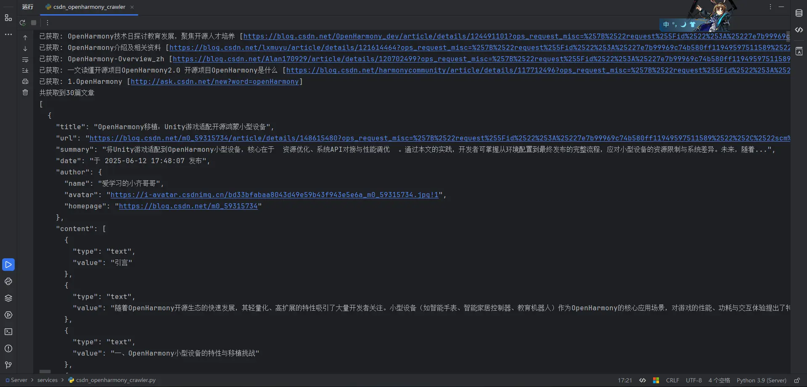

```js
      {
        "type": "text",
        "value": "​​Unity版本​​：2021.3 LTS（支持OpenHarmony 3.2+，官方推荐）；"
      },
      {
        "type": "text",
        "value": "​​OpenHarmony SDK​​：安装DevEco Studio（OpenHarmony开发工具）并配置LiteOS SDK（路径：File > Settings > SDK Manager）；"
      },
      {
        "type": "code",
        "value": "File > Settings > SDK Manager"
      },
      {
        "type": "text",
        "value": "​​交叉编译工具​​：OpenHarmony提供的ohos-gcc（版本r12p）与cmake（3.18+）；"
      },
      {
        "type": "code",
        "value": "ohos-gcc"
      },
      {
        "type": "code",
        "value": "cmake"
      },
      {
        "type": "text",
        "value": "​​调试工具​​：hdc（鸿蒙设备连接工具）、PerfTool（性能分析工具）。"
      },
```

我们可以看到在爬取的时候还成功获取了代码块中的内容，这也是之前在爬取OpenHarmony官网资讯时所没有考虑到的，因为官网的资讯大多类似于新闻报道类型的文章并不会过多的提及技术细节，只会从整体的视角介绍讲解，而CSDN与其是完全不同的性质，所以在客户端进行渲染时我也要考虑到这一点。

不过从结果来看还能发现两个问题，一个就是单一关键词的OpenHarmony资讯获取的数量还是太少了只有30篇，所以我应该想办法用多关键词进行爬取，另一个就是爬取的资讯中的代码部分处理的并不好。有一些代码块在获取后会有很奇怪的重复需要针对代码块进行特别的调优处理。这里我考虑可以将代码标签中的值用markdown格式来进行传递，在客户端解析时利用第三方markdown解析库进行解析。

```js
      {
        "type": "code",
        "value": "// EntryAbility.ets（OpenHarmony轻量系统）\nimport\nUIAbility\nfrom\n'@ohos.app.ability.UIAbility'\n;\nimport\nWindow\nfrom\n'@ohos.window'\n;\nexport\ndefault\nclass\nEntryAbility\nextends\nUIAbility\n{\nonCreate\n(\nwant, launchParam\n) {\nconsole\n.\nlog\n(\n'EntryAbility onCreate: 启动Unity游戏'\n);\n// 加载Unity渲染的View\nthis\n.\ncontext\n.\nsetUIContent\n(\nthis\n,\n'pages/UnityScene'\n,\nnull\n);\n}\nonDestroy\n(\n) {\nconsole\n.\nlog\n(\n'EntryAbility onDestroy: 关闭Unity'\n);\n}\nonWindowStageCreate\n(\nwindowStage: Window.WindowStage\n) {\n// 加载Unity生成的HAP包（或动态库）\nwindowStage.\nloadAbility\n(\nnew\nIntent\n.\nOperationBuilder\n()\n.\nwithAction\n(\nIntent\n.\nACTION_MAIN\n)\n.\nwithCategory\n(\nIntent\n.\nCATEGORY_LAUNCHER\n)\n.\nbuild\n()).\nthen\n(\n() =>\n{\nconsole\n.\nlog\n(\n'Unity场景加载完成'\n);\n}).\ncatch\n(\n(\nerr\n) =>\n{\nconsole\n.\nerror\n(\n'加载失败：'\n+\nJSON\n.\nstringify\n(err));\n});\n}\n}\nAI生成项目"
      },
      {
        "type": "code",
        "value": "// EntryAbility.ets（OpenHarmony轻量系统）\nimport\nUIAbility\nfrom\n'@ohos.app.ability.UIAbility'\n;\nimport\nWindow\nfrom\n'@ohos.window'\n;\nexport\ndefault\nclass\nEntryAbility\nextends\nUIAbility\n{\nonCreate\n(\nwant, launchParam\n) {\nconsole\n.\nlog\n(\n'EntryAbility onCreate: 启动Unity游戏'\n);\n// 加载Unity渲染的View\nthis\n.\ncontext\n.\nsetUIContent\n(\nthis\n,\n'pages/UnityScene'\n,\nnull\n);\n}\nonDestroy\n(\n) {\nconsole\n.\nlog\n(\n'EntryAbility onDestroy: 关闭Unity'\n);\n}\nonWindowStageCreate\n(\nwindowStage: Window.WindowStage\n) {\n// 加载Unity生成的HAP包（或动态库）\nwindowStage.\nloadAbility\n(\nnew\nIntent\n.\nOperationBuilder\n()\n.\nwithAction\n(\nIntent\n.\nACTION_MAIN\n)\n.\nwithCategory\n(\nIntent\n.\nCATEGORY_LAUNCHER\n)\n.\nbuild\n()).\nthen\n(\n() =>\n{\nconsole\n.\nlog\n(\n'Unity场景加载完成'\n);\n}).\ncatch\n(\n(\nerr\n) =>\n{\nconsole\n.\nerror\n(\n'加载失败：'\n+\nJSON\n.\nstringify\n(err));\n});\n}\n}"
      },
      {
        "type": "text",
        "value": "// EntryAbility.ets（OpenHarmony轻量系统）"
      },
      {
        "type": "text",
        "value": "// EntryAbility.ets（OpenHarmony轻量系统）"
      },
      {
        "type": "text",
        "value": "// EntryAbility.ets（OpenHarmony轻量系统）"
      },
```

问题的具体表现就像是上面这样，所以我们需要针对代码块的结构进行优化处理

#### CSDN资讯源的代码块结构专项优化

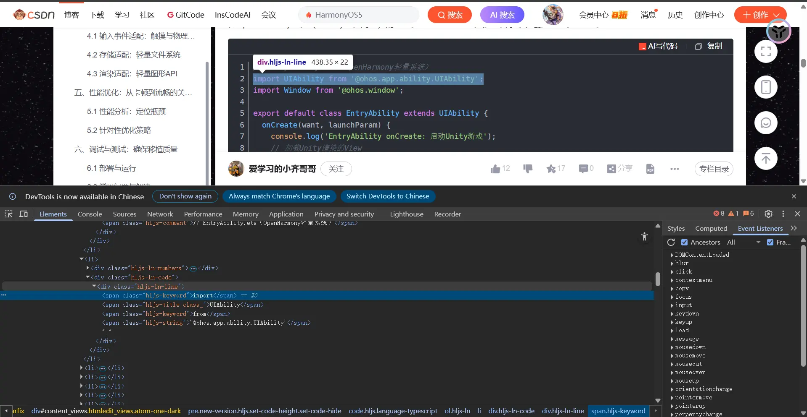

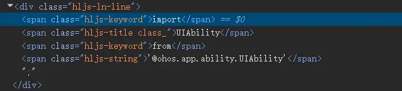

我确实没怎么注意过这个代码块的渲染细节，这仔细一看才看明白，关键字，变量名，注释等都是不同的类名来进行的渲染。究竟怎么依据各个语言的语法来进行区分与渲染，或者说我们常用的这套Markdown渲染成HTML的逻辑又是怎么实现的？确实很有趣，后面没准会单开一篇文章来研究一下，哈哈。

---

来让我们回归正题。在观察了代码块的页面结构后我对代码进行了升级改造。

```py
  elif elem.name == "pre":
      # 优化：合并整个pre下的代码行，按markdown代码块格式输出
      code_lines = []
      # 兼容CSDN高亮结构
      for code_div in elem.select("div.hljs-ln-code, code"):
          code_line = code_div.get_text("\n", strip=False)
          code_lines.append(code_line)
      if not code_lines:
          # 兜底：直接取pre的全部文本
          code_lines = [elem.get_text("\n", strip=False)]
      code_text = "".join(code_lines)
      # 检测语言类型
      lang = ""
      code_tag = elem.find("code")
      if code_tag and code_tag.has_attr("class"):
          for c in code_tag["class"]:
              if c.startswith("language-"):
                  lang = c.replace("language-", "")
                  break
      md_code = f"```{lang}\n{code_text}\n```"
      content_blocks.append({"type": "code", "value": md_code})
  elif elem.name == "code":
      # 跳过已被pre处理的code，避免重复
      if elem.parent and elem.parent.name == "pre":
          continue
      code_text = elem.get_text("\n", strip=True)
      if code_text:
          md_code = f"```{code_text}```"
          content_blocks.append({"type": "code", "value": md_code})
```

核心的爬取逻辑修改就在这里了，让我们再来测试一下。

在我看到我想看到的代码块之前我就发现了另一个问题，理论上讲我的代码已经去除了被pre标签包裹的code标签，但是实际上我的代码却将行内代码块也一并设置为了用` ``` ``` `代码块来进行包裹，这很显然是错误的。

```js
{
  "type": "code",
  "value": "```File > Settings > SDK Manager```"
},
{
  "type": "text",
  "value": "​​交叉编译工具​​：OpenHarmony提供的ohos-gcc（版本r12p）与cmake（3.18+）；"
},
{
  "type": "code",
  "value": "```ohos-gcc```"
},
{
  "type": "code",
  "value": "```cmake```"
},
```

我们先继续检索我们所想看到的代码块对象。

```js
      {
        "type": "code",
        "value": "```typescript\n// EntryAbility.ets（OpenHarmony轻量系统）\nimport\n \nUIAbility\n \nfrom\n \n'@ohos.app.ability.UIAbility'\n;\nimport\n \nWindow\n \nfrom\n \n'@ohos.window'\n;\n \nexport\n \ndefault\n \nclass\n \nEntryAbility\n \nextends\n \nUIAbility\n {\n  \nonCreate\n(\nwant, launchParam\n) {\n    \nconsole\n.\nlog\n(\n'EntryAbility onCreate: 启动Unity游戏'\n);\n    \n// 加载Unity渲染的View\n    \nthis\n.\ncontext\n.\nsetUIContent\n(\nthis\n, \n'pages/UnityScene'\n, \nnull\n);\n  }\n \n  \nonDestroy\n(\n) {\n    \nconsole\n.\nlog\n(\n'EntryAbility onDestroy: 关闭Unity'\n);\n  }\n \n  \nonWindowStageCreate\n(\nwindowStage: Window.WindowStage\n) {\n    \n// 加载Unity生成的HAP包（或动态库）\n    windowStage.\nloadAbility\n(\nnew\n \nIntent\n.\nOperationBuilder\n()\n      .\nwithAction\n(\nIntent\n.\nACTION_MAIN\n)\n      .\nwithCategory\n(\nIntent\n.\nCATEGORY_LAUNCHER\n)\n      .\nbuild\n()).\nthen\n(\n() =>\n {\n      \nconsole\n.\nlog\n(\n'Unity场景加载完成'\n);\n    }).\ncatch\n(\n(\nerr\n) =>\n {\n      \nconsole\n.\nerror\n(\n'加载失败：'\n + \nJSON\n.\nstringify\n(err));\n    });\n  }\n}// EntryAbility.ets（OpenHarmony轻量系统）import\n \nUIAbility\n \nfrom\n \n'@ohos.app.ability.UIAbility'\n;import\n \nWindow\n \nfrom\n \n'@ohos.window'\n; export\n \ndefault\n \nclass\n \nEntryAbility\n \nextends\n \nUIAbility\n {  \nonCreate\n(\nwant, launchParam\n) {    \nconsole\n.\nlog\n(\n'EntryAbility onCreate: 启动Unity游戏'\n);    \n// 加载Unity渲染的View    \nthis\n.\ncontext\n.\nsetUIContent\n(\nthis\n, \n'pages/UnityScene'\n, \nnull\n);  }   \nonDestroy\n(\n) {    \nconsole\n.\nlog\n(\n'EntryAbility onDestroy: 关闭Unity'\n);  }   \nonWindowStageCreate\n(\nwindowStage: Window.WindowStage\n) {    \n// 加载Unity生成的HAP包（或动态库）    windowStage.\nloadAbility\n(\nnew\n \nIntent\n.\nOperationBuilder\n()      .\nwithAction\n(\nIntent\n.\nACTION_MAIN\n)      .\nwithCategory\n(\nIntent\n.\nCATEGORY_LAUNCHER\n)      .\nbuild\n()).\nthen\n(\n() =>\n {      \nconsole\n.\nlog\n(\n'Unity场景加载完成'\n);    }).\ncatch\n(\n(\nerr\n) =>\n {      \nconsole\n.\nerror\n(\n'加载失败：'\n + \nJSON\n.\nstringify\n(err));    });  }}\n```"
      },
```

这一大段这么看咱们也不知道格式对不对我就直接利用三方插件进行一下渲染测试。

```bash
ohpm i @lidary/markdown
```

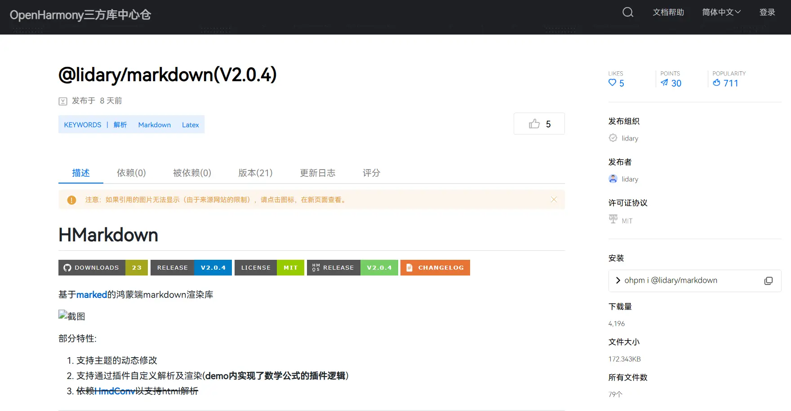

```ts
import { MarkdownV2 } from '@lidary/markdown';
@Entry
@ComponentV2
struct Index {
  @Local message: string = "```typescript\n// EntryAbility.ets（OpenHarmony轻量系统）\nimport\n \nUIAbility\n \nfrom\n \n'@ohos.app.ability.UIAbility'\n;\nimport\n \nWindow\n \nfrom\n \n'@ohos.window'\n;\n \nexport\n \ndefault\n \nclass\n \nEntryAbility\n \nextends\n \nUIAbility\n {\n  \nonCreate\n(\nwant, launchParam\n) {\n    \nconsole\n.\nlog\n(\n'EntryAbility onCreate: 启动Unity游戏'\n);\n    \n// 加载Unity渲染的View\n    \nthis\n.\ncontext\n.\nsetUIContent\n(\nthis\n, \n'pages/UnityScene'\n, \nnull\n);\n  }\n \n  \nonDestroy\n(\n) {\n    \nconsole\n.\nlog\n(\n'EntryAbility onDestroy: 关闭Unity'\n);\n  }\n \n  \nonWindowStageCreate\n(\nwindowStage: Window.WindowStage\n) {\n    \n// 加载Unity生成的HAP包（或动态库）\n    windowStage.\nloadAbility\n(\nnew\n \nIntent\n.\nOperationBuilder\n()\n      .\nwithAction\n(\nIntent\n.\nACTION_MAIN\n)\n      .\nwithCategory\n(\nIntent\n.\nCATEGORY_LAUNCHER\n)\n      .\nbuild\n()).\nthen\n(\n() =>\n {\n      \nconsole\n.\nlog\n(\n'Unity场景加载完成'\n);\n    }).\ncatch\n(\n(\nerr\n) =>\n {\n      \nconsole\n.\nerror\n(\n'加载失败：'\n + \nJSON\n.\nstringify\n(err));\n    });\n  }\n}// EntryAbility.ets（OpenHarmony轻量系统）import\n \nUIAbility\n \nfrom\n \n'@ohos.app.ability.UIAbility'\n;import\n \nWindow\n \nfrom\n \n'@ohos.window'\n; export\n \ndefault\n \nclass\n \nEntryAbility\n \nextends\n \nUIAbility\n {  \nonCreate\n(\nwant, launchParam\n) {    \nconsole\n.\nlog\n(\n'EntryAbility onCreate: 启动Unity游戏'\n);    \n// 加载Unity渲染的View    \nthis\n.\ncontext\n.\nsetUIContent\n(\nthis\n, \n'pages/UnityScene'\n, \nnull\n);  }   \nonDestroy\n(\n) {    \nconsole\n.\nlog\n(\n'EntryAbility onDestroy: 关闭Unity'\n);  }   \nonWindowStageCreate\n(\nwindowStage: Window.WindowStage\n) {    \n// 加载Unity生成的HAP包（或动态库）    windowStage.\nloadAbility\n(\nnew\n \nIntent\n.\nOperationBuilder\n()      .\nwithAction\n(\nIntent\n.\nACTION_MAIN\n)      .\nwithCategory\n(\nIntent\n.\nCATEGORY_LAUNCHER\n)      .\nbuild\n()).\nthen\n(\n() =>\n {      \nconsole\n.\nlog\n(\n'Unity场景加载完成'\n);    }).\ncatch\n(\n(\nerr\n) =>\n {      \nconsole\n.\nerror\n(\n'加载失败：'\n + \nJSON\n.\nstringify\n(err));    });  }}\n```";

  build() {
    Scroll(){
      MarkdownV2({
        content:this.message
      })
    }
    .height('100%')
    .width('100%')
  }
}
```

让我们来进行一下渲染测试。

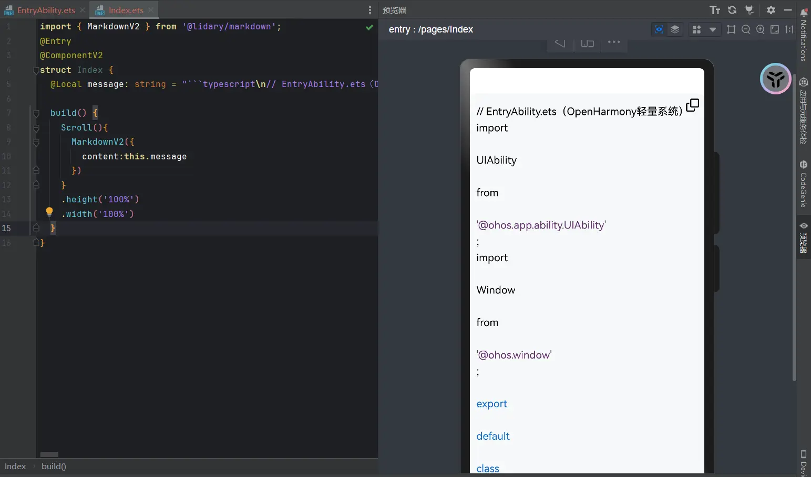

果然，这些换行符都是异常的换行符，我们还是得重新进行代码逻辑的编写。

当前对于换行的处理我的想法是直接按照对象进行分段就可以，这样是当前代码的逻辑，但行内代码块注定是要单独开一个对象进行存储的这样一来我们的换行逻辑就不成立了，虽然我们可以将一行的内容全部存储到一个对象数组，将文字和行内代码，之要是同一行的就都存进一个对象数组中，这样就可以保证换行的准确性了。

当然这个方案固然可以解决问题，但我们还应当考虑数据的复杂度，过于复杂的数据结构是否有存在的必要，，这个彩色是外挂标签，但这也可以看做是换了个颜色的行内代码块，这本质上没什么区别，二者外观以及功能性都是相同的，这就够了。我们要明白我们的目标是什么，是让用户能看清楚，能看懂。所以我们其实可以先去找到原文章的效果去看一看行内代码的效果是不是那么重要。

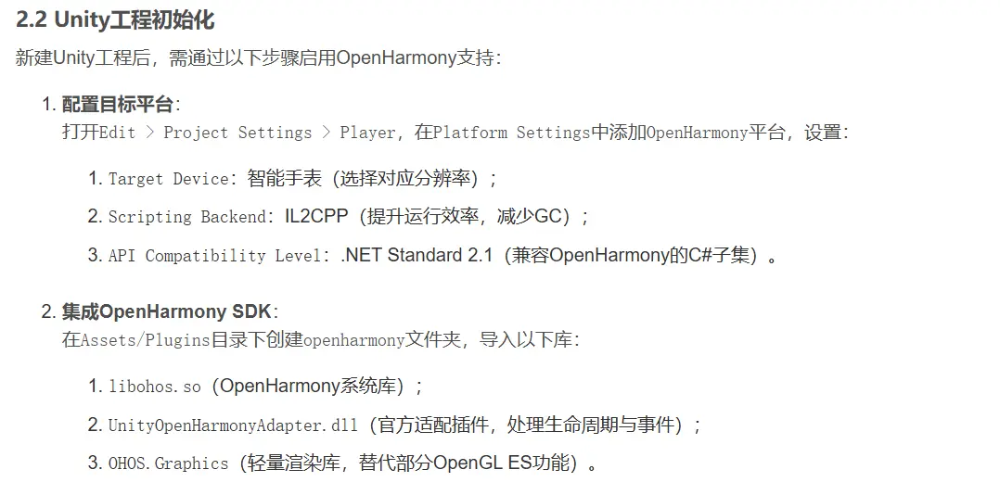

这一段，有一说一，其实我在仔细看代码之前从来没有意识到过这是一个经过渲染的行内代码块，仅仅是将其当做了字体不一致的文本而已。虽然仔细看是有一圈淡淡的灰色，但对于浏览文本内容来讲并无任何区别。所以我们暂时不考虑行内代码的渲染，而是先考虑如何渲染文本。

我选择先忽略掉`<code>`标签，直接通过上下级关系来去将`<code>`标签的文字内容与前后文串联起来即可。

```py
    def crawl_article_detail(self, driver, url):
        """爬取CSDN博文详情页，提取正文内容、作者、时间等"""
        result = {
            "date": None,
            "author": {},
            "content": []
        }
        try:
            driver.get(url)
            time.sleep(self.delay + random.random())
            soup = BeautifulSoup(driver.page_source, "html.parser")
            # 正文内容
            content_blocks = []
            content_container = soup.find(id="content_views")
            if content_container:
                def append_text(text):
                    if not text:
                        return
                    if content_blocks and content_blocks[-1]["type"] == "text":
                        content_blocks[-1]["value"] += text
                    else:
                        content_blocks.append({"type": "text", "value": text})

                # 块级元素，每个生成一行
                for elem in content_container.find_all(["p", "li", "h1", "h2", "h3", "h4", "h5", "h6", "div"], recursive=True):
                    # 跳过空div
                    if elem.name == "div" and not elem.get_text(strip=True):
                        continue
                    # 处理图片
                    imgs = elem.find_all("img")
                    for img in imgs:
                        img_src = img.get("src")
                        if img_src:
                            content_blocks.append({"type": "image", "value": img_src})
                    # 处理文本（包括code/strong等标签内容）
                    text = elem.get_text(separator="", strip=True)
                    if text:
                        content_blocks.append({"type": "text", "value": text})
                # 处理pre代码块
                for pre in content_container.find_all("pre", recursive=True):
                    code_lines = []
                    for code_div in pre.select("div.hljs-ln-code, code"):
                        code_line = code_div.get_text("\n", strip=False)
                        code_lines.append(code_line)
                    if not code_lines:
                        code_lines = [pre.get_text("\n", strip=False)]
                    code_text = "".join(code_lines)
                    lang = ""
                    code_tag = pre.find("code")
                    if code_tag and code_tag.has_attr("class"):
                        for c in code_tag["class"]:
                            if c.startswith("language-"):
                                lang = c.replace("language-", "")
                                break
                    md_code = f"```{lang}\n{code_text}\n```"
                    content_blocks.append({"type": "code", "value": md_code})
            result["content"] = content_blocks
            # 作者信息
            author_box = soup.select_one("a.profile-href")
            if author_box:
                author_name = author_box.select_one("span.profile-name")
                author_img = author_box.select_one("img.profile-img")
                result["author"] = {
                    "name": author_name.get_text(strip=True) if author_name else None,
                    "avatar": author_img.get("src") if author_img else None,
                    "homepage": author_box.get("href")
                }
            # 发布时间
            # 常见位置：meta、时间标签、正文上方
            date_str = None
            meta_time = soup.find("meta", {"itemprop": "datePublished"})
            if meta_time and meta_time.get("content"):
                date_str = meta_time["content"]
            if not date_str:
                # 备选方案：查找常见时间标签
                time_tag = soup.find("span", class_="time") or soup.find("span", class_="publish-time")
                if time_tag:
                    date_str = time_tag.get_text(strip=True)
            result["date"] = date_str
        except Exception as e:
            print(f"详情页解析失败: {url}, 错误: {e}")
        return result
```

再次进行测试。

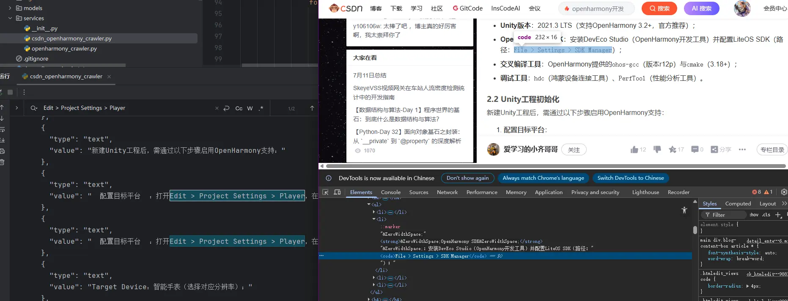

可以看到，我们的行内代码被成功的忽视并拼接到了前后的文本中，而不是被单独提取出来。

但与此同时新的问题又浮现了出来。我们获取的数据中有重复的内容，这很可能是扫描了父级组件之后，又扫描了子组件，导致重复。我们需要在扫描子组件之前，先检查是否已经扫描过该组件，如果是，则跳过。

```py
processed_elements = set()

def is_child_of_processed(elem):
    """检查元素是否是已处理元素的子元素"""
    for parent in elem.parents:
        if parent in processed_elements:
            return True
    return False
```

我们新增一个集合用于存储已经存储过得元素，在获取组件文本内容之前我们要先去验证是否为已经处理过的元素的子组件，这样一来我们就可以避免重复扫描导致的重复内容。

在代码全部修改完成后我们从新测试。

```py
def crawl_article_detail(self, driver, url):
    """爬取CSDN博文详情页，提取正文内容、作者、时间等"""
    result = {
        "date": None,
        "author": {},
        "content": []
    }
    try:
        driver.get(url)
        time.sleep(self.delay + random.random())
        soup = BeautifulSoup(driver.page_source, "html.parser")
        # 正文内容
        content_blocks = []
        content_container = soup.find(id="content_views")
        if content_container:
            processed_elements = set()
            
            def is_child_of_processed(elem):
                """检查元素是否是已处理元素的子元素"""
                for parent in elem.parents:
                    if parent in processed_elements:
                        return True
                return Fals
            # 块级元素，每个生成一行，避免重复处理父子元素
            for elem in content_container.find_all(["p", "li", "h1", "h2", "h3", "h4", "h5", "h6", "div"], recursive=True):
                # 跳过空div
                if elem.name == "div" and not elem.get_text(strip=True):
                    continue
                # 跳过已处理元素的子元素
                if is_child_of_processed(elem):
                    continue
                # 处理图片
                imgs = elem.find_all("img")
                for img in imgs:
                    img_src = img.get("src")
                    if img_src:
                        content_blocks.append({"type": "image", "value": img_src})
                # 处理文本（包括code/strong等标签内容）
                text = elem.get_text(separator="", strip=True)
                if text:
                    content_blocks.append({"type": "text", "value": text})
                    processed_elements.add(elem)
            # 处理pre代码块
            for pre in content_container.find_all("pre", recursive=True):
                # 跳过已被文本处理过的pre
                if pre in processed_elements:
                    continue
                code_lines = []
                for code_div in pre.select("div.hljs-ln-code, code"):
                    code_line = code_div.get_text("\n", strip=False)
                    code_lines.append(code_line)
                if not code_lines:
                    code_lines = [pre.get_text("\n", strip=False)]
                code_text = "".join(code_lines)
                lang = ""
                code_tag = pre.find("code")
                if code_tag and code_tag.has_attr("class"):
                    for c in code_tag["class"]:
                        if c.startswith("language-"):
                            lang = c.replace("language-", "")
                            break
                md_code = f"```{lang}\n{code_text}\n```"
                content_blocks.append({"type": "code", "value": md_code})
        result["content"] = content_blocks
        # 作者信息
        author_box = soup.select_one("a.profile-href")
        if author_box:
            author_name = author_box.select_one("span.profile-name")
            author_img = author_box.select_one("img.profile-img")
            result["author"] = {
                "name": author_name.get_text(strip=True) if author_name else None,
                "avatar": author_img.get("src") if author_img else None,
                "homepage": author_box.get("href")
            }
        # 发布时间
        # 常见位置：meta、时间标签、正文上方
        date_str = None
        meta_time = soup.find("meta", {"itemprop": "datePublished"})
        if meta_time and meta_time.get("content"):
            date_str = meta_time["content"]
        if not date_str:
            # 备选方案：查找常见时间标签
            time_tag = soup.find("span", class_="time") or soup.find("span", class_="publish-time")
            if time_tag:
                date_str = time_tag.get_text(strip=True)
        result["date"] = date_str
    except Exception as e:
        print(f"详情页解析失败: {url}, 错误: {e}")
    return result
```

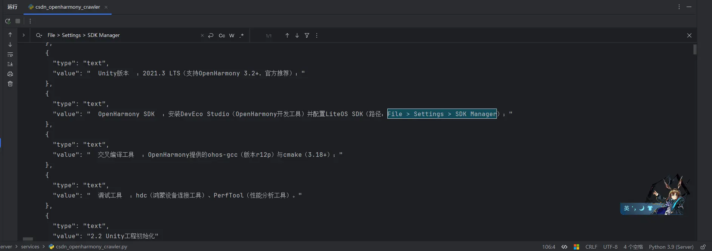

顺利的去除的重复，那么对于CSDN内容的爬取就算成功了，接下来就该去解决搜索关键词有限导致爬取目标内容不足的问题了。

#### CSDN资源数量问题

由于当前整体的爬虫进度就很慢了，所以我决定使用一个新的线程去获取数据，随后再将两个线程的数据按时间顺讯进行合并。

---

**多线程执行逻辑分析**

现在让我详细分析我们的多线程爬虫实现：

1. 线程配置与URL设计

  ```python
  urls_and_keywords = [
      {
          "url": "https://so.csdn.net/so/search?spm=1000.2115.3001.4501&q=openHarmony&t=&u=&s=new",
          "keyword": "openHarmony"
      },
      {
          "url": "https://so.csdn.net/so/search?spm=1000.2115.3001.4501&q=%E5%BC%80%E6%BA%90%E9%B8%BF%E8%92%99&t=all&u=&s=new&urw=",
          "keyword": "开源鸿蒙"
      }
  ]
  ```

  我们设计了两个搜索关键词：
  - **openHarmony**：英文关键词，覆盖技术文档和开发相关内容
  - **开源鸿蒙**：中文关键词，覆盖更多中文社区讨论和应用案例

  这样的设计可以最大化内容覆盖范围，避免单一关键词导致的内容不足问题。

2. 线程工作函数设计

  ```python
      def crawl_worker(search_config, result_list):
          """线程工作函数"""
          crawler = CSDNOpenHarmonyCrawler()
          articles = crawler.crawl(search_config["url"], search_config["keyword"])
          result_list.append(articles)
  ```

  每个线程独立创建爬虫实例，避免共享状态冲突。通过 `result_list` 收集各线程结果。

3. 时间排序与合并逻辑

  关键在于我们的日期解析函数，使用正则表达式处理多种日期格式：

  ```python
      @staticmethod
      def merge_and_sort_articles(articles_list):
          """合并多个文章列表并按日期排序"""
          merged_articles = []
          for articles in articles_list:
              merged_articles.extend(articles)

          # 为每篇文章添加排序用的日期对象
          for article in merged_articles:
              article['_sort_date'] = CSDNOpenHarmonyCrawler.extract_date_from_string(article.get('date'))

          # 按日期排序（最新的在前）
          merged_articles.sort(key=lambda x: x['_sort_date'] or datetime.min, reverse=True)

          # 移除临时排序字段
          for article in merged_articles:
              article.pop('_sort_date', None)

          return merged_articles
  ```

  这个函数能够处理CSDN可能出现的各种日期格式，确保排序的准确性。

4. 完整的多线程执行流程

  ```python
  def crawl_with_threading():
      """使用多线程爬取两个不同关键词的内容"""
      # 定义两个搜索URL
      urls_and_keywords = [
          {
              "url": "https://so.csdn.net/so/search?spm=1000.2115.3001.4501&q=openHarmony&t=&u=&s=new",
              "keyword": "openHarmony"
          },
          {
              "url": "https://so.csdn.net/so/search?spm=1000.2115.3001.4501&q=%E5%BC%80%E6%BA%90%E9%B8%BF%E8%92%99&t=all&u=&s=new&urw=",
              "keyword": "开源鸿蒙"
          }
      ]

      # 存储每个线程的结果
      results = []
      threads = []

      def crawl_worker(search_config, result_list):
          """线程工作函数"""
          crawler = CSDNOpenHarmonyCrawler()
          articles = crawler.crawl(search_config["url"], search_config["keyword"])
          result_list.append(articles)

      # 创建并启动线程
      for config in urls_and_keywords:
          thread_result = []
          thread = threading.Thread(target=crawl_worker, args=(config, thread_result))
          threads.append(thread)
          results.append(thread_result)
          thread.start()

      # 等待所有线程完成
      for thread in threads:
          thread.join()

      # 收集所有结果
      all_articles = []
      for thread_result in results:
          if thread_result:  # thread_result是列表，包含一个articles列表
              all_articles.extend(thread_result[0])

      print(f"\n=== 所有线程完成，开始合并结果 ===")
      print(f"总共获取到 {len(all_articles)} 篇文章")

      # 合并并按时间排序
      sorted_articles = CSDNOpenHarmonyCrawler.merge_and_sort_articles([all_articles])

      print(f"按时间排序完成，共 {len(sorted_articles)} 篇文章")

      return sorted_articles
  ```

ok，开始测试。

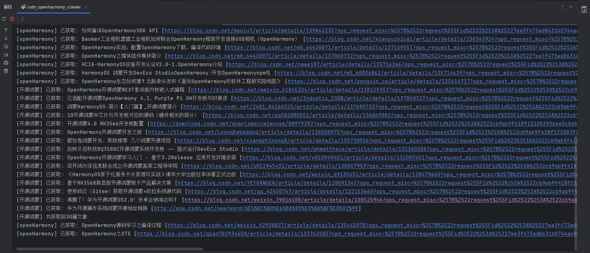

可以看到，我们的两个线程在同时获取最新的数据。不过Python的多线程其实属于是"假多线程"。

- 全局解释器锁（GIL）的限制

Python中存在一个叫做**全局解释器锁（Global Interpreter Lock，GIL）**的机制，这是CPython解释器的一个特性。GIL确保在任何时刻只有一个线程在执行Python字节码，这意味着：

1. **CPU密集型任务**：多线程并不能真正并行执行，反而可能因为线程切换的开销而变得更慢
2. **真正的并发**：只有在遇到I/O操作（如网络请求、文件读写）时，GIL才会被释放，允许其他线程执行

- 为什么我们的爬虫仍然有效？

虽然Python有GIL限制，但我们的CSDN爬虫仍然能从多线程中受益，原因如下：

```python
# 在我们的爬虫中，大部分时间都花在I/O操作上：
driver.get(search_url)              # 网络请求 - 释放GIL
time.sleep(self.delay + random.random())  # 睡眠等待 - 释放GIL
soup = BeautifulSoup(driver.page_source, "html.parser")  # CPU操作 - 持有GIL
driver.get(article_url)             # 网络请求 - 释放GIL
```

**关键点**：当线程A在等待网页加载时（I/O阻塞），GIL被释放，线程B可以开始执行自己的网络请求。这样两个爬虫线程实际上是在**交替执行**，而不是真正的**并行执行**。

- GIL的工作机制

```python
# 伪代码展示GIL的工作方式
def thread_execution_with_gil():
    # 线程A获得GIL
    thread_a_acquires_gil()
    
    # 线程A执行CPU操作
    parse_html()  # 持有GIL
    
    # 线程A遇到I/O操作
    make_network_request()  # 释放GIL，进入等待状态
    
    # 此时线程B可以获得GIL
    thread_b_acquires_gil()
    
    # 线程B执行自己的操作
    thread_b_parse_html()  # 持有GIL
    thread_b_make_request()  # 释放GIL
    
    # 当线程A的网络请求完成时，重新竞争GIL
    thread_a_network_response_received()
    # ... 循环往复
```

- 真正的并行替代方案

如果需要真正的并行处理，Python提供了几种替代方案：


<!-- tab 多进程（multiprocessing） -->

```python
from multiprocessing import Process, Queue

def crawl_with_multiprocessing():
    """使用多进程实现真正的并行爬取"""
    queue = Queue()
    
    def crawl_process(search_config, result_queue):
        crawler = CSDNOpenHarmonyCrawler()
        articles = crawler.crawl(search_config["url"], search_config["keyword"])
        result_queue.put(articles)
    
    processes = []
    for config in urls_and_keywords:
        p = Process(target=crawl_process, args=(config, queue))
        processes.append(p)
        p.start()
    
    # 等待所有进程完成
    results = []
    for p in processes:
        results.append(queue.get())
        p.join()
    
    return results
```
<!-- endtab -->

<!-- tab 异步编程（asyncio） -->

```python
import asyncio
import aiohttp

async def async_crawl():
    """使用异步编程实现高并发爬取"""
    async with aiohttp.ClientSession() as session:
        tasks = []
        for config in urls_and_keywords:
            task = crawl_async(session, config)
            tasks.append(task)
        
        results = await asyncio.gather(*tasks)
        return results
```

<!-- endtab -->


- 为什么我们选择多线程？

尽管存在GIL限制，我们仍然选择多线程的原因：

1. **简单性**：实现简单，无需额外的进程间通信
2. **资源效率**：比多进程消耗更少的系统资源
3. **I/O密集特性**：我们的爬虫主要受网络I/O限制，多线程已经足够
4. **Selenium兼容性**：Selenium WebDriver在多线程环境下工作良好

Python的多线程确实受到GIL的限制，无法实现真正的CPU并行。但对于我们这种I/O密集型的网络爬虫任务，多线程仍然能够带来显著的性能提升。GIL在遇到I/O操作时会释放，允许其他线程执行，这正是我们的爬虫能够受益的原因。

如果未来需要处理更加CPU密集的任务（如大量的数据处理、图像处理等），那么考虑使用多进程或异步编程会是更好的选择。但对于当前的需求，多线程已经是一个既简单又有效的解决方案。

okay，回归正题，写这段的时候我们的爬虫也完成了工作让我们来看看结果。

额上面的看起来都没什么问题，但是下面的几条看起来就有点怪了。

```js
  {
    "title": "沸腾了！华为开源鸿蒙OS2.0！安卓会被淘汰吗？",
    "url": "https://blog.csdn.net/weixin_39016100/article/details/108525946?ops_request_misc=%257B%2522request%255Fid%2522%253A%2522cb9ab9f418f13100393baa0c8eb1aaa0%2522%252C%2522scm%2522%253A%252220140713.130102334.pc%255Fall.%2522%257D&request_id=cb9ab9f418f13100393baa0c8eb1aaa0&biz_id=0&utm_medium=distribute.pc_search_result.none-task-blog-2~all~time_text~default-29-108525946-null-null.142^v102^pc_search_result_base4&utm_term=%E5%BC%80%E6%BA%90%E9%B8%BF%E8%92%99",
    "summary": "点击上方“Github中文社区”，关注看遍Github好玩的项目大家好，我是hub哥今天鸿蒙OS开源代码公开了！！！没错！今天在华为开发者大会上，也是从9月10日起，HarmonyOS开...",
    "search_keyword": "开源鸿蒙",
    "date": "于 2020-09-10 20:15:41 发布",
    "author": {
      "name": "Github中文社区",
      "avatar": "https://profile-avatar.csdnimg.cn/5af19c4ff58e436d83205022d2ad1234_weixin_39016100.jpg!1",
      "homepage": "https://blog.csdn.net/weixin_39016100"
    },
    "content": [
      {
        "type": "image",
        "value": "https://i-blog.csdnimg.cn/blog_migrate/370744e1190c99c8de088f5b7a706e3c.png"
      },
      {
        "type": "image",
        "value": "https://i-blog.csdnimg.cn/blog_migrate/fe866ad2d04f269afd112092719e594f.png"
      },
      {
        "type": "image",
        "value": "https://i-blog.csdnimg.cn/blog_migrate/609f5a565db9efa9d929c79438025217.png"
      },
      {
        "type": "image",
        "value": "https://i-blog.csdnimg.cn/blog_migrate/fb9beec5cebedf3597eacb9b1a5d0a08.png"
      },
      {
        "type": "image",
        "value": "https://i-blog.csdnimg.cn/blog_migrate/bc34bc591bd1668a15424f268781cca7.png"
      },
      {
        "type": "image",
        "value": "https://i-blog.csdnimg.cn/blog_migrate/6b2793d9781a11e15943eb9bb303119b.png"
      },
      {
        "type": "image",
        "value": "https://i-blog.csdnimg.cn/blog_migrate/6e72c3f532a58018ff9163342840315f.gif"
      },
      {
        "type": "image",
        "value": "https://csdnimg.cn/release/blogv2/dist/pc/img/runCode/icon-arrowwhite.png"
      },
      {
        "type": "text",
        "value": "点击上方“Github中文社区”，关注看遍Github好玩的项目大家好，我是hub哥今天鸿蒙OS开源代码公开了！！！没错！今天在华为开发者大会上，也是从9月10日起，HarmonyOS开源代码公开了！项目仓库已经可以看了, 目前关注2.5k。鸿蒙OSOpenHarmony是开放原子开源基金会（OpenAtom Foundation）旗下开源项目，定位是一款面向全场景的开源分布式操作系统。其实在2019年 8月9日，华为鸿蒙1.0 ，OS揭开了面纱。2019年的在华为开发者大会上, 华为首款搭载鸿蒙OS终端正式亮相！荣耀智慧屏-首款搭载华为鸿蒙系统的荣耀智慧屏 系列8月10日震撼发布今天的大会上，余承东宣布，华为鸿蒙系统已经升级至2.0版本，即HarmonyOS 2.0。此次HarmonyOS的升级，不仅仅带来了分布式能力的全面提升，还为开发者提供了完整的分布式设备与应用开发生态，全面赋能全场景智慧生态。HarmonyOS主要包含如下系统:余承东讲话得到几点信息：从今天起将面向程序员提供大屏、手表、车机的鸿蒙OS2.0的beta版本今年12月份将提供鸿蒙2.0的beta版本2021年4月将面向内存128MB-4GB终端设备开源2021年10月以后将面向4GB以上所有设备开源明年起，华为智能手机将升级支持鸿蒙2.0一些总结在鸿蒙 OS 上，他们可以用一套代码开发出兼容多终端的软件，鸿蒙 OS 能做到自动适配。对开发者来说，所有设备都同一个系统，交互更好、学习成本更低，体验更加统一。如果明年4月 搭载鸿蒙OS的手机发布，并推动手机应用开发者加入，那么配合新的开发语言，又将提供一大批岗位，其实利好开发者！大厂需要华为生态渠道，客户端岗位需求会激增。和安卓系统形成竞对的局面，从而促使android提高体验和优化性能，避免以后收费。传送门鸿蒙官网：https://www.harmonyos.com开源项目官网：https://www.openatom.org/openharmony开源代码仓库：https://openharmony.gitee.com华为开发者联盟论坛：https://developer.huawei.com/consumer投票环节最后大家来投个票吧OK！到这就是这期分享如果觉得文章有意思，请点赞在看，分享。历史原创★ 程序员大佬女装登顶GitHub 热榜，太变态了！还以为逛 PornHub呢！★18禁警告！这个工具教你涂鸦画丁丁，数据还开源了★ 强！这个GitHub官方终端命令行工具！星标10K！真是让人相见恨晚啊★ 模糊妹子图变超清！这个神器能让模糊图秒变4K高清，瞬间觉得PS也没那么香了文稿征集令来啦！点个在看呗！AI生成项目php运行"
      },
      {
        "type": "code",
        "value": "```php\nOK！到这就是这期分享\n \n \n如果觉得文章有意思，请点赞在看，分享。\n \n \n \n历史原创\n \n★ 程序员大佬女装登顶GitHub 热榜，太变态了！还以为逛 PornHub呢！★ \n18\n 禁警告！这个工具教你涂鸦画丁丁，数据还开源了★ 强！这个GitHub官方终端命令行工具！星标\n10\nK！真是让人相见恨晚啊★ 模糊妹子图变超清！这个神器能让模糊图秒变\n4\nK高清，瞬间觉得PS也没那么香了\n \n \n \n文稿征集令来啦！ \n \n \n点个在看呗！OK！到这就是这期分享  如果觉得文章有意思，请点赞在看，分享。   历史原创 ★ 程序员大佬女装登顶GitHub 热榜，太变态了！还以为逛 PornHub呢！★ \n18\n 禁警告！这个工具教你涂鸦画丁丁，数据还开源了★ 强！这个GitHub官方终端命令行工具！星标\n10\nK！真是让人相见恨晚啊★ 模糊妹子图变超清！这个神器能让模糊图秒变\n4\nK高清，瞬间觉得PS也没那么香了   文稿征集令来啦！   点个在看呗！\n```"
      }
    ]
  },
  {
    "title": "1.OpenHarmony",
    "url": "http://ask.csdn.net/new?word=openHarmony",
    "summary": "OpenHarmonyOpenHarmony是开放原子开源基金会（OpenAtom Foundation）旗下开源项目，定位是一款面向全场景的开源分布式操作系统，第一个版本支持128K-128M设备上运行。 https://openharmony.gitee.comOpenHarmony...",
    "search_keyword": "openHarmony",
    "date": null,
    "author": {},
    "content": []
  },
  {
    "title": "智启未来 | 拓维信息携旗下开鸿智谷受邀参加开源鸿蒙开发者大会2025",
    "url": "https://blog.csdn.net/u011945431/article/details/148261304?ops_request_misc=%257B%2522request%255Fid%2522%253A%2522cb9ab9f418f13100393baa0c8eb1aaa0%2522%252C%2522scm%2522%253A%252220140713.130102334.pc%255Fall.%2522%257D&request_id=cb9ab9f418f13100393baa0c8eb1aaa0&biz_id=0&utm_medium=distribute.pc_search_result.none-task-blog-2~all~time_text~default-5-148261304-null-null.142^v102^pc_search_result_base4&utm_term=%E5%BC%80%E6%BA%90%E9%B8%BF%E8%92%99",
    "summary": "大会期间，拓维信息旗下开鸿智谷基于开源鸿蒙研发的在鸿OS、在鸿控制器、在鸿实验箱、在鸿行业PC、在鸿平板和在鸿智慧园区场景等软硬件创新产品及数智化解决方案悉数亮相，吸引了大量开发者和生态客户关注。...",
    "search_keyword": "开源鸿蒙",
    "date": null,
    "author": {},
    "content": []
  },
  {
    "title": "开源鸿蒙开发者大会2025交流区亮点纷呈，社区与生态伙伴共绘智能图景",
    "url": "https://blog.csdn.net/u011945431/article/details/148260001?ops_request_misc=%257B%2522request%255Fid%2522%253A%2522cb9ab9f418f13100393baa0c8eb1aaa0%2522%252C%2522scm%2522%253A%252220140713.130102334.pc%255Fall.%2522%257D&request_id=cb9ab9f418f13100393baa0c8eb1aaa0&biz_id=0&utm_medium=distribute.pc_search_result.none-task-blog-2~all~time_text~default-6-148260001-null-null.142^v102^pc_search_result_base4&utm_term=%E5%BC%80%E6%BA%90%E9%B8%BF%E8%92%99",
    "summary": "值得一提的是，本次大会的专题交流区首次展出了有关开源鸿蒙SIG 地图、开源鸿蒙Web SIG及W3C标准、统一互联PMC（筹）地图等丰富的信息，以及第二届中国研究生操作系统开源创新大赛开源鸿蒙赛道、开源鸿蒙人才生态...",
    "search_keyword": "开源鸿蒙",
    "date": null,
    "author": {},
    "content": []
  },
  {
    "title": "深开鸿联合中软国际、粤科金融集团发布国内首个开源鸿蒙创业投资基金",
    "url": "https://blog.csdn.net/luluningmeng1/article/details/142638398?ops_request_misc=%257B%2522request%255Fid%2522%253A%2522cb9ab9f418f13100393baa0c8eb1aaa0%2522%252C%2522scm%2522%253A%252220140713.130102334.pc%255Fall.%2522%257D&request_id=cb9ab9f418f13100393baa0c8eb1aaa0&biz_id=0&utm_medium=distribute.pc_search_result.none-task-blog-2~all~time_text~default-12-142638398-null-null.142^v102^pc_search_result_base4&utm_term=%E5%BC%80%E6%BA%90%E9%B8%BF%E8%92%99",
    "summary": "该基金不仅将为开源鸿蒙初创企业提供早期资本支持，还将通过与地方政府、企业、高校的合作，推动更多地区的创新创业项目落地，助力区域人才和产业生态的繁荣。韦家燊表示，未来深开鸿将在全国范围内推广“服务+资本...",
    "search_keyword": "开源鸿蒙",
    "date": null,
    "author": {},
    "content": []
  },
  {
    "title": "深开鸿联合深天使发布国内首个开源鸿蒙产业加速营",
    "url": "https://blog.csdn.net/luluningmeng1/article/details/142638371?ops_request_misc=%257B%2522request%255Fid%2522%253A%2522cb9ab9f418f13100393baa0c8eb1aaa0%2522%252C%2522scm%2522%253A%252220140713.130102334.pc%255Fall.%2522%257D&request_id=cb9ab9f418f13100393baa0c8eb1aaa0&biz_id=0&utm_medium=distribute.pc_search_result.none-task-blog-2~all~time_text~default-13-142638371-null-null.142^v102^pc_search_result_base4&utm_term=%E5%BC%80%E6%BA%90%E9%B8%BF%E8%92%99",
    "summary": "深天使开源鸿蒙产业加速营携手深开鸿及其生态合作伙伴，以“K计划”为抓手，在开源鸿蒙初创项目和企业中挖掘重点培育对象，进行深度孵化与激发潜能，助力这些团队和企业的快速成长。国内首个开源鸿蒙产业加速营发布...",
    "search_keyword": "开源鸿蒙",
    "date": null,
    "author": {},
    "content": []
  },
  {
    "title": "深开鸿与深信息联合成立开源鸿蒙高等工程师学院",
    "url": "https://blog.csdn.net/u011945431/article/details/130057959?ops_request_misc=%257B%2522request%255Fid%2522%253A%2522cb9ab9f418f13100393baa0c8eb1aaa0%2522%252C%2522scm%2522%253A%252220140713.130102334.pc%255Fall.%2522%257D&request_id=cb9ab9f418f13100393baa0c8eb1aaa0&biz_id=0&utm_medium=distribute.pc_search_result.none-task-blog-2~all~time_text~default-25-130057959-null-null.142^v102^pc_search_result_base4&utm_term=%E5%BC%80%E6%BA%90%E9%B8%BF%E8%92%99",
    "summary": "4月8日，在深圳信息职业技术学院（简称：深信息）与华为联合举办的“培养复合型数字人才，释放数字生产力”数字人才培养高峰论坛上，深开鸿与深信息联合成立“开源鸿蒙高等工程师学院”，旨在建设开源鸿蒙人才培养...",
    "search_keyword": "开源鸿蒙",
    "date": null,
    "author": {},
    "content": []
  },
  {
    "title": "华为开源操作系统鸿蒙开源地址链接",
    "url": "http://ask.csdn.net/new?word=%E5%BC%80%E6%BA%90%E9%B8%BF%E8%92%99",
    "summary": "华为开源操作系统鸿蒙开源地址链接:  华为开发资源:https://developer.huaweicloud.com/  华为终端开发者论坛:https://developer.huawei.com/consumer/cn/forumupgrading  华为系统liteOS老地址：...",
    "search_keyword": "开源鸿蒙",
    "date": null,
    "author": {},
    "content": []
  }
```

首先是"沸腾了！华为开源鸿蒙OS2.0！安卓会被淘汰吗？"这篇文章的文章内容顺序乱了，原文中的文本是穿插在图中间的而且比较靠前，爬取后就到后面了，暂时不清楚是什么原因。

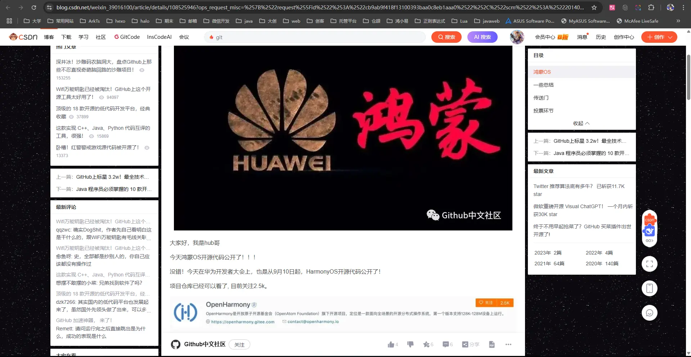

还有就是后面这几篇都404了，可能是原作者删除了文章吧，明天得再加个404的检测机制。今天先这样了，累了累了。

---

### 可行性验证阶段汇报

在经过了一周的开发后也算是有了点眉目，本来在选择项目时我就十分担心，因为爬虫这东西之前也做过几次，各个网站的网站结构还有加载、渲染方式都不尽相同，在官网的项目简介上也并没有标明该用什么手段去获取资讯信息，只说了让我们去聚合。我是真的没有头绪，毕竟我也是没有系统行的学习过爬虫或者说是后端技术来着。更何况开源协会的大家都将开源之夏视作是一个很牛逼的开源项目经历，现在看来确实是有些魅化了，只有在实际上手后才能祛魅。行动是缓解焦虑做好的办法。我在和老师汇报的前一晚也是紧张的直冒汗，不过在实际汇报时也是冷静的将我自己所做的尝试以及当前的进度和解决方案都助理列举了出来。虽然我将老师所所说的线上交流误解成了微信聊天，所以直接就给老师发消息了，下次还是汇总成一个文件来进行汇报吧，（尴尬死了）。不过整体的方案还是得到了认可，我也就可以继续进行开发调试了。


在实际开发中发现问题，思考对策，解决问题，在发现新问题，才能真正的提升能力，一味地读文档，看教程永远是学不会的，计划书写得再好也看不到真正隐藏的问题。


## 后端正式开发阶段

虽说到这个章节我们才开始正式的后端开发，但实际上在可行性验证阶段，我们就已经完成了很多后端开发阶段的事了，我们只需要继续按照我们的思路进行开发即可。

### 信息源爬虫完善

#### CSDN爬虫的404防御机制

上面在可行性验证阶段，我们最后截止到了发现爬取的内容中包含了404的页面，接下来我们就来进行一下404页面的检测与防御机制。

首先还是观察一下404页面。

！[11](OpenSourceSummer2025/11.webp)

可以看到404页面都会存在一个new_404的侧边栏，我们只需要检测在跳转后的目标页面是否存在这个侧边栏就可以判断是否是404页面了。

```py
  try:
      driver.get(url)
      time.sleep(self.delay + random.random())
      soup = BeautifulSoup(driver.page_source, "html.parser")
      # 404检测
      if soup.find("div", class_="new_404"):
          print(f"页面404或已被删除: {url}")
          return None
      # 正文内容
```

我们直接处理正文内容之前去进行404侧边栏的检测即可，如果没有就返回一个空值就可以了。

再次进行测试。

```js
=== 所有线程完成，开始合并结果 ===
总共获取到 60 篇文章
按时间排序完成，共 60 篇文章

=== 最终结果统计 ===
OpenHarmony 文章数: 30
开源鸿蒙 文章数: 30
总文章数: 60
[
  {
    "title": "开源鸿蒙4.0 RK3566开发板配置",
    "url": "https://download.csdn.net/download/caimouse/88979392?ops_request_misc=%257B%2522request%255Fid%2522%253A%2522ff96528c115517d0ea0d052aaf5e7e96%2522%252C%2522scm%2522%253A%252220140713.130102334.pc%255Fall.%2522%257D&request_id=ff96528c115517d0ea0d052aaf5e7e96&biz_id=1&utm_medium=distribute.pc_search_result.none-task-download-2~all~time_text~default-16-88979392-null-null.142^v102^pc_search_result_base9&utm_term=%E5%BC%80%E6%BA%90%E9%B8%BF%E8%92%99",
    "summary": "",
    "search_keyword": "开源鸿蒙",
    "date": "2024-09-15",
    "author": {},
    "content": []
  },
  {
    "title": "OpenHarmony移植：Unity游戏适配开源鸿蒙小型设备",
    "url": "https://blog.csdn.net/m0_59315734/article/details/148615480?ops_request_misc=%257B%2522request%255Fid%2522%253A%25225776fbf6d1ad8ca886ab0e4a760bdb64%2522%252C%2522scm%2522%253A%252220140713.130102334.pc%255Fall.%2522%257D&request_id=5776fbf6d1ad8ca886ab0e4a760bdb64&biz_id=0&utm_medium=distribute.pc_search_result.none-task-blog-2~all~time_text~default-1-148615480-null-null.142^v102^pc_search_result_base2&utm_term=openHarmony",
    "summary": "将Unity游戏适配到OpenHarmony小型设备，核心在于​​资源优化、系统API对接与性能调优​​。通过本文的实践，开发者可掌握从环境配置到最终发布的完整流程，应对小型设备的资源限制与系统差异。未来，随着...",
    "search_keyword": "openHarmony",
    "date": null,
    "author": {},
    "content": []
  },
  {
    "title": "第三章 iTop3588平台移植OpenHarmony-4.0-Release",
    "url": "https://blog.csdn.net/jixufan/article/details/147256785?ops_request_misc=%257B%2522request%255Fid%2522%253A%25225776fbf6d1ad8ca886ab0e4a760bdb64%2522%252C%2522scm%2522%253A%252220140713.130102334.pc%255Fall.%2522%257D&request_id=5776fbf6d1ad8ca886ab0e4a760bdb64&biz_id=0&utm_medium=distribute.pc_search_result.none-task-blog-2~all~time_text~default-2-147256785-null-null.142^v102^pc_search_result_base2&utm_term=openHarmony",
    "summary": "本文档旨在为小伙伴们快速在iTop3588开发平台上移植OpenHarmony4.0 Release版本标准系统提供技术指导，为小伙伴们在不同平台中移植OpenHarmony系统提供思路。采用从dayu210平台复制替换的方式，快速在 iTOP-3588...",
    "search_keyword": "openHarmony",
    "date": null,
    "author": {},
    "content": []
  },
```

又出现了新的问题，的确是没有404页面了但是还是内容却都异常为空。enm，让我们来分析一下，首先我是没有改动之前的爬虫代码的同样的文章却爬不出来（？）

遇事不决先加日志！！！

加入更多debug信息，加入更多的判断，看看是哪一步出了问题。

```bash
[openHarmony] 已获取: 如何编译OpenHarmonySDK API [https://blog.csdn.net/maniuT/article/details/139843235?ops_request_misc=%257B%2522request%255Fid%2522%253A%2522eeee35897e2f50b78de4166161201e81%2522%252C%2522scm%2522%253A%252220140713.130102334.pc%255Fall.%2522%257D&request_id=eeee35897e2f50b78de4166161201e81&biz_id=0&utm_medium=distribute.pc_search_result.none-task-blog-2~all~time_text~default-9-139843235-null-null.142^v102^pc_search_result_base1&utm_term=openHarmony]
[openHarmony] 内容块数量: 0
DEBUG: content_views容器存在: False
DEBUG: content_views为空，尝试备用方法
DEBUG: 未找到任何备用容器
[openHarmony] 已获取: Baumer工业相机堡盟工业相机如何联合OpenHarmony框架开发连接USB相机（OpenHarmony） [https://blog.csdn.net/xianzuzhicai/article/details/138343924?ops_request_misc=%257B%2522request%255Fid%2522%253A%2522eeee35897e2f50b78de4166161201e81%2522%252C%2522scm%2522%253A%252220140713.130102334.pc%255Fall.%2522%257D&request_id=eeee35897e2f50b78de4166161201e81&biz_id=0&utm_medium=distribute.pc_search_result.none-task-blog-2~all~time_text~default-10-138343924-null-null.142^v102^pc_search_result_base1&utm_term=openHarmony]
[openHarmony] 内容块数量: 0
DEBUG: content_views容器存在: False
DEBUG: content_views为空，尝试备用方法
DEBUG: 未找到任何备用容器
[开源鸿蒙] 已获取: 软通动力子公司鸿湖万联重磅发布SwanLinkOS 5，擘画开源鸿蒙AI PC新篇章 [https://blog.csdn.net/isoftstone_HOS/article/details/141856542?ops_request_misc=%257B%2522request%255Fid%2522%253A%2522db64b9f6682e28a5ac17597c2687bced%2522%252C%2522scm%2522%253A%252220140713.130102334.pc%255Fall.%2522%257D&request_id=db64b9f6682e28a5ac17597c2687bced&biz_id=0&utm_medium=distribute.pc_search_result.none-task-blog-2~all~time_text~default-11-141856542-null-null.142^v102^pc_search_result_base3&utm_term=%E5%BC%80%E6%BA%90%E9%B8%BF%E8%92%99]
[开源鸿蒙] 内容块数量: 0
DEBUG: content_views容器存在: True
DEBUG: 找到元素数量: 52
[openHarmony] 已获取: OpenHarmony实战：配置OpenHarmony下载、编译代码环境 [https://blog.csdn.net/m0_64420071/article/details/137159551?ops_request_misc=%257B%2522request%255Fid%2522%253A%2522eeee35897e2f50b78de4166161201e81%2522%252C%2522scm%2522%253A%252220140713.130102334.pc%255Fall.%2522%257D&request_id=eeee35897e2f50b78de4166161201e81&biz_id=0&utm_medium=distribute.pc_search_result.none-task-blog-2~all~time_text~default-11-137159551-null-null.142^v102^pc_search_result_base1&utm_term=openHarmony]
[openHarmony] 内容块数量: 42
DEBUG: content_views容器存在: True
DEBUG: 找到元素数量: 14
```

嘶？有很多文章的目标容器是找不到的？？？难道是我们最初在寻找目标文章容器时就出现了问题？？


原来是因为有的文章结构不一样啊，那没事了，我们只需要从新修改一下爬取逻辑就好了

```py
  # 如果content_views不存在，尝试其他方法
  if not content_blocks:
      print(f"DEBUG: content_views为空，尝试备用方法")
      # 支持多class的CSS选择器
      possible_selectors = [
          "div#content_views",
          "div.article_content.article-content.clearfix",
          "div.article_content",
          "div.article-content",
          "div.blog-content-box",
          "div.article-content-box",
          "div.content",
          "article",
          "div[data-article-content]",
          "div.markdown_views",
          "div.htmledit_views"
      ]
      article_content = None
      for selector in possible_selectors:
          container = soup.select_one(selector)
          if container:
              article_content = container
              print(f"DEBUG: 找到备用容器: {selector}")
              break
      if article_content:
          all_text = article_content.get_text(separator="\n", strip=True)
          if all_text:
              result["content"] = [{"type": "text", "value": all_text}]
              print(f"DEBUG: 备用方法提取到文本长度: {len(all_text)}")
          else:
              print(f"DEBUG: 备用容器存在但文本为空")
      else:
          print(f"DEBUG: 未找到任何备用容器")
```

从这里我们也可以看出，同一个网站也可能因为代际更迭的原因导致原来的文章渲染逻辑发生改变，所以爬虫也需要不断更新以适应新的环境，这也就是所谓运维需要做的工作之一。

在仔细的看了看CSDN的文章内容结构发现还是有太多奇怪的情况了，我决定先暂时加一个过滤器，将空内容过滤将，先完成再优化。

---

7.15嗓子疼加小低烧休息了一天，让我们回来继续吧。

---

```py
    @staticmethod
    def merge_and_sort_articles(articles_list):
        """合并多个文章列表并按日期排序，过滤掉不完整的文章"""
        merged_articles = []
        for articles in articles_list:
            merged_articles.extend(articles)
        
        print(f"DEBUG: 合并前文章总数: {len(merged_articles)}")
        
        # 过滤掉不完整的文章（date、author、content 任何一个为空）
        def is_article_complete(article):
            """检查文章是否完整"""
            # 检查 date 是否为空
            date_empty = not article.get('date')
            
            # 检查 author 是否为空
            author = article.get('author', {})
            author_empty = not author or not author.get('name')
            
            # 检查 content 是否为空
            content = article.get('content', [])
            content_empty = not content or len(content) == 0
            
            return not (date_empty or author_empty or content_empty)
        
        # 分别统计过滤原因
        total_before = len(merged_articles)
        date_empty_count = sum(1 for a in merged_articles if not a.get('date'))
        author_empty_count = sum(1 for a in merged_articles if not a.get('author') or not a.get('author', {}).get('name'))
        content_empty_count = sum(1 for a in merged_articles if not a.get('content') or len(a.get('content', [])) == 0)
        
        print(f"DEBUG: 过滤统计 - 日期为空: {date_empty_count}, 作者为空: {author_empty_count}, 内容为空: {content_empty_count}")
        
        # 应用过滤器
        filtered_articles = [article for article in merged_articles if is_article_complete(article)]
        
        print(f"DEBUG: 过滤后文章数量: {len(filtered_articles)} (移除了 {total_before - len(filtered_articles)} 篇不完整文章)")
        
        # 为每篇文章添加排序用的日期对象
        for article in filtered_articles:
            article['_sort_date'] = CSDNOpenHarmonyCrawler.extract_date_from_string(article.get('date'))
        
        # 按日期排序（最新的在前）
        filtered_articles.sort(key=lambda x: x['_sort_date'] or datetime.min, reverse=True)
        
        # 移除临时排序字段
        for article in filtered_articles:
            article.pop('_sort_date', None)
        
        return filtered_articles
```

修改完代码之后我们再次进行测试，测试运行期间给老师编写一下可行性验证总结还有方案设计文档。

```js
=== 所有线程完成，开始合并结果 ===
总共获取到 58 篇文章
DEBUG: 合并前文章总数: 58
DEBUG: 过滤统计 - 日期为空: 8, 作者为空: 8, 内容为空: 1
DEBUG: 过滤后文章数量: 50 (移除了 8 篇不完整文章)
按时间排序完成，共 50 篇文章

=== 最终结果统计 ===
OpenHarmony 文章数: 29
开源鸿蒙 文章数: 21
总文章数: 50
[
  {
    "title": "开源鸿蒙北向开发: 截屏",
    "url": "https://blog.csdn.net/qq_37059136/article/details/149205961?ops_request_misc=%257B%2522request%255Fid%2522%253A%25221c1bfd376230bf5fb1ee4e9ac236951d%2522%252C%2522scm%2522%253A%252220140713.130102334.pc%255Fall.%2522%257D&request_id=1c1bfd376230bf5fb1ee4e9ac236951d&biz_id=0&utm_medium=distribute.pc_search_result.none-task-blog-2~all~time_text~default-1-149205961-null-null.142^v102^pc_search_result_base2&utm_term=%E5%BC%80%E6%BA%90%E9%B8%BF%E8%92%99",
    "summary": "开源鸿蒙系统使用snapshot_display命令实现截屏功能，执行后生成1920x1200分辨率的JPEG格式图片，默认保存在/data/local/tmp/目录下，文件名包含时间戳。通过hdc file recv命令可将截图传输到指定目录（如Windows的F...",
    "search_keyword": "开源鸿蒙",
    "date": "已于 2025-07-08 20:44:17 修改",
    "author": {
      "name": "痕忆丶",
      "avatar": "https://profile-avatar.csdnimg.cn/3e1dd1269622485eadacb58f950127a7_qq_37059136.jpg!1",
      "homepage": "https://blog.csdn.net/qq_37059136"
    },
    "content": [
      {
        "type": "text",
        "value": "截屏"
      },
      {
        "type": "text",
        "value": "开源鸿蒙系统的截屏功能为snapshot_display"
      },
      {
        "type": "text",
        "value": "使用snapshot_display命令即可截屏"
      },
      {
        "type": "image",
        "value": "https://i-blog.csdnimg.cn/direct/7987a6a2093843cbafd4d047c6cc970c.png"
      },
      {
        "type": "text",
        "value": "# snapshot_displayprocess: set filename to /data/local/tmp/snapshot_2025-07-08_20-23-17.jpegprocess: display 0: width 1920, height 1200snapshot: pixel format is: 3snapshot: convert rgba8888 to rgb888 successfully."
      },
      {
        "type": "text",
        "value": "success: snapshot display 0 , write to /data/local/tmp/snapshot_2025-07-08_20-23-17.jpeg as jpeg, width 1920, height 1200"
      },
      {
        "type": "text",
        "value": "上述表示截屏成功,且默认保存在/data/local/tmp/目录下"
      },
      {
        "type": "text",
        "value": "取出屏幕截图"
      },
      {
        "type": "text",
        "value": "hdcfile recv /data/local/tmp/snapshot_2025-07-08_20-21-20.jpeg F:\\fvmshare\\out"
      },
      {
        "type": "image",
        "value": "https://i-blog.csdnimg.cn/direct/e9adf3feb18c4fdbb4220b11f435d1ef.png"
      },
      {
        "type": "text",
        "value": "将截图取出,放到F:\\fvmshare\\out目录"
      },
      {
        "type": "image",
        "value": "https://i-blog.csdnimg.cn/direct/fd03ae46236c4fcf8cdec6855ccca4df.png"
      }
    ]
  },
  {
    "title": "开源鸿蒙地图导航功能的集成业务过程",
    "url": "https://blog.csdn.net/ZHUOJIANLONG/article/details/149167807?ops_request_misc=%257B%2522request%255Fid%2522%253A%25221c1bfd376230bf5fb1ee4e9ac236951d%2522%252C%2522scm%2522%253A%252220140713.130102334.pc%255Fall.%2522%257D&request_id=1c1bfd376230bf5fb1ee4e9ac236951d&biz_id=0&utm_medium=distribute.pc_search_result.none-task-blog-2~all~time_text~default-2-149167807-null-null.142^v102^pc_search_result_base2&utm_term=%E5%BC%80%E6%BA%90%E9%B8%BF%E8%92%99",
    "summary": "在开源鸿蒙系统集成地图导航功能时遇到多重阻碍：尝试高德SDK因开发板兼容问题闪退；开源鸿蒙无自带地图应用包；WebView桥接方案虽可行但效果不佳。三种方案均未能完美解决导航功能落地问题，凸显开源生态配套工具的...",
    "search_keyword": "开源鸿蒙",
    "date": "已于 2025-07-08 11:46:14 修改",
    "author": {
      "name": "小卓想喂猫",
      "avatar": "https://profile-avatar.csdnimg.cn/1e099f3d58fe41ab879e3bf3013d11eb_zhuojianlong.jpg!1",
      "homepage": "https://blog.csdn.net/ZHUOJIANLONG"
    },
    "content": [
      {
        "type": "text",
        "value": "开源鸿蒙集成地图导航的思路碰壁"
      },
      {
        "type": "text",
        "value": "第一种是想当然的使用高德的SDK，在华为的鸿蒙系统里面非常好用，但是业务需要迁移到开发板子上，下载了官方的实例和询问了官方的客服后，发现兼容不了，一直会闪退"
      },
      {
        "type": "text",
        "value": "第二种是调用调用系统应用做地图导航，但是开源鸿蒙内没有自带的地图应用包"
      },
      {
        "type": "text",
        "value": "第三种是直接使用webview桥接，感觉这个应该是可以实现，但是用网页的效果肯定没多好只能做到目的查询的程度，网页版不支持直接进行车载导航"
      }
    ]
  },
```

ok效果也是非常的好，前面近两年的资讯都是十分顺利的爬取，文字内容以及图片内容的排布也是正确的顺序，我们的分段也是正常的，由此我们也是可以推断出CSDN的文章结构是随着网站的升级换代而更新的，不过我们的目标是推送最新的资讯所以我们也不用太过担心。

随后我们将CSDN爬虫并入主线。

### CSDN爬虫的主线合并

此前的主线中我们只包含了OpenHarmony官网的爬虫，所以我们现在的主要工作就是将两个爬虫获取的数据结构进行统一的规范化让两者的字段保持一致。

然后我将提供最主要的四个接口：

- 首页轮播图接口（待开发）
- OpenHarmony官网资讯列表接口
- CSDN资讯列表接口
- 服务状态接口

由于当前还没有开发首页轮播图的接口所以我本身打算加一个`promptAction`弹窗，结果意外发现在此前我用的`showToast`函数被弃用了，从API version 18开始废弃，且直接使用showToast可能导致UI上下文不明确的问题，建议使用UIContext中的getPromptAction获取PromptAction实例，再通过此实例调用替代方法showToast。


刚好也让我们来试一下这个新方法。

```ts
      Swiper(){
        ForEach(this.swiperList,(item:NewsSwiperModule)=>{
          Image(item.img)
            .width('100%')
            .onClick(()=>{
              const promptAction = this.getUIContext().getPromptAction()
              promptAction.showToast({message:'跳转原页面功能待开发'})
            })
        })
      }
      .curve(Curve.EaseInOut)
      .loop(true)
      .autoPlay(true)
      .interval(2000)
```

<video width="100%" controls>
  <source src="18.mp4" type="video/mp4">
  您的浏览器不支持视频标签。
</video>

### 后端测试

在测试室发现了问题。首先在请求`http://localhost:8001/api/health`时获得了了以下信息：

```js
{
  "status": "healthy",
  "timestamp": 1753952766.34884,
  "version": "1.0.0",
  "services": {
    "cache": {
      "status": "ready",
      "cache_count": 385,
      "last_update": "2025-07-31T15:25:53.290022",
      "error_message": null
    },
    "news_sources": [
      {
        "source": "openharmony",
        "name": "OpenHarmony官网",
        "description": "OpenHarmony官方网站最新动态和新闻",
        "base_url": "https://www.openharmony.cn"
      },
      {
        "source": "csdn",
        "name": "CSDN",
        "description": "CSDN平台上关于OpenHarmony的技术文章和资讯",
        "base_url": "https://blog.csdn.net"
      }
    ]
  },
  "endpoints": {
    "openharmony_news": "/api/news/openharmony",
    "csdn_news": "/api/news/csdn",
    "all_news": "/api/news/",
    "manual_crawl": "/api/news/crawl",
    "service_status": "/api/news/status/info"
  }
}
```

随后在访问`http://localhost:8001/api/news/openharmony`时却显示获取新闻失败。

```js
{
  "detail": "获取OpenHarmony官网新闻失败"
}
```

随后访问`http://localhost:8001/api/news/csdn`时又没有任何的数据

```js
{
  "articles": [],
  "total": 0,
  "page": 1,
  "page_size": 20,
  "has_next": false,
  "has_prev": false
}
```

随后我又尝试了获取全部新闻的接口。`http://localhost:8001/api/news/`，这倒是成功了。

```js
{
  "articles": [
    {
      "id": "00d1196eb553e2e0",
      "title": "对话OpenHarmony开源先锋：如何用代码革新终端生态",
      "date": "2025.02.28",
      "url": "https://mp.weixin.qq.com/s/cHsMzPTmoYec-_VL6VllBQ",
      "content": [
        {
          "type": "image",
          "value": "https://mmbiz.qpic.cn/mmbiz_gif/15QnXdLP7ibT0RCulIUzFZ2cGSMTZ3VHFWEttSQKAePB61zNuqdYPP41JIA6b7hph5Z02wKZ61Ch5rjl5FxLzWw/640?wx_fmt=gif&from=appmsg"
        },
        {
          "type": "text",
          "value": "2025年2月23日，由开放原子开源基金会主办的第二届OpenHarmony创新应用挑战赛决赛路演在北京圆满结束，作为第二届开放原子大赛的重要赛项之一，本届赛事汇聚全球418支团队，产出超过110个创新作品，集中展示了OpenHarmony在应用与游戏开发领域的前沿成果。这些凝聚智慧与协作的参赛作品，不仅在技术层面实现了多项突破，更在商业化应用层面验证了开源生态的无限潜力。赛事不仅彰显了开发者群体的创新活力，也凸显了OpenHarmony作为技术底座的重要价值，为开源技术生态发展注入革新的力量。"
        },
        {
          "type": "image",
          "value": "https://mmbiz.qpic.cn/mmbiz_jpg/15QnXdLP7ibRnShrEU2uTRKJQbyziasm8ib3wXuDS7TicltuOnUzHt396f649ICg1WZr7mRSEMRDVX8iawxjdPZVItA/640?wx_fmt=jpeg&from=appmsg"
        },
        {
          "type": "text",
          "value": "当代码与创意在OpenHarmony的数字沃土中生根发芽，我们不禁期待，这些开发者如何用实践诠释开源精神？他们的探索历程又蕴藏着怎样的创新思维？让我们跟随优秀团队，解开技术突破与生态协同的共生密码。"
        },
        {
          "type": "text",
          "value": "OpenHarmony创新应用赛题：让书柜学会“思考”"
        },
        {
          "type": "text",
          "value": "由“新大陆自动识别”团队开发的《智能书导》项目，是基于开源操作系统 OpenHarmony打造的图书馆管理应用，通过融合RFID 技术，实现图书馆管理流程的高效优化。团队开发该方案的初衷是帮助图书馆高效地完成图书借阅、查询等工作，减轻管理员负担，同时希望将技术推广至物流、商超、工厂等更多场景，拓展应用范围。"
        },
        {
          "type": "text",
          "value": "《智能书导》项目通过技术融合创新，深度整合OpenHarmony系统的分布式能力与RFID自动识别技术，利用前者实现图书信息的高效共享，借助后者完成图书的自动识别与数据交互。功能上，该项目集成了快速借还书、精准定位等核心功能，以及今日推荐等辅助功能，全面满足图书馆管理与读者服务需求。应用程序适配OpenHarmony 4.1 Release和5.0.2.50系统，可在多种设备上流畅运行，项目所用硬件也已通过兼容性测评，确保软硬件的无缝集成与高效协同。"
        },
        {
          "type": "image",
          "value": "https://mmbiz.qpic.cn/mmbiz_jpg/15QnXdLP7ibRnShrEU2uTRKJQbyziasm8ibOP4I1IZBc61z68ukktnxx6yDW3bALR5RnB3b4BFicTKY4ebec6tlQWw/640?wx_fmt=jpeg&from=appmsg"
        },
        {
          "type": "text",
          "value": "《智能书导》的开发者徐金生表示：“未来团队将把项目核心代码贡献至OpenHarmony主干代码库，推动各模块与性能的提升。同时，计划进一步优化技术瓶颈，拓展项目对更多设备的适配能力。”"
        },
        {
          "type": "text",
          "value": "OpenHarmony创新应用赛题：用技术魔法规划繁琐旅行"
        },
        {
          "type": "text",
          "value": "由“领先风暴队”开发的《出行妈妈》项目，主要是为了解决旅行者在行程规划繁琐、信息整合困难以及个性化需求难以满足三大方面的痛点，提供省时省力的完美行程定制解决方案。该项目填补了OpenHarmony在旅游规划领域的空白，深度融合OpenHarmony 5.0.0 Release特性与旅游出行需求，提供 “规划+路线+玩法” 的一站式服务，支持出行规划记录与最佳路线推荐，为用户打造智能化旅行体验。"
        },
        {
          "type": "text",
          "value": "通过bindSheet绑定半模态组件，利用emitter实现跨组件通信，支持拖拽排序、原生时间组件及API12服务卡片的实时同步，并结合Flex+Scroll弹性布局适配动态界面，《出行妈妈》以技术魔法将复杂的旅行“任务”化繁为简。未来，团队将持续优化作品，计划引入分布式数据管理、AI驱动的个性化规划定制以及社区交互等功能，进一步提升用户体验。"
        },
        {
          "type": "image",
          "value": "https://mmbiz.qpic.cn/mmbiz_jpg/15QnXdLP7ibRnShrEU2uTRKJQbyziasm8ibIbuQ5PpGAGuiaUZIiaeCh4Lf1CdKm4LaPdPoWepZGVPffyYagtMDyUPg/640?wx_fmt=jpeg&from=appmsg"
        },
        {
          "type": "text",
          "value": "在开发过程中，团队撰写了20余篇技术博客并发布至开源社区，其中多篇登上社区头条。后续，团队计划将项目中的自定义组件，如城市选择、时间选择和日历等，贡献至OpenHarmony主干代码库。作为一支年轻团队，参赛过程不仅显著提升了协作能力，也为团队积累了宝贵的实践经验。"
        },
        {
          "type": "text",
          "value": "Cocos游戏创新应用赛题：从孩童幻想到次世代飞行器"
        },
        {
          "type": "text",
          "value": "“gamemcu”团队打造的《星际穿越》项目，是一款高画质次世代模拟飞行游戏。玩家通过电视屏幕，即可见证掌心玩具蜕变为可操控的星际战舰，在动态的星云间完成飞行模拟。提到游戏背景，开发者陈炫烨说道：“灵感源于我的儿子，因为我经常能看到我儿子拿着玩具进行飞行模拟，于是我就把他的想象变成了一款游戏。”"
        },
        {
          "type": "image",
          "value": "https://mmbiz.qpic.cn/mmbiz_jpg/15QnXdLP7ibRnShrEU2uTRKJQbyziasm8ibJLdpS8G5Rxj071oyrLJZ8WIgoHMAEZSyll4l0APjrtibIlydTVXMsjw/640?wx_fmt=jpeg&from=appmsg"
        },
        {
          "type": "text",
          "value": "《星际穿越》的核心优势在于其卓越的游戏渲染与镜头模拟技术。团队通过自定义高清渲染管线、重构PBR材质系统、高品质后期处理以及多边形GPU粒子系统等多项技术方案，精准还原环境光照，真实模拟人手抓取物体的触感，最终呈现出令人惊艳的飞船驾驶模拟体验。"
        },
        {
          "type": "text",
          "value": "此前，基于Cocos开发的游戏多以风格化为主，而团队勇于突破，首次尝试了次世代效果。未来，团队将通过教程、技术指引等开源方式，帮助更多开发者了解项目，降低开发门槛。希望这个源于父子温情的太空幻想，能够激发更多开发者对次世代游戏的创作热情。"
        },
        {
          "type": "text",
          "value": "Cocos游戏创新应用赛题：因为热爱，所以存在"
        },
        {
          "type": "text",
          "value": "由“路妖姬”团队开发的《引力线流星》项目，是一款宇宙题材的沙盒生存游戏。玩家将操控流浪地球，在复杂的宇宙引力环境中探索生存，建造飞船单位，并与外星文明展开资源争夺。"
        },
        {
          "type": "text",
          "value": "项目的核心优势在于对引力模拟的前沿探索，填补了OpenHarmony在游戏领域的空白。游戏采用2D物理系统精准模拟星球间的引力相互作用与轨道运动，为玩家打造高度拟真的宇宙物理环境与沉浸式体验。"
        },
        {
          "type": "image",
          "value": "https://mmbiz.qpic.cn/mmbiz_jpg/15QnXdLP7ibRnShrEU2uTRKJQbyziasm8ibbsIK6gNaBjpaI48OdJIhFh7GATGQtflgFvB38IYZp7aYLNsY6iaZoKw/640?wx_fmt=jpeg&from=appmsg"
        },
        {
          "type": "text",
          "value": "作为携《引力线流星》项目首次参赛的开发者，刘瑞表示，赛事让他深入了解了如何参与社区开源，并与社区成员共同探讨技术，结识了众多志同道合的伙伴，为未来高效合作奠定了基础。同时，他呼吁更多开发者关注OpenHarmony及游戏开发领域，助力开源生态形成更强的“引力效应”。"
        },
        {
          "type": "text",
          "value": "融汇创新力量 共筑开源未来"
        },
        {
          "type": "text",
          "value": "第二届OpenHarmony创新应用挑战赛不仅是一次智慧与创新的较量，更是一场开源精神的深度实践。赛事联动产业、前沿科技与优秀人才，推动了OpenHarmony与Cocos的生态深度融合与发展，为开发者提供了施展才华的舞台，更助力开源技术加速落地。在这场融合创意与探索的盛宴中，优秀团队以实力塑造未来，终将推动创新从竞技场走向产业星辰大海。"
        },
        {
          "type": "text",
          "value": "未来，OpenHarmony社区将持续拓展应用边界，携手全球开发者共创数字时代的新范式，助力开源生态迈向更加繁荣、智能、可持续的新时代。"
        }
      ],
      "category": "官方动态",
      "summary": "",
      "source": "OpenHarmony",
      "created_at": null,
      "updated_at": null
    },
    {
      "id": "5e06c277ebc52833",
      "title": "12强终极PK！第二届OpenHarmony创新应用挑战赛引爆开源热潮",
      "date": "2025.02.24",
      "url": "https://mp.weixin.qq.com/s/2EeeruCTcZEq1qbydrgsKw",
      "content": [
        {
          "type": "image",
          "value": "https://mmbiz.qpic.cn/mmbiz_gif/15QnXdLP7ibT0RCulIUzFZ2cGSMTZ3VHFWEttSQKAePB61zNuqdYPP41JIA6b7hph5Z02wKZ61Ch5rjl5FxLzWw/640?wx_fmt=gif&from=appmsg"
        },
        {
          "type": "image",
          "value": "https://mmbiz.qpic.cn/mmbiz_jpg/15QnXdLP7ibQEl1nS9dNOaQCOzJmfasMKiaoVVxxkYdzicib6Zaq5TrNL4QTausgosiaZ73DLiawkqiawcG2QYljGH8SQ/640?wx_fmt=jpeg&from=appmsg"
        },
        {
          "type": "image",
          "value": "https://mmbiz.qpic.cn/mmbiz_jpg/15QnXdLP7ibQEl1nS9dNOaQCOzJmfasMKmHJKGmcdSl5tmeIG4j4mZ7L3nu0n5hu3UVvcibGYib23ouMWYGpVBzlQ/640?wx_fmt=jpeg&from=appmsg"
        },
        {
          "type": "image",
          "value": "https://mmbiz.qpic.cn/mmbiz_jpg/15QnXdLP7ibQEl1nS9dNOaQCOzJmfasMK6TeDicn203fPkTTqQKBTp8NdQJTgXks14Nic2WKeiboR9Np2b5sEa8xwQ/640?wx_fmt=jpeg&from=appmsg"
        },
        {
          "type": "image",
          "value": "https://mmbiz.qpic.cn/mmbiz_jpg/15QnXdLP7ibQEl1nS9dNOaQCOzJmfasMKrVYxoGtdzllKYXjG1DibNLVHia6atSoDKzUHqWwRnTqOMJt0WnvV1tcw/640?wx_fmt=jpeg&from=appmsg"
        },
        {
          "type": "image",
          "value": "https://mmbiz.qpic.cn/mmbiz_jpg/15QnXdLP7ibQEl1nS9dNOaQCOzJmfasMKIyI0odwRy4Xr2j3iaYL7UUrSPdQUEgd8S0gANWqQXRHWcjic6dHiaGicYw/640?wx_fmt=jpeg&from=appmsg"
        },
        {
          "type": "image",
          "value": "https://mmbiz.qpic.cn/mmbiz_jpg/15QnXdLP7ibQEl1nS9dNOaQCOzJmfasMK66LJ96zBOn4l3KAjxPibnOWXhdMoGUWnFfdRQNB1jj4ic8VnMdPGcQ1g/640?wx_fmt=jpeg&from=appmsg"
        },
        {
          "type": "image",
          "value": "https://mmbiz.qpic.cn/mmbiz_jpg/15QnXdLP7ibQEl1nS9dNOaQCOzJmfasMKjIr9qTMzZgm2icNic9DANICsAFvToGVfIUicXpxIgPM1ia4AVx7qd7OU6w/640?wx_fmt=jpeg&from=appmsg"
        },
        {
          "type": "image",
          "value": "https://mmbiz.qpic.cn/mmbiz_jpg/15QnXdLP7ibQEl1nS9dNOaQCOzJmfasMKkhHgOGV1JrNgVYeRB5R9BCOafvic9cWsgwMibiaLibe4icu6UqZfZc9eicDw/640?wx_fmt=jpeg&from=appmsg"
        },
        {
          "type": "image",
          "value": "https://mmbiz.qpic.cn/mmbiz_jpg/15QnXdLP7ibQEl1nS9dNOaQCOzJmfasMK2MTia9Y47GbZ7XpAl4O9XJxMTZEFGShCSe8KtllXKvLdXaIpP0iczyww/640?wx_fmt=jpeg&from=appmsg"
        },
        {
          "type": "image",
          "value": "https://mmbiz.qpic.cn/mmbiz_jpg/15QnXdLP7ibQEl1nS9dNOaQCOzJmfasMK4cbuXzzXd4aDYs3NRbNydcWa3ogSxRx25PmtOB0VBHyLXRomaJ3dRA/640?wx_fmt=jpeg&from=appmsg"
        }
      ],
      "category": "官方动态",
      "summary": "",
      "source": "OpenHarmony",
      "created_at": null,
      "updated_at": null
    },
    {
      "id": "a2042a2858a50164",
      "title": "第二届OpenHarmony创新应用挑战赛决赛路演队伍揭晓",
      "date": "2025.02.20",
      "url": "https://mp.weixin.qq.com/s/scsUs8XKUMWp_kelThSetA",
      "content": [
        {
          "type": "image",
          "value": "https://mmbiz.qpic.cn/mmbiz_gif/15QnXdLP7ibT0RCulIUzFZ2cGSMTZ3VHFWEttSQKAePB61zNuqdYPP41JIA6b7hph5Z02wKZ61Ch5rjl5FxLzWw/640?wx_fmt=gif&from=appmsg"
        },
        {
          "type": "image",
          "value": "https://mmbiz.qpic.cn/mmbiz_jpg/15QnXdLP7ibTWPUlSlQlrgYv16cD7MdLyGVbH7vwicqqjQebo99Q9HGG9ribtnAvLcqKTK9JckcvrOLwuytlNs6ibw/640?wx_fmt=jpeg&from=appmsg"
        }
      ],
      "category": "官方动态",
      "summary": "",
      "source": "OpenHarmony",
      "created_at": null,
      "updated_at": null
    },
    {
      "id": "5114e5ff16d11bd8",
      "title": "OpenHarmony社区2024年度运营报告发布，致谢每一位生态共建者！",
      "date": "2025.02.11",
      "url": "https://mp.weixin.qq.com/s/njNirZfZFhwztz9zNnuc-A",
      "content": [
        {
          "type": "image",
          "value": "https://mmbiz.qpic.cn/mmbiz_gif/15QnXdLP7ibT0RCulIUzFZ2cGSMTZ3VHFWEttSQKAePB61zNuqdYPP41JIA6b7hph5Z02wKZ61Ch5rjl5FxLzWw/640?wx_fmt=gif&from=appmsg"
        },
        {
          "type": "image",
          "value": "https://mmbiz.qpic.cn/mmbiz_jpg/15QnXdLP7ibQ8ldk4OHyMf3GPLCdTb4lEnbwtoZypOib8UjEhcpZWEjGMkFlPAL5icMm9MibtzskiaicCNrpytC8GcqQ/640?wx_fmt=jpeg&from=appmsg"
        },
        {
          "type": "image",
          "value": "https://mmbiz.qpic.cn/mmbiz_jpg/15QnXdLP7ibQ8ldk4OHyMf3GPLCdTb4lEqicGZvtcZ3xqClk9Idm90o1KQuqqajJS4s84wbibZ0OSYNiahYQ9Uiam8g/640?wx_fmt=jpeg&from=appmsg"
        },
        {
          "type": "image",
          "value": "https://mmbiz.qpic.cn/mmbiz_jpg/15QnXdLP7ibQ8ldk4OHyMf3GPLCdTb4lEUfAzhY6hGc3409floe2AsD1xRy9ZLgTSkibxzGtecxbPAUDAfWtB3qA/640?wx_fmt=jpeg&from=appmsg"
        },
        {
          "type": "image",
          "value": "https://mmbiz.qpic.cn/mmbiz_jpg/15QnXdLP7ibQ8ldk4OHyMf3GPLCdTb4lEHdosZ5bXHP3LPwrfeNRfYkJRxNTLiaG4OpEA1fjc6Ud0FjACW3NRb6Q/640?wx_fmt=jpeg&from=appmsg"
        },
        {
          "type": "image",
          "value": "https://mmbiz.qpic.cn/mmbiz_jpg/15QnXdLP7ibQ8ldk4OHyMf3GPLCdTb4lE5SrR24VGd4681lCdHwEk7etQa7cxasUPBnIWy536SwBiaC05ZeCB0Bw/640?wx_fmt=jpeg&from=appmsg"
        },
        {
          "type": "image",
          "value": "https://mmbiz.qpic.cn/mmbiz_jpg/15QnXdLP7ibQ8ldk4OHyMf3GPLCdTb4lEvrmibn4fEjtgot1GdNzQQ6yBwvMDTVV67xJKS0ibAy6WNvXbA61ohygg/640?wx_fmt=jpeg&from=appmsg"
        },
        {
          "type": "image",
          "value": "https://mmbiz.qpic.cn/mmbiz_jpg/15QnXdLP7ibQ8ldk4OHyMf3GPLCdTb4lEibyYuqgj0G0el5NAnVMZDVr9JqaC9WfmibY2NwoVgcqqzR3cQ86T7Oxw/640?wx_fmt=jpeg&from=appmsg"
        },
        {
          "type": "image",
          "value": "https://mmbiz.qpic.cn/mmbiz_jpg/15QnXdLP7ibQ8ldk4OHyMf3GPLCdTb4lEIuWvGaVW1AsVbccv91BxJddta5cuNBjicLymbYhn1k8K3xYia8neBIPA/640?wx_fmt=jpeg&from=appmsg"
        },
        {
          "type": "image",
          "value": "https://mmbiz.qpic.cn/mmbiz_jpg/15QnXdLP7ibQ8ldk4OHyMf3GPLCdTb4lEYuvkRia1Ns1icGmLjFUbnmeiauD54te6aWDgnicXfq05qEDVNkomabBGZg/640?wx_fmt=jpeg&from=appmsg"
        },
        {
          "type": "image",
          "value": "https://mmbiz.qpic.cn/mmbiz_jpg/15QnXdLP7ibQ8ldk4OHyMf3GPLCdTb4lEyBgz13QMqZtfDquTyMjeiazXHZGqmr2VVAgVAKMCmvEtIeur87vh6og/640?wx_fmt=jpeg&from=appmsg"
        },
        {
          "type": "image",
          "value": "https://mmbiz.qpic.cn/mmbiz_jpg/15QnXdLP7ibQ8ldk4OHyMf3GPLCdTb4lEXBHNV1fU1W7hP8lHwonVWGWicC7SQIvVIibFsaAkhbj6oHdSQybbSvEg/640?wx_fmt=jpeg&from=appmsg"
        },
        {
          "type": "image",
          "value": "https://mmbiz.qpic.cn/mmbiz_jpg/15QnXdLP7ibQ8ldk4OHyMf3GPLCdTb4lEbc704wvtChnw93E30syHCUlb03p6bl3Lh2lBQoGfxrvK1PKmtN3rYg/640?wx_fmt=jpeg&from=appmsg"
        },
        {
          "type": "image",
          "value": "https://mmbiz.qpic.cn/mmbiz_jpg/15QnXdLP7ibQ8ldk4OHyMf3GPLCdTb4lEsF4Wugny506jkz59DJF9vqzaBHC4JksK0vorwcia7KrBv9pm01s8t6A/640?wx_fmt=jpeg&from=appmsg"
        },
        {
          "type": "image",
          "value": "https://mmbiz.qpic.cn/mmbiz_jpg/15QnXdLP7ibQ8ldk4OHyMf3GPLCdTb4lEnxbV9983xoMKSdicZjahgA4iclekibh2qg758rLRvibK2ABicr1ZIvDs1ew/640?wx_fmt=jpeg&from=appmsg"
        },
        {
          "type": "image",
          "value": "https://mmbiz.qpic.cn/mmbiz_jpg/15QnXdLP7ibQ8ldk4OHyMf3GPLCdTb4lEBpLU0LQ8Oge2YwF05Xg1p3kHckC98UyT5s1KxiapibqVibozW0JX3tictQ/640?wx_fmt=jpeg&from=appmsg"
        },
        {
          "type": "image",
          "value": "https://mmbiz.qpic.cn/mmbiz_jpg/15QnXdLP7ibQ8ldk4OHyMf3GPLCdTb4lE19837Louetkvia0NIMCRR0q7ODQbeIzXFh95vfn4FJDgD6f4jtmo4wQ/640?wx_fmt=jpeg&from=appmsg"
        },
        {
          "type": "image",
          "value": "https://mmbiz.qpic.cn/mmbiz_jpg/15QnXdLP7ibQ8ldk4OHyMf3GPLCdTb4lEKDcHPjshicrricqGJFtLSBibQlKmCBnRvAJnSUjaGE2KGDTspBuZad1TQ/640?wx_fmt=jpeg&from=appmsg"
        },
        {
          "type": "image",
          "value": "https://mmbiz.qpic.cn/mmbiz_jpg/15QnXdLP7ibQ8ldk4OHyMf3GPLCdTb4lETpll3OKOKXib75zc9T5YUdSf6xXYLyHicB22AmUjceoa2VcNsU76PUsg/640?wx_fmt=jpeg&from=appmsg"
        },
        {
          "type": "image",
          "value": "https://mmbiz.qpic.cn/mmbiz_jpg/15QnXdLP7ibQ8ldk4OHyMf3GPLCdTb4lEP7BHKHSUcz9ABK8N3bCOl03YEFZeRsfrcwtDhWtmvA3XS4AedzyvcQ/640?wx_fmt=jpeg&from=appmsg"
        },
        {
          "type": "image",
          "value": "https://mmbiz.qpic.cn/mmbiz_jpg/15QnXdLP7ibQ8ldk4OHyMf3GPLCdTb4lEdbagNibvmQXh1IGwIS78ORtMx6tyWxrYD3jH8SibyR4TvEDJG8ia6Tlicg/640?wx_fmt=jpeg&from=appmsg"
        },
        {
          "type": "image",
          "value": "https://mmbiz.qpic.cn/mmbiz_jpg/15QnXdLP7ibQ8ldk4OHyMf3GPLCdTb4lEJAe6DAO8GiaYfQueePYNTefrKAksfAjfWiaJicV3cGW3lpSyx0ic6hHAqg/640?wx_fmt=jpeg&from=appmsg"
        },
        {
          "type": "image",
          "value": "https://mmbiz.qpic.cn/mmbiz_jpg/15QnXdLP7ibQ8ldk4OHyMf3GPLCdTb4lETNP43Ae6zokA8p3iaur406j5hnsx1JINHq7kuT6wQF699hW4cxnKiagg/640?wx_fmt=jpeg&from=appmsg"
        },
        {
          "type": "image",
          "value": "https://mmbiz.qpic.cn/mmbiz_jpg/15QnXdLP7ibQ8ldk4OHyMf3GPLCdTb4lE6ic596IMRNVRia3uyLhXLS4ibCpqUXCvFNH2B7TUw7ZT9bnFicmHuWog1w/640?wx_fmt=jpeg&from=appmsg"
        },
        {
          "type": "image",
          "value": "https://mmbiz.qpic.cn/mmbiz_jpg/15QnXdLP7ibQ8ldk4OHyMf3GPLCdTb4lER3sgogF4V3S7y9fk6lMfD6NQYrMR2aYYXSxngZ1PYbW7nKPqyJ2iazA/640?wx_fmt=jpeg&from=appmsg"
        },
        {
          "type": "image",
          "value": "https://mmbiz.qpic.cn/mmbiz_jpg/15QnXdLP7ibQ8ldk4OHyMf3GPLCdTb4lEeCGnSx0kbMbxuXJz3Ib74vUmmKWGJHo0UaROeTSxkbVM4f5WLhFLCA/640?wx_fmt=jpeg&from=appmsg"
        },
        {
          "type": "image",
          "value": "https://mmbiz.qpic.cn/mmbiz_jpg/15QnXdLP7ibQ8ldk4OHyMf3GPLCdTb4lEmPicNYGZdJfA8nqNI9b9kLQGE8wqxpX7Ju62reVhsLlia5JbhpibIh9RQ/640?wx_fmt=jpeg&from=appmsg"
        },
        {
          "type": "image",
          "value": "https://mmbiz.qpic.cn/mmbiz_jpg/15QnXdLP7ibQ8ldk4OHyMf3GPLCdTb4lErwNG1iaIzaWLxIptCfQXzH4k9LssoKJibpQZ3WSAQB9Rfn25LrHAodQQ/640?wx_fmt=jpeg&from=appmsg"
        },
        {
          "type": "image",
          "value": "https://mmbiz.qpic.cn/mmbiz_jpg/15QnXdLP7ibQ8ldk4OHyMf3GPLCdTb4lEa3jwI4tQBwtGN4rhMnDavM39De1zezdCTuuWkbl2sEzzcWqtVRflPw/640?wx_fmt=jpeg&from=appmsg"
        },
        {
          "type": "image",
          "value": "https://mmbiz.qpic.cn/mmbiz_jpg/15QnXdLP7ibQ8ldk4OHyMf3GPLCdTb4lEiaG63ia3YHt10DFR65RbLicGQIcSvVmDTzSyJP4Dbva7Sbn0mvfMItVfw/640?wx_fmt=jpeg&from=appmsg"
        },
        {
          "type": "image",
          "value": "https://mmbiz.qpic.cn/mmbiz_jpg/15QnXdLP7ibQ8ldk4OHyMf3GPLCdTb4lE1nUDfYAfq3AmQSOabYD8HbhChc8nJlxMyvcI32c5tpnqtyR3va5Fgg/640?wx_fmt=jpeg&from=appmsg"
        },
        {
          "type": "image",
          "value": "https://mmbiz.qpic.cn/mmbiz_jpg/15QnXdLP7ibQ8ldk4OHyMf3GPLCdTb4lEQs6jV1siamc8jaH7z63f00Bfj6yNibc7Rm5G07U9CNibkIqmtHIafBTkw/640?wx_fmt=jpeg&from=appmsg"
        },
        {
          "type": "image",
          "value": "https://mmbiz.qpic.cn/mmbiz_jpg/15QnXdLP7ibQ8ldk4OHyMf3GPLCdTb4lEsQNHfDptkC0CCht9Ik6l3lyD6La1bkLVh7DEPRx9jhN1uXhstGTKAg/640?wx_fmt=jpeg&from=appmsg"
        },
        {
          "type": "image",
          "value": "https://mmbiz.qpic.cn/mmbiz_jpg/15QnXdLP7ibQ8ldk4OHyMf3GPLCdTb4lE70eiaOPB7CY9QQeetZWdibPzaTvuLrYto80rJ2LfTibMC5duyA3zQCSvQ/640?wx_fmt=jpeg&from=appmsg"
        }
      ],
      "category": "官方动态",
      "summary": "",
      "source": "OpenHarmony",
      "created_at": null,
      "updated_at": null
    },
    {
      "id": "946a1bb32c960dfd",
      "title": "开源鸿蒙社区恭祝全体开发者2025新年快乐，新春大吉！",
      "date": "2025.01.29",
      "url": "https://mp.weixin.qq.com/s/fVn6brUk2EnPbUcc3pLeCA",
      "content": [
        {
          "type": "image",
          "value": "https://mmbiz.qpic.cn/mmbiz_gif/15QnXdLP7ibT0RCulIUzFZ2cGSMTZ3VHFWEttSQKAePB61zNuqdYPP41JIA6b7hph5Z02wKZ61Ch5rjl5FxLzWw/640?wx_fmt=gif&from=appmsg"
        },
        {
          "type": "image",
          "value": "https://mmbiz.qpic.cn/mmbiz_jpg/15QnXdLP7ibQiarLkqywuj2ibkbZLBn4Wd21VTTD4cDyuibMTY1N0QBYGuKPWdFoAzcgzlAfufQW8H2YEdZ7FXrG1Q/640?wx_fmt=jpeg&from=appmsg"
        }
      ],
      "category": "官方动态",
      "summary": "",
      "source": "OpenHarmony",
      "created_at": null,
      "updated_at": null
    },
    
    {
      "id": "2aefad8ffbbc8970",
      "title": "精彩预告 | 2024开放原子开发者大会OpenHarmony技术分论坛等您来！",
      "date": " 2024.12.17",
      "url": "https://mp.weixin.qq.com/s/Bsx93rP5cj-vMgFjwIIeXg",
      "content": [
        {
          "type": "image",
          "value": "https://mmbiz.qpic.cn/mmbiz_gif/15QnXdLP7ibT0RCulIUzFZ2cGSMTZ3VHFWEttSQKAePB61zNuqdYPP41JIA6b7hph5Z02wKZ61Ch5rjl5FxLzWw/640?wx_fmt=gif&from=appmsg"
        },
        {
          "type": "image",
          "value": "https://mmbiz.qpic.cn/mmbiz_png/15QnXdLP7ibRTC12x0PiaKpzepz3HIA99ibl1HlPbm1xSqXNaGYAib76xOCh6GOTRVp1tmFem1cSWLkcHc3FNUHpEw/640?wx_fmt=png&from=appmsg"
        }
      ],
      "category": "官方动态",
      "summary": "",
      "source": "OpenHarmony",
      "created_at": null,
      "updated_at": null
    }
  ],
  "total": 385,
  "page": 1,
  "page_size": 20,
  "has_next": true,
  "has_prev": false
}
```

中间数据太长了我删除了一大部分。

看来我的两个资讯源的获取逻辑有问题。应该将两个数据源获取的数据能够分开获取才对。

但是看了一圈并没有发现问题在哪就很奇怪了。

### 不分页数据获取参数

我准备设置一个全部数据一次性获取的接口来简化一下后端的接口设计。

```py
logger = logging.getLogger(__name__)
router = APIRouter(prefix="/api/news", tags=["news"])

@router.get("/", response_model=NewsResponse)
async def get_news(
    page: int = Query(1, ge=1, description="页码"),
    page_size: int = Query(20, ge=1, le=100, description="每页数量"),
    category: Optional[str] = Query(None, description="新闻分类"),
    search: Optional[str] = Query(None, description="搜索关键词"),
    all: bool = Query(False, description="是否返回全部新闻不分页")
):
    """
    获取新闻列表，支持分页、分类和搜索
    
    参数说明：
    - page: 页码（当all=True时忽略）
    - page_size: 每页数量（当all=True时忽略）
    - category: 新闻分类过滤
    - search: 搜索关键词
    - all: 是否返回全部新闻不分页，为true时返回所有匹配的新闻
    """
    try:
        # 从缓存获取数据
        cache = get_news_cache()
        cache_status = cache.get_status()
        
        # 检查服务状态
        if cache_status["status"] == ServiceStatus.ERROR.value:
            raise HTTPException(
                status_code=503, 
                detail=f"服务暂时不可用: {cache_status.get('error_message', '未知错误')}"
            )
        
        # 如果服务正在准备中，返回提示信息
        if cache_status["status"] == ServiceStatus.PREPARING.value:
            return NewsResponse(
                articles=[],
                total=0,
                page=page,
                page_size=page_size,
                has_next=False,
                has_prev=False
            )
        
        # 从缓存获取数据
        if all:
            # 如果要返回全部数据，设置一个很大的page_size来获取所有数据
            result = cache.get_news(page=1, page_size=10000, 
                                  category=category, search=search)
            # 重新设置分页信息，表示这是全部数据
            result.page = 1
            result.page_size = result.total
            result.has_next = False
            result.has_prev = False
        else:
            # 正常分页逻辑
            result = cache.get_news(page=page, page_size=page_size, 
                                  category=category, search=search)
        
        return result
        
    except HTTPException:
        raise
    except Exception as e:
        logger.error(f"获取新闻列表失败: {e}")
        raise HTTPException(status_code=500, detail="获取新闻列表失败")
```

保留原有的功能函数，然后新增一个全部数据获取的参数，这样就可以实现功能的拓展。

### 核心接口测试

理论上讲我现在的接口是支持以下几种URL的请求的我都先列在这里。

```bash
http://localhost:8001/api/news/?all=true
http://localhost:8001/api/news/?all=true&category=官方动态
http://localhost:8001/api/news/?all=true&search=OpenHarmony
http://localhost:8001/api/news/?all=true&search=创新应用
```

随后等待后端服务重新启动完成我们来访问一下这些接口来进行测试验证。

首先是`?all=true`

<video width="100%" controls>
  <source src="22.mp4" type="video/mp4">
  您的浏览器不支持视频标签。
</video>

数据量太大了我就不全放在我的文章里了，观感不好。我直接放一个视频来证明数据时成功获取的。

随后再来测试一下`?all=true&search=OpenHarmony`这个搜索接口。

```js
{
  "detail": "获取新闻列表失败"
}
```

果然这个细分来源的接口还是有问题存在，虽然暂时没有查出问题所在，但但使用一个全部资讯接口也是可以进行渲染的，所以我决定先去继续推进度。

## 客户端开发

### 准备工作

首先我们先去搭建一下标准化的三层架构层级，创建两个动态共享包，`common`和`feature`。

然后将日志工具迁移过来。再设置一下动态资源包依赖。最后再安装一下我们所需要的md三方库。

```bash
ohpm i @lidary/markdown
```

然后再修改一下我们的应用名称以及图标。

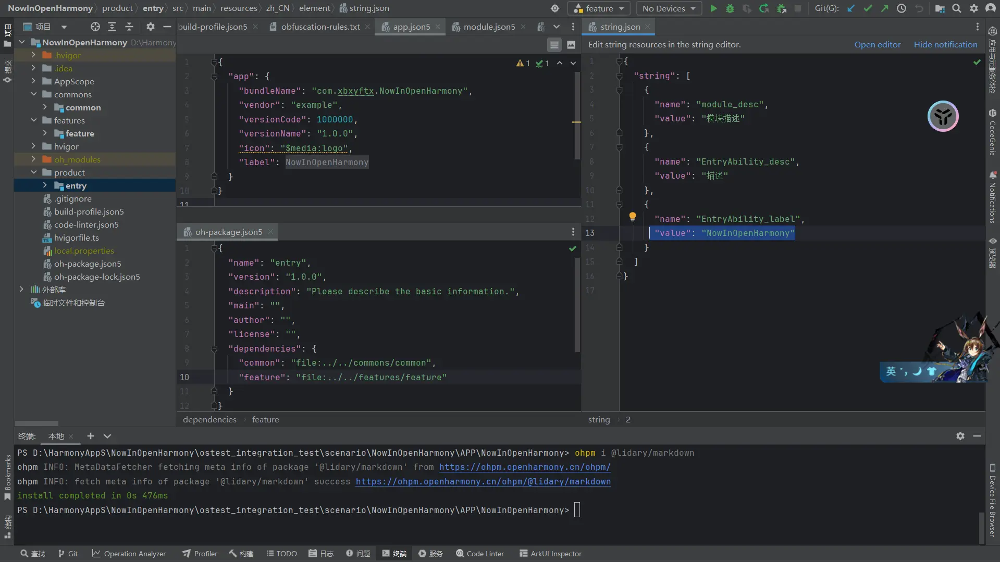

ok，至此准备工作准备就绪。奥对，我们还需在再下载一个骨架屏的三方库，虽然之前在面试通项目时我们也自制过骨架屏，但还是太简陋了，有现成好用的三方库就直接用吧，何乐而不为呢。

```bash
ohpm i @hw-agconnect/ui-skeleton
```

### 整体应用构想

首先整体应用的核心界面就三个，一个是文章列表，一个是文章详情页，还有一个设置页面。

三个页面的基本结构其实市面上有很多参考，也并不难设计。

首先文章列表页面就是上面一个轮播图播放最热门的几个资讯，这个我考虑是从OpenHarmony官网爬取带封面图的文章来当轮播提的内容，随后下面做的是在手机上成一列在折叠屏上成两列，在平板上成三列的一多列表用GridRow和GridColumn来进行实现，配个Scroll组件来实现滑动效果。然后信息列表的话我在采用一个tab标签页来分栏展示我们资讯来源。想到这里我突然想到之前的面试通项目，上面的轮播图部分我们并没有将它囊括进滚动区域的范围，最后导致我们的应用页面只有下半部分能进行滚动，这很不合理也不美观，所以这次我们一定要将轮播图也囊括进滚动区域，这样我们的应用页面才能真正的实现全屏滚动。但我们也不能直接将整个页面全部囊括进一个Scroll组件，这样会导致我们的tab工具栏随着滚动一并向上滚动，最后滚动到屏幕外面，这并不合理，所以我决定将主页面的内容都放在List组件中，然后利用`ListItemGroup`组件来实现吸顶效果，，这样就可以做到吸顶了。

还有个问题就是在于跳转，从文章列表跳转到文章这不用说，直接点击对应文章就跳转到对应页面即可这没什么好说的，但问题在于设置页怎么做。因为我并没有打算做用户个人界面，那就意味着我没法单独开一个小按钮在个人信息页中去进行设置页的跳转。目前我的想法灵感是来自于我的博客，手机版页面的右下角会有个工具栏页表，显示回到顶部以及阅读模式开启等功能。我也准备将设置页的按钮入口直接设置在滚动列表的右下角，同时还可以设置一个深浅色模式的快捷开关，因为这应该是最常用的功能，所以我可以将它放在和设置列表并列的位置，这样一来我们就可以快捷的更改颜色模式了，不过这个按钮我们应该需要制作一个防抖器，不能因为过快的点击而频繁切换颜色模式可能会导致应用崩溃。

然后设置项目前我想到的只有一个字体大小设置，用滑动条去进行设置，深浅色模式也在这里单独列出，因为我们可以再单独设置一个按钮开关控制页面，用来调整回到顶部以及深浅色模式是否开启的按钮设置项。然后深浅色模式还可以在设置页面中进行更改，增加一个跟随系统选项。

### 启动页面构建

首先将`Navigation`组件的页面栈以及相关的常量枚举量都创建完成随后进行签名以及真机测试。

```bash
> hvigor ERROR: Failed :common:default@CompileArkTS... 
> hvigor ERROR:  ERROR: page 'D:/HarmonyAppS/NowInOpenHarmony/ostest_integration_test/scenario/NowInOpenHarmony/APP/NowInOpenHarmony/commons/common/src/main/ets/pages/Index.ets' does not exist. 
> hvigor ERROR: BUILD FAILED in 708 ms
```

一开始我还以为是因为我将entry模块的`Index.ets`文件改成了`Main.ets`导致的文件缺失，但是我明明在`EntryAbility.ets`中的`windowStage.loadContent`函数中修改了目标页面的路径但依旧报错，而且报的错是Index文件缺失，并不是修改后的Main文件缺失，所以我只好先将主页面的Main先改回去。但改回去之后还报错，我仔细的捋了一下缺失的文件路径这才发现是common包里面的Index页面缺失。我才想起来之前我好像给删了，先去补回来吧。

特性层没删就没报这个错，于是我直接去将`main_pages.json`文件中的Index页面字段删了，然后就得到了新的报错说数组长度小于1，那我就只好去创建Index页面。

创建时又发现报错显示已经存在Index页面？？？

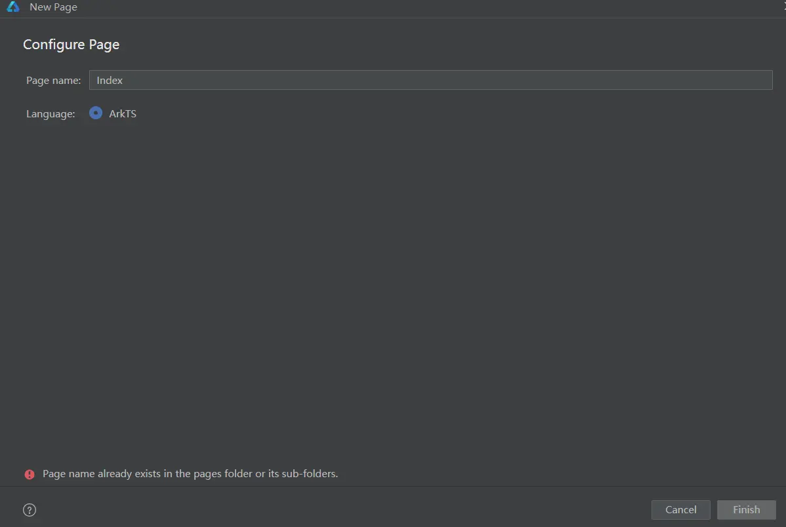

所以我尝试创建了Main页面发现不报错了，重新编译也没问题了。嘶，搞不太懂，后面再研究研究吧。

#### Navigation启动页问题

这个问题其实在鸿小易期间就存在，当时我在设置启动页时使用的就是`NavDestination`组件让其作为一个`Navigation`组件的一个跳转页面，但存在一个问题就是如果直接将其放在`Navigation`组件中，那么在跳转至主界面后触发系统的返回键会跳转回启动页，这很显然不合理。在鸿小易项目中我的解决方案是使用router来去进行替换跳转。但其实我现在仔细一想，好像不需要那么麻烦，我直接将主界面放在`Navigation`之中当做根页面就好了。

先做一个简单的轮播图组件放在首页来去进行一下首页和默认页面的区分。

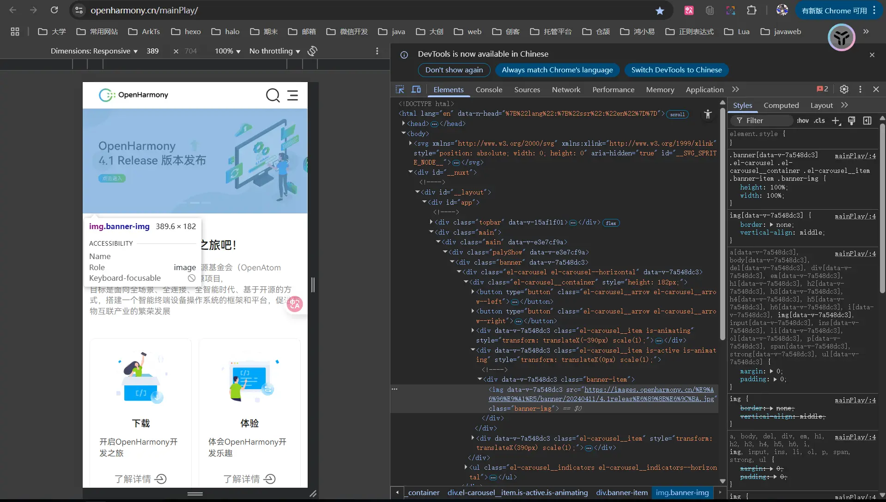

复制一个官网轮播图的链接过来进行一下显示测试。

```ts
import { NewsSwiperModule } from 'common'

/**
 * 首页上方轮播图组件
 */
@ComponentV2
export struct NewsSwiper {
  @Param swiperList: NewsSwiperModule [] = [
    new NewsSwiperModule('https://images.openharmony.cn/%E9%A6%96%E9%A1%B5/banner/20240411/4.1releas%E6%89%8B%E6%9C%BA.jpg',
      '开源生态大会'),
    new NewsSwiperModule('https://images.openharmony.cn/%E9%A6%96%E9%A1%B5/banner/20240411/4.1releas%E6%89%8B%E6%9C%BA.jpg',
      '开源生态大会'),
    new NewsSwiperModule('https://images.openharmony.cn/%E9%A6%96%E9%A1%B5/banner/20240411/4.1releas%E6%89%8B%E6%9C%BA.jpg',
      '开源生态大会')
  ]

  build() {
    Column() {
      Swiper(){
        ForEach(this.swiperList,(item:NewsSwiperModule)=>{
          Image(item.img)
            .width('100%')
        })
      }
      .curve(Curve.EaseInOut)
      .loop(true)
      .autoPlay(true)
      .interval(2000)
    }
    .width('100%')
    .height('100%')
  }
}
```

然后将主页面直接设为Navigation的子组件，这样应该就不会出现跳转至空白页面的问题了。

```ts
import { AppStorageV2 } from '@kit.ArkUI'
import { NavDests, NAV_PATH_STUCK } from 'common'
import { MainPage } from './nav_pages/mainPage'
import { StarPage } from './nav_pages/startPage'


@Entry
@ComponentV2
struct Main {
  @Local navPathStuck: NavPathStack = AppStorageV2.connect(NavPathStack, NAV_PATH_STUCK,()=>new NavPathStack())!
  @Builder
  NavDestMap(name: string) {
    if (name === NavDests.MAIN) {
      Main()
    }else if (name === NavDests.START_PAGE){
      StarPage()
    }
  }
  aboutToAppear(): void {
    this.navPathStuck.replacePath({name:NavDests.START_PAGE})
  }
  build() {
    Navigation(this.navPathStuck){
      MainPage()
    }
    .backgroundColor(Color.Transparent)
    .padding(10)
    .navDestination(this.NavDestMap)
    .hideTitleBar(true)
    .hideToolBar(true)
    .height('100%')
    .width('100%')
    .hideBackButton(true)
    .titleMode(NavigationTitleMode.Mini)
    .mode(NavigationMode.Stack)
  }
}
```

随后在启动页的`aboutToAppear`函数中设置设置一个延时器来模拟才能够服务器获取数据的流程。加载完成之后直接将启动页从页面栈删除就可以。

```ts
import { AppStorageV2 } from '@kit.ArkUI'
import { NavDests, NAV_PATH_STUCK } from 'common'
import { MainPage } from './nav_pages/mainPage'
import { StarPage } from './nav_pages/startPage'


@Entry
@ComponentV2
struct Main {
  @Local navPathStuck: NavPathStack = AppStorageV2.connect(NavPathStack, NAV_PATH_STUCK,()=>new NavPathStack())!
  @Builder
  NavDestMap(name: string) {
    if (name === NavDests.MAIN) {
      Main()
    }else if (name === NavDests.START_PAGE){
      StarPage()
    }
  }
  aboutToAppear(): void {
    this.navPathStuck.replacePath({name:NavDests.START_PAGE})
  }
  build() {
    Navigation(this.navPathStuck){
      MainPage()
    }
    .backgroundColor(Color.Transparent)
    .padding(10)
    .navDestination(this.NavDestMap)
    .hideTitleBar(true)
    .hideToolBar(true)
    .height('100%')
    .width('100%')
    .hideBackButton(true)
    .titleMode(NavigationTitleMode.Mini)
    .mode(NavigationMode.Stack)
  }
}
```

<video width="100%" controls>
  <source src="16.mp4" type="video/mp4">
  您的浏览器不支持视频标签。
</video>

嗯，测试结果还是很满意的。原来是我之前的思路错了。

### API基础功能模块构建

#### 网络请求工具封装

首先设置一下基地址的常量。

```ts
export const SERVE_BASE_ADDRESS = 'http://localhost:8001'
```

同时安装一下axios的三方库

```bash
ohpm install @ohos/axios
```

随后在common层的`api`文件夹下封装一个axios请求实例对象。

在我从原来的项目迁移封装好的请求工具类时我突然意识到一个问题就是说从UIContext中获取到的`promptAction`对象我好像得提出来作为一个全局变量否则我一直调用的都是那个被废弃的接口。

通过之前鸿小易的开发经验我可以得知，直接向AppStorageV2中存入上下文对象是不可行的，我需要将其包装为一个实例对象的属性来进行存储，所以我们设置一个包装类。

```ts
/**
 * 获取上下文对象包装类
 */
export class GetUIContext{
  private _context: UIContext

  public set context(value: UIContext) {
    this._context = value
  }

  public get context(): UIContext {
    return this._context
  }

  constructor(context: UIContext) {
    this._context = context
  }
}
```

随后在页面的`onWindowStageCreate`函数中去获取UI上下文对象并存储到全局变量中。

```ts
  onWindowStageCreate(windowStage: window.WindowStage): void {
    // Main window is created, set main page for this ability
    hilog.info(DOMAIN, 'testTag', '%{public}s', 'Ability onWindowStageCreate');

    windowStage.loadContent('pages/Index', (err) => {
      if (err.code) {
        hilog.error(DOMAIN, 'testTag', 'Failed to load the content. Cause: %{public}s', JSON.stringify(err));
        return;
      }
      hilog.info(DOMAIN, 'testTag', 'Succeeded in loading the content.');
      const uiPromptAction = windowStage.getMainWindowSync().getUIContext()
      AppStorageV2.connect(GetUIContext,GET_UICONTEXT,()=>new GetUIContext(uiPromptAction));
      if (AppStorageV2.connect(GetUIContext, GET_UICONTEXT)!==undefined) {
        logger.info('Get UIContext succeed')
      }

    });
  }
```

随后封装axios的基础配置以及拦截器的数据判断

```ts
import axios, { AxiosError, AxiosRequestConfig, AxiosResponse } from "@ohos/axios"
import { logger } from "../../utils"
import { AppStorageV2 } from "@kit.ArkUI"
import { GET_UICONTEXT, SERVE_BASE_ADDRESS } from "../../constants"
import { GetUIContext } from "../../modules/context/GetUIContext"

export const AXIOS_HTTP_LOG_TAG = 'AxiosHttp:  '

/**
 * axios请求实例
 * 配置基地址和请求超时时间
 */
export const axiosInstance = axios.create({
  baseURL: SERVE_BASE_ADDRESS,
  timeout: 10000
})
logger.debug('请求获取UIContext')
const uiPromptAction = AppStorageV2.connect(GetUIContext,GET_UICONTEXT)!.context.getPromptAction()
/**
 * 设置响应拦截器拦截器
 * interceptors:    拦截器
 * response:        响应
 * 由这个axiosInstance实例发送到请求的响应都会经过它再返回
 */
// 响应拦截器
axiosInstance.interceptors.response.use((res: AxiosResponse) => {
  if (res.status === 200) {
    logger.warn(AXIOS_HTTP_LOG_TAG + 'Req Success' + JSON.stringify(res.data))
    return res.data
  }
  logger.error(AXIOS_HTTP_LOG_TAG + 'ReqCode Error' + JSON.stringify(res.data))
  uiPromptAction.showToast({ message: 'ReqCode Error' + JSON.stringify(res.data) })
  return Promise.reject(res.data)
}, (err: AxiosError) => {
  logger.error(AXIOS_HTTP_LOG_TAG + 'Req Error' + JSON.stringify(err))
  uiPromptAction.showToast({ message: 'Req Error' + JSON.stringify(err) })
  return Promise.reject(err)
})

class AxiosHttp {
  /**
   * Axios包装过的请求函数
   * @param config 网络请求配置项
   * <res:响应数据类型
   * req:请求体参数类型 - get不需要传>
   */
  request<res, req = Object>(config: AxiosRequestConfig<req>) {
    logger.debug(AXIOS_HTTP_LOG_TAG + '进入AxiosHttp.request')
    return axiosInstance<null, res, req>(config)
  }
}

/**
 * 包装后的axios请求，添加了拦截器直接选取res.data中的字段
 */
export const axiosHttp = new AxiosHttp()
```

进行测试，果然和我预想的一样出了问题。

```bash
Reason:Error
Error name:Error
Error message:The default creator should be function when first connect
Stacktrace:
SourceMap is not initialized yet 
    at connect (/usr1/hmos_for_system/src/increment/sourcecode/foundation/arkui/ace_engine/frameworks/bridge/declarative_frontend/engine/stateMgmt.js:10862:1)
    at connect (../../../foundation/arkui/ace_engine/frameworks/bridge/declarative_frontend/engine/jsStateManagement.js:45:1)
    at func_main_0 (common|common|1.0.0|src/main/ets/api/http/AxiosHttp.ts:16:24)
```

动态资源共享包的编译过程很显然是在UI界面渲染之前发生的，也就代表我们获取UI上下文的代码执行发生在了我们使用弹窗之前。我们先将从全局变量中获取对象的代码注释掉试试，如果仅注释掉网络请求工具封装文件中的代码问题就消失，而且点击轮播图的弹窗依旧正常显示的话说明我的想法是正确的，问题就发生在了我们代码的执行顺序上。

```ts
logger.debug('请求获取UIContext')
// const uiPromptAction = AppStorageV2.connect(GetUIContext,GET_UICONTEXT)!.context.getPromptAction()
```

经测试bug消失，同时点击轮播图的弹窗依旧正常显示，说明我们的想法是正确的，问题就发生在了我们代码的执行顺序上。

```ts
/**
 * 设置响应拦截器拦截器
 * interceptors:    拦截器
 * response:        响应
 * 由这个axiosInstance实例发送到请求的响应都会经过它再返回
 */
// 响应拦截器
axiosInstance.interceptors.response.use((res: AxiosResponse) => {
  const uiPromptAction = AppStorageV2.connect(GetUIContext,GET_UICONTEXT)!.context.getPromptAction()
  if (res.status === 200) {
    logger.warn(AXIOS_HTTP_LOG_TAG + 'Req Success' + JSON.stringify(res.data))
    return res.data
  }
  logger.error(AXIOS_HTTP_LOG_TAG + 'ReqCode Error' + JSON.stringify(res.data))
  uiPromptAction.showToast({ message: 'ReqCode Error' + JSON.stringify(res.data) })
  return Promise.reject(res.data)
}, (err: AxiosError) => {
  const uiPromptAction = AppStorageV2.connect(GetUIContext,GET_UICONTEXT)!.context.getPromptAction()
  logger.error(AXIOS_HTTP_LOG_TAG + 'Req Error' + JSON.stringify(err))
  uiPromptAction.showToast({ message: 'Req Error' + JSON.stringify(err) })
  return Promise.reject(err)
})
```

我尝试将获取放入响应拦截器中看是否能解决这个问题。

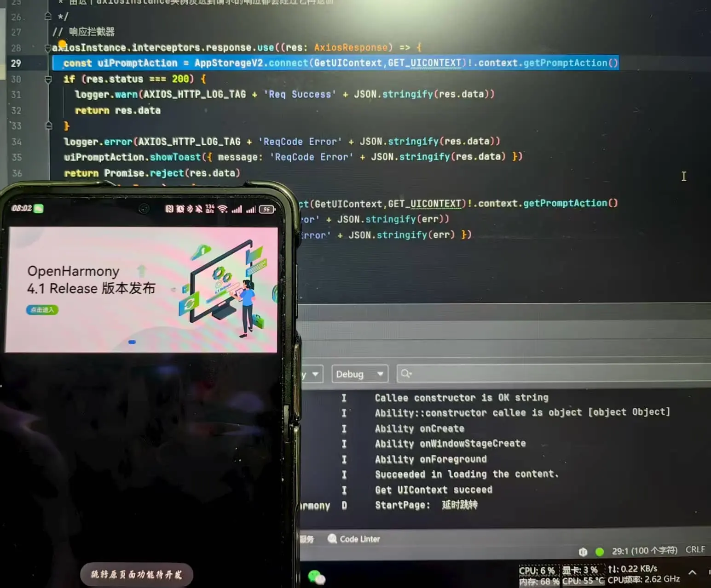

问题成功解决。


小结一下，我将从全局变量获取UIContext的代码移动进了axios的响应拦截器中，这样就不会在编译动态资源包时就直接执行这段代码，而是在UI界面构建之后由界面逻辑触发请求时才会调佣这段代码，避免了代码顺序问题。


#### API测试

我现在启动了后端服务，我们先来编写一段代码来测试一下我们的网络请求工具是否正常工作。

```ts
/**
 * 新闻源信息接口
 * 描述不同来源的新闻平台信息
 */
export interface NewsSource {
  /** 新闻源标识（如：openharmony、csdn） */
  source: string;
  /** 新闻源名称（如：OpenHarmony官网、CSDN） */
  name: string;
  /** 新闻源描述信息 */
  description: string;
  /** 新闻源基础URL */
  base_url: string;
}

/**
 * 缓存服务状态接口
 * 描述缓存服务的当前状态信息
 */
export interface CacheService {
  /** 缓存服务状态（如：preparing、ready、error） */
  status: string;
  /** 缓存数量 */
  cache_count: number;
  /** 最后更新时间（null表示未更新过） */
  last_update: number | null;
  /** 错误信息（无错误时可能为null或空字符串） */
  error_message: string;
}

/**
 * 服务集合接口
 * 包含系统中所有可用的服务信息
 */
export interface Services {
  /** 缓存服务信息 */
  cache: CacheService;
  /** 新闻源列表 */
  news_sources: NewsSource[];
}

/**
 * 接口端点集合接口
 * 描述系统提供的所有API接口端点
 */
export interface Endpoints {
  /** OpenHarmony新闻接口 */
  openharmony_news: string;
  /** CSDN新闻接口 */
  csdn_news: string;
  /** 所有新闻聚合接口 */
  all_news: string;
  /** 手动爬取接口 */
  manual_crawl: string;
  /** 服务状态查询接口 */
  service_status: string;
}

/**
 * 系统状态根接口
 * 包含整个系统的状态信息和可用接口
 */
export interface SystemStatus {
  /** 系统整体状态（如：preparing、ready） */
  status: string;
  /** 时间戳（状态生成的时间） */
  timestamp: number;
  /** 系统版本号 */
  version: string;
  /** 系统包含的服务集合 */
  services: Services;
  /** 系统提供的API接口端点集合 */
  endpoints: Endpoints;
}
```

先定义一系列的数据接口用于承接并解析数据。随后在利用封装好的网络请求工具测试一下我们的后端服务是否正常工作以及是否能直接请求，是否会存在一些跨域问题。

```ts
import { axiosHttp } from '../http/AxiosHttp'
import { SystemStatus } from '../../modules/server/ServerHelth'
import { logger } from '../../utils/logger/logger'

const ServerHealthAPI_TAG = 'ServerHealthAPI:'

class ServerHealthAPI {
  isServerReady(): boolean {
    try {
      const res = axiosHttp.request<SystemStatus>({
        url: '/api/health',
      })
      logger.info(ServerHealthAPI_TAG + JSON.stringify(res))
      return true
    } catch (err) {
      logger.error(ServerHealthAPI_TAG + JSON.stringify(err))
    }
    return false
  }
}

export const serverHealthApi = new ServerHealthAPI()

```

最后再将这个函数在主页面的生命周期中去进行调用。

```ts
  aboutToAppear(): void {
    serverHealthApi.isServerReady()
  }
```

启动调试并观察日志输出。

诶？奇怪的现象出现了。

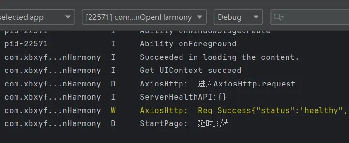

请求触发了但是API中并没有成功解析到数据，但是封装的请求工具中设置的拦截器是成功捕获了响应。

同时含有一个现象就是拦截器触发的时机是在API的日志打印之后，这个代码的执行顺序有问题。奥，原来是因为网络请求是异步操作，但我用的是同步变成，res是Promise对象，而不是请求后的响应数据。

改一下代码。

```ts
import { axiosHttp } from '../http/AxiosHttp'
import { SystemStatus } from '../../modules/server/ServerHelth'
import { logger } from '../../utils/logger/logger'

const ServerHealthAPI_TAG = 'ServerHealthAPI: '

class ServerHealthAPI {
  async isServerReady(): Promise<boolean> {
    try {
      const res = await axiosHttp.request<SystemStatus>({
        url: '/api/health',
      })
      logger.info(ServerHealthAPI_TAG + JSON.stringify(res))
      return true
    } catch (err) {
      logger.error(ServerHealthAPI_TAG + JSON.stringify(err))
    }
    return false
  }
}

export const serverHealthApi = new ServerHealthAPI()

```

```ts
  aboutToAppear(): void {
    serverHealthApi.isServerReady().then((res:boolean)=>{
      logger.debug(MainPage_TAG+res.valueOf())
    })
  }
```

再次测试

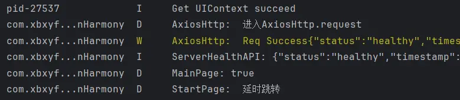

成功了成功了，吓死我了。还是不熟练，还得多练。

随后就开始依据其他的重要API开始逐一编写数据模型以及接口类型。

#### 新闻API

首先是数据模型的定义，核心的就是这四个，这四个足以支撑我们的页面构建需求。

```ts
/**
 * 内容类型枚举
 */
export enum ContentType {
  TEXT = "text",
  IMAGE = "image",
  VIDEO = "video",
  CODE = "code"
}

/**
 * 新闻内容块接口
 * 定义新闻文章中单个内容块的结构
 */
export interface NewsContentBlock {
  /** 内容类型 */
  type: ContentType;
  /** 内容值 */
  value: string;
}

/**
 * 新闻文章接口
 * 定义完整新闻文章的数据结构
 */
export interface NewsArticle {
  /** 文章唯一标识符（可选） */
  id?: string | null;
  /** 文章标题 */
  title: string;
  /** 发布日期 */
  date: string;
  /** 文章原链接 */
  url: string;
  /** 文章内容块数组 */
  content: NewsContentBlock[];
  /** 文章分类（可选） */
  category?: string | null;
  /** 文章摘要（可选） */
  summary?: string | null;
  /** 新闻来源（可选） */
  source?: string | null;
  /** 创建时间（可选，ISO 8601 格式） */
  created_at?: string | null;
  /** 更新时间（可选，ISO 8601 格式） */
  updated_at?: string | null;
}

/**
 * 新闻响应接口
 * 定义分页新闻数据的响应结构
 */
export interface NewsResponse {
  /** 新闻文章数组 */
  articles: NewsArticle[];
  /** 总文章数量 */
  total: number;
  /** 当前页码 */
  page: number;
  /** 每页文章数量 */
  page_size: number;
  /** 是否有下一页 */
  has_next: boolean;
  /** 是否有上一页 */
  has_prev: boolean;
}
```

ok，随后就可以开始对获取全部数据接口进行封装了。

```ts
import { NewsArticle, NewsResponse } from "../../modules/news/NewsListModules";
import { logger } from "../../utils/logger/logger";
import { axiosHttp } from "../http/AxiosHttp";
const NewsListAPI_TAG = 'NewsListAPI: '

export class NewsListAPI{
  /**
   * 获取全部新闻列表接口，在调用前请先调用isServerReady接口
   * @returns 若是出现异常则为空正常则为全部新闻列表NewsArticle[]
   */
  async getAllNews(): Promise<NewsArticle[] | null>{
    try {
      logger.debug(NewsListAPI_TAG+'进入getAllNews')
      const res = await axiosHttp.request<NewsResponse>({
        url:'/api/news/?all=true'
      })
      logger.info(NewsListAPI_TAG+'res = '+JSON.stringify(res))
      return res.articles
    }catch (err){
      logger.error(JSON.stringify(err))
      return null
    }
  }
}
export const newsListApi = new NewsListAPI()
```

随后我们用相同的方式进行一下真机测试。

```ts
  aboutToAppear(): void {
    let isServerReady:boolean = false
    setTimeout(()=>{
      logger.debug(START_PAGE_TAGE+'延时跳转')
      this.navPathStuck.clear()
    },2000)
    serverHealthApi.isServerReady().then((res:boolean)=> {
      logger.debug(START_PAGE_TAGE + res.valueOf())
      if (res) {
        isServerReady = true
        logger.info(START_PAGE_TAGE+'服务端准备就绪isServerReady='+isServerReady)
      }else {
        isServerReady = false
        logger.info(START_PAGE_TAGE+'服务端准备中isServerReady='+isServerReady)
      }
    })
    if (isServerReady){
      logger.debug(START_PAGE_TAGE+'尝试获取全部新闻列表')
      newsListApi.getAllNews().then((res:NewsArticle[] | null)=>{
        if (res === null) {
          logger.warn(START_PAGE_TAGE+'')
        }
      })
    }
  }
```

这一段异步编程我感觉可能会有执行顺序问题，我们先测试一下看看。


后端请求超时？？？后端日志也确实没显示有请求访问。

我立刻检查了电脑的科学上网工具，会不会是VPN导致的IP变动。但事实证明不是，我已经关闭了VPN。随后又检查了手机，也未发现异常。

我思考了一段时间，又一次检查了IP地址常量，并没有问题。`198.168....`诶？等会我这是私有IP地址段并不是公网IP地址，我手机连接的是流量，并不是家里的WiFi，应该是这个问题。

我切换了一下网络，测试，果然成功了。

```bash
08-01 17:47:58.207   32053-32053   A01234/com.xbx...ony/XBXLogger  pid-32053             D     AxiosHttp:  进入AxiosHttp.request
08-01 17:47:58.239   32053-32053   A01234/com.xbx...ony/XBXLogger  com.xbxyf...nHarmony  W     AxiosHttp:  Req Success{"status":"healthy","timestamp":1754041678.1939504,"version":"1.0.0","services":{"cache":{"status":"ready","cache_count":386,"last_update":"2025-08-01T14:40:11.540102","error_message":null},"news_sources":[{"source":"openharmony","name":"OpenHarmony官网","description":"OpenHarmony官方网站最新动态和新闻","base_url":"https://www.openharmony.cn"},{"source":"csdn","name":"CSDN","description":"CSDN平台上关于OpenHarmony的技术文章和资讯","base_url":"https://blog.csdn.net"}]},"endpoints":{"openharmony_news":"/api/news/openharmony","csdn_news":"/api/news/csdn","all_news":"/api/news/","manual_crawl":"/api/news/crawl","service_status":"/api/news/status/info"}}
08-01 17:47:58.239   32053-32053   A01234/com.xbx...ony/XBXLogger  com.xbxyf...nHarmony  I     ServerHealthAPI: {"status":"healthy","timestamp":1754041678.1939504,"version":"1.0.0","services":{"cache":{"status":"ready","cache_count":386,"last_update":"2025-08-01T14:40:11.540102","error_message":null},"news_sources":[{"source":"openharmony","name":"OpenHarmony官网","description":"OpenHarmony官方网站最新动态和新闻","base_url":"https://www.openharmony.cn"},{"source":"csdn","name":"CSDN","description":"CSDN平台上关于OpenHarmony的技术文章和资讯","base_url":"https://blog.csdn.net"}]},"endpoints":{"openharmony_news":"/api/news/openharmony","csdn_news":"/api/news/csdn","all_news":"/api/news/","manual_crawl":"/api/news/crawl","service_status":"/api/news/status/info"}}
08-01 17:47:58.239   32053-32053   A01234/com.xbx...ony/XBXLogger  com.xbxyf...nHarmony  D     StartPage:  true
08-01 17:47:58.239   32053-32053   A01234/com.xbx...ony/XBXLogger  com.xbxyf...nHarmony  I     StartPage:  服务端准备就绪isServerReady=true
08-01 17:48:00.207   32053-32053   A01234/com.xbx...ony/XBXLogger  com.xbxyf...nHarmony  D     StartPage:  延时跳转
```

虽然请求成功了，但我们可以看到的确是存在顺序问题，我们的`isServerReady()`调用之后被放置到了任务队列中直接向下执行了导致判定标志变量没有正确的赋值。

有两种改法，一种是直接将`getAllNews()`的调用塞到`isServerReady()`的`then`回调函数中，另一种是使用`async`和`await`来等待`isServerReady()`的返回值。

很显然我们要选择后者，否则就是回调地狱的苗头了。

```ts
  uiPromptAction:PromptAction = AppStorageV2.connect(GetUIContext, GET_UICONTEXT)!.context.getPromptAction()
  async aboutToAppear(): Promise<void> {
    let isServerReady:boolean = false
    setTimeout(()=>{
      logger.debug(START_PAGE_TAGE+'延时跳转')
      this.navPathStuck.clear()
    },2000)
    await serverHealthApi.isServerReady().then((res:boolean)=> {
      logger.debug(START_PAGE_TAGE + res.valueOf())
      if (res) {
        isServerReady = true
        logger.info(START_PAGE_TAGE+'服务端准备就绪isServerReady='+isServerReady)
      }else {
        isServerReady = false
        logger.info(START_PAGE_TAGE+'服务端准备中isServerReady='+isServerReady)
      }
    })
    if (isServerReady){
      logger.debug(START_PAGE_TAGE+'尝试获取全部新闻列表')
      newsListApi.getAllNews().then((res:NewsArticle[] | null)=>{
        if (res === null) {
          logger.warn(START_PAGE_TAGE+'')
        }else {
          this.uiPromptAction.showToast({message:'获取新闻列表成功',duration:2000})
        }
      })
    }
  }
```

ok，我们只需要等待服务状态检测的API顺利返回值就行，只要服务状态正常，我们就没必要再去继续堵塞线程了，让页面正常跳转就好，哪怕在开屏的两秒里没有顺利获取全部信息，毕竟实际场景可能会有信号波动，我们可以设置一个**是否加载完成的全局状态变量标志符**，来控制骨架屏的显隐。

```bash
08-01 18:01:10.463   39335-39335   A01234/com.xbx...ony/XBXLogger  pid-39335             D     AxiosHttp:  进入AxiosHttp.request
08-01 18:01:10.522   39335-39335   A01234/com.xbx...ony/XBXLogger  com.xbxyf...nHarmony  W     AxiosHttp:  Req Success{"status":"healthy","timestamp":1754042470.472609,"version":"1.0.0","services":{"cache":{"status":"ready","cache_count":386,"last_update":"2025-08-01T14:40:11.540102","error_message":null},"news_sources":[{"source":"openharmony","name":"OpenHarmony官网","description":"OpenHarmony官方网站最新动态和新闻","base_url":"https://www.openharmony.cn"},{"source":"csdn","name":"CSDN","description":"CSDN平台上关于OpenHarmony的技术文章和资讯","base_url":"https://blog.csdn.net"}]},"endpoints":{"openharmony_news":"/api/news/openharmony","csdn_news":"/api/news/csdn","all_news":"/api/news/","manual_crawl":"/api/news/crawl","service_status":"/api/news/status/info"}}
08-01 18:01:10.522   39335-39335   A01234/com.xbx...ony/XBXLogger  com.xbxyf...nHarmony  I     ServerHealthAPI: {"status":"healthy","timestamp":1754042470.472609,"version":"1.0.0","services":{"cache":{"status":"ready","cache_count":386,"last_update":"2025-08-01T14:40:11.540102","error_message":null},"news_sources":[{"source":"openharmony","name":"OpenHarmony官网","description":"OpenHarmony官方网站最新动态和新闻","base_url":"https://www.openharmony.cn"},{"source":"csdn","name":"CSDN","description":"CSDN平台上关于OpenHarmony的技术文章和资讯","base_url":"https://blog.csdn.net"}]},"endpoints":{"openharmony_news":"/api/news/openharmony","csdn_news":"/api/news/csdn","all_news":"/api/news/","manual_crawl":"/api/news/crawl","service_status":"/api/news/status/info"}}
08-01 18:01:10.522   39335-39335   A01234/com.xbx...ony/XBXLogger  com.xbxyf...nHarmony  D     StartPage:  true
08-01 18:01:10.522   39335-39335   A01234/com.xbx...ony/XBXLogger  com.xbxyf...nHarmony  I     StartPage:  服务端准备就绪isServerReady=true
08-01 18:01:10.522   39335-39335   A01234/com.xbx...ony/XBXLogger  com.xbxyf...nHarmony  D     StartPage:  尝试获取全部新闻列表
08-01 18:01:10.522   39335-39335   A01234/com.xbx...ony/XBXLogger  com.xbxyf...nHarmony  D     NewsListAPI: 进入getAllNews
08-01 18:01:10.522   39335-39335   A01234/com.xbx...ony/XBXLogger  com.xbxyf...nHarmony  D     AxiosHttp:  进入AxiosHttp.request
08-01 18:01:10.919   39335-39335   A01234/com.xbx...ony/XBXLogger  com.xbxyf...nHarmony  W     AxiosHttp:  Req Success{"articles":[{"id":"00d1196eb553e2e0","title":"对话OpenHarmony开源先锋：如何用代码革新终端生态","date":"2025.02.28","url":"https://mp.weixin.qq.com/s/cHsMzPTmoYec-_VL6VllBQ","content":[{"type":"image","value":"https://mmbiz.qpic.cn/mmbiz_gif/15QnXdLP7ibT0RCulIUzFZ2cGSMTZ3VHFWEttSQKAePB61zNuqdYPP41JIA6b7hph5Z02wKZ61Ch5rjl5FxLzWw/640?wx_fmt=gif&from=appmsg"},{"type":"text","value":"2025年2月23日，由开放原子开源基金会主办的第二届OpenHarmony创新应用挑战赛决赛路演在北京圆满结束，作为第二届开放原子大赛的重要赛项之一，本届赛事汇聚全球418支团队，产出超过110个创新作品，集中展示了OpenHarmony在应用与游戏开发领域的前沿成果。这些凝聚智慧与协作的参赛作品，不仅在技术层面实现了多项突破，更在商业化应用层面验证了开源生态的无限潜力。赛事不仅彰显了开发者群体的创新活力，也凸显了OpenHarmony作为技术底座的重要价值，为开源技术生态发展注入革新的力量。"},{"type":"image","value":"https://mmbiz.qpic.cn/mmbiz_jpg/15QnXdLP7ibRnShrEU2uTRKJQbyziasm8ib3wXuDS7TicltuOnUzHt396f649ICg1WZr7mRSEMRDVX8iawxjdPZVItA/640?wx_fmt=jpeg&from=appmsg"},{"type":"text","value":"当代码与创意在OpenHarmony的数字沃土中生根发芽，我们不禁期待，这些开发者如何用实践诠释开源精神？他们的探索历程又蕴藏着怎样的创新思维？让我们跟随优秀团队，解开技术突破与生态协同的共生密码。"},{"type":"text","value":"OpenHarmony创新应用赛题：让书柜学会“思考”"},{"type":"text","value":"由“新大陆自动识别”团队开发的《智能书导》项目，是基于开源操作系统 OpenHarmony打造的图书馆管理应用，通过融合RFID 技术，实现图书馆管理流程的高效优化。团队开发该方案的初衷是帮助图书馆高效地完成图书借阅、查询等工作，减轻管理员负担，同时希望将技术推广至物流、商超、工厂等更多场景，拓展应用范围。"},{"type":"text","value":"《智能书导》项目通过技术融合创新，深度整合OpenHarmony系统的分布式能力与RFID自动识别技术，利用前者实现图书信息的高效共享，借助后者完成图书的自动识别与数据交互。功能上，该项目集成了快速借还书、精准定位等核心功能，以及今日推荐等辅助功能，全面满足图书馆管理与读者服务需求。应用程序适配OpenHarmony 4.1 Release和5.0.2.50系统，可在多种设备上流畅运行，项目所用硬件也已通过兼容性测评，确保软硬件的无缝集成与高效协同。"},{"type":"image","value":"https://mmbiz.qpic.cn/mmbiz_jpg/15QnXdLP7ibRnShrEU2uTRKJQbyziasm8ibOP4I1IZBc61z68ukktnxx6yDW3bALR5RnB3b4BFicTKY4ebec6tlQWw/640?wx_fmt=jpeg&from=appmsg"},{"type":"text","value":"《智能书导》的开发者徐金生表示：“未来团队将把项目核心代码贡献至OpenHarmony主干代码库，推动各模块与性能的提升。同时，计划进一步优化技术瓶颈，拓展项目对更多设备的适配能力。”"},{"type":"text","value":"OpenHarmony创新应用赛题：用技术魔法规划繁琐旅行"},{"type":"text","value":"由“领先风暴队”开发的《出行妈妈》项目，主要是为了解决旅行者在行程规划繁琐、信息整合困难以及个性化需求难以满足三大方面的痛点，提供省时省力的完美行程定制解决方案。该项目填补了OpenHarmony在旅游规�
08-01 18:01:10.936   39335-39335   A01234/com.xbx...ony/XBXLogger  com.xbxyf...nHarmony  I     NewsListAPI: res = {"articles":[{"id":"00d1196eb553e2e0","title":"对话OpenHarmony开源先锋：如何用代码革新终端生态","date":"2025.02.28","url":"https://mp.weixin.qq.com/s/cHsMzPTmoYec-_VL6VllBQ","content":[{"type":"image","value":"https://mmbiz.qpic.cn/mmbiz_gif/15QnXdLP7ibT0RCulIUzFZ2cGSMTZ3VHFWEttSQKAePB61zNuqdYPP41JIA6b7hph5Z02wKZ61Ch5rjl5FxLzWw/640?wx_fmt=gif&from=appmsg"},{"type":"text","value":"2025年2月23日，由开放原子开源基金会主办的第二届OpenHarmony创新应用挑战赛决赛路演在北京圆满结束，作为第二届开放原子大赛的重要赛项之一，本届赛事汇聚全球418支团队，产出超过110个创新作品，集中展示了OpenHarmony在应用与游戏开发领域的前沿成果。这些凝聚智慧与协作的参赛作品，不仅在技术层面实现了多项突破，更在商业化应用层面验证了开源生态的无限潜力。赛事不仅彰显了开发者群体的创新活力，也凸显了OpenHarmony作为技术底座的重要价值，为开源技术生态发展注入革新的力量。"},{"type":"image","value":"https://mmbiz.qpic.cn/mmbiz_jpg/15QnXdLP7ibRnShrEU2uTRKJQbyziasm8ib3wXuDS7TicltuOnUzHt396f649ICg1WZr7mRSEMRDVX8iawxjdPZVItA/640?wx_fmt=jpeg&from=appmsg"},{"type":"text","value":"当代码与创意在OpenHarmony的数字沃土中生根发芽，我们不禁期待，这些开发者如何用实践诠释开源精神？他们的探索历程又蕴藏着怎样的创新思维？让我们跟随优秀团队，解开技术突破与生态协同的共生密码。"},{"type":"text","value":"OpenHarmony创新应用赛题：让书柜学会“思考”"},{"type":"text","value":"由“新大陆自动识别”团队开发的《智能书导》项目，是基于开源操作系统 OpenHarmony打造的图书馆管理应用，通过融合RFID 技术，实现图书馆管理流程的高效优化。团队开发该方案的初衷是帮助图书馆高效地完成图书借阅、查询等工作，减轻管理员负担，同时希望将技术推广至物流、商超、工厂等更多场景，拓展应用范围。"},{"type":"text","value":"《智能书导》项目通过技术融合创新，深度整合OpenHarmony系统的分布式能力与RFID自动识别技术，利用前者实现图书信息的高效共享，借助后者完成图书的自动识别与数据交互。功能上，该项目集成了快速借还书、精准定位等核心功能，以及今日推荐等辅助功能，全面满足图书馆管理与读者服务需求。应用程序适配OpenHarmony 4.1 Release和5.0.2.50系统，可在多种设备上流畅运行，项目所用硬件也已通过兼容性测评，确保软硬件的无缝集成与高效协同。"},{"type":"image","value":"https://mmbiz.qpic.cn/mmbiz_jpg/15QnXdLP7ibRnShrEU2uTRKJQbyziasm8ibOP4I1IZBc61z68ukktnxx6yDW3bALR5RnB3b4BFicTKY4ebec6tlQWw/640?wx_fmt=jpeg&from=appmsg"},{"type":"text","value":"《智能书导》的开发者徐金生表示：“未来团队将把项目核心代码贡献至OpenHarmony主干代码库，推动各模块与性能的提升。同时，计划进一步优化技术瓶颈，拓展项目对更多设备的适配能力。”"},{"type":"text","value":"OpenHarmony创新应用赛题：用技术魔法规划繁琐旅行"},{"type":"text","value":"由“领先风暴队”开发的《出行妈妈》项目，主要是为了解决旅行者在行程规划繁琐、信息整合困难以及个性化需求难以满足三大方面的痛点，提供省时省力的完美行程定制解决方案。该项目填补了OpenHarmony在旅游规划�
08-01 18:01:12.464   39335-39335   A01234/com.xbx...ony/XBXLogger  com.xbxyf...nHarmony  D     StartPage:  延时跳转
```

ok，十分顺利，这次代码的执行顺序就与我们的预期完全一致了。不过我还想到了一种解决加载速度的方式，就是将跳转操作绑定到我们加载完成的`then`回调函数中，不过这样就会导致每次进入应用的开屏时间都不一致，同时也会出现一旦加载失败应用就会卡死在开屏页面的状态。enm，还是算了吧，仔细想想市面上的APP中也没有说像我这样设计的。

### 数据库接口

对于数据库的选取我想的是直接使用键值型数据库即可，因为我的新闻列表整体是属于一个JSON字符串，并不需要进行后续的查询等操作。这也是我第一次使用数据库来进行开发，我先去仿照着官网的代码去进行接口的开发试试。

但很快我就迎来了第一个问题。又是上下文对象的类型问题。

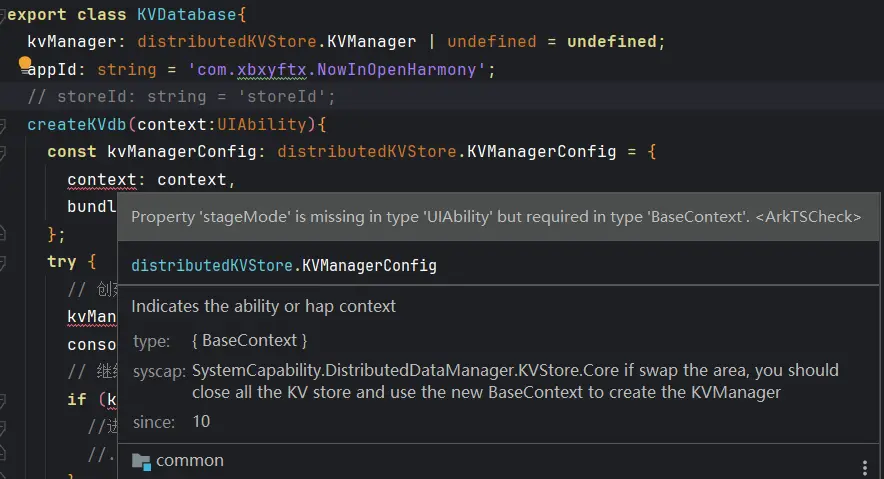

这个东西和他搏斗太久了，鸿小易时期就在和这个东西纠缠。我本来想直接使用上面已经存入全局变量中的UIContext就行了结果仔细读了一下文档发现两者并不是同一类型。

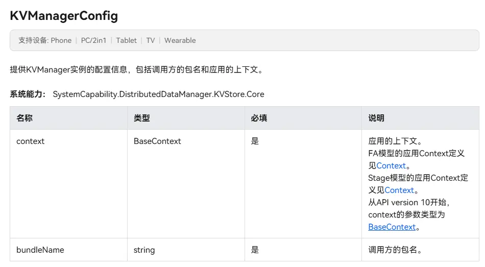

这个[BaseContext](https://developer.huawei.com/consumer/cn/doc/harmonyos-references/js-apis-inner-application-basecontext)是一个用来判断当前应用模型的上下文对象。

我只好再去看一看子安学长的代码了。

于是我发现了这一行。

```ts
  init(context: common.BaseContext): void {...}
```

于是就有了如下的尝试。

```ts
import { distributedKVStore } from "@kit.ArkData";
import { BusinessError } from "@kit.BasicServicesKit";
import { logger } from "../utils/logger/logger";
import { common } from '@kit.AbilityKit';

const KVDatabase_LOG_TAG = 'KVDatabase: '

/**
 * 键值型数据库管理接口
 */
export class KVDatabase {
  /**
   * 数据库管理对象，应用启动后需要先行创建并进行数据库的创建。
   */
  kvManager: distributedKVStore.KVManager | undefined = undefined;
  appId: string = 'com.xbxyftx.NowInOpenHarmony';

  /**
   * 创建数据库管理对象KVManager
   * @param context 当前应用上下文
   * @returns 是否成功创建
   */
  createKVManager(context: common.BaseContext): boolean {
    const kvManagerConfig: distributedKVStore.KVManagerConfig = {
      context: context,
      bundleName: this.appId
    };
    try {
      // 创建KVManager实例
      this.kvManager = distributedKVStore.createKVManager(kvManagerConfig);
      console.info(KVDatabase_LOG_TAG + 'Succeeded in creating KVManager.');
      // 继续创建获取数据库
      if (this.kvManager !== undefined) {
        logger.info(KVDatabase_LOG_TAG+'数据库管理对象创建成功。')
        return true
      }
      logger.error(KVDatabase_LOG_TAG + '数据库管理对象创建失败')
      return false
    } catch (e) {
      let error = e as BusinessError;
      logger.error(KVDatabase_LOG_TAG + `Failed to create KVManager. Code:${error.code},message:${error.message}`);
      return false
    }
  }
}

export const kvDatabase: KVDatabase = new KVDatabase()
```

先真机测试一下这个创建过程，以及反复启动应用是否会出现问题。

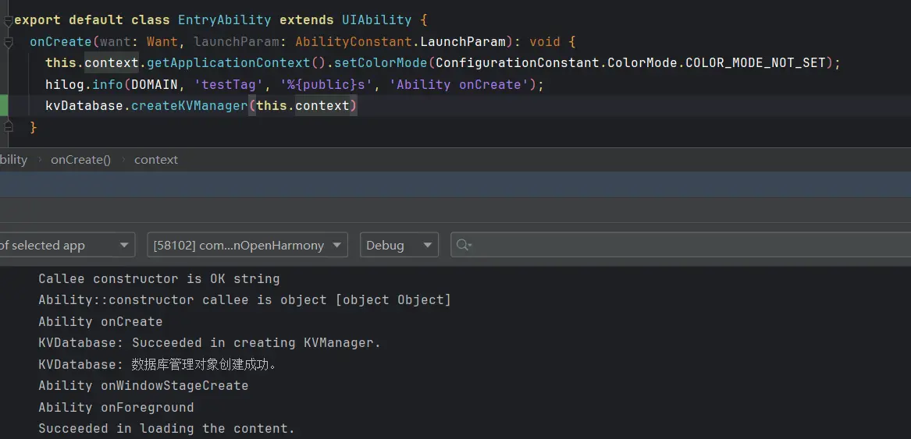

创建成功。不过这也是有个新问题。

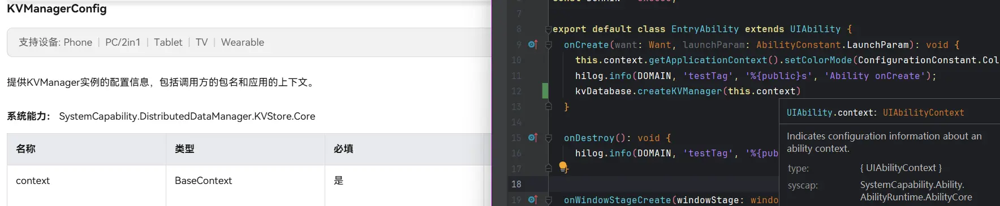

我们可以看到我们所需要的参数类型是`BaseContext`但是我们所传入的却是`UIAbilityContext`类型。我又将函数定义的类型进行了一下修改进行尝试。

```ts
//修改前
createKVManager(context: common.BaseContext)
//修改后
createKVManager(context: common.UIAbilityContext)
```

经测试运行依旧正常，数据库管理对象依旧是正常的去创建了，对此我第一个想到的就是多态，这几个类型之间是存在集成的子父代关系的，与此同时`BaseContext`、`Context`、`UIAbilityContext`这几个命名也是基于`context`这个单次去进行修饰词的添加的。让我们来读一下源码证实我的想法。

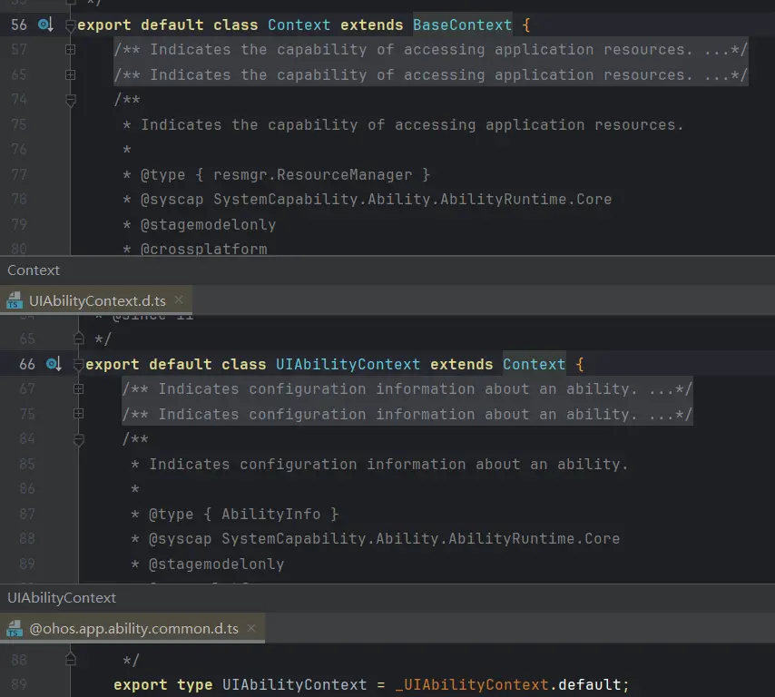

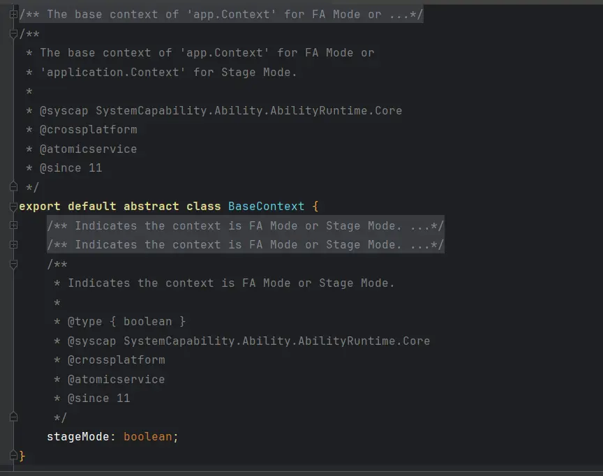

ok，源码完美的验证了我的想法`BaseContext`的的确确是另外两个的上下文对象的父类，而且其仅仅包含了应用模型类型这一个信息。我们传递的参数是`BaseContext`类型说明其仅需要应用框架类型这一个信息，而`UIAbilityContext`是`BaseContext`的子类，同样包含了这个信息，所以我们可以直接将`UIAbilityContext`类型的参数传递给`createKVManager`函数，这就实现了多态。


关于这一块我后面又去寻找了一下相关的文档说明，也是找到了专门解释这一块的文档。[传送门](https://developer.huawei.com/consumer/cn/doc/harmonyos-references/js-apis-inner-application-context#%E4%B8%8D%E5%90%8C%E7%B1%BB%E5%9E%8Bcontext%E7%9A%84%E7%BB%A7%E6%89%BF%E5%92%8C%E6%8C%81%E6%9C%89%E5%85%B3%E7%B3%BB)




### 用户首选项接口

我们需要将用户的配置和新闻数据进行分开的存储，由于用户的配置设置属于是很小的数据量，所以我们就依照官方的推荐去进行存储。

```ts
import { common } from '@kit.AbilityKit';
import { preferences } from '@kit.ArkData';
import { logger } from '../../utils';
const PreferenceDB_LOG_TAG = 'PreferenceDB: '
/**
 * 用户首选项数据持久化接口
 */
class PreferenceDB {
  private dataPreference: preferences.Preferences | null = null;

  init(context: common.BaseContext): void {
    const option: preferences.Options = { name: 'jyt' };
    this.dataPreference = preferences.getPreferencesSync(context, option);
    this.dataPreference.on("change", (key: string) => {
      logger.warn(`${PreferenceDB_LOG_TAG}The key ${key} changed`);
    });
  }

  release(): void {
    if (this.dataPreference) {
      this.dataPreference.off("change", (key: string) => {
        logger.warn(`${PreferenceDB_LOG_TAG}UnSubscribe the key ${key}`);
      });
    }
  }

  hasData(key: string): boolean {
    if (this.dataPreference) {
      const dataExist: boolean = this.dataPreference.hasSync(key);
      logger.info(`${PreferenceDB_LOG_TAG}Has ${key} data: ${dataExist}`);
      return dataExist;
    }
    return false;
  }

  pushData(key: string, value: Object): void {
    if (this.dataPreference) {
      this.dataPreference.putSync(key, value);
      this.dataPreference.flush();
    }
  }

  deleteData(key: string): void {
    if (this.dataPreference) {
      this.dataPreference.deleteSync(key);
      logger.warn(`${PreferenceDB_LOG_TAG}Delete data ${key}`);
    }
  }

  getData(key: string): object | null {
    if (this.dataPreference) {
      const obj: preferences.ValueType = this.dataPreference.getSync(key, 'default');
      logger.info(`${PreferenceDB_LOG_TAG}Get data ${key} ${JSON.stringify(obj)}`);
      return obj as object;
    }
    return null;
  }
}

export const preferenceDB: PreferenceDB = new PreferenceDB();
```

直接将数据的增删改查封装成一个类，同时对基础的系统接口进行包装，直接将数据的持久化过程利用防御性编程进行封装，以符合业务需求。

随后的话，在应用运行期间的状态始终是要用全局变量的一个包装包装着，但是在进行数据持久化的过程中时我们还是需要去分字段的去进行存储的，这样才方便与管理。为此我的方案是设置一个枚举类型来管理持久化键值字段，与此同时设置一个数据模型并进行数据变化的追踪，用于设置全局变量，并在跟页面设置监听器，一旦出现变化就及时去进行数据的持久化。同时为了方式应用被直接杀死进程的退出，所以我们还需要在生命周期的`onDestroy`方法中去进行数据的持久化。

```ts
export enum Preference {
  COLOR_MODE = 'ColorMode',
  FONT_SIZE = 'FontSize'
}

/**
 * 用户设置项
 */
@ObservedV2
export class UserConfigViewModel {
  /**
   * 深浅色模式
   * 0 浅色模式
   * 1 深色模式
   * 2 跟随系统
   */
  colorModel: 0 | 1 | 2 = 2
  /**
   * 文章字体大小
   * 合理取值区间12-24
   */
  fontSize: number = 16
}
```

用这套模式在开发时我也是又遇到了新的类型问题，也就是显示数据模型和我所提供的首选项数据接口的类型不一致问题。

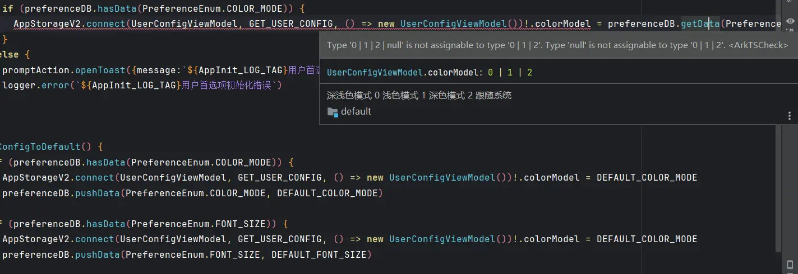

于是我考虑的是直接将接口的返回值类型给修改为泛型接口，并用trycatch包裹来去处理可能发生的异常。

```ts
  getData<T>(key: string): T | null {
    try {
      if (this.dataPreference) {
        const obj: preferences.ValueType = this.dataPreference.getSync(key, 'default');
        logger.info(`${PreferenceDB_LOG_TAG}Get data ${key} ${JSON.stringify(obj)}`);
        return obj as T;
      }
      return null;
    }catch (e){
      promptAction.openToast({message:`${PreferenceDB_LOG_TAG}获取数据异常，异常信息为${JSON.stringify(e)}`})
      logger.error(`${PreferenceDB_LOG_TAG}获取数据异常，异常信息为${JSON.stringify(e)}`)
    }
    return null
  }
```

### 应用初始化接口

```ts
import {
  DEFAULT_COLOR_MODE,
  DEFAULT_FONT_SIZE,
  GET_USER_CONFIG,
  logger,
  preferenceDB,
  PreferenceEnum,
  UserConfigViewModel
} from "common";
import { common } from "@kit.AbilityKit";
import { AppStorageV2, promptAction } from "@kit.ArkUI";

const AppInit_LOG_TAG = 'AppInit: '

/**
 * 应用初始化接口
 */
export class AppInit {
  /**
   * 用户配置项初始化
   */
  configInit(context: common.UIAbilityContext) {
    const isPreferenceDBInitSuccess: boolean = preferenceDB.init(context)
    if (isPreferenceDBInitSuccess) {
      logger.info(`${AppInit_LOG_TAG}用户首选项初始化成功`)
      if (preferenceDB.hasData(PreferenceEnum.COLOR_MODE)) {
        AppStorageV2.connect(UserConfigViewModel, GET_USER_CONFIG, () => new UserConfigViewModel())!.colorModel =
          preferenceDB.getData<0 | 1 | 2>(PreferenceEnum.COLOR_MODE)!
      }
      if (preferenceDB.hasData(PreferenceEnum.FONT_SIZE)) {
        AppStorageV2.connect(UserConfigViewModel, GET_USER_CONFIG, () => new UserConfigViewModel())!.fontSize =
          preferenceDB.getData<number>(PreferenceEnum.FONT_SIZE)!
      }
      if (!preferenceDB.hasData(PreferenceEnum.COLOR_MODE) || !preferenceDB.hasData(PreferenceEnum.FONT_SIZE)) {
        this.setConfigToDefault()
      }
      
    } else {
      promptAction.openToast({ message: `${AppInit_LOG_TAG}用户首选项初始化错误` })
      logger.error(`${AppInit_LOG_TAG}用户首选项初始化错误`)
    }
  }

  setConfigToDefault() {
    if (preferenceDB.hasData(PreferenceEnum.COLOR_MODE)) {
      AppStorageV2.connect(UserConfigViewModel, GET_USER_CONFIG, () => new UserConfigViewModel())!.colorModel =
        DEFAULT_COLOR_MODE
      preferenceDB.pushData(PreferenceEnum.COLOR_MODE, DEFAULT_COLOR_MODE)
    }
    if (preferenceDB.hasData(PreferenceEnum.FONT_SIZE)) {
      AppStorageV2.connect(UserConfigViewModel, GET_USER_CONFIG, () => new UserConfigViewModel())!.colorModel =
        DEFAULT_COLOR_MODE
      preferenceDB.pushData(PreferenceEnum.FONT_SIZE, DEFAULT_FONT_SIZE)
    }

  }
}

export const appInit = new AppInit()
```

在应用的启动阶段调用这个初始化接口去进行持久化数据的读取或是默认数据的设置。

但我认为这个代码其实应该将功能再次拆解，将持久化数据以及应用状态的交互拆分出来放在特性层中进行封装，因为我们还需要数据同步接口。

#### 数据管理器封装

```ts
import {
  DEFAULT_COLOR_MODE,
  DEFAULT_FONT_SIZE,
  GET_USER_CONFIG,
  logger,
  preferenceDB,
  PreferenceEnum,
  UserConfigViewModel
} from "common";
import { AppStorageV2, promptAction } from "@kit.ArkUI";

const UserConfigManager_LOG_TAG = 'UserConfigManager: '

/**
 * 用户配置项管理器，提供全局变量和持久化数据之间的交互接口。
 */
export class UserConfigManager {
  /**
   * 持久化当前应用配置数据
   * @returns 是否成功
   */
  syncDataToPreference(): boolean {
    const UserConfig = AppStorageV2.connect(UserConfigViewModel, GET_USER_CONFIG, () => new UserConfigViewModel())!
    const colorMode = UserConfig.colorModel
    preferenceDB.pushData(PreferenceEnum.COLOR_MODE, colorMode)
    const fontSize = UserConfig.fontSize
    preferenceDB.pushData(PreferenceEnum.FONT_SIZE, fontSize)
    if (preferenceDB.getData<0 | 1 | 2>(PreferenceEnum.COLOR_MODE) === colorMode &&
      preferenceDB.getData<number>(PreferenceEnum.FONT_SIZE) === fontSize) {
      logger.warn(`${UserConfigManager_LOG_TAG}数据持久化成功,colorMode=${preferenceDB.getData<0 | 1 | 2>(PreferenceEnum.COLOR_MODE)},fontSize=${preferenceDB.getData<number>(PreferenceEnum.FONT_SIZE)}`)
      return true
    }
    return false
  }

  /**
   * 获取应用配置持久化数据,若无持久化数据则设置默认数据
   * @returns 是否成功
   */
  syncDataToAppStorage(): boolean {
    const UserConfig = AppStorageV2.connect(UserConfigViewModel, GET_USER_CONFIG, () => new UserConfigViewModel())!
    if (preferenceDB.hasData(PreferenceEnum.COLOR_MODE)) {
      UserConfig.colorModel = preferenceDB.getData<0 | 1 | 2>(PreferenceEnum.COLOR_MODE)!
    }
    if (preferenceDB.hasData(PreferenceEnum.FONT_SIZE)) {
      UserConfig.fontSize = preferenceDB.getData<number>(PreferenceEnum.FONT_SIZE)!
    }
    if (!preferenceDB.hasData(PreferenceEnum.FONT_SIZE) || !preferenceDB.hasData(PreferenceEnum.COLOR_MODE)) {
      logger.warn(`${UserConfigManager_LOG_TAG}无用户配置持久化数据，执行默认配置设置`)
      promptAction.openToast({message:`${UserConfigManager_LOG_TAG}无用户配置持久化数据，执行默认配置设置`})
      this.setConfigToDefault()
    }
    const fontSize = UserConfig.fontSize
    const colorMode = UserConfig.colorModel
    if (preferenceDB.getData<0 | 1 | 2>(PreferenceEnum.COLOR_MODE) === colorMode &&
      preferenceDB.getData<number>(PreferenceEnum.FONT_SIZE) === fontSize) {
      logger.warn(`${UserConfigManager_LOG_TAG}用户首选项持久化数据读取成功,colorMode=${colorMode},fontSize=${fontSize}`)
      return true
    }
    logger.error(`${UserConfigManager_LOG_TAG}用户首选项持久化数据获取发生异常`)
    return false
  }

  /**
   * 将全局状态变量以及持久化数据更改为默认状态
   */
  setConfigToDefault() {
    if (preferenceDB.hasData(PreferenceEnum.COLOR_MODE)) {
      AppStorageV2.connect(UserConfigViewModel, GET_USER_CONFIG, () => new UserConfigViewModel())!.colorModel =
        DEFAULT_COLOR_MODE
      preferenceDB.pushData(PreferenceEnum.COLOR_MODE, DEFAULT_COLOR_MODE)
    }
    if (preferenceDB.hasData(PreferenceEnum.FONT_SIZE)) {
      AppStorageV2.connect(UserConfigViewModel, GET_USER_CONFIG, () => new UserConfigViewModel())!.colorModel =
        DEFAULT_COLOR_MODE
      preferenceDB.pushData(PreferenceEnum.FONT_SIZE, DEFAULT_FONT_SIZE)
    }
  }
}

export const userConfigManager = new UserConfigManager()
```

#### 配置初始化接口更新

在封装完了数据管理器之后我们就可以对应用初始化包中的应用配置初识化进行简化。

```ts
import {
  DEFAULT_COLOR_MODE,
  DEFAULT_FONT_SIZE,
  GET_USER_CONFIG,
  logger,
  preferenceDB,
  PreferenceEnum,
  UserConfigViewModel
} from "common";
import { common } from "@kit.AbilityKit";
import { AppStorageV2, promptAction } from "@kit.ArkUI";
import { userConfigManager } from "feature";

const AppInit_LOG_TAG = 'AppInit: '

/**
 * 应用初始化接口
 */
export class AppInit {
  /**
   * 用户配置项初始化
   */
  configInit(context: common.UIAbilityContext) {
    const isPreferenceDBInitSuccess: boolean = preferenceDB.init(context)
    if (isPreferenceDBInitSuccess) {
      logger.info(`${AppInit_LOG_TAG}首选项数据对象初始化成功`)
      if(userConfigManager.syncDataToAppStorage()){
        return true
      }
      return false
    } else {
      promptAction.openToast({ message: `${AppInit_LOG_TAG}首选项数据对象初始化错误` })
      logger.error(`${AppInit_LOG_TAG}首选项数据对象初始化错误`)
      return false
    }
  }

}

export const appInit = new AppInit()
```

随后在应用构建的生命周期函数中调用。

```ts
  onCreate(want: Want, launchParam: AbilityConstant.LaunchParam): void {
    this.context.getApplicationContext().setColorMode(ConfigurationConstant.ColorMode.COLOR_MODE_NOT_SET);
    hilog.info(DOMAIN, 'testTag', '%{public}s', 'Ability onCreate');
    kvDatabase.init(this.context)
    appInit.configInit(this.context)
  }
```

可以看到这里面的数据库初识化还是直接调用的，我们后面也要将他封装进`appInit`对象中。现在先用真机运行一下进行测试。如果能正常打印出用户首选项相关的日志信息就说明我们上面封装的首选项接口都没有问题。

#### 资源未初始化问题的解决

```bash
Module name:com.xbxyftx.NowInOpenHarmony
Version:1.0.0
VersionCode:1000000
PreInstalled:No
Foreground:Yes
Pid:14414
Uid:20020052
Reason:TypeError
Error name:TypeError
Error message:is not callable
Stacktrace:
SourceMap is not initialized yet 
    at syncDataToAppStorage (feature|feature|1.0.0|src/main/ets/api/UserConfig.ts:40:13)
    at configInit (default|default|1.0.0|src/main/ets/init/AppInit.ts:17:17)
    at onCreate (default|default|1.0.0|src/main/ets/entryability/EntryAbility.ts:15:9)
```

enm，报错了，包的是未初始化的错。我们再来看一下日志断在了什么位置。

```bash
Callee constructor is OK string
Ability::constructor callee is object [object Object]
Ability onCreate
KVDatabase: Succeeded in creating KVManager.
KVDatabase: 数据库管理对象创建成功。
AppInit: 首选项数据对象初始化成功
PreferenceDB: Has ColorMode data: false
PreferenceDB: Has FontSize data: false
PreferenceDB: Has FontSize data: false
UserConfigManager: 无用户配置持久化数据，执行默认配置设置
```

成功检测了第一次安装并没有持久化数据，然后开始去检查是否存在无配置的数据，发现字体没有就开始去设置默认值。我们的默认值设置函数并没有设置日志，让我们添加一些日志来进行进一步排查。

```ts
  /**
   * 将全局状态变量以及持久化数据更改为默认状态
   */
  setConfigToDefault() {
    logger.debug(`${UserConfigManager_LOG_TAG}开始尝试默认设置写入`)
    if (preferenceDB.hasData(PreferenceEnum.COLOR_MODE)) {
      logger.debug(`${UserConfigManager_LOG_TAG}preferenceDB.hasData(PreferenceEnum.COLOR_MODE)=${preferenceDB.hasData(PreferenceEnum.COLOR_MODE)}`)
      AppStorageV2.connect(UserConfigViewModel, GET_USER_CONFIG, () => new UserConfigViewModel())!.colorModel =
        DEFAULT_COLOR_MODE
      preferenceDB.pushData(PreferenceEnum.COLOR_MODE, DEFAULT_COLOR_MODE)
    }
    if (preferenceDB.hasData(PreferenceEnum.FONT_SIZE)) {
      logger.debug(`${UserConfigManager_LOG_TAG}preferenceDB.hasData(PreferenceEnum.FONT_SIZE)=${preferenceDB.hasData(PreferenceEnum.FONT_SIZE)}`)
      AppStorageV2.connect(UserConfigViewModel, GET_USER_CONFIG, () => new UserConfigViewModel())!.colorModel =
        DEFAULT_COLOR_MODE
      preferenceDB.pushData(PreferenceEnum.FONT_SIZE, DEFAULT_FONT_SIZE)
    }
  }
```

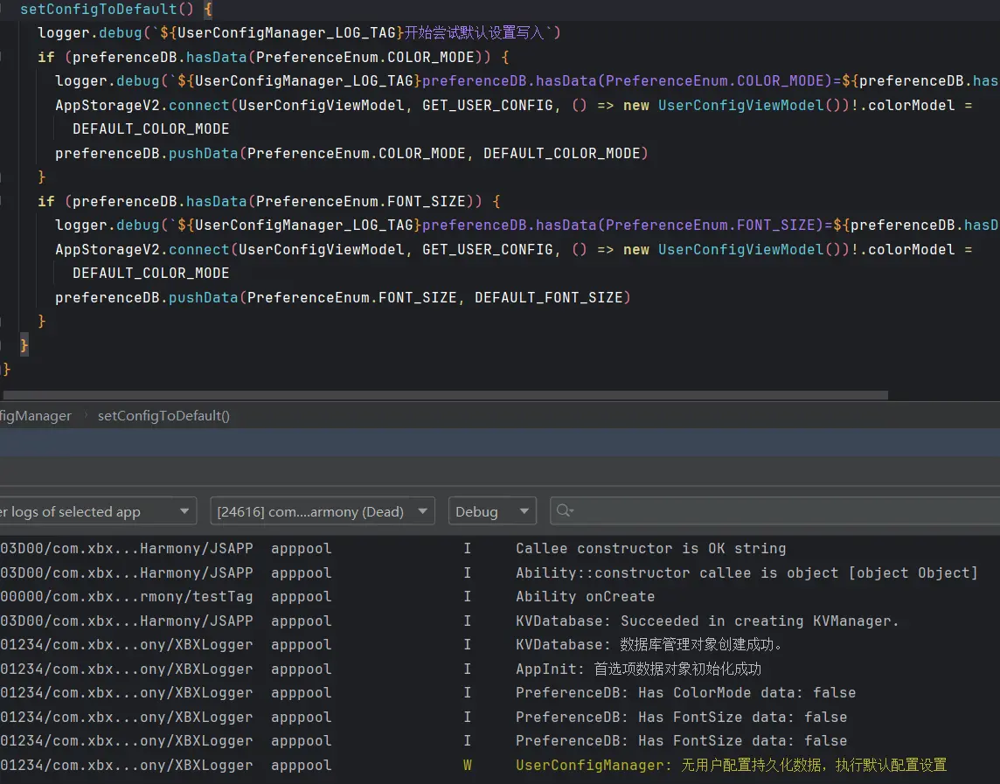

添加日志后发现了我最没想到的问题，整个函数压根就没有进入？？？这可怎么办呢，我们再仔细排查一下。

我尝试了将可疑的耗时点都加上了异步await，但是发现程序确实是会跳过问题点继续运行了，但是问题没有解决，依旧没有后续日志。这时我想起来之前写数据持久化文章时看到的同步和异步flush，所以我决定先去改用同步接口试试。

现象没变化，还是没走到这一步。

```ts
  pushData(key: string, value: Object): void {
    if (this.dataPreference) {
      logger.info(`${PreferenceDB_LOG_TAG}key=${key},value=${value}`)
      this.dataPreference.putSync(key, value);
      this.dataPreference.flushSync();
    }
  }
```

再加上一行日志试试。

还是没区别，依旧没走到那行。到这基本上我已经可以确定是我寻找的方向错了。从新审视一下这个问题。

从最后一行日志到函数调用之前仅有两行代码，既然前面已经证明了我的首选项接口没有问题，那我就只能怀疑是这个弹窗的问题了。仔细回想一下应用的构建流程，在`onCreate`生命周期中，我们并没有进行窗口的构建，仅仅是做一些数据上的准备，也就是说这段时间我们的UIContext是还没有被初始化的，虽然我已经从由Promptaction实例对象调用改为了直接调用openToast，但这个弹窗也是要和窗口的事例对象进行绑定的，我既然还没有初始化我的窗口界面，也就没有UI上下文对象，此时我去调用弹窗接口确实就是可能会发生未初始化的情况。

```ts
    if (!preferenceDB.hasData(PreferenceEnum.FONT_SIZE) || !preferenceDB.hasData(PreferenceEnum.COLOR_MODE)) {
      logger.warn(`${UserConfigManager_LOG_TAG}无用户配置持久化数据，执行默认配置设置`)
      // promptAction.openToast({ message: `${UserConfigManager_LOG_TAG}无用户配置持久化数据，执行默认配置设置` })
      this.setConfigToDefault()
    }
```

先将这一行暂时注释掉。再次运行。

我死死盯着手机，它终于是没有闪退了，赶紧查看一下日志。后续的日志都出来了，总算是正确了。

```bash
AppInit: 首选项数据对象初始化成功
PreferenceDB: Has ColorMode data: false
PreferenceDB: Has FontSize data: false
PreferenceDB: Has FontSize data: false
UserConfigManager: 无用户配置持久化数据，执行默认配置设置
UserConfigManager: 开始尝试默认设置写入
PreferenceDB: Has ColorMode data: false
PreferenceDB: Has FontSize data: false
PreferenceDB: Get data ColorMode "default"
UserConfigManager: 用户首选项持久化数据获取发生异常
```

随后的这一抹红色也是吓了我一跳，但我很快就反应过来了，原来是我的逻辑还有问题，当前我是先去判断其存在再去写入默认值，这就说明我没有考虑第一次的问题。

```ts
  /**
   * 将全局状态变量以及持久化数据更改为默认状态
   */
  async setConfigToDefault() {
    logger.debug(`${UserConfigManager_LOG_TAG}开始尝试默认设置写入`)

    logger.debug(`${UserConfigManager_LOG_TAG}preferenceDB.hasData(PreferenceEnum.COLOR_MODE)=${preferenceDB.hasData(PreferenceEnum.COLOR_MODE)}`)
    AppStorageV2.connect(UserConfigViewModel, GET_USER_CONFIG, () => new UserConfigViewModel())!.colorModel =
      DEFAULT_COLOR_MODE
    preferenceDB.pushData(PreferenceEnum.COLOR_MODE, DEFAULT_COLOR_MODE)

    logger.debug(`${UserConfigManager_LOG_TAG}preferenceDB.hasData(PreferenceEnum.FONT_SIZE)=${preferenceDB.hasData(PreferenceEnum.FONT_SIZE)}`)
    AppStorageV2.connect(UserConfigViewModel, GET_USER_CONFIG, () => new UserConfigViewModel())!.colorModel =
      DEFAULT_COLOR_MODE
    preferenceDB.pushData(PreferenceEnum.FONT_SIZE, DEFAULT_FONT_SIZE)

  }
```

从新运行尝试。

```bash
AppInit: 首选项数据对象初始化成功
PreferenceDB: Has ColorMode data: false
PreferenceDB: Has FontSize data: false
PreferenceDB: Has FontSize data: false
UserConfigManager: 无用户配置持久化数据，执行默认配置设置
UserConfigManager: 开始尝试默认设置写入
PreferenceDB: Has ColorMode data: false
UserConfigManager: preferenceDB.hasData(PreferenceEnum.COLOR_MODE)=false
PreferenceDB: key=ColorMode,value=2
PreferenceDB: Has FontSize data: false
UserConfigManager: preferenceDB.hasData(PreferenceEnum.FONT_SIZE)=false
PreferenceDB: key=FontSize,value=16
PreferenceDB: Get data ColorMode: 2
PreferenceDB: Get data FontSize: 16
UserConfigManager: 用户首选项持久化数据读取成功,colorMode=2,fontSize=16
Ability onWindowStageCreate
Ability onForeground
PreferenceDB: The key ColorMode changed
Succeeded in loading the content.
PreferenceDB: The key FontSize changed
```

nb，终于成功了。修改成功了。

```bash
AppInit: 首选项数据对象初始化成功
PreferenceDB: Has ColorMode data: true
PreferenceDB: Has ColorMode data: true
UserConfigManager: 检测到COLOR_MODE=true
PreferenceDB: Get data ColorMode: 2
PreferenceDB: Has FontSize data: true
PreferenceDB: Has FontSize data: true
UserConfigManager: 检测到FONT_SIZE=true
PreferenceDB: Get data FontSize: 16
PreferenceDB: Has FontSize data: true
PreferenceDB: Has ColorMode data: true
PreferenceDB: Get data ColorMode: 2
PreferenceDB: Get data FontSize: 16
UserConfigManager: 用户首选项持久化数据读取成功,colorMode=2,fontSize=16
```

ok！第二次启动也是成功读取到了上一次所持久化的数据！大成功啦！

### 深浅色切换工具

接下来我们趁热打铁，将用户配置数据和深浅色切换工具相结合，让深浅色切换真正的与应用状态绑定。

首先先去官网查看一下主动切换深浅色的[指南文档](https://developer.huawei.com/consumer/cn/doc/harmonyos-guides/ui-dark-light-color-adaptation#%E5%BA%94%E7%94%A8%E4%B8%BB%E5%8A%A8%E8%AE%BE%E7%BD%AE%E6%B7%B1%E6%B5%85%E8%89%B2%E6%A8%A1%E5%BC%8F)。

在看了指南文档后我就确认了，就是现在API18应用创建后基础代码中就包含了的那个方法。所以深浅色工具的封装逻辑就很简单了。

```ts
import { common, ConfigurationConstant } from "@kit.AbilityKit";
import { DEFAULT_COLOR_MODE, GET_USER_CONFIG, logger, UserConfigViewModel } from "common";
import { AppStorageV2 } from "@kit.ArkUI";
import { userConfigManager } from "./UserConfigManager";

const ColorModManager_LOG_TAG = 'ColorModManager: '

/**
 * 颜色模式管理器
 */
export class ColorModManager {
  /**
   * 应用上下文对象
   */
  applicationContext: common.ApplicationContext | null = null

  /**
   * 当前应用颜色模式，需在init过程中进行初始化数据获取，以免直接调用AppStorage造成未初始化问题。
   */
  appColorMode: 0 | 1 | 2 = DEFAULT_COLOR_MODE

  /**
   * 管理器初始化，并应用初始化后的颜色应用状态
   * @param applicationContext 应用上下文对象
   * @returns 是否初始化成功
   */
  init(applicationContext: common.ApplicationContext): boolean {
    this.applicationContext = applicationContext
    this.appColorMode =
      AppStorageV2.connect(UserConfigViewModel, GET_USER_CONFIG, () => new UserConfigViewModel())!.colorModel
    if (applicationContext) {
      logger.info(`${ColorModManager_LOG_TAG}applicationContext初始化成功`)
      this.initColoModSetting();
      return true
    }
    return false
  }

  /**
   * 初始化颜色设置，仅做内部调用，外部请使用其余设置接口
   */
  private initColoModSetting() {
    switch (this.appColorMode) {
      case 0:
        this.applicationContext!.setColorMode(ConfigurationConstant.ColorMode.COLOR_MODE_LIGHT);
      case 1:
        this.applicationContext!.setColorMode(ConfigurationConstant.ColorMode.COLOR_MODE_DARK);
      case 2:
        this.applicationContext!.setColorMode(ConfigurationConstant.ColorMode.COLOR_MODE_NOT_SET);
    }
  }

  setDarkMod():boolean {
    if (this.applicationContext) {
      this.applicationContext.setColorMode(ConfigurationConstant.ColorMode.COLOR_MODE_DARK)
      this.appColorMode = 1
      logger.info(`${ColorModManager_LOG_TAG}深色模式修改成功colorModel=${AppStorageV2.connect(UserConfigViewModel, GET_USER_CONFIG, () => new UserConfigViewModel())!.colorModel}`)
      userConfigManager.syncDataToPreference()
      return true
    }
    logger.error(`${ColorModManager_LOG_TAG}应用上下文对象缺失`)
    return false
  }

  setLightMod():boolean {
    if (this.applicationContext) {
      this.applicationContext.setColorMode(ConfigurationConstant.ColorMode.COLOR_MODE_LIGHT)
      this.appColorMode = 0
      logger.info(`${ColorModManager_LOG_TAG}浅色模式修改成功colorModel=${AppStorageV2.connect(UserConfigViewModel, GET_USER_CONFIG, () => new UserConfigViewModel())!.colorModel}`)
      userConfigManager.syncDataToPreference()
      return true
    }
    logger.error(`${ColorModManager_LOG_TAG}应用上下文对象缺失`)
    return false
  }

  setDefaultColorMode(): boolean {
    if (this.applicationContext) {
      this.applicationContext.setColorMode(ConfigurationConstant.ColorMode.COLOR_MODE_NOT_SET)
      this.appColorMode = 2
      logger.info(`${ColorModManager_LOG_TAG}跟随系统模式修改成功colorModel=${AppStorageV2.connect(UserConfigViewModel,
        GET_USER_CONFIG, () => new UserConfigViewModel())!.colorModel}`)
      userConfigManager.syncDataToPreference()
      return true
    }
    logger.error(`${ColorModManager_LOG_TAG}应用上下文对象缺失`)
    return false
  }
}
```

整体的思路就是通过应用上下文对象设置应用的颜色模式，与此同时通过全局变量来实现应用的通讯，以及深浅色切换控件的图标切换等工作，在切换时自动将数据持久化。

随后将初始化过程串流到应用初始化流程中。

```ts
import { DEFAULT_COLOR_MODE, GET_USER_CONFIG, logger, UserConfigViewModel } from "common"
import { AppStorageV2 } from "@kit.ArkUI"
import { colorModManager } from "../../managers/ColorModManager"
const ColorModChoseButton_LOG_TAG = 'ColorModChoseButton: '
/**
 * 颜色模式切换按钮
 */
@ComponentV2
export struct ColorModChoseButton {
  @Local appColorMode: 0 | 1 | 2 = DEFAULT_COLOR_MODE

  aboutToAppear(): void {
    this.appColorMode =
      AppStorageV2.connect(UserConfigViewModel, GET_USER_CONFIG, () => new UserConfigViewModel())!.colorModel
  }
  
  changeColorMode(){
    if (this.appColorMode===2) {
      this.appColorMode = 0
      colorModManager.setLightMod()
      logger.info(`${ColorModChoseButton_LOG_TAG}点击生效，切换为浅色模式`)
    }else if (this.appColorMode===0){
      this.appColorMode = 1
      colorModManager.setDarkMod()
      logger.info(`${ColorModChoseButton_LOG_TAG}点击生效，切换为深色模式`)
    }else if (this.appColorMode===1){
      this.appColorMode = 2
      colorModManager.setDefaultColorMode()
      logger.info(`${ColorModChoseButton_LOG_TAG}点击生效，切换为跟随系统模式`)
    }
  }

  build() {
    Column() {
      if (this.appColorMode===2){
        Text('系')
      }else if (this.appColorMode===1){
        Text('深')
      }else if (this.appColorMode===0){
        Text('浅')
      }
    }
    .onClick(()=>{
      this.changeColorMode()
    })
    .justifyContent(FlexAlign.Center)
    .borderRadius(99)
    .width(30)
    .height(30)
  }
}
```

随后用一个`ColorModChoseButton`控件来去进行深浅色切换。

<video width="100%" controls>
  <source src="35.mp4" type="video/mp4">
  您的浏览器不支持视频标签。
</video>

在测试时又发现了新问题，就是在切换深浅色时是正常的但是在退出应用时却发现它变回了默认状态，太诡异了。

#### 持久化失败的问题排查与研究

我们首先再给这个按钮加一些样式来明确一下边界后再次进行测试。

这里也是刚好牵扯出来一个小的开发技巧，就是在动态资源共享包中想要新增一个颜色配置文件该怎么做。

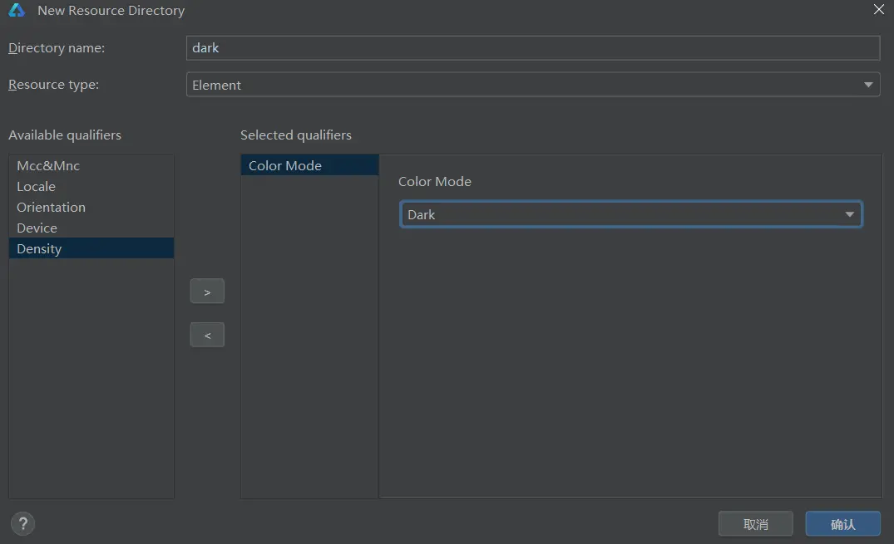

创建好深色模式资源包之后将Product模块的两个颜色JSON文件复制过来，这里其实只是为了数据格式的一致性，自己重新写也是可以的。

还有个小点就是主动获取系统配置变化，可以通过[onConfigurationUpdate](https://developer.huawei.com/consumer/cn/doc/harmonyos-references/js-apis-app-ability-ability#abilityonconfigurationupdate)回调函数来获取。当然这里我们还是先解决深浅色切换为重。

先让我们来取一段日志来分析一下。

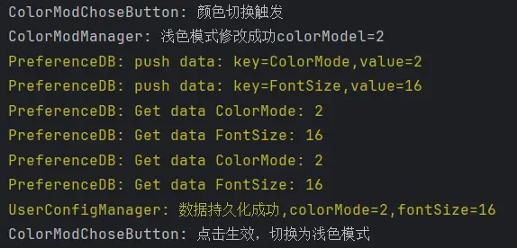

可以看到，我们按钮点击触发后设置浅色的函数的的确确是成功了的，但是我们的日志显示问题发生在了`PreferenceDB: push data: key=ColorMode,value=2`这一步，写入到数据时跟随系统！！！这很致命啊，我第一时间想到的是深浅拷贝问题，之前在测试我们的持久化数据存储时已经成功了，后面我为了省事我是直接提取为了一个成员变量，我现在加上`@Trace`试一试。

没有变化，问题不在这里那我就把成员变量拆回去。

```ts
import { common, ConfigurationConstant } from "@kit.AbilityKit";
import { DEFAULT_COLOR_MODE, GET_USER_CONFIG, logger, UserConfigViewModel } from "common";
import { AppStorageV2 } from "@kit.ArkUI";
import { userConfigManager } from "./UserConfigManager";

const ColorModManager_LOG_TAG = 'ColorModManager: '

/**
 * 颜色模式管理器
 */
export class ColorModManager {
  /**
   * 应用上下文对象
   */
  applicationContext: common.ApplicationContext | null = null

  /**
   * 管理器初始化，并应用初始化后的颜色应用状态
   * @param applicationContext 应用上下文对象
   * @returns 是否初始化成功
   */
  init(applicationContext: common.ApplicationContext): boolean {
    this.applicationContext = applicationContext
    if (applicationContext) {
      logger.info(`${ColorModManager_LOG_TAG}applicationContext初始化成功`)
      this.initColoModSetting();
      return true
    }
    return false
  }

  /**
   * 初始化颜色设置，仅做内部调用，外部请使用其余设置接口
   */
  private initColoModSetting() {
    switch (AppStorageV2.connect(UserConfigViewModel, GET_USER_CONFIG, () => new UserConfigViewModel())!.colorModel) {
      case 0:
        this.applicationContext!.setColorMode(ConfigurationConstant.ColorMode.COLOR_MODE_LIGHT);
      case 1:
        this.applicationContext!.setColorMode(ConfigurationConstant.ColorMode.COLOR_MODE_DARK);
      case 2:
        this.applicationContext!.setColorMode(ConfigurationConstant.ColorMode.COLOR_MODE_NOT_SET);
    }
  }

  setDarkMod(): boolean {
    if (this.applicationContext) {
      this.applicationContext.setColorMode(ConfigurationConstant.ColorMode.COLOR_MODE_DARK)
      AppStorageV2.connect(UserConfigViewModel, GET_USER_CONFIG, () => new UserConfigViewModel())!.colorModel = 1
      logger.info(`${ColorModManager_LOG_TAG}深色模式修改成功AppStoragecolorModel=${AppStorageV2.connect(UserConfigViewModel,
        GET_USER_CONFIG, () => new UserConfigViewModel())!.colorModel}开始持久化数据`)
      userConfigManager.syncDataToPreference()
      return true
    }
    logger.error(`${ColorModManager_LOG_TAG}应用上下文对象缺失`)
    return false
  }

  setLightMod(): boolean {
    if (this.applicationContext) {
      this.applicationContext.setColorMode(ConfigurationConstant.ColorMode.COLOR_MODE_LIGHT)
      AppStorageV2.connect(UserConfigViewModel, GET_USER_CONFIG, () => new UserConfigViewModel())!.colorModel = 0
      logger.info(`${ColorModManager_LOG_TAG}浅色模式修改成功AppStoragecolorModel=${AppStorageV2.connect(UserConfigViewModel,
        GET_USER_CONFIG, () => new UserConfigViewModel())!.colorModel}开始持久化数据`)
      userConfigManager.syncDataToPreference()
      return true
    }
    logger.error(`${ColorModManager_LOG_TAG}应用上下文对象缺失`)
    return false
  }

  setDefaultColorMode(): boolean {
    if (this.applicationContext) {
      this.applicationContext.setColorMode(ConfigurationConstant.ColorMode.COLOR_MODE_NOT_SET)
      AppStorageV2.connect(UserConfigViewModel, GET_USER_CONFIG, () => new UserConfigViewModel())!.colorModel = 2
      logger.info(`${ColorModManager_LOG_TAG}跟随系统模式修改成功AppStoragecolorModel=${AppStorageV2.connect(UserConfigViewModel,
        GET_USER_CONFIG, () => new UserConfigViewModel())!.colorModel}开始持久化数据`)
      userConfigManager.syncDataToPreference()
      return true
    }
    logger.error(`${ColorModManager_LOG_TAG}应用上下文对象缺失`)
    return false
  }
}

export const colorModManager = new ColorModManager()
```

再次测试

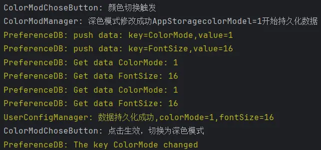

这才对啊。但是真机的显示效果又出现了新的问题。在我重新启动应用后发现按钮显示的文字正确但是真正的颜色模式还是跟随系统。

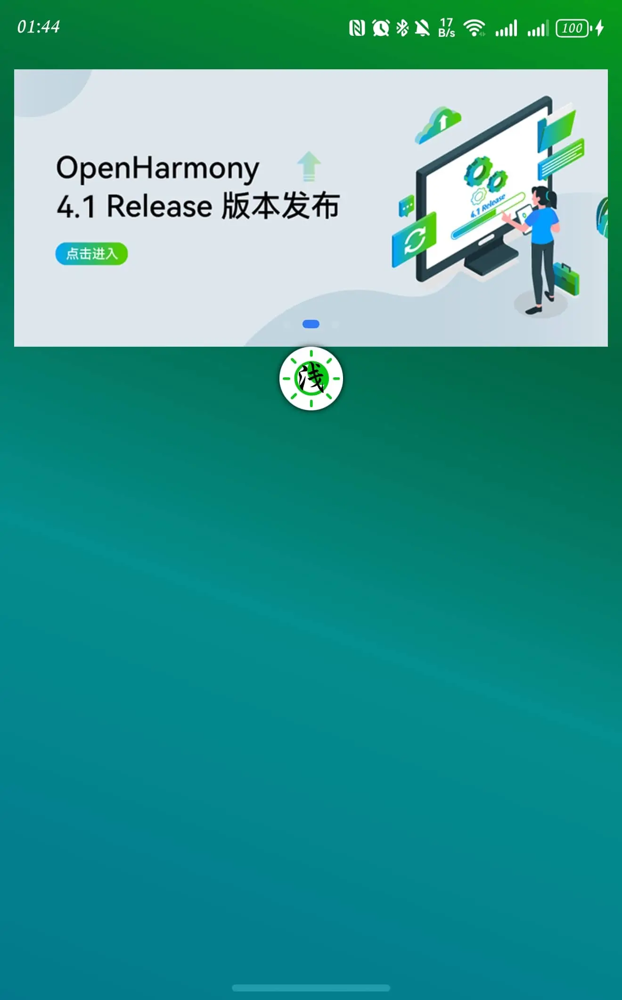

这个问题的定位倒是很快速的，我是在当初学习如何设置当前应用的深浅色模式的时候就看到过再创建项目后的默认代码中就有一行是设置成跟随系统，我当时忘删了。删除后再试一下。

诶？不对，还是不对，而且现象相同？那现在可能的原因就是初始化流程中出现了问题。

我需要在初始化的过程中添加更多的日志，因为当前的日志并不能准确的定位问题所在。于是我开始寻找我一楼添加日志的位置，想到往事在写初始化颜色模式的这个函数的时候我认为逻辑过于简单就没有添加日志，我现在加一下试试。

```ts
  /**
   * 初始化颜色设置，仅做内部调用，外部请使用其余设置接口
   */
  private initColoModSetting() {
    switch (AppStorageV2.connect(UserConfigViewModel, GET_USER_CONFIG, () => new UserConfigViewModel())!.colorModel) {
      case 0: {
        logger.info(`${ColorModManager_LOG_TAG}initColoModSetting 0: AppStorageV2colorModel = ${AppStorageV2.connect(UserConfigViewModel,
          GET_USER_CONFIG, () => new UserConfigViewModel())!.colorModel}`)
        this.applicationContext!.setColorMode(ConfigurationConstant.ColorMode.COLOR_MODE_LIGHT);
      }

      case 1: {
        logger.info(`${ColorModManager_LOG_TAG}initColoModSetting 1: AppStorageV2colorModel = ${AppStorageV2.connect(UserConfigViewModel,
          GET_USER_CONFIG, () => new UserConfigViewModel())!.colorModel}`)
        this.applicationContext!.setColorMode(ConfigurationConstant.ColorMode.COLOR_MODE_DARK);
      }

      case 2: {
        logger.info(`${ColorModManager_LOG_TAG}initColoModSetting 2: AppStorageV2colorModel = ${AppStorageV2.connect(UserConfigViewModel,
          GET_USER_CONFIG, () => new UserConfigViewModel())!.colorModel}`)
        this.applicationContext!.setColorMode(ConfigurationConstant.ColorMode.COLOR_MODE_NOT_SET);
      }

    }
  }
```

随后再次进行测试，果然发现了问题所在。

```bash
ColorModManager: applicationContext初始化成功
ColorModManager: initColoModSetting 0: AppStorageV2colorModel = 0
ColorModManager: initColoModSetting 1: AppStorageV2colorModel = 0
ColorModManager: initColoModSetting 2: AppStorageV2colorModel = 0
```

三个语块全部进入。很诡异真的。

我又仔细一想，问了下AI才想起来是忘记加break了，导致全部语块都被执行直至最后一个跟随系统设置。

再次测试。

<video width="100%" controls>
  <source src="40.mp4" type="video/mp4">
  您的浏览器不支持视频标签。
</video>

### KV数据库与新闻数据管理器

#### KV数据库的功能完善

首先先接着之前的初始化代码后面接着封装一个获取KV数据库实例的方法。

```ts
import { distributedKVStore } from "@kit.ArkData";
import { BusinessError } from "@kit.BasicServicesKit";
import { logger } from "../../utils/logger/logger";
import { common } from '@kit.AbilityKit';

const KVDatabase_LOG_TAG = 'KVDatabase: '

/**
 * 键值型数据库管理接口
 */
export class KVDatabase {
  /**
   * 数据库管理对象，应用启动后需要先行创建并进行数据库的创建。
   */
  kvManager: distributedKVStore.KVManager | undefined = undefined;
  appId: string = 'com.xbxyftx.NowInOpenHarmony';

  /**
   * 初始化方法，创建数据库管理对象KVManager，需在应用启动阶段进行调用。
   * @param context 当前应用上下文
   * @returns 是否成功初始化
   */
  init(context: common.UIAbilityContext): boolean {
    const kvManagerConfig: distributedKVStore.KVManagerConfig = {
      context: context,
      bundleName: this.appId
    };
    try {
      // 创建KVManager实例
      this.kvManager = distributedKVStore.createKVManager(kvManagerConfig);
      console.info(KVDatabase_LOG_TAG + 'Succeeded in creating KVManager.');
      // 继续创建获取数据库
      if (this.kvManager !== undefined) {
        logger.info(KVDatabase_LOG_TAG+'数据库管理对象创建成功。')
        return true
      }
      logger.error(KVDatabase_LOG_TAG + '数据库管理对象创建失败')
      return false
    } catch (e) {
      let error = e as BusinessError;
      logger.error(KVDatabase_LOG_TAG + `Failed to create KVManager. Code:${error.code},message:${error.message}`);
      return false
    }
  }

  /**
   * 通过ID获取数据库实例对象，需在init后使用。
   * @param storeId 数据库实例对象ID
   * @returns 单版本数据库实例对象
   */
  async getKVStoreById(storeId:string):Promise<distributedKVStore.SingleKVStore|null>{
    if (this.kvManager) {
      try {
        const options:distributedKVStore.Options = {
          createIfMissing: true,
          securityLevel: distributedKVStore.SecurityLevel.S1,
          kvStoreType:distributedKVStore.KVStoreType.SINGLE_VERSION
        }
        const kVStore:distributedKVStore.SingleKVStore = await this.kvManager.getKVStore(storeId,options)
        if (kVStore) {
          logger.info(`${KVDatabase_LOG_TAG}成功获取storeId:${storeId}数据库实例对象`)
          this.kvManager.on('distributedDataServiceDie',()=>{
            logger.warn(`${KVDatabase_LOG_TAG}数据库服务订阅发生变更`)
          })
          return kVStore
        }
      }catch (e){
        let err = e as BusinessError
        logger.error(`${KVDatabase_LOG_TAG}获取KV数据库实例对象异常，异常信息: ${err.message}`)
      }
    }
    return null
  }


}

export const kvDatabase: KVDatabase = new KVDatabase()
```

这里要注意的一点就是这个获取数据库实例的操作是一个异步的耗时操作，我们在后续的处理中也要注意这一点。随后将这个初始化过程绑定到新闻列表管理器的初始化方法中。

```ts
  /**
   * 当前应用的键值数据库实例对象
   */
  appKVDb: distributedKVStore.SingleKVStore | undefined = undefined

  /**
   * 初始化函数，获取当前应用的键值对数据库实例。
   * @param context
   * @returns
   */
  async init(context: common.UIAbilityContext): Promise<boolean> {
    kvDatabase.init(context)
    const res = await kvDatabase.getKVStoreById(APP_KV_DB_ID)
    if (res) {
      this.appKVDb = res
      logger.info(`${NewsManager_LOG_TAG}init: 获取appKVDb成功`)
      return true
    }
    return false
  }
```

进行测试：

```bash
KVDatabase: 成功获取storeId:NowInOpenHarmonyKVDB数据库实例对象
NewsManager: init: 获取appKVDb成功
```

成功，随后编写一下更新数据库新闻列表数据的方法。

```ts
import { APP_KV_DB as APP_KV_DB_ID, kvDatabase,
  KV_DB_KEYS,
  logger, NewsArticle, newsListApi, serverHealthApi } from "common"
import { common } from "@kit.AbilityKit"
import { distributedKVStore } from "@kit.ArkData"
import { promptAction } from "@kit.ArkUI"
import { BusinessError } from "@kit.BasicServicesKit"

const NewsManager_LOG_TAG = 'NewsManager: '

export class NewsManager {
  /**
   * 当前应用的键值数据库实例对象
   */
  appKVDb: distributedKVStore.SingleKVStore | undefined = undefined

  /**
   * 初始化函数，获取当前应用的键值对数据库实例。
   * @param context
   * @returns
   */
  async init(context: common.UIAbilityContext): Promise<boolean> {
    kvDatabase.init(context)
    const res = await kvDatabase.getKVStoreById(APP_KV_DB_ID)
    if (res) {
      this.appKVDb = res
      logger.info(`${NewsManager_LOG_TAG}init: 获取appKVDb成功`)
      return true
    }
    logger.error(`${NewsManager_LOG_TAG}初始化失败`)
    return false
  }

  async updateNewsListToDB(times: number = 1): Promise<boolean> {
    if (times<=5){
      if (await serverHealthApi.isServerReady()) {
        const news:NewsArticle[]|null = (await newsListApi.getAllNews())
        if (news && this.appKVDb) {
          logger.info(`${NewsManager_LOG_TAG}成功获取最新新闻，总条数: ${news.length}`)
          try {
            this.appKVDb.put(KV_DB_KEYS.NewsArticleList,JSON.stringify(news))
            logger.info(`${NewsManager_LOG_TAG}数据库写入成功，无异常`)
            return true
          }catch (e){
            let err = e as BusinessError
            logger.error(`${NewsManager_LOG_TAG}更新数据库NewsArticle数据发生异常，异常信息: ${err.message}`)
            return false
          }
        }
        logger.error(`${NewsManager_LOG_TAG}获取新闻失败`)
        return false
      } else {
        logger.warn(`${NewsManager_LOG_TAG}第${times}次查询服务端健康状态失败`)
        setTimeout(async () => {
          this.updateNewsListToDB(++times)
        }, 100)
      }
    }
    logger.error(`${NewsManager_LOG_TAG}times = ${times},服务端健康情况异常`)
    promptAction.openToast({
      message:`服务端状态异常，已经尝试状态检查${times}次`,
      duration:3000
    })
    return false
  }
}

export const newsManager = new NewsManager()
```

随后串流至app初始化的流程中进行测试。

```ts
  async initAll(uiAbilityContext: common.UIAbilityContext,applicationContext:common.ApplicationContext){
    await newsManager.init(uiAbilityContext)
    this.configInit(uiAbilityContext)
    colorModManager.init(applicationContext)
    newsManager.updateNewsListToDB()
  }
```

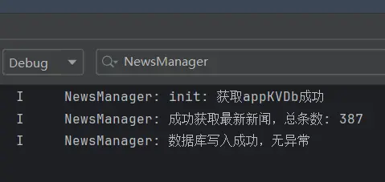

ok，很完美，其实我一开始害怕单个字段存储会不会出现数据量过大的情况，但看来并没有发生，那我就放心了。

随后用类似的结构去封装一下获取数据库中的新闻列表数据的方法。

```ts
  async getNewsArticleListFromDB(): Promise<NewsArticle[] | null>{
    if (this.appKVDb) {
      try {
        const res:string =(await this.appKVDb.get(KV_DB_KEYS.NewsArticleList)) as string
        logger.info(`${NewsManager_LOG_TAG}读取到数据库新闻列表数据: ${res}`)
        const newsArticleList = JSON.parse(res) as NewsArticle[]
        return newsArticleList
      }
      catch (e){
        let err = e as BusinessError
        logger.error(`${NewsManager_LOG_TAG}尝试获取数据库新闻列表数据发生异常，异常信息: ${err.message}`)
        return null
      }
    }
    return null
  }
```

随后进行串流测试。这次测试我为了确保在应用断网或者是服务端异常的情况下，应用依然能够正常启动，并开始运作备用的数据库存储方案来去进行数据的渲染，所以特意没有开启服务端，而是进行纯客户端测试。

```ts
  async initAll(uiAbilityContext: common.UIAbilityContext,applicationContext:common.ApplicationContext){
    await newsManager.init(uiAbilityContext)
    this.configInit(uiAbilityContext)
    colorModManager.init(applicationContext)
    newsManager.updateNewsListToDB()
    newsManager.getNewsArticleListFromDB()
  }
```

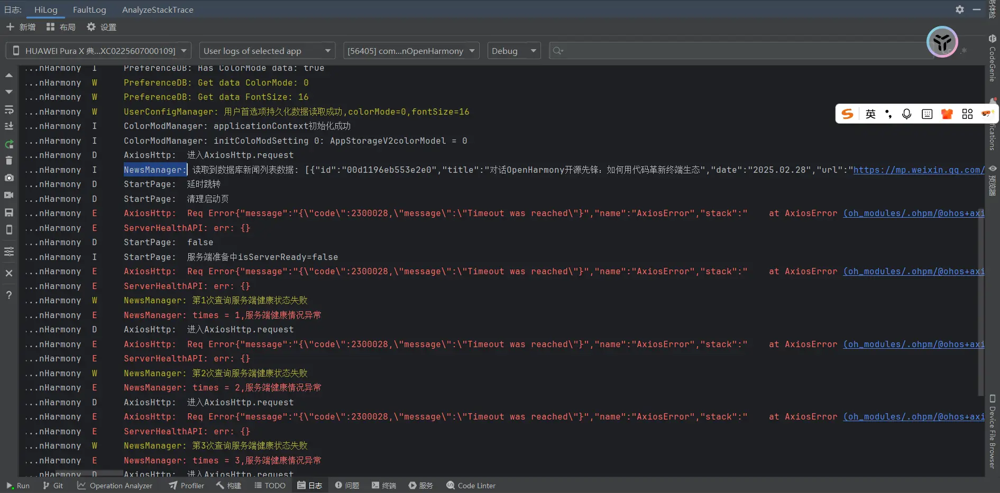

我草非常顺利啊，没有出现异常。那接下来我们就只需要去考虑这两套数据获取方式的切换逻辑了，这部分应该是最后在完善AppInit功能模块时的工作，下一步我需要思考的应该是文章渲染组件以及对应的样式设计，以及文章字体大小控制组件的功能封装。

### 启动页UI

对于启动页的UI，首先肯定是要以简洁为主题风格，随后是要有应用的名称，然后我们还有明白启动页的核心功能是用来给应用的启动提供充足的缓冲时间，如果启动页进入之后还没有加载完成数据，那大概率是意味着网络出现了问题或是服务端出现了这状态异常，所以我们需要将从后端更新数据以及全部数据库的初始化工作都放在启动页显示期间进行。


在豆包之后就获得了这个logo，调整几次后的这个结果还是非常让人满意的，思路来源就是OpenHarmony的绿色和蓝色的渐变，虽然不是用专业绘图软件画的没有透明的背景，但我可以直接设置成同样的背景色，这样就可以做出透明背景的效果了。

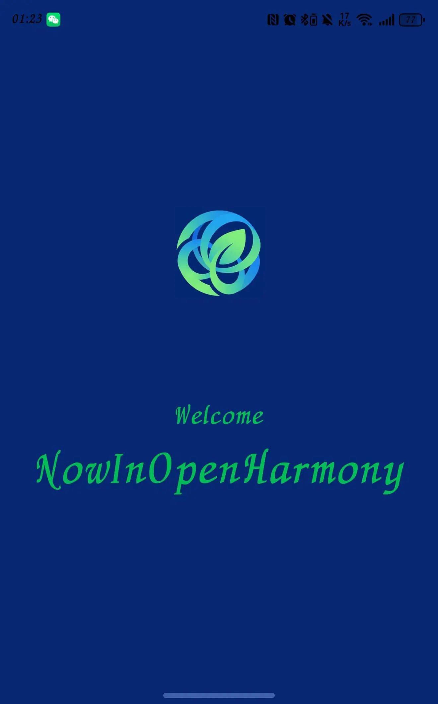

### 主页面UI

#### 页面配色

首先我考虑的是整体页面的背景颜色，毕竟背景颜色的选定是会影响整个页面给用户的第一印象以及整体感受的。我选择采用和OpenHarmony图标一致的蓝绿渐变，给人一种生机盎然的气息，和开元鸿蒙所追求的“万物互联，共创未来”的理念不谋而合。

为了进行深浅色适配我们就需要在`color.json`文件中去进行同名配置，来进行深浅色的自适配。

```js
{
  "color": [
    {
      "name": "start_window_background",
      "value": "#FFFFFF"
    },
    {
      "name": "index_page_background_1",
      "value": "#ff00a7c4"
    },
    {
      "name": "index_page_background_2",
      "value": "#ff00c6c6"
    },
    {
      "name": "index_page_background_3",
      "value": "#b900d48c"
    },
    {
      "name": "index_page_background_4",
      "value": "#ff00d91c"
    }
  ]
}
```

```js
{
  "color": [
    {
      "name": "start_window_background",
      "value": "#000000"
    },
    {
      "name": "index_page_background_1",
      "value": "#FF03788C"
    },
    {
      "name": "index_page_background_2",
      "value": "#FF048D8D"
    },
    {
      "name": "index_page_background_3",
      "value": "#B9028C5C"
    },
    {
      "name": "index_page_background_4",
      "value": "#FF069B18"
    }
  ]
}
```

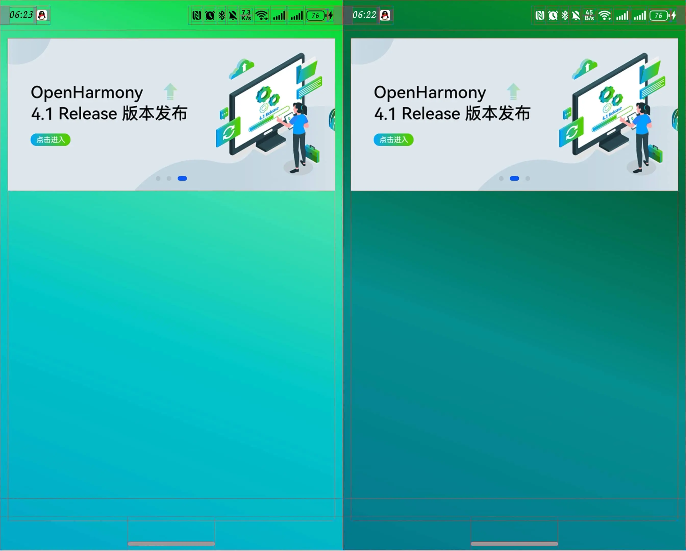

看着还不错吧。

在这个过程中我也是遇到了一个小问题，就是我继续用`NavDestination`制作启动页的话这将意味着我的启动页将无法在平板上去进行全屏的覆盖，这并不合理。

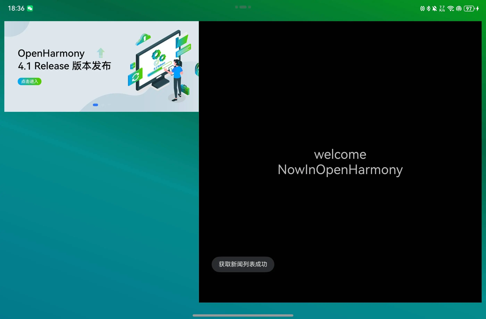

所以我还是决定使用router来去解决这个问题。

在使用router局部重构页面逻辑时又发现了一个新的问题，就是router的`pushUrl`方法已经被废弃了。

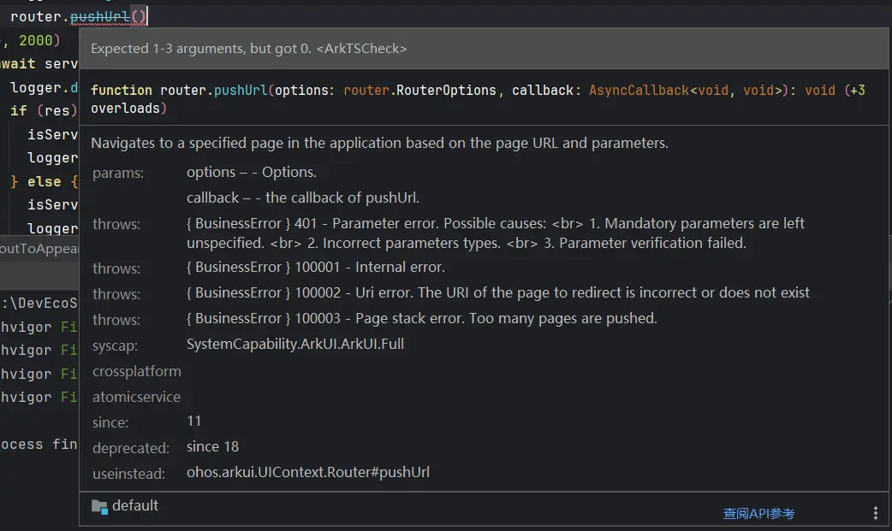

我立即去查看了[官方文档](https://developer.huawei.com/consumer/cn/doc/harmonyos-references/js-apis-router#routerpushurldeprecated)。

原来是和之前遇到的PromptAction相同的指代不明的问题。由于之前解决的时候已经获取过UIContext了所以我就直接使用此前获取的就可以了。

随后我又去学习了一下页面间转场动画的制作，修改完得到如下代码。

```ts
import { AppStorageV2, curves, PromptAction, Router, router } from "@kit.ArkUI"
import {
  GetUIContext,
  GET_UICONTEXT,
  logger,
  NavDests,
  NAV_PATH_STUCK,
  NewsArticle,
  newsListApi,
  serverHealthApi
} from "common"

const START_PAGE_TAGE = 'StartPage:  '

@Entry
@ComponentV2
struct StarPage {
  uiPromptAction: PromptAction = AppStorageV2.connect(GetUIContext, GET_UICONTEXT)!.context.getPromptAction()
  uiRouter: Router = AppStorageV2.connect(GetUIContext, GET_UICONTEXT)!.context.getRouter()

  async aboutToAppear(): Promise<void> {
    let isServerReady: boolean = false
    setTimeout(() => {
      logger.debug(START_PAGE_TAGE + '延时跳转')
      this.uiRouter.pushUrl({ url: "pages/Index", recoverable: false })
      // 为了能触发路由动画特此使用push
      logger.debug(START_PAGE_TAGE + '清理启动页')
      this.uiRouter.clear()
    }, 2000)
    await serverHealthApi.isServerReady().then((res: boolean) => {
      logger.debug(START_PAGE_TAGE + res.valueOf())
      if (res) {
        isServerReady = true
        logger.info(START_PAGE_TAGE + '服务端准备就绪isServerReady=' + isServerReady)
      } else {
        isServerReady = false
        logger.info(START_PAGE_TAGE + '服务端准备中isServerReady=' + isServerReady)
      }
    })
    if (isServerReady) {
      logger.debug(START_PAGE_TAGE + '尝试获取全部新闻列表')
      newsListApi.getAllNews().then((res: NewsArticle[] | null) => {
        if (res === null) {
          logger.warn(START_PAGE_TAGE + '')
        } else {
          this.uiPromptAction.showToast({ message: '获取新闻列表成功', duration: 2000 })
        }
      })
    }
  }

  pageTransition() {
    PageTransitionExit({ type: RouteType.None, duration: 200, curve: Curve.EaseInOut })
      .slide(SlideEffect.Left)
  }

  build() {

    Column() {
      Image($r('app.media.logo'))
        .width('20%')
        .margin({bottom:100})
      Text('Welcome')
        .fontSize(30)
        .fontColor('#ff00be53')
      Text('NowInOpenHarmony')
        .fontSize(50)
        .fontColor('#ff00be53')
        .fontWeight(700)
    }
    .expandSafeArea()
    .backgroundColor('#062872')
    .justifyContent(FlexAlign.Center)
    .width('100%')
    .height('100%')

  }
}
```

```ts
import { AppStorageV2 } from '@kit.ArkUI'
import { NavDests, NAV_PATH_STUCK } from 'common'
import { MainPage } from './nav_pages/mainPage'


@Entry
@ComponentV2
struct Main {
  @Local navPathStuck: NavPathStack = AppStorageV2.connect(NavPathStack, NAV_PATH_STUCK,()=>new NavPathStack())!
  @Builder
  NavDestMap(name: string) {
    if (name === NavDests.MAIN) {
      Main()
    }
  }
  pageTransition() {
    PageTransitionEnter({ type: RouteType.None, duration: 200, curve: Curve.EaseInOut })
      .scale({x:0.2,y:0.2})
      .opacity(0)
  }
  aboutToAppear(): void {

  }
  build() {
    Navigation(this.navPathStuck){
      MainPage()
    }
    .linearGradient({
      angle:20,
      colors:[
        [$r('app.color.index_page_background_1'),0],
        [$r('app.color.index_page_background_2'),0.4],
        [$r('app.color.index_page_background_3'),0.7],
        [$r('app.color.index_page_background_4'),1]
      ]
    })
    .backgroundColor(Color.Transparent)
    .padding(10)
    .navDestination(this.NavDestMap)
    .hideTitleBar(true)
    .hideToolBar(true)
    .height('100%')
    .width('100%')
    .hideBackButton(true)
    .titleMode(NavigationTitleMode.Free)
    .mode(NavigationMode.Auto)
    .navBarWidth('40%')
  }
}
```

#### Navigation标题的从新启用

在使用Navigation的过程中我发现了一个不算很大但确实影响观感的问题就是在于如果不设置标题的话最上方和左侧在分栏显示的状态下就会出现一条分栏。所以我决定去单独封装一个标题Builder来去进行标题的重新启用，这样可以避免那条无法去除的留白带来的感官影响。

### 平板竖屏显示问题

在测试平板侧的一多的时候发现一个问题就是他的竖屏模式Navigation并不会自动恢复到单栏模式，且图片的比例也会变得很奇怪，所以对于这个问题有两种解决方式，一种是通过媒体查询来去解决这个问，另一种就是通过设置横屏锁定来解决。

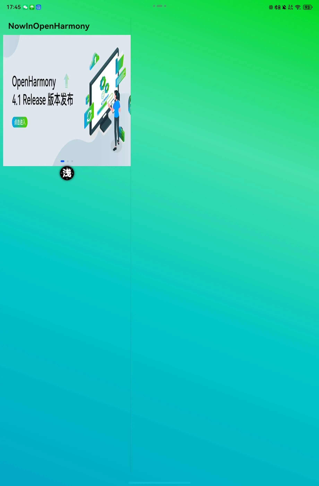


<!-- tab 媒体查询 -->
对于媒体查询来说他只需要做到依据手机和平板去让我手动修改Navigation的显示模式就可以了，并不需要进行太多功能性上的修改。

首先先用长宽比属性锁定一下轮播图组件的长宽比，随后去设置断点的判断机制。

```ts
import { NewsSwiperModule } from 'common'
import { promptAction } from '@kit.ArkUI'

/**
 * 首页上方轮播图组件
 */
@ComponentV2
export struct NewsSwiper {
  @Param swiperList: NewsSwiperModule [] = [
    new NewsSwiperModule('https://images.openharmony.cn/%E9%A6%96%E9%A1%B5/banner/20240411/4.1releas%E6%89%8B%E6%9C%BA.jpg',
      '开源生态大会'),
    new NewsSwiperModule('https://images.openharmony.cn/%E6%B4%BB%E5%8A%A8/%E5%88%9B%E6%96%B0%E8%B5%9B2023/20230831/%E4%B8%89%E6%96%B9%E5%BA%93%E7%A7%BB%E5%8A%A8%E7%AB%AF.png',
      '开源生态大会'),
    new NewsSwiperModule('https://images.openharmony.cn/%E6%B4%BB%E5%8A%A8/%E6%98%8E%E6%98%9F%E5%BC%80%E5%8F%91%E6%9D%BF20250728/%E9%A6%96%E9%A1%B5banner657-433.jpg',
      '开源生态大会')
  ]

  build() {
    Column() {
      Swiper(){
        ForEach(this.swiperList,(item:NewsSwiperModule)=>{
          Image(item.img)
            .width('100%')
            .objectFit(ImageFit.Fill)
            .onClick(()=>{
              promptAction.showToast({message:'跳转原页面功能待开发'})
            })
            .borderRadius(10)
            .aspectRatio(2.2)
        })
      }
      .curve(Curve.EaseInOut)
      .loop(true)
      .autoPlay(true)
      .interval(2000)
    }
    .borderRadius(10)
    .width('100%')

  }
}
```

断点监听系统。我需要针对于

```ts
import { Breakpoint, BreakpointType } from "../../modules/breakPoint/BreakPointSystem"
import { AppStorageV2, mediaquery } from "@kit.ArkUI"
import { BreakpointState } from "../../modules/breakPoint/BreakpointState"
import { logger } from ".."

const BREAK_POINT_SYSTEM_LOG_TAG = 'BreakpointSystem:  '
/**
 * 断点系统核心类（单例模式）
 * 负责管理设备断点状态及监听逻辑
 */
export class BreakpointSystem {
  // 单例实例引用，确保全局唯一性[1](@ref)
  private static instance: BreakpointSystem

  /** 预定义断点范围配置（可扩展）*/
  private readonly breakpoints: Breakpoint[] = [
    { name: 'xs', size: 0 },     // 0vp <= width < 320vp
    { name: 'sm', size: 320 },   // 320vp <= width < 600vp
    { name: 'md', size: 700 },   // 700vp <= width < 1240vp
    { name: 'lg', size: 1540 }    // 1540vp <= width
  ]

  /** 使用Set存储状态观察者（自动去重）[1](@ref)*/
  private _states: Set<BreakpointState<Object>>

  public get states(): Set<BreakpointState<Object>> {
    return this._states
  }

  // 私有构造器（单例模式）
  private constructor() {
    this._states = new Set()  // 初始化观察者集合
  }

  /** 获取单例实例 */
  public static getInstance(): BreakpointSystem {
    if (!BreakpointSystem.instance) {
      BreakpointSystem.instance = new BreakpointSystem()
    }
    return BreakpointSystem.instance
  }

  /** 注册状态观察者 */
  public attach(state: BreakpointState<Object>): void {
    logger.info(`${BREAK_POINT_SYSTEM_LOG_TAG}注册状态观察者`)
    this._states.add(state)  // 添加新观察者到集合
  }

  /** 注销状态观察者 */
  public detach(state: BreakpointState<Object>): void {
    this._states.delete(state)  // 从集合中移除观察者
  }

  /** 启动断点监听系统 */
  public start() {
    this.breakpoints.forEach((breakpoint: Breakpoint, index) => {
      /**
       * 查询条件
       */
      let condition: string
      // 动态生成媒体查询条件：
      if (index === this.breakpoints.length - 1) {
        // 最后一个断点使用 >= 条件
        condition = `(${breakpoint.size}vp<=width)`
      } else {
        // 中间断点使用区间条件
        condition = `(${breakpoint.size}vp<=width<${this.breakpoints[index + 1].size}vp)`
      }

      // 创建媒体查询监听器[1](@ref)
      breakpoint.mediaQueryListener = mediaquery.matchMediaSync(condition)

      // 初始化匹配状态检查
      if (breakpoint.mediaQueryListener.matches) {
        logger.warn(`${BREAK_POINT_SYSTEM_LOG_TAG}初始化匹配成功breakpoint.name=${breakpoint.name}`)
        this.updateAllState(breakpoint.name)
      }

      // 注册尺寸变化监听回调
      breakpoint.mediaQueryListener.on('change', (mediaQueryResult) => {
        logger.warn(`${BREAK_POINT_SYSTEM_LOG_TAG}触发断点状态变化回调`)
        if (mediaQueryResult.matches) {
          logger.warn(`${BREAK_POINT_SYSTEM_LOG_TAG}匹配成功breakpoint.name=${breakpoint.name}`)
          this.updateAllState(breakpoint.name)  // 触发状态更新
        }
      })
      logger.info(BREAK_POINT_SYSTEM_LOG_TAG+`第${index}个断点状态对象启动完成`)
    })
  }

  /** 更新所有观察者状态 */
  private updateAllState(type: BreakpointType): void {
    this._states.forEach(state => state.update(type))  // 遍历执行更新
    logger.info(BREAK_POINT_SYSTEM_LOG_TAG+'全部断点状态更新完成')
  }

  /** 停止监听并清理资源 */
  public stop() {
    this.breakpoints.forEach(breakpoint => {
      if (breakpoint.mediaQueryListener) {
        breakpoint.mediaQueryListener.off('change')  // 注销监听器
      }
    })
    this._states.clear()  // 清空观察者集合
    logger.info(BREAK_POINT_SYSTEM_LOG_TAG+'断点状态对象全部关闭')
  }
}

/**
 * 获取当前设备断点系统的包装类
 * 调用getBreakPointSystem获取当前断点系统
 */
export class GetBreakPointSystem{
  private breakPointSystem:BreakpointSystem=BreakpointSystem.getInstance()
  /**
   * 获取当前断点系统
   * @returns 当前断点系统
   */
  getBreakPointSystem(){
    return this.breakPointSystem
  }
}

export const breakpointSystem = BreakpointSystem.getInstance()

```

```ts
import { AppStorageV2 } from '@kit.ArkUI'
import { BreakpointEnum, BreakpointState, breakpointSystem, logger, NAV_DESTS, NAV_PATH_STUCK } from 'common'
import { MainPage } from './nav_pages/mainPage'

const Main_LOG_TAG='Main: '
@Entry
@ComponentV2
struct Main {
  @Local navPathStuck: NavPathStack = AppStorageV2.connect(NavPathStack, NAV_PATH_STUCK, () => new NavPathStack())!
  @Local breakPointState: BreakpointState<string> = BreakpointState.of<string>({
    xs: 'xs',
    sm: 'sm',
    xl: 'xl',
    xxl: 'xxl',
    md: 'md',
    lg: 'lg'
  })

  @Builder
  NavDestMap(name: string) {
    if (name === NAV_DESTS.MAIN) {
      Main()
    }
  }

  /**
   * navigation
   */
  @Local navMod: NavigationMode = NavigationMode.Stack

  pageTransition() {
    PageTransitionEnter({ type: RouteType.None, duration: 200, curve: Curve.EaseInOut })
      .scale({ x: 0.2, y: 0.2 })
      .opacity(0)
  }

  @Monitor('breakPointState.value')
  getNavMode() {
    logger.info(`${Main_LOG_TAG}this.breakPointState.getCurrentBreakPointType() = ${this.breakPointState.getCurrentBreakPointType()}`)
    if (this.breakPointState.getCurrentBreakPointType() === BreakpointEnum.xs ||
      this.breakPointState.getCurrentBreakPointType() === BreakpointEnum.sm ||
      this.breakPointState.getCurrentBreakPointType() === BreakpointEnum.md) {
      this.navMod = NavigationMode.Stack
    } else {
      this.navMod = NavigationMode.Split
    }
  }

  aboutToAppear(): void {
    breakpointSystem.attach(this.breakPointState)
    breakpointSystem.start()
    this.getNavMode()
  }

  build() {
    Navigation(this.navPathStuck) {
      MainPage()
    }
    .linearGradient({
      angle: 20,
      colors: [
        [$r('app.color.index_page_background_1'), 0],
        [$r('app.color.index_page_background_2'), 0.4],
        [$r('app.color.index_page_background_3'), 0.7],
        [$r('app.color.index_page_background_4'), 1]
      ]
    })
    .title('NowInOpenHarmony')
    .backgroundColor(Color.Transparent)
    .padding(10)
    .navDestination(this.NavDestMap)
    .hideToolBar(true)
    .height('100%')
    .width('100%')
    .hideBackButton(true)
    .titleMode(NavigationTitleMode.Mini)
    .mode(this.navMod)
    .navBarWidth('40%')
  }
}
```

随后进行测试！！！

<video width="100%" controls>
  <source src="47.mp4" type="video/mp4">
  您的浏览器不支持视频标签。
</video>

啊啊啊，经过一个多小时的折磨之后终于是顺利完成了这个切换的逻辑，中间还掺杂了因为`@Monitor`装饰器的变量名写错了的这种该死的疏忽而导致的bug。还被误认为是我原来写的这套媒体监听逻辑有问题，然后用的时候才发现一个问题就是虽然我项目原本是用API18，但是因为手机是API17所以我测试也只能用API17的接口所以我又把很多新接口改回了被废弃的老接口，也是很绝望了。


<!-- endtab -->
<!-- tab 横屏锁定 -->
对于横竖屏模式的切换，我查找了[官方文档的建议](https://developer.huawei.com/consumer/cn/doc/best-practices/bpta-landscape-and-portrait-development)，有两种模式进行修改：一种是直接配置module.json5的[orientation字段](https://developer.huawei.com/consumer/cn/doc/harmonyos-guides/module-configuration-file#abilities%E6%A0%87%E7%AD%BE)；还有另外一种在代码逻辑里进行锁定的方式。

但这两种的缺点也很明显，在设置了之后就肯定是无法在切换回竖屏使用了，我也遇到过那种在平板上只能竖向使用不能横向使用的应用，有时候确实很让人恼火，尤其是恰好不是你的使用习惯的场景。

我在尝试着修改了配置文件之后就发现它无法分开在平板和手机上使用不同的横竖屏策略。

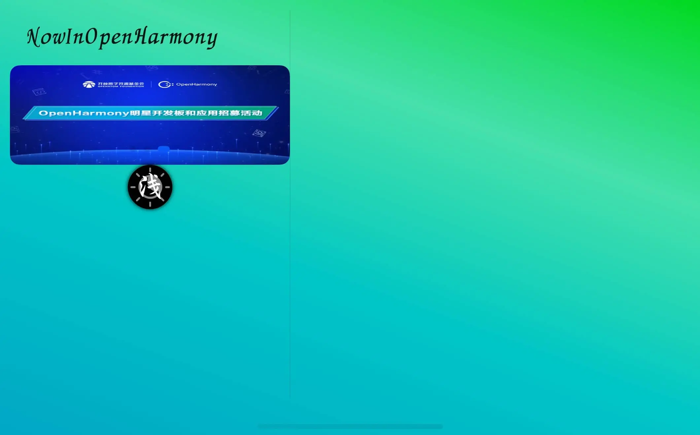

确实是很让人恼火的事，所以我决定去引入媒体查询功能模块。
<!-- endtab -->


### 媒体查询与断点系统的针对性调优

这一部分我们主要是为了解决在平板的情况下的适配问题，以及当下仍然存在的一部分API接口的兼容问题，API17和API18之间还是有挺大差异的，API18是处理了一大批接口的UI上下文指代不明确的问题。

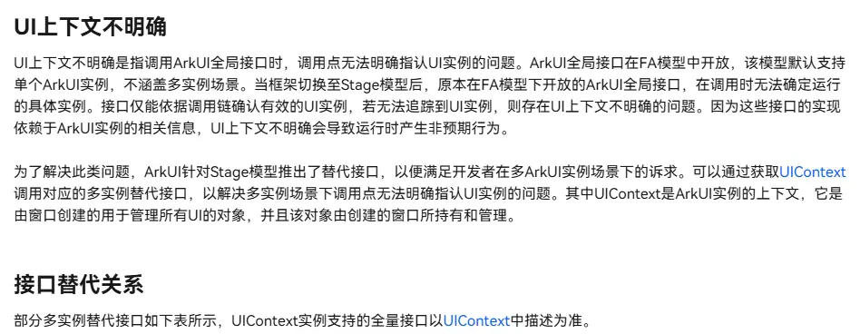

#### 媒体查询接口调优

针对于上面提到的UI上下文指代不明的问题，我对断点系统进行了调优，将构造函数和获取实例方法都进行了UIContext的传参改造。

```ts
import { Breakpoint, BreakpointType } from "../../modules/breakPoint/BreakPointSystem"
import { mediaquery } from "@kit.ArkUI"
import { BreakpointState } from "../../modules/breakPoint/BreakpointState"
import { logger } from ".."

const BREAK_POINT_SYSTEM_LOG_TAG = 'BreakpointSystem:  '
/**
 * 断点系统核心类（单例模式）
 * 负责管理设备断点状态及监听逻辑
 */
export class BreakpointSystem {
  // 单例实例引用，确保全局唯一性[1](@ref)
  private static instance: BreakpointSystem
  uiContext:UIContext
  /** 预定义断点范围配置（可扩展）*/
  private readonly breakpoints: Breakpoint[] = [
    { name: 'xs', size: 0 },     // 0vp <= width < 320vp
    { name: 'sm', size: 320 },   // 320vp <= width < 600vp
    { name: 'md', size: 600 },   // 700vp <= width < 1040vp
    { name: 'lg', size: 1040 }    // 1040vp <= width
  ]

  /** 使用Set存储状态观察者（自动去重）[1](@ref)*/
  private _states: Set<BreakpointState<Object>>

  public get states(): Set<BreakpointState<Object>> {
    return this._states
  }

  // 私有构造器（单例模式）
  private constructor(uiContext:UIContext) {
    this._states = new Set()  // 初始化观察者集合
    this.uiContext=uiContext
  }

  /** 获取单例实例 */
  public static getInstance(uiContext:UIContext): BreakpointSystem {
    if (!BreakpointSystem.instance) {
      BreakpointSystem.instance = new BreakpointSystem(uiContext)
    }
    return BreakpointSystem.instance
  }

  /** 注册状态观察者 */
  public attach(state: BreakpointState<Object>): void {
    logger.info(`${BREAK_POINT_SYSTEM_LOG_TAG}注册状态观察者`)
    this._states.add(state)  // 添加新观察者到集合
  }

  /** 注销状态观察者 */
  public detach(state: BreakpointState<Object>): void {
    this._states.delete(state)  // 从集合中移除观察者
  }

  /** 启动断点监听系统 */
  public start() {
    this.breakpoints.forEach((breakpoint: Breakpoint, index) => {
      /**
       * 查询条件
       */
      let condition: string
      // 动态生成媒体查询条件：
      if (index === this.breakpoints.length - 1) {
        // 最后一个断点使用 >= 条件
        condition = `(${breakpoint.size}vp<=width)`
      } else {
        // 中间断点使用区间条件
        condition = `(${breakpoint.size}vp<=width<${this.breakpoints[index + 1].size}vp)`
      }

      // 创建媒体查询监听器[1](@ref)
      breakpoint.mediaQueryListener = this.uiContext.getMediaQuery().matchMediaSync(condition)

      // 初始化匹配状态检查
      if (breakpoint.mediaQueryListener.matches) {
        logger.warn(`${BREAK_POINT_SYSTEM_LOG_TAG}初始化匹配成功breakpoint.name=${breakpoint.name}`)
        this.updateAllState(breakpoint.name)
      }

      // 注册尺寸变化监听回调
      breakpoint.mediaQueryListener.on('change', (mediaQueryResult) => {
        logger.warn(`${BREAK_POINT_SYSTEM_LOG_TAG}触发断点状态变化回调`)
        if (mediaQueryResult.matches) {
          logger.warn(`${BREAK_POINT_SYSTEM_LOG_TAG}匹配成功breakpoint.name=${breakpoint.name}`)
          this.updateAllState(breakpoint.name)  // 触发状态更新
        }
      })
      logger.info(BREAK_POINT_SYSTEM_LOG_TAG+`第${index}个断点状态对象启动完成`)
    })
  }

  /** 更新所有观察者状态 */
  private updateAllState(type: BreakpointType): void {
    this._states.forEach(state => state.update(type))  // 遍历执行更新
    logger.info(BREAK_POINT_SYSTEM_LOG_TAG+'全部断点状态更新完成')
  }

  /** 停止监听并清理资源 */
  public stop() {
    this.breakpoints.forEach(breakpoint => {
      if (breakpoint.mediaQueryListener) {
        breakpoint.mediaQueryListener.off('change')  // 注销监听器
      }
    })
    this._states.clear()  // 清空观察者集合
    logger.info(BREAK_POINT_SYSTEM_LOG_TAG+'断点状态对象全部关闭')
  }
}
```

同时将其初始化的过程从appInit中移出，放置在了首页的生命周期函数中，因为UIContext对象是在窗口的构建之后才会被初始化的。

#### 窗口断点宽度调整

依据官方给出的断点划分840VP以上就是lg断点了，但是840这个分界线会导致平板竖屏场景下依旧是分栏模式不会呈现出单栏模式。这并不合适。于是我尝试将lg断点情况的判定扩展到1040VP，进行测试。

<video width="100%" controls>
  <source src="50.mp4" type="video/mp4">
  您的浏览器不支持视频标签。
</video>

效果很不错，同时也是完美的适配了全景多窗的场景。但我们也要看到缺点，在自由多窗的场景下我们的显示效果并不那么尽如人意。

<video width="100%" controls>
  <source src="51.mp4" type="video/mp4">
  您的浏览器不支持视频标签。
</video>

#### 自由多窗模式针对调优

首先分析一下当前的自由多窗场景下出现显示效果不佳的主要原因。

当前的切换逻辑在我手动覆写之后，切换的依据完全是根据窗口的宽度去进行切换，没有考虑到高度以及长宽比的问题。在实际应用中，自由多窗很可能出现宽度较小，但高度更小的情况，就会出现内容比例过大，信息密度过小的情况出现。这里用一个视频来解释一下。

<video width="100%" controls>
  <source src="52.mp4" type="video/mp4">
  您的浏览器不支持视频标签。
</video>

随意对于这个问题我想到了两种方式，分别是升级断点判断系统，依据窗宽比来去实现断点的切换。另一种则是设置窗口最小高度，同时设置平板的方向旋转事件的监听。当旋转事件发生之后就自动切换为单栏模式，这样我们就可以去将切换为单栏模式的最小宽度给缩小，这样就不会出现宽胖窗口形态下的单栏模式问题了。


<!-- tab 注册最小高度与旋转事件 -->
在开始这个方法的尝试之前我是先去尝试了升级断点系统，在阅读官方的开源代码时学习到了设置窗口最小高度的方式于是就有了一下尝试。

```ts
  windowMinSizeInit(mainWindow:window.Window){
    try{
      let windowLimits: window.WindowLimits = {
        minWidth: 350,
        minHeight:800
      };
      mainWindow.setWindowLimits(windowLimits).then(()=>{
        logger.info(`${AppInit_LOG_TAG}设置窗口最小尺寸成功`)
      }).catch((err: BusinessError)=>{
        logger.error(`${AppInit_LOG_TAG}设置窗口最小尺寸失败，错误原因：${err.message}`)
      })
    }catch (e){
      let err = e as BusinessError
      logger.error(`${AppInit_LOG_TAG}设置窗口最小尺寸失败，错误原因：${err.message}`)
    }
  }
```

```ts
  onWindowStageCreate(windowStage: window.WindowStage): void {
    // Main window is created, set main page for this ability
    hilog.info(DOMAIN, 'testTag', '%{public}s', 'Ability onWindowStageCreate');
    appInit.windowMinSizeInit(windowStage.getMainWindowSync())
    windowStage.loadContent('pages/StartPage', (err) => {
      if (err.code) {
        hilog.error(DOMAIN, 'testTag', 'Failed to load the content. Cause: %{public}s', JSON.stringify(err));
        return;
      }
      hilog.info(DOMAIN, 'testTag', 'Succeeded in loading the content.');

    });
  }
```

随后进行测试。

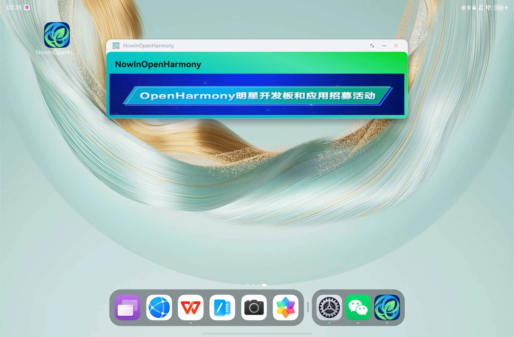

```bash
AppInit: 设置窗口最小尺寸失败，错误原因：Parameter error. Possible causes: 1. Mandatory parameters are left unspecified; 2. Incorrect parameter types; 3. Parameter verification failed.
```

额，失败了。看一下错误原因中提供的可能原因。1. 必填参数未指定；2. 参数类型不正确；3. 参数验证失败。难道说是我的设置位置出现了问题？

观察官方的开源代码发现它的设置位置是在加载首页之后的位置，但是我放在前面了，所以我放在后面再试试。

测试后还是失败了而且没有任何变化。难道说是因为我的参数设置的太大了。缩小到700试试。不行，再缩到400试试。还是不行。我有点不理解了。我将这一段拆出来直接放在生命周期函数中试试。

测试后还是不行。给日志做一些区分。

```ts
    try {
      // Set mini window.
      let windowClass: window.Window = windowStage.getMainWindowSync();
      let windowLimits: window.WindowLimits = {
        minWidth: 350
      };
      let promise = windowClass.setWindowLimits(windowLimits);
      promise.then(() => {
        logger.info('Succeeded in changing the window limits.');
      }).catch((err: BusinessError) => {
        logger.error(`promise设置窗口最小尺寸失败，错误原因：${err.message}`)
      })

    }catch (e){
      let err = e as BusinessError
      logger.error(`设置窗口最小尺寸失败，错误原因：${err.message}`)
    }
```

再次测试发现问题出现在外层的trycatch中，说明异常发生在了`setWindowLimits`的传参过程中，而不是执行的过程。我决定先换一种使用配置文件修改的方式。

```json
    "abilities": [
      {
        "name": "EntryAbility",
        "srcEntry": "./ets/entryability/EntryAbility.ets",
        "description": "$string:EntryAbility_desc",
        "icon": "$media:logo",
        "label": "$string:EntryAbility_label",
        "startWindowIcon": "$media:logo",
        "startWindowBackground": "$color:start_window_background",
        "exported": true,
        "skills": [
          {
            "entities": [
              "entity.system.home"
            ],
            "actions": [
              "action.system.home"
            ]
          }
        ],
        "supportWindowMode": ["floating","fullscreen","split"],
        "minWindowHeight": 600
      }
    ],
```

进行测试。

<video width="100%" controls>
  <source src="55.mp4" type="video/mp4">
  您的浏览器不支持视频标签。
</video>

成功了，调整的更大一些，调整到900，同时设置最小宽度为500。随后调整断点判断的极限值为780。

<video width="100%" controls>
  <source src="56.mp4" type="video/mp4">
  您的浏览器不支持视频标签。
</video>

！！！完美！！！

随后我们就可以开始依据于平板的旋转事件的监听去进行断点对象的改造了。

对于这一块我仔细的想了一下，改造现有的这套断点系统过于繁琐，不如直接在页面的生命周期函数中去进行操作的好。

```ts
  @Monitor('breakPointState.value')
  getNavMode() {
    logger.info(`${Main_LOG_TAG}this.breakPointState.getCurrentBreakPointType() = ${this.breakPointState.getCurrentBreakPointType()}`)
    if (this.getUIContext().getMediaQuery().matchMediaSync('(orientation: landscape)').matches){
      if (this.breakPointState.getCurrentBreakPointType() === BreakpointEnum.xs ||
        this.breakPointState.getCurrentBreakPointType() === BreakpointEnum.sm ||
        this.breakPointState.getCurrentBreakPointType() === BreakpointEnum.md) {
        this.navMod = NavigationMode.Stack
      } else {
        this.navMod = NavigationMode.Split
      }
    }else if (this.getUIContext().getMediaQuery().matchMediaSync('(orientation: portrait)').matches){
      this.navMod = NavigationMode.Stack
    }
  }
```

进行测试。

并没有生效，这里我推测的原因是在我修改了触发的极限值后屏幕的旋转并没有触发断点判断，所以导致回调函数没有触发。因此我需要去独立编写一下横竖屏监听事件的触发扳机。

```ts
  orientationMatch(){
    const mediaQueryListener:mediaquery.MediaQueryListener = this.getUIContext().getMediaQuery().matchMediaSync('(orientation: landscape)')
    mediaQueryListener.on('change',()=>{
      logger.info(`${Main_LOG_TAG}横竖屏发生变化`)
      this.getNavMode()
    })
  }
  @Local breakpointSystem:BreakpointSystem=BreakpointSystem.getInstance(this.getUIContext())
  aboutToAppear(): void {
    this.breakpointSystem.attach(this.breakPointState)
    this.breakpointSystem.start()
    this.orientationMatch()
    this.getNavMode()
  }
```

再次测试。

完美解决！！！

<video width="100%" controls>
  <source src="57.mp4" type="video/mp4">
  您的浏览器不支持视频标签。
</video>

<!-- endtab -->
<!-- tab 升级断点系统 -->
首先对于断点系统的升级，我想到两种方式，一种是再加一个断点去判断窗口高度的类型，然后通过排列组合长宽断点情况来去做出改变。还有一种就是直接使用宽高比来去进行断点的划分，从而取代单纯的宽度判断。不过关于这两种想法我都没有很合适的事件案例，所以我决定先去查一查官方的开源代码中的断点判断机制。

```ts
/*
 * Copyright (c) 2024 Huawei Device Co., Ltd.
 * Licensed under the Apache License, Version 2.0 (the "License");
 * you may not use this file except in compliance with the License.
 * You may obtain a copy of the License at
 *
 *     http://www.apache.org/licenses/LICENSE-2.0
 *
 * Unless required by applicable law or agreed to in writing, software
 * distributed under the License is distributed on an "AS IS" BASIS,
 * WITHOUT WARRANTIES OR CONDITIONS OF ANY KIND, either express or implied.
 * See the License for the specific language governing permissions and
 * limitations under the License.
 */

import { AbilityConstant, UIAbility, Want } from '@kit.AbilityKit';
import { display, window } from '@kit.ArkUI';
import { BusinessError, deviceInfo } from '@kit.BasicServicesKit';
import Logger from '../constants/utils/Logger';

const TAG: string = 'EntryAbility';

export default class EntryAbility extends UIAbility {
  private windowObj?: window.Window;

  private updateBreakpoint(windowWidth: number, windowHeight: number): void {
    let windowWidthVp = windowWidth / display.getDefaultDisplaySync().densityPixels;
    let curBp: string = '';
    if (windowWidthVp < 600) {
      curBp = 'sm';
    } else if (windowWidthVp < 840) {
      curBp = 'md';
    } else {
      curBp = 'lg';
    }
    AppStorage.setOrCreate('breakPoint', curBp);
    AppStorage.setOrCreate('windowSize', windowWidth / display.getDefaultDisplaySync().densityPixels);
    AppStorage.setOrCreate('windowSizeHeight', windowHeight / display.getDefaultDisplaySync().densityPixels);
  };

  onCreate(want: Want, launchParam: AbilityConstant.LaunchParam): void {
    Logger.info(TAG, 'testTag', '%{public}s', 'Ability onCreate');
  }

  onDestroy(): void {
    Logger.info(TAG, 'testTag', '%{public}s', 'Ability onDestroy');
  }

  onWindowStageCreate(windowStage: window.WindowStage): void {
    // Main window is created, set main page for this ability
    Logger.info(TAG, 'testTag', '%{public}s', 'Ability onWindowStageCreate');

    windowStage.loadContent('pages/Index', (err) => {
      AppStorage.setOrCreate('uiContext', windowStage.getMainWindowSync().getUIContext());
      if (err.code) {
        Logger.error(TAG, 'testTag', 'Failed to load the content. Cause: %{public}s', JSON.stringify(err) ?? '');
        return;
      }
      Logger.info(TAG, 'testTag', 'Succeeded in loading the content.');
    });

    windowStage.getMainWindow().then((data: window.Window) => {
      // Window immersive.
      let deviceTypeInfo: string = deviceInfo.deviceType;
      if (deviceTypeInfo !== '2in1') {
        data.setWindowLayoutFullScreen(true)
          .then((data) => {
            Logger.info(TAG, 'Succeeded in setting the window layout to full-screen mode. Data: %{public}s',
              JSON.stringify(data) ?? '');
          })
          .catch((err: BusinessError) => {
            Logger.error(TAG, 'Failed to set the window layout to full-screen mode. Cause: %{public}s',
              JSON.stringify(err) ?? '');
          });
      }

      this.windowObj = data;
      this.updateBreakpoint(this.windowObj.getWindowProperties().windowRect.width,
        this.windowObj.getWindowProperties().windowRect.height);
      this.windowObj.on('windowSizeChange', (windowSize: window.Size) => {
        this.updateBreakpoint(windowSize.width, windowSize.height);
      })
    })

    try {
      // Set mini window.
      let windowClass: window.Window = windowStage.getMainWindowSync();
      let windowLimits: window.WindowLimits = {
        minWidth: 350
      };
      let promise = windowClass.setWindowLimits(windowLimits);
      promise.then(() => {
        Logger.info(TAG, 'testTag', 'Succeeded in changing the window limits.');
      }).catch((err: BusinessError) => {
        Logger.error(TAG, 'testTag', 'Failed to change the window limits. Cause: %{public}s',
          JSON.stringify(err) ?? '');
      })

    } catch (exception) {
      Logger.error(TAG, 'testTag', 'Failed to change the window limits. Cause: %{public}s',
        JSON.stringify(exception) ?? '');
    }
  }

  onWindowStageDestroy(): void {
    // Main window is destroyed, release UI related resources
    Logger.info(TAG, 'testTag', '%{public}s', 'Ability onWindowStageDestroy');
  }

  onForeground(): void {
    // Ability has brought to foreground
    Logger.info(TAG, 'testTag', '%{public}s', 'Ability onForeground');
  }

  onBackground(): void {
    // Ability has back to background
    Logger.info(TAG, 'testTag', '%{public}s', 'Ability onBackground');
  }
}
```

这里我们注意到了官方给出的断点判断与我所想的不同，并不是直接使用长宽比去进行判断，此时在仔细回想的确如此，若面积不同但都是相似图形的话，他的长宽比并不会变，我的想法的确是不合理。

`display`这个包我确实是不熟悉，所以我要先去查询一下[官方文档](https://developer.huawei.com/consumer/cn/doc/harmonyos-references/js-apis-display)的讲解。

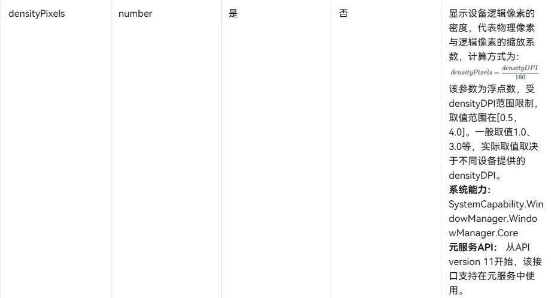

在阅读了官方文档中对于`densityPixels`的解释后，我明白了其实官方的这个划分模式依旧是纯粹的使用宽度进行断点判断罢了。也并没有在断点上去考虑高度的数据。

不过在仔细的阅读后我就发现，这里面还有一个设置最小窗口大小的API可以被我的另一种方式所应用。也就是下面这段代码。

```ts
    try {
      // Set mini window.
      let windowClass: window.Window = windowStage.getMainWindowSync();
      let windowLimits: window.WindowLimits = {
        minWidth: 350
      };
      let promise = windowClass.setWindowLimits(windowLimits);
      promise.then(() => {
        Logger.info(TAG, 'testTag', 'Succeeded in changing the window limits.');
      }).catch((err: BusinessError) => {
        Logger.error(TAG, 'testTag', 'Failed to change the window limits. Cause: %{public}s',
          JSON.stringify(err) ?? '');
      })

    } catch (exception) {
      Logger.error(TAG, 'testTag', 'Failed to change the window limits. Cause: %{public}s',
        JSON.stringify(exception) ?? '');
    }
```

这段代码中使用了Window对象中的setWindowLimits方法，这个方法可以设置窗口的最小宽度，最大宽度，最小高度，最大高度。这样我们就可以通过设置最小高度来达到另一个方法的效果。

<!-- endtab -->


### 主界面渲染布局

#### 颜色切换按钮的位置布局

这个按钮之前为了测试方便直接放在了主界面的轮播图下面，很显然是不合理的。我考虑是直接将这个按钮放在整个屏幕的右下角，和我博客手机端的切换按钮相似的位置。

```ts
  build() {
    Stack(){
      Navigation(this.navPathStuck) {
        MainPage()
      }
      .linearGradient({
        angle: 20,
        colors: [
          [$r('app.color.index_page_background_1'), 0],
          [$r('app.color.index_page_background_2'), 0.4],
          [$r('app.color.index_page_background_3'), 0.7],
          [$r('app.color.index_page_background_4'), 1]
        ]
      })
      .title('NowInOpenHarmony')
      .backgroundColor(Color.Transparent)
      .padding(10)
      .navDestination(this.NavDestMap)
      .hideToolBar(true)
      .height('100%')
      .width('100%')
      .hideBackButton(true)
      .titleMode(NavigationTitleMode.Mini)
      .mode(this.navMod)
      .navBarWidth('40%')
      ColorModChoseButton()
        .position({right:30,bottom:100})
    }
  }
```

#### 针对平板和手机的差异化布局

在平板上显得大小合适的按钮大小，在手机上显得就会有些大，容易遮挡内容，这主要是因为我们所使用的单位为虚拟像素单位VP而并非物理像素单位PX，两者的分辨率以及VP的换算比不一样所以我们需要进行一下定制化处理，虽然平板也会有分辨率和大小差异，但总体属于同一类别的设备，相差不会太多所以我们就不做更加细化的公式计算了。

这里主要依赖的是之前在读官方提供的开源代码时学习到的[deviceInfo设备信息管理](https://developer.huawei.com/consumer/cn/doc/harmonyos-references/js-apis-enterprise-deviceinfo#deviceinfogetdeviceinfo)的系统能力。通过这个kit我们可以获取当前设备的类型，从而进行判断。

```ts
import { DEFAULT_COLOR_MODE, deviceTypesEnum, GET_USER_CONFIG, logger, UserConfigViewModel } from "common"
import { AppStorageV2 } from "@kit.ArkUI"
import { colorModManager } from "../../managers/ColorModManager"
import { ConfigurationConstant } from "@kit.AbilityKit"
import { deviceInfo } from "@kit.BasicServicesKit"

const ColorModChoseButton_LOG_TAG = 'ColorModChoseButton: '

/**
 * 颜色模式切换按钮
 */
@ComponentV2
export struct ColorModChoseButton {
  @Local deviceType: deviceTypesEnum =
    deviceInfo.deviceType === deviceTypesEnum.PHONE ? deviceTypesEnum.PHONE : deviceTypesEnum.TABLET
  @Local appColorMode: 0 | 1 | 2 = DEFAULT_COLOR_MODE

  aboutToAppear(): void {
    this.appColorMode =
      AppStorageV2.connect(UserConfigViewModel, GET_USER_CONFIG, () => new UserConfigViewModel())!.colorModel
  }

  changeColorMode() {
    logger.debug(`${ColorModChoseButton_LOG_TAG}颜色切换触发`)
    if (this.appColorMode === 2) {
      this.appColorMode = 0
      colorModManager.setLightMod()
      logger.info(`${ColorModChoseButton_LOG_TAG}点击生效，切换为浅色模式`)
    } else if (this.appColorMode === 0) {
      this.appColorMode = 1
      colorModManager.setDarkMod()
      logger.info(`${ColorModChoseButton_LOG_TAG}点击生效，切换为深色模式`)
    } else if (this.appColorMode === 1) {
      this.appColorMode = 2
      colorModManager.setDefaultColorMode()
      logger.info(`${ColorModChoseButton_LOG_TAG}点击生效，切换为跟随系统模式`)
    }
  }

  build() {
    Stack({ alignContent: Alignment.Center }) {
      Image($rawfile('colorButtonBG.svg'))
        .width('90%')
        .height('90%')
        .fillColor($r('app.color.color_change_button_svg'))
      if (this.appColorMode === 2) {
        Text('系')
          .textStyle(this.deviceType)
      } else if (this.appColorMode === 1) {
        Text('深')
          .textStyle(this.deviceType)
      } else if (this.appColorMode === 0) {
        Text('浅')
          .textStyle(this.deviceType)
      }
    }
    .width(this.deviceType === deviceTypesEnum.PHONE ? 35 : 45)
    .height(this.deviceType === deviceTypesEnum.PHONE ? 35 : 45)
    .shadow({
      color: Color.Black,
      radius: 10
    })
    .backgroundColor($r('app.color.color_change_button_background'))
    .onClick(() => {
      this.changeColorMode()
    })
    .borderRadius(99)
  }
}

@Extend(Text)
function textStyle(deviceType: deviceTypesEnum) {
  .fontSize(deviceType === deviceTypesEnum.PHONE ? 20 : 30)
  .fontWeight(800)
  .fontColor($r('app.color.color_change_button_font'))
}
```

#### 首页吸顶

首先我先设置了两个彼此独立的ListItemGroup，随后为新闻列表编写一个Builder。

```ts
  @Builder
  NewsListHeaderBuilder() {
    Column() {
      Text(`热点新闻共${this.NewsList?.length}条`)
        .fontSize(20)
        .fontColor($r('app.color.news_list_header_font'))
        .margin({ left: 10 })
    }
    .alignItems(HorizontalAlign.Start)
    .padding(10)
    .backgroundColor($r('app.color.news_list_header_bg'))
    .width('100%')
    .borderRadius({
      topLeft: 20,
      topRight: 20
    })
  }
```

编写完Builder后就可以将吸顶属性给设置上了。

```ts
  @Builder
  NewsListHeaderBuilder() {
    Column() {
      Text(`热点新闻共${this.NewsList?.length}条`)
        .fontSize(20)
        .fontColor($r('app.color.news_list_header_font'))
        .margin({ left: 10 })
    }
    .alignItems(HorizontalAlign.Start)
    .padding(10)
    .backgroundColor($r('app.color.news_list_header_bg'))
    .width('100%')
    .borderRadius({
      topLeft: 20,
      topRight: 20
    })

  }

  build() {
    NavDestination() {
      Column() {
        List({ space: 10 }) {
          ListItemGroup() {
            ListItem() {
              Column() {
                NewsSwiper()
              }
            }
          }

          ListItemGroup({ header: this.NewsListHeaderBuilder() }) {
            ListItem() {

            }
          }
          .borderRadius({
            topLeft: 20,
            topRight: 20
          })
        }
        .sticky(StickyStyle.Header)
        .width('100%')
        .height('100%')
      }
      .width('100%')
      .height('100%')
    }
    .backgroundColor(Color.Transparent)
  }
```

#### 热点新闻列表渲染

对于渲染列表是一个包含了点击跳转至详情页的功能函数，要兼具跳转逻辑以及传参跳转传参的功能，所以我们将它封装为一个功能组件，而不是纯粹的UI样式组件。

这里具体的编写过程就不说了太简单了，最后就直接放代码就好了。

```ts
import { DEVICE_TYPES, NAV_PATH_STUCK, NewsArticle } from "common"
import { AppStorageV2 } from "@kit.ArkUI"
import { deviceInfo } from "@kit.BasicServicesKit"

@ComponentV2
export struct NewsList {
  @Param newsList: NewsArticle[] = []
  @Local navPathStuck: NavPathStack = AppStorageV2.connect(NavPathStack, NAV_PATH_STUCK, () => new NavPathStack())!
  @Local deviceType: DEVICE_TYPES =
    deviceInfo.deviceType === DEVICE_TYPES.PHONE ? DEVICE_TYPES.PHONE : DEVICE_TYPES.TABLET
  @Builder
  NewsListHeaderBuilder() {
    Column() {
      Text(`热点新闻共${this.newsList?.length}条`)
        .fontSize(20)
        .fontColor($r('app.color.news_list_header_font'))
        .margin({ left: 10 })
    }
    .alignItems(HorizontalAlign.Start)
    .padding(10)
    .backgroundColor($r('app.color.news_list_header_bg'))
    .width('100%')
    .borderRadius(20)
    .margin({
      bottom:15
    })
  }

  build() {
    ListItemGroup({ header: this.NewsListHeaderBuilder(),space:15 }) {
      ForEach(this.newsList, (news: NewsArticle, index: number) => {
        ListItem() {
          Column({space:20}){
            Text(news.title)
              .fontSize(this.deviceType===DEVICE_TYPES.PHONE?20:25)
              .fontWeight(900)
            Text(news.date)
              .fontSize(18)
              .fontWeight(200)
              .textOverflow({
                overflow: TextOverflow.Ellipsis
              })
              .maxLines(1)
          }
          .alignItems(HorizontalAlign.Start)
          .width('100%')
        }
        .borderWidth(2)
        .borderColor($r('app.color.news_list_item_border'))
        .backgroundColor($r('app.color.news_list_item_bg'))
        .borderRadius(20)
        .padding({
          top:5,
          bottom:5,
          left:10,
          right:10
        })
        .width('100%')
      })
    }
    .divider({
      strokeWidth:2,
      color:$r('app.color.news_list_divider'),
      endMargin:20,
      startMargin:20
    })
    .borderRadius({
      topLeft: 20,
      topRight: 20
    })
  }
}
```

这里为了保障渲染不出错误所以我的类型设置上并没有设置null的可能性，但是在主界面以及我们的数据获取接口的返回值都有可能是null，所以在传参的时候我也是使用了个小巧思。

```ts
NewsList({ newsList: this.newsList ?? [] })
```

我使用了`??`来进行参数值的判断，简化了单独封装一个函数来去获取值的繁琐情况。`??`是空值合并运算符，只有在左侧为null或者undefined的时候才会返回右侧的值，毕竟null和一个空数组是两个不一样的类型。

随后进行一下实机测试。

<video width="100%" controls>
  <source src="58.mp4" type="video/mp4">
  您的浏览器不支持视频标签。
</video>

<video width="100%" controls>
  <source src="59.mp4" type="video/mp4">
  您的浏览器不支持视频标签。
</video>

随后我们还需要解决一下再header吸顶之后四个圆角会漏出一部分内容的问题，这看起来并不太好。还有就是在下拉刷新的逻辑，在下拉之后更新数据库数据，并等待数据库更新完成后再次进行数据库数据的提取，在此之间还要做一下加载动画。

#### 吸顶事件监听

对于header吸顶事件的监听，虽然目前的API18中没有给出直接的监听函数，但是官方的Q&A中给出了一种[解决方案](https://developer.huawei.com/consumer/cn/doc/architecture-guides/health-v1_2-ts_16-0000002445421321)。

```ts
@Entry
@Component
struct StickyHeaderExample {
  private arr: number[] = [0, 1]
  @Builder
  CustomHeader() {
    Text('分组标题')
      .height(50)
      .width('100%')
      .backgroundColor(Color.Gray)
      .onAreaChange((oldValue: Area, newValue: Area) => {
        if (oldValue.position.y == 0 && newValue.position.y == 0) {
          console.info('没吸顶')
        } else {
          console.info('吸顶了', oldValue.position.y)
        }
      })
  }
  build() {
    Column() {
      List({ space: 10 }) {
        ForEach(this.arr, (item: number) => {
          ListItem() {
            Text('' + item)
              .width('100%')
              .height(50)
              .fontSize(16)
              .textAlign(TextAlign.Center)
              .borderRadius(10)
              .backgroundColor(0xFFFFFF)
          }
        }, (item: string) => item)
        ListItemGroup({
          header: this.CustomHeader,
          space: 10
        }) {
          ForEach(Array.from({ length: 20 }), (item: void, index: number) => {
            ListItem() {
              Text(`列表项 ${index}`)
                .height(80)
                .width('100%')
                .backgroundColor('#FFF')
            }
          })
        }
      }
      .sticky(StickyStyle.Header)
      .width('100%')
      .height('100%')
    }
  }
}
```

主要就是依据我们的header组件在吸顶时他的y轴坐标始终为0这个特性来作为触发扳机，所以我们可以通过监听y轴坐标的变化来判断header是否吸顶。

首先依据官方给出的方案我们来编写一版基础的代码进行测试。

<video width="100%" controls>
  <source src="60.mp4" type="video/mp4">
  您的浏览器不支持视频标签。
</video>

可以看到这里是有一个比较严重的抖动问题，这个问题的原因其实比较好理解，就是在我们的header在第一次触发吸顶时就会开始动画的播放，但播放动画的过程可能会产生几个像素的强制位移，这就会导致监听器监听到了y轴坐标的变化，导致反复触发吸顶切换动画。

为了解决这个问题我们只需要引入一个防抖机制就可以，同时这个防抖机制也可以用来保障动画的完整性，保证单词动画是可以完整的播放，而不是说在动画播放过程中被强制打断。

```ts
import {
  ANIMATE_PARAM,
  DEVICE_TYPES,
  IS_STICKY,
  logger,
  NAV_PATH_STUCK,
  NewsArticle,
  NewsListHeaderIsSticky
} from "common"
import { AppStorageV2, curves } from "@kit.ArkUI"
import { deviceInfo } from "@kit.BasicServicesKit"

const NewsList_LOG_TAG = 'NewsList: '

@ComponentV2
export struct NewsList {
  @Param newsList: NewsArticle[] = []
  @Local navPathStuck: NavPathStack = AppStorageV2.connect(NavPathStack, NAV_PATH_STUCK, () => new NavPathStack())!
  @Local deviceType: DEVICE_TYPES =
    deviceInfo.deviceType === DEVICE_TYPES.PHONE ? DEVICE_TYPES.PHONE : DEVICE_TYPES.TABLET
  @Local isNewsListSticky: NewsListHeaderIsSticky =
    AppStorageV2.connect(NewsListHeaderIsSticky, IS_STICKY, () => new NewsListHeaderIsSticky())!
  @Local headerRadius: number = 20
  @Local headerAlignItems: HorizontalAlign = HorizontalAlign.Center
  @Local headerFontSize: number = 35
  @Local isOnAreaChange:boolean = false

  @Builder
  NewsListHeaderBuilder() {
    Column() {
      Column() {
        Text(`热点新闻共${this.newsList?.length}条`)
          .fontSize(this.headerFontSize)
          .fontColor($r('app.color.news_list_header_font'))
          .margin({ left: 10 })
          .animation({
            curve: Curve.EaseInOut,
            duration: 500,
          })
      }
      .width('95%')
      .alignItems(this.headerAlignItems)
      .padding(10)
      .backgroundColor($r('app.color.news_list_header_bg'))
      .borderRadius(this.headerRadius)
      .margin({
        bottom: 15,
        left: 5,
        right: 5
      })
      .animation({
        curve: Curve.EaseInOut,
        duration: 500,
      })
    }
    .animation({
      curve: Curve.EaseInOut,
      duration: 500,
    })
    .onAreaChange((oldValue: Area, newValue: Area) => {
      if (!this.isOnAreaChange){
        if (newValue.position.y == 0) {
          this.isNewsListSticky.isSticky = false
        } else {
          this.isNewsListSticky.isSticky = true
          this.isOnAreaChange=true
          setTimeout(()=>{
            this.isOnAreaChange=false
          },500)
        }
      }

    })
    .width('100%')
  }

  @Monitor('isNewsListSticky.isSticky')
  viewChange() {
    if (this.isNewsListSticky.isSticky) {
      this.headerRadius = 0
      this.headerAlignItems = HorizontalAlign.Start
      this.headerFontSize = 20
    } else {
      this.headerRadius = 20
      this.headerAlignItems = HorizontalAlign.Center
      this.headerFontSize = 35
    }
  }

  aboutToAppear(): void {
    logger.debug('NewsList aboutToAppear')
    setTimeout(() => {
      if (this.newsList.length == 0) {
        this.getUIContext()
          .getPromptAction()
          .showToast({ message: '后端数据正在更新请稍后下拉刷新或重启应用重试', duration: 5000 })
      }
    }, 200)

  }

  build() {
    ListItemGroup({ header: this.NewsListHeaderBuilder(), space: 30 }) {
      ForEach(this.newsList, (news: NewsArticle, index: number) => {
        ListItem() {
          Column() {
            Column({ space: 20 }) {
              Text(news.title)
                .fontSize(this.deviceType === DEVICE_TYPES.PHONE ? 20 : 25)
                .fontWeight(900)
              Column() {
                Text(`来自于${news.source}`)
                  .fontSize(18)
                  .fontWeight(200)
                  .textOverflow({
                    overflow: TextOverflow.Ellipsis
                  })
                  .maxLines(1)
                Text(news.date)
                  .fontSize(18)
                  .fontWeight(200)
                  .textOverflow({
                    overflow: TextOverflow.Ellipsis
                  })
                  .maxLines(1)
              }
              .alignItems(HorizontalAlign.Start)
            }
            .alignItems(HorizontalAlign.Start)
            .width('100%')
            .padding({
              top: 5,
              bottom: 5,
              left: 10,
              right: 10
            })
            .borderRadius(19)
            .backgroundColor($r('app.color.news_list_item_bg'))
          }
          .width('95%')
          .backgroundImage($rawfile('newsListItemBG.png'))
          .borderWidth(2)
          .borderColor($r('app.color.news_list_item_border'))
          .backgroundColor($r('app.color.news_list_item_bg'))
          .borderRadius(20)

        }
        .transition(ANIMATE_PARAM)
        .width('100%')
        .alignSelf(ItemAlign.Center)
      })
    }
    .borderRadius({
      topLeft: 20,
      topRight: 20
    })
  }
}
```

<video width="100%" controls>
  <source src="61.mp4" type="video/mp4">
  您的浏览器不支持视频标签。
</video>

效果很爽啊真的。

#### 返回顶部按钮

```ts
import {
  NEWS_LIST_ITEM_ANIMATE_PARAM,
  DEVICE_TYPES,
  IS_STICKY,
  logger,
  NAV_PATH_STUCK,
  NewsArticle,
  NewsListHeaderIsSticky,
  NEWS_LIST_ANIMATION_PARAM
} from "common"
import { AppStorageV2, curves } from "@kit.ArkUI"
import { deviceInfo } from "@kit.BasicServicesKit"

const NewsList_LOG_TAG = 'NewsList: '

@ComponentV2
export struct NewsList {
  @Param listScroller:Scroller = new Scroller()
  @Param newsList: NewsArticle[] = []
  @Local navPathStuck: NavPathStack = AppStorageV2.connect(NavPathStack, NAV_PATH_STUCK, () => new NavPathStack())!
  @Local deviceType: DEVICE_TYPES =
    deviceInfo.deviceType === DEVICE_TYPES.PHONE ? DEVICE_TYPES.PHONE : DEVICE_TYPES.TABLET
  @Local isNewsListSticky: NewsListHeaderIsSticky =
    AppStorageV2.connect(NewsListHeaderIsSticky, IS_STICKY, () => new NewsListHeaderIsSticky())!
  @Local headerRadius: number = 20
  @Local headerAlignItems: HorizontalAlign = HorizontalAlign.Center
  @Local headerFontSize: number = 35
  @Local isOnAreaChange:boolean = false

  @Builder
  NewsListHeaderBuilder() {
    Column() {
      Column() {
        Row() {
          Text(`热点新闻共${this.newsList?.length}条`)
            .fontSize(this.headerFontSize)
            .fontColor($r('app.color.news_list_header_font'))
            .margin({ left: 10 })
            .animation(NEWS_LIST_ANIMATION_PARAM)
          if (this.isNewsListSticky.isSticky){
            Image($rawfile('backToTop.svg'))
              .fillColor($r('app.color.back_to_top'))
              .width(25)
              .transition(NEWS_LIST_ITEM_ANIMATE_PARAM)
              .onClick(()=>{
                this.listScroller.scrollEdge(Edge.Top,{velocity:6000})
              })
          }
        }
        .justifyContent(this.isNewsListSticky.isSticky?FlexAlign.SpaceBetween:FlexAlign.Center)
        .width('100%')
      }
      .width('95%')
      .padding(10)
      .backgroundColor($r('app.color.news_list_header_bg'))
      .borderRadius(this.headerRadius)
      .margin({
        bottom: 15,
        left: 5,
        right: 5
      })
      .animation(NEWS_LIST_ANIMATION_PARAM)
    }
    .animation(NEWS_LIST_ANIMATION_PARAM)
    .onAreaChange((oldValue: Area, newValue: Area) => {
      if (!this.isOnAreaChange){
        if (newValue.position.y == 0) {
          this.isNewsListSticky.isSticky = false
        } else {
          this.isNewsListSticky.isSticky = true
          this.isOnAreaChange=true
          setTimeout(()=>{
            this.isOnAreaChange=false
          },200)
        }
      }

    })
    .width('100%')
  }

  @Monitor('isNewsListSticky.isSticky')
  viewChange() {
    if (this.isNewsListSticky.isSticky) {
      this.headerRadius = 0
      this.headerAlignItems = HorizontalAlign.Start
      this.headerFontSize = 20
    } else {
      this.headerRadius = 20
      this.headerAlignItems = HorizontalAlign.Center
      this.headerFontSize = 35
    }
  }

  aboutToAppear(): void {
    logger.debug('NewsList aboutToAppear')
    setTimeout(() => {
      if (this.newsList.length == 0) {
        this.getUIContext()
          .getPromptAction()
          .showToast({ message: '后端数据正在更新请稍后下拉刷新或重启应用重试', duration: 5000 })
      }
    }, 200)

  }

  build() {
    ListItemGroup({ header: this.NewsListHeaderBuilder(), space: 30 }) {
      ForEach(this.newsList, (news: NewsArticle, index: number) => {
        ListItem() {
          Column() {
            Column({ space: 20 }) {
              Text(news.title)
                .fontSize(this.deviceType === DEVICE_TYPES.PHONE ? 20 : 25)
                .fontWeight(900)
              Column() {
                Text(`来自于${news.source}`)
                  .fontSize(18)
                  .fontWeight(200)
                  .textOverflow({
                    overflow: TextOverflow.Ellipsis
                  })
                  .maxLines(1)
                Text(news.date)
                  .fontSize(18)
                  .fontWeight(200)
                  .textOverflow({
                    overflow: TextOverflow.Ellipsis
                  })
                  .maxLines(1)
              }
              .alignItems(HorizontalAlign.Start)
            }
            .alignItems(HorizontalAlign.Start)
            .width('100%')
            .padding({
              top: 5,
              bottom: 5,
              left: 10,
              right: 10
            })
            .borderRadius(19)
            .backgroundColor($r('app.color.news_list_item_bg'))
          }
          .width('95%')
          .backgroundImage($rawfile('newsListItemBG.png'))
          .borderWidth(2)
          .borderColor($r('app.color.news_list_item_border'))
          .backgroundColor($r('app.color.news_list_item_bg'))
          .borderRadius(20)

        }
        .transition(NEWS_LIST_ITEM_ANIMATE_PARAM)
        .width('100%')
        .alignSelf(ItemAlign.Center)
      })
    }
    .borderRadius({
      topLeft: 20,
      topRight: 20
    })
  }
}
```

对原有的UI结构进行一些合理的调整，并将控制按钮的出现与吸顶扳机绑定，再加上一点点的出场动画，就可以开始测试了。

<video width="100%" controls>
  <source src="62.mp4" type="video/mp4">
  您的浏览器不支持视频标签。
</video>

可以看到有一点点卡顿，但不明显。改成懒加载优化一下性能。

#### 懒加载改造

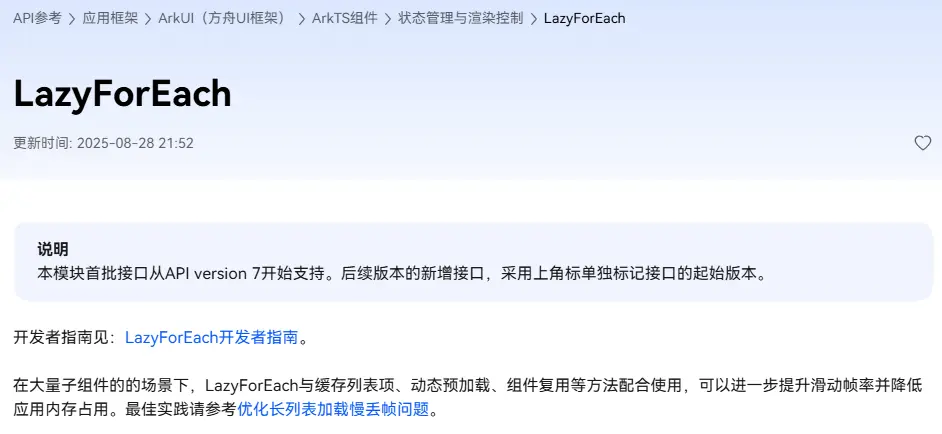

这描述太对味了。让我们开始进行改造吧。

```ts
import { NewsArticle } from "../../../../../Index";

// BasicDataSource实现了IDataSource接口，用于管理listener监听，以及通知LazyForEach数据更新
class BasicDataSource implements IDataSource {
  private listeners: DataChangeListener[] = [];
  private originDataArray: NewsArticle[] = [];

  public totalCount(): number {
    return this.originDataArray.length;
  }

  public getData(index: number): NewsArticle {
    return this.originDataArray[index];
  }

  // 该方法为框架侧调用，为LazyForEach组件向其数据源处添加listener监听
  registerDataChangeListener(listener: DataChangeListener): void {
    if (this.listeners.indexOf(listener) < 0) {
      console.info('add listener');
      this.listeners.push(listener);
    }
  }

  // 该方法为框架侧调用，为对应的LazyForEach组件在数据源处去除listener监听
  unregisterDataChangeListener(listener: DataChangeListener): void {
    const pos = this.listeners.indexOf(listener);
    if (pos >= 0) {
      console.info('remove listener');
      this.listeners.splice(pos, 1);
    }
  }

  // 通知LazyForEach组件需要重载所有子组件
  notifyDataReload(): void {
    this.listeners.forEach(listener => {
      listener.onDataReloaded();
    });
  }

  // 通知LazyForEach组件需要在index对应索引处添加子组件
  notifyDataAdd(index: number): void {
    this.listeners.forEach(listener => {
      listener.onDataAdd(index);
      // 写法2：listener.onDatasetChange([{type: DataOperationType.ADD, index: index}]);
    });
  }

  // 通知LazyForEach组件在index对应索引处数据有变化，需要重建该子组件
  notifyDataChange(index: number): void {
    this.listeners.forEach(listener => {
      listener.onDataChange(index);
      // 写法2：listener.onDatasetChange([{type: DataOperationType.CHANGE, index: index}]);
    });
  }

  // 通知LazyForEach组件需要在index对应索引处删除该子组件
  notifyDataDelete(index: number): void {
    this.listeners.forEach(listener => {
      listener.onDataDelete(index);
      // 写法2：listener.onDatasetChange([{type: DataOperationType.DELETE, index: index}]);
    });
  }

  // 通知LazyForEach组件将from索引和to索引处的子组件进行交换
  notifyDataMove(from: number, to: number): void {
    this.listeners.forEach(listener => {
      listener.onDataMove(from, to);
      // 写法2：listener.onDatasetChange(
      //         [{type: DataOperationType.EXCHANGE, index: {start: from, end: to}}]);
    });
  }

  notifyDatasetChange(operations: DataOperation[]): void {
    this.listeners.forEach(listener => {
      listener.onDatasetChange(operations);
    });
  }
}

export class NewsListDataSource extends BasicDataSource {
  private dataArray: NewsArticle[] = [];

  public totalCount(): number {
    return this.dataArray.length;
  }

  public getData(index: number): NewsArticle {
    return this.dataArray[index];
  }

  public pushData(data: NewsArticle): void {
    this.dataArray.push(data);
    this.notifyDataAdd(this.dataArray.length - 1);
  }
}
```

首先依据官方文档去封装好我们的数据源工具类，随后我们再去改写一下页面的数据源部分。

```ts
import {
  NEWS_LIST_ITEM_ANIMATE_PARAM,
  DEVICE_TYPES,
  IS_STICKY,
  logger,
  NAV_PATH_STUCK,
  NewsArticle,
  NewsListHeaderIsSticky,
  NEWS_LIST_ANIMATION_PARAM,
  NewsListDataSource
} from "common"
import { AppStorageV2, curves } from "@kit.ArkUI"
import { deviceInfo } from "@kit.BasicServicesKit"

const NewsList_LOG_TAG = 'NewsList: '

@ComponentV2
export struct NewsList {
  @Param listScroller: Scroller = new Scroller()
  @Param newsList: NewsArticle[] = []
  @Local navPathStuck: NavPathStack = AppStorageV2.connect(NavPathStack, NAV_PATH_STUCK, () => new NavPathStack())!
  @Local deviceType: DEVICE_TYPES =
    deviceInfo.deviceType === DEVICE_TYPES.PHONE ? DEVICE_TYPES.PHONE : DEVICE_TYPES.TABLET
  @Local isNewsListSticky: NewsListHeaderIsSticky =
    AppStorageV2.connect(NewsListHeaderIsSticky, IS_STICKY, () => new NewsListHeaderIsSticky())!
  @Local headerRadius: number = 20
  @Local headerAlignItems: HorizontalAlign = HorizontalAlign.Center
  @Local headerFontSize: number = 35
  @Local isOnAreaChange: boolean = false
  @Local newsListDataSource: NewsListDataSource = new NewsListDataSource()

  @Builder
  NewsListHeaderBuilder() {
    Column() {
      Column() {
        Row() {
          Text(`热点新闻共${this.newsList?.length}条`)
            .fontSize(this.headerFontSize)
            .fontColor($r('app.color.news_list_header_font'))
            .margin({ left: 10 })
            .animation(NEWS_LIST_ANIMATION_PARAM)
          if (this.isNewsListSticky.isSticky) {
            Image($rawfile('backToTop.svg'))
              .fillColor($r('app.color.back_to_top'))
              .width(25)
              .transition(NEWS_LIST_ITEM_ANIMATE_PARAM)
              .onClick(() => {
                this.listScroller.scrollEdge(Edge.Top, { velocity: 6000 })
              })
          }
        }
        .justifyContent(this.isNewsListSticky.isSticky ? FlexAlign.SpaceBetween : FlexAlign.Center)
        .width('100%')
      }
      .width('95%')
      .padding(10)
      .backgroundColor($r('app.color.news_list_header_bg'))
      .borderRadius(this.headerRadius)
      .margin({
        bottom: 15,
        left: 5,
        right: 5
      })
      .animation(NEWS_LIST_ANIMATION_PARAM)
    }
    .animation(NEWS_LIST_ANIMATION_PARAM)
    .onAreaChange((oldValue: Area, newValue: Area) => {
      if (!this.isOnAreaChange) {
        if (newValue.position.y == 0) {
          this.isNewsListSticky.isSticky = false
        } else {
          this.isNewsListSticky.isSticky = true
          this.isOnAreaChange = true
          setTimeout(() => {
            this.isOnAreaChange = false
          }, 200)
        }
      }

    })
    .width('100%')
  }

  @Monitor('isNewsListSticky.isSticky')
  viewChange() {
    if (this.isNewsListSticky.isSticky) {
      this.headerRadius = 0
      this.headerAlignItems = HorizontalAlign.Start
      this.headerFontSize = 20
    } else {
      this.headerRadius = 20
      this.headerAlignItems = HorizontalAlign.Center
      this.headerFontSize = 35
    }
  }

  pushNewsArticleDataToDataSource() {
    this.newsList.forEach((item) => {
      this.newsListDataSource.pushData(item)
    })
  }

  aboutToAppear(): void {

    setTimeout(() => {
      if (this.newsList.length == 0) {
        this.getUIContext()
          .getPromptAction()
          .showToast({ message: '后端数据正在更新请稍后下拉刷新或重启应用重试', duration: 5000 })
      }
      this.pushNewsArticleDataToDataSource()
    }, 200)
  }

  build() {
    ListItemGroup({ header: this.NewsListHeaderBuilder(), space: 30 }) {
      LazyForEach(this.newsListDataSource, (news: NewsArticle) => {
        ListItem() {
          Column() {
            Column({ space: 20 }) {
              Text(news.title)
                .fontSize(this.deviceType === DEVICE_TYPES.PHONE ? 20 : 25)
                .fontWeight(900)
              Column() {
                Text(`来自于${news.source}`)
                  .fontSize(18)
                  .fontWeight(200)
                  .textOverflow({
                    overflow: TextOverflow.Ellipsis
                  })
                  .maxLines(1)
                Text(news.date)
                  .fontSize(18)
                  .fontWeight(200)
                  .textOverflow({
                    overflow: TextOverflow.Ellipsis
                  })
                  .maxLines(1)
              }
              .alignItems(HorizontalAlign.Start)
            }
            .alignItems(HorizontalAlign.Start)
            .width('100%')
            .padding({
              top: 5,
              bottom: 5,
              left: 10,
              right: 10
            })
            .borderRadius(19)
            .backgroundColor($r('app.color.news_list_item_bg'))
          }
          .width('95%')
          .backgroundImage($rawfile('newsListItemBG.png'))
          .borderWidth(2)
          .borderColor($r('app.color.news_list_item_border'))
          .backgroundColor($r('app.color.news_list_item_bg'))
          .borderRadius(20)

        }
        .transition(NEWS_LIST_ITEM_ANIMATE_PARAM)
        .width('100%')
        .alignSelf(ItemAlign.Center)
      }, (item: NewsArticle, i: number) => {
        return `${item.id}+${i}`
      })
    }
    .borderRadius({
      topLeft: 20,
      topRight: 20
    })
  }
}
```

用数据源进行数据渲染，这里将懒加载提前到下拉刷新逻辑编写之前也是为了方便后续数据更新的逻辑不用再次更新。对此我也进一步的为刷新逻辑进行一下接口的预留吧。

```ts
export class NewsListDataSource extends BasicDataSource {
  private dataArray: NewsArticle[] = [];

  public totalCount(): number {
    return this.dataArray.length;
  }

  public getData(index: number): NewsArticle {
    return this.dataArray[index];
  }

  public pushData(data: NewsArticle): void {
    this.dataArray.push(data);
    this.notifyDataAdd(this.dataArray.length - 1);
  }

  /**
   * 批量添加数据
   * @param dataArr 待添加数据数组
   */
  public pushDataArr(dataArr: NewsArticle[]): void {
    dataArr.forEach(item=> {
      this.dataArray.push(item)
      this.notifyDataAdd(this.dataArray.length - 1);
    })
  }
  /**
   * 重新录入全部数据，替换现有数据
   * @param newData 新的完整数据数组
   */
  public resetData(newData: NewsArticle[]): void {
    // 替换现有数据
    this.dataArray = [...newData];
    // 通知组件重新加载所有数据
    this.notifyDataReload();
  }
}
```

ok，测试一下。

<video width="100%" controls>
  <source src="64.mp4" type="video/mp4">
  您的浏览器不支持视频标签。
</video>

哎呀太爽了。

#### 下拉刷新

下拉刷新逻辑核心就是依赖一个Refresh组件，然后手动绑定一下下拉刷新结束的扳机，同时写一下刷新逻辑。

```ts
import { IS_STICKY, NewsArticle, NewsListHeaderIsSticky } from "common"
import { NewsList, newsManager, NewsSwiper } from "feature"
import { AppStorageV2 } from "@kit.ArkUI"

const MainPage_TAG = 'MainPage: '

@Preview
@ComponentV2
export struct MainPage {
  @Local newsList: NewsArticle[] | null = null
  @Local isNewsListSticky: NewsListHeaderIsSticky =
    AppStorageV2.connect(NewsListHeaderIsSticky, IS_STICKY, () => new NewsListHeaderIsSticky())!
  @Local listScroller: Scroller = new Scroller()
  @Local isLoading: boolean = false

  async aboutToAppear(): Promise<void> {
    this.newsList = await newsManager.getNewsArticleListFromDB()
    if (!this.newsList) {
      this.getUIContext().getPromptAction().showToast({ message: `当前数据库新闻数据为空,请连接后端服务以更新数据` })
    } else if (this.newsList) {
      this.getUIContext().getPromptAction().showToast({ message: `查询到${this.newsList.length}条新闻数据` })
    }
  }

  async reloadAllData() {
    this.getUIContext().getPromptAction().showToast({ message: '刷新数据' })
    if (await newsManager.updateNewsListToDB()) {
      this.newsList = await newsManager.getNewsArticleListFromDB()
      this.newsList = []
      return true
    }
    this.getUIContext().getPromptAction().showToast({ message: '获取新数据失败请稍后再试。' })
    return false
  }

  build() {
    Column() {
      Refresh({ refreshing: $$this.isLoading }) {
        List({ space: 20, scroller: this.listScroller }) {
          ListItemGroup() {
            ListItem() {
              NewsSwiper()
            }
          }

          NewsList({ newsList: this.newsList ?? [], listScroller: this.listScroller })
        }
        .edgeEffect(EdgeEffect.Spring, { alwaysEnabled: true })
        .chainAnimation(true)
        .sticky(StickyStyle.Header)
        .width('100%')
        .height('100%')
      }
      .onRefreshing(async () => {
        await this.reloadAllData()
        this.isLoading = false
      })
    }
    .width('100%')
    .height('100%')
  }
}
```

随后再在NewsList组件补上一个监听器就可以。

```ts
  @Monitor('newsList')
  resetDataSource(){
    logger.info('捕获到newsList变化'+this.newsList.length)
    this.newsListDataSource.resetData(this.newsList)
  }
```

经测试很顺利。

## 后端爬虫逻辑调优

### CSDN爬虫数据问题

在开发客户端时一直在编写一些逻辑函数的封装以及UI组件的封装，并没有过多在意我们所获取到的数据是否正确，因为总条数也确实很多我就没有在意，在渲染了NewsList组件后才发现获取的数据都是OpenHarmony官网的资讯，而并不是CSDN的资讯，这时我才意识到了CSDN的爬虫数据获取发生了错误。

首先是在渲染中发现新闻的日期都是很落后的，最细的一个是25年2月的，随后我又去CSDN搜索了一下发现最新的文章是今年8月的，那明显是错误了。

我的怀疑的问题有两点，一种是被反爬了，另一种是因为动态网页的页面内容导致我的爬虫没有等待内容加载完成就进行数据提取了。

在修改完了基础的爬虫逻辑后确实是因为没有等待内容加载完成就进行数据提取了，所以导致获取到的数据都是错误的。但是只有第一篇是成功的后续都是失败的，失败原因是被积极反爬了，所以我要尝试用虚拟IP，修改浏览器UA等功能的高级爬虫来进行尝试。

同时为了减少测试的等待时间，我们将分两种情况：

1. 首次启动时的分批写入：从0开始，每20篇立即写入
2. 后续定时更新：完整爬取后一次性覆盖，避免数据倒退

在更新完爬取机制之后的的确确是能够正常获取CSDN的数据了。那后端就还剩一个坑没填上了，也就是轮播图的问题。这个接口暂时还没开发。

## PR创建

这一部分我从来没想过会如此麻烦，本以为是写好了直接push到仓库随后让导师审查一下并入主线就好了，结果想象到还有很多流程是我没考虑到的，这我才理解到为什么老师要催着我去先提交一份。

### doc签署

之前一段时间，开源之夏的运营员私信问了我一次说是否有瓶颈，是否签署了劳务合同，是否有问题等常规的运营性的问题，也是为了确保是否能正常结项，我当时是信心十足的说没问题，但那也只是在我考虑了开发技术上的情况的确是没什么问题，但是我是没想到在PR的创建以及OpenHarmony的代码门禁上会好这么长时间。


首先遇到的问题就是当我想创建pr的时候才发现我没有签署OpenHarmony的开源协议，在签署之后我才能去创建pr。


签署完成，这一步倒是没有拦住我，我接着就去继续创建pr，但老师给出的要求是要先去创建一个issue，然后通过关联issue来去创建pr。

### 创建issue

首先我在当初和老师最初的交流中我本以为代码提交的流程不过是，我fork一下原仓库，随后我编写代码，将代码push到我的仓库最后再创建一个pr，让导师去同意一下就好了，就没有太多在意，前两个月都没管这个事，知道我UI大致做出来了项目有了最初版本的雏形了，在老师的提醒下我先去将当前尚不完善的代码进行了pr的创建。

在我创建pr之前，老师先让我去创建一个issue，在issue中编写一下档期啊你这个项目的介绍文档，仔细一想确实是个合理的过程，只不过此前我确实没有给第三方的仓库去进行过代码贡献，并不清楚具体的流程。

随后我创建了一个十分详细的文档放到了[issue](https://gitcode.com/openharmony-sig/ostest_integration_test/issues/205)的正文内容中。这种任务交给AI真的在合适不过了，快速的阅读项目，分析架构，给出整体的运作流程这种活，AI真的是干的又快又好，除非是需要对项目进行修改，刚需开发人员对项目的运作流程熟记于心，否则AI就是有绝对的优势。

随后老师说在评论区发送`start build`来执行门禁检查，当时我还没理解是什么意思，我就直接在我创建的issue下面去评论了`start build`然后也没有任何反应，但由于我当时并没有理解这个启动代码门禁检查是个什么意思，所以也就没管有没有反应就向老师反馈了，截了个图。现在看来真是蠢炸了，在issue下面构建个啥，又没有代码可以用来构建。不过我倒是很快意识到了问题的存在，但又因为不知道真正的流程是怎样的，所以就先去问了问AI，这才知道原来pr下方也是有评论区的，这真是此前闻所未闻了，也许是我github玩的还不够多吧，gitee，gitCode，github，gitlab这几家还是得多玩玩的，要不真成开源文盲了。

### 签名推送

在创建了issue，并编写了pr的简介之后，老师告诉我不光是没有签署开源协议，还没有进行commit的签名。“commit还有签名？”这是我当时内心的原话。用了这么久的git我是真的不知道commit还有签名这么个功能。

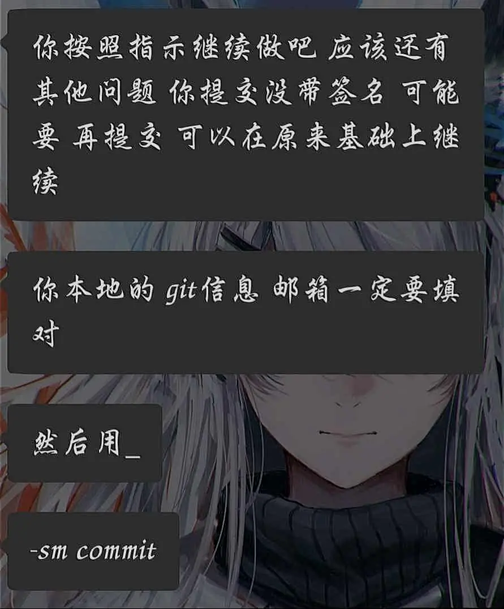

我赶紧去问了问AI，仿照着老师提供的commit命令从新进行了尝试，随后在官网进行了一下查看，发现确实是有区别的。

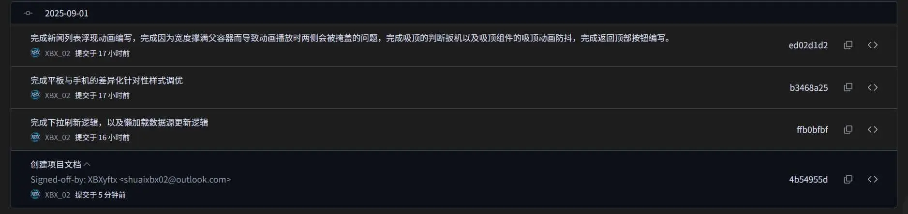

可以看到上面没有签名的它只有一行账号的信息，这是通过git账号登录或是ssh秘钥来去判断的是谁推送的commit，而经过签名的则会还有一行`Signed-off-by`。

### 如何实现签名Commit

那么，如何使用git命令来实现commit签名呢？主要有两种方式：

#### 方式一：使用-s参数快速添加Signed-off-by

这是最简单的一种方式，只需在commit命令中添加`-s`或`--signoff`参数：

```bash
# 基本语法
git commit -s -m "你的提交信息"

# 示例
git commit -s -m "feat: 添加新功能"
```

这条命令会自动在你的提交信息末尾添加一行`Signed-off-by: 你的名字 <你的邮箱>`，这就是我们在截图中看到的签名行。

#### 方式二：使用GPG密钥进行加密签名

如果你需要更高级的加密签名（在GitHub上会显示"Verified"徽章），可以使用GPG密钥：

1. **检查是否已安装GPG**

  ```bash
  gpg --version
  ```

2. **生成GPG密钥（如果没有）**

  ```bash
  gpg --full-generate-key
  ```

  - 选择密钥类型：通常选择默认的RSA和RSA
  - 选择密钥长度：建议至少3072位
  - 设置密钥有效期：根据需要选择
  - 填写用户信息：姓名、邮箱等
  - 设置密码：保护你的私钥

3. **查看并复制GPG密钥ID**

  ``bash
  pg --list-secret-keys --keyid-format=long
  ``
  找到以`sec`开头的行，格式类似`sec  rsa4096/3AA5C34371567BD2 2023-01-01 [SC]`，其中3AA5C34371567BD2`就是你的密钥ID。
  
4. **配置Git使用你的GPG密钥**

  ```bash
  git config --global user.signingkey 你的密钥ID
  ```

5. **在commit时使用GPG签名**

  ```bash
  每次commit时手动签名
  git commit -S -m "你的提交信息"

  或者设置默认签名所有commit
  git config --global commit.gpgsign true
  ```

6. **将GPG公钥添加到GitHub**

  ```bash
  gpg --armor --export 你的密钥ID
  ```
  复制输出的公钥内容，然后添加到GitHub的"Settings > SSH and GPG keys > New GPG key"中。

#### 方式三：使用SSH密钥进行签名

GitHub也支持使用SSH密钥进行commit签名，这对于已经有SSH密钥的用户来说更加方便：

1. **生成SSH密钥（如果没有）**

  ```bash
  # 推荐使用更安全的Ed25519算法
  ssh-keygen -t ed25519 -C "你的邮箱"

  # 或者使用兼容性更好的RSA算法
  ssh-keygen -t rsa -b 4096 -C "你的邮箱"
  ```

2. **配置Git使用SSH密钥格式**

  ```bash
  git config --global gpg.format ssh
  ```

1. **设置签名密钥路径**

  ```bash
  git config --global user.signingkey ~/.ssh/id_ed25519.pub
  ```

1. **将SSH公钥添加到GitHub并标记为签名密钥**

  - 复制公钥内容：`cat ~/.ssh/id_ed25519.pub`
  - 添加到GitHub的"Settings > SSH and GPG keys > New SSH key"中
  - 在"Key type"中选择"Signing Key"

5. **使用SSH密钥签名commit**
  ```bash
  # 每次commit时手动签名
  git commit -S -m "你的提交信息"

  # 或者设置默认签名所有commit
  git config --global commit.gpgsign true
  ```

通过以上三种方式，你就可以为你的commit添加签名，提高代码的安全性和可信度。对于开源项目来说，这也是一个很好的实践，可以证明提交确实来自于你本人。

### VScode的git探索

因为我平常已经习惯于用IDE，VScode或者是GithubDesktop这类可视化git工具来去进行推送了，所以想要去研究一下如何使用VScode进行签名commit，这种常用的功能应该会被VScode以及基于VScode的一系列IDE所集成。

在正常的编写完commit信息，准备点击commit的时候我开始了寻找。顺着直觉点开了右上角的更多按钮，下拉找到commit一栏。果然如我所料，VScode系列的这些IDE都有这个选项。

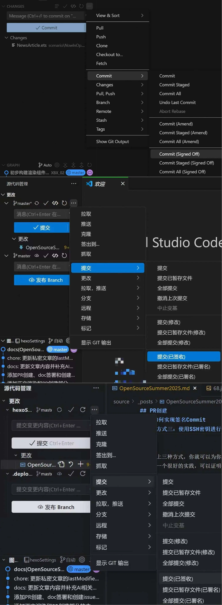

### 开源协议版权头的添加

为了将过往全部commit都给变成签名commit，我就只好去删库从新创建，先将写好的项目代码复制一份单独备份到Github的私有仓库，随后将本地仓库文件全部删除，最后将gitcode上fork的仓库删除，从新fork。

随后将全部源码再次搬运回来，利用签名commit进行推送，再次创建新的pr并关联issue，在pr的评论区发送`start build`终于是经过了doc检查，开始了代码门禁的静态检查环节。

此时我的静态文件审查并没有通过，在查看门禁审查结果的时候发现问题出现在我的代码中全都没有添加版权头，所以出现了大量的“致命错误”。当然对此我也并不觉得惊讶，毕竟我此前看过的所有开源代码除了文件格式不允许出现注释，例如json，都会有一个开源协议的版权头，声明原作者的同时标明当前代码的开源协议，与此同时去进行版权的声明。

于是我就开始了我的漫漫复制黏贴之路。我本以为全加一遍就结束了，但没想到检查漏加的文件这一过程整整持续了两天才结束。

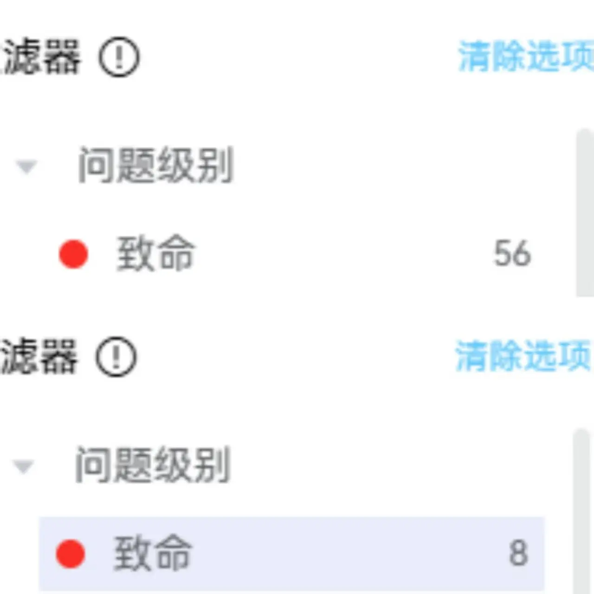

在将数量下压到8个文件之后就始终无法再降了，我反复排查反复尝试，发现问题就出在鸿蒙项目的几个json5配置文件中，就是那几个json5配置文件的开源协议在我几次修改后都被意外删除。但我始终不知道原因，于是我尝试了一次在添加好配置文件的版权头之后不点击deveco右上角的同步数据按钮，直接进行commit进行推送，再次执行代码门禁检查发现果然通过了，我很快就进行了实验，我直接用cursor修改配置文件，而不从deveco进行修改，发现没问题，更改被正确的留存。在deveco修改完不点击同步数据按钮也没问题，版权头也没有被删除，而当我点击同步数据之后所有json5文件之中的版权头注释都消失了，这一点证明了我的猜想，就是deveco的自动数据同步过程删除了这些“非必要的”字段导致我的代码门禁始终不通过。

## 首次代码的合并

在终于通过了代码门禁的静态检查之后，老师同意了我的合并请求，于是在九三阅兵的礼炮声中，我的代码被正式合并了。虽然到这里我的项目还没有完全完成，但这个时间点真的很有意义，至少对我来说是很触动的一个时间点。

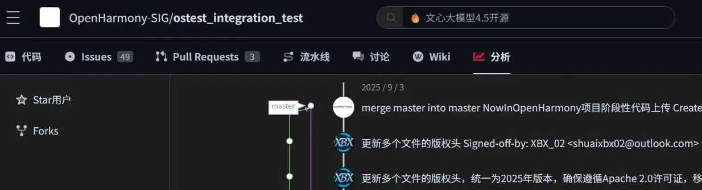

## 正文渲染

首先我们需要区分正文详情页的UI样式和文章渲染的功能组件，这两者的目的不同且应当尽可能降低耦合度。

### 正文渲染组件

首先正文的渲染是深度依赖于我前期在进行爬虫开发时所设定的数据结构。只需要判断当前语句块的类型，同时去进行对应组件的渲染就好了，整体的逻辑还是非常简单的。

#### Markdown三方库组件配置初始化

再考虑了一下之后我还是决定使用[@luvi/lv-markdown-in(V2.0.15)](https://ohpm.openharmony.cn/#/cn/detail/@luvi%2Flv-markdown-in)这个三方库来进行代码块的渲染，主要是在于它的配置项能单独给代码块这一项进行配置。

```ts
  markDownConfigInit(){
    let baseFontSize =  AppStorageV2.connect(UserConfigViewModel, GET_USER_CONFIG, () => new UserConfigViewModel())!.fontSize
    lvCode.setIndexState(true)
    lvText.setTextSize(baseFontSize)
  }
```

额，好像也就这么点能设置的了。

#### 渲染逻辑

这里就直接扔代码把，大家都看得懂。等实机测试之后才能继续去进行样式的调优。

```ts
import {
  CONTENT_TYPE_ENUM,
  DEVICE_TYPES, NewsArticle, NewsContentBlock } from "common"
import { deviceInfo } from "@kit.BasicServicesKit"
import { LvMarkdownIn } from '@luvi/lv-markdown-in'
/**
 * 文章内容渲染组件
 * @param article 带渲染文章内容
 * @param baseFontSize 基准字体大小
 */
@ComponentV2
export struct NewsArticleView {
  @Param article: NewsArticle = {
    id: "",
    title: "",
    date: "",
    url: "",
    content: [],
    source: ''
  }
  @Param baseFontSize: number = 0
  @Local deviceType: DEVICE_TYPES =
    deviceInfo.deviceType === DEVICE_TYPES.PHONE ? DEVICE_TYPES.PHONE : DEVICE_TYPES.TABLET
  @Builder
  articleInfoBuilder(){
    Row(){
      Text(`日期：${this.article.date} ${this.article.source?'来源：':''}${this.article.source}`)
        .fontSize(this.baseFontSize)
    }
    .width('100%')
  }
  build() {
    // 根组件
    Column() {
      Text(this.article.title)
        .alignSelf(ItemAlign.Start)
        .fontSize(this.baseFontSize + this.deviceType === DEVICE_TYPES.PHONE ? 8 : 10)
      // 日期来源行
      this.articleInfoBuilder()
      
      ForEach(this.article.content,(item:NewsContentBlock,i:number)=>{
        if (item.type === CONTENT_TYPE_ENUM.TEXT) {
          Text(item.value)
            .fontSize(this.baseFontSize)
        }else if (item.type === CONTENT_TYPE_ENUM.IMAGE){
          Image(item.value)
            .width('80%')
        }else if (item.type === CONTENT_TYPE_ENUM.VIDEO){
          Video({
            src:item.value
          })
        }else if (item.type === CONTENT_TYPE_ENUM.CODE){
          LvMarkdownIn({
            text:item.value
          })
        }
      })
    }
    .backgroundColor($r('app.color.article_info_builder_bg'))
    .width('100%')
    .height('100%')
  }
}
```

随后就该回到详情页的NavDestination组件去继续了。

### Nav传参

#### 跳转导航更新

首先我们先将起始页的导航Builder以及跳转名称常量去进行一下更新

```ts
export enum NAV_DESTS {
  MAIN = 'Main',
  ARTICLE = 'Article'
}
```

```ts
  @Builder
  NavDestMap(name: string) {
    if (name === NAV_DESTS.MAIN) {
      Main()
    }else if (name === NAV_DESTS.ARTICLE) {
      ArticlePage()
    }
  }
```

随后再去在NewsList的组件中去进行参数的修改，加入导航页面栈的传入接口。由于NewsList是存在于Feature特性能力层的功能组件，所以我们尽量不直接使用AppStorage去获取数据，而是通过传参的形式去获取数据。

```ts
NewsList({ newsList: this.newsList ?? [], listScroller: this.listScroller, navStuck: this.navPathStuck })
```

```ts
  @Param navStuck:NavPathStack = new NavPathStack()
```

随后再去给每一个Item去绑定点击事件。

```ts
.onClick(()=>{
  this.navStuck.replacePath({
    name:NAV_DESTS.ARTICLE,
    param:news
  })
})
```

通过[NavPathInfo](https://developer.huawei.com/consumer/cn/doc/harmonyos-references/ts-basic-components-navigation#navpathinfo10)对象去进行传参，随后再在目标页面使用[onReady](https://developer.huawei.com/consumer/cn/doc/harmonyos-references/ts-basic-components-navdestination#onready11)回调函数去进行参数的接收。

```ts
@ComponentV2
export struct ArticlePage {
  @Local baseFontSize: number = AppStorageV2.connect(UserConfigViewModel, GET_USER_CONFIG)!.fontSize
  @Local article:NewsArticle = {
    id: '',
    title: '',
    date: '',
    url: '',
    content: []
  }
  build() {
    NavDestination() {

    }
    .onReady((navDestinationContext:NavDestinationContext)=>{
      this.article = navDestinationContext.pathInfo.param as NewsArticle
    })
    .width('100%')
    .height('100%')
  }
}
```

随后实际测试中发现文章的段落间隙过小，同时还存在标题字体过小的问题，于是我又进行了大量的样式调整。

```ts
/**
 * Copyright (c) 2025 XBXyftx
 * Licensed under the Apache License, Version 2.0 (the "License");
 * you may not use this file except in compliance with the License.
 * You may obtain a copy of the License at
 *
 *     http://www.apache.org/licenses/LICENSE-2.0
 *
 * Unless required by applicable law or agreed to in writing, software
 * distributed under the License is distributed on an "AS IS" BASIS,
 * WITHOUT WARRANTIES OR CONDITIONS OF ANY KIND, either express or implied.
 * See the License for the specific language governing permissions and
 * limitations under the License.
 */
import {
  CONTENT_TYPE_ENUM, DEVICE_TYPES, NewsArticle, NewsContentBlock
} from "common"
import { deviceInfo } from "@kit.BasicServicesKit"
import { LvMarkdownIn } from '@luvi/lv-markdown-in'

/**
 * 文章内容渲染组件
 * @param article 带渲染文章内容
 * @param baseFontSize 基准字体大小
 */
@ComponentV2
export struct NewsArticleView {
  @Param article: NewsArticle = {
    id: "",
    title: "",
    date: "",
    url: "",
    content: [],
    source: ''
  }
  @Param baseFontSize: number = 0
  @Local deviceType: DEVICE_TYPES =
    deviceInfo.deviceType === DEVICE_TYPES.PHONE ? DEVICE_TYPES.PHONE : DEVICE_TYPES.TABLET

  @Builder
  articleInfoBuilder() {
    Row() {
      Text(`日期：${this.article.date} ${this.article.source ? '来源：' : ''}${this.article.source}`)
        .fontSize(this.baseFontSize+4)
    }
    .width('100%')
  }

  build() {
    // 根组件
    Scroll() {
      Column({space:10+(this.baseFontSize*0.3)}) {
        Text(this.article.title)
          .alignSelf(ItemAlign.Start)
          .fontSize(this.baseFontSize + (this.deviceType === DEVICE_TYPES.PHONE ? 12 : 16))
          .fontWeight(900)
        // 日期来源行
        this.articleInfoBuilder()

        ForEach(this.article.content, (item: NewsContentBlock, i: number) => {
          if (item.type === CONTENT_TYPE_ENUM.TEXT) {
            Text(item.value)
              .fontSize(this.baseFontSize)
          } else if (item.type === CONTENT_TYPE_ENUM.IMAGE) {
            Image(item.value)
              .width('80%')
              .alignSelf(ItemAlign.Center)
          } else if (item.type === CONTENT_TYPE_ENUM.VIDEO) {
            Video({
              src: item.value
            })
              .width('80%')
              .alignSelf(ItemAlign.Center)
          } else if (item.type === CONTENT_TYPE_ENUM.CODE) {
            LvMarkdownIn({
              text: item.value
            })
          }
        })
      }
      .borderRadius(20)
      .alignItems(HorizontalAlign.Start)
      .backgroundColor($r('app.color.article_info_builder_bg'))

    }
    .scrollBar(BarState.Off)
    .borderRadius(20)
    .width('100%')
    .height('100%')

  }
}
```

将字体大小与可设置的字体大小进行绑定，同时将文章的标题，日期，来源，内容等全部进行绑定，随后在ForEach中根据文章内容类型的不同进行不同的渲染。

随后再加入更多针对手机平板差异的样式调整。

```ts
/**
 * Copyright (c) 2025 XBXyftx
 * Licensed under the Apache License, Version 2.0 (the "License");
 * you may not use this file except in compliance with the License.
 * You may obtain a copy of the License at
 *
 *     http://www.apache.org/licenses/LICENSE-2.0
 *
 * Unless required by applicable law or agreed to in writing, software
 * distributed under the License is distributed on an "AS IS" BASIS,
 * WITHOUT WARRANTIES OR CONDITIONS OF ANY KIND, either express or implied.
 * See the License for the specific language governing permissions and
 * limitations under the License.
 */
import {
  CONTENT_TYPE_ENUM, DEVICE_TYPES, NewsArticle, NewsContentBlock
} from "common"
import { deviceInfo } from "@kit.BasicServicesKit"
import { LvMarkdownIn } from '@luvi/lv-markdown-in'

/**
 * 文章内容渲染组件
 * @param article 带渲染文章内容
 * @param baseFontSize 基准字体大小
 */
@ComponentV2
export struct NewsArticleView {
  @Param article: NewsArticle = {
    id: "",
    title: "",
    date: "",
    url: "",
    content: [],
    source: ''
  }
  @Param baseFontSize: number = 0
  @Local deviceType: DEVICE_TYPES =
    deviceInfo.deviceType === DEVICE_TYPES.PHONE ? DEVICE_TYPES.PHONE : DEVICE_TYPES.TABLET

  @Builder
  articleInfoBuilder() {
    Row() {
      Text(`日期：${this.article.date} ${this.article.source ? '来源：' : ''}${this.article.source}`)
        .fontSize(this.baseFontSize+(this.deviceType === DEVICE_TYPES.PHONE ? 8 : 12))
    }
    .width('100%')
  }

  build() {
    // 根组件
    Scroll() {
      Column({space:10+(this.baseFontSize*(this.deviceType === DEVICE_TYPES.PHONE ?0.3:0.5))}) {
        Text(this.article.title)
          .alignSelf(ItemAlign.Start)
          .fontSize(this.baseFontSize + (this.deviceType === DEVICE_TYPES.PHONE ? 12 : 16))
          .fontWeight(900)
        // 日期来源行
        this.articleInfoBuilder()

        ForEach(this.article.content, (item: NewsContentBlock, i: number) => {
          if (item.type === CONTENT_TYPE_ENUM.TEXT) {
            Text(item.value)
              .fontSize(this.baseFontSize+ (this.deviceType === DEVICE_TYPES.PHONE ? 0 : 6))
          } else if (item.type === CONTENT_TYPE_ENUM.IMAGE) {
            Image(item.value)
              .width('80%')
              .alignSelf(ItemAlign.Center)
          } else if (item.type === CONTENT_TYPE_ENUM.VIDEO) {
            Video({
              src: item.value
            })
              .width('80%')
              .alignSelf(ItemAlign.Center)
          } else if (item.type === CONTENT_TYPE_ENUM.CODE) {
            LvMarkdownIn({
              text: item.value
            })
          }
        })
      }
      .padding(5)
      .borderRadius(20)
      .alignItems(HorizontalAlign.Start)
      .backgroundColor($r('app.color.article_info_builder_bg'))

    }
    .scrollBar(BarState.Off)
    .borderRadius(20)
    .width('100%')
    .height('100%')

  }
}
```

## 第二次pr创建

在完成了核心组件的开发之后我申请了第二次pr，这次就顺利多了，只修改了一次就顺利完成了代码门禁的静态代码检查。

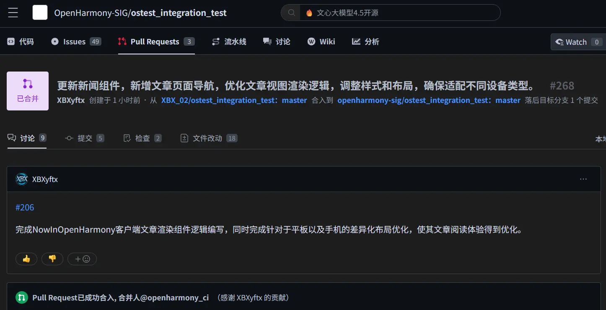

## 微信公众号爬虫取代CSDN爬虫

CSDN是一个动态网站，全部博客文章都是使用动态加载来进行展示的，当同一IP短时间内重复访问或者是进行了非人类的操作请求时就很容易被封禁，同时其页面的加载速度并不固定导致同意篇文章的爬取反复出现成功与失败的情况。所以我决定暂时去除CSDN的爬虫，转而使用微信公众号的爬虫。

## 轮播图爬虫开发

### 爬虫开发

这个坑也是拖了很久没有填了，现在也是该填上了。

首先观察一下[OpenHarmony官网首页](https://www.openharmony.cn/mainPlay)轮播图的网页结构。

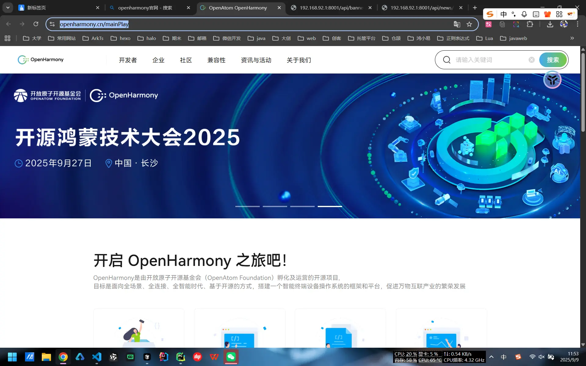

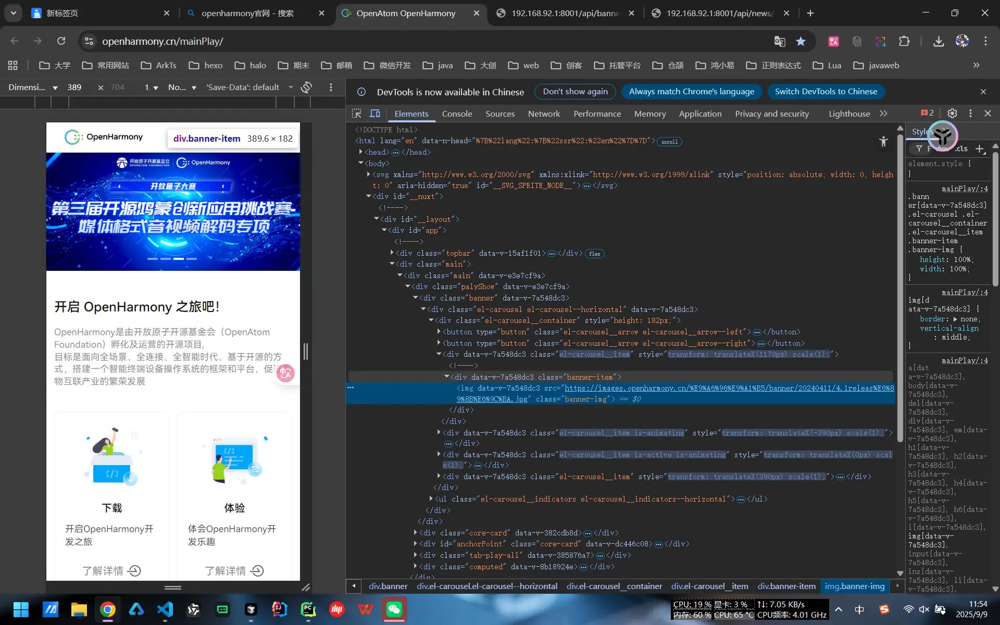

可以看到手机版和PC版的图片是不同的，同时图片的地址也是不同的，所以需要在爬取时标明手机版浏览器的UA信息。

```py
# Copyright (c) 2025 XBXyftx
# Licensed under the Apache License, Version 2.0 (the "License");
# you may not use this file except in compliance with the License.
# You may obtain a copy of the License at
# 
#     http://www.apache.org/licenses/LICENSE-2.0
# 
# Unless required by applicable law or agreed to in writing, software
# distributed under the License is distributed on an "AS IS" BASIS,
# WITHOUT WARRANTIES OR CONDITIONS OF ANY KIND, either express or implied.
# See the License for the specific language governing permissions and
# limitations under the License.

import requests
from bs4 import BeautifulSoup
import json
import re
import time
from urllib.parse import urljoin, urlparse
from datetime import datetime
import logging
import os

logger = logging.getLogger(__name__)

class MobileBannerCrawler:
    """
    专门用于爬取OpenHarmony官网手机版的banner图片爬虫
    模拟手机浏览器UA访问，获取手机版页面的banner-img类名图片
    """
    
    def __init__(self):
        self.base_url = "https://www.openharmony.cn"
        self.target_url = "https://www.openharmony.cn/mainPlay"
        self.source = "OpenHarmony-Mobile-Banner"
        self.session = requests.Session()
        
        # 手机端User-Agent池
        self.mobile_user_agents = [
            # iPhone Safari
            'Mozilla/5.0 (iPhone; CPU iPhone OS 17_0 like Mac OS X) AppleWebKit/605.1.15 (KHTML, like Gecko) Version/17.0 Mobile/15E148 Safari/604.1',
            'Mozilla/5.0 (iPhone; CPU iPhone OS 16_0 like Mac OS X) AppleWebKit/605.1.15 (KHTML, like Gecko) Version/16.0 Mobile/15E148 Safari/604.1',
            'Mozilla/5.0 (iPhone; CPU iPhone OS 15_0 like Mac OS X) AppleWebKit/605.1.15 (KHTML, like Gecko) Version/15.0 Mobile/15E148 Safari/604.1',
            
            # Android Chrome
            'Mozilla/5.0 (Linux; Android 13; SM-G991B) AppleWebKit/537.36 (KHTML, like Gecko) Chrome/120.0.0.0 Mobile Safari/537.36',
            'Mozilla/5.0 (Linux; Android 12; SM-G975F) AppleWebKit/537.36 (KHTML, like Gecko) Chrome/119.0.0.0 Mobile Safari/537.36',
            'Mozilla/5.0 (Linux; Android 11; Pixel 5) AppleWebKit/537.36 (KHTML, like Gecko) Chrome/118.0.0.0 Mobile Safari/537.36',
            
            # Huawei/Honor手机
            'Mozilla/5.0 (Linux; Android 12; NOH-AL00) AppleWebKit/537.36 (KHTML, like Gecko) Chrome/120.0.0.0 Mobile Safari/537.36',
            'Mozilla/5.0 (Linux; Android 11; ELS-AN00) AppleWebKit/537.36 (KHTML, like Gecko) Chrome/119.0.0.0 Mobile Safari/537.36',
            
            # 小米手机
            'Mozilla/5.0 (Linux; Android 13; MI 13) AppleWebKit/537.36 (KHTML, like Gecko) Chrome/120.0.0.0 Mobile Safari/537.36',
            'Mozilla/5.0 (Linux; Android 12; MI 12) AppleWebKit/537.36 (KHTML, like Gecko) Chrome/119.0.0.0 Mobile Safari/537.36',
            
            # iPad
            'Mozilla/5.0 (iPad; CPU OS 17_0 like Mac OS X) AppleWebKit/605.1.15 (KHTML, like Gecko) Version/17.0 Mobile/15E148 Safari/604.1',
            'Mozilla/5.0 (iPad; CPU OS 16_0 like Mac OS X) AppleWebKit/605.1.15 (KHTML, like Gecko) Version/16.0 Mobile/15E148 Safari/604.1',
        ]
        
        # 设置手机端请求头
        self.setup_mobile_headers()
    
    def setup_mobile_headers(self):
        """设置手机端请求头"""
        import random
        
        mobile_ua = random.choice(self.mobile_user_agents)
        
        self.session.headers.update({
            'User-Agent': mobile_ua,
            'Accept': 'text/html,application/xhtml+xml,application/xml;q=0.9,image/webp,image/apng,*/*;q=0.8,application/signed-exchange;v=b3;q=0.7',
            'Accept-Language': 'zh-CN,zh;q=0.9,en;q=0.8',
            'Accept-Encoding': 'gzip, deflate, br',
            'Connection': 'keep-alive',
            'Upgrade-Insecure-Requests': '1',
            'Sec-Fetch-Dest': 'document',
            'Sec-Fetch-Mode': 'navigate',
            'Sec-Fetch-Site': 'none',
            'Sec-Fetch-User': '?1',
            'Cache-Control': 'max-age=0',
            # 模拟手机端viewport
            'Viewport-Width': '390',
            'Device-Memory': '8',
            'DPR': '3',
        })
        
        logger.info(f"📱 已设置手机端请求头，User-Agent: {mobile_ua[:50]}...")
    
    def get_mobile_page_content(self, url):
        """
        获取手机版页面内容
        """
        try:
            logger.info(f"📱 正在请求手机版页面: {url}")
            
            # 重新设置随机的手机端UA，防止被识别
            self.setup_mobile_headers()
            
            response = self.session.get(url, timeout=15)
            response.raise_for_status()
            response.encoding = 'utf-8'
            
            # 检查响应是否是手机版
            content_length = len(response.text)
            logger.info(f"📱 页面加载成功，内容长度: {content_length} 字符")
            
            # 简单检查是否获取到了移动版本
            if 'viewport' in response.text.lower() or 'mobile' in response.text.lower():
                logger.info("✅ 成功获取手机版页面内容")
            else:
                logger.warning("⚠️ 可能未获取到手机版页面，但继续处理")
            
            return response.text
            
        except requests.exceptions.RequestException as e:
            logger.error(f"❌ 请求手机版页面失败: {url}, 错误: {e}")
            return None
        except Exception as e:
            logger.error(f"❌ 获取手机版页面内容时发生未知错误: {e}")
            return None
    
    def extract_banner_images(self, html_content):
        """
        从HTML内容中提取banner相关的图片
        包括banner-img类名、轮播图、主要展示图片等
        """
        banner_images = []
        
        try:
            soup = BeautifulSoup(html_content, 'html.parser')
            logger.info("🔍 开始解析HTML内容，查找banner相关图片...")
            
            # 1. 查找所有包含banner-img类名的元素
            banner_img_elements = soup.find_all(class_=re.compile(r'.*banner-img.*'))
            logger.info(f"🔍 找到 {len(banner_img_elements)} 个包含 banner-img 类名的元素")
            
            # 2. 查找其他banner相关的类名
            banner_class_patterns = [
                r'.*banner.*',
                r'.*swiper.*slide.*',
                r'.*carousel.*',
                r'.*slider.*',
                r'.*hero.*',
                r'.*main.*banner.*',
                r'.*top.*banner.*'
            ]
            
            for pattern in banner_class_patterns:
                elements = soup.find_all(class_=re.compile(pattern, re.IGNORECASE))
                banner_img_elements.extend(elements)
                logger.info(f"🔍 通过模式 '{pattern}' 找到 {len(elements)} 个元素")
            
            # 3. 处理找到的banner元素
            for idx, element in enumerate(banner_img_elements):
                logger.debug(f"处理第 {idx + 1} 个banner元素: {element.name}, class: {element.get('class')}")
                
                # 处理img标签
                if element.name == 'img':
                    img_url = self.extract_image_url(element)
                    if img_url:
                        image_info = self.create_image_info(img_url, element, f"banner-img-{idx + 1}")
                        banner_images.append(image_info)
                        logger.info(f"✅ 提取到banner图片: {img_url}")
                
                # 处理包含img子元素的容器
                img_tags = element.find_all('img')
                for img_idx, img_tag in enumerate(img_tags):
                    img_url = self.extract_image_url(img_tag)
                    if img_url:
                        image_info = self.create_image_info(img_url, img_tag, f"banner-container-{idx + 1}-{img_idx + 1}")
                        banner_images.append(image_info)
                        logger.info(f"✅ 提取到嵌套banner图片: {img_url}")
                
                # 处理CSS背景图片
                bg_url = self.extract_background_image(element)
                if bg_url:
                    image_info = self.create_image_info(bg_url, element, f"banner-bg-{idx + 1}")
                    banner_images.append(image_info)
                    logger.info(f"✅ 提取到banner背景图片: {bg_url}")
            
            # 4. 查找页面中所有较大的图片（可能是banner）
            all_images = soup.find_all('img')
            logger.info(f"🔍 页面总共有 {len(all_images)} 张图片，筛选可能的banner图片...")
            
            for idx, img in enumerate(all_images):
                img_url = self.extract_image_url(img)
                if img_url:
                    # 检查图片URL是否包含banner相关关键词
                    banner_keywords = ['banner', 'slide', 'carousel', 'hero', 'main', 'top', 'header']
                    img_url_lower = img_url.lower()
                    
                    if any(keyword in img_url_lower for keyword in banner_keywords):
                        image_info = self.create_image_info(img_url, img, f"potential-banner-{idx + 1}")
                        banner_images.append(image_info)
                        logger.info(f"✅ 发现可能的banner图片（通过URL关键词）: {img_url}")
                    
                    # 检查img标签的class或其他属性
                    class_list = img.get('class', [])
                    class_str = ' '.join(class_list) if isinstance(class_list, list) else str(class_list)
                    
                    if any(keyword in class_str.lower() for keyword in banner_keywords):
                        image_info = self.create_image_info(img_url, img, f"class-banner-{idx + 1}")
                        banner_images.append(image_info)
                        logger.info(f"✅ 发现可能的banner图片（通过class）: {img_url}")
            
            # 5. 额外查找：通过data属性查找可能的banner图片
            data_banner_elements = soup.find_all(attrs={"data-banner": True}) + soup.find_all(attrs={"data-bg": True})
            for idx, element in enumerate(data_banner_elements):
                for attr in ['data-banner', 'data-bg', 'data-src', 'data-original']:
                    img_url = element.get(attr)
                    if img_url and self.is_valid_image_url(img_url):
                        img_url = urljoin(self.base_url, img_url)
                        image_info = self.create_image_info(img_url, element, f"data-banner-{idx + 1}")
                        banner_images.append(image_info)
                        logger.info(f"✅ 通过data属性提取到图片: {img_url}")
                        break
            
            # 6. 去重
            unique_images = []
            seen_urls = set()
            for img in banner_images:
                if img['url'] not in seen_urls:
                    unique_images.append(img)
                    seen_urls.add(img['url'])
            
            logger.info(f"🎯 共提取到 {len(unique_images)} 张唯一的banner相关图片")
            
            # 7. 如果还是没有找到图片，记录页面结构用于调试
            if len(unique_images) == 0:
                logger.warning("🔍 未找到banner图片，分析页面结构...")
                self._debug_page_structure(soup)
            
            return unique_images
            
        except Exception as e:
            logger.error(f"❌ 解析banner图片时发生错误: {e}")
            return []
    
    def _debug_page_structure(self, soup):
        """
        调试页面结构，输出关键信息
        """
        try:
            # 查找所有包含图片的元素
            img_count = len(soup.find_all('img'))
            logger.info(f"📊 页面调试信息：")
            logger.info(f"   - 总图片数量: {img_count}")
            
            # 输出前5个图片的信息
            images = soup.find_all('img')[:5]
            for i, img in enumerate(images):
                src = img.get('src', img.get('data-src', '无'))
                class_name = img.get('class', '无')
                alt = img.get('alt', '无')
                logger.info(f"   - 图片{i+1}: src={src[:50]}..., class={class_name}, alt={alt}")
            
            # 查找所有可能的轮播或banner容器
            possible_containers = soup.find_all(['div', 'section'], class_=re.compile(r'.*(banner|swiper|carousel|slider|hero).*', re.IGNORECASE))
            logger.info(f"   - 可能的banner容器数量: {len(possible_containers)}")
            
            for i, container in enumerate(possible_containers[:3]):
                class_name = container.get('class', '无')
                child_imgs = len(container.find_all('img'))
                logger.info(f"   - 容器{i+1}: class={class_name}, 包含图片={child_imgs}张")
                
        except Exception as e:
            logger.error(f"调试页面结构时出错: {e}")
    
    def extract_image_url(self, img_element):
        """
        从img元素中提取图片URL
        """
        # 尝试多种可能的图片URL属性
        url_attributes = ['src', 'data-src', 'data-original', 'data-lazy', 'data-echo', 'srcset']
        
        for attr in url_attributes:
            img_url = img_element.get(attr)
            if img_url:
                # 处理srcset属性（可能包含多个URL）
                if attr == 'srcset':
                    # srcset格式: "url1 1x, url2 2x" 或 "url1 480w, url2 800w"
                    urls = re.findall(r'(https?://[^\s,]+)', img_url)
                    if urls:
                        img_url = urls[0]  # 使用第一个URL
                    else:
                        continue
                
                if self.is_valid_image_url(img_url):
                    return urljoin(self.base_url, img_url)
        
        return None
    
    def extract_background_image(self, element):
        """
        从元素的style属性中提取背景图片URL
        """
        style = element.get('style', '')
        if 'background-image' in style:
            # 匹配 background-image: url('...') 或 background-image: url("...")
            bg_match = re.search(r'background-image:\s*url\([\'"]?([^\'"()]+)[\'"]?\)', style)
            if bg_match:
                bg_url = bg_match.group(1)
                if self.is_valid_image_url(bg_url):
                    return urljoin(self.base_url, bg_url)
        
        return None
    
    def is_valid_image_url(self, url):
        """
        验证是否是有效的图片URL
        """
        if not url or len(url.strip()) == 0:
            return False
        
        # 检查是否是图片扩展名
        image_extensions = ['.jpg', '.jpeg', '.png', '.gif', '.bmp', '.webp', '.svg']
        url_lower = url.lower()
        
        # 直接检查扩展名
        for ext in image_extensions:
            if ext in url_lower:
                return True
        
        # 检查是否包含图片相关路径
        image_keywords = ['image', 'img', 'pic', 'photo', 'banner', 'bg']
        for keyword in image_keywords:
            if keyword in url_lower:
                return True
        
        # 如果URL看起来像是base64数据，跳过
        if url.startswith('data:'):
            return True if 'image' in url else False
        
        return False
    
    def create_image_info(self, img_url, element, image_id):
        """
        创建图片信息对象
        """
        # 获取图片的alt属性或其他描述信息
        alt_text = element.get('alt', '')
        title_text = element.get('title', '')
        class_names = element.get('class', [])
        
        # 尝试从URL中提取文件名
        parsed_url = urlparse(img_url)
        filename = os.path.basename(parsed_url.path) or f"banner_image_{image_id}"
        
        return {
            "id": image_id,
            "url": img_url,
            "alt": alt_text,
            "title": title_text,
            "filename": filename,
            "classes": class_names if isinstance(class_names, list) else [class_names] if class_names else [],
            "source": self.source,
            "extracted_at": datetime.now().isoformat(),
            "page_url": self.target_url
        }
    
    def download_image(self, image_info, save_directory="downloads/banners"):
        """
        下载图片到本地
        """
        try:
            # 创建保存目录
            os.makedirs(save_directory, exist_ok=True)
            
            img_url = image_info['url']
            filename = image_info['filename']
            
            # 确保文件名有扩展名
            if not any(filename.lower().endswith(ext) for ext in ['.jpg', '.jpeg', '.png', '.gif', '.webp', '.svg']):
                # 从URL中尝试获取扩展名
                url_ext = os.path.splitext(urlparse(img_url).path)[1]
                if url_ext:
                    filename += url_ext
                else:
                    filename += '.jpg'  # 默认扩展名
            
            file_path = os.path.join(save_directory, filename)
            
            logger.info(f"⬇️ 开始下载图片: {img_url}")
            
            response = self.session.get(img_url, timeout=30)
            response.raise_for_status()
            
            with open(file_path, 'wb') as f:
                f.write(response.content)
            
            file_size = len(response.content)
            logger.info(f"✅ 图片下载成功: {file_path} (大小: {file_size} bytes)")
            
            # 更新图片信息
            image_info['local_path'] = file_path
            image_info['file_size'] = file_size
            image_info['downloaded'] = True
            
            return True
            
        except Exception as e:
            logger.error(f"❌ 下载图片失败: {img_url}, 错误: {e}")
            image_info['downloaded'] = False
            image_info['download_error'] = str(e)
            return False
    
    def crawl_mobile_banners(self, download_images=True, save_directory="downloads/banners"):
        """
        主要方法：爬取手机版banner图片
        
        Args:
            download_images: 是否下载图片到本地
            save_directory: 图片保存目录
            
        Returns:
            包含所有banner图片信息的列表
        """
        logger.info(f"🚀 开始爬取OpenHarmony手机版banner图片")
        logger.info(f"🎯 目标URL: {self.target_url}")
        
        # 获取手机版页面内容
        html_content = self.get_mobile_page_content(self.target_url)
        if not html_content:
            logger.error("❌ 无法获取页面内容，爬取失败")
            return []
        
        # 提取banner图片
        banner_images = self.extract_banner_images(html_content)
        
        if not banner_images:
            logger.warning("⚠️ 未找到任何banner图片")
            return []
        
        logger.info(f"🎉 成功提取到 {len(banner_images)} 张banner图片")
        
        # 下载图片（如果需要）
        if download_images:
            logger.info(f"⬇️ 开始下载图片到目录: {save_directory}")
            download_success_count = 0
            
            for img_info in banner_images:
                if self.download_image(img_info, save_directory):
                    download_success_count += 1
                time.sleep(0.5)  # 避免请求过快
            
            logger.info(f"📁 图片下载完成，成功下载 {download_success_count}/{len(banner_images)} 张图片")
        
        # 保存结果到JSON文件
        result_file = os.path.join(save_directory, "banner_images_info.json")
        try:
            os.makedirs(os.path.dirname(result_file), exist_ok=True)
            with open(result_file, 'w', encoding='utf-8') as f:
                json.dump({
                    "crawl_time": datetime.now().isoformat(),
                    "target_url": self.target_url,
                    "total_images": len(banner_images),
                    "images": banner_images
                }, f, ensure_ascii=False, indent=2)
            
            logger.info(f"💾 图片信息已保存到: {result_file}")
        except Exception as e:
            logger.error(f"❌ 保存图片信息失败: {e}")
        
        return banner_images
    
    def get_banner_summary(self, banner_images):
        """
        获取banner图片的统计摘要
        """
        if not banner_images:
            return {"total": 0, "downloaded": 0, "failed": 0, "success_rate": "0%"}
        
        total = len(banner_images)
        downloaded = sum(1 for img in banner_images if img.get('downloaded', False))
        failed = total - downloaded
        
        success_rate = f"{(downloaded / total * 100):.1f}%" if total > 0 else "0%"
        return {
            "total": total,
            "downloaded": downloaded,
            "failed": failed,
            "success_rate": success_rate
        }

def main():
    """
    主函数：演示如何使用MobileBannerCrawler
    """
    print("📱 OpenHarmony手机版Banner图片爬虫启动...")
    print("=" * 60)
    
    crawler = MobileBannerCrawler()
    
    try:
        # 爬取banner图片
        banner_images = crawler.crawl_mobile_banners(
            download_images=True,
            save_directory="downloads/mobile_banners"
        )
        
        # 输出统计信息
        summary = crawler.get_banner_summary(banner_images)
        print(f"\n📊 爬取结果统计:")
        print(f"   总计图片: {summary['total']} 张")
        print(f"   下载成功: {summary['downloaded']} 张")
        print(f"   下载失败: {summary['failed']} 张")
        print(f"   成功率: {summary['success_rate']}")
        
        # 显示图片列表
        if banner_images:
            print(f"\n📋 Banner图片列表:")
            for i, img in enumerate(banner_images, 1):
                print(f"   {i}. {img['filename']}")
                print(f"      URL: {img['url']}")
                print(f"      Alt: {img['alt'] or '无'}")
                print(f"      下载状态: {'✅ 成功' if img.get('downloaded') else '❌ 失败'}")
                print()
        
    except Exception as e:
        print(f"❌ 爬取过程中发生错误: {e}")
        import traceback
        traceback.print_exc()

if __name__ == "__main__":
    # 设置日志级别
    logging.basicConfig(
        level=logging.INFO,
        format='%(asctime)s - %(name)s - %(levelname)s - %(message)s'
    )
    
    main()
```

先在浏览器上去尝试访问一下这个接口，同时确定一下我们的数据结构。

```json
{
  "success": true,
  "images": [
    "https://images.openharmony.cn/%E9%A6%96%E9%A1%B5/banner/20240411/4.1releas%E6%89%8B%E6%9C%BA.jpg",
    "https://images.openharmony.cn/%E6%B4%BB%E5%8A%A8/%E5%88%9B%E6%96%B0%E8%B5%9B2023/20230831/%E4%B8%89%E6%96%B9%E5%BA%93%E7%A7%BB%E5%8A%A8%E7%AB%AF.png",
    "https://images.openharmony.cn/%E6%B4%BB%E5%8A%A8/%E5%A4%A7%E8%B5%9B20250812/%E7%AC%AC%E4%B8%89%E5%B1%8A%E5%BC%80%E6%BA%90%E9%B8%BF%E8%92%99%E5%88%9B%E6%96%B0%E5%BA%94%E7%94%A8%E6%8C%91%E6%88%98%E8%B5%9B-%20750%20350.jpg",
    "https://images.openharmony.cn/%E6%B4%BB%E5%8A%A8/%E6%8A%80%E6%9C%AF%E5%A4%A7%E4%BC%9A20250826/phone-750x350.jpg"
  ],
  "total": 4,
  "message": "获取手机版Banner图片成功（缓存），共 4 张",
  "timestamp": "2025-09-09T11:51:39.365251"
}
```

### 客户端接口适配

#### 数据模型定义

由此我们可以先定义一个数据模型来进行数据解析：

```ts
/**
 * 首页顶部轮播图数据结构(测试用例并非后端接口数据结构)
 */
export interface NewsSwiperResModule{
  success:boolean
  images:ResourceStr[]
  total:4
  message:string
  timestamp:string
}
```

随后将此前使用的固定数据进行替换：

```ts
/**
 * Copyright (c) 2025 XBXyftx
 * Licensed under the Apache License, Version 2.0 (the "License");
 * you may not use this file except in compliance with the License.
 * You may obtain a copy of the License at
 *
 *     http://www.apache.org/licenses/LICENSE-2.0
 *
 * Unless required by applicable law or agreed to in writing, software
 * distributed under the License is distributed on an "AS IS" BASIS,
 * WITHOUT WARRANTIES OR CONDITIONS OF ANY KIND, either express or implied.
 * See the License for the specific language governing permissions and
 * limitations under the License.
 */

import { promptAction } from '@kit.ArkUI'

/**
 * 首页上方轮播图组件
 */
@ComponentV2
export struct NewsSwiper {
  @Param swiperData: ResourceStr[] = []

  build() {
    Column() {
      Swiper(){
        ForEach(this.swiperData,(item:ResourceStr)=>{
          Image(item)
            .width('100%')
            .objectFit(ImageFit.Fill)
            .onClick(()=>{
              promptAction.showToast({message:'跳转原页面功能待开发'})
            })
            .borderRadius(20)
            .aspectRatio(2.2)
        })
      }
      .width('95%')
      .curve(Curve.EaseInOut)
      .loop(true)
      .autoPlay(true)
      .interval(2000)
    }
    .alignItems(HorizontalAlign.Center)
    .borderRadius(20)
    .width('100%')

  }
}
```

随后再去测试一下我们所需要的轮播图接口状态查询接口的数据接口封装。

```json
{
  "service": "banner",
  "cache_status": {
    "status": "preparing",
    "last_update": null,
    "cache_count": 0,
    "update_count": 0,
    "error_message": null,
    "is_updating": true,
    "first_load_completed": false
  },
  "scheduler_jobs": [
    {
      "id": "update_banner_cache",
      "name": "更新轮播图缓存",
      "next_run": "2025-09-10T21:59:40.471794+08:00"
    }
  ],
  "api_endpoints": {
    "mobile_banners": "/api/banner/mobile",
    "enhanced_banners": "/api/banner/mobile/enhanced",
    "status": "/api/banner/status",
    "manual_crawl": "/api/banner/crawl",
    "clear_cache": "/api/banner/cache/clear",
    "cache_info": "/api/banner/cache"
  },
  "status_explanation": {
    "preparing": "轮播图服务正在准备中，首次爬取尚未完成或当前正在更新",
    "ready": "轮播图服务就绪，可以正常获取轮播图数据",
    "error": "轮播图服务出现错误，需要检查日志或手动重新爬取"
  },
  "timestamp": "2025-09-10T18:59:54.090860"
}
```

上面这是第一种类型，是当前缓存数据正在更新的状态，接下来我们等一会后继续去请求一下成功的。

```json
{
  "service": "banner",
  "cache_status": {
    "status": "ready",
    "last_update": "2025-09-10T19:00:39.216129",
    "cache_count": 4,
    "update_count": 1,
    "error_message": null,
    "is_updating": false,
    "first_load_completed": true
  },
  "scheduler_jobs": [
    {
      "id": "update_banner_cache",
      "name": "更新轮播图缓存",
      "next_run": "2025-09-10T21:59:40.471794+08:00"
    }
  ],
  "api_endpoints": {
    "mobile_banners": "/api/banner/mobile",
    "enhanced_banners": "/api/banner/mobile/enhanced",
    "status": "/api/banner/status",
    "manual_crawl": "/api/banner/crawl",
    "clear_cache": "/api/banner/cache/clear",
    "cache_info": "/api/banner/cache"
  },
  "status_explanation": {
    "preparing": "轮播图服务正在准备中，首次爬取尚未完成或当前正在更新",
    "ready": "轮播图服务就绪，可以正常获取轮播图数据",
    "error": "轮播图服务出现错误，需要检查日志或手动重新爬取"
  },
  "timestamp": "2025-09-10T19:12:58.282317"
}
```

所以我们可以看到我们所需要的数据其实仅仅是一个cache_status字段中的status就足以去判断当前轮播图接口的状态了，所以我们可以直接将数据模型构建成如下形式：

```ts
/**
 * Copyright (c) 2025 XBXyftx
 * Licensed under the Apache License, Version 2.0 (the "License");
 * you may not use this file except in compliance with the License.
 * You may obtain a copy of the License at
 *
 *     http://www.apache.org/licenses/LICENSE-2.0
 *
 * Unless required by applicable law or agreed to in writing, software
 * distributed under the License is distributed on an "AS IS" BASIS,
 * WITHOUT WARRANTIES OR CONDITIONS OF ANY KIND, either express or implied.
 * See the License for the specific language governing permissions and
 * limitations under the License.
 */

export interface SwiperState {
  cache_status: CacheStatus
}

export interface CacheStatus {
  status: CACHE_STATUS
  error_message:null|string
}

export enum CACHE_STATUS {
  preparing = 'preparing',
  ready = 'ready',
  error = 'error'
}
```

#### 接口封装

```ts
/**
 * Copyright (c) 2025 XBXyftx
 * Licensed under the Apache License, Version 2.0 (the "License");
 * you may not use this file except in compliance with the License.
 * You may obtain a copy of the License at
 *
 *     http://www.apache.org/licenses/LICENSE-2.0
 *
 * Unless required by applicable law or agreed to in writing, software
 * distributed under the License is distributed on an "AS IS" BASIS,
 * WITHOUT WARRANTIES OR CONDITIONS OF ANY KIND, either express or implied.
 * See the License for the specific language governing permissions and
 * limitations under the License.
 */
import { NewsSwiperResModule } from "../../modules/news/NewsSwiperModules"
import { logger } from "../../utils"
import { axiosHttp } from "../http/AxiosHttp"
import { BusinessError } from "@kit.BasicServicesKit"

const NewsSwiperAPI_LOG_TAG = 'NewsSwiperAPI: '
export class NewsSwiperAPI{
  /**
   * 获取轮播图数据
   * @returns
   */
  async getNewsSwiperImgData(){
    try {
      const res = await axiosHttp.request<NewsSwiperResModule>({
        url:'/api/banner/mobile'
      })
      logger.error(`${NewsSwiperAPI_LOG_TAG}${JSON.stringify(res)}`)
      return res.images
    }catch (e){
      let err = e as BusinessError
      logger.error(`${NewsSwiperAPI_LOG_TAG}${err.message}`)
      return null
    }
  }
}
```

依旧是基于先前封装好的AxiosHttp进行接口调用，处理异常并返回数据。

随后还需要封装一个服务状态查询的接口。

```ts
/**
 * Copyright (c) 2025 XBXyftx
 * Licensed under the Apache License, Version 2.0 (the "License");
 * you may not use this file except in compliance with the License.
 * You may obtain a copy of the License at
 *
 *     http://www.apache.org/licenses/LICENSE-2.0
 *
 * Unless required by applicable law or agreed to in writing, software
 * distributed under the License is distributed on an "AS IS" BASIS,
 * WITHOUT WARRANTIES OR CONDITIONS OF ANY KIND, either express or implied.
 * See the License for the specific language governing permissions and
 * limitations under the License.
 */
import { CACHE_STATUS, SwiperState } from "../../modules/server/SwiperState"
import { logger } from "../../utils"
import { axiosHttp } from "../http/AxiosHttp"
import { BusinessError } from "@kit.BasicServicesKit"
import { promptAction } from "@kit.ArkUI"

const SwiperStateAPI_LOG_TAG = 'SwiperStateAPI: '

export class SwiperStateAPI {
  /**
   * 检测轮播图状态
   * @returns
   */
  static async isSwiperServerReady(): Promise<boolean> {
    try {
      const res = await axiosHttp.request<SwiperState>({
        url: '/api/banner/status',
      })
      logger.info(SwiperStateAPI_LOG_TAG + JSON.stringify(res))
      if (res.cache_status.status === CACHE_STATUS.preparing) {

        logger.warn(`${SwiperStateAPI_LOG_TAG}轮播图尚未准备完毕`)
        return false
      } else if (res.cache_status.status === CACHE_STATUS.error) {
        promptAction.showToast({ message: `轮播图服务内部出现异常${res.cache_status.error_message}` })
        logger.error(`${SwiperStateAPI_LOG_TAG}轮播图服务内部出现异常${res.cache_status.error_message}`)
        return false
      } else if (res.cache_status.status === CACHE_STATUS.ready) {
        return true
      }
    } catch (e) {
      let err = e as BusinessError
      logger.error(`${SwiperStateAPI_LOG_TAG}${err.message}`)
      return false
    }
    return false
  }
}
```

#### NewsManager功能拓展

在之前编写新闻列表的数据管理模块式时已经完成了键值数据库和网络接口的绑定，但也仅局限于新闻列表，现在我们需要将他的功能进行拓展，使其能够同时管理轮播图的新闻数据。

```ts
/**
 * Copyright (c) 2025 XBXyftx
 * Licensed under the Apache License, Version 2.0 (the "License");
 * you may not use this file except in compliance with the License.
 * You may obtain a copy of the License at
 *
 *     http://www.apache.org/licenses/LICENSE-2.0
 *
 * Unless required by applicable law or agreed to in writing, software
 * distributed under the License is distributed on an "AS IS" BASIS,
 * WITHOUT WARRANTIES OR CONDITIONS OF ANY KIND, either express or implied.
 * See the License for the specific language governing permissions and
 * limitations under the License.
 */

import {
  APP_KV_DB as APP_KV_DB_ID,
  kvDatabase,
  KV_DB_KEYS,
  logger,
  NewsArticle,
  NewsListAPI,
  NewsSwiperAPI,
  NewsSwiperStateAPI,
  ServerHealthAPI
} from "common"
import { common } from "@kit.AbilityKit"
import { distributedKVStore } from "@kit.ArkData"
import { promptAction } from "@kit.ArkUI"
import { BusinessError } from "@kit.BasicServicesKit"

const NewsManager_LOG_TAG = 'NewsManager: '

export class NewsManager {
  /**
   * 当前应用的键值数据库实例对象
   */
  appKVDb: distributedKVStore.SingleKVStore | undefined = undefined

  /**
   * 初始化函数，获取当前应用的键值对数据库实例。
   * @param context
   * @returns
   */
  async init(context: common.UIAbilityContext): Promise<boolean> {
    kvDatabase.init(context)
    const res = await kvDatabase.getKVStoreById(APP_KV_DB_ID)
    if (res) {
      this.appKVDb = res
      logger.info(`${NewsManager_LOG_TAG}init: 获取appKVDb成功`)
      return true
    }
    logger.error(`${NewsManager_LOG_TAG}初始化失败`)
    return false
  }

  /**
   * 从后端更新新闻文章列表数据，并持久化最新的新闻列表数据。
   * @param times 递归尝试查询服务端的计数器参数，无需传入
   * @returns 是否成功获取以及持久化
   */
  async updateNewsListToDB(): Promise<boolean> {
    if (await ServerHealthAPI.isServerReady()) {
      const news: NewsArticle[] | null = (await NewsListAPI.getAllNews())
      if (news && this.appKVDb) {
        logger.info(`${NewsManager_LOG_TAG}成功获取最新新闻，总条数: ${news.length}`)
        try {
          this.appKVDb.put(KV_DB_KEYS.NEWS_ARTICLE_LIST, JSON.stringify(news))
          logger.info(`${NewsManager_LOG_TAG}数据库写入成功，无异常`)
          return true
        } catch (e) {
          let err = e as BusinessError
          logger.error(`${NewsManager_LOG_TAG}更新数据库NewsArticle数据发生异常，异常信息: ${err.message}`)
          return false
        }
      }
      logger.error(`${NewsManager_LOG_TAG}获取新闻失败,新闻数据或键值数据库为空。`)
      return false
    }
    logger.error(`${NewsManager_LOG_TAG}获取新闻失败，后端服务状态异常，返回false`)
    return false
  }

  async getNewsArticleListFromDB(): Promise<NewsArticle[] | null> {
    if (this.appKVDb) {
      try {
        const res: string = (await this.appKVDb.get(KV_DB_KEYS.NEWS_ARTICLE_LIST)) as string
        logger.info(`${NewsManager_LOG_TAG}读取到数据库新闻列表数据: ${res}`)
        const newsArticleList = JSON.parse(res) as NewsArticle[]
        return newsArticleList
      } catch (e) {
        let err = e as BusinessError
        logger.error(`${NewsManager_LOG_TAG}尝试获取数据库新闻列表数据发生异常，异常信息: ${err.message}`)
        return null
      }
    }
    return null
  }

  async updateNewsSwiperToDB(): Promise<boolean> {
    if (await NewsSwiperStateAPI.isSwiperServerReady()) {
      let swiperData: ResourceStr[] | null = await NewsSwiperAPI.getNewsSwiperImgData()
      if (swiperData && this.appKVDb) {
        logger.info(`${NewsManager_LOG_TAG}成功获取最新轮播图数据，总条数: ${swiperData.length}`)
        try {
          this.appKVDb.put(KV_DB_KEYS.NEWS_SWIPER, JSON.stringify(swiperData))
          logger.info(`${NewsManager_LOG_TAG}轮播图数据库写入成功，无异常`)
          return true
        } catch (e) {
          let err = e as BusinessError
          logger.error(`${NewsManager_LOG_TAG}更新数据库NewsSwiper数据发生异常，异常信息: ${err.message}`)
          return false
        }
      }
      logger.error(`${NewsManager_LOG_TAG}获取到的轮播图数据或键值数据库为空`)
      return false
    }
    logger.error(`${NewsManager_LOG_TAG}获取轮播图数据失败，后端轮播图服务状态异常`)
    return false
  }

  async getNewsSwiperDataFromDB(): Promise<ResourceStr[] | null> {
    if (this.appKVDb) {
      try {
        const res: string = (await this.appKVDb.get(KV_DB_KEYS.NEWS_SWIPER)) as string
        logger.info(`${NewsManager_LOG_TAG}读取到数据库轮播图数据列表数据: ${res}`)
        const newsSwiperData = JSON.parse(res) as ResourceStr[]
        return newsSwiperData
      } catch (e) {
        let err = e as BusinessError
        logger.error(`${NewsManager_LOG_TAG}尝试获取数据库轮播图数据发生异常，异常信息: ${err.message}`)
        return null
      }
    }
    return null
  }
}

export const newsManager = new NewsManager()
```

随后将数据库更新串流至应用初始化流程。

```ts
  async initAll(uiAbilityContext: common.UIAbilityContext, applicationContext: common.ApplicationContext) {
    await newsManager.init(uiAbilityContext)
    this.configInit(uiAbilityContext)
    colorModManager.init(applicationContext)
    await newsManager.updateNewsListToDB()
    await newsManager.updateNewsSwiperToDB()
  }
```

再将从数据库读取数据的过程串流至页面渲染中。

```ts
  async aboutToAppear(): Promise<void> {
    this.newsList = await newsManager.getNewsArticleListFromDB()
    if (!this.newsList) {
      this.getUIContext().getPromptAction().showToast({ message: `当前数据库新闻数据为空,请连接后端服务以更新数据` })
    } else if (this.newsList) {
      this.getUIContext().getPromptAction().showToast({ message: `从数据库查询到${this.newsList.length}条新闻数据` })
    }
    this.newsSwiperData = await newsManager.getNewsSwiperDataFromDB()
    if (!this.newsSwiperData) {
      this.getUIContext().getPromptAction().showToast({ message: `当前数据库轮播图数据为空,请连接后端服务以更新数据` })
    } else if (this.newsSwiperData) {
      this.getUIContext()
        .getPromptAction()
        .showToast({ message: `从数据库查询到${this.newsSwiperData.length}条轮播图数据` })
    }
  }
  NewsSwiper({ swiperData: this.newsSwiperData ?? [] })
```

然后！测试！！！

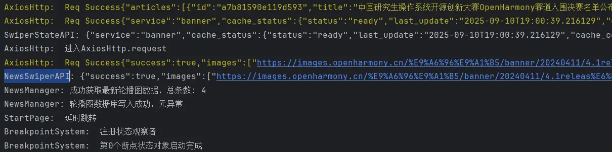

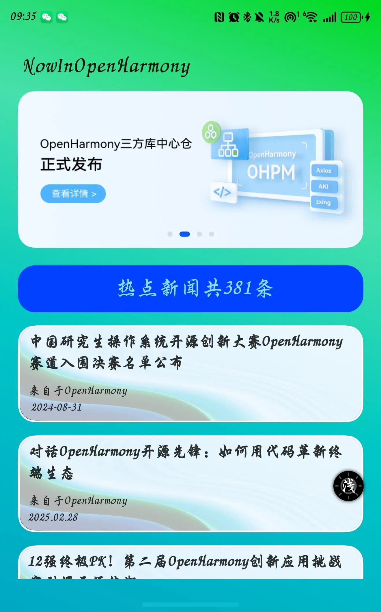

ok，还有一处需要修改的，就是在下拉刷新时也要触发一下轮播图的刷新才对。

```ts
  async reloadAllData() {
    this.getUIContext().getPromptAction().showToast({ message: '刷新数据' })
    if (await newsManager.updateNewsListToDB() && await newsManager.updateNewsSwiperToDB()) {
      this.newsList = await newsManager.getNewsArticleListFromDB()
      this.newsSwiperData = await newsManager.getNewsSwiperDataFromDB()
      return true
    }
    this.getUIContext().getPromptAction().showToast({ message: '获取新数据失败请稍后再试。' })
    return false
  }
```

再次测试。成功！！！至此当初项目计划书上缩写的内容就基本全部告一段落了。

## OpenHarmony博文接口开发

### 针对于微信公众号关键词搜索的尝试

去除了CSDN的数据源之后我原本准备用更多的微信公众号文章去进行补充，但是我在实践的时候发现了新的问题，就是针对微信公众号文章的搜索，微信官方并没有给出公共的接口，于是就造成了我无法直接去获取搜索引擎的请求地址，我最初想的是从电脑版微信的搜索栏下手，因为在我印象中电脑版微信的搜索栏与打开网页共用的是用一个页面，能不能直接点击右上角的用系统浏览器打开的方式来去用浏览器开发者工具获取地址，但我点开之后才发现在公众号搜索界面是没有那个用浏览器打开的按钮的。

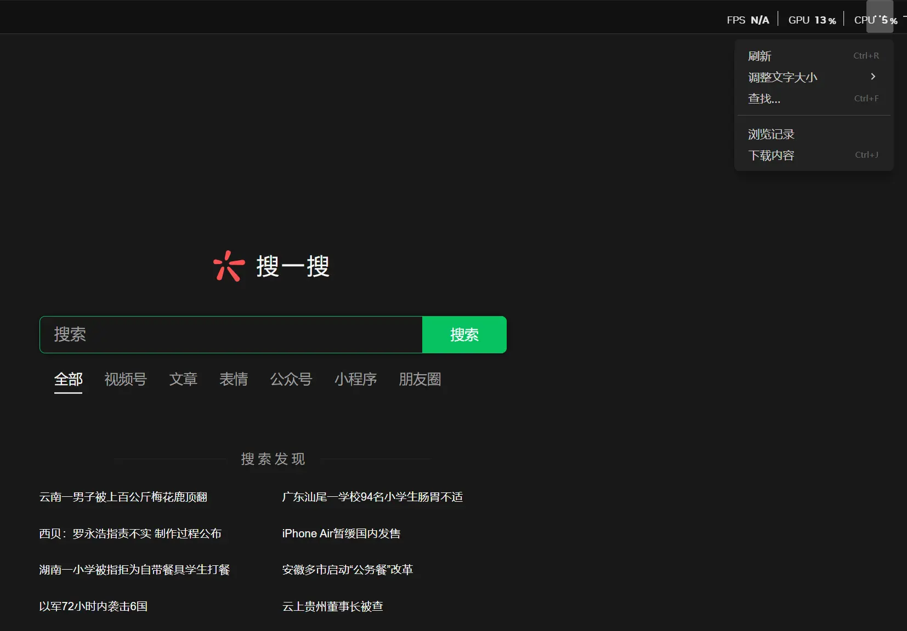

所以我就只能去寻找其他办法。通过阅读一些技术博客我了解到[搜狗搜索引擎](https://weixin.sogou.com/)中有专门接入微信公众号的搜索引擎接口于是我立刻前去尝试。

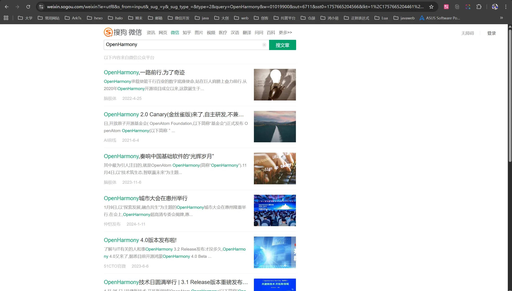

的的确确是能搜到相关关键词的公众号文章，但也仅限于能搜到了。搜索结果全是按照所谓的“综合排名”去罗列的，就导致搜到的都是一些陈年老文，这与我们NowInOpenHarmony项目所需要的聚合最新资讯的理念相悖，新文章因为“热度”低导致都排的比较靠后，先要通过爬虫爬取的难度还是比较高的。首先是得反复大量的去模拟用户操作想后查找文章，并逐一截取日期并进行排序。所以我决定暂时放弃这个想法。当然我也不是没想过在URL里观察一下参数字段是否包含有排序方式。

```bash
https://weixin.sogou.com/weixin?ie=utf8&s_from=input&_sug_=y&_sug_type_=&type=2&query=OpenHarmony&w=01019900&sut=6711&sst0=1757665204566&lkt=1%2C1757665204461%2C1757665204461
```

要判断该搜狗微信搜索URL中是否存在规定文章排序顺序的参数，需先拆解URL结构、明确各参数含义，再结合搜索引擎排序逻辑分析，具体如下：

| 参数名       | 参数值示例                | 核心作用                                                                 | 是否与“排序”相关 |
|--------------|---------------------------|--------------------------------------------------------------------------|------------------|
| `ie`         | `utf8`                    | 指定页面编码格式为UTF-8，确保中文等字符正常显示                          | 无               |
| `s_from`     | `input`                   | 标识搜索请求的来源（此处为“手动输入关键词”），用于统计不同入口的搜索量  | 无               |
| `_sug_`      | `y`                       | 控制是否开启“搜索建议”功能（`y`=开启，输入关键词时实时推荐相关词）       | 无               |
| `_sug_type_` | 空值                      | 补充定义搜索建议的类型（空值表示默认类型）                               | 无               |
| `type`       | `2`                       | 限定搜索结果的内容类型（搜狗微信搜索中，`type=2`通常对应“公众号文章”）  | 无（仅筛选类型） |
| `query`      | `OpenHarmony`             | 核心搜索关键词，即用户要查询的内容（此处为“OpenHarmony”）                | 无（仅定搜索词） |
| `w`          | `01019900`                | 搜狗内部的设备或终端标识参数，用于适配不同设备的显示逻辑（如PC/移动端）  | 无               |
| `sut`        | `6711`                    | 搜索会话的临时标识ID，用于追踪单次搜索的请求链路（如防重复请求）         | 无               |
| `sst0`       | `1757665204566`           | 时间戳（毫秒级，对应时间为2025年11月12日左右），用于标记请求发起时间    | 无               |
| `lkt`        | `1%2C1757665204461%2C...` | 包含时间戳的复合参数，推测为“搜索行为追踪标识”（记录点击、请求间隔等）  | 无               |

所以暂时放弃相关尝试，开始寻找替代方案。

### OpenHarmony官网博客

次前我们的接口数据仅仅获取了OpenHarmony官网的资讯页面信息，并没有获取博客的数据。

相同的方式，先点击一下博文板块的文章，随后去开发者工具的网络工具进行抓包。

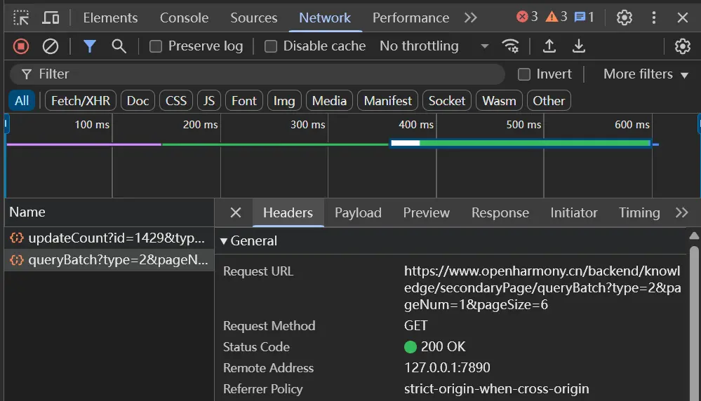

```bash
https://www.openharmony.cn/backend/knowledge/secondaryPage/queryBatch?type=2&pageNum=1&pageSize=6
```

直接请求这个链接观察一下返回的数据。

```json
{
  "code": 0,
  "msg": "成功",
  "pageSize": 6,
  "pageNum": 1,
  "totalPage": 28,
  "totalNum": 165,
  "data": [
    {
      "id": 1429,
      "type": 2,
      "title": "OpenHarmony输入事件分发之多模输入",
      "source": null,
      "content": "OpenAtom OpenHarmony（以下简称“OpenHarmony”）面向用户提供了多种人机交互方式，除了支持多种传统输入设备，系统内部还会将各种设备有机结合，发挥分布式/跨设备等优势，事件作为主体媒介，面向多业务场景提供系统级支撑能力。",
      "textDetails": null,
      "backgroundImage": "https://images.openharmony.cn/%E5%86%85%E5%AE%B9%E5%B0%81%E9%9D%A2/%E5%8D%9A%E5%AE%A2/%E9%80%9A%E7%94%A8%E8%A7%A3%E6%9E%90.png",
      "url": "https://mp.weixin.qq.com/s/0UdwzVaODNWO4AT6i6Guqw",
      "advertiseImage": null,
      "advertiseUrl": null,
      "startTime": "2024.06.06",
      "endTime": null,
      "label": 0,
      "recommend": 0,
      "likesCount": 0,
      "shareCount": 0,
      "browseCount": 305,
      "skip": "0"
    },
    {
      "id": 1408,
      "type": 2,
      "title": "OpenHarmony之Wi-Fi Display介绍",
      "source": null,
      "content": "Wi-Fi Display（缩写为WFD）经常和Miracast联系在一起。实际上，Miracast是Wi-Fi联盟（Wi-Fi Alliance）对支持WFD功能的设备的认证F名称。通过Miracast认证的设备将在最大程度内保持对WFD功能的支持和兼容。所以WFD是一个Miracast的规范。",
      "textDetails": null,
      "backgroundImage": "https://images.openharmony.cn/%E5%86%85%E5%AE%B9%E5%B0%81%E9%9D%A2/%E5%8D%9A%E5%AE%A2/%E6%8A%80%E6%9C%AF%E5%88%86%E4%BA%AB.png",
      "url": "https://mp.weixin.qq.com/s/nUKiPwgaTxpiWR5GelqF9g",
      "advertiseImage": null,
      "advertiseUrl": null,
      "startTime": "2024.04.15",
      "endTime": null,
      "label": 0,
      "recommend": 0,
      "likesCount": 0,
      "shareCount": 0,
      "browseCount": 157,
      "skip": "0"
    },
    {
      "id": 1401,
      "type": 2,
      "title": "OpenHarmony应用启动流程分析——Application&Ability初始化",
      "source": null,
      "content": "本文基于OpenAtom OpenHarmony（以下简称“OpenHarmony”） 4.0 Release版本的源码，对应用进程初始化后MainThread初始化及调用AttachApplication、LaunchApplication、LaunchAbility的过程做了分析和总结，该流程贯穿了应用程序的用户进程和系统服务进程。",
      "textDetails": null,
      "backgroundImage": "https://images.openharmony.cn/%E5%86%85%E5%AE%B9%E5%B0%81%E9%9D%A2/%E5%8D%9A%E5%AE%A2/%E6%8A%80%E6%9C%AF%E5%88%86%E4%BA%AB.png",
      "url": "https://mp.weixin.qq.com/s/QyOiCRoMdp7uP4e3SvoDIg",
      "advertiseImage": null,
      "advertiseUrl": null,
      "startTime": "2024.03.15",
      "endTime": null,
      "label": 0,
      "recommend": 0,
      "likesCount": 0,
      "shareCount": 0,
      "browseCount": 160,
      "skip": "0"
    },
    {
      "id": 1399,
      "type": 2,
      "title": "一种OpenHarmony轻量系统适配方案",
      "source": null,
      "content": "本文在不改变原有系统基础框架的基础上， 介绍了一种OpenAtom OpenHarmony（以下简称“OpenHarmony”）轻量系统适配方案。本方案使用的是 OpenHarmony v3.2 Release版本源码。",
      "textDetails": null,
      "backgroundImage": "https://images.openharmony.cn/%E5%86%85%E5%AE%B9%E5%B0%81%E9%9D%A2/%E5%8D%9A%E5%AE%A2/%E6%8A%80%E6%9C%AF%E5%88%86%E4%BA%AB.png",
      "url": "https://mp.weixin.qq.com/s/RwKs1gTDngWA4M1WJo8y5Q",
      "advertiseImage": null,
      "advertiseUrl": null,
      "startTime": "2024.03.04",
      "endTime": null,
      "label": 0,
      "recommend": 0,
      "likesCount": 0,
      "shareCount": 0,
      "browseCount": 70,
      "skip": "0"
    },
    {
      "id": 1398,
      "type": 2,
      "title": "【开源三方库】新版本MPChart：打造更出色的OpenHarmony图表体验",
      "source": null,
      "content": "随着移动应用的不断发展，数据可视化成为提高用户体验和数据交流的重要手段之一。在OpenAtom OpenHarmony（简称“OpenHarmony”）应用开发中，一个强大而灵活的图表库是实现这一目标的关键。",
      "textDetails": null,
      "backgroundImage": "https://images.openharmony.cn/%E5%86%85%E5%AE%B9%E5%B0%81%E9%9D%A2/%E5%8D%9A%E5%AE%A2/%E6%8A%80%E6%9C%AF%E5%88%86%E4%BA%AB.png",
      "url": "https://mp.weixin.qq.com/s/iyy3OeYRLoqACDqRKDljrA",
      "advertiseImage": null,
      "advertiseUrl": null,
      "startTime": "2024.03.01",
      "endTime": null,
      "label": 0,
      "recommend": 0,
      "likesCount": 0,
      "shareCount": 0,
      "browseCount": 30,
      "skip": "0"
    },
    {
      "id": 1391,
      "type": 2,
      "title": "OpenHarmony之媒体组件模块简介",
      "source": null,
      "content": "本文基于OpenAtom OpenHarmony（以下简称“OpenHarmony”）3.2 Release源码foundation目录下的player_framework，在OpenHarmony 2.0 Release版本当中，这个模块的名字叫媒体组件模块",
      "textDetails": null,
      "backgroundImage": "https://images.openharmony.cn/%E5%86%85%E5%AE%B9%E5%B0%81%E9%9D%A2/%E5%8D%9A%E5%AE%A2/%E6%8A%80%E6%9C%AF%E5%88%86%E4%BA%AB.png",
      "url": "https://mp.weixin.qq.com/s/8FSFmkjUfI78tAyeFTNWGg",
      "advertiseImage": null,
      "advertiseUrl": null,
      "startTime": "2024.01.30",
      "endTime": null,
      "label": 0,
      "recommend": 0,
      "likesCount": 0,
      "shareCount": 0,
      "browseCount": 30,
      "skip": "0"
    }
  ]
}
```

可以看到它所获取的数据就是我们此前在开发资讯接口时所见过的数据结构，而且这一次我发现了其实在URL的参数中就有PageSize这一项，其实我只需要去修改这个参数值就可以直接的去获取到对应数量的资讯，这一点似乎之前我没有注意到，而是直接去编写逻辑让爬虫模拟用户点击每一个文章卡片之后去获取这个资源URL，再去获取目标文章地址了。

## AI训练营的再优化过程

在上面的修改完成后，曾老师就组织了AI魔鬼训练营，我将会在一篇新的文章中去记录接下来的修改。

[传送门](/2025/09/13/AITrainingCamp/)

## 启动页的字体适配

在此之前我一直只专注于各种各样的功能，现在整体的功能都完成了总算是可以开始扣一扣小细节问题了。

### 问题描述

最早发现这个问题是出现在了因为AI训练营，曾老师给我推荐了一个远程AIcoding的神奇手机软件，Happy，很神奇，页确实很好用，于是我就决定用它配合向日葵来尝试一下远程编码的感觉，于是下载了普通手机形态的模拟器，将原本的程序在模拟器上一跑我才发现不对劲。

<div style="
  background: linear-gradient(135deg, #1a1a1a 0%, #2d2d2d 100%);
  border: 1px solid #404040;
  border-radius: 12px;
  padding: 20px;
  margin: 16px 0;
  box-shadow: 0 4px 12px rgba(0, 0, 0, 0.3);
  transition: all 0.3s ease;
  font-family: -apple-system, BlinkMacSystemFont, 'Segoe UI', 'Roboto', sans-serif;
  max-width: 500px;
">
  <div style="display: flex; align-items: center; margin-bottom: 12px;">
    <svg style="width: 20px; height: 20px; margin-right: 8px; fill: #ffffff;" viewBox="0 0 16 16">
      <path d="M8 0C3.58 0 0 3.58 0 8c0 3.54 2.29 6.53 5.47 7.59.4.07.55-.17.55-.38 0-.19-.01-.82-.01-1.49-2.01.37-2.53-.49-2.69-.94-.09-.23-.48-.94-.82-1.13-.28-.15-.68-.52-.01-.53.63-.01 1.08.58 1.23.82.72 1.21 1.87.87 2.33.66.07-.52.28-.87.51-1.07-1.78-.2-3.64-.89-3.64-3.95 0-.87.31-1.59.82-2.15-.08-.2-.36-1.02.08-2.12 0 0 .67-.21 2.2.82.64-.18 1.32-.27 2-.27.68 0 1.36.09 2 .27 1.53-1.04 2.2-.82 2.2-.82.44 1.1.16 1.92.08 2.12.51.56.82 1.27.82 2.15 0 3.07-1.87 3.75-3.65 3.95.29.25.54.73.54 1.48 0 1.07-.01 1.93-.01 2.2 0 .21.15.46.55.38A8.013 8.013 0 0016 8c0-4.42-3.58-8-8-8z"/>
    </svg>
    <div style="margin: 0; color: #ffffff; font-size: 18px; font-weight: 600;">
      <a href="https://github.com/slopus/happy" style="color: #ffffff; text-decoration: none;">
        slopus/happy
      </a>
    </div>
  </div>
  <p style="color: #d4d4d4; margin: 0 0 16px 0; font-size: 14px; line-height: 1.5;">
    Mobile and Web client for Claude Code, with realtime voice, encryption and fully featured
  </p>
  <div style="display: flex; align-items: center; gap: 16px; margin-bottom: 12px;">
    <span style="display: flex; align-items: center; color: #d4d4d4; font-size: 12px;">
      <span style="
        width: 12px;
        height: 12px;
        background: #3178c6;
        border-radius: 50%;
        margin-right: 6px;
      "></span>
      TypeScript
    </span>
    <span style="display: flex; align-items: center; color: #d4d4d4; font-size: 12px;">
      <svg style="width: 12px; height: 12px; margin-right: 4px; fill: #d4d4d4;" viewBox="0 0 16 16">
        <path d="M8 .25a.75.75 0 01.673.418l1.882 3.815 4.21.612a.75.75 0 01.416 1.279l-3.046 2.97.719 4.192a.75.75 0 01-1.088.791L8 12.347l-3.766 1.98a.75.75 0 01-1.088-.79l.72-4.194L.818 6.374a.75.75 0 01.416-1.28l4.21-.611L7.327.668A.75.75 0 018 .25z"/>
      </svg>
      1.8k
    </span>
    <span style="display: flex; align-items: center; color: #d4d4d4; font-size: 12px;">
      <svg style="width: 12px; height: 12px; margin-right: 4px; fill: #d4d4d4;" viewBox="0 0 16 16">
        <path d="M5 3.25a.75.75 0 11-1.5 0 .75.75 0 011.5 0zm0 2.122a2.25 2.25 0 10-1.5 0v.878A2.25 2.25 0 005.75 8.5h1.5v2.128a2.251 2.251 0 101.5 0V8.5h1.5a2.25 2.25 0 002.25-2.25v-.878a2.25 2.25 0 10-1.5 0v.878a.75.75 0 01-.75.75h-4.5A.75.75 0 015 6.25v-.878z"/>
      </svg>
      122
    </span>
    <span style="color: #22c55e; font-size: 12px; background: rgba(34, 197, 94, 0.1); padding: 2px 6px; border-radius: 4px;">
      MIT
    </span>
  </div>
  <div style="margin-top: 12px;">
    <a href="https://github.com/slopus/happy"
       style="
         color: #ffffff;
         text-decoration: none;
         font-size: 12px;
         border: 1px solid #404040;
         padding: 6px 12px;
         border-radius: 6px;
         background: rgba(255, 255, 255, 0.05);
         transition: all 0.2s ease;
         display: inline-block;
       "
       onmouseover="this.style.background='rgba(255, 255, 255, 0.1)'"
       onmouseout="this.style.background='rgba(255, 255, 255, 0.05)'">
      查看仓库
    </a>
  </div>
</div>

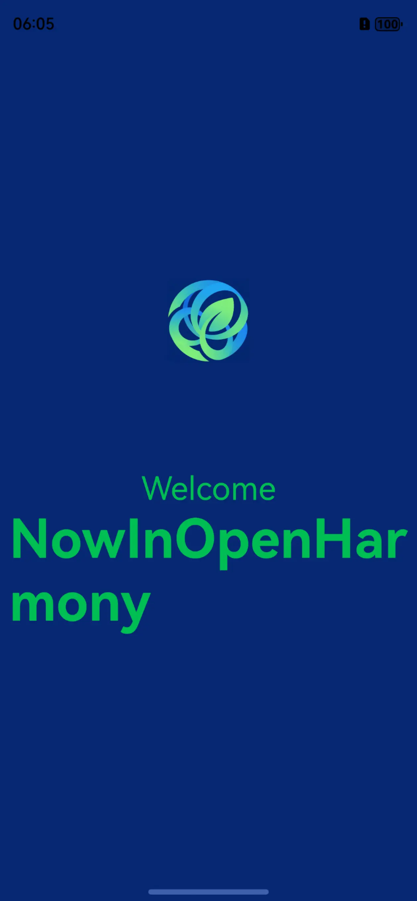

对没错它很违和的折行了，这谁受得了，我必须得解决一下，单纯的限制宽度很显然是不显示的，我们虽然可以直接写text的组件宽度为百分之多少来去限制宽度，但是文字的大小不变的花还是会出现折行的情况，如果我直接手动进行单词的花粉并添加折行符号的话显示效果又不太好所以我决定去获取一下屏幕的宽度随后再计算一下文字大小。

### issue创建

这次我决定要规范一下这个新功能的增加过程，于是先去github创建了一个issue。

<div style="
  background: linear-gradient(135deg, #1a1a1a 0%, #2d2d2d 100%);
  border: 1px solid #404040;
  border-left: 4px solid #28a745;
  border-radius: 12px;
  padding: 20px;
  margin: 16px 0;
  box-shadow: 0 4px 12px rgba(0, 0, 0, 0.3);
  transition: all 0.3s ease;
  font-family: -apple-system, BlinkMacSystemFont, 'Segoe UI', 'Roboto', sans-serif;
  max-width: 500px;
">
  <div style="display: flex; align-items: center; margin-bottom: 12px;">
    <svg style="width: 20px; height: 20px; margin-right: 8px; fill: #28a745;" viewBox="0 0 16 16">
      <path d="M8 9.5a1.5 1.5 0 100-3 1.5 1.5 0 000 3z"/>
      <path fill-rule="evenodd" d="M8 0a8 8 0 100 16A8 8 0 008 0zM1.5 8a6.5 6.5 0 1113 0 6.5 6.5 0 01-13 0z"/>
    </svg>
    <span style="color: #28a745; font-size: 12px; font-weight: 600; margin-right: 8px;">OPEN</span>
    <div style="margin: 0; color: #ffffff; font-size: 16px; font-weight: 600;">
      <a href="https://github.com/ifLabVibe/NowInOpenHarmony/issues/1" style="color: #ffffff; text-decoration: none;">
        启动页字体适配问题
      </a>
    </div>
  </div>
  <div style="display: flex; align-items: center; margin-bottom: 12px;">
    <span style="color: #d4d4d4; font-size: 12px; margin-right: 16px;">
      #1
    </span>
    <span style="color: #d4d4d4; font-size: 12px; margin-right: 16px;">
      ifLabVibe/NowInOpenHarmony
    </span>
  </div>
  <p style="color: #d4d4d4; margin: 0 0 16px 0; font-size: 14px; line-height: 1.5;">
    当前启动页缺少多设备适配，硬编码的数据仅针对PuraX系列手机屏幕宽度优化，在普通手机屏幕上会出现换行问题。
  </p>
  <div style="display: flex; align-items: center; gap: 16px; margin-bottom: 12px;">
    <span style="display: flex; align-items: center; color: #d4d4d4; font-size: 12px;">
      <svg style="width: 12px; height: 12px; margin-right: 4px; fill: #d4d4d4;" viewBox="0 0 16 16">
        <path d="M8 2a.75.75 0 01.75.75v3.5h3.5a.75.75 0 010 1.5h-3.5v3.5a.75.75 0 01-1.5 0v-3.5h-3.5a.75.75 0 010-1.5h3.5v-3.5A.75.75 0 018 2z"/>
      </svg>
      XBXyftx
    </span>
    <span style="display: flex; align-items: center; color: #d4d4d4; font-size: 12px;">
      <svg style="width: 12px; height: 12px; margin-right: 4px; fill: #d4d4d4;" viewBox="0 0 16 16">
        <path d="M1.5 8a6.5 6.5 0 1113 0 6.5 6.5 0 01-13 0zM8 0a8 8 0 100 16A8 8 0 008 0zm.5 4.75a.75.75 0 00-1.5 0v3.5a.75.75 0 00.471.696l2.5 1a.75.75 0 00.557-1.392L8.5 7.742V4.75z"/>
      </svg>
      Sep 18, 2025
    </span>
    <span style="color: #28a745; font-size: 12px; background: rgba(40, 167, 69, 0.1); padding: 2px 6px; border-radius: 4px;">
      需要修复
    </span>
  </div>
  <div style="margin-top: 12px;">
    <a href="https://github.com/ifLabVibe/NowInOpenHarmony/issues/1"
       style="
         color: #ffffff;
         text-decoration: none;
         font-size: 12px;
         border: 1px solid #404040;
         padding: 6px 12px;
         border-radius: 6px;
         background: rgba(255, 255, 255, 0.05);
         transition: all 0.2s ease;
         display: inline-block;
       "
       onmouseover="this.style.background='rgba(255, 255, 255, 0.1)'"
       onmouseout="this.style.background='rgba(255, 255, 255, 0.05)'">
      查看Issue
    </a>
  </div>
</div>

由于当前还属于是开源之夏的结项前的最后完善阶段，我就先将这个功能在开源之夏仓库的文件中进行修改，等后面完全结项之后我会去再开一个文章记录后续的完善以及新功能的增加过程。

### 代码修改

针对于屏幕宽度的获取我决定使用[WindowProperties](https://developer.huawei.com/consumer/cn/doc/harmonyos-references/arkts-apis-window-i#windowproperties)中的windowRect属性去获取。

#### CodeGenine的回答

我突然想到我为什么不问一问华为官方所提供的编码助手呢，也许可以给我提供一些不一样的思路呢。

```ts
@Entry
@Component
struct AutoScaleTextExample {
  @State title: string = "这是一个长文本示例，会根据容器宽度自动缩放";
  @State titleFS: number = 20; // 初始字体大小
  @State pWidth: number = 300; // 容器初始宽度

  build() {
    Row() {
      Text(this.title)
        .fontSize(this.titleFS)
        .maxLines(1)
        .onAreaChange((oldValue: Area, newValue: Area) => {
          // 测量文本实际宽度
          let textWidth = measure.measureText({
            textContent: this.title,
            fontSize: this.titleFS
          });
          // 判断是否需要缩放
          if (px2vp(textWidth) > this.pWidth && this.titleFS > 12) {
            this.titleFS--; // 逐步缩小字体
          } else if (px2vp(textWidth) < this.pWidth - 10 && this.titleFS < 20) {
            this.titleFS++; // 逐步放大字体（可选）
          }
        })
    }
    .width(this.pWidth)
    .onAreaChange((oldValue: Area, newValue: Area) => {
      this.pWidth = newValue.width; // 更新容器当前宽度
    })
  }
}
```

确确实实是给我了我个新思路，通过监听区域变化获取区域宽度数据。然后自己编写一个函数去计算字体大小。其实和我原本的思路差不多只是所用的能力接口不同而已。

同时下面还给出了另一种思路。

```ts
Row() {
  Text("自适应文本")
    .layoutWeight(1) // 占满剩余空间
    .fontSize('4%')  // 按容器宽度百分比设置字体
}
```

通过设置字体大小为容器的百分比，这样就可以实现自适应字体大小了。

居然这么简单。我本来想的就是这个，只不过一时间没有看到文档中写可以用百分比去表示字体大小，就没有管。

```ts
Column() {
  Image($r('app.media.logo'))
    .width('20%')
    .margin({ bottom: 100 })
  Text('Welcome To')
    .fontSize('12%')
    .fontColor('#ff00be53')
  Text('NowInOpenHarmony')
    .fontSize('50%')
    .fontColor('#ff00be53')
    .fontWeight(700)
}
.expandSafeArea()
.backgroundColor('#062872')
.justifyContent(FlexAlign.Center)
.width('100%')
.height('100%')
```

设置了百分比字体大小进行尝试，我直接设置一个百分之五十这个很大的数是为了测试这种方式到底是否能生效，因为我仍然在质疑这种方式的可行性。

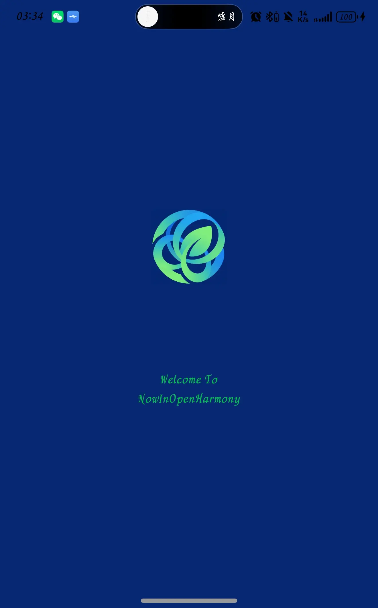

卧槽很显然是不生效的，这和我当初学的时候是一样的结论，哪怕是因为组件宽度上的因素导致百分比显得很小，但上下两个文本的比例我设的差距很大但两者的大小显示却是一样的，这就说明确实是没有生效。让我们去看一下最新的文档中的说明。

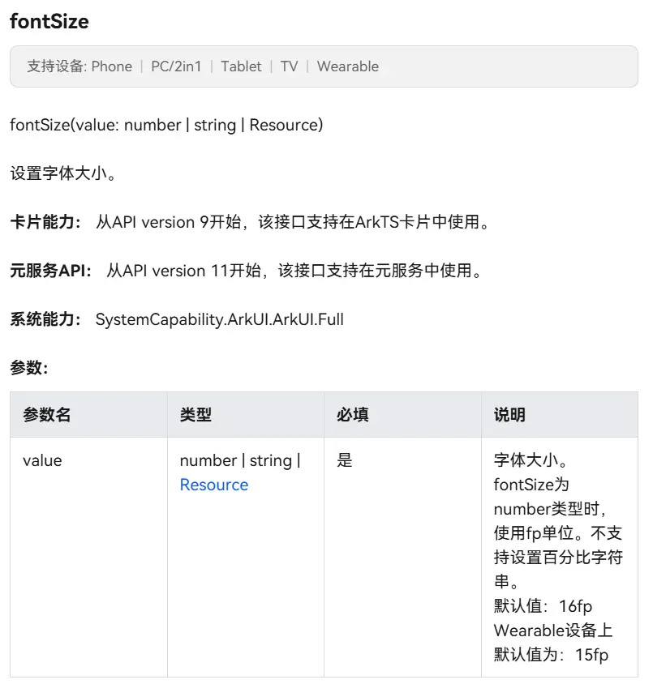

…… 我还能说什么呢，文档特别标注了不能使用百分比，但是……

#### 通过windowRect属性

在onWindowStageCreate中获取Window实例对象并调用`getWindowProperties().windowRect.width`获取屏幕宽度，然后通过计算得到字体大小。

```ts
  onWindowStageCreate(windowStage: window.WindowStage): void {
    // Main window is created, set main page for this ability
    hilog.info(DOMAIN, 'testTag', '%{public}s', 'Ability onWindowStageCreate');
    window.getLastWindow(this.context).then((win) => {
      const winWidth = win.getWindowProperties().windowRect.width
      AppStorageV2.connect(WinWidth, WINDOW_WIDTH, () => new WinWidth(winWidth))
    })
    windowStage.loadContent('pages/StartPage', (err) => {
      if (err.code) {
        hilog.error(DOMAIN, 'testTag', 'Failed to load the content. Cause: %{public}s', JSON.stringify(err));
        return;
      }
      hilog.info(DOMAIN, 'testTag', 'Succeeded in loading the content.');
      appInit.markDownConfigInit()

    });
  }
```

```ts
@ObservedV2
/**
 * 屏幕宽度包装类
 */
export class WinWidth {
  /**
   * 屏幕宽度值
   */
  @Trace value: number

  constructor(value: number) {
    this.value = value
  }
}
```

```ts
  uiRouter: Router = this.getUIContext().getRouter()
  @Local winWidth : number = 0
  async aboutToAppear(): Promise<void> {
    const width:number = (AppStorageV2.connect(WinWidth, WINDOW_WIDTH)?.value)??350
    logger.debug(`${START_PAGE_TAGE}width: ${width}`)
    this.winWidth = width
  }
```

这里也是依据华为官方给出的断点分布图设置了个备用值来防止屏幕宽度获取失败的情况。

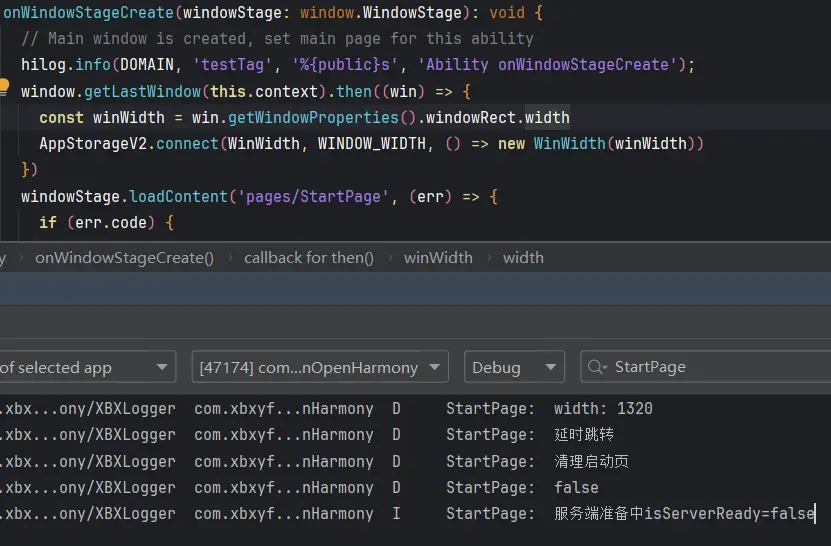

可以看到这个获取的数据很大，于是我去看了一下文档。

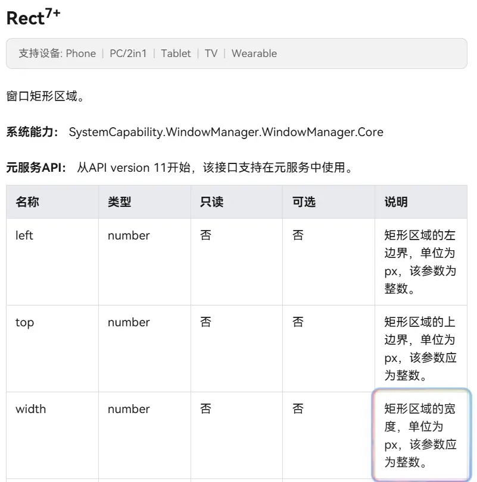

单位是px，那看来还得进行一下转换。小小修改一下。

```ts
const width: number = (AppStorageV2.connect(WinWidth, WINDOW_WIDTH)?.value) ?? 350
this.winWidth = this.getUIContext().px2vp(width)
logger.debug(`${START_PAGE_TAGE}winWidth: ${this.winWidth}`)
```

```ts
  updateFontSize() {
    const num = 16
    this.fontsize = Math.floor((this.winWidth*0.9)/num)
  }
```

这样的方式的确是可以顺利的去获取了，在puraX上是正常的，但是在模拟器上测试时却无法正常获取目标的宽度导致我们的text组件直接消失了。

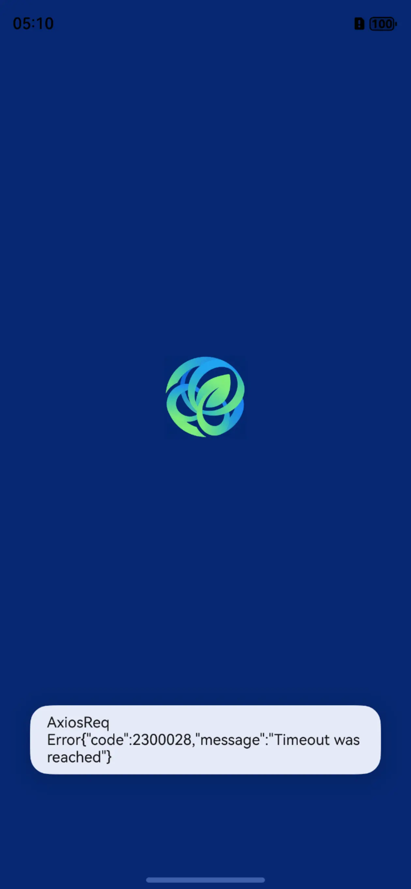

这让我想到了之前在搜索窗口获取内容时AI助手说过的一句话。

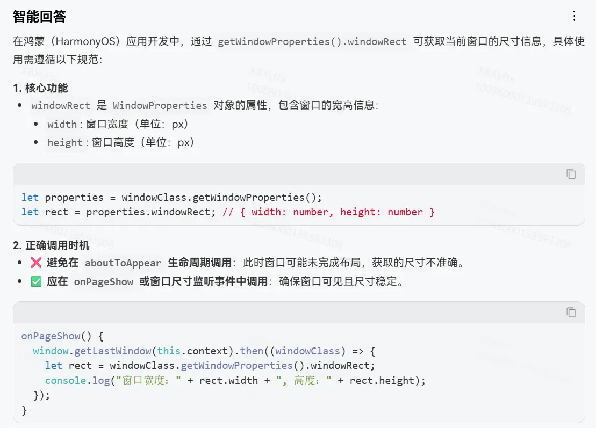

"❌ 避免在 aboutToAppear 生命周期调用：此时窗口可能未完成布局，获取的尺寸不准确。"

既然如此，我在onWindowStageCreate调用很可能出现问题。

但是在API17和API18上测试都没发现问题，所以我决定先commit一下进行尝试。

```ts
  onPageShow(): void {
    window.getLastWindow(this.getUIContext().getHostContext()).then((win)=>{
      this.winWidth =this.getUIContext().px2vp(win.getWindowProperties().windowRect.width)
    })
    this.updateFontSize()
  }
```

哦！这样一来在模拟器可以了。但是真机上失效了，应该问题就在于模拟器和真机的区别。于是我决定回滚一手去提交。后面再研究研究。

再修改完这些之后我首先是去向孙炼老师提出了最后一次pr合并的申请，开源之夏到这里就算是正式结束了。

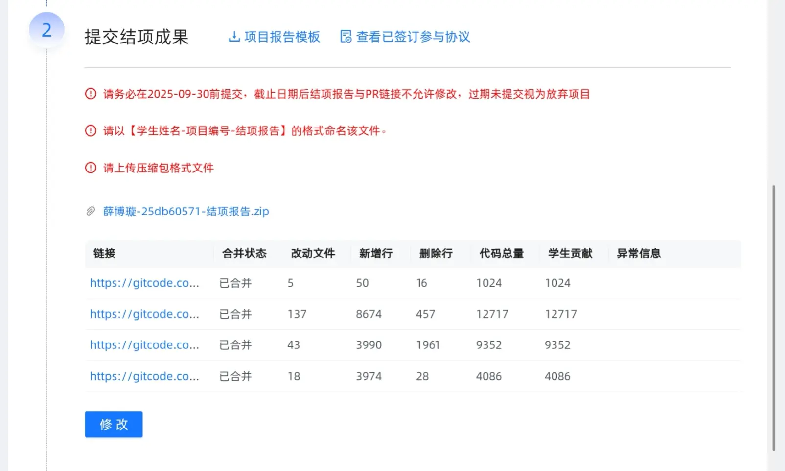

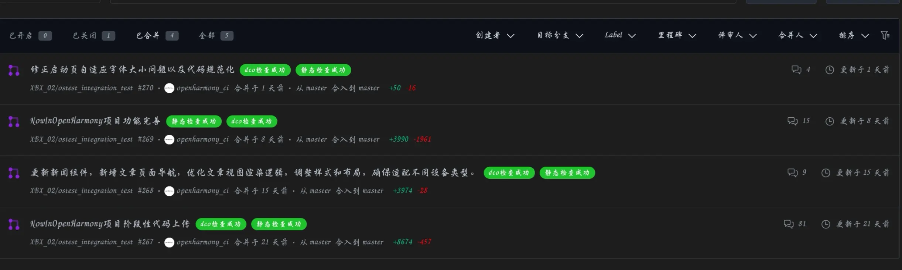

### github的pr创建与issue关联

在完成了gitcode这边的pr合并我就决定去github完善我自己的开源仓库，之前我是开启了一个issue去进行规范化的一个需求提出，所以我现在需要去创建一个pr关联目标issue并关闭issue。

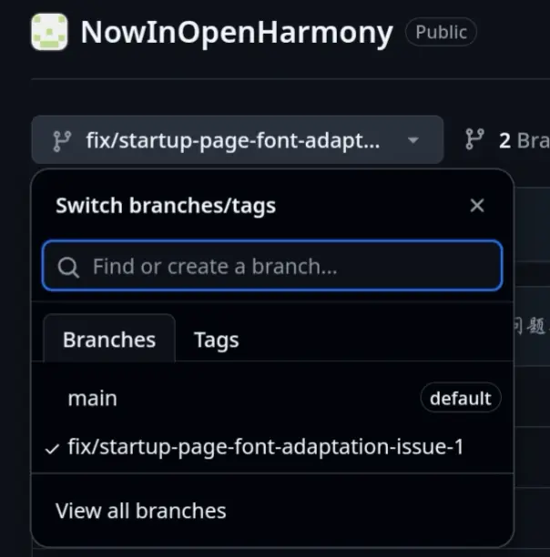

对于针对本仓库的pr，和对他人仓库fork之后提出合并的pr的流程有些不一样但本质都是一样的！！！我们要把握事物的本质，寻找事物之间的联系，联系是无处不在的。pr——pull request，其本质就是**两个不同分支的代码合并**，两者可以是单个分支的commit领先，也可以是两者互有领先的commit，当两者互有领先时，如果没有良好的合作规范的话就会出现两个分支之的不同commit修改了同一个位置的代码导致冲突的出现，这种冲突都会被git所高亮表示出来，需要由后申请合并的开发者去进行处理，修正冲突部分，所以一般来讲，早点推送！早点合并！要不就要处理冲突了（bushi）我们当然是推荐每个队伍都去便携一套合理的合作规范文档的，并且明确划分每个人的操作区域，不要修改自己负责区域之外的代码，尽可能的解耦、封装，这样才能有效的避免冲突，避免永远是要比修正要好的。

当然了这个过程对于CC来说是轻而易举的吧……我本来是这样想的。但事实很快给了我一巴掌。

第一次让cc尝试的时候我仅仅说了让他创建pr并且关联issue，没有添加任何更多的要求，CC就是直接按照完整的PR流程开始在新的分支去修改我的代码编写测试程序了，真的是很主动了但是也很让人崩溃。

我让他立刻强制回退了全部的代码修改本地以及远程。强制回退之后，我讲更新的代码从新从我gitcode仓库中打包然后再次解压到了我的github本地仓库中，然后第二次尝试是让他严禁修改任何代码仅仅是创建pr并且关联issue，这样也只能说是在极大程度上不会产生以外的代码修改，但我们依旧要手动的去进行commit，甚至是进行代码的zip打包。毕竟前两天也是出现了一些CC删掉了整个库并且篡改了git的记录导致无法通过回滚来进行恢复的悲剧。

第二次的尝试CC的操作让我很震惊，我本来以为只要是不修改我的代码就不会再出什么幺蛾子，但没想到他居然给我创建了一个空的PR，没错是空的，没有任何代码提交的空PR。这个罪证我也是留下来了。

<div style="background: linear-gradient(135deg, #28a745 0%, #20c997 100%); border-radius: 12px; padding: 20px; margin: 20px 0; color: white; position: relative; overflow: hidden; transition: all 0.3s ease; cursor: pointer; box-shadow: 0 4px 15px rgba(40, 167, 69, 0.3);" onmouseover="this.style.transform='translateY(-5px) scale(1.02)'; this.style.boxShadow='0 8px 25px rgba(40, 167, 69, 0.4)'; this.style.background='linear-gradient(135deg, #17a2b8 0%, #6f42c1 100%)'" onmouseout="this.style.transform='translateY(0) scale(1)'; this.style.boxShadow='0 4px 15px rgba(40, 167, 69, 0.3)'; this.style.background='linear-gradient(135deg, #28a745 0%, #20c997 100%)'">
  <div style="position: relative; z-index: 2;">
    <div style="display: flex; align-items: center; margin-bottom: 16px;">
      <svg width="24" height="24" viewBox="0 0 24 24" fill="white" style="margin-right: 12px;">
        <path d="M12 0C5.374 0 0 5.373 0 12c0 5.302 3.438 9.8 8.207 11.387.599.111.793-.261.793-.577v-2.234c-3.338.726-4.033-1.416-4.033-1.416-.546-1.387-1.333-1.756-1.333-1.756-1.089-.745.083-.729.083-.729 1.205.084 1.839 1.237 1.839 1.237 1.07 1.834 2.807 1.304 3.492.997.107-.775.418-1.305.762-1.604-2.665-.305-5.467-1.334-5.467-5.931 0-1.311.469-2.381 1.236-3.221-.124-.303-.535-1.524.117-3.176 0 0 1.008-.322 3.301 1.23A11.509 11.509 0 0112 5.803c1.02.005 2.047.138 3.006.404 2.291-1.552 3.297-1.23 3.297-1.23.653 1.653.242 2.874.118 3.176.77.84 1.235 1.911 1.235 3.221 0 4.609-2.807 5.624-5.479 5.921.43.372.823 1.102.823 2.222v3.293c0 .319.192.694.801.576C20.566 21.797 24 17.3 24 12c0-6.627-5.373-12-12-12z"/>
      </svg>
      <div style="margin: 0; font-size: 20px; font-weight: 600;">Pull Request #2</div>
    </div>
    <p style="margin: 0 0 16px 0; opacity: 0.9; font-size: 14px;">解决issue #1: 启动页字体适配问题</p>
    <div style="display: flex; gap: 12px; margin-bottom: 16px; flex-wrap: wrap;">
      <span style="background: rgba(255,255,255,0.2); padding: 4px 8px; border-radius: 12px; font-size: 12px; transition: all 0.2s ease;" onmouseover="this.style.background='rgba(255,255,255,0.35)'; this.style.transform='scale(1.05)'" onmouseout="this.style.background='rgba(255,255,255,0.2)'; this.style.transform='scale(1)'">🚀 首次提交</span>
      <span style="background: rgba(255,255,255,0.2); padding: 4px 8px; border-radius: 12px; font-size: 12px; transition: all 0.2s ease;" onmouseover="this.style.background='rgba(255,255,255,0.35)'; this.style.transform='scale(1.05)'" onmouseout="this.style.background='rgba(255,255,255,0.2)'; this.style.transform='scale(1)'">📱 移动应用</span>
      <span style="background: rgba(255,255,255,0.2); padding: 4px 8px; border-radius: 12px; font-size: 12px; transition: all 0.2s ease;" onmouseover="this.style.background='rgba(255,255,255,0.35)'; this.style.transform='scale(1.05)'" onmouseout="this.style.background='rgba(255,255,255,0.2)'; this.style.transform='scale(1)'">🎯 资讯聚合</span>
      <span style="background: rgba(255,255,255,0.2); padding: 4px 8px; border-radius: 12px; font-size: 12px; transition: all 0.2s ease;" onmouseover="this.style.background='rgba(255,255,255,0.35)'; this.style.transform='scale(1.05)'" onmouseout="this.style.background='rgba(255,255,255,0.2)'; this.style.transform='scale(1)'">📊 +0 -0</span>
    </div>
    <a href="https://github.com/ifLabVibe/NowInOpenHarmony/pull/2" target="_blank" style="display: inline-flex; align-items: center; background: rgba(255,255,255,0.2); color: white; text-decoration: none; padding: 10px 16px; border-radius: 8px; border: 1px solid rgba(255,255,255,0.3); font-weight: 500; transition: all 0.2s ease;" onclick="event.stopPropagation()" onmouseover="this.style.background='rgba(255,255,255,0.35)'; this.style.transform='translateY(-1px)'; this.style.boxShadow='0 2px 8px rgba(255,255,255,0.2)'" onmouseout="this.style.background='rgba(255,255,255,0.2)'; this.style.transform='translateY(0)'; this.style.boxShadow='none'">
      <svg width="24" height="24" viewBox="0 0 24 24" fill="white" style="margin-right: 12px;">
        <path d="M12 0C5.374 0 0 5.373 0 12c0 5.302 3.438 9.8 8.207 11.387.599.111.793-.261.793-.577v-2.234c-3.338.726-4.033-1.416-4.033-1.416-.546-1.387-1.333-1.756-1.333-1.756-1.089-.745.083-.729.083-.729 1.205.084 1.839 1.237 1.839 1.237 1.07 1.834 2.807 1.304 3.492.997.107-.775.418-1.305.762-1.604-2.665-.305-5.467-1.334-5.467-5.931 0-1.311.469-2.381 1.236-3.221-.124-.303-.535-1.524.117-3.176 0 0 1.008-.322 3.301 1.23A11.509 11.509 0 0112 5.803c1.02.005 2.047.138 3.006.404 2.291-1.552 3.297-1.23 3.297-1.23.653 1.653.242 2.874.118 3.176.77.84 1.235 1.911 1.235 3.221 0 4.609-2.807 5.624-5.479 5.921.43.372.823 1.102.823 2.222v3.293c0 .319.192.694.801.576C20.566 21.797 24 17.3 24 12c0-6.627-5.373-12-12-12z"/>
      </svg>
      查看 Pull Request
    </a>
  </div>
</div>

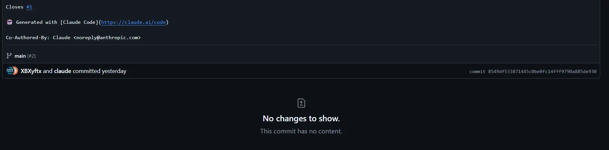

"No changes to show.
This commit has no content."

没错它改了0行！！！交了一个空pr上去，有点气笑了真的。

不过这次的的确确是没有篡改我的代码，这一点至少是让我感到欣慰的。至于这个空pr嘛，倒也没什么实质性的影响，我就留着他当作是对我自己的警醒把。

紧接着我就再次强调了我的需求是将当前的更改全部提交作为一次pr，用于完成issue #1 的需求。

<div style="background: linear-gradient(135deg, #667eea 0%, #764ba2 100%); border-radius: 12px; padding: 20px; margin: 20px 0; color: white; position: relative; overflow: hidden; transition: all 0.3s ease; cursor: pointer; box-shadow: 0 4px 15px rgba(102, 126, 234, 0.3);" onmouseover="this.style.transform='translateY(-5px) scale(1.02)'; this.style.boxShadow='0 8px 25px rgba(102, 126, 234, 0.4)'; this.style.background='linear-gradient(135deg, #7c4dff 0%, #8e24aa 100%)'" onmouseout="this.style.transform='translateY(0) scale(1)'; this.style.boxShadow='0 4px 15px rgba(102, 126, 234, 0.3)'; this.style.background='linear-gradient(135deg, #667eea 0%, #764ba2 100%)'">
  <div style="position: relative; z-index: 2;">
    <div style="display: flex; align-items: center; margin-bottom: 16px;">
      <svg width="24" height="24" viewBox="0 0 24 24" fill="white" style="margin-right: 12px;">
        <path d="M12 0C5.374 0 0 5.373 0 12c0 5.302 3.438 9.8 8.207 11.387.599.111.793-.261.793-.577v-2.234c-3.338.726-4.033-1.416-4.033-1.416-.546-1.387-1.333-1.756-1.333-1.756-1.089-.745.083-.729.083-.729 1.205.084 1.839 1.237 1.839 1.237 1.07 1.834 2.807 1.304 3.492.997.107-.775.418-1.305.762-1.604-2.665-.305-5.467-1.334-5.467-5.931 0-1.311.469-2.381 1.236-3.221-.124-.303-.535-1.524.117-3.176 0 0 1.008-.322 3.301 1.23A11.509 11.509 0 0112 5.803c1.02.005 2.047.138 3.006.404 2.291-1.552 3.297-1.23 3.297-1.23.653 1.653.242 2.874.118 3.176.77.84 1.235 1.911 1.235 3.221 0 4.609-2.807 5.624-5.479 5.921.43.372.823 1.102.823 2.222v3.293c0 .319.192.694.801.576C20.566 21.797 24 17.3 24 12c0-6.627-5.373-12-12-12z"/>
      </svg>
      <div style="margin: 0; font-size: 20px; font-weight: 600;">Pull Request #3</div>
    </div>
    <p style="margin: 0 0 16px 0; opacity: 0.9; font-size: 14px;">修复启动页字体适配问题并实现响应式设计</p>
    <div style="display: flex; gap: 12px; margin-bottom: 16px; flex-wrap: wrap;">
      <span style="background: rgba(255,255,255,0.2); padding: 4px 8px; border-radius: 12px; font-size: 12px; transition: all 0.2s ease;" onmouseover="this.style.background='rgba(255,255,255,0.35)'; this.style.transform='scale(1.05)'" onmouseout="this.style.background='rgba(255,255,255,0.2)'; this.style.transform='scale(1)'">🔧 Bug修复</span>
      <span style="background: rgba(255,255,255,0.2); padding: 4px 8px; border-radius: 12px; font-size: 12px; transition: all 0.2s ease;" onmouseover="this.style.background='rgba(255,255,255,0.35)'; this.style.transform='scale(1.05)'" onmouseout="this.style.background='rgba(255,255,255,0.2)'; this.style.transform='scale(1)'">📱 响应式设计</span>
      <span style="background: rgba(255,255,255,0.2); padding: 4px 8px; border-radius: 12px; font-size: 12px; transition: all 0.2s ease;" onmouseover="this.style.background='rgba(255,255,255,0.35)'; this.style.transform='scale(1.05)'" onmouseout="this.style.background='rgba(255,255,255,0.2)'; this.style.transform='scale(1)'">🎨 UI优化</span>
      <span style="background: rgba(255,255,255,0.2); padding: 4px 8px; border-radius: 12px; font-size: 12px; transition: all 0.2s ease;" onmouseover="this.style.background='rgba(255,255,255,0.35)'; this.style.transform='scale(1.05)'" onmouseout="this.style.background='rgba(255,255,255,0.2)'; this.style.transform='scale(1)'">📊 +123 -109</span>
    </div>
    <a href="https://github.com/ifLabVibe/NowInOpenHarmony/pull/3" target="_blank" style="display: inline-flex; align-items: center; background: rgba(255,255,255,0.2); color: white; text-decoration: none; padding: 10px 16px; border-radius: 8px; border: 1px solid rgba(255,255,255,0.3); font-weight: 500; transition: all 0.2s ease;" onclick="event.stopPropagation()" onmouseover="this.style.background='rgba(255,255,255,0.35)'; this.style.transform='translateY(-1px)'; this.style.boxShadow='0 2px 8px rgba(255,255,255,0.2)'" onmouseout="this.style.background='rgba(255,255,255,0.2)'; this.style.transform='translateY(0)'; this.style.boxShadow='none'">
      <svg width="24" height="24" viewBox="0 0 24 24" fill="white" style="margin-right: 12px;">
        <path d="M12 0C5.374 0 0 5.373 0 12c0 5.302 3.438 9.8 8.207 11.387.599.111.793-.261.793-.577v-2.234c-3.338.726-4.033-1.416-4.033-1.416-.546-1.387-1.333-1.756-1.333-1.756-1.089-.745.083-.729.083-.729 1.205.084 1.839 1.237 1.839 1.237 1.07 1.834 2.807 1.304 3.492.997.107-.775.418-1.305.762-1.604-2.665-.305-5.467-1.334-5.467-5.931 0-1.311.469-2.381 1.236-3.221-.124-.303-.535-1.524.117-3.176 0 0 1.008-.322 3.301 1.23A11.509 11.509 0 0112 5.803c1.02.005 2.047.138 3.006.404 2.291-1.552 3.297-1.23 3.297-1.23.653 1.653.242 2.874.118 3.176.77.84 1.235 1.911 1.235 3.221 0 4.609-2.807 5.624-5.479 5.921.43.372.823 1.102.823 2.222v3.293c0 .319.192.694.801.576C20.566 21.797 24 17.3 24 12c0-6.627-5.373-12-12-12z"/>
      </svg>
      查看 Pull Request
    </a>
  </div>
</div>

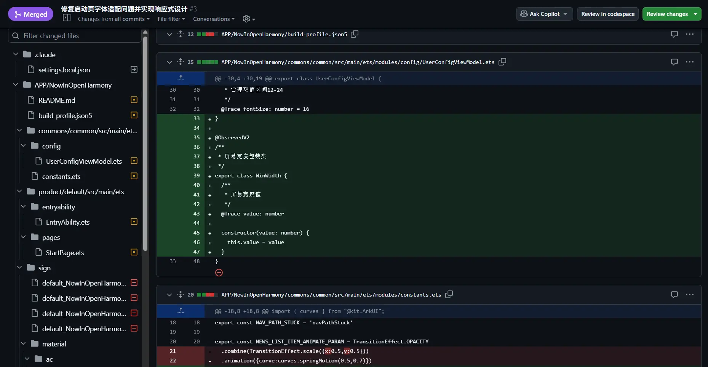

这次就正常了。

### 小结

#### 整体流程回顾

解决字体适配的过程中我是特意的去规范化了一个开源项目的优化，从创建issue明确需求，再到发起PR合并代码，在开发期间将代码都放置于一个单独的分支上，不去直接并入主分支，防止主分支代码受到不成熟功能模块的干扰，最后再通过关联issue合并PR来完成整个项目的需求开发流程。

#### PR的本质

在这个过程中很重要的一个点就是在于可以创建空PR的，PR的本质是在于，所谓的不同分支并不只局限与fork的镜像仓库自然而然产生的新分支，自己的仓库再开发新的功能为了对代码进行同步而开创的新分支本质上也是属于不同分支，所以我们就可以利用自己的仓库的不同分支上的commit进度差异来去进行PR的创建。

#### PR的意义

至于说我们为什么需要PR，我们可以从commit的目的以及需求的开发与解决的角度来讲。

一个需求，就像是微信最近新上的朋友圈评论可以发图片的功能，就是一个典型的在现有产品上进行升级的需求，产品的绝大多数功能是不需要改变的，代码也不需要改动，需要改动的仅仅是朋友圈方面的代码模块，以及为了相关数据存储需求而进行的数据库修改。这些都是为了这个需求而去进行的代码修改以及新功能模块的编写。一套优秀的代码肯定是高内聚低耦合的，对于应用端的代码与原有逻辑的原有模块来说，新需求的开发本该是 “精准打击” 而非 “牵一发而动全身”。但实际开发中，即便只改动朋友圈相关模块，也可能因为开发者对原有代码逻辑的理解偏差、或是不经意间的代码冗余，导致新写的代码与旧模块产生隐性冲突 —— 比如原本处理文字评论的接口，突然要兼容图片上传逻辑，若没做好参数校验，很可能让旧的文字评论功能出现异常。而 PR（Pull Request）恰恰能在代码合并到主分支前，拦住这些潜在风险。它就像一个 “前置审核岗”，让团队里熟悉原有代码架构的同事帮忙把关：看看新写的朋友圈图片存储逻辑是否符合数据库设计规范，新增的接口是否会影响其他依赖该接口的功能，甚至代码风格是否和项目统一 —— 毕竟就算功能实现了，混乱的代码格式也会给后续维护埋下隐患。

再往深了说，commit 的目的是记录每一次代码修改的 “脚印”，而 PR 则是把这些 “脚印” 串联成完整的 “开发故事”。比如开发朋友圈发图功能时，可能会有多个开发者分别负责前端图片预览、后端文件上传、数据库字段新增这几个子任务，每个人都会有自己的 commit 记录。如果直接把这些 commit 合并到主分支，一旦后续发现图片上传失败的问题，很难快速定位是前端参数传错了，还是后端存储逻辑出了问题。但有了 PR 之后，所有人的代码修改都会集中在同一个请求里，评审时可以清晰看到每个子任务的代码关联，出问题时也能顺着 PR 里的讨论记录、代码变更记录，快速定位到具体的修改环节。而且对于后续加入团队的成员来说，翻看历史 PR 记录，也能更清晰地了解每个功能的开发思路、代码修改的考量，比单纯看 commit 日志更容易理解整个项目的演进过程。

另外，从需求迭代的角度来看，PR 也是一个重要的 “质量闸门”。微信的朋友圈功能用户基数庞大，任何一个小的 bug 都可能影响大量用户，所以新功能上线前必须经过严格的验证。PR 的评审过程，不仅仅是看代码是否能跑通，更要考虑代码的健壮性、性能、安全性 —— 比如图片上传时是否做了大小限制，会不会因为超大图片导致服务器压力过大；用户上传的图片是否经过安全检测，避免携带恶意代码；多用户同时评论发图时，数据库会不会出现并发问题等等。这些问题如果等到代码合并后再发现，修复成本会高很多，甚至可能需要回滚版本，影响用户体验。而通过 PR 提前进行多维度评审，能让这些问题在早期就被发现并解决，确保每次需求迭代都是在 “可控、可追溯、高质量” 的前提下推进，既保护了原有功能的稳定性，也让新功能能够更顺畅地落地。

于是总的来说，PR是一次针对于同一需求的代码封装包裹，也是针对于主分支的一次版本升级，commit则是一次次开发中的尝试以及阶段性的成果，是程序员对于开发这个需求所进行的一切尝试的记录。

## 开源项目开发流程可视化

在这次开源之夏的项目开发过程中，我深刻体会到了标准化开源项目开发流程的重要性。从需求提出到最终代码合并，每一个环节都有其存在的意义和价值。为了更好地展示这个完整的开发流程，我创建了下面这个可视化流程图：

<div style="width: 100%; max-width: 1200px; margin: 20px auto; background: linear-gradient(135deg, #667eea 0%, #764ba2 100%); border-radius: 15px; padding: 30px; box-shadow: 0 10px 30px rgba(102, 126, 234, 0.3); font-family: 'Arial', sans-serif;">
  <h3 style="text-align: center; color: white; margin-bottom: 30px; font-size: 24px; font-weight: bold;">开源项目开发流程图</h3>
  <!-- 流程节点容器 -->
  <div style="position: relative; display: flex; flex-direction: column; gap: 25px; align-items: center;">
    <!-- 第一步：需求提出 -->
    <div style="display: flex; align-items: center; justify-content: center; width: 100%; position: relative;">
      <div style="background: linear-gradient(135deg, #ff6b6b 0%, #ff8e53 100%); padding: 20px 30px; border-radius: 12px; color: white; text-align: center; min-width: 200px; box-shadow: 0 5px 15px rgba(255, 107, 107, 0.3); transition: all 0.3s ease; cursor: pointer;" onmouseover="this.style.transform='scale(1.05)'; this.style.boxShadow='0 8px 25px rgba(255, 107, 107, 0.4)'" onmouseout="this.style.transform='scale(1)'; this.style.boxShadow='0 5px 15px rgba(255, 107, 107, 0.3)'">
        <div style="font-size: 18px; font-weight: bold; margin-bottom: 8px;">💡 需求提出</div>
        <div style="font-size: 14px; opacity: 0.9;">发现问题，确定改进方向</div>
      </div>
    </div>
    <!-- 箭头 -->
    <div style="color: white; font-size: 24px; animation: bounce 2s infinite;">↓</div>
    <!-- 第二步：Issue创建 -->
    <div style="display: flex; align-items: center; justify-content: center; width: 100%; position: relative;">
      <div style="background: linear-gradient(135deg, #4ecdc4 0%, #44a08d 100%); padding: 20px 30px; border-radius: 12px; color: white; text-align: center; min-width: 200px; box-shadow: 0 5px 15px rgba(78, 205, 196, 0.3); transition: all 0.3s ease; cursor: pointer;" onmouseover="this.style.transform='scale(1.05)'; this.style.boxShadow='0 8px 25px rgba(78, 205, 196, 0.4)'" onmouseout="this.style.transform='scale(1)'; this.style.boxShadow='0 5px 15px rgba(78, 205, 196, 0.3)'">
        <div style="font-size: 18px; font-weight: bold; margin-bottom: 8px;">📋 Issue创建</div>
        <div style="font-size: 14px; opacity: 0.9;">详细描述需求和预期效果</div>
      </div>
    </div>
    <!-- 箭头 -->
    <div style="color: white; font-size: 24px; animation: bounce 2s infinite;">↓</div>
    <!-- 第三步：方案设计 -->
    <div style="display: flex; align-items: center; justify-content: center; width: 100%; position: relative;">
      <div style="background: linear-gradient(135deg, #a8e6cf 0%, #88d8a3 100%); padding: 20px 30px; border-radius: 12px; color: #2d5a3d; text-align: center; min-width: 200px; box-shadow: 0 5px 15px rgba(168, 230, 207, 0.3); transition: all 0.3s ease; cursor: pointer;" onmouseover="this.style.transform='scale(1.05)'; this.style.boxShadow='0 8px 25px rgba(168, 230, 207, 0.4)'" onmouseout="this.style.transform='scale(1)'; this.style.boxShadow='0 5px 15px rgba(168, 230, 207, 0.3)'">
        <div style="font-size: 18px; font-weight: bold; margin-bottom: 8px;">🎯 方案设计</div>
        <div style="font-size: 14px; opacity: 0.9;">制定技术实现方案</div>
      </div>
    </div>
    <!-- 箭头 -->
    <div style="color: white; font-size: 24px; animation: bounce 2s infinite;">↓</div>
    <!-- 第四步：分支创建 -->
    <div style="display: flex; align-items: center; justify-content: center; width: 100%; position: relative;">
      <div style="background: linear-gradient(135deg, #ffd93d 0%, #ff8a00 100%); padding: 20px 30px; border-radius: 12px; color: #8b4513; text-align: center; min-width: 200px; box-shadow: 0 5px 15px rgba(255, 217, 61, 0.3); transition: all 0.3s ease; cursor: pointer;" onmouseover="this.style.transform='scale(1.05)'; this.style.boxShadow='0 8px 25px rgba(255, 217, 61, 0.4)'" onmouseout="this.style.transform='scale(1)'; this.style.boxShadow='0 5px 15px rgba(255, 217, 61, 0.3)'">
        <div style="font-size: 18px; font-weight: bold; margin-bottom: 8px;">🌿 创建分支</div>
        <div style="font-size: 14px; opacity: 0.9;">建立独立开发环境</div>
      </div>
    </div>
    <!-- 箭头 -->
    <div style="color: white; font-size: 24px; animation: bounce 2s infinite;">↓</div>
    <!-- 第五步：编码开发 -->
    <div style="display: flex; align-items: center; justify-content: center; width: 100%; position: relative;">
      <div style="background: linear-gradient(135deg, #667eea 0%, #764ba2 100%); padding: 20px 30px; border-radius: 12px; color: white; text-align: center; min-width: 200px; box-shadow: 0 5px 15px rgba(102, 126, 234, 0.3); transition: all 0.3s ease; cursor: pointer;" onmouseover="this.style.transform='scale(1.05)'; this.style.boxShadow='0 8px 25px rgba(102, 126, 234, 0.4)'" onmouseout="this.style.transform='scale(1)'; this.style.boxShadow='0 5px 15px rgba(102, 126, 234, 0.3)'">
        <div style="font-size: 18px; font-weight: bold; margin-bottom: 8px;">💻 编码开发</div>
        <div style="font-size: 14px; opacity: 0.9;">实现功能逻辑</div>
      </div>
    </div>
    <!-- 箭头 -->
    <div style="color: white; font-size: 24px; animation: bounce 2s infinite;">↓</div>
    <!-- 第六步：测试 -->
    <div style="display: flex; align-items: center; justify-content: center; width: 100%; position: relative;">
      <div style="background: linear-gradient(135deg, #ff9a56 0%, #ff6b6b 100%); padding: 20px 30px; border-radius: 12px; color: white; text-align: center; min-width: 200px; box-shadow: 0 5px 15px rgba(255, 154, 86, 0.3); transition: all 0.3s ease; cursor: pointer;" onmouseover="this.style.transform='scale(1.05)'; this.style.boxShadow='0 8px 25px rgba(255, 154, 86, 0.4)'" onmouseout="this.style.transform='scale(1)'; this.style.boxShadow='0 5px 15px rgba(255, 154, 86, 0.3)'">
        <div style="font-size: 18px; font-weight: bold; margin-bottom: 8px;">🔍 测试</div>
        <div style="font-size: 14px; opacity: 0.9;">验证功能</div>
      </div>
    </div>
    <!-- 箭头 -->
    <div style="color: white; font-size: 24px; animation: bounce 2s infinite;">↓</div>
    <!-- 第七步：提交代码 -->
    <div style="display: flex; align-items: center; justify-content: center; width: 100%; position: relative;">
      <div style="background: linear-gradient(135deg, #56ccf2 0%, #2f80ed 100%); padding: 20px 30px; border-radius: 12px; color: white; text-align: center; min-width: 200px; box-shadow: 0 5px 15px rgba(86, 204, 242, 0.3); transition: all 0.3s ease; cursor: pointer;" onmouseover="this.style.transform='scale(1.05)'; this.style.boxShadow='0 8px 25px rgba(86, 204, 242, 0.4)'" onmouseout="this.style.transform='scale(1)'; this.style.boxShadow='0 5px 15px rgba(86, 204, 242, 0.3)'">
        <div style="font-size: 18px; font-weight: bold; margin-bottom: 8px;">💾 Commit</div>
        <div style="font-size: 14px; opacity: 0.9;">提交代码</div>
      </div>
    </div>
    <!-- 箭头 -->
    <div style="color: white; font-size: 24px; animation: bounce 2s infinite;">↓</div>
    <!-- 第八步：PR创建 -->
    <div style="display: flex; align-items: center; justify-content: center; width: 100%; position: relative;">
      <div style="background: linear-gradient(135deg, #a8edea 0%, #fed6e3 100%); padding: 20px 30px; border-radius: 12px; color: #2d3436; text-align: center; min-width: 200px; box-shadow: 0 5px 15px rgba(168, 237, 234, 0.3); transition: all 0.3s ease; cursor: pointer;" onmouseover="this.style.transform='scale(1.05)'; this.style.boxShadow='0 8px 25px rgba(168, 237, 234, 0.4)'" onmouseout="this.style.transform='scale(1)'; this.style.boxShadow='0 5px 15px rgba(168, 237, 234, 0.3)'">
        <div style="font-size: 18px; font-weight: bold; margin-bottom: 8px;">🚀 创建PR</div>
        <div style="font-size: 14px; opacity: 0.9;">请求代码合并到主分支</div>
      </div>
    </div>
    <!-- 箭头 -->
    <div style="color: white; font-size: 24px; animation: bounce 2s infinite;">↓</div>
    <!-- 第九步：代码审查 -->
    <div style="display: flex; align-items: center; justify-content: center; width: 100%; position: relative;">
      <div style="background: linear-gradient(135deg, #ffeaa7 0%, #fab1a0 100%); padding: 20px 30px; border-radius: 12px; color: #2d3436; text-align: center; min-width: 200px; box-shadow: 0 5px 15px rgba(255, 234, 167, 0.3); transition: all 0.3s ease; cursor: pointer;" onmouseover="this.style.transform='scale(1.05)'; this.style.boxShadow='0 8px 25px rgba(255, 234, 167, 0.4)'" onmouseout="this.style.transform='scale(1)'; this.style.boxShadow='0 5px 15px rgba(255, 234, 167, 0.3)'">
        <div style="font-size: 18px; font-weight: bold; margin-bottom: 8px;">👥 代码审查</div>
        <div style="font-size: 14px; opacity: 0.9;">团队成员评审代码质量</div>
      </div>
    </div>
    <!-- 箭头 -->
    <div style="color: white; font-size: 24px; animation: bounce 2s infinite;">↓</div>
    <!-- 第十步：合并完成 -->
    <div style="display: flex; align-items: center; justify-content: center; width: 100%; position: relative;">
      <div style="background: linear-gradient(135deg, #00b894 0%, #00cec9 100%); padding: 20px 30px; border-radius: 12px; color: white; text-align: center; min-width: 200px; box-shadow: 0 5px 15px rgba(0, 184, 148, 0.3); transition: all 0.3s ease; cursor: pointer;" onmouseover="this.style.transform='scale(1.05)'; this.style.boxShadow='0 8px 25px rgba(0, 184, 148, 0.4)'" onmouseout="this.style.transform='scale(1)'; this.style.boxShadow='0 5px 15px rgba(0, 184, 148, 0.3)'">
        <div style="font-size: 18px; font-weight: bold; margin-bottom: 8px;">🎉 合并完成</div>
        <div style="font-size: 14px; opacity: 0.9;">代码成功合并，Issue关闭</div>
      </div>
    </div>
  </div>
  <!-- 动画样式 -->
  <style>
    @keyframes bounce {
      0%, 20%, 50%, 80%, 100% {
        transform: translateY(0);
      }
      40% {
        transform: translateY(-10px);
      }
      60% {
        transform: translateY(-5px);
      }
    }
  </style>
</div>

### 流程解析

从这个可视化流程图中，我们可以清楚地看到开源项目开发的完整链路：

1. **需求提出阶段**：当我们在使用应用时发现了字体适配问题，这就是一个明确的改进需求。这个阶段重要的是要准确识别问题的本质，而不是仅仅看到表面现象。

2. **Issue创建阶段**：将发现的问题规范化地记录下来，包括问题描述、复现步骤、预期效果等。这不仅是为了让其他开发者理解问题，也是为后续的开发工作建立明确的目标。

3. **方案设计阶段**：在动手编码之前，先要分析技术实现路径。比如这次的字体适配问题，需要考虑使用设备信息API、响应式设计原则等技术方案。

4. **分支创建阶段**：为了保护主分支的稳定性，我们在独立的分支上进行开发。这样即使开发过程中出现问题，也不会影响到项目的主要版本。

5. **开发编码阶段**：这是一个迭代的过程，包含编码→测试→提交的循环。每个小的功能实现都应该及时commit，确保开发进度的可追溯性。

6. **PR创建阶段**：当功能开发完成后，通过Pull Request将所有相关的commit整合起来，请求将代码合并到主分支。

7. **代码审查阶段**：这是质量保障的关键环节。通过同行评审，确保代码质量、安全性和与现有系统的兼容性。

8. **合并完成阶段**：审查通过后，代码正式合并到主分支，相关的Issue也会被关闭，标志着一个完整开发周期的结束。

这个流程不仅适用于开源项目，在企业级开发中也同样有效。它确保了代码质量、开发可追溯性和团队协作的高效性。通过这次开源之夏的实践，我深刻理解了为什么成熟的开源项目都会采用这样的开发流程——它不仅仅是形式上的规范，更是保证项目长期健康发展的基石。

## 总结与展望

这次的开之夏活动必然是我大学期间最为重要的一次项目经历，也是第一次最为完整，最为规范的软件开发流程，从前期的方案撰写，技术的可行性试验，开发时间安排的规划，再到开源协议的签署，软件的正式开发，一个个模块的测试调优，最终将一次次commit中小到不起眼的代码修改，逐渐拼合成为一个前后端健全的OpenHarmony项目。创建PR后的代码门禁审核更是让我深刻的认识到了PR对于主分支代码的保护作用以及对于单个的需求代码的封装汇总功能。

当我的PR被OpenHarmony所合并时，那份激动之情难以言表，我也是正式成为了Harmony生态的共建者之一，这对于一年前的我来说都是遥不可及的，那个对于代码都看不懂，只知道拍照照抄的我，与现在的我面对面，应该也会像当初被骏哥和子安所震撼到一样的感觉吧。


