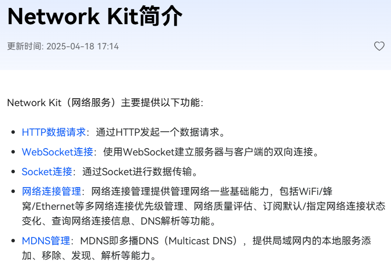
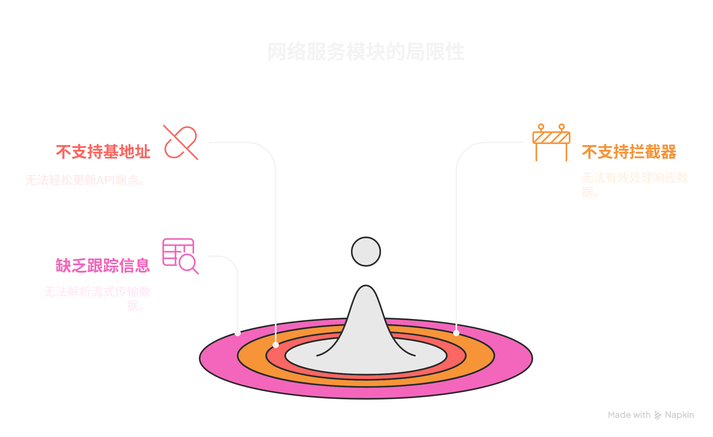
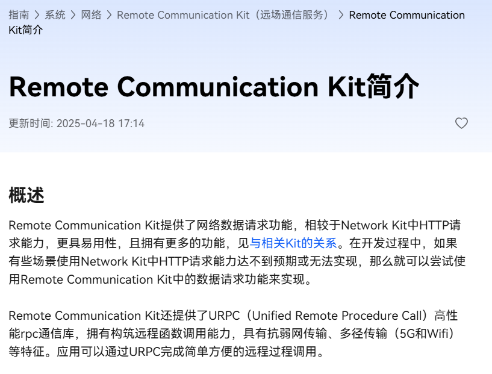
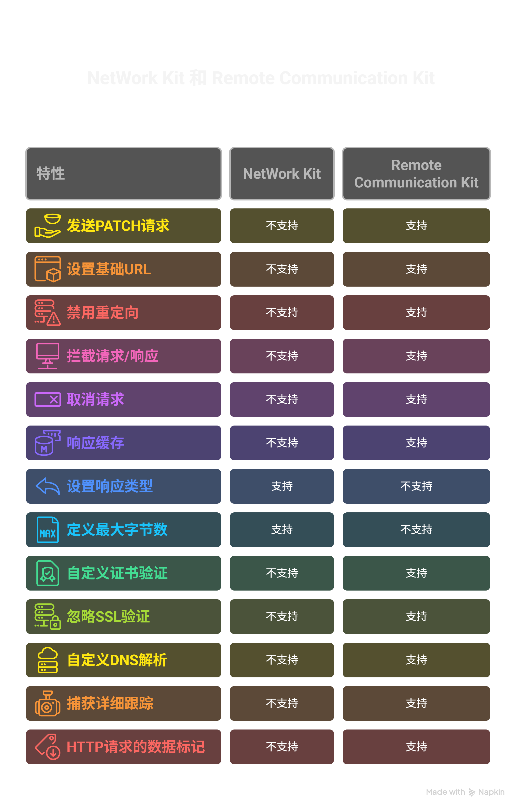

## 前言

我之所以想写这篇文章主要是之前在开发鸿小易以及调试流式传输能力的时候，都是按照学长之前的活动去沿用了之前的请求代码，再加以调整，但并没有真正理解`Remote Communication Kit`和`Network Kit`在HTTP请求方面的差异，所以我将借这篇文章来进行一下二者的简单对比。

## 简介

还是先放传送门:

* [Network Kit](https://developer.huawei.com/consumer/cn/doc/harmonyos-guides/net-mgmt-overview)
* [Remote Communication Kit](https://developer.huawei.com/consumer/cn/doc/harmonyos-guides/remote-communication-introduction)

### Network Kit

网络服务模块就是以往我所使用的基础的网络请求模块，可以应对绝大多数的网络请求需求，但它也有着明显的缺陷。

* 不支持基地址设置：关于这一点我在之前axios的学习笔记中就提到过，绝大多数公司服务器所提供的API接口都是用同一个基地址加上后续资源路径的模式，如果公司整体更换域名，不设置基地址而是去逐一设置的话会导致难以进行升级维护和改造重构。
* 不支持设置拦截器：这一点也同样是在使用axios遇到的问题，在获取到数据后我们可以通过设置拦截器来对数据进行处理，统一对响应状态码进行判断，再提取出我们搜索需要的字段数据进行返回，而非直接整体返回，这样就可以保障代码的复用性以及可维护性。
* 不支持捕获详细的跟踪信息：在SSE模式的流式传输中我们需要对各个数据包的事件`event`字段进行解析，并依据解析结果来去进行数据的处理，这一点`Network Kit`并不能做到。

### Remote Communication Kit

通过远场通信服务的概述我们就可以看到，远场通信服务诞生的初衷就是为了弥补`Network Kit`的不足，它可以通过设置基地址和拦截器来对网络请求进行统一的管理，同时也可以通过设置监听器来对网络请求的状态进行监听，从而实现对网络请求的统一管理和控制。

## 二者对比

通过上表我们可以看到，虽然远场通信在绝大多数情况都可以满足我们的需求，但也有少部分功能如对响应类型以及最大字节数的限制是远场通信服务所不具备的，所以我们还是需要视具体情况而定，在必要的时候第三方库也是很好的解决方案。
