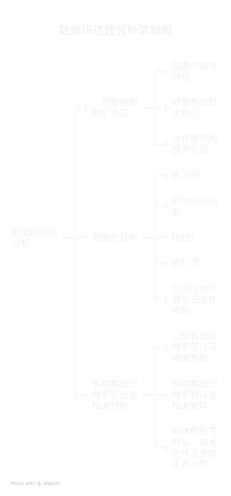
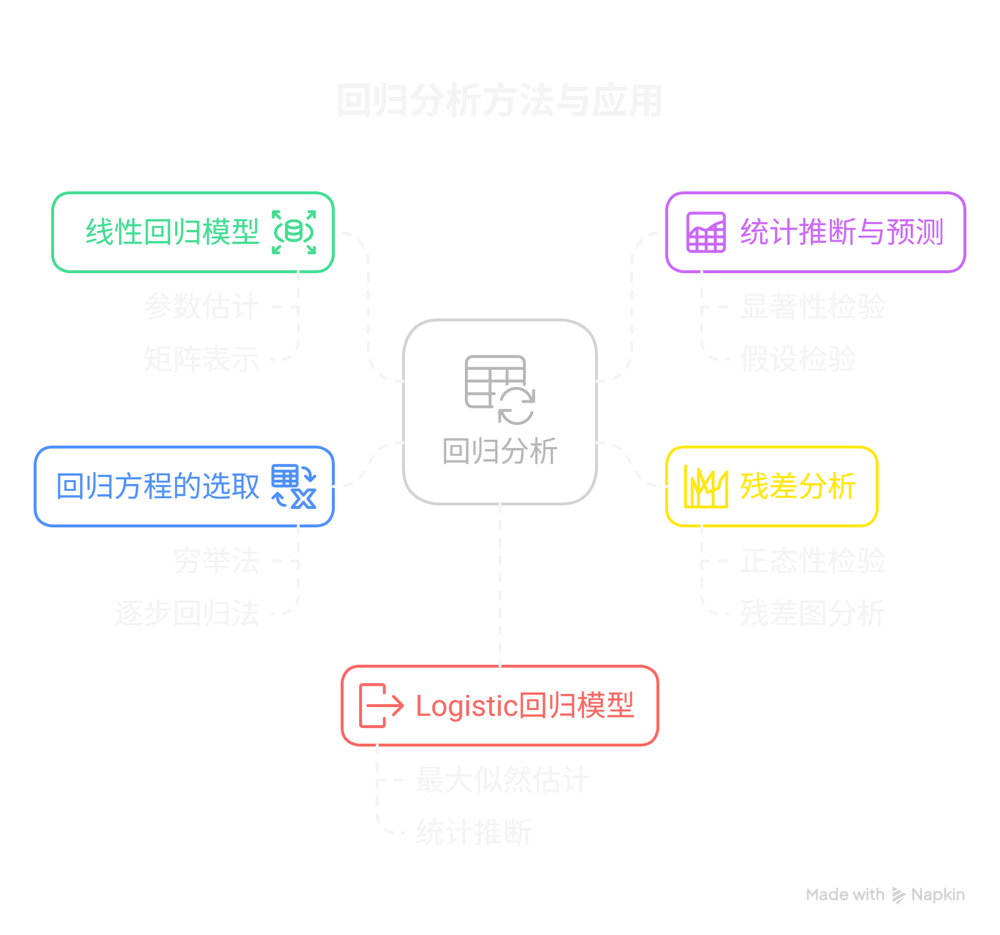
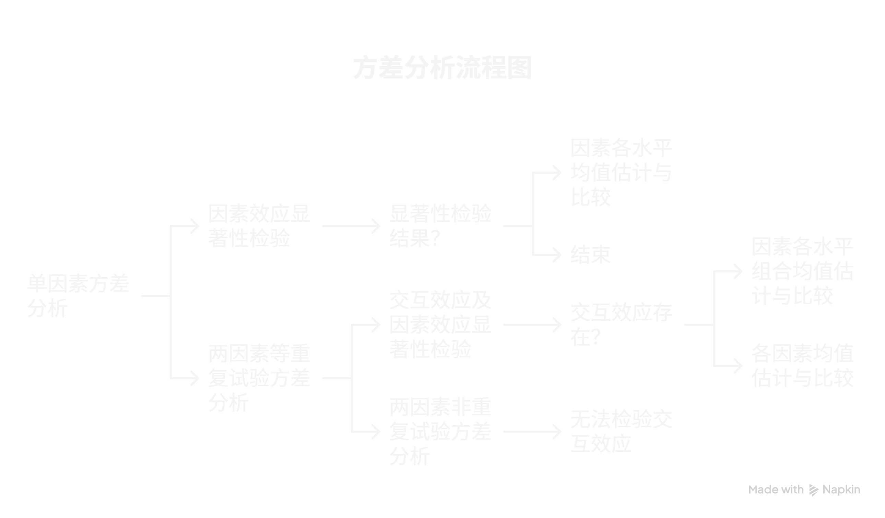
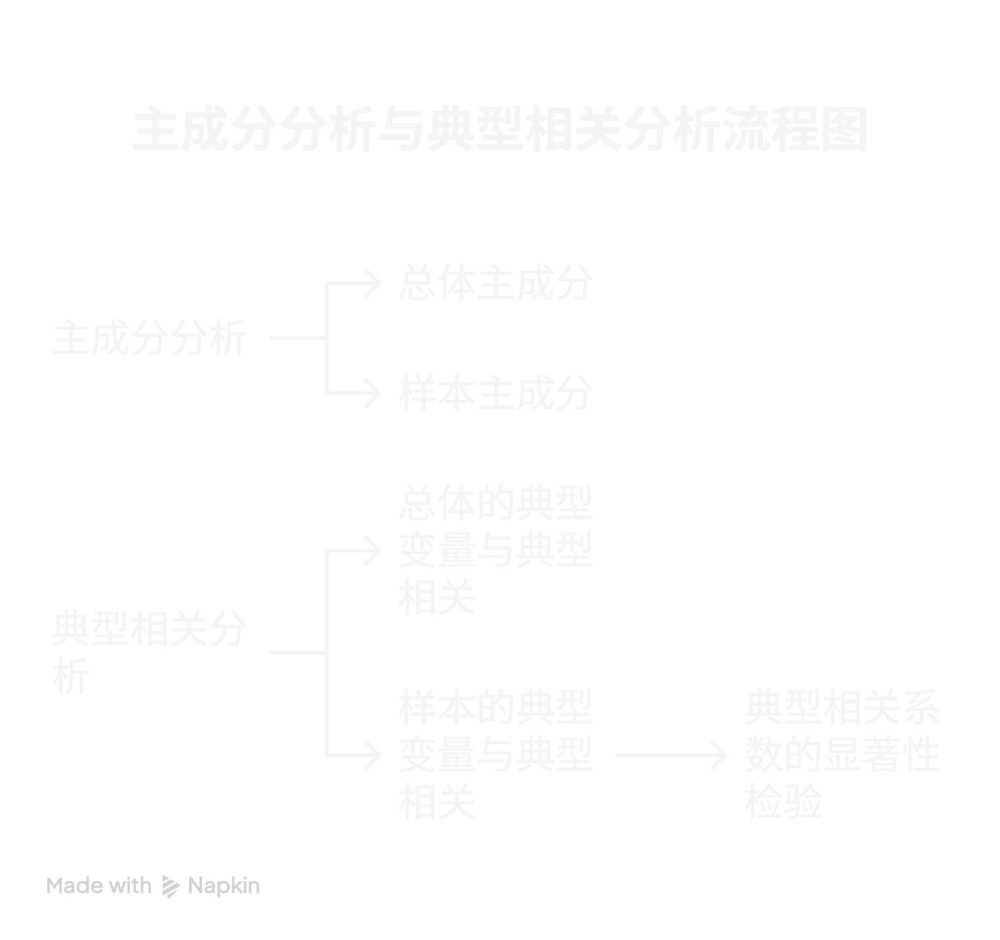
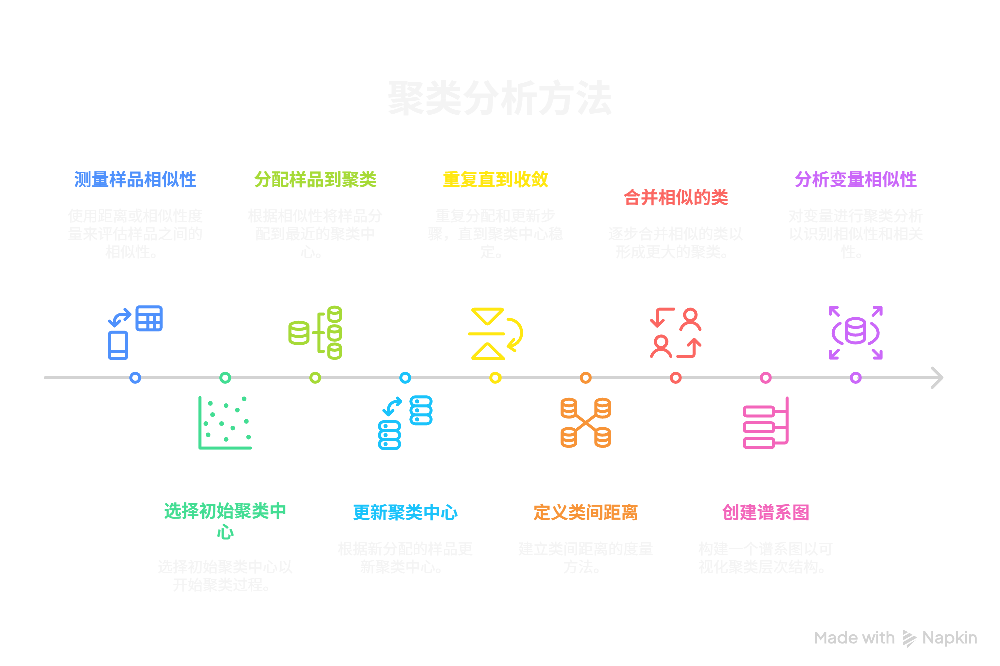
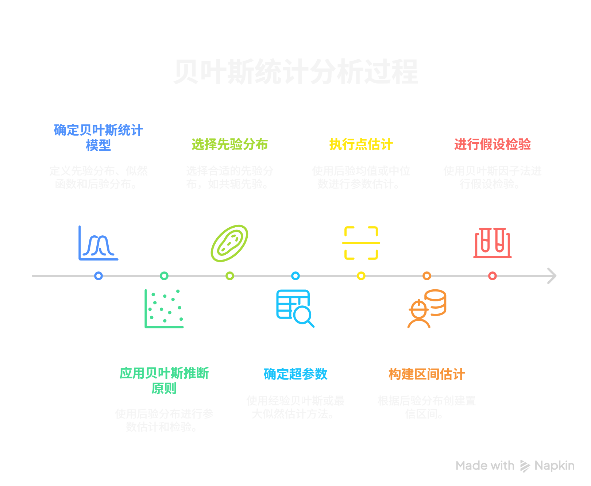

## 重要概念

### （一）数据描述性分析

1. **一维数据的数字特征**
    - **表示位置的数字特征**：均值、中位数、分位数（如上下四分位数）、三均值。均值易受异常值影响，中位数受异常值影响较小，具有较好的抗扰性或稳健性。分位数是将数据按一定比例分割的数值，三均值是上四分位数、中位数与下四分位数的加权平均。
    - **表示分散性的数字特征**：方差、标准差、变异系数等。方差是数据相对于均值的偏差平方的平均，标准差是方差的平方根，变异系数是标准差与均值的比值，用于比较不同数据集的离散程度。
    - **表示分布形状的数字特征**：偏度、峰度等。偏度衡量数据分布的不对称程度，峰度衡量数据分布的尖峰或扁平程度。
2. **数据的分布**
    - **直方图**：用矩形的高度表示数据在各个区间的频数或频率，直观展示数据的分布形态。
    - **经验分布函数**：根据样本数据构建的分布函数，用于估计总体的分布。
    - **QQ图**：用于判断数据是否服从某种特定分布，通过比较样本分位数和理论分位数来评估分布的拟合程度。
    - **茎叶图**：将数据的整数部分作为茎，小数部分作为叶，展示数据的分布情况，同时保留了原始数据的信息。
    - **数据的分布拟合检验与正态性检验**：用于检验数据是否符合某种特定的分布，如正态分布。常见的检验方法有卡方检验、Shapiro - Wilk检验等。
3. **多维数据的数字特征及相关分析**
    - **二维数据的数字特征及相关系数**：均值向量、协方差、相关系数等。相关系数衡量两个变量之间的线性相关程度，取值范围为[-1, 1]。
    - **多维数据的数字特征及相关矩阵**：均值向量、方差、协方差矩阵、相关矩阵等。协方差矩阵描述了多个变量之间的协方差关系，相关矩阵则是标准化后的协方差矩阵。
    - **总体的数字特征、相关矩阵及多维正态分布**：总体的均值向量、协方差矩阵等数字特征，以及多维正态分布的定义和性质。

### （二）回归分析

1. **线性回归模型及其参数估计**
    - **线性回归模型及其矩阵表示**：用线性方程描述自变量和因变量之间的关系，通过矩阵形式表示可以更方便地进行计算和分析。
    - **参数估计及其性质**：常用的参数估计方法是最小二乘法，通过最小化误差平方和来估计模型参数。参数估计具有无偏性、有效性等性质。
2. **统计推断与预测**
    - **回归方程的显著性检验**：检验回归方程是否显著，即自变量是否对因变量有显著影响。常用的检验方法是F检验。
    - **回归系数的统计推断**：对回归系数进行假设检验，判断其是否显著不为零。常用的检验方法是t检验。
    - **预测及其统计推断**：根据回归方程对因变量进行预测，并给出预测的置信区间。
    - **与回归系数有关的假设检验的一般方法**：可以对回归系数进行各种假设检验，如线性组合的检验等。
3. **残差分析**
    - **误差项的正态性检验**：检验误差项是否服从正态分布，常用的检验方法有Shapiro - Wilk检验、正态概率图等。
    - **残差图分析**：通过绘制残差图来检查模型的假设是否成立，如残差是否具有随机性、是否存在异方差等。
    - **Box - Cox变换**：一种数据变换方法，用于改善数据的正态性和线性关系。
4. **回归方程的选取**
    - **穷举法**：对所有可能的自变量组合进行回归分析，选择最优的回归方程。
    - **逐步回归法**：逐步引入或剔除自变量，直到得到最优的回归方程。
5. **Logistic回归模型的估计与推断**
    - **Logistic回归模型**：用于处理二分类问题，通过Logistic函数将线性组合转换为概率值。
    - **参数的最大似然估计与Newton - Raphson迭代解法**：使用最大似然估计方法估计模型参数，通过Newton - Raphson迭代算法求解参数。
    - **Logistic回归模型的统计推断**：对Logistic回归模型的参数进行假设检验和置信区间估计。

### （三）方差分析

1. **单因素方差分析**
    - **单因素方差分析模型**：研究一个因素对因变量的影响，将总变异分解为组间变异和组内变异。
    - **因素效应的显著性检验**：检验因素的不同水平对因变量是否有显著影响，常用的检验方法是F检验。
    - **因素各水平均值的估计与比较**：估计因素各水平的均值，并进行均值之间的比较，常用的方法有多重比较方法，如LSD法、Tukey法等。
2. **两因素等重复试验下的方差分析**
    - **统计模型**：考虑两个因素对因变量的影响，同时考虑因素之间的交互效应。
    - **交互效应及因素效应的显著性检验**：检验因素之间的交互效应以及因素的主效应是否显著，常用的检验方法是F检验。
    - **无交互效应时各因素均值的估计与比较**：在无交互效应的情况下，估计各因素的均值并进行比较。
    - **有交互效应时因素各水平组合(Ai, Bj)上的均值估计与比较**：在有交互效应的情况下，估计因素各水平组合上的均值并进行比较。
3. **两因素非重复试验下的方差分析**：在两因素非重复试验的情况下，进行方差分析，由于没有重复观测，无法检验交互效应。

### （四）主成分分析与典型相关分析

1. **主成分分析**
    - **引言**：主成分分析是一种数据降维方法，通过线性变换将原始变量转换为一组互不相关的主成分。
    - **总体主成分**：总体主成分是总体协方差矩阵的特征向量对应的线性组合，具有最大的方差。
    - **样本主成分**：根据样本数据计算得到的主成分，用于对样本进行分析和解释。
2. **典型相关分析**
    - **引言**：典型相关分析用于研究两组变量之间的相关性，通过寻找两组变量的线性组合，使得它们之间的相关性最大。
    - **总体的典型变量与典型相关**：总体的典型变量是总体协方差矩阵的特征向量对应的线性组合，典型相关系数衡量两组典型变量之间的相关性。
    - **样本的典型变量与典型相关**：根据样本数据计算得到的典型变量和典型相关系数。
    - **典型相关系数的显著性检验**：检验典型相关系数是否显著不为零，常用的检验方法是Bartlett检验。

### （五）判别分析

1. **距离判别**
    - **两个总体的距离判别**：根据样本到两个总体的距离来判断样本属于哪个总体，常用的距离度量有欧氏距离、马氏距离等。
    - **判别准则的评价**：评价判别准则的有效性，常用的评价指标有误判率、正确率等。
    - **多个总体的距离判别**：将距离判别方法推广到多个总体的情况。
2. **Bayes判别**
    - **Bayes判别的基本思想**：根据样本的先验概率和条件概率，计算样本属于各个总体的后验概率，选择后验概率最大的总体作为样本的归属。
    - **两个总体的Bayes判别**：在两个总体的情况下，应用Bayes判别方法进行分类。
    - **多个总体的Bayes判别**：将Bayes判别方法推广到多个总体的情况。

### （六）聚类分析

1. **样品间相近性的度量**：用于衡量样品之间的相似程度，常用的度量方法有距离度量（如欧氏距离、曼哈顿距离等）和相似系数（如相关系数、夹角余弦等）。
2. **快速聚类法**
    - **快速聚类法的步骤**：先选择初始聚类中心，然后将样品分配到最近的聚类中心，再更新聚类中心，重复这个过程直到聚类中心不再变化。
    - **用Lm距离进行快速聚类**：使用Lm距离作为样品间的距离度量进行快速聚类。
3. **谱系聚类法**
    - **类间距离及其递推公式**：定义类间距离的度量方法，如最短距离、最长距离、平均距离等，并给出递推公式用于计算类间距离。
    - **谱系聚类法的步骤**：从每个样品作为一个类开始，逐步合并相似的类，直到所有样品都属于一个类，形成一个谱系图。
    - **变量聚类**：对变量进行聚类分析，用于发现变量之间的相似性和相关性。

### （七）Bayes统计分析

1. **Bayes统计模型**
    - **Bayes统计分析的基本思想**：基于Bayes定理，将先验信息和样本信息结合起来，对参数进行推断。
    - **Bayes统计模型**：定义Bayes统计模型，包括先验分布、似然函数和后验分布。
    - **Bayes统计推断原则**：根据后验分布进行参数的点估计、区间估计和假设检验。
    - **先验分布的Bayes假设与不变先验分布**：介绍先验分布的Bayes假设和不变先验分布的概念和方法。
    - **共轭先验分布**：如果先验分布和似然函数的乘积与后验分布属于同一分布族，则称先验分布为共轭先验分布。
    - **先验分布中超参数的确定**：确定先验分布中的超参数，常用的方法有经验贝叶斯方法、最大似然估计方法等。
2. **Bayes统计推断**
    - **参数的Bayes点估计**：根据后验分布选择合适的点估计方法，如后验均值、后验中位数等。
    - **Bayes区间估计**：根据后验分布构造参数的置信区间。
    - **Bayes假设检验**：根据后验分布进行假设检验，常用的方法有Bayes因子法等。
