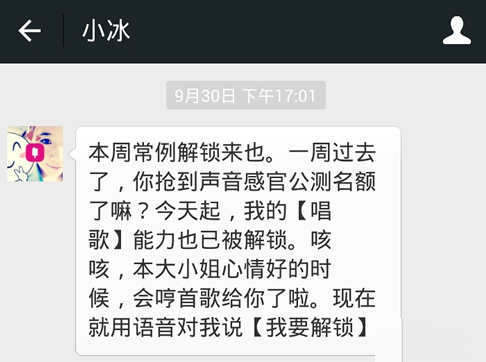

## 前言

`小艺`设下的闹钟唤醒了我，为我列出了一天的行程；坐在工位上熟练的打开WPS和`豆包`的组合，开始截图给我答案的循环往复；打开VScode点开`Codex`，世界上最强大的AI之一————`ChatGPT-5`开始为我实现我的需求。在和`ChatGPT`搏斗的间隙，和`AI厂商`去洽谈着合作的活动和物料的运送，用`通义`去生成Q版的宣传海报图，由拿出活动资料让Kimi去帮我生成一版又一版的活动宣传语。终于是来到了晚饭时间，在给ChatGPT-5下达了一个长时间的任务之后锁屏，起身，穿衣，下楼，来到了食堂。遵循着色子之神的指引，我买好了晚饭，坐下来带上耳机，从裤兜里掏出手机，在`AI`加持的推荐算法下，影视剧风的最新评测来到了我的主页，展开背面的手机支架，横屏旋转，放下，开始下饭。

看着AI在影视行业同样的大放异彩，我不禁为如今AI生成图片中丰富而细腻的细节、传奇而又富有超现实主义的大胆构图、现实中不可能诞生的慢门照片感到无比的惊叹。直到听到了这样一句话，

  
我觉得AI时代最大最大的一个区别就是你丧失了作者性的自豪感和珍贵性，因为你知道随时会有另外一张图可以更好地替代它，因为提示词就摆在你手上。其实你握住了下一次再产生一个机会的可能性。

  
— 影视飓风Tim

从人类的技术开始能够记录影像，能够修改影像，再到如今，拍完的那一刻AI就会在你的手机相册去接管你的视觉，你看到的影响都是在AI一次又一次的修改后呈现的，照片已经不再是纯粹的光学影像了，而是一种用于欺骗你对于世界真实感受于认知的工具了。

其实曾经当拍照从最纯粹的记录逐步衍生出了各种各样的拍摄技巧时，我认为这是人类对于世界认知的一大进步，这反映了人类在摆脱了生存的最基本的需求之后，开始尝试用更有趣、更有创意性的方式去记录这个世界，这是人类文明的一大进步。这是纯粹的光学影像，用自然的物理法则与光影的交互去用更美好的形式记录这个世界。

这种真实的美是人类对光影的改造和利用，是一种本就存在于这世界上的美好，只是在等待被发现。而AI生成以及改造后的影像则是人类自己对于自己的一种欺骗，脱离了物质世界沉溺在虚假环境中的人类是没有未来的。

不过在这期视频中，Tim还有另外一句话让我印象深刻。

  
我觉得AI在以后不一定是谁取代谁，更像是一种平行的选择，一种负责见证世界，另一种负责帮你创造错过的瞬间。

  
— 影视飓风Tim

对啊，摄影中很重要的一点就是在于拍到有时候远比拍好要重要，很多时候我们不可能说是随时随地，双击一下太阳穴，眼睛就会自动为你截图并导出眼前的画面一样，或许未来脑机接口真的普及之后，这会成为现时，但至少现在以及未来的十年内是不太可能的。人的一生很短，人生的每个阶段就真的是宛如秋叶飘落一般，转瞬即逝，我们真正能开怀大笑的瞬间能有多少？能及时掏出相机记录下其中一个碎片的机会又会有多少？我们脑海中能够记住那一刻的画面，要么你会画画，把它画下来，要么就只能是永远的封存在记忆中，随着时间的流逝，逐渐淡去。但AI确实是给了我们这个机会，去用人类当下能做到的输出方式“文字”来去还原出那一刻的画面。

还能让没有绘画能力的人去尽情的创作，可能对于以此为生的画师和摄影师来说，这不公平，这是在剥夺他们生存所需的“技能护城河”。但每一个时代的兴起都必然要淘汰一些人一些技术一些产业，这是必然的，也是不可避免的。所以接下来我们就要思考了，在AI时代，除去了表层可被复制的泡沫后，能留下什么你真正想表达的东西。AI的创造可以成为你表达的工具，降低表达的成本，但是绝对不能取代你去产出表达的内核，只有通过自己的思考去产出真正又价值又内涵的精神内核才是当下我们所需要珍惜的。

视频结束，我回到了工位，开始查看ChatGPT的工作报告，熟悉的MD格式，熟悉的代码注释，运行代码，一切正常，打开VScode，开始在博客上去记录这一次的成果和实践过程。

“写代码又何尝不是这样呢？”写着写着这样一个念头诞生了，在没有用AI的大一，C、Java、JS、TS、ArkTS……，我每一种语言都是一点一点的跟着视频课或者是官方文档去从最基本的变量声明还是学习语法和常用的API接口，那时候写的代码虽然不太规范，命名大多用的也是拼音组合的形式，懒得去查对应的英文单词，但那时候的我写出来任何东西都会十分兴奋，每次别人要学习我写过的知识点时，我都能讲的头头是道，对自己的代码了如指掌，滚轮顺手一滚就能精准定位到我们所需要讲解的代码位置，但是现在的我除了鸿蒙开发现阶段用AI写起来会比较费力以外，基本上是一个没有AI就不想干活的状态。实现了许许多多不知道我得学几年后才能实现的高级功能和效果，但是我的激动感却不是很明显，现在看来我应该是在获得了这份能力的同时，眼界的增长和对这个行业了解的加深让我认识到当前我所作的和真正牛逼项目之间的差距。一方面知道自己当下没有能力去全面的掌握它给出的技术栈和具体代码；另一方面则是知道这种程度的Vieb Coding在岗的人也会，同龄的校园开发者也会，我的核心竞争力并没有明显的提升。

反观过去一点一点啃语法的经历则反而是真真正正的在提升自己的编程能力，无论是对最基础的代码编写，还是项目架构的设计，都是写一遍就一定能掌握的。曾老师每天不厌其烦的在群里去发一篇又一篇AI行业的新动态，和各个大厂现身说法的夸AI有多重要，在实际开发场景中取代了多少工作量，我看着这些咨询，心中不单单是对AI发展的感叹，更多的是一种“劫后余生”的感觉。这么描述确实有点夸张，但作为一个深度使用AI来去“逃课”的“小学生”来说，总是在担心自己这么用AI能做出来是能做出来，但这真的算是我自己的成果吗？

王yh学长曾经提过一个观点，大一和所有的初学者都不要上来就学怎么Vieb Coding。现在回味来看，很对。我也很庆幸自己大一的时候AI还没有那么强大，我也还没有开始依赖AI，在我至少掌握了C、Java、ArkTS三门语言之后才开始去使用AI，这个时候我对于最基本的编码方式和面向对象的基本思想都有了概念，在开始AI辅助算是最好的入场时机了，很幸运很庆幸。

于是这篇文章，诞生了。

## AI的兴起

### 初中时期“小冰”的兴起

回望过去的这20年，AI到底是什么时候开始轰然闯入人们的日常的呢？仔细想来好像在我小学初中的时期AI仅仅是和IT、VR、AR等等一系列高大上的词汇并列代表着人类计算机技术未来发展目标的尖端词汇而已，并没有说真的在哪里见过真的有人在用AI去做事，偶尔有那一两个“AI”出现，人们也仅仅是将其作为一种新的解闷方式，把它当作玩具一样的戏弄，我记得当时让我印象最深刻的一个“AI”是微信上的“小冰”，在初中时吧算是小火了一阵子。同学们都在班群里去发“小冰”的链接，分享自己发现的“小冰”的神奇回复。

当时的我刚用手机一年左右吧，对于各种各样的软件、游戏还处于满怀热情的阶段，也不明白这些软件的运作逻辑，“小冰”的出现不禁让我感到震惊。AI到底是什么？为什么它可以像人一样？难道不是有一个庞大的客服团队，按照相似的语言风格去进行回复的吗？……这些问题我反反复复的问“小冰”试图找到一丝破绽，试图挖出他们是一个又一个人的证据。但是没有，我没能挖出任何证据，但在在这个过程中我也被它驴唇不对马嘴的部分回答逗得哈哈大。对比现在的模型，那很显然算不得是什么很厉害的物件，不过在那个时代，这个顶着个美女头像的“小冰”，确实是给我们这一批人不小的震撼，也算是对人工智能有了第一次清晰的认知。

那时的我一直没有打消过对于“小冰”是人的这个猜想，不过时间一长也就失去了兴致，这件事也被我随之抛在脑后。

人工智能，依旧只是人们生活中的一点小插曲。

### 高中时期的作文素材

我们这一级是20年中考升上的高中，随着新冠一起到来的还有ChatGPT的问世。

起初我没认为这个东西有什么了不起的，因为一开始我只知道它是个很厉害的能和人聊天的大模型，但又因为它是国外的模型，当时我并不会科学上网，所以整个高中时期都没有亲身体验它的机会。

但为了高考，学校的语文组的老师们注定是对世界上的新闻无比的敏感，毕竟高考作文与当年发生的大事相结合，或者说在论证阶段去举出最新颖的事例已经是大家的共识了，所以不出所料，除了课本教程之外的新闻资料阅读的全都是ChatGPT，ChatGPT会取代多少人的工作，AI浪潮中新时代青年如何锚定自身，如何看待ChatGPT……各类观点被源源不断的灌输到我的脑海中，被一张张高中特有的“缺墨再生纸”报纸强行的塞到了我的脑海中。但，这海量的信息高度重复，在一篇又一篇的议论文中经历千锤百炼的语言已经固化了我的思维，我知道这样的文字能带来40多分的作文成绩，我知道这样的起承转合是可以带来一篇逻辑通顺、字数合理的文章。“扭曲”的正反馈已经完全掩盖了新闻资料中那个“个体”所具备的真实价值，就像是机械学习中的一个错误的奖励算法，只会训练出垃圾模型。

我不会去否定过去的自己，对于那个时候的我，需要去合理的排解压力，需要去抛弃一些“暂时无用”的信息，将大量的新闻资料在作文实践中去
