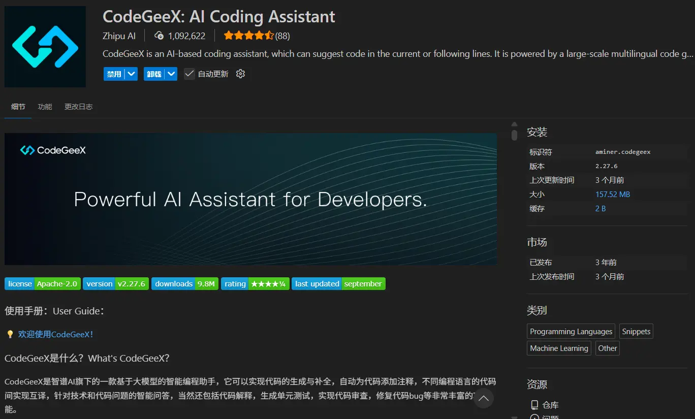
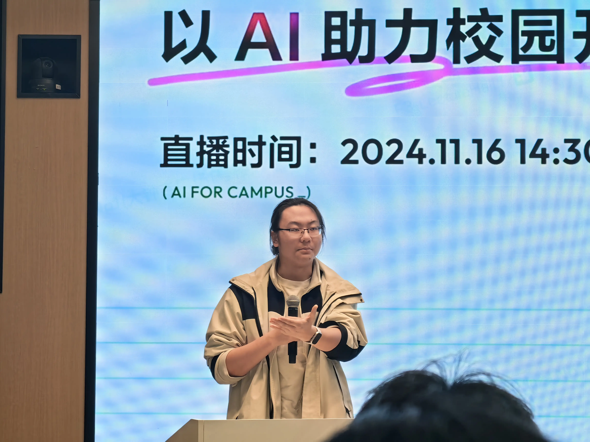
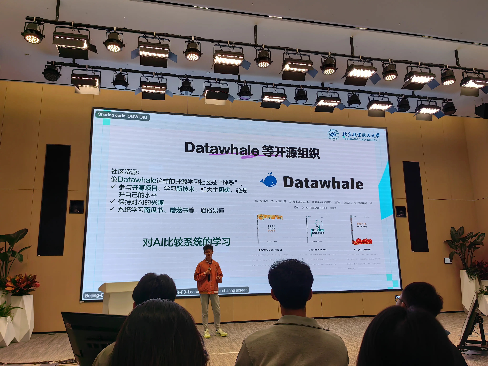
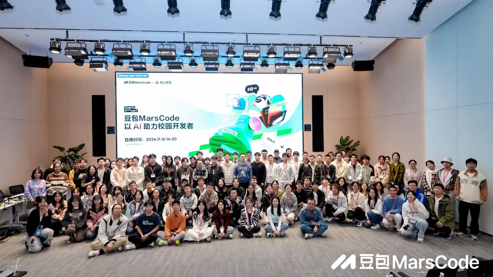

## 前言

`小艺`设下的闹钟唤醒了我，为我列出了一天的行程；坐在工位上熟练的打开WPS和`豆包`的组合，开始截图给我答案的循环往复；打开VScode点开`Codex`，世界上最强大的AI之一————`ChatGPT-5`开始为我实现我的需求。在和`ChatGPT`搏斗的间隙，和`AI厂商`去洽谈着合作的活动和物料的运送，用`通义`去生成Q版的宣传海报图，由拿出活动资料让Kimi去帮我生成一版又一版的活动宣传语。终于是来到了晚饭时间，在给ChatGPT-5下达了一个长时间的任务之后锁屏，起身，穿衣，下楼，来到了食堂。遵循着色子之神的指引，我买好了晚饭，坐下来带上耳机，从裤兜里掏出手机，在`AI`加持的推荐算法下，影视剧风的最新评测来到了我的主页，展开背面的手机支架，横屏旋转，放下，开始下饭。

看着AI在影视行业同样的大放异彩，我不禁为如今AI生成图片中丰富而细腻的细节、传奇而又富有超现实主义的大胆构图、现实中不可能诞生的慢门照片感到无比的惊叹。直到听到了这样一句话，

  
我觉得AI时代最大最大的一个区别就是你丧失了作者性的自豪感和珍贵性，因为你知道随时会有另外一张图可以更好地替代它，因为提示词就摆在你手上。其实你握住了下一次再产生一个机会的可能性。

  
— 影视飓风Tim

从人类的技术开始能够记录影像，能够修改影像，再到如今，拍完的那一刻AI就会在你的手机相册去接管你的视觉，你看到的影响都是在AI一次又一次的修改后呈现的，照片已经不再是纯粹的光学影像了，而是一种用于欺骗你对于世界真实感受于认知的工具了。

其实曾经当拍照从最纯粹的记录逐步衍生出了各种各样的拍摄技巧时，我认为这是人类对于世界认知的一大进步，这反映了人类在摆脱了生存的最基本的需求之后，开始尝试用更有趣、更有创意性的方式去记录这个世界，这是人类文明的一大进步。这是纯粹的光学影像，用自然的物理法则与光影的交互去用更美好的形式记录这个世界。

这种真实的美是人类对光影的改造和利用，是一种本就存在于这世界上的美好，只是在等待被发现。而AI生成以及改造后的影像则是人类自己对于自己的一种欺骗，脱离了物质世界沉溺在虚假环境中的人类是没有未来的。

不过在这期视频中，Tim还有另外一句话让我印象深刻。

  
我觉得AI在以后不一定是谁取代谁，更像是一种平行的选择，一种负责见证世界，另一种负责帮你创造错过的瞬间。

  
— 影视飓风Tim

对啊，摄影中很重要的一点就是在于拍到有时候远比拍好要重要，很多时候我们不可能说是随时随地，双击一下太阳穴，眼睛就会自动为你截图并导出眼前的画面一样，或许未来脑机接口真的普及之后，这会成为现时，但至少现在以及未来的十年内是不太可能的。人的一生很短，人生的每个阶段就真的是宛如秋叶飘落一般，转瞬即逝，我们真正能开怀大笑的瞬间能有多少？能及时掏出相机记录下其中一个碎片的机会又会有多少？我们脑海中能够记住那一刻的画面，要么你会画画，把它画下来，要么就只能是永远的封存在记忆中，随着时间的流逝，逐渐淡去。但AI确实是给了我们这个机会，去用人类当下能做到的输出方式“文字”来去还原出那一刻的画面。

还能让没有绘画能力的人去尽情的创作，可能对于以此为生的画师和摄影师来说，这不公平，这是在剥夺他们生存所需的“技能护城河”。但每一个时代的兴起都必然要淘汰一些人一些技术一些产业，这是必然的，也是不可避免的。所以接下来我们就要思考了，在AI时代，除去了表层可被复制的泡沫后，能留下什么你真正想表达的东西。AI的创造可以成为你表达的工具，降低表达的成本，但是绝对不能取代你去产出表达的内核，只有通过自己的思考去产出真正又价值又内涵的精神内核才是当下我们所需要珍惜的。

视频结束，我回到了工位，开始查看ChatGPT的工作报告，熟悉的MD格式，熟悉的代码注释，运行代码，一切正常，打开VScode，开始在博客上去记录这一次的成果和实践过程。

“写代码又何尝不是这样呢？”写着写着这样一个念头诞生了，在没有用AI的大一，C、Java、JS、TS、ArkTS……，我每一种语言都是一点一点的跟着视频课或者是官方文档去从最基本的变量声明还是学习语法和常用的API接口，那时候写的代码虽然不太规范，命名大多用的也是拼音组合的形式，懒得去查对应的英文单词，但那时候的我写出来任何东西都会十分兴奋，每次别人要学习我写过的知识点时，我都能讲的头头是道，对自己的代码了如指掌，滚轮顺手一滚就能精准定位到我们所需要讲解的代码位置，但是现在的我除了鸿蒙开发现阶段用AI写起来会比较费力以外，基本上是一个没有AI就不想干活的状态。实现了许许多多不知道我得学几年后才能实现的高级功能和效果，但是我的激动感却不是很明显，现在看来我应该是在获得了这份能力的同时，眼界的增长和对这个行业了解的加深让我认识到当前我所作的和真正牛逼项目之间的差距。一方面知道自己当下没有能力去全面的掌握它给出的技术栈和具体代码；另一方面则是知道这种程度的Vieb Coding在岗的人也会，同龄的校园开发者也会，我的核心竞争力并没有明显的提升。

反观过去一点一点啃语法的经历则反而是真真正正的在提升自己的编程能力，无论是对最基础的代码编写，还是项目架构的设计，都是写一遍就一定能掌握的。曾老师每天不厌其烦的在群里去发一篇又一篇AI行业的新动态，和各个大厂现身说法的夸AI有多重要，在实际开发场景中取代了多少工作量，我看着这些咨询，心中不单单是对AI发展的感叹，更多的是一种“劫后余生”的感觉。这么描述确实有点夸张，但作为一个深度使用AI来去“逃课”的“小学生”来说，总是在担心自己这么用AI能做出来是能做出来，但这真的算是我自己的成果吗？

王yh学长曾经提过一个观点，大一和所有的初学者都不要上来就学怎么Vieb Coding。现在回味来看，很对。我也很庆幸自己大一的时候AI还没有那么强大，我也还没有开始依赖AI，在我至少掌握了C、Java、ArkTS三门语言之后才开始去使用AI，这个时候我对于最基本的编码方式和面向对象的基本思想都有了概念，在开始AI辅助算是最好的入场时机了，很幸运很庆幸。

于是这篇文章，诞生了。

## AI的兴起

### 初中时期“小冰”的兴起

回望过去的这20年，AI到底是什么时候开始轰然闯入人们的日常的呢？仔细想来好像在我小学初中的时期AI仅仅是和IT、VR、AR等等一系列高大上的词汇并列代表着人类计算机技术未来发展目标的尖端词汇而已，并没有说真的在哪里见过真的有人在用AI去做事，偶尔有那一两个“AI”出现，人们也仅仅是将其作为一种新的解闷方式，把它当作玩具一样的戏弄，我记得当时让我印象最深刻的一个“AI”是微信上的“小冰”，在初中时吧算是小火了一阵子。同学们都在班群里去发“小冰”的链接，分享自己发现的“小冰”的神奇回复。

当时的我刚用手机一年左右吧，对于各种各样的软件、游戏还处于满怀热情的阶段，也不明白这些软件的运作逻辑，“小冰”的出现不禁让我感到震惊。AI到底是什么？为什么它可以像人一样？难道不是有一个庞大的客服团队，按照相似的语言风格去进行回复的吗？……这些问题我反反复复的问“小冰”试图找到一丝破绽，试图挖出他们是一个又一个人的证据。但是没有，我没能挖出任何证据，但在在这个过程中我也被它驴唇不对马嘴的部分回答逗得哈哈大。对比现在的模型，那很显然算不得是什么很厉害的物件，不过在那个时代，这个顶着个美女头像的“小冰”，确实是给我们这一批人不小的震撼，也算是对人工智能有了第一次清晰的认知。

那时的我一直没有打消过对于“小冰”是人的这个猜想，不过时间一长也就失去了兴致，这件事也被我随之抛在脑后。

人工智能，依旧只是人们生活中的一点小插曲，是茶余饭后闲聊时的话题，是钢铁侠手中的贾维斯。

### 高中时期的作文素材

我们这一级是20年中考升上的高中，随着新冠一起到来的还有ChatGPT的问世。

起初我没认为这个东西有什么了不起的，因为一开始我只知道它是个很厉害的能和人聊天的大模型，但又因为它是国外的模型，当时我并不会科学上网，所以整个高中时期都没有亲身体验它的机会。

但为了高考，学校的语文组的老师们注定是对世界上的新闻无比的敏感，毕竟高考作文与当年发生的大事相结合，或者说在论证阶段去举出最新颖的事例已经是大家的共识了，所以不出所料，除了课本教程之外的新闻资料阅读的全都是ChatGPT，ChatGPT会取代多少人的工作，AI浪潮中新时代青年如何锚定自身，如何看待ChatGPT……各类观点被源源不断的灌输到我的脑海中，被一张张高中特有的“缺墨再生纸”报纸强行的塞到了我的脑海中。但，这海量的信息高度重复，在一篇又一篇的议论文中经历千锤百炼的语言已经固化了我的思维，我知道这样的文字能带来40多分的作文成绩，我知道这样的起承转合是可以带来一篇逻辑通顺、字数合理的文章。“扭曲”的正反馈已经完全掩盖了新闻资料中那个“个体”所具备的真实价值，就像是机械学习中的一个错误的奖励算法，只会训练出垃圾模型。

我不会去否定过去的自己，对于那个时候的我，需要去合理的排解压力，需要去抛弃一些“暂时无用”的信息，将大量的新闻资料在作文实践中去进行凝练与描述方式的固化对于当时的我来说是一种很有效的节能方式，这无关于这个东西本身好不好而是在于这是我“活下去”的最优选。

于是，高中对于AI的认知也随着高考作文的最后一个句号，被一起尘封在了回忆之中。

AI，仅仅是被堆砌成山的辞藻中的一个名词罢了，没有意义，没有价值，硬要说其价值的话，只是我高考分数中的几分而已。

### 大学时期对AI的初体验

在一个终身难忘的暑假在之后我迈进了大学的校园，太多的鸡汤再给我讲述着大学和高中的不同，但是这种种“鸡汤”中的差异说的都很离谱，感觉在大学用高中的习惯就活不下去一样。在一段时间的生活之后我持续性的在延续着高中的习惯，在高数和线代课前去看宋浩预习，上课听老师再次讲一边，跟着做完作业就算是掌握了，然后我就会抓紧所有空白时间去往后推进预习的进度。

在此期间我并没有感到太多不适，反而是生活的节奏变得无比舒适了。从早上六点整起床一直延后50多分钟之后，我才需要慢慢苏醒，还有充足的时间买完早饭在还十分空旷的教室里面挑选自己心仪的位置，刷着手机吃完早饭，上个厕所随后开始上课。超爽的啊！

AI似乎消失了，并没有再次闯入我的生活，仅仅是在向其他的电子产品一样静静的迭代。

直到我在线代上遇到了拍题搜不到的情况，老师的私信回复也及其缓慢，这是我才意识到了大学和高中的一些不同，没有老师会再逼着你去学，也没有多少老师会去再关心你是否真的学会了。于是走投无路的我只能点开了文心一言，开始尝试性的讲题目拍照给他让他帮我讲解这个问题。我早就记不得当时具体问的是什么题了，只记得我后来反复的去问了好多好多题，但是回复的都是不尽如人意的，每一次都会在过程中出现一些凭空捏造的条件、公式、“同理可得”，然后在你更展开的去询问这些细节时他就只会去一味的道歉，但是在道歉后依旧是会频繁的编造大量虚假内容。所以我并没有对AI产生依赖，仅仅是在这个过程中，走投无路了才会去让AI给我一些思路。

回首来看，这也只是因为模型的能力还是太差了，同时模型幻觉的问题也是频繁的发生，严重影响逻辑推理类的任务执行。

在ChatGPT问世之后国内的各个厂商都开始如雨后春笋一般的发布了自己的AI模型，智谱、Kimi、豆包、千问、文心、天工……等等等。就像是早就准备好了，但是必须要等在国外的领头羊先行一步之后才能发布一样，很诡异。

### 走出去后重识老友GPT

来到创客后的第一场活动接着登录GitHub的契机，我学会了科学上网，我走到了更广阔的世界，我这一次终于能直接使用ChatGPT了，我单纯的和它去聊了聊天，并没有发现和国内的哪些模型有什么区别，我当时没有什么合适的使用途径，所以没有感受到他的威力。

真正的契机来自于大物实验。

在大物实验开始在每周末进行实验之后，我发现国内的模型没办法很好的帮我处理大物实验中诞生的那一坨数据，也没办法给我生成很完善的计算过程，或者是说，在国内货比三家之后发现同一个计算需求他们的给出的过程各不相同，甚至结果都是千差万别。于是我只好把希望寄托到了一个人们口中最为“强大”的模型。

给他一个手写的数据图片，给他描述一下实验数据整理的要求，并要求给出详细过程。很快GPT就给出了一套详细的解答，加上数据的计算过程，甚至将式子展开后的样子也写出来了，确实表现的很优异。

从此之后我将全部的数学相关的强逻辑性的工作都选用了ChatGPT来去辅助我的工作，取代了国内模型的工作。这也是我第一次认识到模型之间的能力会有如此巨大的差异。

## AI融入生活

### GPT限额与国产替代

在第1次使用GPT帮助我处理实验数据的计算以及过程的推导之后，我宛如打开了潘多拉魔盒一般。没办法再关上了。今后的每一次物理实验结束后，那枯燥的数据处理，一味的重复敲打着计算器，对于自己的能力毫无提升，只能做到所谓的锻炼心性，但是这心性我完全可以用更有意义、更加贴合实际的编程上的问题来去训练，我没有必要在这个事情上花这么多的时间，于是我就下定决心，以后将所有的重复性的无意义的工作全都丢给AI去做，但很快在我逐渐提高访问GPT的次数之后GPT免费额度的限额愈发窘迫了起来。一次又一次的工作没有完成，就被迫转为手动处理，真的很令人烦躁。我想或许这个时候我就已经离不开AI了，AI已经正式成为了我生活的一部分，也成为了我工作中必须的工具之一。

人是很难共情以前的自己的。我无法理解过去的自己，不使用AI时，是如何处理那么多繁琐的杂活的。就像当电走进千家万户之后，人们也无法理解过去的人们，没有电是如何生活的。由俭入奢易，由奢入俭难如登天，或许登天在如今来看都是一件较为简单的事了。这也恰恰再次印证了我的观点。

虽然人很难共情以前的自己，但人不能否认以前的自己，至少我绝对不会否认我自己。我始终相信无论轮回多少次，在相同的境况下，我依旧会做出相同的决断。我感恩过去不用AI的自己，给我铸造了一身的本领，这种本领并不是指编程，毕竟在大学之前我并没有接触过编程。这种本领是我学习，是我生存，是我去表达的本领。

我理解这些技能的流程、技巧、原理、目的，用这份经过实践的“经验”再加以AI的辅佐，才达到了十分完美高效的状态，在AI处理的不尽如人意之时，我依旧可以随时随地的手动接管去完成工作，这才是正确的AI使用的方法。至少在当下这样一个AI还仅仅是一个“不太聪明的缸中脑”的阶段，这样的结论是具备一定的可信度以及可行性的。未来随着AI能力的发展，无论是引发了如电影中幻想的“智械危机”，还是如“底特律：化身为人”中所讲述的，AI衍生为一种新的生命体与人类共存也好，我们始终要做的是保持自身的能力与思维的独立，保持作为人的自主性、独立性。全身性的依赖于AI，只会失去创造力，失去独立规划自身的能力，这是很恐怖的。别人给你活，你用AI干了，不知道自己干了什么，没有学会任何技能，没有掌握任何知识，那你自身的价值是什么？输入提示词的自动脚本吗？

死亡并不可怕，可怕的是活着，但已堕入虚无。

在GPT的限额问题愈发显著之后，我大范围深度的横向对比国内各个模型的能力，仅基于24年初时我的体感来讲大致得出了以下结论：

* 豆包：图片文字识别，文案编写，文章内容续写、润色有着较为明显的优势
* 通义千问：逻辑链条清晰，代码编写能力强，通义万象是少有的生图生视频的AI
* kimi：联网搜索的搜索量大，能生成ppt，能解题。

那段时间ds还没有登上舞台。

这些模型渐渐的融入了我的工作流，对于搜索引擎的日常搜索功能也被AI所取代，我们的搜索逻辑由面相关键词搜索转向了面向答案的搜索方式。过去我们的搜索逻辑是首先由我们的大脑产生出一个问题，随后基于这个问题，我们拆解出关键词，去搜索他的解释，搜索相关的文章，通过自己的阅读和筛选得出我们的结论。

面向答案的搜索一方面体现了人类科技对于知识利用方式的进步，从最基础的产生知识，记录知识，传播知识，进一步拓展到了总结并应用知识。但是从对人类个体的能力增长来看，可以说是有一定的负面效果的，很多人对于从实践中凝练出知识的能力会被退化，人类科技的发展其实就是大多数人将身体本能逐步移交给机器的过程。就像是将体温的控制移交给了空调，将长距离移动的脚力移交给了汽车、高铁、飞机。我并非想说AI或者是其他科技产品不好，正因他们所具备的能力在特定领域强于人本身所以才会用于替代人本身的一些能力。

### 开办AI活动的一些思考

这里我也是忍不住的想要引用一下前一阵子和孙妈在需求聊天会上的一些观点了。

对于到现在依旧不使用AI的人大致可以分为四类：

1. 技术过于先进或是小众，当下AI产品无法给出行之有效的解决方案。
2. 眼界过低，从来没有尝试过，不知道AI的能力，同时自身也无内驱力去提升自己的眼界。
3. 固执己见，坚持认为“手洗的比机洗的干净”。
4. 因为客观条件导致没有机会长期使用AI，生活中很少有能使用上AI的场景，久而久之就被迫固化了思维，当可以用AI提效的场景出现的时候无法第一时间想到“我可以使用AI”

所以，我在创客的举办AI相关的活动的目的主要就是围绕着第1和第4类人群。我们的团队要致力于帮助先驱技术者去发掘新的AI工具，去寻找更新颖的AI用法，用新颖的方式弥补AI能力上的缺陷。这一点对于我来说是有深刻的亲身经历的，在24年的鸿蒙开发处于的是一个完全没有AI可用的情况，API9到API12期间华为官方没有推出官方的AI编程助手，市面上主流的AI也都大多处于完全不认识ArkTS的阶段。

对于主流AI不认识ArkTS这个观点，我主要还是从我的好大哥yy让我帮忙测试一个百度当时的实验性AI产品，我直接去问了鸿蒙代码，但是AI把ArkTS直接误认成了TS语言，给我生成了大量的TS代码，最后大哥又让我去帮忙尝试了一下他们的“对家产品”——Kimi，没错就是我当时在国内模型中非常青睐的Kimi，我之所以会青睐并且使用Kimi就是因为这件事，他认识ArkTS，能够给我生成官方文档中存在的代码，但是一旦是单独为我实现需求时就会出现一些奇怪的“标签语法”了。

当然这个现象也可以理解，毕竟对于当时来讲，鸿蒙还没有推出星河版，在双框架系统的4.2上没有必要硬推鸿蒙的ArkUI，毕竟安卓开发经过了这么多年的沉淀和打磨以及市场的筛选，API9那点少的可怜的优势确实是没有理由让各个AI产品为其准备大量的数据去进行训练，而且那时的开源鸿蒙项目还是太少了，可供训练的语料也不多。有点像是仓颉如今的处境，但又不完全一致。

当然还有对于上大学之前完全没有机会接触AI甚至没有机会接触电脑的同学来说，我们需要从最基础的日常需求入手去让他们对于AI逐步的建立认知，逐步的去认识到AI的强大并意识到在什么样的场景下我可以用AI去解决问题。

## AI辅助编程

### VScode Copilot 代码补全

在早期使用国内AI的时候都仅仅是用网页版的问答功能，在那时候我的认知仅仅是停留在了与AI问答，偶尔在写代码时遇到问题也只是复制黏贴给AI去进行询问。

毕竟AI只是一个固定了输入输出格式的“缸中脑”，我并不认为AI会长出手脚。直到一次偶然，我下载了VScode。

当时的契机是在于，大一上ljx学姐带的py小游戏开发活动的开发工具就是用VScode，那一次下载后我没有太深入的用过，后来在大一下上了第一节java课之后，我发现java为了打印一个“Hello World”要编写那么多“杂乱”的代码，就很厌恶，同时也担心自己能否学明白，会不会挂科。

于是我找到了黑马程序员开始看起了课，无论黑马口碑如何，但我确确实实是入了门，视频课中使用的IDE不知道比eclipse智能多少倍，我偶然一次尝试用VScode去进行java的编写，突然发现我刚打了几个字母，VScode就自动弹出了一行灰色的字，我愣住了，开始阅读那段灰色的代码，发现就是我想写的东西。我的第一次代码补全就这样触发了，对于当时的我来说那段灰色的代码是我认知颠覆的扳机，写哪些练习的题目时，只需要我简单的写几个关键的命名，灰色的代码就会自然而然的替我写完剩下的，我疯狂向我的室友去炫耀，在那个年份，在那个阶段，我们对于编程的认知仅限于手打加关键字提示，这种补全功能算是羡煞旁人了。

### codegeex

在刷B站时，我看到了好几次codeGeex的商单视频，算是当时我认识到的第一个AI编程助手类的产品，我下载后尝试性的试用了一下，发现他不仅有代码补全功能，还能点开软件去针对报错进行解答，但是解答的经常驴唇不对马嘴，完全没有上下文能力，每次说出的方案中都包含大量“猜测”、“假设”所以它并没有成为我编程的得力助手，我的得力助手依旧是CSDN。

虽然这个产品一直都没有掀起过什么风浪，身边也没什么人用，但确确实实是我AI编程的启蒙产品了。

### 网页对话AI编程

由于codegeex带给我的对于编程能力上的印象并不好导致我开始寻求新的AIdebug手段，我就不由自主的联想到了此前用于处理一些文案工作所用到的国内AI们。我开始尝试用此前提到的Kimi去进行代码的debug和一些没学过的代码的教学性使用，确实是给我提效不少，但那个时期模型能力的限制还是导致其对于完整项目的构建能力很差，而且哪怕是它给我了全部代码，我也只能是按照它的文件名和路径去手动复制黏贴，费时费力，黏贴完还会出现各种奇怪的环境问题，所以在这个阶段我的主力编程辅助还是在在于CSDN和Jet brain全家桶自带的各种框架构建功能。

时至今日，我的固定任务栏已经被各种各样五花八门的AIIDE占据后，Jatbrain家的两位大能依旧雷打不动，虽然VScode的开源以及模型能力的进化让软件开发已经进入了新时代，但Jetbrain家IDE的专业性以及全面的功能还是让其占据着一席之地。

### 豆包MarsCode（现Trae）

在经过了一段漫长的网页AI给思路和关键代码，整体使用IDE去构建的编程模式之后，我并没有感到AI有多大的提效，仅仅是对一些不熟悉的技术栈能有更快的了解，但是一旦到了项目后期，模型的上下文长度以及对项目进行人工描述的局限性就体现出来了，一方面是AI不记得早期的聊天内容导致生成的代码不符合最初的需求，另一方面则是项目的复杂度上升后AI单凭人口述是无法提供AI所需的全部信息的，而且我没有任何办法将当前项目完整的提供给AI阅读，极大的限制了AI对于完整项目的代码生成能力以及对于项目架构的构建能力。

这时我们伟大的孙妈带着我们走进了字节跳动公司内去参加了一场盛会————豆包MarsCode的正式发布。

这一次我彻底的认识到了AI编程的威力，认识到了未来将是AI的时代，这是思想上的觉醒，是最难能可贵的一点，所以无论当时那个产品的好坏，模型的能力如何，这次活动都是我VibeCoding中重要的一次里程碑。

### 初试Cursor

Cursor的诞生无疑是正式开启了VibeCoding纪元，将cursor诞生的23年成为VibeCoding元年也不过分。在24年下半年正式接触cursor之前，我一直会读到各种各样关于cursor能力的新闻，但因为是国外产品，而且好像还要付费这样的印象刻在我脑海里形成了一层天然的屏障，让我没敢动身尝试。

直到“微算大创”的诞生，王老师逼着我们去用cursor一人AI跑一个网页并且上线到netlify上去进行需求验证。我第一次面对那个黑洞洞的窗口看起来整体布局和VScode几乎一样，只感觉到一种熟悉的感觉，但也没太多主观上的期待，因为我并不清楚他能干什么，我试探性的打开了一个空文件夹，试图让cursor开始大显神威。它没思考多久就开始创建文件并且进行编写，第一次见到这种场景的我不禁连连赞叹，它居然真的在全自动的操作我的电脑去进行编程，而且还能全自动的在终端执行npm命令去进行包管理！！！我的天哪，写完了？这么快？我直接开始在浏览器中去继续宁预览，发现一个完整的网页确实是呈现在了我的眼前，但是功能很单一而且只有一个页面，点击很多按钮都只是空有UI反馈但是没有实际作用。我紧接着在当前代码的基础上进一步细化了我的要求，比如点击哪个按钮就能跳转到一个新页面，新页面中有什么啊之类的内容。当时我还并不知道如何很详细准确的描述我的需求，说的就比较大白话，但好歹是有过一些前端基础，所以最后生成的网页完成度确实是很高，但核心问题还是在于没有实际功能，只是个UI动效比较干净整洁的静态网页罢了。

随后我按照王老师的要求去进行netlify的线上部署，此前我是在寻找低成本国内访问加速的过程中用过这个网站，只不过这一次cursor生成的是个react框架的项目，并不是原生html，所以直接在根目录放一个index.html的部署方式就不太可行，我选择让cursor去帮我进行部署。

一开始我对于cursor部署的期待是类似于一种理想化的AIOS一样，可以自动拉起浏览器，或者说是用命令行的方式访问目标网页然后自动登陆部署填写信息啥的，但事实是它做不到，他需要我手动操作很多，去弄一些身份令牌以便于部署，对于当时的我来说是一个很麻烦也弄不太懂的操作，所以就转头让他从新生成一个原生html版本，然后推送到一个GitHub仓库用我最熟悉的方式进行部署。这种方式确实立竿见影一次就部署成功了。本来是想把链接放上来的，才想起来前一阵子我给删了（笑）。
