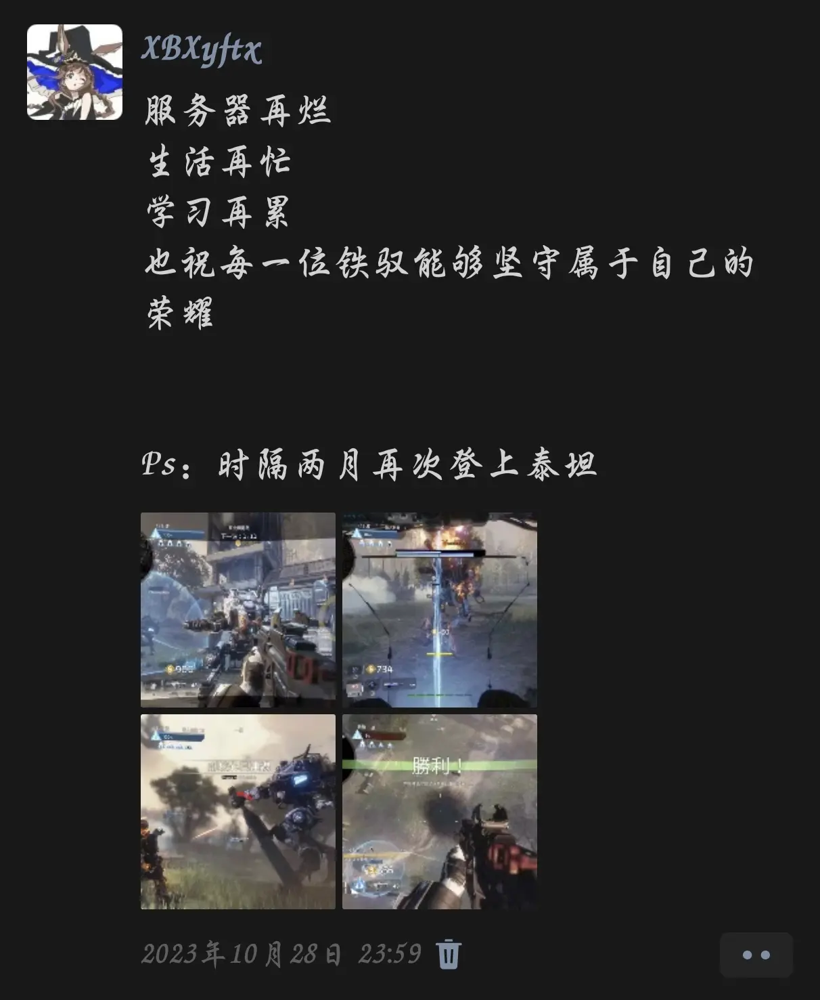
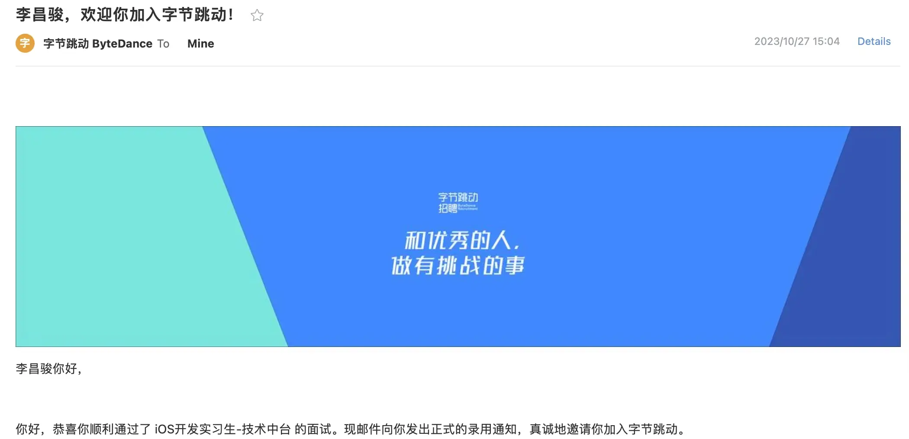
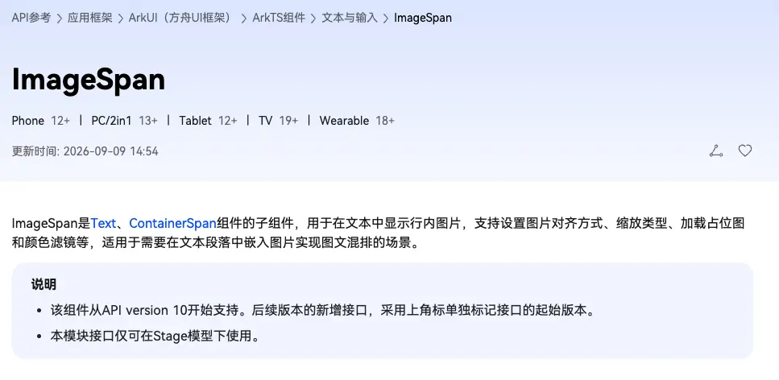

## 前言

致创客。

又是一次新版本的发布前夕。坐在工位上，看着禅道上干净的bug列表，我的心境也进入了一段久违的宁静。自从开始实习之后我的心境变化好像有了一套新的节律，是一种随着软件开发周期推进而不断变化的节律。初次拿到需求文档，看着满当当的目录列表心中难免升起一丝丝的烦躁，但这并不会影响的我的工作。按部就班的开启多个并行的agent，冷静的分派着任务，逐一的去完成需求的拆解、现状的调查、后端接口的校验……与导师沟通交流需要封装的sdk接口、与产品确定设计方案没写的细节、与ai同步我们的认知。分析、设计、开发、测试、发版。这个循环我已经经历了数次，对于当初软件工程课上学到的大量抽象的理论知识有了具体而清晰的认知。

这篇文章倒也不是想聊太多技术上的东西，也不想去测评某一个ai的能力。而是单纯的对于自己内心的探索，去捕获并留存自己的一丝丝思绪。

## 一切的起点

### 最初的悸动

大学生活是那么的令人神往，社团生活的多姿多彩仿佛是青春最美好的画卷，在祛魅前的我来看这一切的一切都是那么神圣而不可侵犯。

初到学校，送别了陪伴的亲人们，第一次独自生活在一个陌生的地方，心中期待和不安交织。坐在并不怎么舒服的椅子上，呆呆的看着刚刚布置好，整洁的不忍使用的桌面，心里盘算着怎么和室友破冰？晚上去哪个食堂吃点什么？开学前一直聊天的学姐也不知道能不能见一面？想法太多太多，不知道该先做什么。于是我决定抓住我能抓住的，打开电脑开始玩起了TTF2.

并不熟悉的键鼠位置，角度偏高还很小的屏幕，周围舍友隐隐约约的目光时刻在潜意识中提示着我：“这不是家里”“这不是你的舒适圈”“你需要适应的还很多”。对于从小就没独自生活过的我来说确实是有些强装镇定的在玩着抚慰不安心灵的游戏，或许是为了逃避和陌生舍友的尴尬、或许是为了逃避不清楚吃什么好的纠结和犹豫，或许是为了逃避对于自身规划的迷茫……我也说不清楚，左手还在熟练的按着滑铲、跑墙、二段跳，右手还在一次次快速的瞄准，不安感也随之被麻痹消磨。

我的右手突然喊道一阵冰凉的触感，一张纸盖在了我的手上，我不由得吓得一激灵，左手肌肉记忆的快速按下左上角的esc暂停了游戏，摘下耳机放在桌上，转头看去。一个陌生的面孔正站在我身旁，手里抱着一沓子宣传海报。我尴尬而礼貌的微笑说了一声学长好，随后拿起宣传海报看了起来，避开了学长的目光。

学长后撤到了房门口，开始了介绍。“创客空间？奥，原来是社团招新。”“树莓派？那是什么？”“0基础也能进？！”我心里默默的想着，没有提出问题，没有去留学长的联系方式，但是我还是不由自主的感到了一阵燥热，这种激动的感觉是我在高中生活中所没有感受过的，这是一种想要抓住希望，掌握自己命运的冲动。

### 向前迈步

海报上的技术名词我基本全都不认得，大学前对于编程纯粹的一窍不通的我感到了前所未有的慌张。“这个社团是有面试的啊！”“群里的学长学姐都好专业，好厉害啊！”“他们说是零基础，那我认真准备应该就没问题吧？感觉好像没看到别的社团说是接受0基础的人啊？”……我渴望抓住机会，抓住能学到真东西的契机，希望能有人告诉我我该怎么做，所以我一定要加入！

在回忆自己过去为数不多的和计算机相关的记忆中，大多数都是在打游戏，要不就是油猴上下载过几个脚本玩玩……油猴确实可以写上去，但是感觉这又不算是什么很厉害的事情。打游戏，单机游戏装mod，装mod的时候我不是把游戏的文件目录打开了吗？还改过一些配置文件！再加上之前看过一些对于游戏经典bug盘点、解析的视频！那就以游戏编程作为切入点吧，就说是兴趣使然的去学过一点点游戏编程这样子。但还是有点心虚，怕学长更深的问我，所以我又打开新买的笔记本写下了一些关键词，又上完简单搜了一些术语记了下来。

面试当天，我看着学长在群里的分组表，我提前半个小时就进入了对应会议室排队。由于是一个个面试，我就只能在腾讯会议的等候室中看着黑屏默默的等待着。不知道是什么样的学长面试，不知道会问什么样的问题。就在我一遍又一遍看着我本子上那几个关键词的时候我突然想起，玩意面试时舍友说话怎么办，我要不要出去找地方？但我这是游戏本啊，离了电用不了多久啊。而且我也不清楚中庭有没有位置……那看来只能和舍友们说一声了。我鼓起勇气，站起来转过身面向三个舍友说出了“兄弟们……”。大家都很理解的表示同意。这也是我第一次鼓起勇气向舍友们主动说话。心中的不安也减少了很多，渐渐的镇静了下来。

在会议室里静静地等待了四十多分钟后终于是到我的面试了。学长一上来就是开启摄像头，确实是吓我一大跳，我的脸瞬间变得滚烫，我嘴上应答着好的，随后右手快速的去将虚拟背景设置好，随后将屏幕角度拉高，让摄像头只能照到我的头，流出我手部的操作空间不会被照到。随后我拿着我的本子半斜视的开始了自我介绍，忐忑的讲着那几个自己并不清楚的专业名词，学长的语气中有着一点点的欣喜，我不由得放松了一点，这时我看见了上方书架上摆着的，我暑假从书店买的《死亡搁浅》小说，便举起了例子。学长也表现的很满意，也没有进一步追问，或许他们宣传的接受零基础是真的吧。

面试结束，一名叫做刘子安的学长来加我的微信，我激动的向他询问我是不是通过了，他说是的。我长舒一口气，我的心狂跳不止，那份激动我至今仍难以忘怀。那是我第一次自己作出了决定，决定除了课程以外的事情，同时也是我第一次通过自己的自驱力准备面试并完成了临场应变，通过了面试。这份正反馈将会成为我最初的动力源，让我的雪球开始了滚动。

### 初登讲台

很快，面试全部结束，不到80人的大群让我感叹于面试的淘汰率，不断的给我提供着“难道我其实很优秀？”的正反馈。虽然在如今的我回首看来这个结果大概率是转化率的问题，有很大一部分人大概率都没有去参加面试，但是对我来说确确实实是给我提供了不小的初始动力。

新生见面会如期而至，走进教室，还没有多少人，我找到一个第四排的边角坐下————这样一个不靠前也不靠后边边角角的位置。还是习惯性的将自己淹没于人群之中，又不希望和陌生的同学挨的太近一会出去还得麻烦别人给我让位置。放下书包在我右手边的空位创造出一个独属于自己的空间，环视教室一周，大概能猜出坐在第一排靠在一起的那一批人应该就是我们的学长学姐，后面零零散散分散在教室各处的都是和我一样抱着一丝丝紧迫和陌生感的新生。离开始还有一段时间，我拿出刻意放在包里的《死亡搁浅》开始阅读，也不知道我到底是为了将面试时讲的“故事”继续讲下去，还是自己真的想看。总而言之，这可以让自己看起来更靠谱、更属于“好学生”的范畴就够了，还能避开一些不必要的眼神交流。

看了几页书，但更多的目光还是在偷偷的向着四周观察，去观察大家的动向和可能是社长这类重要人物的位置。心里猜了又猜试图从学长学姐的沟通中找出一些蛛丝马迹。到点了，我放下了书。我还在等待着谁会起身上去主持，突然我正前方，和我仅仅一桌之隔的人占了起来，走上了讲台，这时我才意识到，原来刚才社长就一直坐在我前面。心中升起来一丝丝的……不安？遗憾？震惊？我也说不清楚，可能就是祛魅前对于这类带有头衔的人物都天然附带的仰慕和尊敬之情吧。

开火车自我介绍？还要上台？！我在等待的过程中持续不断的安慰自己上台讲话是迟早要学的事，不断的磨练最终才能习惯在台上的感觉，但手里还是不由得慌乱的开始用手机去搜索着当初面试时聊到过的那些名词，不断的否定着自己脑海中冒出的一个又一个开场白，感觉都不太合适的样子，啊啊啊怎么说才能立住人设还不露馅，还不会被学长学姐怀疑啊啊啊。我的思绪逐渐混沌，心跳也控制不住的在加速。这时，台上的那个身影又是不知道什么时候就悄悄的坐到了我面前。我微微抬头悄悄看了一眼社长的目光，他正注视着台上的方向。这不由得让我更紧张了起来，要是没给社长留下好的初印象怎么办？我刚才假装看书的行为会不会被注意到了？……

Boom！！！仿佛大脑过载到了极限，像是动画片里一样冒出了一丝青烟。我的猛的抬起头，视野清晰了不少，我呆呆的望着台上正在自我介绍的同学，有的声音小的听不清，有的带着稿子上去激情的演讲，有的毫无波澜的讲述着自己的信息……我再看向台下，后面还差的远的同学好多再玩手机，刚讲完的同学有的露出一副劫后余生的表情，有的正在和四周的同学激情的交流。我没有想任何事，就是静静的坐着，那本死亡搁浅就在我右手没人坐的那个位置的桌子上放着，金属的书签在我的余光中闪烁着微弱的光芒。

“好像，也没什么人在意台上的同学啊？”我又看向了身前的社长，发现其实他也并没有对每个同学有过多的点评，大多是鼓励和秩序的组织。没有人会等着批评你，也没那么多人会在意你过去的经历。上去自我介绍即是给自己的一次强制锻炼，也是一次“例行的破冰行动”只需要静静的接受，静静的去完成这项“任务就好了”。

我没有继续准备稿子，没有继续拿起那本书去遮掩自己的目光，静静地等待着队伍的轮转。终于是到了我的这里，我站起来，刻意的挺了挺胸，昂首走了上去，微微弯腰双手撑在略矮的讲台上，轻拍了两下话筒确认了有声后，开始像聊天一样，从游戏中的场景聊到面试时讲过的故事，我观察到还有几个同学因为话题感兴趣而放下了手机看向了我，我突然发现也没那么恐怖，也不在控制嘴和麦克风的距离，直接把麦克风举了起来，教室四周的音响顿时声音加大了不少。

没有掌声雷动，没有嘘声漫天，没有尴尬的氛围，就静静的结束了我的介绍。在黑板上找到一个空地吧自己的名字签了上去，回到了座位。合照的时候我知道我不能站到第一排的C位，但我还是抢到了第二排的C位。坐在第四排边角的我站到了第二排的C位，漏出了最自然的微笑。

## 迷茫与困苦

### 认知的提升与道路的动摇

“他们这个专业还是考研好一些”“不考研谁要你啊”“没有研究生身份以后晋升加薪都受阻啊”……

我从噩梦中惊醒，哪些话语似乎还萦绕在我耳边。小学的期末被老师们宣扬为“最终大考”，做什么都是为了让你在最后那场大考中不犯错。上了初中从入校那一天起，一切就似乎都是中考这条主线上分叉出的无数随时可以被替换、抹杀的支线。“上不了好高中就考不上好大学，考不上好大学就找不到好工作……”这种话似乎是大多数中国孩子的人生路线图，但仔细想想，我父母似乎并没有过多的给我这方面的压力，但也确实是一直在督促我，但也尊重我这些“支线”上“浪费”的一些时间，总而言之我过去的经历中还是比较轻松愉快的，我也相对来讲是很幸运的。

高考后的我，不如陌生的校园，接受着远超过去的自由，我却不知道如何选择为好，所以我坚定的去选择了传统且熟悉的道路————认真上好每节课准备考研。这是我以及一大批新生共同的选择，我们可能并不是这种模式的优胜者，但却也只对这种模式有着无与伦比的熟练度和路径依赖。

加入创客没多久，社长突然在群里发了一张图片和红包。我看到红包的提醒条件反射似的点进了聊天界面，但刚肌肉记忆一般的点开红包时却愣了一下，刚才余光看到的那张图片的配色好像有点熟悉。领完红包退出去，点开图片，在原图还在加载的阶段我就已经通过那个配色确定了，这是字节跳动的某个证书。

“欢迎加入字节跳动”

我的认知在这一刻被重塑了。我此前的认知中一致认为是本科生进大厂并不会存在与我们这种双非一本的学校中，但事实证明大厂看中的是技术能力以及培养潜力，在92中出现培养价值高的学生概率更大罢了，但是自己努力去争取证明自身的技术实力也是可以进入大厂的。

我迫切的去找到骏哥私聊，渴望了解他的这条路径，具体是如何跑通的，但其实骏哥也没有很细致的去讲，毕竟没有人能完全克隆别人的道路，自身的能力和性格也不一定能走得通这条路。

但我可以确认的是，技术实力和自身的持续学习能力一定是硬通货。所以我坚定了自己要做的事————找一门自己喜欢的技术啃进去，先确保能让自己在一个技术栈内有所建树之后再去向着全栈拓展。扎根于内心的对于应试的疲惫和抗拒找到了一条疏解的出口，考研不再是大学的唯一主线目标。

### 道路的抉择与艰难的开始

“学什么？”这成为了我大一上到大一下前期最重要的思考课题，琳琅满目的技术栈各有各的好，各有各的就业前景。学长学姐也都走在各自的道路上就像是他们天生就知道自己擅长这个一样，问他们当初怎么选的，为什么要选择这个，得到的回答大多也都不是当时他们真实的想法和原因。一方面是时光流逝对于记忆的打磨遗失了不少的细节，另一方面则是选择这个技术栈肯定不是某个单一的因素导致的，行业的发展，新技术的兴起，国家的发展战略，遇到的贵人等等因素都会左右最终的选择。是天时地利人和的结果，是无法被轻易复制的，复制了也不一定适合自己。但我可以抓获到一个共同点，任何学长索取到的成就和选择都是基于自身实践经验所得到的，他干过这个知道怎么干或者知道大概是个什么东西才有胆量又把我去接项目去争取对应的资源，所以我决定沉下心来，暂时找不到没有关系，去实践，去尝试，才能真正的找到适合自己的道路。

子安学长的第一次鸿蒙活动是给我们介绍了一下鸿蒙的一多特性，使用音乐软件的歌曲列表这个经典案例讲解了一下栅格布局的基本原理以及断点的相关内容，当然其实一整场活动下来，我真正记住的内容只有这点基础的专业术语了。学长在讲台上一手拿手机一手拿平板，讲解着断点，我看着学长给的代码发呆，一行都看不懂，跟着学长的操作抄着意义不明的代码，并没有什么到最后自然就跑出效果的奇迹，没有什么什么突然顿悟的天赋，只有不算完美的成果和在预览器中看到的成品代码的效果。第一次真正看到一个软件的相对完整的代码我是真的很兴奋，虽然不是自己写的，但是我亲手进行了一些调试和修改，这种成就感和抄代码找不到报错原因的挫败感混杂着成为了我那一次活动的真实感受。

没有一瞬间就爱上了鸿蒙开发，也没有突然开窍，但我收获了哪份对复杂工程代码的兴奋感，从那之后，我对于学代码的热情开始被点燃，我主动去找了一些网课去看去学，那种一点点解读天书的感觉令我内心的成就感爆棚，感觉自己在逐渐接近真正的工程师。

后面我去随便找了找B站上的课看了看，对着学长的代码试图理解但还是太复杂了所以就没有坚持下去，觉得可以先当一个备选先不急。同时鸿蒙当时在国内受关注程度相对来讲还没那么大，而且在双框架的鸿蒙4系统上我并没有真正意识到独属于鸿蒙的优势，所以并没有直接开始系统性的学习。

就这样过了一段时间，我依旧参加着创客的活动，依旧是被迷茫所笼罩着，但生活还算顺利、成绩也还不错。

某天我突然看到社团的学长发了一个社团的活动宣传海报。joylab？好奇怪的名字。保研加分政策的详解，北邮保研学长现场分享经验，就业经验分享？！这几条朴实无华的宣传确实是让我心动不已，扫码加群，准时出现在了会场，却发现提前了二十分钟现场都已经人山人海了，这也反映了其实这种焦虑并不是一种个别现象而是我们这个群体的群体性困境。

活动先是介绍了一下各个等级的奖对应的加分分数、学硕专硕的区别，考保研的抉择等等读研必须要了解的内容。在保研北邮的20级学长下台后我还是积极的去加了学长的微信，虽然说我当时心里还是更偏向于就业，但也并没有确定所以还会想给自己去留一条路。

后面就业的部分，说真的我还真想不太起来具体说了什么，但只记得他们一直讲我们一直听，在那间教室慢慢坐到了11点多。6点多的我，满怀期待与焦虑的坐在教室的前排，试图抓住救命稻草一样的去听着学长学姐们的分享。7点多的我，听到了越来越多保研流程的细节和竞赛对于保研、考研的加分政策，我意识到海量的市级奖项是毫无意义的，绝大多数比赛都是只有国奖才能加那么几分，这对于毫无竞赛经验的我确实是不小的震撼。8点多，保研北邮的学长用亲身经历说明了本科生提前入组工作，积累导师人脉确定科研方向的道路，在学长讲完下台后我猫着腰小步快跑到了学长的座位旁边加上了学长的微信，努力的去为自己留一条路，随让我当时也不确定自己真实的想法，但还是先去把握住每一个能被把握住的机会吧。9点多，主持人开始劝第二天有早八的同学快回去睡觉，让听累了的同学离场，我回头看去，只有零零散散十几个人真离开了这间教室，更多的同学还是和我抱着一样的心态决心在这听完，不少人还趁着前排的同学离场赶紧向前去坐了几排。前排爆满，后排空荡，这在必修课上可是难得一见的奇观，或许只有最后一节课划重点的时候才能看到吧。

其实我内心确实是有些疲惫了，一方面是短时间接受了大量超出我当前能力范畴的知识，另一方面是我之前确实是没有在教室呆到这么晚过，内心想回宿舍和舍友打游戏的心也是前所未有的高涨，潜意识也在默默的去暗示自己：“今天已经听到很多有用的了，很有收获了，到此为止就行了”。但我就是感觉抬不起脚，在身体和精神上的疲惫之上有着一种更强大的力量让我留在了这里，这是对于把握自己命运的渴望，这是少有的能真正触达已经看清这两条出路的学长的机会，我要坚持听下去。

慢慢的十点多、十一点多，我一直坐在教室里越听越起劲，感觉自己的规划清晰了不少，虽然还是没有勇气断言说自己就是要考研还是要就业，但至少自己对于这两条路径的认知有了极大的提升，我能清晰的认识到我如果想两手抓都需要去做什么，如果真的要就业我又该去怎么找一些项目作为经历准备实习。

那天半夜，我走出WLA的楼门，站在自行车前，静静的感受着夜晚的凉风拂过脸颊，那份豁然与宁静的感觉让我感到了一种前所未有的“真实”。对，是“真实”。我为什么想用这个词呢？因为我每次毕业后步入新集体会感觉不真实，过了一段时间适应了新的集体，回忆过去的经历又会感觉到那段经历是不真实的，像是“再旅者”回忆自己原型的记忆一样。就这样，过去的一切都在这种虚实交错的感觉中模糊了，被时间打磨的只剩下了一些碎片的回忆。而这一次，我经过了深度的思考、困苦与挣扎后得到了一份自己选择的道路的“真实”，这份真实不是学生生涯的固有进程、不是家长为我好而替我所报名的活动、更不是被大众裹挟的前进的道路，是我自己想把握住的道路。

在那天之后我决定建起之前学了一点就放下的鸿蒙开发，加之不久后就是子安学长的第二次鸿蒙活动，我正式决定，不管怎样，我选择那条路，我都需要有一项能拿出项目，拿出成果、拿出奖项的技术傍身才行，于是我选择了曾让我感到兴奋感的鸿蒙开发。

我很快看完了B站上黑马程序员当时放出的一部分免费课程，还有很古早的一个被很多账号反复转载的课程具体出处是谁早就说不清了，但就是这些免费的课程让我又了初步的了解，也是第一次脱离了黑框框编程，毕竟此前的c和java都是对着终端去编程，我始终是不理解这些代码和我们真正能使用的软件之间的关系在哪里，之前听学长说是前端学起来会较快的得到正反馈，现在我终于是理解其中含义了，自己的一行行代码所带来的效果和改变能随时即时的显示在你面前，做完一个页面就能立刻截图出去炫耀的这种感觉确实不错，当然我也很清楚这些是绝对远远不够的，我们需要的是更深的去将这个技术栈学透，从表面的可见的顶层抽象一层层向下挖，真正理解一个应用是如何构建起来的才行。

就在我还沉浸在找资料自学的过程中，我舍友突然说是要学安卓开发来着，然后我突然想起来之前在黑马课里好像看到过有这个系列，后来我就说是去找找，找到黑马官网，右下角突然弹出了一个对话框自动的发了几条信息，我就抱着试一试的心态点开聊了聊。我真发送消息后就自动切到了人工客服，简单的说了一下情况后就主动添加了我的微信。随后我很快就要到了一些安卓开发的免费的资料和课程链接，我就想着说那既然都咨询上了不如再进一步给我自己问一问看看这边有没有鸿蒙的班。虽然我对于课外班这种东西已经有些疲惫了，但是其效果我认为还是有的，有人带着学一方面是可以给我答疑更重要的一个方面就是可以让我自律起来有节奏有紧迫感的去学习，这样更加高效。对于当时自驱力还没有达到顶峰的我来说还是挺重要的，或者说是系统性的学习相比于自己读文档去学习确确实实是更有效率的一条路，同时黑马的实力有目共睹，虽然他们的项目会有些老旧，尤其是java的项目都已经烂大街了，但是对于初学者来说其实很难真找到比他们更细的课程了。

我先问了价格，我本来以为要和常规的补习班一样花个几万呢，结果居然整套课加上最终的就业辅导只需要1888，还是相当便宜了，仔细一想也是，这一套课都是录好的，真正他们的工作只是日常答疑和就业辅导时的那些模拟面试而已。我确定服务包含的内容之后先要了一份试听课听了听。发现内容的风格就是黑马一贯的风趣幽默，用大量比喻进行讲解，确实是简单易懂。内容上也是相当丰富，试听课的部分已经有相当丰富的UI基础内容了。

几周后我听完了试听课。我决心要去报名正课。我先和妈妈打了一通很长的电话，回顾了过去报课外班的成果和成本，虽然我不知道这些钱花的到底有没有作用，我没有这些课是否还能考的出如今的成绩，或许，周末拥有更多自由时间的我能考的更好也没准？或许这些课是我真正的托底？我也说不清，也不用去理清了，总而言之，这一次，逆转了，不是被迫选择的路，而是我主动选择的路。

说起来还挺可惜的那位客服老师在过去两年和我都还断断续续的去保留着联系，但是几个月前因为工作调整，换了一个人和我对接，我也就没有再和黑马那边有主动联系了。

## 我们都在路上

做出决断后我的，正式的走上了自己的道路，身边的伙伴们也都逐渐找到了自己的道路。第一学期结束的时候，骏哥带着一众学长们开了学期总结活动，给我们分享了一下自己在字节实习了几个月后的感想和大厂真正的工作状态。福利是真的好，晋升空间是真的大，强度也是真的大的吓人，甚至开到一半骏哥讲完还是去隔壁开会了。我坐在前排中间听着一位又一位学长的发言，有科研大佬准备保研，有自己目标院校准备考研，有像骏哥一样也在实习的同学，大家都按部就班的走在自己的路上。等学长分享完坐到台下后，我悄悄走过去与学长们小声攀谈着，渴望能了解他们自身做出选择的取舍和当时的心境，渴望能得到一点参考。但越聊我越发现，好像最终引导学长学姐走上如今自己的道路的因素都是一些我们现在已经无法复刻的，只有在当时那个场景以及那个市场环境下综合取舍和自身兴趣得到的结论。

回想到当初不少学长陪着我一直debug到半夜到经历，我是真的能感受到学长们的热情和对自己事业的激情的（这部分可以移步之前写的一篇流水账文章，里面有一些截图记录的来着[【传送门】](/2025/04/30/ToTheApril2025/)），我觉得我找到答案了。我不需要再去问别人我该做什么了，胸腔中难以抑制的激情与渴望已经替我做出了回答。

我抠出大量原本课余不知道干什么的时间，开始浸泡在自学鸿蒙的过程中。跟着一点点的学了线性布局、弹性布局、相对布局等等等，了解了一个又一个组件，模仿了一个又一个现有APP的界面。这中间还穿插了一些小插曲。那个时候鸿蒙星河版还只是一个极少人知道的内部的测试版本，对应的开发套件和API9以上的文档我们都是看不到的，但是课程里用的却是API10作为演示。记得那次是在学习一个图文混编的场景，课程中老师调用了一个Text的子组件————ImageSpan，用于实现在文字中穿插一些小图标的效果。但是我一字不差的打出了这个组件的名字，但是编辑器没有像往常一样弹出代码提示，而且在打完后还是画红线报错，我还自作聪明的认为应该又是我中英文括号没分清楚。

