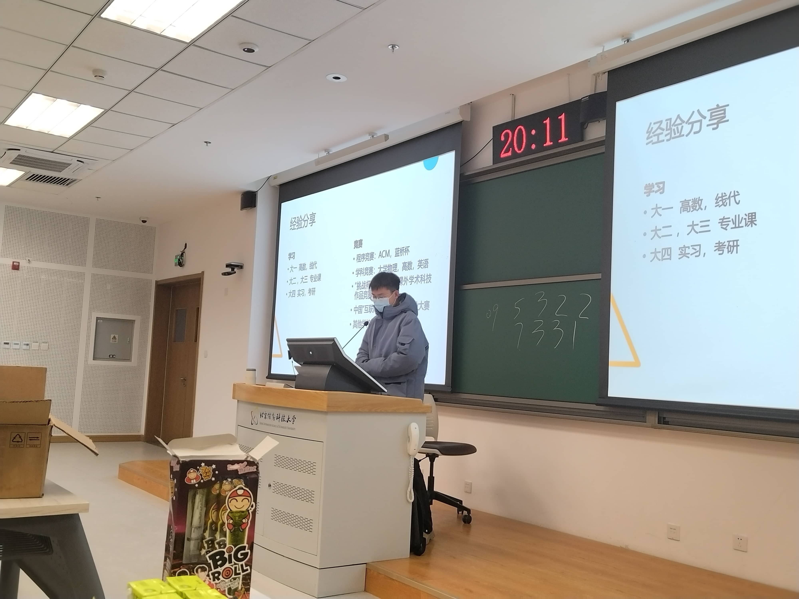

## 前言

自从建站后更新的的第一篇文章用了`独白`这个标签之后就还没有再写过任何一篇独白了，一直都想的是尽快的把博客的技术含量快速的堆积上去，好去找实习，面试校园大使等等，总之都是为了更好地去包装自己，让自己成为一个所谓的`技术大佬`。

不过换来的是一整个学期的高强度码字，以及一个月病两次的辉煌战绩，这个时候才想起来孙妈所说的`”活着“`。

本博客接下来会大致按照时间顺序去记录一下我大学这两年的经历与心路历程，当然有时候也会穿插一些不同时间线的插叙，总之就是放缓脚步回顾一下，毕竟没有什么远大志向是值得你牺牲四年青春去追逐的，该休息该享受的时候还是该慢下脚步的。

## 大一上

上大学之前，我属于是从未独自离家超过10KM的那种，家里人也都是很担心的我能不能适应大学的生活。谁也没预料到，哪怕是我自身至今还没太想明白我为什么能如此顺利的适应大学生活，同时还能有如此之大的蜕变。感觉上大学之后的每一天我都在发生着巨大的变化，我也说不清楚这种感觉，只能说是每天都是能量满满的感觉。

虽然我选择了计算机学院，选择了大数据专业，但那时候我对编程一窍不通完全没有兴趣，大一上的C语言也是遇上了个讲课昏昏欲睡的老师，最后平时分也是莫名其妙的只给了我60，搞的我所学的第一门编程语言的课总评只得了66。到了这一步，我感觉如果没有创客的存在我也许就沉沦了，也许后续就会保持一种能过就行的状态了。

23年九月十号晚上我通过了面试加入了创客，我是不会忘记这一天的，巧的是子安面试的我，子安拉我进的创客，也是因为子安我在走上了鸿蒙这条路。

创客是我上大学以来最重要的组织，没有之一。绝大部分的机遇以及思想上的改变都是从创客开始的。

### 子安的一多活动

刘子安学长所带的第一场鸿蒙活动讲的是一多，但当时的我只是个C语言都敲不明白的菜鸡，虽然坐在第一排用着3.0的DevEcoStudio拼尽全力的去看懂子安的代码，但我是真看不懂啊（哭哭……）。

嗯没想到子安当年这么帅，最近的接触都让我忘了之前他的样子了，笑。

敲代码速度太慢跟不上就只能拍照记下了呗。

什么响应式，什么栅格，听不懂听不懂！！！

不过倒也是这次活动之后我开始和鸿蒙结缘，算是一切的开始了吧。

### 骏哥去字节了

骏哥，我们和蔼可信帅气的社长大人，iOS开发的大佬。

大三上？字节？我草！

骏哥进字节彻底的颠覆了我曾经对于计算机专业的认知，之前在身边人和家人们那为数不多的认知中，现在的计算机如果不考研，那基本找不到好工作，但是从骏哥开始我认识了越来越多本科进大厂的佬们，我坚定考研的这个信念也开始动摇了。

在骏哥的实习经验分享会上，我也是很认真的反思了我希望从大学得到什么，考研的目的是什么，读研期间如果没有很优秀的经历，真的会比三年的工作经验更有优势吗？
在当时，我并没有得出很明确的结论，而是陷入的很长时间的迷茫，真的很迷茫。我如果考研就要想清楚上面所提到的几个问题，想清楚想从读研中获得什么。如果我想本科就业那就要考虑清楚，专精哪门技术。毕竟如果真的只跟着学校去学那些老掉牙的东西，那就废了彻彻底底的废了。

iOS？从小用的华为的手机、华为的耳机、华为的手环，感觉有一种莫名的抵触。前端开发？确实可以，小学期也有前端的课，做做网页也是不错的选择。但这两年随着AI的登场前端无用论甚嚣尘上，也曾问过iflab准备入职前端（现在已经入职）的大佬，按大佬所说前端是肯定不会这样的，但也需要向多面手的方向去发展。

java后端？干算法？确实是高薪高上限职业，但当初我的基础还是过于薄弱了，很没有自信，最基础的面向对象编程当时也用不熟练所以暂时没有考虑。
鸿蒙开发？长期都和华为有着产品上的练习，但落到实处其实当时还是分不太清它和安卓之间的区别的，所以还暂时在犹豫。

当然上面所说的虽然都是曾经真实存在过的想法，但现在看来应该都只是自己逃避不愿踏出舒适区的借口，毕竟那时候我还没有在大学收获到太大的成就感，对于深扎某个技术来说还是缺失了必要的信心。

### 开放原子

随着子安学长的一多活动落幕，OpenHarmony的技术峰会到来了，当时我还并未下定决心学习鸿蒙，仅仅是在上大学前就下定决心的多去参与活动多去参与校内外的活动。不管是看看先进的技术、多去认识人还是多去与企业交流也好，总之就是要**多出去、多接触才能找到自己的目标**。

第一次来到这种学术论坛的我还是习惯性的想和一同前来的同学们抱团落座，属实是露怯了（笑死）。不过最后还是自己找了个地方坐了。

也是第一次感受了真正的技术论坛是怎样的，对我内心的影响还是很大的，拥抱开源这件事是真的在我心中扎下了根，一味地闭塞是换不来长足快速的发展的。真正的强大是能让更多人参与进来共建生态环境。

同时开源也属于是极致的利他就是利己，帮助新人快速的成长是每个生态都需要做的，只有这样才能不断更新血液，此刻我的内心已经倾向了鸿蒙开发，不过到那个时候我只会那么一点点的C，属于是对编程没兴趣也没信心的阶段，所以还是没有开始学习。

### 与王老师相识

我和王启源老师第一次正式见面是在健翔桥校区的创客原大本营，那也是我唯一一次去健翔桥校区了，以后也没机会了（给别的学校了）。

这我也不得不吐槽一下了，健翔桥虽然小吧，但是那地理位置多好啊，在市区里，沙河这地方出门全是工地，地铁五公里，吃个外卖都没几家。（笑）谁家好大学建这种小破地啊笑死了。

面积很小的校区，楼道狭窄的教学楼，像是老旧居民区一样的实验室铁门，和新校区截然不同的风格让我感觉不像是在同一所大学，但在这个校区逛的时候却有着一种莫名的舒适感，感觉新校区虽然硬件更好，但是这种和居民区融为一体的风格却更像是中学时期的感觉，一种莫名的安心。

在这样一间放满了我不认识的试验箱的教室里王老师给我们介绍了创客空间的资产历史和他的一些期望，能够很直观的感受到王老师是真的很希望把他手中的资源给到学生们

穿过了一间落差有三层楼的阶梯教室后来到了我们的创客大本营。

这样的工作室真的太美好了，这就不得不提一嘴408了，408关停这个事真的让我很失落，我一手推动的常态化开放，历时一年多建立了一个良好的自习生态圈，却因为卫生，使用规范等一众杂碎问题而被关停，在次期间我相信王老师也是尽力的去保全我们使用408的使用权了，但的的确确也是有一部分我监管不利的因素导致了一些问题的发生，这一点我也需要检讨。

最后也是留下了这一张在健翔桥校区最后的合影。

### 吕镇宇学长的机器深度学习活动

这次活动我本以为会是一次简简单单的社团活动，结果没想到在前置条件准备阶段却引出了我大学以来的第一次长时间Debug的经历，虽然基本都是我问问题学长孜孜不倦的在查询并解答，但在现在看来，这依旧是最具开创性的一次Debug经历了，这一次后我才开始逐渐适应长时间Debug以及养成自己主动搜索报错信息的习惯，还是很值得纪念一下的。

从晚上8点多就开始在群里问了，后来发现我的问题有点与众不同就加了学长微信开始私下Debug。没想到这一路就干到了熄灯之后的后半夜。当解决的那一刻真的很爽，这种畅快的感觉和在考场上解出了一直不太擅长的数学压轴题一样，是我第一次在代码上获得了十足的正反馈。

活动也是如期顺利开展，与此同时也让我意识到了一点，就是对于带活动的效果来讲，纯算法或是后端是肯定没有前端好的，毕竟前端做什么呢都是可以直接肉眼可见的，而对于像是机器深度学习的活动如果没有最后调试参数后生成的图标，那整个活动就只剩下了理论和代码了，无法给第一次接触的同学们更加直观的成功，也就无法带来足够的正反馈，哪怕这门技术在实际应用中是很有价值的，同时也是值得重点发展的方向，但自己在初次接触时就没有留下很好的印象的话，同学们就不会有兴趣自主的去学习。

### 学期总结活动

时间来到2023年的最后几天，大一上半学期也临近尾声，在紧张刺激的期末考试前创客开始了本学期的最后一次活动。

也是骏哥去到字节后第一次回来给我们分享大厂面试经验以及工作经验。当然还有各位大三的学姐学长们，他们也给我们分享了自己的经验。、

刘子安学长

黎江晓学姐

吕镇宇学长

李昌骏学长

学长们给我们讲解了大学四年值得关注的一些竞赛和考试，同时骏哥也将他收到的字节所发的公司介绍PPT也分享给了大家。

想起当初刚到学校的那天晚上连舍友的名字都还叫不利索的时候骏哥就推门而入将创客的宣传海报塞到了我手里，在总结活动上时就有点泪目，现在在骏哥已经去了深圳入了腾讯音乐在回想起那时更是感慨万千啊，21级的各位学长真是强的没边了，同时也是让我在大学找到归属感的一批人，转眼就剩一个多月tm就要毕业了，我也快成为当年我眼中大三的学长了。哎，太快了，真的太快了。

在活动结束后，骏哥把想要当负责人的同学叫到了一起，给我们讲了一下当负责人的主要职责以及福利待遇等事项，我其实纯纯是感恩与热爱才想去当负责人的，也没想到过创客还有丰厚的物质福利。（诶嘿）

同时骏哥也提到了一段过往的历史，从20级学长手中夺来后进行了大改革才成了现在这个样子，他也没有细说，婷姐也不太清楚，总之就先让这段历史停留在过往把，重要的是我们该如何去打造一个更好的创客。

那天晚上，骏哥把我们拉进了23级负责人的群聊，我也是正式的开始担任创客空间的负责人这一职务了。

### 创客杂记

有狗啊！！！

字节耶天天深夜放毒（bushi）

忘了什么时候，现在放在哪的一块3D打印牌子。

笑死，杂鱼~杂鱼~。

## 86

大一的寒假，我久违的又想开始看番了，掏出了高中时期好兄弟推荐的《86不存在的战区》，我本想是他会是一部战争题材的爱情催泪番（那时候没看过剧情解析也没看过相关番评，我只是从封面和番名判断的，以为是男女主在战场上谈恋爱最后催一下泪的桥段）。

毕竟这篇文章不是番评文章，我也不希望给看我博客的各位提前剧透了，但这是一部**来自未来的作品，是一封写给每个追番人的情书**，他值得你为了看懂最后四分钟而去补全前面的23集。

读到这里的各位应该就明白的我的博客顶部图是怎么来的了，我觉得在相当长的一段时间里我都不会换掉这个封面图。
毕竟这个番给我内心的冲击实在是太大了。如果说《紫罗兰永恒花园》被称之为来自于未来的动漫，是因为它将超越时代的静止画面放到了TV动画里，让经费有限的TV动画有了和以往高预算的剧场版动漫才有的静止作画。那《86不存在的战区》则是将轻改这一大类拔高到了一个前所未有的高度，他的每一帧画面都肉眼可见的是在和为了音乐而去进行适配的，整个片子就像是被精心剪辑过的**MAD**一样，深入的感受原作**情感流**的同时去配合泽野的作曲去逐一进行适配，才有了这样的杰作。

更重要的是，86的成功**是可复制的**，没有像是京紫那样的高预算精致画面，更没有请各路大牌像是鬼灭、电锯人那样的进行宣发，只是一群人用自己的热爱以及认真的态度去打破了传统番剧流水线音画分制的局限，将每一集都做成了神插入。

21年12月，86的剧情已经推至顶峰，在决战前夕制作组却力排众议没有趁着热度将最后两集放出，而是将22以及23话推迟播出。原因是因为工期紧张制作不达预期。
哇！在当今这个时代还能有不为金钱流量，在热度的顶峰延迟播出近三个月的制作组！这就已经证明了**86就是向着封神取代**。


**从停播，到复播，整好86天。**


## 大一下

大一下，我开始正式作为创客负责人团队的一员开始进行活动辅助以及组织工作。

