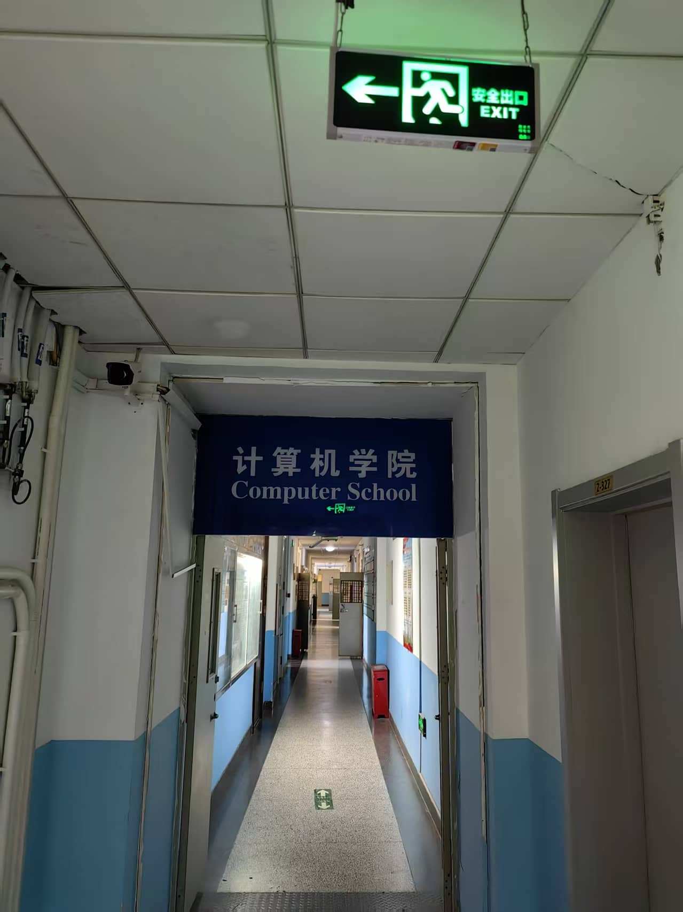
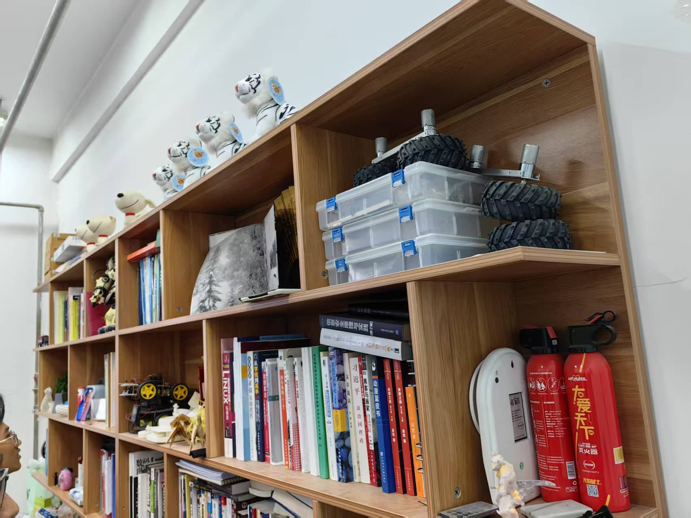

## 前言

自从建站后更新的的第一篇文章用了`独白`这个标签之后就还没有再写过任何一篇独白了，一直都想的是尽快的把博客的技术含量快速的堆积上去，好去找实习，面试校园大使等等，总之都是为了更好地去包装自己，让自己成为一个所谓的`技术大佬`。

不过换来的是一整个学期的高强度码字，以及一个月病两次的辉煌战绩，这个时候才想起来孙妈所说的`”活着“`。

本博客接下来会大致按照时间顺序去记录一下我大学这两年的经历与心路历程，当然有时候也会穿插一些不同时间线的插叙，总之就是放缓脚步回顾一下，毕竟没有什么远大志向是值得你牺牲四年青春去追逐的，该休息该享受的时候还是该慢下脚步的。

## 大一上

上大学之前，我属于是从未独自离家超过10KM的那种，家里人也都是很担心的我能不能适应大学的生活。谁也没预料到，哪怕是我自身至今还没太想明白我为什么能如此顺利的适应大学生活，同时还能有如此之大的蜕变。感觉上大学之后的每一天我都在发生着巨大的变化，我也说不清楚这种感觉，只能说是每天都是能量满满的感觉。

虽然我选择了计算机学院，选择了大数据专业，但那时候我对编程一窍不通完全没有兴趣，大一上的C语言也是遇上了个讲课昏昏欲睡的老师，最后平时分也是莫名其妙的只给了我60，搞的我所学的第一门编程语言的课总评只得了66。到了这一步，我感觉如果没有创客的存在我也许就沉沦了，也许后续就会保持一种能过就行的状态了。

23年九月十号晚上我通过了面试加入了创客，我是不会忘记这一天的，巧的是子安面试的我，子安拉我进的创客，也是因为子安我在走上了鸿蒙这条路。

创客是我上大学以来最重要的组织，没有之一。绝大部分的机遇以及思想上的改变都是从创客开始的。

### 子安的一多活动

刘子安学长所带的第一场鸿蒙活动讲的是一多，但当时的我只是个C语言都敲不明白的菜鸡，虽然坐在第一排用着3.0的DevEcoStudio拼尽全力的去看懂子安的代码，但我是真看不懂啊（哭哭……）。

嗯没想到子安当年这么帅，最近的接触都让我忘了之前他的样子了，笑。

敲代码速度太慢跟不上就只能拍照记下了呗。

什么响应式，什么栅格，听不懂听不懂！！！

不过倒也是这次活动之后我开始和鸿蒙结缘，算是一切的开始了吧。

### 骏哥去字节了

骏哥，我们和蔼可信帅气的社长大人，iOS开发的大佬。

大三上？字节？我草！

骏哥进字节彻底的颠覆了我曾经对于计算机专业的认知，之前在身边人和家人们那为数不多的认知中，现在的计算机如果不考研，那基本找不到好工作，但是从骏哥开始我认识了越来越多本科进大厂的佬们，我坚定考研的这个信念也开始动摇了。

在骏哥的实习经验分享会上，我也是很认真的反思了我希望从大学得到什么，考研的目的是什么，读研期间如果没有很优秀的经历，真的会比三年的工作经验更有优势吗？
在当时，我并没有得出很明确的结论，而是陷入的很长时间的迷茫，真的很迷茫。我如果考研就要想清楚上面所提到的几个问题，想清楚想从读研中获得什么。如果我想本科就业那就要考虑清楚，专精哪门技术。毕竟如果真的只跟着学校去学那些老掉牙的东西，那就废了彻彻底底的废了。

iOS？从小用的华为的手机、华为的耳机、华为的手环，感觉有一种莫名的抵触。前端开发？确实可以，小学期也有前端的课，做做网页也是不错的选择。但这两年随着AI的登场前端无用论甚嚣尘上，也曾问过iflab准备入职前端（现在已经入职）的大佬，按大佬所说前端是肯定不会这样的，但也需要向多面手的方向去发展。

java后端？干算法？确实是高薪高上限职业，但当初我的基础还是过于薄弱了，很没有自信，最基础的面向对象编程当时也用不熟练所以暂时没有考虑。
鸿蒙开发？长期都和华为有着产品上的练习，但落到实处其实当时还是分不太清它和安卓之间的区别的，所以还暂时在犹豫。

当然上面所说的虽然都是曾经真实存在过的想法，但现在看来应该都只是自己逃避不愿踏出舒适区的借口，毕竟那时候我还没有在大学收获到太大的成就感，对于深扎某个技术来说还是缺失了必要的信心。

### 开放原子

随着子安学长的一多活动落幕，OpenHarmony的技术峰会到来了，当时我还并未下定决心学习鸿蒙，仅仅是在上大学前就下定决心的多去参与活动多去参与校内外的活动。不管是看看先进的技术、多去认识人还是多去与企业交流也好，总之就是要**多出去、多接触才能找到自己的目标**。

第一次来到这种学术论坛的我还是习惯性的想和一同前来的同学们抱团落座，属实是露怯了（笑死）。不过最后还是自己找了个地方坐了。

也是第一次感受了真正的技术论坛是怎样的，对我内心的影响还是很大的，拥抱开源这件事是真的在我心中扎下了根，一味地闭塞是换不来长足快速的发展的。真正的强大是能让更多人参与进来共建生态环境。

同时开源也属于是极致的利他就是利己，帮助新人快速的成长是每个生态都需要做的，只有这样才能不断更新血液，此刻我的内心已经倾向了鸿蒙开发，不过到那个时候我只会那么一点点的C，属于是对编程没兴趣也没信心的阶段，所以还是没有开始学习。

### 与王老师相识

我和王启源老师第一次正式见面是在健翔桥校区的创客原大本营，那也是我唯一一次去健翔桥校区了，以后也没机会了（给别的学校了）。

这我也不得不吐槽一下了，健翔桥虽然小吧，但是那地理位置多好啊，在市区里，沙河这地方出门全是工地，地铁五公里，吃个外卖都没几家。（笑）谁家好大学建这种小破地啊笑死了。

面积很小的校区，楼道狭窄的教学楼，像是老旧居民区一样的实验室铁门，和新校区截然不同的风格让我感觉不像是在同一所大学，但在这个校区逛的时候却有着一种莫名的舒适感，感觉新校区虽然硬件更好，但是这种和居民区融为一体的风格却更像是中学时期的感觉，一种莫名的安心。

在这样一间放满了我不认识的试验箱的教室里王老师给我们介绍了创客空间的资产历史和他的一些期望，能够很直观的感受到王老师是真的很希望把他手中的资源给到学生们

穿过了一间落差有三层楼的阶梯教室后来到了我们的创客大本营。

这样的工作室真的太美好了。

