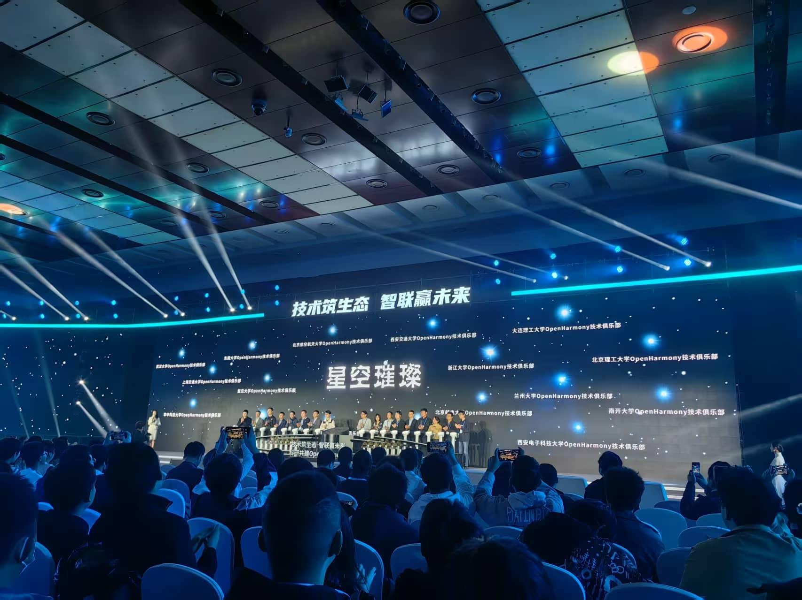
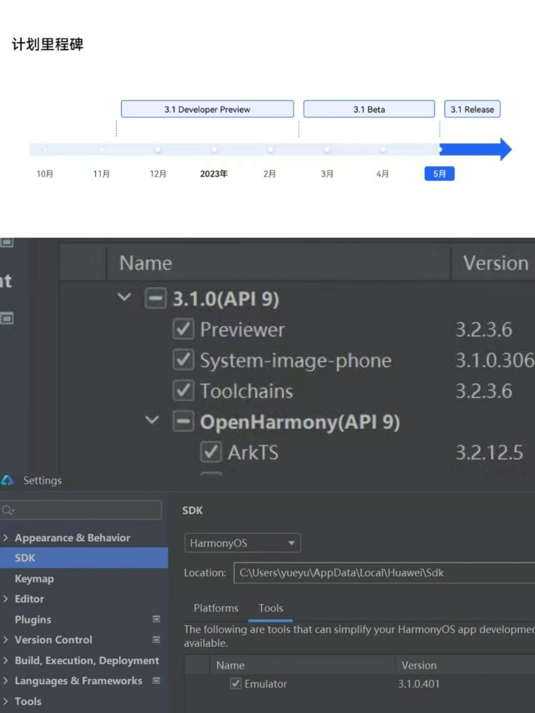
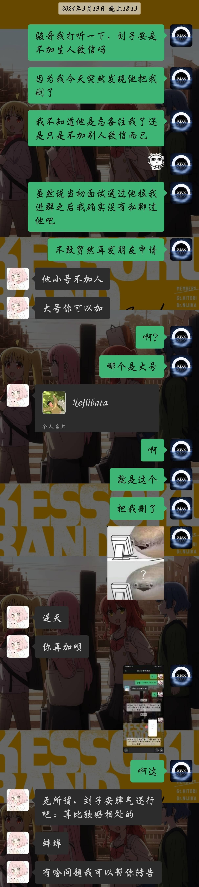
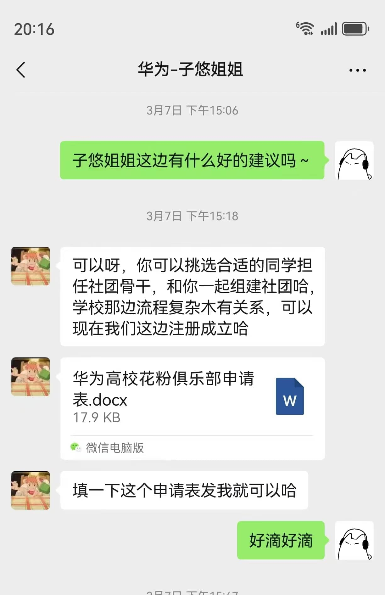
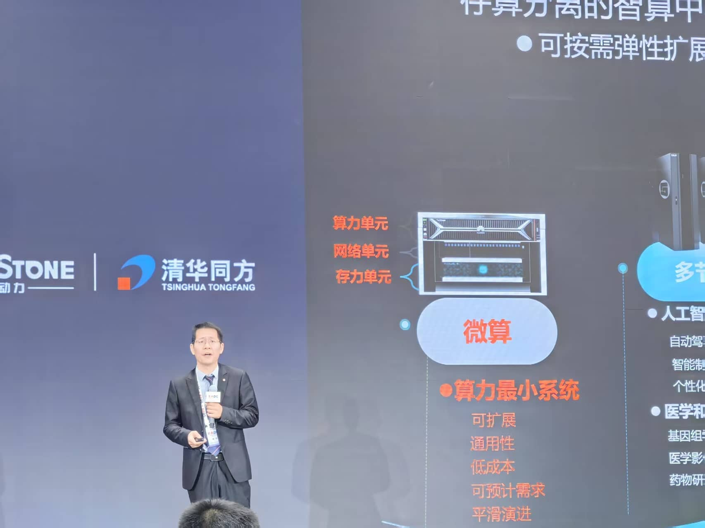
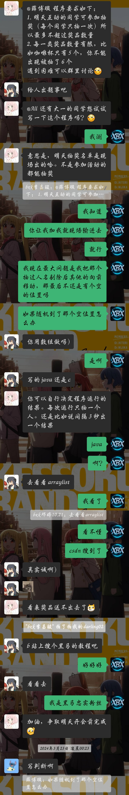

## 前言

自从建站后更新的的第一篇文章用了`独白`这个标签之后就还没有再写过任何一篇独白了，一直都想的是尽快的把博客的技术含量快速的堆积上去，好去找实习，面试校园大使等等，总之都是为了更好地去包装自己，让自己成为一个所谓的`技术大佬`。

不过换来的是一整个学期的高强度码字，以及一个月病两次的辉煌战绩，这个时候才想起来孙妈所说的`”活着“`。

本博客接下来会大致按照时间顺序去记录一下我大学这两年的经历与心路历程，当然有时候也会穿插一些不同时间线的插叙，总之就是放缓脚步回顾一下，毕竟没有什么远大志向是值得你牺牲四年青春去追逐的，该休息该享受的时候还是该慢下脚步的。

## 主时间轴



<!-- timeline 09-10 -->
通过面试正式加入创客空间
<!-- endtimeline -->

<!-- timeline 09-20 -->
2023创客空间新生见面会
<!-- endtimeline -->

<!-- timeline 09-27 -->
git gitee github活动，正式掌握科学上网，开启全球视野
<!-- endtimeline -->

<!-- timeline 10-17 -->
2048游戏编程活动
<!-- endtimeline -->

<!-- timeline 10-27 -->
骏哥获得字节实习offer
<!-- endtimeline -->

<!-- timeline 11-01 -->
鸿蒙北向开发活动，至此与鸿蒙结缘
<!-- endtimeline -->

<!-- timeline 11-04 -->
第二届开放原子基金会OpenHarmony技术大会
<!-- endtimeline -->

<!-- timeline 11-22 -->
机器深度学习活动
<!-- endtimeline -->

<!-- timeline 12-14 -->
学期总结活动，正式成为预备役负责人
<!-- endtimeline -->




<!-- timeline 03-05 -->
鸿蒙短信认证服务活动，正式决心学鸿蒙
<!-- endtimeline -->

<!-- timeline 03-20 -->
春耕校源行，与孙博辰相识
<!-- endtimeline -->

<!-- timeline 03-23 -->
骏哥线上实习分享会
<!-- endtimeline -->

<!-- timeline 03-28 -->
王老师微算活动
<!-- endtimeline -->

<!-- timeline 04-25 -->
婷姐hexo博客搭建活动，本站的起源
<!-- endtimeline -->

<!-- timeline 05-11 -->
鲲鹏昇腾开发者大会
<!-- endtimeline -->

<!-- timeline 05-29 -->
社团嘉年华
<!-- endtimeline -->

<!-- timeline 06-02 -->
创客空间官网启动负责人内测
<!-- endtimeline -->

<!-- timeline 06-17 -->
前端技术实践小学期开始，与刘老师相识
<!-- endtimeline -->

<!-- timeline 06-23 -->
创客负责人团队团建，正式成为创客空间负责人
<!-- endtimeline -->

<!-- timeline 06-24 -->
创客空间社团官网正式上线运营[创客空间官网](http://bistumaker.cn/)
<!-- endtimeline -->

<!-- timeline 07-01 -->
军训开始
<!-- endtimeline -->

<!-- timeline 07-03 -->
花粉俱乐部音频沙龙
<!-- endtimeline -->

<!-- timeline 07-28 -->
创客空间2024正式群成立
<!-- endtimeline -->

<!-- timeline 07-29 -->
北研所花粉探享之旅
<!-- endtimeline -->

<!-- timeline 09-10 -->
408小圆桌走上正轨，开启小课堂模式
<!-- endtimeline -->

<!-- timeline 09-11 -->
北信科HSD正式开始招新，百团大战启动
<!-- endtimeline -->

<!-- timeline 09-19 -->
创客空间2024新生见面会
<!-- endtimeline -->

<!-- timeline 09-25 -->
git gitee github(二周目)
<!-- endtimeline -->

<!-- timeline 10-08 -->
鸿蒙入门活动
<!-- endtimeline -->

<!-- timeline 10-22 -->
花粉见面会，正式成为花粉俱乐部宣传部部长
<!-- endtimeline -->

<!-- timeline 10-23 -->
鸿蒙地图应用开发活动（HSD预热）
<!-- endtimeline -->

<!-- timeline 11-14 -->
扫雷活动
<!-- endtimeline -->

<!-- timeline 11-16 -->
豆包MarsCode产品发布会
<!-- endtimeline -->

<!-- timeline 12-06 -->
永恒之蓝复刻活动
<!-- endtimeline -->

<!-- timeline 12-18 -->
学期总结活动24级预备役团队组建
<!-- endtimeline -->




<!-- timeline 01-24 -->
本站正式落成
<!-- endtimeline -->

<!-- timeline 03-12 -->
hexo博客搭建（二周目）
<!-- endtimeline -->

<!-- timeline 03-27 -->
鸿蒙+DeepSeek活动（HSD正式活动）
<!-- endtimeline -->

<!-- timeline 03-28 -->
三年一亿创客路活动
<!-- endtimeline -->

<!-- timeline 04-30 -->
408封禁
<!-- endtimeline -->

<!-- timeline 05-14 -->
手搓AI-Agent活动
<!-- endtimeline -->

<!-- timeline 05-19 -->
北研所活动
<!-- endtimeline -->

<!-- timeline 05-21 -->
ICP备案，GitHub应用，孤独摇滚放映会
<!-- endtimeline -->



## 大一上

上大学之前，我属于是从未独自离家超过10KM的那种，家里人也都是很担心的我能不能适应大学的生活。谁也没预料到，哪怕是我自身至今还没太想明白我为什么能如此顺利的适应大学生活，同时还能有如此之大的蜕变。感觉上大学之后的每一天我都在发生着巨大的变化，我也说不清楚这种感觉，只能说是每天都是能量满满的感觉。

虽然我选择了计算机学院，选择了大数据专业，但那时候我对编程一窍不通完全没有兴趣，大一上的C语言也是遇上了个讲课昏昏欲睡的老师，最后平时分也是莫名其妙的只给了我60，搞的我所学的第一门编程语言的课总评只得了66。到了这一步，我感觉如果没有创客的存在我也许就沉沦了，也许后续就会保持一种能过就行的状态了。

23年九月十号晚上我通过了面试加入了创客，我是不会忘记这一天的，巧的是子安面试的我，子安拉我进的创客，也是因为子安我在走上了鸿蒙这条路。

创客是我上大学以来最重要的组织，没有之一。绝大部分的机遇以及思想上的改变都是从创客开始的。

### 子安的一多活动

刘子安学长所带的第一场鸿蒙活动讲的是一多，但当时的我只是个C语言都敲不明白的菜鸡，虽然坐在第一排用着3.0的DevEcoStudio拼尽全力的去看懂子安的代码，但我是真看不懂啊（哭哭……）。

嗯没想到子安当年这么帅，最近的接触都让我忘了之前他的样子了，笑。

敲代码速度太慢跟不上就只能拍照记下了呗。

什么响应式，什么栅格，听不懂听不懂！！！

不过倒也是这次活动之后我开始和鸿蒙结缘，算是一切的开始了吧。

### 骏哥去字节了

骏哥，我们和蔼可信帅气的社长大人，iOS开发的大佬。

大三上？字节？我草！

骏哥进字节彻底的颠覆了我曾经对于计算机专业的认知，之前在身边人和家人们那为数不多的认知中，现在的计算机如果不考研，那基本找不到好工作，但是从骏哥开始我认识了越来越多本科进大厂的佬们，我坚定考研的这个信念也开始动摇了。

在骏哥的实习经验分享会上，我也是很认真的反思了我希望从大学得到什么，考研的目的是什么，读研期间如果没有很优秀的经历，真的会比三年的工作经验更有优势吗？
在当时，我并没有得出很明确的结论，而是陷入的很长时间的迷茫，真的很迷茫。我如果考研就要想清楚上面所提到的几个问题，想清楚想从读研中获得什么。如果我想本科就业那就要考虑清楚，专精哪门技术。毕竟如果真的只跟着学校去学那些老掉牙的东西，那就废了彻彻底底的废了。

iOS？从小用的华为的手机、华为的耳机、华为的手环，感觉有一种莫名的抵触。前端开发？确实可以，小学期也有前端的课，做做网页也是不错的选择。但这两年随着AI的登场前端无用论甚嚣尘上，也曾问过iflab准备入职前端（现在已经入职）的大佬，按大佬所说前端是肯定不会这样的，但也需要向多面手的方向去发展。

java后端？干算法？确实是高薪高上限职业，但当初我的基础还是过于薄弱了，很没有自信，最基础的面向对象编程当时也用不熟练所以暂时没有考虑。
鸿蒙开发？长期都和华为有着产品上的练习，但落到实处其实当时还是分不太清它和安卓之间的区别的，所以还暂时在犹豫。

当然上面所说的虽然都是曾经真实存在过的想法，但现在看来应该都只是自己逃避不愿踏出舒适区的借口，毕竟那时候我还没有在大学收获到太大的成就感，对于深扎某个技术来说还是缺失了必要的信心。

### 开放原子

随着子安学长的一多活动落幕，OpenHarmony的技术峰会到来了，当时我还并未下定决心学习鸿蒙，仅仅是在上大学前就下定决心的多去参与活动多去参与校内外的活动。不管是看看先进的技术、多去认识人还是多去与企业交流也好，总之就是要**多出去、多接触才能找到自己的目标**。

第一次来到这种学术论坛的我还是习惯性的想和一同前来的同学们抱团落座，属实是露怯了（笑死）。不过最后还是自己找了个地方坐了。

也是第一次感受了真正的技术论坛是怎样的，对我内心的影响还是很大的，拥抱开源这件事是真的在我心中扎下了根，一味地闭塞是换不来长足快速的发展的。真正的强大是能让更多人参与进来共建生态环境。

同时开源也属于是极致的利他就是利己，帮助新人快速的成长是每个生态都需要做的，只有这样才能不断更新血液，此刻我的内心已经倾向了鸿蒙开发，不过到那个时候我只会那么一点点的C，属于是对编程没兴趣也没信心的阶段，所以还是没有开始学习。

### 与王老师相识

我和王启源老师第一次正式见面是在健翔桥校区的创客原大本营，那也是我唯一一次去健翔桥校区了，以后也没机会了（给别的学校了）。

这我也不得不吐槽一下了，健翔桥虽然小吧，但是那地理位置多好啊，在市区里，沙河这地方出门全是工地，地铁五公里，吃个外卖都没几家。（笑）谁家好大学建这种小破地啊笑死了。

面积很小的校区，楼道狭窄的教学楼，像是老旧居民区一样的实验室铁门，和新校区截然不同的风格让我感觉不像是在同一所大学，但在这个校区逛的时候却有着一种莫名的舒适感，感觉新校区虽然硬件更好，但是这种和居民区融为一体的风格却更像是中学时期的感觉，一种莫名的安心。

在这样一间放满了我不认识的试验箱的教室里王老师给我们介绍了创客空间的资产历史和他的一些期望，能够很直观的感受到王老师是真的很希望把他手中的资源给到学生们

穿过了一间落差有三层楼的阶梯教室后来到了我们的创客大本营。

这样的工作室真的太美好了，这就不得不提一嘴408了，408关停这个事真的让我很失落，我一手推动的常态化开放，历时一年多建立了一个良好的自习生态圈，却因为卫生，使用规范等一众杂碎问题而被关停，在次期间我相信王老师也是尽力的去保全我们使用408的使用权了，但的的确确也是有一部分我监管不利的因素导致了一些问题的发生，这一点我也需要检讨。

最后也是留下了这一张在健翔桥校区最后的合影。

### 吕镇宇学长的机器深度学习活动

这次活动我本以为会是一次简简单单的社团活动，结果没想到在前置条件准备阶段却引出了我大学以来的第一次长时间Debug的经历，虽然基本都是我问问题学长孜孜不倦的在查询并解答，但在现在看来，这依旧是最具开创性的一次Debug经历了，这一次后我才开始逐渐适应长时间Debug以及养成自己主动搜索报错信息的习惯，还是很值得纪念一下的。

从晚上8点多就开始在群里问了，后来发现我的问题有点与众不同就加了学长微信开始私下Debug。没想到这一路就干到了熄灯之后的后半夜。当解决的那一刻真的很爽，这种畅快的感觉和在考场上解出了一直不太擅长的数学压轴题一样，是我第一次在代码上获得了十足的正反馈。

活动也是如期顺利开展，与此同时也让我意识到了一点，就是对于带活动的效果来讲，纯算法或是后端是肯定没有前端好的，毕竟前端做什么呢都是可以直接肉眼可见的，而对于像是机器深度学习的活动如果没有最后调试参数后生成的图标，那整个活动就只剩下了理论和代码了，无法给第一次接触的同学们更加直观的成功，也就无法带来足够的正反馈，哪怕这门技术在实际应用中是很有价值的，同时也是值得重点发展的方向，但自己在初次接触时就没有留下很好的印象的话，同学们就不会有兴趣自主的去学习。

### 学期总结活动

时间来到2023年的最后几天，大一上半学期也临近尾声，在紧张刺激的期末考试前创客开始了本学期的最后一次活动。

也是骏哥去到字节后第一次回来给我们分享大厂面试经验以及工作经验。当然还有各位大三的学姐学长们，他们也给我们分享了自己的经验。、

刘子安学长

黎江晓学姐

吕镇宇学长

李昌骏学长

学长们给我们讲解了大学四年值得关注的一些竞赛和考试，同时骏哥也将他收到的字节所发的公司介绍PPT也分享给了大家。

想起当初刚到学校的那天晚上连舍友的名字都还叫不利索的时候骏哥就推门而入将创客的宣传海报塞到了我手里，在总结活动上时就有点泪目，现在在骏哥已经去了深圳入了腾讯音乐在回想起那时更是感慨万千啊，21级的各位学长真是强的没边了，同时也是让我在大学找到归属感的一批人，转眼就剩一个多月tm就要毕业了，我也快成为当年我眼中大三的学长了。哎，太快了，真的太快了。

在活动结束后，骏哥把想要当负责人的同学叫到了一起，给我们讲了一下当负责人的主要职责以及福利待遇等事项，我其实纯纯是感恩与热爱才想去当负责人的，也没想到过创客还有丰厚的物质福利。（诶嘿）

同时骏哥也提到了一段过往的历史，从20级学长手中夺来后进行了大改革才成了现在这个样子，他也没有细说，婷姐也不太清楚，总之就先让这段历史停留在过往把，重要的是我们该如何去打造一个更好的创客。

那天晚上，骏哥把我们拉进了23级负责人的群聊，我也是正式的开始担任创客空间的负责人这一职务了。

### 创客杂记1

有狗啊！！！

字节耶天天深夜放毒（bushi）

忘了什么时候，现在放在哪的一块3D打印牌子。

笑死，杂鱼~杂鱼~。

## 86

大一的寒假，我久违的又想开始看番了，掏出了高中时期好兄弟推荐的《86不存在的战区》，我本想是他会是一部战争题材的爱情催泪番（那时候没看过剧情解析也没看过相关番评，我只是从封面和番名判断的，以为是男女主在战场上谈恋爱最后催一下泪的桥段）。

毕竟这篇文章不是番评文章，我也不希望给看我博客的各位提前剧透了，但这是一部**来自未来的作品，是一封写给每个追番人的情书**，他值得你为了看懂最后四分钟而去补全前面的23集。

读到这里的各位应该就明白的我的博客顶部图是怎么来的了，我觉得在相当长的一段时间里我都不会换掉这个封面图。
毕竟这个番给我内心的冲击实在是太大了。如果说《紫罗兰永恒花园》被称之为来自于未来的动漫，是因为它将超越时代的静止画面放到了TV动画里，让经费有限的TV动画有了和以往高预算的剧场版动漫才有的静止作画。那《86不存在的战区》则是将轻改这一大类拔高到了一个前所未有的高度，他的每一帧画面都肉眼可见的是在和为了音乐而去进行适配的，整个片子就像是被精心剪辑过的**MAD**一样，深入的感受原作**情感流**的同时去配合泽野的作曲去逐一进行适配，才有了这样的杰作。

更重要的是，86的成功**是可复制的**，没有像是京紫那样的高预算精致画面，更没有请各路大牌像是鬼灭、电锯人那样的进行宣发，只是一群人用自己的热爱以及认真的态度去打破了传统番剧流水线音画分制的局限，将每一集都做成了神插入。

21年12月，86的剧情已经推至顶峰，在决战前夕制作组却力排众议没有趁着热度将最后两集放出，而是将22以及23话推迟播出。原因是因为工期紧张制作不达预期。
哇！在当今这个时代还能有不为金钱流量，在热度的顶峰延迟播出近三个月的制作组！这就已经证明了**86就是向着封神取代**。


**从停播，到复播，整好86天。**


## 大一下

大一下，我开始正式作为创客负责人团队的一员开始进行活动辅助以及组织工作。

### Java

我之所以单独列出一个编程语言作为一个小标题，这主要是因为它算是我编程或者说是编程思想的启蒙语言，毕竟即C语言被给了个60的平时分之后我就还没好好的在写过代码，直到开学后接触到了Java。虽然现在看来肯定是Java比C要简单，但是因为Java一上来第一节课先去讲了虚拟机，以及命令行如何操作，如何用命令函编译Java，如何用命令行编译后的Java文件。哇真的对中式教育这种逻辑顺序搞的很难受，虽然现在也知道了了解虚拟机能做到多少事，它确实重要，但对于一个从来没有接触过类似概念的人来说，难道就不能先教怎么用，等大家都会写了，再说如何更进一步的去了解他的工作原理以及实现方式吗？

哎，世界上的绝大多数事物都是锋利的双刃剑，对于教育方式的改革是一场长久的斗争，对于我们大学生个人来讲只能及时认清现实开始自学才能找到出路。

第一节课教了一堆对于当时的我来说不知所以的东西之后，作业却是留了个平台上的编程作业，我嘞个豆啊。`public` `static` `void` `main`这些都是啥？

做着做着就渐红了，根本看不懂，但当时的我经过了大一的迷茫，我已经认清了一件事，就是**编程语言这个东西不自己亲自写是永远会不了的**于是我就开始上B站去找免费的教程看，**于是↓↓↓**

黑马程序员正式登场了。当时的我还真没听说过黑马是一家怎样的企业，直到后来我才渐渐了解到了近几年黑马的这个`地位`。

看了第一次作业的量之后，我却意外的停不下来了，跟着接着把循环判断都给看了并且实践了，那个时候因为Eclipse（上古版本）实在是太难评了，VScode降临到我面前时真的是让我一度认为这是编程界的唯一真神。也许就是这个时候的VScode+黑马给了我学Java的兴趣吧，如果当时没有黑马，我或许就真的对编程丧失信心了。这一点的话其实大家自己去看一下就知道了，动画配合生动形象的比喻真的比其他的教程要好懂太多了。学编程如果没有这样一个将基本逻辑搭建起来的过程，真的是学不下去的。但编程是一个一门通门门通的东西，大家都是同宗同源的，有了编程思维后跟着开发文档去熟悉API就可以了，整体是很容易上手的。

当然，这个过程宋莹老师也是功不可没。相比于大一C的老师来说，她还算是耐心和蔼的，上课互动也更多一些。那个时候我在第二次上课之前因为看黑马看上瘾了吗也是当时顺手搜了一下eclipse怎么调字体大小，结果第二次上课时老师在教室讲台电脑上演示时忘记了怎么调整字体大小。（哇，怎么就这么巧呢？）这种冥冥之中的事情感觉在大学发生了很多次了，那之前以及那之后。我当时就坐不住了，直接帮老师解围，那之后老师也是主动在课间问了我的名字。

小小的感动，小小的幸福这种小小的正反馈堆积起来让我对Java充满了兴趣，然后就开始自己提前学，后来逐渐发现，作业也太简单了，刷了两道题库的困难题发现也很简单。（题库的题也并非算法，仅是比较复杂的多种类和接口的嵌套而已）最后期末机考，我是真的十分自信，唯一一道小算法题`判断回文数`算是小卡了我一下，毕竟当时完全没有算法思想，连直接用取余来取数都没想到（惭愧惭愧）。但我还是通过此前的实践经验用`StringBuilder`来暴力解决了这道题。这也是进一步加强了我对于骏哥所说的`“知道的多很重要”`的理解。


因为现在的车轮很多，不要老是去造轮子，要**多认识不同的轮子去应对不同的路况**。


成绩出来以后我的Java机考也是得了满分，那一刻我感觉我真的热爱了编程。

### 子安的端云一体化活动

鸿蒙确实是唯一一个有二期的活动，其他活动都是办完那一次之后就没有后续的相同技术栈的其他内容的活动了。上一次子安带的是一次开发多端部署，理论上来说应该是上一次活动更吸引人，结束后更有正反馈的，毕竟大家都亲自上手调整了栅格布局的不同断点情况下的参数，其效果的改变也是显而易见的。

但在活动开始前我却异常的爆发出了比上一次更大的热情，我到现在恰是还是在思考这股热情是哪来的，难道是说这是因为之前有过一次活动，所以这次再进行活动就不会像第一次参与接触这个技术栈一样的手足无措？这不应该吧，但也说不定。

不过现在回头看来可能是上面这一点加上Java给我的信心。

API9，这个难以忘怀的版本，也是最后一版适配鸿蒙4.2系列操作系统的API版本了。

也是这次活动我得知了一个信息就是鸿蒙的API9可以直接真机调试，而且安装上后还能保留，这对于还没学过前端的我来说这是第一种能让我在当前阶段，在手机上运行些什么的手段。

### 鸿蒙做生日礼物

于是我决心用剩下的42天（没错，就是42这个很有强度的数字，笑）去做一份生日礼物送给我妈。

包饺砸！啊这页确实加进去了，乐。

这个计划当然很疯狂，我这相当于是从0开始一个月速通鸿蒙UI，而且是完全没接触过前端，属于是纯纯小白。但不疯一把谁知道呢？我有着强烈的预感，这将会是我这些年送的让她最感动的礼物，这不仅象征着我对大学生活适应很成功，也代表着我找到了方向，以及对鸿蒙的热爱。

这个疯狂的计划还有一个很严重的问题，就是我该怎么把程序装到她手机上，因为那天正好是上学的日子，我不能可能为这个跑回家一趟，所以我想到的第一个方式就是偷偷开个隐私空间然后装进去，到日子就告诉她隐私空间的密码，这样就可到日子在揭密了。

但我很快就被干碎了，隐私空间没法调试，或者是我没有找到正确的方式，总之就是没有安上，所以我只好另寻方式。我想到的方式是新建很多很多的空页，把app藏到最后，但却因为我拿着我妈手机时间太久了而且不知道在干嘛，就小吵一架，最后还是靠姥姥调停，我把app藏进了一个她不常用的文件夹里，然后让姥姥替我保密，并且和她说我什么都没做才化解的。

风波之后，**结果↓↓↓**

那一刻真的内心的情感复杂到了极点，我感觉鸿蒙也许就是我的`路`了，大一上时的迷茫我或许找到了答案。总之，先继续走下去吧。

### 黑马程序员

黑马的话之前Java的部分就已经写过是如何与黑马结缘的了，我本以为我会只是去吃B站那些免费的口粮就够了，但却是因为一场`意外`让我决心去报课。

#### B站的免费课

我不知道为什么我在搜索鸿蒙相关课程时始终没有搜到黑马的课，而是一直给我搜出一个叫`鸿蒙大本营`的账号的视频，一会儿清华一会儿北大，结果点开一看都是同一个课……

然后他讲的还很没有逻辑，讲了整体的项目机构，ts语法基础，然后就没讲多少UI就开始讲`router`教我们去跳转了。我嘞个，单个页面都不会做呢跳转个蛋啊。

#### 问子安

子安带了两次鸿蒙活动，又是鸿蒙大佬，我学鸿蒙也是因为他，所以我很自然的想到了去问他。结果发现他把我拉进创客群后就把我删了？？？嗯是这样的。

在骏哥的help之下我总算是加上了子安的微信。（我甚至把纯血鸿蒙说成了up……我嘞个豆啊啊啊啊啊啊尴尬的我想死）

不过在深入的了解下，发现他的学习方法可能我并无法复刻，他直接生啃文档的操作对当时的我来说还是太过于困难了。

#### 安卓资料

我的舍友党云泽（后文称作小刚）被骏哥的舍友给拉去做小车的编程了，用的是`AndroidStudio`，写的是C++，他找不到视频课，也找不到资料，（现在看来也挺奇怪的，当时怎么就没找到呢）于是我就上黑马的官网去看看有没有相关的资料，然后黑马官网右下角内个客服窗口就自动弹出来了，简单的咨询了一下，就加上了欢欢老师的微信。

有点姜太公钓鱼内味了，就是我主动地往鸿蒙买课这边引，看看能嫖点啥，然后就还真嫖出来了个试听课，虽然只是UI阶段的，内容现在看来是很基础的，但却正是这种一贯的风格才决定让我去报的。我当时和欢欢老师打了好几次电话，聊了很多。在此之前，中学时期的各种辅导班都是父母帮我报的，费用也是他们直接交了的，我只是认为我要去上，去提高成绩，没有想着说我要去选择我要上什么，现在我开始主动给自己在课外时间报课了，算是对于当时的我来说的很大的一种改变，重要的是心态上的改变，而不是说技术瞬间的突飞猛进。

也是这个课给我提供了给妈妈做生日礼物的技术支持，抱着一种学到哪就做到哪的一种心态，想把自己学的都用出来给妈妈看，一直学到还剩最后五天才开始做。

（这个老师很好，想报课可找我推微信，或者直接图里手机号）
（不是广告，真不是广告，哭）

### 春耕校源行

大一上就参加过开放原子的技术大会，而这次活动就是开放原子主办的校园技术活动，同时还有那该死的二课分，我直接毫不犹豫的报名了。

这次活动对我来说最重要的不是这次活动本身，而是让我认识了一个人，孙博辰。

嗯是的我们亲爱的孙妈在我的故事线里刚刚登场，没想到把，笑。
我去校源行的主会场是为了二课和OpenHarmony，同时顺道了解了一下DORASSR。对我现在电脑上还贴着他们的贴纸。

有一说一，之前也真不是没想过做游戏，毕竟游戏算是我长久以来无法抛弃的一部分了，真的能做游戏的话其实也不错，但是国内的这个市场环境嘛……也是骂了很多年了，这也刚好问一问从业人士是怎么说的。

嗯，果然和我想的差不多，也算是变相的坚定了我学鸿蒙的信念。

回过头来，在主会场结束后的开源奥德赛并没有请很多的业界大咖来讲座也没有二课分，所以其实最后来的人不算多，群聊也算干净。当时我去参加主要是奔着子安学长去的，除了子安其实其他的佬我都还不太认识。

我本身是没有图的！这高糊图还是找登登头子要的！我也没辙！

子安带了块开发板去现场演示一个双端同步读写的鸿蒙分布式特性，内块板子我也不知道是不是前两天子安给我的`圣遗物`里面的那块，看着有点像（笑）。

当时孙妈说了一大堆叽里咕噜的我也记不清了，只记得说是学校教学楼门口通过人脸判断空闲教室现有自习人数的系统是他做的（好像是？也需不是？）然后说总之有啥事找他他就去干学校（乐）。然后就拿电脑展示了一手人脸识别加人数统计。

当时觉得：“**哇！这个长头发学长好厉害**！”（没错当时我并不记得他叫啥）然后就在我写这段文字之前我刚做完计算机视觉的实验，实验内容就是人脸识别（历史总是惊人的像国道上的大运一样创死过去的我）

属于是在逐步的对过去祛魅了，也是挺好的一个过程。
不过呢，这时候我只是知道了这么个长头发反骨仔学长而已，还没有加上微信，甚至名都不记得。嗯是这样的。我俩真正认识还得推进到花粉的成立。

### 花粉俱乐部

花粉俱乐部，华为+子安+第一批成员，这三个条件让我毫不犹豫的选择了加入，当然还包含了许多其他的原因，这里就不过多赘述了。

就这样花粉俱乐部成立了，我也称为了最初的一批成员。

这可能是我第一次加入华为官方的组织，也是无比的憧憬与期待。而在这里我看到了一个熟悉的小绿头，至于我为什么要加他我已经忘了，但我确实是在花粉加上的孙妈。

笑死了bro，回去翻的时候差点没笑死，自己品吧（乐）

由婷姐引出孙妈母胎solo，笑死，来给孙妈征婚咯！！！


有看到这里的欢迎加我，我给大家推孙妈微信奥！（征婚广告）


但有一说一奥，其实到这里我俩还不知道对方是谁，直到四月末我俩才认出对方……好像是因为哪个pyq来着（忘了）

### 初入408

408创客空间的社团活动室，虽然最近已经被神秘的大手给回收了，但在那里的时光都还是历历在目，我想在未来的很长一段时间里都会难以忘怀吧。

第一次去是ASC（一个已经没了音讯的竞赛）小组讨论用了那个教室，事情虽然是发生在了大一上的期末，但那一次并不以创客负责人的身份去的，也没有真正整整的好好看看那个教室，所以就放在这边统一写了。

随后就是王老师带来的微算活动了。

这次我是以创客空间负责人的身份走进了社团活动室，同时王老师也为了后续的活动做准备而给我的卡添加了门禁权限。至此围绕408的支线剧情展开了。

说回活动本身。王老师在这次活动中介绍了他的得意之作————微型超级计算机，也就是微算。是由王老师所在公司————绿算的团队研制的为中小微企业解决数字化转型难题的产品。

与此同时，这次活动对我来说还有更深远的意义，因为这是我第一次正式的进行活动辅助工作，也是第一次在创客空间社团官网上留下我写的活动记录文章。
（好像不是？记不清了）

### 鲲鹏昇腾开发者大会

鲲鹏昇腾，华为的左膀右臂，这次开发者大会本是我参与的诸多学术活动中的一个，特意列出来主要是因为我们的社团指导老师王启源老师在会议议程的第三天会上台讲解他的微算。在微算社团活动之后王老师就走上了更大的更大的舞台，也是真的有一些传奇色彩了，那个时候我是真的有一点心动，感觉去跟王老师进入绿算工作也不错，小小的动摇了一下鸿蒙的心，但我很快又坚定回来了。

王老师太帅啦！

这次活动是和**刘子安，吕镇宇以及夏方方**三位21级的大佬一起去的，真的是很幸运的经历，一下车就能跟着他们去逛展，这个感受是一个人去逛完全感受不到的。我一个人逛，那是走马观花，和他们逛，那是真能学到东西。

当然，子安也是抛出了一个让当时的我思考了也是焦虑了很久的问题，**如果我只会鸿蒙开发，你有什么成果，你有几年开发经验，我凭什么要你**。我思考，是因为这是我早就清楚这是我迟早要面对的问题，哪怕是换了别的技术栈也会是这样；我焦虑，是因为当时的我刚跟黑马学了基础的UI甚至好像连一阶段的那个综合案例都没写呢，距离子安所说的还太过遥远，自然会不可避免的焦虑。不过我也没有被这件事困住双脚太久，因为我知道，只有**开始行动才是打破焦虑的最好方式**，同时我其实已经在路上了，**所以我只需要去脚踏实地的做好自己**，一步步的打好鸿蒙开发的基础才能去真正的做项目积累开发经验。

当然夏总也是极为热情的给我提了很多建议，同时还给我扔来了很多期末资料！太感谢了！！！

吕总直接上手实操感受了一个计算机视觉的模型（？好像是，记不清了），然后一大串的专业术语直接给我砸懵了。

最后请欣赏**来进货的三人组**。

### 抽奖程序与ArrayList

读到这个小标题的读者可能会感到疑惑，为什么我要在一篇独白博客里面去塞进一段技术内容。其实我并不是为了去讲解怎么写一个简单的抽奖程序或是讲解一下Java的`ArrayList`，而是这件事让我感受到了“**知道的多了解的多真的很重要**”，同时也狠狠敲醒了我不要再随意说大话去接下超出能力的任务，或是给自己定下一个很夸张的deadline了。

事情是这样的，骏哥在字节实习期间整了一大堆的大厂周边，打算在活动上当做小奖品抽出去，就像下面这些。

于是刚成为负责人没多久的我，就被骏哥薅过去写程序了，一开始我还是相当自信的，那个时候我属于一个对Java有着蜜汁自信的时期，有点膨胀过度了。

于是我十分自信的去写程序了，在写的时候我才想到一个问题，就是中奖人能重复吗？
于是我去问了骏哥具体的要求，果然是不能重复的。那我的第一反应就是记录一下谁中奖了，然后判断一下如果重复就再抽一次，直到不重复再输出。

这的确是当年一点算法思维都没有的我想到的解决方案，一开始我甚至会想只是做个抽人程序然后人工处理重复，就是再运行一遍的意思。现在回头看来真是太傲慢了。

不过很快骏哥就打破了我的这种设想，因为骏哥要的是直接一次性全部的抽奖结果，要人和奖项一一对应，奖项要计数，人名不重复。哇，这直接打破了我当时的莫名自信，开始不知所措。对于当时的我来说，完全没有数据结构的概念，只知道Java的数组不支持删改，我手动写的置空程序也是频频报错，始终达到不了正确的效果。

于是我开始在群里还有私信求助。

现在回首望去我看不懂ArrayList的主要原因是我并没有正确是的数据结构思维，我不知道线性表是什么，不清楚增删改查是如何实现的，同时也没有太多调用API的经验，所以在看官方文档时看不懂，还只能依赖于黑马这种嚼碎了喂到嘴里的教程。

随着后来的数据结构，我也是亲手复刻了ArrayList的功能，但那都是后话了。那时的我只能去私信骏哥试图让骏哥帮我Debug。

！[抽奖程序](ToTheApril2025/92.jpg)

wc我那时候怎么那么烦人呢，我怎么没想到骏哥在字节实习肯定没那么多时间能回我微信呢？我怎么还说出“骏哥人呢”这种话呢？
哎，好****啊。

在骏哥短暂失联之后我有依据子安所说的添加判断的方式进行了尝试，但依旧失败了。

随后就是有些草率的用了一个最基础的抽人程序来结束了这次编程小任务……

不过！后面我积极的学习并在王老师的微算活动上补全了这份缺憾！

### 社团嘉年华

社团嘉年华！这个倒也没啥值得反思的，只是单纯的想记录一下啦，还是一次很愉快的经历。

<video width="100%" controls>
  <source src="104.mp4" type="video/mp4">
  您的浏览器不支持视频标签。
</video>

### blog

时间来到了大一下临近期末的前两周，我们再次来到了408开展个人博客搭建活动，这次活动是我博客建站的起源，也是我第一次清晰地认识到了自己的博客网站与在各个平台上去发布文章之间是有着极大差异的。
个人的博客网站有着极大的自由度可以去DIY，去自己改造原本的框架，来在博客框架的基础之上去实现自己理想中的网页的样子，同时网站的访问加速，个人服务器的部署与维护，远程链接服务器时的各种权限问题，这都是要去处理的，能**长期保持更新而且持续维护经营好自己的博客网站**，甚至是以网站为基点开始**运营搭建属于自己的小社区**的话是一件非常能够**展现能力**，同时也能带来**极大成就感**的事情。

这次活动也是我负责的活动辅助，所以我需要先拼尽全力的去跟上婷姐的节奏把我自己的步骤都先走完。

当时的我对于整个博客搭建的流程其实是没有概念的，所以说我我只能是拼尽全力勉强跟上，也还是有一些问题需要叫婷姐来帮忙解决。每一步的命令行我也并没有完全的理解只有在那些执行了之后会有界面改变的命令行能够记住，其他的命令行大多只是一知半解的跟着敲完了而已。

我在现场通过CSDN解决了一部分问题后把这些经验传播出去帮婷姐处理了一部分问题，还算是给了我不小作为负责人的正反馈。

为同学们Debug的阶段也是对自己能力的提升，提升自己对现有已知信息的理解与逻辑关系的梳理，只有梳理清楚这些才能理解自己当前的问题与网上解决方案的区别。
虽然我们在查找对应报错时会找到很多解决方案，但这些解决方案很有可能因为时效性与你当前的应用存在版本差异，导致一些配置项或是命令的用法有区别，在理解了我们**在做什么，目标是什么，已经做得部分实现了什么，以及我们所依赖的有哪些**我们才能去理解我们所搜到的解决方案他的思路是什么，它为什么能成功，由此我们就可以依照他的思路去排查对应的问题。

不过很遗憾的是在那次活动之后，我试图经营起来我的博客，但是却被md的图片引用问题所困扰，当时我对于图片地址链接是非常浅薄的，只知道是有相对路径以及绝对路径两种，甚至不知道图床是什么。我始终都在使用相对路径，因为我当时认为如果使用绝对路径的话，云端并没有所谓的C、D盘之类的路径，所以我就选择了一`./和../`开头的相对路径。就导致一直不成功。直到25年年初寒假的时候我决心把博客搞起来才了解到原来在构建生成之后的**静态网页部署文件中的结构与源码文件中的不同**，所以我们直接在源码中去写相对路径引用是需要修改进行适配的，而绝对路径的话则要以`/`开头，也就是博客网页的**服务器根路径为开头**。

但我开始写博客想法的启源以及最初了解到hexo和Butterfly的途径都是这次活动，所以我站底的建站时长的起始时间是来自这次活动的时间，而并不是我第一篇博客中的截图时间。

### 23级负责人团建

时光飞逝啊，婷姐的活动基本算是创客空间2023的收官活动了，在期末考试结束后小学期开始前，创客的负责人团队也是久违的出去团建了，但在我们这边这种鸟不拉屎的地方，属于是没啥好玩的。最后决定在久耀里唱歌。

黎江晓学姐唱的真的太好了！！！

我也是和骏哥合唱了几首，给学姐笑的都快岔气了。笑死了。

结束后骏哥也是单独和我还有婷姐交代了一些创客工作上的事情，至此社长这一职务也是正式的移交给了婷姐，创客空间也是正式进入了24级负责人团队的时代。

这里也是要提一嘴，就是在骏哥的努力下，创客空间成功的成为了北信科的**校级社团**，不再作为计科协的下属社团，可喜可贺。

### 前端小学期

本来我看到小学期的时候我是要烦炸了的，毕竟我们还是这个暑假军训，谁懂啊，期末考完试之后又要上两周课，上完课还要写论文，写完论文就接着军训两周，直接把七月的假期给吃干净了。不过呢，这却成了我大学以来最爽的一段经历有一说一，就很奇妙，真的很奇妙。

#### 小学期前的心境

之所以要提一嘴这个事，主要是因为这极大的影响了我和刘老师相识的进程。

那时的我决心开始正式学鸿蒙大概两个月左右，中间还穿插了，所以其实进度并不快，仅仅是学了基础的线性布局组件以及内外边距啊巴拉巴拉的。而且那个时候我还没有接触过除了ArkUI以外的任何前端，没错HTML我也不知道，所以我并不确定所谓的前端技术实践是上什么，我甚至还天真的认为ArkTS也可以写网页，毕竟那个时候我还对小前端和大前端没什么概念，仅仅是知道这个东西写出来的界面很好用，不想迈出舒适圈罢了。于是我就去主动加了老师的微信并问老师这个课是学什么的。还刻意的去问了问老师还不知道鸿蒙开发相关的事。那时的我是真心的发问，但现在看来以24年6月鸿蒙的热度以及社区的完善程度来说老师不知道也是很正常的。不过呢，老师还是十分认真的回答了我的问题，在我发问之后就去搜索了相关的文章并和我简单交流了一下。这个事真的很难得，再过去的老师基本上都是只把着自己教了无数年的那些东西，并不会说是主动的踏出他的“舒适区”去主动的和你去聊他专业以外的东西，所以那个时候我就对刘老师留下了很好的印象有一说一。

#### 小学期开始

通过这次的聊天，我也是了解到了大致课程的安排，同时也是和刘老师建立了很紧密的联系，那次聊天以后我们又聊了很多次，最后在正式上课前两天时，刘老师主动跟我说要在第一天上课前认识一下我，我也是很荣幸的答应了老师。在第一次见面的时候我才知道原来老师还一直认为我是个女孩（笑死）我也不知道我这个名字哪里像是女孩子了。总之最后我们也是愉快的相认了。

对于老师上课要讲的那些web开发的基础知识我也已经提前跟着黑马的视频预习过了，与此同时，又因为我在学习鸿蒙的过程中有了一定的前端基础，所以老师上课的内容我基本上都能听懂，何老师互动的很开心，这种课堂我向来都是很享受的，感兴趣的、老师很好的课啊什么的我都喜欢坐在前排和老师互动，这真的是对我来说很愉快的事了。然后每到课间我都会去找老师在讲台上聊天聊到再次上课。

犹豫这个课程安排确实是很不合理的有一说一，web开发那么多的API那么多的样式种类，却仅仅有两天的理论课，这怎么可能讲的完嘛。随后就开始实验课了。我本以为实验课会是像以前一样老师给发个实验指导书大家就跟着上面的步骤做出一个目标的网页就可以了。结果呢老师却说没有选题限制，属实是意想不到了。老师看大家没有想法就举了些例子，比如说做个网页介绍一下自己的家乡、喜欢的游戏、看过的动漫巴拉巴拉，或者是去网上复刻一个现有的网站也可以。

那这么看来的话确实是很自由的选题了。我一时间也没有什么想法，本来打算随便做一个番剧的介绍网站的，但我自己又对于设计不太擅长，再加上其实我在此之前并没有真正的去编写过web，对于web的原生技术栈我属于是0开发经验的状态，直接上来就去凭空制作一个网站还是属实有点困难的。于是我就想起来了之前老师给我的51CTO的课程账户里面就还有一个网易云课堂的复刻教程来着，之前老师也说“第一步要先仿着来”先去仿照现有的网站区进行复刻是一种很好的学习一个技术栈的方式，这一点我在之前学习Java和ArkTS时属于是深有体会了，所以我还是决定先去按照那个课程来去复刻一个网易云课堂的首页。

但做着做着我发现我一边切屏百度网盘，一边切屏VScode，一边切屏PS属实是太低调了，而且我还需要经常暂停才能跟上，毕竟我对于前端的熟练度是相当低的，绝大多数的常用代码都还没有形成肌肉记忆，就这样我一晚上五六个小时才把置顶栏给磨完，这可不行啊。于是我就开始尝试自己独立做。

我找到了网易云课堂的网站，果然是和视频课里面的样子不太一样，说明那个课程也是有些落后了。但差异不大于是我很快就修正了原本的代码。随后我才意识到F12这个好东西。我开始利用开发者工具去阅读网站的源码，按照网易云的源码结构去进行网站结构的搭建，随再在原有的样式基础上加入了一些自己的设计，又添加了一些简单的伪类选择器效果。

在实验报告中有一条是要实现DOM元素的动态展示，对于这个所谓的动态我一直在想该如何去实现，后来我决定去CSDN上搜一搜将轮播图效果复刻出来，不过在此之前我还是去找老师确认了一下，也基本是从这次开始，我写代码的热情被彻底的点燃了。

刘老师从不会吝啬自己的夸奖，我仅仅是按照网上的代码去复现了一个普通的不能再普通的轮播图，老师就持续的在夸赞我，后面我又和老师聊了很多，可以看得出来老师是真心的希望我们能够去喜欢上编程，也非常希望通过自己的鼓励能点燃更多孩子的兴趣。很显然我就是被点燃的其中之一，在这之后我写代码的速度开始提升，而且认为这是一种享受，我会为了一个CSS样式去反复的调教预览，只为能够做出一个符合让自己内心满意的网页，也是一个能让刘老师感到骄傲的网页。

这样的心境持续推动着我，在后面我开始设计如何实现跨页面数据传输的要求时，我遇到了难题。我一开始想试用cookie去进行数据传输，但始终不成功。在CSDN上转来转去，也没能解决（这个时候的我还没有用AI的习惯，也没使用过AIcoding）。于是我就把问题留到了第二天上课，老师直接花了大半天坐在我旁边陪着我Debug。真的是就坐在我身边的椅子上，我们一起讨论一起查资料。最终也是皇天不负有心人，经过询问AI，我们明白了问题的所在。浏览器出于**安全考虑**会自动拦截由**本地文件发送到本地文件**的cookie！！！在更换为用URL传参之后就成功了。我和老师都如释重负。

在这个过程中，我首先要肯定的是我非常感激老师的帮助与付出，但我们也要看到一个问题，就是通过查书以及看相关的博客文章，在当今这个时代已经是很低效的了。首先是技术种类日益增多，各种细节问题层出不穷，文章和书籍的时效性并不高，同时它并不能很高效的去锁定与我们相同情景下的问题分析以及解决方案的提供，只能说我们去从这些文章中寻找类似的部分，再加上我们的猜测去摸索。而AI则可以更高效的获取时效性更高的信息，同时还能以及我的描述去寻找相关的信息，并且能够注意到我们所忽略的细节。或许就是从这里开始我意识到了AI的重要性以及学习AI的必要性。

当然其实现在回首来看，我写博客的这个兴趣可能也是来自于这次小学期，每次我和老师一起debug后，老师都会及时的提醒我去进行记录，去做总结。这种留下痕迹的习惯真的很重要，不仅是对自己过去经历的证明，更是对自己知识库的搭建。

这种热情也推动着我去写了务必详尽的实验报告，一个仅有一页半的小网页，我却写了足足一万三千字。也正是因为这个实验报告，以及我网页的优良质量，让我的作品被列入了这门课程的优秀案例，会被作为以后学弟学妹们参照的模板。这真的太令人激动了。

还有太多太多赞美的话语我就不再一一赘述了，就是这样一次神奇的小学期经历，彻底点燃了我的编程热情，也引出了后来的很多很多事。

### 创客杂记2

笑死了bro

现在也是可以还愿了。

## 暑假

### 军训

#### 军训的双刃剑背景

因为新校区的建设与搬迁，我们的军训被安排到了大一暑假。这个政策也是典型的双刃剑，一方面是让我顺理成章的获得了高考完最晚一批开学的准大学生，获得了最长的高考暑假。这确实很爽，我卡着军训与开学的时间差回到了实验看望了很多老师，见到了伟哥也见到了“缅甸瓜果”肖怀朋，还见到了好多好多的老师，青春的记忆也涌上心头，那个时候我还只是一个很幼稚的学生，还没有任何的蜕变，只是经过一个暑假的胡吃海塞以及自行车兜风之后我就获得了一个相当良好的精神状态，以及与之对应的对大学生活的向往以及担忧，可能是担忧更多一点，但是并没有对我的好心情造成太多的影响，毕竟我深知，这样的假期仅此一次，未来再也不会有如此无忧无虑的假期了，而且也可能是和我很多老友们的最后几次见面机会，毕竟那个时候我就已经知道有好几个人要出国留学或是去老家发展了，没有多余的泪水只有对相聚的尽情享受。

当然这个政策的另一面就是让军训失去的原有的功能，本来用于让新生们互相了解，熟悉彼此的功能被砍掉之后就造成了我大一入学后与我的舍友熟络起来的过程算是小有波折了。我也是小花了一点心思，但好在舍友都还是正常人，可能方向有些不同但也都很好相处。当然了反过来看，这其实也是一种好处，毕竟在并不熟悉时就共同受苦受累可能连这种同甘苦共患难的兄弟情谊都没有的话，军训注定是很难熬的。尤其是在刚上大学你还没有适应大学的生活，也没有朋友，每天累死累活一身臭汗，却在休息时连坐在朋友身边聊聊天都做不到的话，这14天的军训必将成为一段相当难忘的“求生记忆”了，真的就是每天都在挣扎了。

经过了上面这些哲学思考之后我也是很淡然的去享受这段人生经历了，毕竟高中是在疫情期间度过的三年并没有军训，所以这其实算是我第一次真正意义上的军训了。

#### 与四哥初识

军训开始了，我也是怀着无比忐忑的的心情穿着并不舒适也不那么合身的衣服走上了操场。我本来还想着会不会学校没准备4647码的鞋子，我没准就不需要去买军训的胶鞋了。正常款式最大到46，我平常穿的鞋子也是46的，试了一下发现顶脚穿不进去，那我是真高兴啊，终于不用穿那该死的胶鞋了。结果找人家说了一下，人家转头就从身后拿出来另一个连迷彩都没有的鞋，47码的。好好好，我当时笑容就凝固了。然后穿上一看，好家伙不仅鞋带系紧了还大而且比正常款式的胶鞋还难受。我真服了啊，气笑了孩子。不过还好我有鞋垫，一层鞋垫感觉还是硬，两层鞋垫又左右晃悠，随时可能崴脚，就很绝望了孩子。我只能垫了一层鞋垫硬着头皮开始了军训，毕竟难受总比受伤好受一些。

第一天的训练不出意外果然是很高强度的，四哥也是狠狠地给了我们个下马威。早餐之后直接将我们带到了文理楼群中间的空地进行训练。军姿一站就是几十分钟，站了多久我是真的记不清了，只记得时间的流逝比平常慢了太多太多，真有一种被莫斯提马主观缓时的感觉了。本来以为只要点上了鞋垫就可以很舒适的度过军姿这一关，不过事实属实是抽了我一个大嘴巴子。软塌塌的鞋垫反而是让我的脚掌受压均匀，不像是最直接踩橡胶鞋底，还可以通过自己调整中心来控制脚底的压力。

就这样我的脚渐渐站麻了。我满脑子都是怎么才能搞到一张免死金牌，怎么才能熬过这绝望的时光。

#### 免死金牌

下午到了，上午还因为是有开营仪式而晚开始训练了一段时间，下午那绝望的闷热加上超长的训练时间让我的心跳难以抑制的加速，是恐惧驱使着我去想办法解脱。站着站着，我的腰开始疼了起来，我本以为是因为军姿绷的太直了，腰部肌肉僵硬导致的疼痛，但在后面的经历看来并不是这样的，反而是因为我的站姿不够标准才导致了疼痛。这种疼痛固然雪上加霜，但却又是雪中送炭，因为我终于有了一个确实存在的理由可以申请去医院看了，这样我就有希望去拿到免死金牌了。

但我的内心有陷入了在挣扎，这种挣扎的成分很复杂，最先浮现出的是中国式教育所训练出的条件反射————成绩怎么办。没错在这种已经被恐惧驱使的情况下我还再考虑着我的成绩而不是身体。唉~随后浮现出的才是如果我直接打报告去休息会不会让同学们认为我太软弱了，或者说是想逃避。但在经历了10分钟左右腰疼到极致的军姿之后我还是下定决心打报告去校医院。在四哥走到我身边时我默念321喊出来了那一声“报告”。在获得同意之后我迅速放松身体走出队列，离开了压抑的方阵之后，我的身心都得到了净化，真的是一种全身心的解脱，无论是生理上的痛苦还是心理上的压力都得到了释放。

我坐在操场的边缘静静的等待着四哥的到来。四哥一番询问之后在手机上记录了我的名字就让我直接去校医院了，也算是有些出乎意料，我本来都做好了要舌战群儒的准备，本以为他们会先叫导员来劝说坚持，结果竟是如此的爽快。

我扶着腰快步走出了操场，骑上车就向着校医院出发，看着分散在校园各处的军训队伍我也是五味杂陈，简单的让校医院给我贴了个膏药之后就直接打电话和父母联系了，毕竟校医院啥水平我还是再清楚不过的。随后我就直奔医院去查，查完之后就顺理成章的获得了我梦寐以求的免死金牌。当然这里面我还包含了一部分和导员先斩后奏的戏码，毕竟军训期间导员放人肯定是不那么痛快的，假如我先说了也许就回不去了。不过最后一纸三甲医院的免体证明还是顺利的让我获得了可以随时休息的权利，既不用办理减训还可以正常拿分，诶就很舒服了。

#### 军训的中期

在熬过了前四天后，军训就进入了一段平稳期，在公众号的宣发和实况播报结束后，教官们也是尽全力的去给我们找阴凉，同营的几个教官还会去争那几个场地中的阴凉，笑死了。在阴凉面积大的时候训练等太阳出来了就开始原地休息。

渐渐的，我们和教官之间也形成了一种默契，就是只要在该争气的时候表现好了，让我们教官的脸上有光，那休息的时间就会多很多。教官也就只是大我们两届的学长而已，他们也热也累，前面给我们立立规矩，后面只要完成任务就可以休息还是很爽的。

这个过程中，每天晚上的晚训营长他们都会变着法的去办一些活动，围坐在蔚蓝广场上一起唱歌跳舞，这样的梦幻场景虽然本就可以预测得到，但真正当你体验到的时候，还是会感觉到是如此的珍贵难忘。毕竟当代的大学生，除了考试以外还有什么时候会长时间的离开手机呢？现实世界的娱乐是能够让你感受到时间的流逝，感受到“氛围”这种并非实体而又无处不在的诞生于人的认知的物质。太过于沉浸在虚拟的世界会让你的意志被逐渐侵蚀。

对于这所谓的虚拟世界，该如何界定其是虚拟还是现实呢？毕竟随着科技的发展，我们不可避免的都会去接触电子产品，接触网络，能说这种东西哦就代表是虚拟世界吗？能说过去的人们没有接触电子产品没有网络就没有沉溺于虚拟世界吗？很显然是不能的。说到这里其实是有一些哲学的意味了，我对哲学并没有什么造诣所以这里就只是讲一讲我的**个人观点**而已。我认为区分是现实还是虚拟的核心在于有没有侵扰、阻隔你对于现实世界的认知途径，也就是所谓的有没有讲你封锁在自己的世界里。段时间的沉浸在自己的世界里是一种放松，是对于现实的短暂逃避是有益于身心健康的，但是如果长时间的去被“虚拟”所束缚，那将会是一种对自己精神的侵蚀。人无法脱离物质世界，任何精神思想都建立在物质基础之上。每天在网上去看别人先让你看到的内容不仅仅是束缚在信息茧房这么简单，还会切断你对于现实世界的认知途径。这不是说听人讲述或是看新闻能够弥补的，而是说所谓“纸上得来终觉浅，绝知此事要躬行”的用身体用灵魂的感知。这样说可能有点抽象了，我们可以将五官以及各种感知的神经信号比做一种多模态数据集，而我们的意识就是被这些数据集所训练出来的大模型，如果不给予其充足的数据量，而是只给其提供单一种类的过量信息，训练出来的模型就会畸形，就会不达预期。

上面这段话也算是我博客建站的初衷之一了，去记录除了报告，图片，朋友圈以外更多的思考，心境，以及感悟。

#### 军训的尾声

接下来让我们说回军训。到了军训后期，大家和教官也都混熟了，也都摸清楚了军训期间的红线，就过的比较舒服了。早上点一个预定外卖，中午一放就跑回宿舍外卖架抢外卖，回宿舍看番吃饭，还是过得挺舒坦的。在此期间四哥也是因为能力出众被叫去带国旗班训练，被选进国旗班的每天那是真正的“军训”了，我看着都累。虽然基本上去国旗班就代表着军训成绩已经确定是优秀了吧，但这比较一对我来说绝对不划算，所以就在选拔时故意走顺拐。当然除了少数争着去的积极分子以外，其他的同学也都差不多是装的走不齐，毕竟选不上又没什么惩罚，但选上了是真累啊。


不过我还要说明一下，我绝对没有贬低国旗班以及在选拔中积极表现的同学，他们都是好样的，是光荣的，是值得我们学习的，我仅仅是阐述了客观事实，以及我自身的利弊权衡，切勿上纲上线过度解读。


#### 结营仪式

就这样在一阵每天预报都有但每天都没下的雨中，我们迎来了军训的结营仪式，虽然整个军训过程让我们的身心都倍感疲惫，但在结束的时候还是有一种留恋与不舍萦绕在心头，这不是说在故事的结尾一定要煽情我才这么说的，仅仅是对自己即将逝去的一段独特的青春时光的留恋。

和四哥的合影他不小心闭眼了这里就不放了，给四哥留个好形象，哈哈。

总之到这里军训就基本上写完了，咱们下个篇章再见。

### 北研所之旅

所谓"北研所"指的就是华为北京研究所，是一个要一直上批到轮值CEO层才能批下来的参观申请。花粉俱乐部能给到这个地方的参观机会我是真的没想到的。

### 创客招新

## 大二上

## 大二下

### 521

2025年5月21日，这必然是一个难忘的日子，不是因为我脱单了，而是因为这一天让我在大学找回了那种久违的感觉。

#### ICP备案

早上起床，我习惯性的去看了下手机的消息，又是被微信、短信、邮箱所填满的消息栏，我熟练地在睡眼惺忪的情况下解锁了手机，开始睁开一只眼睛大致的浏览着信息，祈祷着不要有什么作业结束提醒啊，导员、老师的未接电话啊巴拉巴拉的东西。还好，都只是些水群的微信消息。
微信看完我就点开了短信，看看又是谁给我发广告了，还是又是`QuickBI`在提醒我资源到期了。但在一众无用信息中我发现了它↓↓↓

！！！**ICP备案终于通过了**！！！

华为云在我申请的当天仅仅间隔了10分钟左右就给我打来了电话，在一次修改和两次电话沟通后就将我的备案信息上报给了管局审核，整体是非常愉快的一次备案体验，ICP的这个慢也是可预见的，所以在间隔了6天多就收到了回复其实还是挺让我惊喜的。

#### 第二次社团嘉年华

去年的社团嘉年华算是我作为创客的负责人第一次出“外勤”，而且办的规模也比较大，还吸引了BRTV来采访，但今年的规模嘛……就图书馆前面那一点，也没啥好玩的，创客也就没有报名，不过有我们隔壁的iflab在，也有党大社长的棒垒社在，所以我还是选择在下课后去玩了玩。

由于我对这次活动并没有特别强烈的好感有一说一，只是因为有老熟人在这就来逛一逛所以没拍啥照片，直接搬运了官号的照片。官号的上来第一张就是小刚也是我没想到的，北京小屁孩也是被拍进去了，真是太棒了。

#### 电子大跌与github手机应用

因为周三下午和晚上都没课，所以我就决定直接去晚上孤独摇滚放映会的WLA-206自习，顺便和舍友们把数据库的小组实验给做完。
于是我们就在哪自习呗，同样的画面已经上映了无数次了，我也不感到稀奇了。

不过呢，我们的电子大跌突然就说来找我搞之前被她魔改改烂了的博客，倒是打乱了我的计划，虽然我本身也不急吧，所以我就直接答应了。
所谓电子大跌呢就是我们的24软工孙艺恬学妹，一个我本以为是个正经人的**抽象**学妹。（抽象学妹见一堆了，还执着于把博客干出来的还真是第一个。）

在教他删除原有仓库从新开始博客搭建流程的时候发生了个奇怪的事情，她的github需要**二次认证**才能登录，但是二次认证的手机号**不能是大陆手机号**，没有+86开头的选项，而第二种选择则是下载**github的手机应用**来输入验证码。这个应用的官方下载[官方下载链接传送门](https://github.com/mobile)渠道是从苹果应用商店或是GooglePlay下载，她的手机虽然是苹果手机，但是国区的苹果手机也不支持该应用，所以依旧无法下载。

如果说以上情况还都是因为大陆网络的特殊性的话还可以理解，但接下来发生的就真的不可理喻了。

在之前我就试图下载过github的移动应用，但因为鸿蒙的内核是`HMS Core`无法启用GooglePlay服务，所以我就一直没有下载。不过趁着这个机会我就又去试着找了一下，于是就惊喜的发现了apk安装包，嗯没错这东西也会在内种全是广告加上应用宝极速下载的网站上有apk安装包，我是真没想到。

在安装成功后我拿给孙艺恬去登他的账号，却发现它在登录移动端应用时需要移动端应用扫码获取验证码？？？（虽然还有手机号选项，但我们都没有外国手机所以就不考虑了）。好样的，死锁了。扫码才能登录，登录才能扫码。

于是她只好换了个邮箱，新创建了一个github账号。

于是我就这么以外的获得了github的移动应用，真是太棒了呢。（笑）

#### 孤独摇滚放映会

这才是我最想写的部分，也是这小段在展开前所说的**久违的感觉**。

上面的一切都只是在大学里才有的，而且在最近的两年里已经上演了无数次的场景，早就习惯了，但这次孤独摇滚的放映会真的让我恍惚了，让我一次次的闪回，闪回到高中、初中、小学那些久违的在教室里放电影的日子。

孤独摇滚，它的大名我相信不用我过多介绍了，自从进入疫情以及后疫情时代后还有哪部番能做到全网一致好评，社区的舆论风气好到想找一条差评都难于登天的水平。孤独摇滚的成功是显而易见的。而我为了看这个剧场版，我特意压制住冲动忍了一整年，没有在24年去网上提前看枪版。最终也是让我等到了，孤独摇滚终于在国内引进了，我可以在院线去看我们的结束乐队的live了，噢噢噢噢！！！！！想想就激动好吧。广安门电影院的悲惨经历我就不提了，西单和久耀里还是给了我上下两部的完美观影体验，还是很不错的。整体压缩了不少剧情但每一场live都是完美的展现，波奇几场关键live的吉他声音变化非常明显，真的太细节了。

在周一的晚饭时间，我和我的舍友一起遛弯的时候看到了紫枫堂漫研社的广告立牌，我当即决定拉上他俩去看。孙桑是很愉快的就答应了毕竟他也看过孤独摇滚也想去看剧场版只是一直还没机会去看，但是小刚没看过，嘴上也说没有兴趣，当身体还是很诚实的跟我来到了WLA206（笑）。

电子大跌事件之后，我们出去一起吃了晚饭，回来来路上我也是越来越兴奋，本打算一起去买点吃的，但结果还是只买了两瓶破防水，笑死了。回到教室发现人已经很多了，负责放映的同学还来问我们是不是来参加放映会的因为看到我们的电脑还在，会不会是来自习的，仔细想想也是，谁会来看电影时还架着一台开着IDEA的电脑呢。

放映很快就开始了，上下两部连播，将近三个小时！太爽了吧。随着灯光的熄灭，窗帘被合拢，大家一起坐在黑漆漆的教室里，坐着有些硌屁股的木椅子，班委开始放电影，大家一起激动的欢呼……我相信这一幕一定是大家心里难以磨灭的美好记忆吧。

我本来在刚开始时还是不是的回头注意着小刚是不是在看，会不会低头开铲，但后来我才反应过来这种担忧是多余的，不爱看的人我强拉着看也没用，爱看的人不用我叫也会去看。于是我就渐渐的沉浸在了影片中。

音响的效果并不能与电影院相比拟，投影的效果也不及巨幕的震撼，但和一群志同道合的同学一起看喜欢的电影，这种体验是绝无仅有的。虽然已经看了无数遍的片段，我还是会被其深深吸引。就在我渐渐进入心流状态之后，我的内心早已预测到下一秒会发生什么，嘴角已经在笑点到来的前一刻难以抑制的扬起，但我还是习惯性的保持着观影礼仪没有笑出声，但一阵来自身后的笑声压过了本就不太响亮的音响，强制将我拉回了现实。啊，对啊我不是在电影院，而是在教室啊，被打断的心流状态带来的不是恼怒，而是一种过去的回忆涌上心头的惊喜与欣慰。哪怕是西单大悦城所带来的极致视听体验也比不上这在教室中众人的欢笑声带来的快乐。

我本来以为今晚只是一场普通的愉快的经历，但却意外的勾引出了我古早的回忆，青春的记忆总是让人流连忘返，我也在一次次可预见的笑声中进入了更高一级的心流状态，这不再是纯粹的观影心流，而是一场青春的时光回溯，一场青春的回忆之旅。

这段写的真的很像是小学作文老师口中的“描写”，但这并非是我想要去提升文笔炫技啊巴拉巴拉的，我也很想用以前的博客风格去写这一段，但我真的做不到。那天晚上我走出教室的时候我的脑海中就浮现出了这些文字，是我忍不住去写，不惜中间空了那么多内容没写，直接跳过来写这一段。我怕我在过两天去写的话这种感觉和这段文字就被淡忘了。真正的有感而发是不需要去背作文模板的，没有感受过的事情，再怎么写也是不真切的。这里也就不再抨击中国的教育模式了，我只想记录下这难忘的一夜。

在学技术的闲暇之余也绝不要忘记自己所热爱的一切，虽然代码目前也是我的爱好之一，但是当前的我能感觉到已经丧失了曾经的一部分热情了，像是新番我只是在云，老番看了两集也看不下去了，感觉除了我所高度认同的几部番以外别的都看不下去。还有其他的一些曾经的热爱也在慢慢减退，久违的重燃之后带来的又是长久地沉寂，也不知道在这一次之后，还会不会有这样神奇的经历了，所以我必须写，狠狠的记录下来，就像我当初建站第一篇博客所写的一样`但这些绝对不是我大学生涯的全部，还有更多更多的事情值得被留下痕迹。`

<video width="100%" controls>
  <source src="132.mp4" type="video/mp4">
  您的浏览器不支持视频标签。
</video>

## 结语
