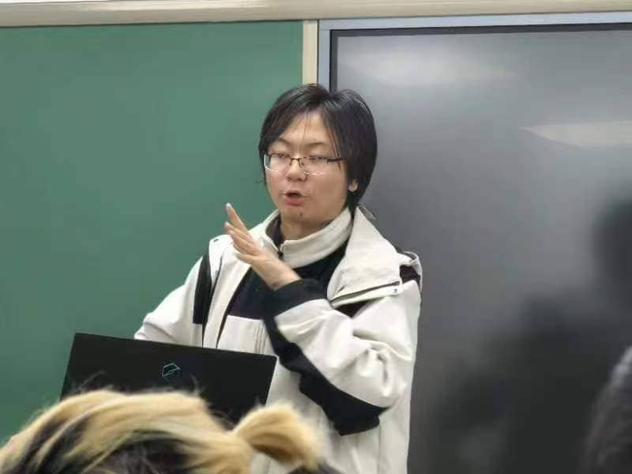
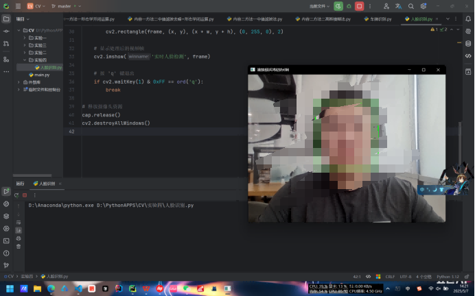
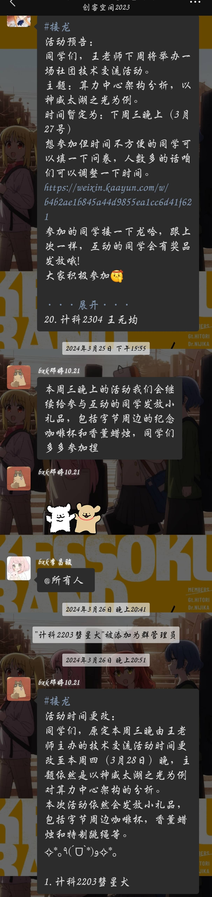

## 前言

自从建站后更新的的第一篇文章用了`独白`这个标签之后就还没有再写过任何一篇独白了，一直都想的是尽快的把博客的技术含量快速的堆积上去，好去找实习，面试校园大使等等，总之都是为了更好地去包装自己，让自己成为一个所谓的`技术大佬`。

不过换来的是一整个学期的高强度码字，以及一个月病两次的辉煌战绩，这个时候才想起来孙妈所说的`”活着“`。

本博客接下来会大致按照时间顺序去记录一下我大学这两年的经历与心路历程，当然有时候也会穿插一些不同时间线的插叙，总之就是放缓脚步回顾一下，毕竟没有什么远大志向是值得你牺牲四年青春去追逐的，该休息该享受的时候还是该慢下脚步的。

## 大一上

上大学之前，我属于是从未独自离家超过10KM的那种，家里人也都是很担心的我能不能适应大学的生活。谁也没预料到，哪怕是我自身至今还没太想明白我为什么能如此顺利的适应大学生活，同时还能有如此之大的蜕变。感觉上大学之后的每一天我都在发生着巨大的变化，我也说不清楚这种感觉，只能说是每天都是能量满满的感觉。

虽然我选择了计算机学院，选择了大数据专业，但那时候我对编程一窍不通完全没有兴趣，大一上的C语言也是遇上了个讲课昏昏欲睡的老师，最后平时分也是莫名其妙的只给了我60，搞的我所学的第一门编程语言的课总评只得了66。到了这一步，我感觉如果没有创客的存在我也许就沉沦了，也许后续就会保持一种能过就行的状态了。

23年九月十号晚上我通过了面试加入了创客，我是不会忘记这一天的，巧的是子安面试的我，子安拉我进的创客，也是因为子安我在走上了鸿蒙这条路。

创客是我上大学以来最重要的组织，没有之一。绝大部分的机遇以及思想上的改变都是从创客开始的。

### 子安的一多活动

刘子安学长所带的第一场鸿蒙活动讲的是一多，但当时的我只是个C语言都敲不明白的菜鸡，虽然坐在第一排用着3.0的DevEcoStudio拼尽全力的去看懂子安的代码，但我是真看不懂啊（哭哭……）。

嗯没想到子安当年这么帅，最近的接触都让我忘了之前他的样子了，笑。

敲代码速度太慢跟不上就只能拍照记下了呗。

什么响应式，什么栅格，听不懂听不懂！！！

不过倒也是这次活动之后我开始和鸿蒙结缘，算是一切的开始了吧。

### 骏哥去字节了

骏哥，我们和蔼可信帅气的社长大人，iOS开发的大佬。

大三上？字节？我草！

骏哥进字节彻底的颠覆了我曾经对于计算机专业的认知，之前在身边人和家人们那为数不多的认知中，现在的计算机如果不考研，那基本找不到好工作，但是从骏哥开始我认识了越来越多本科进大厂的佬们，我坚定考研的这个信念也开始动摇了。

在骏哥的实习经验分享会上，我也是很认真的反思了我希望从大学得到什么，考研的目的是什么，读研期间如果没有很优秀的经历，真的会比三年的工作经验更有优势吗？
在当时，我并没有得出很明确的结论，而是陷入的很长时间的迷茫，真的很迷茫。我如果考研就要想清楚上面所提到的几个问题，想清楚想从读研中获得什么。如果我想本科就业那就要考虑清楚，专精哪门技术。毕竟如果真的只跟着学校去学那些老掉牙的东西，那就废了彻彻底底的废了。

iOS？从小用的华为的手机、华为的耳机、华为的手环，感觉有一种莫名的抵触。前端开发？确实可以，小学期也有前端的课，做做网页也是不错的选择。但这两年随着AI的登场前端无用论甚嚣尘上，也曾问过iflab准备入职前端（现在已经入职）的大佬，按大佬所说前端是肯定不会这样的，但也需要向多面手的方向去发展。

java后端？干算法？确实是高薪高上限职业，但当初我的基础还是过于薄弱了，很没有自信，最基础的面向对象编程当时也用不熟练所以暂时没有考虑。
鸿蒙开发？长期都和华为有着产品上的练习，但落到实处其实当时还是分不太清它和安卓之间的区别的，所以还暂时在犹豫。

当然上面所说的虽然都是曾经真实存在过的想法，但现在看来应该都只是自己逃避不愿踏出舒适区的借口，毕竟那时候我还没有在大学收获到太大的成就感，对于深扎某个技术来说还是缺失了必要的信心。

### 开放原子

随着子安学长的一多活动落幕，OpenHarmony的技术峰会到来了，当时我还并未下定决心学习鸿蒙，仅仅是在上大学前就下定决心的多去参与活动多去参与校内外的活动。不管是看看先进的技术、多去认识人还是多去与企业交流也好，总之就是要**多出去、多接触才能找到自己的目标**。

第一次来到这种学术论坛的我还是习惯性的想和一同前来的同学们抱团落座，属实是露怯了（笑死）。不过最后还是自己找了个地方坐了。

也是第一次感受了真正的技术论坛是怎样的，对我内心的影响还是很大的，拥抱开源这件事是真的在我心中扎下了根，一味地闭塞是换不来长足快速的发展的。真正的强大是能让更多人参与进来共建生态环境。

同时开源也属于是极致的利他就是利己，帮助新人快速的成长是每个生态都需要做的，只有这样才能不断更新血液，此刻我的内心已经倾向了鸿蒙开发，不过到那个时候我只会那么一点点的C，属于是对编程没兴趣也没信心的阶段，所以还是没有开始学习。

### 与王老师相识

我和王启源老师第一次正式见面是在健翔桥校区的创客原大本营，那也是我唯一一次去健翔桥校区了，以后也没机会了（给别的学校了）。

这我也不得不吐槽一下了，健翔桥虽然小吧，但是那地理位置多好啊，在市区里，沙河这地方出门全是工地，地铁五公里，吃个外卖都没几家。（笑）谁家好大学建这种小破地啊笑死了。

面积很小的校区，楼道狭窄的教学楼，像是老旧居民区一样的实验室铁门，和新校区截然不同的风格让我感觉不像是在同一所大学，但在这个校区逛的时候却有着一种莫名的舒适感，感觉新校区虽然硬件更好，但是这种和居民区融为一体的风格却更像是中学时期的感觉，一种莫名的安心。

在这样一间放满了我不认识的试验箱的教室里王老师给我们介绍了创客空间的资产历史和他的一些期望，能够很直观的感受到王老师是真的很希望把他手中的资源给到学生们

穿过了一间落差有三层楼的阶梯教室后来到了我们的创客大本营。

这样的工作室真的太美好了，这就不得不提一嘴408了，408关停这个事真的让我很失落，我一手推动的常态化开放，历时一年多建立了一个良好的自习生态圈，却因为卫生，使用规范等一众杂碎问题而被关停，在次期间我相信王老师也是尽力的去保全我们使用408的使用权了，但的的确确也是有一部分我监管不利的因素导致了一些问题的发生，这一点我也需要检讨。

最后也是留下了这一张在健翔桥校区最后的合影。

### 吕镇宇学长的机器深度学习活动

这次活动我本以为会是一次简简单单的社团活动，结果没想到在前置条件准备阶段却引出了我大学以来的第一次长时间Debug的经历，虽然基本都是我问问题学长孜孜不倦的在查询并解答，但在现在看来，这依旧是最具开创性的一次Debug经历了，这一次后我才开始逐渐适应长时间Debug以及养成自己主动搜索报错信息的习惯，还是很值得纪念一下的。

从晚上8点多就开始在群里问了，后来发现我的问题有点与众不同就加了学长微信开始私下Debug。没想到这一路就干到了熄灯之后的后半夜。当解决的那一刻真的很爽，这种畅快的感觉和在考场上解出了一直不太擅长的数学压轴题一样，是我第一次在代码上获得了十足的正反馈。

活动也是如期顺利开展，与此同时也让我意识到了一点，就是对于带活动的效果来讲，纯算法或是后端是肯定没有前端好的，毕竟前端做什么呢都是可以直接肉眼可见的，而对于像是机器深度学习的活动如果没有最后调试参数后生成的图标，那整个活动就只剩下了理论和代码了，无法给第一次接触的同学们更加直观的成功，也就无法带来足够的正反馈，哪怕这门技术在实际应用中是很有价值的，同时也是值得重点发展的方向，但自己在初次接触时就没有留下很好的印象的话，同学们就不会有兴趣自主的去学习。

### 学期总结活动

时间来到2023年的最后几天，大一上半学期也临近尾声，在紧张刺激的期末考试前创客开始了本学期的最后一次活动。

也是骏哥去到字节后第一次回来给我们分享大厂面试经验以及工作经验。当然还有各位大三的学姐学长们，他们也给我们分享了自己的经验。、

刘子安学长

黎江晓学姐

吕镇宇学长

李昌骏学长

学长们给我们讲解了大学四年值得关注的一些竞赛和考试，同时骏哥也将他收到的字节所发的公司介绍PPT也分享给了大家。

想起当初刚到学校的那天晚上连舍友的名字都还叫不利索的时候骏哥就推门而入将创客的宣传海报塞到了我手里，在总结活动上时就有点泪目，现在在骏哥已经去了深圳入了腾讯音乐在回想起那时更是感慨万千啊，21级的各位学长真是强的没边了，同时也是让我在大学找到归属感的一批人，转眼就剩一个多月tm就要毕业了，我也快成为当年我眼中大三的学长了。哎，太快了，真的太快了。

在活动结束后，骏哥把想要当负责人的同学叫到了一起，给我们讲了一下当负责人的主要职责以及福利待遇等事项，我其实纯纯是感恩与热爱才想去当负责人的，也没想到过创客还有丰厚的物质福利。（诶嘿）

同时骏哥也提到了一段过往的历史，从20级学长手中夺来后进行了大改革才成了现在这个样子，他也没有细说，婷姐也不太清楚，总之就先让这段历史停留在过往把，重要的是我们该如何去打造一个更好的创客。

那天晚上，骏哥把我们拉进了23级负责人的群聊，我也是正式的开始担任创客空间的负责人这一职务了。

### 创客杂记

有狗啊！！！

字节耶天天深夜放毒（bushi）

忘了什么时候，现在放在哪的一块3D打印牌子。

笑死，杂鱼~杂鱼~。

## 86

大一的寒假，我久违的又想开始看番了，掏出了高中时期好兄弟推荐的《86不存在的战区》，我本想是他会是一部战争题材的爱情催泪番（那时候没看过剧情解析也没看过相关番评，我只是从封面和番名判断的，以为是男女主在战场上谈恋爱最后催一下泪的桥段）。

毕竟这篇文章不是番评文章，我也不希望给看我博客的各位提前剧透了，但这是一部**来自未来的作品，是一封写给每个追番人的情书**，他值得你为了看懂最后四分钟而去补全前面的23集。

读到这里的各位应该就明白的我的博客顶部图是怎么来的了，我觉得在相当长的一段时间里我都不会换掉这个封面图。
毕竟这个番给我内心的冲击实在是太大了。如果说《紫罗兰永恒花园》被称之为来自于未来的动漫，是因为它将超越时代的静止画面放到了TV动画里，让经费有限的TV动画有了和以往高预算的剧场版动漫才有的静止作画。那《86不存在的战区》则是将轻改这一大类拔高到了一个前所未有的高度，他的每一帧画面都肉眼可见的是在和为了音乐而去进行适配的，整个片子就像是被精心剪辑过的**MAD**一样，深入的感受原作**情感流**的同时去配合泽野的作曲去逐一进行适配，才有了这样的杰作。

更重要的是，86的成功**是可复制的**，没有像是京紫那样的高预算精致画面，更没有请各路大牌像是鬼灭、电锯人那样的进行宣发，只是一群人用自己的热爱以及认真的态度去打破了传统番剧流水线音画分制的局限，将每一集都做成了神插入。

21年12月，86的剧情已经推至顶峰，在决战前夕制作组却力排众议没有趁着热度将最后两集放出，而是将22以及23话推迟播出。原因是因为工期紧张制作不达预期。
哇！在当今这个时代还能有不为金钱流量，在热度的顶峰延迟播出近三个月的制作组！这就已经证明了**86就是向着封神取代**。


**从停播，到复播，整好86天。**


## 大一下

大一下，我开始正式作为创客负责人团队的一员开始进行活动辅助以及组织工作。

### Java

我之所以单独列出一个编程语言作为一个小标题，这主要是因为它算是我编程或者说是编程思想的启蒙语言，毕竟即C语言被给了个60的平时分之后我就还没好好的在写过代码，直到开学后接触到了Java。虽然现在看来肯定是Java比C要简单，但是因为Java一上来第一节课先去讲了虚拟机，以及命令行如何操作，如何用命令函编译Java，如何用命令行编译后的Java文件。哇真的对中式教育这种逻辑顺序搞的很难受，虽然现在也知道了了解虚拟机能做到多少事，它确实重要，但对于一个从来没有接触过类似概念的人来说，难道就不能先教怎么用，等大家都会写了，再说如何更进一步的去了解他的工作原理以及实现方式吗？

哎，世界上的绝大多数事物都是锋利的双刃剑，对于教育方式的改革是一场长久的斗争，对于我们大学生个人来讲只能及时认清现实开始自学才能找到出路。

第一节课教了一堆对于当时的我来说不知所以的东西之后，作业却是留了个平台上的编程作业，我嘞个豆啊。`public` `static` `void` `main`这些都是啥？

做着做着就渐红了，根本看不懂，但当时的我经过了大一的迷茫，我已经认清了一件事，就是**编程语言这个东西不自己亲自写是永远会不了的**于是我就开始上B站去找免费的教程看，**于是↓↓↓**

黑马程序员正式登场了。当时的我还真没听说过黑马是一家怎样的企业，直到后来我才渐渐了解到了近几年黑马的这个`地位`。

看了第一次作业的量之后，我却意外的停不下来了，跟着接着把循环判断都给看了并且实践了，那个时候因为Eclipse（上古版本）实在是太难评了，VScode降临到我面前时真的是让我一度认为这是编程界的唯一真神。也许就是这个时候的VScode+黑马给了我学Java的兴趣吧，如果当时没有黑马，我或许就真的对编程丧失信心了。这一点的话其实大家自己去看一下就知道了，动画配合生动形象的比喻真的比其他的教程要好懂太多了。学编程如果没有这样一个将基本逻辑搭建起来的过程，真的是学不下去的。但编程是一个一门通门门通的东西，大家都是同宗同源的，有了编程思维后跟着开发文档去熟悉API就可以了，整体是很容易上手的。

当然，这个过程宋莹老师也是功不可没。相比于大一C的老师来说，她还算是耐心和蔼的，上课互动也更多一些。那个时候我在第二次上课之前因为看黑马看上瘾了吗也是当时顺手搜了一下eclipse怎么调字体大小，结果第二次上课时老师在教室讲台电脑上演示时忘记了怎么调整字体大小。（哇，怎么就这么巧呢？）这种冥冥之中的事情感觉在大学发生了很多次了，那之前以及那之后。我当时就坐不住了，直接帮老师解围，那之后老师也是主动在课间问了我的名字。

小小的感动，小小的幸福这种小小的正反馈堆积起来让我对Java充满了兴趣，然后就开始自己提前学，后来逐渐发现，作业也太简单了，刷了两道题库的困难题发现也很简单。（题库的题也并非算法，仅是比较复杂的多种类和接口的嵌套而已）最后期末机考，我是真的十分自信，唯一一道小算法题`判断回文数`算是小卡了我一下，毕竟当时完全没有算法思想，连直接用取余来取数都没想到（惭愧惭愧）。但我还是通过此前的实践经验用`StringBuilder`来暴力解决了这道题。这也是进一步加强了我对于骏哥所说的`“知道的多很重要”`的理解。


因为现在的车轮很多，不要老是去造轮子，要**多认识不同的轮子去应对不同的路况**。


成绩出来以后我的Java机考也是得了满分，那一刻我感觉我真的热爱了编程。

### 子安的端云一体化活动

鸿蒙确实是唯一一个有二期的活动，其他活动都是办完那一次之后就没有后续的相同技术栈的其他内容的活动了。上一次子安带的是一次开发多端部署，理论上来说应该是上一次活动更吸引人，结束后更有正反馈的，毕竟大家都亲自上手调整了栅格布局的不同断点情况下的参数，其效果的改变也是显而易见的。

但在活动开始前我却异常的爆发出了比上一次更大的热情，我到现在恰是还是在思考这股热情是哪来的，难道是说这是因为之前有过一次活动，所以这次再进行活动就不会像第一次参与接触这个技术栈一样的手足无措？这不应该吧，但也说不定。

不过现在回头看来可能是上面这一点加上Java给我的信心。

API9，这个难以忘怀的版本，也是最后一版适配鸿蒙4.2系列操作系统的API版本了。

也是这次活动我得知了一个信息就是鸿蒙的API9可以直接真机调试，而且安装上后还能保留，这对于还没学过前端的我来说这是第一种能让我在当前阶段，在手机上运行些什么的手段。

### 鸿蒙做生日礼物

于是我决心用剩下的42天（没错，就是42这个很有强度的数字，笑）去做一份生日礼物送给我妈。

包饺砸！啊这页确实加进去了，乐。

这个计划当然很疯狂，我这相当于是从0开始一个月速通鸿蒙UI，而且是完全没接触过前端，属于是纯纯小白。但不疯一把谁知道呢？我有着强烈的预感，这将会是我这些年送的让她最感动的礼物，这不仅象征着我对大学生活适应很成功，也代表着我找到了方向，以及对鸿蒙的热爱。

这个疯狂的计划还有一个很严重的问题，就是我该怎么把程序装到她手机上，因为那天正好是上学的日子，我不能可能为这个跑回家一趟，所以我想到的第一个方式就是偷偷开个隐私空间然后装进去，到日子就告诉她隐私空间的密码，这样就可到日子在揭密了。

但我很快就被干碎了，隐私空间没法调试，或者是我没有找到正确的方式，总之就是没有安上，所以我只好另寻方式。我想到的方式是新建很多很多的空页，把app藏到最后，但却因为我拿着我妈手机时间太久了而且不知道在干嘛，就小吵一架，最后还是靠姥姥调停，我把app藏进了一个她不常用的文件夹里，然后让姥姥替我保密，并且和她说我什么都没做才化解的。

风波之后，**结果↓↓↓**

那一刻真的内心的情感复杂到了极点，我感觉鸿蒙也许就是我的`路`了，大一上时的迷茫我或许找到了答案。总之，先继续走下去吧。

### 黑马程序员

黑马的话之前Java的部分就已经写过是如何与黑马结缘的了，我本以为我会只是去吃B站那些免费的口粮就够了，但却是因为一场`意外`让我决心去报课。

#### B站的免费课

我不知道为什么我在搜索鸿蒙相关课程时始终没有搜到黑马的课，而是一直给我搜出一个叫`鸿蒙大本营`的账号的视频，一会儿清华一会儿北大，结果点开一看都是同一个课……

然后他讲的还很没有逻辑，讲了整体的项目机构，ts语法基础，然后就没讲多少UI就开始讲`router`教我们去跳转了。我嘞个，单个页面都不会做呢跳转个蛋啊。

#### 问子安

子安带了两次鸿蒙活动，又是鸿蒙大佬，我学鸿蒙也是因为他，所以我很自然的想到了去问他。结果发现他把我拉进创客群后就把我删了？？？嗯是这样的。

在骏哥的help之下我总算是加上了子安的微信。（我甚至把纯血鸿蒙说成了up……我嘞个豆啊啊啊啊啊啊尴尬的我想死）

不过在深入的了解下，发现他的学习方法可能我并无法复刻，他直接生啃文档的操作对当时的我来说还是太过于困难了。

#### 安卓资料

我的舍友党云泽（后文称作小刚）被骏哥的舍友给拉去做小车的编程了，用的是`AndroidStudio`，写的是C++，他找不到视频课，也找不到资料，（现在看来也挺奇怪的，当时怎么就没找到呢）于是我就上黑马的官网去看看有没有相关的资料，然后黑马官网右下角内个客服窗口就自动弹出来了，简单的咨询了一下，就加上了欢欢老师的微信。

有点姜太公钓鱼内味了，就是我主动地往鸿蒙买课这边引，看看能嫖点啥，然后就还真嫖出来了个试听课，虽然只是UI阶段的，内容现在看来是很基础的，但却正是这种一贯的风格才决定让我去报的。我当时和欢欢老师打了好几次电话，聊了很多。在此之前，中学时期的各种辅导班都是父母帮我报的，费用也是他们直接交了的，我只是认为我要去上，去提高成绩，没有想着说我要去选择我要上什么，现在我开始主动给自己在课外时间报课了，算是对于当时的我来说的很大的一种改变，重要的是心态上的改变，而不是说技术瞬间的突飞猛进。

也是这个课给我提供了给妈妈做生日礼物的技术支持，抱着一种学到哪就做到哪的一种心态，想把自己学的都用出来给妈妈看，一直学到还剩最后五天才开始做。

（这个老师很好，想报课可找我推微信，或者直接图里手机号）
（不是广告，真不是广告，哭）

### 春耕校源行

大一上就参加过开放原子的技术大会，而这次活动就是开放原子主办的校园技术活动，同时还有那该死的二课分，我直接毫不犹豫的报名了。

这次活动对我来说最重要的不是这次活动本身，而是让我认识了一个人，孙博辰。

嗯是的我们亲爱的孙妈在我的故事线里刚刚登场，没想到把，笑。
我去校源行的主会场是为了二课和OpenHarmony，同时顺道了解了一下DORASSR。对我现在电脑上还贴着他们的贴纸。

有一说一，之前也真不是没想过做游戏，毕竟游戏算是我长久以来无法抛弃的一部分了，真的能做游戏的话其实也不错，但是国内的这个市场环境嘛……也是骂了很多年了，这也刚好问一问从业人士是怎么说的。

嗯，果然和我想的差不多，也算是变相的坚定了我学鸿蒙的信念。

回过头来，在主会场结束后的开源奥德赛并没有请很多的业界大咖来讲座也没有二课分，所以其实最后来的人不算多，群聊也算干净。当时我去参加主要是奔着子安学长去的，除了子安其实其他的佬我都还不太认识。

我本身是没有图的！这高糊图还是找登登头子要的！我也没辙！

子安带了块开发板去现场演示一个双端同步读写的鸿蒙分布式特性，内块板子我也不知道是不是前两天子安给我的`圣遗物`里面的那块，看着有点像（笑）。

当时孙妈说了一大堆叽里咕噜的我也记不清了，只记得说是学校教学楼门口通过人脸判断空闲教室现有自习人数的系统是他做的（好像是？也需不是？）然后说总之有啥事找他他就去干学校（乐）。然后就拿电脑展示了一手人脸识别加人数统计。

当时觉得：“**哇！这个长头发学长好厉害**！”（没错当时我并不记得他叫啥）然后就在我写这段文字之前我刚做完计算机视觉的实验，实验内容就是人脸识别（历史总是惊人的像国道上的大运一样创死过去的我）

属于是在逐步的对过去祛魅了，也是挺好的一个过程。
不过呢，这时候我只是知道了这么个长头发反骨仔学长而已，还没有加上微信，甚至名都不记得。嗯是这样的。我俩真正认识还得推进到花粉的成立。

### 花粉俱乐部

花粉俱乐部，华为+子安+第一批成员，这三个条件让我毫不犹豫的选择了加入，当然还包含了许多其他的原因，这里就不过多赘述了。

就这样花粉俱乐部成立了，我也称为了最初的一批成员。

这可能是我第一次加入华为官方的组织，也是无比的憧憬与期待。而在这里我看到了一个熟悉的小绿头，至于我为什么要加他我已经忘了，但我确实是在花粉加上的孙妈。

笑死了bro，回去翻的时候差点没笑死，自己品吧（乐）

由婷姐引出孙妈母胎solo，笑死，来给孙妈征婚咯！！！


有看到这里的欢迎加我，我给大家推孙妈微信奥！（征婚广告）


但有一说一奥，其实到这里我俩还不知道对方是谁，直到四月末我俩才认出对方……好像是因为哪个pyq来着（忘了）

### 初入408

408创客空间的社团活动室，虽然最近已经被神秘的大手给回收了，但在那里的时光都还是历历在目，我想在未来的很长一段时间里都会难以忘怀吧。

第一次去是ASC（一个已经没了音讯的竞赛）小组讨论用了那个教室，事情虽然是发生在了大一上的期末，但那一次并不以创客负责人的身份去的，也没有真正整整的好好看看那个教室，所以就放在这边统一写了。

随后就是王老师带来的微算活动了。

这次我是以创客空间负责人的身份走进了社团活动室，同时王老师也为了后续的活动做准备而给我的卡添加了门禁权限。至此围绕408的支线剧情展开了。

说回活动本身。王老师在这次活动中介绍了他的得意之作————微型超级计算机，也就是微算。是由王老师所在公司————绿算的团队研制的为中小微企业解决数字化转型难题的产品。

与此同时，这次活动对我来说还有更深远的意义，因为这是我第一次正式的进行活动辅助工作，也是第一次在创客空间社团官网上留下我写的活动记录文章。
（好像不是？记不清了）

### 鲲鹏昇腾开发者大会

鲲鹏昇腾，华为的左膀右臂，这次开发者大会本是我参与的诸多学术活动中的一个，特意列出来主要是因为我们的社团指导老师王启源老师在会议议程的第三天会上台讲解他的微算。在微算社团活动之后王老师就走上了更大的更大的舞台，也是真的有一些传奇色彩了，那个时候我是真的有一点心动，感觉去跟王老师进入绿算工作也不错，小小的动摇了一下鸿蒙的心，但我很快又坚定回来了。

王老师太帅啦！

这次活动是和**刘子安，吕镇宇以及夏方方**三位21级的大佬一起去的，真的是很幸运的经历，一下车就能跟着他们去逛展，这个感受是一个人去逛完全感受不到的。我一个人逛，那是走马观花，和他们逛，那是真能学到东西。

当然，子安也是抛出了一个让当时的我思考了也是焦虑了很久的问题，**如果我只会鸿蒙开发，你有什么成果，你有几年开发经验，我凭什么要你**。我思考，是因为这是我早就清楚这是我迟早要面对的问题，哪怕是换了别的技术栈也会是这样；我焦虑，是因为当时的我刚跟黑马学了基础的UI甚至好像连一阶段的那个综合案例都没写呢，距离子安所说的还太过遥远，自然会不可避免的焦虑。不过我也没有被这件事困住双脚太久，因为我知道，只有**开始行动才是打破焦虑的最好方式**，同时我其实已经在路上了，**所以我只需要去脚踏实地的做好自己**，一步步的打好鸿蒙开发的基础才能去真正的做项目积累开发经验。

当然夏总也是极为热情的给我提了很多建议，同时还给我扔来了很多期末资料！太感谢了！！！

吕总直接上手实操感受了一个计算机视觉的模型（？好像是，记不清了），然后一大串的专业术语直接给我砸懵了。

最后请欣赏**来进货的三人组**。

### 抽奖程序与ArrayList

读到这个小标题的读者可能会感到疑惑，为什么我要在一篇独白博客里面去塞进一段技术内容。其实我并不是为了去讲解怎么写一个简单的抽奖程序或是讲解一下Java的`ArrayList`，而是这件事让我感受到了“**知道的多了解的多真的很重要**”，同时也狠狠敲醒了我不要再随意说大话去接下超出能力的任务，或是给自己定下一个很夸张的deadline了。

事情是这样的，骏哥在字节实习期间整了一大堆的大厂周边，打算在活动上当做小奖品抽出去，就像下面这些。

于是刚成为负责人没多久的我

### 前端小学期

### 社团嘉年华

### blog

### 23级负责人团建
