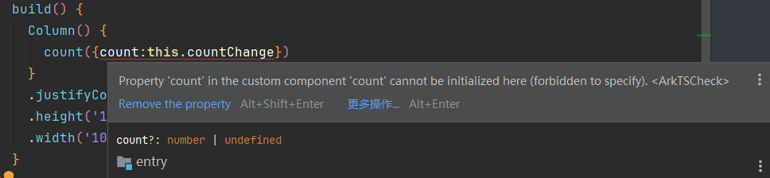
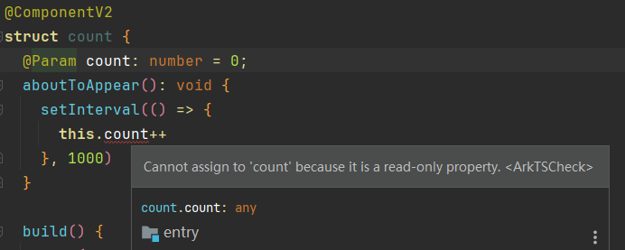
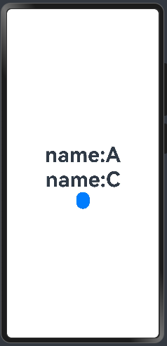
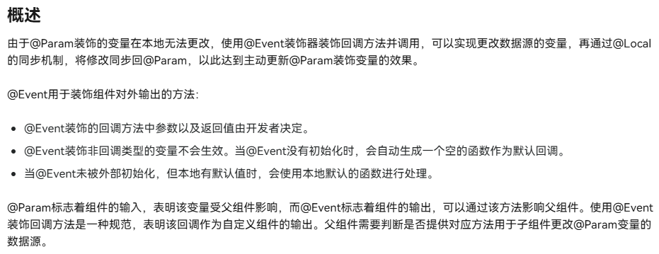
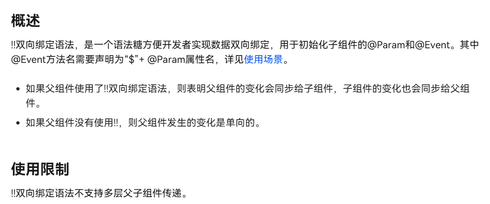

## 前言

在鸿蒙开发中，状态管理是一个非常重要的概念。它涉及到如何在应用程序中**存储和管理数据**，以便在不同的组件、Ability之间共享和访问。
状态管理的目标是确保应用程序的**数据一致性**和**可维护性**。它还可以帮助开发者更好地理解应用程序的**数据流**和**数据依赖关系**，从而更好地设计和实现应用程序。

截止到目前，鸿蒙开发中的状态管理分为两个版本**V1和V2**。

V1作为最初的一代状态管理框架，其功能已经满足了绝大多数的应用开发需求，但仍有许多不足。
V2作为新一代的状态管理框架，其功能更加完善，能够更好地满足应用开发的需求。


针对于V1和V2的区别，官方文档给出了十分详尽的解释。我也不再详细的赘述，直接给出官方文档的链接。
[V1——>V2迁移指南](https://developer.huawei.com/consumer/cn/doc/harmonyos-guides-V5/ts-v1-v2-migration-V5)
[V2装饰器指南](https://developer.huawei.com/consumer/cn/doc/harmonyos-guides-V5/ts-v2-decorators-V5)
[V2其他状态管理](https://developer.huawei.com/consumer/cn/doc/harmonyos-guides-V5/ts-new-other-state-mgmt-V5)

接下来我会用我的实际经验来解释一些文档中写的有些晦涩的内容。

## `@State`和`@Loacl`、`@Param@Once`

### `@State`的缺陷与V2的解决方案

`@State`无疑是V1中最为常用的装饰器，它的作用是将一个变量声明为状态变量，当状态变量发生变化时，会自动更新视图。是想完成各种UI变化的**基石**

而`@Local`则是为了解决`@State`在外部初始化时无法准确表达组件内部状态不能被外面修改的语义的问题。
这个问题官方的描述有些抽象，我举个例子：

假设有一个计数器组件，内部有一个状态 count 表示当前的计数值。如果外部代码可以直接修改 count，可能会导致计数器的逻辑混乱。正确的做法应该是通过组件提供的接口（例如方法或事件）来间接修改状态，而不是直接访问和修改 count。

```TS
@Entry
@Component
struct LocalState {
  @State countChange:number = 5
  aboutToAppear(): void {
    setInterval(()=>{
      this.countChange--
    },500)
  }
  build() {
    Column() {
      count({count:this.countChange})
    }
    .justifyContent(FlexAlign.Center)
    .height('100%')
    .width('100%')
  }
}
@Component
struct count{
  @State count: number = 0;
  aboutToAppear(): void {
    setInterval(()=>{
      this.count++
    },1000)
  }
  build() {
    Text(this.count.toString())
      .fontSize(50)
      .fontWeight(FontWeight.Bold)
  }
}
```


这段代码中我们设置了计数器组件`count`的初始值为0，然后在`aboutToAppear`方法中使用`setInterval`方法每隔一秒钟将计数器的值加1。
但是，这段代码中存在一个问题，就是外部代码可以修改计数器的初始值。

`count({count:this.countChange})`这行代码将计时器的初始值设置为了5，但很显然这个组件的设计初衷是不想让内部数据被外部修改的。
V1版本的状态管理虽然可以通过其他方式来实现这个简单的初始化功能，但这并不利于组件功能的封装。
因此，V2版本的状态管理引入了`@Local`装饰器，它可以将一个变量声明为本地状态变量，只能在组件内部访问和修改。这样可以避免外部代码修改组件内部状态，从而提高组件的封装性和可维护性。

```TS
@Entry
@ComponentV2
struct LocalState {
  @Local countChange:number = 5
  aboutToAppear(): void {
    setInterval(()=>{
      this.countChange--
    },500)
  }
  build() {
    Column() {
      count({count:this.countChange})
    }
    .justifyContent(FlexAlign.Center)
    .height('100%')
    .width('100%')
  }
}
@ComponentV2
struct count{
  @Local count: number = 0;
  aboutToAppear(): void {
    setInterval(()=>{
      this.count++
    },1000)
  }
  build() {
    Text(this.count.toString())
      .fontSize(50)
      .fontWeight(FontWeight.Bold)
  }
}
```



由报错信息我们可以清晰的看到`'count' cannot be initialized here`，count不能在这里初始化。
这样就实现了我们的需求。

### `@Param`和`@Once`

上文说到`@State`的缺陷在于无法规范是否可以外部初始化的问题。`@Local`可以有效地阻隔外部初始化，来保障该状态变量仅为本组件内部使用。
但我们也确实会存在外部初始化的需求。
V2版本的状态管理引入了`@Param`和`@Once`装饰器。

#### `@Param`

`@Param`与`@Prop`的功能类似，都是定义一个状态变量从外部传入。

**区别：**

1. `@Prop`是单向绑定，只有父组件能影响子组件，子组件的**修改**无法影响父组件。
2. `@Param`也是单向绑定，**但是**在子组件内部无法对状态变量进行修改，只能读取！！！是`readonly`的。
3. 对于复杂类型如类对象，`@Param`会接受数据源的**引用(类似于地址值)**。在组件内可以修改类对象中的属性，该修改**会同步到数据源**。
4. 由第三条衍生出的一点就是，如果如果传递的是**复杂对象**且需要严格的**单向**数据绑定，应当对对象进行**深拷贝**，防止子组件修改父组件的数据。

针对于简单类型的前两点不同可以通过下面的例子来理解：

```TS
@Entry
@ComponentV2
struct LocalState {
  @Local countChange: number = 5

  aboutToAppear(): void {
    setInterval(() => {
      this.countChange++
    }, 5000)
  }

  build() {
    Column() {
      Text(this.countChange.toString())
        .fontSize(50)
        .fontWeight(FontWeight.Bold)
      count({ count: this.countChange })
    }
    .justifyContent(FlexAlign.Center)
    .height('100%')
    .width('100%')
  }
}

@Component
struct count {
  @Prop count: number = 0;
  aboutToAppear(): void {
    setInterval(() => {
      this.count++
    }, 1000)
  }

  build() {
    Text(this.count.toString())
      .fontSize(50)
      .fontWeight(FontWeight.Bold)
  }
}
```

<video width="100%" controls>
  <source src="4.mp4" type="video/mp4">
  您的浏览器不支持视频标签。
</video>

这段代码中，我们使用了`@Prop`装饰器来定义一个从外部传入的简单类型状态变量。同时也展示了V1V2版本混用的可行性。可以看到，当父组件的`countChange`发生变化时，子组件的`count`也会随之变化。
如果将`@Prop`改为`@Param`，则会出现报错。


`Cannot assign to 'count' because it is a read-only property.`这个报错信息告诉我们，`count`是一个只读属性，无法修改。
这也很好理解，因为`@Param`是单向绑定，子组件只能读取父组件传入的状态变量，而不能修改。

但针对于后两点来说可能会有一些迷惑。已经是Readonly了，为什么还可以修改？
在经过我的尝试后，可以用下面这个例子来进行解释：

```TS
@ObservedV2
class Student{
  @Trace private _name: string

  public set name(value: string) {
    this._name = value
  }

  public get name(): string {
    return this._name
  }

  @Trace private _age: number

  public set age(value: number) {
    this._age = value
  }

  public get age(): number {
    return this._age
  }

  constructor(name: string, age: number) {
    this._name = name
    this._age = age
  }

}
@Entry
@ComponentV2
struct LocalState {
  @Local student: Student = new Student('A',10)
  build() {
    Column() {
      Text('name:'+this.student.name)
        .fontSize(50)
        .fontWeight(FontWeight.Bold)
      count({ student: this.student })
    }
    .justifyContent(FlexAlign.Center)
    .height('100%')
    .width('100%')
  }
}

@ComponentV2
struct count {
  @Param student: Student = new Student('B',10)
  build() {
    Column(){
      Text('name:'+this.student.name)
        .fontSize(50)
        .fontWeight(FontWeight.Bold)
      Button()
        .onClick(()=>{
          this.student.name='C'
          console.log(this.student.name)
        })
    }
  }
}
```

<video width="100%" controls>
  <source src="6.mp4" type="video/mp4">
  您的浏览器不支持视频标签。
</video>

当传入的参数是一个对象或是其他复杂类型时，其内部可能包含有内置函数可以被子组件调用并修改其属性值，这就是为什么需要用深度拷贝的原因。

而修正上面代码的方法就是添加克隆函数。

```TS
@ObservedV2
class Student{
  @Trace private _name: string

  public set name(value: string) {
    this._name = value
  }

  public get name(): string {
    return this._name
  }

  @Trace private _age: number

  public set age(value: number) {
    this._age = value
  }

  public get age(): number {
    return this._age
  }

  constructor(name: string, age: number) {
    this._name = name
    this._age = age
  }

  public clone(){
    return new Student(this.name, this.age)
  }
}
@Entry
@ComponentV2
struct LocalState {
  @Local student: Student = new Student('A',10)
  build() {
    Column() {
      Text('name:'+this.student.name)
        .fontSize(50)
        .fontWeight(FontWeight.Bold)
      count({ student: this.student.clone() })
    }
    .justifyContent(FlexAlign.Center)
    .height('100%')
    .width('100%')
  }
}

@ComponentV2
struct count {
  @Param student: Student = new Student('B',10)
  build() {
    Column(){
      Text('name:'+this.student.name)
        .fontSize(50)
        .fontWeight(FontWeight.Bold)
      Button()
        .onClick(()=>{
          this.student.name='C'
          console.log(this.student.name)
        })
    }
  }
}
```



这样就实现了深度拷贝，将子组件无法再反向影响父组件。保障数据安全性。

#### `@Once`

这个装饰器与V1并无明确对应关系，而且并不能单独使用，能且仅能与`@Param`配合使用。来实现`@State`的单次外部初始化的效果。
可以参考下方示例：

```TS
@Entry
@ComponentV2
struct Once1 {
  @Local num:number = 0

  build() {
    Column() {
      Text(this.num.toString())
        .fontSize(60)
        .fontWeight(700)
      Button('num++')
        .onClick(()=>{
          this.num++
        })
      num({num:this.num})
    }
    .justifyContent(FlexAlign.Center)
    .height('100%')
    .width('100%')
  }
}
@ComponentV2
struct num{
  @Param@Once num:number = -1
  build() {
    Column(){
      Text('子组件'+this.num)
        .fontSize(60)
        .fontWeight(700)
    }
  }
}
```

<video width="100%" controls>
  <source src="8.mp4" type="video/mp4">
  您的浏览器不支持视频标签。
</video>

当点击按钮时，父组件的`num`会发生变化，但是子组件的`num`不会发生变化。这就是单次外部初始化的效果。

## `@Link`和`@Event`、`@Param`

在V1版本的状态管理中，实现数据双向同步有两种方法，一种是直接通过`@link`来进行绑定，还有就是预留组件内置函数，将需要传出的数据暴露出去。
而在V2版本中，官方推荐使用`@Event`来进行数据的**双向绑定**。

对于`@Event`，官方的描述是这样的：


enm……有一说一我现在并不太理解为什么要把双向绑定的功能删掉，变成用函数的参数暴露数据的方式。

但既然现在官方选择了这种方式，应该是`@Link`存在一些底层逻辑上的错误，所以我们也要去学习`@Event`基本的使用方法，可以参考下面的案例：

```Ts
@Entry
@ComponentV2
struct EventTest {
  @Local num:number = 0
  build() {
    Column() {
      Text(this.num.toString())
        .fontSize(60)
        .fontWeight(700)
      num2({
        num:this.num,
        changeNum:(a:number)=>{
          this.num = a
        }
      })
    }
    .justifyContent(FlexAlign.Center)
    .height('100%')
    .width('100%')
  }
}
@ComponentV2
struct num2{
  @Param num:number = -1
  @Event changeNum:(a:number)=>void = (a:number)=>{}
  build() {
    Column(){
      Text('子组件'+this.num)
        .fontSize(60)
        .fontWeight(700)
      Button('++')
        .onClick(()=>{
          this.changeNum(this.num+1)
        })
    }
    .backgroundColor(Color.Orange)
  }
}
```

<video width="100%" controls>
  <source src="10.mp4" type="video/mp4">
  您的浏览器不支持视频标签。
</video>

### 双向绑定语法糖`!!`

在后续的开发中我发现可以使用`@Event`配合语法糖`!!`来实现双向绑定，具体代码如下：

```TS
@Entry
@ComponentV2
struct Index {
  @Local value: number = 0;

  build() {
    Column() {
      Text(`${this.value}`)
      Button(`change value`).onClick(() => {
        this.value++;
      })
      Star({ value: this.value!! })
    }
  }
}

@ComponentV2
struct Star {
  @Param value: number = 0;
  @Event $value: (val: number) => void = (val: number) => {};

  build() {
    Column() {
      Text(`${this.value}`)
      Button(`change value `).onClick(() => {
        this.$value(10);
      })
    }
  }
}
```



我本来以为V2版本的双向绑定需要像V1版本那样手动处理子组件暴露出去的数据，但实际上官方特意注明了在`@Event`修饰的函数没有被初始化时，会自动初始化一个空函数。
这样一来我们就可以直接用`!!`来进行双向绑定了。

`@Event $value: (val: number) => void = (val: number) => {};`这行代码是必须的，否则会报错。这是将数据暴露出去的关键步骤。

## `@Watch`和`@Monitor`

这两代监听器的功能基本一致，都是在状态变量发生变化时，执行回调函数。
其最大的区别在于装饰器绑定的对象不同。

`@Watch`是绑定在**变量**上的，当变量发生变化时，会执行`@Watch`参数指向的回调函数。

```TS
@State @Watch('onNumChange') num: number = 1
onNumChange(changedPropertyName: string) {
  console.log(this.num.toString())
}
```

`@Monitor`是绑定在**方法**上的，当`@Monitor`参数指向的一个或多个状态变量变化时，会执行`@Monitor`装饰的回调函数。

```TS
@Entry
@ComponentV2
struct MonitorTest {
  @Local num: number = 1
  @Local num2: number = 2
  @Monitor('num','num2')
  onNumChange(monitor: IMonitor) {
    monitor.dirty.forEach((path: string) => {
      console.log(`${path} changed from ${monitor.value(path)?.before} to ${monitor.value(path)?.now}`)
    })
    console.log('__________________________________________')
  }

  build() {
    Column() {
      Button('++')
        .onClick(()=>{
          this.num++
          this.num2++
        })
    }
    .height('100%')
    .width('100%')
  }
}
```

<video width="100%" controls>
  <source src="11.mp4" type="video/mp4">
  您的浏览器不支持视频标签。
</video>

## AppStorageV2和PersistenceV2

AppStorageV2是一个**全局状态管理**的装饰器，它可以将一个变量声明为全局状态变量，在整个应用程序中共享和访问。
PersistenceV2是一个**本地持久化**的装饰器，它可以将一个变量声明为本地持久化变量，在应用程序中保存和读取。
这两者的功能与其本身的V1版本其实区别不大，但有几点需要注意：

1. 在**V1**版本中，一个键值在PersistentStorage中初始化过就会自动在AppStorage中初始化该键值。而在**V2**版本中，两者初始化键值**不互通**，是独立的两个功能。
2. 在**V1**版本中，两者皆有多个API接口可以区分创建、调用、链接等功能。而在**V2**版本中创建、调用、链接都合成到了`connect`中。而这就意味着你传入不同的参数数量，以及不同的参数类型就会有不同的功能。
3. 在**V2**版本中，PersistentV2支持追踪**多层嵌套的对象**，也可以追踪**对象数组**，但在追踪对象数组时要注意，最外层只能是Class对象，同时要配合`@Type`装饰器使用。

针对于上述几点，我们可以参考以下示例：

```TS
import { AppStorageV2, PersistenceV2, Type } from '@kit.ArkUI'

@ObservedV2
class People {
  name: string
  @Trace age: number

  constructor(name: string, age: number) {
    this.name = name
    this.age = age
  }
}

@ObservedV2
class Human {
  @Type(Array)
  peoples: People[] = [
    new People('A', 1),
    new People('B', 2),
  ]

  constructor(peoples: People[]) {
    this.peoples = peoples
  }
}
let peoplesTest = new Human([new People('A', 1),new People('B', 2)])
let peoplesTest2 = new Human([new People('C', 3),new People('D', 4)])
PersistenceV2.connect(Human, 'peoples', () => peoplesTest)
AppStorageV2.connect(Human,'peoples',()=> peoplesTest2)
@Entry
@ComponentV2
struct Index {
  @Local peoples: Human = PersistenceV2.connect(Human,'peoples')!
  @Local peoples2:Human = AppStorageV2.connect(Human,'peoples')!
  build() {
    Column() {
      Text(this.peoples.peoples[0].age + '')
        .fontSize(50)
      Text(this.peoples2.peoples[0].age + '')
        .fontSize(50)
      Button()
        .onClick(() => {
          this.peoples.peoples[0].age++
          this.peoples2.peoples[0].age++
        })
    }
  }
}
```

<video width="100%" controls>
  <source src="12.mp4" type="video/mp4">
  您的浏览器不支持视频标签。
</video>

在这个案例中我们可以看到，我特意将两个Human对象的键值设置为**相同**的`'peoples'`，再通过实际获取的数值证明了PersistentV2和AppStorageV2的功能是**独立**的。

而我为了实现`People[]`对象数组的持久化存储，我特意利用`Human`对象包裹住`People[]`并作为了PersistentV2和AppStorageV2的参数，这样就可以实现多层嵌套的对象的持久化存储。否则直接持久化`People[]`会报错。

同样的`connect`接口在传入不同参数时的效果不同。这里不一一排列组合了，只说一下是实测最规范的使用方式。

`connect`接口可以传三个参数，分别是：

1. 要存储的类型
2. 要存储的键值（string类型）
3. 初始化构造器（()=>初始化数值）

在第一次存储该键值要进行初始化时，三个参数均需传递。
而在之后获取该键值对的链接时，只需要传入前两个参数即可。

**注意**：在测试过程中我发现UI中有使用内置的JSON解析函数的组件文本时，修改`AppStorageV2`和`PersistenceV2`中的值**不会引发UI的更新**。但通过打印日志和重启应用等方式可以发现数据已经**发生了变化**。这说明JSON的内置解析函数只会在**构建页面时**计算一次，而不会在数据发生变化时重新计算。

这一点与V2版本新增的`@Computed`不同，`@Computed`会在**状态变量**的数据发生变化时重新计算。
**仅在状态变量变化时重新计算！！！常规变量不会触发！！！**

## 总结

啊先写到这吧，V2版本的文档偶尔还是有一些谜语人或者说是可能存在歧义的地方，但这也是大多数官方文档都会存在一点的小问题无伤大雅。
学习任何一门技术总归还是得自己尝试之后，把自己想到的使用场景都试一遍，才能清楚他的特性和注意点。

同时再写这篇博客的时候也学会了在md中外挂HTML标签的方式，相信以后我的博客会有更多新鲜玩意加入进来。

最后也感谢你能看到这里，相信你也一定是个爱技术爱生活的人，拜拜咯~ :)
