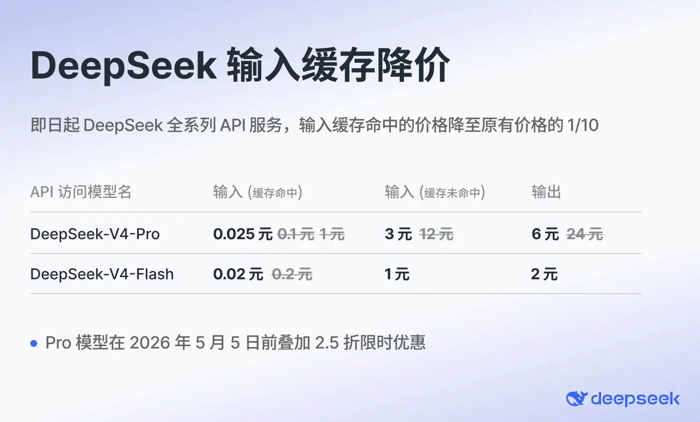
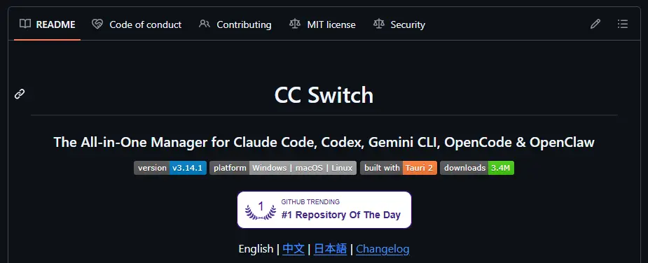

## 前言

所谓vibe coding氛围编程觉得其实就是借助AI的力量去帮你写代码，但是很多人觉得有了AI之后就不需要程序员了，只要有了AI，我想做什么他都能帮我写出来。但真到自己上手的时候：一是找不到强力的模型。二是不会用AI编程的工具，三是只会向AI去描述自己抽象到极致的想法，完全不考虑实际实现起来有多么的困难，也不考虑自己的描述是否能让AI理解自己所真正想要的东西，最后大概率的结果就是得到了一坨，一坨与自己想法差距巨大，AI味十足的shit。而我，作为一名科班出身的程序员，经历了古法编程的时代见证了AI的崛起，从在网页上问AI自己这段代码哪儿错了，到使用claude code进行完整的工程级的项目开发。自身对于vibe coding的经验可以说是比较丰富了，市面上主流的Agent基本都使用过。

同时我自身所处的领域也比较特殊，鸿蒙开发对于绝大多数模型来说，都是没有过多训练语料的一个领域，对于鸿蒙开发相关的基础知识在训练数据里所占的比例是远低于其他专业技术栈的，其生成的代码质量，大多依赖于我给予的信息以及仿照现有的代码。因此，我也被迫去学习了很多很多关于Agent方面的知识，以便于弥补模型能力的不足。毕竟对于其他语言，你哪怕没有上下文，模型简单读个局部一下也都能猜到你要干什么，而且生成的也都是有成熟案例的最优质的代码。相反，对于鸿蒙开发来说，上下文就是至关重要的。如果你没有严格的约束以及提供充足的API信息的话，模型会按照其他前端语言的范式去进行编写，最终就会产生大量的语法规范上的问题，以及接口乱用的问题。

## 模型与agent选择

模型和agent的区别我就不再过多陈述，对于26年4月下旬这个时间节点，各个模型之间的差异说实话还是挺大的，尤其是对于长上下文的大项目，逻辑复杂依赖网络繁杂的场景模型之间的表现差距还是相当之大的。

### 模型

我现在的主力模型是DeepSeek-V4-Pro以及Kimi K2.6，没错是两个国模，Opus4.7和GPT5.5固然强的没边，直接抛弃大脑，但是价格也是真的让你飞起来。国模只要在完善的上下文约束下也是可以完成大部分的开发工作，同时DeepSeek现在也是有着绝对的价格优势。

我们可以将其接入cc去使用，体验还是相当爽的。不过DeepSeekV4说实话是个好模型但是绝不是个好产品。在编程方面，他没有自家的Agent，也没有相关的插件；在轻度AI用户方面，它的网页功能过于单一，且没有原生多模态，无法识别图片，音频，视频等，这对于平常用AI提取文字处理表格，阅读ppt的用户来说是致命的打击。这也引入了我之所以要同时使用两个国模的原因，DeepSeek是便宜，其能力也与K2.6相差无几但它没有多模态就导致很多场景下我需要通过截图进行需求描述，bug展示的我就需要Kimi的原生多模态来去进行需求与问题的描述。一方面是充当一个翻译官，另一方面是使用两个模型彼此检查互相监督也是很重要的一个点。

最后我还是同时开了一个Cursor Pro会员以便于在迫不得已时能够稳定的使用Opus 4.7去兜底。

### Agent

首先对于Agent的选择，最优解肯定是使用各家自己的agent，但CC和Codex这种agent像用上原厂模型对于中国用户来说还是比较困难的。所以使用CC switch来去牛头人CC基本上是最通用的解决方案了，绝大多数的模型厂商都是会提供A厂接口API的。Open Code这种开源Agent也是不错的选择，但我们也要明白Agent内置的工具以及其内置提示词、内置的权限管理、系统提示词等差异也是影响编程效果的重要因素。

当然还有一种特殊的情况就是你需要部署一个agent在你的服务器上，去帮你进行一些操作，这种情况下去给CC配环境变量或者是去配置CC Switch就会变成一个比较繁琐的工具，但像KimiCode这种直接一键安装并且黏贴token即可登录的agent对于国内用户还是有较大优势的。

## 上下文工程

context上下文是整个VibeCoding乃至是所有AI使用场景中最重要的部分了。如何写好上下文是所有程序员现在必须要学习的。这里我来分享一些我的心得。

### 长期记忆

#### 重要规则

上下文窗口无论大小，目前来讲，哪怕是1M的窗口，对于一个工程级项目来说都是不够用的，绝对会出现上下文溢出而触发上下文压缩的情况。上下文压缩的质量有极大随机性，模型认为需要保留的重点很有可能与你所想的重点存在偏差，这种偏差带来的影响是致命的，尤其是在单次修改尚未结束的情况下触发了压缩。所以我们需要在开始先先让AI创建一个专门存储长期记忆文档的文件夹，并创建一个引导文件，在里面标明所有子目录的含义以及模型所必须遵守的规则。

常见的通用规则有：

1. **上下文压缩后的恢复规则**：当模型触发上下文压缩后，必须第一时间回到长期记忆文件夹，重新读取引导文件和相关模块文档。严禁在压缩后凭"残存记忆"继续编写，否则极易出现接口张冠李戴、业务逻辑前后矛盾的问题。这一点在鸿蒙开发中尤为致命——模型压缩后常常把ArkTS的语法写成TypeScript，或者把`@State`和`@Prop`的用法搞混。

2. **先读后改，禁止盲写**：在修改任何文件之前，必须先完整阅读目标文件。看似浪费时间，实则避免了大量"我以为这个文件里有XXX"的惨案。尤其是在多人协作或者AI多次修改后，文件的实际状态很可能已经和你印象中的完全不同。

3. **单次修改范围约束**：一次只改一个功能点。不要因为"顺手"而去碰不相关的代码。修改范围越大，上下文压缩的概率越高，出错的概率也呈指数级上升。如果确实需要修改多个模块，每完成一个模块就立即更新对应的长期记忆文档，然后再进入下一个模块。

4. **API与接口的合法性约束**：明确告知模型——只允许使用项目中已经出现过的API和导入方式，严禁凭空创造不存在的接口。对于鸿蒙开发来说，这条规则基本是刚需。你必须在规则文件里写明"所有`@ohos.*`的导入必须先在本项目中搜到使用案例，否则一律视为不存在"，否则模型会用它在前端领域的经验去编造看起来很像但实际上根本不存在的鸿蒙API。

5. **不确定性升级机制**：遇到信息不足、需求模糊、或者多个方案难以抉择时，禁止模型自行脑补。要求模型列出具体的不确定点，生成结构化的确认清单，等待人工回复后再继续。脑补五分钟，修bug两小时。

6. **修改后自检清单**：每完成一次修改，自动检查——本次修改是否引入了未使用的导入？是否破坏了已有的类型约束？是否影响了其他引用该模块的文件？如果是前端项目，还要检查UI是否在多种状态下都能正常渲染。

7. **记忆更新与版本记录**：每次完成一个阶段性任务后，必须在长期记忆文件夹中更新对应模块的当前状态。记录做了什么、改了哪些文件、当前还存在的问题。这份记录不仅是给AI自己看的，也是给你看的——当你过两天回来继续开发时，能让模型快速恢复上下文，而不是重新解释一遍项目结构。

8. **禁止过度工程化**：模型天然倾向于写出"看起来很完整"的代码——加一堆永远不会用到的错误处理、抽象出没人需要的接口层、为"未来可能的扩展"预留一堆配置项。必须在规则中明确要求：只写当前需求需要的代码，不做过度设计。代码越少，出错的表面积越小。

其中我认为最应当强调的是：**如果有任何不清楚的一定要及时向我提问，向我请求帮助，要求我提供相关文档、使用案例。**这一点是尤其重要的，尤其是对于鸿蒙这种模型训练语料不足的场景。大多AI是不会主动提问的，Agent的系统提示词一般也不会让AI过多提问，AI会尽全力去找出一个最可能看起来最合理的答案，哪怕有编造的信息掺杂其中也会给出一个看似完美的答案。给出这条提示词后AI就会让你提供一些日志，测试截图等信息来去协助他定位问题，这是及其重要的过程，Cursor甚至会有一个问题列表每个问题下面都有模型给出的选项和其他，这就属于是Agent独有的优势，用户可以直接从可能的情景中进行选项的选择，并总结发给模型，这样模型就能更准确的定位问题，同时很大程度上避免模型捏造信息。

#### 项目概况

每个项目的基本情况，所用技术栈，项目结构，核心需求，当前进度，todolist，这些都是要放在长期记忆文件夹的根目录的引导文件中的，要标明完美最终所需要实现的效果目标以免大模型在遇到bug时为了能想你交付而扭曲了目标，从而没能达成最终效果。

#### 项目规范

上面所说的通用规则时需要时刻指定，每个对话窗口都需要去引导AI进行阅读的。随后对于不同的项目，一般来说都会有一些独特的规范。比如说对于函数中的入参监测是抛出异常处理还是赋一个默认值，还是什么也不做的静默化处理？对于业务封装的接口是使用单一对象包裹所有字段参数，还是逐一列出？是否允许处理非法数据时使用空return进行终止？是否允许在页面构建阶段的生命周期函数中进行耗时操作？等等等小细节的问题是无比重要的，否则对于你个人来说你可能会在code review阶段被直接橄榄，对于团队来说，未来的代码将会越来越难以维护。

当然还有一些更高层级的软件工程上的问题，像是我遇到过，为了向前端一个封装好的业务组件中传入一个标志符来去判断是否需要展示新增的builder，我直接去单独开了一个新的标识符参数，从前端调用它的父组件处写死就好，两行代码解决。但在code review的过程中却被我的导师提出了质疑。不要新增参数，而是利用现有的参数内部所包含的字段去进行判断，然后去研究一下所传入的对象中有没有可以判断的字段。我觉得老师说的也有道理，如果一味的去增加参数的话，最后会很不好管理。但是在我研究了传入的对象参数后，发现并没有字段能满足这个标识符的判断需求，于是我再次联系老师，老师却不惜去后端修改数据结构，也不允许我单独新增一个字段去进行判断。这里其实我就有一些不解了，改后端数据结构是一个很复杂的工程，同时后端现有数据在新增字段之后也不一定就会实现我们所需的效果，可能生产环境的数据并没有因为这一次改动而同步。

后来我发现我错了，如果我在这块儿写死了标志符，那就代表着除了这个页面以外的任何副组件在调用这个组件的时候，使用这个样式，就都需要额外传一个参数，我这样的做法并不利于软件的长期维护以及新功能的开发。同时，在测试环境中，我发现其实已经存在有数据，是在我所认为的唯一一种可以跳转的情况之外的跳转情况。这就导致了从新发现的跳转方式进行跳转时，页面的渲染产生了极大的误差。这个新增的参数破坏了此前项目所一直沿用的数据流规范，这个判断就应该交由后端数据去进行携带，同时现有的通用的点击跳转事件中都包含了对于这种情况的处理。如果我为了一个需求的便利而去添加的这个参数，那后续开发的范式都会被打乱。

### 短期记忆

长期记忆所负责的是AI对于整个项目操作中需要注意的事项，以及项目整体的方向，把握住了大方向，才能去细化的了解每一个小方向最终应该达到什么样的目的。对于短期记忆来说，我们可以创建树状结构的目录，去进行每一个子需求的文档创建。对于每一个需求，我们都需要写一份明确的需求文档，让AI优先去进行代码阅读，去记录他的发现，去写出他所想到的解决方案，在你人工审查之后，认为整体没有问题，再让他去进行执行。而在这个过程中，有一个很重要的点，就是不要一开始就告诉AI去阅读哪一行代码，去修改哪一个方式，而是要先让AI比较盲目的去阅读整个需要修改的相等的。让AI尽可能平等全面的了解了项目的运作逻辑之后，才能对整个需要修改的模块有一个整体的把握。上下文窗口不允许我们同时将整个项目的架构全都塞进去，但是对于单个模块的核心功能文件是足够的，在AI有了整体的认知之后，我们才能让AI去细化的阅读某一个文件的具体哪几行代码，来给出它的解决方案。

#### 方案审查

对于方案审查这一块，如果你能对自己的心目有一个比较完整的认知。那么对于代码方案的审查无疑是最优解。嗯，如果你自身对这个项目的认知，还不足够去审查AI所给出来的完整方案的话，那你完全可以入另一个模型，或者是一个没有上下文的新窗口来去让他阅读代码，以实际代码为准去审查这个方案，并给出审查意见。随后再将审查意见返回到一开始给出方案的AI来，让他针对其进行审视和修改，同时这个过程中要强调代码审查的意见不一定正确，要用实事求是，以实际代码为准的逻辑思维。

#### AI接力文档

所谓AI接力，是经常发生于预算有限的vibe coding人群中的国产的模型一般便宜，但是能力稍差，可以承担绝大多数阅读、分析、总结、编写报告的工作。但是一旦遇到逻辑复杂的业务代码，让他去理清整个逻辑线路，并精确的修复这整个代码就有点困难了。所以说我们通常需要一个高级模型，但高级模型一般来说就会比较贵。所以最优解就是让便宜的国产模型去寻找相关的设施代码，去写清问题描述，同时利用国产模型的多模态能力去将图片中的信息精准提取，以减少高级模型的token消耗。这样的话，高级模型就可以通过文档中的内容快速定位到合学代码，不需要全局搜索消耗大量无用token。AI接力文档中核心就是编写引导文档内容以及当前正在进行的工作，核心的困难点。同时还要标注出必须要阅读的长期记忆中的一些规则。这样就可以实现用最少的token消耗去实现两个模型之间的接力。

使用高级模型阅读交接文档之后，就可以全自动的去继续研究低级模型无法解决的问题，同时完成之后让低级模型去阅读高级模型所修改的代码，就可以修正此前他自己的思考，并且更新文档。

### 渐进式引导记忆结构

### skills