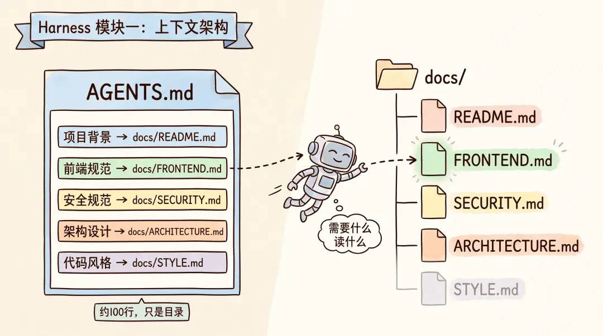
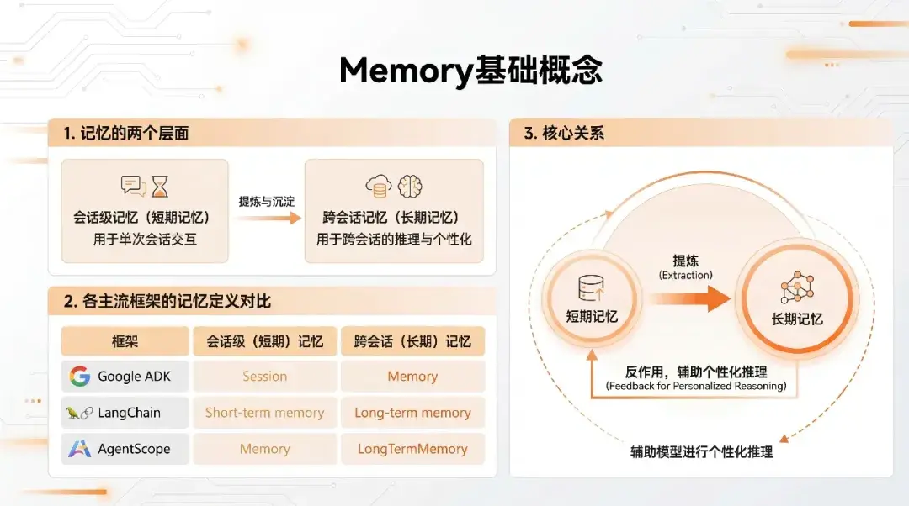
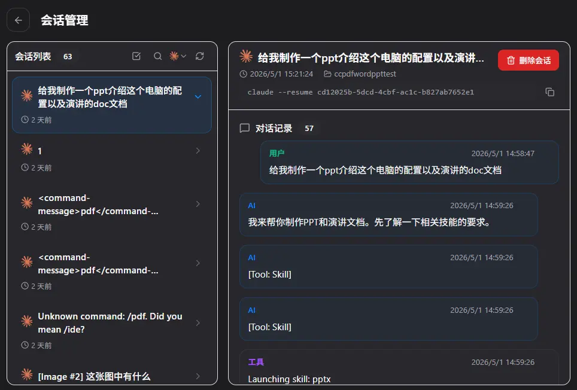
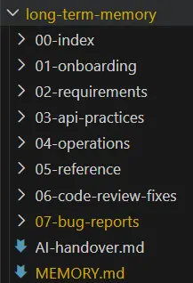
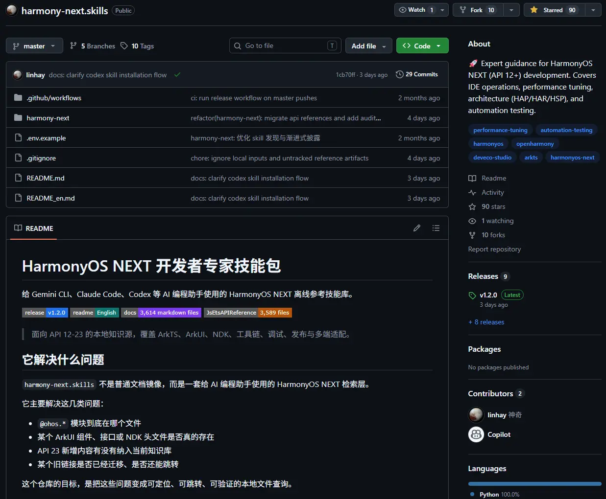
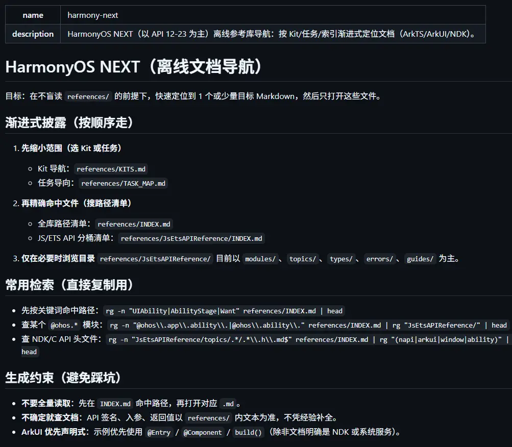
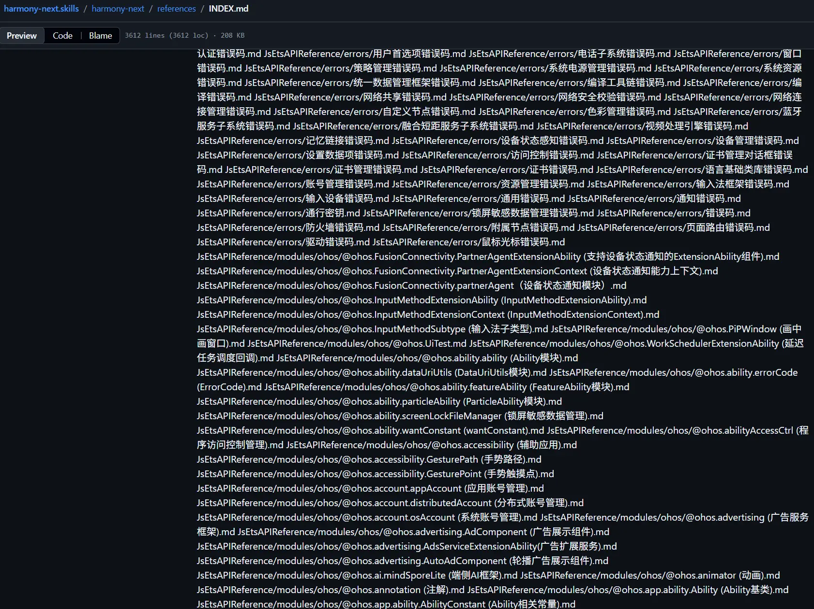
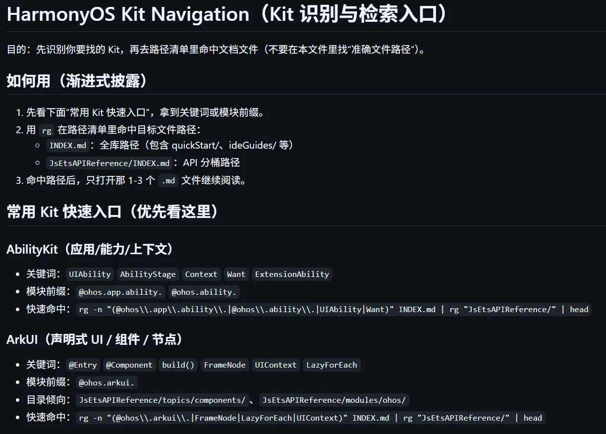
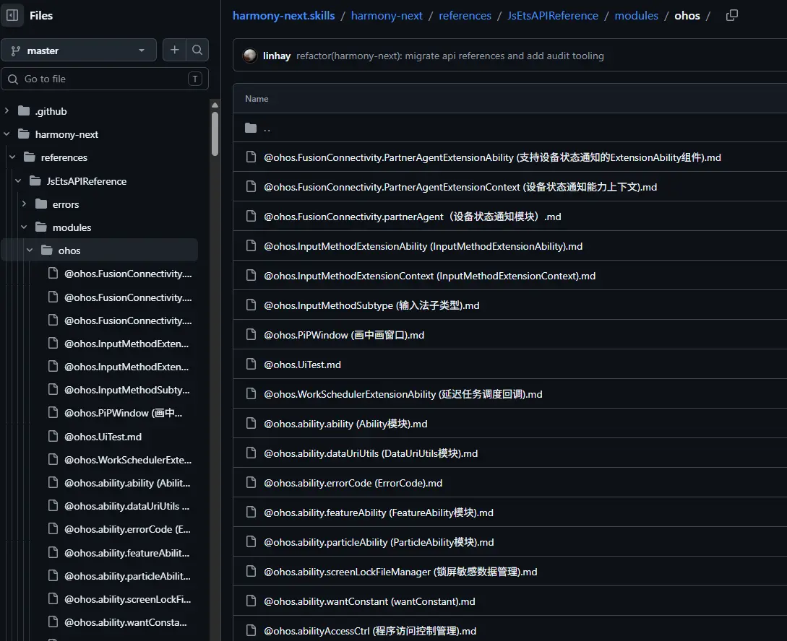

## 前言

所谓vibe coding氛围编程觉得其实就是借助AI的力量去帮你写代码，但是很多人觉得有了AI之后就不需要程序员了，只要有了AI，我想做什么他都能帮我写出来。但真到自己上手的时候：一是找不到强力的模型。二是不会用AI编程的工具，三是只会向AI去描述自己抽象到极致的想法，完全不考虑实际实现起来有多么的困难，也不考虑自己的描述是否能让AI理解自己所真正想要的东西，最后大概率的结果就是得到了一坨，一坨与自己想法差距巨大，AI味十足的shit。而我，作为一名科班出身的程序员，经历了古法编程的时代见证了AI的崛起，从在网页上问AI自己这段代码哪儿错了，到使用claude code进行完整的工程级的项目开发。自身对于vibe coding的经验可以说是比较丰富了，市面上主流的Agent基本都使用过。

同时我自身所处的领域也比较特殊，鸿蒙开发对于绝大多数模型来说，都是没有过多训练语料的一个领域，对于鸿蒙开发相关的基础知识在训练数据里所占的比例是远低于其他专业技术栈的，其生成的代码质量，大多依赖于我给予的信息以及仿照现有的代码。因此，我也被迫去学习了很多很多关于Agent方面的知识，以便于弥补模型能力的不足。毕竟对于其他语言，你哪怕没有上下文，模型简单读个局部一下也都能猜到你要干什么，而且生成的也都是有成熟案例的最优质的代码。相反，对于鸿蒙开发来说，上下文就是至关重要的。如果你没有严格的约束以及提供充足的API信息的话，模型会按照其他前端语言的范式去进行编写，最终就会产生大量的语法规范上的问题，以及接口乱用的问题。

## 模型与agent选择

模型和agent的区别我就不再过多陈述，对于26年4月下旬这个时间节点，各个模型之间的差异说实话还是挺大的，尤其是对于长上下文的大项目，逻辑复杂依赖网络繁杂的场景模型之间的表现差距还是相当之大的。

### 模型

我现在的主力模型是DeepSeek-V4-Pro以及Kimi K2.6，没错是两个国模，Opus4.7和GPT5.5固然强的没边，直接抛弃大脑，但是价格也是真的让你飞起来。国模只要在完善的上下文约束下也是可以完成大部分的开发工作，同时DeepSeek现在也是有着绝对的价格优势。


我们可以将其接入cc去使用，体验还是相当爽的。不过DeepSeekV4说实话是个好模型但是绝不是个好产品。在编程方面，他没有自家的Agent，也没有相关的插件；在轻度AI用户方面，它的网页功能过于单一，且没有原生多模态，无法识别图片，音频，视频等，这对于平常用AI提取文字处理表格，阅读ppt的用户来说是致命的打击。这也引入了我之所以要同时使用两个国模的原因，DeepSeek是便宜，其能力也与K2.6相差无几但它没有多模态就导致很多场景下我需要通过截图进行需求描述，bug展示的我就需要Kimi的原生多模态来去进行需求与问题的描述。一方面是充当一个翻译官，另一方面是使用两个模型彼此检查互相监督也是很重要的一个点。

最后我还是同时开了一个Cursor Pro会员以便于在迫不得已时能够稳定的使用Opus 4.7去兜底。

### Agent

首先对于Agent的选择，最优解肯定是使用各家自己的agent，但CC和Codex这种agent像用上原厂模型对于中国用户来说还是比较困难的。所以使用CC switch来去牛头人CC基本上是最通用的解决方案了，绝大多数的模型厂商都是会提供A厂接口API的。Open Code这种开源Agent也是不错的选择，但我们也要明白Agent内置的工具以及其内置提示词、内置的权限管理、系统提示词等差异也是影响编程效果的重要因素。


当然还有一种特殊的情况就是你需要部署一个agent在你的服务器上，去帮你进行一些操作，这种情况下去给CC配环境变量或者是去配置CC Switch就会变成一个比较繁琐的工具，但像KimiCode这种直接一键安装并且黏贴token即可登录的agent对于国内用户还是有较大优势的。

## 上下文工程

context上下文是整个VibeCoding乃至是所有AI使用场景中最重要的部分了。

但太长的上下文也会导致一些副作用，在OpenAI早期的探索中，他们就曾发现，如果单个MD文档中的提示词长度过长，其中包含了太多需要注意的重点之后，模型的注意力反而会被分散到不同的点上，导致无法集中于最重要的核心目标上，模型输出的内容会经常的偏离核心目标，并且前后矛盾。



(来自[鱼皮](https://mp.weixin.qq.com/s/qdTXCvMA4yI9mTuQv8Zq6A)的一张图)

上下文不是越长越好，当然也不能说仅仅是抛出自己虚无缥缈的需求，我们需要用一套结构化的详细、具体、有层级的提示词来让模型输出的质量大幅度提升。接下来我会主要介绍我自己常用的提示词结构化模型，主要是长期记忆、短期记忆以及渐进式披露结构。

### 长期记忆



#### 重要规则

上下文窗口无论大小，目前来讲，哪怕是1M的窗口，对于一个工程级项目来说都是不够用的，绝对会出现上下文溢出而触发上下文压缩的情况。上下文压缩的质量有极大随机性，模型认为需要保留的重点很有可能与你所想的重点存在偏差，这种偏差带来的影响是致命的，尤其是在单次修改尚未结束的情况下触发了压缩。所以我们需要在开始先先让AI创建一个专门存储长期记忆文档的文件夹，并创建一个引导文件，在里面标明所有子目录的含义以及模型所必须遵守的规则。

常见的通用规则有：

1. **上下文压缩后的恢复规则**：当模型触发上下文压缩后，必须第一时间回到长期记忆文件夹，重新读取引导文件和相关模块文档。严禁在压缩后凭"残存记忆"继续编写，否则极易出现接口张冠李戴、业务逻辑前后矛盾的问题。这一点在鸿蒙开发中尤为致命——模型压缩后常常把ArkTS的语法写成TypeScript，或者把`@State`和`@Prop`的用法搞混。

2. **先读后改，禁止盲写**：在修改任何文件之前，必须先完整阅读目标文件。看似浪费时间，实则避免了大量"我以为这个文件里有XXX"的惨案。尤其是在多人协作或者AI多次修改后，文件的实际状态很可能已经和你印象中的完全不同。

3. **单次修改范围约束**：一次只改一个功能点。不要因为"顺手"而去碰不相关的代码。修改范围越大，上下文压缩的概率越高，出错的概率也呈指数级上升。如果确实需要修改多个模块，每完成一个模块就立即更新对应的长期记忆文档，然后再进入下一个模块。

4. **API与接口的合法性约束**：明确告知模型——只允许使用项目中已经出现过的API和导入方式，严禁凭空创造不存在的接口。对于鸿蒙开发来说，这条规则基本是刚需。你必须在规则文件里写明"所有`@ohos.*`的导入必须先在本项目中搜到使用案例，否则一律视为不存在"，否则模型会用它在前端领域的经验去编造看起来很像但实际上根本不存在的鸿蒙API。

5. **不确定性升级机制**：遇到信息不足、需求模糊、或者多个方案难以抉择时，禁止模型自行脑补。要求模型列出具体的不确定点，生成结构化的确认清单，等待人工回复后再继续。脑补五分钟，修bug两小时。

6. **修改后自检清单**：每完成一次修改，自动检查——本次修改是否引入了未使用的导入？是否破坏了已有的类型约束？是否影响了其他引用该模块的文件？如果是前端项目，还要检查UI是否在多种状态下都能正常渲染。

7. **记忆更新与版本记录**：每次完成一个阶段性任务后，必须在长期记忆文件夹中更新对应模块的当前状态。记录做了什么、改了哪些文件、当前还存在的问题。这份记录不仅是给AI自己看的，也是给你看的——当你过两天回来继续开发时，能让模型快速恢复上下文，而不是重新解释一遍项目结构。

8. **禁止过度工程化**：模型天然倾向于写出"看起来很完整"的代码——加一堆永远不会用到的错误处理、抽象出没人需要的接口层、为"未来可能的扩展"预留一堆配置项。必须在规则中明确要求：只写当前需求需要的代码，不做过度设计。代码越少，出错的表面积越小。

其中我认为最应当强调的是：**如果有任何不清楚的一定要及时向我提问，向我请求帮助，要求我提供相关文档、使用案例。**这一点是尤其重要的，尤其是对于鸿蒙这种模型训练语料不足的场景。大多AI是不会主动提问的，Agent的系统提示词一般也不会让AI过多提问，AI会尽全力去找出一个最可能看起来最合理的答案，哪怕有编造的信息掺杂其中也会给出一个看似完美的答案。给出这条提示词后AI就会让你提供一些日志，测试截图等信息来去协助他定位问题，这是及其重要的过程，Cursor甚至会有一个问题列表每个问题下面都有模型给出的选项和其他，这就属于是Agent独有的优势，用户可以直接从可能的情景中进行选项的选择，并总结发给模型，这样模型就能更准确的定位问题，同时很大程度上避免模型捏造信息。

#### 项目概况

每个项目的基本情况，所用技术栈，项目结构，核心需求，当前进度，todolist，这些都是要放在长期记忆文件夹的根目录的引导文件中的，要标明最终所需要实现的效果目标以免大模型在遇到bug时为了能想你交付而扭曲了目标，从而没能达成最终效果。

#### 项目规范

上面所说的通用规则时需要时刻指定，每个对话窗口都需要去引导AI进行阅读的。


当然，我们也可以单独写一个文档，作为AI的通用引导文档毕竟每次手动的向AI提示一遍规则文档，提示一遍项目规范，提示一遍项目概况，还是一件挺麻烦的事。通常一个非常干练的引导文档去指向所必须要知道的基本情况，相关文档就可以解决。


随后对于不同的项目，一般来说都会有一些独特的规范。比如说对于函数中的入参监测是抛出异常处理还是赋一个默认值，还是什么也不做的静默化处理？对于业务封装的接口是使用单一对象包裹所有字段参数，还是逐一列出？是否允许处理非法数据时使用空return进行终止？是否允许在页面构建阶段的生命周期函数中进行耗时操作？等等等小细节的问题是无比重要的，否则对于你个人来说你可能会在code review阶段被直接橄榄，对于团队来说，未来的代码将会越来越难以维护。

当然还有一些更高层级的软件工程上的问题，像是我遇到过，为了向前端一个封装好的业务组件中传入一个标志符来去判断是否需要展示新增的builder，我直接去单独开了一个新的标识符参数，从前端调用它的父组件处写死就好，两行代码解决。但在code review的过程中却被我的导师提出了质疑。不要新增参数，而是利用现有的参数内部所包含的字段去进行判断，然后去研究一下所传入的对象中有没有可以判断的字段。我觉得老师说的也有道理，如果一味的去增加参数的话，最后会很不好管理。但是在我研究了传入的对象参数后，发现并没有字段能满足这个标识符的判断需求，于是我再次联系老师，老师却不惜去后端修改数据结构，也不允许我单独新增一个字段去进行判断。这里其实我就有一些不解了，改后端数据结构是一个很复杂的工程，同时后端现有数据在新增字段之后也不一定就会实现我们所需的效果，可能生产环境的数据并没有因为这一次改动而同步。

后来我发现我错了，如果我在这块儿写死了标志符，那就代表着除了这个页面以外的任何副组件在调用这个组件的时候，使用这个样式，就都需要额外传一个参数，我这样的做法并不利于软件的长期维护以及新功能的开发。同时，在测试环境中，我发现其实已经存在有数据，是在我所认为的唯一一种可以跳转的情况之外的跳转情况。这就导致了从新发现的跳转方式进行跳转时，页面的渲染产生了极大的误差。这个新增的参数破坏了此前项目所一直沿用的数据流规范，这个判断就应该交由后端数据去进行携带，同时现有的通用的点击跳转事件中都包含了对于这种情况的处理。如果我为了一个需求的便利而去添加的这个参数，那后续开发的范式都会被打乱。

### 短期记忆

长期记忆所负责的是AI对于整个项目操作中需要注意的事项，以及项目整体的方向，把握住了大方向，才能去细化的了解每一个小方向最终应该达到什么样的目的。对于短期记忆来说，我们可以创建树状结构的目录，去进行每一个子需求的文档创建。对于每一个需求，我们都需要写一份明确的需求文档，让AI优先去进行代码阅读，去记录他的发现，去写出他所想到的解决方案，在你人工审查之后，认为整体没有问题，再让他去进行执行。而在这个过程中，有一个很重要的点，就是不要一开始就告诉AI去阅读哪一行代码，去修改哪一个方式，而是要先让AI比较盲目的去阅读整个需要修改的相等的。让AI尽可能平等全面的了解了项目的运作逻辑之后，才能对整个需要修改的模块有一个整体的把握。上下文窗口不允许我们同时将整个项目的架构全都塞进去，但是对于单个模块的核心功能文件是足够的，在AI有了整体的认知之后，我们才能让AI去细化的阅读某一个文件的具体哪几行代码，来给出它的解决方案。

#### 方案审查

对于方案审查这一块，如果你能对自己的心目有一个比较完整的认知。那么对于代码方案的审查无疑是最优解。如果你自身对这个项目的认知，还不足够去审查AI所给出来的完整方案的话，那你完全可以入另一个模型，或者是一个没有上下文的新窗口来去让他阅读代码，以实际代码为准去审查这个方案，并给出审查意见。随后再将审查意见返回到一开始给出方案的AI来，让他针对其进行审视和修改，同时这个过程中要强调代码审查的意见不一定正确，要用实事求是，以实际代码为准的逻辑思维。

#### AI接力文档

所谓AI接力，是经常发生于预算有限的vibe coding人群中的国产的模型一般便宜，但是能力稍差，可以承担绝大多数阅读、分析、总结、编写报告的工作。但是一旦遇到逻辑复杂的业务代码，让他去理清整个逻辑线路，并精确的修复这整个代码就有点困难了。所以说我们通常需要一个高级模型，但高级模型一般来说就会比较贵。所以最优解就是让便宜的国产模型去寻找相关的设施代码，去写清问题描述，同时利用国产模型的多模态能力去将图片中的信息精准提取，以减少高级模型的token消耗。这样的话，高级模型就可以通过文档中的内容快速定位到合学代码，不需要全局搜索消耗大量无用token。AI接力文档中核心就是编写引导文档内容以及当前正在进行的工作，核心的困难点。同时还要标注出必须要阅读的长期记忆中的一些规则。这样就可以实现用最少的token消耗去实现两个模型之间的接力。

使用高级模型阅读交接文档之后，就可以全自动的去继续研究低级模型无法解决的问题，同时完成之后让低级模型去阅读高级模型所修改的代码，就可以修正此前他自己的思考，并且更新文档。

当然了，对于记忆上的交接，我们还有其他的一些解决方案，像是使用CC switch去热切换不同的模型，来使得上下文由CC去自动的拼接发送给新的模型，这样的话完全不需要这样一个接力文档。



也可以去用市面上一些很常见的对话历史记录转移工具，将原模型的对话上下文导出后再注入到新模型中，从而省去重新铺垫背景的成本。不过这类工具对长上下文的还原度参差不齐，关键的项目规则与决策依据建议仍然落到长期记忆中，避免在切换过程中丢失。

### 渐进式引导记忆结构

所谓渐进式，就是避免把所有的提示词、文档都放在一个文件下，让AI在阅读的时候一次性输入大量过多的无效噪音token，提高我们的成本，同时降低AI注意力的准确度。其实阅读完上文的内容，我们大概已经清楚什么是所谓的渐进式。我们先通过一个文件去描述整个应用的概况，然后去标明当前长期记忆目录下都有哪些子文件夹，子文件夹的功能是哪一些？然后大模型就可以依据用户的需求，去具体的根据引导文件找到相应的子目录，相应的子目录下会存放当前模块的短期记忆文档。具体的设计需求等。然后最好在每一个子目录下都放一个类似的引导文档。这样，AI就可以以最少的token成本，去获取到项目相对全面的概况。

这个过程其实就像是查字典，每一本书都会有目录，我们通过目录去找到我们所需要的内容，就是这么简单。这种方法也被应用在了很多的skills中，skill.md中存储的大概率都只是引导内容。

举个例子。

```txt
long-term-memory/                    # 长期记忆根目录
├── MEMORY.md                        # 全局索引：AI 会话入口
│                                    # 汇总所有子目录的关键链接
│
├── 00-index/                        # [索引入口]
│   └── README.md                    # 引导：全局索引位置、导航速查
│
├── 01-onboarding/                   # [AI 交接] — 新 AI 实例的第一站
│   ├── README.md                    # 引导：交接文档规范
│   └── onboarding-prompt.md         # 项目概览、核心约束、当前困境
│
├── 02-requirements/                 # [需求与分析]
│   ├── README.md                    # 引导：REQ/ANALYSIS/SPEC/BUG 命名规范
│   ├── REQ-001-feature-login.md     # 功能需求示例
│   ├── REQ-002-refactor-api.md      # 重构需求示例
│   ├── ANALYSIS-001-race-condition.md   # 问题根因分析示例
│   ├── SPEC-001-component-card.md   # 组件设计规范示例
│   └── img/                         # 附件：需求相关截图
│
├── 03-api-practices/                # [API 规范与技术约束]
│   ├── README.md                    # 引导：类型规范、约束记录规范
│   ├── api-practices.md             # API 调用最佳实践
│   └── constraint-builder-pattern.md    # 框架约束示例
│
├── 04-operations/                   # [操作记录与日志]
│   ├── README.md                    # 引导：日志编号规则
│   └── operation-log.md             # 按时间编号 #1~#N 的实施记录
│
├── 05-reference/                    # [项目参考文档]
│   ├── README.md                    # 引导：参考文档分类
│   ├── project-overview.md          # 项目结构、审查清单
│   └── checklist-code-review.md     # CR 前对照清单
│
├── 06-code-review-fixes/            # [Code Review 整改]
│   ├── README.md                    # 引导：CR 文档模板、状态定义
│   ├── MEMORY.md                    # 整改项索引（按文件分组）
│   ├── CR-001-extract-util.md       # 单项整改方案
│   ├── CR-002-naming-convention.md
│   └── CR-003-null-safety.md
│
└── 07-bug-reports/                  # [Bug 修复记录]
    ├── README.md                    # 引导：工作流 7 步骤 + 3 套模板
    ├── BUG-9901.md                  # 单条 Bug 主文档（根目录）
    ├── BUG-9902.md
    ├── BUG-9909.md
    ├── 9902/                        # Bug 子文件夹：附件与深度分析
    │   ├── screenshot-1.png
    │   └── component-research.md
    └── 9909/
        └── code-analysis-review.md
```



这个目录结构看起来挺唬人的，但其实拆开来看每一层都有它非常具体的作用，我大概解释一下我自己是怎么用的。
最外层的`MEMORY.md`是整个长期记忆的入口，所有子目录的核心链接都在这里汇总。AI每次进入新会话，第一步要做的就是去读这一份索引，而不是一头扎进某个子目录里漫无目的的翻。这一点其实很关键，因为模型很容易陷入"我看到了什么就分析什么"的局部思维，没有索引的话，他会基于看到的局部内容去做判断，而忽略掉项目的全局规则。

`00-index`和`01-onboarding`是给AI准备的"接待区"。前者是导航速查，告诉AI每个子目录都装了什么；后者则是新AI实例的第一站，里面专门放一份交接文档，写清楚项目概览、核心约束、当前正在卡住的地方。这两个目录的存在意义很简单——让任何一个新进来的AI都能在最短时间内拥有上一个AI花了几个小时才积累出来的上下文，避免每换一次模型就重头来过的尴尬。

`02-requirements`是短期记忆的主战场。这里我用了一套很简单的命名规范：REQ开头是功能需求，ANALYSIS是问题根因分析，SPEC是组件设计规范，BUG是问题记录。每一个文档都有自己的编号，方便后续引用。比如说我在和AI对话的时候，可以直接说"按照REQ-001里的方案继续"，AI就能精准定位到那一份文档，而不是让他在一堆零散的需求里大海捞针。下面的`img`文件夹专门存截图，这些截图也会在文档中通过相对路径引用，AI拿到文档的同时就能拿到对应的视觉信息。

`03-api-practices`这个目录我个人是非常推荐的，尤其是对于鸿蒙这种语料稀缺的技术栈。里面要明确写出"项目中实际使用的API是什么、参数怎么传、返回值什么结构、踩过哪些坑"。AI每次写涉及框架API的代码之前，必须先来这里查一遍。这就避免了开头我所说的——模型用前端经验脑补鸿蒙API的灾难性场景。

`04-operations`是操作日志，每完成一次实质性的修改，都按时间顺序加一条记录。这个目录的价值在两个时刻会爆发出来：一个是上下文压缩之后，AI可以通过日志快速恢复"我之前都做了什么"；另一个是过几天回来继续开发，你自己也能通过这份日志快速找回当时的思路。

`05-reference`存放的是项目本身的参考文档，比如整体架构、模块划分、code review清单等。这些内容相对稳定，不像需求那样频繁变动，所以单独放一个目录，方便AI在需要全局视角的时候去查阅。

`06-code-review-fixes`和`07-bug-reports`其实是我后来在实际开发中加进去的，并不是一开始就规划好的。CR目录用来记录每一次代码审查后需要整改的项，每一项都有明确的状态（待整改、整改中、已完成），并且配有具体的整改方案。Bug目录则是每一个bug一份主文档，复杂的bug会单独开一个子文件夹存截图、深度分析、相关代码片段等附件。这种结构最大的好处是——半年之后回来看，每一个bug的来龙去脉、当时的解决思路、最终的修复方案都一目了然，而不是淹没在git log里那一堆"fix bug"的提交信息中。

整套结构的核心思想，其实就是**把大模型当成一个会失忆的同事**。他每天来上班都会忘记昨天发生过什么，所以你必须给他准备一套清晰的、有索引的、可以快速定位的资料库。模型的能力上限我们改变不了，但模型能拿到多少有效信息，完全取决于我们怎么去组织这些信息。组织得好，便宜的模型也能干活；组织得差，再贵的模型也只是在表演幻觉。

### skills

#### 基本概念

所谓skills，指的其实就是提示词，只不过是将一些重复的、可以反复利用的提示词打包成了一个文档，或者是一个合集，里边会包含一个skill.md文件，里边既可以直接写明skill的内容也可以通过引用的方式，来指明相关skill的具体介绍文档在合集的哪一个部分。

不过在展开讲skill怎么用之前，有必要先把skill和大家平时经常听到的另外两个概念——**workflow（工作流）**和**agent（智能体）**——区分清楚，因为这三者在实际场景中经常被混为一谈，但它们解决的问题、所处的层级其实是完全不同的。

| 概念 | 核心定义 | 餐厅比喻 | 核心特征 |
| --- | --- | --- | --- |
| **Skill（技能）** | 单一、可复用的「能力模块」，封装某一类具体任务的 SOP / 脚本 / 资源（如"代码审查""格式校验""数据解析"） | 餐厅的「单品制作手册」（如"红烧肉做法""奶茶调饮标准"） | 细粒度、无状态、纯执行、可复用 |
| **Workflow（工作流）** | 按「固定顺序 / 条件」串联多个 Skill / 动作的「流程模板」，解决"多步骤标准化任务"（如"用户反馈处理流程 = 接收反馈→分类→派单→跟进→归档"） | 餐厅的「套餐出餐流程」（如"双人餐 = 前菜→主菜→甜品→饮品"，按顺序执行，可加条件：加钱换大份） | 中粒度、有固定流程、无自主决策、可视化配置 |
| **Agent（智能体）** | 集成「多个 Skill + 工作流 + 自主决策 + 记忆 + 工具调用」的「完整智能系统」，能理解目标、规划步骤、处理异常、动态调整策略（如"编程助手 Agent = 理解需求→选 Skill→执行代码生成→调用审查 Skill→修复问题→输出结果"） | 餐厅的「店长」（能理解顾客需求→安排厨师用对应手册→调整出菜顺序→处理投诉→优化流程） | 粗粒度、有状态、自主决策、端到端解决复杂问题 |

简单来说，skill是最小的能力单元，是一份份独立的"单品制作手册"；workflow是把这些手册按固定顺序串起来的"套餐流程"；而agent则是那个能根据顾客需求灵活指挥厨师、调整菜单、处理突发状况的"店长"。我们日常使用的Claude Code、Cursor、KimiCode这些都是agent，它们内部会自主决策什么时候调用哪一个skill、按什么样的流程去推进任务。理解了这个层级关系，你就会明白——**skill不是要替代agent的决策能力，而是给agent提供更精准、更可复用的"专项手册"**。

之所以叫skill，就是因为它可以教会模型去做一些模型能力之外的事情，利用一套说明书式的MD文档合集去教会模型，做他之前不会做的事情，告诉他训练集中所不包含的数据。就像人学习技能一样，在买到一个新商品，获得一个新工具的时候，总是需要阅读它的说明书，上面会去写明这个工具的使用方法、参数含义、注意事项以及常见故障的排查手段。skill扮演的就是这么一个"说明书"的角色，只不过它面向的不是人类用户，而是大模型。

skill和前面所说的长期记忆相比，最大的区别在于它的**按需加载**。长期记忆里的核心规则是每次会话都要让AI去读的，是底线性质的约束；而skill更像是一个工具箱，里边装着一堆专项能力，平时不需要它们的时候它们就安安静静的躺在角落里，一旦遇到对应的场景，Agent才会去把对应的skill主动加载进上下文中。这种设计的好处是显而易见的——你不需要为了一个偶尔才会用到的能力去常驻几千个token的提示词，避免了上下文的稀释和注意力的浪费。说白了就是，常用的写在长期记忆里，专项的封装成skill，井水不犯河水。

在skill的具体编写上，我个人比较推荐的做法是**主skill.md只写引导和触发条件，具体的内容拆成子文档**。这其实和长期记忆里所说的渐进式引导记忆结构是一脉相承的。skill.md里要写明的东西很简单：这个skill是干什么用的、什么时候应当触发、需要遵循的总体规则、以及具体内容存在哪些子文档里。AI读完这份引导文档之后，会根据当前任务的具体需求去判断要进一步阅读哪些子文档，而不是一股脑的把所有内容全都塞进上下文。这其实就和我们查资料是一个道理，没有人会一开始就把整本书从头读到尾，都是先翻目录定位到自己想要的章节，再去精读相应的内容。

实际上社区里目前已经有了一套相对标准化的skill目录结构，一个标准的skill文件夹大致包含下面这几个部分：

| 文件 / 目录 | 必选 | 作用 |
| --- | --- | --- |
| `SKILL.md` | 是 | YAML 元数据（名称、描述、触发条件）+ Markdown 执行 SOP / 最佳实践 |
| `scripts/` | 否 | 可执行脚本（Python / Shell，处理确定性任务如数据解析） |
| `references/` | 否 | 参考文档（API 文档、数据库 Schema 等知识库） |
| `assets/` | 否 | 资源文件（模板、Logo、脚手架等直接使用的素材） |

唯一必选的就是`SKILL.md`这一份元数据文档——它的YAML头部用来声明这个skill的名称、描述、触发条件，让agent能够快速判断当前任务是不是该加载这份skill；下面的Markdown正文则是给模型读的执行手册，写清楚该按什么样的SOP去走、有哪些最佳实践需要遵循。剩下三个目录都是可选的：`scripts/`存放确定性的可执行脚本，比如一段固定逻辑的数据解析、格式校验，能用代码解决的事情就别让模型用自然语言去推理，省token又准确；`references/`存放各类参考文档，比如API手册、数据库schema、第三方接口的字段说明，模型在写代码之前可以按需查阅；`assets/`则是直接拿来用的素材，比如模板文件、脚手架代码、Logo等等。这套结构最大的好处就是**职责清晰**——元数据归元数据、脚本归脚本、文档归文档、素材归素材，AI需要什么就去对应的目录里找，不会出现一个文件里既要描述规则又要塞模板代码的混乱场面。

#### 具体实例分析

举个我自己常用的例子，针对鸿蒙开发我很推荐一个github上大佬开源的skill：

<div style="
  background: linear-gradient(135deg, #1a1a1a 0%, #2d2d2d 100%);
  border: 1px solid #404040;
  border-radius: 12px;
  padding: 20px;
  margin: 16px 0;
  box-shadow: 0 4px 12px rgba(0, 0, 0, 0.3);
  transition: all 0.3s ease;
  font-family: -apple-system, BlinkMacSystemFont, 'Segoe UI', 'Roboto', sans-serif;
  max-width: 500px;
">
  <div style="display: flex; align-items: center; margin-bottom: 12px;">
    <svg style="width: 20px; height: 20px; margin-right: 8px; fill: #ffffff;" viewBox="0 0 16 16">
      <path d="M8 0C3.58 0 0 3.58 0 8c0 3.54 2.29 6.53 5.47 7.59.4.07.55-.17.55-.38 0-.19-.01-.82-.01-1.49-2.01.37-2.53-.49-2.69-.94-.09-.23-.48-.94-.82-1.13-.28-.15-.68-.52-.01-.53.63-.01 1.08.58 1.23.82.72 1.21 1.87.87 2.33.66.07-.52.28-.87.51-1.07-1.78-.2-3.64-.89-3.64-3.95 0-.87.31-1.59.82-2.15-.08-.2-.36-1.02.08-2.12 0 0 .67-.21 2.2.82.64-.18 1.32-.27 2-.27.68 0 1.36.09 2 .27 1.53-1.04 2.2-.82 2.2-.82.44 1.1.16 1.92.08 2.12.51.56.82 1.27.82 2.15 0 3.07-1.87 3.75-3.65 3.95.29.25.54.73.54 1.48 0 1.07-.01 1.93-.01 2.2 0 .21.15.46.55.38A8.013 8.013 0 0016 8c0-4.42-3.58-8-8-8z"/>
    </svg>
    <div style="margin: 0; color: #ffffff; font-size: 18px; font-weight: 600;">
      <a href="https://github.com/linhay/harmony-next.skills" style="color: #ffffff; text-decoration: none;">
        linhay/harmony-next.skills
      </a>
    </div>
  </div>
  <p style="color: #d4d4d4; margin: 0 0 16px 0; font-size: 14px; line-height: 1.5;">
    给 Gemini CLI、Claude Code、Codex 等 AI 编程助手使用的 HarmonyOS NEXT 离线参考技能库（覆盖 API 12-23，含 ArkTS / ArkUI / NDK / 工具链 / 调试 / 发布）
  </p>
  <div style="display: flex; align-items: center; gap: 16px; margin-bottom: 12px;">
    <span style="display: flex; align-items: center; color: #d4d4d4; font-size: 12px;">
      <span style="
        width: 12px;
        height: 12px;
        background: #083fa1;
        border-radius: 50%;
        margin-right: 6px;
      "></span>
      Markdown
    </span>
    <span style="display: flex; align-items: center; color: #d4d4d4; font-size: 12px;">
      <svg style="width: 12px; height: 12px; margin-right: 4px; fill: #d4d4d4;" viewBox="0 0 16 16">
        <path d="M8 .25a.75.75 0 01.673.418l1.882 3.815 4.21.612a.75.75 0 01.416 1.279l-3.046 2.97.719 4.192a.75.75 0 01-1.088.791L8 12.347l-3.766 1.98a.75.75 0 01-1.088-.79l.72-4.194L.818 6.374a.75.75 0 01.416-1.28l4.21-.611L7.327.668A.75.75 0 018 .25z"/>
      </svg>
      90
    </span>
    <span style="display: flex; align-items: center; color: #d4d4d4; font-size: 12px;">
      <svg style="width: 12px; height: 12px; margin-right: 4px; fill: #d4d4d4;" viewBox="0 0 16 16">
        <path d="M5 3.25a.75.75 0 11-1.5 0 .75.75 0 011.5 0zm0 2.122a2.25 2.25 0 10-1.5 0v.878A2.25 2.25 0 005.75 8.5h1.5v2.128a2.251 2.251 0 101.5 0V8.5h1.5a2.25 2.25 0 002.25-2.25v-.878a2.25 2.25 0 10-1.5 0v.878a.75.75 0 01-.75.75h-4.5A.75.75 0 015 6.25v-.878z"/>
      </svg>
      10
    </span>
    <span style="color: #22c55e; font-size: 12px; background: rgba(34, 197, 94, 0.1); padding: 2px 6px; border-radius: 4px;">
      v1.2.0
    </span>
  </div>
  <div style="margin-top: 12px;">
    <a href="https://github.com/linhay/harmony-next.skills"
       style="
         color: #ffffff;
         text-decoration: none;
         font-size: 12px;
         border: 1px solid #404040;
         padding: 6px 12px;
         border-radius: 6px;
         background: rgba(255, 255, 255, 0.05);
         transition: all 0.2s ease;
         display: inline-block;
       "
       onmouseover="this.style.background='rgba(255, 255, 255, 0.1)'"
       onmouseout="this.style.background='rgba(255, 255, 255, 0.05)'">
      查看仓库
    </a>
  </div>
</div>











这五张图其实不是随意排列的，它们合起来正好构成了一套完整的渐进式检索闭环——从仓库全貌到路径设计，从全库索引到范围缩小，最后落到具体的API文档文件。让我按这个由粗到细的顺序逐张解析。

**图7——仓库全貌，建立全局认知。** 这是整个`harmony-next.skills`的GitHub主页全景，从这里我们先获得一个整体印象：这是一个由linhay维护的个人项目，虽然Contributors只有一个人，但commit数已经超过1400次，说明这不是一个简单的demo，而是一套经过长期打磨的成熟方案。仓库的Topics标签标得很准——harmonyos-next、arkts、arkui、napi、ngh，清晰告诉了我们这份skill覆盖的技术范围。右侧About面板里写着"Expert guidance for HarmonyOS NEXT (API 12+) development"，配上v1.2.0的版本号，说明这套skill已经经过了版本迭代，有一定的稳定性。值得注意的是Language显示100% Python——虽然仓库的核心资产是Markdown文档，但GitHub的语言分析主要统计了用于生成和转换文档的Python脚本，这意味着文档不是手动搬运的，而是通过脚本从官方源自动化抓取和格式化出来的，这保证了内容的完整性和后续的可维护性。

**图8——四层检索路径，理解渐进式设计的逻辑。** 这张图展示了整个skill最核心的方法论：`SKILL.md → KITS.md / TASK_MAP.md → INDEX.md → 目标正文`。每一层都有明确的职责——先读`SKILL.md`定规则，避免AI一上来就盲读大库；再通过`KITS.md`或`TASK_MAP.md`按Kit或任务缩小范围，减少误命中；然后用`INDEX.md`索引命中真实路径，而不是凭名称想当然；最后只打开1-3个目标文件读API细节。这四层设计和我们前面讲到的长期记忆渐进式引导结构完全是一个思路：先索引、再缩小、再定位、最后精读。README里还明确给出了推荐命令——`rg "<@ohos.ability.ability>" -g "JsEtsAPIReference/**" head -n 1`，让AI用ripgrep在指定目录里搜索关键词，而不是全局盲目搜索。这种用具体命令替代自然语言描述的方式，避免了模型在执行搜索时的不确定性。

**图9——全库索引INDEX.md，命中路径的核心武器。** 这张图里的内容看起来密密麻麻，几乎全是`JsEtsAPIReference/errors/`和`JsEtsAPIReference/modules/@ohos/`的文件路径。但这正是它的价值所在——这是一张覆盖了全部3614份文档的"大索引表"。当AI通过`KITS.md`缩小了范围之后，它来到`INDEX.md`这里，只需要用关键词匹配到对应的文件路径，就能精准定位到目标文档。比如图里我们可以看到`@ohos.FusionConnectivity`相关的各种组件、错误码、接口类型都按模块归类排列好了。这种结构让AI的搜索变成了"先查索引再读正文"的两步操作，而不是在海量文件里大海捞针。更重要的是，所有这些路径都是本地文件路径，意味着AI可以先用`rg`或`grep`在索引文件里命中关键词，得到确切的路径，然后再`read`那个具体的文件，token消耗被控制在了最小范围。

**图10——Kit导航KITS.md，缩小范围的第一关。** 这是渐进式检索的"范围缩小层"。这张图展示了两个最常用的Kit快速入口：AbilityKit和ArkTS ArkUI。每个Kit都配有关键词、模块路径和具体的`rg`查询命令。以AbilityKit为例，关键词里包含了UIAbility、AbilityStage、Want、ExtensionAbility这些高频概念，模块路径直接指向`JsEtsAPIReference/modules/@ohos/`，快速查询命令则用`rg`精确定位。这个设计的妙处在于——AI不需要去猜测"我想用的这个功能属于哪个Kit"，而是可以根据技能规则直接查表。模型在遇到一个模糊的需求时，比如"用户需要一个启动另一个Ability的按钮"，它可以通过匹配"AbilityKit"这个关键词先缩小到应用能力这个领域，然后再往下细分。这种"先分类、再检索"的思路，比让模型直接在整个大库里搜关键词要精准得多，也省token得多。

**图11——目标文件目录，渐进式检索的终点。** 这是真正要读取的API文档文件。这张图展示的是`references/JsEtsAPIReference/modules/@ohos/`目录下的文件列表，每一个文件就是一个`@ohos.*`模块的Markdown说明文档。我们可以看到文件命名非常规范——`@ohos.FusionConnectivity.PartnerAgentExtensionAbility (支持设备状态通知的ExtensionAbility组件).md`、`@ohos.InputMethodExtensionAbility (InputMethodExtensionAbility).md`、`@ohos.PiPWindow (画中画窗口).md`。这种命名方式把模块名和中文说明放在了一起，既方便AI用英文模块名搜索，也方便人工阅读时快速理解这个模块是干什么的。每个.md文件里包含了对应API的参数签名、返回值、使用示例和注意事项。AI走完前面四层的检索路径之后，最终到达这里，打开1-3个最相关的文件去读细节，整个过程的token消耗被严格控制在可接受的范围内。

五张图合起来，就是一条完整的渐进式检索链路——**从全局到局部、从索引到正文、从模糊到精确**。这种设计不是花拳绣腿，而是为了解决一个真实的问题：3614份Markdown文件，没有这套索引结构，给再大的上下文窗口都装不下。

这位作者把整个鸿蒙NEXT的API（API 12-23）连同IDE操作、签名、调试、发布、性能调优等内容全都做成了一份本地的、可被Agent检索的技能库，仓库里一共3614份Markdown文档，光`JsEtsAPIReference`这一项就有3589份。最让我觉得贴合的是它的目录组织——`SKILL.md → KITS.md / TASK_MAP.md → INDEX.md → 目标正文`，完美的呼应了前面所讲的渐进式引导结构：进来先读`SKILL.md`明确检索规则，再通过`KITS.md`或`TASK_MAP.md`按Kit或任务缩小范围，然后通过`INDEX.md`定位到具体文件，最后才打开目标MD去读API细节。这种设计完美的避免了模型一上来就盲读大库的灾难——3614份MD文件，没有这套索引结构，给再大的上下文窗口都装不下。你可以直接在Claude Code或者Gemini CLI里把它装成skill，AI在写鸿蒙代码之前会先按这个层级去定位文件，根本不需要凭空脑补`@ohos.*`接口存不存在。对于我之前一直头疼的"语料稀缺"问题，这份开源skill算是从根源上给出了一套能落地的解决方案。

skill的另一个好处是**可复用性**。你为一个项目写好的skill，完全可以拿到另一个相同技术栈的项目里直接用。我现在的几个鸿蒙项目共享着同一份ArkTS的skill，每当我在某个项目里发现了一个新的坑、总结出了一个新的最佳实践，我就会把它补充到skill里，然后所有项目都会从中受益。这其实就是把"经验"从一次性的对话中沉淀下来，变成可以反复利用的资产，而不是每开一个新项目就重新踩一遍同样的坑。

不过最后还要强调的一点是——**skill不是越多越好**。我见过有人为了所谓的"完整性"，给项目堆了一大堆skill：什么git操作的skill、shell命令的skill、文件读写的skill，这些其实Agent本身就已经内置了相应的工具，你再写一份反而会和原生工具产生冲突，导致AI在该用原生工具的时候反而去翻你写的那份冗余说明书，徒增上下文消耗。skill真正应该解决的，是**模型本身能力上的盲区**——那些训练数据里覆盖不足的领域、那些项目内独有的范式、那些反复出现且每次都需要重新解释的东西。把刀用在刀刃上，skill才能真正发挥它的价值，否则它就只是另一份没人会去读的"死文档"而已。
