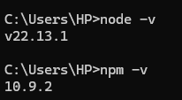
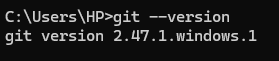
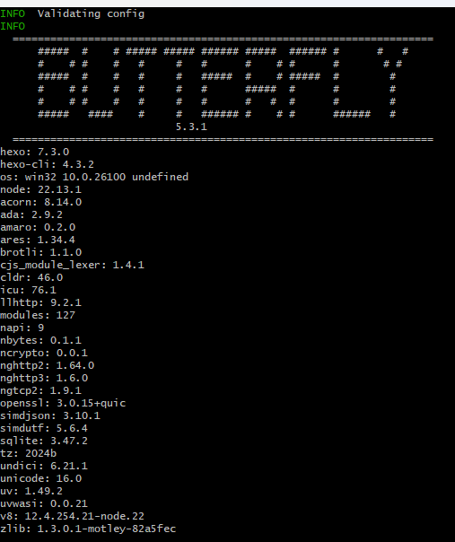
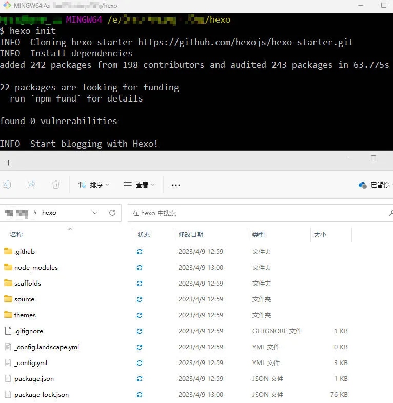
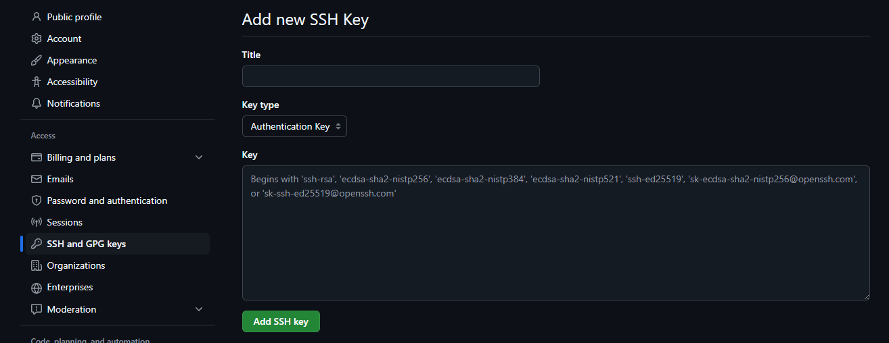
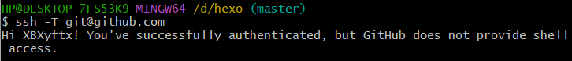

## Hexo+butterfly个人博客搭建

在用了一周左右的时间搭建博客，沉浸于试效果，改bug，试效果，改bug……的先循环后我还是决定写一篇文章来记录一下，省的未来的自己再走一遍这痛苦的过程。


### Hexo静态网页生成

### nodejs安装

首先我们需要下载nodejs，官网：[Node.js — 在任何地方运行 JavaScript](https://nodejs.org/zh-cn)

安装好之后我们可以输入以下指令如果都能正常输出版本号则安装成功。

```bash
node -v
npm -v
```



#### git安装

git可是个好东西，程序员必备，官网在这里：[Git - Downloading Package](https://git-scm.com/downloads/win)

```bash
git --version
```

正常显示版本即可


#### Hexo安装

在自己心仪的文件夹下，如E:/hexo，鼠标右击选择 `Git bash here`，依次执行以下命令：

```bash
npm install hexo-cli -g
npm install hexo --save
```

如果已经安装过hexo，或者不确定装没装过也没关系，装过的执行完显示的是update。

```bash
hexo -v
```

查看hexo版本，正常显示版本号说明安装成功。

我这里是因为已经安装了butterfly主题所以会有上面的一行，只要有下面的一大坨版本号即可。

#### hexo初始化

首先确保自己将要存放hexo博客的文件夹下是空的，不能有任何其他文件。
随后在该文件夹右键选择 `Git bash here`，执行`hexo init`
执行完毕后就能看到hexo框架的文件。


紧接着我们就让他生成一个初始页面来进行测试。

```bash
hexo g && hexo s
```

在页面启动后按住ctrl左键点击`http://localhost:4000/` 字段即可自动跳转至浏览器进行本地预览。

当你看到hexo从地平线升起时你就成功创建了一个本地静态博客网页。

### 部署到GitHub

#### 创建仓库

首先在GitHub创建一个公共仓库，仓库名为`username.github.io`
随后在git bush中输入以下指令，绑定账户并生成密钥

```bash
git config --global user.name "XXXX"                       # 配置个人信息-username
git config --global user.email "XXXXXXXXX@XXX.com"         # 配置个人信息-useremail
ssh-keygen -t rsa -C "XXXXXXXXX@XXX.com"	           # 生成密钥
```

在生成密钥的过程中直接全部回车直到生成成功即可。按照默认路径生成的密钥都会储存在`C:\Users\用户名\.ssh\id_rsa.pub`这个地址下，随后打开GitHub设置，添加ssh密钥，将该文件的全部内容黏贴到文本框中即可。

添加好后我们需要将刚生成的密钥同步添加到本地的git中，执行以下命令

```bash
eval "$(ssh-agent -s)"
ssh-add ~/.ssh/id_rsa
```

随后执行以下命令测试与GitHub的连接是否成功。

```bash
ssh -T git@github.com
```

得到以下回复则说明连接成功。



运行以下命令，确保 Git 使用了正确的 SSH 密钥：

```bash
git config --global core.sshCommand "ssh -i ~/.ssh/id_rsa"
```

到这一步的话还有可能出现以下问题

```bash
$ ssh -T git@github.com
The authenticity of host 'github.com (20.205.243.166)' can't be established.
ED25519 key fingerprint is SHA256:+DiY3wvvV6TuJJhbpZisF/zLDA0zPMSvHdkr4UvCOqU.
This key is not known by any other names.
Are you sure you want to continue connecting (yes/no/[fingerprint])?
Host key verification failed.
```

这个有可能是因为SSH 客户端未信任 GitHub 的主机密钥

```bash
touch ~/.ssh/known_hosts
chmod 644 ~/.ssh/known_hosts
ssh-keyscan -t ed25519 github.com >> ~/.ssh/known_hosts
```

执行以上命令将GitHub的密钥添加到known_hosts文件中，再次执行`ssh -T git@github.com` 应该就不会出现上面的问题了。

#### 修改hexo配置文件

打开 hexo 的配置文件 `_config.yml` 修改 `deploy` 位置的配置

```
deploy:
    type: git
    repo: github: git@github.com:XXXXXXX/XXXXXXXX.github.io.git    # 仓库地址
    branch: main    # 分支!!!!!!!!!!是 main
```

然后！hexo三连！

```
$ hexo cl && hexo g && hexo d
```

此时就可以通过`https://username.github.io` 进行访问你的博客了！

### 安装butterfly主题

#### 下载主题文件

在git中执行以下指令安装butterfly主题。

```
git clone https://github.com/jerryc127/hexo-theme-butterfly.git themes/butterfly
```

这里是直接克隆源代码至本地，可以修改源代码进行魔改。如果没有修改代码的需求可以直接通过**npm**来安装。

```
npm i hexo-theme-butterfly
```

#### 安装渲染器

安装`pug` 和 `stylus` 渲染器，否则启动之后访问页面会报错。

```
npm install hexo-renderer-pug hexo-renderer-stylus --save
```

#### 切换主题

与所有hexo主题启用的模式一样。当 克隆/下载 完成后，打开 **`站点配置文件`**， 找到 `theme` 字段，并将其值更改为 `butterfly`。

```
theme: butterfly
```

然后再次hexo三联！就完成了主题的替换。

## butterfly主题美化

### 网站资料

修改网站各种资料，例如标题、副标题和邮箱等个人资料，请修改站点配置文件_config.yml。部分参数如下，详细参数可参考官方的配置描述。


| 参数        | 描述                                                                                                                                                 |
| ----------- | ---------------------------------------------------------------------------------------------------------------------------------------------------- |
| title       | 网站标题                                                                                                                                             |
| subtitle    | 描述                                                                                                                                                 |
| description | 网站描述                                                                                                                                             |
| keywords    | 网站的关键词。支持多个关键词。                                                                                                                       |
| author      | 您的名字                                                                                                                                             |
| language    | 网站使用的语言。对于简体中文用户来说，使用不同的主题可能需要设置成不同的值，请参考你的主题的文档自行设置，常见的有 zh-Hans和 zh-CN。                 |
| timezone    | 网站时区。Hexo 默认使用您电脑的时区。请参考 时区列表 进行设置，如 America/New_York, Japan, 和 UTC 。一般的，对于中国大陆地区可以使用 Asia/Shanghai。 |

### 背景图片

修改`background`字段的值即可。

### 更多属性

可以参考以下博客：

[【Hexo系列】【7】Butterfly主题使用及美化\_hexo主题butterfly美化教程-CSDN博客](https://blog.csdn.net/middle_age666/article/details/141507929)

[基于 Hexo 从零开始搭建个人博客（五） | 唐志远](https://fe32.top/articles/hexo1605/#%E5%89%8D%E8%A8%80)
