## 重点

我把音频里老师划的期末“必背清单”整理成一张“一页纸”攻略，直接告诉你考什么、怎么考、占多少分。先存下来，后面刷题时照着查漏补缺即可。

---

### 2026 计网期末一页纸速背（按题型+分值）

| 题型 | 题量 | 单题分值 | 章节分布 |
| --- | --- | --- | --- |
| 选择 10×2′ | 20′ | 1-6 章 | 1. 网络性能指标单位换算（k=2¹⁰ 还是 10³）<br>2. 三交换技术名字（电路/报文/分组）<br>3. 复用技术（FDM/TDM/CDM）<br>4. MAC 地址长度 & 以太网最短帧 64 B<br>5. IP 地址分类 & 特殊地址（私有/回环/广播）<br>6. TCP 与 UDP 熟知端口（FTP-21/SSH-22/DNS-53/HTTP-80） |
| 填空 10×1′ | 10′ | 1-5 章 | 1. 三阶段网络发展（ARPANET→三级→多层次 ISP）<br>2. 香农公式字母含义（C=B log₂(1+S/N)）<br>3. PPP 三组件（帧格式+LCP+NCP）<br>4. ARP 请求帧类型字段值：0x0806<br>5. TCP 套接字四元组（源 IP、源端口、目 IP、目端口） |
| 简答 4×5′ | 20′ | 1、3、4、5 章 | 1. 分组交换 vs 电路交换 3 优点（灵活、共享、容错）<br>2. 数据链路层 3 基本问题（封装成帧、透明传输、差错检测）<br>3. IP 地址→MAC 地址映射过程（ARP 请求-应答-缓存）<br>4. TCP 可靠传输 4 手段（校验、序号、确认、重传） |
| 计算 3×10′ | 30′ | 1、3、4 章 | 1. 发送/传播时延（第 1 章）——“先算发再算传”<br>2. 子网划分（第 4 章）——“借位→块大小→地址范围”<br>3. 码分复用解码（第 2 章）——“内积归一发送 1，归负发送 0” |
| 综合 1×20′ | 20′ | 4-5 章 | 给拓扑+路由表，让填“IP 分组每跳 MAC 变化”+“TCP 三次握手示意图”。套路：<br>① 路由器不修改 IP，只改 MAC；<br>② 握手 SYN→SYN+ACK→ACK，seq=0/1 画图即可。 |

---

### 必背公式/易错点（考前 5 分钟再过一遍）

1. 时延  
   发送时延 = 帧长(bit) ÷ 带宽(bit/s)  
   传播时延 = 距离(m) ÷ 传播速率(≈2×10⁸ m/s)

2. 香农 & 奈氏  
   奈氏：C = 2W log₂V  
   香农：C = W log₂(1+S/N) （S/N 功率比，题干给 dB 要先换算：dB=10 log₁₀(S/N)）

3. 子网划分  
   地址块数 = 2^(借位)  
   可用主机 = 2^(主机位) – 2  
   块大小 = 256 – 掩码最后一个非 0 字节

4. 码分复用  
   收到码片 S，与某站码片做内积：结果 ÷ 码片长度 = 1 发 1，= –1 发 0，= 0 未发

5. TCP 窗口  
   发送窗口 = min(拥塞窗口, 接收窗口)  
   慢开始：cwnd 每 RTT ×2，达阈值后转线性增长

---

### 最后 3 句话

1. 选择/填空“数字”必考：MAC 48 bit、IPv4 32 bit、以太网 64 B 最短帧、MTU 1500 B。  
2. 简答按“关键词+一句话”给分，背上面 4 题就够。  
3. 综合题年年换图不换骨，先画“IP 不变 MAC 变”再画“三次握手”，20 分稳拿 15+。

## 2019~2020 学年第 2 学期

### 各层次基础数据单元


比特（bit）；帧（Frame）；分组 / 数据包（Packet）

| OSI七层模型 | TCP/IP四层模型 | 常用数据单元术语 | 说明 |
|--------------|----------------|------------------|------|
| 物理层       | 网络接口层     | 比特（bit）| 二进制位，物理信号的最小单位 |
| 数据链路层   | 网络接口层     | 帧（Frame）| 封装MAC地址、含校验字段的比特集合 |
| 网络层       | 网际层         | 分组/数据包（Packet） | 封装IP地址的帧片段，用于路由转发 |
| 传输层       | 传输层         | 段（Segment，TCP）<br>数据报（Datagram，UDP） | 端到端传输的基本单元，TCP为可靠段，UDP为不可靠数据报 |
| 会话层       | 应用层         | 报文（Message）| 会话交互的完整数据单元 |
| 表示层       | 应用层         | 报文（Message）| 经过格式转换/加密的应用数据单元 |
| 应用层       | 应用层         | 报文（Message）| 应用程序发送/接收的完整数据（如HTTP报文、邮件报文） |

---


答案及解析：

1. 第一个空：**丢弃**
   - 解析：TTL（生存时间）字段的作用是防止IP数据报在网络中无限循环转发。当路由器收到TTL为0的数据报时，会直接丢弃该数据报，避免其占用网络资源。
2. 第二个空：**该数据报的源IP地址对应的主机（或源主机）**
   - 解析：路由器会向数据报的发送方（源主机）发送ICMP“超时”报文，告知其数据报因TTL耗尽被丢弃，帮助源主机排查网络问题。

---

### RIP协议


答案及解析：

1. 第一个空：**15**
   - 解析：RIP（路由信息协议）以“跳数”（经过的路由器数量）作为路径距离的度量单位，规定一条路径最多包含15台路由器。
2. 第二个空：**16**
   - 解析：RIP中跳数为16时被定义为“不可达”，以此避免路由环路等问题。
3. 第三个空：**小型或局域网**
   - 解析：由于RIP的最大跳数限制（15），其仅适用于网络规模较小的环境（如小型企业局域网），无法支持大规模广域网的路由需求。


RIP 的核心是距离矢量算法，其核心思想可以概括为：“网络中所有路由器都会定期向邻居路由器分享自己的完整路由表；路由器接收邻居的路由表后，会结合自身信息更新本地路由表，最终实现全网路由信息的收敛”。

具体工作流程分为三步：

- 路由表初始化：路由器启动时，会先检测直连的网络接口，生成直连网络的路由条目，此时跳数为 0（直连网络无需经过其他路由器）。
- 路由信息广播：路由器会按照固定周期（默认 30 秒），向所有直连的邻居路由器发送自己的完整路由表。路由表中包含的核心信息有：目标网络地址、子网掩码、下一跳路由器地址、到达目标网络的跳数。
- 路由表更新与最优路径选择：路由器接收到邻居的路由表后，会对每条路由条目进行计算。

计算到达该目标网络的新跳数 = 邻居公告的跳数 + 1（因为数据包需要先到达这个邻居路由器）。

将新跳数与本地路由表中已有该目标网络的跳数对比，选择跳数更小的路径作为最优路径，更新本地路由表。

如果新跳数与现有跳数相同，则保留原路由条目，不做更新。

如果一条路由条目长时间未被更新（默认超时时间 180 秒），路由器会将该路由标记为不可达。
 


RIP 的运行逻辑由一系列关键参数定义，这些参数决定了协议的稳定性和适用范围：

度量值（Metric）：**跳数（Hop Count）**

RIP 以跳数作为衡量路径优劣的唯一标准，跳数指的是数据包到达目标网络需要经过的路由器数量。直连网络的跳数为 0；经过 1 台路由器的网络跳数为 1，以此类推。

RIP 规定最大跳数为 15，当跳数达到 16 时，协议会判定该目标网络不可达。这一限制直接决定了 RIP 只能适用于小型网络。
定时器

> RIP 通过多个定时器保障协议稳定运行，核心定时器包括：
> 更新定时器：默认 30 秒，路由器定期发送路由更新信息的周期。
> 超时定时器：默认 180 秒，如果一条路由在 180 秒内没有收到更新，路由器会将该路由的跳数标记为 16（不可达）。
> 垃圾回收定时器：默认 120 秒，路由被标记为不可达后，路由器会继续广播该不可达路由 120 秒，告知全网后再删除该路由条目。


在中大型网络中，通常会被 OSPF（开放式最短路径优先）、IS-IS 等更高效的路由协议替代。

---

### TCP滑动窗口


答案及解析：

- 填空答案：**滑动窗口机制**
- 解析：
  TCP的流量控制是为了避免发送方发送速率过快、导致接收方缓存溢出。其核心方法是“滑动窗口机制”：
  1. 接收方在TCP报文的“窗口字段”中，告知发送方自己当前可用的接收缓存大小（即“接收窗口”）；
  2. 发送方的发送窗口大小由接收窗口决定，仅能发送不超过该窗口大小的数据；
  3. 随着接收方处理数据、释放缓存，接收窗口会动态调整并反馈给发送方，发送方的发送窗口也随之“滑动”更新，实现速率匹配。


**ACK（Acknowledgment，确认）是TCP协议中用于实现可靠传输的核心机制之一**，具体含义及作用如下：

1. ACK的基本定义
    在TCP报文中，存在一个“ACK标志位”（占1比特），同时还有“确认号”字段（占32比特）：

    - 当ACK标志位为`1`时，表示该报文是一个确认报文；
    - 确认号字段的值，则表示（即接收方已成功接收了“确认号-1”之前的所有数据）。

    图中`ACK = 1`（表示这是确认报文），`确认号 = 31`，含义是：

    - 接收方B已成功接收了序号30及之前的所有数据；
    - 接收方B期望发送方A接下来发送序号为31的数据。

2. ACK的核心作用

    - **确认数据接收**：告知发送方“哪些数据已被成功接收”，避免发送方重复发送。
    - **配合滑动窗口实现流量控制**：确认报文会携带“接收窗口”信息（如图中的“窗口=20”），让发送方动态调整发送速率。
    - **保障可靠性**：TCP通过ACK的超时重传机制（若发送方未收到ACK，则重传数据），确保数据不会丢失。


---


答案及解析：
- 填空答案：`ping www.bistu.edu.cn`
- 解析：
  在Windows系统中，`ping`是用于测试网络连通性的常用命令：
  1. 作用：向目标主机（此处为www.bistu.edu.cn）发送ICMP请求报文，若目标主机可达，则会返回ICMP应答报文；
  2. 结果判断：若命令执行后显示“来自xxx的回复”，说明服务器连通；若显示“请求超时”，则表示无法连通。

---


答案：C

解析：
C类IP地址的默认子网掩码是255.255.255.0（即网络位24位，主机位8位）。要划分子网，需从主机位借位：
1. 计算所需借位数：
   划分6个子网，需满足 \(2^n \geq 6\)（\(n\)为借位数），得\(n=3\)（\(2^3=8\)，可划分8个子网，满足6个的需求）。
2. 计算新子网掩码：
   借3位后，网络位变为24+3=27位，对应的子网掩码二进制为：
   11111111.11111111.11111111.11100000，转换为十进制即255.255.255.224。

128 + 64 + 32 = 224，所以答案是C。

---

### ABCDE类地址及专用地址范围


答案：CD（该地址同时属于C类地址和专用地址）
解析：
1. **属于C类地址**：
   IP地址的类别由第一个字节的范围决定：C类地址的第一个字节范围是192-223。地址192.168.0.1的第一个字节是192，符合C类地址的定义。

2. **属于专用地址**：
   192.168.0.0/16网段是IANA（互联网数字分配机构）规定的**私有IP地址段**（专用地址），仅用于局域网内部，不会在公网中路由，常见于家庭、企业内网环境。

除了A、B、C类地址外，IP地址还包含 **D类（组播地址）** 和 **E类（保留地址）**，这两类地址不用于常规的主机通信，补充后的完整表格如下：

| 类别       | 地址范围                     | 专用/特殊用途说明 | 核心特点 |
|------------|------------------------------|------------------|----------|
| **A类地址** | 第一个字节：1-126<br>（1.0.0.0-126.255.255.255） | 专用地址段：10.0.0.0/8 | 网络位8位，主机位24位，支持超大规模主机；127.0.0.0/8为环回地址，用于本地测试 |
| **B类地址** | 第一个字节：128-191<br>（128.0.0.0-191.255.255.255） | 专用地址段：172.16.0.0/12 | 网络位16位，主机位16位，适用于中型企业内网 |
| **C类地址** | 第一个字节：192-223<br>（192.0.0.0-223.255.255.255） | 专用地址段：192.168.0.0/16 | 网络位24位，主机位8位，适用于小型局域网（家庭、办公网络） |
| **D类地址** | 第一个字节：224-239<br>（224.0.0.0-239.255.255.255） | 组播专用地址，无公网/私有之分 | 不分配给单台主机，用于一对多的组播通信；如224.0.0.1表示本网段所有主机，224.0.0.9为RIPv2组播地址 |
| **E类地址** | 第一个字节：240-255<br>（240.0.0.0-255.255.255.255） | 保留地址，无实际应用场景 | 设计为科研和实验用途，目前未被广泛使用；255.255.255.255为全网广播地址 |

额外补充要点

1. **环回地址特殊说明**
   A类地址中的 **127.0.0.0/8** 网段是环回地址，不属于公网或私有地址，仅用于本机进程间通信或网络测试（如`ping 127.0.0.1`检测网卡是否正常）。

2. **广播地址**
   每个网段的最后一个地址为广播地址（如192.168.1.255），用于向网段内所有主机发送数据；而255.255.255.255是受限广播地址，仅在本地链路有效。

---


答案：B
解析：
IP数据报服务的核心特点是**无连接、不可靠的分组交换服务**，对各选项的分析如下：

- **A错误**：IP是无连接协议，无需建立连接即可发送数据报；
- **B正确**：IP数据报是独立的分组，每个分组会根据当前网络拓扑单独选择路由转发（可能出现不同分组走不同路径的情况）；
- **C错误**：由于各分组独立选路，到达终点的顺序可能与发送顺序不一致；
- **D错误**：IP不提供可靠性保障（如丢包、乱序等问题由上层协议如TCP解决）。

---


答案：B

解析：
IP数据报分片的规则是“分片在中间路由器完成，重组仅在目的主机完成”，原因如下：

- 当IP数据报的长度超过某段链路的（最大传输单元）时，经过的路由器会将其分片，但路由器不会重组分片（避免增加路由器的处理负担）；
- 所有分片会携带相同的“标识”字段，目的主机会根据该标识识别属于同一个原始数据报的分片，待所有分片到达后完成重组。

---

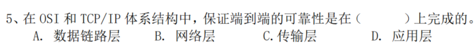

答案：C

解析：
在OSI和TCP/IP体系中，各层的核心功能与可靠性保障分工如下：

- **数据链路层（A）**：保障**相邻节点间**的可靠传输（如通过帧校验），但不负责端到端；
- **网络层（B）**：提供无连接的分组转发，不保障可靠性；
- **传输层（C）**：通过TCP协议实现（包括确认、重传、排序、流量控制等机制）；
- **应用层（D）**：依赖传输层提供的服务，自身不直接负责端到端可靠性。

---

### CSMA/CD

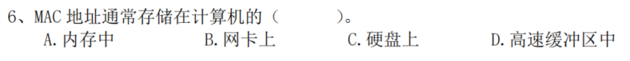

答案：B

解析：
MAC地址（介质访问控制地址）是网络设备的物理地址，由设备厂商在生产时写入**网卡的硬件芯片**中（通常是只读存储器ROM），因此MAC地址与网卡绑定，随网卡一同存在，具有全球唯一性。

其他选项分析：

- 内存（A）、硬盘（C）、高速缓冲区（D）均为临时存储或数据存储区域，不会永久固化MAC地址。

---


答案：A

解析：
CSMA/CD（载波监听多路访问/冲突检测）是以太网的核心介质访问控制技术，其核心机制是“争用带宽”：

- 所有节点共享同一传输介质，发送数据前先监听介质（载波监听），若介质空闲则发送；
- 发送过程中持续检测是否发生冲突（冲突检测），若冲突则立即停止发送并等待随机时间后重试。

这种方式下，多个节点通过“竞争”的方式使用带宽，没有预约、循环分配或优先级区分的机制，因此属于“争用带宽”。

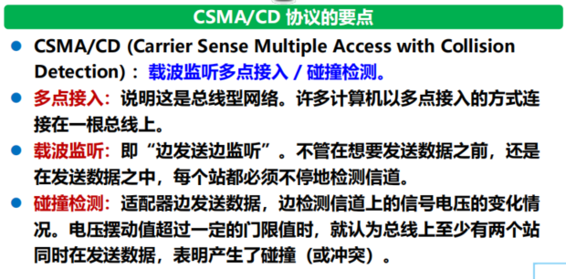

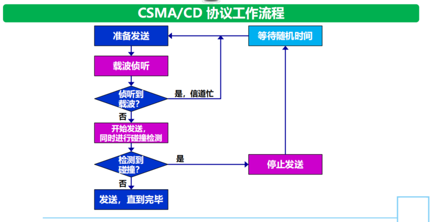

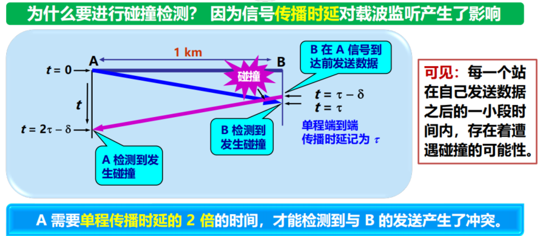

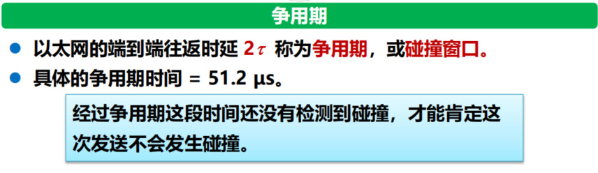

---

### 子网掩码计算网络地址争议选择题

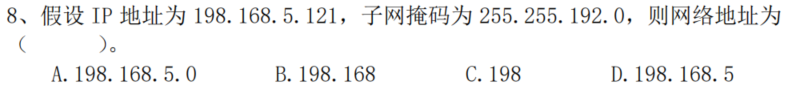

答案：无正确答案

解析：
网络地址的计算方法是**IP地址与子网掩码进行“按位与”运算**：

1. 先将IP地址和子网掩码转换为二进制：
   - IP地址198.168.5.121的二进制：11000110.10101000.00000101.01111001
   - 子网掩码255.255.192.0的二进制：11111111.11111111.11000000.00000000
2. 按位与运算（对应位都为1则结果为1，否则为0）：
   运算结果：11000110.10101000.00000000.00000000，转换为十进制即198.168.0.0。

选项B“198.168”不是合法的网络地址形式，原因如下：

1. **网络地址的格式要求**：IP地址是32位的二进制数，通常表示为4个十进制数（每段0-255），用点分隔（即“点分十进制”格式）。网络地址作为IP地址的一种，必须遵循4段的点分十进制格式，而“198.168”只有2段，不符合IP地址的规范。

2. **计算结果的唯一性**：通过IP地址与子网掩码的“按位与”运算，得到的结果是4段的198.168.0.0，这是该IP对应的合法网络地址，而“198.168”并非运算的有效结果。

---

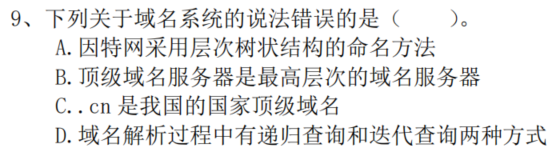

答案：B

解析：
对各选项的分析如下：

- **A正确**：因特网域名系统采用层次树状结构（如“主机名.二级域名.顶级域名”），便于管理和解析。
- **B错误**：域名系统的最高层次是**根域名服务器**，而非顶级域名服务器。根域名服务器负责管理顶级域名服务器的地址，是域名解析的起点。
- **C正确**：.cn是由ICANN分配给我国的国家顶级域名，用于标识中国境内的网站。
- **D正确**：域名解析的两种方式为递归查询（本地DNS服务器代用户完成全部解析）和迭代查询（本地DNS服务器向多个域名服务器逐步请求，最终返回结果给用户）。

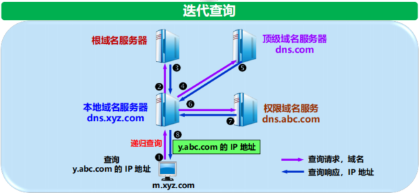

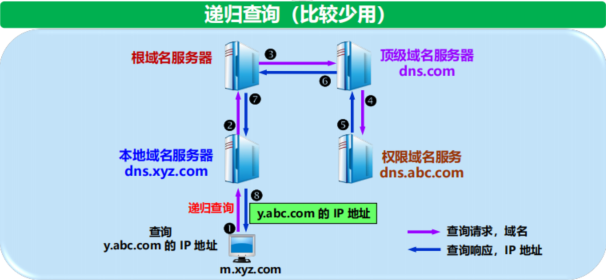

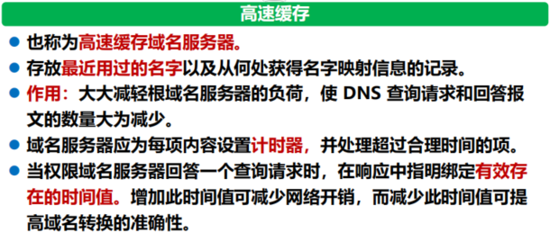

---

### 网络体系各层次常见协议列表

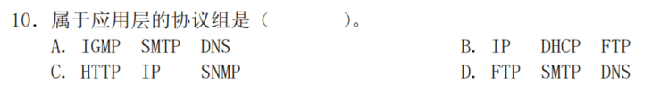

先给出本题答案，再列表说明各层次常见协议：

本题答案：D

解析：

- 应用层协议包括FTP（文件传输协议）、SMTP（简单邮件传输协议）、DNS（域名系统）；
- 其他选项中的IGMP（网络层）、IP（网络层）均不属于应用层，因此D选项正确。

你需要的是对应OSI七层模型中的**应用层、运输层、网络层、数据链路层、物理层**的协议分类，以下是调整后的表格（基于TCP/IP模型与OSI模型的对应关系整理）：

| OSI层次 | 常见协议 | 功能说明 |
|---------|----------|----------|
| **应用层** | HTTP/HTTPS | 超文本传输协议，用于网页浏览（HTTPS是加密版） |
| | FTP/SFTP | 文件传输协议，用于跨网络的文件上传、下载（SFTP是加密版） |
| | SMTP/POP3/IMAP | 邮件协议：SMTP负责发送邮件，POP3/IMAP负责接收邮件 |
| | DNS | 域名系统，将域名（如www.baidu.com）解析为IP地址 |
| | DHCP | 动态主机配置协议，自动为设备分配IP、子网掩码等网络参数 |
| | SNMP | 简单网络管理协议，用于监控、管理网络设备（如路由器、交换机） |
| | Telnet/SSH | 远程登录协议，用于远程控制设备（SSH是加密版） |
| **运输层** | TCP | 传输控制协议，提供**可靠、有序、面向连接**的端到端数据传输 |
| | UDP | 用户数据报协议，提供**无连接、不可靠**的快速数据传输（适用于音视频等实时场景） |
| **网络层** | IP（IPv4/IPv6） | 网际协议，负责将数据包从源主机路由到目标主机 |
| | ICMP | 互联网控制报文协议，用于网络故障诊断（如ping命令）、错误报告 |
| | IGMP | 互联网组管理协议，管理组播组的成员（实现一对多通信） |
| | ARP/RARP | 地址解析协议：ARP将IP地址转换为MAC地址；RARP反之 |
| | OSPF/RIP | 内部网关协议，用于自治系统内的路由信息交换 |
| **数据链路层** | Ethernet（以太网） | 局域网的介质访问控制协议（如CSMA/CD），定义帧的格式与传输规则 |
| | PPP | 点对点协议，用于拨号链路（如早期ADSL）的通信 |
| | HDLC | 高级数据链路控制协议，用于同步串行链路的帧传输 |
| | VLAN | 虚拟局域网协议，将物理局域网划分为多个逻辑子网 |
| **物理层** | RJ45（以太网接口） | 定义双绞线的接口、电气特性（如10/100/1000Mbps以太网） |
| | 光纤接口（如LC/SC） | 定义光纤通信的物理连接、光信号特性 |
| | RS-232 | 串行通信接口标准，用于设备间的低速串行传输 |

---

### 网卡的作用与功能

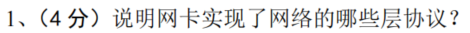

网卡主要实现了，具体说明如下：

1. **物理层协议**
   网卡负责实现物理层的硬件规范，包括：
   - 定义网络接口的电气特性（如电压、信号频率）；
   - 处理数据的编码/解码（将数字信号转换为物理介质可传输的信号，如双绞线的电信号、光纤的光信号）；
   - 管理物理介质的连接（如RJ45接口的物理连接）。

2. **数据链路层协议**
   网卡实现数据链路层的介质访问控制（MAC）和帧处理功能，包括：
   - 维护MAC地址（固化在网卡芯片中，作为设备的物理地址）；
   - 实现介质访问控制协议（如以太网的CSMA/CD），管理对传输介质的访问；
   - 处理数据帧的封装/解封装（将网络层的IP数据包封装为数据帧，或从接收到的帧中提取IP数据包）；
   - 帧的校验（通过帧尾的CRC校验字段，检测帧在传输过程中是否出错）。

简单来说，网卡是“物理层的硬件载体”和“数据链路层的帧处理执行者”，负责将上层数据转换为物理信号并传输，同时接收物理信号并还原为上层可处理的数据。

---

### 网络设备功能对比

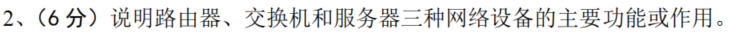

可以通过表格清晰区分路由器、交换机、服务器的主要功能：

| 网络设备 | 主要功能/作用 | 核心特点 |
|----------|---------------|----------|
| **路由器** | 1. **路由转发**：根据IP地址将数据包从一个网络转发到另一个网络（实现不同网段间的通信）；<br>2. **子网隔离**：通过不同接口连接不同子网，隔离广播域，提升网络安全性；<br>3. **网络参数配置**：支持DHCP、NAT等功能（如将私有IP转换为公有IP，实现内网访问公网）；<br>4. **路由选择**：通过路由协议（如OSPF、RIP）选择最优路径转发数据。 | 工作在**网络层**，基于IP地址转发数据，是不同网络间的“网关”。 |
| **交换机** | 1. **数据交换**：根据MAC地址将数据帧在局域网内的设备间转发（实现同一网段内的设备通信）；<br>2. **扩展网络端口**：提供多个以太网接口，连接更多终端设备（如电脑、打印机）；<br>3. **提升网络带宽**：采用全双工通信、VLAN划分等技术，减少网络冲突，提高局域网传输效率。 | 工作在**数据链路层**（部分支持网络层），基于MAC地址转发数据，是局域网内的“数据中转站”。 |
| **服务器** | 1. **提供网络服务**：运行特定服务软件，为客户端提供资源或功能（如Web服务器提供网页、文件服务器存储文件、邮件服务器处理邮件）；<br>2. **数据存储与处理**：集中存储网络中的数据，并完成计算、运算等任务；<br>3. **资源共享**：将硬件（如磁盘、算力）、软件（如应用程序）资源通过网络共享给多个客户端。 | 是网络中的“资源提供者”，可运行在不同硬件/系统上，通过应用层协议与客户端交互。 |

---

### 127.0.0.1

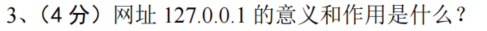

**127.0.0.1的意义**：
它是**环回地址（Loopback Address）**，属于A类地址中127.0.0.0/8网段的一个地址，并非实际的网络地址，仅用于主机内部的进程间通信。

**作用**：

1. **本地网络测试**：用于验证主机的网络协议栈是否正常（如`ping 127.0.0.1`，若能收到回复，说明主机的TCP/IP协议已正确安装）；
2. **本地服务调试**：开发人员可将服务部署在本机，通过127.0.0.1访问该服务（无需依赖外部网络），例如调试本地Web服务器、数据库服务；
3. **进程间通信**：同一主机内的不同程序可通过127.0.0.1传输数据，避免占用实际网络资源。

注：127.0.0.1的数据不会经过网卡发送到外部网络，仅在主机内部的网络协议栈中循环处理。

---

### ADSL技术原理与应用解析

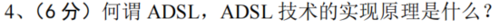

**非对称数字用户线路（ADSL）技术原理与应用解析**
非对称数字用户线路（ADSL）是一种依托普通电话双绞线实现高速宽带接入的技术，其核心特征在于“非对称”，即下行数据传输速率显著高于上行速率，能够更好地适配用户浏览网页、观看视频等下行数据需求远大于上行的典型互联网应用场景。ADSL的实现核心在于采用频分复用（FDM）技术和离散多音调制（DMT）技术，在一条电话线路上划分出三个互不干扰的独立频段，分别承载传统语音信号、上行数据信号和下行数据信号，具体频段划分与功能如下表所示：

| 信号类型 | 频段范围 | 核心功能 |
|----------|----------|----------|
| 传统语音信号 | 0~4kHz | 传输普通电话语音通话数据，保障基础语音通信功能不受数据传输影响 |
| 上行数据信号 | 20~50kHz | 传输用户向网络侧发送的数据，如文件上传、指令提交等，速率相对较低 |
| 下行数据信号 | 100kHz~1MHz | 传输网络向用户终端推送的数据，如网页内容、视频流、下载文件等，速率远高于上行 |

在此基础上，离散多音调制（DMT）技术进一步将上行和下行频段细分为多个独立的子信道，每个子信道根据线路的信噪比条件自适应调整调制方式，以此最大化利用线路带宽并对抗信号干扰，提升数据传输的稳定性和速率上限。从硬件部署角度来看，ADSL技术的应用需要搭配专用的ADSL调制解调器（俗称“猫”），该设备一端通过电话线连接电信运营商的局端设备，另一端通过网线连接用户的电脑或路由器，其核心作用是完成数字信号与电话线路模拟信号之间的转换，同时实现不同频段信号的分离与合成，确保语音通信与数据传输能够在同一条线路上并行且互不干扰，最终帮助用户在不额外布线的前提下，通过普通电话线实现高速宽带接入。

---

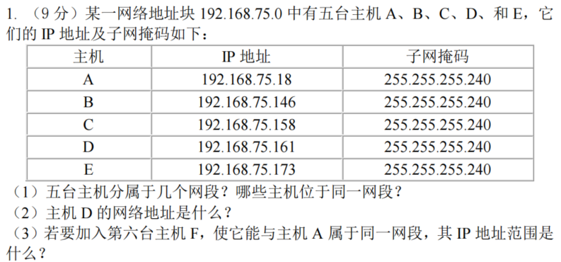

你提到的“将最后一个点展开为01”，应是指把IP地址的最后一个字节转换为二进制后计算网络地址。以下是重新编写的解答过程：

解题前提

子网掩码255.255.255.240的二进制为`11111111.11111111.11111111.11110000`，即**最后一个字节的前4位是网络位，后4位是主机位**。计算网络地址时，需将IP地址最后一个字节与子网掩码最后一个字节（240）做“按位与”运算。

（1）五台主机的网段划分（展开最后一个字节为二进制计算）
计算每台主机的网络地址：

- **主机A（IP：192.168.75.18）**
  最后一个字节18的二进制：`00010010`
  与子网掩码最后一个字节（240，二进制`11110000`）按位与：`00010010 & 11110000 = 00010000`（十进制16）
  网络地址：`192.168.75.16`

- **主机B（IP：192.168.75.146）**
  最后一个字节146的二进制：`10010010`
  与240按位与：`10010010 & 11110000 = 10010000`（十进制144）
  网络地址：`192.168.75.144`

- **主机C（IP：192.168.75.158）**
  最后一个字节158的二进制：`10011110`
  与240按位与：`10011110 & 11110000 = 10010000`（十进制144）
  网络地址：`192.168.75.144`

- **主机D（IP：192.168.75.161）**
  最后一个字节161的二进制：`10100001`
  与240按位与：`10100001 & 11110000 = 10100000`（十进制160）
  网络地址：`192.168.75.160`

- **主机E（IP：192.168.75.173）**
  最后一个字节173的二进制：`10101101`
  与240按位与：`10101101 & 11110000 = 10100000`（十进制160）
  网络地址：`192.168.75.160`

结论：五台主机分属**3个网段**；其中**B和C位于同一网段**，**D和E位于同一网段**，A单独一个网段。

（2）主机D的网络地址
由上述计算可知，主机D的网络地址是`192.168.75.160`。

（3）主机F的IP地址范围（与A同网段）
主机A的网段网络地址是`192.168.75.16`，该网段的IP范围是`192.168.75.16 ~ 192.168.75.31`（最后一个字节二进制`00010000 ~ 00011111`）。

- 网络地址（192.168.75.16）和广播地址（192.168.75.31）不可分配；
- 可用IP范围：`192.168.75.17 ~ 192.168.75.30`（排除主机A已占用的192.168.75.18）。

最终主机F的IP地址范围：`192.168.75.17、192.168.75.19 ~ 192.168.75.30`。

---

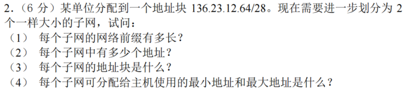

**解题前提**

原地址块是`136.23.12.64/28`，表示网络前缀为28位（子网掩码为255.255.255.240），需进一步划分为2个等大的子网。

（1）每个子网的网络前缀长度
划分为2个子网，需要借用**1位主机位**作为子网位（因为(2^1=2)）。
原网络前缀是28位，因此新的网络前缀长度为：(28 + 1 = 29)位。

（2）每个子网的地址数量
网络前缀为29位时，主机位长度为：(32 - 29 = 3)位。
每个子网的地址总数为：(2^3 = 8)个。

（3）每个子网的地址块

原地址块`136.23.12.64/28`的最后一个字节（64）二进制为`01000000`，借用1位主机位（第29位）划分子网：

- **子网1**：第29位为0，最后一个字节二进制为`01000000`，地址块为`136.23.12.64/29`；
- **子网2**：第29位为1，最后一个字节二进制为`01001000`，地址块为`136.23.12.72/29`。

（4）每个子网的可分配主机地址（最小/最大）
每个子网包含8个地址，但**网络地址（第1个）和广播地址（最后1个）不可分配**，可分配的是中间6个地址：

- **子网1（136.23.12.64/29）**
  网络地址：136.23.12.64（不可分配）
  广播地址：136.23.12.71（不可分配）
  最小可分配地址：136.23.12.65
  最大可分配地址：136.23.12.70

- **子网2（136.23.12.72/29）**
  网络地址：136.23.12.72（不可分配）
  广播地址：136.23.12.79（不可分配）
  最小可分配地址：136.23.12.73
  最大可分配地址：136.23.12.78

总结表格

| 子网序号 | 网络前缀 | 地址块 | 地址总数 | 最小可分配地址 | 最大可分配地址 |
|----------|----------|--------|----------|----------------|----------------|
| 1        | 29位     | 136.23.12.64/29 | 8个 | 136.23.12.65 | 136.23.12.70 |
| 2        | 29位     | 136.23.12.72/29 | 8个 | 136.23.12.73 | 136.23.12.78 |

---

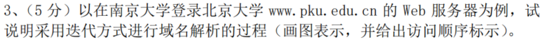

南京大学主机
   │
   │ 1. 问“www.pku.edu.cn 的 A 记录？”
   │    （递归位置位=0 → 迭代查询）
   ▼
南京大学本地 DNS 缓存/转发器（202.119.32.1）
   │
   │ 2. 问根“.”
   ▼
根服务器（a.root-servers.net 等，198.41.0.4）
   │ 3. 返“cn.” 的 NS/ glue：a.dns.cn 203.119.26.1 …
   ▼
   │ 4. 问“cn.”
   ▼
cn 顶级域服务器（a.dns.cn 203.119.26.1）
   │ 5. 返“edu.cn.” 的 NS：ns2.edu.cn 202.112.0.35 …
   ▼
   │ 6. 问“edu.cn.”
   ▼
edu.cn 权威服务器（ns2.edu.cn 202.112.0.35）
   │ 7. 返“pku.edu.cn.” 的 NS：dns.pku.edu.cn 162.105.129.27 …
   ▼
   │ 8. 问“pku.edu.cn.”
   ▼
pku.edu.cn 权威服务器（dns.pku.edu.cn 162.105.129.27）
   │ 9. 返“www.pku.edu.cn. → A 162.105.131.113”
   ▼
南京大学本地 DNS
   │10. 把结果回给客户端
   ▼
南京大学主机
   │11. 三次握手 162.105.131.113:80
   │12. GET / HTTP/1.1  Host: www.pku.edu.cn
   │13. 收到 200 OK + HTML 页面


---

### DHCP(动态主机配置协议)


一、DHCP的作用
DHCP（动态主机配置协议）是一种应用层协议，核心作用是**自动为网络中的终端设备分配IP地址、子网掩码、网关、DNS服务器地址等网络参数**，无需人工手动配置，提升了网络管理的效率，降低了配置错误的概率。

二、DHCP的工作原理（4步交互流程）
DHCP的工作过程基于“客户端-服务器”模式，采用广播通信完成参数分配，具体流程如下：

1. **DHCP发现（Discover）**
   新接入网络的终端（DHCP客户端）在本地网络中发送广播报文（目标地址255.255.255.255），请求DHCP服务器提供网络参数。此时客户端暂无IP地址，报文源地址为0.0.0.0。

2. **DHCP提供（Offer）**
   网络中的DHCP服务器收到发现报文后，从自身的IP地址池中选择一个可用IP，结合子网掩码、网关等参数，向客户端发送广播（或单播）报文，提供网络配置信息。

3. **DHCP请求（Request）**
   客户端收到一个或多个服务器的“提供”报文后，选择其中一个（通常是最先收到的），再次发送广播报文，告知选中的服务器“请求使用该IP”，同时也通知其他服务器“无需提供”。

4. **DHCP确认（Acknowledge）**
   被选中的DHCP服务器收到请求报文后，向客户端发送确认报文，正式将IP地址等参数分配给客户端，并指定IP的租用期限；客户端收到确认后，即可使用该IP接入网络。

补充：当IP租用期限快到期时，客户端会向DHCP服务器发送续租请求，若服务器同意则延长租期；若未收到响应，客户端会重新发起“发现-提供-请求-确认”流程，重新获取IP。

---

### CRC计算

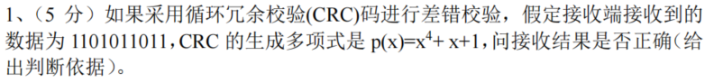

要判断接收数据是否正确，需通过**CRC校验流程**验证：将接收数据除以生成多项式对应的二进制码，若余数为0则正确，否则错误。

1. 步骤1：确定生成多项式对应的二进制码

    生成多项式 \( p(x)=x^4 + x + 1 \)，对应二进制码为 **10011**（最高次项是\(x^4\)，故长度为5位，即\(x^4\)对应1，\(x^3\)对应0，\(x^2\)对应0，\(x^1\)对应1，\(x^0\)对应1）。

2. 步骤2：对接收数据进行CRC校验（模2除法）

    接收数据为 **1101011011**，需用该数据除以生成多项式的二进制码`10011`（模2除法：即异或运算，不借位、不进位）。

具体除法过程：

1. 取接收数据的前5位`11010`，与`10011`做异或：
   \( 11010 ⊕ 10011 = 01001 \)（余数）。
2. 补下一位数据`1`，得到`010011`，取前5位`10011`，与`10011`做异或：
   \( 10011 ⊕ 10011 = 00000 \)（余数）。
3. 补下一位数据`1`，得到`000001`，取前5位需补0，得到`00001`，与`10011`（位数不足，余数为`00001`）。
4. 补下一位数据`0`，得到`00010`，与`10011`（位数不足，余数为`00010`）。
5. 补下一位数据`1`，得到`00101`，与`10011`（位数不足，余数为`00101`）。
6. 补最后一位数据`1`，得到`01011`，与`10011`做异或：
   \( 01011 ⊕10011 = 11000 \)（余数）。

步骤3：判断结果

最终余数为 **11000**（非0），因此**接收结果不正确**。

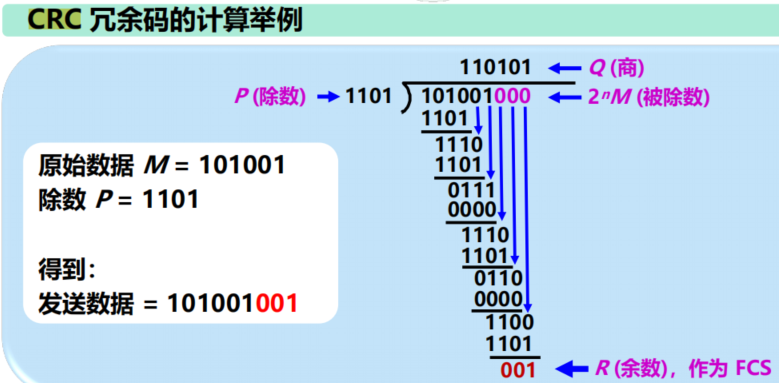

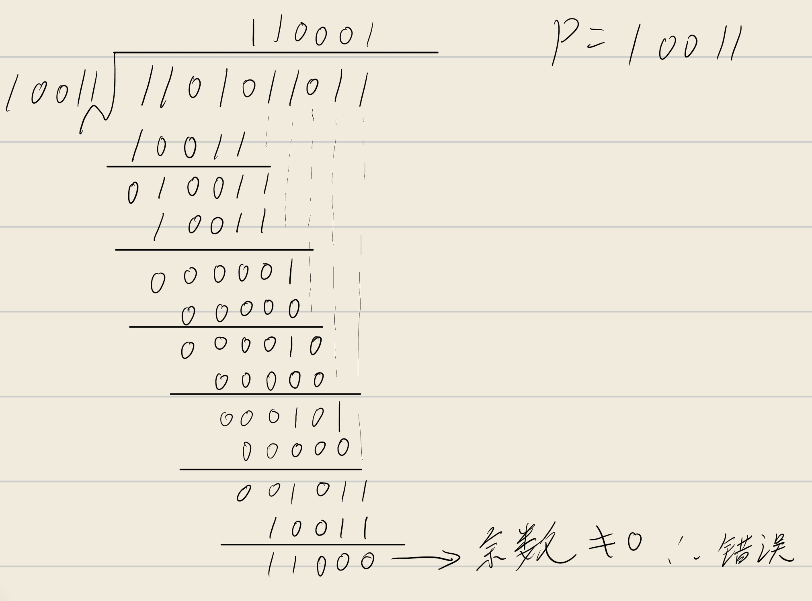

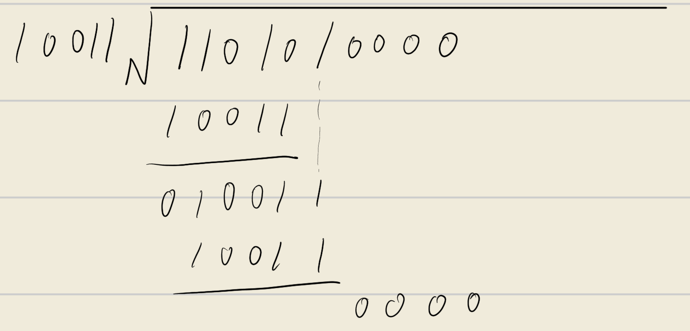

尝试反向推导冗余码，也会发现对不上从而得知是错误的。

---

### 路由表查找与转发计算

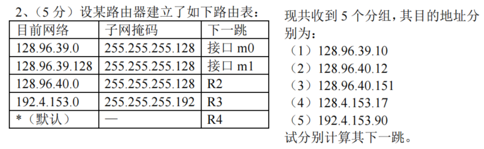

> 解题核心是：**将目的地址与路由表中的子网掩码逐位“与运算”，匹配对应的“目的网络”，进而确定下一跳**。

（1）目的地址：128.96.39.10

- 与路由表中子网掩码逐位“与”：
  - 子网掩码255.255.255.128：`128.96.39.10 & 255.255.255.128 = 128.96.39.0`
- 匹配路由表中“目的网络128.96.39.0”，下一跳为：**接口m0**

（2）目的地址：128.96.40.12

- 与子网掩码255.255.255.128“与”：`128.96.40.12 & 255.255.255.128 = 128.96.40.0`
- 匹配路由表中“目的网络128.96.40.0”，下一跳为：**R2**

（3）目的地址：128.96.40.151

- 与子网掩码255.255.255.128“与”：`128.96.40.151 & 255.255.255.128 = 128.96.40.128`
- 路由表中无“128.96.40.128”对应的目的网络，匹配**默认路由**，下一跳为：**R4**

（4）目的地址：128.4.153.17

- 与路由表中所有子网掩码“与”后，均不匹配任何目的网络，匹配**默认路由**，下一跳为：**R4**

（5）目的地址：192.4.153.90

- 与子网掩码255.255.255.192“与”：`192.4.153.90 & 255.255.255.192 = 192.4.153.64`
- 路由表中无“192.4.153.64”对应的目的网络，匹配**默认路由**，下一跳为：**R4**

最终结果汇总

| 目的地址          | 下一跳   |
|-------------------|----------|
| 128.96.39.10      | 接口m0   |
| 128.96.40.12      | R2       |
| 128.96.40.151     | R4       |
| 128.4.153.17      | R4       |
| 192.4.153.90      | R4       |

---

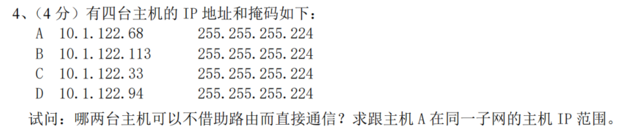

> 解题核心是：**计算每台主机的网络地址，网络地址相同的主机可直接通信（无需路由）**。子网掩码255.255.255.224的二进制为`11111111.11111111.11111111.11100000`，即最后一个字节的前3位是网络位，后5位是主机位。

步骤1：计算每台主机的网络地址

网络地址 = IP地址 & 子网掩码（仅计算最后一个字节）：

- **主机A（10.1.122.68）**：
  最后一个字节68的二进制：`01000100`
  与224（二进制`11100000`）按位与：`01000100 & 11100000 = 01000000`（十进制64）
  网络地址：`10.1.122.64`

- **主机B（10.1.122.113）**：
  最后一个字节113的二进制：`01110001`
  与224按位与：`01110001 & 11100000 = 01100000`（十进制96）
  网络地址：`10.1.122.96`

- **主机C（10.1.122.33）**：
  最后一个字节33的二进制：`00100001`
  与224按位与：`00100001 & 11100000 = 00100000`（十进制32）
  网络地址：`10.1.122.32`

- **主机D（10.1.122.94）**：
  最后一个字节94的二进制：`01011110`
  与224按位与：`01011110 & 11100000 = 01000000`（十进制64）
  网络地址：`10.1.122.64`

步骤2：判断可直接通信的主机
主机A和主机D的网络地址均为`10.1.122.64`，因此**主机A与D可以不借助路由直接通信**。

步骤3：主机A所在子网的IP范围
主机A的网络地址是`10.1.122.64`，子网掩码255.255.255.224对应的主机位为5位，该子网的IP范围为：

- 网络地址（不可分配）：`10.1.122.64`
- 广播地址（不可分配）：`10.1.122.95`（最后一个字节二进制`01011111`）
- 可分配主机IP范围：`10.1.122.65 ~ 10.1.122.94`

最终结论

1. 可直接通信的主机：**A和D**；
2. 主机A所在子网的IP范围：**10.1.122.65 ~ 10.1.122.94**。

---

### TCP/UDP协议综合题

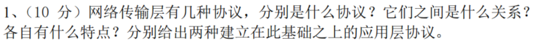

网络传输层的核心协议是**TCP（传输控制协议）**和**UDP（用户数据报协议）**，二者是互补关系，共同支撑不同需求的应用层通信。以下是详细说明：

一、协议类型、关系及特点

| 协议 | 核心特点 | 与另一协议的关系 |
|------|----------|------------------|
| **TCP（传输控制协议）** | 1. **面向连接**：通信前需通过“三次握手”建立连接，通信后通过“四次挥手”释放连接；<br>2. **可靠传输**：通过序列号、确认应答、重传机制、流量控制、拥塞控制等保证数据无丢失、无重复、按序到达；<br>3. **面向字节流**：将应用层数据拆分为字节流，按序传输；<br>4. **开销较大**：连接管理、可靠性机制增加了传输延迟和报文开销。 | 与UDP互补，适用于对可靠性要求高的场景；二者共享传输层端口资源，同一端口可被TCP或UDP独立使用。 |
| **UDP（用户数据报协议）** | 1. **无连接**：通信前无需建立连接，直接发送数据；<br>2. **不可靠传输**：无确认、重传机制，数据可能丢失、重复或乱序；<br>3. **面向报文**：直接封装应用层数据为报文，不拆分或合并；<br>4. **开销小、延迟低**：无连接管理和可靠性机制，传输效率高。 | 与TCP互补，适用于对实时性要求高的场景；二者均基于IP协议提供端到端的传输服务。 |

二、基于TCP/UDP的应用层协议

- **基于TCP的应用层协议**（2种）：
  1. **HTTP/HTTPS**：用于网页传输，依赖TCP的可靠性保证网页内容完整到达；
  2. **FTP**：用于文件传输，依赖TCP的可靠性保证文件传输无损坏。

- **基于UDP的应用层协议**（2种）：
  1. **DNS**：用于域名解析，优先保证解析请求的低延迟；
  2. **DHCP**：用于动态分配IP地址，通过UDP的广播特性快速完成参数协商。

---

### ARP协议与RARP协议、IP地址与MAC地址的关系

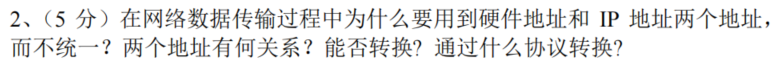

一、为什么需要硬件地址和IP地址（不统一的原因）

二者作用于**不同的网络层次**，服务于不同的通信范围：

1. **硬件地址（MAC地址）**：
   是数据链路层的地址，固化在网卡中，用于**同一局域网内的设备通信**（标识局域网内的具体设备）。
2. **IP地址**：
   是网络层的地址，由网络管理员分配，用于**不同网络之间的设备通信**（标识设备所在的网络及网络内的主机）。

若统一为一种地址，无法同时满足“局域网内精准标识设备”和“跨网络路由转发”的需求，因此必须分离。

二、两个地址的关系

IP地址是**逻辑地址**（可动态分配、修改），MAC地址是**物理地址**（固化、唯一）；二者通过“映射关系”关联：同一设备在网络中，IP地址对应其所在的网络，MAC地址对应其物理网卡，数据传输时需同时使用（IP地址用于跨网络路由，MAC地址用于局域网内转发）。

三、能否转换？通过什么协议转换

可以转换，通过**ARP（地址解析协议）**和**RARP（反向地址解析协议）**实现：

1. **ARP**：将**IP地址转换为MAC地址**（用于已知目标IP时，获取其MAC地址以完成局域网内传输）；
2. **RARP**：将**MAC地址转换为IP地址**（用于无IP的设备，通过自身MAC地址获取IP地址）。

---

## 📌 不能分配给主机的IP地址

### 1. **网络地址（Network Address）**

- **定义**：子网中的第一个IP地址
- **特征**：主机位全为0
- **用途**：用于标识整个子网，不能分配给具体设备
- **示例**：在`192.168.1.0/24`中，`192.168.1.0`就是网络地址

### 2. **广播地址（Broadcast Address）**

- **定义**：子网中的最后一个IP地址
- **特征**：主机位全为1
- **用途**：用于向子网内所有主机发送广播消息
- **示例**：在`192.168.1.0/24`中，`192.168.1.255`就是广播地址

### 3. **特殊保留地址**

#### 🚫 特殊用途的保留地址（不能分配给任何主机）：

| 地址范围 | 用途说明 |
|---------|---------|
| `0.0.0.0` | 表示“本网络”或“本主机”，用于默认路由 |
| `255.255.255.255` | 本地广播地址，用于向本地网络所有主机广播 |
| `127.0.0.0/8` | 环回地址（Loopback），用于本机测试 |
| `169.254.0.0/16` | 链路本地地址（Link-local），自动专用IP地址（APIPA） |
| `10.0.0.0/8`、`172.16.0.0/12`、`192.168.0.0/16` | 私有地址，虽可内网使用，但不可直接用于公网通信 |

### 4. **特殊子网情况**

- **/31子网**：用于点对点链路，RFC3021规定在这种特殊情况下，**网络地址和广播地址都可以分配给两端设备**使用，这是唯一的例外。
- **/32子网**：单个主机地址，通常用于路由器接口或特殊配置。

### 🧮 举个例子说明

以子网`192.168.1.0/24`为例：
- **网络地址**：`192.168.1.0` ❌ 不能分配
- **可用主机地址**：`192.168.1.1` 到 `192.168.1.254` ✅ 可以分配
- **广播地址**：`192.168.1.255` ❌ 不能分配

因此，这个子网共有**256个IP地址**，但**只有254个**可以分配给主机使用。

### 📖 总结口诀（便于记忆）：

> **“首尾不可用，特殊要牢记，/31是例外，其他要回避。”**

- **首地址**：网络地址，不能分配
- **尾地址**：广播地址，不能分配
- **特殊地址**：0.0.0.0、255.255.255.255、127.x.x.x、169.254.x.x 等不能分配
- **/31子网**：特殊情况，两个地址都可以分配

希望这个总结能帮你快速掌握子网IP地址分配的规则！

## 2022 ~ 2023 学年第 一 学期

### 接入网

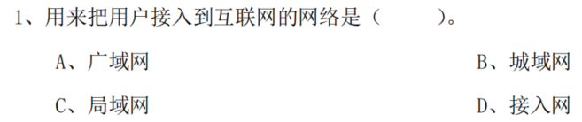

答案：D（接入网）

解析：

- 接入网是专门用于将用户终端（如电脑、手机）连接到互联网核心网络的网络，其核心功能就是实现“用户接入互联网”；
- 广域网、城域网、局域网是按覆盖范围划分的网络类型，并非专门用于用户接入的网络（例如广域网是跨大区域的网络，局域网是小范围内部网络）。

---

### 性能指标

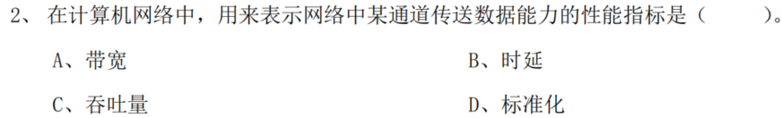

答案：A（带宽）

解析：

- 带宽是网络性能指标中专门表示“某信道传送数据能力”的参数，通常指单位时间内信道能传输的最大数据量；
- 时延是数据传输的延迟时间，吞吐量是实际传输的数据量，标准化并非网络性能指标，因此均不符合题干描述。

---

### 复用技术

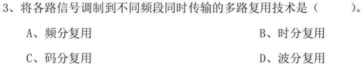

答案：A（频分复用）

解析：

- 频分复用的核心是将不同信号调制到**不同的频率段**，在同一信道中同时传输，各频段信号互不干扰；
- 时分复用是按时间分片传输，码分复用是通过不同编码区分信号，波分复用是光信号的频分复用（属于频分复用的特例），均不符合“调制到不同频段同时传输”的描述。

以下是常见多路复用技术的对比表格：

| 复用方式 | 核心原理 | 技术特点 | 典型应用 |
|----------|----------|----------|----------|
| **频分复用（FDM）** | 将信道带宽划分为多个独立的**频率段**，不同信号调制到不同频段同时传输 | 各信号频段互不重叠，需保留保护频段避免干扰；适用于模拟信号 | 传统广播、有线电视、ADSL宽带 |
| **时分复用（TDM）** | 将信道时间划分为多个**时间片**，不同信号按时间片轮流占用信道传输 | 按时间分配资源，分为同步TDM（固定时间片）和异步TDM（动态分配）；适用于数字信号 | 电话交换网、传统以太网（共享带宽） |
| **码分复用（CDM）** | 给不同信号分配**唯一的编码序列**，所有信号在同一频段、同一时间传输，通过编码区分 | 抗干扰能力强，允许多用户同时通信；频谱利用率高 | 移动通信（如CDMA网络）、无线局域网（WLAN） |
| **波分复用（WDM）** | 是光信号的频分复用，将不同波长的光信号复用到同一光纤中传输 | 单根光纤可承载大量光信号，传输容量极大 | 光纤通信骨干网、长途光传输系统 |

---

### MAC

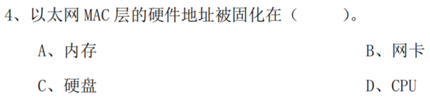

答案：B（网卡）

解析：
以太网MAC层的硬件地址（即MAC地址）是由网卡制造商在生产时固化到**网卡的只读存储器（ROM）**中的，是网卡的物理标识，与内存、硬盘、CPU无直接关联。

---

### PDU 地址（协议数据单元地址）

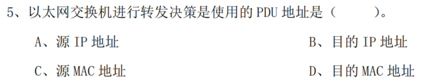

答案：D（目的MAC地址）

解析：
以太网交换机工作在数据链路层，其转发决策依赖**MAC地址表**：收到数据帧后，读取帧中的**目的MAC地址**，查询地址表中该地址对应的端口，将数据帧转发到对应端口；而IP地址是网络层地址，交换机不处理IP地址相关的转发决策。

---

### 发送时延

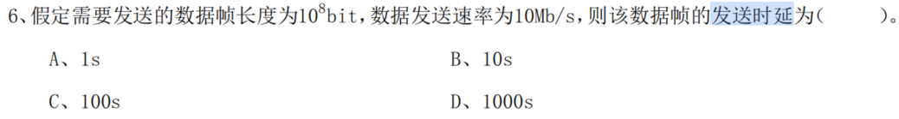

答案：B（10s）

解析：
发送时延的计算公式为：**发送时延 = 数据帧长度 ÷ 数据发送速率**。
代入数据：数据帧长度为\(10^8\)bit，发送速率为10Mb/s（即\(10^7\)bit/s），因此发送时延 = \(10^8 / 10^7 = 10\)s。

---

### ABCDE类地址

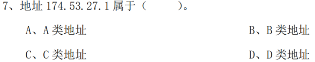

答案：B（B类地址）

解析：
IP地址的分类由**第一个字节的取值范围**决定：

- A类地址：第一个字节范围为1~126；
- B类地址：第一个字节范围为128~191；
- C类地址：第一个字节范围为192~223；
- D类地址：第一个字节范围为224~239。

该地址的第一个字节是174，处于128~191之间，因此属于B类地址。

---

### ARP 协议

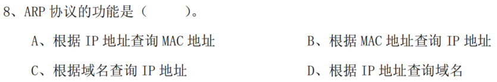

答案：A（根据IP地址查询MAC地址）

解析：
ARP（地址解析协议）的核心功能是在局域网内，根据目标设备的**IP地址**获取其对应的**MAC地址**，以实现数据帧的局域网内转发；选项B是RARP协议的功能，选项C、D是DNS协议的功能。

---

### 子网掩码求网络地址

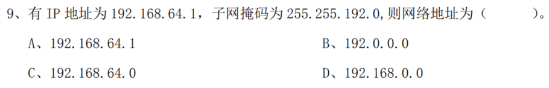

答案：C

解析：

计算网络地址的方法是**IP地址与子网掩码进行“按位与”运算**：

1. 将IP地址`192.168.64.1`和子网掩码`255.255.192.0`转换为二进制：
   - IP地址：`11000000.10101000.01000000.00000001`
   - 子网掩码：`11111111.11111111.11000000.00000000`
2. 按位与运算（对应位都为1则结果为1，否则为0）：
   - 结果：`11000000.10101000.01000000.00000000`，转换为十进制即`192.168.64.0`。

---

### 电子邮件传输

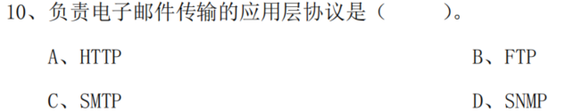

答案：C

解析：

各选项对应的协议功能：

1. **HTTP**：超文本传输协议，用于网页内容的传输（如浏览器访问网站）。
2. **FTP**：文件传输协议，用于文件的上传、下载。
3. **SMTP**：简单邮件传输协议，专门负责电子邮件的发送与传输。
4. **SNMP**：简单网络管理协议，用于网络设备的监控与管理。

---

### TCP 协议

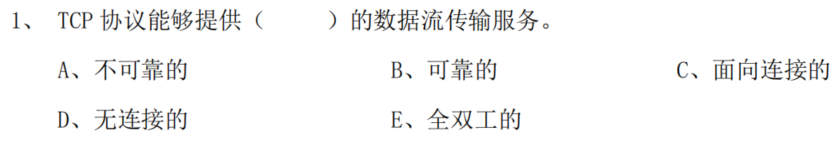

答案：B、C、E

解析：

TCP协议的核心特性：

1. **可靠的**：通过序列号、确认应答、重传机制等，保证数据准确、完整传输。
2. **面向连接的**：通信前需通过“三次握手”建立连接，通信后通过“四次挥手”关闭连接。
3. **全双工的**：通信双方可同时发送和接收数据，双向传输信道独立。

而“不可靠的”“无连接的”是UDP协议的特性，因此排除A、D。

---

### OSI/RM 参考模型的七层协议

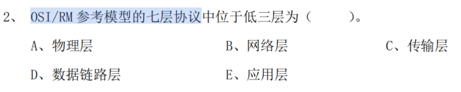

答案：A、B、D

解析：

OSI/RM七层协议的层级从低到高依次为：

1. 物理层
2. 数据链路层
3. 网络层
4. 传输层
5. 会话层
6. 表示层
7. 应用层

其中“低三层”即前三层，对应选项中的物理层、数据链路层、网络层。传输层属于第4层，应用层属于第7层，因此排除C、E。

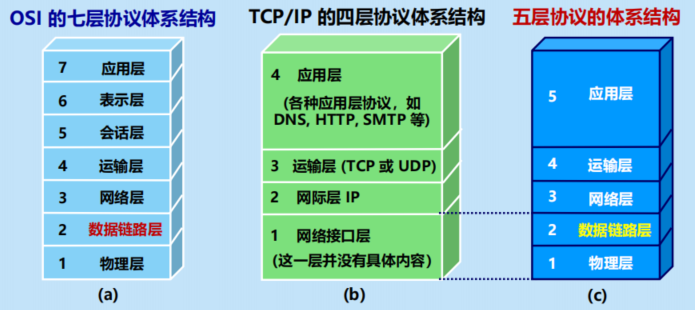

---

### 数据链路层的中间设备

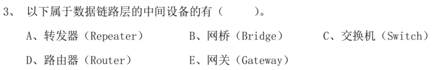

答案：B、C

解析：

不同中间设备对应的OSI层级：

1. **网桥（Bridge）**：工作在数据链路层，基于MAC地址转发数据帧。
2. **交换机（Switch）**：本质是多端口网桥，同样工作在数据链路层，通过MAC地址表实现数据帧的转发。
3. **转发器（Repeater）**：工作在物理层，仅放大信号，不处理数据链路层信息。
4. **路由器（Router）**：工作在网络层，基于IP地址转发数据包。
5. **网关（Gateway）**：工作在高层（通常是应用层），用于不同协议体系的网络互联。

---

### TCPUDP

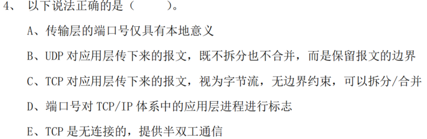

答案：A、B、C、D

解析：

对各选项的分析：

1. **选项A**：传输层端口号仅标识本地主机上的应用进程，无全局意义（需结合IP地址才能唯一标识网络中的进程），因此仅具有本地意义。
2. **选项B**：UDP是面向报文的协议，会完整保留应用层报文的边界，不拆分、不合并，直接封装为UDP报文段发送。
3. **选项C**：TCP是面向字节流的协议，将应用层数据视为连续的字节序列，可根据传输需求拆分/合并字节流，无报文边界约束。
4. **选项D**：端口号的核心作用是标识TCP/IP体系中主机内的应用进程，实现进程间的通信寻址。
5. **选项E**：TCP是面向连接的协议，且提供全双工通信，因此该选项错误。

---

### 应用层协议

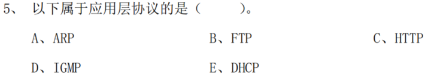

答案：B、C、E

解析：

各选项对应的协议层级及功能：

1. **FTP（文件传输协议）**：应用层协议，用于文件的上传、下载。
2. **HTTP（超文本传输协议）**：应用层协议，用于网页内容的传输。
3. **DHCP（动态主机配置协议）**：应用层协议，用于自动分配IP地址等网络参数。
4. **ARP（地址解析协议）**：网络层协议，用于将IP地址转换为MAC地址。
5. **IGMP（网际组管理协议）**：网络层协议，用于组播组的管理。

---

### 填空合集

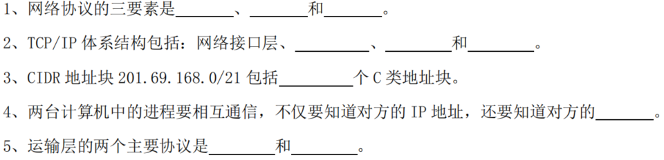

1. **网络协议的三要素**：语法、语义、同步
   - 语法：规定数据与控制信息的格式；
   - 语义：规定需要发出的控制信息、完成的动作及响应；
   - 同步：规定事件发生的顺序。

2. **TCP/IP体系结构**：网络接口层、网际层（IP层）、传输层、应用层
   - 网际层负责IP地址寻址与数据包转发；传输层负责端到端的通信；应用层提供各类应用服务。

3. **CIDR地址块201.69.168.0/21包含的C类地址块数**：8个
   - C类地址的子网掩码是/24，该CIDR的前缀为/21，二者差值为3（24-21=3），因此包含的C类地址块数为\(2^3=8\)。

4. **进程通信还需知道的信息**：端口号
   - IP地址标识主机，端口号标识主机内的应用进程，二者结合才能唯一确定网络中的通信进程。

5. **传输层的两个主要协议**：TCP（传输控制协议）、UDP（用户数据报协议）
   - TCP提供可靠、面向连接的服务；UDP提供不可靠、无连接的服务。

---

### 判断题合集

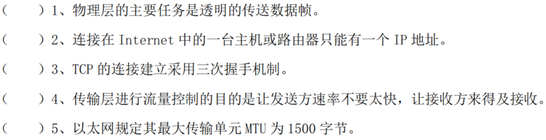

1. 1：**错误**
   物理层的主要任务是透明传输**比特流**，而数据帧是数据链路层的传输单位。

2. 2：**错误**
   一台主机或路由器可配置多个IP地址（如多网卡设备、虚拟IP等场景）。

3. 3：**正确**
   TCP通过“三次握手”建立可靠的连接，确保通信双方的收发能力正常。

4. 4：**正确**
   传输层的流量控制（如TCP的滑动窗口机制）用于协调发送方与接收方的速率，避免接收方缓冲区溢出。

5. 5：**正确**
   以太网的标准最大传输单元（MTU）为1500字节，超出该长度的数据会被分片传输。

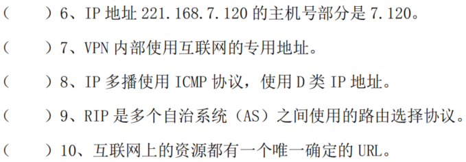

1. 6：**错误**
   IP地址221.168.7.120是C类地址（默认子网掩码255.255.255.0），其主机部分仅为最后一个字节（120），前三个字节是网络部分。

2. 7：**正确**
   VPN（虚拟专用网）内部通常使用互联网专用地址（如10.0.0.0/8、172.16.0.0/12、192.168.0.0/16），避免与公网地址冲突。

3. 8：**错误**
   IP多播使用的是IGMP（网际组管理协议）而非ICMP；D类IP地址是多播地址，这部分描述正确，但协议部分错误。

4. 9：**错误**
   RIP是自治系统（AS）**内部**使用的路由选择协议（内部网关协议），自治系统之间的路由协议是BGP等外部网关协议。

5. 10：**错误**
    互联网资源的标识可通过URL，但并非所有资源都有唯一URL（例如同一资源可能对应多个URL，或部分资源无公开URL）。

---

### CSMA/CD计算题

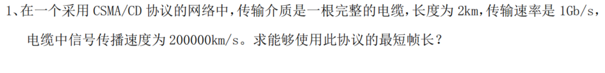

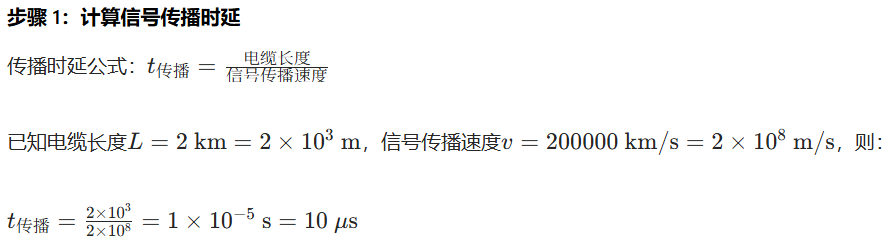

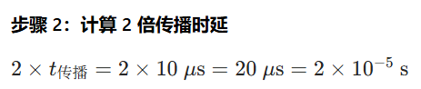

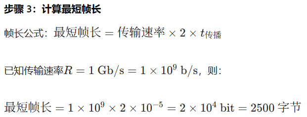

能够使用此协议的最短帧长为或2500 字节。

---

### CRC计算题


后两问都验算一遍都可以。

---

### 码片序列


解答：
CDMA的判断规则是：**将接收码片序列与站点的码片序列做内积，内积结果为正表示发送1，为负表示发送0，为0表示未发送**。

1. 计算站点A与接收序列S的内积
   A的码片序列：\((-1, +1, -1, +1)\)
   接收序列S：\((+1, -1, +3, +1)\)
   内积 = \((-1×1) + (1×-1) + (-1×3) + (1×1) = -1 -1 -3 +1 = -4\)
   结果为负，说明A**发送了数据，发送的是0**。

2. 计算站点B与接收序列S的内积
   B的码片序列：\((-1, -1, +1, +1)\)
   内积 = \((-1×1) + (-1×-1) + (1×3) + (1×1) = -1 +1 +3 +1 = 4\)
   结果为正，说明B**发送了数据，发送的是1**。

3. 计算站点C与接收序列S的内积
   C的码片序列：\((-1, -1, -1, -1)\)
   内积 = \((-1×1) + (-1×-1) + (-1×3) + (-1×1) = -1 +1 -3 -1 = -4\)
   结果为负，说明C**发送了数据，发送的是0**。

结论：
站点A、B、C都发送了数据；其中A发送0，B发送1，C发送0。


---

### 子网掩码


解答：

（1）子网掩码255.255.255.0对应的类别
默认子网掩码中：

- A类默认掩码：255.0.0.0
- B类默认掩码：255.255.0.0
- C类默认掩码：255.255.255.0
因此，255.255.255.0是**C类网络的默认子网掩码**（也可作为B类网络的子网掩码，划分更小的子网）。

（2）掩码255.255.255.248对应的主机数
255.255.255.248转换为二进制是`11111111.11111111.11111111.11111000`，主机位为3位。
可用主机数 = \(2^3 - 2 = 6\)（减2是排除网络地址和广播地址）。

（3）A类（subnet-id 16个1）与B类（subnet-id 8个1）的子网掩码是否相同

- A类网络默认掩码是255.0.0.0，subnet-id为16个1，子网掩码为：`11111111.11111111.11111111.00000000`（即255.255.255.0）。
- B类网络默认掩码是255.255.0.0，subnet-id为8个1，子网掩码为：`11111111.11111111.11111111.00000000`（即255.255.255.0）。
二者子网掩码**相同**。

（4）A类（subnet-id 16个1）与B类（subnet-id 8个1）的子网数目是否相同

- A类网络：默认网络位8位，subnet-id为16位，子网数 = \(2^{16} - 2 = 65534\)（减2是排除全0、全1子网）。
- B类网络：默认网络位16位，subnet-id为8位，子网数 = \(2^8 - 2 = 254\)。
二者子网数目**不相同**。

（5）B类地址掩码255.255.240.0对应的最大主机数
255.255.240.0的二进制是`11111111.11111111.11110000.00000000`，主机位为12位。
最大主机数 = \(2^{12} - 2 = 4094\)。

（6）十六进制IP地址C1.2E.14.80的转换与类别

- 转换为十进制：
  C1（十六进制）= \(12×16 + 1 = 193\)；
  2E = \(2×16 + 14 = 46\)；
  14 = 20；
  80 = 128；
  点分十进制为：193.46.20.128。
- 地址类别：首字节193属于192~223范围，是**C类IP地址**。

结论：

1. 是C类默认子网掩码（或B类的子网掩码）；
2. 最多连接6台主机；
3. 子网掩码相同；
4. 子网数目不同；
5. 每个子网最多4094台主机；
6. 点分十进制为193.46.20.128，属于C类地址。

---

### 数据报分片


解答：
首先明确：IP数据报固定首部长度为20字节，因此每个数据报片的**数据字段最大长度** = 网络最大数据报长度 - 首部长度 = \(1420 - 20 = 1400\)字节。

步骤1：计算分片数量
原数据部分长度为4000字节，需分片的数量：
\[
\text{分片数} = \lceil \frac{4000}{1400} \rceil = 3 \text{片（前2片各1400字节，第3片1200字节）}
\]

步骤2：各数据报片的参数
片偏移的单位是“8字节”，因此片偏移 = 数据字段起始字节 ÷ 8；MF标志为1表示后续还有分片，为0表示最后一片。

| 分片序号 | 数据字段长度（字节） | 片偏移（8字节为单位） | MF标志 |
|----------|----------------------|------------------------|--------|
| 1        | 1400                 | \(0 ÷ 8 = 0\)          | 1      |
| 2        | 1400                 | \(1400 ÷ 8 = 175\)     | 1      |
| 3        | 1200                 | \((1400+1400) ÷ 8 = 350\) | 0      |

结论：
应划分为3个数据报片，各片参数如上表所示。

---

### 路由表


解答：

（1）路由器R的路由表
路由表包含**目的网络、子网掩码、下一跳（直连子网为“直接交付”）、输出接口**：

- 子网N1：目的网络`145.13.0.0`，子网掩码`255.255.192.0`（对应/18），输出接口`m0`，下一跳“直接交付”；
- 子网N2：目的网络`145.13.64.0`，子网掩码`255.255.192.0`，输出接口`m1`，下一跳“直接交付”；
- 子网N3：目的网络`145.13.128.0`，子网掩码`255.255.192.0`，输出接口`m2`，下一跳“直接交付”；
- 互联网：目的网络`0.0.0.0`（默认路由），子网掩码`0.0.0.0`，输出接口`m3`，下一跳为互联网的网关（题目未指定，记为“默认”）。

路由表如下：

| 目的网络        | 子网掩码        | 下一跳     | 输出接口 |
|-----------------|-----------------|------------|----------|
| 145.13.0.0      | 255.255.192.0   | 直接交付   | m0       |
| 145.13.64.0     | 255.255.192.0   | 直接交付   | m1       |
| 145.13.128.0    | 255.255.192.0   | 直接交付   | m2       |
| 0.0.0.0         | 0.0.0.0         | 默认网关   | m3       |

（2）目的地址145.13.160.100的转发过程

1. 计算目的地址与各子网掩码的“按位与”结果：
   - 与N1掩码（255.255.192.0）运算：`145.13.160.100 & 255.255.192.0 = 145.13.128.0`，匹配N3的目的网络；
2. 路由表中N3对应的输出接口是`m2`，因此该分组被转发到接口`m2`，交付给子网N3。

---

### UDPTCP综合题


一、设计目的的差异

1. UDP面向报文的设计目的
   UDP的核心设计目标是**低延迟、轻量级的通信**，适用于对实时性要求高（如语音、视频）、可容忍少量丢包的场景。因此UDP不需要复杂的控制机制，仅需“完整传递应用层的每一个独立报文”，避免拆分/合并带来的延迟。

2. TCP面向字节流的设计目的
   TCP的核心设计目标是**可靠、有序、无差错的通信**，适用于对数据完整性要求高（如文件传输、网页加载）的场景。为了实现可靠传输，TCP需要灵活控制数据的发送（如滑动窗口、拥塞控制），因此将数据抽象为连续字节流，而非固定边界的报文，便于动态调整传输单元的大小。

二、实现原理的差异

1. UDP面向报文的实现原理

   - **发送端处理**：
      应用层调用UDP发送接口时，会传入一个完整的报文（包含数据长度）。UDP直接为该报文添加UDP首部（8字节，包含源端口、目的端口、长度、校验和），形成UDP报文段，然后交付给网络层。**UDP不会对报文做任何拆分**（即使报文超过MTU，也由IP层分片），也不会将多个小报文合并为一个。
   - **接收端处理**：
      网络层将IP数据报解封装后，交付给UDP。UDP根据首部的“长度”字段，提取出完整的应用层报文，直接交付给对应的应用进程。**接收端UDP不会拼接多个报文**，每个UDP报文段对应应用层的一个独立报文，严格保留应用层的报文边界。

1. TCP面向字节流的实现原理

   - **发送端处理**：
      应用层调用TCP发送接口时，数据会被写入TCP的发送缓冲区，TCP将缓冲区中的数据视为**无边界的字节序列**。TCP会根据当前的网络状况（如拥塞窗口、接收方窗口、MTU大小），从缓冲区中选取合适长度的字节（形成TCP报文段）发送，**可拆分大段数据，也可合并小段数据**（例如应用层多次发送小数据，TCP会合并为一个报文段发送，减少首部开销）。
   - **接收端处理**：
      网络层将IP数据报解封装后，交付给TCP。TCP将收到的字节流写入接收缓冲区，并通过“序号”保证字节流的有序性。应用层通过TCP的接收接口读取数据时，可按需读取任意长度的字节（而非按TCP报文段的边界），**TCP不保证接收的字节流与应用层发送的报文边界一致**，应用层需自行通过协议格式（如分隔符、长度字段）区分不同的报文。

三、总结

| 维度         | UDP（面向报文）| TCP（面向字节流）|
|--------------|--------------------------------------------|--------------------------------------------|
| 设计目的     | 低延迟、轻量级，保留应用层报文边界         | 可靠传输，灵活控制数据，不保留报文边界     |
| 发送端处理   | 直接封装应用层报文，不拆分、不合并         | 以字节流为单位，拆分/合并数据               |
| 接收端处理   | 按报文边界交付给应用层                     | 按字节流交付，应用层自行处理边界           |
| 典型场景     | 实时语音、视频、DNS查询                   | 文件传输、网页加载、数据库交互             |

---

### ARP 和 DNS 的异同


ARP与DNS的异同分析

一、相同点
核心作用是**地址解析**：均实现“一种标识到另一种标识的映射”，解决网络通信中“标识不匹配”的问题，是网络层/应用层通信的基础支撑协议。

二、不同点

| 维度         | ARP（地址解析协议）| DNS（域名系统）|
|--------------|--------------------------------------------|--------------------------------------------|
| 1. 协议层级   | 网络层协议（依赖链路层广播）| 应用层协议（基于UDP/TCP传输）|
| 2. 解析映射关系 | **IP地址 → MAC地址**<br>（同一局域网内，主机/设备的物理地址映射） | **域名 → IP地址**<br>（跨网络的逻辑地址映射） |
| 3. 作用范围   | 仅在**同一局域网**内有效（广播报文无法跨路由传输） | 作用于**整个互联网**（通过分布式域名服务器集群实现） |
| 4. 解析方式   | 局域网内广播请求：<br>发送方广播“谁是X.X.X.X？请回复MAC地址”，目标主机单播回复，结果缓存（超时失效） | 递归/迭代查询：<br>客户端向本地DNS服务器请求，服务器通过迭代查询根域、顶级域、权威域服务器，最终返回IP地址，结果缓存（超时失效） |
| 5. 设计目的   | 解决“IP地址与物理地址的对应”问题，支撑网络层数据包向链路层帧的封装 | 解决“域名（易记）与IP地址（难记）的对应”问题，降低用户使用网络的门槛 |
| 6. 数据格式   | 固定格式的ARP报文（包含操作类型、发送端/目标端的IP+MAC） | 基于DNS报文格式（包含查询/响应类型、域名、资源记录等） |

三、总结
ARP是局域网内的“IP→MAC”物理地址解析协议，DNS是互联网范围的“域名→IP”逻辑地址解析协议，二者均通过地址映射支撑网络通信，但在层级、范围、方式上差异显著。

## 零碎知识点补充

### 三交换技术名字（电路/报文/分组）

网络中的三种交换技术分别是：**电路交换、报文交换、分组交换**，三者的核心差异在于数据传输的单元与资源分配方式：

1. 电路交换

   - **核心逻辑**：通信前建立专用物理链路（如电话通信），链路独占，通信过程中资源不释放。
   - **特点**：延迟低、无失序，但资源利用率低，适用于实时性高的连续通信（如语音通话）。

2. 报文交换

   - **核心逻辑**：以“完整报文”为传输单元，无需建立专用链路，报文在节点间存储-转发。
   - **特点**：资源利用率高，但报文需完整缓存后转发，延迟大且不适合长报文，适用于早期非实时数据通信。

3. 分组交换

   - **核心逻辑**：将报文拆分为固定长度的“分组”，以分组为单元存储-转发，分组独立传输、动态选路。
   - **特点**：资源利用率高、延迟可控、支持多路复用，是现代互联网的核心交换技术，适用于各类数据通信（如网页、文件传输）。

### TCP 与 UDP 熟知端口（FTP-21/SSH-22/DNS-53/HTTP-80）

TCP和UDP的熟知端口（Well-known Ports）是指由IANA（互联网数字分配机构）规定的、用于特定应用层协议的标准端口号。这些端口号范围为0~1023，在网络通信中具有特殊意义。以下是常见的熟知端口及其对应的应用层协议：

| 端口号 | 协议 | 应用层协议 | 功能说明 |
|--------|------|-----------|---------|
| **21** | TCP | FTP（文件传输协议） | 用于文件的上传、下载，采用TCP保证传输可靠性 |
| **22** | TCP | SSH（安全外壳协议） | 用于远程登录和管理，提供加密的远程访问 |
| **23** | TCP | Telnet（远程登录协议） | 用于远程登录，但不加密（已逐步被SSH替代） |
| **25** | TCP | SMTP（简单邮件传输协议） | 用于电子邮件的发送 |
| **53** | UDP/TCP | DNS（域名系统） | 用于域名解析（将域名转换为IP地址），通常使用UDP，大型查询使用TCP |
| **67/68** | UDP | DHCP（动态主机配置协议） | 用于自动分配IP地址、子网掩码、网关等网络参数 |
| **80** | TCP | HTTP（超文本传输协议） | 用于网页内容的传输（非加密） |
| **110** | TCP | POP3（邮局协议第3版） | 用于电子邮件的接收 |
| **143** | TCP | IMAP（互联网邮件访问协议） | 用于电子邮件的接收和管理 |
| **443** | TCP | HTTPS（超文本传输安全协议） | 用于加密的网页内容传输 |
| **161** | UDP | SNMP（简单网络管理协议） | 用于网络设备的监控和管理 |

#### 核心记忆要点

1. **FTP-21**：文件传输，TCP协议，需要可靠性保证
2. **SSH-22**：安全远程登录，TCP协议，加密传输
3. **DNS-53**：域名解析，通常UDP（快速），大查询用TCP
4. **HTTP-80**：网页传输，TCP协议，非加密
5. **HTTPS-443**：网页传输，TCP协议，加密传输

#### 为什么这些端口号被选择？

- **FTP、SSH、HTTP(S)、SMTP、POP3、IMAP** 都使用TCP，因为这些应用对数据的完整性和有序性要求高；
- **DNS、DHCP、SNMP** 通常使用UDP，因为这些应用对实时性要求高，可容忍少量丢包；
- **DNS特殊**：标准查询使用UDP（快速），但当响应数据超过512字节时，会自动切换到TCP。

---

## 网络性能指标单位换算（k=2¹⁰ 还是 10³）

在计算机网络中，数据单位的换算涉及两种不同的进制标准，这是考试中的常见易错点：

### 1. 二进制进制（k=2¹⁰）

用于表示**存储容量**和**内存大小**：

- 1 KB = 2¹⁰ B = 1024 B
- 1 MB = 2¹⁰ KB = 1024 KB
- 1 GB = 2¹⁰ MB = 1024 MB
- 1 TB = 2¹⁰ GB = 1024 GB

**应用场景**：硬盘容量、内存大小、文件大小等

### 2. 十进制进制（k=10³）

用于表示**网络带宽**和**传输速率**：

- 1 kb/s = 10³ b/s = 1000 b/s（注意小写k表示千）
- 1 Mb/s = 10³ kb/s = 1000 kb/s（注意大写M表示百万）
- 1 Gb/s = 10³ Mb/s = 1000 Mb/s
- 1 Tb/s = 10³ Gb/s = 1000 Gb/s

**应用场景**：网络速率、带宽、数据传输速度等

### 3. 区分方法

| 场景 | 进制 | 换算 | 示例 |
|------|------|------|------|
| 存储容量 | 二进制 | 1 KB = 1024 B | 硬盘1TB = 1024×1024×1024×1024 B |
| 网络带宽 | 十进制 | 1 Mb/s = 1000 kb/s | 100 Mb/s网络 = 100,000 kb/s |
| 内存大小 | 二进制 | 1 GB = 1024 MB | 8GB内存 = 8×1024 MB |
| 传输速率 | 十进制 | 1 Gb/s = 1000 Mb/s | 光纤1 Gb/s = 1000 Mb/s |

### 4. 考试常见题型

**题目示例**：某网络的带宽为100 Mb/s，计算发送1 GB文件需要的时间。

**解答过程**：
1. 1 GB = 1024 MB = 1024 × 1024 KB = 1024 × 1024 × 1024 B = 2³⁰ B
2. 2³⁰ B = 2³⁰ × 8 bit = 2³³ bit（因为1 B = 8 bit）
3. 100 Mb/s = 100 × 10⁶ b/s = 10⁸ b/s
4. 传输时间 = 2³³ bit ÷ 10⁸ b/s ≈ 8589934592 ÷ 100000000 ≈ 85.9 秒

**关键点**：
- 存储单位用**二进制**（1 GB = 1024 MB）
- 速率单位用**十进制**（100 Mb/s = 100 × 10⁶ b/s）
- 转换时要统一单位（通常转为bit）

---

## 以太网最短帧长 64 B

以太网的最短帧长为**64字节（512 bit）**，这是以太网标准（IEEE 802.3）规定的重要参数，与CSMA/CD冲突检测机制密切相关。

### 为什么规定最短帧长？

在CSMA/CD协议中，发送方需要在发送过程中持续监听介质，以检测是否发生冲突。如果帧太短，发送方可能在完成帧的发送前就已经停止监听，导致无法检测到冲突。

**最短帧长的计算**：

最短帧长 = 2 × 传播延迟 × 传输速率

其中：
- 传播延迟：信号在介质中的传播时间（以太网最大传播延迟约为2.165 μs）
- 传输速率：以太网标准速率（10 Mb/s）

计算：最短帧长 = 2 × 2.165 μs × 10 Mb/s = 2 × 2.165 × 10⁻⁶ s × 10 × 10⁶ b/s ≈ 43.3 bit

为了便于处理和提供安全裕度，IEEE 802.3标准规定最短帧长为**64字节（512 bit）**。

### 以太网帧的结构

| 字段 | 长度 | 说明 |
|------|------|------|
| 前导码（Preamble） | 7 B | 用于同步，由10101010...组成 |
| 帧开始分界符（SFD） | 1 B | 标记帧的开始，为10101011 |
| 目的MAC地址 | 6 B | 接收方的物理地址 |
| 源MAC地址 | 6 B | 发送方的物理地址 |
| 类型/长度字段 | 2 B | 标识上层协议或帧的数据长度 |
| **数据字段** | **46~1500 B** | 上层协议的数据（最少46 B，最多1500 B） |
| CRC校验字段 | 4 B | 循环冗余校验码，用于错误检测 |

**注意**：
- 前导码和SFD（共8 B）通常不计入帧长
- 最短帧长64 B = 6 + 6 + 2 + 46 + 4 = 64 B（不含前导码和SFD）
- 最长帧长1518 B = 6 + 6 + 2 + 1500 + 4 = 1518 B
- 如果数据少于46 B，需要用填充字节补齐至46 B

### 最短帧长的实际意义

1. **冲突检测**：确保发送方在发送完整帧前能检测到冲突
2. **网络稳定性**：防止过短的帧导致网络混乱
3. **标准化**：便于网络设备的设计和实现

---

## 总结速记表

| 知识点 | 关键信息 |
|--------|---------|
| **三交换技术** | 电路交换（专用链路）、报文交换（完整报文）、分组交换（固定长度分组） |
| **复用技术** | FDM（频分）、TDM（时分）、CDM（码分）、WDM（波分） |
| **MAC地址** | 48 bit（6字节），固化在网卡，全球唯一 |
| **IPv4地址** | 32 bit（4字节），分为A/B/C/D/E五类 |
| **以太网最短帧** | 64 B（512 bit），与CSMA/CD冲突检测相关 |
| **MTU** | 最大传输单元，以太网标准为1500 B |
| **熟知端口** | FTP-21、SSH-22、DNS-53、HTTP-80、HTTPS-443 |
| **单位换算** | 存储用二进制（1 KB=1024 B），速率用十进制（1 Mb/s=10⁶ b/s） |
| **TCP特性** | 面向连接、可靠、有序、面向字节流 |
| **UDP特性** | 无连接、不可靠、快速、面向报文 |


---

## PPP 协议（点对点协议）

PPP（Point-to-Point Protocol）是一种用于在两个节点间建立直接连接的数据链路层协议，广泛应用于拨号上网、专线连接等场景。PPP的核心特点是**三组件架构**：帧格式、LCP（链路控制协议）和NCP（网络控制协议）。

### PPP 三组件详解

#### 1. 帧格式（Frame Format）

PPP帧是PPP协议传输的基本单位，其结构如下：

```
┌─────────┬──────────┬──────────┬──────────┬──────────┬──────────┐
│  标志   │  地址    │  控制    │  协议    │   信息   │   FCS    │
│ Flag   │ Address  │ Control  │ Protocol │   Data   │ Checksum │
│  1 B   │   1 B    │   1 B    │   2 B    │ 0~65535B │   2 B    │
└─────────┴──────────┴──────────┴──────────┴──────────┴──────────┘
```

**各字段详解**：

| 字段 | 长度 | 说明 |
|------|------|------|
| **标志（Flag）** | 1 B | 固定值0x7E（01111110），用于标记帧的开始和结束 |
| **地址（Address）** | 1 B | 固定值0xFF（11111111），表示广播地址（PPP点对点，无需真正的地址） |
| **控制（Control）** | 1 B | 固定值0x03（00000011），表示无序号的无连接服务 |
| **协议（Protocol）** | 2 B | 标识信息字段中承载的协议类型，如0x0021表示IP、0xC021表示LCP、0x8021表示IPCP |
| **信息（Data）** | 0~65535 B | 上层协议的数据，长度可变 |
| **FCS（校验）** | 2 B | 帧校验序列，用于检测帧传输中的错误（通常使用CRC-16） |

**PPP帧的特点**：
- 标志字段0x7E可能出现在数据中，需要进行**字节填充**（Byte Stuffing）：数据中的0x7E替换为0x7D 0x5E，0x7D替换为0x7D 0x5D
- 最小帧长：1+1+1+2+0+2 = 7 B（无数据的最小帧）
- 最大帧长：1+1+1+2+65535+2 = 65542 B

#### 2. LCP（链路控制协议）

LCP是PPP的**链路建立和维护协议**，负责在两个PPP节点间建立、配置和测试数据链路。

**LCP的主要功能**：

1. **链路建立**
   - 两个节点通过LCP协商建立链路连接
   - 交换配置选项（如最大接收单元MRU、认证方式等）
   - 建立成功后进入"打开"状态

2. **链路配置**
   - 协商PPP参数（如压缩算法、加密方式）
   - 设置超时时间和重试次数
   - 配置认证协议（如PAP、CHAP）

3. **链路测试**
   - 定期发送Echo-Request报文测试链路连通性
   - 接收端回复Echo-Reply报文
   - 用于检测链路故障

4. **链路终止**
   - 任一端点可发起链路关闭
   - 通过Terminate-Request/Terminate-Ack报文完成关闭
   - 释放链路资源

**LCP报文类型**：

| 报文类型 | 代码 | 功能说明 |
|---------|------|---------|
| Configure-Request | 1 | 发送方请求配置链路参数 |
| Configure-Ack | 2 | 接收方确认所有参数 |
| Configure-Nak | 3 | 接收方拒绝某些参数，建议替代值 |
| Configure-Reject | 4 | 接收方拒绝某些参数，无替代值 |
| Terminate-Request | 5 | 请求终止链路 |
| Terminate-Ack | 6 | 确认链路终止 |
| Code-Reject | 7 | 接收到未知的报文类型 |
| Protocol-Reject | 8 | 接收到不支持的协议 |
| Echo-Request | 9 | 请求链路回显测试 |
| Echo-Reply | 10 | 回显测试应答 |
| Discard-Request | 11 | 请求丢弃该报文（用于测试） |

**LCP链路建立过程**（三阶段）：

```
发送端                              接收端
  │                                   │
  ├─── Configure-Request ────────────>│
  │                                   │
  │<─── Configure-Ack ────────────────┤
  │                                   │
  ├─── Configure-Request ────────────>│
  │                                   │
  │<─── Configure-Ack ────────────────┤
  │                                   │
  │  [链路建立完成，进入打开状态]      │
  │                                   │
```

#### 3. NCP（网络控制协议）

NCP是PPP的**网络层协议协商协议**，负责在链路建立后，为不同的网络层协议（如IP、IPX等）进行配置和参数协商。

**NCP的主要功能**：

1. **网络层协议协商**
   - 协商使用哪种网络层协议（IP、IPX、AppleTalk等）
   - 为每种协议分配相应的NCP实例

2. **IP地址配置**（IPCP - IP Control Protocol）
   - 协商本地IP地址和对端IP地址
   - 协商DNS服务器地址
   - 协商压缩算法（如TCP/IP头部压缩）

3. **参数协商**
   - 协商网络层的各种参数
   - 设置超时和重试机制
   - 配置特定协议的选项

**常见的NCP类型**：

| NCP类型 | 协议代码 | 功能说明 |
|--------|---------|---------|
| **IPCP** | 0x8021 | IP控制协议，用于IPv4地址和参数协商 |
| **IPV6CP** | 0x8057 | IPv6控制协议，用于IPv6地址和参数协商 |
| **IPXCP** | 0x802B | IPX控制协议，用于Novell IPX协议 |
| **ATCP** | 0x8029 | AppleTalk控制协议 |

**IPCP协商过程**（与LCP类似）：

```
发送端                              接收端
  │                                   │
  ├─── IPCP Configure-Request ──────>│
  │     (请求IP地址)                  │
  │                                   │
  │<─── IPCP Configure-Ack ──────────┤
  │     (分配IP地址)                  │
  │                                   │
  │  [IP配置完成，可进行IP通信]       │
  │                                   │
```

### PPP 工作流程（完整过程）

PPP连接的建立分为**四个阶段**：

```
┌─────────────────────────────────────────────────────────────┐
│ 阶段1：链路建立（Link Establishment Phase）                 │
│ ├─ 两端交换LCP Configure-Request报文                        │
│ ├─ 协商链路参数（MRU、认证方式等）                          │
│ └─ 完成后进入"链路打开"状态                                 │
├─────────────────────────────────────────────────────────────┤
│ 阶段2：认证（Authentication Phase）- 可选                   │
│ ├─ 如果协商了认证，执行PAP或CHAP认证                        │
│ ├─ 验证用户身份                                             │
│ └─ 认证失败则关闭链路                                       │
├─────────────────────────────────────────────────────────────┤
│ 阶段3：网络层协议协商（Network Layer Protocol Phase）       │
│ ├─ 交换NCP（如IPCP）Configure-Request报文                   │
│ ├─ 协商网络层参数（IP地址、DNS等）                          │
│ └─ 完成后进入"网络层打开"状态                               │
├─────────────────────────────────────────────────────────────┤
│ 阶段4：数据传输（Data Transfer Phase）                      │
│ ├─ 两端可进行正常的数据通信                                 │
│ ├─ 定期发送LCP Echo-Request保活                             │
│ └─ 直到任一端发起链路关闭                                   │
└─────────────────────────────────────────────────────────────┘
```

### PPP 与以太网的对比

| 特性 | PPP | 以太网 |
|------|-----|--------|
| **应用场景** | 点对点链路（拨号、专线） | 局域网（多个设备） |
| **工作层级** | 数据链路层 | 数据链路层 |
| **地址类型** | 无需MAC地址（点对点） | 需要MAC地址 |
| **帧结构** | 简单（7字段） | 复杂（前导码、SFD等） |
| **协议协商** | 需要LCP/NCP协商 | 无需协商 |
| **认证** | 支持PAP/CHAP认证 | 无认证机制 |
| **最大帧长** | 65542 B | 1518 B |
| **典型应用** | ADSL、PPPoE、VPN | 家庭网络、企业局域网 |

---

## PPP 计算题

### 题型1：PPP帧长度计算

**题目示例**：
某PPP链路传输一个IP数据报，IP数据报长度为100字节。计算：
1. PPP帧的总长度（不考虑字节填充）
2. 如果数据中包含2个0x7E字节，字节填充后的帧长度

**解答**：

**第1问：不考虑字节填充的PPP帧长度**

PPP帧结构：Flag(1) + Address(1) + Control(1) + Protocol(2) + Data(100) + FCS(2) = 107 B

**第2问：考虑字节填充后的帧长度**

字节填充规则：
- 数据中的0x7E替换为0x7D 0x5E（1字节变2字节）
- 数据中的0x7D替换为0x7D 0x5D（1字节变2字节）

如果数据中包含2个0x7E字节：
- 原始数据长度：100 B
- 填充后数据长度：100 + 2 = 102 B（每个0x7E增加1字节）
- PPP帧总长度：1 + 1 + 1 + 2 + 102 + 2 = 109 B

**答案**：
1. 不考虑填充：107 B
2. 考虑填充：109 B

---

### 题型2：PPP链路建立时间计算

**题目示例**：
某ADSL用户通过PPP协议拨号上网，已知：
- LCP协商需要往返2次（每次100 ms）
- 认证过程需要200 ms
- IPCP协商需要往返1次（每次100 ms）
- 数据传输开始前的总延迟

计算PPP链路完全建立所需的时间。

**解答**：

PPP链路建立的四个阶段：

1. **LCP链路建立**：2次往返 × 100 ms = 200 ms
2. **认证阶段**：200 ms
3. **IPCP网络层协商**：1次往返 × 100 ms = 100 ms
4. **总时间**：200 + 200 + 100 = 500 ms

**答案**：PPP链路完全建立需要500 ms（0.5秒）

---

### 题型3：PPP数据传输效率计算

**题目示例**：
某PPP链路的带宽为1 Mb/s，需要传输一个1000字节的IP数据报。已知：
- PPP帧头开销（Flag + Address + Control + Protocol + FCS）= 7字节
- 数据中不包含0x7E或0x7D字节（无需填充）
- 每个PPP帧之间有10字节的间隔

计算：
1. 传输该数据报所需的时间
2. 数据传输效率（有效数据字节数 / 总传输字节数）

**解答**：

**第1问：传输时间**

- IP数据报长度：1000 B
- PPP帧头开销：7 B
- 帧间隔：10 B
- 总传输字节数：1000 + 7 + 10 = 1017 B
- 总传输比特数：1017 × 8 = 8136 bit
- 传输时间：8136 bit ÷ (1 × 10⁶ bit/s) = 8.136 ms

**第2问：数据传输效率**

- 有效数据字节数：1000 B
- 总传输字节数：1017 B
- 传输效率：1000 / 1017 ≈ 98.3%

**答案**：
1. 传输时间：8.136 ms
2. 传输效率：约98.3%

---

### 题型4：PPP与以太网对比计算

**题目示例**：
比较PPP和以太网传输相同数据时的效率差异。已知：
- 传输数据：500字节的IP数据报
- PPP帧头开销：7字节
- 以太网帧头开销：14字节（目的MAC + 源MAC + 类型），帧尾4字节（FCS）
- 以太网最小帧长64字节（不足时需填充）

计算：
1. PPP传输该数据报的总字节数
2. 以太网传输该数据报的总字节数
3. 两者的传输效率对比

**解答**：

**第1问：PPP传输总字节数**

- 数据长度：500 B
- PPP帧头：7 B
- 总字节数：500 + 7 = 507 B

**第2问：以太网传输总字节数**

- 数据长度：500 B
- 以太网帧头：14 B
- 以太网帧尾（FCS）：4 B
- 小计：500 + 14 + 4 = 518 B
- 由于518 B > 64 B（最小帧长），无需填充
- 总字节数：518 B

**第3问：传输效率对比**

- PPP效率：500 / 507 ≈ 98.6%
- 以太网效率：500 / 518 ≈ 96.5%
- PPP效率更高（因为帧头开销更小）

**答案**：
1. PPP：507 B
2. 以太网：518 B
3. PPP效率（98.6%）> 以太网效率（96.5%）

---

### 题型5：PPP字节填充计算

**题目示例**：
某PPP帧的数据字段包含以下字节序列（十六进制）：
`7E 7D 45 7E 7D 7D 46`

计算字节填充后的数据长度。

**解答**：

字节填充规则：
- 0x7E → 0x7D 0x5E（1字节变2字节）
- 0x7D → 0x7D 0x5D（1字节变2字节）

逐字节分析：

| 原始字节 | 是否填充 | 填充后 | 字节数 |
|---------|---------|--------|--------|
| 0x7E | 是 | 0x7D 0x5E | 2 |
| 0x7D | 是 | 0x7D 0x5D | 2 |
| 0x45 | 否 | 0x45 | 1 |
| 0x7E | 是 | 0x7D 0x5E | 2 |
| 0x7D | 是 | 0x7D 0x5D | 2 |
| 0x7D | 是 | 0x7D 0x5D | 2 |
| 0x46 | 否 | 0x46 | 1 |

填充后总字节数：2 + 2 + 1 + 2 + 2 + 2 + 1 = 12 B

**答案**：字节填充后的数据长度为12字节（原始7字节，增加5字节）

---

### 题型6：PPP链路状态转换

**题目示例**：
某PPP链路的状态转换如下：
- 初始状态：Dead（已关闭）
- 用户发起拨号连接
- LCP协商成功
- 认证成功
- IPCP协商成功
- 用户主动断开连接

绘制状态转换图并说明各阶段的特点。

**解答**：

**PPP链路状态转换图**：

```
┌──────────┐
│   Dead   │ ← 初始状态（链路已关闭）
└────┬─────┘
     │ 用户发起拨号
     ▼
┌──────────────┐
│ Establish    │ ← LCP协商阶段
│ (建立中)     │   交换Configure-Request/Ack
└────┬─────────┘
     │ LCP协商成功
     ▼
┌──────────────┐
│ Authenticate │ ← 认证阶段（可选）
│ (认证中)     │   执行PAP或CHAP
└────┬─────────┘
     │ 认证成功
     ▼
┌──────────────┐
│ Network      │ ← 网络层协商阶段
│ (协商中)     │   交换IPCP Configure-Request/Ack
└────┬─────────┘
     │ IPCP协商成功
     ▼
┌──────────────┐
│   Open       │ ← 打开状态（数据传输）
│ (已打开)     │   可进行正常通信
└────┬─────────┘
     │ 用户断开连接
     ▼
┌──────────────┐
│ Terminate    │ ← 终止阶段
│ (终止中)     │   交换Terminate-Request/Ack
└────┬─────────┘
     │ 链路关闭
     ▼
┌──────────┐
│   Dead   │ ← 回到初始状态
└──────────┘
```

**各阶段特点**：

| 状态 | 特点 | 可进行的操作 |
|------|------|-----------|
| **Dead** | 链路已关闭 | 等待用户发起连接 |
| **Establish** | LCP协商中 | 交换链路参数 |
| **Authenticate** | 认证中 | 验证用户身份 |
| **Network** | 网络层协商中 | 协商IP地址等参数 |
| **Open** | 链路已打开 | 进行数据传输 |
| **Terminate** | 链路关闭中 | 释放资源 |

**答案**：见上述状态转换图和特点表

---

## PPP 考试重点总结

| 知识点 | 关键内容 |
|--------|---------|
| **PPP帧格式** | Flag(1) + Address(1) + Control(1) + Protocol(2) + Data(0~65535) + FCS(2) |
| **标志字段** | 0x7E（01111110），用于标记帧的开始和结束 |
| **字节填充** | 0x7E→0x7D 0x5E，0x7D→0x7D 0x5D |
| **LCP功能** | 链路建立、配置、测试、终止 |
| **NCP功能** | 网络层协议协商（如IPCP协商IP地址） |
| **工作阶段** | 链路建立→认证→网络层协商→数据传输 |
| **应用场景** | ADSL拨号、PPPoE、VPN等点对点链路 |
| **与以太网对比** | PPP用于点对点，以太网用于多点；PPP帧头更小，效率更高 |
| **常见计算** | 帧长度、字节填充、链路建立时间、传输效率 |

---

## TCP 三次握手与四次挥手

TCP是一种面向连接的协议，通信前需要建立连接，通信后需要释放连接。这两个过程分别通过"三次握手"和"四次挥手"完成，是TCP协议中最核心的机制。

### TCP 三次握手（Connection Establishment）

三次握手是TCP建立连接的过程，通过三次报文交互，使通信双方都确认对方的收发能力正常。

#### 握手过程详解


#### 握手过程的三个步骤

| 步骤 | 发送方 | 接收方 | 报文内容 | 目的 |
|------|--------|--------|---------|------|
| **第1步** | 客户端 | 服务器 | SYN, seq=x | 客户端告诉服务器"我要建立连接，我的初始序号是x" |
| **第2步** | 服务器 | 客户端 | SYN+ACK, seq=y, ack=x+1 | 服务器告诉客户端"我同意建立连接，我的初始序号是y，我已收到你的序号x" |
| **第3步** | 客户端 | 服务器 | ACK, seq=x+1, ack=y+1 | 客户端告诉服务器"我已收到你的序号y，连接建立完成" |

#### 握手过程中的关键字段

| 字段 | 说明 |
|------|------|
| **SYN标志** | 同步标志，值为1表示这是一个连接请求或连接接受报文 |
| **ACK标志** | 确认标志，值为1表示确认号字段有效 |
| **序号（seq）** | 发送方的初始序号，用于标识数据流中的字节位置 |
| **确认号（ack）** | 接收方期望接收的下一个字节的序号（即已成功接收到ack-1为止的所有字节） |

#### 为什么需要三次握手？

1. **第1次握手**：客户端→服务器
   - 目的：让服务器知道客户端存在，且客户端的发送能力正常
   - 验证：服务器收到SYN报文，说明客户端能发送

2. **第2次握手**：服务器→客户端
   - 目的：让客户端知道服务器存在，且服务器的收发能力都正常
   - 验证：客户端收到SYN+ACK报文，说明服务器能接收和发送

3. **第3次握手**：客户端→服务器
   - 目的：让服务器知道客户端已收到服务器的响应，客户端的接收能力正常
   - 验证：服务器收到ACK报文，说明客户端能接收

**总结**：三次握手确保了通信双方都能确认对方的收发能力正常，建立可靠的连接。

#### 握手过程中的状态转换

**客户端状态转换**：
```
CLOSED → SYN-SENT → ESTABLISHED
```

**服务器状态转换**：
```
LISTEN → SYN-RECEIVED → ESTABLISHED
```

---

### TCP 四次挥手（Connection Termination）

四次挥手是TCP释放连接的过程，通过四次报文交互，使通信双方都确认对方已准备好关闭连接。

#### 挥手过程详解


#### 挥手过程的四个步骤

| 步骤 | 发送方 | 接收方 | 报文内容 | 目的 |
|------|--------|--------|---------|------|
| **第1步** | 客户端 | 服务器 | FIN, seq=x, ack=y | 客户端告诉服务器"我要关闭连接，我的最后序号是x" |
| **第2步** | 服务器 | 客户端 | ACK, seq=y, ack=x+1 | 服务器确认"我已收到你的关闭请求，但我还有数据要发送" |
| **第3步** | 服务器 | 客户端 | FIN, seq=y, ack=x+1 | 服务器告诉客户端"我也要关闭连接了，我的最后序号是y" |
| **第4步** | 客户端 | 服务器 | ACK, seq=x+1, ack=y+1 | 客户端确认"我已收到你的关闭请求，连接可以关闭了" |

#### 挥手过程中的关键字段

| 字段 | 说明 |
|------|------|
| **FIN标志** | 终止标志，值为1表示这是一个连接关闭请求 |
| **ACK标志** | 确认标志，值为1表示确认号字段有效 |
| **序号（seq）** | 发送方的序号 |
| **确认号（ack）** | 接收方期望接收的下一个字节的序号 |

#### 为什么需要四次挥手？

1. **第1次挥手**：客户端→服务器
   - 客户端发送FIN报文，表示"我没有数据要发送了"
   - 但服务器可能还有数据要发送

2. **第2次挥手**：服务器→客户端
   - 服务器发送ACK报文，表示"我已收到你的关闭请求"
   - 但服务器还可能有数据要发送给客户端

3. **第3次挥手**：服务器→客户端
   - 服务器发送FIN报文，表示"我也没有数据要发送了"
   - 现在双方都准备好关闭连接

4. **第4次挥手**：客户端→服务器
   - 客户端发送ACK报文，表示"我已收到你的关闭请求"
   - 连接正式关闭

**关键区别**：
- 三次握手中，第2步的SYN+ACK可以合并（服务器同时发送SYN和ACK）
- 四次挥手中，第2步和第3步不能合并（服务器可能还有数据要发送）

#### 挥手过程中的状态转换

**客户端状态转换**：
```
ESTABLISHED → FIN-WAIT-1 → FIN-WAIT-2 → TIME-WAIT → CLOSED
```

**服务器状态转换**：
```
ESTABLISHED → CLOSE-WAIT → LAST-ACK → CLOSED
```

#### TIME-WAIT 状态的作用

客户端在发送最后的ACK报文后，进入TIME-WAIT状态，等待2MSL（Maximum Segment Lifetime，最大报文生存时间）后才完全关闭连接。

**TIME-WAIT的作用**：

1. **确保最后的ACK被接收**
   - 如果最后的ACK丢失，服务器会重新发送FIN报文
   - 客户端在TIME-WAIT状态下可以重新发送ACK

2. **防止旧连接的数据干扰新连接**
   - 网络中可能还有属于旧连接的数据包
   - 等待2MSL确保这些数据包都已消失

3. **保证连接的可靠关闭**
   - 2MSL = 2 × 最大报文生存时间
   - 通常为2 × 60秒 = 120秒

---

### 三次握手与四次挥手的对比

| 特性 | 三次握手 | 四次挥手 |
|------|---------|---------|
| **目的** | 建立连接 | 释放连接 |
| **报文数** | 3个 | 4个 |
| **发起方** | 客户端 | 任意一方（通常是客户端） |
| **关键标志** | SYN、ACK | FIN、ACK |
| **能否合并** | 第2步可合并SYN+ACK | 第2、3步不能合并 |
| **原因** | 服务器同时发送SYN和ACK | 服务器可能还有数据要发送 |
| **最终状态** | ESTABLISHED | CLOSED |
| **特殊状态** | SYN-SENT、SYN-RECEIVED | FIN-WAIT-1、FIN-WAIT-2、CLOSE-WAIT、LAST-ACK、TIME-WAIT |

---

### 常见考试题型

#### 题型1：三次握手过程描述

**题目**：描述TCP三次握手的过程，并说明每次握手的目的。

**答案**：
1. 第1次握手：客户端发送SYN报文（seq=x）给服务器，表示客户端要建立连接
2. 第2次握手：服务器发送SYN+ACK报文（seq=y, ack=x+1）给客户端，表示服务器同意建立连接
3. 第3次握手：客户端发送ACK报文（seq=x+1, ack=y+1）给服务器，表示客户端已收到服务器的响应

三次握手确保了双方都能确认对方的收发能力正常。

#### 题型2：四次挥手过程描述

**题目**：描述TCP四次挥手的过程，并解释为什么需要四次而不是三次。

**答案**：
1. 第1次挥手：客户端发送FIN报文给服务器，表示客户端要关闭连接
2. 第2次挥手：服务器发送ACK报文给客户端，表示服务器已收到关闭请求
3. 第3次挥手：服务器发送FIN报文给客户端，表示服务器也要关闭连接
4. 第4次挥手：客户端发送ACK报文给服务器，表示客户端已收到服务器的关闭请求

需要四次的原因：TCP是全双工的，双方都可以独立地发送和接收数据。服务器收到客户端的FIN后，可能还有数据要发送，所以不能立即发送FIN，需要先发送ACK确认，然后再发送FIN。

#### 题型3：状态转换

**题目**：绘制TCP连接建立和释放过程中的状态转换图。

**答案**：见上述"握手过程中的状态转换"和"挥手过程中的状态转换"部分。

#### 题型4：序号和确认号

**题目**：在三次握手中，如果客户端的初始序号是1000，服务器的初始序号是2000，请写出三次握手中各报文的序号和确认号。

**答案**：
1. 第1次握手：SYN, seq=1000, ack=0（或不填）
2. 第2次握手：SYN+ACK, seq=2000, ack=1001
3. 第3次握手：ACK, seq=1001, ack=2001

#### 题型5：TIME-WAIT状态

**题目**：解释TCP中TIME-WAIT状态的作用。

**答案**：
1. 确保最后的ACK被接收：如果最后的ACK丢失，服务器会重新发送FIN，客户端可以重新发送ACK
2. 防止旧连接的数据干扰新连接：等待2MSL确保网络中的旧数据包都已消失
3. 保证连接的可靠关闭：2MSL通常为120秒

---

### 三次握手与四次挥手的图示总结

```
┌─────────────────────────────────────────────────────────────┐
│                    TCP 连接的完整生命周期                     │
├─────────────────────────────────────────────────────────────┤
│                                                               │
│  ┌──────────────────────────────────────────────────────┐   │
│  │ 阶段1：三次握手（建立连接）                           │   │
│  ├──────────────────────────────────────────────────────┤   │
│  │ 客户端: CLOSED → SYN-SENT → ESTABLISHED              │   │
│  │ 服务器: LISTEN → SYN-RECEIVED → ESTABLISHED          │   │
│  │ 报文: SYN → SYN+ACK → ACK                            │   │
│  └──────────────────────────────────────────────────────┘   │
│                           ↓                                   │
│  ┌──────────────────────────────────────────────────────┐   │
│  │ 阶段2：数据传输                                       │   │
│  ├──────────────────────────────────────────────────────┤   │
│  │ 双方都处于 ESTABLISHED 状态                          │   │
│  │ 可以进行双向数据传输                                 │   │
│  └──────────────────────────────────────────────────────┘   │
│                           ↓                                   │
│  ┌──────────────────────────────────────────────────────┐   │
│  │ 阶段3：四次挥手（释放连接）                           │   │
│  ├──────────────────────────────────────────────────────┤   │
│  │ 客户端: ESTABLISHED → FIN-WAIT-1 → FIN-WAIT-2        │   │
│  │         → TIME-WAIT → CLOSED                         │   │
│  │ 服务器: ESTABLISHED → CLOSE-WAIT → LAST-ACK → CLOSED│   │
│  │ 报文: FIN → ACK → FIN → ACK                          │   │
│  └──────────────────────────────────────────────────────┘   │
│                                                               │
└─────────────────────────────────────────────────────────────┘
```

---

### 考试速记口诀

**三次握手**：
> "一发SYN建连接，二回SYN+ACK确认，三发ACK完成握手，双方都能收和发。"

**四次挥手**：
> "一发FIN要关闭，二回ACK先确认，三发FIN也要关，四回ACK才完全。"

**关键区别**：
> "握手能合并，挥手不能合，因为服务器可能还有数据要发。"
