## 重点

我把音频里老师划的期末“必背清单”整理成一张“一页纸”攻略，直接告诉你考什么、怎么考、占多少分。先存下来，后面刷题时照着查漏补缺即可。

---

### 2026 计网期末一页纸速背（按题型+分值）

| 题型 | 题量 | 单题分值 | 章节分布 |
| --- | --- | --- | --- |
| 选择 10×2′ | 20′ | 1-6 章 | 1. 网络性能指标单位换算（k=2¹⁰ 还是 10³） 2. 三交换技术名字（电路/报文/分组） 3. 复用技术（FDM/TDM/CDM） 4. MAC 地址长度 & 以太网最短帧 64 B 5. IP 地址分类 & 特殊地址（私有/回环/广播） 6. TCP 与 UDP 熟知端口（FTP-21/SSH-22/DNS-53/HTTP-80） |
| 填空 10×1′ | 10′ | 1-5 章 | 1. 三阶段网络发展（ARPANET→三级→多层次 ISP） 2. 香农公式字母含义（C=B log₂(1+S/N)） 3. PPP 三组件（帧格式+LCP+NCP） 4. ARP 请求帧类型字段值：0x0806 5. TCP 套接字四元组（源 IP、源端口、目 IP、目端口） |
| 简答 4×5′ | 20′ | 1、3、4、5 章 | 1. 分组交换 vs 电路交换 3 优点（灵活、共享、容错） 2. 数据链路层 3 基本问题（封装成帧、透明传输、差错检测） 3. IP 地址→MAC 地址映射过程（ARP 请求-应答-缓存） 4. TCP 可靠传输 4 手段（校验、序号、确认、重传） |
| 计算 3×10′ | 30′ | 1、3、4 章 | 1. 发送/传播时延（第 1 章）——“先算发再算传” 2. 子网划分（第 4 章）——“借位→块大小→地址范围” 3. 码分复用解码（第 2 章）——“内积归一发送 1，归负发送 0” |
| 综合 1×20′ | 20′ | 4-5 章 | 给拓扑+路由表，让填“IP 分组每跳 MAC 变化”+“TCP 三次握手示意图”。套路： ① 路由器不修改 IP，只改 MAC； ② 握手 SYN→SYN+ACK→ACK，seq=0/1 画图即可。 |

---

### 必背公式/易错点（考前 5 分钟再过一遍）

1. 时延  
   发送时延 = 帧长(bit) ÷ 带宽(bit/s)  
   传播时延 = 距离(m) ÷ 传播速率(≈2×10⁸ m/s)

2. 香农 & 奈氏  
   奈氏：C = 2W log₂V  
   香农：C = W log₂(1+S/N) （S/N 功率比，题干给 dB 要先换算：dB=10 log₁₀(S/N)）

3. 子网划分  
   地址块数 = 2^(借位)  
   可用主机 = 2^(主机位) – 2  
   块大小 = 256 – 掩码最后一个非 0 字节

4. 码分复用  
   收到码片 S，与某站码片做内积：结果 ÷ 码片长度 = 1 发 1，= –1 发 0，= 0 未发

5. TCP 窗口  
   发送窗口 = min(拥塞窗口, 接收窗口)  
   慢开始：cwnd 每 RTT ×2，达阈值后转线性增长

---

### 最后 3 句话

1. 选择/填空“数字”必考：MAC 48 bit、IPv4 32 bit、以太网 64 B 最短帧、MTU 1500 B。  
2. 简答按“关键词+一句话”给分，背上面 4 题就够。  
3. 综合题年年换图不换骨，先画“IP 不变 MAC 变”再画“三次握手”，20 分稳拿 15+。

## 2019~2020 学年第 2 学期

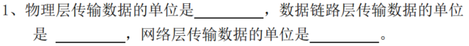

比特（bit）；帧（Frame）；分组 / 数据包（Packet）

| OSI七层模型 | TCP/IP四层模型 | 常用数据单元术语 | 说明 |
|--------------|----------------|------------------|------|
| 物理层       | 网络接口层     | 比特（bit）| 二进制位，物理信号的最小单位 |
| 数据链路层   | 网络接口层     | 帧（Frame）| 封装MAC地址、含校验字段的比特集合 |
| 网络层       | 网际层         | 分组/数据包（Packet） | 封装IP地址的帧片段，用于路由转发 |
| 传输层       | 传输层         | 段（Segment，TCP） 数据报（Datagram，UDP） | 端到端传输的基本单元，TCP为可靠段，UDP为不可靠数据报 |
| 会话层       | 应用层         | 报文（Message）| 会话交互的完整数据单元 |
| 表示层       | 应用层         | 报文（Message）| 经过格式转换/加密的应用数据单元 |
| 应用层       | 应用层         | 报文（Message）| 应用程序发送/接收的完整数据（如HTTP报文、邮件报文） |

---

答案及解析：

1. 第一个空：**丢弃**
   - 解析：TTL（生存时间）字段的作用是防止IP数据报在网络中无限循环转发。当路由器收到TTL为0的数据报时，会直接丢弃该数据报，避免其占用网络资源。
2. 第二个空：**该数据报的源IP地址对应的主机（或源主机）**
   - 解析：路由器会向数据报的发送方（源主机）发送ICMP“超时”报文，告知其数据报因TTL耗尽被丢弃，帮助源主机排查网络问题。

---

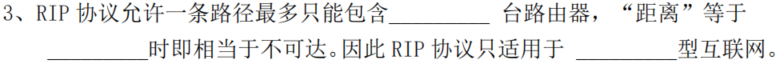

答案及解析：

1. 第一个空：**15**
   - 解析：RIP（路由信息协议）以“跳数”（经过的路由器数量）作为路径距离的度量单位，规定一条路径最多包含15台路由器。
2. 第二个空：**16**
   - 解析：RIP中跳数为16时被定义为“不可达”，以此避免路由环路等问题。
3. 第三个空：**小型或局域网**
   - 解析：由于RIP的最大跳数限制（15），其仅适用于网络规模较小的环境（如小型企业局域网），无法支持大规模广域网的路由需求。


RIP 的核心是距离矢量算法，其核心思想可以概括为：“网络中所有路由器都会定期向邻居路由器分享自己的完整路由表；路由器接收邻居的路由表后，会结合自身信息更新本地路由表，最终实现全网路由信息的收敛”。

具体工作流程分为三步：

- 路由表初始化：路由器启动时，会先检测直连的网络接口，生成直连网络的路由条目，此时跳数为 0（直连网络无需经过其他路由器）。
- 路由信息广播：路由器会按照固定周期（默认 30 秒），向所有直连的邻居路由器发送自己的完整路由表。路由表中包含的核心信息有：目标网络地址、子网掩码、下一跳路由器地址、到达目标网络的跳数。
- 路由表更新与最优路径选择：路由器接收到邻居的路由表后，会对每条路由条目进行计算。

计算到达该目标网络的新跳数 = 邻居公告的跳数 + 1（因为数据包需要先到达这个邻居路由器）。

将新跳数与本地路由表中已有该目标网络的跳数对比，选择跳数更小的路径作为最优路径，更新本地路由表。

如果新跳数与现有跳数相同，则保留原路由条目，不做更新。

如果一条路由条目长时间未被更新（默认超时时间 180 秒），路由器会将该路由标记为不可达。
 


RIP 的运行逻辑由一系列关键参数定义，这些参数决定了协议的稳定性和适用范围：

度量值（Metric）：**跳数（Hop Count）**

RIP 以跳数作为衡量路径优劣的唯一标准，跳数指的是数据包到达目标网络需要经过的路由器数量。直连网络的跳数为 0；经过 1 台路由器的网络跳数为 1，以此类推。

RIP 规定最大跳数为 15，当跳数达到 16 时，协议会判定该目标网络不可达。这一限制直接决定了 RIP 只能适用于小型网络。
定时器

> RIP 通过多个定时器保障协议稳定运行，核心定时器包括：
> 更新定时器：默认 30 秒，路由器定期发送路由更新信息的周期。
> 超时定时器：默认 180 秒，如果一条路由在 180 秒内没有收到更新，路由器会将该路由的跳数标记为 16（不可达）。
> 垃圾回收定时器：默认 120 秒，路由被标记为不可达后，路由器会继续广播该不可达路由 120 秒，告知全网后再删除该路由条目。


在中大型网络中，通常会被 OSPF（开放式最短路径优先）、IS-IS 等更高效的路由协议替代。

---

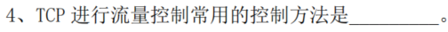

答案及解析：

- 填空答案：**滑动窗口机制**
- 解析：
  TCP的流量控制是为了避免发送方发送速率过快、导致接收方缓存溢出。其核心方法是“滑动窗口机制”：
  1. 接收方在TCP报文的“窗口字段”中，告知发送方自己当前可用的接收缓存大小（即“接收窗口”）；
  2. 发送方的发送窗口大小由接收窗口决定，仅能发送不超过该窗口大小的数据；
  3. 随着接收方处理数据、释放缓存，接收窗口会动态调整并反馈给发送方，发送方的发送窗口也随之“滑动”更新，实现速率匹配。

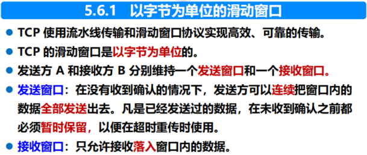

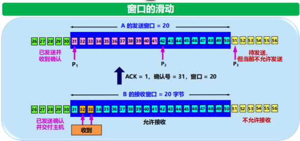

**ACK（Acknowledgment，确认）是TCP协议中用于实现可靠传输的核心机制之一**，具体含义及作用如下：

1. ACK的基本定义
    在TCP报文中，存在一个“ACK标志位”（占1比特），同时还有“确认号”字段（占32比特）：

    - 当ACK标志位为`1`时，表示该报文是一个确认报文；
    - 确认号字段的值，则表示（即接收方已成功接收了“确认号-1”之前的所有数据）。

    图中`ACK = 1`（表示这是确认报文），`确认号 = 31`，含义是：

    - 接收方B已成功接收了序号30及之前的所有数据；
    - 接收方B期望发送方A接下来发送序号为31的数据。

2. ACK的核心作用

    - **确认数据接收**：告知发送方“哪些数据已被成功接收”，避免发送方重复发送。
    - **配合滑动窗口实现流量控制**：确认报文会携带“接收窗口”信息（如图中的“窗口=20”），让发送方动态调整发送速率。
    - **保障可靠性**：TCP通过ACK的超时重传机制（若发送方未收到ACK，则重传数据），确保数据不会丢失。

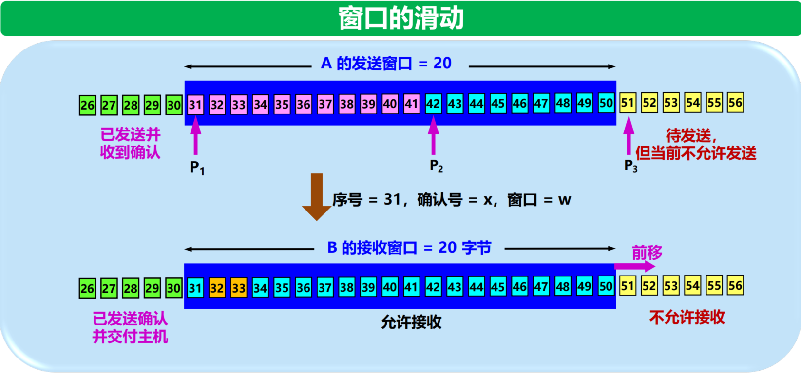

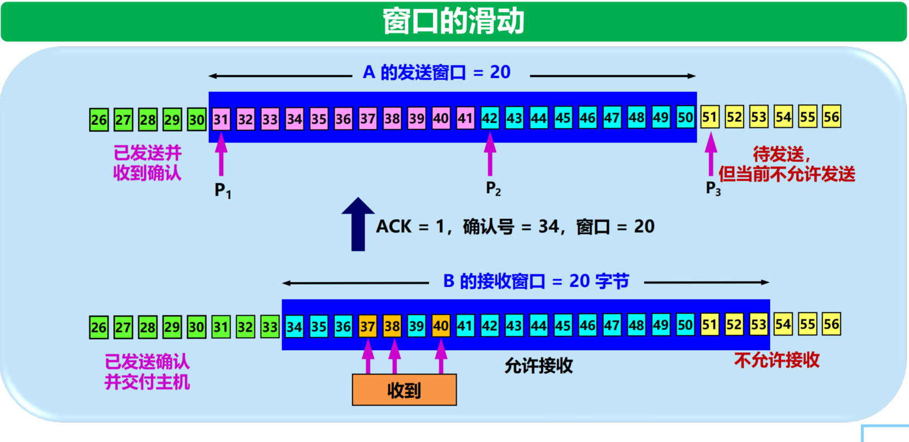

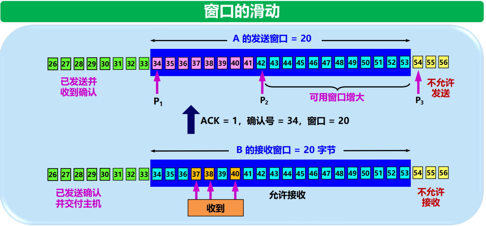

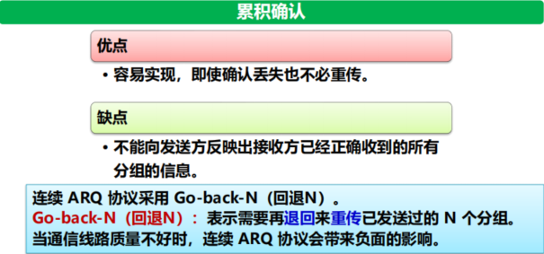

---

答案及解析：
- 填空答案：`ping www.bistu.edu.cn`
- 解析：
  在Windows系统中，`ping`是用于测试网络连通性的常用命令：
  1. 作用：向目标主机（此处为www.bistu.edu.cn）发送ICMP请求报文，若目标主机可达，则会返回ICMP应答报文；
  2. 结果判断：若命令执行后显示“来自xxx的回复”，说明服务器连通；若显示“请求超时”，则表示无法连通。

---

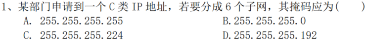

答案：C

解析：
C类IP地址的默认子网掩码是255.255.255.0（即网络位24位，主机位8位）。要划分子网，需从主机位借位：
1. 计算所需借位数：
   划分6个子网，需满足 \(2^n \geq 6\)（\(n\)为借位数），得\(n=3\)（\(2^3=8\)，可划分8个子网，满足6个的需求）。
2. 计算新子网掩码：
   借3位后，网络位变为24+3=27位，对应的子网掩码二进制为：
   11111111.11111111.11111111.11100000，转换为十进制即255.255.255.224。

128 + 64 + 32 = 224，所以答案是C。

---

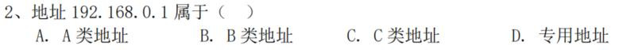

答案：CD（该地址同时属于C类地址和专用地址）
解析：
1. **属于C类地址**：
   IP地址的类别由第一个字节的范围决定：C类地址的第一个字节范围是192-223。地址192.168.0.1的第一个字节是192，符合C类地址的定义。

2. **属于专用地址**：
   192.168.0.0/16网段是IANA（互联网数字分配机构）规定的**私有IP地址段**（专用地址），仅用于局域网内部，不会在公网中路由，常见于家庭、企业内网环境。

可以通过表格清晰区分A/B/C类公网地址与专用地址的核心信息：

| 类别       | 公网地址范围                | 专用地址段（私有地址）| 核心特点 |
|------------|-----------------------------|------------------------|----------|
| **A类地址** | 第一个字节：1-126 （如1.0.0.0-126.255.255.255） | 10.0.0.0/8 （10.0.0.0-10.255.255.255） | 网络位8位，主机位24位，支持大量主机；专用地址段为单个A类网段，适用于大型内网 |
| **B类地址** | 第一个字节：128-191 （如128.0.0.0-191.255.255.255） | 172.16.0.0/12 （172.16.0.0-172.31.255.255） | 网络位16位，主机位16位；专用地址段包含16个B类网段，适用于中型内网 |
| **C类地址** | 第一个字节：192-223 （如192.0.0.0-223.255.255.255） | 192.168.0.0/16 （192.168.0.0-192.168.255.255） | 网络位24位，主机位8位；专用地址段包含256个C类网段，适用于小型内网（如家庭、办公网络） |

补充说明：

- 公网地址：由IANA分配，可在互联网中直接路由，全球唯一；
- 专用地址：仅用于局域网内部，不可在公网路由，不同内网可重复使用，需通过NAT（网络地址转换）访问公网。

---

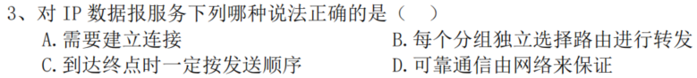

答案：B
解析：
IP数据报服务的核心特点是**无连接、不可靠的分组交换服务**，对各选项的分析如下：

- **A错误**：IP是无连接协议，无需建立连接即可发送数据报；
- **B正确**：IP数据报是独立的分组，每个分组会根据当前网络拓扑单独选择路由转发（可能出现不同分组走不同路径的情况）；
- **C错误**：由于各分组独立选路，到达终点的顺序可能与发送顺序不一致；
- **D错误**：IP不提供可靠性保障（如丢包、乱序等问题由上层协议如TCP解决）。

---

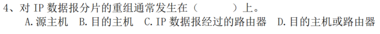

答案：B

解析：
IP数据报分片的规则是“分片在中间路由器完成，重组仅在目的主机完成”，原因如下：

- 当IP数据报的长度超过某段链路的（最大传输单元）时，经过的路由器会将其分片，但路由器不会重组分片（避免增加路由器的处理负担）；
- 所有分片会携带相同的“标识”字段，目的主机会根据该标识识别属于同一个原始数据报的分片，待所有分片到达后完成重组。