## 期末题型

| 题型 | 题量 | 分值 | 答题要求 |
|----|----|----|---------|
| 单选 | 10 | 10 | 机读卡，每题 1 分 |
| 判断 | 5  | 5  | 机读卡，每题 1 分 |
| 简答 | 2  | 15 | 纯概念阐述，每题 7-8 分 |
| 综合 | 5  | 70 | 全部含计算，共 85 分主观题 |

## 期末“必考/必会”核心知识点速查表  

| 章节 | 考点 | 最关键要点（背下就能拿分） |
|----|------|----------------------|
| Ch1 概论 | 用户/内核态 | 系统调用、中断、异常→立即进入内核态；普通 C 代码→用户态 |
|  | 微内核 | 优点：可靠、易扩展；缺点：性能低（多次上下文切换） |
|  | 虚拟机 | 优点：隔离、并发运行多 OS；缺点：资源开销大 |
| Ch2 进程线程 | 进程三态图 | 就绪→运行（被调度）；运行→阻塞（等 I/O）；阻塞→就绪（I/O 完成） |
|  | PCB/TCB/JCB/FCB | 分别对应进程/线程/作业/文件——英文与中文必须秒对应 |
|  | 同步互斥模型 | 生产者-消费者：empty/full/mutex 三信号量；若缓冲区=1，可省 mutex |
|  | PV 最少信号量 | 单缓冲区时 empty+full 已隐含互斥，不必再设 mutex |
| Ch3 CPU 调度 | 前三算法 | FCFS、SJF（非抢占）、SRTF（抢占）——会画甘特图、算周转/带权周转 |
|  | 三级调度 | 高级（作业）、中级（内存）、低级（进程）——名称与作用 |
| Ch4 存储 | 分页地址转换 | 逻辑地址→页号+页内偏移；页号查页表→块号；拼接得物理地址 |
|  | 页面置换 | FIFO、LRU、OPT 必会手工算“缺页次数”；置换时先画页框时间线 |
|  | 二级/多级页表 | 位数拆分公式：页内偏移=页大小 2^n；剩余高位再拆页目录+页号 |
| Ch5 文件 | 混合索引计算 | 直接块+一级+二级+三级；每块 1 KB、块指针 4 B→一个索引块可指 256 块；公式：8×1 KB + 256×1 KB + 256²×1 KB + 256³×1 KB |
|  | 目录结构 | 树形 vs 有向无环图——后者支持共享目录，需用“文件链接”实现 |
| Ch6 I/O | 磁盘调度 | SSTF、SCAN（电梯）会算磁头移动总道数；初始方向影响 SCAN |
| Ch8 死锁 | 银行家算法 | 1. 算 Need=Max-Allocation；2. 找安全序列：Work≥Need 且 Finish=F→T；3. 能列出即安全，不能即不安全 |
|  | 死锁 4 条件 | 互斥、占有且等待、非抢占、循环等待——缺一不能形成死锁 |

---

## 核心知识点速过

### 操作系统的特点

- 并发：多个程序同时运行
- 共享：系统资源可被多个程序共同使用
- 异步性：程序执行顺序不确定
- 抽象性：将复杂系统抽象为简单模型

### 用户态/内核态

>下列哪些指令应该只在核心态下执行？
>
>① 屏蔽所有中断
>② 读时钟日期
>③ 设置时钟日期
>④ 改变指令地址寄存器的内容
>⑤ 启动打印机
>⑥ 清内存

核心态下执行的有：①③⑤⑥
解释：核心态方式下有较高特权，可以执行特权指令，例如：启动I/O、内存清零、修改程序状态字、设置时钟、允许/禁止中断、停机
④ 改变指令地址寄存器的内容, 涉及到修改指令的执行流程。
指令地址寄存器，通常缩写为IAR，是一个专门用来存储即将执行的指令的内存地址的寄存器。
指令地址寄存器即指令计数器PC，允许用户改变内容，以便转入子程序。
用户态程序可通过标准函数调用指令修改PC，但受限于硬件指令集和操作系统权限控制，无法直接操作指令寄存器。

需要结合**寄存器的功能与权限属性**判断：不同寄存器的操作权限，取决于其是否涉及系统级资源、硬件控制或特权操作。

以下是常见寄存器的权限分类示例：

1. **需核心态执行操作的寄存器**：
   - **程序状态字寄存器（PSW）**：存储中断开关、核心态/用户态标志等系统状态，修改需核心态权限。
   - **I/O地址寄存器/控制寄存器**：控制硬件设备（如磁盘、网卡）的读写，操作需核心态。
   - **内存管理寄存器（如页表基址寄存器）**：管理内存地址映射，直接影响系统内存安全，仅核心态可修改。
   - **中断向量表寄存器**：配置中断处理入口，属于系统级配置，需核心态权限。

2. **用户态可操作的寄存器**：
   - **通用数据寄存器（如AX、BX）**：仅存储进程私有数据，用户态可自由读写。
   - **栈指针寄存器（SP）**：仅管理当前进程的栈空间，用户态可修改（需符合进程自身内存范围）。

简单来说：**若寄存器关联系统全局资源、硬件控制或特权状态，则其操作仅能在核心态执行；若仅关联进程私有数据/执行流程，则用户态可操作**。

### 微内核

微内核是一种操作系统架构设计，将传统内核的功能分解为多个独立的服务模块。

**核心特点**：

- **功能最小化**：内核仅保留最基本的功能（进程管理、内存管理、中断处理），其他功能（文件系统、设备驱动、网络协议栈）以独立服务进程运行在用户态
- **模块化设计**：各服务模块相对独立，通过消息传递进行通信
- **隔离性强**：服务进程运行在用户态，故障隔离，一个服务崩溃不会导致整个系统瘫痪

**优点**：

- ✅ **可靠性高**：内核代码量少，bug少；服务进程故障隔离，系统稳定性强
- ✅ **易于扩展**：新增功能只需添加新的服务进程，无需修改内核
- ✅ **可移植性好**：内核与硬件关联少，易于移植到不同平台
- ✅ **安全性好**：服务进程权限受限，恶意代码影响范围小

**缺点**：

- ❌ **性能开销大**：用户态与内核态频繁切换，消息传递开销大，系统调用延迟增加
- ❌ **实现复杂**：需要完善的进程间通信（IPC）机制，系统设计复杂
- ❌ **调试困难**：分布式架构导致问题诊断困难

**对比宏内核**：

| 对比维度 | 微内核 | 宏内核 |
|--------|--------|--------|
| **内核大小** | 小（仅基本功能） | 大（集成所有功能） |
| **性能** | 低（频繁上下文切换） | 高（直接函数调用） |
| **可靠性** | 高（故障隔离） | 低（一个模块崩溃影响全系统） |
| **易维护性** | 高（模块独立） | 低（耦合度高） |
| **代表系统** | QNX、MINIX、Mach | Linux、Windows、macOS |

**典型应用**：

- 实时系统（QNX）：需要高可靠性和实时性
- 嵌入式系统：资源受限，需要灵活扩展
- 关键任务系统：故障隔离要求高

### 死锁

| 算法/概念        | 是否考大题  | 分值定位    | 必须掌握的最简要点                    |
| ------------ | ------ | ------- | ---------------------------- |
| 银行家算法        | ✅ 一定考  | 14-15 分 | 填 Need、Work 表，写安全序列，判安全状态    |
| 死锁 4 必要条件    | ❌ 只选/判 | 1-2 分   | 互斥、占有且等待、非抢占、循环等待——缺一则不可能死锁  |
| 死锁预防（破 4 条件） | ❌ 只选/简 | 1-3 分   | 破“占有且等待”：一次性分配；破“循环等待”：资源序号法 |
| 死锁避免（含银行家）   | ❌ 概念小题 | 1-2 分   | 避免 = 运行时检查，银行家属此类；预防 = 事先破条件 |
| 死锁检测 & 恢复    | ❌ 只选/简 | 0-2 分   | 检测：化简资源分配图；恢复：终止进程/抢占资源      |

---

#### 死锁四条件

- 互斥：资源不可共享，只能由一个进程使用
- 占有且等待：进程已获得某些资源，又申请新资源
- 非抢占：进程所获得的资源在未使用完之前不能被抢占
- 循环等待：若干进程形成一种头尾相接的循环等待资源关系


---

#### 资源分配图

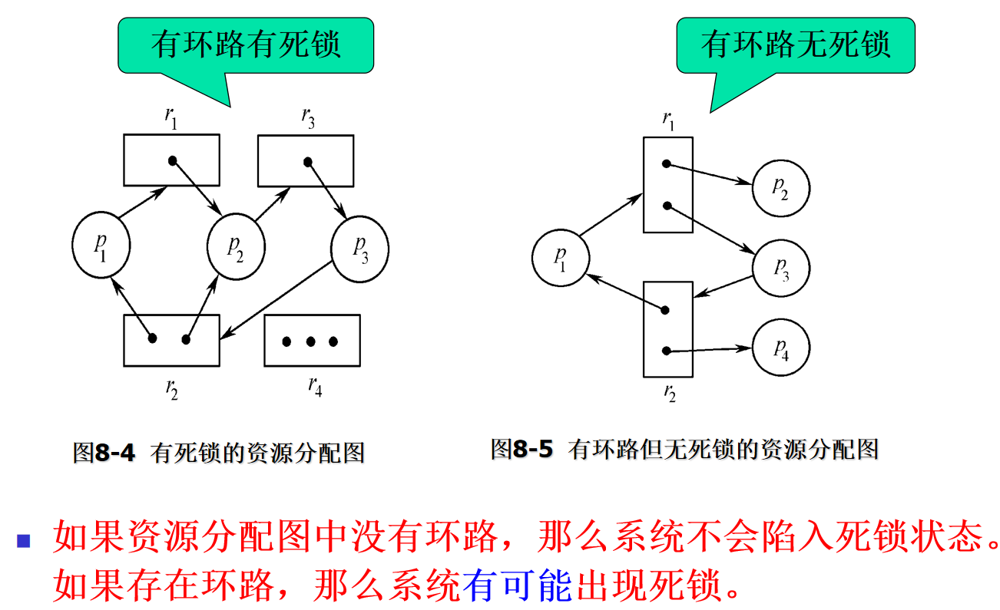

---

#### 银行家算法

**银行家算法是避免死锁的算法**


银行家算法的核心思想是：在进程申请资源时，先判断系统是否安全，再决定是否分配资源。

先假装备份资源给进程，跑一遍模拟完成序列，若能找到让所有进程都顺利结束的分配方案（安全序列），才允许真正分配；否则拒绝，避免死锁。

> 安全状态：系统中的所有进程都能按照某种顺序完成，即系统处于安全状态。
> 申请的总资源数 ≤ 可用资源数 + 已分配资源数
> 单次申请的资源数 ≤ 进程尚需资源数 ≤ 可用资源数


---

这道题可以做个引子


要解决这个问题，需利用（银行家算法的核心逻辑）：
当每个进程对资源的最大需求为`m`，系统资源总数为`R`时，避免死锁的最大进程数`N`需满足：
`N × (m-1) < R`（让每个进程都差1个资源无法满足，此时系统剩余至少1个资源，可先满足任意一个进程，避免死锁）

解析：

已知：每个进程需求`m=3`，系统打印机总数`R=11`。

代入公式：`N × (3-1) < 11` → `2N < 11` → `N < 5.5`。

由于进程数`N`为整数，因此`N`不超过**5**时，系统不会死锁。

答案：5

---

核心四向量：

- `Available`：可用资源向量，表示系统中每种资源可用的数量
- `Max`：最大矩阵，表示每个进程对每种资源的最大需求量
- `Allocation`：分配矩阵，表示系统当前已分配给每个进程的资源数
- `Need`：需求矩阵，表示每个进程尚需的资源数



---

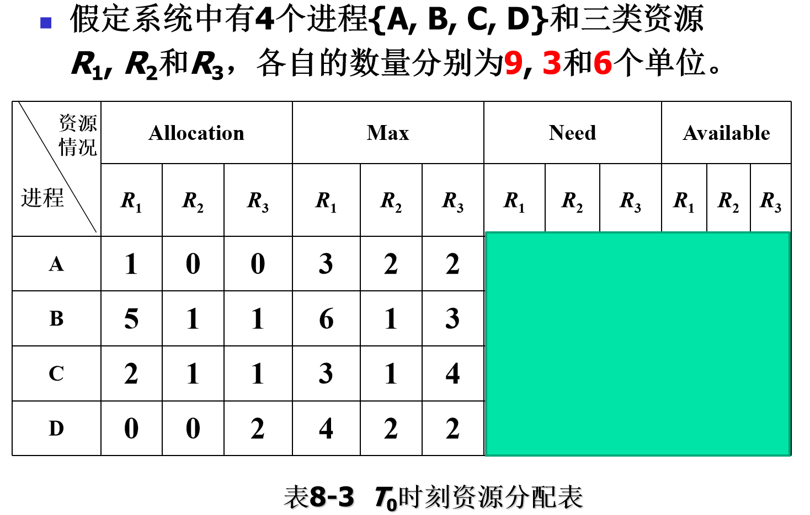

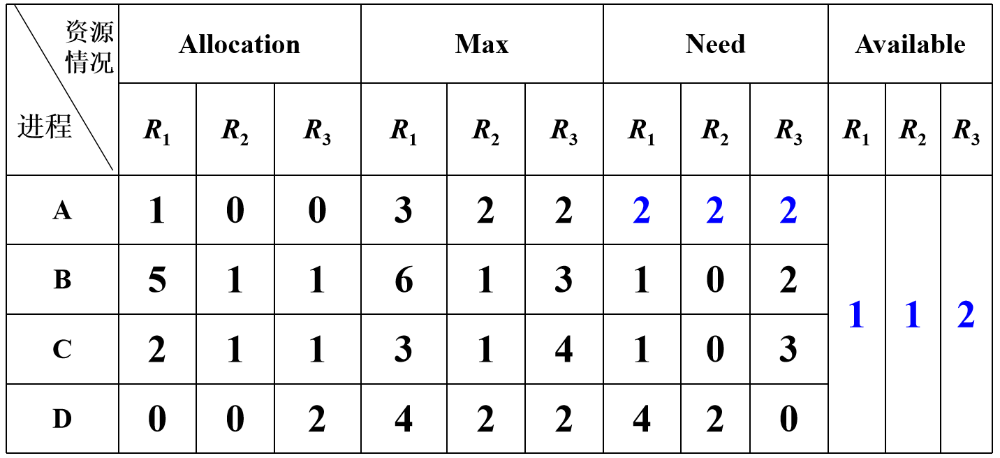

T1时刻安全吗？

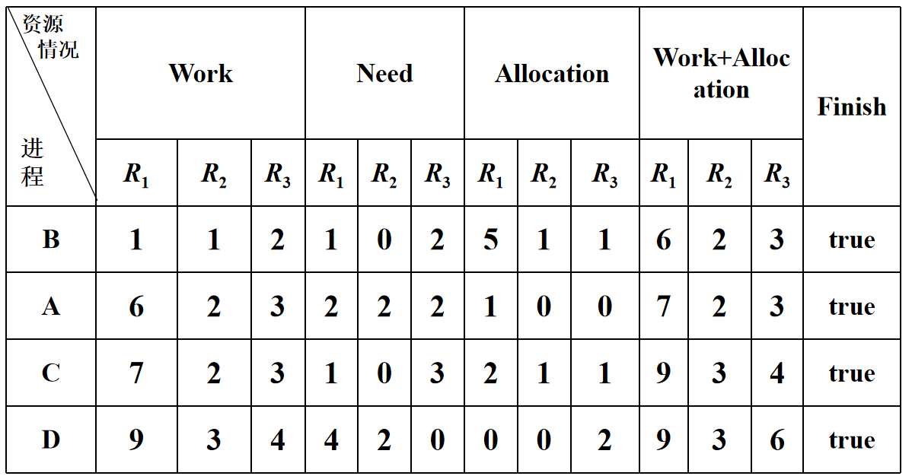

由此可得安全序列 {B, A, C, D}


安全序列并不唯一！！！

{B, D, C ,A}  {B,C,D,A}  {B, C, A, D}都是可以的！！！


若此时进程A发出请求Request（1, 0, 1）,资源分配数据就会变成如下情况。

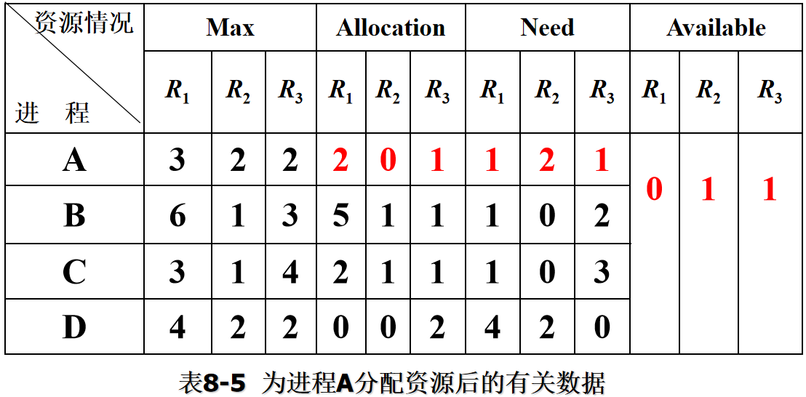

> Available(0,1,1)不能满足任何进程的需要，故进入不安全状态，系统不分配资源。

---

### 同步互斥模型与最少PV操作

#### 进程特征

- 动态性：进程是程序的一次执行过程，它是临时的、有生命期的。表现在它由创建而产生，完成任务后被撤消。
- 并发性：进程是可以并发执行的。系统中的各个进程可以按照自己独立的、不可预知的速度推进。
- 调度性：进程是系统进行资源分配和调度的一个独立单位
- 异步性：各进程向前推进的速度不可预知
- 结构性：进程有一定的结构（程序+数据+PCB）

#### 同步互斥模型

- **同步**：多个进程按一定顺序执行，前驱关系制约执行顺序（如生产者必须先生产，消费者才能消费）
- **互斥**：多个进程对共享资源的访问需互斥进行，同一时刻只有一个进程可访问临界资源

**实现工具**：信号量机制

- 同步用信号量表示资源/事件状态（如`empty`、`full`）
- 互斥用信号量保护临界区（如`mutex`）

**典型场景**：

- 生产者-消费者：需同步（控制生产/消费顺序）+ 互斥（保护缓冲区）
- 读者-写者：需互斥（读写不能同时进行）+ 同步（多读者可并发）
- 哲学家进餐：需互斥（筷子独占）+ 同步（避免死锁的进餐顺序）

---

#### 最少PV操作

首先需要明确一下PV操作的概念

- **P操作（wait）**：信号量减1，若信号量<0则进程阻塞
- **V操作（signal）**：信号量加1，若有阻塞进程则唤醒一个

生产者-消费者模型中的三信号量：
- `empty`：空缓冲区数量（初值=缓冲区大小）
- `full`：满缓冲区数量（初值=0）
- `mutex`：互斥信号量（初值=1）

**关键优化**：若缓冲区容量=1，`empty`和`full`的PV操作已隐含互斥关系，可省略`mutex`信号量

---

**例题1：标准生产者-消费者（缓冲区大小=n）**

信号量初值：`empty=n, full=0, mutex=1`

```
生产者进程：{
  while(true) {
    生产数据item;
    P(empty);      // 等待空缓冲区
    P(mutex);      // 进入临界区
    {
      将item放入缓冲区;
    }
    V(mutex);      // 离开临界区
    V(full);       // 通知消费者有满缓冲区
  }
}

消费者进程：{
  while(true) {
    P(full);       // 等待满缓冲区
    P(mutex);      // 进入临界区
    {
      从缓冲区取出item;
    }
    V(mutex);      // 离开临界区
    V(empty);      // 通知生产者有空缓冲区
    消费数据item;
  }
}
```

---

**例题2：单缓冲区优化（缓冲区大小=1）**

信号量初值：`empty=1, full=0`（**省略mutex**）

```
生产者进程：{
  while(true) {
    生产数据item;
    P(empty);      // 等待缓冲区为空
    {
      将item放入缓冲区;
    }
    V(full);       // 通知消费者缓冲区满
  }
}

消费者进程：{
  while(true) {
    P(full);       // 等待缓冲区满
    {
      从缓冲区取出item;
    }
    V(empty);      // 通知生产者缓冲区空
    消费数据item;
  }
}
```

**为什么可省mutex？** 当缓冲区=1时，生产者P(empty)后缓冲区被占用，消费者必须等待P(full)；消费者P(full)后才能取数据，生产者必须等待V(empty)。两者天然互斥，无需额外mutex。

---

**例题3：读者-写者问题（优先级：读者优先）**

信号量初值：`rw_mutex=1, read_mutex=1, read_count=0`

```
读者进程：{
  while(true) {
    P(read_mutex);
    {
      read_count++;
      if(read_count == 1) {
        P(rw_mutex);  // 第一个读者锁定资源
      }
    }
    V(read_mutex);
    
    {
      读取数据;
    }
    
    P(read_mutex);
    {
      read_count--;
      if(read_count == 0) {
        V(rw_mutex);  // 最后一个读者释放资源
      }
    }
    V(read_mutex);
  }
}

写者进程：{
  while(true) {
    P(rw_mutex);      // 独占资源
    {
      写入数据;
    }
    V(rw_mutex);
  }
}
```

**关键点**：`read_count`记录当前读者数，只有第一个读者才真正P(rw_mutex)，最后一个读者才V(rw_mutex)，允许多读者并发。

---

**例题4：哲学家进餐（避免死锁）**

信号量初值：`chopstick[5]={1,1,1,1,1}`

```
哲学家i进程：{
  while(true) {
    {
      思考;
    }
    P(chopstick[i]);           // 拿左筷子
    P(chopstick[(i+1)%5]);     // 拿右筷子
    {
      进餐;
    }
    V(chopstick[i]);           // 放左筷子
    V(chopstick[(i+1)%5]);     // 放右筷子
  }
}
```

**死锁风险**：若所有哲学家同时拿左筷子，都在等右筷子→死锁。

**解决方案**：
- 方案A：最多4个哲学家同时进餐（加一个信号量`dining=4`）
- 方案B：奇数号哲学家先拿左筷子，偶数号先拿右筷子（破循环等待）
- 方案C：拿筷子前先获得互斥锁（一次性拿两根）

---

### 调度算法

#### 高中低级调度

三级调度是操作系统进程管理的核心机制，负责不同粒度的资源分配决策。

| 调度级别 | 调度对象 | 触发时机 | 主要职责 | 批处理系统 | 分时系统 | 实时系统 |
|--------|--------|--------|--------|---------|---------|---------|
| **高级调度**（作业调度） | 作业 | 作业提交时 | 从后备队列选作业进入内存，创建进程 | ✅ 必须 | ❌ 无 | ❌ 无 |
| **中级调度**（内存调度） | 进程 | 内存不足时 | 将进程在内存与外存间对换，控制并发度 | ❌ 无 | ✅ 必须 | ✅ 必须 |
| **低级调度**（进程调度） | 进程 | 时间片用尽/I/O等 | 从就绪队列选进程进入CPU执行 | ✅ 必须 | ✅ 必须 | ✅ 必须 |

**关键理解**：

- **高级调度**：只在批处理系统中存在，因为分时/实时系统用户交互式提交，无需后备队列管理
- **中级调度**：分时和实时系统必须有，用于虚拟内存管理；批处理系统内存充足，无需对换
- **低级调度**：所有系统都必须有，是CPU资源分配的最基本机制

---

#### 带权周转时间

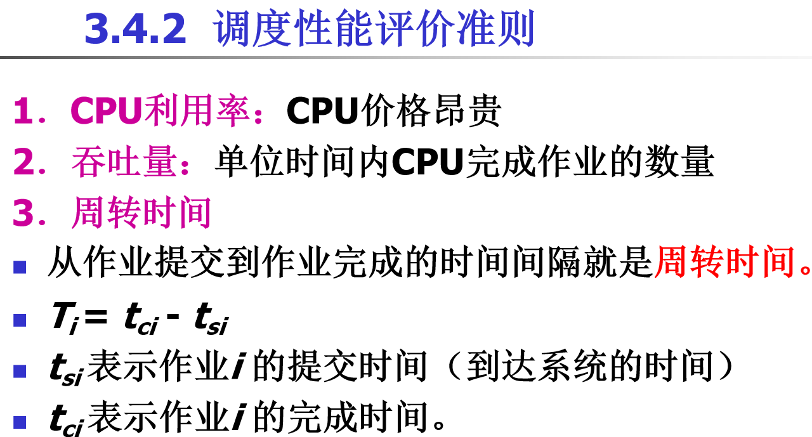

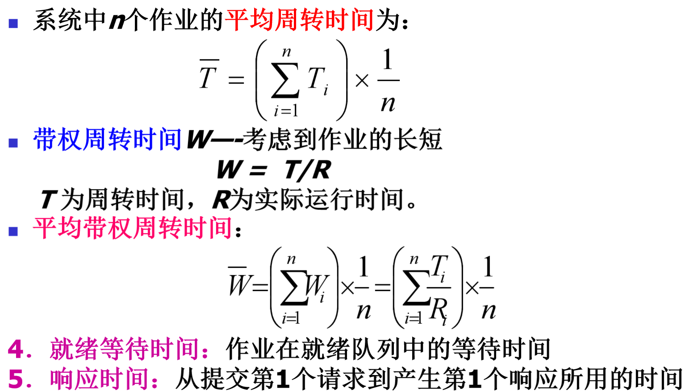

---

#### 进程调度算法

- 先来先服务（FCFS）：先到先得
- 最短作业优先（SJF）：优先执行短作业
- 最短剩余时间优先（SRTN）：优先执行`剩余`时间最短的作业
- 优先级调度：优先级高的优先执行
- 多级反馈队列：优先级高的队列优先级高，优先级低的队列优先级低
- 时间片轮转（RR）：每个进程分配固定时间片，时间片用完后进程被挂起，等待下一轮调度

---

#### FCFS(First Come First Serve)

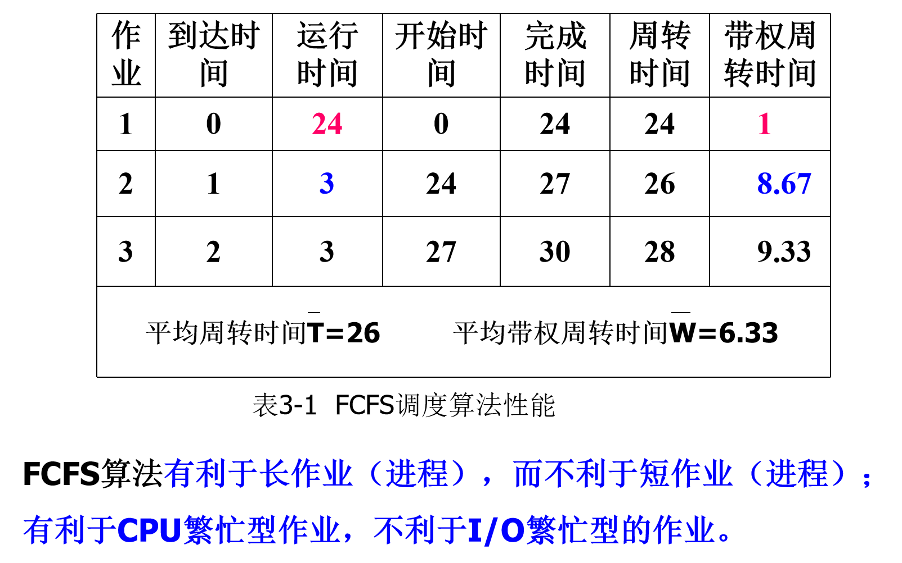

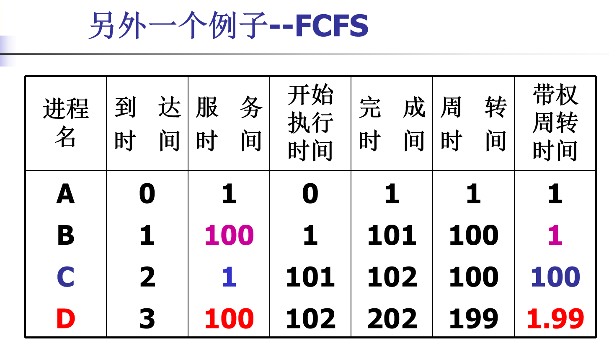

#### SJF(Shortest Job First)

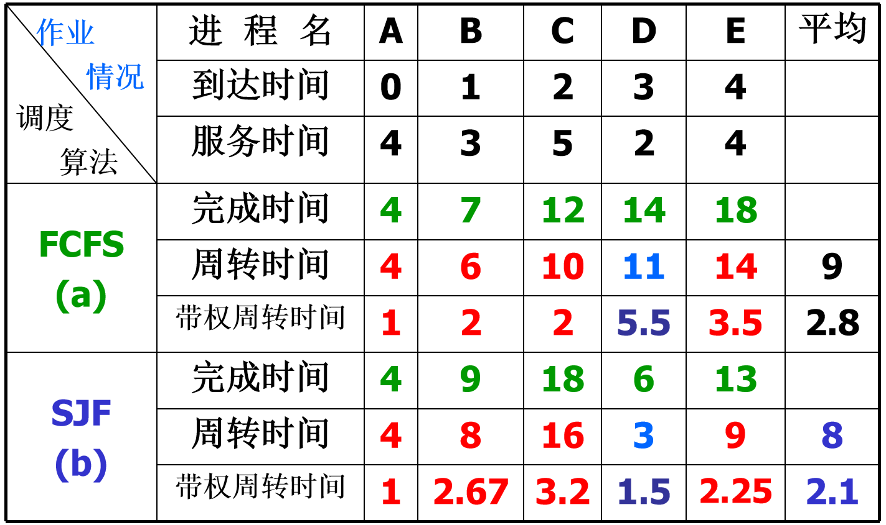

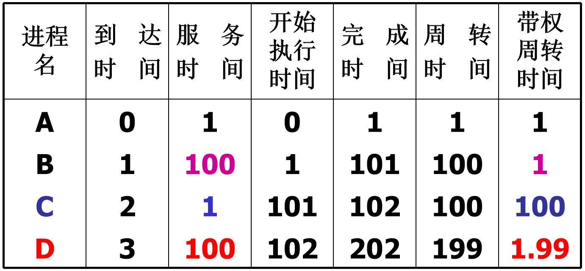

#### SRTN(Shortest Remaining Time Next)

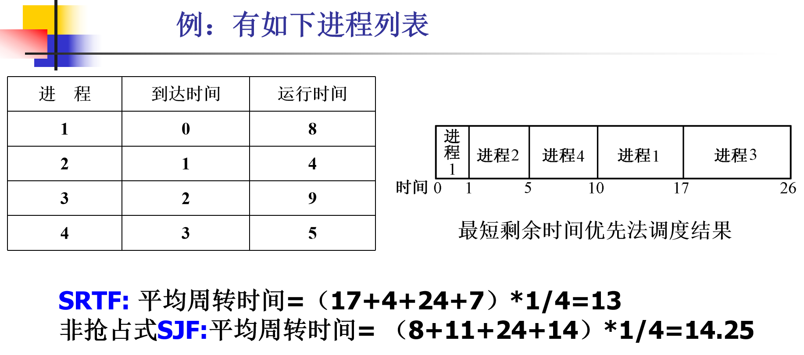

#### 优先级调度

优先级算法分为非抢占式有优先级和抢占式有优先级两种。

- **非抢占式有优先级**：优先级高（数值小，这是UNIX的表示方式）的进程先执行，优先级低的进程后执行，优先级相同的进程按FCFS执行
- **抢占式有优先级**：优先级高的进程可抢占优先级低的进程，优先级相同的进程按FCFS执行

同时优先级又分为两种，一种是静态优先级，一种是动态优先级。

- **静态优先级**：优先级在进程创建时确定，且在进程运行期间不会改变
- **动态优先级**：优先级在进程运行期间会改变，如进程等待时间越长，优先级越高

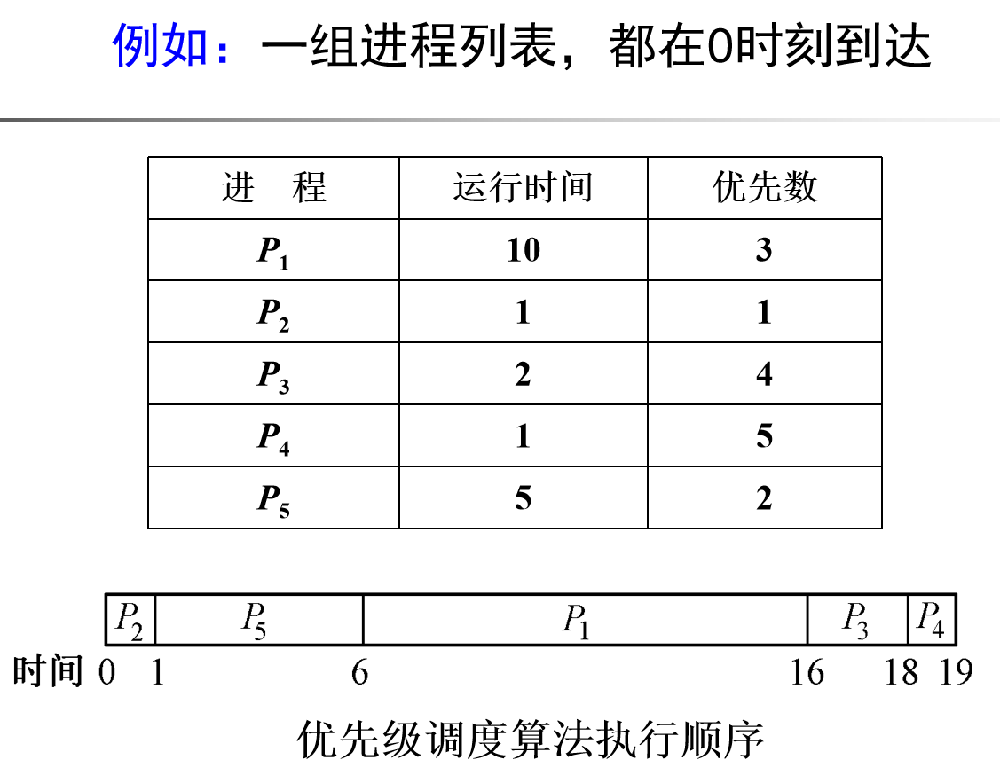

#### 时间片轮转

时间片是一个小的时间单位，通常为10～100 ms数量级。

所有就绪进程按先入先出的原则排成一个队列，每次调度时，把CPU分配给队首进程，令其执行一个时间片，时间片用完时，调度程序将该进程送往就绪队列的末尾，再把CPU分配给新的队首进程，让它也执行一个时间片。

时间片选择过大: 当时间片的选择超过任何一个程序所需要的执行时间长度，则完全退化为FCFS
时间片选择过小：则进程切换所用的系统消耗将太多,降低系统效率。

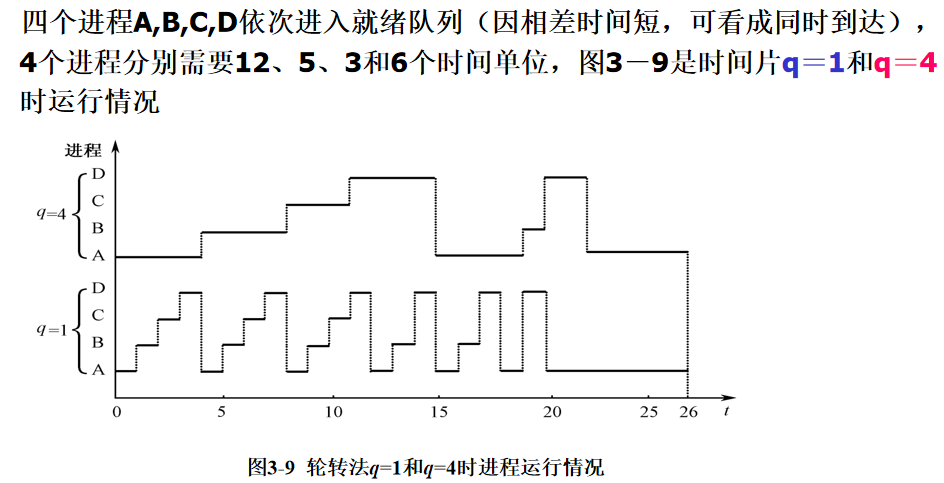

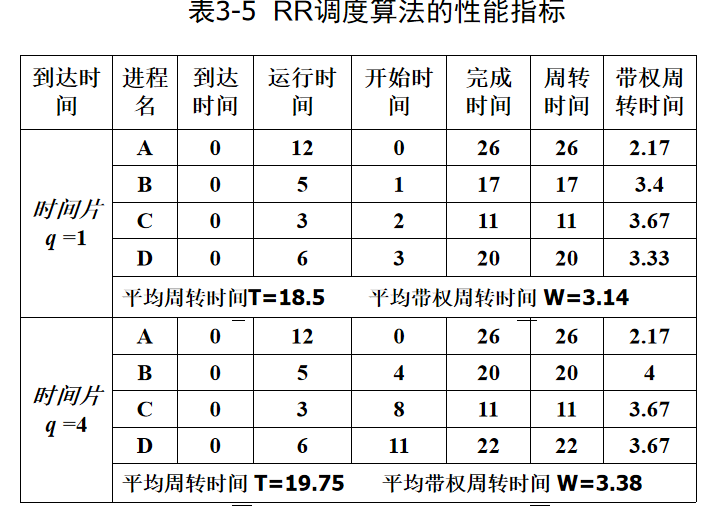

---

## 北京信息科技大学 2020 - 2021 学年第一学期

### 分时操作系统调度方法

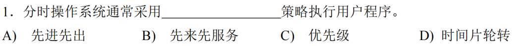

答案：D 时间片轮转
解析：

1. 分时操作系统的核心是让多个用户逻辑上同时使用系统，需公平分配CPU资源。时间片轮转是其专用调度策略：系统将CPU时间划分为固定时长的“时间片”，按就绪进程的顺序依次分配时间片，时间片耗尽则切换进程，以此保证多用户的响应及时性。
2. 其他选项的问题：
   - 先进先出/先来先服务（A、B）：属于非抢占式调度，无法快速切换进程，不能满足分时系统的多用户响应需求；
   - 优先级（C）：仅按优先级调度会导致低优先级进程长期等待，无法实现多用户公平共享CPU资源，不符合分时系统的设计目标。

---

### 分页系统页面置换算法

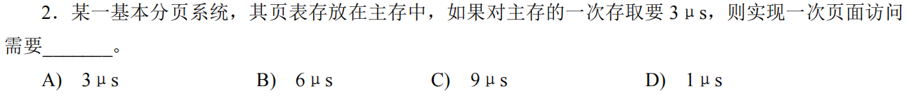

答案：B 6μs
解析：

1. 基本分页系统中，页面访问需两步主存存取：
   - 第一步：访问主存中的页表，获取页对应的物理块号，耗时3μs；
   - 第二步：根据物理块号访问主存中的目标页面，耗时3μs。
2. 总耗时为两次主存存取的时间之和，即3μs + 3μs = 6μs。

---

### 进程三态

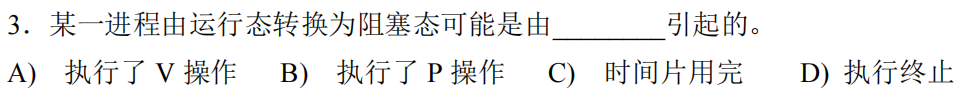

答案：B 执行了P操作
解析：

1. 进程状态转换逻辑：
   - P操作（申请资源）：若执行P操作时，信号量的值小于0，进程会因无法获取资源而从运行态转为阻塞态，进入该信号量的等待队列。
2. 其他选项分析：
   - A V操作（释放资源）：会唤醒阻塞态进程，不会使运行态转阻塞态；
   - C 时间片用完：进程会从运行态转为就绪态，等待下一次时间片分配；
   - D 执行终止：进程会直接结束，并非转为阻塞态。

---

### 分页抖动

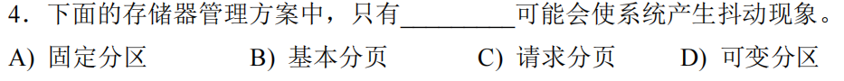

答案：C 请求分页
解析：

1. 抖动现象的产生条件：抖动（颠簸）是指系统频繁地进行页面换入换出，导致CPU利用率急剧下降的现象，仅出现在**请求分页存储管理**中。因为请求分页是基于“部分装入”的虚拟存储技术，进程运行时会动态请求页面，若内存中可用帧不足，就会频繁置换页面，引发抖动。

2. 其他选项的排除：
   - 固定分区、可变分区：属于连续分配方式，进程需整体装入内存，无页面置换操作，不会产生抖动；
   - 基本分页：是实存管理，进程的所有页面需全部装入内存才能运行，也不存在页面换入换出，不会出现抖动。

---

### 等待时间

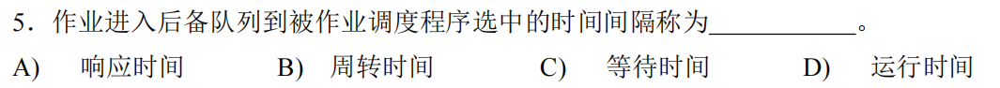

答案：C 等待时间
解析：
1. 各选项定义：
- 等待时间：指作业进入后备队列后，等待作业调度程序选中的时间间隔，与题干描述一致；
- 响应时间：通常指从用户提交请求到系统首次产生响应的时间；
- 周转时间：作业从提交到完成的总时间（包括等待、运行等阶段）；
- 运行时间：作业在CPU上实际执行的时间。

---

### 段式存储管理最大长度

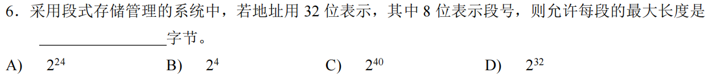

答案：A 2^{24}

解析：
段式存储的地址结构分为“段号”和“段内偏移”两部分：

1. 地址总长度为32位，其中8位表示段号，则段内偏移的位数为 \(32 - 8 = 24\) 位；
2. 段内偏移的位数决定了每段的最大长度，24位对应的最大地址空间为 \(2^{24}\) 字节。

---

### 实时操作系统

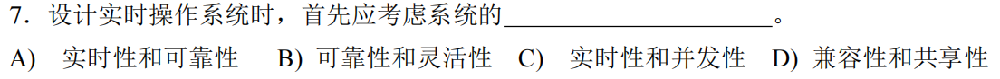

答案：A 实时性和可靠性
解析：
实时操作系统的核心目标是“在规定时间内完成任务”，因此设计时需优先保证：

1. 实时性：系统能对外部事件做出及时响应，满足任务的时间约束；
2. 可靠性：实时系统常应用于工业控制、医疗设备等关键场景，必须保证运行稳定、故障影响可控。

其他选项的排除：

- 灵活性、兼容性、共享性并非实时系统的核心需求；
- 并发性是多任务系统的共性特征，并非实时系统的首要设计考量。

---

### 缓冲技术

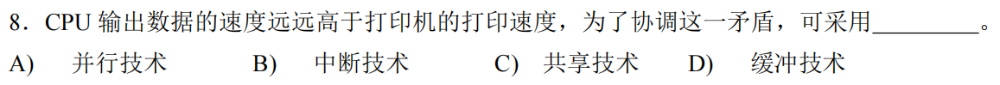

答案：D 缓冲技术

解析：
缓冲技术的核心作用是协调速度不匹配的设备之间的数据传输：

1. 当CPU输出数据时，先将数据写入缓冲区，CPU可继续执行其他任务；
2. 打印机从缓冲区中逐步读取数据进行打印，无需等待CPU直接传输，从而解决了CPU与打印机的速度差异矛盾。

其他选项的排除：

- 并行技术：用于多个设备同时工作，无法解决速度不匹配问题；
- 中断技术：用于设备完成操作后通知CPU，不能缓冲数据以协调速度；
- 共享技术：是资源复用的方式，与速度协调无关。

---

#### 缓冲技术 vs 中断技术对比

| 对比维度 | 缓冲技术 | 中断技术 |
|--------|--------|--------|
| **核心作用** | 协调速度不匹配的设备间的数据传输 | 设备完成操作后通知CPU进行处理 |
| **解决问题** | CPU与I/O设备速度差异（如CPU快、打印机慢） | CPU与设备的异步通信问题 |
| **工作原理** | 数据先写入缓冲区，设备从缓冲区读取，CPU无需等待 | 设备完成操作后发送中断信号，CPU响应中断进行处理 |
| **CPU效率** | ✅ 高（CPU可继续执行其他任务） | ✅ 高（CPU无需轮询查询设备状态） |
| **数据存储** | ✅ 有（缓冲区存储数据） | ❌ 无（仅通知机制） |
| **典型场景** | 打印机输出、磁盘读写、网络数据传输 | 键盘输入、鼠标点击、设备完成通知 |
| **是否必须** | 当设备速度差异大时必须 | 所有I/O操作都需要 |
| **缺点** | 占用内存空间；缓冲区满时CPU需等待 | 中断处理开销大；频繁中断会降低效率 |

>**关键理解**：
>
>- 缓冲和中断是**互补关系**，不是替代关系
>- 缓冲解决的是**速度不匹配**，中断解决的是**异步通信**
>- 实际I/O系统通常**同时使用**两种技术：缓冲区存储数据，中断通知CPU处理

---

### 文件系统基本功能

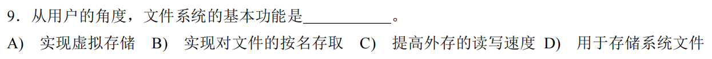

答案：B 实现对文件的按名存取
解析：
从用户角度，文件系统的核心价值是简化文件操作：用户无需了解文件的物理存储位置（如磁盘扇区），只需通过文件名即可完成文件的创建、读取、修改等操作，即“按名存取”。

其他选项的排除：

- 实现虚拟存储：是存储管理的功能，并非文件系统的基本功能；
- 提高外存读写速度：是文件系统的优化目标之一，但不是面向用户的基本功能；
- 用于存储系统文件：文件系统可存储各类文件（包括用户文件），并非仅用于系统文件。

---

### 信号量初值

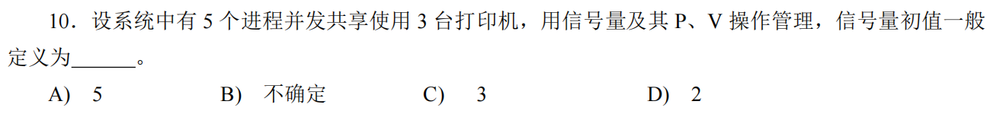

答案：C 3

解析：
信号量用于管理共享资源时，其初值通常等于资源的可用数量：
本题中共享资源是3台打印机，因此信号量初值应定义为3，代表初始状态下有3台打印机可供进程申请使用。

---

### 逻辑地址空间

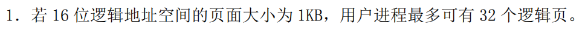

该表述**错误**。
解析：

1. 16位逻辑地址空间的总容量为 \(2^{16}\) 字节；
2. 页面大小为1KB，即 \(2^{10}\) 字节；
3. 逻辑页的最大数量 = 总逻辑地址空间容量 ÷ 页面大小 = \(2^{16} ÷ 2^{10} = 2^{6} = 64\) 个。

因此用户进程最多可有64个逻辑页，并非32个。

---

### 用户态内核态

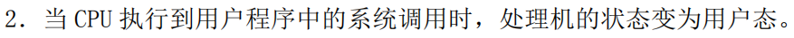

该表述**错误**。
解析：
处理机有“用户态”和“核心态”两种状态：

1. 用户程序默认在**用户态**下执行，此状态下无法直接访问系统资源；
2. 当执行系统调用时，需要切换到**核心态**（特权态），才能执行操作系统的内核代码、访问系统资源；
3. 系统调用执行完成后，处理机才会回到用户态。

因此执行系统调用时，处理机状态是转为核心态，而非用户态。

---

### 多道批处理系统

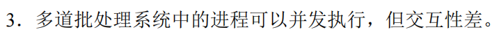

该表述**正确**。

解析：

1. 多道批处理系统的特点：
   - 并发执行：系统可同时加载多个作业到内存，通过进程调度使多个进程交替占用CPU，实现并发执行，提升了CPU利用率；
   - 交互性差：作业一旦提交，在完成前用户无法与作业进行交互（如输入指令、修改参数等），作业按批量自动处理。

因此多道批处理系统具备进程并发执行的能力，但交互性较弱。

---

### 虚拟设备

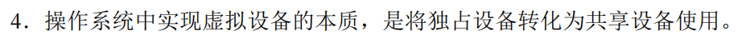

该表述**正确**。

解析：
虚拟设备技术（典型如SPOOLing技术）的核心逻辑是：

1. 独占设备（如打印机）同一时间只能被一个进程使用，利用率低；
2. 通过在内存中开辟输入/输出缓冲区，将进程对独占设备的请求先缓存到缓冲区，再由系统统一调度设备处理，从而让多个进程“逻辑上同时使用”该设备，实现了独占设备向共享设备的转化。

---

### 临界区


该表述**错误**。

解析：
进程退出临界区时，会释放临界资源的同步信号量：

1. 若有其他进程等待进入临界区，系统会唤醒等待队列中的进程，被唤醒的进程会转为就绪态，等待CPU调度后进入临界区；
2. 进程无需进入阻塞态等待，阻塞态是进程无法获取资源时的状态，而此时资源已被释放。

---

### 内存碎片

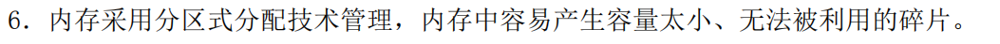

该表述**正确**。

解析：
分区式存储管理（包括固定分区和可变分区）的缺陷是易产生内存碎片：

1. 固定分区：分区大小固定，若进程大小与分区不匹配，会产生内部碎片（分区内未被利用的空间）；
2. 可变分区：随进程的分配与释放，内存中会出现多个分散的小空闲区域（外部碎片），这些碎片容量太小，无法满足后续进程的内存需求，导致资源浪费。

---

### 文件控制块FCB

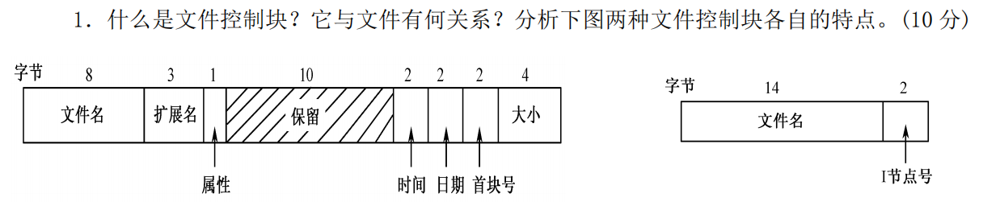

1. 文件控制块的定义及与文件的关系
  文件控制块（FCB）是操作系统为管理文件而设置的数据结构，用于存储文件的基本信息（如文件名、大小、存储位置等）。
  它与文件的关系是：**FCB是文件的“标识与管理载体”**，每个文件对应唯一的FCB，操作系统通过FCB识别、操作文件。

2. 两种文件控制块的特点
  （1）左侧FCB的特点
    - **信息集成化**：将文件名、扩展名、属性、时间、日期、首块号、大小等所有文件信息直接存储在FCB中，信息完整且访问直接。
    - **空间占用大**：包含的字段较多，单个FCB占用内存/外存空间较大。
    - **适用于简单文件系统**：无需额外查找其他结构，适合文件数量较少、管理逻辑简单的系统（如早期DOS的FAT文件系统）。
  （2）右侧FCB的特点
    - **信息轻量化**：仅存储文件名和I节点号，核心文件信息（如大小、存 储位置）存储在独立的“I节点”结构中。
    - **空间占用小**：FCB本身字段少，节省目录区空间，可存储更多文件 名。
    - **适用于大型文件系统**：通过I节点号间接关联文件信息，便于文件信 息的共享与修改（如Unix/Linux的文件系统），同时提升了目录管理的效率。

---

### 多道程序优缺点

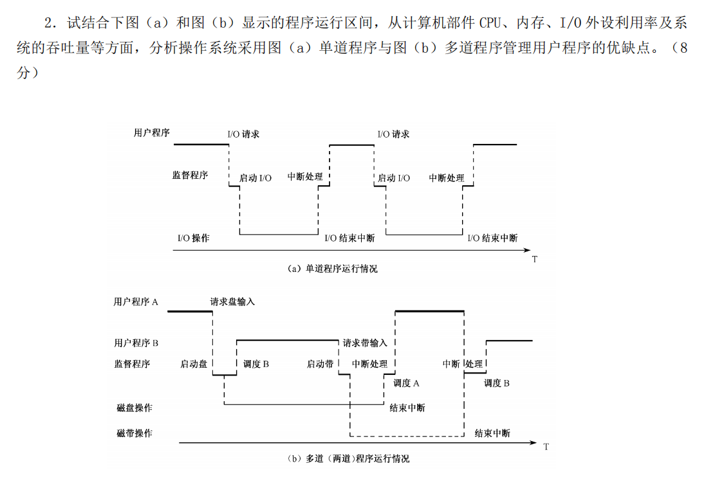

从CPU、内存、I/O外设利用率及系统吞吐量角度，分析如下：

1. 单道程序（图a）的优缺点
  优点：
     - 管理简单：无需进程调度、内存分配等复杂逻辑，系统开销小。
  缺点：
     - **CPU利用率低**：程序执行I/O操作时，CPU处于空闲状态（等待I/O完成），资源浪费严重。
     - **I/O外设利用率低**：同一时间仅一个设备（如磁盘）工作，其他I/O设备闲置。
     - **内存利用率低**：内存仅加载一个程序，剩余空间无法利用。
     - **系统吞吐量低**：单位时间内完成的作业数量少，整体效率低。
2. 多道程序（图b）的优缺点
  优点
    - **CPU利用率高**：当一个程序执行I/O操作时，系统调度另一个程序占用CPU，减少CPU空闲时间。
    - **I/O外设利用率高**：多个I/O设备（如磁盘、磁带）可并行工作，提升设备使用效率。
    - **内存利用率高**：内存同时加载多个程序，充分利用内存空间。
    - **系统吞吐量高**：单位时间内完成的作业数量更多，系统整体效率提升。
  缺点
    - 系统开销增加：需要进程调度、内存管理等机制，占用部分系统资源。
    - 管理复杂度提升：需处理进程并发、资源竞争等问题，系统设计与实现更复杂。

---

### PV 操作

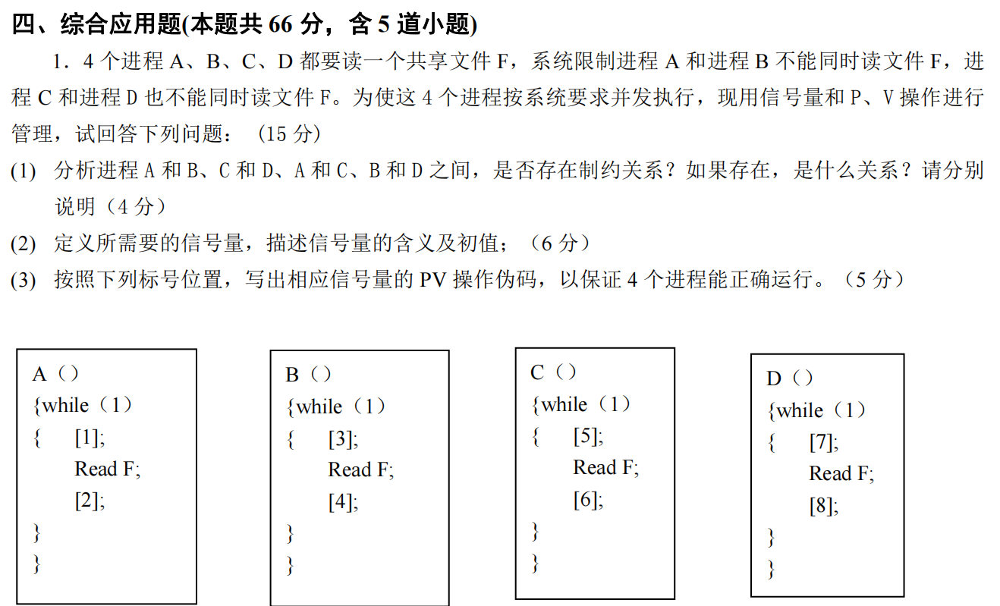

(1) 进程间的制约关系

- **A和B**：存在互斥关系，系统限制二者不能同时读文件F；
- **C和D**：存在互斥关系，系统限制二者不能同时读文件F；
- **A和C**：无制约关系，可同时读文件F；
- **B和D**：无制约关系，可同时读文件F。

(2) 信号量的定义

定义2个信号量：

- `S1`：用于控制进程A和B的互斥，含义是“文件F是否允许A/B读取”，初值为1（表示初始时可允许一个进程读取）；
- `S2`：用于控制进程C和D的互斥，含义是“文件F是否允许C/D读取”，初值为1（表示初始时可允许一个进程读取）。

(3) PV操作伪码

- [1]：`P(S1)`
- [2]：`V(S1)`
- [3]：`P(S1)`
- [4]：`V(S1)`
- [5]：`P(S2)`
- [6]：`V(S2)`
- [7]：`P(S2)`
- [8]：`V(S2)`

---

### 预防死锁与银行家算法

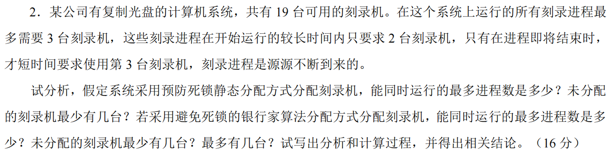

一、预防死锁（静态分配方式）的分析


静态分配要求进程在运行前一次性申请所需的**全部资源**（本题中每个进程最多需要3台刻录机）。


计算过程：
设同时运行的进程数为n，则需满足 `3n ≤ 19`。
由于n为整数，解得`nmax ​= 6（3×6=18≤19，若 n=7 则 3×7=21 > 19）`。

结论：

- 能同时运行的最多进程数：6个；
- 未分配的刻录机最少台数：\( 19 - 18 = 1 \)台。

二、避免死锁（银行家算法）的分析

银行家算法允许进程动态申请资源，需保证`“所有进程的最大需求之和 ≤ 可用资源 + 已分配资源”`，且能找到**安全序列**。

本题中，每个进程的资源需求为：

- 已分配：2台（运行较长时间内的需求）；
- 最大需求：3台（即每个进程还需\( 3-2=1 \)台）。

1. 同时运行的最多进程数
  设同时运行的进程数为\( n \)，需满足：
      - 已分配资源总量：\( 2n \)（每个进程先分配2台）；
      - 剩余可用资源：\( 19 - 2n \)；
      - 所有进程的剩余需求总量：\( 1×n \)（每个进程还需1台）。

  为保证安全，（本题中剩余需求均为1），且剩余可用资源需能满足至少一个进程完成（释放资源）。

  实际约束：2n ≤ 19（已分配资源不超过总资源），且剩余可用资源 19−2n ≥ 1（至少能满足一个进程的剩余需求）。

  联立得：2n ≤ 18 → nmax​=9（2×9=18≤19，剩余可用资源19−18=1，恰好满足一个进程的剩余需求）。

2. 未分配的刻录机数量

  - 最少台数：当进程数最多（\( n=9 \)）时，已分配\( 2×9=18 \)台，未分配台数为\( 19-18=1 \)台；
  - 最多台数：当进程数最少（\( n=1 \)）时，已分配2台，未分配台数为\( 19-2=17 \)台。

最终结论

| 分配方式       | 同时运行的最多进程数 | 未分配刻录机最少台数 | 未分配刻录机最多台数 |
|----------------|----------------------|----------------------|----------------------|
| 预防死锁（静态分配） | 6                    | 1                    | -                    |
| 避免死锁（银行家算法） | 9                    | 1                    | 17                   |

---

### 磁盘寻道

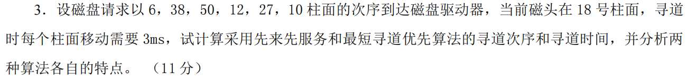

一、先来先服务（FCFS）算法

1. 寻道次序
  当前磁头在 18 号柱面，按请求到达顺序处理：18 → 6 → 38 → 50 → 12 → 27 → 10
2. 寻道距离计算
  18→6：∣18−6∣=12
  6→38：∣6−38∣=32
  38→50：∣38−50∣=12
  50→12：∣50−12∣=38
  12→27：∣12−27∣=15
  27→10：∣27−10∣=17

  > 总寻道距离：12+32+12+38+15+17=126寻道时间：126×3=378ms

二、最短寻道优先（SSTF）算法

1. 寻道次序

  当前磁头在 18 号柱面，每次选择与当前柱面距离最近的请求：18 → 12 → 10 → 6 → 27 → 38 → 50

1. 寻道距离计算
  18→12：∣18−12∣=6
  12→10：∣12−10∣=2
  10→6：∣10−6∣=4
  6→27：∣6−27∣=21
  27→38：∣27−38∣=11
  38→50：∣38−50∣=12

  > 总寻道距离：6+2+4+21+11+12=56寻道时间：56×3=168ms

三、两种算法的特点

1. 先来先服务（FCFS）

  - 优点：公平、实现简单，按请求顺序处理，无优先级偏差；
  - 缺点：寻道距离长、时间久，磁头可能频繁大范围移动，效率低。

2. 最短寻道优先（SSTF）
  
  - 优点：寻道距离短、时间少，磁头移动更高效，能提升磁盘 I/O 性能；
  - 缺点：可能导致 “饥饿” 现象（距离远的请求长期得不到处理），缺乏全局公平性。

### 作业调度算法

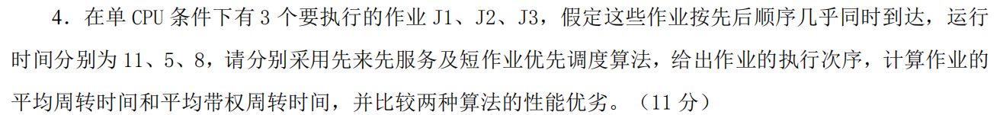

一、先来先服务（FCFS）调度算法

1. 执行次序
  J1 → J2 → J3
2. 计算周转时间与带权周转时间
  周转时间 = 作业完成时间 - 作业到达时间（因同时到达，到达时间为0）；
  带权周转时间 = 周转时间 ÷ 运行时间。

| 作业 | 运行时间 | 完成时间 | 周转时间 | 带权周转时间 |
|------|----------|----------|----------|--------------|
| J1   | 11       | 11       | 11       | \(11÷11=1\)  |
| J2   | 5        | \(11+5=16\) | 16       | \(16÷5=3.2\) |
| J3   | 8        | \(16+8=24\) | 24       | \(24÷8=3\)   |

- 平均周转时间：(11+16+24)÷3 = 51÷3 = 17
- 平均带权周转时间：(1+3.2+3)÷3 = 7.2÷3 = 2.4

二、短作业优先（SJF）调度算法

1. 执行次序
  按运行时间由短到长：J2 → J3 → J1
2. 计算周转时间与带权周转时间

| 作业 | 运行时间 | 完成时间 | 周转时间 | 带权周转时间 |
|------|----------|----------|----------|--------------|
| J2   | 5        | 5        | 5        | \(5÷5=1\)    |
| J3   | 8        | \(5+8=13\) | 13       | \(13÷8=1.625\) |
| J1   | 11       | \(13+11=24\) | 24       | \(24÷11≈2.18\) |

- 平均周转时间：\((5+13+24)÷3 = 42÷3 = 14\)
- 平均带权周转时间：\((1+1.625+2.18)÷3 ≈ 4.805÷3 ≈ 1.60\)

三、算法性能比较
  - **平均周转时间**：SJF（14）优于FCFS（17）；
  - **平均带权周转时间**：SJF（≈1.60）优于FCFS（2.4）；
  - 结论：短作业优先算法能有效降低作业的平均等待/周转时间，提升系统吞吐量，但可能导致长作业“饥饿”；先来先服务算法公平性强，但对短作业的响应效率较低。

---

### 页面置换算法

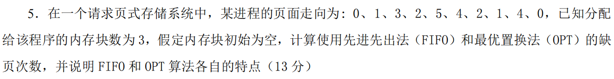

一、先进先出法（FIFO）的缺页次数计算
内存块数为3，初始为空，页面走向：0、1、3、2、5、4、2、1、4、0。

| 页面走向 | 内存块状态       | 是否缺页 |
|----------|------------------|----------|
| 0        | [0, 空, 空]      | 是       |
| 1        | [0, 1, 空]       | 是       |
| 3        | [0, 1, 3]        | 是       |
| 2        | [2, 1, 3]（换0） | 是       |
| 5        | [2, 5, 3]（换1） | 是       |
| 4        | [2, 5, 4]（换3） | 是       |
| 2        | [2, 5, 4]        | 否       |
| 1        | [1, 5, 4]（换2） | 是       |
| 4        | [1, 5, 4]        | 否       |
| 0        | [1, 0, 4]（换5） | 是       |

**缺页次数**：共8次。

OPT置换“未来最久不使用”的页面，页面走向：0、1、3、2、5、4、2、1、4、0。

| 页面走向 | 内存块状态               | 是否缺页 |
|----------|--------------------------|----------|
| 0        | [0, 空, 空]              | 是       |
| 1        | [0, 1, 空]               | 是       |
| 3        | [0, 1, 3]                | 是       |
| 2        | [2, 1, 3]（换0，0后续在第10次使用） | 是       |
| 5        | [2, 1, 5]（换3，3后续不再使用） | 是       |
| 4        | [2, 4, 5]（换1，1后续在第8次使用） | 是       |
| 2        | [2, 4, 5]                | 否       |
| 1        | [2, 4, 1]（换5，5后续不再使用） | 是       |
| 4        | [2, 4, 1]                | 否       |
| 0        | [0, 4, 1]（换2，2后续不再使用） | 是       |

**缺页次数**：共7次。

---

**FIFO算法**：

- 优点：实现简单，仅需记录页面进入内存的顺序
- 缺点：可能出现"Belady异常"（内存块数增加时，缺页次数反而上升），置换效率不高

**OPT算法**：

- 优点：理论上缺页次数最少，置换效率最优
- 缺点：无法实际实现（需要预知页面的未来走向），仅作为算法性能的理论参考

1. FIFO算法
  - 优点：实现简单，仅需记录页面进入内存的顺序；
  - 缺点：可能出现“Belady异常”（内存块数增加时，缺页次数反而上升），置换效率不高（未考虑页面的实际使用频率）。

2. OPT算法
  - 优点：理论上缺页次数最少，置换效率最优；
  - 缺点：无法实际实现（需要预知页面的未来走向），仅作为算法性能的理论参考。