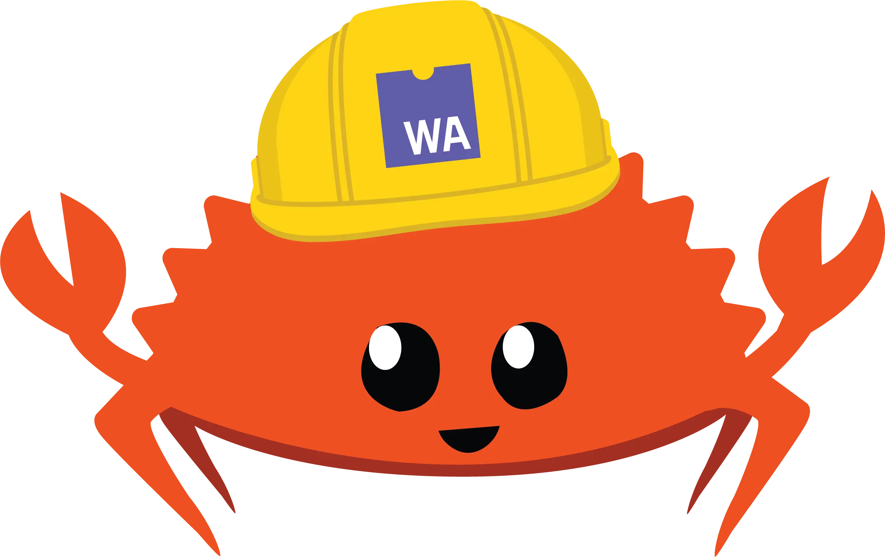
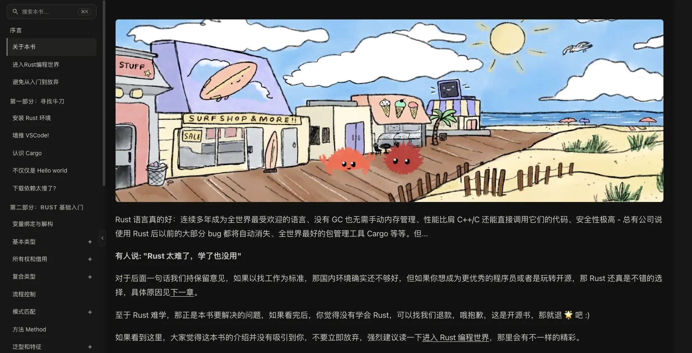
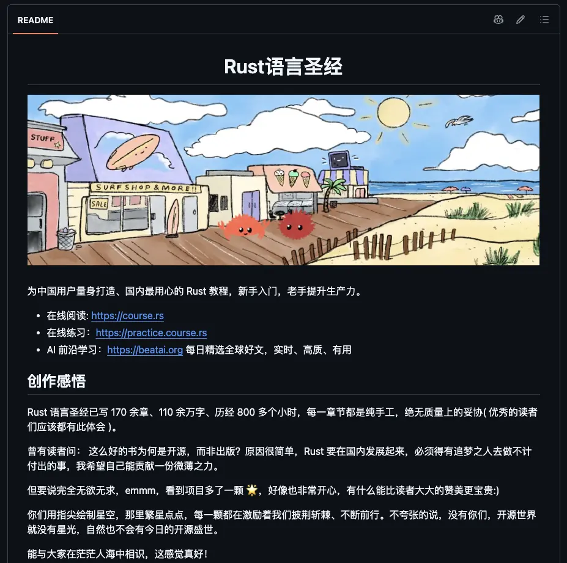

## 前言

长期以来我学过的语言、高频使用的语言都属于是抽象层级比较高的高级编程语言，像是py、js、ts、arkts、java等，都不太需要你去过多的关注底层的细节，封装好的库和垃圾回收机制等会为你处理好底层的浮点数精度差异啊，内存回收啊，类型转化啊之类的问题，C语言虽然大一学过，但由于没有真正的应用过也没有更进一步的了解课程内容之外的部分所以其实最后也并不太能说我学过。

就这样，我用高抽象层级的语言写了一个又一个项目，处理了一个又一个bug，就渐渐的在心理上筑起了一道壁垒，认为需要手动处理底层问题的rs，c，cpp这些语言会很难很繁琐，而且我的领域确实是用不到，所以长期以来就没用动力push我去开始学习这些语言。

随着我畏难情绪筑起的壁垒越来越高的同时，AI的能力正以一个更加难以想象的速度去上涨。渐渐的我发现我不熟悉的领域我也可以借助AI去完成了，以及行业的实际趋势，我意识到未来每个称需要都要或多或少的向着全栈去发展，同时AI增长的速度以及我实践的成功经验正一点点的帮我拆掉我心中筑起的壁垒，于是我结合最近的实际业务需求以及我自身对于各个大厂的技术选择倾向，决定开始学习rs。



当然在此也是安利一下我们伟大的rust语言圣经。

<style>
.rs-portal{position:relative;margin:1.8rem 0 2.2rem;border:2.5px solid #ce422b;background:#262019;box-shadow:10px 10px 0 rgba(206,66,43,.32);color:#f6ead8}
.rs-portal-head{display:flex;align-items:center;justify-content:space-between;gap:.9rem;flex-wrap:wrap;padding:1.05rem 1.3rem;background:#ce422b}
.rs-portal-titlebox{display:flex;align-items:center;gap:.75rem;min-width:0}
.rs-portal-gear{width:32px;height:32px;flex:none;color:#241812}
.rs-portal-titletext{margin:0;font-size:1.3rem;font-weight:800;letter-spacing:.05em;line-height:1.25;color:#241812}
.rs-portal-sub{display:block;margin-top:.2rem;font-family:"SFMono-Regular",Consolas,"Liberation Mono",Menlo,monospace;font-size:.64rem;font-weight:400;letter-spacing:.16em;color:rgba(36,24,18,.72)}
.rs-portal-no{flex:none;padding:.34em .75em;border:1.5px solid rgba(36,24,18,.55);font-family:"SFMono-Regular",Consolas,"Liberation Mono",Menlo,monospace;font-size:.66rem;letter-spacing:.18em;color:#241812;white-space:nowrap}
.rs-portal-grid{display:grid;grid-template-columns:1.95fr 1fr;gap:10px;padding:1.15rem 1.3rem 0}
.rs-portal-fig{position:relative;margin:0;border:2px solid #ce422b;background:#17110c;overflow:hidden;line-height:0}
.rs-portal-fig img{width:100%;height:auto;display:block;border-radius:0}
.rs-portal-tag{position:absolute;top:0;left:0;z-index:2;padding:.24em .65em;background:#ce422b;color:#f6ead8;font-family:"SFMono-Regular",Consolas,"Liberation Mono",Menlo,monospace;font-size:.62rem;letter-spacing:.12em;line-height:1.5}
.rs-portal-meta{margin:0;padding:.85rem 1.3rem 0;font-family:"SFMono-Regular",Consolas,"Liberation Mono",Menlo,monospace;font-size:.74rem;letter-spacing:.08em;line-height:1.7;color:rgba(246,234,216,.62)}
.rs-portal-meta b{color:#ef7a50;font-weight:700}
.rs-portal-divider{position:relative;margin:1.05rem 1.3rem;border-top:2px dashed rgba(246,234,216,.28);text-align:center}
.rs-portal-divider span{position:relative;top:-.75em;padding:0 .85em;background:#262019;font-family:"SFMono-Regular",Consolas,"Liberation Mono",Menlo,monospace;font-size:.62rem;letter-spacing:.32em;color:rgba(246,234,216,.45)}
.rs-portal-btn{display:flex;align-items:center;justify-content:center;gap:.7rem;margin:0 1.3rem 1.35rem;padding:.95rem 1.2rem;background:#ce422b;border:2.5px solid #17110c;box-shadow:5px 5px 0 #17110c;color:#fff7ec !important;font-size:1.02rem;font-weight:800;letter-spacing:.08em;text-decoration:none !important;transition:transform .18s ease,box-shadow .18s ease}
.rs-portal-btn:hover{transform:translate(-2px,-2px);box-shadow:7px 7px 0 #17110c;color:#ffffff !important}
.rs-portal-btn:active{transform:translate(2px,2px);box-shadow:1px 1px 0 #17110c}
.rs-portal-btn .rs-portal-gear{width:22px;height:22px;color:#fff7ec;transition:transform .5s cubic-bezier(.22,1,.36,1)}
.rs-portal-btn:hover .rs-portal-gear{transform:rotate(120deg)}
.rs-portal-btn-url{font-family:"SFMono-Regular",Consolas,"Liberation Mono",Menlo,monospace;font-size:.76em;font-weight:400;letter-spacing:.14em;opacity:.88}
@media (max-width:768px){
.rs-portal{box-shadow:6px 6px 0 rgba(206,66,43,.32)}
.rs-portal-head{padding:1rem 1rem}
.rs-portal-grid{grid-template-columns:1fr;padding:1rem 1rem 0}
.rs-portal-meta{padding:.85rem 1rem 0}
.rs-portal-divider{margin:1rem 1rem}
.rs-portal-btn{margin:0 1rem 1.15rem}
}
@media (prefers-reduced-motion:reduce){
.rs-portal-btn,.rs-portal-btn .rs-portal-gear{transition:none}
}
</style>

<div class="rs-portal"><div class="rs-portal-head"><div class="rs-portal-titlebox"><svg class="rs-portal-gear" viewBox="-50 -50 100 100" aria-hidden="true" focusable="false"><path fill="currentColor" fill-rule="evenodd" d="M0 -30A30 30 0 1 1 0 30A30 30 0 1 1 0 -30ZM0 -13A13 13 0 1 0 0 13A13 13 0 1 0 0 -13Z"/><g fill="currentColor"><rect x="-6.5" y="-47" width="13" height="18" rx="2"/><rect x="-6.5" y="-47" width="13" height="18" rx="2" transform="rotate(45)"/><rect x="-6.5" y="-47" width="13" height="18" rx="2" transform="rotate(90)"/><rect x="-6.5" y="-47" width="13" height="18" rx="2" transform="rotate(135)"/><rect x="-6.5" y="-47" width="13" height="18" rx="2" transform="rotate(180)"/><rect x="-6.5" y="-47" width="13" height="18" rx="2" transform="rotate(225)"/><rect x="-6.5" y="-47" width="13" height="18" rx="2" transform="rotate(270)"/><rect x="-6.5" y="-47" width="13" height="18" rx="2" transform="rotate(315)"/></g></svg><p class="rs-portal-titletext">RUST 语言圣经<span class="rs-portal-sub">THE RUST COURSE · 为中国用户量身打造的 RUST 教程</span></p></div><span class="rs-portal-no">PORTAL // COURSE.RS</span></div><div class="rs-portal-grid"><figure class="rs-portal-fig"><span class="rs-portal-tag">FIG.01 — 在线阅读</span></figure><figure class="rs-portal-fig"><span class="rs-portal-tag">FIG.02 — README</span></figure></div><p class="rs-portal-meta">// <b>170+</b> 章节 × <b>110+</b> 万字 × <b>800+</b> 小时纯手工 · 新手入门 / 老手提升 · 开源免费</p><div class="rs-portal-divider"><span>ADMIT ONE · 一票直达</span></div><a class="rs-portal-btn" href="https://course.rs" target="_blank" rel="noopener noreferrer"><svg class="rs-portal-gear" viewBox="-50 -50 100 100" aria-hidden="true" focusable="false"><path fill="currentColor" fill-rule="evenodd" d="M0 -30A30 30 0 1 1 0 30A30 30 0 1 1 0 -30ZM0 -13A13 13 0 1 0 0 13A13 13 0 1 0 0 -13Z"/><g fill="currentColor"><rect x="-6.5" y="-47" width="13" height="18" rx="2"/><rect x="-6.5" y="-47" width="13" height="18" rx="2" transform="rotate(45)"/><rect x="-6.5" y="-47" width="13" height="18" rx="2" transform="rotate(90)"/><rect x="-6.5" y="-47" width="13" height="18" rx="2" transform="rotate(135)"/><rect x="-6.5" y="-47" width="13" height="18" rx="2" transform="rotate(180)"/><rect x="-6.5" y="-47" width="13" height="18" rx="2" transform="rotate(225)"/><rect x="-6.5" y="-47" width="13" height="18" rx="2" transform="rotate(270)"/><rect x="-6.5" y="-47" width="13" height="18" rx="2" transform="rotate(315)"/></g></svg><span>进入传送门</span><span class="rs-portal-btn-url">course.rs</span><span aria-hidden="true">→</span></a></div>

（上面这个卡片是K3做的，没skill没细致的描述词，就说符合rust风格，怎么样还挺不错的吧）

所以这篇文章注定不是一个完整的rust学习经历也不会是一个完整的rust教程，只是用于记录一下一些关键的点而已。

## Tips

### ::和.的区别

::这个符号在cpp中我还是见过的但是长期以来也没有去深究到底是什么意思，直到这次开始学rust才发现这个符号也存在与rust，那这次我就得彻彻底底的搞明白了。



先给一个最短的结论：

> `::` 是在一条“路径”上继续寻找名字，`.` 是拿着一个值去访问它的字段或调用它的方法。

也可以把它们想象成两种完全不同的导航方式：`::` 像是在查地图——从国家查到城市，再查到街道；`.` 像是已经站在一个人面前，直接查看他的口袋，或者请他做一件事。

```rust
use std::collections::HashMap;

let mut users = HashMap::<String, u32>::new();
users.insert(String::from("小明"), 18);
```

这几行代码里其实同时出现了两套思路：

- `std::collections::HashMap`：从 `std` 模块进入 `collections` 模块，最后找到 `HashMap` 类型，是一条路径，所以用 `::`。
- `HashMap::<String, u32>::new()`：这里其实有两个不同位置的 `::`。`HashMap` 后面的 `::` 是 turbofish 的语法标记，用来在表达式中指定泛型参数；`>` 后面的 `::` 才是“在已经确定类型参数的 `HashMap` 上寻找 `new` 关联函数”的路径分隔符。
- `users.insert(...)`：`users` 是一个具体的值，调用这个值对应类型的方法，所以用 `.`。
- `String::from(...)`：`from` 没有拿到某个 `String` 实例作为第一个参数，它是 `String` 类型提供的关联函数，所以用 `::`。

#### 一、`::`：沿着路径寻找“名字”

Rust 中的 `::` 叫路径分隔符（path separator）。它左边通常是模块、类型、枚举或 trait，右边则是这个路径下面的另一个名字。这个名字可以是模块、函数、常量、类型、枚举变体，甚至是关联类型。

**① 模块路径：从“文件夹”找到函数**

```rust
std::io::stdin();
std::fs::read_to_string("config.toml");
```

这里的 `std` 可以理解成一个顶层模块，`io` 和 `fs` 是它下面的模块，`stdin`、`read_to_string` 是最后找到的函数。

如果用文件系统来类比，它有点像：

```text
/std/io/stdin
/std/fs/read_to_string
```

当然 Rust 的模块不一定一一对应真实的文件夹，但它们都承担了“组织名字、避免重名”的作用。比如不同模块中可以各自拥有一个 `Result`，调用时写完整路径就不会混淆：

```rust
std::io::Result<()>
std::fmt::Result
```

`use` 则相当于给长路径设置一个快捷方式：

```rust
use std::collections::HashMap;

let users: HashMap<String, u32> = HashMap::new();
```

注意，`use` 只是把名字引入当前作用域，并没有把 `::` 的含义变成别的东西。`HashMap` 依然是一个类型，`HashMap::new()` 依然是在类型的命名空间里找关联函数。

**② 类型的关联函数：Rust 不用 `static` 修饰方法，但有“属于类型的函数”**

很多语言会把这类函数叫作静态方法。Rust 不使用 Java 那种用 `static` 修饰方法的写法，而是把“不接收 `self`、属于某个类型的函数”叫作关联函数（associated function）。

```rust
struct User {
    name: String,
}

impl User {
    fn new(name: &str) -> Self {
        Self {
            name: name.to_string(),
        }
    }

    fn greet(&self) {
        println!("你好，我是 {}", self.name);
    }
}

let user = User::new("小明");
user.greet();
```

`new` 的调用方式是 `User::new(...)`，因为创建对象之前还没有一个 `User` 值可以作为接收者；而 `greet` 的第一个参数是 `&self`，它必须依附于一个已经存在的 `User`，所以写成 `user.greet()`。

可以把它想象成一间工厂：

- `User::new("小明")`：去“User 工厂”找生产方法，工厂还没有生产出某个具体用户。
- `user.greet()`：拿着已经生产出来的“小明”去办事，让这个具体的人打招呼。

这也解释了为什么 Rust 里通常这样写：

```rust
let text = String::from("hello");
let list = Vec::<i32>::new();
```

`String::from` 和 `Vec::new` 都是在类型上调用关联函数。它们不是“某个字符串对象”或“某个数组对象”在调用方法。

**③ 枚举变体：类型下面挂着的选项**

枚举变体也使用 `::`：

```rust
enum TrafficLight {
    Red,
    Yellow,
    Green,
}

let light = TrafficLight::Green;
```

这里 `TrafficLight` 是枚举类型，`Green` 是它定义的一个变体。`Green` 并不是一个普通的全局变量，而是“TrafficLight 这组可能取值中的一个”，因此使用 `TrafficLight::Green`。

带数据的枚举也是同样的规则：

```rust
enum Message {
    Quit,
    Text(String),
    Move { x: i32, y: i32 },
}

let a = Message::Text(String::from("你好"));
let b = Message::Move { x: 10, y: 20 };
```

这和 Java 的 `枚举类型.枚举值`、TypeScript 的 `枚举.成员`有点像，只是 Rust 使用 `::` 来表达“这个名字属于这个类型”。

**④ 关联常量、关联类型和特殊路径**

类型不仅可以拥有函数，还可以拥有常量：

```rust
struct Circle;

impl Circle {
    const PI: f64 = 3.1415926;
}

println!("{}", Circle::PI);
```

`Self` 是“当前正在实现的类型”，`self` 是“当前这个实例”。大小写虽然只差一点，但身份完全不同：

```rust
impl User {
    fn create_guest() -> Self {
        Self {
            name: String::from("游客"),
        }
    }

    fn show_name(&self) {
        println!("{}", self.name);
    }
}
```

- `Self` 可以看成类型位置上的 `User`，因此使用 `Self::create_guest()` 或返回 `Self`。
- `self` 是某个具体的用户值，访问它的字段或方法时使用 `self.name`、`self.show_name()`。

项目级路径也经常使用 `::`：

```rust
crate::config::load(); // 当前 crate 的根
super::helper();       // 当前模块的父模块
self::parse();        // 当前模块
```

这些都不是在访问运行时对象，而是在告诉编译器“去哪个模块范围内找名字”。

#### 二、`.`：对一个具体值做成员访问

`.` 的左边通常是一个变量、表达式、引用或智能指针，右边是字段名或方法名。它的重点不在“这个名字属于哪一个模块”，而在“这个值现在是什么类型，以及它能做什么”。

```rust
struct Point {
    x: i32,
    y: i32,
}

impl Point {
    fn distance_from_origin(&self) -> f64 {
        ((self.x * self.x + self.y * self.y) as f64).sqrt()
    }
}

let point = Point { x: 3, y: 4 };
println!("{}", point.x);                       // 字段访问
println!("{}", point.distance_from_origin()); // 方法调用
```

`point.x` 是从这个具体的点中取出 `x` 字段；`point.distance_from_origin()` 是把 `point` 作为接收者传给方法。方法里的 `self`，就是调用点号左侧的这个值。

**① 方法调用本质上会带上接收者**

下面两种写法在理解上非常接近：

```rust
let text = String::from("hello");

text.len();
String::len(&text);
```

第一种是更自然的方法语法；第二种把接收者显式写了出来。可以把 `text.len()` 粗略理解为“找到 `String::len`，再把 `&text` 传给它”。实际编译器还会进行方法查找、自动借用和自动解引用，所以这不是逐字展开规则，但非常适合作为入门时的心智模型。

可变方法也是如此：

```rust
let mut text = String::from("hello");
text.push('!');
```

`push` 需要 `&mut self`，编译器会在方法调用处自动进行合适的可变借用。也就是说，`.` 不只是一个“对象属性语法糖”，它还触发了 Rust 的方法解析和借用检查。

**② Rust 通常不需要 `->`**

C++ 中经常要区分：

```cpp
point.x;        // point 是对象
point_ptr->x;   // point_ptr 是指针
```

Rust 没有 C++ 那样的 `->` 成员访问运算符。即使左边是引用，通常仍然使用 `.`：

```rust
let point = Point { x: 3, y: 4 };
let point_ref = &point;

println!("{}", point_ref.x);
println!("{}", point_ref.distance_from_origin());
```

编译器会进行自动解引用（auto-deref），尝试找到引用背后的类型适用的字段或方法。`Box<T>`、`Rc<T>`、`Arc<T>` 等智能指针也经常因此可以直接写 `value.method()`。

这背后体现了 Rust 和 C++ 的一个重要差异：Rust 把借用关系交给类型系统和编译器检查，尽量让调用方不必为了“它到底是一层引用还是两层引用”改变成员访问符号。

#### 三、和其他语言放在一起看

**① C++：最像 Rust，但 `->` 不能忘**

```cpp
std::vector<int>::size_type count; // namespace / type 的作用域
auto size = values.size();          // 对象成员
auto size2 = values_ptr->size();    // 指针成员
```

Rust 的对应写法大致是：

```rust
let values = vec![1, 2, 3];
let values_ref = &values;
let size = values.len();
let size2 = values_ref.len();
```

C++ 的 `::` 叫作用域解析运算符，可以进入命名空间、类或枚举；Rust 的 `::` 也承担了类似的“沿类型/模块作用域找名字”的职责。最大的直观差别是 Rust 没有 `->`，引用和智能指针通常都用 `.`。Rust 也没有和 `std::vector<int>::size_type` 完全对应的内置成员类型，通常直接调用 `values.len()` 获取长度。

**② Java：几乎全用 `.`，所以容易造成错觉**

```java
java.util.ArrayList<Integer> list = new java.util.ArrayList<>();
Integer value = Integer.valueOf("42"); // 类上的静态方法
list.add(value);                        // 实例方法
```

Java 使用 `.` 同时表示：

- 包路径：`java.util.ArrayList`
- 类的静态成员：`Integer.valueOf(...)`
- 实例成员：`list.add(...)`

Rust 把“从命名空间/类型找名字”和“从实例找成员”分得更明显：前者倾向于 `::`，后者使用 `.`。因此看到 `String::from` 时，不要把它翻译成“String 对象调用 from”，更准确的翻译是“在 String 类型的作用域内寻找 from”。

**③ JavaScript 和 Python：`.` 更像“对象属性查找”**

```javascript
const text = String.fromCharCode(65); // 类/函数对象上的属性
text.toLowerCase();                   // 实例上的方法
```

```python
import os

path = os.path.join("a", "b")  # 模块对象上的属性
name = path.upper()             # 字符串对象上的方法
```

JavaScript 和 Python 把模块、类、函数也都当作运行时对象或对象属性来处理，所以大量场景都写 `.`。Rust 的模块路径主要是编译期名称解析，不是一个可以在运行时随便拿出来的“模块对象”，因此使用 `::` 会更明确地表达这种差异。

**④ Go：也更倾向于用 `.`**

```go
fmt.Println("hello") // 包中的函数
user.Name             // 结构体字段
user.Greet()          // 方法
```

Go 用 `.` 同时处理包成员和实例成员；Rust 则用 `std::io::stdin()` 这种路径表达模块层级，用 `println!` 宏进行输出，再用 `value.method()` 表达值上的方法调用。

#### 四、最常见的使用场景

| 想做什么 | 常见写法 | 判断方式 |
| --- | --- | --- |
| 访问标准库或自己的模块 | `std::fs::read(...)` | 从模块路径继续找名字 |
| 调用构造类函数 | `String::from("hi")`、`Vec::new()` | 类型还没有实例，属于类型的关联函数 |
| 创建枚举值 | `Option::Some(1)`、`Result::Ok(())` | 变体属于枚举类型 |
| 访问关联常量 | `Duration::ZERO` | 常量挂在类型上 |
| 调用实例方法 | `text.len()`、`list.push(1)` | 左边是具体值，方法接收它作为 `self` |
| 访问实例字段 | `user.name` | 从具体值中取字段 |
| 指定泛型参数 | `Vec::<i32>::new()`、`parse::<u32>()` | `::<...>` 是 turbofish，用来消除类型推断歧义 |
| 指定 trait 实现 | `<Type as Trait>::method(...)` | 多个 trait 或实现同名时，明确告诉编译器选谁 |

其中最容易第一次看懵的是 turbofish。先把 `HashMap::<String, u32>::new()` 拆开看：

```text
HashMap  ::  <String, u32>  ::  new()
类型名      泛型参数            关联函数
```

第一个 `::` 并不是在 `HashMap` 下面寻找一个叫 `<String, u32>` 的成员，它是 Rust 在**表达式位置**指定泛型参数时使用的语法。第二个 `::` 才和 `String::from` 中的 `::` 一样，表示“沿着类型路径继续寻找名字”，这里要找的是 `new`。


**把 turbofish 拆开看：**

```text
HashMap  ::  <String, u32>  ::  new()
类型名      turbofish 泛型参数    关联函数
```

这里的 `::<String, u32>` 是一个整体，专门用于在**表达式中明确指定泛型参数**。它不是在 `HashMap` 中查找名为 `<String, u32>` 的成员。

之所以写成 `::<>`，是因为 Rust 需要把“泛型参数”与“比较运算”区分开。比如：

```rust
// 类型位置：直接写尖括号，没有歧义
let users: HashMap<String, u32>;

// 表达式位置：用 turbofish 指定 HashMap 的 K 和 V
let users = HashMap::<String, u32>::new();
```

可以把它理解成一句完整的话：**“我要使用 `HashMap` 这个类型，并明确告诉你它的键是 `String`、值是 `u32`，然后调用它的 `new` 关联函数。”**

如果上下文已经足够清楚，泛型参数可以交给编译器推断：

```rust
let users: HashMap<String, u32> = HashMap::new();
```

如果没有类型上下文，`HashMap::new()` 创建的是一个空容器，编译器无法凭空知道键和值的类型，这时就需要 turbofish：

```rust
let users = HashMap::<String, u32>::new();
let numbers = Vec::<i32>::new();
```

方法泛型也使用相同的语法，不过要注意此时前面的 `.` 和后面的 `::` 各司其职：

```rust
let number = "42".parse::<u32>().unwrap();
//          │      │      │
//          │      │      └ turbofish：parse 的泛型参数是 u32
//          │      └ 方法名
//          └ 从这个字符串值上调用方法
```

所以，`HashMap::<String, u32>::new()` 中有两个 `::`：第一个属于 turbofish，负责指定泛型参数；第二个才是普通路径分隔符，负责从 `HashMap<String, u32>` 类型中找到 `new`。而 `"42".parse::<u32>()` 中只有一个 `::`，它属于 turbofish，前面的 `.` 才是实例方法访问符号。


为什么不能直接写成 `HashMap<String, u32>::new()`？因为 `HashMap::new()` 出现在表达式中时，`<` 可能被解析成“小于号”。编译器看到下面这种写法时，可能会把它误解成一串比较运算：

```rust
// 表达式中不要这样写
HashMap<String, u32>::new();
```

所以 Rust 用 `::<...>` 这个带有 `::` 的形式明确告诉编译器：“这里的尖括号是泛型参数，不是比较运算符。”这个写法因为外形像鱼嘴，被称为 turbofish（鱼嘴语法）。

但在**类型位置**，尖括号的含义已经没有歧义，就不需要前面的 `::`：

```rust
use std::collections::HashMap;

let users: HashMap<String, u32> = HashMap::<String, u32>::new();
let numbers = Vec::<i32>::new();
let number = "42".parse::<u32>().unwrap();
```

左边的 `HashMap<String, u32>` 是变量类型声明，属于类型位置；右边的 `HashMap::<String, u32>::new()` 是创建值的表达式，属于表达式位置。两边都在表达“键是 `String`、值是 `u32`”，只是语法上下文不同。

当然，很多时候可以依靠变量类型或函数返回值推断出泛型参数，直接写：

```rust
let users: HashMap<String, u32> = HashMap::new();
let numbers: Vec<i32> = Vec::new();
```

如果上下文足够明确，就不必手写 turbofish；如果编译器无法推断，或者你希望让读者一眼看到类型参数，再写 `HashMap::<String, u32>::new()`。

`parse::<u32>()` 也是同一个规则：`parse` 是方法，泛型参数紧跟在方法名后面。这里的 `::` 不是在访问另一个模块，而是告诉 Rust：“接下来这组尖括号是泛型参数，不要把 `<` 当成小于号来解析。”而 `"42".parse()` 前面的 `.` 仍然表示从这个字符串值上调用方法。

#### 五、什么时候需要更明确地写 `::`

正常情况下，Rust 会自动进行方法查找。假设一个类型既有自己的方法，又实现了同名 trait 方法：

```rust
trait Speak {
    fn speak(&self);
}

struct Cat;

impl Cat {
    fn speak(&self) {
        println!("猫自己的 speak");
    }
}

impl Speak for Cat {
    fn speak(&self) {
        println!("Speak trait 的 speak");
    }
}

let cat = Cat;
cat.speak(); // 通常优先调用 Cat 的固有方法
```

如果想明确调用 trait 中的那一个，就使用完全限定语法：

```rust
<Cat as Speak>::speak(&cat);
```

这句话可以读成：“把 `Cat` 当作 `Speak` 来看，然后调用 `Speak::speak`。”这时的 `::` 不再只是为了好看，而是在解决名字冲突、告诉编译器具体采用哪一套实现。

关联类型也会遇到类似的写法：

```rust
fn first<I>(mut iterator: I) -> Option<I::Item>
where
    I: Iterator,
{
    iterator.next()
}
```

`I::Item` 表示 `I` 这个迭代器实现中对应的 `Item` 类型。必要时可以写得更明确：

```rust
<I as Iterator>::Item
```

这就像在问：“`I` 作为 `Iterator` 的实现，它的 Item 类型究竟是什么？”

#### 六、一个实用的判断口诀

看到代码时，先不要死记符号，问自己两个问题：

1. 左边是模块、类型、枚举或 trait 吗？如果是在它的“命名空间”里继续找名字，使用 `::`。
2. 左边是一个已经存在的值、引用或智能指针吗？如果是要从它身上取字段，或者让它执行一个接收 `self` 的方法，使用 `.`。

```rust
std::mem::drop(value); // 从模块中找到函数
String::from("hi");    // 从类型中找到关联函数
value.len();            // 对具体值调用方法
value.field;            // 访问具体值的字段
```

最后用一句更接近 Rust 本质的话总结：`::` 主要参与编译期的路径和名字解析，解决“这个名字在哪里”；`.` 主要参与成员访问和方法解析，解决“这个值能做什么”，并且会连带触发自动借用、自动解引用以及所有权检查。理解了这两个问题，Rust 里的大多数 `::` 和 `.` 就不再是需要背诵的符号，而是代码结构本身的提示。



虽然我确实很像用上面的这套AI生成的讲解解决战斗，但是我还是认为学新东西还是需要自己去写才有用的，所以我先把它折叠了。

对于这个问题其实单独从概念层面是很难通过简单的和面向对象语言去进行类比来讲清楚的，因为rust并非传统意义上的面向对象语言，它并不存在Class和Interface这种概念，它更贴近C语言，是使用结构体去实现的类似效果。所以我决定向底层原理去挖。

#### struct和impl关键字索引出的::含义

在`rust`中`struct`和`impl`的组合可以用来实现Class类似的效果。

```rust
struct User {
    name: String,
}

impl User {
    // 类似 static 函数：没有 self
    fn new(name: String) -> Self {
        Self { name }
    }

    // 实例方法：有 &self
    fn hello(&self) {
        println!("Hello, {}", self.name);
    }
}

let user = User::new(String::from("Alice")); // 类似 User.staticFunction()
user.hello();                                // 类似 user.hello()
```

`struct`用于定义数据结构，`impl`用于定义该数据结构的方法。在上面的例子中，`User`是一个数据结构，它有一个`name`字段。`impl`块中定义了两个方法：`new`和`hello`。`new`方法用于创建一个新的`User`实例，`hello`方法用于打印出`User`的`name`字段。

这里我们就初见端倪了，对于`new`函数我们并不依赖于任何一个实例对象中的数据，仅仅依赖于传递的参数，这种不与任何实例对象绑定的函数就被称为，对应的我们还有关联常量、关联枚举量、关联结构体等。这些都是随调随用不需要关联任何实例的。


我们对于这种在编译期间可以直接确定地址，可直接调用无需依赖任何运行时产生的实例对象中动态数据的“静态项（Item）”，进行调用时只是沿着固定的路径去进行寻找，去获取到该项在内存中的位置的项，就使用::去进行寻址调用。

由此可以得出`::`的定义：其全称是 路径分隔符（path separator），它唯一的作用是在 Rust 的「模块 / 项命名空间」中做层级导航，所有解析工作100% 在编译期完成，运行时没有任何额外开销。


```rust
use num::complex::Complex;

 fn main() {
   let a = Complex { re: 2.1, im: -1.2 };
   let b = Complex::new(11.1, 22.2);
   let result = a + b;

   println!("{} + {}i", result.re, result.im)
 }
```

现在我们再回头看这段在圣经中举例的代码。

```rust
use num::complex::Complex;
```

这相当于是其他语言的import，引入了`num`库中的`complex`模块，然后我们就可以直接使用`Complex`这个类型了。这都是固定不变的结构体位置，所以我们直接通过`::`去进行寻址即可。

```rust
let a = Complex { re: 2.1, im: -1.2 };
```

这里并没有使用任何函数，而是通过`Complex`结构体的字面量语法，直接给它的`re`和`im`字段赋值，从而创建出一个实部为`2.1`、虚部为`-1.2`的复数实例，并将它绑定到变量`a`上。所以这里不需要`::`去寻找任何关联项，只需要按照`Complex`规定的数据结构去填入数据即可。
