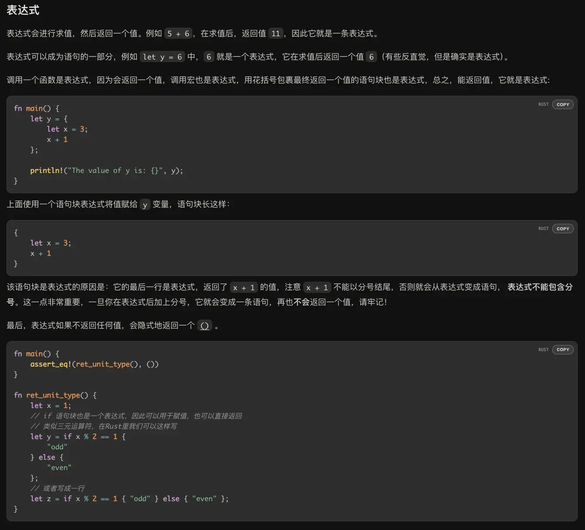
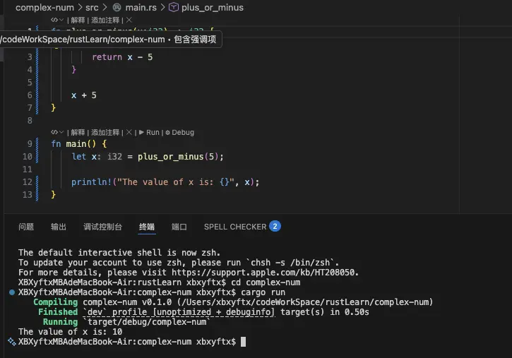
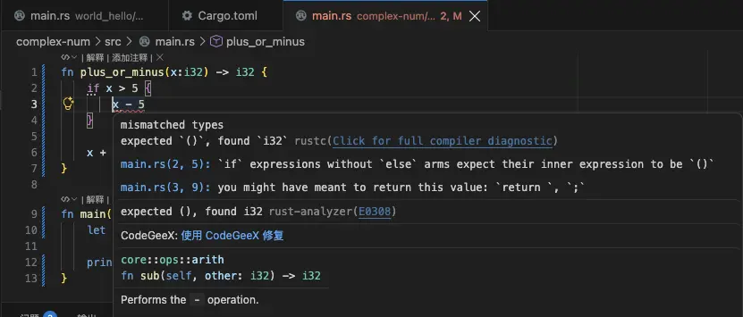
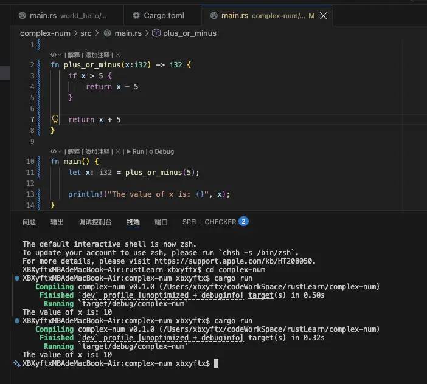
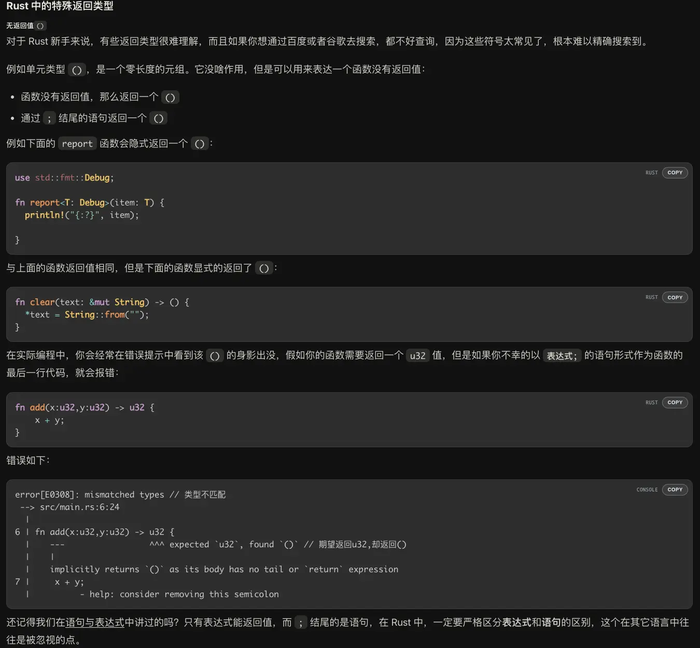
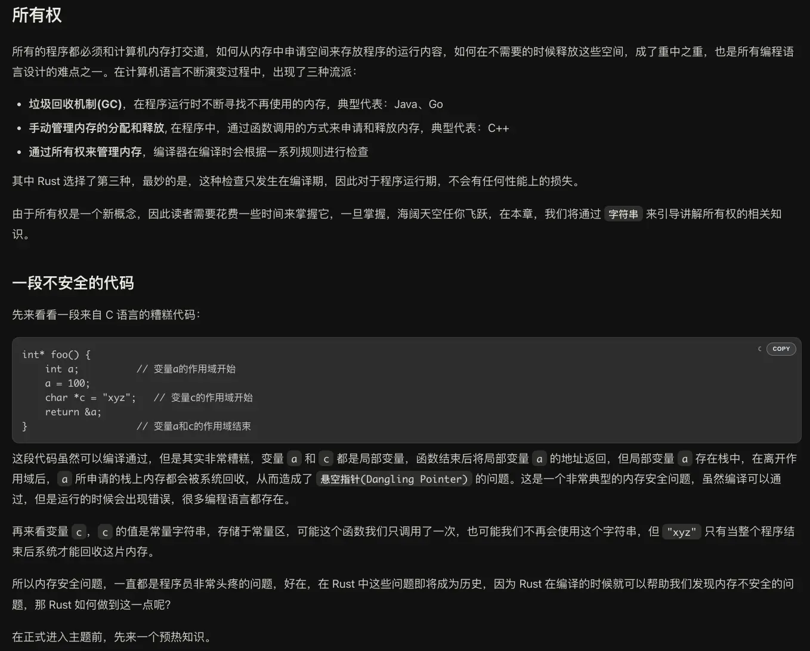
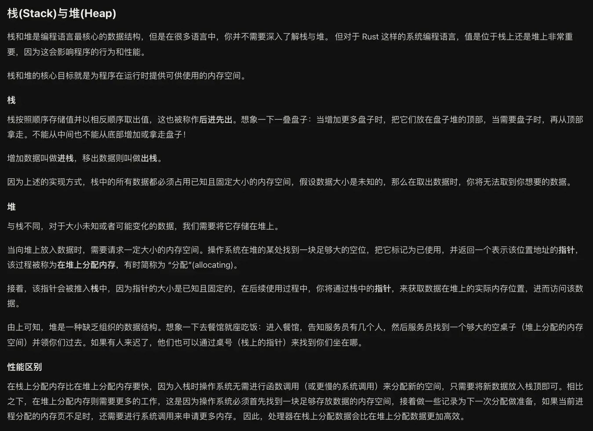
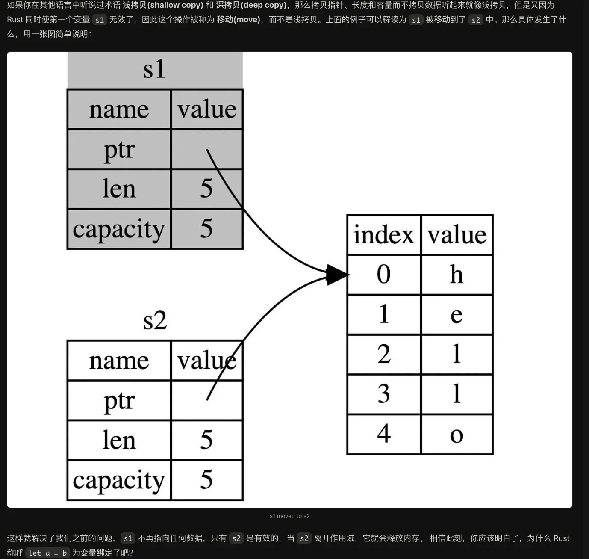

## 前言

长期以来我学过的语言、高频使用的语言都属于是抽象层级比较高的高级编程语言，像是py、js、ts、arkts、java等，都不太需要你去过多的关注底层的细节，封装好的库和垃圾回收机制等会为你处理好底层的浮点数精度差异啊，内存回收啊，类型转化啊之类的问题，C语言虽然大一学过，但由于没有真正的应用过也没有更进一步的了解课程内容之外的部分所以其实最后也并不太能说我学过。

就这样，我用高抽象层级的语言写了一个又一个项目，处理了一个又一个bug，就渐渐的在心理上筑起了一道壁垒，认为需要手动处理底层问题的rs，c，cpp这些语言会很难很繁琐，而且我的领域确实是用不到，所以长期以来就没用动力push我去开始学习这些语言。

随着我畏难情绪筑起的壁垒越来越高的同时，AI的能力正以一个更加难以想象的速度去上涨。渐渐的我发现我不熟悉的领域我也可以借助AI去完成了，以及行业的实际趋势，我意识到未来每个称需要都要或多或少的向着全栈去发展，同时AI增长的速度以及我实践的成功经验正一点点的帮我拆掉我心中筑起的壁垒，于是我结合最近的实际业务需求以及我自身对于各个大厂的技术选择倾向，决定开始学习rs。


当然在此也是安利一下我们伟大的rust语言圣经。

<style>
.rs-portal{position:relative;margin:1.8rem 0 2.2rem;border:2.5px solid #ce422b;background:#262019;box-shadow:10px 10px 0 rgba(206,66,43,.32);color:#f6ead8}
.rs-portal-head{display:flex;align-items:center;justify-content:space-between;gap:.9rem;flex-wrap:wrap;padding:1.05rem 1.3rem;background:#ce422b}
.rs-portal-titlebox{display:flex;align-items:center;gap:.75rem;min-width:0}
.rs-portal-gear{width:32px;height:32px;flex:none;color:#241812}
.rs-portal-titletext{margin:0;font-size:1.3rem;font-weight:800;letter-spacing:.05em;line-height:1.25;color:#241812}
.rs-portal-sub{display:block;margin-top:.2rem;font-family:"SFMono-Regular",Consolas,"Liberation Mono",Menlo,monospace;font-size:.64rem;font-weight:400;letter-spacing:.16em;color:rgba(36,24,18,.72)}
.rs-portal-no{flex:none;padding:.34em .75em;border:1.5px solid rgba(36,24,18,.55);font-family:"SFMono-Regular",Consolas,"Liberation Mono",Menlo,monospace;font-size:.66rem;letter-spacing:.18em;color:#241812;white-space:nowrap}
.rs-portal-grid{display:grid;grid-template-columns:1.95fr 1fr;gap:10px;padding:1.15rem 1.3rem 0}
.rs-portal-fig{position:relative;margin:0;border:2px solid #ce422b;background:#17110c;overflow:hidden;line-height:0}
.rs-portal-fig img{width:100%;height:auto;display:block;border-radius:0}
.rs-portal-tag{position:absolute;top:0;left:0;z-index:2;padding:.24em .65em;background:#ce422b;color:#f6ead8;font-family:"SFMono-Regular",Consolas,"Liberation Mono",Menlo,monospace;font-size:.62rem;letter-spacing:.12em;line-height:1.5}
.rs-portal-meta{margin:0;padding:.85rem 1.3rem 0;font-family:"SFMono-Regular",Consolas,"Liberation Mono",Menlo,monospace;font-size:.74rem;letter-spacing:.08em;line-height:1.7;color:rgba(246,234,216,.62)}
.rs-portal-meta b{color:#ef7a50;font-weight:700}
.rs-portal-divider{position:relative;margin:1.05rem 1.3rem;border-top:2px dashed rgba(246,234,216,.28);text-align:center}
.rs-portal-divider span{position:relative;top:-.75em;padding:0 .85em;background:#262019;font-family:"SFMono-Regular",Consolas,"Liberation Mono",Menlo,monospace;font-size:.62rem;letter-spacing:.32em;color:rgba(246,234,216,.45)}
.rs-portal-btn{display:flex;align-items:center;justify-content:center;gap:.7rem;margin:0 1.3rem 1.35rem;padding:.95rem 1.2rem;background:#ce422b;border:2.5px solid #17110c;box-shadow:5px 5px 0 #17110c;color:#fff7ec !important;font-size:1.02rem;font-weight:800;letter-spacing:.08em;text-decoration:none !important;transition:transform .18s ease,box-shadow .18s ease}
.rs-portal-btn:hover{transform:translate(-2px,-2px);box-shadow:7px 7px 0 #17110c;color:#ffffff !important}
.rs-portal-btn:active{transform:translate(2px,2px);box-shadow:1px 1px 0 #17110c}
.rs-portal-btn .rs-portal-gear{width:22px;height:22px;color:#fff7ec;transition:transform .5s cubic-bezier(.22,1,.36,1)}
.rs-portal-btn:hover .rs-portal-gear{transform:rotate(120deg)}
.rs-portal-btn-url{font-family:"SFMono-Regular",Consolas,"Liberation Mono",Menlo,monospace;font-size:.76em;font-weight:400;letter-spacing:.14em;opacity:.88}
@media (max-width:768px){
.rs-portal{box-shadow:6px 6px 0 rgba(206,66,43,.32)}
.rs-portal-head{padding:1rem 1rem}
.rs-portal-grid{grid-template-columns:1fr;padding:1rem 1rem 0}
.rs-portal-meta{padding:.85rem 1rem 0}
.rs-portal-divider{margin:1rem 1rem}
.rs-portal-btn{margin:0 1rem 1.15rem}
}
@media (prefers-reduced-motion:reduce){
.rs-portal-btn,.rs-portal-btn .rs-portal-gear{transition:none}
}
</style>

<div class="rs-portal"><div class="rs-portal-head"><div class="rs-portal-titlebox"><svg class="rs-portal-gear" viewBox="-50 -50 100 100" aria-hidden="true" focusable="false"><path fill="currentColor" fill-rule="evenodd" d="M0 -30A30 30 0 1 1 0 30A30 30 0 1 1 0 -30ZM0 -13A13 13 0 1 0 0 13A13 13 0 1 0 0 -13Z"/><g fill="currentColor"><rect x="-6.5" y="-47" width="13" height="18" rx="2"/><rect x="-6.5" y="-47" width="13" height="18" rx="2" transform="rotate(45)"/><rect x="-6.5" y="-47" width="13" height="18" rx="2" transform="rotate(90)"/><rect x="-6.5" y="-47" width="13" height="18" rx="2" transform="rotate(135)"/><rect x="-6.5" y="-47" width="13" height="18" rx="2" transform="rotate(180)"/><rect x="-6.5" y="-47" width="13" height="18" rx="2" transform="rotate(225)"/><rect x="-6.5" y="-47" width="13" height="18" rx="2" transform="rotate(270)"/><rect x="-6.5" y="-47" width="13" height="18" rx="2" transform="rotate(315)"/></g></svg><p class="rs-portal-titletext">RUST 语言圣经<span class="rs-portal-sub">THE RUST COURSE · 为中国用户量身打造的 RUST 教程</span></p></div><span class="rs-portal-no">PORTAL // COURSE.RS</span></div><div class="rs-portal-grid"><figure class="rs-portal-fig"><span class="rs-portal-tag">FIG.01 — 在线阅读</span></figure><figure class="rs-portal-fig"><span class="rs-portal-tag">FIG.02 — README</span></figure></div><p class="rs-portal-meta">// <b>170+</b> 章节 × <b>110+</b> 万字 × <b>800+</b> 小时纯手工 · 新手入门 / 老手提升 · 开源免费</p><div class="rs-portal-divider"><span>ADMIT ONE · 一票直达</span></div><a class="rs-portal-btn" href="https://course.rs" target="_blank" rel="noopener noreferrer"><svg class="rs-portal-gear" viewBox="-50 -50 100 100" aria-hidden="true" focusable="false"><path fill="currentColor" fill-rule="evenodd" d="M0 -30A30 30 0 1 1 0 30A30 30 0 1 1 0 -30ZM0 -13A13 13 0 1 0 0 13A13 13 0 1 0 0 -13Z"/><g fill="currentColor"><rect x="-6.5" y="-47" width="13" height="18" rx="2"/><rect x="-6.5" y="-47" width="13" height="18" rx="2" transform="rotate(45)"/><rect x="-6.5" y="-47" width="13" height="18" rx="2" transform="rotate(90)"/><rect x="-6.5" y="-47" width="13" height="18" rx="2" transform="rotate(135)"/><rect x="-6.5" y="-47" width="13" height="18" rx="2" transform="rotate(180)"/><rect x="-6.5" y="-47" width="13" height="18" rx="2" transform="rotate(225)"/><rect x="-6.5" y="-47" width="13" height="18" rx="2" transform="rotate(270)"/><rect x="-6.5" y="-47" width="13" height="18" rx="2" transform="rotate(315)"/></g></svg><span>进入传送门</span><span class="rs-portal-btn-url">course.rs</span><span aria-hidden="true">→</span></a></div>

（上面这个卡片是K3做的，没skill没细致的描述词，就说符合rust风格，怎么样还挺不错的吧）

所以这篇文章注定不是一个完整的rust学习经历也不会是一个完整的rust教程，只是用于记录一下一些关键的点而已。

## Tips

### ::和.的区别

::这个符号在cpp中我还是见过的但是长期以来也没有去深究到底是什么意思，直到这次开始学rust才发现这个符号也存在与rust，那这次我就得彻彻底底的搞明白了。



先给一个最短的结论：

> `::` 是在一条“路径”上继续寻找名字，`.` 是拿着一个值去访问它的字段或调用它的方法。

也可以把它们想象成两种完全不同的导航方式：`::` 像是在查地图——从国家查到城市，再查到街道；`.` 像是已经站在一个人面前，直接查看他的口袋，或者请他做一件事。

```rust
use std::collections::HashMap;

let mut users = HashMap::<String, u32>::new();
users.insert(String::from("小明"), 18);
```

这几行代码里其实同时出现了两套思路：

- `std::collections::HashMap`：从 `std` 模块进入 `collections` 模块，最后找到 `HashMap` 类型，是一条路径，所以用 `::`。
- `HashMap::<String, u32>::new()`：这里其实有两个不同位置的 `::`。`HashMap` 后面的 `::` 是 turbofish 的语法标记，用来在表达式中指定泛型参数；`>` 后面的 `::` 才是“在已经确定类型参数的 `HashMap` 上寻找 `new` 关联函数”的路径分隔符。
- `users.insert(...)`：`users` 是一个具体的值，调用这个值对应类型的方法，所以用 `.`。
- `String::from(...)`：`from` 没有拿到某个 `String` 实例作为第一个参数，它是 `String` 类型提供的关联函数，所以用 `::`。

#### 一、`::`：沿着路径寻找“名字”

Rust 中的 `::` 叫路径分隔符（path separator）。它左边通常是模块、类型、枚举或 trait，右边则是这个路径下面的另一个名字。这个名字可以是模块、函数、常量、类型、枚举变体，甚至是关联类型。

**① 模块路径：从“文件夹”找到函数**

```rust
std::io::stdin();
std::fs::read_to_string("config.toml");
```

这里的 `std` 可以理解成一个顶层模块，`io` 和 `fs` 是它下面的模块，`stdin`、`read_to_string` 是最后找到的函数。

如果用文件系统来类比，它有点像：

```text
/std/io/stdin
/std/fs/read_to_string
```

当然 Rust 的模块不一定一一对应真实的文件夹，但它们都承担了“组织名字、避免重名”的作用。比如不同模块中可以各自拥有一个 `Result`，调用时写完整路径就不会混淆：

```rust
std::io::Result<()>
std::fmt::Result
```

`use` 则相当于给长路径设置一个快捷方式：

```rust
use std::collections::HashMap;

let users: HashMap<String, u32> = HashMap::new();
```

注意，`use` 只是把名字引入当前作用域，并没有把 `::` 的含义变成别的东西。`HashMap` 依然是一个类型，`HashMap::new()` 依然是在类型的命名空间里找关联函数。

**② 类型的关联函数：Rust 不用 `static` 修饰方法，但有“属于类型的函数”**

很多语言会把这类函数叫作静态方法。Rust 不使用 Java 那种用 `static` 修饰方法的写法，而是把“不接收 `self`、属于某个类型的函数”叫作关联函数（associated function）。

```rust
struct User {
    name: String,
}

impl User {
    fn new(name: &str) -> Self {
        Self {
            name: name.to_string(),
        }
    }

    fn greet(&self) {
        println!("你好，我是 {}", self.name);
    }
}

let user = User::new("小明");
user.greet();
```

`new` 的调用方式是 `User::new(...)`，因为创建对象之前还没有一个 `User` 值可以作为接收者；而 `greet` 的第一个参数是 `&self`，它必须依附于一个已经存在的 `User`，所以写成 `user.greet()`。

可以把它想象成一间工厂：

- `User::new("小明")`：去“User 工厂”找生产方法，工厂还没有生产出某个具体用户。
- `user.greet()`：拿着已经生产出来的“小明”去办事，让这个具体的人打招呼。

这也解释了为什么 Rust 里通常这样写：

```rust
let text = String::from("hello");
let list = Vec::<i32>::new();
```

`String::from` 和 `Vec::new` 都是在类型上调用关联函数。它们不是“某个字符串对象”或“某个数组对象”在调用方法。

**③ 枚举变体：类型下面挂着的选项**

枚举变体也使用 `::`：

```rust
enum TrafficLight {
    Red,
    Yellow,
    Green,
}

let light = TrafficLight::Green;
```

这里 `TrafficLight` 是枚举类型，`Green` 是它定义的一个变体。`Green` 并不是一个普通的全局变量，而是“TrafficLight 这组可能取值中的一个”，因此使用 `TrafficLight::Green`。

带数据的枚举也是同样的规则：

```rust
enum Message {
    Quit,
    Text(String),
    Move { x: i32, y: i32 },
}

let a = Message::Text(String::from("你好"));
let b = Message::Move { x: 10, y: 20 };
```

这和 Java 的 `枚举类型.枚举值`、TypeScript 的 `枚举.成员`有点像，只是 Rust 使用 `::` 来表达“这个名字属于这个类型”。

**④ 关联常量、关联类型和特殊路径**

类型不仅可以拥有函数，还可以拥有常量：

```rust
struct Circle;

impl Circle {
    const PI: f64 = 3.1415926;
}

println!("{}", Circle::PI);
```

`Self` 是“当前正在实现的类型”，`self` 是“当前这个实例”。大小写虽然只差一点，但身份完全不同：

```rust
impl User {
    fn create_guest() -> Self {
        Self {
            name: String::from("游客"),
        }
    }

    fn show_name(&self) {
        println!("{}", self.name);
    }
}
```

- `Self` 可以看成类型位置上的 `User`，因此使用 `Self::create_guest()` 或返回 `Self`。
- `self` 是某个具体的用户值，访问它的字段或方法时使用 `self.name`、`self.show_name()`。

项目级路径也经常使用 `::`：

```rust
crate::config::load(); // 当前 crate 的根
super::helper();       // 当前模块的父模块
self::parse();        // 当前模块
```

这些都不是在访问运行时对象，而是在告诉编译器“去哪个模块范围内找名字”。

#### 二、`.`：对一个具体值做成员访问

`.` 的左边通常是一个变量、表达式、引用或智能指针，右边是字段名或方法名。它的重点不在“这个名字属于哪一个模块”，而在“这个值现在是什么类型，以及它能做什么”。

```rust
struct Point {
    x: i32,
    y: i32,
}

impl Point {
    fn distance_from_origin(&self) -> f64 {
        ((self.x * self.x + self.y * self.y) as f64).sqrt()
    }
}

let point = Point { x: 3, y: 4 };
println!("{}", point.x);                       // 字段访问
println!("{}", point.distance_from_origin()); // 方法调用
```

`point.x` 是从这个具体的点中取出 `x` 字段；`point.distance_from_origin()` 是把 `point` 作为接收者传给方法。方法里的 `self`，就是调用点号左侧的这个值。

**① 方法调用本质上会带上接收者**

下面两种写法在理解上非常接近：

```rust
let text = String::from("hello");

text.len();
String::len(&text);
```

第一种是更自然的方法语法；第二种把接收者显式写了出来。可以把 `text.len()` 粗略理解为“找到 `String::len`，再把 `&text` 传给它”。实际编译器还会进行方法查找、自动借用和自动解引用，所以这不是逐字展开规则，但非常适合作为入门时的心智模型。

可变方法也是如此：

```rust
let mut text = String::from("hello");
text.push('!');
```

`push` 需要 `&mut self`，编译器会在方法调用处自动进行合适的可变借用。也就是说，`.` 不只是一个“对象属性语法糖”，它还触发了 Rust 的方法解析和借用检查。

**② Rust 通常不需要 `->`**

C++ 中经常要区分：

```cpp
point.x;        // point 是对象
point_ptr->x;   // point_ptr 是指针
```

Rust 没有 C++ 那样的 `->` 成员访问运算符。即使左边是引用，通常仍然使用 `.`：

```rust
let point = Point { x: 3, y: 4 };
let point_ref = &point;

println!("{}", point_ref.x);
println!("{}", point_ref.distance_from_origin());
```

编译器会进行自动解引用（auto-deref），尝试找到引用背后的类型适用的字段或方法。`Box<T>`、`Rc<T>`、`Arc<T>` 等智能指针也经常因此可以直接写 `value.method()`。

这背后体现了 Rust 和 C++ 的一个重要差异：Rust 把借用关系交给类型系统和编译器检查，尽量让调用方不必为了“它到底是一层引用还是两层引用”改变成员访问符号。

#### 三、和其他语言放在一起看

**① C++：最像 Rust，但 `->` 不能忘**

```cpp
std::vector<int>::size_type count; // namespace / type 的作用域
auto size = values.size();          // 对象成员
auto size2 = values_ptr->size();    // 指针成员
```

Rust 的对应写法大致是：

```rust
let values = vec![1, 2, 3];
let values_ref = &values;
let size = values.len();
let size2 = values_ref.len();
```

C++ 的 `::` 叫作用域解析运算符，可以进入命名空间、类或枚举；Rust 的 `::` 也承担了类似的“沿类型/模块作用域找名字”的职责。最大的直观差别是 Rust 没有 `->`，引用和智能指针通常都用 `.`。Rust 也没有和 `std::vector<int>::size_type` 完全对应的内置成员类型，通常直接调用 `values.len()` 获取长度。

**② Java：几乎全用 `.`，所以容易造成错觉**

```java
java.util.ArrayList<Integer> list = new java.util.ArrayList<>();
Integer value = Integer.valueOf("42"); // 类上的静态方法
list.add(value);                        // 实例方法
```

Java 使用 `.` 同时表示：

- 包路径：`java.util.ArrayList`
- 类的静态成员：`Integer.valueOf(...)`
- 实例成员：`list.add(...)`

Rust 把“从命名空间/类型找名字”和“从实例找成员”分得更明显：前者倾向于 `::`，后者使用 `.`。因此看到 `String::from` 时，不要把它翻译成“String 对象调用 from”，更准确的翻译是“在 String 类型的作用域内寻找 from”。

**③ JavaScript 和 Python：`.` 更像“对象属性查找”**

```javascript
const text = String.fromCharCode(65); // 类/函数对象上的属性
text.toLowerCase();                   // 实例上的方法
```

```python
import os

path = os.path.join("a", "b")  # 模块对象上的属性
name = path.upper()             # 字符串对象上的方法
```

JavaScript 和 Python 把模块、类、函数也都当作运行时对象或对象属性来处理，所以大量场景都写 `.`。Rust 的模块路径主要是编译期名称解析，不是一个可以在运行时随便拿出来的“模块对象”，因此使用 `::` 会更明确地表达这种差异。

**④ Go：也更倾向于用 `.`**

```go
fmt.Println("hello") // 包中的函数
user.Name             // 结构体字段
user.Greet()          // 方法
```

Go 用 `.` 同时处理包成员和实例成员；Rust 则用 `std::io::stdin()` 这种路径表达模块层级，用 `println!` 宏进行输出，再用 `value.method()` 表达值上的方法调用。

#### 四、最常见的使用场景

| 想做什么 | 常见写法 | 判断方式 |
| --- | --- | --- |
| 访问标准库或自己的模块 | `std::fs::read(...)` | 从模块路径继续找名字 |
| 调用构造类函数 | `String::from("hi")`、`Vec::new()` | 类型还没有实例，属于类型的关联函数 |
| 创建枚举值 | `Option::Some(1)`、`Result::Ok(())` | 变体属于枚举类型 |
| 访问关联常量 | `Duration::ZERO` | 常量挂在类型上 |
| 调用实例方法 | `text.len()`、`list.push(1)` | 左边是具体值，方法接收它作为 `self` |
| 访问实例字段 | `user.name` | 从具体值中取字段 |
| 指定泛型参数 | `Vec::<i32>::new()`、`parse::<u32>()` | `::<...>` 是 turbofish，用来消除类型推断歧义 |
| 指定 trait 实现 | `<Type as Trait>::method(...)` | 多个 trait 或实现同名时，明确告诉编译器选谁 |

其中最容易第一次看懵的是 turbofish。先把 `HashMap::<String, u32>::new()` 拆开看：

```text
HashMap  ::  <String, u32>  ::  new()
类型名      泛型参数            关联函数
```

第一个 `::` 并不是在 `HashMap` 下面寻找一个叫 `<String, u32>` 的成员，它是 Rust 在**表达式位置**指定泛型参数时使用的语法。第二个 `::` 才和 `String::from` 中的 `::` 一样，表示“沿着类型路径继续寻找名字”，这里要找的是 `new`。


**把 turbofish 拆开看：**

```text
HashMap  ::  <String, u32>  ::  new()
类型名      turbofish 泛型参数    关联函数
```

这里的 `::<String, u32>` 是一个整体，专门用于在**表达式中明确指定泛型参数**。它不是在 `HashMap` 中查找名为 `<String, u32>` 的成员。

之所以写成 `::<>`，是因为 Rust 需要把“泛型参数”与“比较运算”区分开。比如：

```rust
// 类型位置：直接写尖括号，没有歧义
let users: HashMap<String, u32>;

// 表达式位置：用 turbofish 指定 HashMap 的 K 和 V
let users = HashMap::<String, u32>::new();
```

可以把它理解成一句完整的话：**“我要使用 `HashMap` 这个类型，并明确告诉你它的键是 `String`、值是 `u32`，然后调用它的 `new` 关联函数。”**

如果上下文已经足够清楚，泛型参数可以交给编译器推断：

```rust
let users: HashMap<String, u32> = HashMap::new();
```

如果没有类型上下文，`HashMap::new()` 创建的是一个空容器，编译器无法凭空知道键和值的类型，这时就需要 turbofish：

```rust
let users = HashMap::<String, u32>::new();
let numbers = Vec::<i32>::new();
```

方法泛型也使用相同的语法，不过要注意此时前面的 `.` 和后面的 `::` 各司其职：

```rust
let number = "42".parse::<u32>().unwrap();
//          │      │      │
//          │      │      └ turbofish：parse 的泛型参数是 u32
//          │      └ 方法名
//          └ 从这个字符串值上调用方法
```

所以，`HashMap::<String, u32>::new()` 中有两个 `::`：第一个属于 turbofish，负责指定泛型参数；第二个才是普通路径分隔符，负责从 `HashMap<String, u32>` 类型中找到 `new`。而 `"42".parse::<u32>()` 中只有一个 `::`，它属于 turbofish，前面的 `.` 才是实例方法访问符号。


为什么不能直接写成 `HashMap<String, u32>::new()`？因为 `HashMap::new()` 出现在表达式中时，`<` 可能被解析成“小于号”。编译器看到下面这种写法时，可能会把它误解成一串比较运算：

```rust
// 表达式中不要这样写
HashMap<String, u32>::new();
```

所以 Rust 用 `::<...>` 这个带有 `::` 的形式明确告诉编译器：“这里的尖括号是泛型参数，不是比较运算符。”这个写法因为外形像鱼嘴，被称为 turbofish（鱼嘴语法）。

但在**类型位置**，尖括号的含义已经没有歧义，就不需要前面的 `::`：

```rust
use std::collections::HashMap;

let users: HashMap<String, u32> = HashMap::<String, u32>::new();
let numbers = Vec::<i32>::new();
let number = "42".parse::<u32>().unwrap();
```

左边的 `HashMap<String, u32>` 是变量类型声明，属于类型位置；右边的 `HashMap::<String, u32>::new()` 是创建值的表达式，属于表达式位置。两边都在表达“键是 `String`、值是 `u32`”，只是语法上下文不同。

当然，很多时候可以依靠变量类型或函数返回值推断出泛型参数，直接写：

```rust
let users: HashMap<String, u32> = HashMap::new();
let numbers: Vec<i32> = Vec::new();
```

如果上下文足够明确，就不必手写 turbofish；如果编译器无法推断，或者你希望让读者一眼看到类型参数，再写 `HashMap::<String, u32>::new()`。

`parse::<u32>()` 也是同一个规则：`parse` 是方法，泛型参数紧跟在方法名后面。这里的 `::` 不是在访问另一个模块，而是告诉 Rust：“接下来这组尖括号是泛型参数，不要把 `<` 当成小于号来解析。”而 `"42".parse()` 前面的 `.` 仍然表示从这个字符串值上调用方法。

#### 五、什么时候需要更明确地写 `::`

正常情况下，Rust 会自动进行方法查找。假设一个类型既有自己的方法，又实现了同名 trait 方法：

```rust
trait Speak {
    fn speak(&self);
}

struct Cat;

impl Cat {
    fn speak(&self) {
        println!("猫自己的 speak");
    }
}

impl Speak for Cat {
    fn speak(&self) {
        println!("Speak trait 的 speak");
    }
}

let cat = Cat;
cat.speak(); // 通常优先调用 Cat 的固有方法
```

如果想明确调用 trait 中的那一个，就使用完全限定语法：

```rust
<Cat as Speak>::speak(&cat);
```

这句话可以读成：“把 `Cat` 当作 `Speak` 来看，然后调用 `Speak::speak`。”这时的 `::` 不再只是为了好看，而是在解决名字冲突、告诉编译器具体采用哪一套实现。

关联类型也会遇到类似的写法：

```rust
fn first<I>(mut iterator: I) -> Option<I::Item>
where
    I: Iterator,
{
    iterator.next()
}
```

`I::Item` 表示 `I` 这个迭代器实现中对应的 `Item` 类型。必要时可以写得更明确：

```rust
<I as Iterator>::Item
```

这就像在问：“`I` 作为 `Iterator` 的实现，它的 Item 类型究竟是什么？”

#### 六、一个实用的判断口诀

看到代码时，先不要死记符号，问自己两个问题：

1. 左边是模块、类型、枚举或 trait 吗？如果是在它的“命名空间”里继续找名字，使用 `::`。
2. 左边是一个已经存在的值、引用或智能指针吗？如果是要从它身上取字段，或者让它执行一个接收 `self` 的方法，使用 `.`。

```rust
std::mem::drop(value); // 从模块中找到函数
String::from("hi");    // 从类型中找到关联函数
value.len();            // 对具体值调用方法
value.field;            // 访问具体值的字段
```

最后用一句更接近 Rust 本质的话总结：`::` 主要参与编译期的路径和名字解析，解决“这个名字在哪里”；`.` 主要参与成员访问和方法解析，解决“这个值能做什么”，并且会连带触发自动借用、自动解引用以及所有权检查。理解了这两个问题，Rust 里的大多数 `::` 和 `.` 就不再是需要背诵的符号，而是代码结构本身的提示。



虽然我确实很像用上面的这套AI生成的讲解解决战斗，但是我还是认为学新东西还是需要自己去写才有用的，所以我先把它折叠了。

对于这个问题其实单独从概念层面是很难通过简单的和面向对象语言去进行类比来讲清楚的，因为rust并非传统意义上的面向对象语言，它并不存在Class和Interface这种概念，它更贴近C语言，是使用结构体去实现的类似效果。所以我决定向底层原理去挖。

#### struct和impl关键字索引出的`::`含义

在`rust`中`struct`和`impl`的组合可以用来实现Class类似的效果。

```rust
struct User {
    name: String,
}

impl User {
    // 类似 static 函数：没有 self
    fn new(name: String) -> Self {
        Self { name }
    }

    // 实例方法：有 &self
    fn hello(&self) {
        println!("Hello, {}", self.name);
    }
}

let user = User::new(String::from("Alice")); // 类似 User.staticFunction()
user.hello();                                // 类似 user.hello()
```

`struct`用于定义数据结构，`impl`用于定义该数据结构的方法。在上面的例子中，`User`是一个数据结构，它有一个`name`字段。`impl`块中定义了两个方法：`new`和`hello`。`new`方法用于创建一个新的`User`实例，`hello`方法用于打印出`User`的`name`字段。

这里我们就初见端倪了，对于`new`函数我们并不依赖于任何一个实例对象中的数据，仅仅依赖于传递的参数，这种不与任何实例对象绑定的函数就被称为，对应的我们还有关联常量、关联枚举量、关联结构体等。这些都是随调随用不需要关联任何实例的。


我们对于这种在编译期间可以直接确定地址，可直接调用无需依赖任何运行时产生的实例对象中动态数据的“静态项（Item）”，进行调用时只是沿着固定的路径去进行寻找，去获取到该项在内存中的位置的项，就使用::去进行寻址调用。

由此可以得出`::`的定义：其全称是 路径分隔符（path separator），它唯一的作用是在 Rust 的「模块 / 项命名空间」中做层级导航，所有解析工作100% 在编译期完成，运行时没有任何额外开销。


```rust
use num::complex::Complex;

 fn main() {
   let a = Complex { re: 2.1, im: -1.2 };
   let b = Complex::new(11.1, 22.2);
   let result = a + b;

   println!("{} + {}i", result.re, result.im)
 }
```

现在我们再回头看这段在圣经中举例的代码。

```rust
use num::complex::Complex;
```

这相当于是其他语言的import，引入了`num`库中的`complex`模块，然后我们就可以直接使用`Complex`这个类型了。这都是固定不变的结构体位置，所以我们直接通过`::`去进行寻址即可。

```rust
let a = Complex { re: 2.1, im: -1.2 };
```

这里并没有使用任何函数，而是通过`Complex`结构体的字面量语法，直接给它的`re`和`im`字段赋值，从而创建出一个实部为`2.1`、虚部为`-1.2`的复数实例，并将它绑定到变量`a`上。所以这里不需要`::`去寻找任何关联项，只需要按照`Complex`规定的数据结构去填入数据即可。

```rust
let b = Complex::new(11.1, 22.2);
```

这就很好理解了和上面讲解的一致，通过路径寻址找到`new`函数即可。

#### `.`值的成员访问运算符

对于点语法，被极为广泛的应用于当代的主流编程语言中，我就不进行举例了。在rust中，点语法通常被用作访问一个已经存在的实例中的字段，或者调用这个实例所拥有的方法。

```rust
struct User {
    name: String,
}

impl User {
    fn hello(&self) {
        println!("Hello, {}", self.name);
    }
}

let user = User {
    name: String::from("Alice"),
};

println!("{}", user.name); // 访问字段
user.hello();              // 调用方法
```

这里的`user`就是一个已经创建好的实例，`user.name`表示从这个具体的实例中取出`name`字段，`user.hello()`则是让这个实例去调用`hello`方法。因为`hello`方法的第一个参数是`&self`，所以我们也可以把它粗略的理解为：

```rust
User::hello(&user);
```

也就是说，点语法会自动把点号左边的实例作为`self`参数传入方法中。只不过实际情况还会涉及自动借用、自动解引用以及方法查找等过程，所以这只是为了方便理解的一种近似写法。

### 表达式



哇哦哇哦这种“表达式”确实是没见过这么写的，还是在这里截图标记一下吧防止忘了。

### 函数返回值

```rust
fn plus_or_minus(x:i32) -> i32 {
    if x > 5 {
        return x - 5
    }

    x + 5
}

fn main() {
    let x = plus_or_minus(5);

    println!("The value of x is: {}", x);
}
```

用表达式或者return进行返回，有意思。那如果同时存在多个表达式呢？





原来是会直接报错，那看来还是得注意一下的。



双return的话倒也没事。那要这样看其实统一去写return也没什么问题。


当然这两者的区别我也再次询问了AI，

简单来说，`return`是主动的，可以在函数执行到一半的时候直接结束函数并返回结果；而表达式返回则是等函数执行到最后，将最后一个表达式的值作为返回值。

```rust
fn plus_or_minus(x: i32) -> i32 {
    if x > 5 {
        return x - 5; // 提前结束函数
    }

    x + 5 // 执行到最后，自然返回
}
```

所以在上面的代码中其实是两条不同的路线：如果`x > 5`，就通过`return`直接返回`x - 5`，后面的代码不会再执行；如果`x <= 5`，就会继续执行到最后，通过表达式返回`x + 5`。

至于底层的区别，其实没有想象中的那么大。编译器最后都会把计算出来的结果放到函数的返回位置，然后结束函数。也就是说这两种写法通常不会带来什么性能差异，真正的区别主要在于控制流和代码风格上。一般来说，正常执行到最后的结果使用表达式返回，中途需要提前结束时使用`return`，这也是rust中更常见的写法。


### 单元类型



单元类型`()`对我也不相信一个括号居然是一个只有一种可能值的类型。

不过这里需要把“类型”和“值”分开来看。`()`是单元类型，而这个类型唯一的值也叫`()`。它有点像一个没有任何字段的结构体：因为里面没有需要区分的数据，所以它永远只有这一种状态。

```rust
let a: () = ();
```

这句话其实就是声明了一个`()`类型的变量`a`，并把它唯一可能的值赋给它。它不是“什么都没有”，而是“有一个值，只不过这个值不携带任何信息”。

这也是Rust语言设计中一个很有意思的地方。Rust尽可能希望所有东西都拥有明确的类型，包括那些看起来“没有返回值”的函数。在其他语言中，函数没有返回值时可能使用`void`表示；但`void`更多只是一个特殊的返回类型，而Rust中的`()`是真实存在的类型和真实存在的值，因此它可以正常地参与类型推导、泛型和模式匹配。

```rust
fn say_hello() {
    println!("hello");
}

fn say_hello_again() -> () {
    println!("hello again");
}
```

上面两个函数本质上都返回`()`。第一个函数只是省略了返回类型，编译器会自动推导出它的返回类型就是单元类型。因为`println!`后面有分号，所以这条语句执行完之后，整个函数最后得到的就是`()`。

```rust
let result = {
    println!("hello");
};

// result的类型就是()
```

这里的分号就很关键了。Rust中一个代码块本身也是一个表达式，最后一个表达式决定代码块的值；而加上分号之后，前面的表达式就变成了一条语句，它的计算结果会被丢弃，语句整体得到`()`。所以我们平时写的赋值、打印、修改变量等操作，即使没有返回什么有用的数据，也可以统一地拥有一个返回值：`()`。

从语言设计的角度来看，单元类型解决的是“没有有意义的返回值，但语法上又需要一个值”的问题。比如`if`的两个分支必须拥有兼容的类型：

```rust
let result = if true {
    println!("执行了");
} else {
    println!("没有执行");
};
```

两个分支最后都返回`()`，所以整个`if`表达式的类型也是`()`。如果Rust没有单元类型，就需要额外设计一套“无返回值语句”和“有返回值表达式”的特殊规则，很多语法组合都会变得不统一。

它在泛型代码中也非常常见，例如：

```rust
fn save() -> Result<(), String> {
    // 保存成功后没有需要返回的数据
    Ok(())
}
```

这里的`Result<(), String>`表示：失败时返回一个`String`错误，成功时返回一个`()`。也就是“成功这件事本身有意义，但成功之后没有额外的数据需要交给调用者”。`Ok(())`看起来有两个括号，其实外层的`Ok`是`Result`的枚举变体，里面的`()`才是单元类型唯一的值。

再从底层来看，`()`还是一种零大小类型（Zero-Sized Type，简称ZST）：

```rust
use std::mem::size_of;

println!("{}", size_of::<()>()); // 0
```

因为单元类型没有字段，也不需要保存任何数据，所以它在内存中不需要占用空间。编译器在处理它时，通常不需要真的为这个值分配一块内存，也不需要通过寄存器传递一个具体的数据。函数返回`()`时，底层主要关注的是控制流能不能正常回到调用者，而不是把某个数据返回回去。

但“零大小”并不代表“没有类型信息”。编译器仍然会利用`()`检查函数返回值、分支类型和泛型参数是否正确。它只是没有运行时数据，不代表在编译期间没有作用。

最后还要注意，单元类型`()`和永不返回类型`!`并不是一回事：`()`表示函数正常结束了，只是没有返回有用的数据；`!`表示这条控制流永远不会正常结束，例如一直循环或者直接`panic`。一个是“正常返回一个空值”，另一个是“根本不会返回”。

### 永不返回的发散函数`!`

传统的无返回值和用不返回还真不是一码事，如果一个函数返回`()`，说明它还是正常执行完了，只不过没有给调用者带回来什么有用的数据；而返回`!`则代表这个函数从逻辑上就不会正常结束，也就不可能真的把一个值交还给调用者。

```rust
fn never_return() -> ! {
    loop {
        println!("还在运行");
    }
}

fn crash() -> ! {
    panic!("程序崩溃了");
}
```

`never_return`会一直陷在循环里，`crash`则会直接触发`panic`。它们都不会执行到函数末尾，所以也就没有所谓的“最后一个表达式作为返回值”这一说了。除了死循环和`panic`之外，像直接退出进程的函数，也可以拥有`!`返回类型。

这个`!`在Rust里被称为永不返回类型（Never Type），也可以叫发散类型。这里的“发散”并不是说它返回了一个特殊的值，而是说这条控制流会从当前路径上消失，永远不会回到调用它的位置。

```rust
let number: i32 = if true {
    10
} else {
    panic!("这里不会产生数字");
};
```

上面这个`if`表达式的两个分支看起来一个返回了`i32`，另一个返回了`!`，但编译器并不会认为它们类型不一致。因为`panic!`根本不会真正返回一个值，所以它可以被转换成任意需要的类型。换句话说，只要某一条分支永远不会继续执行，它就不会影响其他分支最终的类型。

从语言设计的角度来说，`!`其实非常像类型系统里的“底部类型”。它没有任何可能的值，因为只要程序真的拿到了一个值，就说明这条路径已经返回了，那它就不应该再属于`!`类型了。也正是因为它不可能产生值，所以它可以适配`i32`、`String`甚至其他任意类型。

从底层来看，`!`和`()`都不需要保存什么数据，但原因完全不同：`()`是有一个唯一值，只是这个值大小为零；`!`则是连一个值都不存在，因为控制流根本不会走到返回的位置。编译器看到`!`之后，通常可以把后续代码判断为不可达，并据此进行控制流分析和优化。

所以这两个类型可以简单地这样区分：

```text
()：我正常执行完了，只是没有需要返回的数据
!：我根本不会执行完，也不会回到调用者那里
```

这样再回头看前面的函数返回值，`()`是“正常结束但没有信息”，`!`是“没有结束这件事”。虽然它们看起来都不像传统意义上的数据类型，但在Rust的类型系统里却都有非常明确的作用。

那在真实项目中，永不返回到底有什么用呢？其实它并不是说整个项目永远不能结束，而是说某一条特定的代码路径不会再回到调用它的地方。

比如一个服务器启动之后，通常会一直等待并处理请求：

```rust
fn run_server() -> ! {
    loop {
        // 等待请求
        // 处理请求
    }
}
```

`run_server`的职责就是接管当前线程，不断运行服务循环。既然它从设计上就不会返回，那么直接把返回类型写成`!`，就能把这个意图明确地告诉编译器和阅读代码的人。

再比如程序启动时读取配置，如果配置文件不存在，程序已经没有继续运行的必要了：

```rust
fn load_config() -> String {
    match std::fs::read_to_string("config.toml") {
        Ok(config) => config,
        Err(error) => panic!("读取配置失败：{}", error),
    }
}
```

这里`Ok`分支返回的是`String`，`Err`分支调用了`panic!`。虽然两个分支看起来返回的东西完全不一样，但代码依然可以通过编译，因为`panic!`的返回类型是`!`，它不会真的产生一个值，可以适配这里需要的`String`类型。程序要么拿到配置继续运行，要么直接终止，不存在“读取失败后还返回一个奇怪的配置”这种情况。

命令行程序中也经常会遇到类似场景：

```rust
fn exit_with_error(message: &str) -> ! {
    eprintln!("错误：{}", message);
    std::process::exit(1);
}
```

这个函数先打印错误信息，然后退出整个进程，因此它不可能回到调用者那里。调用时就可以直接把它放到需要返回其他类型的位置：

```rust
let port: u16 = match std::env::var("PORT") {
    Ok(value) => value.parse().unwrap_or_else(|_| exit_with_error("端口号格式错误")),
    Err(_) => exit_with_error("没有配置PORT环境变量"),
};
```

`exit_with_error`虽然没有返回`u16`，但它也不需要返回`u16`，因为执行到这里程序就已经结束了。`!`把这个事实表达给了类型系统，所以它不会破坏`match`表达式整体的类型。

还有一种常见场景是“理论上不可能走到这里”的代码：

```rust
fn get_first(values: &[i32]) -> i32 {
    match values.first() {
        Some(value) => *value,
        None => panic!("数组不应该为空"),
    }
}
```

如果业务逻辑已经保证数组一定不为空，那么`None`分支就是一个不应该发生的异常分支。使用`panic!`或者`unreachable!`，可以把这个分支标记成永不返回，同时让正常分支继续返回`i32`。

所以真实项目里使用`!`的核心价值并不是节省内存，也不是让程序运行得更快，而是准确表达控制流：发生致命错误时直接结束，服务主循环永远运行，或者某个分支按业务规则根本不可能到达。编译器知道这条路径不会回来之后，就可以放心地进行类型推导，也可以把后续代码识别为不可达。

### 内存安全 之 所有权

#### 堆栈





((哇哦哇哦数据结构还在追杀我)还好我学过)


读到这我又在思考一个问题，为什么总是在说堆栈？明明还有其他很多数据结构啊为什么感觉底层只有这两种一样？

查了一下才发现这里其实是我把两个层面的概念混在了一起。数组、链表、树、图、哈希表这些是我们为了组织和操作数据设计出来的，而这里所说的堆（Heap）和栈（Stack）主要是在讨论程序运行时的数据。它们虽然都叫“堆”和“栈”，但并不是在和数组、链表这些数据结构抢同一个位置。

比如一棵树完全可以存放在堆上，一个数组既可以整体放在栈上，也可以被放在堆上；而一个`Vec`通常会把长度、容量和指针这些管理信息放在栈上，再把真正可以动态扩展的元素放到堆上。所以“它是什么数据结构”和“它被放在什么内存区域”其实是两个完全不同的问题。

```rust
let numbers = [1, 2, 3, 4];
let dynamic_numbers = vec![1, 2, 3, 4];
```

`numbers`是一个长度在编译期间就已经确定的数组，通常可以直接跟随当前函数的栈帧存放；`dynamic_numbers`这个`Vec`变量本身通常只保存指针、长度和容量，真正的四个数字则被存放在堆中。

```text
栈上的 dynamic_numbers
┌────────────┐
│ 指针 ──────┼───────────┐
│ 长度：4    │           │
│ 容量：4    │           ▼
└────────────┘      堆上的 [1, 2, 3, 4]
```

那为什么程序运行时总是在强调堆和栈呢？因为大部分普通的局部数据，最终都可以归纳到两种非常常见的生命周期：一种跟随着函数调用产生，函数退出后就可以整体消失；另一种大小或者存活时间在编译期间无法完全确定，需要在运行时更加自由地申请和释放。前一种需求正好适合栈，后一种需求正好适合堆。

#### 为什么函数调用天然适合栈

函数调用本身就具有一种非常标准的“后进先出”结构：`main`调用了`a`，`a`又调用了`b`，那么一定是`b`先执行完并返回，然后才轮到`a`返回，最后才回到`main`。

```text
main开始
  └─ 调用a
       └─ 调用b
            └─ b返回
       └─ a返回
main继续执行
```

这和数据结构中的栈简直严丝合缝。因此每调用一次函数，程序就会在调用栈上建立一个栈帧（Stack Frame），用来保存这个函数需要的局部变量、部分参数、返回地址以及必要的寄存器状态。函数返回时，再把它对应的整个栈帧一起弹出。

它最大的优势就是快。CPU通常只需要维护一个指向栈顶的栈指针寄存器，创建栈帧时把栈指针移动一段距离，函数结束时再移动回来即可。它不需要在一大片内存中寻找空位，也不需要单独记录每一个局部变量应该在什么时候释放。

```text
进入函数：移动栈指针，划出一块栈帧
退出函数：恢复栈指针，整块栈帧直接失效
```

同时栈上的数据一般会比较集中，刚刚访问的数据大概率马上还会再次访问，这种连续和局部的内存访问方式对CPU缓存非常友好。所以栈不仅分配和回收简单，实际访问速度通常也很好。

当然它的限制也正是来源于此。栈上的数据需要适应函数调用这种严格的后进先出关系，而且编译器通常需要提前知道栈帧大概要占用多少空间。如果一个数据的大小运行时才知道，或者函数结束后它还需要继续存在，就不适合单纯地跟随当前栈帧一起消失。

#### 为什么还需要堆

假如用户输入了一段字符串，我们事先根本不知道他会输入几个字；又或者创建了一份数据，它需要跨越多个函数继续被使用，甚至要一直活到程序很后面。这时严格跟随函数进出而创建和销毁的栈就不够灵活了，于是就需要堆。

堆可以理解为进程拥有的一大片可动态管理的内存区域。程序可以在运行时申请一块指定大小的空间，并通过指针找到它；等确定不再需要时，再把这块空间交还给内存分配器。

```rust
let name = String::from("XBXyftx");
```

这里的`String`本身通常还是由当前函数在栈上保存，它里面记录着指针、长度和容量；真正的字符串内容则存放在堆上。这样字符串需要变长时，就可以重新申请更大的堆空间，而不需要要求编译器提前猜出它最后会有多长。

堆的优势就是灵活：数据可以是动态大小，也可以拥有比创建它的函数更长的生命周期。但代价也很明显，分配器需要寻找合适的空闲区域、记录哪些内存正在使用，还要处理释放和重复利用，因而通常比单纯移动栈指针复杂。堆上的数据也可能分散在不同位置，对CPU缓存没有连续的栈数据那么友好。

这也终于能和Rust的所有权联系起来了。栈帧退出时可以整块回收，管理起来相对简单；但堆上的内存不能仅凭“某个函数结束了”就直接判断是否还能使用。如果忘记释放就会内存泄漏，提前释放会产生悬垂指针，释放两次则可能直接破坏内存。因此Rust用所有权、借用和生命周期在编译期间回答一个关键问题：这块数据现在归谁负责，它还能被谁使用，又应该在什么时候释放。

不过所有权并不只作用于堆数据，栈上的值同样拥有所有权。只是像`String`、`Vec`这种持有堆内存的类型，在移动所有权时通常只是把栈上的指针、长度和容量等管理信息移动给新变量，并不会把堆里的所有内容重新复制一遍。最后的所有者离开作用域时，Rust才会调用`drop`释放它所管理的堆内存。

#### 操作系统在其中做了什么

再往底层挖的话，进程看到的通常并不是物理内存条的真实地址，而是操作系统为它建立的一套。程序使用虚拟地址访问内存，CPU中的内存管理单元（MMU）再根据操作系统维护的页表，把虚拟地址翻译到实际的物理内存页。

一个进程的虚拟地址空间也并不只有堆和栈，通常还会包括：

```text
┌──────────────────────────────┐
│ 栈：函数调用、局部变量       │
├──────────────────────────────┤
│ 内存映射区：共享库、映射文件 │
├──────────────────────────────┤
│ 堆：动态申请的数据           │
├──────────────────────────────┤
│ 静态数据区：全局/静态变量    │
├──────────────────────────────┤
│ 代码区：编译后的机器指令     │
└──────────────────────────────┘
```

另外CPU内部还有寄存器和多级缓存，它们甚至比主内存更靠近执行单元。所以底层当然不只有堆和栈，只是学习变量、函数和所有权时，堆与栈正好是最直接相关的两块区域，教材才会反复强调它们。

线程启动时，操作系统或运行时通常会为它预留一段栈的虚拟地址空间，并设置保护页。栈持续增长到越过边界时，就可能触发栈溢出。每个线程通常拥有自己的调用栈，因此不同线程能够同时保持各自的函数调用状态。

堆则通常由进程中的内存分配器负责日常管理。像Rust的`Box`、`String`和`Vec`需要动态内存时，会先向分配器申请；分配器手中的空间不够时，才会再通过操作系统提供的机制申请更多虚拟内存页。释放时也不一定立刻把物理内存归还给操作系统，分配器可能先把它留着，等待下一次分配继续复用。

所以从CPU到操作系统再到Rust，大致可以这样串起来：

```text
CPU用栈指针高效维护函数调用
        ↓
编译器安排栈帧并生成申请堆内存的代码
        ↓
内存分配器管理进程堆中的空闲块
        ↓
操作系统通过虚拟内存和页表管理进程可用的内存页
        ↓
MMU最终把虚拟地址映射到物理内存
```

那看来我之前产生“底层只有堆和栈”的感觉，实际上只是因为当前正在学习函数调用和所有权，这两个概念恰好会频繁地跨越栈与堆。其他数据结构并没有消失，它们只是建立在这些内存区域之上；堆和栈回答数据放在哪里、活多久、怎么回收，数组、链表和树回答数据之间按照什么关系组织以及如何访问。两个层面的概念终于对上了。

#### 深浅拷贝

```rust
let s1 = String::from("hello");
let s2 = s1;

println!("{}, world!", s1);

error[E0382]: borrow of moved value: `s1`
 --> src/main.rs:5:28
  |
2 |     let s1 = String::from("hello");
  |         -- move occurs because `s1` has type `String`, which does not implement the `Copy` trait
3 |     let s2 = s1;
  |              -- value moved here
4 |
5 |     println!("{}, world!", s1);
  |                            ^^ value borrowed here after move
  |
  = note: this error originates in the macro `$crate::format_args_nl` which comes from the expansion of the macro `println` (in Nightly builds, run with -Z macro-backtrace for more info)
help: consider cloning the value if the performance cost is acceptable
  |
3 |     let s2 = s1.clone();
  |                ++++++++

For more information about this error, try `rustc --explain E0382`.
```





1. Rust 中每一个值都被一个变量所拥有，该变量被称为值的所有者
2. 一个值同时只能被一个变量所拥有，或者说一个值只能拥有一个所有者
3. 当所有者（变量）离开作用域范围时，这个值将被丢弃(drop)



但是在下面这段代码中又有些不一样

```rust
fn main() {
    let x: &str = "hello, world";
    let y = x;
    println!("{},{}",x,y);
}
```

这里之所以和前面的`String`不一样，是因为`x`的类型并不是`String`，而是一个字符串切片引用`&str`。换句话说，`x`并不真正拥有`"hello, world"`这段字符串，它只是保存了这段字符串所在的地址以及字符串的长度。

而这里的`"hello, world"`又是一个字符串字面量，它在程序编译时就已经被写进了静态只读数据区域，会一直存活到整个程序结束，所以它实际上拥有一个`'static`生命周期。

```text
x: &str
┌──────────────┐
│ 字符串地址     │──────→ 静态区中的 "hello, world"
│ 字符串长度     │
└──────────────┘
```

接下来执行`let y = x;`时，看起来像是把`x`赋值给了`y`，但这里并没有像`String`一样发生所有权转移。因为`&str`本质上只是一个引用，而且共享引用实现了`Copy`，所以Rust会直接把`x`中保存的地址和长度复制一份交给`y`。

```text
x ──┐
    ├──→ 静态区中的 "hello, world"
y ──┘
```

所以此时`x`和`y`各自拥有一份独立的引用，只不过这两个引用都指向了同一段字符串。也正是因为复制的只是引用而不是真正的字符串内容，所以`x`并不会失效，后面的`println!`自然也就可以同时使用`x`和`y`。

这其实也并没有违反“一个值只能拥有一个所有者”的规则，因为`x`和`y`拥有的是两份不同的引用值，它们谁都不拥有背后真正的字符串。简单点来说就是：

```text
String：我拥有这段堆内存，赋值时通常会移动所有权
&str：我只是引用这段字符串，复制我并不会复制或转移字符串本身
```

原来Rust限制的是同一个值的所有权，并不是不允许多个不可变引用同时观察同一个值。这样看来，`let y = x;`到底是移动还是复制，还是得看`x`具体是什么类型，不能只看赋值语句长得一不一样。

#### 所有权对函数参数以及返回值的影响

这块我简单看了一下，我的编程经验告诉我这块如果是手写或是能力不太行的AI写，很容易就会出错。

我还是先搬运一下圣经中讲解的案例。

```rust
fn main() {
    let s = String::from("hello");  // s 进入作用域

    takes_ownership(s);             // s 的值移动到函数里 ...
                                    // ... 所以到这里不再有效

    let x = 5;                      // x 进入作用域

    makes_copy(x);                  // x 应该移动函数里，
                                    // 但 i32 是 Copy 的，所以在后面可继续使用 x

} // 这里, x 先移出了作用域，然后是 s。但因为 s 的值已被移走，
  // 所以不会有特殊操作

fn takes_ownership(some_string: String) { // some_string 进入作用域
    println!("{}", some_string);
} // 这里，some_string 移出作用域并调用 `drop` 方法。占用的内存被释放

fn makes_copy(some_integer: i32) { // some_integer 进入作用域
    println!("{}", some_integer);
} // 这里，some_integer 移出作用域。不会有特殊操作
```

```rust
fn main() {
    let s1 = gives_ownership();         // gives_ownership 将返回值
                                        // 移给 s1

    let s2 = String::from("hello");     // s2 进入作用域

    let s3 = takes_and_gives_back(s2);  // s2 被移动到
                                        // takes_and_gives_back 中,
                                        // 它也将返回值移给 s3
} // 这里, s3 移出作用域并被丢弃。s2 也移出作用域，但已被移走，
  // 所以什么也不会发生。s1 移出作用域并被丢弃

fn gives_ownership() -> String {             // gives_ownership 将返回值移动给
                                             // 调用它的函数

    let some_string = String::from("hello"); // some_string 进入作用域.

    some_string                              // 返回 some_string 并移出给调用的函数
}

// takes_and_gives_back 将传入字符串并返回该值
fn takes_and_gives_back(a_string: String) -> String { // a_string 进入作用域

    a_string  // 返回 a_string 并移出给调用的函数
}
```

这两段原文的讲解我认为并不够细所以我们还是来展开看一下。

先看第一段，这里其实同时展示了两种完全不同的传参方式：`String`发生的是所有权转移，而`i32`发生的则是按值复制。虽然在代码中它们都只是向函数的括号里传入了一个变量，但底层发生的事情并不一样。

<style>
.rs-own-lab{--rust:#ce422b;--rust-dark:#8f2d1d;--ink:#251c18;--muted:#6f625b;--paper:#fffaf4;--panel:#fff;--line:#dfcfc3;--heap:#273043;--ok:#2f855a;--dead:#8c8c8c;position:relative;margin:1.6rem 0 2rem;padding:1.2rem;border:2px solid var(--rust);border-radius:8px;background:linear-gradient(145deg,#fffaf4,#f7eee5);box-shadow:0 14px 35px rgba(91,49,31,.12);color:var(--ink)}
.rs-own-head{display:flex;align-items:flex-start;justify-content:space-between;gap:1rem;margin-bottom:1rem;padding-bottom:.8rem;border-bottom:1px dashed rgba(206,66,43,.45)}
.rs-own-kicker{font-family:"SFMono-Regular",Consolas,monospace;font-size:.68rem;letter-spacing:.15em;color:var(--rust);text-transform:uppercase}
.rs-own-title{margin:.18rem 0 0;font-size:1.1rem;font-weight:800;color:var(--ink)}
.rs-own-rule{flex:none;padding:.28rem .55rem;border:1px solid var(--rust);border-radius:999px;font-family:"SFMono-Regular",Consolas,monospace;font-size:.68rem;color:var(--rust)}
.rs-own-stages{display:grid;grid-template-columns:repeat(4,minmax(0,1fr));gap:.65rem;align-items:stretch}
.rs-own-stage{position:relative;min-width:0;padding:.78rem;border:1px solid var(--line);border-radius:8px;background:var(--panel)}
.rs-own-stage:not(:last-child)::after{content:"→";position:absolute;z-index:2;top:50%;right:-.55rem;transform:translate(50%,-50%);width:1.25rem;height:1.25rem;border-radius:50%;background:var(--rust);color:#fff;text-align:center;font-size:.78rem;line-height:1.25rem;font-weight:800}
.rs-own-no{display:block;margin-bottom:.5rem;font-family:"SFMono-Regular",Consolas,monospace;font-size:.63rem;color:var(--muted)}
.rs-own-code{display:block;margin-bottom:.5rem;font-family:"SFMono-Regular",Consolas,monospace;font-size:.72rem;line-height:1.5;color:var(--ink);overflow-wrap:anywhere}
.rs-own-stack{display:grid;gap:.35rem;padding:.5rem;border:1px solid #ead9ce;border-radius:8px;background:#fff9f4}
.rs-own-var{display:flex;align-items:center;justify-content:space-between;gap:.35rem;padding:.35rem .42rem;border-radius:6px;background:#f5e5da;font-family:"SFMono-Regular",Consolas,monospace;font-size:.68rem}
.rs-own-var.owner{outline:2px solid var(--rust);background:#fff0e7}
.rs-own-var.dead{color:var(--dead);background:#efefef;text-decoration:line-through;outline:1px dashed var(--dead)}
.rs-own-var.copy{outline:2px solid #3973b7;background:#eaf3ff}
.rs-own-badge{flex:none;padding:.12rem .32rem;border-radius:999px;background:var(--rust);color:#fff;font-size:.56rem;text-decoration:none}
.rs-own-var.dead .rs-own-badge{background:var(--dead)}
.rs-own-var.copy .rs-own-badge{background:#3973b7}
.rs-own-heap{margin-top:.45rem;padding:.45rem;border-radius:7px;background:var(--heap);color:#fff;font-family:"SFMono-Regular",Consolas,monospace;font-size:.65rem;line-height:1.45}
.rs-own-heap b{color:#ffb39f}
.rs-own-heap.freed{background:#e7f5ec;color:#215b3d;outline:1px solid #8fc5a6}
.rs-own-heap.freed b{color:var(--ok)}
.rs-own-caption{margin:.55rem 0 0;font-size:.72rem;line-height:1.55;color:var(--muted)}
.rs-own-copylane{display:grid;grid-template-columns:1fr auto 1fr;gap:.65rem;align-items:center;margin-top:.8rem;padding:.8rem;border:1px dashed #7aa6d6;border-radius:8px;background:#f3f8ff}
.rs-own-copyarrow{text-align:center;font-family:"SFMono-Regular",Consolas,monospace;font-size:.68rem;color:#3973b7}
.rs-own-copyicon{display:inline-block;margin-left:.2rem;font-weight:900}
.rs-own-copytext{margin:0;font-size:.73rem;line-height:1.55;color:#4d647d}
.rs-own-split{display:grid;grid-template-columns:1fr 1fr;gap:.8rem}
.rs-own-lane{padding:.82rem;border:1px solid var(--line);border-radius:8px;background:var(--panel)}
.rs-own-lane-title{display:flex;align-items:center;justify-content:space-between;gap:.5rem;margin-bottom:.65rem;font-size:.82rem;font-weight:800}
.rs-own-lane-title span{padding:.16rem .38rem;border-radius:999px;background:#f7ded3;color:var(--rust);font-family:"SFMono-Regular",Consolas,monospace;font-size:.6rem}
.rs-own-chain{display:flex;align-items:stretch;gap:.34rem}
.rs-own-node{flex:1;min-width:0;padding:.55rem .42rem;border:1px solid #ead9ce;border-radius:8px;background:#fff9f4;text-align:center}
.rs-own-node strong{display:block;font-family:"SFMono-Regular",Consolas,monospace;font-size:.69rem;color:var(--ink);overflow-wrap:anywhere}
.rs-own-node small{display:block;margin-top:.3rem;font-size:.6rem;line-height:1.4;color:var(--muted)}
.rs-own-node.owner{border:2px solid var(--rust);background:#fff0e7}
.rs-own-node.dead{border-style:dashed;border-color:var(--dead);background:#efefef}
.rs-own-node.dead strong{color:var(--dead);text-decoration:line-through}
.rs-own-arrow{align-self:center;flex:none;color:var(--rust);font-weight:900}
.rs-own-heapline{display:flex;align-items:center;justify-content:space-between;gap:.6rem;margin-top:.65rem;padding:.55rem .65rem;border-radius:8px;background:var(--heap);color:#fff;font-size:.68rem}
.rs-own-heapline code{color:#ffb39f;background:transparent;padding:0}
.rs-own-ending{display:grid;grid-template-columns:repeat(3,1fr);gap:.55rem;margin-top:.8rem}
.rs-own-enditem{padding:.55rem;border-radius:9px;background:#edf7f1;border:1px solid #a5cfb5;font-size:.68rem;line-height:1.5;color:#245c3c}
.rs-own-enditem strong{display:block;color:var(--ok)}
[data-theme='dark'] .rs-own-lab{--ink:#f7e9df;--muted:#bfaea4;--paper:#201a17;--panel:#29211d;--line:#5c473c;background:linear-gradient(145deg,#211a17,#2d211c);box-shadow:0 14px 35px rgba(0,0,0,.3)}
[data-theme='dark'] .rs-own-stack,[data-theme='dark'] .rs-own-node{background:#201a17;border-color:#5c473c}
[data-theme='dark'] .rs-own-var{background:#463027}
[data-theme='dark'] .rs-own-var.owner,[data-theme='dark'] .rs-own-node.owner{background:#4d281e}
[data-theme='dark'] .rs-own-var.dead,[data-theme='dark'] .rs-own-node.dead{background:#363636}
[data-theme='dark'] .rs-own-var.copy{background:#1e3653}
[data-theme='dark'] .rs-own-copylane{background:#1c2b3b;border-color:#547da8}
[data-theme='dark'] .rs-own-copytext{color:#b9d0e8}
[data-theme='dark'] .rs-own-ending{color:#d3ecdd}
[data-theme='dark'] .rs-own-enditem{background:#1d3828;border-color:#47785a;color:#cce5d5}
@media(max-width:900px){.rs-own-stages{grid-template-columns:1fr 1fr}.rs-own-stage:nth-child(2)::after{content:"↓";top:auto;right:50%;bottom:-.58rem;transform:translate(50%,50%)}.rs-own-split{grid-template-columns:1fr}}
@media(max-width:600px){.rs-own-lab{padding:.85rem}.rs-own-head{display:block}.rs-own-rule{display:inline-block;margin-top:.55rem}.rs-own-stages{grid-template-columns:1fr}.rs-own-stage:not(:last-child)::after{content:"↓";top:auto;right:50%;bottom:-.58rem;transform:translate(50%,50%)}.rs-own-copylane{grid-template-columns:1fr}.rs-own-copyicon{transform:rotate(90deg)}.rs-own-chain{flex-direction:column}.rs-own-arrow{transform:rotate(90deg);text-align:center}.rs-own-ending{grid-template-columns:1fr}}
</style>

<div class="rs-own-lab" id="ownership-parameter-flow"><div class="rs-own-head"><div><div class="rs-own-kicker">Example 01 · function parameter</div><div class="rs-own-title">把 <code>String</code> 传入函数：转移的是管理权，堆数据并没有复制</div></div><div class="rs-own-rule">String → MOVE</div></div><div class="rs-own-stages"><section class="rs-own-stage"><span class="rs-own-no">01 / 创建</span><code class="rs-own-code">let s = String::from("hello");</code><div class="rs-own-stack"><div class="rs-own-var owner"><span>s = ptr / len / cap</span><span class="rs-own-badge">OWNER</span></div></div><div class="rs-own-heap"><b>HEAP · H1</b><br>内容："hello"</div><p class="rs-own-caption">此时 <code>s</code> 是 H1 的唯一所有者，负责保证这块堆内存最终被释放。</p></section><section class="rs-own-stage"><span class="rs-own-no">02 / 传参</span><code class="rs-own-code">takes_ownership(s);</code><div class="rs-own-stack"><div class="rs-own-var dead"><span>s</span><span class="rs-own-badge">INVALID</span></div><div class="rs-own-var owner"><span>some_string = ptr / len / cap</span><span class="rs-own-badge">OWNER</span></div></div><div class="rs-own-heap"><b>HEAP · H1</b><br>仍然是同一个 "hello"</div><p class="rs-own-caption">指针、长度和容量被移动给形参，H1 没搬家也没复制；原来的 <code>s</code> 被编译器判定为失效。</p></section><section class="rs-own-stage"><span class="rs-own-no">03 / 函数内</span><code class="rs-own-code">println!("{}", some_string);</code><div class="rs-own-stack"><div class="rs-own-var owner"><span>some_string</span><span class="rs-own-badge">OWNER</span></div></div><div class="rs-own-heap"><b>HEAP · H1</b><br>通过所有者读取 "hello"</div><p class="rs-own-caption">函数内部可以正常使用 <code>some_string</code>，因为管理权已经完整地转移到了它手里。</p></section><section class="rs-own-stage"><span class="rs-own-no">04 / 离开作用域</span><code class="rs-own-code">} // some_string drop</code><div class="rs-own-stack"><div class="rs-own-var dead"><span>some_string</span><span class="rs-own-badge">END</span></div></div><div class="rs-own-heap freed"><b>HEAP · H1 已释放</b><br>只释放一次，不会轮到 s 再释放</div><p class="rs-own-caption">形参离开作用域，Rust调用 <code>drop</code>。回到 <code>main</code> 后，<code>s</code>依旧不可用。</p></section></div><div class="rs-own-copylane"><div><div class="rs-own-var copy"><span>x = 5</span><span class="rs-own-badge">COPY</span></div><p class="rs-own-copytext"><code>i32</code>数据固定且很小，值直接存放在变量中。</p></div><div class="rs-own-copyarrow"><span>复制比特位</span><span class="rs-own-copyicon">→</span></div><div><div class="rs-own-var copy"><span>some_integer = 5</span><span class="rs-own-badge">COPY</span></div><p class="rs-own-copytext">函数拿到一份独立的<code>5</code>，原来的<code>x</code>仍然有效；这里没有堆内存需要转移或释放。</p></div></div></div>

这样看第一段就很清楚了。`takes_ownership(s)`不是把堆上的`"hello"`完整复制进函数，而是把`String`中用于管理堆内存的指针、长度和容量交给了`some_string`。为了避免`main`中的`s`和函数里的`some_string`最后都去释放同一个地址，Rust在移动发生之后就直接让`s`失效，只留下一个合法的所有者。

`makes_copy(x)`则完全不是这套流程。`i32`实现了`Copy`，传参时会直接复制一份数值`5`给`some_integer`，所以函数内外各有一份互不干扰的`5`。函数结束时`some_integer`消失，`main`中的`x`依旧可以继续使用。

再来看第二段，它展示的不是“所有权被函数吃掉”，而是所有权可以顺着返回值继续流动。函数的边界并不会阻止所有权转移，只要把值返回出去，管理权就能交给调用者。

<div class="rs-own-lab" id="ownership-return-flow"><div class="rs-own-head"><div><div class="rs-own-kicker">Example 02 · return value</div><div class="rs-own-title">函数返回 <code>String</code>：所有者可以换名字，堆内存继续存活</div></div><div class="rs-own-rule">RETURN → MOVE</div></div><div class="rs-own-split"><section class="rs-own-lane"><div class="rs-own-lane-title">路线 A：函数创建，再交给调用者 <span>gives_ownership</span></div><div class="rs-own-chain"><div class="rs-own-node owner"><strong>some_string</strong><small>函数内创建<br>H2 当前所有者</small></div><div class="rs-own-arrow">→</div><div class="rs-own-node dead"><strong>函数栈帧</strong><small>返回后销毁<br>但不释放 H2</small></div><div class="rs-own-arrow">→</div><div class="rs-own-node owner"><strong>s1</strong><small>接收返回值<br>成为新所有者</small></div></div><div class="rs-own-heapline"><span>同一块堆内存</span><code>H2 · "hello"</code></div><p class="rs-own-caption"><code>some_string</code>作为末尾表达式被返回时，它不会在函数结束处执行<code>drop</code>，因为所有权已经移动给了<code>s1</code>。</p></section><section class="rs-own-lane"><div class="rs-own-lane-title">路线 B：传进去，再原样交回来 <span>takes_and_gives_back</span></div><div class="rs-own-chain"><div class="rs-own-node dead"><strong>s2</strong><small>传参后失效<br>不再拥有 H3</small></div><div class="rs-own-arrow">→</div><div class="rs-own-node owner"><strong>a_string</strong><small>函数形参<br>临时拥有 H3</small></div><div class="rs-own-arrow">→</div><div class="rs-own-node owner"><strong>s3</strong><small>接收返回值<br>最终拥有 H3</small></div></div><div class="rs-own-heapline"><span>同一块堆内存</span><code>H3 · "hello"</code></div><p class="rs-own-caption">H3的所有权经历<code>s2 → a_string → s3</code>两次移动，字符串内容并没有因此复制两次。</p></section></div><div class="rs-own-ending"><div class="rs-own-enditem"><strong>main结束：drop(s3)</strong>释放H3，执行一次。</div><div class="rs-own-enditem"><strong>然后检查s2</strong>它早已失效，不执行<code>drop</code>。</div><div class="rs-own-enditem"><strong>main结束：drop(s1)</strong>释放H2，执行一次。</div></div></div>

第一条路线中，`some_string`虽然是`gives_ownership`函数里的局部变量，但它在函数结束前被作为返回值移动了出去。因此函数栈帧消失时，`some_string`这个变量名确实不存在了，可它管理的堆内存并没有被释放，而是继续由接住返回值的`s1`负责。

第二条路线就更像一次所有权接力。`s2`先把所有权交给形参`a_string`，所以`s2`立即失效；随后`a_string`又通过返回值把所有权交给`s3`，因此它也不会在函数结束时释放那块堆内存。等到`main`结束，最终所有者`s3`才会负责释放它。

这里需要注意，图中说的“移动”是在解释Rust的语义规则，并不等于机器执行时一定要把指针、长度和容量这三个机器字来回复制很多次。编译器知道返回值最终要落到哪里后，可能直接在调用者准备好的返回位置中构造结果，或者通过寄存器传递并进行优化。但无论最终机器代码怎么优化，Rust在类型系统中保证的事实始终不变：任意时刻只有一个变量负责那块堆内存，旧的绑定在移动之后不能继续使用，最终也只会有一个所有者执行`drop`。

那这样看来，函数参数和返回值都只是所有权流转的入口。真正需要盯住的不是变量叫什么，也不是跨过了几个函数，而是每执行完一行代码之后，。只要这个问题能够回答出来，什么时候变量会失效、什么时候堆内存会释放，也就都能顺着推出来了。
