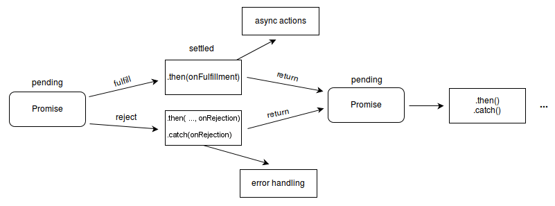

## 前言

写这篇文章的起因主要是我在折腾我的博客的时候经常回去看那些大佬们的博客，去学一些魔改教程，找一些好用的插件啊之类的。然后我就看到了[张洪Heo](https://blog.zhheo.com/)大佬的AI摘要教程。


原文的传送门在这里[传送门](https://blog.zhheo.com/p/ec57d8b2.html)。

然后我就想着说反正都是一次总结后就永久使用那为什么我不能去用免费的AI总结完了直接在这里使用打字机效果进行展示呢？佬的方案，虽然很便宜但还是得花钱的。于是就有的这篇教程，带着大家去实现一个给定简介内容的打字机效果。

## 正文

### 功能需求分析

在开始动手之前，我们先明确一下需要实现的功能：

1. **触发时机**：页面加载完成后延迟1秒开始打字机效果，防止开屏动画没完全展开就开始打字
2. **显示位置**：在文章主要内容的最前方
3. **内容来源**：从文章的Front Matter中的`typewriter`字段获取内容
4. **设备适配**：完美支持桌面端、平板、手机等各种设备
5. **主题适配**：支持深色模式
6. **性能优化**：只在需要的时候加载，避免浪费资源

### 创建JavaScript文件

首先，我们需要创建打字机效果的核心JavaScript文件。在主题目录下创建文件：`typewriter-effect.js`

我先把完整代码放在这里随后再进行逐步解析原理。

```javascript
// themes/butterfly/source/js/typewriter-effect.js

// 文章打字机效果
(function() {
  // 打字机效果类
  class TypeWriter {
    constructor(element, text, speed = 50) {
      this.element = element;
      this.text = text;
      this.speed = speed;
      this.index = 0;
    }

    // 开始打字
    start() {
      return new Promise((resolve) => {
        const timer = setInterval(() => {
          if (this.index < this.text.length) {
            this.element.textContent += this.text.charAt(this.index);
            this.index++;
          } else {
            clearInterval(timer);
            resolve();
          }
        }, this.speed);
      });
    }
  }

  // 初始化打字机效果
  function initTypewriterEffect() {
    // 只在文章页面执行
    if (!document.querySelector('#post')) return;
    
    // 获取文章的打字机专用字段
    let typewriterText = '';
    
    // 从全局配置中获取 typewriter 字段
    if (window.GLOBAL_CONFIG_SITE && window.GLOBAL_CONFIG_SITE.typewriter) {
      typewriterText = window.GLOBAL_CONFIG_SITE.typewriter;
    }
    
    // 如果没有设置typewriter字段，则不显示打字机效果
    if (!typewriterText || typewriterText.trim() === '') return;

    // 创建打字机容器
    const typewriterContainer = document.createElement('div');
    typewriterContainer.className = 'post-typewriter-container';
    typewriterContainer.innerHTML = `
      <div class="post-typewriter-header">
        <i class="fas fa-robot"></i>
        <span class="post-typewriter-title">AI总结</span>
      </div>
      <div class="post-typewriter-content">
        <div class="post-typewriter-icon">
          <i class="fas fa-quote-left"></i>
        </div>
        <div class="post-typewriter-text"></div>
        <div class="post-typewriter-cursor">|</div>
      </div>
    `;

    // 找到文章内容容器并插入打字机容器
    const articleContainer = document.querySelector('#article-container');
    if (articleContainer) {
      // 插入到文章内容的最前面
      articleContainer.insertBefore(typewriterContainer, articleContainer.firstChild);
      
      // 获取打字机文本元素
      const typewriterTextElement = typewriterContainer.querySelector('.post-typewriter-text');
      const cursor = typewriterContainer.querySelector('.post-typewriter-cursor');
      
      // 开始打字机效果
      const typewriter = new TypeWriter(typewriterTextElement, typewriterText, 20);
      
      // 先显示容器
      typewriterContainer.style.opacity = '0';
      typewriterContainer.style.transform = 'translateY(20px)';
      
      // 淡入动画
      setTimeout(() => {
        typewriterContainer.style.transition = 'all 0.5s ease-out';
        typewriterContainer.style.opacity = '1';
        typewriterContainer.style.transform = 'translateY(0)';
        
        // 开始打字
        setTimeout(() => {
          typewriter.start().then(() => {
            // 打字完成后让光标闪烁
            cursor.style.animation = 'typewriter-cursor-blink 1s infinite';
          });
        }, 300);
      }, 100);
    }
  }

  // 等待页面加载完成和加载动画结束
  function waitForPageReady() {
    return new Promise((resolve) => {
      // 检查是否有预加载器
      const preloader = document.querySelector('#loading-box');
      
      if (preloader) {
        // 监听预加载器的消失
        const checkPreloader = () => {
          if (preloader.style.display === 'none' || 
              preloader.style.opacity === '0' || 
              !document.body.contains(preloader)) {
            resolve();
          } else {
            setTimeout(checkPreloader, 100);
          }
        };
        checkPreloader();
      } else {
        // 没有预加载器，直接等待DOM完全加载
        if (document.readyState === 'complete') {
          resolve();
        } else {
          window.addEventListener('load', resolve);
        }
      }
    });
  }

  // 主函数
  async function main() {
    // 等待页面就绪
    await waitForPageReady();
    
    // 延迟1秒后开始打字机效果
    setTimeout(() => {
      initTypewriterEffect();
    }, 1000);
  }

  // 支持PJAX
  if (typeof window.pjax !== 'undefined') {
    document.addEventListener('pjax:complete', main);
  }
  
  // 页面加载时执行
  if (document.readyState === 'loading') {
    document.addEventListener('DOMContentLoaded', main);
  } else {
    main();
  }
})(); 
```

这个JavaScript文件实现了以下功能：

- **智能检测**：只在文章页面执行，避免在首页等其他页面运行
- **内容获取**：从配置中获取typewriter字段的内容
- **延迟执行**：等待页面加载完成后再开始动画
- **兼容性**：支持PJAX等单页应用路由

#### 代码解析

接下来我们来讲一讲这段代码。

首先我们要知道JS脚本中的一个用法，`IIFE（Immediately Invoked Function Expression，立即调用函数表达式）`。

可以看到我们整体的功能函数都是被包裹在一个小括号里面的，这代表着内部的代码会被封装在一个独立的作用域内，且该代码段会被立即调用。作用域的好处就在于，任何变量被定义后仅仅会在该作用域内的合法范围内可见。保障该脚本在运行时不会因为和某些全局变量发生冲突，保护全局环境，避免污染。这通常应用于独立功能模块的编写，像是在hexo博客中引入自定义脚本时就非常合适。因为hexo博客框架本身有一套非常完善的运行逻辑，我们进行自定义时只不过是在"主机"上接入的"外设"，"外设"有自己的运行逻辑，仅仅需要与"主机"进行一些数据交换就可以保障整机的正常运作而无需考虑主机中的环境。

而为了封装打字机效果的相关设置项，我们需要利用面向对象的编程思想，将这些数据以及启动函数封装为一个类，并定义一些属性和方法。

#### `TypeWriter`类深度解析

这是整个打字机效果的核心算法实现，让我们逐步分析：

```javascript
class TypeWriter {
  constructor(element, text, speed = 50) {
    this.element = element;
    this.text = text;
    this.speed = speed;
    this.index = 0;
  }
```

**构造函数设计分析**：

1. **参数设计**：
   - `element`：目标DOM元素，用于显示打字效果
   - `text`：要显示的文本内容
   - `speed = 50`：打字间隔时间（毫秒），使用默认参数提供灵活性

2. **实例属性初始化**：
   - `this.element`：保存目标元素引用
   - `this.text`：保存文本内容
   - `this.speed`：保存打字速度
   - `this.index = 0`：当前打字位置索引，从0开始

**为什么使用类而不是函数？**

- **状态管理**：类可以很好地管理打字过程中的状态（当前位置、速度等）
- **可复用性**：同一个页面可以创建多个打字机实例
- **扩展性**：后续可以轻松添加暂停、重置等方法

```javascript
start() {
  return new Promise((resolve) => {
    const timer = setInterval(() => {
      if (this.index < this.text.length) {
        this.element.textContent += this.text.charAt(this.index);
        this.index++;
      } else {
        clearInterval(timer);
        resolve();
      }
    }, this.speed);
  });
}
```

**start方法核心算法解析**：

1. **Promise包装**：

   ```javascript
   return new Promise((resolve) => { ... });
   ```

   将异步的打字过程包装成Promise，便于后续的链式调用

2. **定时器循环**：

   ```javascript
   const timer = setInterval(() => { ... }, this.speed);
   ```

   使用`setInterval`创建周期性执行的定时器，间隔为`this.speed`毫秒

3. **逐字符显示逻辑**：

   ```javascript
   if (this.index < this.text.length) {
     this.element.textContent += this.text.charAt(this.index);
     this.index++;
   }
   ```

   - **条件判断**：检查是否还有字符需要显示
   - **字符添加**：`textContent +=` 在现有内容后追加新字符
   - **位置递增**：`this.index++` 移动到下一个字符

4. **结束处理**：

   ```javascript
   else {
     clearInterval(timer);
     resolve();
   }
   ```

   - **清除定时器**：防止内存泄漏
   - **Promise解决**：通知调用者打字完成

**算法特点分析**：

1. **逐字符渲染**：每次只添加一个字符，创造真实的打字效果
2. **非阻塞执行**：使用定时器而非循环，不会阻塞UI线程
3. **资源清理**：自动清除定时器，避免内存泄漏
4. **状态追踪**：通过`index`精确控制打字进度

**为什么选择`textContent`而不是`innerHTML`？**

- **安全性**：`textContent`不会解析HTML标签，避免XSS攻击
- **性能**：纯文本操作比HTML解析更快
- **纯净性**：保证显示的就是原始文本内容

**可能的改进空间**：

```javascript
// 支持HTML内容的版本
startHTML() {
  return new Promise((resolve) => {
    const timer = setInterval(() => {
      if (this.index < this.text.length) {
        this.element.innerHTML += this.text.charAt(this.index);
        this.index++;
      } else {
        clearInterval(timer);
        resolve();
      }
    }, this.speed);
  });
}

// 支持暂停和恢复的版本
pause() {
  if (this.timer) {
    clearInterval(this.timer);
    this.timer = null;
  }
}

resume() {
  if (!this.timer && this.index < this.text.length) {
    this.start();
  }
}
```

这个类虽然代码简洁，但设计非常精妙：

- **单一职责**：专注于打字机效果的实现
- **接口简单**：只需要`new`和`start()`两步操作
- **异步友好**：返回Promise便于控制执行流程
- **性能良好**：使用原生DOM API，执行效率高

之后由于我们的打字机效果是要开始在加载之后了，但加载结束到加载动画开屏还有一小段的延迟，为了能更准确的去设置开始打字机效果的开始时间，我们需要设置一个工具函数用于监听页面加载动画的结束。

```javascript
  // 等待页面加载完成和加载动画结束
  function waitForPageReady() {
    return new Promise((resolve) => {
      // 检查是否有预加载器
      const preloader = document.querySelector('#loading-box');
      
      if (preloader) {
        // 监听预加载器的消失
        const checkPreloader = () => {
          if (preloader.style.display === 'none' || 
              preloader.style.opacity === '0' || 
              !document.body.contains(preloader)) {
            resolve();
          } else {
            setTimeout(checkPreloader, 100);
          }
        };
        checkPreloader();
      } else {
        // 没有预加载器，直接等待DOM完全加载
        if (document.readyState === 'complete') {
          resolve();
        } else {
          window.addEventListener('load', resolve);
        }
      }
    });
  }
```

这里利用了`Promise`对象的解决机制来对加载状态进行监听与打字机脚本的进程控制，同时会分情况判断是否已经加载完成，这主要是因为我的加载动画中设定了加载动画的预加载超时保护，在加载超过十秒后就会自动开屏先展示已经加载的内容在去继续加载剩余部分。

#### `waitForPageReady`函数深度解析

这个函数是整个打字机效果的核心控制机制，让我们逐行分析它的实现原理：

```javascript
function waitForPageReady() {
  return new Promise((resolve) => {
    // 函数体内容
  });
}
```

**第一层：Promise包装器**

函数返回一个Promise对象，这种设计模式被称为"Promise化"。为什么要这样做？

1. **统一异步接口**：无论内部逻辑多复杂，对外都提供统一的`.then()`调用方式
2. **避免回调地狱**：如果用传统回调函数，代码会变得很难维护
3. **状态管理**：Promise的三种状态能够精确反映页面加载的状态

```javascript
const preloader = document.querySelector('#loading-box');
```

**第二层：预加载器检测**

这里使用`querySelector`查找ID为`loading-box`的元素。在Butterfly主题中，这个元素通常是预加载动画的容器。为什么要优先检测预加载器？

- **用户体验优先**：预加载器消失意味着用户已经看到了页面内容
- **视觉连贯性**：避免在加载动画还在播放时就开始打字机效果
- **性能考虑**：预加载器存在时，页面可能还在渲染，过早启动动画会影响性能

```javascript
if (preloader) {
  const checkPreloader = () => {
    if (preloader.style.display === 'none' || 
        preloader.style.opacity === '0' || 
        !document.body.contains(preloader)) {
      resolve();
    } else {
      setTimeout(checkPreloader, 100);
    }
  };
  checkPreloader();
}
```

**第三层：轮询检测机制**

这里实现了一个巧妙的轮询系统：

1. **多重检测条件**：
   - `preloader.style.display === 'none'`：检测CSS的display属性
   - `preloader.style.opacity === '0'`：检测透明度变化
   - `!document.body.contains(preloader)`：检测元素是否被从DOM中移除

2. **递归轮询**：
   ```javascript
   const checkPreloader = () => {
     if (条件满足) {
       resolve(); // 结束Promise
     } else {
       setTimeout(checkPreloader, 100); // 100ms后再次检查
     }
   };
   ```

   这种模式的优势：
   - **非阻塞**：不会阻塞主线程
   - **精确控制**：100ms的检测间隔既不会太频繁影响性能，也不会延迟太久
   - **自动清理**：一旦条件满足，递归自动停止

```javascript
} else {
  if (document.readyState === 'complete') {
    resolve();
  } else {
    window.addEventListener('load', resolve);
  }
}
```

**第四层：后备检测机制**

当没有预加载器时，采用标准的DOM加载检测：

1. **立即检测**：`document.readyState === 'complete'`
   - `loading`：文档正在加载
   - `interactive`：文档加载完成，但子资源可能还在加载
   - `complete`：文档和所有子资源都加载完成

2. **事件监听**：`window.addEventListener('load', resolve)`
   - 当`readyState`不是`complete`时，监听`load`事件
   - `load`事件在页面完全加载后触发，包括所有图片、样式表等

#### 这种设计的优势

1. **兼容性强**：适配有无预加载器的各种情况
2. **性能优化**：避免不必要的等待时间
3. **用户体验好**：确保在最合适的时机启动动画
4. **代码健壮**：多重检测条件确保可靠性

首先我们先来补充一个关于[Promise](https://developer.mozilla.org/zh-CN/docs/Web/JavaScript/Reference/Global_Objects/Promise)对象的知识点。

每个Promise对象都只有三种状态，且同一时间只能处于一种状态，且只能被改变一次。

- 待定（pending）：初始状态，既没有被兑现，也没有被拒绝。
- 已兑现（fulfilled）：意味着操作成功完成。
- 已拒绝（rejected）：意味着操作失败。

在待定状态不会触发任何回调函数，而在已兑现状态会调用`then`回调函数，在已拒绝状态会调用`catch`回调函数。由此我们就可以在检测到加载确实结束后利用改变Promise对象的状态，触发回调函数的方式来告知打字机脚本的进程。



如果检测到加载完成，则将Promise对象状态改为已兑现，并触发已兑现回调函数。首先检测一下有没有预加载器，如果有则等待预加载器结束，如果没有则等待DOM加载完成。


这里的逻辑可能有些反直觉，为什么在检测到有加载动画时就等待加载动画结束就更改Promise对象的状态，而不是等待到底DOM加载完成再更改状态？之前不也提到了有超时保护机制的存在吗？

这其实是出于用户体验的角度考虑，在用户等待了较长时间之后很有可能向下反动的比较快，急切的像向下看到自己想看的内容，从而忽略掉了前面的打字机效果。


随后就是我们的核心功能函数了`initTypewriterEffect`。

#### `initTypewriterEffect`函数深度解析

这个函数负责整个打字机效果的初始化和执行，让我们详细分析每个环节：

```javascript
function initTypewriterEffect() {
  // 只在文章页面执行
  if (!document.querySelector('#post')) return;
```

**第一步：页面类型检测**

这里使用了"早期返回"模式（Early Return Pattern）：
- **目的**：确保打字机效果只在文章页面显示，避免在首页、分类页等其他页面执行
- **原理**：`#post`是Butterfly主题中文章页面的标识性元素
- **优势**：如果不是文章页面，函数立即退出，节省资源

```javascript
let typewriterText = '';

// 从全局配置中获取 typewriter 字段
if (window.GLOBAL_CONFIG_SITE && window.GLOBAL_CONFIG_SITE.typewriter) {
  typewriterText = window.GLOBAL_CONFIG_SITE.typewriter;
}

// 如果没有设置typewriter字段，则不显示打字机效果
if (!typewriterText || typewriterText.trim() === '') return;
```

**第二步：数据获取与验证**

1. **全局配置访问**：
   ```javascript
   window.GLOBAL_CONFIG_SITE && window.GLOBAL_CONFIG_SITE.typewriter
   ```
   使用短路运算符（&&）进行安全访问，避免在配置不存在时出错

2. **数据验证**：
   ```javascript
   if (!typewriterText || typewriterText.trim() === '') return;
   ```
   两重验证：
   - `!typewriterText`：检查是否为空值、undefined或null
   - `typewriterText.trim() === ''`：检查去除空白字符后是否为空字符串

```javascript
const typewriterContainer = document.createElement('div');
typewriterContainer.className = 'post-typewriter-container';
typewriterContainer.innerHTML = `
  <div class="post-typewriter-header">
    <i class="fas fa-robot"></i>
    <span class="post-typewriter-title">AI总结</span>
  </div>
  <div class="post-typewriter-content">
    <div class="post-typewriter-icon">
      <i class="fas fa-quote-left"></i>
    </div>
    <div class="post-typewriter-text"></div>
    <div class="post-typewriter-cursor">|</div>
  </div>
`;
```

**第三步：DOM结构创建**

1. **元素创建**：使用`document.createElement`创建容器元素
2. **CSS类名设置**：`post-typewriter-container`用于样式定位
3. **HTML结构注入**：使用模板字符串构建完整的HTML结构

**HTML结构设计分析**：
- **`.post-typewriter-header`**：标题区域，包含图标和"AI总结"文字
- **`.post-typewriter-content`**：内容区域，包含引用图标、文本区域和光标
- **`.post-typewriter-text`**：打字机文字的显示区域（空div，后续填充）
- **`.post-typewriter-cursor`**：光标元素，显示为"|"字符

```javascript
const articleContainer = document.querySelector('#article-container');
if (articleContainer) {
  // 插入到文章内容的最前面
  articleContainer.insertBefore(typewriterContainer, articleContainer.firstChild);
```

**第四步：DOM插入**

1. **容器定位**：找到文章内容容器`#article-container`
2. **位置插入**：使用`insertBefore`方法插入到第一个子元素之前
   - `insertBefore(newNode, referenceNode)`：在referenceNode之前插入newNode
   - `articleContainer.firstChild`：获取容器的第一个子元素作为参考点

```javascript
const typewriterTextElement = typewriterContainer.querySelector('.post-typewriter-text');
const cursor = typewriterContainer.querySelector('.post-typewriter-cursor');

// 开始打字机效果
const typewriter = new TypeWriter(typewriterTextElement, typewriterText, 20);
```

**第五步：元素引用与打字机实例化**

1. **DOM引用获取**：
   - `typewriterTextElement`：文字显示区域
   - `cursor`：光标元素

2. **TypeWriter实例创建**：
   ```javascript
   new TypeWriter(元素, 文本内容, 打字速度);
   ```

```javascript
// 先显示容器
typewriterContainer.style.opacity = '0';
typewriterContainer.style.transform = 'translateY(20px)';

// 淡入动画
setTimeout(() => {
  typewriterContainer.style.transition = 'all 0.5s ease-out';
  typewriterContainer.style.opacity = '1';
  typewriterContainer.style.transform = 'translateY(0)';
  
  // 开始打字
  setTimeout(() => {
    typewriter.start().then(() => {
      // 打字完成后让光标闪烁
      cursor.style.animation = 'typewriter-cursor-blink 1s infinite';
    });
  }, 300);
}, 100);
```

**第六步：动画序列控制**

这是整个函数最精妙的部分，实现了一个多层次的动画序列：

1. **初始状态设置**：
   ```javascript
   typewriterContainer.style.opacity = '0';
   typewriterContainer.style.transform = 'translateY(20px)';
   ```
   容器初始为透明且向下偏移20px

2. **第一层setTimeout（100ms后）**：
   ```javascript
   typewriterContainer.style.transition = 'all 0.5s ease-out';
   typewriterContainer.style.opacity = '1';
   typewriterContainer.style.transform = 'translateY(0)';
   ```
   启动淡入和向上移动动画

3. **第二层setTimeout（300ms后）**：
   ```javascript
   typewriter.start().then(() => {
     cursor.style.animation = 'typewriter-cursor-blink 1s infinite';
   });
   ```
   开始打字机效果，完成后启动光标闪烁

**时间序列分析**：
- **0ms**：DOM插入，设置初始透明状态
- **100ms**：开始淡入动画（持续500ms）
- **300ms**：开始打字机效果
- **打字完成后**：光标开始闪烁

#### 这种设计的巧思

1. **渐进式动画**：淡入→打字→光标闪烁，层次分明
2. **性能优化**：使用CSS transition而非JavaScript动画
3. **用户体验**：合理的时间间隔让动画更自然
4. **异步协调**：Promise链式调用确保动画序列的准确执行

这段代码虽然看起来简单，但实际上包含了DOM操作、异步控制、动画序列、用户体验等多个方面的精心设计。特别是最后的动画序列控制，体现了前端开发中"时间就是用户体验"的重要理念。

### 创建CSS样式文件

接下来创建样式文件，让打字机效果更加美观：

```css
/* themes/butterfly/source/css/typewriter-effect.css */

/* 文章打字机效果样式 */
.post-typewriter-container {
  margin: 20px 0 30px 0;
  padding: 20px;
  background: linear-gradient(135deg, #667eea 0%, #764ba2 100%);
  border-radius: 12px;
  box-shadow: 0 8px 32px rgba(0, 0, 0, 0.1);
  position: relative;
  overflow: hidden;
}

/* 深色模式适配 */
[data-theme="dark"] .post-typewriter-container {
  background: linear-gradient(135deg, #434343 0%, #000000 100%);
  box-shadow: 0 8px 32px rgba(255, 255, 255, 0.05);
}

/* 标题样式 */
.post-typewriter-header {
  display: flex;
  align-items: center;
  gap: 8px;
  margin-bottom: 15px;
  padding-bottom: 10px;
  border-bottom: 1px solid rgba(255, 255, 255, 0.2);
  position: relative;
  z-index: 1;
}

.post-typewriter-header i {
  color: rgba(255, 255, 255, 0.9);
  font-size: 18px;
}

.post-typewriter-title {
  color: #ffffff;
  font-size: 16px;
  font-weight: 600;
  letter-spacing: 0.5px;
}

.post-typewriter-container::before {
  content: '';
  position: absolute;
  top: -50%;
  left: -50%;
  width: 200%;
  height: 200%;
  background: linear-gradient(45deg, transparent, rgba(255, 255, 255, 0.1), transparent);
  transform: rotate(45deg);
  animation: typewriter-shimmer 3s infinite;
}

.post-typewriter-content {
  display: flex;
  align-items: flex-start;
  gap: 15px;
  position: relative;
  z-index: 1;
}

.post-typewriter-icon {
  color: rgba(255, 255, 255, 0.8);
  font-size: 24px;
  margin-top: 2px;
  flex-shrink: 0;
}

.post-typewriter-text {
  color: #ffffff;
  font-size: 16px;
  line-height: 1.6;
  font-weight: 400;
  flex: 1;
  min-height: 1.6em;
  word-wrap: break-word;
  word-break: break-word;
}

.post-typewriter-cursor {
  color: #ffffff;
  font-size: 18px;
  font-weight: bold;
  margin-left: 2px;
  align-self: flex-start;
  margin-top: 1px;
}

/* 光标闪烁动画 */
@keyframes typewriter-cursor-blink {
  0%, 50% {
    opacity: 1;
  }
  51%, 100% {
    opacity: 0;
  }
}

/* 背景闪光动画 */
@keyframes typewriter-shimmer {
  0% {
    transform: translateX(-100%) translateY(-100%) rotate(45deg);
  }
  50% {
    transform: translateX(100%) translateY(100%) rotate(45deg);
  }
  100% {
    transform: translateX(-100%) translateY(-100%) rotate(45deg);
  }
}

/* 平板适配 (768px - 1024px) */
@media screen and (max-width: 1024px) and (min-width: 768px) {
  .post-typewriter-container {
    margin: 18px 0 25px 0;
    padding: 18px;
    border-radius: 10px;
  }
  
  .post-typewriter-header {
    margin-bottom: 12px;
    padding-bottom: 8px;
  }
  
  .post-typewriter-header i {
    font-size: 17px;
  }
  
  .post-typewriter-title {
    font-size: 15px;
  }
  
  .post-typewriter-content {
    gap: 12px;
  }
  
  .post-typewriter-icon {
    font-size: 22px;
  }
  
  .post-typewriter-text {
    font-size: 15px;
    line-height: 1.5;
  }
  
  .post-typewriter-cursor {
    font-size: 17px;
  }
}

/* 手机适配 (最大768px) */
@media screen and (max-width: 768px) {
  .post-typewriter-container {
    margin: 15px 0 20px 0;
    padding: 15px;
    border-radius: 8px;
  }
  
  .post-typewriter-header {
    margin-bottom: 10px;
    padding-bottom: 6px;
  }
  
  .post-typewriter-header i {
    font-size: 16px;
  }
  
  .post-typewriter-title {
    font-size: 14px;
  }
  
  .post-typewriter-content {
    gap: 10px;
    flex-direction: column;
    align-items: flex-start;
  }
  
  .post-typewriter-icon {
    font-size: 20px;
    margin-top: 0;
    align-self: flex-start;
  }
  
  .post-typewriter-text {
    font-size: 14px;
    line-height: 1.5;
    margin-left: 0;
  }
  
  .post-typewriter-cursor {
    font-size: 16px;
    margin-left: 0;
    margin-top: -2px;
  }
}

/* 小屏手机适配 (最大480px) */
@media screen and (max-width: 480px) {
  .post-typewriter-container {
    margin: 12px 0 18px 0;
    padding: 12px;
    border-radius: 6px;
  }
  
  .post-typewriter-header {
    margin-bottom: 8px;
    padding-bottom: 5px;
  }
  
  .post-typewriter-header i {
    font-size: 15px;
  }
  
  .post-typewriter-title {
    font-size: 13px;
  }
  
  .post-typewriter-content {
    gap: 8px;
  }
  
  .post-typewriter-icon {
    font-size: 18px;
  }
  
  .post-typewriter-text {
    font-size: 13px;
    line-height: 1.4;
  }
  
  .post-typewriter-cursor {
    font-size: 15px;
  }
}

/* 横屏模式适配 */
@media screen and (max-height: 500px) and (orientation: landscape) {
  .post-typewriter-container {
    margin: 10px 0 15px 0;
    padding: 10px;
  }
  
  .post-typewriter-header {
    margin-bottom: 6px;
    padding-bottom: 4px;
  }
  
  .post-typewriter-header i {
    font-size: 14px;
  }
  
  .post-typewriter-title {
    font-size: 12px;
  }
  
  .post-typewriter-content {
    gap: 8px;
  }
  
  .post-typewriter-icon {
    font-size: 16px;
  }
  
  .post-typewriter-text {
    font-size: 12px;
    line-height: 1.3;
  }
  
  .post-typewriter-cursor {
    font-size: 14px;
  }
}

/* 减少动画效果以提升性能（针对低端设备） */
@media (prefers-reduced-motion: reduce) {
  .post-typewriter-container::before {
    animation: none;
  }
  
  .post-typewriter-cursor {
    animation: none !important;
    opacity: 1;
  }
}
```

这个CSS文件包含了：

- **美观的渐变背景**：使用现代的渐变色彩
- **微光动画**：增加视觉层次感
- **完整的响应式设计**：从大屏幕到小屏手机都完美适配
- **深色模式支持**：自动适配主题颜色
- **无障碍支持**：支持减少动画偏好设置

然我先揭秘一下之前所留下的疑问，就是这个JS是如何实现对CSS的反光条进行控制的。

#### 核心机制解析

说到这个反光条的实现，我们首先需要理解一个概念：**JavaScript并不是直接控制CSS动画的**。实际上，我们采用的是一种"间接控制"的机制。

让我们回顾一下CSS中反光条的实现：

```css
.post-typewriter-container::before {
  content: '';
  position: absolute;
  top: -50%;
  left: -50%;
  width: 200%;
  height: 200%;
  background: linear-gradient(45deg, transparent, rgba(255, 255, 255, 0.1), transparent);
  transform: rotate(45deg);
  animation: typewriter-shimmer 3s infinite;
}

@keyframes typewriter-shimmer {
  0% {
    transform: translateX(-100%) translateY(-100%) rotate(45deg);
  }
  50% {
    transform: translateX(100%) translateY(100%) rotate(45deg);
  }
  100% {
    transform: translateX(-100%) translateY(-100%) rotate(45deg);
  }
}
```

这里的关键在于：**反光条的动画是纯CSS实现的**，它会在容器出现的那一刻就开始无限循环播放。那JavaScript在这个过程中起到什么作用呢？

#### JavaScript的真正作用

JavaScript在这里的作用主要有两个方面：

1. **控制容器的显示时机**：决定什么时候让整个打字机容器出现
2. **管理动画的生命周期**：虽然不直接控制反光条动画，但控制整个组件的显示/隐藏

让我们看看具体的实现：

```javascript
// 创建容器后先设置为透明状态
typewriterContainer.style.opacity = '0';
typewriterContainer.style.transform = 'translateY(20px)';

// 通过延时控制显示时机
setTimeout(() => {
  typewriterContainer.style.transition = 'all 0.5s ease-out';
  typewriterContainer.style.opacity = '1';
  typewriterContainer.style.transform = 'translateY(0)';
  
  // 容器显示后，CSS的反光条动画自动开始
}, 100);
```

当JavaScript将容器的`opacity`从0设置为1时，CSS的`::before`伪元素就会随着容器一起显示，而`typewriter-shimmer`动画也会立即开始执行。

#### 具体实现的深度剖析

让我们看看具体的实现：

```javascript
// 创建容器后先设置为透明状态
typewriterContainer.style.opacity = '0';
typewriterContainer.style.transform = 'translateY(20px)';

// 通过延时控制显示时机
setTimeout(() => {
  typewriterContainer.style.transition = 'all 0.5s ease-out';
  typewriterContainer.style.opacity = '1';
  typewriterContainer.style.transform = 'translateY(0)';
  
  // 容器显示后，CSS的反光条动画自动开始
}, 100);
```

**第一步：初始状态设置**

```javascript
typewriterContainer.style.opacity = '0';
typewriterContainer.style.transform = 'translateY(20px)';
```

这两行代码的作用：

1. **`opacity = '0'`**：
   - 将容器设置为完全透明（不可见）
   - 但容器仍然占据DOM空间，只是视觉上不可见
   - 这比`display: none`更适合动画，因为`display`属性无法产生过渡效果

2. **`transform = 'translateY(20px)'`**：
   - 将容器向下偏移20像素
   - 为后续的"向上滑入"动画做准备
   - `transform`属性可以被GPU加速，性能更好

**第二步：延时控制机制**

```javascript
setTimeout(() => { ... }, 100);
```

**为什么要延时100ms？**

- **DOM渲染时间**：给浏览器足够时间完成DOM插入和初始样式计算
- **避免闪烁**：防止用户看到容器从默认状态到透明状态的瞬间变化
- **动画准备**：确保初始状态已经稳定，然后再开始动画

**第三步：动画启动序列**

```javascript
typewriterContainer.style.transition = 'all 0.5s ease-out';
typewriterContainer.style.opacity = '1';
typewriterContainer.style.transform = 'translateY(0)';
```

这三行代码的执行顺序和作用：

1. **设置过渡效果**：

   ```javascript
   typewriterContainer.style.transition = 'all 0.5s ease-out';
   ```

   - `all`：所有可动画的属性都会有过渡效果
   - `0.5s`：动画持续时间为500毫秒
   - `ease-out`：缓动函数，开始快，结束慢，更自然

2. **触发透明度动画**：

   ```javascript
   typewriterContainer.style.opacity = '1';
   ```

   - 从0变为1，产生淡入效果
   - 由于设置了`transition`，这个变化会平滑过渡

3. **触发位移动画**：

   ```javascript
   typewriterContainer.style.transform = 'translateY(0)';
   ```

   - 从`translateY(20px)`变为`translateY(0)`
   - 产生向上滑入的效果

#### CSS动画的自动启动机制

当JavaScript将容器的`opacity`从0设置为1时，发生了什么？

```css
.post-typewriter-container::before {
  content: '';
  position: absolute;
  /* ... 其他样式 ... */
  animation: typewriter-shimmer 3s infinite;
}
```

**关键理解**：

1. **伪元素的生命周期**：
   - `::before`伪元素是容器的"子元素"
   - 当容器`opacity`为0时，伪元素也是不可见的
   - 当容器变为可见时，伪元素也随之显示

2. **动画的启动时机**：
   - CSS动画在元素创建时就开始执行
   - 即使元素不可见（`opacity: 0`），动画仍在后台运行
   - 当元素变为可见时，用户才能看到正在进行的动画

3. **视觉效果的协调**：
   ```javascript
   // 容器淡入动画：0.5秒
   typewriterContainer.style.transition = 'all 0.5s ease-out';
   
   // 反光条动画：3秒循环
   animation: typewriter-shimmer 3s infinite;
   ```

#### 这种设计的技术优势

1. **性能优化**：
   - CSS动画由GPU处理，比JavaScript动画更流畅
   - `transform`和`opacity`是复合层属性，不会触发重排

2. **时机控制精确**：
   - JavaScript控制显示时机
   - CSS负责动画效果
   - 两者分工明确，各司其职

3. **用户体验优化**：
   - 渐进式显示：先容器淡入，再开始打字
   - 视觉连贯性：反光条动画与容器显示同步

#### 调试技巧

如果想要验证这个机制，可以在控制台中执行：

```javascript
// 查看当前状态
console.log('Opacity:', typewriterContainer.style.opacity);
console.log('Transform:', typewriterContainer.style.transform);

// 手动控制动画
typewriterContainer.style.opacity = '0.5'; // 半透明
typewriterContainer.style.transform = 'translateY(10px)'; // 部分偏移
```

这样就能清楚地看到JavaScript是如何"间接控制"CSS动画的显示时机的。

#### 为什么这样设计？

你可能会问：为什么不用JavaScript直接控制反光条的移动呢？原因有几个：

1. **性能考虑**：CSS动画由浏览器的合成器线程处理，比JavaScript动画更流畅
2. **代码分离**：样式效果交给CSS处理，逻辑控制交给JavaScript，职责明确
3. **简化维护**：如果要修改反光条的颜色、速度等，只需要改CSS即可

#### 高级控制技巧

虽然我们主要依赖CSS自动播放动画，但如果你想要更精确的控制，JavaScript也能做到：

```javascript
// 方法1：通过CSS类名控制
function pauseShimmer() {
  const container = document.querySelector('.post-typewriter-container');
  container.classList.add('paused-shimmer');
}

// 对应的CSS
.post-typewriter-container.paused-shimmer::before {
  animation-play-state: paused;
}

// 方法2：动态修改CSS变量
function changeShimmerSpeed(speed) {
  const container = document.querySelector('.post-typewriter-container');
  container.style.setProperty('--shimmer-duration', `${speed}s`);
}

// 对应的CSS需要修改为
.post-typewriter-container::before {
  animation: typewriter-shimmer var(--shimmer-duration, 3s) infinite;
}
```

这样，我们就实现了JavaScript对CSS动画的"间接而精确"的控制。实际上，现代前端开发中很多效果都是这样实现的：**CSS负责描述样式和动画，JavaScript负责控制时机和状态**。

### 修改主题配置文件

现在我们需要让主题加载我们创建的文件。

#### 1. 添加JavaScript文件引用

修改 `themes/butterfly/layout/includes/additional-js.pug` 文件：

```pug
// ... existing code ...

//- 打字机效果
if theme.typewriter_effect !== false
  script(src=url_for(theme.CDN.option.typewriter_js || '/js/typewriter-effect.js') defer)
```

#### 2. 添加CSS文件引用

修改 `themes/butterfly/layout/includes/head.pug` 文件：

```pug
// ... existing code ...

//- 打字机效果样式
if theme.typewriter_effect !== false
  link(rel="stylesheet", href=url_for(theme.CDN.option.typewriter_css || '/css/typewriter-effect.css'))
```

#### 3. 添加配置传递

修改 `themes/butterfly/layout/includes/head/config_site.pug` 文件：

```pug
// ... existing code ...
typewriter: '!{page.typewriter || ""}'
// ... existing code ...
```

### 文章中的使用方法

现在我们可以在文章的Front Matter中添加`typewriter`字段了：

```markdown
---
title: 我的文章标题
date: 2025-01-26 10:00:00
tags:
  - 技术
  - 教程
description: 这是文章的正常描述，用于SEO等
typewriter: 🚀 这里是专门给打字机效果显示的文字！可以包含emoji表情，支持各种特殊字符和中英文混合显示。
cover: /img/cover.jpg
---

文章正文内容...
```

### 配置选项说明

我们还可以在主题配置文件 `_config.butterfly.yml` 中添加一些配置选项：

```yaml
# 打字机效果配置
typewriter_effect: true  # 是否启用打字机效果

# CDN配置（可选）
CDN:
  option:
    typewriter_js: # 自定义JS文件CDN地址
    typewriter_css: # 自定义CSS文件CDN地址
```

### 测试效果

完成以上配置后，我们来测试一下效果：

1. **启动本地服务器**：

   ```bash
   hexo cl && hexo g && hexo s
   ```

2. **访问文章页面**：打开浏览器访问 `http://localhost:4000`

3. **查看效果**：
   - 页面加载后会延迟2秒开始打字机动画
   - 文字会逐个出现，伴随光标闪烁
   - 在不同设备上查看响应式效果

### 高级定制

#### 1. 修改打字速度

如果觉得打字速度太快或太慢，可以修改JavaScript文件中的配置：

```javascript
const TYPEWRITER_CONFIG = {
  typeSpeed: 50,        // 改为50毫秒，打字更快
  startDelay: 1000,     // 改为1秒延迟
  // ... 其他配置
};
```

#### 2. 自定义样式

可以通过CSS变量来自定义颜色：

```css
.typewriter-wrapper {
  /* 自定义渐变色 */
  background: linear-gradient(135deg, #ff6b6b 0%, #4ecdc4 100%);
}

/* 或者使用纯色背景 */
.typewriter-wrapper {
  background: #2c3e50;
}
```

#### 3. 添加更多动效

可以为容器添加更多动画效果：

```css
.typewriter-wrapper {
  transition: all 0.3s ease;
}

.typewriter-wrapper:hover {
  transform: translateY(-2px);
  box-shadow: 0 12px 40px rgba(102, 126, 234, 0.4);
}
```

### 常见问题解决

#### 1. 打字机效果不显示

**可能原因**：

- 文章没有设置`typewriter`字段
- JavaScript文件路径错误
- 浏览器缓存问题

**解决方法**：

```bash
# 清除缓存重新生成
hexo cl && hexo g
```

#### 2. 在手机上显示异常

**检查项目**：

- CSS文件是否正确加载
- 响应式媒体查询是否生效
- 浏览器开发者工具检查样式

#### 3. 与其他插件冲突

**解决方法**：

- 检查JavaScript控制台是否有错误
- 确保其他插件没有修改相同的DOM元素
- 调整插件加载顺序

### 性能优化建议

1. **按需加载**：只在文章页面加载相关文件
2. **文件压缩**：在生产环境中压缩CSS和JS文件
3. **CDN加速**：将静态资源部署到CDN
4. **缓存策略**：设置合理的缓存时间

```javascript
// 添加性能监控
console.time('typewriter-init');
// ... 初始化代码
console.timeEnd('typewriter-init');
```

## 总结

通过这篇教程，我们成功为Hexo的Butterfly主题添加了一个炫酷的打字机效果！

### 实现的功能特点

✅ **智能触发**：页面加载完成后自动开始
✅ **完美适配**：支持各种设备和屏幕尺寸  
✅ **主题兼容**：自动适配深色模式
✅ **性能优化**：按需加载，避免资源浪费
✅ **易于使用**：只需在文章Front Matter中添加字段
✅ **高度定制**：支持各种个性化配置

### 技术要点回顾

1. **模块化设计**：JavaScript和CSS分离，便于维护
2. **响应式布局**：使用媒体查询实现完美适配
3. **动画优化**：考虑用户偏好设置和性能影响
4. **兼容性处理**：支持PJAX等现代前端技术

现在你的博客文章开头都可以有一个酷炫的打字机效果了！每篇文章都可以展示不同的内容，为读者带来更好的阅读体验。

记得在每篇文章的Front Matter中添加`typewriter`字段，就像这样：

```yaml
typewriter: ✨ 在这里写你想要展示的打字机文案，可以是文章的亮点介绍，也可以是有趣的开场白！
```

赶快去试试吧！如果遇到问题，欢迎在评论区交流讨论~ 🎉

---

**小贴士**：如果你觉得这个效果不错，别忘了给你的朋友们分享一下哦！让更多人的博客都炫酷起来~ ✨
