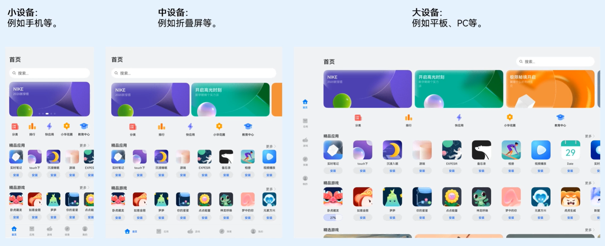
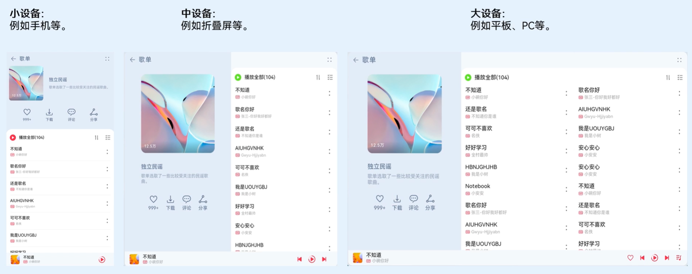
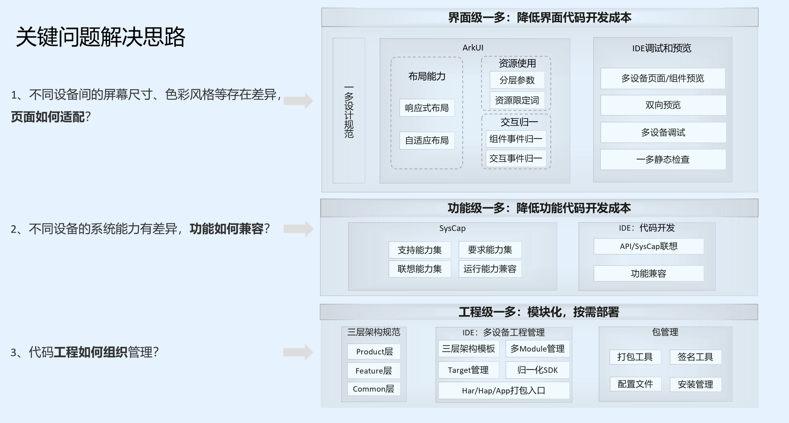
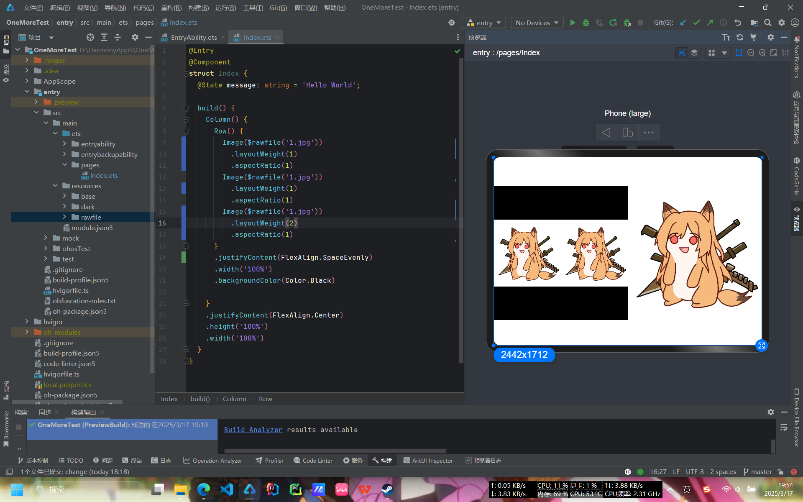

## 前言

一次开发多端部署是鸿蒙系统作为一款**分布式架构操作系统**的重要能力，他可以让一套业务代码在平板，直板机，折叠屏等各种设备上部署并进行UI界面的自动适配，从而实现一套代码多端部署的目标。
他可以完美的取代安卓应用需要为平板单独开发一个应用版本的难题，极大的简化开发流程并为开发者节省大量的开发时间。





## 一多要解决的核心问题

相比于当下全球市场份额最大的安卓系统，鸿蒙系统想要凭借一多能力去解决安卓开发的核心痛点，就需要作为开发者的我们先去了解当下的痛点是什么。

### 对于安卓开发的设备适配痛点

- ​**设备碎片化严重**：超过24种屏幕比例，折叠屏展开/折叠状态切换带来布局断层
- ​**响应式布局成本高**：需要维护多个XML布局文件，MediaQuery逻辑复杂
- ​**状态保持困难**：横竖屏切换时ViewModel保存/恢复需要手动干预
- ​**多端协同缺失**：手机与平板间无法实现服务无缝流转，协同开发困难

我们在应用商店中可以看到，安卓应用会有一个独立于手机应用的**"HD版本"**（High Definition Version）通常指**专门为大屏幕设备**​（如平板电脑、折叠屏展开状态、Chromebook等）优化设计的应用程序版本。这个概念与鸿蒙的"一多能力"形成鲜明对比，体现了安卓生态在跨设备适配上的传统解决方案的劣势。


### 对于鸿蒙一多开发我们需要思考的问题

1. **页面如何适配**
2. **功能如何兼容**
3. **工程如何组织**

首先对于第一个问题，不同的设备有不同的分辨率，有不同的长宽比，也有不同的横竖屏适用场景和使用习惯。我们不能用一套UI布局去适配所有的设备和使用场景，那样会出现很多的**布局断层**或是**大片留白**，导致用户体验非常差。

随后对于第二个问题，不同的硬件具有不同的系统能力，像是有无摄像头，有无NFC，有无运动感知能力等，硬件能力的不同决定着我们的应用是否能正常运行，我们不能因为某一个系统能力无法获取而导致整个应用的崩溃，要有能适配各种硬件能力的能力。

最后对于第三个问题，我们需要综合前两个问题一起考虑，我们需要将各个能力模块尽量解耦，将UI的适配，系统能力的调取，业务逻辑的封装都分开处理，这样才能进行更好的跨设备移植。

## 一多应用框架

为了解决上述提到的难点痛点，华为官方为我们推出了一套一多的三层应用架构。



## UI层一多能力

首先对于UI级别的一多能力总体可以分为两大类：

1. 自适应布局
2. 响应式布局

而在这其中自适应布局包含了**七种自适应布局的能力**，响应式布局包含了**断点，栅格，媒体查询等能力**。
这两种的主要区别在于**UI组件的相对位置是否变化**
自适应布局的UI组件会随着显示区域的变化而进行拉伸或压缩，而响应式布局的UI组件会随着显示区域的变化而进行位置上的变化，就如同上面音乐软件的变化一样，由单栏布局变为双栏或三栏布局。

### 自适应布局

自适应布局主要包含以下七种能力：

| 自适应布局能力 | 使用场景 | 实现方式 |
|--------------|----------|----------|
| 拉伸能力 | 容器组件尺寸发生变化时，增加或减小的空间全部分配给容器组件内指定区域。 | Flex布局的flexGrow和flexShrink属性 |
| 均分能力 | 容器组件尺寸发生变化时，增加或减小的空间均匀分配给容器组件内所有空白区域。 | Row组件、Column组件或Flex组件的justifyContent属性设置为FlexAlign.SpaceEvenly |
| 占比能力 | 子组件的宽或高按照预设的比例，随容器组件发生变化。 | 基于通用属性的两种实现方式：<br> - 将子组件的宽高设置为父组件宽高的百分比<br> - layoutWeight属性 |
| 缩放能力 | 子组件的宽高按照预设的比例，随容器组件发生变化，且变化过程中子组件的宽高比不变。 | 布局约束的aspectRatio属性 |
| 延伸能力 | 容器组件内的子组件，按照其在列表中的先后顺序，随容器组件尺寸变化显示或隐藏。 | 基于容器组件的两种实现方式：<br> - 通过List组件实现<br> - 通过Scroll组件配合Row组件或Column组件实现 |
| 隐藏能力 | 容器组件内的子组件，按照其预设的显示优先级，随容器组件尺寸变化显示或隐藏。相同显示优先级的子组件同时显示或隐藏。 | 布局约束的displayPriority属性 |
| 折行能力 | 容器组件尺寸发生变化时，如果布局方向尺寸不足以显示完整内容，自动换行。 | Flex组件的wrap属性设置为FlexWrap.Wrap |

#### 拉伸能力

拉伸能力主要作用是将一个组件中的核心区域选出，然后当组件的尺寸发生变化时，将增加或减少的空间分配给核心区域，从而实现组件的拉伸效果。

##### `flexGrow`和`flexShrink`

```ts
@Entry
@Component
struct Index {
  @State message: string = 'Hello World';

  build() {
    Column() {
      Row() {
        Row()
        .height(400)
        .width(150)
        .flexGrow(0)
        .flexShrink(1)
        .backgroundColor(Color.Green)

        Image($rawfile('1.jpg'))
          .width(400)
          .flexShrink(0)
          .flexGrow(1)
          .aspectRatio(1)
        Row()
          .height(400)
          .width(150)
          .flexGrow(0)
          .flexShrink(1)
          .backgroundColor(Color.Green)
      }
      .width('100%')
      .backgroundColor(Color.Black)

    }
    .justifyContent(FlexAlign.Center)
    .height('100%')
    .width('100%')
  }
}
```

<video width="100%" controls>
  <source src="5.mp4" type="video/mp4">
  您的浏览器不支持视频标签。
</video>

我们可以看到，当我们在进行宽高比例的变化时，左右两侧的绿色区域会不断的伸缩，始终保持图标处于正中央。
当我们的宽超过了总宽度的`700vp`时，图片就会在保持长宽比的情况下放大，这是因为我们的外层row组件设置了宽为`100%`，而左右两侧的绿色区域设置了`flexGrow(0)`，所以当宽度超过`700vp`时，图片就会占据剩余的空间，而左右两侧的**绿色区域就会保持不变**。
图片我们则是设置了`flexGrow(1)`，所以当宽度超过`700vp`时，**图片就会占据剩余的空间**。

##### `blank`组件

其实对于拉伸能力官方还提供了一种可以自动填充剩余空间的组件，就是`blank`组件，它可以将其左右或上下的组件沿着父组件的主轴方向向两侧推开，自动填充剩余的空白部分，无论设备有多宽或多高，其两侧的组件始终在父组件的两端。

```ts
import { LengthMetrics, LengthUnit } from '@kit.ArkUI'

@Entry
@ComponentV2
struct Index {
  @Local rate: number = 1
  build() {
    Column() {
      Row(){
        Image($rawfile('pre.svg'))
          .height(50)// .layoutWeight(this.rate)
          .aspectRatio(1)
          .fillColor(Color.White)
          .displayPriority(2)
        Blank()
        Image($rawfile('next.svg'))
          .height(50)
          .aspectRatio(1)
          .fillColor(Color.White)
          .displayPriority(2)
      }
      // .justifyContent(FlexAlign.SpaceEvenly)
      .width(this.rate * 95 + '%')
      .backgroundColor(Color.Black)

    }
    // .justifyContent(FlexAlign.End)
    .height('100%')
    .width('100%')
  }
}
```

<video width="100%" controls>
  <source src="11.mp4" type="video/mp4">
  您的浏览器不支持视频标签。
</video>

#### 均分能力

均分能力其实很常见，我们平常在设置`Row`或`Column`组件时，会设置`justifyContent`为`FlexAlign.SpaceEvenly`或是`FlexAlign.SpaceAround`、`FlexAlign.SpaceBetween`，都可以实现不同类型的均分能力。

```ts
@Entry
@Component
struct Index {
  @State message: string = 'Hello World';

  build() {
    Column() {
      Row() {
        Image($rawfile('1.jpg'))
          .width(100)
          .aspectRatio(1)
        Image($rawfile('1.jpg'))
          .width(100)
          .aspectRatio(1)
        Image($rawfile('1.jpg'))
          .width(100)
          .aspectRatio(1)
      }
      .justifyContent(FlexAlign.SpaceEvenly)
      .width('100%')
      .backgroundColor(Color.Black)

    }
    .justifyContent(FlexAlign.Center)
    .height('100%')
    .width('100%')
  }
}
```

<video width="100%" controls>
  <source src="6.mp4" type="video/mp4">
  您的浏览器不支持视频标签。
</video>

#### 占比能力

占比能力其实也很常见，我们平常在设置`Row`或`Column`组件时，会设置`layoutWeight`为不同的值，从而实现不同组件的占比能力。

```ts
@Entry
@Component
struct Index {
  @State message: string = 'Hello World';

  build() {
    Column() {
      Row() {
        Image($rawfile('1.jpg'))
          .layoutWeight(1)
          .aspectRatio(1)
        Image($rawfile('1.jpg'))
          .layoutWeight(1)
          .aspectRatio(1)
        Image($rawfile('1.jpg'))
          .layoutWeight(2)
          .aspectRatio(1)
      }
      .justifyContent(FlexAlign.SpaceEvenly)
      .width('100%')
      .backgroundColor(Color.Black)

    }
    .justifyContent(FlexAlign.Center)
    .height('100%')
    .width('100%')
  }
}
```



我们可以看到前两张图片的主轴空间占比是一样的而第三张图片是前两张的两倍所以宽也是两倍。

对于这个能力比较经典的一个场景就是像音乐播放器控制按钮，当然这种方式如果没有每个模块单独的背景颜色还有其他的一些ui效果，或是事件的话也是可用均分能力实现的。

```ts
@Entry
@ComponentV2
struct Index {
  @Local rate:number=1

  build() {
    Column() {
      Row() {
        Column(){
          Image($rawfile('like.svg'))
            .height(30)
              // .layoutWeight(this.rate)
              // .aspectRatio(1)
            .fillColor(Color.White)
        }
        .backgroundColor(Color.Red)
        .padding(10)
        .layoutWeight(this.rate)
        Column(){
          Image($rawfile('pre.svg'))
            .height(30)
            // .layoutWeight(this.rate)
              // .aspectRatio(1)
            .fillColor(Color.White)
        }
        .backgroundColor(Color.Green)
        .padding(10)
        .layoutWeight(this.rate)
        Column(){
          Image($rawfile('stop.svg'))
            .height(30)
            // .layoutWeight(this.rate)
              // .aspectRatio(1)
            .fillColor(Color.White)
        }
        .padding(10)
        .layoutWeight(this.rate)
        Column(){
          Image($rawfile('next.svg'))
            .height(30)
              // .aspectRatio(1)
            .fillColor(Color.White)
        }
        .backgroundColor(Color.Green)
        .padding(10)
        .layoutWeight(this.rate)
        Column(){
          Image($rawfile('list.svg'))
            .height(30)
              // .aspectRatio(1)
            .fillColor(Color.White)
        }
        .backgroundColor(Color.Red)
        .padding(10)
        .layoutWeight(this.rate)
      }
      .justifyContent(FlexAlign.SpaceEvenly)
      .width(this.rate*90+'%')
      .backgroundColor(Color.Black)

    }
    .justifyContent(FlexAlign.Center)
    .height('100%')
    .width('100%')
  }
}
```

<video width="100%" controls>
  <source src="8.mp4" type="video/mp4">
  您的浏览器不支持视频标签。
</video>

#### 缩放能力

对于缩放能力主要是为了保障图片在不同大小的设备上显示时不会改变长宽比导致显示区域的错误或比例的错误。
利用`aspectRatio`属性可以设置图片的宽高比，当图片的宽高比与设置的不一致时，会自动缩放图片，保证图片的宽高比不变。

```ts
import { LengthMetrics, LengthUnit } from '@kit.ArkUI'

@Entry
@ComponentV2
struct Index {
  @Local rate: number = 1

  build() {
    Column() {
      Image($rawfile('1.jpg'))
        .aspectRatio(1)
    }
    .justifyContent(FlexAlign.Center)
    .height('100%')
    .width('100%')
  }
}
```

<video width="100%" controls>
  <source src="12.mp4" type="video/mp4">
  您的浏览器不支持视频标签。
</video>

无论设备的长宽比如何改变**图片的长宽比始终为设定值不会变**。

#### 隐藏能力

隐藏能力指的是可以设定组件的显示优先级，在空间不足时自动将优先级低的组件隐藏，优先级高的组件显示。

```ts
@Entry
@ComponentV2
struct Index {
  @Local rate: number = 1

  build() {
    Column() {
      Row({space:70}) {

        Image($rawfile('like.svg'))
          .height(50)// .layoutWeight(this.rate)
          .aspectRatio(1)
          .fillColor(Color.White)
          .displayPriority(1)

        Image($rawfile('pre.svg'))
          .height(50)// .layoutWeight(this.rate)
          .aspectRatio(1)
          .fillColor(Color.White)
          .displayPriority(2)

        Image($rawfile('stop.svg'))
          .height(50)// .layoutWeight(this.rate)
          .aspectRatio(1)
          .fillColor(Color.White)
          .displayPriority(3)

        Image($rawfile('next.svg'))
          .height(50)
          .aspectRatio(1)
          .fillColor(Color.White)
          .displayPriority(2)

        Image($rawfile('list.svg'))
          .height(50)
          .aspectRatio(1)
          .fillColor(Color.White)
          .displayPriority(1)
      }
      .justifyContent(FlexAlign.SpaceEvenly)
      .width(this.rate * 95 + '%')
      .backgroundColor(Color.Black)

    }
    .justifyContent(FlexAlign.End)
    .height('100%')
    .width('100%')
  }
}
```

<video width="100%" controls>
  <source src="9.mp4" type="video/mp4">
  您的浏览器不支持视频标签。
</video>

我们可以看到，在代码中我们用`Row`容器的`space`参数设置了两个图标的最小间距值，当整体宽度**大于这个值**时，系统会自动对其进行拉伸并将组件**依照均分能力去进行空间分配**，当我们的宽度不足各组件之间的最小间距值时，就会将点赞和列表两个**显示优先级低的组件**隐藏，而**显示优先级高的上一首下一首**会显示。空间再压缩时，就会将上下切歌按钮也隐藏，仅保留**显示优先级最高的**播放按钮。

#### 折行能力

这行能力主要体现在`Flex`组件的自动换行能力，当内容组件宽度或高度超出一行或一列的显示上限时就会自动进行换行显示。

```ts
import { LengthMetrics, LengthUnit } from '@kit.ArkUI'

@Entry
@ComponentV2
struct Index {
  @Local rate: number = 1

  build() {
    Column() {
      Flex({wrap:FlexWrap.Wrap,space:{main:LengthMetrics.vp(50),cross:LengthMetrics.vp(50)}}) {

        Image($rawfile('like.svg'))
          .height(50)// .layoutWeight(this.rate)
          .aspectRatio(1)
          .fillColor(Color.White)
          .displayPriority(1)

        Image($rawfile('pre.svg'))
          .height(50)// .layoutWeight(this.rate)
          .aspectRatio(1)
          .fillColor(Color.White)
          .displayPriority(2)

        Image($rawfile('stop.svg'))
          .height(50)// .layoutWeight(this.rate)
          .aspectRatio(1)
          .fillColor(Color.White)
          .displayPriority(3)

        Image($rawfile('next.svg'))
          .height(50)
          .aspectRatio(1)
          .fillColor(Color.White)
          .displayPriority(2)

        Image($rawfile('list.svg'))
          .height(50)
          .aspectRatio(1)
          .fillColor(Color.White)
          .displayPriority(1)
      }
      // .justifyContent(FlexAlign.SpaceEvenly)
      .width(this.rate * 60 + '%')
      .backgroundColor(Color.Black)

    }
    // .justifyContent(FlexAlign.End)
    .height('100%')
    .width('100%')
  }
}
```

<video width="100%" controls>
  <source src="10.mp4" type="video/mp4">
  您的浏览器不支持视频标签。
</video>

可以看到，当我们的宽度不足时，系统会自动将组件进行换行显示。这对于类似于标签选择器等组件是有相当优秀的适配效果的。

### 自适应布局的官方案例分析

