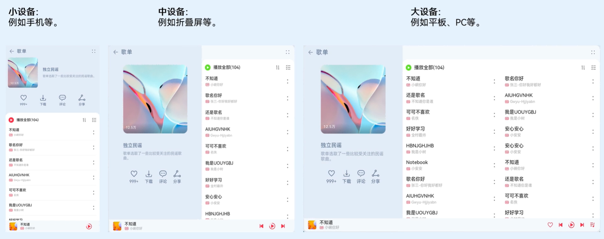
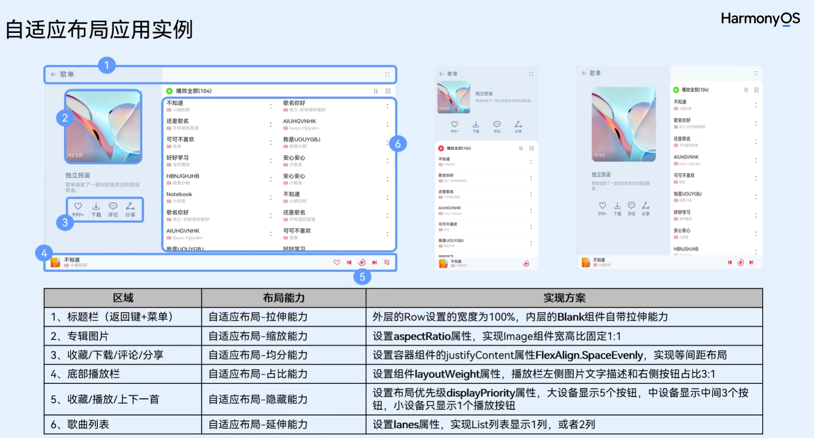
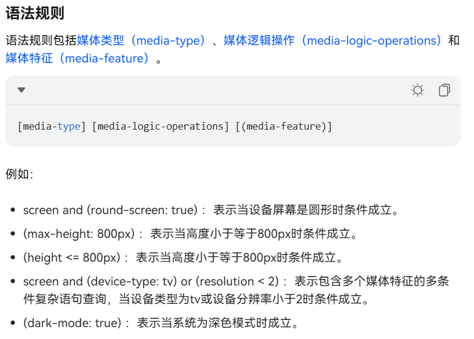
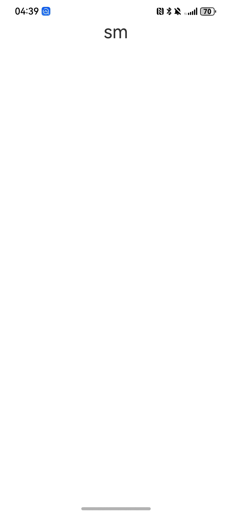
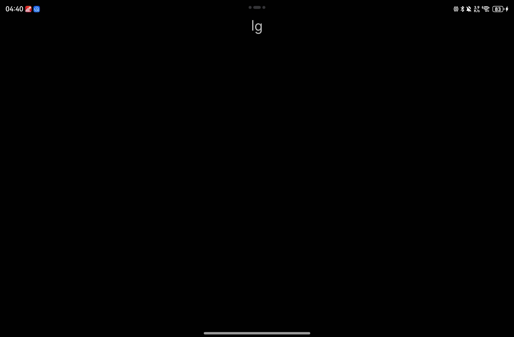
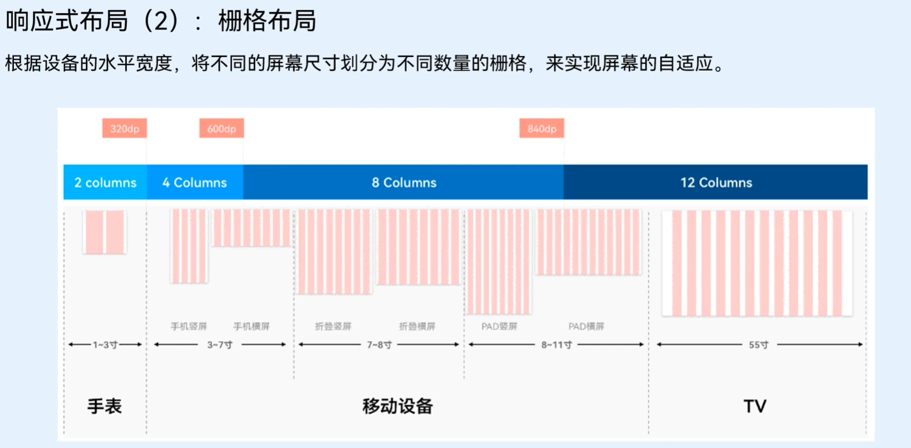
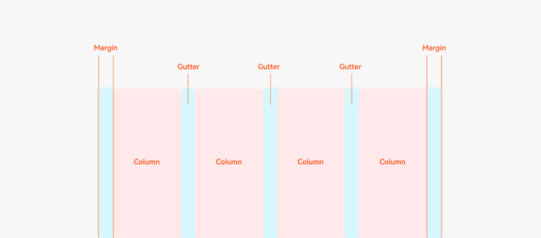
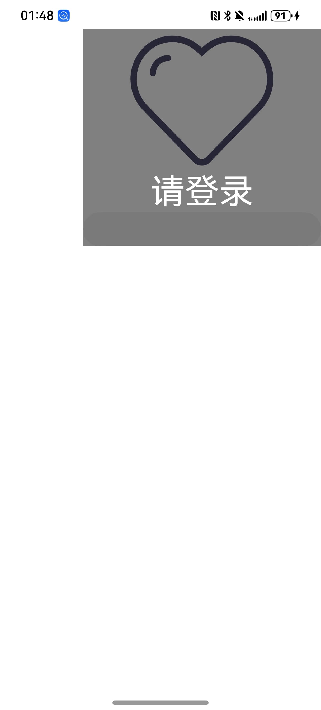
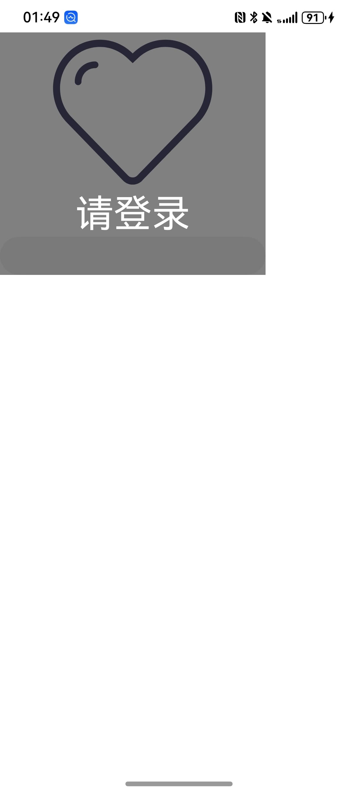
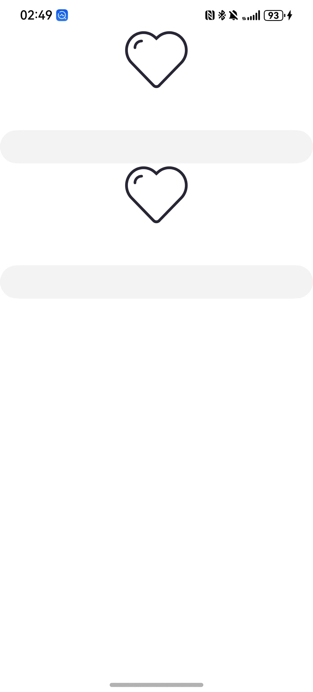

## 前言

一次开发多端部署是鸿蒙系统作为一款**分布式架构操作系统**的重要能力，他可以让一套业务代码在平板，直板机，折叠屏等各种设备上部署并进行UI界面的自动适配，从而实现一套代码多端部署的目标。
他可以完美的取代安卓应用需要为平板单独开发一个应用版本的难题，极大的简化开发流程并为开发者节省大量的开发时间。




## 一多要解决的核心问题

相比于当下全球市场份额最大的安卓系统，鸿蒙系统想要凭借一多能力去解决安卓开发的核心痛点，就需要作为开发者的我们先去了解当下的痛点是什么。

### 对于安卓开发的设备适配痛点

- ​**设备碎片化严重**：超过24种屏幕比例，折叠屏展开/折叠状态切换带来布局断层
- ​**响应式布局成本高**：需要维护多个XML布局文件，MediaQuery逻辑复杂
- ​**状态保持困难**：横竖屏切换时ViewModel保存/恢复需要手动干预
- ​**多端协同缺失**：手机与平板间无法实现服务无缝流转，协同开发困难


我们在应用商店中可以看到，安卓应用会有一个独立于手机应用的**"HD版本"**（High Definition Version）通常指**专门为大屏幕设备**​（如平板电脑、折叠屏展开状态、Chromebook等）优化设计的应用程序版本。这个概念与鸿蒙的"一多能力"形成鲜明对比，体现了安卓生态在跨设备适配上的传统解决方案的劣势。



### 对于鸿蒙一多开发我们需要思考的问题

1. **页面如何适配**
2. **功能如何兼容**
3. **工程如何组织**

首先对于第一个问题，不同的设备有不同的分辨率，有不同的长宽比，也有不同的横竖屏适用场景和使用习惯。我们不能用一套UI布局去适配所有的设备和使用场景，那样会出现很多的**布局断层**或是**大片留白**，导致用户体验非常差。

随后对于第二个问题，不同的硬件具有不同的系统能力，像是有无摄像头，有无NFC，有无运动感知能力等，硬件能力的不同决定着我们的应用是否能正常运行，我们不能因为某一个系统能力无法获取而导致整个应用的崩溃，要有能适配各种硬件能力的能力。

最后对于第三个问题，我们需要综合前两个问题一起考虑，我们需要将各个能力模块尽量解耦，将UI的适配，系统能力的调取，业务逻辑的封装都分开处理，这样才能进行更好的跨设备移植。

## 一多应用框架

为了解决上述提到的难点痛点，华为官方为我们推出了一套一多的三层应用架构。


## UI层一多能力

首先对于UI级别的一多能力总体可以分为两大类：

1. 自适应布局
2. 响应式布局

而在这其中自适应布局包含了**七种自适应布局的能力**，响应式布局包含了**断点，栅格，媒体查询等能力**。
这两种的主要区别在于**UI组件的相对位置是否变化**
自适应布局的UI组件会随着显示区域的变化而进行拉伸或压缩，而响应式布局的UI组件会随着显示区域的变化而进行位置上的变化，就如同上面音乐软件的变化一样，由单栏布局变为双栏或三栏布局。

### 自适应布局

自适应布局主要包含以下七种能力：

| 自适应布局能力 | 使用场景 | 实现方式 |
|--------------|----------|----------|
| 拉伸能力 | 容器组件尺寸发生变化时，增加或减小的空间全部分配给容器组件内指定区域。 | Flex布局的flexGrow和flexShrink属性 |
| 均分能力 | 容器组件尺寸发生变化时，增加或减小的空间均匀分配给容器组件内所有空白区域。 | Row组件、Column组件或Flex组件的justifyContent属性设置为FlexAlign.SpaceEvenly |
| 占比能力 | 子组件的宽或高按照预设的比例，随容器组件发生变化。 | 基于通用属性的两种实现方式：<br> - 将子组件的宽高设置为父组件宽高的百分比<br> - layoutWeight属性 |
| 缩放能力 | 子组件的宽高按照预设的比例，随容器组件发生变化，且变化过程中子组件的宽高比不变。 | 布局约束的aspectRatio属性 |
| 延伸能力 | 容器组件内的子组件，按照其在列表中的先后顺序，随容器组件尺寸变化显示或隐藏。 | 基于容器组件的两种实现方式：<br> - 通过List组件实现<br> - 通过Scroll组件配合Row组件或Column组件实现 |
| 隐藏能力 | 容器组件内的子组件，按照其预设的显示优先级，随容器组件尺寸变化显示或隐藏。相同显示优先级的子组件同时显示或隐藏。 | 布局约束的displayPriority属性 |
| 折行能力 | 容器组件尺寸发生变化时，如果布局方向尺寸不足以显示完整内容，自动换行。 | Flex组件的wrap属性设置为FlexWrap.Wrap |

#### 拉伸能力

拉伸能力主要作用是将一个组件中的核心区域选出，然后当组件的尺寸发生变化时，将增加或减少的空间分配给核心区域，从而实现组件的拉伸效果。

##### `flexGrow`和`flexShrink`

```ts
@Entry
@Component
struct Index {
  @State message: string = 'Hello World';

  build() {
    Column() {
      Row() {
        Row()
        .height(400)
        .width(150)
        .flexGrow(0)
        .flexShrink(1)
        .backgroundColor(Color.Green)

        Image($rawfile('1.jpg'))
          .width(400)
          .flexShrink(0)
          .flexGrow(1)
          .aspectRatio(1)
        Row()
          .height(400)
          .width(150)
          .flexGrow(0)
          .flexShrink(1)
          .backgroundColor(Color.Green)
      }
      .width('100%')
      .backgroundColor(Color.Black)

    }
    .justifyContent(FlexAlign.Center)
    .height('100%')
    .width('100%')
  }
}
```

<video width="100%" controls>
  <source src="5.mp4" type="video/mp4">
  您的浏览器不支持视频标签。
</video>

我们可以看到，当我们在进行宽高比例的变化时，左右两侧的绿色区域会不断的伸缩，始终保持图标处于正中央。
当我们的宽超过了总宽度的`700vp`时，图片就会在保持长宽比的情况下放大，这是因为我们的外层row组件设置了宽为`100%`，而左右两侧的绿色区域设置了`flexGrow(0)`，所以当宽度超过`700vp`时，图片就会占据剩余的空间，而左右两侧的**绿色区域就会保持不变**。
图片我们则是设置了`flexGrow(1)`，所以当宽度超过`700vp`时，**图片就会占据剩余的空间**。

##### `blank`组件

其实对于拉伸能力官方还提供了一种可以自动填充剩余空间的组件，就是`blank`组件，它可以将其左右或上下的组件沿着父组件的主轴方向向两侧推开，自动填充剩余的空白部分，无论设备有多宽或多高，其两侧的组件始终在父组件的两端。

```ts
import { LengthMetrics, LengthUnit } from '@kit.ArkUI'

@Entry
@ComponentV2
struct Index {
  @Local rate: number = 1
  build() {
    Column() {
      Row(){
        Image($rawfile('pre.svg'))
          .height(50)// .layoutWeight(this.rate)
          .aspectRatio(1)
          .fillColor(Color.White)
          .displayPriority(2)
        Blank()
        Image($rawfile('next.svg'))
          .height(50)
          .aspectRatio(1)
          .fillColor(Color.White)
          .displayPriority(2)
      }
      // .justifyContent(FlexAlign.SpaceEvenly)
      .width(this.rate * 95 + '%')
      .backgroundColor(Color.Black)

    }
    // .justifyContent(FlexAlign.End)
    .height('100%')
    .width('100%')
  }
}
```

<video width="100%" controls>
  <source src="11.mp4" type="video/mp4">
  您的浏览器不支持视频标签。
</video>

#### 均分能力

均分能力其实很常见，我们平常在设置`Row`或`Column`组件时，会设置`justifyContent`为`FlexAlign.SpaceEvenly`或是`FlexAlign.SpaceAround`、`FlexAlign.SpaceBetween`，都可以实现不同类型的均分能力。

```ts
@Entry
@Component
struct Index {
  @State message: string = 'Hello World';

  build() {
    Column() {
      Row() {
        Image($rawfile('1.jpg'))
          .width(100)
          .aspectRatio(1)
        Image($rawfile('1.jpg'))
          .width(100)
          .aspectRatio(1)
        Image($rawfile('1.jpg'))
          .width(100)
          .aspectRatio(1)
      }
      .justifyContent(FlexAlign.SpaceEvenly)
      .width('100%')
      .backgroundColor(Color.Black)

    }
    .justifyContent(FlexAlign.Center)
    .height('100%')
    .width('100%')
  }
}
```

<video width="100%" controls>
  <source src="6.mp4" type="video/mp4">
  您的浏览器不支持视频标签。
</video>

#### 占比能力

占比能力其实也很常见，我们平常在设置`Row`或`Column`组件时，会设置`layoutWeight`为不同的值，从而实现不同组件的占比能力。

```ts
@Entry
@Component
struct Index {
  @State message: string = 'Hello World';

  build() {
    Column() {
      Row() {
        Image($rawfile('1.jpg'))
          .layoutWeight(1)
          .aspectRatio(1)
        Image($rawfile('1.jpg'))
          .layoutWeight(1)
          .aspectRatio(1)
        Image($rawfile('1.jpg'))
          .layoutWeight(2)
          .aspectRatio(1)
      }
      .justifyContent(FlexAlign.SpaceEvenly)
      .width('100%')
      .backgroundColor(Color.Black)

    }
    .justifyContent(FlexAlign.Center)
    .height('100%')
    .width('100%')
  }
}
```


我们可以看到前两张图片的主轴空间占比是一样的而第三张图片是前两张的两倍所以宽也是两倍。

对于这个能力比较经典的一个场景就是像音乐播放器控制按钮，当然这种方式如果没有每个模块单独的背景颜色还有其他的一些ui效果，或是事件的话也是可用均分能力实现的。

```ts
@Entry
@ComponentV2
struct Index {
  @Local rate:number=1

  build() {
    Column() {
      Row() {
        Column(){
          Image($rawfile('like.svg'))
            .height(30)
              // .layoutWeight(this.rate)
              // .aspectRatio(1)
            .fillColor(Color.White)
        }
        .backgroundColor(Color.Red)
        .padding(10)
        .layoutWeight(this.rate)
        Column(){
          Image($rawfile('pre.svg'))
            .height(30)
            // .layoutWeight(this.rate)
              // .aspectRatio(1)
            .fillColor(Color.White)
        }
        .backgroundColor(Color.Green)
        .padding(10)
        .layoutWeight(this.rate)
        Column(){
          Image($rawfile('stop.svg'))
            .height(30)
            // .layoutWeight(this.rate)
              // .aspectRatio(1)
            .fillColor(Color.White)
        }
        .padding(10)
        .layoutWeight(this.rate)
        Column(){
          Image($rawfile('next.svg'))
            .height(30)
              // .aspectRatio(1)
            .fillColor(Color.White)
        }
        .backgroundColor(Color.Green)
        .padding(10)
        .layoutWeight(this.rate)
        Column(){
          Image($rawfile('list.svg'))
            .height(30)
              // .aspectRatio(1)
            .fillColor(Color.White)
        }
        .backgroundColor(Color.Red)
        .padding(10)
        .layoutWeight(this.rate)
      }
      .justifyContent(FlexAlign.SpaceEvenly)
      .width(this.rate*90+'%')
      .backgroundColor(Color.Black)

    }
    .justifyContent(FlexAlign.Center)
    .height('100%')
    .width('100%')
  }
}
```

<video width="100%" controls>
  <source src="8.mp4" type="video/mp4">
  您的浏览器不支持视频标签。
</video>

#### 缩放能力

对于缩放能力主要是为了保障图片在不同大小的设备上显示时不会改变长宽比导致显示区域的错误或比例的错误。
利用`aspectRatio`属性可以设置图片的宽高比，当图片的宽高比与设置的不一致时，会自动缩放图片，保证图片的宽高比不变。

```ts
import { LengthMetrics, LengthUnit } from '@kit.ArkUI'

@Entry
@ComponentV2
struct Index {
  @Local rate: number = 1

  build() {
    Column() {
      Image($rawfile('1.jpg'))
        .aspectRatio(1)
    }
    .justifyContent(FlexAlign.Center)
    .height('100%')
    .width('100%')
  }
}
```

<video width="100%" controls>
  <source src="12.mp4" type="video/mp4">
  您的浏览器不支持视频标签。
</video>


无论设备的长宽比如何改变**图片的长宽比始终为设定值不会变**。


#### 延伸能力

延伸能力应该算是最容易理解的一种，开发者们应该都不知不觉间就用过很多次了，当我们再用`List`和`Scroll`这两种滚动组件时是一定会限制其主轴方向的长度的，而在变化的长度下去**动态的增加或减少显示的元素内容就是所谓的延伸能力**。

```ts
@Entry
@Component
struct ExtensionCapabilitySample1 {
  @State rate: number = 0.60
  readonly appList: number [] = [0, 1, 2, 3, 4, 5, 6, 7]

  build() {
    Column() {
      Row({ space: 10 }) {
        // 通过List组件实现隐藏能力
        List({ space: 10 }) {
          ForEach(this.appList, (item:number) => {
            ListItem() {
              Column() {
                Image($r("app.media.startIcon")).width(48).height(48).margin({ top: 8 })
                Text('App name')
                  .width(64)
                  .height(30)
                  .lineHeight(15)
                  .fontSize(12)
                  .textAlign(TextAlign.Center)
                  .margin({ top: 8 })
                  .padding({ bottom: 15 })
              }.width(80).height(102)
            }.width(80).height(102)
          })
        }
        .padding({ top: 16, left: 10 })
        .listDirection(Axis.Horizontal)
        .width('100%')
        .height(118)
        .borderRadius(16)
        .backgroundColor(Color.White)
      }
      .width(this.rate * 100 + '%')
    }
    .width('100%')
    .height('100%')
    .backgroundColor('#F1F3F5')
    .justifyContent(FlexAlign.Center)
    .alignItems(HorizontalAlign.Center)
  }
}
```

<video width="100%" controls>
  <source src="10.mp4" type="video/mp4">
  您的浏览器不支持视频标签。
</video>

列表的显示区域大小会自动随着屏幕大小的变化而变化，其**滚动能力会自动的去进行显示区域的延伸**，并以滚动的方式保障所有的元素都能有显示的机会。

#### 隐藏能力

隐藏能力指的是可以设定组件的显示优先级，在空间不足时自动将优先级低的组件隐藏，优先级高的组件显示，与延伸能力有些类似，但这种能力可以应用于非滚动组件上，而不仅仅是在滚动区域生效。

```ts
@Entry
@ComponentV2
struct Index {
  @Local rate: number = 1

  build() {
    Column() {
      Row({space:70}) {

        Image($rawfile('like.svg'))
          .height(50)// .layoutWeight(this.rate)
          .aspectRatio(1)
          .fillColor(Color.White)
          .displayPriority(1)

        Image($rawfile('pre.svg'))
          .height(50)// .layoutWeight(this.rate)
          .aspectRatio(1)
          .fillColor(Color.White)
          .displayPriority(2)

        Image($rawfile('stop.svg'))
          .height(50)// .layoutWeight(this.rate)
          .aspectRatio(1)
          .fillColor(Color.White)
          .displayPriority(3)

        Image($rawfile('next.svg'))
          .height(50)
          .aspectRatio(1)
          .fillColor(Color.White)
          .displayPriority(2)

        Image($rawfile('list.svg'))
          .height(50)
          .aspectRatio(1)
          .fillColor(Color.White)
          .displayPriority(1)
      }
      .justifyContent(FlexAlign.SpaceEvenly)
      .width(this.rate * 95 + '%')
      .backgroundColor(Color.Black)

    }
    .justifyContent(FlexAlign.End)
    .height('100%')
    .width('100%')
  }
}
```

<video width="100%" controls>
  <source src="9.mp4" type="video/mp4">
  您的浏览器不支持视频标签。
</video>

我们可以看到，在代码中我们用`Row`容器的`space`参数设置了两个图标的最小间距值，当整体宽度**大于这个值**时，系统会自动对其进行拉伸并将组件**依照均分能力去进行空间分配**，当我们的宽度不足各组件之间的最小间距值时，就会将点赞和列表两个**显示优先级低的组件**隐藏，而**显示优先级高的上一首下一首**会显示。空间再压缩时，就会将上下切歌按钮也隐藏，仅保留**显示优先级最高的**播放按钮。

#### 折行能力

这行能力主要体现在`Flex`组件的自动换行能力，当内容组件宽度或高度超出一行或一列的显示上限时就会自动进行换行显示。

```ts
import { LengthMetrics, LengthUnit } from '@kit.ArkUI'

@Entry
@ComponentV2
struct Index {
  @Local rate: number = 1

  build() {
    Column() {
      Flex({wrap:FlexWrap.Wrap,space:{main:LengthMetrics.vp(50),cross:LengthMetrics.vp(50)}}) {

        Image($rawfile('like.svg'))
          .height(50)// .layoutWeight(this.rate)
          .aspectRatio(1)
          .fillColor(Color.White)
          .displayPriority(1)

        Image($rawfile('pre.svg'))
          .height(50)// .layoutWeight(this.rate)
          .aspectRatio(1)
          .fillColor(Color.White)
          .displayPriority(2)

        Image($rawfile('stop.svg'))
          .height(50)// .layoutWeight(this.rate)
          .aspectRatio(1)
          .fillColor(Color.White)
          .displayPriority(3)

        Image($rawfile('next.svg'))
          .height(50)
          .aspectRatio(1)
          .fillColor(Color.White)
          .displayPriority(2)

        Image($rawfile('list.svg'))
          .height(50)
          .aspectRatio(1)
          .fillColor(Color.White)
          .displayPriority(1)
      }
      // .justifyContent(FlexAlign.SpaceEvenly)
      .width(this.rate * 60 + '%')
      .backgroundColor(Color.Black)

    }
    // .justifyContent(FlexAlign.End)
    .height('100%')
    .width('100%')
  }
}
```

<video width="100%" controls>
  <source src="10.mp4" type="video/mp4">
  您的浏览器不支持视频标签。
</video>

可以看到，当我们的宽度不足时，系统会自动将组件进行换行显示。这对于类似于标签选择器等组件是有相当优秀的适配效果的。

### 自适应布局的官方案例分析



`Codelab`所提供的一多案例中，应用了6种自适应布局的能力，同时也使用了响应式布局中的栅格式布局能力。

### 响应式布局

#### 断点

断点是鸿蒙一多能力中的**基石概念**，**整个响应式布局的UI组件关系都要依赖于当前设备所属的断点区间**

##### 断点的含义

我们可以将设备想象成一个宽度为无穷大的屏幕，而我们为这个屏幕做了一些长度上的划分，每个区域之间的分界点就是所谓的断点，每个断点都有独属于自己的长度取值范围。


注意：**断点是在一个区间内生效而非是只在一个点上生效**


##### 断点的划分

| 断点名称 | 取值范围（vp） |
|----------|----------------|
| xs       | [0, 320)       |
| sm       | [320, 600)     |
| md       | [600, 840)     |
| lg       | [840, +∞)      |

以上是当前市面上常见的几种设备的断点划分，可以囊括直板机，折叠屏，平板等设备的断点类型。

#### 媒体查询

所谓媒体查询指的就是获取当前系统的参数信息，如设备类型、系统能力、分辨率等，这个能力在其他的技术栈中也有，属于是很常见的能力。

对于通过媒体查询获取当前设备的断点类型，我们需要进行功能的封装，以便让我们在开发中进行调用。

```ts
// 导入ArkUI媒体查询模块，用于监听设备尺寸变化
import { mediaquery } from '@kit.ArkUI'

/**
 * 定义断点名称的联合类型，规范断点命名规则
 * xs: 超小屏幕（如手机竖屏）
 * sm: 小屏幕（如手机横屏）
 * md: 中等屏幕（如平板）
 * lg: 大屏幕（如PC）
 */
export type BreakpointType = 'xs' | 'sm' | 'md' | 'lg' | 'xl' | 'xxl'

/**
 * 断点配置接口，描述每个断点的特征
 * @property name 断点名称，对应BreakpointType
 * @property size 断点触发的最小宽度（单位：vp）
 * @property mediaQueryListener 媒体查询监听器实例
 */
export interface Breakpoint {
  /**name 断点名称，对应BreakpointType*/
  name: BreakpointType
  /**size 断点触发的最小宽度（单位：vp）*/
  size: number
  /**mediaQueryListener 媒体查询监听器实例*/
  mediaQueryListener?: mediaquery.MediaQueryListener
}

/**
 * 断点系统核心类（单例模式）
 * 负责管理设备断点状态及监听逻辑
 */
export class BreakpointSystem {
  // 单例实例引用，确保全局唯一性[1](@ref)
  private static instance: BreakpointSystem

  /** 预定义断点范围配置（可扩展）*/
  private readonly breakpoints: Breakpoint[] = [
    { name: 'xs', size: 0 },     // 0vp <= width < 320vp
    { name: 'sm', size: 320 },   // 320vp <= width < 600vp
    { name: 'md', size: 600 },   // 600vp <= width < 840vp
    { name: 'lg', size: 840 }    // 840vp <= width
  ]

  /** 使用Set存储状态观察者（自动去重）[1](@ref)*/
  private states: Set<BreakpointState<Object>>

  // 私有构造器（单例模式）
  private constructor() {
    this.states = new Set()  // 初始化观察者集合
  }

  /** 获取单例实例 */
  public static getInstance(): BreakpointSystem {
    if (!BreakpointSystem.instance) {
      BreakpointSystem.instance = new BreakpointSystem()
    }
    return BreakpointSystem.instance
  }

  /** 注册状态观察者 */
  public attach(state: BreakpointState<Object>): void {
    this.states.add(state)  // 添加新观察者到集合
  }

  /** 注销状态观察者 */
  public detach(state: BreakpointState<Object>): void {
    this.states.delete(state)  // 从集合中移除观察者
  }

  /** 启动断点监听系统 */
  public start() {
    this.breakpoints.forEach((breakpoint: Breakpoint, index) => {
      /**
       * 查询条件
       */
      let condition: string
      // 动态生成媒体查询条件：
      if (index === this.breakpoints.length - 1) {
        // 最后一个断点使用 >= 条件
        condition = `(${breakpoint.size}vp<=width)`
      } else {
        // 中间断点使用区间条件
        condition = `(${breakpoint.size}vp<=width<${this.breakpoints[index + 1].size}vp)`
      }

      // 创建媒体查询监听器[1](@ref)
      breakpoint.mediaQueryListener = mediaquery.matchMediaSync(condition)

      // 初始化匹配状态检查
      if (breakpoint.mediaQueryListener.matches) {
        this.updateAllState(breakpoint.name)
      }

      // 注册尺寸变化监听回调
      breakpoint.mediaQueryListener.on('change', (mediaQueryResult) => {
        if (mediaQueryResult.matches) {
          this.updateAllState(breakpoint.name)  // 触发状态更新
        }
      })
    })
  }

  /** 更新所有观察者状态 */
  private updateAllState(type: BreakpointType): void {
    this.states.forEach(state => state.update(type))  // 遍历执行更新
  }

  /** 停止监听并清理资源 */
  public stop() {
    this.breakpoints.forEach(breakpoint => {
      if (breakpoint.mediaQueryListener) {
        breakpoint.mediaQueryListener.off('change')  // 注销监听器
      }
    })
    this.states.clear()  // 清空观察者集合
  }
}

/**
 * 断点响应式状态配置接口（泛型）
 * 允许为不同断点设置不同的状态值
 */
export interface BreakpointOptions<T> {
  xs?: T    // 超小屏配置
  sm?: T    // 小屏配置
  md?: T    // 中屏配置
  lg?: T    // 大屏配置
  xl?: T    // 扩展配置
  xxl?: T   // 扩展配置
}

/**
 * 断点状态管理类（观察者模式）
 * 根据当前断点类型切换对应配置值
 */
export class BreakpointState<T extends Object> {
  /** 当前生效的状态值*/
  public value: T | undefined = undefined
  /** 配置存储*/
  private options: BreakpointOptions<T>

  constructor(options: BreakpointOptions<T>) {
    this.options = options
  }

  /** 工厂方法创建实例 */
  static of<T extends Object>(options: BreakpointOptions<T>): BreakpointState<T> {
    return new BreakpointState(options)
  }

  public getCurrentBreakPointType(){
    return this.value?.toString()
  }

  /** 根据断点类型更新状态值 */
  public update(type: BreakpointType): void {
    // 通过条件判断选择对应配置[1](@ref)
    if (type === 'xs') {
      this.value = this.options.xs
    } else if (type === 'sm') {
      this.value = this.options.sm
    } else if (type === 'md') {
      this.value = this.options.md
    } else if (type === 'lg') {
      this.value = this.options.lg
    } else if (type === 'xl') {
      this.value = this.options.xl
    } else if (type === 'xxl') {
      this.value = this.options.xxl
    } else {
      this.value = undefined  // 未知类型重置状态
    }
  }
}
```

代码比较长，咱们要抓住重点。
这里面绝大部分的代码都是在编写一些工具类以及类型的定义，都是为了更清晰便捷的去规范数据的获取和更新。

##### `BreakpointSystem`

我们需要重点专注的类是`BreakpointSystem`，它是一个单例类，负责管理所有的断点状态观察者，并监听断点变化，更新观察者的状态。
一个设备在**同一时间内只会有一种断点类型**，不会说同时出现两种断点类型，所以我们需要将`BreakpointSystem`工具系统作为一个**单例**来使用，保证全局只有一个断点系统在运行。

`breakpoints`属性存储了各个断点的最小生效范围。在启动断点监听器之后会**依据这个数组的数据进行设备宽度的断点区间数据匹配**。
同时这个属性兼具了存储对应断点的监听器实例对象的功能。

依据以上分析我们可以得出`Breakpoint`接口的作用就是**存储媒体查询的设备宽度数据与断点类型的映射关系**，其包含的三个属性：

- `name`：断点类型
- `size`：断点最小宽度
- `mediaQueryListener`：媒体查询监听器实例

分别对应了获取当前媒体数据的工具，获取到数据的处理标准，以及最后对应的断点名称。
而对于媒体查询监听器实例的数据匹配规则语法我们可以参考官方文档的解释：



我们通过`size`所存储的断点最小生效长度就可以为媒体查询监听器实例的匹配规则进行动态生成，**对每个规定的需要监听的断点区间分别创建一个对应匹配规则的媒体查询监听器实例**，并存储在`breakpoints`数组中。

随后为媒体查询监听器实例都绑定一个数据变化的监听器`on`类型设置为`'change'`，当监听到设备宽度变化时，会触发回调函数，**根据当前设备宽度与断点区间进行匹配，并更新所有观察者的状态**。

##### `BreakpointState`

`BreakpointState`类是观察者模式中的**观察者**，它负责存储不同断点类型对应的配置数据，并在断点变化时更新自身的状态值。
他的`value`属性存储了当前生效的断点配置数据，`options`属性存储了所有断点配置数据。

我们在使用时就可以创建一个`BreakpointState`实例，将**各种断点情况下的配置项存储在一个对象中并放入`options`的对应断点字段中**，不需要配置的可以为空所以接口`BreakpointOptions`的各个字段都是**可选项**，并将该实例存储在`BreakpointSystem`的`states`属性中，这样当断点变化时，`BreakpointSystem`就会遍历`states`属性，并调用每个`BreakpointState`实例的`update`方法，**根据当前断点类型更新所有观察者的状态值**。

观察者的`value`值就会**自动随着媒体查询的结果变化而变化**，我们就可以通过观察者的`value`属性获取到当前生效的断点，从而进一步获取到先前存储好的配置数据。

#### 断点系统的应用

```ts
/**
 * 获取当前设备断点系统的包装类
 * 调用getBreakPointSystem获取当前断点系统
 */
class GetBreakPointSystem{
  private breakPointSystem:BreakpointSystem=BreakpointSystem.getInstance()
  /**
   * 获取当前断点系统
   * @returns 当前断点系统
   */
  getBreakPointSystem(){
    return this.breakPointSystem
  }
}
export const GET_BREAK_POINT_SYSTEM='getBreakpointSystem'
AppStorageV2.connect(GetBreakPointSystem,GET_BREAK_POINT_SYSTEM,()=>new GetBreakPointSystem())
```


由于我们的断点系统工具类的构造函数是`private`私有的，所以我们需要创建一个包装类来获取当前断点系统实例，并通过`AppStorageV2`进行存储，这样我们就可以在全局范围内获取到当前断点系统实例，并调用其方法。


##### 在UI中获取当前断点

我们首先通过AppStorageV2获取当前的断点系统实例的存储包装类，然后调用`getBreakPointSystem`方法获取当前断点系统实例，最后调用`getBreakPoint`方法获取当前断点类型。

```ts
import {
  BreakpointState,
  BreakpointSystem,
  GetBreakPointSystem,
  GET_BREAK_POINT_SYSTEM
} from '../common/BreakPointSystem'
import { AppStorageV2 } from '@kit.ArkUI'
export const XBX_LOG_TAG = 'XBXLog:  '
@Entry
@ComponentV2
struct ExtensionCapabilitySample1 {
  @Local breakPointSystem: BreakpointSystem =
    AppStorageV2.connect(GetBreakPointSystem, GET_BREAK_POINT_SYSTEM)!.getBreakPointSystem()
  @Local breakPointState: BreakpointState<Object> = BreakpointState.of({
    xs: 'xs',
    sm: 'sm',
    xl: 'xl',
    xxl: 'xxl',
    md: 'md',
    lg: 'lg'
  })
  @Monitor('breakPointState')
  onChange(){
    console.log(this.breakPointState.getCurrentBreakPointType())
  }
  aboutToAppear(): void {
    this.breakPointSystem.attach(this.breakPointState)
    this.breakPointSystem.start()
  }

  aboutToDisappear(): void {
    this.breakPointSystem.stop()
  }

  build() {
    Column() {
      Text(this.breakPointState.getCurrentBreakPointType())
        .fontSize(30)
        .onClick(()=>{
          console.log(XBX_LOG_TAG+'当前断点类型为'+this.breakPointState.getCurrentBreakPointType())
        })
    }
    .width('100%')
    .height('100%')
  }
}
```

我们要清楚一个点就是我们的断点系统工具类是用来管理以及更新各个断点状态的，**我们在获取当前的断点状态时依靠的是当前组件的断点状态`BreakpointState`**，所以我们需要在组件中创建一个`BreakpointState`实例，存储当前页面不同断点情况下所需的配置数据，然后通过`BreakpointSystem`的`attach`方法将当前组件的断点状态实例添加到`BreakpointSystem`的`states`属性中，用以统一管理。


上文所提到的更新所有断点状态指的就是**各个页面对应的断点情况数据集，刷新当前其中生效的数据对象**，而并不是多个断点系统，这一点要分清。






可以看到我们的代码是可以正常读取平板和直板机的断点状态的，并且当我们在平板和直板机之间切换时，断点状态也会随之改变。

#### 栅格布局

栅格布局是将设备的宽度从0到无穷大，依据断点的生效区间将其分为不同的栅格列数，断点的宽度越宽，栅格数量越多。




直板机，折叠屏，平板这三种常见设备我们通常用4，8，12列的栅格布局来进行布局。
**栅格与栅格之间是有一定量留白**的这一点要注意。




栅格的样式由Margin、Gutter、Columns三个属性决定。

- Margin是相对应用窗口、父容器的左右边缘的距离，决定了内容可展示的整体宽度。
- Gutter是相邻的两个Column之间的距离，决定内容间的紧密程度。
- Columns是栅格中的列数，其数值决定了内容的布局复杂度。

单个Column的宽度是系统结合Margin、Gutter和Columns自动计算的，不需要也不允许开发者手动配置。

#### `span`与`offset`

占据栅格的格数与所占据的栅格的偏移量，这两者是栅格布局的关键所在。

所有的组件布局在初始化时都是只占一个栅格的通过设置`span`属性，我们可以设置在不同断点的情况下它占多少个栅格。

```ts
      GridRow({
        columns:{
          sm:4,
          md:8,
          lg:12
        },
        gutter:{
          x:'12vp'
        }
      }){
        GridCol({
          span:{
            sm:4,
            md:8,
            lg:12
          },
          offset:{
            sm:0,
            md:1 ,
            lg:2
          }
        })
      }
```

这里我们设置了在小屏幕，中屏幕，大屏幕下，它分别占据4，8，12个栅格，并且在小屏幕下，它的偏移量为0，在中屏幕下，它的偏移量为1，在大屏幕下，它的偏移量为2。

对于一般应用的开发，我们只使用栅格组件默认提供的xs、sm、md、lg四个断点即可满足绝大多数的设备部署需求，但是对于一些特殊的应用场景，我们可能需要自定义一些断点，这时候就需要我们自己去定义断点了。
一多能力还支持开发者启用xl和xxl两个额外的断点。


断点并非越多越好，通常每个断点都需要开发者“精心适配”以达到最佳显示效果。


#### `GridRow`与`GridCol`

`GridRow`是栅格布局的行容器，它的子元素必须是`GridCol`，`GridCol`是栅格布局的列容器，它的子元素可以是任意组件。

`GridRow`有两个关键参数：

- `columns`：设置栅格列数，传入一个对象，传入默认提供的四种断点类型所对应的栅格数。
- `gutter`：设置栅格间隔，也就是每个栅格之间的距离。

`GridCol`也有两个关键参数：

- `span`：设置子组件在不同断点情况下占据的栅格数。
- `offset`：设置栅格偏移量，也就是从哪一列开始占据。

```ts
import {
  BreakpointState,
  BreakpointSystem,
  GetBreakPointSystem,
  GET_BREAK_POINT_SYSTEM
} from '../common/BreakPointSystem'
import { AppStorageV2 } from '@kit.ArkUI'
export const XBX_LOG_TAG = 'XBXLog:  '
@Entry
@ComponentV2
struct ExtensionCapabilitySample1 {
  @Local breakPointSystem: BreakpointSystem =
    AppStorageV2.connect(GetBreakPointSystem, GET_BREAK_POINT_SYSTEM)!.getBreakPointSystem()
  @Local breakPointState: BreakpointState<Object> = BreakpointState.of({
    xs: 'xs',
    sm: 'sm',
    xl: 'xl',
    xxl: 'xxl',
    md: 'md',
    lg: 'lg'
  })
  @Monitor('breakPointState')
  onChange(){
    console.log(this.breakPointState.getCurrentBreakPointType())
  }
  aboutToAppear(): void {
    this.breakPointSystem.attach(this.breakPointState)
    this.breakPointSystem.start()
  }

  aboutToDisappear(): void {
    this.breakPointSystem.stop()
  }

  build() {
    Column() {
      GridRow({
        columns:{
          sm:4,
          md:8,
          lg:12
        },
        gutter:{
          x:'12vp'
        }
      }){
        GridCol({
          span:{
            sm:4,
            md:6,
            lg:8
          },
          offset:{
            sm:1,
            md:1,
            lg:2
          }
        }){
          Column(){
            Image($rawfile('like.svg'))
              .width('60%')
            Text('请登录')
              .fontColor(Color.White)
              .fontSize(40)
            TextInput()
              .width('100%')
          }
          .width('100%')

        }
        .backgroundColor(Color.Gray)
      }
    }
    .width('100%')
    .height('100%')
  }
}
```

！[20](yiDuo/20.jpg)

我们可以看到，在小屏幕下，它占据了4个栅格，并且在小屏幕下，它的偏移量哪怕设置为1，也没有效果，这是因为整个屏幕只有4个栅格，所以偏移量为1的话，它就会直接从第一个栅格开始占据，并无可偏移的余地。

但是如歌我们将占据的栅格数改为3，然后再去对偏移量进行修改就会出现效果如下所示：

```ts
          span:{
            sm:3,
            md:6,
            lg:8
          },
          offset:{
            sm:1,
            md:1,
            lg:2
          }
```



可以看到，在小屏幕下，它占据了3个栅格，并且在小屏幕下，它的偏移量为1，就会从第二个栅格开始占据，并且有1个栅格的偏移量。
当我们再将其偏移量改为0则会发现其从第一个栅格开始占据并且空出最后一个栅格。

```ts
          span:{
            sm:3,
            md:6,
            lg:8
          },
          offset:{
            sm:0,
            md:1,
            lg:2
          }
```




栅格偏移量的生效是基于当前组件所占据的栅格数的，若我米有可偏移空间，设置了偏移量也不会生效。


我们将这套代码移动到平板上

！[23](yiDuo/23.jpg)

可以看到整个区域占据了8个栅格空出了左右的四个栅格，整体居中，还是比较美观的。

#### 挪移布局

我们在很多的一多应用中都可以看到它在手机和平板上的布局是不同的。就像是学习通，在手机上时其工具导航栏是位于整体的下部，而在平板上时其工具导航栏是位于整体的左侧。


与此同时主页上部分的轮播图显示的内容数量不同，这就是利用了上面提到的**自适应布局滚动组件的延伸能力**，会自动适应屏幕宽度的变化。
然后各个工具图标的长宽比始终为1，并没有因为屏幕宽度的变化而变化，这就是用到了**自适应布局的缩放能力**。
图标之间的间距自动延伸填充空缺依赖的是自适应布局能力的**均分能力**。


响应式布局与自适应布局是**相辅相成**的，绝非割裂的两种能力，**要综合使用，才能达到最佳的显示效果。**


```tsimport {
  BreakpointState,
  BreakpointSystem,
  GetBreakPointSystem,
  GET_BREAK_POINT_SYSTEM
} from '../common/BreakPointSystem'
import { AppStorageV2 } from '@kit.ArkUI'
export const XBX_LOG_TAG = 'XBXLog:  '
@Entry
@ComponentV2
struct ExtensionCapabilitySample1 {
  @Local breakPointSystem: BreakpointSystem =
    AppStorageV2.connect(GetBreakPointSystem, GET_BREAK_POINT_SYSTEM)!.getBreakPointSystem()
  @Local breakPointState: BreakpointState<Object> = BreakpointState.of({
    xs: 'xs',
    sm: 'sm',
    xl: 'xl',
    xxl: 'xxl',
    md: 'md',
    lg: 'lg'
  })
  @Monitor('breakPointState')
  onChange(){
    console.log(this.breakPointState.getCurrentBreakPointType())
  }
  aboutToAppear(): void {
    this.breakPointSystem.attach(this.breakPointState)
    this.breakPointSystem.start()
  }

  aboutToDisappear(): void {
    this.breakPointSystem.stop()
  }

  build() {
    Column() {
      GridRow({
        columns:{
          sm:4,
          md:8,
          lg:12
        },
        gutter:{
          x:'12vp'
        }
      }){
        GridCol({
          span:{
            sm:4,
            md:6,
            lg:6
          }
        }){
          Column(){
            Image($rawfile('like.svg'))
              .width('20%')
            Text('请登录')
              .fontColor(Color.White)
              .fontSize(40)
            TextInput()
              .width('100%')
          }
          .width('100%')

        }
        GridCol({
          span:{
            sm:4,
            md:6,
            lg:6
          }
        }){
          Column(){
            Image($rawfile('like.svg'))
              .width('20%')
            Text('请登录')
              .fontColor(Color.White)
              .fontSize(40)
            TextInput()
              .width('100%')
          }
          .width('100%')

        }
      }
    }
    .width('100%')
    .height('100%')
  }
}
```

我们通过将可以挪移的部分单独写进一个`GridCol`组件中，然后设置其在大设备占据的栅格数为6，这样就可以实现挪移的效果。

！[26](yiDuo/26.jpg)

然后这套代码在直板机上运行时，因为直板机总共只有4个栅格，所以它的挪移效果就会变成上下移动的效果。



当然我们可以利用平板的竖屏状态来模拟中尺寸设备的状态。
当旋转时整体的布局就会随之改变，这也体现了我们的断点监听体统类可以见听到整体断点情况的变化，并且更新当前页面的断点状态对象。效果如下视频所示：

<video width="100%" controls>
  <source src="28.mp4" type="video/mp4">
  您的浏览器不支持视频标签。
</video>

在屏幕旋转过来后，我们的布局就会随之改变，这就是挪移布局的作用。


我们要注意我们在使用挪移布局时要提前考虑各个断电情况的布局，像是从直板机到折叠屏的断点，我们就可以简单的将子组件占据的栅格数量设置满，这就相当于是将宽度设置为`100%`，可以很自然的利用自适应布局的响应能力充满我们的屏幕。
**但当我们折叠屏向平板的断点情况转移时，就不能只简单的扩展栅格数量了，而是要考虑横向布局后每个组件所占的宽度的占比，从而分别设置栅格宽度，确保横向能够排布下，而不是因为少了一个栅格的宽度而导致自动折行在右侧留白。**

