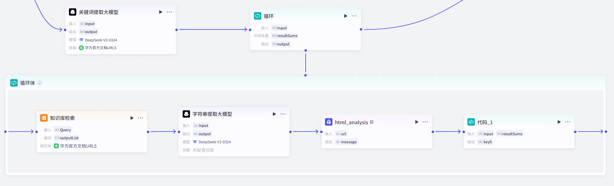

## 前言

在当下这个AI大爆炸的时代，如果再去做一些传统的应用不仅竞争压力大，开发周期长，涉及的技术栈众多，如果不系统的进行学习，开发时会因为基础不牢看不懂一些专业名字，不明白其含义而导致耗费大量时间去debug。但如果我们为了一个项目而去逐一的系统学习多个技术栈，那学习成本又会高的离谱，需要花费极长的时间才能达到一个项目的开发水平，这对于我们的学习来说是不现实的。

而AI的时代，任何一个普通人都可以拥有“100个AI员工”来给自己打工，我们不能再去死学知识，你学一辈子也是追不上AI的知识储备量的，所以我们要学会利用AI去做到以往我们所不敢想象的事情，让自己在各个领域都能利用AI去辅助自己完成自己的事业。去**让自己成为`“超级个体”`**。

而我开发这个应用的灵感是来自于我自身在学习鸿蒙开发的过程中，经常遇到一些问题，在各个社区搜索文章帖子的确是能找到一些答案，但很显然大多数帖子的API版本或是DevEcoStudio的日期太过陈旧，尤其是对于鸿蒙这样一个新兴技术，API的更新速度是非常快的，所以我就想能不能开发一个应用，让我在学习鸿蒙开发的过程中，能快速的找到答案，而不是在各个社区搜索文章帖子，这样不仅浪费时间，而且还会让自己的学习效率降低。

与此同时我也试图去让AI去给我改BUG写ArkTS代码，但很显然市面上常见的那几家AI对于鸿蒙开发的相关知识都知之甚少，毕竟鸿蒙开发还处于起步发展阶段，尤其是鸿蒙星河版，当前的用户基数，软件生态的完善程度还都有待发展，所以各家AI在训练时也不会有太多鸿蒙相关的数据，尤其是鸿蒙开发的专业数据以及代码。

大多数AI在我给它一段`ArkTS`代码后它的理解都是这是TS的某个第三方库，然后就开始了一些奇怪的`虚构推理`……。而对于其他语言比如C，Java，Python等来说，绝大多数常用API各家大模型都是能熟练地掌握的，所以对于像我这种计算机科班生来说，这种落差还是非常明显的。

所以我就决心要去做一款专门为鸿蒙开发者答疑的AI智能体应用。

## 项目规划

### 前端

对于前端来说我肯定是要制作鸿蒙原生应用的，做成鸿蒙星河版的智能体应用。但与此同时我也会制作一个网页版，毕竟网页版的上线代价是远远低于上架鸿蒙星河版的应用市场的。

### 后端

这个项目的后端只是一个轻量化的后端，只需要实现处理用户的对话请求，分析出关键词进行搜索，综合用户问题进行回复即可。

## 后端开发笔记

### 初识扣子

在遇到扣子之前我一直被困于不会后端这一点上，以往做过的APP或是demo都是用的现成的接口，并没有说是自己开发过后端接口，所以这一直限制着我开发选题种类。
纯粹的拉一个AI的接口过来并没有意义，因为现在市面上并没有能满足我鸿蒙开发需求的AI出现，所以需要的是一个利用AI解析用户的问题并从华为官方文档中拉出相关部分的文档，并依据文档中的内容去进行回答的智能体。

在我们亲爱的孙学长的提点与演示下，我了解到了扣子，这种新的轻量化低代码后端范式。
利用编程的思维进行不同功能模块的拖动式编程，就像是各个功能函数都已经被封装好了我只需要告诉他们该如何去运行而已，这令我兴奋不已。
零基础的人都可以上手实现自己的网站小程序，我这种有编程基础但又没系统学过后端的人，也可以利用扣子来实现自己的后端。

于是我选择了扣子。

### 创建工作流

首先我们要理清楚我们的工作流需要实现哪些功能，每一步的输入输出是什么。

1. 接收前端传回的用户的问题
2. 分析问题中的关键词
3. 从华为官方文档中搜索相关内容
4. 结合用户问题和搜索结果进行回复
5. 返回回复给前端

扣子官方为我们提供了数种写好的功能模块，我们只需要设置输入输出的变量以及相关参数就可以实现我们的工作流。
大体就如下图所示：


对于上面提到的5个核心功能我们所需要的主要功能模块如下：

1. 接收前端传回的用户的问题：`开始触发器`
2. 分析问题中的关键词：`关键词提取大模型`
3. 从华为官方文档中搜索相关内容：`网页浏览插件`以及`知识库检索模块`
4. 结合用户问题和搜索结果进行回复：`答复生成大模型`
5. 返回回复给前端：`返回前端数据`


当然扣子官方只是提供了市面上一些常见大模型的调用接口，并没有说已经训练好了专门用于处理关键词以及回答问题的模型，所以我们需要自己去编写提示词去告诉AI你是谁你现在需要做什么，以什么样的格式去进行结果的输出。


### 关键词提取大模型

本项目的大模型我们统一使用`DeepSeek-V3-0324`，一方面他是我们的开源国产之光，另一方面也是更重要的一方面是它的训练语言中包含了远超国外模型的中文含量，还包含了大名鼎鼎的**“弱智吧”**的高质量中文数据。它对于理解用户用中文进行的提问相比国外的模型是有天然的优势的。
同时其输出的语言风格更贴近中国人的中国话，更符合我们的开发习惯。


#### 输入

由于本模型的主要处理目标是从用户的提问中提取关键词，所以我们需要将用户的问题作为输入。


#### 提示词

对于提示词，扣子官方已经提供了一些提示词模板，整体我们需要采用md格式来让大模型更好的去理解自己的职责以及我们的需求。


由于我们的需求是从用户的问题中提取关键词，所以我们需要在提示词中加入`提取关键词`这个关键词，以此来告诉大模型我们的需求。



#### 输出

我们在提示词中已经限制了大模型**仅输出十个相关的关键词**，所以我们需要将输出的类型设置为字符串数组，以便我们在后续的代码中进行处理。



限制提取的关键词的数量是为了避免大模型输出太多关键词，因为大模型的发散性思维还是非常厉害的，可能会对用户的问题产生过分解读，导致召回的关键词过多，严重拖慢工作流的回复速度。当然**召回的关键词越多回复准确的概率也就越大**这一点还是需要权衡一下的。


#### 搜索依据

虽然我们已经提供了足够详细的提示词，但大模型并不知道鸿蒙开发所需的文档在哪，也不知道自可能的关键词有哪些，所以我们还需要为他提供鸿蒙开发的官方文档链接合集，并且在提供文档URL的同时去提供文档的标题，这样大模型才能更好的去理解我们的需求。


这个文档中都是形如`htttps://example.com  | 简介`的链接与链接的简介。大模型就会从这其中寻找与用户提的问题最相关的五个关键词以备后续解析使用。


此处的URL数据是使用爬虫技术爬取，我**仅仅**是爬取了鸿蒙开发文档根目录下该文件夹的**全部子文件夹的URL并没有爬取网页内容**，请大家**务必遵纪守法，不要滥用爬虫技术！！！**


### 循环体处理

#### 知识库检索URL召回

由于扣子官方提供的知识库检索功能模块只能依据一个字符串检索并返回一个到20个相关内容，但很显然我们不能将最小匹配度降低来实现多个关键词在同一个字符串中进行检索召回，这样可能导致召回的内容并非我们所需的内容。


所以我们需要使用循环体来实现多个关键词的检索召回，并且将每个关键词的召回内容进行合并，以便后续的回答生成大模型进行分析。


循环体本身直接输出的是并非是整个循环结果的集合，它具体输出的模式我并没有太弄清楚，我们需要手动去添加一个循环体中间变量来去将每一次执行的结果进行合并。


点开循环体的属性界面添加一个中间变量，命名为`resultSums`，类型为字符串字符串数组，并将输出变量也设置为这个集合。


扣子官方提供的循环体模块支持三种循环模式，分别是：

1. 数组循环
2. 指定循环次数
3. 无限循环

这三种循环也是在开发中很常用的三种循环方式，绝大多数语言也都是包含这种三种循环方式的。

* 数组循环可以在每一次循环中自动取出当前数组的元素`item`以及其对应的索引值`Index`,比较适合对**单一数组的每一项进行操作**。
* 指定循环次数就是字面意思，它的循环操作对象**不一定是数组**，但也可以利用索引值同时操作**多个数组**。
* 无限循环可以在循环体中**添加一个条件来控制循环的结束**，比较适合进行一些不知道在多少步会结束，但能明确一定会结束的操作，就像是下棋，每一句的总步数和总时间是未知的，但我们可以通过**判断是否出现了胜利**来判断是否结束。
  

在使用无限循环的循环体时一定要去**添加一个条件来控制循环的结束**，否则会导致死循环，导致工作流的卡死以及**程序的崩溃**。


由于我们的需求是关键词数组的**每一项**进行URL的召回以及后续处理，同时我们**只有一个数组需要进行遍历操作**所以我们需要使用数组循环来进行处理。



#### 对召回数据进行格式处理

由于知识库检索模块的**返回值是一个JSON对象**并不是一个单纯的URL字符串，所以我们需要对其进行数据结构的分析以及URL路径的提取处理。

我们对知识库检索模块进行试运行以获取其输出的数据结构：


可以看到其返回值中包含了大量的转义符，我对于这个转义符的处理一开始并没有立即的很到位，我还以为我需要在代码中去对其进行处理，所以在定义接口时还特别的添加了像是`"URL\"`这种键值，现在看来有点小蠢了（笑）。

我首先想到的是通过代码模块去进行数据的提取，但我被他给的示例代码给误导了。


官方给出的默认代码事例获取外部传入的参数靠的是点语法，但我在使用点语法时始终在报错，于是我决定去看看文档里是怎么说的。


好好好，索引格式，nb。`:(`
能不能把示例代码和文档格式对齐啊！！！

修改代码ing……

```js
async function main({ params }: Args): Promise<Output> {
    const URL:string = (JSON.parse(params['input']) as UrlInput).URL\;
    // 构建输出对象
    const ret = {
        "key0": URL,
    };

    return ret;
}
interface UrlInput{
    "URL\\":string
}
```


此处并非正确代码请勿使用！！！


果然是一下子就不报错了呢。

但由于我在局部进行测试时，我都是手动输入手动复制上一个节点的输出然后再输入到下一个节点进行测试的，就导致我复制的内容格式并不正确，包含了太多额外的转义符，导致输出的结果经常带着大量`\\\`这种三连转义符，属实是有点难蚌，所以我就认为是扣子的数据格式问题，所以我采用了更加直接干脆的方式————使用大模型模块，让大模型去做数据处理。

简简单单写个大模型提示词，让大模型去提取出URL路径，然后再将其作为输出返回给下一个节点。


的确干脆而且效果显著，整个工作流一下就畅通了。


但现在的工作流很显然是存在问题的，就是整体回复速度还是太慢了，最后一个最终结果输出大模型的速度慢是可以理解的，也是必要的思考时间，但我们为了一个单纯的字符串处理也使用大模型来进行处理，这是非常不理智的。

所以我决定再次使用代码进行数据格式的处理。

```js
async function main({ params }: Args): Promise<Output> {
    const URL:string = (JSON.parse(params['input']) as UrlInput).URL;
    // 构建输出对象
    const ret = {
        "key0": URL,
    };

    return ret;
}
interface UrlInput{
    URL:string
}
```

我这次决心不管那些转义符然后再去进行整体的测试而不是手动输入单独的节点测试。


这次的测试结果还是非常理想的，和我猜测的一样就是我手动输入的节点测试数据导致无用转义符被意外保留。我只需要按照正常编程一样去处理数据就可以了。不需要考虑转义符问题。
同时本次测试将提取URL的时间从原本的一秒到两秒压缩到了0.06秒左右，这是巨大的提升，尤其是在循环多次的情况下。
当然我们应当对进行包装并使用工作流加以包装处理。

#### 网页信息浏览

由于我们上一步处理出来的只是URL，并不是URL指向的网页内容，所以我们还需要网页阅读插件来去获取网页内容。


我尝试了这两种网页阅读器，但他们都是基于自己的理解去进行网页内容的总结，并不是整个网页的完整内容，这与我的初心相违背，所以我弃用了他们。
随后我选择利用插件直接获取整个网页的HTML源码然后交给大模型去理解。于是我选择了


#### 循环体中间变量的处理

由于我们想要让输出的结果是打包以字符串数组的形式进行输出，所以我们还需要在每一次循环中将本次循环的结果添加进中间变量中。


```js
async function main({ params }: Args): Promise<Output> {
    params['resultSums'].push(params['input']);
    console.log(JSON.stringify(params['resultSums']));
    // 构建输出对象
    const ret = {
        "key0": JSON.stringify(params['resultSums']), 
    };

    return ret;
}
```


本函数其实关键语句仅有`params['resultSums'].push(params['input']);`一句，其他的都是为了便于监测调试结果而添加的。


### 并发处理

既然我们已经是利用云上计算了，我们也没有必要再去省那一点空间，我们需要的是更快的回复。
所以循环体中的逻辑我们是可以利用多线程并发来进行处理的，这样可以大大提升结果的输出速度。


将原来的循环模块改为批处理模块来进行多线程并发处理。


考虑到以后为了回答精度的调整我们将并发线程以及总处理量都拉高一些为以后调教留出空间。
经过测试整个**并发流程耗时仅一秒**相比于原本的循环体需要11到12秒左右是一个巨大的提升。

同时由于批处理模块的输出是会对所有数据进行自动打包封装的所以我们就不在需要手动处理中间变量来进行数据打包封装了。

### 最终答复大模型

经过前面的工作流处理