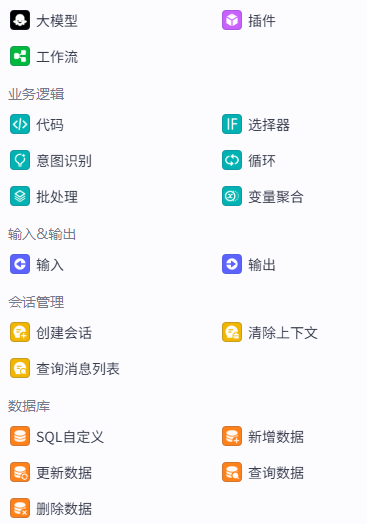
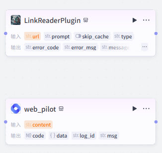
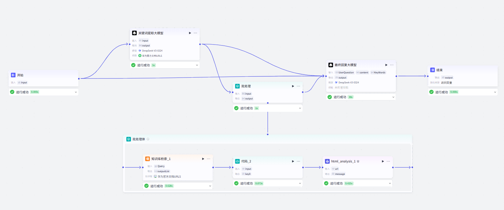

## 概述

本项目是基于`扣子coze`平台搭建的智能体对话流后端，接入用鸿蒙开发制作的客户端，以及Web技术开发的网页端的智能体应用。
专注于回答鸿蒙开发相关问题，用以弥补当前市面上并没有能准确回答鸿蒙开发相关问题的AI模型的空缺。
本智能体以鸿蒙开发文档为知识库进行数据检索与解答，目前还有一些幻觉与混淆问题，但在持续优化中。

内容包括前后端的开发笔记，AI对话行业解决方案，后续还会加入本产品的优化与功能拓展模块。

## 前言

在当下这个AI大爆炸的时代，如果再去做一些传统的应用不仅竞争压力大，开发周期长，涉及的技术栈众多，如果不系统的进行学习，开发时会因为基础不牢看不懂一些专业名字，不明白其含义而导致耗费大量时间去debug。但如果我们为了一个项目而去逐一的系统学习多个技术栈，那学习成本又会高的离谱，需要花费极长的时间才能达到一个项目的开发水平，这对于我们的学习来说是不现实的。

而AI的时代，任何一个普通人都可以拥有“100个AI员工”来给自己打工，我们不能再去死学知识，你学一辈子也是追不上AI的知识储备量的，所以我们要学会利用AI去做到以往我们所不敢想象的事情，让自己在各个领域都能利用AI去辅助自己完成自己的事业。去**让自己成为`“超级个体”`**。

而我开发这个应用的灵感是来自于我自身在学习鸿蒙开发的过程中，经常遇到一些问题，在各个社区搜索文章帖子的确是能找到一些答案，但很显然大多数帖子的API版本或是DevEcoStudio的日期太过陈旧，尤其是对于鸿蒙这样一个新兴技术，API的更新速度是非常快的，所以我就想能不能开发一个应用，让我在学习鸿蒙开发的过程中，能快速的找到答案，而不是在各个社区搜索文章帖子，这样不仅浪费时间，而且还会让自己的学习效率降低。

与此同时我也试图去让AI去给我改BUG写ArkTS代码，但很显然市面上常见的那几家AI对于鸿蒙开发的相关知识都知之甚少，毕竟鸿蒙开发还处于起步发展阶段，尤其是鸿蒙星河版，当前的用户基数，软件生态的完善程度还都有待发展，所以各家AI在训练时也不会有太多鸿蒙相关的数据，尤其是鸿蒙开发的专业数据以及代码。

大多数AI在我给它一段`ArkTS`代码后它的理解都是这是TS的某个第三方库，然后就开始了一些奇怪的`虚构推理`……。而对于其他语言比如C，Java，Python等来说，绝大多数常用API各家大模型都是能熟练地掌握的，所以对于像我这种计算机科班生来说，这种落差还是非常明显的。

所以我就决心要去做一款专门为鸿蒙开发者答疑的AI智能体应用。

## 项目规划

### 前端

对于前端来说我肯定是要制作鸿蒙原生应用的，做成鸿蒙星河版的智能体应用。但与此同时我也会制作一个网页版，毕竟网页版的上线代价是远远低于上架鸿蒙星河版的应用市场的。

### 后端

这个项目的后端只是一个轻量化的后端，只需要实现处理用户的对话请求，分析出关键词进行搜索，综合用户问题进行回复即可。

## 后端开发笔记

### 初识扣子

在遇到扣子之前我一直被困于不会后端这一点上，以往做过的APP或是demo都是用的现成的接口，并没有说是自己开发过后端接口，所以这一直限制着我开发选题种类。
纯粹的拉一个AI的接口过来并没有意义，因为现在市面上并没有能满足我鸿蒙开发需求的AI出现，所以需要的是一个利用AI解析用户的问题并从华为官方文档中拉出相关部分的文档，并依据文档中的内容去进行回答的智能体。

在我们亲爱的孙学长的提点与演示下，我了解到了扣子，这种新的轻量化低代码后端范式。
利用编程的思维进行不同功能模块的拖动式编程，就像是各个功能函数都已经被封装好了我只需要告诉他们该如何去运行而已，这令我兴奋不已。
零基础的人都可以上手实现自己的网站小程序，我这种有编程基础但又没系统学过后端的人，也可以利用扣子来实现自己的后端。

于是我选择了扣子。

### 创建工作流

首先我们要理清楚我们的工作流需要实现哪些功能，每一步的输入输出是什么。

1. 接收前端传回的用户的问题
2. 分析问题中的关键词
3. 从华为官方文档中搜索相关内容
4. 结合用户问题和搜索结果进行回复
5. 返回回复给前端

扣子官方为我们提供了数种写好的功能模块，我们只需要设置输入输出的变量以及相关参数就可以实现我们的工作流。
大体就如下图所示：



对于上面提到的5个核心功能我们所需要的主要功能模块如下：

1. 接收前端传回的用户的问题：`开始触发器`
2. 分析问题中的关键词：`关键词提取大模型`
3. 从华为官方文档中搜索相关内容：`网页浏览插件`以及`知识库检索模块`
4. 结合用户问题和搜索结果进行回复：`答复生成大模型`
5. 返回回复给前端：`返回前端数据`


当然扣子官方只是提供了市面上一些常见大模型的调用接口，并没有说已经训练好了专门用于处理关键词以及回答问题的模型，所以我们需要自己去编写提示词去告诉AI你是谁你现在需要做什么，以什么样的格式去进行结果的输出。


### 关键词提取大模型

本项目的大模型我们统一使用`DeepSeek-V3-0324`，一方面他是我们的开源国产之光，另一方面也是更重要的一方面是它的训练语言中包含了远超国外模型的中文含量，还包含了大名鼎鼎的**“弱智吧”**的高质量中文数据。它对于理解用户用中文进行的提问相比国外的模型是有天然的优势的。
同时其输出的语言风格更贴近中国人的中国话，更符合我们的开发习惯。


#### 输入

由于本模型的主要处理目标是从用户的提问中提取关键词，所以我们需要将用户的问题作为输入。


#### 提示词

对于提示词，扣子官方已经提供了一些提示词模板，整体我们需要采用md格式来让大模型更好的去理解自己的职责以及我们的需求。


由于我们的需求是从用户的问题中提取关键词，所以我们需要在提示词中加入`提取关键词`这个关键词，以此来告诉大模型我们的需求。



#### 输出

我们在提示词中已经限制了大模型**仅输出十个相关的关键词**，所以我们需要将输出的类型设置为字符串数组，以便我们在后续的代码中进行处理。



限制提取的关键词的数量是为了避免大模型输出太多关键词，因为大模型的发散性思维还是非常厉害的，可能会对用户的问题产生过分解读，导致召回的关键词过多，严重拖慢工作流的回复速度。当然**召回的关键词越多回复准确的概率也就越大**这一点还是需要权衡一下的。


#### 搜索依据

虽然我们已经提供了足够详细的提示词，但大模型并不知道鸿蒙开发所需的文档在哪，也不知道自可能的关键词有哪些，所以我们还需要为他提供鸿蒙开发的官方文档链接合集，并且在提供文档URL的同时去提供文档的标题，这样大模型才能更好的去理解我们的需求。


这个文档中都是形如`htttps://example.com  | 简介`的链接与链接的简介。大模型就会从这其中寻找与用户提的问题最相关的五个关键词以备后续解析使用。


此处的URL数据是使用爬虫技术爬取，我**仅仅**是爬取了鸿蒙开发文档根目录下该文件夹的**全部子文件夹的URL并没有爬取网页内容**，请大家**务必遵纪守法，不要滥用爬虫技术！！！**


### 循环体处理

#### 知识库检索URL召回

由于扣子官方提供的知识库检索功能模块只能依据一个字符串检索并返回一个到20个相关内容，但很显然我们不能将最小匹配度降低来实现多个关键词在同一个字符串中进行检索召回，这样可能导致召回的内容并非我们所需的内容。


所以我们需要使用循环体来实现多个关键词的检索召回，并且将每个关键词的召回内容进行合并，以便后续的回答生成大模型进行分析。


循环体本身直接输出的是并非是整个循环结果的集合，它具体输出的模式我并没有太弄清楚，我们需要手动去添加一个循环体中间变量来去将每一次执行的结果进行合并。


点开循环体的属性界面添加一个中间变量，命名为`resultSums`，类型为字符串字符串数组，并将输出变量也设置为这个集合。


扣子官方提供的循环体模块支持三种循环模式，分别是：

1. 数组循环
2. 指定循环次数
3. 无限循环

这三种循环也是在开发中很常用的三种循环方式，绝大多数语言也都是包含这种三种循环方式的。

* 数组循环可以在每一次循环中自动取出当前数组的元素`item`以及其对应的索引值`Index`,比较适合对**单一数组的每一项进行操作**。
* 指定循环次数就是字面意思，它的循环操作对象**不一定是数组**，但也可以利用索引值同时操作**多个数组**。
* 无限循环可以在循环体中**添加一个条件来控制循环的结束**，比较适合进行一些不知道在多少步会结束，但能明确一定会结束的操作，就像是下棋，每一句的总步数和总时间是未知的，但我们可以通过**判断是否出现了胜利**来判断是否结束。
  

在使用无限循环的循环体时一定要去**添加一个条件来控制循环的结束**，否则会导致死循环，导致工作流的卡死以及**程序的崩溃**。


由于我们的需求是关键词数组的**每一项**进行URL的召回以及后续处理，同时我们**只有一个数组需要进行遍历操作**所以我们需要使用数组循环来进行处理。


#### 对召回数据进行格式处理

由于知识库检索模块的**返回值是一个JSON对象**并不是一个单纯的URL字符串，所以我们需要对其进行数据结构的分析以及URL路径的提取处理。

我们对知识库检索模块进行试运行以获取其输出的数据结构：


可以看到其返回值中包含了大量的转义符，我对于这个转义符的处理一开始并没有立即的很到位，我还以为我需要在代码中去对其进行处理，所以在定义接口时还特别的添加了像是`"URL\"`这种键值，现在看来有点小蠢了（笑）。

我首先想到的是通过代码模块去进行数据的提取，但我被他给的示例代码给误导了。


官方给出的默认代码事例获取外部传入的参数靠的是点语法，但我在使用点语法时始终在报错，于是我决定去看看文档里是怎么说的。


好好好，索引格式，nb。`:(`
能不能把示例代码和文档格式对齐啊！！！

修改代码ing……

```js
async function main({ params }: Args): Promise<Output> {
    const URL:string = (JSON.parse(params['input']) as UrlInput).URL\;
    // 构建输出对象
    const ret = {
        "key0": URL,
    };

    return ret;
}
interface UrlInput{
    "URL\\":string
}
```


此处并非正确代码请勿使用！！！


果然是一下子就不报错了呢。

但由于我在局部进行测试时，我都是手动输入手动复制上一个节点的输出然后再输入到下一个节点进行测试的，就导致我复制的内容格式并不正确，包含了太多额外的转义符，导致输出的结果经常带着大量`\\\`这种三连转义符，属实是有点难蚌，所以我就认为是扣子的数据格式问题，所以我采用了更加直接干脆的方式————使用大模型模块，让大模型去做数据处理。

简简单单写个大模型提示词，让大模型去提取出URL路径，然后再将其作为输出返回给下一个节点。


的确干脆而且效果显著，整个工作流一下就畅通了。


但现在的工作流很显然是存在问题的，就是整体回复速度还是太慢了，最后一个最终结果输出大模型的速度慢是可以理解的，也是必要的思考时间，但我们为了一个单纯的字符串处理也使用大模型来进行处理，这是非常不理智的。

所以我决定再次使用代码进行数据格式的处理。

```js
async function main({ params }: Args): Promise<Output> {
    const URL:string = (JSON.parse(params['input']) as UrlInput).URL;
    // 构建输出对象
    const ret = {
        "key0": URL,
    };

    return ret;
}
interface UrlInput{
    URL:string
}
```

我这次决心不管那些转义符然后再去进行整体的测试而不是手动输入单独的节点测试。


这次的测试结果还是非常理想的，和我猜测的一样就是我手动输入的节点测试数据导致无用转义符被意外保留。我只需要按照正常编程一样去处理数据就可以了。不需要考虑转义符问题。
同时本次测试将提取URL的时间从原本的一秒到两秒压缩到了0.06秒左右，这是巨大的提升，尤其是在循环多次的情况下。
当然我们应当对进行包装并使用工作流加以包装处理。

#### 网页信息浏览

由于我们上一步处理出来的只是URL，并不是URL指向的网页内容，所以我们还需要网页阅读插件来去获取网页内容。



我尝试了这两种网页阅读器，但他们都是基于自己的理解去进行网页内容的总结，并不是整个网页的完整内容，这与我的初心相违背，所以我弃用了他们。
随后我选择利用插件直接获取整个网页的HTML源码然后交给大模型去理解。于是我选择了


#### 循环体中间变量的处理

由于我们想要让输出的结果是打包以字符串数组的形式进行输出，所以我们还需要在每一次循环中将本次循环的结果添加进中间变量中。


```js
async function main({ params }: Args): Promise<Output> {
    params['resultSums'].push(params['input']);
    console.log(JSON.stringify(params['resultSums']));
    // 构建输出对象
    const ret = {
        "key0": JSON.stringify(params['resultSums']), 
    };

    return ret;
}
```


本函数其实关键语句仅有`params['resultSums'].push(params['input']);`一句，其他的都是为了便于监测调试结果而添加的。


### 并发处理

既然我们已经是利用云上计算了，我们也没有必要再去省那一点空间，我们需要的是更快的回复。
所以循环体中的逻辑我们是可以利用多线程并发来进行处理的，这样可以大大提升结果的输出速度。


将原来的循环模块改为批处理模块来进行多线程并发处理。


考虑到以后为了回答精度的调整我们将并发线程以及总处理量都拉高一些为以后调教留出空间。
经过测试整个**并发流程耗时仅一秒**相比于原本的循环体需要11到12秒左右是一个巨大的提升。

同时由于批处理模块的输出是会对所有数据进行自动打包封装的所以我们就不在需要手动处理中间变量来进行数据打包封装了。

### 最终答复大模型

经过前面的工作流处理我们获取了回答用户问题所需要的一部分文档信息，现在我们将再创建一个大模型节点去处理文档信息并去进行最终回答的输出。
对于最终回答大模型的提示词我们不能像之前的大模型提示词一样的去只编写它需要实现的功能、他的工作流是怎样的运作的，我们还需要去写**他给用户的回答应该是以怎样的语气，什么样的语言风格去进行回答**。因为它是**直接与用户去沟通的大模型**而不是一个单纯是被向前在工作流之中给我打工的大模型。

用户既然是来问问题的那我们自然要去限定他的回复语气是耐心地，同时要禁止它对用户进行反问。
与此同时我们要考虑到我们未来的用户群体中可能有海外的技术人员，所以我们不能说让大模型一味地回复中文，而是应该让它回复与提问者一致的语言。

同时为了防止大模型产生幻觉影响最终结果的解读，我们应当尽可能多的去强调原问题的重要性，查到的数据如果经过研判是对解答问题无关的信息那就应当被无视掉。


如今的大模型大多有着很严重的幻觉问题，所以我们应当将HTML数据和用于原问题输入之外还去输入第一个大模型选出的知识库中的关键词。


所以我们可以看到最终回复大模型是有三条线作为输入的。


最终的工作流如下图所示：



### 输出格式

对于这一点我其实考虑了几种方案，对于网页端好说，输出的MD格式有很多方式进行渲染，像是我的博客就是用MD编写然后再改写成HTML进行网页显示的。主要问题在于鸿蒙端的渲染方式。之前子安学长在`鸿蒙+DeepSeek探索流失传输新纪元`活动中有提到鸿蒙并没有提供原生的MD渲染组件或是格式转换API，所以我就在考虑是否要直接转化成HTML然后再输出这样其实对于网页对于鸿蒙端来说都是十分便捷的数据格式。

于是我开始在扣子的插件库中寻找我需要的MD转HTML的插件，确实找到了一大堆。


但效果吗enm……只能说是都不尽如人意了，好像都各自对网页的美学有一套独特的理解，毕竟MD并不会标明背景颜色字体颜色字体粗细的具体数值等CSS样式，就导致这些转换插件所转换出的网页文件有一种野蛮生长的美感。

于是我决定就渲染最原始的MD格式。

在OpenHarmony的三方库中心仓中找到了我的救星：


[三方库传送门](https://ohpm.openharmony.cn/#/cn/detail/@lidary%2Fmarkdown)

我们点开他的github库可以看到他整体的渲染效果还是非常理想的。


这样一来我们就可以不用再找插件直接去进行MD格式的输出了。

### 转换为对话流

在一开始我对于扣子的理解并不到位，并不清楚他的工作流与对话流有什么区别，所以我就先将这个项目创建为了工作流，但在我测试时发现我只能进行一轮对话。这很显然是不符合我们的需求的，所以我决定将我们的项目转换为对话流。

#### 工作流与对话流的区别

我们在切换成对话流后首先要明白对话流相比于工作流的区别，工作流是一个**一次性的工作流**，它的输入输出都是为了解决一个明确的需求去实现的，而对话流是一个**可以进行多次对话的对话流**，它的工作流执行是可以依据与与用户对话的上下文去进行的，这也是我们需要将我们的项目转换为对话流的原因。
而对于两者优劣势的对比我就直接放官方文档了。

以下是转换后的 Markdown 表格格式：

| **分类**       | **工作流**                                                                 | **对话流**                                                                 |
|----------------|---------------------------------------------------------------------------|---------------------------------------------------------------------------|
| **用途**       | 用于处理功能类的请求，通过顺序执行节点实现功能（如生成报告、海报、绘本等）。               | 基于对话场景，适合交互式复杂业务逻辑（如智能客服、虚拟伴侣等）。                          |
| **节点特性**    | - 大模型节点不支持查看对话历史。<br>- 开始节点无需会话名称。                           | - 模型类节点支持读取对话历史。<br>- 开始节点必须传入会话名称，记录对话上下文。                 |
| **角色配置**    | 不支持角色配置。                                                           | 支持单独配置角色（名称、头像、开场白等），应用于 Chat SDK 或 AI 对话组件绑定场景。             |
| **用户界面**    | 支持布局组件、展示组件等丰富类型。                                           | 仅支持 AI 对话组件（聊天面板形式，适用于移动端/网页端）。                                |
| **发布渠道**    | 支持 API、模板、商店（不支持社交渠道、Web SDK、小程序）。                     | 支持所有渠道（API&SDK、小程序、社交渠道、商店、模板等）。                             |
| **API 调用**    | 通过 `执行工作流` 或 `执行工作流（流式响应）` 接口调用。                         | 通过 `执行对话流` 接口调用。                                               |

##### 关键差异说明

1. **对话历史**：对话流支持上下文记忆，工作流无此功能。
2. **角色配置**：对话流可定制角色属性，工作流无此选项。
3. **交互方式**：工作流为线性执行，对话流为多轮对话。
4. **发布灵活性**：对话流支持更广泛的终端适配（如小程序、社交平台）。

### 角色设定

因为对话流支持设置角色设定，所以在转变为对话流之后我首先需要的就是去设置角色设定。


### 对话历史信息

扣子的对话流支持提供上下文记忆给大模型，所以我们就可以在最终回复大模型的提示词中加入对话历史信息来进行回答的生成。
但关键词检索大模型并不能添加，因为这样有可能会压榨我们的新问题的关键词找回条数以及精度。



不过仍有一个现存问题在于，我并没有办法在提示词中像是`{{对话历史}}`这样的方式去引用对话历史信息，所以我只能通过手动写要利用对话上下文去进行分析，我并不确定这样写是否能真的让大模型去阅读当前的上下文信息。效果有待测试。


## 鸿蒙端开发笔记

### 流式API接口测试

扣子的对话流项目在发布后其接口调用方式是流式传输接口，对此我需要先创建一个项目进行测试。


#### 数据定义

为了规范数据的传输，我们需要定义一系列的接口以及枚举类型来规范数据的传输。

```ts
interface ICoZePostBody<K = string, V = undefined> {
  /**
   * 待执行的对话流 ID，此对话流应已发布。
   */
  workflow_id: string
  /**
   * 对话中用户问题和历史消息。数组长度限制为 50，即最多传入 50 条消息。
   * 你需要通过此字段传入本次对话中用户的问题，也就是对话流的输入参数 USER_INPUT 的值。
   * 可以同时传入多条历史消息，也就是本次对话的上下文。多条消息应按对话顺序排列，最后一条消息应为 role=user 的记录，也就是**本次对话**中用户的问题；其他消息为历史消息。
   */
  additional_messages: IHXYAdditionalMessagesItem[]
  /**
   * 设置对话流的输入参数。
   * 对话流的输入参数  USER_INPUT 应在 additional_messages 中传入，在 parameters 中的 USER_INPUT 不生效。
   * 如果 parameters 中未指定 CONVERSATION_NAME 或其他输入参数，则使用参数默认值运行对话流；如果指定了这些参数，则使用指定值。
   */
  parameters: Map<K, V>
  /**
   * 需要关联的扣子应用 ID。调用对话流时，必须指定 app_id 或 bot_id，便于模型调用智能体或应用的数据库、变量等数据处理问题。
   */
  app_id?: string
  /**
   * 需要关联的智能体 ID。 调用对话流时，必须指定 app_id 或 bot_id，便于模型调用智能体或应用的数据库、变量等数据处理问题。
   */
  bot_id?: string
  /**
   * 对话流对应的会话 ID，对话流产生的消息会保存到此对话中。会话默认为开始节点设置的 CONVERSATION_NAME，也可以通过 conversation_id 参数指定会话。
   */
  conversation_id?: string
  /**
   * 用于指定一些额外的字段，以 Map[String][String] 格式传入。例如某些插件会隐式用到的经纬度等字段。
   目前仅支持以下字段：
   latitude：String 类型，表示经度。
   longitude：String 类型，表示纬度。
   user_id：String 类型，表示用户 ID。
   */
  ext?: Map<CoZePostBody_ExtKeys, string>
}

/**
 * 扣子流式接口Body部分字段map的键值枚举类型
 */
enum CoZePostBody_ExtKeys {
  /**
   * latitude：String 类型，表示经度。
   */
  Latitude = 'latitude',
  /**
   * longitude：String 类型，表示纬度。
   */
  Longitude = 'longitude',
  /**
   * user_id：String 类型，表示用户 ID。
   */
  User_id = 'user_id'
}

/**
 * 对话中用户问题和历史消息。
 * 指定 content 时，应同时设置 content_type。
 * 暂不支持多模态（文本、图片、文件混合输入）、卡片等类型的内容。
 * 设置meta_data时应当设置两个泛型参数
 */
interface IHXYAdditionalMessagesItem<K = undefined, V = undefined> {
  /**
   * 发送这条消息的实体。
   */
  role: AdditionalMessages_Role
  /**
   * 消息类型。默认为 question。
   */
  type?: AdditionalMessages_Type
  /**
   * 消息的内容，仅支持纯文本。
   */
  content?: string
  /**
   * 消息内容的类型。
   */
  content_type?: string
  /**
   * 创建消息时的附加消息，获取消息时也会返回此附加消息。
   * 自定义键值对，应指定为 Map 对象格式。长度为 16 对键值对，其中键（key）的长度范围为 1～64 个字符，值（value）的长度范围为 1～512 个字符。
   */
  meta_data?: Map<K, V>
}

/**
 * user：代表该条消息内容是用户发送的。
 * assistant：代表该条消息内容是模型发送的。
 */
enum AdditionalMessages_Role {
  User = 'user',
  Assistant = 'assistant'
}

/**
 * question：用户输入内容。
 * answer：模型返回给用户的消息内容，支持增量返回。如果对话流绑定了消息节点，可能会存在多 answer 场景，此时可以用流式返回的结束标志来判断所有 answer 完成。
 * function_call：智能体对话过程中调用函数（function call）的中间结果。
 * tool_response：调用工具 （function call）后返回的结果。
 */
enum AdditionalMessages_Type {
  Question = 'question',
  Answer = 'answer',
  Function_call = 'function_call',
  Tool_response = 'tool_response'
}
```

以上部分基本均为官方文档的内容，我在此处进行了一些修改与补充。注释编写的十分详细，我在这里只强调几个重要的点。

1. 对于`additional_messages`字段，我们需要将用户的问题作为当前数组的最后一条消息传入，并且将其`role`字段设置为`user`，这样大模型才能正确地理解我们的问题。
2. `USER_INPUT`的工作流参数需要以`IHXYAdditionalMessagesItem`对象的`Content`字段进行传入，直接写在`parameters`是没用的。
3. 设置了`content`之后我们还必须要设置`content_type`字段，来进行类型限制。

随后我们需要对相关请求数据进行字段配置。

```ts
const sessionConfig: rcp.SessionConfiguration = {
  headers: {
    Authorization: "Bearer pat_iu*************************************",
    "Content-Type": "application/json"
  },
  requestConfiguration: {
    transfer: {
      timeout: {
        transferMs: 120000
      }
    },
    tracing: {
      httpEventsHandler: {
        onDataReceive: (inComingData: ArrayBuffer) => {
          const bufferFrom: Uint8Array = new Uint8Array(inComingData);
          const s = new util.TextDecoder().decodeToString(bufferFrom);
          AlertDialog.show({
            message:s
          })
          console.log(s)
        }
      }
    }
  }
}


const ai:ICoZePostBody = {
  workflow_id: '7487986***********',
  additional_messages: [
    {
      role:AdditionalMessages_Role.User,
      content:'我进行鸿蒙开发应当做什么准备',
      content_type:'string'
    } as IHXYAdditionalMessagesItem
  ],
  parameters: new Map<string, string>([['CONVERSATION_NAME','test']])

}
```

在测试请求发送函数中我假设了用户的提问是`我进行鸿蒙开发应当做什么准备`，并且指定了对话流的ID为`7487986***********`，并且指定了会话名称为`test`。
在实际开发中我只需要将这个数组提取为一个全局变量去获取用户输入的内容并包装为对象传入这个数组即可。


这里我遮盖了我自己的工作流ID和Token秘钥，实际开发中请自行替换。


#### 发送请求

在UI上绑定发送请求的函数即可，本项目仅做测试。

```ts
        .onClick(() => {
          requestAi()
        })
```

#### 响应检测

在配置请求配置项时我设置了`httpEventsHandler`字段，来对请求的不同事件的触发进行监听与数据处理。当收到后端发来的数据时就会触发`onDataReceive`回调函数，而为了监听返回的数据格式是否正确以及是否为流式返回的模式，我将每个数据都进行控台的打印。


数据以及流式效果全都成功了！！！
（撒花）

### 第三方MD解析组件库测试

我们刚完成了流式API的测试，接下来我们就需要将我们的流式数据进行解析，由于鸿蒙开发并没有提供原生的MD解析渲染API，所以我们需要使用OpenHarmony的第三方组件库来进行解析。

#### 三方库安装

```bash
ohpm install @lidary/markdown
```

命令执行后可以再在第三方包管理模块的文件夹下看到我们刚才安装的三方库。


这样就安装成功了。

#### 全局变量定义

```ts
const msgModel: MessageModel = AppStorageV2.connect(MessageModel, 'msg', () => new MessageModel())!;
```

我们首先创建一个全局变量来存储以及共享我们所接受的流式数据。
随后我们在数据获取监听器的回调函数中添加对数据进行增量的处理。
因为此处我们仅做测试所以我们先只定义一种接口来去接收流式数据。

```ts
interface IHXYConversationMessage_Event {
  event: string;
  data: IHXYConversationMessage_DeltaData;
}
```

#### 组件使用

在组件中使用组件库中的组件。


## AI对话行业解决方案

我们虽然已经做出来了流式返回的发出与接收，但是我们还是需要去了解一下这个技术以及其在AI对话行业的应用。

### SSE（Server-Sent Events）简介

SSE 是一种允许服务器向客户端发送实时更新的 Web 技术。它基于 HTTP 协议，服务器可以在客户端建立连接后，持续向客户端发送事件流。客户端通过监听这些事件流，实时获取服务器端的更新。SSE 是单向通信，仅允许服务器向客户端发送数据。

### HTTP 轮询简介

HTTP 轮询是一种客户端定期向服务器发送请求以获取最新数据的技术。客户端会按照设定的时间间隔，不断地向服务器发送请求，服务器在每次接收到请求后返回最新的数据。这种方式是双向的，但由于客户端需要不断发送请求，可能会造成不必要的网络流量和服务器负载。

### 对比表格

| 特性 | SSE | HTTP 轮询 |
| --- | --- | --- |
| 通信方向 | 单向（服务器到客户端） | 双向 |
| 实时性 | 高，服务器可立即推送更新 | 取决于轮询间隔，可能存在延迟 |
| 网络开销 | 低，一旦连接建立，只需持续发送事件 | 高，客户端需要定期发送请求 |
| 服务器负载 | 低，只需在有更新时发送数据 | 高，需要频繁处理客户端请求 |
| 实现复杂度 | 相对较低，基于 HTTP 协议 | 相对较高，需要处理轮询逻辑 |
| 兼容性 | 现代浏览器支持良好，但旧浏览器可能不支持 | 所有浏览器都支持 |

这个表格总结了 SSE 和 HTTP 轮询在通信方向、实时性、网络开销、服务器负载、实现复杂度和兼容性等方面的差异。在选择使用哪种技术时，需要根据具体的应用场景和需求来决定。如果需要实时更新且对网络开销和服务器负载有要求，SSE 可能是更好的选择；如果对实时性要求不高且需要支持旧浏览器，HTTP 轮询可能更合适。


总而言之对于当下绝大多数应用场景SEE都是更好的选择，它可以用更小的网络开销，无需频繁发送请求，数据实时性也更高。
除非是适配老旧浏览器以及需要频繁双向通信的场景会用到HTTP轮询。


### SEE在本项目的应用解析

在本项目中，SSE（Server-Sent Events）可以用于实现服务器向客户端的实时数据推送，特别是在AI对话场景中，为用户提供更流畅的交互体验。以下是SSE在本项目中的具体应用方式：

#### 实时对话回复

在用户与AI智能体进行对话时，服务器可以使用SSE技术将AI的回复以事件流的形式**实时推送给客户端**。这样，用户**无需等待整个回复生成完成，就可以逐步看到AI的回复内容**，大大提高了交互的实时性和流畅性。

例如，当用户提出问题后，服务器开始调用大模型进行回复生成。在生成过程中，服务器可以将已经生成的部分回复内容通过SSE推送给客户端，客户端在接收到这些内容后立即显示给用户。这样，用户可以在等待完整回复的同时，开始阅读和理解部分内容，减少了等待时间的感知。

#### 状态更新通知

除了对话回复，SSE还可以用于向客户端发送系统**状态更新通知**。例如，当服务器正在处理用户的请求时，可以通过SSE向客户端发送处理进度信息，让用户了解请求的处理状态。

具体来说，当用户发起一个问题时，服务器可能需要进行**多个步骤的处理**，如关键词提取、文档检索、回复生成等。在每个步骤完成后，服务器可以通过SSE向客户端发送相应的状态更新信息，如“正在提取关键词”、“正在检索文档”、“正在生成回复”等。这样，用户可以实时了解服务器的处理进度，增强了用户对系统的信任感。

#### SEE模式的返回数据格式分析

对于SEE模式其返回的JSON数据基本都会包含两部分：

1. `event`:用于指定事件的类型。如果指定了事件类型，客户端可以通过监听该类型的事件来处理消息。
2. `data`:用于携带实际的数据，是最常用的字段。如果数据有多行，可以使用多个 data 字段，每行一个。

对此我们可以使用我们后端发回的数据来进行分析

```JSON
event: conversation.chat.created
data: {
    "id": "7488569408730791948",
    "conversation_id": "7488569389520945191",
    "created_at": 1743568436,
    "last_error": {
        "code": 0,
        "msg": ""
    },
    "status": "created",
    "usage": {
        "token_count": 0,
        "output_count": 0,
        "input_count": 0
    },
    "section_id": "7488569389520945191",
    "inserted_additional_messages": [
        {
            "id": "7488569389340672063"
        }
    ]
}
```

可以看到`event`字段的值为`conversation.chat.created`，这代表这是一个对话创建事件。
而`data`字段则是一个JSON对象，包含了对话的ID、对话ID、创建时间、错误信息、对话状态、使用情况、章节ID以及插入的附加消息等信息。

```JSON
event: conversation.chat.in_progress
data: {
    "id": "7488569408730791948",
    "conversation_id": "7488569389520945191",
    "created_at": 1743568436,
    "last_error": {
        "code": 0,
        "msg": ""
    },
    "status": "in_progress",
    "usage": {
        "token_count": 0,
        "output_count": 0,
        "input_count": 0
    },
    "section_id": "7488569389520945191",
    "inserted_additional_messages": [
        {
            "id": "7488569389340672063"
        }
    ]
}
```

注意看第一行的`event`字段的值变为`conversation.chat.in_progress`，这代表当前对话正在加载中，同时还包含了当前已经使用的token数量信息、当前会话的ID、创建的时间戳。
能够成功收到这个信息说明我们的对话流开始思考如何回答我们的问题了。

接下来在接收到的数据包就应该是最终回复大模型所输出的内容了。

```JSON
event: conversation.message.delta
data: {
    "id": "7488569482340810764",
    "conversation_id": "7488569389520945191",
    "role": "assistant",
    "type": "answer",
    "content": "#",
    "content_type": "text",
    "chat_id": "7488569408730791948",
    "section_id": "7488569389520945191"
}

event: conversation.message.delta
data: {
    "id": "7488569482340810764",
    "conversation_id": "7488569389520945191",
    "role": "assistant",
    "type": "answer",
    "content": " 鸿蒙开发准备工作指南",
    "content_type": "text",
    "chat_id": "7488569408730791948",
    "section_id": "7488569389520945191"
}
```

我们可以看到现在我们不断收到的数据包就是我们所需要的正文信息了由于第一条正文信息仅仅是Md格式中的一级标题标识符`#`，所以我又放了一条来作为示例。
`event`字段的值变为了`conversation.message.delta`，这代表这是一个对话消息的增量事件。我们就可以开始将当前收到的最新的数据包中的正文信息添加到我们需要进行渲染的字符串变量上了。

最后为了标志当前流式传输数据已经结束，服务端还会传来对话流结束事件包。

```JSON
event: conversation.message.completed
data: {
    "id": "7488569645440729099",
    "conversation_id": "7488569389520945191",
    "role": "assistant",
    "type": "verbose",
    "content": "{\"msg_type\":\"generate_answer_finish\",\"data\":\"{\\\"finish_reason\\\":0,\\\"FinData\\\":\\\"\\\"}\",\"from_module\":null,\"from_unit\":null}",
    "content_type": "text",
    "chat_id": "7488569408730791948",
    "section_id": "7488569389520945191",
    "created_at": 1743568492,
    "updated_at": 1743568492
}
event: conversation.chat.completed
data: {
    "id": "7488569408730791948",
    "conversation_id": "7488569389520945191",
    "created_at": 1743568436,
    "completed_at": 1743568492,
    "last_error": {
        "code": 0,
        "msg": ""
    },
    "status": "completed",
    "usage": {
        "token_count": 27240,
        "output_count": 1072,
        "input_count": 26168
    },
    "section_id": "7488569389520945191",
    "inserted_additional_messages": [
        {
            "id": "7488569389340672063"
        }
    ]
}
```

我们可以看到在流失传输结束后服务端会发送两个事件为`conversation.message.completed`和`conversation.chat.completed`的数据包。
这两个数据包一个包含了当前对话流返回的完整内容，另一个则是包含了当前对话流的使用情况信息。
这样我们就可以通过这两个数据包来获取当前对话流的使用情况信息了。


这两个数据包的作用并不一样，一个是用来标志当前对话流的返回内容已经结束，另一个则是用来标志当前对话流已经结束。


最后为了终止本次对话流的SEE单向连接，服务端还会返回一个事件为`done`的数据包。

```json
event: done
data: {
    "debug_url": "https://www.coze.cn/work_flow?execute_id=7488569393241391167&space_id=7486837278376427535&workflow_id=7487986803871760399&execute_mode=2"
}
```

这样我们就完成了一个完整的对话流的SEE单向连接。

## 网页端开发笔记

待续~
