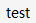
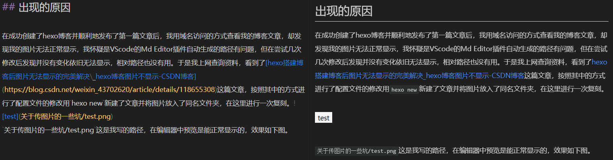
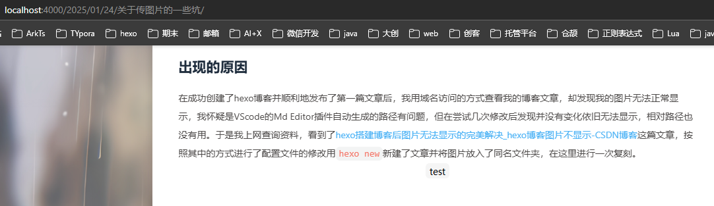
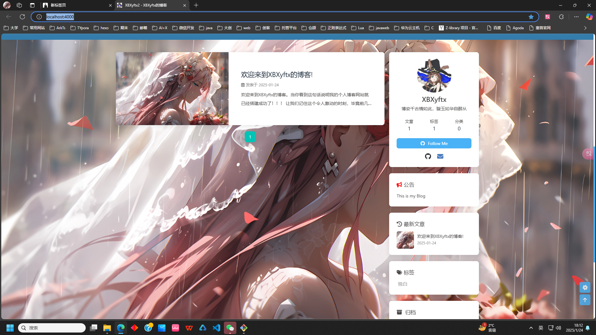
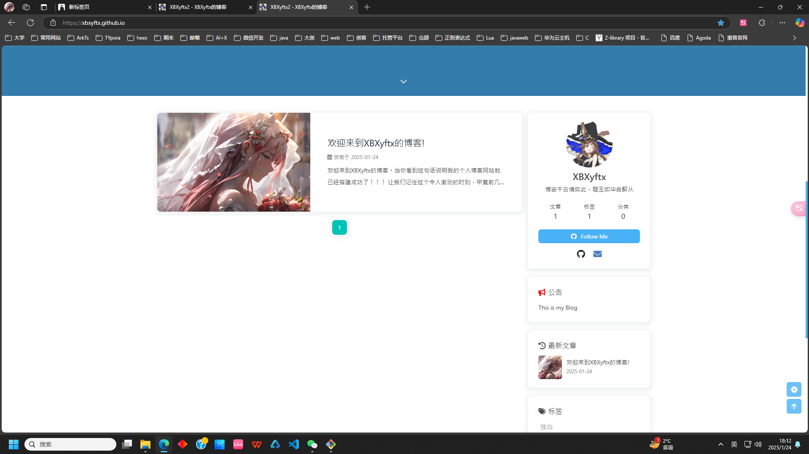
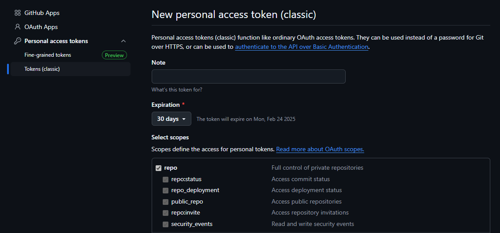
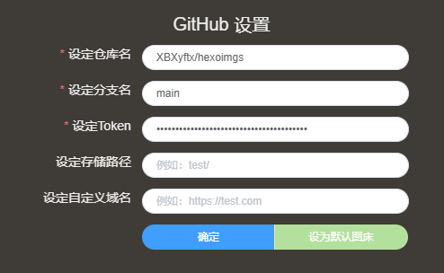
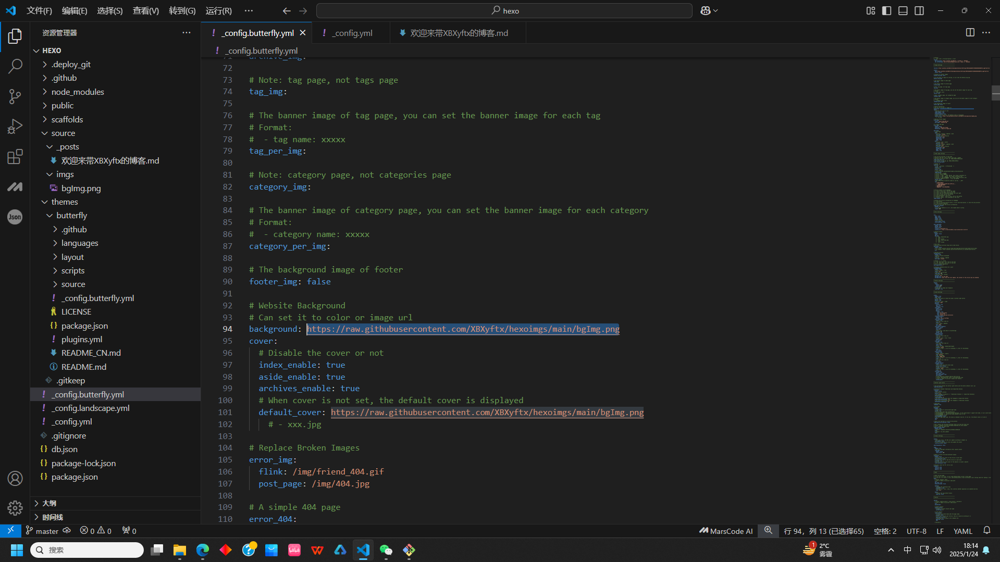

## 文章中的图片显示问题

在成功创建了hexo博客并顺利地发布了第一篇文章后，我用域名访问的方式查看我的博客文章，却发现我的图片无法正常显示，我怀疑是VScode的Md Editor插件自动生成的路径有问题，但在尝试几次修改后发现并没有变化依旧无法显示，相对路径也没有用。于是我上网查询资料，看到了[hexo搭建博客后图片无法显示的完美解决\_hexo博客图片不显示-CSDN博客](https://blog.csdn.net/weixin_43702620/article/details/118655308)这篇文章，按照其中的方式进行了配置文件的修改。

```
npm install https://github.com/CodeFalling/hexo-asset-image --save
```

首先下载所需依赖，然后把\_config.yml中的post\_asset\_folder设为true

```
post_asset_folder: true
```

这样每次新建文章都会创建一个同名文件夹，直接用 `文章名/图片.xxx`的格式来获取即可

用 `hexo new`新建了文章并将图片放入了同名文件夹，在这里进行一次复刻。

`关于传图片的一些坑/test.png`这是我写的路径，在编辑器中预览是能正常显示的，效果如下图。

在用localhost预览时是正常的

本来在域名访问时是失败的，但我现在复刻不出来了，`关于传图片的一些坑/test.png`这种写法现在可以正常引用了，我怀疑可能与我后续在修正背景图显示问题时更改的一些配置有关，暂时先按下不表。

而随后我采用了在GitHub单独建一个仓库用来存储我需要用到的图片，在将图片上传到仓库中后直接右键图片复制其链接再黏贴至要用的地方即可，还是非常方便的。

## 博客主页的配置问题

在用网络请求的方式解决了文章内图片显示问题后，我开始了对网站整体的美化，但首先遇到的问题就是背景图片无法正常显示。由于有了解决文章内图片显示问题的经验，我直接将原本的相对路径进行修改，更换成了网络路径。

`hexo s`在本地预览时效果正常，如下图所示。



但当我hexo三连部署到GitHub上后用域名访问，背景图片却始终无法加载，如下图所示。



我起初以为是网络路径的写法不对，在几篇CSDN文章中都见到了这样一种说法，用 `url(xxxxxx)`的格式包裹路径，我尝试了用这种格式包裹绝对路径，相对路径以及网络路径后在本地和云端都无法正常显示。

随后我单独复制链接测试是否能正确指向图片，验证了链接地址无误可以正常获取到图片。这就很奇怪了，本地的测试验证了路径的格式就是直接写，不需要用其他格式来包裹，同时网络地址可以正常获取到图片。我又开始了近半个小时的社区文章潜水（习惯了……），然后看到了用图床的方式自动生成图片链接，虽然和我直接把图放在仓库好像没什么区别吧，但程序员总是要试试各种方式的。

在安装了picgo并配置了GitHub图床后发现传不上去，始终报请检查配置。这次我倒是很快的定位到了问题所在，GitHub的token权限有问题。因为一开始我用的是GitHub新出的那个token，而我搜到的教程是20年的，两个创建的页面并不一样，我本以为是年份导致的版本问题，所以直接创建了。

我回到GitHub重新创建了传统的token，参考这篇博客[一劳永逸，使用 PicGo + GitHub 搭建个人图床工具\_picgo github图床-CSDN博客](https://blog.csdn.net/2401_84009626/article/details/137537910)把repo点满，然后再配置到picgo中即可。

在picgo中的效果如下

然后就可以在picgo图库中复制图片链接了。
在将配置文件中的图片全部替换为图床链接后问题依旧没有解决，而我为了验证这张图片是否能被正常加载，我特意将文章封面图设置成与背景图一致的链接。

随后发现文章封面可以正常加载。此时基本可以断定应该是这个主题文件有bug。再次翻阅论坛文章后我找到了这样一种解法：[hexo butterfly更改为一图流后background不显示解决方法\_hexo butterfly背景图片不生效-CSDN博客](https://blog.csdn.net/kitia01/article/details/144375317)
我如获至宝，迅速进行尝试最终成功显示了背景图。效果就和如今的网站一样了。

### 最终解决方案

找到themes/butterfly/source/css/var.styl文件在第37行左右的位置添加以下代码

```
$web-bg = hexo-config('background') && unquote(hexo-config('background'))
```

添加后的局部代码为

```
$font-color = #1F2D3D
$text-line-height = 2
$web-bg = hexo-config('background') && unquote(hexo-config('background')) //加这行
$index_top_img_height = hexo-config('index_top_img_height') ? convert(hexo-config('index_top_img_height')) : 100vh
$index_site_info_top = hexo-config('index_site_info_top') ? convert(hexo-config('index_site_info_top')) : 43%
```

然后清理内存hexo三连就同时解决了主页背景图片的问题以及同名文件夹图片路径问题。

## 结语

在尝试了种种显示图片的方法后，用图床托管图片再通过网络请求获取图片的方式显然是最万能且便捷的，不管是网站什么位置的图片，都可以直接将链接黏贴到配置文件对应字段来解决。不过由于GitHub在国内的访问速度有目共睹，为了能尽可能的去提高国内裸连的加载速度，我就得减少二次网络请求的数量，所以我还是选择将博客文章内的图片都用同名文件夹的方式来打包上传。这样一来只要能打开这个网站，文章的内容就不会缺失。

不过话又说回来了，giteePages！你为什么停止服务！！！你要是还在我就可以国内外双推了！！！

图片的显示问题是可预见的，在大一下创客活动时，我上传的第一篇文章就没能正确的显示图片，当时用的是体验版的Typora还不是VScode加插件的模式。不过程序员的成长就是靠各种bug堆积起来的，现在的我并不惧怕bug，每一次熬夜改bug的经历都会迫使我学习很多新东西，认识到很多好用但未尝试过的的工具和技术，这很有趣，很令人陶醉。所以我也希望我能向此前所说的一样，把这些事情都在这个网站上留下属于我的痕迹。在这个世界上留下爪痕吧！喵呜！~


## 传视频

```
npm install hexo-butterfly-tag-plugins-plus --save
npm uninstall hexo-renderer-marked --save
npm install hexo-renderer-kramed --save
```

在站点配置文件_config.yml或者主题配置文件_config.butterfly.yml中添加

```
# tag-plugins-plus
# see https://akilar.top/posts/615e2dec/
tag_plugins:
  enable: true # 开关
  priority: 5 #过滤器优先权
  issues: false #issues标签依赖注入开关
  link:
    placeholder: /img/link.png #link_card标签默认的图标图片
  CDN:
    anima: https://npm.elemecdn.com/hexo-butterfly-tag-plugins-plus@latest/lib/assets/font-awesome-animation.min.css #动画标签anima的依赖
    jquery: https://npm.elemecdn.com/jquery@latest/dist/jquery.min.js #issues标签依赖
    issues: https://npm.elemecdn.com/hexo-butterfly-tag-plugins-plus@latest/lib/assets/issues.js #issues标签依赖
    iconfont: //at.alicdn.com/t/font_2032782_8d5kxvn09md.js #参看https://akilar.top/posts/d2ebecef/
    carousel: https://npm.elemecdn.com/hexo-butterfly-tag-plugins-plus@latest/lib/assets/carousel-touch.js
    tag_plugins_css: https://npm.elemecdn.com/hexo-butterfly-tag-plugins-plus@latest/lib/tag_plugins.css
```

由于是外挂标签所以路径不写同名文件夹，直接写文件名即可。
