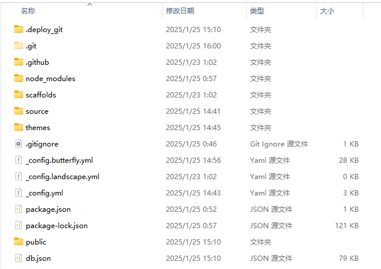

## 同步原理

hexo框架整体可以理解为一个自动帮你生成静态网页的软件，你想要什么样的网页就去配置文件里进行修改即可。而hexo在部署到GitHub时只会将其生成的符合你期望的静态网页文件上传，也就是public文件夹，并不包含你的博客md源文件以及相关配置文件，所以我们并不能直接将 `用户名.github.io`这个仓库克隆到新电脑上，我们真正需要的是hexo框架以及你的主题的配置文件，这些是关键。


网上的教程大多是利用原仓库的分支功能来存储你的框架，其实新建一个仓库专门用来存储框架也是一样的效果，而且对新手更加友善，所以我选择先建一个仓库来存储。

## 原电脑准备

把主题文件夹中的所有主题的.git文件夹删除，因为git不能嵌套上传，如果一个仓库里包含了另一个仓库则不会上传内部仓库的内容。去除.git文件后就变成了普通文件夹。

hexo框架下的各个文件夹作用以及是否需要上传至GitHub如下表所示。


| 文件夹        | 说明                                                                                             | 是否需要上传github |
| ------------- | ------------------------------------------------------------------------------------------------ | ------------------ |
| node\_modules | hexo需要的模块，就是一些基础的npm安装模块，比如一些美化插件，在执行`npm install`的时候会重新生成 | 不需要             |
| themes        | 主题文件                                                                                         | 需要               |
| public        | hexo g命令执行后生成的静态页面文件                                                               | 不需要             |
| packages.json | 记录了hexo需要的包的信息，之后换电脑了npm根据这个信息来安装hexo环境                              | 需要               |
| \_config.yml  | 全局配置文件，这个不用多说了吧                                                                   | 需要               |
| .gitignore    | hexo生成的默认的.gitignore模块                                                                   | 需要               |
| scaffolds     | 文章的模板                                                                                       | 需要               |
| .deploy\_git  | hexo g自动生成的                                                                                 | 不需要             |

随后将该仓库上传至GitHub即可

## 新电脑准备

首先安装nodejs：[Node.js — 在任何地方运行 JavaScript](https://nodejs.org/zh-cn)

安装好后在cdm执行命令安装hexo并检查版本确认安装完成。

```
npm install -g hexo-cli
hexo -v
```

之后安装butterfly主题

```
npm install hexo-renderer-pug hexo-renderer-stylus --save
```

butterfly主题源文件地址：

```
git clone -b master https://github.com/jerryc127/hexo-theme-butterfly.git themes/butterfly
```

为了減少升级主题带来的不便，我们可以把主题文件夹中的 _config.yml 重命名为 _config.butterfly.yml，复制到 Hexo 根目录下与_config.yml同级。

Hexo会自动合并主题中的_config.yml和 _config.butterfly.yml ，如果存在同名配置，会使用_config.butterfly.yml的配置，其优先度较高。所以像和博客网址相关联的固定资料可以设置在_config.yml中，比如博客的标题、作者信息和邮箱等等资料，而和主题样式相关的配置放在 _config.butterfly.yml 中，那么在将来你想换一个主题是很方便的。

然后把仓库克隆下来即可。可以用 `hexo s`来尝试跑一下，先确保本地没问题在开始写博客。

## 结语

多把文件放云端，github、wps、百度网盘等都是很好的工具。

hexo三连！

```
hexo cl && hexo g && hexo d
```
