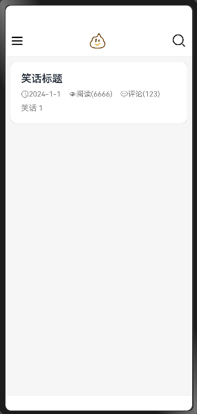
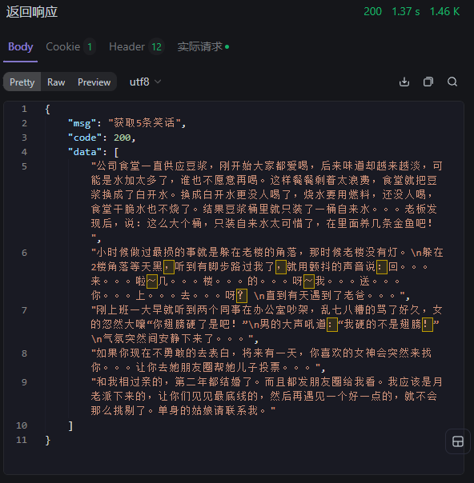
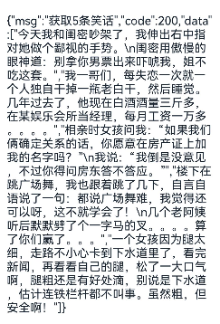
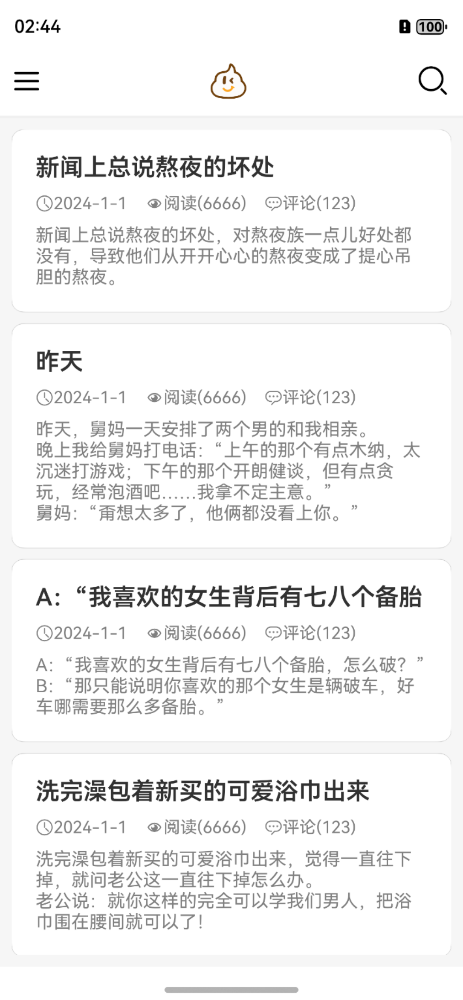
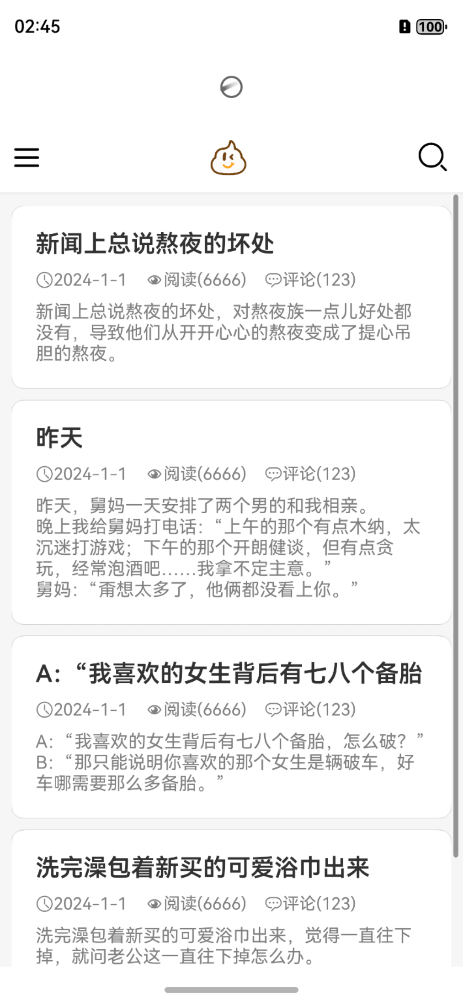
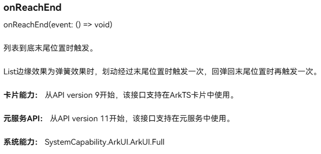
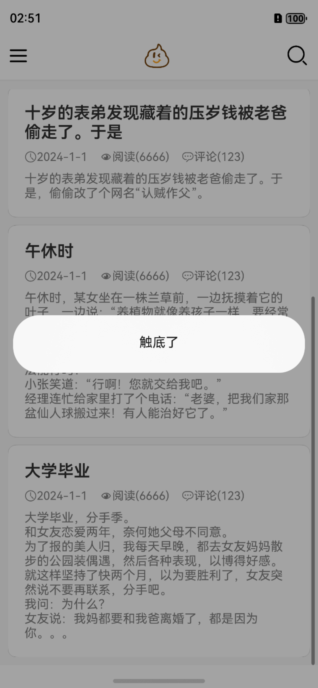
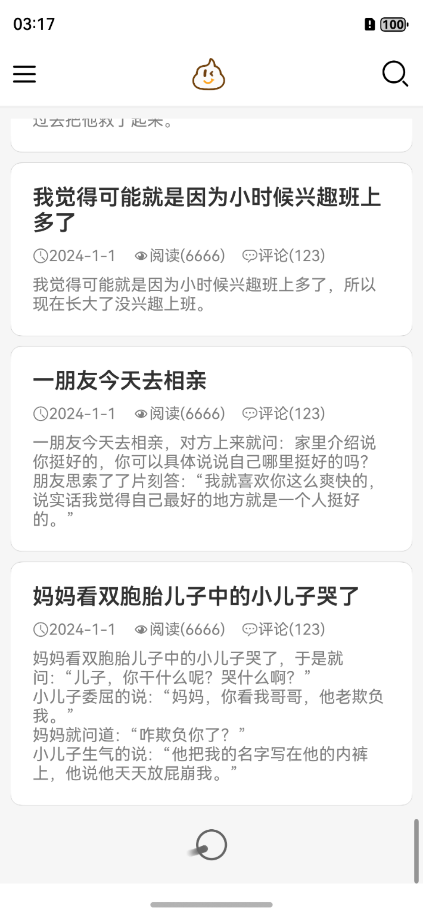

## 项目概述

### UI骨架

```TS
/**
 * 1. 默认加载
 * 2. 下拉刷新
 * 3. 触底加载更多
 * 4. 点击返回顶部
 * */
@Entry
@Component
struct Day01_07_Jokes {
  @State jokes: string [] = ['笑话 1']
  jokeNum: number = 5
  @State refreshing: boolean = false
  listScroller: Scroller = new Scroller()

  build() {
    Refresh({ refreshing: $$this.refreshing }) {
      Column() {
        // 顶部
        this.HeaderBuilder()
        // 笑话列表
        List({ space: 10, scroller: this.listScroller }) {
          ForEach(this.jokes, (joke: string) => {
            ListItem() {
              Column({ space: 10 }) {
                Text('笑话标题')
                  .fontSize(20)
                  .fontWeight(600)
                Row({ space: 15 }) {
                  titleIcon({ icon: $r('app.media.ic_public_time'), info: '2024-1-1' })
                  titleIcon({ icon: $r('app.media.ic_public_read'), info: '阅读(6666)' })
                  titleIcon({ icon: $r('app.media.ic_public_comments'), info: '评论(123)' })
                }

                Text(joke)
                  .fontSize(15)
                  .fontColor(Color.Gray)
              }
              .width('100%')
              .alignItems(HorizontalAlign.Start)
              .padding(20)

            }
            .borderRadius(10)
            .backgroundColor(Color.White)
            .shadow({ radius: 2, color: Color.Gray })
          })

        }
        .padding(10)
        .layoutWeight(1)

      }
      .width('100%')
      .height('100%')
      .backgroundColor('#f6f6f6')
    }
  }

  @Builder
  HeaderBuilder() {
    Row() {
      Image($r('app.media.ic_public_drawer_filled'))
        .width(25);

      Image($r('app.media.ic_public_joke_logo'))
        .width(30)

      Image($r('app.media.ic_public_search'))
        .width(30);
    }
    .width('100%')
    .justifyContent(FlexAlign.SpaceBetween)
    .height(60)
    .padding(10)
    .border({ width: { bottom: 2 }, color: '#f0f0f0' })
    .backgroundColor(Color.White)
  }
}

@Component
struct titleIcon {
  icon: ResourceStr = ''
  info: string = ''

  build() {
    Row() {
      Image(this.icon)
        .width(15)
        .fillColor(Color.Gray)
      Text(this.info)
        .fontSize(14)
        .fontColor(Color.Gray)
    }
  }
}
```

该UI框架的预览图如下：


### 预期目标

1. 默认获取若干条笑话，并渲染到页面上
2. 下拉刷新
3. 触底加载更多
4. 点击返回顶部

## 实现过程

### 默认获取若干条笑话

#### 确认数据格式定义接口

我们可以通过接口文档来确认数据格式定义接口，或是通过获取的数据来自行确认数据格式定义接口。两种方式都可以。

##### 通过接口文档确认数据格式定义接口

接口文档：[开心一笑接口文档](https://apifox.com/apidoc/shared-e3812a75-2d81-4388-abf4-af83a2758a9a/api-153085966)

利用Apifox提供的接口文档，我们可以确认数据格式如下：



由此定义接口

```TS
interface JokeResponse {
  msg: string
  code: number
  data: string[]
}
```

##### 通过获取的数据确认数据格式定义接口

我们可以通过获取的数据来确认数据格式定义接口。
首先获取数据：

```TS
  aboutToAppear(): void {
    this.req.request(`https://api-vue-base.itheima.net/api/joke/list?num=${this.jokeNum}`)
      .then((res)=>{
        AlertDialog.show({
          message: res.result.toString()
        })
      })
  }
```



由此定义接口

```TS
interface JokeResponse {
  msg: string
  code: number
  data: string[]
}
```

#### 页面显示自动刷新

在应用启动时，我们需要自动刷新页面，以获取5条随机笑话来进行展示。
我们可以在`aboutToAppear`生命周期中进行数据获取。

```TS
  aboutToAppear(): void {
    this.req.request(`https://api-vue-base.itheima.net/api/joke/list?num=${this.jokeNum}`)
      .then((res)=>{
        this.jokes = (JSON.parse(res.result.toString()) as JokeResponse).data
      })
  }
```

#### 笑话标题截取

由于笑话内容过长，并且每条笑话服务器返回的都只有笑话的内容，而没有笑话的标题，因此我们需要对笑话内容进行截取，以获取笑话的标题。
这里可以利用字符串内置函数split方法来进行截取。
关于内置函数的用法可以看我的这篇博客：[内置函数](https://xbxyftx.github.io/2025/01/30/%E6%95%B0%E7%BB%84/)

```TS
Text(joke.split('，')[0])
  .fontSize(20)
  .fontWeight(600)
```



### 下拉刷新

下拉刷新需要使用`Refresh`组件，`Refresh`组件需要传入`refreshing`属性，`refreshing`属性为`boolean`类型，当`refreshing`属性为`true`时，`Refresh`组件会显示刷新动画。
`Refresh`组件官方文档：[refresh组件](https://developer.huawei.com/consumer/cn/doc/harmonyos-references-V5/ts-container-refresh-V5)

```TS
@State refreshing: boolean = false
Refresh({ refreshing: $$this.refreshing })
```

利用双向绑定，我们可以在`Refresh`组件中修改`refreshing`属性，从而实现下拉刷新。

#### 刷新逻辑函数

在下拉事件发生时，我们需要定义一个刷新逻辑函数来处理获取新笑话的请求，并在`Refresh`组件中调用。
同时由于刷新动画并不会自动停止，因此我们需要在刷新逻辑函数中手动停止刷新动画。

下拉刷新时的逻辑与获取默认数据是一样的，因此我们直接将`aboutToAppear`生命周期中的代码封装为`getJokeList`函数即可。

```TS
  private getJokeList() {
    this.req.request(`https://api-vue-base.itheima.net/api/joke/list?num=${this.jokeNum}`)
      .then((res) => {
        this.jokes = (JSON.parse(res.result.toString()) as JokeResponse).data
      })
  }
```

对应的`aboutToAppear`生命周期中的代码如下：

```TS
  aboutToAppear(): void {
    this.getJokeList()
  }
```

按照以往的逻辑我们直接将刷新事件的处理函数写为如下形式：

```TS
.onRefreshing(()=>{
  this.getJokeList()
  this.refreshing = false
})
```

这样就会出现一个bug。
在下拉刷新事件触发后刷新动画指挥显示一瞬间，然后就会消失。但此时由于网络请求耗时较长导致笑话列表并没有实现刷新，而是间隔几秒后才会刷新。
这是由于网络请求获取结果的then方法属于异步方法，会在主线程执行完毕后返回结果，而停止刷新动画的代码时同步的，所以会跳过等待异步方法的返回结果，直接执行停止刷新动画的代码。
因此我们需要将停止刷新动画的代码放在异步方法的then方法中执行。

```TS
private getJokeList() {
  this.req.request(`https://api-vue-base.itheima.net/api/joke/list?num=${this.jokeNum}`)
    .then((res) => {
      this.jokes = (JSON.parse(res.result.toString()) as JokeResponse).data
      this.refreshing = false
    })
}

.onRefreshing(()=>{
  this.getJokeList()
})
```

经测试功能正常。
这种编码细节正是我们在学习编程时需要格外注意的。



### 触底加载更多

`List`组件的官方文档：[List](https://developer.huawei.com/consumer/cn/doc/harmonyos-references-V5/ts-container-list-V5)



触底加载更多需要使用`List`组件的`onReachEnd`事件，`onReachEnd`事件会在列表边缘效果为弹簧效果时，划动经过末尾位置时触发一次，回弹回末尾位置时再触发一次。

由于我对于该事件并不熟悉所以先用弹窗的方式来进行测试。

```TS
.onReachEnd(()=>{
  AlertDialog.show({
    message:'触底了'
  })
})
```



经测试我们理解了它的触发条件，本来我在疑惑它触发两次的效果是什么意思，而在测试中弹出两次弹窗的时机让我更加理解了它的触发条件。

#### 触底加载更多逻辑函数

**注意：**触底加载更多的逻辑与下拉刷新的逻辑不一样，不能直接套用，需要重新定义。
下拉刷新是重新获取新的笑话，而触底加载更多是在原有笑话的基础上获取新的笑话。

```TS
  private reachEnd() {
    this.req.request(`https://api-vue-base.itheima.net/api/joke/list?num=${this.jokeNum}`)
      .then((res) => {
        this.jokes.push(...(JSON.parse(res.result.toString()) as JokeResponse).data)
      })
  }
```

但此时会发现它由于`onReachEnd`事件的触发机制发送了两次请求，获取了十条笑话，并非设定好的五条。
虽然这个现象无伤大雅，但为了使应用的性能更好，就需要减少网络请求的次数，所以我们要进行优化。
我们虽然没有办法更改`onReachEnd`事件的触发机制，但我们可以在触底加载更多逻辑函数中进行优化。

**思路**：

1. 定义一个变量`isLoading`，用于判断是否正在加载更多数据。
2. 在触底加载更多逻辑函数中，判断`isLoading`是否为`true`，如果为`true`，则不进行加载更多数据的操作。
3. 在触底加载更多逻辑函数中，将`isLoading`设置为`true`，表示正在加载更多数据。
4. 当异步函数获取数据成功后，将`isLoading`设置为`false`，表示加载更多数据完成。

这样就可以避免多次触发触底加载更多逻辑函数。
这种方法称之为`变量控制法`。

```TS
  private reachEnd() {
    // AlertDialog.show({
    //   message:'reachEnd'
    // })
    if (!this.isLoadingMore){
      this.isLoadingMore = true
      this.req.request(`https://api-vue-base.itheima.net/api/joke/list?num=${this.jokeNum}`)
        .then((res) => {
          this.jokes.push(...(JSON.parse(res.result.toString()) as JokeResponse).data)
          this.isLoadingMore = false
        })
    }
  }
```

#### 触底加载更多动画

为了让用户知道我们正在加载更多数据，我们可以在`List`组件末尾添加一个动画，让用户知道我们正在加载更多数据。

```TS
if (this.isLoadingMore){
  ListItem(){
    LoadingProgress()
      .width(50)
  }
  .width('100%')
}
```



### 点击返回顶部

利用`listScroller`控制器来实现返回到`List`组件顶部的功能。

```TS
Image($r('app.media.ic_public_joke_logo'))
  .width(30)
  .onClick(()=>{
    // this.listScroller.scrollEdge(Edge.Top)
    this.listScroller.scrollTo({
      xOffset:0,
      yOffset:0,
      animation:true
    })
  })
```

这样虽然可以实现回到顶部，但没有动画效果，是直接闪现回去。
对于整体应用的流畅性来说，这是不够的。

## 升级至状态管理V2版本

本项目升级较为简单，只需要将`@State`改为`@Local`即可。

```TS
import { http } from '@kit.NetworkKit'

/**
 * 1. 默认加载
 * 2. 下拉刷新
 * 3. 触底加载更多
 * 4. 点击返回顶部
 * */

interface JokeResponse {
  msg: string
  code: number
  data: string[]
}

@Entry
@ComponentV2
struct Day01_07_Jokes {
  req = http.createHttp()
  @Local jokes: string [] = []
  jokeNum: number = 5
  @Local refreshing: boolean = false
  listScroller: Scroller = new Scroller()
  @Local isLoadingMore:boolean = false

  aboutToAppear(): void {
    this.getJokeList()
  }
  private getJokeList() {
    this.req.request(`https://api-vue-base.itheima.net/api/joke/list?num=${this.jokeNum}`)
      .then((res) => {
        this.jokes = (JSON.parse(res.result.toString()) as JokeResponse).data
        this.refreshing = false
      })
  }
  private reachEnd() {
    // AlertDialog.show({
    //   message:'reachEnd'
    // })
    if (!this.isLoadingMore){
      this.isLoadingMore = true
      this.req.request(`https://api-vue-base.itheima.net/api/joke/list?num=${this.jokeNum}`)
        .then((res) => {
          this.jokes.push(...(JSON.parse(res.result.toString()) as JokeResponse).data)
          this.isLoadingMore = false
        })
    }
  }

  build() {
    Refresh({ refreshing: $$this.refreshing }) {
      Column() {
        // 顶部
        this.HeaderBuilder()
        // 笑话列表
        List({ space: 10, scroller: this.listScroller }) {
          ForEach(this.jokes, (joke: string) => {
            ListItem() {
              Column({ space: 10 }) {
                Text(joke.split('，')[0])
                  .fontSize(20)
                  .fontWeight(600)
                Row({ space: 15 }) {
                  titleIcon({ icon: $r('app.media.ic_public_time'), info: '2024-1-1' })
                  titleIcon({ icon: $r('app.media.ic_public_read'), info: '阅读(6666)' })
                  titleIcon({ icon: $r('app.media.ic_public_comments'), info: '评论(123)' })
                }

                Text(joke)
                  .fontSize(15)
                  .fontColor(Color.Gray)
              }
              .width('100%')
              .alignItems(HorizontalAlign.Start)
              .padding(20)

            }
            .borderRadius(10)
            .backgroundColor(Color.White)
            .shadow({ radius: 2, color: Color.Gray })
          })

          if (this.isLoadingMore){
            ListItem(){
              LoadingProgress()
                .width(50)
            }
            .width('100%')
          }


        }
        .padding(10)
        .layoutWeight(1)
        .onReachEnd(() => {
          this.reachEnd()
        })

      }
      .width('100%')
      .height('100%')
      .backgroundColor('#f6f6f6')
    }
    .onRefreshing(() => {
      this.getJokeList()
    })
  }


  @Builder
  HeaderBuilder() {
    Row() {
      Image($r('app.media.ic_public_drawer_filled'))
        .width(25);

      Image($r('app.media.ic_public_joke_logo'))
        .width(30)
        .onClick(()=>{
          // this.listScroller.scrollEdge(Edge.Top)
          this.listScroller.scrollTo({
            xOffset:0,
            yOffset:0,
            animation:true
          })
        })

      Image($r('app.media.ic_public_search'))
        .width(30);
    }
    .width('100%')
    .justifyContent(FlexAlign.SpaceBetween)
    .height(60)
    .padding(10)
    .border({ width: { bottom: 2 }, color: '#f0f0f0' })
    .backgroundColor(Color.White)
  }
}

@Component
struct titleIcon {
  icon: ResourceStr = ''
  info: string = ''

  build() {
    Row() {
      Image(this.icon)
        .width(15)
        .fillColor(Color.Gray)
      Text(this.info)
        .fontSize(14)
        .fontColor(Color.Gray)
    }
  }
}
```
